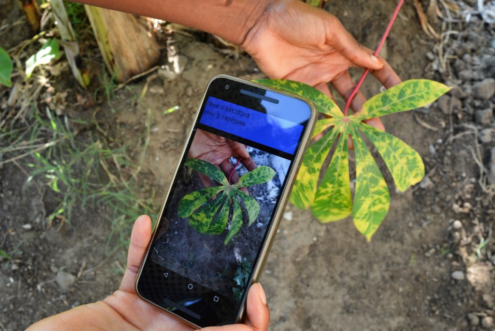

# 面向善的人工智能 {#sec-ai-good}

::: {layout-narrow}

::: {.column-margin}

_DALL·E 3 提示词：地球被闪闪发光的神经网络环绕，来自不同背景的人类和 AI 机器人共同参与各种项目，如种植树木、清理海洋以及开发可持续能源解决方案。积极而充满希望的氛围代表着为创造更美好的未来而团结一致的努力。_

:::

\noindent
:::

## 目的 {.unnumbered}

_为什么资源受限部署代表了机器学习系统工程知识的终极综合？_

本教材涵盖的每一种技术、原则和优化策略，在资源受限环境中都会面临最严苛的应用考验。你已经掌握的部署范式、训练方法、优化技术和鲁棒性原则，并不只是学术练习，而是为工程化构建机器学习系统做准备——这些系统需要在计算资源消失、基础设施失效、且每一个设计决策都伴随人类后果的环境中运行。社会影响型部署之所以需要综合运用所有这些知识，是因为它们处于极端技术约束与关键人类需求的交汇点。农村诊所中的医疗诊断系统不能承受低效架构。面向小农户的农业监测系统不能假定连接稳定可靠。灾难响应平台不能容忍系统故障。这些部署会揭示你是否真正理解机器学习系统工程：不仅是在资源充裕时如何应用技术，更是在一切都稀缺时如何进行适配、组合与优化。本章将表明，机器学习系统工程的终极目标并不是在受控环境中取得最先进的性能，而是在最具挑战性的条件下构建能够提供可靠影响的系统。

::: {.callout-tip title="学习目标"}

- 识别全球社会挑战，其中人工智能系统能够在应对资源约束和基础设施限制的同时产生可衡量的影响

- 分析资源悖论及其对在服务不足环境中部署机器学习系统的定量影响

- 使用定量优化技术计算资源受限机器学习部署的功耗预算和优化权衡

- 比较并对照四种设计模式（层次化处理、渐进增强、分布式知识、自适应资源）在社会影响型应用中的适用性

- 根据具体的资源可用性、连接性约束和社区需求，选择合适的设计模式和部署范式

- 评估现实世界案例研究，以检验不同架构方法在农业、医疗保健和环境监测中的有效性

- 设计能够在严格资源约束下运行、同时保持前文所述可信性原则的机器学习系统架构

- 批判人工智能公益应用中的常见谬误和陷阱，避免以技术优先的方式和对基础设施的错误假设
:::

## 极端约束下的可信 AI {#sec-ai-good-trustworthy-ai-extreme-constraints-2fed}

V 部分前几章已经建立了可信机器学习系统的理论与实践基础，涵盖了负责任的开发方法论（@sec-responsible-ai）、安全与隐私框架（@sec-security-privacy）以及韧性工程原则（@sec-robust-ai）。本章作为全书的收官章节，考察这些可信范式在机器学习最具挑战性的部署领域中的应用：即面向在严苛资源约束下应对重大社会与环境挑战的系统。

“AI for Good”代表了机器学习系统中的一种独特工程学科，其特征是极端技术约束与严格可靠性要求的交汇。为资源受限的医疗环境设计诊断系统，或为网络不连通的农村社区构建农业监测平台，都需要系统地应用本教材中确立的每一项原则。这类部署要求将@sec-ml-systems 架构适配到不可靠的基础设施中，将@sec-ai-training 方法论应用于有限数据场景，并将@sec-efficient-ai 技术作为核心要求而非可选优化。来自@sec-robust-ai 的韧性原则变得至关重要，以确保系统在不可预测的环境中保持运行连续性。

这些应用的社会技术背景带来了独特的工程挑战，使 “AI for Good” 有别于传统机器学习部署。那些足以难倒任何商业系统的技术约束——例如被限制在个位数瓦特的运行功耗预算、仅有千字节级别的内存占用，以及可能持续数天中断的网络连接——必须与超出传统应用要求的可靠性需求相协调。在这些场景中，系统故障的后果不仅仅是用户体验下降，还可能危及医疗诊断、应急响应协调或弱势群体粮食安全评估等关键功能。

本章系统考察机器学习系统如何在全球资源受限环境中普及专家级分析能力。我们提出用于识别和分析全球性挑战的概念框架，在这些挑战中，机器学习干预能够产生可衡量的影响，涵盖欠发达地区的医疗可及性、小农系统的农业生产力提升，以及面向保护行动的环境监测。本章建立了在维持第 V 部分所开发可信标准的同时，解决极端资源限制的设计方法论。通过对农业、医疗、灾害响应和环境保护等领域真实部署案例的详细分析，我们展示了机器学习系统知识在服务于人类最紧迫挑战方面的实践综合。

::: {.callout-definition title="AI for Good"}

***AI for Good*** 是将机器学习系统应用于解决 _社会_ 和 _环境挑战_，强调 _公平可及性_、_可衡量影响_ 和 _可持续部署_，以服务于人类福祉。
:::

## 社会挑战与人工智能机遇 {#sec-ai-good-societal-challenges-ai-opportunities-15d1}

历史提供了令人警醒的案例，说明及时干预和协调响应本可以极大改变结果。例如，2014—2016 年西非埃博拉疫情[^fn-ebola-outbreak] 凸显了延迟检测和响应系统的灾难性后果[@who2016ebola]。同样，尽管 2011 年索马里饥荒在数月前就已被预测到，但由于缺乏有效动员和高效分配资源的机制，仍造成了巨大苦难[@reliefweb2012somalia]。2010 年海地地震之后，缺乏快速且可靠的灾情评估，严重妨碍了将援助送到最需要的地方的努力[@usgs2010haiti]。

[^fn-ebola-outbreak]: **2014-2016 年埃博拉疫情**：这次疫情在六个国家共造成 11,325 人死亡，报告病例达 28,616 例。国际响应的延迟（世界卫生组织直到 5 个月后才宣布公共卫生紧急事件）表明，若能及早利用人工智能驱动的疾病监测，本可挽救成千上万人的生命。其经济成本超过 530 亿美元，凸显了对快速检测系统的需求，而这正是如今移动健康技术所能提供的。

这些历史教训揭示的模式，如今仍在多个不同领域持续存在，尤其是在资源受限的环境中。在医疗保健领域，偏远和服务不足的社区由于无法及时获得医学专业知识而经历本可预防的健康危机。缺乏诊断工具和专科医生意味着，本可治疗的疾病会升级为危及生命的状况。农业在这一关乎全球粮食安全的关键领域也面临着类似困境。小农户[^fn-smallholder-farmers] 生产了世界上很大一部分粮食，却只能在信息有限的情况下做出关键决策。

[^fn-smallholder-farmers]: **小农户的全球影响**：这些农户经营的地块面积通常小于 2 公顷，但却生产了全球 30%—34% 的粮食供应，直接养活了 20 亿人。在撒哈拉以南非洲，他们占农场总数的 80%，却只获得 2% 的农业信贷。气候变化威胁着他们每年 2.6 万亿美元的产值，这使得由人工智能驱动的农业支持系统对全球粮食安全和减贫工作变得尤为重要。日益反常的天气模式、虫害暴发和土壤退化进一步加剧了他们的困难，导致脆弱地区产量下降、粮食不安全加重。这些挑战表明，系统性壁垒和资源约束如何持续固化不平等。

类似的系统性壁垒也体现在教育领域，在服务不足的地区，不平等会进一步放大挑战。许多学校缺乏足够的教师、充足的资源以及面向学生的个性化支持。这扩大了优势学习者与弱势学习者之间的差距，并对社会和经济发展产生长期影响。如果无法获得优质教育，整个社区都会处于不利地位，从而延续贫困和不平等的循环。这些教育不平等与更广泛的挑战相互关联，因为教育方面的差距会加剧医疗保健和农业中的问题。

环境退化为全球问题增添了另一个关键维度。森林砍伐、污染和生物多样性丧失威胁着生计，并破坏维持人类生存所必需的生态平衡。大片森林、海洋和野生动物栖息地仍未受到监测和保护，尤其是在资源有限的地区。这使生态系统更易受到偷猎、非法砍伐和污染等非法活动的侵害，加剧了本已在应对经济和社会不平等的社区所承受的压力。

这些问题具有若干共同特征。它们对脆弱群体的影响尤为严重，从而加剧了既有的不平等。受影响地区的资源约束为解决方案的实施设置了障碍。应对这些挑战需要在高度不确定的条件下，权衡相互竞争的优先事项与有限资源之间的取舍。

尽管挑战复杂，技术仍为解决这些问题提供了变革性的潜力。通过提供创新工具来增强决策、提高效率并大规模交付解决方案，技术为克服历史上的进步障碍带来了希望。机器学习系统尤为突出，因为它们能够处理海量信息、发现模式，并生成可为资源受限环境中的行动提供依据的洞见。要真正实现这一潜力，需要有意识地设计方法，确保这些工具能够有效且公平地服务于所有社区。

该领域常见的一个误区是“先技术、后需求”的做法，即工程师在不了解社区需求的情况下构建解决方案。这会导致技术上很出色、但无人使用的系统，因为它们未能解决真实优先事项，或无法在当地约束条件下有效运行。成功的部署往往源自深入的需求评估和协同设计过程，这些过程优先解决社区识别出的问题，而非技术能力本身。

机器学习通过一项关键能力来应对这些挑战：在不需要专家亲临现场的情况下，为资源受限环境带来专家级分析。肯尼亚农村的一位小农户可以在无需接触农业推广官员的情况下获得作物病害诊断。印度偏远地区的一名社区卫生工作者可以在没有儿科医生的情况下对肺炎病例进行分诊。亚马孙地区的一名护林员可以在没有 24/7 人工监控的情况下检测偷猎活动。这种专业知识的民主化依赖于来自@sec-ml-systems 的部署范式，但应用时所面对的约束与商业场景不同：间歇性连接取代可靠网络，太阳能供电取代电网基础设施，稀疏标注数据取代充足的训练集。

## 现实世界部署范式 {#sec-ai-good-realworld-deployment-paradigms-b682}

来自@sec-ml-systems（云端 ML、移动 ML、边缘 ML 和 TinyML）的 ML 部署范式，通过适应资源受限环境，为应对紧迫的社会挑战解锁了这些变革性解决方案。通过适应多样化约束并利用各自独特优势，这些技术正在推动农业、医疗保健、灾害响应和环境保护领域的创新。本节将探讨这些范式如何通过现实世界应用将社会公益落到实处。

### 农业 {#sec-ai-good-agriculture-419e}

农业正面临前所未有的挑战，包括气候波动、病虫害抗性，以及在资源有限的情况下养活不断增长的全球人口的需求[@kamilaris2018deep]。如今，机器学习系统为农民提供了过去只有农业专家才具备的诊断能力，改变了作物监测、病害检测以及在不同农业环境中资源分配的方式。

{#fig-plantvillage}

这一转变在撒哈拉以南非洲尤为明显，那里的木薯农民长期与会破坏作物和生计的疾病作斗争。如今，借助 Mobile ML 的智能手机应用能够直接在资源受限的设备上实现实时作物病害检测，如@fig-plantvillage 所示。PlantVillage Nuru 系统通过渐进增强设计模式体现了这一方法，它在从基础离线诊断到云增强分析之间都能保持功能完整。本案例研究在@sec-ai-good-plantvillage-nuru-7c8c 中进行了详细探讨，展示了 2-5 MB 的量化模型如何在功耗低于 100 mW 的情况下实现 85-90% 的诊断准确率[@ramcharan2017deep][^fn-cassava-impact]。

[^fn-cassava-impact]: **木薯病害影响**：木薯全球养活了 8 亿人，是非洲一项重要的粮食安全作物。木薯花叶病（CMD）和木薯褐条病（CBSD）会摧毁整片收成，影响数百万小农户。PlantVillage Nuru 应用已被肯尼亚、坦桑尼亚和乌干达的 50 多万农民使用，表明 Mobile ML 如何在没有互联网连接的情况下，将农业专业知识扩展到服务不足的社区。

类似的创新也出现在东南亚，那里稻农正面临越来越不可预测的天气模式。在印度尼西亚，Tiny ML 传感器正通过监测稻田中的微气候[^fn-microclimate-monitoring] 来提升其适应能力。这些低功耗设备在本地处理数据以优化用水，在基础设施匮乏的地区实现精准灌溉[@tirtalistyani2022indonesia]。

[^fn-microclimate-monitoring]: **微气候监测**：与监测 50-100 公里区域条件的气象站不同，微气候传感器能够检测对水稻种植至关重要的 10 米范围内的变化。这些传感器可跟踪 2-3°C 的温差、10-15% 的湿度变化以及会影响 30% 产量的土壤湿度变化。TinyML 使得在成本低于$5-10, versus traditional agricultural weather stations requiring $15,000+ 投资的传感器上进行实时处理成为可能。

微软的 [FarmBeats](https://www.microsoft.com/en-us/research/project/farmbeats-iot-agriculture/)[^fn-farmbeats] 将物联网传感器、无人机和 Cloud ML 集成在一起，为农民提供可操作的洞见。通过利用天气预报、土壤状况和作物健康数据，该平台帮助农民优化水和肥料等投入，减少浪费并提高产量。这些创新展示了 AI 技术如何实现精准农业，应对粮食安全、可持续性和气候韧性问题。

[^fn-farmbeats]: **微软 FarmBeats**：FarmBeats 于 2017 年作为研究项目推出，在 2020 年整合进 Azure FarmBeats 之前，已在数百个农场进行了试点部署。在其部署过程中，该平台帮助农民将用水量减少了 30%，并将作物产量提高了 15-20%。该平台处理来自 50 多种传感器类型的数据，并且能够在可见症状出现前 2-3 周预测作物健康问题，展示了 Cloud ML 如何将农业专业知识扩展到服务不足的农业社区。

### 医疗保健 {#sec-ai-good-healthcare-1565}

医疗保健领域同样为通过机器学习实现变革提供了机会。对于服务不足社区中的数百万人而言，获得医疗服务往往意味着漫长等待以及前往遥远诊所的奔波。Tiny ML 使得在患者身边进行诊断成为可能。例如，Respira x Colabs 开发的一款低成本可穿戴设备使用嵌入式机器学习分析咳嗽模式并检测肺炎[^fn-cough-detection]。该设备面向偏远地区设计，不依赖互联网连接，并由简单的微控制器供电，使救命诊断服务能够惠及最需要它的人。

[^fn-cough-detection]: **咳嗽分析技术**：肺炎每年夺走超过 80 万名 5 岁以下儿童的生命，其中大多数死亡发生在无法获得胸部 X 光检查的资源匮乏环境中。使用 TinyML 进行咳嗽分析，通过分析咳嗽时长、频率和频谱特征等声学特征，在肺炎检测中可实现 90% 以上的准确率。整个模型运行在成本低于 10 美元的微控制器上，实现了诊断能力的普及化。

Tiny ML 还可应对蚊子传播的全球健康问题等，例如媒介传播疾病。研究人员已经开发出低成本设备，利用机器学习通过翅振频率识别蚊子种类[^fn-mosquito-detection][@altayeb2022classifying]。这项技术可实时监测携带疟疾的蚊子，并为高风险地区的疟疾防控提供可扩展的解决方案。

[^fn-mosquito-detection]: **蚊种检测**：疟疾每年影响 2.47 亿人，造成 61.9 万人死亡（WHO 2023 数据），主要发生在撒哈拉以南非洲。由 TinyML 驱动的蚊子检测设备仅通过声学特征即可实现 95% 的物种识别准确率，成本低于$50 versus traditional morphological identification requiring $5,000+ 的显微设备。这些设备可 24/7 监测，并区分按蚊（疟疾媒介）与库蚊（仅造成骚扰），从而实现有针对性的干预策略。

Cloud ML 以规模化方式推动医疗研究和诊断进步。像 [Google Genomics](https://health.google/health-research/genomics/)[^fn-genomics-cloud] 这样的平台分析海量数据集以识别疾病标记，加速个性化医疗领域的突破。这些例子表明，从便携式 Tiny ML 到强大的 Cloud ML，AI 技术正在普及医疗服务，并改善全球范围内的健康结果。

[^fn-genomics-cloud]: **云端基因组学规模**：Google Cloud 每年为所有客户处理超过 50 PB 的基因组数据，相当于分析 1,500 万个人类基因组。单个基因组包含 30 亿个碱基对，需要 100GB 存储，因此云计算对于人口规模分析至关重要。与传统方法相比，Cloud ML 可在数小时内识别疾病变异，而传统方法需要数月，从而加速通常耗时 10-15 年、每种新药成本超过 10 亿美元的药物发现过程。

### 灾害响应 {#sec-ai-good-disaster-response-0386}



灾害响应要求在极端不确定性下快速决策，往往还要面对受损基础设施和有限通信渠道。机器学习系统通过自主运行、本地处理能力以及在中心化系统失效时仍能继续工作的预测建模来应对这些约束。

这种能力在灾区尤为重要，因为 AI 技术能够加快响应行动并提升安全性。配备 Tiny ML 算法的微型自主无人机正在进入坍塌建筑内部，绕开障碍寻找生命迹象。通过在本地分析热成像[^fn-thermal-imaging-rescue] 和声学信号，这些无人机无需依赖云连接即可识别幸存者和危险[@duisterhof2021sniffy]。这些无人机能够自主寻找光源（这通常意味着幸存者）并检测危险气体泄漏，使搜索与救援行动对人类救援人员而言更快也更安全。

[^fn-thermal-imaging-rescue]: **灾害响应中的热成像**：人体温度（37°C）与碎石温度（通常 15-25°C）形成鲜明对比，使得可穿透 30 厘米瓦砾进行检测成为可能。无人机上的 TinyML 热成像分析可用仅 500mW 的功率处理 320×240 像素、9Hz 的热图像，并可在小型电池上运行 20 分钟以上。这种自主能力在 2023 年土耳其地震中证明至关重要，当时 72 小时的生存窗口使得快速定位受困者对 5 万多名被困人员来说至关重要。



除了这些地面层面的行动之外，像 Google 的 [AI for Disaster Response](https://crisisresponse.google/)[^fn-satellite-disaster] 这样的平台也在利用 Cloud ML 处理卫星图像并预测洪水区域。这些系统提供实时洞见，帮助各国政府更有效地分配资源，并在紧急情况下挽救生命。

[^fn-satellite-disaster]: **卫星灾害监测**：现代灾害监测每天处理来自 Landsat-8、Sentinel-2 和商业提供商等来源的 10+ TB 卫星图像。AI 可以在 2-3 小时内检测覆盖 10 万平方公里以上区域的洪水，而人工分析则需要 2-3 天。在 2022 年影响 3,300 万人的巴基斯坦洪灾中，卫星 AI 在地面确认前 48 小时就识别出了受灾区域，使得能够提前疏散和部署资源，挽救了数千人的生命。

在这一多尺度方法的最后，Mobile ML 应用也通过直接向智能手机提供实时灾害预警发挥着关键作用。针对用户位置定制的海啸警报和野火更新可实现更快撤离和更充分准备。无论是借助 Cloud ML 在全球范围内扩展，还是通过 Edge 和 Mobile ML 提供本地化洞见，这些技术都在重新定义灾害响应能力。

### 环境保护 {#sec-ai-good-environmental-conservation-cfd6}

环境保护是机器学习系统作出重要贡献的另一个领域。保护工作者在监测和保护广阔且常常偏远的景观中的生物多样性方面面临巨大挑战。AI 技术通过结合本地自主性与全球协同，为这些问题提供了可扩展的解决方案。

在单个动物层面，边缘 ML 驱动的项圈正被用于低干扰地跟踪动物行为，例如大象的移动和叫声，帮助研究人员理解迁徙模式和社会行为。通过在项圈本地处理数据，这些设备将功耗降至最低，并减少频繁更换电池的需要。进一步扩展这种监测能力后，Tiny ML 系统正通过检测枪声[^fn-gunshot-detection] 或人类活动等威胁，并实时向护林员传递警报，从而支持反盗猎行动[@bamoumen2022tinyml]。

[^fn-gunshot-detection]: **声学枪声检测**：TinyML 可以通过分析特定声学特征，以 95% 以上的准确率区分枪声与其他大声响（雷声、车辆回火）。这些特征包括 500-4000Hz 的频率范围、1-5ms 的持续时间以及陡峭的起始特征。覆盖 5-10 平方公里的太阳能传感器安装成本低于$200-300 versus traditional systems requiring $50,000+。在肯尼亚的保护区中，这些系统将针对大象偷猎的响应时间从 3-4 小时缩短到 10-15 分钟，显著提升了护林员安全性和野生动物保护效果。

除了陆地保护之外，Cloud ML 还被用于全球范围内监测非法捕捞活动。像 [Global Fishing Watch](https://globalfishingwatch.org/)[^fn-global-fishing] 这样的平台分析卫星数据以检测异常，帮助各国政府执行法规并保护海洋生态系统。

[^fn-global-fishing]: **Global Fishing Watch 的影响**：自 2016 年以来，该平台已在全球范围内跟踪了 70,000 多艘船只，每天处理 2,200 万以上的 AIS（自动识别系统）数据点。该系统已帮助识别价值 15 亿美元的非法捕捞活动，并支持了执法行动，追回了 180 多艘被扣押船只。通过提高捕鱼活动透明度，该平台使受监测地区的非法捕捞减少了 20%。

这些应用表明，AI 技术如何实现实时监测和决策，推动保护工作向前发展。

### 跨领域集成挑战 {#sec-ai-good-crossdomain-integration-challenges-cef8}

上面的例子展示了 AI 在应对重要社会挑战方面的变革潜力。然而，这些成功也凸显出从整体上解决此类问题的复杂性。每个例子都针对特定需求，例如优化农业资源、扩大医疗服务可及性或保护生态系统，但要以可持续方式解决这些问题，所需的不只是孤立的创新。



要最大化影响并确保公平进展，需要跨多个领域的集体努力。大规模挑战要求跨行业、跨地域和跨利益相关方协作。通过促进地方倡议、研究机构和全球组织之间的协调，我们可以将 AI 的变革潜力与有效扩展解决方案所需的基础设施和政策对齐。如果缺乏这种对齐，即便是前景看好的创新也可能各自为政，限制其覆盖范围和可持续性。

上述应用展示了 AI 的多功能性，但也暴露出协调方面的挑战。当资源有限时，我们如何确定投资优先级？我们如何确保创新针对的是最紧迫的需求，而不是技术上最有趣的问题？我们如何在不同场景中衡量成功，并对受益社区保持问责？回答这些问题需要超越单一应用的系统性框架，提供共同的评估标准、优先级层级和协调机制。

## 可持续发展目标框架 {#sec-ai-good-sustainable-development-goals-framework-5111}

这些问题的规模和复杂性需要一种系统的方法，以确保各项工作具有针对性、协调性和可持续性。诸如联合国可持续发展目标（SDGs）等全球框架以及世界卫生组织（WHO）等机构的指导发挥着关键作用。这些框架为应对世界上最紧迫的挑战提供了结构化的视角。它们提供了一份路线图，用于协调各方努力、确定优先事项并促进国际合作，从而创造具有影响力且持久的变革[@un_desa_2018]。@fig-sdg 中显示的可持续发展目标代表了 2015 年通过的全球议程[^fn-sdg-adoption]。这 17 个相互关联的目标构成了到 2030 年应对世界上最紧迫挑战的蓝图[^fn-sdg-ai-potential]。这些目标范围广泛，从消除贫困和饥饿到确保优质教育，从促进性别平等到采取气候行动[^fn-climate-action-ai]。

[^fn-sdg-adoption]: **可持续发展目标的全球影响**：可持续发展目标由所有 193 个联合国会员国通过，代表了历史上最宏大的全球议程，涵盖了 169 个具体目标，每年存在 5-7 万亿美元的资金缺口。这些目标建立在千年发展目标（2000-2015 年）成功的基础之上，后者帮助 10 亿人摆脱了极端贫困。与前身不同，可持续发展目标普遍适用于所有国家，承认可持续发展需要全球合作。

[^fn-sdg-ai-potential]: **人工智能对可持续发展目标的影响潜力**：麦肯锡估计，人工智能可以加速实现 169 个可持续发展目标中的 134 个，到 2030 年可能为全球经济产出贡献 13 万亿美元。然而，97% 的人工智能研究集中在目标 9（工业、创新和基础设施），而只有 1% 涉及水、食物和健康等基本需求。这种分配不均意味着造福社会的人工智能系统需要刻意设计，以解决人类最迫切的需求，而非仅关注商业应用。

[^fn-climate-action-ai]: **人工智能助力气候行动**：仅气象灾害一项，气候变化每年在全球造成超过 230 亿美元的经济损失，气温比工业化前水平升高了 1.1°C。助力气候行动的人工智能系统包括：追踪全球 500 亿吨排放量的碳监测卫星、减少 15-20% 能源浪费的智能电网优化，以及利用百亿亿级计算预测未来几十年区域影响的气候建模。然而，训练大型人工智能模型可能会排放 62.6 万磅二氧化碳——相当于 5 辆汽车终身的排放量——这凸显了对高能效人工智能开发的需求。

{#fig-sdg}

在此框架的基础上，机器学习系统可以通过其变革能力同时为多个可持续发展目标做出贡献[@taylor2022sustainable]：

* **目标 1（无贫穷）和目标 10（减少不平等）**：通过移动银行和微型贷款风险评估提高金融包容性的机器学习系统。

* **目标 2、12 和 15（零饥饿、负责任消费和生产、陆地生物）**：优化资源分配、减少食品供应链浪费以及监测生物多样性的系统。

* **目标 3 和 5（良好健康与福祉以及性别平等）**：改善孕产妇健康结果以及服务欠缺社区医疗保健获取能力的机器学习应用。

* **目标 13 和 11（气候行动和可持续城市和社区）**：用于气候韧性和城市规划的预测系统，帮助社区适应环境变化。

尽管潜力巨大，但部署这些系统也面临着独特的挑战。许多最能从机器学习应用中获益的地区缺乏可靠的电力（目标 7：经济适用的清洁能源）或互联网基础设施（目标 9：工业、创新和基础设施）。这一现实要求我们重新思考如何设计具有社会影响力的机器学习系统。

认识到这些挑战，通过机器学习推进可持续发展目标需要一种超越技术解决方案的全方位方法。系统必须在当地资源约束下运行，同时尊重文化背景和现有的基础设施限制。这一现实要求重新思考系统设计，不仅要考虑技术能力，还要考虑它们如何可持续地整合到最需要它们的社区中。

可持续发展目标为在全球范围内**解决什么**问题以及**为什么要解决**这些问题提供了必要的规范框架。然而，将这些宏伟目标转化为运行的系统需要直面具体的工程现实。对目标 3（良好健康与福祉）的承诺并不会自动产生一个能在电力供应不稳、依靠太阳能供电的诊所中运行的诊断系统。通过农业人工智能实现目标 2（零饥饿）需要能够在没有互联网连接、价值 30 美元的智能手机上运行的解决方案。这些发展目标确定了优先事项；工程约束则决定了可行性。

将这些发展目标转化为运行的系统需要具体的工程解决方案。下一节将探讨特定的技术约束，这些约束将社会影响部署与前面章节介绍的商业场景区分开来。这些约束（涵盖计算、功耗、连接性和数据可用性）重塑了系统架构，并解释了为什么需要新颖的设计模式，而不仅仅是缩小现有方案的规模。

## 资源约束与工程挑战 {#sec-ai-good-resource-constraints-engineering-challenges-a473}

在社会影响场景中部署机器学习系统，需要应对跨越计算、网络、功耗和数据多个维度的相互关联挑战。这些挑战在生产部署和规模化过程中会进一步加剧。与@sec-ml-systems 中考察的商业部署相比，这些约束不仅程度上不同，性质上也不同，因此需要在极端资源限制下仍能保持功能的架构创新。

为了为理解这些挑战奠定基础，@tbl-social_challenges 总结了开发、农村和城市环境中的资源与需求关键差异，同时也强调了规模化过程中遇到的独特约束。这一比较为理解后续章节将探讨的悖论、两难和约束提供了基础。

| **方面** | **农村部署** | **城市部署** | **规模化挑战** |
|:---|:---|:---|:---|
| **计算资源** | 微控制器（ESP32：240 MHz<br>双核，约 320 KB 可用 SRAM<br>/ 520 KB 总 SRAM） | 服务器级系统<br>（100-200 W，32-64 GB RAM） | 激进的模型量化<br>（例如，从 50 MB 到 500 KB） |
| **电力基础设施** | 太阳能和电池系统<br>（10-20 W，2000-3000 mAh 电池） | 稳定的电网供电 | 优化功耗<br>（用于部署设备） |
| **网络带宽** | LoRa、NB-IoT<br>（0.3-50 kbps，60-250 kbps） | 高带宽选项 | 协议调整<br>（LoRa、NB-IoT、Sigfox：100-600 bps） |
| **数据可用性** | 稀疏、异构的数据源<br>（来自农村诊所的 500 KB/天） | 大量标准化数据<br>（来自城市医院的 GB 级数据） | 专用流水线<br>（用于隐私敏感数据） |
| **模型占用** | 高度量化模型<br>（≤ 1 MB） | 云/边缘系统<br>（支持更大的模型） | 模型架构重设计<br>（针对尺寸、功耗和带宽限制） |

: **部署资源谱系**：社会影响应用要求对计算约束进行细致考量，范围从基于微控制器的农村部署到城市环境中的服务器级系统；这些系统在规模化时通常需要激进的模型压缩技术来满足资源限制。该表量化了这些差异，揭示了在多样化部署场景下模型复杂度、准确率与可行性之间的权衡。 {#tbl-social_challenges}

### 极端资源限制下的模型压缩 {#sec-ai-good-model-compression-extreme-resource-limits-134d}

为社会公益应用实现超低模型大小，需要系统化的优化流水线，在准确率与资源约束之间取得平衡。来自@sec-model-optimizations 的传统模型优化技术必须针对服务不足环境中的极端资源限制进行适配和强化。

为了说明这些优化要求，PlantVillage 作物病害检测系统的优化流水线展示了定量的压缩权衡。从在 100 MB、可达 91% 准确率的 ResNet-50 架构开始，系统化优化在保持实际可用性的同时将模型大小缩小了 31 倍：

- **原始 ResNet-50**：约 98 MB（FP32），在作物病害数据集上的基线准确率为 91%
- **8 位量化**：25 MB，89% 准确率（4× 压缩，2% 准确率损失）
- **结构化剪枝**：8 MB，88% 准确率（12× 压缩，3% 准确率损失）
- **知识蒸馏**：3.2 MB，87% 准确率（31× 压缩，4% 准确率损失）

这些压缩比使模型能够部署在资源受限设备上，同时保留农村农民所需的诊断能力。最终的 3.2 MB 模型在 ESP32 微控制器上推理仅需 50-80 毫秒，使得在离网农业环境中进行实时作物病害检测成为可能。

**功耗分析**

除了模型大小优化之外，在离网部署中，功耗预算约束主导着系统设计。神经网络推理每次 MAC（乘累加）操作消耗 0.1-1 毫焦耳，而一个 100 万参数的模型每次推理需要 1-10 毫焦耳。农村地区的太阳能充电通常每天提供 5-20 瓦时，需考虑季节变化和天气模式。这一能量预算在考虑 10-20% 的电能转换损耗以及典型 2 年部署周期中 30-50% 的电池退化后，仍可支持每天 20,000-200,000 次推理。

**能量预算层级**

为了有效管理这些功耗约束，边缘设备的功耗遵循基于计算复杂度和部署需求的严格层级：

- **TinyML 传感器**：平均功耗 <1mW，可支持环境监测和野生动物跟踪应用的多年电池运行
- **移动边缘设备**：50-150mW 功耗预算（相当于智能手机手电筒），适用于大多数地理位置的每日太阳能充电周期
- **区域处理节点**：10W 功耗需求，需要电网连接或专用发电机系统以保证持续运行
- **云端节点**：千瓦级功耗，需要具备可靠电网连接的数据中心基础设施

在这一层级的最极端端，超低功耗野生动物监测系统展示了最严苛的优化要求。以 <1mW 的平均功耗运行并期望达到 5 年电池寿命，这类部署需要专门的低功耗微控制器和占空比循环运行。面向十年级运行的环境传感器则将功耗需求进一步压缩到纳瓦级计算，利用温差、振动或环境电磁辐射进行能量采集。

### 资源悖论 {#sec-ai-good-resource-paradox-631f}

在@tbl-social_challenges 中详细描述的定量约束，以及上文所述的优化要求，共同揭示了“AI 向善”中的一个根本悖论：**对机器学习能力需求最大的环境，恰恰拥有最少的基础设施来支撑传统部署**。撒哈拉以南非洲农村拥有全球 60% 的可耕地，却只占全球互联网连接的 4%。服务于疾病负担最重人群的偏远医疗诊所，往往依赖小型太阳能板提供间歇性供电。生物多样性损失最严重的森林地区，则缺乏支持云连接监测系统的网络基础设施[^fn-resource-paradox]。

[^fn-resource-paradox]: **社会公益资源悖论**：这一悖论迫使工程师实现极端压缩比（模型大小减少 90%+，从 50MB 降至 500KB），同时保持诊断有效性；这一挑战在资源充足的商业部署中并不存在。@sec-ai-good-design-patterns-implementation-9083 中的设计模式通过拥抱而非对抗资源约束的架构方法，直接应对了这一悖论。

这种需求与基础设施可用性之间的反向关系，在@tbl-social_challenges 中被量化，与@sec-ml-systems 中的商业场景形成根本区别。典型的云部署可能使用功耗 100-200 W 的服务器，配备多个 CPU 核心和 32-64 GB RAM。然而，农村部署通常必须运行在功耗 5 W 的单板计算机或仅消耗毫瓦级功耗的微控制器上，RAM 以 KB 而非 GB 计。这些极端资源约束要求在模型训练和推理方面采用创新方法，包括@sec-ondevice-learning 中的技术，即必须直接在资源受限设备上对模型进行适配和优化。

网络基础设施的限制进一步加剧了这些计算约束对系统设计的影响。城市环境提供光纤（100+ Mbps）和 5G 网络（1-10 Gbps）等高带宽选项，能够支持实时多媒体应用。农村部署则必须依赖低功耗广域网技术，如 LoRa[^fn-lora-technology] 或 NB-IoT，其带宽约束为 50 kbps，约比典型宽带连接慢三个数量级。这些严重的带宽限制要求对数据传输协议和有效载荷大小进行仔细优化。

[^fn-lora-technology]: **LoRa 技术**：长距离（LoRa）使物联网设备能够在农村环境中实现 2-15 公里的通信，在视距条件下可达 45 公里，电池寿命超过 10 年。LoRa 运行在免许可频谱频段，网络成本为$1-5 per device annually versus $15-50，而蜂窝网络则更高。这使 LoRa 非常适合作物水分监测等大面积农田传感器，或偏远保护区的环境传感器。已有 140 多个国家部署了 LoRaWAN 网络，为社会公益应用连接了全球 2 亿多台设备。

除连接性挑战外，电力基础设施还带来额外约束。城市系统可以依赖稳定的电网供电，而农村部署往往依靠太阳能充电和电池系统。一个典型的太阳能供电系统在日照峰值时可产生 10-20&nbsp;W，因此需要对所有系统组件进行细致的功耗预算。电池容量的限制通常为 2000-3000 mAh，这意味着系统必须优化运行的每一个方面，从传感器采样率到模型推理频率。

### 数据稀缺与质量约束 {#sec-ai-good-data-scarcity-quality-constraints-e663}

资源悖论不仅体现在计算能力上，也延伸到数据挑战，而这些挑战与商业部署有显著差异。@sec-data-engineering 中的数据工程原则假设存在可靠的数据流水线、集中式预处理基础设施和标准化格式——而这些假设在资源受限环境中往往不成立。商业系统可以使用包含数百万样本的标准化数据集，而社会影响项目则必须在保留此前建立的数据质量、验证和治理原则的同时，利用有限且异构的数据源构建稳健系统。

医疗部署很好地说明了数据工程工作流如何在约束下进行调整。农村诊所每天产生 50-100 条患者记录（≈500 KB），其中既包含结构化生命体征，也包含需要专门预处理的非结构化手写笔记；而城市医院则产生 GB 级标准化电子病历。即使是一张 X 光片或 MRI 扫描也以 MB 甚至更大计量，这凸显了农村与城市医疗机构之间数据规模的巨大差异。@sec-data-engineering 中的数据收集、清洗和验证流水线必须在这些严苛约束下运行，同时保持数据完整性。

网络限制进一步制约了数据收集与处理。农业传感器网络在有限功耗预算下运行，每次读数可能只能传输 100-200 字节。受 LoRa 50 kbps 带宽约束影响，这些系统通常将传输频率限制为每小时一次。因此，一个由 1000 个传感器组成的网络每天仅产生 4-5 MB 数据，这要求模型必须从稀疏的时间序列数据中学习。作为对比，在 Netflix 上流式播放一分钟视频就可能消耗数 MB 数据，这凸显了工业物联网网络与日常互联网使用之间的数据量差异。

隐私考量又增加了一层复杂性，需要对@sec-security-privacy 中的框架进行适配。医疗监测和位置跟踪会生成高度敏感的数据，但该章中的威胁建模、加密和访问控制机制都假定具备社会公益部署中无法获得的计算资源。在 512&nbsp;KB RAM 的设备上实现差分隐私或联邦学习，需要轻量级替代标准密码协议。@sec-security-privacy 中假定存在的安全执行环境和硬件支持的密钥库，在微控制器级设备上通常并不存在，因此必须在总存储仅 2-4 MB 的条件下实现纯软件安全。本地处理必须在隐私保护计算（会增加 10-50% 的计算开销）与严格功耗预算之间权衡，同时离线运行又阻止了实时身份验证或吊销检查。正因数据敏感性最高，而社区的安全管理技术能力最低，隐私工程才变得更加困难。

### 从开发到生产的资源鸿沟 {#sec-ai-good-developmenttoproduction-resource-gaps-89fc}

从数据约束转向部署现实，将机器学习系统从原型扩展到生产部署会引入核心资源约束，并迫使架构重设计。开发环境提供的计算资源会掩盖许多现实限制。典型的开发平台，例如 Raspberry Pi 4[^fn-raspberry-pi-development]，凭借其 1.5 GHz 处理器和 4 GB RAM 提供了相当可观的算力。这些资源使得开发者能够快速原型设计和测试机器学习模型，而无需立即关注优化问题。

[^fn-raspberry-pi-development]: **Raspberry Pi 开发优势**：尽管价格仅为 35-75 美元，Raspberry Pi 4 提供的 RAM 是典型生产级物联网设备的 1000 倍，处理速度快 10 倍。这种巨大的资源冗余使开发者能够在优化到资源受限部署之前，使用 TensorFlow 或 PyTorch 等完整 Python 框架进行原型开发。然而，Pi 的 3-8W 功耗与生产设备 0.1W 的功耗之间形成 30-80 倍的功耗差距，这要求在过渡到真实部署时进行大量优化。

生产部署会暴露出与开发环境形成鲜明对比的资源限制。当规模扩大到数千台设备时，成本和功耗约束往往要求使用 ESP32[^fn-esp32-constraints] 这类微控制器单元——它是 Espressif Systems 广泛使用的微控制器单元，具有 240 MHz 双核处理器和 520 KB 总 SRAM，其中 320-450 KB 可用，具体取决于型号。这种计算资源的急剧减少要求系统架构随之变化。@sec-ondevice-learning 中的端侧学习技术变得至关重要：模型必须为受限执行而重新设计，量化和剪枝等优化技术必须应用起来（详见@sec-model-optimizations），推理策略必须适配为最小内存占用，同时更新机制也必须在严苛的带宽和存储限制下运行。

[^fn-esp32-constraints]: **ESP32 能力**：尽管存在限制，ESP32 仅售 2-5 美元，运行时电流消耗为 30-150mA，并集成 Wi-Fi、蓝牙和多种传感器。这使其非常适合社会影响应用中的物联网部署。作为比较，智能手机处理器的性能强 100 倍，但成本高 50 倍。ESP32 的局限性（RAM 比一张 Instagram 照片还小）迫使工程师开发出往往也能惠及所有平台的优化技术。

除了计算扩展外，网络基础设施约束也会在大规模场景中显著影响系统架构。不同部署场景需要不同的通信协议，而每种协议都有各自不同的运行参数。网络基础设施的这种异质性要求系统在不同带宽和延迟条件下保持一致的性能。随着部署跨区域扩展，系统架构必须支持在不同网络技术之间无缝切换，同时保持功能完整。

从开发到规模化部署的转变在各类应用领域中呈现出一致模式。环境监测系统很好地体现了这些规模化需求。一个典型的森林监测系统可能最初在开发平台上运行一个 50 MB 的计算机视觉模型。要将其扩展为广泛部署，就必须通过量化和架构优化把模型缩减到约 500 KB，从而使其能够在分布式传感节点上运行。这种模型占用的降低必须在严格的 1-2 W 功耗约束内，同时保留检测准确率。农业监测系统和教育平台也会经历类似的架构转型：模型必须在成千上万台资源受限设备上部署，同时保持系统效能。

### 长期可持续性与社区所有权 {#sec-ai-good-longterm-viability-community-ownership-d69a}

在资源受限环境中维护机器学习系统，会带来超越初始部署考量的独特挑战。这些挑战涉及系统寿命、环境影响、社区能力和财务可行性，它们决定了社会影响项目的长期成败。@sec-sustainable-ai 中的可持续性原则（生命周期评估、碳核算和负责任的资源消耗）在社区本已面临环境脆弱性、且缺乏电子废弃物管理或组件回收基础设施的情况下，变得更加重要。

系统寿命要求认真考虑硬件耐久性和可维护性。环境因素，如温度变化（农村部署中通常为 -20°C 到 50°C）、湿度（热带地区通常为 80-95%）以及粉尘暴露，都会显著影响组件寿命。这些条件要求选择坚固耐用的硬件并采取保护措施，同时还要平衡成本约束。例如，太阳能农业监测系统必须在太阳辐照度季节性变化的情况下保持稳定运行，通常辐照度因地理位置和天气模式不同而在 3-7 kWh/m²/day 之间波动。

环境可持续性为系统设计引入了额外复杂性。应用@sec-sustainable-ai 中的生命周期评估框架时，我们必须考虑完整的环境足迹：运送到偏远地区组件的制造影响、来自太阳能板或有限容量电池的运行功耗、维护访问的运输排放，以及常常缺乏电子废弃物回收基础设施地区的报废处置。部署 1000 个传感节点通常需要考虑约 500 kg 的电子组件，包括传感器、处理单元和电力系统。可持续设计原则必须通过谨慎的组件选择和报废规划，同时解决即时运行需求与长期环境影响。

社区能力建设是可持续性的另一个重要维度。系统必须能够由具备不同专业水平的本地技术人员维护。这一要求会影响从组件选择到系统模块化的架构决策。文档必须既全面又易于理解，通常需要以多种语言和格式提供。培训项目必须弥合知识鸿沟，同时提升本地技术能力，确保社区能够随着需求变化而独立维护和调整系统。

然而，一个常见误解是：良好的意图会自动带来 AI 部署的积极社会影响。如果技术解决方案在缺乏深入社区参与的情况下开发，往往无法解决真实需求，甚至会引入开发者未曾预料的新问题。文化误解、本地语境不足或技术约束都可能把善意转化为有害结果。有效的“AI 向善”需要持续的社区合作、细致的影响评估，以及优先考虑受益者需求而非技术能力的自适应实施方法。

这些考量将@sec-ml-operations 中的传统 MLOps 实践扩展为涵盖由社区驱动的部署与维护工作流。

::: {.callout-note title="跨学科团队的关键作用"}

“AI 向善”的成功高度依赖于与非工程师的协作。这些项目需要与领域专家（医生、农民、自然保护工作者）、社会科学家、社区组织者以及本地合作伙伴紧密合作，他们能够为运行环境、文化因素和社区需求提供关键信息。工程师的角色往往是作为促进者和问题解决者，服务于由社区定义的目标，而不仅仅是技术提供者。

跨学科团队带来至关重要的视角：领域专家理解问题空间和运行约束，社会科学家帮助处理文化语境和意外后果，社区组织者确保真正的本地参与和所有权，而本地合作伙伴则提供持续的维护和适配能力。若缺乏这些多元视角，即便技术上很先进的系统，也往往难以产生可持续影响。

:::

财务可持续性往往决定系统寿命。包括维护、备件和网络连接在内的运营成本，必须与当地经济条件相匹配。一个可持续的部署可能会把每个受益者的月运营成本目标设定为低于当地月收入的 5%。这一约束影响系统设计的方方面面，从硬件选择到维护计划，都需要对资本支出和运营支出进行细致优化。

该领域中的一个关键陷阱，是假定技术成功就能确保长期、可持续的影响。团队往往只关注达成模型准确率或系统性能等技术里程碑，却没有考虑决定长期社区收益的可持续性因素。成功的部署需要持续维护、用户培训、基础设施支持，以及对变化条件的适应，而这些都远远超出初始技术实现。那些取得了令人印象深刻的技术成果、却缺乏可持续支持机制的项目，往往无法提供持久收益。

### 系统韧性与故障恢复 {#sec-ai-good-system-resilience-failure-recovery-7e00}

社会公益部署运行在系统故障可能带来生命危险的环境中。与商业系统中停机会导致收入损失不同，医疗监测故障可能延误关键干预，农业传感器故障则可能导致影响整个社区的作物损失。许多团队低估了在这些服务不足地区部署 AI 系统时出现的重大基础设施挑战，想当然地认为互联网连接、电力供应或设备能力是理所当然可用的。然而，成功部署需要复杂的工程解决方案，包括边缘计算、稳健的离线能力、自适应带宽利用，以及能够在恶劣物理环境中有效运行的韧性硬件设计。这一现实要求采用稳健的故障恢复模式，以确保关键服务能够优雅降级并迅速恢复。

**常见故障模式与量化影响**

对 50+ 个社会公益部署的分析揭示了具有可量化停机贡献的一致故障模式：

- **硬件故障（占停机时间的 40%）**：传感器电池耗尽、太阳能板退化以及温度相关的组件故障是系统宕机的主要原因。恢复策略包括监测电池电压趋势的预测性维护算法、冗余传感器配置，以及在区域维护中心预先部署备件。

- **网络故障（占停机时间的 35%）**：间歇性连接中断以及天气事件期间的基础设施损坏会造成长时间隔离。恢复需要具备至少 72 小时容量的本地数据缓存、离线运行模式，以及针对低带宽网络优化的自动重连协议。

- **数据质量故障（占停机时间的 25%）**：传感器校准漂移和环境污染会逐渐降低系统准确性，直到需要人工干预。恢复方式包括自动重新校准程序、异常检测阈值，以及当质量指标超过容忍水平时优雅降级到更简单的模型。

**优雅降级架构**

韧性系统实现分层回退机制，在不同故障条件下保留关键功能。一个医疗监测系统展示了这种方法：

```python
class ResilientHealthcareAI:
    def diagnose(self, symptoms, connectivity_status, power_level):
        # 根据系统状态自适应选择模型
        if connectivity_status == "full" and power_level > 70:
            # 完整准确率
            return self.cloud_ai_diagnosis(symptoms)
        elif connectivity_status == "limited" and power_level > 30:
            # 90% 准确率
            return self.edge_ai_diagnosis(symptoms)
        elif power_level > 10:
            # 基础筛查
            return self.rule_based_triage(symptoms)
        else:
            return self.emergency_protocol(symptoms)  # 仅限关键情况

    def fallback_to_human_expert(self, case, urgency_level):
        # 为人工审核进行队列优先级排序
        if urgency_level == "critical":
            self.satellite_emergency_transmission(case)
        else:
            self.priority_queue.add(case, next_connectivity_window)
        return "已标记为待专家审查，待连接恢复后处理"
```

**分布式故障恢复**

多节点部署需要协调式故障恢复，以便在单个节点失效时仍维持整个系统的功能。农业监测网络展示了适配资源约束的拜占庭容错：

- **共识机制**：修改版 Raft 协议以 10 秒心跳间隔运行，既能适应网络延迟，又能在 30 秒窗口内检测故障
- **数据冗余**：跨 3-5 个节点的地理复制可确保即使个别传感器故障，作物监测仍能继续
- **协调恢复**：区域节点协调同时的软件更新和配置变更，最小化整个部署范围内的脆弱窗口

**基于社区的维护集成**

成功的社会公益系统将本地社区整合进维护工作流，减少对外部技术支持的依赖。培训项目在提供经济机会的同时，也建立本地技术能力：

- **诊断协议**：社区卫生工作者接受标准化流程培训，以识别并解决 80% 的常见故障
- **备件管理**：本地库存系统依据历史故障率保留关键组件，并维持 2 周的库存缓冲
- **升级流程**：清晰的沟通渠道将本地技术人员与远程专家连接起来，以处理需要专门知识的复杂故障

这种社区整合方式将平均修复时间从 7-14 天（外部技术人员派遣）缩短到 2-4 小时（本地响应），显著提升了偏远部署中的系统可用性。

上文所述的工程挑战和故障模式需要的不只是临时性的解决方案。为了理解为何资源受限环境需要不同的方法，而不仅仅是传统系统的缩小版，我们必须考察支配受限条件下学习的理论基础。这些数学原理建立在@sec-ai-training 的训练理论之上，揭示了样本效率、通信复杂度以及能效-准确率权衡的内在极限，并为本章后续提出的设计模式提供依据。

## 设计模式框架 {#sec-ai-good-design-pattern-framework-36a6}

@sec-ai-good-resource-constraints-engineering-challenges-a473 中详细描述的工程挑战揭示了区分社会公益部署的三项核心约束：通信瓶颈，即数据传输成本超过本地计算成本；样本稀缺，即理论需求与可用数据之间存在 100 到 1000 倍的缺口；以及能耗限制，迫使系统在精度与续航之间做出明确权衡。

与其临时性地应对这些约束，不如采用系统化的设计模式，提供有原则的架构方法。认为资源受限部署只需要云系统的“缩小版”是一个误区。正如这些设计模式所展示的那样，它们需要针对特定约束组合进行优化的不同架构，而不是削减功能。

通过对成功的社会公益部署进行分析，可以归纳出四种模式，每种模式都针对特定的约束组合：

### 模式选择维度 {#sec-ai-good-pattern-selection-dimensions-3c56}

选择合适的设计模式需要分析部署环境的三个关键维度。

首先，资源可用性范围从超受限的边缘设备（只有几千字节内存的微控制器）到资源丰富的云基础设施不等。这个范围决定了计算能力，并影响模式选择。

其次，连接可靠性从始终联网的城市部署，到间歇联网的农村站点，再到完全离线运行，差异很大。这些连接模式决定了数据同步策略和协调机制。

第三，数据分布会塑造学习方法：训练数据可能集中存放、分布在各个站点，或在运行过程中本地生成。这些特征会影响学习方法和知识共享模式。

### 模式概览 {#sec-ai-good-pattern-overview-016b}

分层处理模式将系统组织为计算层级（边缘-区域-云），并根据可用资源分配职责。该模式直接将@sec-ml-systems 中的云端机器学习、边缘机器学习和移动机器学习部署范式适配到资源受限环境中，对于层级之间连接可靠且资源差异明显的部署最为有效。

渐进增强模式实现分层功能，在资源受限时能够平滑降级。该模式基于@sec-efficient-ai 中的模型压缩技术，使用量化、剪枝和知识蒸馏来创建多个能力层级。它在资源可用性变化大、设备能力多样的环境中表现出色。

分布式知识模式支持在没有中心化基础设施的情况下进行点对点学习和协调。该模式将@sec-ai-training 中的联邦学习原则扩展到极端带宽受限和间歇连接条件下运行，因此非常适合连接有限但计算资源分布广泛的场景。

自适应资源模式根据当前资源可用性动态调整计算。该模式借鉴了@sec-ai-acceleration 中的电源管理和热优化策略，实施面向能耗感知的推理调度。对于具有可预测资源模式的部署，例如太阳能充电周期和网络可用窗口，它最为有效。

### 模式比较框架 {#sec-ai-good-pattern-comparison-framework-7924}

这四种设计模式分别应对不同的约束组合和运行环境。@tbl-design-pattern-comparison 提供了系统化比较，以指导针对特定部署场景的模式选择。

| **设计模式** | **主要目标** | **关键挑战** | **最适合...** | **示例** |
|:---|:---|:---|:---|:---|
| **分层式** | 分配计算 | 层级间延迟 | 横跨城市/乡村 | 洪水预测 |
| **渐进式** | 平滑降级 | 模型版本管理 | 连接情况变化 | PlantVillage Nuru |
| **分布式** | 去中心化协调 | 网络分区 | 点对点共享 | Wildlife Insights |
| **自适应** | 动态资源使用 | 电源/计算调度 | 可预测的能量周期 | 太阳能供电<br>传感器 |

: **设计模式比较**：每种模式都针对特定的约束组合和部署环境进行优化。只要可靠连接能够支持层级协调，分层处理就最适合。渐进增强擅长应对资源可用性变化。分布式知识能够处理网络分区和点对点协调。自适应资源管理则针对可预测的资源周期进行优化。 {#tbl-design-pattern-comparison}

这一比较框架使得我们能够基于部署约束进行系统化的模式选择，而不是临时性的架构决策。单个系统中通常会组合多种模式：例如，一个太阳能驱动的野生动物监测网络可能会对单个传感器使用自适应资源管理，对同伴协调使用分布式知识，并在连接情况变化的场景中采用渐进增强。

接下来的各节将详细介绍每种模式，并提供实现指导和真实世界案例研究。

## 设计模式实现 {#sec-ai-good-design-patterns-implementation-9083}

在上述选择框架的基础上，本节详细介绍了资源受限 ML 系统的四种设计模式。每种模式的描述都遵循一致的结构：来自真实部署的动机、架构原则、实现考虑，以及局限性。

### 分层处理 {#sec-ai-good-hierarchical-processing-4cd8}

这些模式中的第一个，即分层处理模式，将系统组织为若干层级，这些层级根据各自可用的资源和能力分担职责。类似于拥有本地分支、区域办公室和总部的企业，这种模式将工作负载划分到边缘、区域和云三个层级。每一层都发挥其计算能力：边缘设备用于数据收集和本地处理，区域节点用于聚合和中间计算，而云基础设施用于高级分析和模型训练。

如@fig-pattern-heirarchical 所示，这种模式在这些层级之间建立了清晰的交互流程。从边缘层的数据收集开始，信息经过区域聚合和处理，最终在云端进行高级分析。双向反馈循环使模型更新能够沿着层级结构向下回流，确保系统持续改进。

::: {#fig-pattern-heirarchical fig-env="figure" fig-pos="htb"}

```{.tikz}
\begin{tikzpicture}[font=\usefont{T1}{phv}{m}{n}\small]
\tikzset{%
LineA/.style={line width=1.5pt,violet!50,-latex,text=black,shorten <=1pt},
LineB/.style={OliveLine,line width=2.5pt,-{Triangle[width = 7pt, length = 6pt]},shorten <=1.5pt,shorten >=1.5pt},
LineD/.style={GreenD!50, line width = 3pt,text=black},
Box/.style={inner xsep=2pt,
    draw=BlueD,
    line width=0.75pt,
    node distance=1.6,
    fill=BlueL!70,
    align=flush center,
    text width=26mm,
    minimum width=26mm,
    minimum height=10mm
  },
  Box2/.style={Box, draw=RedLine, fill=RedL}
}

\begin{scope}
\node[Box](B1){Edge (Sensor/Device)};
\node[Box,right=of B1](B2){Regional Tier};
\node[Box,right=of B2](B3){Cloud Tier};
\node[Box,right=of B3](B4){End User};
\end{scope}
%
\begin{scope}[shift={(0,-8)}]
\node[Box2](2B1){Edge (Sensor/Device)};
\node[Box2,right=of 2B1](2B2){Regional Tier};
\node[Box2,right=of 2B2](2B3){Cloud Tier};
\node[Box2,right=of 2B3](2B4){End User};
%
\end{scope}
%
\foreach \x in {1,2,3,4} {
 \draw[LineD] (B\x) -- (2B\x);
}
%
\draw[LineB]($(B1)!0.28!(2B1)$)--
node[above,text=black,pos=0.5]{Send Preprocessed Data}
($(B2)!0.28!(2B2)$);
\draw[LineB]($(B2)!0.52!(2B2)$)--
node[above,text=black,pos=0.5]{Transmit Aggregated Data}
($(B3)!0.52!(2B3)$);
%
\draw[LineB]($(B3)!0.72!(2B3)$)--
node[above,text=black,pos=0.5]{Send Updated Model}
($(B2)!0.72!(2B2)$);
%
\draw[LineB]($(B2)!0.8!(2B2)$)--
node[above,text=black,pos=0.5]{Push optimized Model}
($(B1)!0.8!(2B1)$);
%
\draw[LineB]($(B1)!0.88!(2B1)$)--
node[above,text=black,pos=0.5]{Perform Real-Time Inference}
($(B4)!0.88!(2B4)$);
%%
\draw[LineA]($(B1)!0.12!(2B1)$)
to [out=10,in=350,distance=36]
node[right,text=black,pos=0.5,fill=white]{Collect Data}
($(B1)!0.16!(2B1)$);
\draw[LineA]($(B2)!0.35!(2B2)$)
to [out=10,in=350,distance=36]
node[right,text=black,pos=0.51,fill=white]{Aggregate Data}
($(B2)!0.39!(2B2)$);
\draw[LineA]($(B3)!0.59!(2B3)$)
to [out=10,in=350,distance=36]
node[right,text=black,pos=0.5,fill=white]{Train/Update Model}
($(B3)!0.63!(2B3)$);
\end{tikzpicture}
```

**分层数据流架构**：分布式机器学习系统使用分层架构（边缘、区域和云）在更接近数据源的位置处理数据、聚合洞见，并通过持续反馈进行高级分析以改进模型。区域节点汇总来自边缘设备的数据，降低通信成本，并实现整个系统范围内可扩展、高效的分析。

:::

这种架构在基础设施质量参差不齐的环境中表现出色，例如覆盖城市和农村地区的应用。边缘设备通过在本地执行重要计算并将需要更高层级资源的操作排队，在网络或电力中断期间维持关键功能。当连接恢复后，系统会在可用基础设施层级之间扩展其操作。

在机器学习应用中，这种模式需要仔细考虑资源分配和数据流。边缘设备必须在模型推理精度与计算约束之间取得平衡，而区域节点则促进数据聚合和模型个性化。云基础设施提供全面分析和模型再训练所需的计算能力。这种分布式安排要求在整个层级结构中对模型架构、训练流程和更新机制进行周密优化。

例如，在作物病害检测中：边缘传感器（智能手机应用）运行轻量级的 500KB 模型，在本地检测明显病害；区域聚合器收集来自 100 多个农场的照片，以识别新出现的威胁；云基础设施利用全球病害模式和天气数据重新训练模型。这使得系统既能立即向农民发出警报，又能随着时间推移构建更智能的模型。

#### Google 的洪水预测 {#sec-ai-good-googles-flood-forecasting-8678}

Google 的 [Flood Forecasting Initiative](https://blog.google/technology/ai/google-ai-global-flood-forecasting/) 展示了分层处理模式如何支持大规模环境监测。沿河网络部署的边缘设备监测水位，即使在无法连接云端的情况下也能进行基本异常检测。区域中心聚合这些数据并确保本地化决策，而云层则整合来自多个区域的输入以进行高级洪水预测和系统级更新。这种分层方法在本地自主性与集中式智能之间取得平衡，确保系统在各种基础设施条件下都能正常工作。这类分层系统的技术实现依赖于专门的优化技术：包括模型压缩和量化在内的边缘计算策略详见@sec-ondevice-learning，分布式系统协调模式见@sec-ai-training，资源受限环境下的硬件选择见@sec-ai-acceleration，而可持续部署方面的考虑则在@sec-sustainable-ai 中展开。

在边缘层，系统很可能采用沿河网络分布的水位传感器和本地处理单元。这些设备执行两项重要功能：按固定间隔（例如每 15 分钟）持续监测水位，以及进行初步时间序列分析以检测显著变化。受限于严格的功率预算（几瓦级功率），边缘设备使用量化模型进行异常检测，从而实现低功耗运行并最小化上传到更高层级的数据量。这种本地化处理确保关键监测任务能够在不依赖网络连接的情况下独立持续运行。



区域层在区级处理中心运行，每个中心负责管理其管辖范围内数百个传感器的数据。在这一层，系统采用更复杂的神经网络模型，将传感器数据与额外的上下文信息结合起来，例如本地地形特征和历史洪水模式。该层通过聚合和提取有意义的特征来减少上传到云端的数据量，同时在网络中断期间保持重要的决策能力。由于可以在需要时独立运行，区域层增强了系统韧性，并确保本地监测和告警功能保持可用。

在云层，系统将来自区域中心的数据与卫星图像和天气数据等外部来源集成，以实现完整的机器学习流水线。这包括训练和运行高级洪水预测模型、生成淹没地图以及将预测结果分发给相关方。云层提供大规模分析和系统级更新所需的计算资源。然而，分层结构确保了即使云连接不可用，边缘层和区域层的重要监测与告警功能仍可自主持续运行。

这一实现揭示了成功部署分层处理模式的若干关键原则。首先，将机器学习任务在不同层级之间精心划分，使系统能够优雅降级。即使在被隔离的情况下，每一层仍能保持重要功能。其次，随着更高层级资源可用性提升而逐步增强能力，展示了系统如何适应不断变化的资源可用性。最后，信息的双向流动——传感器数据向上流动，模型更新向下回传——形成了一个稳健的反馈回路，随着时间推移不断提升系统性能。这些原则不仅适用于洪水预测，也可推广到各种社会影响领域中的分层机器学习部署。

#### 结构 {#sec-ai-good-structure-0a28}

分层处理模式实现了特定的架构组件与关系，从而支持其分布式运行。理解这些结构元素对于在不同部署场景中有效实施至关重要。

边缘层架构以资源感知组件为核心，优化本地处理能力。在硬件层面，数据采集模块实现自适应采样率，通常在 1 Hz 到 0.01 Hz 之间，并根据电力可用性动态调整。本地存储缓冲区通常为 1-4 MB，通过循环缓冲区实现来管理网络中断期间的数据。处理架构集成了专门针对量化模型优化的轻量级推理引擎，并配合状态管理系统持续跟踪设备健康状况和资源利用率。通信模块实现了为不可靠网络设计的存储转发协议，确保在间歇性连接下的数据完整性。

区域层实现了使分布式决策成为可能的聚合与协调结构。数据融合引擎是该层的核心，它们在考虑时间和空间关系的同时整合多个边缘数据流。分布式数据库通常规模为 50-100 GB，支持最终一致性模型，以维护节点间的数据一致性。该层架构包括负载均衡系统，可根据可用计算资源和网络状况动态分配处理任务。故障切换机制确保节点故障时系统持续运行，而模型服务基础设施支持多个模型版本，以适应不同边缘设备的能力。跨区域同步协议负责管理地理边界之间的数据一致性。

云层通过复杂的分布式系统为系统级操作提供架构基础。训练基础设施支持跨多个计算集群的并行模型更新，而版本控制系统管理模型谱系和部署历史。高吞吐量数据流水线处理来自所有区域节点的输入流，并实现自动化质量控制和验证机制。该架构还包括健壮的安全框架，在维护系统访问和修改审计轨迹的同时，管理所有层级的身份验证和授权。全局状态管理系统跟踪整个部署的健康状况和性能，使主动资源分配和系统优化成为可能。

分层处理模式的结构使得能够在各层级之间对资源和职责进行复杂管理。这种架构方法确保系统在各种条件下都能维持重要操作，同时高效利用层级中每一层可用的资源。

#### 现代适配 {#sec-ai-good-modern-adaptations-f719}

计算效率、模型设计和分布式系统的进步改变了传统的分层处理模式。该模式在保持核心原则的同时，已经演化以适应新技术和新方法，从而支持更复杂的工作负载和动态资源分配。这些创新尤其改变了不同层级之间的交互和职责分担方式，使其在多样化环境中实现更灵活、更强大的部署。

最显著的变化之一发生在边缘层。过去，边缘设备受限于数据收集和简单预处理等基础操作，而如今它们能够执行过去只有云端才具备的复杂处理任务。这一转变由两个重要发展推动：高效模型架构和硬件加速。模型压缩、剪枝和量化等技术大幅降低了神经网络的规模和计算需求，使即便资源受限的设备也能以合理精度执行推理任务。边缘 AI 加速器和低功耗 GPU 等专用硬件的进步进一步增强了边缘设备的计算能力。因此，以前需要大量云资源的图像识别或异常检测等任务，如今可以在低功耗微控制器上本地执行。

区域层也已超越其传统的数据聚合角色。现代区域节点采用联邦学习等技术，使多个设备能够协同改进共享模型，而无需将原始数据传输到中心位置。这种方法不仅增强了数据隐私，还降低了带宽需求。区域层越来越多地用于将全局模型适配到本地条件，从而为特定部署环境中的决策提供更高准确性和更强的上下文感知能力。这种适应性使区域层成为在多样化或资源变化环境中运行的系统不可或缺的组成部分。

随着这些进步，层级之间的关系变得更加灵活和动态。随着边缘和区域能力的扩展，跨层任务分配现在由实时资源可用性、网络条件和应用需求等因素决定。例如，在连接不佳的时期，边缘层和区域层可以临时承担更多职责，以确保重要功能正常运行；而当资源和连接改善时，又可以无缝将任务卸载到云端。这种动态分配保留了分层结构固有的优势，包括可扩展性、韧性和效率，同时增强了对变化条件的适应能力。

这些适配表明了分层处理模式系统的未来发展方向。随着边缘计算能力持续提升以及新的分布式学习方法不断涌现，层级之间的边界很可能会变得越来越动态。这种演进预示着一种未来：分层系统能够根据部署环境、资源可用性和应用需求自动优化其结构，同时保持该模式在可扩展性、韧性和效率方面的核心优势。

#### 系统影响 {#sec-ai-good-system-implications-ad04}

尽管分层处理模式最初是为通用分布式系统设计的，但将其应用于机器学习会引入独特的考量，这些考量会显著影响系统设计与运行。机器学习系统不同于传统系统，因为它们高度依赖数据流、计算密集型任务，以及模型更新和推理过程的动态特性。这些额外因素在将分层处理模式适配到机器学习部署需求时，既带来挑战，也带来机遇。

对机器学习而言，最重要的影响之一是需要跨层级管理动态模型行为。与静态系统不同，机器学习模型需要定期更新，以适应新的数据分布、防止模型漂移并保持准确性。分层结构通过允许云层处理集中训练和模型更新，并将优化后的模型传播到区域层和边缘层，从而天然支持这一需求。然而，这也带来了同步方面的挑战，因为当连接问题导致更新延迟时，边缘层和区域层必须继续使用较旧的模型版本运行。设计健壮的版本管理系统并确保模型更新之间平滑过渡，对于这类系统的成功至关重要。

数据流是机器学习系统施加独特需求的另一个方面。与传统分层系统不同，机器学习系统必须处理跨层级的大量数据，从边缘的原始输入到区域和云层的聚合及预处理数据集。每一层都必须针对其执行的特定数据处理任务进行优化。例如，边缘设备通常会过滤或预处理原始数据，以减少传输开销，同时保留推理所需的重要信息。区域层对这些输入进行聚合，执行中间级分析或特征提取，以支持下游任务。这种多阶段数据管道不仅降低了带宽需求，还确保每一层都能对整体机器学习工作流作出有意义的贡献。

分层处理模式还支持自适应推理，这对于在计算资源不同的环境中部署机器学习模型是一个关键考量。通过利用每一层的计算能力，系统可以动态分配推理任务，在延迟、能耗和准确性之间取得平衡。例如，边缘设备可能负责基本异常检测，以确保实时响应，而更复杂的推理任务则在资源和连接条件允许时卸载到云端。这种动态分配对于资源受限环境尤为重要，因为在这些环境中，能效和响应速度至关重要。

硬件进步也进一步塑造了分层处理模式在机器学习中的应用。AI 加速器和低功耗 GPU 等专用边缘硬件的普及，使边缘设备能够处理越来越复杂的机器学习任务，缩小了各层之间的性能差距。区域层也因联邦学习等创新而受益，模型可在设备之间协同改进，而无需集中式数据收集。这些进步增强了较低层级的自主性，减少了对云连接的依赖，并使系统能够在去中心化环境中有效运行。

最后，机器学习引入了在本地自主性与全局协调之间取得平衡的挑战。边缘层和区域层必须能够基于可用数据作出本地决策，同时与云层维护的全局状态保持同步。这要求在层级之间精心设计接口，不仅管理数据流，还要管理模型更新、推理结果和反馈回路。例如，采用联邦学习的系统必须协调本地训练得到的模型更新聚合，同时又不致使云层过载或损害隐私与安全。

将机器学习整合到分层处理模式中后，系统获得了跨多样化环境扩展能力、动态适应变化资源条件，以及在实时响应与集中式智能之间取得平衡的能力。然而，这些收益伴随着额外的复杂性，需要对模型生命周期管理、数据结构化和资源分配给予细致关注。分层处理模式仍然是机器学习系统的强大框架，能够帮助它们克服基础设施差异带来的限制，并在广泛应用中提供高影响力的解决方案。

#### 各层性能特征 {#sec-ai-good-performance-characteristics-tier-178c}

量化分层之间的性能表现，可以揭示吞吐量、资源消耗与部署约束之间的精确权衡。这些指标为面向社会公益应用的重要架构决策和资源分配策略提供依据（@tbl-hierarchical_performance）。

| 层级 | 吞吐量 | 模型大小 | 功耗 | 典型用例 |
|------|------------|------------|-------|----------|
| 边缘设备 | 10-100 次推理/秒 | <1 MB | 100 mW | 常规筛查、异常检测 |
| 区域节点 | 100-1000 次推理/秒 | 10-100 MB | 10W | 复杂分析、数据融合 |
| 云处理 | >10,000 次推理/秒 | GB+ | kW | 训练更新、全局协调 |

: **分层性能指标**：不同层级的性能特征差异显著，边缘设备针对功耗效率进行优化，而云系统则针对计算吞吐量进行优化。这些约束推动了关于将哪些处理任务分配给每一层的架构决策。 {#tbl-hierarchical_performance}

**网络带宽约束**

带宽限制塑造了层级之间的通信模式，并决定了不同架构方案的可行性：

- **2G 连接（50 kbps）**：每分钟支持 1-2 次图像上传，需要激进的边缘预处理和数据压缩
- **3G 连接（1 Mbps）**：每分钟可传输 10-20 张图像，允许适度的区域聚合工作负载
- **设计约束**：边缘处理必须承担 95% 以上的常规推理任务，以避免网络容量过载

**协调开销分析**

通信成本主导了分布式处理性能，因此需要对层级间协议进行细致优化：

- **参数同步**：按 O(model_size × participants) 规模增长，在模型较大且边缘节点很多时会变得不可承受
- **梯度聚合**：网络带宽成为主要瓶颈，而非计算能力
- **效率规则**：为了可持续的分布式运行，保持 10:1 的计算与通信比

农村医疗部署体现了这些权衡。运行 500KB 诊断模型的边缘设备可实现每秒 50-80 次推理，平均功耗为 80mW。聚合来自 100 多个卫生站数据的区域节点，每天使用 8W 功率预算处理 500-800 个复杂病例。云处理负责人口级分析和模型更新，耗电以千瓦计，但服务于覆盖全国的数百万受益者。

#### 局限性 {#sec-ai-good-limitations-9578}

尽管分层处理模式具有诸多优势，但在真实部署中仍会遇到若干核心限制，尤其是在应用于机器学习系统时。这些限制源于该架构的分布式性质、各层资源可用性的差异，以及在大规模下维持一致性和效率的内在复杂性。

处理能力的分布在资源分配和成本管理方面带来了显著复杂性。区域处理节点必须在本地计算需求、硬件成本和能耗之间权衡。对于电池供电部署，本地计算与数据传输在能效上的比较成为一个重要因素。这些约束直接影响系统的可扩展性和运营成本，因为增加节点或层级可能需要在基础设施和硬件方面进行大量投入。

时间敏感操作在分层系统中面临独特挑战。虽然边缘处理降低了本地决策的延迟，但需要跨层协调的操作会引入不可避免的延迟。例如，需要多个区域节点达成共识的异常检测系统本身就存在延迟限制。这种协调开销会使分层架构不适用于需要亚毫秒级响应或严格全局一致性的应用。

跨区域的训练数据不平衡会带来额外复杂性。不同部署环境往往产生数量和类型各异的数据，导致模型偏差和性能差异。例如，城市地区通常生成比农村地区更多的训练样本，这可能导致模型在数据较少的环境中表现不佳。当模型性能直接影响重要决策过程时，这种不平衡尤其成问题。

系统维护与调试会带来随规模增长而加剧的实际挑战。当性能下降的原因可能来自硬件故障、网络状况、模型漂移或层级间交互时，定位根因变得越来越复杂。传统调试方法往往不足，因为问题可能只会在多层级条件的特定组合下出现。这种复杂性提高了运营成本，并需要专门的系统维护技能。

这些限制意味着在系统设计阶段必须认真考虑缓解策略。异步处理协议、分层安全框架和自动化调试工具等方法可以帮助应对特定挑战。此外，实施能够跨层跟踪性能指标的健壮监控系统，有助于尽早发现潜在问题。尽管这些限制并不会削弱该模式的整体实用性，但它们强调了在分层系统部署中进行充分规划和风险评估的重要性。

### 渐进式增强 {#sec-ai-good-progressive-enhancement-d402}

渐进式增强模式采用分层的方法进行系统设计，使系统能够在不同资源容量的环境中提供功能。该模式通过建立一个基线能力来运作，这种能力在最低资源条件下仍可正常工作，通常只需要几千字节的内存和毫瓦级功耗，并随着额外资源的可用逐步加入高级功能。尽管这一模式起源于 Web 开发——当时应用需要适应不同的浏览器能力和网络条件——但它已经演变为应对分布式系统和机器学习部署复杂性的方案。

这种方法不同于层次化处理模式，它更关注纵向的功能增强，而不是任务的横向分布。采用该模式的系统被设计为即使在极端资源受限的情况下也能保持运行，例如 2G 网络连接（<&nbsp;50&nbsp;kbps）或微控制器级设备（< 1 MB RAM）。随着资源的可用，附加能力会按系统化方式被激活，每一层增强都建立在前一层所奠定的基础之上。这种对资源利用的细粒度方法既确保了系统可靠性，又最大化了性能潜力。

在机器学习应用中，渐进式增强模式允许模型和工作流根据可用资源进行复杂的自适应。例如，一个计算机视觉系统可能在最小条件下部署一个 100 KB 的量化模型，用于基本目标检测；随着计算资源允许，它会逐步扩展到更复杂的模型（1-50 MB），以获得更高的准确率和更多的检测能力。这种适应性使系统能够动态扩展其能力，同时在多样化的运行环境中保持核心功能。

#### PlantVillage Nuru 农业助手 {#sec-ai-good-plantvillage-nuru-7c8c}

[PlantVillage Nuru](https://bigdata.cgiar.org/digital-intervention/plantvillage-nuru-pest-and-disease-monitoring-using-ai/) 体现了渐进式增强模式，展示了其为小农户提供 AI 驱动农业支持的方式[@ferentinos2018deep]，尤其是在资源匮乏的环境中。Nuru 旨在应对作物病害和虫害管理的挑战，将机器学习模型与移动技术相结合，直接向农民提供可操作的见解，即使在连接性或计算资源有限的偏远地区也是如此。

PlantVillage Nuru[^fn-plantvillage-nuru] 以一个针对资源受限环境优化的基线模型运行。该系统采用量化卷积神经网络（通常大小为 2-5 MB），运行在入门级智能手机上，能够以每秒 1-2 帧的速度处理图像，同时功耗低于 100 mW。这些模型利用@sec-ai-frameworks 中讨论的移动端优化框架，实现高效的端侧推理。端侧模型在识别常见作物病害方面可达到 85-90% 的准确率，在无需网络连接的情况下提供重要的诊断能力。

[^fn-plantvillage-nuru]: **PlantVillage Nuru 的现实影响**：自 2019 年以来，Nuru 已在东非覆盖超过 50 万名农民，帮助识别影响$2.6 billion worth of annual cassava production. The app works on $30 smartphones offline, processing 2.1 million crop images annually. 田间研究表明，在该系统被积极使用的地区，作物损失减少了 73%，农民收入提高了 40%，这表明渐进式增强模式如何在资源受限环境中扩大影响力。

当网络连接可用时（即使是 50-100 kbps 的 2G 速度），Nuru 也会逐步增强其能力。系统将收集到的数据上传到云基础设施，在那里更复杂的模型（50-100&nbsp;MB）以 95-98% 的准确率进行高级分析。这些模型整合了多种数据源：高分辨率卫星图像（10-30&nbsp;m 分辨率）、本地天气数据（每小时更新）以及土壤传感器读数。这样的增强处理会生成详细的缓解策略，包括精确的农药剂量建议和干预的最佳时机。

在智能手机普及率较低的地区，Nuru 通过社区数字中心实现中间增强层。这些中心配备中端平板电脑（2 GB RAM，四核处理器），在本地缓存诊断模型和农业数据库（10-20 GB）。该架构允许在离线状态下访问增强后的能力，同时在连接可用时充当数据聚合点，通常会在非高峰时段与云服务同步，以优化带宽使用。

这一实现展示了渐进式增强如何根据可用资源，从基本诊断能力扩展到全面的农业支持。该系统即使在极端受限条件下（离线运行、基础硬件）也能保持功能，同时在资源可用时利用额外能力提供更复杂的分析和建议。

#### 结构 {#sec-ai-good-structure-c65f}

渐进式增强模式将系统组织为分层功能，每一层都旨在特定的资源条件下运行。该结构从一组在最低计算或连接约束下仍能工作的能力开始，随着额外资源的可用逐步加入高级功能。@tbl-enhancement-layers 概述了该模式三层主要结构中的资源规格和能力：

| **资源类型** | **基线层** | **中间层** | **高级层** |
|:---|:---|:---|:---|
| **计算** | 微控制器级（100-200 MHz CPU，&lt; 1MB RAM） | 入门级智能手机（1-2 GB RAM） | 云/边缘服务器（8 GB+ RAM） |
| **网络** | 离线或 2G/GPRS | 间歇性 3G/4G（1-10 Mbps） | 可靠宽带（50 Mbps+） |
| **存储** | 基本模型（1-5 MB） | 本地缓存（10-50 MB） | 分布式系统（GB+ 级别） |
| **功耗** | 电池供电（50-150 mW） | 每日充电周期 | 持续市电供电 |
| **处理** | 基本推理任务 | 中等规模 ML 负载 | 完整训练能力 |
| **数据访问** | 预打包数据集 | 周期性同步 | 实时数据集成 |

: **渐进式增强层**：资源约束决定了系统各层的能力，使得设计能够在不同条件下优先保证功能。该表将计算能力、网络连接和存储映射到基线层、中间层和高级层，展示了系统如何在资源最少时仍保持核心功能，并随着资源增加而增强性能。 {#tbl-enhancement-layers}

渐进式增强模式中的每一层都是独立运行的，因此无论更高层是否可用，系统都能保持功能。该模式的模块化结构使各层之间能够平滑过渡，在系统根据不断变化的资源条件动态调整时，将中断降至最低。通过优先考虑适应性，渐进式增强模式支持广泛的部署环境，从偏远、资源受限的地区到网络连接良好的城市中心。@fig-pattern-pep 展示了这三层，并显示了各层的功能。该图直观地展示了每一层如何根据可用资源进行升级，以及当资源受限时系统如何回退到更低层。

::: {#fig-pattern-pep fig-env="figure" fig-pos="htb"}

```{.tikz}
\resizebox{.65\textwidth}{!}{%
\begin{tikzpicture}[line join=round,font=\small\usefont{T1}{phv}{m}{n}]
\tikzset{
  LineA/.style={-{Triangle[width=10pt,length=6pt]}, line width=5pt,BrownLine!70,text=black},
  AALine/.style={{Triangle[width=10pt,length=6pt]}-, line width=5pt,BrownLine!70,text=black},
  Box/.style={inner xsep=2pt,
    node distance=2,
    draw=VioletLine, line width=0.75pt,
    fill=VioletL2,
    anchor=west,
    text width=47mm,align=flush center,
    minimum width=47mm, minimum height=10mm
  },
   Box2/.style={Box, draw=GreenLine,fill=GreenL!70},
   Box3/.style={Box, draw=BrownLine,fill=BrownL!70},
   Text/.style={inner sep=4pt,
    draw=none, line width=0.75pt,
    %fill=TextColor!70,
    font=\footnotesize\usefont{T1}{phv}{m}{n},
    align=left,
    minimum width=7mm, minimum height=5mm
  },
}

\begin{scope}
\node[Box](B1){Full Capabilities\\ (Cloud-Based Analysis)};
\node[Box,right=of B1](B2){High Resource Requirements\\ (Global Coordination)};
%
\scoped[on background layer]
\node[draw=BackLine,inner xsep=8mm,
line width=0.75pt,
inner ysep=5mm,
fill=BackColor!70,yshift=2mm,
fit=(B1)(B2)](BB1){};
\node[below=1pt of BB1.north,anchor=north]{Advanced Layer};
\end{scope}

\begin{scope}[shift={(0,-3.3)}]
\node[Box2](B1){Enhanced Features\\ (Data Aggregation)};
\node[Box2,right=of B1](B2){Partial Resource Availability (Edge-Cloud Integration)};
%
\scoped[on background layer]
\node[draw=BlueD,inner xsep=8mm,
line width=0.75pt,
inner ysep=5mm,
fill=cyan!5,yshift=2mm,
fit=(B1)(B2)](BB2){};
\node[below=1pt of BB2.north,anchor=north]{Intermediate Layer};
\end{scope}

\begin{scope}[shift={(0,-6.6)}]
\node[Box3](B1){Core Operations\\(Offline Diagnostics)};
\node[Box3,right=of B1](B2){Minimal Resources Required\\(Local Inference)};
%
\scoped[on background layer]
\node[draw=RedLine,inner xsep=8mm,
line width=0.75pt,
inner ysep=5mm,
fill=magenta!5,yshift=2mm,
fit=(B1)(B2)](BB3){};
\node[below=1pt of BB3.north,anchor=north]{Baseline Layer};
\end{scope}

\draw[LineA](BB1.200)--
node[Text,right=1mm]{Fallback:\\ Decreased Resources}(BB2.160);
\draw[AALine](BB1.340)--
node[Text,right=1mm]{Increased\\ Resources}(BB2.20);

\draw[LineA](BB2.200)--
node[Text,right=1mm]{Fallback:\\ Decreased Resources}(BB3.160);
\draw[AALine](BB2.340)--
node[Text,right=1mm]{Increased\\ Resources}(BB3.20);
\end{tikzpicture}}
```

**渐进式增强层**：机器学习系统采用分层架构，以在不同资源可用性下保持功能，即使在连接或算力受限的情况下也优先保证核心特性。每一层都建立在前一层之上，使系统能够在从资源受限设备到网络连接良好的服务器等多样化环境中实现无缝过渡和自适应部署。

:::

#### 现代适配 {#sec-ai-good-modern-adaptations-875c}

渐进式增强模式的现代实现引入了自动化优化技术，以创建更复杂的资源感知系统。这些适配重塑了系统在不同部署环境中管理资源约束的方式。

自动化架构优化代表了实现渐进式增强层的重要进展。现代系统采用神经架构搜索，为特定资源约束生成模型家族。例如，一个计算机视觉系统可能维护多个模型变体，大小从 500 KB 到 50 MB 不等，每个模型都在其各自的计算边界内保持最高准确率。这种自动化方法确保了各增强层之间性能的稳定扩展，同时也为更复杂的适配机制奠定基础。

知识蒸馏和迁移机制的发展支持了渐进式能力增强。现代系统实现了双向蒸馏过程：在资源受限环境中运行的简化模型会逐步吸收更复杂模型的洞见。这种架构方法使基线模型能够在严格资源限制下随着时间推移不断提升性能，从而在各增强层之间形成动态学习生态系统。

分布式学习框架的演进通过联邦优化策略进一步扩展了这些增强能力。基线层设备参与简单的模型平均操作，而资源更充足的节点则实现更复杂的联邦优化算法。这种分层分布式学习方式使系统能够实现整体改进，同时尊重单个设备的计算约束，从而在多样化部署环境中有效扩展学习能力。

这些分布式能力最终体现在资源感知的神经架构中，代表了动态适配领域的最新进展。这些系统会根据可用资源调节其计算图，自动调整模型深度、宽度和激活函数，以匹配当前硬件能力。这种动态适配使各增强层之间能够平稳过渡，同时保持最佳资源利用率，代表了渐进式增强实现中的当前先进水平。

#### 系统影响 {#sec-ai-good-system-implications-d6ce}

将渐进式增强模式应用于机器学习系统，会引入超越传统渐进式增强方法的独特架构考量。这些影响会显著作用于模型部署策略、推理流水线和系统优化技术。

模型架构设计需要仔细权衡各增强层之间的计算与准确率关系。在基线层，模型必须在严格的计算上限内运行（通常为 100-500 KB 的模型大小），同时保持可接受的准确率阈值（通常为完整模型性能的 85-90%）。随后，每一增强层都会逐步加入更复杂的架构组件，例如额外的模型层、注意力机制或集成技术，并随着可用资源同步增加计算需求。

训练流水线在渐进式增强实现中带来了独特挑战。系统必须在不同模型变体之间保持一致的性能指标，同时实现各增强层之间的平滑过渡。这就需要专门的训练方法，例如渐进式知识蒸馏，其中更简单的模型在自身计算约束内学习模仿更复杂模型的行为。训练目标必须平衡多个因素：基线模型效率、增强层准确率以及跨层一致性。

在渐进式增强场景中，推理优化尤为重要。系统必须根据可用资源动态调整推理策略，实现自适应批处理、动态量化和选择性层激活等技术。这些优化确保了高效的资源利用，同时在不同增强层之间维持实时性能要求。

模型同步和版本管理为渐进式增强的 ML 系统增加了额外复杂性。由于模型会跨不同资源层运行，系统必须保持版本兼容性，并在不干扰正在进行的操作的情况下管理模型更新。这就要求有健壮的版本控制协议，用于跟踪各增强层之间的模型谱系，同时确保基线操作的向后兼容性。

#### 框架实现模式 {#sec-ai-good-framework-implementation-patterns-ad9e}

框架选择会显著影响渐进式增强的实现，不同框架在特定部署层级上各有优势。理解这些权衡有助于为每一增强层做出最优技术选择（@tbl-framework_comparison）。

**PyTorch Mobile 实现**

PyTorch 通过 torchscript 优化和量化工具提供了强大的移动端部署能力。对于需要渐进式增强的社会公益类应用：

```python
class ProgressiveHealthcareAI:
    def __init__(self):
        # 基线模型：2MB，可在任何 Android 设备上运行
        self.baseline_model = torch.jit.load("baseline_diagnostic.pt")

        # 增强模型：50MB，需要现代硬件
        if self.device_has_capacity():
            self.enhanced_model = torch.jit.load(
                "enhanced_diagnostic.pt"
            )

    def diagnose(self, symptoms):
        # 根据可用资源渐进式选择模型
        if (
            hasattr(self, "enhanced_model")
            and self.sufficient_power()
        ):
            return self.enhanced_model(symptoms)
        return self.baseline_model(symptoms)

    def device_has_capacity(self):
        # 检查 RAM、CPU 和电池约束
        return (
            self.get_available_ram() > 1000  # MB
            and self.get_battery_level() > 30  # percent
            and not self.power_saving_mode()
        )
```

**TensorFlow Lite 优化**

TensorFlow Lite 擅长为资源受限的部署层创建经过优化的模型：

```python
# 渐进式增强的量化流水线
converter = tf.lite.TFLiteConverter.from_saved_model(model_path)
converter.optimizations = [tf.lite.Optimize.DEFAULT]

# 基线层：使用 INT8 量化以获得最高效率
converter.target_spec.supported_types = [tf.int8]
# 体积减少 4 倍，准确率损失 <2%
baseline_model = converter.convert()

# 中间层：使用 Float16 以平衡性能
converter.target_spec.supported_types = [tf.float16]
# 体积减少 2 倍，准确率损失 <1%
intermediate_model = converter.convert()
```

**框架生态对比**

| Framework | Mobile Support | Edge Deployment | Community | Best For |
|-----------|---------------|-----------------|-----------|----------|
| PyTorch Mobile | Excellent | Good | Research-focused | Prototype to production |
| TensorFlow Lite | Excellent | Excellent | Industry-focused | Production deployment |
| ONNX Runtime | Good | Excellent | Cross-platform | Model portability |

: **框架选择矩阵**：不同框架在渐进式增强系统中的不同部署场景下各有优势。PyTorch Mobile 提供了出色的研究到生产工作流，TensorFlow Lite 提供了更优的生产部署工具，而 ONNX Runtime 支持跨平台兼容性。 {#tbl-framework_comparison}

**功耗感知模型调度**

高级实现会根据实时资源可用性动态选择模型：

```python
class AdaptivePowerManagement:
    def __init__(self, models):
        self.models = {
            "baseline": models["2mb_quantized"],  # 平均 50mW
            "intermediate": models["15mb_float16"],  # 平均 150mW
            "enhanced": models["80mb_full"],  # 平均 500mW
        }

    def select_model(self, battery_level, power_source):
        if power_source == "solar" and battery_level > 70:
            return self.models["enhanced"]
        elif battery_level > 40:
            return self.models["intermediate"]
        else:
            return self.models["baseline"]

    def predict_with_power_budget(self, input_data, max_power_mw):
        # 选择在功耗约束内最强的模型
        available_models = [
            (name, model)
            for name, model in self.models.items()
            if self.power_consumption[name] <= max_power_mw
        ]

        if not available_models:
            # 没有任何模型能够在功耗预算内运行
            return None

        # 在约束内使用能力最强的模型
        best_model = max(
            available_models, key=lambda x: self.accuracy[x[0]]
        )
        return best_model[1](input_data)
```

这些实现模式展示了框架选择如何直接影响资源受限环境中的部署成败。正确的框架选择与优化能够使渐进式增强在多样化部署场景中有效发挥作用。

#### 局限性 {#sec-ai-good-limitations-f60c}

尽管渐进式增强模式为 ML 系统部署带来了显著优势，但它也引入了若干会影响实现可行性和系统性能的技术挑战。这些挑战尤其会影响模型管理、资源优化和系统可靠性。

模型版本激增是一个核心挑战。每一增强层通常都需要多个模型变体（通常每层 3-5 个）来应对不同的资源场景，从而在模型管理开销上造成组合式膨胀。例如，一个支持三层增强的计算机视觉系统可能需要多达 15 个不同版本的模型，每个都需要单独维护、测试和验证。当支持多个任务或领域时，这种复杂性会呈指数级增长。

各增强层之间的性能一致性带来了显著的技术难题。运行在基线层的模型（通常限制在 100-500 KB 大小）必须在仅使用 1-5% 计算资源的情况下，保持至少 85-90% 的高级模型准确率。随着任务复杂度上升，实现这种效率与准确率的权衡变得越来越困难。系统在层与层之间切换时，往往难以维持一致的推理行为，尤其是在处理边缘案例或分布外输入时。

资源分配优化是另一个重要限制。系统必须持续监测并预测资源可用性，同时还要管理这些监测系统本身带来的开销。在不同增强层之间切换的决策过程会引入额外延迟（通常为 50-200 ms），这可能影响实时应用。在资源可用性快速波动的环境中，这种开销尤其成问题。

基础设施依赖性对系统能力构成了核心约束。虽然基线功能可以在最低要求下运行（50-150 mW 功耗、2G 网络速度），但要实现完整系统潜力则需要大幅改善基础设施。基线能力与增强能力之间的差距往往横跨多个数量级的计算需求，这会在不同部署环境之间造成显著的系统性能差异。

由于增强层之间系统行为的固有可变性，用户体验连续性会受到影响。输出质量和响应时间可能差异很大——从基线层的基本二分类，到高级层带有置信区间的详细概率预测。这些差异可能削弱用户信任，尤其是在一致性至关重要的关键应用中。

这些局限性要求在系统设计和部署过程中给予慎重考虑。成功的实现需要健壮的监控系统、优雅降级机制，以及对各增强层系统能力的清晰传达。虽然这些挑战并不会否定该模式的实用性，但它们强调了在渐进式增强部署中进行周密规划和设定现实预期的重要性。

### 分布式知识 {#sec-ai-good-distributed-knowledge-6a9c}

分布式知识模式旨在解决去中心化节点之间协同学习和推理所面临的挑战，每个节点都在本地数据和计算约束下运行。与层级式处理不同，后者中不同层级各司其职，这种模式强调点对点的知识共享和协同模型改进。每个节点在保持运行独立性的同时，为网络的集体智能做出贡献。

该模式建立在成熟的 Mobile ML 和 Tiny ML 技术之上，使每个节点都能进行自主的本地处理。设备实施量化模型（通常为 1-5 MB）用于初始推理，同时采用联邦学习等技术进行协同模型改进[@silva2019federated]。知识共享通过多种机制进行：模型参数更新、派生特征或处理后的洞见，具体取决于带宽和隐私约束。这种分布式方法使网络能够利用集体经验，同时尊重本地资源限制。

该模式在传统集中式学习面临重大障碍的环境中尤为出色。通过将数据收集和模型训练都分布到各个节点，系统即使在连接间歇性可用（每天网络可用时间低至 1-2 小时）或带宽严重受限（每个节点 50-100 KB/天）的情况下也能有效运行。这种韧性使其在基础设施受限环境中的社会影响类应用中特别有价值。

该分布式方法与渐进式增强的核心区别在于，它更关注水平式知识共享，而非垂直式能力增强。每个节点都保持相似的基础能力，同时为网络的集体知识做出贡献并从中受益，从而创建出一个强健的系统，即使网络中很大一部分暂时不可访问，系统仍能保持功能。

#### 野生动物洞察 {#sec-ai-good-wildlife-insights-2702}

[Wildlife Insights](https://www.wildlifeinsights.org/) 通过分布式相机陷阱网络展示了分布式知识模式在自然保护中的应用。该系统体现了去中心化节点如何在偏远荒野地区极其有限的资源约束下，协同构建和共享知识。

每个相机陷阱都作为一个独立的处理节点运行，在严格的功耗和计算限制下实现先进的边缘计算能力。这些设备采用轻量级卷积神经网络进行物种识别，并结合高效的活动检测模型进行运动分析。在 50-100 mW 的功耗约束下运行时，这些设备利用自适应占空比来最大化电池寿命，同时保持持续监测能力。这种本地处理方式使每个节点都能独立分析和过滤捕获到的图像，将原始图像数据从数兆字节减少到仅几千字节的紧凑洞见向量。

该系统的分布式知识模式共享架构使节点之间即使在连接受限的情况下也能有效协作。相机陷阱使用低功耗无线电协议构建本地网状网络，共享的是处理后的洞见而非原始数据。这种点对点通信使网络能够维护对受监测区域内野生动物活动和潜在威胁的集体感知。当某个节点检测到重要活动，例如濒危物种出现或疑似偷猎迹象时，这些信息会在网络中传播，从而即使在没有直接连接到中心基础设施的区域，也能实现协同响应。

当通过卫星或蜂窝链路获得周期性连接时，节点会将积累的知识与云基础设施同步。该同步过程谨慎地平衡了数据共享需求与带宽限制，采用差分更新和压缩技术。随后，云层使用更复杂的分析模型来理解整个监测区域内的种群动态和迁移模式。

Wildlife Insights 的实现展示了分布式知识模式共享如何在充满挑战的环境中保持系统有效性。通过将处理和决策能力分布到整个网络中，该系统确保了持续监测和快速响应能力，同时在偏远荒野部署的严苛约束下运行。这种方法已被证明在保护工作中尤为有价值，能够在广阔区域内实现实时野生动物监测和威胁检测，而这些区域若采用集中式系统则难以实际监控。

#### 结构 {#sec-ai-good-structure-d043}

分布式知识模式包含专门设计用于实现去中心化数据收集、处理和知识共享的特定架构组件。该模式定义了三个主要结构要素：自主节点、通信网络和聚合机制。@fig-pattern_dc 展示了分布式知识模式中的关键组件及其交互。单个节点（矩形形状）在自主运行的同时，通过定义好的通信通道共享洞见。聚合层（菱形形状）组合分布式知识，并将其输入分析层（椭圆形状）进行处理。

::: {#fig-pattern_dc fig-env="figure" fig-pos="htb"}

```{.tikz}
\begin{tikzpicture}[line join=round,font=\small\usefont{T1}{phv}{m}{n}]
\tikzset{
  LineA/.style={-{Triangle[width=6pt,length=6pt]}, line width=2pt,BrownLine!60,text=black},
  AALine/.style={{Triangle[width=7pt,length=6pt]}-, line width=2pt,BrownLine!60,text=black},
  Box/.style={inner xsep=2pt,
    node distance=2,
    draw=BlueD, line width=0.75pt,
    fill=BlueL!70,
    anchor=west,
    text width=20mm,align=flush center,
    minimum width=20mm, minimum height=10mm
  },
   Box2/.style={Box, draw=GreenLine,fill=GreenL!70},
   Box3/.style={Box, draw=GreenLine,fill=GreenL!70},
   Box4/.style={draw=VioletLine,fill=VioletL2, trapezium,aspect=2,inner sep=-1ex, text width=30mm,
                        diamond, minimum width=34mm, minimum height=20mm, align= flush center},
   Text/.style={fill=none,font=\footnotesize\usefont{T1}{phv}{m}{n}, align=left},
}

\node[Box](B1){Node 1};
\node[Box,right=of B1](B2){Node 2};
\node[Box,node distance=2.7,right=of B2](B3){Node \ldots};
\node[Box,right=of B3](B4){Node N};
%
\draw[LineA](B1)--node[Text,above]{Shares\\ Insights}(B2);
\draw[LineA](B2)--node[Text,above](SI2){Shares\\ Insights}(B3);
\draw[LineA](B3)--node[Text,above]{Shares\\ Insights}(B4);
%%
\node[Box4,below=1.5 of SI2] (D) {Central\\ Aggregation};
\node[Box3,node distance=12mm,below=of D](DB){Central\\ Analysis};
\draw[LineA](D)--node[Text,right,pos=0.4]{Aggregates\\ Knowledge}(DB);
%%
\draw[LineA](B1)|-node[Text,right,pos=0.12]{Shares Data}(D);
\draw[LineA](B2)|-node[Text,right,pos=0.12]{Shares Data}(D);
\draw[LineA](B3)|-node[Text,right,pos=0.12]{Shares Data}(D);
\draw[LineA](B4)|-node[Text,right,pos=0.12]{Shares Data}(D);
\end{tikzpicture}
```

**分布式知识架构**：自主节点通过通信网络协同处理数据并共享洞见，通过去中心化的知识聚合与分析，实现可扩展且适应性强的 AI 系统。该模式将数据处理与集中控制解耦，增强韧性，并使系统能够有效响应动态环境和分布式数据源。

:::

自主节点构成了该模式结构的基础。每个节点都实现三项重要能力：数据采集、本地处理和知识共享。本地处理流水线通常包括特征提取、基础推理和数据过滤机制。这种架构使节点能够独立运行，同时为网络的集体智能做出贡献。

通信层建立了节点之间交换知识的路径。该层既实现了用于节点直接通信的点对点协议，也实现了用于聚合的层级协议。通信架构必须在带宽效率和信息完整性之间取得平衡，通常会采用差分更新和压缩知识共享等技术。

聚合与分析层提供了将分布式洞见组合为理解的机制。这些层实现更复杂的处理能力，同时保持与单个节点的反馈通道。通过这些通道，优化后的模型和更新后的处理参数流回分布式组件，从而形成持续改进循环。

这种结构组织在实现可扩展知识共享的同时，确保了系统韧性，能够跨分布式环境运行。该模式的架构专门应对了基础设施不可靠和连接受限的挑战，同时通过去中心化操作保持系统有效性。

#### 现代适配 {#sec-ai-good-modern-adaptations-9d64}

随着边缘计算、物联网（IoT）和去中心化数据网络等现代技术的兴起，分布式知识模式取得了显著进展。这些创新增强了采用该模式的系统的可扩展性、效率和灵活性，使其能够处理日益复杂的数据集，并在更多样且更具挑战性的环境中运行。

一个关键适配是边缘计算的使用。传统上，分布式系统依赖将数据传输到集中式服务器进行分析。然而，借助边缘计算，节点可以在本地执行更复杂的处理，减少对中心系统的依赖，并实现实时数据处理。这种适配在网络连接间歇性或不可靠的领域尤其具有影响力。例如，在偏远的野生动物保护系统中，相机陷阱可以在本地处理图像，并且只有在连接恢复时才将相关洞见（例如发现偷猎者）传输到中心枢纽。这减少了在网络中传输的原始数据量，并确保系统即使在基础设施有限的地区也能继续运行。

另一个重要发展是在边缘端集成机器学习。传统分布式系统中的机器学习模型通常是集中式的，需要将大量数据发送到云端进行处理。随着为边缘设备设计的更小、更高效的机器学习模型的出现，这些模型现在可以直接部署在节点本身上[@grieco2014iot]。例如，智能手机或 IoT 传感器等低功耗设备可以运行用于异常检测或图像分类等任务的轻量级模型。这使得在数据源头就能进行更复杂的数据分析，从而加快决策速度，并减少对中心云服务的依赖。

在网络通信方面，现代网状网络和 5G 技术显著提高了节点之间数据共享的效率和速度。网状网络允许节点彼此直接通信，形成一个自愈且可扩展的网络。这种去中心化的通信方式确保即使某个节点或连接发生故障，网络仍能无缝运行。随着 5G 的出现，分布式系统中大规模数据传输传统上面临的带宽和延迟问题得到缓解，从而能够在实时应用中实现更快、更可靠的节点间通信。

#### 系统影响 {#sec-ai-good-system-implications-3e5d}

分布式知识模式重塑了机器学习系统在去中心化节点之间如何处理数据收集、模型训练和推理。这些影响超出了传统分布式计算挑战，还涵盖了模型架构、训练动态和推理优化中的 ML 特定考虑。

模型架构设计需要针对分布式部署进行特定调整。模型必须被构造成能够在节点级资源约束下有效运行，同时保留足够的复杂度以保证准确推理。这通常需要支持增量学习和知识蒸馏的专门架构。例如，神经网络架构可能实现模块化组件，根据本地计算资源有选择地激活，在保持 85-90% 的集中式模型准确率的同时，通常运行在 1-5 MB 的内存约束内。

训练动态在分布式知识模式系统中变得尤为复杂。与集中式训练方法不同，这些系统必须实现能在不可靠网络上有效工作的协同学习机制。联邦平均协议必须适配非 IID（独立同分布）数据分布在各节点上的情况，同时保持收敛性保证。训练过程还必须考虑各节点之间不同的数据质量和数据量，采用反映数据可靠性和相关性的加权聚合方案。

推理优化在分布式环境中带来了独特挑战。模型必须根据本地资源可用性调整其推理策略，同时在整个网络中保持一致的输出质量。这通常需要实现动态批处理策略、自适应量化和选择性特征计算。系统通常以节点级低于 100 ms 的推理延迟为目标，同时运行在严格的功耗范围内（50-150 mW）。

在分布式知识模式系统中，模型生命周期管理变得显著更加复杂。版本控制必须处理跨不同节点运行的多个模型变体，同时管理前向兼容和后向兼容。系统必须实现强健的更新机制，以应对部分网络连接，同时防止整个网络中的模型漂移。

#### 局限性 {#sec-ai-good-limitations-7036}

尽管分布式知识模式具有许多优势，尤其适用于去中心化、资源受限的环境，但它也带来了若干挑战，特别是在应用于机器学习系统时。这些挑战源于管理分布式节点、确保数据一致性以及应对去中心化系统约束的复杂性。

主要挑战之一是模型同步和一致性。在分布式系统中，每个节点可能运行着自己版本的机器学习模型，并使用本地数据进行训练。随着这些模型随时间更新，确保所有节点之间的一致性成为一项困难任务。如果没有仔细同步，节点可能会使用过时的模型，从而导致系统整体性能不一致。当节点间歇性连接或带宽有限时，实时同步所有节点的模型更新会消耗大量资源并且容易出现延迟。

数据碎片化带来了另一个重大挑战。在分布式系统中，数据分散在各个节点上，每个节点只能访问整个数据集的一部分。这种碎片化限制了机器学习模型的有效性，因为模型可能无法接触到训练所需的全部数据范围。从多个来源聚合数据并确保节点之间的兼容性既复杂又耗时。此外，以离线模式运行或连接间歇性的节点可能会在一段时间内无法获取数据，这进一步使过程复杂化。

可扩展性在分布式系统中也是一项挑战。随着网络中节点数量的增加，生成的数据量和系统管理的复杂度也随之增加。系统必须设计成能够应对这种增长，而不会压垮基础设施或降低性能。新增节点通常需要重新平衡数据、重新校准模型或引入新的协调机制，而所有这些都会增加系统复杂性。

延迟是分布式系统中出现的另一个问题。尽管数据在每个节点上本地处理，但实时决策往往需要汇总多个节点的洞见。节点之间共享数据和更新所需的时间，以及处理这些数据所需的时间，都会引入系统响应延迟。在自主系统或灾难响应等应用中，这些延迟可能削弱系统效果，因为此类场景通常需要立即行动。

安全和隐私问题在分布式系统中被进一步放大。由于数据在节点之间传输或存储在多个设备上，确保数据完整性和机密性变得具有挑战性。系统必须采用强加密和认证机制，以防止对敏感信息的未授权访问或篡改。这对于涉及私密数据的应用尤为重要，例如医疗保健或金融系统。去中心化系统也可能更容易受到攻击，例如 Sybil 攻击，攻击者向网络中引入虚假节点。

尽管存在这些挑战，仍有若干策略可帮助缓解分布式知识模式的局限性。例如，联邦学习技术可通过使节点在本地更新模型并仅共享更新而非原始数据，来帮助解决模型同步问题。去中心化数据聚合方法可通过允许节点在将数据发送到更高层级之前先进行更本地化的聚合，来帮助解决数据碎片化问题。同样，边缘计算可以通过在更靠近数据源的位置处理数据来降低延迟，从而减少将信息传输到中心服务器所需的时间。

### 自适应资源 {#sec-ai-good-adaptive-resource-70ce}

自适应资源模式的重点在于使系统能够根据资源可用性的变化动态调整其运行方式，从而实时确保效率、可扩展性和鲁棒性。该模式允许系统根据计算负载、网络带宽和存储容量等因素灵活分配资源。其核心思想是：系统应能够根据在任意时刻可获得的资源进行扩展或收缩。

自适应资源模式管理通常不是作为一个独立模式存在，而是集成在其他系统设计模式之中。它通过让系统即使在条件变化时也能高效运行，从而增强系统能力，确保系统无论资源如何波动都能继续实现其目标。@fig-patterns_adaptive 下图展示了使用自适应资源模式的系统如何适应不同级别的资源可用性。系统会根据当时可用的资源调整其运行方式，并相应优化性能。

::: {#fig-patterns_adaptive fig-env="figure" fig-pos="htb"}

```{.tikz}
\begin{tikzpicture}[line join=round,font=\small\usefont{T1}{phv}{m}{n}]
 \tikzset{
  LineA/.style={-{Triangle[width=6pt,length=6pt]}, line width=2pt,BrownLine!60,text=black},
  AALine/.style={{Triangle[width=7pt,length=6pt]}-, line width=2pt,BrownLine!60,text=black},
  Box/.style={inner xsep=2pt,
    node distance=1.5,
    draw=BlueD, line width=0.75pt,
    fill=BlueL!70,
    anchor=west,
    text width=35mm,align=flush center,
    minimum width=35mm, minimum height=10mm
  },
   Box2/.style={Box, draw=GreenLine,fill=GreenL!70},
   Box3/.style={Box, draw=VioletLine,fill=VioletL2},
   Text/.style={fill=none,font=\footnotesize\usefont{T1}{phv}{m}{n}, align=left},
}
\node[Box](B1){ High Resources};
\node[Box,right=of B1](B2){Medium Resources};
\node[Box,right=of B2](B3){Low Resources};
%
\node[Box2,below=of B1](BB1){Full Capabilities};
\node[Box2,right=of BB1](BB2){Optimized Functionality};
\node[Box2,right=of BB2](BB3){Basic Functionality};
\node[Box3,below=1.7 of $(BB2)!0.5!(BB3)$](DB){Adaptation Feedback};
\draw[ LineA](B3)--(B2);
\draw[ LineA](B2)--(B1);
\draw[ LineA](B1)--node[Text,right]{Adaptation\\ Feedback}(BB1);
\draw[ LineA](B2)--node[Text,right]{Moderate\\ Operations}(BB2);
\draw[ LineA](B3)--node[Text,right]{Simplified\\ Operations}(BB3);
\draw[ LineA](DB)|-node[Text,right,pos=0.05]{Recalibration}(B2.353);
\draw[ LineA](B3.east)--++(0:0.5)|-node[Text,above,pos=0.7]{Recalibration}(DB);
\draw[ LineA](BB1)|-(DB);
\draw[ LineA](BB2)|-(DB);
\draw[ LineA](BB3)|-(DB);
\end{tikzpicture}
```

**资源适配**：机器学习系统会在资源受限时优先保障核心功能，并根据可用资源动态调整运行能力——从高资源下的完整性能到低资源下的降级功能。这种模式增强了系统的鲁棒性，并使其即使在计算或能量预算受限时也能持续运行。

:::

在图中，当系统运行于低资源状态时，它会切换为简化操作，以最小的资源消耗确保基本功能。随着资源变得更加充足，系统会调整为中等资源状态，启用更适度的操作并优化功能。当资源充裕时，系统可以使用高资源状态，启用高级操作和完整能力，例如处理复杂数据或运行资源密集型任务。

反馈循环是该模式的重要组成部分，因为它确保系统能够根据资源条件持续调整。该反馈使系统能够实时重新校准并适应环境，从而在资源上下浮动时动态扩缩，以维持最佳性能。

#### 案例研究 {#sec-ai-good-case-studies-59c7}

回顾前面讨论过的系统，可以明显看出，这些系统在运行中都能从自适应资源模式分配中受益。以谷歌的洪水预测系统为例，分层处理模式确保数据在合适的层级上被处理，从边缘传感器到基于云的分析皆是如此。然而，自适应资源模式管理将使该系统能够根据可用资源动态调整运行方式。在基础设施有限的地区，系统可以更依赖边缘处理，以减少对持续连接的需求；而在基础设施更完善的地区，系统则可以扩展并使用更多云端计算能力。

同样，PlantVillage Nuru 也可以将自适应资源模式分配融入其渐进增强方法中。该应用旨在适用于多种环境，从低资源的农村地区到更发达的地区。这里的自适应资源模式管理将帮助系统根据可用设备和网络资源调整其处理复杂度，确保在不压垮系统或设备的前提下提供有用的见解。

对于 Wildlife Insights 而言，自适应资源模式管理将与分布式知识模式形成互补。野外的相机陷阱在本地处理数据，但当网络条件改善时，系统可以扩展并向中心系统传输更多数据以进行更深入的分析。通过采用自适应技术，系统能够确保相机陷阱即使在电力和网络连接有限的情况下也能继续工作，同时在资源允许进行更大计算开销时仍能提供有价值的见解。

这些系统可以集成自适应资源模式管理，以便根据可用资源动态调整，从而提升效率，并确保在不同条件下持续运行。通过将自适应资源模式分配融入其设计，这些系统即使在资源可用性波动时也能保持响应能力和可扩展性。在这种语境下，自适应资源模式充当一种使能因素，支持这些系统的运行，并帮助它们适应实时环境的需求。

#### 结构 {#sec-ai-good-structure-7568}

自适应资源模式围绕着根据不断变化的环境条件动态分配资源展开，例如网络带宽、计算能力或存储。这要求系统持续监控可用资源，并相应调整其运行方式，以确保最佳性能和效率。

它由若干关键组件构成。首先，系统需要一个监控机制来持续评估资源可用性。这可能包括检查网络带宽、CPU 利用率、内存使用情况或其他相关指标。一旦收集到这些指标，系统便可以决定合适的应对策略——无论是需要扩展、收缩，还是调整其运行以节约资源。

接下来，系统必须包含一个自适应决策过程，用于解释这些指标并决定如何动态分配资源。在高资源环境中，系统可能会提高任务复杂度，使用更强大的计算模型，或增加并发进程数量。相反，在低资源环境中，系统可能会缩减运行，降低模型复杂度，或将部分任务转移到本地设备（例如边缘处理）上，以尽量减少对中心基础设施的负载。

这一结构中的重要部分是反馈循环，它允许系统随着时间推移调整资源分配。在根据可用资源做出初始决策后，系统会监控结果并据此适应。这个过程确保系统即使在资源条件变化时也能继续有效运行。反馈循环帮助系统微调其资源使用方式，随着其学会优化资源分配，运行也会变得更高效。

系统还可以根据特定任务的复杂度和资源需求被组织为不同的层级或分层。例如，需要高计算资源的任务，如训练机器学习模型或处理大型数据集，可以由云层处理；而更简单的任务，如数据收集或预处理，则可以交由边缘设备或本地节点执行。随后，系统可根据可用资源调整这种分层结构，依据当前条件将更多任务分配给云端或边缘侧。

#### 现代演化 {#sec-ai-good-modern-adaptations-2bd0}

随着云计算、边缘计算以及 AI 驱动的资源管理不断发展，自适应资源模式也发生了显著演进。这些创新增强了该模式的灵活性和可扩展性，使其能够在日益复杂的环境中更高效地适应。

最显著的现代演化之一是云计算的集成。AWS、Microsoft Azure 和 Google Cloud 等云平台提供了根据需求动态分配资源的能力，使应用能够更容易地实时扩展。这种集成使系统能够在资源充足时将高强度处理任务卸载到云端，而在需求下降或资源受限时又回到更高效、更本地化的解决方案。云计算提供的弹性使系统能够执行机器学习模型训练或大数据处理等重计算任务，而无需本地基础设施。

在另一个方向上，边缘计算已成为自适应资源模式的一项重要演化。在边缘计算中，数据在设备本地或网络边缘进行处理，减少了对中心服务器的依赖，并提升了实时响应能力。边缘设备，如 IoT 传感器或智能手机，通常运行在资源受限的环境中，而在本地处理数据的能力有助于更高效地利用有限资源。通过将某些任务卸载到边缘，系统可以在低资源区域保持功能正常，同时确保计算密集型任务在条件允许时转移到云端。

AI 驱动资源管理的兴起也改变了自适应系统的运行方式。AI 现在可以实时监控资源使用模式并预测未来资源需求，从而使系统能够主动调整资源分配。例如，机器学习模型可以被训练用于识别网络流量、处理能力或存储利用率中的模式，从而让系统预测使用高峰并相应准备资源。这种主动式适配确保系统能够平稳且不中断地应对需求波动，从而降低延迟并改善整体系统性能。

这些现代演化使系统能够在适应本地条件的同时执行复杂任务。例如，在灾害响应系统中，救援队、医疗物资和通信工具等资源可以根据局势演变动态分配。云计算支持大规模协同，而边缘计算确保即使在网络中断时，重要决策也能在本地层面做出。通过集成 AI 驱动的资源管理，系统可以预测资源短缺或富余，从而确保资源以最有效的方式被分配。

这些现代演化使自适应资源模式比以往更强大、更灵活。通过利用云、边缘计算和 AI，系统可以在分布式环境中动态分配资源，确保它们在不断变化的条件下仍然具备可扩展性、高效率和鲁棒性。

#### 系统影响 {#sec-ai-good-system-implications-58de}

自适应资源模式对机器学习系统具有重要影响，尤其是在移动设备、边缘计算平台和分布式系统等资源波动的环境中部署时。机器学习工作负载可能非常耗费资源，需要大量计算能力、内存和存储。通过集成自适应资源模式分配，ML 系统可以优化性能、确保可扩展性，并在不同资源条件下保持效率。

在分布式机器学习（例如联邦学习）的背景下，自适应资源模式确保系统能够适应不同设备之间变化的计算能力。例如，在联邦学习中，模型在许多边缘设备（如智能手机或 IoT 设备）上协同训练，而每个设备的资源都有限。自适应资源模式管理可以根据每个设备上的可用资源来分配模型训练任务。计算能力更强的设备可以处理更重的工作负载，而资源有限的设备则可以参与更轻量的任务，如本地模型更新或简单计算。这确保了所有设备都能参与学习过程，而不会被过度负载。

自适应资源模式在 ML 系统中的另一项影响是它优化实时推理的能力。在自动驾驶车辆、医疗诊断和环境监测等应用中，ML 模型需要基于可用数据做出实时决策。系统必须根据当时可用的资源动态调整计算需求。例如，一辆运行图像识别模型的自动驾驶汽车，在计算资源受限或车辆处于资源匮乏区域（例如网络连接较差的区域）时，可能会处理更简单、细节更少的帧。当计算资源更充足时，例如在拥有高速互联网的联网城市中，系统可以处理更细致的帧并应用更复杂的模型。

ML 模型的自适应扩缩在云端 ML 系统中也发挥着重要作用。在云环境中，自适应资源模式允许系统扩展用于模型训练或批量推理等任务的资源数量。当需要大规模数据处理或模型训练时，云服务可以动态分配资源以应对增加的负载。当需求下降时，资源则会缩减以降低运营成本。这种动态扩缩确保 ML 系统运行高效且具有成本效益，避免过度配置或资源闲置。

AI 驱动的资源管理正成为自适应 ML 系统的重要组成部分。强化学习或预测建模等 AI 技术可以实时优化资源分配。例如，强化学习算法可以根据历史使用模式预测未来资源需求，从而使系统能够在需求激增前预先分配资源。这种主动式方法确保 ML 模型在资源波动时仍能以最小延迟完成训练和推理任务。

最后，边缘 AI 系统也极大受益于自适应资源模式。这些系统通常运行在资源高度可变的环境中，例如偏远地区、农村地区或连接间歇的环境。该模式使这些系统能够根据实时可用资源调整资源分配，确保诸如模型推理或本地数据处理等重要任务即使在严苛条件下也能继续进行。例如，部署在偏远地区的环境监测系统可以在资源较低时改用更简单的模型或处理较低细节的数据，而在网络可用时将更复杂的分析卸载到云端。

#### 局限性 {#sec-ai-good-limitations-0424}

自适应资源模式在实际实现中面临若干根本性约束，尤其是在将其应用于资源变化环境中的机器学习系统时。这些局限性源自实时适配的内在复杂性，以及在不同资源水平之间维持系统性能的技术挑战。

性能可预测性是自适应系统面临的主要挑战之一。虽然适配使系统能够在不同条件下继续运行，但也可能导致性能特征不一致。例如，当系统从高资源可用性切换到低资源可用性时（如从 8&nbsp;GB 内存降至 500 MB 内存），推理延迟可能从 50 ms 增加到 200&nbsp;ms。随着潜在资源状态范围扩大，如何管理这些性能变化并同时维持最低服务质量要求，变得越来越复杂。

状态同步给自适应系统带来显著的技术难题。随着资源波动，在组件之间维持一致的系统状态会变得困难。例如，当适配到较低的网络带宽（从 50 Mbps 降至 50 Kbps）时，系统必须管理部分更新，并确保重要的状态信息保持同步。这一挑战在分布式 ML 系统中尤为突出，因为在不同资源条件下，模型状态和推理结果都必须保持一致。

资源切换开销是另一个重要限制。适配不断变化的资源条件会带来计算和时间成本。例如，在不同模型架构之间切换（从 50 MB 的完整模型切换到 5 MB 的量化版本）需要 100-200 ms 的过渡时间。在这些过渡期间，系统性能可能会暂时下降或变得难以预测。在资源频繁波动的环境中，这种开销会成为问题。

质量退化管理在 ML 应用中带来了持续挑战。随着系统适配到更低资源，维持可接受的质量指标变得越来越困难。例如，当切换到轻量级架构时，模型准确率可能从 95% 降至 85%，而能耗必须维持在严格限制内（通常边缘设备为 50-150 mW）。在资源使用与输出质量之间找到可接受的权衡，需要复杂的优化策略。

这些局限性要求谨慎的系统设计与实现策略。成功的部署通常会实施健壮的监控系统、优雅降级机制，以及针对不同资源状态的明确质量阈值。虽然这些挑战并不会否定该模式的实用性，但它们强调了在自适应系统部署中进行充分规划和设定现实性能预期的重要性。

## 受限学习的理论基础 {#sec-ai-good-theoretical-foundations-constrained-learning-405e}

上面介绍的设计模式源于理论约束，这些约束将资源受限部署与传统机器学习系统区分开来。尽管这些模式提供了实用指导，但理解其理论基础能够帮助工程师做出有原则的设计决策，并识别何时需要针对特定场景调整或组合这些模式。

社会公益应用揭示了当前机器学习方法的局限性：资源约束暴露出理论学习需求与实际部署现实之间的差距。来自@sec-ai-training 的传统训练方法和来自@sec-data-engineering 的数据工程实践都默认资源充足且基础设施可靠。在这里，我们考察当这些假设失效时，这些基础原则需要如何重新审视。

### 数据稀缺下的统计学习 {#sec-ai-good-statistical-learning-data-scarcity-ff1f}

传统监督学习假设标注数据充足，通常每个类别需要 1000 个以上样本才能获得可接受的泛化性能。资源受限环境挑战了这一假设：它们往往每个类别提供少于 100 个样本，却要求接近人类水平的学习效率。

#### 小样本学习需求 {#sec-ai-good-fewshot-learning-requirements-fcee}

这一挑战在农业病害检测等应用中表现得尤为具体。商业作物监测系统会在受控环境下使用数百万张标注图像进行训练，而乡村部署场景必须依靠每种病害少于 50 个样本来识别疾病。训练数据减少 20 倍，要求学习方法能够利用不同病害类型之间的结构相似性，并从相关领域迁移知识。

当比较学习曲线时，这种理论差距就会变得明显。传统深度学习方法遵循幂律关系，需要指数级增加数据才能线性提升准确率，即准确率 ∝ (data_size)^α，其中 α 通常为 0.1-0.3。资源受限环境需要 α ≥ 0.7 的学习算法，接近人类水平的样本效率，即单个样本就能泛化到整个类别。

#### 信息论界限 {#sec-ai-good-informationtheoretic-bounds-9b40}

::: {.callout-note title="数学深度" collapse="false"}

本小节使用计算学习理论（PAC 学习界限）来形式化样本复杂度差距。对复杂度记号不熟悉的读者可以关注关键的定量洞见：传统学习理论通常需要比资源受限环境所能提供的训练样本多 100-1000 倍。理解具体的数学界限并不是前面所展示设计模式的必要条件。
:::

为了量化这些限制，PAC 学习理论为特定学习任务提供了最小样本复杂度的界限。对于社会公益应用，这些界限揭示了数据可用性、计算资源与泛化性能之间的权衡。考虑一个具有 k 种疾病、d 维特征空间和目标精度 ε 的疾病检测任务：

- **传统界限**：可靠分类所需样本数为 O(k × d / ε²)
- **资源受限现实**：通常每个类别可用样本少于 50 个
- **差距规模**：理论与实践之间相差 100-1000 倍

弥合这一差距需要利用问题领域中的额外结构的学习方法，例如：

- **先验知识整合**：引入医学专业知识以约束假设空间
- **多任务学习**：在相关疾病之间共享表示
- **主动学习**：有策略地选择信息量大的样本进行标注

### 无标签数据上的学习 {#sec-ai-good-learning-without-labeled-data-88fb}

在这些样本复杂度挑战的基础上，资源受限环境中往往拥有大量无标签数据，尽管有标签样本稀缺。乡村医疗诊所每天会产生数千张诊断图像，但专家标注仍然有限。自监督学习为从这些无标签数据中提取有用表示提供了理论框架。

#### 对比学习理论 {#sec-ai-good-contrastive-learning-theory-6b01}

对比学习方法通过区分相似和不相似样本来学习表示，而不需要显式标签。从系统工程的角度看，这会在多个方面影响部署架构。边缘设备可以在正常运行期间持续收集无标签数据，构建本地数据集，而无需昂贵的标注。随后，区域服务器可以在汇总后的无标签数据上进行对比预训练，创建基础模型，再由边缘设备下载这些模型并使用有限的标注样本进行微调。

与从头训练相比，这种架构模式可将样本复杂度负担降低 5-15 倍。对于作物监测系统而言，这意味着只要能够访问数千张无标签田间图像，部署就能在每种病害类别少于 50 个标注样本的情况下达到 87% 的病害检测准确率。系统层面的挑战在于如何在带宽和计算约束内管理这一两阶段流水线——先在区域尺度进行无监督预训练，再在边缘尺度进行监督微调。

#### 互信息界限 {#sec-ai-good-mutual-information-bounds-7165}

为了从理论上理解这些改进，信息论提供了关于无标签数据在多大程度上可以弥补标签不足的限制。输入 X 与标签 Y 之间的互信息 I(X;Y) 给出了任何学习算法可达到的最大性能上界。自监督预训练通过学习能够捕获输入分布中与任务相关结构的表示，提高了有效互信息。

对于社会公益应用，这表明应优先考虑以下领域：

- 无标签数据充足（医疗影像、农业传感器）
- 任务共享共同的底层结构（相关疾病、相似环境条件）
- 领域专业知识可指导表示学习（医学知识、农业实践）

### 通信与能耗感知学习 {#sec-ai-good-communication-energyaware-learning-5d39}

从数据可用性进一步转向优化挑战后，传统优化理论假设计算资源充足，并关注收敛到全局最优解的速率。资源受限环境要求在严格的内存、计算和能耗预算下进行优化，这从根本上改变了理论分析。

#### 带宽限制下的联邦学习 {#sec-ai-good-federated-learning-bandwidth-limits-e414}

这些环境中的一个主要约束涉及分布式学习，其中通信瓶颈主导了计算成本。考虑一个具有 n 个边缘设备的联邦学习场景，每个设备都有本地数据集 D_i 和模型参数 θ_i：

- **通信成本**：每轮 O(n × model_size)
- **计算成本**：O(local_iterations × gradient_computation)
- **典型约束**：通信成本 >> 计算成本

这种对传统假设的颠倒要求新的理论框架，其中通信效率成为主要优化目标。梯度压缩、稀疏更新和本地模型个性化由此成为有理论动机的解决方案，而不只是工程优化手段。

#### 能耗感知学习理论 {#sec-ai-good-energyaware-learning-theory-18ba}

电池供电的部署引入了传统学习理论中不存在的能耗约束。每次模型推理都会消耗可测量的能量，从而在准确率与运行寿命之间形成权衡。理论框架必须将能量预算作为一级约束纳入：

- **每次推理的能量**：E_inf = α × model_size + β × computation_time
- **电池寿命**：T_battery = E_total / (inference_rate × E_inf + E_idle)
- **优化目标**：在 T_battery ≥ deployment_requirements 约束下最大化准确率

这促使了能耗感知学习算法的出现，它们通过自适应模型大小、占空比控制和分层处理等技术，显式地在准确率与持续运行时间之间进行权衡，以满足能量预算。

这些理论基础为本章前面介绍的设计模式提供了科学支撑。该分析揭示的三项核心约束——通信瓶颈、样本稀缺和能量限制——直接催生了层次化处理、渐进增强、分布式知识和自适应资源模式中体现的架构方法。理解这些数学原理，能够帮助工程师根据具体部署场景对这些模式进行有根据的调整与组合。

## 常见部署失败与社会技术陷阱 {#sec-ai-good-common-deployment-failures-sociotechnical-pitfalls-966b}

尽管本章讨论的工程挑战主要由技术约束所主导，但社会技术层面的部署陷阱往往决定了人工智能用于社会公益项目最终是成功还是失败。这些陷阱源于技术系统与社会语境的交汇处，在这里，工程假设会与社区现实、部署环境和组织动态发生碰撞。

理解这些常见误区有助于开发团队预见并缓解传统软件工程流程可能无法暴露的风险。这里列出的陷阱是对前文技术约束的补充，它们强调的是即使技术实现从工程指标上看是成功的，仍可能出现的失败模式。

### 性能指标与现实影响之间的差距 {#sec-ai-good-performance-metrics-versus-realworld-impact-dfb2}

认为技术性能指标可以直接转化为现实影响，这或许是人工智能用于社会公益部署中最普遍的误区。开发团队常常只专注于优化准确率、延迟和吞吐量，却忽视了决定实际采用率和有效性的社会技术因素。

设想一个医疗诊断系统在实验室条件下达到 95% 的准确率。如果该系统在网络不稳定地区需要持续联网，假设用户识字水平高于社区常态，或者输出的内容使用当地实践者不熟悉的语言，那么这一令人印象深刻的技术表现就可能变得毫无意义。95% 的准确率指标捕捉的是技术能力，但并不能说明社区是否会采用、信任或从这项技术中受益。

这一误区通常表现为几种常见的部署错误。按西方用户交互模式设计的系统，可能在技术素养不同、权威与决策文化规范不同，或解决问题方式不同的社区中完全失效。假设土地为个人所有的农业监测系统，在实行集体耕作的社区中可能毫无用处。围绕个人学习设计的教育平台，可能与协作式学习传统相冲突。

其根本错误在于混淆了技术优化与结果优化。技术指标衡量的是系统在受控条件下的行为，而社会影响则取决于技术、用户、社区以及既有制度结构之间的复杂互动。成功部署需要从设计最早阶段起，就明确考虑采用障碍、文化融合挑战以及与社区优先事项的一致性。

### 对基础设施隐性依赖 {#sec-ai-good-hidden-dependencies-basic-infrastructure-552a}

即使是明确为资源受限环境设计的系统，也常常带有对基础设施可用性的隐含假设，而这些假设在真实部署场景中往往并不成立。这些假设通常涉及网络连通性、电力稳定性、设备维护能力以及技术支持的可获得性。

网络连通性假设是最常见的基础设施陷阱。那些为“离线优先”运行而设计的系统，往往仍需要定期联网以进行更新、同步或远程监控。农村部署可能会遭遇长达数周的网络中断，卫星连接可能贵得令人难以承受，而移动网络可能只在特定运营商或特定时段提供覆盖。一个需要每日同步的系统，如果实际联网频率只有每周或每月一次，就会变得毫无用处。

电力基础设施假设会造成同样严重的部署失败。太阳能充电系统在理论上很有效，但必须考虑季节变化、天气模式、面板积尘、电池老化以及组件被盗等因素。一个基于每天 6 小时日照设计的系统，可能在持续 3 到 4 个月的雨季中完全失效。基于实验室条件计算的电池寿命，在考虑极端温度、充放电循环差异以及用户行为模式后，可能过于乐观。

维护和支持基础设施的假设往往是长期可持续性中最关键的。需要软件更新、硬件更换或技术故障排查的系统，必须考虑本地技术能力、供应链可靠性以及前往偏远地点的交通距离。一个需要每年更换电池的传感器网络，如果本地买不到替换电池，且运费高于系统价值，那么它将难以持续。

这些基础设施陷阱要求进行全面的部署场景分析，其范围应超越最初的技术需求，转而审视长期运维现实。成功的系统通常会采用冗余设计、优雅降级以及基于社区的维护方式，以减少对外部基础设施的依赖。

### 低估社会整合的复杂性 {#sec-ai-good-underestimating-social-integration-complexity-1a79}

技术团队经常低估社区参与的复杂性，把它当作实现细节，而不是塑造系统架构与部署策略的核心设计约束。这种过度简化会导致系统在技术上可能正常运行，但却无法真正融入社区实践和决策流程。

利益相关者识别是一个常见的简化错误。开发团队往往只与显而易见的社区代表（诊所负责人、校长、农业推广人员）接触，却忽略了那些不那么显眼但同样重要的利益相关者。传统领袖、妇女团体、青年组织以及非正式社区网络，可能对技术采纳具有重要影响。一个与诊所工作人员协商设计的孕产妇健康监测系统，如果没有将处理农村大多数分娩的传统接生员纳入设计讨论，就可能失败。

文化胜任力假设是另一个常见的参与陷阱。技术团队可能假设西方发展范式、个人主义决策模式或线性问题解决方法会被普遍接受。社区可能更重视集体共识而非快速部署，更偏好传统知识体系而非数据驱动见解，或者要求与精神或仪式实践相结合。围绕个人成就设计的教育技术，可能与强调协作学习和共同成功的社区发生冲突。

对于专注于功能需求的技术团队来说，权力关系和同意过程往往得不到足够重视。社区可能会感受到来自外部组织接受干预的压力，尤其是在系统伴随着资金或资源时。开发阶段表面上的热情，可能掩盖了对数据所有权、文化适切性或长期可持续性的担忧。真正知情同意的前提是理解社区的决策流程、确保有意义的选择，并建立清晰的数据治理协议。

社区参与的范围往往远超技术团队的预期。有效的参与可能需要数月的关系建立、多次社区会议、翻译成当地语言、适配本地沟通规范，以及在整个开发和部署过程中持续征询意见。这些要求会直接影响项目时间表、预算和技术架构，而技术架构必须能够适应不断变化的社区优先事项。

### 避免剥削性的技术关系 {#sec-ai-good-avoiding-extractive-technology-relationships-2e11}

人工智能用于社会公益的项目，可能会无意中延续剥削性关系：社区提供数据和劳动，而外部组织获取价值并掌控系统演进。这些动态是严重的伦理陷阱，对社区自主权和技术正义有着长期影响。

当系统收集敏感的社区信息时，数据所有权和治理问题经常出现。医疗监测会生成私密的医疗数据，农业传感器会捕获具有经济意义的生产信息，教育平台会跟踪学习进度和家庭状况。如果没有明确的社区数据主权框架，这些信息可能被用于最初社会公益应用之外的目的、与第三方共享，或被技术提供方货币化。

人工智能系统的技术架构也可能通过集中式数据处理、外部模型训练和专有算法嵌入剥削关系。社区通过参与系统生成数据，但算法改进、模型优化和系统增强却发生在由技术组织控制的外部开发环境中。这种安排为技术提供方创造了价值，而社区在系统维护和演进上仍依赖外部专业知识。

能力建设是潜在剥削的另一个维度。社会公益项目往往会培训社区成员使用和维护技术系统。然而，这种培训可能只狭窄地聚焦于系统操作，而非更广泛的技术能力发展。社区成员学会了数据收集和基础维护，但算法开发、系统架构决策以及数据分析能力仍集中在外部组织手中。

本地经济影响也需要仔细考虑，以避免剥削性结果。人工智能系统可能取代本地专业知识、减少对传统服务的需求，或将经济活动导向外部技术提供方。农业监测系统可能减少对本地农业推广人员的需求，教育技术可能降低本地教师的就业机会，而健康监测系统则可能把资源从社区卫生工作者那里转移走。

要应对剥削的潜在风险，需要有意识地围绕社区所有权、本地能力建设和经济可持续性进行设计。技术架构应支持本地数据处理、透明算法以及由社区控制的系统演进。经济模式应确保价值直接惠及社区，而不是主要流向外部技术组织。

### 短期成功与长期可行性之间的矛盾 {#sec-ai-good-shortterm-success-versus-longterm-viability-519a}

许多人工智能用于社会公益的项目都表现出可持续性短视：它们主要关注初始部署是否成功，却没有为长期可行性做充分规划。这种短期视角会造成系统在早期可能取得令人印象深刻的结果，但无法建立可持续的运营、维护和演进路径。

技术可持续性的挑战不仅限于本章中讨论的电力和资源约束。软件维护、安全更新以及与不断演进的硬件平台兼容，都需要持续的技术专长和资源。开源软件依赖项可能引入漏洞、发生破坏性变更，或失去维护者支持。云服务可能更改定价模式、停止提供 API，或修改服务条款，从而影响系统可行性。

在开发阶段，财务可持续性规划往往得不到足够关注。资助金可能覆盖初始开发和部署成本，但却无法为持续运营提供足够资源。对于目标社区支付能力有限的资源受限环境而言，收入生成策略可能并不现实。成本回收模式也可能与社会公益目标相冲突，或者为最脆弱的人群设置访问障碍。

组织可持续性同样是一个关键挑战。社会公益项目往往依赖特定个人、研究小组或非营利组织提供技术领导力和机构支持。学术研究周期、资金续期以及人员变动都会显著影响项目连续性。如果缺乏健全的治理结构和接班规划，技术上成功的系统也可能在关键人员离开或资助重点转移时崩溃。

社区所有权和本地能力建设决定了系统能否随着时间推移而演进并适应不断变化的需求。若系统维护、功能开发和问题解决都依赖外部力量，就会产生在初始部署阶段不一定显现的脆弱性。构建本地技术能力需要在培训、文档和知识转移方面投入大量资源，而这常常超出开发团队的预期。

对于部署在已经受到气候变化影响地区的系统而言，环境可持续性考量尤为重要。电子废弃物管理、用于硬件组件的稀土矿物开采，以及云计算带来的碳排放，可能与环境正义目标相冲突。生命周期评估应当考虑在电子废弃物基础设施有限地区的终端处置挑战。

这些可持续性陷阱要求进行全面规划，其范围不能只停留在技术实现上，而应覆盖整个系统生命周期中的财务可行性、组织连续性、社区所有权和环境影响。

## 总结 {#sec-ai-good-summary-2437}

面向社会公益的人工智能是机器学习技术中最具挑战性但也最有价值的应用之一，它要求系统在极其受限的资源条件下有效运行，同时为服务不足的社区带来切实影响。构建具有社会影响力的人工智能是对可信性的终极考验。这些系统必须对其所服务的社区负责 (@sec-responsible-ai)，在脆弱环境中防止被滥用 (@sec-security-privacy)，足够健壮 (@sec-robust-ai) 以应对不可预测的现实世界条件，并且足够可持续 (@sec-sustainable-ai)，能够在有限资源下运行多年。本章介绍的设计模式，本质上是在约束条件下实现可信性的体系结构。

这些环境带来了独特的工程挑战，包括有限的电力、不可靠的连接、稀缺的数据可用性以及多样化的用户场景，这些都要求系统设计采用创新方法。要取得成功，就需要超越传统的部署模式，创建专门面向高影响、低资源场景的自适应、弹性系统。

系统化的设计模式为社会影响类应用中固有的复杂性提供了结构化方法。分层处理能够在资源受限时优雅降级。渐进增强使系统能够根据可用资源调整功能。分布式知识促进异构设备和网络之间的协同。自适应资源管理在不断变化的运行条件下优化性能。这些模式协同工作，构建出在不同部署环境中都能保持有效性的稳健系统，同时确保可持续性和可扩展性。

::: {.callout-important title="主要收获"}

* 面向社会公益的人工智能需要专门的工程方法，以应对严重的资源约束和多样化的运行环境
* 设计模式为构建弹性系统提供了系统化框架：分层处理、渐进增强、分布式知识和自适应资源管理
* 实现成功取决于对部署环境、资源可用性以及特定社区需求的全面分析
* 系统必须在整个计算谱系上平衡技术性能、可访问性、可持续性和现实世界影响

:::

从农业监测到医疗服务等真实应用中的证据表明，在资源受限环境中部署人工智能既具有变革性潜力，也面临实际挑战。这些实现揭示了情境感知设计、社区参与以及对本地条件持续适应的重要性。随着边缘计算、联邦学习和自适应架构推动技术能力不断进步，通过人工智能系统创造有意义社会影响的机会也在持续扩大，这要求我们持续关注工程卓越与社会责任。

### 展望未来 {#sec-ai-good-looking-forward-c577}

本章聚焦于在极其受限的资源条件下部署现有机器学习能力，将限制视为需要克服的部署挑战。然而，这里提出的模式和技术（高效架构、联邦学习、边缘处理、自适应计算）不仅仅是为服务不足环境量身定制的专门解决方案。它们预示着随着隐私担忧、能源成本和可持续性要求的提升，资源意识将从小众考量转变为普遍要求，所有机器学习系统的设计方式也将随之发生变化。

通过面向社会公益应用形成的“先约束”思维，为下一部分所探讨的新兴研究方向奠定了基础。本章提出的问题是：“我们如何在约束条件下部署现有的机器学习？”而接下来的章节则提出：“如果将约束视为常态，我们如何重新构想机器学习系统？”这种从适应约束到面向约束原生设计的转变，代表了机器学习系统研究的前沿，其影响远远超出了社会影响类应用，并将重塑整个领域。<!-- This is here to make sure that quizzes are inserted properly before a part begins. -->

::: { .quiz-end }

:::

```{=latex}
\part{key:futures}
```
