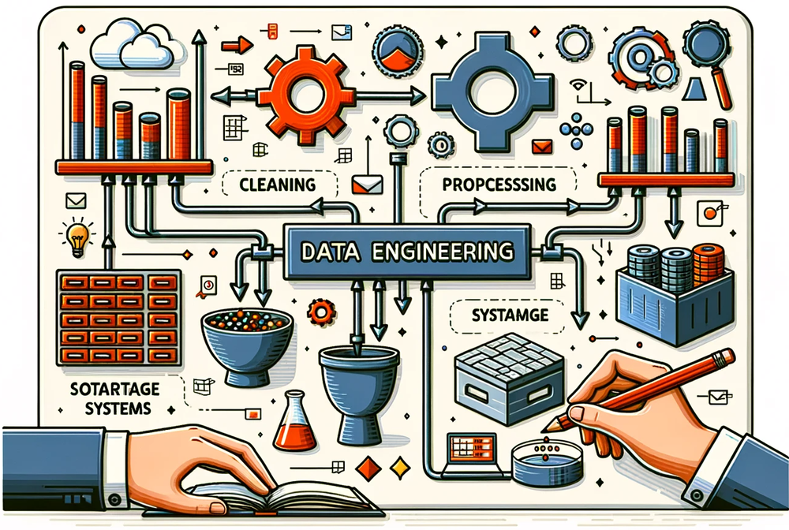
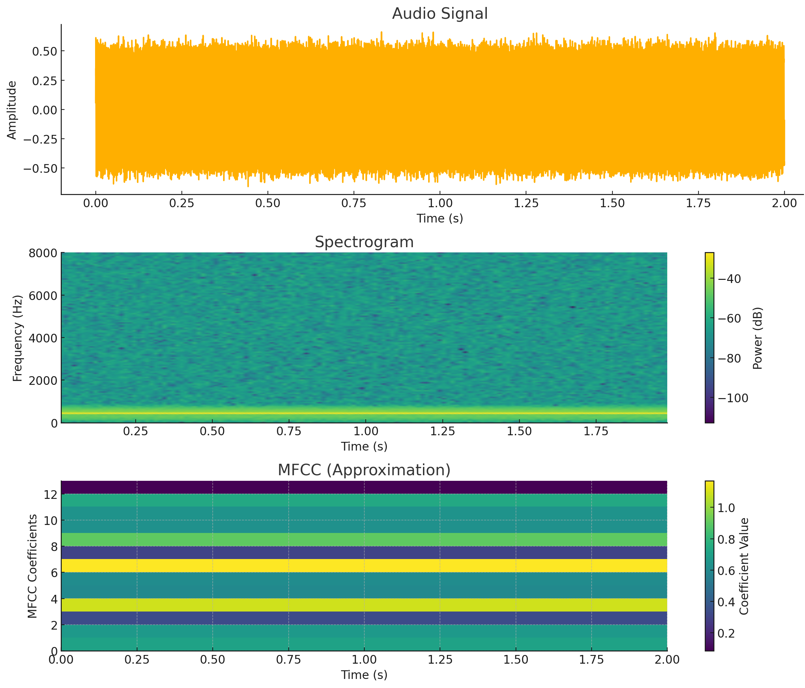
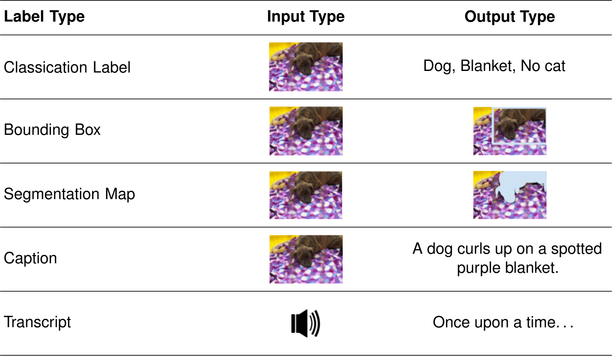
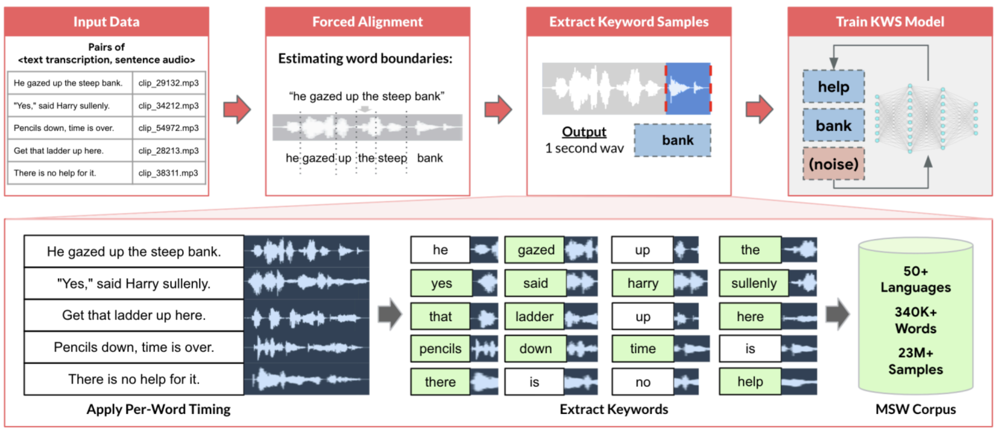

# 数据工程 {#sec-data-engineering}

::: {layout-narrow}

::: {.column-margin}

_ DALL·E 3 提示词：创建一幅矩形插图，展现数据工程的概念。包括原始数据源、数据处理流水线、存储系统和精炼后的数据集等元素。展示原始数据如何通过清洗、处理和存储，转化为可供分析并用于决策的有价值信息。_

:::

\noindent
:::

## 目的 {.unnumbered}

_为什么数据质量是决定机器学习系统在生产环境中成败的基础？_

机器学习系统依赖数据质量：没有任何算法能够弥补糟糕的数据，但优秀的数据工程即使是简单模型也能带来卓越的结果。与逻辑显式的传统软件不同，机器学习系统的行为来源于数据模式，因此质量是决定系统可信度的首要因素。理解数据工程原理，为构建能够在多样化生产环境中稳定运行、随时间保持性能，并随着数据量和复杂度增长而有效扩展的机器学习系统奠定了基础。

::: {.callout-tip title="学习目标"}

- 将四大支柱框架（质量、可靠性、可扩展性、治理）应用于系统性评估数据工程决策

- 计算机器学习系统所需的基础设施，包括存储容量、处理吞吐量和标注成本

- 设计能够保持训练-服务一致性的数据流水线，以防止生产环境中机器学习失败的主要原因

- 根据质量-成本-规模权衡评估获取策略（现有数据集、网页抓取、众包、合成数据）

- 设计适用于不同机器学习工作负载模式的存储系统（数据库、数据仓库、数据湖、特征库）

- 在整个数据生命周期中实施数据治理实践，包括血缘追踪、隐私保护和偏差缓解
:::

## 作为系统学科的数据工程 {#sec-data-engineering-data-engineering-systems-discipline-d23a}

上一章所探讨的系统化方法为机器学习开发建立了流程层面的基础，然而支撑这些工作流每个阶段的底层前提，是一个根本性的要求：健全的数据基础设施。在传统软件中，计算逻辑由代码定义；而在机器学习中，系统行为由数据定义。这一范式转变使数据在工程过程中成为与源代码同等重要的“一等公民”，因此需要一门新的学科——数据工程——以与我们对代码同样严格的标准来管理数据。

虽然工作流方法为构建 ML 系统提供了组织框架，但数据工程提供了支持这些方法得以有效实施的技术基础。先进的建模技术和严格的验证流程无法弥补数据基础设施的缺陷；而设计良好的数据系统甚至能够让传统方法也取得显著的性能提升。

本章将数据工程视为一门系统性的工程学科，重点研究如何设计、构建和维护基础设施，将异构的原始信息转化为可靠、高质量、适合机器学习应用的数据集。与传统软件系统中计算逻辑保持显式且确定不同，机器学习系统的行为特征来源于底层数据模式，这使得数据基础设施的质量成为决定系统效能的首要因素。因此，关于数据获取、处理、存储和治理的架构决策，会直接影响 ML 系统在生产环境中是否能够达到预期性能。

::: {.callout-definition title="数据工程"}

***数据工程*** 是一门系统化学科，旨在设计和维护 _数据基础设施_ 及相关流程，通过有原则的数据获取、处理、存储和治理实践，将 _原始数据_ 转化为 _可靠_、_可访问_且 _可供分析_ 的数据集。
:::

当我们考察数据质量问题如何在机器学习系统中传播时，数据工程决策的重要性就变得尤为明显。传统软件系统在遇到格式错误的输入时，通常会产生可预测的错误响应或明确拒绝，从而使开发者能够立即采取纠正措施。而机器学习系统则面临不同的挑战：数据质量缺陷往往表现为细微的性能退化，这些退化会在整个处理流水线中不断累积，并且常常直到生产环境中发生灾难性系统故障时才被发现。单个标注错误的训练样本看似无足轻重，但系统性的标注不一致会累积成系统级的模型损坏，并蔓延至整个特征空间。同样，生产环境中逐渐发生的数据分布漂移也会持续削弱系统性能，直到不得不进行全面的模型重新训练。

这些挑战要求采用超越临时性方案和被动式干预的系统化工程方法。有效的数据工程需要对基础设施需求进行系统分析，其严谨程度应与工作流设计所采用的规范方法相匹配。本章围绕四个基础支柱——质量、可靠性、可扩展性和治理——建立一个有原则的理论框架，用于指导从初始数据获取到生产部署的各类技术选择。我们将考察这些工程原则如何贯穿完整的数据生命周期，澄清构建数据基础设施所需的系统层面思维；这样的基础设施既要支持当前的 ML 工作流，又要在系统需求演进时保持适应性和可扩展性。

我们并不孤立地分析单个技术组件，而是考察工程决策之间的系统性相互依赖关系，展示数据基础设施系统内在的相互关联特征。这种整体化的分析视角尤其重要，因为接下来我们将研究处理这些经过精心设计的数据集的计算框架，而这正是后续各章的重点。

## 四大支柱框架 {#sec-data-engineering-four-pillars-framework-5cab}

构建有效的 ML 系统，不仅需要理解数据工程是什么，还需要实现一个结构化框架，以便对数据基础设施做出有原则的决策。关于存储格式、摄取模式、处理架构和治理策略的选择，都需要进行系统评估，而不是临时性选择。该框架围绕四大基础支柱组织数据工程，确保系统实现功能性、健壮性、可扩展性和可信性。

### 四个基础支柱 {#sec-data-engineering-four-foundational-pillars-19bd}

从选择存储格式到设计摄取管道，数据工程中的每一项决策都应依据四项基础原则进行评估。每个支柱都通过系统化决策为系统成功作出贡献。

首先，数据质量为系统成功奠定基础。质量问题会通过一种称为“数据级联”（@sec-data-engineering-data-cascades-need-systematic-foundations-e6f5）的现象在整个 ML 生命周期中不断累积，早期故障会向下游传播并放大。质量包括准确性、完整性、一致性以及是否适用于预期的 ML 任务。高质量数据对模型成功至关重要，这种关系的数学基础在 @sec-dl-primer 和 @sec-dnn-architectures 中进行了探讨。

在这一质量基础之上，ML 系统还需要一致、可预测的数据处理，并且能够优雅地处理故障。可靠性意味着构建这样的系统：即使组件故障、数据异常或负载模式意外变化，系统仍能持续运行。这包括在整个数据管道中实现全面的错误处理、监控和恢复机制。

如果说可靠性确保持续运行，那么可扩展性则应对增长带来的挑战。随着 ML 系统从原型发展为生产服务，数据量和处理需求会急剧增加。可扩展性涉及设计能够处理不断增长的数据量、用户规模和计算需求的系统，而无需对系统进行彻底重构。至关重要的是，可扩展性还必须具备成本效益：如果基础设施成本增长速度快于业务价值，那么单纯的容量提升意义并不大。成本效益涵盖资源效率（使计算资源的使用与实际工作负载相匹配）、存储优化（在访问速度与保留成本之间取得平衡）以及运营可持续性（避免技术债务持续加重维护负担）。

最后，治理为质量、可靠性和可扩展性的发挥提供框架。数据治理确保系统在法律、伦理和业务约束内运行，同时保持透明性和可问责性。这包括隐私保护、偏差缓解、法规合规，以及建立清晰的数据所有权和访问控制。

::: {#fig-four-pillars fig-env="figure" fig-pos="htb"}

```{.tikz}
\begin{tikzpicture}[line join=round,font=\usefont{T1}{phv}{m}{n}]
\tikzset{
Box/.style={align=center, inner xsep=2pt,draw=GreenLine, line width=1pt,fill=none, minimum width=45mm, minimum height=25mm},
Circle1/.style={circle,  minimum size=33mm, draw=none, fill=BrownLine!20},
LineD/.style={dashed,BrownLine!70, line width=1.1pt,latex-latex,text=black},
LineA/.style={violet!50,line width=4.0pt,{{Triangle[width=1.5*6pt,length=2.0*5pt]}-{Triangle[width=1.5*6pt,length=2.0*5pt]}},shorten <=1pt,shorten >=1pt},
ALine/.style={black!50, line width=1.1pt,{{Triangle[width=0.9*6pt,length=1.2*6pt]}-}},
Larrow/.style={fill=violet!50, single arrow,  inner sep=2pt, single arrow head extend=3pt,
            single arrow head indent=0pt,minimum height=10mm, minimum width=3pt}
}
%%%
%vaga
\tikzset{
pics/vaga/.style = {
        code = {
        \pgfkeys{/channel/.cd, #1}
\begin{scope}[shift={($(0,0)+(0,0)$)},scale=\scalefac,every node/.append style={transform shape}]
\node[rectangle,minimum width=2mm,minimum height=22mm,
draw=none, fill=\filllcolor,line width=\Linewidth](1R) at (0,-0.95){};
\fill[fill=\filllcolor!60!black](230:2.8)arc(230:310:2.8)--cycle;%circle(2.9);
%LT
\node [semicircle, shape border rotate=180,  anchor=chord center,
      minimum size=11mm, draw=none, fill=\filllcirclecolor](LT) at (-2,-0.5) {};
\node [circle,  minimum size=4mm, draw=none, fill=\filllcirclecolor](T1) at (-2,1.25) {};
\draw[draw=\drawcolor,,line width=1.2*\Linewidth,shorten <=3pt,shorten >=3pt](T1)--(LT);
\draw[draw=\drawcolor,,line width=1.2*\Linewidth,shorten <=3pt,shorten >=3pt](T1)--(LT.30);
\draw[draw=\drawcolor,,line width=1.2*\Linewidth,shorten <=3pt,shorten >=3pt](T1)--(LT.150);
%DT
\node [semicircle, shape border rotate=180,  anchor=chord center,
      minimum size=11mm, draw=none, fill=\filllcirclecolor!70!black](DT) at (2,-0.5) {};
\node [circle,  minimum size=4mm, draw=none, fill=\filllcirclecolor!70!black](T2) at (2,1.25) {};
\draw[draw=\drawcolor,line width=1.2*\Linewidth,shorten <=3pt,shorten >=3pt](T2)--(DT);
\draw[draw=\drawcolor,,line width=1.2*\Linewidth,shorten <=3pt,shorten >=3pt](T2)--(DT.30);
\draw[draw=\drawcolor,,line width=1.2*\Linewidth,shorten <=3pt,shorten >=3pt](T2)--(DT.150);
%
\node[draw=none,rectangle,minimum width=32mm,minimum height=1.5mm,inner sep=0pt,
fill=\filllcolor!60!black]at(0,1.25){};
\node[draw=white,fill=\filllcolor,line width=2*\Linewidth,ellipse,minimum width=9mm,  minimum height=15mm](EL)at(0,0.85){};
\node[draw=white,fill=\filllcolor!60!black,line width=2*\Linewidth,,circle,minimum size=10mm](2C)at(0,2.05){};
\end{scope}
    }
  }
}
%stit
\def\inset{3.2pt} %
\def\myshape{%
  (0,1.34) to[out=220,in=0] (-1.20,1.03) --
  (-1.20,-0.23) to[out=280,in=160] (0,-1.53) to[out=20,in=260] (1.20,-0.23) --
  (1.20,1.03)  to[out=180,in=320] cycle
}
\tikzset{
pics/stit/.style = {
        code = {
        \pgfkeys{/channel/.cd, #1}
\begin{scope}[shift={($(0,0)+(0,0)$)},scale=\scalefac,every node/.append style={transform shape}]
\fill[fill=\filllcolor!60] \myshape;
%
\begin{scope}
  \clip \myshape;
  \draw[draw=\filllcolor!60, line width=2*\inset,fill=white] \myshape; % boja i debljina po želji
\end{scope}
\fill[fill=\filllcolor!60](0,0)circle(0.4)coordinate(ST\picname);
\end{scope}
    }
  }
}
%AI style
\tikzset{
pics/llm/.style = {
        code = {
        \pgfkeys{/channel/.cd, #1}
\begin{scope}[shift={($(0,0)+(0,0)$)},scale=\scalefac,every node/.append style={transform shape}]
\node[circle,minimum size=12mm,draw=\drawcolor, fill=\filllcolor!70,line width=1.25*\Linewidth](C\picname) at (0,0){};
\def\startangle{90}
\def\radius{1.15}
\def\radiusI{1.1}
\foreach \i [evaluate=\i as \j using \i+1] [count =\k] in {0,2,4,6,8} {
\pgfmathsetmacro{\angle}{\startangle - \i * (360/8)}
\draw[draw=black,-{Circle[black ,fill=\filllcirclecolor,length=5.5pt,line width=0.5*\Linewidth]},line width=1.5*\Linewidth](C\picname)--++(\startangle - \i*45:\radius) ;
\node[circle,draw=black,fill=\filllcirclecolor!80!red!50,inner sep=3pt,line width=0.5*\Linewidth](2C\k)at(\startangle - \j*45:\radiusI) {};
}
\draw[line width=1.5*\Linewidth](2C1)--++(-0.5,0)|-(2C2);
\draw[line width=1.5*\Linewidth](2C3)--++(0.5,0)|-(2C4);
\node[circle,,minimum size=12mm,draw=\drawcolor, fill=\filllcolor!70,line width=0.5*\Linewidth]at (0,0){};
\end{scope}
    }
  }
}
%brain
\tikzset{pics/brain/.style = {
        code = {
        \pgfkeys{/channel/.cd, #1}
\begin{scope}[local bounding box=BRAIN,scale=\scalefac, every node/.append style={transform shape}]
\draw[fill=\filllcolor,line width=\Linewidth](-0.3,-0.10)to(0.08,0.60)
to[out=60,in=50,distance=3](-0.1,0.69)to[out=160,in=80](-0.26,0.59)to[out=170,in=90](-0.46,0.42)
to[out=170,in=110](-0.54,0.25)to[out=210,in=150](-0.54,0.04)
to[out=240,in=130](-0.52,-0.1)to[out=300,in=240]cycle;
\draw[fill=\filllcolor,line width=\Linewidth]
(-0.04,0.64)to[out=120,in=0](-0.1,0.69)(-0.19,0.52)to[out=120,in=330](-0.26,0.59)
(-0.4,0.33)to[out=150,in=280](-0.46,0.42)
%
(-0.44,-0.03)to[bend left=30](-0.34,-0.04)
(-0.33,0.08)to[bend left=40](-0.37,0.2) (-0.37,0.12)to[bend left=40](-0.45,0.14)
(-0.26,0.2)to[bend left=30](-0.24,0.13)
(-0.16,0.32)to[bend right=30](-0.27,0.3)to[bend right=30](-0.29,0.38)
(-0.13,0.49)to[bend left=30](-0.04,0.51);
\draw[thick,rounded corners=0.8pt,\drawcircle,-{Circle[fill=\filllcolor,length=2.5pt]}](-0.23,0.03)--(-0.15,-0.03)--(-0.19,-0.18)--(-0.04,-0.28);
\draw[thick,rounded corners=0.8pt,\drawcircle,-{Circle[fill=\filllcolor,length=2.5pt]}](-0.17,0.13)--(-0.04,0.05)--(-0.06,-0.06)--(0.14,-0.11);
\draw[thick,rounded corners=0.8pt,\drawcircle,-{Circle[fill=\filllcolor,length=2.5pt]}](-0.12,0.23)--(0.31,0.0);
\draw[thick,rounded corners=0.8pt,\drawcircle,-{Circle[fill=\filllcolor,length=2.5pt]}](-0.07,0.32)--(0.06,0.26)--(0.16,0.33)--(0.34,0.2);
\draw[thick,rounded corners=0.8pt,\drawcircle,-{Circle[fill=\filllcolor,length=2.5pt]}](-0.01,0.43)--(0.06,0.39)--(0.18,0.51)--(0.31,0.4);
\end{scope}
     }
  }
}
%graph
\tikzset{pics/graph/.style = {
        code = {
        \pgfkeys{/channel/.cd, #1}
\begin{scope}[local bounding box=GRAPH,scale=\scalefac, every node/.append style={transform shape}]
\draw[line width=2*\Linewidth,draw = \drawcolor](-0.20,0)--(2.2,0);
\draw[line width=2*\Linewidth,draw = \drawcolor](-0.20,0)--(-0.20,2.0);
\foreach \i/\vi in {0/4,0.5/8,1/12,1.5/16}{
\node[draw, minimum width  =4mm, minimum height = \vi mm, inner sep = 0pt,
      draw = \drawcolor, fill=\filllcolor!50, line width=\Linewidth,anchor=south west](COM)at(\i,0.2){};
}
%lupa
\coordinate(PO)at(1.2,0.9);
\node[circle,draw=white,line width=0.75pt,fill=\filllcirclecolor,minimum size=9mm,inner sep=0pt](LV)at(PO){};
\node[draw=none,rotate=40,rounded corners=2pt,rectangle,minimum width=2.2mm,inner sep=1pt,
fill=\filllcirclecolor,minimum height=11mm,anchor=north]at(PO){};
\node[circle,draw=none,fill=white,minimum size=5.0mm,inner sep=0pt](LM)at(PO){};
\node[font=\small\bfseries]at(LM){...};
 \end{scope}
     }
  }
}
%target
\tikzset{
pics/target/.style = {
        code = {
        \pgfkeys{/channel/.cd, #1}
\begin{scope}[shift={($(0,0)+(0,0)$)},scale=\scalefac,every node/.append style={transform shape}]
\definecolor{col1}{RGB}{62,100,125}
\definecolor{col2}{RGB}{219,253,166}
\colorlet{col1}{\filllcolor}
\colorlet{col2}{\filllcirclecolor}
\foreach\i/\col [count=\k]in {22mm/col1,17mm/col2,12mm/col1,7mm/col2,2.5mm/col1}{
\node[circle,inner sep=0pt,draw=\drawcolor,fill=\col,minimum size=\i,line width=\Linewidth](C\k){};
}
\draw[thick,fill=brown,xscale=-1](0,0)--++(111:0.13)--++(135:1)--++(225:0.1)--++(315:1)--cycle;
\path[green,xscale=-1](0,0)--(135:0.85)coordinate(XS1);
\draw[thick,fill=yellow,xscale=-1](XS1)--++(80:0.2)--++(135:0.37)--++(260:0.2)--++(190:0.2)--++(315:0.37)--cycle;
\end{scope}
    }
  }
}
%server
\tikzset {
  pics/server/.style = {
    code = {
     % \colorlet{red}{black}
\pgfkeys{/channel/.cd, #1}
      \begin{scope}[anchor=center, transform shape,scale=\scalefac, every node/.append style={transform shape}]
        \draw[draw=\drawcolor,line width=\Linewidth,fill=\filllcolor](-0.55,-0.5) rectangle (0.55,0.5);
\foreach \i in {-0.25,0,0.25} {
                \draw[line width=\Linewidth]( -0.55,\i) -- (0.55, \i);
}
        \foreach \i in {-0.375, -0.125, 0.125, 0.375} {
          \draw[line width=\Linewidth](-0.45,\i)--(0,\i);
          \fill[](0.35,\i) circle (1.5pt);
        }

        \draw[draw=\drawcolor,line width=1.5*\Linewidth](0,-0.53) |- (-0.55,-0.7);
        \draw[draw=\drawcolor,line width=1.5*\Linewidth](0,-0.53) |- (0.55,-0.7);
      \end{scope}
    }
  }
}
\pgfkeys{
  /channel/.cd,
   Depth/.store in=\Depth,
  Height/.store in=\Height,
  Width/.store in=\Width,
  filllcirclecolor/.store in=\filllcirclecolor,
  filllcolor/.store in=\filllcolor,
  drawcolor/.store in=\drawcolor,
  drawcircle/.store in=\drawcircle,
  scalefac/.store in=\scalefac,
  Linewidth/.store in=\Linewidth,
  picname/.store in=\picname,
  filllcolor=BrownLine,
  filllcirclecolor=violet!20,
  drawcolor=black,
  drawcircle=violet,
  scalefac=1,
  Linewidth=0.5pt,
  Depth=1.3,
  Height=0.8,
  Width=1.1,
  picname=C
}

\node[Circle1](CI1){};
%AI
\pic[shift={(0,0)}] at  (CI1){llm={scalefac=1.2,picname=1,drawcolor=GreenD,filllcolor=GreenD!20!, Linewidth=1pt,filllcirclecolor=red}};
%brain
\pic[shift={(0.12,-0.23)}] at  (C1){brain={scalefac=1.1,picname=2,filllcolor=orange!30!, filllcirclecolor=cyan!55!black!60, Linewidth=0.75pt}};
%Quality
\node[Box,above left=1 and 1.5 of CI1](B1){};
\node[below=1pt of CI1,font=\usefont{T1}{phv}{b}{n}\small,align=center]{ML Data System};
\fill[green!07](B1.north west) rectangle ($(B1.north east)!0.6!(B1.south east)$)coordinate(B1DE);
\fill[green!20](B1.south east) rectangle ($(B1.north west)!0.6!(B1.south west)$)coordinate(B1LE);
\node[Box,above left=1 and 1.5 of CI1](){};
\tikzset{Text2/.style={font=\usefont{T1}{phv}{b}{n}\small,align=center}}
\node[Text2]at($(B1.south west)!0.5!(B1DE)$){Quality\\ {\footnotesize Accuracy \& Fitness}};
\coordinate(Q1)at($(B1.north west)!0.5!(B1DE)$);
%Quality - target
\pic[shift={(0,0)}] at  (Q1){target={scalefac=0.55,picname=1,drawcolor=BlueD,filllcolor=cyan!90!,Linewidth=0.7pt, filllcirclecolor=cyan!20}};
%Reliability - stit
\node[Box,above right=1 and 1.5 of CI1](B2){};
\fill[cyan!07](B2.north west) rectangle ($(B2.north east)!0.6!(B2.south east)$)coordinate(B2DE);
\fill[cyan!20](B2.south east) rectangle ($(B2.north west)!0.6!(B2.south west)$)coordinate(B2LE);
\node[Text2]at($(B2.south west)!0.5!(B2DE)$){Reliability\\ {\footnotesize Consistency \& Fault Tolerance}};
\coordinate(R1)at($(B2.north west)!0.5!(B2DE)$);
\node[Box,above right=1 and 1.5 of CI1,draw=BlueD](B2){};
%Reliability - stit
\pic[shift={(0,0.03)}] at  (R1){stit={scalefac=0.48,picname=1,drawcolor=orange,filllcolor=red!80!}};
\pic[shift={(0,0.03)}] at  (ST1){server={scalefac=0.52,picname=1,drawcolor= black,filllcolor=orange!30!,Linewidth=0.75pt}};
%governance
\node[Box,below left=1 and 1.5 of CI1](B3){};
\fill[violet!07](B3.north west) rectangle ($(B3.north east)!0.6!(B3.south east)$)coordinate(B3DE);
\fill[violet!20](B3.south east) rectangle ($(B3.north west)!0.6!(B3.south west)$)coordinate(B3LE);
\node[Text2]at($(B3.south west)!0.5!(B3DE)$){Governance\\ {\footnotesize Ethics \& Compliance}};
\coordinate(G1)at($(B3.north west)!0.5!(B3DE)$);
\node[Box,below left=1 and 1.5 of CI1,draw=violet](){};
%Scalability - graph
\pic[shift={(-0.70,-0.6)}] at  (G1){graph={scalefac=0.6,picname=1,filllcirclecolor=RedLine,filllcolor=green!70!black, Linewidth=0.65pt}};
%Scalability - graph
\node[Box,below right=1 and 1.5 of CI1](B4){};
\fill[orange!07](B4.north west) rectangle ($(B4.north east)!0.6!(B4.south east)$)coordinate(B4DE);
\fill[orange!20](B4.south east) rectangle ($(B4.north west)!0.6!(B4.south west)$)coordinate(B4LE);
\node[Text2]at($(B4.south west)!0.5!(B4DE)$){Scalability\\ {\footnotesize Growth \& Performance}};
\coordinate(S1)at($(B4.north west)!0.5!(B4DE)$);
\node[Box,below right=1 and 1.5 of CI1,draw=OrangeLine](){};
%governance
\pic[shift={(0,0.05)}] at  (S1){vaga={scalefac=0.25,picname=1,filllcolor=BlueLine, Linewidth=0.75pt,filllcirclecolor=orange}};
%arrows
\tikzset{Text/.style={,font=\usefont{T1}{phv}{m}{n}\small,align=center}}
\draw[LineD](B1)--node[above,Text]{Validation overhead vs.\\ throughput}(B2);
\draw[LineD](B1)--node[left,Text]{Bias mitigation vs.\\ data availability}(B3);
\draw[LineD](B2)--node[right,Text]{Consistency vs.\\ distributed scale}(B4);
\draw[LineD](B3)--node[below,Text]{Performance vs.\\ privacy constraints}(B4);
%
\tikzset{Text1/.style={font=\usefont{T1}{phv}{m}{n}\footnotesize,align=center,text=black}}
\draw[LineA,draw=green!70!black](B1.south east)--node[below left,Text1,green!60!black]{High-quality\\ training data}(CI1);
\draw[LineA,draw=cyan!70!black](B2.south west)--node[below right,Text1,cyan!70!black]{Consistent\\ processing}(CI1);
\draw[LineA,draw=violet!80!black!40](B3.north east)--node[above left,Text1,violet]{Compliance \& \\accountability}(CI1);
\draw[LineA,draw=orange!80](B4.north west)--node[above right,Text1,orange]{Handle growing\\ data volumes}(CI1);
\end{tikzpicture}
```
**数据工程的四大支柱**：质量、可靠性、可扩展性和治理构成了 ML 数据系统的基础框架。每个支柱都提供关键能力（实线箭头），而支柱之间的权衡（虚线）则需要谨慎平衡：验证开销会影响吞吐量，一致性约束会限制分布式扩展，隐私要求会影响性能，而偏差缓解可能会减少可用训练数据。有效的数据工程要求系统性地管理这些张力，而不是孤立地优化某一个支柱。

:::

### 通过系统思维整合各支柱 {#sec-data-engineering-integrating-pillars-systems-thinking-eb3e}

尽管分别理解每个支柱都能提供重要洞见，但认识到它们各自的重要性只是有效数据工程的第一步。正如 @fig-four-pillars 所示，这四个支柱并不是彼此独立的组件，而是统一系统中相互关联的方面；某一方面的决策会影响其他所有方面。质量改进必须考虑可扩展性约束，可靠性要求会影响治理实现，而治理策略会塑造质量指标。这一系统视角指导我们对数据工程的探索：考察每个技术主题如何在处理其内在张力的同时支持并平衡这些基础原则。

正如 @fig-ds-time 所示，根据各种行业调查 [^fn-data-quality-stats]，数据科学家将 60% 到 80% 的时间花在数据准备任务上。这个统计数据反映了当前现状：数据工程实践往往是临时性的，而非系统化的。通过持续应用四支柱框架来消解这部分开销，团队可以减少数据准备时间，同时构建更可靠、更易维护的系统。

[^fn-data-quality-stats]: **数据质量的现实**：著名的“垃圾进，垃圾出”原则最早由 IBM 计算机程序员 George Fuechsel 在 20 世纪 60 年代提出，用来描述有缺陷的输入数据会产生无意义的输出。这一原则在现代 ML 系统中仍然具有极其重要的现实意义。

::: {#fig-ds-time fig-env="figure" fig-pos="htb"}

```{.tikz}
\scalebox{0.8}{%
\begin{tikzpicture}[line join=round,font=\small\usefont{T1}{phv}{m}{n}]
\makeatletter
\def\pgfpie@legend#1{%
  \coordinate[xshift=15mm,
  yshift={(\the\pgfpie@sliceLength*0.5+1)*0.5cm}] (pgfpie@legendpos) at
  (current bounding box.east);

\scope[node distance=2.25mm]
    \foreach \pgfpie@p/\pgfpie@t [count=\pgfpie@i from 0] in {#1}
    {
      \pgfpie@findColor{\pgfpie@i}
      \node[circle,draw, fill={\pgfpie@thecolor}, draw=none,inner sep=5 pt,below =1.6mm of {pgfpie@legendpos},
      label={[font=\footnotesize\usefont{T1}{phv}{m}{n}]0:{\pgfpie@t}}] (pgfpie@legendpos) {};
    }
  \endscope
}
\makeatother
\definecolor{Greenn}{RGB}{84,180,53}
\definecolor{Redd}{RGB}{249,56,39}
\definecolor{Orangee}{RGB}{255,157,35}
\definecolor{Brownn}{RGB}{214,128,96}
\definecolor{Bluee}{RGB}{0,97,168}
\definecolor{Violett}{RGB}{178,108,186}
\definecolor{Yelloww}{RGB}{255,210,76}
\tikzset{lines/.style={
  draw=none,
  line width=0.75pt
}}

\pie[text=legend,radius=2.65,
     style={lines},
     color={Greenn!60, Redd!90, Orangee, Bluee!80, Yelloww, Violett},
     every slice/.style={draw=blue}
     ]
{60/Cleaning and organizing data,
19/Collecting data sets,
9/Mining data for patterns,
5/Building training sets,
4/Refining algorithms,
3/Other}
\end{tikzpicture}}
```
**数据科学家时间分配**：数据准备消耗了数据科学工作的绝大部分，最高可达 60%，这凸显了系统化数据工程实践的必要性，以防止下游模型失败并确保项目成功。优先投入数据质量和管道开发，比单纯专注于高级算法能带来更高回报。来源：各类行业报告。

:::

### 框架在数据生命周期中的应用 {#sec-data-engineering-framework-application-across-data-lifecycle-46f9}

这套四支柱框架指导我们从问题定义到生产运维，系统性地探索数据工程。我们首先建立清晰的问题定义和治理原则，这些原则会塑造后续所有技术决策。随后，该框架引导我们制定数据获取策略，在这一阶段，质量和可靠性要求决定了我们如何获取和验证数据。处理与存储决策则自然地受到可扩展性和治理约束的影响，而运维实践则确保在系统生命周期中始终维持这四大支柱。

该框架还指导我们系统性地探索数据工程的每个主要组成部分。在后续章节中，当我们考察数据获取、摄取、处理和存储时，会分析这些支柱如何体现在具体技术决策中：在质量与可扩展性之间取得平衡的来源技术，在治理约束下支持性能的存储架构，以及在海量规模下仍能保持可靠性的处理管道。@tbl-four-pillars-matrix 提供了一个综合视图，展示了每个支柱如何贯穿数据管道的主要阶段。该矩阵既可作为系统设计的规划工具，也可在不同管道阶段出现问题时作为排障参考。

+-----------------+--------------------------+-----------------------------+-------------------------------+-------------------------------+
| **阶段**        | **质量**                 | **可靠性**                  | **可扩展性**                  | **治理**                     |
+:================+:=========================+:============================+:==============================+:==============================+
| **获取**        | 具有代表性的抽样，        | 多样化来源、冗余             | 网络抓取、合成                | 同意、匿名化、                |
|                 | 偏差检测                 | 收集策略                     | 数据生成                      | 伦理来源                     |
+-----------------+--------------------------+-----------------------------+-------------------------------+-------------------------------+
| **摄取**        | 模式验证、                | 死信队列、                   | 批处理与流处理、              | 访问控制、审计                |
|                 | 数据剖析                 | 优雅降级                     | 自动扩缩管道                  | 日志、数据血缘                |
+-----------------+--------------------------+-----------------------------+-------------------------------+-------------------------------+
| **处理**        | 一致性验证、              | 幂等转换、                   | 分布式框架、                  | 血缘跟踪、隐私                |
|                 | 训练-服务一致性           | 重试机制                     | 水平扩展                      | 保留、偏差监控                |
+-----------------+--------------------------+-----------------------------+-------------------------------+-------------------------------+
| **存储**        | 数据验证检查、            | 备份、复制、                 | 分层存储、分区、              | 访问审计、加密、              |
|                 | 新鲜度监控                | 灾难恢复                     | 压缩优化                      | 保留策略                     |
+-----------------+--------------------------+-----------------------------+-------------------------------+-------------------------------+

: **跨数据管道阶段应用的四大支柱**：该矩阵展示了质量、可靠性、可扩展性和治理原则如何体现在数据工程管道的每个主要阶段。每个单元格都显示了在该阶段实现相应支柱的具体技术和实践，为系统化决策和排障提供了一个全面框架。 {#tbl-four-pillars-matrix}

为了将这些概念落到实际情境中，我们将始终以一个关键词识别（KWS）系统作为贯穿始终的案例研究，展示框架原则如何转化为工程决策。

## 数据级联与系统性基础的必要性 {#sec-data-engineering-data-cascades-need-systematic-foundations-e6f5}

机器学习系统面临一种独特的失败模式，使其区别于传统软件工程：“数据级联”[^fn-data-cascades]，这一由 @sambasivan2021everyone 指出的现象是指，早期阶段的数据质量较差会在整个流水线中被放大，导致下游模型失败、项目终止以及潜在的用户伤害。与传统软件中错误输入通常会立即产生报错不同，机器学习系统会在不知不觉中退化，直到质量问题严重到必须彻底重建整个系统。

当团队在开始数据收集和处理工作之前，跳过建立清晰的质量标准、可靠性要求和治理原则时，就会发生数据级联。这一根本性脆弱点促使我们提出“四大支柱”框架：质量、可靠性、可扩展性和治理为防止级联失效、构建稳健的机器学习系统提供了所需的系统性基础。

[^fn-data-cascades]: **数据级联**：机器学习中特有的一种系统失效模式，早期阶段的数据质量较差会在整个流水线中被放大，导致下游模型失败、项目终止以及潜在的用户伤害。与传统软件中错误输入通常会立即产生报错不同，机器学习系统会在不知不觉中退化，直到质量问题严重到必须彻底重建整个系统。@fig-cascades 展示了这些潜在的数据陷阱在每个阶段都会如何出现，以及它们如何在后续过程中影响整个流程。数据收集错误的影响尤其明显。如图所示，这一初始阶段中的任何疏漏都会在 @sec-ai-training 和 @sec-ml-operations 中讨论的模型评估与部署阶段显现出来，进而可能导致昂贵的后果，例如放弃整个模型并重新开始。因此，从一开始就投入数据工程技术将有助于我们及早发现错误，减轻这些级联效应。

::: {#fig-cascades fig-env="figure" fig-pos="htb"}

```{.tikz}
\begin{tikzpicture}[line join=round,font=\small\usefont{T1}{phv}{m}{n}]
\definecolor{Green}{RGB}{84,180,53}
\definecolor{Red}{RGB}{249,56,39}
\definecolor{Orange}{RGB}{255,157,35}
\definecolor{Blue}{RGB}{0,97,168}
\definecolor{Violet}{RGB}{178,108,186}

\tikzset{%
Line/.style={line width=1.0pt,black!50,shorten <=6pt,shorten >=8pt},
LineD/.style={line width=2.0pt,black!50,shorten <=6pt,shorten >=8pt},
Text/.style={rotate=60,align=right,anchor=north east,font=\footnotesize\usefont{T1}{phv}{m}{n}},
Text2/.style={align=left,anchor=north west,font=\footnotesize\usefont{T1}{phv}{m}{n},text depth=0.7}
}

\draw[line width=1.5pt,black!30](0,0)coordinate(P)--(10,0)coordinate(K);

\foreach \i in {0,...,6} {
\path let \n1 = {(\i/6)*10} in coordinate (P\i) at (\n1,0);
\fill[black] (P\i) circle (2pt);
  }

\draw[LineD,Red](P0)to[out=60,in=120](P6);
\draw[LineD,Red](P0)to[out=60,in=125](P5);
\draw[LineD,Blue](P1)to[out=60,in=120](P6);
\draw[LineD,Red](P1)to[out=50,in=125](P6);
\draw[LineD,Blue](P4)to[out=60,in=125](P6);
\draw[LineD,Blue](P3)to[out=60,in=120](P6);
%
\draw[Line,Orange](P1)to[out=44,in=132](P6);
\draw[Line,Green](P1)to[out=38,in=135](P6);
\draw[Line,Orange](P1)to[out=30,in=135](P5);
\draw[Line,Green](P1)to[out=36,in=130](P5);
%
\draw[Line,Orange](P2)to[out=40,in=135](P6);
\draw[Line,Orange](P2)to[out=40,in=135](P5);
%
\draw[draw=none,fill=VioletLine!50]($(P5)+(-0.1,0.15)$)to[bend left=10]($(P5)+(-0.1,0.61)$)--
                ($(P5)+(-0.25,0.50)$)--($(P5)+(-0.85,1.20)$)to[bend left=20]($(P5)+(-1.38,0.76)$)--
                ($(P5)+(-0.51,0.33)$)to[bend left=10]($(P5)+(-0.64,0.22)$)to[bend left=10]cycle;
\draw[draw=none,fill=VioletLine!50]($(P6)+(-0.1,0.15)$)to[bend left=10]($(P6)+(-0.1,0.61)$)--
                ($(P6)+(-0.25,0.50)$)--($(P6)+(-0.7,1.30)$)to[bend left=20]($(P6)+(-1.38,0.70)$)--
                ($(P6)+(-0.51,0.33)$)to[bend left=10]($(P6)+(-0.64,0.22)$)to[bend left=10]cycle;
%
\draw[dashed,red,thick,-latex](P1)--++(90:2)to[out=90,in=0](0.8,2.7);
\draw[dashed,red,thick,-latex](P6)--++(90:2)to[out=90,in=0](9.1,2.7);
\node[below=0.1of P0,Text]{Problem\\ Statement};
\node[below=0.1of P1,Text]{Data collection \\and labeling};
\node[below=0.1of P2,Text]{Data analysis\\ and cleaning};
\node[below=0.1of P3,Text]{Model \\selection};
\node[below=0.1of P4,Text]{Model\\ training};
\node[below=0.1of P5,Text]{Model\\ evaluation};
\node[below=0.1of P6,Text]{Model\\ deployment};
%Legend
\node[circle,minimum size=4pt,fill=Blue](L1)at(11.5,2.6){};
\node[above right=0.1 and 0.1of L1,Text2]{Interacting with physical\\  world brittleness};

\node[circle,minimum size=4pt,fill=Red,below =0.5 of L1](L2){};
\node[above right=0.1 and 0.1of L2,Text2]{Inadequate \\application-domain expertise};

\node[circle,minimum size=4pt,fill=Green,below =0.5 of L2](L3){};
\node[above right=0.1 and 0.1of L3,Text2]{Conflicting reward\\ systems};

\node[circle,minimum size=4pt,fill=Orange,below =0.5 of L3](L4){};
\node[above right=0.1 and 0.1of L4,Text2]{Poor cross-organizational\\ documentation};

\draw[-{Triangle[width=8pt,length=8pt]}, line width=3pt,Violet](11.4,-0.85)--++(0:0.8)coordinate(L5);
\node[above right=0.23 and 0of L5,Text2]{Impacts of cascades};

\draw[-{Triangle[width=4pt,length=8pt]}, line width=2pt,Red,dashed](11.4,-1.35)--++(0:0.8)coordinate(L6);
\node[above right=0.23 and 0of L6,Text2]{Abandon / re-start process};
\end{tikzpicture}
```
**数据质量级联**：在机器学习工作流早期引入的错误会在后续阶段逐步放大，增加成本，并可能导致错误预测或有害结果。认识到这些级联效应，会促使我们主动投入数据工程和质量控制，以降低风险并确保系统性能可靠。来源：[@sambasivan2021everyone]。

:::

### 及早建立治理原则 {#sec-data-engineering-establishing-governance-principles-early-5f71}

在理解了质量问题如何在机器学习系统中级联之后，我们必须建立治理原则，以确保数据工程系统在伦理、法律和业务约束范围内运行。这些原则不是以后再补上的事后考虑，而是从一开始就塑造每一项技术决策的基础性要求。

作为这些治理原则的核心，数据系统必须保护用户隐私，并在整个生命周期中保持安全性。这意味着要从系统初始设计阶段就实施访问控制、加密和数据最小化实践，而不是在后续再作为增强功能添加。隐私要求会直接影响数据收集方法、存储架构和处理方式。

除了隐私保护之外，数据工程系统还必须积极识别并缓解数据收集、标注和处理中的偏差。这需要多样化的数据收集策略、具有代表性的抽样方法，以及贯穿整个流水线的系统性偏差检测。关于数据来源、标注方法和质量指标的技术选择都会影响系统公平性。数据中的隐藏分层——即某些子群体代表性不足或呈现不同模式——即使在表现良好的模型中也会导致系统性失败 [@oakden2020hidden]，这进一步说明为什么人口统计上的平衡与代表性必须从一开始就通过工程化手段融入数据收集过程。

与这些公平性工作相辅相成的是，系统必须对数据来源、处理决策和质量标准保留清晰的文档记录。这包括实施数据谱系跟踪、维护处理日志，以及为数据质量决策建立明确的所有权与责任。

最后，数据系统必须遵守相关法规，例如 GDPR、CCPA 以及特定领域的要求。合规要求会影响数据保留策略、用户同意机制以及跨境数据传输协议。

这些治理原则与我们关于质量、可靠性和可扩展性的技术支柱相辅相成。如果一个系统违反了用户隐私，那么它就不可能真正可靠；如果质量指标会持续固化不公平结果，那么这些指标也就毫无意义。

### 问题定义的结构化方法 {#sec-data-engineering-structured-approach-problem-definition-0b1c}

在这些治理基础之上，我们需要一种系统化的问题定义方法。正如 @sculley2015hidden 所强调的，机器学习系统需要超越传统软件开发方法的问题框定。无论是开发处理数百万用户交互的推荐引擎、分析医学图像的计算机视觉系统，还是处理多样化文本数据的自然语言模型，每个系统都会带来独特挑战，需要在我们的治理与技术框架内仔细考量。

在这一背景下，建立清晰的目标可以提供统一方向，指导整个项目，从数据收集策略到部署运维。这些目标必须在技术性能与治理要求之间取得平衡，形成既包含准确率指标又包含公平性标准的可衡量结果。

这种结构化的问题定义方法确保治理原则和技术要求从一开始就被整合，而不是在后期再补装。为了实现这种整合，我们确定了任何数据收集工作之前都必须先完成的关键步骤：

1. 识别并清晰陈述问题定义
2. 设定明确目标
3. 建立成功基准
4. 理解最终用户的参与/使用方式
5. 理解部署的约束与限制
6. 执行数据收集。
7. 迭代并完善。

### 通过关键词识别案例研究应用框架 {#sec-data-engineering-framework-application-keyword-spotting-case-study-21ff}

为了展示这些系统性原则在实践中的运作方式，关键词识别（KWS）系统为将我们的四大支柱框架应用于现实世界的数据工程挑战提供了一个理想案例。这类系统为智能手机和智能音箱等语音激活设备提供支持，必须在严格的资源约束下，于连续音频流中检测特定唤醒词（如 “OK, Google” 或 “Alexa”）。

如 @fig-keywords 所示，KWS 系统作为轻量级、始终在线的前端运行，用于触发更复杂的语音处理系统。这些系统体现了我们框架中四大支柱之间的相互关联挑战（@sec-data-engineering-four-pillars-framework-5cab）：质量（在不同环境中的准确性）、可靠性（持续的电池供电运行）、可扩展性（极其严格的内存约束）以及治理（隐私保护）。这些约束也解释了为什么许多 KWS 系统只支持有限数量的语言：在治理与可扩展性挑战并存的情况下，为较小语言群体收集高质量、具有代表性的语音数据极其困难，这说明要实现成功部署，四大支柱必须协同工作。

{#fig-keywords width=55%}

在建立了这一框架认识之后，我们可以将问题定义方法应用到 KWS 示例中，展示四大支柱如何指导实际工程决策：

1. **识别问题**：KWS 需要在环境声音和其他语音中识别特定关键词。主要问题是设计一个能够在资源受限设备上运行的系统，使其在高准确率、低延迟以及尽量少的误报和漏报之间取得平衡。为开发新的 KWS 模型而进行良好定义的问题，应明确期望识别的关键词，以及预期的应用场景和部署场景。

2. **设定清晰目标**：KWS 系统的目标必须平衡多个相互竞争的需求。性能目标包括达到较高准确率（关键词检测准确率 98%），同时保证较低延迟（关键词检测与响应在 200 毫秒内完成）。资源约束要求尽量降低功耗，以延长嵌入式设备的电池寿命，并确保模型大小针对设备可用内存进行优化。

3. **成功基准**：建立清晰指标来衡量 KWS 系统的成功。关键性能指标包括真正率（相对于所有被说出的关键词，正确识别出的关键词所占百分比）和假正率（将非关键词——包括静音、背景噪声以及词表外词汇——错误识别为关键词的百分比）。检测/错误权衡曲线通过将每小时误接受数（在评估音频总时长上的假正例）与误拒率（相对于评估音频中的被说出关键词所遗漏的关键词）进行比较，来评估面向真实部署场景的流式音频 KWS，正如 @nayak2022improving 所展示的那样。运行指标会跟踪响应时间（从关键词被说出到系统响应）和功耗（关键词检测期间的平均功率消耗）。

4. **利益相关方参与与理解**：与利益相关方进行沟通，其中包括设备制造商、硬件和软件开发者以及终端用户。了解他们的需求、能力和约束。不同利益相关方带来的优先级各不相同：设备制造商可能优先考虑低功耗，软件开发者可能更强调易集成性，而终端用户则会优先考虑准确性和响应速度。平衡这些相互竞争的需求会贯穿整个开发过程，并塑造系统架构决策。

5. **理解嵌入式系统的约束与限制**：嵌入式设备有其自身的一套挑战，这些挑战会塑造 KWS 系统设计。内存限制要求模型极其轻量，通常小到 16 KB，以便能够放入 SoC[^fn-soc] 的 always-on 区域；而且这一约束只覆盖模型权重，预处理代码也必须符合严格的内存边界。处理能力受限于有限的计算能力（时钟频率仅有数百 MHz），因此必须进行激进的模型优化以提高效率。功耗变得至关重要，因为大多数嵌入式设备都由电池供电，这要求 KWS 系统在持续监听时实现低于毫瓦级的功耗。环境挑战又增加了一层复杂性，因为设备必须能在从安静卧室到嘈杂工业环境等多样部署场景下有效运行。

[^fn-soc]: **片上系统（SoC）**：一种将所有基本计算组件（处理器、内存、I/O 接口）集成到单个芯片上的集成电路。现代 SoC 包含专门的“always-on”低功耗域，可在主处理器休眠时持续监测唤醒词等触发条件，使连续监听应用的功耗低于 1mW。

6. **数据收集与分析**：对于 KWS 系统而言，数据质量和多样性决定成败。数据集必须通过纳入不同年龄和性别、具有各种口音的说话者来体现人口统计多样性，从而确保广泛的识别支持。还需要关注关键词的变化形式，因为人们对唤醒词的发音不同，数据集必须捕捉这些发音细微差异和轻微变体。背景噪声的多样性也至关重要，因此需要包含或通过增强加入不同环境噪声的数据样本，以训练模型适应从安静环境到嘈杂条件的真实场景。

7. **迭代反馈与改进**：最后，一旦 KWS 原型系统开发完成，团队必须确保系统在部署场景随时间变化、用例不断演进时，仍与既定问题和目标保持一致。这需要在真实世界场景中进行测试，收集关于某些用户或某些部署场景是否表现不如其他场景的反馈，并根据观察到的失败模式对数据集和模型进行迭代改进。

在这一问题定义基础上，我们的 KWS 系统展示了不同数据收集方法如何在项目生命周期中有效结合。像 Google 的 Speech Commands[@warden2018speech] 这样的现有数据集为初始开发提供了基础，提供了经过精心整理的常见唤醒词语音样本。然而，这些数据集往往在口音、环境和语言方面缺乏多样性，因此需要补充额外策略。

为了弥补覆盖缺口，网络爬取通过从视频平台和语音数据库收集多样化语音样本来补充基础数据集，捕捉自然语音模式和唤醒词变体。像 Amazon Mechanical Turk[^fn-mechanical-turk] 这样的众包平台，则可实现跨不同人口统计与环境的定向唤醒词样本收集，这对于代表性不足的语言或特定声学条件尤其有价值。

[^fn-mechanical-turk]: **Mechanical Turk 的起源**：其名称来自 18 世纪会下棋的“自动机”（实际上是内部藏着一位人类棋手），亚马逊的 MTurk（2005）通过以规模化方式实现分布式人类计算，开创了人类参与式 AI，讽刺的是，这一做法反转了原始“土耳其人”对 AI 能力的欺骗。

最后，合成数据生成通过语音合成 [@werchniak2021exploring] 和音频增强填补剩余缺口，在不同声学环境、说话人特征和背景条件下创建无限的唤醒词变体。这种全面的方法使 KWS 系统能够在多样化真实世界条件下稳定运行，同时展示了系统性问题定义如何在整个项目生命周期中指导数据策略。

在通过 KWS 案例研究建立了框架原则之后，我们现在将考察这些抽象概念如何通过数据流水线架构转化为实际运作现实。

## 数据管道架构 {#sec-data-engineering-data-pipeline-architecture-0005}

数据管道是我们“四大支柱”框架的系统化落地，它们将原始数据转换为适用于机器学习的格式，同时保持质量、可靠性、可扩展性和治理标准。与简单的线性数据流不同，这些是复杂系统，必须协调多个数据源、转换流程和存储系统，同时在不同负载条件下确保性能稳定。管道架构将我们抽象的框架原则转化为可运行的现实，其中每一根支柱都体现为关于验证策略、错误处理机制、吞吐量优化和可观测性基础设施的具体工程决策。

为了说明这些概念，我们的 KWS 系统管道架构必须处理连续音频流，为实时关键词检测保持低延迟处理，并确保保护隐私的数据处理。该管道必须能够从处理样本音频文件的开发环境扩展到处理数百万并发音频流的生产部署，同时维持严格的质量和治理标准。

::: {#fig-pipeline-flow fig-env="figure" fig-pos="htb"}

```{.tikz}
\resizebox{.7\textwidth}{!}{%
\begin{tikzpicture}[font=\small\usefont{T1}{phv}{m}{n}]
%
\tikzset{%
 Line/.style={line width=1.0pt,black!50,text=black},
 Box/.style={align=flush center,
    inner xsep=2pt,
    node distance=0.8,
    draw=GreenLine,
    line width=0.75pt,
    fill=GreenL,
    text width=27mm,
    minimum width=26mm, minimum height=9mm
  },
}
%
\begin{scope}[local bounding box = scope1]
\node[Box](B1){Raw Data Sources};
\node[Box,right=of B1](B2){External APIs};
\node[Box,right=of B2](B3){Streaming Sources};
\end{scope}
%
\begin{scope}[shift={($(scope1.south)+(-2.84,-2.2)$)},anchor=center]
\node[Box, fill=BlueL,draw=BlueLine](2B1){Batch Ingestion};
\node[Box, fill=BlueL,draw=BlueLine,  node distance=2.8,right=of 2B1](2B2){Stream Processing};
\end{scope}
%
\node[Box,  node distance=1.2,below=of $(2B1)!0.5!(2B2)$](3B1){Storage Layer};
%
\node[Box, fill=OrangeL,draw=OrangeLine,below left=1 and 0.2 of 3B1](4B1){Training Data};
\node[Box, fill=RedL,draw=RedLine,node distance=1.3,below right=1 and 0.2of 3B1](4B2){Data Validation \& Quality Checks};
\node[Box, fill=OrangeL,draw=OrangeLine, node distance=0.6,below =of 4B1](5B1){Model Training};
\node[Box,fill=RedL,draw=RedLine,node distance=0.6,below =of 4B2](5B2){Transformation};
\node[Box, fill=RedL,draw=RedLine, node distance=0.6,below =of 5B2](6B1){Feature Creation / Engineering};
\node[Box, fill=RedL,draw=RedLine, node distance=0.6,below =of 6B1](7B1){Data Labeling};
%
\scoped[on background layer]
\node[draw=BackLine,inner xsep=5mm,inner ysep=5mm,yshift=1mm,
           fill=BackColor,minimum width=113mm,fit=(B1)(B2)(B3),line width=0.75pt](BB1){};
\node[below=8pt of  BB1.north east,anchor=east]{Sources};
\scoped[on background layer]
\node[draw=BackLine,inner xsep=5mm,inner ysep=5mm,yshift=1mm,
           fill=BackColor,minimum width=113mm,fit=(2B1)(2B2),line width=0.75pt](BB2){};
\node[below=8pt of  BB2.north east,anchor=east]{Data Ingestion};
\scoped[on background layer]
\node[draw=BackLine,inner xsep=9mm,inner ysep=5mm,yshift=-2mm,
           fill=BackColor,fit=(4B1)(5B1),line width=0.75pt](BB3){};
\node[above=7pt of  BB3.south east,anchor=east]{ML Training};
%
\scoped[on background layer]
\node[draw=BackLine,inner xsep=9mm,inner ysep=5mm,yshift=-2mm,
           fill=BackColor,fit=(4B2)(7B1),line width=0.75pt](BB4){};
\node[above=7pt of  BB4.south east,anchor=east]{Processing Layer};
%
\scoped[on background layer]
\node[draw=OrangeLine,inner xsep=3mm,inner ysep=6mm,yshift=3mm,
           fill=none,fit=(BB1)(BB4),line width=0.75pt](BB4){};
\node[below=4pt of  BB4.north,anchor=north]{Data Governance};
%
\draw[Line,-latex](B1)--++(270:1.2)-|(2B1);
\draw[Line,-latex](B2)--++(270:1.2)-|(2B1);
\draw[Line,-latex](B3)--++(270:1.2)-|(2B2);
%
\draw[Line,-latex](2B1)|-(3B1);
\draw[Line,-latex](2B2)|-(3B1);
%
\draw[Line,-latex](3B1)--++(270:0.9)-|(4B1);
\draw[Line,-latex](3B1)--++(270:0.9)-|(4B2);
%
\draw[Line,-latex](4B1)--(5B1);
\draw[Line,-latex](4B2)--(5B2);
\draw[Line,-latex](5B2)--(6B1);
\draw[Line,-latex](6B1)--(7B1);
\draw[Line,-latex](7B1.east)--++(0:0.6)|-(3B1);
\end{tikzpicture}}
```
**数据管道架构**：模块化管道为机器学习任务摄取、处理并交付数据，使组件能够独立扩展，并提升数据质量控制。不同阶段（摄取、存储和准备）将原始数据转换为适合模型训练和验证的格式，为可靠的 ML 系统奠定基础。

:::

如架构图所示，ML 数据管道由多个不同层组成：数据源、摄取、处理、标注、存储以及 ML 训练（@fig-pipeline-flow）。每一层在数据准备工作流中都承担特定角色，为每一层选择合适的技术，需要理解我们的四大框架支柱如何在各个阶段体现。与其将这些层视为彼此独立、需要分别优化的组件，不如考察一层的质量要求如何影响另一层的可扩展性约束，可靠性需求如何塑造治理实现，以及这些支柱如何相互作用以决定整个系统的有效性。

在这些设计决策中，数据管道设计主要受存储层级和 I/O 带宽限制约束，而非 CPU 容量。理解这些约束有助于构建能够处理现代 ML 工作负载的高效系统。从高延迟对象存储（适合归档）到低延迟内存存储（实时服务必不可少）的存储层级权衡，以及带宽限制（旋转磁盘 100-200 MB/s，而 RAM 为 50-200 GB/s），都会影响每一个管道决策。关于存储架构的详细考虑见 @sec-data-engineering-strategic-storage-architecture-87b1。

鉴于这些性能约束，设计决策应与具体需求保持一致。对于流式数据，需要考虑是否需要消息持久性（能够重放失败的处理）、顺序保证（保持事件序列）或地理分布。对于批处理，关键决策因素包括数据量相对于内存的大小、处理复杂度，以及计算是否必须分布式执行。单机工具足以处理 GB 级数据，但 TB 级处理则需要将工作分配到集群中的分布式框架。站在我们“四大支柱”的视角下，这些层之间的相互作用决定了系统的整体有效性，并引导我们在后续小节中讨论的具体工程决策。

### 通过验证与监控保障质量 {#sec-data-engineering-quality-validation-monitoring-5f2a}

质量是可靠 ML 系统的基础，而管道通过在每个阶段进行系统化验证和监控来实现质量。生产经验表明，数据管道问题是 ML 失败的重要来源，相关研究指出，30-70% 的故障都归因于模式变更破坏下游处理、分布漂移降低模型准确率，或数据损坏悄无声息地引入错误 [@sculley2015hidden]。这些故障尤为隐蔽，因为它们通常不会导致明显的系统崩溃，而是以用户只能在受影响后才察觉的方式，缓慢削弱模型性能。质量支柱要求主动监控和验证，在问题级联成模型失败之前将其捕获。

要在实践中理解这些指标，需要考察生产团队如何在规模化场景下实现监控。大多数组织采用基于严重程度的告警系统，不同类型的故障触发不同的响应协议。最严重的告警表示系统完全故障：管道已完全停止处理，超过 5 分钟吞吐量为零，或者主要数据源已完全不可用。这些情况需要立即关注，因为它们会阻断所有下游模型训练或服务。更细微的退化模式则需要不同的检测策略。当吞吐量降至基线的 80%，或错误率升至 5% 以上，或质量指标相较训练数据特征漂移超过 2 个标准差时，系统会发出退化信号，需要紧急但不必立刻处理。这些渐进式故障往往比完全中断更危险，因为它们可能持续数小时或数天而未被发现，悄无声息地污染模型输入并降低预测质量。

以处理用户交互事件的推荐系统为例，看看这些原则如何应用。系统的基线吞吐量为每秒 50,000 条记录，监控系统会跟踪多个相互依赖的信号。如果处理速度在超过 10 分钟内低于每秒 40,000 条记录，就会触发瞬时吞吐量告警，这既考虑了正常流量波动，也能捕获真实的容量或处理问题。数据流中的每个特征都有自己的质量画像：如果像 user_age 这样的特征，在训练数据中缺失值少于 1% 的情况下，记录中超过 5% 出现空值，那么上游数据源很可能已经出问题。重复检测会在采样数据上运行，监测同一事件是否多次出现——这可能意味着重试逻辑出了问题，或者数据库查询意外地重复返回了相同记录。

在考虑端到端延迟时，这些监控维度就变得尤其重要。系统不仅要跟踪数据是否到达，还要跟踪从事件发生到相应特征可用于模型推理之间，数据流经整个管道所需的时间。当在服务级别协议为 10 秒的系统中，第 95 百分位 [^fn-95th-percentile] 延迟超过 30 秒时，监控系统需要准确定位是哪一阶段引入了延迟：摄取、转换、验证还是存储。

[^fn-95th-percentile]: **第 95 百分位**：一种统计度量，表示 95% 的数值低于该阈值，常用于性能监控，以捕捉典型的最坏情况行为，同时排除离群值。对于延迟监控来说，第 95 百分位比最大值（后者可能是异常值）提供更稳定的洞察，同时也能揭示平均值所掩盖的性能退化。

质量监控不仅限于简单的模式验证，还包括统计属性，以判断服务端数据是否与训练数据相似。生产系统不会只检查数值是否落在有效范围内，而是会在 24 小时窗口上跟踪滚动统计量。对于 transaction_amount 或 session_duration 这类数值特征，系统会持续计算均值和标准差，然后应用 Kolmogorov-Smirnov 检验 [^fn-ks-test] 等统计检验，将服务端分布与训练分布进行比较。

[^fn-ks-test]: **Kolmogorov-Smirnov 检验**：一种非参数统计检验，通过测量两个累积分布函数之间的最大距离，来量化两个数据集是否来自同一分布。在 ML 系统中，K-S 检验通过比较服务数据与训练基线来检测数据漂移，生成 p 值，其中低于 0.05 的值表示存在需要调查的统计显著分布变化。当检验产生低于 0.05 的 p 值时，说明服务数据和训练数据已显著分化——这可能是因为用户行为发生了变化，也可能是由于上游系统修改了特征计算方式。

类别型特征需要不同的统计方法。监控系统不会比较均值和方差，而是跟踪类别频率分布。当训练数据中从未出现的新类别出现，或已有类别的相对频率发生显著变化时——例如 "mobile" 与 "desktop" 流量的比例变化超过 20%——系统会标记潜在的数据质量问题或真实的分布变化。这种统计层面的警觉性能捕获简单模式验证完全无法发现的细微问题：想象一下，年龄值虽然仍然落在 18-95 的有效范围内，但分布却从以 25-45 岁为主变成以 65 岁以上为主，这说明数据源已经发生了会影响模型性能的变化。

在管道层面的验证包含多种协同工作的策略。模式验证在数据进入管道时同步执行，在错误记录传播到下游之前立即拒绝它们。TensorFlow Data Validation (TFDV)[^fn-tfdv] 等现代工具可自动从训练数据中推断模式，捕获预期的数据类型、取值范围和存在性要求。

[^fn-tfdv]: **TensorFlow Data Validation (TFDV)**：一个用于分析和验证 ML 数据的生产级库，可自动推断模式、检测异常并识别训练-服务偏差。TFDV 会计算描述性统计量，通过分布比较识别数据漂移，并生成易于理解的验证报告，与 TFX 管道集成以实现自动化数据质量监控。对于包含用户人口统计信息的特征向量，推断出的模式可能规定 user_age 必须是 18 到 95 之间的 64 位整数且不能为空，user_country 必须是来自特定国家代码集合中的字符串，而 session_duration 必须是 0 到 7200 秒之间的浮点数，但它是可选的。在服务时，验证器会将每条新进入的记录与这些规范进行比对，在其到达特征计算逻辑之前，拒绝包含空必填字段、超范围值或类型不匹配的记录。

这种同步验证必然保持简单和快速，只检查能在微秒级对单条记录求值的属性。更复杂的验证需要将服务数据与训练数据分布进行比较，或在大量记录上聚合统计信息，这些都必须异步运行，以免阻塞摄取管道。统计验证系统通常会对 1-10% 的服务流量进行采样——这既足以检测有意义的变化，又避免了分析每条记录的计算成本。这些样本会在滚动窗口中累积，通常为 1 小时、24 小时和 7 天，不同窗口能够揭示不同模式。小时级窗口可检测突然变化，例如数据源切换到具有不同特征的备用源；而周级窗口则可揭示用户群体或行为的渐进式漂移。

也许最隐蔽的验证挑战来自训练-服务偏差 [^fn-training-serving-skew]，即相同特征在训练与服务环境中被计算得不同。通常发生在训练管道以批处理方式使用一套库或逻辑处理数据，而服务系统则用不同的实现实时计算特征的时候。推荐系统可能在训练时通过将用户画像与完整交易历史进行连接来计算 "user_lifetime_purchases"，而服务系统却不小心使用了一个每周才更新一次的缓存物化视图 [^fn-materialized-view]。

[^fn-materialized-view]: **物化视图**：一种数据库优化方式，它预先计算并将查询结果作为物理表存储，在存储空间和查询性能之间进行权衡。与按需计算结果的标准视图不同，物化视图会缓存昂贵的连接与聚合操作，但需要刷新策略以保持数据新鲜度；当不同环境的刷新计划不一致时，就会产生训练-服务偏差。训练与服务特征之间由此产生的 15% 差异，直接解释了生产 A/B 测试中看似神秘的 12% 准确率下降。检测训练-服务偏差需要基础设施能够在服务数据上重算训练特征并进行比较。生产系统会实现周期性验证：采样原始服务数据，通过训练和服务两条特征管道分别处理，再测量差异。

[^fn-training-serving-skew]: **训练-服务偏差**：一种 ML 系统故障，即相同特征在训练与服务期间被计算得不同，导致模型静默退化。当训练使用批处理与一种实现，而服务使用实时处理与不同库时，就会出现这种问题，从而产生细微差异并不断累积，显著降低准确率且通常没有明显错误。

### 通过优雅降级保障可靠性 {#sec-data-engineering-reliability-graceful-degradation-a21d}

质量监控用于发现问题，而可靠性则确保系统在问题发生时仍能有效运行。管道面临持续不断的挑战：数据源临时不可用、网络分区将组件隔离、上游模式变化破坏解析逻辑，或意外的负载峰值耗尽资源。可靠性支柱要求系统能够优雅地处理这些故障，而不是级联为完全宕机。这种韧性来自系统化的故障分析、智能错误处理和自动化恢复策略，它们即使在恶劣条件下也能维持服务连续性。

对 ML 数据管道进行系统化故障模式分析会揭示出需要特定工程对策的可预测模式。数据损坏故障发生在上游系统引入细微格式变化、编码问题或字段值修改时，这些变化可能通过基本验证，但会污染模型输入。一个日期字段从 "YYYY-MM-DD" 格式切换到 "MM/DD/YYYY" 格式，可能不会触发模式验证，但会破坏任何基于日期的特征计算。模式演化 [^fn-schema-evolution] 故障发生在源系统未协调地添加字段、重命名列或更改数据类型时，从而打破了下游处理对特定字段名或类型的假设。资源耗尽则表现为，当数据量增长速度超过容量规划时，性能会逐渐退化，最终在峰值负载期间导致管道失败。

[^fn-schema-evolution]: **模式演化**：随着源系统添加字段、重命名列或修改数据类型，管理数据结构随时间变化的挑战。对于 ML 系统至关重要，因为模型训练依赖一致的特征模式，而模式变更可能悄无声息地破坏特征计算或引入训练-服务偏差。

在此故障分析基础上，有效的错误处理策略可确保问题得到系统性遏制和恢复。为网络中断或临时服务故障等瞬时错误实现智能重试逻辑，需要采用指数退避策略，以避免对正在恢复的服务造成过载。简单的线性重试如果每秒都尝试重新连接，会让一个已经很吃力的服务被连接请求淹没，甚至可能阻止它恢复。指数退避——先等 1 秒，再等 2 秒，再等 4 秒，每次尝试都翻倍——能给服务留出恢复的喘息空间，同时仍保持持久性。许多 ML 系统采用死信队列 [^fn-dead-letter-queue] 的概念，将多次重试后仍然处理失败的数据单独存储，以便日后分析和重新处理，而不会阻塞主管道 [@kleppmann2017designing]。例如，一个处理金融交易的管道如果遇到格式错误的数据，可以把它路由到死信队列，而不是丢失关键记录或中止全部处理。

[^fn-dead-letter-queue]: **死信队列**：一种单独的存储系统，用于存放在耗尽重试次数后仍处理失败的消息，使其能够后续分析和重处理，而不会阻塞主管道。对于数据丢失不可接受的 ML 系统来说，这是必不可少的——格式错误的训练样本可以修复后重新处理，而失败的推理请求则可以用于调试，以提升系统鲁棒性。

超越临时性的错误处理，防止级联故障需要采用断路器 [^fn-circuit-breaker] 模式和舱壁隔离，以阻止单个组件故障传播到整个系统。当特征计算服务失败时，断路器模式会在检测到重复失败后停止调用该服务，防止调用方因等待超时而自身也发生级联故障。

[^fn-circuit-breaker]: **断路器**：一种可靠性模式，用于监控服务失败，并在达到阈值后自动停止调用故障服务，从而防止级联故障和系统过载。类似电路断路器，它有三种状态：关闭（正常运行）、打开（故障服务被阻止）和半开（测试服务是否已恢复）。

自动化恢复工程实现了比简单重试逻辑更复杂的策略。逐步增加超时时间可以在保持对瞬时问题快速恢复的同时，避免压垮正在挣扎的服务——最初请求在 1 秒后超时，但在检测到服务退化后，超时时间延长到 5 秒，再到 30 秒，给服务时间稳定下来。多级回退系统在主数据源失败时提供降级服务：实时计算失败时返回稍微过期的缓存特征，或在精确计算超时时使用近似特征。一个无法根据过去 30 天计算用户偏好的推荐系统，可能会退回到过去 90 天的偏好，从而提供稍欠准确但仍有用的推荐，而不是完全失败。全面的告警与升级流程能确保在自动恢复失败时有人介入，同时在故障过程中捕获足够的诊断信息，以便快速调试。

以一个摄取市场数据的金融 ML 系统为例，这些概念会变得更加具体。错误处理可能包括：在实时数据流失败时回退到略有延迟的数据源，同时向运维团队告警。死信队列会捕获格式错误的价格更新，供后续调查，而不是静默丢弃。断路器可防止系统在恢复期间对一个状态不佳的市场数据提供方施加过大压力。这种全面的错误管理方式确保下游流程即使面对分布式系统中规模化运行时不可避免的故障，也能获得可靠、高质量的数据来执行训练和推理任务。

### 可扩展性模式 {#sec-data-engineering-scalability-patterns-515d}

质量和可靠性确保系统正确运行，而可扩展性则解决另一个挑战：随着数据量增长以及 ML 系统从原型演进为生产服务，系统如何随之演化。那些在 GB 级别运行良好的管道，若不进行支持分布式处理的架构变更，往往在 TB 级别就会失效。可扩展性涉及设计能够处理不断增长的数据量、用户规模和计算需求，而无需彻底重构的系统。其关键洞见在于，可扩展性约束在管道各阶段表现不同，因此摄取、处理和存储需要不同的架构模式。

ML 系统通常遵循两种主要摄取模式，每种模式都有不同的可扩展性特征。批量摄取指在指定时间段内分组收集数据，然后再进行处理。当实时处理并不关键且数据可以按计划间隔处理时，这种方式是合适的。零售公司可能会使用批量摄取在夜间处理每日销售数据，每天早上更新库存预测的 ML 模型。批处理通过将启动成本分摊到大规模数据上，能够高效利用计算资源——一个处理 1 TB 数据的任务可能使用 100 台机器运行 10 分钟，其资源效率优于始终在线的基础设施。

与这种计划性方法相对，流式摄取则在数据到达时实时处理。对于需要立即处理数据、数据价值迅速衰减，或系统需要对事件即时响应的应用，这种模式至关重要。金融机构可能会在实时欺诈检测中使用流式摄取，对每笔交易发生时立即进行处理并标记可疑活动。然而，流式处理必须应对背压 [^fn-backpressure]，当下游系统无法跟上时就会出现该问题——当流量突然激增导致数据产生速度快于处理能力时，系统必须选择缓存数据（需要内存）、采样（丢失部分数据）或向上游生产者施压（可能引发故障）。数据新鲜度服务级别协议（SLA）[^fn-sla] 正式定义了这些要求，明确了数据生成到可用于处理之间允许的最大延迟。

[^fn-backpressure]: **背压**：流式系统中的一种流量控制机制，当下游组件的处理能力被超出时，会向上游生产者发出减缓数据传输的信号。对于防止流量激增期间的内存溢出和系统崩溃至关重要，背压可以通过缓存、采样或直接限制生产者等方式实现——每种方式在数据丢失与系统稳定性之间的权衡不同。

[^fn-sla]: **服务级别协议（SLA）**：一份正式合同，规定了可衡量的服务质量指标，例如延迟（95 百分位响应时间低于 100ms）、可用性（99.9% 运行时间）和吞吐量（每秒处理 50,000 条记录）。在 ML 系统中，SLA 通常还包括数据新鲜度（事件发生后 5 分钟内可用的特征）、模型准确率（精确率高于 85%）以及推理延迟（预测在 200ms 内返回）。

认识到单独采用任一方式的局限性，许多现代 ML 系统采用混合方法，将批量和流式摄取结合起来，以应对不同的数据速度和用例。这种灵活性使系统既能批量处理历史数据，也能处理实时数据流，从而提供对数据全景的全面视图。生产系统必须在成本与延迟之间做权衡：实时处理的成本可能比批处理高 10-100 倍。造成这一成本差异的因素有多个：流式系统需要始终在线的基础设施而非可调度资源，需要冗余处理以实现容错，需要低延迟网络和存储，而且无法像批处理那样通过将启动成本分摊到大数据量上来受益于规模经济。管理大规模流式系统的技术，包括背压处理和成本优化，在 @sec-ml-operations 中有详细说明。

除了摄取模式之外，当单机无法处理数据量或处理复杂度时，就需要分布式处理。分布式系统的挑战在于数据必须分区到多个计算资源上，这会引入协调开销。分布式协调受网络往返时间限制：本地操作在微秒内完成，而网络协调需要毫秒级，形成 1000 倍的延迟差异。这解释了为什么需要全局协调的操作，例如跨 100 台机器计算归一化统计量，会形成瓶颈。每个分区都能快速计算局部统计，但合并这些结果需要所有分区的信息，而收集结果的往返时间主导了总执行时间。

在这个规模下，数据局部性变得至关重要。在 10GB/s 的情况下，通过网络移动 1 TB 训练数据需要 100 多秒，而本地 SSD 访问只需要 200 秒，在 5GB/s 的情况下也是如此。这种网络传输与本地存储之间相近的性能，推动 ML 系统设计转向“计算跟随数据”的架构，即把处理移动到数据所在位置，而不是把数据移动到处理节点。当处理节点以 RAM 速度（50-200 GB/s）访问本地数据，但必须通过仅限于 1-10 GB/s 的网络进行协调时，带宽不匹配就会形成根本性的瓶颈。地理分布会放大这些挑战：跨数据中心协调必须处理网络延迟（区域间 50-200ms）、网络分区期间的部分故障，以及阻止数据跨境的监管限制。理解哪些操作易于并行化、哪些需要昂贵的协调，决定了系统架构与性能特征。

对于我们的 KWS 系统，这些可扩展性模式会通过定量容量规划具体体现，以便为工作负载需求合理配置基础设施。开发阶段使用样本数据集进行批处理，以便快速迭代模型架构。当模型复杂度或数据集规模（2300 万个样本）超出单机能力时，训练会扩展到 GPU 集群上的分布式处理。生产部署则需要流式处理，以便在数百万并发设备上进行实时唤醒词检测。系统必须能够应对新闻事件引发的同步使用高峰——数百万用户同时询问突发新闻。

为了让这些扩展挑战更具体，考虑一下为 KWS 训练基础设施做容量规划所需的工程计算。假设有 2300 万个音频样本，平均每个 1 秒，采样率为 16 kHz（16 位 PCM[^fn-pcm]），原始存储大约需要：

[^fn-pcm]: **脉冲编码调制（PCM）**：一种标准的数字音频表示方法，它按固定间隔对模拟波形进行采样，并将振幅量化为离散值。16 kHz 的 16 位 PCM 能足够用于语音识别任务，每个样本存储为一个 16 位整数（65,536 个可能值），每秒采样 16,000 次，产生每秒 32 KB 的未压缩音频数据。$$
\text{Storage} = 23 \times 10^6 \text{ samples} \times 1 \text{ sec} \times 16,000 \text{ samples/sec} \times 2 \text{ bytes} = 736 \text{ GB}
$$将这些样本处理为 MFCC 特征（13 个系数，每秒 100 帧）会减少存储需求，但增加计算需求。现代 CPU 上的特征提取大约以 100 倍实时速度运行（每秒计算可处理 100 秒音频），因此需要：$$\text{Processing time} = \frac{23 \times 10^6 \text{ sec of audio}}{100 \text{ speedup}} = 230,000 \text{ sec} \approx 64 \text{ hours on single core}$$通过 64 个核心进行分布式处理后，可将时间缩短到 1 小时，这说明了并行化如何实现快速迭代。当训练数据从存储传输到 GPU 服务器时，网络带宽会成为瓶颈——在 10 GB/s 的网络吞吐量下，传输 736 GB 需要 74 秒，这与训练一个 epoch 的时间本身相当。该分析揭示了为什么高吞吐量存储（如达到 5-7 GB/s 的 NVMe SSD）和网络基础设施（25-100 Gbps 互连）对于数据移动时间与计算时间相当的 ML 工作负载至关重要。

可扩展性架构使系统能够从开发一直延展到生产，同时在每个阶段都保持效率，容量规划确保基础设施能够根据工作负载需求进行适当配置。

### 通过可观测性实现治理 {#sec-data-engineering-governance-observability-22e4}

在通过质量、可靠性和可扩展性解决了功能性需求之后，我们转向治理支柱。治理支柱在管道中的体现是全面的可观测性——即理解哪些数据流经系统、它如何转换以及谁在访问它。有效治理要求跟踪数据从源头经由转换到最终数据集的血缘关系，为合规维护审计轨迹，并实施访问控制以执行组织策略。与主要关注系统功能的其他支柱不同，治理确保操作在法律、伦理和业务约束内进行，同时保持透明性和可追责性。

数据血缘跟踪记录每个数据集的完整来源：哪些原始数据源贡献了数据、应用了哪些转换、何时进行处理，以及执行了哪个版本的处理代码。对于 ML 系统而言，血缘对于调试模型行为和确保可复现性至关重要。当模型预测被证明不正确时，工程师需要沿着管道回溯：是哪部分训练数据影响了这个预测，这些数据的质量指标如何，应用了哪些转换，以及我们能否重建这一精确场景进行调查？Apache Atlas、Amundsen 或商业产品等现代血缘系统会对管道进行埋点，自动捕获这一流转过程。每个管道阶段都会为数据附加描述其来源的元数据，形成既可用于调试也可用于合规的审计轨迹。

审计轨迹通过记录谁在何时访问了数据来补充血缘信息。GDPR 等监管框架要求组织证明其对数据的适当处理，包括对个人信息访问的跟踪。ML 管道会在数据访问点实施审计日志：训练任务读取数据集时、服务系统检索特征时，或工程师为分析而查询数据时。这些日志通常包含用户身份、时间戳、访问的数据以及用途。对于医疗 ML 系统，审计轨迹能够证明只有授权人员访问了患者数据，访问是出于合法医疗目的，并且数据没有被保留超过允许时间。生产系统中的审计日志规模可能相当可观——一个高流量推荐系统每天可能产生数百万条审计事件——这要求高效的日志存储和查询基础设施。

访问控制强制执行关于谁可以在管道各阶段读取、写入或转换数据的策略。与简单的读/写权限不同，ML 系统通常实现基于属性的访问控制，其中策略会考虑数据敏感性、用户角色和访问上下文。数据科学家可能可以自由访问匿名化训练数据，但如果数据包含个人信息，则需要批准。生产服务系统可能只读取特征数据而永不写入，从而防止意外损坏。访问控制与数据目录集成，后者维护关于数据敏感性、合规要求和使用限制的元数据，使得数据在管道中流转时能够自动执行策略。

来源元数据支持对调试和合规都至关重要的可复现性。当 6 个月前训练的某个模型表现优于当前模型时，团队需要重建那个训练环境：确切的数据版本、转换参数和代码版本。ML 系统通过全面的元数据捕获来实现这一点：训练任务记录数据集校验和、转换参数值、用于可复现性的随机种子以及代码版本哈希。特征存储维护历史特征值，从而能够重建训练条件的某一时间点状态。对于我们的 KWS 系统来说，这意味着要跟踪哪一版强制对齐生成了标签、应用了哪些音频归一化参数、使用了哪些合成数据生成设置，以及哪些众包批次为训练数据做出了贡献。

这些治理机制的集成，将管道从不透明的数据转换器转变为可审计、可复现的系统，能够证明其对数据进行了适当处理。这套治理基础设施不仅对监管合规至关重要，也对于随着 ML 系统做出越来越影响用户生活的重要决策时，维持人们的信任至关重要。

在建立了完整的管道架构——通过验证与监控实现质量，通过优雅降级实现可靠性，通过合适模式实现可扩展性，以及通过可观测性实现治理——之后，我们现在必须确定到底有哪些内容会流经这些精心设计的系统。我们选择的数据源会塑造 ML 系统的每一个下游特性。

## 战略性数据获取 {#sec-data-engineering-strategic-data-acquisition-9ff8}

数据获取不仅仅是收集训练样本。它是一项战略性决策，决定着我们的系统能力与局限。我们选择的数据来源方式会直接塑造系统的质量基础、可靠性特征、可扩展性潜力以及治理合规性。我们不应将数据源视为可根据便利性或熟悉度来选择的独立选项，而应将其视为必须与既定框架要求保持一致的战略选择。每种获取策略（现有数据集、网页抓取、众包、合成生成）在质量、成本、规模和伦理考量方面都有不同的权衡。关键在于，没有任何一种方法能够满足所有要求；成功的机器学习系统通常会结合多种策略，在相互补充的优势与彼此竞争的约束之间取得平衡。

回到我们的 KWS 系统，数据来源决策会对框架的所有支柱产生深远影响，这一点已在 @sec-data-engineering-framework-application-keyword-spotting-case-study-21ff 中的综合案例研究中得到展示。要在多样化的声学环境中达到 98% 的准确率（质量支柱），需要覆盖口音、年龄和录音条件的代表性数据。即使设备存在差异，也要保持一致的检测效果（可靠性支柱），则需要来自不同硬件的数据。支持数百万并发用户（可扩展性支柱）需要手工收集在经济上无法提供的数据量。保护始终监听系统中的用户隐私（治理支柱）会约束收集方法，并要求谨慎的匿名化处理。这些相互关联的要求说明，获取策略必须通过系统化评估来决定，而不能依赖临时性的来源选择。

### 数据源评估与选择 {#sec-data-engineering-data-source-evaluation-selection-d3e8}

在明确了数据获取的战略重要性之后，我们首先从质量这一主要驱动因素入手。当质量要求主导获取决策时，在整理过的数据集、专家众包和受控网页抓取之间如何选择，取决于模型开发所需的准确率目标、领域专业知识以及基准测试要求。质量支柱要求我们不仅要知道数据看起来是否正确，还要理解它是否准确代表了部署环境，以及是否对可能导致失败的边缘情况提供了足够覆盖。

[Kaggle](https://www.kaggle.com/) 和 [UCI Machine Learning Repository](https://archive.ics.uci.edu/) 等平台为机器学习从业者提供了可直接使用的数据集，能够加速系统开发。这些现成数据集在构建机器学习系统时尤其有价值，因为它们可以立即提供已清洗、已格式化并带有既定基准的数据。它们的主要优势之一是成本效率，因为从零开始创建数据集需要大量时间和资源，尤其是在构建需要大量高质量训练数据的生产级机器学习系统时。基于这种成本效率，其中许多数据集，例如 [ImageNet](https://www.image-net.org/)，已经成为机器学习社区的标准基准，使不同模型和架构之间能够进行一致的性能比较。对于机器学习系统开发者而言，这种标准化为评估模型改进和系统性能提供了清晰指标。这些数据集的即时可用性使团队能够在无需等待数据收集和预处理的情况下直接开始实验和原型开发。

尽管有这些优势，机器学习从业者仍必须仔细考虑现有数据集的质量保证方面。例如，ImageNet 数据集被发现其验证集有 3.4% 的标签错误 [@northcutt2021pervasive]。虽然流行数据集受益于社区审查，有助于识别和纠正错误与偏差，但大多数数据集仍然是“无人打理的花园”，如果不妥善处理，质量问题会显著影响下游系统性能。正如 [@gebru2018datasheets] 在其论文中指出的，仅仅提供一个缺乏文档的数据集就可能导致误用和误解，并可能放大数据中已有的偏差。

除了质量问题之外，现有数据集附带的支持文档也极其宝贵，但这种文档往往只出现在广泛使用的数据集中。好的文档能够提供数据收集过程、变量定义方面的洞见，有时甚至还会给出基线模型性能。这些信息不仅有助于理解，也促进了研究中的可复现性——这是科学严谨性的基石；当前，机器学习系统可复现性的提升正面临危机 [@pineau2021improving; @henderson2018deep]。当其他研究者能够访问同样的数据时，他们就可以验证结果、测试新的假设或应用不同的方法，从而让我们更快地在彼此工作基础上继续推进。数据质量带来的挑战在大数据场景中尤为突出，因为规模和多样性会共同放大质量问题 [@gudivada2017data]，需要在大规模上采用系统化的质量验证方法。

即使有完善的文档，也仍然需要理解数据收集时所处的上下文。研究人员在使用 ImageNet 等流行数据集时必须避免潜在的过拟合 [@beyer2020we]，因为这会导致性能指标虚高。有时，这些[数据集并不能反映真实世界的数据](https://venturebeat.com/uncategorized/3-big-problems-with-datasets-in-ai-and-machine-learning/)。

围绕这些上下文问题，机器学习系统的一项关键考量是：现有数据集在多大程度上反映了真实的部署条件。依赖标准数据集可能会在训练环境与生产环境之间造成令人担忧的脱节。当多个机器学习系统使用相同数据集训练时（@fig-misalignment），这种不匹配会变得尤为严重，因为它可能将偏差和局限传播到整个已部署模型生态中。

::: {#fig-misalignment fig-env="figure" fig-pos="htb"}

```{.tikz}
\begin{tikzpicture}[font=\small\usefont{T1}{phv}{m}{n}]
%
\tikzset{%
  Line/.style={line width=1.0pt,black!50,text=black},
  Box/.style={align=flush center,
    inner xsep=2pt,
    node distance=1.4,
    draw=GreenLine,
    line width=0.75pt,
    fill=GreenL,
    text width=17mm,
    minimum width=17mm, minimum height=9mm
  },
 Text/.style={%
    inner sep=2pt,
    draw=none,
    line width=0.75pt,
    fill=TextColor!80,
    text=black,
    font=\footnotesize\usefont{T1}{phv}{m}{n},
    align=flush center,
    minimum width=7mm, minimum height=5mm
  },
}
%
\node[Box](B1){Model A};
\node[Box,right=of B1](B2){Model B};
\node[Box,right=of B2](B3){Model C};
\node[Box,right=of B3](B4){Model D};
\node[Box,right=of B4](B5){Model E};
\node[Box, fill=OrangeL,draw=OrangeLine,above=1.5 of B3,text width=53mm](G){Central Training Dataset Repository};
\node[Box, fill=RedL,draw=RedLine,below=1.3 of B3,text width=53mm](D){Limited Real-World Alignment};
%
\scoped[on background layer]
\node[draw=BackLine,inner xsep=6mm,inner ysep=3mm,yshift=0mm,
           fill=BackColor,minimum width=113mm,fit=(B1)(B5)(D),line width=0.75pt](BB1){};
\node[above=11pt of  BB1.south east,anchor=east]{Potential Issues};
\draw[latex-,Line](B2)--node[Text,pos=0.9]{Same Data}++(90:1.5)--(G);
\draw[latex-,Line](B3)--node[Text,pos=0.9]{Same Data}++(90:1.5)--(G);
\draw[latex-,Line](B4)--node[Text,pos=0.9]{Same Data}++(90:1.5)--(G);
\draw[latex-,Line](B1)|-node[Text,pos=0.22]{Training Data}(G);
\draw[latex-,Line](B5)|-node[Text,pos=0.22]{Same Data}(G);
%
\draw[-latex,Line](B2)--node[Text,pos=0.6]{Shared Limitations}++(270:1.5)--(D);
\draw[-latex,Line](B3)--node[Text,pos=0.6]{Dataset Blind Spots}++(270:1.5)--(D);
\draw[-latex,Line](B4)--node[Text,pos=0.6]{Common Weaknesses}++(270:1.5)--(D);
\draw[-latex,Line](B1)|-node[Text,pos=0.17]{Propagated Biases}(D);
\draw[-latex,Line](B5)|-node[Text,pos=0.17]{Systemic Issues}(D);
\end{tikzpicture}
```
**数据集趋同**：共享数据集可能掩盖局限，并在多个机器学习系统之间传播偏差，从而导致过于乐观的性能评估以及对未见数据的泛化能力下降。对通用数据集的依赖会在模型生态中制造一种虚假的进步感，阻碍稳健可靠的人工智能应用发展。

:::

对于我们的 KWS 系统，像 Google 的 Speech Commands 这样的现有数据集 [@warden2018speech] 提供了重要的起点，它们为常见唤醒词提供了经过精心整理的语音样本。这些数据集使快速原型开发成为可能，并建立了基线性能指标。然而，将它们与我们的质量要求进行评估后会立即发现覆盖缺口：口音多样性有限、主要是安静的录音环境，并且只支持主要语言。以质量为导向的获取策略会承认这些局限，并计划通过互补方法加以弥补，这说明了基于框架的思维如何引导来源选择，而不仅仅是选择现成可用的数据集。

### 可扩展性与成本优化 {#sec-data-engineering-scalability-cost-optimization-1e2c}

虽然以质量为中心的方法擅长创建准确、整理良好的数据集，但它们固有地存在扩展限制。当规模要求占主导地位——需要数百万甚至数十亿个样本，而手工整理在经济上无法提供时——网页抓取和合成生成就提供了构建海量数据集的路径。可扩展性支柱要求我们理解不同获取策略背后的经济模型：每个标注样本的成本、吞吐量限制，以及这些因素如何随数据量变化。对千级样本有效的成本方案，往往在百万级样本时变得不可承受；而那些需要较高前期投入的方法，则会在大规模场景中摊销得更有优势。

网页抓取是一种强大的大规模训练数据收集方式，尤其适用于现有数据集不足的领域。这种从网站自动提取数据的技术已成为现代机器学习系统开发的基础，使团队能够构建符合自身特定需求的定制数据集。当人工标注数据稀缺时，网页抓取便展现出其价值。以计算机视觉系统为例，像 [ImageNet](https://www.image-net.org/) 和 [OpenImages](https://storage.googleapis.com/openimages/web/index.html) 这样的大型数据集都是通过系统化网页抓取构建的，这极大推动了计算机视觉领域的发展。

超越这些计算机视觉应用，网页抓取的影响远不止于图像识别系统。在自然语言处理领域，网页抓取数据推动了越来越复杂的机器学习系统的发展。像 ChatGPT 和 Claude 这样的大语言模型，依赖从公共互联网和媒体中抓取的大量文本来学习语言模式并生成响应 [@groeneveld2024olmo]。同样，像 GitHub Copilot 这样的专用机器学习系统则展示了有针对性的网页抓取——在这里是代码仓库——如何构建强大的领域专用助手 [@chen2021evaluating]。

在这些基础发展之上，生产级机器学习系统通常需要持续的数据收集来保持相关性和性能。网页抓取通过收集结构化数据，如股票价格、天气模式或产品信息，为分析应用提供支持。这种持续收集也为机器学习系统带来了独特挑战。数据一致性变得至关重要，因为网站结构或内容格式的变化可能破坏数据流水线并影响模型性能。通过数据库或数据仓库进行妥善的数据管理，不仅对存储重要，对保持数据质量和支持模型更新也同样关键。

然而，除了这些强大能力之外，网页抓取也带来了机器学习系统开发者必须仔细考虑的多项挑战。法律和伦理约束会限制数据收集，因为并非所有网站都允许抓取，违反这些限制可能带来[严重后果](https://hls.harvard.edu/today/does-chatgpt-violate-new-york-times-copyrights/)。构建使用抓取数据的机器学习系统时，团队必须认真记录数据来源，并确保遵守服务条款和版权法。在处理用户生成内容时，隐私考量也变得尤为重要，通常需要系统化的匿名化流程。

除了这些法律与伦理约束之外，技术限制也会影响网页抓取训练数据的可靠性。网站的限流会减慢数据收集，而网页内容的动态特性会引入不一致性，从而影响模型训练。如 @fig-traffic-light 所示，网页抓取可能产生意料之外或无关的数据，例如在当代图像搜索中出现历史图像，这会污染训练数据集并降低模型性能。这些问题凸显了在基于网页抓取数据构建的机器学习流水线中，进行全面数据验证与清洗流程的重要性。

{#fig-traffic-light}

众包提供了另一种可扩展的方法，利用分布式的人类计算来加速数据集创建。[Amazon Mechanical Turk](https://www.mturk.com/) 这样的平台注册地展示了众包如何通过将标注任务分发给全球劳动力来促进这一过程。这使得情感分析、图像识别和语音转写等复杂任务的标签能够快速收集，显著加快数据准备阶段。众包在机器学习中最具影响力的例子之一就是 [ImageNet 数据集](https://image-net.org/) 的创建。ImageNet 革新了计算机视觉领域，它通过 Amazon Mechanical Turk 将图像标注任务分发给贡献者来构建。贡献者将数百万张图像归类到数千个类别中，使研究人员能够训练并评测各种视觉识别任务的模型。

在这项大规模标注工作的基础上，该数据集的可用性推动了深度学习的发展，其中包括 2012 年的突破性模型 AlexNet[@krizhevsky2012imagenet]，它展示了大规模神经网络的力量，并说明了大规模、众包数据集如何推动创新。ImageNet 的成功表明，利用多样化贡献者进行标注能够使机器学习系统达到前所未有的性能。除了学术研究之外，众包潜力的另一个例子是 Google 的 [Crowdsource](https://crowdsource.google.com/)，这是一个志愿者贡献标注数据以改进人工智能系统的平台，应用包括语言翻译、手写识别和图像理解。

除了这些静态数据集创建工作之外，众包也在传统数据集标注之外的应用中发挥了重要作用。例如，导航应用 [Waze](https://www.waze.com/) 使用其用户众包的数据提供实时交通更新、路线建议和事件报告。这些多样化的应用凸显了众包的主要优势之一：可扩展性。通过将微任务分发给大量受众，项目可以快速且低成本地处理海量数据。这种可扩展性对需要大量数据集以实现高性能的机器学习系统尤其有利。贡献者的多样性带来了广泛的视角、文化洞见和语言变体，从而丰富了数据集，并提升了模型在不同人群之间的泛化能力。

与这种可扩展性优势相辅相成的是灵活性，这是众包的另一项关键好处。任务可以根据初始结果动态调整，从而支持数据收集的迭代改进。例如，Google 的 [reCAPTCHA](https://www.google.com/recaptcha/about/) 系统在验证人类用户的同时，也利用众包为机器学习模型训练数据集进行标注。

进一步超越人类生成的数据，合成数据生成代表了终极的可扩展性解决方案：它通过算法生成而非手工收集来创建无限的训练样本。这种方法通过将人工劳动从方程中移除，改变了数据获取的经济模式。如 @fig-synthetic-data 所示，合成数据与历史数据集相结合，形成了更大、更丰富的训练集，而这些数据集若靠人工收集则并不现实。

::: {#fig-synthetic-data fig-env="figure" fig-pos="htb"}

```{.tikz}
\begin{tikzpicture}[line join=round,font=\usefont{T1}{phv}{m}{n}\small]
\tikzset{
 Line/.style={line width=0.35pt,black!50,text=black},
 LineDO/.style={single arrow, draw=VioletLine, fill=VioletLine!50,
      minimum width = 10pt, single arrow head extend=3pt,
      minimum height=10mm},
 ALineA/.style={violet!80!black!50,line width=3pt,shorten <=2pt,shorten >=2pt,
{Triangle[width=1.1*6pt,length=0.8*6pt]}-{Triangle[width=1.1*6pt,length=0.8*6pt]}},
LineD/.style={line width=0.75pt,black!50,text=black,dashed,dash pattern=on 5pt off 3pt},
Circle/.style={inner xsep=2pt,
  % node distance=1.15,
  circle,
    draw=BrownLine,
    line width=0.75pt,
    fill=BrownL!40,
    minimum size=18mm
  },
 circles/.pic={
\pgfkeys{/channel/.cd, #1}
\node[circle,draw=\channelcolor,line width=\Linewidth,fill=\channelcolor!10,
minimum size=2.5mm](\picname){};
        }
}
\tikzset {
pics/cloud/.style = {
        code = {
\colorlet{red}{RedLine}
\begin{scope}[local bounding box=CLO,scale=0.5, every node/.append style={transform shape},,shift={($(SIM)+(0,0)$)},]
\draw[red,fill=white,line width=0.9pt](0.67,1.21)to[out=55,in=90,distance=13](1.5,0.96)
to[out=360,in=30,distance=9](1.68,0.42);
\draw[red,fill=white,line width=0.9pt](0,0)to[out=170,in=180,distance=11](0.1,0.61)
to[out=90,in=105,distance=17](1.07,0.71)
to[out=20,in=75,distance=7](1.48,0.36)
to[out=350,in=0,distance=7](1.48,0)--(0,0);
\draw[red,fill=white,line width=0.9pt](0.27,0.71)to[bend left=25](0.49,0.96);

\end{scope}
     }
  }
}
%streaming
\tikzset{%
 LineST/.style={-{Circle[\channelcolor,fill=RedLine,length=4pt]},draw=\channelcolor,line width=\Linewidth,rounded corners},
 ellipseST/.style={fill=\channelcolor,ellipse,minimum width = 2.5mm, inner sep=2pt, minimum height =1.5mm},
 BoxST/.style={line width=\Linewidth,fill=white,draw=\channelcolor,rectangle,minimum width=56,
 minimum height=16,rounded corners=1.2pt},
 pics/streaming/.style = {
        code = {
        \pgfkeys{/channel/.cd, #1}
\begin{scope}[local bounding box=STREAMING,scale=\scalefac, every node/.append style={transform shape}]
\node[BoxST,minimum width=44,minimum height=48](\picname-RE1){};
\foreach \i/\j in{1/north,2/center,3/south}{
\node[BoxST](\picname-GR\i)at(\picname-RE1.\j){};
\node[ellipseST]at($(\picname-GR\i.west)!0.2!(\picname-GR\i.east)$){};
\node[ellipseST]at($(\picname-GR\i.west)!0.4!(\picname-GR\i.east)$){};
}
\draw[LineST](\picname-GR3)--++(2,0)coordinate(\picname-C4);
\draw[LineST](\picname-GR3.320)--++(0,-0.7)--++(0.8,0)coordinate(\picname-C5);
\draw[LineST](\picname-GR3.220)--++(0,-0.7)--++(-0.8,0)coordinate(\picname-C6);
\draw[LineST](\picname-GR3)--++(-2,0)coordinate(\picname-C7);
 \end{scope}
     }
  }
}
%data
\tikzset{mycylinder/.style={cylinder, shape border rotate=90, aspect=1.3, draw, fill=white,
minimum width=25mm,minimum height=11mm,line width=\Linewidth,node distance=-0.15},
pics/data/.style = {
        code = {
        \pgfkeys{/channel/.cd, #1}
\begin{scope}[local bounding box=STREAMING,scale=\scalefac, every node/.append style={transform shape}]
\node[mycylinder,fill=\channelcolor!50] (A) {};
\node[mycylinder, above=of A,fill=\channelcolor!30] (B) {};
\node[mycylinder, above=of B,fill=\channelcolor!10] (C) {};
 \end{scope}
     }
  }
}

\tikzset{pics/brain/.style = {
        code = {
        \pgfkeys{/channel/.cd, #1}
\begin{scope}[local bounding box=BRAIN,scale=\scalefac, every node/.append style={transform shape}]
\fill[fill=\filllcolor!50](0.1,-0.5)to[out=0,in=180](0.33,-0.5)
to[out=0,in=270](0.45,-0.38)to(0.45,-0.18)
to[out=40,in=240](0.57,-0.13)to[out=110,in=310](0.52,-0.05)
to[out=130,in=290](0.44,0.15)to[out=90,in=340,distance=8](0.08,0.69)
to[out=160,in=80](-0.42,-0.15)to (-0.48,-0.7)to(0.07,-0.7)to(0.1,-0.5)
(-0.10,-0.42)to[out=310,in=180](0.1,-0.5);
\draw[draw=\drawchannelcolor,line width=\Linewidth](0.1,-0.5)to[out=0,in=180](0.33,-0.5)
to[out=0,in=270](0.45,-0.38)to(0.45,-0.18)
to[out=40,in=240](0.57,-0.13)to[out=110,in=310](0.52,-0.05)
to[out=130,in=290](0.44,0.15)to[out=90,in=340,distance=8](0.08,0.69)
(-0.42,-0.15)to (-0.48,-0.7)
(0.07,-0.7)to(0.1,-0.5)
(-0.10,-0.42)to[out=310,in=180](0.1,-0.5);
%brain
\draw[fill=\filllcolor,line width=\Linewidth](-0.3,-0.10)to(0.08,0.60)
to[out=60,in=50,distance=3](-0.1,0.69)to[out=160,in=80](-0.26,0.59)to[out=170,in=90](-0.46,0.42)
to[out=170,in=110](-0.54,0.25)to[out=210,in=150](-0.54,0.04)
to[out=240,in=130](-0.52,-0.1)to[out=300,in=240](-0.3,-0.10);
\draw[fill=\filllcolor,line width=\Linewidth]
(-0.04,0.64)to[out=120,in=0](-0.1,0.69)(-0.19,0.52)to[out=120,in=330](-0.26,0.59)
(-0.4,0.33)to[out=150,in=280](-0.46,0.42)
%
(-0.44,-0.03)to[bend left=30](-0.34,-0.04)
(-0.33,0.08)to[bend left=40](-0.37,0.2) (-0.37,0.12)to[bend left=40](-0.45,0.14)
(-0.26,0.2)to[bend left=30](-0.24,0.13)
(-0.16,0.32)to[bend right=30](-0.27,0.3)to[bend right=30](-0.29,0.38)
(-0.13,0.49)to[bend left=30](-0.04,0.51);

\draw[rounded corners=0.8pt,\drawcircle,-{Circle[fill=\filllcirclecolor,length=2.5pt]}](-0.23,0.03)--(-0.15,-0.03)--(-0.19,-0.18)--(-0.04,-0.28);
\draw[rounded corners=0.8pt,\drawcircle,-{Circle[fill=\filllcirclecolor,length=2.5pt]}](-0.17,0.13)--(-0.04,0.05)--(-0.06,-0.06)--(0.14,-0.11);
\draw[rounded corners=0.8pt,\drawcircle,-{Circle[fill=\filllcirclecolor,length=2.5pt]}](-0.12,0.23)--(0.31,0.0);
\draw[rounded corners=0.8pt,\drawcircle,-{Circle[fill=\filllcirclecolor,length=2.5pt]}](-0.07,0.32)--(0.06,0.26)--(0.16,0.33)--(0.34,0.2);
\draw[rounded corners=0.8pt,\drawcircle,-{Circle[fill=\filllcirclecolor,length=2.5pt]}](-0.01,0.43)--(0.06,0.39)--(0.18,0.51)--(0.31,0.4);
\end{scope}
     }
  }
}

\tikzset{pics/tube/.style = {
        code = {
        \pgfkeys{/channel/.cd, #1}
\begin{scope}[local bounding box=BRAIN,scale=\scalefac, every node/.append style={transform shape}]
\draw[draw=\drawchannelcolor,line width=\Linewidth,fill=white](-0.1,0.26)to(-0.1,0.1)to[out=240,in=60](-0.23,-0.14)
to[out=240,in=180,distance=3](-0.13,-0.27)to(0.09,-0.27)
to[out=0,in=300,distance=3](0.19,-0.14)
to[out=120,in=290]((0.06,0.1)to(0.06,0.26)
to cycle;
\fill[fill=\filllcolor!50](-0.23,-0.14)
to[out=240,in=180,distance=3](-0.13,-0.27)to(0.09,-0.27)
to[out=0,in=300,distance=3](0.19,-0.14)to[out=200,in=20]cycle;
\draw[draw=\drawchannelcolor,line width=\Linewidth,fill=none](-0.1,0.26)to(-0.1,0.1)to[out=240,in=60](-0.23,-0.14)
to[out=240,in=180,distance=3](-0.13,-0.27)to(0.09,-0.27)
to[out=0,in=300,distance=3](0.19,-0.14)
to[out=120,in=290]((0.06,0.1)to(0.06,0.26)
to cycle;
\end{scope}
     }
  }
}

\tikzset{pics/factory/.style = {
        code = {
        \pgfkeys{/channel/.cd, #1}
\begin{scope}[local bounding box=FACTORY,scale=\scalefac, every node/.append style={transform shape}]
\node[rectangle,draw=\drawchannelcolor,fill=\filllcolor!50,minimum height=15,minimum width=23,,line width=\Linewidth](R1){};
\draw[fill=\filllcolor!50,line width=1.0pt]($(R1.40)+(0,-0.01)$)--++(110:0.2)--++(180:0.12)|-($(R1.40)+(0,-0.01)$);
\draw[line width=\Linewidth,fill=green](-0.68,-0.27)--++(88:0.85)--++(0:0.15)--(-0.48,-0.27)--cycle;
\draw[line width=2.5pt](-0.8,-0.27)--(0.55,-0.27);

\foreach \x in{0.25,0.45,0.65}{
\node[rectangle,fill=black,minimum height=2,minimum width=5,thick,inner sep=0pt]
at ($(R1.north)!\x!(R1.south)$){};
}
\foreach \x in{0.25,0.45,0.65}{
\node[rectangle,fill=black,minimum height=2,minimum width=5,thick,inner sep=0pt]
at ($(R1.130)!\x!(R1.230)$){};
}
\foreach \x in{0.25,0.45,0.65}{
\node[rectangle,fill=black,minimum height=2,minimum width=5,thick,inner sep=0pt]
at ($(R1.50)!\x!(R1.310)$){};
}
\end{scope}
     }
  }
}

\tikzset {
pics/cloud/.style = {
        code = {
\colorlet{red}{BrownLine}
\pgfkeys{/channel/.cd, #1}
\begin{scope}[local bounding box=CLO,scale=\scalefac, every node/.append style={transform shape}]
\draw[red,line width=\Linewidth,fill=red!10](0,0)to[out=170,in=180,distance=11](0.1,0.61)
to[out=90,in=105,distance=17](1.07,0.71)
to[out=20,in=75,distance=7](1.48,0.36)
to[out=350,in=0,distance=7](1.48,0)--(0,0);
\draw[red,line width=\Linewidth](0.27,0.71)to[bend left=25](0.49,0.96);
%\draw[red,line width=\Linewidth](0.67,1.21)to[out=55,in=90,distance=13](1.5,0.96)
%to[out=360,in=30,distance=9](1.68,0.42);
\end{scope}
     }
  }
}
\tikzset{
pics/square/.style = {
        code = {
        \pgfkeys{/channel/.cd, #1}
\begin{scope}[local bounding box=SQUARE,scale=\scalefac,every node/.append style={transform shape}]
% Right Face
\draw[fill=\channelcolor!70,line width=\Linewidth]
(\Depth,0,0)coordinate(\picname-ZDD)--(\Depth,\Width,0)--(\Depth,\Width,\Height)--(\Depth,0,\Height)--cycle;
% Front Face
\draw[fill=\channelcolor!40,line width=\Linewidth]
(0,0,\Height)coordinate(\picname-DL)--(0,\Width,\Height)coordinate(\picname-GL)--
(\Depth,\Width,\Height)coordinate(\picname-GD)--(\Depth,0,\Height)coordinate(\picname-DD)--(0,0,\Height);
% Top Face
\draw[fill=\channelcolor!20,line width=\Linewidth]
(0,\Width,0)coordinate(\picname-ZGL)--(0,\Width,\Height)coordinate(\picname-ZGL)--
(\Depth,\Width,\Height)--(\Depth,\Width,0)coordinate(\picname-ZGD)--cycle;
\end{scope}
    }
  }
}

\tikzset{
pics/plus/.style = {
        code = {
        \pgfkeys{/channel/.cd, #1}
\begin{scope}[local bounding box=PLUS,scale=\scalefac,every node/.append style={transform shape}]
% Right Face
\fill[fill=\channelcolor!70] (-0.7,-0.15)rectangle(0.7,0.15);
\fill[fill=\channelcolor!70] (-0.15,-0.7)rectangle(0.15,0.7);
\end{scope}
    }
  }
}

\pgfkeys{
  /channel/.cd,
    Depth/.store in=\Depth,
  Height/.store in=\Height,
  Width/.store in=\Width,
   channelcolor/.store in=\channelcolor,
  filllcirclecolor/.store in=\filllcirclecolor,
  filllcolor/.store in=\filllcolor,
  drawchannelcolor/.store in=\drawchannelcolor,
  drawcircle/.store in=\drawcircle,
  scalefac/.store in=\scalefac,
  Linewidth/.store in=\Linewidth,
  picname/.store in=\picname,
  filllcolor=BrownLine,
  filllcirclecolor=violet!20,
  drawchannelcolor=black,
  drawcircle=violet,
  channelcolor=BrownLine,
  scalefac=1,
  Linewidth=1.6pt,
    Depth=1.3,
  Height=0.8,
  Width=1.1,
  picname=C
}

\node[Circle](SIM){};
\node[Circle,right=2 of SIM,draw=GreenLine,fill=GreenL!40,](SYN){};
\node[Circle,below=1.75 of SIM,draw=OrangeLine,fill=OrangeL!40,](REA){};
\node[Circle,right=2 of REA,draw=RedLine,fill=RedL!40,](HIS){};
%
\node[Circle, right=3.5 of $(SYN)!0.5!(HIS)$,draw=BlueLine,fill=BlueL!40,](MLA){};
\node[Circle,right=2 of MLA,draw=VioletLine,fill=VioletL2!40,](TRA){};
\node[LineDO]at($(SIM)!0.5!(SYN)$){};
\node[LineDO]at($(REA)!0.5!(HIS)$){};
\node[LineDO]at($(MLA)!0.5!(TRA)$){};
\coordinate(LG)at($(SYN.east)+(6mm,0)$);
\coordinate(LD)at($(HIS.east)+(6mm,0)$);
\draw[line width=4pt,violet!40](LG)--++(5mm,0)|-coordinate[pos=0.25](S)(LD);
\node[LineDO]at($(S)!0.1!(MLA)$){};
%%
\begin{scope}[local bounding box=CIRCLE1,shift={($(TRA)+(0.04,-0.24)$)},
scale=0.6, every node/.append style={transform shape}]
%1 column
\foreach \j in {1,2,3} {
  \pgfmathsetmacro{\y}{(1.5-\j)*0.53 + 0.7}
  \pic at (-0.8,\y) {circles={channelcolor=green!70!black,picname=1CD\j}};
}
%2 column
\foreach \i in {1,...,4} {
  \pgfmathsetmacro{\y}{(2-\i)*0.53+0.7}
  \pic at (0,\y) {circles={channelcolor=green!70!black, picname=2CD\i}};
}
%3 column
\foreach \j in {1,2} {
  \pgfmathsetmacro{\y}{(1-\j)*0.53 + 0.7}
  \pic at (0.8,\y) {circles={channelcolor=green!70!black,picname=3CD\j}};
}
\foreach \i in {1,2,3}{
  \foreach \j in {1,2,3,4}{
\draw[Line](1CD\i)--(2CD\j);
}}
\foreach \i in {1,2,3,4}{
  \foreach \j in {1,2}{
\draw[Line](2CD\i)--(3CD\j);
}}
\end{scope}

 \tikzset{
    comp/.style = {draw,
        minimum width =18mm,
        minimum height = 15mm,
        inner sep= 0pt,
        rounded corners=1pt,
       draw = BlueLine,
       fill=cyan!10,
       line width=1.2pt
    }
}
\begin{scope}[local bounding box=COMPUTER,scale=0.6, every node/.append style={transform shape}]
 \node[comp](COM){};
 \draw[draw = BlueLine,line width=1.0pt]
 ($(COM.north west)!0.85!(COM.south west)$)-- ($(COM.north east)!0.85!(COM.south east)$);
\draw[draw = BlueLine,line width=1.0pt]($(COM.south west)!0.4!(COM.south east)$)--++(270:0.2)coordinate(DL);
\draw[draw = BlueLine,line width=1.0pt]($(COM.south west)!0.6!(COM.south east)$)--++(270:0.2)coordinate(DD);
\draw[draw = BlueLine,line width=3.0pt,shorten <=-3mm,shorten >=-3mm](DL)--(DD);
\end{scope}
%
\pic[shift={(0,-0.4)}] at  (HIS){data={scalefac=0.35,picname=1,channelcolor=green!70!black, Linewidth=0.4pt}};
\pic[shift={(0,0)}] at  (MLA){brain={scalefac=0.9,picname=1,filllcolor=orange!30!, Linewidth=0.7pt}};
\pic[shift={(0,-0.4)}] at  (SYN){data={scalefac=0.35,picname=1,channelcolor=cyan!70!black, Linewidth=0.4pt}};
\pic[shift={(0.25,-0.35)}] at  (SYN){tube={scalefac=1.2,picname=1,filllcolor=blue!90!, Linewidth=0.5pt}};
\pic[shift={(0.13,-0.00)}] at  (REA){factory={scalefac=0.9,picname=1,filllcolor=brown!, Linewidth=0.5pt}};
\pic[shift={(-0.32,-0.65)}] at (REA) {cloud={scalefac=0.5, Linewidth=1.0pt}};
\pic[shift={(-0.16,-0.1)}] at  (SIM){square={scalefac=0.35,picname=1,channelcolor=red, Linewidth=0.5pt}};
%
\pic[shift={(0,0)}] at  ($(SYN)!0.55!(HIS)$){plus={scalefac=0.4,channelcolor=violet}};
%
\node[below=1mm of SIM]{Simulation model};
\node[below=1mm of SYN]{Synthetic data};
\node[below=1mm of REA]{Real system};;
\node[below=1mm of HIS]{Historical  data};
\node[below=1mm of MLA]{ML algorithm};
\node[below=1mm of TRA]{Trained ML model};
\end{tikzpicture}

```
**合成数据增强**：将算法生成的数据与历史数据集合并，可以扩大训练集规模和多样性，缓解真实世界数据稀缺或存在偏差所带来的局限，并提升模型泛化能力。当获取足够真实世界数据在实践中不切实际或不合伦理时，这种方法能够支持稳健的机器学习系统开发。来源：[anylogic](HTTPS://www.anylogic.com/features/artificial-intelligence/synthetic-data/)。

:::

在此基础上，生成式建模技术的进步极大提升了合成数据的质量。现代人工智能系统能够生成与真实世界分布高度相似的数据，使其适用于从计算机视觉到自然语言处理等多种应用。例如，生成式模型已被用于为目标识别任务创建合成图像，从而生成与真实图像高度匹配的多样化数据集。同样，合成数据也被用于模拟语音模式，以增强语音识别系统的鲁棒性。

除了这些质量提升之外，合成数据在那些获取真实世界数据既不切实际又成本高昂的领域中尤其有价值。汽车行业已经采用合成数据来训练自动驾驶系统；你能实际撞毁的汽车数量毕竟有限，而碰撞测试数据正是机器学习系统了解如何首先避免碰撞所需要的。捕捉真实世界场景，尤其是诸如险些事故或异常道路状况这类罕见边缘情况，本身就很困难。合成数据使研究人员能够[在受控的虚拟环境中模拟这些场景](https://www.nvidia.com/en-us/use-cases/autonomous-vehicle-simulation/)，确保模型经过训练以应对各种条件。这种方法已被证明对推动自动驾驶汽车能力的发展极其重要。

与这些安全关键型应用相辅相成的是，合成数据的另一项重要用途是增强现有数据集。向数据集中引入变化，可以通过使模型接触到多样化条件来提升其鲁棒性。例如，在语音识别中，SpecAugment[@park2019specaugment] 之类的数据增强技术会引入噪声、位移或音高变化，使模型能够在不同环境和说话风格下更好地泛化。这个原则同样适用于其他领域，在这些领域中，合成数据可以填补代表性不足的场景或边缘情况的缺口。

对于我们的 KWS 系统，可扩展性支柱推动了对 2300 万个、覆盖 50 种语言的训练样本的需求——这一规模无法通过手工收集在经济上实现。网页抓取通过从视频平台收集多样化的语音样本来补充基线数据集。众包则用于面向代表性不足的语言开展定向收集。合成数据生成通过语音合成 [@werchniak2021exploring] 和音频增强来填补剩余空白，在声学环境、说话者特征和背景条件下创建无限的唤醒词变体。这一全面的多源策略展示了可扩展性要求如何塑造获取决策，以及每种方法如何为整体数据生态系统贡献特定能力。

### 跨多样化条件的可靠性 {#sec-data-engineering-reliability-across-diverse-conditions-6739}

除质量与规模之外，可靠性支柱还要回答一个关键问题：我们收集的数据能否让模型在部署环境的各种条件下保持一致的性能？一个数据集可能在既定指标上达到高质量，但如果它没有捕捉部署期间遇到的多样性，就无法支持可靠的生产系统。稳健模型的覆盖要求不只是简单的数据量，还包括地理多样性、人口统计代表性、时间变化以及能够对模型行为进行压力测试的边缘情况纳入。

理解覆盖要求需要检视潜在的失败模式。地理偏差发生在训练数据主要来自特定地区时，导致模型在其他地区表现不佳。一项关于图像数据集的研究发现了显著的地理偏斜：使用以西方图像为主进行训练的图像识别系统，在来自其他地区的图像上表现较差 [@wang2019balanced]。当训练数据不能代表整个用户群体时，会出现人口统计偏差，进而可能导致歧视性结果。当现象随时间变化时，时间变化就很重要——仅用历史数据训练的欺诈检测模型可能无法识别新的欺诈模式。边缘情况的收集尤其困难但又至关重要，因为罕见场景往往对应高风险情境，一旦失败会造成最严重的损害。

边缘情况收集的挑战在自动驾驶汽车开发中尤为明显。虽然正常驾驶条件可以通过测试车队运行轻松捕获，但险些事故、不寻常的行人行为或罕见天气条件却很少发生。合成数据生成通过模拟罕见场景来帮助应对这一问题，但验证合成样本是否准确代表真实边缘情况，则需要谨慎的工程设计。一些组织采用定向数据收集方式，由测试驾驶员故意制造边缘情况，或者由工程师从事故报告中识别出需要更好覆盖的场景。

前文在 @fig-misalignment 中所示的数据集趋同也是另一项可靠性挑战。当多个系统使用相同数据集训练时，它们会继承相同的盲点和偏差。整个模型生态可能在相同的边缘情况上失败，因为它们都基于覆盖缺口相同的数据进行训练。这种系统性风险促使各组织采用多样化的数据来源策略，在常见基准之外收集补充数据，以确保其模型形成不同的优势与弱点，而不是共享相同的失效模式。

对于我们的 KWS 系统，可靠性体现在：无论是在安静卧室还是嘈杂街道，无论来自不同地理区域的口音，还是从儿童到老年人的不同年龄段，都能稳定地检测唤醒词。数据来源策略明确地应对了这些多样性要求：网页抓取从多样化的视频来源中捕获自然语音变化，众包针对代表性不足的人口群体和环境，而合成数据则系统地探索声学条件的参数空间。如果没有这种有意为之的来源多样性，系统也许能在测试集上取得很高准确率，但在生产部署中却会不稳定地失败。

### 采购中的治理与伦理 {#sec-data-engineering-governance-ethics-sourcing-e405}

数据获取中的治理支柱涵盖法律合规、对数据贡献者的伦理对待、隐私保护，以及对数据来源和局限性的透明说明。与聚焦系统能力的其他支柱不同，治理确保数据获取发生在适当的法律和伦理边界之内。治理失败的后果不仅限于系统性能，还会包括声誉受损、法律责任，以及对那些数据被不当收集或使用的个人造成潜在伤害。

法律约束会显著限制不同司法辖区和领域中的数据收集方式。并非所有网站都允许抓取，违反这些限制可能会带来严重后果，围绕大语言模型训练数据的持续诉讼已表明了这一点。版权法规定了可用于训练的公开内容，不同司法辖区正在形成不同标准。即使技术上可访问，服务条款也可能禁止将数据用于机器学习训练。欧洲的 GDPR 和加州的 CCPA 等隐私法规对个人数据收集施加了严格要求，包括需要获取同意、支持删除请求，有时还要求对算法决策进行解释 [@wachter2017counterfactual]。医疗数据还受到美国 HIPAA 等额外法规的约束，需要对患者信息采取特定保护措施。组织必须谨慎应对这些法律框架，在整个获取过程中记录数据来源并确保合规。

除了法律合规之外，伦理上的采购还要求公平对待人类贡献者。我们前面讨论过的众包案例——OpenAI 将数据标注外包给肯尼亚工人，时薪低至 1.32 美元，用于审核创伤性内容——揭示了当经济压力压倒伦理考量时可能发生的治理失败。[Time](https://time.com/6247678/openai-chatgpt-kenya-workers/) 的报道指出，许多工人因接触令人不安的材料而遭受心理伤害，却没有得到充分的心理健康支持。该案例凸显了当数据工作外包给经济欠发达地区时可能出现的权力失衡。缺乏公平报酬、为处理创伤性内容的工人提供的支持不足，以及对工作条件缺乏透明度，都是超越系统性能本身、影响人类福祉的治理失败。

针对这些问题，行业范围内的伦理众包标准已经开始出现。公平报酬意味着至少支付当地最低工资，理想情况下应以工人所在地区的同类工作为基准。工人福祉要求为处理敏感内容的人提供心理健康资源，限制他们接触创伤性材料，并确保合理的工作条件。透明度则要求清楚说明任务目的、贡献将如何被使用，以及工人的权利。诸如 Partnership on AI 之类的组织已发布伦理众包指南，为可接受实践设定了基线。

虽然质量、可扩展性和可靠性聚焦于系统能力，但治理支柱确保我们的数据获取在适当的伦理与法律边界内进行。隐私保护是另一项关键治理关注点，尤其是在来源涉及未明确同意将其数据用于机器学习训练的个人时。匿名化在处理敏感数据时成为一项关键能力。从系统工程角度看，匿名化不仅仅是合规要求；它还是一项核心设计约束，会影响数据流水线架构、存储策略和处理效率。机器学习系统必须在其生命周期的各个阶段处理敏感数据：收集、存储、转换、模型训练，甚至错误日志和调试输出中都可能存在。一旦发生隐私泄露，受影响的不只是个别记录，而可能是整个数据集，使系统在未来开发中失去可用性。

从业者已经开发出多种匿名化技术来降低隐私风险。最直接的方法是掩码处理，即修改或模糊敏感值，使其无法直接追溯到原始数据主体。例如，金融账户号码或信用卡号码中的数字可以用星号、固定占位字符或哈希值替换，以在显示或记录日志时保护敏感信息。

在这种直接保护方法的基础上，泛化通过降低数据精度或粒度来减少重新识别的可能性。与其显示确切的出生日期或地址，不如将数据汇总到更宽泛的类别，如年龄区间或邮政编码前缀。例如，一个 37 岁用户的精确年龄可以泛化为 30-39 岁区间，而其精确地址则可以归入城市级粒度。这种技术通过以聚合形式共享数据来降低重新识别风险，但谨慎选择粒度至关重要——过粗会失去分析价值，过细在某些条件下仍可能导致重新识别。

在泛化降低数据精度的同时，假名化则采用不同方法：它用人工标识符或“假名”替换直接标识符——如姓名、社保号码、电子邮件地址。假名不能揭示或轻易追溯到原始数据主体，从而支持在不暴露身份的情况下进行记录关联分析。

进一步超越简单标识符替换，k-匿名提供了一种更正式的方法，确保数据集中的每条记录都至少与另外 k-1 条记录无法区分。这是通过抑制或泛化准标识符来实现的——这些属性单独看可能不敏感，但组合起来可用于重新识别个人，例如邮政编码、年龄和性别。例如，如果 k=5，则每条记录必须与至少另外四条记录共享相同的准标识符组合，这样攻击者就不能仅凭这些属性来锁定某个人。该方法提供了形式化的隐私保证，但可能需要显著的数据扭曲，而且无法防御同质性攻击或背景知识攻击。

在这一谱系中最复杂的一端，差分隐私 [@dwork2008differential] 会向查询结果或数据集添加经过精确校准的噪声或随机扰动。其目标是确保包含或排除某个个体的数据不会显著影响输出，从而隐藏其存在。引入的噪声由 ε-Differential Privacy 中的 ε 参数控制，在数据效用和隐私保证之间取得平衡。该方法提供强数学隐私保证，并在学术界和工业界得到广泛应用，不过附加噪声会影响数据准确性和模型性能，因此需要谨慎调参，以平衡隐私与可用性。@tbl-anonymization-comparison 总结了各种匿名化方法的关键特性，帮助从业者根据具体隐私要求和数据可用性需求选择合适技术。

+--------------------------+------------------+-------------------+--------------------+--------------------------------+
| **技术**                 | **数据效用**     | **隐私级别**      | **实现复杂度**     | **最佳使用场景**               |
+:=========================+:=================+:==================+:===================+:===============================+
| **掩码处理**             | 高               | 低-中             | 简单               | 显示敏感数据                   |
+--------------------------+------------------+-------------------+--------------------+--------------------------------+
| **泛化**                 | 中               | 中                | 中等               | 年龄区间、位置分桶             |
+--------------------------+------------------+-------------------+--------------------+--------------------------------+
| **假名化**               | 高               | 中                | 中等               | 需要个体跟踪                   |
+--------------------------+------------------+-------------------+--------------------+--------------------------------+
| **k-匿名**               | 低-中            | 高                | 复杂               | 形式化隐私保证                 |
+--------------------------+------------------+-------------------+--------------------+--------------------------------+
| **差分隐私**             | 中               | 非常高            | 复杂               | 统计保证                       |
+--------------------------+------------------+-------------------+--------------------+--------------------------------+

: 匿名化技术比较 {#tbl-anonymization-comparison}

正如比较表所示，有效的数据匿名化需要在隐私与效用之间取得平衡。掩码处理、泛化、假名化、k-匿名和差分隐私等技术分别针对不同的重新识别风险方面。通过谨慎选择并组合这些方法，组织能够在尊重数据所代表个体的隐私权与期望的前提下，负责任地从敏感数据集中提取价值。

对于我们的 KWS 系统，治理约束贯穿整个获取过程。语音数据本质上包含需要保护隐私的生物特征信息，这推动了对匿名化、同意要求和数据保留政策的决策。多语言支持引发公平性问题——系统是否只对商业价值高的语言有效，还是也能服务于更小的语言社区？公平的众包实践确保提供语音样本或标注的人获得适当报酬，并理解其贡献将如何被使用。对数据来源和局限性的透明说明使用户能够理解系统能力和潜在偏差。这些治理考量不仅约束获取方式，也决定哪些方法在伦理上可接受、在法律上可允许。

### 综合获取策略 {#sec-data-engineering-integrated-acquisition-strategy-4cd7}

在考察了各支柱如何塑造获取选择之后，我们现在可以理解：为什么现实世界中的机器学习系统很少只依赖单一获取方法。相反，它们会战略性地结合多种方法，以平衡彼此竞争的支柱要求，并认识到每种方法都能贡献互补优势。数据获取的艺术在于理解这些来源如何协同工作，从而同时满足质量、可扩展性、可靠性和治理约束。

我们的 KWS 系统很好地体现了这种综合方法。Google 的 Speech Commands 数据集提供了经过质量保证的基线，支持快速原型开发并建立性能基准。然而，将其与我们的要求进行评估后会发现差距：口音多样性有限、只覆盖主要语言、录音环境主要干净。网页抓取通过从视频平台和语音数据库收集多样化语音样本，捕捉不同声学条件下的自然语音模式，从而弥补了部分缺口。与手工收集相比，这种方法能够大规模扩展，同时通过自动过滤维持相对合理的质量。

众包则填补了现有数据集和网页抓取都无法充分覆盖的定向缺口：例如代表性不足的口音、特定人口群体或被识别为薄弱点的特定声学环境。通过精心设计带有清晰指南和质量控制的众包任务，系统在保证对贡献者伦理对待的同时，实现规模与质量的平衡。合成数据生成则通过系统性探索参数空间来完善整体方案：变化背景噪声水平、说话者年龄、麦克风特性和唤醒词发音。这解决了那些自然收集不切实际的长尾罕见条件，同时还能进行受控实验，研究哪些声学变化对模型性能影响最大。

这些方法的综合展示了我们的框架如何指导策略制定。质量要求推动了对整理数据集和专家审查的使用。可扩展性需求促使采用合成生成和网页抓取。可靠性要求则要求在不同人口群体和环境之间进行多样化来源采集。治理约束则塑造了同意要求、匿名化实践和公平补偿政策。综合策略不是基于便利性选择来源，而是通过互补方法系统地满足每个支柱的要求。

通过多源获取所实现的多样性——包括质量参差不齐的众包音频、完全一致的合成数据以及格式不可预测的网页抓取内容——会在外部数据进入我们受控流水线环境的边界处带来特定挑战。

## 数据摄取 {#sec-data-engineering-data-ingestion-5dfc}

数据摄取是一个关键交汇点，经过精心采集的数据在这里进入我们的 ML 系统，从多样的外部格式转变为标准化的管道输入。这个边界层必须处理多源采集策略带来的异构性，同时保持我们已经建立的质量、可靠性、可扩展性和治理标准。把外部来源转化为受控的管道环境会带来若干挑战，这些挑战会在我们的各个框架支柱中以不同方式显现。质量支柱要求在入口点进行验证，防止问题向下游传播。可靠性支柱要求即使源失败或数据异常也要通过错误处理维持运行。可扩展性支柱需要进行吞吐量优化，以应对不断增长的数据规模和速度。治理支柱则在外部数据进入受信任环境的系统边界上强制执行访问控制和审计跟踪。摄取是一个关键边界，周密的工程设计可防止问题进入管道，同时又能保障 ML 系统所需的数据流动。

### 批处理与流式摄取模式 {#sec-data-engineering-batch-vs-streaming-ingestion-patterns-ae0f}

为了系统地应对这些摄取挑战，ML 系统通常遵循两种主要模式，它们反映了在数据流时序和处理方式上的不同路径。每种模式都有各自的特性和适用场景，这些特性和场景决定了系统如何在延迟、吞吐量、成本和复杂度之间进行权衡。理解何时应用批处理摄取、流式摄取——或二者的组合——需要将工作负载特征与我们的框架要求进行分析比较。

批处理摄取是指在指定时间段内以组或批次的形式收集数据，然后再进行处理。当实时数据处理不是关键，并且数据可以按计划间隔处理时，这种方法是合适的。批处理方式通过将启动成本摊销到大规模数据上，以及在资源可用或成本最低时进行处理，从而实现对计算资源的高效利用。例如，一家零售公司可能会使用批处理摄取在夜间处理每日销售数据，并在每天早晨更新其用于库存预测的 ML 模型 [@akidau2015dataflow]。该批处理作业可能使用数十台机器在 30 分钟内处理数 GB 的交易数据，然后将这些资源释放给其他工作负载。与始终在线的基础设施相比，这种按计划执行的处理要更具成本效益，尤其是在预测稍有陈旧也不会影响业务结果的情况下。

批处理还简化了错误处理和恢复。当批处理作业在中途失败时，系统可以重试整个批次，或从检查点恢复，而无需复杂的状态管理。数据科学家可以轻松检查失败的批次，了解问题所在，并在修复后重新处理。批处理的确定性特征——对相同输入数据进行处理总会产生相同输出——简化了调试和验证。即便实时处理在技术上可行但并非必需，这些特性也使批处理摄取对 ML 工作流极具吸引力。

与这种计划式方法相对，流式摄取在数据到达时实时处理数据，持续消费事件，而不是等待积累成批次。这种模式对于需要立即处理数据的应用、数据很快失去价值的场景，以及需要在事件发生时就做出响应的系统至关重要。一家金融机构可能会使用流式摄取进行实时欺诈检测，在每笔交易发生时就进行处理，以便在交易完成前立即标记可疑活动。如果欺诈检测要在欺诈交易完成数小时后才发生，其价值会大幅下降——到那时，资金已经转移，账户也可能已被侵害。

然而，流式处理会引入批处理所避免的复杂性。当下游系统无法跟上输入数据速率时，系统必须处理背压。高峰流量期间，当数据涌入速度突然超过处理能力时，系统必须选择缓存数据（这会消耗内存并引入延迟）、抽样（会丢失部分数据），或者向生产者施压（这可能导致生产者失败）。数据新鲜度服务级别协议（SLA）将这些要求形式化，明确规定数据生成与可供处理之间允许的最大延迟。满足 100 毫秒的新鲜度 SLA 需要的基础设施，与满足 1 小时 SLA 的基础设施截然不同，会影响从网络、存储到处理架构的方方面面。

认识到单独采用任一方法的局限性，许多现代 ML 系统采用混合方式，将批处理和流式摄取结合起来，以处理不同的数据速度和使用场景。这种灵活性使系统既能批量处理历史数据，也能处理实时数据流，从而提供对数据全景的全面视图。推荐系统可能会将流式摄取用于实时用户交互——点击、浏览、购买——从而立即更新基于会话的推荐；同时使用批处理摄取对用户画像、物品特征以及不需要实时更新的协同过滤模型进行夜间处理。

生产系统在选择模式时必须平衡成本与延迟的权衡：实时处理的成本可能比批处理高出 10 到 100 倍。这种成本差异源于多个因素：流式系统需要始终在线的基础设施，而不是可按工作负载伸缩的资源；为了容错必须维持冗余处理，确保不会丢失任何事件；需要低延迟网络和存储以满足毫秒级 SLA；并且无法像批处理那样通过在大规模数据上摊销启动成本来获得规模经济。例如，处理 1 TB 数据的批作业可能只需要 100 台机器运行 10 分钟，而以 24 小时持续处理相同数据的流式系统则需要专用资源持续可用。每字节处理成本上 100 倍的差异，驱动着许多架构决策：哪些数据真正需要实时处理，哪些可以容忍批处理延迟。

### ETL 与 ELT 比较 {#sec-data-engineering-etl-elt-comparison-bbb7}

除了基于时序要求选择摄取模式之外，设计有效的数据摄取管道还需要理解抽取、转换、加载（ETL）[^fn-etl] 与抽取、加载、转换（ELT）[^fn-elt] 两种方法之间的差异，如 @fig-etl-vs-elt 所示。这些范式决定了数据转换相对于加载阶段何时发生，会显著影响 ML 管道的灵活性和效率。在 ETL 与 ELT 之间做选择，会影响计算资源的消耗位置、数据何时可供分析，以及随着需求变化，转换逻辑能以多快速度演进。

[^fn-etl]: **抽取、转换、加载（ETL）**：一种数据处理模式，其中原始数据先从源中抽取出来，在单独的处理层中进行转换（清洗、聚合、验证），然后再加载到存储中。例如，传统的 ETL 管道可能会抽取客户购买日志，在 Apache Spark 中通过去重并聚合每日总量进行转换，然后仅将聚合结果加载到数据仓库中。这样能确保只有高质量数据进入存储，但当转换逻辑变化时，需要重新处理所有数据。

[^fn-elt]: **抽取、加载、转换（ELT）**：一种数据处理模式，其中原始数据先被抽取并立即加载到可扩展存储中，然后利用存储系统的计算资源进行转换。例如，ELT 管道可能会将原始点击流事件直接抽取到像 S3 这样的数据湖中，然后在 Snowflake 或 BigQuery 之类的系统中使用 SQL 查询创建多个转换后的视图：用于分析的用户会话、用于 ML 模型的特征向量，以及用于仪表板的聚合指标。它支持更快的迭代和多种转换变体，但需要更大的存储容量，并且对原始数据的治理要求更高。

::: {#fig-etl-vs-elt fig-env="figure" fig-pos="htb"}

```{.tikz}
\begin{tikzpicture}[line join=round,font=\small\usefont{T1}{phv}{m}{n}]
\tikzset{
 Line/.style={line width=0.75pt,black!50,text=black},
 LineD/.style={line width=0.5pt,black!50,text=black,dashed},
}

\tikzset{
channel/.pic={
\pgfkeys{/channel/.cd, #1}
\begin{scope}[yscale=\scalefac,xscale=\scalefac,every node/.append style={scale=\scalefac}]
\node[rectangle,draw=\drawchannelcolor,line width=0.5pt,fill=\channelcolor!50,
minimum width=50,minimum height=28.5](\picname){};
\end{scope}
        },
cyl/.pic={
\pgfkeys{/channel/.cd, #1}
\begin{scope}[yscale=\scalefac,xscale=\scalefac,every node/.append style={scale=\scalefac}]
\node[cylinder, draw=\drawchannelcolor,shape border rotate=90, aspect=1.99,inner ysep=0pt,
    minimum height=20mm,minimum width=21mm, cylinder uses custom fill,
 cylinder body fill=\channelcolor!10,cylinder end fill=\channelcolor!35](\picname){};
\end{scope}
        },
tableicon/.pic={
\pgfkeys{/channel/.cd, #1}
    \begin{scope}[yscale=\scalefac,xscale=\scalefac,every node/.append style={scale=\scalefac}]
      \draw[line width=0.5pt,fill=\channelcolor!20] (0,0)coordinate(DO\picname)
      rectangle (2,1.5)coordinate(GO\picname);
% Horizontal line
      \foreach \y in {0.5,1} {
        \draw (0,\y) -- (2,\y);
      }
      % Vertical line
      \foreach \x in {0.5,1,1.5} {
        \draw (\x,0) -- (\x,1.5);
      }
    \end{scope}
  }
}

\pgfkeys{
  /channel/.cd,
  channelcolor/.store in=\channelcolor,
  drawchannelcolor/.store in=\drawchannelcolor,
  scalefac/.store in=\scalefac,
  picname/.store in=\picname,
  channelcolor=BrownLine,
  drawchannelcolor=BrownLine,
  scalefac=1,
  picname=C
}
% #1 number of teeth
% #2 radius intern
% #3 radius extern
% #4 angle from start to end of the first arc
% #5 angle to decale the second arc from the first
% #6 inner radius to cut off
\newcommand{\gear}[6]{%
  (0:#2)
  \foreach \i [evaluate=\i as \n using {\i-1)*360/#1}] in {1,...,#1}{%
    arc (\n:\n+#4:#2) {[rounded corners=1.5pt] -- (\n+#4+#5:#3)
    arc (\n+#4+#5:\n+360/#1-#5:#3)} --  (\n+360/#1:#2)
  }%
  (0,0) circle[radius=#6];
}
\begin{scope}[local bounding box=RIGHT,shift={(0,0)},
scale=1,every node/.append style={scale=1}]
\begin{scope}[local bounding box=TARGET,shift={(0,0)},
scale=1,every node/.append style={scale=1}]
\scoped[on background layer]
\pic at(0,0) {cyl={scalefac=1.95,picname=1-CYL}};
\node[align=center]at($(1-CYL.before top)!0.5!(1-CYL.after top)$){Target\\ (MPP database)};
%%
\begin{scope}[local bounding box=GEAR,shift={(-0.80,0.3)},
scale=1,every node/.append style={scale=1}]
\colorlet{black}{brown!70!black}
\fill[draw=none,fill=black,even odd rule,xshift=-2mm]coordinate(GE1)\gear{10}{0.23}{0.28}{10}{2}{0.1};
\fill[draw=none,fill=black,even odd rule,xshift=2.9mm,yshift=-0.6mm]coordinate(GE2)\gear{10}{0.18}{0.22}{10}{2}{0.08};
\fill[draw=none,fill=black,even odd rule,xshift=-5.7mm,yshift=-2.8mm]coordinate(GE3)\gear{10}{0.15}{0.19}{10}{2}{0.08};
\node[draw=none,inner xsep=8,inner ysep=8,yshift=0mm,
           fill=none,fit=(GE1)(GE2)(GE3),line width=1.0pt](BB1){};
\node[below=-2pt of BB1,align=center]{Staging\\ tables};
\end{scope}

\begin{scope}[local bounding box=TAB,shift={(0.1,-0.25)},
scale=1,every node/.append style={scale=1}]
  \pic at (0,0) {tableicon={scalefac=0.35,channelcolor=red,picname=T1}}coordinate(GE1);
  \pic at (0.85,0){tableicon={scalefac=0.254,channelcolor=green,picname=T2}}coordinate(GE2);
  \pic at (0.85,0.5){tableicon={scalefac=0.23,channelcolor=cyan,picname=T3}}coordinate(GE3);
    \pic at (0.15,0.65){tableicon={scalefac=0.18,channelcolor=orange,picname=T4}}coordinate(GE4);
\scoped[on background layer]
\node[draw=black!60,inner xsep=4,inner ysep=5,yshift=0.5mm,
           fill=yellow!20,fit=(DOT1)(GOT2)(GOT3),line width=1.0pt](BB2){};
\node[below=1pt of BB2,align=center]{Final\\ tables};
\end{scope}
\end{scope}

\begin{scope}[local bounding box=SOURCE,shift={(-4.5,0)},
scale=1,every node/.append style={scale=1}]
\begin{scope}[local bounding box=SOURCE1,shift={(0,1.8)},
scale=1,every node/.append style={scale=1}]
\pic at(0,0) {cyl={scalefac=0.75,channelcolor=violet!80!,picname=2-CYL}};
\node at(2-CYL){Source 1};
\end{scope}

\begin{scope}[local bounding box=SOURCE2,shift={(0,0.1)},
scale=1,every node/.append style={scale=1}]
\scoped[on background layer]
\pic at(0,0) {cyl={scalefac=0.75,channelcolor=orange!80!,picname=3-CYL}};
\node at(3-CYL){Source 2};
\end{scope}

\begin{scope}[local bounding box=SOURCE3,shift={(-0.15,-1.2)},
scale=1,every node/.append style={scale=1}]
\foreach \j in {1,2,3} {
\pic at ({\j*0.15}, {-0.15*\j}) {channel={scalefac=1.15,channelcolor=green!40!,picname=\j-CH1}};
}
\node at(3-CH1){Source 3};
\end{scope}
\foreach \j in {1,2,3} {
\draw[Line,-latex,shorten >=10pt,shorten <=10pt](SOURCE\j.east)--(TARGET.west);
}
\end{scope}
\path[red](3-CH1.south)--++(0,-0.6)-|coordinate[pos=0.35](SR1)(1-CYL.south);
\node[single arrow, draw=black,thick, fill=VioletL,
      minimum width = 17pt, single arrow head extend=3pt,
      minimum height=9mm](AR1)at(SR1) {};
\node[left=6pt of AR1,anchor=east]{Extract \& Load};
\node[right=6pt of AR1,anchor=west]{Transform};
\node[below=8pt of AR1]{\normalsize E \textcolor{red}{$\to$ L $\to$ T}};
\end{scope}
%%%%%%%%%%%%%
%LEFT
\begin{scope}[local bounding box=LEFT,shift={(-8,0)},
scale=1,every node/.append style={scale=1}]
\begin{scope}[local bounding box=TARGET,shift={(0,0)},
scale=1,every node/.append style={scale=1}]
\pic at(0,0) {cyl={scalefac=1.25,picname=1-CYL}};
\node at(1-CYL){Target};
\end{scope}
%%
\begin{scope}[local bounding box=GEAR,shift={(-3.2,0.3)},
scale=1.5,every node/.append style={scale=1}]
\colorlet{black}{brown!70!black}
\fill[draw=none,fill=black,even odd rule,xshift=-2mm]coordinate(GE1)\gear{10}{0.23}{0.28}{10}{2}{0.1};
\fill[draw=none,fill=black,even odd rule,xshift=2.9mm,yshift=-0.6mm]coordinate(GE2)\gear{10}{0.18}{0.22}{10}{2}{0.08};
\fill[draw=none,fill=black,even odd rule,xshift=-5.7mm,yshift=-2.8mm]coordinate(GE3)\gear{10}{0.15}{0.19}{10}{2}{0.08};
\node[draw=none,inner xsep=8,inner ysep=8,yshift=0mm,
           fill=none,fit=(GE1)(GE2)(GE3),line width=1.0pt](BB1){};
\end{scope}

\begin{scope}[local bounding box=SOURCE,shift={(-6.9,-0.14)},
scale=1,every node/.append style={scale=1}]
\begin{scope}[local bounding box=SOURCE1,shift={(0,1.8)},
scale=1,every node/.append style={scale=1}]
\pic at(0,0) {cyl={scalefac=0.75,channelcolor=violet!80!,picname=2-CYL}};
\node at(2-CYL){Source 1};
\end{scope}

\begin{scope}[local bounding box=SOURCE2,shift={(0,0.1)},
scale=1,every node/.append style={scale=1}]
\scoped[on background layer]
\pic at(0,0) {cyl={scalefac=0.75,channelcolor=orange!80!,picname=3-CYL}};
\node at(3-CYL){Source 2};
\end{scope}

\begin{scope}[local bounding box=SOURCE3,shift={(-0.15,-1.2)},
scale=1,every node/.append style={scale=1}]
\foreach \j in {1,2,3} {
\pic at ({\j*0.15}, {-0.15*\j}) {channel={scalefac=1.15,channelcolor=green!40!,picname=\j-CH1}};
}
\node at(3-CH1){Source 3};
\end{scope}
\foreach \j in {1,2,3} {
\draw[Line,-latex,shorten >=10pt,shorten <=10pt](SOURCE\j.east)--(BB1.west);
}\draw[Line,-latex,shorten >=5pt,shorten <=5pt](BB1.08)--(TARGET.west);
\end{scope}
\path[red](3-CH1.south)--++(0,-0.5)-|coordinate[pos=0.35](SR1)(1-CYL.south);
\node[single arrow, draw=black,thick, fill=VioletL,
      minimum width = 17pt, single arrow head extend=3pt,
      minimum height=9mm](AR1)at(SR1) {};
\node[left=6pt of AR1,anchor=east](TRA){Transform};
\node[right=6pt of AR1,anchor=west]{Load};
\node[left=4pt of TRA,single arrow, draw=black,thick, fill=VioletL,
      minimum width = 17pt, single arrow head extend=3pt,
      minimum height=9mm](AR2) {};
\node[left=6pt of AR2,anchor=east]{Extract};
\node[below=8pt of TRA]{\normalsize E \textcolor{red}{$\to$ T $\to$ L}};
\end{scope}
\draw[line width=2pt,red!40]($(LEFT.north east)!0.5!(RIGHT.north west)$)--
($(LEFT.south east)!0.5!(RIGHT.south west)$);
\end{tikzpicture}
```
**数据管道架构**：ETL 管道在将数据加载到数据仓库之前先进行转换，而 ELT 管道则先加载原始数据，再在仓库内进行转换，这会影响机器学习工作流的系统灵活性和资源分配。选择 ETL 还是 ELT 取决于数据规模、转换复杂度以及目标数据存储系统的能力。

:::

ETL 是一种成熟的范式：数据首先从源中收集，然后转换为与目标模式或模型匹配，最后加载到数据仓库或其他存储库中。这种方法通常会使数据以可直接查询的格式存储，这对于需要一致、预处理数据的 ML 系统很有优势。转换步骤在数据到达仓库之前于独立的处理层中完成，从而在持久化之前实现验证与标准化。例如，一个预测客户流失的 ML 系统可能会使用 ETL 来标准化并聚合来自多个来源的客户交互数据——将不同的时间戳格式转换为 UTC，将文本编码规范化为 UTF-8，并计算诸如“最近 30 天总购买次数”之类的聚合特征——然后再加载为适合模型训练的格式 [@inmon2005building]。

ETL 的优势在具有明确定义的模式和转换要求的场景中尤为明显。只有清洗、验证、转换后的数据才会进入仓库，从而减少存储需求并简化下游查询。安全与隐私合规可以在转换阶段得到执行，确保敏感数据在进入存储前已被脱敏或加密。质量验证在加载之前完成，防止损坏或无效数据进入仓库。对于具有稳定特征管道和清晰数据质量要求的 ML 系统，ETL 提供了原始、混乱的源数据与整理好的训练数据之间的清晰分离。

然而，当模式或需求经常变化时，ETL 的灵活性可能较差，这在不断演进的 ML 项目中很常见。当转换逻辑发生变化——例如添加新特征、修改聚合方式或修复缺陷——所有源数据都必须通过 ETL 管道重新处理，以更新仓库。对于大型数据集，这种重新处理可能耗时数小时甚至数天，从而拖慢 ML 开发中的迭代速度。转换层还需要专门的基础设施和专业能力，这会为数据管道增加运维复杂度和成本。

这正是 ELT 方法的优势所在。ELT 通过先加载原始数据、再在目标系统内按需应用转换，颠倒了处理顺序。这种方法常见于现代数据湖或读时模式（schema-on-read）环境中，使 ML 系统在面对不断演化的分析需求时能够采取更敏捷的方式。原始源数据会被快速加载到可扩展存储中，然后利用仓库的计算资源执行转换。像 BigQuery、Snowflake 和 Redshift 这样的现代云数据仓库提供了巨大的计算能力，能够在几分钟内对 TB 级数据执行复杂转换。

通过延后转换，ELT 可以适应同一数据集的不同用途，这在 ML 项目的探索性数据分析阶段尤其有用，或者当多个具有不同数据需求的模型同时开发时更是如此。一个团队可能计算日级聚合，而另一个团队计算小时级聚合，它们对同一份原始数据进行不同的转换。当发现转换逻辑中的缺陷时，团队只需重新运行转换查询即可重新处理数据，而不必重新从源系统摄取。这种灵活性加速了 ML 实验，因为特征工程需求会快速演进。

然而，ELT 对存储系统和查询引擎提出了更高要求，它们必须处理大量未加工信息。原始数据存储通常比转换后数据更大，从而增加成本。当转换反复在同一份原始数据上执行，而不是读取预计算结果时，查询性能可能下降。若原始敏感数据持续保留在存储中，而不是在摄取时就被脱敏，那么隐私与合规问题也会变得更加复杂。

在实践中，许多 ML 系统会采用混合方法，根据每个数据源或 ML 模型的具体需求，逐案选择 ETL 或 ELT。例如，对于来自关系型数据库的结构化数据，系统可能使用 ETL，因为其模式定义明确且稳定；而对于文本或图像等非结构化数据，则可能使用 ELT，因为随着 ML 模型的完善，转换需求可能会发生变化。高吞吐量的点击流数据可能采用 ELT，以实现快速加载和灵活转换；而敏感的金融数据则可能采用 ETL，以便在持久化前强制执行加密和脱敏。

在 ETL/ELT 架构中实现流式组件时，分布式系统原理变得至关重要。CAP 定理 [^fn-cap-theorem] 从根本上约束了流式系统的设计选择。Apache Kafka[^fn-apache-kafka] 优先考虑一致性和分区容错性，因此非常适合可靠的事件排序，但在网络分区期间可能出现可用性问题。Apache Pulsar 更强调可用性和分区容错性，提供更好的容错能力，但一致性保证相对宽松。Amazon Kinesis 通过精心配置来平衡这三种属性，但要正确部署，就必须理解这些权衡。

[^fn-apache-kafka]: **Apache Kafka**：一种面向高吞吐量、低延迟数据流的分布式流处理平台，并提供强持久性保证。它提供有序、复制的日志，支持在大规模场景下进行可靠的事件处理，因此对于需要实时数据摄取、特征服务和模型预测日志记录的 ML 系统至关重要。

[^fn-cap-theorem]: **CAP 定理**：分布式系统中的一条基本原则，指出任意分布式数据系统最多只能同时保证以下三项中的两项：一致性（所有节点同时看到相同数据）、可用性（系统保持可运行）、分区容错性（系统在网络故障下仍能继续运行）。这对于不同工作负载优先级不同的 ML 系统尤为关键。

### 多源集成策略 {#sec-data-engineering-multisource-integration-strategies-a79f}

无论使用 ETL 还是 ELT，集成多样化的数据源都是 ML 系统数据摄取中的关键挑战。数据可能来自各种来源，包括数据库、API、文件系统和 IoT 设备。每个来源都可能具有自己独特的数据格式、访问协议和更新频率。集成的难点不只是连接这些源，还在于将它们各异的特性标准化为统一管道，使后续处理阶段能够可靠消费。

鉴于这种来源多样性，ML 工程师必须为每个数据源开发稳健的连接器或适配器，以有效集成这些来源。这些连接器负责处理数据抽取的具体细节，包括身份验证、限流和错误处理。例如，在对接 REST API 时，连接器会管理 API 密钥，遵守 API 文档或 HTTP 头中指定的速率限制，并妥善处理 HTTP 状态码——对瞬时错误（500、503）进行重试，对身份验证失败（401、403）直接中止，在达到速率限制（429）时执行退避。一个设计良好的连接器会将这些细节对下游处理隐藏起来，无论数据来自 API、数据库还是文件系统，都提供一致的接口。

除了基础连接之外，源集成通常还涉及在摄取点进行数据转换。这可能包括将 JSON[^fn-json] 或 XML 响应解析为结构化格式，将时间戳转换为标准时区和格式（通常是 UTC 和 ISO 8601），或者执行一些基本的数据清洗操作，例如去除空白字符或规范化文本编码。其目标是在数据进入 ML 管道时就标准化数据格式，从而简化下游处理。这些转换不同于 ETL 或 ELT 中的业务逻辑转换——它们处理的是技术格式差异，而不是内容的语义转换。

[^fn-json]: **JavaScript 对象表示法（JSON）**：一种轻量级、基于文本的数据交换格式，使用人类可读的键值对和数组。由于其简单性和与语言无关的解析能力，它在 Web API 和现代数据系统中无处不在；不过对于大规模 ML 数据集而言，其存储效率通常低于 Parquet 这类二进制格式。

除了数据格式标准化之外，还必须考虑数据源的可靠性和可用性。某些来源可能会发生宕机，或者数据质量不稳定。采用指数退避的重试机制可以优雅地处理瞬时故障。摄取阶段的数据质量检查能够及早发现系统性问题——如果某个数据源突然开始为此前必需的字段生成空值，及时检测可以防止损坏数据继续向下游流动。降级方案则能在主数据源失败时维持系统运行：切换到备用数据源、提供缓存数据，或者优雅降级而不是完全失败。一个股票价格摄取系统可能在实时行情流失败时回退到延迟价格，从而以略微陈旧的数据维持服务，而不是完全中断。

### 案例研究：为 KWS 选择摄取模式 {#sec-data-engineering-case-study-selecting-ingestion-patterns-kws-7dc9}

将这些摄取概念应用到我们的 KWS 系统时，生产实现展示了流式和批处理模式协同工作的方式，这反映了我们在问题定义阶段建立的双重运行模式。摄取架构直接落实了我们四支柱框架中的要求：通过验证音频特征实现质量，通过在源多样性下仍保持一致运行实现可靠性，通过处理数百万并发流实现可扩展性，以及通过来源认证与跟踪实现治理。

流式摄取模式负责来自活跃设备的实时音频数据，其中必须在 200 毫秒的延迟要求内检测到唤醒词。这要求采用如 Apache Kafka 之类的系统精心实现发布-订阅机制，用于缓冲传入音频数据，并在多个推理服务器之间实现并行处理。流式路径优先满足我们的可靠性和可扩展性支柱：即使设备负载和网络条件各异，也要维持一致的低延迟运行，同时处理来自已部署设备的数百万并发音频流。

与这一路实时处理并行，批处理摄取负责模型训练和更新所需的数据。这包括我们在采集阶段确定的多样化数据源：来自 @sec-data-engineering-strategic-data-acquisition-9ff8 中讨论的众包工作的新唤醒词录音、用于弥补我们识别出的覆盖缺口的语音生成系统所生成的合成数据，以及经过验证的用户交互数据，它们提供了成功检测和误拒绝的真实世界示例。批处理通常遵循 ETL 模式，其中音频数据在存储为适合模型训练的格式之前，会先进行预处理——标准化到统一音量级别、过滤极端噪声、分割为一致时长。这种处理通过确保训练数据经历一致的转换、并保留区分唤醒词与背景语音的声学特征，来满足我们的质量支柱。

对于 KWS 系统而言，集成这些多样化的数据源会带来独特的挑战。实时音频流需要限流，以防止在使用高峰期间系统过载——想象一下，数百万用户同时向语音助手询问突发新闻。众包数据需要系统化验证，以确保录音质量符合我们在问题定义阶段设定的规格：足够的信噪比、合适的说话人距离，以及正确的标注。合成数据必须经过验证，确保其能够真实地表示唤醒词的变化，而不是生成在声学上不可信、会误导模型训练的样本。

当处理实时音频时，语音交互系统所需的复杂错误处理机制便显得尤为重要。死信队列用于存储失败的识别尝试，以供后续分析，有助于识别假阴性或系统故障中的模式，这些模式可能表明我们在数据收集中未充分覆盖某些声学条件。例如，一个正在处理唤醒词“Alexa”的智能家居设备必须验证多个音频质量指标：信噪比要高于我们在需求定义中设定的最低阈值，采样率要与训练数据规格一致，录音时长要在预期的一到两秒范围内，并且要有说话人接近设备的迹象，以表明这句话是对设备说出的，而不是偶然产生的背景语音。无效样本会被路由到死信队列进行分析，而不是被直接丢弃——这些失败通常会暴露出需要在下一次模型迭代中关注的边缘情况。有效样本会进入实时处理流程进行唤醒词检测，同时也会被记录下来，以便未来可能纳入训练数据，展示了生产系统如何通过周密的数据工程持续改进。

这样的摄取架构完成了外部数据进入我们受控管道的边界层。随着可靠摄取的建立——验证数据质量、优雅地处理错误、扩展到所需吞吐量并维持治理控制——我们现在将转向系统化的数据处理，它会把摄取到的原始数据转换为适用于 ML 的特征，同时保持生产系统所必需的训练-服务一致性。

## 系统化数据处理 {#sec-data-engineering-systematic-data-processing-e3d2}

在可靠的数据摄取已经建立之后，我们进入管道中技术上最具挑战性的阶段：系统化数据处理。在这里，一个基本要求——在训练和服务阶段应用相同的转换——成为约 70% 生产环境 ML 失败的根源 [@sculley2015hidden]。这一惊人的统计数据强调了为什么训练-服务一致性必须成为所有处理决策的核心组织原则。

数据处理实现了我们在问题定义阶段所定义的质量要求，它将原始数据转换为适合 ML 的格式，同时保持可靠性和可扩展性标准。处理决策必须在提升模型可用性的同时保持数据完整性，并且在整个转换管道中遵循治理原则。每一种转换——从归一化参数到类别编码再到特征工程逻辑——都必须在两个场景中以相同方式应用。考虑一个简单例子：在训练期间通过去除货币符号并转换为浮点数来规范交易金额，但在服务期间却忘记应用相同的预处理。这种看似微小的不一致会使模型准确率下降 20-40%，因为模型接收到的输入格式与其训练时不同。这个问题的严重性使得训练-服务一致性成为处理系统设计的核心组织原则。

对于我们的 KWS 系统，处理决策会直接影响在问题定义中建立的四大支柱 (@sec-data-engineering-framework-application-keyword-spotting-case-study-21ff)。质量转换必须保留唤醒词检测所必需的声学特征，同时在不同录音条件之间进行标准化。可靠性要求即使在通过多源采集策略收集到的音频格式各不相同时，处理过程仍保持一致。可扩展性要求算法能够高效处理来自已部署设备的数百万音频流。治理则确保在整个处理过程中采用保护隐私的转换，保护用户语音数据。

### 确保训练-服务一致性 {#sec-data-engineering-ensuring-trainingserving-consistency-f3b7}

我们从质量这一数据处理的基石开始。在这里，质量支柱体现为：确保训练期间应用的转换与服务期间应用的转换完全一致。这种一致性挑战不仅仅是使用相同代码——它还要求在训练数据上计算出的参数（归一化常数、编码字典、词汇映射）在服务期间被存储并复用。缺少这种纪律时，模型在服务期间接收到的输入会与训练时根本不同，从而导致性能下降，而这种下降往往很隐蔽且难以调试。

数据清洗涉及识别并纠正数据集中的错误、不一致和不准确之处。原始数据中经常存在缺失值、重复项或异常值等问题，如果不加处理，会显著影响模型性能。关键洞见是：清洗操作必须是确定性的且可复现的；对于相同输入，无论是在训练还是服务期间执行，清洗都必须产生相同输出。这一要求决定了哪些清洗技术适合在生产 ML 系统中使用。

数据清洗可能包括根据确定性键删除重复记录、通过可一致应用的规则进行插补或删除来处理缺失值，以及系统性地修正格式不一致的问题。例如，在客户数据库中，姓名可能存在大小写或格式不一致的情况。数据清洗流程会标准化这些条目，确保“John Doe”、“john doe”和“DOE, John”都被视为同一个实体。清洗规则——转换为标题式大小写、重排为“名 姓”格式——必须体现在代码中，并在训练和服务中以相同方式执行。正如本章所强调的，任何清洗操作都必须在两个场景中以完全相同的方式应用，以维持系统可靠性。

异常值检测与处理是数据清洗的另一个重要方面，但它也引入了一致性挑战。异常值有时可能代表关于罕见事件的有价值信息，但它们也可能源于测量误差或数据损坏。ML 从业者在决定如何处理异常值时，必须仔细考虑数据的性质和模型的要求。基于简单阈值的异常值移除（删除与均值相差超过 3 个标准差的值）只要均值和标准差是在训练数据上计算并在服务期间复用，就能保持训练-服务一致性。然而，更复杂的异常值检测方法如果考虑特征之间的关系或时间模式，则需要仔细设计，以确保一致应用。

质量评估与数据清洗相辅相成，为评估数据的可靠性和可用性提供系统化方法。该过程涉及检查数据质量的多个方面，包括准确性、完整性、一致性和及时性。在生产系统中，数据质量会以一些基础指标捕捉不到的细微方式下降：原本从不包含空值的字段突然出现稀疏模式，数值分布偏离训练范围，或者出现模型开发期间未曾出现过的类别值。

为应对这些细微的劣化模式，生产环境中的质量监控需要超越 @sec-data-engineering-quality-validation-monitoring-5f2a 中提到的简单缺失值计数之外的特定指标。关键指标包括每个特征的空值模式（突然增加通常表明上游故障）、计数异常（10 倍增长往往意味着数据重复或管道错误）、值域越界（价格变成负数、年龄超过现实范围），以及数据源之间的连接失败率。通过监控特征的均值、方差和分位数随时间的变化，统计漂移检测 [^fn-data-drift] 变得至关重要，它能在性能受到影响之前发现渐进式劣化。例如，在电子商务推荐系统中，由于网站设计改进，平均用户会话时长可能在六个月内从 8 分钟逐渐增加到 12 分钟，但突然降至 3 分钟则暗示数据采集存在错误。

[^fn-data-drift]: **数据漂移**：生产数据的统计属性随时间变化、偏离训练数据分布并悄然降低模型性能的现象。它可能缓慢发生（用户行为演变）或突然发生（系统变更），因此需要持续监控特征分布、均值、方差和类别频率，以便在准确率下降之前检测出来。

为了支持这些监控需求，质量评估工具的范围从简单的统计度量到复杂的基于机器学习的方法不等。数据剖析工具提供摘要统计和可视化，帮助识别潜在质量问题，而更高级的技术则利用无监督学习算法检测大型数据集中的异常或不一致。建立清晰的质量指标和阈值，确保进入 ML 管道的数据满足可靠模型训练和推理所需的标准。关键在于在训练和服务之间保持相同的质量标准和验证逻辑，以防止质量问题造成训练-服务偏差。

转换技术将数据从原始形式转换为更适合分析和建模的格式。这个过程可以包括广泛的操作，从简单转换到复杂的数学变换。为了实现有效转换，常见任务包括归一化和标准化，它们将数值特征缩放到统一的范围或分布。例如，在房价预测模型中，建筑面积和房间数等特征可能处于截然不同的尺度上。对这些特征进行归一化能使它们对模型预测的贡献更加均衡 [@bishop2006pattern]。保持训练-服务一致性要求在训练数据上计算出的归一化参数（均值、标准差）被存储并在服务期间以相同方式应用。这意味着这些参数需要与模型本身一起持久化——通常存放在模型制品或单独的参数文件中——并在服务初始化期间加载。

除了数值缩放之外，其他转换还可能涉及类别变量编码、日期和时间数据处理，或者创建派生特征。例如，独热编码通常用于将类别变量转换为许多机器学习算法都能直接理解的格式。类别编码必须同时处理训练期间出现的类别以及服务期间遇到的未知类别。一种稳健的方法是在训练期间计算类别词汇表（所有已观察到类别的集合），将其与模型一起持久化，并在服务期间将未知类别映射到特殊的“unknown”标记，或使用默认值。如果缺少这种纪律，服务阶段可能遇到模型在训练期间从未见过的类别，从而导致错误或性能下降。

特征工程是利用领域知识创建新特征，使机器学习算法更有效地工作的过程。这一步通常更像是一门艺术而非科学，需要创造力以及对数据和所要解决问题的深刻理解。特征工程可能涉及组合现有特征、从复杂数据类型中提取信息，或基于领域洞察创建全新特征。例如，在零售推荐系统中，工程师可能会创建能够捕捉客户购买的最近性、频率和货币价值的特征，这被称为 RFM 分析 [@kuhn2013applied]。

鉴于这些创造性可能性，特征工程的重要性怎么强调都不为过。设计良好的特征通常能够显著提升模型性能，有时甚至比算法选择或超参数调优的影响更大。然而，特征工程所需的创造力必须与生产系统的一致性要求相平衡。每一个工程化特征都必须在训练和服务期间以相同方式计算。这意味着特征工程逻辑应该实现为训练代码和服务代码都可共享的库或模块，而不是分别重新实现。许多组织会构建特征存储（见 @sec-data-engineering-feature-stores-bridging-training-serving-fce5），专门用于确保跨环境的特征计算一致性。

将这些处理概念应用到我们的 KWS 系统，流经摄取管道的音频录音——无论来自众包、合成生成还是现实世界采集——都需要仔细清洗，以确保可靠的唤醒词检测。原始音频数据通常包含问题定义阶段已经预见到的不完美之处：来自不同环境的背景噪声（从安静卧室到嘈杂工业场景）、录音电平问题导致的削波信号、不同麦克风和说话人之间的音量差异，以及来自多样化采集设备的不一致采样率。清洗管道必须在保留区分唤醒词与背景语音的声学特征的同时，对这些变化进行标准化——这一质量保持要求直接影响我们的 98% 准确率目标。

KWS 的质量评估通过音频特定指标扩展了通用原则。除了检查空值或模式一致性之外，我们的系统还跟踪背景噪声水平（信噪比高于 20 分贝）、音频清晰度分数（频谱分析）以及说话速率一致性（唤醒词持续时间在 500-800 毫秒之间）。质量评估管道会自动标记那些背景噪声会妨碍准确检测的录音、唤醒词发音过快或不清晰以至于模型无法区分的录音，以及剪切或失真已经损坏音频信号的录音。这种自动化筛选确保只有高质量样本进入模型开发，防止我们在 @fig-cascades 中识别出的“垃圾进，垃圾出”连锁反应。

对 KWS 音频数据的转换涉及将原始波形转换为适合 ML 模型的格式，同时保持训练-服务一致性。如 @fig-spectrogram-example 所示，转换管道会将音频信号转换为标准化的特征表示——通常是梅尔频率倒谱系数（MFCC）[^fn-mfcc] 或声谱图 [^fn-spectrogram]——这些表示强调与语音相关的特征，同时减少不同录音条件下的噪声和变异性。

[^fn-mfcc]: **梅尔频率倒谱系数（MFCC）**：一种紧凑的音频表示，用于捕捉对语音识别至关重要的谱包络特征。MFCC 通过应用梅尔标度滤波（强调人耳最敏感的频率）并进行离散余弦变换来模拟人类听觉感知，通常提取 13-39 个系数，用于编码音色特性，同时丢弃与音素识别无关的音高信息。

[^fn-spectrogram]: **声谱图**：一种显示音频随时间变化的频率内容的可视化表示，通过短时傅里叶变换（STFT）计算，即对重叠窗口应用 FFT。在 ML 系统中，声谱图可作为二维图像式输入，其中 x 轴表示时间，y 轴表示频率，强度表示幅度，使卷积神经网络能够将音频作为视觉模式进行处理。这个转换在训练和服务期间必须完全一致：如果训练时用一种 FFT 窗口大小计算特征，而服务时使用另一种，模型接收到的输入会根本不同，从而削弱我们的准确率目标。特征工程侧重于提取有助于区分唤醒词和背景语音的特征：频带上的能量分布、捕捉韵律的音高轮廓，以及区分刻意唤醒词发音与偶然相似声音的持续时间模式。

{#fig-spectrogram-example fig-pos="t!"}

### 构建幂等数据转换 {#sec-data-engineering-building-idempotent-data-transformations-9722}

在质量基础之上，我们转向可靠性。质量关注转换产出什么，而可靠性则确保它们以多么一致的方式运行。处理可靠性意味着：无论何时、何地或执行多少次，转换在给定相同输入时都能产生相同输出。这个称为幂等性的属性对于生产 ML 系统至关重要，因为处理可能因故障而重试，数据可能为了修复 bug 而重新处理，或者相同数据可能通过多个处理路径流动。

为了直观理解幂等性，可以考虑一个灯开关。将开关拨到“开”位置会点亮灯；再次拨到“开”位置，灯仍然保持开启状态；该操作可以重复执行而不会改变结果。这就是幂等行为。相比之下，按一下就会改变状态的拨动开关则不是幂等的：重复按压会在开和关之间交替变化。在数据处理中，我们希望得到像灯开关这样的行为，即对同一转换重复应用会得到相同结果，而不是像拨动开关那样重复应用会不可预测地改变结果。

幂等转换使可靠的错误恢复成为可能。当处理任务中途失败时，系统可以安全地重试同一数据的处理，而无需担心重复转换或不一致状态。非幂等转换可能会把数据追加到现有记录中，因此重试会产生重复项。幂等转换则会执行 upsert（不存在则插入，存在则更新），因此重试会产生相同的最终状态。在分布式系统中，这一区别至关重要，因为部分失败很常见，而重试是主要恢复机制。

处理部分失败需要仔细的状态管理。处理管道应设计为每个阶段都可以独立重试，而不影响其他阶段。检查点-重启机制使系统能够从最后一个成功的处理状态恢复，而不是从头开始重跑。对于处理 TB 级数据集的长时间运行数据处理任务，每隔几分钟做一次检查点意味着，即使在接近结束时发生故障，也只需重新处理最近的数据，而不是整个数据集。检查点逻辑必须精确跟踪哪些数据已经处理、哪些还未处理，确保数据不会丢失，也不会被重复处理。

确定性转换是指对于相同输入始终产生相同输出，且不依赖于时间、随机数或可变全局状态等外部因素的转换。依赖当前时间的转换（例如基于当前日期计算“距事件多少天”）会破坏确定性——重新处理历史数据会产生不同结果。解决方案是显式捕获时间参考点：不要计算“距事件多少天”，而是计算“事件到参考日期的天数”，其中参考日期是固定且持久化的。随机操作应使用带种子的随机数生成器，且种子由输入数据确定性地派生，以确保可复现性。

对于我们的 KWS 系统，可靠性要求可复现的特征提取。音频预处理必须是确定性的：对于同一个原始音频文件，无论何时处理或由哪台服务器执行，都应始终计算出相同的 MFCC 特征。这使得调试模型行为成为可能（始终可以重建问题样本的精确特征）、在修复 bug 后重新处理数据成为可能（结果一致），以及分布式处理成为可能（不同工作节点从同一输入生成相同特征）。处理代码会将所有参数——FFT 窗口大小、hop length、MFCC 系数数量——记录在与代码一同版本化的配置中，从而确保跨时间和执行环境的可复现性。

### 通过分布式处理实现扩展 {#sec-data-engineering-scaling-distributed-processing-c9f3}

在质量和可靠性都已建立之后，我们面临规模化挑战。随着数据集变大以及 ML 系统变得更复杂，数据处理的可扩展性成为限制因素。考虑我们讨论过的数据处理阶段——清洗、质量评估、转换和特征工程。当这些操作必须处理 TB 级数据时，单机就不再足够。那些在内存中处理 GB 级数据有效的清洗技术，必须重新设计，以适应分布式系统。

当质量评估必须比数据到达速度更快地处理数据时，当特征工程操作需要在转换单个记录之前对整个数据集计算统计量时，以及当转换管道在海量数据下形成瓶颈时，这些挑战就会显现。处理过程必须从开发阶段（笔记本电脑上的 GB 级）扩展到生产阶段（跨集群的 TB 级），同时保持一致行为。

为了解决这些扩展瓶颈，数据必须被分配到多个计算资源上，这又引入了协调挑战。分布式协调在根本上受制于网络往返时间：本地操作在微秒级完成，而网络协调则需要毫秒级，导致 1000 倍的延迟差异。这个约束解释了为什么需要全局协调的操作（例如跨 100 台机器计算归一化统计量）会形成瓶颈。每个分区都能快速计算本地统计量，但将它们合并需要来自所有分区的信息。

在这个规模下，数据局部性变得至关重要。通过网络移动 1 TB 的训练数据，在 10 GB/s 的带宽下需要 100 多秒；而本地 SSD 访问在 5 GB/s 下只需 200 秒，这推动 ML 系统设计走向“计算跟随数据”的架构。当处理节点以 RAM 速度（50-200 GB/s）访问本地数据，但必须通过受限于 1-10 GB/s 的网络进行协调时，带宽不匹配就会形成根本性瓶颈。地理分布会加剧这些挑战：跨数据中心协调必须处理网络延迟（区域之间 50-200 毫秒）、部分失败以及阻止数据跨境的监管限制。理解哪些操作易于并行化、哪些操作需要昂贵的协调，决定了系统架构和性能特征。

只要设计得当，单机处理足以应对出人意料的大规模工作负载。现代服务器配备 256 GB 内存时，可以通过外存处理从磁盘流式读取数据来处理数 TB 的数据集。像 Dask 或 Vaex 这样的库提供类似 pandas 的 API，可自动流式化并在多个核心之间并行化计算。在投入分布式处理基础设施之前，团队应先用尽单机优化：使用高效数据格式（Parquet[^fn-parquet] 而不是 CSV）、尽量减少内存分配、利用向量化操作，以及利用多核并行性。单机处理在运维上更简单——没有网络协调、没有部分失败、调试也更容易——因此当性能足够时，它是更优选择。

[^fn-parquet]: **Parquet**：一种面向列的存储格式，针对分析型工作负载进行了优化。它按列而不是按行存储数据，从而能够只读取所需特征并获得更优压缩。对于 ML 系统尤为关键，因为训练通常只访问大型数据集中的部分列，与 CSV 等按行格式相比，可将 I/O 减少 5-10 倍。

当数据量或计算需求超过单机容量时，就需要分布式处理框架，但并行化所能带来的加速存在阿姆达尔定律描述的根本限制：$$\text{Speedup} \leq \frac{1}{S + \frac{P}{N}}$$其中$S$表示无法并行化的串行工作部分，$P$表示并行部分，$N$表示处理器数量。这解释了为什么将我们的 KWS 特征提取分配到 64 个核心时，如果工作是完全可并行的（$S \approx 0$），只能获得 64 倍加速；而像计算全局归一化统计量这样协调密集型的操作，即使使用 64 个核心，由于串行聚合阶段的存在，也可能只能获得 10 倍加速。理解这一关系有助于指导架构决策：串行部分占比较高的操作应运行在更少但更快的核心上，而高度并行的工作负载则更适合尽可能分布化，这一点将在 @sec-ai-training 中进一步探讨。

Apache Spark 提供了一个分布式计算框架，可在机器集群之间并行化转换，自动处理数据分区、任务调度和容错。Beam 提供了用于批处理和流处理的统一 API，使相同的转换逻辑能够运行在多个执行引擎上（Spark、Flink、Dataflow）。TensorFlow 的 tf.data API 优化了 ML 训练的数据加载管道，支持分布式读取、预取和转换。框架的选择取决于处理是批式还是流式、转换如何并行化，以及可用的执行环境是什么。

另一个重要考虑因素是预处理与即时计算之间的平衡。虽然广泛的预处理可以加速模型训练和推理，但它也会增加存储需求并可能导致数据陈旧。生产系统通常采用混合方式：预处理计算成本高但变化慢的特征，而对变化迅速的特征则即时计算。这种平衡取决于存储成本、计算资源以及每个具体场景所需的新鲜度。那些计算昂贵但变化缓慢的特征（用户人口统计摘要、商品流行度评分）适合预处理。那些变化迅速的特征（当前会话状态、实时库存水平）则必须即时计算，尽管计算成本较高。

对于我们的 KWS 系统，可扩展性体现在多个阶段。开发阶段使用样本数据集在单机上处理，以便快速迭代。大规模训练则在数据集规模（2300 万个样本）超出单机容量或多个实验并发运行时需要分布式处理。处理管道天然支持并行：音频文件彼此独立，因此转换它们无需工作节点之间的协调。每个工作节点从分布式存储中读取分配给它的音频文件，计算特征，然后将结果写回——这是一个极其适合并行的模式，能够实现近线性的可扩展性。生产部署则要求在资源受限的边缘设备上进行实时处理（我们的 16 KB 内存限制），因此必须进行仔细优化和量化，以使处理能够在设备能力范围内运行。

### 跟踪数据转换谱系 {#sec-data-engineering-tracking-data-transformation-lineage-c440}

完成数据处理的四支柱视图后，我们来到治理。治理支柱确保可追责性和可复现性。治理要求跟踪：应用了哪些转换、何时执行、运行了哪个版本的处理代码，以及使用了哪些参数。这种转换谱系使复现成为可能，而复现对于调试、满足要求可解释性的法规，以及在发现转换 bug 后进行迭代改进都至关重要。没有全面的谱系记录，团队就无法复现训练数据，无法解释模型为何做出特定预测，也无法安全地修复处理 bug 而不引入不一致。

转换版本管理记录了为每个数据集生成结果的处理代码版本。当转换逻辑发生变化——修复 bug、添加特征或改进质量——版本号就会递增。数据集会标记生成它们的转换版本，从而在 bug 修复后能够识别所有需要重新处理的数据。这种版本管理不仅限于代码版本，还包括整个处理环境：库版本（不同的 NumPy 版本可能产生略有不同的数值结果）、运行时配置（影响行为的环境变量）以及执行基础设施（影响浮点精度的 CPU 架构）。

参数跟踪维护了转换时使用的具体值。对于归一化，这意味着保存基于训练数据计算出的均值和标准差。对于类别编码，这意味着保存词汇表（所有已观察到类别的集合）。对于特征工程，这意味着保存特征计算中使用的任何常量、阈值或参数。这些参数通常与模型制品一起序列化，确保服务端使用与训练时相同的参数。像 TensorFlow 和 PyTorch 这样的现代 ML 框架提供了将预处理参数与模型打包的机制，从而简化部署并确保一致性。

为了保证可复现性，处理谱系会跟踪从原始数据到最终特征的完整转换历史。这包括读取了哪些原始数据文件、按什么顺序应用了哪些转换、使用了哪些参数，以及处理发生在什么时候。像 Apache Atlas、Amundsen 或商业方案这样的谱系系统会为管道提供埋点，以自动捕获这一流程。当模型预测被证明不正确时，工程师可以通过谱系回溯：哪些训练数据促成了这种行为，这些数据的质量评分如何，应用了哪些转换，我们能否重建这个精确场景来调查？

代码版本将处理结果与产生它们的精确代码绑定在一起。当处理代码存放在版本控制系统（Git）中时，每个数据集都应记录生成它的代码提交哈希。这使得重建精确处理环境成为可能：检出特定代码版本，安装该版本列出的依赖，并使用相同参数运行处理。Docker 等容器技术通过将整个处理环境（代码、依赖项、系统库）捕获在一个不可变镜像中，简化了这一过程，使其可以在数月甚至数年后再次运行并得到相同结果。

对于我们的 KWS 系统，转换治理会跟踪对模型行为有关键影响的音频处理参数。当音频被归一化到标准音量时，参考音量级别会被持久化。当 FFT 将音频转换到频域时，窗口大小、hop length 和窗口函数（Hamming、Hanning 等）都会被记录。当计算 MFCC 时，系数数量、频率范围以及梅尔滤波器组参数都会被捕获。这种全面的参数跟踪支持多个关键能力：在调试模型失败时精确复现训练数据、验证服务端是否使用了与训练相同的预处理，以及系统性研究预处理选择如何影响模型准确率。没有这种治理基础设施，团队就只能依赖手工文档，而这些文档不可避免地会过时或出错，从而导致细微的训练-服务偏差，最终降低生产性能。

### 端到端处理管道设计 {#sec-data-engineering-endtoend-processing-pipeline-design-e3ab}

将清洗、评估、转换和特征工程这些步骤整合起来，处理管道把各种数据处理步骤组合成一个连贯且可复现的工作流。这些管道确保数据在训练和推理阶段都能被一致地准备好，从而降低数据泄漏风险并提升 ML 系统的可靠性。管道设计决定了团队迭代处理逻辑的容易程度、数据增长时的扩展性，以及系统保持训练-服务一致性的可靠程度。

现代 ML 框架和工具通常提供构建和管理数据处理管道的能力。例如，Apache Beam 和 TensorFlow Transform 允许开发者定义可在模型训练和服务期间一致应用的数据处理步骤。数据处理框架的选择必须与 @sec-ai-frameworks 中讨论的更广泛 ML 框架生态系统相匹配，其中框架特定的数据加载器和预处理工具会显著影响开发速度和系统性能。

除了工具选择之外，有效的管道设计还涉及模块化、可扩展性和版本控制等考虑。模块化管道便于单个处理步骤的更新和维护。每个转换阶段都应作为一个独立模块实现，具有清晰的输入和输出，从而能够单独测试，并在不影响其他阶段的情况下进行替换。管道的版本控制至关重要，它确保数据处理的变化能够被跟踪并与模型性能变化关联起来。当模型准确率下降时，版本控制有助于识别处理变化是否促成了性能劣化。

TensorFlow Extended 在 @fig-tfx-pipeline-example 中很好地展示了这种管道组件的模块化拆分，它显示了从初始数据摄取到最终模型部署的完整流程。该图展示了数据如何在验证、转换和特征工程阶段之间流动，然后到达模型训练。管道中的每个组件都可以独立版本化、测试和扩展，同时保持整体系统一致性。

::: {#fig-tfx-pipeline-example fig-env="figure" fig-pos="htb"}

```{.tikz}
\begin{tikzpicture}[line join=round,font=\usefont{T1}{phv}{m}{n}\small]
\tikzset{%
    Line/.style={line width=0.75pt,black!50,text=black
},
  Box/.style={align=flush center,
    inner xsep=2pt,
    node distance=0.45,
    draw=BlueLine,
    line width=0.75pt,
     top color=white, bottom color=BlueL,
    text width=27mm,
    minimum width=27mm, minimum height=8mm
  },
  Box2/.style={Box,draw=GreenLine,
    top color=white, bottom color=GreenL
  },
}

\tikzset{
channel/.pic={
\pgfkeys{/channel/.cd, #1}
\begin{scope}[yscale=\scalefac,xscale=\scalefac,every node/.append style={scale=\scalefac}]
\draw[draw=BrownLine,fill=BrownLine!10](0,0.20)coordinate(W1)--
(0.75,-0.20)coordinate(W2)coordinate(\picname-W2)--(1.75,0.4)coordinate(W3)--
(1.0,0.8)coordinate(W4)coordinate(\picname-W4)--cycle;
\draw[BrownLine,shorten <=4pt,shorten >=5pt]($(W4)!0.3!(W1)$)--($(W3)!0.3!(W2)$);
\draw[BrownLine,shorten <=4pt,shorten >=7pt]($(W4)!0.5!(W1)$)--($(W3)!0.5!(W2)$);
\draw[BrownLine,shorten <=4pt,shorten >=9pt]($(W4)!0.7!(W1)$)--($(W3)!0.7!(W2)$);
\end{scope}
        },
}
\pgfkeys{
  /channel/.cd,
  channelcolor/.store in=\channelcolor,
  drawchannelcolor/.store in=\drawchannelcolor,
  scalefac/.store in=\scalefac,
  picname/.store in=\picname,
  channelcolor=BrownLine,
  drawchannelcolor=BrownLine,
  scalefac=1,
  picname=C
}

\node[Box](B1){ExampleGen};
\node[Box,below=of B1](B2){StatisticsGen};
\node[Box,below=of B2](B3){SchemaGen};
\node[Box,left=of B3](B4){Example Validator};
\node[Box,right=of B3](B5){Transform};
\node[Box2,below left=0.7 and -0.7 of B5](B6){Tuner};
\node[Box2,below right=0.7 and -0.7 of B5](B7){Trainer};
\node[Box2,below left=0.7 and -0.7 of B7](B8){Evaluator};
\node[Box2,below right=0.7 and -0.7 of B7](B9){Infra Validator};
\node[Box2,below=of B9](B10){Pusher};
%
\draw[Line,-latex](B1)edge (B2) (B2)edge (B3)
(B2) -|(B4);
\draw[Line,-latex](B1)-|(B5);
\draw[Line,-latex](B5)--++(0,-0.75)-|(B6);
\draw[Line,-latex](B5)--++(0,-0.75)-|(B7);
\draw[Line,-latex](B7)--++(0,-0.75)-|(B8);
\draw[Line,-latex](B7)--++(0,-0.75)-|(B9);
\draw[Line](B5)--(B3);
\draw[Line,-latex](B9)--(B10);
%
\begin{scope}[local bounding box=F1,shift={($(B10)+(-4.6,-2.25)$)},
scale=1,every node/.append style={scale=1}]
\foreach \j in {1,2,3} {
\pic at ({\j*0.02}, {0.16*\j}) {channel={scalefac=0.8,picname=1\j}};
}
\node[below=3pt of 11-W2,align=center]{Tensorflow\\ serving};
\end{scope}
\begin{scope}[local bounding box=F2,shift={($(B10)+(-2.6,-2.25)$)},
scale=1,every node/.append style={scale=1}]
\foreach \j in {1,2,3} {
\pic at ({\j*0.02}, {0.16*\j}) {channel={scalefac=0.8,picname=2\j}};
}
\node[below=3pt of 21-W2,align=center]{Tensorflow\\ JS};
\end{scope}
\begin{scope}[local bounding box=F3,shift={($(B10)+(-0.6,-2.25)$)},
scale=1,every node/.append style={scale=1}]
\foreach \j in {1,2,3} {
\pic at ({\j*0.02}, {0.16*\j}) {channel={scalefac=0.8,picname=3\j}};
}
\node[below=3pt of 31-W2,align=center]{Tensorflow\\ Lite};
\end{scope}
\foreach \j in {1,2,3} {
\draw[Line,-latex](B10)--++(0,-0.7)-|(\j3-W4);
}
\end{tikzpicture}
```
**数据处理管道**：如 TensorFlow Extended 中实现的那样，一个模块化的端到端 ML 管道，突出从原始数据摄取到训练后模型部署和服务的关键阶段。这样的拆分使每个组件都能独立开发、版本化和扩展，提高了 ML 系统的可维护性和可复现性。

:::

将这些处理组件整合起来，我们的 KWS 处理管道必须同时支持用于训练的批处理和用于推理的实时处理，并在这两种模式之间保持一致性。管道设计确保在训练数据上计算出的相同归一化参数——平均音量级别、频率响应曲线和持续时间统计——会被存储并在服务期间以完全相同的方式应用。这一架构决策体现了我们的可靠性支柱：用户期望无论设备何时制造、运行哪个模型版本，都能获得一致的唤醒词检测结果，这就要求处理管道在训练迭代和部署环境之间保持稳定行为。

有效的数据处理是成功 ML 系统的基石。通过在我们的四支柱框架下精心清洗、转换和工程化数据——通过训练-服务一致性实现质量，通过幂等转换实现可靠性，通过分布式处理实现可扩展性，通过全面谱系实现治理——从业者可以显著提升模型的性能和可靠性。随着机器学习领域的不断发展，数据处理的技术和工具也在不断演进，使其成为一个令人兴奋且充满活力的研究和实践领域。在系统化处理已经建立之后，我们现在将考察数据标注，它会在我们原本自动化的管道中引入人为判断，同时仍然在质量、可靠性、可扩展性和治理各个维度上保持相同的框架纪律。

## 数据标注 {#sec-data-engineering-data-labeling-95e7}

在建立了系统化的数据处理之后，数据标注在更广泛的数据工程领域中，成为一个尤为复杂的系统挑战。随着训练数据集增长到数百万甚至数十亿样本，支持标注操作的基础设施对系统性能的重要性也日益凸显。标注体现的是一种人类参与闭环的人机协同系统工程，在这种场景下，我们的四大支柱会以与自动化流水线阶段截然不同的方式指导基础设施决策。质量支柱体现在通过共识机制和金标准验证来确保标签准确性。可靠性支柱要求平台架构能够协调成千上万名并发标注员而不发生数据丢失或损坏。可扩展性支柱推动 AI 辅助以放大而非取代人类判断。治理支柱则要求对创造训练数据、从而使机器学习系统成为可能的人类贡献者进行公平报酬、偏差缓解和伦理对待。

现代机器学习系统必须高效地处理其数据流水线中标签的创建、存储与管理。系统架构必须支持各种标注工作流，同时保持数据一致性、确保质量，并有效管理计算资源。当面对大规模数据集或实时标注需求时，这些要求会进一步叠加。系统性挑战不仅仅是存储和管理标签——生产级机器学习系统需要健壮的流水线，将标注工作流与数据摄取、预处理和训练组件集成起来，同时保持高吞吐量并适应不断变化的需求。

### 标签类型及其系统需求 {#sec-data-engineering-label-types-system-requirements-0578}

要构建高效的标注系统，我们首先必须理解不同类型的标签如何影响系统架构和资源需求。考虑一个实际例子：构建一个智慧城市系统，需要从视频流中检测并跟踪车辆、行人和交通标志等各种对象。标签用于捕获关键任务或概念的信息，而每一种标签类型都会带来不同的存储、计算和验证需求。

分类标签是最简单的一类，它通过特定标签对图像进行分类，或者在多标签分类中使用多个标签，例如将一张图像标记为“汽车”或“行人”。虽然概念上很直接，但一个处理数百万视频帧的生产系统必须高效地存储和检索这些标签。存储需求并不高——每张图像只需要一个整数或字符串——但检索模式很重要：训练通常随机采样子集，而验证则要求按顺序访问所有标签，这会驱动不同的索引策略。

边界框在简单分类的基础上进一步扩展，通过识别对象位置、在每个关注对象周围画框来表示。此时我们的系统不再只需要知道“有哪些对象”，还需要知道“它们在每一帧中的位置”。这种空间信息引入了新的存储和处理挑战，尤其是在跨视频帧跟踪移动对象时。每个边界框都需要存储四个坐标（x、y、宽度、高度）以及对象类别，与分类相比存储量增加了 5 倍。更重要的是，边界框标注需要像素级精确定位，其耗时通常比分类长 10–20 倍，这会显著影响标注吞吐量和成本。

分割图通过像素级分类提供最全面的信息，以不同颜色突出显示每个对象。对于我们的交通监控系统，这可能意味着精确勾勒每辆车、每个行人和每个路标的轮廓。这类详细标注会显著增加存储和处理需求。一张 1920x1080 图像的分割掩码需要 200 万个标签（每个像素一个），而边界框可能只需要 10 个，或者单个分类标签即可。存储量增加 100,000 倍，再加上手工分割每张图像所需的数小时，使得这种方法仅适用于像素级精度至关重要的场景。

{#fig-labels width=90%}@fig-labels 展示了这些常见标签类型及其不断增加的复杂性。鉴于复杂度不断上升，标签格式的选择高度依赖于我们的系统需求和资源约束 [@10.1109/ICRA.2017.7989092]。虽然分类标签对于简单的交通计数可能已经足够，但自动驾驶车辆需要详细的分割图才能做出精确的导航决策。领先的自动驾驶公司通常维护混合系统，为同一份数据存储多种标签类型，从而允许在不同应用之间灵活使用。单个摄像头帧可能同时具有分类标签（场景类型：高速公路、城市、乡村）、边界框（用于障碍物检测的车辆和行人）以及分割掩码（用于路径规划的道路表面），每种标签类型都服务于不同的下游模型。

超越这些基本标签类型，生产系统还必须处理对于维护数据质量和调试模型行为至关重要的丰富元数据。Common Voice 数据集 [@ardila2020common] 就是语音识别中复杂元数据管理的典型例子：跟踪说话者的人口统计特征以保证模型公平性，记录质量指标以便过滤数据，记录验证状态以确保标签可靠性，以及记录语言信息以支持多语言场景。如果我们的交通监控系统在雨天表现不佳，那么采集数据时记录的天气元数据有助于定位并解决问题。现代标注平台已经构建出先进的元数据管理系统，能够高效地对这些元数据及主标签进行索引和查询，从而支持训练数据选择时的过滤，以及模型失败后进行事后分析。

这些元数据需求表明，标签类型的选择会波及整个系统设计。为简单分类标签构建的系统，要高效处理分割图就需要进行重大改造。基础设施必须针对所选标签格式优化存储系统，针对训练实现高效的数据检索模式，按照 @sec-data-engineering-ensuring-trainingserving-consistency-f3b7 中建立的方式维护验证的质量控制流水线，并管理标签更新的版本控制。当标签被修正或细化时，系统必须追踪哪些模型版本使用了哪些标签版本，从而将标签质量改进与模型性能提升关联起来。

### 实现标签准确性与共识 {#sec-data-engineering-achieving-label-accuracy-consensus-cfc9}

在标注领域，质量面临独特挑战。这里的质量支柱主要关注的是：尽管许多标注任务具有内在主观性和歧义性，仍要确保标签准确性。即使有明确的指南和细致的系统设计，仍然会有一部分标签不可避免地出错 [@northcutt2021pervasive, @thyagarajan2023multilabel]。挑战并不是彻底消除标注错误——这是不可能的——而是系统性地衡量和管理错误率，使其保持在不会降低模型性能的范围内。

正如 @fig-hard-labels 所示，标注失败主要来自两类不同来源，需要不同的工程应对方式。有些错误源于数据质量问题，即底层数据本身确实是模糊或损坏的——例如那张模糊的青蛙图像，即使是专家标注员也无法确定其物种。另一些错误则需要深厚的领域知识：正确标签是可确定的，但只有具备专业知识的专家才能识别，例如黑鹳识别任务。这些不同的失败模式会影响关于标注员资质、任务路由和共识机制的架构决策。

![**标注歧义**：模糊图像或稀有物种等主观或困难样本如何在数据标注过程中引入错误，说明了严格质量控制和在必要时由专家标注的重要性。来源：[@northcutt2021pervasive]。](images/png/label-errors-examples_new.png){#fig-hard-labels}

鉴于这些根本性的质量挑战，生产级机器学习系统会实施多层次的质量控制。系统化质量检查会通过随机抽样已标注数据进行专家复审，并使用统计方法持续监测标注流水线，以标记潜在错误。基础设施必须能够高效地跨数百万样本执行这些检查，而不能形成瓶颈。抽样策略通常验证 1%–10% 的标签，在检测敏感度与复审成本之间取得平衡。像医学诊断或自动驾驶这类高风险应用，可能通过多个独立复核来验证 100% 的标签；而像商品推荐这类风险较低的应用，可能只通过抽检验证 1%。

除了随机抽样之外，对每个数据点收集多个标签，即通常所说的“共识标注”，也有助于识别有争议或模糊的样本。专业标注公司为此开发了复杂的基础设施。例如，[Labelbox](https://labelbox.com/) 提供共识工具，可跟踪标注员间一致率，并自动将有争议的样本转交专家复审。[Scale AI](https://scale.com) 实施分层质量控制，由经验丰富的标注员验证新成员的工作。共识基础设施通常为每个样本收集 3–5 个标签，并使用 Fleiss' kappa 等指标计算标注员间一致性，该指标衡量的是超出随机情况下的一致程度。一致性较低的样本（kappa 低于 0.4）会被送去专家复审，而不是强行对真正模糊的样本达成共识。

共识方法反映了实现可扩展系统所必需的经济权衡。专家复审的每个样本成本通常比众包标注高 10–50 倍，但通过非专家的多数投票去强行统一模糊样本，会产生系统性偏差的标签。通过只将真正模糊的样本——通常是通过低标注员一致性识别出的 5%–15% 样本——路由给专家，系统在成本和质量之间取得平衡。这种分层方法使得系统能够经济地处理数百万样本，同时通过有针对性的专家介入维持质量标准。

虽然技术基础设施为质量控制奠定了基础，但成功的标注系统还必须考虑人因。当与标注员协作时，组织需要健全的培训和指导体系。这包括：提供清晰示例的完备文档、展示边界情况及其处理方式的可视化示范、定期反馈机制向标注员展示其在金标准样本上的准确率，以及校准会，让标注员讨论模糊案例以形成共同理解。对于复杂或领域特定的任务，系统还可以实施分级访问机制，根据标注员在类似样本上的表现，将困难样本路由给具有相应专业能力的人。

质量监控会产生大量必须高效处理和追踪的数据。组织通常会监测标注员间一致率（跟踪多个标注员是否对同一样本达成一致）、标签置信度（标注员对自己标签有多确定）、每次标注耗时（过快可能意味着粗心，过慢则可能意味着困惑）、错误模式和类型（系统性偏差或误解）、标注员绩效指标（在金标准样本上的准确率）以及偏差指标（某些标注员群体是否系统性地给出不同标签）。这些指标必须在数百万样本上高效计算和更新，通常需要专门的分析流水线，以近实时方式处理标注数据，在质量问题影响大量数据之前将其捕获。

### 构建可靠的标注平台 {#sec-data-engineering-building-reliable-labeling-platforms-153a}

从标签质量转向系统可靠性，我们来考察平台架构如何支持一致运行。质量关注的是标签准确性，而可靠性则确保平台架构本身在规模化运行中保持一致。将标注规模从数百个样本扩展到数百万个样本，同时保持质量，需要理解生产级标注系统如何在多个架构组件之间分离关注点。根本挑战在于：标注是一种人类参与闭环的工作流，系统性能不仅取决于基础设施，还取决于如何管理人类注意力、专业知识和一致性。

基础层是一个持久化任务队列，用于长期存储标注任务，确保系统重启或标注员断开连接时工作不会丢失。大多数生产系统为此使用 Apache Kafka 或 RabbitMQ 之类的消息队列，而不是数据库，因为消息队列天然支持顺序、并行消费和重放能力，而这些是数据库不易直接支持的。每个任务都携带超出待标注数据本身的元数据：任务类型是什么（分类、边界框、分割）、需要什么专业水平、紧急程度如何，以及准确标注所需的任何上下文——也许是相关样本或相关文档。

将任务路由给标注员的分配服务所实现的匹配逻辑，比简单的轮询分发要复杂得多。医疗图像标注系统会将胸部 X 光片专门路由给已证明具备放射学专业能力的标注员，其标准是他们在金标准样本上与专家标签的一致程度。但仅靠专业匹配还不够——如果标注员只看胸部图像或只接触某一特定病理，他们可能形成盲区：对熟悉样本表现良好，但对较少见的情况表现很差。因此，生产系统还会约束分配，确保任何标注员来自单一类别的任务不超过 30%，以维持足够广泛的接触面，防止过度专门化损害对不太熟悉样本的质量。

当任务需要多个标注以确保质量时，共识引擎会决定何时收集到足够的标签，以及如何汇总可能冲突的意见。对于明确的分类任务，简单的多数投票就足够，因为大多数标注员自然会达成一致：识别图像中是否包含汽车，几乎不会产生分歧。但像情感分析或识别细微图像属性这类更主观的任务，会让认真负责的标注员之间产生合理分歧。常见做法是：为每个样本收集 3–5 个标签，使用 Fleiss' kappa 计算标注员间一致性（衡量超出随机的协议程度），并将一致性较低的样本——通常 kappa 低于 0.4——路由给专家复审，而不是强行对真正模糊的样本形成共识。

这种分层方法反映了塑造平台架构的一项基本经济权衡。专家复审的每个样本成本通常比众包标注高 10–50 倍，但对模糊样本强行让非专家通过多数投票达成一致，会产生系统性偏差的标签——这种偏差更倾向于更容易标注的模式，而这些模式未必反映模型鲁棒性所需的复杂性。通过只将真正模糊的样本——通常是通过低标注员一致性识别出的 5%–15% 样本——路由给专家，系统在成本与质量之间取得平衡。平台必须高效实现这种路由逻辑，跟踪哪些样本需要专家复审，并确保它们被送达适当资质的标注员，而不会形成瓶颈。

通过注入金标准样本，可以持续度量质量，从而在大规模场景下保持高质量。系统会周期性地向任务流中插入已知正确标签的样本，但不透露哪些样本是金标准。这使得可以计算每位标注员的准确率，同时避免霍桑效应——即测量会改变行为——因为如果标注员不知道哪些样本是金标准，他们就无法在这些样本上“更努力”。金标准得分持续低于 85% 的标注员会收到额外培训材料、更详细的指南，或者如果表现没有改善，则被移出标注池。除了简单准确率之外，系统还会在多个维度上跟踪质量：与同一任务上的同伴标注员的一致性（检测可能表明对指南存在误解的系统性分歧）、每个任务的耗时（过快意味着粗心，过慢意味着困惑），以及一致性——即同一标注员在相隔数天看到相似样本时，能否稳定地应用标签。

这类系统在规模化下对性能的要求会变得很苛刻。一个每小时处理 10,000 次标注的平台，必须在延迟要求与数据库写入能力之间取得平衡。如果为了持久化，将每次标注都立即写入 PostgreSQL 这类持久化数据库，就需要每秒 2–3 次写入，这完全在数据库能力范围内。但任务分发——向 100,000 名并发请求工作的标注员发放新任务——需要亚秒级响应时间，而当请求分散到大量标注员时，数据库很难提供这种能力。因此，生产系统通常采用两层存储架构：Redis 缓存活动任务，使任务分配延迟低于 100ms；而标注则每 100 条批量写入 PostgreSQL 一次（通常每 30–60 秒一次），在不让数据库被小额写入压垮的前提下提供持久性。

这些系统的水平扩展需要仔细的数据分区。任务按 task_id 分片，以便独立扩展任务队列；标注员绩效指标按 annotator_id 分片，便于在分配决策时快速查找；聚合标签按 example_id 分片，以便在模型训练期间高效检索。这种分区策略使得每天处理数百万任务的系统能够支持 10 万以上并发标注员，并将任务分配的中位延迟控制在 50ms 以下，证明只要架构合理，人机协同系统也能扩展到与全自动流水线相匹配的规模。

除了这些架构性考量，理解标注操作的经济学还能揭示为什么通过 AI 辅助实现可扩展性变得至关重要。数据标注是机器学习系统中最大的隐性成本之一，但在项目规划中却经常被忽视，因为规划通常主要关注计算基础设施和模型训练开销。虽然团队会仔细优化 GPU 利用率，并跟踪以每小时美元计的训练成本，但以每个样本美元计的标注成本往往缺乏足够关注，尽管它们常常比计算成本高出几个数量级。理解完整的经济模型后就会发现，随着机器学习系统成熟以及数据需求增长到数百万乃至数十亿个标注样本，通过 AI 辅助实现可扩展性不仅有益，而且在经济上也是必要的；@sec-ml-operations 也考察了这种跨机器学习生命周期叠加的运营成本。

标注操作的成本结构遵循一个乘法模型，涵盖直接标注成本和质量控制开销：$$\text{Total Cost} = N \times \text{Cost}_{\text{label}} \times (1 + R_{\text{review}}) \times (1 + R_{\text{rework}})$$其中$N$表示样本数量，$\text{Cost}_{\text{label}}$是每个标签的基础成本，$R_{\text{review}}$是需要专家复审的比例（通常为 0.05–0.15），$R_{\text{rework}}$表示需要纠正的标签比例（通常为 0.10–0.30）。这个公式揭示了质量要求如何叠加成本：一个需要 100 万个标签、每个标签成本为$0.10 per label with 10% expert review (costing 5x more, or $0.50）且 20% 需要返工的数据集，最终会达到$138,000, not the $100,000，而不是朴素计算所暗示的结果。作为对比，在这份数据上训练一个 ResNet-50 模型的计算成本可能只需 50 美元——比标注成本低近 3,000 倍，这说明为何标注经济学会主导总系统成本，却在规划阶段得不到足够关注。

每个标签的成本会因任务复杂度和所需专业能力而大不相同。简单图像分类在需要专家验证时，每个样本的成本大约为$0.01-0.05 per label when crowdsourced but rises to $0.50–2.00。对于具有大量重叠对象的密集场景，边界框成本约为$0.05-0.20 per box for straightforward cases but $1.00–5.00。语义分割每个样本甚至可达到$5-50 per image depending on precision requirements and object boundaries. Medical image annotation by radiologists costs $50–200。若一个计算机视觉系统需要 1000 万张已标注图像，那么每个标签之间相差$0.02 and $0.05，就可能造成 300,000 美元的项目成本差异——这往往超过整个基础设施预算，却经常在标注开始后才被发现。

### 借助 AI 辅助标注实现扩展 {#sec-data-engineering-scaling-aiassisted-labeling-69bf}

随着现代机器学习系统对标注的需求呈指数增长，可扩展性变得至关重要。可扩展性支柱推动 AI 辅助成为放大人类标注能力的力量倍增器，而非替代方案。仅靠人工标注无法跟上现代机器学习系统的数据需求，而完全自动化标注又缺乏人类提供的细致判断。AI 辅助标注找到了平衡点：用自动化处理清晰样本并加速标注，同时将人类判断保留给模糊或高风险决策。正如 @fig-weak-supervision 所示，AI 辅助为标注操作提供了多种扩展路径，每种路径都需要精心设计系统，以平衡速度、质量和资源使用。

::: {#fig-weak-supervision fig-env="figure" fig-pos="htb"}

```{.tikz}
\begin{tikzpicture}[font=\small\usefont{T1}{phv}{m}{n}]
%
\tikzset{%
  Line/.style={line width=1.0pt,black!50,text=black},
  Box/.style={align=flush center,
   inner sep=5pt,
    node distance=0.75,
    draw=GreenLine,
    line width=0.75pt,
    fill=GreenL,
    text width=55mm,
    minimum width=53mm, minimum height=9mm
  },
   Box1/.style={Box,
    node distance=0.35,
    draw=OrangeLine,
    line width=0.75pt,
    fill=OrangeL,
    text width=31mm,
    minimum width=31mm, minimum height=8.2mm
  },
  Box2/.style={Box,
    node distance=0.5,
    draw=BlueLine,
    line width=0.75pt,
    fill=BlueL,
    text width=42mm,
    minimum width=42mm, minimum height=9mm
  },
 Text/.style={%
    inner sep=2pt,
    draw=none,
    line width=0.75pt,
    fill=TextColor,
    text=black,
    font=\footnotesize\usefont{T1}{phv}{m}{n},
    align=flush center,
    minimum width=7mm, minimum height=5mm
  },
}
%
\node[Box,text width=59mm,minimum width=59mm, minimum height=10mm,
           fill=RedL,draw=RedLine](B1){\textbf{How to get more labeled training data?}};
\node[Box, node distance=1.05,below=of B1,xshift=9mm](B2){\textbf{Traditional Supervision:} Have subject
              matter experts (SMEs) hand-label more training data};
\node[Box,below=of B2](B3){\textbf{Semi-supervised Learning:} Use structural
            assumptions to automatically leverage unlabeled data};
\node[Box,below=of B3](B4){\textbf{Weak Supervision:}\\ Get lower-quality
            labels more efficiently and/or at a higher abstraction level};
\node[Box,below=of B4](B5){\textbf{Transfer Learning:}\\ Use models
            already trained on a different task};
%
\node[Box2,above right=0.7 and 1.75 of B2,fill=BrownL,draw=BrownLine](2B1){Too expensive!};
\node[Box2,below = of 2B1,fill=BrownL,draw=BrownLine](2B2){\textbf{Active Learning:} Estimate
            which points are most valuable to solicit labels for};
%
\node[Box2,above right=1.1 and 1.75 of B4](2B3){Get cheaper, lower-quality labels from non-experts};
\node[Box2,below =of 2B3](2B4){Get higher-level supervision
            over unlabeled data from SMEs};
\node[Box2,below =of 2B4](2B5){Use one or more
              (noisy/biased) pre-trained models to provide supervision};
%
\node[Box1,above right=0.25 and 1.45 of 2B3](3B1){Heuristics};
\node[Box1,below =of 3B1](3B2){Distant Supervision};
\node[Box1,below =of 3B2](3B3){Constraints};
\node[Box1,below =of 3B3](3B4){Expected distributions};
\node[Box1,below =of 3B4](3B5){Invariances};
%%
\foreach \x in{2,3,4,5}{
\draw[-latex,Line](B1.191)|-(B\x);
}

\foreach \x in{1,2}{
\draw[-latex,Line](B2.east)--++(0:1.1)|-(2B\x);
}

\foreach \x in{3,4,5}{
\draw[-latex,Line](B4.355)--++(0:1.1)|-(2B\x);
}

\foreach \x in{1,2,3,4,5}{
\draw[-latex,Line](2B4.east)--++(0:0.8)|-(3B\x);
}
\draw[-latex,Line](2B2)--++(270:1.35)--++(180:3.5)|-(B4.05);
\draw[-latex,Line](B5.355)-|(2B5);
\end{tikzpicture}
```
**AI 增强标注**：程序化标注、远程监督和主动学习通过在潜在标注错误与更高吞吐量之间进行权衡来扩展数据标注，因此需要谨慎的系统设计来平衡标注速度、成本和模型质量。这些策略使机器学习系统能够突破仅靠人工标注所带来的限制，促进在数据稀缺环境中的部署。来源：斯坦福 AI 实验室。

:::

现代 AI 辅助标注通常会在流水线中结合多种方法协同工作。预标注是指使用 AI 模型为数据集生成初始标签，然后由人工进行审查和纠正。主流标注平台已在这项技术上投入大量资源。[Snorkel AI](https://snorkel.ai/) 使用程序化标注 [@ratner2018snorkel]，通过基于规则的启发式方法和弱监督信号大规模自动生成初始标签。Scale AI 在自动驾驶等特定领域部署预训练模型来加速标注：这些模型会预先标注车辆和行人，由人工进行验证和细化。[SuperAnnotate](https://www.superannotate.com/) 等公司提供自动预标注工具，可将计算机视觉任务中的人工工作量减少 50%–80%。这种方法通常采用半监督学习技术 [@chapelle2009semisupervised]，尤其适用于极大规模数据集，能够节省大量时间。

像 ChatGPT 这样的 大语言模型（LLM）的出现进一步改变了标注流水线。除了简单分类之外，LLM 还能生成丰富的文本描述、根据示例创建标注指南，甚至解释其标签分配的推理过程。例如，内容审核系统可使用 LLM 进行初步内容分类，并生成关于政策违规原因的解释，再由人工审核员验证。不过，将 LLM 集成进来会引入新的系统挑战，包括推理成本（API 调用每个样本可能花费$0.01-$1，具体取决于复杂度）、速率限制（云 API 通常限制为每分钟 100–10,000 次请求），以及输出验证（LLM 有时会给出自信但错误的标签，因此需要系统性验证）。许多组织采用分层策略：对常规样本使用较小的专用模型，而把更大的 LLM 留给需要细致判断或罕见领域知识的复杂场景。

主动学习等方法通过智能地优先选择需要人工关注的样本，与这些方法形成互补 [@coleman2022similarity]。这些系统会持续分析模型不确定性，以识别最有价值的标注候选项。主动学习不是从未标注数据中随机抽样，而是选择当前模型最不确定，或者其标签最能提升模型性能的样本。基础设施必须高效计算不确定性指标（通常是预测熵或集成模型之间的分歧）、维护按信息量排序的任务队列，并根据新到的标签动态调整优先级策略。以医学影像系统为例：主动学习可能识别出异常病理供专家复审，而把常规病例通过预标注处理，专家只需进行验证。与随机抽样相比，这种方法可将所需标注量减少 50%–90%，但它要求谨慎的工程设计，以防止模型的不确定性偏置哪些数据会被标注，形成反馈回路。

随着这些 AI 组件之间的交互，质量控制变得愈发关键。系统必须通过系统化指标同时监控 AI 和人类的表现。模型置信度校准至关重要：如果 AI 说它有 95% 的置信度，但在该置信度下实际准确率只有 75%，那么预标注就会误导人工审核员。人机一致率则能揭示 AI 辅助究竟是帮助还是阻碍：当人工频繁推翻 AI 建议时，预标注可能引入了偏差，而不是加速工作。这些指标需要在整个标注流水线中进行细致埋点，不仅跟踪最终标签，还要跟踪每个阶段人和 AI 的交互。

在自动驾驶汽车等安全关键领域，这些系统必须在处理海量传感器数据流时维持特别严格的标准。据报道，Waymo 的标注基础设施每天处理数百万个传感器帧，使用 AI 预标注来标记常见对象（车辆、行人、交通标志），同时将异常场景（施工区域、应急车辆、异常道路状况）路由给人工专家。系统必须在这种规模下保持实时性能：预标注在 GPU 集群上运行，而人工复审则通过成千上万名标注员横向扩展，并通过谨慎的负载均衡确保任一组件都不会成为瓶颈。

现实世界的部署在多个领域大规模验证了这些原则。医学影像系统 [@krishnan2022selfsupervised] 将常见情况的预标注（识别正常组织、标准解剖结构）与异常案例的主动学习（罕见病理、模糊发现）结合起来，同时通过具备完整审计追踪的安全标注平台严格保护患者隐私。自动驾驶车辆系统协调多个 AI 模型来标注不同类型的传感器数据：一个模型预标注相机图像，另一个处理激光雷达点云，第三个处理雷达数据，在人工复审前通过融合逻辑整合预测结果。社交媒体平台每小时处理数百万条内容，采用分层方法：更简单的模型处理明显违规内容（垃圾信息、显而易见的仇恨言论），而当初始分类不确定时，复杂内容会被路由给更复杂的模型或人工审核员。

### 确保伦理与公平的标注 {#sec-data-engineering-ensuring-ethical-fair-labeling-ffb5}

不同于前几节中治理主要关注数据和流程，这里标注治理的中心是人的福祉。此处的治理支柱关注的是对人类贡献者的伦理对待、偏差缓解和公平报酬——这些挑战与自动化流水线阶段中的治理有着明显不同，因为这里直接关系到人的福祉。流程中的治理关注数据血缘和合规，而标注中的治理则要求确保创建训练数据的人得到伦理对待、公平报酬并免受伤害。

然而，除了众包所带来的这些显著优势之外，现实世界的例子也凸显出：治理绝不能被当成事后补救。公平报酬和伦理数据来源的问题，在 OpenAI 的 ChatGPT 等大规模 AI 系统开发过程中被鲜明地凸显出来。报告显示，[OpenAI 将数据标注任务外包给了肯尼亚工人](https://time.com/6247678/openai-chatgpt-kenya-workers/)，让他们审核内容并识别模型可能生成的有害或不当材料。这包括审阅和标注令人不适的内容，如血腥暴力和露骨材料，以训练 AI 识别并避免产生此类输出。虽然这种做法帮助 OpenAI 提升了 ChatGPT 的安全性和实用性，但在工作条件、任务性质以及对肯尼亚工人支付的报酬方面，随之而来的是严重的伦理担忧。

据报道，许多贡献者每小时仅获得 1.32 美元，工作内容却是审阅和标注极具创伤性的材料。这类工作的情绪消耗，加上低工资，引发了对众包过程公平性和透明度的严重质疑。此次争议揭示了伦理众包实践中的一个关键缺口。那些往往来自经济欠发达地区的工人，并没有得到足够支持来应对这类任务带来的心理影响。缺乏心理健康资源和报酬不足，凸显出当数据标注任务外包给低收入地区时可能出现的权力失衡。

遗憾的是，ChatGPT 肯尼亚争议所揭示的问题并非 OpenAI 独有。许多依赖众包进行数据标注的组织都面临类似问题。随着机器学习系统愈发复杂、所需数据集更大，对已标注数据的需求将持续增加。这表明行业需要制定统一标准和最佳实践，以确保数据来源的伦理性。公平报酬意味着至少支付当地最低工资，最好参照工人所在地区的同类工作标准——不只是法律规定的最低工资，而是考虑到需要持续专注的技能劳动所应获得的公平报酬。对于敏感内容审核，这通常意味着反映心理负担的溢价工资，有时是基础费率的 2–3 倍。

工人福祉要求为处理敏感内容的人员提供心理健康资源。[Scale AI](https://scale.com) 等组织已经实施了结构化支持，包括：限制接触创伤性内容（在不同内容类型之间轮换标注员、限制每天处理令人不安材料的时长）、向工人免费提供咨询服务，以及当标注员遇到特别令人不安的内容时提供即时支持渠道。这些措施会增加运营成本，但对于伦理运作至关重要。透明度要求清晰说明任务目的、贡献将如何被使用、工人可能会遇到什么样的内容，以及工人的权利，包括可以跳过令其感到痛苦的任务。

除了工作条件之外，数据标注中的偏差也是另一个关键的治理问题。标注员会将自身的文化、个人和职业偏见带入标注过程，并反映到最终数据集中。例如，@wang2019balanced 发现，由来自某一地理区域的标注员主导标注的图像数据集，在对象识别任务中表现出偏差，对来自其他地区的图像表现较差。这说明需要多样化的标注员群体：标注员在人口统计特征上的多样性有助于抵消个体偏见，尽管无法完全消除。定期进行偏差审计，检查不同标注员群体之间标签分布是否存在系统性差异，监测是否存在系统性偏差模式（如某些地区的所有图像都获得更低的质量分），并通过额外培训或完善指南来纠正已识别的偏差，这些做法都能确保标签支持公平的模型行为。

数据隐私和伦理考量同样给数据标注带来挑战。领先的数据标注公司已经为这些挑战开发了专门解决方案。例如，Scale AI 为处理医疗和金融领域的敏感数据建立了专门团队和安全基础设施，提供符合 HIPAA 规范的标注平台和严格的数据访问控制。Appen 实施严格的数据访问控制和匿名化协议，确保标注员在不必要时不会看到个人可识别信息。Labelbox 为安全要求严格的组织提供私有云部署，使标注可以在数据不离开组织边界的情况下进行。这些隐私保护技术与我们在未来章节中探讨的安全考量直接相关 [^fn-security-privacy]，届时我们将讨论贯穿整个机器学习生命周期的敏感数据保护综合策略。

[^fn-security-privacy]: 第 13 章将深入讲解安全与隐私，在此处建立的数据治理基础上，进一步讨论机器学习系统的全面保护策略。

除了隐私和工作条件之外，现实世界数据的动态性也带来了另一项限制。标注时准确的标签，可能会随着底层数据分布随时间变化而变得过时或不再相关。这一概念称为概念漂移，需要持续标注和定期重新评估现有标签。治理框架必须考虑标签版本控制（追踪标签何时创建以及由谁创建）、重新标注策略（当概念演化时系统性地重新标注数据）以及退役策略（识别何时应弃用旧标签而不是将其用于训练）。

最后，在处理边界情况或罕见事件时，当前标注方法的局限性变得尤为明显。在许多现实应用中，最关键的往往正是那些不寻常或罕见的样本（例如医学诊断中的罕见疾病，或自动驾驶中的异常道路状况）。然而，这些情况在绝大多数数据集中按定义都代表性不足，在大规模标注工作中容易被忽视或误标。治理要求对罕见事件制定明确策略：针对代表性不足场景开展定向采集，要求罕见案例必须由专家复审，并系统性追踪以确保即便频率很低，这些罕见事件也能获得适当关注。

这一案例强调了：必须考虑 AI 系统背后的人工劳动。众包虽然带来了可扩展性和多样性，但也带来了不能忽视的伦理责任。组织在构建驱动 AI 创新的数据集时，必须优先考虑贡献者的福祉和公平待遇。标注治理最终意味着要承认：训练数据并不仅仅是比特和字节，而是人类劳动的产物，理应得到尊重、公平报酬和伦理对待。

### 案例研究：KWS 系统中的自动化标注 {#sec-data-engineering-case-study-automated-labeling-kws-systems-9549}

继续我们的 KWS 案例研究，进入标注阶段——在此前我们已经建立了系统化问题定义（@sec-data-engineering-framework-application-keyword-spotting-case-study-21ff）、兼顾质量和覆盖需求的多样化数据采集策略、处理批量与流式工作流的摄取模式，以及确保训练-服务一致性的处理流水线——现在我们面对的是语音系统在大规模场景下特有的挑战。若要在不按比例增加人工标注成本的情况下生成数百万个已标注的唤醒词样本，就必须超越前文讨论过的手工和众包方式。Multilingual Spoken Words Corpus（MSWC）[@mazumder2021multilingual] 展示了自动化标注如何通过创新方式生成已标注的唤醒词数据：它包含超过 2340 万个一秒钟长度的语音样本，覆盖 50 种语言中的 340,000 个关键词。

这种规模在实践中直接体现了我们的框架支柱。要在多样环境中达到 98% 准确率的质量目标，需要数百万训练样本来覆盖我们在问题定义阶段识别出的声学变化。可靠性要求在不同声学条件下都有代表性——不同背景噪声、说话风格和录音环境都要覆盖。可扩展性要求自动化而非人工标注，因为即便每个标签只需 10 秒，2340 万个样本也大约需要 2,600 人年的人力，手工标注在经济上不可行。治理要求透明的来源和语言多样性，确保语音激活技术服务于多种语言的使用者，而不是只集中在最具商业价值的市场。

如 @fig-mswc 所示，这个自动化系统从来自 [Common Voice](https://commonvoice.mozilla.org/en) 等项目或多语言字幕内容平台的成对句子音频和对应转录开始。系统通过强制对齐 [^fn-forced-alignment] 处理这些输入——这是一种计算技术，通过同时分析音频和转录，精确识别连续语音中的单词边界。

[^fn-forced-alignment]: **强制对齐**：一种自动语音处理技术，通过将音频与其转录文本利用声学模型进行对齐，确定连续语音中单词的精确时间边界。系统使用动态规划计算最优对齐路径，将音素序列与音频帧匹配，从而以毫秒级精度提取单个词语用于生成训练数据。像 Montreal Forced Aligner[@mcauliffe17_interspeech] 这样的工具，可以在毫秒级精度上映射书面词语与语音之间的时间关系，使得能够提取单个关键词并裁剪为适合 KWS 训练的一秒钟片段。

{#fig-mswc}

在这些精确的时间标记基础上，提取系统会生成干净的关键词样本，同时处理我们在问题定义中预见到的工程挑战：背景噪声干扰词边界、说话者意外地将单词拉长或压缩到超出我们目标的 500–800 毫秒持续时间，以及超出一秒边界的长词。MSWC 提供自动化质量评估，会分析音频特征以识别录音质量、语音清晰度或背景噪声中的潜在问题——这对于在 2300 万个样本上保持一致标准至关重要，否则手工复审成本将使这种规模变得不可承受。

现代语音助手开发者往往会建立在这种自动化标注基础之上。虽然自动化语料库可能不包含产品所需的特定唤醒词，但它们为 KWS 原型开发提供了起点，尤其是在商业数据集尚不存在的欠服务语言中。生产系统通常会针对具有挑战性的样本——如异常口音、罕见词汇或困难声学环境——叠加定向的人类录制与验证，需要基础设施在自动化处理与人工专业知识之间顺畅协作。这说明四大支柱如何指导集成：通过有针对性的人类验证实现质量，通过自动化一致性实现可靠性，通过强制对齐实现可扩展性，以及通过透明来源和多语言覆盖实现治理。

强制对齐、提取和质量控制的精细编排，展示了深思熟虑的数据工程如何直接影响生产机器学习系统。当语音助手响应其唤醒词时，它所依赖的不仅是这些标注基础设施，还包括我们在本章中考察过的数据采集策略、流水线架构和处理转换。接下来要讨论的存储架构，将通过决定这些精心标注的数据集在整个机器学习生命周期中如何组织、访问和维护，最终补全这一图景，从而支持高效的训练迭代和大规模下可靠的服务。

## 战略存储架构 {#sec-data-engineering-strategic-storage-architecture-87b1}

在建立了将原始数据转换为适用于 ML 的格式的系统化处理流水线之后，我们必须设计能够支持整个 ML 生命周期、同时保持我们四支柱框架的存储架构。存储决策决定了我们如何有效地长期维护数据质量、在不同负载下确保可靠访问、随着数据量增长而扩展、以及实施治理控制。看似简单的“应该把这些数据存在哪里”这一问题，实际上包含了访问模式、成本约束、一致性要求和性能特征之间的复杂权衡，而这些权衡从根本上塑造了 ML 系统的运行方式。

ML 的存储需求与支撑传统应用的事务系统有着根本不同。与电商或银行系统所强调的频繁小规模写入和点查找不同，ML 工作负载更优先考虑高吞吐顺序读取而非频繁写入、大规模扫描而非行级更新，以及模式灵活性而非僵硬结构。为电商应用提供服务的数据库可以很好地支持每秒数百万次单个商品查找，但一个需要在多个训练轮次中反复扫描整个商品目录的 ML 训练任务则需要完全不同的存储优化。本节将探讨如何将存储架构与 ML 工作负载特征相匹配，在比较数据库、数据仓库和数据湖之后，再深入研究特征存储等专门的 ML 基础设施，并考察存储需求如何在 ML 生命周期中演进。

### ML 存储系统架构选项 {#sec-data-engineering-ml-storage-systems-architecture-options-0aaa}

存储系统选型是一项关键的架构决策，它会影响 ML 生命周期的方方面面，从开发一直到生产运维。数据库、数据仓库和数据湖之间的选择，不仅决定数据存放在哪里，也决定团队在开发过程中迭代的速度、模型如何访问训练数据，以及服务系统在生产环境中如何检索特征。理解这些权衡，需要同时考察基础存储特性和不同 ML 任务的具体访问模式。

关键洞见在于，不同的 ML 工作负载会基于其访问模式和延迟需求而具有根本不同的存储要求：

- **数据库（OLTP）**：适用于在线特征服务，此时你需要对单条记录进行低延迟随机访问。一个在实时推理期间查找用户画像的推荐系统就体现了这一模式：通过毫秒级查找特定用户特征（年龄、位置、偏好）来生成个性化推荐。

- **数据仓库（OLAP）**：适用于在结构化数据上进行模型训练，此时你需要对大规模、干净的表进行高吞吐顺序扫描。训练一个欺诈检测模型，如果它要处理数百万笔交易、且每笔交易包含数百个特征，那么列式存储只读取相关特征的能力就会非常有利。

- **数据湖**：适用于探索性数据分析，以及在非结构化数据（图像、音频、文本）上训练模型，此时你需要灵活性和低成本来存储海量数据。一个计算机视觉系统需要把数 TB 的原始图像与元数据、标注和中间处理结果一起存储，这就需要数据湖所提供的模式灵活性和成本效率。

数据库擅长运维和事务性用途，能够以强一致性保证和低延迟点查找来维护商品目录、用户画像或交易历史。对于 ML 工作流，数据库在某些特定角色上表现很好：存储频繁变化的特征元数据、管理事务一致性至关重要的实验跟踪，或维护需要原子更新的模型注册表。一个处理结构化用户属性——user_id、年龄、国家、偏好——的 PostgreSQL 数据库，可以为需要实时获取单个用户特征的服务系统提供毫秒级查找。然而，当 ML 训练需要在多个轮次中反复扫描数百万条记录时，数据库就会显得力不从心。为了优化事务查找而采用的行式存储，在训练只需要每条记录 100 列中的 20 列，但却必须读取整行以提取这些列时，会变得低效。

数据仓库填补了这一分析空白，它们针对跨集成数据集的复杂查询进行了优化，这些数据集已经转换为标准化模式。像 Google BigQuery、Amazon Redshift 和 Snowflake 这样的现代仓库使用列式存储格式 [@stonebraker2005cstore]，使得无需加载整条记录就能读取特定特征——当表包含数百列而训练只需要其中一部分时，这一点至关重要。对于典型 ML 工作负载，列式组织相比行式格式可带来 5 到 10 倍的 I/O 降低。以一个包含 100 列的欺诈检测数据集为例，模型通常只使用其中 20 个特征——列式存储只读取所需列，在还未考虑压缩之前就能实现 80% 的 I/O 降低。许多成功的 ML 系统都从仓库中抽取训练数据，因为结构化环境简化了探索性分析和迭代开发。数据分析师可以使用熟悉的 SQL 接口快速计算聚合统计、识别特征之间的相关性，并验证数据质量。

然而，仓库默认模式相对稳定，且难以处理真正的非结构化数据——图像、音频、自由文本——或者实验性 ML 管道中常见的快速演化格式。当计算机视觉团队想把原始图像、提取特征、来自不同标注供应商的多种标注格式、中间模型预测以及嵌入向量一起存储时，强行把这些内容塞进刚性的仓库模式只会带来比价值更多的摩擦。模式演化也会变得痛苦：添加新的特征类型往往需要执行 ALTER TABLE 操作，而在大型数据集上这可能要耗费数小时，阻塞其他操作并降低迭代速度。

数据湖通过以原生格式存储结构化、半结构化和非结构化数据，并将模式定义推迟到读取时才进行——这种模式称为 schema-on-read，来解决上述限制。这种灵活性在 ML 开发早期尤其有价值，因为团队要尝试多种数据源，并不确定哪些特征最终会有用。一个推荐系统可能会把以下内容存放在同一个数据湖中：JSON 格式的交易日志、JPEG 商品图片、文本文件形式的用户评论、Parquet 格式的点击流数据，以及 NumPy 数组形式的模型嵌入。数据湖不会在一开始就强行把这些异构类型纳入统一模式，而是保留它们的原生格式。应用只在读取时施加模式，从而让不同消费者可以用不同方式解释同一份数据——一个团队从交易日志中提取购买金额，另一个团队分析时间模式，各自使用适合自身分析的模式。

这种灵活性也带来了严峻的治理挑战。如果没有严格的元数据管理和目录编目，数据湖就会退化成“数据沼泽”——一个杂乱无章的仓库，相关数据几乎无法被找到，从而破坏了其被采用时所追求的生产力提升。一个数据湖可能包含数千个数据集，分布在数百个目录中，名称像“userdata_v2_final”和“userdata_v2_final_ACTUALLY_FINAL”，只有原作者（而他们后来已经离开公司）才知道它们之间的区别。成功的数据湖实现会维护可搜索的元数据，包括数据血缘、质量指标、更新频率、所有权和访问模式——本质上是在湖规模的数据之上提供类似仓库的可发现性。AWS Glue Data Catalog、Apache Atlas 或 Databricks Unity Catalog 等工具提供了这一元数据层，使团队能够在投入处理之前发现并理解数据。@tbl-storage 总结了不同存储系统类型之间这些根本性的权衡：

+------------------------------+-------------------------------+---------------------------+------------------------------+
| **属性**                     | **传统数据库**                | **数据仓库**              | **数据湖**                   |
+:=============================+:==============================+:==========================+:=============================+
| **用途**                     | 运维和事务处理                | 分析和报表                 | 用于未来处理的原始与多样化    |
|                              |                               |                           | 数据存储                     |
+------------------------------+-------------------------------+---------------------------+------------------------------+
| **数据类型**                 | 结构化                        | 结构化                    | 结构化、半结构化和非结构化   |
+------------------------------+-------------------------------+---------------------------+------------------------------+
| **规模**                     | 小到中等规模                  | 中到大规模                | 大规模多样化数据             |
+------------------------------+-------------------------------+---------------------------+------------------------------+
| **性能优化**                 | 针对事务查询（OLTP）优化      | 针对分析查询（OLAP）优化   | 针对可扩展存储与检索优化      |
+------------------------------+-------------------------------+---------------------------+------------------------------+
| **示例**                     | MySQL、PostgreSQL、Oracle DB  | Google BigQuery、Amazon   | Google Cloud Storage、AWS    |
|                              |                               | Redshift、Microsoft Azure | S3、Azure Data Lake Storage  |
|                              |                               | Synapse                   |                              |
+------------------------------+-------------------------------+---------------------------+------------------------------+

: **存储系统特征**：不同的存储系统因数据结构和用途不同而适合机器学习工作流的不同阶段；数据库管理事务数据，数据仓库支持分析报表，而数据湖则容纳多样化的原始数据以供未来处理。理解这些特征有助于高效数据管理，并支持机器学习应用的可扩展性。 {#tbl-storage}

选择合适的存储，需要系统性地评估工作负载需求，而不是盲目追随技术潮流。当数据量保持在 1 TB 以下、查询模式涉及频繁更新和复杂连接、延迟要求需要亚秒级响应，并且必须保证强一致性时，数据库是最优选择。一个支持实时推荐的用户画像存储就体现了这一模式：每个用户记录只有 KB 级大小、随着偏好更新而频繁读写、严格的一致性确保用户能立即看到自己的更新，并且延迟要求低于 10 毫秒。当分析查询必须跨越需要表扫描的大型数据集、随着特征需求变化而频繁发生模式演化、或者存储成本超过每 TB 每月 500 美元——此时更便宜的替代方案在经济上更有吸引力——数据库就会变得不合适。

当数据量在 1 到 100 TB 之间、分析查询模式占主导而事务操作较少、可接受分钟到小时级的批处理延迟、并且主要工作负载是结构相对稳定的结构化数据时，数据仓库最为合适。模型训练数据准备、批处理特征工程和历史分析都符合这一画像。当查询复杂度增加——需要对总量达 GB 而不是 MB 的多张表做聚合或连接——或者分析负载开始拖慢事务系统性能时，通常就会从数据库迁移到仓库。当需要秒级延迟的实时流式摄取，或者非结构化数据占工作负载超过 20% 时，数据仓库就会显得不足，因为其模式刚性会让异构数据的处理摩擦过大。

当数据量超过 100 TB、模式灵活性对于不断演化的数据源或实验性特征至关重要、成本优化最为关键（在规模化场景下通常比仓库便宜 10 倍）、并且必须共存多种数据类型时，数据湖就成为必要选择。大规模模型训练，尤其是结合文本、图像、音频和结构化特征的多模态系统，需要数据湖所提供的灵活性。设想一个自动驾驶系统要存储：来自测试车辆的数 TB 摄像头图像和激光雷达点云、作为时间序列数据的车辆遥测、人工标注的物体与行为注释、为稀有场景自动生成的合成数据，以及用于与真实标签对比的模型预测。若把这些多样化类型强行塞进仓库模式，就需要大量转换工作，并丢失原生格式所能保留的细节。然而，数据湖需要精细的目录管理和元数据治理，以防质量退化——这正是高效数据湖与不可用数据沼泽之间的关键区别。

不同存储类型之间的迁移模式，会随着 ML 系统成熟和规模扩展而呈现可预测的轨迹。早期项目通常从数据库起步，因为它们提供熟悉的 SQL 接口和现有的组织基础设施。随着数据集增长到超出数据库效率阈值，或者分析查询开始影响生产性能，团队会迁移到仓库。仓库在稳定的生产阶段表现良好，此时特征流水线已经建立，模式也相对固定。当团队需要纳入新的数据类型——如计算机视觉增强所需的图像、用于自然语言特征的非结构化文本、或者用于语音应用的音频——或者当在 TB 或 PB 规模下成本优化变得至关重要时，就会迁移到数据湖。成熟的 ML 组织通常会同时使用这三种存储类型，并通过统一的数据目录进行编排：数据库用于运维数据和实时服务，仓库用于整理后的分析数据和特征工程，数据湖用于原始异构数据和大规模训练数据集。

### ML 存储需求与性能 {#sec-data-engineering-ml-storage-requirements-performance-1bc9}

除了存储系统之间的功能差异外，成本和性能特性也会直接影响 ML 系统的经济性和迭代速度。理解这些定量权衡，可以帮助我们基于工作负载需求做出更明智的架构决策。

+--------------------------+-----------------------+---------------------+-------------------+-------------------------+
| **存储层级**             | **成本 ($/TB/month)** | **Sequential Read** | **Random Read**   | **Typical ML Use Case** |
|                          |                       | **Throughput**      | **Latency**       |                         |
+:=========================+======================:+:====================+:==================+:========================+
| **NVME SSD (local)**     | $100-300              | 5-7 GB/s            | 10-100 μs         | 训练数据加载、           |
|                          |                       |                     |                   | 活跃特征服务             |
+--------------------------+-----------------------+---------------------+-------------------+-------------------------+
| **对象存储**             |$20-25                | 100-500 MB/s        | 10-50 ms          | Data lake raw storage,  |
| **(S3, GCS)**            |                       | (per connection)    |                   | model artifacts         |
+--------------------------+-----------------------+---------------------+-------------------+-------------------------+
| **Data Warehouse**       | $20-40                | 1-5 GB/s            | 100-500 ms        | 训练数据查询、           |
| **(BigQuery, Redshift)** |                       | (列式扫描)          | (查询启动)        | 特征工程                 |
+--------------------------+-----------------------+---------------------+-------------------+-------------------------+
| **内存缓存**             |$500-1000             | 20-50 GB/s          | 1-10 μs           | Online feature serving, |
| **(Redis, Memcached)**   |                       |                     |                   | real-time inference     |
+--------------------------+-----------------------+---------------------+-------------------+-------------------------+
| **Archival Storage**     | $1-4                  | 10-50 MB/s          | 数小时（检索）    | 历史保留、               |
| **(Glacier, Nearline)**  |                       | (检索后)             |                   | 合规归档                 |
+--------------------------+-----------------------+---------------------+-------------------+-------------------------+

: **存储成本-性能权衡**：不同的存储层级提供不同的成本-性能特征，决定了它们是否适合特定的 ML 工作负载。训练数据加载需要高吞吐顺序访问，在线服务需要低延迟随机读取，而归档存储则在访问速度之上优先考虑成本，以支持合规和历史数据。 {#tbl-storage-performance}

正如 @tbl-storage-performance 所示，这些指标揭示了为什么 ML 系统会采用分层存储架构。以存储我们的 KWS 训练数据集（736 GB）为例：对象存储每月成本为$15-18/month, enabling affordable long-term retention of raw audio, while maintaining working datasets on NVMe for active training costs $74-220，但它提供 50 倍更快的数据加载速度。性能差异直接影响迭代速度——以 5 GB/s 加载数据的训练任务可以在 150 秒内完成数据集加载，而典型对象存储速度下则需要 7,360 秒，这 50 倍的差异决定了团队是能够每天多次迭代，还是必须在实验之间等待数小时。

除了我们已经考察过的基础存储能力之外，ML 工作负载还引入了传统数据库和仓库并未为之设计的独特需求。理解这些 ML 特定需求及其性能影响，会塑造贯穿整个开发生命周期的基础设施决策，从实验性笔记本一直到每秒处理数百万请求的生产服务系统。

现代 ML 模型包含数百万到数十亿个参数，需要与传统数据截然不同的高效存储和检索模式。GPT-3[@brown2020language] 在以 32 位浮点数存储模型权重时大约需要 700 GB——比许多组织的整个业务数据库还要大。其规模增长轨迹十分惊人：从 2012 年 AlexNet 的 6,000 万参数 [@krizhevsky2012imagenet] 到 2020 年 GPT-3 的 1,750 亿参数，模型规模在八年间增长了约 2,900 倍。存储系统必须高效地处理这些密集数值数组，以兼顾容量和访问速度。在分布式训练中，当多个工作节点需要协调访问模型检查点时，存储带宽就变得至关重要。与通常以顺序组织便于阅读的普通文件不同，模型权重更适合块对齐存储，从而支持参数组之间的并行读取。当 64 张 GPU 在分布式训练初始化期间同时从共享存储中读取不同的模型分片时，存储系统必须提供接近网络接口上限的总带宽——通常是 25 Gbps 或更高——而不能引入会让昂贵计算资源空转的同步瓶颈。

ML 开发的迭代性引入了与传统软件 qualitatively 不同的版本控制需求。Git 擅长跟踪代码变更，因为文件主要是文本，且改动通常是小的增量；但对于大型二进制文件，它就不再适用，因为即使是很小的模型变化也会导致整个检查点变成全新的文件。如果天真地保存一个 10 GB 模型的 10 个版本，就会占用 100 GB，但大多数 ML 版本控制系统只存储版本之间的差异，从而按模型实际变化量成比例地减少存储。像 DVC（Data Version Control）和 MLflow 这样的工具保存的是模型工件的指针，而不是复制整个文件，这样既能高效版本化，又能复现任意历史模型。典型的 ML 项目会在超参数调优过程中生成数百个模型版本——每次训练运行一个版本，因为工程师会探索学习率、批大小、架构和正则化策略。若没有系统化版本控制，把训练配置、准确率指标和训练数据版本与模型权重一起保存，那么当昨天的模型表现优于今天，但团队却无法确定是哪一组配置导致它时，结果就无法复现。这一可复现性挑战与 @sec-data-engineering-data-governance-f561 所考察的治理需求直接相关，在监管合规场景中，通常需要证明某个具体模型预测是由哪些数据和流程产生的。

分布式训练会生成大量中间数据，要求存储系统能够在大规模下处理并发读写操作。当跨 64 张 GPU 训练 ResNet-50 时，每个处理单元都处理自己那部分数据，要求存储系统在同步期间每隔几秒能同时处理 64 次写入，每次约 100 MB 的中间结果。以牺牲计算换取存储空间的内存优化策略会降低内存需求，但会增加存储 I/O，因为中间值需要写入磁盘。存储系统必须提供低延迟访问来支持高效同步——如果工作节点等待存储的时间比执行计算更多，分布式处理就会适得其反。同步模式因并行策略不同而变化：有些方法需要汇总所有工作节点的结果，有些需要工作节点之间顺序通信，还有一些混合策略将两种模式结合起来，并伴随复杂的数据依赖关系。

带宽层级从根本上限制了 ML 系统设计，形成了任何计算优化都无法克服的瓶颈。现代服务器上的 RAM 能提供每秒 50 到 200 GB 的带宽，而网络存储系统通常只有每秒 1 到 10 GB，即便高端 NVMe SSD 的顺序吞吐也只有每秒 1 到 7 GB。现代 GPU 处理数据的速度可能快于存储供给数据的速度，这就会产生昂贵加速器等待数据的场景。考虑 ResNet-50 训练：模型包含 2,500 万个参数，总计 100 MB，处理批大小为 32 的图像时输入数据量为 5 MB，每次前向传播执行 40 亿次运算。这意味着每次运算需要移动 26 字节——与传统计算工作负载每次运算低于 1 字节相比，这是极高的。若一块 GPU 理论上可以处理相当于每秒 10 GB 数据的计算量，但存储每秒只能供给 1 GB 数据，那么 10 倍的带宽不匹配就会成为限制训练吞吐的首要瓶颈。任何 GPU 优化——更快的矩阵乘法内核、更好的内存访问模式、或更优的并行化——都无法克服这一根本性的 I/O 约束。

理解这些定量关系，有助于就存储系统选型和数据流水线优化做出更明智的架构决策，而在分布式训练中，这些问题会变得更关键，正如 @sec-ai-training 所探讨的那样。训练吞吐公式揭示了关键依赖关系：$$\text{Training Throughput} = \min(\text{Compute Capacity}, \text{Data Supply Rate})$$

$$\text{Data Supply Rate} = \text{Storage Bandwidth} \times (1 - \text{Overhead})$$当存储带宽成为限制因素时，团队必须通过更快的介质、并行化或缓存来提升存储性能，或者通过压缩、量化或架构变更来减少数据移动需求。大语言模型训练可能每小时需要处理数百 GB 的文本，而处理高分辨率图像的计算机视觉模型则可能需要在分布式集群上维持超过 50 GB/s 的持续数据速率。这些需求解释了为何会出现专门优化数据加载流水线的 ML 存储系统：例如使用多个 worker 进程并行化 I/O 的 PyTorch DataLoader、带有预取和缓存的 TensorFlow tf.data API，以及像 NVIDIA DALI（Data Loading Library）这样的框架，它们把数据增强卸载到 GPU 上，而不是从存储中加载预增强数据。

文件格式选择会通过对 I/O 量和解压开销的影响，显著改变吞吐和延迟。对于典型 ML 工作负载，像 Parquet 或 ORC 这样的列式存储格式相比 CSV 或 JSON 这样的行式格式，可以带来 5 到 10 倍的 I/O 降低。降低的来源有两个机制：只读取所需列而不是整条记录，以及利用列内值模式进行列级压缩。以一个包含 100 列的欺诈检测数据集为例，模型通常只使用 20 个特征——列式格式只读取所需列，在压缩之前就实现了 80% 的 I/O 降低。列压缩对基数有限的类别特征尤其有效：一个在 1 亿条记录中只有 200 个唯一值的国家代码列，通过字典编码可以压缩 20 到 50 倍，而运行长度编码则通过只存储值变化来压缩已排序列。二者结合后，与未压缩的行式格式相比，总 I/O 降低可达 20 到 100 倍，直接转化为更快的训练迭代和更低的基础设施成本。

压缩算法选择需要在压缩率和解压速度之间做权衡。虽然 gzip 可以达到 6 到 8 倍更高的压缩率，但 Snappy 只能实现 2 到 3 倍压缩，却能以 500 MB/s 的速度解压——大约是 gzip 120 MB/s 的 3 到 4 倍。对于更看重吞吐而非存储成本的 ML 训练来说，Snappy 的速度优势往往超过 gzip 的空间节省。对一个压缩后为 100 GB 的数据集进行训练时，gzip 需要 17 分钟的解压时间，而 Snappy 只需 5 分钟。当训练要在数据上迭代 50 个 epoch 时，每个 epoch 节省的 12 分钟会累积成总共 10 小时——这可能决定团队是能通宵跑实验，还是要等上好几天才能得到结果。这个选择会在系统中层层传递：更快的解压支持更大的批大小（解压后可在内存中容纳更多样本）、减少缓冲需求（需要暂存的解压数据更少）、并提升 GPU 利用率（减少等待数据而空转的时间）。

存储性能优化不仅限于格式和压缩，还包括数据布局策略。基于常用查询参数的数据分区可以显著提升检索效率。一个处理用户交互的推荐系统可以按日期和用户人口统计属性分区，使得训练最近的数据子集或特定用户群体时无需扫描整个数据集。分区策略会与分布式训练模式相互作用：按用户 ID 范围分区可支持数据并行训练，使每个 worker 处理一致的用户子集；而随机分区则确保各个 worker 看到多样化的数据分布。分区粒度也很重要——分区太少会限制并行性，分区太多又会增加元数据开销，并降低分区内部顺序读取的效率。

### ML 生命周期中的存储 {#sec-data-engineering-storage-across-ml-lifecycle-499b}

随着 ML 系统从初始开发推进到生产部署和持续维护，存储需求会显著演变。理解这些变化中的需求，有助于设计能够高效支持完整生命周期的基础设施，而不是在系统扩展或需求变化后再临时改造存储。开发、训练、部署和监控阶段同一份数据集可能会以非常不同的方式被访问（可视化时随机采样、训练时顺序扫描 epoch、生产服务时为单次预测随机访问），因此需要能够容纳这些多样模式的存储架构。

在开发阶段，存储系统必须支持探索性数据分析和迭代式模型开发，此时灵活性与协作比原始性能更重要。数据科学家会同时处理多种数据集，试验不同的特征工程方法，并快速迭代模型设计以完善思路。关键挑战在于管理数据集版本，而又不让存储容量失控。天真地为每个实验复制整份数据集会很快耗尽存储——在一个 100 GB 数据集上做 10 个实验就需要 1 TB。像 DVC 这样的工具通过指针追踪数据集版本，并只存储差异，从而实现高效实验。系统维护从原始数据到转换结果再到最终训练数据集的血缘关系，当成功实验在数月后需要重现时，这一点对于可复现性非常关键。

开发期间的协作需要在数据可访问性与安全性之间取得平衡。数据科学家需要高效访问数据集进行实验，但组织同时必须保护敏感信息。许多团队会实施分层访问控制：合成或匿名化数据集可广泛用于实验，而包含敏感信息的生产数据访问则需要审批和审计记录。这样可以在探索速度与治理要求之间取得平衡，既支持基于代表性数据的快速迭代，又避免不必要地暴露敏感信息。

训练阶段的需求会明显转向吞吐优化。现代深度学习训练会在数十个或数百个 epoch 中反复处理海量数据，因此 I/O 效率对可接受的迭代速度至关重要。高性能存储系统必须提供足够的吞吐，以同时为多个 GPU 或 TPU 加速器供给数据而不形成瓶颈。当在 8 张 GPU 上训练 ResNet-50、数据集为 ImageNet 的 120 万张图像时，每张 GPU 在批大小为 256 时，每个 epoch 大约处理 4,000 张图像。若每个 epoch 需要 30 秒，则所有 GPU 合计需要每秒加载 40,000 张图像——大约相当于 500 MB/s 的解压后图像数据。无法维持这一吞吐的存储系统会导致 GPU 等待数据，从而直接降低训练效率并增加基础设施成本。

在训练期间，预处理与即时计算之间的平衡至关重要。过度预处理可以减少训练时计算量，但会增加存储需求并带来陈旧风险。计算机视觉中的特征提取可以预先计算出图像的 ResNet 特征，把 150 KB 的图像转换为 5 KB 的特征向量——实现 30 倍的存储缩减，并消除重复计算。然而，一旦特征提取逻辑变化，这些预计算特征就会过时，需要对整个数据集重新计算。生产系统通常采用混合方法：对特征提取等昂贵且稳定的变换进行预计算，而对变化较快的特征在训练时即时计算。这样可以根据每个特征的具体特性，在存储成本、计算时间和新鲜度之间取得平衡。

部署和服务阶段则优先考虑低延迟随机访问，而不是高吞吐顺序扫描。实时推理要求存储解决方案能够在毫秒级时间内检索模型参数和相关特征。对于一个以每秒 10,000 次请求、延迟预算为 10 毫秒的推荐系统来说，特征存储必须支持每秒 100,000 次随机读取。像 Redis 这样的内存数据库或复杂的缓存策略，对于满足这些延迟要求来说至关重要。边缘部署场景则引入了额外约束：嵌入式设备存储容量有限、与中心数据存储的连接可能间歇中断，以及在不干扰推理的情况下更新模型的需求。许多边缘系统采用分层存储：频繁更新的模型缓存于本地，而不常变化的参考数据则定期从云存储拉取。

在部署期间，模型版本控制变得具有运维关键性。存储系统必须促进不同模型版本之间的平滑切换，确保尽量减少服务中断，并在新版本表现不佳时能够快速回滚。影子部署模式让新模型与现有模型并行运行以供验证，这要求存储系统能够高效同时服务多个模型版本。A/B 测试框架需要按请求选择模型版本，因此必须支持快速加载模型，而不能同时把几十个模型版本都维持在内存中。

监控和维护阶段引入了围绕调试、合规与系统改进的长期存储考量。把输入数据与预测结果一起捕获，能够持续分析数据漂移、识别模型失败并满足监管合规。对于边缘和移动端部署，存储约束会让数据收集更复杂——系统必须在收集足够用于漂移检测的数据，与设备有限存储和上传到中心分析系统所需的网络带宽之间取得平衡。受监管行业通常要求支持审计的不可变存储：医疗 ML 系统不仅必须保留预测结果，还必须保留完整的数据来源链路，说明哪些训练数据和模型版本产生了某项诊断建议，这种保留可能持续数年甚至数十年。

高流量生产系统中的日志和监控数据量会显著增长。一个服务 1,000 万用户的推荐系统每天可能生成数 TB 的交互日志。存储策略通常采用分层保留：热存储保留最近的数据（过去一周）用于快速分析，温存储保存中期数据（过去一个季度）用于周期性分析，而冷归档存储则保存长期数据（过去几年）以满足合规和罕见的深度分析需求。各层级之间的迁移涉及访问延迟、存储成本和检索复杂度之间的权衡，系统必须随着数据老化自动管理这些权衡。

### 特征存储：连接训练与服务 {#sec-data-engineering-feature-stores-bridging-training-serving-fce5}

特征存储 [^fn-feature-store] 已经成为关键基础设施组件，它们解决了在训练环境与服务环境之间保持一致性的独特挑战，同时支持跨模型和跨团队的特征复用。传统 ML 架构通常会在训练时离线计算特征、在服务时在线计算特征，这会造成训练-服务偏差（training-serving skew），并悄悄降低模型性能。

[^fn-feature-store]: **特征存储**：一种集中式基础设施组件，维护一致的特征定义，并为训练（批处理、高吞吐）和服务（在线、低延迟）环境提供统一访问。通过确保 ML 生命周期各阶段使用相同的特征计算逻辑，消除训练-服务偏差，同时支持跨模型和跨团队的特征复用。

当考察典型 ML 开发工作流时，就能清楚看到特征存储所要解决的根本问题。在模型开发过程中，数据科学家会在笔记本或脚本中编写特征工程逻辑，而这些逻辑使用的库和语言往往与生产服务系统不同。训练时可能会通过 SQL 聚合历史数据来计算某个用户的“最近 30 天总购买次数”，而服务时则通过一个微服务增量更新缓存值来计算同样的特征。这两种实现理应产生完全相同的结果，但细微差异——例如时区转换的处理、缺失数据的处理、或数值取整方式——会导致训练与服务的特征发生偏离。对生产 ML 系统的一项研究发现，Uber 早期部署中有 30% 到 40% 存在训练-服务偏差，这推动了其 Michelangelo 平台及集成特征存储的发展。

特征存储为特征定义提供单一事实来源，确保 ML 生命周期所有阶段的一致性。当数据科学家定义一个名为 “user_purchase_count_30d” 的特征时，特征存储会同时维护该定义（SQL 查询、变换逻辑或计算图），并在提供训练用历史特征值或服务用实时特征值时以一致方式执行。这种架构模式消除了大量细微但极难调试的 bug，因为模型训练成功却在生产中表现糟糕，而且不会显露出明显错误。

除了保证一致性，特征存储还支持跨模型和团队的特征复用，显著减少重复工作。当多个团队构建需要相似特征的模型——例如用于流失预测和加购模型的客户生命周期价值特征、用于推荐和个性化的用户人口统计特征、以及用于搜索排序和相关商品推荐的商品属性——特征存储就能防止每个团队都以细微不同的方式重新实现相同特征。集中式特征计算既降低开发时间和基础设施成本，也提高模型之间的一致性。一个推荐系统可能要计算代表偏好的用户嵌入向量，跨越数百维，这是一项昂贵的计算，需要聚合数月的交互历史。与其让每个模型团队都重新计算这些嵌入，不如由特征存储计算一次并提供给所有消费者。

这种架构模式通常实现双存储模式，以优化不同的访问模式。离线存储使用对象存储上的 Parquet 等列式格式，优化训练期间的批量访问，因为训练中通常要顺序扫描数百万样本。在线存储使用 Redis 这样的键值系统，优化服务期间的随机访问，因为单个特征向量必须在毫秒内取回。两种存储之间的同步至关重要：当训练利用当前特征值生成新模型时，这些模型部署到生产后，在线存储需要能提供一致的特征。特征存储通常会通过定时批处理更新，把新的特征值从离线存储传播到在线存储，而更新频率则取决于特征的新鲜度要求。

时间旅行能力使复杂特征存储区别于简单缓存层。训练需要访问特征在特定时间点的值，而不仅是当前值。以训练流失预测模型为例：对于 1 月 15 日流失的用户，模型应使用 1 月 14 日计算出的特征，而不是反映其已流失状态的当前特征。时间点正确性确保训练数据与生产条件一致，在生产中预测同样是使用当前可用特征来推测未来结果。实现时间旅行需要存储特征历史，而不只是当前值，这会显著增加存储需求，但也使在历史数据上正确训练成为可能。

特征存储的性能特征会直接影响训练吞吐和服务延迟。对于训练，离线存储必须支持高吞吐批量读取，通常在训练开始 epoch 时每分钟加载数百万个特征向量。列式存储格式能高效读取宽特征表中的特定特征，这类表可能包含数百列潜在特征。对于服务，在线存储必须支持每秒数千到数百万次读取，并保持个位数毫秒级延迟。这种双模式优化反映了本质上不同的访问模式：训练执行大规模顺序扫描，而服务执行小规模随机查找，因此需要针对各自模式优化的不同存储技术。

生产部署还会在特征新鲜度和成本管理方面面临额外挑战。需要立即更新的实时特征会给在线存储容量和同步逻辑带来压力。当用户把商品加入购物车时，推荐系统希望在几秒而不是几小时内更新反映当前购物车内容的特征。流式特征计算流水线会实时处理事件，持续更新在线存储，而不是通过周期性的批处理作业。不过，流式处理会引入复杂性，例如 exactly-once 语义、迟到事件处理，以及每秒更新数百万次特征时的计算成本管理。

在规模化场景下，特征存储的成本管理变得十分重要。为了支持时间旅行能力而保存完整的特征历史会成倍增加存储需求：保留一年的每日特征快照所需存储量是只保留当前值的 365 倍。生产系统会实施保留策略，在时间点正确性与存储成本之间取得平衡，比如保留一年的每日快照、五年的每周快照，并在不需要合规保留时清理更早的历史。在线存储成本会随着特征维度和实体数量一起增长：为 1 亿个用户存储 512 维嵌入向量，在单精度（32 位浮点）下大约需要 200 GB，且为了可用性和低延迟访问通常会跨区域复制，这会大幅放大成本。

对于已经拥有 ML 基础设施的组织来说，引入特征存储是一项重大工程。遗留系统往往在众多仓库和流水线中零散地计算特征，因此集中化很具挑战性。成功的迁移通常是渐进式的：先把新特征放入特征存储，再逐步迁移高价值的遗留特征，优先处理那些被多个模型使用或已知会导致训练-服务偏差的特征。维护能实现与应用无关特征访问的抽象层，可以避免与特定特征存储实现过度耦合，从而在需求演化或更优技术出现时便于未来迁移。

现代特征存储实现包括像 Feast 和 Tecton 这样的开源项目，Databricks Feature Store 和 AWS SageMaker Feature Store 这样的商业产品，以及大型科技公司自研的解决方案。它们在支持的特征类型（结构化 vs. 非结构化）、支持的基础设施（云原生 vs. 本地部署）以及与 ML 框架的集成方式方面各有不同权衡。特征存储作为关键 ML 基础设施的趋势日益明显，这反映出业界已经认识到特征工程在 ML 开发工作量中占据了很大比重，而系统化的特征基础设施会为整个组织的 ML 资产组合带来持续叠加的收益。

### 案例研究：KWS 系统的存储架构 {#sec-data-engineering-case-study-storage-architecture-kws-systems-fee3}

在完成我们的 KWS 综合案例研究——已经追踪了系统从最初的问题定义，到数据收集策略、流水线架构、处理转换和标注方法——之后，我们现在来考察存储架构如何支持整个数据工程生命周期。这里做出的存储决策，直接反映并支撑了前面各阶段所做的选择。我们在 @sec-data-engineering-framework-application-keyword-spotting-case-study-21ff 中建立的众包策略决定了原始音频的规模和多样性需求。我们在 @sec-data-engineering-systematic-data-processing-e3d2 中设计的处理流水线定义了哪些中间特征必须被高效存储和检索。我们在 @sec-data-engineering-ensuring-trainingserving-consistency-f3b7 中给出的质量指标塑造了元数据存储需求，用于跟踪数据来源与质量分数。存储架构将这些线索编织在一起，使系统能够从开发一直到生产部署都保持协同运作。

典型的 KWS 存储架构会采用本节前面讨论过的分层方法，每一层服务于由我们早期工程决策所引出的不同目的。来自各种来源的原始音频文件——通过我们设计的活动收集到的众包录音、用于填补覆盖缺口的合成数据、以及从已部署设备上采集的真实世界录音——都会存放在使用 S3 或 Google Cloud Storage 等云对象存储服务的数据湖中。这一选择反映了我们的可扩展性支柱：随着我们收集达到 98% 准确率所需的数百万个多样样本，音频文件会增长到数百 GB 甚至数 TB。数据湖的灵活模式能够容纳不同采样率、音频格式和录制条件，而不会强行把僵硬结构施加给异构数据源。对象存储提供的每 GB 低成本——通常是数据库存储成本的十分之一——使得我们能够保留完整的数据历史用于模型改进和调试，而无需承担高昂费用。

数据湖还存储我们的治理支柱所需的完整来源元数据，这些元数据在早期流水线阶段证明极为重要。对于每个音频文件，系统都会保存来源类型（众包、合成或真实世界）、采集日期、在符合伦理且已获得同意时的人口统计信息、由验证流水线计算出的质量评估分数，以及显示已应用哪些变换的处理历史。这些元数据支持训练数据选择时的筛选，并支持 @sec-data-engineering-data-governance-f561 所考察的隐私法规与伦理 AI 实践的合规要求。

由处理流水线计算得到的已处理特征——谱图、MFCC 以及其他适用于 ML 的表示——会进入一个结构化数据仓库，以优化训练访问。这解决了不同于原始存储的性能需求：原始音频访问频率较低（主要在处理流水线执行、我们转换新数据时），而处理后的特征会在训练 epoch 中被反复读取，因为模型会在数据集上迭代数十次。仓库使用 Parquet 等列式格式，使得训练期间能够高效加载特定特征。对于像 MSWC 这样拥有 2,300 万个样本的数据集，列式存储相比行式格式可将训练 I/O 降低 5 到 10 倍，这会直接影响模型开发期间的迭代速度——也就是训练耗时是小时还是天之间的差别。

KWS 系统从实现我们前面探讨过的特征存储架构中受益显著。常用的音频表示可以只计算一次，并存储起来供不同实验或模型版本复用，避免重复计算。特征存储实现了双架构：离线存储使用对象存储上的 Parquet 作为训练数据，为训练加载数百万样本时的顺序读取提供高吞吐；在线存储使用 Redis 进行低延迟推理，支持我们在问题定义阶段设定的 200 毫秒延迟要求。这种双架构解决了训练的批量访问模式——顺序读取数百万样本——与服务的随机访问模式——当用户说出唤醒词时实时为单个音频片段检索特征——之间的根本张力。

在生产环境中，随着系统部署到资源受限设备上，边缘存储需求变得至关重要。模型必须足够紧凑，以适应我们在问题定义中给出的 16 KB 内存约束，同时仍能快速访问参数以实现实时唤醒词检测。边缘设备通常使用 TensorFlow Lite 的 FlatBuffers 等专用格式存储量化模型，这使其能够通过内存映射访问而无需反序列化开销，从而不违反延迟要求。缓存会在多个层面发挥作用：频繁访问的模型层驻留在 SRAM 中以获得最快访问速度，完整模型存放在 flash 存储中以便断电后保持持久化，而基于云的模型更新会定期拉取，以维持当前的唤醒词检测模式。这种多层缓存确保即使在网络连接间歇不稳定的情况下，设备也能有效运行——这是一项面向消费者设备的重要可靠性要求，因为这些设备会部署在各种网络环境中，从连接受限的乡村地区到网络拥塞的城市环境。

## 数据治理 {#sec-data-engineering-data-governance-f561}

我们已经考察过的存储架构——数据湖、数仓、特征存储——不仅仅是技术基础设施，更是治理执行机制，它们决定谁可以访问数据、如何跟踪使用情况，以及系统是否符合监管要求。我们在本章中做出的每一项架构决策，从采集策略到处理流水线再到存储设计，都带有治理影响；当系统面临监管审计、隐私泄露或伦理挑战时，这些影响会表现得最为明显。数据治理将抽象的政策转化为具体的工程：访问控制系统负责规定谁可以读取训练数据，审计基础设施负责跟踪每一次数据访问以满足合规要求，隐私保护技术在支持模型训练的同时保护个人信息，以及血缘系统记录原始音频录音如何成为生产模型。

我们的 KWS 系统很好地体现了当复杂存储与敏感数据相遇时所产生的治理挑战。支持便捷语音激活的始终监听架构会带来深刻的隐私问题：设备在用户家中持续处理音频，特征存储跨数百万用户维护语音模式历史，而边缘存储缓存由全体人群训练数据派生出的声学模型。支撑我们的质量、可靠性和可扩展性要求的这些技术能力，同时也在同意管理、数据最小化、访问审计和删除权方面带来治理义务，而这些义务又需要同样复杂的工程解决方案。如 @fig-data-governance-pillars 所示，有效的治理通过在整个 ML 生命周期中系统性地实施隐私保护、安全控制、合规机制和问责基础设施，来应对这些相互关联的挑战。

::: {#fig-data-governance-pillars fig-env="figure" fig-pos="htb"}

```{.tikz}
\resizebox{.8\textwidth}{!}{
\begin{tikzpicture}[line join=round,font=\usefont{T1}{phv}{m}{n}]
%Gear style
% #1 number of teeth
% #2 radius intern
% #3 radius extern
% #4 angle from start to end of the first arc
% #5 angle to decale the second arc from the first
% #6 inner radius to cut off
\tikzset{
  pics/gear/.style args={#1/#2/#3/#4/#5/#6/#7}{
   code={
           \pgfkeys{/channel/.cd, #7}
\begin{scope}[shift={($(0,0)+(0,0)$)},scale=\scalefac,every node/.append style={transform shape}]
    \pgfmathtruncatemacro{\N}{#1}%
    \def\rin{#2}\def\rout{#3}\def\aA{#4}\def\aOff{#5}\def\rcut{#6}%
    \path[rounded corners=1.5pt,draw=\drawcolor,fill=\filllcolor]
      (0:\rin)
      \foreach \i [evaluate=\i as \n using (\i-1)*360/\N] in {1,...,\N}{%
        arc (\n:\n+\aA:\rin)
        -- (\n+\aA+\aOff:\rout)
        arc (\n+\aA+\aOff:\n+360/\N-\aOff:\rout)
        -- (\n+360/\N:\rin)
      } -- cycle;
      \draw[draw=none,fill=white](0,0) circle[radius=\rcut];
\end{scope}
  }}
}
%Data style
\tikzset{mycylinder/.style={cylinder, shape border rotate=90, aspect=1.3, draw, fill=white,
minimum width=25mm,minimum height=11mm,line width=\Linewidth,node distance=-0.15},
pics/data/.style = {
        code = {
        \pgfkeys{/channel/.cd, #1}
\begin{scope}[local bounding box=STREAMING,scale=\scalefac, every node/.append style={transform shape}]
\node[mycylinder,fill=\filllcolor!50] (A) {};
\node[mycylinder, above=of A,fill=\filllcolor!30] (B) {};
\node[mycylinder, above=of B,fill=\filllcolor!10] (C) {};
 \end{scope}
     }
  }
}
%cloud style
\tikzset {
pics/cloud/.style = {
        code = {
 \pgfkeys{/channel/.cd, #1}
\begin{scope}[local bounding box=CLO,scale=\scalefac, every node/.append style={transform shape}]
\draw[draw=\drawcolor,line width=\Linewidth](0,0)to[out=170,in=180,distance=11](0.1,0.61)
to[out=90,in=105,distance=17](1.07,0.71)
to[out=20,in=75,distance=7](1.48,0.36)
to[out=350,in=0,distance=7](1.48,0)--(0,0);
\draw[draw=\drawcolor,line width=\Linewidth](0.27,0.71)to[bend left=25](0.49,0.96);
\draw[draw=\drawcolor,line width=\Linewidth](0.67,1.21)to[out=55,in=90,distance=13](1.5,0.96)
to[out=360,in=30,distance=9](1.68,0.42);
\end{scope}
     }
  }
}
%person style
\tikzset {
pics/person/.style = {
        code = {
 \pgfkeys{/channel/.cd, #1}
\begin{scope}[local bounding box=PER,scale=\scalefac, every node/.append style={transform shape}]
\coordinate (head-center) at (0,0);
\coordinate (top) at ([yshift=-2mm]head-center);
\coordinate (left) at ([yshift=-10mm,xshift=-7mm]head-center);
\coordinate (right) at ([yshift=-10mm,xshift=7mm]head-center);
\draw[rounded corners=1.5mm,line width=\Linewidth,fill=\filllcolor]
  (top) to [out=-10,in=100]
  (right) to [bend left=15]
  (left) to [out=80,in=190]
  (top);
 \draw[fill=\filllcirclecolor,line width=\Linewidth] (head-center) circle (0.35);
\end{scope}
     }
  }
}
%padlock
\tikzset{
pics/lokot/.style = {
        code = {
        \pgfkeys{/channel/.cd, #1}
\begin{scope}[shift={($(0,0)+(0,0)$)},scale=\scalefac,every node/.append style={transform shape}]
\fill[fill=\filllcolor](0,0)--(2.7,0)--++(270:1.6)to[out=270,in=0](1.85,-2.45)--++(180:1.1)to[out=180,in=270](0,-1.3)--cycle;
\fill[fill=white](1.32,-0.9)+(230:0.3)arc[start angle=230, end angle=-50, radius=0.3]--++(280:0.75)--++(180:0.62)--cycle;
\path[](0.27,0)circle(1pt)coordinate(K1);
\path[](0.57,0)circle(1pt)coordinate(K2);
\path[](2.10,0)circle(1pt)coordinate(K3);
\path[](2.4,0)circle(1pt)coordinate(K4);
\path[](K1)--++(90:0.6)coordinate(KK1);
\path[](K2)--++(90:0.5)coordinate(KK2);
\path[](K4)--++(90:0.6)coordinate(KK4);
\path[](K3)--++(90:0.5)coordinate(KK3);
\fill[fill=\filllcolor](K1)--(KK1)to[out=90,in=90,distance=37](KK4)--(K4)--(K3)--(KK3)to[out=90,in=90,distance=29](KK2)--(K2)--cycle;
\end{scope}
    }
  }
}
%testing
\tikzset{
pics/testing/.style = {
        code = {
        \pgfkeys{/channel/.cd, #1}
\begin{scope}[local bounding box=TESTING1,shift={($(0,0)+(0,0)$)},scale=\scalefac,every node/.append style={transform shape}]
\newcommand{\tikzxmark}{%
\tikz[scale=0.18] {
    \draw[line width=0.7,line cap=round,GreenLine] (0,0) to [bend left=6] (1,1);
    \draw[line width=0.7,line cap=round,GreenLine] (0.2,0.95) to [bend right=3] (0.8,0.05);
}}
\newcommand{\tikzxcheck}{%
\tikz[scale=0.16] {
    \draw[line width=0.7,line cap=round,GreenLine] (0.5,0.75)--(0.85,-0.1) to [bend left=16] (1.5,1.55);
}}
 \node[draw, minimum width  =15mm, minimum height = 20mm, inner sep = 0pt,
        rounded corners,draw = \drawcolor, fill=\filllcolor!10, line width=\Linewidth](COM){};
\node[draw=GreenLine,inner sep=4pt,fill=white](CB1) at ($(COM.north west)!0.25!(COM.south west)+(0.3,0)$){};
\node[xshift=0pt]at(CB1){\tikzxcheck};
\node[draw=GreenLine,inner sep=4pt,fill=white](CB2) at ($(COM.north west)!0.5!(COM.south west)+(0.3,0)$){};
\node[xshift=0pt]at(CB2){\tikzxmark};
\node[draw=GreenLine,inner sep=4pt,fill=white](CB3) at ($(COM.north west)!0.75!(COM.south west)+(0.3,0)$){};
\node[xshift=0pt]at(CB3){\tikzxmark};
\draw[GreenLine,decoration={zigzag,segment length=4pt, amplitude=0.5pt},decorate]($(CB1)+(0.3,0.05)$)--++(0:0.8);
\draw[GreenLine,decoration={zigzag,segment length=4pt, amplitude=0.5pt},decorate]($(CB1)+(0.3,-0.12)$)--++(0:0.7);
\draw[GreenLine,decoration={zigzag,segment length=4pt, amplitude=0.5pt},decorate]($(CB2)+(0.3,0.05)$)--++(0:0.8);
\draw[GreenLine,decoration={zigzag,segment length=4pt, amplitude=0.5pt},decorate]($(CB2)+(0.3,-0.12)$)--++(0:0.6);
\draw[GreenLine,decoration={zigzag,segment length=4pt, amplitude=0.5pt},decorate]($(CB3)+(0.3,0.05)$)--++(0:0.8);
\draw[GreenLine,decoration={zigzag,segment length=4pt, amplitude=0.5pt},decorate]($(CB3)+(0.3,-0.12)$)--++(0:0.6);
\end{scope}
    }
  }
}
%quality
\tikzset{
pics/quality/.style = {
        code = {
        \pgfkeys{/channel/.cd, #1}
\begin{scope}[local bounding box=QUALITY1,shift={($(0,0)+(0,0)$)},scale=\scalefac,every node/.append style={transform shape}]
 \node[draw=\drawcolor, minimum width  =20mm, minimum height = 12mm, inner sep      = 0pt,
        rounded corners,fill=\filllcolor, line width=2.0pt](COM){};
 \draw[draw = \drawcolor,line width=1.0pt]
 ($(COM.north west)!0.85!(COM.south west)$)-- ($(COM.north east)!0.85!(COM.south east)$);
\node[GreenLine](CB1) at ($(COM.north west)!0.25!(COM.south west)+(0.3,0)$){
\mbox{\ooalign{$\checkmark$\cr\hidewidth$\square$\hidewidth\cr}}};
\node[GreenLine](CB2) at ($(COM.north west)!0.6!(COM.south west)+(0.3,0)$){
\makebox[0pt][l]{$\square$}\raisebox{.15ex}{\hspace{0.1em}$\checkmark$}};
 \draw[GreenLine,decoration={zigzag,segment length=4pt, amplitude=0.5pt},decorate]($(CB1)+(0.3,0.05)$)--++(0:1.3);
\draw[GreenLine,decoration={zigzag,segment length=4pt, amplitude=0.5pt},decorate]($(CB1)+(0.3,-0.12)$)--++(0:1.0);
\draw[GreenLine,decoration={zigzag,segment length=4pt, amplitude=0.5pt},decorate]($(CB2)+(0.3,0.05)$)--++(0:1.3);
\draw[GreenLine,decoration={zigzag,segment length=4pt, amplitude=0.5pt},decorate]($(CB2)+(0.3,-0.12)$)--++(0:1.0);
\end{scope}
    }
  }
}
%graph
\tikzset{pics/graph/.style = {
        code = {
        \pgfkeys{/channel/.cd, #1}
\begin{scope}[local bounding box=GRAPH,scale=\scalefac, every node/.append style={transform shape}]
\draw[line width=2*\Linewidth,draw = \drawcolor](-0.20,0)--(2,0);
\draw[line width=2*\Linewidth,draw = \drawcolor](-0.20,0)--(-0.20,2);
\foreach \i/\vi in {0/10,0.5/17,1/9,1.5/5}{
\node[draw, minimum width  =4mm, minimum height = \vi mm, inner sep = 0pt,
      draw = \drawcolor, fill=\filllcolor!20, line width=\Linewidth,anchor=south west](COM)at(\i,0.2){};
}
 \end{scope}
     }
  }
}
\pgfkeys{
  /channel/.cd,
   Depth/.store in=\Depth,
  Height/.store in=\Height,
  Width/.store in=\Width,
  filllcirclecolor/.store in=\filllcirclecolor,
  filllcolor/.store in=\filllcolor,
  drawcolor/.store in=\drawcolor,
  drawcircle/.store in=\drawcircle,
  scalefac/.store in=\scalefac,
  Linewidth/.store in=\Linewidth,
  picname/.store in=\picname,
  filllcolor=BrownLine,
  filllcirclecolor=violet!20,
  drawcolor=black,
  drawcircle=violet,
  scalefac=1,
  Linewidth=0.5pt,
  Depth=1.3,
  Height=0.8,
  Width=1.1,
  picname=C
}
% Styles for planets, satellites, and arrows
\tikzset{%
planet/.style = {circle, draw=none,semithick, fill=blue!30,fill=cyan!80!black!30,text width=27mm, inner sep=1mm,align=center},
satellite/.style = {circle, draw=none, semithick, fill=#1!30,text width=18mm, inner sep=1pt, align=flush center,minimum size=21mm},
arr/.style = {-{Triangle[length=3mm,width=6mm]}, color=#1,line width=3mm, shorten <=1mm, shorten >=1mm}
}
% Outer circle and central planet
\node[draw=BackLine!50,line width=5pt,circle,minimum size=216.8]{};
\node (p) [planet] {\bfseries Data\\ Governance };
% Satellites around the planet
\foreach \i [count=\k] in {red,cyan, purple, green!80!black!70!, orange, yellow,brown!80!,violet}
{
\node (s\k) [satellite=\i] at (\k*45:3.8) {};
}
% Arcs around satellites
\def\ra{24mm}
\foreach \i [count=\k] in{-45,0,45,90,135,180,225,270}{
\pgfmathtruncatemacro{\newX}{\i + 180}
\draw[BrownLine, line width=0.75pt,{Circle[BrownLine,length=4pt]}-{Circle[BrownLine,length=4pt]}]
   (s\k)+(\i:0.5*\ra) arc[start angle=\i, end angle=\newX, radius=0.5*\ra];
}
%Gears decoration
\pic[shift={(0.33,0.23)}] at (s4) {gear={10/1.45/1.9/10/2/0.7/scalefac=0.22,drawcolor=RedLine,filllcolor=RedLine}};
\pic[shift={(-0.4,-0.2)}] at (s4) {gear={10/1.45/1.9/8/2/0.75/scalefac=0.25,drawcolor=RedLine,filllcolor=RedLine}};
% Persons icons
\pic[shift={(0.1,0.45)}] at (s2) {person={scalefac=0.7,drawcolor=RedLine,filllcolor=Green!70,Linewidth=1pt,filllcirclecolor=yellow}};
\pic[shift={(-0.1,0.3)}] at (s2) {person={scalefac=0.7,drawcolor=RedLine,filllcolor=Green!70,Linewidth=1pt,filllcirclecolor=yellow}};
% Padlock icon
\pic[shift={(-0.5,0.15)}] at  (s3){lokot={scalefac=0.35,picname=1,drawcolor=violet!,filllcolor=violet,Linewidth=0.7pt}};
% Cloud icon
\pic[shift={(-0.6,-0.49)}] at (s6) {cloud={scalefac=0.75,drawcolor=red,filllcolor=red,Linewidth=1.75pt}};
% Data quality block
\pic[shift={(0,-0.0)}] at (s5) {quality={scalefac=0.70,drawcolor=BlueLine,filllcolor=cyan!10,Linewidth=1.75pt}};
% Data element placement
\pic[shift={((0.03,-0.43)}] at  (s8){data={scalefac=0.4,picname=1,drawcolor=BlueLine, filllcolor=BlueLine,Linewidth=0.7pt}};
% Policies block with checkmarks
\pic[shift={(0.04,0.0)}] at  (s1){testing={scalefac=0.7,picname=1,drawcolor= BrownLine,filllcolor=BrownL!80!, Linewidth=0.75pt}};
% Bar chart icon
\pic[shift={(-0.35,-0.51)}] at  (s7){graph={scalefac=0.5,picname=1,drawcolor=RedLine, filllcolor=RedL!40!,Linewidth=1.0pt}};
% Labels for satellites
\node[above=5pt of s2]{Organization};
\node[left=5pt of s3]{Data Security};
\node[left=5pt of s4]{Data Operations};
\node[left=5pt of s5,align=center]{Data quality \&\\ master Data};
\node[below=5pt of s6]{Data Sourcing};
\node[right=5pt of s7,align=center]{Data  \& \\ analytic definitions};
\node[right=5pt of s8]{Data  catalogs};
\node[right=5pt of s1]{Policies};
\end{tikzpicture}
}
```
**数据治理支柱**：健壮的数据治理通过在整个数据生命周期中优先考虑隐私、公平、透明性和问责性，来建立伦理上可靠的机器学习系统。这些相互关联的支柱应对 ML 工作流中的独特挑战，确保负责任的数据使用和可审计的决策过程。

:::

### 安全与访问控制架构 {#sec-data-engineering-security-access-control-architecture-5bec}

生产级 ML 系统采用分层安全架构，将治理要求转化为流水线各阶段可执行的技术控制。现代特征存储很好地体现了这种集成方式：它们通过实现基于角色的访问控制（RBAC），把组织策略——数据科学家可以读取训练特征，服务系统可以读取在线特征，但二者都不能修改原始源数据——映射为数据库权限，从而防止未授权访问。此类访问控制系统贯穿我们前面考察过的各类存储层：像 S3 这样的对象存储通过桶策略决定哪些服务可以读取训练数据，数据仓库通过列级安全隐藏大多数查询中的用户标识符等敏感字段，而特征存储则维护具有不同权限要求的独立读写路径。

我们的 KWS 系统需要尤为复杂的访问控制，因为语音数据会跨越组织边界和设备边界流动。边缘设备在本地存储量化模型和缓存音频特征，这就要求通过加密来防止设备被攻破后数据被提取——语音助手的模型参数虽然单独来看并不敏感，但可能支持竞争对手的逆向工程，或暴露训练数据特征。特征存储维护着独立的安全区域：生产区域中，服务系统使用只读访问的服务凭证检索实时特征；训练区域中，数据科学家使用可用于审计的个人凭证访问历史特征；运维区域中，SRE 团队可以查看流水线健康指标而不接触真实语音数据。这种架构隔离通过云部署中的独立 IAM 角色和 Kubernetes 命名空间实现，确保即便某个组件遭到攻破——例如某个服务系统存在漏洞——也不会暴露训练数据或赋予生产特征的写入权限。

访问控制系统在整个数据生命周期中与加密机制集成。存储在数据湖中的训练数据使用服务器端加密，并由专用密钥管理服务（AWS KMS、Google Cloud KMS）管理密钥，从而实现隔离：训练作业凭证可以解密当前训练数据，但不能访问已经使用过的历史版本，通过限制访问范围来实现数据最小化。特征存储同时实现静态加密——使用平台管理的密钥保护存储——以及传输加密——流水线组件与特征存储之间全部通信都使用 TLS 1.3。对于 KWS 边缘设备，从云训练系统传输到数百万分布式设备的模型更新需要端到端加密和代码签名来验证模型完整性，从而防止对抗性模型注入，避免危及设备安全或用户隐私。

### 技术隐私保护方法 {#sec-data-engineering-technical-privacy-protection-methods-fe15}

访问控制决定谁可以使用数据，而隐私保护技术则决定即使是授权用户，系统也会暴露多少信息。我们将在 @sec-responsible-ai 中深入研究的差分隐私，为个体训练样本不会通过模型行为泄露提供了形式化的数学保证。在生产环境中实现差分隐私需要精细的工程设计：在模型开发期间添加经过校准的噪声，跟踪所有数据使用的隐私预算——每次查询或训练运行都会消耗预算，从而对总隐私损失实施全系统限制——并通过测试基础设施验证已部署模型是否满足隐私保证，测试方法包括尝试通过成员推断攻击提取训练数据。

KWS 系统面临尤为严峻的隐私挑战，因为始终监听架构要求持续处理音频，同时尽量减少数据保留和暴露。生产系统通过架构选择来实现隐私保护：在设备本地处理，即唤醒词检测完全在本地运行，模型存储在边缘闪存中，只有检测到唤醒词后才会传输音频；联邦学习方法，即设备在本地音频上训练以改进唤醒词检测，但只把聚合后的模型更新（而非原始音频）共享回中心服务器；以及自动删除策略，即检测到的唤醒词音频仅短暂保留用于质量监控，随后永久从存储中删除。这些不仅仅是政策声明，更是工程需求，并体现在存储系统设计中——数据湖通过生命周期策略自动删除 30 天后的语音样本，除非这些样本被明确标记为长期研究用途且获得了额外同意；特征存储则实现 TTL（time-to-live，生存时间）字段，使用户语音模式过期并从在线服务存储中清除。

实现 GDPR 及类似法规要求的删除请求，其复杂性进一步增加。当用户行使“被遗忘权”时，系统必须定位并移除的不仅是源音频录音，还包括存储在特征存储中的派生特征、可能编码语音特征的模型嵌入，以及引用该用户的审计日志——同时还要为合规性保留审计完整性。这就需要复杂的数据血缘跟踪，我们将在下一节中讨论，它使系统能够识别跨分布式存储层和流水线阶段由用户语音样本派生出的所有数据工件。

### 面向监管合规进行架构设计 {#sec-data-engineering-architecting-regulatory-compliance-8e23}

合规要求从法律义务转化为系统架构约束，并塑造流水线设计、存储选择和运维流程。GDPR 的数据最小化原则要求收集和保留的数据仅限于既定目的所必需的内容——对于 KWS 系统而言，这意味着必须论证为何语音样本在训练之后还需要继续保留，在系统设计文档中记录保留期限，并在期限到期后实施自动删除。“访问权”要求系统检索与用户相关的所有数据——在实践中，这意味着查询分布式存储系统（数据湖、数仓、特征存储）并汇总结果，这就要求在所有存储层中使用一致的用户标识符，以及支持高效按用户查询而非全表扫描的索引。

面向全球运营的语音助手面临尤其复杂的合规环境，因为不同司法辖区的监管要求各不相同，并且会根据用户年龄、数据敏感度和处理地点而有所差异。加州的 CCPA 赋予了与 GDPR 类似的删除权，但时间线和例外情况不同。在美国，儿童语音数据会触发 COPPA 要求，在收集 13 岁以下用户的数据之前必须获得可验证的家长同意——这在技术上是一个挑战，因为语音特征并不能可靠地揭示年龄，因此需要补充身份验证机制。欧洲关于跨境数据传输的要求限制了将欧盟用户的语音数据存储在指定国家之外的服务器上，除非存在特定保障措施，这会推动有关区域数据湖、特征存储复制策略和处理本地化的架构决策。

像数据卡 [@pushkarna2022data]（@fig-data-card）这样的标准化文档框架，将这些合规要求转化为可操作的工件。数据卡不再是与系统分离维护的法律文档，而是成为可执行规范：训练流水线在处理前会检查输入数据集是否具有有效的数据卡，模型注册系统要求所有训练数据都提供数据卡引用，而服务系统则强制只有在合规数据上训练出的模型才能部署到生产环境。对于我们的 KWS 训练流水线，数据卡不仅记录 MSWC 数据集的特征，还记录同意依据（研究用途、商业部署）、地理限制（可以训练全球模型，但未经额外同意不能训练区域特定模型）以及保留承诺（音频在特征提取后删除，特征保留用于模型迭代）。

::: {#fig-data-card fig-env="figure" fig-pos="t!"}

```{.tikz}
\begin{tikzpicture}[font=\footnotesize\usefont{T1}{phv}{m}{n},line width=0.75pt]
\newcommand\Warning[1][1.4]{%
 \makebox[#1em][c]{%
 \makebox[0pt][c]{\raisebox{.3em}{\fontsize{7pt}{7}\selectfont\bfseries !}}%
 \makebox[0pt][c]{\color{red}\LARGE$\bigtriangleup$}}}%

\colorlet{BlueD}{blue!50!black}

\newcommand\barrow{%
\begin{tikzpicture}
\begin{scope}[local bounding box=BARROW,scale=0.6, every node/.append style={transform shape}]
\node[fill=white,draw=BlueD,line width=0.75pt,rectangle,minimum width=4mm,
minimum height=4mm,inner sep=0pt](RS1){};
\draw[shorten >=1pt,shorten <=-1.5pt,draw=BlueD,line width=0.75pt,
-{Latex[length=2pt, width=3pt]}](RS1.center)--(RS1.north east);
\end{scope}
\end{tikzpicture}
     }
 \tikzset{%
    Text/.style={align=flush left},
    TextB1/.style={align=flush left,font=\fontsize{11pt}{13}\selectfont\usefont{T1}{phv}{m}{n}\bfseries},
    TextB2/.style={align=flush left,font=\fontsize{10pt}{11}\selectfont\usefont{T1}{phv}{m}{n}\bfseries},
    TextB3/.style={align=flush left,font=\fontsize{9pt}{10}\selectfont\usefont{T1}{phv}{m}{n}\bfseries},
    TextBLUE/.style={BlueD},
    TextF/.style={align=flush left,font=\fontsize{6.5pt}{8}\selectfont\usefont{T1}{phv}{m}{n}},
  Box/.style={%
    draw=BrownLine,
    line width=0.75pt,
    rounded corners=3pt,
    fill=BrownL!40,
    minimum height=5mm
  },
}

\node[TextB1](N11){Open Images Extended - More \\ Inclusively Annotated People (MIAP)};
\node[TextBLUE,below=1mm of N11.south west,anchor=north west](N12){
Dataset Download~\barrow • Related Publication~\barrow};
\node[TextF,text width=92mm,right=14mm of N12.south east,anchor=south west](N13){This dataset was created for
fairness research and fairness evaluations
in person detection. This dataset contains 100,000 images sampled from
Open Images V6 with additional annotations added. Annotations include the
image coordinates of bounding boxes for each visible person. Each box is annotated
with attributes for perceived gender presentation and
age range presentation. It can be used in conjunction with Open Images V6.};
%
\scoped[on background layer]
\node[draw=none,fit=(N11)(N13)](BB1){};
%%%%%%%2
\node[TextB2,below=of N11.south west,anchor=north west](N21){Authorship};
\node[TextBLUE,below=0mm of N21.south west,anchor=north west](N22){PUBLISHER(S)};
\node[TextB3,below=0mm of N22.south west,anchor=north west](N23){Google LLC};
\node[TextBLUE,right=16mm of N22.east,anchor=west](N24){INDUSTRY TYPE};
\node[TextF,below=0mm of N24.south west,anchor=north west](N25){Corporate - Tech};
\node[TextBLUE,right=32mm of N24.east,anchor=west](N26){DATASET AUTHORS};
\node[TextF,below=0mm of N26.south west,anchor=north west](N27){Candice Schumann, Google, 2021 \\
Susanna Ricco, Google, 2021 \\ Utsav Prabhu, Google, 2021 \\ Vittorio Ferrari, Google, 2021\\
Caroline Pantofaru, Google, 2021};
%
\node[TextBLUE,below=16mm of N22.south west,anchor=north west](N28){PUBLISHER(S)};
\node[TextB3,below=0mm of N28.south west,anchor=north west](N29){Google LLC};
\path[red](N28)-|coordinate(S21)(N25.south west);
\node[TextBLUE,anchor=west](N24)at(S21){FUNDING TYPE};
\node[TextF,below=0mm of N24.south west,anchor=north west](N210){Private Funding};
\path[red](N28)-|coordinate(S22)(N26);
\node[TextBLUE](N211)at(S22){DATASET CONTACT};
\node[TextF,Box,text=BlueD,below=0mm of N211.south west,anchor=north west,
xshift=1.5mm](N212){open-images-extended@google.com};
%
%%%% 3
\node[TextB2,below=36mm of N21.south west,anchor=north west](N31){Motivations};
\node[TextBLUE,below=1mm of N31.south west,anchor=north west](N32){DATASET PURPOSE(S)};
\node[TextB3,below=0mm of N32.south west,anchor=north west](N33){Research Purposes\\[1ex]
Machine Learning};
\node[TextF,below=0mm of N33.south west,anchor=north west](N33a){Training, testing, and validation};
\path[red](N32)-|coordinate(S30)(N24.south west);
\node[TextBLUE,anchor=west](N34)at(S30){KEY APPLICATION(S)};
\node[TextF,Box,below=0mm of N34.south west,anchor=north west,xshift=1.5mm](N3212){Machine Learning};
\node[TextF,Box,right=2mm of N3212.east,anchor=west,xshift=1.5mm](N3213){Object Recognition};
\node[TextF,Box,below=8mm of N34.south west,anchor=north west,xshift=1.5mm](N3212){Machine Learning Fairness};
%
\path[red](N32)-|coordinate(S300)(N211.south west);
\node[TextBLUE,anchor=west](N36)at(S300){PROBLEM SPACE};
\node[TextF,below=0mm of N36.south west,anchor=north west](N37){This dataset was created for fairness research
and\\ fairness evaluation with respect   to person detection.};
\node[TextBLUE,below=0mm of N37.south west,anchor=north west](N35){
See accompanying article~\barrow};
%
\node[TextBLUE,below=18mm of N32.south west,anchor=north west](N38){};
\node[TextB3,below=0mm of N38.south west,anchor=north west](N39){};
\path[red](N38)-|coordinate(S31)(N34.south west);
\node[TextBLUE,anchor=west](N39)at(S31){PRIMARY MOTIVATION(S)};
\node[TextF,below=0mm of N39.south west,anchor=north west,text width=50mm, align=flush left](N310){%
\leftmargini=9pt\vspace*{-4mm}
\begin{itemize} \itemsep=-3pt
\item Provide more complete ground-truth for bounding boxes around people.
\item Provide a standard fairness evaluation set for the broader fairness community.
\end{itemize}};
%
\path[red](N38)-|coordinate(S32)(N35.south west);
\node[TextBLUE,anchor=west](N34)at(S32){INTENDED AND/OR SUITABLE USE CASE(S)};
\node[TextF,below=0mm of N34.south west,anchor=north west,text width=72mm, align=flush left](N310){%
\leftmargini=9pt\vspace*{-4mm}
\begin{itemize} \itemsep=-3pt
\item \textbf{ML Model Evaluation for:} person detection, fairness evaluation
\item \textbf{ML Model Training for:} person detection, Object detection
\end{itemize}\vspace*{-1mm}
Also: \\\vspace*{-2mm}
\leftmargini=9pt
\begin{itemize} \itemsep=-3pt
\item \textbf{Person detection:} Without specifying gender or age presentations\\
\item \textbf{Fairness evaluations:} Over gender and age presentations\\
\item \textbf{Fairness research:} Without building gender presentation or age classifiers
\end{itemize}
};
\path[red](N38)-|coordinate(S32)(N36);
%%%%%%%%%%4
\node[TextB2,below=58mm of N31.south west,anchor=north west](N41){Use of Dataset};
\node[TextBLUE,below=0mm of N41.south west,anchor=north west](N42){SAFETY OF USE};
\node[TextB3,below=0mm of N42.south west,anchor=north west](N43){Conditional Use};
\node[TextF,below=0mm of N43.south west,anchor=north west](N431){There are some known\\ unsafe applications.};
%
\path[red](N42)-|coordinate(S40)(N39.south west);
\node[TextBLUE,anchor=west](N44)at(S40){UNSAFE APPLICATION(S)};
\node[TextF,below=0mm of N44.south west,anchor=north west,xshift=1.0mm,yshift=1mm](N441){
\Warning};
\node[TextF,Box,right=-1mm of N441.east,anchor=west,xshift=1.5mm](N442){Gender classification};
\node[TextF,Box,right=0mm of N442.east,anchor=west,xshift=1.5mm](N443){Age classification};
%
\path[red](N42)-|coordinate(S401)(N310.south west);
\node[TextBLUE,anchor=west](N46)at(S401){UNSAFE USE CASE(S)};
\node[TextF,below=0mm of N46.south west,anchor=north west,text width=72mm](N47){This dataset should not be used to create gender or age classifiers. The intention of perceived gender and age labels is to capture gender and age presentation as assessed by a third party based on visual cues alone, rather than an individual's self-identified gender or actual age.};
%
\node[TextBLUE,below=15mm of N42.south west,anchor=north west](N48){CONJUNCTIONAL USE};
\node[TextB3,below=0mm of N48.south west,anchor=north west](N49){Safe to use with\\ other datasets};
\path[red](N48)-|coordinate(S41)(N44.south west);
\node[TextBLUE,anchor=west](N44)at(S41){KNOWN CONJUNCTIONAL DATASET(S)};
\node[TextF,below=0mm of N44.south west,anchor=north west,text width=55mm](N410){%
\leftmargini=9pt\vspace*{-4mm}
\begin{itemize} \itemsep=-3pt
\item The data in this dataset can be combined with \textcolor{BlueD}{Open Images V6}
\end{itemize}};
\path[red](N48)-|coordinate(S42)(N46.south west);
\node[TextBLUE,anchor=west](N411)at(S42){KNOWN CONJUNCTIONAL USES};
\node[TextF,below=0mm of N411.south west,anchor=north west,
](N412){Analyzing bounding box annotations not annotated under\\ the Open Images V6 procedure.};
%%%%%%%%%%%%%%%%5
\node[TextBLUE,below=36mm of N41.south west,anchor=north west](N52){METHOD};
\node[TextB3,below=0mm of N52.south west,anchor=north west](N53){Object Detection};
%
\path[red](N52)-|coordinate(S50)(N44.south west);
\node[TextBLUE,anchor=west](N54)at(S50){SUMMARY};
\node[TextF,below=0mm of N54.south west,anchor=north west](N510){A person object detector can be trained using\\ the Object Detection API in Tensorflow.};
%
\path[red](N52)-|coordinate(S501)(N411.south west);
\node[TextBLUE,anchor=west](N56)at(S501){KNOWN CAVEATS};
\node[TextF,below=0mm of N56.south west,anchor=north west,text width=72mm](N57){
If this dataset is used in conjunction with the original Open Images dataset, negative examples
of people should only be pulled from images with an explicit negative person image level label.
\medskip
The dataset does not contain any examples not annotated as containing at least one person
by the original Open Images annotation procedure.};
%
\node[TextBLUE,below=19mm of N52.south west,anchor=north west](N58){METHOD};
\node[TextB3,below=0mm of N58.south west,anchor=north west](N59){Fairness Evaluation};
\path[red](N58)-|coordinate(S51)(N54.south west);
\node[TextBLUE,anchor=west](N54)at(S51){SUMMARY};
\node[TextF,below=0mm of N54.south west,anchor=north west](N510){Fairness evaluations can be run over the splits \\
of gender presentation and age presentation.};
\path[red](N58)-|coordinate(S52)(N56.south west);
\node[TextBLUE,anchor=west](N511)at(S52){KNOWN CAVEATS};
\node[TextF,below=0mm of N511.south west,anchor=north west,text width=72mm](N512){There still
exists a gender presentation skew towards unknown and predominantly masculine, as well as an
age presentation range skew towards middle.};
%
\node[draw=none,fit=(N52)(N512)](BB5){};
\scoped[on background layer]
\node[draw=BrownLine,inner xsep=0mm,inner ysep=0mm,yshift=0mm,
      fill=BrownL!10,fit=(BB1)(BB5),line width=0.75pt](BB){};
\foreach \i in{0.097,0.298,0.60,0.80}{
\draw[BrownLine,line width=0.75pt]($(BB.north west)!\i!(BB.south west)$)--($(BB.north east)!\i!(BB.south east)$);
}
\foreach \i in{0.097}{
\draw[BrownLine,line width=2.75pt]($(BB.north west)!\i!(BB.south west)$)--($(BB.north east)!\i!(BB.south east)$);
}
\end{tikzpicture}
```
**数据治理文档**：数据卡对关键数据集信息进行标准化，支持 GDPR 和 HIPAA 等法律法规合规所需的透明性与问责性。通过提供对数据集特征、预期用途和潜在风险的结构化概览，数据卡促进负责任的 AI 实践，并支持数据主体权利。

:::

### 构建数据血缘基础设施 {#sec-data-engineering-building-data-lineage-infrastructure-5b08}

数据血缘从合规文档转变为运行时基础设施，为整个 ML 生命周期中的治理能力提供支撑。像 Apache Atlas 和 DataHub[^fn-data-lineage] 这样的现代血缘系统会与流水线编排器（Airflow、Kubeflow）集成，自动捕获各个关系：当某个 Airflow DAG 从 S3 读取音频文件，将其转换为频谱图，并将特征写入数仓时，血缘系统会记录每一步，形成一张图谱，追踪任意特征的源音频文件，以及使用它训练出的所有模型。这种自动化跟踪对于删除请求至关重要——当用户行使 GDPR 权利时，血缘图可以识别所有必须删除或重新训练的派生工件（提取特征、计算得到的嵌入、训练好的模型版本）。

[^fn-data-lineage]: **数据血缘系统**：Apache Atlas（Hortonworks，现为 Apache，2015）和 DataHub（LinkedIn，2020）支持企业级血缘跟踪。这些系统会根据流水线执行日志自动捕获数据流元数据，创建由节点表示数据集（表、文件、特征集合）、边表示转换（SQL 查询、Python 脚本、模型训练作业）的图谱。GDPR 第 30 条要求详细记录数据处理活动，因此在监管审计中，自动化血缘跟踪对于证明合规性至关重要。

生产级 KWS 系统会在本章考察过的所有阶段中实施血缘跟踪。源音频摄取会创建血缘记录，将每个音频文件与其采集方式关联起来（众包平台、网页抓取来源、合成生成参数），从而支持对同意要求的验证。随着音频转换为 MFCC 特征、频谱图和嵌入，处理流水线执行会扩展血缘图——每一次转换都会添加节点，不仅记录输出工件，还记录代码版本、超参数和执行时间戳。训练作业会从特征集合到模型工件创建血缘边，记录哪些数据版本训练了哪些模型版本。当语音助手设备下载模型更新时，血缘跟踪会记录该部署；如果后来发现训练数据存在质量或合规问题，就可以据此进行召回。

血缘的运维价值不仅体现在合规上，也体现在调试和可复现性上。当 KWS 在某个口音上的准确率下降时，血缘系统可以将受影响的预测沿着已部署模型追溯回训练特征，进而识别出训练数据中该口音的代表性不足。当研究团队想重现实验室六个月前的一次实验时，血缘图能够捕获产生这些结果的确切数据版本、代码提交和超参数。特征存储天然集成血缘信息：每个特征都包含关于源数据、转换逻辑和计算时间的元数据，从而支持诸如“哪些模型依赖用户位置数据”这样的查询，在数据源变化时指导影响分析。

### 审计基础设施与问责 {#sec-data-engineering-audit-infrastructure-accountability-cdb1}

血缘跟踪的是有哪些数据以及数据如何变换，而审计系统记录的是谁在什么时候访问了数据，从而为 HIPAA 和 SOX[^fn-audit-trails] 等法规所要求的问责链条提供支撑。生产级 ML 系统会产生海量审计数据——每一次训练数据访问、特征存储查询和模型预测都可能生成审计事件，对于大规模系统而言，这些事件会迅速累积到每天数十亿条。如此规模要求专门的基础设施：不可篡改的只追加存储（通常使用 AWS CloudTrail 或 Google Cloud Audit Logs 等云原生服务）防止历史记录被篡改，高效索引（通常为 Elasticsearch 或类似系统）使得无需全量扫描即可查询特定用户或数据集的访问情况，以及自动化分析以检测指示潜在安全漏洞或策略违规的异常模式。

[^fn-audit-trails]: **ML 审计要求**：SOX 合规要求金融 ML 模型拥有不可篡改的审计日志，而 HIPAA 则要求医疗 AI 系统保留详细的访问日志。现代 ML 平台会产生巨大的审计量——Uber 的 Michelangelo 平台每天记录超过 500 亿个事件，用于合规、调试和性能监控。审计日志的保留期因法规而异：HIPAA 要求保留六年，GDPR 第 30 条没有明确时长但意味着日志必须覆盖数据主体访问请求，而 SOX 要求金融数据保留七年。

KWS 系统实现多层审计架构，在粒度、性能和成本之间取得平衡。边缘设备在本地记录关键事件——唤醒词检测、模型更新、隐私设置变更——并定期将日志上传到中心化存储以满足合规留存要求。特征存储会记录每一次查询及其请求元数据：哪个服务请求了特征、访问了哪些用户 ID、检索了哪些特征，从而支持诸如“谁访问了这个特定用户的语音模式”这样的分析，以用于安全调查。训练基础设施记录数据集访问，明确哪些作业在什么时间读取了哪些数据分区，从而实现证明已删除的用户数据不再出现在新模型版本中的问责要求。

血缘系统与审计系统的集成形成了全面的治理可观测性。当监管机构审计某个语音助手提供商时，血缘图展示用户音频如何变成模型，而审计日志证明谁访问了这些音频；两者结合提供了证明合规性所需的透明度。当安全团队调查疑似数据外泄时，审计日志会识别可疑访问模式，而血缘图会揭示被泄露凭证能够访问哪些数据。当 ML 团队调试模型质量问题时，血缘会将问题追溯到特定训练数据，而审计日志则确认未发生任何未授权修改。这套运行时治理基础设施建立在我们本章考察过的数据工程实践之上，并将抽象的合规要求转化为可执行的技术控制，随着 ML 系统在复杂度和影响力上的扩展，持续维护信任。

随着 ML 系统越来越深地嵌入高风险应用（医疗诊断、金融决策、自动驾驶车辆），施加于治理基础设施的工程严谨性将决定的不仅是监管合规，还包括公众信任和系统问责。诸如受区块链启发的防篡改日志 [^fn-blockchain-governance] 以及通过基础设施即代码实现的自动化策略执行等新兴方法，有望使治理控制更加稳健且可审计，不过它们也引入了各自的复杂性和成本权衡，组织必须结合自身具体需求谨慎评估。

[^fn-blockchain-governance]: **用于 ML 治理的区块链**：不可篡改的分布式账本可为 ML 模型决策和数据来源提供防篡改审计轨迹。Ocean Protocol（2017）及类似项目使用区块链来跟踪数据使用权并提供透明的数据市场。尽管在医疗 AI 等高风险应用中前景可观，因为那里审计完整性至关重要，但区块链的能耗成本（工作量证明共识）、吞吐限制（每秒数千次而非数百万次交易）以及复杂性限制了其在 ML 领域的广泛采用。大多数生产系统采用带密码学完整性校验的集中式只追加日志，作为一种务实的折中方案。

## 误区与陷阱 {#sec-data-engineering-fallacies-pitfalls-bf2e}

数据工程支撑着每一个机器学习系统，但它仍然是机器学习开发中最容易被低估的方面之一。管理数据流水线、确保质量以及维护治理的复杂性，会带来许多代价高昂的错误机会，甚至可能削弱最复杂模型的效果。

**误区：** _更多数据总会带来更好的模型性能。_

这种普遍的观念驱使团队在不考虑数据质量或相关性的情况下收集海量数据集。虽然在经过适当筛选和整理后，更多数据确实可以提升性能，但原始数量往往会引入噪声、不一致性和无关样本，从而降低模型性能。一个规模较小但质量更高、标注规范且覆盖具有代表性的数据集，通常会优于一个存在质量问题的大型数据集。海量数据集带来的计算成本和存储需求也会形成实际约束，限制实验和部署的选择。有效的数据工程更重视数据质量和代表性，而不是单纯追求数量。

**陷阱：** _将数据标注视为一项可以在没有监督的情况下外包出去的简单机械任务。_

组织往往把数据标注看作低技能工作，认为可以由外部团队或众包平台快速完成。这种做法忽视了获得可靠标签所需的领域专业知识、一致性要求和质量控制。糟糕的标注指南、不充分的工人培训以及不足的质量验证，都会导致带噪声的标签，而这会从根本上限制模型性能。一旦标注错误影响了模型训练，后续纠正这些错误的成本，远远高于在合适的标注基础设施和监督上进行投资的成本。

**误区：** _数据工程是一次性的设置工作，可以在模型开发开始前完成。_

这种误解把数据流水线当作静态基础设施，而不是需要持续维护和适应的演进系统。真实世界中的数据源会随着时间发生变化，包括模式演化、质量退化和分布漂移。部署到生产环境中的模型会遇到新的数据模式，因此需要更新流水线并进行质量检查。那些把数据工程看作已经完成的基础设施，而不是持续进行的工程实践的团队，往往会在流水线无法适应不断变化的需求时遭遇系统故障。

**误区：** _训练集和测试集划分足以保证模型的泛化能力。_

虽然正确的训练/测试划分可以防止对训练数据过拟合，但它并不能保证真实世界中的表现。由于时间变化、地域差异或人口结构变化，生产数据往往与开发数据集存在显著差异。一个在精心整理的测试集上达到 95% 准确率的模型，在部署到新地区或新时间段时，可能会彻底失效。稳健的评估需要理解数据收集偏差、实施持续监控，并维护能够反映实际部署条件的具有代表性的验证集。

**陷阱：** _构建数据流水线时不考虑故障模式和恢复机制。_

数据流水线常常只针对一切正常运行的理想路径进行设计，而忽视了数据源可能失败、格式可能变化以及质量可能退化的现实。团队往往只有在生产系统崩溃，或者悄无声息地产生错误结果时，才会发现这些问题。一个处理金融交易的数据流水线，如果缺乏对格式错误数据的适当错误处理，可能会丢失关键记录或重复交易。稳健的数据工程要求显式处理故障，包括数据验证、检查点、回滚能力，以及能够在异常影响下游系统之前检测到异常的告警机制。

## 总结 {#sec-data-engineering-summary-9702}

数据工程作为基础设施，将原始信息转化为机器学习系统的基础，不仅决定模型性能，也决定系统可靠性、伦理合规性和长期可维护性。本章揭示了数据管道的每一个阶段——从最初的问题定义，到数据获取、存储和治理——都需要精心设计工程决策，而这些决策会贯穿整个机器学习生命周期。看似简单的“把数据准备好”这一任务，实际上包含了数据质量与获取成本、实时处理与批处理效率、存储灵活性与查询性能，以及隐私保护与数据效用之间的复杂权衡。

数据系统的技术架构表明，工程决策会在整个管道中不断累积，最终形成坚实、可扩展的基础，或者形成脆弱、维护负担沉重的技术债务。数据获取策略必须面对这样一个现实：完美的数据集在自然界中几乎不存在，因此需要从众包、合成生成到精细筛选和主动学习等多种复杂方法。传统数据库、现代数据湖以及特征存储等存储架构，代表了关于数据如何在系统中流动的根本性选择，它们会影响从训练速度到服务延迟的方方面面。流式数据处理和实时特征存储的兴起，反映出对能够持续适应变化环境、同时保持一致性和可靠性的机器学习系统的需求不断增长。

::: {.callout-important title="关键要点"}

* 四大支柱——质量、可靠性、可扩展性和治理——构成了一个相互关联的框架；优化其中一个支柱会与其他支柱产生权衡，因此需要系统性平衡，而不是孤立优化。

* 训练与服务一致性是最关键的数据工程挑战；当训练和服务环境中的转换逻辑不同时，它会导致大约 70% 的生产环境机器学习故障。

* 数据标注成本往往比模型训练成本高出 1,000-3,000 倍，但在项目规划中却常常得不到足够重视。理解完整的经济模型（基础成本 × 复审开销 × 重工倍数）对于现实预算估算至关重要。

* 有效的数据获取需要战略性地结合多种方法——使用现有数据集作为质量基线，利用网页抓取实现规模化，借助众包扩展覆盖面，以及通过合成生成处理边缘案例——而不是依赖任何单一方法。

* 存储架构决策会贯穿整个机器学习生命周期，影响训练迭代速度、服务延迟、特征一致性和运营成本。分层存储策略在性能需求与经济约束之间取得平衡。

* 数据治理的作用不止于合规，它还能赋能技术能力：血缘追踪支持调试和可复现性，访问控制支持隐私保护架构，偏差监控则支持系统演进过程中的公平性改进。
:::

将稳健的数据治理实践贯穿整个管道进行集成，能够确保机器学习系统在复杂度和影响力不断扩大的同时，仍然保持可信、合规和透明。数据卡、血缘追踪和自动化监控创建了所需的可观测性，使我们能够在数据漂移、隐私违规和质量下降影响模型行为之前及时检测到它们。这些工程基础为 @sec-ai-training 中的分布式训练策略、@sec-model-optimizations 中的模型优化技术以及 @sec-ml-operations 中的 MLOps 实践提供支撑，在这些场景中，可靠的数据基础设施成为有效扩展机器学习系统的前提。
