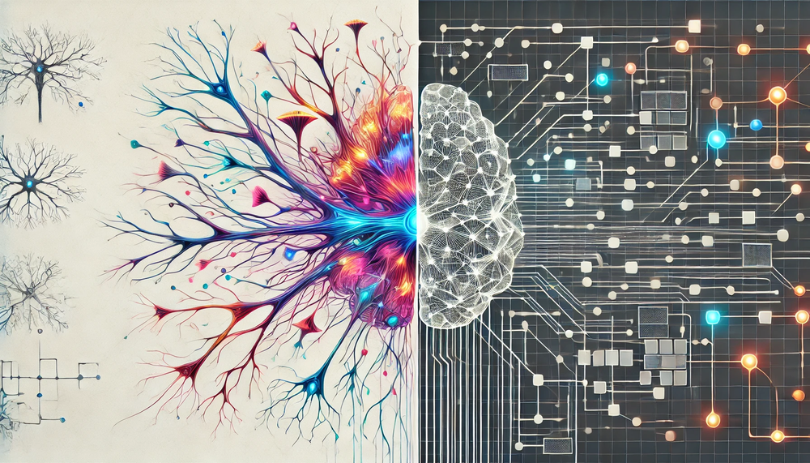
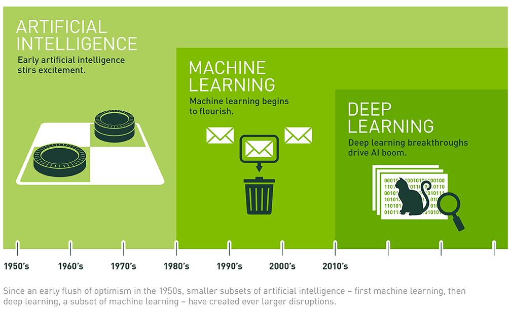
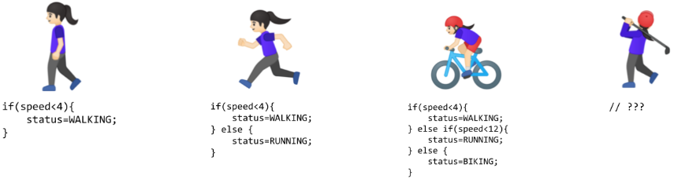
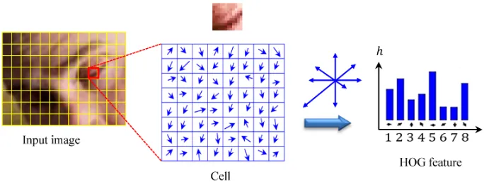
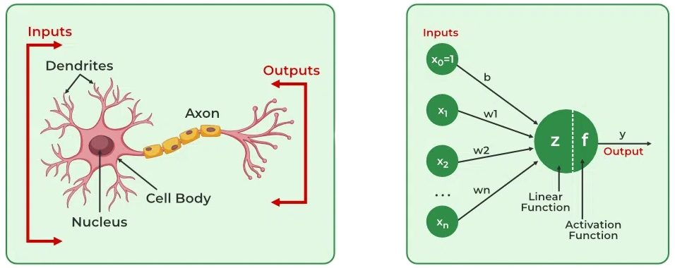
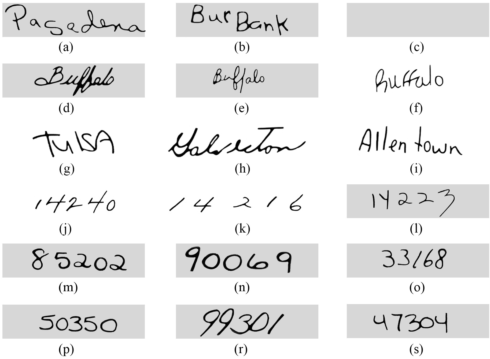

# 深度学习入门 {#sec-dl-primer}

::: {layout-narrow}

::: {.column-margin}

_ DALL·E 3 提示词：在干净的白色背景上，一幅矩形插图被分成两半。左侧展示了一个生物神经网络的详细且色彩丰富的描绘，呈现出彼此连接的神经元、发光的突触和树突。右侧显示了一个时尚现代的人工神经网络，以类似数字电路的、由相互连接的节点和边组成的网格来表示。两侧之间的过渡清晰但和谐，每一半都明确展示了各自的主题：左侧为生物，右侧为人工。_

:::

\noindent


:::

## 目的 {.unnumbered}

_为什么深度学习系统工程师需要对神经网络运算有深刻的数学理解，而不是将它们视为黑盒组件？_

现代深度学习系统以神经网络作为其核心计算引擎，但成功的工程实践要求理解支配其行为的数学原理。神经网络数学决定了内存需求、计算复杂度以及优化空间，而这些都直接影响系统设计决策。如果不能掌握梯度流、激活函数和反向传播机制等概念，工程师就无法预测系统行为、诊断训练失败，或优化资源分配。每一种数学运算都会转化为特定的硬件需求：矩阵乘法需要每秒数 GB 的内存带宽，而激活函数的选择则决定了其与移动处理器的兼容性。理解这些运算，能将神经网络从晦涩难懂的组件转变为可预测、可工程化的系统。

::: {.callout-tip title="学习目标"}

- 追溯人工智能从基于规则的系统到神经网络的发展演进，并识别其背后的工程挑战

- 分析神经网络运算（矩阵乘法、激活、梯度）及其硬件影响

- 基于计算约束和任务需求，通过选择合适的层配置、激活函数和连接模式来设计神经网络架构

- 通过多层网络实现前向传播，计算加权和并应用激活函数，将原始输入转换为分层的特征表示

- 执行反向传播算法计算梯度并更新网络权重，展示预测误差如何沿着网络层向后传播

- 比较训练和推理这两个运行阶段，分析它们在不同部署场景下各自不同的计算需求、资源需求和优化策略

- 评估损失函数和优化算法，解释这些选择如何影响训练动态、收敛行为和最终模型性能

- 评估深度学习流程，以识别计算瓶颈和优化机会
:::

## 深度学习系统工程基础 {#sec-dl-primer-deep-learning-systems-engineering-foundation-822c}

考虑一个看似简单的任务：在照片中识别猫。如果使用传统编程，你需要编写明确的规则：寻找三角形的耳朵，检查胡须，确认是否有四条腿，检查毛发图案，并处理光照、角度、姿势和品种中的无数变化。每个边界情况都需要额外的规则，从而生成越来越复杂的决策树，而这些树在遇到意外变化时仍会失败。这一局限性——也就是无法手工为复杂的现实世界问题编码所有模式——推动了从基于规则的编程向机器学习的演进。

深度学习代表了这一演进的最终成果，它通过直接从数百万张猫和非猫图像中学习来解决猫识别问题。我们不再编写规则，而是提供示例，让系统自动发现模式。这种从显式编程到学习到的表示的转变，对我们如何设计和工程化计算系统具有重要影响。

深度学习系统提出了一个与传统软件不同的工程挑战。传统系统基于显式规则执行确定性算法，而深度学习系统则通过学习数据表示的数学过程运行。这一转变要求负责其设计、实现和维护的工程师理解这些系统背后的数学运算。

这种数学复杂性的工程影响非常重要。当生产系统表现出性能退化时，传统调试方法往往不足以应对。性能异常可能源于优化过程中梯度不稳定 [^fn-gradient-instabilities]，源于激活计算中的数值精度限制，或者源于张量操作固有的内存访问模式 [^fn-tensor-operations]。如果没有基础数学素养，系统工程师就无法有效区分实现故障与算法约束，无法准确预测计算资源需求，也无法系统地优化由底层数学运算引发的性能瓶颈。

[^fn-gradient-instabilities]: **梯度不稳定**：在深层网络中，梯度在跨层传播时可能会爆炸（变得指数级大）或消失（变得指数级小）。梯度爆炸会导致训练不稳定，损失值剧烈波动；梯度消失则会阻碍前层有效学习。这些问题会表现为系统层面的故障——例如训练看起来“卡住了”，或者尽管计算资源充足，模型似乎学习得很慢。

[^fn-tensor-operations]: **张量操作**：构成神经网络计算骨干的多维数组操作。张量是向量（1 维）和矩阵（2 维）的 n 维推广——例如，彩色图像就是一个 3 维张量（高度 × 宽度 × 颜色通道）。现代神经网络处理表示多通道数据批次的 4 维及以上张量，需要针对 GPU 和 TPU 等并行硬件进行优化的专门内存布局和算术运算。

::: {.callout-definition title=“深度学习”}

***深度学习*** 是机器学习的一个子领域，它使用_具有多层的神经网络_从数据中_自动学习分层表示_，从而无需_显式特征工程_。

:::

深度学习已成为现代人工智能中的主导方法，它解决了早期方法所受的限制。基于规则的系统需要穷尽式地手工指定决策路径，而传统机器学习技术则要求具备特征工程专业知识；相比之下，神经网络架构能够直接从原始数据中发现模式表示。这种能力使得许多过去被认为难以处理的应用成为可能，但也引入了计算复杂性，要求我们重新思考系统架构设计原则。如 @fig-ai-ml-dl 所示，神经网络是机器学习和人工智能更广泛层级中的基础组成部分。

{#fig-ai-ml-dl}

向神经网络架构的转变，不仅是算法层面的演进，更意味着需要重新构想系统设计方法。神经网络通过大规模并行的矩阵运算执行计算，这与专用硬件架构高度契合。这些系统通过迭代优化过程进行学习，会产生独特的内存访问模式，并施加严格的数值精度要求。推理阶段的计算特性与训练阶段有显著差异，因此每种运行模式都需要不同的优化策略。

本章旨在建立有效工程化神经网络系统所需的数学素养。我们不会把这些架构视为难以理解的抽象概念，而是会考察决定系统行为和性能的数学运算。我们将探讨生物神经过程如何启发人工神经元模型，分析单个神经元如何组合成复杂的网络拓扑，并研究这些网络如何通过数学优化获取知识。每个概念都与实际系统工程考量直接相关：理解矩阵乘法运算有助于揭示内存带宽需求，理解梯度计算机制有助于解释数值精度约束，而认识优化动态则能为资源分配决策提供依据。

我们首先考察人工智能方法如何从显式的基于规则的编程演化为自适应学习系统。随后，我们将研究启发人工神经元模型的生物神经过程，建立支配神经网络运算的数学框架，并分析使这些系统能够从复杂数据集中提取模式的优化过程。在整个讨论中，我们始终关注每一数学原理的系统工程含义，构建设计、实现和优化生产级深度学习系统所需的理论基础。

完成本章后，学生将不再把神经网络视为晦涩的算法构造，而是将其理解为可工程化的计算系统；其数学运算能够为实际实现和运行部署提供直接指导。

## 机器学习范式的演进 {#sec-dl-primer-evolution-ml-paradigms-e0a4}

为了理解为什么深度学习会成为需要专用计算基础设施的主导方法，我们来考察人工智能方法是如何随时间演进的。当前的人工智能时代，代表着从基于规则的编程，经由经典机器学习，直至现代神经网络的最新演化阶段。理解这一进程有助于揭示每种方法如何建立在前代方法之上，并解决其局限性。

### 传统基于规则的编程的局限性 {#sec-dl-primer-traditional-rulebased-programming-limitations-e82d}

传统编程要求开发者明确定义规则，告诉计算机如何处理输入并产生输出。以一个像 Breakout[^fn-breakout-game] 这样的简单游戏为例，如 @fig-breakout 所 示。程序需要为每一种交互都定义明确的规则：当球撞到砖块时，代码必须指定应删除该砖块，并将球的方向反转。虽然这种方法在具有清晰物理规律和有限状态的游戏中效果很好，但它体现了基于规则系统的一个局限性。

::: {#fig-breakout fig-env="figure" fig-pos="htb"}

```{.tikz}
\scalebox{0.85}{%
\begin{tikzpicture}[line join=round,font=\small\usefont{T1}{phv}{m}{n}]
\definecolor{BlueGreen}{RGB}{20,188,188}
\definecolor{Cerulean}{RGB}{0,173,231}
\definecolor{Dandelion}{RGB}{255,185,76}
\definecolor{Goldenrod}{RGB}{255,219,87}
\definecolor{Lavender}{RGB}{253,160,204}
\definecolor{LimeGreen}{RGB}{136,201,70}
\definecolor{Maroon}{RGB}{186,49,50}
\definecolor{OrangeRed}{RGB}{255,46,88}
\definecolor{Peach}{RGB}{255,147,88}
\definecolor{Thistle}{RGB}{222,132,191}

\def\columns{5}
\def\rows{3}
\def\cellsize{25mm}
\def\cellheight{7mm}
\def\rowone{Peach,BlueGreen,OrangeRed,Thistle,Dandelion}
\def\rowtwo{brown!50,lime,teal,pink,lightgray}
\def\rowthree{Lavender,Goldenrod,Cerulean,Maroon,LimeGreen}
%
\foreach \x in {1,...,\columns}{
    \foreach \y in {1,...,\rows}{
        %
        \node[draw=black, fill=green!30, minimum width=\cellsize,
                    minimum height=\cellheight, line width=0.25pt] (cell-\x-\y) at (\x*\cellsize,-\y*\cellheight) {};
    }
}
\foreach \color [count=\x] in \rowone {
    \node[fill=\color,draw=black,line width=0.25pt, minimum size=\cellsize,
    minimum height=\cellheight] at (cell-\x-1) {};
}
%
\foreach \color [count=\x] in \rowtwo {
    \node[fill=\color,draw=black,line width=0.25pt, minimum size=\cellsize,
               minimum height=\cellheight] at (cell-\x-2) {};
}
%
\foreach \color [count=\x] in \rowthree {
    \node[fill=\color,draw=black,line width=0.25pt, minimum size=\cellsize,
               minimum height=\cellheight] at (cell-\x-3) {};
}
\begin{scope}[shift={($(cell-4-3)+(0,-1.7)$)}]
\node[align=left,font=\small\ttfamily]at(0,0){if (ball.collide(brick)) \{ \\
\qquad    removeBrick();\\
\qquad    ball.dx = 1.1 * (ball.dx);\\
\qquad    ball.dy = -1 * (ball.dy);\\
\}};
\end{scope}
\node[draw,rectangle,minimum width=40mm,minimum height=4mm,fill=Sepia!50!black!]
at($(cell-3-3.south west)+(0,-2.8)$)(R){};

\node[draw,circle,minimum size=5mm,fill=Sepia!50!black!,anchor=north]
at($(cell-1-3.south west)!0.8!(cell-1-3.south east)$)(C){};
\draw[thick,-latex,dash pattern={on 5pt off 2pt on 1pt off 3pt}](R)--(C)--++(225:2);
\end{tikzpicture}}
```
**基于规则的系统**：传统编程依赖显式定义的规则将输入映射到输出，这使其在复杂或不确定环境中的适应性受限，因为必须预先考虑并编码每一种可能的场景。这种方法与深度学习形成对比，后者从数据中学习模式，而不是依赖预先编程的逻辑。
:::
除了单个应用之外，这种基于规则的范式也扩展到所有传统编程，如 @fig-traditional 所 示。程序同时接收用于处理的规则和输入数据，以产生输出。早期人工智能研究探索过这种方法是否能通过编码足够多的规则来刻画智能行为，从而扩展到解决复杂问题。

::: {#fig-traditional fig-env="figure" fig-pos="htb"}

```{.tikz}
\resizebox{.65\textwidth}{!}{%
\begin{tikzpicture}[font=\small\usefont{T1}{phv}{m}{n}]
%
\tikzset{%
Line/.style={line width=1.0pt,black!50,text=black},
  Box/.style={inner xsep=2pt,
    node distance=1,
    draw=GreenLine, line width=0.75pt,
    fill=GreenL,
    text width=22mm,align=flush center,
    minimum width=22mm, minimum height=8mm
  },
  Box1/.style={Box, draw=RedLine, fill=RedL,
    text width=36mm, minimum width=40mm
  },
}
%
 \node[Box1](B1){Traditional Programming};
 \node[Box,right=of B1](B2){Answers};
 \node[Box,above left=0.2 and 1 of B1](B3){Rules};
 \node[Box, below left=0.2 and 1 of B1](B4){Data};
 \draw[-latex,Line](B1)--(B2);
 \draw[-latex,Line](B3)-|(B1);
 \draw[-latex,Line](B4)-|(B1);
\end{tikzpicture}}
```
**基于规则的编程**：传统程序使用明确定义的规则对数据进行操作，这为早期人工智能系统奠定了基础，但缺乏现代机器学习方法的适应性。这种方法与深度学习形成对比，后者从示例中推断规则，而不是依赖预先编程的逻辑。
:::
尽管看似简单，但当面对复杂的现实世界任务时，基于规则的局限性就会显现出来。识别人类活动（@fig-activity-rules）就体现了这一挑战：将 4 mph 以下的运动分类为步行看起来很简单，直到现实世界的复杂性出现。速度变化、活动之间的过渡以及边界情况都会需要额外的规则，从而形成难以处理的决策树。计算机视觉任务会进一步加剧这些困难：检测猫需要关于耳朵、胡须和身体形状的规则，同时还要考虑观察角度、光照、遮挡以及自然变化。早期系统只有在约束明确、条件受控的环境中才能取得成功。

{#fig-activity-rules}

[^fn-breakout-game]: **Breakout**：Atari 于 1976 年推出的经典街机游戏，在人工智能史上具有重要意义，因为 DeepMind 的 DQN（Deep Q-Network）于 2013 年仅凭像素输入就学会了玩这款游戏，在没有任何预设游戏规则的情况下达到了超人类水平。这一突破证明了神经网络能够仅从原始感知输入和奖励信号中学习复杂策略，标志着深度强化学习中的一个关键里程碑，并影响了现代人工智能游戏系统。

认识到这些局限后，20 世纪 70 年代和 80 年代人工智能研究所体现的知识工程方法，试图将规则创建系统化。专家系统 [^fn-expert-systems] 将领域知识编码为显式规则，在参数明确的特定领域表现出潜力，但在处理人类自然执行的任务时却显得力不从心，例如物体识别、语音理解或自然语言解析。这些局限凸显了一个挑战：智能行为的许多方面依赖于隐性知识，而这种知识难以用显式基于规则的表示来表达。

[^fn-expert-systems]: **专家系统**：一种基于规则的人工智能程序，将人类领域专家知识编码其中，在 1970—1990 年间十分突出。著名例子包括 MYCIN（斯坦福，1976），用于医疗诊断，在某些抗生素选择任务中优于人类医生；以及 XCON（DEC，1980），用于计算机配置，每年为公司节省 4000 万美元。尽管早期取得成功，专家系统仍需要大量人工知识工程——即从人类专家那里提取并编码规则——并且在处理不确定性和人类自然处理的常识推理时表现不佳。

### 经典机器学习 {#sec-dl-primer-classical-machine-learning-dec9}

面对基于规则系统的可扩展性障碍，研究人员开始探索能够从数据中学习的方法。机器学习提供了一个有希望的方向：与其为每种情况编写规则，不如编写能够识别示例中模式的程序。然而，这些方法的成功仍然在很大程度上依赖于人类洞察力来定义相关模式，这一过程被称为__特征工程__。

这种方法引入了__特征工程__：将原始数据转换为能够向学习算法暴露模式的表示。方向梯度直方图（Histogram of Oriented Gradients, HOG）[@dalal2005histograms][^fn-hog-method] 方法（@fig-hog）就是这一方法的典型代表，它通过识别亮度急剧变化的边缘，将图像划分为多个单元，并测量每个单元内的边缘方向。这样就把原始像素转换为对光照变化和轻微位置变化更具鲁棒性的形状描述符。

[^fn-hog-method]: **方向梯度直方图（Histogram of Oriented Gradients, HOG）**：由 Navneet Dalal 和 Bill Triggs 于 2005 年提出，HOG 在深度学习出现之前曾是目标检测的黄金标准。它在行人检测上达到了接近完美的准确率——这一突破推动了实用计算机视觉应用的发展。HOG 的工作方式是：在 8×8 像素单元中计算梯度（边缘方向），然后创建 9 个方向分箱的直方图。这个巧妙的抽象捕捉了物体形状，同时忽略纹理细节，使其对光照变化具有鲁棒性，但也需要专家知识来设计。

{#fig-hog}

SIFT[@lowe1999object][^fn-sift]（尺度不变特征变换，Scale-Invariant Feature Transform）和 Gabor 滤波器 [^fn-gabor-filters] 等互补方法捕捉了不同的视觉模式——SIFT 检测在尺度和方向变化下仍稳定的关键点，而 Gabor 滤波器则识别纹理和频率。它们都编码了关于视觉模式识别的领域专业知识。

[^fn-sift]: **尺度不变特征变换（Scale-Invariant Feature Transform, SIFT）**：由不列颠哥伦比亚大学的 David Lowe 于 1999 年发明，SIFT 通过检测在不同视角、尺度和光照条件下仍保持稳定的“关键点”，彻底改变了计算机视觉。一张典型图像会产生 1000–2000 个 SIFT 关键点，每个关键点由一个 128 维向量描述。在深度学习出现之前，SIFT 是 Google 街景图像匹配和早期智能手机增强现实等应用的支柱。该算法的四步流程（尺度空间极值检测、关键点定位、方向分配和描述符生成）需要深厚的专业知识才能有效实现。

[^fn-gabor-filters]: **Gabor 滤波器**：以 Dennis Gabor 命名（因全息摄影获得 1971 年诺贝尔物理学奖），这些数学滤波器通过同时分析频率和方向来检测边缘和纹理。在 1980—2010 年间被广泛用于计算机视觉，Gabor 滤波器模仿了人类视觉皮层处理图像的方式——不同神经元对特定方向和空间频率作出响应。一个典型的 Gabor 滤波器组包含 40 多个滤波器（8 个方向 × 5 个频率）来捕捉纹理模式，这使它们非常适合指纹识别和织物质量检测等应用，直到深度学习使手工滤波器设计过时。

这些工程化努力推动了 2000 年代计算机视觉的发展。系统如今能够在一定程度上抵抗现实世界中的变化来识别物体，从而带来了人脸检测、行人检测和目标识别等应用。尽管取得了这些成功，但这种方法仍有局限。专家需要为每个新问题精心设计特征提取器，而得到的特征可能会遗漏其设计时未曾预料到的重要模式。

### 深度学习：自动模式发现 {#sec-dl-primer-deep-learning-automatic-pattern-discovery-a3c1}

神经网络代表了我们使用计算机解决问题方式的一种转变，建立了一种从数据中学习而非遵循显式规则的新型编程方法。当考虑诸如计算机视觉，特别是识别图像中的物体等任务时，这种转变尤为明显。

深度学习的不同之处在于它直接从原始数据中学习。正如我们先前在 @fig-traditional 中看到的那 样，传统编程需要规则和数据共同作为输入来产生答案。机器学习则颠倒了这种关系，如 @fig-deeplearning 所 示。我们不再编写规则，而是提供示例（数据）及其正确答案，让系统自动发现底层规则。这种转变消除了人类指定哪些模式重要的需求。

::: {#fig-deeplearning fig-env="figure" fig-pos="htb"}

```{.tikz}
\resizebox{.65\textwidth}{!}{%
\begin{tikzpicture}[font=\small\usefont{T1}{phv}{m}{n}]
%
\tikzset{%
Line/.style={line width=1.0pt,black!50,text=black},
  Box/.style={inner xsep=2pt,
    node distance=1,
    draw=GreenLine, line width=0.75pt,
    fill=GreenL,
    text width=22mm,align=flush center,
    minimum width=22mm, minimum height=8mm
  },
  Box1/.style={Box,  draw=RedLine,
    fill=RedL, text width=36mm,
    minimum width=40mm
  },
}
%
 \node[Box1](B1){MachineLearning};
 \node[Box,right=of B1](B2){Rules};
 \node[Box,above left=0.2 and 1 of B1](B3){Answers};
 \node[Box, below left=0.2 and 1 of B1](B4){Data};
 \draw[-latex,Line](B1)--(B2);
 \draw[-latex,Line](B3)-|(B1);
 \draw[-latex,Line](B4)-|(B1);
\end{tikzpicture}}
```
**数据驱动的规则发现**：深度学习模型直接从数据中学习模式和关系，消除了手动指定规则的需要，并使得可以从原始输入中自动提取特征。这与传统编程形成对比，后者需要规则和数据共同生成输出；也与经典机器学习形成对比，后者从带标签数据中推断规则。
:::
通过这一自动化过程，系统从示例中发现这些模式。当向系统展示数百万张猫的图像时，它会学习识别越来越复杂的视觉模式，从简单边缘到构成类猫特征的更复杂组合。这与人类视觉系统的工作方式相似：从基本视觉元素逐步建立对复杂物体的理解。

基于这一层次化学习原理，深度网络学习层次化表示，其中复杂模式从简单模式中涌现。每一层都会学习越来越抽象的特征：边缘 → 形状 → 物体 → 概念。更深的网络只需多项式级别增加参数，却能表示指数级更多的函数，这就是理论上“深”的重要性。组合性原理解释了深度学习为何有效：复杂的现实世界模式往往具有层次结构，与网络的表示偏置相匹配。

这种层次结构带来了一项优势：与性能达到平台期的传统方法不同，深度学习模型会随着更多数据（识别更多变化）和更多计算（发现更细微的模式）而持续改进。这种可扩展性推动了性能的显著提升。图像识别准确率从 2012 年的 74% 提高到如今的 95% 以上 [^fn-imagenet-progress]。

[^fn-imagenet-progress]: **ImageNet 竞赛进展**：ImageNet 大规模视觉识别挑战赛（ILSVRC）跟踪了 2010—2017 年的计算机视觉进展。错误率大幅下降：传统方法在 2010 年的错误率约为 28%，AlexNet[@krizhevsky2012imagenet]（首个深度学习获胜者）在 2012 年达到 15.3%，而 ResNet[@he2016deep] 在 2015 年达到 3.6%——超过了估计的人类 5.1% 性能。这一快速改进展示了深度学习相对于手工特征的优越性，并引发了现代人工智能革命。该竞赛于 2017 年结束，因为后续改进已变得渐进式。

神经网络性能遵循可预测的缩放关系，这直接影响系统设计。这些缩放定律解释了为什么现代人工智能系统更重视更大模型而非更长训练：GPT-4 的参数量约为 GPT-1 的 1000 倍，但训练时间相近。因此，内存带宽和存储容量成为主要约束，而不再是原始计算能力。关于这些缩放定律的详细数学形式及其定量分析见 @sec-ai-training，而 @sec-model-optimizations 则探讨其实际实现。

除了性能提升之外，这种方法还对人工智能系统构建产生影响。深度学习能够直接从原始数据中学习，消除了手动__特征工程__的需要，同时也带来了新的需求。需要先进的基础设施来处理海量数据，需要强大的计算机来处理这些数据，还需要专用硬件来高效执行复杂数学计算。深度学习的计算需求推动了针对这些计算优化的专用计算芯片的发展。

经验证据强有力地支持这些主张。深度学习在计算机视觉中的成功说明了：当获得足够的数据和计算资源时，这种方法可以超越传统方法。类似的模式已在多个领域反复出现，从语音识别到游戏对弈，确立了深度学习作为人工智能变革性方法的地位。

然而，这一转变也伴随着权衡：深度学习的计算需求重塑了系统要求。理解这些要求有助于为后续神经网络的技术细节提供背景。

### 计算基础设施需求 {#sec-dl-primer-computational-infrastructure-requirements-62fd}

从传统编程到深度学习的演进，不仅意味着我们解决问题方式的转变，也意味着计算系统需求的变革，这会直接影响机器学习系统设计的方方面面。当我们考虑机器学习系统的全谱系，从大规模云部署到资源受限的 Tiny ML 设备时，这种变革就显得尤为重要。

传统程序遵循可预测的模式。它们按顺序执行指令，以规则的方式访问内存，并以人们熟知的方式使用计算资源。一个典型的基于规则的图像处理系统可能会系统地扫描像素，应用固定操作，其计算和内存需求都较为适中且可预测。这些特性使得传统程序在不同计算平台上的部署相对简单。

| **系统方面** | **传统编程** | **带特征的机器学习** | **深度学习** |
|:---|:---|:---|:---|
| **计算** | 顺序、<br>可预测的路径 | 结构化并行<br>操作 | 大规模矩阵<br>并行 |
| **内存访问** | 小而可预测的<br>模式 | 中等、<br>以批处理为导向 | 大而复杂的<br>层次化模式 |
| **数据移动** | 简单的输入/输出<br>流 | 结构化批处理<br>处理 | 跨系统的密集<br>数据移动 |
| **硬件需求** | 以 CPU 为中心 | 带向量<br>单元的 CPU | 专用<br>加速器 |
| **资源扩展** | 固定需求 | 随数据规模线性增长 | 随复杂度<br>指数增长 |

: **系统资源演进**：编程范式将系统需求从顺序计算转向具备特征工程的结构化并行，最终转向深度学习中的大规模矩阵运算和复杂内存层次结构。该表阐明了与传统编程和带工程化特征的机器学习相比，深度学习如何从根本上改变系统需求，影响计算与内存访问模式。 {#tbl-evolution}

当我们转向数据驱动的方法时，带有工程化特征的经典机器学习引入了新的复杂性。特征提取算法需要更密集的计算和结构化的数据移动。前文讨论的 HOG 特征提取器，例如，需要对图像数据进行多次遍历，计算梯度并构建直方图。虽然这增加了计算需求和内存复杂度，但资源需求仍然是可预测的，并且可以跨平台扩展。

然而，深度学习会从多个维度重塑系统需求，如 @tbl-evolution 所 示。理解这些演化变化很重要，因为这些差异会以多种方式显现，并影响整个机器学习系统谱系。

#### 并行矩阵运算模式 {#sec-dl-primer-parallel-matrix-operation-patterns-969c}

当比较这些方法时，计算范式的转变会立刻显现出来。传统程序遵循顺序逻辑流程。与之形成鲜明对比的是，深度学习需要对矩阵进行大规模并行运算。这一转变解释了为什么为顺序处理而设计的传统 CPU 在神经网络计算中效率低下。

这种并行计算模型带来了新的瓶颈。根本挑战是内存墙：虽然可以通过增加更多处理单元来提升计算能力，但为这些单元供数的内存带宽却不会同样理想地扩展 [^fn-memory-hierarchy]。现代加速器通过多级缓存和专用内存架构构建层次化内存系统，以实现数据复用。关键洞见是：让数据尽量靠近其被处理的位置——也就是更快、更小的缓存，而不是更慢、更大的主存——能显著提升性能。

[^fn-memory-hierarchy]: **内存层次结构性能**：现代处理器采用多个内存层级，其访问速度差异巨大。L1 缓存（最快、最靠近处理器）可在 1–2 个处理器时钟周期内提供数据，L2 缓存需要 10–20 个周期，而主存则需要 100 多个周期——造成 50–100 倍的速度差异。吞吐量差异同样巨大：L1 最高可达约 1000 GB/s（每秒千兆字节），L2 最高约 500 GB/s，而主存仅在 CPU 上提供约 100 GB/s（在采用专用高带宽内存的 GPU 上约 1 TB/s）。神经网络加速器之所以成功，是因为它们将频繁访问的权重保存在快速缓存中，并在多次计算中重复使用，通常通过精心调度实现 80% 以上的缓存命中率。

这些内存层次结构方面的挑战解释了为什么神经网络加速器专注于最大化数据复用。成功的设计不会反复从缓慢的主存中提取相同权重，而是将频繁访问的数据保存在快速本地存储中，并精心调度操作以尽量减少数据移动。关于这些内存系统及其性能特征的详细定量分析见 @sec-ai-acceleration。

对并行处理的需求推动了专用硬件架构的采用，从强大的云端 GPU，到专用移动处理器，再到 Tiny ML 加速器。关于这些硬件架构及其在机器学习工作负载中的权衡见 @sec-ai-acceleration。

#### 分层内存架构 {#sec-dl-primer-hierarchical-memory-architecture-5ae2}

内存需求带来了另一个转变。传统程序通常维护较小且固定的内存占用。相比之下，深度学习模型必须在复杂的内存层次结构中管理参数。内存带宽往往成为主要性能瓶颈，对资源受限系统构成挑战。

这种内存密集型特性会带来神经计算特有的性能瓶颈。矩阵乘法——神经网络的核心操作——通常受内存带宽限制，而非受计算限制 [^fn-memory-bound]。根本问题在于，处理器执行计算的速度往往快于它们从内存中获取数据的速度。每个权重在进行乘法运算前都必须从内存中加载，如果内存系统无法足够快地提供数据，计算单元就会因等待值到来而空闲。这种计算能力与内存带宽之间的不平衡解释了为什么仅仅增加处理单元数量并不会按比例提升性能。

[^fn-memory-bound]: **受内存带宽限制的操作**：以一个典型的矩阵乘法为例：一个每秒可执行十亿次浮点运算的处理器，需要以 250–500 GB/s（每秒千兆字节）的速度加载数据，才能让计算单元充分利用。然而，典型 CPU 的内存带宽只有 50–100 GB/s，即便高端 GPU 也仅提供 1–2 TB/s（每秒太字节）。这一差距意味着 CPU 在神经网络操作上的峰值计算效率只有 5–15%，而 GPU 通过更高带宽和更好的数据复用策略可达到 40–60%。

GPU 通过更高的内存带宽和大规模并行性来应对这一挑战，从而比传统 CPU 实现更高的利用率。然而，底层约束依然存在：神经网络中的能耗主要由数据移动而非计算所主导。将数据从主存移动到处理单元所消耗的能量，往往超过实际数学运算本身。这种能耗层次结构解释了为什么专用处理器会重点采用减少数据移动的技术，把数据尽量放在离处理位置更近的地方。

这种根本性的内存-计算权衡在不同部署场景中表现不同。云服务器可以承受更多内存和功耗以最大化吞吐量，而移动设备则必须仔细优化以满足严格的功耗预算。训练系统优先考虑计算吞吐量，即使要付出更高能耗；而推理系统则更强调能效。这些不同约束推动了机器学习系统谱系中的不同优化策略，从内存丰富的云部署到高度优化的 Tiny ML 实现。

量化和剪枝等内存优化策略详见 @sec-model-optimizations，而硬件架构及其内存系统见 @sec-ai-acceleration。

#### 分布式计算需求 {#sec-dl-primer-distributed-computing-requirements-f7a5}

研究人员发现，深度学习改变了系统扩展方式以及效率的重要性。传统程序的资源需求相对固定，性能特征可预测。随着复杂度增长，深度学习模型可能消耗指数级更多的资源。模型能力与资源消耗之间的这种关系，使系统效率成为一个重要问题。@sec-efficient-ai 涵盖了优化这种关系的技术，包括在保持模型性能的同时降低计算需求的方法。

将算法概念与硬件现实连接起来变得至关重要。传统程序通常可以较直接地映射到标准计算机架构，而深度学习则需要仔细考虑：

* 如何高效地将矩阵运算映射到物理硬件（@sec-ai-acceleration 涵盖了面向硬件的优化策略）
* 如何尽量减少跨内存层次结构的数据移动
* 如何在计算能力与资源约束之间取得平衡（@sec-efficient-ai 探讨了缩放定律和效率权衡）
* 如何同时优化算法和系统级效率（@sec-model-optimizations 提供了模型压缩技术）

这些转变解释了为什么深度学习推动了整个计算栈的创新。从专用硬件加速器，到新的内存架构，再到复杂的软件框架，深度学习的需求持续重塑计算机系统设计。

在明确了从基于规则的系统到神经网络的历史演进，以及这一演进所要求的计算基础设施之后，我们现在来考察这些系统背后的基础灵感。神经网络究竟计算什么的答案，并不是从硅片和软件开始，而是从生物学开始——具体来说，是从我们大脑中的神经网络出发，这些网络启发了驱动现代人工智能系统的人工神经网络。

## 从生物学到硅芯片 {#sec-dl-primer-biology-silicon-0482}

在考察了编程方法如何从规则演变为数据驱动学习，以及这种演变如何推动了我们今天看到的计算基础设施需求之后，我们现在转向这样一个问题：这些神经网络究竟在计算什么？答案并不是从硅芯片开始，而是从生物学开始。

我们刚刚考察过的巨大计算需求（专用处理器、分层内存系统、高带宽数据移动）都可以追溯到一个简单的灵感来源：生物神经元。理解自然如何用 20 瓦功耗解决信息处理问题，既揭示了人工神经系统的潜力，也揭示了其挑战。在考察生物神经元及其人工对应物时，请留意这样一个模式：我们选择实现或近似的每一个生物特征，都会带来特定的计算需求，将树突和突触模型直接连接到我们刚才讨论过的处理能力和内存带宽需求。

本节通过考察三个关键转换，连接生物学灵感与系统实现：生物神经元如何启发人工神经元设计，神经原理如何转化为数学运算，以及这些运算如何驱动我们前面概述的系统需求。到本节结束时，你将理解为什么即使实现简化的神经计算，也需要现代 ML 系统所要求的专用硬件基础设施。

### 生物神经处理原理 {#sec-dl-primer-biological-neural-processing-principles-3485}

从系统角度看，生物神经网络为我们刚刚讨论过的计算挑战提供了答案：它们在消耗极少能量的同时，实现了大规模并行、有效的内存使用和自适应学习。来自生物智能的四个关键原理，直接影响了人工神经网络设计：

**自适应学习**：大脑会根据经验持续修改神经连接，通过与环境的交互不断改进响应。这种生物能力启发了机器学习的核心原则：不是遵循固定的、预先编程好的规则，而是从数据中不断改进。

**并行处理**：大脑同时处理海量信息，不同区域专门负责特定功能，并协同工作。这种分布式、并行架构与传统的顺序计算形成对比，并影响了现代 AI 系统设计。

**模式识别**：生物系统擅长在复杂、嘈杂的数据中识别模式——在人群中识别人脸、在嘈杂环境中理解语音、从不完整信息中识别物体。这种能力启发了计算机视觉和语音识别中的应用，但人工系统仍在努力追赶大脑的效率。

**能效**：生物系统以极高的能效完成处理。人类大脑 20 瓦的功耗 [^fn-brain-efficiency] 形成了鲜明的效率差距，而人工系统仍在努力弥合这一差距。@sec-sustainable-ai 通过环境影响分析和节能优化策略探讨了理解并复制这种效率的问题。

这些生物学原理为人工神经系统提出了关键要求：能够整合多个输入的简单处理单元、可调节的连接强度、基于输入阈值的非线性激活、并行处理架构，以及通过修改连接强度来学习。下文将考察我们如何把这些生物学洞见转化为数学运算，并进一步转化为硅芯片实现。

[^fn-brain-efficiency]: **大脑能效**：人类大脑大约包含 860 亿到 1000 亿个神经元，仅用 20 瓦就能完成估计每秒 10^13 到 10^16 次运算——相当于驱动一盏 LED 灯泡。相比之下，训练 GPT-3[@brown2020language] 约消耗了 1,287 兆瓦时的电力 [@strubell2019energy]。这种鲜明的效率差距推动了对神经形态计算的研究，并启发了专用 AI 芯片的发展，这些芯片旨在模拟类脑处理。

这些生物学原理塑造了人工智能中的两种方法。第一种尝试直接模仿神经结构和功能，创建在结构上类似生物网络的人工神经网络。第二种则采用更抽象的方法，在不精确复制生物结构的前提下，调整生物学原理，使其能够在计算机硬件约束下高效工作。

要理解这两种方法在实践中如何运作，我们首先必须考察使神经计算成为可能的基本单元：单个神经元。通过理解生物神经元如何处理信息，我们就能看到这一过程如何转化为驱动人工神经网络的数学运算。

### 生物神经元结构 {#sec-dl-primer-biological-neuron-structure-ab31}

要将这些高层原理转化为实际实现，就需要考察生物信息处理的基本单元：神经元。这个细胞构件为其人工对应物提供了蓝图，并揭示了复杂神经网络如何从简单组件协同工作中涌现。

在生物系统中，神经元（或细胞）代表神经系统的基本功能单元。理解其结构对于与人工系统建立类比至关重要。@fig-bio_nn2ai_nn 展示了生物神经元的结 构。

{#fig-bio_nn2ai_nn}

生物神经元由若干关键组成部分构成。中心部分是细胞体，即胞体（soma），其中包含细胞核并执行细胞的基本生命过程。从胞体延伸出树枝状结构，称为树突，它们充当来自其他神经元的输入信号接收器。神经元之间的连接发生在突触处 [^fn-synapses]，突触会调节传输信号的强度。最后，一条细长的投射结构称为轴突，它将电冲动从细胞体传导到其他神经元。

[^fn-synapses]: **突触**：源自希腊语“synaptein”，意为“紧扣在一起”，突触是神经元之间传递化学或电信号的连接点。典型神经元有 1,000-10,000 个突触连接，人类大脑约有 100 万亿个突触。突触连接的强度可通过经验改变，构成学习和记忆的生物基础——这一原理被人工神经网络中的可调权重直接模仿。

综合这些结构组件，神经元的工作方式如下：树突充当接收器，收集来自其他神经元的输入信号。位于这些连接处的突触调节每个信号的强度，决定每个输入产生多大影响。胞体对这些加权信号进行整合，并决定是否触发输出信号。如果触发，轴突就将该信号传递给其他神经元。

生物神经元的每个元素在人工系统中都有计算类比，反映了自然界中的学习、适应性和效率原理。为了更好地理解生物智能如何影响人工系统，@tbl-bio_nn2ai_nn 展示了生物神经元与人工神经元各组成部分之间的映 射。应结合 @fig-bio_nn2ai_nn 一起查 看，以获得完整图景。两者共同展示了从生物神经元到人工神经元的映射关系。

| **生物神经元** | **人工神经元** |
|:---|:---|
| **细胞** | 神经元 / 节点 |
| **树突** | 输入 |
| **突触** | 权重 |
| **胞体** | 净输入 |
| **轴突** | 输出 |

: **神经元对应关系**：生物神经元通过类比组件启发人工神经元设计——树突对应输入（接收信号），突触对应权重（调节连接强度），胞体对应净输入，轴突对应输出——为智能的计算建模奠定基础。该表阐明了生物神经元的关键功能如何被抽象并实现为人工神经网络，使学习和信息处理成为可能。 {#tbl-bio_nn2ai_nn}

理解这些对应关系对于把握人工系统如何近似生物智能至关重要。每个组件通过不同机制发挥相似功能，并对人工神经网络产生特定影响。

1. **细胞$\longleftrightarrow$神经元/节点**：人工神经元或节点作为基本计算单元，镜像了生物系统中细胞的作用。

2. **树突$\longleftrightarrow$输入**：生物神经元中的树突接收来自其他神经元的输入信号，类似于输入如何馈送到人工神经元中。它们充当信号接收器，就像天线收集信息一样。

3. **突触$\longleftrightarrow$权重**：突触调节神经元之间连接的强度，这与人工神经元中的权重直接类比。这些权重是可调的，使学习和优化能够随时间进行，通过控制每个输入的影响程度实现。

4. **胞体$\longleftrightarrow$净输入**：人工神经元中的净输入会对加权输入求和以决定是否激活，类似于胞体在生物神经元中整合信号的方式。

5. **轴突$\longleftrightarrow$输出**：人工神经元的输出将处理后的信息传递给后续网络层，就像轴突将信号传递给其他神经元一样。

这种映射说明了人工神经网络如何在保留本质计算原理的同时，对生物过程进行简化和抽象。理解单个神经元只是起点。神经网络的真正力量来自这些基本单元在更大系统中的协同工作。

从系统工程角度看，这种生物到人工的转换揭示了为什么神经网络具有如此苛刻的计算需求。每个简单的生物过程都对应着需要并行执行数百万甚至数十亿次的密集数学运算。

### 人工神经网络设计原理 {#sec-dl-primer-artificial-neural-network-design-principles-57f0}

为了从生物学灵感过渡到实际实现，从生物原理到人工计算的转化需要深刻理解生物神经网络在细胞层面和网络层面为何都如此高效，以及为何在硅芯片上复制这些能力会带来如此显著的系统挑战。大脑通过分布在数十亿个神经元上的分布式计算来处理信息，每个神经元与硅晶体管相比运行得都相对缓慢。生物神经元的放电频率约为 200 Hz，而现代处理器则以吉赫兹频率运行。尽管速度有限，大脑的并行架构仍使其能够对复杂感官输入进行复杂的实时处理、决策和行为控制。

尽管表面上速度不占优势，但这种计算效率源于大脑的基本组织原理。每个神经元都充当一个简单的处理单元，从成千上万个其他神经元接收输入，并根据整合后的输入是否超过阈值来产生二元输出信号。神经元之间通过突触介导的连接强度会不断通过经验进行修改。这种突触可塑性构成了生物神经网络学习和适应的基础。

在人工系统中复制生物效率需要处理根本性的权衡。虽然大脑以约 20 瓦的功耗实现了惊人的效率（如前所述），但可比的人工神经网络却需要高出几个数量级的功率。例如，大语言模型在训练期间可能消耗兆瓦级功率，在推理期间消耗千瓦级功率——比大脑高出数千到数十万倍。这一巨大的效率差距推动了对专用硬件、量化技术和架构创新的工程关注。

从这些组织洞见出发，生物系统为人工神经系统所需的若干关键计算元素提供了启示：

* 能整合多个输入的简单处理单元
* 单元之间可调的连接强度
* 基于输入阈值的非线性激活
* 并行处理架构
* 通过修改连接强度进行学习

问题现在变成：我们如何将这些抽象的生物学原理转化为计算机能够执行的具体数学运算？

### 神经概念的数学转化 {#sec-dl-primer-mathematical-translation-neural-concepts-b375}

将生物学洞见转化为实际系统时，我们面临的挑战是：如何在数字系统的刚性框架内捕捉神经计算的本质。正如我们在神经元模型分析中所确立的（见 @tbl-bio_nn2ai_nn），人工神经元将生物过程简化为三个关键操作：加权输入处理（突触强度）、求和（信号整合）以及激活函数（基于阈值的放电）。@tbl-bio2comp 对这些生物特征如何映射到其计算对应物提供了系统性的视 图，揭示了数字神经实现的可能性与局限性。

| **生物特征** | **计算转化** |
|:---|:---|
| **神经元放电** | 激活函数 |
| **突触强度** | 加权连接 |
| **信号整合** | 求和操作 |
| **分布式记忆** | 权重矩阵 |
| **并行处理** | 并发计算 |

: **生物-计算类比**：人工神经元将生物神经系统的关键原理进行抽象，把神经元放电映射为激活函数，把突触强度映射为加权连接，把信号整合映射为求和操作——为数字神经实现奠定基础。生物系统中的分布式记忆和并行处理分别在权重矩阵和并发计算中找到计算对应物，突出这种抽象的力量与局限。 {#tbl-bio2comp}

使用前文概述的从生物到人工的映射原理，这种数学抽象保留了关键计算原理，同时支持高效的数字实现。加权、求和和激活操作，直接对应于我们在神经元对应关系分析中识别出的突触强度、信号整合和阈值放电机制。

这种抽象是有计算成本的。生物中轻而易举完成的事情，在人工系统中却需要密集的数学计算。正如在内存系统一节中讨论的那样，由于内存带宽限制，这些操作会带来显著的计算需求。

人工神经网络中的记忆形式与生物系统有显著不同。生物记忆分布在突触连接和神经模式中，而人工网络将信息存储在离散的权重和参数中。这种架构差异反映了当前计算硬件的限制：在这些硬件中，内存和处理在物理上是分离的，而不像生物系统那样集成在一起。尽管实现方式不同，人工神经网络在模式识别和学习方面仍能实现类似的功能能力。

大脑的大规模并行性是人工实现中的一项挑战。生物神经网络通过数十亿个同时运行的神经元处理信息，而人工系统则通过 GPU 和张量处理单元等专用硬件来近似这种并行性。这些设备高效地计算构成人工神经网络数学基础的矩阵运算，以不同于生物系统的规模和粒度实现并行处理。

### 硬件和软件需求 {#sec-dl-primer-hardware-software-requirements-6309}

神经原理的计算转化带来了基础设施需求，这些需求源自生物实现与人工实现之间的关键差异，并直接塑造了系统设计。@tbl-comp2sys 展示了每个计算元素如何驱动特定的系统需 求。该映射说明，计算转化中所做的选择会直接影响实现所需的硬件和系统架构。

| **计算元素** | **系统需求** |
|:---|:---|
| **激活函数** | 快速非线性运算单元 |
| **权重运算** | 高带宽内存访问 |
| **并行计算** | 专用并行处理器 |
| **权重存储** | 大规模内存系统 |
| **学习算法** | 梯度计算硬件 |

: **计算需求**：人工神经网络设计会直接转化为特定的系统需求；例如，高效的激活函数需要快速非线性运算单元，而大规模权重存储则要求高带宽内存访问。理解这种映射有助于指导有效实现人工智能所需的硬件和系统架构选择。 {#tbl-comp2sys}

存储架构是一项关键需求，它由生物系统和人工系统处理记忆方式的关键差异所驱动。在生物系统中，记忆与处理是内在集成的——突触既存储连接强度，也处理信号。然而，人工系统必须清晰地区分处理单元和内存。这就需要既有高容量存储来容纳数百万甚至数十亿个连接权重，也有高带宽通路来在存储单元和处理单元之间快速移动这些数据。这种数据移动的效率常常成为一个关键瓶颈，而生物系统并不存在这个问题。

学习过程本身也给人工系统施加了不同的要求。生物网络通过局部化学过程修改突触强度，而人工网络则必须在整个网络范围内协调权重更新。这在训练期间带来了计算和内存需求，因为系统不仅要存储当前权重，还要为梯度和中间计算保留空间。反向传播误差信号这一需求并没有真正的生物对应物，它使系统架构更加复杂。保护这些大型模型并保护敏感训练数据，会带来复杂的需求，这些需求在 @sec-robust-ai 中有所处理。

能效是最后一项关键要求，凸显了生物实现与人工实现之间最鲜明的对比。人类大脑以约 20 瓦运行，能效惊人，而人工神经网络则需要大量功率。当前系统通常需要高出几个数量级的能量才能实现类似能力。这一差距推动了更高效硬件架构的持续研究，并对神经网络的实际部署产生深远影响，尤其是在移动设备或边缘计算系统等资源受限环境中。@sec-sustainable-ai 探讨了这种能耗的环境影响以及可持续AI 开发策略。

这些系统需求直接驱动我们在构建 ML 系统时所做的架构选择，从 @sec-ai-acceleration 中介绍的专用硬件加速器，到 @sec-ai-training 中讨论的分布式训练系统。理解这些需求为何存在——其根源在于生物计算与人工计算之间的关键差异——对于做出明智的系统设计和优化决策至关重要。

### 神经网络计算的演化 {#sec-dl-primer-evolution-neural-network-computing-ba82}

我们可以通过硬件和算法的进步，理解深度学习领域如何演化以满足这些挑战。这段历程始于 20 世纪 50 年代早期的人工神经网络，标志性事件是感知机 [@rosenblatt1958perceptron][^fn-perceptron] 的提出。尽管这一概念具有开创性，但早期系统受到当时计算能力的严重限制，主要依赖缺乏复杂网络所需处理能力和内存容量的大型主机计算机。

[^fn-perceptron]: **感知机**：由 Frank Rosenblatt 于 1957 年在康奈尔大学发明，感知机是第一种能够学习的人工神经网络。纽约时报曾著名地报道它将成为“电子计算机的胚胎，这台计算机[海军]预计能够行走、说话、看见、写作、自我复制并意识到自己的存在”。虽然这种说法过于乐观，但这一突破为所有现代神经网络奠定了基础。

20 世纪 80 年代反向传播算法的开发 [@rumelhart1986learning] 是一次理论突破 [^fn-dlprimer-backpropagation]，并提供了训练多层网络的系统方法。该算法的计算需求远远超过当时可用的硬件能力。即使是训练较小的网络也可能需要数周，使实验和实际应用都充满挑战。算法需求与硬件能力之间的这种不匹配，导致了神经网络兴趣减弱的一段时期。

[^fn-dlprimer-backpropagation]: **反向传播**：由 Rumelhart、Hinton 和 Williams 于 1986 年发表，反向传播解决了“信用分配问题”（如何确定多层网络中哪些权重导致了错误）。这一基于数学链式法则的算法，使深度网络的训练成为可能，并直接引发了现代 AI 革命。Paul Werbos 于 1974 年也曾发现类似算法，但当时几乎未受到关注。

![**计算增长**：计算能力的指数级增长——最初在 1952 年至 2010 年间以 1.4× 的速度增长，随后在 2012 年至 2022 年间加速到每 3.4 个月翻一番——使深度学习模型能够扩展。结合 2015 年后大规模模型 10 个月翻一番的周期，这一趋势直接缓解了训练复杂神经网络的历史瓶颈，并推动了该领域近期的进展。来源：[@epochai2023trends].](images/png/trends_65d82031.png){#fig-trends fig-pos='htb'}

虽然我们在前面章节中已经建立了深度学习的技术基础，但“深度学习”这一术语是在 2010 年代才广泛流行起来的，这与计算能力和数据可获取性的显著进步相吻合。该领域呈指数级增长，如 @fig-trends 所 示。图表揭示了两个显著趋势：以每秒浮点运算次数（FLOPS）衡量的计算能力，最初在 1952 年至 2010 年间遵循$1.4\times$的改进模式，随后在 2012 年至 2022 年间加速到每 3.4 个月翻一番。更引人注目的是 2015 年至 2022 年间大规模模型的出现（图中未明确显示或不易看出），其扩展速度比总体趋势快 2 到 3 个数量级，遵循激进的 10 个月翻一番周期。

这种演化趋势由三个维度的并行进展所推动：数据可得性、算法创新和计算基础设施。这三个因素相互强化，形成了一个良性循环，至今仍在推动该领域的发展。正如 @fig-virtuous-cycle 所示，更强大的计算基础设施使处理更大数据集成为可能。更大的数据集推动了算法创新。更好的算法又要求更复杂的计算系统。

::: {#fig-virtuous-cycle fig-env="figure" fig-pos="htb"}

```{.tikz}
\resizebox{.7\textwidth}{!}{%
\begin{tikzpicture}[font=\small\usefont{T1}{phv}{m}{n}]
%
\tikzset{%
Line/.style={line width=1.0pt,black!50,text=black},
  Box/.style={inner xsep=2pt,
    node distance=1.2,
    draw=GreenLine, line width=0.75pt,
    fill=GreenL,text width=25mm,align=flush center,
    minimum width=25mm, minimum height=10mm
  }
}
%
\node[Box](B1){Data\\ Availability};
\node[Box,right=of B1,fill=BlueL,draw=BlueLine](B2){Algorithmic Innovations};
\node[Box, right=of B2,fill=RedL,draw=RedLine](B3){Computing Infrastructure};
\draw[Line,-latex](B1)--(B2);
\draw[Line,-latex](B2)--(B3);
\draw[Line,-latex](B3)--++(270:1)-|(B1);
%
\scoped[on background layer]
\node[draw=BackLine,inner xsep=9mm,inner ysep=8mm,yshift=0.5mm,
            fill=BackColor! 70,fit=(B1)(B3),line width=0.75pt](BB){};
\node[below=3pt of  BB.north east,anchor=north east]{Key Breakthroughs};
\end{tikzpicture}}
```
:::
数据革命改变了神经网络的可能性。互联网和数字设备的兴起带来了前所未有的训练数据获取能力。图像共享平台提供了数百万张带标签的图像。数字文本集合使大规模语言处理成为可能。传感器网络和 IoT 设备持续生成来自现实世界的数据流。这种充足的数据为神经网络有效学习复杂模式提供了原始材料。

算法创新使这些数据得以有效利用。用于初始化网络和控制学习率的新方法使训练更加稳定。防止过拟合 [^fn-overfitting] 的技术使模型能够更好地泛化到新数据。研究人员发现，神经网络性能会随着模型规模、计算量和数据量而可预测地扩展，从而催生了越来越雄心勃勃的架构。

[^fn-overfitting]: **过拟合**：当模型记住训练样本而不是学习可泛化的模式时——就像一个只会背答案而不理解概念的学生。模型在训练数据上表现完美，但在新样本上失败。常见迹象包括训练准确率持续提高，而验证准确率停滞或下降。可以把它想象成：一个“熟练掌握”模拟考试的人，一到真正考试中略有不同的问题就会慌张。

计算基础设施不断演进，以满足这些日益增长的需求。在硬件方面，图形处理器（GPU）提供了高效神经网络计算所需的并行处理能力。像 TPU 这样的专用 AI 加速器 [^fn-dlprimer-tpu][@jouppi2017datacenter] 进一步提升了性能。高带宽内存系统和高速互连解决了数据移动挑战。同样重要的还有软件进步——使构建和训练网络更容易的框架和库 [^fn-dl-frameworks]、支持大规模训练的分布式计算系统，以及用于优化模型部署的工具。

[^fn-dlprimer-tpu]: **张量处理单元（TPU）**：谷歌专门为张量运算设计的定制硅芯片，张量运算是神经网络的数学构件。TPU 于 2015 年首次在内部部署，与 2015 年的 GPU 相比，其矩阵乘法速度最高可快 30 倍，同时功耗更低。其名称反映了它对张量运算的优化——张量是表示通过神经网络流动数据的多维数组。谷歌后来通过云服务提供 TPU，普及了对这种专用 AI 硬件的访问。

[^fn-dl-frameworks]: **深度学习框架**：TensorFlow[@abadi2016tensorflow]（谷歌于 2015 年发布）和 PyTorch[@paszke2019pytorch]（Facebook 于 2016 年发布）通过自动处理复杂数学，普及了深度学习。在这些框架出现之前，实现反向传播需要编写数百行容易出错的微积分代码。如今，完整的神经网络只需 10-20 行即可定义。TensorFlow 强调生产部署，下载量已超过 1.8 亿次，而 PyTorch 则凭借动态计算图主导研究领域。这些框架能够自动计算梯度、优化 GPU 内存使用，并将训练分布到多台机器上。

数据可得性、算法创新和计算基础设施的融合，为现代深度学习奠定了基础。构建有效的 ML 系统需要理解驱动基础设施需求的计算操作。简单的数学运算一旦扩展到数百万参数和数十亿训练样本，就会产生塑造了这一演化历程的巨大计算需求。

## 神经网络基础 {#sec-dl-primer-neural-network-fundamentals-68cd}

在我们追溯了神经网络从生物启发、历史里程碑到现代系统的演进之后，接下来将重点从“深度学习为何成功”转向“神经网络究竟如何计算”。本节将构建机器学习系统工程所必需的数学与架构基础。

我们采用自底向上的方法，从简单到复杂逐步构建：执行加权求和的单个神经元 → 组织并行计算的层 → 将原始输入转换为预测结果的完整网络。每个概念都会同时引入数学原理及其系统层面的含义。阅读时请注意，看似简单的每一步操作——这里的点积、那里的激活函数——如何不断累积成我们前面讨论过的计算需求：数百万个参数需要数 GB 内存，数十亿次运算需要专用硬件，海量数据集则要求分布式训练。

建立在这些基础之上的神经网络架构最新进展以及新兴范式，将在 @sec-agi-systems 中探讨。现在，我们先建立所有神经网络共有的基础概念，从简单分类器一直到大语言模型。

### 网络架构基础 {#sec-dl-primer-network-architecture-fundamentals-e6a7}

神经网络的架构决定了信息如何在系统中流动，从输入到输出。虽然现代网络可能极其复杂，但它们都建立在少数几个关键的组织原则之上，而这些原则会直接影响系统设计。理解这些原则对于实现神经网络以及理解为什么它们需要我们前面讨论过的计算基础设施都是必要的。

为了将这些概念落到一个具体例子上，本节将始终使用手写数字识别——具体来说，是对 MNIST 数据集中的图像进行分类 [@lecun1998gradient]。这个看似简单的任务揭示了神经网络的所有基本原理，同时也为更复杂的应用提供了直观理解。

::: {.callout-example title="运行示例：MNIST 数字识别"}

**任务**：给定一张 28×28 像素的手写数字灰度图像，将其分类为十个数字中的一个（0-9）。

**输入表示**：每张图像包含 784 个像素（28×28），取值范围从 0（白色）到 255（黑色）。我们通过除以 255 将其归一化到 [0,1] 范围内。当输入神经网络时，这 784 个值构成我们的输入向量$\mathbf{x} \in \mathbb{R}^{784}$。

**输出表示**：网络产生 10 个值，每个对应一个可能的数字。这些值表示网络对输入图像包含各个数字的置信度。置信度最高的数字就是预测结果。

**为什么选择这个例子**：MNIST 足够小，能够被完全理解（784 个输入，一个简单网络大约 10 万个参数），同时又足够大，具有现实意义。这个任务很直观——每个人都知道“识别手写的 7”是什么意思——因此它非常适合用于学习可扩展到更大问题的神经网络原理。

**网络架构预览**：一个典型的 MNIST 分类器可能使用：784 个输入神经元（每个像素一个）→ 128 个隐藏神经元 → 64 个隐藏神经元 → 10 个输出神经元（每个数字类别一个）。随着我们展开这些概念的讲解，我们将引用这一特定架构。

:::

推动实际系统设计的是，每一种架构选择——从神经元如何连接到各层如何组织——都会产生特定的计算模式，这些模式必须高效映射到硬件上。神经网络架构与计算需求之间的这种映射，对于构建可扩展的机器学习系统至关重要。

#### 非线性激活函数 {#sec-dl-primer-nonlinear-activation-functions-868a}

所有神经网络架构的核心都是一个基本构件：人工神经元或感知机，它实现了前面建立的生物到人工的转换原则。从系统角度看，理解感知机的数学运算至关重要，因为这些简单运算在网络中被复制数百万次时，就会形成我们前面讨论过的计算瓶颈。

考虑我们的 MNIST 数字识别任务。28×28 图像中的每个像素都成为网络的一个输入。第一隐藏层中的单个神经元可能学习检测某种特定模式——比如数字“1”或“7”中出现的竖直边缘。这个神经元必须以某种方式将全部 784 个像素值组合成一个单一输出，用于指示其模式是否存在。

感知机通过加权求和来完成这一点。它接收多个输入$x_1, x_2, ..., x_n$（在我们的例子中是$n=784$个像素值），每个输入都表示被分析对象的一个特征。对于数字识别来说，这些特征就是原始像素强度；而对于其他任务，它们可能是用于预测房价的房屋属性，或用于预测歌曲热度的歌曲属性。

这个乘法过程揭示了看似简单的操作背后所隐藏的计算复杂性。从计算角度看，每个输入都需要存储在内存中，并在处理过程中被读取。当这类操作扩展到深层网络中的数百万个神经元时，这些内存访问模式就会成为主要性能瓶颈。这也是为什么我们前面讨论的内存层次结构和带宽因素对神经网络性能如此关键。

理解了这个加权求和过程后，感知机可以被配置用于回归或分类任务。对于回归，使用实际数值输出$\hat{y}$。对于分类，输出取决于$\hat{y}$是否跨过某个阈值。如果$\hat{y}$超过该阈值，感知机可能输出一个类别（例如“是”）；如果没有超过，则输出另一个类别（例如“否”）。

::: {#fig-perceptron fig-env="figure" fig-pos="htb"}

```{.tikz}
\scalebox{0.85}{%
\begin{tikzpicture}[font=\usefont{T1}{phv}{m}{n}]
\tikzset{%
  Line/.style={line width=1.0pt,black!50,text=black},
  Box/.style={inner xsep=3pt,
    node distance=0.2,circle,
    draw=GreenLine, line width=0.75pt,
    fill=GreenL,
    align=flush center,
    minimum width=8mm,
  },
}
%
\node[Box](B1){$w_{1j}$};
\node[Box,below=of B1](B2){$w_{2j}$};
\node[Box,below=of B2](B3){$w_{3j}$};
\node[Box,node distance=1.0,below=of B3](B4){$w_{ij}$};
\node[rotate=90,font=\tiny]at($(B3)!0.5!(B4)$){$\bullet$ $\bullet$ $\bullet$};
\foreach \x in{1,...,3}{
\draw[Line,latex-](B\x)--++(180:2)node[left](X\x){$x_\x$};
}
\node[above=0.1 of B1,font=\usefont{T1}{phv}{m}{n}\small](WE){Weights};
\path[](WE)-|coordinate(IN)(X1);
\node[font=\usefont{T1}{phv}{m}{n}\small]at(IN){Inputs};

\draw[Line,latex-](B4)--++(180:2)node[left](X4){$x_i$};
\node[rotate=90,font=\tiny]at($(X3)!0.5!(X4)$){$\bullet$ $\bullet$ $\bullet$};
\node[Box,minimum width=12mm,right=2of $(B1)!0.5!(B4)$,
            fill=RedL,draw=RedLine](B5){$\sum$};
\foreach \x in{1,...,4}{
\draw[Line,-latex](B\x)--(B5);
}
%
\node[Box,node distance=1.3,rectangle, right=of B5,fill=BlueL,
            draw=BlueLine, minimum width=11mm, minimum height=11mm,
            font=\usefont{T1}{phv}{m}{n}\huge](SI){$\sigma$};
\draw[Line,-latex](B5)--node[above]{$z$}(SI);
\draw[Line,latex-,font=\usefont{T1}{phv}{m}{n}\small](B5)--
           node[right]{$b$}++(270:1.75)node[below,]{Bias};
\draw[Line,-latex](SI)--++(0:1.75)node[right](OU){$\hat{y}$};
\node[above=0.4 of OU,font=\usefont{T1}{phv}{m}{n}\small]{Output};
\node[below=0.3 of SI,font=\usefont{T1}{phv}{m}{n}\small,align=center]{Activation\\ function};
\end{tikzpicture}}
```
**加权输入求和**：感知机对多个输入（表示特征值）进行加权求和，并将结果传递给激活函数以产生输出。每个输入$x_i$在聚合之前都会乘以相应的权重$w_{ij}$，这为从数据中学习复杂模式奠定了基础。
:::
通过可视化这些数学概念，@fig-perceptron 展示了感知机的核心构 件，而感知机又是更复杂神经网络的基础。超越单个单元时，多层感知机协同工作，每一层的输出都作为下一层的输入。这种分层组织形成了能够应对越来越复杂任务的深度学习模型，从图像识别到自然语言处理皆是如此。

进一步分解其计算机制，每个输入$x_i$都有一个对应的权重$w_{ij}$，感知机只需将每个输入乘以其匹配的权重。中间输出$z$被计算为输入的加权和：$$
z = \sum (x_i \cdot w_{ij})
$$这个数学表达式表面上的简单性掩盖了其计算复杂性。当规模扩大到数百万个神经元和数十亿个参数时，这些内存访问模式会成为神经网络计算中的主导性能瓶颈。

为了增强模型的灵活性，在这个中间计算中加入一个偏置项$b$，使模型能够通过上移或下移线性输出函数来更好地拟合数据。因此，感知机包含偏置项时计算得到的中间线性组合为：$$
z = \sum (x_i \cdot w_{ij}) + b
$$这个数学形式直接驱动了我们前面讨论过的硬件需求。求和需要累加器单元，乘法需要高吞吐量算术单元，而内存访问则要求高带宽内存系统。理解数学运算与硬件需求之间的联系，对于设计高效的机器学习系统至关重要。

除了线性变换之外，激活函数还是关键的非线性变换，它通过将线性加权和转换为非线性输出，使神经网络能够学习复杂模式。如果没有激活函数，多层线性网络会退化为单一线性变换，严重限制网络的表达能力。@fig-activation-functions 展示了四种最常用的激活函数及其典型形状。

::: {#fig-activation-functions fig-env="figure" fig-pos="htb"}

```{.tikz}
\begin{tikzpicture}[line join=round,font=\usefont{T1}{phv}{m}{n}\small]
\pgfplotsset{
    compat=1.15,
    MyStyle/.style={
        title style={yshift=-1mm},
        legend style={at={(0.17,0.88)}, anchor=south},
        legend cell align={left},
        axis x line=bottom,
        axis y line*=left,
        axis line style={thick},
        width=10cm,
        height=7cm,
        grid = major,
        major grid style={dashed},
        xlabel = {},
        tick style = {line width=1.0pt},
        tick align = inside,
        tick label style={/pgf/number format/assume math mode=true},
        ticklabel style={font=\footnotesize\usefont{T1}{phv}{m}{n},
},
   yticklabel style={
  font=\footnotesize\usefont{T1}{phv}{m}{n},
  /pgf/number format/fixed,
  /pgf/number format/fixed zerofill,
  /pgf/number format/precision=2
},
    },
}

 \begin{scope}[local bounding box=GR1,shift={($(0,0)+(0,0)$)}]
 \begin{axis}[
        title = {Sigmoid Activation Function},
        MyStyle,
        ymin=-0.05, ymax=1.05,
        xmin=-10.5,xmax=10.75,
        xtick={-10.0,-7.5,-5,0,-2.5,0.0,2.5,5.0,7.5,10.0},]
        \addplot[
            blue!70!black,line width=2pt,
            domain = -10:10,
            samples = 100
        ]
            {1/(1+exp(-x))};
            \addlegendentry{Sigmoid}
    \end{axis}
    \end{scope}
 %

\begin{scope}[local bounding box=GR2,shift={($(0,0)+(10,0)$)}]
 \begin{axis}[
        title = {Tanh Activation Function},
        MyStyle,
        ymin=-1.1, ymax=1.1,
        xmin=-10.5,xmax=10.75,
        xtick={-10.0,-7.5,-5,0,-2.5,0.0,2.5,5.0,7.5,10.0},
        ytick={-1.00,-0.75,-0.5,-0.25,0.0,0.25,0.50,0.75,1.00},
    ]
        \addplot[
            OrangeLine,line width=2pt,
            domain = -10:10,
            samples = 100
        ]
           {tanh(x)};
           \addlegendentry{Tanh}
    \end{axis}
    \end{scope}
 %
 \begin{scope}[local bounding box=GR3,shift={($(0,0)+(0,-7)$)}]
 \begin{axis}[
        title = {ReLU Activation Function},
        MyStyle,
        ymin=-0.5, ymax=10.5,
        xmin=-10.5,xmax=10.75,
        xtick={-10.0,-7.5,-5,0,-2.5,0.0,2.5,5.0,7.5,10.0},
        ytick={0,2,4,6,8,10},
    ]
        \addplot[
            red,line width=2pt,
            domain = -10:10,
            samples = 100
        ]
          {max(0, x)};
          \addlegendentry{ReLU}
    \end{axis}
    \end{scope}
     %
 \begin{scope}[local bounding box=GR4,shift={($(0,0)+(10,-7)$)}]
 \begin{axis}[
        title = {Softmax Activation Function},
        MyStyle,
        ymin=-0.002, ymax=0.042,
        xmin=-10.5,xmax=10.75,
        xtick={-10.0,-7.5,-5,0,-2.5,0.0,2.5,5.0,7.5,10.0},
        ytick={0.000,0.005,0.010,0.015,0.020,0.025,0.030,0.035,0.040},
        scaled y ticks = false,
   yticklabel style={/pgf/number format/precision=3},
    ]
        \addplot[
            green!70!black,line width=2pt,
            domain = -10:10,
            samples = 100
        ]
           {exp(x)/(exp(13)+exp(0)+exp(x))};
           \addlegendentry{Softmax}
    \end{axis}
    \end{scope}
\end{tikzpicture}
```
**常见激活函数**：神经网络依赖非线性激活函数来逼近复杂关系。每种函数都具有不同特性：sigmoid 将输入映射到$(0,1)$，且梯度平滑；tanh 在$(-1,1)$范围内提供以零为中心的输出；ReLU 通过对负输入输出零引入稀疏性；softmax 则将 logits 转换为概率分布。这些不同的行为使网络能够学习不同类型的模式和关系。
:::
激活函数的选择会深刻影响学习效果和计算效率。理解每种函数的数学性质对于设计有效的神经网络至关重要。最常用的激活函数包括：

##### Sigmoid {#sec-dl-primer-sigmoid-07c0}

Sigmoid 函数将任意输入值映射到 0 到 1 之间的有界范围：$$
\sigma(x) = \frac{1}{1 + e^{-x}}
$$这个 S 形曲线（见 @fig-activation-functions 左上角）产生的输出可以被解释为概率，因此 sigmoid 对二分类任务特别有用。对于非常大的正输入，函数趋近于 1；对于非常大的负输入，函数趋近于 0。Sigmoid 平滑且连续，因此在任何地方都可微，这对于基于梯度的学习是必要的。

然而，sigmoid 有一个显著局限：当输入的绝对值较大（远离零）时，梯度会变得极小——这就是所谓的**梯度消失问题**[^fn-vanishing]。在反向传播过程中，这些微小梯度会在各层之间连乘，导致早期层的梯度指数级变小。这实际上会阻止深层网络学习，因为权重更新变得微不足道。

[^fn-vanishing]: **梯度消失**：当梯度在经过多层向后传播时指数级变小时，早期层的学习实际上就停止了。这是因为梯度通过链式法则计算，每一层的导数都会相乘。如果这些导数持续小于 1（如饱和的 sigmoid 输出），它们的乘积会随着网络深度增加而指数级缩小。这个问题将在 @sec-ai-training 中详细讨论。

Sigmoid 输出不是以零为中心的（所有输出都是正的）。这种不对称性会导致优化过程中权重更新效率低下，因为与 sigmoid 单元相连的权重梯度会具有相同的符号。

##### Tanh {#sec-dl-primer-tanh-1dfb}

双曲正切函数通过将输入映射到$(-1, 1)$范围，解决了 sigmoid 零中心化的局限：$$
\tanh(x) = \frac{e^x - e^{-x}}{e^x + e^{-x}}
$$如 @fig-activation-functions（右上角）所示，tanh 产生的 S 形曲线与 sigmoid 类似，但以零为中心。负输入映射为负输出，正输入映射为正输出。这种对称性有助于在训练过程中平衡梯度流，通常比 sigmoid 收敛更快。

与 sigmoid 一样，tanh 也平滑且处处可微。它仍然会在输入绝对值很大时遭遇梯度消失问题。当函数饱和（趋近于 -1 或 1）时，梯度会变得很小。尽管存在这一局限，tanh 的零中心输出使其在许多架构的隐藏层中比 sigmoid 更受青睐，尤其是在循环神经网络中，因为在时间步之间保持平衡的激活值尤为重要。

##### ReLU {#sec-dl-primer-relu-d351}

修正线性单元（ReLU）通过为梯度消失问题提供一个简单解决方案而革新了深度学习 [@nair2010rectified][^fn-relu-function]：$$
\text{ReLU}(x) = \max(0, x) = \begin{cases}
x & \text{if } x > 0 \\
0 & \text{if } x \leq 0
\end{cases}
$$

[^fn-relu-function]: **ReLU（修正线性单元）**：一种分段线性激活函数，如果输入为正则直接输出输入，否则输出零。ReLU 由 Nair 和 Hinton 于 2010 年提出，它解决了梯度消失问题，并因其计算简单以及受神经元放电模式启发，成为现代深度学习中的默认激活函数。@fig-activation-functions（左下角）展示了 ReLU 的典型形状：对正输入是一条直线，对负输入则为零。这种简单性带来了几个优势：

**梯度流动**：对于正输入，ReLU 的梯度恰好为 1，使梯度能够不变地在网络中传递。这避免了在深层架构中困扰 sigmoid 和 tanh 的梯度消失问题。

**稀疏性**：通过将所有负激活置零，ReLU 在网络中引入了自然稀疏性。通常，ReLU 网络中大约 50% 的神经元对任意给定输入都会输出零。这种稀疏性有助于减少过拟合，并使网络更具可解释性。

**计算效率**：与需要昂贵指数运算的 sigmoid 和 tanh 不同，ReLU 只需一个简单的比较和条件操作即可计算：`output = (input > 0) ? input : 0`。这种简单性带来了更快的计算速度和更低的能耗，这对资源受限设备上的部署尤为重要。

ReLU 并非没有缺点。**死亡 ReLU 问题**发生在神经元“卡住”并始终输出零时。如果某个神经元的权重被更新到使其加权输入持续为负，那么该神经元输出零，并在反向传播中贡献零梯度。这个神经元实际上变得失效，且无法恢复。谨慎的初始化和学习率选择有助于缓解这一问题。

##### Softmax {#sec-dl-primer-softmax-ad79}

不同于前述在每个值上独立作用的激活函数，softmax 同时考虑所有值，以生成一个概率分布：$$
\text{softmax}(z_i) = \frac{e^{z_i}}{\sum_{j=1}^K e^{z_j}}
$$对于一个包含$K$个值的向量（通常称为 logits），softmax 将它们转换为总和为 1 的$K$个概率。@fig-activation-functions（右下角）展示了 softmax 输出的一个分量；在实践中，softmax 处理的是整个向量，其中每个元素的输出都依赖于所有输入值。

Softmax 几乎只用于多分类问题的输出层。通过将任意实值 logits 转换为概率，softmax 使网络能够表达对多个类别的置信度。概率最高的类别就是预测类别。指数函数确保更大的 logits 获得不成比例地更高的概率，从而在网络置信度较高时形成清晰的类别区分。

输入 logits 与输出概率之间的数学关系是可微的，因此在训练过程中梯度可以通过 softmax 反向传播。当它与交叉熵损失结合使用时（见 @sec-ai-training），softmax 会产生特别简洁的梯度表达式，从而有效引导学习。

::: {.callout-note title="系统视角：激活函数与硬件"}

**为什么 ReLU 在实践中占主导地位**：除了避免梯度消失等数学优势之外，ReLU 的硬件高效性也解释了它的广泛采用。计算$\max(0,x)$只需要一次比较操作，而 sigmoid 和 tanh 则需要计算指数函数——这些操作在时间和能耗上都要昂贵得多。这样的计算简单性意味着 ReLU 可以在任何处理器上更快执行，并显著降低功耗，这对电池供电设备来说是关键考量。激活函数的计算和硬件影响，包括性能基准和现代加速器的实现策略，将在 @sec-ai-training 中探讨。

:::

::: {#fig-nonlinear fig-env="figure" fig-pos="htb"}

```{.tikz}
\scalebox{0.75}{%
 \begin{tikzpicture}[line join=round,font=\small\usefont{T1}{phv}{m}{n}]
\definecolor{Cerulean}{RGB}{0,173,231}
\definecolor{LimeGreen}{RGB}{136,201,70}
\newcounter{point}
\tikzset{
  circ/.pic={
    \pgfkeys{/circ/.cd, #1}
%red
\foreach \x/\y in{0.4/0.77,0.39/1.46,0.39/2.02,0.37/2.52,0.37/2.95,0.47/3.35,
0.84/0.42,0.68/1.09,0.7/1.72,0.74/2.36,0.77/2.78,0.85/3.18,1.16/3.44,
1.37/0.36,1.14/0.82,1.08/1.47,1.02/1.97,1.45/2.10,1.16/2.39,1.26/2.9,1.56/3.3,
1.89/2.37,1.64/2.7,2.09/2.96,2.00/3.37,
2.57/2.33,3.08/2.2,3.42/2.42,3.25/3.06,2.96/2.75,2.48/2.73,2.71/3.13,
2.44/3.44,3.07/3.48
}{
 \stepcounter{point} % We increment the counter for each iteration
\fill[draw=none,fill=\bballcolor](\x,\y)circle[radius=5.5pt];
%\node[font=\tiny,blue] at (\x,\y) {C\arabic{point}}; % We add a label for each point
\coordinate(C\arabic{point})at(\x,\y);
}
%blue
\foreach \x/\y in {1.83/0.36,2.29/0.35,2.71/0.35,3.38/0.35,
3.4/0.8,3.39/1.35,3.41/1.90,3.07/1.62,2.59/1.82,2.19/1.98,
1.79/1.67,1.52/1.25,1.66/0.80,2.13/0.72,2.63/0.74,3.04/0.59,
3.02/0.99,2.72/1.28,2.29/1.48,1.95/1.15,2.36/1.07}
{
    \stepcounter{point} %We increment the counter for each iteration
\fill[draw=none,fill=\bballcolorr](\x,\y)circle[radius=5.5pt];
%\node[font=\tiny,red] at (\x,\y) {P\arabic{point}}; % We add a label for each point
\coordinate(P\arabic{point})at(\x,\y);
}  } }

\pgfkeys{
  /circ/.cd,
  bballcolor/.store in=\bballcolor,
  bballcolorr/.store in=\bballcolorr,
  bballcolor=red,      % default ball1 color
  bballcolorr=blue,      % default ball2 color
}
%LEFT
\begin{scope}[local bounding box=CIRC1,shift={(0,0)}]
\pic at (0,0) {circ={bballcolor=Cerulean,bballcolorr=LimeGreen}};
%fitting
\node[draw=black,inner xsep=4mm,inner ysep=3mm,
fill=none,fit=(C6)(P38)(C34),line width=1.75pt](BB1){};
\draw[red,line width=2pt]($(BB1.south west)!0.18!(BB1.south east)$)--
             ($(BB1.north east)!0.12!(BB1.south east)$);
\node[align=center,below=0.1 of BB1]{Neural Network without\\ an Activation Function};
\end{scope}
%RIGHT
\begin{scope}[local bounding box=CIRC2,shift={(6,0)}]
\pic at (0,0) {circ={bballcolor=Cerulean,bballcolorr=LimeGreen}};
%fitting
\node[draw=black,inner xsep=4mm,inner ysep=3mm,
yshift=0mm,fill=none,fit=(C61)(P93)(C89),line width=1.75pt](BB2){};
\draw[red,line width=2pt]($(BB2.south west)!0.4!(BB2.south east)$)
to[out=90,in=270]($(C69)!0.5!(P90)$)
to[out=90,in=280]($(C70)!0.5!(P102)$)
to[out=110,in=240]($(C71)!0.5!(P101)$)
to[out=70,in=220]($(C73)!0.5!(P100)$)
to[out=30,in=200]($(C77)!0.5!(P99)$)
to[out=30,in=160]($(C81)!0.5!(P98)$)
to[out=340,in=220]($(C82)!0.5!(P96)$)
to[out=60,in=210]($(C83)!0.5!(P96)$)
to($(BB2.north east)!0.4!(BB2.south east)$);
\node[align=center,below=0.1 of BB2]{Neural Network with\\ an Activation Function};
\end{scope}
\end{tikzpicture}}
```
**非线性激活**：神经网络通过对输入加权和应用非线性激活函数来建模复杂关系，从而能够表示非线性决策边界。这些函数通过点的排列来转换输入值，赋予模型学习超越线性组合的复杂模式的能力。来源：Medium，sachin kaushik。
:::
如上文激活函数部分所述，这些非线性变换将线性输入和转换为非线性输出：$$
\hat{y} = \sigma(z)
$$因此，包含激活函数在内的感知机最终输出可以表示为：@fig-nonlinear 展示了一个数据呈现非线性模式的示 例，这种模式无法用线性方法充分建模，说明了前面讨论的非线性激活函数为何对复杂模式识别至关重要。

通用逼近定理 [^fn-universal-approximation] 表明，带有激活函数的神经网络可以逼近任意函数。这一理论基础，再结合上面讨论的 ReLU 和 sigmoid 等特定激活函数的计算和优化特性，解释了神经网络在复杂任务中的实际有效性。

[^fn-universal-approximation]: **通用逼近定理**：由 George Cybenko（1989）和 Kurt Hornik（1991）证明，该定理指出，只要一个神经网络包含一个拥有足够多神经元的隐藏层，就可以以任意精度逼近任何连续函数。不过，该定理并未说明需要多少神经元（可能是指数级数量），也没有说明如何找到正确的权重。这解释了为什么神经网络在理论上很强大，但并不保证其可实践学习性——这一关键区别推动了深度学习架构和更优训练算法的发展。

将线性组合与激活函数结合起来，完整的感知机计算为：$$
\hat{y} = \sigma\left(\sum (x_i \cdot w_{ij}) + b\right)
$$#### 层与连接 {#sec-dl-primer-layers-connections-8eb7}

虽然单个感知机可以建模简单决策，但神经网络的力量来自将多个神经元组合成层。层是一个并行处理信息的神经元集合。层中的每个神经元都在相同输入上独立工作，但拥有各自的权重和偏置，因此该层能够从相同输入数据中学习不同的特征或模式。

在典型神经网络中，我们将这些层按层次结构组织：

1.  **输入层**：接收原始数据特征
2.  **隐藏层**：通过多个阶段处理并转换数据
3.  **输出层**：产生最终预测或决策 @fig-layers 展示了这种分层架 构。当数据流经这些层时，每一层都会转换数据表示，逐步构建出更复杂、更抽象的特征。这种分层处理正是深度神经网络能够学习复杂模式的惊人能力所在。

::: {#fig-layers fig-env="figure" fig-pos="htb"}

```{.tikz}
 \begin{tikzpicture}[line join=round,font=\usefont{T1}{phv}{m}{n}]
\definecolor{Cerulean}{RGB}{0,173,231}
\definecolor{Thistle}{RGB}{222,132,191}
\definecolor{Dandelion}{RGB}{255,185,76}
\tikzset{%
Line/.style={line width=0.35pt,black!60,-latex}
}

\tikzset{
  box/.pic={
    \pgfkeys{/box/.cd, #1}
\foreach \x in {1,...,\columns}{
    \foreach \y in {1,...,\rows}{
        %
        \node[draw=black, fill=\ffill, minimum width=\cellsize,
                    minimum height=\cellheight, line width=\linewidth] (cell-\x-\y\br) at (\x*\cellsize,-\y*\cellheight) {};
    }
}
 } }

\pgfkeys{
  /box/.cd,
  cellsize/.store in=\cellsize,
  linewidth/.store in=\linewidth,
  cellheight/.store in=\cellheight,
  columns/.store in=\columns,
  br/.store in=\br,
  ffill/.store in=\ffill,
  rows/.store in=\rows,
  columns=1,
  rows=3,
  br=A,
  ffill=red,
  cellsize=8mm,
  cellheight=8mm,
  linewidth=0.75pt
}

\pic at (0,0) {box={columns=1,rows=4,br=A,ffill=Thistle!30,linewidth=2.0pt}};
\pic at (3,24mm) {box={columns=1,rows=10,br=B,ffill=Dandelion!40}};
\pic at (6,16mm) {box={columns=1,rows=8,br=C,ffill=red!20}};
\pic at (9,32mm) {box={columns=1,rows=12,br=D,ffill=Cerulean!40}};
\pic at (13,16mm) {box={columns=1,rows=8,br=E,ffill=green!30}};
\pic at (16,-8mm) {box={columns=1,rows=2,br=F,ffill=Thistle!30,linewidth=2.0pt}};

\foreach \x in {1,...,4}{
    \foreach \y in {1,...,10}{
\draw[Line](cell-1-\x A.east)--(cell-1-\y B.west);
}}

\foreach \x in {1,...,10}{
    \foreach \y in {1,...,8}{
\draw[Line](cell-1-\x B.east)--(cell-1-\y C.west);
}}

\foreach \x in {1,...,8}{
    \foreach \y in {1,...,12}{
\draw[Line](cell-1-\x C.east)--(cell-1-\y D.west);
}}

\foreach \x in {1,...,8}{
    \foreach \y in {1,...,2}{
\draw[Line](cell-1-\x E.east)--(cell-1-\y F.west);
}}

\node[font=\huge]at($(cell-1-6D.south east)!0.5!(cell-1-4E.south west)$){$\bullet$ $\bullet$ $\bullet$};
\path[](cell-1-1B.north west)--++(90:1)coordinate(L)-|coordinate(D)(cell-1-1E.north east);
\draw[thick,decoration={brace,amplitude=11pt},decorate](L)--node[above=9pt](HL){Hidden layers}(D);
\path(HL)-|node[]{Input layer}(cell-1-1A);
\path(HL)-|node[]{Output layer}(cell-1-1F);

%\fill[red](cell-1-1B)circle(2pt);
\end{tikzpicture}
```
**分层网络架构**：深度神经网络通过连续层对数据进行转换，使得越来越复杂的特征和模式得以提取。每一层都对前一层的输出应用非线性变换，最终将原始输入映射到期望输出。来源：brunellon。
:::



#### 数据在网络层中的流动 {#sec-dl-primer-data-flow-network-layers-0c58}

当数据在网络中流动时，它会在每一层被转换，以提取有意义的模式。我们为单个神经元建立的加权求和与激活过程会扩展到整个网络：每一层并行地对其所有神经元应用这些操作，而上一层的输出则成为下一层的输入。这样就形成了一条分层流水线：早期层检测到的简单特征会在更深层中组合成越来越复杂的模式——使神经网络能够从原始数据中学习精细的表示。

### 参数和连接 {#sec-dl-primer-parameters-connections-6c54}

神经网络的可学习参数主要由权重和偏置组成，它们共同决定信息如何在网络中流动，以及如何将变换应用到输入数据上。本节将研究这些参数在神经网络中的组织方式和结构。我们将探讨连接各层的权重矩阵、定义网络拓扑的连接模式、为变换提供灵活性的偏置项，以及能够实现高效计算的参数组织策略。

#### 权重矩阵 {#sec-dl-primer-weight-matrices-dc39}

权重决定输入对神经元输出的影响强度。在较大的网络中，这些权重会组织成矩阵，以便高效地跨层计算。例如，在一个具有$n$个输入特征和$m$个神经元的层中，权重会形成一个矩阵$\mathbf{W} \in \mathbb{R}^{n \times m}$。该矩阵中的每一列表示该层中一个神经元的权重。这种组织方式使网络能够同时处理多个输入，这是高效处理真实世界数据的一项关键特性。

回忆一下，对于单个神经元，我们计算了$z = \sum_{i=1}^n (x_i \cdot w_{ij}) + b$。当我们有一层$m$个神经元时，我们可以分别计算每个神经元的输出，但矩阵运算提供了一种更高效的方法。与逐个计算每个神经元不同，矩阵乘法使我们能够同时计算所有$m$个输出：$$
\mathbf{z} = \mathbf{x}^T\mathbf{W} + \mathbf{b}
$$这种矩阵化组织不仅仅是数学上的便利；它反映了现代神经网络为了效率而实现的方式。每个权重$w_{ij}$表示输入特征$i$与该层中神经元$j$之间连接强度。

#### 网络连接架构 {#sec-dl-primer-network-connectivity-architectures-19aa}

在最简单、最常见的情况下，某一层中的每个神经元都与上一层中的每个神经元相连，形成我们所说的“稠密”或“全连接”层。这种模式意味着每个神经元都有机会从上一层的所有可用特征中学习。虽然本章重点介绍全连接层以建立基础概念，但其他连接模式（在 @sec-dnn-architectures 中探讨）可以通过根据问题特性限制连接，显著提高结构化数据的效率。@fig-connections 展示了层与层之间这些稠密连 接。对于一个层大小为$(n_1, n_2, n_3)$的网络，其权重矩阵维度将为：

*   第一层和第二层之间：$\mathbf{W}^{(1)} \in \mathbb{R}^{n_1 \times n_2}$*   第二层和第三层之间：$\mathbf{W}^{(2)} \in \mathbb{R}^{n_2 \times n_3}$

::: {#fig-connections fig-env="figure" fig-pos="htb"}

```{.tikz}
\begin{tikzpicture}[font=\small\usefont{T1}{phv}{m}{n}]
\definecolor{Blue}{RGB}{0,195,240}
  \tikzstyle{neuron}=[rectangle,draw=none,fill=blue!10,minimum size=10mm,inner sep=0pt]
  \tikzstyle{input neuron}=[neuron, fill=green!90!red!70];
  \tikzstyle{output neuron}=[neuron, fill=red!50];
  \tikzstyle{hidden neuron}=[neuron, fill=Blue,node distance=0.9];
  \tikzstyle{annot} = [sloped,text centered,text=black,midway,fill=white,inner sep=2pt,
                    font=\fontsize{7pt}{7}\selectfont\usefont{T1}{phv}{m}{n}]
  \tikzstyle{arrowR} = [line width=1.0pt,-latex,olive]
  \tikzstyle{arrowB} = [line width=1.0pt,-latex,RedLine]
  \tikzstyle{unutra} = [draw=yellow,regular polygon,line width=0.75pt, regular polygon sides=7,
                                     minimum size=10mm]
\tikzstyle{arrowC} = [line width=1.0pt,latex-,olive]
%
\node[hidden neuron] (H1) {.8337};
\node[hidden neuron,below=of H1] (H2) {.8764};
\node[hidden neuron,below=of H2] (H3) {.9087};
\node[hidden neuron,below=of H3] (H4) {.9329};
\node[input neuron,left=5 of $(H1)!0.25!(H2)$] (0H1) {1.0};
\node[input neuron,left=5 of $(H2)!0.5!(H3)$] (0H2) {5.0};
\node[input neuron,left=5 of $(H3)!0.75!(H4)$] (0H3) {9.0};

\node[output neuron,right=5 of $(H1)!0.5!(H2)$] (3H1) {.4886};
\node[output neuron,right=5 of $(H3)!0.5!(H4)$] (3H2) {.5114};
%
\draw[arrowR](0H1)--node[annot]{ihWeight\textsubscript{00} = 0.01} (H1);
\draw[arrowR](0H1)--node[annot,pos=0.15]{0.02}(H2);
\draw[arrowR](0H1)--node[annot,pos=0.15]{0.03}(H3);
\draw[arrowR](0H1)--node[annot,pos=0.1]{0.04}(H4);
%
\draw[arrowR](0H2)--node[annot,pos=0.12]{0.05}(H1);
\draw[arrowR](0H2)--node[annot,pos=0.15]{0.06}(H2);
\draw[arrowR](0H2)--node[annot,pos=0.15]{0.07}(H3);
\draw[arrowR](0H2)--node[annot,pos=0.12]{0.08}(H4);
%
\draw[arrowR](0H3)--node[annot,pos=0.12]{0.09}(H1);
\draw[arrowR](0H3)--node[annot,pos=0.12]{0.10}(H2);
\draw[arrowR](0H3)--node[annot,pos=0.12]{0.11}(H3);
\draw[arrowR](0H3)--node[annot,pos=0.5]{ihWeight\textsubscript{23} = 0.12}(H4);
%
\draw[arrowB](H1)--node[annot]{hoWeight\textsubscript{00} = 017} (3H1);
\draw[arrowB](H1)--node[annot,pos=0.12]{018} (3H2);
%
\draw[arrowB](H2)--node[annot,pos=0.12]{019} (3H1);
\draw[arrowB](H2)--node[annot,pos=0.12]{020} (3H2);
%
\draw[arrowB](H3)--node[annot,pos=0.12]{021} (3H1);
\draw[arrowB](H3)--node[annot,pos=0.12]{022} (3H2);
%
\draw[arrowB](H4)--node[annot,pos=0.12]{023} (3H1);
\draw[arrowB](H4)--node[annot,pos=0.5]{hoWeight\textsubscript{31} = 024} (3H2);
%%
\draw[arrowC](H1.150)--++(160:0.35)
   node[left,inner sep=1pt,text=black,
    font=\fontsize{7pt}{7}\selectfont\usefont{T1}{phv}{m}{n}]{hBias\textsubscript{0} = 0.13};
\draw[arrowC](H2.80)--++(130:0.35)
   node[above,inner sep=1pt,text=black,
    font=\fontsize{7pt}{7}\selectfont\usefont{T1}{phv}{m}{n}]{0.14};
\draw[arrowC](H3.80)--++(130:0.35)
    node[above,inner sep=1pt,text=black,
     font=\fontsize{7pt}{7}\selectfont\usefont{T1}{phv}{m}{n}]{0.15};
\draw[arrowC](H4.210)--++(200:0.35)
    node[left,inner sep=1pt,text=black,
     font=\fontsize{7pt}{7}\selectfont\usefont{T1}{phv}{m}{n}]{hBias\textsubscript{3} = 0.16};
%
\draw[arrowC,RedLine](3H1.70)--++(60:0.35)
              node[above,inner sep=1pt,text=black,
               font=\fontsize{7pt}{7}\selectfont\usefont{T1}{phv}{m}{n}]{oBias\textsubscript{0} = 0.25};
\draw[arrowC,RedLine](3H2.70)--++(60:0.35)
              node[above,inner sep=1pt,text=black,
               font=\fontsize{7pt}{7}\selectfont\usefont{T1}{phv}{m}{n}]{oBias\textsubscript{1} = 0.26};
%
\node[above=0.3 of H1,BlueLine](HL){Hidden layer};
\path[red](HL)-|coordinate(OL)(3H1);
\path[red](HL)-|coordinate(IL)(0H1);
\node[green!40!black!90]at(IL){Input layer};
\node[red]at(OL){Output layer};
\end{tikzpicture}
```
**全连接层**：多层感知机（MLP）利用层与层之间的稠密连接，使每个神经元都能够整合来自前一层所有神经元的信息。定义这些连接的权重矩阵——$\mathbf{W}^{(1)} \in \mathbb{R}^{n_1 \times n_2}$和$\mathbf{W}^{(2)} \in \mathbb{R}^{n_2 \times n_3}$——决定了这些整合的强度，并促进从输入数据中学习复杂模式。来源：J. McCaffrey。
:::
#### 偏置项 {#sec-dl-primer-bias-terms-e14c}

层中的每个神经元还关联一个偏置项。权重决定输入的相对重要性，而偏置使神经元能够平移其激活函数。这种平移对学习至关重要，因为它赋予网络拟合更复杂模式的灵活性。

对于一个具有$m$个神经元的层，偏置项构成一个向量$\mathbf{b} \in \mathbb{R}^m$。当我们计算该层的输出时，这个偏置向量会加到输入的加权和上：$$
\mathbf{z} = \mathbf{x}^T\mathbf{W} + \mathbf{b}
$$偏置项 [^fn-bias-terms] 实际上允许每个神经元具有不同的激活“阈值”，从而使网络更具表达能力。

[^fn-bias-terms]: **偏置项**：加到加权输入上的常数值，允许神经元在水平方向上平移其激活函数，从而使网络能够对不经过原点的模式进行建模。如果没有偏置项，对于全零输入的神经元将始终产生零输出，这会严重限制表示能力。偏置通常只占总参数的 1–5%，但能提供关键的灵活性——例如，使数字分类器能够根据训练数据中的频率，对识别每个数字具有不同的基线倾向。

#### 权重和偏置的存储组织 {#sec-dl-primer-weight-bias-storage-organization-4cc6}

神经网络中权重和偏置的组织遵循一个系统化模式。对于一个具有$L$层的网络，我们维护：

*   每一层对应一个权重矩阵$\mathbf{W}^{(l)}$，用于第$l$层

*   每一层对应一个偏置向量$\mathbf{b}^{(l)}$，用于第$l$层

*   每一层对应一个激活函数$f^{(l)}$，用于第$l$层

这给出了完整的层计算：$$
\mathbf{h}^{(l)} = f^{(l)}(\mathbf{z}^{(l)}) = f^{(l)}(\mathbf{h}^{(l-1)T}\mathbf{W}^{(l)} + \mathbf{b}^{(l)})
$$其中$\mathbf{h}^{(l)}$表示应用激活函数后的该层输出。

::: {.callout-note title="检查点：神经网络架构基础" collapse="false"}

在继续学习网络拓扑和训练之前，请验证你对我们已经涵盖的基础概念的理解：

**核心概念：**

-   [ ] **神经元计算**：你能写出神经元输出的方程吗，包括加权和、偏置项和激活函数？
-   [ ] **激活函数**：你能解释为什么与 sigmoid 相比，ReLU 在计算上更高效，以及为什么非线性是必不可少的吗？
-   [ ] **层组织**：你能描述三种类型的层（输入层、隐藏层、输出层）以及它们如何按顺序转换数据吗？
-   [ ] **权重矩阵**：你理解权重矩阵$\mathbf{W}^{(l)} \in \mathbb{R}^{n \times m}$如何将一个由$n$个神经元组成的层连接到一个由$m$个神经元组成的层吗？
-   [ ] **参数数量**：给定一种网络架构（例如，784→128→64→10），你能计算参数总数（权重 + 偏置）吗？

**系统层面的影响：**

-   [ ] 你能解释为什么神经网络计算受内存带宽限制，而不是受计算能力限制吗？
-   [ ] 你理解为什么每一种架构选择（层宽、层深、连接方式）都会直接影响内存和计算需求吗？

**自测示例**：对于一个层结构为 784→100→10 的数字识别网络，请计算：(1) 每个权重矩阵中的参数数目，(2) 参数总数，(3) 单张图像在推理过程中存储的激活值。

*如果这些内容有任何不清楚的地方，请在继续之前复习 @sec-dl-primer-neural-network-fundamentals-68cd（神经网络基础）、@sec-dl-primer-nonlinear-activation-functions-868a（神经元与激活）或 @sec-dl-primer-parameters-connections-6c54（权重与偏置）。接下来关于训练和优化的章节将直接建立在这些基础之上。*

:::

### 架构设计 {#sec-dl-primer-architecture-design-b3dc}

网络拓扑描述了单个神经元如何组织成各层并相互连接，从而形成完整的神经网络。建立直觉首先从人工智能历史上一个著名问题开始 [^fn-xor-problem]。

[^fn-xor-problem]: **XOR 问题**：异或函数之所以在人工智能历史上声名远扬，是因为 Marvin Minsky 和 Seymour Papert 在 1969 年证明了单层感知机永远无法学习它，这一结论促成了 20 世纪 70 年代的“人工智能寒冬”。XOR 需要非线性决策边界——这对于线性模型来说是不可能的。其解决方案至少需要一层隐藏层，这也说明了为什么具有隐藏层的“深度”网络对于学习复杂模式至关重要。这个简单的 2 输入、1 输出问题帮助奠定了多层神经网络的理论基础。

::: {.callout-example title="建立直觉：XOR 问题"}

考虑一个学习 XOR 函数的网络——这是一个需要非线性的经典问题。对于输入$x_1$和$x_2$，它们可以是 0 或 1，当输入不同时 XOR 输出 1，相同时输出 0。

**网络结构**：2 个输入 → 2 个隐藏神经元 → 1 个输出

**前向传播示例**：对于输入$(1, 0)$：

-   隐藏神经元 1：$h_1 = \text{ReLU}(1 \cdot w_{11} + 0 \cdot w_{12} + b_1)$
-   隐藏神经元 2：$h_2 = \text{ReLU}(1 \cdot w_{21} + 0 \cdot w_{22} + b_2)$
-   输出：$y = \text{sigmoid}(h_1 \cdot w_{31} + h_2 \cdot w_{32} + b_3)$

这个简单网络展示了隐藏层如何使模型学习非线性模式——这是单层无法实现的。
:::

XOR 示例确立了基本的三层架构，但现实世界中的网络还需要系统地考虑设计约束和计算规模 [^fn-computational-scale]。使用 MNIST[@lecun1998gradient][^fn-mnist-dataset] 数据集识别手写数字，说明了问题结构如何决定网络维度，而隐藏层配置仍然是一个关键的设计决策。

[^fn-computational-scale]: **计算规模考量**：网络大小的选择需要在准确率和计算成本之间取得平衡。一个 784→1000→1000→10 的 MNIST 网络大约有 180 万个参数，需要约 7MB 内存；而一个 784→100→100→10 的网络只需要约 9 万个参数和约 350KB 内存。较大的网络可能将准确率从 98.5% 提升到 99.5%，但所需内存和计算量却高出 20 倍——对于移动端部署而言，这通常是不可接受的权衡，因为每一兆字节和每一毫秒都很重要。

[^fn-mnist-dataset]: **MNIST 数据集**：MNIST（Modified National Institute of Standards and Technology）由 Yann LeCun 及其同事于 1998 年创建，包含 70,000 张手写数字图像——其中 60,000 张用于训练，10,000 张用于测试。每张图像是 28×28 像素的灰度图，总计每个数字有 784 个特征。MNIST 成为了计算机视觉领域的“hello world”，其错误率从 1998 年传统方法的 12% 降低到现代深度学习的 0.23%。尽管它已经“被解决”，MNIST 对教学仍然极具价值，因为它既足够大，接近真实场景，又足够小，几乎可以在任何计算机上快速训练。

#### 前馈网络架构 {#sec-dl-primer-feedforward-network-architecture-b7e8}

将三层架构应用于 MNIST 可以揭示数据特征和任务要求如何约束网络设计。如 @fig-mnist-topology-1$\text{a)}$所示，一个$28\times 28$像素的手写数字灰度图像必须经过输入层、隐藏层和输出层处理，才能产生分类输出。

输入层的宽度由我们的数据格式直接决定。如 @fig-mnist-topology-1$\text{b)}$所示，对于一张$28\times 28$像素的图像，每个像素都成为一个输入特征，因此需要 784 个输入神经元$(28\times 28 = 784)$。我们可以把它看作一个 2D 像素网格，也可以看作一个展平后的 784 维向量，其中每个值表示一个像素的强度。

输出层的结构由任务要求决定。对于数字分类，我们使用 10 个输出神经元，对应 10 个可能的数字（0-9）。当输入一张图像时，网络会为每个输出神经元产生一个数值，其中更高的数值表示网络对该图像属于某个特定数字的置信度更高。

在这些固定的输入层和输出层之间，我们在设计隐藏层拓扑时具有灵活性。隐藏层结构的选择，包括使用多少层以及每层的宽度，是神经网络中的关键设计决策之一。增加层数会提高网络深度，使其能够通过连续变换学习更抽象的特征。每一层的宽度则提供了在不同抽象层级上学习不同特征的容量。

::: {#fig-mnist-topology-1 fig-env="figure" fig-pos="htb"}

```{.tikz}
 \begin{tikzpicture}[line join=round,font=\usefont{T1}{phv}{m}{n}]
 \tikzset{%
   mycycleR/.style={circle, draw=none, fill=Red, minimum width=8mm,node distance=0.4},
   LineA/.style={line width=2pt,violet!30,text=black,{Triangle[width=1.1*6pt,length=2.0*6pt]}-{Triangle[width=1.1*6pt,length=2.0*6pt]}},
   Line/.style={line width=0.5pt,BrownLine!50}
}
%circles sty
\tikzset{
circles/.pic={
\pgfkeys{/channel/.cd, #1}
\node[circle,draw=\channelcolor,line width=1pt,fill=\channelcolor!10,
minimum size=3mm](\picname){};
        }
}

\tikzset{
channel/.pic={
\pgfkeys{/channel/.cd, #1}
\begin{scope}[yscale=\scalefac,xscale=\scalefac,every node/.append style={scale=\scalefac}]
\node[rectangle,draw=\channelcolor,line width=1pt,fill=\channelcolor!10,
minimum width=46,minimum height=56](\picname){};
\end{scope}
        }
}

\pgfkeys{
  /channel/.cd,
  channelcolor/.store in=\channelcolor,
  scalefac/.store in=\scalefac,
  picname/.store in=\picname,
  channelcolor=BrownLine,
  scalefac=1,
  picname=C
}
  \def\data{
    % Ovde ide 28×28 = 784 vrednosti piksela (ovde samo primer sa 8×8)
       0,0,0,0,0,0,0,0,0,0,0,0,0,0,0,0,0,0,0,0,0,0,0,0,0,0,0,0,0,
       0,0,0,0,0,0,0,0,0,0,0,0,0,0,0,0,0,0,0,0,0,0,0,0,0,0,0,0,0,
       0,0,0,0,0,0,0,0,0,0,0,0,0,0,0,0,0,0,0,0,0,0,0,0,0,0,0,0,0,
       0,0,0,0,0,0,255,255,255,255,255,255,255,255,255,255,255,255,255,255,255,255,0,0,0,0,0,0,0,
       0,0,0,0,0,0,255,255,255,255,255,255,255,255,255,255,255,255,255,255,255,255,0,0,0,0,0,0,0,
       0,0,0,0,0,0,255,255,0,0,0,0,0,0,0,0,0,0,255,255,255,255,0,0,0,0,0,0,0,
       0,0,0,0,0,0,0,0,0,0,0,0,0,0,0,0,0,255,255,255,255,0,0,0,0,0,0,0,0,
       0,0,0,0,0,0,0,0,0,0,0,0,0,0,0,0,255,255,255,255,0,0,0,0,0,0,0,0,0,
       0,0,0,0,0,0,0,0,0,0,0,0,0,0,0,255,255,255,255,0,0,0,0,0,0,0,0,0,0,
       0,0,0,0,0,0,0,0,0,0,0,0,0,0,255,255,255,255,0,0,0,0,0,0,0,0,0,0,0,
       0,0,0,0,0,0,0,0,0,0,0,0,0,255,255,255,255,0,0,0,0,0,0,0,0,0,0,0,0,
       0,0,0,0,0,0,0,0,0,0,0,0,255,255,255,255,0,0,0,0,0,0,0,0,0,0,0,0,0,
       0,0,0,0,0,0,0,0,0,0,0,255,255,255,255,0,0,0,0,0,0,0,0,0,0,0,0,0,0,
       0,0,0,0,0,0,0,0,0,0,255,255,255,255,0,0,0,0,0,0,0,0,0,0,0,0,0,0,0,
       0,0,0,0,0,0,0,0,0,255,255,255,255,0,0,0,0,0,0,0,0,0,0,0,0,0,0,0,0,
       0,0,0,0,0,0,0,0,255,255,255,255,0,0,0,0,0,0,0,0,0,0,0,0,0,0,0,0,0,
       0,0,0,0,0,0,0,255,255,255,255,0,0,0,0,0,0,0,0,0,0,0,0,0,0,0,0,0,0,
       0,0,0,0,0,0,255,255,255,255,0,0,0,0,0,0,0,0,0,0,0,0,0,0,0,0,0,0,0,
       0,0,0,0,0,0,255,255,255,255,0,0,0,0,0,0,0,0,0,0,0,0,0,0,0,0,0,0,0,
       0,0,0,0,0,0,0,0,0,0,0,0,0,0,0,0,0,0,0,0,0,0,0,0,0,0,0,0,0,
       0,0,0,0,0,0,0,0,0,0,0,0,0,0,0,0,0,0,0,0,0,0,0,0,0,0,0,0,0
  }
%%%%
\begin{scope}[local bounding box=AFIG]
\begin{scope}[local bounding box=BIT,scale=7.5]
  \pgfmathsetmacro{\w}{29} % širina
  \pgfmathsetmacro{\h}{20} % visina
  \foreach \i [count=\n from 0] in \data {
    \pgfmathtruncatemacro{\x}{mod(\n,\w)}
    \pgfmathtruncatemacro{\y}{\h - 1 - int(\n/\w)}
    \pgfmathsetmacro{\percent}{100 - (\i / 255.0 * 100)} % skala u [0,100]
    %\fill[black!\percent!white] (\x,\y) rectangle ++(1,-1);
\def\px{0.01} % veličina jednog piksela
\def\py{0.013} % veličina jednog piksela

\fill[black!\percent!white] ({\x*\px},{\y*\py}) rectangle ++(\px,-\py)coordinate(P\n);
  }

\fill[green](P39)circle(0.1pt);
\end{scope}

\draw[LineA,shorten <=-3mm,shorten >=-3mm]([yshift=5mm]BIT.north west)--node[above]{28 px}([yshift=5mm]BIT.north east);
\draw[LineA,shorten <=-3mm,shorten >=-3mm]([xshift=-5mm]BIT.north west)--node[left]{28 px}([xshift=-5mm]BIT.south west);

\begin{scope}[local bounding box=CIRCLES1,shift={($(0,0)+(3.3,0.4)$)}]
\foreach \i in {1,...,20} {
  \pgfmathsetmacro{\y}{(11.5-\i)*0.5}
  \pic at (0,\y) {circles={channelcolor=VioletLine,picname=1CI\i,}};
}
\end{scope}

\begin{scope}[local bounding box=CIRCLES1,shift={($(0,0)+(6.5,0)$)}]
\foreach \i in {1,...,10} {
  \pgfmathsetmacro{\y}{(6.5-\i)*0.5}
  \pic at (0,\y) {circles={channelcolor=VioletLine,picname=2CI\i}};
}
\foreach \i in {1,...,7,9,10} {
 \node[right=1mm of 2CI\i]{0};
  \node[right=1mm of 2CI8]{1};
 }
\end{scope}

\foreach \i in {1,...,20} {
\foreach \j in {1,...,10} {
\draw[Line](1CI\i)--(2CI\j);
}
}
\end{scope}
\node[below=2mm of AFIG,font=\Large]{a)};
%%%%%%%%%%%
%RIGHT
%%%%%%%%%%%

\begin{scope}[local bounding box=BFIG,shift={($(AFIG)+(8.8,0)$)}]
 \begin{scope}[local bounding box=PIXG,shift={(0,5)}]
 \def\rows{18}
  \def\cols{0}
  \def\lastrows{18}  % number of rows in last column
  \def\xsize{0.55}
  \def\ysize{0.4}

  \foreach \j in {0,...,\cols} {
      \foreach \i in {0,...,\rows} {
        % Random blend: 30–60
        \pgfmathsetmacro\blend{rnd*99 + 0}
        %
          \draw[draw=black,fill=black!\blend!white] (\j*\xsize, -\i*\ysize) rectangle ++(\xsize, -\ysize);
    }
  }
 \coordinate (1topLeft) at (0, 0);
\pgfmathsetmacro\ycoord{-\rows*\ysize - \ysize}
\pgfmathsetmacro\xcoord{\cols*\xsize + \xsize}
\coordinate (1bottomLeft) at (0,{\ycoord});
\coordinate (1topRight) at ({\xcoord},0);
\coordinate (1bottomRight) at (\xcoord,\ycoord);
\end{scope}
 \begin{scope}[local bounding box=PIXD,shift={(0,-3.5)}]
 \def\rows{3}
  \def\cols{0}
  \def\lastrows{19}
  \def\xsize{0.55}
  \def\ysize{0.4}

  \foreach \j in {0,...,\cols} {
      \foreach \i in {0,...,\rows} {
        % Random blend: 0–99
        \pgfmathsetmacro\blend{rnd*99 + 0}
        %
          \draw[draw=black,fill=black!\blend!white] (\j*\xsize, -\i*\ysize) rectangle ++(\xsize, -\ysize);
    }
  }
\coordinate (2topLeft) at (0, 0);
\pgfmathsetmacro\ycoord{-\rows*\ysize - \ysize}
\pgfmathsetmacro\xcoord{\cols*\xsize + \xsize}
\coordinate (2bottomLeft) at (0,{\ycoord});
\coordinate (2topRight) at ({\xcoord},0);
\coordinate (2bottomRight) at (\xcoord,\ycoord);
\end{scope}

\draw[LineA,shorten <=-3mm,shorten >=-3mm]([yshift=3mm]1topLeft)--node[above]{}([yshift=3mm]1topRight);
\draw[LineA,shorten <=-3mm,shorten >=-3mm]([xshift=-5mm]1topLeft)--node[left]{784}([xshift=-5mm]2bottomLeft);
%%
\begin{scope}[local bounding box=CIRCLES2,shift={($(0,0)+(3.3,-0.55)$)}]
\foreach \i in {1,...,20} {
  \pgfmathsetmacro{\y}{(11.5-\i)*0.5}
  \pic at (0,\y) {circles={channelcolor=VioletLine,picname=1CI\i,}};
}
\end{scope}

\begin{scope}[local bounding box=CIRCLES22,shift={($(0,0)+(6.5,0)$)}]
\foreach \i in {1,...,10} {
  \pgfmathsetmacro{\y}{(6.5-\i)*0.5}
  \pic at (0,\y) {circles={channelcolor=VioletLine,picname=2CI\i}};
}
\foreach \i in {1,...,7,9,10} {
 \node[right=1mm of 2CI\i]{0};
  \node[right=1mm of 2CI8]{1};
 }
\end{scope}

\foreach \i in {1,...,20} {
\foreach \j in {1,...,10} {
\draw[Line](1CI\i)--(2CI\j);
}
}
\end{scope}
\node[below=0.6mm of BFIG,font=\Large]{b)};
\node[single arrow, draw=VioletLine, fill=VioletLine!50,
      minimum width = 10pt, single arrow head extend=3pt,
      minimum height=17mm]at([xshift=-15mm]CIRCLES2){};
\end{tikzpicture}
```
$\text{a)}$一个用于 MNIST 数字分类的神经网络拓扑，展示了一张$28\times 28$像素图像是如何被处理的。左侧图像显示原始数字，并标注了尺寸。右侧网络显示每个像素如何连接到隐藏层，并最终产生用于数字分类的 10 个输出。
\smallskip\newline$\text{b)}$MNIST 网络拓扑的另一种可视化方式， illustrating how the 2D image is flattened into a 784-dimensional vector before being processed by the network. This representation highlights how spatial data is transformed into a format suitable for neural network processing.
:::
这些基本的拓扑选择会对网络能力和计算需求产生重要影响。每增加一层或一个神经元，在训练和推理过程中都需要存储和计算更多参数。然而，如果深度或宽度不足，网络可能缺乏学习数据中复杂模式的能力。

#### 设计权衡：深度 vs 宽度 vs 性能 {#sec-dl-primer-design-tradeoffs-depth-vs-width-vs-performance-61e1}

神经网络拓扑的设计围绕三个关键决策展开：层数（深度）、每层的大小（宽度），以及这些层如何连接。每一种选择都会影响网络的学习能力和计算需求。

网络深度决定可实现的抽象程度：堆叠的层通过连续变换构建越来越复杂的特征。对于 MNIST，浅层检测边缘，中间层将边缘组合成笔画，深层则组装成完整的数字模式。然而，增加深度也会提高计算成本、训练难度（梯度消失）和架构复杂度，而且不保证一定带来收益。

每层的宽度由其包含的神经元数量决定，它控制了网络在每个阶段能够并行处理多少信息。更宽的层可以同时学习更多特征，但需要成比例地增加参数和计算量。例如，如果在我们的数字识别任务中，一个隐藏层正在处理边缘特征，那么它的宽度决定了它能够同时检测多少种不同的边缘模式。

拓扑设计中一个非常重要的考虑因素是总参数量。对于层大小为$(n_1, n_2, \ldots, n_L)$的网络，每一对相邻层$l$和$l+1$需要$n_l \times n_{l+1}$个权重参数，以及$n_{l+1}$个偏置参数。这些参数必须存储在内存中，并在训练过程中更新，因此参数数量是实际应用中的关键约束。

网络设计需要在学习能力、计算效率和训练可行性之间取得平衡。虽然基本方法是将每个神经元连接到下一层的每个神经元（全连接），但这并不总是最有效的策略。全连接方法假设每个输入元素都可能与其他所有元素相互作用——然而，现实世界的数据很少表现出这种无限制的关系。

考虑 MNIST 示例：一张 28×28 的图像有 784 个像素，产生了 306,936 对可能的像素配对（$\frac{784 \times 783}{2}$）。一个包含 100 个神经元的全连接第一层会学习 78,400 个权重，本质上是在检查每一种可能的像素关系。相邻像素（构成数字的边缘）之间的交互比位于对角两端的像素更强。全连接层会花费参数和计算量去学习像素 (1,1) 与像素 (28,28) 并不会强烈交互——而这种关系其实可以通过结构进行编码。专门的架构（在 @sec-dnn-architectures 中探讨）通过根据问题结构限制连接来解决这种低效问题，利用空间局部性、时间顺序或其他领域特定模式，以少 10-100 倍的参数获得更优结果。

信息流经网络的方式也是另一个重要考量。虽然基本的信息流是从输入到输出，但某些网络设计会包含诸如跳跃连接或残差连接之类的额外路径。这些替代路径为信息流提供了不同的通道，补充了标准的逐层传递方式。在我们的数字识别示例中，跳跃连接可能允许后层同时引用高层模式和原始像素值。

这些设计决策对神经网络的理论能力和实际实现都有重大影响，包括用于存储网络参数的内存占用、训练和推理时的计算成本、训练行为与收敛性，以及网络对新样本的泛化能力。最优的权衡取决于具体问题、可用计算资源和数据集特征。成功的网络设计需要在这些因素与实际约束之间进行仔细权衡。

在建立了对网络架构的理解——即神经元如何连接成层、层如何堆叠成网络，以及设计选择如何影响计算需求——之后，我们现在可以回答核心问题：这些网络是如何学习的？架构提供了结构，而学习过程则通过发现能够实现准确预测的权重值，让这种结构真正“活”起来。

::: {.callout-note title="系统视角：架构决定部署可行性"}

**从设计到部署**：每一个架构决策——层数、层宽、连接模式——都会直接决定内存需求和计算成本。一个拥有 100 万个参数的网络，仅存储权重就需要大约 4MB 内存，还不包括推理时的激活值。随着模型变得更深更宽，其内存占用和计算需求增长的是二次方，而不是线性。架构与资源需求之间这种数学关系解释了为什么同样的架构模式不能在所有平台上统一部署。系统工程的洞见由此显现：架构设计必须从一开始就考虑目标部署约束，因为事后压缩只能部分弥补架构与资源不匹配的问题。
:::
#### 层连接设计模式 {#sec-dl-primer-layer-connectivity-design-patterns-4d8e}

神经网络可以采用不同的层间连接模式进行结构化设计，每种模式都为学习和计算带来不同优势。理解这些模式有助于洞察网络如何处理信息并从数据中学习表示。

稠密连接代表标准模式，其中每个神经元都连接到后一层的每个神经元。在我们的 MNIST 示例中，将 784 维输入层连接到一个包含 100 个神经元的隐藏层需要 78,400 个权重参数。这样的全连接使网络能够学习输入与输出之间的任意关系，但参数数量会随层宽呈二次增长。

稀疏连接模式在神经元之间的连接方式上引入了有意的限制。神经元不再保持所有可能的连接，而是只与相邻层中的一部分神经元连接。这种方法借鉴了生物神经系统的启发，在生物系统中，神经元通常只与有限数量的其他神经元形成连接。在像 MNIST 这样的视觉处理任务中，神经元可能只连接到表示邻近像素的输入，反映了视觉特征的局部性。

随着网络变深，从输入到输出的路径变长，这可能会使学习过程更复杂。跳跃连接通过在非相邻层之间添加直接路径来应对这一问题。这些连接为信息流提供了替代路线，补充了标准的逐层推进方式。在我们的数字识别示例中，跳跃连接可能使后续层既能参考高层模式，也能直接参考原始像素值。

这些连接模式对神经网络的理论能力和实际实现都有重要影响。稠密连接以计算效率为代价，最大化了学习灵活性。稀疏连接可以降低计算需求，同时可能提升网络学习结构化模式的能力。跳跃连接则有助于在更深的网络中维持有效的信息流。

#### 模型大小与计算复杂度 {#sec-dl-primer-model-size-computational-complexity-093f}

神经网络中参数（权重和偏置）的排列方式决定了其学习能力和计算需求。拓扑定义了网络结构，而参数的初始化与组织在学习和性能中起着关键作用。

参数数量会随着网络宽度和深度增加而增长。以我们的 MNIST 示例为例，考虑一个包含 784 维输入层、两个各含 100 个神经元的隐藏层以及一个 10 神经元输出层的网络。第一层需要 78,400 个权重和 100 个偏置，第二层需要 10,000 个权重和 100 个偏置，输出层需要 1,000 个权重和 10 个偏置，总计 89,610 个参数。每个参数都必须存储在内存中，并在学习过程中更新。

参数初始化对网络行为至关重要。如果将所有参数都设为零，同一层中的神经元会表现得完全相同，从而无法学习多样化的特征。相反，权重通常被随机初始化，而偏置通常从较小的常数值甚至零开始。初始值的尺度也非常重要，因为值过大或过小都会导致不良的学习动态。

参数分布会影响信息在各层之间的流动。在数字识别中，如果权重过小，重要的输入细节可能无法传播到后续层；如果过大，网络可能会放大噪声。偏置有助于调整每个神经元的激活阈值，使网络能够学习最优决策边界。

不同架构可能对参数组织施加特定约束。有些架构会在网络区域之间共享权重，以编码位置不变的模式识别。另一些则可能将某些权重限制为零，以实现稀疏连接模式。

在建立了对网络架构、神经元和参数的理解之后，我们现在可以回答一个根本问题：这些随机初始化的参数如何变得有用？答案在于学习过程，它将网络从初始的随机状态转变为能够做出准确预测的系统。

## 学习过程 {#sec-dl-primer-learning-process-38a0}

神经网络通过在样本上训练的过程来学习执行任务。这个过程将网络从初始状态转变为训练后的状态：在初始状态下，正如我们刚才讨论的那样，权重是随机初始化的；而在训练后的状态下，这些相同的权重会编码训练数据中的有意义模式。理解这一过程对于深度学习模型的理论基础和实际实现都至关重要。

### 基于带标签样本的监督学习 {#sec-dl-primer-supervised-learning-labeled-examples-5b5b}

在我们的架构基础之上，神经网络训练的核心原则是基于带标签样本的监督学习。以 MNIST 数字识别任务为例：我们有一个包含 60,000 张训练图像的数据集，每张图像都是一幅$28\times 28$像素的灰度图，并配有其对应的数字标签。网络必须通过迭代的预测与权重调整过程，学习这些图像与其对应数字之间的关系。确保训练数据的质量和完整性对于模型成功至关重要，如 @sec-data-engineering 中所述。

输入与输出之间的这种关系驱动了训练方法。训练以循环形式进行，每次迭代处理一部分训练样本，称为一个批次 [^fn-batch-processing]。对于每个批次，网络会执行几个关键操作：

[^fn-batch-processing]: **批处理**：同时处理多个样本，通常每个批次为 32-256 个样本。较大的批次可提供更稳定的梯度估计，并且更好地利用并行硬件，但需要更多内存。最优批大小取决于可用的 GPU 内存和具体模型架构。

* 通过网络各层进行前向计算以生成预测
* 使用损失函数评估预测准确性
* 根据预测误差计算权重调整量
* 更新网络权重以改进未来预测

将这种迭代方法形式化后，可以用数学方式表示。给定一个输入图像$x$及其真实标签$y$，网络计算其预测：$$
\hat{y} = f(x; \theta)$$其中$f$表示神经网络函数，$\theta$表示所有可训练参数（权重和偏置，我们前面已经讨论过）。网络的误差由损失函数$L$测量：$$\text{loss} = L(\hat{y}, y)
$$这种对预测质量的量化成为学习的基础。这个误差测量通过一种称为“反向传播”的过程来驱动网络参数的调整，我们将在后面详细研究。

在实际中，训练并不是对单个样本进行，而是以批次为单位进行。对于 MNIST 数据集，每次训练迭代可能会同时处理 32、64 或 128 张图像。这样的批处理有两个目的：一是通过并行处理高效利用现代计算硬件；二是通过对多个样本的误差求平均来获得更稳定的参数更新。

这种基于批次的方法同时带来了计算效率和训练稳定性。训练循环会持续进行，直到网络达到足够的准确率或达到预定的迭代次数。在此过程中，损失函数作为指导，其最小化意味着网络性能的提升。建立合适的指标和评估流程对于衡量训练效果至关重要，如 @sec-benchmarking-ai 中所讨论。

### 前向传播计算 {#sec-dl-primer-forward-pass-computation-a837}

如 @fig-forward-propagation 所示，前向传播是神经网络中的核心计算过程，输入数据通过网络各层流动并生成预测。理解这一过程非常重要，因为它是网络推理和训练的基础。我们使用 MNIST 数字识别示例来说明前向传播是如何工作的。

::: {#fig-forward-propagation fig-env="figure" fig-pos="htb"}

```{.tikz}
\begin{tikzpicture}[font=\usefont{T1}{phv}{m}{n}\small]
\definecolor{Red}{RGB}{227,48,103}
\definecolor{Green}{RGB}{102,187,120}
\tikzset{%
  mycycleR/.style={circle, draw=none, fill=Red, minimum width=8mm,node distance=0.4},
  mycycleB/.style={circle, draw=none, fill=Green, minimum width=8mm,node distance=0.4},
  mycycleD/.style={circle, draw=none, fill=BlueLine, minimum width=8mm,node distance=0.4},
  mylineD/.style={line width=0.75pt,draw=black!70,dashed},
  myelipse/.style={ellipse,draw = brown,fill = cyan!20,minimum width = 20mm,
                             minimum height = 12mm,align=flush center,line width=0.75pt},
%
  Box/.style={
    inner xsep=2pt,
    draw=RedLine,
    line width=0.75pt,
    fill=RedL!20,
    align=flush center,
    text width=22mm,
    minimum width=22mm, minimum height=10mm
  },
%
Line/.style={line width=0.5pt,black!60,text=black},
Line2/.style={line width=0.85pt,black!60,text=black}
}

\begin{scope}[local bounding box = CIRC2]
\node[mycycleR] (2C1) {};
\node[mycycleR,below=of 2C1] (2C2) {};
\node[mycycleR,below=of 2C2] (2C3) {};
\node[mycycleR,below=of 2C3] (2C4) {};
%%
\node[mycycleD,left=1.6 of $(2C1)!0.5!(2C2)$] (1C1) {};
\node[mycycleD,left=1.6 of $(2C2)!0.5!(2C3)$] (1C2) {};
\node[mycycleD,left=1.6 of $(2C3)!0.5!(2C4)$] (1C3) {};
\foreach \x in {1,2,3} {
\draw[latex-,line width=0.75pt](1C\x)--++(180:1)node[left](X\x ){X\textsubscript{\x}};
}
\node[rotate=90,font=\Large\bfseries]at($(X2)!0.5!(X3)$){...};
\end{scope}
\begin{scope}[local bounding box = CIRC3,shift={(2.1,0)}]
\node[mycycleB] (3C1) {};
\node[mycycleB,below=of 3C1] (3C2) {};
\node[mycycleB,below=of 3C2] (3C3) {};
\node[mycycleB,below=of 3C3] (3C4) {};
\end{scope}
  \foreach \i in {1,2,3,4} {
        \foreach \j in {1,2,3,4} {
            \draw[Line,-latex] (2C\i) -- (3C\j);
        }
    }
      \foreach \i in {1,2,3} {
        \foreach \j in {1,2,3,4} {
            \draw[Line,-latex] (1C\i) --node(L\i\j){} (2C\j);
        }
    }
%
\node[mycycleD,fill=violet,right=1.5 of $(3C2)!0.5!(3C3)$] (4C1) {};
        \foreach \i in {1,2,3,4} {
            \draw[Line,-latex] (3C\i) --(4C1);
        }
\node[Box,right=1.5of 4C1](B1){Prediction\\ $(\hat{y})$};
\node[Box,right=of B1,fill=VioletL2,draw=VioletLine2](B2){True Value\\ $(y)$};
\node[myelipse,below=1.5 of $(B1)!0.5!(B2)$,fill=BlueL,draw=BlueLine,
            ](B3){Loss\\ Function L};
\node[Box,below left=0.5 and 0.25 of B3,fill=BrownL,draw=BrownLine](B4){Loss Score};
\node[myelipse,left=0.8 of B4,fill=BlueL,draw=BlueLine](B5){Optimizer};
\node[Box,left=2.3 of B5,fill=BrownL,draw=BrownLine](B6){Weights\\ \& bias};
%
\draw[Line2,-latex](4C1)--(B1);
\draw[Line2,-latex](B1)--(B3);
\draw[Line2,-latex](B2)--(B3);
\draw[Line2,-latex](B3)|-(B4);
\draw[Line2,-latex](B4)--(B5);
\draw[Line2,-latex](B5)--node[above]{Parameters}node[below]{update}(B6);
\draw[mylineD,-latex,shorten >=2pt](B6)--(L34.10);
\draw[mylineD,-latex,shorten >=2pt](B6)--(L33.180);
%%
\path[](1C1.west)--++(90:1.5)coordinate(A)-|coordinate(B)(4C1.east);
\path[](1C3.west)--++(270:3.5)coordinate(C)-|coordinate(D)(4C1.east);

\draw[RedLine, -{Triangle[width = 12pt, length = 5pt]}, line width = 5pt]
(A)--node[above,text=black]{Forward Propagation}(B);
\draw[OrangeLine, -{Triangle[width = 12pt, length = 5pt]}, line width = 5pt]
(D)--node[below,text=black]{Backward Propagation}(C);
\end{tikzpicture}
```
**前向传播过程**：神经网络通过在相互连接的各层中依次应用加权求和和激活函数，将输入数据转换为预测结果，从而实现复杂的模式识别。这种分层计算既是推理的基础，也是训练过程中更新模型参数的基础。
:::
当一幅手写数字图像进入网络时，它会经过一系列层内变换。每一次变换都会将加权输入与学习到的模式结合起来，逐步提取相关特征。在我们的 MNIST 示例中，一张$28\times 28$像素的图像会经过多层处理，最终为每个可能的数字（0-9）输出概率。

这一过程从输入层开始，其中每个像素的灰度值都成为一个输入特征。对于 MNIST，这意味着共有 784 个输入值$(28\times 28 = 784)$，且每个值都被归一化到 0 到 1 之间。随后，这些值向前传播到隐藏层，在那里每个神经元根据其学习到的权重组合输入，并应用非线性激活函数。

从计算角度看，MNIST 网络（784→128→64→10）的每次前向传播都需要大量矩阵运算。仅第一层在每个样本上就执行将近 100,000 次乘累加操作。当处理一个批次中的多个样本时，这些操作也会相应成倍增加，因此需要仔细管理内存带宽和计算资源。像 GPU 这样的专用硬件可以通过并行处理高效地执行这些操作。

#### 单层处理 {#sec-dl-primer-individual-layer-processing-15cf}

神经网络中的前向计算是系统化进行的，每一层都会将输入转换为更抽象的表示。在我们的 MNIST 网络中，这种转换过程分为不同阶段进行。

在每一层，计算都包含两个关键步骤：先进行线性变换，再进行非线性激活。线性变换应用的是我们之前见过的相同加权求和操作，只不过这里使用了跟踪层号的记号：$$
\mathbf{Z}^{(l)} = \mathbf{W}^{(l)}\mathbf{A}^{(l-1)} + \mathbf{b}^{(l)}
$$这里，$\mathbf{W}^{(l)}$表示第$l$层的权重矩阵，$\mathbf{A}^{(l-1)}$包含上一层的激活值（即应用激活函数后的输出），而$\mathbf{b}^{(l)}$是偏置向量。上标$(l)$用来标识每个参数属于哪一层。

在线性变换之后，每一层都会应用一个非线性激活函数$f$：$$
\mathbf{A}^{(l)} = f(\mathbf{Z}^{(l)})
$$这一过程在每一层重复进行，形成一个变换链：

输入 → 线性变换 → 激活 → 线性变换 → 激活 → ... → 输出

在 MNIST 示例中，像素值首先经过第一隐藏层权重的变换，将 784 维输入转换为中间表示。随后每一层进一步变换该表示，最终输出一个 10 维向量，表示网络对每个可能数字的置信度。

#### 矩阵乘法形式化表示 {#sec-dl-primer-matrix-multiplication-formulation-fb15}

完整的前向传播过程可以表示为各层变换的函数复合。对其进行数学形式化有助于建立在 MNIST 示例之上。

对于一个包含$L$层的网络，我们可以将完整的前向计算表示为：$$
\mathbf{A}^{(L)} = f^{(L)}\Big(\mathbf{W}^{(L)}f^{(L-1)}\Big(\mathbf{W}^{(L-1)}\cdots\big(f^{(1)}(\mathbf{W}^{(1)}\mathbf{X} + \mathbf{b}^{(1)})\big)\cdots + \mathbf{b}^{(L-1)}\Big) + \mathbf{b}^{(L)}\Big)
$$虽然这种嵌套表达式捕获了完整过程，但实际计算时通常按步骤进行：

1. 第一层：$$
\mathbf{Z}^{(1)} = \mathbf{W}^{(1)}\mathbf{X} + \mathbf{b}^{(1)}$$
$$\mathbf{A}^{(1)} = f^{(1)}(\mathbf{Z}^{(1)})$$2. 第$(l = 2,\ldots, L-1)$个隐藏层：$$\mathbf{Z}^{(l)} = \mathbf{W}^{(l)}\mathbf{A}^{(l-1)} + \mathbf{b}^{(l)}$$
$$\mathbf{A}^{(l)} = f^{(l)}(\mathbf{Z}^{(l)})$$3. 输出层：$$\mathbf{Z}^{(L)} = \mathbf{W}^{(L)}\mathbf{A}^{(L-1)} + \mathbf{b}^{(L)}$$
$$\mathbf{A}^{(L)} = f^{(L)}(\mathbf{Z}^{(L)})
$$在我们的 MNIST 示例中，如果有一个由$B$张图像组成的批次，这些操作的维度如下：

* 输入$\mathbf{X}$：$B \times 784$* 第一层权重$\mathbf{W}^{(1)}$：$n_1\times 784$* 隐藏层权重$\mathbf{W}^{(l)}$：$n_l\times n_{l-1}$* 输出层权重$\mathbf{W}^{(L)}$：$10 \times n_{L-1}$#### 分步计算序列 {#sec-dl-primer-stepbystep-computation-sequence-707a}

要理解这些数学运算如何转化为实际计算，需要考察一批 MNIST 图像的前向传播过程。这个过程展示了数据如何从原始像素值转换为数字预测。

考虑一个包含 32 张图像的批次进入网络。每张图像最初都是一个$28\times 28$的像素网格，我们将其展平为一个 784 维向量。对于整个批次，这就得到一个大小为$32\times 784$的输入矩阵$\mathbf{X}$，其中每一行代表一张图像。其数值通常会被归一化到 0 到 1 之间。

每一层的变换过程如下：

* **输入层处理**：网络接收输入矩阵$\mathbf{X}$ $(32\times 784)$，并使用第一层的权重对其进行变换。如果第一隐藏层有 128 个神经元，那么$\mathbf{W}^{(1)}$是一个$784\times 128$矩阵。由此得到的计算$\mathbf{X}\mathbf{W}^{(1)}$会产生一个$32\times 128$矩阵。

* **隐藏层变换**：该矩阵中的每个元素都会加上对应的偏置，并通过激活函数。例如，使用 ReLU 激活时，任何负值都会变为 0，而正值保持不变。这种非线性变换使网络能够学习数据中的复杂模式。

* **输出生成**：最后一层将输入转换为一个$32\times 10$矩阵，其中每一行包含 10 个值，对应网络对每个可能数字的置信度分数。通常，这些分数会通过 softmax 函数转换为概率：$$
P(\text{digit } j) = \frac{e^{z_j}}{\sum_{k=1}^{10} e^{z_k}}
$$对于批次中的每张图像，这都会产生一个关于可能数字的概率分布。概率最高的数字即为网络的预测结果。

#### 实现与优化注意事项 {#sec-dl-primer-implementation-optimization-considerations-6069}

前向传播的实现需要仔细考虑若干会影响计算效率和内存使用的实际问题。当处理大批量数据或深层网络时，这些问题尤为重要。

内存管理在前向传播期间起着重要作用。每一层的激活值都必须被保存，以便在训练时的反向传播中使用。对于我们的 MNIST 示例，批大小为 32，若有三个大小分别为 128、256 和 128 的隐藏层，则激活值的存储需求为：

* 第一隐藏层：$32\times 128 = 4,096$个值
* 第二隐藏层：$32\times 256 = 8,192$个值
* 第三隐藏层：$32\times 128 = 4,096$个值
* 输出层：$32\times 10 = 320$个值

这意味着在训练过程中，每个批次都必须在内存中保留总计 16,704 个值。内存需求会随批大小线性增长，在更大的网络中会变得相当可观。

批处理引入了重要的权衡。更大的批次可以更高效地执行矩阵运算并更好地利用硬件，但也需要更多内存。例如，将批大小翻倍到 64 会使激活值的内存需求翻倍。批大小、内存使用和计算效率之间的这种关系，决定了实践中批大小的选择。

计算组织方式也会影响性能。矩阵运算可以通过合理的内存布局和专用库进行优化。激活函数的选择会影响网络的学习能力和计算效率，因为某些函数（如 ReLU）比其他函数（如 tanh 或 sigmoid）需要更少的计算。

神经网络的计算特性更适合并行处理架构。虽然传统 CPU 也可以执行这些操作，但专为并行计算设计的 GPU 能够实现显著加速——矩阵运算通常可快 10-100 倍。专用 AI 加速器则通过降低精度计算、专用内存架构以及针对神经网络计算模式的数据流优化等技术，实现更高的效率。

不同硬件平台的功耗差异也很大。CPU 提供灵活性，但每次操作耗能更高。GPU 以更高的功耗换取更高吞吐量。专用边缘加速器则针对能效进行了优化，能够以低几个数量级的功耗完成相同计算——这对于移动和嵌入式部署尤为关键。这种能耗差异源于内存层次结构所带来的根本挑战：数据移动的成本往往主导了计算成本。

这些考虑构成了理解神经网络系统需求的基础，我们将在 @sec-dnn-architectures 中进一步详细探讨。

现在我们已经了解了神经网络如何通过前向传播处理输入并生成预测，一个关键问题随之出现：我们如何判断这些预测是否优秀？答案在于损失函数，它提供了衡量预测质量的数学框架。

### 损失函数 {#sec-dl-primer-loss-functions-d892}

神经网络通过衡量并最小化预测误差来学习。损失函数为量化这些误差提供了算法结构，是指导学习过程的关键反馈机制。借助损失函数，我们可以把“做出好的预测”这一抽象目标转化为一个具体的优化问题。

为了理解损失函数的作用，让我们继续使用 MNIST 数字识别示例。当网络处理一张手写数字图像时，它会输出 10 个数，表示对每个可能数字（0-9）的置信度。损失函数衡量这些预测与真实答案之间的偏差。例如，如果图像显示的是“7”，那么网络应当对数字“7”表现出较高置信度，并对其他所有数字表现出较低置信度。若网络的预测偏离这一目标，损失函数就会对其进行惩罚。

考虑一个具体例子：如果网络看到一张“7”的图像并输出以下置信度：$$
\mathtt{[0.1, 0.1, 0.1, 0.0, 0.0, 0.0, 0.2, 0.3, 0.1, 0.1]}$$最高置信度（0.3）被分配给数字“7”，但这个置信度相当低，表明预测并不确定。一个好的损失函数在这里应给出较高的损失值，表示网络需要显著改进。相反，如果网络输出：$$\mathtt{[0.0, 0.0, 0.0, 0.0, 0.0, 0.0, 0.0, 0.9, 0.0, 0.1]}
$$损失函数应给出更低的值，因为这个预测更接近理想结果。这说明损失函数如何通过提供关于预测质量的反馈来指导网络改进。

#### 误差测量基础 {#sec-dl-primer-error-measurement-fundamentals-f5b9}

损失函数衡量网络预测与正确答案之间的距离。这个差异会被表达为一个单独的数值：损失越低，预测越准确；损失越高，则说明网络需要改进。在训练过程中，损失函数通过帮助网络调整权重来做出更好的预测，从而发挥指导作用。例如，在识别手写数字时，损失会惩罚那些对正确数字赋予过低置信度的预测。

从数学上看，损失函数$L$接收两个输入：网络的预测$\hat{y}$和真实值$y$。对于 MNIST 任务中的单个训练样本：$$
L(\hat{y}, y) = \text{measure of discrepancy between prediction and truth}$$在使用批次数据训练时，我们通常计算整个批次中所有样本的平均损失：$$L_{\text{batch}} = \frac{1}{B}\sum_{i=1}^B L(\hat{y}_i, y_i)
$$其中$B$是批大小，$(\hat{y}_i, y_i)$表示第$i$个样本的预测和真实值。

损失函数的选择取决于任务类型。对于我们的 MNIST 分类问题，我们需要一种能够满足以下要求的损失函数：

1. 处理多类别上的概率分布
2. 为学习提供有意义的梯度
3. 有效惩罚错误预测
4. 能很好地适应批处理

#### 交叉熵与分类损失函数 {#sec-dl-primer-crossentropy-classification-loss-functions-122b}

对于像 MNIST 数字识别这样的分类任务，“交叉熵”[@shannon1948mathematical][^fn-cross-entropy] 损失已成为标准选择。这种损失函数特别适合比较预测概率分布与真实类别标签。

[^fn-cross-entropy]: **交叉熵损失**：交叉熵由 Claude Shannon 于 1948 年从信息论中提出，它衡量的是预测错误时的“惊讶程度”。如果模型对错误答案有 99% 的置信度，那么损失会比对错误答案只有 60% 置信度时高得多。这一数学性质促使模型既要准确，也要校准良好（正确时自信，不确定时保守）。交叉熵与 softmax 输出天然配合，并且即使在预测非常错误时也能提供强梯度，因此非常适合分类任务。

对于一张单个数字图像，网络会输出一个关于 10 个可能数字的概率分布。我们将真实标签表示为一个 one-hot 向量，其中除正确数字位置为 1 外，其余位置全为 0。例如，如果真实数字是“7”，那么标签为：$$
y = \big[0, 0, 0, 0, 0, 0, 0, 1, 0, 0\big]$$该示例的交叉熵损失为：$$L(\hat{y}, y) = -\sum_{j=1}^{10} y_j \log(\hat{y}_j)$$其中$\hat{y}_j$表示网络对数字 j 的预测概率。对于我们的 one-hot 编码，这可以简化为：$$L(\hat{y}, y) = -\log(\hat{y}_c)
$$其中$c$是正确类别的索引。这意味着损失只取决于网络对正确数字预测的概率——网络会根据自己对正确答案的置信程度受到惩罚。

例如，如果网络对一张“7”的图像预测出以下概率：

```
Predicted: [0.1, 0.0, 0.0, 0.0, 0.0, 0.0, 0.0, 0.8, 0.0, 0.1]
True: [0, 0, 0, 0, 0, 0, 0, 1, 0, 0]
```

损失将为$-\log(0.8)$，约为 0.223。如果网络更有信心，并对正确数字预测为 0.9，则损失会降低到约 0.105。

#### 批损失计算方法 {#sec-dl-primer-batch-loss-calculation-methods-4502}

损失的实际计算需要同时考虑数值稳定性和批处理。当使用批次数据时，我们会计算整个批次中所有样本的平均损失。

对于一个包含 B 个样本的批次，交叉熵损失变为：$$
L_{\text{batch}} = -\frac{1}{B}\sum_{i=1}^B \sum_{j=1}^{10} y_{ij} \log(\hat{y}_{ij})
$$高效地计算该损失需要仔细考虑数值精度。对非常小的概率取对数可能导致数值不稳定。考虑网络对正确类别预测概率为 0.0001 的情况。直接计算$\log(0.0001)$可能会导致下溢或得到不精确的值。

为了解决这个问题，我们通常通过两个关键修改来实现损失计算：

1. 加入一个很小的 epsilon 以防止对 0 取对数：$$
L = -\log(\hat{y} + \epsilon)$$2. 应用 log-sum-exp 技巧以提高数值稳定性：$$\text{softmax}(z_i) = \frac{\exp\big(z_i - \max(z)\big)}{\sum_j \exp\big(z_j - \max(z)\big)}
$$对于批大小为 32 的 MNIST 示例，这意味着：

* 处理 32 组 10 个概率
* 计算 32 个单独的损失值
* 对这些值求平均得到最终的批损失

#### 对学习动态的影响 {#sec-dl-primer-impact-learning-dynamics-6e07}

理解损失函数如何影响训练，有助于解释深度学习模型中的关键实现决策。

在每次训练迭代中，损失值都承担多个作用：

1. 性能指标：量化当前网络准确率
2. 优化目标：其梯度指导权重更新
3. 收敛信号：其变化趋势表明训练进展

对于我们的 MNIST 分类器，在训练过程中监控损失可以揭示网络的学习轨迹。一个典型模式可能表现为：

* 初始损失较高（$\sim 2.3$，相当于在 10 个类别中随机猜测）
* 在训练初期快速下降
* 随着网络逐步微调预测而逐渐改善
* 最终稳定在较低损失（$\sim 0.1$，表示自信且正确的预测）

损失函数相对于网络输出的梯度提供了驱动反向传播的初始误差信号。对于交叉熵损失，这些梯度具有一个特别简单的形式：即预测概率与真实概率之间的差。这一数学性质使交叉熵损失尤其适用于分类任务，因为即使预测非常错误，它也能提供强梯度。

损失函数的选择还会影响其他训练决策：

* 学习率选择（更大的损失梯度可能需要更小的学习率）
* 批大小（跨批次的损失平均会影响梯度稳定性）
* 优化算法行为
* 收敛条件

一旦我们通过损失函数量化了网络的预测误差，下一步关键就是确定如何调整网络权重以降低这些误差。这就引出了反向传播，即使神经网络能够从错误中学习的机制。

### 梯度计算与反向传播 {#sec-dl-primer-gradient-computation-backpropagation-e26a}

::: {.callout-definition title="反向传播"}

***反向传播***是一种高效计算神经网络_损失函数_相对于所有参数的_梯度_的算法，它通过在网络各层中系统地向后应用_链式法则_来实现。

:::

反向传播（通常简称为 backpropagation）是神经网络训练的算法基石，它通过基于梯度的优化实现系统性的权重调整。损失函数告诉我们预测错得有多离谱，而反向传播则告诉我们该如何精确修正它们。

为了建立对这一复杂过程的直觉，可以用一条工厂装配线来类比“责任分配”问题。想象一家汽车工厂，车辆依次经过多个工位：工位 A 安装车架，工位 B 加装发动机，工位 C 安装车轮，工位 D 完成最终装配。当生产线末端的质检员发现一辆有缺陷的汽车时，就会面临一个关键问题：究竟是哪个工位导致了问题？每个工位又应该如何调整自己的流程？

解决方案是从缺陷处反向追溯。质检员首先检查最终装配（工位 D），判断其工作如何影响了质量问题。然后工位 D 查看从工位 C 接收到了什么，并计算轮子带来的问题与自身装配工作各占多少。反馈继续向后传递：工位 C 检查来自工位 B 的发动机，工位 B 再回看工位 A 的车架。每个工位都会收到一个与其工作对缺陷贡献程度成比例的“调整信号”。如果工位 B 的发动机安装是主要原因，那么它会收到很强的调整信号来改变流程；而表现正确的工位则会收到较小或没有调整信号。

反向传播在神经网络中系统地解决了这个责任分配问题。输出层（类似工位 D）会收到关于错误发生的最直接反馈。它会计算来自上一层的输入如何导致了误差，并将具体的调整信号向后传回网络。每一层都会根据其对预测误差的贡献接收相应指导，并据此调整权重。这个过程确保每一层都能从错误中学习，其中责任更大的连接会进行更大的调整。

在神经网络中，每一层都像装配线上的一个工位，而反向传播决定了每条连接对最终预测误差贡献了多少。这种从错误中系统学习的方法构成了神经网络通过经验不断改进的基础。

本节将介绍完整的优化框架，从梯度计算到实际训练实现。

#### 反向传播算法步骤 {#sec-dl-primer-backpropagation-algorithm-steps-b7b3}

前向传播负责计算预测，而反向传播则决定如何调整网络权重来改进这些预测。为了理解这一过程，考虑 MNIST 示例中网络把一张“7”的图像预测成“3”的情况。反向传播提供了一种系统化方式来调整网络中的权重，通过计算每个权重对误差的贡献，减少未来再次犯下这种错误的可能性。

这一过程从网络输出端开始，在那里我们将预测的数字概率与真实标签进行比较。然后误差向后流经网络，每一层的权重都会根据其对最终预测的贡献接收更新信号。计算遵循微积分中的链式法则，把权重与最终误差之间的复杂关系拆解为可管理的步骤。

反向传播的数学基础为神经网络训练提供了理论依据，但实际实现需要复杂的软件框架。PyTorch 和 TensorFlow 等现代框架实现了自动微分系统，能够自动处理梯度计算，省去了手动实现导数的需要。这些框架的系统工程方面，包括计算图和优化策略，在 @sec-ai-frameworks 中有全面介绍。





#### 误差信号传播 {#sec-dl-primer-error-signal-propagation-7e30}

梯度在神经网络中的流动方向与前向传播相反。从输出层的损失开始，梯度向后传播，计算每一层，最终到每个权重，是如何影响最终预测误差的。

在我们的 MNIST 示例中，考虑网络将“7”误分类为“3”时会发生什么。损失函数会在输出层生成初始误差信号，本质上表示应提高“7”的概率并降低“3”的概率。这个误差信号随后会在网络各层中向后传播。

对于一个具有 L 层的网络，梯度流动可以用数学方式表示。在每一层 l，我们计算该层输出如何影响最终损失：$$
\frac{\partial L}{\partial \mathbf{A}^{(l)}} = \frac{\partial L}{\partial \mathbf{A}^{(l+1)}} \frac{\partial \mathbf{A}^{(l+1)}}{\partial \mathbf{A}^{(l)}}
$$这一计算会在网络中级联向后进行，每一层的梯度都依赖于其前一层计算出的梯度。这个过程揭示了每一层的变换是如何影响最终预测误差的。例如，如果早期某层的某些权重强烈影响了误分类结果，它们将获得更大的梯度值，表明需要进行更大幅度的调整。

这一过程在深层网络中会面临挑战。随着梯度穿过许多层向后传播，它们可能会消失或爆炸。当梯度在多层中反复相乘时，它们可能变得指数级地小，尤其是在使用 sigmoid 或 tanh 激活函数时。这会导致早期层学习非常缓慢，甚至根本无法学习，因为它们收到的更新几乎可以忽略不计。相反，如果梯度值持续大于 1，它们就可能指数级增长，导致训练不稳定和破坏性的权重更新。

#### 导数计算过程 {#sec-dl-primer-derivative-calculation-process-263f}

梯度的实际计算涉及在每一层求若干偏导数。对于每一层，我们都需要确定权重、偏置和激活的变化如何影响最终损失。这些计算直接来源于微积分中的链式法则，但在实际神经网络训练中必须高效实现。

在每一层$l$，我们计算三个主要梯度分量：

1. 权重梯度：$$
\frac{\partial L}{\partial \mathbf{W}^{(l)}} = \frac{\partial L}{\partial \mathbf{Z}^{(l)}} {\mathbf{A}^{(l-1)}}^T$$2. 偏置梯度：$$\frac{\partial L}{\partial \mathbf{b}^{(l)}} = \frac{\partial L}{\partial \mathbf{Z}^{(l)}}$$3. 输入梯度（用于传播到前一层）：$$\frac{\partial L}{\partial \mathbf{A}^{(l-1)}} = {\mathbf{W}^{(l)}}^T \frac{\partial L}{\partial \mathbf{Z}^{(l)}}
$$在我们的 MNIST 示例中，考虑网络输出数字概率的最后一层。如果网络对一张“7”的图像预测出了$[0.1, 0.2, 0.5,\ldots, 0.05]$，那么梯度计算将会：

1. 从这些概率中的误差开始
2. 计算权重调整将如何影响这一误差
3. 将这些梯度向后传播，以帮助调整前面各层的权重

这些数学形式精确描述了梯度计算，但系统层面的突破在于框架如何自动实现这些计算。考虑一个简单操作：矩阵乘法后接 ReLU 激活，`output = torch.relu(input @ weight)`。其数学梯度涉及计算 ReLU 的导数（负输入为 0，正输入为 1），并将链式法则应用于矩阵乘法。框架会通过以下方式自动处理这一切：

1. 在前向传播期间将操作记录到计算图中
2. 保存必要的中间值（例如 ReLU 前的激活值，用于梯度计算）
3. 为每个操作自动生成反向传播函数
4. 在整个图上优化内存使用和计算顺序

这种自动化把梯度计算从一个需要深厚数学功底、容易出错的手工过程，转变为一种可靠的系统能力，从而支持快速实验和部署。框架在保证正确性的同时，还优化了计算效率、内存使用和硬件利用率。

#### 计算实现细节 {#sec-dl-primer-computational-implementation-details-7de4}

反向传播的实际实现需要仔细考虑计算资源和内存管理。这些实现细节会显著影响训练效率和可扩展性。

反向传播期间的内存需求主要来自两个方面。首先，我们需要存储前向传播中的中间激活值，因为它们是计算梯度所必需的。对于批大小为 32 的 MNIST 网络，每一层的激活值都必须被保留：

* 输入层：$32\times 784$个值（使用 32 位数值约 100KB）
* 隐藏层 1：$32\times 512$个值（约 64KB）
* 隐藏层 2：$32\times 256$个值（约 32KB）
* 输出层：$32\times 10$个值（约 1.3KB）

其次，在反向传播期间，我们必须为每个参数存储梯度。对于我们这个大约有 500,000 个参数的示例网络，这需要数 MB 的梯度内存。像 Adam[^fn-adam-optimizer] 这样的高级优化器还需要额外内存来存储动量项，使梯度存储需求大约翻倍。

[^fn-adam-optimizer]: **Adam 优化器**：由 Diederik Kingma 和 Jimmy Ba 于 2014 年提出，Adam（自适应矩估计）结合了另外两种优化器的优点：AdaGrad 的自适应学习率和 RMSprop 的指数移动平均。Adam 为每个参数维护独立的学习率，并根据梯度的一阶矩和二阶矩进行自适应调整。它需要 2× 的额外内存开销（为每个参数存储动量和速度），但通常比基础的 SGD 收敛更快。由于其在不同问题上的鲁棒性以及对超参数调优要求较低，Adam 已成为大多数深度学习应用的默认优化器。

内存带宽需求会随着模型大小和批大小而增长。每个训练步骤都需要加载全部参数、存储梯度并访问激活值，这会产生大量内存流量。对于像 MNIST 示例这样较小的网络，这种流量通常仍可在典型内存系统能力范围内管理。然而，随着模型变大，内存带宽可能成为一个显著瓶颈，最大型模型往往需要专门的高带宽内存系统来维持训练效率。

其次，我们还需要为梯度本身分配存储空间。对于每一层，我们都必须维护与权重和偏置维度相似的梯度。以我们之前的隐藏层大小 128、256 和 128 的网络为例，这意味着需要存储：

* 第一层梯度：$784\times 128$个值
* 第二层梯度：$128\times 256$个值
* 第三层梯度：$256\times 128$个值
* 输出层梯度：$128\times 10$个值

反向传播的计算模式遵循一个特定顺序：

1. 计算当前层的梯度
2. 更新已存储的梯度
3. 将误差信号传播到前一层
4. 重复直到到达输入层

对于批处理，这些计算会在批次内所有样本上同时进行，从而高效利用矩阵运算和并行处理能力。

现代框架通过复杂的 autograd 引擎来处理这些计算。当你在 PyTorch 中调用 `loss.backward()` 时，框架会自动管理内存分配、操作调度以及整个计算图上的梯度累积。系统会跟踪哪些张量需要梯度，在需要时通过激活检查点来优化内存使用，并调度各项操作以最大化硬件利用率。这种自动化管理使从业者能够专注于模型设计，而不是梯度计算实现的繁琐细节。

### 权重更新与优化 {#sec-dl-primer-weight-update-optimization-20af}

训练神经网络需要通过迭代优化过程系统地调整权重和偏置，以最小化预测误差。在我们从生物到人工的映射基础上，本节将探讨神经网络优化的核心机制，从基于梯度的参数更新到实际训练实现。

#### 参数更新算法 {#sec-dl-primer-parameter-update-algorithms-2a98}

::: {.callout-definition title="梯度下降"}

***梯度下降***是一种迭代优化算法，它通过根据参数的_梯度_，反复沿着_最陡下降方向_调整参数来最小化_损失函数_。

:::

优化过程通过梯度下降 [^fn-gradient-descent] 来调整网络权重，这是一种系统化方法，它实现了从生物神经网络分析中推导出的学习原理。这个迭代过程计算每个权重对误差的贡献，并更新参数以降低损失，从而逐步提升网络的预测能力。

[^fn-gradient-descent]: **梯度下降**：可以把梯度下降想象成蒙着眼睛在山谷里寻找最低点——你通过感受脚下的坡度，一步步往下走。数学上，梯度指向最陡上升方向，因此我们要沿相反方向移动以最小化损失函数。这个名称来自拉丁语 “gradus”（台阶/步），并由 Cauchy 于 1847 年首次形式化用于求解方程组，不过现代机器学习版本则是在后来才发展出来的。

基本更新规则将反向传播的梯度计算与参数调整结合起来：$$
\theta_{\text{new}} = \theta_{\text{old}} - \alpha \nabla_{\theta}L
$$其中$\theta$表示任意网络参数（权重或偏置），$\alpha$是学习率，$\nabla_{\theta}L$是通过反向传播计算得到的梯度。

对于 MNIST 示例，这意味着要调整权重来提高数字分类准确率。如果网络经常把“7”误判成“1”，那么梯度下降将修改权重，以更好地区分这两个数字。学习率$\alpha$[^fn-learning-rate] 控制调整幅度——值太大会导致越过最优参数，值太小则会使收敛非常缓慢。

[^fn-learning-rate]: **学习率**：通常被称为深度学习中最重要的超参数，学习率决定了优化中的步长。你可以把它想象成汽车的油门——加速太猛会冲过目的地，加速太少则永远到不了。典型取值范围是 0.1 到 0.0001，设定得当与否，可能决定模型是几小时内学会，还是永远无法收敛。



尽管神经网络的损失景观高度非凸且存在多个局部最小值，但在实践中梯度下降仍能稳定找到有效解。其理论原因——包括彩票假设 [@frankle2018lottery]、隐式偏置 [@neyshabur2017exploring] 以及过参数化带来的收益 [@nakkiran2019deep]——仍是活跃的研究领域。对于实际的机器学习系统工程而言，关键认识是：在合适的学习率、初始化和正则化条件下，梯度下降可以持续将神经网络训练到较高性能。

#### 小批量梯度更新 {#sec-dl-primer-minibatch-gradient-updates-bb55}

神经网络在训练时通常会同时处理多个样本，这种方法称为小批量梯度下降。我们不会在处理完每张图像后立即更新权重，而是在更新之前先对一个批次中的样本计算平均梯度。

对于大小为$B$的批次，损失梯度变为：$$
\nabla_{\theta}L_{\text{batch}} = \frac{1}{B}\sum_{i=1}^B \nabla_{\theta}L_i
$$在 MNIST 训练中，以典型批大小 32 为例，这意味着：

1. 通过前向传播处理 32 张图像
2. 计算全部 32 个预测的损失
3. 对全部 32 个样本的梯度求平均
4. 使用这个平均梯度更新权重

::: {.callout-note title="系统视角：批大小与硬件利用率"}

**批大小的权衡**：更大的批次能提高硬件效率，因为矩阵运算处理多个样本的计算成本与处理单个样本相近。然而，批次中的每个样本都需要内存来存储其激活值，这就形成了一个根本性权衡：更大的批次更高效地利用硬件，但需要更多内存。因此，可用内存成为批大小的硬约束，而这又反过来影响硬件利用效率。算法设计（批大小）与硬件能力（内存）之间的这种关系，正体现了为什么机器学习系统工程必须同时考虑二者。
:::
#### 迭代学习过程 {#sec-dl-primer-iterative-learning-process-8458}

完整的训练过程将前向传播、反向传播和权重更新组合成一个系统化的训练循环。这个循环会重复进行，直到网络达到满意的性能或达到预定的迭代次数。

对整个训练数据集完整遍历一遍称为一个 epoch[^fn-epoch-training]。对于 MNIST 来说，拥有 60,000 张训练图像且批大小为 32 时，每个 epoch 包含 1,875 次批迭代。训练循环的结构如下：

[^fn-epoch-training]: **Epoch**：来自希腊语 “epoche”，意为“固定时刻”，在这里表示对全部训练数据的一次完整循环。深度学习模型通常需要 10-200 个 epoch 才能收敛，具体取决于数据集大小和复杂度。现代大语言模型如 GPT-3 只在超大规模数据集（3000 亿 token）上训练 1 个 epoch，而较小模型在有限数据上可能会训练 100 个以上的 epoch。该术语借自天文学，表示用于测量天体位置的特定时刻——这与神经网络训练中的迭代式精细调整十分契合。

1. 对每个 epoch：
   * 打乱训练数据以防止学习到依赖数据顺序的模式
   * 对每个批次：
     * 执行前向传播
     * 计算损失
     * 执行反向传播
     * 使用梯度下降更新权重
   * 评估网络性能

在训练过程中，我们会监控几个关键指标：

* 训练损失：最近若干批次上的平均损失
* 验证准确率：在留出的测试数据上的表现
* 学习进展：网络改进的速度

对于我们的数字识别任务，经过多个 epoch 的训练后，网络准确率可能从 10%（随机猜测）提升到 95% 以上。

#### 收敛与稳定性注意事项 {#sec-dl-primer-convergence-stability-considerations-59cf}

成功实现神经网络训练需要关注若干会显著影响学习效果的实际因素。这些考虑连接了理论理解与实际实现之间的差距。

::: {.callout-definition title="过拟合"}

***过拟合***发生在机器学习模型学习了 _训练数据_ 中特有的模式，却无法泛化到 _未见数据_，从而导致训练准确率高但测试表现差。

:::

学习率选择也许是影响训练最关键的参数。对于我们的 MNIST 网络，学习率的选择会显著影响训练动态。若学习率过大，例如 0.1，可能导致训练不稳定，损失会振荡或因权重更新越过最优值而发散。相反，若学习率非常小，例如 0.0001，则可能导致收敛极慢，需要更多 epoch 才能达到良好效果。中等学习率 0.01 往往能在训练速度和稳定性之间取得较好平衡，使网络在保持稳定学习的同时稳步进展。收敛监控在训练过程中提供了关键反馈。随着训练推进，我们通常会观察到损失值稳定在某个特定值附近，这表明网络正在接近局部最优。验证准确率也常常趋于平台期，说明网络已经从数据中提取了大部分可学习模式。训练与验证表现之间的差距可以帮助判断网络是否过拟合，或者是否能很好地泛化到新样本。生产环境中模型监控的操作方面，包括检测模型退化和性能漂移，在 @sec-ml-operations 中有全面介绍。

随着神经网络训练规模的扩大，资源需求变得越来越重要。内存占用必须同时容纳模型参数以及反向传播所需的中间计算。计算量随批大小线性增长，影响训练速度和硬件利用率。现代训练通常依赖 GPU 加速，因此高效利用并行计算能力对于实际实现至关重要。

训练神经网络也面临多种挑战。过拟合会使网络过于适应训练数据，在见过的样本上表现良好，而在新样本上表现不佳。梯度不稳定可能表现为梯度消失或梯度爆炸，使学习变得困难。批大小、可用内存和计算资源之间的相互作用，往往需要仔细权衡，才能在硬件约束下实现高效训练。

::: {.callout-note title="检查点：神经网络学习过程" collapse="false"}

你现在已经学习了完整的训练循环——这套数学机制使神经网络能够从数据中学习。在继续推理和部署之前，请检查你对以下内容的理解：

**前向传播：**

- [ ] 你能否通过逐层计算激活值，跟踪数据在网络中的流动，使用$\mathbf{Z}^{(l)} = \mathbf{W}^{(l)}\mathbf{A}^{(l-1)} + \mathbf{b}^{(l)}$和$\mathbf{A}^{(l)} = f(\mathbf{Z}^{(l)})$？
- [ ] 你是否理解为什么在前向传播期间必须存储中间激活值？

**损失函数：**

- [ ] 你能否解释交叉熵损失衡量什么，以及为什么$L = -\log(\hat{y}_c)$会惩罚对正确类别的低置信度？
- [ ] 你是否理解为什么我们要对批次中的损失求平均，而不是逐个样本分别计算？

**反向传播：**

- [ ] 你能否从概念上解释梯度如何通过链式法则在网络中向后流动？
- [ ] 你是否理解为什么需要前向传播中保存的激活值来计算梯度？
- [ ] 你能否描述梯度消失问题，以及为什么它会影响深层网络？

**优化：**

- [ ] 你能写出梯度下降更新规则吗：$\theta_{\text{new}} = \theta_{\text{old}} - \alpha \nabla_{\theta}L$？
- [ ] 你是否理解批大小之间的权衡（内存 vs. 吞吐量 vs. 梯度稳定性）？
- [ ] 你能否解释 epoch 代表什么，以及为什么我们通常要训练多个 epoch？

**完整训练循环：**

- [ ] 你能否描述这四步循环：前向传播 → 计算损失 → 反向传播 → 更新权重？
- [ ] 你是否理解为什么训练比推理需要显著更多的内存？

**自测**：对于我们的 MNIST 网络（784→128→64→10），请追踪一次批大小为 32 的训练迭代中会发生什么：哪些矩阵相乘？存储了什么？需要多少内存？计算了哪些梯度？

*如果有任何概念仍不清楚，请回顾 @sec-dl-primer-forward-pass-computation-a837（前向传播）、@sec-dl-primer-loss-functions-d892（损失函数）、@sec-dl-primer-gradient-computation-backpropagation-e26a（反向传播）或 @sec-dl-primer-weight-update-optimization-20af（优化过程）。这些机制构成了我们接下来要探讨的训练与推理区别的基础。*

:::

\vspace*{-1mm}

## 推理管线 {#sec-dl-primer-inference-pipeline-022b}

在详细探讨了训练过程之后，我们现在转向神经网络的运行阶段。神经网络有两个不同的用途：在训练期间从数据中学习，以及在推理期间进行预测。虽然我们已经了解了网络如何通过前向传播、反向传播和权重更新来学习，但预测阶段的运作方式不同。在推理过程中，网络使用其已学到的参数将输入转换为输出，而无需学习机制。尽管这一计算过程更为简单，但仍然需要仔细考虑数据如何在网络中流动以及系统资源如何被利用。理解预测阶段至关重要，因为它体现了神经网络在现实世界中实际如何部署以解决问题，从图像分类到生成文本预测。

\needspace{8\baselineskip}
### 生产部署与预测管线 {#sec-dl-primer-production-deployment-prediction-pipeline-b81e}

神经网络的运行部署以推理为中心，推理是使用训练好的模型对新数据进行预测的过程。与训练不同，训练需要迭代式参数更新和大量计算资源，而推理代表的是在已部署系统中产生价值的生产工作负载。理解这两个阶段之间的根本差异对于设计高效的 ML 系统至关重要，因为每个阶段对硬件、内存和软件架构都有不同的要求。本节将考察推理的核心特征，首先系统地将其与训练进行比较，然后再探讨将输入转换为预测结果的计算管线。

这一阶段转换引入了一个关于模型适应性的重要约束，它会显著影响系统设计。训练后的模型通过学到的统计模式展现出对未见输入的泛化能力，但在整个部署期间，学到的参数保持固定。一旦训练结束，模型就会应用其学到的概率分布而不再修改。当运行时数据分布偏离训练分布时，模型仍会沿着其固定的计算路径执行，而不会对这种变化做出适应。以自动驾驶车辆感知系统为例：如果施工区域出现频率大幅增加，或者部署场景中出现新的车辆配置，模型的响应反映的是训练期间学到的统计模式，而不是对演化后的运行环境作出适应。ML 系统中的适应能力并不是来自运行时修改模型，而是来自用更新后的数据进行系统性重新训练，这一有意的工程过程在 @sec-ai-training 中有详细说明。

\needspace{6\baselineskip}
#### 运行阶段差异 {#sec-dl-primer-operational-phase-differences-6d02}

神经网络的运行分为两个根本不同的阶段，它们施加了截然不同的计算需求和系统约束。训练需要通过网络进行前向和反向传播以计算梯度并更新权重，而推理只涉及前向传播计算。这种架构上的简化意味着在推理过程中，每一层只执行一组操作，使用已学到的权重将输入转换为输出，而无需跟踪用于梯度计算的中间值，如 @fig-training-vs-inference 所示。

这些计算差异会直接体现在硬件需求和部署策略上。训练集群通常采用高内存 GPU[^fn-training-gpu-specs]，并配备强大的散热基础设施。推理部署则优先考虑跨多种平台的低延迟和能效：移动设备使用低功耗神经处理器（通常为 2-4W），边缘服务器部署专用推理加速器 [^fn-edge-accelerators]，云服务则使用针对推理优化的实例，并通过降低数值精度来提高吞吐量 [^fn-inference-precision]。面向每天处理数百万请求的生产推理系统需要复杂的基础设施，包括负载均衡、自动扩缩容和故障转移机制，而这些在训练环境中通常并不需要。

[^fn-training-gpu-specs]: **训练 GPU 要求**：像 NVIDIA A100 或 H100 这样的现代训练 GPU 提供 80GB 高带宽内存，并在运行时消耗 300-700W。如此高的内存容量可容纳大型模型和训练批次，而功耗则反映了对数百万参数进行梯度计算所需的高强度并行计算。

[^fn-edge-accelerators]: **边缘 AI 加速器**：像 Google 的 Edge TPU 这样的专用处理器会针对推理效率进行优化，达到 4 TOPS/W（每瓦功率每秒万亿次运算）——对于神经网络操作而言，大约比通用处理器高出 10-100 倍的能效。这种效率使其能够部署在智能手机和 IoT 传感器等电池供电设备上。

[^fn-inference-precision]: **推理数值精度**：推理系统通常使用降低精度的算术——16 位或 8 位数字，而不是 32 位——以在保持精度的同时提高吞吐量。这种精度降低利用了这样一个事实：训练好的模型比训练过程本身更能容忍数值近似。使用 8 位整数相较于 32 位浮点运算可提供 4 倍的吞吐量提升。

::: {#fig-training-vs-inference fig-env="figure" fig-pos="htb"}

```{.tikz}
\begin{tikzpicture}[line join=round,font=\usefont{T1}{phv}{m}{n}]
\tikzset{
 Line/.style={line width=0.75pt,black!50,text=black},
 LineD/.style={line width=0.5pt,black!50,text=black},
 LineE/.style={line width=1.95pt,brown!50,text=black}
}
\makeatletter
\newif\ifbox@dashed
\box@dashedfalse % default: not dashed

\tikzset{
circles/.pic={
\pgfkeys{/channel/.cd, #1}
\node[circle,draw=\channelcolor,line width=1pt,fill=\channelcolor!10,
minimum size=4.5mm,\ifbox@dashed dashed\fi](\picname){};
        }
}

\tikzset{
channel/.pic={
\pgfkeys{/channel/.cd, #1}
\node[rectangle,draw=\drawchannelcolor,line width=1pt,fill=\channelcolor!10,
minimum height=13mm,minimum width=22mm,\ifbox@dashed dashed\fi](\picname){};
        }
}

\pgfkeys{
  /channel/.cd,
  channelcolor/.store in=\channelcolor,
  drawchannelcolor/.store in=\drawchannelcolor,
  scalefac/.store in=\scalefac,
  picname/.store in=\picname,
  channelcolor=BrownLine,
  drawchannelcolor=BrownLine,
  scalefac=1,
  dashed/.code={\box@dashedtrue},
  picname=C
}
\makeatother

\tikzset{
  man/.pic={
  \pgfkeys{/man/.cd, #1}
     % tie
    \draw[draw=\tiecolor,fill=\tiecolor] (0.0,-1.1)--(0.16,-0.87)--(0.09,-0.46)--(0.13,-0.37)--(0.0,-0.28)
                   --(-0.13,-0.37)--(-0.09,-0.46)--(-0.16,-0.87)--cycle;
    % ears
    \draw[fill=black] (0.74,0.95) to[out=20,in=80](0.86,0.80) to[out=250,in=330](0.65,0.65) to[out=70,in=260] cycle;
    \draw[fill=black] (-0.76,0.96) to[out=170,in=110](-0.85,0.80) to[out=290,in=190](-0.65,0.65) to[out=110,in=290] cycle;

    % head
    \fill[fill=black] (0,0) to[out=180,in=290](-0.72,0.84) to[out=110,in=190](-0.56,1.67)
                      to[out=70,in=110](0.68,1.58) to[out=320,in=80](0.72,0.84) to[out=250,in=0] cycle;
    % face
    \fill[fill=white] (0,0.11) to[out=175,in=290](-0.53,0.65) to[out=110,in=265](-0.61,1.22)
                      to[out=80,in=235](-0.50,1.45) to[out=340,in=215](0.50,1.47)
                      to[out=310,in=85](0.60,0.92) to[out=260,in=2] cycle;
    \draw[fill=black] (-0.50,1.45) to[out=315,in=195](0.40,1.25) to[out=340,in=10](0.37,1.32)
                      to[out=190,in=310](-0.40,1.49) -- cycle;
    % neck
    \draw[line width=1.25pt] (-0.62,-0.2) to[out=50,in=290] (-0.5,0.42);
    \draw[line width=1.25pt] (0.62,-0.2) to[out=130,in=250] (0.5,0.42);
    % body
    \draw[draw=\bodycolor,fill=\bodycolor] (0.0,-1.0) to[out=150,in=290](-0.48,-0.14) to[out=200,in=50](-1.28,-0.44)
                   to[out=240,in=80](-1.55,-1.76) -- (1.55,-1.76)
                   to[out=100,in=300](1.28,-0.44) to[out=130,in=340](0.49,-0.14)
                   to[out=245,in=30] cycle;
    % right stet
    \draw[line width=2pt,\stetcolor] (0.8,-0.21) to[bend left=7](0.78,-0.64)
         to[out=350,in=80](0.98,-1.35) to[out=250,in=330](0.72,-1.60);
    \draw[line width=2pt,\stetcolor] (0.43,-1.53) to[out=180,in=240](0.3,-1.15)
         to[out=60,in=170](0.78,-0.64);
    % left stet
    \draw[line width=2pt,\stetcolor] (-0.75,-0.21) to[bend right=20](-0.65,-1.45);
    \node[fill=\stetcolor,circle,minimum size=5pt] at (-0.65,-1.45) {};
    % eyes
    \node[circle,fill=black,inner sep=2pt] at (0.28,0.94) {};
    \node[circle,fill=black,inner sep=2pt] at (-0.28,0.94) {};
     % mouth
    \draw[line width=1.0pt] (-0.25,0.5) to[bend right=\emotion](0.25,0.5);
  },
}
\pgfkeys{
  /man/.cd,
  tiecolor/.store in=\tiecolor,
  bodycolor/.store in=\bodycolor,
  stetcolor/.store in=\stetcolor,
  emotion/.store in=\emotion,
  emotion=40,
  tiecolor=red,      % derfault tie color
  bodycolor=blue!30  % derfault body color
  stetcolor=green  % derfault stet color
}
%%%%
\begin{scope}[local bounding box=DOWN,shift={(0,0)}]
\begin{scope}[local bounding box=CHANEL1,shift={(0,0)}]
\foreach \i/\clr/\da in {1/BrownLine/dashed,2/BrownLine/dashed,3/BrownLine/dashed,4/BrownLine/,5/green/} {
\pic at ({-\i*0.25}, {-0.25*\i}) {channel={picname=\i-CH1,channelcolor=\clr,\da}};
}
\end{scope}
\node[below=0.1 of 5-CH1]{\textbf{Inference}};
\draw[Line,latex-latex]([xshift=3mm]5-CH1.south east)--node[pos=0.37, right=12pt, align=left] {Smaller,\\ varied N}
([xshift=3mm]1-CH1.south east);

\begin{scope}[local bounding box=MAN,shift={($(5-CH1.north west)!0.5!(5-CH1.south east)$)},
scale=0.3, every node/.append style={transform shape}]
\pic at (0,0) {man={tiecolor=brown, bodycolor=BlueLine,stetcolor=BlueLine,emotion=50}};
\end{scope}

\begin{scope}[local bounding box=CIRCLE1,shift={($(CHANEL1)+(6.8,-0.3)$)}]
\foreach \i in {1,...,5} {
  \pgfmathsetmacro{\y}{(2-\i)*0.6+0.7}
  \pic at (0,\y) {circles={channelcolor=RedLine,picname=1CD\i}};
}
%middle -3 neurons
\foreach \j in {1,2,3} {
  \pgfmathsetmacro{\y}{(1-\j)*0.6 + 0.7}
  \pic at (1.5,\y) {circles={channelcolor=RedLine,picname=2CD\j}};
}
%right -3 neurons
\foreach \j in {1,2,3} {
  \pgfmathsetmacro{\y}{(1-\j)*0.6 + 0.7}
  \pic at (3.0,\y) {circles={channelcolor=RedLine,picname=3CD\j}};
}
\end{scope}
\coordinate(DL)at($(1CD3)+(-2,0)$);
\coordinate(DD)at($(3CD2)+(2.5,0)$);
\foreach \i in {1,2,3,4,5}{
  \foreach \j in {1,2,3}{
\draw[LineD](1CD\i)--(2CD\j);
}}

\foreach \i in {1,2,3}{
  \foreach \j in {1,2,3}{
\draw[LineD](2CD\i)--(3CD\j);
}}

\draw[LineE,-latex](DL)--(DD)node[above left]{forward}node[right]{"person"};
\end{scope}
%%%%%%%%%%
%ABOVE
%%%%%%%%%%
\begin{scope}[local bounding box=ABOVE,shift={(0,3.8)}]
\begin{scope}[local bounding box=CHANEL1,shift={(0.6,0)}]
\foreach \i/\clr/\da in {1/BrownLine/,2/BrownLine/,3/BrownLine/,4/BrownLine/,5/BrownLine/,6/BrownLine/,7/yellow!70!/} {
\pic at ({-\i*0.25}, {-0.25*\i}) {channel={picname=\i-CH1,channelcolor=\clr,\da}};
}
\end{scope}
\node[below=0.1 of 7-CH1]{\textbf{Training}};
\draw[Line,latex-latex]([xshift=3mm]7-CH1.south east)--node[pos=0.37, right=12pt, align=left] {Large N}
([xshift=3mm]1-CH1.south east);
%person
\begin{scope}[local bounding box=MAN,shift={($(7-CH1.north west)!0.5!(7-CH1.south east)$)},
scale=0.3, every node/.append style={transform shape}]
\pic at (0,0) {man={tiecolor=green!70!black, bodycolor=VioletLine,stetcolor=VioletLine,emotion=-50}};
\end{scope}

\begin{scope}[local bounding box=CIRCLE1,shift={($(CHANEL1)+(6.44,-0.1)$)}]
\foreach \i in {1,...,5} {
  \pgfmathsetmacro{\y}{(2-\i)*0.6+0.7}
  \pic at (0,\y) {circles={channelcolor=RedLine,picname=1CD\i}};
}
%middle -3 neurons
\foreach \j in {1,2,3} {
  \pgfmathsetmacro{\y}{(1-\j)*0.6 + 0.7}
  \pic at (1.5,\y) {circles={channelcolor=RedLine,picname=2CD\j}};
}
%right -3 neurons
\foreach \j in {1,2,3} {
  \pgfmathsetmacro{\y}{(1-\j)*0.6 + 0.7}
  \pic at (3.0,\y) {circles={channelcolor=RedLine,picname=3CD\j}};
}
\end{scope}
\coordinate(DL)at($(1CD2)+(-2,0)$);
\coordinate(DD)at($(3CD1)+(2.5,0)$);
\coordinate(DL2)at($(1CD4)+(-2,0)$);
\coordinate(DD2)at($(3CD3)+(2.5,0)$);
\foreach \i in {1,2,3,4,5}{
  \foreach \j in {1,2,3}{
\draw[LineD](1CD\i)--(2CD\j);
}}

\foreach \i in {1,2,3}{
  \foreach \j in {1,2,3}{
\draw[LineD](2CD\i)--(3CD\j);
}}

\draw[LineE,-latex](DL)--(DD)node[above left]{forward}node(PE)[right]{"person"};
\draw[LineE,latex-](DL2)--(DD2)node[below left]{backward}node[right]{};
\draw[LineE,-latex,red](PE)|-node[fill=white,pos=0.2]{error}(DD2);
\end{scope}
\end{tikzpicture}
```
**推理与训练流程**：在推理过程中，神经网络仅使用已学到的权重进行前向传播计算，与需要前向和反向传播来更新权重的训练相比，简化了数据流并降低了计算成本。这种精简的过程使得训练好的模型能够高效地部署用于实时预测。
:::
参数冻结是训练和推理阶段之间的另一个主要区别。在训练过程中，权重和偏置会持续更新以最小化损失函数。而在推理中，这些参数保持不变，作为从训练数据中学到的静态变换来使用。参数冻结不仅简化了计算，还使得一些在训练期间无法实现的优化成为可能，例如权重量化或剪枝。

训练循环与推理过程之间的结构差异对系统设计有显著影响。训练以迭代循环的方式运行，在多个 epoch 中反复处理多个批次的数据，以细化网络参数。相比之下，推理通常只对每个输入处理一次，在单次前向传播中生成预测。这种从迭代式细化到单次预测的转变，会影响我们如何为部署设计系统。

这些结构差异会导致训练与推理在内存和计算需求上存在显著不同。训练需要大量内存来存储用于反向传播的中间激活值、用于权重更新的梯度以及优化器状态。而推理则消除了这些内存密集型需求，只需要足够的内存来存储模型参数并完成一次前向传播。这种内存占用的减少，加上更简单的计算模式，使得推理能够在更广泛的设备上高效运行，从强大的服务器到资源受限的边缘设备皆是如此。

一般来说，训练阶段需要更多计算资源和内存来进行学习，而推理则被简化为高效预测。@tbl-train-vs-inference 总结了训练与推理之间的关键差异。

| **方面** | **训练** | **推理** |
|:---|:---|:---|
| **计算流程** | 前向和反向传播，<br>梯度计算 | 仅前向传播，<br>直接从输入到输出 |
| **参数** | 持续更新的<br>权重和偏置 | 固定/冻结的权重<br>和偏置 |
| **处理模式** | 跨多个 epoch 的迭代循环 | 通过网络的单次传递 |
| **内存需求** | 高——存储激活值、<br>梯度、优化器状态 | 较低——仅存储模型<br>参数和当前输入 |
| **计算需求** | 较重——梯度更新、<br>反向传播 | 较轻——仅矩阵<br>乘法 |
| **硬件需求** | 用于高效训练的 GPU/<br>专用硬件 | 可在更简单的设备上运行，<br>包括移动端/边缘设备 |

: **训练与推理**：神经网络从计算密集型的训练阶段——需要带有更新参数的前向和反向传播——转向高效的推理阶段，推理仅使用固定参数并只执行前向传播。这一区别通过在预测期间最小化内存需求和计算负载，使得模型能够部署在资源受限的设备上。 {#tbl-train-vs-inference}

训练与推理阶段之间这种鲜明对比凸显了为何系统架构在开发环境与部署环境中往往存在显著差异。训练需要大量计算资源和专用硬件，而推理则可以针对效率进行优化，并部署到更广泛的设备上。

训练和推理支持不同的架构优化。训练需要高精度算术和反向传播计算，这推动了具有灵活计算单元的专用硬件采用。推理则允许采用多种效率优化和专用架构，以利用更简单的计算流程。这些差异解释了为什么专用推理处理器相较于通用训练硬件能够实现高得多的能效。

内存使用模式也有巨大差异：训练会存储所有激活值用于反向传播（需要多 2-3 倍内存），而推理可以在使用后立即丢弃激活值。

#### 端到端预测工作流 {#sec-dl-primer-endtoend-prediction-workflow-43eb}

在实际应用中实现神经网络，需要一个超越网络本身的完整处理管线。该管线如 @fig-inference-pipeline 所示，通过一系列不同阶段将原始输入转化为有意义的输出，每个阶段对系统运行都至关重要。理解这一完整管线有助于深入洞察深度学习系统的设计与部署。

::: {#fig-inference-pipeline fig-env="figure" fig-pos="htb"}

```{.tikz}
\begin{tikzpicture}[,font=\small\usefont{T1}{phv}{m}{n},line width=0.75pt]
\tikzset{%
  Line/.style={line width=1.0pt,black!50,text=black},
  Box/.style={inner xsep=3pt,
    node distance=0.6,
    draw=GreenLine, line width=0.75pt,
    fill=GreenL,
    align=flush center,
    minimum width=15mm,
    minimum height=10mm
  },
}
%
\node[Box](B1){Raw\\ Input};
\node[Box,right=of B1](B2){Pre-processing};
\node[Box,node distance=1, right=of B2,fill=BlueL,draw=BlueLine](B3){Neural\\ Network};
\node[Box,node distance=1, right=of B3,fill=VioletL2,draw=VioletLine2](B4){Raw\\ Output};
\node[Box,right=of B4,fill=VioletL2,draw=VioletLine2](B5){Post-processing};
\node[Box, right=of B5,fill=VioletL2,draw=VioletLine2](B6){Final\\ Output};
%
\draw[Line,-latex](B1)--(B2);
\draw[Line,-latex](B2)--(B3);
\draw[Line,-latex](B3)--(B4);
\draw[Line,-latex](B4)--(B5);
\draw[Line,-latex](B5)--(B6);
%
\scoped[on background layer]
\node[draw=BackLine,inner xsep=3mm,inner ysep=5mm,yshift=2mm,
            fill=BackColor,fit=(B1)(B2),line width=0.75pt](BB){};
\node[below=3pt of  BB.north,anchor=north]{Traditional Computing};
%
\scoped[on background layer]
\node[draw=OrangeLine,inner xsep=4mm,inner ysep=5mm,yshift=2mm,
            fill=OrangeL!70!red!10,fit=(B3),line width=0.75pt](BB){};
\node[below=3pt of  BB.north,anchor=north]{Deep Learning};
%
\scoped[on background layer]
\node[draw=BackLine,inner xsep=3mm,inner ysep=5mm,yshift=2mm,
            fill=BackColor,fit=(B4)(B6),line width=0.75pt](BB){};
\node[below=3pt of  BB.north,anchor=north]{Traditional Computing};
\end{tikzpicture}
```
**推理管线**：机器学习系统通过一系列顺序阶段将原始输入转化为最终输出——预处理、神经网络计算和后处理——其中每个阶段对于准确预测和部署都至关重要。该管线强调了模型架构与真实世界应用所需完整系统之间的区别。
:::
从图中需要注意的关键点是，深度学习系统作为混合架构运行，将传统计算操作与神经网络计算相结合。神经网络组件专注于通过矩阵运算进行学到的变换，它只是更广泛计算框架中的一个元素。这个框架既包括输入数据的准备，也包括网络输出的解释，而这些过程主要依赖传统计算方法。

考虑 @fig-inference-pipeline 中数据如何在管线中流动：

1. 原始输入以其初始形式到达，可能是图像、文本、传感器读数或其他数据类型
2. 预处理将这些输入转换为适合神经网络消费的格式
3. 神经网络执行其学到的变换
4. 原始输出从网络中产生，通常以数值形式出现
5. 后处理将这些输出转换为有意义、可执行的结果

这一管线结构揭示了深度学习系统的几个关键特征。神经网络尽管计算复杂，但它只是更大系统中的一个组件。性能瓶颈可能出现在管线的任何阶段，而不只是神经网络计算本身。因此，系统优化必须考虑整个管线，而不仅仅是神经网络的运行。

这种架构的混合性质对系统实现具有重要影响。神经网络计算可能受益于专用硬件加速器，而预处理和后处理操作通常在传统处理器上执行。这种将计算分布到异构硬件资源上的方式，是系统设计中的一个基本考量。

### 数据预处理与归一化 {#sec-dl-primer-data-preprocessing-normalization-cc37}

预处理阶段将原始输入转换为适合神经网络计算的格式。尽管理论讨论中常常忽略这一阶段，但它是连接现实世界数据与神经网络运算的关键桥梁。以我们的 MNIST 数字识别示例为例：在手写数字图像能够被我们先前设计的神经网络处理之前，必须经历若干转换。手写数字的原始图像会以不同格式、尺寸和像素值范围到达。例如，在 @fig-handwritten 中，我们看到这些数字大小各不相同，甚至同一个人写的数字 6 也各不一样。

{#fig-handwritten  width=55%}

预处理阶段通过传统计算操作对这些输入进行标准化：

* 将图像缩放到所需的$28\times 28$像素尺寸，摄像头图像通常更大。
* 将像素值从$[0,255]$归一化到$[0,1]$，大多数摄像头生成彩色图像。
* 将二维图像数组展平为 784 维向量，为神经网络输入做准备。
* 进行基本验证以确保数据完整性，确保网络预测正确。

预处理与神经网络计算的区别在于，它依赖传统计算操作，而不是学到的变换。虽然神经网络通过训练学习识别数字，但预处理操作保持固定且确定性。这一区别对系统有重要影响：预处理运行在传统 CPU 上，而不是专用神经网络硬件上，并且其性能特征遵循传统计算模式。

预处理的有效性会直接影响系统性能。归一化不佳会导致精度下降，缩放不一致会引入伪影，而低效实现会造成瓶颈。理解这些影响有助于设计在真实世界条件下表现良好的稳健深度学习系统。

### 前向传播计算管线 {#sec-dl-primer-forward-pass-computation-pipeline-0f06}

推理阶段代表神经网络的运行状态，在此状态下，已学到的参数用于将输入转换为预测。与我们前面讨论的训练阶段不同，推理只关注使用固定参数进行前向计算。

#### 模型加载与设置 {#sec-dl-primer-model-loading-setup-c623}

在处理任何输入之前，必须先为推理正确初始化神经网络。这个初始化阶段包括将训练期间学到的模型参数加载到内存中。对于我们的 MNIST 数字识别网络而言，这意味着为每一层加载特定的权重矩阵和偏置向量。我们这个架构的精确内存需求如下：

* 从输入层到第一隐藏层：
  * 权重矩阵：$784\times 100 = 78,400$个参数
  * 偏置向量：100 个参数

* 从第一隐藏层到第二隐藏层：
  * 权重矩阵：$100\times 100 = 10,000$个参数
  * 偏置向量：100 个参数

* 从第二隐藏层到输出层：
  * 权重矩阵：$100\times 10 = 1,000$个参数
  * 偏置向量：10 个参数

该架构的完整参数需求在下面的资源需求部分有详细说明。对于处理单张图像，这意味着需要分配以下空间：

* 第一隐藏层激活值：100 个数值
* 第二隐藏层激活值：100 个数值
* 输出层激活值：10 个数值

这种内存分配模式与训练显著不同，在训练中还需要额外内存用于梯度、优化器状态和反向传播计算。

现实世界中的推理部署会采用多种内存优化技术，以在保持可接受精度的同时降低资源需求。系统可以将多个请求合并，以更好地利用硬件能力，同时满足响应时间要求。对于资源受限的部署，各种模型压缩方法有助于模型在保留功能的同时适配可用内存。

#### 推理前向传播执行 {#sec-dl-primer-inference-forward-pass-execution-c54e}

在推理过程中，数据使用初始化后的参数在网络各层之间传播。这个前向传播过程虽然在结构上与训练阶段类似，但其计算约束和优化方式不同。计算沿着从输入到输出的确定性路径进行，在每一层使用学到的参数转换数据。

对于我们的 MNIST 数字识别网络，考虑每一层的具体计算。网络将表示为 784 维向量的预处理图像通过一系列变换进行处理：

1. 第一隐藏层计算：
   * 输入变换：784 个输入通过矩阵乘法与 78,400 个权重相结合
   * 线性计算：$\mathbf{z}^{(1)} = \mathbf{x}\mathbf{W}^{(1)} + \mathbf{b}^{(1)}$* 激活：$\mathbf{a}^{(1)} = \text{ReLU}(\mathbf{z}^{(1)})$* 输出：100 维激活向量

2. 第二隐藏层计算：
   * 输入变换：100 个数值通过 10,000 个权重相结合
   * 线性计算：$\mathbf{z}^{(2)} = \mathbf{a}^{(1)}\mathbf{W}^{(2)} + \mathbf{b}^{(2)}$* 激活：$\mathbf{a}^{(2)} = \text{ReLU}(\mathbf{z}^{(2)})$* 输出：100 维激活向量

3. 输出层计算：
   * 最终变换：100 个数值通过 1,000 个权重相结合
   * 线性计算：$\mathbf{z}^{(3)} = \mathbf{a}^{(2)}\mathbf{W}^{(3)} + \mathbf{b}^{(3)}$* 激活：$\mathbf{a}^{(3)} = \text{softmax}(\mathbf{z}^{(3)})$* 输出：10 个概率值 @tbl-forward-pass 展示了这些计算虽然在数学上与训练时的前向传播完全相同，但在运行层面存在重要差异：

| **特征** | **训练前向传播** | **推理前向传播** |
|:---|:---|:---|
| **激活值存储** | 保持完整激活历史<br>用于反向传播 | 仅保留当前层激活值 |
| **内存模式** | 在前向传播期间保留<br>中间状态 | 层计算完成后释放内存 |
| **计算流程** | 为梯度计算准备而设计 | 针对直接输出生成进行优化 |
| **资源特征** | 训练操作需要更高内存<br>需求 | 为高效执行最小化内存占用 |

: **前向传播优化**：在推理过程中，神经网络优先考虑计算效率，只保留当前层激活值并释放中间状态；而在训练中则会保留完整激活历史以用于反向传播。这种优化通过聚焦于即时计算而非梯度准备，简化了输出生成。 {#tbl-forward-pass}

这种精简的计算模式在保持网络已学能力的同时实现了高效推理。内存需求的降低和计算流程的简化使得推理尤其适合部署在资源受限的环境中，例如 Mobile ML 和 Tiny ML。

#### 内存与计算资源 {#sec-dl-primer-memory-computational-resources-7e3a}

与训练相比，神经网络在推理期间消耗计算资源的方式不同。在推理过程中，资源利用主要集中于高效的前向传播计算和最小的内存开销。考察 MNIST 数字识别网络的具体需求可以发现：

推理期间的内存需求可以精确量化：

1. 静态内存（模型参数）：
   * 第 1 层：78,400 个权重 + 100 个偏置
   * 第 2 层：10,000 个权重 + 100 个偏置
   * 第 3 层：1,000 个权重 + 10 个偏置
   * 总计：89,610 个参数（32 位浮点精度下为$\approx 358.44$KB[^fn-floating-point]）

[^fn-floating-point]: **32 位浮点精度**：也称为“单精度”或 FP32，这一 IEEE 754 标准使用 32 位表示实数：1 位表示符号，8 位表示指数，23 位表示尾数。虽然神经网络训练通常需要 FP32 精度以保持梯度稳定性，但推理通常可以使用 FP16（半精度）甚至 INT8（8 位整数），从而将内存使用减少 2 到 4 倍。Google TPU v4 等现代 AI 芯片支持“bfloat16”（脑浮点），这是一种自定义的 16 位格式，既保持了 FP32 的数值范围，又将内存需求减半。

2. 动态内存（激活值）：
   * 第 1 层输出：100 个数值
   * 第 2 层输出：100 个数值
   * 第 3 层输出：10 个数值
   * 总计：210 个数值（32 位浮点精度下为$\approx 0.84$KB）

计算需求对每个输入都遵循固定模式：

* 第一层：78,400 次乘加运算
* 第二层：10,000 次乘加运算
* 输出层：1,000 次乘加运算
* 每次推理总计：89,400 次乘加运算

这一资源特征与训练需求形成鲜明对比，在训练中，梯度所需的额外内存和反向传播的计算开销会显著增加资源需求。推理计算的可预测性和精简特性为各种优化机会以及高效利用硬件提供了可能。

#### 性能增强技术 {#sec-dl-primer-performance-enhancement-techniques-92d7}

推理计算的固定性质带来了若干训练阶段不可用的优化机会。一旦神经网络参数被冻结，计算模式的可预测性就使得内存使用和计算效率都可以系统性改进。

批大小的选择是推理优化中的一个关键权衡。在训练中，为了稳定梯度计算需要较大的批次，但推理提供了更大的灵活性。处理单个输入可最大限度降低延迟，这对于实时应用尤为理想，因为这类应用中即时响应至关重要。然而，批处理可以通过更好地利用并行计算能力显著提高吞吐量，尤其是在 GPU 上。对于我们的 MNIST 网络，考虑其内存影响：处理单张图像需要存储 210 个激活值，而处理 32 张图像的批次则需要 6,720 个激活值，但在并行硬件上可将图像处理速度提高至多 32 倍。

推理期间的内存管理可以比训练时高效得多。由于中间值只在前向计算中需要，因此内存缓冲区可以被精心管理并重复使用。每一层的激活值只需存在到下一层计算完成为止。这使得在可能的情况下可以使用原地操作，从而减少总内存占用。推理的固定性质还允许对内存对齐和访问模式进行精确控制，并针对底层硬件架构进行优化。

针对特定硬件的优化在推理阶段尤为重要。在 CPU 上，计算可以被组织起来以最大化缓存利用率，并利用并行处理能力，即同一操作可同时作用于多个数据元素。GPU 部署则受益于优化的矩阵乘法例程和高效的内存传输模式。这些优化不仅提升纯计算效率，还会显著影响功耗和硬件利用率，而这在真实部署中都是关键因素。

推理的可预测性还使得降低数值精度等优化成为可能。训练通常需要完整的浮点精度来保持稳定学习，而推理往往可以在保持可接受精度的前提下使用更低精度。对于我们的 MNIST 网络，这类优化可显著降低内存占用，并带来相应的计算效率提升。

这些优化原则虽然通过我们简单的 MNIST 前馈网络进行说明，但它们只是神经网络优化的基础。更复杂的架构会引入额外的考量和机会，包括针对空间数据处理、序列计算以及基于注意力的计算模式的专门设计。这些架构变化及其优化将在 @sec-dnn-architectures、@sec-model-optimizations 和 @sec-efficient-ai 中探讨。

### 输出解释与决策制定 {#sec-dl-primer-output-interpretation-decision-making-224f}

将神经网络输出转换为可执行预测，需要回归传统计算范式。正如预处理将现实世界数据桥接到神经计算一样，后处理将神经网络输出桥接回传统计算系统。这就完成了我们前面考察的混合计算管线，其中神经计算与传统计算协同工作，共同解决现实世界问题。

后处理的复杂性不仅仅是简单的数学变换。现实系统必须处理不确定性、验证输出，并与更大的计算系统集成。在我们的 MNIST 示例中，数字识别系统可能不仅需要最可能的数字，还需要置信度指标来判断何时需要人工介入。这引入了额外的计算步骤：置信度阈值、二次预测检查以及错误处理逻辑，而这些都由传统计算框架实现。

后处理的计算需求与神经网络推理存在显著差异。虽然推理受益于并行处理和专用硬件，后处理通常运行在传统 CPU 上并遵循顺序逻辑模式。这种回归传统计算既带来优势也带来约束。其操作比神经计算更灵活、也更容易修改，但如果实现不当，也可能成为瓶颈。例如，对一批预测计算 softmax 概率所需的优化策略与神经网络层的矩阵乘法不同。

系统集成方面的考虑往往主导后处理设计。输出格式必须与下游系统要求匹配，错误处理必须与更广泛的系统协议保持一致，性能必须满足系统级约束。在一个完整的邮件分拣系统中，后处理阶段不仅要识别数字，还必须将这些预测格式化以供分拣机械使用，妥善处理不确定情况，并保持与物理邮件流速相匹配的处理速度。

这种回归传统计算范式完成了深度学习系统的混合性质。正如预处理为神经计算准备了现实世界数据，后处理则将神经网络输出适配为现实世界使用。理解这种混合性质，以及神经计算与传统计算之间的相互作用，对于设计和实现有效的深度学习系统至关重要。

我们现在已经覆盖了神经网络的完整生命周期：从架构设计到训练动态，再到推理部署。每个概念——神经元、层、前向传播、反向传播、损失函数、优化——都只是这幅拼图中的一块。但这些部分在实践中如何组合起来呢？下面的检查点将帮助你验证自己对这些组件如何整合成完整系统的理解，之后我们会考察一个历史案例研究，在真实的大规模部署中把这些原理全部串联起来。

::: {.callout-note title="检查点：完整的神经网络系统" collapse="false"}

在考察这些概念如何整合到真实部署之前，请先验证你对完整神经网络生命周期的理解：

**跨阶段整合：**

- [ ] 你能追踪架构决策（层大小、激活函数）如何同时影响训练动态和推理性能吗？
- [ ] 你理解参数数量如何在训练和推理阶段转化为内存需求吗？
- [ ] 你能解释为什么同一个网络在训练期间比推理期间需要多 2-3 倍的内存吗？

**从训练到部署：**

- [ ] 你能追踪完整生命周期：架构设计 → 训练循环 → 训练好的模型 → 推理部署吗？
- [ ] 你理解训练指标（损失、梯度）与部署指标（延迟、吞吐量）之间的区别吗？
- [ ] 你能解释何时需要人工介入（置信度阈值、验证、监控）吗？

**推理与部署：**

- [ ] 你能解释训练与推理之间的关键差异（计算流程、内存需求、参数更新）吗？
- [ ] 你理解完整的推理管线：预处理 → 神经网络 → 后处理吗？
- [ ] 你能解释为什么推理比训练更简单、更高效吗？

**系统集成：**

- [ ] 你理解为什么神经网络需要专用硬件（内存带宽限制、并行计算）吗？
- [ ] 你能解释为什么 ML 系统会将传统计算（预处理、后处理）与神经计算结合起来吗？
- [ ] 你理解批大小、内存和吞吐量之间的权衡吗？

**端到端流程：**

- [ ] 你能追踪单个输入（例如 MNIST 数字图像）穿过完整系统：原始输入 → 预处理 → 通过各层前向传播 → 输出概率 → 后处理 → 最终预测吗？
- [ ] 你理解一次性发生的事情（加载训练好的权重）与每个输入都会发生的事情（前向传播）之间的区别吗？

**自测**：对于一个部署在生产环境中的 MNIST 数字分类器（784→128→64→10）：(1) 解释为什么训练该模型需要约 12GB 的 GPU 内存，而推理只需要约 400MB。(2) 跟踪一张数字图像从摄像头捕获、预处理、推理到后处理并得到最终预测的全过程。(3) 识别在一个以每秒处理 100 张图像的实时系统中可能出现瓶颈的位置。(4) 描述你会如何监控生产中的模型退化。

*下面的案例研究展示了这些概念如何在一个大规模部署的生产系统中整合起来。请留意架构选择、训练策略和部署约束如何共同构成一个可运行的 ML 系统。*
:::

## 案例研究：USPS 数字识别 {#sec-dl-primer-case-study-usps-digit-recognition-1574}

我们已经从第一性原理探讨了神经网络——神经元如何计算、层如何变换数据、训练如何调整权重，以及推理如何做出预测。这些概念看起来或许很抽象，但它们都汇聚在最早的大规模神经网络部署之一中：美国邮政服务的手写数字识别系统。这个历史案例说明了我们所学的数学原理如何转化为实际的工程决策、系统权衡和现实世界的性能约束。

神经网络的理论基础在解决真实世界大规模问题的系统中得到了具体体现。USPS 手写数字识别系统于 20 世纪 90 年代部署，堪称这一从理论到实践转化的典范。这一早期的生产部署确立了许多至今仍与现代机器学习系统相关的原则：稳健的预处理流水线的重要性、自动决策中置信度阈值的必要性，以及在不同现实条件下保持系统性能的挑战。尽管今天的系统在更强大的硬件上部署了更复杂得多的架构，但考察这一基础性案例研究可以揭示本章前面建立的优化原理如何组合成生产系统——这些经验从 20 世纪 90 年代的邮件分拣一直延伸到 2025 年的边缘人工智能部署。

### 邮件分拣挑战 {#sec-dl-primer-mail-sorting-challenge-ed9a}

美国邮政服务（USPS）每天处理超过 1 亿件邮件，每一件都需要根据手写的邮政编码进行准确路由。20 世纪 90 年代初，这项任务主要由人工完成，使其成为全球规模最大的人工数据录入工作之一。通过神经网络实现这一过程的自动化，代表了人工智能早期且成功的大规模部署，体现了神经计算的许多核心原则。

这项任务的复杂性显而易见：一个邮政编码识别系统必须处理在不同条件下采集的手写数字图像——不同的书写风格、笔的类型、纸张颜色以及环境因素（@fig-usps-digit-examples）。它必须在毫秒级内做出准确预测，以维持邮件处理速度。识别错误会导致邮件误投，从而造成显著的延迟和成本。这一现实约束意味着系统不仅需要高准确率，还需要可靠的预测置信度度量，以识别何时需要人工介入。

{#fig-usps-digit-examples width=90%}

这种充满挑战的环境提出了覆盖我们前面讨论过的神经网络实现各个方面的需求，从生物学启发到实际部署考量。该系统的成败不仅取决于神经网络的准确率，还取决于从图像采集到最终分拣决策的整个流水线。

### 工程过程与设计决策 {#sec-dl-primer-engineering-process-design-decisions-2108}

USPS 数字识别系统的开发需要在从数据收集到部署的每个阶段都进行仔细考量。这个过程说明了神经网络的理论原理如何转化为实际的工程决策。

数据收集带来了第一个重大挑战。与受控的实验室环境不同，邮政设施需要处理极其多样的邮件。训练数据集必须捕获这种多样性。不同年龄、教育背景和书写风格的人所写的数字只是挑战的一部分。信封有不同的颜色和纹理，图像在不同的光照条件和朝向下被采集。这项大规模数据收集工作后来促成了我们在示例中使用的 MNIST 数据库的创建。

网络架构设计需要平衡多重约束。更深的网络可能达到更高的准确率，但也会增加处理时间和计算需求。处理单个数字的$28\times 28$像素图像，需要在严格的时间约束内完成，同时还要能在可用硬件上稳定运行。网络必须在各种条件下保持一致的准确性，从书写工整的数字到潦草的涂写都要能处理。

训练网络引入了额外的复杂性。系统不仅需要在测试数据集上达到高准确率，还要在现实世界中无穷多样的书写风格上表现良好。精心设计的预处理对输入图像进行标准化，以应对尺寸和朝向的变化。数据增强技术增加了训练样本的多样性。团队在不同的人口群体上验证性能，并在真实运行条件下进行测试，以确保稳健表现。

工程团队在置信度阈值方面面临一个关键决策。将这些阈值设得太高会使过多邮件转给人工操作员，从而违背自动化的目的；设得太低则会增加投递错误的风险。解决方案来自对正确预测与错误预测的置信度分布进行分析。该分析确定了优化自动化率与错误率之间权衡的阈值，从而在保持可接受准确率的同时实现高效运行。

### 生产系统架构 {#sec-dl-primer-production-system-architecture-2c33}

跟踪一封邮件通过 USPS 识别系统的全过程，可以说明我们讨论过的概念如何整合为一个完整的解决方案。从实体邮件到分拣后的信件，这一过程展示了传统计算、神经网络推理和机械设备之间的相互作用。

流程从信封到达成像工位开始。高速摄像头以每秒超过若干件邮件（例如 10 件）的速率捕获邮政编码区域的图像。这个图像采集过程必须适应不同的信封颜色、书写风格和环境条件。系统必须在高速运行下保持稳定的图像质量，因为运动模糊和适当照明都会带来重大的工程挑战。

预处理将这些原始相机图像转换为适合神经网络分析的格式。系统必须定位邮政编码区域、分割出单个数字，并对每个数字图像进行标准化。这一阶段使用传统计算机视觉技术：图像阈值处理适应信封背景颜色，连通域分析识别单个数字，尺寸标准化生成标准的$28\times 28$像素图像。速度仍然至关重要；这些操作必须在毫秒内完成，以维持吞吐量。

随后神经网络处理每个标准化后的数字图像。训练好的网络拥有 89,610 个参数（正如我们前面详细说明的），通过前向传播生成预测。每个数字依次经过两个各含 100 个神经元的隐藏层，最终输出代表数字概率的 10 个值。这个推理过程虽然计算密集，但受益于我们在前一节讨论过的优化。

后处理将神经网络输出转换为分拣决策。系统对每个数字的预测应用置信度阈值。完整的邮政编码要求五个数字都具有很高的置信度，只要有一个数字不确定，整封邮件就会被标记出来供人工审核。当置信度达到阈值时，系统会将分拣指令发送给机械系统，由其将邮件物理导向相应的投递槽。

整个流水线在严格的时间约束下运行。从图像采集到分拣决策，处理必须在邮件到达分拣点之前完成。系统会在多个流水线阶段同时处理多封邮件，因此需要计算系统与机械系统之间的精确同步。这种实时运行说明了为什么我们在推理和后处理中讨论过的优化在实际应用中变得至关重要。

### 性能结果与运营影响 {#sec-dl-primer-performance-outcomes-operational-impact-aea6}

基于神经网络的邮政编码识别系统的实施改变了 USPS 的邮件处理流程。到 2000 年，美国多个设施都采用了这项技术，每天处理数百万件邮件。这一现实部署展示了神经网络系统在关键任务应用中的潜力与局限。

性能指标揭示了一些有趣的模式，验证了这些基本原理中的许多内容。系统在书写清晰、类似训练数据中的数字上实现了最高准确率。然而，性能会随着现实因素显著变化。光照条件影响预处理效果。非典型的书写风格有时会让神经网络产生混淆。环境振动也可能影响图像质量。这些挑战促使物理系统和神经网络流水线持续改进。

经济影响十分显著。在自动化之前，人工分拣要求操作员以平均每秒一件的速度读取并输入邮政编码。神经网络系统以这个速度的十倍处理邮件，同时降低了劳动力成本和错误率。然而，该系统并没有完全取代人工操作员；他们的角色转变为处理不确定案例并维护系统性能。这种将人工智能与人类智能相结合的混合方法，成为其他自动化项目的范式。

该系统还揭示了在生产环境中部署神经网络的重要经验。训练数据质量至关重要；网络在训练集中代表充分的数字样式上表现最佳。定期重新训练有助于适应不断演化的书写风格。维护需要硬件专家和深度学习专家共同参与，带来了新的运营考量。这些洞见影响了后续在其他工业应用中神经网络的部署。

研究人员发现，这一实现展示了理论原理如何转化为实践约束。神经网络的生物学启发为数字识别奠定了基础，但成功部署需要仔细考虑系统层面的因素：处理速度、错误处理、维护需求以及与现有基础设施的集成。这些经验继续影响现代深度学习部署，因为规模、可靠性和集成方面的类似挑战依然存在。

### 关键工程经验与设计原则 {#sec-dl-primer-key-engineering-lessons-design-principles-2b6a}

USPS 邮政编码识别系统体现了从生物学启发到实际神经网络部署的全过程。它展示了神经计算的基本原理——从预处理到推理再到后处理——是如何协同起来解决现实问题的。

该系统的开发表明，理解理论基础和实践考量都至关重要。虽然生物视觉系统能毫不费力地处理手写数字，但将这种能力转化为人工系统，则需要仔细权衡网络架构、训练流程和系统集成。

这一早期大规模神经网络部署的成功，帮助确立了许多如今被视为标准的实践：全面训练数据的重要性、置信度指标的必要性、预处理与后处理的作用，以及系统级优化的关键性。

USPS 系统所展示的原则——稳健的预处理、基于置信度的决策以及人机混合工作流——在现代部署中仍然是基础性的，尽管规模和复杂度已经发生了巨大变化。USPS 曾在专用硬件上部署约 10 万参数的网络，以每秒 10 件的速度处理图像，功耗为 50–100W；而今天的移动设备部署拥有 100 万到 1000 万参数的模型，在神经处理器上以每秒 30+ 帧的速度处理实时视觉任务，功耗低于 2W。2025 年的边缘人工智能系统——从智能手机人脸识别到自动驾驶车辆感知——面临着类似的挑战，即在准确率与计算约束之间取得平衡，但它们运行在严格得多的功耗预算（毫瓦级而非瓦级）和更严格的延迟要求（毫秒级而非几十毫秒）之下。核心系统工程原理保持不变：理解数学运算使软硬件协同设计成为可能，预处理流水线决定了对现实变化的鲁棒性，而基于置信度的阈值机制则将需要人类判断的案例与自动化处理区分开来。因此，这一历史案例不仅提供了历史背景，也为思考现代机器学习系统在从云端到边缘再到微型设备的整个谱系中的部署提供了一个模板。

## 深度学习与 AI 三角 {#sec-dl-primer-deep-learning-ai-triangle-df90}

我们在本章中探讨的神经网络概念，直接映射到支配所有深度学习系统的 AI 三角框架。这种联系揭示了为什么深度学习需要对计算架构和系统设计原则进行如此根本的重新思考。

**算法**：我们已经介绍过的数学基础——前向传播、激活函数、反向传播和梯度下降——定义了深度学习系统的算法核心。我们所做的架构选择（层深、神经元数量、连接模式）直接决定了计算复杂度、内存需求和训练动态。每一种激活函数的选择，从 ReLU 的计算效率到 sigmoid 的饱和梯度，都是一种具有深远系统影响的算法决策。将神经网络与经典方法区分开来的分层特征学习，正是从这些算法构件中涌现出来的，但其成功又关键地依赖于三角中的另外两个组成部分。

**数据**：学习过程完全依赖带标签的数据来计算损失函数，并通过反向传播指导权重更新。我们的 MNIST 示例展示了数据质量、分布和规模如何直接决定网络性能——算法保持不变，但数据特征决定学习是成功还是失败。从手工特征工程转向自动表示学习，并没有消除对数据的依赖；它只是将挑战从设计特征转变为整理能够捕捉真实世界模式全部复杂性的数据库。数据预处理、数据增强和验证策略会成为算法设计决策，并塑造整个学习过程。

**基础设施**：前向和反向传播所需的大量矩阵乘法揭示了为什么专用硬件基础设施成为深度学习成功的必要条件。我们探讨过的内存带宽限制、偏向 GPU 架构的并行计算模式，以及训练与推理在计算需求上的差异，都源于我们所研究的数学运算。从 CPU 到 GPU 再到专用 AI 加速器的演进，正是对神经网络算法中固有计算模式的直接回应。理解这些数学基础，使工程师能够在硬件选择、内存层次结构设计和分布式训练策略方面做出明智决策。

这三个组成部分之间的相互依存关系，随着本章内容的推进而逐渐显现：算法定义了需要执行哪些计算，数据决定这些计算是否能够学习到有意义的模式，而基础设施则决定系统是否能够在规模化场景下高效执行。神经网络之所以成功，并不是因为某一个组成部分单独得到了改进，而是因为三方面的进步实现了协同——更复杂的算法、更大的数据集以及专用硬件共同产生了协同效应，推动了人工智能的变革。

这种 AI 三角视角解释了为什么深度学习工程需要远超传统软件开发的系统思维。如果不考虑其他组成部分，只优化其中任何一个组件，都会导致次优结果：没有高质量数据，再优雅的算法也会失败；没有足够的计算基础设施，再好的数据集也无法使用；没有能够有效从数据中学习的算法，再强大的硬件也毫无意义。

## 误区与陷阱 {#sec-dl-primer-fallacies-pitfalls-4464}

深度学习代表着从显式编程到从数据中学习的范式转变，这也带来了关于何时以及如何应用这些强大但复杂系统的独特误解。神经网络的数学基础和统计特性常常会引发人们对其能力、局限性以及适用场景的误解。

**误区：** _神经网络是“黑盒”，无法被理解或调试。_

虽然神经网络缺乏传统算法那种显式基于规则的透明性，但有多种技术可以帮助理解和调试其行为。激活可视化能够揭示神经元对哪些模式有响应，梯度分析展示输入如何影响输出，而注意力机制则突出哪些特征影响了决策。逐层相关性传播可以追踪网络中的决策路径，而消融研究则有助于识别关键组件。人们之所以觉得神经网络难以理解，往往是因为试图用传统编程范式去理解它们，而不是采用统计分析和可视化分析方法。现代可解释性工具能够提供对网络行为的洞察，尽管这与逐行代码调试确实不同。

**误区：** _深度学习不需要领域专业知识和仔细的特征工程。_

自动特征学习的承诺导致了一种误解，即深度学习可以独立于领域知识运行。实际上，成功的深度学习应用需要大量领域专业知识来设计合适的架构（如用于空间数据的卷积层、用于序列的循环结构）、选择有意义的训练目标、创建具有代表性的数据集，并在具体语境中解释模型输出。USPS 数字识别系统之所以成功，正是因为它融入了邮政业务在邮件处理、数字书写模式以及运营约束方面的专业经验。领域知识还会指导数据增强策略、验证指标和部署需求等关键决策，而这些决定了真实世界中的成功与否。

**陷阱：** _在简单方法就能解决的问题上使用复杂的深度学习模型。_

团队经常会为一些线性模型或决策树就足以胜任的任务部署复杂的神经网络，从而引入不必要的复杂性、计算成本和维护负担。在数据有限或关系本身确实是线性的情况下，一个只需毫秒级训练时间的线性回归模型可能优于一个需要数小时训练的神经网络。在采用深度学习之前，应先使用简单模型建立基线性能。如果你的分类任务中逻辑回归已经达到 95% 的准确率，那么神经网络带来的边际提升通常不足以证明额外复杂性的合理性。深度学习应保留给那些呈现层次化模式、非线性关系或高维交互，而简单模型无法捕捉的问题。

**陷阱：** _在不了解底层数据分布的情况下训练神经网络。_

许多从业者把神经网络训练当作一种机械过程：把数据输入标准架构，却忽视了决定成败的关键数据特性。若网络在不平衡数据集上训练，除非通过重采样或损失加权加以处理，否则其在少数类上的表现会很差。非平稳分布则需要持续重训练或自适应机制。异常值可能主导梯度更新，阻碍收敛。USPS 系统在达到可生产部署的性能之前，必须对数字频率分布、书写风格变化和图像质量因素进行仔细分析。成功训练要求进行彻底的探索性数据分析、理解统计特性，并在训练过程中持续监控数据质量指标。

**陷阱：** _假设研究级模型可以不加系统层面的考虑就直接部署到生产系统中。_

许多团队把模型开发与系统部署视为彼此独立的环节，这会导致研究原型在遇到生产约束时失败。一个在干净数据集上准确率很高的神经网络，一旦接入实时数据流水线、遗留数据库或分布式服务基础设施，可能就会失效。生产系统需要考虑延迟预算、内存约束、并发用户负载以及容错机制，而这些在研究环境中往往很少出现。从研究代码到生产系统的转变，需要仔细关注数据预处理流水线、模型序列化格式、服务基础设施的可扩展性，以及用于检测性能退化的监控系统。成功部署要求数据科学团队与系统工程团队尽早协作，使模型需求与运行约束保持一致。

## 总结 {#sec-dl-primer-summary-19d0}

神经网络通过用能够从数据中学习模式的自适应系统取代基于规则的编程，改变了计算方法。基于本章中探讨的生物神经元到人工神经元的映射，这些系统构建出能够处理复杂信息并通过经验提升性能的实际实现。

神经网络架构体现了分层处理，其中每一层都从原始数据中提取越来越抽象的模式。训练通过迭代优化调整连接权重以最小化预测误差，而推理则应用已学习的知识对新数据进行预测。学习阶段与应用阶段的这种分离，为计算资源、内存使用和处理延迟带来了不同的系统需求，并塑造了系统设计和部署策略。

本章通过全连接架构建立了相关的数学与系统层面的影响。这里探讨的多层感知机展示了通用函数逼近能力。只要有足够多的神经元和合适的权重，这类网络理论上可以学习任何连续函数。但这种数学上的普适性是有计算代价的。以我们的 MNIST 示例为例：一张 28×28 像素的图像包含 784 个输入值，而全连接网络将每个像素独立对待，仅第一层就要学习 78,400 个权重（784 个输入 × 100 个神经元）。相邻像素高度相关，而远距离像素很少发生交互。全连接架构会把计算资源花费在学习无关的长程关系上。

::: {.callout-important title="关键要点"}

*   神经网络通过分层处理架构，用从数据中发现的自适应模式取代手工编码规则
*   全连接网络具备通用逼近能力，但由于将所有输入关系等同对待，因此牺牲了计算效率
*   训练和推理代表不同的运行阶段，具有不同的计算需求和系统设计要求
*   完整的处理流水线将传统计算与神经计算集成在一起，覆盖预处理、推理和后处理阶段
*   从激活函数选择到批大小配置，再到网络拓扑结构，系统层面的考量都会直接决定在云端、边缘和微型设备上的部署可行性
*   专用架构（CNN、RNN、Transformer）将问题结构编码进网络设计中，相比全连接替代方案可实现显著的效率提升
:::
现实世界的问题具有通用全连接网络无法高效利用的结构：图像具有空间局部性，文本具有序列依赖，图具有关系模式，时间序列数据具有时间动态。这种对结构的忽视会带来三类关键问题：计算浪费（学习根本不存在的关系）、数据低效（需要更多训练样本才能学到本可通过结构编码的模式）以及可扩展性差（随着输入维度增长，参数数量急剧膨胀）。

下一章（@sec-dnn-architectures）将通过引入直接将问题结构编码进网络设计的专用架构来解决这些局限性。卷积神经网络利用空间局部性处理视觉任务，通过受限连接和权重共享，以少 10 到 100 倍的参数实现最先进的性能。循环神经网络通过隐藏状态捕获序列数据中的时间依赖性，但顺序处理带来了并行化挑战。Transformer 通过注意力机制实现序列的并行处理，革新了自然语言处理，同时也引入了新的内存扩展挑战。

每一种架构创新都带来了系统工程上的权衡，并直接建立在本章所奠定的基础之上。卷积层与全连接层需要不同的内存访问模式，循环网络面临不同的并行化约束，注意力机制则产生新的计算瓶颈。数学运算仍然是我们已经学习过的矩阵乘法和非线性激活，但其组织方式改变了系统需求。

理解这些专用架构，是 ML 系统工程中的自然下一步——将我们在这里掌握的前向传播、梯度下降和激活函数原理，应用到既追求计算效率又契合问题结构的架构中。从生物启发到数学形式化，再到系统实现的旅程仍将继续，我们将探索如何构建不仅能有效学习，而且能在真实计算系统约束下运行的神经网络。
