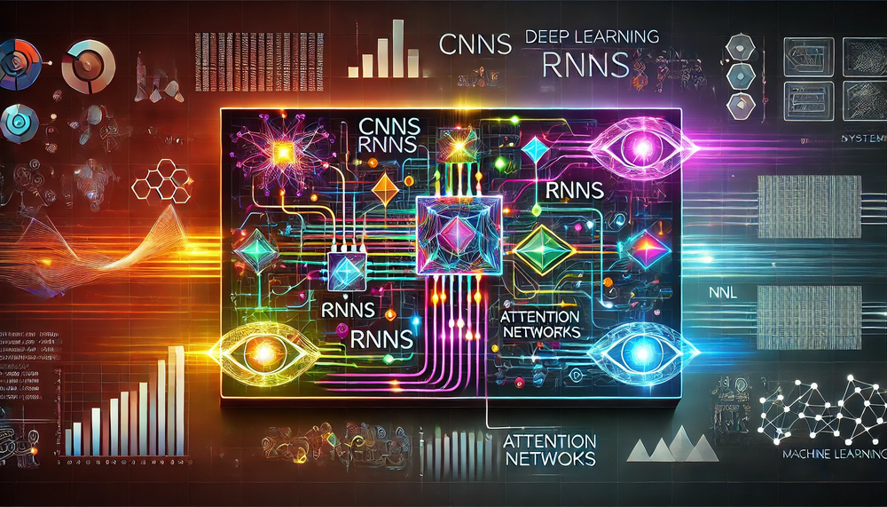

# DNN Architectures {#sec-dnn-architectures}

::: {layout-narrow}

::: {.column-margin}

_DALL·E 3 提示：一幅视觉上引人注目的矩形图像，展示深度学习算法（如 CNN、RNN 和注意力网络）与机器学习系统之间的相互作用，并将它们相互连接。画面将神经网络示意图与处理器、图表和数据流等计算系统的表现形式无缝融合。明亮的霓虹色调与黑暗的未来主义背景形成对比，象征着前沿技术和复杂的系统复杂性。_

:::

\noindent
:::

## 目的 {.unnumbered}

_为什么神经网络中的架构选择会影响系统设计决策，而这些决策又决定了计算可行性、硬件需求和部署约束？_

神经网络架构代表着工程层面的决策，这些决策会直接决定系统性能和部署可行性。每一种架构选择都会在整个系统栈中引发连锁效应：内存带宽需求、计算复杂度模式、并行化机会以及与硬件加速的兼容性。理解这些架构层面的影响，能够帮助工程师在模型能力与系统约束之间做出明智权衡，在瓶颈出现之前预测计算瓶颈，并选择合适的硬件平台。架构决策决定了机器学习系统能否在可用计算资源范围内满足性能要求。这种理解对于构建可扩展的人工智能系统至关重要，使其能够在多样化环境中有效部署。

::: {.callout-tip title="学习目标"}

- 区分四种主要神经网络架构家族（MLP、CNN、RNN、Transformer）的计算特征和归纳偏置

- 分析架构设计选择如何决定计算复杂度、内存需求和并行化机会

- 评估架构模式在硬件利用率、内存带宽和部署约束方面的系统级影响

- 应用架构选择框架，将数据特征与特定应用中合适的神经网络设计相匹配

- 使用复杂度分析评估不同架构方法之间的计算与内存权衡

- 考察基本计算原语（矩阵乘法、卷积、注意力）如何映射到硬件加速机会

- 批判性分析常见的架构选择误区及其对系统性能和部署成功的影响

- 综合统一的归纳偏置框架，解释架构与数据之间的兼容模式
:::

## 架构原则与工程权衡 {#sec-dnn-architectures-architectural-principles-engineering-tradeoffs-89de}

将神经计算系统地组织为有效的架构，是当代机器学习系统中最具影响力的发展之一。在 @sec-dl-primer 中建立的神经计算数学基础之上，本章探讨支配各种操作（矩阵乘法、非线性激活以及基于梯度的优化）如何被组织起来以解决复杂计算问题的架构原则。这一架构视角弥合了数学理论与实际系统实现之间的鸿沟，考察网络层面的设计选择如何决定整个系统的性能特征。

本章聚焦于贯穿机器学习系统设计的一项工程权衡。尽管理论数学，尤其是通用逼近结果，表明神经网络具有非凡的表征灵活性，但实际部署仍然需要只能通过审慎的架构专门化才能实现的计算效率。这种张力体现在多个维度上：理论上的普适性与计算可处理性之间的矛盾、表征完备性与内存效率之间的矛盾，以及数学上的一般性与领域特定优化之间的矛盾。通过架构创新来化解这些张力，构成了机器学习系统进步的主要驱动力之一。

当将通用数学框架部署到结构化数据上时，现代神经架构是对所遇到的特定计算挑战作出系统性响应的产物。每一种架构范式都体现了不同的归纳偏置（关于数据结构与关系的隐含假设），这些偏置既能支持高效学习，又能以适合领域的方式约束假设空间。这些架构创新代表了将计算原语组织成某种模式的工程解决方案，旨在在表征能力与计算效率之间取得最佳平衡。

本章考察四类架构家族，它们共同定义了现代神经计算的概念版图。多层感知机作为通用逼近理论的典型实现，展示了密集连接如何支持通用模式识别，同时也说明了架构普适性的计算代价。卷积神经网络引入了空间架构专门化范式，利用平移不变性和局部连接，在为空间数据保留表征能力的同时实现显著的效率提升。循环神经网络将架构专门化扩展到时间域，引入显式记忆机制，使其具备前馈架构所不具备的序列处理能力。注意力机制和 Transformer 架构代表了当前的演化前沿，它们以动态的、依赖内容的计算取代固定的结构假设，并通过可并行化操作在保持高效率的同时实现了惊人的能力。

这些架构模式的系统工程意义远不止算法层面的考量。每一种架构选择都会产生独特的计算特征，并沿着实现栈的每一层传递，决定内存访问模式、并行化策略、硬件利用特性，以及最终在资源约束下系统是否可行。对于负责系统设计、资源分配和生产环境性能优化的工程师而言，理解这些架构影响至关重要。

本章采用面向系统的分析框架，阐明架构抽象与具体实现需求之间的关系。对于每一类架构家族，我们系统地考察决定硬件资源需求的计算原语、支持高效算法实现的组织原则、影响系统可扩展性的内存层次结构影响，以及架构复杂性与计算开销之间的权衡。

这一分析方法系统地建立在 @sec-dl-primer 中提出的神经网络基础之上，通过考察架构专门化如何组织前向传播、反向传播以及基于梯度的优化等核心概念，以利用问题特定结构来扩展这些操作。理解这些架构范式之间的演化关系及其各自独特的计算特征，实践者便能掌握在复杂部署场景中就架构选择、资源规划和系统优化做出有原则决策所需的概念工具。

## 多层感知机：稠密模式处理 {#sec-dnn-architectures-multilayer-perceptrons-dense-pattern-processing-259f}

多层感知机（MLP）代表了在 @sec-dl-primer 中引入的全连接架构，如今我们从架构选择与系统权衡的角度来审视它们。MLP 体现了一种归纳偏置：**它们假设数据中不存在先验结构，允许任意输入与任意输出相关联**。这种架构选择通过将所有输入关系都视为同样合理，从而实现最大的灵活性，使得 MLP 用途广泛，但与专用替代方案相比计算更为密集。其计算能力已由通用逼近定理（UAT）[^fn-uat][@cybenko1989approximation; @hornik1989multilayer] 在理论上确立，我们曾在 @sec-dl-primer 中以脚注的形式见过它。该定理指出，只要具有合适的权重和偏置，一个足够大的、带有非线性激活函数的 MLP 可以逼近紧域上的任意连续函数。

[^fn-uat]: **通用逼近定理**：该结果由 Cybenko（1989）和 Hornik（1989）分别独立证明，表明神经网络在理论上可以学习任意函数。这一发现使 20 世纪 80 年代“人工智能寒冬”之后人们对神经网络的兴趣重新焕发，并为现代深度学习奠定了数学基础。

::: {.callout-definition title="多层感知机"}

***多层感知机（MLP）*** 是 _全连接神经网络_，其中每个神经元都与相邻层中的所有神经元相连，通过 _通用逼近_ 提供 _最大灵活性_，代价是 _高参数量_ 和 _计算密集性_。
:::

在实践中，UAT 解释了为什么 MLP 能在各种任务上取得成功，同时也揭示了理论能力与实际实现之间的差距。该定理保证“某个” MLP 可以逼近任意函数，却并未说明所需网络规模或权重如何确定。这一差距在真实世界应用中尤为关键：虽然从理论上讲，MLP 可以解决任何模式识别问题，但实现这一能力可能需要大得不切实际的网络或大量计算。这种理论上的强大能力推动了 MLP 在表格数据、推荐系统以及输入关系未知的问题中的应用；而这些实际限制则促使人们开发利用数据结构以获得计算效率的专用架构，详见 @sec-dnn-architectures-architectural-principles-engineering-tradeoffs-89de。

当应用于 MNIST 手写数字识别挑战 [^fn-mnist-dataset] 时，MLP 通过将$28\times 28$像素图像转换为数字分类来展示其计算方式。

[^fn-mnist-dataset]: **MNIST 数据集**：由 Yann LeCun、Corinna Cortes 和 Chris Burges 于 1998 年基于 NIST 的手写数字数据库创建。MNIST 的 60,000 张训练图像成为机器学习研究中的“果蝇”。尽管各种模型已达到 99.77% 的人类水平准确率，MNIST 仍然具有教育价值，因为它的简单性使学生能够专注于架构概念，而不会被数据复杂性分散注意力。

### 模式处理需求 {#sec-dnn-architectures-pattern-processing-needs-c45a}

深度学习模型经常会遇到这样的问题：在缺乏这些关系的内在约束时，任何输入特征都可能影响任何输出。金融市场分析很好地体现了这一挑战：任何经济指标都可能影响任何市场结果。类似地，在自然语言处理里，一个词的含义可能依赖于句子中的任何其他词。这些场景要求一种能够学习跨越所有输入特征的任意关系的架构模式。

稠密模式处理通过若干关键能力应对这些挑战。首先，它支持不受限制的特征交互，使每个输出都可以依赖于任意输入组合。其次，它支持学习得到的特征重要性，使系统能够判断哪些连接真正重要，而不是依赖预先规定的关系。最后，它提供自适应表示，使网络能够根据数据重塑其内部表示。

MNIST 数字识别任务说明了这种不确定性：虽然人类可能会关注数字的特定部分（如“6”的环圈或“8”的交叉），但对分类至关重要的像素组合仍然无法预先确定。一个带有衬线的“7”可能与“2”共享像素模式，而手写变化意味着判别特征可能出现在图像中的任何位置。这种关于特征关系的不确定性要求采用稠密处理方法，使每个像素都可能影响分类决策。

对不受限制连接性的这种需求，直接引出了 MLP 的数学基础。

### 算法结构 {#sec-dnn-architectures-algorithmic-structure-c012}

MLP 通过一种直接的算法解决方案来实现不受限制的特征交互：所有节点之间完全连接。这种连接要求通过一系列全连接层体现出来，其中每个神经元都连接到相邻层中的每个神经元，这就是 @sec-dl-primer 中引入的“稠密”连接模式。

这一架构原则将稠密连接模式转化为矩阵乘法运算 [^fn-gemm]，从而建立起使 MLP 具有可计算性的数学基础。如 @fig-mlp 所示，每一层都通过 @sec-dl-primer 中引入的基本运算对其输入进行变换：

[^fn-gemm]: **GEMM（通用矩阵乘法）**：神经网络的基础运算，占稠密神经网络计算时间的 80–95%。GEMM 执行 C = αAB + βC，并已被优化了数十年。像 cuBLAS 这样的现代实现，在优化良好的 GPU 负载上可达到理论峰值性能的 80–95%，这使得 GEMM 优化成为机器学习系统的重要部分。$$
\mathbf{h}^{(l)} = f\big(\mathbf{h}^{(l-1)}\mathbf{W}^{(l)} + \mathbf{b}^{(l)}\big)
$$回想一下，$\mathbf{h}^{(l)}$表示第$l$层的输出（激活向量），$\mathbf{h}^{(l-1)}$表示来自前一层的输入，$\mathbf{W}^{(l)}$表示第$l$层的权重矩阵，$\mathbf{b}^{(l)}$表示偏置向量，$f(\cdot)$表示激活函数（例如 ReLU，详见 @sec-dl-primer）。这种按层变换的方式虽然在概念上很简单，却会产生一些计算模式，而其效率又会高度依赖我们如何针对不同问题结构组织这些操作。

::: {#fig-mlp fig-env="figure" fig-pos="htb"}

```{.tikz}
 \begin{tikzpicture}[line join=round,font=\usefont{T1}{phv}{m}{n}]
\tikzset{%
Line/.style={line width=0.35pt,black!60}
}

\tikzset{
  box/.pic={
    \pgfkeys{/box/.cd, #1}
\foreach \x in {1,...,\columns}{
    \foreach \y in {1,...,\rows}{
        %
        \node[draw=black, fill=\ffill, minimum width=\cellsize,
                    minimum height=\cellheight, line width=\linewidth] (cell-\x-\y\br) at (\x*\cellsize,-\y*\cellheight) {};
    }
}
 } }

\pgfkeys{
  /box/.cd,
  cellsize/.store in=\cellsize,
  linewidth/.store in=\linewidth,
  cellheight/.store in=\cellheight,
  columns/.store in=\columns,
  br/.store in=\br,
  ffill/.store in=\ffill,
  rows/.store in=\rows,
  columns=1,
  rows=3,
  br=A,
  ffill=GreenL!22,
  cellsize=8mm,
  cellheight=8mm,
  linewidth=0.75pt
}
\def\radius{4mm}
\pic at (0,0) {box={columns=1,rows=4,br=A}};
\pic at (2,0) {box={columns=5,rows=4,br=B,}};
\pic at (7,4mm) {box={columns=1,rows=5,br=C}};
\pic at (9,4mm) {box={columns=2,rows=5,br=D}};
\pic at (12,-8mm) {box={columns=1,rows=2,br=E}};
%
\foreach \x in {1,...,4}{
\node[fill=green!80!black!80,minimum size=\cellsize,draw, line width=0.75pt]at(cell-2-\x B){};
}
\node[fill=green!80!black!80,minimum size=\cellsize,draw, line width=0.75pt]at(cell-1-2C){};

\begin{scope}[scale=1, every node/.append style={transform shape},
local bounding box=D1,shift={($(cell-1-3A)+(-4.5,-2.6)$)}]
\foreach \x in {1,...,5}{
\coordinate (2ball-\x) at (0,\x);
\shade[shading=ball,ball color=red!50!yellow] (0,\x) circle (\radius);
}
\shade[shading=ball,ball color=green!50!green] (0,4) circle (\radius);

\foreach \x/\i in {2.5/1,3.5/2}{
\coordinate (3ball-\i) at (2,\x);
\shade[shading=ball,ball color=red!50!yellow] (2,\x) circle (\radius)coordinate(3C\i);
}

\foreach \x/\i in  {1.5/1,2.5/2,3.5/3,4.5/4}{
\coordinate (1ball-\i) at (-2,\x);
\shade[shading=ball,ball color=red!50!yellow] (-2,\x) circle (\radius)coordinate(1C\i);
}
% Connect 1. and 2. column
\foreach \x in {1,2,3,4}{
  \foreach \y in {1,2,3,5}{
    \edef\from{1ball-\x}
    \edef\to{2ball-\y}
\path let
    \p1 = (\from),
    \p2 = (\to),
    \n1 = {atan2(\y2-\y1,\x2-\x1)}
  in
    coordinate (from) at ($ (\from) + (\n1:\radius) $)
    coordinate (to) at ($ (\to) + (\n1+180:\radius) $);
  \draw[Line] (from) -- (to);
  }
}
%red line
\foreach \x in {1,2,3,4}{
  \foreach \y in {4}{
    \edef\from{1ball-\x}
    \edef\to{2ball-\y}
\path let
    \p1 = (\from),
    \p2 = (\to),
    \n1 = {atan2(\y2-\y1,\x2-\x1)}
  in
    coordinate (from) at ($ (\from) + (\n1:\radius) $)
    coordinate (to) at ($ (\to) + (\n1+180:\radius) $);
  \draw[Line,red] (from) -- (to);
  }
}
% Connect 2. and 3. column
\foreach \x in {1,2,3,4,5}{
  \foreach \y in {1,2}{
    \edef\from{2ball-\x}
    \edef\to{3ball-\y}
\path let
    \p1 = (\from),
    \p2 = (\to),
    \n1 = {atan2(\y2-\y1,\x2-\x1)}
  in
    coordinate (from) at ($ (\from) + (\n1:\radius) $)
    coordinate (to) at ($ (\to) + (\n1+180:\radius) $);
  \draw[Line] (from) -- node[inner sep=0pt](L\x){}(to);
  }
}
%%
\draw[latex-](L5)--++(30:1)node[above]{Weighted Edge};
\draw[latex-](2ball-4)--++(180:2.5)node[left](NE){Neuron};
\draw[thick,latex-](cell-2-2B.center)--++(90:1.52)node[above]{Weighted Edge};
\draw[thick,latex-](cell-1-2C.center)--++(90:1.52)node[above]{Neuron};
%
\node[font=\huge]at($(cell-1-2A.south east)!0.5!(cell-1-2B.south west)$){$\times$};
\node[font=\huge]at($(cell-1-3C.east)!0.5!(cell-1-3D.west)$){$\times$};
%
\node[single arrow, draw=red, fill=red,
      minimum width = 10pt, single arrow head extend=3pt,
      minimum height=7mm]at($(cell-5-2B.south east)!0.5!(cell-1-3C.west)$){};
\node[single arrow, draw=red, fill=red,
      minimum width = 10pt, single arrow head extend=3pt,
      minimum height=7mm]at($(cell-2-3D.east)!0.5!(cell-1-1E.south west)$){};
\end{scope}

\path(NE.west)--++(270:4.0)coordinate(IL1)-|coordinate(HL1)($(1ball-1)!0.4!(2ball-1)$);
\path(NE)--++(270:4.0)-|coordinate(OL1)($(2ball-1)!0.55!(3ball-1)$);
\path(NE)--++(270:4.0)-|coordinate(OL2)($(3ball-1)!0.5!(cell-1-2A.south east)$);
\path(NE)--++(270:4.0)-|coordinate(IL2)($(3ball-1)!0.6!(cell-1-2A.south east)$);

\path[blue, line width=2pt](IL2)-|coordinate(HL2)($(cell-1-2A.south east)!0.7!(cell-1-2B.south west)$);
\path[blue, line width=2pt](IL2)-|coordinate(OL3)($(cell-1-3C.east)!0.5!(cell-1-3D.west)$);
\path[blue, line width=2pt](IL2)-|coordinate(OL4)(cell-1-2E.south east);

\draw[red,line width=2pt](IL1)--node[below,text=black]{Input Layer}(HL1);
\draw[cyan,line width=2pt](HL1)--node[below,text=black]{Hidden Layer}(OL1);
\draw[brown,line width=2pt](OL1)--node[below,text=black]{Output Layer}(OL2);
%
\draw[red,line width=2pt](IL2)--node[below,text=black]{Input Layer}(HL2);
\draw[cyan,line width=2pt](HL2)--node[below,text=black]{Hidden Layer}(OL3);
\draw[brown,line width=2pt](OL3)--node[below,text=black]{Output Layer}(OL4);
\end{tikzpicture}
```
**层级变换**：多层感知机（MLP）通过连续的矩阵乘法和非线性激活来实现稠密连接，从而支持输入数据中的复杂特征交互和层次化表示。每一层都会将前一层的输入向量变换为新的向量，并将其作为下一层的输入，如正文中的方程所定义。来源：[@reagen2017deep]。

:::

这些运算的维度揭示了稠密模式处理的计算规模：

* 输入向量：$\mathbf{h}^{(0)} \in \mathbb{R}^{d_{\text{in}}}$（在此表述中视为行向量）表示所有潜在输入特征
* 权重矩阵：$\mathbf{W}^{(l)} \in \mathbb{R}^{d_{\text{in}} \times d_{\text{out}}}$捕获所有可能的输入-输出关系
* 输出向量：$\mathbf{h}^{(l)} \in \mathbb{R}^{d_{\text{out}}}$生成变换后的表示

::: {.callout-example title="具体计算示例"}

考虑一个由 3 个神经元组成的隐藏层处理一个简化的 4 像素图像：

**输入**：$\mathbf{h}^{(0)} = [0.8, 0.2, 0.9, 0.1]$（4 个像素强度值）

**权重矩阵**：$\mathbf{W}^{(1)} = \begin{bmatrix} 0.5 & 0.1 & -0.2 \\ -0.3 & 0.8 & 0.4 \\ 0.2 & -0.4 & 0.6 \\ 0.7 & 0.3 & -0.1 \end{bmatrix}$（4×3 矩阵）

**计算**：
\begin{gather*}
\mathbf{z}^{(1)} = \mathbf{h}^{(0)}\mathbf{W}^{(1)} = \begin{bmatrix} 0.5×0.8 + (-0.3)×0.2 + 0.2×0.9 + 0.7×0.1 \\ 0.1×0.8 + 0.8×0.2 + (-0.4)×0.9 + 0.3×0.1 \\ (-0.2)×0.8 + 0.4×0.2 + 0.6×0.9 + (-0.1)×0.1 \end{bmatrix}
\\
= \begin{bmatrix} 0.65 \\ -0.17 \\ 0.47 \end{bmatrix}
\end{gather*}
**经过 ReLU 后**：$\mathbf{h}^{(1)} = [0.65, 0, 0.47]$（负值被置零）

每个隐藏神经元都将所有输入像素以不同权重组合起来，展示了不受限制的特征交互。

:::

MNIST 示例展示了这些运算的实际规模：

* 每个 784 维输入（$28\times 28$个像素）都连接到第一隐藏层中的每个神经元
* 一个包含 100 个神经元的隐藏层需要一个$784\times 100$权重矩阵
* 该矩阵中的每个权重都表示一个输入像素与一个隐藏特征之间可学习的关系

这种算法结构在满足任意特征关系需求的同时，也产生了计算机系统必须适配的特定计算模式。

#### 架构特征 {#sec-dnn-architectures-architectural-characteristics-47b4}

这种稠密连接方法既带来优势，也带来权衡。稠密连接提供了前面所建立的通用逼近能力，但也引入了计算冗余。虽然这种理论能力使 MLP 只要宽度足够就能建模任意连续函数，但这种灵活性也意味着需要学习大量参数才能表示相对简单的模式。稠密连接确保每个输入特征都会影响每个输出，从而以最大的计算代价换取最大的表达能力。

这些权衡推动了更复杂的优化技术，用以降低计算需求，同时保留模型能力。结构化剪枝可以在几乎不损失准确率的情况下移除 80–90% 的连接，而量化则将精度需求从 32 位降低到 8 位甚至更低。虽然 @sec-model-optimizations 详细介绍了这些压缩策略，但这里建立的架构基础决定了哪些优化方法对稠密连接模式最有效，而 @sec-ai-acceleration 则探讨了利用规则矩阵运算结构的硬件特定实现。

### 计算映射 {#sec-dnn-architectures-computational-mapping-fe7e}

稠密矩阵乘法的数学表示会映射为系统必须处理的特定计算模式。这种映射从数学抽象逐步走向计算现实，如 @lst-mlp_layer_matrix 中所示的第一个实现所示。

函数 mlp_layer_matrix 直接对应数学方程，采用高层矩阵运算（`matmul`）在一行中表达计算，同时抽象掉底层复杂性。这种实现风格体现了深度学习框架的特点，即由优化库负责实际计算。

::: {#lst-mlp_layer_matrix}

```{.python}
def mlp_layer_matrix(X, W, b):
    # X: input matrix (batch_size × num_inputs)
    # W: weight matrix (num_inputs × num_outputs)
    # b: bias vector (num_outputs)
    H = activation(matmul(X, W) + b)
    # One clean line of math
    return H
```
这个实现展示了神经网络如何使用矩阵运算在各层之间执行加权求和与激活函数。该代码强调了多层感知机中的核心计算模式。

:::

要理解这一架构对系统的影响，我们必须从高层框架调用的“内部实现”来观察。优雅的一行矩阵乘法 `output = matmul(X, W)`，从硬件的角度看，其实是一系列嵌套循环，暴露出系统所承受的真实计算需求。这种从逻辑模型到物理执行的转换揭示了决定内存访问、并行化策略和硬件利用率的关键模式。

第二个实现 `mlp_layer_compute`（见 @lst-mlp_layer_compute）通过嵌套循环暴露了实际的计算模式。这个版本展示了计算一层输出时真正发生的事情：我们处理批次中的每个样本，通过累积来自所有输入的加权贡献来计算每个输出神经元。

::: {#lst-mlp_layer_compute}

```{.python}
def mlp_layer_compute(X, W, b):
    # Process each sample in the batch
    for batch in range(batch_size):
        # Compute each output neuron
        for out in range(num_outputs):
            # Initialize with bias
            Z[batch, out] = b[out]
            # Accumulate weighted inputs
            for in_ in range(num_inputs):
                Z[batch, out] += X[batch, in_] * W[in_, out]

    H = activation(Z)
    return H
```
这个实现通过累积批次中所有输入的加权贡献来计算每个输出神经元。详细的逐步过程揭示了神经网络中的单层如何处理数据，强调了偏置和加权求和在生成输出中的作用。

:::

这种从数学抽象到具体计算的转换揭示了稠密矩阵乘法如何分解为更简单操作的嵌套循环。最外层循环处理批次中的每个样本，中间层循环计算每个输出神经元的值。在最内层循环中，系统执行重复的乘累加运算 [^fn-mac]，将每个输入与其对应的权重结合起来。

在 MNIST 示例中，每个输出神经元需要 784 次乘累加运算，以及至少 1,568 次内存访问（784 次用于输入，784 次用于权重）。虽然实际实现会借助 BLAS[^fn-dnn-blas] 或 cuBLAS 等库进行优化，但这些模式决定了关键的系统设计决策。用于加速这些矩阵运算的硬件架构，包括 GPU 张量核心 [^fn-tensor-cores] 和专用 AI 加速器，将在 @sec-ai-acceleration 中介绍。

[^fn-dnn-blas]: **基础线性代数子程序（BLAS）**：20 世纪 70 年代开发的基础向量和矩阵运算标准，成为几乎所有科学计算的基础。像 Intel MKL 和 OpenBLAS 这样的现代实现，在优化良好的负载上可达到理论峰值性能的 80–95%，因此它们是神经网络高效运行所必需的。

[^fn-mac]: **乘累加（MAC）**：神经网络中的原子操作：将两个值相乘并加到累计和中（result += a × b）。现代加速器通常以 MAC/秒衡量性能：NVIDIA A100 可达到每秒 312 万亿次 MAC，而移动芯片可达到 1–10 万亿次。能量成本约为每次 MAC 4.6 皮焦耳，外加数据移动所需的 640pJ。

[^fn-tensor-cores]: **张量核心**：现代 GPU 中专门用于矩阵乘法的单元，在一个时钟周期内执行 4×4 矩阵的混合精度运算。NVIDIA V100 张量核心可提供 125 TFLOPS，而标准核心仅为 15 TFLOPS——提升了 8 倍，这一进步彻底改变了深度学习性能，并使大模型训练成为可能。

### 系统影响 {#sec-dnn-architectures-system-implications-7a8f}

神经网络架构具有不同的系统级特征，可从三个核心维度进行系统分析：内存需求、计算需求和数据移动。该框架使我们能够一致地分析算法模式如何影响系统设计决策，揭示共性与架构特定优化。我们在对每一类架构的分析中都会应用这一框架。这些系统级考量直接建立在 @sec-dl-primer 中讨论的神经网络计算模式、内存系统和系统扩展性等基础概念之上。

#### 内存需求 {#sec-dnn-architectures-memory-requirements-4900}

对于稠密模式处理而言，内存需求主要来自权重、输入和中间结果的存储与访问。在我们的 MNIST 示例中，将 784 维输入层连接到一个包含 100 个神经元的隐藏层，需要 78,400 个权重参数。每次前向传播都必须访问所有这些权重，以及输入数据和中间结果。全对全的连接模式意味着这些访问没有固有的局部性；每个输出都需要每个输入及其对应权重。

这些内存访问模式可以通过精心的数据组织与复用得到优化。现代处理器通过专门的方法处理这类稠密访问模式：CPU 利用其缓存层次结构进行数据复用，而 GPU 则采用专为对大型参数矩阵进行高带宽访问而设计的内存体系结构。框架则通过高性能矩阵运算（如我们前文分析所述）对这些优化进行抽象。

#### 计算需求 {#sec-dnn-architectures-computation-needs-9cb4}

核心计算围绕嵌套循环中的乘累加运算展开。每个输出值所需的乘累加次数与输入数量相同。对于 MNIST，每个输出神经元都需要 784 次乘累加。若隐藏层有 100 个神经元，则单张输入图像需要执行 78,400 次乘累加。虽然这些运算本身很简单，但其数量和排列方式会对处理资源提出特定要求。

这种计算结构使现代硬件能够采用特定的优化策略。稠密矩阵乘法模式可以在多个处理单元之间并行化，每个单元处理不同的神经元子集。现代硬件加速器通过专门的矩阵乘法单元利用这一点，而软件框架则会自动将这些运算转换为优化过的 BLAS（基础线性代数子程序）调用。CPU 和 GPU 都可以通过仔细分块计算来最大化数据复用，从而利用缓存局部性，但它们的具体实现方式会因架构优势不同而有所差异。

#### 数据移动 {#sec-dnn-architectures-data-movement-fc16}

MLP 中的全对全连接模式会产生显著的数据移动需求。每次乘累加运算都需要三类数据：输入值、权重值和当前累计和。在我们的 MNIST 示例层中，计算单个输出值需要将 784 个输入和 784 个权重移动到计算发生的位置。对于 100 个输出神经元中的每一个，这一移动模式都会重复一次，从而在内存与计算单元之间产生巨大的数据传输需求。

可预测的数据移动模式使得有策略的数据预置和传输优化成为可能。不同架构通过不同机制应对这一挑战：CPU 使用预取和多级缓存，而 GPU 则通过高带宽内存系统和大量线程来隐藏延迟。软件框架则通过内存管理系统协调这些数据移动，以减少冗余传输并提高数据复用。

对 MLP 计算需求的这一分析揭示了一个关键洞见：尽管稠密连接提供了通用逼近能力，但当数据本身具有结构时，它会带来显著的低效。这种架构假设与数据特征之间的不匹配，推动了能够利用结构模式获得计算收益的专用方法的发展。

## CNNs: Spatial Pattern Processing {#sec-dnn-architectures-cnns-spatial-pattern-processing-f8ff}

MLP 的计算强度和参数需求在应用于结构化数据时暴露出一种不匹配。基于 @sec-dnn-architectures-architectural-principles-engineering-tradeoffs-89de 中概述的计算复杂度考量，这种低效性促使人们开发出能够利用数据内在结构的架构模式。

卷积神经网络作为这一挑战的解决方案出现 [@lecun1998gradient; @krizhevsky2012imagenet]，体现了一种特定的归纳偏置：它们假设空间局部性和平移不变性，即相邻像素之间存在关联，且模式可以出现在任意位置。这种架构假设带来了两项关键创新，从而提升了对空间结构化数据的效率。参数共享使同一个特征检测器可以应用于不同的空间位置，将参数数量从数百万减少到数千，同时提升泛化能力。局部连接将连接限制在空间上相邻的区域，体现了空间邻近性与特征相关性相关这一洞见。

::: {.callout-definition title="卷积神经网络"}

***卷积神经网络（CNNs）*** 是一种神经网络架构，它通过 _局部连接_ 和 _参数共享_ 利用 _空间结构_，使用 _可学习的滤波器_ 构建 _分层表示_，与全连接网络相比，其参数数量大幅减少。
:::

这些架构创新代表了深度学习设计中的一种权衡：当数据具有已知结构时，为了获得实际效率提升，牺牲 MLP 的理论通用性。虽然 MLP 将每个输入元素独立看待，但 CNN 利用空间关系实现了计算节省，并提升了在视觉任务上的性能。

### 模式处理需求 {#sec-dnn-architectures-pattern-processing-needs-a4ce}

空间模式处理关注的是这样一种场景：数据点之间的关系取决于它们的相对位置或接近程度。以处理自然图像为例：一个像素与其邻居之间的关系对于检测边缘、纹理和形状至关重要。然后，这些局部模式会以层级方式组合，形成更复杂的特征：边缘形成形状，形状形成对象，对象形成场景。

这种分层的空间模式处理出现在许多领域中。在计算机视觉中，局部像素模式形成边缘和纹理，并进一步组合成可识别的对象。语音处理依赖于相邻时间片段中的模式来识别音素和单词。传感器网络分析物理上邻近的传感器之间的相关性，以理解环境模式。医学影像则依赖于识别表明生物结构的组织模式。

为了用图像处理来说明这些原则，假设我们想在图像中检测一只猫，那么就必须识别某些空间模式：耳朵的三角形轮廓、脸部的圆形轮廓、毛发的纹理。重要的是，这些模式无论出现在图像的什么位置，都保持其含义。无论猫出现在左上角还是右下角，它仍然是一只猫。这表明空间模式处理有两个关键要求：能够检测局部模式，以及能够在不考虑其位置的情况下识别这些模式 [^fn-dnn-imagenet]。@fig-cnn-spatial-processing 展示了卷积神经网络如何通过分层特征提取实现这一点，即在后续层中，将简单模式组合成越来越复杂的表示。

[^fn-dnn-imagenet]: **ImageNet 变革**：AlexNet 在 2012 年 ImageNet 挑战赛中的戏剧性胜利 [@krizhevsky2012imagenet]（将 top-5 错误率从 25.8% 降至 15.3%）点燃了深度学习的复兴。ImageNet 提供了 2000 个类别、1400 万张带标签图像所需的规模，使得训练深层 CNN 成为可能，也证明了“海量数据 + 强大算力 + 大模型”可以达到超越人类的性能。

::: {#fig-cnn-spatial-processing fig-env="figure" fig-pos="htb"}

```{.tikz}
\begin{tikzpicture}[line join=round,font=\usefont{T1}{phv}{m}{n}]
\tikzset{
 Line/.style={line width=0.5pt,black!50,text=black},
 LineD/.style={line width=0.5pt,black!50,text=black,dashed},
}

\tikzset{
channel/.pic={
\pgfkeys{/channel/.cd, #1}
\begin{scope}[yscale=\scalefac,xscale=\scalefac,every node/.append style={scale=\scalefac}]
\node[rectangle,draw=\channelcolor,line width=1pt,fill=\channelcolor!10,
minimum width=46,minimum height=56](\picname){};
\end{scope}
        }
}

\pgfkeys{
  /channel/.cd,
  channelcolor/.store in=\channelcolor,
  scalefac/.store in=\scalefac,
  picname/.store in=\picname,
  channelcolor=BrownLine,
  scalefac=1,
  picname=C
}
%circles sty
\tikzset{
circles/.pic={
\pgfkeys{/channel/.cd, #1}
\node[circle,draw=\channelcolor,line width=1pt,fill=\channelcolor!10,
minimum size=6mm](\picname){};
        }
}
%Zebra sty
\tikzset{
zebra/.pic={
\pgfkeys{/zebra/.cd, #1}
\definecolor{cfefefe}{RGB}{254,254,254}
\definecolor{c373435}{RGB}{55,52,53}
\begin{scope}[yscale=\globalscale,xscale=\globalscale,every node/.append style={scale=\globalscale}]
\path[fill=c373435,shift={(9.6358, -1.7033)}] (0.0, 31.4325).. controls (0.0427, 31.4009) and (0.0852, 31.369) .. (0.1273, 31.3366).. controls (0.1423, 31.3254) and (0.1573, 31.3141) .. (0.1728, 31.3026).. controls (0.2651, 31.2301) and (0.3393, 31.1462) .. (0.4151, 31.0574).. controls (0.4863, 30.9754) and (0.5596, 30.8955) .. (0.6333, 30.8157).. controls (0.6467, 30.8012) and (0.66, 30.7868) .. (0.6737, 30.7719).. controls (0.7542, 30.6847) and (0.8368, 30.6) .. (0.9211, 30.5164).. controls (0.9461, 30.4904) and (0.9461, 30.4904) .. (0.9717, 30.4639).. controls (0.9867, 30.4485) and (1.0016, 30.433) .. (1.017, 30.4172).. controls (1.0321, 30.4015) and (1.0471, 30.3858) .. (1.0627, 30.3696).. controls (1.1076, 30.325) and (1.1076, 30.325) .. (1.1857, 30.3047).. controls (1.1773, 30.338) and (1.169, 30.3713) .. (1.1604, 30.4056).. controls (1.0895, 30.6895) and (1.0185, 30.9733) .. (0.9475, 31.2572).. controls (0.9423, 31.2765) and (0.9371, 31.2958) .. (0.9317, 31.3157).. controls (0.9141, 31.3941) and (0.9166, 31.4684) .. (0.9211, 31.5483).. controls (0.9924, 31.6196) and (1.0315, 31.6099) .. (1.1311, 31.6111).. controls (1.5189, 31.6038) and (1.7672, 31.4046) .. (2.0276, 31.1361).. controls (2.5302, 30.5776) and (2.7987, 29.8516) .. (2.9904, 29.1373).. controls (3.0848, 28.7935) and (3.1926, 28.4518) .. (3.3106, 28.1153).. controls (3.3197, 28.0891) and (3.3197, 28.0891) .. (3.329, 28.0624).. controls (3.3457, 28.0158) and (3.3637, 27.9696) .. (3.3817, 27.9235).. controls (3.3965, 27.8817) and (3.3965, 27.8817) .. (3.4117, 27.839).. controls (3.4831, 27.7316) and (3.5705, 27.7011) .. (3.6876, 27.6539).. controls (3.7178, 27.6408) and (3.7178, 27.6408) .. (3.7487, 27.6275).. controls (3.8966, 27.5649) and (4.0474, 27.5172) .. (4.2019, 27.4737).. controls (4.1102, 27.846) and (4.0172, 28.2179) .. (3.9175, 28.5882).. controls (3.91, 28.6159) and (3.9026, 28.6436) .. (3.8949, 28.6721).. controls (3.8319, 28.9046) and (3.7693, 29.1311) .. (3.6727, 29.3522).. controls (3.6329, 29.4621) and (3.596, 29.5729) .. (3.5588, 29.6837).. controls (3.5098, 29.8269) and (3.4523, 29.9591) .. (3.3817, 30.093).. controls (3.333, 30.0443) and (3.3518, 29.9759) .. (3.3516, 29.911).. controls (3.3516, 29.8892) and (3.3517, 29.8673) .. (3.3517, 29.8448).. controls (3.3517, 29.8224) and (3.3517, 29.7999) .. (3.3517, 29.7768).. controls (3.3516, 29.7292) and (3.3517, 29.6815) .. (3.3518, 29.6339).. controls (3.3519, 29.5614) and (3.3518, 29.489) .. (3.3516, 29.4165).. controls (3.3516, 29.3702) and (3.3517, 29.3239) .. (3.3517, 29.2776).. controls (3.3517, 29.2453) and (3.3517, 29.2453) .. (3.3516, 29.2123).. controls (3.3521, 29.0889) and (3.362, 28.9717) .. (3.3817, 28.8495).. controls (3.3833, 28.806) and (3.384, 28.7624) .. (3.3834, 28.7189).. controls (3.3831, 28.6984) and (3.3829, 28.678) .. (3.3826, 28.657).. controls (3.3822, 28.6344) and (3.3822, 28.6344) .. (3.3817, 28.6114).. controls (3.2533, 28.7619) and (3.185, 28.9226) .. (3.1237, 29.1091).. controls (3.117, 29.1295) and (3.1103, 29.1498) .. (3.1034, 29.1708).. controls (2.925, 29.7222) and (2.7421, 30.3033) .. (2.7202, 30.8868).. controls (2.7192, 30.9105) and (2.7181, 30.9341) .. (2.717, 30.9585).. controls (2.7124, 31.1535) and (2.7119, 31.3674) .. (2.815, 31.5382).. controls (2.8862, 31.6082) and (2.9232, 31.6166) .. (3.0215, 31.6176).. controls (3.0495, 31.6169) and (3.0495, 31.6169) .. (3.078, 31.6162).. controls (3.1079, 31.6162) and (3.1079, 31.6162) .. (3.1383, 31.6162).. controls (3.2039, 31.6162) and (3.2694, 31.6151) .. (3.335, 31.6141).. controls (3.3805, 31.6138) and (3.426, 31.6137) .. (3.4716, 31.6135).. controls (3.5913, 31.613) and (3.711, 31.6117) .. (3.8307, 31.6103).. controls (3.9529, 31.6089) and (4.0751, 31.6083) .. (4.1973, 31.6076).. controls (4.4369, 31.6062) and (4.6766, 31.604) .. (4.9163, 31.6012).. controls (4.9378, 31.4702) and (4.943, 31.4044) .. (4.8898, 31.2837).. controls (4.8421, 31.0837) and (4.8146, 30.8783) .. (4.784, 30.6751).. controls (4.7798, 30.6479) and (4.7757, 30.6206) .. (4.7714, 30.5925).. controls (4.6406, 29.6875) and (4.6362, 28.7165) .. (4.8105, 27.8176).. controls (4.8151, 27.7934) and (4.8198, 27.7691) .. (4.8246, 27.7441).. controls (4.8499, 27.6171) and (4.8772, 27.4915) .. (4.9163, 27.3678).. controls (4.9244, 27.3406) and (4.9326, 27.3133) .. (4.941, 27.2852).. controls (5.0799, 27.0918) and (5.3945, 27.0356) .. (5.6125, 26.9643).. controls (5.6401, 26.9551) and (5.6678, 26.9458) .. (5.6962, 26.9362).. controls (5.8245, 26.8938) and (5.9465, 26.8586) .. (6.0805, 26.8387).. controls (6.0841, 27.0916) and (6.0745, 27.3411) .. (6.0578, 27.5934).. controls (6.0091, 28.3459) and (6.0394, 29.0783) .. (6.1069, 29.8285).. controls (6.1097, 29.8596) and (6.1125, 29.8908) .. (6.1154, 29.9229).. controls (6.1213, 29.9885) and (6.1273, 30.054) .. (6.1334, 30.1195).. controls (5.5664, 29.5624) and (5.3134, 28.8614) .. (5.2083, 28.0876).. controls (5.1945, 27.9896) and (5.1837, 27.9277) .. (5.128, 27.8441).. controls (5.0486, 27.8705) and (5.0486, 27.8705) .. (5.0205, 27.9238).. controls (4.7982, 28.558) and (4.7702, 29.2746) .. (4.8898, 29.9343).. controls (4.8957, 29.9715) and (4.9015, 30.0087) .. (4.9073, 30.0459).. controls (4.9939, 30.59) and (5.1647, 31.1603) .. (5.5777, 31.5483).. controls (5.6618, 31.5998) and (5.7256, 31.6079) .. (5.8235, 31.608).. controls (5.8514, 31.6082) and (5.8793, 31.6084) .. (5.908, 31.6085).. controls (5.953, 31.6084) and (5.953, 31.6084) .. (5.9988, 31.6082).. controls (6.0297, 31.6083) and (6.0605, 31.6083) .. (6.0923, 31.6084).. controls (6.1575, 31.6084) and (6.2226, 31.6083) .. (6.2878, 31.6081).. controls (6.3878, 31.6078) and (6.4879, 31.6081) .. (6.5879, 31.6084).. controls (6.6512, 31.6084) and (6.7144, 31.6083) .. (6.7777, 31.6082).. controls (6.8077, 31.6083) and (6.8378, 31.6084) .. (6.8688, 31.6085).. controls (6.8965, 31.6084) and (6.9242, 31.6082) .. (6.9528, 31.608).. controls (6.9773, 31.608) and (7.0018, 31.6079) .. (7.027, 31.6079).. controls (7.0859, 31.6012) and (7.0859, 31.6012) .. (7.1388, 31.5483).. controls (7.1293, 31.4369) and (7.0978, 31.344) .. (7.0535, 31.2421).. controls (7.0416, 31.2143) and (7.0296, 31.1865) .. (7.0172, 31.1578).. controls (7.0044, 31.1284) and (6.9916, 31.099) .. (6.9784, 31.0687).. controls (6.9519, 31.0068) and (6.9254, 30.9449) .. (6.8989, 30.883).. controls (6.8858, 30.8523) and (6.8726, 30.8217) .. (6.8591, 30.7901).. controls (6.657, 30.3214) and (6.657, 30.3214) .. (6.5302, 29.8285).. controls (6.6047, 29.8946) and (6.6473, 29.9684) .. (6.6956, 30.055).. controls (6.8695, 30.358) and (6.8695, 30.358) .. (6.98, 30.4899).. controls (6.9975, 30.4899) and (7.015, 30.4899) .. (7.033, 30.4899).. controls (7.0396, 30.5053) and (7.0462, 30.5206) .. (7.053, 30.5364).. controls (7.1877, 30.7796) and (7.478, 30.912) .. (7.7299, 30.9954).. controls (8.1759, 31.1044) and (8.8968, 31.0899) .. (9.3084, 30.8603).. controls (9.3067, 30.8137) and (9.3067, 30.8137) .. (9.2819, 30.7545).. controls (9.2203, 30.7164) and (9.1617, 30.6847) .. (9.0967, 30.6536).. controls (8.9312, 30.5703) and (8.7884, 30.478) .. (8.6469, 30.3576).. controls (8.625, 30.3412) and (8.6031, 30.3247) .. (8.5805, 30.3077).. controls (8.3838, 30.1407) and (8.3003, 29.9209) .. (8.2765, 29.6697).. controls (8.3561, 29.6457) and (8.398, 29.6394) .. (8.4772, 29.668).. controls (8.5016, 29.6811) and (8.5259, 29.6942) .. (8.551, 29.7077).. controls (8.5789, 29.7225) and (8.6069, 29.7372) .. (8.6356, 29.7524).. controls (8.6813, 29.7774) and (8.7269, 29.8023) .. (8.7724, 29.8274).. controls (9.4666, 30.2093) and (10.2314, 30.4734) .. (11.0329, 30.3266).. controls (11.097, 30.2975) and (11.1092, 30.263) .. (11.134, 30.1989).. controls (11.049, 30.1023) and (10.9533, 30.0499) .. (10.8396, 29.9938).. controls (10.5212, 29.8296) and (10.2005, 29.5968) .. (10.0657, 29.2515).. controls (10.0287, 29.1214) and (10.0299, 29.0228) .. (10.0889, 28.8975).. controls (10.2892, 28.6722) and (10.5797, 28.5947) .. (10.8694, 28.5585).. controls (10.9985, 28.5519) and (11.1272, 28.5506) .. (11.2564, 28.5504).. controls (11.3207, 28.5503) and (11.385, 28.5498) .. (11.4493, 28.5493).. controls (11.6319, 28.5479) and (11.8146, 28.547) .. (11.9972, 28.5464).. controls (12.9803, 28.5425) and (12.9803, 28.5425) .. (13.4094, 28.4526).. controls (13.452, 28.4443) and (13.4946, 28.436) .. (13.5371, 28.4277).. controls (13.9198, 28.3531) and (14.3389, 28.2446) .. (14.653, 28.0028).. controls (14.6878, 27.9443) and (14.6878, 27.9443) .. (14.7059, 27.897).. controls (14.6377, 27.8114) and (14.5751, 27.8014) .. (14.4694, 27.7829).. controls (13.8545, 27.6612) and (13.2491, 27.4341) .. (12.748, 27.0503).. controls (12.7392, 27.0329) and (12.7305, 27.0154) .. (12.7215, 26.9974).. controls (12.8098, 27.0097) and (12.8978, 27.0223) .. (12.9856, 27.038).. controls (13.6213, 27.1426) and (14.2736, 27.0902) .. (14.8911, 26.918).. controls (14.9199, 26.9102) and (14.9487, 26.9023) .. (14.9783, 26.8942).. controls (15.4527, 26.7567) and (16.2756, 26.4887) .. (16.5406, 26.0373).. controls (16.5463, 26.0223) and (16.5521, 26.0074) .. (16.558, 25.992).. controls (16.5315, 25.9655) and (16.5315, 25.9655) .. (16.4637, 25.9646).. controls (16.4337, 25.9656) and (16.4037, 25.9666) .. (16.3727, 25.9676).. controls (15.7533, 25.9821) and (15.1624, 25.9354) .. (14.6, 25.648).. controls (14.5826, 25.6306) and (14.5651, 25.6131) .. (14.5471, 25.5951).. controls (14.6676, 25.61) and (14.788, 25.6255) .. (14.9083, 25.6415).. controls (15.9588, 25.7788) and (16.89, 25.6242) .. (17.7543, 24.9708).. controls (18.3652, 24.4899) and (18.3652, 24.4899) .. (18.4303, 24.2506).. controls (18.4323, 24.2315) and (18.4344, 24.2125) .. (18.4365, 24.1928).. controls (18.3358, 24.1661) and (18.2779, 24.1685) .. (18.1802, 24.2028).. controls (17.8648, 24.2951) and (17.5116, 24.298) .. (17.193, 24.2193).. controls (17.1842, 24.2106) and (17.1755, 24.2018) .. (17.1665, 24.1928).. controls (17.1819, 24.1897) and (17.1973, 24.1865) .. (17.2132, 24.1832).. controls (17.5439, 24.1141) and (17.8621, 24.0379) .. (18.1719, 23.9018).. controls (18.189, 23.8943) and (18.2061, 23.8869) .. (18.2237, 23.8792).. controls (18.4411, 23.7823) and (18.6401, 23.6661) .. (18.835, 23.5297).. controls (18.8624, 23.5106) and (18.8624, 23.5106) .. (18.8904, 23.4911).. controls (19.0158, 23.4005) and (19.1233, 23.299) .. (19.2302, 23.1874).. controls (19.2521, 23.1661) and (19.2739, 23.1449) .. (19.2964, 23.1229).. controls (19.3182, 23.1006) and (19.34, 23.0782) .. (19.3625, 23.0551).. controls (19.3791, 23.0381) and (19.3957, 23.0212) .. (19.4128, 23.0037).. controls (19.43, 22.9852) and (19.4473, 22.9667) .. (19.4651, 22.9476).. controls (19.4814, 22.9304) and (19.4977, 22.9132) .. (19.5145, 22.8955).. controls (19.5477, 22.8435) and (19.5477, 22.8435) .. (19.5366, 22.7873).. controls (19.529, 22.7627) and (19.529, 22.7627) .. (19.5213, 22.7376).. controls (19.4998, 22.737) and (19.4783, 22.7363) .. (19.4562, 22.7356).. controls (19.3583, 22.7325) and (19.2604, 22.7293) .. (19.1624, 22.7261).. controls (19.1287, 22.725) and (19.0949, 22.724) .. (19.0601, 22.7229).. controls (19.0272, 22.7218) and (18.9944, 22.7207) .. (18.9606, 22.7195).. controls (18.9305, 22.7186) and (18.9005, 22.7176) .. (18.8695, 22.7166).. controls (18.7077, 22.7178) and (18.7077, 22.7178) .. (18.5688, 22.6583).. controls (18.5966, 22.6555) and (18.5966, 22.6555) .. (18.6249, 22.6526).. controls (18.7104, 22.6439) and (18.7959, 22.6345) .. (18.8813, 22.6252).. controls (18.925, 22.6208) and (18.925, 22.6208) .. (18.9695, 22.6164).. controls (19.4656, 22.5608) and (19.4656, 22.5608) .. (19.6007, 22.3937).. controls (19.6309, 22.3029) and (19.6325, 22.2297) .. (19.6337, 22.134).. controls (19.6344, 22.1022) and (19.6351, 22.0704) .. (19.6358, 22.0376).. controls (19.6223, 21.8917) and (19.5745, 21.8028) .. (19.4643, 21.7085).. controls (19.4312, 21.6825) and (19.3978, 21.6568) .. (19.3642, 21.6313).. controls (19.3465, 21.6176) and (19.3288, 21.6039) .. (19.3106, 21.5897).. controls (19.2576, 21.5487) and (19.2043, 21.5081) .. (19.1509, 21.4676).. controls (19.136, 21.4563) and (19.1212, 21.445) .. (19.106, 21.4333).. controls (18.9705, 21.3299) and (18.8332, 21.2293) .. (18.6945, 21.1303).. controls (18.496, 20.9865) and (18.3078, 20.83) .. (18.119, 20.6739).. controls (18.1021, 20.6599) and (18.0852, 20.646) .. (18.0677, 20.6317).. controls (18.0202, 20.5924) and (17.9728, 20.553) .. (17.9255, 20.5135).. controls (17.9044, 20.496) and (17.9044, 20.496) .. (17.8828, 20.4781).. controls (17.8105, 20.4172) and (17.7432, 20.3595) .. (17.6957, 20.277).. controls (17.7044, 20.2508) and (17.7131, 20.2246) .. (17.7221, 20.1976).. controls (17.7396, 20.1976) and (17.757, 20.1976) .. (17.775, 20.1976).. controls (17.775, 20.1802) and (17.775, 20.1627) .. (17.775, 20.1447).. controls (17.8451, 20.1072) and (17.9095, 20.0834) .. (17.9867, 20.0653).. controls (18.0264, 20.1127) and (18.0661, 20.1601) .. (18.1058, 20.2076).. controls (18.118, 20.2221) and (18.1301, 20.2366) .. (18.1427, 20.2516).. controls (18.213, 20.3358) and (18.2808, 20.4212) .. (18.3472, 20.5085).. controls (18.5772, 20.7975) and (18.854, 21.0633) .. (19.1509, 21.2824).. controls (19.1881, 21.3119) and (19.1881, 21.3119) .. (19.226, 21.342).. controls (19.2641, 21.3714) and (19.2641, 21.3714) .. (19.303, 21.4015).. controls (19.3258, 21.4192) and (19.3486, 21.437) .. (19.372, 21.4552).. controls (19.4544, 21.501) and (19.5078, 21.5017) .. (19.6007, 21.4941).. controls (19.6325, 21.4305) and (19.6319, 21.3878) .. (19.6339, 21.3168).. controls (19.6347, 21.2909) and (19.6354, 21.265) .. (19.6362, 21.2383).. controls (19.6388, 21.1187) and (19.6408, 20.9991) .. (19.6422, 20.8796).. controls (19.6432, 20.8168) and (19.6446, 20.7541) .. (19.6465, 20.6914).. controls (19.6656, 20.0634) and (19.6656, 20.0634) .. (19.4491, 19.811).. controls (19.4293, 19.7902) and (19.4094, 19.7693) .. (19.389, 19.7478).. controls (19.3653, 19.7155) and (19.3422, 19.6827) .. (19.3202, 19.6492).. controls (19.2937, 19.6113) and (19.2937, 19.6113) .. (19.2666, 19.5726).. controls (19.228, 19.5164) and (19.1894, 19.4601) .. (19.1509, 19.4039).. controls (19.1226, 19.3635) and (19.1226, 19.3635) .. (19.0938, 19.3222).. controls (19.0766, 19.2968) and (19.0594, 19.2713) .. (19.0417, 19.2451).. controls (19.0264, 19.2228) and (19.011, 19.2004) .. (18.9952, 19.1773).. controls (18.9582, 19.0967) and (18.9622, 19.0634) .. (18.9921, 18.9805).. controls (19.0305, 18.921) and (19.0305, 18.921) .. (19.0798, 18.8681).. controls (19.0955, 18.85) and (19.1112, 18.8318) .. (19.1274, 18.8131).. controls (19.1805, 18.7661) and (19.2139, 18.7528) .. (19.2832, 18.7424).. controls (19.3076, 18.7711) and (19.3076, 18.7711) .. (19.3325, 18.8003).. controls (19.3538, 18.8249) and (19.3752, 18.8494) .. (19.3973, 18.8747).. controls (19.4184, 18.8993) and (19.4396, 18.9238) .. (19.4614, 18.9491).. controls (19.5213, 19.007) and (19.5213, 19.007) .. (19.6007, 19.007).. controls (19.6378, 18.9328) and (19.6305, 18.8713) .. (19.6305, 18.7883).. controls (19.6307, 18.736) and (19.6307, 18.736) .. (19.6308, 18.6826).. controls (19.6308, 18.6443) and (19.6307, 18.606) .. (19.6306, 18.5677).. controls (19.6307, 18.5284) and (19.6307, 18.4892) .. (19.6307, 18.45).. controls (19.6308, 18.3676) and (19.6307, 18.2853) .. (19.6306, 18.2029).. controls (19.6304, 18.0977) and (19.6305, 17.9925) .. (19.6307, 17.8872).. controls (19.6308, 17.8061) and (19.6307, 17.725) .. (19.6307, 17.6439).. controls (19.6306, 17.6052) and (19.6307, 17.5664) .. (19.6307, 17.5276).. controls (19.6308, 17.4732) and (19.6307, 17.4187) .. (19.6305, 17.3643).. controls (19.6305, 17.3179) and (19.6305, 17.3179) .. (19.6305, 17.2706).. controls (19.627, 17.1776) and (19.6154, 17.088) .. (19.6007, 16.9962).. controls (19.5303, 17.0666) and (19.5157, 17.133) .. (19.4849, 17.2277).. controls (19.4791, 17.2454) and (19.4732, 17.2632) .. (19.4672, 17.2815).. controls (19.4297, 17.3966) and (19.3978, 17.5123) .. (19.3675, 17.6295).. controls (19.3066, 17.8478) and (19.2048, 18.0411) .. (19.098, 18.2397).. controls (19.0856, 18.2632) and (19.0732, 18.2868) .. (19.0604, 18.311).. controls (19.0301, 18.3675) and (18.9985, 18.4228) .. (18.9657, 18.4778).. controls (18.9551, 18.4957) and (18.9444, 18.5136) .. (18.9335, 18.532).. controls (18.6836, 18.9289) and (18.3109, 19.3624) .. (17.8809, 19.5626).. controls (17.9371, 19.4456) and (17.9969, 19.3328) .. (18.0632, 19.221).. controls (18.1598, 19.0572) and (18.2375, 18.8954) .. (18.3021, 18.7158).. controls (18.3269, 18.6471) and (18.3544, 18.5811) .. (18.3836, 18.5142).. controls (18.594, 17.9877) and (18.6766, 17.3934) .. (18.6809, 16.8296).. controls (18.6812, 16.8015) and (18.6814, 16.7735) .. (18.6817, 16.7446).. controls (18.6861, 16.1405) and (18.6833, 15.5539) .. (18.5688, 14.9589).. controls (18.5641, 14.933) and (18.5594, 14.9071) .. (18.5546, 14.8804).. controls (18.312, 13.5511) and (17.7228, 12.2625) .. (17.112, 11.0654).. controls (17.0696, 10.9821) and (17.028, 10.8985) .. (16.9863, 10.8148).. controls (16.9687, 10.7798) and (16.9512, 10.7447) .. (16.9336, 10.7096).. controls (16.9198, 10.6819) and (16.9198, 10.6819) .. (16.9057, 10.6537).. controls (16.8049, 10.4521) and (16.8049, 10.4521) .. (16.7677, 10.3778).. controls (16.7424, 10.3272) and (16.7172, 10.2767) .. (16.692, 10.2262).. controls (16.6383, 10.1186) and (16.5845, 10.0112) .. (16.5299, 9.9041).. controls (16.403, 9.6545) and (16.2853, 9.401) .. (16.169, 9.1462).. controls (16.11, 9.0171) and (16.0503, 8.8888) .. (15.9861, 8.7622).. controls (15.9243, 8.6399) and (15.8696, 8.5155) .. (15.8171, 8.3889).. controls (15.808, 8.3672) and (15.7989, 8.3454) .. (15.7895, 8.323).. controls (15.7266, 8.1717) and (15.6667, 8.0195) .. (15.609, 7.8662).. controls (15.5805, 7.7925) and (15.5495, 7.7205) .. (15.5178, 7.6481).. controls (15.4066, 7.3841) and (15.3225, 7.1088) .. (15.235, 6.8362).. controls (15.2262, 6.8087) and (15.2173, 6.7812) .. (15.2082, 6.7529).. controls (15.1416, 6.5418) and (15.0872, 6.329) .. (15.0366, 6.1135).. controls (15.0206, 6.0463) and (15.0046, 5.979) .. (14.9885, 5.9118).. controls (14.9771, 5.8637) and (14.9771, 5.8637) .. (14.9655, 5.8147).. controls (14.9245, 5.6433) and (14.8815, 5.4724) .. (14.8382, 5.3016).. controls (14.7936, 5.2822) and (14.7936, 5.2822) .. (14.7323, 5.2751).. controls (14.5388, 5.3943) and (14.3763, 5.5748) .. (14.2182, 5.7363).. controls (14.1598, 5.7948) and (14.1004, 5.8497) .. (14.0378, 5.9035).. controls (13.8399, 6.0736) and (13.6247, 6.2612) .. (13.5318, 6.5104).. controls (13.5217, 6.7793) and (13.7699, 7.0647) .. (13.9224, 7.2708).. controls (13.9938, 7.3675) and (14.0608, 7.4668) .. (14.1271, 7.5671).. controls (14.1381, 7.5837) and (14.1491, 7.6004) .. (14.1605, 7.6176).. controls (14.1822, 7.6503) and (14.2038, 7.6831) .. (14.2254, 7.7158).. controls (14.2711, 7.785) and (14.3174, 7.8538) .. (14.3636, 7.9226).. controls (15.2934, 9.3182) and (16.0576, 10.8348) .. (16.6109, 12.4189).. controls (16.6192, 12.4428) and (16.6276, 12.4666) .. (16.6362, 12.4912).. controls (17.4248, 14.7647) and (17.6521, 17.2033) .. (16.8755, 19.5097).. controls (16.869, 19.5294) and (16.8625, 19.5491) .. (16.8558, 19.5695).. controls (16.7013, 20.0339) and (16.488, 20.5234) .. (16.1875, 20.912).. controls (16.168, 20.9373) and (16.1484, 20.9627) .. (16.1282, 20.9888).. controls (15.9192, 21.265) and (15.9192, 21.265) .. (15.6319, 21.4412).. controls (15.6468, 21.4041) and (15.6468, 21.4041) .. (15.662, 21.3662).. controls (15.7408, 21.1657) and (15.809, 20.9651) .. (15.8634, 20.7566).. controls (15.8687, 20.7365) and (15.8739, 20.7164) .. (15.8793, 20.6957).. controls (16.1803, 19.5085) and (16.0444, 18.2323) .. (15.6848, 17.0755).. controls (15.6753, 17.0446) and (15.6657, 17.0136) .. (15.6559, 16.9817).. controls (15.5556, 16.6696) and (15.4186, 16.3755) .. (15.2715, 16.0833).. controls (15.2447, 16.0298) and (15.218, 15.9763) .. (15.1914, 15.9227).. controls (15.1742, 15.8884) and (15.157, 15.854) .. (15.1397, 15.8196).. controls (15.1244, 15.7889) and (15.109, 15.7582) .. (15.0932, 15.7266).. controls (15.0565, 15.6591) and (15.0187, 15.6006) .. (14.9705, 15.541).. controls (14.9792, 15.5322) and (14.9879, 15.5235) .. (14.9969, 15.5145).. controls (15.1472, 15.6272) and (15.2543, 15.7622) .. (15.3673, 15.9114).. controls (15.384, 15.9332) and (15.384, 15.9332) .. (15.401, 15.9555).. controls (15.8734, 16.5771) and (16.2425, 17.246) .. (16.4521, 18.0016).. controls (16.487, 18.0016) and (16.522, 18.0016) .. (16.558, 18.0016).. controls (16.619, 17.8518) and (16.6486, 17.7071) .. (16.6661, 17.5467).. controls (16.6683, 17.5259) and (16.6706, 17.5051) .. (16.6729, 17.4837).. controls (16.6961, 17.2545) and (16.6984, 17.0263) .. (16.6969, 16.7961).. controls (16.6968, 16.7742) and (16.6967, 16.7524) .. (16.6966, 16.7299).. controls (16.6924, 15.8716) and (16.5706, 15.0423) .. (16.3827, 14.2065).. controls (16.3775, 14.1836) and (16.3724, 14.1608) .. (16.3671, 14.1372).. controls (16.3523, 14.0715) and (16.3373, 14.0059) .. (16.3221, 13.9403).. controls (16.3177, 13.9211) and (16.3133, 13.9019) .. (16.3088, 13.8821).. controls (16.2808, 13.7626) and (16.2458, 13.6471) .. (16.2056, 13.5312).. controls (16.183, 13.4636) and (16.1649, 13.395) .. (16.147, 13.3261).. controls (15.9196, 12.4547) and (15.5711, 11.5897) .. (15.1292, 10.8049).. controls (15.1016, 10.7542) and (15.074, 10.7035) .. (15.0465, 10.6528).. controls (15.0343, 10.6307) and (15.0222, 10.6087) .. (15.0096, 10.5859).. controls (14.971, 10.5149) and (14.9336, 10.4432) .. (14.8963, 10.3714).. controls (14.783, 10.155) and (14.6566, 9.9495) .. (14.5207, 9.7466).. controls (14.5064, 9.7251) and (14.4921, 9.7035) .. (14.4773, 9.6813).. controls (14.2623, 9.3581) and (14.0383, 9.0454) .. (13.7961, 8.742).. controls (13.7549, 8.6902) and (13.7143, 8.6381) .. (13.6739, 8.5857).. controls (13.5476, 8.4224) and (13.4184, 8.2644) .. (13.2785, 8.1124).. controls (13.2278, 8.0572) and (13.1787, 8.001) .. (13.1299, 7.9441).. controls (12.758, 7.5189) and (12.758, 7.5189) .. (12.5611, 7.4827).. controls (12.3663, 7.5201) and (12.2599, 7.6712) .. (12.1394, 7.8151).. controls (12.1151, 7.8429) and (12.0908, 7.8706) .. (12.0663, 7.8982).. controls (11.3884, 8.6698) and (11.3884, 8.6698) .. (11.3721, 8.9793).. controls (11.4753, 9.0749) and (11.5697, 9.1088) .. (11.7045, 9.1364).. controls (12.1134, 9.2307) and (12.5127, 9.4189) .. (12.8163, 9.7144).. controls (12.8538, 9.7466) and (12.8538, 9.7466) .. (12.9067, 9.7466).. controls (12.9067, 9.7641) and (12.9067, 9.7815) .. (12.9067, 9.7995).. controls (12.9463, 9.8375) and (12.9463, 9.8375) .. (12.9977, 9.8789).. controls (13.0695, 9.9356) and (13.0695, 9.9356) .. (13.1184, 10.0112).. controls (13.1358, 10.0112) and (13.1533, 10.0112) .. (13.1713, 10.0112).. controls (13.1781, 10.0263) and (13.1849, 10.0414) .. (13.1919, 10.057).. controls (13.2275, 10.1232) and (13.2696, 10.1739) .. (13.3185, 10.2311).. controls (13.6357, 10.6229) and (13.8602, 11.0969) .. (14.0253, 11.5706).. controls (14.0446, 11.6257) and (14.0647, 11.6805) .. (14.0848, 11.7353).. controls (14.2021, 12.0621) and (14.2715, 12.3956) .. (14.3355, 12.7364).. controls (14.3414, 12.767) and (14.3414, 12.767) .. (14.3475, 12.7983).. controls (14.3996, 13.0664) and (14.4301, 13.3362) .. (14.4578, 13.6079).. controls (14.4611, 13.6396) and (14.4643, 13.6714) .. (14.4677, 13.7042).. controls (14.5104, 14.1443) and (14.5243, 14.5836) .. (14.5251, 15.0256).. controls (14.5253, 15.1093) and (14.5257, 15.193) .. (14.5262, 15.2766).. controls (14.5276, 15.5142) and (14.5289, 15.7518) .. (14.5293, 15.9894).. controls (14.5312, 16.9445) and (14.5771, 17.8761) .. (14.7574, 18.8154).. controls (14.8501, 19.3279) and (14.8392, 19.8694) .. (14.7588, 20.3828).. controls (14.7539, 20.4166) and (14.7491, 20.4503) .. (14.7441, 20.4851).. controls (14.5999, 21.3705) and (14.1325, 22.4098) .. (13.4265, 22.9919).. controls (13.3874, 23.0249) and (13.3508, 23.0609) .. (13.3146, 23.0972).. controls (12.9804, 23.4303) and (12.3476, 23.9381) .. (11.8748, 24.0076).. controls (11.9082, 23.8985) and (11.9488, 23.8047) .. (12.0065, 23.7064).. controls (12.022, 23.6796) and (12.0374, 23.6528) .. (12.0534, 23.6252).. controls (12.078, 23.5829) and (12.078, 23.5829) .. (12.103, 23.5396).. controls (12.2523, 23.2779) and (12.3828, 23.0161) .. (12.4906, 22.7347).. controls (12.5069, 22.6924) and (12.524, 22.6505) .. (12.5414, 22.6086).. controls (12.6398, 22.3615) and (12.6916, 22.0973) .. (12.748, 21.838).. controls (12.752, 21.8196) and (12.7561, 21.8011) .. (12.7603, 21.7821).. controls (12.9403, 20.941) and (12.9155, 20.0801) .. (12.9091, 19.2256).. controls (12.9072, 18.9709) and (12.9057, 18.7163) .. (12.9048, 18.4617).. controls (12.9043, 18.374) and (12.9036, 18.2863) .. (12.9027, 18.1986).. controls (12.8972, 17.6886) and (12.8972, 17.6886) .. (12.9879, 17.1889).. controls (13.0125, 17.102) and (13.0125, 17.102) .. (13.0125, 16.9962).. controls (13.0475, 16.9962) and (13.0824, 16.9962) .. (13.1184, 16.9962).. controls (13.1536, 17.2298) and (13.1794, 17.4636) .. (13.1994, 17.699).. controls (13.2025, 17.7347) and (13.2025, 17.7347) .. (13.2057, 17.7712).. controls (13.2444, 18.2421) and (13.2551, 18.7135) .. (13.2541, 19.1858).. controls (13.254, 19.2698) and (13.2541, 19.3538) .. (13.2543, 19.4377).. controls (13.2545, 19.934) and (13.244, 20.4301) .. (13.1878, 20.9236).. controls (13.1844, 20.9547) and (13.181, 20.9858) .. (13.1775, 21.0178).. controls (13.1543, 21.2212) and (13.1237, 21.4211) .. (13.08, 21.6211).. controls (13.0643, 21.7125) and (13.063, 21.7984) .. (13.0655, 21.891).. controls (13.0829, 21.8997) and (13.1004, 21.9084) .. (13.1184, 21.9174).. controls (13.5506, 21.5223) and (13.6926, 20.8788) .. (13.8063, 20.3299).. controls (13.811, 20.3084) and (13.8156, 20.2868) .. (13.8205, 20.2647).. controls (13.8692, 20.0237) and (13.8848, 19.7793) .. (13.9022, 19.5345).. controls (13.9039, 19.5103) and (13.9056, 19.486) .. (13.9074, 19.461).. controls (13.9625, 18.6631) and (13.947, 17.872) .. (13.9022, 17.0739).. controls (13.9005, 17.0441) and (13.8989, 17.0144) .. (13.8972, 16.9837).. controls (13.8795, 16.6751) and (13.8577, 16.3682) .. (13.8186, 16.0615).. controls (13.8075, 15.9735) and (13.7979, 15.8856) .. (13.7893, 15.7974).. controls (13.6662, 14.5487) and (13.4971, 13.2669) .. (13.0919, 12.0749).. controls (13.0813, 12.0435) and (13.0813, 12.0435) .. (13.0705, 12.0115).. controls (12.9151, 11.5616) and (12.6834, 11.137) .. (12.404, 10.752).. controls (12.3885, 10.7306) and (12.373, 10.7092) .. (12.357, 10.6871).. controls (12.1261, 10.3845) and (11.8488, 10.1145) .. (11.5309, 9.9053).. controls (11.5076, 9.8891) and (11.4843, 9.8729) .. (11.4603, 9.8561).. controls (11.2695, 9.7273) and (11.026, 9.5714) .. (10.7867, 9.5812).. controls (10.6418, 9.6126) and (10.5075, 9.7085) .. (10.3932, 9.7995).. controls (10.3932, 9.817) and (10.3932, 9.8344) .. (10.3932, 9.8524).. controls (10.3773, 9.859) and (10.3615, 9.8655) .. (10.3452, 9.8723).. controls (10.279, 9.9101) and (10.2482, 9.9469) .. (10.208, 10.0112).. controls (10.208, 10.0286) and (10.208, 10.0461) .. (10.208, 10.0641).. controls (10.1861, 10.0719) and (10.1861, 10.0719) .. (10.1638, 10.0798).. controls (10.0761, 10.1327) and (10.0225, 10.2086) .. (9.9616, 10.289).. controls (9.9488, 10.3055) and (9.9361, 10.3221) .. (9.9229, 10.3391).. controls (9.5795, 10.7872) and (9.5795, 10.7872) .. (9.5614, 10.9091).. controls (9.573, 10.9901) and (9.573, 10.9901) .. (9.629, 11.042).. controls (9.7097, 11.0991) and (9.792, 11.1464) .. (9.8789, 11.1935).. controls (10.1487, 11.3443) and (10.383, 11.5155) .. (10.5784, 11.7574).. controls (10.5992, 11.7794) and (10.5992, 11.7794) .. (10.6204, 11.8019).. controls (12.0703, 13.3371) and (11.8172, 16.1605) .. (11.7631, 18.1193).. controls (11.7306, 19.143) and (11.6123, 20.1657) .. (11.4104, 21.1698).. controls (11.3995, 21.2249) and (11.3891, 21.28) .. (11.3789, 21.3352).. controls (11.334, 21.5739) and (11.2725, 21.8054) .. (11.2052, 22.0384).. controls (11.1864, 22.1044) and (11.1684, 22.1706) .. (11.1505, 22.2369).. controls (10.8857, 23.2092) and (10.4531, 24.4364) .. (9.573, 25.013).. controls (9.5538, 25.0277) and (9.5346, 25.0423) .. (9.5148, 25.0574).. controls (9.347, 25.1823) and (9.1651, 25.2291) .. (8.9644, 25.2776).. controls (8.973, 25.2546) and (8.9817, 25.2315) .. (8.9906, 25.2078).. controls (9.2774, 24.426) and (9.301, 23.6084) .. (9.349, 22.7854).. controls (9.3608, 22.5842) and (9.374, 22.3831) .. (9.3877, 22.182).. controls (9.4139, 22.182) and (9.4401, 22.182) .. (9.4671, 22.182).. controls (9.5077, 22.4007) and (9.5319, 22.6165) .. (9.5456, 22.8384).. controls (9.5498, 22.9019) and (9.5541, 22.9654) .. (9.5584, 23.0288).. controls (9.565, 23.1276) and (9.5714, 23.2265) .. (9.5776, 23.3253).. controls (9.5837, 23.4215) and (9.5902, 23.5177) .. (9.5968, 23.614).. controls (9.5986, 23.6435) and (9.6003, 23.6731) .. (9.6021, 23.7036).. controls (9.604, 23.7311) and (9.606, 23.7587) .. (9.608, 23.7871).. controls (9.6103, 23.8233) and (9.6103, 23.8233) .. (9.6127, 23.8602).. controls (9.6282, 23.9401) and (9.6601, 23.9935) .. (9.7052, 24.0605).. controls (9.8303, 24.0117) and (9.8573, 23.933) .. (9.912, 23.8163).. controls (9.9593, 23.706) and (9.9986, 23.5947) .. (10.0343, 23.4801).. controls (10.0422, 23.455) and (10.0501, 23.4299) .. (10.0582, 23.404).. controls (10.133, 23.1584) and (10.1879, 22.9096) .. (10.2414, 22.6587).. controls (10.2928, 22.4188) and (10.3482, 22.1798) .. (10.4039, 21.9409).. controls (10.4207, 21.8685) and (10.4375, 21.7961) .. (10.4543, 21.7237).. controls (10.5448, 21.3337) and (10.6415, 20.9454) .. (10.7413, 20.5576).. controls (10.9615, 19.7013) and (11.1548, 18.858) .. (11.2328, 17.9751).. controls (11.2373, 17.9248) and (11.2421, 17.8745) .. (11.2473, 17.8243).. controls (11.368, 16.5998) and (11.254, 15.2749) .. (10.843, 14.1122).. controls (10.831, 14.0766) and (10.819, 14.0409) .. (10.807, 14.0052).. controls (10.6689, 13.6055) and (10.4713, 13.2266) .. (10.208, 12.8951).. controls (10.1928, 12.875) and (10.1777, 12.8548) .. (10.1621, 12.834).. controls (9.8871, 12.4702) and (9.5624, 12.1352) .. (9.1761, 11.8897).. controls (9.1593, 11.8783) and (9.1425, 11.8669) .. (9.1251, 11.8551).. controls (9.0165, 11.7855) and (8.9335, 11.7622) .. (8.8057, 11.7839).. controls (8.7101, 11.8837) and (8.6557, 11.9979) .. (8.5973, 12.1212).. controls (8.4292, 12.4648) and (8.2264, 12.7564) .. (7.9061, 12.9745).. controls (7.9061, 12.992) and (7.9061, 13.0094) .. (7.9061, 13.0274).. controls (7.8837, 13.0345) and (7.8613, 13.0416) .. (7.8383, 13.0489).. controls (7.7473, 13.0803) and (7.7473, 13.0803) .. (7.658, 13.1233).. controls (7.5512, 13.1639) and (7.462, 13.1892) .. (7.3505, 13.1597).. controls (7.1796, 13.0483) and (7.0743, 12.8909) .. (6.9701, 12.7198).. controls (6.5545, 12.0599) and (5.9521, 11.3477) .. (5.2073, 11.043).. controls (5.1313, 11.0381) and (5.1313, 11.0381) .. (5.075, 11.043).. controls (5.075, 11.1542) and (5.0786, 11.1669) .. (5.1428, 11.2481).. controls (5.1644, 11.2756) and (5.1644, 11.2756) .. (5.1864, 11.3036).. controls (5.2483, 11.378) and (5.3128, 11.4497) .. (5.3789, 11.5204).. controls (5.5, 11.6768) and (5.4932, 11.8599) .. (5.4719, 12.0485).. controls (5.3115, 13.0164) and (4.9245, 13.9905) .. (4.4665, 14.853).. controls (4.4486, 14.8872) and (4.4486, 14.8872) .. (4.4304, 14.9221).. controls (4.1572, 15.4961) and (4.1572, 15.4961) .. (3.6992, 15.9114).. controls (3.387, 15.9444) and (3.1476, 15.7759) .. (2.911, 15.5883).. controls (2.7833, 15.4779) and (2.6817, 15.3795) .. (2.6144, 15.2235).. controls (2.6144, 15.1885) and (2.6144, 15.1536) .. (2.6144, 15.1176).. controls (2.6324, 15.1174) and (2.6504, 15.1171) .. (2.6689, 15.1169).. controls (2.7516, 15.1154) and (2.8343, 15.1132) .. (2.917, 15.111).. controls (2.9595, 15.1105) and (2.9595, 15.1105) .. (3.0028, 15.1099).. controls (3.2432, 15.1025) and (3.4426, 15.047) .. (3.6228, 14.8819).. controls (3.7848, 14.7024) and (3.9243, 14.4948) .. (4.0362, 14.2808).. controls (4.0619, 14.2325) and (4.0892, 14.185) .. (4.1171, 14.1379).. controls (4.2634, 13.8908) and (4.3817, 13.636) .. (4.493, 13.3714).. controls (4.5041, 13.3449) and (4.5041, 13.3449) .. (4.5155, 13.3179).. controls (4.6964, 12.8855) and (4.8202, 12.4533) .. (4.9163, 11.9955).. controls (4.921, 11.9741) and (4.9258, 11.9527) .. (4.9307, 11.9307).. controls (4.9866, 11.618) and (5.0054, 11.2188) .. (4.8306, 10.9434).. controls (4.8152, 10.9239) and (4.7998, 10.9044) .. (4.784, 10.8843).. controls (4.77, 10.8664) and (4.756, 10.8486) .. (4.7415, 10.8301).. controls (4.5119, 10.5749) and (4.1668, 10.4382) .. (3.8314, 10.4049).. controls (3.7786, 10.408) and (3.7786, 10.408) .. (3.7257, 10.461).. controls (3.7387, 10.6101) and (3.7889, 10.7543) .. (3.8317, 10.8972).. controls (3.9315, 11.2433) and (3.9771, 11.5769) .. (3.9741, 11.9364).. controls (3.9737, 11.9973) and (3.9741, 12.0581) .. (3.9746, 12.119).. controls (3.9754, 12.6218) and (3.8642, 13.0858) .. (3.5873, 13.5105).. controls (3.5405, 13.583) and (3.5405, 13.583) .. (3.5106, 13.6441).. controls (3.4792, 13.7052) and (3.4435, 13.7126) .. (3.3817, 13.7418).. controls (3.3588, 13.7614) and (3.3359, 13.7811) .. (3.3123, 13.8013).. controls (2.8958, 14.1523) and (2.3405, 14.2901) .. (1.8207, 14.4033).. controls (1.7981, 14.4082) and (1.7754, 14.4132) .. (1.7521, 14.4183).. controls (0.9633, 14.584) and (0.1071, 14.5452) .. (-0.6664, 14.3239).. controls (-0.6886, 14.3177) and (-0.7108, 14.3116) .. (-0.7337, 14.3053).. controls (-1.1842, 14.1794) and (-1.6642, 14.0154) .. (-1.9893, 13.6624).. controls (-2.0128, 13.6379) and (-2.0363, 13.6133) .. (-2.0604, 13.588).. controls (-2.1466, 13.4693) and (-2.2132, 13.3428) .. (-2.2804, 13.2126).. controls (-2.2958, 13.1834) and (-2.2958, 13.1834) .. (-2.3115, 13.1536).. controls (-2.477, 12.8322) and (-2.6215, 12.4975) .. (-2.7574, 12.1626).. controls (-2.7813, 12.1055) and (-2.8076, 12.0505) .. (-2.836, 11.9955).. controls (-2.8709, 12.0043) and (-2.9059, 12.013) .. (-2.9418, 12.022).. controls (-2.9775, 12.8634) and (-2.631, 13.7777) .. (-2.0852, 14.4082).. controls (-1.8862, 14.6233) and (-1.6677, 14.7743) .. (-1.4073, 14.906).. controls (-1.372, 14.925) and (-1.372, 14.925) .. (-1.3359, 14.9445).. controls (-0.8845, 15.1828) and (-0.392, 15.3129) .. (0.1009, 15.4351).. controls (0.1223, 15.4405) and (0.1436, 15.4458) .. (0.1657, 15.4513).. controls (0.3828, 15.5045) and (0.6001, 15.5414) .. (0.8219, 15.5693).. controls (1.4813, 15.6529) and (2.0199, 15.7795) .. (2.535, 16.2289).. controls (2.5525, 16.2289) and (2.57, 16.2289) .. (2.588, 16.2289).. controls (2.5949, 16.2447) and (2.6019, 16.2605) .. (2.6091, 16.2767).. controls (2.6421, 16.3369) and (2.6744, 16.3703) .. (2.7252, 16.4157).. controls (3.1178, 16.7994) and (3.3179, 17.411) .. (3.4151, 17.9405).. controls (3.4215, 17.9607) and (3.428, 17.9808) .. (3.4346, 18.0016).. controls (3.514, 18.028) and (3.514, 18.028) .. (3.5934, 18.0016).. controls (3.6418, 17.9349) and (3.6418, 17.9349) .. (3.6942, 17.8478).. controls (3.7036, 17.8323) and (3.7129, 17.8168) .. (3.7225, 17.8009).. controls (3.7957, 17.6775) and (3.8601, 17.5507) .. (3.9227, 17.4217).. controls (3.9674, 17.3329) and (4.0163, 17.2474) .. (4.0663, 17.1615).. controls (4.1729, 16.9781) and (4.2676, 16.7897) .. (4.361, 16.5993).. controls (4.3861, 16.5484) and (4.4116, 16.4976) .. (4.4372, 16.4469).. controls (4.5415, 16.2405) and (4.642, 16.0326) .. (4.741, 15.8237).. controls (4.8426, 15.6096) and (4.9482, 15.3982) .. (5.0612, 15.1898).. controls (5.2174, 14.8998) and (5.347, 14.596) .. (5.4785, 14.2941).. controls (5.4859, 14.2773) and (5.4932, 14.2604) .. (5.5008, 14.2431).. controls (5.667, 13.8605) and (5.8184, 13.4717) .. (5.9496, 13.0756).. controls (5.9731, 13.0055) and (6.0003, 12.9393) .. (6.0308, 12.872).. controls (6.0402, 12.8513) and (6.0495, 12.8306) .. (6.0592, 12.8093).. controls (6.0662, 12.794) and (6.0732, 12.7787) .. (6.0805, 12.7628).. controls (6.1066, 12.7628) and (6.1328, 12.7628) .. (6.1598, 12.7628).. controls (6.1812, 13.1024) and (6.1217, 13.3906) .. (6.0275, 13.7153).. controls (6.021, 13.7383) and (6.0145, 13.7613) .. (6.0078, 13.7849).. controls (5.9303, 14.0581) and (5.8448, 14.3257) .. (5.7365, 14.5885).. controls (5.7259, 14.6147) and (5.7154, 14.6409) .. (5.7045, 14.6678).. controls (5.624, 14.8647) and (5.5356, 15.0574) .. (5.4455, 15.2499).. controls (5.4238, 15.297) and (5.4238, 15.297) .. (5.4016, 15.345).. controls (5.2971, 15.5715) and (5.1874, 15.795) .. (5.075, 16.0176).. controls (5.0496, 16.0682) and (5.0244, 16.1188) .. (4.9993, 16.1696).. controls (4.8082, 16.5554) and (4.614, 16.9407) .. (4.3987, 17.3137).. controls (4.2464, 17.579) and (4.119, 17.8566) .. (3.9902, 18.1339).. controls (3.98, 18.1557) and (3.9698, 18.1775) .. (3.9593, 18.1999).. controls (3.6552, 18.8506) and (3.4255, 19.5787) .. (3.668, 20.2931).. controls (3.6859, 20.3411) and (3.7057, 20.3885) .. (3.7257, 20.4358).. controls (3.7411, 20.4724) and (3.7411, 20.4724) .. (3.7568, 20.5099).. controls (3.8512, 20.7025) and (3.9877, 20.8722) .. (4.1172, 21.0423).. controls (4.3772, 21.3856) and (4.5281, 21.6628) .. (4.493, 22.1026).. controls (4.4116, 22.6537) and (3.8744, 23.0351) .. (3.4611, 23.3462).. controls (3.4352, 23.3657) and (3.4093, 23.3853) .. (3.3826, 23.4055).. controls (3.3583, 23.4236) and (3.334, 23.4416) .. (3.3089, 23.4603).. controls (3.2878, 23.476) and (3.2667, 23.4917) .. (3.2449, 23.5079).. controls (3.1643, 23.5617) and (3.0812, 23.6075) .. (2.9963, 23.6539).. controls (2.8852, 23.7164) and (2.7783, 23.7857) .. (2.6706, 23.8538).. controls (2.4505, 23.9917) and (2.2265, 24.1166) .. (1.9956, 24.2353).. controls (1.8741, 24.2979) and (1.7547, 24.364) .. (1.6355, 24.431).. controls (1.4487, 24.5356) and (1.2603, 24.6366) .. (1.0705, 24.7355).. controls (0.9318, 24.8078) and (0.7951, 24.8826) .. (0.6599, 24.9612).. controls (0.5978, 24.9938) and (0.5978, 24.9938) .. (0.4977, 24.9866).. controls (0.5006, 24.9232) and (0.5006, 24.9232) .. (0.5242, 24.8543).. controls (0.583, 24.8047) and (0.583, 24.8047) .. (0.6596, 24.7657).. controls (0.7022, 24.7419) and (0.7022, 24.7419) .. (0.7457, 24.7177).. controls (0.7763, 24.7011) and (0.8069, 24.6845) .. (0.8384, 24.6674).. controls (0.9015, 24.6324) and (0.9644, 24.597) .. (1.0273, 24.5616).. controls (1.0431, 24.5528) and (1.0588, 24.544) .. (1.075, 24.535).. controls (1.2171, 24.4554) and (1.3558, 24.3711) .. (1.4932, 24.2838).. controls (1.5127, 24.2715) and (1.5323, 24.2593) .. (1.5523, 24.2466).. controls (2.2859, 23.7792) and (2.8712, 23.152) .. (3.0832, 22.2899).. controls (3.1596, 21.9101) and (3.1046, 21.5413) .. (2.8966, 21.2149).. controls (2.6089, 20.7916) and (2.6089, 20.7916) .. (2.3631, 20.7301).. controls (2.3303, 20.7285) and (2.3303, 20.7285) .. (2.2969, 20.7268).. controls (2.3076, 20.8599) and (2.3343, 20.971) .. (2.3779, 21.0972).. controls (2.5684, 21.7482) and (2.3756, 22.4246) .. (2.0692, 23.003).. controls (1.9709, 23.1738) and (1.8544, 23.3389) .. (1.7148, 23.4785).. controls (1.6799, 23.4785) and (1.645, 23.4785) .. (1.609, 23.4785).. controls (1.5802, 23.2305) and (1.7161, 23.0008) .. (1.819, 22.7823).. controls (2.0574, 22.2723) and (2.2002, 21.7672) .. (2.0588, 21.203).. controls (1.9832, 20.9967) and (1.882, 20.8148) .. (1.6884, 20.7003).. controls (1.6225, 20.6799) and (1.5729, 20.6753) .. (1.5032, 20.6739).. controls (1.5013, 20.7927) and (1.5019, 20.9069) .. (1.5161, 21.0249).. controls (1.6052, 21.7946) and (1.4133, 22.5538) .. (1.0272, 23.22).. controls (0.9883, 23.2881) and (0.9525, 23.3577) .. (0.9161, 23.4272).. controls (0.848, 23.5506) and (0.772, 23.6604) .. (0.683, 23.7695).. controls (0.6725, 23.7825) and (0.6621, 23.7956) .. (0.6514, 23.809).. controls (0.5014, 23.9964) and (0.3542, 24.1626) .. (0.1538, 24.2987).. controls (0.1625, 24.255) and (0.1713, 24.2114) .. (0.1802, 24.1664).. controls (0.1977, 24.1664) and (0.2152, 24.1664) .. (0.2332, 24.1664).. controls (0.2757, 24.1155) and (0.3142, 24.065) .. (0.3522, 24.0109).. controls (0.3638, 23.9945) and (0.3755, 23.978) .. (0.3874, 23.9611).. controls (0.9778, 23.1065) and (1.2797, 22.0024) .. (1.1063, 20.9649).. controls (1.0176, 20.5769) and (1.0176, 20.5769) .. (0.9211, 20.5151).. controls (0.852, 20.5183) and (0.8227, 20.5348) .. (0.7718, 20.5814).. controls (0.622, 20.773) and (0.5205, 20.9836) .. (0.4184, 21.203).. controls (0.4063, 21.2286) and (0.4063, 21.2286) .. (0.394, 21.2546).. controls (0.1535, 21.7661) and (0.0085, 22.3104) .. (-0.1341, 22.8554).. controls (-0.2313, 23.2733) and (-0.2313, 23.2733) .. (-0.4018, 23.6637).. controls (-0.428, 23.6724) and (-0.4542, 23.6811) .. (-0.4812, 23.6901).. controls (-0.4952, 23.2432) and (-0.4668, 22.8308) .. (-0.3754, 22.3937).. controls (-0.3641, 22.3373) and (-0.3529, 22.2809) .. (-0.3417, 22.2245).. controls (-0.3248, 22.1392) and (-0.3078, 22.0539) .. (-0.2904, 21.9688).. controls (-0.2616, 21.8274) and (-0.2345, 21.686) .. (-0.211, 21.5436).. controls (-0.1426, 21.1301) and (-0.0084, 20.7433) .. (0.2332, 20.3977).. controls (0.2892, 20.3091) and (0.3106, 20.2369) .. (0.3033, 20.1316).. controls (0.2685, 19.998) and (0.1891, 19.8892) .. (0.1119, 19.7763).. controls (0.0689, 19.7132) and (0.0266, 19.6496) .. (-0.0156, 19.586).. controls (-0.2664, 19.2084) and (-0.2664, 19.2084) .. (-0.3508, 19.0868).. controls (-0.5871, 18.7374) and (-0.7502, 18.3324) .. (-0.9031, 17.9408).. controls (-1.08, 17.489) and (-1.2788, 17.0487) .. (-1.512, 16.6232).. controls (-1.5354, 16.5803) and (-1.5583, 16.5372) .. (-1.5811, 16.494).. controls (-1.7771, 16.1239) and (-2.0025, 15.7699) .. (-2.2539, 15.4351).. controls (-2.2822, 15.3973) and (-2.2822, 15.3973) .. (-2.3111, 15.3588).. controls (-2.3352, 15.3311) and (-2.3352, 15.3311) .. (-2.3598, 15.3028).. controls (-2.3772, 15.3028) and (-2.3947, 15.3028) .. (-2.4127, 15.3028).. controls (-2.3957, 15.4369) and (-2.337, 15.5483) .. (-2.2787, 15.6683).. controls (-2.2681, 15.6904) and (-2.2575, 15.7126) .. (-2.2466, 15.7354).. controls (-2.1776, 15.8785) and (-2.107, 16.0208) .. (-2.0356, 16.1627).. controls (-1.856, 16.5202) and (-1.7147, 16.8852) .. (-1.578, 17.2607).. controls (-1.5594, 17.3116) and (-1.5408, 17.3626) .. (-1.5222, 17.4135).. controls (-1.5095, 17.4485) and (-1.4967, 17.4835) .. (-1.484, 17.5184).. controls (-1.4076, 17.728) and (-1.3286, 17.936) .. (-1.2435, 18.1421).. controls (-0.7034, 19.4641) and (-0.7431, 20.6485) .. (-1.1691, 21.9968).. controls (-1.1928, 22.0523) and (-1.2187, 22.103) .. (-1.2485, 22.1555).. controls (-1.2841, 22.0844) and (-1.2811, 22.0257) .. (-1.2844, 21.946).. controls (-1.2865, 21.8965) and (-1.2865, 21.8965) .. (-1.2887, 21.846).. controls (-1.2894, 21.8283) and (-1.2901, 21.8105) .. (-1.2908, 21.7922).. controls (-1.2931, 21.7362) and (-1.2955, 21.6801) .. (-1.2979, 21.624).. controls (-1.3039, 21.4842) and (-1.3097, 21.3444) .. (-1.3154, 21.2046).. controls (-1.3673, 19.946) and (-1.3673, 19.946) .. (-1.4569, 19.4006).. controls (-1.4636, 19.358) and (-1.4636, 19.358) .. (-1.4705, 19.3146).. controls (-1.5318, 18.936) and (-1.5964, 18.5568) .. (-1.6983, 18.1868).. controls (-1.703, 18.169) and (-1.7077, 18.1512) .. (-1.7125, 18.1329).. controls (-1.8791, 17.5008) and (-2.1099, 16.8853) .. (-2.3598, 16.2818).. controls (-2.3763, 16.2415) and (-2.3928, 16.2012) .. (-2.4093, 16.1609).. controls (-2.4463, 16.0705) and (-2.4835, 15.9801) .. (-2.5209, 15.8899).. controls (-2.5381, 15.8484) and (-2.5553, 15.8069) .. (-2.5724, 15.7654).. controls (-2.6657, 15.5396) and (-2.7634, 15.3157) .. (-2.8613, 15.0919).. controls (-2.9114, 14.9775) and (-2.9612, 14.8631) .. (-3.0111, 14.7487).. controls (-3.031, 14.7031) and (-3.0508, 14.6575) .. (-3.0707, 14.6119).. controls (-3.0802, 14.5901) and (-3.0897, 14.5683) .. (-3.0995, 14.5458).. controls (-3.1251, 14.4871) and (-3.1507, 14.4284) .. (-3.1764, 14.3697).. controls (-3.3187, 14.0437) and (-3.4582, 13.7188) .. (-3.5724, 13.3817).. controls (-3.6782, 13.0745) and (-3.6782, 13.0745) .. (-3.7885, 13.001).. controls (-3.8147, 13.001) and (-3.8409, 13.001) .. (-3.8679, 13.001).. controls (-3.8344, 13.3762) and (-3.7514, 13.7302) .. (-3.6298, 14.0858).. controls (-3.6236, 14.1037) and (-3.6175, 14.1215) .. (-3.6112, 14.14).. controls (-3.4904, 14.4916) and (-3.3616, 14.8408) .. (-3.2285, 15.188).. controls (-3.084, 15.5663) and (-2.9545, 15.9475) .. (-2.836, 16.3347).. controls (-2.828, 16.3606) and (-2.82, 16.3865) .. (-2.8118, 16.4132).. controls (-2.7148, 16.7303) and (-2.6286, 17.0494) .. (-2.5499, 17.3715).. controls (-2.5384, 17.4184) and (-2.5384, 17.4184) .. (-2.5267, 17.4662).. controls (-2.4846, 17.6422) and (-2.4511, 17.8173) .. (-2.4252, 17.9963).. controls (-2.4128, 18.0798) and (-2.3988, 18.1629) .. (-2.3841, 18.2461).. controls (-2.3792, 18.2743) and (-2.3742, 18.3025) .. (-2.3691, 18.3315).. controls (-2.3612, 18.3761) and (-2.3612, 18.3761) .. (-2.3531, 18.4216).. controls (-2.3064, 18.688) and (-2.2638, 18.9548) .. (-2.2238, 19.2223).. controls (-2.0194, 20.5908) and (-2.0194, 20.5908) .. (-1.8323, 21.2141).. controls (-1.8041, 21.3091) and (-1.7792, 21.4043) .. (-1.7562, 21.5007).. controls (-1.75, 21.5265) and (-1.7438, 21.5523) .. (-1.7375, 21.5788).. controls (-1.7239, 21.6577) and (-1.7225, 21.7317) .. (-1.7248, 21.8116).. controls (-2.0479, 21.3494) and (-2.1314, 20.7162) .. (-2.2275, 20.1712).. controls (-2.3443, 19.513) and (-2.4733, 18.8565) .. (-2.6616, 18.2144).. controls (-2.684, 18.1369) and (-2.7054, 18.0591) .. (-2.7267, 17.9812).. controls (-3.094, 16.6455) and (-3.5442, 15.3318) .. (-4.1077, 14.0659).. controls (-4.1281, 14.0196) and (-4.1281, 14.0196) .. (-4.149, 13.9724).. controls (-4.2194, 13.8141) and (-4.292, 13.658) .. (-4.3706, 13.5037).. controls (-4.4666, 13.3044) and (-4.5535, 13.1034) .. (-4.6312, 12.8964).. controls (-4.658, 12.8255) and (-4.6859, 12.7553) .. (-4.7145, 12.6851).. controls (-4.8855, 12.2862) and (-4.8855, 12.2862) .. (-4.9527, 11.8633).. controls (-4.8372, 11.9275) and (-4.7399, 12.0061) .. (-4.6385, 12.0898).. controls (-3.9488, 12.6488) and (-3.9488, 12.6488) .. (-3.6215, 12.6735).. controls (-3.4931, 12.6518) and (-3.4536, 12.6195) .. (-3.3652, 12.5247).. controls (-3.2999, 12.4013) and (-3.2943, 12.2687) .. (-3.2809, 12.1321).. controls (-3.2783, 12.1067) and (-3.2756, 12.0814) .. (-3.2728, 12.0552).. controls (-3.2615, 11.9472) and (-3.2505, 11.8392) .. (-3.2396, 11.7312).. controls (-3.2061, 11.2741) and (-3.2061, 11.2741) .. (-3.1006, 10.8314).. controls (-3.0744, 10.8226) and (-3.0482, 10.8139) .. (-3.0212, 10.8049).. controls (-2.954, 10.8718) and (-2.8873, 10.9389) .. (-2.8216, 11.0073).. controls (-2.4422, 11.3985) and (-2.041, 11.6219) .. (-1.4902, 11.6312).. controls (-1.2272, 11.6119) and (-0.986, 11.5226) .. (-0.7391, 11.4355).. controls (-0.5363, 11.3656) and (-0.356, 11.3306) .. (-0.1406, 11.3291).. controls (-0.1038, 11.3286) and (-0.1038, 11.3286) .. (-0.0664, 11.328).. controls (0.1343, 11.3419) and (0.3158, 11.3948) .. (0.5045, 11.4616).. controls (0.5342, 11.4721) and (0.5342, 11.4721) .. (0.5646, 11.4828).. controls (0.6473, 11.5121) and (0.7299, 11.5414) .. (0.8122, 11.5718).. controls (1.1388, 11.6917) and (1.4976, 11.7949) .. (1.8355, 11.6532).. controls (2.1299, 11.4763) and (2.2675, 11.1929) .. (2.3529, 10.8739).. controls (2.4952, 10.2927) and (2.4547, 9.7198) .. (2.1646, 9.191).. controls (2.0469, 9.0048) and (1.8973, 8.8628) .. (1.7148, 8.7412).. controls (1.6437, 8.7511) and (1.6437, 8.7511) .. (1.5825, 8.7676).. controls (1.5883, 8.7967) and (1.594, 8.8258) .. (1.5999, 8.8558).. controls (1.6877, 9.3155) and (1.6826, 9.6779) .. (1.4569, 10.0972).. controls (1.3655, 10.2088) and (1.2685, 10.2862) .. (1.1243, 10.3141).. controls (0.9052, 10.3243) and (0.7115, 10.2375) .. (0.5104, 10.1608).. controls (0.327, 10.0924) and (0.1646, 10.0421) .. (-0.0314, 10.0376).. controls (-0.0636, 10.0361) and (-0.0636, 10.0361) .. (-0.0965, 10.0345).. controls (-0.4536, 10.0249) and (-0.7964, 10.0929) .. (-1.1418, 10.1745).. controls (-1.5242, 10.2639) and (-2.0073, 10.3712) .. (-2.3862, 10.2228).. controls (-2.454, 10.1778) and (-2.5152, 10.1299) .. (-2.5764, 10.0763).. controls (-2.6243, 10.0376) and (-2.6243, 10.0376) .. (-2.6773, 10.0376).. controls (-2.6849, 10.0174) and (-2.6925, 9.9972) .. (-2.7004, 9.9764).. controls (-2.7302, 9.9053) and (-2.7302, 9.9053) .. (-2.7831, 9.826).. controls (-2.8061, 9.6387) and (-2.7537, 9.5063) .. (-2.6508, 9.3497).. controls (-2.5202, 9.2026) and (-2.3449, 9.1342) .. (-2.1564, 9.0951).. controls (-2.112, 9.0855) and (-2.112, 9.0855) .. (-2.0667, 9.0758).. controls (-1.7821, 9.0288) and (-1.4985, 9.0273) .. (-1.2108, 9.0273).. controls (-1.1393, 9.0273) and (-1.0679, 9.0268) .. (-0.9964, 9.0263).. controls (-0.9503, 9.0262) and (-0.9042, 9.0261) .. (-0.858, 9.0261).. controls (-0.837, 9.0259) and (-0.816, 9.0257) .. (-0.7944, 9.0255).. controls (-0.4017, 9.0271) and (-0.0799, 9.1949) .. (0.2442, 9.4024).. controls (0.4749, 9.5488) and (0.6685, 9.649) .. (0.9475, 9.6143).. controls (1.1315, 9.5693) and (1.2432, 9.4488) .. (1.3395, 9.2918).. controls (1.453, 9.0514) and (1.4302, 8.7396) .. (1.356, 8.4898).. controls (1.2655, 8.2604) and (1.1102, 8.0243) .. (0.8946, 7.8945).. controls (0.8684, 7.9032) and (0.8422, 7.912) .. (0.8152, 7.921).. controls (0.8178, 7.9402) and (0.8203, 7.9594) .. (0.8229, 7.9793).. controls (0.8519, 8.2427) and (0.8522, 8.5058) .. (0.6923, 8.7294).. controls (0.6558, 8.7724) and (0.6558, 8.7724) .. (0.592, 8.8024).. controls (0.4894, 8.7898) and (0.4306, 8.7375) .. (0.3655, 8.6618).. controls (0.2845, 8.5402) and (0.2427, 8.4398) .. (0.2596, 8.2914).. controls (0.3083, 8.2207) and (0.3638, 8.1624) .. (0.4224, 8.0998).. controls (0.4848, 8.0067) and (0.5054, 7.9255) .. (0.4977, 7.8151).. controls (0.474, 7.7327) and (0.4384, 7.6586) .. (0.4002, 7.582).. controls (0.3804, 7.5396) and (0.3606, 7.4972) .. (0.3409, 7.4548).. controls (0.3313, 7.4347) and (0.3218, 7.4145) .. (0.3119, 7.3938).. controls (0.0997, 6.9432) and (0.09, 6.4757) .. (0.1061, 5.9872).. controls (0.1156, 5.6175) and (0.0274, 5.3356) .. (-0.1902, 5.037).. controls (-0.2015, 5.0205) and (-0.2127, 5.0041) .. (-0.2244, 4.9871).. controls (-0.4335, 4.7111) and (-0.7845, 4.5449) .. (-1.0898, 4.402).. controls (-1.3093, 4.2962) and (-1.5192, 4.1847) .. (-1.7238, 4.0527).. controls (-2.2356, 3.7497) and (-2.9711, 3.8431) .. (-3.5257, 3.9764).. controls (-3.7812, 4.0492) and (-3.9355, 4.1302) .. (-4.0895, 4.3491).. controls (-4.2852, 4.6193) and (-4.5275, 4.6561) .. (-4.8375, 4.7206).. controls (-5.1966, 4.7971) and (-5.4718, 4.9519) .. (-5.6935, 5.2487).. controls (-5.7782, 5.3816) and (-5.8244, 5.5037) .. (-5.8638, 5.6555).. controls (-5.9574, 5.9868) and (-6.0756, 6.1502) .. (-6.355, 6.3599).. controls (-6.5644, 6.519) and (-6.6929, 6.7326) .. (-6.8357, 6.9494).. controls (-6.9206, 7.0779) and (-7.0102, 7.2019) .. (-7.104, 7.324).. controls (-7.2016, 7.4719) and (-7.2428, 7.6075) .. (-7.2413, 7.7837).. controls (-7.2413, 7.8127) and (-7.2413, 7.8127) .. (-7.2413, 7.8422).. controls (-7.2367, 8.0148) and (-7.1942, 8.1679) .. (-7.1432, 8.3317).. controls (-7.0812, 8.5366) and (-7.0763, 8.7276) .. (-7.1108, 8.939).. controls (-7.155, 9.2981) and (-6.9501, 9.5809) .. (-6.7657, 9.8687).. controls (-6.549, 10.2078) and (-6.3522, 10.5526) .. (-6.2132, 10.9313).. controls (-6.2051, 10.9532) and (-6.1971, 10.975) .. (-6.1888, 10.9975).. controls (-6.1127, 11.2077) and (-6.0494, 11.4209) .. (-5.9868, 11.6354).. controls (-5.8001, 12.2716) and (-5.543, 12.8597) .. (-5.2437, 13.4508).. controls (-5.2346, 13.4688) and (-5.2254, 13.4869) .. (-5.216, 13.5055).. controls (-5.1974, 13.5422) and (-5.1788, 13.579) .. (-5.1602, 13.6158).. controls (-4.8918, 14.1458) and (-4.6348, 14.679) .. (-4.397, 15.2235).. controls (-4.3765, 15.2702) and (-4.3765, 15.2702) .. (-4.3556, 15.318).. controls (-4.0102, 16.0012) and (-4.0102, 16.0012) .. (-3.9338, 16.7371).. controls (-3.9496, 16.8237) and (-3.952, 16.9064) .. (-3.9538, 16.9944).. controls (-3.9546, 17.0308) and (-3.9554, 17.0671) .. (-3.9563, 17.1035).. controls (-3.9567, 17.1224) and (-3.9571, 17.1413) .. (-3.9575, 17.1608).. controls (-3.9755, 17.961) and (-4.0422, 18.7662) .. (-4.2978, 19.5296).. controls (-4.4066, 19.8813) and (-4.3228, 20.1471) .. (-4.1556, 20.4648).. controls (-4.0549, 20.6509) and (-3.9482, 20.8267) .. (-3.815, 20.9914).. controls (-3.7847, 21.0308) and (-3.7545, 21.0701) .. (-3.7244, 21.1096).. controls (-3.5528, 21.3342) and (-3.3793, 21.5576) .. (-3.2015, 21.7773).. controls (-3.15, 21.8407) and (-3.15, 21.8407) .. (-3.0973, 21.924).. controls (-3.0477, 21.9968) and (-3.0477, 21.9968) .. (-2.9948, 22.0233).. controls (-3.0062, 22.0683) and (-3.0062, 22.0683) .. (-3.0179, 22.1142).. controls (-3.0328, 22.2419) and (-2.9897, 22.3009) .. (-2.9151, 22.4011).. controls (-2.8636, 22.4715) and (-2.8181, 22.5435) .. (-2.7727, 22.6179).. controls (-2.5177, 23.0363) and (-2.2333, 23.4236) .. (-1.9009, 23.7838).. controls (-1.8837, 23.8025) and (-1.8665, 23.8213) .. (-1.8488, 23.8406).. controls (-1.8341, 23.856) and (-1.8195, 23.8714) .. (-1.8044, 23.8872).. controls (-1.7956, 23.9008) and (-1.7868, 23.9143) .. (-1.7777, 23.9283).. controls (-1.7971, 24.0156) and (-1.7971, 24.0156) .. (-1.8859, 24.0554).. controls (-1.9222, 24.0733) and (-1.9586, 24.0908) .. (-1.9951, 24.1082).. controls (-2.0145, 24.1177) and (-2.0339, 24.1272) .. (-2.0538, 24.137).. controls (-2.116, 24.1674) and (-2.1783, 24.1975) .. (-2.2407, 24.2276).. controls (-2.74, 24.4691) and (-2.74, 24.4691) .. (-2.9418, 24.6162).. controls (-2.9665, 24.6326) and (-2.9912, 24.649) .. (-3.0167, 24.6659).. controls (-3.3022, 24.8643) and (-3.5378, 25.0991) .. (-3.7294, 25.3891).. controls (-3.7498, 25.42) and (-3.7498, 25.42) .. (-3.7706, 25.4514).. controls (-3.9203, 25.6817) and (-4.0444, 25.9236) .. (-4.1672, 26.1689).. controls (-4.1896, 26.2131) and (-4.2121, 26.2573) .. (-4.2346, 26.3015).. controls (-4.4193, 26.6652) and (-4.6009, 27.0273) .. (-4.7327, 27.4141).. controls (-4.7429, 27.4438) and (-4.753, 27.4734) .. (-4.7634, 27.504).. controls (-4.9212, 27.9766) and (-4.9883, 28.4609) .. (-5.044, 28.9547).. controls (-5.064, 29.1186) and (-5.0976, 29.2677) .. (-5.1528, 29.4233).. controls (-5.2311, 29.6465) and (-5.2902, 29.8672) .. (-5.1908, 30.093).. controls (-5.1012, 30.2057) and (-5.0103, 30.2614) .. (-4.8733, 30.3047).. controls (-4.6102, 30.2993) and (-4.4086, 30.0462) .. (-4.2312, 29.877).. controls (-4.0441, 29.7018) and (-3.8382, 29.5586) .. (-3.6275, 29.4137).. controls (-3.5648, 29.3704) and (-3.5031, 29.3257) .. (-3.4412, 29.2811).. controls (-3.3331, 29.2056) and (-3.2216, 29.1362) .. (-3.1089, 29.0678).. controls (-3.0925, 29.0578) and (-3.0761, 29.0478) .. (-3.0593, 29.0375).. controls (-2.9526, 28.9738) and (-2.8453, 28.9227) .. (-2.7302, 28.876).. controls (-2.7302, 28.8585) and (-2.7302, 28.841) .. (-2.7302, 28.823).. controls (-2.2728, 28.6608) and (-2.2728, 28.6608) .. (-1.801, 28.716).. controls (-1.7385, 28.7507) and (-1.7274, 28.7857) .. (-1.6983, 28.8495).. controls (-1.7422, 28.8501) and (-1.7422, 28.8501) .. (-1.7869, 28.8507).. controls (-1.8953, 28.8522) and (-2.0038, 28.8543) .. (-2.1122, 28.8564).. controls (-2.1591, 28.8573) and (-2.2061, 28.8581) .. (-2.253, 28.8587).. controls (-2.3205, 28.8596) and (-2.3879, 28.8609) .. (-2.4554, 28.8624).. controls (-2.4764, 28.8626) and (-2.4974, 28.8628) .. (-2.519, 28.8629).. controls (-2.664, 28.8668) and (-2.664, 28.8668) .. (-2.7306, 28.9127).. controls (-2.7566, 28.9553) and (-2.7566, 28.9553) .. (-2.7599, 29.0165).. controls (-2.6995, 29.161) and (-2.5684, 29.2402) .. (-2.4309, 29.3059).. controls (-2.1305, 29.4279) and (-1.8295, 29.4202) .. (-1.5131, 29.3787).. controls (-1.517, 29.5068) and (-1.5816, 29.564) .. (-1.6683, 29.6483).. controls (-1.7638, 29.7293) and (-1.871, 29.7862) .. (-1.9811, 29.845).. controls (-2.2579, 29.9935) and (-2.2579, 29.9935) .. (-2.3333, 30.1195).. controls (-2.3316, 30.2038) and (-2.3316, 30.2038) .. (-2.3068, 30.2783).. controls (-2.1763, 30.3653) and (-2.0361, 30.3446) .. (-1.8835, 30.3312).. controls (-1.6756, 30.286) and (-1.481, 30.2045) .. (-1.2872, 30.1183).. controls (-1.2213, 30.0883) and (-1.2213, 30.0883) .. (-1.1427, 30.093).. controls (-1.128, 30.3741) and (-1.2641, 30.6273) .. (-1.4465, 30.8348).. controls (-1.5119, 30.9196) and (-1.5401, 30.9915) .. (-1.5379, 31.0985).. controls (-1.4969, 31.2297) and (-1.403, 31.3018) .. (-1.2855, 31.3666).. controls (-1.2502, 31.3845) and (-1.2147, 31.4021) .. (-1.179, 31.4193).. controls (-1.1603, 31.4284) and (-1.1416, 31.4376) .. (-1.1222, 31.447).. controls (-0.7376, 31.6298) and (-0.365, 31.6826) .. (0.0, 31.4325) -- cycle;

  \path[fill=cfefefe,shift={(14.314, -6.2706)}] (0.0, 31.4325).. controls (0.6926, 31.2194) and (1.1354, 30.7245) .. (1.4767, 30.1014).. controls (1.6588, 29.7498) and (1.7967, 29.3789) .. (1.905, 28.9983).. controls (1.9117, 28.9765) and (1.9184, 28.9546) .. (1.9253, 28.9321).. controls (2.048, 28.515) and (2.1013, 28.0823) .. (2.1564, 27.6523).. controls (2.2904, 26.5402) and (2.2904, 26.5402) .. (2.7951, 25.5599).. controls (3.4215, 24.7135) and (3.7723, 23.5423) .. (3.7932, 22.4932).. controls (3.7814, 22.4242) and (3.7576, 22.4008) .. (3.7042, 22.3573).. controls (3.6005, 22.4526) and (3.5284, 22.5497) .. (3.4627, 22.6748).. controls (3.4477, 22.7032) and (3.4477, 22.7032) .. (3.4324, 22.7322).. controls (3.3124, 22.9688) and (3.2245, 23.2184) .. (3.1325, 23.4668).. controls (2.9845, 23.8661) and (2.8168, 24.2552) .. (2.6202, 24.633).. controls (2.5912, 24.689) and (2.5627, 24.7452) .. (2.5342, 24.8015).. controls (2.4202, 25.0245) and (2.2979, 25.2286) .. (2.1431, 25.4265).. controls (2.1267, 25.4491) and (2.1103, 25.4718) .. (2.0934, 25.4952).. controls (2.0776, 25.5167) and (2.0618, 25.5382) .. (2.0456, 25.5604).. controls (2.0318, 25.5793) and (2.0181, 25.5981) .. (2.0039, 25.6176).. controls (1.9493, 25.6734) and (1.8992, 25.6933) .. (1.8256, 25.7175).. controls (1.9111, 25.2781) and (2.0126, 24.8422) .. (2.1332, 24.4111).. controls (2.1405, 24.3849) and (2.1478, 24.3587) .. (2.1554, 24.3317).. controls (2.2305, 24.0681) and (2.3162, 23.8083) .. (2.416, 23.5529).. controls (2.4239, 23.5325) and (2.4318, 23.5121) .. (2.44, 23.4911).. controls (2.4961, 23.3494) and (2.5578, 23.2118) .. (2.6237, 23.0743).. controls (2.7475, 22.8135) and (2.8542, 22.5451) .. (2.9633, 22.2779).. controls (2.9724, 22.2561) and (2.9814, 22.2343) .. (2.9907, 22.2118).. controls (3.1575, 21.8074) and (3.2811, 21.3937) .. (3.3685, 20.9649).. controls (3.3727, 20.9443) and (3.3769, 20.9236) .. (3.3813, 20.9024).. controls (3.5189, 20.1872) and (3.5242, 19.294) .. (3.1315, 18.6522).. controls (2.9376, 18.3711) and (2.9376, 18.3711) .. (2.831, 18.3356).. controls (2.8136, 18.3444) and (2.7961, 18.3531) .. (2.7781, 18.3621).. controls (2.7784, 18.3852) and (2.7787, 18.4083) .. (2.779, 18.4321).. controls (2.7885, 19.3512) and (2.7434, 20.2459) .. (2.5135, 21.1402).. controls (2.5073, 21.1648) and (2.5011, 21.1893) .. (2.4947, 21.2146).. controls (2.4741, 21.2957) and (2.4534, 21.3767) .. (2.4325, 21.4577).. controls (2.426, 21.483) and (2.4195, 21.5083) .. (2.4128, 21.5344).. controls (2.3782, 21.6671) and (2.3401, 21.7975) .. (2.2957, 21.9273).. controls (2.2742, 21.9906) and (2.2538, 22.0542) .. (2.2337, 22.1179).. controls (2.2265, 22.1406) and (2.2194, 22.1632) .. (2.212, 22.1865).. controls (2.2045, 22.2101) and (2.1971, 22.2337) .. (2.1894, 22.2581).. controls (2.134, 22.4336) and (2.0772, 22.6084) .. (2.0178, 22.7827).. controls (1.941, 23.0082) and (1.8725, 23.2339) .. (1.815, 23.4652).. controls (1.8101, 23.4846) and (1.8053, 23.504) .. (1.8003, 23.5239).. controls (1.7962, 23.5408) and (1.7921, 23.5576) .. (1.7879, 23.5749).. controls (1.7729, 23.6299) and (1.7729, 23.6299) .. (1.7467, 23.691).. controls (1.7192, 23.7612) and (1.7012, 23.829) .. (1.6845, 23.9025).. controls (1.6782, 23.9302) and (1.6719, 23.9578) .. (1.6654, 23.9863).. controls (1.6588, 24.0157) and (1.6522, 24.0451) .. (1.6454, 24.0754).. controls (1.635, 24.1212) and (1.635, 24.1212) .. (1.6244, 24.1678).. controls (1.6101, 24.2306) and (1.5959, 24.2934) .. (1.5817, 24.3562).. controls (1.5626, 24.4406) and (1.5434, 24.5249) .. (1.524, 24.6092).. controls (1.5183, 24.6342) and (1.5126, 24.6592) .. (1.5067, 24.6849).. controls (1.4956, 24.7338) and (1.4844, 24.7827) .. (1.4731, 24.8316).. controls (1.4443, 24.9579) and (1.4182, 25.0842) .. (1.394, 25.2115).. controls (1.2585, 25.84) and (0.9836, 26.6325) .. (0.4498, 27.0404).. controls (0.377, 27.0676) and (0.377, 27.0676) .. (0.3175, 27.0669).. controls (0.333, 26.845) and (0.432, 26.6454) .. (0.5156, 26.4418).. controls (0.6343, 26.1459) and (0.7029, 25.8439) .. (0.7673, 25.5323).. controls (0.7747, 25.4976) and (0.782, 25.463) .. (0.7894, 25.4283).. controls (0.8292, 25.236) and (0.863, 25.0429) .. (0.8963, 24.8493).. controls (1.0626, 23.8876) and (1.279, 22.9649) .. (1.6669, 22.0663).. controls (1.6745, 22.0485) and (1.6821, 22.0308) .. (1.6899, 22.0125).. controls (1.8005, 21.7545) and (1.9179, 21.5) .. (2.0373, 21.246).. controls (2.1352, 21.0377) and (2.2221, 20.827) .. (2.3019, 20.611).. controls (2.3107, 20.5879) and (2.3196, 20.5648) .. (2.3287, 20.541).. controls (2.3687, 20.4317) and (2.3955, 20.3554) .. (2.3548, 20.2406).. controls (2.3373, 20.2406) and (2.3199, 20.2406) .. (2.3019, 20.2406).. controls (2.2613, 20.2915) and (2.2252, 20.3419) .. (2.1894, 20.3961).. controls (2.178, 20.4133) and (2.1666, 20.4305) .. (2.1548, 20.4483).. controls (1.99, 20.7035) and (1.8516, 20.9743) .. (1.7103, 21.2429).. controls (1.6718, 21.3161) and (1.6329, 21.3891) .. (1.5937, 21.4619).. controls (1.2546, 22.0951) and (0.9523, 22.7497) .. (0.7123, 23.4269).. controls (0.6855, 23.5018) and (0.6579, 23.5764) .. (0.6301, 23.651).. controls (0.3557, 24.3932) and (0.0985, 25.1509) .. (0.2055, 25.9527).. controls (0.2489, 26.3477) and (0.2447, 26.815) .. (0.0, 27.1463).. controls (-0.0594, 27.2158) and (-0.1205, 27.2832) .. (-0.1827, 27.3502).. controls (-0.344, 27.5267) and (-0.344, 27.5267) .. (-0.344, 27.6754).. controls (-0.2136, 27.6846) and (-0.1373, 27.6597) .. (-0.0232, 27.5977).. controls (0.1468, 27.5062) and (0.2828, 27.4676) .. (0.4763, 27.4902).. controls (0.6696, 27.5689) and (0.7718, 27.7019) .. (0.8576, 27.8896).. controls (0.9764, 28.1869) and (1.0158, 28.4451) .. (1.0153, 28.7652).. controls (1.0153, 28.7826) and (1.0153, 28.8) .. (1.0153, 28.8179).. controls (1.0133, 29.4559) and (0.8545, 30.0395) .. (0.5821, 30.6123).. controls (0.5693, 30.6393) and (0.5565, 30.6664) .. (0.5433, 30.6943).. controls (0.4379, 30.9019) and (0.2933, 31.0653) .. (0.1251, 31.2251).. controls (0.0794, 31.2737) and (0.0794, 31.2737) .. (0.0794, 31.3267).. controls (0.0619, 31.3267) and (0.0444, 31.3267) .. (0.0265, 31.3267).. controls (0.0177, 31.3616) and (0.009, 31.3965) .. (0.0, 31.4325) -- cycle;
 \path[fill=c373435,shift={(29.21, -17.9123)}] (0.0, 31.4325).. controls (0.0087, 31.4325) and (0.0175, 31.4325) .. (0.0265, 31.4325).. controls (0.0527, 31.256) and (0.058, 31.0827) .. (0.0597, 30.9045).. controls (0.0601, 30.8733) and (0.0605, 30.8422) .. (0.0609, 30.8101).. controls (0.0642, 30.5231) and (0.0661, 30.236) .. (0.0674, 29.9489).. controls (0.0685, 29.7376) and (0.0703, 29.5262) .. (0.0731, 29.3149).. controls (0.0751, 29.1654) and (0.0761, 29.0159) .. (0.0764, 28.8663).. controls (0.0766, 28.7775) and (0.0774, 28.6887) .. (0.0789, 28.5999).. controls (0.086, 28.1667) and (0.0487, 27.8301) .. (-0.1547, 27.444).. controls (-0.2057, 27.3444) and (-0.2483, 27.2413) .. (-0.2918, 27.1383).. controls (-0.3089, 27.0988) and (-0.326, 27.0592) .. (-0.3432, 27.0198).. controls (-0.5233, 26.6047) and (-0.7021, 26.1893) .. (-0.8731, 25.7704).. controls (-0.8855, 25.7401) and (-0.8979, 25.7099) .. (-0.9107, 25.6787).. controls (-1.1705, 25.0427) and (-1.4208, 24.4033) .. (-1.5982, 23.7387).. controls (-1.6124, 23.686) and (-1.6273, 23.6335) .. (-1.6424, 23.5811).. controls (-1.8171, 22.9616) and (-1.9333, 22.311) .. (-1.9552, 21.6671).. controls (-1.9572, 21.6099) and (-1.9595, 21.5528) .. (-1.9618, 21.4956).. controls (-1.9876, 20.8733) and (-1.9801, 20.2545) .. (-1.9579, 19.6321).. controls (-2.0554, 19.578) and (-2.0554, 19.578) .. (-2.1305, 19.5888).. controls (-2.5077, 19.7143) and (-2.8375, 19.9278) .. (-3.0361, 20.2803).. controls (-3.6018, 21.5498) and (-2.9972, 23.5734) .. (-2.5854, 24.8135).. controls (-2.5667, 24.87) and (-2.5486, 24.9266) .. (-2.5306, 24.9833).. controls (-2.3429, 25.5673) and (-2.1064, 26.1343) .. (-1.8626, 26.6967).. controls (-1.8406, 26.7476) and (-1.8186, 26.7985) .. (-1.7966, 26.8494).. controls (-1.7161, 27.0356) and (-1.6334, 27.2206) .. (-1.5479, 27.4046).. controls (-1.0782, 28.4161) and (-0.6244, 29.4377) .. (-0.2836, 30.5009).. controls (-0.2707, 30.5405) and (-0.2575, 30.58) .. (-0.2439, 30.6194).. controls (-0.1914, 30.7721) and (-0.1538, 30.925) .. (-0.1201, 31.0828).. controls (-0.0923, 31.2071) and (-0.0534, 31.3168) .. (0.0, 31.4325) -- cycle;
 \path[fill=cfefefe,shift={(10.9538, -3.5454)}] (0.0, 31.4325).. controls (0.0144, 31.4215) and (0.0288, 31.4104) .. (0.0436, 31.3991).. controls (0.2828, 31.215) and (0.5137, 31.0226) .. (0.7408, 30.824).. controls (0.7633, 30.8045) and (0.7858, 30.785) .. (0.8089, 30.7649).. controls (1.1096, 30.5001) and (1.3978, 30.2174) .. (1.6404, 29.8979).. controls (1.6588, 29.8737) and (1.6773, 29.8496) .. (1.6962, 29.8246).. controls (2.2546, 29.0741) and (2.6347, 28.0396) .. (2.54, 27.0933).. controls (2.4992, 26.8752) and (2.3766, 26.7407) .. (2.196, 26.6171).. controls (2.027, 26.5405) and (1.8015, 26.533) .. (1.6226, 26.5845).. controls (1.4945, 26.6522) and (1.4295, 26.7868) .. (1.3774, 26.9179).. controls (1.2846, 27.2293) and (1.2512, 27.5631) .. (1.2187, 27.8854).. controls (1.0812, 29.2095) and (0.5342, 30.5144) .. (-0.5027, 31.3796).. controls (-0.8348, 31.6464) and (-1.2876, 32.0048) .. (-1.7297, 32.0262).. controls (-1.8284, 32.0142) and (-1.8804, 31.9963) .. (-1.9579, 31.9352).. controls (-2.0161, 31.8189) and (-1.9907, 31.6914) .. (-1.9543, 31.5724).. controls (-1.9408, 31.5404) and (-1.9272, 31.5085) .. (-1.9133, 31.4755).. controls (-1.9061, 31.4582) and (-1.8989, 31.441) .. (-1.8915, 31.4232).. controls (-1.8503, 31.3259) and (-1.8052, 31.2317) .. (-1.7562, 31.1382).. controls (-1.5804, 30.7951) and (-1.5381, 30.4247) .. (-1.527, 30.045).. controls (-1.5132, 29.5833) and (-1.4051, 29.2063) .. (-1.2171, 28.7867).. controls (-1.2089, 28.7682) and (-1.2007, 28.7498) .. (-1.1923, 28.7308).. controls (-0.923, 28.1282) and (-0.5943, 27.5209) .. (-0.1058, 27.0669).. controls (-0.0896, 27.0517) and (-0.0733, 27.0365) .. (-0.0565, 27.0209).. controls (0.3391, 26.6633) and (0.7449, 26.4731) .. (1.2668, 26.3938).. controls (1.4534, 26.3643) and (1.6085, 26.2822) .. (1.7738, 26.1945).. controls (1.867, 26.1455) and (1.9613, 26.0986) .. (2.0555, 26.0515).. controls (2.0736, 26.0424) and (2.0916, 26.0332) .. (2.1103, 26.0238).. controls (2.3077, 25.9245) and (2.5116, 25.8844) .. (2.7305, 25.9454).. controls (2.8558, 26.0093) and (2.9533, 26.1226) .. (3.0163, 26.2467).. controls (3.0647, 26.4118) and (3.0772, 26.5717) .. (3.0783, 26.743).. controls (3.0788, 26.7789) and (3.0788, 26.7789) .. (3.0794, 26.8156).. controls (3.0807, 26.8917) and (3.0816, 26.9677) .. (3.0824, 27.0437).. controls (3.0924, 27.9435) and (3.0924, 27.9435) .. (3.2279, 28.1781).. controls (3.2759, 28.2095) and (3.2759, 28.2095) .. (3.3338, 28.2046).. controls (3.4574, 28.1154) and (3.5312, 28.0255) .. (3.6, 27.8887).. controls (3.6089, 27.8713) and (3.6179, 27.8539) .. (3.6271, 27.836).. controls (3.7797, 27.5325) and (3.8678, 27.2114) .. (3.9423, 26.8817).. controls (3.9483, 26.8552) and (3.9544, 26.8287) .. (3.9606, 26.8014).. controls (4.048, 26.3766) and (3.9884, 25.941) .. (3.7835, 25.5587).. controls (3.7661, 25.5587) and (3.7486, 25.5587) .. (3.7306, 25.5587).. controls (3.7216, 25.5358) and (3.7216, 25.5358) .. (3.7124, 25.5124).. controls (3.6432, 25.3937) and (3.5316, 25.3257) .. (3.4027, 25.2822).. controls (2.838, 25.1636) and (2.2172, 25.4642) .. (1.7512, 25.7603).. controls (1.6384, 25.8316) and (1.5198, 25.8926) .. (1.4023, 25.9556).. controls (1.369, 25.9738) and (1.3357, 25.992) .. (1.3025, 26.0102).. controls (1.0993, 26.1204) and (0.8945, 26.2215) .. (0.683, 26.3145).. controls (-0.3525, 26.7725) and (-1.0957, 27.6557) .. (-1.5048, 28.7073).. controls (-1.5238, 28.7601) and (-1.5426, 28.813) .. (-1.561, 28.866).. controls (-1.5685, 28.8853) and (-1.576, 28.9045) .. (-1.5838, 28.9243).. controls (-1.6964, 29.2253) and (-1.7217, 29.5521) .. (-1.7446, 29.8698).. controls (-1.7837, 30.3842) and (-1.9075, 30.7726) .. (-2.1646, 31.2175).. controls (-2.2867, 31.4353) and (-2.343, 31.6857) .. (-2.3283, 31.9352).. controls (-2.2823, 32.098) and (-2.202, 32.2152) .. (-2.0622, 32.3099).. controls (-1.3873, 32.6018) and (-0.4928, 31.8124) .. (0.0, 31.4325) -- cycle;
 \path[fill=c373435,shift={(12.4883, -19.8967)}] (0.0, 31.4325).. controls (0.4026, 31.1094) and (0.6644, 30.6769) .. (0.7408, 30.1625).. controls (0.7498, 30.0169) and (0.7512, 29.8717) .. (0.7508, 29.7259).. controls (0.7507, 29.7058) and (0.7507, 29.6857) .. (0.7507, 29.665).. controls (0.7496, 29.3686) and (0.7381, 29.0941) .. (0.635, 28.8131).. controls (0.6285, 28.7952) and (0.6219, 28.7773) .. (0.6152, 28.7589).. controls (0.4533, 28.3267) and (0.1921, 27.9635) .. (-0.2099, 27.7256).. controls (-0.228, 27.7178) and (-0.246, 27.71) .. (-0.2646, 27.7019).. controls (-0.282, 27.7106) and (-0.2995, 27.7193) .. (-0.3175, 27.7283).. controls (-0.2983, 27.8981) and (-0.2476, 28.0461) .. (-0.1893, 28.2069).. controls (-0.0168, 28.7424) and (-0.0881, 29.495) .. (-0.3175, 30.0038).. controls (-0.4297, 30.2161) and (-0.6137, 30.3212) .. (-0.8311, 30.4069).. controls (-0.9821, 30.4513) and (-1.1388, 30.4588) .. (-1.2952, 30.4668).. controls (-1.3246, 30.4684) and (-1.3246, 30.4684) .. (-1.3546, 30.47).. controls (-1.4168, 30.4734) and (-1.479, 30.4767) .. (-1.5412, 30.48).. controls (-1.603, 30.4833) and (-1.6648, 30.4866) .. (-1.7266, 30.49).. controls (-1.7649, 30.4921) and (-1.8032, 30.4941) .. (-1.8414, 30.4961).. controls (-1.9447, 30.5017) and (-2.0473, 30.5099) .. (-2.1502, 30.5201).. controls (-2.4025, 30.5435) and (-2.656, 30.5409) .. (-2.9092, 30.5422).. controls (-2.9733, 30.5426) and (-3.0374, 30.5433) .. (-3.1014, 30.5444).. controls (-3.8667, 30.5564) and (-4.6118, 30.4475) .. (-5.2388, 29.9773).. controls (-5.2562, 29.9773) and (-5.2737, 29.9773) .. (-5.2917, 29.9773).. controls (-5.2917, 29.9598) and (-5.2917, 29.9424) .. (-5.2917, 29.9244).. controls (-5.371, 29.8715) and (-5.371, 29.8715) .. (-5.4289, 29.8814).. controls (-5.4447, 29.8868) and (-5.4606, 29.8923) .. (-5.4769, 29.8979).. controls (-5.4602, 30.0261) and (-5.4238, 30.1416) .. (-5.3777, 30.2617).. controls (-5.3669, 30.2898) and (-5.3669, 30.2898) .. (-5.356, 30.3184).. controls (-5.201, 30.7175) and (-4.991, 31.0269) .. (-4.6567, 31.3002).. controls (-4.632, 31.3206) and (-4.632, 31.3206) .. (-4.6069, 31.3414).. controls (-4.431, 31.468) and (-4.202, 31.5112) .. (-3.9952, 31.5648).. controls (-3.9474, 31.5779) and (-3.9474, 31.5779) .. (-3.8985, 31.5913).. controls (-3.7751, 31.622) and (-3.6518, 31.6346) .. (-3.5253, 31.6462).. controls (-3.4743, 31.6513) and (-3.4234, 31.6563) .. (-3.3724, 31.6614).. controls (-3.3326, 31.6652) and (-3.3326, 31.6652) .. (-3.292, 31.6692).. controls (-2.8183, 31.7156) and (-2.3492, 31.773) .. (-1.881, 31.859).. controls (-1.2033, 31.981) and (-0.5571, 31.8465) .. (0.0, 31.4325) -- cycle;
  \path[fill=cfefefe,shift={(15.9544, -6.7998)}] (0.0, 31.4325).. controls (0.429, 31.3142) and (0.7885, 31.027) .. (1.1248, 30.7464).. controls (1.1629, 30.7148) and (1.2014, 30.6835) .. (1.2408, 30.6534).. controls (2.1409, 29.9493) and (2.3426, 28.434) .. (2.5268, 27.3877).. controls (2.6413, 26.7449) and (2.8449, 26.151) .. (3.1244, 25.5627).. controls (3.4398, 24.8877) and (3.6943, 24.18) .. (3.81, 23.4421).. controls (3.8128, 23.4248) and (3.8156, 23.4076) .. (3.8185, 23.3898).. controls (4.0276, 22.0377) and (3.8589, 20.4072) .. (3.0661, 19.2691).. controls (3.0496, 19.2492) and (3.0332, 19.2293) .. (3.0163, 19.2088).. controls (2.9988, 19.2088) and (2.9813, 19.2088) .. (2.9633, 19.2088).. controls (2.957, 19.1934) and (2.9507, 19.1781) .. (2.9442, 19.1622).. controls (2.8254, 18.9536) and (2.5218, 18.7829) .. (2.2971, 18.7151).. controls (1.9091, 18.6115) and (1.9091, 18.6115) .. (1.7727, 18.6531).. controls (1.7849, 18.7789) and (1.8346, 18.8337) .. (1.9215, 18.9227).. controls (2.046, 19.0539) and (2.1489, 19.1907) .. (2.249, 19.341).. controls (2.2782, 19.3819) and (2.2782, 19.3819) .. (2.308, 19.4235).. controls (3.0328, 20.4481) and (3.4785, 21.9244) .. (3.2841, 23.1808).. controls (3.2794, 23.205) and (3.2746, 23.2291) .. (3.2697, 23.254).. controls (3.2548, 23.3337) and (3.2445, 23.413) .. (3.2343, 23.4934).. controls (3.2034, 23.6953) and (3.1395, 23.8811) .. (3.0692, 24.0721).. controls (3.0562, 24.1081) and (3.0432, 24.1441) .. (3.0302, 24.1801).. controls (2.93, 24.4557) and (2.8195, 24.7264) .. (2.7046, 24.9961).. controls (2.6259, 25.1812) and (2.5519, 25.3682) .. (2.4871, 25.5587).. controls (2.4747, 25.5944) and (2.4747, 25.5944) .. (2.462, 25.6308).. controls (2.3883, 25.8541) and (2.3477, 26.076) .. (2.313, 26.3077).. controls (2.2967, 26.416) and (2.2794, 26.5241) .. (2.2623, 26.6323).. controls (2.2589, 26.6537) and (2.2555, 26.6752) .. (2.252, 26.6973).. controls (2.0968, 27.6775) and (1.8539, 28.8107) .. (1.1377, 29.554).. controls (1.1115, 29.5627) and (1.0853, 29.5714) .. (1.0583, 29.5804).. controls (1.0764, 29.3979) and (1.1168, 29.2242) .. (1.1609, 29.0463).. controls (1.1753, 28.9867) and (1.1898, 28.9272) .. (1.2043, 28.8676).. controls (1.2254, 28.7814) and (1.2466, 28.6952) .. (1.2679, 28.609).. controls (1.3747, 28.1671) and (1.4492, 27.7339) .. (1.4288, 27.2785).. controls (1.3938, 27.2785) and (1.3589, 27.2785) .. (1.3229, 27.2785).. controls (1.3068, 27.3254) and (1.2909, 27.3722) .. (1.275, 27.4191).. controls (1.2661, 27.4452) and (1.2572, 27.4713) .. (1.248, 27.4982).. controls (1.1735, 27.7339) and (1.1214, 27.9673) .. (1.0815, 28.2112).. controls (0.8997, 29.2652) and (0.6696, 30.3867) .. (0.0468, 31.2789).. controls (0.0, 31.3531) and (0.0, 31.3531) .. (0.0, 31.4325) -- cycle;
  \path[fill=c373435,shift={(10.9266, -12.7988)}] (0.0, 31.4325).. controls (0.0521, 31.4326) and (0.0521, 31.4326) .. (0.1053, 31.4327).. controls (0.1232, 31.4326) and (0.1411, 31.4325) .. (0.1596, 31.4324).. controls (0.2133, 31.4321) and (0.267, 31.4324) .. (0.3207, 31.4327).. controls (0.4878, 31.4329) and (0.6498, 31.4259) .. (0.8152, 31.3988).. controls (1.0495, 31.3616) and (1.2823, 31.3668) .. (1.5188, 31.3692).. controls (1.5642, 31.3695) and (1.6097, 31.3698) .. (1.6552, 31.37).. controls (1.7652, 31.3705) and (1.8751, 31.3715) .. (1.9851, 31.3726).. controls (2.0008, 31.3103) and (2.0008, 31.3103) .. (2.0116, 31.2403).. controls (1.9714, 31.1778) and (1.9714, 31.1778) .. (1.9107, 31.1146).. controls (1.8888, 31.0912) and (1.8668, 31.0678) .. (1.8442, 31.0437).. controls (1.7734, 30.9757) and (1.7734, 30.9757) .. (1.7051, 30.9242).. controls (1.477, 30.7511) and (1.428, 30.5349) .. (1.345, 30.2726).. controls (1.22, 29.8972) and (0.9916, 29.5812) .. (0.6408, 29.3905).. controls (0.6217, 29.381) and (0.6025, 29.3715) .. (0.5828, 29.3617).. controls (0.5664, 29.3526) and (0.5499, 29.3435) .. (0.533, 29.3341).. controls (0.2352, 29.1994) and (-0.1775, 29.3308) .. (-0.4661, 29.4302).. controls (-0.715, 29.5151) and (-1.012, 29.5384) .. (-1.2614, 29.4446).. controls (-1.3627, 29.3946) and (-1.455, 29.3317) .. (-1.5476, 29.2672).. controls (-1.6132, 29.2294) and (-1.6132, 29.2294) .. (-1.7191, 29.2294).. controls (-1.7274, 29.3752) and (-1.7024, 29.4883) .. (-1.6463, 29.6213).. controls (-1.6383, 29.6406) and (-1.6303, 29.6598) .. (-1.6221, 29.6796).. controls (-1.5003, 29.957) and (-1.3216, 30.2056) .. (-1.1362, 30.4438).. controls (-1.0321, 30.5815) and (-0.9569, 30.7342) .. (-0.8786, 30.8875).. controls (-0.7386, 31.1518) and (-0.5698, 31.3078) .. (-0.285, 31.3999).. controls (-0.1855, 31.4252) and (-0.1023, 31.4323) .. (0.0, 31.4325) -- cycle;
  \path[fill=c373435,shift={(29.21, -24.0771)}] (0.0, 31.4325).. controls (0.0686, 31.3299) and (0.0603, 31.222) .. (0.0596, 31.1034).. controls (0.0597, 31.0806) and (0.0598, 31.0579) .. (0.0599, 31.0344).. controls (0.0601, 30.9581) and (0.0599, 30.8818) .. (0.0598, 30.8054).. controls (0.0598, 30.7508) and (0.0599, 30.6961) .. (0.06, 30.6414).. controls (0.0603, 30.4929) and (0.0602, 30.3443) .. (0.06, 30.1957).. controls (0.0599, 30.0404) and (0.06, 29.8852) .. (0.0601, 29.7299).. controls (0.0602, 29.4692) and (0.0601, 29.2084) .. (0.0598, 28.9477).. controls (0.0595, 28.6459) and (0.0596, 28.3441) .. (0.0599, 28.0423).. controls (0.0602, 27.7835) and (0.0602, 27.5247) .. (0.06, 27.2659).. controls (0.06, 27.1112) and (0.06, 26.9565) .. (0.0601, 26.8018).. controls (0.0603, 26.6564) and (0.0602, 26.511) .. (0.0599, 26.3657).. controls (0.0598, 26.3122) and (0.0598, 26.2587) .. (0.0599, 26.2052).. controls (0.0601, 26.1325) and (0.0599, 26.0597) .. (0.0596, 25.987).. controls (0.0598, 25.9656) and (0.0599, 25.9442) .. (0.06, 25.9222).. controls (0.059, 25.7765) and (0.059, 25.7765) .. (0.0, 25.7175).. controls (-0.1048, 25.7047) and (-0.2104, 25.7077) .. (-0.3158, 25.7076).. controls (-0.3452, 25.7069) and (-0.3746, 25.7063) .. (-0.4049, 25.7056).. controls (-0.433, 25.7055) and (-0.4612, 25.7054) .. (-0.4902, 25.7053).. controls (-0.529, 25.705) and (-0.529, 25.705) .. (-0.5685, 25.7046).. controls (-0.635, 25.7175) and (-0.635, 25.7175) .. (-0.6819, 25.7631).. controls (-0.7168, 25.8278) and (-0.7319, 25.8798) .. (-0.7443, 25.9521).. controls (-0.7487, 25.9774) and (-0.7531, 26.0027) .. (-0.7577, 26.0288).. controls (-0.7619, 26.0559) and (-0.7662, 26.0831) .. (-0.7706, 26.1111).. controls (-0.7751, 26.1394) and (-0.7797, 26.1678) .. (-0.7844, 26.197).. controls (-0.827, 26.478) and (-0.843, 26.7564) .. (-0.8467, 27.0404).. controls (-0.8471, 27.0679) and (-0.8475, 27.0954) .. (-0.8479, 27.1238).. controls (-0.8504, 27.3253) and (-0.8494, 27.5268) .. (-0.8467, 27.7283).. controls (-0.8465, 27.7517) and (-0.8463, 27.7751) .. (-0.8461, 27.7992).. controls (-0.8389, 28.4222) and (-0.7178, 29.0532) .. (-0.5821, 29.6598).. controls (-0.5763, 29.6856) and (-0.5706, 29.7114) .. (-0.5646, 29.738).. controls (-0.4862, 30.0849) and (-0.3977, 30.426) .. (-0.2847, 30.7633).. controls (-0.2634, 30.8274) and (-0.2432, 30.8917) .. (-0.223, 30.9561).. controls (-0.2093, 30.9992) and (-0.1956, 31.0422) .. (-0.1819, 31.0852).. controls (-0.1758, 31.1049) and (-0.1698, 31.1246) .. (-0.1635, 31.1449).. controls (-0.1261, 31.2598) and (-0.083, 31.3416) .. (0.0, 31.4325) -- cycle;
  \path[fill=c373435,shift={(12.6471, -13.7319)}] (0.0, 31.4325).. controls (0.0546, 31.4127) and (0.0546, 31.4127) .. (0.1058, 31.3796).. controls (0.2165, 31.0475) and (0.1603, 30.5457) .. (0.0529, 30.2154).. controls (0.0439, 30.1869) and (0.0349, 30.1585) .. (0.0256, 30.1291).. controls (-0.1444, 29.6437) and (-0.4649, 29.2748) .. (-0.8731, 28.9719).. controls (-0.9134, 28.9419) and (-0.9134, 28.9419) .. (-0.9546, 28.9114).. controls (-1.4719, 28.542) and (-2.222, 28.0825) .. (-2.884, 28.1252).. controls (-2.9415, 28.166) and (-2.9585, 28.195) .. (-2.9898, 28.2575).. controls (-2.9975, 28.6287) and (-2.853, 28.9115) .. (-2.6458, 29.21).. controls (-2.632, 29.2302) and (-2.6181, 29.2504) .. (-2.6039, 29.2712).. controls (-2.5915, 29.2859) and (-2.5792, 29.3007) .. (-2.5665, 29.3158).. controls (-2.549, 29.3158) and (-2.5315, 29.3158) .. (-2.5135, 29.3158).. controls (-2.5004, 29.3551) and (-2.5004, 29.3551) .. (-2.4871, 29.3952).. controls (-2.3591, 29.5232) and (-2.2095, 29.5762) .. (-2.031, 29.5843).. controls (-1.9679, 29.5839) and (-1.9049, 29.5831) .. (-1.8419, 29.582).. controls (-1.3902, 29.5746) and (-1.0436, 29.6944) .. (-0.7096, 30.0044).. controls (-0.377, 30.3525) and (-0.2264, 30.8219) .. (-0.0965, 31.2747).. controls (-0.0834, 31.319) and (-0.0684, 31.3626) .. (-0.0529, 31.406).. controls (-0.0355, 31.4148) and (-0.018, 31.4235) .. (0.0, 31.4325) -- cycle;
  \path[fill=cfefefe,shift={(13.8377, -12.5413)}] (0.0, 31.4325).. controls (0.048, 31.4184) and (0.048, 31.4184) .. (0.1058, 31.3796).. controls (0.1374, 31.3128) and (0.1618, 31.2514) .. (0.1845, 31.1817).. controls (0.1946, 31.1517) and (0.1946, 31.1517) .. (0.205, 31.1211).. controls (0.2713, 30.9195) and (0.3207, 30.7145) .. (0.3677, 30.5077).. controls (0.4525, 30.1369) and (0.5459, 29.7753) .. (0.6879, 29.4217).. controls (0.6959, 29.4012) and (0.7039, 29.3807) .. (0.7122, 29.3597).. controls (0.8815, 28.9283) and (1.0892, 28.5186) .. (1.3452, 28.1322).. controls (1.4385, 27.991) and (1.5262, 27.8465) .. (1.614, 27.7019).. controls (1.6291, 27.6776) and (1.6443, 27.6534) .. (1.66, 27.6284).. controls (1.937, 27.1742) and (2.1191, 26.6647) .. (2.3019, 26.1673).. controls (2.3134, 26.136) and (2.3249, 26.1047) .. (2.3368, 26.0724).. controls (2.5472, 25.4948) and (2.7599, 24.8971) .. (2.7533, 24.2755).. controls (2.7532, 24.2538) and (2.7531, 24.232) .. (2.753, 24.2096).. controls (2.7527, 24.1566) and (2.7522, 24.1036) .. (2.7517, 24.0506).. controls (2.7167, 24.0506) and (2.6818, 24.0506) .. (2.6458, 24.0506).. controls (2.64, 24.0686) and (2.6341, 24.0866) .. (2.6281, 24.1051).. controls (2.6011, 24.1879) and (2.5738, 24.2706) .. (2.5466, 24.3532).. controls (2.5374, 24.3815) and (2.5282, 24.4098) .. (2.5187, 24.439).. controls (2.4422, 24.6708) and (2.3522, 24.8853) .. (2.2341, 25.099).. controls (2.0868, 25.3702) and (1.9574, 25.6502) .. (1.8256, 25.9292).. controls (1.7909, 26.0025) and (1.7561, 26.0758) .. (1.7213, 26.1491).. controls (1.7005, 26.1931) and (1.6797, 26.237) .. (1.6589, 26.2809).. controls (1.6037, 26.3974) and (1.5469, 26.5128) .. (1.4884, 26.6276).. controls (1.3545, 26.8913) and (1.2363, 27.1608) .. (1.1195, 27.4323).. controls (1.0809, 27.5218) and (1.0422, 27.6113) .. (1.0035, 27.7007).. controls (0.9943, 27.722) and (0.9851, 27.7432) .. (0.9757, 27.7651).. controls (0.9269, 27.8778) and (0.8773, 27.99) .. (0.8261, 28.1015).. controls (0.7685, 28.2271) and (0.7157, 28.354) .. (0.6648, 28.4824).. controls (0.6557, 28.5051) and (0.6467, 28.5278) .. (0.6374, 28.5512).. controls (0.4091, 29.1292) and (0.1921, 29.7148) .. (0.0529, 30.3212).. controls (0.0485, 30.3378) and (0.044, 30.3543) .. (0.0395, 30.3714).. controls (-0.0228, 30.6039) and (-0.0307, 30.8321) .. (-0.0298, 31.072).. controls (-0.0299, 31.098) and (-0.03, 31.1241) .. (-0.0301, 31.1509).. controls (-0.03, 31.1758) and (-0.03, 31.2007) .. (-0.03, 31.2264).. controls (-0.0299, 31.2489) and (-0.0299, 31.2713) .. (-0.0299, 31.2945).. controls (-0.0265, 31.3531) and (-0.0265, 31.3531) .. (0.0, 31.4325) -- cycle;
  \path[fill=cfefefe,shift={(17.1715, -4.2863)}] (0.0, 31.4325).. controls (0.0262, 31.4238) and (0.0524, 31.415) .. (0.0794, 31.406).. controls (0.0715, 31.3891) and (0.0637, 31.3722) .. (0.0556, 31.3548).. controls (-0.0946, 30.9371) and (-0.0802, 30.48) .. (0.0265, 30.0567).. controls (0.0701, 30.0479) and (0.1138, 30.0392) .. (0.1588, 30.0302).. controls (0.1745, 30.0533) and (0.1902, 30.0763) .. (0.2064, 30.1001).. controls (0.3605, 30.3228) and (0.5261, 30.5235) .. (0.7144, 30.7181).. controls (0.7351, 30.74) and (0.7559, 30.7618) .. (0.7773, 30.7843).. controls (1.0405, 31.0553) and (1.0405, 31.0553) .. (1.1906, 31.1415).. controls (1.2168, 31.1327) and (1.243, 31.124) .. (1.27, 31.115).. controls (1.2255, 30.9772) and (1.1777, 30.8415) .. (1.1245, 30.7068).. controls (1.0131, 30.4238) and (0.9147, 30.1368) .. (0.8186, 29.8483).. controls (0.8083, 29.8175) and (0.8083, 29.8175) .. (0.7978, 29.786).. controls (0.704, 29.5043) and (0.6133, 29.2218) .. (0.5353, 28.9351).. controls (0.5093, 28.8444) and (0.4882, 28.7754) .. (0.4294, 28.7009).. controls (0.3358, 28.6691) and (0.282, 28.7054) .. (0.1935, 28.7453).. controls (0.1579, 28.7608) and (0.1223, 28.7761) .. (0.0867, 28.7914).. controls (0.0589, 28.8035) and (0.0589, 28.8035) .. (0.0306, 28.8158).. controls (-0.0631, 28.8549) and (-0.1587, 28.8876) .. (-0.2547, 28.9206).. controls (-0.3947, 28.9694) and (-0.5343, 29.0189) .. (-0.673, 29.0711).. controls (-0.7003, 29.0813) and (-0.7275, 29.0916) .. (-0.7556, 29.1021).. controls (-0.8202, 29.1306) and (-0.8202, 29.1306) .. (-0.8731, 29.1835).. controls (-0.8987, 29.7631) and (-0.643, 30.3818) .. (-0.382, 30.8851).. controls (-0.3705, 30.9074) and (-0.359, 30.9296) .. (-0.3472, 30.9526).. controls (-0.2528, 31.128) and (-0.1412, 31.2913) .. (0.0, 31.4325) -- cycle;
  \path[fill=cfefefe,shift={(23.3098, -6.7469)}] (0.0, 31.4325).. controls (-0.0586, 31.3426) and (-0.1127, 31.3028) .. (-0.2084, 31.2556).. controls (-0.6653, 31.0156) and (-1.1252, 30.6658) .. (-1.3091, 30.1657).. controls (-1.3271, 30.1021) and (-1.3271, 30.1021) .. (-1.3229, 30.0038).. controls (-1.045, 30.0514) and (-0.7838, 30.132) .. (-0.5242, 30.2419).. controls (-0.3037, 30.3347) and (-0.0753, 30.3815) .. (0.1588, 30.4271).. controls (0.1675, 30.4009) and (0.1762, 30.3747) .. (0.1852, 30.3477).. controls (0.0897, 30.2508) and (-0.0086, 30.1582) .. (-0.1091, 30.0666).. controls (-0.3839, 29.8139) and (-0.6385, 29.5538) .. (-0.8656, 29.2564).. controls (-0.9633, 29.1328) and (-0.9633, 29.1328) .. (-1.0425, 29.1218).. controls (-1.121, 29.1319) and (-1.1598, 29.153) .. (-1.2254, 29.1968).. controls (-1.5728, 29.4148) and (-1.9567, 29.5779) .. (-2.3259, 29.7559).. controls (-2.5126, 29.8459) and (-2.6989, 29.9367) .. (-2.884, 30.0302).. controls (-2.6167, 30.3973) and (-2.0189, 30.6001) .. (-1.6175, 30.7869).. controls (-1.4662, 30.8578) and (-1.3182, 30.9338) .. (-1.1708, 31.0125).. controls (-0.3239, 31.4626) and (-0.3239, 31.4626) .. (0.0, 31.4325) -- cycle;
  \path[fill=cfefefe,shift={(7.911, -10.6363)}] (0.0, 31.4325).. controls (0.0087, 31.4063) and (0.0175, 31.3801) .. (0.0265, 31.3531).. controls (0.0036, 31.311) and (0.0036, 31.311) .. (-0.0347, 31.2605).. controls (-0.2967, 30.883) and (-0.4675, 30.4651) .. (-0.6085, 30.0302).. controls (-0.6179, 30.0017) and (-0.6273, 29.9732) .. (-0.637, 29.9438).. controls (-0.8721, 29.2188) and (-1.0316, 28.4725) .. (-1.2024, 27.7303).. controls (-1.4478, 26.6642) and (-1.7264, 25.62) .. (-2.0867, 24.5866).. controls (-2.1118, 24.5144) and (-2.1367, 24.4422) .. (-2.1615, 24.3699).. controls (-2.2375, 24.1496) and (-2.321, 23.933) .. (-2.4086, 23.717).. controls (-2.4652, 23.5771) and (-2.5194, 23.4365) .. (-2.5714, 23.2949).. controls (-2.623, 23.1548) and (-2.6807, 23.0193) .. (-2.7441, 22.8842).. controls (-2.7944, 22.7701) and (-2.8366, 22.6532) .. (-2.8797, 22.5363).. controls (-2.921, 22.4247) and (-2.9656, 22.3161) .. (-3.0149, 22.2079).. controls (-3.1824, 21.8325) and (-3.3137, 21.4417) .. (-3.43, 21.0477).. controls (-3.4369, 21.0246) and (-3.4438, 21.0015) .. (-3.451, 20.9777).. controls (-3.464, 20.9338) and (-3.4768, 20.8897) .. (-3.4891, 20.8456).. controls (-3.5328, 20.6993) and (-3.5328, 20.6993) .. (-3.603, 20.6502).. controls (-3.6269, 20.6439) and (-3.6269, 20.6439) .. (-3.6513, 20.6375).. controls (-3.7504, 20.7367) and (-3.7356, 20.8546) .. (-3.7372, 20.9897).. controls (-3.737, 21.463) and (-3.5634, 21.8439) .. (-3.3685, 22.2663).. controls (-3.3478, 22.3112) and (-3.3478, 22.3112) .. (-3.3267, 22.3569).. controls (-3.2142, 22.5985) and (-3.0926, 22.8341) .. (-2.9666, 23.0688).. controls (-2.6168, 23.725) and (-2.3368, 24.4053) .. (-2.1084, 25.1123).. controls (-2.0999, 25.1384) and (-2.0999, 25.1384) .. (-2.0913, 25.1651).. controls (-1.9954, 25.463) and (-1.9116, 25.7618) .. (-1.8405, 26.0664).. controls (-1.7928, 26.2686) and (-1.7439, 26.4703) .. (-1.6931, 26.6718).. controls (-1.6891, 26.6877) and (-1.6851, 26.7036) .. (-1.681, 26.72).. controls (-1.6702, 26.7629) and (-1.6592, 26.8057) .. (-1.6482, 26.8485).. controls (-1.603, 27.0263) and (-1.5632, 27.2043) .. (-1.528, 27.3844).. controls (-1.5225, 27.412) and (-1.517, 27.4396) .. (-1.5113, 27.468).. controls (-1.4809, 27.6213) and (-1.4513, 27.7748) .. (-1.4225, 27.9284).. controls (-1.3399, 28.3681) and (-1.2568, 28.8043) .. (-1.128, 29.2334).. controls (-1.113, 29.2835) and (-1.0986, 29.3338) .. (-1.0844, 29.3841).. controls (-0.9, 30.0176) and (-0.5922, 30.9115) .. (-0.0794, 31.3531).. controls (-0.0619, 31.3531) and (-0.0445, 31.3531) .. (-0.0265, 31.3531).. controls (-0.0177, 31.3793) and (-0.009, 31.4055) .. (0.0, 31.4325) -- cycle;
  \path[fill=cfefefe,shift={(27.5696, -10.0542)}] (0.0, 31.4325).. controls (-0.102, 31.3532) and (-0.2026, 31.2884) .. (-0.3225, 31.239).. controls (-0.7359, 31.0648) and (-1.076, 30.771) .. (-1.3229, 30.4006).. controls (-1.3229, 30.3744) and (-1.3229, 30.3482) .. (-1.3229, 30.3212).. controls (-1.2307, 30.2905) and (-1.2003, 30.3007) .. (-1.1083, 30.326).. controls (-1.0818, 30.3331) and (-1.0553, 30.3403) .. (-1.028, 30.3476).. controls (-1.0004, 30.3553) and (-0.9727, 30.363) .. (-0.9442, 30.3709).. controls (-0.8898, 30.3857) and (-0.8353, 30.4006) .. (-0.7808, 30.4153).. controls (-0.7446, 30.4253) and (-0.7446, 30.4253) .. (-0.7076, 30.4355).. controls (-0.5179, 30.4826) and (-0.335, 30.4857) .. (-0.1406, 30.4866).. controls (-0.1104, 30.4872) and (-0.0802, 30.4877) .. (-0.0491, 30.4883).. controls (-0.0203, 30.4884) and (0.0086, 30.4885) .. (0.0383, 30.4887).. controls (0.0778, 30.4891) and (0.0778, 30.4891) .. (0.118, 30.4894).. controls (0.1948, 30.4787) and (0.2177, 30.4608) .. (0.2646, 30.4006).. controls (0.2031, 30.3319) and (0.1419, 30.2953) .. (0.0592, 30.2552).. controls (0.0342, 30.2428) and (0.0091, 30.2303) .. (-0.0167, 30.2175).. controls (-0.0567, 30.1977) and (-0.0567, 30.1977) .. (-0.0976, 30.1774).. controls (-0.4562, 29.9949) and (-0.7683, 29.7766) .. (-1.0528, 29.4916).. controls (-1.1257, 29.4374) and (-1.18, 29.4273) .. (-1.27, 29.4217).. controls (-1.3328, 29.4564) and (-1.3328, 29.4564) .. (-1.3758, 29.501).. controls (-1.3758, 29.5185) and (-1.3758, 29.536) .. (-1.3758, 29.554).. controls (-1.3905, 29.5604) and (-1.4051, 29.5669) .. (-1.4202, 29.5735).. controls (-1.4945, 29.6139) and (-1.5541, 29.6633) .. (-1.6189, 29.7177).. controls (-1.7062, 29.7901) and (-1.7935, 29.8619) .. (-1.8835, 29.931).. controls (-1.9605, 29.9903) and (-2.0363, 30.0509) .. (-2.1114, 30.1126).. controls (-2.382, 30.3361) and (-2.382, 30.3361) .. (-2.6723, 30.5329).. controls (-2.6625, 30.5983) and (-2.6538, 30.6312) .. (-2.6051, 30.6773).. controls (-1.9999, 31.0706) and (-1.26, 31.2621) .. (-0.5556, 31.3796).. controls (-0.5278, 31.3845) and (-0.4999, 31.3894) .. (-0.4712, 31.3945).. controls (-0.4294, 31.4017) and (-0.4294, 31.4017) .. (-0.3867, 31.4091).. controls (-0.3616, 31.4135) and (-0.3365, 31.4179) .. (-0.3106, 31.4225).. controls (-0.2059, 31.437) and (-0.1054, 31.436) .. (0.0, 31.4325) -- cycle;
  \path[fill=cfefefe,shift={(21.0079, -5.6621)}] (0.0, 31.4325).. controls (-0.1125, 31.347) and (-0.2258, 31.2636) .. (-0.3416, 31.1827).. controls (-0.6559, 30.962) and (-0.9326, 30.7363) .. (-1.1642, 30.4271).. controls (-1.187, 30.4) and (-1.187, 30.4) .. (-1.2103, 30.3724).. controls (-1.2532, 30.3166) and (-1.2532, 30.3166) .. (-1.2435, 30.2154).. controls (-1.2297, 30.2247) and (-1.2159, 30.234) .. (-1.2017, 30.2436).. controls (-0.9221, 30.4312) and (-0.6384, 30.608) .. (-0.344, 30.771).. controls (-0.3208, 30.7839) and (-0.2976, 30.7968) .. (-0.2737, 30.8101).. controls (-0.0767, 30.9144) and (0.1454, 31.0092) .. (0.3704, 31.0092).. controls (0.331, 30.8962) and (0.2501, 30.8539) .. (0.1521, 30.7958).. controls (-0.316, 30.5054) and (-0.7254, 30.1291) .. (-1.0848, 29.7127).. controls (-1.1464, 29.6444) and (-1.2082, 29.5763) .. (-1.2702, 29.5084).. controls (-1.3148, 29.4574) and (-1.3534, 29.4058) .. (-1.3924, 29.3506).. controls (-1.4131, 29.3304) and (-1.4338, 29.3102) .. (-1.4552, 29.2894).. controls (-1.5913, 29.2964) and (-1.6932, 29.3347) .. (-1.814, 29.3952).. controls (-2.0563, 29.5135) and (-2.306, 29.6125) .. (-2.5559, 29.7133).. controls (-2.6393, 29.7473) and (-2.722, 29.7827) .. (-2.8046, 29.8185).. controls (-2.7904, 29.9841) and (-2.6761, 30.0594) .. (-2.558, 30.162).. controls (-2.0741, 30.5656) and (-0.6512, 31.6346) .. (0.0, 31.4325) -- cycle;
  \path[fill=c373435,shift={(9.4652, -15.3015)}] (0.0, 31.4325).. controls (0.0296, 31.4236) and (0.0296, 31.4236) .. (0.0598, 31.4146).. controls (0.0674, 31.2325) and (0.0441, 31.0827) .. (-0.008, 30.9086).. controls (-0.0151, 30.8844) and (-0.0221, 30.8602) .. (-0.0295, 30.8352).. controls (-0.0947, 30.6204) and (-0.1806, 30.4228) .. (-0.2841, 30.224).. controls (-0.2972, 30.1977) and (-0.3102, 30.1714) .. (-0.3237, 30.1443).. controls (-0.413, 29.9709) and (-0.5187, 29.8094) .. (-0.6545, 29.6684).. controls (-0.672, 29.6684) and (-0.6895, 29.6684) .. (-0.7075, 29.6684).. controls (-0.7075, 29.6509) and (-0.7075, 29.6334) .. (-0.7075, 29.6155).. controls (-0.7398, 29.5819) and (-0.7398, 29.5819) .. (-0.7885, 29.541).. controls (-0.8076, 29.5247) and (-0.8267, 29.5084) .. (-0.8465, 29.4916).. controls (-0.8704, 29.4714) and (-0.8944, 29.4511) .. (-0.9191, 29.4302).. controls (-1.1438, 29.2385) and (-1.364, 29.0467) .. (-1.5678, 28.8325).. controls (-1.5976, 28.8016) and (-1.6287, 28.7718) .. (-1.66, 28.7423).. controls (-1.6774, 28.7423) and (-1.6949, 28.7423) .. (-1.7129, 28.7423).. controls (-1.72, 28.7264) and (-1.7271, 28.7105) .. (-1.7345, 28.6941).. controls (-1.7661, 28.636) and (-1.7945, 28.6056) .. (-1.8435, 28.5621).. controls (-2.2981, 28.1198) and (-2.557, 27.5144) .. (-2.7303, 26.915).. controls (-2.754, 26.8338) and (-2.7766, 26.7764) .. (-2.8241, 26.705).. controls (-2.8503, 26.7138) and (-2.8765, 26.7225) .. (-2.9035, 26.7315).. controls (-2.9187, 27.4924) and (-2.584, 28.1034) .. (-2.1011, 28.6634).. controls (-2.0876, 28.6791) and (-2.0741, 28.6948) .. (-2.0601, 28.7109).. controls (-2.0465, 28.7266) and (-2.0329, 28.7424) .. (-2.0189, 28.7586).. controls (-1.8953, 28.9025) and (-1.7797, 29.0516) .. (-1.6655, 29.203).. controls (-1.6339, 29.2445) and (-1.6017, 29.2854) .. (-1.5694, 29.3263).. controls (-1.2883, 29.6834) and (-1.0482, 30.0644) .. (-0.8205, 30.4572).. controls (-0.2361, 31.4605) and (-0.2361, 31.4605) .. (0.0, 31.4325) -- cycle;
  \path[fill=cfefefe,shift={(24.5004, -8.89)}] (0.0, 31.4325).. controls (-0.0108, 31.3431) and (-0.0308, 31.2934) .. (-0.0794, 31.2159).. controls (-0.1473, 31.1031) and (-0.1656, 30.9812) .. (-0.1588, 30.8504).. controls (-0.115, 30.7664) and (-0.115, 30.7664) .. (-0.0431, 30.7526).. controls (0.1238, 30.7386) and (0.291, 30.7457) .. (0.4583, 30.7503).. controls (0.4858, 30.7506) and (0.5133, 30.751) .. (0.5417, 30.7514).. controls (0.579, 30.7523) and (0.579, 30.7523) .. (0.6171, 30.7532).. controls (0.7012, 30.743) and (0.751, 30.7128) .. (0.8202, 30.6652).. controls (0.7381, 30.574) and (0.6538, 30.5224) .. (0.5457, 30.4651).. controls (0.4034, 30.3871) and (0.2742, 30.2999) .. (0.1472, 30.1989).. controls (0.1316, 30.1865) and (0.116, 30.1741) .. (0.0999, 30.1613).. controls (0.0196, 30.0965) and (-0.0563, 30.0288) .. (-0.1306, 29.9574).. controls (-0.2117, 29.8979) and (-0.2117, 29.8979) .. (-0.2998, 29.8999).. controls (-0.4123, 29.9283) and (-0.4634, 29.9677) .. (-0.549, 30.0451).. controls (-0.5767, 30.0695) and (-0.6045, 30.0937) .. (-0.6323, 30.118).. controls (-0.6461, 30.13) and (-0.6599, 30.1421) .. (-0.674, 30.1546).. controls (-0.7788, 30.2439) and (-0.8932, 30.3212) .. (-1.0054, 30.4006).. controls (-1.054, 30.4352) and (-1.1026, 30.4698) .. (-1.1512, 30.5044).. controls (-1.1832, 30.5272) and (-1.2152, 30.5499) .. (-1.2473, 30.5726).. controls (-1.3366, 30.636) and (-1.4233, 30.7018) .. (-1.5081, 30.771).. controls (-1.5045, 30.8176) and (-1.5045, 30.8176) .. (-1.4817, 30.8769).. controls (-1.415, 30.9279) and (-1.415, 30.9279) .. (-1.3279, 30.9794).. controls (-1.3125, 30.9885) and (-1.2971, 30.9977) .. (-1.2812, 31.0071).. controls (-1.1313, 31.0947) and (-0.9777, 31.1741) .. (-0.8202, 31.2473).. controls (-0.7998, 31.257) and (-0.7793, 31.2668) .. (-0.7583, 31.2769).. controls (-0.612, 31.3414) and (-0.4613, 31.3788) .. (-0.3059, 31.4143).. controls (-0.2744, 31.4216) and (-0.2744, 31.4216) .. (-0.2422, 31.4291).. controls (-0.0892, 31.4622) and (-0.0892, 31.4622) .. (0.0, 31.4325) -- cycle;
  \path[fill=c373435,shift={(12.7265, -9.7631)}] (0.0, 31.4325).. controls (0.303, 31.386) and (0.5704, 31.1017) .. (0.7491, 30.8686).. controls (0.9847, 30.5233) and (1.0565, 30.1612) .. (0.9799, 29.7508).. controls (0.8993, 29.3884) and (0.7212, 29.0409) .. (0.4283, 28.8065).. controls (0.1149, 28.6345) and (0.1149, 28.6345) .. (-0.0529, 28.6808).. controls (-0.0711, 28.7266) and (-0.0711, 28.7266) .. (-0.0794, 28.7867).. controls (-0.048, 28.8409) and (-0.048, 28.8409) .. (0.0, 28.9008).. controls (0.3172, 29.3315) and (0.4299, 29.8269) .. (0.3627, 30.3558).. controls (0.3071, 30.6919) and (0.1692, 30.9964) .. (0.0132, 31.2969).. controls (0.0001, 31.3242) and (-0.013, 31.3515) .. (-0.0265, 31.3796).. controls (-0.0177, 31.397) and (-0.009, 31.4145) .. (0.0, 31.4325) -- cycle;
  \end{scope}
          }
}

\pgfkeys{
  /zebra/.cd,
  globalscale/.store in=\globalscale,
  zebracolor/.store in=\zebracolor,
  zebracolor=BrownLine,
  globalscale=1,
}

\node[rectangle,draw=BrownLine,line width=1pt,fill=BrownLine!10,
minimum width=35mm,minimum height=30mm](ZEB){};
%
\begin{scope}[local bounding box=ZEBRA,shift={($(ZEB)+(-1.3,-1.45)$)}]
\pic {zebra={globalscale=0.09}};
\node[rectangle,draw=red,minimum width=8mm,minimum height=6mm,line width=1.5pt](REC1)
at($(ZEB.80)!0.47!(ZEB.280)$){};
\draw[Line,-latex](REC1.south)--++(270:2)node[below](KE){Kernel};
\end{scope}
%
\begin{scope}[local bounding box=CHANEL1,shift={($(ZEB)+(3.3,0.2)$)}]
\foreach \i in {1,2,3} {
\pic at ({\i*0.1}, {-0.1*\i}) {channel={scalefac=1.5,picname=\i-CH1}};
}
\end{scope}
%
\begin{scope}[local bounding box=CHANEL2,shift={($(CHANEL1)+(2.6,0.2)$)}]
\foreach \i in {1,2,3,4,5} {
\pic at ({\i*0.1}, {-0.1*\i}) {channel={scalefac=1.15,picname=\i-CH2}};
}
\end{scope}
%
\begin{scope}[local bounding box=CHANEL3,shift={($(CHANEL2)+(2.2,0.4)$)}]
\foreach \i in {1,...,8} {
\pic at ({\i*0.1}, {-0.1*\i}) {channel={scalefac=1.0,picname=\i-CH3}};
}
\end{scope}
\begin{scope}[local bounding box=CHANEL4,shift={($(CHANEL3)+(1.6,2.0)$)}]
\foreach \i in {1,...,10} {
\pic at ({\i*0.3}, {-0.3*\i}) {channel={scalefac=0.75,picname=\i-CH4}};
}
\end{scope}
\begin{scope}[local bounding box=CHANEL5,shift={($(CHANEL4)+(2.8,3.5)$)}]
\foreach \i in {1,...,11} {
\pic at ({\i*0}, {-0.6*\i}) {channel={scalefac=0.3,picname=\i-CH5}};
}
\end{scope}
%%%%
%11 neurons
\begin{scope}[local bounding box=CIRCLES,shift={($(CHANEL4)+(4.3,0)$)}]
\foreach \i in {1,...,11} {
  \pgfmathsetmacro{\y}{(6-\i)*0.8}
  \pic at (0,\y) {circles={channelcolor=VioletLine,picname=1CI\i,}};
}
%2row -7 neurons
\foreach \j in {1,...,7} {
  \pgfmathsetmacro{\y}{(4-\j)*0.8 + 0}
  \pic at (2.2,\y) {circles={channelcolor=VioletLine,picname=2CI\j}};
}
%3row -7 neurons
\foreach \j in {1,...,5} {
  \pgfmathsetmacro{\y}{(3-\j)*0.8 + 0}
  \pic at (4.0,\y) {circles={channelcolor=VioletLine,picname=3CI\j}};
}
%4row -7 neurons
\foreach \j in {1,...,3} {
  \pgfmathsetmacro{\y}{(2-\j)*0.8 + 0}
  \pic at (5.5,\y) {circles={channelcolor=VioletLine,picname=4CI\j}};
}
%
\foreach \i in {1,...,11}{
\draw[Line](\i-CH5)--(1CI\i);
}
\foreach \i in {1,...,11}{
  \foreach \j in {1,...,7}{
\draw[Line](1CI\i)--(2CI\j);
}}
\foreach \i in {1,...,7}{
  \foreach \j in {1,...,5}{
\draw[Line](2CI\i)--(3CI\j);
}}

\foreach \i in {1,...,5}{
  \foreach \j in {1,...,3}{
\draw[Line](3CI\i)--(4CI\j);
}}
\end{scope}
\node[rectangle,draw=GreenLine,line width=1pt,fill=GreenL,
minimum width=46,minimum height=80](OU)at($(CIRCLES.east)+(1.1,0)$){};
\draw[LineD](4CI1)--node[above]{0.2}($(OU.north east)!0.25!(OU.south east)$)coordinate(HO);
\draw[LineD](4CI2)--node[above]{0.7}($(OU.north east)!0.5!(OU.south east)$)coordinate(ZE);
\draw[LineD](4CI3)--node[above]{0.1}($(OU.north east)!0.75!(OU.south east)$)coordinate(DO);
\draw[thick](HO)--++(0:0.2)node[right](HORSE){Horse};
\draw[thick](ZE)--++(0:0.2)node[right]{Zebra};
\draw[thick](DO)--++(0:0.2)node[right]{Dog};
\node[above=6pt of OU]{Output};
\node[below=6pt of OU,align=center]{SoftMax Activation\\ Function};
%\draw[](ZEB.80)--(ZEB.280);
%%%
\node[rectangle,draw=red,minimum width=5mm,minimum height=6mm,line width=1.5pt](REC2)
at($(3-CH1.80)!0.27!(3-CH1.280)$){};
\node[rectangle,draw=red,minimum width=5mm,minimum height=6mm,line width=1.5pt](REC3)
at($(5-CH2.70)!0.7!(5-CH2.290)$){};
\node[rectangle,draw=red,minimum width=5mm,minimum height=6mm,line width=1.5pt](REC4)
at($(8-CH3.70)!0.3!(8-CH3.290)$){};
\draw[LineD](REC1.north east)--($(3-CH1.100)!0.7!(3-CH1.260)$);
\draw[LineD](REC1.south east)--($(3-CH1.100)!0.7!(3-CH1.260)$);
\draw[LineD](REC2.north east)--($(5-CH2.100)!0.3!(5-CH2.260)$);
\draw[LineD](REC2.south east)--($(5-CH2.100)!0.3!(5-CH2.260)$);
\draw[LineD](REC3.north east)--($(8-CH3.100)!0.3!(8-CH3.260)$);
\draw[LineD](REC3.south east)--($(8-CH3.100)!0.3!(8-CH3.260)$);
\draw[LineD](REC4.north east)--($(10-CH4.100)!0.3!(10-CH4.260)$);
\draw[LineD](REC4.south east)--($(10-CH4.100)!0.3!(10-CH4.260)$);
\draw[LineD](1-CH4.north west)--(1-CH5.north west);
\draw[LineD](1-CH4.north east)--(1-CH5.north west);
\draw[LineD](10-CH4.south west)--(11-CH5.south west);
\draw[LineD](10-CH4.south east)--(11-CH5.south west);
%Text
\node[below=6pt of 3-CH1,align=center]{Convolution\\ + \\ ReLU};
\node[below=10pt of 5-CH2,align=center]{Convolution\\ + \\ ReLU};
\node[below=10pt of 8-CH3,align=center]{Convolution\\ + \\ ReLU};
\node[below=4pt of 11-CH5,align=center]{Flatten\\ Layer};
\path[red](3-CH1.south west)--++(270:2.3)coordinate(FM1)-|coordinate(FM2)(10-CH4.south east);
\path[red](ZEB.south west)--++(270:3.8)coordinate(FE1)-|coordinate(FE2)(11-CH5.south west);
\path[red](ZEB.south west)--++(270:3.8)-|coordinate(CL1)(11-CH5.south east);
\path[red](ZEB.south west)--++(270:3.8)-|coordinate(CL2)(4CI1.east);
\path[red](ZEB.south west)--++(270:3.8)-|coordinate(PD1)(OU.south west);
\path[red](ZEB.south west)--++(270:3.8)-|coordinate(PD2)(HORSE.east);
\path[red](1CI11.south)--++(270:0.1)coordinate(FCL1)-|coordinate(FCL2)(4CI3.south);
%
\draw[latex-latex,line width=0.75pt](FM1)--node[above]{Feature Maps}(FM2);
\draw[BlueLine,decoration={brace,amplitude=9pt,mirror},decorate,line width=0.75pt]([yshift=0mm]FE1)--([yshift=0mm]FE2)
 node [midway,below=4mm,black] {Feature Extraction};
\draw[BlueLine,decoration={brace,amplitude=9pt,mirror},decorate,line width=0.75pt]([yshift=0mm]CL1)--([yshift=0mm]CL2)
 node [midway,below=4mm,black] {Classification};
\draw[BlueLine,decoration={brace,amplitude=9pt,mirror},decorate,line width=0.75pt]([yshift=0mm]PD1)--([yshift=0mm]PD2)
 node [midway,below=4mm,black] {Probabilistic Distribution};
 \draw[VioletLine,decoration={brace,amplitude=9pt,mirror},decorate,line width=0.75pt]([yshift=0mm]FCL1)--([yshift=0mm]FCL2)
 node [midway,below=3mm,black] {Fully Connected Layer};
 %text above
\path[red](ZEB.north)--++(90:0.7)coordinate(IN)-|coordinate(PO1)(1-CH1.north east);
\path[red](ZEB.north)--++(90:0.7)-|coordinate(PO2)(1-CH2.north east);
\path[red](ZEB.north)--++(90:0.7)-|coordinate(PO3)(1-CH3.north east);
\node at(IN){Input};
\node at(PO1){Pooling};
\node at(PO2){Pooling};
\node at(PO3){Pooling};
\end{tikzpicture}
```
**空间特征提取**：卷积神经网络通过在输入上应用可学习的滤波器，识别与位置无关的模式，从而实现鲁棒的对象识别。这些滤波器检测局部特征，并在整张图像上反复应用，形成平移不变性，即无论模式出现在什么位置，都能识别它的能力。
:::
这引出了卷积神经网络架构（CNN），该架构由 Yann LeCun[^fn-lecun-cnn] 和 @lecun1989backpropagation 开创。CNN 通过几项关键创新实现这一点：参数共享 [^fn-parameter-sharing]、局部连接和位移不变性 [^fn-translation-invariance]。

[^fn-lecun-cnn]: **Yann LeCun 与 CNN**：LeCun 在 1989 年提出的 LeNet 架构，受到 Hubel 和 Wiesel 对猫视觉皮层中简单细胞和复杂细胞发现的启发 [@hubel1962receptive]。LeNet-5 在 1998 年于 MNIST 上达到了 0.8% 的错误率（不过这是在原始 NIST 数据库上测得的，该数据库与现代 MNIST 基准略有不同），并被银行部署用于每天读取数百万张支票，是最早的大规模神经网络商业应用之一。

[^fn-parameter-sharing]: **参数共享**：CNN 在不同空间位置复用相同的滤波器权重，从而大幅减少参数量。一个处理 224×224 图像的 CNN 可能使用 3×3 滤波器，每个通道只需 9 个参数；而等效的 MLP 则需要每个神经元 50,176 个参数，按每个神经元计算可减少约 5,575 倍，使计算机视觉得以实际应用。

[^fn-translation-invariance]: **位移不变性**：CNN 能够在不受空间位置影响的情况下检测特征。无论猫耳朵出现在左上角还是右下角，都能被识别。这一特性源自卷积的滑动窗口设计，对于物体可能出现在图像任意位置的计算机视觉任务尤为重要。

### 算法结构 {#sec-dnn-architectures-algorithmic-structure-a10c}

CNN 中的核心操作可以用数学形式表示为：$$
\mathbf{H}^{(l)}_{i,j,k} = f\left(\sum_{di}\sum_{dj}\sum_{c} \mathbf{W}^{(l)}_{di,dj,c,k}\mathbf{H}^{(l-1)}_{i+di,j+dj,c} + \mathbf{b}^{(l)}_k\right)
$$这个方程描述了 CNN 如何处理空间数据。$\mathbf{H}^{(l)}_{i,j,k}$是层$l$的通道$k$中空间位置$(i,j)$的输出。三重求和遍历滤波器的各个维度：$(di,dj)$扫描空间滤波器大小，$c$覆盖输入通道。$\mathbf{W}^{(l)}_{di,dj,c,k}$表示滤波器权重，捕获局部空间模式。与将所有输入连接到输出的 MLP 不同，CNN 只连接局部空间邻域。

进一步展开符号，$(i,j)$对应空间位置，$k$为输出通道索引，$c$为输入通道索引，$(di,dj)$覆盖局部感受野 [^fn-receptive-field]。与 MLP 的稠密矩阵乘法不同，这种操作：

[^fn-receptive-field]: **感受野**：影响某个特定输出神经元的输入区域。在 CNN 中，感受野会随着深度增加而扩大。即使使用 3×3 滤波器，由于层层堆叠，第 3 层中的一个神经元也可能“看到”一个 7×7 的区域。理解感受野大小对于确保网络能够以适合任务的尺度捕获特征非常重要。

* 处理局部邻域（通常为$3\times 3$或$5\times 5$）
* 在每个空间位置复用相同的权重
* 在输出中保持空间结构

为了更具体地说明这一过程，可以考虑使用$28\times 28$张灰度图像的 MNIST 数字分类任务。每个卷积层都会应用一组滤波器（例如$3\times 3$），这些滤波器在图像上滑动，计算局部加权和。如果我们使用 32 个滤波器并通过填充保持维度不变，那么该层会生成一个$28\times 28\times 32$的输出，其中每个空间位置都包含其局部邻域的 32 个不同特征测量值。这与多层感知机（MLP）方法形成鲜明对比，后者会先将整张图像展平为一个 784 维向量，再进行处理。

这种算法结构直接实现了空间模式处理的需求，形成了影响系统设计的独特计算模式。与 MLP 不同，卷积网络保留了空间局部性，利用了上文建立的层次化特征提取原则。这些特性推动了 AI 加速器中的架构优化，其中诸如数据复用、分块（tiling）和并行滤波器计算之类的操作对性能至关重要。

::: {.callout-note title="数学背景"}

群论为理解数据中的对称性与变换提供了数学框架。平移等变意味着对输入进行平移会产生相应平移的输出——这是一项关键特性，使 CNN 能够无论位置如何都识别模式。

:::

群论为理解 CNN 的有效性提供了框架 [^fn-group-theory]，它为理解数据中的对称性提供了数学基础。由于卷积相对于平移群是等变的，因此会出现平移不变性——如果我们平移输入图像，输出特征图也会以相同的幅度平移。从数学上讲，若$T_v$表示由向量$v$定义的平移，则卷积层$f$满足：$f(T_v x) = T_v f(x)$。这种等变性质使 CNN 能够学习在不同空间位置上都能泛化的特征。

[^fn-group-theory]: **神经网络中的群论**：描述 CNN 如何保持空间关系的数学框架。平移等变意味着平移输入图像会使输出特征图平移相同的量——这一特性使 CNN 能够无论位置如何都识别对象，是计算机视觉成功的基础。

卷积之所以被采用，还反映了神经网络架构设计中更深层的归纳偏置 [^fn-inductive-bias] 原则。通过将连接限制在局部邻域并在空间位置之间共享参数，CNN 将关于视觉数据结构的先验知识编码进去：重要特征是局部的且具有平移不变性。这种架构约束缩小了网络必须搜索的假设空间 [^fn-hypothesis-space]，使其能够比全连接网络更高效地从有限数据中学习。

[^fn-inductive-bias]: **归纳偏置**：内置于模型架构中、关于数据结构的先验假设。CNN 假设空间局部性和平移不变性，与 MLP 相比，极大地缩小了它们能够学习的函数空间。这个约束使其能以更少的参数获得更好的泛化能力——这是机器学习架构设计中的一项关键原则。

[^fn-hypothesis-space]: **假设空间**：在给定架构和参数的情况下，模型能够表示的所有可能函数的集合。对于图像任务，MLP 的假设空间比 CNN 更大，但 CNN 受限的空间中包含了更适合视觉任务的解，这表明架构约束往往提升而不是限制性能。近期工作已将这些原则扩展到其他对称群，开发出能够处理旋转和反射的群等变 CNN[@cohen2016group]。

CNN 通过其分层结构自然地实现了层次化表示学习。早期层使用较小的感受野检测边缘和纹理等低级特征，而更深层则将这些特征组合成感受野更大的、越来越复杂的模式。这种层次化组织方式与视觉皮层的结构相呼应，并使 CNN 能够构建组合式表示：复杂对象被表示为更简单部件的组合。这一数学基础源于卷积层的堆叠会创建一种树状依赖结构，其中每个深层神经元都依赖于一个指数级数量的输入像素，从而能够高效表示层次化模式。

#### 架构特性 {#sec-dnn-architectures-architectural-characteristics-e309}

参数共享通过在空间位置之间复用相同的滤波器，与 MLP 相比显著降低了复杂度。这种共享体现了这样一种假设：有用的特征（如边缘或纹理）可以出现在图像中的任何位置，因此同一个特征检测器在所有空间位置上都很有价值。

CNN 的架构效率还可通过专门技术进一步优化。深度可分离卷积将标准卷积分解为逐深度卷积和逐点卷积，在典型移动端部署中可将计算量减少 8-9 倍。通道剪枝根据重要性指标移除整个特征图，可在准确率损失小于 1% 的情况下实现 40-50% 的 FLOPs 降低。这些优化策略建立在空间局部性原则之上，其中 @sec-model-optimizations 探讨了面向硬件的实现，而 @sec-ai-acceleration 详细说明了现代处理器如何利用卷积固有的数据复用模式。

如 @fig-cnn 所示，卷积操作通过让一个小滤波器在输入图像上滑动来生成特征图 [^fn-feature-map]。这一过程在保持平移不变性的同时捕获局部结构。若想通过交互式方式直观探索卷积网络， [CNN Explainer](https://poloclub.github.io/cnn-explainer/) 项目提供了一个关于这类网络如何构建的有见地的演示。

[^fn-feature-map]: **特征图**：对输入应用卷积滤波器后的输出，表示在不同空间位置检测到的特征。一个具有 64 个滤波器的层会产生 64 张特征图，每张图分别突出边缘、纹理或形状等不同模式。与早期层（检测边缘、颜色）相比，更深层中的特征图会变得更加抽象（检测对象、人脸）。

::: {#fig-cnn fig-env="figure" fig-pos="htb"}

```{.tikz}
\scalebox{0.7}{%
\begin{tikzpicture}[x={(-1,-0.4)}, y={(0.8,0.8)}, line join=round,font=\usefont{T1}{phv}{m}{n}]
\makeatletter
\newif\ifbox@dashed
\box@dashedfalse % default: not dashed

\tikzset{
  box/.pic={
    \pgfkeys{/box/.cd,#1}
    \coordinate (origin) at (0,0);
    % intersection points
    \foreach \x in {0,...,\columns}{
      \foreach \y in {0,...,\rows}{
        \coordinate (pt-\x-\y\br) at ($ (origin) + \x*\cellsize*(1,0) + \y*\cellheight*(0,1) $);
      }
    }
    % Drawing cells
    \foreach \x in {0,...,\numexpr\columns-1}{
      \foreach \y in {0,...,\numexpr\rows-1}{
        \draw[fill=\ffill, line width=\linewidth, \ifbox@dashed dashed\fi]
          (pt-\x-\y\br) --
          (pt-\the\numexpr\x+1\relax-\y\br) --
          (pt-\the\numexpr\x+1\relax-\the\numexpr\y+1\relax\br) --
          (pt-\x-\the\numexpr\y+1\relax\br) -- cycle;
      }
    }
  }
}

\pgfkeys{
  /box/.cd,
  cellsize/.store in=\cellsize,
  linewidth/.store in=\linewidth,
  cellheight/.store in=\cellheight,
  columns/.store in=\columns,
  rows/.store in=\rows,
  br/.store in=\br,
  ffill/.store in=\ffill,
  dashed/.code={\box@dashedtrue},
  columns=1,
  rows=3,
  br=A,
  ffill=red,
  cellsize=0.5pt,
  cellheight=0.5pt,
  linewidth=0.5pt
}
\makeatother

\pic at (0,0.66) {box={columns=3,rows=3,br=A,ffill=violet!20,linewidth=0.5pt}};
\pic at (0.5,1.16) {box={columns=1,rows=1,br=B,ffill=violet!50,linewidth=0.5pt}};

\pic at (1,-4) {box={columns=7,rows=7,br=C,ffill=none,linewidth=0.5pt,dashed}};
\pic at (1.5,-3.5) {box={columns=5,rows=5,br=D,ffill=OrangeLine!40,linewidth=0.35pt}};
\pic at (2,-3) {box={columns=3,rows=3,br=E,ffill=orange,linewidth=0.35pt}};
 \draw[blue](pt-0-0B)--(pt-0-0E);
\draw[blue](pt-0-1B)--(pt-0-3E);
\draw[blue](pt-1-1B)--(pt-3-3E);
\draw[blue](pt-1-0B)--(pt-3-0E);
\pic at (0,0.66) {box={columns=3,rows=3,br=A,ffill=violet!20,linewidth=0.35pt}};
\pic at (0.5,1.16) {box={columns=1,rows=1,br=B,ffill=violet!70,linewidth=0.35pt}};
\end{tikzpicture}}
```
卷积操作使用在图像上滑动的滤波器，通过局部特征提取来处理输入数据，从而识别与位置无关的模式。
:::
### 计算映射 {#sec-dnn-architectures-computational-mapping-fea5}

卷积操作创建的计算模式不同于 MLP 密集矩阵乘法。这种从数学操作到实现细节的转换揭示了独特的计算特性。

第一个实现 `conv_layer_spatial`（如 @lst-conv_layer_spatial 所示），使用高级卷积操作简洁地表达了计算。这在深度学习框架中很常见，其中优化的库处理底层复杂性。

::: {#lst-conv_layer_spatial}

```{.python}
def conv_layer_spatial(input, kernel, bias):
    output = convolution(input, kernel) + bias
    return activation(output)
```
这种分层方法通过特征提取处理输入数据，使用卷积操作结合了核和偏置，然后应用激活函数。

:::

逻辑模型和物理执行之间的桥梁对于理解 CNN 系统需求至关重要。虽然高级卷积操作看起来像一个简单的滑动窗口计算，但硬件必须协调复杂的数据移动模式并利用空间局部性以提高效率。

第二个实现 `conv_layer_compute`（见 @lst-conv_layer_compute），揭示了实际的计算模式：嵌套循环处理每个空间位置，将相同的滤波器权重应用于输入的局部区域。这七个嵌套循环揭示了卷积计算结构的真实性质及其创造的优化机会。

::: {#lst-conv_layer_compute}

```python
def conv_layer_compute(input, kernel, bias):
    # 循环 1：处理批次中的每张图像
    for image in range(batch_size):

        # 循环 2&3：在图像空间上移动
        for y in range(height):
            for x in range(width):

                # 循环 4：计算每个输出特征
                for out_channel in range(num_output_channels):
                    result = bias[out_channel]

                    # 循环 5&6：在核窗口上移动
                    for ky in range(kernel_height):
                        for kx in range(kernel_width):

                            # 循环 7：处理每个输入特征
                            for in_channel in range(
                                num_input_channels
                            ):
                                # 从正确的窗口位置获取输入值
                                in_y = y + ky
                                in_x = x + kx
                                # 执行乘累加操作
                                result += (
                                    input[
                                        image, in_y, in_x, in_channel
                                    ]
                                    * kernel[
                                        ky,
                                        kx,
                                        in_channel,
                                        out_channel,
                                    ]
                                )

                    # 存储此输出位置的结果
                    output[image, y, x, out_channel] = result
```
**嵌套循环**：卷积层通过多个嵌套循环处理输入，这些循环处理批处理图像、空间维度、输出通道、核窗口和输入特征，揭示了卷积操作详细的计算结构。

:::

这七个嵌套循环揭示了计算的不同方面：

*   外层循环 (1-3) 管理位置：哪个图像以及图像中的哪个位置
*   中层循环 (4) 处理输出特征：计算不同的学习模式
*   内层循环 (5-7) 执行实际的卷积：滑动核窗口

详细检查这个过程，外层两个循环（`for y` 和 `for x`）遍历输出特征图中的每个空间位置（对于 MNIST 示例，这遍历所有$28\times 28$个位置）。在每个位置，为每个输出通道（`for k` 循环）计算值，代表不同的学习特征或模式——32 个不同的特征检测器。

内层三个循环在每个位置实现实际的卷积操作。对于每个输出值，我们处理输入的局部$3\times 3$区域（`dy` 和 `dx` 循环），跨越所有输入通道（`for c` 循环）。这创建了滑动窗口效应，其中相同的$3\times 3$滤波器在图像上移动，在滤波器权重和局部输入值之间执行乘累加。与 MLP 的全局连接不同，这种局部处理模式意味着每个输出值仅依赖于输入的一个小邻域。

对于我们的 MNIST 示例，使用$3\times 3$个滤波器和 32 个输出通道，每个输出位置每个输入通道仅需要 9 次乘累加操作，而我们的 MLP 层需要 784 次操作。此操作必须对每个空间位置$(28\times 28)$和每个输出通道 (32) 重复。

虽然每个输出使用的操作较少，但空间结构创建了不同的内存访问和计算模式，系统必须处理这些模式。这些模式影响系统设计，既带来了挑战，也带来了优化的机会。

### 系统影响 {#sec-dnn-architectures-system-implications-f25d}

卷积神经网络（CNN）在所有三个分析维度上都展现出与 MLP 密集连接显著不同的系统级模式。

#### 内存需求 {#sec-dnn-architectures-memory-requirements-7e2b}

对于卷积层，内存需求主要集中在两个关键组件上：滤波器权重和特征图。与需要存储完整连接矩阵的 MLP 不同，卷积神经网络使用小型、可重用的滤波器。对于处理 224×224 ImageNet 图像的典型卷积神经网络，一个包含 64 个大小为$3\times 3$的滤波器的卷积层仅需存储 576 个权重参数$(3\times 3\times 64)$，这比等效的全连接处理所需的数百万个权重少得多。系统必须存储所有空间位置的特征图，这产生了不同的内存需求。一个 224×224 的输入，如果具有 64 个输出通道，需要存储 320 万个激活值（224×224×64）。

这些内存访问模式为通过权重重用和细致的特征图管理进行优化提供了机会。处理器通过缓存滤波器权重以在不同位置重用，同时流式传输特征图数据来优化这些空间模式。框架通过专门的内存布局实现空间优化，从而实现滤波器重用和特征图访问中的空间局部性。CPU 和 GPU 处理方式不同。CPU 利用其缓存层次结构使常用滤波器常驻，而 GPU 则采用专为图像处理空间访问模式设计的专门内存架构。这些专用处理器的详细架构设计原则在 @sec-ai-acceleration 中有所介绍。

#### 计算需求 {#sec-dnn-architectures-computation-needs-22a5}

卷积神经网络的核心计算涉及在空间位置上重复应用小型滤波器。每个输出值都需要在滤波器区域上进行局部乘累加操作。对于使用$3\times 3$滤波器和 64 个输出通道的 ImageNet 处理，计算一个空间位置涉及 576 次乘累加$(3\times 3\times 64)$，并且必须对所有 50,176 个空间位置（224×224）重复此操作。尽管每次单独计算涉及的操作次数少于 MLP 层，但由于空间重复，总计算负载仍然很大。

这种计算模式呈现出与 MLP 不同的优化机会。卷积操作的规律性、重复性使得通过结构化并行实现高效的硬件利用成为可能。现代处理器以各种方式利用这种模式。CPU 利用 SIMD 指令 [^fn-simd] 同时处理多个滤波器位置，而 GPU 则在空间位置和通道之间并行计算。进一步降低这些计算需求的模型优化技术，包括专门的卷积优化和稀疏模式，在 @sec-model-optimizations 中有详细说明。

[^fn-simd]: **SIMD（单指令多数据）**：CPU 指令，可对多个数据元素同时执行相同操作。现代 x86 处理器支持 AVX-512，每个指令可执行 16 次单精度操作，比标量代码提速 16 倍。SIMD 对于在 CPU 上高效进行神经网络推理至关重要，尤其适用于边缘部署。深度学习框架通过专门的卷积算法进一步优化此过程，这些算法转换计算以更好地匹配硬件能力。

#### 数据移动 {#sec-dnn-architectures-data-movement-9a0e}

卷积的滑动窗口模式产生了独特的数据移动特性。与 MLP 中每个权重在每次前向传播中只使用一次不同，卷积神经网络滤波器权重在滤波器滑过空间位置时会被多次重用。对于 ImageNet 处理，每个$3\times 3$滤波器权重被重用 50,176 次（224×224 特征图中每个位置一次）。这带来了不同的挑战：系统必须在保持滤波器权重稳定的同时，流式传输输入特征通过计算单元。

可预测的空间访问模式使得战略性数据移动优化成为可能。不同的架构通过专门的机制处理这种移动模式。CPU 在缓存中维护常用滤波器权重，同时流式传输输入特征。GPU 采用针对空间局部性优化的内存架构，并提供对高效滑动窗口操作的硬件支持。深度学习框架通过组织计算来协调这些移动，以最大化滤波器权重重用并最小化冗余特征图访问。

## RNNs：序列模式处理 {#sec-dnn-architectures-rnns-sequential-pattern-processing-ea14}

卷积神经网络通过利用空间局部性获得了效率提升，但当模式依赖于时间顺序而非空间邻近时，其架构假设就会失效。虽然 CNN 通过共享特征探测器擅长识别数据中“有什么”，但它们无法捕捉事件“何时”发生，或这些事件如何跨时间关联。这一局限在自然语言处理等领域尤为明显，因为词义取决于句子上下文；在时间序列分析中也同样如此，因为未来值依赖于历史模式。

序列数据提出了一个不同于空间处理的挑战：模式可以跨越任意时间距离展开，使固定大小的卷积核失去作用。空间卷积利用了这样一个原理：相邻像素通常彼此相关；而时间关系的运作方式却不同。重要的联系可能跨越数百甚至数千个时间步，与邻近性并无关联。传统的前馈式架构，包括 CNN，都会独立处理每个输入，无法维持长程依赖所需的时间上下文。

循环神经网络通过体现一种时间归纳偏置来解决这一架构局限 [@elman1990finding; @hochreiter1997long]：它们假设序列之间存在依赖关系，即信息的顺序很重要，过去会影响现在。这一架构假设引入了记忆作为计算模型的组成部分。RNN 不会孤立地处理输入，而是维护一个内部状态，将前一时间步的信息向前传播，从而使网络能够基于历史上下文来约束当前输出。该架构体现了另一种权衡：CNN 为了空间效率牺牲了理论上的通用性，而 RNN 则引入了阻碍并行执行的计算依赖，以换取时间处理能力。

::: {.callout-definition title="循环神经网络"}

***循环神经网络（RNN）*** 是一种序列神经架构，它通过 _循环连接_ 在时间步之间维护 _内部记忆状态_，从而能够进行 _可变长度序列处理_，代价是 _顺序计算_，这会阻止并行化。

:::

::: {.callout-note title="覆盖说明"}

本节涵盖 RNN 的内容，重点强调它们对序列处理的核心贡献，以及影响现代注意力机制的架构原则。虽然 RNN 引入了关键概念——记忆状态、时间依赖和顺序计算——但当代实践越来越偏向于基于注意力的序列建模架构。我们侧重基础原则，而不是广泛的实现变体，并将大量篇幅用于注意力机制和 Transformer（@sec-dnn-architectures-attention-mechanisms-dynamic-pattern-processing-566d），它们在生产系统中已在很大程度上取代了 RNN，同时又直接建立在从循环架构中获得的洞见之上。

:::

### 模式处理需求 {#sec-dnn-architectures-pattern-processing-needs-c18e}

序列模式处理适用于当前输入的解释依赖于先前信息的场景。在自然语言处理中，词义通常在很大程度上依赖于句子中的前文。上下文决定理解，这一点可从词语在不同邻近词环境下呈现不同含义中体现出来。类似地，在语音识别中，音素的解释取决于周围的声音；而金融预测则需要理解历史数据模式。

序列处理中面临的挑战在于如何随时间维持并更新相关上下文。人类在阅读文本时并不会随着每个词重新开始理解；相反，随着新信息的处理，对整体内容的持续理解会逐步形成。同样，时间序列数据处理也会遇到跨越不同时间尺度的模式，从即时依赖到长期趋势皆有涉及。这就要求架构既能够随时间维护状态，又能够根据新输入更新状态。

这些需求转化为具体的架构要求：系统必须维护内部状态以捕获时间上下文，必须根据新输入更新该状态，并且必须学会识别哪些历史信息与当前预测相关。与处理固定大小输入的 MLP 和 CNN 不同，序列处理必须在保持计算效率的同时支持可变长度序列。这些需求最终催生了循环神经网络（RNN）架构。

### 算法结构 {#sec-dnn-architectures-algorithmic-structure-279b}

RNN 通过循环连接来处理序列数据，这使其区别于 MLP 和 CNN。RNN 不只是简单地将输入映射到输出，而是维护一个在每个时间步更新的内部状态，从而创建一种将信息向时间前方传播的记忆机制。这种时间依赖建模能力最早由 @elman1990finding 探索，他们展示了 RNN 识别时间相关数据中结构的能力。基础 RNN 受梯度消失问题 [^fn-vanishing-gradient] 的影响，这限制了它们学习长期依赖的能力。

[^fn-vanishing-gradient]: **梯度消失问题**：在通过时间反向传播过程中，梯度在 RNN 层中向后传播时会呈指数级缩小。当循环权重的幅值 < 1 时，梯度会在每个时间步乘以小于 1 的值，通常在 5 到 10 个时间步后消失，从而无法学习长期依赖——这一关键限制后来由 LSTM 和注意力机制所解决。

基础 RNN 的核心操作可以用数学形式表示为：$$
\mathbf{h}_t = f(\mathbf{W}_{hh}\mathbf{h}_{t-1} + \mathbf{W}_{xh}\mathbf{x}_t + \mathbf{b}_h)
$$其中$\mathbf{h}_t$表示时间$t$的隐藏状态，$\mathbf{x}_t$表示时间$t$的输入，$\mathbf{W}_{hh}$包含循环权重，$\mathbf{W}_{xh}$包含输入权重，如 @fig-rnn 中展开后的网络结构所示。

在词序列处理中，每个词可以表示为一个 100 维向量（$\mathbf{x}_t$），隐藏状态维度为 128（$\mathbf{h}_t$）。在每个时间步，网络将当前输入与前一状态结合，以更新其对序列的理解，从而建立一种能够捕获跨时间步模式的记忆机制。

这种循环结构通过维持内部状态并将信息向时间前方传播的连接，满足了序列处理需求。RNN 并不是独立处理所有输入，而是通过基于当前输入和前一隐藏状态迭代更新隐藏状态来处理序列数据，如 @fig-rnn 所示。这种架构适用于语言建模、语音识别和时间序列预测等任务。

RNN 实现的是一种递归算法，其中每个时间步的函数调用都依赖于上一次调用的结果。类似于通过调用栈维持状态的递归函数，RNN 通过其隐藏向量维持状态。数学公式$\mathbf{h}_t = f(\mathbf{h}_{t-1}, \mathbf{x}_t)$与递归函数定义直接对应，例如 `f(n) = g(f(n-1), input(n))`。这一对应关系解释了 RNN 处理可变长度序列的能力：就像递归算法通过递归调用同一个函数来处理任意长度的列表一样，RNN 通过应用相同的循环计算来处理任意长度的序列。

#### 效率与优化 {#sec-dnn-architectures-efficiency-optimization-ce92}

序列处理会造成计算瓶颈，但在内存使用方面也带来了独特的效率特征。RNN 在隐藏状态存储上具有恒定的内存开销，与序列长度无关，这使其在长序列场景下极具内存效率。虽然 Transformer 对于长度为 n 的序列需要 O(n²) 的内存，但 RNN 的内存使用是固定的，因此可以在普通硬件上处理长达数千步的序列。

对隐藏到隐藏连接进行结构化剪枝，可以在保持序列建模能力的同时实现 10 倍加速。对于较大的隐藏状态，循环权重矩阵$W_{hh}$通常占据参数数量的主导地位，但基于幅值的剪枝表明，这些连接中有 70% 到 80% 对时间依赖的贡献很小。块结构化剪枝在保持计算效率的同时，还能显著压缩模型。

顺序操作会累积量化误差，因此需要谨慎放置量化点并进行梯度缩放，以实现稳定的低精度训练。与前馈网络中量化误差通常局部化不同，RNN 中的误差会随时间传播，使 INT8 量化更具挑战性。为了在量化后的 RNN 部署中保持准确性，需要采用逐时间步量化方案，并仔细处理隐藏状态精度。

::: {#fig-rnn fig-env="figure" fig-pos="htb"}

```{.tikz}
 \begin{tikzpicture}[line join=round,font=\large\usefont{T1}{phv}{m}{n}]
\definecolor{myorange}{RGB}{255,127,14}
\definecolor{mygreen}{RGB}{44,160,44}
\definecolor{mypurple}{RGB}{148,103,189}

\tikzset{%
Line/.style={line width=0.75pt,black!60,text=black}
}
\def\radius{7mm}
\foreach \x/\i/\f in {0/1/h,5/2/h\textsubscript{t - 1},9/3/h\textsubscript{t},13/4/h\textsubscript{t + 1}}{
\coordinate (2ball-\i) at  (\x,0);
\fill[fill=mygreen!50] (\x,0) circle (\radius)node[]{\f};
}

\def\radiuss{6mm}
\foreach \x/\i/\f in {0/1/y,5/2/y\textsubscript{t - 1},9/3/y\textsubscript{t},13/4/y\textsubscript{t + 1}}{
\coordinate (1ball-\i) at  (\x,3);
\fill[fill=myorange!50] (\x,3) circle (\radiuss)node[]{\f};
}

\foreach \x/\i/\f in {0/1/x,5/2/x\textsubscript{t - 1},9/3/x\textsubscript{t},13/4/x\textsubscript{t + 1}}{
\coordinate (3ball-\i) at  (\x,-2.5);
\fill[fill=mypurple!50] (\x,-2.5) circle (\radiuss)node[]{\f};
}

\foreach \x/\f in {1/W\textsubscript{hx},2/W\textsubscript{hx},3/W\textsubscript{hx},4/W\textsubscript{hx}}{
    \edef\from{3ball-\x}
    \edef\to{2ball-\x}
\path let
    \p1 = (\from),
    \p2 = (\to),
    \n1 = {atan2(\y2-\y1,\x2-\x1)}
  in
    coordinate (from) at ($ (\from) + (\n1:\radiuss) $)
    coordinate (to) at ($ (\to) + (\n1+180:\radius) $);
  \draw[Line,-latex] (from) --node[fill=white]{\f} (to);
 }

\foreach \x/\f in {1/W\textsubscript{yh},2/W\textsubscript{yh},3/W\textsubscript{yh},4/W\textsubscript{yh}}{
    \edef\from{2ball-\x}
    \edef\to{1ball-\x}
\path let
    \p1 = (\from),
    \p2 = (\to),
    \n1 = {atan2(\y2-\y1,\x2-\x1)}
  in
    coordinate (from) at ($ (\from) + (\n1:\radius) $)
    coordinate (to) at ($ (\to) + (\n1+180:\radiuss) $);
  \draw[Line,-latex] (from) --node[fill=white,pos=0.55]{\f} (to);
 }

\foreach \x/\f in {2/W\textsubscript{hh},3/W\textsubscript{hh}}{
\pgfmathtruncatemacro{\newX}{\x + 1} %
    \edef\from{2ball-\x}
    \edef\to{2ball-\newX}
\path let
    \p1 = (\from),
    \p2 = (\to),
    \n1 = {atan2(\y2-\y1,\x2-\x1)}
  in
    coordinate (from) at ($ (\from) + (\n1:\radius) $)
    coordinate (to) at ($ (\to) + (\n1+180:\radius) $);
  \draw[Line,-latex] (from) --node[fill=white]{\f} (to);
 }

\draw[Line,-latex,shorten <=6.96mm] (2ball-4)--node[fill=white,pos=0.6]{W\textsubscript{hh}}++(0:2.25);
\draw[Line,-latex,shorten <=6.96mm,shorten >=6.96mm] (2ball-1)--++(0:1.2)coordinate(A)--++(90:1)--
node[fill=white,pos=0.50]{W\textsubscript{hh}}++(180:2.5)|-(2ball-1);

\node[single arrow, draw=none, fill=cyan!50, anchor=west,
      minimum width = 20pt, single arrow head extend=3pt,
      minimum height=7mm](AR)at($(A)+(0.1,0)$){\small unfold};
\draw[Line,-latex,shorten >=6.96mm] (AR)--node[fill=white,pos=0.3]{W\textsubscript{hh}}(2ball-2);
\end{tikzpicture}
```
**循环神经网络展开**：RNN 通过这张图所示的方式维护一个隐藏状态，将前一时间步的信息纳入其中，从而处理序列数据。展开后的结构明确表示了由循环权重建模的时间依赖关系，使网络能够学习可变长度序列中的模式。

:::

### 计算映射 {#sec-dnn-architectures-computational-mapping-0096}

RNN 的序列处理会产生不同于 MLP 和 CNN 的计算模式，进一步扩展了 @sec-dnn-architectures-architectural-principles-engineering-tradeoffs-89de 中讨论的架构多样性。这种实现方式展示了时间依赖如何转化为特定的计算需求。

如 @lst-rnn_layer_step 所示，`rnn_layer_step` 函数使用深度学习框架中常见的高层矩阵运算来表示该操作。它处理一个时间步，接收当前输入 `x_t` 和前一隐藏状态 `h_prev`，以及两个权重矩阵：用于隐藏到隐藏连接的 `W_hh`，和用于输入到隐藏连接的 `W_xh`。通过矩阵乘法操作（`matmul`），它将前一状态与当前输入合并，以生成下一个隐藏状态。

::: {#lst-rnn_layer_step}

```python
def rnn_layer_step(x_t, h_prev, W_hh, W_xh, b):
    # x_t：t 时刻的输入（batch_size × input_dim）
    # h_prev：前一隐藏状态（batch_size × hidden_dim）
    # W_hh：循环权重（hidden_dim × hidden_dim）
    # W_xh：输入权重（input_dim × hidden_dim）
    h_t = activation(matmul(h_prev, W_hh) + matmul(x_t, W_xh) + b)
    return h_t
```
**RNN 层步骤**：神经网络通过将当前输入与过去状态相融合的变换来处理序列数据。

:::

要理解 RNN 对系统的影响，就需要考察这一优雅的数学抽象如何映射为硬件执行模式。简单的递推关系 `h_t = tanh(W_hh h_{t-1} + W_xh x_t + b)` 掩盖了一个具有独特挑战的计算结构：阻止并行化的顺序依赖、不同于前馈网络的内存访问模式，以及影响系统设计的状态管理需求。

详细实现（@lst-rnn_layer_compute）揭示了数学抽象之下的计算现实。嵌套循环结构展现了顺序处理如何同时带来系统优化上的限制与机会。

::: {#lst-rnn_layer_compute}

```python
def rnn_layer_compute(x_t, h_prev, W_hh, W_xh, b):
    # 初始化下一个隐藏状态
    h_t = np.zeros_like(h_prev)

    # 循环 1：独立处理批次中的每个序列
    for batch in range(batch_size):
        # 循环 2：计算循环贡献
        # （h_prev × W_hh）
        for i in range(hidden_dim):
            for j in range(hidden_dim):
                h_t[batch, i] += h_prev[batch, j] * W_hh[j, i]

        # 循环 3：计算输入贡献（x_t × W_xh）
        for i in range(hidden_dim):
            for j in range(input_dim):
                h_t[batch, i] += x_t[batch, j] * W_xh[j, i]

        # 循环 4：添加偏置并应用激活函数
        for i in range(hidden_dim):
            h_t[batch, i] = activation(h_t[batch, i] + b[i])

    return h_t
```
**循环层计算**：通过涉及前一状态和当前输入的顺序变换，计算每个时间步的隐藏状态。

:::

`rnn_layer_compute` 中的嵌套循环揭示了 RNN 的核心计算模式（见 @lst-rnn_layer_compute）。循环 1 独立处理批次中的每个序列，从而实现批级并行。对于每个批次项，循环 2 通过循环权重 `W_hh` 计算前一隐藏状态如何影响下一状态。接着，循环 3 通过输入权重 `W_xh` 融入当前输入中的新信息。最后，循环 4 添加偏置并应用激活函数，生成新的隐藏状态。

对于一个输入维度为 100、隐藏状态维度为 128 的序列处理任务，每个时间步都需要进行两次矩阵乘法：一次是用于循环连接的$128\times 128$，一次是用于输入投影的$100\times 128$。虽然单个时间步可以在批次元素之间并行处理，但时间步本身必须顺序执行。这就形成了一种系统必须处理的独特计算模式。

### 系统影响 {#sec-dnn-architectures-system-implications-ecf5}

沿用为 MLP 建立的分析框架，RNN 在内存需求、计算需求和数据移动方面呈现出鲜明的模式，这些模式与稠密和空间处理架构都有显著不同。

#### 内存需求 {#sec-dnn-architectures-memory-requirements-eb37}

RNN 需要存储两组权重（输入到隐藏和隐藏到隐藏）以及隐藏状态。以输入维度 100、隐藏状态维度 128 的示例为例，这需要存储用于输入投影的 12,800 个权重$(100\times 128)$，以及用于循环连接的 16,384 个权重$(128\times 128)$。与卷积神经网络中权重在空间位置间复用不同，RNN 的权重是在时间步之间复用。系统还必须维护隐藏状态，而这正是影响内存使用和访问模式的关键因素。

这些内存访问模式与 MLP 和 CNN 呈现出不同的特征。处理器通过将权重矩阵保留在缓存中并沿时间元素流式处理来优化顺序模式。框架则通过对序列进行批处理以及在时间步之间管理隐藏状态存储来优化时间处理。CPU 和 GPU 采用不同策略应对这一问题；CPU 利用其缓存层次结构来复用权重，而 GPU 则使用专门设计用于在顺序操作中维持状态的内存架构。用于序列处理的专用硬件优化，包括存储体划分和流水线架构，详见 @sec-ai-acceleration。

#### 计算需求 {#sec-dnn-architectures-computation-needs-29be}

RNN 的核心计算在于跨时间步反复应用权重矩阵。对于每个时间步，我们都要执行两次矩阵乘法：一次与输入权重相乘，另一次与循环权重相乘。在我们的示例中，处理一个时间步需要 12,800 次乘累加用于输入投影$(100\times 128)$，以及 16,384 次乘累加用于循环连接$(128\times 128)$。

这种计算模式在一个关键方面不同于 MLP 和 CNN：虽然我们可以在批次元素之间并行化，但由于顺序依赖，无法在时间步之间并行化。每个时间步都必须等待前一步的隐藏状态之后才能开始计算。这在算法的固有顺序性与现代硬件对并行执行的需求之间形成了张力。

处理器通过专门的方法应对这种顺序约束。CPU 在保持时间顺序的同时，于每个时间步内部进行流水线化操作。GPU 则将多个序列批量处理，以在存在顺序依赖的情况下仍保持高吞吐量。软件框架进一步通过序列打包以及在可能时跨多个时间步展开计算等技术来优化这一过程，从而在遵守循环架构固有顺序约束的同时，更高效地利用并行处理资源。

#### 数据移动 {#sec-dnn-architectures-data-movement-8591}

RNN 中的顺序处理形成了一种不同于 MLP 和 CNN 的独特数据移动模式。MLP 在一次前向传播中每个权重只需使用一次，而 CNN 会在空间位置之间复用权重；相比之下，RNN 会在时间步之间复用权重，同时需要仔细管理隐藏状态的数据流。

以 128 维隐藏状态为例，每个时间步都必须：读取前一隐藏状态（128 个值），访问两个权重矩阵（输入连接和循环连接共 29,184 个权重），并存储新的隐藏状态（128 个值）。这一模式会在序列中的每个元素上重复。与可以基于空间模式预测并预取数据的 CNN 不同，RNN 的数据移动由时间依赖驱动。

不同架构通过专门机制来处理这种顺序数据移动。CPU 在沿序列元素流式处理并管理隐藏状态更新时，会将权重矩阵保留在缓存中。GPU 则采用优化用于在顺序操作中维持状态信息、同时并行处理多个序列的内存架构。深度学习框架通过管理时间步之间的数据传输以及优化批操作来协调这些移动。

虽然 RNN 为序列处理奠定了概念基础，但其架构约束也带来了瓶颈：顺序依赖阻止了时间步之间的并行化，固定容量的隐藏状态会在长序列中形成信息瓶颈，而当重要关系跨越较远位置时，时间邻近性假设就会失效。这些局限推动了注意力机制的发展，注意力机制通过动态的、依赖内容的连接消除了顺序处理约束。下一节将考察注意力机制如何解决这些 RNN 局限，同时引入新的计算挑战。这一深入讨论反映了注意力机制在现代机器学习系统中的主导地位，以及它们对序列模式处理方式的根本性重构。

## 注意力机制：动态模式处理 {#sec-dnn-architectures-attention-mechanisms-dynamic-pattern-processing-566d}

循环神经网络成功引入了记忆来处理序列依赖关系，但其固定的顺序处理方式带来了局限性。循环神经网络按时间顺序处理信息，这使得捕获远距离元素之间的关系变得困难，并且无法在序列位置上并行化计算。更关键的是，循环神经网络假设时间上的接近程度与重要性相关——即附近的词语或时间步长比远处的更相关。这种假设在许多实际场景中会失效。

考虑句子“The cat, which was sitting by the window overlooking the garden, was sleeping.”（那只猫，它坐在窗边俯瞰花园，正在睡觉。）在这里，“cat”和“sleeping”被多个中间词隔开，但它们构成了核心的主谓关系。循环神经网络架构会顺序处理所有中间元素，可能在其固定容量的隐藏状态中丢失这种关键连接。这一局限性揭示了需要能够根据内容而非位置识别和加权关系的架构。

注意力机制作为这种架构约束的解决方案而出现 [@bahdanau2014neural]，通过引入基于输入内容动态调整的连接模式。注意力机制不是以预定顺序和固定关系处理元素，而是计算所有元素对之间的相关性并相应地权衡它们的交互。这代表了从结构约束到学习到的、数据依赖的处理模式的转变。

::: {.callout-definition title="注意力机制"}

***注意力机制*** 是通过 _查询-键-值操作_ 计算序列元素之间 _内容相关关系_ 的神经网络组件，从而实现对相关信息的 _选择性关注_ 和 _长距离依赖_ 而不受位置约束。
:::

虽然注意力机制最初作为循环架构中的组件使用，但 Transformer 架构 [@vaswani2017attention] 证明了仅凭注意力就可以完全取代序列处理，从而创造了一种新的架构范式。

::: {.callout-definition title="Transformers"}

***Transformers*** 是完全基于 _注意力机制_ 的神经网络架构，它使用 _多头自注意力_ 和 _位置编码_ 来 _并行_ 而非顺序地处理序列，从而实现高效的训练和大规模推理。
:::

### 模式处理需求 {#sec-dnn-architectures-pattern-processing-needs-b5e0}

动态模式处理解决了元素之间的关系不是由架构固定，而是从内容中涌现的场景。语言翻译就是这种挑战的例证：当翻译“the bank by the river”（河边的银行）时，理解“bank”需要关注“river”；但在“the bank approved the loan”（银行批准了贷款）中，重要的关系是与“approved”和“loan”相关的。与顺序处理信息的循环神经网络或使用固定空间模式的卷积神经网络不同，我们需要一种能够动态确定哪些关系重要的架构。

除了语言之外，这种动态处理需求出现在许多领域。在蛋白质结构预测中，氨基酸之间的相互作用取决于它们的化学性质和空间排列。在图分析中，节点关系根据图结构和节点特征而变化。在文档分析中，不同部分之间的连接取决于语义内容，而不仅仅是接近程度。

综合这些要求，动态处理对我们的处理架构提出了特定的能力要求。系统必须计算所有元素对之间的关系，根据内容权衡这些关系，并使用这些权重选择性地组合信息。与以前具有固定连接模式的架构不同，动态处理需要灵活性，以便根据输入本身修改其计算图。这些能力自然而然地将我们引向注意力机制，它构成了后续章节中详细探讨的 Transformer 架构的基础。@fig-transformer-attention-visualized 展示了注意力如何实现这种动态信息流。

::: {#fig-transformer-attention-visualized fig-env="figure" fig-pos="htb"}

```{.tikz}
\scalebox{0.85}{%
\begin{tikzpicture}[line join=round,font=\small\usefont{T1}{phv}{m}{n}]
\tikzset{
  token/.style={rectangle, text width=24mm,minimum width=25mm, minimum height=6mm, draw=none, fill=cyan!50},
  highlight/.style={fill=violet!30},
  attention/.style={draw=cyan, line width=1.5pt, -{Latex[length=6pt]}},
}
% Left
\foreach \i/\clr/\txt in {
  1/cyan!50/The\_, 2/cyan!50/student\_, 3/cyan!30/didn\_, 4/cyan!30/'\_, 5/cyan!35/t\_,
  6/cyan!50/finish\_, 7/cyan!20/the\_, 8/cyan!40/homework\_, 9/cyan!10/because\_,
  10/cyan!30/they\_, 11/cyan!30/were\_, 12/cyan!20/tired\_
} {
  \node[token,fill=\clr,align=right] (T\i l) at (0,-\i*0.62) {\txt};
}
% Right
\foreach \i/\txt in {
  1/The\_, 2/student\_, 3/didn\_, 4/'\_, 5/t\_,
  6/finish\_, 7/the\_, 8/homework\_, 9/because\_,
  10/they\_, 11/were\_, 12/tired\_
} {
  \node[token,fill=white,align=left] (T\i r) at ($(T\i l) + (6.5cm, 0)$) {\txt};
}

% Highlight "they" on the right side
\path (T10l) ++(65mm, 0) node[token, highlight] (T10r) {they\_};

% Attention with "they"
\draw[attention] (T10r.west) -- (T2l.east); % student
\draw[attention] (T10r.west) -- (T1l.east); % The
\draw[attention] (T10r.west) -- (T6l.east); % finish
\draw[attention, opacity=0.75] (T10r.west) -- (T8l.east); % homework
\foreach \i in {3,4,5,7,9,10,11,12}{
\draw[attention,line width=0.25] (T10r.west) -- (T\i l.east);
}
% Title
\node[above=14pt of current bounding box.north,align=center] (TS){The student didn’t finish the homework because they were tired.};
\node[below=-3pt of TS,anchor=north] {\footnotesize Layer: 4 \quad Head: 2};
\end{tikzpicture}}
```
**注意力权重**：Transformer 注意力机制动态评估子词之间的关系，为序列中更相关的连接分配更高的权重，使模型能够专注于关键信息。这些学习到的权重，以连接强度可视化，揭示了模型在处理语言时如何关注输入的不同部分。

:::

### 基本注意力机制 {#sec-dnn-architectures-basic-attention-mechanism-9500}

注意力机制代表了从固定架构连接到序列元素之间动态的、基于内容的交互的转变。本节探讨注意力的数学基础，研究查询-键-值操作如何实现灵活的模式处理。我们分析了计算要求、内存访问模式和系统影响，这些都使得注意力既强大又计算密集。

#### 算法结构 {#sec-dnn-architectures-algorithmic-structure-1af4}

注意力机制通过根据内容计算元素之间的加权连接，构成了动态模式处理的基础 [@bahdanau2014neural]。这种方法处理的关系不是由架构固定，而是从数据本身中涌现的。注意力机制的核心是一个可以用数学表示的操作：$$
\text{Attention}(\mathbf{Q}, \mathbf{K}, \mathbf{V}) = \text{softmax}
\left(\frac{\mathbf{Q}\mathbf{K}^T}{\sqrt{d_k}}\right)\mathbf{V}
$$这个方程展示了缩放点积注意力。$\mathbf{Q}$（查询）和$\mathbf{K}$（键）进行矩阵乘法以计算相似性分数，除以$\sqrt{d_k}$（键维度）以实现数值稳定性，然后通过 softmax[^fn-softmax] 进行归一化以获得注意力权重。这些权重应用于$\mathbf{V}$（值）以产生输出。结果是一个加权组合，其中每个位置根据内容相似性从所有相关位置接收信息。

[^fn-softmax]: **Softmax 函数**：将实数向量转换为概率分布，其中所有值之和为 1。Softmax 定义为$\text{softmax}(x_i) = \frac{e^{x_i}}{\sum_j e^{x_j}}$，它放大了输入之间的差异（较大的值获得不成比例的更高概率），同时确保了用于组合信息源的有效注意力权重。

在此方程中，$\mathbf{Q}$（查询）、$\mathbf{K}$（键）和$\mathbf{V}$（值）[^fn-attention-qkv] 代表输入的学习投影。对于长度为$N$且维度为$d$的序列，此操作创建了一个$N\times N$注意力矩阵，确定每个位置应如何关注所有其他位置。

[^fn-attention-qkv]: **查询-键-值注意力**：灵感来源于信息检索系统，其中查询通过键来检索值。在神经网络注意力中，查询和键计算相似性分数（类似于搜索引擎将查询与文档匹配），而值包含要检索的实际信息——这种设计实现了灵活的、基于内容的信息访问。

注意力操作涉及几个关键步骤。首先，它计算序列中每个位置的查询、键和值投影。接下来，它通过查询-键交互生成一个$N\times N$注意力矩阵。这些步骤在 @fig-attention 中进行了说明。最后，它使用这些注意力权重组合值向量，产生输出。

::: {#fig-attention fig-env="figure" fig-pos="htb"}

```{.tikz}
\begin{tikzpicture}[line join=round,font=\usefont{T1}{phv}{m}{n}\small]
\tikzset{%
   Line/.style={line width=1.1pt,BrownLine,text=black},
   LineB/.style={line width=1.1pt,cyan!99!red,text=black},
   LineR/.style={line width=1.1pt,red!99!black,text=black,rounded corners=7pt},
   LineBD/.style={line width=2pt,cyan!99!red,text=black,shorten <=126},
   LineBDE/.style={line width=2pt,BrownLine,text=black},
   LineBDD/.style={line width=2pt,GreenD,text=black,shorten <=126},
   LineBDG/.style={line width=2pt,red!99!black,text=black,shorten <=126}
}
  %
  \def\rows{6}
  \def\cols{6}
  \def\r{0.2}
  \def\xgap{0.07}
  \def\ygap{0.07}

\begin{scope}[local bounding box=CEN,shift={($(0,0)+(0,0)$)}]
  %Coordinates of the upper right corner (gradient of the gradient)
  \pgfmathsetmacro\dx{(\cols - 1)*(2*\r + \xgap)}
  \pgfmathsetmacro\dy{(\rows - 1)*(2*\r + \ygap)}
  \pgfmathsetmacro\dmax{max(sqrt(pow(\dx,2) + pow(\dy,2)), 0.0001)}

  \foreach \i [count=\c] in {0,...,\numexpr\rows-1} {
    \foreach \j  in {0,...,\numexpr\cols-1} {
\pgfmathtruncatemacro{\newX}{\j + 1} %
      % Pozicija kruga
      \pgfmathsetmacro\x{\j*(2*\r + \xgap)}
      \pgfmathsetmacro\y{-\i*(2*\r + \ygap)}

      % Udaljenost do gornjeg desnog ugla
      \pgfmathsetmacro\ux{\dx - \x}
      \pgfmathsetmacro\uy{-\dy - \y}
      \pgfmathsetmacro\d{sqrt(pow(\ux,2) + pow(\uy,2))}
      \pgfmathsetmacro\norm{0.9 - min(\d/\dmax,1)} % intenzitet preliva

      % Interpolacija od plave (0,0,1) do svetlo crvene (1,0.6,0.6)
      \pgfmathsetmacro\R{(1 - \norm)*0.2 + \norm*1.0}
      \pgfmathsetmacro\G{(1 - \norm)*0.42 + \norm*0.2}
      \pgfmathsetmacro\B{(1 - \norm)*1.0 + \norm*0.2}

      \definecolor{cellcol}{rgb}{\R,\G,\B}
      \fill[cellcol] (\x,-\y) circle(\r)coordinate(C\c\newX);
    }
  }
\end{scope}

\begin{scope}[on background layer]
  \foreach \i in{1,2,3,4,5,6}{
\draw[Line](C1\i)--(C6\i);
}

 \foreach \i in{1,3,4,5,6}{
\draw[Line](C\i 1)--(C\i 6);
}
\end{scope}
\begin{scope}[local bounding box=QUE,on background layer,shift={(0,0)}]
\node[below=3mm of CEN]{Attention};
  \foreach \i/\tt in{1/to,2/users,3/powers,4/em,5/visualization,6/Data}{
 \ifnum\i=2
    \path (C\i 1) ++(-5,0) node[left]{\tt};
    \draw[LineBD] (C\i 1)--++(-5,0);
  \else
    \draw[LineB]  (C\i 1)--++(-5,0) node[left]{\tt};
    \draw[LineBD] (C\i 1)coordinate(QW\i)--++(-5,0);
  \fi
}
\end{scope}
\node[above left=1mm and 23mm of QW6,cyan!90!black]{Query};

\coordinate(1D)at($(QW1)+(0,-1.25)$);
\coordinate(2D)at($(1D)+(0,-0.45)$);
\coordinate(3D)at($(1D)+(0,-0.9)$);
\coordinate(4D)at($(1D)+(0,-1.35)$);
\coordinate(5D)at($(1D)+(0,-1.8)$);
\coordinate(6D)at($(1D)+(0,-2.25)$);

 \foreach \i/\tt in{6/to,5/users,4/powers,3/em,2/visualization,1/Data}{
    \path (\i D) ++(-5,0) node[left]{\tt};
    \draw[LineBDD]  (\i D)coordinate(QD\i)--++(-5,0);
}
\node[above left=1mm and 23mm of QD1,GreenD]{Value};

\coordinate(1G)at($(QW6)+(0,1.25)$);
\coordinate(2G)at($(1G)+(0,0.45)$);
\coordinate(3G)at($(1G)+(0,0.9)$);
\coordinate(4G)at($(1G)+(0,1.35)$);
\coordinate(5G)at($(1G)+(0,1.8)$);
\coordinate(6G)at($(1G)+(0,2.25)$);
 \foreach \i/\tt in{1/to,2/users,3/powers,4/em,5/visualization,6/Data}{
    \path (\i G) ++(-5,0) node[left]{\tt};
    \draw[LineBDG]  (\i G)coordinate(QG\i)--++(-5,0)coordinate(GO\i);
}
\node[above left=1mm and 23mm of QG6,red!99!black]{Key};

\begin{scope}[on background layer,fill opacity=0.5]
 \foreach \i in{1,2,3,4,5,6}{
\draw[LineR](GO\i)-|(C6\i);
}
\end{scope}

\begin{scope}[fill opacity=0.4]
\fill[fill=blue!10](C66)++(0.25,0)to[out=350,in=0]++(355:4.5)coordinate(O1)--++
(270:1.65)coordinate(O2)to[out=185,in=10]($(C16)+(0.25,0)$)--cycle;
\fill[fill=green!20](O1)to[out=245,in=0](QD1)--
++(180:4.3)--++(270:2.3)to[out=0,in=240](O2)--cycle;
 \end{scope}

\foreach \i[count=\x] in{0.01,0.2,0.4,0.6,0.8,0.99}{
\draw[LineBDE]($(O1)!\i!(O2)$)--++(0.5,0)coordinate(X\x);
}
\node[above=1mm of X1]{Out};
\end{tikzpicture}
```
**查询-键-值交互**：Transformer 注意力机制通过计算查询、键和值之间的关系，动态地权衡输入序列元素，使模型能够专注于相关信息。这些投影有助于创建注意力矩阵，该矩阵决定每个值向量对最终输出的贡献，从而有效地捕获序列中的上下文依赖关系。来源：[transformer explainer](HTTPS://poloclub.GitHub.io/transformer-explainer/)。

:::

关键在于，与先前架构中发现的固定权重矩阵不同（如 @fig-attention-weightcalc 所示），这些注意力权重是为每个输入动态计算的。这使得模型能够根据当前的动态内容调整其处理。

::: {#fig-attention-weightcalc fig-env="figure" fig-pos="htb"}

```{.tikz}
 \begin{tikzpicture}[line join=round,font=\small\usefont{T1}{phv}{m}{n}]

\tikzset{
  pics/key/.style = {
    code = {
      % Trougao (strelica)
      \fill[#1] (0,0) -- (1,0.75) -- (0,1.5) -- cycle;

      % Vertikalna linija desno
      \draw[line width=3pt, #1] (1,0.1) -- (1,1.4);
    }
  },
  pics/key/.default = black % podrazumevana boja
}

 \begin{scope}[local bounding box=QKV]
 \def\rows{15}
  \def\cols{25}
  \def\lastrows{7}  % number of rows in last column
  \def\size{0.1}

  \foreach \j in {0,...,\cols} {
    % Last column - number of rows
    \pgfmathsetmacro\maxrows{
      (\j == \cols) ? \lastrows : \rows
    }

    \foreach \i in {0,...,\rows} {
      \ifnum\i>\maxrows
        \relax %
      \else
        % Random blend: 30-60
        \pgfmathsetmacro\blend{rnd*60 + 30}
        %
        \ifnum\j<16
          \fill[blue!\blend!white] (\j*\size, -\i*\size) rectangle ++(\size, -\size);
        \else
          \fill[red!\blend!white] (\j*\size, -\i*\size) rectangle ++(\size, -\size);
        \fi
      \fi
    }
  }
 \coordinate (1topLeft) at (0, 0);
\pgfmathsetmacro\ycoord{-\rows*\size - \size}
\pgfmathsetmacro\xcoord{\cols*\size + \size}
\coordinate (1bottomLeft) at (0,{\ycoord});
\coordinate (1topRight) at ({\xcoord},0);
\coordinate (1bottomRight) at (\xcoord,\ycoord);
\end{scope}

\begin{scope}[local bounding box=LEFT,shift={($(0,0)+(-2.5,0)$)}]
  \def\numrects{5}
  \def\w{0.1}
  \def\h{0.4}
  \def\bluefrac{0.6}
  \foreach \i in {0,...,\numexpr\numrects-1} {
    \pgfmathsetmacro\blend{rnd*80 + 10}
    \pgfmathsetmacro\cutoff{\bluefrac * \numrects}
      \fill[black!\blend!white] (\i*\w, 0) rectangle ++(\w, \h);
  }
\coordinate (0bottomLeft) at (0, 0);
\coordinate (0topLeft) at (0,\h);
\coordinate (0topRight) at ({\numrects*\w},{\h});
\coordinate (0bottomRight) at ({\numrects*\w},0);
%%
\def\vi{7pt}
\node[align=right,anchor=east,left= 1pt of $(0bottomLeft)!0.5!(0topLeft)$](0DA){Data};
\node[align=right,below=\vi of 0DA.south east,anchor=east](0VI){visualization};
\node[align=right,below=\vi of 0VI.south east,anchor=east](0EM){em};
\node[align=right,below=\vi of 0EM.south east,anchor=east](0PO){powers};
\node[align=right,below=\vi of 0PO.south east,anchor=east](0US){users};
\node[align=right,below=\vi of 0US.south east,anchor=east](0TO){to};
\end{scope}

\begin{scope}[local bounding box=BIAS,shift={($(QKV)+(2.75,2.5)$)}]
  \def\numrects{27}
  \def\w{0.3}
  \def\h{0.1}

  \def\bluefrac{0.6}
    \foreach \i in {0,...,\numexpr\numrects-1} {
     % colors (4% do 60%)
    \pgfmathsetmacro\blend{rnd*60 + 4}
\fill[black!\blend!white] (0, -\i*\h) rectangle ++(\w, -\h);
  }
\coordinate (2topLeft) at (0, 0);
\coordinate (2bottomRight) at ({\w}, {-\numrects*\h});
\coordinate (2bottomLeft) at ({0}, {-\numrects*\h});
\coordinate (2topRight) at ({\w}, 0);
\end{scope}

\begin{scope}[local bounding box=RIGHT,shift={($(0,0)+(7.5,0)$)}]
  \def\numrects{17}
  \def\w{0.1}
  \def\h{0.4}
  \def\bluefrac{0.6}
  \foreach \i in {0,...,\numexpr\numrects-1} {
    \pgfmathsetmacro\blend{rnd*90 + 10}
    \pgfmathsetmacro\cutoff{\bluefrac * \numrects}
    \ifnum\i<\cutoff
      \fill[blue!\blend!white] (\i*\w, 0) rectangle ++(\w, \h);
    \else
      \fill[red!\blend!white] (\i*\w, 0) rectangle ++(\w, \h);
    \fi
  }
\coordinate (3bottomLeft) at (0, 0);
\coordinate (3topLeft) at (0,\h);
\coordinate (3topRight) at ({\numrects*\w},{\h});
\coordinate (3bottomRight) at ({\numrects*\w},0);
%%
\def\vi{7pt}
\node[align=right,anchor=east,left= 1pt of $(3bottomLeft)!0.5!(3topLeft)$](DA){Data};
\node[align=right,below=\vi of DA.south east,anchor=east](VI){visualization};
\node[align=right,below=\vi of VI.south east,anchor=east](EM){em};
\node[align=right,below=\vi of EM.south east,anchor=east](PO){powers};
\node[align=right,below=\vi of PO.south east,anchor=east](US){users};
\node[align=right,below=\vi of US.south east,anchor=east](TO){to};
\end{scope}
%%%%%
\node[align=center,above= 4pt of $(2topLeft)!0.5!(2topRight)$](2BI){Bias};
\node[above=5mm of 3topRight](Q1){Q $\cdot$ K $\cdot$ V};
\path[red](Q1)-|coordinate(T1)($(1topLeft)!0.5!(1topRight)$);;
\node[]at(T1){Q $\cdot$ K $\cdot$ V Weights};
\path[red](Q1)-|coordinate(T0)(0topRight);
\node[]at(T0){Embedding};
%%
\node[below=25mm of 3bottomRight](Q2){matrix(6,2304)};
\path[red](Q2)-|coordinate(TT1)($(1bottomLeft)!0.5!(1bottomRight)$);
\node[]at(TT1){matrix(768,2304)};
\path[red](Q2)-|coordinate(TT2)(0bottomRight);
\node[]at(TT2){matrix(6,768)};
\path[red](Q2)-|coordinate(TT3)(2bottomRight);
\node[]at(TT3){vector(2304)};

\node[left= 20pt of $(1bottomLeft)!0.5!(1topLeft)$](PLUS){\LARGE  $\times$};
\node[right= 20pt of $(1bottomRight)!0.5!(1topRight)$](PLUS){\LARGE +};
\node[right= 20pt of PLUS](JED){\LARGE=};
%%
\scoped[on background layer]
\node[outer sep=0pt,draw=BackLine,inner xsep=3mm,inner ysep=27,yshift=-8mm,
           fill=BackColor!20,fit=(0VI)(2BI)(Q2),line width=1pt](BB1){};
\node[above=7pt of  BB1.south,anchor=south]{$\displaystyle\sum\limits_{d=1}^{768}E_{id}\cdot W_{dj}+b_j=GKV_{ij}$};
%
\draw[outer sep=0pt,line width=1pt,draw=BackLine,fill=BackColor!45](BB1.north west)rectangle($(BB1.north east)+(0,1)$);
\coordinate (B) at ($(BB1.north west)+(0,1)$);
\coordinate (C) at ($(BB1.north east)+(0,1)$);
\node[right=5pt of $(BB1.north west)!0.5!(B)$]{\textbf{QKV Calculation}};

 \pic[shift={(-1,0)},scale=0.4,rotate=0] at ($(BB1.north east)!0.2!(C)$) {key=OliveLine!90!black};
\end{tikzpicture}
```
**动态注意力权重**：Transformer 模型根据查询、键和值向量之间的关系动态计算注意力权重，使模型能够在每个处理步骤中专注于输入序列的相关部分。这与固定权重架构形成对比，并支持自适应模式处理，以处理可变长度输入和复杂依赖关系。来源：[transformer explainer](HTTPS://poloclub.GitHub.io/transformer-explainer/)。

:::

#### 计算映射 {#sec-dnn-architectures-computational-mapping-6c7e}

注意力机制创建的计算模式与以前的架构显著不同。@lst-attention_layer_compute 中所示的实现方法展示了动态连接如何转化为特定的计算要求。

::: {#lst-attention_layer_compute}

```{.python}
def attention_layer_matrix(Q, K, V):
    # Q, K, V: (batch_size × seq_len × d_model)
    scores = matmul(Q, K.transpose(-2, -1)) / sqrt(
        d_k
    )  # Compute attention scores
    weights = softmax(scores)  # Normalize scores
    output = matmul(weights, V)  # Combine values
    return output


# Core computational pattern
def attention_layer_compute(Q, K, V):
    # Initialize outputs
    scores = np.zeros((batch_size, seq_len, seq_len))
    outputs = np.zeros_like(V)

    # Loop 1: Process each sequence in batch
    for b in range(batch_size):
        # Loop 2: Compute attention for each query position
        for i in range(seq_len):
            # Loop 3: Compare with each key position
            for j in range(seq_len):
                # Compute attention score
                for d in range(d_model):
                    scores[b, i, j] += Q[b, i, d] * K[b, j, d]
                scores[b, i, j] /= sqrt(d_k)

        # Apply softmax to scores
        for i in range(seq_len):
            scores[b, i] = softmax(scores[b, i])

        # Loop 4: Combine values using attention weights
        for i in range(seq_len):
            for j in range(seq_len):
                for d in range(d_model):
                    outputs[b, i, d] += scores[b, i, j] * V[b, j, d]

    return outputs
```
**注意力机制**：Transformer 模型通过查询-键-值交互计算注意力，实现对输入序列的动态关注，以提高语言理解能力。

:::

从注意力的数学优雅到硬件执行的转化，揭示了动态连接的计算代价。虽然注意力方程 `Attention(Q,K,V) = softmax(QK^T/√d_k)V` 看起来是一个简单的矩阵操作，但物理实现需要协调二次数量的成对计算，这与以前的架构产生了不同的系统需求。

`attention_layer_compute` 中的嵌套循环揭示了注意力的真实计算特征（参见 @lst-attention_layer_compute）。第一个循环独立处理批次中的每个序列。第二个和第三个循环计算所有位置对之间的注意力分数，创建了使注意力既强大又计算密集型的二次计算模式。第四个循环使用这些注意力权重组合来自所有位置的值，完成了定义注意力机制的动态连接模式。

#### 系统影响 {#sec-dnn-architectures-system-implications-b5aa}

注意力机制通过其动态连接要求，展现出与以前架构不同的独特系统级模式。

##### 内存需求 {#sec-dnn-architectures-memory-requirements-3dc1}

在内存需求方面，注意力机制需要存储注意力权重、键-查询-值投影以及中间特征表示。对于序列长度为$N$和维度为 d 的序列，每个注意力层必须为批次中的每个序列存储一个$N\times N$注意力权重矩阵，三组用于查询、键和值的投影矩阵（每个大小为$d\times d$），以及大小为$N\times d$的输入和输出特征图。每个输入的注意力权重的动态生成创建了一种内存访问模式，其中中间注意力权重成为内存使用中的一个重要因素。

##### 计算需求 {#sec-dnn-architectures-computation-needs-a41e}

注意力机制的计算需求集中在两个主要阶段：生成注意力权重并将其应用于值。对于每个注意力层，系统在多个计算阶段执行许多乘累加操作。仅查询-键交互就需要$N\times N\times d$次乘累加，应用于值的注意力权重也需要相同数量的乘累加。投影矩阵和 softmax 操作还需要额外的计算。这种计算模式与以前的架构不同，因为它随序列长度呈二次方缩放，并且需要为每个输入执行新的计算。

##### 数据移动 {#sec-dnn-architectures-data-movement-12b1}

注意力机制中的数据移动带来了独特的挑战。每个注意力操作都涉及为每个位置投影和移动查询、键和值向量，存储和访问完整的注意力权重矩阵，以及在加权组合阶段协调值向量的移动。这创建了一种数据移动模式，其中中间注意力权重成为系统带宽需求中的主要因素。与卷积神经网络更可预测的访问模式或循环神经网络的顺序访问不同，注意力操作需要频繁地在内存层次结构中移动动态计算的权重。

注意力机制在内存、计算和数据移动方面的这些独特特性对系统设计和优化具有重要影响，为开发更先进的架构（如 Transformers）奠定了基础。

### Transformers：纯注意力架构 {#sec-dnn-architectures-transformers-attentiononly-architecture-c4f0}

虽然注意力机制引入了动态模式处理的概念，但它们最初是作为现有架构的补充而应用的，特别是用于序列到序列任务的循环神经网络。这种混合方法仍然受到循环架构基本局限性的困扰：顺序处理限制阻碍了高效并行化，并且难以处理非常长的序列。突破性的见解是认识到仅凭注意力机制就可以完全取代卷积和循环处理。

Transformer，由 @vaswani2017attention 在里程碑式的“Attention is All You Need”论文 [^fn-attention-is-all-you-need] 中引入，体现了一种革命性的归纳偏置：**它们不假设任何先验结构，而是允许模型根据内容动态学习所有成对关系**。这种架构假设通过消除所有结构约束，转而采用纯粹的内容依赖处理，代表了 @sec-dnn-architectures-architectural-principles-engineering-tradeoffs-89de 中详述的架构演变的顶峰。Transformer 没有将注意力添加到循环神经网络中，而是围绕注意力机制构建了整个架构，引入了自注意力作为主要的计算模式。这一架构决策以卷积神经网络的参数效率和循环神经网络的序列连贯性为代价，换取了最大的灵活性和并行性。

[^fn-attention-is-all-you-need]: **“Attention is All You Need”**：这篇由 Google 研究人员于 2017 年发表的论文完全消除了循环，表明仅凭注意力机制就可以实现最先进的结果。标题本身成为号召，在 5 年内，基于 Transformer 的模型在语言（GPT、BERT）、视觉（ViT）及其他领域取得了突破性性能 [@radford2018improving; @devlin2018bert; @dosovitskiy2021image]。这篇论文标志着深度学习的一个历史转折点，它证明了定义循环神经网络和长短期记忆网络（LSTMs）的顺序处理不再是必需的；注意力机制可以通过并行计算捕获短距离和长距离依赖关系。虽然基本注意力机制允许对来自源序列的信息进行基于内容的加权，但 Transformers 通过在单个序列内应用注意力来扩展这一思想，使每个元素能够关注所有其他元素，包括其自身。

这代表了我们架构之旅的最后一步：从连接一切的 MLP，到局部连接的卷积神经网络，再到顺序连接的循环神经网络，最后到基于学习到的内容关系动态连接的 Transformer。每一次演进都以牺牲约束为代价换取了能力，Transformer 以 @sec-dnn-architectures-architectural-principles-engineering-tradeoffs-89de 中确定的计算成本实现了最大的表达能力。

#### 算法结构 {#sec-dnn-architectures-algorithmic-structure-9d4b}

Transformer 的关键创新在于其自注意力层的使用。在 Transformer 使用的自注意力机制中，查询、键和值向量都源自相同的输入序列。这是与早期注意力机制的关键区别，在早期机制中，查询可能来自解码器，而键和值来自编码器。通过使所有组件自引用，自注意力允许模型在编码每个位置时权衡同一序列内不同位置的重要性。例如，在处理句子“The animal didn't cross the street because it was too wide”（动物没有过马路，因为它太宽了）时，自注意力允许模型将“it”与“street”关联起来，捕获传统序列模型难以处理的长距离依赖关系。

自注意力机制可以用与基本注意力机制相似的形式进行数学表达：$$
\text{SelfAttention}(\mathbf{X}) = \text{softmax}
\left(\frac{\mathbf{XW_Q}(\mathbf{XW_K})^T}{\sqrt{d_k}}\right)\mathbf{XW_V}
$$这里，$\mathbf{X}$是输入序列，$\mathbf{W_Q}$、$\mathbf{W_K}$和$\mathbf{W_V}$分别是查询、键和值的学习权重矩阵。这种公式化强调了自注意力如何从相同的输入中导出其所有组件，从而创建动态的、内容依赖的处理模式。

在此基础上，Transformer 采用多头注意力，它通过并行运行多个注意力函数来扩展自注意力机制。每个“头”都包含一组独立的查询/键/值投影，可以专注于输入的不同方面，使模型能够同时共同关注来自不同表示子空间的信息。这种多头结构为模型提供了更丰富的表示能力，使其能够同时捕获数据中各种类型的关系。

多头注意力的数学公式为：$$
\text{MultiHead}(\mathbf{Q}, \mathbf{K}, \mathbf{V}) = \text{Concat}(\text{head}_1, \ldots, \text{head}_h)\mathbf{W}^O
$$其中每个注意力头的计算方式为：$$
\text{head}_i = \text{Attention}(\mathbf{Q}\mathbf{W}_i^Q, \mathbf{K}\mathbf{W}_i^K, \mathbf{V}\mathbf{W}_i^V)
$$自注意力机制和多头注意力机制中的一个关键组成部分是缩放因子$\sqrt{d_k}$，它具有重要的数学目的。这个因子可以防止点积变得过大，否则会将 softmax 函数推入梯度极小的区域。对于维度为$d_k$的查询和键，它们的点积方差为$d_k$，因此除以$\sqrt{d_k}$将方差归一化为 1，从而保持稳定的梯度并实现有效的学习。[^fn-attention-scaling]

[^fn-attention-scaling]: **注意力缩放**：如果没有$\sqrt{d_k}$缩放因子，大的点积会导致 softmax 饱和，产生接近零的梯度并阻碍学习。这种数学洞察力使得大型 Transformer 模型能够稳定优化。

除了数学机制之外，注意力机制在概念上可以理解为实现了一种内容寻址存储系统。就像哈希表根据键匹配检索值一样，注意力计算查询与所有可用键之间的相似性，然后检索相应值的加权组合。点积相似性 `Q·K` 就像一个哈希函数，衡量每个键与查询的匹配程度。softmax 归一化确保权重之和为 1，实现了概率检索机制。这种联系解释了为什么注意力对于需要灵活信息检索的任务非常有效——它提供了数据库查找操作的可微分近似。

从信息论的角度来看，注意力机制在不确定性下实现了最优信息聚合。注意力权重代表了关于输入哪些部分包含当前处理步骤相关信息的不确定性。softmax 操作实现了最大熵原理：在所有可能的方式中，将注意力分配到输入位置上，softmax 选择在相似性分数决定相对重要性 [@cover2006elements] 的约束下具有最大熵的分布。

#### 效率和优化 {#sec-dnn-architectures-efficiency-optimization-94d7}

注意力机制具有高度冗余性，许多头学习相似的模式。通过仔细实现，头剪枝和低秩注意力分解可以将计算量减少 50-80%。对大型 Transformer 模型的分析表明，大多数注意力头都属于几种常见模式（位置、句法、语义），这表明明确的架构专业化可以取代学习到的冗余。

由于 softmax 操作和二次数量的注意力分数，注意力操作对量化特别敏感。为了实现稳定的量化，需要对 Q、K、V 投影采用单独的量化方案，并仔细处理 softmax 操作。训练后 INT8 量化通常会带来 2-3% 的精度损失，而 INT4 量化需要更复杂的量化感知训练方法。

序列长度的二次方缩放导致了效率限制。稀疏注意力模式（例如局部窗口、步进模式或学习到的稀疏性）可以将复杂度从 O(n²) 降低到 O(n log n) 或 O(n)，同时保持大部分建模能力。线性注意力近似以牺牲部分表达能力为代价换取线性缩放，从而能够在有限硬件上处理更长的序列。

这种信息论解释揭示了为什么注意力对于选择性处理如此有效。该机制自动平衡两个相互竞争的目标：关注最相关的信息（最小化熵）同时保持足够的广度以避免遗漏重要细节（最大化熵）。注意力模式是这些目标之间最佳权衡的结果，这解释了为什么 Transformer 可以有效地处理长序列和复杂依赖关系。

自注意力学习输入序列中的动态激活模式。与应用固定滤波器或使用固定循环模式的卷积神经网络不同，注意力根据其内容学习哪些元素应该一起激活。这创建了一种自适应连接形式，其中有效网络拓扑结构随每个输入而变化。最近的研究表明，训练模型中的注意力头通常专门用于检测特定的语言或语义模式 [@clark2019what]，这表明该机制自然地发现了数据中可解释的结构规律。

Transformer 架构在一个更广泛的结构中利用了这种自注意力机制，该结构通常包括前馈层、层归一化和残差连接（参见 @fig-transformer）。这种组合允许 Transformer 并行处理输入序列，捕获复杂依赖关系而无需顺序计算。因此，Transformer 在从自然语言处理到计算机视觉的广泛任务中表现出显著的有效性，从而改变了跨领域的深度学习架构。

::: {#fig-transformer fig-env="figure" fig-pos="htb"}

```{.tikz}
\scalebox{0.7}{
\begin{tikzpicture}[font=\small\usefont{T1}{phv}{m}{n}]
\tikzset{%
    Line/.style={line width=1.0pt,black!50,text=black}
}
\draw[fill=BackColor!50, line width=0.5pt,draw=BackLine] (-0.975, 6.455) -- (2.725, 6.455) -- (2.725, 1.305) -- (-0.975, 1.305) -- cycle;
\draw[fill=BackColor!50, line width=0.5pt,draw=BackLine] (3.775, 9.405) -- (7.475, 9.405) -- (7.475, 1.305) -- (3.775, 1.305) -- cycle;
\draw[line width=0.5pt, fill=RedL] (0, 0) -- (2.5, 0) -- (2.5, -0.9) -- (0, -0.9) -- cycle;
\node[text width=2.5cm, align=center] at (1.25,-0.45) {Input \vspace{-0.05cm} \linebreak Embedding};
\draw[line width=0.5pt, fill=RedL] (4, 0) -- (6.5, 0) -- (6.5, -0.9) -- (4, -0.9) -- cycle;
\node[text width=2.5cm, align=center] at (5.25,-0.45) {Output \vspace{-0.05cm} \linebreak Embedding};
\draw[line width=0.5pt, fill=BrownL] (0.0, 3.68) -- (2.5, 3.68) -- (2.5, 3.18) -- (0, 3.18) -- cycle;
\node[text width=2.5cm, align=center] at (1.25,3.43) {Add \& Norm};
\draw[line width=0.5pt, fill=GreenL] (0.0, 3.03) -- (2.5, 3.03) -- (2.50, 2.13) -- (0, 2.13) -- cycle;
\node[text width=2.5cm, align=center] at (1.25,2.58) {Multi-Head \vspace{-0.05cm} \linebreak Attention};
\draw[line width=0.5pt] (1.25, 3.03) -- (1.25, 3.18);
\draw[line width=0.5pt, fill=BrownL] (4, 6.63) -- (6.5, 6.63) -- (6.50, 6.13) -- (4, 6.13) -- cycle;
\node[text width=2.5cm, align=center] at (5.25,6.38) {Add \& Norm};
\draw[line width=0.5pt, fill=GreenL] (4, 5.98) -- (6.5, 5.98) -- (6.5, 5.08) -- (4, 5.08) -- cycle;
\node[text width=2.5cm, align=center] at (5.25,5.53) {Multi-Head \vspace{-0.05cm} \linebreak Attention};
\draw[line width=0.5pt] (5.25, 5.98) -- (5.25, 6.13);
\draw[line width=0.5pt, fill=BrownL] (4, 4.080) -- (6.5, 4.08) -- (6.5, 3.58) -- (4, 3.58) -- cycle;
\node[text width=2.5cm, align=center] at (5.25,3.83) {Add \& Norm};
\draw[line width=0.5pt, fill=GreenL] (4, 3.43) -- (6.5, 3.43) -- (6.5, 2.13) -- (4, 2.13) -- cycle;
\node[text width=2.5cm, align=center] at (5.25,2.78) {Masked \vspace{-0.05cm} \linebreak Multi-Head \vspace{-0.05cm} \linebreak Attention};
\draw[line width=0.5pt] (5.25, 3.43) -- (5.25, 3.58);
\draw[line width=0.5pt, fill=BrownL] (0, 6.23) -- (2.5, 6.23) -- (2.5, 5.73) -- (0, 5.73) -- cycle;
\node[text width=2.5cm, align=center] at (1.25,5.98) {Add \& Norm};
\draw[line width=0.5pt, fill=BlueL] (0, 5.58) -- (2.5, 5.58) -- (2.5, 4.68) -- (0, 4.68) -- cycle;
\node[text width=2.5cm, align=center] at (1.25,5.13) {Feed \vspace{-0.05cm} \linebreak Forward};
\draw[line width=0.5pt] (1.25, 5.58) -- (1.25, 5.73);
\draw[line width=0.5pt, fill=BrownL] (4, 9.18) -- (6.5, 9.18) -- (6.5, 8.68) -- (4, 8.68) -- cycle;
\node[text width=2.5cm, align=center] at (5.25,8.93) {Add \& Norm};
\draw[line width=0.5pt, fill=BlueL] (4, 8.53) -- (6.5, 8.53) -- (6.5, 7.63) -- (4, 7.63) -- cycle;
\node[text width=2.5cm, align=center] at (5.250,8.080) {Feed \vspace{-0.05cm} \linebreak Forward};
\draw[line width=0.5pt] (5.25, 8.53) -- (5.25, 8.68);
\draw[line width=0.5pt, fill=cyan!50] (4, 10.28) -- (6.5, 10.28) -- (6.5, 9.78) -- (4, 9.78) -- cycle;
\node[text width=2.5cm, align=center] at (5.250,10.030) {Linear};
\draw[line width=0.5pt, fill=OrangeL] (4, 11.38) -- (6.5, 11.38) -- (6.5, 10.88) -- (4, 10.88) -- cycle;
\node[text width=2.5cm, align=center] at (5.25,11.13) {Softmax};
\draw[line width=0.75pt,fill=green!40] (1.25, 0.6) circle (0.2);
\draw[line width=1.25pt] (1.41, 0.6) -- (1.09, 0.6);
\draw[line width=1.25pt] (1.25, 0.76) -- (1.25, 0.44);
\draw[line width=0.75pt,fill=green!40] (5.25, 0.6) circle (0.2);
\draw[line width=1.25pt] (5.41, 0.6) -- (5.09, 0.6);
\draw[line width=1.25pt] (5.25, 0.76) -- (5.25, 0.44);
\draw[line width=0.75pt,fill=green!20] (0.35, 0.6) circle (0.40);
\draw[line width=1.25pt] (-0.03, 0.6) -- (-0.014490, 0.629156) -- (0.00102, 0.657833) -- (0.016531, 0.685561) -- (0.032041, 0.711884) -- (0.047551, 0.736369) -- (0.063061, 0.758616) -- (0.078571, 0.778258) -- (0.094082, 0.794973) -- (0.109592, 0.808486) -- (0.125102, 0.818576) -- (0.140612, 0.825077) -- (0.156122, 0.827883) -- (0.171633, 0.826946) -- (0.187143, 0.822284) -- (0.202653, 0.813971) -- (0.218163, 0.802145) -- (0.233673, 0.786999) -- (0.249184, 0.768783) -- (0.264694, 0.747796) -- (0.280204, 0.724382) -- (0.295714, 0.698925) -- (0.311224, 0.671845) -- (0.326735, 0.643584) -- (0.342245, 0.614608) -- (0.357755, 0.585392) -- (0.373265, 0.556416) -- (0.388776, 0.528155) -- (0.404286, 0.501075) -- (0.419796, 0.475618) -- (0.435306, 0.452204) -- (0.450816, 0.431217) -- (0.466327, 0.413001) -- (0.481837, 0.397855) -- (0.497347, 0.386029) -- (0.512857, 0.377716) -- (0.528367, 0.373054) -- (0.543878, 0.372117) -- (0.559388, 0.374923) -- (0.574898, 0.381424) -- (0.590408, 0.391514) -- (0.605918, 0.405027) -- (0.621429, 0.421742) -- (0.636939, 0.441384) -- (0.652449, 0.463631) -- (0.667959, 0.488116) -- (0.683469, 0.514439) -- (0.698980, 0.542167) -- (0.714490, 0.570844) -- (0.730, 0.60);
\draw[line width=0.75pt,fill=green!20] (6.15, 0.6) circle (0.4);
\draw[line width=1.25pt] (5.77, 0.6) -- (5.78551, 0.629156) -- (5.801020, 0.657833) -- (5.816531, 0.685561) -- (5.832041, 0.711884) -- (5.847551, 0.736369) -- (5.863061, 0.758616) -- (5.878571, 0.778258) -- (5.894082, 0.794973) -- (5.909592, 0.808486) -- (5.925102, 0.818576) -- (5.940612, 0.825077) -- (5.956122, 0.827883) -- (5.971633, 0.826946) -- (5.987143, 0.822284) -- (6.002653, 0.813971) -- (6.018163, 0.802145) -- (6.033673, 0.786999) -- (6.049184, 0.768783) -- (6.064694, 0.747796) -- (6.080204, 0.724382) -- (6.095714, 0.698925) -- (6.111224, 0.671845) -- (6.126735, 0.643584) -- (6.142245, 0.614608) -- (6.157755, 0.585392) -- (6.173265, 0.556416) -- (6.188776, 0.528155) -- (6.204286, 0.501075) -- (6.219796, 0.475618) -- (6.235306, 0.452204) -- (6.250816, 0.431217) -- (6.266327, 0.413001) -- (6.281837, 0.397855) -- (6.297347, 0.386029) -- (6.312857, 0.377716) -- (6.328367, 0.373054) -- (6.343878, 0.372117) -- (6.359388, 0.374923) -- (6.374898, 0.381424) -- (6.390408, 0.391514) -- (6.405918, 0.405027) -- (6.421429, 0.421742) -- (6.436939, 0.441384) -- (6.452449, 0.463631) -- (6.467959, 0.488116) -- (6.483469, 0.514439) -- (6.498980, 0.542167) -- (6.514490, 0.570844) -- (6.530, 0.60);
\draw[Line, -latex] (1.25, 3.68) -- (1.25, 4.68);
\draw[Line, -latex] (5.25, 6.63) -- (5.25, 7.63);
\draw[Line, -latex] (5.25, 9.18) -- (5.25, 9.78);
\draw[Line, -latex] (5.25, 10.28) -- (5.25, 10.88);
\draw[Line, -latex] (1.25, 0) -- (1.25, 0.4);
\draw[Line, -latex] (1.25, 0.8) -- (1.25, 2.13);
\draw[Line, -latex] (5.25, 0.8) -- (5.25, 2.13);
\draw[Line, -latex] (5.25, 0) -- (5.25, 0.4);
\draw[Line] (0.75, 0.6) -- (1.05, 0.6);
\draw[Line] (5.45, 0.6) -- (5.75, 0.6);
\draw[-latex, Line] (1.25, 4.08) -- (-0.75, 4.08) -- (-0.75, 5.98) -- (0, 5.98);
\draw[-latex, Line] (1.25, 1.53) -- (-0.75, 1.53) -- (-0.75, 3.43) -- (0, 3.43);
\draw[-latex, Line] (5.25, 1.53) -- (7.25, 1.53) -- (7.25, 3.83) -- (6.5, 3.83);
\draw[-latex, Line] (5.25, 4.48) -- (7.25, 4.48) -- (7.25, 6.38) -- (6.5, 6.38);
\draw[-latex, Line] (5.25, 7.03) -- (7.25, 7.03) -- (7.25, 8.93) -- (6.5, 8.93);
\draw[-latex, Line] (1.25, 1.73) -- (0.3125, 1.73) -- (0.3125, 2.13);
\draw[-latex,Line] (1.25, 1.73) -- (2.1875, 1.73) -- (2.1875, 2.13);
\draw[-latex, Line] (5.25, 1.73) -- (4.3125, 1.73) -- (4.3125, 2.13);
\draw[-latex,Line] (5.25, 1.73) -- (6.1875, 1.73) -- (6.1875, 2.13);
\draw[-latex,Line] (1.25, 6.23) -- (1.25, 7.23) -- (3.25, 7.23) -- (3.25, 4.68) -- (4.3125, 4.68) -- (4.3125, 5.08);
\draw[-latex, Line] (1.25, 6.23) -- (1.25, 7.23) -- (3.25, 7.23) -- (3.25, 4.68) -- (5.25, 4.68) -- (5.25, 5.08);
\draw[-latex,Line] (5.25, 4.08) -- (5.25, 4.68) -- (6.1875, 4.68) -- (6.1875, 5.08);
\draw[Line, -latex] (1.25, -1.5) -- (1.25, -0.9);
\draw[Line, -latex] (5.25, -1.5) -- (5.25, -0.9);
\draw[Line, -latex] (5.25, 11.38) -- (5.25, 11.80);
\node[anchor=north, align=center] at (1.25,-1.5) {Inputs};
\node[anchor=north, align=center] at (5.25,-1.5) {Outputs (shifted right)};
\node[anchor=south, align=center] at (5.25,11.70) {Output Probabilities};
\node[anchor=east] at (-1.175,3.88) {N$\times$};
\node[anchor=west] at (7.675,5.355) {N$\times$};
\node[align=center] at (-0.95,0.6) {Positional \\ Encoding};
\node[text width=2cm, anchor=west] at (6.75,0.6) {Positional \vspace{-0.05cm} \linebreak Encoding};
\end{tikzpicture}}
```
**注意力头**：神经网络通过查询-键-值交互计算注意力，实现对子词的动态关注，从而提高句子理解能力。来源：Attention Is All You Need。

:::

#### 计算映射 {#sec-dnn-architectures-computational-mapping-7fe9}

虽然 Transformer 自注意力建立在基本注意力机制之上，但它引入了独特的计算模式，使其与众不同。为了理解这些模式，我们必须研究 Transformer 中自注意力的典型实现（参见 @lst-self_attention_layer）：

::: {#lst-self_attention_layer}

```{.python}
def self_attention_layer(X, W_Q, W_K, W_V, d_k):
    # X: input tensor (batch_size × seq_len × d_model)
    # W_Q, W_K, W_V: weight matrices (d_model × d_k)

    Q = matmul(X, W_Q)
    K = matmul(X, W_K)
    V = matmul(X, W_V)

    scores = matmul(Q, K.transpose(-2, -1)) / sqrt(d_k)
    attention_weights = softmax(scores, dim=-1)
    output = matmul(attention_weights, V)

    return output


def multi_head_attention(X, W_Q, W_K, W_V, W_O, num_heads, d_k):
    outputs = []
    for i in range(num_heads):
        head_output = self_attention_layer(
            X, W_Q[i], W_K[i], W_V[i], d_k
        )
        outputs.append(head_output)

    concat_output = torch.cat(outputs, dim=-1)
    final_output = matmul(concat_output, W_O)

    return final_output
```
**自注意力机制**：Transformer 模型通过查询-键-值交互计算注意力，实现对输入序列的动态关注，以提高语言理解能力。

:::

#### 系统影响 {#sec-dnn-architectures-system-implications-76dd}

这种实现揭示了适用于基本注意力机制的关键计算特性，其中 Transformer 自注意力代表一个特定案例。首先，自注意力使得序列中所有位置的并行处理成为可能。这在同时计算所有位置的 `Q`、`K` 和 `V` 的矩阵乘法中显而易见。与顺序处理输入的循环架构不同，这种并行性质允许更高效的计算，尤其是在为并行操作设计的现代硬件上。

其次，注意力分数计算产生一个大小为 `(seq_len × seq_len)` 的矩阵，导致相对于序列长度的二次方复杂度。当处理长序列时，这种二次方关系成为一个显著的计算瓶颈，这一挑战推动了对更高效注意力机制的研究。

第三，多头注意力机制有效地并行运行多个自注意力操作，每个操作都有自己的一组学习投影。虽然这会随着头数量的增加而线性增加计算负载，但它允许模型捕获相同输入中不同类型的关系，从而增强模型的表示能力。

第四，自注意力中的核心计算主要由大型矩阵乘法主导。对于长度为$N$和嵌入维度为$d$的序列，主要操作涉及大小为$(N\times d)$、$(d\times d)$和$(N\times N)$的矩阵。这些密集的矩阵操作非常适合在 GPU 等专用硬件上进行加速，但它们也显著增加了模型的总体计算成本。

最后，自注意力会生成内存密集型的中间结果。注意力权重矩阵$(N\times N)$和每个注意力头的中间结果会产生大量的内存需求，尤其是对于长序列。这可能对在内存受限设备上的部署构成挑战，并且在实现中需要仔细的内存管理。

这些计算模式为 Transformer 自注意力创建了一个独特的配置文件，与以前的架构不同。计算的并行性质使得 Transformer 非常适合现代并行处理硬件，但序列长度的二次方复杂度对处理长序列构成了挑战。因此，许多研究都致力于开发优化技术，例如稀疏注意力模式或低秩近似，以解决这些挑战。这些优化中的每一个都在计算效率和模型表达能力之间提供了自己的权衡，这种平衡在实际应用中必须仔细考虑。

对这四个不同架构家族的考察揭示了它们的各自特点和集体演变。当我们考虑它们如何相互关联并建立在共享基础之上时，会产生更深刻的理解，而不仅仅是孤立地看待这些架构。

## 架构构建块 {#sec-dnn-architectures-architectural-building-blocks-a575}

在考察了 MLP、CNN、RNN 和 Transformer 这四大主要架构家族——每个家族都具有独特的计算特性和系统影响——之后，一个统一的视角浮现出来。深度学习架构，尽管在前面章节中被呈现为不同的方法，但更好地理解它们是随着时间演变而来的构建块的组合。就像用基本积木搭建的复杂乐高结构一样，现代神经网络结合并迭代了数十年研究中出现的 [@lecun2015deep] 核心计算模式。每一次架构创新都引入了新的构建块，同时发现了现有构建块的新应用。

这些构建块及其演变阐明了现代架构设计。简单的感知器 [@rosenblatt1958perceptron] 演变为多层网络 [@rumelhart1986learning]，随后又催生了用于空间和序列处理的专门模式。每一次进步都保留了前辈的有用元素，同时引入了新的计算原语。当代架构，例如 Transformer，代表了这些构建块的精心工程组合。

这一演进揭示了神经网络的演变以及核心计算模式的发现和完善，这些模式至今仍具有相关性。基于 @sec-dnn-architectures-architectural-principles-engineering-tradeoffs-89de 中概述的架构演进，每种新架构都引入了独特的计算需求和系统级挑战。@tbl-dl-evolution 总结了这一演变，强调了深度学习发展每个时代的关键原语和系统关注点。该表捕捉了深度学习架构设计的主要转变以及系统级考虑因素的相应变化。这一演进过程涵盖了从为 CPU 优化的早期密集矩阵操作，到利用 GPU 加速的卷积和需要复杂内存层次结构的序列操作，再到当前需要灵活加速器和高带宽内存的注意力机制时代。

+-----------------------+---------------------------+--------------------+------------------------+
| **时代**              | **主导架构**              | **关键原语**       | **系统关注点**         |
+:======================+:==========================+:===================+:=======================+
| **早期神经网络**      | MLP                       | 密集矩阵操作       | CPU 优化               |
+-----------------------+---------------------------+--------------------+------------------------+
| **CNN 革命**          | CNN                       | 卷积               | GPU 加速               |
+-----------------------+---------------------------+--------------------+------------------------+
| **序列建模**          | RNN                       | 序列操作           | 内存层次结构           |
+-----------------------+---------------------------+--------------------+------------------------+
| **注意力时代**        | Transformer               | 注意力，动态计算   | 灵活加速器，高带宽内存 |
+-----------------------+---------------------------+--------------------+------------------------+

: **深度学习演进**：神经网络架构已从简单的全连接层发展到利用专用硬件并处理序列数据依赖的复杂模型。该表将架构时代映射到关键计算原语和相应的系统级优化，揭示了并行度和内存带宽需求不断增长的历史趋势。 {#tbl-dl-evolution}

对这些构建块的审视表明，原语在不断演变和组合，以创建越来越强大的神经网络架构。

### 从感知器到多层网络的演变 {#sec-dnn-architectures-evolution-perceptron-multilayer-networks-0f3f}

虽然我们在 @sec-dnn-architectures-multilayer-perceptrons-dense-pattern-processing-259f 中将 MLP 作为密集模式处理的机制进行了考察，但在此我们重点关注它们如何在整个深度学习中建立了构建块。从感知器到 MLP 的演变引入了几个关键概念：层堆叠的力量、非线性变换的重要性以及基本的前馈计算模式。

在输入和输出之间引入隐藏层为特征变换创建了一个模板，该模板几乎出现在所有现代架构中。即使在像 Transformer 这样的复杂网络中，我们也能发现 MLP 风格的前馈层执行特征处理。通过连续非线性层变换数据的概念已成为超越特定架构类型的范式。

最重要的是，MLP 的发展确立了反向传播算法 [^fn-dnn-backpropagation]，该算法至今仍是神经网络优化的基石。这一关键贡献促成了深度架构的发展，并影响了后续架构如何设计以维持梯度流。

[^fn-dnn-backpropagation]: **反向传播算法**：尽管链式法则自17世纪以来就已为人所知，但 Rumelhart、Hinton 和 Williams（1986）展示了如何有效地将其应用于训练多层网络。这种“通过误差传播学习”的算法使深度网络变得实用，并且在现代系统中几乎保持不变——这证明了它的重要性。

这些构建块，即分层特征变换、非线性激活和基于梯度的学习，为更专业的架构奠定了基础。随后的创新通常侧重于以新方式组织这些基本组件，而不是完全取代它们。

### 从密集处理到空间处理的演变 {#sec-dnn-architectures-evolution-dense-spatial-processing-1d3b}

卷积神经网络的发展标志着一项架构创新，特别是认识到我们可以将 MLP 的密集连接专门用于空间模式。在保留分层处理的核心概念的同时，卷积神经网络引入了几个将影响未来所有架构的构建块。

第一个关键创新是参数共享的概念。与 MLP 中每个连接都有自己的权重不同，卷积神经网络展示了如何在输入的各个部分重用相同的参数。这不仅使网络更高效，而且引入了一个强大的思想，即架构结构可以编码关于数据的有用先验知识 [@lecun1998gradient]。

也许更具影响力的是通过 ResNet[^fn-dnn-resnet] 引入的跳跃连接 [@he2016deep]。它们最初旨在帮助训练非常深的卷积神经网络，现在跳跃连接已成为几乎所有现代架构中出现的构建块。它们展示了通过网络的直接路径如何帮助梯度流和信息传播，这一概念现在是 Transformer 设计的核心。

[^fn-dnn-resnet]: **ResNet 革命**：ResNet (2016) 解决了“退化问题”，即更深的网络表现不如更浅的网络。关键的见解是：添加恒等快捷连接（$\mathcal{F}(\mathbf{x}) + \mathbf{x}$）让网络学习残差映射而非完全变换，从而能够训练1000多层的网络，并赢得了 ImageNet 2015。

卷积神经网络还引入了批归一化，这是一种通过归一化中间特征来稳定神经网络优化的技术 [@ioffe2015batch]。这种特征归一化的概念，虽然起源于卷积神经网络，但已演变为层归一化，现在是现代架构中的一个关键组件。

这些创新，例如参数共享、跳跃连接和归一化，超越了它们在空间处理中的起源，成为深度学习工具包中不可或缺的构建块。

### 序列处理的演变 {#sec-dnn-architectures-evolution-sequence-processing-8a78}

虽然卷积神经网络专门针对空间模式对 MLP 进行了特化，但序列模型则使神经网络适应了时间依赖性。循环神经网络引入了维护和更新状态的概念，这是一个影响网络如何处理序列信息的构建块 [@elman1990finding]。

LSTM[^fn-lstm-invention] 和 GRU[^fn-gru] 的发展为神经网络带来了复杂的门控机制 [@hochreiter1997long; @cho2014properties]。这些门控，本身就是小型 MLP，展示了如何组合简单的前馈计算来控制信息流。这种利用神经网络调节其他神经网络的概念成为架构设计中反复出现的模式。

[^fn-lstm-invention]: **LSTM 的起源**：Sepp Hochreiter 和 Jürgen Schmidhuber 于1997年发明了 LSTM，以解决困扰循环神经网络的“梯度消失问题”。他们的门控机制受到生物神经元选择性保留信息能力的启发——这是一项突破，使得序列建模成为可能，并促进了现代语言模型的发展。

[^fn-gru]: **门控循环单元 (GRU)**：由 Cho 等人（2014）引入的 LSTM 简化版本，只有2个门而非3个，在保持相似性能的同时将参数减少了约25%。GRU 因其计算效率和更简单的训练而广受欢迎，证明了架构简化有时可以改进而非损害性能。

也许最重要的是，序列模型展示了自适应计算路径的力量。与 MLP 和卷积神经网络的固定模式不同，循环神经网络展示了网络如何通过随时间重用权重来处理变长输入。这一见解，即架构模式可以适应输入结构，为更灵活的架构奠定了基础。

序列模型还通过编码器-解码器架构 [@bahdanau2014neural] 普及了注意力的概念。最初作为机器翻译的改进而引入，注意力机制展示了网络如何学习动态地关注相关信息。这个构建块后来成为 Transformer 架构的基础。

### 现代架构：综合与统一 {#sec-dnn-architectures-modern-architectures-synthesis-unification-b5ef}

现代架构，特别是 Transformer，代表了这些基本构建块的复杂综合。它们不是引入全新的模式，而是通过现有组件的战略性组合和精炼进行创新。Transformer 架构是这种方法的典范：其核心是 MLP 风格的前馈网络在注意力层之间处理特征。注意力机制本身建立在序列模型概念之上，同时消除了循环连接，转而采用受卷积神经网络直觉启发的位置嵌入。该架构广泛利用了从 ResNet 继承的跳跃连接（参见 @fig-example-skip-connection），而从卷积神经网络批归一化演变而来的层归一化则稳定了优化 [@ba2016layer]。

::: {#fig-example-skip-connection fig-env="figure" fig-pos="htb"}

```{.tikz}
\begin{tikzpicture}[line join=round,font=\small\usefont{T1}{phv}{m}{n}]
\tikzset{%
  Line/.style={line width=1.0pt,black!50,text=black},
  Box/.style={align=center,
    inner xsep=2pt,
    node distance=2,
    draw=BlueLine,
    line width=0.75pt,
    fill=BlueL,
    text width=24mm,
    minimum width=24mm, minimum height=10mm
  },
  op/.style={circle, draw=GreenLine, minimum size=9mm,fill=GreenL,line width=0.75pt},
  >={Latex[length=2mm]},line/.style={-latex, thick},
do path picture/.style={%
    path picture={%
      \pgfpointdiff{\pgfpointanchor{path picture bounding box}{south west}}%
        {\pgfpointanchor{path picture bounding box}{north east}}%
      \pgfgetlastxy\x\y%
      \tikzset{x=\x/2,y=\y/2}%
      #1
    }
  },
plus/.style={do path picture={
    \draw [black,line cap=round, line width=1pt] (-3/5,0) -- (3/5,0) (0,-3/5) -- (0,3/5);
  }}
}
%
\node[Box] (in) {Weight Layer};
\node[Box, right=4 of in] (hidden) {Weight Layer};
\node[op] (relu1) at ($(in)!0.5!(hidden)$) {ReLU};
\node[circle,draw,minimum size=7mm,node distance=1.5,right=of hidden,plus,
draw=BrownLine,fill=BrownL,line width=0.75pt] (add) {};
\node[op, below=0.7 of add] (relu2) {ReLU};
%
\draw[Line,-latex] (in) -- (relu1);
\draw[Line,-latex] (relu1) -- (hidden);
\draw[Line,-latex] (hidden) -- (add);
\draw[Line,-latex] (add) -- (relu2);
\draw[Line,-latex] (relu2) -- ++(1.2,0);
%  Feedback (identity)
\draw[Line,latex-] (in.west) --coordinate(SR) ++(-1.5,0) node[left] {$\mathbf{x}$};
\draw[Line,-latex] (SR) --++(0,0.9)  -| node[pos=0.25,above]{$\mathbf{x}$ identity}(add);
%
\node[below=2pt of relu2] {$\mathcal{F}(\mathbf{x}) + \mathbf{x}$};
\node[below=2pt of relu1] {$\mathcal{F}(\mathbf{x})$};
\end{tikzpicture}
```
**残差连接**：跳跃连接将层的输入添加到其输出中，使梯度能够直接流过网络，并减轻深度架构中的梯度消失问题。这使得训练更深的网络成为可能，如在 ResNet 中所见，并被现代 Transformer 架构采用以改善优化和性能。

:::

这种构建块的组合产生了超越单个组件之和的涌现能力。自注意力机制在借鉴了之前的注意力概念的同时，实现了动态模式处理的新形式。这些组件的排列——注意力之后是前馈层，并带有跳跃连接和归一化——已被证明足够有效，足以成为新架构的模板。

视觉和语言模型中的最新创新遵循了这种重新组合构建块的模式。Vision Transformer[^fn-vision-transformers] 在保持其基本组件的同时，将 Transformer 架构应用于图像 [@dosovitskiy2021image]。大语言模型在扩展这些模式的同时，引入了诸如分组查询注意力或滑动窗口注意力等改进，但仍然依赖于通过这种架构演变建立的核心构建块 [@brown2020language]。这些现代架构创新展示了 @sec-efficient-ai 中涵盖的有效扩展原则，而其实际实现挑战和优化则在 @sec-model-optimizations 中进行了探讨。

[^fn-vision-transformers]: **Vision Transformer (ViT)**：Google 在2021年的突破表明，纯 Transformer 通过将图像块视为“词”可以在 ImageNet 上达到与卷积神经网络相当的性能。ViT 将一个$224\times 224$图像分割成$16\times 16$个图像块（196个“token”），证明了在数据充足的情况下，注意力机制可以取代卷积归纳偏置。

以下对不同神经网络架构中原语利用的比较表明，现代架构在综合和创新之前的方法：

+--------------------+----------------+----------------+---------------------+--------------------+
| **原语类型**       | **MLP**        | **CNN**        | **RNN**             | **Transformer**    |
+:===================+:===============+:===============+:====================+:===================+
| **计算**           | 矩阵乘法       | 卷积（矩阵乘法） | 矩阵乘法 + 状态更新 | 矩阵乘法 + 注意力  |
+--------------------+----------------+----------------+---------------------+--------------------+
| **内存访问**       | 顺序           | 分段           | 顺序 + 随机         | 随机（注意力）     |
+--------------------+----------------+----------------+---------------------+--------------------+
| **数据移动**       | 广播           | 滑动窗口       | 顺序                | 广播 + 收集        |
+--------------------+----------------+----------------+---------------------+--------------------+

: **原语利用**：神经网络架构在其核心计算和内存访问模式上有所不同，这影响了硬件要求和效率。Transformer 独特地将矩阵乘法与注意力机制相结合，从而产生了与顺序循环神经网络或分段卷积神经网络不同的随机内存访问和数据移动模式。 {#tbl-primitive-comparison}

如 @tbl-primitive-comparison 所示，Transformer 结合了先前架构的元素，同时引入了新的模式。它们保留了所有架构共有的核心矩阵乘法操作，但通过其注意力机制引入了更复杂的内存访问模式。它们的数据移动模式将 MLP 的广播操作与更动态架构中常见的收集操作融合在一起。

Transformer 中原语的这种综合表明，现代架构通过重新组合和完善 @sec-dnn-architectures-architectural-principles-engineering-tradeoffs-89de 中建立的架构演进中的现有构建块来创新，而不是发明全新的计算范式。这种演进过程指导着未来架构的发展，并有助于设计支持它们的有效系统。

## 系统级构建块 {#sec-dnn-architectures-systemlevel-building-blocks-72f6}

对不同深度学习架构的考察，使我们能够将其系统需求提炼为支撑硬件和软件实现的基本原语。这些原语代表那些在保持其本质特征的同时无法进一步分解的操作。正如复杂分子由基本原子构成一样，复杂的神经网络也是由这些操作构建而成的。

### 核心计算原语 {#sec-dnn-architectures-core-computational-primitives-bd67}

三种操作构成了所有深度学习计算的基础：矩阵乘法、滑动窗口操作和动态计算。这些操作之所以是原语，是因为如果再进一步分解，就会失去其本质的计算属性和效率特征。

矩阵乘法代表了对特征集合进行变换的基本形式。当我们用权重矩阵去乘输入矩阵时，实际上是在计算加权组合，这也是神经网络的核心操作。例如，在我们的 MNIST 网络中，每个 784 维输入向量都会与一个$784\times 100$权重矩阵相乘。这种模式无处不在：MLP 直接用它进行层计算，CNN 将卷积重塑为矩阵乘法（把一个$3\times 3$卷积转化为矩阵操作，如 @fig-im2col-diagram 所示），而 Transformer 则在其注意力机制中大量使用它。

#### 计算构建块 {#sec-dnn-architectures-computational-building-blocks-c3c0}

现代神经网络通过三种计算模式运行，这些模式在所有架构中都会出现。这些模式解释了不同架构如何实现其计算目标，以及为什么某些硬件优化是有效的。

关于稀疏计算模式的详细分析，包括结构化和非结构化稀疏性、硬件感知优化策略以及算法-硬件协同设计原则，见 @sec-model-optimizations 和 @sec-ai-acceleration。

::: {#fig-im2col-diagram fig-env="figure" fig-pos="htb"}

```{.tikz}
\begin{tikzpicture}[line join=round,font=\usefont{T1}{phv}{m}{n}\small]
\tikzset{
Line/.style={line width=1.0pt,VioletLine,text=black},
  mymatrix/.style={
    matrix of nodes,
    nodes={
      draw,
      fill=orange!40,
      minimum size=8mm,
      text centered,
      execute at begin node=\strut, % za vertikalno poravnanje
      text depth=0.25ex,
      text height=1.25ex,
    },
    column sep=-\pgflinewidth,
    row sep=-\pgflinewidth,
    nodes in empty cells
  }
}
%MA1
\begin{scope}[local bounding box=MA1,shift={(0,0)}]
    \matrix[mymatrix,
  column 1/.style={nodes={fill=cyan!30}},
  column 2/.style={nodes={fill=cyan!30}},
  column 3/.style={nodes={fill=cyan!30}},
  column 4/.style={nodes={fill=cyan!30}},](M1){%
1&  2 &4&5&10&11&13&14 \\
2& 3  &5&6&11&12&14&15 \\
4& 5  &7&8&13&14&16&17 \\
5& 6  &8&9&14&15&17&18 \\
      };
\node[draw=red,inner sep=-2pt,rounded corners=8pt,
yshift=0mm,fill=none,fit=(M1-1-1)(M1-1-4),line width=1.5pt](F1){};
\node[draw=red,inner sep=-2pt,rounded corners=8pt,
yshift=0mm,fill=none,fit=(M1-2-5)(M1-2-8),line width=1.5pt](F3){};
\node[above=3pt of M1]{Transformed GEMM};
\end{scope}
%MA2
\begin{scope}[local bounding box=MA2,shift={($(MA1.north west)+(-2.5,-1)$)}]
    \matrix[mymatrix,
 nodes={fill=green!40}](M2){%
1& 2 \\
3& 4 \\
      };
\node[draw=red,inner sep=-2pt,rounded corners=8pt,
yshift=0mm,fill=none,fit=(M2-1-1)(M2-2-2),line width=1.5pt](F5){};
\end{scope}
%MA3
\begin{scope}[local bounding box=MA3,shift={($(MA1.south west)+(-2.5,0.5)$)}]
    \matrix[mymatrix,
 nodes={
      fill=yellow!30}](M3){%
5& 6 \\
7& 8 \\
      };
\node[below=3pt of M3]{Filter Kernels};
\end{scope}
%MA4
\begin{scope}[local bounding box=MA4,shift={($(M2-2-1.north west)+(-2,0.5)$)}]
    \matrix[mymatrix,
 nodes={
      fill=cyan!30}](M4){%
1& 2&3 \\
4& 5&6 \\
7& 8&9 \\
      };
\node[draw=red,inner sep=-2pt,rounded corners=8pt,
yshift=0mm,fill=none,fit=(M4-1-1)(M4-2-2),line width=1.5pt](F2){};
\node[below=3pt of M4]{Input feature maps};
\end{scope}
%MA5
\begin{scope}[local bounding box=MA4,shift={($(M3-2-1.north west)+(-2,-0.5)$)}]
    \matrix[mymatrix,
 nodes={ fill=orange!40}](M5){%
10& 11&12 \\
13& 14&15 \\
16& 17&18 \\
      };
\node[draw=red,inner sep=-2pt,rounded corners=8pt,
yshift=0mm,fill=none,fit=(M5-1-2)(M5-2-3),line width=1.5pt](F4){};
\end{scope}
%MA6
\begin{scope}[local bounding box=MA6,shift={($(MA1.east)+(1.8,0)$)}]
    \matrix[mymatrix,
 nodes={fill=green!40},
row 5/.style={nodes={fill=yellow!30}},
row 6/.style={nodes={fill=yellow!30}},
row 7/.style={nodes={fill=yellow!30}},
row 8/.style={nodes={fill=yellow!30}}](M6){%
1\\ 2 \\ 3\\ 4 \\ 5\\ 6\\7\\8\\
      };
\node[draw=red,inner sep=-2pt,rounded corners=8pt,
yshift=0mm,fill=none,fit=(M6-1-1)(M6-4-1),line width=1.5pt](F6){};
\end{scope}
%%
\draw[Line,-latex](F5)--++(0,2.5)-|(F6);
\draw[Line,-latex](F2)--++(0,1.2)-|(F1);
\draw[Line,-latex](F4)--++(0,-2.0)-|(F3);
\node[font=\huge] at($(M1.east)!0.5!(M6.west)$){$\times$};
\coordinate(SR)at($(M2-2-2.south east)!0.65!(M3-1-2.north east)$);
\node[single arrow, draw=black,thick, fill=VioletL,
      minimum width = 20pt, single arrow head extend=3pt,
      minimum height=11mm]at($(SR)!0.5!(M1.west)$) {};
\end{tikzpicture}
```
**卷积作为矩阵乘法**：使用 `im2col` 技术将卷积层重塑为矩阵乘法，能够利用优化过的 BLAS 库高效计算，并允许在标准硬件上进行并行处理。这种转换对于加速 CNN 至关重要，也是在多种平台上实现卷积的基础。

:::

im2col[^fn-im2col]（image to column，图像到列）技术由 Intel 在 20 世纪 90 年代开发，它通过将重叠的图像块展开为矩阵的列来完成矩阵重塑，如 @fig-im2col-diagram 所示。卷积中的每个滑动窗口位置都会成为转换后矩阵中的一列，而滤波器核则被排列为各行。这样就可以将卷积操作表示为标准的 GEMM（General Matrix Multiply，通用矩阵乘法）操作。该转换用内存消耗来换取计算效率——在窗口重叠处会复制数据——从而使 CNN 能够利用数十年的 BLAS 优化，并在 CPU 上实现 5-10 倍加速。在现代系统中，这些矩阵乘法会映射到特定的硬件和软件实现。硬件加速器提供专用的张量核心，能够并行执行数千次乘累加；NVIDIA 的 A100 张量核心在混合精度（TF32）工作负载下最高可达到 312 TFLOPS，或通过大规模并行化这些操作在 FP32 下达到 156 TFLOPS。PyTorch 和 TensorFlow 等软件框架会自动将这些高层操作映射到优化过的矩阵库（NVIDIA 的 [cuBLAS](https://developer.nvidia.com/cublas)、Intel 的 [MKL](https://www.intel.com/content/www/us/en/developer/tools/oneapi/onemkl.html#gs.kxb9ve)），以充分利用这些硬件能力。

[^fn-im2col]: **im2col（Image to Column）**：由 Intel 在 20 世纪 90 年代开发的一种数据布局转换，通过将图像块展开为列，把卷积操作转换为矩阵乘法。这种方法以增加内存消耗（通过数据复制）为代价换取计算效率，使 CNN 能够利用数十年的 GEMM 优化，并在 CPU 上实现 5-10 倍加速。

滑动窗口操作通过将同一种操作应用到数据块上来计算局部关系。在处理 MNIST 图像的 CNN 中，一个$3\times 3$卷积滤波器会在$28\times 28$输入上滑动，若步幅大小为 1，则需要计算$26\times 26$个窗口。现代硬件加速器通过专门的内存访问模式和数据缓冲方案来实现这一点，以优化数据复用。例如，Google 的 TPU 使用一个$128\times 128$脉动阵列 [^fn-systolic-array]，数据在处理单元之间有规律地流动，使每个输入值都能在不访问内存的情况下被多次复用。

[^fn-systolic-array]: **脉动阵列**：一种处理单元网络，像计算的“心跳”一样有节奏地计算并将数据传递给邻居。脉动阵列由 H.T. Kung 和 Charles Leiserson 于 1978 年发明，通过将计算与数据移动重叠来实现高吞吐量——Google 的 TPU 脉动阵列每个时钟周期可执行 65,536 次乘累加操作。

动态计算是指操作本身取决于输入数据，这一能力随着注意力机制而变得尤为突出，但它实际上也是自适应处理所需的一种能力。在 Transformer 注意力中，每个 query 都会动态决定与所有 key 的交互权重；对于长度为 512 的序列，需要即时计算 512 种不同的权重模式。与计算图事先已知的固定模式不同，动态计算需要在运行时做出决策。这带来了特定的实现挑战：硬件必须提供灵活的数据路由（现代 GPU 采用动态调度），并支持可变的计算模式；而软件框架则需要高效机制来处理依赖数据的执行路径（如 PyTorch 的动态计算图、TensorFlow 的动态控制流）。

这些原语在现代架构中以复杂的方式组合在一起。一个处理 512 个 token 序列的 Transformer 层就清楚地展示了这一点：它使用矩阵乘法进行特征投影（通过张量核心实现的$512\times 512$操作），可能使用滑动窗口来高效处理长序列的注意力（针对局部区域使用专门的内存访问模式），并且需要动态计算注意力权重（在运行时计算$512\times 512$注意力模式）。这些原语之间的交互方式对系统设计提出了特定要求，范围从内存层次结构组织到计算调度。

我们讨论过的这些构建块有助于解释为什么会存在某些硬件特性（例如用于矩阵乘法的张量核心），以及为什么软件框架会以特定方式组织计算（例如将相似操作批处理在一起）。当我们从计算原语转向内存访问和数据移动模式时，认识到这些操作如何塑造对内存系统的需求就变得至关重要，同时也关系到数据传输机制。计算原语的实现和组合方式，会直接影响系统中数据的存储、访问和移动方式。

### 内存访问原语 {#sec-dnn-architectures-memory-access-primitives-4e2e}

深度学习模型的效率在很大程度上取决于内存访问和管理。内存访问往往构成现代 ML 系统的主要瓶颈；即便某个矩阵乘法单元每个周期能够执行数千次操作，如果数据不能在所需时间到达，它仍然会处于空闲状态。例如，从 DRAM 访问数据通常需要数百个周期，而片上计算只需要几个周期。

在深度学习架构中，三种内存访问模式占主导地位：顺序访问、跨步访问和随机访问。每种模式都会给内存系统带来不同的需求，并提供不同的优化机会。

顺序访问是最简单、也最高效的模式。以一个对 MNIST 图像执行矩阵乘法的 MLP 为例：它需要顺序访问$784\times 100$权重矩阵和输入向量。这种模式与现代内存系统非常契合；DRAM 可以在顺序读取时以突发模式工作（在现代 GPU 中可达到最高 400 GB/s），硬件预取器也能够有效预测并获取即将用到的数据。软件框架会通过确保数据在内存中连续布局并将数据对齐到缓存行边界来对此进行优化。

跨步访问在 CNN 中尤为常见，此时每个输出位置都需要以固定间隔访问一块输入值。对于一个使用$3\times 3$滤波器处理 MNIST 图像的 CNN，每个输出位置都需要访问 9 个输入值，步长与输入宽度相匹配。虽然它不如顺序访问高效，但硬件通过感知模式的缓存策略和专用内存控制器来支持它。软件框架通常会通过数据布局重组将这些跨步模式转换为顺序访问，例如深度学习框架中的 im2col 转换就把卷积的跨步访问转化为高效的矩阵乘法。

随机访问给系统效率带来最大的挑战。在处理长度为 512 个 token 的 Transformer 时，每次注意力操作都可能需要访问序列中的任意位置，从而形成不可预测的内存访问模式。随机访问会通过缓存未命中严重影响性能（每次访问可能导致超过 100 个周期的停顿），并带来不可预测的内存延迟。系统通过更大的缓存层次结构（现代 GPU 有数 MB 的 L2 缓存）和复杂的预取策略来应对这一问题，而软件框架则采用诸如注意力模式剪枝之类的技术来减少随机访问需求。

这些不同的内存访问模式共同影响着每种架构的总体内存需求。为说明这一点，@tbl-arch-complexity 比较了 MLP、CNN、RNN 和 Transformer 的内存复杂度。

+------------------+----------------------+-----------------------+----------------------------+----------------------+
| **架构** | **输入依赖** | **参数存储** | **激活存储**     | **扩展行为** |
+:=================+:=====================+:======================+:===========================+:=====================+
| **MLP**          | 线性                 |$O(N \times W)$|$O(B \times W)$| 可预测              |
+------------------+----------------------+-----------------------+----------------------------+----------------------+
| **CNN**          | 常数                 |$O(K \times C)$|$O(B\times H_{\text{img}}$| 高效            |
|                  |                      |                       |$\times W_{\text{img}})$|                      |
+------------------+----------------------+-----------------------+----------------------------+----------------------+
| **RNN**          | 线性                 |$O(h^2)$|$O(B \times T \times h)$| 具挑战性          |
+------------------+----------------------+-----------------------+----------------------------+----------------------+
| **Transformer**  | 二次                 |$O(N \times d)$|$O(B \times N^2)$| 有问题            |
+------------------+----------------------+-----------------------+----------------------------+----------------------+

: **内存访问复杂度**：不同的神经网络架构表现出不同的内存访问模式和存储需求，这会影响系统性能和可扩展性。参数存储随着输入依赖和模型规模而扩展，而激活存储则代表了显著的运行时开销，尤其对于基于序列的模型而言，当序列长度超过隐藏状态大小（$n > h$）时，RNN 在参数效率方面具有优势。{#tbl-arch-complexity}

其中：

-$N$：输入或序列大小
-$W$：层宽
-$B$：批大小
-$K$：核大小
-$C$：通道数
-$H_{\text{img}}$：输入特征图高度（CNN）
-$W_{\text{img}}$：输入特征图宽度（CNN）
-$h$：隐藏状态大小（RNN）
-$T$：序列长度
-$d$：模型维度 @tbl-arch-complexity 揭示了不同架构选择下内存需求如何扩展。例如，Transformer 中激活存储的二次增长凸显了在面向 Transformer 工作负载的系统中，对大容量内存和高效内存管理的需求。相比之下，CNN 由于参数共享和局部化处理，表现出更有利的内存扩展特性。这些内存访问模式与后面在 @tbl-computational-complexity 中考察的计算扩展行为相辅相成，共同构成了每种架构资源需求的全貌。这些内存复杂度的考量会影响系统级设计决策，例如选择内存层次结构配置以及制定内存优化策略。

当我们考虑数据复用机会时，这些模式的影响就变得更加明显。在 CNN 中，每个输入像素都会参与多个卷积窗口（对于一个$3\times 3$滤波器，通常会参与 9 次），因此有效的数据复用对于性能至关重要。现代 GPU 提供多级缓存层次结构（L1、L2、共享内存）来捕获这种复用，而循环分块等软件技术则确保数据一旦加载就能保留在缓存中。

工作集大小，即计算同时所需的数据量，在不同架构之间差异巨大。处理 MNIST 图像的某个 MLP 层可能只需要几百 KB（权重加激活），而处理长序列的 Transformer 仅仅为了存储注意力模式就可能需要数 MB。这些差异会直接影响硬件设计选择，比如计算单元与片上存储之间的平衡，也会影响软件优化，例如激活检查点或注意力近似技术。

随着架构不断演进，理解这些内存访问模式变得至关重要。例如，从 CNN 转向 Transformer 推动了更大片上存储和更复杂缓存策略的硬件发展，以应对更大的工作集和更动态的访问模式。未来架构很可能同样会在很大程度上受到其内存访问特性的影响，而不仅仅是其计算需求。

### 数据移动原语 {#sec-dnn-architectures-data-movement-primitives-101a}

如果说计算模式和内存访问模式定义了“在哪儿发生什么操作”，那么数据移动原语则刻画了信息在系统中的流动方式。这些模式之所以关键，是因为数据移动通常比计算本身耗时和耗能更多；从片外内存移动数据通常需要比执行一次浮点运算多 100-1000$\times$倍的能量。

在深度学习架构中，四种数据移动模式很常见：广播、分散、聚集和归约。@fig-collective-comm 展示了这些模式及其关系。广播操作会同时将同一份数据发送到多个目的地。在批大小为 32 的矩阵乘法中，每个权重都必须被广播，以便并行处理不同输入。现代硬件通过专用互连来支持这一点，NVIDIA GPU 提供硬件多播能力，可实现最高 600 GB/s 的广播带宽，而 TPU 则使用专用的广播总线。软件框架会通过重组计算（例如矩阵分块）来优化广播，以最大化数据复用。

::: {#fig-collective-comm fig-env="figure" fig-pos="htb"}

```{.tikz}
 \begin{tikzpicture}[line join=round,font=\usefont{T1}{phv}{m}{n},scale=0.8, every node/.append style={transform shape}]
\definecolor{Ballcol}{RGB}{172,245,164}
\colorlet{Ballcol}{brown!60!black!20}
\tikzset{%
LineA/.style={line width=1.0pt,black!50,-latex},
ALine/.style={line width=1.0pt,black!50,latex-}
}

\tikzset{
  box/.pic={
    \pgfkeys{/box/.cd, #1}
\foreach \x in {1,...,\columns}{
    \foreach \y in {1,...,\rows}{
        %
        \node[draw=none, fill=\ffill, minimum width=\cellsize, inner sep=0pt,
                    minimum height=\cellheight, line width=\llinewidth] (cell-\x-\y\br) at (\x*\cellsize,-\y*\cellheight) {};
      }
     }
   }
 }

\pgfkeys{
  /box/.cd,
  cellsize/.store in=\cellsize,
  llinewidth/.store in=\llinewidth,
  cellheight/.store in=\cellheight,
  columns/.store in=\columns,
  br/.store in=\br,
  ffill/.store in=\ffill,
  rows/.store in=\rows,
  columns=1,
  rows=3,
  br=A,
  ffill=red,
  cellsize=2mm,
  cellheight=5mm,
  llinewidth=0pt
}
\def\radius{6mm}

\begin{scope}[scale=1, every node/.append style={transform shape},
local bounding box=B1,shift={($(0,0)+(0,0)$)}]
\foreach \x in {1,2,3,4}{
\pgfmathsetmacro{\xcord}{1.6*\x}
\coordinate (1B-\x) at (\xcord,0);
\fill[fill=Ballcol] (\xcord,0) circle (\radius);
\pic[shift={(-0.20,0.5)}] at (1B-\x) {box={columns=1,rows=1,br=A,ffill=red}};
}
\pgfmathsetmacro{\xcenter}{(1.6*1 + 1.6*4)/2} %
\coordinate (1CB) at (\xcenter,-2.2);
\fill[fill=Ballcol]  (1CB) circle (\radius);
\pic[shift={({-0.20,0.5})}] at (1CB) {box={columns=1,rows=1,br=A,ffill=red}};

\foreach \x in {1}{
  \foreach \y in {1,2,3,4}{
    \edef\from{\x CB}
    \edef\to{1B-\y}
\path let
    \p1 = (\from),
    \p2 = (\to),
    \n1 = {atan2(\y2-\y1,\x2-\x1)}
  in
    coordinate (from) at ($ (\from) + (\n1:\radius) $)
    coordinate (to) at ($ (\to) + (\n1+180:\radius) $);
  \draw[LineA] (from) -- node[inner sep=0pt](L\x){}(to);
  }
}
\node[below=7mm of 1CB]{Broadcast};
\end{scope}

\begin{scope}[scale=1, every node/.append style={transform shape},
local bounding box=B2,shift={($(0,0)+(10,0)$)}]

\foreach \x/\col in {1/red,2/yellow,3/green,4/blue}{
\pgfmathsetmacro{\xcord}{1.6*\x}
\coordinate (2B-\x) at (\xcord,0);
\fill[fill=Ballcol]  (\xcord,0) circle (\radius);
\pic[shift={(-0.20,0.5)}] at (2B-\x) {box={columns=1,rows=1,br=A,ffill=\col}};
}
\pgfmathsetmacro{\xcenter}{(1.6*1 + 1.6*4)/2} % Sredina između prve i četvrte lopte
\coordinate (2CB) at (\xcenter,-2.2);
\fill[fill=Ballcol]  (2CB) circle (\radius);

\foreach \x/\col in {1/red,2/yellow,3/green,4/blue}{
\pgfmathsetmacro{\xcord}{0.2*\x}
\pic[shift={({-0.70,0.5})}] at ($(2CB)+(\xcord,0)$) {box={columns=1,rows=1,br=A,ffill=\col}};
}

\foreach \x in {2}{
  \foreach \y in {1,2,3,4}{
    \edef\from{\x CB}
    \edef\to{2B-\y}
\path let
    \p1 = (\from),
    \p2 = (\to),
    \n1 = {atan2(\y2-\y1,\x2-\x1)}
  in
    coordinate (from) at ($ (\from) + (\n1:\radius) $)
    coordinate (to) at ($ (\to) + (\n1+180:\radius) $);
  \draw[LineA] (from) -- node[inner sep=0pt](L\x){}(to);
  }
}
\node[below=7mm of 2CB]{Scatter};
\end{scope}
%%%%%
\begin{scope}[scale=1, every node/.append style={transform shape},
local bounding box=B3,shift={($(0,0)+(0,-5)$)}]

\foreach \x/\col in {1/red,2/yellow,3/green,4/blue}{
\pgfmathsetmacro{\xcord}{1.6*\x}
\coordinate (3B-\x) at (\xcord,0);
\fill[fill=Ballcol]  (\xcord,0) circle (\radius);
\pic[shift={(-0.20,0.5)}] at (3B-\x) {box={columns=1,rows=1,br=A,ffill=\col}};
}
\pgfmathsetmacro{\xcenter}{(1.6*1 + 1.6*4)/2} % Sredina između prve i četvrte lopte
\coordinate (3CB) at (\xcenter,-2.2);
\fill[fill=Ballcol]  (3CB) circle (\radius);

\foreach \x/\col in {1/red,2/yellow,3/green,4/blue}{
\pgfmathsetmacro{\xcord}{0.2*\x}
\pic[shift={({-0.70,0.5})}] at ($(3CB)+(\xcord,0)$) {box={columns=1,rows=1,br=A,ffill=\col}};
}

\foreach \x in {3}{
  \foreach \y in {1,2,3,4}{
    \edef\from{\x CB}
    \edef\to{3B-\y}
\path let
    \p1 = (\from),
    \p2 = (\to),
    \n1 = {atan2(\y2-\y1,\x2-\x1)}
  in
    coordinate (from) at ($ (\from) + (\n1:\radius) $)
    coordinate (to) at ($ (\to) + (\n1+180:\radius) $);
  \draw[ALine] (from) -- node[inner sep=0pt](L\x){}(to);
  }
}
\node[below=7mm of 3CB]{Gather};
\end{scope}
%%%%%%%
\begin{scope}[scale=1, every node/.append style={transform shape},
local bounding box=B4,shift={($(0,0)+(10,-5)$)}]

\foreach \x/\col in {1/1,2/3,3/5,4/7}{
\pgfmathsetmacro{\xcord}{1.6*\x}
\coordinate (4B-\x) at (\xcord,0);
\fill[fill=Ballcol]  (\xcord,0) circle (\radius);
%\pic[shift={(-0.20,0.5)}] at (4B-\x) {box={columns=1,rows=1,br=A,ffill=\col}};
\node[]at(4B-\x){\LARGE\bfseries\col};
}
\pgfmathsetmacro{\xcenter}{(1.6*1 + 1.6*4)/2}
\coordinate (4CB) at (\xcenter,-2.2);
\fill[fill=Ballcol]  (4CB) circle (\radius);
\node[]at(4CB){\LARGE\bfseries 16};

\foreach \x in {4}{
  \foreach \y in {1,2,3,4}{
    \edef\from{\x CB}
    \edef\to{4B-\y}
\path let
    \p1 = (\from),
    \p2 = (\to),
    \n1 = {atan2(\y2-\y1,\x2-\x1)}
  in
    coordinate (from) at ($ (\from) + (\n1:\radius) $)
    coordinate (to) at ($ (\to) + (\n1+180:\radius) $);
  \draw[ALine] (from) -- node[inner sep=0pt](L\x){}(to);
  }
}
\node[below=7mm of 4CB]{Reduction};
\end{scope}
\end{tikzpicture}
```
**集体通信模式**：深度学习训练和推理经常需要处理单元之间交换数据；这幅图概述了定义分布式系统中数据如何移动、并影响整体性能的四种核心模式（广播、分散、聚集和归约）。理解这些模式有助于优化数据移动，而这在现代机器学习工作负载中至关重要，因为通信成本往往主导计算成本。

:::

分散操作将不同元素分发到不同目的地。在将一个$512\times 512$矩阵乘法并行化到 GPU 核心时，每个核心会接收一部分计算。这种并行化对性能很重要，但也具有挑战性，因为内存冲突和负载不均可能使效率降低 50% 或更多。硬件提供灵活的互连（例如 NVIDIA 的 NVLink，提供 600 GB/s 的双向带宽），而软件框架则采用复杂的工作分配算法来保持高利用率。

聚集操作从多个源收集数据。在序列长度为 512 的 Transformer 注意力中，每个 query 都必须从 512 个不同的 key-value 对中聚集信息。这些不规则访问模式很难处理，随机聚集可能比顺序访问慢$10\times$倍。硬件通过高带宽互连和大缓存来支持这一点，而软件框架则采用注意力模式剪枝等技术来降低聚集开销。

归约操作通过求和等运算将多个值合并为一个结果。在计算 Transformer 中的注意力得分或 MLP 中的层输出时，高效的归约至关重要。硬件实现树形归约网络（将延迟从$O(n)$降低到$O(\log n)$），而软件框架则使用优化过的并行归约算法，能够接近理论峰值性能。

这些模式以复杂方式组合在一起。一个序列长度为 512、批大小为 32 的 Transformer 注意力操作包含：

* 广播 query 向量（$512\times 64$个元素）
* 聚集相关的 key 和 value（$512\times 512\times 64$个元素）
* 归约注意力得分（每个序列$512\times 512$个元素）

从 CNN 演进到 Transformer，增加了对聚集和归约操作的依赖，推动了更灵活的互连和更大的片上存储等硬件创新。随着模型规模不断增长（有些如今已超过 1000 亿参数 [^fn-parameter-scaling]），高效的数据移动变得越来越关键，从而催生了近内存处理和复杂数据流优化等创新。

[^fn-parameter-scaling]: **参数规模扩展**：从 AlexNet 的 6200 万参数（2012 年）跃升到 GPT-3 的 1750 亿参数（2020 年），在短短 8 年内增长了 3000 倍。像 GPT-4 这样的现代模型可能已超过 1 万亿参数，这要求专用的分布式计算基础设施，并在训练期间消耗兆瓦级功率。

### 系统设计影响 {#sec-dnn-architectures-system-design-impact-cd41}

我们已经探讨过的计算、内存访问和数据移动原语，构成了塑造深度学习系统设计的基础性需求。这些原语如何影响硬件设计、形成常见瓶颈并推动权衡取舍，对于构建高效且有效的 ML 系统至关重要。

这些原语对系统设计最显著的影响之一，是推动了专用硬件的发展。深度学习中矩阵乘法和卷积的广泛存在，催生了张量处理单元（TPU）[^fn-dnn-tpu] 以及 GPU 中的张量核心，这些硬件就是专门为高效执行这些操作而设计的。

[^fn-dnn-tpu]: **张量处理单元**：Google 的 TPU 源于其每天要运行数十亿次搜索中的神经网络的需求。TPU 于 2015 年首次秘密部署，相比 GPU，在推理场景下每瓦性能提升 15-30 倍。TPU 的$128\times 128$脉动阵列每个时钟周期可执行 65,536 次乘累加操作，革新了 AI 硬件设计。这些专用单元可以并行执行大量乘累加操作，从而显著加速神经网络的核心计算。

深度学习原语的需求也深刻影响了内存系统。为了高效支持顺序和随机访问模式，推动了复杂内存层次结构的发展。高带宽内存（HBM）[^fn-hbm] 已成为 AI 加速器中的常见配置，以支撑巨大的数据移动需求，尤其适用于 Transformer 中的注意力机制等操作。片上内存层次结构也变得更加复杂，包含多级缓存和 scratchpad 内存 [^fn-scratchpad]，以支持不同神经网络层各异的工作集大小。

[^fn-hbm]: **高带宽内存（HBM）**：一种堆叠式 DRAM 技术，提供 1 TB/s 以上的带宽，而传统 GDDR6 约为 500 GB/s，由 AMD 和 Hynix 开发。HBM 能够支持现代 AI 工作负载所需的大规模数据移动——GPT-3 训练在每次前向传播中都需要通过内存移动 1.75 TB 的参数。

[^fn-scratchpad]: **Scratchpad 内存**：由程序员控制的片上内存，提供可预测、快速的访问，而无需缓存管理开销。与缓存不同，scratchpad 需要显式的数据移动，但能够精确控制内存分配——这对于神经网络加速器至关重要，因为其内存访问模式是已知的，并且性能必须是确定性的。

数据移动原语对互连和片上网络的设计产生了尤为显著的影响。为支持高效的广播、聚集和归约，推动了更灵活、带宽更高的互连的发展。一些 AI 芯片现在还配备了专用的片上网络，旨在加速神经网络中常见的数据移动模式。@tbl-sys-design-implications 总结了这些原语对系统的影响：

+---------------------------+---------------------------+---------------------------+----------------------------+
| **原语**             | **硬件影响**       | **软件优化** | **主要挑战**         |
+:==========================+:==========================+:==========================+:===========================+
| **矩阵乘法** | 张量核心              | 批处理、GEMM 库  | 并行化、精度 |
+---------------------------+---------------------------+---------------------------+----------------------------+
| **滑动窗口**        | 专用数据通路     | 数据布局优化  | 步幅处理            |
+---------------------------+---------------------------+---------------------------+----------------------------+
| **动态计算**   | 灵活路由          | 动态图执行   | 负载均衡             |
+---------------------------+---------------------------+---------------------------+----------------------------+
| **顺序访问**     | 突发模式 DRAM      | 连续分配     | 访问延迟             |
+---------------------------+---------------------------+---------------------------+----------------------------+
| **随机访问**         | 大缓存              | 感知内存调度   | 缓存未命中               |
+---------------------------+---------------------------+---------------------------+----------------------------+
| **广播**             | 专用互连 | 操作融合          | 带宽                  |
+---------------------------+---------------------------+---------------------------+----------------------------+
| **聚集/分散**        | 高带宽内存     | 工作分配         | 负载均衡             |
+---------------------------+---------------------------+---------------------------+----------------------------+

: **原语-硬件协同设计**：高效的机器学习系统要求算法原语与底层硬件紧密集成；该表将常见原语映射到特定的硬件加速与软件优化，突出其实现中的关键挑战。张量核心和数据通路等专用硬件应对了矩阵乘法和滑动窗口等原语的计算需求，而批处理和动态图执行等软件技术则进一步提升了性能。{#tbl-sys-design-implications}

尽管取得了这些进展，深度学习模型中仍然存在若干瓶颈。内存带宽往往仍是关键限制，尤其对于工作集较大或需要频繁随机访问的模型而言。数据移动的能耗，特别是在片外内存与处理单元之间的数据移动，仍然是一个重大问题。对于大规模模型而言，分布式训练中的通信开销可能成为瓶颈，限制扩展效率。

#### 跨架构能耗分析 {#sec-dnn-architectures-energy-consumption-analysis-across-architectures-b681}

不同神经网络架构的能耗模式差异显著，这对数据中心部署和边缘计算场景都具有重要影响。每种架构模式都表现出不同的能耗特征，从而影响部署决策和优化策略。

MLP 中的稠密矩阵运算具有极佳的算术强度 [^fn-arithmetic-intensity]（单位数据移动所对应的计算量），但绝对能耗仍然较高。每次乘累加操作大约消耗 4.6pJ，而从 DRAM 移动一个 32 位数值则要消耗 640pJ。对于典型的 MLP 推理而言，70-80% 的能量都用于数据移动而非计算，因此内存带宽优化对于能效至关重要。

[^fn-arithmetic-intensity]: **算术强度**：浮点运算与内存访问的比率，以每字节 FLOPS 数衡量。高算术强度（>10 FLOPS/byte）能够实现高效的硬件利用，而低强度（<1 FLOPS/byte）则会使工作负载受内存限制。注意力机制通常具有较低的算术强度，这也解释了它们的能效较差。

卷积操作通过数据复用降低了能耗，但其效率会因实现方式而异。基于 im2col 的卷积实现以更高的内存占用换取更简单的实现，往往会使内存需求和能耗翻倍。直接卷积实现则通过消除冗余数据移动，通常可获得 3-5 倍更好的能效，尤其是在卷积核较大时。

RNN 中的顺序处理通过时间上的数据复用带来了能效提升机会。RNN 隐藏状态的固定内存占用使得激进的缓存策略成为可能，从而在长序列场景中将 DRAM 访问能耗降低 80-90%。但顺序依赖限制了并行化机会，往往导致硬件利用率不理想，以及更高的单位操作能耗。

Transformer 中的注意力机制由于二次增长的复杂性和复杂的数据移动模式，表现出最高的单位操作能耗。由于不规则的内存访问模式以及需要存储注意力矩阵，自注意力操作的每 FLOP 能耗通常比标准矩阵乘法高 2-3 倍。这一能耗成本会随序列长度二次增长，因此如果没有架构层面的修改，长序列处理在能量上是不可承受的。

系统设计者必须在支持不同原语时权衡取舍，因为每种原语都有独特特性，会影响系统设计和性能。例如，为 MLP 和 CNN 中常见的稠密矩阵运算进行优化，可能会牺牲注意力机制中更动态计算所需的灵活性。为 Transformer 支持大工作集，可能需要以能效为代价。

平衡这些权衡需要考虑目标工作负载和部署场景。理解每种原语的本质，有助于指导 ML 系统中硬件和软件优化的开发，使设计者能够就系统架构和资源分配做出明智决策。

对架构模式、计算原语及其系统影响的分析，为解决一个实际问题奠定了基础：工程师如何系统地为特定问题选择合适的架构？神经网络架构种类繁多，每种都针对不同的数据模式和计算约束进行了优化，因此需要一种结构化的架构选择方法。这个选择过程不仅要考虑算法性能，还必须考虑 @sec-ml-systems 中讨论的部署约束以及 @sec-ml-operations 中详细说明的运行效率要求。

## 架构选择框架 {#sec-dnn-architectures-architecture-selection-framework-7a37}

从稠密 MLP 到动态 Transformer，对神经网络架构的探索表明，每种设计都体现了对数据结构和计算模式的特定假设。MLP 假设特征之间可以是任意关系，CNN 利用空间局部性，RNN 捕获时间依赖性，而 Transformer 则对复杂的关系模式进行建模。对于面临实际问题的从业者来说，一个问题随之出现：如何针对特定用例系统地选择合适的架构？

可用架构的多样性往往让从业者不知所措，因为每一种架构都声称在不同场景中更具优势。成功的架构选择需要理解原则，而不是追随潮流：将数据特征与架构优势相匹配，将计算约束与系统能力相权衡，并在精度要求与部署现实之间取得平衡。

这种系统性的架构选择方法借鉴了前文分析中探讨的计算模式和系统影响。通过理解不同架构如何处理信息及其对应的资源需求，工程师可以做出既符合问题要求又满足实际约束的明智决策。该框架将高效 AI 设计 @sec-efficient-ai 的原则与 ML 运维 @sec-ml-operations 中讨论的实际部署考量相结合。

### 数据到架构的映射 {#sec-dnn-architectures-datatoarchitecture-mapping-0b9c}

系统化架构选择的第一步，是理解不同数据类型如何与架构优势相对应。每种神经网络架构的演进，都是为了解决数据中的特定模式：MLP 处理表格数据中的任意关系，CNN 利用图像中的空间局部性，RNN 捕获序列中的时间依赖性，而 Transformer 则对任一元素都可能影响其他任一元素的复杂关系进行建模。

这种对应并非偶然，而是计算权衡的体现。与数据特征匹配的架构能够利用天然结构提升效率，而不匹配的架构则必须违背其设计假设而工作，最终导致性能不佳或资源消耗过高。@tbl-architecture-selection 提供了一个将数据特征与合适架构进行匹配的系统框架：

+------------------+---------------------+--------------------------------------+----------------------------------+
| **架构**         | **数据类型**        | **关键特征**                         | **示例应用**                     |
+:=================+:====================+:=====================================+:=================================+
| **MLP**          | 表格/结构化         | • 无空间/时间                         | • 金融建模                       |
|                  |                     | •&nbsp;任意&nbsp;关系                | •&nbsp;医学测量                  |
|                  |                     | •&nbsp;稠密&nbsp;连接                | •&nbsp;推荐系统                  |
+------------------+---------------------+--------------------------------------+----------------------------------+
| **CNN**          | 空间/网格状         | • 局部模式                           | • 图像识别                       |
|                  |                     | •&nbsp;平移&nbsp;等变                | •&nbsp;二维&nbsp;传感器&nbsp;数据 |
|                  |                     | •&nbsp;参数&nbsp;共享                | •&nbsp;信号&nbsp;处理            |
+------------------+---------------------+--------------------------------------+----------------------------------+
| **RNN**          | 序列/时间序列       | • 时间依赖性                         | • 时间序列预测                   |
|                  |                     | •&nbsp;可变&nbsp;长度                | •&nbsp;简单语言任务              |
|                  |                     | •&nbsp;跨时间&nbsp;记忆              | •&nbsp;语音识别                  |
+------------------+---------------------+--------------------------------------+----------------------------------+
| **Transformer**  | 复杂关系型          | • 长距离依赖                         | • 语言理解                       |
|                  |                     | •&nbsp;注意力&nbsp;机制              | •&nbsp;机器翻译                  |
|                  |                     | •&nbsp;动态&nbsp;关系                | •&nbsp;复杂推理任务              |
+------------------+---------------------+--------------------------------------+----------------------------------+

: **架构选择框架**：基于计算需求和模式类型，将数据特征系统地匹配到神经网络架构。 {#tbl-architecture-selection}

尽管数据特征为初始架构选择提供了指导，但计算约束往往决定最终的可行性。理解每种架构的扩展行为，有助于进行现实的资源规划和部署决策。

### 计算复杂度考量 {#sec-dnn-architectures-computational-complexity-considerations-93fb}

架构选择必须考虑决定部署可行性的计算和内存权衡。每种架构都表现出不同的扩展行为，随着问题规模增大，会形成不同的瓶颈。理解这些模式能够实现现实的资源规划，并在部署过程中避免代价高昂的架构不匹配。

每种架构的计算特征都反映了其底层设计理念。像 MLP 这样的稠密架构通过全连接优先考虑表示能力，而像 CNN 这样的结构化架构则通过参数共享和局部性假设来实现高效。像 RNN 这样的序列架构以并行化为代价换取内存效率，而像 Transformer 这样的基于注意力的架构则以更多内存换取计算灵活性。为完整起见，我们从计算扩展性和内存访问两个角度考察这些相同的架构（见 @tbl-arch-complexity），因为每一种视角都会揭示不同的优化机会和系统设计考量。@tbl-computational-complexity 总结了每种架构的关键计算特征：

+------------------+-------------------------+-------------------------+------------------------+-----------------------+
| **架构**         | **参数**                | **前向传播**            | **内存**               | **并行化**            |
+:=================+:========================+:========================+:=======================+:======================+
| **MLP**          |$O(d_{\text{in}}\times$|$O(d_{\text{in}}\times$|$O(d^2)$权重    | 极佳                  |
|                  |$d_{\text{out}})$|$d_{\text{out}})$|$O(d\times b)$| 矩阵运算可并行         |
|                  | 每层                    | 每层                    | 激活                   |                       |
+------------------+-------------------------+-------------------------+------------------------+-----------------------+
| **CNN**          |$O(k^2\times$|$O(H\times W\times$|$O(H\times W\times c)$| 良好                  |
|                  |$c_{\text{in}}\times$|$k^2\times$| 特征图                 | 空间独立性             |
|                  |$c_{\text{out}})$|$c_{\text{in}}\times$|$O(k^2\times c^2)$|                       |
|                  | 每层                    |$c_{\text{out}})$| 权重                   |                       |
+------------------+-------------------------+-------------------------+------------------------+-----------------------+
| **RNN**          |$O(h^2+h\times d)$|$O(T\times h^2)$|$O(h)$隐状态 | 较差                  |
|                  | 总计                    | 对于$T$时间&nbsp;步 |（恒定）             | 序列依赖               |
+------------------+-------------------------+-------------------------+------------------------+-----------------------+
| **Transformer**  |$O(d^2)$投影   |$O(n^2\times d+n$|$O(n^2)$注意力 | 极佳（位置）          |
|                  |$O(d^2\times h)$|$\times d²)$每层  |$O(n\times d)$| 受内存限制             |
|                  | 多头                    |                         | 序列                   |                       |
+------------------+-------------------------+-------------------------+------------------------+-----------------------+

: **计算复杂度比较**：四种主要神经网络架构的计算复杂度分析。变量：$d$= 维度，$h$= 隐藏层大小，$k$= 卷积核大小，$c$&nbsp;=&nbsp;通道数，$H,W$= 空间维度，$T$= 时间步数，$n$= 序列长度，$b$= 批大小。 {#tbl-computational-complexity}

#### 可扩展性与生产部署考量 {#sec-dnn-architectures-scalability-production-considerations-dcb0}

生产部署带来的约束超出了算法性能本身，包括延迟要求、内存限制、能耗预算以及容错需求。每种架构都具有不同的生产特征，从而决定其在真实世界中的可行性。

MLP 和 CNN 可以通过数据并行在多设备上良好扩展，在适当调整 batch size 的情况下实现近线性的加速。由于存在顺序依赖，RNN 面临并行化挑战，需要流水线并行或其他专门技术。Transformer 在序列位置之间具有极佳的并行性，但会遭遇二次方级的内存扩展，从而限制 batch size 和有效利用率。

MLP 提供与层大小成正比、可预测的延迟，因此适用于具有严格 SLA 要求的实时应用。CNN 的延迟会因实现策略和硬件能力而变化，经过优化的实现可以达到亚毫秒级推理。RNN 的延迟依赖于序列长度，因此对交互式应用而言具有挑战。Transformer 在批处理场景下吞吐量很高，但由于注意力开销，在单次推理延迟方面表现不佳。

生产环境中的内存需求在不同架构之间差异显著。MLP 需要与模型大小成正比的固定内存，从而便于进行容量规划。CNN 需要用于特征图的可变内存，其规模随输入分辨率增长，因此对可变尺寸输入需要动态内存管理。RNN 为隐藏状态保持恒定内存，但对于极长序列可能需要无限增长的内存。Transformer 面临二次方级内存增长，这在生产环境中对序列长度形成了硬性限制。

不同架构的容错和恢复特性也存在显著差异。MLP 和 CNN 采用无状态计算，因此可以直接进行检查点和恢复。RNN 保持时间状态，这使分布式训练和故障恢复过程更加复杂。Transformer 将无状态计算与巨大的内存需求结合在一起，因此对于大模型而言，检查点大小是一个实际问题。

不同架构模式在硬件映射效率上差异很大。现代 MLP 在专用张量单元上可达到峰值硬件性能的 80-90%。CNN 的效率可达 60-75%，具体取决于层配置和内存层次结构设计。由于顺序约束和不规则内存访问模式，RNN 通常只能达到峰值性能的 30-50%。Transformer 在大 batch size 下可达到 70-85% 的效率，但在小 batch 下会因注意力开销而显著下降。

#### 硬件映射与优化策略 {#sec-dnn-architectures-hardware-mapping-optimization-strategies-5a66}

不同的架构模式需要不同的优化策略，以实现高效的硬件映射。理解这些模式有助于系统性地进行性能调优和硬件选择。

MLP 中的稠密矩阵运算可以自然映射到张量处理单元和 GPU tensor core。这些运算受益于多项关键优化：使用矩阵分块以适配缓存层次结构、采用混合精度计算以提升吞吐量一倍，以及通过运算融合减少内存流量。最优分块大小取决于缓存层次结构，通常 L1 缓存使用 64x64，L2 缓存使用 256x256，而 tensor core 在特定维度倍数下可达到峰值效率，例如 Volta 架构中的 16x16 块。

CNN 受益于专用卷积算法和数据布局优化，这些优化与稠密矩阵运算有显著不同。Im2col 变换将卷积转换为矩阵乘法，但会使内存使用量翻倍。Winograd 算法可在 3x3 卷积中将算术复杂度降低 2.25 倍，但代价是数值稳定性下降。使用自定义内核进行直接卷积可获得最佳内存效率，但需要针对具体架构进行调优。

由于具有时间依赖性，RNN 需要不同的优化方法。循环展开可降低控制开销，但会增加内存使用。状态向量化可在多个序列上启用 SIMD 运算。波前并行利用双向处理在各个时间步之间的独立性。

Transformer 由于其二次方复杂度，需要专门的注意力优化。FlashAttention 算法通过在线 softmax 计算和梯度重计算，将内存使用从 O(n²) 降低到 O(n)。包括局部、跨步和随机在内的稀疏注意力模式，在降低复杂度的同时保持建模能力。多查询注意力在各个头之间共享 key 和 value 投影，将内存带宽需求降低 30-50%。

多层感知机代表了最直接的计算模式，其成本主要由矩阵乘法决定。MLP 之所以能够建模任意关系，依赖于稠密连接，但代价是参数规模随层宽呈二次增长。每个神经元都与前一层中的每个神经元相连，从而产生随网络宽度二次增长的大量参数。计算主要由矩阵-向量乘积构成，而这在现代硬件上得到了高度优化。矩阵运算天然具有并行性，并且可以高效映射到 GPU 架构中，因为每个输出神经元都可以独立计算。用于减少这些参数量的优化技术，包括专门针对稠密层的剪枝和低秩近似，在 @sec-model-optimizations 中有介绍。

卷积神经网络通过参数共享和空间局部性实现计算效率，但其成本会随着空间维度和通道深度共同增长。卷积运算的计算强度很大程度上取决于卷积核大小和特征图分辨率。跨空间位置的参数共享相比等效 MLP 能大幅减少内存，而计算成本则随着图像分辨率线性增长、随着卷积核大小二次增长。特征图内存占用通常是主要开销，并且在高分辨率输入下会变得不可承受。空间独立性使得可以在不同空间位置和通道上并行处理，不过内存带宽往往会成为瓶颈。

循环神经网络以牺牲并行化为代价来优化内存效率。其顺序性质形成了计算瓶颈，但也使其能够以恒定内存开销处理可变长度序列。隐藏到隐藏连接（$h^2$项）在隐藏状态较大时主导参数量。顺序依赖阻止了跨时间的并行处理，因此 RNN 天生比前馈式替代方案更慢。其用于存储隐藏状态的恒定内存使 RNN 在长序列上更具内存效率，而这种效率是以计算速度为代价换来的。

Transformer 通过注意力机制实现最大的灵活性，但要付出高昂的内存代价。其随序列长度呈二次方扩展，限制了其可处理的序列长度。参数量随模型维度增长，但与序列长度无关。来自注意力计算的$n^2$项在长序列时占主导，而来自前馈层的$n \times d^2$项在短序列时占主导。注意力矩阵构成了主要的内存瓶颈，因为每个注意力头都必须存储所有序列位置之间的两两相似度，这会导致长序列的内存使用过高。虽然在序列位置和注意力头之间并行性很强，但二次方的内存需求往往迫使使用更小的 batch size，从而限制有效并行化。

这些复杂度模式定义了每种架构的最优适用领域。MLP 适用于参数效率不是关键问题的场景，CNN 在中等分辨率空间数据上占优，RNN 在内存受限且序列非常长时仍然可行，而 Transformer 则适用于其计算成本能够被更优性能所证明合理的复杂关系任务。

### 架构比较总结 {#sec-dnn-architectures-architectural-comparison-summary-f918}

对各类架构的系统分析揭示了它们独特的计算特征，这些特征决定了它们适用于哪些部署场景。@tbl-architecture-comparison 提供了关键系统指标上的定量比较，使工程师能够在模型能力与计算约束之间做出明智权衡。

+--------------------+-----------+-------------+------------------+-----------------+
| **指标**           | **MLP**   | **CNN**     | **RNN**          | **Transformer** |
+:===================+:==========+:============+:=================+================:+
| **参数量**         | O(N×M)    | O(K²×C×D)   | O(H²)            | O(N×d²)         |
+--------------------+-----------+-------------+------------------+-----------------+
| **每样本 FLOPs**   | O(N×M)    | O(K²×H×W×C) | O(T×H²)          | O(N²×d)         |
+--------------------+-----------+-------------+------------------+-----------------+
| **内存**           | O(B×M)    | O(B×H×W×C)  | O(B×T×H)         | O(B×N²)         |
+--------------------+-----------+-------------+------------------+-----------------+
| **（激活值）**     |           |             |                  |                 |
+--------------------+-----------+-------------+------------------+-----------------+
| **并行性**         | 高        | 高          | 低（顺序式）     | 高              |
+--------------------+-----------+-------------+------------------+-----------------+
| **主要瓶颈**       | 内存带宽  | 内存带宽    | 顺序依赖         | 内存（N²）      |
+--------------------+-----------+-------------+------------------+-----------------+

: **定量架构比较**：四种主要神经网络架构的计算复杂度分析。参数量随网络维度变化（N=神经元数，M=输入数，K=卷积核大小，C=通道数，D=深度，H=隐藏层大小，T=时间步数，d=模型维度）。内存需求反映训练期间峰值激活值存储。并行性表示其适合并行计算的程度。主要瓶颈代表典型部署中的主要性能限制因素。 {#tbl-architecture-comparison}

这一定量框架通过明确揭示决定计算可行性的扩展行为，支持系统化的架构选择。MLP 和 CNN 具有高并行性，但随着模型规模增大，会受到内存带宽限制。RNN 保持恒定内存使用，但以牺牲并行性来换取顺序处理。Transformer 具有最大的表达能力，但面临二次方内存扩展，从而限制序列长度。理解这些权衡对于将架构选择与部署约束相匹配至关重要。

### 决策框架 {#sec-dnn-architectures-decision-framework-dbe8}

有效的架构选择需要平衡多个相互竞争的因素：数据特征、计算资源、性能要求以及部署约束。虽然数据模式提供初步指导，复杂度分析建立了可行性边界，但最终的架构选择往往涉及需要系统评估的细微权衡。

::: {#fig-dnn-fm-framework fig-env="figure" fig-pos="htb"}

```{.tikz}
\begin{tikzpicture}[font=\small\usefont{T1}{phv}{m}{n}]
\tikzset{%
Line/.style={line width=1.0pt,black!50,text=black},
LineA/.style={BrownLine!80,, line width=1.0pt,{-{Triangle[width=0.7*6pt,length=1.40*6pt]}},text=black},
  Box/.style={inner xsep=2pt,
    node distance=7mm,
    draw=GreenLine, line width=0.75pt,
    fill=GreenL,
    text width=32mm,align=flush center,
    minimum width=33mm, minimum height=10mm
  },
    Box1/.style={Box, draw=RedLine, fill=RedL, node distance=30mm},
    Box2/.style={Box, draw=BlueLine, fill=BlueL!50, node distance=9mm,
    },
    RedT/.style={blue!55!black,font=\footnotesize\usefont{T1}{phv}{m}{n}},
 decision/.style = {align=flush center,text width=42mm,minimum width=40mm,diamond, aspect=2.2, node distance=6mm,
                             inner xsep=-3pt,  inner ysep=-2.95ex,fill=VioletL2, draw=VioletLine},
}
\node[Box2](B1){Transformers: Attention mechanisms};
\node[Box2,right=of B1](B2){RNNs: Temporal dependencies};
\node[Box2,right=of B2](B3){CNNs: Local feature detection};
\node[Box2,right=of B3](B4){MLPs: Dense connectivity};
%start
\node[decision,node distance=15mm,above=of $(B2.north east)!0.5!(B3.north west)$](D1){What type\\ of data?};
\node[Box,above=of D1](B0){Start:\\ Define Problem};
%below
\node[Box,node distance=10mm,below=of $(B2.south east)!0.5!(B3.south west)$](D2){Check\\ Constraints};
\node[decision,below=of D2](D3){Memory\\ budget?};
\node[decision,below=of D3](D4){Computational\\ budget?};
\node[decision,below=of D4](D5){Inference\\ speed?};
\node[decision,below=of D5](D6){Accuracy\\ target?};
\node[decision,below=of D6](D7){Deployment \\ready?};
%End
\node[Box,below=of D7](AS){Architecture\\ Selected};
\node[Box1,right=of D7](SD){Scale down model or change architecture};
\node[Box1,left=2.5 of D6](IM){Increase model capacity or change architecture};
%arrows
\draw[LineA](B0)--(D1);
\draw[LineA](D1.south)--++(0,-3mm)-|node[right,align=left,pos=0.77]{Text, complex\\ relations}(B1);
\draw[LineA](D1.south)--++(0,-3mm)-|node[right,align=left,pos=0.75]{Time series,\\ sequences}(B2);
\draw[LineA](D1.south)--++(0,-3mm)-|node[right,align=left,pos=0.75]{Images, spatial\\ patterns}(B3);
\draw[LineA](D1.south)--++(0,-3mm)-|node[right,,align=left,pos=0.75]{Tabular, features\\ unrelated}(B4);
\foreach \a in{1,2,3,4}{
\draw[LineA](B\a.south)--++(0,-4mm)-|(D2);
}
\draw[LineA](D2)--(D3);
\draw[LineA](D3)--node[right]{Yes}node[left,RedT]{Sufficient}(D4);
\draw[LineA](D4)--node[right]{Yes}node[left,RedT]{Acceptable}(D5);
\draw[LineA](D5)--node[right]{Yes}node[left,RedT]{Fast enough}(D6);
\draw[LineA](D6)--node[right]{Yes}node[left,RedT]{Met}(D7);
\draw[LineA](D7)--node[right]{Yes}node[left,RedT]{Hardware suitable}(AS);
%
\draw[LineA](D7)--node[above,pos=0,anchor=south west]{No}node[below,RedT,pos=0,anchor=north west]{Hardware issues}(SD);
\draw[LineA](D3)-|node[above,pos=0,anchor=south west]{No}node[below,RedT,pos=0,anchor=north west]{Insufficient}(SD);
\draw[LineA](D4)-|node[above,pos=0,anchor=south west]{No}node[below,RedT,pos=0,anchor=north west]{Too slow}(SD);
\draw[LineA](D5)-|node[above,pos=0,anchor=south west]{No}node[below,RedT,pos=0,anchor=north west]{Too slow}(SD);
%
\draw[LineA](D6)--node[above,pos=0,anchor=south east]{No}node[below,RedT,pos=0,anchor=north east]{Not met}(IM);
%
\draw[LineA](SD.east)--++(10mm,0)|-node[above,RedT,pos=0.8,anchor=south east]{Insufficient}(D1);
\draw[LineA](IM.west)--++(-6mm,0)|-(D1);
\end{tikzpicture}
```
**架构选择决策框架**：基于数据特征和部署约束，系统地选择神经网络架构的流程图。该过程首先通过识别数据类型（文本/序列/图像/表格）来选择初始架构候选（Transformer/RNN/CNN/MLP），然后迭代评估内存预算、计算成本、推理速度、精度目标和硬件兼容性。

:::

@fig-dnn-fm-framework 为架构选择决策提供了一种结构化方法，确保考虑所有相关因素，同时避免基于新颖性或表面复杂性进行选择等常见陷阱。该决策流程图先将数据特征与架构优势进行匹配，再根据实际约束进行验证，从而指导系统化的架构选择。这个过程本质上是迭代式的——资源限制或性能差距往往会迫使人们重新审视早先的选择。

该框架通过四个关键步骤来应用。第一步是数据分析：数据中的模式类型提供了最强的初始信号。空间数据自然适合 CNN，序列数据适合 RNN。第二步是逐步进行约束验证：每次约束检查（内存、计算预算、推理速度）都充当一个过滤器。任何一项约束不通过，都意味着必须缩减当前架构，或者考虑一种根本不同的方法。

第三步是在精度目标仍未达成时进行迭代式权衡处理。此时可能需要更多模型容量，因此要返回进行约束检查。如果部署硬件无法支持所选架构，可能需要重新考虑整个架构方案。第四步是预期会有多轮迭代，因为真实项目通常会在这个框架中循环多次，直到在数据适配性、计算可行性和部署需求之间达到最佳平衡。

这种系统化方法避免了仅凭新颖性或表面复杂性来选择架构，确保所作选择既符合问题需求，也符合系统能力。

## 统一框架：归纳偏置 {#sec-dnn-architectures-unified-framework-inductive-biases-099d}

所探索的架构多样性——从MLP到Transformer——共享一个统一的理论框架：每种架构都包含了特定的归纳偏置，这些偏置限制了假设空间，并指导学习找到适用于不同数据类型和问题结构的解决方案。

不同的架构形成了归纳偏置递减的层次结构。卷积神经网络通过局部连接、参数共享和平移等变性表现出最强的归纳偏置。这些约束大幅减少了参数空间，同时限制了对具有局部结构的空间数据的灵活性。循环神经网络通过序列处理和共享的时间权重展现出中等的归纳偏置。隐藏状态机制假定过去信息会影响当前处理，使其适用于时间序列。

MLP除了分层处理外，保持了最小的架构偏置。密集连接允许建模任意关系，但需要更多数据来学习其他架构明确编码的结构。Transformer通过学习到的注意力模式来表示自适应归纳偏置。该架构可以根据数据动态调整其归纳偏置，将灵活性与发现相关结构规律的能力相结合。

所有成功的架构都实现了分层表示学习，但通过不同的机制。卷积神经网络通过渐进式感受野扩展构建空间层次结构，应用了 @sec-dnn-architectures-cnns-spatial-pattern-processing-f8ff 中详述的空间模式处理框架。循环神经网络通过隐藏状态演化构建时间层次结构，扩展了 @sec-dnn-architectures-rnns-sequential-pattern-processing-ea14 中的序列处理方法。Transformer通过多头注意力构建内容依赖的层次结构，应用了 @sec-dnn-architectures-attention-mechanisms-dynamic-pattern-processing-566d 中描述的动态模式处理机制。

这种分层组织反映了一个原理：复杂模式可以通过简单组件的组合来高效表示。深度学习的成功源于发现，当提供了适当的架构归纳偏置时，基于梯度的优化可以有效地学习这些组合结构。

关于表示学习的理论见解对系统工程有直接影响。分层表示需要能够将低级特征高效地组合成高级抽象的计算模式。这推动了系统设计决策：

- 内存层次结构必须与表示层次结构对齐，以最小化数据移动成本
- 并行化策略必须尊重分层计算的依赖结构
- 硬件加速器必须高效支持实现特征组合的矩阵运算
- 软件框架必须提供抽象，以支持跨不同架构的高效分层计算

将架构理解为包含不同的归纳偏置，有助于解释它们的优势和系统要求，为架构选择和系统优化决策提供了有原则的基础。

## 谬误与陷阱 {#sec-dnn-architectures-fallacies-pitfalls-3e82}

神经网络架构代表了针对不同数据类型和问题领域设计的专用计算结构，这导致了对其选择和部署的常见误解。丰富的架构模式——从密集网络到 Transformer——通常导致工程师基于新颖性或感知到的复杂性做出选择，而不是基于任务特定需求和计算限制。

**谬误：** _更复杂的架构总是比简单的架构表现更好。_

这种误解促使团队在不理解其要求的情况下，立即采用基于 Transformer 的模型或复杂的架构。尽管像 Transformer 这样复杂的架构在需要长距离依赖的复杂任务中表现出色，但它们需要显著更多的计算资源和内存。对于许多问题，特别是数据有限或具有清晰结构模式的问题，MLP 或 卷积神经网络 等更简单的架构可以实现相当的准确性，且计算开销显著更少。架构选择应与问题复杂性相对应，而不是默认选择最先进的选项。

**陷阱：** _在模型选择过程中忽视架构选择的计算影响。_

许多实践者仅根据学术论文中的准确性指标选择架构，而没有考虑计算要求。 卷积神经网络 的空间局部性假设可能为图像任务带来出色的准确性，但需要专门的内存访问模式。同样， 循环神经网络 的序列依赖性会产生串行化瓶颈，从而限制并行化机会。这种疏忽导致在生产环境中模型无法满足延迟要求或超出内存限制时出现部署失败。

**谬误：** _架构性能与硬件特性无关。_

这种观点认为所有架构在不同硬件平台上表现同样出色。实际上，不同的架构利用不同的硬件特性： 卷积神经网络 受益于专用张量核心，MLP 利用 高带宽内存，而 循环神经网络 需要高效的序列处理能力。在 GPU 上实现最佳性能的模型可能在移动设备或嵌入式处理器上表现不佳。了解硬件与架构的匹配对于有效的部署策略至关重要。

**陷阱：** _在不理解其交互效应的情况下混合架构模式。_

组合不同的架构组件（例如在 卷积神经网络 中添加注意力层或在 循环神经网络 中使用跳跃连接）可能会产生意想不到的计算瓶颈。每种架构模式都表现出独特的内存访问模式和计算特性。简单的组合可能会消除单个组件的性能优势，或者产生内存带宽冲突。成功的混合架构需要仔细分析不同模式在系统层面的交互方式。

**陷阱：** _在不考虑整个部署流程中软硬件协同设计的全部影响的情况下设计架构。_

许多架构决策都针对高端 GPU 性能进行优化，而没有考虑从开发到部署的完整系统生命周期。为大规模计算集群设计的架构可能由于内存限制、缺乏专用计算单元或并行化能力有限而不太适合边缘部署。同样，为推理延迟优化的架构可能会牺牲开发效率，导致更长的开发周期和更高的计算成本。有效的架构选择需要分析整个系统堆栈，包括计算基础设施、模型编译和优化工具、目标部署硬件以及操作约束。 卷积神经网络 的深度和宽度、Transformer 的头部配置或激活函数的选择，对内存带宽利用率、缓存效率和数值精度要求都具有连锁效应，必须进行整体而非孤立的考量。

## 总结 {#sec-dnn-architectures-summary-c495}

神经网络架构形成了专门的计算结构，旨在处理不同类型的数据并解决不同类别的问题。多层感知机 (MLP) 通过密集连接处理表格数据，卷积网络利用图像中的空间局部性，而循环网络则处理序列信息。每种架构都体现了对数据结构和计算模式的特定假设。现代 Transformer 架构通过注意力机制统一了其中许多概念，这些机制根据相关性而非固定的连接模式动态路由信息。

尽管这些架构表面上多种多样，但它们共享在不同设计中反复出现的底层计算原语。矩阵乘法运算构成了计算核心，无论是在密集层、卷积还是注意力机制中。内存访问模式在不同架构之间差异显著，有些需要滑动窗口操作进行局部处理，而另一些则需要全局信息聚合。注意力机制中的动态计算模式创建了数据依赖的执行流，这给传统的优化方法带来了挑战。

::: {.callout-important title="要点总结"}

*   不同的架构体现了对数据结构的特定假设：MLP 用于表格数据，CNN 用于空间关系，RNN 用于序列，Transformer 用于灵活的注意力
*   包括矩阵运算、滑动窗口和动态路由在内的共享计算原语构成了各种架构的基础
*   内存访问模式和数据移动需求在不同架构之间差异显著，直接影响系统性能和优化策略
*   理解算法意图与系统实现之间的映射能够实现有效的性能优化和硬件选择

:::

本章建立的架构基础——计算模式、内存访问特性和数据移动原语——直接为后续章节中探讨的专用硬件设计和优化策略提供了信息。理解卷积神经网络 (CNN) 表现出空间局部性，这使得为卷积运算优化的脉动阵列的开发成为可能 (@sec-ai-acceleration)。认识到 Transformer 需要二次方的内存扩展，这推动了 FlashAttention 和稀疏注意力模式等针对注意力的优化 (@sec-model-optimizations)。从架构理解到硬件设计再到算法优化的演进，代表了机器学习系统工程的一种系统方法。

随着架构变得更加动态和复杂，算法创新与系统优化之间的关系对于在实际部署中取得实际性能提升变得越来越关键。在生产环境中部署和维护这些复杂架构的运营挑战将在 @sec-ml-operations 中讨论，而可持续人工智能发展的更广泛影响，包括源于架构选择的能效考量，将在 @sec-sustainable-ai 中探讨。<!-- This is here to make sure that quizzes are inserted properly before a part begins. -->

::: { .quiz-end }

:::

```{=latex}
\part{key:principles}
```
