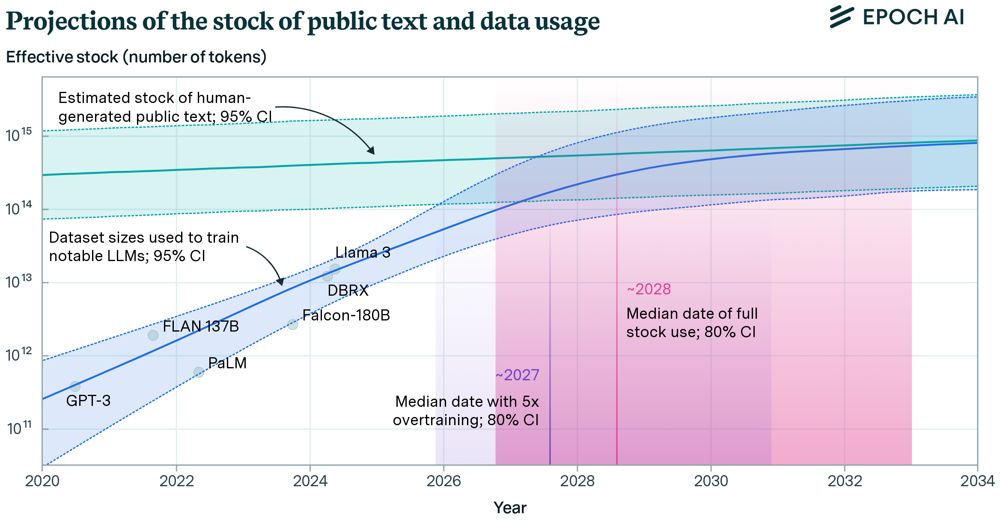

# 高效人工智能 {#sec-efficient-ai}

::: {layout-narrow}

::: {.column-margin}

*DALL·E 3 提示词：一个概念性插图，借助船厂类比描绘人工智能中的效率。画面展示一个繁忙的船厂，其中集装箱代表数据的比特或字节。这些集装箱正被起重机和车辆高效地搬运，象征着 AI 系统中精简而快速的信息处理。船厂经过精心组织，体现了在有限资源约束下实现最优性能的概念。背景中停靠着船只，代表 AI 应用的不同平台和场景。整体氛围应传达先进技术，并带有可持续性和广泛适用性的潜在主题。*

:::

\noindent
:::

## 目的 {.unnumbered}

_哪些关键权衡塑造了机器学习系统中对效率的追求，为什么工程师必须平衡相互竞争的目标？_

机器学习系统的效率要求在算法复杂度、计算资源和数据利用之间进行权衡。一个维度上的改进往往会削弱其他维度的表现，从而带来需要系统性方法来处理的工程张力。理解这些相互依赖的关系，使工程师能够在时间、能量和成本的实际约束下设计出实现最大性能的系统。

::: {.callout-tip title="学习目标"}

- 分析缩放定律关系，以确定计算预算、模型大小和数据集需求的最优资源分配策略

- 比较并对照云、边缘、移动和 TinyML 部署场景中的算法效率、计算效率和数据效率权衡

- 使用包括吞吐量、延迟、功耗和资源利用率在内的效率指标评估机器学习系统

- 应用剪枝、量化和知识蒸馏等压缩技术，在资源约束内优化模型性能

- 根据部署需求和运行约束，优先考虑不同的优化维度，设计具备上下文感知的效率策略

- 通过识别饱和点并提出以效率为导向的替代方案，批判性评估基于缩放的 approaches

- 评估机器学习系统设计中效率选择对环境和可访问性的影响
:::

## 效率的必要性 {#sec-efficient-ai-efficiency-imperative-d65c}

随着模型从简单的统计方法演变为复杂、资源密集型架构，机器学习效率已经从事后考虑转变为一门基础学科。理论能力与实际部署之间的差距已显著扩大，从而带来了效率约束，这些约束会从根本上影响系统的可行性和可扩展性。

大规模语言模型就是这一挑战的典型例子。GPT-3 的训练成本估计为 460 万美元（Lambda Labs 的估算），能耗为 1,287 MWh[@Patterson_et_al_2021]。其运行需求，包括推理时超过 700GB 的内存占用（半精度下为 350GB），在资源受限环境中构成了部署障碍。这些约束揭示了模型表达能力与系统实用性之间的张力，需要通过严格分析和优化策略来加以应对。

效率研究不仅限于资源优化，还涵盖学习系统设计的理论基础。工程师必须理解算法复杂度、计算架构以及数据利用策略如何相互作用，并共同决定系统的可用性。这些相互依赖关系形成了多目标优化问题：在某一维度上的改进，可能会降低其他维度的性能。

本章在第 III 部分的性能工程课程中，为分析机器学习系统效率建立了框架。这里的效率原则将指导 @sec-model-optimizations 中的优化技术，在那里量化和剪枝方法实现算法效率目标；指导 @sec-ai-acceleration 中最大化计算效率的硬件加速策略；以及指导 @sec-benchmarking-ai 中用于验证效率改进的测量方法。

## 定义系统效率 {#sec-efficient-ai-defining-system-efficiency-a4b7}

以为智能手机构建一个照片搜索应用为例。你面临三种相互竞争的压力：模型必须足够小，能够装入内存中（这是一个算法挑战），它必须能在手机处理器上足够快地运行而不会耗尽电池（这是一个计算挑战），而且它必须能够从用户的个人照片中学习，而不需要数百万个样本（这是一个数据挑战）。高效人工智能就是在这些相互关联的权衡之间进行权衡取舍的学科。

应对这些效率挑战，需要在决定系统可行性的三个相互关联的维度上进行协调优化。

::: {.callout-definition title="机器学习系统效率"}

***机器学习系统效率*** 是在保持性能的同时，通过在 _算法_、_硬件利用_ 和 _数据使用_ 上的改进，来优化机器学习系统，以最小化 _计算_、_内存_ 和 _能量_ 需求。
:::

理解这些相互依赖关系，对于设计能在实际约束下实现最大性能的系统是必要的。考察这三个维度在实践中如何相互作用，可以揭示扩展规律如何暴露这些约束。

### 效率之间的相互依赖 {#sec-efficient-ai-efficiency-interdependencies-5d69}

这三个效率维度深度交织，形成了一个复杂的优化空间。算法效率通过更好的算法和架构降低计算需求，但可能增加开发复杂度，或者需要专用硬件。计算效率通过优化实现和专用处理器最大化硬件利用率，但可能限制模型表达能力，或者需要特定的算法方法。数据效率通过改进训练流程和数据利用，使系统能够用更少的样本进行学习，但可能需要更复杂的算法或额外的计算资源。

一个具体例子可以说明这些相互联系：为智能手机设计一个照片搜索应用。系统必须能够装入 2GB 内存中（计算约束），在有限训练数据下达到可接受的准确率（数据约束），并在 50ms 内完成搜索（算法约束）。孤立地优化任一单一维度都证明是不够的：

**算法效率** 关注模型架构。使用一个紧凑的视觉-语言模型，参数量为 5000 万，而不是一个十亿参数模型，可将内存需求从 4GB 降至 200MB，并将推理时间从 2 秒缩短到 100 毫秒。然而，准确率会从 92% 下降到 85%，因此需要仔细评估这种权衡是否可接受。

**计算效率** 关注硬件利用。优化后的模型能在智能手机处理器上高效运行，每小时仅消耗 10% 的电池电量。诸如 8 位量化之类的技术可以减少计算量，同时保持质量，而批处理 [^fn-batch-processing] 则可以同时处理多个查询。然而，这些优化需要对算法进行修改，以支持降低精度的运算。

**数据效率** 决定模型如何学习。系统不再需要数百万对带标签的图像-文本对，而是利用预训练的基础模型，并仅使用数千个用户特定示例进行适配。基于用户交互的持续学习可在无需显式标注的情况下提供隐式反馈。这种数据效率要求更复杂的算法方法，并在适配过程中对计算资源进行谨慎管理。

这些维度之间的协同作用会产生涌现收益：更小的模型（算法效率）使得端侧处理成为可能（计算效率），从而可以在不将个人图像传输到远程服务器的情况下，从私有用户数据中学习（数据效率）。这种整合带来了更强的性能和隐私保护，说明效率如何支持那些效率较低的方法无法实现的能力。

这些相互依赖关系存在于所有部署场景中，从资源充足的云系统到受严格约束的边缘设备皆是如此。正如 @fig-interdependece 所示，在考察扩展规律如何揭示基本效率极限之前，理解这些关系至关重要。

::: {#fig-interdependece fig-env="figure" fig-pos="htb"}

```{.tikz}
\scalebox{0.7}{%
\begin{tikzpicture}[font=\small\usefont{T1}{phv}{m}{n},scale=1.25,line width=0.75pt]
\def\firstcircle{(0,0) circle (1.5cm)}
\def\secondcircle{(300:2cm) circle (1.5cm)}
\def\thirdcircle{(0:2cm) circle (1.5cm)}
%
    \begin{scope}[shift={(3cm,-5cm)}, fill opacity=0.5]
        \fill[cyan] \firstcircle;
        \fill[purple!70] \secondcircle;
        \fill[orange] \thirdcircle;
    \end{scope}

\begin{scope}[shift={(3cm,-5cm)}]
    \draw[draw=none] \firstcircle node[black,left,align=center] {Algorithmic\\ Efficiency};
    \draw[draw=none] \secondcircle node [black,below,align=center] {Data\\ Efficiency};
    \draw[draw=none] \thirdcircle node [black,right,align=center] {Compute\\ Efficiency};
\end{scope}
\end{tikzpicture}}

```

: **效率之间的相互依赖**：三种效率维度（算法、计算和数据）相互重叠并相互影响，在机器学习系统中形成系统性的权衡。针对某一效率维度进行优化，往往需要仔细考虑其对其他维度的影响，从而塑造整体系统性能和资源利用率。

:::

[^fn-batch-processing]: **批处理**：将多个输入一起处理，以摊销计算开销并最大化 GPU 利用率。移动端视觉模型在批大小为 8 时，相较于逐个处理可实现 3-5 倍加速，但会引入 50-200ms 的延迟，因为查询需要等待批次完成——这是机器学习系统中典型的吞吐量与延迟之间的权衡。

有了对效率维度相互作用的理解，我们就可以考察为什么仅靠蛮力式扩展无法满足现实世界的效率需求。扩展规律为理解这些局限提供了定量框架。

## AI 扩展定律 {#sec-efficient-ai-ai-scaling-laws-a043}

机器学习系统一直遵循一个一致的模式：通过参数、训练数据和计算资源增加模型规模，通常会提升性能。这一经验观察推动了自然语言处理、计算机视觉和语音识别等领域的进步，在这些领域中，使用海量数据集训练的大模型持续取得最先进的结果。

这些扩展定律可以看作是 Richard Sutton 在 @sec-introduction 中提出的“苦涩教训”的量化表达：机器学习中的性能主要由在大规模上利用通用方法来驱动。可预测的幂律关系展示了当计算规模扩大时，*如何*获得更好的模型。

这种扩展轨迹也引发了关于效率和可持续性的关键问题。随着计算需求指数式增长、数据要求不断提高，何时扩展成本会超过性能收益成为一个值得关注的问题。研究人员已经提出了扩展定律 [^fn-scaling-laws]，用以量化模型性能与训练资源之间的关系，揭示了为何随着系统复杂度提升，效率会变得越来越重要。

[^fn-scaling-laws]: **扩展定律**：OpenAI 发现的经验关系，表明语言模型性能会随着模型规模（N）、数据集规模（D）和计算预算（C）呈现可预测的幂律关系。这些定律使研究人员能够在昂贵的训练运行之前预测性能并进行最优资源分配。

本节将介绍扩展定律，考察其在不同维度上的表现，并分析其对系统设计的影响，从而说明多维效率优化框架为何是一项基本要求。

### 扩展定律的经验证据 {#sec-efficient-ai-empirical-evidence-scaling-laws-0105}

过去十年中 AI 能力的快速演进，正体现了这种扩展轨迹。GPT-1（2018）包含 1.17 亿个参数，并展示了基本的句子补全能力。GPT-2（2019）扩展到 15 亿个参数，实现了连贯的段落生成。GPT-3（2020）进一步扩展到 1750 亿个参数，并在多个领域展示了复杂的文本生成能力。模型规模每一次提升，都带来了显著增强的能力，但代价也以指数级上升。

这种模式并不局限于语言模型。在计算机视觉中，当训练数据按比例增加时，将神经网络规模加倍通常会带来稳定的准确率提升。AlexNet（2012）有 6000 万个参数，VGG-16（2014）扩展到 1.38 亿个参数，而现代大型视觉 Transformer 的参数量甚至可以超过 6 亿。每一代模型都取得了更好的图像识别准确率，但也需要相应更多的计算资源和训练数据。

扩展假设支撑了这一进展：更大的模型具有更强的容量去捕获复杂的数据模式，从而提升准确率和泛化能力。然而，这种扩展轨迹也引入了关键的资源约束。训练 GPT-3 大约需要 314 万亿亿 [^fn-sextillion] 次浮点运算（314 后面跟 21 个零），相当于让一台现代游戏电脑连续运行 350 多年，且伴随着巨大的经济和环境成本。

[^fn-sextillion]: **万亿亿**：一个有 21 个零的数字（10²¹），其规模几乎难以想象。作为对比，可观测宇宙中恒星数量估计为 10²² 到 10²⁴ 颗，因此 GPT-3 的训练计算量大约相当于数星星总数的 1/22。

这些资源需求说明了为什么理解扩展定律对于效率至关重要。@fig-compute-trends 显示，训练最先进模型所需的计算需求正以不可持续的速度攀升，其增长速度甚至快于硬件层面的摩尔定律改进。

![**模型训练计算趋势**：模型训练所需的计算量正以越来越快的速度增长，尤其是在近期的深度学习时代。来源：[@Sevilla_Heim_Ho_Besiroglu_Hobbhahn_Villalobos_2022.]](images/png/compute-trends.png){#fig-compute-trends}

扩展定律为理解这些权衡提供了一个定量框架。它们表明，随着资源增加，模型性能呈现可预测的模式，遵循幂律关系：性能持续改善，但边际收益递减 [^fn-diminishing-returns]。这些定律说明，最优资源分配需要协调模型规模、数据集规模和计算预算，而不是孤立地扩展某一个维度。

[^fn-diminishing-returns]: **边际收益递减**：一种经济学原则，即每增加一个输入，带来的输出增益会逐步变小。在机器学习中，将计算从 1 小时加倍到 2 小时，准确率也许能提升 5%，但从 100 小时加倍到 200 小时，可能只提升 0.5%。

::: {.callout-note collapse="true" title="Transformer 计算特性回顾"}

回顾 @sec-dnn-architectures，Transformer 使用自注意力机制处理序列，计算所有 token 对之间的关系。该架构的计算成本随序列长度呈二次方增长，因此资源分配对于语言模型尤其关键。“FLOPs”（floating-point operations，浮点运算）用于量化总计算工作量，而“tokens”表示模型在训练中处理的单个文本单元（通常是子词）。

:::

### 计算最优的资源分配 {#sec-efficient-ai-computeoptimal-resource-allocation-541a}

大语言模型（LLM）的实证研究揭示了一个关键洞见：对于任意固定的计算预算，模型规模与数据集规模（以 token[^fn-tokens] 计）之间存在一个最优平衡，使训练损失最小化。

[^fn-tokens]: **Token**：语言模型处理的文本基本单元，通过字节对编码（Byte-Pair Encoding，BPE）等算法将文本拆分为子词片段而生成。GPT-3 在 3000 亿个 token 上训练，而 PaLM 使用了 7800 亿个 token，其文本语料规模相当于从网页抓取和数字化文献中汇聚的数百万本书。@fig-compute-optimal 通过三个相关视图说明了这一原则。左侧面板展示了“IsoFLOP 曲线”，其中每条曲线对应 Transformer[^fn-transformer] 训练期间恒定的浮点运算次数（FLOPs[^fn-efficient-flops]）。这些曲线中的谷底标识出在训练自回归 [^fn-autoregressive] 语言模型时，对于每个计算预算而言最有效的模型规模。中间和右侧面板揭示了当计算预算增加时，最优参数量和 token 数量如何可预测地缩放，说明了必须协调扩展以最大化资源利用率。

[^fn-efficient-flops]: **FLOPs**：浮点运算，用于衡量所执行的计算工作量。现代深度学习模型训练通常需要 10²²-10²⁴ 次 FLOPs：GPT-3 使用了约 3.14 × 10²³ 次 FLOPs（314 万亿亿次运算），相当于一台高端游戏电脑连续运行 350 多年。

[^fn-transformer]: **Transformer**：Vaswani 等人提出的神经网络架构 [@vaswani2017attention]，通过自注意力机制革新了自然语言处理。与顺序式 RNN 不同，Transformer 在训练期间支持并行处理，成为现代大语言模型（包括 GPT、BERT、T5 及其衍生模型）的基础。

[^fn-autoregressive]: **自回归模型**：通过根据序列中所有先前 token 来预测下一个 token 的语言模型。GPT 系列模型就是这一方法的典型代表，它们通过从左到右生成文本，并使用因果注意力掩码确保每个位置只能关注前面的位置信息。

![**最优计算分配**：在固定计算预算下，语言模型性能取决于模型规模与训练数据量之间的平衡；左侧面板映射了参数数量与训练损失的关系，并为每个 FLOP 水平识别出一个效率最佳点。中间和右侧面板量化了最优参数数量与 token 需求如何随着计算量增加而可预测地扩展，说明在大语言模型中，为了最大化资源利用率，模型与数据都需要协调扩展。来源：[@hoffmann2022training]。](images/png/compute_optimal.png){#fig-compute-optimal}

@kaplan2020scaling 证明了基于 Transformer 的语言模型会随着三个因素呈可预测地扩展：模型参数数量、训练数据集规模（以 token 计）以及总计算预算（以浮点运算计）。当这些因素按比例增加时，模型会在无需架构修改或任务特定调优的情况下持续提升性能。

这些模式的实际表现清晰地体现在 @fig-kaplan-scaling 中，该图展示了从$10^3$到$10^9$参数规模的模型测试损失曲线。该图揭示了两个关键洞见。第一，更大的模型表现出更高的样本效率，能以更少的训练 token 达到目标性能。第二，随着计算资源增加，最优模型规模相应增大，并且当计算分配得当时，损失会可预测地下降。

![**扩展定律与计算最优性**：更大的模型在更多训练数据和计算资源支持下通常能获得更好性能，但边际收益递减要求训练期间必须谨慎分配资源。最优模型规模和训练时长取决于可用计算预算，这从不同参数规模和训练 token 数下损失曲线的收敛可以看出。来源：[@kaplan2020scaling]。](images/png/kaplan_scaling_data_compute.png){#fig-kaplan-scaling}

这一理论扩展关系定义了最优计算分配：对于固定预算，关系$D \propto N^{0.74}$ [@hoffmann2022training] 表明数据集规模$D$和模型规模$N$必须以协调的比例增长。这意味着随着模型规模增加，数据集应以大约四分之三的速率增长，以维持计算最优效率。

这些理论预测假设计算利用率是完美的，而在分布式训练场景中这很难实现。现实系统会面临随系统规模不利增长的通信开销，从而形成带宽瓶颈并降低有效利用率。在超过 100 个节点后，通信开销会根据工作负载和互连方式，使预期性能提升减少 20% 到 40%，将预测中的改进转化为更温和的现实结果。

### 数学基础与运行区间 {#sec-efficient-ai-mathematical-foundations-operational-regimes-9afe}

扩展行为中的可预测模式可以用幂律关系在数学上表达，不过对大多数实践者来说，理解这些模式背后的直觉比精确的数学形式更重要。

::: {.callout-note collapse="true" title="形式化数学表述"}

对于有兴趣了解正式数学框架的读者，扩展定律可以表示为幂律关系。一般形式为：$$
\mathcal{L}(N) = A N^{-\alpha} + B
$$其中，损失$\mathcal{L}$会随着资源量$N$的增加而下降，遵循速率为$\alpha$的幂律衰减，并加上一个基线常数$B$。这里，$\mathcal{L}(N)$表示在资源量为$N$时达到的损失，$A$和$B$是依赖任务的常数，而$\alpha$是表征性能提升速率的扩展指数。更大的$\alpha$值表示在扩展方面更高效的性能提升。
:::

这些理论预测在多种模型配置上都得到了强有力的经验证据支持。@fig-loss-vs-n-d 表明，早停测试损失会随数据集规模和模型规模而可预测地变化，并且不同配置下的学习曲线可以通过适当参数化对齐。

#### 资源受限的扩展区间 {#sec-efficient-ai-resourceconstrained-scaling-regimes-062d}

在实践中应用扩展定律，需要识别出三种由计算预算、数据可用性与最优资源分配之间权衡所形成的不同资源分配区间。这些区间为在资源约束下进行系统设计提供了实用指导。

计算受限区间描述的是：尽管训练数据充足，但可用计算资源限制了扩展潜力的场景。硬件预算有限或训练时间严格受限的组织通常处于这一区间。最优策略是训练更小的模型、更长的时间，通过延长训练日程而不是扩大架构来最大化现有计算资源的利用率。这种方法对于学术机构、初创公司或基础设施访问受限的项目尤其相关。

数据受限区间出现在计算资源超过在当前数据集约束下能够有效利用的程度时。处理专门领域、专有数据集或受隐私约束数据的高资源组织经常会遇到这一区间。最优策略是训练更大的模型、减少优化步数，利用模型容量从有限的训练样本中提取最大信息。这一区间常见于医学影像或专有商业数据集等专门应用。

最优区间（Chinchilla Frontier）代表了按照计算最优扩展定律，对计算和数据资源进行平衡分配的状态。该区间通过按比例扩展模型规模和训练数据来实现最高的性能效率，正如 DeepMind 的 Chinchilla 模型所示，它通过最优资源分配超越了规模更大的模型 [@hoffmann2022training]。在这一区间内运行需要复杂的资源规划，但能以每单位计算投入获得更优性能。

识别这些区间使实践者能够就资源分配策略做出更明智的决策，避免诸如参数过多但训练数据不足，或参数不足以有效利用可用计算资源等常见低效问题。

::: {#fig-loss-vs-n-d fig-env="figure" fig-pos="htb"}

```{.tikz}
\begin{tikzpicture}[font=\small\usefont{T1}{phv}{m}{n}]

\definecolor{myblue}{RGB}{31,119,180}
\definecolor{myorange}{RGB}{255,127,14}
\definecolor{mygreen}{RGB}{44,160,44}
\definecolor{myred}{RGB}{214,39,40}
\definecolor{mypurple}{RGB}{148,103,189}
\definecolor{mybrown}{RGB}{140,86,75}

\tikzset{%
    LineD/.style={line width=1.0pt,dashed,dash pattern=on 3pt off 2pt]}
}

\pgfplotsset{myaxis/.style={
  /pgf/number format/.cd,
  1000 sep={},
   legend style={at={(0.1,0.45)}, anchor=north},
   legend cell align=left,
   legend style={fill=BrownL!30,draw=BrownLine,row sep=-0.5pt,
   font=\fontsize{6pt}{6}\selectfont\usefont{T1}{phv}{m}{n}},
   width=120mm,
   height=67.2mm,
   yticklabel style={xshift=1mm,font=\fontsize{7pt}{7}\selectfont\usefont{T1}{phv}{m}{n},
   /pgf/number format/.cd, fixed, fixed zerofill, precision=1},
   xticklabel style={font=\fontsize{7pt}{7}\selectfont\usefont{T1}{phv}{m}{n}},
   ylabel style={font=\fontsize{7pt}{7}\selectfont\usefont{T1}{phv}{m}{n},align=center,yshift=-1.2mm},
   xlabel style={font=\fontsize{7pt}{7}\selectfont\usefont{T1}{phv}{m}{n}},
   tick align=outside,
   major tick length=1mm,
   title style={yshift=-4pt},
   minor x tick  style={thin,black!60},
   major tick  style={thin,black!60},
   log basis y=10,
   x tick label style={rotate=0, anchor=north,yshift=1pt},
    }}

\begin{axis}[myaxis,
  title={Loss vs Model and Dataset Size},
  xmin=0.5e7,
  xmax=4e10,
  ymin=2.3, ymax=4.8,
   ytick={2.5,3.0,3.5,4.0,4.5},
  yticklabels={2.5,3,3.5,4.0,4.5},
  xmode=log,
  xtick={1e7,1e8,1e9,1e10},
  xticklabels={10\textsuperscript{7},10\textsuperscript{8},10\textsuperscript{9},10\textsuperscript{10}},
  xlabel={Tokens in Dataset},
  ylabel={Loss},
  grid=both,
  major grid style={black!30},
  minor grid style={draw=none},
  minor x tick num=4,
  xtick pos=left,
   ytick pos=left,
  cycle list={
    {myblue,mark=*,only marks,mark options={line width=1pt},mark size=1.75pt},
    {myorange,mark=*,only marks,mark options={line width=1pt},mark size=1.75pt},
    {mygreen,mark=*,only marks,mark options={line width=1pt},mark size=1.75pt},
    {myred,mark=*,only marks,mark options={line width=1pt},mark size=1.75pt},
    {mypurple,mark=*,only marks,mark options={line width=1pt},mark size=1.75pt},
    {mybrown,mark=*,only marks,mark options={line width=1pt},mark size=1.75pt},
    {myblue},
    {myorange},
    {mygreen},
    {myred},
    {mypurple},
    {mybrown}
  }
]
%393.2K
\addplot+[] coordinates{
(3.05e7,4.645)(3.05e7,4.48)(5.9e7,4.415)(1.14e8,4.34)(8.3e8,4.29)(2.3e10,4.28)
};
\addlegendentry{393.2K}
%2M
\addplot+[]
coordinates{
(3.05e7,4.25)(5.9e7,4.1)(1.14e8,3.93)(2.2e8,3.867)(4.3e8,3.837)(8.3e8,3.8)(2.3e10,3.77)
};
\addlegendentry{3M}
%25M
\addplot+[]
coordinates{
(3.05e7,4.25)(5.9e7,3.941)(1.14e8,3.735)(2.2e8,3.567)(4.3e8,3.415)(8.3e8,3.325)(2.3e10,3.27)
};
\addlegendentry{25M}
%85M
\addplot+[]
coordinates{
(3.05e7,4.21)(5.9e7,3.941)(1.14e8,3.69)(2.2e8,3.472)(4.3e8,3.31)(8.3e8,3.12)(1.61e9,3.04)(2.3e10,2.97)
};
\addlegendentry{85M}
%302M
\addplot+[]
coordinates{
(3.05e7,4.21)(5.9e7,3.941)(1.14e8,3.69)(2.2e8,3.46)(4.3e8,3.28)(8.3e8,3.01)(1.61e9,2.84)(2.3e10,2.62)
};
\addlegendentry{302M}
%708M
\addplot+[]
coordinates{
(3.05e7,4.31)(5.9e7,3.941)(1.14e8,3.69)(2.2e8,3.46)(4.3e8,3.28)(8.3e8,3.05)(1.61e9,2.80)(2.3e10,2.42)
};
\addlegendentry{708M}
%%%approximation
%393.2K
\addplot+[LineD,smooth]coordinates{
(1.5e7,4.595) (3.05e7,4.47) (5.9e7,4.395) (1.14e8,4.35) (8.3e8,4.3) (3e10,4.290)
};
%2M
\addplot+[LineD,smooth] coordinates{
(1.5e7,4.46) (3.05e7,4.25) (5.9e7,4.08) (1.14e8,3.96) (2.2e8,3.867) (4.3e8,3.814) (8.3e8,3.789) (3e10,3.756)
};
%25M
\addplot+[LineD,smooth]  coordinates{
(1.5e7,4.42) (3.05e7,4.17)(5.9e7,3.95)(1.14e8,3.75)(2.2e8,3.58)(4.3e8,3.444)(8.3e8,3.345)(3e9,3.253)(3e10,3.213)};
%85M
\addplot+[LineD,smooth,samples=200]  coordinates{
(1.5e7,4.42) (3.05e7,4.17)(5.9e7,3.93)(1.14e8,3.7)(2.2e8,3.499)(4.3e8,3.32)(8.3e8,3.17)
(1.61e9,3.064)(5e9,2.955)(1e10,2.92)(3e10,2.913)};
%30M
\addplot+[LineD,smooth,samples=200]  coordinates{
(1.5e7,4.42) (3.05e7,4.17)(5.9e7,3.93)(1.14e8,3.7)(2.2e8,3.467)(4.3e8,3.25)(8.3e8,3.054)
(1.61e9,2.89)(4e9,2.73)(1e10,2.64)(3e10,2.59)};
%708M
\addplot+[LineD,smooth,samples=200]  coordinates{
(1.5e7,4.42) (3.05e7,4.17)(5.9e7,3.93)(1.14e8,3.7)(2.2e8,3.456)(4.3e8,3.223)(8.3e8,3.013)
(1.61e9,2.82)(4e9,2.61)(1e10,2.47)(3e10,2.39)};
\node[font=\fontsize{7pt}{7}\selectfont\usefont{T1}{phv}{m}{n},
anchor=south,above=0pt,fill=white]at(axis description cs:0.1,0.45){Params};
\end{axis}
\end{tikzpicture}
```

: **损失与模型、数据集规模的关系**：早停测试损失会随数据集规模和模型规模可预测地变化，强调了在固定计算预算下，平衡扩展对于获得最优性能的重要性。

:::

扩展定律表明，性能提升会遵循可预测的模式，并会根据资源可用性而变化，在不同维度上呈现出不同的行为。由此可以归纳出两类重要的扩展区间：**数据驱动区间**，描述性能如何随数据集规模变化；以及**时间维度区间**，描述我们在机器学习生命周期的哪个阶段施加额外计算。

#### 数据受限的扩展区间 {#sec-efficient-ai-datalimited-scaling-regimes-ba1d}

泛化误差与数据集规模之间的关系呈现出三种不同区间，如 @fig-data-scaling-regimes 所示。当可用样本有限时，较高的泛化误差源于统计估计不足。随着数据可用性提高，泛化误差会作为数据集规模的函数而可预测地下降，遵循幂律关系，这是数据扩展带来的最实际收益。最终，性能会趋于饱和，接近由数据固有局限或模型容量决定的下界，超过这一点后，更多数据带来的提升微乎其微。

::: {#fig-data-scaling-regimes fig-env="figure" fig-pos="htb"}

```{.tikz}
\scalebox{0.7}{
\begin{tikzpicture}[line join=round,line cap=round,font=\small\usefont{T1}{phv}{m}{n}]
\def\hi{5.5}
\def\wi{11}
\def\hl{5/7*\hi}
\draw[thick](0,-1)coordinate(O)--node[below=3pt]{Training Data Set Size (Log-Scale)}(\wi,-1)coordinate(E);
\draw[thick](0,-1)--node[above=3pt,midway,sloped]{Generalization Error (Log-Scale)}(0,\hi);
%
\draw[dashed,violet,thick](0,0)--(\wi,0);
\draw[dashed,red,thick](0,\hl)--(\wi,\hl);
%
\coordinate(A)at(3,-0.7);
\coordinate(A1)at(3,-1);
\coordinate(B)at(8,-0.7);
\coordinate(G1)at($(0,\hl)+(0,-0.1)$);
\coordinate(G2)at($(\wi,0)+(0,0.1)$);
\coordinate(GG1)at($(G1)+(1.5,0)$);
\coordinate(GG2)at($(G2)+(-1.5,0)$);

\path[thick](A)--++(90:\hi)coordinate(LG1);
\path[thick](B)--++(90:\hi)coordinate(LG2);

\draw[smooth,blue,line width=2pt](G1)--
node[above=2pt,align=center,text=black,pos=0.98]{Best Guess Error}(GG1)
to[out=360,in=180](GG2)--
node[below=2pt,align=center,text=black,pos=0.1]{Irreducible Error}(G2);

\scoped[on background layer]
\node[draw=none,inner xsep=0mm,
line width=0.75pt,inner ysep=0mm,
fill=magenta!05,fit=(O)(LG1)](BB){};
\node[above=1pt of BB.north,anchor=south,align=center]{Small Data\\ Region};
%
\scoped[on background layer]
\node[draw=none,inner xsep=0mm,
line width=0.75pt,inner ysep=0mm,
fill=green!10,fit=(A1)(LG2)](BB1){};
\node[above=1pt of BB1.north,anchor=south,align=center]{Power-Law\\ Region};

\scoped[on background layer]
\node[draw=none,inner xsep=0mm,
line width=0.75pt,inner ysep=0mm,
fill=magenta!05,fit=(LG2)(E)](BB2){};
\node[above=1pt of BB2.north,anchor=south,align=center]{Irreducible Error\\ Region};
%
\end{tikzpicture}}
```

: **数据扩展区间**：数据集规模与泛化误差之间的关系遵循不同的扩展区间。增加数据集规模最初会按照幂律关系降低泛化误差，但最终会在由数据固有局限或模型容量决定的不可约误差下限处趋于平台化 [@hestness2017deep]。这种行为揭示了数据扩展的边际收益递减，并为机器学习系统中的数据收集工作提供了实践决策依据。

:::

这种三区间模式不仅存在于数据维度，也会出现在其他资源维度上。在幂律区域内运行能带来最可靠的资源投资回报。达到这一区间需要最低资源阈值，而维持运行在该区间则需要精细分配，以避免过早饱和。

#### 时间维度的扩展区间 {#sec-efficient-ai-temporal-scaling-regimes-e118}

如果说数据驱动区间描述的是性能如何随数据集规模变化，那么一个互补视角则考察在机器学习生命周期中，计算资源在时间维度上的分配。近期研究识别出三种不同的**时间维度扩展区间**，分别刻画模型开发与部署的不同阶段。

**预训练扩展**涵盖了扩展定律的传统领域，描述的是在初始训练阶段，随着架构更大、数据集更丰富、计算更多，模型性能如何提升。在基础模型方面的大量研究已经建立了资源与能力之间清晰的幂律关系。

**后训练扩展**描述的是在初始训练之后，通过微调、提示工程和任务特定适配等技术实现的改进。随着基础模型的发展，这一区间变得越来越重要，因为在中等资源需求下，适配而非重新训练往往能提供最有效的性能提升路径。

**测试时扩展**描述的是在推理过程中无需修改模型参数、仅通过增加计算分配来实现性能提升。这包括集成预测、思维链提示和迭代细化等方法，使模型能够为每个输入分配额外的处理时间。@fig-scaling-regimes 显示，这些时间维度区间在用于提升性能的计算资源分配上表现出不同特征。预训练需要大量资源，但能提供广泛能力；后训练在中等资源条件下提供针对性增强；测试时扩展则允许按每次推理灵活调整性能与计算之间的权衡。

::: {#fig-scaling-regimes fig-env="figure" fig-pos="htb"}

```{.tikz}
\scalebox{0.75}{
\begin{tikzpicture}[line join=round,line cap=round,font=\small\usefont{T1}{phv}{m}{n},yscale=0.8]
\tikzset{Line/.style={line width=2.5pt,RedLine},
LineD/.style={Line,line width=0.75pt,dashed}
}
\def\hi{7.5}
\def\wi{11}
\draw[thick](0,0)coordinate(O)--node[below=3pt]{Compute}(\wi,0);
\draw[thick](0,0)--node[above=3pt,midway,sloped]{Intelligence}(0,\hi)coordinate(Y);
%

\coordinate(O)at(0.03,0.03);
\coordinate(T1)at(2,0.88);
\coordinate(T2)at(4.2,3.0);
\coordinate(T3)at(6,5.2);
\coordinate(T4)at(7.7,6.35);
\draw[Line](O)
to (T1)
to [out=30,in=210](T2)
to [out=55,in=220](T3)
to [out=40,in=210](T4);
\draw[Line,-latex](O)--++(23:3.6)node[below right,text=black]{Pre-training scaling};
\draw[blue,-latex,LineD](O)--++(23:7.0);
%
\draw[Line,-latex](T2)--++(27:1.6)node[below right,text=black]{Post-training scaling};
\draw[-latex,LineD](T2)--++(27:4.0);
\draw[Line,-latex](T3)to [out=40,in=210]($(T4)+(0.15,0.09)$)
node[below right,text=black,align=center]{Test-time scaling\\ "long thinking};
\draw[-latex,LineD](T4)--++(29:2.0);
\node[below right=of Y,align=center,font=\normalsize\usefont{T1}{phv}{m}{n}]{From one to three \\ scaling laws};
\end{tikzpicture}}
```

: **时间维度扩展区间**：不同的时间维度扩展区间为以不同计算投入提升模型性能提供了不同路径。预训练通过从零开始的大规模训练建立广泛能力，后训练通过额外训练阶段对现有模型进行优化，而测试时扩展则在推理期间动态分配计算以增强单样本结果。理解这些区间有助于明确前期投入与灵活、按需资源分配之间的权衡，从而实现最优系统性能。

:::

数据驱动和时间维度扩展区间对系统设计至关重要，因为它们揭示了除单纯扩展训练资源之外的多条性能提升路径。对于资源受限的部署场景，后训练和测试时扩展可能比完全重新训练模型更实用；而数据高效技术则使系统能够使用更小的数据集，在幂律区域内高效运行。

### 系统设计中的实际应用 {#sec-efficient-ai-practical-applications-system-design-5c97}

扩展定律为实际系统设计和资源规划提供了强有力的洞见。幂律趋势的持续观察表明，在明确的运行区间内，模型性能主要取决于规模，而不是某些特殊的架构创新。然而，边际收益递减现象意味着，每一次额外提升都需要指数级增加资源，却只带来越来越小的收益。

OpenAI 对 GPT-3 的开发展示了这一原则。作者并未进行昂贵的架构搜索，而是利用从早期实验中得到的扩展定律来确定最优训练数据集规模和模型参数量 [@brown2020language]。他们沿着计算最优前沿对一个成熟的 Transformer 架构进行扩展，达到 1750 亿参数和约 3000 亿 token，从而能够提前预测模型性能和资源需求。这一方法展示了扩展定律在大规模系统规划中的实际应用。

扩展定律在系统设计中具有多重实用功能。它们使实践者能够在资源预算阶段估计不同资源分配方案的投资回报。在固定计算预算下，设计者可以利用经验扩展曲线来决定优化性能的最优策略，无论是通过扩大模型规模、扩展数据集，还是延长训练时间。

系统设计者还可以利用扩展趋势来判断：与单纯依靠扩展相比，何时架构变更能带来显著改进，从而避免进行穷举式架构搜索。当某个模型家族展现出良好的扩展行为时，扩展现有架构往往比转向更复杂但尚未验证的设计更有效。

在资源预算受限的边缘和嵌入式环境中，理解模型扩展下的性能衰减有助于设计者选择更小的配置，在部署约束内提供可接受的准确率。通过量化规模与性能之间的权衡，扩展定律能够识别何时蛮力扩展已变得低效，并指出需要采用其他方法，包括模型压缩、高效知识迁移、稀疏技术以及面向硬件的设计。

扩展定律还可作为诊断工具。即便资源增加，性能仍停滞不前，可能表明某个维度已饱和——例如相对于模型规模而言数据不足——或者计算资源利用低效。这样的诊断能力使扩展定律既具有预测性，又具有指导性，从而有助于系统性地识别和解决瓶颈。

### 可持续性与成本影响 {#sec-efficient-ai-sustainability-cost-implications-0473}

扩展定律既揭示了提升性能的路径，也暴露了资源需求的快速增长。随着模型规模扩大，训练和部署所需资源会不成比例地增加，在通过扩展获得性能提升与系统效率之间形成张力。

训练大规模模型需要大量处理能力，通常要求由数百或数千个加速器组成的分布式基础设施 [^fn-distributed-infrastructure]。最先进的语言模型训练可能需要数万 GPU-day，并消耗数百万千瓦时的电力。这些分布式训练系统还引入了通信开销、同步和扩展效率方面的额外复杂性，详见 @sec-ai-training。能源需求的增长速度已经超过了摩尔定律的改进速度，引发了关于长期可持续性的关键问题。

[^fn-distributed-infrastructure]: **分布式基础设施**：将机器学习工作负载分散到通过高速网络连接的多台机器上的计算系统。OpenAI 的 GPT-4 训练很可能使用了通过 InfiniBand 连接的数千块 NVIDIA A100 GPU，并需要精细编排以避免通信瓶颈。

大型模型需要大量高质量、多样化的数据集才能发挥其全部潜力。数据收集、清洗和标注过程会消耗大量时间和资源。随着模型逐渐接近可用高质量数据的饱和，尤其是在自然语言处理领域，通过数据扩展继续获得性能提升会变得越来越困难。这一现实凸显了数据效率作为蛮力扩展方法必要补充的重要性。

经济和环境影响进一步加剧了这些挑战。大型基础模型的训练运行可能会产生数百万美元的计算开销，而相关的碳足迹 [^fn-carbon-emissions] 也日益受到关注。这些成本限制了前沿研究的可及性，并加剧了先进 AI 系统获取上的不平等。效率壁垒带来的普及难题与 @sec-ai-good 中讨论的可访问性目标直接相关。有关机器学习系统中环境可持续性的综合方法，包括碳足迹测量和绿色计算实践，见 @sec-sustainable-ai。

[^fn-carbon-emissions]: **碳排放**：训练 GPT-3 产生了大约 502 吨二氧化碳当量，约相当于 123 辆汽油车一年的排放量。现代机器学习实践越来越多地借助 CodeCarbon 和 ML CO2 Impact 计算器等工具进行碳排追踪。

这些权衡表明，扩展定律虽然为理解性能增长提供了有价值的框架，但并不意味着一条不受约束的提升路径。每一次增量性能提升都必须与相应的资源需求进行权衡。随着系统接近实际扩展极限，重点必须从单纯扩展转向高效扩展——即在性能、成本、能耗和环境影响之间取得平衡的综合方法。

### 扩展定律失效的条件 {#sec-efficient-ai-scaling-law-breakdown-conditions-1f8c}

扩展定律在特定运行区间内表现出惊人的一致性，但也具有内在局限。随着系统不断扩大，它们不可避免地会遇到某些边界，使得底层的平滑、可预测扩展假设不再成立。这些失效点暴露了关键的低效问题，并强调了改进系统设计方法的必要性。

为了使扩展定律继续有效，模型规模、数据集规模和计算预算必须协调增加。在某一维度上过度投入，而其他维度保持不变，往往会导致次优结果。例如，在不扩展训练数据集的情况下增加模型规模可能引发过拟合；而在不重新设计模型的情况下增加计算资源，则可能导致利用效率低下 [@hoffmann2022training]。

大规模模型需要经过精心调校的训练日程和学习率，才能充分利用可用资源。当由于过早停止、批量大小不匹配或并行效率低下而导致计算分配不足时，即便投入了大量基础设施，模型也可能达不到其性能潜力。

扩展定律预设充足训练数据会持续带来性能提升。然而，在许多领域中，高质量人工标注数据的可获得性是有限的。随着模型消耗越来越大的数据集，它们会到达边际效用递减点，此时额外数据只能提供极少的新信息。超过这一阈值后，更大的模型可能表现出记忆化而非泛化。

随着模型规模增长，它们对内存带宽 [^fn-memory-bandwidth]、互连容量和 I/O 吞吐量的需求也会更高。即便有专用加速器，这些硬件限制也会变得越来越棘手。将万亿参数模型分布到集群中，需要精细管理数据并行、通信开销和容错机制。

[^fn-memory-bandwidth]: **内存带宽**：从内存读取或写入数据的速率，单位为 GB/s。NVIDIA H100 提供 3.35 TB/s 的内存带宽，而典型 DDR5 内存仅为 51 GB/s，相差 65 倍，这对于处理大型模型参数至关重要。

在极端规模下，模型可能接近训练分布可学习内容的极限。基准测试上的表现也许会持续提升，但这些提升可能不再反映泛化能力或理解能力的真正进步。模型可能会变得越来越脆弱，容易受到对抗样本攻击，或者倾向于生成看似合理但实际上不准确的输出。@tbl-scaling-breakdown 综合总结了扩展失败的主要原因，列出了典型失效类型、根本原因和代表性场景，可作为预测低效问题并指导平衡系统设计的参考。

| **扩展维度** | **失效类型** | **根本原因** | **示例场景** |
|:---|:---|:---|:---|
| **模型规模** | 过拟合 | 模型容量超过可用数据 | 在有限数据集上训练十亿参数模型 |
| **数据量** | 边际收益递减 | 新信息或多样性饱和 | 将网页文本扩展到超过有用阈值 |
| **计算预算** | 资源未充分利用 | 训练步数不足或使用低效 | 大模型训练时长被截断 |
| **不平衡扩展** | 低效 | 模型/数据/计算增长不协调 | 模型规模翻倍但没有更多数据或时间 |
| **所有维度** | 语义饱和 | 该领域可学习模式耗尽 | 即便扩展所有输入也不再有进一步提升 |

: **扩展失效类型**：模型规模、数据量和计算资源之间的不平衡扩展会导致特定的失效模式，如过拟合或边际收益递减，从而影响系统性能和效率。该表对这些失效进行了分类，识别其根本原因，并提供代表性场景，以指导更有效的系统设计和资源分配。 {#tbl-scaling-breakdown}

这些失效点表明，扩展定律描述的是特定条件下的经验规律，而这些条件在大规模下会变得越来越难以维持。随着机器学习系统持续演进，识别扩展何时以及为何失效变得至关重要，这将推动那些不再单纯依赖规模，而是致力于提升性能的新策略发展。

### 将效率与扩展结合起来 {#sec-efficient-ai-integrating-efficiency-scaling-a513}

扩展定律暴露出的局限——数据饱和、基础设施瓶颈和边际收益递减——表明，仅依靠蛮力扩展无法构建可持续的 AI 系统。这些约束要求我们从扩展规模转向在更少资源下实现更高效率。

这一转变需要在三个相互关联的维度上进行协调优化：**算法效率**通过更好的模型设计来降低计算强度，**计算效率**通过最大化硬件利用率把算法改进转化为实际收益，而**数据效率**则是在高质量数据稀缺时，从有限样本中提取最大信息。三者共同提供了实现性能目标的系统化路径，而仅靠扩展无法持续实现这些目标；同时它们也回应了关于 AI 能力公平获取和环境影响的更广泛关切。

在考察了扩展定律如何揭示基本约束之后，我们现在转向效率框架，它提供了在这些约束下有效运行的具体策略。下一节将详细说明这三个效率维度如何协同工作，以支持可持续、易获取的机器学习系统。

## 效率框架 {#sec-efficient-ai-efficiency-framework-c0de}

通过缩放定律识别出的约束（即持续进步需要系统性的效率优化）激发了三种互补的效率维度。每个维度都针对一个特定的局限：算法效率解决计算强度问题，计算效率解决硬件利用率不足问题，而数据效率则解决数据饱和问题。

这三个维度共同构成了一个系统性框架，用于应对缩放定律所揭示的约束。围绕算法设计、硬件利用和数据使用进行有针对性的优化，能够实现蛮力扩展无法达到的目标：可持续、可获得且高性能的人工智能系统。

### 多维效率协同 {#sec-efficient-ai-multidimensional-efficiency-synergies-ea04}

最优性能需要跨多个维度的协同优化。没有任何单一资源——无论是模型参数、训练数据还是计算预算——能够无限扩展以实现效率提升。现代技术展示了这种潜力：通过优化架构可获得 10-100 倍的算法效率提升，通过专用处理器可实现 5-50 倍的硬件利用率提升，通过先进学习方法可将数据需求降低 10-1000 倍。

这一框架的力量源于各维度之间的相互联系，如 @fig-evolution-efficiency 所示。算法创新通常能够带来更好的硬件利用，而硬件进步又会释放新的算法可能性。数据高效技术减少计算需求，而计算高效方法则使在更大数据集上训练成为可能。理解这些协同作用对于构建实用的机器学习系统至关重要。

::: {#fig-evolution-efficiency fig-env="figure" fig-pos="htb"}

```{.tikz}
\begin{tikzpicture}[font=\small\usefont{T1}{phv}{m}{n},node distance=2mm]
\tikzset{
  Box/.style={inner xsep=1pt,
    draw=none,
    fill=#1,
    anchor=west,
    text width=27mm,align=center,
    minimum width=27mm, minimum height=10mm
  },
  Box/.default=red
}
\definecolor{col1}{RGB}{128, 179, 255}
\definecolor{col2}{RGB}{255, 255, 128}
\definecolor{col3}{RGB}{204, 255, 204}
\definecolor{col4}{RGB}{230, 179, 255}
\definecolor{col5}{RGB}{255, 153, 204}
\definecolor{col6}{RGB}{245, 82, 102}
\definecolor{col7}{RGB}{255, 102, 102}

\node[Box={col1}](B1){Algorithmic\\ Efficiency};
\node[Box={col1},right=of B1](B2){Deep\\ Learning Era};
\node[Box={col1},right=of B2](B3){Modern\\ Efficiency};
\node[Box={col2},right=of B3](B4){General-Purpose\\ Computing};
\node[Box={col2},right=of B4](B5){Accelerated\\ Computing};
\node[Box={col2},right=of B5](B6){Sustainable Computing};
\node[Box={col3},right=of B6](B7){Data\\ Scarcity};
\node[Box={col3},right=of B7](B8){Big\\ Data Era};
\node[Box={col3},right=of B8](B9){ Data-Centric AI};
%%%%
\node[Box={col1},above=of B2,minimum width=87mm,
 text width=85mm](GB1){Algorithmic Efficiency};
\node[Box={col2},above=of B5,minimum width=87mm,
text width=85mm](GB5){Compute Efficiency};
\node[Box={col3},above=of B8,minimum width=87mm,
text width=85mm](GB8){Data Efficiency};
%%
\foreach \x in{1,2,...,9}
\draw[dashed,thick,-latex](B\x)--++(270:5.5);

\path[red]([yshift=-8mm]B1.south west)coordinate(P)-|coordinate(K)(B9.south east);
\draw[line width=2pt,-latex](P)--(K)--++(0:3mm);

\node[Box={col1!50},below=2 of B1](BB1){1980};
\node[Box={col1!50},below=2 of B2](BB2){2010};
\node[Box={col1!50},below=2 of B3](BB3){2023};
\node[Box={col2!70},below=2 of B4](BB4){1980};
\node[Box={col2!70},below=2 of B5](BB5){2010};
\node[Box={col2!70},below=2 of B6](BB6){2023};
\node[Box={col3!70},below=2 of B7](BB7){1980};
\node[Box={col3!50},below=2 of B8](BB8){2010};
\node[Box={col3!50},below=2 of B9](BB9){2023};
%%%%%
\node[Box={col4!50},below= of BB1](BBB1){2010};
\node[Box={col4!50},below= of BB2](BBB2){2022};
\node[Box={col4!50},below= of BB3](BBB3){Future};
%
\node[Box={col5!50},below= of BB4](BBB4){2010};
\node[Box={col5!50},below= of BB5](BBB5){2022};
\node[Box={col5!50},below= of BB6](BBB6){Future};
%
\node[Box={col7!50},below= of BB7](BBB7){2010};
\node[Box={col7!50},below= of BB8](BBB8){2022};
\node[Box={col7!50},below= of BB9](BBB9){Future};
\end{tikzpicture}
```

: **历史效率趋势**：算法效率、计算效率和数据效率都为人工智能能力的显著提升做出了贡献，尽管它们的提升速度不同，并且都存在边际收益递减。理解这些历史趋势有助于阐明这些效率维度之间的相互作用，并为在数据受限环境中扩展机器学习系统提供策略。

:::

不同部署环境中的优先级各不相同。拥有充足资源的云系统优先考虑可扩展性和吞吐量，而边缘设备则面临严苛的内存和功耗约束。移动应用必须在性能与电池续航之间取得平衡，而 TinyML 部署则要求极致的资源效率。理解这些特定场景的模式，使设计者能够对优先优化哪些效率维度以及如何处理它们之间不可避免的权衡做出明智决策。

### 实现算法效率 {#sec-efficient-ai-achieving-algorithmic-efficiency-ef15}

算法效率通过优化模型架构和训练流程，在单位计算量下实现最大性能。现代技术在保持甚至提升准确率的同时，将计算需求降低 10-100 倍，为实际 AI 部署提供了最直接的路径。

这些改进的基础源于一个关键观察：大多数神经网络都存在严重的参数过度配置。彩票假设揭示，网络中包含稀疏子网络，通常只有原始参数的 10-20%（不过这一比例会因架构和任务而显著变化），但当它们单独训练时，仍能达到相近的准确率 [@frankle2019lottery]。这一发现将压缩转变为一种有原则的方法：大模型可作为初始化策略，用于寻找高效架构。

#### 模型压缩基础 {#sec-efficient-ai-model-compression-fundamentals-bcc3}

现代算法效率主要由三种方法主导，它们分别针对模型低效的不同方面：

**模型压缩**通过系统性地移除神经网络中的冗余组件来实现。剪枝技术通过移除不必要的权重和结构，可在损失 1-3% 准确率的情况下实现 2-4 倍推理加速。研究表明，ResNet-50 可以在保持 ImageNet 99% 准确率的同时，将参数量缩减至原始的 20%[@gholami2021survey]。具体的剪枝算法——包括基于幅值的选择、结构化与非结构化方法，以及逐层敏感性分析——在 @sec-model-optimizations 中有详细介绍。

**精度优化**通过量化降低计算需求，即将高精度浮点值映射为低精度表示。神经网络对精度降低表现出固有的鲁棒性，INT8 量化通常可以在保持 FP32 准确率 98-99% 的同时，实现 4 倍内存减少和 2-4 倍推理加速 [@Jacob_et_al_2018]。现代技术范围从简单的训练后量化到复杂的量化感知训练。具体的量化算法、校准方法和训练流程在 @sec-model-optimizations 中有详细说明。

**知识迁移**将大型教师模型的能力提炼到高效的学生模型中。知识蒸馏 [^fn-knowledge-distillation] 可在保留原始性能 95-97% 的同时，将参数量减少 40-60%，并通过减少所需训练样本数，同时解决计算效率和数据效率问题。具体的蒸馏算法、损失函数和训练流程在 @sec-model-optimizations 中有详细介绍。

[^fn-knowledge-distillation]: **知识蒸馏**：一种技术，大型“教师”模型通过训练学生模型去模仿教师的输出概率，将知识传递给更小的“学生”模型。DistilBERT 通过蒸馏在 GLUE 基准上实现了约 97% 的 BERT 性能，同时参数减少 40%，推理速度提高 60%。

#### 硬件-算法协同设计 {#sec-efficient-ai-hardwarealgorithm-codesign-67e8}

仅有算法优化是不够的；其实际收益取决于软硬件协同设计。优化技术必须针对目标硬件特性（内存带宽、计算能力和精度支持）进行定制，才能实现真实世界的加速效果。例如，INT8 量化在支持 tensor core 的 NVIDIA V100 GPU 上可实现 2.3 倍加速，但在缺乏专用整数指令的硬件上可能收益甚微。

成功的协同设计要求理解工作负载究竟是内存受限（受数据搬运限制）还是计算受限（受处理能力限制），然后应用能解决实际瓶颈的优化方法。像算子融合这样的技术通过合并操作减少内存流量，而精度降低则利用专用硬件单元。@sec-model-optimizations 介绍了面向硬件感知优化的算法层面内容，而 @sec-ai-acceleration 则详细说明了系统化协同设计方法如何利用特定硬件架构实现最大效率。

#### 面向效率的架构创新 {#sec-efficient-ai-architectural-innovation-efficiency-7dd9}

现代效率要求架构专为资源约束而设计。像 MobileNet[^fn-mobilenet]、EfficientNet[^fn-efficientnet] 和 SqueezeNet[^fn-squeezenet] 这样的模型表明，紧凑设计可以通过架构创新而非扩展现有设计来实现高性能。

[^fn-mobilenet]: **MobileNet**：一种高效的神经网络架构，采用深度可分离卷积，与传统模型相比参数量约少 50 倍。MobileNet-v1 只有 420 万参数，而 VGG-16 约有 1.38 亿参数，使其能够部署在内存小于 100MB 的智能手机上。

[^fn-efficientnet]: **EfficientNet**：一种以更优参数效率实现最先进准确率的架构。EfficientNet-B7 在拥有 6600 万参数的情况下实现了 84.3% 的 ImageNet top-1 准确率（某些报告中为 84.4%），而 ResNet-152 约有 6000 万参数，准确率为 77.0%。

[^fn-squeezenet]: **SqueezeNet**：一种紧凑的 CNN 架构，以 50 倍更少的参数（125 万 vs. 6000 万）实现了与 AlexNet 相当的准确率。它证明了巧妙的架构设计可以在不牺牲性能的情况下大幅缩小模型大小。

不同的部署场景需要不同的效率权衡。云端推理优先考虑吞吐量，并且可以容忍更高的内存使用，因此更青睐适合并行的操作。边缘部署优先考虑延迟和内存效率，需要尽量减少内存访问的架构。移动端部署受限于能量使用，因此需要针对能效操作进行优化的架构。

#### 参数高效适配 {#sec-efficient-ai-parameterefficient-adaptation-1bce}

参数高效微调 [^fn-param-efficient] 技术展示了三种效率维度如何协同工作。这些方法仅更新不到 1% 的模型参数，却能达到完整微调的性能，同时解决了所有三大效率支柱：通过减少参数更新实现算法效率，通过降低内存需求和加快训练实现计算效率，以及通过利用预训练表示、减少任务特定样本需求来实现数据效率。

[^fn-param-efficient]: **参数高效微调**：如 LoRA 和 Adapters 之类的方法，仅更新 <1% 的模型参数，却能达到完整微调的性能。对于大模型适配，可将内存需求从 GB 级降至 MB 级。

其实际影响是变革性的：传统上，对 GPT-3 进行微调需要为 1750 亿个参数存储梯度，消耗超过 700GB 的 GPU 内存。LoRA 通过学习权重更新的低秩分解，将这一需求降低到 10GB 以下，从而使在单张消费级 GPU 上高效适配成为可能，并且有效适配所需的样本量只需数百个，而不是数千个。

如 @fig-algo-efficiency 所示，从 2012 年到 2019 年，训练一个神经网络达到 ImageNet[^fn-efficient-imagenet] 分类中 AlexNet[^fn-efficient-alexnet] 级别性能所需的计算资源大约减少了$44\times$。这一改进每 16 个月减半一次，超过了摩尔定律 [^fn-efficient-moores-law] 带来的硬件效率提升，证明了算法进步在推动效率提升中的作用 [@Hernandez_et_al_2020]。

[^fn-efficient-alexnet]: **AlexNet**：Krizhevsky、Sutskever 和 Hinton 在 2012 年提出的开创性 CNN，在 ImageNet 上以 15.3% 的错误率获胜，几乎将此前最佳 26.2% 的错误率减半。它使用了 6000 万参数、两块 GPU，并引发了深度学习革命。

[^fn-efficient-imagenet]: **ImageNet**：一个大规模视觉识别数据集，包含超过 1400 万张图像，涵盖 2 万多个类别。年度 ImageNet Large Scale Visual Recognition Challenge（ILSVRC）推动了 2010-2017 年间计算机视觉的突破。

[^fn-efficient-moores-law]: **摩尔定律**：英特尔联合创始人 Gordon Moore 在 1965 年提出的观察，即晶体管密度大约每 2 年翻一番。传统摩尔定律预测晶体管密度每 18-24 个月约提升 2 倍，但自 2015 年左右以来这一速度已显著放缓，而 AI 算法效率在 7 年（2012-2019）内提升了 44 倍。

::: {#fig-algo-efficiency fig-env="figure" fig-pos="htb"}

```{.tikz}
\begin{tikzpicture}[font=\small\usefont{T1}{phv}{m}{n}]
\begin{axis}[
   axis line style={draw=none},
  width=17cm,
  height=10cm,
  date coordinates in=x,
  table/col sep=comma,
  xticklabel=\year,
  xtick={2013-01-01,2014-01-01,2015-01-01,2016-01-01,2017-01-01,2018-01-01,2019-01-01,2020-01-01},
  x tick label style={rotate=0, anchor=north},
  xmax=2020-1-31,
  ytick={0,5,...,50},
  ymin=0, ymax=50,
  ylabel={Training Efficiency Factor},
  title={44$\times$ less compute required to get to AlexNet performance 7 years later (linear scale)},
  enlargelimits=0.05,
  grid=both,
  major grid style={black!60},
  nodes near coords align=right,
        tick label style={/pgf/number format/assume math mode=true},
        ticklabel style={font=\footnotesize\usefont{T1}{phv}{m}{n}},
]

\addplot[RedLine,
  only marks,
  mark size=2pt,
] table[x=Date, y=Y,  col sep=comma, meta=Model] {
Model,Y,Date
AlexNet, 1.17, 2012-06-01
GoogLeNet, 4.5, 2014-09-19
MobileNet\_v1, 11.2, 2017-04-17
ShuffleNet, 20.8, 2017-07-03
ShuffleNet_v2, 24.85, 2018-06-29
EfficientNet, 44.5, 2019-06-07
};

 \addplot[%above
  only marks,
  nodes near coords,
  point meta=explicit symbolic,
  every node near coord/.append style={yshift=2pt,xshift=1mm,
  font=\scriptsize\usefont{T1}{phv}{m}{n}, anchor=south},
] table[meta=Model, x=Date, y=Y, col sep=comma] {
Model,Y,Date
AlexNet, 1, 2012-06-01
GoogLeNet, 4.3, 2014-09-17
Squeezenet\_v1\_1,3.8,2016-02-25
};

 \addplot[%left
  only marks,
  nodes near coords,
  point meta=explicit symbolic,
  every node near coord/.append style={xshift=-1pt,
  font=\scriptsize\usefont{T1}{phv}{m}{n}, anchor=east},
] table[meta=Model, x=Date, y=Y, col sep=comma] {
Model,Y,Date
ShuffleNet\_v1 1x, 21, 2017-07-03
EfficientNet-b0, 44, 2019-05-28
VGG-11,0.83,2014-09-04
ResNet-18,2.88,2015-12-11
};
 \addplot[%right
  only marks,
  nodes near coords,
  point meta=explicit symbolic,
  every node near coord/.append style={xshift=1pt,
  font=\scriptsize\usefont{T1}{phv}{m}{n}, anchor=west},
] table[meta=Model, x=Date, y=Y, col sep=comma] {
Model,Y,Date
MobileNet\_v2,13.3,2018-01-11
DenseNet121,3.3,2016-09-25
MobileNet\_v1, 11.2, 2017-04-17
ShuffleNet\_v2\_1\_5x,17.4,2018-06-29
ShuffleNet\_v2, 24.85, 2018-06-29
};

\addplot[draw=red,  only marks,
  color=blue,
  mark=*,  mark size=2pt,
] table[
  x=Date,
  y=Y,
  col sep=comma
] {
Model,Y,Date
VGG-11,0.83,2014-09-04
ResNet-18,2.88,2015-12-11
ResNet-34,2.38,2015-12-11
Wide_ResNet\_50,1.0,2016-05-22
Squeezenet\_v1\_1,3.8,2016-02-25
DenseNet121,3.3,2016-09-25
ResNext\_50,2.5,2016-09-15
MobileNet\_v2,13.3,2018-01-11
ShuffleNet\_v2\_1\_5x,17.4,2018-06-29
};
%
\coordinate (DL) at (axis description cs:-0.002,0.065);
\coordinate (GD) at (axis description cs:0.904,0.945);
\draw[black,dashed,thick](DL)to[out=3,in=248,distance=185](GD);
\end{axis}
\end{tikzpicture}
```

: **算法效率进展**：2012 年到 2019 年间，神经网络训练所需计算量下降了 44 倍，超过了硬件改进速度，表明算法进步对模型效率具有显著影响。模型架构和优化技术的创新，可通过计算每 16 个月减半这一过程，显著提升 AI 系统的可持续性。来源：[@Hernandez_et_al_2020]。

:::

算法效率从基础压缩、硬件感知优化到参数高效适配的发展，表明这些技术是机器学习进步的核心。随着该领域不断发展，算法效率仍将是构建高性能、可扩展且可持续系统的核心。

### 计算效率 {#sec-efficient-ai-compute-efficiency-745c}

计算效率关注对硬件和计算资源的有效利用，以训练和部署机器学习模型。它涵盖减少能耗、优化处理速度以及利用硬件能力实现可扩展且可持续系统性能的策略。本章重点讨论效率原则和权衡，而包括 GPU 架构、TPU 设计、内存系统和定制加速器在内的硬件加速详细技术实现，则在 @sec-ai-acceleration 中介绍。

#### 从 CPU 到 AI 加速器 {#sec-efficient-ai-cpus-ai-accelerators-a8d7}

计算效率的演进揭示了为何专用硬件变得至关重要。机器学习早期，中央处理器（CPU）决定了可行的事物边界。CPU 擅长顺序处理和复杂决策，但并行性有限，通常只有 4-16 个核心，且更适合多样化任务，而非机器学习中占主导地位的重复矩阵运算。那时，模型训练时间以天或周计，即使是相对较小的数据集也会逼近硬件极限。

随着 AlexNet 和 ResNet[^fn-efficient-resnet] 等深度学习模型展示出神经网络的潜力，并迅速超越传统 CPU 的能力，这一受 CPU 约束的时代结束了。如 @fig-comp_efficiency 所示，这标志着计算使用量指数级增长的开始。OpenAI 的分析显示，2012 年至 2019 年间，AI 训练所使用的计算量增加了约 30 万倍，在此期间大约每 3.4 个月翻一番——这一速度远超摩尔定律 [@Amodei_et_al_2018]。

[^fn-efficient-resnet]: **ResNet**：He 等人提出的残差网络架构 [@he2016deep]，通过跳跃连接实现了非常深网络（152 层以上）的训练。它在 ImageNet 2015 上以 3.6% 的错误率获胜，首次超越人类水平表现。

::: {#fig-comp_efficiency fig-env="figure" fig-pos="htb"}

```{.tikz}
\begin{tikzpicture}[font=\small\usefont{T1}{phv}{m}{n}]
\begin{axis}[
   axis line style={draw=none},
   /pgf/number format/.cd,
   tick label style={/pgf/number format/assume math mode=true},
   ticklabel style={font=\footnotesize\usefont{T1}{phv}{m}{n}},
  1000 sep={},
  title={AlexNet to AlphaGo Zero: 300,000$\times$ increase in compute},
  xlabel={},
  ylabel={Petaflop/s-days},
  xmajorgrids,
  ymajorgrids,
  ymin=0.1e-4, ymax=1e4,
  ymode=log,
  log basis y=10,
  ytick={1e-4,1e-2,1e0,1e2,1e4},
  yticklabels={1e-4,1e-2,1e0,1e2,1e4},
  xtick={2012,2013,2014,2015,2016,2017,2018},
  xmin=2011.4,  xmax=2018.5,
  grid=both,
  width=13cm,
  height=9cm,
  yticklabel style={
  /pgf/number format/.cd,
  sci,
  sci generic={mantissa e exponent},
  precision=0
},
]
\addplot+[only marks, mark=*, mark size=1.5pt,
mark options={fill=red}, color=red]
table[x=Date,y=Y, col sep=comma] {
Date,Y,Model
  2012.405,5.66e-3,AlexNet
  2012.495,2.1e-3,Dropout
  2013.855,5.8e-3,Visualizing and Understanding Conv Nets
  2013.96,2.6e-5,DQN
  2014.69,9.3e-2,Seq2Seq
  2014.67,9.5e-2,VGG
  2014.7,1.77e-2,GoogleNet
  2015.92,2.54e-1,DeepSpeech2
  2015.93,1.14e-1,ResNets
  2016.72,8.2e1,Neural Machine Translation
  2016.76,5.33e0,Xception
  2016.83,3.3e1,Neural Architecture Search
  2017.6,7.2e0,TI7 Dota 1v1
  2017.92,4.3e2,AlphaZero
  2017.79,1.9e3,AlphaGoZero
};
%
\addplot[%right
  only marks,
  nodes near coords,
  point meta=explicit symbolic,
  every node near coord/.append style={yshift=0pt,
  align=flush center,
  font=\fontsize{6pt}{8}\selectfont\usefont{T1}{phv}{m}{n}, anchor=west},
] table[
  meta=Model,
  x=Date,
  y=Y,
  col sep=comma
] {%
Date,Y,Model
2015.92,2.54e-1,DeepSpeech2
2014.69,9.3e-2,Seq2Seq
2014.7,1.77e-2,GoogleNet
2013.855,5.8e-3,Visualizing and Understanding Conv Nets
2013.96,2.6e-5,DQN
};
\addplot[%left
  only marks,
  nodes near coords,
  point meta=explicit symbolic,
  every node near coord/.append style={yshift=0pt,
  align=flush center,
  font=\fontsize{6pt}{8}\selectfont\usefont{T1}{phv}{m}{n}, anchor=east},
] table[
  meta=Model,
  x=Date,
  y=Y,
  col sep=comma
] {%
Date,Y,Model
2016.72,8.2e1,Neural Machine Translation
2016.83,3.3e1,Neural Architecture Search
2017.92,4.3e2,AlphaZero
2017.79,1.9e3,AlphaGoZero
};
%
\addplot[%below
  only marks,
  nodes near coords,
  point meta=explicit symbolic,
  every node near coord/.append style={yshift=0pt,
  text width=25mm, align=flush center,
  font=\fontsize{6pt}{8}\selectfont\usefont{T1}{phv}{m}{n}, anchor=north},
] table[
  meta=Model,
  x=Date,
  y=Y,
  col sep=comma
] {%
Date,Y,Model
2012.495,2.1e-3,Dropout
2015.93,1.14e-1,ResNets
2016.76,5.33e0,Xception
2017.6,7.2e0,TI7 Dota 1v1
};
%
 \addplot[%above
  only marks,
  nodes near coords,
  point meta=explicit symbolic,
  every node near coord/.append style={yshift=1pt,
  text width=25mm, align=flush center,
  font=\fontsize{6pt}{8}\selectfont\usefont{T1}{phv}{m}{n}, anchor=south},
] table[
  meta=Model,
  x=Date,
  y=Y,
  col sep=comma
] {%
Date,Y,Model
2012.405,5.66e-3,AlexNet
2014.67,9.5e-2,VGG
};
%
\coordinate (DL) at (axis description cs:-0.02,0.025);
\coordinate (GD) at (axis description cs:1.02,0.888);
\coordinate (SR) at (axis description cs:0.5,-0.10);
\end{axis}
\draw[dashed](DL)--(GD);
 \node[below=0 of SR,text width=125mm,font=\fontsize{7pt}{9}\selectfont\usefont{T1}{phv}{m}{n}]{%
 The total amount of compute, in petaflop/s-days, used to train selected results that are
 relatively well known, used a lot of compute for their time, and gave enough information
 to estimate the compute used.};
\end{tikzpicture}

```

: **AI 训练计算增长**：2012 年到 2019 年间，AI 训练的计算需求增长了 30 万倍，超过了摩尔定律预测的增长速度，并推动了对专用硬件的需求 [@Amodei_et_al_2018]。这一指数级增长凸显了 AI 模型日益复杂，以及需要高效计算基础设施来支持持续进步。

:::

这一快速增长由图形处理器（GPU）的采用所推动，GPU 提供了无与伦比的并行处理能力。CPU 可能只有 16 个核心，而像 NVIDIA H100 这样的现代高端 GPU 拥有超过 16,000 个 CUDA 核心 [^fn-cuda-cores]。Google 的 Tensor Processing Units（TPU）等专用硬件加速器通过专门为机器学习工作负载设计芯片、针对神经网络中最常见的特定数据类型和操作进行优化，进一步革新了计算效率。

[^fn-cuda-cores]: **CUDA 核心**：NVIDIA 为浮点运算优化的并行处理单元。与 CPU 核心（为复杂顺序任务设计）不同，CUDA 核心更简单并协同工作，使单个 H100 GPU 能够同时执行 16,896 个并行操作，从而在矩阵计算中获得巨大的加速。

#### 可持续计算与能耗意识 {#sec-efficient-ai-sustainable-computing-energy-awareness-d77a}

随着系统进一步扩展，计算效率与可持续性之间的联系愈发紧密。训练最先进的大语言模型需要巨大的计算资源，这使得人们越来越关注其环境影响。如 @fig-datacenter-energy-usage 所示，数据中心的电力使用预测凸显了这一担忧。2010 年到 2030 年间，电力消耗预计将急剧上升，特别是在最坏情况下，到 2030 年可能超过 8000 TWh[@jones2018much]。

::: {#fig-datacenter-energy-usage fig-env="figure" fig-pos="htb"}

```{.tikz}
\begin{tikzpicture}[font=\small\usefont{T1}{phv}{m}{n}]
\begin{axis}[
  axis line style={draw=none},
  width=16cm,
  height=10cm,
  table/col sep=comma,
  x tick label style={rotate=0, anchor=north},
  xmin=2009.5,xmax=2030,
  ymin=250, ymax=8300,
  ytick={2000,4000,6000,8000},
  ylabel={Electricity Usage (TWh)},
  xlabel={Year},
   legend style={at={(0.15,0.9)}, anchor=north},
   legend cell align=left,
   legend style={fill=BrownL!40,draw=BrownLine,row sep=1.85pt,
   font=\footnotesize\usefont{T1}{phv}{m}{n}},
  grid=both,
  minor tick num=1,
  major grid style={black!80},
  minor grid style={black!40},
    /pgf/number format/.cd,
  1000 sep={},
  nodes near coords align=right,
        tick label style={/pgf/number format/assume math mode=true},
        ticklabel style={font=\footnotesize\usefont{T1}{phv}{m}{n}},
    cycle multi list={
     red,blue,green\nextlist
     solid\nextlist
     mark=o,mark=none,mark=triangle,mark=none,mark=,mark=none
     },
]
\addplot+[mark=*,line width=2pt,
red] table[x=Date,y=Y, col sep=comma] {
Y,Date
500, 2010
510, 2012
520, 2014
540, 2016
560, 2018
580, 2020
600, 2022
630, 2024
660, 2026
690, 2028
700, 2030
};
\addplot+[mark=triangle*, mark size=3pt,cyan!90!black,
line width=2pt] table[x=Date,y=Y, col sep=comma] {
Y,Date
500, 2010
550, 2012
600, 2014
680, 2016
760, 2018
860, 2020
1000, 2022
1200, 2024
1600, 2026
2000, 2028
2967, 2030
};
\addplot+[mark=square*,line width=2pt, mark size=2.5pt,
green!70!black] table[x=Date,y=Y, col sep=comma] {
Y,Date
500, 2010
600, 2012
750, 2014
1000, 2016
1250, 2018
1600, 2020
2200, 2022
3000, 2024
4500, 2026
6000, 2028
7933, 2030
};
 \legend{Best, Expected, Worst}
\coordinate (legend) at (axis description cs:0.15,0.92);
\end{axis}
\node[fill=white,above=2pt of legend,anchor=center]{\small\bfseries Scenario};
\end{tikzpicture}
```

: **数据中心能耗预测**：2010 年到 2030 年间，数据中心的电力使用预计将急剧增加，特别是在最坏情况下，到 2030 年消耗可能超过 8000 TWh[@jones2018much]。这一预测凸显了提升 AI 系统能源效率的迫切需求。

:::

这一戏剧性的增长凸显了计算效率的紧迫性，因为即便是大型数据中心，也会受到电网容量限制带来的能源约束。仅靠效率提升未必能保证环境效益，因为存在一种称为杰文斯悖论的现象。

想想燃油效率更高的汽车。虽然每辆车每英里耗油更少，但更低的驾驶成本会鼓励人们更频繁地开车，并住得离工作地点更远。结果可能是总汽油消耗量的*增加*。这就是杰文斯悖论：效率提升可能被消费增加所抵消。在 AI 中，这意味着让模型效率提高 10 倍，最终可能导致其使用量增加 100 倍；如果不加以谨慎管理，可能产生净负面的环境影响。

应对这些挑战，需要在云端和边缘场景中优化硬件利用并最小化能耗，同时警惕部署增加带来的潜在反弹效应。

关键趋势包括采用能耗感知的调度和资源分配技术，以便在可用硬件之间高效分配工作负载 [@Patterson_et_al_2021]。研究人员还在开发在训练和推理过程中动态调整精度水平的方法，使用更低精度的操作（例如混合精度训练）来降低功耗而不牺牲准确率。

分布式系统通过将工作负载拆分到多台机器上来实现计算效率。模型并行 [^fn-efficient-model-parallelism] 和数据并行 [^fn-efficient-data-parallelism] 等技术使大规模模型能够更高效地训练，利用 GPU 或 TPU 集群在最小化空闲时间的同时最大化吞吐量。

[^fn-efficient-model-parallelism]: **模型并行**：由于内存限制，将模型组件分布到多个处理器上。GPT-3（1750 亿参数）需要 350GB 内存，超过了 A100 40GB 容量的 9 倍，因此需要张量并行，其中每个 transformer 层分布在 8-16 个 GPU 上，并通过 all-gather 通信同步激活值。

[^fn-efficient-data-parallelism]: **数据并行**：一种训练方法，即在多个处理器上运行同一个模型，但使用不同的数据批次。GPT-3 的训练在数千个 GPU 上使用了数据并行，同时处理多个文本序列。

在边缘端，计算效率解决了资源受限环境中对实时处理日益增长的需求。硬件感知的模型优化、轻量级推理引擎和自适应计算架构等创新，使得高度高效的边缘系统成为可能，这对于自动驾驶汽车和智能家居设备等应用至关重要。

#### 生产部署模式 {#sec-efficient-ai-production-deployment-patterns-208a}

现实世界中的效率优化展示了其跨部署场景的实际影响。生产系统通常通过协调应用多种优化技术，在保持原始模型性能 95% 以上的同时，实现 5-10 倍的效率提升。

移动应用通过将量化、剪枝和蒸馏结合起来，实现 4-7 倍的模型大小缩减和 3-5 倍的延迟改善，从而使中端设备上的实时推理成为可能。现代移动 AI 系统会根据功耗、性能和实时约束，将工作负载分配给专用处理器（用于超低功耗推理的 NPU、用于并行计算的 GPU、用于控制逻辑的 CPU）。

自动驾驶系统通过硬件感知的架构设计和混合精度量化，优化满足安全关键型 <10ms 的延迟要求，在严格的功耗和散热约束下处理多个高带宽传感器流。

云端服务基础设施通过系统性优化，将动态批处理、量化和知识蒸馏结合起来，将成本降低 70-80%，并以相当的质量水平提供 4-5 倍更多的请求。

边缘 IoT 部署通过极致模型压缩和占空比优化，实现了长达数月的电池续航，在毫瓦级功耗预算下运行，同时为实际应用保持可接受的准确率。

这些效率提升来自系统性的优化策略，它们协调多种技术，而不是孤立地应用单一优化。实现这些生产结果的具体优化顺序、技术组合和工程实践在 @sec-model-optimizations 中有详细介绍。

计算效率与算法效率和数据效率相辅相成。紧凑模型降低计算需求，而高效的数据管道则简化硬件使用。计算效率的演变（从早期依赖 CPU，到专用加速器，再到可持续计算实践）始终是构建可扩展、可获得且对环境负责的机器学习系统的核心。

### 数据效率 {#sec-efficient-ai-data-efficiency-a3ad}

数据效率关注优化有效训练机器学习模型所需的数据量和数据质量。随着数据收集、存储和处理成本上升，以及可用高质量数据的限制，数据效率已成为一个关键维度。

#### 从有限数据中最大化学习 {#sec-efficient-ai-maximizing-learning-limited-data-2885}

在早期机器学习中，数据效率并不是主要关注点，因为数据集相对较小且易于管理。挑战往往是获取足够的标注数据来有效训练模型。研究人员依赖于诸如 [UCI 机器学习仓库](https://archive.ics.uci.edu/)[^fn-uci] 这样的整理型数据集，并使用特征选择和主成分分析（PCA）[^fn-pca] 等降维技术，从有限数据中提取最大价值。

[^fn-uci]: **UCI 机器学习仓库**：由加州大学欧文分校于 1987 年建立，是机器学习数据集最广泛使用的资源之一。包含 600 多个数据集，并已被数千篇研究论文引用。

[^fn-pca]: **主成分分析（PCA）**：由 Karl Pearson 于 1901 年发明的降维技术，用于识别数据中最重要的变化方向。在许多应用中，它能在保留 90% 以上数据方差的同时降低计算复杂度。

2010 年代深度学习的兴起改变了数据的角色。像 AlexNet 和 GPT-3 这样的模型表明，更大的数据集往往带来更好的性能，这标志着“大数据”时代的开始。然而，这种依赖也引入了低效问题。数据收集变得昂贵且耗时，监督学习需要海量的标注数据。

即使数据集不断扩大，研究人员仍开发了增强数据效率的技术。迁移学习 [^fn-efficient-transfer-learning] 使得预训练模型可以在较小数据集上进行微调，从而减少任务特定的数据需求 [@yosinski2014transferable]。数据增强 [^fn-data-augmentation] 通过创建现有样本的新变体来人为扩展数据集。主动学习 [^fn-active-learning] 则优先标注最具信息量的数据点 [@Settles_2009]。

[^fn-efficient-transfer-learning]: **迁移学习**：在大数据集上预训练的模型被用于特定任务的微调。基于 ImageNet 预训练的模型，只需少于 1000 个标注样本，就能在新的视觉任务上达到很高的准确率，而从零训练通常需要数百万样本。

[^fn-data-augmentation]: **数据增强**：通过旋转、裁剪或加噪等变换人为扩展数据集。它可以提升 5-15% 的模型性能并减少过拟合，尤其是在标注数据稀缺时。

[^fn-active-learning]: **主动学习**：迭代选择最具信息量的样本进行标注，以最大化学习效率。与随机采样相比，它可以用少 50-90% 的标注数据达到目标性能。

随着系统规模持续增长，大型数据集的低效问题变得愈发明显。数据中心 AI[^fn-data-centric-ai] 已成为一个关键范式，强调数据质量而非数量。该方法专注于增强数据预处理、消除冗余和提高标注效率。研究表明，精心整理和过滤可以在仅使用原始数据量一小部分的情况下，获得相当甚至更好的性能 [@penedo2024fineweb]。

[^fn-data-centric-ai]: **数据中心 AI**：从以模型为中心转向以数据为中心的开发范式，由 Andrew Ng 在 2021 年推广。它关注系统性提升数据质量，而不仅是模型架构，通常能带来更大的性能提升。

有几种技术支持这一转变。自监督学习 [^fn-self-supervised] 使模型能够从无标注数据中学习有意义的表示，减少对昂贵的人类标注数据集的依赖。主动学习策略会选择性地识别最具信息量的样本进行标注，而课程学习 [^fn-curriculum-learning] 则将训练组织为从简单样本逐步过渡到复杂样本，从而提高学习效率。

[^fn-self-supervised]: **自监督学习**：一种训练方法，模型从输入数据结构中自行创建标签，例如 BERT 中预测被遮盖的词。它使模型能够从数十亿个无标注样本中学习。

[^fn-curriculum-learning]: **课程学习**：一种训练策略，模型先从简单样本学习，再逐步过渡到更难样本，模拟人类教育过程。它可以将收敛速度提高 25-50%，并改善最终模型性能。

数据效率在基础模型 [^fn-efficient-foundation-models] 中尤为重要。随着这些模型在规模和能力上不断增长，它们逐渐逼近可用高质量训练数据的上限，尤其是在语言任务中，如 @fig-running-out-of-human-data 所示。这种稀缺性推动了数据处理和整理技术的创新。

[^fn-efficient-foundation-models]: **基础模型**：在广泛数据上训练的大规模通用 AI 模型，可适配多种任务。该术语由 Stanford HAI 于 2021 年提出，包括 GPT-3、BERT 和 DALL-E 等模型。

{#fig-running-out-of-human-data}

数据质量影响的证据在不同部署规模中均可见。在 TinyML[^fn-tinyml] 应用中，Wake Vision 等数据集表明，性能在很大程度上取决于精心的数据整理 [@banbury2024wakevisiontailoreddataset]。在更大规模下，对基于网络规模数据集训练的语言模型的研究表明，智能过滤和选择策略能显著提升下游任务表现 [@penedo2024fineweb]。@sec-benchmarking-ai 则建立了衡量这些数据质量改进的严格方法论。

[^fn-tinyml]: **TinyML**：在微控制器和边缘设备上进行的机器学习，内存 <1KB-1MB、功耗 <1mW。它使物联网设备、可穿戴设备和传感器中能够部署 AI，而传统机器学习在这些场景下无法实现。

这一现代数据效率时代，代表了系统对数据利用方式的转变。通过专注于质量而非数量，并开发复杂的数据选择和处理技术，该领域正朝着更可持续、更有效的模型训练与部署方式迈进。数据效率是可扩展系统的关键组成部分，同时影响模型效率和计算效率。更小但质量更高的数据集能够缩短训练时间、降低计算需求，并提升泛化能力。这些原则与 @sec-security-privacy 中探讨的隐私保护技术相互补充，在减少数据需求的同时增强了效率和用户隐私保护。

## 真实世界中的效率策略 {#sec-efficient-ai-realworld-efficiency-strategies-8387}

在分别探讨了各个效率维度及其相互联系之后，我们进一步考察这些维度在不同部署场景中的体现。机器学习系统的效率，源于在特定运行环境中理解算法效率、算力效率和数据效率之间的关系。

### 特定场景下的效率需求 {#sec-efficient-ai-contextspecific-efficiency-requirements-47e6}

不同部署环境中的具体优先级和权衡差异极大。正如我们开篇的示例所示，这些场景从资源充裕的云端系统到内存和功耗受限严重的边缘设备不等。@tbl-deployment-efficiency-priorities 展示了这些约束如何转化为效率优化优先级。

| **部署场景** | **主要约束** | **效率优先级** | **代表性应用** |
|:---|:---|:---|:---|
| **云端** | 大规模成本、能耗 | 吞吐量、可扩展性、运营效率 | 大语言模型 API、推荐引擎、视频处理 |
| **边缘** | 延迟、本地算力容量、<br>连接性 | 实时性能、能效 | 自动驾驶车辆、工业自动化、智能摄像头 |
| **移动端** | 电池续航、内存、热限制 | 能效、模型大小、响应性 | 语音助手、照片增强、增强现实 |
| **TinyML** | 极端功耗/内存约束 | 超低功耗、最小模型尺寸 | IoT 传感器、可穿戴设备、环境监测 |

: **按部署场景划分的效率优化优先级**：每种环境都基于其独特约束，在算法优化、算力优化和数据优化策略之间提出不同的权衡。云端系统优先考虑可扩展性，边缘部署关注实时性能，移动应用在性能与电池续航之间寻求平衡，而 TinyML 则要求极端的资源效率。 {#tbl-deployment-efficiency-priorities}

理解这些特定场景模式，使设计人员能够就应优先关注哪些效率维度以及如何应对不可避免的权衡做出明智决策。

### 可扩展性与可持续性 {#sec-efficient-ai-scalability-sustainability-4d30}

系统效率是环境可持续性的驱动力。当系统针对效率进行优化后，它们可以在尽量减少环境足迹的同时实现大规模部署。这种关系形成了一个正反馈循环，如 @fig-virtuous-efficiency-cycle 所示。

::: {#fig-virtuous-efficiency-cycle fig-env="figure" fig-pos="htb"}

```{.tikz}
\scalebox{0.7}{%
\begin{tikzpicture}[font=\small\usefont{T1}{phv}{m}{n}]
\def\ra{40mm}
\draw (90: 0.5*\ra) node[yshift=-2pt](EF){Efficiency};
\draw (210: 0.5*\ra) node(SC){Scalability};
\draw (330: 0.5*\ra) node(SU){Sustainability};
\node[right=of EF]{};

\draw[-{Triangle[width=18pt,length=8pt]}, line width=10pt,violet!60] (340:0.5*\ra)
arc[radius=0.5*\ra, start angle=-20, end angle= 67];

\draw[-{Triangle[width=18pt,length=8pt]}, line width=10pt,cyan!80!black!90] (113:0.5*\ra)
arc[radius=0.5*\ra, start angle=113, end angle= 200];

\draw[-{Triangle[width=18pt,length=8pt]}, line width=10pt,orange!70] (220:0.5*\ra)
arc[radius=0.5*\ra, start angle=220, end angle= 320];
\end{tikzpicture}}
```

: **效率与可持续性反馈循环**：经过优化的机器学习系统能够实现更高的可扩展性，进而激励可持续设计实践和进一步的效率提升，形成一个相互强化的反馈循环，产生长期影响。

:::

高效系统天然具备可扩展性。通过轻量化模型、定向数据集和优化的算力利用来降低资源需求，系统就能够更广泛地部署。当高效系统实现规模化时，它们会通过降低总体能耗和计算浪费来放大其对可持续性的贡献。可持续性进一步强化了对效率的需求，从而形成一个反馈循环，增强整个系统的能力。

## 效率权衡与挑战 {#sec-efficient-ai-efficiency-tradeoffs-challenges-946d}

在条件有利时，这三种效率维度可以协同发挥作用，但现实世界中的系统往往会遇到这样一些场景：提升某一维度会削弱另一维度。使效率成为必要条件的那些资源约束，也迫使人们做出艰难取舍：减小模型规模可能牺牲准确率，针对实时性能进行优化可能增加能耗，而筛选更小的数据集可能限制泛化能力。

### 效率权衡的根本来源 {#sec-efficient-ai-fundamental-sources-efficiency-tradeoffs-d16f}

这些张力在机器学习系统中会以多种方式显现出来。理解其根本原因对于应对设计挑战至关重要。每一种效率维度都会影响其他维度，形成一种动态交互关系，从而塑造系统性能。

#### 算法效率与计算需求的权衡 {#sec-efficient-ai-algorithmic-efficiency-vs-compute-requirements-83a7}

算法效率侧重于设计紧凑的模型，以尽量减少计算和内存需求。通过减小模型规模或复杂度，就可以在资源受限的设备上进行部署。过度简化模型会降低准确率，尤其是在复杂任务中。为了弥补这种损失，在训练或部署期间可能需要额外的计算资源，从而给计算效率带来压力。

#### 计算效率与实时需求的权衡 {#sec-efficient-ai-compute-efficiency-vs-realtime-needs-a269}

计算效率旨在尽量减少训练和推理所需的资源，从而降低能耗、处理时间和内存使用。在需要实时响应的场景中（如自动驾驶汽车、增强现实），维持计算效率就变得更加困难。@fig-efficiency-vs-latency 展示了这一挑战：实时系统通常需要高性能硬件来即时处理数据，这与能效目标相冲突，或者会提高系统成本。

::: {#fig-efficiency-vs-latency fig-env="figure" fig-pos="htb"}

```{.tikz}
\begin{tikzpicture}[line join=round,font=\usefont{T1}{phv}{m}{n}\small]
\tikzset{%
    Line/.style={line width=1.0pt,violet!50,text=black},
    stop/.style = {regular polygon, regular polygon sides=8,
      draw=red, double, double distance=1.0mm,  thick,
      fill=red, font=\usefont{T1}{phv}{m}{n}\Huge\bfseries, text=white,
      inner sep=0mm},
    warning/.style = {regular polygon, regular polygon sides=3,line width=1.5pt,
      draw=red,
      fill=white, font=\Huge\bfseries, text=black,
      inner ysep=3pt, node contents={!}},
 pics/car/.style = {
        code = {
        \pgfkeys{/channel/.cd, #1}
            \begin{scope}[shift={(0,0)},rotate=0,scale=\scalefac,, every node/.append style={transform shape}]
                %
                \draw[\drawchannelcolor,line width=\Linewidth,x=1mm,y=1mm,yscale=-1,xscale=-1,fill=\channelcolor!50] (59.9429,0.0029) .. controls
                (58.2798,0.0161) and (56.5224,0.0709) .. (54.6592,0.1699) .. controls (51.8698,0.3182) and (49.2785,0.7036) ..
                (46.8955,1.2407) .. controls (46.9004,1.2391) and (46.9067,1.2365) .. (46.9116,1.2349) .. controls
                (35.0588,3.3135) and (25.0020,10.1030) .. (25.0020,10.1030) -- (24.1113,10.1660) .. controls
                (22.2803,10.1061) and (21.6259,10.2123) .. (17.5122,11.0391) .. controls (15.2265,11.1391) and
                (13.1653,11.4703) .. (11.3730,11.9180) .. controls (11.2904,11.9383) and (11.2097,11.9609) ..
                (11.1284,11.9824) .. controls (8.6666,12.6223) and (6.7447,13.4848) .. (5.6074,14.3101) ..
                controls (2.5699,14.9763) and (0.3984,16.7520) .. (0.3984,16.7520) .. controls (-0.1586,17.2949) and
                (0.0797,17.2023) .. (0.0044,17.6191) .. controls (-0.0709,18.0360) and (0.7119,21.0322) .. (0.7119,21.0322) ..
                controls (0.7119,21.0322) and (0.0821,22.9131) .. (0.5215,23.0918) .. controls (0.9609,23.2703) and (1.0903,23.4957) ..
                (1.4604,24.4233) .. controls (-0.8220,25.6494) and (0.4983,26.3315) .. (1.5059,26.9150) .. controls
                (2.5136,27.4983) and (5.1650,28.1973) .. (6.5098,27.9229) .. controls (6.4949,27.8726) and
                (6.4886,27.8209) .. (6.4746,27.7705) -- (8.3862,26.9062) -- (23.4346,26.2646) -- (25.2979,27.3164) ..
                controls (25.3045,27.3313) and (25.3242,27.3955) .. (25.3242,27.3955) .. controls (25.3242,27.3955)
                and (25.5918,27.6023) .. (26.2236,27.4849) .. controls (27.8013,27.0856) and (67.5264,26.7188) ..
                (67.5264,26.7188) .. controls (67.5264,26.7188) and (71.0655,26.7059) .. (72.3955,27.2095) ..
                controls (72.9263,27.4105) and (73.2239,27.3453) .. (73.4019,27.1245) .. controls (73.7709,27.0085)
                and (75.1701,26.5817) .. (75.4629,26.5400) .. controls (75.7840,26.4940) and (90.4210,25.8970) ..
                (90.3750,25.8970) .. controls (90.3293,25.8970) and (92.2559,26.6777) .. (92.2559,26.6777) ..
                controls (92.2559,26.6777) and (92.3225,26.6082) .. (92.3320,26.5986) .. controls (92.5830,26.6361)
                and (92.9367,26.6106) .. (93.4336,26.4961) .. controls (95.4068,26.0414) and (96.8291,25.3066) ..
                (96.8291,25.3066) .. controls (96.8291,25.3066) and (98.1069,23.5919) .. (98.3862,22.9688) ..
                controls (98.6655,22.3454) and (98.4976,22.1118) .. (98.4976,22.1118) .. controls (98.4976,22.1118)
                and (98.8375,20.8511) .. (99.2549,19.8252) .. controls (99.6719,18.8000) and (99.6148,18.6385) ..
                (98.9854,18.0322) .. controls (98.2215,17.0284) and (97.8547,14.8710) .. (98.0010,13.9409) ..
                controls (98.0616,13.5558) and (98.0431,13.1384) .. (98.0083,12.7661) .. controls (98.0515,11.7298)
                and (97.7331,10.8516) .. (97.4692,10.3418) .. controls (97.3419,9.9538) and (97.2028,9.5918) ..
                (97.0620,9.4497) .. controls (96.6727,9.0568) and (97.2353,8.9554) .. (97.7930,8.6543) ..
                controls (98.3509,8.3530) and (97.8727,8.0535) .. (97.5088,8.0420) .. controls (97.1451,8.0305)
                and (96.4688,7.9805) .. (96.4688,7.9805) .. controls (95.4388,7.9064) and (92.8843,6.7387) ..
                (85.3447,4.1309) -- (85.3271,4.1133) .. controls (85.3259,4.1146) and (85.3240,4.1207) ..
                (85.3228,4.1221) .. controls (85.3044,4.1157) and (85.2943,4.1123) .. (85.2759,4.1060) .. controls
                (78.6238,1.8073) and (71.5847,-0.0896) .. (59.9429,0.0029) -- cycle;
%
                \draw [\drawchannelcolor,fill=\channelcolor!50!gray,line width=2*\Linewidth] (-2,-2.55) coordinate (w1)  circle (0.8);
                \draw [\drawchannelcolor,fill=\channelcolor!99!gray,line width=2*\Linewidth] (-2,-2.55) coordinate (w1)  circle (0.25);
                \draw [\drawchannelcolor,fill=\channelcolor!50!gray,line width=2*\Linewidth] (-8,-2.55) coordinate (w2)  circle (0.8);
                \draw [\drawchannelcolor,fill=\channelcolor!99!gray,line width=2*\Linewidth] (-8,-2.55) coordinate (w2)  circle (0.25);
                \draw[\drawchannelcolor,fill=\channelcolor!20,line width=\Linewidth] (-9.8,-0.85) -- (-2.52,-0.99)
                 to[out=150,in=345](-4.5,-0.16) to[out=170,in=7](-7.5,-0.12)to[out=190,in=17](-9.8,-0.85);
                \draw[\drawchannelcolor,line width=2*\Linewidth](-5,-0.96)--(-5,-0.1);
                \draw[\drawchannelcolor,line width=2*\Linewidth](-8,-0.9)--(-8,-0.22);
            \end{scope}
   }
  }
}

\tikzset{%
 pics/danger/.style = {
        code = {
        \pgfkeys{/channel/.cd, #1}
\begin{scope}[local bounding box=DANGER1,shift={(0,0)},rotate=0,scale=\scalefac,every node/.append style={transform shape}]
\node[red]{$\triangle$};
\node[yshift=0.125ex, scale=0.5]{!};
\end{scope}
   }
  }
}

\pgfkeys{
  /channel/.cd,
  channelcolor/.store in=\channelcolor,
  drawchannelcolor/.store in=\drawchannelcolor,
  scalefac/.store in=\scalefac,
  Linewidth/.store in=\Linewidth,
  picname/.store in=\picname,
  channelcolor=BrownLine,
  drawchannelcolor=BrownLine,
  scalefac=1,
  Linewidth=1.6pt,
  picname=C
}
% #1 number of teeth
% #2 radius intern
% #3 radius extern
% #4 angle from start to end of the first arc
% #5 angle to decale the second arc from the first
% #6 inner radius to cut off
\newcommand{\gear}[6]{%
  (0:#2)
  \foreach \i [evaluate=\i as \n using {\i-1)*360/#1}] in {1,...,#1}{%
    arc (\n:\n+#4:#2) {[rounded corners=1.5pt] -- (\n+#4+#5:#3)
    arc (\n+#4+#5:\n+360/#1-#5:#3)} --  (\n+360/#1:#2)
  }%
  (0,0) circle[radius=#6];
}
\begin{scope}[local bounding box=CAR1,shift={($(0,0)+(1,1.5)$)},scale=0.8, every node/.append style={transform shape}]
\pic[shift={(0,0)}] at  (0,0){car={scalefac=0.5,picname=1,Linewidth=0.7pt,
 channelcolor=BlueLine,drawchannelcolor=black!70}};
 \end{scope}
  \node[below=of CAR1]{120 km/h};

\begin{scope}[local bounding box=WAY1,shift={($(CAR1)+(0.5,-0.7)$)},scale=1, every node/.append style={transform shape}]
\draw[draw=none,fill=brown!60](1.4,0)--(1.9,-0.35)to[out=330,in=30](1.5,-0.8)to[out=210,in=150,distance=9](1.5,-1.3)--(2.3,-1.9)
to[out=330,in=30,distance=9](2.25,-2.37)--(-0.8,-3.75)--(1.6,-3.75)to[out=10,in=250,distance=5] (3.45,-2.5)
to[out=55,in=310,distance=9](3.4,-1.9)to[out=140,in=340](2.32,-1.3)to[out=160,in=220](1.92,-0.8)
to[out=35,in=330](2.1,-0.35)--(1.4,0);
\draw[white,line width=1.5pt](2.0,-0.35)to[out=330,in=30](1.72,-0.8)
to[out=210,in=150,distance=9](1.9,-1.3)--(2.9,-1.9)to[out=330,in=30,distance=9](2.7,-2.5)--(0.45,-3.75);
 \end{scope}
  \scoped[on background layer]
\node[draw=BackLine,inner xsep=2mm,inner ysep=5mm,minimum height=64mm,
yshift=2.5mm,fill=BackColor!30,fit=(CAR1)(WAY1),line width=1pt](BB2){};
\node[below=4pt of  BB2.north,inner sep=0pt,anchor=north]{\textbf{Driving Simulator}};
%gears
\begin{scope}[local bounding box=GEAR,shift={($(BB2)+(8.5,0.55)$)},
scale=4.5,every node/.append style={transform shape}]
\colorlet{black}{brown!50!black}
\fill[draw=none,fill=black,even odd rule,xshift=-2mm]coordinate(GE1)\gear{10}{0.23}{0.28}{10}{2}{0.1};
\fill[draw=none,fill=black,even odd rule,xshift=1.9mm,yshift=-3.0mm]coordinate(GE2)\gear{10}{0.18}{0.22}{10}{2}{0.08};
\end{scope}
   \scoped[on background layer]
\node[draw=BrownLine,inner xsep=8,inner ysep=8,yshift=1.5mm,
minimum width=55mm,minimum height=64mm,
           fill=BrownL!50,fit=(GE1)(GE2),line width=1.0pt](BB1){};
\node[above=6pt of BB1.south,align=center]{Latency = 100 ms};
\node[below=2pt of BB1.north,align=center]{\textbf{XYZ Simulator}\\ (e.g. GNSS)};
%%
\node[below=5pt of BB2.south,align=center](DS){120 km/h = 3.33 m/s\\ 1 s: 33.33 m\\
\textbf{1 ms: 0.033 m}};
\node[below=5pt of BB1.south,align=center](DS1){\vphantom{120 km/h = 3.33 m/s}\\
\vphantom{1 s: 33.33 m}\\ \textbf{100 ms: 3.33 m}};
\draw[Line,-latex]([yshift=2mm]DS.south east)--([yshift=2mm]DS1.south west);
\draw[Line,-latex](BB2)--node[above]{Vehicle}node[below]{Dynamics}(BB1);
\draw[Line,latex-](BB2.west)--++(-1,0)--++(0,-5)--node[below=2mm,scale=0.23,stop,pos=0.44](STOP){\textbf{STOP}}++(16.5,0)|-
(BB1.east);

\begin{scope}[local bounding box=DANGER,shift={($(BB2.north)+(0,0.5)$)},scale=0.8, every node/.append style={transform shape}]
\pic[shift={(0,0)}] at  (0,0){danger={scalefac=4.0,picname=1,Linewidth=0.7pt,
 channelcolor=BlueLine,drawchannelcolor=black!70}}node[left=6mm,red]{\large Obstacle ahead};
 \end{scope}
\node[anchor=west,red] at ($(STOP.east) + (0.2,0)$) {Avoid Collision};
%%
\begin{scope}[local bounding box=CAR2,shift={($(BB1.east)+(6,1.5)$)},scale=0.8, every node/.append style={transform shape}]
\pic[shift={(0,0)}] at  (0,0){car={scalefac=0.5,picname=1,Linewidth=0.7pt,
 channelcolor=BlueLine,drawchannelcolor=black!70}};
 \end{scope}
 \begin{scope}[local bounding box=CAR3,shift={($(CAR2.south)+(4,-3.5)$)},scale=0.8, every node/.append style={transform shape}]
\pic[shift={(0,0)}] at  (0,0){car={scalefac=0.5,picname=1,Linewidth=0.7pt,
 channelcolor=BlueLine!30!,drawchannelcolor=black!10}};
 \end{scope}
 \node[above=18pt of CAR2,align=center]{Where were you in\\ a real life scenario?};
 \draw[Line,latex-latex](CAR2)--node[left]{Uncertainty = 3.33 m}(CAR3);
 \node[above=13pt of $(BB2.north east)!0.5!(BB1.north west)$]{\large Why latency matters?};
\end{tikzpicture}
```

: **实时系统约束**：自动驾驶汽车需要在计算效率和低延迟之间仔细权衡。增加处理能力以减少延迟可能与能耗和成本限制相冲突，但牺牲延迟会通过增加反应时间和制动距离而影响安全性。

:::

#### 数据效率与模型泛化的权衡 {#sec-efficient-ai-data-efficiency-vs-model-generalization-044a}

数据效率旨在尽量减少训练模型所需的数据量，同时不牺牲性能。通过筛选更小但高质量的数据集，训练会更快且资源消耗更低。理想情况下，这会同时增强算法效率和计算效率。然而，缩小数据集规模可能限制多样性，使模型更难泛化到未见过的场景。为了解决这一问题，可能需要更多计算资源或更复杂的模型，从而在数据效率与更广泛的系统目标之间产生张力。

### 实践中的反复出现的权衡模式 {#sec-efficient-ai-recurring-tradeoff-patterns-practice-c205}

当考察具体场景时，不同效率维度之间的权衡会尤为明显。拥有数百万甚至数十亿参数的复杂模型能够通过捕捉精细模式而获得更高准确率，但也需要大量计算能力和内存。云数据中心中的推荐系统可能使用一个高度复杂的模型来提供更好的推荐，但代价是更高的能耗和运营成本。在智能手机或自动驾驶汽车等资源受限的设备上，紧凑模型可能运行高效，但为了弥补容量下降，往往需要更复杂的数据预处理或训练流程。

能效与实时性能通常会把系统拉向相反的方向。自动驾驶汽车或增强现实应用等实时系统依赖高性能硬件来快速处理大量数据，但这通常会增加能耗。自动驾驶汽车必须实时处理来自摄像头、LiDAR 和雷达的传感器数据，以做出导航决策，这就需要消耗大量能源的专用加速器。在依赖电池供电或能源来源有限的边缘部署中，这种权衡就变得更加关键。

更大的数据集通常能提供更高的多样性和覆盖范围，使模型能够捕捉细微模式并降低过拟合风险。然而，在大数据集上训练所需的计算和内存需求可能非常可观。在 TinyML 部署等资源受限环境中，一个监测环境条件的 IoT 设备可能需要一个在不同条件下都能良好泛化的模型，但由于存储和计算限制，收集大量数据集可能不切实际。可以使用更小、经过精心筛选的数据集或合成数据来减轻计算压力，但这会有遗漏关键边缘情况的风险。

这些权衡并不仅仅是学术问题，而是塑造所有部署场景中系统设计决策的现实约束。

## 战略权衡管理 {#sec-efficient-ai-strategic-tradeoff-management-0ac8}

机器学习系统设计中固有的各种权衡，需要经过深思熟虑的策略才能有效应对。实现恰当的平衡涉及艰难的决策，而这些决策又会受到部署环境的具体目标和约束条件的强烈影响。设计者可以采用一系列策略，以满足不同场景的独特需求。

### 环境驱动的效率优先级 {#sec-efficient-ai-environmentdriven-efficiency-priorities-4057}

效率目标很少是普适的。应用或部署场景的具体需求，会强烈影响算法、算力或数据这几个维度中哪一个应当优先。根据上下文优先考虑正确的维度，是有效管理权衡的第一步。

在移动端 ML 部署中，电池续航通常是首要约束，因此算力效率格外重要。为了尽量延长运行时间，必须将能耗降到最低，所以即使这意味着要牺牲部分准确率或需要额外的数据预处理，也会优先选择轻量级模型。

在云端 ML 系统中，可扩展性和吞吐量至关重要。这些系统必须处理海量数据，并同时为数百万用户提供服务。尽管算力资源更充足，但能效和运营成本仍然非常重要。算法效率在确保系统能够扩展而不压垮基础设施方面发挥着关键作用。

边缘端 ML 系统则有不同的优先级。自动驾驶汽车或实时监控系统为了安全可靠地运行，需要低延迟处理，因此实时性能和算力效率尤为关键，而这往往要以能源消耗为代价。然而，硬件限制意味着这些系统仍必须谨慎管理能量和计算资源。

**TinyML** 部署由于硬件和能源限制极为严苛，因此对效率提出了极致要求。算法效率和数据效率是首要任务：模型必须高度紧凑，能够在微控制器上以极少的内存和算力运行，而训练则依赖规模较小、经过精心筛选的数据集。

### 推理时的动态资源分配 {#sec-efficient-ai-dynamic-resource-allocation-inference-d6bc}

可以通过在推理阶段进行动态资源分配来增强系统的适应性。这种方法认识到，即使在特定部署场景中，资源需求也可能发生波动。通过在推理时调整计算投入，系统可以微调性能以满足即时需求。

例如，基于云的视频分析系统可能会使用精简模型处理标准视频流以维持高吞吐量；但当检测到关键事件时，则会动态分配更多资源给更复杂的模型，以获得更高精度。同样，移动语音助手可能会在处理日常命令时使用轻量级模型以节省电量，但在面对复杂查询时临时启用更耗资源的模型。

实现测试时计算会带来新的挑战。动态资源分配需要复杂的监控和控制机制。还存在收益递减问题——当计算量增加到某些阈值之后，性能提升可能并不明显。动态增加计算资源的能力也可能造成高性能 AI 的获取差异，引发公平性担忧。尽管存在这些挑战，测试时计算仍为增强系统适应性提供了一种有价值的策略。

### 端到端协同设计与自动化优化 {#sec-efficient-ai-endtoend-codesign-automated-optimization-1220}

高效的机器学习系统很少是孤立优化的产物。要在各个效率维度之间取得平衡，需要采用端到端的协同设计视角，即各个系统组件都要与其他组件协同设计。这种整体性方法让模型架构、硬件平台和数据流水线能够无缝协作。

在资源受限环境中，协同设计变得尤为重要。模型必须与硬件能力精确匹配——8 位模型需要硬件支持高效的整数运算，而剪枝后的模型则受益于稀疏张量运算。边缘加速器通常会针对卷积等特定操作进行优化，这会影响模型架构选择。关于硬件体系结构的详细考虑，@sec-ai-acceleration 中有全面讨论。

**自动化与优化工具** 有助于管理在权衡之间导航的复杂性。自动化机器学习（AutoML）[^fn-automl] 可以探索不同的模型架构和超参数配置。在 @sec-ai-workflow 中介绍的 ML 工作流系统化方法基础上，AutoML 工具自动完成了许多传统上需要大量人工调优的效率优化决策。

[^fn-automl]: **AutoML**：一种自动化机器学习方法，它会系统性地搜索模型架构、超参数和数据预处理选项。Google 的 AutoML 在将开发时间从数月缩短到数小时的同时，达到了 84.3% 的 ImageNet 准确率，而人工专家为 78.5%。

神经架构搜索（NAS）[^fn-nas] 将自动化进一步推进，它会针对特定硬件或部署场景设计模型架构，评估广泛的架构可能性，以在最小化计算需求的同时最大化性能。

[^fn-nas]: **神经架构搜索（NAS）**：一种用于发现最优神经网络架构的自动化方法。由 NAS 发现的 EfficientNet-B7 在参数量为 3700 万的情况下达到了 84.3% 的 ImageNet 准确率；而手工设计的 ResNeXt-101 仅为 80.9%，参数量却有 8400 万。

数据效率同样受益于自动化。自动化数据集筛选、增强和主动学习的工具，能够在不牺牲性能的前提下减少训练数据集规模，优先保留高价值数据点，从而加快训练并降低计算开销 [@settles2009active]。@sec-ai-frameworks 探讨了现代 ML 框架如何整合这些自动化能力。

### 效率权衡的度量与监控 {#sec-efficient-ai-measuring-monitoring-efficiency-tradeoffs-fd5b}

除了技术自动化之外，还存在系统化评估这一更广泛的挑战。效率优化需要一种结构化的权衡评估方法，其范围超出了纯技术层面的考量。随着系统从研究阶段走向生产阶段，成功标准必须同时涵盖算法性能、经济可行性和运营可持续性。

与效率改进相关的成本体现在工程投入（研究、实验、集成）上，同时还要与运行低效率系统所带来的持续运营开销相平衡。收益则涵盖多个领域——除了直接降低成本之外，高效系统往往还能带来全新的定性能力，例如在资源受限环境中的实时处理，或部署到边缘设备上。

这一评估框架还必须辅以持续的评估机制。生产环境中 ML 系统的动态特性要求持续监控其效率特征。随着模型演进、数据分布变化以及基础设施变更，效率属性可能会退化。实时监控能够快速检测效率回归，而历史分析则能提供对长期趋势的洞察，揭示在不断变化的条件下效率改进是否能够持续。

## 高效人工智能的工程原则 {#sec-efficient-ai-engineering-principles-efficient-ai-1206}

设计高效的机器学习系统需要采用整体性方法。只有将整个系统作为一个整体来考虑，并确保从数据收集到部署的 ML 管道各个阶段之间的权衡得到平衡，真正的效率才会显现。这种端到端的视角会改变系统设计方式。

### 整体管道优化 {#sec-efficient-ai-holistic-pipeline-optimization-5bcc}

效率的实现并非依赖孤立的优化，而是通过将整个管道视为一个统一整体来达成。每个阶段——数据收集、模型训练、硬件部署和推理——都会对系统整体效率产生影响。某一阶段的决策会向其余部分传递影响，进而作用于性能、资源使用和可扩展性。

数据收集和预处理是起点。@sec-data-engineering 全面涵盖了数据管道设计决策如何在整个系统中产生连锁影响。整理规模更小但质量更高的数据集，可以降低训练期间的计算成本，同时简化模型设计。然而，数据多样性不足可能会影响泛化能力，因此需要采取补偿措施。

模型训练是另一个关键阶段。架构选择、优化技术和超参数都必须考虑部署硬件的约束。为高性能云系统设计的模型可能更强调准确性和可扩展性，而面向边缘设备的模型则必须在准确性、模型大小和能效之间取得平衡。

部署和推理要求与硬件进行精确匹配。不同平台各有优势：GPU 擅长并行矩阵运算，TPU 针对特定的神经网络计算进行了优化，而微控制器则提供节能高效的处理能力。智能手机上的语音识别系统可能会利用 NPU 的专用卷积单元，以低功耗实现毫秒级推理；而自动驾驶车辆的 FPGA 则以微秒级延迟处理多个传感器数据流。

端到端视角能够确保权衡以整体方式处理，而不是将低效从一个管道阶段转移到另一个阶段。当部署到资源受限环境时，这种系统思维方法尤为关键，如 @sec-ondevice-learning 所述。

### 生命周期与环境考量 {#sec-efficient-ai-lifecycle-environment-considerations-3abc}

效率需求会因生命周期阶段和部署环境的不同而显著变化——从研究原型到生产系统，从高性能云到资源受限的边缘设备皆是如此。

在研究阶段，主要关注点通常是模型性能，效率则处于次要位置。原型会在充足的计算资源支持下进行训练，从而能够探索大型架构并开展广泛的超参数调优。生产系统必须优先考虑效率，以便在实际约束下运行，通常需要进行诸如模型剪枝、量化或重新训练等大量优化。生产环境还要求持续监控效率指标，并建立用于规模化管理权衡的运维框架——关于全面的生产效率管理策略，详见 @sec-ml-operations。

基于云的系统处理海量工作负载，资源相对充足，不过能效和运营成本仍然至关重要。@sec-ml-systems 中介绍的 ML 系统设计原则为构建可扩展、经过效率优化的云部署提供了架构基础。相比之下，边缘和移动系统则在严格约束下运行，我们的效率框架对此有详细说明，这类系统要求优先考虑效率而非原始性能。

某些系统，如推荐引擎，需要频繁重新训练才能保持有效，它们高度依赖数据效率，使用主动标注的数据集和采样策略。另一些系统，如医疗设备中的嵌入式模型，则需要长期稳定运行，且更新频率极低。@sec-robust-ai 探讨了关键应用中的可靠性要求如何影响效率优化策略。

## 社会和伦理影响 {#sec-efficient-ai-societal-ethical-implications-d0e5}

尽管机器学习中的效率通常被视为一项技术挑战，但它也与人工智能系统（AI systems）的目的和影响等更广泛的问题密切相关。设计高效系统不仅涉及权衡实际因素，还需要应对复杂的伦理和哲学考量。@sec-responsible-ai 提供了一个全面的框架来解决这些伦理考量。

### 公平与可及性 {#sec-efficient-ai-equity-access-c38d}

效率有潜力降低成本、提高可扩展性并扩大可及性。然而，实现效率所需的资源——先进的硬件、精心策划的数据集、最先进的优化技术——通常集中在资金充足的组织中，这在谁能利用效率提升方面造成了不公平。

训练 GPT-4 和 Gemini Ultra 等最先进模型所需的计算成本高达数千万至数亿美元 [@perrault2024artificial]。[OECD.AI](https://oecd.ai/en/) 的研究表明，全球 90% 的人工智能计算能力集中在仅五个国家 [@oecd_ai_2021]。学术机构通常缺乏复制最先进成果所需的硬件，从而扼杀了资金不足领域的创新。TinyML 或 Mobile ML 的加速器等节能计算技术为民主化提供了有前景的途径。通过在低成本、低功耗设备上实现强大的处理能力，这些技术使缺乏高端基础设施的组织能够构建有影响力的系统。

在高质量数据集稀缺的情况下，数据效率至关重要，但其实现却分布不均。低资源语言的自然语言处理（NLP）因缺乏足够的训练数据而面临显著的性能差距。像 Masakhane 项目（为非洲语言构建开源数据集）这样的努力表明了协作倡议如何解决这一问题，尽管在全球范围内推广需要更大的投入。实现数据效率的民主化需要更开放地共享预训练模型和数据集。像 Hugging Face 开放访问 transformers 或 Meta 的 No Language Left Behind 这样的倡议旨在使最先进的 NLP 模型在全球范围内可用，从而减少数据稀缺地区的障碍。

算法效率在机器学习（ML）民主化中发挥着关键作用，它使得在低成本、资源受限的设备上实现高级功能成为可能。智能手机上的人工智能驱动诊断工具正在改变偏远地区的医疗保健，而低功耗的 TinyML 模型则使得在没有可靠电力供应的地区进行环境监测成为可能。

[TensorFlow Lite](https://ai.google.dev/edge/litert) 和 [PyTorch Mobile](https://pytorch.org/mobile/home/) 等技术允许开发者在日常设备上部署轻量级模型，从而在资源受限的环境中扩大了可及性。共享 MobileNet 或 EfficientNet 等预优化模型的开源工作发挥着关键作用，使资源不足的组织能够部署最先进的解决方案。

### 平衡创新与效率需求 {#sec-efficient-ai-balancing-innovation-efficiency-demands-7a44}

对效率的追求常常在优化已知事物和探索新事物之间带来张力。这种张力加剧了公平性问题：资金充足的组织能够集中资源进行昂贵的探索性研究，而资源受限的机构则必须专注于渐进式改进。

效率通常倾向于已证明行之有效的既定技术。通过剪枝（pruning）、量化（quantization）或知识蒸馏（distillation）来优化神经网络，通常是改进现有架构，而不是开发全新的架构。考虑从传统机器学习（ML）到深度学习的转变：1990年代至2000年代早期的神经网络研究需要大量资源，并且常常未能超越更简单的方法，但研究人员坚持不懈，最终取得了定义现代人工智能的突破。

开创性研究通常需要大量资源。像 GPT-4 或 PaLM 这样的大语言模型（Large Language Model）并非天生高效——它们的训练消耗了巨大的计算和能源。然而，这些模型开辟了全新的可能性，推动了最终能带来更高效系统（如更小的微调版本）的进步。

这种对资源密集型创新的依赖引发了关于谁能参与的问题。资金充足的组织能够承担探索新领域，而小型机构可能受限于渐进式改进，将效率置于新颖性之上。

注重效率的设计通常需要遵守严格的限制，例如减小模型尺寸或降低延迟。虽然限制可以激发创造力，但它们也可能限制探索范围。然而，对效率的追求可以对创新产生积极影响——限制迫使人们进行创造性思考，从而产生在严格资源预算内最大化性能的新方法。像神经架构搜索（NAS）和注意力机制（attention mechanisms）这样的技术，部分是由于需要在性能和效率之间取得平衡而产生的。

组织和研究人员必须认识到何时优先考虑效率，何时承担实验风险。用于实际部署的应用系统可能要求严格的效率，而探索性研究实验室则可以专注于突破界限。创新与效率之间的关系并非对立，而是互补的——高效系统为可扩展应用奠定了基础，而资源密集型实验则推动了突破，重新定义了可能性。

### 优化极限 {#sec-efficient-ai-optimization-limits-20f0}

公平、创新和效率之间的张力最终源于优化的一个基本特征：收益递减。优化是构建高效机器学习（ML）系统的核心，但它并非无限。随着系统变得更加完善，每一次额外的改进都需要成倍增加的努力、时间或资源，同时带来的收益却越来越小。

优化领域的“免费午餐”（No Free Lunch, NFL）定理 [^fn-nfl-theorems] 阐明了其固有的局限性。根据 NFL 定理，没有哪一个优化算法能够在所有可能的问题上都优于其他所有算法，这意味着优化技术的有效性高度依赖于具体问题 [@wolpert1997no]。

[^fn-nfl-theorems]: **“免费午餐”（NFL）定理**：由 Wolpert 和 Macready（1997）提出的数学证明，表明在所有可能的优化问题上平均来看，每个算法的表现都一样好。在机器学习（ML）语境中，不存在通用的优化技术——方法必须根据特定的问题领域进行定制。

例如，压缩机器学习（ML）模型最初可以显著减少内存和计算需求，而准确性损失极小。然而，随着压缩的进展，保持性能变得越来越困难。要获得额外的收益，可能需要更复杂的技术，如硬件特定优化或大量的再训练，这会增加复杂性和成本。这些成本不仅限于财务投资，还包括时间、专业知识、迭代测试以及在鲁棒性和泛化能力方面的潜在权衡。

NFL 定理强调不存在通用的优化解决方案，这突出了在追求效率时需要平衡实际考量。过度优化可能会导致资源浪费和适应性降低，使未来的更新复杂化。确定系统何时“足够好”可以确保资源得到有效分配。

同样，为提高训练效率而优化数据集最初可能会节省资源，但过度减小数据集大小可能会损害多样性并削弱泛化能力。将硬件推向性能极限可能会改善延迟等指标，但相关的可靠性问题和工程成本可能会超过收益。

理解优化极限对于创建平衡效率、实用性和可持续性的系统至关重要。这种视角有助于避免过度优化，并确保资源投入到具有有意义回报的领域。

#### 摩尔定律案例研究 {#sec-efficient-ai-moores-law-case-study-5767}

摩尔定律及其背后的经济曲线是优化极限最富有洞察力的例子之一。虽然摩尔定律被誉为计算能力指数级增长的预测器，但其成功依赖于复杂的经济平衡。集成度与成本之间的关系为机器学习（ML）优化中的收益递减提供了一个引人入胜的类比。@fig-moores-law-plot 展示了随着集成电路中元件数量的增加，每个元件的相对制造成本。最初，随着芯片上封装的元件越多，由于规模经济效应，每个元件的成本会降低——更高的集成度减少了对封装和互连的需求。从数百个元件增加到数千个元件显著降低了成本并提高了性能 [@moore2021cramming]。

::: {#fig-moores-law-plot fig-env="figure" fig-pos="htb"}

```{.tikz}
\scalebox{0.8}{
\begin{tikzpicture}[font=\small\usefont{T1}{phv}{m}{n}]
\begin{loglogaxis}
[width=84mm,
tick label style={/pgf/number format/assume math mode=true},
xlabel=Number of components per integrated circuit,
ylabel style={font=\footnotesize\usefont{T1}{phv}{m}{n}},
xlabel style={font=\footnotesize\usefont{T1}{phv}{m}{n}},
ylabel=Relative manufacturing cost/component,
tick label style={font=\footnotesize},
clip=false,
minor tick style={draw=none},
major tick style={draw=black},
xmin=1.0e0,
xmax=1.0e5,
ymax=1.0e5,
ymin=1.0e0,
]
\draw[VioletLine,line width=1.5pt,smooth] (axis cs:2.4, 29000)
to [out=315,in=250,distance=26]node[above=5pt,pos=0.45]{1962}(axis cs:31, 29600);
%
\draw[RedLine,line width=1.5pt,smooth] (axis cs:2.4,5800)
to [out=320,in=255,distance=55]node[above=5pt,pos=0.45]{1965}(axis cs:198, 6700);
%
\draw[BlueLine,line width=1.5pt,smooth] (axis cs:2.4,1400)
to [out=320,in=250,distance=85]node[above=5pt,pos=0.45]{1970}(axis cs:24800.4, 1200);
\end{loglogaxis}
\end{tikzpicture}}
```

: **摩尔定律经济学**：最初，单位元件制造成本的下降推动了集成电路复杂度的指数级增长，但收益递减最终限制了进一步的成本降低。这种关系反映了机器学习中的优化挑战，即模型复杂度的增加所带来的性能提升相对于计算开销而言收益递减。来源：[@moore2021cramming]。

:::

然而，随着集成度的持续提高，曲线开始上升。元件封装得越紧密，就越会面临可靠性问题，例如散热增加和信号干扰。解决这些问题需要更复杂的制造技术——先进的光刻（lithography）、错误校正、改进的材料——这增加了复杂性和成本。这种 U 形曲线捕捉了根本性的权衡：早期的改进会带来显著的收益，但超过某个点后，每增加一点收益都会付出更高的成本。

这种动态反映了机器学习（ML）的优化挑战。压缩深度学习模型以减小尺寸和能耗遵循类似的轨迹。最初的优化，例如剪枝冗余参数或降低精度，通常会带来显著的节省，同时对准确性的影响最小。然而，随着压缩的进展，性能损失变得越来越难以恢复。量化（quantization）或硬件特定调优等技术可以恢复部分性能，但这会增加复杂性和成本。

同样，在数据效率方面，减少训练数据集大小最初通常会提高计算效率。然而，随着数据集进一步缩小，它们可能会失去多样性，从而损害泛化能力。解决这个问题通常涉及合成数据或复杂的增强技术，这需要额外的工程投入。

摩尔定律图表直观地提醒我们，优化并非无限。成本效益平衡总是依赖于具体情境，收益递减点也因系统目标和约束而异。机器学习（ML）从业者，就像半导体工程师一样，必须识别何时进一步优化不再能带来有意义的收益。过度优化可能导致资源浪费、适应性降低，以及系统过度专业化以适应初始条件。

## 常见谬误与陷阱 {#sec-efficient-ai-fallacies-pitfalls-f804}

人工智能系统中的效率涉及多个相互竞争目标之间复杂的权衡，这些目标往往朝着不同方向拉扯。扩展定律在数学上的优雅性可能会让人对可预测的优化路径产生错误的信心，而多样化的部署场景需求则会引发对通用效率策略的误解。

**谬误：** _效率优化总是会在所有指标上提升系统性能。_

这种误解会导致团队在不理解权衡和副作用的情况下应用效率技术。针对计算效率的优化可能会降低准确率，提高内存效率却可能增加延迟，而减小模型大小通常又需要更复杂的训练流程。在一个维度上的效率提升，往往会在其他维度上带来代价，而这些代价在特定场景中可能是不可接受的。有效的效率优化要求仔细分析哪些指标最重要，并接受某些性能方面必然会被牺牲。

**陷阱：** _假设扩展定律会在所有模型规模上以线性方式预测效率需求。_

团队常常基于扩展定律的关系外推效率需求，却没有考虑这些定律失效的临界点。扩展定律在适度增长时能提供有用的指导，但无法解释在极端规模下出现的新兴行为、架构约束和基础设施限制。将扩展定律的预测应用到未经验证的范围之外，可能会导致极其不准确的资源估算和部署失败。成功的效率规划需要同时理解扩展定律框架的价值和局限。

**谬误：** _边缘部署的效率需求只是云端需求的缩小版。_

这种看法假设边缘部署只是使用更小的模型和更少的计算量来实现的云端部署。边缘环境引入了本质上不同的约束，包括实时处理要求、功耗限制、散热管理需求以及连接性的波动。那些在云环境中有效的优化策略，在边缘场景中往往会彻底失效。边缘效率要求采用不同的方法，重点关注可预测的性能、能源效率以及在变化条件下的稳健运行。

**陷阱：** _只关注算法效率，而忽视系统级效率因素。_

许多从业者只优化 FLOPs 或参数数量等算法复杂度指标，却没有考虑这些改进如何转化为实际的系统性能。真实的系统效率取决于内存访问模式、数据移动成本、硬件利用特性以及软件栈开销，而这些因素未必与理论复杂度指标相关。即使模型参数更少，如果存在不规则的内存访问模式或较差的硬件映射，性能仍可能更差。全面的效率优化要求测量并优化真实的系统性能，而不是仅仅依赖算法复杂度指标。

## 总结 {#sec-efficient-ai-summary-66bb}

效率已成为一种设计原则，正在改变我们构建机器学习系统的方式；它不再只是简单的性能优化，而是转向对资源的全面管理。本章展示了缩放定律如何为模型性能与计算资源之间的关系提供经验性的洞见，并将效率确立为一种战略优势，使更广泛的可访问性、可持续性和创新成为可能。算法效率、计算效率与数据效率之间的相互依赖，形成了一个复杂的局面：某一维度上的决策会层层传导至整个系统，因此需要一种整体视角，在完整的 ML 流水线中平衡各种权衡。

设计高效系统的实际挑战凸显了情境感知决策的重要性，因为部署环境会塑造效率优先级。云系统利用充足的资源实现可扩展性和吞吐量；边缘部署则在严格的功耗约束下优化实时性能；而 TinyML 应用则在极少资源条件下不断逼近可实现能力的边界。这些多样化的需求要求采用复杂的策略，包括端到端协同设计、自动化优化工具，以及基于运行约束进行审慎排序。缩放定律失效现象以及创新与效率之间的张力表明，最优系统设计不仅需要处理技术权衡，还需要考虑公平性、可持续性和长期影响等更广泛的因素。

::: {.callout-important title="关键要点"}

* 效率是一种战略性赋能因素，能够让不同部署环境中的用户都能获取 AI 能力
* 缩放定律为资源分配提供了预测框架，但其局限性也揭示了架构创新的机会
* 算法效率、计算效率与数据效率之间的权衡彼此关联且依赖于具体情境，因此需要整体性的优化策略
* 自动化工具和端到端协同设计方法可以将效率约束转化为系统协同的机会

:::

在建立了三支柱效率框架并将缩放定律作为资源分配的定量基础之后，后续章节将提供在各个维度上实现效率的具体工程技术。@sec-model-optimizations 侧重于算法效率，通过系统化方法降低模型复杂度，同时尽量保持性能。该章涵盖量化技术，这些技术通过降低数值精度来减少开销；剪枝方法，这些方法通过删除冗余参数来精简模型；以及知识蒸馏方法，这些方法将大型模型的能力迁移到较小模型中。@sec-ai-acceleration 通过探讨专用硬件和优化的软件实现如何最大化每单位计算资源的性能，来讨论计算效率。主题包括 GPU 优化、AI 加速器架构，以及提升吞吐量和降低延迟的系统级优化。@sec-benchmarking-ai 提供了量化三种效率提升所必需的测量方法，涵盖性能评估框架、能耗测量技术以及比较分析方法。

从原则到具体技术再到测量方法的这一推进过程，体现了在机器学习系统中实现真实世界效率所必需的系统化工程方法。后续每一章都建立在这里奠定的基础理解之上，形成一个全面的性能工程工具箱，用于应对定义高效 AI 系统设计的那些复杂且相互关联的权衡。

这些效率原则为 @sec-model-optimizations 中探讨的具体优化技术奠定了基础；在那里，量化、剪枝和知识蒸馏的详细算法提供了实现此处所概述效率目标的具体工具。随着机器学习系统在复杂度和应用范围上持续扩展，高效设计原则将继续成为构建不仅性能优异，而且可持续、易获取，并与负责任 AI 发展这一更广泛社会目标相一致的系统的关键。
