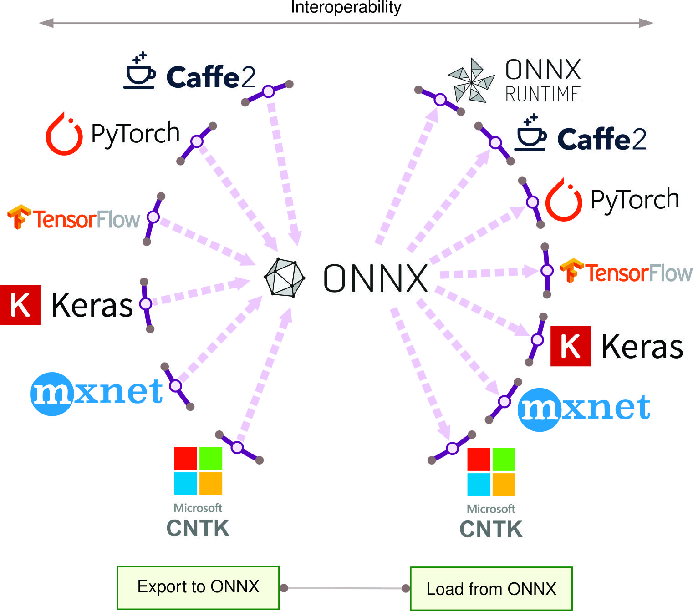

# AI Frameworks {#sec-ai-frameworks}

::: {layout-narrow}

::: {.column-margin}

*DALL·E 3 提示：以矩形格式绘制的插图，面向专业教材设计，内容横跨整幅宽度。生动的图表展示了用于机器学习的训练与推理框架。TensorFlow、Keras、PyTorch、ONNX 和 TensorRT 的图标分散排布，填满整个水平空间，并在垂直方向上对齐。每个图标都配有简短注释，说明其特性。蓝色、绿色和橙色等鲜艳色彩在柔和的渐变背景上突出显示这些图标和各个区域。通过颜色编码的区域强调训练框架与推理框架之间的区别，简洁的线条和现代排版则保持了清晰度与重点。*


:::

\noindent

:::

## 目的 {.unnumbered}

_为什么机器学习框架会成为决定生产环境 AI 系统可扩展性、开发速度和架构灵活性的关键抽象层？_

机器学习框架作为连接理论概念与实际实现的关键抽象层，将抽象的数学概念转换为高效、可执行的代码，同时为硬件加速、分布式计算和模型部署提供标准化接口。如果没有框架，每个 ML 项目都需要重新实现自动微分和并行计算等核心操作，这会使大规模开发在经济上不可行。这个抽象层带来了两个关键能力：通过预优化实现加速开发，以及跨 CPU、GPU 和专用加速器的硬件可移植性。框架选择因此成为最具影响力的工程决策之一，它会在整个开发生命周期中决定系统架构约束、性能特征以及部署灵活性。

::: {.callout-tip title="学习目标"}

- 追踪 ML 框架从数值计算库发展到深度学习平台，再到专用部署变体的演进过程

- 解释现代框架中计算图、自动微分和张量操作的架构与实现

- 通过分析静态和动态图执行模型在开发灵活性、调试能力和生产优化方面的权衡，比较它们的差异

- 分析主要框架背后的设计哲学（研究优先、生产优先、函数式编程）及其对系统架构的影响

- 通过系统评估模型需求、硬件约束和部署环境，评估框架选择标准

- 为特定部署场景设计框架选择策略，包括云端、边缘、移动端和微控制器环境

- 批判常见的框架选择误区，并评估其对系统性能和可维护性的影响

:::

## 框架抽象与必要性 {#sec-ai-frameworks-framework-abstraction-necessity-48f9}

将原始计算原语转化为机器学习系统，是现代计算机科学中最重要的工程挑战之一。在上一章建立的数据流水线基础上，本章考察支持在多样化计算架构上高效实现机器学习算法的软件基础设施。尽管机器学习的数学基础（线性代数运算、优化算法和梯度计算）已经相当成熟，但要在生产系统中高效实现这些基础，仍然需要软件抽象，将理论公式与实际实现约束连接起来。

现代机器学习算法的计算复杂性，清楚地说明了这些抽象的必要性。训练一个当代大语言模型，需要在分布式硬件配置上协调数十亿次浮点运算，这要求对内存层次结构、通信协议和数值精度管理进行精确协调。从前向传播到反向传播的每个算法组件，都必须分解为基本运算，并映射到异构处理单元，同时保持数值稳定性和计算可复现性。如果仅从基础计算原语出发来实现这些系统，其工程复杂度将使大多数组织无法承担大规模机器学习开发的经济成本。

当考虑具体的实现挑战时，这种复杂性会立刻显现出来。手动为一个简单的三层多层感知机实现反向传播，通常需要数百行谨慎编写的微积分和矩阵运算代码。而现代框架只需一行即可完成：`loss.backward()`。框架不仅让机器学习更容易；它们通过管理梯度计算、硬件优化以及跨数百万参数的分布式执行复杂性，使现代深度学习成为*可能*。

机器学习框架是介于高层算法规范与底层计算实现之间的关键软件基础设施。这些平台解决了计算机器学习中的核心抽象问题：在多样化硬件架构上同时实现算法表达能力与计算效率。通过提供标准化的计算图、自动微分引擎和优化算子库，框架使研究人员和从业者能够专注于算法创新，而非实现细节。这一抽象层在加速机器学习系统的研究发现和工业部署方面已被证明至关重要。

:::{.callout-definition title="机器学习框架"}

***机器学习框架*** 是一种软件平台，它为完整的 ML 生命周期提供 _抽象_ 和 _工具_，并通过标准化接口在应用代码与计算基础设施之间建立桥梁，支持模型开发、训练和部署。


:::

机器学习框架的演进轨迹，反映了该领域从实验性研究走向工业级部署的更广泛成熟过程。早期计算框架主要关注数学运算的高效表达，重点优化线性代数原语和梯度计算。当代平台已将其范围扩展到完整的机器学习开发生命周期，集成了数据预处理流水线、分布式训练编排、模型版本管理系统以及生产部署基础设施。这种架构演进表明，业界已经认识到，可持续的机器学习系统不仅需要解决算法性能问题，还必须应对可扩展性、可靠性、可维护性和可复现性等运维层面的挑战。

嵌入这些框架中的架构设计决策，会深刻影响基于其构建的机器学习系统的特性与能力。关于计算图表示、内存管理策略、并行化方案以及硬件抽象层的设计选择，会直接决定系统性能、可扩展性上限和部署灵活性。这些架构约束会贯穿每个开发阶段，从最初的研究原型到生产优化，界定算法创新能够实际落地的边界。

本章将机器学习框架视为软件工程产物以及现代人工智能系统的赋能者来进行考察。我们将分析这些平台所遵循的架构原则，研究塑造其设计的权衡，并考察它们在更广泛的机器学习基础设施生态系统中的作用。通过系统学习框架演进、架构模式和实现策略，学生将建立做出明智框架选择决策所需的技术理解，并能在生产级机器学习系统的设计与实现中有效利用这些抽象。

## 历史发展轨迹 {#sec-ai-frameworks-historical-development-trajectory-9519}

为了理解现代框架如何获得这些能力，我们可以追溯它们如何从简单的数学库演化为今天的平台。机器学习框架的演进映射了人工智能和计算能力的更广泛发展，这一过程由三个关键因素推动：模型复杂度不断增长、数据集规模持续扩大，以及硬件架构日益多样化。

这些驱动力塑造了不同的演化阶段，既反映了技术进步，也反映了 AI 社区需求的变化。本节探讨框架如何从早期数值计算库发展到现代深度学习框架。这一演进建立在@sec-introduction 中介绍的 AI 发展历史背景之上，并展示了软件基础设施如何使机器学习中的理论进展得以切实实现。

### 按时间顺序的框架发展 {#sec-ai-frameworks-chronological-framework-development-a0b3}

机器学习框架的发展建立在数十年的计算库基础工作之上。从早期的 BLAS 和 LAPACK 基础组件，到如今的 TensorFlow、PyTorch 和 JAX 等现代框架，这一历程代表了向更高层抽象持续推进的过程，使机器学习更易于访问，也更加强大。

当考察这些基础技术之间的关系时，这一发展轨迹就变得清晰起来。查看@fig-mlfm-timeline，我们可以追踪这些数值计算库是如何为现代 ML 开发奠定基础的。BLAS 和 LAPACK 所建立的数学基础，使得 NumPy 和 SciPy 这类更易用的工具得以诞生，而它们又为今天的深度学习框架铺平了道路。

::: {#fig-mlfm-timeline}

```{.tikz}
\begin{tikzpicture}[node distance=1mm,outer sep=0pt,font=\small\usefont{T1}{phv}{m}{n}]
\tikzset{%
    Line/.style={line width=1.0pt,black!50
},
  Box/.style={inner xsep=1pt,
    draw=none,
    fill=#1,
    anchor=west,
    text width=27mm,align=flush center,
    minimum width=28mm, minimum height=13mm
  },
  Box/.default=red
}
\definecolor{col1}{RGB}{128, 179, 255}
\definecolor{col2}{RGB}{255, 255, 128}
\definecolor{col3}{RGB}{204, 255, 204}
\definecolor{col4}{RGB}{230, 179, 255}
\definecolor{col5}{RGB}{255, 153, 204}
\definecolor{col6}{RGB}{245, 82, 102}
\definecolor{col7}{RGB}{255, 102, 102}

\node[Box={col1}](B1){1979};
\node[Box={col2!},right=of B1](B2){1992};
\node[Box={col3},right=of B2](B3){2006};
\node[Box={col4},right=of B3](B4){2007};
\node[Box={col5},right=of B4](B5){2015};
\node[Box={col6},right=of B5](B6){2016};
\node[Box={col7},right=of B6](B7){2018};
%%
\foreach \x in{1,2,...,7}
\draw[dashed,thick,-latex](B\x)--++(270:6);

\path[red]([yshift=-8mm]B1.south west)coordinate(P)-|coordinate(K)(B7.south east);

\draw[line width=2pt,-latex](P)--(K)--++(0:3mm);

\node[Box={col1!50},below=2 of B1](BB1){BLAS introduced};
\node[Box={col2!50},below=2 of B2](BB2){LAPACK extends BLAS};
\node[Box={col3!50},below=2 of B3](BB3){NumPy becomes Python's numerical backbone};
\node[Box={col4!50},below=2 of B4](BB4){SciPy adds advanced computations};
\node[Box={col4!50},below= 2mm of BB4](BBB4){Theano introduces computational graphs};
\node[Box={col5!50},below=2 of B5](BB5){TensorFlow revolutionizes distributed ML};
\node[Box={col6!50},below=2 of B6](BB6){PyTorch introduces dynamic graphs};
\node[Box={col7!50},below=2 of B7](BB7){JAX introduces functional paradigms};
\end{tikzpicture}
```
**计算库的演进**：现代机器学习框架建立在数十年的数值计算进步之上，从 BLAS 和 LAPACK 这类底层例程，逐步过渡到 numpy、scipy 中的高层抽象，最终发展到 TensorFlow 和 PyTorch 等深度学习框架。这一进程反映了机器学习系统开发中开发者生产力和可访问性不断提升的趋势。


:::

这一进程表明，框架是如何通过渐进式创新获得能力的：在前人奠定的基础之上，构建出更易访问的计算能力。

### 基础数学计算基础设施 {#sec-ai-frameworks-foundational-mathematical-computing-infrastructure-f41c}

现代 ML 框架的基础始于计算的核心层面：矩阵运算。机器学习计算主要依赖矩阵-矩阵和矩阵-向量乘法，因为神经网络通过作用于多维数组的线性变换[^fn-linear-transformations]来处理数据。Basic Linear Algebra Subprograms（[BLAS](https://www.netlib.org/blas/)）[^fn-frameworks-blas] 于 1979 年开发，提供了这些基础性的矩阵运算，后来它们成为机器学习[@kung1979systolic] 的计算支柱。这些底层操作在组合并执行后，能够完成训练神经网络和其他 ML 模型所需的复杂计算。

[^fn-linear-transformations]: **线性变换**：保持向量加法和标量乘法不变的数学运算，通常在神经网络中实现为矩阵乘法。每一层都会应用一个学习得到的线性变换（权重矩阵），随后接一个非线性激活函数（如 ReLU 或 sigmoid），从而使网络能够从简单的数学构件中学习复杂模式。

[^fn-frameworks-blas]: **BLAS（Basic Linear Algebra Subprograms）**：最初在阿贡国家实验室开发，BLAS 成为线性代数运算的事实标准，包含一级（向量-向量）、二级（矩阵-向量）和三级（矩阵-矩阵）运算，至今仍支撑着每一个现代 ML 框架。

在 BLAS 的基础上，Linear Algebra Package（[LAPACK](https://www.netlib.org/lapack/)）[^fn-lapack] 于 1992 年出现，通过矩阵分解、特征值问题和线性方程组求解等高级线性代数运算扩展了这些能力。这种从基础矩阵计算出发、逐层构建更复杂运算的方法，成为 ML 框架的一个标志性特征。

[^fn-lapack]: **LAPACK（Linear Algebra Package）**：继承了 LINPACK 和 EISPACK，引入了块算法，显著提升了缓存效率和并行执行能力；随着数据集从兆字节增长到太字节，这些创新变得至关重要。

这套经过优化的线性代数运算基础，为更高层的抽象铺平了道路，使数值计算更加易于访问。[NumPy](https://numpy.org/) 于 2006 年发布，标志着这一演进中的一个重要里程碑，它建立在 Numeric 和 Numarray 的基础之上，成为 Python 中数值计算的主要包。NumPy 引入了 n 维数组对象和必要的数学函数，为底层的 BLAS 和 LAPACK 运算提供了高效接口。这种抽象使开发者能够使用高层数组操作，同时保持经过优化的底层矩阵计算性能。

这一趋势随后延续到 [SciPy](https://scipy.org/)，它建立在 NumPy 的基础之上，为优化、线性代数和信号处理提供专门函数，其首个稳定版本于 2008 年发布。这种从基础矩阵运算到数值计算的分层架构，为未来的 ML 框架奠定了蓝图。

### 早期机器学习平台的发展 {#sec-ai-frameworks-early-machine-learning-platform-development-3873}

下一个演化阶段代表了从通用数值计算到领域专用机器学习工具的一次概念性跃迁。从数值库过渡到专用机器学习框架，标志着抽象层次上的一次重要演进。虽然底层计算仍然根植于矩阵运算，但框架开始将这些运算封装为更高层的机器学习原语。威斯康星大学于 1993 年推出了 Weka[@witten2002data]，这是最早的 ML 框架之一，它将矩阵运算抽象为数据挖掘任务，不过受限于其 Java 实现以及对小规模计算的侧重。

这种范式转变在 [Scikit-learn](https://scikit-learn.org/stable/) 中表现得尤为明显，它于 2007 年出现，代表了机器学习抽象层的一次显著进步。基于 NumPy 和 SciPy 的基础，它将基本矩阵运算转化为直观的 ML 算法。例如，在逻辑回归模型中，原本需要一系列矩阵乘法和梯度计算的内容，最终只需一次 `fit()` 方法调用。这种将复杂矩阵运算隐藏在简洁 API 之后的抽象模式，后来成为现代 ML 框架的标志性特征。

[Theano](https://github.com/Theano/Theano)[^fn-theano] 由蒙特利尔学习算法研究所（MILA）开发，并于 2007 年出现，是一次重大进步，它引入了两个革命性概念：计算图[^fn-comp-graphs] 和 GPU 加速[@al2016theano]。计算图将数学运算表示为有向图，其中矩阵运算是节点，数据在节点之间流动。这种基于图的方法使底层矩阵运算可以自动求导并进行优化。更重要的是，它让框架能够自动将这些运算调度到 GPU 硬件上，从而大幅加速矩阵计算。

[^fn-theano]: **Theano**：以古希腊数学家克罗托纳的 Theano 命名，这一框架率先在 Python 中引入了符号数学表达式的概念，为后来每一个现代深度学习框架奠定了基础。

[^fn-comp-graphs]: **计算图**：最早由 Wengert（1964）在自动求导文献中形式化，这种表示后来成为现代 ML 框架的核心，使前向和反向模式求导能够以前所未有的规模实现。

另一条并行的发展路线是 [Torch7](http://torch.ch/)（PyTorch 的基于 Lua 的前身），它于 2002 年在纽约大学创建，在处理矩阵运算方面采取了不同的方法。它强调运算的即时执行（eager execution[^fn-eager-execution]），并为神经网络实现提供了一个可适配的接口。

[^fn-eager-execution]: **即时执行**：一种运算模型，调用运算时会立即求值，类似于标准 Python 的执行方式。该方法由 Torch 于 2002 年率先提出，在性能优化之前优先考虑开发者生产力和调试便利性，后来成为 PyTorch 和 TensorFlow 2.x 等现代框架的默认模式。

Torch 以开发者体验优先、同时保持高性能为核心的设计理念，确立了后来影响 PyTorch 等框架的设计模式。其架构展示了如何在高层抽象与高效的底层矩阵运算之间取得平衡，并引入了随着深度学习复杂度增加而变得至关重要的概念。

### 深度学习计算平台的创新 {#sec-ai-frameworks-deep-learning-computational-platform-innovation-d3db}

深度学习的兴起带来了前所未有的计算需求，暴露出现有框架的局限性。深度学习革命要求框架处理矩阵运算的方式发生重大转变，主要原因有三：计算规模巨大、深层网络中的梯度计算复杂，以及对分布式处理的需求。传统框架是为经典机器学习算法设计的，无法处理训练深度神经网络所需的数十亿次矩阵运算。

这一计算挑战激发了学术研究环境中的创新，并最终重塑了框架的发展。现代深度学习框架的基础源自学术研究。蒙特利尔大学的 [Theano](https://github.com/Theano/Theano) 于 2007 年发布，它确立了塑造未来框架的概念[@bergstra2010theano]。它引入了自动求导计算图和 GPU 加速等关键概念，展示了如何组织并优化复杂的神经网络计算。

[ Caffe](https://caffe.berkeleyvision.org/) 由加州大学伯克利分校于 2013 年发布，通过引入专门实现的卷积运算推动了这一演进[@jia2014caffe]。虽然卷积在数学上等价于特定模式的矩阵乘法，但 Caffe 针对计算机视觉任务专门优化了这些模式，展示了专用矩阵运算实现如何显著提升特定网络架构的性能。

下一个突破来自工业界，在那里，计算规模的需求推动了新的架构方法。谷歌的 [TensorFlow](https://www.tensorflow.org/)[^fn-tensorflow] 于 2015 年推出，通过将矩阵运算视为分布式计算问题而彻底改变了这一领域[@dean2012large]。它将从单个矩阵乘法到整个神经网络的所有计算都表示为一个可在多个设备之间拆分的静态计算图[^fn-static-graph]。这种方法通过把矩阵运算分布到计算集群和专用硬件上，实现了前所未有规模模型的训练。TensorFlow 的静态图方法虽然最初具有一定约束，但也允许通过算子融合[^fn-kernel-fusion]（将多个运算合并为单个内核以提高效率）和内存规划[^fn-memory-planning]（为运算预先分配内存）等技术，对矩阵运算进行激进优化。

[^fn-tensorflow]: **TensorFlow**：其名称源自在计算图中流动的张量运算。该框架通过开源谷歌内部的 DistBelief 系统，使分布式机器学习得以普及，研究人员因此立即获得了此前需要庞大公司资源才能拥有的基础设施。

[^fn-static-graph]: **静态计算图**：一种预先定义的计算结构，在执行前就指定整个模型架构，从而实现全局优化和高效的内存规划。由 TensorFlow 1.x 开创，这种方法牺牲运行时灵活性以换取最高性能优化，非常适合生产部署。

[^fn-kernel-fusion]: **算子融合**：一种优化技术，将多个独立运算（如矩阵乘法后接偏置加法和激活）合并为一个 GPU 内核，从而将内存带宽需求降低高达 10 倍，并消除中间内存分配。对于包含数千个运算的复杂深度学习模型而言，这种优化尤为关键。

[^fn-memory-planning]: **内存规划**：一种框架优化技术，它会预先分析计算图，以确定最优的内存分配策略，从而支持原地运算和内存复用模式，在训练过程中可将峰值内存使用量降低 40-60%。

随着不同组织针对特定计算挑战给出解决方案，深度学习框架生态系统继续多样化。微软的 [CNTK](https://learn.microsoft.com/en-us/cognitive-toolkit/) 于 2016 年进入这一领域，为语音识别和自然语言处理任务提供实现[@seide2016cntk]。其架构强调在分布式系统上的可扩展性，同时保持对序列模型的高效计算。

与此同时，Facebook 的 [PyTorch](https://pytorch.org/)[^fn-pytorch] 也于 2016 年推出，它在处理矩阵计算方面采取了截然不同的方法。与静态图不同，PyTorch 引入了可以随时修改的动态计算图[@paszke2019pytorch]。这种动态方法虽然可能牺牲部分优化机会，但为研究人员简化了模型中矩阵运算流程的调试和分析。PyTorch 的成功表明，对于研究应用而言，能够动态审视并修改计算，与原始性能同样重要。

[^fn-pytorch]: **PyTorch**：受纽约大学原始 Torch 框架启发，PyTorch 将“边运行边定义”（define-by-run）语义带入 Python，使研究人员能够在执行过程中修改模型，这一突破通过让调试像使用标准 Python 调试器一样简单，从而加速了研究进展。

框架发展还在继续扩展，亚马逊的 [MXNet](https://mxnet.apache.org/) 通过关注内存效率和在不同硬件配置上的可扩展性来应对大规模矩阵运算挑战。它引入了一种混合方法，结合了静态图和动态图的特点，在保持对底层矩阵运算激进优化的同时，支持灵活的模型开发。

这些多样化的方法表明，没有任何单一方案能够满足所有深度学习需求，这也推动了专用工具的发展。随着深度学习应用变得更加多样化，对专用且更高层次抽象的需求变得显而易见。[Keras](https://keras.io/) 于 2015 年出现以满足这一需求，提供了一个统一接口，可运行于多个底层框架之上[@chollet2015keras]。这种高层抽象方式展示了框架如何在利用现有系统计算能力的同时，专注于用户体验。

与此同时，谷歌的 [JAX](https://github.com/google/jax)[^fn-jax] 于 2018 年推出，将函数式编程原则引入深度学习计算，开启了新的模型开发模式[@jax2018github]。[FastAI](https://www.fast.ai/) 在 PyTorch 之上构建，将常见的深度学习模式打包为可复用组件，使先进技术对实践者更加易于获得[@howard2020fastai]。这些更高层的框架表明，抽象可以在保持底层实现性能优势的同时，简化开发过程。

[^fn-jax]: **JAX**：全称为 “Just After eXecution”，结合了 NumPy 的 API 与函数式编程变换（jit、grad、vmap、pmap），使研究人员能够编写简洁的代码，并在保持 NumPy 兼容性的同时自动扩展到 TPU 和 GPU 集群。

### 硬件驱动的框架架构演进 {#sec-ai-frameworks-hardwaredriven-framework-architecture-evolution-2605}

框架的演进与计算硬件的进步密不可分，软件能力与硬件创新之间形成了动态关系。硬件发展极大地重塑了框架实现和优化矩阵运算的方式。 [NVIDIA 的 CUDA 平台](https://developer.nvidia.com/cuda-toolkit)[^fn-cuda] 于 2007 年推出，使 GPU 上的通用计算成为可能，这对框架设计而言是一个关键时刻[@nickolls2008scalable]。这一变化具有革命性意义，因为 GPU 擅长并行矩阵运算，为深度学习中的计算带来了数量级的加速。CPU 可能按顺序处理矩阵元素，而 GPU 可以同时处理数千个元素，这显著改变了框架对计算调度的处理方式。

现代 GPU 架构展示了面向 ML 工作负载的可量化效率优势。NVIDIA A100 GPU 在 FP16 精度下可提供 312 TFLOPS 的张量运算性能，内存带宽为 1.6 TB/s；相比之下，典型 CPU 配置仅能提供 1-2 TFLOPS 和 50-100 GB/s 的内存带宽。这些硬件特性显著改变了框架的优化策略。框架必须设计计算图，以最大化 GPU 利用率，确保具有足够的计算强度（以每字节传输的 FLOPS 衡量），从而充分利用可用内存带宽。

当框架面向 GPU 加速时，内存带宽优化变得至关重要。内存带宽与计算的比率（每 FLOP 字节数）决定运算是计算受限还是内存受限。大尺寸矩阵乘法运算（通常为 N×N，且 N > 1024）具有很高的计算强度，因而属于计算受限，能够接近峰值 GPU 利用率。然而，激活函数等逐元素运算往往会变成内存受限，只能达到峰值性能的 10-20%。框架通过算子融合技术来应对这一问题，将多个内存受限运算合并到单个内核中，以减少内存传输。

除了通用 GPU 加速之外，专用硬件加速器的发展进一步革新了框架设计。[谷歌的张量处理单元（TPU）](https://cloud.google.com/tpu/)[^fn-frameworks-tpu] 最早于 2016 年部署，是专为张量运算设计的，这些运算是深度学习计算的基础构件。TPU 引入了脉动阵列[^fn-systolic-array] 架构，这种架构对矩阵乘法和卷积运算尤其高效。这种硬件架构促使 TensorFlow 等框架开发出专门的编译策略，能够将高层运算直接映射到 TPU 指令，而绕过传统面向 CPU 的优化。

[^fn-frameworks-tpu]: **TPU（Tensor Processing Unit）**：谷歌第一代 TPU（v1）在神经网络任务上的每瓦性能比当时的 GPU 和 CPU 高出 15-30 倍，证明了针对特定领域的架构可以在 ML 工作负载上超越通用处理器。

[^fn-systolic-array]: **脉动阵列**：一种由 H.T. Kung（CMU）和 Charles Leiserson（MIT）于 1978 年发明的专用并行计算架构，其中数据以有节奏的流水线方式在处理单元网格中流动。每个单元对来自邻居的数据执行简单操作，使其在矩阵运算方面极其高效，而矩阵运算正是神经网络计算的核心。

TPU 架构通过量化指标展示了专用效率提升。TPU v4 芯片在消耗 200W 功耗时，可实现 275 TFLOPS 的 BF16 计算性能和 1.2 TB/s 的内存带宽，功耗效率达到 1.375 TFLOPS/W。这相较于当代 GPU 在大规模矩阵运算上的能效提升了 3-5 倍。然而，TPU 专门针对稠密矩阵运算进行了优化，对于稀疏计算或需要复杂控制流的运算，其效率会下降。面向 TPU 的框架必须设计计算图，以最大化稠密矩阵运算的使用，同时最小化片上高带宽内存（32 GB，1.2 TB/s）与片外内存之间的数据移动。

移动硬件加速器，如 [Apple 的 Neural Engine（2017）](https://machinelearning.apple.com/research/neural-engine) 和高通的神经处理单元，为框架设计带来了新的约束与机遇。这些设备强调功耗效率而非原始计算速度，因此要求框架开发新的量化和算子融合策略。TensorFlow Lite（最近更名为 [LiteRT](https://ai.google.dev/edge/litert)）和 [PyTorch Mobile](https://pytorch.org/mobile/home/) 等移动框架需要在模型准确性与能耗之间取得平衡，这推动了矩阵运算调度与执行方式上的创新。

移动加速器展示了混合精度计算在能效方面的关键重要性。A17 Pro 芯片中的 Apple Neural Engine 提供 35 TOPS（每秒万亿次运算）的 INT8 性能，功耗约为 5W，能效达到 7.2 TOPS/W。这相较于同一芯片上的 FP32 计算，能效提升了 10-15 倍。面向移动硬件的框架必须提供自动混合精度策略，以为每个运算确定最优精度，在能耗与精度损失之间取得平衡。

稀疏计算框架则应对移动硬件的内存带宽限制。对于具有结构化稀疏模式的网络，稀疏神经网络可以将内存流量减少 50-90%，从而直接提升能效，因为在移动处理器上，内存访问的能耗是算术运算的 10-100 倍。像 Neural Magic 的 SparseML 这样的框架可以自动生成稀疏模型，在保持准确性的同时满足硬件的稀疏支持要求。高通的 Neural Processing SDK 提供了针对 2:4 结构化稀疏运算的专用内核，其中每 4 个连续权重中有 2 个为零，从而在准确率损失很小的情况下实现 1.5-2 倍加速。

定制 ASIC[^fn-asic-ml]（Application-Specific Integrated Circuit，专用集成电路）解决方案的出现进一步丰富了硬件格局。像 [Graphcore](https://www.graphcore.ai/)、[Cerebras](https://www.cerebras.net/) 和 [SambaNova](https://sambanova.ai/) 这样的公司开发了用于矩阵计算的独特架构，各自具有不同的优势和优化机会。专用硬件的增长推动框架采用更灵活的矩阵运算中间表示[^fn-intermediate-representation]，从而能够进行针对特定目标的优化，同时保持统一的高层接口。

[^fn-asic-ml]: **ASIC（Application-Specific Integrated Circuit）**：为特定任务设计的定制硅芯片，与通用 CPU 形成对比。在 ML 场景中，像谷歌 TPU 和特斯拉 FSD 芯片这样的 ASIC，以牺牲灵活性为代价，在矩阵运算上实现 10-100 倍的效率提升，但其研发通常需要 2-4 年时间，且前期投入高达数百万美元。

[^fn-intermediate-representation]: **中间表示（IR）**：位于高层用户代码与硬件相关机器代码之间的框架内部格式，用于实现优化和跨平台部署。现代 ML 框架使用 TensorFlow 的 XLA、PyTorch 的 TorchScript，或更新的 TorchDynamo/FX 图等 IR，将同一个模型编译到 CPU、GPU、TPU 和移动设备上。趋势是采用更灵活的图捕获方式，以处理动态 Python 控制流。

可重构硬件的出现又增加了一层复杂性和机遇。现场可编程门阵列（FPGAs）为框架优化引入了又一个维度。与固定功能的 ASIC 不同，FPGA 允许对电路进行重构，从而针对特定矩阵运算模式进行优化。响应这一能力的框架开发出了即时编译策略，能够根据模型的具体需求生成经过优化的硬件配置。

这种由硬件驱动的演进表明，框架设计必须不断调整，以利用新的计算能力。在追溯了框架如何从简单数值库演进为由硬件创新驱动的平台之后，我们现在转向理解支撑现代框架管理这种计算复杂性的核心概念。这些关键概念（计算图、执行模型和系统架构）构成了所有框架能力的基础。

## 基本概念 {#sec-ai-frameworks-fundamental-concepts-a6cf}

现代机器学习框架通过四个关键层的集成来运行：基础、数据处理、开发者接口，以及执行与抽象。这些层协同工作，为模型开发和部署提供结构化且高效的基础，如@fig-fm_blocks 所示。

::: {#fig-fm_blocks fig-env="figure" fig-pos="htb"}

```{.tikz}
\resizebox{.85\textwidth}{!}{%
\begin{tikzpicture}[font=\small\usefont{T1}{phv}{m}{n}]
%
\tikzset{%
    Line/.style={line width=1.0pt,black!50,text=black
},
  Box/.style={align=flush center,
    inner xsep=2pt,
    node distance=1.4,
    draw=BlueLine,
    line width=0.75pt,
    fill=BlueL,
    text width=34mm,
    minimum width=34mm, minimum height=10mm
  },
 Text/.style={%
    inner sep=3pt,
    draw=none,
    line width=0.75pt,
    fill=TextColor!80,
    text=black,
    font=\usefont{T1}{phv}{m}{n}\footnotesize,
    align=flush center,
    minimum width=7mm, minimum height=5mm
  },
}
\node[Box,fill=OrangeL,draw=OrangeLine](B1){Execution Models};
\node[Box,node distance=4.2,right=of B1,fill=OliveL,
              draw=OliveLine](B2){Programming Models};
%
\scoped[on background layer]
\node[draw=BackLine,inner xsep=6mm,inner ysep=4mm,yshift=2mm,
           fill=BackColor,fit=(B1)(B2),line width=0.75pt](BB1){};
\node[below=2pt of  BB1.north,anchor=north]{Developer Interface};
%
\node[Box,below=1.75 of B1,fill=VioletL,
              draw=VioletLine](2B1){Computational Graphs};
%
\scoped[on background layer]
\node[draw=BackLine,inner xsep=8mm,inner ysep=4mm,yshift=2mm,xshift=2mm,
           fill=BackColor,fit=(2B1),line width=0.75pt](BB1){};
\node[below=2pt of  BB1.north east,anchor=north east]{Fundamentals};
%
\begin{scope}[shift={(0,-5.55)}]
\node[Box,fill=GreenL,draw=GreenLine](3B1){Memory Management and Device Placement};
\node[Box,node distance=4.2,right=of 3B1,fill=GreenL,
              draw=GreenLine](3B2){Specialized Data Structures};
%
\scoped[on background layer]
\node[draw=BackLine,inner xsep=6mm,inner ysep=4mm,yshift=2mm,
           fill=BackColor,fit=(3B1)(3B2),line width=0.75pt](BB2){};
\node[below=1pt of  BB2.north,anchor=north]{Data Handling};
\end{scope}
%
\node[Box,below=1.75 of $(3B1)!0.5!(3B2)$,fill=BlueL,
              draw=BlueLine](4B1){Core Operations};
%
\scoped[on background layer]
\node[draw=BackLine,inner xsep=6mm,inner ysep=4mm,yshift=2mm,
           fill=BackColor,fit=(4B1),line width=0.75pt](BB2){};
\node[below=1pt of  BB2.north,anchor=north]{Execution and Abstraction};
% Arrows
\draw[-latex,Line](B1)--node[Text,pos=0.4]{Generates}(2B1);
\draw[-latex,Line](B2)--node[Text,pos=0.4]{Defines}(B1);
\draw[-latex,Line](2B1)--node[Text,pos=0.4]{Optimizes Execution}(3B1);
\draw[-latex,Line](B2.210)--node[Text,pos=0.35]{Shapes Execution\\ Behavior}
             ++(270:3.1)--++(180:1.5)|-(3B1);
\draw[-latex,Line](B2.330)--node[Text,pos=0.55]{Influences\\ Data Flow}(3B2.30);
\draw[-latex,Line](2B1)-|node[Text,pos=0.25]{Provides\\ Structure For}(3B2.130);
\draw[-latex,Line](3B1)|-node[Text,pos=0.25]{Coordinates\\ with}(4B1);
\draw[-latex,Line](3B2)|-node[Text,pos=0.25]{Feeds\\ Data Into}(4B1);
\end{tikzpicture}}
```
**框架层交互**：现代机器学习框架将功能组织为不同的层（基础、数据处理、开发者接口，以及执行与抽象），这些层协同工作以简化模型构建和部署。这种分层架构支持模块化，使开发者无需管理底层基础设施，就能专注于机器学习工作流的特定方面。


:::

基础层通过计算图为这些框架建立结构基础。这些图采用有向无环图（DAG）表示，使自动微分和优化成为可能。通过组织操作和数据依赖关系，计算图使框架能够分配工作负载，并在各种硬件平台上执行计算。

在这一结构基础之上，数据处理层负责管理机器学习工作流所必需的数值数据和参数。这一层的核心是张量等专门的数据结构，它们在优化内存使用和设备放置的同时处理高维数组。内存管理和数据移动策略确保计算工作负载能够高效执行，尤其是在硬件资源多样或受限的环境中。

开发者接口层提供用户与框架交互所依赖的工具和抽象。编程模型使开发者能够以适合其特定需求的方式定义机器学习算法。这些模型可分为命令式或符号式两类。命令式模型具有灵活性和易于调试的优点，而符号式模型则优先考虑性能和部署效率。执行模型进一步塑造这种交互方式，通过定义计算是以急切方式（立即）执行，还是作为预优化的静态图执行。

在这一架构栈的底部，执行与抽象层将这些高层表示转换为可高效由硬件执行的操作。从基础线性代数到复杂神经网络层，核心操作都针对多样化的硬件平台进行了优化。这一层还包括资源分配和动态内存管理机制，确保在训练和推理场景下都能实现可扩展的性能。

这四层通过精心设计的接口和依赖关系协同工作，形成一个在可用性与性能之间取得平衡的统一系统。理解这些相互关联的层，对于有效利用机器学习框架至关重要。每一层都在促进实验、优化和部署方面发挥着独特而相互依赖的作用。掌握这些概念后，实践者便能就资源利用、扩展策略以及特定框架是否适用于各种任务作出明智决策。

我们的探索从计算图开始，因为它们构成了结构基础，使其他所有框架能力得以实现。这一核心抽象提供了数学表示，支撑自动微分、优化和硬件加速等能力，而这些能力正是现代框架区别于简单数值库的关键所在。

### 计算图 {#sec-ai-frameworks-computational-graphs-f0ff}

计算图是核心抽象，它使框架能够将直观的模型描述转换为高效的硬件执行。该表示形式组织数学运算及其依赖关系，从而支持自动优化、并行化以及针对特定硬件的专门化。

#### 计算图基础 {#sec-ai-frameworks-computational-graph-fundamentals-4979}

计算图作为机器学习框架中的关键抽象而出现，用于应对深度学习模型日益增长的复杂性。随着模型规模不断增大、结构愈加复杂，跨多种硬件平台实现高效执行变得必要。计算图将高层次的模型描述转换为高效的底层硬件执行[@baydin2018]，将机器学习模型表示为一个有向无环图[^fn-dag-ml]（DAG），其中节点表示运算，边表示数据流。这种 DAG 抽象支持自动微分，并能在多种硬件平台上实现高效优化。

[^fn-dag-ml]: **有向无环图（DAG）**：在机器学习框架中，DAG 用于表示计算，其中节点是运算（如矩阵乘法或激活函数），边表示数据依赖关系。与计算机科学中一般的 DAG 不同，机器学习计算图会专门针对自动微分进行优化，使框架能够通过按逆序遍历图来计算梯度。

例如，一个节点可以表示矩阵乘法运算，接收两个输入矩阵（或张量）并生成一个输出矩阵（或张量）。为了将这一点可视化，请看@fig-comp-graph 中的简单示例。该有向无环图计算$z = x \times y$，其中每个变量都只是数字。

::: {#fig-comp-graph fig-env="figure" fig-pos="htb"}

```{.tikz}
\begin{tikzpicture}[font=\usefont{T1}{phv}{m}{n}\small]
%
\tikzset{%
    Line/.style={line width=1.0pt,black!50,rounded corners
},
  Box/.style={align=flush center,
   shape=circle,
    inner xsep=1pt,
    node distance=1.4,
    draw=BlueLine,
    line width=0.75pt,
    fill=BlueL,
    minimum width=8mm,
  },
}
\node[Box,fill=GreenL,draw=GreenLine,minimum width=13mm, ](B1){$f(x,y)$};
\node[Box,right=of B1,fill=OliveL,draw=OliveLine](B2){$z$};
\node[Box,above left=0.1 and 2 of B1,fill=OliveL,draw=OliveLine](B3){$x$};
\node[Box,below left=0.1 and 2 of B1,fill=OliveL,draw=OliveLine](B4){$y$};
\draw[-latex,Line](B1)--(B2);
\draw[-latex,Line](B3)to[bend left=25](B1);
\draw[-latex,Line](B4)to[bend right=25](B1);
\end{tikzpicture}
```
**计算图**：有向无环图将机器学习模型表示为一系列相互连接的运算，从而支持高效计算和自动微分。这个示例展示了一个简单的计算$z = x \times y$，其中节点定义运算，边指定它们之间的数据流向。


:::

这个简单示例说明了基本原理，但真实的机器学习模型需要复杂得多的图结构。如@fig-mlfm-comp-graph 所示，计算图的结构涉及定义相互连接的层，例如卷积、激活、池化和归一化，并在执行前进行优化。该图还展示了关键的系统级交互，包括内存管理和设备放置，说明静态图方法如何支持在执行前进行完整分析与资源分配。

::: {#fig-mlfm-comp-graph fig-env="figure" fig-pos="htb"}

```{.tikz}
\begin{tikzpicture}[font=\usefont{T1}{phv}{m}{n}\small]
%
\tikzset{Line/.style={line width=1.0pt,black!50
},
  Box/.style={align=flush center,
    inner xsep=2pt,
    node distance=1.1,
    draw=BlueLine,
    line width=0.75pt,
    fill=BlueL,
    text width=26mm,
    minimum width=26mm, minimum height=10mm
  },
 Text/.style={%
    inner sep=3pt,
    draw=none,
    line width=0.75pt,
    fill=TextColor!80,
    text=black,
    font=\usefont{T1}{phv}{m}{n}\footnotesize,
    align=flush center,
    minimum width=7mm, minimum height=5mm
  }
}
\begin{scope}[local bounding box=scope1]
\node[Box,fill=BlueL,draw=BlueLine](B1){Operation Node 1};
\node[Box,fill=BlueL,draw=BlueLine,below=of B1](B2){Operation Node 2};
\node[Box,fill=BlueL,draw=BlueLine,below left=0.75 and 0.1 of B2](B3){Operation Node 3};
\node[Box,fill=BlueL,draw=BlueLine,below right=0.75 and 0.1 of B2](B4){Operation Node 4};
\node[Box,fill=BlueL,draw=BlueLine,below=of B3](B5){Operation Node 5};
\node[Box,fill=BlueL,draw=BlueLine,below=of B4](B6){Operation Node 6};
%
\scoped[on background layer]
\node[draw=BackLine,inner xsep=4mm,inner ysep=6mm,yshift=2mm,
           fill=BackColor!80,fit=(B1)(B3)(B6),line width=0.75pt](BB1){};
\node[below=2pt of  BB1.north east,anchor=north east]{Computational Graph};
\end{scope}
%
\begin{scope}[local bounding box=scope2, shift={($(scope1.east)+(45mm,10mm)$)}]
\node[Box,fill=OrangeL,draw=OrangeLine](2B1){Memory Management};
\node[Box,fill=OrangeL,draw=OrangeLine,below=of 2B1](2B2){Device Placement};
%
\scoped[on background layer]
\node[draw=BackLine,inner xsep=4mm,inner ysep=6mm,yshift=2mm,
           fill=BackColor!50,fit=(2B1)(2B2),line width=0.75pt](2BB1){};
\node[below=2pt of  2BB1.north east,anchor=north east]{System Components};
\end{scope}
\draw[-latex,Line](B1)--node[Text,pos=0.45]{Data Flow}(B2);
\draw[-latex,Line](B3)--node[Text,pos=0.45]{Data Flow}(B5);
\draw[-latex,Line](B4)--node[Text,pos=0.45]{Data Flow}(B6);
\draw[-latex,Line](B2)-|node[Text,pos=0.45]{Data Flow}(B3);
\draw[-latex,Line](B2)-|node[Text,pos=0.45]{Data Flow}(B4);
\draw[latex-,Line](2B2) --node[Text,pos=0.55]{Interacts with} (scope1.east|-2B2);
\draw[latex-,Line](2B1) --node[Text,pos=0.55]{Interacts with} (scope1.east|-2B1);
\end{tikzpicture}
```
**计算图**：该图将一次计算表示为有向无环图，其中节点表示变量，边表示运算。通过以这种形式表达计算，系统可以高效地执行自动微分，这对于通过基于梯度的优化训练机器学习模型至关重要，同时还能在执行前优化资源分配。


:::

##### 层与张量 {#sec-ai-frameworks-layers-tensors-5008}

现代机器学习框架通过两个关键抽象来实现神经网络计算：层和张量。层表示执行卷积、池化或全连接变换等运算的计算单元。每一层都维护内部状态，包括权重和偏置，这些状态会在模型训练过程中演化。当数据流经这些层时，它会以张量的形式存在——张量是不可变的数学对象，用于承载和传递数值。

层与张量之间的关系类似于传统编程中运算与数据之间的区别。层定义了如何将输入张量转换为输出张量，就像函数定义了如何将输入转换为输出一样。然而，层还增加了一个额外维度：它们会在训练过程中维护并更新内部参数。例如，卷积层不仅规定如何执行卷积运算，还会针对给定任务学习并存储最优的卷积滤波器。

当框架自动化图构建过程时，这种抽象会变得尤其强大。开发者编写 `tf.keras.layers.Conv2D` 时，框架会构建卷积运算、参数管理和数据流所需的图节点，从而将开发者从实现复杂性中解放出来。

##### 神经网络构建 {#sec-ai-frameworks-neural-network-construction-e6ef}

计算图的能力不仅限于基本的层运算。激活函数对于在神经网络中引入非线性至关重要，它们也会成为图中的节点。ReLU、sigmoid 和 tanh 等函数会转换层的输出张量，使网络能够逼近复杂的数学函数。框架为这些激活函数提供了优化实现，使开发者能够尝试不同的非线性，而无需担心实现细节。

现代框架通过提供预配置的计算图形式的完整模型架构，进一步扩展了这种模块化方法。ResNet 和 MobileNet 等模型开箱即用，使开发者能够定制特定层，并利用预训练权重进行迁移学习。

##### 系统层面的影响 {#sec-ai-frameworks-systemlevel-consequences-3032}

借助前面建立的计算图抽象，框架可以在执行开始之前分析并优化整个计算过程。数据依赖关系的显式表示支持用于基于梯度优化的自动微分。

除了优化能力之外，这种图结构在执行方面也提供了灵活性。同一个模型定义可以在不同硬件平台上高效运行，从 CPU 到 GPU，再到专用加速器。框架负责处理将运算映射到特定硬件能力、优化内存使用以及协调并行执行等复杂问题。图结构还支持模型序列化，使训练好的模型能够被保存、共享并部署到不同环境中。

这些系统层面的优势使计算图区别于更简单的可视化工具。虽然神经网络图有助于可视化模型架构，但计算图承担着更深层的作用。它们提供了将直观模型设计转化为高效执行所需的精确数学表示。理解这种表示方式，可以揭示框架如何将高层次模型描述转换为针对硬件优化的具体实现，从而使现代深度学习能够在大规模场景下切实可行。

需要区分计算图和神经网络图，例如多层感知机（MLP）的图示，它们展示的是节点和层。神经网络图可视化的是模型架构以及数据在节点和层之间的流动，提供对模型结构的直观理解。相比之下，计算图提供的是底层数学运算及实现和训练这些网络所需数据依赖关系的低层表示。

这种表示能力对框架设计和性能具有深远影响。从系统角度看，计算图提供了若干影响整个机器学习流水线的关键能力。它们支持我们接下来将要讨论的自动微分，提供清晰的结构以分析数据依赖和潜在并行性，并作为一种中间表示，可以针对不同硬件目标进行优化和转换。然而，计算图的强大能力在很大程度上取决于它们如何以及何时执行，这就引出了静态图和动态图执行模型之间的根本区别。

#### 预定义的计算结构 {#sec-ai-frameworks-predefined-computational-structure-2f49}

静态计算图由早期版本的 TensorFlow 首创，采用“先定义后运行”的执行模型。在这种方法中，开发者必须在执行开始之前指定完整的计算图。这种架构选择对系统性能和开发流程都有重要影响，我们将在后文讨论。

静态计算图清晰地区分了运算定义与运算执行。在定义阶段，每个数学运算、变量和数据流连接都会被显式声明并添加到图结构中。该图是计算的完整规格说明，但不会执行任何实际计算。相反，框架会构建所有运算及其依赖关系的内部表示，并在后续阶段执行。

这种前置定义支持强大的系统级优化。框架可以分析完整结构，以识别运算融合的机会，通过内核融合消除不必要的中间结果，并将内存流量减少 3-10 倍。内存需求可以提前精确计算并优化，从而实现高效的分配策略。静态图使 XLA[^fn-xla]（Accelerated Linear Algebra）等编译框架能够进行激进优化。图重写可以消除大量冗余运算，而针对硬件生成的专用内核则能比通用实现带来显著加速。尽管这种抽象优雅，但它对可表达的计算施加了根本限制：静态图通过牺牲控制流和动态计算模式的灵活性来获得这些性能收益。一旦验证通过，同样的计算就可以被反复运行，并且其行为和性能特征都具有较高的可置信度。@fig-mlfm-static-graph 展示了这种基本的两阶段方法：首先构建并优化完整的计算图；然后在执行阶段，实际数据流经图以产生结果。这种分离使框架能够在任何执行发生之前，对整个计算进行全面分析和优化。

::: {#fig-mlfm-static-graph fig-env="figure" fig-pos="htb"}

```{.tikz}
\begin{tikzpicture}[font=\usefont{T1}{phv}{m}{n}\small]
%
\tikzset{Line/.style={line width=1.0pt,black!50,rounded corners
},
  Box/.style={align=flush center,
    inner xsep=2pt,
    node distance=0.7,
    draw=BlueLine,
    line width=0.75pt,
    fill=BlueL,
    text width=18mm,
    minimum width=18mm, minimum height=10mm
  },
}
\node[Box,fill=VioletL,draw=VioletLine](B1){Define Operations};
\node[Box,fill=VioletL,draw=VioletLine,right=of B1](B2){Declare Variables};
\node[Box,fill=VioletL,draw=VioletLine,right=of B2](B3){Build Graph};
%
\scoped[on background layer]
\node[draw=BackLine,inner xsep=4mm,inner ysep=6mm,yshift=2mm,
           fill=BackColor!80,fit=(B1)(B2)(B3),line width=0.75pt](BB1){};
\node[below=2pt of  BB1.north,anchor=north]{Definition Phase};
%
\node[Box,node distance=1.5,fill=BrownL,draw=BrownLine,right=of B3](B4){Load Data};
\node[Box,fill=BrownL,draw=BrownLine,right=of B4](B5){Run Graph};
\node[Box,fill=BrownL,draw=BrownLine,right=of B5](B6){Get Results};
%
\scoped[on background layer]
\node[draw=GreenLine,inner xsep=4mm,inner ysep=6mm,yshift=2mm,
           fill=GreenL!20,fit=(B4)(B5)(B6),line width=0.75pt](BB2){};
\node[below=2pt of  BB2.north,anchor=north]{Execution Phase};
%
\foreach \x/\y in{1/2,2/3,3/4,4/5,5/6}
\draw[-latex,Line](B\x)--(B\y);
\end{tikzpicture}
```
**静态计算图**：机器学习框架首先将计算定义为由运算组成的图，从而在任何数据流经系统之前就能进行运算融合和高效资源分配等全局优化。这种两阶段方法将图构建与优化同执行分离，提高了性能和可预测性。


:::

#### 运行时自适应的计算结构 {#sec-ai-frameworks-runtimeadaptive-computational-structure-156d}

动态图由 PyTorch 普及，采用“边定义边运行”的执行模型。这种方法在执行过程中构建图，在模型定义和调试方面提供了更高的灵活性。与依赖预定义内存分配的静态图不同，动态图会在运算执行时动态分配内存，因此在长时间运行的任务中容易出现内存碎片。虽然动态图以效率换取了在表达控制流方面的灵活性，但它们显著限制了编译器的优化空间。由于无法在执行前分析完整计算，静态图所支持的激进内核融合和图重写优化在动态图中难以实现。

如@fig-mlfm-dynamic-graph-flow 所示，每个运算都会先被定义、执行并完成，然后再继续定义下一个运算。这与静态图形成鲜明对比，静态图要求一次性预先定义所有运算。当某个运算被定义后，它会立即执行，其结果可供后续运算使用，也可在调试时进行检查。这个循环会持续进行，直到所有运算完成。

::: {#fig-mlfm-dynamic-graph-flow fig-env="figure" fig-pos="htb"}

```{.tikz}
\begin{tikzpicture}[font=\usefont{T1}{phv}{m}{n}\small]
\tikzset{Line/.style={line width=1.0pt,black!50
},
  Box/.style={align=flush center,
    inner xsep=2pt,
    node distance=1.0,
    draw=BlueLine,
    line width=0.75pt,
    fill=BlueL,
    text width=18mm,
    minimum width=18mm,
    minimum height=10mm
  },
   Text/.style={%
    inner sep=4pt,
    draw=none,
    line width=0.75pt,
    fill=TextColor!80,
    text=black,
    font=\usefont{T1}{phv}{m}{n}\footnotesize,
    align=flush center,
    minimum width=7mm, minimum height=5mm
  },
}
\node[Box,text width=12mm,minimum width=14mm,
             fill=OliveL!70,draw=OliveLine](B1){Start};
\node[Box,fill=VioletL,draw=VioletLine,right=of B1](B2){Operation 1};
\node[Box,fill=GreenL,draw=GreenLine,right=of B2,
            minimum height=14mm](B3){Operation 1 Executed};
\node[Box,node distance=2.1,fill=VioletL,draw=VioletLine,right=of B3](B4){Operation 2};
\node[Box,fill=GreenL,draw=GreenLine,right=of B4,
            minimum height=14mm](B5){Operation 2 Executed};
\node[Box,right=of B5,text width=12mm,minimum width=14mm,
             fill=OliveL!70,draw=OliveLine](B6){End};
%%
\foreach \x/\y in{1/2,2/3,3/4,4/5,5/6}
\draw[-latex,Line](B\x)--(B\y);
\def\vi{15mm}
\draw[thick]($(B1.east)!0.5!(B2.west)$)--++(90:\vi)
node[Text]{Define\\ Operation};
\draw[thick]($(B2.east)!0.5!(B3.west)$)--++(90:\vi)
node[Text]{Execute\\ Operation};
\draw[thick]($(B3.east)!0.5!(B4.west)$)--++(90:\vi)
node[Text]{Define Next\\ Operation};
\draw[thick]($(B4.east)!0.5!(B5.west)$)--++(90:\vi)
node[Text]{Execute\\ Operation};
\draw[thick]($(B5.east)!0.5!(B6.west)$)--++(90:\vi)
node[Text](BB6){Repeat\\ Until Done};
%
\scoped[on background layer]
\node[draw=BackLine,inner xsep=4mm,inner ysep=8mm,yshift=2mm,
           fill=BackColor!80,fit=(B1)(B2)(BB6)(B6),line width=0.75pt](BB2){};
\node[below=2pt of  BB2.north,anchor=north]{Runtime Execution};
\end{tikzpicture}
```
**动态图执行**：机器学习框架在运行时按顺序定义并执行运算，从而支持灵活的模型构建以及对中间结果的即时评估。这与需要预先完整定义的静态图形成对比，并支持在模型训练和推理过程中进行调试与自适应计算。


:::

动态图在需要条件执行或动态控制流的场景中表现出色，例如处理可变长度序列或实现复杂分支逻辑时。它们在开发过程中提供即时反馈，使得更容易识别并修复计算流水线中的问题。这种灵活性与大多数开发者熟悉的命令式编程模式天然契合，使他们能够在运行时检查和修改计算。这些特性使动态图在机器学习项目的研究和开发阶段尤为有价值。

#### 框架架构权衡 {#sec-ai-frameworks-framework-architecture-tradeoffs-6f3c}

静态图与动态图在架构上的差异，会对机器学习系统的设计和执行方式产生多方面影响。这些影响涉及内存使用、设备利用、执行优化和调试等多个方面，而这些因素都对系统的效率和可扩展性起着重要作用。我们将重点关注内存管理和设备放置这两个基础概念，而优化技术将在@sec-ai-training 中详细讨论。这样可以在进一步探讨优化和容错等更复杂主题之前，先建立清晰的理解。

##### 内存管理 {#sec-ai-frameworks-memory-management-10a6}

内存管理发生在计算图执行期间。静态图受益于其预定义结构，能够在执行前进行精确的内存规划。框架可以提前计算内存需求，优化分配，并通过内存复用等技术最小化开销。这种结构化方法有助于确保一致的性能，尤其是在资源受限的环境中，例如移动端和 Tiny ML 系统。对于大型模型，框架必须高效处理内存带宽需求，这一需求可从较小模型的 100GB/s 到拥有数十亿参数的大语言模型所需的超过 1TB/s 不等，因此内存规划对实现最佳吞吐量至关重要。

相比之下，动态图在运算执行时动态分配内存。虽然这种灵活性对于处理动态控制流或可变输入大小非常宝贵，但它可能带来更高的内存开销和碎片化。这些权衡在开发阶段最为明显：动态图支持快速迭代和调试，但在生产部署时可能需要额外优化。当由于碎片化和不理想的访问模式导致内存带宽利用率低于可用容量的 50% 时，动态分配开销会变得尤为显著。

##### 设备放置 {#sec-ai-frameworks-device-placement-fb7e}

设备放置是指将运算分配到 CPU、GPU 或 TPU 等专用 ASIC 等硬件资源上的过程，也是另一个系统层面的考量因素。静态图允许在执行前进行细致分析，使框架能够将计算密集型运算映射到合适设备，同时尽量减少通信开销。这种能力使静态图特别适合在专用硬件上优化执行，因为性能提升可能十分显著。

相比之下，动态图在运行时处理设备放置。这使它们能够适应不断变化的条件，例如硬件可用性或工作负载需求。然而，在执行前缺少完整的图结构，会使得完全优化设备利用率变得困难，从而在大规模或分布式环境中可能导致效率低下。

##### 更广阔的视角 {#sec-ai-frameworks-broader-perspective-b041}

静态图与动态图之间的权衡远不止内存和设备方面。如@tbl-mlfm-graphs 所示，这些架构会影响优化潜力、调试能力、可扩展性以及部署复杂性。@sec-ai-training 将详细探讨这些更广泛的影响，关注训练工作流；@sec-ai-acceleration 则关注系统级优化。

这些混合方案旨在在开发阶段提供动态图的灵活性，同时在生产环境中实现静态图的性能优化。静态图与动态图之间的选择往往取决于具体项目需求，需要在开发速度、生产性能和系统复杂度等因素之间进行平衡。

+----------------------------------+------------------------------------------------------+-------------------------------------------------+
| **方面**                         | **静态图**                                           | **动态图**                                      |
+:=================================+:=====================================================+:================================================+
| **内存管理**                     | 精确的分配规划，优化的内存使用                        | 灵活但可能效率较低的分配                         |
+----------------------------------+------------------------------------------------------+-------------------------------------------------+
| **优化潜力**                     | 可进行全面的图级优化                                 | 由于运行时限制，只能进行局部优化                 |
+----------------------------------+------------------------------------------------------+-------------------------------------------------+
| **硬件利用**                     | 可生成高度优化的、针对特定硬件的代码                  | 可能牺牲硬件专用优化                             |
+----------------------------------+------------------------------------------------------+-------------------------------------------------+
| **开发体验**                     | 需要更多前期规划，更难调试                             | 调试更容易，迭代周期更快                         |
+----------------------------------+------------------------------------------------------+-------------------------------------------------+
| **调试流程**                     | 框架专用工具，栈追踪不连续                             | 标准 Python 调试（pdb、print、inspect）         |
+----------------------------------+------------------------------------------------------+-------------------------------------------------+
| **错误报告**                     | 执行时错误与定义位置脱钩                               | 直观的栈追踪，能指向确切行号                      |
+----------------------------------+------------------------------------------------------+-------------------------------------------------+
| **研究效率**                     | 由于需要先定义后运行，迭代较慢                         | 原型设计和模型实验更快                           |
+----------------------------------+------------------------------------------------------+-------------------------------------------------+
| **运行时灵活性**                 | 固定的计算结构                                       | 可适应运行时条件                                 |
+----------------------------------+------------------------------------------------------+-------------------------------------------------+
| **生产性能**                     | 在大规模场景下通常性能更好                             | 可能因图构建产生开销                              |
+----------------------------------+------------------------------------------------------+-------------------------------------------------+
| **与遗留代码集成**               | 定义与执行之间更分离                                   | 与命令式代码自然集成                             |
+----------------------------------+------------------------------------------------------+-------------------------------------------------+
| **内存开销**                     | 由于分配已规划，内存开销较低                           | 由于动态分配，开销较高                            |
+----------------------------------+------------------------------------------------------+-------------------------------------------------+
| **部署复杂度**                   | 由于结构固定，部署更简单                               | 可能需要额外的运行时支持                          |
+----------------------------------+------------------------------------------------------+-------------------------------------------------+

: **图计算模式**：静态图会在开始时一次性定义完整计算，从而支持优化；动态图则会在运行时即时构建计算，便于处理可变长度输入和控制流。这一区分会影响执行效率，以及模型开发和调试的难易程度。 {#tbl-mlfm-graphs}

#### 基于图的梯度计算实现 {#sec-ai-frameworks-graphbased-gradient-computation-implementation-2731}

计算图不仅仅是一个执行计划；它还是使反向模式自动微分成为可行且高效的核心数据结构。理解这种联系，可以揭示框架如何通过任意复杂的神经网络来计算梯度。

在前向传播过程中，框架构建一个计算图，其中每个节点表示一个运算，并存储结果以及计算梯度所需的信息。这个图不仅是可视化工具，而是一个实际驻留在内存中的数据结构。当调用 `loss.backward()` 时，框架会按照逆拓扑序对该图进行反向遍历，在每个节点上系统地应用链式法则。

关键洞见在于，图结构编码了链式法则所需的全部依赖关系。图中的每条边都表示一个偏导数，反向遍历会根据链式法则自动组合这些偏导数。前向传播构建计算历史，而反向传播本质上只是一个图遍历算法，它通过跟随记录下来的依赖关系来累积梯度。

这种设计使自动微分能够扩展到拥有数百万参数的网络，因为其复杂度与运算数量呈线性关系，而不是与变量数量呈指数关系。图结构确保每次梯度计算都只执行一次，并且通过内置于图表示中的依赖跟踪机制，正确处理共享子计算。

### 自动微分 {#sec-ai-frameworks-automatic-differentiation-e286}

机器学习框架必须解决一个核心计算挑战：准确且高效地计算复杂数学运算链中的导数。借助这一能力，可以通过计算数百万个参数需要如何调整来提升模型性能，从而训练神经网络[@baydin2018]。@lst-auto_diff_intro 展示了一个说明这一挑战的简单计算。

::: {#lst-auto_diff_intro lst-cap="**Automatic Differentiation**: Enables efficient computation of gradients for complex functions, crucial for optimizing neural network parameters."}

```{.python}
def f(x):
    a = x * x  # Square
    b = sin(x)  # Sine
    return a * b  # Product
```

:::

即使在这个基础示例中，手工计算导数也需要小心应用微积分规则——乘积法则、链式法则以及三角函数的导数。现在想象一下把它扩展到一个包含数百万次运算的神经网络。这正是自动微分（AD）[^fn-auto-diff]变得至关重要的原因。

[^fn-auto-diff]: **自动微分**：这一技术由 Robert Edwin Wengert 于 1964 年发明。它通过在基本运算层面应用链式法则，以机器精度计算导数，使得包含数百万参数的神经网络训练在计算上成为可能。

自动微分通过将用计算机程序实现的函数分解为基本运算来计算其导数。在我们的示例中，AD 将 `f(x)` 分解为三个基本步骤：

1. 计算 `a = x * x`（平方）
2. 计算 `b = sin(x)`（正弦函数）
3. 计算最终乘积 `a * b`

对于每一步，AD 都知道基本的导数规则：

-   对于平方：`d(x²)/dx = 2x`
-   对于正弦：`d(sin(x))/dx = cos(x)`
-   对于乘积：`d(uv)/dx = u(dv/dx) + v(du/dx)`

通过跟踪这些运算如何组合，并系统地应用链式法则，AD 能够计算出整个计算过程中的精确导数。当在 PyTorch 或 TensorFlow 这样的框架中实现时，这使得可以自动计算任意神经网络架构中的梯度，这对于@sec-ai-training 中详细介绍的训练算法和优化技术来说是必不可少的。对 AD 如何分解和跟踪计算的这种基础性理解，为我们考察其在机器学习框架中的实现奠定了基础。接下来，我们将探讨使现代机器学习成为可能的数学原理、系统架构影响以及性能考量。

#### 前向模式与反向模式微分 {#sec-ai-frameworks-forward-reverse-mode-differentiation-f82b}

自动微分可以通过两种主要的计算方式实现，每种方式在效率、内存使用以及适用于不同问题类型方面都有不同特征。本节将考察前向模式和反向模式自动微分，分析它们的数学基础、实现结构、性能特征，以及在机器学习框架中的集成方式。

##### 前向模式 {#sec-ai-frameworks-forward-mode-3b45}

前向模式自动微分在原始计算的同时计算导数，跟踪输入到输出之间的变化如何传播。在@sec-ai-frameworks-automatic-differentiation-e286 中介绍的基础 AD 概念之上，前向模式模仿手工求导，使其更直观、也更容易理解和实现。

考虑我们前面的示例，稍作修改以展示前向模式的工作方式（见@lst-forward_mode_ad）。

::: {#lst-forward_mode_ad lst-cap="**Forward Mode Automatic Differentiation**: Computes derivatives alongside function evaluations using the product rule, illustrating how changes in inputs propagate to outputs."}

```{.python}
def f(x):  # Computing both value and derivative
    # Step 1: x -> x²
    a = x * x  # Value: x²
    da = 2 * x  # Derivative: 2x

    # Step 2: x -> sin(x)
    b = sin(x)  # Value: sin(x)
    db = cos(x)  # Derivative: cos(x)

    # Step 3: Combine using product rule
    result = a * b  # Value: x² * sin(x)
    dresult = a * db + b * da  # Derivative: x²*cos(x) + sin(x)*2x

    return result, dresult
```

:::

前向模式通过为每个数值附加其导数值来实现这种系统化的导数计算，这种表示在数学上称为“双数”。@lst-forward_mode_dual 展示了当 x = 2.0 时它在数值上如何工作：计算会同时跟踪数值和导数。

::: {#lst-forward_mode_dual lst-cap="**Forward Mode**: The example computes derivatives alongside function values using dual numbers, showcasing how to track changes in both the result and its rate of change."}

```{.python}
x = 2.0  # Initial value
dx = 1.0  # We're tracking derivative with respect to x

# Step 1: x²
a = 4.0  # (2.0)²
da = 4.0  # 2 * 2.0

# Step 2: sin(x)
b = 0.909  # sin(2.0)
db = -0.416  # cos(2.0)

# Final result
result = 3.637  # 4.0 * 0.909
dresult = 2.805  # 4.0 * (-0.416) + 0.909 * 4.0
```

:::

###### 实现结构 {#sec-ai-frameworks-implementation-structure-77f7}

前向模式 AD 通过在程序中同时跟踪数值和导数来组织计算。这种计算结构可再次在@lst-forward_structure 中看到，其中每个中间运算都被显式展开。

::: {#lst-forward_structure lst-cap="**Forward Mode AD Structure**: Each operation tracks values and derivatives simultaneously, highlighting how computations are structured in forward mode automatic differentiation."}

```{.python}
def f(x):
    a = x * x
    b = sin(x)
    return a * b
```

:::

当框架以正向模式执行该函数时，它会增强每个计算，使其携带两条信息：数值本身，以及该数值相对于输入如何变化。这种数值与导数成对传播的方式，与我们对变化率的理解相一致，如@lst-dual_tracking 所示。

::: {#lst-dual_tracking lst-cap="**Dual Tracking**: Each computation tracks both its value and derivative, illustrating how forward mode automatic differentiation works in practice. This example helps understand how values and their rates of change are simultaneously computed during function evaluation."}

```{.python}
# Conceptually, each computation tracks (value, derivative)
x = (2.0, 1.0)  # Input value and its derivative
a = (4.0, 4.0)  # x² and its derivative 2x
b = (0.909, -0.416)  # sin(x) and its derivative cos(x)
result = (3.637, 2.805)  # Final value and derivative
```

:::

这种导数信息的前向传播会在框架的计算机制中自动发生。框架会：1. 用导数信息丰富每个数值 2. 改造每个基本运算以同时处理数值和导数 3. 将这些信息沿着计算过程向前传播

这种方法的优点在于它遵循了计算的自然流向——随着数值在程序中向前移动，它们的导数也随之移动。因此，前向模式特别适合单输入、多输出的函数，因为导数信息沿着与常规计算相同的路径前进。

###### 性能特征 {#sec-ai-frameworks-performance-characteristics-ee91}

前向模式 AD 展现出不同的性能模式，这些模式会影响框架何时以及如何使用它。理解这些特征有助于解释为什么框架会针对不同场景选择不同的 AD 方法。

前向模式会在每个原始运算旁进行一次导数计算。对于一个只有一个输入变量的函数，这意味着计算工作量大约翻倍——一次用于数值，一次用于导数。其成本会随着程序中的运算数量线性增长，因此对于简单计算来说，它具有可预测且易于管理的特性。

然而，考虑一个神经网络层，它要计算权重与输入之间矩阵乘法的导数。若要对所有权重求导，前向模式就需要对每个权重参数都执行一次计算，可能要重复成千上万次。这揭示了一个重要特征：前向模式的效率取决于我们需要求导的输入变量数量。

前向模式的内存需求相对较小。它只需要存储原始数值、单个导数值以及计算过程中的临时结果。无论计算多么复杂，内存占用都保持不变。这种可预测的内存模式使前向模式特别适合内存有限的嵌入式系统、需要稳定内存使用的实时应用，以及内存带宽成为瓶颈的系统。

这种“随输入变量数量进行计算扩展，但内存使用恒定”的组合，形成了影响框架设计决策的特定权衡。前向模式在输入较少但输出较多的场景中表现突出，因为其简单的实现和可预测的资源使用，能够抵消多次遍历带来的计算成本。

###### 使用场景 {#sec-ai-frameworks-use-cases-e25b}

虽然前向模式自动微分不是训练完整神经网络的首选，但它在现代机器学习框架中扮演着若干重要角色。它的优势在于那些需要理解输入的微小变化如何影响网络行为的场景。设想一位数据科学家想要了解为什么模型会做出某些预测。他们可能需要分析改变图像中的单个像素或数据中的某个特征，会如何影响模型输出，如@lst-image_sensitivity 所示。

::: {#lst-image_sensitivity lst-cap="**Sensitivity Analysis**: Small changes in input images affect a neural network's predictions through forward mode automatic differentiation via This code. Understanding these effects helps in debugging models and improving their robustness."}

```{.python}
def analyze_image_sensitivity(model, image):
    # Forward mode tracks how changing one pixel
    # affects the final classification
    layer1 = relu(W1 @ image + b1)
    layer2 = relu(W2 @ layer1 + b2)
    predictions = softmax(W3 @ layer2 + b3)
    return predictions
```

:::

随着计算沿着每一层推进，前向模式会同时携带数值和导数，使得观察输入扰动如何传播到最终预测变得非常直接。对于每个运算，我们都可以精确跟踪小变化如何向前传播。

神经网络解释性是另一个重要应用。当研究人员生成显著性图或归因分数时，他们通常会计算每个输入元素如何影响输出，如@lst-feature_importance 所示。

::: {#lst-feature_importance lst-cap="**Forward Mode AD**: Efficiently computes feature importance by tracking input perturbations through network operations."}

```{.python}
def compute_feature_importance(model, input_features):
    # Track influence of each input feature
    # through the network's computation
    hidden = tanh(W1 @ input_features + b1)
    logits = W2 @ hidden + b2
    # Forward mode efficiently computes d(logits)/d(input)
    return logits
```

:::

在一些专门的训练场景中，尤其是涉及在线学习、模型会根据单个样本更新的情况，前向模式具有优势。框架可以跟踪单个样本穿过网络的导数，不过当面对批量训练或同时更新多个模型参数时，这种方法会变得不太实用。

理解这些使用场景，有助于解释为什么机器学习框架会在其他微分策略之外保留前向模式能力。虽然反向模式承担了完整模型训练的大部分工作，但前向模式为特定分析任务提供了优雅的解决方案，因为它的计算模式与问题结构相匹配。

##### 反向模式 {#sec-ai-frameworks-reverse-mode-086f}

反向模式自动微分构成了现代神经网络训练的计算基石。这并非偶然——反向模式的结构与神经网络训练所需的计算模式完美匹配。在训练过程中，我们只有一个标量输出（损失函数），却需要对数百万个参数（网络权重）求导。反向模式在计算这种形式的导数时效率极高。

仔细查看@lst-reverse_simple 可以看出反向模式微分的结构。

::: {#lst-reverse_simple lst-cap="Basic example of reverse mode automatic differentiation"}

```{.python}
def f(x):
    a = x * x  # First operation: square x
    b = sin(x)  # Second operation: sine of x
    c = a * b  # Third operation: multiply results
    return c
```

:::

在@lst-reverse_simple 所示的这个函数中，我们有三个运算构成了一条计算链。请注意，`x` 通过两条不同路径影响最终结果 `c`：一条通过平方（a = x²），另一条通过正弦（b = sin(x)）。在计算导数时必须同时考虑这两条路径。

首先，前向传播会计算并存储数值，如@lst-reverse_forward 所示。

::: {#lst-reverse_forward lst-cap="**Forward Pass**: Computes intermediate values that contribute to the final output through distinct paths."}

```{.python}
 x = 2.0             # Our input value
 a = 4.0             # x * x = 2.0 * 2.0 = 4.0
 b = 0.909           # sin(2.0) ≈ 0.909
 c = 3.637           # a * b = 4.0 * 0.909 ≈ 3.637
```

:::

然后是反向传播。反向模式的优雅之处就在这里体现出来。这个过程在@lst-reverse_backward 中演示，我们从输出开始计算梯度。

::: {#lst-reverse_backward lst-cap="**Backward Pass**: Computes gradients through multiple paths to update model parameters. This caption directly informs students about the purpose of the backward pass in computing gradients for parameter updates, emphasizing its role in training machine learning models."}

```{.python}
#| eval: false
dc/dc = 1.0    # Derivative of output with respect to itself is 1

# Moving backward through multiplication c = a * b
dc/da = b      # ∂(a*b)/∂a = b = 0.909
dc/db = a      # ∂(a*b)/∂b = a = 4.0

# Finally, combining derivatives for x through both paths
# Path 1: x -> x² -> c    contribution: 2x * dc/da
# Path 2: x -> sin(x) -> c contribution: cos(x) * dc/db
dc/dx = (2 * x * dc/da) + (cos(x) * dc/db)
      = (2 * 2.0 * 0.909) + (cos(2.0) * 4.0)
      = 3.636 + (-0.416 * 4.0)
      = 2.805
```

:::

当我们考虑如果再增加更多依赖于 x 的运算时，会更清楚地看到反向模式的强大之处。前向模式需要沿着每一条新路径跟踪导数，而反向模式只需在一次反向传播中处理所有路径。这正是神经网络中的典型场景，因为每个权重都可能通过网络中的多条路径影响最终损失。

###### 实现结构 {#sec-ai-frameworks-implementation-structure-780c}

机器学习框架中反向模式的实现需要对计算和内存进行精心编排。前向模式只是为每个计算附加信息，而反向模式需要保留前向计算的记录，以便支持反向传播。现代框架通过计算图和自动梯度累积[^fn-gradient-accumulation]来实现这一点。

[^fn-gradient-accumulation]: **梯度累积**：一种训练技术，在更新模型参数之前先计算并累加多个 mini-batch 的梯度，从而在不增加额外内存的情况下模拟更大的 batch size。对于训练大型模型尤为重要，因为内存限制会将每个设备上的 batch size 压缩到 1 个样本大小。

我们将前面的示例扩展为一个小型神经网络计算。代码结构见@lst-reverse_simple_nn。

::: {#lst-reverse_simple_nn lst-cap="**Reverse Mode**: Neural networks compute gradients through backward passes on layered computations."}

```{.python}
def simple_network(x, w1, w2):
    # Forward pass
    hidden = x * w1  # First layer multiplication
    activated = max(0, hidden)  # ReLU activation
    output = activated * w2  # Second layer multiplication
    return output  # Final output (before loss)
```

:::

在前向传播过程中，框架不仅仅是在计算数值。它会构建一个运算图，同时跟踪中间结果，如@lst-reverse_nn_forward 所示。

::: {#lst-reverse_nn_forward lst-cap="**Forward Pass**: Computes intermediate states using linear and non-linear transformations to produce the final output. Training Pipeline: Partitions datasets into distinct sets for training, validation, and testing to ensure model robustness and unbiased evaluation."}

```{.python}
x = 1.0
w1 = 2.0
w2 = 3.0

hidden = 2.0  # x * w1 = 1.0 * 2.0
activated = 2.0  # max(0, 2.0) = 2.0
output = 6.0  # activated * w2 = 2.0 * 3.0
```

:::

请参阅@lst-reverse_nn_backward，了解反向传播过程中梯度计算的逐步分解。

::: {#lst-reverse_nn_backward lst-cap="**Backward Pass**: This code calculates gradients for weights in a neural network, highlighting how changes propagate backward through layers to update parameters."}

```{.python}
d_output = 1.0  # Start with derivative of output

d_w2 = activated  # d_output * d(output)/d_w2
# = 1.0 * 2.0 = 2.0
d_activated = w2  # d_output * d(output)/d_activated
# = 1.0 * 3.0 = 3.0

# ReLU gradient: 1 if input was > 0, 0 otherwise
d_hidden = d_activated * (1 if hidden > 0 else 0)
# 3.0 * 1 = 3.0

d_w1 = x * d_hidden  # 1.0 * 3.0 = 3.0
d_x = w1 * d_hidden  # 2.0 * 3.0 = 6.0
```

:::

这个示例说明了若干关键实现考虑：1. 框架必须跟踪运算之间的依赖关系 2. 中间值必须为反向传播而存储 3. 梯度计算遵循前向计算的逆拓扑顺序 4. 每个运算都需要前向和反向实现

###### 内存管理策略 {#sec-ai-frameworks-memory-management-strategies-dca8}

内存管理是机器学习框架中实现反向模式微分时面临的关键挑战之一。与前向模式可以在计算过程中随时丢弃中间值不同，反向模式必须保存前向传播中的结果，以便在反向传播中计算梯度。

这一需求在@lst-reverse_memory 中得到体现，它扩展了我们的神经网络示例，突出说明了中间激活值必须被保留，以供梯度计算使用。

::: {#lst-reverse_memory lst-cap="**Reverse Mode Memory Management**: Stores intermediate values for gradient computation during backpropagation."}

```{.python}
def deep_network(x, w1, w2, w3):
    # Forward pass - must store intermediates
    hidden1 = x * w1
    activated1 = max(0, hidden1)  # Store for backward
    hidden2 = activated1 * w2
    activated2 = max(0, hidden2)  # Store for backward
    output = activated2 * w3
    return output
```

:::

任何梯度计算所需的中间值都必须保留在内存中，直到其反向传播完成。随着网络变深，这一内存需求会随网络深度线性增长。对于一个典型的深度神经网络来说，如果它要处理一批图像，这可能意味着需要存储数 GB 的激活值。

框架采用多种策略来管理这种内存负担。其中一种方法如@lst-memory_strategies 所示。

::: {#lst-memory_strategies lst-cap="**Memory Management Strategies**: Training involves layered transformations where memory is managed to optimize performance. Checkpointing allows intermediate values to be freed during training, reducing memory usage while maintaining computational integrity via Explanation: The code. This emphasizes the trade-offs between memory management and model complexity in deep learning systems."}

```{.python}
def training_step(model, input_batch):
    # Strategy 1: Checkpointing
    with checkpoint_scope():
        hidden1 = activation(layer1(input_batch))
        # Framework might free some memory here
        hidden2 = activation(layer2(hidden1))
        # More selective memory management
        output = layer3(hidden2)

    # Strategy 2: Gradient accumulation
    loss = compute_loss(output)
    # Backward pass with managed memory
    loss.backward()
```

:::

现代框架会自动平衡内存使用和计算速度。它们可能会在反向传播期间重新计算某些中间值，而不是全部存储，尤其是在内存密集型操作中。这种内存与计算之间的权衡在大规模训练场景中尤为重要。

###### 优化技术 {#sec-ai-frameworks-optimization-techniques-8564}

机器学习框架中的反向模式自动微分会采用若干关键优化技术，以提高训练效率。当训练大型神经网络、计算和内存资源都被推向极限时，这些优化尤为重要。

现代框架实现了梯度检查点[^fn-gradient-checkpointing]，这是一种在计算与内存之间进行策略性平衡的技术。这类网络的简化前向传播如@lst-deep_forward 所示。

[^fn-gradient-checkpointing]: **梯度检查点**：一种内存优化技术，它通过在前向传播期间有选择地只保存某些中间激活值，然后在梯度计算时重新计算被丢弃的值，从而以计算时间换取内存。对于深层网络，它可以将内存使用减少 50-90%，而训练时间只增加 20-33%。

::: {#lst-deep_forward lst-cap="**Forward Pass**: Neural networks process input through sequential layers of transformations to produce an output, highlighting the hierarchical nature of deep learning architectures."}

```{.python}
def deep_network(input_tensor):
    # A typical deep network computation
    layer1 = large_dense_layer(input_tensor)
    activation1 = relu(layer1)
    layer2 = large_dense_layer(activation1)
    activation2 = relu(layer2)
    # ... many more layers
    output = final_layer(activation_n)
    return output
```

:::

框架不必存储所有中间激活值，而是可以在反向传播期间有策略地重新计算某些值。@lst-checkpoint_scheme 演示了框架如何实现这种内存节省。框架可能只每隔几层保存一次激活值。

::: {#lst-checkpoint_scheme lst-cap="**Checkpointing**: Reduces memory usage by selectively storing intermediate activations during forward passes. Frameworks balance storage needs with computational efficiency to optimize model training."}

```{.python}
# Conceptual representation of checkpointing
checkpoint1 = save_for_backward(activation1)
# Intermediate activations can be recomputed
checkpoint2 = save_for_backward(activation4)
# Framework balances storage vs recomputation
```

:::

另一项关键优化是运算融合[^fn-operation-fusion]。框架不会把每个数学运算都单独处理，而是把通常一起出现的运算合并起来。例如，矩阵乘法后接偏置加法，可以融合成一个运算，从而减少内存传输并提升硬件利用率。

[^fn-operation-fusion]: **运算融合**：一种编译器优化，将多个顺序运算合并为一个内核，以减少内存带宽和延迟。例如，将矩阵乘法、偏置加法和 ReLU 激活融合，可以消除中间内存分配，并在现代 GPU 上实现 2-3 倍加速。

反向传播本身也可以通过重新排序计算来优化，以最大化硬件效率。以卷积层的梯度计算为例——框架不会直接把数学定义转成代码，而是实现专门的反向运算，以利用现代硬件能力。

这些优化协同工作，使得训练大型神经网络在实践中成为可能。如果没有它们，许多现代架构在内存使用和计算时间方面都会贵得令人难以承受。

#### 自动微分的框架实现 {#sec-ai-frameworks-framework-implementation-automatic-differentiation-289a}

将自动微分集成到机器学习框架中，需要精心设计系统，以平衡灵活性、性能和易用性。PyTorch 和 TensorFlow 等现代框架通过高级 API 向用户暴露 AD 能力，同时保留底层复杂的机制。

框架通过多种接口向用户提供 AD。PyTorch 的一个典型示例如@lst-ad_interface 所示。

::: {#lst-ad_interface lst-cap="**Automatic Differentiation Interface**: PyTorch transparently tracks operations during neural network execution to enable efficient backpropagation. Training requires careful management of gradients and model parameters, highlighting the importance of automatic differentiation in achieving optimal performance."}

```python
import torch

# PyTorch 在执行过程中构建计算图
x = torch.tensor(2.0, requires_grad=True)
y = torch.tensor(3.0, requires_grad=True)

# 每个运算都会添加到动态“磁带”中
z = x * y  # 创建 MulBackward 节点
w = z + x  # 创建 AddBackward 节点
loss = w**2  # 创建 PowBackward 节点

# 计算图只在前向传播完成后才存在
print(f"计算图：{loss.grad_fn}")
# 输出：<PowBackward0 object>

# 反向传播遍历动态构建的计算图
loss.backward()
print(f"dx/dloss = {x.grad}")  # 立即访问梯度
print(f"dy/dloss = {y.grad}")
```


:::

PyTorch 的动态方法为研究工作流带来了若干优势。运算会被自动跟踪，而无需预先定义整张图，从而支持自然的 Python 控制流，如条件判断和循环。反向传播完成后，梯度会立即可用，便于交互式调试和实验。

动态“磁带”系统也能自然处理变长计算。@lst-pytorch_dynamic_length 展示了 PyTorch 如何适应运行时决定的计算图。

::: {#lst-pytorch_dynamic_length lst-cap="**Dynamic Length Computation**: PyTorch's autograd handles variable computation patterns naturally, enabling flexible model architectures that adapt to input characteristics."}

```python
def dynamic_model(x, condition):
    # 计算图会根据运行时条件而变化
    hidden = torch.relu(torch.mm(x, weights1))

    if condition > 0.5:  # 运行时决策影响图结构
        # 更复杂的计算路径
        hidden = torch.relu(torch.mm(hidden, weights2))
        hidden = torch.relu(torch.mm(hidden, weights3))

    output = torch.mm(hidden, final_weights)
    return output


# 不同调用会创建不同的计算图
result1 = dynamic_model(input_data, 0.3)  # 较短的图
result2 = dynamic_model(input_data, 0.7)  # 较长的图

# 尽管结构不同，二者都能正确处理反向传播
```


:::

这种灵活性也带来了内存和计算开销。PyTorch 必须将整张计算图保留在内存中，直到反向传播完成；而且梯度计算也无法受益于需要完整图分析的全局图优化。

#### TensorFlow 的静态图优化 {#sec-ai-frameworks-tensorflows-static-graph-optimization-3f21}

TensorFlow 传统的自动微分方法利用静态图分析来实现激进优化。虽然 TensorFlow 2.x 默认采用急切执行，但理解静态图方法有助于揭示灵活性与优化之间的权衡。

::: {.callout-note title="TensorFlow 1.x 代码的历史背景"}

以下示例使用 TensorFlow 1.x 风格代码，包括 `placeholder`、`Session` 和 `feed_dict` 模式。这些 API 在 TensorFlow 2.x 中已被弃用，后者默认使用急切执行。我们保留这些示例是因为：(1) 它们清楚地说明了图执行与急切执行之间的概念差异，(2) 你可能会遇到使用这些模式的旧代码库，(3) 理解图执行有助于解释为什么现代框架会出现 `tf.function`。


:::

@lst-tensorflow_static_ad 演示了 TensorFlow 的静态图微分，它将图构建与执行分离。

::: {#lst-tensorflow_static_ad lst-cap="**TensorFlow 1.x Static Graph AD**: Symbolic differentiation during graph construction enables global optimizations and efficient repeated execution."}

```python
import tensorflow.compat.v1 as tf

tf.disable_v2_behavior()

# 图定义阶段——此时没有实际计算
x = tf.placeholder(tf.float32, shape=())
y = tf.placeholder(tf.float32, shape=())

# 以符号方式定义计算
z = x * y
w = z + x
loss = w**2

# 在图构建期间进行符号梯度计算
gradients = tf.gradients(loss, [x, y])

# 执行阶段——此时才进行实际计算
with tf.Session() as sess:
    # 同一张图可以高效地重复执行多次
    for step in range(1000):
        grad_vals, loss_val = sess.run(
            [gradients, loss], feed_dict={x: 2.0, y: 3.0}
        )
        # 使用编译后的内核进行优化执行
```


:::

静态图方法支持动态系统无法实现的强大优化。TensorFlow 可以分析完整的梯度计算图，并应用运算融合、内存布局优化以及并行执行调度。这些优化可以为大型模型带来 2-3 倍的性能提升。

静态图还支持高效的重复执行。一旦编译完成，同一张图就可以以极低的开销处理多个 batch，这使得静态图在生产推理场景中特别有效，因为同一模型结构需要处理大量请求。

不过，从历史上看，这种方法需要更复杂的调试流程，并且限制了对动态计算模式的灵活支持。现代 TensorFlow 通过急切执行解决了这些限制，同时仍通过 `tf.function` 编译保留静态图能力。

#### JAX 的函数式微分 {#sec-ai-frameworks-jaxs-functional-differentiation-4a45}

JAX 基于函数式编程原则和程序变换，对自动微分采取了根本不同的方法。这种方法与 JAX 的函数式编程理念相一致，后文的框架比较部分会进一步讨论。@lst-jax_functional_ad 演示了 JAX 通过变换进行微分的方法。

::: {#lst-jax_functional_ad lst-cap="**JAX Functional Differentiation**: Program transformation approach enables both forward and reverse mode differentiation with mathematical transparency and composability."}

```python
import jax
import jax.numpy as jnp


# 纯函数定义
def compute_loss(params, x, y):
    z = x * params["w1"] + y * params["w2"]
    return z**2


# JAX 变换函数，而不是跟踪运算
grad_fn = jax.grad(compute_loss)  # 返回梯度函数
value_and_grad_fn = jax.value_and_grad(compute_loss)

# 可用多种梯度模式
forward_grad_fn = jax.jacfwd(compute_loss)  # 前向模式
reverse_grad_fn = jax.jacrev(compute_loss)  # 反向模式

# 函数变换可自然组合
batched_grad_fn = jax.vmap(grad_fn)  # 向量化梯度
jit_grad_fn = jax.jit(grad_fn)  # 编译后的梯度

# 使用不可变参数执行
params = {"w1": 2.0, "w2": 3.0}
gradients = grad_fn(params, 1.0, 2.0)
print(f"梯度：{gradients}")
```


:::

JAX 的函数式方法带来了若干独特优势。同一个函数可以针对不同的微分模式、执行模式和优化策略进行变换。前向和反向模式微分都同样容易使用，因此可以根据问题特征选择最优方案。

这种变换式方法还支持强大的组合模式。@lst-jax_composition 展示了不同变换如何自然组合。

::: {#lst-jax_composition lst-cap="**JAX Transformation Composition**: Multiple program transformations compose naturally, enabling complex optimizations through simple function composition."}

```python
# 组合多个变换
def model_step(params, batch_x, batch_y):
    predictions = model_forward(params, batch_x)
    return compute_loss(predictions, batch_y)


# 通过组合构建复杂的训练函数
batch_grad_fn = jax.vmap(jax.grad(model_step), in_axes=(None, 0, 0))
compiled_batch_grad_fn = jax.jit(batch_grad_fn)
parallel_batch_grad_fn = jax.pmap(compiled_batch_grad_fn)

# 结果：向量化、编译并并行化的梯度函数
# 通过简单的函数变换生成
```


:::

这种函数式方法要求使用不可变数据结构和纯函数，但它使得对程序变换进行数学推理成为可能，而这在有状态系统中是不可能的。

#### 研究生产力与创新加速 {#sec-ai-frameworks-research-productivity-innovation-acceleration-fb7d}

这些实现差异会直接影响研究效率和开发工作流。PyTorch 的动态方法加快了实验和调试，但在生产部署时可能需要优化。TensorFlow 的静态图能力提供了面向生产的性能，但在历史上需要更结构化的开发方式。JAX 的函数式变换支持强大的数学抽象，但要求具备函数式编程纪律。

理解这些权衡有助于研究人员根据具体用例选择合适的框架，也能解释他们在开发和部署过程中观察到的性能特征。动态灵活性、静态优化与函数式变换之间的选择，往往取决于项目优先级：快速实验、生产性能或数学优雅性。

#### 自动微分系统设计原则 {#sec-ai-frameworks-automatic-differentiation-system-design-principles-9d98}

自动微分系统将导数这一数学概念转化为高效实现。通过考察前向模式和反向模式，我们可以看到框架如何在现代神经网络训练中平衡数学精度与计算效率。

AD 系统的实现揭示了机器学习框架中的关键设计模式。其中一种模式如@lst-ad_mechanics 所示。

::: {#lst-ad_mechanics lst-cap="**AD Mechanism**: Frameworks track operations for efficient backward passes during training through The code. This example emphasizes the importance of tracking intermediate computations to enable effective gradient calculations, a core aspect of automatic differentiation in machine learning systems."}

```{.python}
def computation(x, w):
    # Framework tracks operations
    hidden = x * w  # Stored for backward pass
    output = relu(hidden)  # Tracks activation pattern
    return output
```

:::

这个简单计算体现了几个基本概念：

1. 用于导数计算的运算跟踪
2. 用于中间值的内存管理
3. 用于高效执行的系统协调

如@lst-ad_abstraction 所示，现代框架将这些复杂性隐藏在简洁接口之后，同时保持高性能。

::: {#lst-ad_abstraction lst-cap="**Minimal API**: Simplifies automatic differentiation by tracking forward computations and efficiently computing gradients, enabling effective model optimization."}

```{.python}
loss = model(input)  # Forward pass tracks computation
loss.backward()  # Triggers efficient reverse mode AD
optimizer.step()  # Uses computed gradients
```

:::

自动微分系统的有效性源于它们对相互竞争需求的精心平衡。它们必须保留足够的计算历史以得到准确梯度，同时管理内存约束；必须高效调度运算，同时保持正确性；还必须在优化性能的同时提供灵活性。

理解这些系统对框架开发者和使用者都至关重要。框架开发者必须实现高效的 AD，以支撑现代深度学习；而使用者则可以在设计和训练模型时，受益于对 AD 能力与约束的理解。

虽然自动微分为基于梯度的学习提供了计算基础，但其实际实现很大程度上依赖于框架如何组织和操作数据。这就引出了下一个主题：使机器学习框架能够高效计算和管理内存的数据结构。这些结构不仅必须支持 AD 运算，还必须为驱动现代机器学习的多样化硬件平台提供高效访问模式。

##### 未来框架架构方向 {#sec-ai-frameworks-future-framework-architecture-directions-413d}

我们前面探讨的自动微分系统为神经网络训练提供了计算基础，但它们并不是孤立运行的。这些系统需要高效的方法来表示和操作流经其中的数据。这就引出了下一个主题：机器学习框架用于组织和处理信息的数据结构。

想想我们前面的示例是如何处理数值的（@lst-numeric_interpretation）。

::: {#lst-numeric_interpretation lst-cap="**Layered Transformations**: Neural networks compute outputs through sequential operations on input data, illustrating how weights and activation functions influence final predictions. Numerical values are processed in neural network computations, highlighting the role of weight multiplications and activation functions. Via Data Flow: The code"}

```{.python}
def neural_network(x):
    hidden = w1 * x  # What exactly is x?
    activated = relu(hidden)  # How is hidden stored?
    output = w2 * activated  # What type of multiplication?
    return output
```

:::

这些运算看起来很简单，但它们引出了重要问题。框架如何表示这些数值？如何组织数据以支持高效计算和自动微分？又如何构建数据结构以充分利用现代硬件？

下一节将探讨框架如何通过专门的数据结构来回答这些问题，特别是张量——它们构成了机器学习计算的基本构件。

### 数据结构 {#sec-ai-frameworks-data-structures-fe2d}

机器学习框架通过专门的数据结构扩展计算图，在高层计算与实际实现之间架起桥梁。这些数据结构有两个基本作用：一是为支撑机器学习模型的数值数据提供容器，二是管理这些数据如何在不同内存空间和设备之间存储与移动。

计算图规定了操作的逻辑流程，而数据结构决定这些操作在内存中实际如何访问和操作数据。这种一方面组织用于模型计算的数值数据、另一方面处理内存管理和设备放置复杂性的双重角色，决定了框架如何将数学运算映射为在多种计算平台上的高效执行。

机器学习框架的有效性在很大程度上取决于其底层的数据组织方式。尽管机器学习理论可以用数学方程来表达，但将这些方程转化为实际实现，需要对数据组织、存储和操作进行周密考虑。现代机器学习模型在训练和推理过程中必须处理海量数据，因此在多样化硬件平台上，高效的数据访问和内存使用至关重要。

框架的数据结构必须在三个关键方面表现出色。首先，它们必须提供高性能，支持跨不同硬件的快速数据访问和高效内存使用。这包括优化内存布局以提高缓存效率，并实现内存层次结构与设备之间的顺畅数据传输。其次，它们必须具备灵活性，能够适配各种模型架构和训练方法，同时支持不同的数据类型和精度要求。第三，它们应为开发者提供清晰直观的接口，而将复杂的内存管理和设备放置细节隐藏在幕后处理。

这些数据结构连接了数学概念与实际计算系统。机器学习中的操作，例如矩阵乘法、卷积和激活函数，对数据应如何组织提出了基本要求。这些结构必须在实现常见操作和自动梯度计算的同时保持数值精度与稳定性。然而，它们还必须在真实世界的计算约束下运行，应对有限的内存带宽、不同的硬件能力以及分布式计算需求。

在实现这些数据结构时所做的设计选择，会显著影响机器学习框架能够实现的能力。糟糕的数据结构设计可能导致过高的内存占用，从而限制模型规模和批处理能力。它们也可能造成性能瓶颈，拖慢训练和推理，或者产生使编程容易出错的接口。另一方面，经过深思熟虑的设计能够自动优化内存使用和计算，在不同硬件配置上高效扩展，并提供直观的编程接口，从而支持新技术的快速实现。

通过探讨具体的数据结构，我们将考察框架如何通过精心的设计决策和优化方法来应对这些挑战。对于从事机器学习系统工作的实践者而言，这种理解至关重要，无论是开发新模型、优化现有模型，还是创建新的框架能力。分析将从张量抽象开始——它是现代机器学习框架的基础构件——然后再探索用于参数管理、数据集处理和执行控制的更专门化结构。

#### 张量 {#sec-ai-frameworks-tensors-3577}

::: {.callout-definition title="张量"}

***张量***是多维数组，是机器学习系统中的基本数据结构，为标量、向量、矩阵以及更高维数据提供了_统一表示_，并支持_硬件优化的操作_。

:::

机器学习框架以张量形式处理和存储数值数据。神经网络中的每一次计算，从处理输入数据到更新模型权重，都是在张量上进行的。训练用的图像批次、卷积网络中的激活图，以及反向传播过程中的参数梯度，都是张量的形式。这种统一表示使框架能够为数据操作实现一致的接口，并在不同硬件架构上优化操作。

##### 张量结构与维度 {#sec-ai-frameworks-tensor-structure-dimensions-706e}

张量是一种数学对象，它将标量、向量和矩阵推广到更高维度。维度形成一种自然的层次结构：标量是包含单个值的零维张量，向量是一维张量，包含一个数值序列，而矩阵是二维张量，数值按行和列排列。更高维张量通过嵌套结构扩展这一模式；例如，如@fig-tensor-data-structure-a 所示，三维张量可以被视为矩阵的堆叠。因此，向量和矩阵可分别看作具有 1 维和 2 维的张量特例。

::: {#fig-tensor-data-structure-a fig-env="figure" fig-pos="htb"}

```{.tikz}
\scalebox{0.8}{%
\begin{tikzpicture}[font=\small\usefont{T1}{phv}{m}{n}]
\begin{scope}
\pgfmathsetmacro{\cubex}{2.5}
\pgfmathsetmacro{\cubey}{2.5}
\pgfmathsetmacro{\cubez}{2.5}
\draw[BrownLine,fill=BrownL!40] (0,0,0) -- ++(-\cubex,0,0) -- ++(0,-\cubey,0) -- ++(\cubex,0,0) -- cycle;
\draw[BrownLine,fill=BrownL] (0,0,0) -- ++(0,0,-\cubez)coordinate(G) -- ++(0,-\cubey,0) -- ++(0,0,\cubez) -- cycle;
\draw[BrownLine,fill=BrownL!70] (0,0,0) -- ++(-\cubex,0,0) -- ++(0,0,-\cubez) -- ++(\cubex,0,0) -- cycle;
\path[red] (-\cubex,-\cubey,0)coordinate(A) -- (0,-\cubey,0)coordinate(B);
\node[below=0.3of $(A)!0.5!(B)$]{Rank 3};
\end{scope}

\begin{scope}[shift={(-5.5,-0.77)}]
\node[draw=BrownLine,fill=BrownL!40,rectangle,%anchor=north west,
minimum width=98,minimum height=98](R){};
\node[right=2pt of $(R.north west)!0.1!(R.south west)$]{1 \ldots ~2};
\node[right=2pt of $(R.north west)!0.24!(R.south west)$]{3 \ldots  ~5};
\node[right=2pt of $(R.north west)!0.39!(R.south west)$]{5 \phantom{\ldots}  3};
\node[right=2pt of $(R.north west)!0.58!(R.south west)$]{$\vdots$ \phantom{\ldots~} $\vdots$};
\node[right=2pt of $(R.north west)!0.9!(R.south west)$]{3 \phantom{\ldots} 3};
\node[below=0.3of $(R.south west)!0.5!(R.south east)$]{Rank 2};
\end{scope}

\begin{scope}[shift={(-8.75,-0.77)}]
\node[draw=BrownLine,fill=BrownL!40,rectangle,%anchor=north west,
minimum width=18,minimum height=98](R){};
\node[right=2pt of $(R.north west)!0.1!(R.south west)$]{1};
\node[right=2pt of $(R.north west)!0.24!(R.south west)$]{3};
\node[right=2pt of $(R.north west)!0.39!(R.south west)$]{5};
\node[right=2pt of $(R.north west)!0.58!(R.south west)$]{$\vdots$};
\node[right=2pt of $(R.north west)!0.9!(R.south west)$]{3};
\node[below=0.3of $(R.south west)!0.5!(R.south east)$](R1){Rank 1};
\end{scope}

\begin{scope}[shift={(-10.5,-0.77)}]
\node[draw=BrownLine,fill=BrownL!40,rectangle,%anchor=north west,
minimum width=18,minimum height=18](3R){0};
\end{scope}
\path[red](R1)-|coordinate(P)(3R);
\node[]at(P){Rank 0};
\end{tikzpicture}}
```
**三维张量**：更高秩张量通过将数据组织为嵌套结构，扩展了标量、向量和矩阵的概念；该图将三维张量表示为矩阵堆叠，从而能够表示复杂的多维数据关系。秩大于 2 的张量对于表示图像处理和自然语言处理等领域的数据至关重要，因为这些数据本身就具有内在的多维结构。


:::

在实际应用中，处理复杂数据结构时会自然出现张量。如@fig-tensor-data-structure-b 所示，图像数据就非常典型。彩色图像包含三个通道，每个通道都以一个独立矩阵表示红、绿或蓝的强度值。这些通道组合起来形成完整的彩色图像，构成一种自然的三维张量结构。当同时处理多张图像时，例如在批处理操作中，可以增加第四个维度形成四维张量，其中每个切片代表一张完整的三通道图像。这种层次化组织展示了张量如何在保持清晰结构关系的同时，高效处理多维数据。

::: {#fig-tensor-data-structure-b fig-env="figure" fig-pos="htb"}

```{.tikz}
\scalebox{0.7}{%
\begin{tikzpicture}[font=\usefont{T1}{phv}{m}{n}\Large]
%
\tikzset{
    Line/.style={line width=1.0pt,black!70,font=\usefont{T1}{phv}{m}{n}\footnotesize
},
  Box/.style={align=flush center,
    inner xsep=4pt,
    node distance=0,
    draw=white,
    line width=0.75pt,
    fill=red!80,
    minimum width=10mm,
    minimum height=10mm
  },
}
\node[Box](B1){\textbf{6}};
\node[Box,right=of B1](B2){\textbf{2}};
\node[Box,right=of B2](B3){\textbf{5}};
\node[Box,below=of B1](B4){\textbf{32}};
\node[Box,right=of B4](B5){\textbf{15}};
\node[Box,right=of B5](B6){\textbf{4}};
\node[Box,below=of B4](B7){\textbf{1}};
\node[Box,right=of B7](B8){\textbf{8}};
\node[Box,right=of B8](B9){\textbf{3}};
%%
\node[Box,fill= OliveLine, draw= white,above=of B2](2B1){\textbf{8}};
\node[Box,fill= OliveLine, draw= white,right=of 2B1](2B2){\textbf{7}};
\node[Box,fill= OliveLine, draw= white,right=of 2B2](2B3){\textbf{5}};
\node[Box,fill= OliveLine, draw= white,below=of 2B3](2B4){\textbf{1}};
\node[Box,fill= OliveLine, draw= white,below=of 2B4](2B5){\textbf{2}};
%%
\node[Box,fill= BlueLine!80, draw= white,above=of 2B2](3B1){\textbf{2}};
\node[Box,fill= BlueLine!80, draw= white,right=of 3B1](3B2){\textbf{1}};
\node[Box,fill= BlueLine!80, draw= white,right=of 3B2](3B3){\textbf{9}};
\node[Box,fill= BlueLine!80, draw= white,below=of 3B3](3B4){\textbf{4}};
\node[Box,fill= BlueLine!80, draw= white,below=of 3B4](3B5){\textbf{3}};
%
\draw[dashed,Line,latex-latex]([yshift=-3mm]B7.south west)--
            node[below=1mm]{Width: 3 Pixel}([yshift=-3mm]B9.south east);
\draw[dashed,Line,latex-latex]([xshift=-4mm]B7.south west)--
            node[left]{Height: 3 Pixel}([xshift=-4mm]B1.north west);
\draw[dashed,Line,latex-latex,shorten <=2mm]([xshift=-4mm]B1.north west)--
            node[left=3mm,pos=0.6]{3 Color Channels}([xshift=-4mm]3B1.north west);
\end{tikzpicture}}
```
**多维数据表示**：图像天然映射为张量，其维度分别表示图像高度、宽度和颜色通道，形成三维数组；堆叠多张图像会增加第四个维度，用于批处理和高效计算。*来源：niklas lang [https://towardsdatascience.com/what-are-tensors-in-machine-learning-5671814646ff](https://towardsdatascience.com/what-are-tensors-in-machine-learning-5671814646ff)*。


:::

在机器学习框架中，张量除了数学定义之外还具有额外属性，以满足现代机器学习系统的需求。虽然数学中的张量作为带有变换性质的多维数组构成了基础，但机器学习引入了实际计算方面的要求。这些要求塑造了框架如何在数学精确性与计算性能之间取得平衡。

框架中的张量将数值数据数组与计算元数据结合在一起。维度结构，或称形状，从简单的向量和矩阵到用于表示图像批次或序列模型等复杂数据的高维数组不等。这些维度信息在操作校验和优化中起着关键作用。例如，矩阵乘法操作依赖形状元数据来验证维度兼容性，并确定最优计算路径。

内存布局的实现给张量设计带来了独特挑战。虽然张量提供了多维数据的抽象，但物理计算机内存本质上是线性的。步幅模式通过在多维张量索引与线性内存地址之间建立映射，解决了这种差异。这些模式通过决定张量运算期间的内存访问方式，显著影响计算性能。@fig-tensor-memory-layout 使用一个 2×3 张量演示了这一概念，展示了行优先和列优先内存布局及其对应的步幅计算。

::: {#fig-tensor-memory-layout fig-env="figure" fig-pos="htb"}

```{.tikz}
\begin{tikzpicture}[font=\footnotesize\usefont{T1}{phv}{m}{n}]
% Define colors
\definecolor{col1}{RGB}{135, 206, 250}
\definecolor{col2}{RGB}{255, 182, 193}
\definecolor{col3}{RGB}{152, 251, 152}
% 2x3 tensor visualization (LEFT SIDE)
\foreach \row in {0,1} {
  \foreach \col in {0,1,2} {
    \pgfmathsetmacro{\val}{\row * 3 + \col + 1}
    \node[draw, minimum width=15mm, minimum height=10mm,
          fill=col1!50](B\row\col) at (\col*1.7, 1-\row*1.2) {\val};
  }
}
\node[above=2pt of B01]{\textbf{2D Tensor (2 $\times$ 3)}};
\path[red](B02.north east)--++(1.35,0)coordinate(CR);
\path[red](B12.340)--++(1.35,0)coordinate(ZE);
% Row-major memory layout (RIGHT SIDE)
\foreach \i in {0,1,2,3,4,5} {
  \pgfmathsetmacro{\val}{\i + 1}
  \node[draw, minimum width=10mm, minimum height=8mm,
        anchor=north west,fill=col2!50](CB\i) at ($(CR)+(\i*1.1, 0)$) {\val};
  \node[below=0pt of CB\i, font=\tiny\usefont{T1}{phv}{m}{n}]  {[\i]};
}
\node[above=2pt of CB2.north east]{\textbf{Row-Major Layout}};
% Column-major memory layout (RIGHT SIDE)
\foreach \i in {0,1,2,3,4,5} {
  \pgfmathsetmacro{\val}{int(mod(\i,2)*3 + int(\i/2) + 1)}
  \node[draw, minimum width=10mm, minimum height=8mm,
         anchor=north west,fill=col3!50](ZE\i) at ($(ZE)+(\i*1.1, 0)$) {\val.0};
  \node[below=0pt of ZE\i, font=\tiny\usefont{T1}{phv}{m}{n}] {[\i]};
}
\node[above=2pt of ZE2.north east]{\textbf{Column-Major Layout}};
% Strides explanation (BOTTOM)
\node[anchor=north west,align=left,inner sep=0pt] at ($(B10.south west)+(0,-0.2)$) {%
\textbf{Stride Calculation:}\\
Row-major strides: [3, 1]\\
Column-major strides: [1, 2]\\
Element [i,j] offset = i $\times$ stride[0] + j $\times$ stride[1]
};
\end{tikzpicture}
```
**张量内存布局**：一个 2×3 张量可以使用行优先（C 风格）或列优先（Fortran 风格）顺序存储在线性内存中。步幅定义了在内存中移动时每个维度需要跳过的元素数量，使框架能够使用 `base_address + i×stride[0] + j×stride[1]` 计算 `tensor[i,j]` 的内存地址。内存布局的选择会显著影响缓存性能和计算效率。


:::

理解这些内存布局模式对于框架性能优化至关重要。行优先布局（被 NumPy、PyTorch 使用）按行存储元素，使按行操作更符合缓存友好性。列优先布局（被某些 BLAS 库使用）按列存储元素，优化了按列访问模式。步幅值编码了这些布局信息：对于一个 2×3 张量的行优先布局，移动到下一行需要跳过 3 个元素（stride[0]=3），而移动到下一列需要跳过 1 个元素（stride[1]=1）。

将步幅模式与硬件内存层次结构仔细对齐，可以最大化缓存效率和内存吞吐量；最优布局可实现理论内存带宽的 80-90%（现代 GPU 通常为 100-500GB/s），而较差的模式可能只能达到 20-30% 的利用率。

##### 类型系统与精度 {#sec-ai-frameworks-type-systems-precision-dfdf}

张量实现使用类型系统来控制数值精度和内存消耗。机器学习中的标准选择一直是 32 位浮点数（`float32`），它在精度与效率之间取得平衡。现代框架将其扩展为多种数值类型以满足不同需求。整数类型支持索引和嵌入操作。低精度类型，如 16 位浮点数，可实现高效的移动端部署。8 位整数则可在专用硬件上实现快速推理。

数值类型的选择会同时影响模型行为和计算效率。神经网络训练通常需要 `float32` 精度，以保持稳定的梯度计算。推理任务往往可以使用更低的精度（`int8` 甚至 `int4`），从而减少内存使用并提高处理速度。混合精度训练方法通过在关键累加过程中使用 `float32`，同时以更低精度执行大多数计算，兼顾了这些优势。

不同数值表示之间的类型转换需要谨慎管理。对不同类型的张量进行操作时，必须明确规定转换规则以保持数值正确性。这些转换会带来计算成本，并存在精度损失风险。框架提供类型转换能力，但仍依赖开发者在各操作之间维护数值精度。

##### 设备与内存管理 {#sec-ai-frameworks-device-memory-management-8a02}

异构计算的兴起改变了机器学习框架管理张量操作的方式。现代框架必须无缝运行于 CPU、GPU、TPU 以及其他各种加速器之上，而这些设备各自具有不同的计算优势和内存特性。这种多样性带来了一个根本性挑战：张量必须在设备之间高效移动，同时在机器学习工作负载执行过程中保持计算一致性。

设备放置决策会显著影响计算性能和内存利用率。张量在设备间移动会引入延迟成本，并消耗系统互连上的宝贵带宽。在多个设备上保留张量副本可以通过减少数据移动来加速计算，但这种策略会增加总体内存消耗，并要求谨慎管理副本之间的一致性。因此，框架必须实现复杂的内存管理系统，用于跟踪张量位置并协调数据移动，同时权衡这些取舍。

这些内存管理系统维护着对可用设备内存的动态视图，并实现高效数据传输策略。当操作需要位于不同设备上的张量时，框架必须移动数据或重新分配计算。这个决策过程与框架的计算图执行和操作调度深度集成。单个设备上的内存压力、数据传输成本和计算负载都会影响放置决策。现代系统必须针对不同数据传输速率进行优化：CPU 到 GPU 通信时 PCIe Gen4 为 32GB/s，GPU 到 GPU 传输时 NVLink 可达 600GB/s，而跨节点通信的网络互连通常提供 10-100Gbps。

设备放置与内存管理之间的相互作用不只是简单的数据移动。框架必须预测未来的计算需求，以高效预取数据、管理跨设备的内存碎片，并处理内存需求超过设备能力的情况。这需要内存管理系统与操作调度器之间紧密协作，尤其是在涉及多设备并行计算或跨机器边界的分布式训练场景中。高效的预取策略可以通过将数据移动与计算重叠来隐藏延迟，即使单次传输只运行在峰值带宽的 10-20%，也能保持持续吞吐量。

#### 领域特定的数据组织 {#sec-ai-frameworks-domainspecific-data-organizations-ef92}

尽管张量是机器学习框架的基础构件，但它们并不是系统有效运行所需的唯一结构。框架依赖一组专门的数据结构，以应对数据处理、模型参数管理和执行协调的不同需求。这些结构确保整个工作流——从原始数据摄取到在硬件上的优化执行——能够顺畅高效地进行。

##### 数据集结构 {#sec-ai-frameworks-dataset-structures-fe1d}

数据集结构承担着一个关键任务：将原始输入数据转换为适合机器学习计算的格式。这些结构将多样化的数据源与模型所需的张量抽象无缝连接起来，自动化完成数据读取、解析和预处理过程。

数据集结构必须在处理远大于单次内存可容纳的数据时，依然支持高效的内存使用。例如，在大型图像数据集上训练时，这些结构会从磁盘加载图像，将其解码为与张量兼容的格式，并实时执行归一化或数据增强等转换。框架会实现数据流式传输、缓存和打乱等机制，以确保持续提供经过预处理的批次而不形成瓶颈。

数据集结构的设计会直接影响训练性能。设计不佳的结构可能产生显著开销，限制向 GPU 或其他加速器的数据吞吐量。相比之下，优化良好的数据集处理可以利用 CPU 核心、磁盘 I/O 和内存传输之间的并行性，以满负荷喂给加速器。现代训练流水线必须维持 1-10GB/s 的数据加载速率，以匹配 GPU 的计算吞吐量，这要求对存储 I/O 模式和预处理流水线进行精心优化。框架通过并行数据加载、批次预取以及高效的数据格式选择等技术来实现这一点（例如，优化格式可将加载开销从训练时间的 80% 降低到不足 10%）。

在大规模、多系统的分布式训练场景中，数据集结构还负责节点间的协调，确保每个工作进程处理不同的数据子集，同时在打乱等操作中保持一致性。这种协调可避免重复计算，并支持跨多个设备和机器的可扩展性。

##### 参数结构 {#sec-ai-frameworks-parameter-structures-005f}

参数结构存储定义机器学习模型的数值。它们包括神经网络各层的权重和偏置，以及批归一化统计量和优化器状态等辅助数据。与短暂存在的数据集不同，参数会贯穿模型训练和推理的整个生命周期。

参数结构的设计必须在高效存储与计算期间的快速访问之间取得平衡。例如，卷积神经网络需要用于滤波器、全连接层和归一化层的参数，而每类参数都有独特的形状和内存对齐要求。框架会将这些参数组织成紧凑表示，以尽量减少内存消耗，同时实现快速读写操作。

参数结构面临的一个关键挑战，是如何在多个设备[@li2014communication] 之间高效管理内存。在分布式训练中，框架可能会在多个 GPU 上复制参数以进行并行计算，同时在 CPU 上保留一个同步的主副本。这一策略既保证了一致性，又降低了梯度更新的延迟。参数结构通常会利用内存共享技术来尽量减少重复，例如将梯度和优化器状态原地存储，以节省内存。参数同步的通信成本可能相当高。将一个 70 亿参数的模型同步到 8 个 GPU 上，需要传输约 28GB 的梯度（假设为 FP32 精度）；在 25Gbps 网络速度下，如果不做优化，这将耗时超过 9 秒。这也说明了为什么框架会实现梯度压缩以及诸如环形 all-reduce 等高效通信模式。

参数结构还必须适应不同的精度要求。虽然训练通常使用 32 位浮点精度以保证稳定性，但 16 位浮点甚至 8 位整数等低精度正越来越多地用于推理和大规模训练。框架实现类型转换和混合精度管理，以在不损害数值准确性的前提下启用这些优化。

##### 执行结构 {#sec-ai-frameworks-execution-structures-8e14}

执行结构协调计算如何在硬件上执行，确保操作在遵守设备约束的同时高效运行。这些结构与计算图紧密配合，决定数据如何在系统中流动，以及如何为中间结果分配内存。

执行结构的主要职责之一是内存管理。在训练或推理过程中，激活图或梯度等中间计算会消耗大量内存。执行结构会动态分配和释放内存缓冲区，以避免碎片化并最大化硬件利用率。例如，深度神经网络可以在各层之间复用为激活图分配的内存，从而降低总体内存占用。

这些结构还负责操作调度，确保计算按正确顺序执行并达到最优硬件利用率。例如，在 GPU 上，执行结构可以将计算和数据传输操作重叠起来，从而隐藏延迟并提高吞吐量。在多设备上运行时，它们会同步依赖计算，以在不产生不必要延迟的情况下保持一致性。

分布式训练带来了额外复杂性，因为执行结构必须管理跨多个节点的数据和计算。这包括划分计算图、同步梯度以及按需重新分配数据。高效的执行结构会尽量减少通信开销，使分布式系统能够随着新增硬件近线性扩展[@mcmahan2023communicationefficient]。@fig-3d-parallelism 展示了如何在加速器网格上定义分布式训练，以在多个维度上并行化，从而获得更高吞吐量。

::: {#fig-3d-parallelism fig-env="figure" fig-pos="htb"}

```{.tikz}
\resizebox{0.70\textwidth}{!}{
\begin{tikzpicture}[line cap=round,line join=round,font=\small\usefont{T1}{phv}{m}{n}]
\tikzset{
pics/square/.style = {
        code = {
        \pgfkeys{/channel/.cd, #1}
\begin{scope}[local bounding box=SQUARE,scale=\scalefac,every node/.append style={transform shape}]
% Right Face
\draw[fill=\channelcolor!70,line width=\Linewidth]
(\Depth,0,0)coordinate(\picname-ZDD)--(\Depth,\Width,0)--(\Depth,\Width,\Height)--(\Depth,0,\Height)--cycle;
% Front Face
\draw[fill=\channelcolor!40,line width=\Linewidth]
(0,0,\Height)coordinate(\picname-DL)--(0,\Width,\Height)coordinate(\picname-GL)--
(\Depth,\Width,\Height)coordinate(\picname-GD)--(\Depth,0,\Height)coordinate(\picname-DD)--(0,0,\Height);
% Top Face
\draw[fill=\channelcolor!20,line width=\Linewidth]
(0,\Width,0)coordinate(\picname-ZGL)--(0,\Width,\Height)coordinate(\picname-ZGL)--
(\Depth,\Width,\Height)--(\Depth,\Width,0)coordinate(\picname-ZGD)--cycle;
\end{scope}
    }
  }
}
\pgfkeys{
  /channel/.cd,
  Depth/.store in=\Depth,
  Height/.store in=\Height,
  Width/.store in=\Width,
  channelcolor/.store in=\channelcolor,
  drawchannelcolor/.store in=\drawchannelcolor,
  scalefac/.store in=\scalefac,
  Linewidth/.store in=\Linewidth,
  picname/.store in=\picname,
  Depth=1.6,
  Height=1.1,
  Width=1.4,
  channelcolor=BrownLine,
  drawchannelcolor=BrownLine,
  scalefac=1,
  Linewidth=1.0pt,
  picname=C
}
\def\ras{0.95}
\def\dis{2.2}
\begin{scope}[local bounding box=BELOW,shift={($(0,0)+(0,0)$)},scale=1,every node/.append style={transform shape}]
\begin{scope}[local bounding box=GPU0,shift={($(0,0)+(0,0)$)},scale=1,every node/.append style={transform shape}]
 \foreach \i in {1,...,4} {
 \pic[shift={(0,0)}] at  ({-\i*\ras}, {-\ras*\i}) {square={scalefac=1,picname=4,channelcolor=BlueLine,Linewidth=0.7pt}};
  }
\end{scope}
\begin{scope}[local bounding box=GPU8,shift={($(0,0)+(\dis,0)$)},scale=1,every node/.append style={transform shape}]
 \foreach \i in {1,...,4} {
 \pic[shift={(0,0)}] at  ({-\i*\ras}, {-\ras*\i}) {square={scalefac=1,picname=12,channelcolor=RedLine,Linewidth=0.7pt}};
  }
\end{scope}
\begin{scope}[local bounding box=GPU16,shift={($(0,0)+(2*\dis,0)$)},scale=1,every node/.append style={transform shape}]
 \foreach \i in {1,...,4} {
 \pic[shift={(0,0)}] at  ({-\i*\ras}, {-\ras*\i}) {square={scalefac=1,picname=20,channelcolor=GreenLine,Linewidth=0.7pt}};
  }
\end{scope}
\begin{scope}[local bounding box=GPU16,shift={($(0,0)+(3*\dis,0)$)},scale=1,every node/.append style={transform shape}]
 \foreach \i in {1,...,4} {
 \pic[shift={(0,0)}] at  ({-\i*\ras}, {-\ras*\i}) {square={scalefac=1,picname=28-\i,channelcolor=OrangeLine,Linewidth=0.7pt}};
  }
\end{scope}
\end{scope}
%%%%ABOVE
\begin{scope}[local bounding box=ABOVE,shift={($(0,0)+(0,2.2)$)},scale=1,every node/.append style={transform shape}]
\begin{scope}[local bounding box=GPU0,shift={($(0,0)+(0,0)$)},scale=1,every node/.append style={transform shape}]
 \foreach \i in {1,...,4} {
 \pic[shift={(0,0)}] at  ({-\i*\ras}, {-\ras*\i}) {square={scalefac=1,picname=0,channelcolor=OliveLine,Linewidth=0.7pt}};
  }
\end{scope}
\begin{scope}[local bounding box=GPU8,shift={($(0,0)+(1*\dis,0)$)},scale=1,every node/.append style={transform shape}]
 \foreach \i in {1,...,4} {
 \pic[shift={(0,0)}] at  ({-\i*\ras}, {-\ras*\i}) {square={scalefac=1,picname=8,channelcolor=pink,Linewidth=0.7pt}};
  }
\end{scope}
\begin{scope}[local bounding box=GPU16,shift={($(0,0)+(2*\dis,0)$)},scale=1,every node/.append style={transform shape}]
 \foreach \i in {1,...,4} {
 \pic[shift={(0,0)}] at  ({-\i*\ras}, {-\ras*\i}) {square={scalefac=1,picname=16,channelcolor=green!70!,Linewidth=0.7pt}};
  }
\end{scope}
\begin{scope}[local bounding box=GPU16,shift={($(0,0)+(3*\dis,0)$)},scale=1,every node/.append style={transform shape}]
 \foreach \i in {1,...,4} {
 \pic[shift={(0,0)}] at  ({-\i*\ras}, {-\ras*\i}) {square={scalefac=1,picname=24,channelcolor=red,Linewidth=0.7pt}};
  }
\end{scope}
\end{scope}
\node[]at($(28-4-GL)!0.5!(28-4-DD)$){GPU 28};
%
\foreach \i in {0,8,16,24,4,12,20} {
\node[]at($(\i-GL)!0.5!(\i-DD)$){GPU \i};
}
\draw[thick,decoration={brace,amplitude=5pt,mirror},decorate]([yshift=-2mm]4-DL)--
([yshift=-2mm]28-4-DD) node [midway,below=2mm] {Pipeline Parallel};
\draw[thick,decoration={brace,amplitude=5pt},decorate]([xshift=-2mm]4-DL)--
([xshift=-2mm]0-GL) node [midway,above=5mm, sloped,pos=0.9,anchor=east] {Zero Data Parallel};
\draw[thick,decoration={brace,amplitude=5pt,mirror},decorate]([xshift=2mm]28-4-DD)--
([xshift=2mm]28-1-ZDD)node[midway, below=4mm, anchor=west, sloped,pos=0.25] {Model Parallel};
\end{tikzpicture}}
```
**3D 并行**：分布式训练通过在多个维度上划分计算来扩展吞吐量：数据、流水线阶段和模型层。这使得可以在加速器网格上并发执行。该方法通过在设备间重叠计算与通信，最小化通信开销并最大化硬件利用率。
:::

### 编程与执行模型 {#sec-ai-frameworks-programming-execution-models-db59}

开发者*编写*代码的方式（编程模型）与框架*执行*代码的方式（执行模型）密切相关。理解这种关系有助于揭示为什么不同框架会做出不同的设计权衡，以及这些决策如何影响开发体验和系统性能。这一统一视角展示了编程范式如何直接映射到执行策略，从而形成不同的框架特性，并影响从调试工作流到生产优化的一切环节。

在机器学习框架中，我们可以识别出三种将编程风格与执行策略结合起来的主要范式：具有急切执行的命令式编程、具有图执行的符号式编程，以及带有即时编译（JIT）的混合方法。每一种都代表了开发者灵活性与系统优化能力之间的不同平衡。

#### 声明式模型定义与优化执行 {#sec-ai-frameworks-declarative-model-definition-optimized-execution-981e}

符号式编程首先构建计算的抽象表示，然后再执行它们。这种编程范式直接映射到图执行，即框架在执行开始之前先构建完整的计算图。符号式编程与图执行之间的紧密耦合，带来了强大的优化机会，但也要求开发者以完整的计算工作流来思考问题。

例如，在符号式编程中，变量和操作都表示为符号。这些符号表达式不会被求值，直到显式执行为止，这使得框架能够在运行之前分析并优化计算图。

请看@lst-symbolic_example 中的符号式编程示例。

::: {#lst-symbolic_example lst-cap="**Symbolic Computation (TensorFlow 1.x)**: Symbolic expressions are constructed without immediate evaluation, allowing for optimization before execution in machine learning workflows."}

```{.python}
import tensorflow.compat.v1 as tf

tf.disable_v2_behavior()

# Expressions are constructed but not evaluated
weights = tf.Variable(tf.random.normal([784, 10]))
input_data = tf.placeholder(tf.float32, [None, 784])
output = tf.matmul(input_data, weights)

# Separate evaluation phase
with tf.Session() as sess:
    sess.run(tf.global_variables_initializer())
    result = sess.run(output, feed_dict={input_data: data})
```

:::

这种方法使框架能够对整个计算过程进行全局优化，因此在部署场景中效率很高。静态图可以被序列化并在不同环境中执行，从而提升可移植性。预定义图也有助于高效的并行执行策略。然而，调试可能具有挑战性，因为错误通常在执行过程中才会显现，而不是在图构建阶段出现，而且动态修改静态图也很麻烦。

#### 具有即时执行的交互式开发 {#sec-ai-frameworks-interactive-development-immediate-execution-b639}

命令式编程采用更传统的方法，在操作被遇到时立即执行它们。这种编程范式直接映射到急切执行，也就是操作一被调用就立刻计算。命令式编程与急切执行之间的联系会创建在执行期间不断演化的动态计算图，从而提供灵活性，但代价是优化机会减少。

在这种编程范式中，计算会随着代码执行而直接完成，这与大多数通用编程语言的过程式风格非常相似。@lst-imperative_example 中展示了这一点，其中每个操作都会立即求值。

::: {#lst-imperative_example lst-cap="**Imperative Execution**: Each operation is evaluated immediately as the code runs, highlighting how computations proceed step-by-step in dynamic computational graphs."}

```{.python}
# Each expression evaluates immediately
weights = torch.randn(784, 10)
input = torch.randn(32, 784)
output = input @ weights  # Computation occurs now
```

:::

这种即时执行模型直观且符合常见的编程实践，因此更易于使用。错误可以在执行过程中立即检测并解决，从而简化调试。动态图允许现场调整，因此非常适合需要可变图结构的任务，例如强化学习或序列建模。然而，在运行时创建动态图会引入计算开销，而且由于逐步执行的过程，框架整体优化计算图的能力也会受到限制。

#### 性能与开发生产力之间的平衡 {#sec-ai-frameworks-performance-versus-development-productivity-balance-b4aa}

符号式和命令式编程模型之间的选择，会显著影响机器学习框架如何管理内存管理和优化策略等系统级特性。

##### 性能考量 {#sec-ai-frameworks-performance-considerations-e56a}

在符号式编程中，框架可以预先分析整个计算图。这使得高效的内存分配策略成为可能。例如，可以将不再需要的中间结果所占用的内存复用于后续计算阶段。这种全局视角还支持高级优化技术，例如操作融合、自动微分以及面向特定硬件的内核选择。这些优化使符号式编程在性能至关重要的生产环境中非常有效。

相比之下，命令式编程使内存管理和优化更具挑战性，因为许多决策必须在运行时做出。每个操作都会立即执行，这使框架无法对整个计算进行全局分析。然而，这种权衡也为开发者在开发阶段提供了更大的灵活性和即时反馈。除了系统级特性之外，编程模型的选择也会影响开发者体验，尤其是在模型开发和调试期间。

##### 开发与调试 {#sec-ai-frameworks-development-debugging-ac57}

符号式编程要求开发者将模型概念化为完整的计算图。这通常意味着需要额外步骤来检查中间值，因为符号执行会将计算推迟到显式调用时才进行。例如，在 TensorFlow 1.x 中，开发者必须使用会话和 feed 字典来调试中间结果，这会减慢开发流程。

命令式编程提供了更直接的调试体验。操作会立即执行，因此开发者可以在代码运行时检查张量的值和形状。这种即时反馈简化了实验过程，也更容易识别和修复模型中的问题。因此，命令式编程非常适合快速原型开发和迭代式模型开发。

##### 管理权衡 {#sec-ai-frameworks-managing-tradeoffs-1629}

符号式和命令式编程模型之间的选择通常取决于项目的具体需求。符号式编程在性能和优化至关重要的场景中表现出色，例如生产部署。相比之下，命令式编程则为研究与开发提供了所需的灵活性和易用性。

#### 通过运行时编译实现自适应优化 {#sec-ai-frameworks-adaptive-optimization-runtime-compilation-b99a}

现代框架已经认识到，编程范式之间的选择不必是二元对立的。混合方法通过即时编译（JIT）结合了两种范式的优势，使开发者能够以命令式风格编写代码，同时获得图执行带来的性能收益。

JIT 编译代表了编程模型与执行模型的现代融合。开发者编写自然的命令式代码，在开发和调试期间以急切方式执行，但框架可以自动将频繁执行的代码路径转换为优化后的静态图，用于生产部署。这种方法兼具两者之长：直观的开发体验与优化后的执行性能。

这种混合方法的例子包括 TensorFlow 的 `tf.function` 装饰器，它会将命令式 Python 函数转换为优化后的图执行；以及 PyTorch 的 `torch.jit.script`，它会将动态 PyTorch 模型编译为静态图。JAX 更进一步，通过其 `jit` 转换提供自动图编译和优化。

这些混合方法表明，现代框架已经超越了传统的符号式与命令式二分法，认识到编程模型和执行模型可以解耦，从而同时提供开发者生产力和系统性能。

#### 执行模型技术实现 {#sec-ai-frameworks-execution-model-technical-implementation-6558}

在确立了三种主要的编程—执行范式之后，我们可以进一步考察它们的实现特征和性能影响。每种范式都涉及内存管理、优化能力和开发工作流方面的特定权衡，这些都会直接影响系统性能和开发者生产力。

#### 急切执行 {#sec-ai-frameworks-eager-execution-9036}

急切执行是最直接、最直观的执行范式。在这种模型中，操作会在代码中被调用时立即执行。这种方法与传统命令式编程语言的工作方式非常相似，因此对许多开发者来说都很熟悉。@lst-eager_tf2 展示了急切执行，其中操作会被立即求值。

::: {#lst-eager_tf2 lst-cap="**Eager Execution**: Operations are evaluated immediately as they are called in the code, providing a more intuitive and flexible development experience."}

```{.python}
import tensorflow as tf

x = tf.constant([[1.0, 2.0], [3.0, 4.0]])
y = tf.constant([[1, 2], [3, 4]])
z = tf.matmul(x, y)
print(z)
```

:::

在这段代码中，每一行都是按顺序执行的。当我们创建张量 `x` 和 `y` 时，它们会立即在内存中实例化。矩阵乘法 `tf.matmul(x, y)` 会立刻计算，结果存储在 `z` 中。当我们打印 `z` 时，会立即看到计算结果。

急切执行有几个优点。它提供即时反馈，使开发者能够轻松检查中间值，因此调试更直接、更直观。它还支持更动态、更灵活的代码结构，因为计算图可以随着每次执行而变化。

不过，急切执行也有其权衡。由于操作会立即执行，框架对整个计算图进行优化的机会更少。与更优化的执行范式相比，这可能导致性能较低，尤其是在复杂模型或处理大规模数据集时。

急切执行特别适合研究、交互式开发和快速原型开发。它使数据科学家和研究人员能够快速迭代想法并立即看到结果。许多现代机器学习框架，包括 TensorFlow 2.x 和 PyTorch，都将急切执行作为默认模式，因为它对开发者更友好。

#### 图执行 {#sec-ai-frameworks-graph-execution-47a0}

图执行，也称为静态图执行，在机器学习框架中采用了不同的运算方式。在这种范式下，开发者首先定义完整的计算图，然后再作为单独步骤执行它。@lst-tf1_graph_exec 展示了一个 TensorFlow 1.x 风格的示例，它使用了图执行。

::: {#lst-tf1_graph_exec lst-cap="**Graph Execution (TensorFlow 1.x)**: Defines a computational graph and provides session-based evaluation to execute it, highlighting the separation between graph definition and execution."}

```{.python}
import tensorflow.compat.v1 as tf

tf.disable_eager_execution()

# Define the graph
x = tf.placeholder(tf.float32, shape=(2, 2))
y = tf.placeholder(tf.float32, shape=(2, 2))
z = tf.matmul(x, y)

# Execute the graph
with tf.Session() as sess:
    result = sess.run(
        z,
        feed_dict={x: [[1.0, 2.0], [3.0, 4.0]], y: [[1, 2], [3, 4]]},
    )
    print(result)
```

:::

在这段代码中，我们首先定义计算结构。`placeholder` 操作会为输入数据在图中创建节点，而 `tf.matmul` 则创建一个表示矩阵乘法的节点。在这个定义阶段不会发生任何实际计算。

当我们创建会话并调用 `sess.run()` 时，图的执行才会发生。此时，我们通过 `feed_dict` 参数提供实际的输入数据。然后，框架就拥有了完整的图，可以在运行计算之前进行优化。

图执行有几个优点。它使框架能够提前看到整个计算过程，从而进行全局优化，尤其能提升复杂模型的性能。一旦定义完成，图就可以轻松保存并部署到不同环境中，从而增强可移植性。对于需要用不同数据输入重复执行相同计算很多次的场景，它尤其高效。

然而，图执行也有其权衡。它要求开发者以构建图的方式来思考，而不是编写顺序操作，这可能不那么直观。调试也更具挑战性，因为错误往往要到图执行时才会出现。对于动态计算，静态图的实现也更困难。

图执行特别适合性能和部署一致性至关重要的生产环境。它常用于大规模分布式训练，以及在高吞吐应用中部署预测模型的场景。

#### 动态代码生成与优化 {#sec-ai-frameworks-dynamic-code-generation-optimization-b505}

即时编译[^fn-jit-ml]介于急切执行和图执行之间。该范式旨在结合急切执行的灵活性与图优化带来的性能收益。

[^fn-jit-ml]: **即时编译（JIT）**：在机器学习框架中，JIT 编译不同于传统的 JIT，它优化的是张量操作和硬件加速器，而不是通用 CPU 指令。像 TensorFlow 的 XLA 这样的机器学习 JIT 编译器会在运行时分析计算模式，为特定的张量形状和设备能力生成优化后的内核。PyTorch 的编译路线也经历了显著演进：TorchScript（在 PyTorch 1.0 中引入）需要显式脚本化或跟踪，而 PyTorch 2.0 的 `torch.compile()` 通过 TorchDynamo 和 Inductor 后端自动捕获并优化任意 Python 代码，提供了更无缝的体验，通常只需极少的代码改动就能实现 2 倍或更高的加速。@lst-jit_pytorch 展示了脚本化函数如何在 PyTorch 中被编译并复用。

::: {#lst-jit_pytorch lst-cap="**PyTorch JIT Compilation**: Compiles scripted functions for efficient reuse, illustrating how just-in-time compilation balances flexibility and performance in machine learning workflows."}

```{.python}
import torch


@torch.jit.script
def compute(x, y):
    return torch.matmul(x, y)


x = torch.randn(2, 2)
y = torch.randn(2, 2)

# First call compiles the function
result = compute(x, y)
print(result)

# Subsequent calls use the optimized version
result = compute(x, y)
print(result)
```

:::

在这段代码中，我们定义了一个函数 `compute`，并用 `@torch.jit.script` 对其进行装饰。这个装饰器告诉 PyTorch 使用其 JIT 编译器编译该函数。第一次调用 `compute` 时，PyTorch 会分析该函数，进行优化，并生成高效的机器码。这个编译过程发生在函数执行之前不久，因此被称为“即时”编译。

后续对 `compute` 的调用会使用优化后的版本，尤其在复杂操作或被重复调用时，可能带来显著的性能提升。

JIT 编译在开发灵活性和运行时性能之间提供了平衡。它允许开发者以自然的、急切执行风格编写代码，同时仍然受益于许多通常与图执行相关的优化。

这种方法有几个优点。它保留了急切执行的即时反馈和直观调试，因为大部分代码仍然以急切方式执行。同时，它又能为计算中的关键部分带来性能提升。JIT 编译还可以根据所使用的具体数据类型和形状进行适配，从而生成比静态图编译更高效的代码。

不过，JIT 编译也有一些需要注意的地方。已编译函数的首次执行可能会因为编译过程的开销而更慢。一些复杂的 Python 结构也不容易被 JIT 编译，因此开发者需要了解哪些内容可以被有效优化。

JIT 编译特别适用于既需要开发和原型设计时急切执行的灵活性，又需要在生产或大规模训练中获得编译带来的性能收益的场景。它常见于研究环境，因为在这些环境中快速迭代很必要，但性能仍然是一个重要考量。

许多现代机器学习框架都集成了 JIT 编译，以在易用性和性能优化之间提供平衡，如@tbl-mlfm-execmodes 所示。这种平衡体现在多个维度上，从逐步引入优化概念的学习曲线，到将即时反馈与性能增强结合起来的运行时行为。该表格强调了 JIT 编译如何弥合急切执行在编程简洁性上的优势与图执行在性能上的收益之间的差距，尤其是在内存使用和优化范围等方面。

+--------------------------+------------------------------------------------------+-----------------------------------------------------+--------------------------------------------------------+
| **方面**                 | **急切执行**                                         | **图执行**                                          | **JIT 编译**                                           |
+:=========================+:=====================================================+:====================================================+:=======================================================+
| **方法**                 | 遇到每个操作时立即计算                               | 先构建完整的计算方案，然后再执行                     | 在运行时分析代码，创建优化版本                         |
+--------------------------+------------------------------------------------------+-----------------------------------------------------+--------------------------------------------------------+
| **内存使用**             | 在整个计算过程中保留中间结果                         | 通过规划完整的数据流来优化内存                       | 根据实际执行模式调整内存使用                           |
+--------------------------+------------------------------------------------------+-----------------------------------------------------+--------------------------------------------------------+
| **优化范围**             | 仅限于局部操作模式                                   | 对整个计算链进行全局优化                             | 将运行时分析与有针对性的优化结合起来                   |
+--------------------------+------------------------------------------------------+-----------------------------------------------------+--------------------------------------------------------+
| **调试方式**             | 可在计算的任何时刻检查值                             | 必须在图中设置特定的监控点                           | 初次运行显示原始行为，之后进行优化                     |
+--------------------------+------------------------------------------------------+-----------------------------------------------------+--------------------------------------------------------+
| **速度与灵活性**         | 优先考虑灵活性而非速度                               | 优先考虑性能而非灵活性                               | 平衡灵活性与性能                                       |
+--------------------------+------------------------------------------------------+-----------------------------------------------------+--------------------------------------------------------+

: **执行模型的权衡**：机器学习框架提供了不同的执行策略（急切、图和 JIT 编译），在编程灵活性与运行时性能之间取得平衡。该表详细说明了每种方法在调试难度、内存消耗以及训练和推理期间所应用优化技术的范围等方面有何不同。 {#tbl-mlfm-execmodes}

#### 分布式执行 {#sec-ai-frameworks-distributed-execution-8b2b}

随着机器学习模型不断变大、变复杂，在单个设备上训练它们通常已不再可行。大型模型需要大量计算能力和内存，而海量数据集则需要在多台机器之间高效处理。为应对这些挑战，现代人工智能框架提供了对分布式执行的内置支持，使计算可以分配到多个 GPU、TPU 或分布式集群上。通过抽象并行执行的复杂性，这些框架使实践者能够高效扩展机器学习工作负载，同时保持易用性。

分布式执行的核心有两种主要策略：数据并行[^fn-data-parallelism]和模型并行[^fn-model-parallelism]。数据并行允许多个设备在不同数据子集上训练同一个模型，从而在不增加内存需求的情况下加快收敛。另一方面，模型并行将模型本身分割到多个设备上，从而可以训练那些太大而无法放入单个设备内存的架构。虽然模型并行有多种变体，并在@sec-ai-training 中进行了详细探讨，但这两种技术对于高效训练现代机器学习模型都至关重要。随着模型规模扩展到@sec-efficient-ai 中讨论的大小，这些分布式执行策略变得越来越重要，而它们的实现则需要@sec-ai-acceleration 中涵盖的硬件加速技术。

[^fn-data-parallelism]: **数据并行**：一种分布式训练策略，其中相同的模型副本并行处理不同的数据子集，然后同步梯度。它可以借助更多设备实现近乎线性的加速，但要求模型能够放入单设备内存，因此非常适合在拥有数十亿样本的数据集上训练。

[^fn-model-parallelism]: **模型并行**：一种用于训练过大而无法由单个设备容纳的模型的策略，通过将模型架构划分到多个处理器上来实现。对于像 GPT-3（1750 亿参数）这样超出 GPU 内存限制的模型来说，这是必不可少的，不过它需要仔细优化以尽量减少模型分片之间的通信开销。

##### 数据并行 {#sec-ai-frameworks-data-parallelism-faeb}

数据并行是分布式训练中使用最广泛的方法，使机器学习模型能够在多个设备上扩展，同时保持效率。在这种方法中，每个计算设备都持有模型的一个相同副本，但处理训练数据的不同子集，如@fig-data-fm-parallelism 所示。一旦计算完成，每个设备上计算得到的梯度会在更新模型参数之前进行同步，以确保所有副本的一致性。这种方法允许模型并行从更大的数据集中学习，而不会增加每个设备的内存需求。

::: {#fig-data-fm-parallelism fig-env="figure" fig-pos="htb"}

```{.tikz}
\begin{tikzpicture}[font=\usefont{T1}{phv}{m}{n}\small]
\definecolor{Red}{RGB}{227,48,103}
\definecolor{Green}{RGB}{102,187,120}
\tikzset{%
  mycycleR/.style={circle, draw=none, fill=Red, minimum width=8mm,node distance=1},
  mycycleB/.style={circle, draw=none, fill=Green, minimum width=8mm,node distance=1},
  mylineD/.style={line width=0.5pt,draw=black!80,dashed},
  Line/.style={line width=1.0pt,black!50}
}
\begin{scope}[local bounding box = BLUE]
\begin{scope}[local bounding box = CIRC2]
\node[mycycleB] (2C1) {};
\node[mycycleB,right=of 2C1] (2C2) {};
\node[mycycleB,right=of 2C2] (2C3) {};
\node[mycycleB,node distance=1.5,right=of 2C3] (2C4) {};
\node[]at($(2C3)!0.5!(2C4)$){$\bullet$\hspace{3pt} $\bullet$\hspace{3pt} $\bullet$};
\foreach \x in {1,2,3} {
 \pgfmathtruncatemacro{\newX}{\x + 1} %
 \draw[mylineD](2C\x)--(2C\newX);
}
\draw[mylineD](2C1)--++(180:1.3)coordinate(LR2);
\draw[mylineD](2C4)--++(0:1.3)coordinate(DR2);
\end{scope}

\begin{scope}[local bounding box = CIRC3,shift={(0,-1.75)}]
\node[mycycleB] (3C1) {};
\node[mycycleB,right=of 3C1] (3C2) {};
\node[mycycleB,right=of 3C2] (3C3) {};
\node[mycycleB,node distance=1.5,right=of 3C3] (3C4) {};
\node[]at($(3C3)!0.5!(3C4)$){$\bullet$\hspace{3pt} $\bullet$\hspace{3pt} $\bullet$};
\foreach \x in {1,2,3} {
 \pgfmathtruncatemacro{\newX}{\x + 1} %
 \draw[mylineD](3C\x)--(3C\newX);
}
\draw[mylineD](3C1)--++(180:1.3)coordinate(LR3);
\draw[mylineD](3C4)--++(0:1.3)coordinate(DR3);
\end{scope}

\begin{scope}[local bounding box = CIRC4,shift={(0,-3.5)}]
\node[mycycleB] (4C1) {};
\node[mycycleB,right=of 4C1] (4C2) {};
\node[mycycleB,right=of 4C2] (4C3) {};
\node[mycycleB,node distance=1.5,right=of 4C3] (4C4) {};
\node[]at($(4C3)!0.5!(4C4)$){$\bullet$\hspace{3pt} $\bullet$\hspace{3pt} $\bullet$};
\foreach \x in {1,2,3} {
 \pgfmathtruncatemacro{\newX}{\x + 1} %
 \draw[mylineD](4C\x)--(4C\newX);
}
\draw[mylineD](4C1)--++(180:1.3)coordinate(LR4);
\draw[mylineD](4C4)--++(0:1.3)coordinate(DR4);
\end{scope}
%below
\node[mycycleB,below=1.5 of $(4C1)!0.5!(4C2)$] (5C1) {};
\node[mycycleB,below=1.5 of $(4C2)!0.5!(4C3)$] (5C2) {};
\node[mycycleB,below=1.5 of $(4C3)!0.5!(4C4)$] (5C3) {};
\node[]at($(5C2)!0.5!(5C3)$){$\bullet$\hspace{3pt} $\bullet$\hspace{3pt} $\bullet$};
\path[red](5C1)-|coordinate(LR5)(LR4);
\path[red](5C3)-|coordinate(DR5)(DR4);
\scoped[on background layer]
\draw[mylineD](LR5)--(DR5);
%%%%%%%%%%%%%%%%%%%%
%above
\node[mycycleB,above=1.5 of $(2C1)!0.5!(2C2)$] (1C1) {};
\node[mycycleB,above=1.5 of $(2C2)!0.5!(2C3)$] (1C2) {};
\node[mycycleB,above=1.5 of $(2C3)!0.5!(2C4)$] (1C3) {};
\node[]at($(1C2)!0.5!(1C3)$){$\bullet$\hspace{3pt} $\bullet$\hspace{3pt} $\bullet$};
\path[red](1C1)-|coordinate(LR1)(LR2);
\path[red](1C3)-|coordinate(DR1)(DR2);
\scoped[on background layer]
\draw[mylineD](LR1)--(DR1);
%%
% Defining the number of nodes per layer
\foreach \i/\num in {1/3, 2/4, 3/4, 4/4, 5/3} {
   \foreach \j in {1,...,\num} { % It goes through all the nodes in layer \i
      \ifnum\i<5 % Checks if it is not the last layer
         \foreach \k in {1,...,4} { % The next layer can have up to 4 nodes
            \ifnum\i=4 % If it is the penultimate layer, it only connects to 3 nodes
               \ifnum\k<4
                  \draw ( \i C\j ) -- ( \the\numexpr\i+1 C\k );
               \fi
            \else
               \draw ( \i C\j ) -- ( \the\numexpr\i+1 C\k );
            \fi
         }
      \fi
   }
}
%right boxes
\coordinate(DD)at($(DR5)+(0.25,0)$);
\coordinate(DG)at($(DR1)+(0.25,0)$);
%
 \def\h{0.8}
\draw[draw=none,fill=Green,minimum width=92,
            minimum height=23] (DD) rectangle ($(DG) + (\h,0)$);
\node[rotate=90] at ($(DG)!0.5!(DD) + (\h/2,0)$)(FD) {GPU 0};

\coordinate(0LD)at($(LR5)+(-1.7,0)$);
\coordinate(0LG)at($(LR1)+(-1.7,0)$);
\draw[mylineD](0LD)--node[align=center,fill=white]{Neural\\ Network A}(0LG);
%%%%%%%%%%%%%%
%down
\foreach \x in {1,...,3} {
\draw[Line,-latex,shorten <=3pt](1C\x)--
            node[fill=white,text=black](OU\x){Output}++(90:2);
}
\foreach \x in {1,...,3} {
\draw[Line,latex-,shorten <=3pt](5C\x)--
            node[fill=white,text=black,pos=0.6](IN\x){Input}++(270:2);
}
%
\coordinate(SP1)at($(IN1)+(-1,-0.75)$);
\coordinate(SP2)at($(IN3)+(1,-0.75)$);
 \def\h{0.8}
\draw[draw=none,fill=cyan!50] (SP1) rectangle ($(SP2) + (0,-\h)$);
\node at ($(SP1)!0.5!(SP2) + (0,-\h/2)$)(BS0) {Batch Set 2};

%%
\foreach \x in {1,...,4} {
\node[below=0.7 of LR\x](H\x){Hidden layer};
}
\path[red](H1)|-coordinate(OL)(OU1);
\path[red](H4)|-coordinate(HL)(IN1);
\node[]at(HL){Input layer};
\node[]at(OL){Output layer};
\end{scope}
%%%%%%%%%%%%%%%%%%%%
%RIGHT
%%%%%%%%%%%%%%%%%%%%

\begin{scope}[local bounding box = BLUE,shift={(13,0)}]
\begin{scope}[local bounding box = CIRC2]
\node[mycycleR] (2C1) {};
\node[mycycleR,right=of 2C1] (2C2) {};
\node[mycycleR,right=of 2C2] (2C3) {};
\node[mycycleR,node distance=1.5,right=of 2C3] (2C4) {};
\node[]at($(2C3)!0.5!(2C4)$){$\bullet$\hspace{3pt} $\bullet$\hspace{3pt} $\bullet$};
\foreach \x in {1,2,3} {
 \pgfmathtruncatemacro{\newX}{\x + 1} %
 \draw[mylineD](2C\x)--(2C\newX);
}
\draw[mylineD](2C1)--++(180:1.3)coordinate(LR2);
\draw[mylineD](2C4)--++(0:1.3)coordinate(DR2);
\end{scope}

\begin{scope}[local bounding box = CIRC3,shift={(0,-1.75)}]
\node[mycycleR] (3C1) {};
\node[mycycleR,right=of 3C1] (3C2) {};
\node[mycycleR,right=of 3C2] (3C3) {};
\node[mycycleR,node distance=1.5,right=of 3C3] (3C4) {};
\node[]at($(3C3)!0.5!(3C4)$){$\bullet$\hspace{3pt} $\bullet$\hspace{3pt} $\bullet$};
\foreach \x in {1,2,3} {
 \pgfmathtruncatemacro{\newX}{\x + 1} %
 \draw[mylineD](3C\x)--(3C\newX);
}
\draw[mylineD](3C1)--++(180:1.3)coordinate(LR3);
\draw[mylineD](3C4)--++(0:1.3)coordinate(DR3);
\end{scope}

\begin{scope}[local bounding box = CIRC4,shift={(0,-3.5)}]
\node[mycycleR] (4C1) {};
\node[mycycleR,right=of 4C1] (4C2) {};
\node[mycycleR,right=of 4C2] (4C3) {};
\node[mycycleR,node distance=1.5,right=of 4C3] (4C4) {};
\node[]at($(4C3)!0.5!(4C4)$){$\bullet$\hspace{3pt} $\bullet$\hspace{3pt} $\bullet$};
\foreach \x in {1,2,3} {
 \pgfmathtruncatemacro{\newX}{\x + 1} %
 \draw[mylineD](4C\x)--(4C\newX);
}
\draw[mylineD](4C1)--++(180:1.3)coordinate(LR4);
\draw[mylineD](4C4)--++(0:1.3)coordinate(DR4);
\end{scope}
%below
\node[mycycleR,below=1.5 of $(4C1)!0.5!(4C2)$] (5C1) {};
\node[mycycleR,below=1.5 of $(4C2)!0.5!(4C3)$] (5C2) {};
\node[mycycleR,below=1.5 of $(4C3)!0.5!(4C4)$] (5C3) {};
\node[]at($(5C2)!0.5!(5C3)$){$\bullet$\hspace{3pt} $\bullet$\hspace{3pt} $\bullet$};
\path[red](5C1)-|coordinate(LR5)(LR4);
\path[red](5C3)-|coordinate(DR5)(DR4);
\scoped[on background layer]
\draw[mylineD](LR5)--(DR5);
%%%%%%%%%%%%%%%%%%%%
%above
\node[mycycleR,above=1.5 of $(2C1)!0.5!(2C2)$] (1C1) {};
\node[mycycleR,above=1.5 of $(2C2)!0.5!(2C3)$] (1C2) {};
\node[mycycleR,above=1.5 of $(2C3)!0.5!(2C4)$] (1C3) {};
\node[]at($(1C2)!0.5!(1C3)$){$\bullet$\hspace{3pt} $\bullet$\hspace{3pt} $\bullet$};
\path[red](1C1)-|coordinate(LR1)(LR2);
\path[red](1C3)-|coordinate(DR1)(DR2);
\scoped[on background layer]
\draw[mylineD](LR1)--(DR1);
%%
% Defining the number of nodes per layer
\foreach \i/\num in {1/3, 2/4, 3/4, 4/4, 5/3} {
   \foreach \j in {1,...,\num} { % It goes through all the nodes in layer \i
      \ifnum\i<5 % Checks if it is not the last layer
         \foreach \k in {1,...,4} { % The next layer can have up to 4 nodes
            \ifnum\i=4 % If it is the penultimate layer, it only connects to 3 nodes
               \ifnum\k<4
                  \draw ( \i C\j ) -- ( \the\numexpr\i+1 C\k );
               \fi
            \else
               \draw ( \i C\j ) -- ( \the\numexpr\i+1 C\k );
            \fi
         }
      \fi
   }
}
%right boxes
\coordinate(DD)at($(DR5)+(0.25,0)$);
\coordinate(DG)at($(DR1)+(0.25,0)$);
%
 \def\h{0.8}
\draw[draw=none,fill=Red,minimum width=92,
            minimum height=23] (DD) rectangle ($(DG) + (\h,0)$);
\node[rotate=90] at ($(DG)!0.5!(DD) + (\h/2,0)$)(FD) {GPU 1};

\coordinate(LD)at($(LR5)+(-1.7,0)$);
\coordinate(LG)at($(LR1)+(-1.7,0)$);
\draw[mylineD](LD)--node[align=center,fill=white]{Neural\\ Network A}(LG);
%%%%%%%%%%%%%%
%down
\foreach \x in {1,...,3} {
\draw[Line,-latex,shorten <=3pt](1C\x)--
            node[fill=white,text=black](OU\x){Output}++(90:2);
}
\foreach \x in {1,...,3} {
\draw[Line,latex-,shorten <=3pt](5C\x)--
            node[fill=white,text=black,pos=0.6](IN\x){Input}++(270:2);
}
%
\coordinate(SP1)at($(IN1)+(-1,-0.75)$);
\coordinate(SP2)at($(IN3)+(1,-0.75)$);
 \def\h{0.8}
\draw[draw=none,fill=cyan!20] (SP1) rectangle ($(SP2) + (0,-\h)$);
\node at ($(SP1)!0.5!(SP2) + (0,-\h/2)$)(BS1) {Batch Set 1};

%%
\foreach \x in {1,...,4} {
\node[below=0.7 of LR\x](H\x){Hidden layer};
}
\path[red](H1)|-coordinate(OL)(OU1);
\path[red](H4)|-coordinate(HL)(IN1);
\node[]at(HL){Input layer};
\node[]at(OL){Output layer};
\end{scope}

%%%%%%%%%%%%%%%%%%
 \def\h{0.8}
\coordinate(GG1)at($(DR1)+(0.25,2.75)+(\h,0)$);
\coordinate(GG2)at($(0LG)+(0,2.75)$);
\draw[mylineD](GG1)--node[align=center,fill=white]{Data Parallelism}(GG2);

 \coordinate(DD1)at($(DR5)+(0.25,-3.6)+(\h,0)$);
\coordinate(DD2)at($(0LD)+(0,-3.6)$);
\draw[draw=none,fill=orange!30] (DD1) rectangle ($(DD2) + (0,-\h)$);
\node at ($(DD1)!0.5!(DD2) + (0,-\h/2)$)(MS) {ML System};
%
\scoped[on background layer]
\draw[mylineD](BS1)--node[align=center,fill=white]{Full Dataset}(BS0);
%
\foreach \x in {-0.25, 0.25} { %
    \draw[Line, -latex, shorten <=5pt]
        (BS1.south|-MS.north) ++(\x,0) --++ (0,0.75);
}

\foreach \x in {-0.25, 0.25} { %
    \draw[Line, -latex, shorten <=5pt]
        (BS0.south|-MS.north) ++(\x,0) --++ (0,0.75);
}
\end{tikzpicture}

```
**数据并行**：每个设备都维护一个相同的神经网络副本，并行处理训练数据的不同子集。每个设备计算得到的梯度会在每个批次之后进行同步，从而确保所有模型副本保持一致，同时借助更多设备实现近乎线性的加速。


:::

数据并行将训练数据分配到多个设备上，同时在每个设备上维护相同的模型副本，从而为大规模数据集带来显著的加速。人工智能框架提供了内置机制来管理数据并行执行中的关键挑战，包括数据分发、梯度同步和性能优化。在 PyTorch 中，`DistributedDataParallel (DDP)` 模块自动完成这些任务，确保在多个 GPU 或节点之间高效训练。TensorFlow 提供了 `tf.distribute.MirroredStrategy`，支持多 GPU 训练中的无缝梯度同步。同样，JAX 的 `pmap()` 函数有助于在多个加速器之间进行并行执行，并优化设备间通信以减少开销。这些框架抽象了梯度聚合的复杂性，而对于大模型来说，这一过程可能需要 10-100Gbps 的网络带宽。例如，在 1024 个 GPU 上同步一个 175B 参数模型的梯度，每个训练步大约需要传输 700GB 数据（FP32 精度），这就要求使用复杂算法来实现近乎线性的扩展效率。

通过自动处理同步和通信，这些框架让分布式训练变得触手可及，适用于从探索新架构的研究人员到部署大规模 AI 系统的工程师等广泛用户。实现细节各不相同，但基本目标始终一致：在不要求用户手动管理底层并行化的前提下，实现高效的多设备训练。

##### 模型并行 {#sec-ai-frameworks-model-parallelism-069c}

虽然数据并行对许多机器学习工作负载都很有效，但有些模型太大，无法放入单个设备的内存中。模型并行通过将模型本身分割到多个设备上来解决这一限制，使每个设备都能处理计算的不同部分。与在每个设备上复制整个模型的数据并行不同，模型并行会将层、张量或特定操作分配到可用硬件资源之间，如@fig-fm-model-parallelism 所示。这种方法使训练原本会受到单设备内存限制约束的大规模模型成为可能。

::: {#fig-fm-model-parallelism fig-env="figure" fig-pos="htb"}

```{.tikz}
\scalebox{0.65}{%
\begin{tikzpicture}[font=\usefont{T1}{phv}{m}{n}\small]
\definecolor{Red}{RGB}{227,48,103}
\definecolor{Green}{RGB}{102,187,120}
\tikzset{%
  mycycleR/.style={circle, draw=none, fill=Red, minimum width=8mm,node distance=1},
  mycycleB/.style={circle, draw=none, fill=Green, minimum width=8mm,node distance=1},
  mylineD/.style={line width=0.5pt,draw=black!80,dashed},
  myline/.style={line width=0.5pt,draw=black!80},
%
  Box/.style={
    inner xsep=2pt,
    draw=RedLine,
    line width=0.75pt,
    fill=RedL!20,
    text width=22mm,
    minimum width=22mm, minimum height=8mm
  },
  Line/.style={line width=1.0pt,black!50}
}
\begin{scope}[local bounding box = CIRC2]
\node[mycycleR] (2C1) {};
\node[mycycleR,right=of 2C1] (2C2) {};
\node[mycycleR,right=of 2C2] (2C3) {};
\node[mycycleR,node distance=1.5,right=of 2C3] (2C4) {};
\node[]at($(2C3)!0.5!(2C4)$){$\bullet$\hspace{3pt} $\bullet$\hspace{3pt} $\bullet$};
\foreach \x in {1,2,3} {
 \pgfmathtruncatemacro{\newX}{\x + 1} %
 \draw[mylineD](2C\x)--(2C\newX);
}
\draw[mylineD](2C1)--++(180:1.3)coordinate(LR2);
\draw[mylineD](2C4)--++(0:1.3)coordinate(DR2);
\end{scope}

\begin{scope}[local bounding box = CIRC3,shift={(0,-1.75)}]
\node[mycycleB] (3C1) {};
\node[mycycleB,right=of 3C1] (3C2) {};
\node[mycycleB,right=of 3C2] (3C3) {};
\node[mycycleB,node distance=1.5,right=of 3C3] (3C4) {};
\node[]at($(3C3)!0.5!(3C4)$){$\bullet$\hspace{3pt} $\bullet$\hspace{3pt} $\bullet$};
\foreach \x in {1,2,3} {
 \pgfmathtruncatemacro{\newX}{\x + 1} %
 \draw[mylineD](3C\x)--(3C\newX);
}
\draw[mylineD](3C1)--++(180:1.3)coordinate(LR3);
\draw[mylineD](3C4)--++(0:1.3)coordinate(DR3);
\end{scope}

\begin{scope}[local bounding box = CIRC4,shift={(0,-3.5)}]
\node[mycycleB] (4C1) {};
\node[mycycleB,right=of 4C1] (4C2) {};
\node[mycycleB,right=of 4C2] (4C3) {};
\node[mycycleB,node distance=1.5,right=of 4C3] (4C4) {};
\node[]at($(4C3)!0.5!(4C4)$){$\bullet$\hspace{3pt} $\bullet$\hspace{3pt} $\bullet$};
\foreach \x in {1,2,3} {
 \pgfmathtruncatemacro{\newX}{\x + 1} %
 \draw[mylineD](4C\x)--(4C\newX);
}
\draw[mylineD](4C1)--++(180:1.3)coordinate(LR4);
\draw[mylineD](4C4)--++(0:1.3)coordinate(DR4);
\end{scope}
%below
\node[mycycleB,below=1.5 of $(4C1)!0.5!(4C2)$] (5C1) {};
\node[mycycleB,below=1.5 of $(4C2)!0.5!(4C3)$] (5C2) {};
\node[mycycleB,below=1.5 of $(4C3)!0.5!(4C4)$] (5C3) {};
\node[]at($(5C2)!0.5!(5C3)$){$\bullet$\hspace{3pt} $\bullet$\hspace{3pt} $\bullet$};
\path[red](5C1)-|coordinate(LR5)(LR4);
\path[red](5C3)-|coordinate(DR5)(DR4);
\scoped[on background layer]
\draw[mylineD](LR5)--(DR5);
%%%%%%%%%%%%%%%%%%%%
%above
\node[mycycleR,above=1.5 of $(2C1)!0.5!(2C2)$] (1C1) {};
\node[mycycleR,above=1.5 of $(2C2)!0.5!(2C3)$] (1C2) {};
\node[mycycleR,above=1.5 of $(2C3)!0.5!(2C4)$] (1C3) {};
\node[]at($(1C2)!0.5!(1C3)$){$\bullet$\hspace{3pt} $\bullet$\hspace{3pt} $\bullet$};
\path[red](1C1)-|coordinate(LR1)(LR2);
\path[red](1C3)-|coordinate(DR1)(DR2);
\scoped[on background layer]
\draw[mylineD](LR1)--(DR1);
%%
% Defining the number of nodes per layer
\foreach \i/\num in {1/3, 2/4, 3/4, 4/4, 5/3} {
   \foreach \j in {1,...,\num} { % It goes through all the nodes in layer \i
      \ifnum\i<5 % Checks if it is not the last layer
         \foreach \k in {1,...,4} { % The next layer can have up to 4 nodes
            \ifnum\i=4 % If it is the penultimate layer, it only connects to 3 nodes
               \ifnum\k<4
                  \draw ( \i C\j ) -- ( \the\numexpr\i+1 C\k );
               \fi
            \else
               \draw ( \i C\j ) -- ( \the\numexpr\i+1 C\k );
            \fi
         }
      \fi
   }
}
%right boxes
\coordinate(DD)at($(DR5)+(0.25,0)$);
\coordinate(DG)at($(DR1)+(0.25,0)$);
\node[fill=Green,minimum width=113, minimum height=23,
            anchor=north west,rotate=90](GPU0)at(DD){GPU 0};
\node[fill=Red,minimum width=92, minimum height=23,
            anchor=north east,rotate=90](GPU1)at(DG){GPU 1};
 %
\coordinate(LD)at($(LR5)+(-1.7,0)$);
\coordinate(LG)at($(LR1)+(-1.7,0)$);
\draw[mylineD](LD)--node[align=center,fill=white]{Neural\\ Network A}(LG);
%%%%%%%%%%%%%%
%down
\foreach \x in {1,...,3} {
\draw[Line,-latex,shorten <=3pt](1C\x)--
            node[fill=white,text=black](OU\x){Output}++(90:2);
}
\foreach \x in {1,...,3} {
\draw[Line,latex-,shorten <=3pt](5C\x)--
            node[fill=white,text=black,pos=0.6](IN\x){Input}++(270:2);
}
%
\coordinate(SP1)at($(LD)+(0,-2.2)$);
\coordinate(SP2)at($(DD)+(0,-2.2)$);
\coordinate(SP3)at($(LD)+(0,-3.7)$);
\coordinate(SP4)at($(DD)+(0,-3.7)$);
\def\h{0.8}
\draw[draw=none,fill=cyan!20] (SP1) rectangle ($(SP2) + (0,-\h)$);
\node at ($(SP1)!0.5!(SP2) + (0,-\h/2)$)(FD) {Full Dataset};
\draw[draw=none,fill=orange!30] (SP3) rectangle ($(SP4) + (0,-\h)$);
\node at ($(SP3)!0.5!(SP4) + (0,-\h/2)$)(MS) {ML System};

\foreach \x in {-0.8,-0.4,0,0.4,0.8} { %
        \draw[Line,latex-,shorten <=5pt,shorten >=5pt]
                    ($(FD.south) + (\x,0)$) -- ($(MS.north) + (\x,0)$);
    }
\coordinate(GOR1)at($(LG)+(0,2.7)$);
\coordinate(GOR2)at($(GPU1.north east)+(0,2.7)$);

\draw[mylineD](GOR1)--node[align=center,fill=white]{Model Parallelism}(GOR2);
%%
\foreach \x in {1,...,4} {
\node[below=0.7 of LR\x](H\x){Hidden layer};
}
\path[red](H1)|-coordinate(OL)(OU1);
\path[red](H4)|-coordinate(HL)(IN1);
\node[]at(HL){Input layer};
\node[]at(OL){Output layer};
\end{tikzpicture}}

```
**模型并行**：神经网络被划分到多个设备上，每个 GPU 负责计算一部分层。这种方法通过将计算图分布到可用硬件资源上，使训练超出单设备内存容量的模型成为可能。


:::

模型并行通过将模型的不同部分分布到多个设备上来解决内存限制，从而使训练过大而无法由单个设备容纳的模型成为可能。人工智能框架提供了结构化 API 来简化模型并行执行，抽象掉与工作负载分配和通信相关的大量复杂性。PyTorch 通过 `torch.distributed.pipeline.sync` 支持流水线并行，使不同 GPU 能够处理模型的连续层，同时保持高效的执行流程。TensorFlow 的 `TPUStrategy` 支持将大型模型自动分区到多个 TPU 核心上，从而优化高速互连环境下的执行。像 DeepSpeed 和 Megatron-LM 这样的框架通过实现高级模型分片技术扩展了 PyTorch，其中包括张量并行，它将模型权重分割到多个设备上以降低内存开销。这些技术必须管理相当可观的通信开销。张量并行通常需要 100-400GB/s 的设备间带宽才能保持效率，而流水线并行由于在流水线阶段之间进行的激活传输较少但单次传输更大，因此可以在较低带宽（10-50Gbps）下有效运行。

模型并行有多种变体，每一种都适用于不同的架构和硬件配置。针对不同架构和硬件配置存在多种并行策略。这些技术的具体权衡和应用在@sec-ai-training 中的分布式训练策略部分进行了探讨，而@fig-tensor-vs-pipeline-parallelism 则通过比较并行策略展示了一些初步直觉。无论采用何种具体方法，人工智能框架都在管理工作负载分区、高效调度计算以及最小化通信开销方面发挥着重要作用，确保即使是最大的模型也能在规模化环境中训练。

::: {#fig-tensor-vs-pipeline-parallelism fig-env="figure" fig-pos="htb"}

```{.tikz}
\begin{tikzpicture}[line cap=round,line join=round,font=\small\usefont{T1}{phv}{m}{n}]
\tikzset{%
GPU/.style={inner sep=0pt,font=\footnotesize\usefont{T1}{phv}{m}{n}},
Line/.style={line width=1.0pt,black!50,text=black},
Box/.style={inner xsep=2pt,
    node distance=1.3,
    draw=GreenLine,
    line width=0.75pt,
    fill=GreenL,
    align=flush center,
    minimum width=20mm, minimum height=9.5mm
  },
Box2/.style={Box, minimum width=40mm}
}

\begin{scope}[local bounding box=MOBILE1,shift={($(0,0)+(0,0)$)}]
\node[Box](B1){Input \\ 1 $\times$ 4};
\node[Box2,right=of B1,fill=VioletL2,draw=VioletLine](B2){Linear 4 $\times$ 4};
\node[Box2,right=of B2,fill=RedL,draw=RedLine](B3){Linear 4 $\times$ 2};
\node[Box,right=of B3,fill=BlueL,draw=BlueLine](B4){Output \\ 1 $\times$ 2};
\node[draw=none,inner xsep=4mm,inner ysep=5mm,
yshift=2.5mm,fill=none,fit=(B1)(B4),line width=0.75pt](BB1){};
\node[below=4pt of  BB1.north,inner sep=0pt,
anchor=north]{\textbf{Tensor Parallelism (2 GPUs)}};
%
\foreach \i in{1,2,3}{
\pgfmathtruncatemacro{\newX}{\i + 1} %
\draw[Line,-latex](B\i)--(B\newX);
}
\node[GPU,below=4pt of B2.south west,anchor=north west]{GPU 0};
\node[GPU,below=4pt of B3.south west,,anchor=north west]{GPU 0};
\node[GPU,below=4pt of B2.south east,anchor=north east]{GPU 1};
\node[GPU,below=4pt of B3.south east,anchor=north east]{GPU 1};
\draw[BrownLine,dashed](B2.north)--(B2.south);
\draw[BrownLine,dashed](B3.north)--(B3.south);
\end{scope}
%below
\begin{scope}[local bounding box=MOBILE1,shift={($(0,0)+(0,-3.75)$)}]
\node[Box](B1){Input \\ 1 $\times$ 4};
\node[Box2,right=of B1,fill=VioletL2,draw=VioletLine](B2){Linear 4 $\times$ 4};
\node[Box2,right=of B2,fill=RedL,draw=RedLine](B3){Linear 4 $\times$ 2};
\node[Box,right=of B3,fill=BlueL,draw=BlueLine](B4){Output \\ 1 $\times$ 2};
\scoped[on background layer]
\node[draw=BackLine,inner xsep=4mm,inner ysep=5mm,
yshift=2.5mm,fill=BackColor,fit=(B1)(B2),line width=0.75pt](BB2){};
\node[below=4pt of  BB2.north,inner sep=0pt,anchor=north]{GPU 0};

\scoped[on background layer]
\node[draw=pink,inner xsep=4mm,inner ysep=5mm,
yshift=2.5mm,fill=pink!10,fit=(B3)(B4),line width=0.75pt](BB3){};
\node[below=4pt of  BB3.north,inner sep=0pt,anchor=north]{GPU 1};

\node[draw=none,inner xsep=4mm,inner ysep=5mm,
yshift=2.5mm,fill=none,fit=(B1)(B4)(BB2),line width=0.75pt](BB1){};
\node[below=4pt of  BB1.north,inner sep=0pt,
anchor=north]{\textbf{Pipeline Parallelism (2 GPUs)}};
%
\foreach \i in{1,2,3}{
\pgfmathtruncatemacro{\newX}{\i + 1} %
\draw[Line,-latex](B\i)--(B\newX);
}
\end{scope}
\end{tikzpicture}
```
**并行策略**：张量并行将单个层分片到多个设备上，降低每个设备的内存需求；而流水线并行则把连续层分配给不同设备，通过重叠计算与通信来提升吞吐量。该图对比了这两种方法，突出了张量并行如何在设备间复制层参数，以及流水线并行如何对模型的计算图进行分区。
:::

### 核心操作 {#sec-ai-frameworks-core-operations-9f0e}

机器学习框架采用三层操作层次结构，将高层模型描述转换为高效的硬件计算。@fig-mlfm-core-ops 展示了硬件抽象操作如何管理计算平台复杂性，基础数值运算如何实现数学计算，以及系统级操作如何协调资源与执行。

::: {#fig-mlfm-core-ops fig-env="figure" fig-pos="htb"}

```{.tikz}
\begin{tikzpicture}[font=\usefont{T1}{phv}{m}{n}\small]
%
\tikzset{Line/.style={line width=1.0pt,black!50
},
  Box/.style={align=flush center,
    inner xsep=2pt,
    node distance=0.3,
    draw=BlueLine,
    line width=0.75pt,
    fill=BlueL,
    text width=34mm,
    minimum width=30mm,
    minimum height=10mm
  },
}
\begin{scope}[local bounding box=box1]
\node[Box,](B1){Scheduling};
\node[Box,below=of B1](B2){Memory Management};
\node[Box,below=of B2](B3){Resource Optimization};
%
\scoped[on background layer]
\node[draw=BackLine,inner xsep=4mm,inner ysep=5mm,yshift=3mm,
           fill=BackColor,fit=(B1)(B2)(B3),line width=0.75pt](BB1){};
\node[below=2pt of  BB1.north,anchor=north]{System-Level Operations};
\end{scope}

\begin{scope}[local bounding box=box2,shift={(5.5,0)}]
\node[Box,fill=BrownL,draw=BrownLine,](B1){GEMM Operations};
\node[Box,fill=BrownL,draw=BrownLine,below=of B1](B2){BLAS Operations};
\node[Box,fill=BrownL,draw=BrownLine,below=of B2](B3){Element-wise Operations};
%
\scoped[on background layer]
\node[draw=BackLine,inner xsep=4mm,inner ysep=5mm,yshift=3mm,
           fill=BackColor,fit=(B1)(B2)(B3),line width=0.75pt](BB2){};
\node[below=2pt of  BB2.north,anchor=north]{Basic Numerical Operations};
\end{scope}

\begin{scope}[local bounding box=box3,shift={(11,0)}]
\node[Box,fill=OrangeL,draw=OrangeLine,](B1){Compute Kernel Management};
\node[Box,fill=OrangeL,draw=OrangeLine,below=of B1](B2){Memory Abstraction};
\node[Box,fill=OrangeL,draw=OrangeLine,below=of B2](B3){Execution Control};
%
\scoped[on background layer]
\node[draw=BackLine,inner xsep=4mm,inner ysep=5mm,yshift=3mm,
           fill=BackColor,fit=(B1)(B2)(B3),line width=0.75pt](BB3){};
\node[below=2pt of  BB3.north,anchor=north]{Hardware Operations};
\end{scope}

\foreach \x/\y in{1/2,2/3}
\draw[-latex,Line](box\x)--(box\y);
\end{tikzpicture}
```
**框架操作层次结构**：机器学习框架通过分层操作（调度、内存管理和资源优化）抽象出硬件复杂性，使数学模型能够在各种计算平台上高效执行。这种层次化结构通过协调资源和管理计算，将高层模型描述转化为实际实现。


:::

#### 硬件抽象操作 {#sec-ai-frameworks-hardware-abstraction-operations-2d46}

硬件抽象操作构成了基础层，在保持计算效率的同时，将上层与平台特定细节隔离开来。该层负责跨各种计算平台的计算内核管理、内存系统抽象和执行控制。

##### 计算内核管理 {#sec-ai-frameworks-compute-kernel-management-2c92}

计算内核管理涉及为不同硬件架构选择并调度数学运算的最优实现。这要求维护核心操作的多个实现版本以及复杂的分发逻辑。例如，矩阵乘法操作可以在现代 CPU 上使用 AVX-512 向量指令实现，在 NVIDIA GPU 上使用 [cuBLAS](https://developer.nvidia.com/cublas) 实现，或者在 AI 加速器上使用专用张量处理指令实现。内核管理器在选择实现时必须考虑输入大小、数据布局和硬件能力。它还必须在专用实现不可用或不适用时处理回退路径。

##### 内存系统抽象 {#sec-ai-frameworks-memory-system-abstraction-b9ed}

内存系统抽象负责通过复杂的内存层次结构管理数据移动。这些抽象必须处理各种内存类型（注册内存、页锁定内存、统一内存）及其特定访问模式。数据布局通常需要在硬件偏好的格式之间转换——例如，在行主序和列主序矩阵布局之间，或者在交错式和平面式图像格式之间转换。内存系统还必须管理对齐要求，这些要求可能从 CPU 上的 4 字节对齐变化到某些加速器上的 128 字节对齐。此外，当多个执行单元访问同一数据时，它还要处理缓存一致性问题。

##### 执行控制 {#sec-ai-frameworks-execution-control-768d}

执行控制操作协调多个执行单元和内存空间之间的计算。这包括管理执行队列、处理事件依赖以及控制异步操作。现代硬件通常支持多个可并发运行的执行流。例如，相互独立的 GPU 流或 CPU 线程池。执行控制器必须管理这些流，处理同步点，并确保依赖操作的正确执行顺序。它还必须为硬件特定故障提供错误处理和恢复机制。

#### 基础数值运算 {#sec-ai-frameworks-basic-numerical-operations-06cb}

在上述硬件抽象层之上，框架实现了基础数值运算，在数学精度与计算效率之间取得平衡。通用矩阵乘法（GEMM）操作占据了机器学习计算开销的大部分，其模式为 C =$\alpha$AB +$\beta$C，其中 A、B 和 C 是矩阵，$\alpha$和$\beta$是缩放因子。

GEMM 操作的实现需要复杂的优化技术。这些技术包括：为提高缓存效率而进行分块处理，即将矩阵划分为更小的块，以便适配缓存；通过循环展开提高指令级并行性；以及针对不同矩阵形状和稀疏模式的专用实现。例如，全连接神经网络层通常使用规则的稠密 GEMM 操作，而卷积层则常常采用专门的 GEMM 变体，以利用输入的局部性模式。

除了 GEMM 之外，框架还必须高效实现 BLAS 操作，例如向量加法（AXPY）、矩阵向量乘法（GEMV）以及各种规约操作。这些操作需要不同的优化策略。AXPY 操作通常受内存带宽限制，而 GEMV 操作则必须在内存访问模式与计算效率之间取得平衡。

逐元素操作是另一类关键运算，包括基本算术运算（加法、乘法）和超越函数（指数、对数、三角函数）。虽然从概念上讲它们比 GEMM 更简单，但通过向量化和算子融合，这些操作具有显著的优化空间。例如，多个逐元素操作通常可以融合为单个内核，以降低内存带宽需求。这些操作的效率在神经网络激活函数和归一化层中特别重要，因为它们需要处理大量数据。

现代框架还必须处理具有不同数值精度要求的操作。例如，训练通常需要 32 位浮点精度以保证数值稳定性，而推理通常可以使用降低精度的格式，如 16 位浮点甚至 8 位整数。因此，框架必须在多种数值格式下提供高效实现，同时保持可接受的精度。

#### 系统级操作 {#sec-ai-frameworks-systemlevel-operations-bdf5}

系统级操作建立在前述计算图基础和硬件抽象之上，通过算子调度、内存管理和资源优化来管理整体计算流程与资源利用。

算子调度利用前文讨论的计算图结构来确定执行顺序。借助静态或动态图表示，调度器必须在尊重依赖关系的前提下识别并行化机会。静态图与动态图的实现挑战不同：静态图中整个依赖结构在执行前就已知，而动态图中依赖关系在执行过程中才会出现。调度器还必须处理条件操作和循环等高级执行模式，这些模式会在图结构中形成动态控制流。

内存管理负责在整个计算图上分配和释放内存资源，并采用复杂策略。不同数据类型需要不同的管理策略。模型参数通常在整个执行期间持续存在，且可能需要特定类型的内存以实现高效访问。中间结果的生命周期则由操作图所界定。例如，激活值只在反向传播过程中需要。内存管理器采用引用计数实现自动清理、使用内存池降低分配开销，并通过工作区管理临时缓冲区。它还必须处理内存碎片问题，尤其是在长时间运行的训练过程中，因为此时分配模式可能会随时间变化。

资源优化将调度与内存决策结合起来，在系统约束下最大化性能。一个关键优化是激活检查点：将部分中间结果丢弃并在需要时重新计算，而不是直接存储，从而以计算时间换取内存节省。优化器还必须管理并发执行流，在尊重依赖关系的同时平衡可用计算单元上的负载。对于具有多种可选实现的操作，它会根据运行时条件在不同方案之间进行选择——例如，基于矩阵形状和系统负载，在不同矩阵乘法算法之间做出选择。

总体而言，这些操作层建立在@sec-ai-frameworks-computational-graphs-f0ff 中确立的计算图基础之上，使机器学习工作负载能够高效执行，同时将实现复杂性对模型开发者隐藏起来。这些层之间的交互决定了整个系统的性能，并为@sec-model-optimizations 和@sec-ai-acceleration 中讨论的高级优化技术奠定了基础。

在探讨了支撑框架功能的基本概念之后，我们现在来考察这些概念如何被封装为实用的开发接口。框架架构定义了底层计算机制如何通过 API 和抽象暴露给开发者，并在易用性与性能之间取得平衡。

## 框架架构 {#sec-ai-frameworks-framework-architecture-0982}

虽然基本概念为计算奠定了基础，但实际的框架使用取决于设计良好的架构接口，这些接口使开发者能够利用这种能力。框架架构将我们已经讨论过的功能（计算图、执行模型和优化后的操作）组织成结构化的层次，以服务于开发工作流程的不同方面。理解这些架构选择有助于开发者有效地利用框架，并为其特定需求选择合适的工具。

### API 与抽象 {#sec-ai-frameworks-apis-abstractions-839a}

机器学习框架的 API 层提供了开发者与框架能力交互的主要接口。这一层必须平衡多种相互竞争的需求：它既要足够直观，以支持快速开发；又要足够灵活，以支持多样化的用例；还要足够高效，以实现高性能实现。

现代框架的 API 采用多个抽象层级来应对这些相互竞争的需求。低层 API 提供对张量操作和计算图构建的直接访问，将前面讨论的基本操作暴露出来，以便对计算进行细粒度控制，如@lst-low_level_api 所示。

::: {#lst-low_level_api lst-cap="**Manual Tensor Operations**: To perform custom computations using pytorch's low-level API, highlighting the flexibility for defining complex transformations."}

```{.python}
import torch

# Manual tensor operations
x = torch.randn(2, 3)
w = torch.randn(3, 4)
b = torch.randn(4)
y = torch.matmul(x, w) + b

# Manual gradient computation
y.backward(torch.ones_like(y))
```

:::

在这一低层基础之上，框架提供更高层的 API，将常见模式封装为可复用组件。神经网络层就是这种方法的典型例子，其中预构建的层抽象处理实现细节，而不需要手动进行张量操作，如@lst-mid_level_api 所示。

::: {#lst-mid_level_api lst-cap="**Mid-Level Abstraction**: Neural networks are constructed using layers like convolutions and fully connected layers, showcasing how high-level models build upon basic tensor operations for efficient implementation."}

```{.python}
import torch.nn as nn


class SimpleNet(nn.Module):
    def __init__(self):
        super().__init__()
        self.conv = nn.Conv2d(3, 64, kernel_size=3)
        self.fc = nn.Linear(64, 10)

    def forward(self, x):
        x = self.conv(x)
        x = torch.relu(x)
        x = self.fc(x)
        return x
```

:::

这种分层方法最终实现了全面的工作流程自动化。在最高层（@lst-high_level_api），框架通常提供模型级抽象来自动化常见工作流程。例如，Keras API 提供了一个高度抽象的接口，隐藏了大部分实现细节：

::: {#lst-high_level_api lst-cap="**High-level model definition**: Defines a convolutional neural network architecture using Keras, showcasing layer stacking for feature extraction and classification. Training workflow: Automates the training process by compiling the model with an optimizer and loss function, then fitting it to data over multiple epochs."}

```{.python}
from tensorflow import keras

model = keras.Sequential(
    [
        keras.layers.Conv2D(
            64, 3, activation="relu", input_shape=(32, 32, 3)
        ),
        keras.layers.Flatten(),
        keras.layers.Dense(10),
    ]
)

# Automated training workflow
model.compile(
    optimizer="adam", loss="sparse_categorical_crossentropy"
)
model.fit(train_data, train_labels, epochs=10)
```

:::

这些 API 层的组织方式反映了框架设计中的基本权衡。低层 API 提供最大的灵活性，但需要更多专业知识才能有效使用。高层 API 提高了开发者生产力，但可能会限制实现选择。因此，框架 API 必须在抽象层级之间提供清晰的路径，使开发者能够根据其特定用例需要混合使用不同层级的抽象。

这些经过精心设计的 API 层为开发者与框架能力之间提供了接口，但它们仅仅是完整开发体验的一个组成部分。虽然 API 定义了开发者如何与框架交互，但完整的开发体验还取决于围绕核心框架构建的更广泛工具、库和资源生态系统。这个生态系统将框架能力从基础模型实现扩展到整个机器学习生命周期。

## 框架生态系统 {#sec-ai-frameworks-framework-ecosystem-4f2e}

机器学习框架将其基本能力组织为彼此协同工作的不同组件，从而提供一个完整的开发和部署环境。这些组件创建了多层抽象，使框架既适用于高层模型开发，又能高效地执行底层运算。理解这些组件如何相互作用，有助于开发者更有效地选择和使用框架，尤其是当它们支持完整的 ML 生命周期时——从数据预处理@sec-data-engineering，经过训练@sec-ai-training，到部署@sec-ml-operations。这种生态系统方法将@sec-dl-primer 中呈现的理论基础与@sec-ml-systems 中描述的生产级 ML 系统的实际需求连接起来。

### 核心库 {#sec-ai-frameworks-core-libraries-8ec6}

每个机器学习框架的核心都包含一组核心库，它们构成了所有其他组件建立的基础。这些库提供机器学习操作所需的基本构建模块，实现了作为数值计算支柱的基础张量运算。为了性能而进行了大量优化，这些运算通常利用底层编程语言和特定硬件的优化，以确保矩阵乘法等任务能够高效执行，而矩阵乘法是神经网络计算的基石。

这些计算原语支持更复杂的能力。除了这些基础运算外，核心库还实现了自动求导能力，能够高效计算复杂函数的梯度。这一特性对于支撑大多数神经网络优化的基于梯度的训练至关重要。其实现通常涉及复杂的图操作和符号计算技术，将梯度计算的复杂性对最终用户隐藏起来。

这些基础能力进一步支持能够加速开发的更高层抽象。基于这些基本运算，核心库通常会提供预先实现的神经网络层，例如各种不同类型的神经网络层。这些可直接使用的组件使开发者无需为常见模型架构重复造轮子，从而可以将精力集中在更高层的模型设计上，而不是底层实现细节。同样，优化算法也会开箱即用地提供，进一步简化模型开发流程。

这些组件的集成创建了一个协调一致的开发环境。@lst-integrated_example 中展示了一个这些组件在实践中如何使用的简化示例。

::: {#lst-integrated_example lst-cap="**Training Pipeline**: Machine learning workflows partition datasets into training, validation, and test sets to ensure robust model development and unbiased evaluation."}

```{.python}
import torch
import torch.nn as nn

# Create a simple neural network
model = nn.Sequential(nn.Linear(10, 20), nn.ReLU(), nn.Linear(20, 1))

# Define loss function and optimizer
loss_fn = nn.MSELoss()
optimizer = torch.optim.Adam(model.parameters(), lr=0.01)

# Forward pass, compute loss, and backward pass
x = torch.randn(32, 10)
y = torch.randn(32, 1)
y_pred = model(x)
loss = loss_fn(y_pred, y)
loss.backward()
optimizer.step()
```

:::

这个示例展示了核心库如何为模型创建、损失计算和优化提供高层抽象，同时在内部处理底层细节。这些组件的无缝集成体现了核心库如何为更广泛的框架生态系统奠定基础。

### 扩展与插件 {#sec-ai-frameworks-extensions-plugins-3af7}

虽然核心库提供了必要功能，但现代机器学习框架的真正力量往往在于其可扩展性。扩展和插件扩展了框架的能力，使其能够满足专门需求并利用最新的研究进展。例如，领域特定库面向计算机视觉或自然语言处理等特定领域，提供预训练模型、专门的数据增强技术以及针对任务的层。

除了领域专门化之外，性能优化还推动了另一类关键扩展的发展。硬件加速插件在性能优化中发挥着重要作用，因为它使框架能够利用 GPU 或 TPU 等专用硬件。这些插件显著加快了计算速度，并允许在不同硬件后端之间无缝切换，这对于现代机器学习工作流中的可扩展性和灵活性来说是一项关键特性。

现代机器学习规模的不断增长带来了额外的扩展需求。随着模型和数据集在规模与复杂度上不断增长，分布式计算扩展也变得重要起来。这些工具使得跨多个设备或机器进行训练成为可能，并处理数据并行、模型并行以及计算节点之间同步等复杂任务。对于应对大规模机器学习问题的研究人员和企业而言，这一能力至关重要。

为了支持研究和开发过程，作为这些计算工具的补充，还存在可视化和实验跟踪扩展。可视化工具能够提供对训练过程和模型行为的宝贵洞见，展示实时指标，甚至提供交互式调试能力。实验跟踪扩展有助于管理机器学习研究的复杂性，支持对不同模型配置和超参数进行系统化记录与比较。

### 集成开发与调试环境 {#sec-ai-frameworks-integrated-development-debugging-environment-e19f}

除了核心框架及其扩展之外，围绕机器学习框架的一整套开发工具生态系统进一步增强了其有效性和普及度。诸如 Jupyter notebooks 之类的交互式开发环境几乎已经成为机器学习工作流中的标配，它们支持快速原型开发，并实现代码、文档和输出的无缝集成。许多框架都为这些环境提供了定制扩展，以改善开发体验。

机器学习系统的复杂性需要专门的开发支持。调试和性能分析工具应对了机器学习模型带来的独特挑战。专门的调试器允许开发者在训练和推理过程中检查模型的内部状态，而性能分析工具则用于识别模型执行中的瓶颈，并指导优化工作。这些工具对于开发高效且可靠的机器学习系统至关重要。

随着项目复杂度不断增加，版本控制集成也变得越来越重要。那些不仅能管理代码版本，还能管理模型权重、超参数和训练数据版本的工具，有助于应对模型开发的迭代特性。这种全面的版本管理方法确保了可复现性，并促进了大规模机器学习项目中的协作。

最后，部署工具简化了开发环境与生产环境之间的过渡。这些工具处理模型压缩、转换为适合部署的格式，以及与服务基础设施集成等任务，从而简化了将模型从实验环境迁移到真实世界应用的过程。

## 系统集成 {#sec-ai-frameworks-system-integration-624f}

从开发环境过渡到生产部署，需要认真考虑系统集成方面的挑战。系统集成涉及在真实世界环境中实现机器学习框架。本节探讨 ML 框架如何与更广泛的软件和硬件生态系统集成，并处理集成过程各个层面的挑战与考量。

### 硬件集成 {#sec-ai-frameworks-hardware-integration-ac7c}

有效的硬件集成对于优化机器学习模型的性能至关重要。现代 ML 框架必须适应多种计算环境，从高性能 GPU 集群到资源受限的边缘设备。

这种适配首先从加速计算平台开始。对于 GPU 加速，TensorFlow 和 PyTorch 等框架提供了强大的支持，能够无缝利用 NVIDIA 的 CUDA 平台。这种集成可显著加快训练和推理任务。类似地，TensorFlow 对 Google TPU 的支持还能进一步加速特定工作负载。

在分布式计算场景中，框架必须通过复杂的协调抽象高效管理多设备和多节点配置。数据并行会在各个设备上复制同一个模型，并要求 all-reduce 通信模式。框架实现的环形 all-reduce 算法在大梯度场景下以最优带宽利用率实现 O(N) 的通信复杂度，通常在 InfiniBand（100-400Gbps）等高速互连上可达到理论网络带宽的 85-95%。模型并行将不同的模型分区分布到各个硬件单元上，这就需要分区之间进行点对点通信，并对前向和反向传播进行仔细同步；当每个节点的网络带宽低于 25Gbps 时，通信开销往往会占到总训练时间的 20-40%。在大规模环境下，故障是不可避免的：Google 报告称，TPU pod 训练任务会因为内存错误、硬件故障和网络分区等原因，每隔几个小时就发生一次故障。现代框架通过弹性训练能力来应对这一问题，使其能够动态适应变化的集群规模，并采用检查点策略每隔 N 次迭代保存一次模型状态。Horovod[^fn-horovod] 等框架以及 DeepSpeed 这类专门系统，已经出现以抽象化不同后端框架中的这些分布式训练复杂性，优化通信模式，从而在总体网络带宽利用率超过可用容量的 80% 时仍能维持训练吞吐量。

对于边缘部署，框架正越来越多地提供针对移动设备和 IoT 设备优化的轻量级版本。例如，TensorFlow Lite 和 PyTorch Mobile 提供了模型压缩与优化工具，确保模型在计算资源和功耗受限的设备上高效运行。

### 框架基础设施依赖 {#sec-ai-frameworks-framework-infrastructure-dependencies-f6fc}

将 ML 框架集成到现有软件栈中会带来独特的挑战与机遇。一个关键考量是 ML 系统如何与数据处理管道交互。框架通常会为 Apache Spark 或 Apache Beam 这类流行的大数据工具提供连接器，从而使数据处理系统与 ML 训练环境之间的数据流转更加无缝。

Docker 等容器化技术已成为 ML 工作流中的关键组成部分，它能确保开发环境与生产环境之间的一致性。Kubernetes 已成为编排容器化 ML 工作负载的热门选择，为复杂部署提供可扩展性和可管理性。

ML 框架还必须与数据库、消息队列和 Web 服务等其他企业系统进行交互。例如，TensorFlow Serving 提供了一个灵活且高性能的机器学习模型服务系统，可轻松集成到现有的微服务架构中。

### 生产环境集成要求 {#sec-ai-frameworks-production-environment-integration-requirements-85ba}

将 ML 模型部署到生产环境涉及若干关键考量。模型服务策略必须在性能、可扩展性和资源效率之间取得平衡。方法范围从用于大规模离线处理的批量预测，到用于交互式应用的实时服务。

为了满足生产需求而扩展 ML 系统，通常会采用诸如推理服务器水平扩展、缓存高频预测以及跨多个模型版本进行负载均衡等技术。TensorFlow Serving 和 TorchServe 等框架为许多这类扩展挑战提供了内置解决方案。

监控和日志记录对于在生产环境中维护 ML 系统至关重要。这包括跟踪模型性能指标、检测概念漂移，以及记录预测输入和输出以便审计。Prometheus 和 Grafana 等工具经常与 ML 服务系统集成，以提供全面的监控解决方案。

### 端到端机器学习流水线管理 {#sec-ai-frameworks-endtoend-machine-learning-pipeline-management-98b1}

管理端到端 ML 流水线需要协调多个阶段，从数据准备和模型训练到部署与监控。MLOps 实践应运而生，旨在应对这些挑战，将 DevOps 原则引入机器学习工作流。

持续集成和持续部署（CI/CD）实践正在被适配到 ML 工作流中。这涉及自动化模型测试、验证和部署流程。Jenkins 或 GitLab CI 等工具可以通过扩展加入 ML 专用阶段，为机器学习项目创建稳健的 CI/CD 流水线。

自动化模型再训练和更新是 ML 工作流编排的另一个关键方面。这包括建立系统，在新数据到来时自动重新训练模型、评估其性能，并在满足特定条件时无缝更新生产模型。Kubeflow 等框架提供了端到端 ML 流水线，可以自动化其中许多流程。@fig-workflow-orchestration 展示了一个编排流程示例，其中用户提交 DAG，也就是要处理和训练的工作负载有向无环图，以便执行。

对 ML 资产进行版本控制，包括数据、模型架构和超参数，对于可复现性和协作至关重要。DVC（Data Version Control）和 MLflow 等工具正是为满足这些 ML 特有的版本控制需求而出现的。

::: {#fig-workflow-orchestration fig-env="figure" fig-pos="htb"}

```{.tikz}
\begin{tikzpicture}[line cap=round,line join=round,font=\small\usefont{T1}{phv}{m}{n}]
\tikzset{%
Line/.style={line width=1.0pt,black!50,text=black,align=center},
Box/.style={inner xsep=2pt,
    node distance=3.2,
    draw=GreenLine,
    line width=0.75pt,
    fill=GreenL,
    align=flush center,
    minimum width=22mm, minimum height=9.5mm
  }
}
\tikzset{mycylinder/.style={cylinder, shape border rotate=90, aspect=1.3, draw, fill=white,
minimum width=25mm,minimum height=11mm,line width=\Linewidth,node distance=-0.15},
pics/data/.style = {
        code = {
        \pgfkeys{/channel/.cd, #1}
\begin{scope}[local bounding box=STREAMING,scale=\scalefac, every node/.append style={transform shape}]
\node[mycylinder,fill=\channelcolor!50] (A) {};
\node[mycylinder, above=of A,fill=\channelcolor!30] (B) {};
\node[mycylinder, above=of B,fill=\channelcolor!10] (C) {};
 \end{scope}
     }
  }
}
\tikzset{%
 LinePE/.style={line width=\Linewidth,draw=\drawchannelcolor,fill=\channelcolor!30},
 ellipsePE/.style={line width=\Linewidth,draw=\drawchannelcolor,ellipse,
 minimum width = 2.5mm, inner sep=2pt,minimum width=29,minimum height=40},
 pics/person/.style = {
        code = {
        \pgfkeys{/channel/.cd, #1}
\begin{scope}[local bounding box=PERSON1,
scale=\scalefac, every node/.append style={transform shape}]
\node[ellipsePE,fill=\channelcolor!60](\picname-EL1)at(0,0.44){};
\draw[LinePE](-0.6,0)to[out=210,in=85](-1.1,-1)
to[out=270,in=180](-0.9,-1.2)to(0.9,-1.2)to[out=0,in=270](1.1,-1)
to[out=85,in=325](0.6,0)to[out=250,in=290,distance=17](-0.6,0);
 \end{scope}
     }
  }
}
\tikzset{%
 LineDF/.style={line width=\Linewidth,draw=\drawchannelcolor,rounded corners=2pt},
 pics/dataFolder/.style = {
        code = {
        \pgfkeys{/channel/.cd, #1}
\begin{scope}[local bounding box=DATAFOLDER,scale=\scalefac, every node/.append style={transform shape}]
\draw[LineDF,fill=\channelcolor!20] (0,0) -- (-0.20,2.45)coordinate(\picname-GL)--(0.7,2.45)--(0.9,2.1)-- (2.5,2.1)--(2.5,0)--cycle ;
\draw[LineDF,fill=\channelcolor!50] (0,0)coordinate(\picname-DL) -- (2.8,0) coordinate(\picname-DD)-- (3,1.8) -- (0.2,1.8) -- cycle;
 \end{scope}
     }
  }
}
\tikzset{pics/graph/.style = {
        code = {
        \pgfkeys{/channel/.cd, #1}
\begin{scope}[local bounding box=GRAPH,scale=\scalefac, every node/.append style={transform shape}]
\draw[line width=2*\Linewidth,draw = \drawchannelcolor](-0.20,0)--(2,0);
\draw[line width=2*\Linewidth,draw = \drawchannelcolor](-0.20,0)--(-0.20,2);
\foreach \i/\vi in {0/10,0.5/17,1/9,1.5/5}{
\node[draw, minimum width  =4mm, minimum height = \vi mm, inner sep = 0pt,
      draw = \channelcolor, fill=\channelcolor!20, line width=\Linewidth,anchor=south west](COM)at(\i,0.2){};
}
 \end{scope}
     }
  }
}
\pgfkeys{
  /channel/.cd,
  channelcolor/.store in=\channelcolor,
  drawchannelcolor/.store in=\drawchannelcolor,
  scalefac/.store in=\scalefac,
  Linewidth/.store in=\Linewidth,
  picname/.store in=\picname,
  channelcolor=BrownLine,
  drawchannelcolor=BrownLine,
  scalefac=1,
  Linewidth=1.6pt,
  picname=C
}

\node[Box](B1){Scheduler};
\node[Box,right=of B1,fill=BlueL,draw=BlueLine](B2){Executor};
\node[Box,above=1.6of B2,fill=RedL,draw=RedLine](B3){Worker};
\scoped[on background layer]
\node[Box,above=1.6 of B2,xshift=6mm,yshift=6mm,fill=RedL,draw=RedLine](B32){};
\scoped[on background layer]
\node[Box,above=1.6 of B2,xshift=3mm,yshift=3mm,fill=RedL,draw=RedLine](B31){};
%Data folder
\begin{scope}[local bounding box=DATAFOLDER1,shift={($(B1)+(-0.7,-3.5)$)},
scale=1, every node/.append style={transform shape}]
\pic[shift={(0,0)}] at  (0,0){dataFolder={scalefac=0.5,picname=1,Linewidth=1.0pt,
    channelcolor=BrownLine,drawchannelcolor=BrownLine}};
\end{scope}
%Data
\begin{scope}[local bounding box=DATA1,shift={($(B1)+(0,2.0)$)},
scale=1, every node/.append style={transform shape}]
\pic[shift={(0,0)}] at  (0,0){data={scalefac=0.6,picname=1,channelcolor=BlueLine, Linewidth=0.75pt}};
 \end{scope}
 %Person
\begin{scope}[local bounding box=PERSON1,shift={($(DATAFOLDER1)+(-5.75,0.2)$)},
scale=1, every node/.append style={transform shape}]
\pic[shift={(0,0)}] at  (0,0){person={scalefac=0.67,picname=1,drawchannelcolor=none,
channelcolor=BrownLine, Linewidth=1.0pt}};
 \end{scope}
 %Graph
\begin{scope}[local bounding box=GRAPH1,shift={($(PERSON1)+(-0.75,2.1)$)},
scale=1, every node/.append style={transform shape}]
\pic[shift={(0,0)}] at  (0,0){graph={scalefac=0.7,picname=1,channelcolor=RedLine, Linewidth=0.7pt}};
 \end{scope}
 %
\path[red](B3)-|coordinate(WB)(GRAPH);
\node[Box,fill=OliveL!30,draw=OliveLine](B4)at(WB){Webserver};
\draw[Line,-latex,shorten <=4pt,shorten >=4pt](PERSON1)--
node[right,pos=0.35]{Monitors DAG runs\\ and results}(GRAPH1);
\draw[Line,-latex,shorten <=4pt,shorten >=30pt](PERSON1)--
node[above,pos=0.4]{Writes  DAG}(PERSON1-|DATAFOLDER1);
\draw[Line,-latex,shorten <=4pt,shorten >=22pt](B4)--
node[right,pos=0.3]{Visualizes runs and results}(B4|-GRAPH1);
\draw[Line,-latex,shorten <=4pt,shorten >=15pt](DATAFOLDER1)--
node[right,pos=0.43]{Reads DAGs}(DATAFOLDER1|-B1);
\draw[Line,-latex,shorten <=2pt,shorten >=29pt](B1)--
node[right,pos=0.25]{Tracks and syncs tasks}(B1|-DATA1);
\draw[Line,-latex,shorten <=4pt,shorten >=29pt](B3)--
node[above,pos=0.33]{Stores results}(B3-|DATA1);
\draw[Line,latex-,shorten <=4pt,shorten >=26pt](B4)--
node[above,pos=0.4]{Gets runs and  results}(B4-|DATA1);
\draw[Line,-latex,shorten <=3pt,shorten >=3pt](B1)--
node[above,pos=0.5]{Schedules tasks}(B2);
\draw[Line,-latex,shorten <=3pt,shorten >=3pt](B2)--
node[right,pos=0.5]{Assigns tasks}(B3);
%
\node[above=3pt of DATA1]{\textbf{Metadata database}};
\node[below=3pt of DATAFOLDER1]{\textbf{DAG folder}};
\node[below=3pt of PERSON1]{\textbf{Data engineer}};
\node[right=3pt of GRAPH1]{\textbf{Airflow UI}};
\end{tikzpicture}
```
**工作流编排**：数据工程和机器学习流水线可以受益于 Airflow 等编排工具，它们能够自动化任务调度、分布式执行和结果监控，从而实现可重复、可扩展的模型训练与部署。有向无环图（DAG）定义了这些工作流，使复杂的操作序列能够作为 CI/CD 系统的一部分高效管理。
:::

## 主要框架平台分析 {#sec-ai-frameworks-major-framework-platform-analysis-6177}

在探索了定义现代框架的基本概念、架构和生态系统组件之后，我们现在来考察这些原则在真实世界实现中是如何体现的。机器学习框架具有相当复杂的架构。多年来，出现了多个机器学习框架，它们各自拥有独特的优势和生态系统，但只有少数仍然保持着行业标准的地位。本节将考察该领域中已经确立并占主导地位的框架，分析它们的设计理念如何将前面讨论的概念转化为实际的开发工具。

### TensorFlow 生态系统 {#sec-ai-frameworks-tensorflow-ecosystem-aafb}

TensorFlow 由 Google Brain 团队开发，并于 2015 年 11 月 9 日作为开源软件库发布。它是为使用数据流图进行数值计算而设计的，后来因广泛的机器学习应用而流行起来。

这种全面的设计方法体现了 TensorFlow 面向生产的理念。TensorFlow 是一个训练和推理框架，提供了内置功能来处理从模型创建和训练到部署的全部流程，如@fig-tensorflow-architecture 所示。自最初开发以来，TensorFlow 生态系统不断扩展，包含了许多不同“变体”的 TensorFlow，每一种都旨在帮助用户在不同平台上支持机器学习。

1.  [TensorFlow Core](https://www.tensorflow.org/tutorials)：开发者最常接触的主要包。它提供了一个完整而灵活的平台，用于定义、训练和部署机器学习模型。它包含 [tf.keras](https://www.tensorflow.org/guide/keras) 作为其高级 API。

2.  [TensorFlow Lite](https://www.tensorflow.org/lite)：用于在移动设备、嵌入式设备和边缘设备上部署轻量级模型。它提供将 TensorFlow 模型转换为更紧凑格式的工具，以适配资源受限设备，并提供针对移动端优化的预训练模型。

3.  [TensorFlow Lite Micro](https://www.tensorflow.org/lite/microcontrollers)：用于在资源极少的微控制器上运行机器学习模型。它无需操作系统支持、标准 C 或 C++ 库，也不需要动态内存分配，仅使用几千字节内存即可运行。

4.  [TensorFlow.js](https://www.tensorflow.org/js)：一个 JavaScript 库，允许直接在浏览器中或 Node.js 上训练和部署机器学习模型。它还提供将预训练 TensorFlow 模型移植为浏览器友好格式的工具。

5.  [TensorFlow on Edge Devices (Coral)](https://developers.googleblog.com/2019/03/introducing-coral-our-platform-for.html)：由 Google 提供的一套硬件组件和软件工具平台，允许在边缘设备上执行 TensorFlow 模型，并利用 Edge TPU 进行加速。

6.  [TensorFlow Federated (TFF)](https://www.tensorflow.org/federated)：用于在去中心化数据上进行机器学习和其他计算的框架。TFF 支持联邦学习，使模型能够跨多个设备训练，而无需将数据集中化。

7.  [TensorFlow Graphics](https://www.tensorflow.org/graphics)：一个使用 TensorFlow 执行图形相关任务的库，包括借助深度学习处理 3D 形状和点云。

8.  [TensorFlow Hub](https://www.tensorflow.org/hub)：可复用机器学习模型组件的仓库，允许开发者重复使用预训练模型组件，从而促进迁移学习和模型组合。

9.  [TensorFlow Serving](https://www.tensorflow.org/tfx/guide/serving)：专为在生产环境中提供和部署机器学习模型用于推理而设计的框架。它提供模型版本管理和在不中断服务的情况下动态更新已部署模型的工具。

10. [TensorFlow Extended (TFX)](https://www.tensorflow.org/tfx)：专为在生产环境中部署和管理机器学习流水线而设计的端到端平台。TFX 包括数据验证、预处理、模型训练、验证和服务等组件。

::: {#fig-tensorflow-architecture fig-env="figure" fig-pos="htb"}

```{.tikz}
\begin{tikzpicture}[font=\usefont{T1}{phv}{m}{n}\small]
%
\tikzset{Line/.style={line width=1.0pt,black!50
},
  Box/.style={align=flush center,
    inner xsep=4pt,
    node distance=0.8,
    draw=BlueLine,
    line width=0.75pt,
    fill=BlueL,,
    minimum height=11mm
  },
}

\node[Box,text width=70mm,fill= BrownL,
            draw= BrownLine](B1){\textbf{Read \& Preprocess Data}\\ tf.data, feature columns};
\node[Box,fill= BrownL,draw= BrownLine,below=of B1.south west,minimum width=20mm,
             anchor=north west](B2){\textbf{tf.keras}};
\node[Box,fill= BrownL,draw= BrownLine,below=of B1.south east,,minimum width=20mm,
             anchor=north east](B3){\textbf{Premade}\\\textbf{Estimators}};
\node[Box,fill= BrownL,draw= BrownLine,
              minimum width=20mm](B4)at($(B2.east)!0.5!(B3.west)$){\textbf{TensorFlow}\\\textbf{Hub}};
%
\node[Box,text width=70mm,fill= BrownL,below=of B4,
            draw= BrownLine](B5){\textbf{Distribution Strategy}};
\node[Box,fill= BrownL,draw= BrownLine,below=of B5.south west,minimum width=18mm,
             anchor=north west](B6){\textbf{CPU}};
\node[Box,fill= BrownL,draw= BrownLine,below=of B5.south east,minimum width=18mm,
             anchor=north east](B7){\textbf{TPU}};
\node[Box,fill= BrownL,draw= BrownLine,minimum width=18mm](B8)at($(B6.east)!0.5!(B7.west)$){\textbf{GPU}};
%
\node[Box,fill= BlueL,draw= BlueLine,right=1.0 of $(B1.east)!0.5!(B7.east)$](B9){\textbf{SavedMode}};
%
\def\di{4.35}
\node[Box,text width=50mm,fill= RedL,right=\di of B1,
            draw= RedLine](L1){\textbf{TensorFlow Serving}\\ Cloud, on-prem};
\node[Box,text width=50mm,fill= RedL,right=\di of B3,
            draw= RedLine](L2){\textbf{TensorFlow Lite}\\ Android, iOS, Raspberry Pi};
\node[Box,text width=50mm,fill= RedL,right=\di of B5,
            draw= RedLine](L3){\textbf{TensorFlow.js}\\ Browser and Node Server};
\node[Box,text width=50mm,fill= RedL,right=\di of B7,
            draw= RedLine](L4){\textbf{Other Language Bindings}\\ C, Java, Go, C\#, Rust, R,\ldots};
%
\node[above=2mm of B1]{\textbf{TRAINING}};
\node[above=2mm of L1]{\textbf{DEPLOYMENT}};
%
\draw[latex-,Line](B2)--(B1.south-|B2);
\draw[latex-,Line](B3)--(B1.south-|B3);
\draw[-latex,Line](B4)--(B2);
\draw[-latex,Line](B4)--(B3);
\draw[-latex,Line](B2)--(B5.north-|B2);
\draw[-latex,Line](B3)--(B5.north-|B3);
\draw[latex-,Line](B6)--(B5.south-|B6);
\draw[latex-,Line](B7)--(B5.south-|B7);
\draw[latex-,Line](B8)--(B5.south-|B8);
\draw[Line](B6)--++(270:1)-|(B7);
\draw[-latex,Line](B8)-++(270:1.35)-|(B9);
\foreach \x in {1,2,3,4}
\draw[-latex,Line](B9.east)--(L\x.west);
\end{tikzpicture}
```
**TensorFlow 2.0 架构**：该图概述了 TensorFlow 的模块化设计，将急切执行与图构建分离，以提高灵活性并便于调试。TensorFlow core 提供基础 API，而 Keras 作为其高级接口，简化模型构建和训练，并支持跨各种平台和硬件加速器的部署。来源：[TensorFlow.](https://blog.tensorflow.org/2019/01/whats-coming-in-tensorflow-2-0.html).


:::

#### 生产规模部署 {#sec-ai-frameworks-productionscale-deployment-d0f8}

真实世界中的生产系统展示了框架选择如何在运行约束下直接影响系统性能。框架优化往往能带来显著提升：通过量化、算子融合以及面向特定硬件的加速等系统性优化，生产系统通常可实现 4-10 倍的延迟降低和 2-5 倍的成本节省。

然而，这些优化需要大量工程投入，通常要花费 4-12 周的专门工作来完成自定义算子实现、验证测试和性能调优。框架选择因此成为一项系统工程决策，其范围远远超出 API 偏好，涵盖整个优化和部署流水线。

关于详细的生产部署示例、优化技术和定量权衡分析，可在@sec-ml-operations 中全面查看，其中系统地讨论了运行约束和部署策略。

### PyTorch {#sec-ai-frameworks-pytorch-1115}

与 TensorFlow 的生产优先方法不同，由 Facebook 的 AI Research 实验室开发的 PyTorch 在机器学习社区中获得了广泛关注，尤其受到研究人员和学术界的青睐。它的设计理念强调易用性、灵活性和动态计算，这与研究和实验的迭代性质非常契合。

PyTorch 的研究导向理念体现在其动态计算图系统中。不同于 TensorFlow 传统的静态图，PyTorch 采用“边运行边定义”（define-by-run）的方法，在执行过程中动态构建计算图。这使得模型设计更直观、调试更容易，并且可以在模型中使用标准的 Python 控制流。动态方法支持可变长度输入和复杂架构，同时提供即时执行和检查能力。

PyTorch 与其他框架共享一些基本抽象，包括将张量作为核心数据结构，以及与 CUDA 的无缝集成以实现 GPU 加速。autograd 系统会自动跟踪操作以支持基于梯度的优化。

### JAX {#sec-ai-frameworks-jax-5485}

JAX 代表第三种不同的方法，由 Google Research 为高性能数值计算和高级机器学习研究而开发。不同于 TensorFlow 的静态图或 PyTorch 的动态执行，JAX 以函数式编程原则和变换组合为核心。

JAX 是一个兼容 NumPy 的库，并提供自动微分和即时编译，因此对科学 Python 开发者来说十分熟悉，同时又提供了强大的优化工具。JAX 能够对原生 Python 和 NumPy 函数求导，包括包含循环、分支和递归的函数，将能力扩展到简单变换之外，从而支持向量化和 JIT 编译。

JAX 的编译策略比 TensorFlow 更集中地利用 XLA，对 Python 代码在各种硬件加速器上进行优化。函数式编程方法使用纯函数和不可变数据，创建出可预测、易于优化的代码。JAX 的可组合变换包括自动微分（grad）、向量化（vmap）和并行执行（pmap），能够实现强大的操作，这也是它区别于命令式框架的关键所在。

### 框架平台性能定量分析 {#sec-ai-frameworks-quantitative-platform-performance-analysis-1818}@tbl-mlfm-comparison 提供了三个主要机器学习框架——TensorFlow、PyTorch 和 JAX——的简明比较。这些框架虽然用途相似，但在设计理念和技术实现上存在根本差异。

+-------------------------------+----------------------------------+------------------+----------------------------+
| **方面**                      | **TensorFlow**                   | **PyTorch**      | **JAX**                    |
+:==============================+:=================================+:=================+:===========================+
| **图类型**                    | 静态（1.x）、动态（2.x）          | 动态             | 函数式变换                 |
+-------------------------------+----------------------------------+------------------+----------------------------+
| **编程模型**                  | 命令式（2.x）、符号式（1.x）      | 命令式           | 函数式                     |
+-------------------------------+----------------------------------+------------------+----------------------------+
| **核心数据结构**              | 张量（可变）                     | 张量（可变）     | 数组（不可变）             |
+-------------------------------+----------------------------------+------------------+----------------------------+
| **执行模式**                  | 急切执行（2.x 默认）、图模式      | 急切执行         | 即时编译                   |
+-------------------------------+----------------------------------+------------------+----------------------------+
| **自动微分**                  | 反向模式                         | 反向模式         | 前向和反向模式             |
+-------------------------------+----------------------------------+------------------+----------------------------+
| **硬件加速**                  | CPU、GPU、TPU                    | CPU、GPU         | CPU、GPU、TPU              |
+-------------------------------+----------------------------------+------------------+----------------------------+
| **编译优化**                  | XLA：3-10 倍加速                 | TorchScript：2 倍 | XLA：3-10 倍加速          |
+-------------------------------+----------------------------------+------------------+----------------------------+
| **内存效率**                  | 85% GPU 利用率                   | 82% GPU 利用率   | 91% GPU 利用率             |
+-------------------------------+----------------------------------+------------------+----------------------------+
| **分布式可扩展性**            | 92% 效率（1024 GPUs）            | 88% 效率         | 95% 效率（1024 GPUs）      |
+-------------------------------+----------------------------------+------------------+----------------------------+

: **框架特性**：TensorFlow、PyTorch 和 JAX 在图构建方式上各不相同（静态、动态或函数式），这会影响编程风格和执行速度。核心差异包括数据可变性（JAX 中的数组是不可变的）以及自动微分能力，其中 JAX 同时支持前向和反向模式。所示性能特征为代表性基准，可能会因工作负载、硬件配置和优化设置而有显著变化。JAX 通常可以获得更高的 GPU 利用率和分布式扩展效率，而 PyTorch 则通过动态计算图提供最直观的调试体验。 {#tbl-mlfm-comparison}

这些架构差异体现在不同的编程范式和 API 设计选择上。下面的示例展示了同一个简单神经网络（一个将 10 个输入映射到 1 个输出的单线性层）在这些主流框架中的巨大差异，从而揭示它们的基本设计理念。

::: {.callout-example title="框架比较：Hello World"}

下面展示同一个简单神经网络在各大框架中的样子，以说明语法差异：

```python
# PyTorch - 动态、Python 风格
import torch.nn as nn


class SimpleNet(nn.Module):
    def __init__(self):
        super().__init__()
        self.fc = nn.Linear(10, 1)

    def forward(self, x):
        return self.fc(x)


# TensorFlow/Keras - 高级 API
import tensorflow as tf

model = tf.keras.Sequential(
    [tf.keras.layers.Dense(1, input_shape=(10,))]
)

# JAX - 函数式方法
import jax.numpy as jnp
from jax import random


def simple_net(params, x):
    return jnp.dot(x, params["w"]) + params["b"]


key = random.PRNGKey(0)
params = {
    "w": random.normal(key, (10, 1)),
    "b": random.normal(key, (1,)),
}
```


:::

PyTorch 的实现体现了面向对象设计，并显式继承自 `nn.Module`。开发者在 `__init__()` 中定义模型架构，在 `forward()` 中定义计算流程，从而清晰地区分结构与执行。这种命令式风格允许动态构建图，即计算图在执行期间被构建出来，从而实现灵活的控制流和调试。

相比之下，TensorFlow/Keras 通过顺序式层组合展示了声明式编程。`Sequential` API 将实现细节抽象掉，在幕后自动处理层连接、权重初始化和前向传播编排。实例化后，Sequential 会创建一个容器来管理计算图，自动将每一层的输出连接到下一层的输入。这种方法体现了 TensorFlow 向急切执行演进的同时，仍保持对基于图的优化和生产部署的兼容性。

JAX 采取了根本不同的方法，拥抱函数式编程原则，使用不可变数据结构[^immutable-data]和显式参数管理。`simple_net` 函数使用 `jnp.dot(x, params["w"]) + params["b"]` 手动实现线性变换，显式执行 PyTorch 和 TensorFlow 自动处理的矩阵乘法与偏置相加。参数存储在字典结构（`params`）中，包含权重 `'w'` 和偏置 `'b'`，并通过 JAX 的随机数生成与显式种子设定（`random.PRNGKey(0)`）单独初始化。这种分离意味着模型函数是无状态的[^stateless-function]；它内部不包含参数，完全依赖外部传入参数。该设计使得自动向量化[^vectorization]（`vmap`）、即时编译[^jit-compilation]（`jit`）和自动微分（`grad`）等强大的程序变换成为可能，因为该函数保持数学上的纯净[^pure-function]，没有隐藏状态或副作用。

[^immutable-data]: **不可变数据结构**：创建后不能被修改。任何看似会改变数据的操作实际上都会创建一个新的副本，从而确保原始数据保持不变。这可以防止意外修改，并支持安全的并行处理。

[^stateless-function]: **无状态函数**：对相同输入每次都会产生相同输出，不依赖也不修改任何外部状态。这种可预测性对于数学优化和并行执行至关重要。

[^vectorization]: **自动向量化**：将对单个数据点的操作转换为对整个数组或批次的操作，通过利用 SIMD（单指令、多数据）处理器能力显著提高计算效率。

[^jit-compilation]: **即时（JIT）编译**：在运行时将高级代码转换为优化后的机器码，使其能够基于实际数据形状和硬件特性进行性能优化。

[^pure-function]: **纯函数**：没有副作用，并且对相同输入始终返回相同输出。纯函数使得可以对代码行为进行数学推理，并安全地进行程序变换。

[^fn-cuda]: **CUDA（统一计算设备架构）**：NVIDIA 于 2007 年推出的并行计算平台，通过支持通用 GPU 计算改变了机器学习。GPU 可以同时执行成千上万的线程，与 CPU 相比，矩阵运算可获得 10-100 倍加速，从根本上改变了机器学习框架对计算调度的处理方式。

[^fn-xla]: **XLA（加速线性代数）**：TensorFlow 的领域专用编译器，用于优化 CPU、GPU 和 TPU 上的张量运算。通过算子融合、内存布局优化和面向特定硬件的代码生成，实现 3-10 倍加速，展示了机器学习工作负载如何受益于专门的编译策略。

[^fn-onnx]: **ONNX（开放神经网络交换格式）**：用于表示机器学习模型的行业标准，使框架之间能够互操作。ONNX 由 Microsoft、Facebook、AWS 等支持，允许在 PyTorch 中训练的模型部署到 TensorFlow Serving，或使用 TensorRT 进行优化，从而解决框架碎片化问题。

[^fn-tensorrt]: **TensorRT**：NVIDIA 的推理优化库，最大化深度学习应用的吞吐量并最小化延迟。通过层融合、精度校准和内核自动调优，可实现 2-5 倍的推理加速，是在 NVIDIA 硬件上进行生产部署的关键工具。

[^fn-horovod]: **Horovod**：Uber 的分布式深度学习训练框架，为 TensorFlow、Keras、PyTorch 和 MXNet 提供统一的 API，支持数据并行训练。它实现了 ring-allreduce 算法，在高速互连环境中可达到理论网络带宽利用率的 85-95%。

### 框架设计理念 {#sec-ai-frameworks-framework-design-philosophy-571b}

除了技术规格之外，机器学习框架还体现出不同的设计理念，这些理念反映了其创造者的优先级和目标使用场景。理解这些理念有助于开发者选择与项目需求和工作方式相匹配的框架。框架的设计理念会影响从 API 设计到性能特性的方方面面，最终影响开发者生产效率和系统性能。

#### 以研究为先的理念：PyTorch {#sec-ai-frameworks-researchfirst-philosophy-pytorch-531f}

PyTorch 体现了以研究为先的理念，把开发者体验和实验灵活性置于性能优化之上。其关键设计决策包括：采用急切执行以实现即时检查能力；拥抱 Python 原生控制结构而非领域特定语言；以及暴露计算细节，便于研究人员精确控制。这种方法支持快速原型开发和调试，推动其在学术环境中的采用，因为在这些场景下，探索和实验至关重要。

#### 面向可扩展性和部署优化的设计 {#sec-ai-frameworks-scalability-deploymentoptimized-design-2fe3}

TensorFlow 优先考虑生产部署和可扩展性，反映了 Google 在超大规模机器学习系统方面的经验。这种以生产为先的方法强调通过 XLA 编译进行静态图优化，并通过算子融合和面向特定硬件的代码生成带来 3-10 倍性能提升。该框架包含 TensorFlow Serving 和 TFX 等全面的生产工具，专为分布式部署和大规模服务而设计。像 Keras 这样的高层抽象更重可靠性而非灵活性，而 API 的演进则强调向后兼容和渐进式迁移路径，以保障生产稳定性。

#### 以数学变换和可组合性为重点的设计 {#sec-ai-frameworks-mathematical-transformation-composability-focus-f34d}

JAX 代表一种函数式编程方法，强调数学纯净性和程序变换能力。不可变数组和纯函数使自动向量化（vmap）、并行化（pmap）和微分（grad）成为可能，而无需担心隐藏状态。JAX 不提供面向机器学习的特定抽象，而是提供可组合的通用程序变换，以创建复杂行为，并将计算与执行策略分离。虽然保持了与 NumPy 的兼容性，但函数式约束赋予其强大的优化能力，使研究代码能够更接近数学算法描述。

#### 框架理念与项目需求的匹配 {#sec-ai-frameworks-framework-philosophy-alignment-project-requirements-5891}

这些理念差异对框架选择具有实际影响。开展探索性研究的团队通常会受益于 PyTorch 的研究优先理念。专注于大规模部署模型的组织可能更青睐 TensorFlow 的生产优先方法。致力于基础算法开发的研究团队可能会选择 JAX 的函数式方法，以获得程序变换和数学推理能力。

理解这些理念有助于团队预判当前能力和未来演进。PyTorch 的研究导向意味着它将继续投入开发者体验。TensorFlow 的生产导向则意味着部署和扩展工具会持续发展。JAX 的函数式理念则指向程序变换探索的持续推进。

框架理念的选择往往对项目的发展轨迹产生持久影响，从代码组织到调试工作流再到部署策略都会受到影响。那些将框架选择与自身核心优先级和工作方式相匹配的团队，通常比只关注技术规格的团队获得更好的长期结果。

## 面向不同部署环境的框架 {#sec-ai-frameworks-deployment-environmentspecific-frameworks-f333}

除了上述探讨的核心框架理念之外，机器学习框架也在不断演进，以满足不同计算环境的多样化需求。随着机器学习应用从传统数据中心扩展到边缘设备、移动平台，甚至微型微控制器，对专用框架的需求变得日益明显。

这种多样化反映了部署异构性这一根本挑战。框架专门化是指对机器学习框架进行定制，以针对特定部署环境优化性能、效率和功能的过程。之所以这种专门化至关重要，是因为不同平台之间的计算资源、功耗约束和使用场景存在巨大差异。

专用框架的普及带来了潜在的碎片化挑战，而机器学习社区则通过标准化努力来应对这些挑战。机器学习框架通过标准化模型格式解决了互操作性问题，其中开放神经网络交换（Open Neural Network Exchange，ONNX）[^fn-onnx] 已成为一种被广泛采用的解决方案。ONNX 为神经网络模型定义了一种通用表示，使不同框架和部署环境之间能够无缝转换。

这种标准化满足了实际工作流的需求。ONNX 格式有两个主要用途。首先，它提供了一种与框架无关的规范，用于描述模型架构和参数。其次，它包含能够在各种硬件平台上执行这些模型的运行时实现。这种标准化消除了在框架之间迁移时手动转换或重新实现模型的需要。

在实践中，ONNX 促进了生产级机器学习系统中的重要工作流模式。例如，一个研究团队可能使用 PyTorch 的动态计算图来开发并训练模型，然后将其导出为 ONNX，以便使用 TensorFlow 针对生产环境优化的服务基础设施进行部署。同样，模型也可以转换为 ONNX 格式，并借助 ONNX Runtime 等专用运行时在边缘设备上执行。随着机器学习生态系统的扩展，这种互操作性，如@fig-onnx 所示，变得愈发重要。组织通常需要在机器学习生命周期的各个阶段——从研究与开发到部署——利用不同框架的优势。

{#fig-onnx fig-pos="htb" width="70%"}

部署目标的多样性要求针对不同环境采取不同的专门化策略。机器学习部署环境塑造了框架如何专门化和演进。云端机器学习环境利用高性能服务器，可为复杂操作提供充足的计算资源。边缘机器学习运行在计算能力中等的设备上，通常更强调实时处理。移动机器学习需要适应智能手机和平板电脑在能力和能耗上的变化。Tiny ML 则运行在微控制器及其他资源极度受限、资源极少的设备的严格限制之内。

这些环境约束驱动了具体的架构决策。上述每种环境都带来了独特的挑战，影响着框架设计。云端框架优先考虑可扩展性和分布式计算。边缘框架聚焦于低延迟推理以及对多样硬件的适配。移动框架强调能效以及与设备特定功能的集成。TinyML 框架则专注于在极端受限条件下实现极致的资源优化。

我们将探讨机器学习框架如何适应这些环境中的每一种。我们将考察使框架能够应对各领域独特挑战的具体技术和设计选择，并重点介绍定义框架专门化特征的权衡与优化。

### 分布式计算平台优化 {#sec-ai-frameworks-distributed-computing-platform-optimization-5423}

云环境提供最充足的计算资源，使框架能够将可扩展性和复杂优化置于资源约束之上。云端机器学习框架是复杂的软件基础设施，旨在利用云环境中可用的大规模计算资源。这些框架主要专门化于三个方面：分布式计算架构、大规模数据和模型管理，以及与云原生服务的集成。

第一个专门化方向反映了云部署所具备的规模优势。分布式计算是云端机器学习框架的一项基础专门化。这些框架实现了先进的策略，用于在多台机器或图形处理器（GPU）之间划分并协调计算任务。这一能力对于在海量数据集上训练大规模模型至关重要。TensorFlow 和 PyTorch 这两个领先的云端机器学习框架都提供了对分布式计算的强力支持。TensorFlow 基于图的方法（在其 1.x 版本中）尤其适合分布式执行，而 PyTorch 的动态计算图则支持更灵活的分布式训练策略。

处理大规模数据和模型的能力是另一项关键专门化。云端机器学习框架经过优化，能够处理远超单机容量的数据集和模型。这种专门化体现在这些框架的数据结构中。例如，TensorFlow 和 PyTorch 都使用可变的 Tensor 对象作为其主要数据结构，从而可以在大数据集上进行高效的原地操作。JAX 作为一个较新的框架，使用不可变数组，这在函数式编程范式和分布式场景中的优化机会方面具有一定优势。

与云原生服务的集成是第三个主要专门化方向。这种集成支持自动化资源扩缩、无缝访问云存储，以及将基于云的监控和日志系统纳入其中。不同框架的执行模式在这里起到了作用。TensorFlow 2.x 和 PyTorch 默认都采用急切执行，这使其更易于与云服务集成和调试。JAX 的即时编译则通过针对特定硬件优化计算，为云环境带来潜在的性能收益。

硬件加速是云端机器学习框架的一个重要方面。所有主流框架都支持 CPU 和 GPU 执行，而 TensorFlow 和 JAX 还原生支持 Google 的 TPU。[NVIDIA 的 TensorRT](https://developer.nvidia.com/tensorrt)[^fn-tensorrt] 是一款专为基于 GPU 的推理设计的优化工具，提供诸如层融合、精度校准和内核自动调优等复杂优化，以最大化 NVIDIA GPU 上的吞吐量。这些硬件加速选项使云端机器学习框架能够高效利用云环境中可用的多样化计算资源。

这些框架的自动微分能力在云场景中尤为重要，因为此类环境中常见包含数百万参数的复杂模型。虽然 TensorFlow 和 PyTorch 主要使用反向模式微分，但 JAX 对前向模式和反向模式微分的支持在某些大规模优化场景中具有优势。

这些专门化使云端机器学习框架能够充分利用云基础设施的可扩展性和计算能力。然而，这种能力也带来了部署和管理复杂度的提升，往往需要专门知识才能充分发挥这些框架的潜力。对可扩展性和集成性的重视，使云端机器学习框架特别适合大规模研究项目、企业级机器学习应用以及需要海量计算资源的场景。

### 本地处理与低延迟优化 {#sec-ai-frameworks-local-processing-lowlatency-optimization-6c65}

从资源充裕的云环境转向边缘部署，会带来一系列显著的新约束，从而重塑框架的优先级。边缘机器学习框架是专门设计用于支持边缘计算环境中机器学习操作的软件工具，其特点是靠近数据源、延迟要求严格以及计算资源有限。流行的边缘机器学习框架包括 [TensorFlow Lite](https://www.tensorflow.org/lite) 和 [Edge Impulse](https://www.edgeimpulse.com)。这些框架的专门化主要应对三个挑战：实时推理优化、对异构硬件的适配，以及资源受限条件下的运行。这些挑战与@sec-efficient-ai 中讨论的效率技术直接相关，并且需要@sec-ai-acceleration 中涉及的硬件加速策略。

实时推理优化是边缘机器学习框架的一项关键特性。这通常涉及利用不同的执行模式和图类型。例如，TensorFlow Lite（TensorFlow 面向边缘的版本）采用静态图方法来优化推理，而 [PyTorch Mobile](https://pytorch.org/mobile/home/) 等框架则保留了动态计算图能力，能够以一定性能代价换取更灵活的模型结构。在边缘框架中，静态图与动态图之间的选择往往是在优化潜力与模型灵活性之间进行权衡。

对异构硬件的适配对于边缘部署至关重要。边缘机器学习框架扩展了其云端对应框架的硬件加速能力，但更聚焦于边缘特定硬件。例如，TensorFlow Lite 支持在移动 GPU 和边缘 TPU 上加速，而 [ARM 的 Compute Library](https://developer.arm.com/solutions/machine-learning-on-arm/developer-material/how-to-guides) 等框架则针对基于 ARM 的处理器进行了优化。这种专门化通常涉及定制算子实现以及针对边缘硬件的底层优化。

在资源约束下运行是边缘机器学习框架专门化的另一个方面。这一点体现在这些框架的数据结构和执行模型中。例如，许多边缘框架使用量化张量作为主要数据结构，通过降低精度表示数值（例如使用 8 位整数代替 32 位浮点数）来减少内存占用和计算需求。这些量化技术，以及剪枝和知识蒸馏等其他优化方法，将在@sec-model-optimizations 中详细探讨。自动微分能力虽然在云环境训练中至关重要，但在边缘框架中往往会被简化，甚至完全移除，以减小模型体积并提高推理速度。

边缘机器学习框架通常还包含模型版本管理和更新功能，从而能够以最小的系统停机时间部署新模型。一些框架支持有限的端侧学习，使模型能够在不损害数据隐私的前提下适应本地数据。端侧学习能力将在@sec-ondevice-learning 中深入探讨，而隐私影响则在@sec-security-privacy 中全面说明。

边缘机器学习框架的这些专门化共同实现了在资源受限环境中的高性能推理。这种能力拓展了人工智能在云连接有限或实时处理至关重要的场景中的潜在应用。不过，要有效利用这些框架，需要仔细考虑目标硬件规格和应用特定需求，并在模型准确率与资源利用之间取得平衡。

### 资源受限设备优化 {#sec-ai-frameworks-resourceconstrained-device-optimization-2966}

移动环境引入了区别于一般边缘计算的额外约束，尤其是在能效和用户体验需求方面。移动机器学习框架是专门设计用于在智能手机和平板电脑上部署和执行机器学习模型的软件工具。其示例包括 TensorFlow Lite 和 [Apple 的 Core ML](https://developer.apple.com/documentation/coreml/)。这些框架应对移动环境中的独特挑战，包括有限的计算资源、受限的功耗以及多样化的硬件配置。移动机器学习框架的专门化主要聚焦于端侧推理优化、能效，以及与移动特定硬件和传感器的集成。

移动机器学习框架中的端侧推理优化通常需要在图类型和执行模式之间进行谨慎权衡。例如，TensorFlow Lite 这一同样广受欢迎的移动机器学习框架采用静态图方法来优化推理性能。这与 PyTorch Mobile 的动态图能力形成对比，后者提供了更大的灵活性，但会牺牲一定性能。移动框架中静态图与动态图之间的选择，是优化潜力与模型适应性之间的权衡，这在多样且不断变化的移动环境中至关重要。

移动机器学习框架中的数据结构经过优化，以实现高效的内存使用和计算。云端框架如 TensorFlow 和 PyTorch 使用可变张量，而移动框架往往采用更专门化的数据结构。例如，许多移动框架使用量化张量，通过降低精度表示数值（例如使用 8 位整数代替 32 位浮点数）来减少内存占用和计算需求。鉴于移动设备有限的 RAM 和处理能力，这种专门化至关重要。

能效是移动环境中的关键关注点，它会影响移动机器学习框架执行模式的设计。与可能为便于开发而采用急切执行的云端框架不同，移动框架通常优先采用基于图的执行，因为这种方式更有潜力节省能耗。例如，Apple 的 Core ML 采用编译模型的方法，将机器学习模型转换为可由 iOS 设备高效执行的形式，在性能与能耗之间进行优化。

与移动特定硬件和传感器的集成是另一个关键专门化领域。移动机器学习框架扩展了其云端对应框架的硬件加速能力，但更侧重于移动特定处理器。例如，TensorFlow Lite 可以利用许多现代智能手机中配备的移动 GPU 和神经处理单元（NPU）。高通的 Neural Processing SDK 旨在高效利用 Snapdragon SoC 中的 AI 加速器。这种面向硬件的优化通常涉及定制算子实现以及针对移动处理器的底层优化。

自动微分虽然在云环境训练中至关重要，但在移动框架中通常会被尽可能缩减，甚至完全移除，以减小模型尺寸并提高推理速度。相反，移动机器学习框架更关注高效推理，模型更新通常在设备外完成，然后再部署到移动应用中。

移动机器学习框架通常还包含模型更新和版本管理功能，使得无需完整更新应用即可部署改进后的模型。一些框架支持有限的端侧学习，使模型能够适应用户行为或环境变化，同时不损害数据隐私。端侧学习的技术路径和实现策略详见@sec-ondevice-learning，而隐私保护技术则在@sec-security-privacy 中介绍。

移动机器学习框架的这些专门化共同实现了在资源受限的移动设备上部署复杂机器学习模型。这扩展了人工智能在移动环境中的潜在应用，从实时图像与语音识别到个性化用户体验皆涵盖其中。然而，要有效利用这些框架，需要仔细考虑目标设备能力、用户体验要求以及隐私影响，并在模型性能与资源利用之间取得平衡。

### 微控制器与嵌入式系统实现 {#sec-ai-frameworks-microcontroller-embedded-system-implementation-5555}

在资源约束谱系的极端一端，TinyML 框架运行在将计算可行性推向极限的条件下。TinyML 框架是专门设计用于在极度资源受限的设备上部署机器学习模型的软件基础设施，通常是微控制器和低功耗嵌入式系统。这些框架应对小型设备在处理能力、内存和能耗方面的严重限制。TinyML 框架的专门化主要聚焦于极致模型压缩、面向严重受限环境的优化，以及与微控制器特定架构的集成。

TinyML 框架中的极致模型压缩将移动和边缘框架中提到的量化技术推向了其逻辑终点。移动框架可能使用 8 位量化，而 TinyML 往往采用更激进的技术，例如 4 位、2 位，甚至 1 位（二值）模型参数表示。像 TensorFlow Lite Micro 这样的框架体现了这种方法[@david2021tensorflow]，通过将模型压缩推向极限，以适配微控制器可用的仅有数 KB 内存。

TinyML 框架的执行模型高度专门化。不同于某些云端和移动框架中的动态图能力，TinyML 框架几乎完全采用静态且高度优化的计算图。JAX 等框架中采用的即时编译方法通常在 TinyML 中由于内存约束而不可行。取而代之的是，这些框架往往采用提前编译技术生成高度优化、设备特定的代码。

TinyML 框架中的内存管理比其他环境受到更多限制。边缘和移动框架可能使用动态内存分配，而像 [uTensor](https://github.com/uTensor/uTensor) 这样的 TinyML 框架通常依赖静态内存分配，以避免运行时开销和碎片化。这种方法要求在编译时仔细规划内存布局，与云端框架中更灵活的内存管理形成鲜明对比。

TinyML 框架中的硬件集成高度依赖于微控制器架构。不同于云端框架中通用的 GPU 支持，或移动框架中的移动 GPU/NPU 支持，TinyML 框架通常会针对特定微控制器指令集提供优化。例如，ARM 的 CMSIS-NN[@lai2018cmsis] 为 Cortex-M 系列微控制器提供了优化的神经网络内核，这些内核通常会被集成到 TinyML 框架中。

自动微分这一概念是云端框架的核心特性，并且在一定程度上也存在于边缘和移动框架中，但在 TinyML 框架里通常并不存在。TinyML 的重点几乎完全放在推理上，而任何学习或模型更新通常都在设备外完成，因为设备上的计算资源严重受限。

TinyML 框架在电源管理方面也进行了其他 ML 环境中少见的专门化。占空比循环和超低功耗唤醒能力等特性通常会直接集成到机器学习流水线中，使得始终在线的感知应用可以使用小型电池运行数年。

TinyML 框架的极端专门化使得机器学习能够部署到此前不可行的环境中，从智能尘埃传感器到植入式医疗设备皆包括在内。然而，这种专门化也伴随着模型复杂度和准确率方面的显著权衡，因此需要谨慎考虑机器学习能力与目标设备极端资源约束之间的平衡。

### 性能与资源优化平台 {#sec-ai-frameworks-performance-resource-optimization-platforms-981c}

除了面向特定部署的专门化之外，现代机器学习框架也越来越将效率作为首要设计原则。面向效率的框架是将计算效率、内存优化和能耗视为主要设计约束，而非次要考虑的专用工具。这些框架应对了实际人工智能部署的日益增长的需求，而资源约束从根本上塑造了算法选择。

传统框架通常将效率优化视为可选附加项，并在模型开发之后再加以应用。相比之下，面向效率的框架将优化技术直接集成到开发工作流中，使开发者能够从一开始就在量化、剪枝和压缩约束下训练和部署模型。这种效率优先的方法支持了传统框架在计算上不可行的部署场景。

随着人工智能应用扩展到资源受限环境中，面向效率的框架的重要性不断提升。现代生产系统需要模型在准确率与严格约束之间取得平衡，包括推理延迟（通常要求低于 10ms）、内存使用（需适配 GPU 内存上限）、能耗（延长电池续航）以及计算成本（降低云基础设施开销）。与计算资源充裕的研究环境相比，这些约束对框架提出了显著不同的要求。

#### 模型大小与计算缩减技术 {#sec-ai-frameworks-model-size-computational-reduction-techniques-a95d}

面向效率的框架通过压缩感知的计算图设计与传统框架区分开来。传统框架通常独立优化数学运算，而这类框架则在整个计算流水线中针对压缩表示进行优化。这种集成影响着框架栈的每一层，从数据结构到执行引擎皆然。

神经网络压缩技术要求框架支持专门的数据类型和操作。量化感知训练要求框架在训练期间模拟低精度算术，同时保留全精度梯度以确保稳定优化。Intel Neural Compressor 就是这一方法的代表，它提供的 API 可将 INT8 量化无缝集成到现有的 PyTorch 和 TensorFlow 工作流中。该框架会在训练过程中自动插入伪量化操作，使模型能够适应量化约束，同时保持准确率。

结构化剪枝技术要求框架能够高效处理稀疏张量操作。这涉及专门的存储格式（例如压缩稀疏行表示）、优化的稀疏矩阵运算，以及能够利用结构性零值的运行时系统。Apache TVM 展示了先进的稀疏张量编译能力，能够自动为不同硬件后端生成高效的稀疏运算代码。

知识蒸馏工作流体现了另一项面向效率的框架能力。这类框架必须协调教师-学生训练流水线，在运行多个模型的同时管理计算开销，并提供自定义蒸馏损失的 API。Hugging Face Optimum 提供了全面的蒸馏工作流，能够自动为多种模型架构配置教师-学生训练，从而降低实现效率优化的工程复杂度。

#### 集成式硬件-框架性能调优 {#sec-ai-frameworks-integrated-hardwareframework-performance-tuning-788d}

面向效率的框架擅长软硬件协同设计，即框架架构与硬件能力共同优化。这种方法超越了通用硬件加速，转向在算法设计阶段就考虑硬件约束的针对性优化策略。

混合精度训练框架体现了这种协同设计理念。PyTorch 中的 NVIDIA 自动混合精度（AMP）会自动识别可使用 FP16 算术的运算，同时保持 FP32 精度以确保数值稳定性。该框架会分析计算图，以确定最优精度策略，在训练速度提升（现代 GPU 上可达 1.5–2 倍）与数值准确率需求之间取得平衡。这种分析需要框架调度与硬件能力之间的深度集成。

稀疏计算框架将这种协同设计扩展到对硬件稀疏性支持的利用。现代硬件如 NVIDIA A100 GPU 包含专门的稀疏矩阵乘法单元，能够以极小的性能损失实现 2:4 结构化稀疏（在特定模式下有 50% 为零）。像 Neural Magic 的 SparseML 这样的框架提供自动化工具，用于训练符合这些硬件特定稀疏模式的模型，在不损失准确率的情况下实现显著加速。

编译框架代表了软硬件协同设计中最复杂的形式。Apache TVM 和 MLIR 提供了用于表达硬件特定优化的领域专用语言。这些框架分析计算图，自动为特定硬件目标生成优化内核，包括定制 ASIC 和专用加速器。编译过程会考虑硬件内存层次、指令集和并行化能力，从而生成通常优于人工优化实现的代码。

#### 真实世界部署性能需求 {#sec-ai-frameworks-realworld-deployment-performance-requirements-f57f}

面向效率的框架通过系统化的资源管理和性能优化方法来应对生产部署挑战。生产环境施加的约束与研究场景存在显著差异：推理延迟必须满足实时要求，内存使用必须控制在分配资源以内，能耗必须保持在功耗预算之内。

像 NVIDIA TensorRT 和 ONNX Runtime 这样的推理优化框架为生产部署提供了完整工具链。TensorRT 采用激进的优化技术，包括层融合（将多个操作合并为单个内核）、精度校准（自动确定最优量化级别）以及内存优化（减少操作之间的内存传输）。与未优化框架相比，这些优化可带来 3–7 倍的推理加速，同时将准确率保持在可接受范围内。

内存优化是一个关键的生产约束。DeepSpeed 和 FairScale 展示了先进的内存管理技术，使得训练和推理超出 GPU 内存容量的模型成为可能。DeepSpeed 的 ZeRO 优化器会将优化器状态、梯度和参数分布到多个设备上，与传统数据并行相比可将内存使用减少 4–8 倍。这些技术使得在标准硬件配置上训练拥有数千亿参数的模型成为可能。

面向能耗的框架则回应了计算可持续性日益重要的趋势。功耗直接影响云环境中的部署成本以及移动应用中的电池续航。像 NVIDIA Triton Inference Server 这样的框架提供了考虑功耗的调度能力，可动态调整推理批处理和频率缩放，在满足吞吐量要求的同时符合能耗预算。

#### 系统化性能评估方法 {#sec-ai-frameworks-systematic-performance-assessment-methodologies-b76c}

评估面向效率的框架需要使用全面的指标，以反映准确率、性能和资源消耗之间的多维权衡。传统机器学习评估主要关注准确率指标，但效率评估还必须考虑计算效率（FLOPS 降低、推理加速）、内存效率（峰值内存使用、内存带宽利用率）、能效（功耗、每次推理能耗）以及部署效率（模型大小缩减、部署复杂度）。

定量的框架比较需要标准化基准，以衡量代表性工作负载下这些效率维度。MLPerf Inference 提供了标准化基准，用于衡量不同框架和硬件配置下的推理性能。这些基准测量常见模型架构的延迟、吞吐量和能耗，从而能够直接比较框架的效率特性。

性能分析框架使开发者能够理解其特定应用中的效率瓶颈。NVIDIA Nsight Systems 和 Intel VTune 提供对框架执行的详细分析，识别内存带宽限制、计算瓶颈以及可优化之处。这些工具与面向效率的框架集成，为提升应用性能提供可执行的洞见。

面向效率的框架演进代表了机器学习系统设计中的一次根本性转变，即计算约束从开发之初就开始塑造算法选择。这种方法使得人工智能能够在资源受限环境中切实部署，同时保持现代机器学习框架作为强大开发工具所具有的灵活性和表达能力。

## 系统化框架选择方法论 {#sec-ai-frameworks-systematic-framework-selection-methodology-530e}

选择合适的机器学习框架需要进行系统化评估，在技术需求与运维约束之间取得平衡。这一决策过程不只是简单的功能比较，而是要涵盖整个系统生命周期，从开发到部署再到维护。工程师必须评估多个相互依赖的因素：技术能力（支持的算子、执行模型、硬件目标）、运维需求（部署约束、性能需求、可扩展性要求）以及组织因素（团队专长、开发周期、维护资源）。

框架选择过程遵循一种结构化方法，主要考虑三个维度：模型需求决定框架必须支持哪些算子和架构，软件依赖定义操作系统和运行时要求，硬件约束则规定内存和处理能力限制。这些技术考量必须与团队经验、学习曲线、社区支持以及长期维护投入等实际因素相平衡。

这一决策过程还必须考虑@sec-ml-systems 中概述的更广泛系统架构原则，并与@sec-ml-operations 中详细说明的部署模式保持一致。不同的部署场景通常更适合不同的框架架构：云端训练需要高吞吐量和分布式能力，边缘推理优先考虑低延迟和最小资源占用，移动端部署则在性能与电池约束之间取得平衡，而嵌入式系统则优化最小内存占用和实时执行。

为了说明这些因素在实践中如何相互作用，我们考察 TensorFlow 生态系统，它通过 TensorFlow、TensorFlow Lite 和 TensorFlow Lite Micro 这些变体展示了一系列权衡。虽然 TensorFlow 作为我们的详细案例研究，但同样的选择方法也广泛适用于整个框架领域，包括用于研究型工作流的 PyTorch、用于跨平台部署的 ONNX、用于函数式编程方法的 JAX，以及面向特定领域的专用框架。@tbl-tf-comparison 展示了 TensorFlow 各变体之间的关键差异。每个变体都代表了计算能力与资源需求之间的特定权衡。这些权衡体现在支持的算子、二进制大小和集成要求上。

+---------------------------------+-----------------------------+---------------------+------------------------------------------+
|                                 | **TensorFlow**              | **TensorFlow Lite** | **TensorFlow Lite for Microcontrollers** |
+:================================+:============================+:====================+:=========================================+
| **Training**                    | Yes                         | No                  | No                                       |
+---------------------------------+-----------------------------+---------------------+------------------------------------------+
| **Inference**                   | Yes                         | Yes                 | Yes                                      |
|                                 | (*but inefficient on edge*) | (*and efficient*)   | (*and even more efficient*)              |
+---------------------------------+-----------------------------+---------------------+------------------------------------------+
| **How Many Ops**                | ~1400                       | ~130                | ~50                                      |
+---------------------------------+-----------------------------+---------------------+------------------------------------------+
| **Native Quantization Tooling** | No                          | Yes                 | Yes                                      |
+---------------------------------+-----------------------------+---------------------+------------------------------------------+

: **TensorFlow 变体权衡**：TensorFlow、TensorFlow Lite 和 TensorFlow Lite Micro 代表了一系列设计选择，在不同部署场景下平衡模型表达能力、二进制大小和资源约束。支持的算子数量从完整 TensorFlow 的约 1400 个减少到 TensorFlow Lite Micro 的 50 个，反映出从训练能力向边缘设备高效推理的转变；原生量化工具支持进一步为资源受限环境提供优化。 {#tbl-tf-comparison}

工程师在选择框架时会分析三个主要方面：

1.  模型需求决定框架必须支持哪些算子和架构
2.  软件依赖定义操作系统和运行时要求
3.  硬件约束规定内存和处理能力限制

这种系统化分析使工程师能够选择与其特定部署需求和组织背景相匹配的框架。随着我们详细考察 TensorFlow 各变体，我们将探讨每个选择维度如何影响框架选择并塑造系统能力，从而提供一种可用于评估任何框架生态系统的方法。

### 模型需求 {#sec-ai-frameworks-model-requirements-93d5}

在 TensorFlow 的各变体之间，模型架构能力差异显著，功能与效率之间存在明确权衡。@tbl-tf-comparison 从四个关键维度量化了这些差异：训练能力、推理效率、算子支持和量化特性。

::: {.callout-note title="动态图与静态计算图"}

框架之间一个关键的架构区别在于其计算图的构建方式。静态图（TensorFlow 1.x）要求在执行前定义整个计算过程，类似于先编译程序再运行。动态图（PyTorch、TensorFlow 2.x 的 eager 模式）则在执行过程中构建计算图，类似于解释型语言。这会影响调试难易度（动态图允许使用标准 Python 调试）、优化空间（静态图可进行更激进的优化）以及部署复杂度（静态图简化部署，但需要更多前期设计）。


:::

TensorFlow 支持大约 1,400 个算子，并且同时支持训练和推理。然而，如@tbl-tf-comparison 所示，其推理能力在边缘部署中并不高效。TensorFlow Lite 将算子数量减少到大约 130 个，同时提升了推理效率。它移除了训练支持，但增加了原生量化工具。TensorFlow Lite Micro 进一步将算子集限制在大约 50 个，通过这些约束实现了更高的推理效率。与 TensorFlow Lite 一样，它包含原生量化支持，但去除了训练能力。

这种对算子的逐步减少，使得模型能够部署到越来越受限制的设备上。TensorFlow Lite 和 TensorFlow Lite Micro 中新增的原生量化能力，为完整 TensorFlow 框架所缺少的场景提供了关键优化手段。量化将模型转换为使用更低精度的运算，从而降低资源受限部署所需的计算和内存需求。这些优化技术在@sec-model-optimizations 中有更进一步的详细说明，在为特定部署场景选择合适框架时，还必须与@sec-data-engineering 中讨论的数据管线需求一起考虑。

### 软件依赖 {#sec-ai-frameworks-software-dependencies-5c01}@tbl-tf-sw-comparison 揭示了区分 TensorFlow 各变体的三个关键软件考量：操作系统要求、内存管理能力以及加速器支持。这些差异反映了每个变体针对特定部署

+--------------------------------+----------------+---------------------+------------------------------------------+
|                                | **TensorFlow** | **TensorFlow Lite** | **TensorFlow Lite for Microcontrollers** |
+:===============================+:===============+:====================+:=========================================+
| **Needs an OS**                | Yes            | Yes                 | No                                       |
+--------------------------------+----------------+---------------------+------------------------------------------+
| **Memory Mapping of Models**   | No             | Yes                 | Yes                                      |
+--------------------------------+----------------+---------------------+------------------------------------------+
| **Delegation to accelerators** | Yes            | Yes                 | No                                       |
+--------------------------------+----------------+---------------------+------------------------------------------+

: **TensorFlow 变体权衡**：TensorFlow、TensorFlow Lite 和 TensorFlow Lite Micro 在操作系统依赖、内存管理和硬件加速方面提供了不同能力，反映了面向多样化部署场景的设计选择。这些差异使开发者能够在资源受限设备与完整规模的服务器部署之间选择最合适的变体，在功能与效率之间取得平衡。 {#tbl-tf-sw-comparison}

操作系统依赖标志着各变体之间的一个根本区别。TensorFlow 和 TensorFlow Lite 都需要操作系统，而 TensorFlow Lite Micro 则可以在没有操作系统支持的情况下运行。这使 TensorFlow Lite Micro 能够降低内存开销和启动时间，不过在需要时，它仍然可以与 FreeRTOS、Zephyr 和 Mbed OS 等实时操作系统集成。

内存管理能力也将这些变体区分开来。TensorFlow Lite 和 TensorFlow Lite Micro 支持模型内存映射，能够直接从闪存存储中访问模型，而无需将其加载到 RAM 中。TensorFlow 不具备这一能力，这反映了其面向内存资源充足环境的设计。随着部署不断向资源受限设备推进，内存映射变得越来越重要。

加速器委派能力进一步区分了这些变体。TensorFlow 和 TensorFlow Lite 都支持向加速器委派，从而实现高效的计算分配。TensorFlow Lite Micro 则省略了这一特性，因为嵌入式系统中专用加速器的可用性有限。这一设计选择在维持框架极小体积的同时，也与典型嵌入式硬件配置保持一致。

### 硬件约束 {#sec-ai-frameworks-hardware-constraints-5344}@tbl-tf-hw-comparison 通过三个指标量化了 TensorFlow 各变体的硬件需求：基础二进制大小、内存占用以及处理器架构支持。这些指标展示了面向受限计算环境的渐进式优化。

+-----------------------------+------------------------------------------------------+---------------------+------------------------------------------+
|                             | **TensorFlow**                                       | **TensorFlow Lite** | **TensorFlow Lite for Microcontrollers** |
+:============================+=====================================================:+====================:+:=========================================+
| **Base Binary Size**        | ~3-5 MB (varies by platform and build configuration) | 100 KB              | ~10 KB                                   |
+-----------------------------+------------------------------------------------------+---------------------+------------------------------------------+
| **Base Memory Footprint**   | ~5+ MB (minimum runtime overhead)                    | 300 KB              | 20 KB                                    |
+-----------------------------+------------------------------------------------------+---------------------+------------------------------------------+
| **Optimized Architectures** | X86, TPUs, GPUs                                      | Arm Cortex A, x86   | Arm Cortex M, DSPs, MCUs                 |
+-----------------------------+------------------------------------------------------+---------------------+------------------------------------------+

: **TensorFlow 硬件优化**：随着 TensorFlow 各变体面向越来越受限制的硬件架构，其资源需求（二进制大小和内存占用）逐步降低，从而实现了从服务器到微控制器的广泛设备部署。优化后的架构也反映出这一趋势，从通用 CPU 和 GPU 转向面向资源受限环境的 Arm Cortex-M 处理器和数字信号处理器。 {#tbl-tf-hw-comparison}

如@tbl-tf-comparison 所示，不同变体的二进制大小呈现显著下降：从 TensorFlow 的 3+ MB，到 TensorFlow Lite 的 100 KB，再到 TensorFlow Lite Micro 的 10 KB，反映了功能逐步裁剪与持续优化。

内存占用也遵循类似的下降模式。TensorFlow 需要约 5 MB 的基础内存，而 TensorFlow Lite 可在 300 KB 内运行。TensorFlow Lite Micro 进一步将内存需求降低到 20 KB，使其能够部署在高度受限的设备上。

处理器架构支持与各变体预期的部署环境相一致。TensorFlow 支持 x86 处理器以及包括 TPU 和 GPU 在内的加速器，从而能够在数据中心中实现高性能计算，如@sec-ai-acceleration 中所述。TensorFlow Lite 面向移动端和边缘处理器，支持 Arm Cortex-A 和 x86 架构。TensorFlow Lite Micro 专注于微控制器部署，支持 Arm Cortex-M 内核、数字信号处理器（DSP）以及各种微控制器单元（MCU），包括 STM32、NXP Kinetis 和 Microchip AVR。@sec-ai-acceleration 中讨论的硬件加速策略和架构，为理解这些处理器优化选择提供了必要背景。

### 面向生产的评估因素 {#sec-ai-frameworks-productionready-evaluation-factors-f5ea}

用于嵌入式系统的框架选择，已超出模型架构、硬件需求和软件依赖这些技术规格本身。其他因素也会影响开发效率、维护需求和部署成功率。框架迁移会带来显著的运维挑战，包括向后兼容性中断、自定义算子在不同版本间的迁移，以及生产停机风险。@sec-ml-operations 对这些迁移问题进行了全面讨论，涵盖迁移规划、测试流程和回滚策略。这些因素都需要进行系统化评估，以确保选择最优框架。

#### 性能优化 {#sec-ai-frameworks-performance-optimization-1cea}

嵌入式系统中的性能不仅包括计算速度，还涵盖多个指标。框架评估必须在多个效率维度上考虑定量权衡：

推理延迟决定了系统响应速度和实时处理能力。对于移动应用，图像分类的典型目标是 10-50ms，关键词识别则是 1-5ms。边缘部署通常对工业控制应用要求亚毫秒级响应。对于典型推理工作负载，TensorFlow Lite 在移动 CPU 上相较 TensorFlow 可实现 2-5 倍的延迟降低；而像 TensorRT 这样的专用框架，通过算子融合和精度优化，能够在 NVIDIA 硬件上实现 10-20 倍的加速。

内存利用率同时影响静态存储需求和运行时效率。框架的内存开销差异很大：TensorFlow 需要 5+ MB 的基础内存，TensorFlow Lite 可在 300KB 内运行，而 TensorFlow Lite Micro 只需 20KB。模型内存占用也呈现类似模式：一个 MobileNetV2 模型在 TensorFlow 中大约占用 14MB，而在 TensorFlow Lite 中经过量化后仅占用 3.4MB，在保持 95% 以上准确率的同时实现了 4 倍缩减。

功耗会影响电池寿命和热管理需求。与 FP32 运算相比，量化后的 INT8 推理在典型移动处理器上的能耗要低 4-8 倍。Apple 的 Neural Engine 在 INT8 运算上的效率达到 7.2 TOPS/W，而基于 CPU 的 FP32 计算仅为 0.1-0.5 TOPS/W。当框架支持针对特定硬件优化的结构化稀疏模式时，稀疏计算还可额外节省 2-3 倍能耗。

以 FLOPS 衡量的计算效率提供了标准化的性能比较。现代移动框架在高端智能手机处理器上可实现 10-50 GFLOPS，而像 Google 的 Edge TPU 这样的专用加速器则可在 2W 功耗预算下提供 4 TOPS（INT8）。包括算子融合在内的框架优化技术，可将典型工作负载下的 FLOPS 利用率从理论峰值的 10-20% 提升到 60-80%。

#### 部署可扩展性 {#sec-ai-frameworks-deployment-scalability-f7e6}

可扩展性需求既涵盖技术能力，也包括运维考量。框架支持必须跨越不同的部署规模和场景：

设备扩展使得从微控制器到更强大的嵌入式处理器都能保持一致部署。运维扩展支持从开发原型过渡到生产部署。版本管理有助于在已部署设备上进行模型更新和维护。框架必须在这些扩展维度上保持一致的性能特征。

TensorFlow 生态系统展示了框架设计必须如何在不同部署场景的相互竞争需求之间取得平衡。通过这一案例研究所展示的系统化评估方法（将模型需求、软件依赖和硬件约束与运维因素一起分析），为评估任何框架生态系统提供了模板。无论是比较面向研究工作流的 PyTorch 动态执行模型、用于部署灵活性的 ONNX 跨平台标准化、用于性能优化的 JAX 函数式编程方法，还是面向领域特定应用的专用框架，同样的分析框架都能指导形成有据可依的决策，使技术能力与项目需求及组织约束相一致。

### 开发支持与长期可行性评估 {#sec-ai-frameworks-development-support-longterm-viability-assessment-ae31}

框架选择不仅涉及技术能力，还包括决定长期可行性和开发速度的更广泛生态系统。框架周边的社区和生态系统会显著影响其演进、支持质量和集成可能性。理解这些生态动态有助于预测框架在项目生命周期中的可持续性和开发生产力。

#### 开发者资源与知识共享网络 {#sec-ai-frameworks-developer-resources-knowledge-sharing-networks-33bc}

框架社区的活跃程度会影响开发和部署的多个实际方面。活跃社区能推动更快的 bug 修复、更完善的文档以及更广泛的硬件支持。社区规模和参与度指标（如 GitHub 活跃度、Stack Overflow 问题数量和会议参与情况）可以作为框架发展势头和生命周期的指示器。

PyTorch 的学术社区推动了研究型特性的快速创新，为新颖架构和实验性技术提供了广泛支持。这种社区导向带来了优秀的教育资源、研究可复现工具和先进特性开发。然而，传统上其生产工具的成熟度落后于研究能力，尽管 PyTorch Lightning 和 TorchServe 等项目已经弥补了许多运维上的空白。

TensorFlow 的企业社区则强调面向生产的工具和可扩展部署解决方案。这一重点造就了稳健的服务基础设施、全面的监控工具以及企业集成能力。更广泛的 TensorFlow 生态系统还包括诸如 TensorFlow Extended（TFX）这类用于生产 ML 管线的专用工具、用于可视化的 TensorBoard，以及用于模型评估和验证的 TensorFlow Model Analysis。

JAX 的函数式编程社区则专注于数学严谨性和程序变换能力。这种专业化重点催生了强大的研究工具和优雅的数学抽象，但对于不熟悉函数式编程概念的开发者而言，其学习曲线也更陡峭。

#### 支撑基础设施与第三方兼容性 {#sec-ai-frameworks-supporting-infrastructure-thirdparty-compatibility-62cb}

框架的实际效用往往更多取决于其生态工具，而非核心能力。这些工具决定了开发速度、调试效果和部署灵活性。

Hugging Face 已成为自然语言处理模型库的事实标准，为 PyTorch、TensorFlow 和 JAX 后端提供一致的 API。高质量预训练模型和微调工具的可用性可以显著加速项目开发。TensorFlow Hub 和 PyTorch Hub 提供官方模型仓库，不过第三方集合通常提供更广的选择和更新的架构。

PyTorch Lightning 在保持研究灵活性的同时抽象掉了许多 PyTorch 的训练样板代码，解决了 PyTorch 在结构化训练工作流方面长期存在的一个弱点。Weights & Biases 和 MLflow 提供跨多个框架的实验跟踪能力，使得无论底层框架如何，都能保持一致的工作流管理。TensorBoard 已演变为跨框架可视化工具，不过它与 TensorFlow 的集成仍然最为紧密。

TensorFlow Serving 和 TorchServe 都提供面向生产的服务解决方案，但它们的功能集和运行特性存在显著差异。ONNX Runtime 已成为一种与框架无关的服务解决方案，在牺牲部分框架特定优化的同时提供了部署灵活性。云服务商的 ML 服务（AWS SageMaker、Google AI Platform、Azure ML）通常为特定框架提供原生集成，同时也通过容器化部署支持其他框架。

框架特定的优化工具可以带来显著的性能优势，但也会造成供应商锁定。TensorFlow 的 XLA 编译器和 PyTorch 的 TorchScript 提供了框架原生的优化路径，而 Apache TVM 等工具则提供跨框架的优化能力。在框架特定优化工具与跨框架优化工具之间做选择，会同时影响性能和部署灵活性。

#### 长期技术投资考量 {#sec-ai-frameworks-longterm-technology-investment-considerations-1359}

长期框架决策必须考虑生态系统的演进与可持续性。框架的流行度可能会因技术创新、社区势头或企业战略变化而迅速改变。组织应通过多个指标评估生态系统健康状况：贡献者多样性（避免单一公司依赖）、资金稳定性、路线图透明度以及向后兼容承诺。

生态系统视角也会影响招聘和团队发展策略。框架选择会影响可获得的人才池、培训需求以及知识传递能力。团队必须考虑其框架选择是否与本地专长、教育机构课程以及行业招聘趋势相一致。

与现有组织工具和流程的集成也是另一个关键的生态系统考量。框架与持续集成系统、部署管线、监控基础设施和安全工具的兼容性，可能会显著影响运维开销。有些框架与特定云服务商或企业软件栈的集成更自然，从而带来运维优势或供应商依赖。

尽管深度生态集成可以提高开发速度，团队仍应关注迁移路径和跨框架兼容性。使用像 ONNX 这样的标准化模型格式、维护与框架无关的数据管线，并记录框架特定的自定义内容，都可以在未来框架迁移时保留灵活性。

生态系统视角提醒我们，框架选择不仅仅是在选择一个软件库，更是在加入一个社区，并承诺进入一个不断演进的技术生态系统。理解这些更广泛的影响，有助于团队做出在项目生命周期内始终可行且具备优势的框架决策。

## 系统性框架性能评估 {#sec-ai-frameworks-systematic-framework-performance-assessment-30d3}

对框架效率进行系统性评估，需要使用全面的指标来捕捉准确性、性能和资源消耗之间的多维权衡。传统机器学习评估主要关注准确率指标，但生产部署还要求系统性地评估计算效率、内存利用率、能耗以及运行约束。

框架效率评估涵盖四个主要维度，反映了真实世界的部署需求。计算效率衡量框架有效利用可用硬件资源的能力，通常通过 FLOPS 利用率、核函数效率和并行化效果来量化。内存效率评估峰值内存占用和内存带宽利用率，这些都是资源受限设备部署中的关键因素。能量效率量化功耗特征，对于移动应用和可持续计算至关重要。部署效率评估运行特性，包括模型大小、初始化时间和集成复杂度。

### 定量多维性能分析 {#sec-ai-frameworks-quantitative-multidimensional-performance-analysis-017c}

标准化比较需要在具有代表性的工作负载和硬件配置上采用定量指标。@tbl-framework-efficiency-matrix 使用代表生产部署场景的基准工作负载，对主要框架在各项效率维度上进行系统性比较。

+---------------------------+------------------+----------------+--------------------+--------------------+---------------------+
| **框架**                  | **推理**         | **内存**       | **能量**           | **模型大小**       | **硬件**            |
|                           | **延迟 (ms)**    | **占用 (MB)**  | **(mJ/次推理)**    | **缩减**           | **利用率 (%)**      |
+:==========================+=================:+===============:+===================:+===================:+====================:+
| **TensorFlow**            | 45               | 2,100          | 850                | 无                 | 35                  |
+---------------------------+------------------+----------------+--------------------+--------------------+---------------------+
| **TensorFlow Lite**       | 12               | 180            | 120                | 4x（量化）         | 65                  |
+---------------------------+------------------+----------------+--------------------+--------------------+---------------------+
| **TensorFlow Lite Micro** | 8                | 32             | 45                 | 8x（剪枝+量化）    | 75                  |
+---------------------------+------------------+----------------+--------------------+--------------------+---------------------+
| **PyTorch**               | 52               | 1,800          | 920                | 无                 | 32                  |
+---------------------------+------------------+----------------+--------------------+--------------------+---------------------+
| **PyTorch Mobile**        | 18               | 220            | 180                | 3x（量化）         | 58                  |
+---------------------------+------------------+----------------+--------------------+--------------------+---------------------+
| **ONNX Runtime**          | 15               | 340            | 210                | 2x（优化）         | 72                  |
+---------------------------+------------------+----------------+--------------------+--------------------+---------------------+
| **TensorRT**              | 3                | 450            | 65                 | 2x（精度优化）     | 88                  |
+---------------------------+------------------+----------------+--------------------+--------------------+---------------------+
| **Apache TVM**            | 6                | 280            | 95                 | 3x（编译）         | 82                  |
+---------------------------+------------------+----------------+--------------------+--------------------+---------------------+

: **框架效率比较**：使用代表性硬件上的 ResNet-50 推理，对主要机器学习框架在各项效率维度上进行的定量比较（服务器框架使用 NVIDIA A100 GPU，移动框架使用 ARM Cortex-A78）。这些指标反映了与生产场景相近的工作负载，同时将准确率保持在基线的 1% 以内。硬件利用率表示在典型操作上达到的理论峰值性能百分比。 {#tbl-framework-efficiency-matrix}

### 标准化基准测试协议 {#sec-ai-frameworks-standardized-benchmarking-protocols-758d}

对框架进行系统性评估，需要采用标准化基准测试方法，以捕捉不同部署场景下的效率特征。评估方法采用具有代表性的模型架构（视觉任务使用 ResNet-50，语言处理使用 BERT-Base，移动部署使用 MobileNetV2）、标准化数据集（视觉任务使用 ImageNet，语言任务使用 GLUE）以及一致的硬件配置（服务器评估使用 NVIDIA A100，移动评估使用 ARM Cortex-A78）。

性能剖析使用检测工具来测量框架开销、核函数效率和资源利用模式。内存分析包括峰值分配测量、内存带宽利用率评估以及垃圾回收开销量化。能量测量采用硬件级功耗监控（GPU 功耗使用 NVIDIA-SMI，移动端使用专门的功耗测量工具），以捕获推理和训练操作期间的实际能耗。

准确性保持验证确保效率优化后的模型质量仍维持在可接受范围内。量化感知训练验证 INT8 模型的准确率下降小于 1%。剪枝技术验证稀疏模型在达到指定压缩比的同时仍能保持目标准确率。知识蒸馏确认压缩模型保留了教师模型的能力。

### 真实世界运行性能考量 {#sec-ai-frameworks-realworld-operational-performance-considerations-814b}

框架效率评估必须考虑影响真实部署成功的运行约束。延迟分析包括冷启动性能（框架初始化时间）、预热特征（性能稳定所需条件）以及稳态推理速度。内存分析涵盖静态需求（框架二进制大小、模型存储）和动态使用模式（峰值分配、内存碎片化、清理效率）。

可扩展性评估考察框架在生产负载条件下的表现，包括并发请求处理、批处理效率以及多模型实例之间的资源共享。集成测试验证框架与生产基础设施的兼容性，包括容器部署、服务网格集成、监控系统兼容性以及可观测性工具支持。

可靠性评估考察框架在长时间运行下的稳定性、错误处理能力和恢复机制。性能一致性测量识别在持续负载条件下执行时间的波动、内存使用稳定性和热行为。

### 结构化框架选择流程 {#sec-ai-frameworks-structured-framework-selection-process-9d98}

对框架进行系统性选择，需要采用结构化评估，在效率指标与运行要求及组织约束之间取得平衡。决策框架评估技术能力（支持的操作、硬件加速、优化特性）、运行需求（部署灵活性、监控集成、维护开销）以及组织因素（团队经验、开发速度、生态系统兼容性）。

效率需求规范定义准确性与性能之间可接受的权衡，设定资源约束（内存限制、功耗预算、延迟要求），并识别关键优化特性（量化支持、剪枝能力、面向特定硬件的加速）。这些需求为框架评估提供优先级，并排除那些无法满足基本约束的选项。

风险评估考虑框架成熟度、生态系统稳定性和迁移复杂度。厂商依赖性评估考察框架治理、许可条款以及长期支持承诺。迁移成本分析估算采用该框架所需的工作量、团队培训要求和基础设施修改。

这种面向框架效率评估的系统化方法，为部署决策提供了定量基础，同时也考虑了决定生产成功的更广泛运行环境。该方法使团队能够在保持应对不断变化的部署场景所需灵活性的同时，选择最能优化其特定效率需求的框架。

## 常见的框架选择误区 {#sec-ai-frameworks-common-framework-selection-misconceptions-afb3}

机器学习框架代表着复杂的软件生态系统，它们在为开发者抽象出大量计算复杂性的同时，也替开发者做出了关键的架构决策。可用框架的多样性（每种框架都有不同的设计理念和优化策略）常常会导致人们误以为它们可以互相替代，并且选择标准也相同。理解这些常见的错误认识和陷阱，有助于实践者做出更明智的框架选择。

**误区：** _对于同一个模型，所有框架都能提供等效的性能。_

这种误解会导致团队仅仅根据 API 的便利性或熟悉程度来选择框架，而不考虑性能影响。不同框架使用不同的优化策略、内存管理方法和硬件利用方式来实现操作。一个在 PyTorch 中运行高效的模型，在 TensorFlow 中可能由于图优化策略不同而执行得很差。同样，框架开销、自动求导实现以及张量操作调度也会让即使是相同的模型架构产生显著的性能差异。框架选择需要针对实际工作负载进行基准测试，而不能假设性能等价。

**陷阱：** _根据流行度而不是项目需求来选择框架。_

许多实践者会根据社区规模、教程数量或行业采用率来选择框架，而没有分析自身的具体技术需求。流行的框架往往面向通用场景，而不是专门的部署场景。一个针对大规模云端训练优化的框架，可能并不适合移动端部署；而研究导向的框架可能缺乏生产部署能力。有效的框架选择要求将技术能力与具体需求相匹配，而不是追随流行趋势。

**误区：** _框架抽象会向开发者隐藏所有系统层面的复杂性。_

这种观点认为框架会自动处理所有性能优化和硬件利用，而不需要开发者理解其内部机制。虽然框架提供了便捷的抽象，但要获得最佳性能，仍然需要理解其底层计算模型、内存管理策略以及硬件映射方式。把框架当作黑盒的开发者，往往会遇到意想不到的性能瓶颈、内存问题或部署失败。有效使用框架，需要同时理解其提供的抽象及其底层实现带来的影响。

**陷阱：** _通过框架特定的模型格式和 API 造成供应商锁定。_

团队经常围绕单一框架构建整个开发流程，而没有考虑互操作性需求。框架特定的模型格式、自定义算子和专有优化技术会产生依赖，使得在不同工具之间迁移、部署或协作变得复杂。当部署需求发生变化、性能需求演进，或框架的发展方向与项目目标不一致时，这种锁定就会成为问题。要保持模型可移植性，就需要关注基于标准的格式，并避免使用那些无法跨平台转换的框架特定功能。当实现负责任的人工智能实践@sec-responsible-ai 时，这些考虑尤为重要，因为这类实践可能需要在不同部署环境中进行模型审计、公平性测试或偏差缓解。

**陷阱：** _选择开发框架时忽视生产基础设施需求。_

许多团队在选择框架时只考虑开发是否方便，而没有考虑它们如何与生产基础设施集成，用于模型服务、监控和生命周期管理。一个非常适合研究和原型开发的框架，可能缺乏强大的模型服务能力，无法与现有监控系统集成，或者对 A/B 测试和渐进式发布的支持不足。生产部署通常还需要负载均衡、缓存、模型版本管理和回滚机制等额外组件，而这些可能与所选开发框架并不契合。有些框架擅长训练，但需要单独的服务系统；而另一些框架提供集成式流水线，但可能不满足企业级安全性或可扩展性要求。有效的框架选择必须考虑整个生产生态系统，包括容器编排、API 网关集成、可观测性工具以及运维流程，而不仅仅是模型开发的便利性。

## 摘要 {#sec-ai-frameworks-summary-c1f4}

机器学习框架代表了一种软件抽象，它将数学概念转化为用于构建和部署 AI 系统的实用计算工具。这些框架将自动微分、分布式训练和硬件加速等复杂操作封装在对程序员友好的接口之后，从而支持跨多种应用领域的高效开发。从基础数值库到现代框架的演进表明，软件基础设施如何塑造机器学习开发的可访问性和能力。

这一演进催生了一个具有不同优化策略的多样化生态系统。当代框架体现了不同的设计理念，反映出机器学习开发中的不同优先级。面向研究的框架优先考虑灵活性和快速实验，支持对新型架构和算法进行快速迭代。面向生产的框架强调可扩展性、可靠性以及大规模系统的部署效率。专用框架则针对特定部署场景进行优化，从云规模分布式系统到资源受限的边缘设备，各自满足不同的性能和效率需求。

::: {.callout-important title="关键要点"}

* 框架通过对开发者友好的接口，将自动微分和分布式训练等复杂计算操作抽象起来
* 不同框架体现了不同的设计理念：研究灵活性 vs 生产可扩展性 vs 部署效率
* 计算环境的专门化要求框架变体针对云、边缘、移动设备和微控制器部署进行优化
* 理解框架架构有助于在多样化部署场景下进行明智的工具选择、性能优化和有效调试


:::

框架开发仍在持续演进，朝着更高的开发者生产力、更广泛的硬件支持以及更灵活的部署选项发展。跨平台编译、动态优化和统一编程模型旨在降低在多样化计算环境中开发和部署机器学习系统的复杂性。理解框架的能力与局限，能够帮助开发者就@sec-model-optimizations 中的模型优化技术、@sec-ai-acceleration 中的硬件加速策略，以及@sec-ml-operations 中的部署模式做出明智的架构决策。
