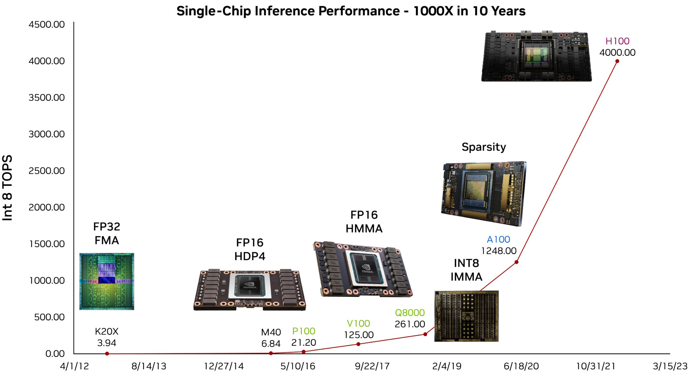
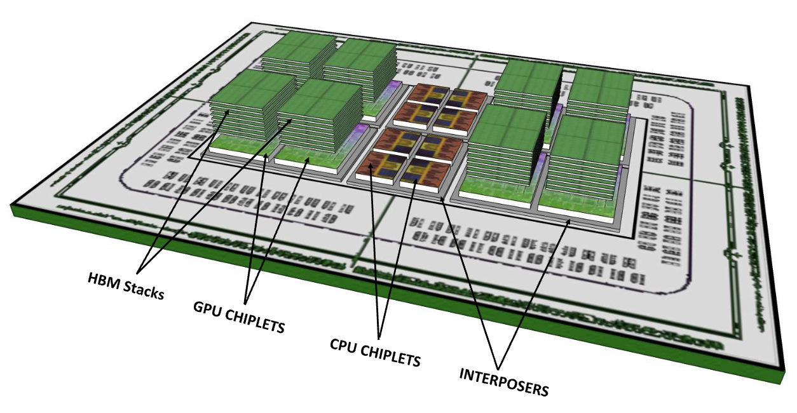
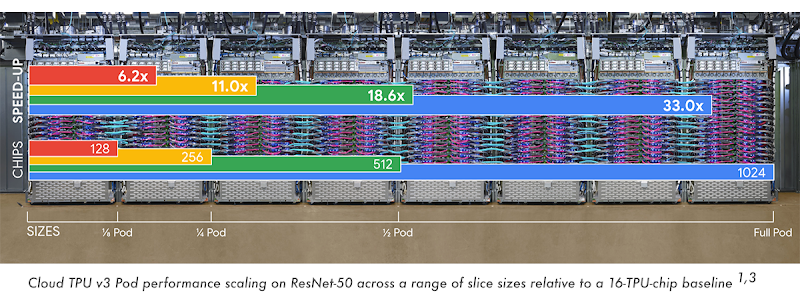

# AI加速 {#sec-ai-acceleration}

::: {layout-narrow}

::: {.column-margin}

_DALL·E 3 提示词：以长方形格式创建一个复杂且色彩丰富的片上系统 (SoC) 设计图。展示集成在处理器中的各种专用机器学习加速器和芯粒。提供芯片内部的详细视图，突出电子的快速运动。每个加速器和芯粒都应设计为与神经网络的神经元、层和激活进行交互，强调它们的处理速度。将神经网络描绘成一个由互连节点组成的网络，充满活力的数据流在加速器组件之间流动，展示增强的计算速度。_

:::

\noindent
:::

## 目的 {.unnumbered}

*是什么让专用硬件加速不仅有益，而且对于实际的机器学习部署至关重要？为什么这代表了我们处理计算系统设计方式的根本转变？*

实际的机器学习系统完全依赖于硬件加速。如果没有专用处理器，计算需求在经济和物理上都是不可行的。通用 CPU 在神经网络操作[@sze2017efficient] 方面仅能达到 100 GFLOPS[^fn-gflops]，而现代训练工作负载每秒需要数万亿次操作，这产生了一个传统扩展无法弥补的性能差距。硬件加速将计算上不可能完成的任务转化为实际的部署，从而开启了全新的应用类别。处理现代人工智能系统的工程师必须理解加速原理，以利用 100-1000$\times$的性能提升，从而使实时推理、大规模训练和边缘部署在经济上变得可行。

::: {.callout-tip title="学习目标"}

- 追踪从浮点协处理器到现代人工智能加速器的硬件加速演变过程，并解释推动这一进程的架构原理

- 对人工智能计算原语（向量操作、矩阵乘法、脉动阵列）进行分类，并分析它们在当代加速器中的实现

- 评估人工智能加速器的存储层次结构设计，并使用带宽和功耗指标预测其对性能瓶颈的影响

- 设计将神经网络层映射到专用硬件架构上的策略，考虑数据流模式和资源利用率的权衡

- 应用编译器优化技术（图优化、算子融合、内存规划），将高级机器学习模型转化为高效的硬件执行计划

- 比较多芯片扩展方法（芯粒、多 GPU、分布式系统），并评估它们对不同人工智能工作负载特性的适用性

- 评判关于硬件加速的常见误区，并识别加速器选择和部署策略中的潜在陷阱
:::

## AI 硬件加速基础 {#sec-ai-acceleration-ai-hardware-acceleration-fundamentals-2096}

现代机器学习系统挑战了通用处理器底层的架构假设。虽然前一章讨论的软件优化技术通过精度降低、结构化剪枝和执行优化，为提高算法效率提供了系统性的方法，但它们在现有计算基质的约束下运行。由于顺序处理模型与神经网络计算的高并行、数据密集型特性之间的架构不匹配，传统 CPU 在执行典型的机器学习工作负载时，利用率仅为 5-10%[@gholami2024ai]。

这种性能差距推动了计算机架构向特定领域硬件加速的转变。硬件加速是对软件优化的补充，它通过架构重新设计而非算法修改来解决效率限制。机器学习算法与专用计算架构的协同演进，使得从在高性能计算系统上进行的计算成本极高的研究，转变为在从超大规模数据中心到资源受限的边缘设备的各种计算环境中的普及部署。

机器学习系统的硬件加速处于计算机系统工程、计算机架构和应用机器学习的交叉领域。对于开发生产系统的从业者来说，关于加速器技术（包括图形处理单元、张量处理单元和类脑处理器）的架构选择决策，直接决定了系统级的性能特征、能效概况和实现复杂度。在自然语言处理、计算机视觉和自主系统等领域部署的系统表明，相对于通用实现，其性能提升可达两到三个数量级。

本章研究了机器学习系统的硬件加速原理和方法论。分析从特定领域计算架构的历史演变开始，展示了从浮点协处理器到图形处理单元的设计模式如何启发当代的 AI 加速策略。接着，我们处理表征机器学习工作负载的计算原语，包括矩阵乘法、向量操作和非线性激活函数，并分析专用硬件通过脉动阵列架构和张量处理核心等创新优化这些操作的架构机制。

鉴于数据搬运的能量成本通常超过计算能量两个数量级以上，存储层次结构设计在加速有效性中起着至关重要。分析涵盖了从片上 SRAM 缓冲优化到高带宽内存接口的内存架构设计原则，并研究了最小化高能耗数据搬运模式的方法。我们还讨论了编译器优化和运行时系统支持，它们决定了理论上的硬件能力在多大程度上转化为可衡量的系统性能。

本章最后讨论了对于需要超过单芯片实现计算能力的系统的扩展方法论。多芯片架构，从基于芯粒的集成到分布式仓库级系统，在计算并行性和芯片间通信开销之间引入了权衡。通过对包括 NVIDIA GPU 架构、Google 张量处理单元和新兴类脑计算平台在内的当代系统的详细分析，我们建立了在不同系统语境下有效部署 AI 加速所需的理论基础和实践考量。

[^fn-gflops]: **GFLOPS (每秒十亿次浮点运算)**：衡量计算吞吐量的指标，代表每秒进行十亿次浮点运算。TOPS (每秒万亿次运算) 代表每秒进行一万亿次运算，通常用于 AI 加速器中的整数运算。

## 硬件专业化的演进 {#sec-ai-acceleration-evolution-hardware-specialization-1d21}

计算架构遵循一个循环模式：随着计算工作负载复杂性的增加，通用处理器变得越来越低效，从而促使了专用硬件加速器的开发。对更高计算效率、降低能耗以及优化特定领域工作负载执行的需求驱动了这一转变。机器学习加速代表了这一持续演进的最新阶段，遵循了之前在浮点运算、图形处理和数字信号处理等领域观察到的轨迹。

这种演进历程为理解现代机器学习加速器提供了背景，包括带有张量核心（加速矩阵运算的专用单元）的 GPU、Google 的 TPU[^fn-hwacc-tpu] 以及 Apple 的神经网络引擎（Neural Engine），它们都是从既定的架构原则中脱颖而出的。这些技术使得实时语言翻译、图像识别和个性化推荐等广泛部署的应用成为可能。实现这些能力的架构策略源于数十年的硬件专业化研究与开发。

[^fn-hwacc-tpu]: **TPU 的起源**：Google 从 2013 年开始秘密研发张量处理单元（TPU），当时他们意识到 CPU 无法处理其神经网络的计算需求。2015 年部署的 TPUv1 在推理方面的每瓦性能比当时的 GPU 高出 15-30$\times$。这一突破显著改变了业界处理 AI 硬件的方式，证明了领域特定架构在神经网络工作负载方面可以大幅超越通用处理器。

硬件专业化构成了这一转变的基础，通过专用电路实现来优化频繁执行的计算模式，从而提高性能和效率。虽然这种方法带来了显著的收益，但也引入了在灵活性、芯片面积利用率和编程复杂度方面的权衡。随着计算需求的不断演进，专用加速器必须平衡这些因素，以实现效率和性能的持续提升。

硬件专业化的演进为理解现代机器学习加速器提供了视角。塑造早期浮点和图形加速器开发的许多原则，现在也影响着 AI 专用硬件的设计。审视这些过去的趋势，为分析当代的 AI 加速方法并预测专用计算的未来发展提供了一个框架。

### 专用计算 {#sec-ai-acceleration-specialized-computing-1a77}

向专用计算架构的转变源于通用处理器的局限性。早期的计算系统依靠中央处理器（CPU）按照“一刀切”的方法顺序执行所有计算任务。随着计算工作负载的多样化和复杂性的增加，某些操作，特别是浮点运算，成为了 CPU 无法高效处理的性能瓶颈。这些低效促使了旨在加速特定计算模式的专用硬件架构的开发[@flynn1966very]。

硬件专业化最早的例子之一是 1980 年推出的 Intel 8087 数学协处理器[^fn-intel-8087]。该浮点单元（FPU）旨在分担主 CPU 的算术密集型计算，显著提高了科学和工程应用的性能。8087 展示了前所未有的效率，与通用处理器上的软件实现相比，其浮点运算的性能提升高达 100 倍[@fisher_8087_1981]。这一里程碑确立了计算机架构中的一个原则：精心设计的硬件专业化可以为定义明确、计算密集型的任务提供数量级的改进。

[^fn-intel-8087]: **Intel 8087 的影响**：8087 协处理器的成本高达数百美元（相当于今天的$700-795 according to various accounts, about $2,100-2,400 美元），但它改变了科学计算。原本需要数小时进行复杂计算的 CAD 工作站可以在几分钟内完成。这一成功创造了整个协处理器市场，并确立了至今仍在沿用的专用硬件经济模式：为特定领域的巨大性能提升收取溢价。

浮点协处理器[^fn-coprocessor]的成功导致它们最终被集成到主流处理器中。1989 年发布的 Intel 486DX 集成了一个片上浮点单元，消除了对外部协处理器的需求。这种集成提高了处理效率，并在计算机架构中确立了一个循环模式：成功的专用功能会成为后续几代通用处理器的标准特性[@patterson2021computer]。

[^fn-coprocessor]: **协处理器**：一种专用的辅助处理器，旨在处理主 CPU 表现不佳的特定任务。8087 数学协处理器是第一个成功的例子，随后是图形协处理器（GPU）和网络处理器。现代“加速器”本质上是演进后的协处理器。随着这些芯片在其目标工作负载上的能力变得比主机 CPU 更强大，术语也发生了变化。今天的 AI 加速器遵循同样的模式，但其性能往往远超 CPU。

早期浮点加速建立的原则继续影响着现代硬件专业化：

1. 通过工作负载分析识别计算瓶颈
2. 为频繁操作开发专用电路
3. 创建高效的硬件-软件接口
4. 逐步集成经过验证的专用功能

这种从领域特定专业化到通用集成的演进塑造了现代计算架构。随着计算工作负载扩展到算术运算之外，这些核心原则被应用于新的领域，如图形处理、数字信号处理以及最终的机器学习加速。每个领域都引入了针对其独特计算需求量身定制的专用架构，将硬件专业化确立为在日益复杂的工作负载中提升计算性能和效率的方法。

专用计算硬件的演进遵循一条一致的轨迹，即引入架构创新来解决新兴的计算瓶颈，随后将其纳入主流计算平台。如@fig-timeline 所示，每个计算时代都产生了应对当时主要工作负载特征的加速器。这些发展提升了架构效率，并构成了当代机器学习系统运行的基础。实时语言翻译、个性化推荐和设备端推理等任务所需的计算能力，依赖于早期领域（包括浮点运算、图形处理和数字信号处理）建立的基础原则和架构创新。

::: {#fig-timeline fig-env="figure" fig-pos="htb"}

```{.tikz}
\begin{tikzpicture}[font=\usefont{T1}{phv}{m}{n}\small]
\tikzset{
  Box/.style={inner xsep=1pt,
    draw=none,node distance=3mm,
    fill=#1,align=flush center,
    anchor=west,
    text width=35mm,
    minimum width=35mm, minimum height=10mm
  },
  Box/.default=red
}
\definecolor{col1}{RGB}{128, 179, 255}
\definecolor{col2}{RGB}{255, 255, 128}
\definecolor{col3}{RGB}{204, 255, 204}
\definecolor{col4}{RGB}{230, 179, 255}
\definecolor{col5}{RGB}{255, 153, 204}
\definecolor{col6}{RGB}{245, 82, 102}
\definecolor{col7}{RGB}{255, 102, 102}
\node[Box={col1}](B1){1980s};
\node[Box={col2!},right=of B1](B2){1990s};
\node[Box={col3},right=of B2](B3){2000s};
\node[Box={col4},right=of B3](B4){2010s};
\node[Box={col5},right=of B4](B5){2020s};
\foreach \x in{1,2,...,5}
\draw[dashed,thick,-latex](B\x)--++(270:8.5);
\path[red]([yshift=-8mm]B1.south west)coordinate(P)-|coordinate(K)(B5.south east);
\draw[line width=2pt,-latex](P)--(K)--++(0:3mm);
%
\node[Box={col1!50},below=2 of B1](BB1){Floating-Point \& Signal Processing};
\node[Box={col1!50},below=of BB1](BB2){Intel 8087 FPU (1980)};
\node[Box={col1!50},below=of BB2](BB3){Texas Instruments TMS32010 DSP (1983)};
\node[Box={col1!50},below=of BB3](BB4){Integration of FPU into Intel 486DX (1989)};
%
\node[Box={col2!50},below=2 of B2](2BB1){3D Graphics \& Multimedia};
\node[Box={col2!50},below=of 2BB1](2BB2){Introduction of Early GPUs};
\node[Box={col2!50},below=of 2BB2](2BB3){NVIDIA GeForce 256 -- First Programmable GPU (1999)};
\node[Box={col2!50},below=of 2BB3](2BB4){Rise of SIMD Processing Units};
%
\node[Box={col3!50},below=2 of B3](3BB1){Real-time Media Coding \& Network Processing};
\node[Box={col3!50},below=of 3BB1](3BB2){Media Codecs\\ (H.264, MP3)};
\node[Box={col3!50},below=of 3BB2](3BB3){Intel IXP2800 Network Processor};
\node[Box={col3!50},below=of 3BB3](3BB4){Dedicated hardware for streaming and encoding};
%
\node[Box={col4!50},below=2 of B4](4BB1){Deep Learning Tensor Operations};
\node[Box={col4!50},below=of 4BB1](4BB2){Google TPU v1 for\\ ML Inference (2016)};
\node[Box={col4!50},below=of 4BB2](4BB3){NVIDIA Tensor Cores\\ for DL Acceleration};
\node[Box={col4!50},below=of 4BB3](4BB4){AI-specific memory optimizations};
%
\node[Box={col5!50},below=2 of B5](5BB1){Application-Specific Acceleration};
\node[Box={col5!50},below=of 5BB1](5BB2){AI Engines \& \\SmartNICs};
\node[Box={col5!50},below=of 5BB2](5BB3){Multi-chip and wafer-scale ML acceleration};
\node[Box={col5!50},below=of 5BB3](5BB4){ML frameworks optimizing for specialized hardware};
\end{tikzpicture}
```
**硬件专业化轨迹**：计算架构逐步整合专用加速器，以应对新兴的性能瓶颈和工作负载需求，这反映了从浮点单元到图形处理器、最终到机器学习加速器的历史模式。这一演进体现了通过根据特定任务特征量身定制硬件来提高计算效率，并推进日益复杂的应用的策略。

:::

### 并行计算与图形处理 {#sec-ai-acceleration-parallel-computing-graphics-processing-66b1}

通过浮点加速建立的原则为应对新兴的计算挑战提供了蓝图。随着计算应用的多样化，出现了超出通用处理器能力的新计算模式。专用计算的这种扩展体现在多个领域，每个领域都为硬件加速策略贡献了独特的见解。

图形处理在 20 世纪 90 年代成为硬件专业化的主要驱动力。早期的图形加速器专注于位图传输和多边形填充等特定操作。1999 年 NVIDIA GeForce 256 引入的可编程图形管线代表了专用计算的一次重大进步。图形处理器（GPU）展示了并行处理架构如何高效处理数据并行工作负载，在纹理映射和顶点变换等 3D 渲染任务中实现了 50-100$\times$的加速。到 2004 年，高端 GPU 每秒可处理超过 1 亿个多边形[@owens2008gpu]。

与此同时，数字信号处理（DSP）处理器建立了并行数据路径架构，配备了专用的乘累加单元和针对滤波及变换操作优化的循环缓冲区。德州仪器（Texas Instruments）的 TMS32010（1983 年）展示了领域特定指令集如何显著提高信号处理应用的性能[@lyons2011understanding]。

网络处理引入了额外的专业化模式。网络处理器开发了独特的架构来以线速处理数据包，结合了多个处理核心、专用数据包处理单元和复杂的内存管理系统。Intel 的 IXP2800 网络处理器展示了如何结合多个层级的硬件专业化来应对复杂的处理需求。

这些不同领域的专业化表现出几个共同特征：

1. 识别领域特定的计算模式
2. 开发专用的处理元件和内存层次结构
3. 创建领域特定的编程模型
4. 向更灵活的架构逐步演进

这一专业化扩展时期证明了硬件加速策略可以应对多个领域的不同计算需求。GPU 在并行化 3D 图形管线方面的成功，使其随后被用于训练深度神经网络，2012 年的 AlexNet[^fn-hwacc-alexnet] 就是一个例子，它在消费级 NVIDIA GPU 上运行。DSP 在低功耗信号处理方面的创新促进了边缘设备（包括语音助手和可穿戴设备）上的实时推理。这些领域启迪了机器学习硬件设计，并确立了加速器可以跨云端和嵌入式环境部署的原则，这些原则继续影响着当代 AI 生态系统的发展。

[^fn-hwacc-alexnet]: **AlexNet 的 GPU 革命**：AlexNet 的突破不仅仅是算法上的。它证明了 GPU 训练深度网络的速度比 CPU 快 10$\times$ [@krizhevsky2012alexnet]。该团队将 8 层网络拆分到两块 NVIDIA GTX 580（各 512 个核心）上，将训练时间从数周缩短至数天。这一成功引发了“深度学习淘金热”，并确立了 NVIDIA 作为默认 AI 硬件公司的地位，到 2024 年，其数据中心 GPU 的销售额增长至$200 million to $470 亿美元。现代 GPU 如 NVIDIA H100 包含 16,896 个流处理器，展示了自 AlexNet 时代以来并行处理能力的巨大飞跃。

### 领域特定架构的兴起 {#sec-ai-acceleration-emergence-domainspecific-architectures-e045}

领域特定架构（DSA）[^fn-dsa]的兴起标志着计算机系统设计的转变，这是由两个因素驱动的：传统缩放定律的失效以及专用工作负载日益增长的计算需求。摩尔定律[^fn-moores-law]（此前确保了晶体管密度每 18 到 24 个月可预测地增加）的放缓，以及登纳德缩放定律[^fn-dennard-scaling]（允许在不相应增加功耗的情况下提高频率）的终结，为通用计算带来了性能和效率瓶颈。正如 John Hennessy 和 David Patterson 在其 2017 年图灵奖演讲[@HennessyPatterson2017Turing] 中指出的，这些局限性标志着计算机架构新时代的到来，这一时代以针对专用工作负载优化硬件的领域特定解决方案为中心。

[^fn-dsa]: **领域特定架构 (DSA)**：针对特定应用领域而非通用计算优化的计算架构。与为灵活性而设计的 CPU 不同，DSA 牺牲了可编程性以换取巨大的效率提升。Google 的 TPU 在神经网络方面的每瓦性能比 GPU 高 15-30$\times$，而视频编解码器比软件解码提供 100-1000$\times$的改进。2018 年图灵奖认可了这一转变，将其视为现代计算机架构的决定性趋势。

[^fn-moores-law]: **摩尔定律**：Intel 联合创始人 Gordon Moore 在 1965 年观察到，晶体管密度每 18-24 个月翻一番。这种指数级缩放驱动了 50 年的计算进步，使从智能手机到超级计算机的一切成为可能。然而，2005 年左右的物理极限大幅放缓了这一速度。现代 3&nbsp;nm 芯片的成本是 1999 年的$20 billion to develop versus $300 万倍，迫使行业转向专用架构。

[^fn-dennard-scaling]: **登纳德缩放定律**：Robert Dennard 在 1974 年提出的原则，即随着晶体管变小，其功率密度保持不变，从而允许更高的频率而不会增加功耗。这使得 CPU 在 2005 年达到了 3+ GHz。然而，量子效应和漏电流在 2005 年左右终结了登纳德缩放，迫使架构师优先考虑效率而非原始速度，并导致了多核革命。

从历史上看，处理器性能的提高依赖于半导体工艺缩放和提高时钟频率。然而，随着功率密度限制了进一步的频率缩放，以及晶体管微缩遇到越来越多的物理和经济约束，架构师探索了维持计算增长的替代方法。这导致了向领域特定架构的转变，这种架构分配硅资源来优化特定应用领域的计算，以灵活性换取效率。

领域特定架构通过几个关键原则实现了卓越的性能和能效：

1. **定制数据路径**：设计专门针对目标应用模式优化的处理路径，实现常见操作的直接硬件执行。例如，AI 加速器中的矩阵乘法单元实现了脉动阵列——这是一种由处理元件组成的网格状网络，能够有节奏地计算并将数据传递给相邻单元，专门为神经网络计算量身定制。

2. **专用内存层次结构**：围绕领域特定的访问模式和数据重用特性优化内存系统。这包括自定义缓存配置、预取逻辑以及针对预期工作负载调整的内存控制器。

3. **减少指令开销**：实现领域特定的指令集，通过将常见的操作序列编码为单条指令，最大限度地降低解码和分派的复杂性。这提高了性能和能效。

4. **直接硬件实现**：创建专用的电路块，在无需软件干预的情况下原生执行常用操作。这消除了指令处理开销并最大化了吞吐量。

这些原则在现代智能手机中得到了令人信服的展示。尽管视频处理每秒需要数十亿次操作，但现代智能手机可以以每秒 60 帧的速度解码 4K 视频，而功耗仅为几瓦。这种效率是通过实现 H.264/AVC（2003 年引入）和 H.265/HEVC（2013 年敲定）等行业标准的专用硬件视频编解码器实现的[@sullivan2012overview]。与通用处理器上的软件解码相比，这些专用电路在性能和功耗效率方面都提供了 100–1000$\times$的改进。

专业化的趋势继续加速，针对不断扩大的领域出现了新的架构。基因组学处理受益于优化序列比对和变异调用的定制加速器，减少了 DNA 分析所需的时间[@Shang2018GenomicsAccel]。同样，区块链计算产生了针对密码学哈希优化的应用特定集成电路（ASIC）[^fn-asics]，大幅提高了挖矿操作的效率[@Taylor2017ASICMining]。这些例子表明，领域特定架构代表了计算机系统的一次根本性变革，提供了应对现代计算工作负载日益增长的复杂性和多样性的量身定制的解决方案。

[^fn-asics]: **应用特定集成电路 (ASIC)**：为单一应用设计的定制硅芯片，通过消除未使用功能提供最大效率。比特币挖矿 ASIC 在 SHA-256 哈希方面的能效比 CPU 高 100,000$\times$。然而，它们的不可灵活性意味着如果算法改变，它们就会变得一文不值。据估计，当以太坊在 2022 年 9 月转向权益证明时，价值 50 亿美元的以太坊挖矿 ASIC 变得过时了。

### 机器学习硬件专业化 {#sec-ai-acceleration-machine-learning-hardware-specialization-a17f}

机器学习构成了一个具有独特特征的计算领域，驱动了专用硬件架构的开发。与表现出不规则内存访问模式和多样化指令流的传统计算工作负载不同，神经网络的特征是可预测的模式：密集矩阵乘法、规则数据流以及对降低精度的容忍度。这些特征使得专用硬件优化成为可能，这些优化对于通用计算可能无效，但能为机器学习工作负载提供实质性的加速。

::: {.callout-definition title="机器学习加速器"}

***机器学习加速器***是针对神经网络的*计算模式*优化的专用计算硬件，通过*并行处理*、*专用内存层次结构*和*低精度算术*实现卓越的*每瓦性能*。
:::

机器学习的计算需求揭示了传统处理器的局限性。CPU 在神经网络工作负载上的利用率仅为 5-10%，在消耗数百瓦功率的同时仅提供约 100 GFLOPS[^fn-gflops]。这种低效源于架构失配：CPU 针对单线程性能和不规则内存访问进行优化，而神经网络需要大规模并行和可预测的数据流。内存带宽[^fn-memory-bandwidth]限制变得尤为严重：单个神经网络层可能需要访问数 GB 的参数，这会让旨在处理 KB 级工作集的 CPU 缓存层次结构[^fn-cache-hierarchy]不堪重负。

[^fn-memory-bandwidth]: **内存带宽**：数据在内存和处理器之间传输的速率，以 GB/s 或 TB/s 为单位。AI 工作负载通常受带宽限制而非计算限制。NVIDIA H100 提供 3.35 TB/s 的带宽（比典型 DDR5-4800 配置的 ~80 GB/s 快约 40$\times$），因为神经网络需要不断访问权重，使得内存带宽成为许多 AI 应用中的主要瓶颈。

[^fn-cache-hierarchy]: **缓存层次结构**：具有 L1、L2 和 L3 缓存的多级内存系统，提供逐渐变大的容量但更高的延迟。CPU 针对访问时间 <1ns 的 32-64KB L1 缓存进行优化，但神经网络需要无法装入缓存的数 GB 权重，导致频繁昂贵的 DRAM 访问（100ns 延迟），并将性能从 90% 以上的缓存命中率降至不足 10%。

[^fn-backpropagation]: **反向传播**：通过使用链式法则将误差在网络中向后传播来计算梯度的关键训练算法。与仅需要当前层输出的前向推理不同，反向传播需要存储前向传播中的所有中间激活值，使内存需求增加 2-3$\times$，并需要双向数据流，这增加了加速器设计的复杂性。

[^fn-latency-throughput]: **延迟与吞吐量**：延迟衡量单个请求的响应时间（毫秒），而吞吐量衡量单位时间内处理的请求数（请求/秒）。训练优化吞吐量以高效处理大批量数据，而推理优先考虑实时响应的延迟。GPU 可能实现 1000 图像/秒（高吞吐量），但每张图像耗时 50 毫秒（高延迟），使其不适合需要 <10 毫秒响应时间的实时应用。

[^fn-im2col]: **Im2col (Image-to-Column)**：一种预处理技术，通过将图像块展开为列向量，将卷积操作转换为矩阵乘法。对 224×224 图像进行 3×3 卷积会产生一个具有约 50,000 列的矩阵，从而实现高效的 GEMM 执行，但由于重叠块，内存使用量会增加 9 倍。这种转换解释了为什么在现代机器学习加速器中卷积实际上是矩阵运算。

[^fn-streaming-multiprocessor]: **流式多处理器 (SM)**：NVIDIA 的基本 GPU 计算单元，包含多个 CUDA 核心、张量核心、共享内存和调度器。每个 SM 管理 2048 个以上的线程，这些线程组织成 64 个线程束（warp，每个 32 线程），从而实现大规模并行。NVIDIA H100 包含 132 个 SM，每个 SM 有 128 个流处理器，总计 16,896 个核心。SM 以 SIMT 方式执行线程，一个线程束中的所有线程共享同一指令，但处理不同的数据。

[^fn-warp]: **线程束 (Warp)**：NVIDIA 的基本执行单元，由 32 个线程组成，这些线程同步锁步执行同一条指令。线程束中的所有线程共享指令获取和解码，从而最大化指令吞吐量。如果线程发生分歧（不同的控制流），线程束会通过序列化执行路径而变得低效。当线程束中的线程访问连续的内存地址时，现代 GPU 可以实现最佳性能，从而实现内存合并。)

[^fn-memory-coalescing]: **内存合并**：一种硬件优化，当线程束中的连续线程访问连续内存地址时，内存控制器可以将多个请求合并为单个高效事务。非合并访问（线程访问分散地址）会使 GPU 内存带宽降低 10-20$\times$。这就是为什么张量布局和数据组织对 GPU 性能至关重要的原因——结构不良的数据会导致昂贵的分散内存访问模式。

[^fn-nhwc-nchw]: **NHWC 与 NCHW**：张量布局格式，其中字母表示维度顺序：N（批量）、H（高度）、W（宽度）、C（通道）。NHWC 按行存储数据并交错通道（对 CPU 友好），而 NCHW 将每个通道的所有值组合在一起（对 GPU 友好）。NHWC 格式的 224×224 RGB 图像存储为 [R1,G1,B1,R2,G2,B2,...]，而 NCHW 存储为 [R1,R2,...,G1,G2,...,B1,B2,...]。根据硬件的不同，这种看似微小的差异可能会影响 2-5$\times$的性能。

[^fn-fpga]: **FPGA (现场可编程门阵列)**：包含可编程逻辑块和路由的可重构硬件，可以在制造后实现自定义数字电路。与固定的 ASIC 不同，FPGA 可以针对不同的算法重新编程，在软件和硬件效率之间提供灵活性。Intel 基于 FPGA 的 AI 芯片在特定工作负载下的每瓦性能比 GPU 高 2-10$\times$，但需要专门的硬件描述语言（Verilog/VHDL）和更长的开发周期，与 GPU 编程相比限制了其普及。

数据移动的能量经济学影响着加速器的设计。从 DRAM 访问数据需要大约 640 皮焦耳，而执行一次乘累加操作仅消耗 3.7&nbsp;pJ，大约是 173 倍的惩罚（具体数值随技术节点和设计而异），这确立了最小化数据移动为主要的优化目标。这种差异解释了从重新利用图形处理器到专门构建神经网络加速器的演进过程。GPU 通过大规模并行实现了 15,000+ GFLOPS，但面临来自其图形传统的效率挑战。TPU 和其他定制加速器通过实现脉动阵列和其他架构，在最小化移动的同时最大化数据重用，使利用率达到 85% 以上。

训练和推理呈现出不同的计算特征，影响着加速器的设计。训练需要高精度算术（FP32 或 FP16）进行梯度计算和权重更新，需要反向传播[^fn-backpropagation]的双向数据流，以及用于存储激活值的大内存容量。推理可以利用低精度（INT8 或 INT4），仅需要前向计算，并且优先考虑延迟而非吞吐量[^fn-latency-throughput]。这些差异驱动了专用架构：训练加速器最大化 FLOPS 和内存带宽，而推理加速器优化能效和确定性延迟。

部署环境塑造了架构选择。数据中心加速器接受 700 瓦的功率预算，以最大化训练大规模模型的吞吐量。边缘设备必须在毫瓦级约束内提供实时推理，从而驱动消除一切不必要数据移动的架构。移动处理器在性能与电池寿命之间取得平衡，而汽车系统在安全关键型应用中优先考虑确定性响应时间。这种多样性产生了一个丰富的专用加速器生态系统，每个加速器都针对特定的部署场景和计算需求进行了优化。

在数据中心，NVIDIA H100 和 Google TPUv4 等训练加速器通过大规模并行和高带宽内存系统，将模型开发时间从数周缩短至数天。这些系统优先考虑原始计算吞吐量，接受 700 瓦的功耗以实现拍字节（petaflop）级的性能。经济效益支持这种权衡——将训练时间从数月缩短至数天可以减少数百万美元的运营成本，并加速 AI 应用的上市时间。

在另一个极端，边缘部署需要不同的优化策略。存内计算（Processing-in-memory）架构通过将计算直接与内存集成来消除数据移动。动态电压缩放在低强度操作期间可降低 50-90% 的功耗。类脑（Neuromorphic）设计仅处理变化的输入，为时间工作负载实现了 1000 倍的功耗降低。这些技术使复杂的 AI 模型能够在电池供电下持续运行，支持从智能手机摄影到无需外部电源即可运行数年的自主传感器等应用。

应用特定加速器的成功证明，没有单一架构可以高效处理所有机器学习工作负载。预计到 2030 年将有 1560 亿台边缘设备，这将需要针对能效和实时保证进行优化的架构，而云端规模的训练将继续推进计算吞吐量的边界。这种多样性驱动了专用架构的持续创新，每种架构都针对其特定的部署环境和计算需求进行了优化。

专用硬件架构的演进说明了计算机系统中的一个原则：随着计算模式的出现和成熟，硬件专业化随之而来，以实现最佳性能和能效。这一演进在机器学习加速中清晰可见，领域特定架构已经演进以满足机器学习模型日益增长的计算需求。与优先考虑灵活性的通用处理器不同，专用加速器优化了定义明确的工作负载的执行，平衡了性能、能效以及与软件框架的集成。@tbl-hw-evolution 总结了硬件专业化演进中的关键里程碑，展示了每个时代如何产生针对当时主要计算需求的架构。虽然这些加速器最初是为优化领域特定工作负载（包括浮点运算、图形渲染和媒体处理）而出现的，但它们也引入了在当代系统中依然存在的架构策略。早期几代概述的专业化原则现在支撑着现代 AI 加速器的设计。了解这一历史轨迹为分析硬件专业化如何继续在各种部署环境中实现可扩展、高效的机器学习工作负载执行提供了背景。

+-----------+------------------------------------+---------------------------------------------+----------------------------------------------+
| **时代**  | **计算模式**                       | **架构示例**                                | **特征**                                     |
+==========:+:===================================+:============================================+:=============================================+
| **1980s** | 浮点与信号处理                     | FPU, DSP                                    | <ul><li>单用途引擎</li>                      |
|           |                                    |                                             | <li>聚焦指令集</li>                          |
|           |                                    |                                             | <li>协处理器接口</li></ul>                   |
+-----------+------------------------------------+---------------------------------------------+----------------------------------------------+
| **1990s** | 3D 图形与多媒体                    | GPU, SIMD 单元                              | <ul><li>大量相同的计算单元</li>              |
|           |                                    |                                             | <li>规则的数据模式</li>                      |
|           |                                    |                                             | <li>宽内存接口</li></ul>                     |
+-----------+------------------------------------+---------------------------------------------+----------------------------------------------+
| **2000s** | 实时媒体编码                       | 媒体编解码器, 网络处理器                    | <ul><li>固定功能管线</li>                    |
|           |                                    |                                             | <li>高吞吐量处理</li>                        |
|           |                                    |                                             | <li>功耗-性能优化</li></ul>                  |
+-----------+------------------------------------+---------------------------------------------+----------------------------------------------+
| **2010s** | 深度学习张量运算                   | TPU, GPU 张量核心                           | <ul><li>矩阵乘法单元</li>                    |
|           |                                    |                                             | <li>大规模并行</li>                          |
|           |                                    |                                             | <li>内存带宽优化</li></ul>                   |
+-----------+------------------------------------+---------------------------------------------+----------------------------------------------+
| **2020s** | 应用特定加速                       | 机器学习引擎, 智能网卡, 领域加速器          | <ul><li>工作负载特定的数据路径</li>          |
|           |                                    |                                             | <li>定制内存层次结构</li>                    |
|           |                                    |                                             | <li>应用优化的设计</li></ul>                 |
+-----------+------------------------------------+---------------------------------------------+----------------------------------------------+

: **硬件专业化趋势**：连续的计算时代逐步整合专用硬件以加速盛行的工作负载，从通用 CPU 转向领域特定架构，并最终转向可定制的 AI 加速器。这一演进反映了一个基本原则：针对计算模式量身定制硬件可以提高性能和能效，从而推动机器学习系统的创新。 {#tbl-hw-evolution}

这种历史进程揭示了一个循环模式：每一波硬件专业化都是为了应对计算瓶颈，无论是图形渲染、媒体编码还是神经网络推理。2020 年代的独特之处不仅在于专业化，还在于其普遍性：AI 加速器现在支撑着从 YouTube 上的产品推荐到自动驾驶汽车中的目标检测的一切。与早期的加速器不同，今天的 AI 硬件必须与动态软件框架紧密集成，并实现从云端到边缘部署的扩展。该表不仅展示了过去，还展示了向日益定制化、高影响力的计算平台发展的轨迹。

对于 AI 加速，这种转变引入了远远超出硬件设计的挑战。机器学习加速器必须通过与计算栈多个层级的优化保持一致，无缝集成到机器学习工作负载中。它们必须能与 TensorFlow、PyTorch 和 JAX 等广泛采用的框架有效配合，确保在各种硬件平台上的部署顺畅且一致。编译器和运行时支持变得必不可少；先进的优化技术，如图级转换、内核融合和内存调度，对于发挥这些专用加速器的全部潜力至关重要。

可扩展性带来了额外的复杂性，因为 AI 加速器部署在从高吞吐量数据中心到资源受限的边缘和移动设备的各种环境中，需要量身定制的性能调优和能效策略。集成到异构计算[^fn-heterogeneous]环境中需要互操作性，使专用单元能够与分布式系统中的传统 CPU 和 GPU 有效协调。

[^fn-heterogeneous]: **异构计算**：结合不同类型处理器（CPU、GPU、TPU、FPGA）以针对不同工作负载优化性能的计算系统。现代数据中心混合使用 x86 CPU 进行控制任务、GPU 进行训练、TPU 进行推理。编程异构系统需要像 OpenCL 或 CUDA 这样能够协调跨不同架构执行的框架，但通过将每个任务与最佳硬件匹配，可以获得 10-100$\times$的效率提升。

AI 加速器代表了系统级的转型，需要紧密的硬件-软件耦合。这种转型体现在驱动加速器设计决策的三种特定计算模式，即计算原语，它们驱动了加速器设计决策。了解这些原语决定了架构特征，从而通过后续章节中研究的协调硬件专业化和软件优化策略，实现 100-1000$\times$的性能提升。

从浮点协处理器到 AI 加速器的演进揭示了一个一致的模式：计算瓶颈驱动专用硬件开发。Intel 8087 解决了消耗 80% 科学计算时间的浮点运算，而现代 AI 工作负载则呈现出更为极端的情况。矩阵乘法和卷积占神经网络计算的 95% 以上。这种计算需求的集中为专业化创造了前所未有的机遇，解释了为什么 AI 加速器比通用处理器实现了 100-1000$\times$的性能提升。

通过数十年硬件演进建立的专业化原则——识别主导操作、创建专用数据路径和优化内存访问模式——现在指导着 AI 加速器的设计。然而，神经网络引入了需要新架构方法的独特特征：矩阵运算中的大规模并行、支持预取的可预测数据访问模式，以及允许激进优化的对降低精度的容忍度。了解这些计算模式（我们称之为 AI 计算原语），有助于理解现代加速器如何将@sec-model-optimizations 的理论效率增益转化为实际的性能提升。这些硬件-软件优化在从@sec-ml-systems 边缘设备到云端规模推理系统的部署场景中变得至关重要。

在详细审视这些计算原语之前，我们需要了解实现其高效执行的架构组织。现代 AI 加速器通过精心编排的、协同工作的专用组件层次结构实现了显著的性能提升。该架构由三个子系统组成，每个子系统解决计算挑战的不同方面。

处理基底由处理元件阵列组成，每个元件包含针对特定操作优化的专用计算单元：张量核心执行矩阵乘法，向量单元执行逐元素操作，特殊函数单元计算激活函数。这些处理元件组织在网格拓扑中，实现了大规模并行，数十到数百个单元同时对计算的不同部分进行操作，利用了神经网络工作负载固有的数据级并行性。

内存层次结构同样是关键的架构组件。高带宽内存提供了维持这些众多处理元件所需的总吞吐量，而从共享 L2 缓存到每个元件的 L1 缓存和暂存器的多级缓存层次结构最小化了数据移动的能量成本。这种层次化组织体现了一个设计原则：在 AI 加速器中，数据移动通常比计算本身消耗更多的能量，因此需要优先考虑数据重用的架构策略，通过将频繁访问的值（包括权重和中间结果）保持在计算单元附近来实现。

主机接口建立了专用加速器与更广泛计算系统之间的连接，实现了管理程序控制流的通用 CPU 与执行计算密集型神经网络操作的加速器之间的协调。这种架构划分反映了系统层面的专业化：CPU 处理控制流、条件逻辑和系统协调，而加速器专注于主导神经网络执行的规则、大规模并行算术运算。@fig-accelerator-anatomy 展示了这种架构组织，说明了专用计算单元、分层内存子系统和主机连接如何集成，形成一个针对 AI 工作负载优化的系统。

::: {#fig-accelerator-anatomy fig-env="figure" fig-pos="htb"}

```{.tikz}
\begin{tikzpicture}[line cap=round,line join=round,font=\usefont{T1}{phv}{m}{n}\small]
\tikzset{
  Box/.style={align=center,,outer sep=0pt ,
    inner xsep=2pt,
    node distance=0.45,
    draw=GreenLine,
    line width=0.75pt,
    fill=GreenL!60,
   % text width=32mm,
    minimum width=77mm, minimum height=11mm
  },
   Box2/.style={Box, minimum width=10mm, minimum height=6mm,fill=BrownL!60,draw=BrownLine},
   Box3/.style={Box,text width=20mm,  minimum width=20mm, minimum height=9mm,fill=RedL!60,draw=RedLine},
   Box4/.style={Box3, fill=BlueLine!20,draw=BlueLine},
   Box5/.style={Box3, fill=OrangeLine!20,draw=OrangeLine},
   Box6/.style={Box3, text width=30mm,  minimum width=30mm,  minimum height=13mm,fill=OrangeLine!20,draw=OrangeLine},
Line/.style={violet!50, line width=1.1pt,shorten <=1pt,shorten >=2pt},
LineA/.style={violet!50,line width=0.8pt,{-{Triangle[width=1.0*4pt,length=1.0*6pt]}},shorten <=1pt,shorten >=1pt},
ALine/.style={black!50, line width=1.1pt,{{Triangle[width=0.9*6pt,length=1.2*6pt]}-}},
Larrow/.style={fill=violet!50, double arrow,  inner sep=2pt, double arrow head extend=3pt,
            single arrow head indent=0pt,minimum height=21mm, minimum width=3pt}
}

\tikzset{
pics/dram/.style = {
        code = {
        \pgfkeys{/channel/.cd, #1}
\begin{scope}[shift={($(0,0)+(0,0)$)},scale=\scalefac,every node/.append style={transform shape}]
\node[draw=\drawcolor,fill=\filllcolor!70,line width=1.5*\Linewidth,inner sep=0pt,outer sep=0pt,
minimum width=56mm,minimum height=14mm](DRAM\picname)at(0,0){};
\node[draw=\drawcolor,fill=\filllcolor!30,line width=1.5*\Linewidth,inner sep=0pt,outer sep=0pt,anchor=north,
minimum width=52mm,minimum height=6mm](MDRAM\picname)at(DRAM\picname.south){};
%
\pgfmathsetmacro{\spacing}{56/(6+1)}
\foreach \i in {1,...,6} {
  \pgfmathsetmacro{\x}{\i * \spacing}
  \node[draw=\drawcolor,fill=\filllcolor!20,line width=\Linewidth, inner sep=0pt, outer sep=0pt,
        minimum width=6mm, minimum height=8mm]
        at ([xshift=\x mm]DRAM\picname.west) {};
}
%
\foreach \i in {1,...,19} {
  \pgfmathsetmacro{\x}{\i*(52/20)}
  \draw[draw=\drawcolor, line width=3*\Linewidth]
    ([xshift=\x mm,yshift=1pt]MDRAM\picname.south west) -- ++(0,2mm);
}

\end{scope}
    }
  }
}
%CPU style
\tikzset{
pics/cpu/.style = {
        code = {
        \pgfkeys{/channel/.cd, #1}
\begin{scope}[local bounding box = CPU,scale=0.6, every node/.append style={transform shape}]
\node[fill=\filllcolor,minimum width=66, minimum height=66,
            rounded corners=2,outer sep=2pt] (C1) {};
\node[fill=white,minimum width=54, minimum height=54] (C2) {};
\node[fill=\filllcolor!50,minimum width=44, minimum height=44] (C3) {\large CPU};

\foreach \x/\y in {0.11/1,0.26/2,0.41/3,0.56/4,0.71/5,0.85/6}{
\node[fill=\filllcolor,minimum width=4, minimum height=15,
           inner sep=0pt,anchor=south](GO\y)at($(C1.north west)!\x!(C1.north east)$){};
}
\foreach \x/\y in {0.11/1,0.26/2,0.41/3,0.56/4,0.71/5,0.85/6}{
\node[fill=\filllcolor,minimum width=4, minimum height=15,
           inner sep=0pt,anchor=north](DO\y)at($(C1.south west)!\x!(C1.south east)$){};
}
\foreach \x/\y in {0.11/1,0.26/2,0.41/3,0.56/4,0.71/5,0.85/6}{
\node[fill=\filllcolor,minimum width=15, minimum height=4,
           inner sep=0pt,anchor=east](LE\y)at($(C1.north west)!\x!(C1.south west)$){};
}
\foreach \x/\y in {0.11/1,0.26/2,0.41/3,0.56/4,0.71/5,0.85/6}{
\node[fill=\filllcolor,minimum width=15, minimum height=4,
           inner sep=0pt,anchor=west](DE\y)at($(C1.north east)!\x!(C1.south east)$){};
}
\end{scope}
    }  }}
\pgfkeys{
  /channel/.cd,
   Depth/.store in=\Depth,
  Height/.store in=\Height,
  Width/.store in=\Width,
  filllcirclecolor/.store in=\filllcirclecolor,
  filllcolor/.store in=\filllcolor,
  drawcolor/.store in=\drawcolor,
  drawcircle/.store in=\drawcircle,
  scalefac/.store in=\scalefac,
  Linewidth/.store in=\Linewidth,
  picname/.store in=\picname,
  filllcolor=BrownLine,
  filllcirclecolor=cyan!40,
  drawcolor=black,
  drawcircle=violet,
  scalefac=1,
  Linewidth=0.5pt,
  Depth=1.3,
  Height=0.8,
  Width=1.1,
  picname=C
}

\node[Box](B1){L2 Cache (Shared)};
\coordinate(PO1)at($(B1.north west)+(0.5,0.65)$);
\pgfmathsetmacro{\spacing}{47/(2+1)}
\foreach \i [count=\j] in {0,...,2} {
  \pgfmathsetmacro{\x}{\i * \spacing}
\node[Box2,anchor=south west](GPE\j)at([xshift=\x mm]PO1){PE};
}
\node[Box2,right=1.5 of GPE3](GPE4){PE};
\node[font=\tiny]at($(GPE3)!0.5!(GPE4)$){$\bullet$ $\bullet$ $\bullet$};
%
\coordinate(PO2)at($(B1.south west)+(0.5,-0.65)$);
\pgfmathsetmacro{\spacing}{47/(2+1)}
\foreach \i [count=\j]in {0,...,2} {
  \pgfmathsetmacro{\x}{\i * \spacing}
\node[Box2,anchor=north west](DPE\j)at([xshift=\x mm]PO2){PE};
}
\node[Box2,right=1.5 of DPE3](DPE4){PE};
\node[font=\tiny]at($(DPE3)!0.5!(DPE4)$){$\bullet$ $\bullet$ $\bullet$};
%arrows
\foreach \i  in {1,...,4} {
\draw[LineA](B1.south)--++(0,-0.25)
-|(DPE\i.north);
}
\foreach \i  in {1,...,4} {
\draw[LineA](B1.north)--++(0,0.25)-|(GPE\i.south);
}
\begin{scope}[shift={($(GPE1)+(0.3,2.8)$)}]
\node[Box3](L1){L1 Cache / Scratchpad};
\node[Box4,above right=-0.10 and 0.3 of L1](TC){Tensor Core};
\node[Box4,below right=0.1 and 0.3of L1](VU){Vector Unit};
\node[Box5,below right=0 and 0.3of TC](SFU){SFU};
\draw[LineA](L1)|-(TC);
\draw[LineA](L1)|-(VU);
\draw[LineA](TC)-|(SFU);
\draw[LineA](VU)-|(SFU);
%%fitting
\scoped[on background layer]
\node[draw=BackLine,fill=BackColor!20, inner ysep=4mm, inner xsep=2mm,yshift=2mm,
fit=(L1)(TC)(SFU)(VU),yshift=0mm](BB1){};
\node[below left=0 and 0 of BB1.north east]{Processing Element};
\scoped[on background layer]
\fill[BrownLine!10](GPE3.north west)--(BB1.south west)--(BB1.south east)--(GPE3.north east)--cycle;
\draw[BrownLine](GPE3.north west)--(BB1.south west) (BB1.south east)--(GPE3.north east);
\end{scope}
%%fitting
\node[draw=red,dashed,fill=none, inner ysep=4mm, inner xsep=3mm,yshift=2mm,
fit=(BB1)(DPE1)(DPE4)(B1),yshift=0mm](BB2){};
\node[below =0pt of BB2.north]{AI Accelerator Chip};
%CPU
\begin{scope}[local bounding box=CPU1,shift={($(B1)+(-7.8,0)$)}]
\pic[shift={(0,0)}] at (0,0) {cpu={scalefac=1,picname=1,drawcolor=BlueLine,filllcolor=BlueLine!80!,Linewidth=0.5pt}};
\end{scope}
\node[above=6pt of CPU1]{Host CPU};
%%%%
\begin{scope}[local bounding box=DRAM1,shift={($(CPU1)+(0,-2)$)},scale=1, every node/.append style={transform shape}]
\pic[shift={(0,0)}] at  (0,0){dram={scalefac=0.45,picname=1,drawcolor=black,filllcolor=OrangeLine!50!,Linewidth=0.5pt}};
\end{scope}
\node[below=9pt of DRAM1]{Host DRAM};
\node[Larrow](AR1)at($(CPU1.east)!0.45!(B1.west)$){};
\node[align=center,above=2pt of AR1,font=\usefont{T1}{phv}{m}{n}\footnotesize]{Host Interface\\ (PCIe/NVLink)};
\draw[LineA,dashed](DRAM1)--(CPU1);
%%
\node[Box6,right=2.5 of B1](B6){High-Bandwidth Memory (HBM)};
\node[Larrow](AR2)at($(B1.east)!0.55!(B6.west)$){};
\node[align=center,above=2pt of AR2,font=\usefont{T1}{phv}{m}{n}\footnotesize]{Memory\\ Interface};
\end{tikzpicture}
```
**现代 AI 加速器剖析**：AI 加速器集成了包含张量核心、向量单元和特殊函数单元的专用处理元件，并由从高带宽内存到本地缓存的分层内存系统提供支持。这种架构在最小化高能耗数据移动的同时，最大限度地实现了数据重用和并行执行，为实现比通用处理器高 100-1000 倍的性能提升奠定了基础。

:::

## AI计算原语 {#sec-ai-acceleration-ai-compute-primitives-8471}

要理解硬件如何演变为AI专用设计，需要审视推动这种专业化的计算模式。从通用CPU实现100 GFLOPS到专用加速器提供100,000+ GFLOPS的转变，反映了对主导机器学习工作负载的特定计算模式的架构优化。这些我们称之为计算原语的模式，无论应用领域或模型大小如何，都会在所有神经网络架构中反复出现。

现代神经网络建立在少数核心计算模式之上。无论层类型如何——无论是全连接层、卷积层还是基于注意力的层——底层操作通常涉及将输入值乘以学习到的权重并累加结果。这种重复的乘累加过程主导着神经网络执行，并定义了AI工作负载的算术基础。这些操作的规律性和频率促成了AI计算原语的开发：经过优化以高效率执行这些核心计算的硬件级抽象。

神经网络表现出高度结构化、数据并行的计算，从而实现了架构专业化。基于@sec-ai-acceleration-parallel-computing-graphics-processing-66b1 中建立的并行化原则，这些模式强调可预测的数据重用和固定的操作序列。AI计算原语将这些模式提炼成可重用的架构单元，以支持高吞吐量和节能执行。@lst-dense_layer_def 中展示了这种分解，它在框架级别定义了一个密集层。

::: {#lst-dense_layer_def lst-cap="**Dense Layer Definition**: Defines a dense layer using a high-level API, illustrating how neural networks implement parallel transformations across input tensors."}

```{.python}
dense = Dense(512)(input_tensor)
```

:::

@lst-dense_expansion 展示了这种高级调用如何展开为数学运算。

::: {#lst-dense_expansion lst-cap="**Layer Computation**: Neural networks compute each layer's output via weighted input summation followed by an activation function transformation."}

```{.python}
output = matmul(input_weights) + bias
output = activation(output)
```
:::

在处理器级别，计算简化为嵌套循环，用于将输入和权重相乘、累加结果并应用非线性函数，如@lst-loop_level_dense 所示。

::: {#lst-loop_level_dense lst-cap="**Nested Loops**: Computes output values through sequential matrix multiplications and bias additions, followed by activation function application to produce final outputs."}

```{.python}
for n in range(batch_size):
    for m in range(output_size):
        sum = bias[m]
        for k in range(input_size):
            sum += input[n, k] * weights[k, m]
        output[n, m] = activation(sum)
```
:::

这种转换揭示了四个计算特性：支持同时执行的数据级并行、定义计算工作负载的结构化矩阵运算、驱动内存优化的可预测数据移动模式，以及促使专用功能单元出现的频繁非线性变换。

AI计算原语的设计遵循三个架构标准。首先，原语必须足够频繁地使用以证明专用硬件资源的合理性。其次，其专用实现必须相对于通用替代方案提供显著的性能或能效提升。第三，原语必须在几代神经网络架构中保持稳定，以确保长期适用性。这些考虑因素决定了向量运算、矩阵运算和专用功能单元等原语在现代机器学习加速器中的包含。它们共同构成了高效且可扩展的神经网络执行的架构基础。

### 向量操作 {#sec-ai-acceleration-vector-operations-729f}

向量操作通过同时处理多个数据元素提供了第一层硬件加速。这种并行性存在于从单个神经元到整个层的多个尺度上，使得向量处理对于高效的神经网络执行至关重要。框架级代码转化为硬件指令，揭示了向量处理在神经加速器中的关键作用。

#### 高级框架操作 {#sec-ai-acceleration-highlevel-framework-operations-9248}

机器学习框架通过高级抽象隐藏了硬件的复杂性。这些抽象被分解为逐渐降低层级的操作，从而揭示了硬件加速的机会。@lst-linear_layer_highlevel 展示了其中一种抽象，它说明了线性层的执行流程。

::: {#lst-linear_layer_highlevel lst-cap="**Linear Layer**: Neural networks transform input data into a higher-dimensional space using linear mappings to enable complex feature extraction."}

```{.python}
layer = nn.Linear(256, 512)  # 256 inputs to
# 512 outputs
output = layer(input_tensor)  # Process a batch of inputs
```
:::

这种抽象代表了一个全连接层，它通过学习到的权重转换输入特征。为了理解硬件加速机会是如何出现的，@lst-linear_math_internal 展示了框架如何将这种高级表达式转化为数学运算。

::: {#lst-linear_math_internal lst-cap="**Fully Connected Layer**: Each output is computed as a weighted sum of all inputs plus a bias, followed by an activation function transformation. Linear transformations enable complex model architectures in neural networks."}

```{.python}
Z = matmul(weights, input) + bias  # Each output needs all inputs
output = activation(Z)  # Transform each result
```
:::

在处理器执行期间，这些数学运算进一步分解为显式的计算步骤。@lst-loop_linear_layer 说明了实现这些乘累加操作的嵌套循环。

::: {#lst-loop_linear_layer lst-cap="**Linear Layer Computation**: Each output neuron is computed by summing weighted inputs from all features, followed by an activation function application. Understanding this process helps in grasping the fundamental building blocks of neural networks."}

```{.python}
for batch in range(32):            # Process 32 samples at once
    for out_neuron in range(512):  # Compute each output neuron
        sum = 0.0
        for in_feature in range(256): # Each output needs
                                      # all inputs
            sum += input[batch, in_feature] *
                         weights[out_neuron, in_feature]
        output[batch, out_neuron] = activation(sum +
                                    bias[out_neuron])
```
:::

#### 顺序标量执行 {#sec-ai-acceleration-sequential-scalar-execution-d063}

传统的标量处理器顺序执行这些操作，一次处理一个数值。对于上述包含 32 个样本批次的线性层示例，计算输出需要超过 400 万次乘累加操作。每项操作都涉及加载一个输入值和一个权重值，将它们相乘，并累加结果。当处理神经网络所需的海量相同操作时，这种顺序方法变得非常低效。

意识到这种低效后，现代处理器利用向量处理从根本上改变了执行模式。

#### 并行向量执行 {#sec-ai-acceleration-parallel-vector-execution-cdaa}

向量处理单元通过同时对多个数据元素进行操作来实现这种转变。@lst-riscv_vector_mac 使用 RISC-V[^fn-risc-v-ai] 汇编代码演示了这种方法，展示了现代向量处理的能力。

[^fn-risc-v-ai]: **人工智能领域的 RISC-V**：RISC-V 是加州大学伯克利分校（2010年）推出的开源指令集架构，因其可自由定制而对人工智能加速器变得越来越重要。SiFive 和 Google 等公司已经创建了带有自定义人工智能扩展的 RISC-V 芯片。与专有架构不同，RISC-V 允许硬件设计师在不支付许可费的情况下添加专门的机器学习指令，这有可能使人工智能硬件开发在目前 x86 和 ARM 的双重垄断之外实现民主化。

::: {#lst-riscv_vector_mac lst-cap="**Vectorized Multiply-Accumulate Loop**: This loop showcases how RISC-V vector instructions enable efficient batch processing by performing 8 multiply-add operations simultaneously, reducing computational latency in neural network training. *Source: RISC-V Architecture Manual*"}

```{.c}
vsetvli t0, a0, e32   # Process 8 elements at once
loop_batch:
    loop_neuron:
        vxor.vv v0, v0, v0    # Clear 8 accumulators
        loop_feature:
            vle32.v v1, (in_ptr)    # Load 8 inputs together
            vle32.v v2, (wt_ptr)    # Load 8 weights together
            vfmacc.vv v0, v1, v2    # 8 multiply-adds at once
            add in_ptr, in_ptr, 32  # Move to next 8 inputs
            add wt_ptr, wt_ptr, 32  # Move to next 8 weights
            bnez feature_cnt, loop_feature
```
:::

这种向量实现并行处理八个数据元素，从而减少了计算时间和功耗。向量加载指令同时传输八个值，从而最大化了内存带宽利用率。向量乘累加指令并行处理八对数值，将总指令数从 400 多万显著减少到约 50 万。

为了阐明向量指令如何映射到常见的深度学习模式，@tbl-vector 介绍了关键的向量操作及其在神经网络计算中的典型应用。这些操作（如归约、归集、分发和掩码操作）经常出现在池化、嵌入查找和注意力机制等层中。为了解释底层向量硬件如何加速高级机器学习工作负载，这些术语是必不可少的。

+-----------------------------+-----------------------------------------------------+---------------------------------------------+
| **向量操作**                | **描述**                                            | **神经网络应用**                            |
+:============================+:====================================================+:============================================+
| **归约 (Reduction)**        | 组合向量中的元素（例如，求和、最大值）              | 池化层，注意力分数计算                      |
+-----------------------------+-----------------------------------------------------+---------------------------------------------+
| **归集 (Gather)**           | 加载多个非连续的内存元素                            | 嵌入查找，稀疏操作                          |
+-----------------------------+-----------------------------------------------------+---------------------------------------------+
| **分发 (Scatter)**          | 写入多个非连续的内存位置                            | 嵌入的梯度更新                              |
+-----------------------------+-----------------------------------------------------+---------------------------------------------+
| **掩码操作 (Masked)**       | 选择性地操作向量元素                                | 注意力掩码，填充处理                        |
+-----------------------------+-----------------------------------------------------+---------------------------------------------+
| **向量-标量广播**           | 将标量应用于所有向量元素                            | 偏置项加法，缩放操作                        |
+-----------------------------+-----------------------------------------------------+---------------------------------------------+

: **向量操作**：神经网络层经常利用核心向量操作（如归约、归集和分发）来加速计算并高效地并行处理数据；这些操作阐明了底层硬件优化如何映射到高级机器学习算法。这些操作使得深度学习模型中常见的层（如池化、嵌入查找和注意力机制）能够高效实现。 {#tbl-vector}

向量处理的效率提升不仅限于指令数量的减少。随着向量加载在每次操作中传输多个值，内存带宽利用率也得到了提高。由于控制逻辑在多个操作之间共享，能源效率也随之提高。这些改进在现代神经网络的深层中不断累积，每一轮前向传播都要执行数十亿次操作。

#### 向量处理历史 {#sec-ai-acceleration-vector-processing-history-c631}

向量操作的基本原理长期以来一直是高性能计算的核心。在 20 世纪 70 年代和 80 年代，向量处理器作为科学计算、天气建模和物理模拟的架构解决方案而出现，在这些领域，大型数据数组需要高效的并行处理。早期的系统，如 Cray-1[^fn-cray-vector]（最早取得商业成功的超级计算机之一），引入了专门的向量单元，通过单条指令对整个数据向量执行算术运算。与传统的标量执行相比，这些向量单元显著提高了计算吞吐量[@jordan1982guide]。

[^fn-cray-vector]: **Cray-1 向量遗产**：Cray-1（1975年）造价约为 800 万美元（相当于 2024 年的 4000-4500 万美元），但每秒可执行 1.6 亿次浮点运算——比当时的典型计算机快 1000 倍。它的 64 元素向量寄存器和流水线向量单元确立了现代人工智能加速器至今仍在遵循的架构模板：利用专门的硬件流水线同时处理多个数据元素。

这些概念在机器学习领域再次兴起，因为神经网络展现出非常适合向量化执行的结构。曾经加速数值模拟的相同操作（如向量加法、乘法和归约），现在正驱动着机器学习工作负载的执行。虽然现代人工智能加速器的规模和专业化程度与历史前辈有所不同，但底层的架构原理保持不变。向量处理在神经网络加速中的复兴突显了其在实现高计算效率方面的实用性。

向量操作通过实现独立数据元素的高效并行处理，为神经网络加速奠定了基础。虽然向量操作擅长逐元素转换（如激活函数），但神经网络还需要结构化计算，将多个输入特征组合以产生输出特征，这些转换自然地表现为矩阵运算。这种跨多个维度同时进行协调计算的需求引出了下一个架构原语：矩阵运算。

### 矩阵运算 {#sec-ai-acceleration-matrix-operations-508d}

矩阵运算构成了神经网络的计算支柱，通过权重、激活值和梯度的结构化模式转换高维数据[@Goodfellow-et-al-2016]。虽然向量运算独立地处理元素，但矩阵运算同时协调跨多个维度的计算。这些运算揭示了驱动硬件加速策略的模式。

#### 神经网络中的矩阵运算 {#sec-ai-acceleration-matrix-operations-neural-networks-527a}

神经网络计算分解为分层矩阵运算。如@lst-linear_matrix_hierarchy 所示，线性层通过在一个批次中将输入特征转换为输出神经元来展示这种层次结构。

::: {#lst-linear_matrix_hierarchy lst-cap="**Matrix Operations**: Neural networks perform transformations using matrix multiplications and biases to achieve output predictions. Training requires careful management of input batches and activation functions to optimize model performance."}

```{.python}
layer = nn.Linear(256, 512)  # Layer transforms 256 inputs to
# 512 outputs
output = layer(input_batch)  # Process a batch of 32 samples

# Framework Internal: Core operations
Z = matmul(weights, input)  # Matrix: transforms [256 x 32]
# input to [512 x 32] output
Z = Z + bias  # Vector: adds bias to each
# output independently
output = relu(Z)  # Vector: applies activation to
# each element independently
```

:::

这一计算展示了神经网络中矩阵运算的规模。每个输出神经元（共 512 个）必须针对批次中的每个样本（32 个样本）处理所有输入特征（共 256 个）。仅权重矩阵就包含$256 \times 512 = 131,072$个定义这些转换的参数，这说明了为什么高效的矩阵乘法对性能至关重要。

除了简单的线性层，神经网络在各种架构模式中都采用了矩阵运算。

#### 神经网络中的矩阵计算类型 {#sec-ai-acceleration-types-matrix-computations-neural-networks-b497}

如@lst-matrix_patterns 所示，矩阵运算在现代神经架构中始终存在。卷积运算通过 im2col 技术 [^fn-im2col] 转换为矩阵乘法，从而能够在针对矩阵运算优化的硬件上高效执行。

::: {#lst-matrix_patterns lst-cap="**Linear Layers**: Layer transformations combine input features to produce hidden representations. Matrix operations in neural networks enable efficient feature extraction and transformation, forming the backbone of many machine learning architectures."}

```{.python}
hidden = matmul(weights, inputs)
# weights: [out_dim x in_dim], inputs: [in_dim x batch]
# Result combines all inputs for each output

# Attention Mechanisms - Multiple matrix operations
Q = matmul(Wq, inputs)
# Project inputs to query space [query_dim x batch]
K = matmul(Wk, inputs)
# Project inputs to key space[key_dim x batch]
attention = matmul(Q, K.T)
# Compare all queries with all keys [query_dim x key_dim]

# Convolutions - Matrix multiply after reshaping
patches = im2col(input)
# Convert [H x W x C] image to matrix of patches
output = matmul(kernel, patches)
# Apply kernels to all patches simultaneously
```

:::

这种普遍存在的矩阵乘法模式对硬件设计有着直接的影响。对高效矩阵运算的需求驱动了专用硬件架构的发展，这些架构可以大规模处理这些计算。接下来的章节将探讨现代 AI 加速器如何实现矩阵运算，重点关注它们的架构特性和性能优化。

#### 矩阵运算的硬件加速 {#sec-ai-acceleration-matrix-operations-hardware-acceleration-514a}

矩阵运算的计算需求驱动了专门的硬件优化。现代处理器实现了超越向量处理能力的专用矩阵单元。这种矩阵加速的一个例子如@lst-matrix_unit 所示。

::: {#lst-matrix_unit lst-cap="**Matrix Unit Operation**: Enables efficient block-wise matrix multiplication and accumulation in hardware-accelerated systems, showcasing how specialized units streamline computational tasks essential for AI/ML operations."}

```{.c}
mload mr1, (weight_ptr)     # Load e.g., 16x16 block of
                            # weight matrix
mload mr2, (input_ptr)      # Load corresponding input block
matmul.mm mr3, mr1, mr2     # Multiply and accumulate entire
                            # blocks at once
mstore (output_ptr), mr3    # Store computed output block
```

:::

该矩阵处理单元可以处理前面描述的线性层计算的$16\times16$块，与向量处理可能实现的 8 个运算相比，它可以同时处理 256 个乘累加运算。这些矩阵运算通过实现结构化的多对多转换来补充向量化计算。矩阵运算与向量运算之间的相互作用决定了神经网络执行的效率。

矩阵运算通过跨多个维度的协调并行处理为神经网络提供计算能力（见@tbl-matrix）。虽然它们能够实现注意力机制和卷积等转换，但其性能取决于高效的数据处理。相反，向量运算针对激活函数和层归一化等一对一转换进行了优化。这些运算之间的区别突显了神经加速器设计中数据流模式的重要性，这将在下文[@Hwu2011GPU] 中进行探讨。

+-----------------------+-------------------------+----------------------------------+-------------------------------------------------+
| **运算类型**           | **最适用于**            | **示例**                         | **关键特性**                                    |
+:======================+:========================+:=================================+:================================================+
|                       |                         | <li> 层转换</li>                |                                                 |
+-----------------------+-------------------------+----------------------------------+-------------------------------------------------+
| **矩阵运算**          | 多对多转换              | <li> 注意力计算</li>            | 每个输出取决于多个输入                          |
|                       |                         | <li> 卷积</li>                   |                                                 |
|                       |                         | <li> 激活函数</li>               |                                                 |
+-----------------------+-------------------------+----------------------------------+-------------------------------------------------+
| **向量运算**          | 一对一转换              | <li> 层归一化</li>               | 每个输出仅取决于相应的输入                      |
|                       |                         | <li> 逐元素梯度</li>             |                                                 |
+-----------------------+-------------------------+----------------------------------+-------------------------------------------------+

: **运算特性**：矩阵运算擅长神经网络层中常见的多对多转换，而向量运算则能高效处理激活函数和归一化等一对一转换。了解这些区别有助于为不同的机器学习任务选择合适的计算原语，并影响系统性能。 {#tbl-matrix}

#### 矩阵计算的历史基础 {#sec-ai-acceleration-historical-foundations-matrix-computation-402e}

矩阵运算长期以来一直是计算数学的基石，其应用范围从数值模拟扩展到图形处理[@Golub1996Matrix]。矩阵乘法和转换的结构化特性使其成为早期计算架构中加速的自然目标。在 20 世纪 80 年代和 90 年代，针对矩阵计算优化的专用数字信号处理器 (DSP) 和图形处理器 (GPU) 在加速图像处理、科学计算和 3D 渲染等工作负载方面发挥了关键作用[@owens2008gpu]。

机器学习的广泛采用强化了高效矩阵计算的重要性。神经网络从根本上建立在矩阵乘法和张量运算之上，驱动了超越传统向量处理的专用硬件架构的发展。现代张量处理单元 (TPU) 和 AI 加速器实现了大规模矩阵乘法，反映了曾经支撑早期科学计算和图形工作负载的相同架构原理。以矩阵为中心架构的复兴突显了经典数值计算与当代 AI 加速之间的深厚联系。

虽然矩阵运算为神经网络提供了计算骨干，但它们仅代表了加速挑战的一部分。神经网络还关键地依赖于无法仅通过线性代数有效表达的非线性转换。

### 特殊功能单元 {#sec-ai-acceleration-special-function-units-ed00}

虽然向量和矩阵运算可以高效地处理神经网络中的线性变换，但非线性函数带来了独特的计算挑战，需要专门的硬件解决方案。特殊功能单元 (SFU) 为这些关键计算提供硬件加速，完善了高效执行神经网络所需的基础处理原语集。

#### 非线性函数 {#sec-ai-acceleration-nonlinear-functions-fdce}

非线性函数在机器学习中发挥着基础性作用，使神经网络能够建模复杂关系[@Goodfellow-et-al-2016]。@lst-nonlinear_layer 展示了一个典型的神经网络层序列。

::: {#lst-nonlinear_layer lst-cap="**Non-Linear Transformations**: Neural networks process input data through a sequence of linear transformations followed by non-linear activations to capture complex patterns. This layer sequence enhances model expressiveness and learning capabilities."}

```{.python}
layer = nn.Sequential(
    nn.Linear(256, 512), nn.ReLU(), nn.BatchNorm1d(512)
)
output = layer(input_tensor)
```

:::

该序列引入了多个超出简单矩阵运算范围的非线性变换。@lst-nonlinear_math 展示了框架如何将这些操作分解为其数学组件。

::: {#lst-nonlinear_math lst-cap="**Non-linear Transformations**: Neural networks apply linear and non-linear operations to transform input data into meaningful features for learning. Machine learning models leverage these transformations to capture complex patterns in data efficiently."}

```{.python}
Z = matmul(weights, input) + bias  # Linear transformation
H = max(0, Z)  # ReLU activation
mean = reduce_mean(H, axis=0)  # BatchNorm statistics
var = reduce_mean((H - mean) ** 2)  # Variance computation
output = gamma * (H - mean) / sqrt(var + eps) + beta
# Normalization
```

:::

#### 非线性函数的硬件实现 {#sec-ai-acceleration-hardware-implementation-nonlinear-functions-004d}

当检查这些操作在传统处理器上的实现时，其计算复杂性变得显而易见。这些看似简单的数学运算会转化为复杂的指令序列。以批归一化的计算为例：计算平方根需要多次数值逼近迭代，而 softmax 等操作中的指数函数则需要级数展开或查找表[@Ioffe2015]。即使是简单的 ReLU 激活也会引入分支逻辑，从而可能中断指令流水线（参见@lst-traditional_overhead 中的示例）。

::: {#lst-traditional_overhead lst-cap="**ReLU and BatchNorm Operations**: Neural networks process input data through conditional operations that can disrupt instruction pipelining and multiple passes required for normalization, highlighting efficiency challenges in traditional implementations. Source: IEEE Spectrum"}

```{.python}
for batch in range(32):
    for feature in range(512):
       # ReLU: Requires branch prediction and potential
       # pipeline stalls
       z = matmul_output[batch, feature]
       h = max(0.0, z)    # Conditional operation

       # BatchNorm: Multiple passes over data
       mean_sum[feature] += h    # First pass for mean
       var_sum[feature] += h * h # Additional pass for variance

       temp[batch, feature] = h  # Extra memory storage needed

# Normalization requires complex arithmetic
for feature in range(512):
    mean = mean_sum[feature] / batch_size
    var = (var_sum[feature] / batch_size) - mean * mean

    # Square root computation: Multiple iterations
    scale = gamma[feature] / sqrt(var + eps)  # Iterative
                                              # approximation
    shift = beta[feature] - mean * scale

    # Additional pass over data for final computation
    for batch in range(32):
        output[batch, feature] = temp[batch, feature] *
                                 scale + shift
```

:::

这些操作引入了几个关键的低效率问题：

1. 对数据的多次遍历，增加了内存带宽需求
2. 需要许多指令周期的复杂算术运算
3. 可能导致流水线停顿的条件操作
4. 用于中间结果的额外内存存储
5. 向量处理单元的利用率低

更具体地说，每种操作都会带来不同的挑战。批归一化需要多次遍历数据：一次用于均值计算，另一次用于方差，最后一次用于输出变换。每一次遍历都会通过内存层级结构加载和存储数据。在数学符号中看似简单的操作通常会扩展为许多指令。平方根计算通常需要 10-20 次数值方法迭代（如 Newton-Raphson 逼近）才能达到合适的精度[@Goldberg1991]。像 ReLU 的 max 函数这样的条件操作需要分支指令，这可能会使处理器的流水线停顿。实现过程需要临时存储中间值，从而增加了内存使用量和带宽消耗。虽然向量单元擅长规则计算，但指数和平方根等函数通常需要标量操作，无法充分利用向量处理能力。

#### 硬件加速 {#sec-ai-acceleration-hardware-acceleration-08e3}

SFU 通过专用硬件实现解决了这些低效率问题。现代机器学习加速器包含专门的电路，可将这些复杂的操作转换为单周期或固定延迟的计算。加速器可以加载一个向量值并直接应用非线性函数，从而消除了如@lst-sfu_vector_ops 所示的多次遍历和复杂指令序列的需求。

::: {#lst-sfu_vector_ops lst-cap="**Hardware Acceleration**: Single-cycle non-linear operations enable efficient vector processing in ML accelerators, showcasing how specialized hardware reduces computational latency."}

```{.c}
vld.v v1, (input_ptr)    # Load vector of values
vrelu.v v2, v1           # Single-cycle ReLU on entire vector
vsigm.v v3, v1           # Fixed-latency sigmoid computation
vtanh.v v4, v1           # Direct hardware tanh implementation
vrsqrt.v v5, v1          # Fast reciprocal square root
```

:::

每个 SFU 都通过专门的电路实现特定的功能。例如，ReLU 单元在专用逻辑中执行比较和选择，消除了分支开销。平方根操作使用具有固定迭代次数的算法（如 Newton-Raphson）的硬件实现，提供有保证的延迟。指数和对数函数通常将小型查找表与硬件插值电路相结合[@Lauterbach2019]。通过使用这些自定义指令，SFU 实现消除了对数据的多次遍历，移除了复杂的算术序列，并保持了高计算效率。@tbl-sfu 展示了各种硬件实现及其典型延迟。

+----------------------+---------------------+---------------------------------------+---------------------+
| **功能单元**         | **操作**            | **实现策略**                          | **典型延迟**        |
+:=====================+:====================+:======================================+====================:+
| **激活单元**         | ReLU, sigmoid, tanh | 分段逼近电路                          | 1-2 周期            |
+----------------------+---------------------+---------------------------------------+---------------------+
| **统计单元**         | 均值、方差          | 并行归约树                            | log(N) 周期         |
+----------------------+---------------------+---------------------------------------+---------------------+
| **指数单元**         | exp, log            | 表查找 + 硬件插值                     | 2-4 周期            |
+----------------------+---------------------+---------------------------------------+---------------------+
| **根号/幂单元**      | sqrt, rsqrt         | 固定迭代 Newton-Raphson               | 4-8 周期            |
+----------------------+---------------------+---------------------------------------+---------------------+

: **特殊功能单元**：常见数学函数（如 relu、sigmoid 和平方根倒数）的专用硬件实现，通过消除软件开销并实现向量数据的并行处理，加速了机器学习计算。每个函数 1-2 个周期的典型延迟展示了通过专用电路而非通用算术所实现的性能提升。 {#tbl-sfu}

#### SFU 的历史 {#sec-ai-acceleration-sfus-history-a1b6}

数十年来，对高效非线性函数评估的需求塑造了计算机架构。早期的处理器整合了对复杂数学函数（如对数和三角运算）的硬件支持，以加速科学计算和信号处理中的工作负载[@Smith1997]。在 20 世纪 70 年代和 80 年代，引入了浮点协处理器来独立于主 CPU 处理复杂的数学运算[@palmer_8087_1981]。在 90 年代，诸如 Intel 的 SSE 和 ARM 的 NEON 等指令集扩展为向量化数学变换提供了专用硬件，提高了多媒体和信号处理应用的效率。

机器学习工作负载重新引入了对专用功能单元的强烈需求，因为激活函数、归一化层和指数变换是神经网络计算的基础。现代人工智能加速器不再依赖迭代软件逼近，而是为这些操作实现快速、固定延迟的 SFU，这反映了科学计算的历史趋势。专用特殊功能单元的再次出现强调了硬件演进中的持续循环，即特定领域的需求驱动了在新计算范式中对经典架构概念的重塑。

向量、矩阵和特殊功能单元的结合为现代人工智能加速器提供了计算基础。然而，这些处理原语的有效利用在很大程度上取决于数据移动和访问模式。这引导我们去研究那些在神经网络执行中实现高效数据流的架构、层级和策略。

### 计算单元与执行模型 {#sec-ai-acceleration-compute-units-execution-models-f406}

前面研究的向量操作、矩阵操作和特殊函数单元代表了 AI 加速器中的基本计算原语。现代 AI 处理器将这些原语打包成不同的执行单元，如 SIMD 单元、张量核心（Tensor Core）和处理单元（Processing Elements），这些单元定义了计算的结构以及如何呈现给用户。理解这种组织结构可以揭示开发者在当代 AI 加速器中可以利用的理论能力和实际性能特性。

#### 将原语映射到执行单元 {#sec-ai-acceleration-mapping-primitives-execution-units-ccb6}

从计算原语向执行单元的演进遵循一种结构化的层级体系，这反映了 AI 加速器日益增长的复杂性和专门化：

* 向量操作 → SIMD/SIMT 单元，能够并行处理独立的数据元素
* 矩阵操作 → 张量核心和脉动阵列，提供结构化的矩阵乘法
* 特殊函数 → 集成在处理单元内的专用硬件单元

每个执行单元将这些计算原语与专门的存储和控制机制相结合，从而优化性能和能效。这种结构化的打包方式允许硬件厂商在实现针对特定工作负载需求量身定制的各种底层架构的同时，提供标准化的编程接口。执行单元的选择会显著影响整个系统的效率，进而影响数据局部性、计算密度和工作负载的适应性。后续章节将研究这些执行单元如何在 AI 加速器中运行，以在不同的机器学习任务中实现性能最大化。

#### 从 SIMD 到 SIMT 架构的演进 {#sec-ai-acceleration-evolution-simd-simt-architectures-e1fd}

单指令多数据（SIMD）[^fn-simd-evolution]执行模式将相同的操作并行应用于多个数据元素，从而在最大化数据吞吐量的同时最小化指令开销。这种执行模型被广泛用于加速具有规则、独立的并行数据的工作负载，例如神经网络计算。ARM 可伸缩向量扩展（SVE）提供了一个代表性示例，说明了现代架构如何高效地实现 SIMD 操作，如@lst-arm_sve_vector 所示。

[^fn-simd-evolution]: **SIMD 的演进**：SIMD 起源于 1966 年费林（Flynn）分类法中用于科学计算的概念，但神经网络将其从一个小众的高性能计算（HPC）概念转变为一种主流必然需求。现代 CPU 拥有 512 位 SIMD 单元（AVX-512），但 AI 推动了单指令多线程（SIMT）的发展，其中数以千计的轻量级线程并行执行——现在的 GPU 架构可以同时协调 65,536 个以上的线程，这在传统 SIMD 中是不可能的。

::: {#lst-arm_sve_vector lst-cap="**Vector Operation**: Vector multiplication and addition operations enable efficient parallel processing in machine learning models. *Source: ARM Documentation*"}

```{.c}
ptrue p0.s              # Create predicate for vector length
ld1w z0.s, p0/z, [x0]   # Load vector of inputs
fmul z1.s, z0.s, z0.s   # Multiply elements
fadd z2.s, z1.s, z0.s   # Add elements
st1w z2.s, p0, [x1]     # Store results
```

:::

处理器架构继续扩展 SIMD 能力，以适应不断增长的计算需求。Intel 的高级矩阵扩展（AMX）[@intel2021amx] 和 ARM 的 SVE2 架构[@stephens2017arm] 提供了灵活的 SIMD 执行，使软件能够在不同的硬件实现上进行扩展。

为了解决这些局限性，SIMT 通过在多个独立线程之间实现并行执行来扩展 SIMD 原则，每个线程维护自己的程序计数器和架构状态[@lindholm2008nvidia]。该模型自然地映射到矩阵计算，其中每个线程处理工作负载的不同部分，同时仍然受益于共享的指令执行。在 NVIDIA 的 GPU 架构中，每个流式多处理器（SM）[^fn-streaming-multiprocessor]协调数千个并行执行的线程，从而实现神经网络计算的高效扩展，如@lst-cuda_simt 所示。线程被组织成线程束（warps）[^fn-warp]，这是实现 SIMT 效率的基本执行单元。

::: {#lst-cuda_simt lst-cap="**SIMT Execution**: Each thread processes a unique output element in parallel, demonstrating how SIMT enables efficient matrix multiplication on GPUs."}

```{.c}
__global__ void matrix_multiply(float* C, float* A, float*
                                B, int N) {
    // Each thread processes one output element
    int row = blockIdx.y * blockDim.y + threadIdx.y;
    int col = blockIdx.x * blockDim.x + threadIdx.x;

    float sum = 0.0f;
    for (int k = 0; k < N; k++) {
        // Threads in a warp execute in parallel
        sum += A[row * N + k] * B[k * N + col];
    }
    C[row * N + col] = sum;
}
```

:::

SIMT 执行允许神经网络计算在成千上万个线程中高效扩展，同时保持发散执行路径的灵活性。类似的执行模型也出现在 AMD 的 RDNA 和 Intel 的 Xe 架构中，巩固了 SIMT 作为 AI 加速基本机制的地位。

#### 张量核心 {#sec-ai-acceleration-tensor-cores-771f}

虽然 SIMD 和 SIMT 单元提供了高效的向量操作执行，但神经网络高度依赖矩阵计算，这需要专门的执行单元进行结构化的多维处理。矩阵操作的能源经济性推动了这种专门化：传统的标量处理每次操作需要多次 DRAM 访问，每次获取消耗 640&nbsp;pJ，而张量核心将这种能源成本摊销到整个矩阵块中。张量处理单元通过专用硬件块，在单个操作中对整个矩阵块执行矩阵乘法和累加，从而扩展了 SIMD 和 SIMT 原则，实现了高效的矩阵操作。张量核心将能源概况从 173 倍受内存限制的低效转变为计算优化的执行，在这种执行中，3.7&nbsp;pJ 的乘累加操作主导了能源预算，而不是数据移动。

张量核心[^fn-hwacc-tensor-cores]（在 NVIDIA Ampere GPU 等架构中实现）提供了这种方法的一个示例。它们通过专用指令暴露矩阵计算能力，例如 NVIDIA A100 GPU 上如@lst-tensor_core_op 所示的张量核心操作。

[^fn-hwacc-tensor-cores]: **张量核心的突破**：NVIDIA 在 V100（2017 年）中引入了张量核心，以加速神经网络中常见的$4\times 4$矩阵操作。A100 的第三代张量核心在 FP16 张量操作上达到了 312 TFLOPS——比传统的 CUDA 核心快 20$\times$倍。这一单项创新使得训练像 GPT-3 这样使用常规硬件无法实现的模型成为可能，从根本上改变了 AI 研究的规模。

::: {#lst-tensor_core_op lst-cap="**Tensor Core Operation**: Matrix multiplications are performed in parallel across entire matrix blocks, optimizing computational efficiency for neural network training."}

```{.c}

Tensor Core Operation (NVIDIA A100):
mma.sync.aligned.m16n16k16.f16.f16
  {d0,d1,d2,d3},     // Destination registers
  {a0,a1,a2,a3},     // Source matrix A
  {b0,b1,b2,b3},     // Source matrix B
  {c0,c1,c2,c3}      // Accumulator
```

:::

单条张量核心指令可以处理整个矩阵块，同时将中间结果保存在本地寄存器中，与基于标量或向量操作的实现相比，显著提高了计算效率。这种结构化方法使硬件能够实现高吞吐量，同时减轻了软件层面显式循环展开和数据管理的负担。

张量处理单元架构根据设计优先级而有所不同。NVIDIA 的 Ampere 架构集成了针对通用深度学习加速优化的张量核心。Google 的 TPUv4 利用排列在脉动阵列中的大规模矩阵单元，以最大化持续训练吞吐量。Apple 的 M1 神经网络引擎[^fn-hwacc-neural-engine]集成了针对移动推理工作负载优化的较小规模矩阵处理器，而 Intel 的 Sapphire Rapids 架构引入了专为高性能数据中心应用设计的 AMX 磁贴（tiles）。

[^fn-hwacc-neural-engine]: **Apple 的神经网络引擎策略**：Apple 在 2017 年 9 月发布的 A11 芯片中引入了神经网络引擎（Neural Engine），以在不消耗电池寿命的情况下实现设备端机器学习。M1 的 16 核神经网络引擎提供 11 TOPS 的算力，而整个 M1 芯片的系统热设计功耗（TDP）仅为 20 瓦——这使得无需云端连接即可实现实时文本识别和语音处理等功能。这种“通过硬件保护隐私”的方法影响了整个行业，使其优先考虑边缘 AI 能力。

AI 硬件日益增长的专门化推动了深度学习工作负载性能的显著提升。@fig-ai-performance 展示了 NVIDIA GPU 中 AI 加速器性能的轨迹，突出了从通用浮点执行单元到高度优化的张量处理核心的转变。

{#fig-ai-performance}

#### 处理单元 {#sec-ai-acceleration-processing-elements-daa1}

执行单元组织的最高层级是将多个张量核心与本地内存集成到处理单元（PE）中。处理单元是许多 AI 加速器中的基本构建模块，它结合了不同的计算单元，以高效执行神经网络操作。每个 PE 通常包括用于逐元素操作的向量单元、用于矩阵计算的张量核心、用于非线性变换的特殊函数单元，以及用于优化数据局部性和最小化数据移动开销的专用内存资源。

处理单元通过平衡计算密度与内存访问效率，在 AI 硬件中发挥着至关重要的作用。它们的方案随架构的不同而变化，以支持多样化的工作负载和可扩展性需求。Graphcore 的智能处理单元（IPU）将计算分布在 1,472 个磁贴上，每个磁贴包含针对细粒度并行优化的独立处理单元[@Graphcore2020]。Cerebras 在 CS-2 系统中扩展了这一方法，在晶圆级设备上集成了 850,000 个处理单元，以加速稀疏计算。Tesla 的 D1 处理器排列了具有大量本地内存的处理单元，从而优化了实时自动驾驶工作负载的吞吐量和延迟[@Tesla2021]。

处理单元为大规模 AI 加速提供了结构基础。它们的效率不仅取决于计算能力，还取决于互连策略和存储层级设计。接下来的章节将探讨这些架构选择如何影响不同 AI 工作负载的性能。

张量处理单元通过使用硬件加速的矩阵计算，在 AI 工作负载中实现了巨大的效率提升。随着架构开始支持先进的执行技术（包括结构化剪枝和特定工作负载优化），它们的角色也在不断演变。然而，这些单元的有效性不仅取决于它们的计算能力，还取决于它们如何与存储层级和数据移动机制交互，这些内容将在后续章节中进行研究。

#### 脉动阵列 {#sec-ai-acceleration-systolic-arrays-6fa8}

虽然张量核心将矩阵操作打包成结构化的计算单元，但脉动阵列提供了一种针对持续数据流和操作数重用优化的替代方案。脉动架构的基本动力源于前述的能效约束——通过架构设计将内存访问惩罚的影响降至最低。脉动阵列将处理单元排列成网格模式，数据在相邻单元之间以同步的方式有节奏地流动，使得每个操作数在通过阵列传播时能够参与多次计算。这种结构化的移动通过最大化本地数据重用来最小化外部内存访问——一个权重值在穿过处理单元时可以为数十次操作做出贡献，从根本上将能源概况从受内存限制转变为计算高效的执行。

脉动阵列的概念最初由 Kung 和 Leiserson[^fn-systolic-origin] 提出，他们正式确定了其在并行计算架构中用于高效矩阵操作的用途[@Kung1982]。与通用执行单元不同，脉动阵列通过在操作数在网格中传播时对其进行重用来利用空间和时间局部性。Google 的 TPU 是这种架构方法的典范。在 TPUv4 中，一个由乘累加单元组成的$128\times128$脉动阵列通过以流水线方式在阵列中流式传输数据来处理矩阵操作，如@fig-systolic-array 所示。

[^fn-systolic-origin]: **脉动阵列的复兴**：H.T. Kung 和 Charles Leiserson 于 1979 年在卡内基梅隆大学（CMU）引入了用于 VLSI 信号处理的脉动阵列，但由于编程复杂性，该概念沉寂了数十年。Google 在 2016 年对 TPU 的复兴证明了这些“心跳”式架构可以为神经网络带来巨大的效率提升——TPUv1 的$256\times 256$脉动阵列在仅消耗 40 瓦功率的情况下，实现了 92 TOPS 的 8 位整数操作性能，使脉动阵列成为当今主流的 AI 架构。

脉动阵列架构通过在结构化的处理单元网格中进行同步数据移动来实现计算效率。脉动阵列围绕四个基本组件组织计算：

1. **控制单元**：协调整个阵列的时间和数据分布，在整个计算网格中保持同步运行
2. **数据流**：输入矩阵通过协调的路径传播——矩阵 A 元素水平穿过，而矩阵 B 元素垂直流过计算网格
3. **处理单元网格**：单个处理单元对流式数据执行乘累加操作，生成部分结果并向最终计算累加
4. **输出收集**：结果在指定的输出边界汇聚，累加的部分和在此形成完整的矩阵元素

同步数据流确保矩阵元素 A[i,k] 在精确的时间间隔内遇到相应的 B[k,j] 元素，执行矩阵乘法 C[i,j] = Σ A[i,k] × B[k,j] 所需的乘累加操作。这种在多个处理单元中系统地重用操作数的方式，通过消除从外部存储子系统进行的冗余数据获取，大幅降低了内存带宽需求。

考虑在脉动阵列中进行 2×2 矩阵 A 和 B 的乘法。在第一个计算周期中，元素 A[0,0]=2 水平传播，同时 B[0,0]=1 垂直移动，在处理单元 PE(0,0) 汇合以执行乘法 2×1=2。在随后的周期中，同一个 A[0,0]=2 前进到 PE(0,1)，在此遇到 B[0,1]=3，计算出 2×3=6。与此同时，A[0,1]=4 进入 PE(0,0) 与下一个 B 矩阵元素结合。这种协调的数据移动使得操作数能够在多个计算操作中被系统地重用，消除了冗余的内存访问，并体现了脉动阵列架构底层的基本效率原则。

::: {#fig-systolic-array fig-env="figure" fig-pos="htb"}

```{.tikz}
\resizebox{0.8\textwidth}{!}{%
\begin{tikzpicture}[font=\usefont{T1}{phv}{m}{n}]
%
\tikzset{%
    Line/.style={line width=1.3pt,black!70,rounded corners}
}
\node[line width=0.75pt, draw=VioletLine,fill=VioletL!30, rectangle,
minimum width=200,minimum height=200](B){};
\foreach \x/\y in{0.08/1,0.33/2,0.58/3,0.95/4}
\draw[Line,line cap=round]($(B.south west)!\x!(B.south east)$)coordinate(G\y)
                --++(270:0.7)coordinate(D\y);
%
\foreach \a in{1,2,3,4}{
\begin{scope}[shift={(D\a)}, yshift=-33]
\node[line width=1.25pt, draw,fill=GreenL!30,
              minimum width=22, minimum height=32](MB\a){};
\foreach \x in{0.2,0.4,0.6,0.8}
\draw[line width=1.25pt]($(MB\a.north west)!\x!(MB\a.south west)$)--
            ($(MB\a.north east)!\x!(MB\a.south east)$);
\node[circle,line width=1.25pt,draw,minimum width=19,
           above=0.22 of MB\a,fill=white](C\a){};
\node[font=\bfseries]at(C\a){+};
\draw[Line](C\a)--(MB\a);
\draw[Line](MB\a.south)--++(270:0.3)--++(180:0.9)|-(C\a.west)coordinate(T\a);
\end{scope}
}

\draw[Line,-latex](MB1)--(MB2);
\draw[Line,-latex](MB2)--(MB3);
\node[font=\Huge](DL)at($(MB3.east)!0.44!(MB4.west)$){...};
\draw[Line,-latex](MB3)--(DL);
\draw[Line,-latex](DL)--(MB4);
\draw[Line,-latex](MB4)--++(0:1)node[right]{Done};

\foreach \x/\y in{0.08/1,0.31/2,0.55/3,0.95/4}
\draw[Line,line cap=round]($(B.north west)!\x!(B.south west)$)coordinate(GG\y)
                --++(180:0.7)coordinate(DD\y);

\foreach \a in{1,2,3,4}{
\begin{scope}[shift={(DD\a)}, xshift=-12,line cap=round]
\node[line width=1.25pt, draw=none,fill=GreenL!80,
              minimum width=32, minimum height=20](2MB\a){};
\foreach \x in{0,0.25,0.5,0.75}
\draw[line width=1.25pt]($(2MB\a.north west)!\x!(2MB\a.north east)$)--
            ($(2MB\a.south west)!\x!(2MB\a.south east)$);
\draw[line width=1.25pt,line cap=round,red](2MB\a.north west)
--++(180:2mm)coordinate(Z);
\draw[line width=1.25pt,line cap=round,red](2MB\a.south west)
--++(180:2mm)coordinate(DZ);
\draw[line width=1.25pt,line cap=round](Z)--(2MB\a.north east)|-(DZ);
\end{scope}
}
\draw[Line,-latex](2MB1)--(2MB2);
\draw[Line,-latex](2MB2)--(2MB3);
\node[font=\Huge,rotate=90](2DL)at($(2MB3.south)!0.52!(2MB4.north)$){...};
\draw[Line,-latex](2MB3)--(2DL);
\draw[Line,-latex](2DL)--(2MB4);
\draw[Line,-latex](2MB4)|-(MB1);
%
\node[line width=1.25pt, draw,fill=BlueL,
             % minimum width=22mm, minimum height=10mm,
             inner ysep=8,inner xsep=10,
              above left=0.25 and 1.2 of 2MB1](CO){Control};
\draw[Line,-latex](CO.350)-|(2MB1);
\draw[Line,-latex](CO.10)-|(B.north west);
%%
\def\di{0.5}
\def\du{1.0}
\draw[Line,-latex](GG1)++(\di,0)--++(0:\du)coordinate(H);
\draw[Line,-latex](H)++(\di,0)--++(0:\du)coordinate(H1);
\draw[Line,-latex](H1)++(\di,0)--++(0:\du)coordinate(H2)
node[right]{Data};
\draw[Line,-latex](GG2)++(\di,0)--++(0:\du)coordinate(2H);
\draw[Line,-latex](2H)++(\di,0)--++(0:\du)coordinate(2H1);
\draw[Line,-latex](GG3)++(\di,0)--++(0:\du)coordinate(3H);
%
\path[](H)-|coordinate(V1)(G4);
\draw[Line,-latex](V1)++(0,-5mm)--++(270:\du)coordinate(V2);
\draw[Line,-latex](V2)++(0,-5mm)--++(270:\du)coordinate(V3);
\draw[Line,-latex](V3)++(0,-5mm)--++(270:\du)coordinate(V4);
%
\path[](2H)-|coordinate(2V1)(G3);
\draw[Line,-latex](2V1)++(0,-0.8*\di)--++(270:0.8*\du)coordinate(2V2);
\draw[Line,-latex](2V2)++(0,-0.8*\di)--++(270:0.8*\du)coordinate(2V3);
\draw[Line,-latex](2V3)++(0,-0.8*\di)--++(270:0.8*\du)node[below]{Partial Sums};
%
\path[](3H)-|coordinate(3V1)(G2);
\draw[Line,-latex](3V1)--++(270:0.8*\du)coordinate(3V2);
\draw[Line,-latex](3V2)++(0,-0.6*\di)--++(270:0.8*\du)coordinate(3V3);
\draw[Line,-latex](3V3)++(0,-0.6*\di)--++(270:0.8*\du)coordinate(3V4);
\end{tikzpicture}}
```
**脉动阵列数据流**：阵列内的处理单元通过以流水线方式流式传输数据来执行矩阵操作，与传统的内存计算架构相比，最大化了操作数重用并最小化了内存访问。这种空间和时间局部性实现了高效的并行计算，正如 Google TPUv4 中的乘累加单元所示。

:::

阵列中的每个处理单元在每个周期执行一次乘累加操作：

1. 从上方接收输入激活值
2. 从左侧接收权重值
3. 将这些值相乘并加到其运行和中
4. 将输入激活值向下传递，将权重值向右传递给相邻单元

这种结构化的计算模型最小化了全局内存与处理单元之间的数据移动，提高了效率和可扩展性。由于脉动阵列以流式方式运行，它们对于深度学习训练和推理等高吞吐量工作负载特别有效。

虽然@fig-systolic-array 中的图示展示了一种常见的脉动阵列实现，但脉动架构在不同的加速器设计中差异很大。专注于训练的架构（如 Google TPU）采用针对高计算吞吐量优化的大型阵列，而边缘设备中的推理导向设计则通过较小的配置优先考虑能效。

基本原则保持一致：数据系统地流经处理单元，输入水平和垂直移动以同步方式计算部分和。然而，正如@sec-ai-acceleration-understanding-ai-memory-wall-3ea9 中详述的，实际效果最终受到内存带宽瓶颈的制约。

一个每个周期能够进行 16,384 次操作的 128×128 脉动阵列需要持续的数据供给来维持利用率——每个周期都需要新鲜的输入激活和权重参数，这些参数必须从片外内存通过片上缓冲区传输到阵列边缘。TPU 的 1,200 GB/s 片上带宽实现了高利用率，但当处理内存需求超过片上容量的大型 Transformer 模型时，即使是这样巨大的带宽也会成为限制因素。

回想@sec-model-optimizations，量化通过将 FP32 权重转换为 INT8 表示来减少模型内存占用——这种优化直接解决了此处确定的内存带宽限制。将 32 位浮点权重转换为 8 位整数可将内存流量减少 4 倍，从而将受带宽限制的操作转变为计算密集型工作负载，使脉动阵列能够实现更高的利用率。类似地，结构化剪枝移除权重矩阵的整行或整列，减少了必须经过存储层级的数据量以及所需的计算量。这些算法优化之所以有价值，恰恰是因为它们针对的是在实践中限制加速器性能的内存瓶颈。

#### AI 加速中的数值表示 {#sec-ai-acceleration-numerics-ai-acceleration-f7be}

AI 加速器的效率不仅由计算能力决定，还由数值表示的精度决定。数值格式的选择决定了准确性、吞吐量和功耗之间的平衡，影响着 SIMD 和 SIMT 单元、张量核心以及脉动阵列等不同执行单元的设计和部署。

##### 精度权衡 {#sec-ai-acceleration-precision-tradeoffs-8fa8}

数值精度代表了现代 AI 加速器中的一个关键设计参数。虽然高精度格式提供了数学稳定性和准确性，但在功耗、内存带宽和计算吞吐量方面成本巨大。寻找最佳精度平衡点已成为 AI 硬件架构的核心挑战。

早期的深度学习模型在训练和推理中主要依赖单精度浮点（FP32）。虽然 FP32 为稳定学习提供了足够的动态范围和精度，但它带来了高昂的计算和内存成本，限制了效率，尤其是在模型规模增加的情况下。随着时间的推移，硬件架构演进到支持较低精度的格式，如半精度浮点（FP16）和 bfloat16 (BF16)，这些格式在保持深度学习任务足够准确性的同时，减少了内存使用并提高了计算吞吐量。最近，整数格式（INT8, INT4）在推理工作负载中占据了重要地位，在这些工作负载中，较小的数值表示显著提高了能效，而不会将模型准确性降低到可接受的限度之外。

从高精度到低精度格式的转变已深度集成到硬件执行模型中。如@sec-ai-acceleration-evolution-simd-simt-architectures-e1fd 中详述的，SIMD 和 SIMT 单元为多种精度提供灵活支持。张量核心（@sec-ai-acceleration-tensor-cores-771f）使用降低精度的算术加速计算，而脉动阵列（@sec-ai-acceleration-systolic-arrays-6fa8）则通过低精度格式最大化操作数重用，从而最小化内存带宽限制并优化性能。

尽管降低精度具有优势，但深度学习模型并不总是能完全依赖低比特表示。为了应对这一挑战，现代 AI 加速器实现了混合精度计算，即在执行的不同阶段使用不同的数值格式。这些精度选择对模型的公平性和可靠性具有重要影响。例如，矩阵乘法可以在 FP16 或 BF16 中执行，而累加则保持在 FP32 中以防止精度损失。类似地，推理引擎利用 INT8 算术，同时在必要时以更高精度保留关键激活值。

##### 混合精度计算 {#sec-ai-acceleration-mixedprecision-computing-656f}

现代 AI 加速器越来越多地支持混合精度执行，允许在计算的各个阶段使用不同的数值格式。训练工作负载通常利用 FP16 或 BF16 进行矩阵乘法，同时保持 FP32 累加以保留精度。相比之下，推理工作负载针对 INT8 甚至 INT4 进行优化，在保持可接受的准确性的同时实现高效率。

这种向精度多样化的转变在 AI 硬件的演进中显而易见。早期的架构（如 NVIDIA Volta）对 FP16 以外的低精度支持有限，而随后的架构（包括 Turing 和 Ampere）则扩展了支持格式的范围。Ampere GPU 引入了 TF32 作为 FP32 和 FP16 之间的混合体，并广泛支持 BF16、INT8 和 INT4。@tbl-nvidia-numerics 展示了这一趋势。

+------------------+----------+----------------------------------------+------------------------------------+
| **架构**         | **年份** | **支持的张量核心精度**                 | **支持的 CUDA 核心精度**           |
+:=================+=========:+=======================================:+===================================:+
| **Volta**        | 2017     | FP16                                   | FP64, FP32, FP16                   |
+------------------+----------+----------------------------------------+------------------------------------+
| **Turing**       | 2018     | FP16, INT8                             | FP64, FP32, FP16, INT8             |
+------------------+----------+----------------------------------------+------------------------------------+
| **Ampere**       | 2020     | FP64, TF32, bfloat16, FP16, INT8, INT4 | FP64, FP32, FP16, bfloat16, INT8   |
+------------------+----------+----------------------------------------+------------------------------------+

: **精度支持的演进**：GPU 架构逐步扩展了对低精度数据类型的支持，从而在 AI 工作负载中实现了性能提升和效率改进。早期架构主要利用 FP32，而后期世代则集成了 FP16、BF16、INT8 和 INT4，以加速训练和推理任务。 {#tbl-nvidia-numerics}

@tbl-nvidia-numerics 强调了较新架构如何集成日益多样化的数值格式，反映了对不同 AI 工作负载更大灵活性的需求。这一趋势表明，未来的 AI 加速器将继续扩大对自适应精度的支持，从而同时优化计算效率和模型准确性。

硬件设计中使用的精度格式具有深远的影响。通过采用较低精度的格式，执行单元与内存之间传输的数据量得以减少，从而降低了内存带宽需求和存储空间。张量核心和脉动阵列可以并行处理更多低精度元素，从而提高了 FLOPs 方面的有效吞吐量。能效也得到了提高，因为与浮点算术相比，基于整数的计算（例如 INT8）所需的功率更低——这对于推理工作负载来说是一个明显的优势。

随着 AI 模型规模的持续增长，加速器架构正在演进以支持更高效的数值格式。未来的设计预计将集成自适应精度技术，根据工作负载特征动态调整计算精度。这种演进有望进一步优化深度学习性能，同时在准确性和能效之间取得最佳平衡。

#### 架构集成 {#sec-ai-acceleration-architectural-integration-01b6}

将计算原语组织成执行单元的方式决定了 AI 加速器的效率。虽然 SIMD、张量核心和脉动阵列充当了基本构建块，但它们在全芯片架构中的集成在不同的 AI 处理器之间存在显著差异。执行单元的选择、它们的数值精度支持以及它们的连接方式影响着硬件在深度学习工作负载中扩展的有效性。

现代 AI 处理器根据其预期应用展示了一系列设计权衡。某些架构（如 NVIDIA A100）集成了大量针对基于 FP16 训练优化的张量核心，而 Google TPUv4 则优先考虑高吞吐量的 BF16 矩阵乘法。专注于推理的处理器（如 Intel Sapphire Rapids）集成了 INT8 优化的张量核心以最大化效率。专为移动工作负载设计的 Apple M1 采用针对低功耗 FP16 执行优化的较小处理单元。这些设计选择反映了前一节讨论的数值精度和执行单元组织中日益增长的灵活性。@tbl-execution-units 总结了当代 AI 处理器的执行单元配置。

+--------------------+----------------+------------------------+-------------------------+-----------------------+
| **处理器**         | **SIMD 宽度**  | **张量核心大小**       | **处理单元**            | **主要工作负载**      |
+===================:+===============:+=======================:+========================:+:======================+
| **NVIDIA A100**    | 1024 位        |$4\times4\times4$FP16 | 108 个 SM               | 训练、HPC             |
+--------------------+----------------+------------------------+-------------------------+-----------------------+
| **Google TPUv4**   | 128 位宽       |$128\times128$BF16    | 每芯片 2 个核心         | 训练                  |
+--------------------+----------------+------------------------+-------------------------+-----------------------+
| **Intel Sapphire** | 512 位 AVX     |$32\times32$INT8/BF16 | 56 个核心               | 推理                  |
+--------------------+----------------+------------------------+-------------------------+-----------------------+
| **Apple M1**       | 128 位 NEON    |$16\times16$FP16      | 8 个 NPU 核心           | 移动推理              |
+--------------------+----------------+------------------------+-------------------------+-----------------------+

: **AI 处理器配置**：现代 AI 处理器优先考虑不同的执行单元特性，以优化特定工作负载的性能；NVIDIA A100 利用宽 SIMD 和张量核心进行训练，Google TPUv4 强调高吞吐量 BF16 矩阵乘法，Intel Sapphire Rapids 专注于 INT8 优化推理，而 Apple M1 则优先在较小的处理单元上进行低功耗 FP16 执行。SIMD 宽度、张量核心大小和处理单元数量的这些变化反映了 AI 硬件架构及其目标应用日益增长的多样性。 {#tbl-execution-units}

@tbl-execution-units 强调了执行单元配置如何在不同架构之间变化，以针对不同的深度学习工作负载进行优化。训练加速器优先考虑高吞吐量的浮点张量操作，而推理处理器则专注于低精度整数执行以提高效率。与此同时，移动加速器平衡了精度和能效，以满足实时性约束。

### 性价比分析 {#sec-ai-acceleration-costperformance-analysis-e925}

虽然架构规范定义了计算潜力，但实际的部署决策需要理解不同加速器选项之间的性价比权衡。然而，仅凭原始计算指标并不能提供完整的图景——现代人工智能加速中的根本约束不是计算能力，而是数据传输效率。

之前确立的能量差异——即内存访问成本主导计算——驱动了整个专用硬件革命。这种差距解释了为什么具有高内存带宽的 GPU 实现了 40-60% 的利用率，而采用脉动阵列的 TPU 通过最小化数据传输实现了 85% 的利用率。@tbl-accelerator-economics 为具有代表性的加速器提供了具体的性价比数据，但经济分析必须考虑决定实际性能的利用率和能耗模式。

+-------------------+----------------------+-----------------------+----------------------+-----------------------+
| **加速器**   | **标价 (美元)** | **峰值 FLOPS (FP16)** | **内存带宽** | **性价比** |
+==================:+=====================:+======================:+=====================:+======================:+
| **NVIDIA V100**   | ~$9,000 (2017-19)    | 125 TFLOPS            | 900 GB/s             | $72/TFLOP             |
+-------------------+----------------------+-----------------------+----------------------+-----------------------+
| **NVIDIA A100**   |$15,000              | 312 TFLOPS (FP16)     | 1,935 GB/s           | $48/TFLOP             |
+-------------------+----------------------+-----------------------+----------------------+-----------------------+
| **NVIDIA H100**   |$25,000-30,000       | 756 TFLOPS (TF32)     | 3,350 GB/s           | $33/TFLOP             |
+-------------------+----------------------+-----------------------+----------------------+-----------------------+
| **Google TPUv4**  | ~$8,000*             | 275 TFLOPS (BF16)     | 1,200 GB/s           | $29/TFLOP             |
+-------------------+----------------------+-----------------------+----------------------+-----------------------+
| **Intel Gaudi 2** |$12,000              | 200 TFLOPS (INT8)     | 800 GB/s             | $60/TFLOP             |
+-------------------+----------------------+-----------------------+----------------------+-----------------------+

: **加速器性价比对比**：硬件成本必须根据计算能力进行评估，以确定最佳部署策略。虽然像 H100 这样的新型加速器提供了更好的性价比，但总拥有成本包括功耗、冷却需求和基础设施成本，这些都会显著影响运营经济性。*TPU 价格根据云端费率估算。 {#tbl-accelerator-economics}

一家训练大语言模型的初创公司面临着在 8 个 V100（$72K) providing 1,000 TFLOPS or 4 A100s ($60K）之间做出选择，这些设备提供 1,248 TFLOPS 的算力。然而，性能分析揭示了真实的性能情况——Transformer 训练的算术强度为 0.5-2 FLOPS/字节，这使得两种配置都受限于内存带宽而非计算能力。A100 的 1,935 GB/s 带宽提供的持续性能比 V100 的 900 GB/s 高出 2.15 倍，使得有效性能增益达到 115%，而非峰值 FLOPS 所暗示的 25%。结合降低 17% 的硬件成本和提高 30% 的能效（每有效 TFLOP 400&nbsp;W 对比 300&nbsp;W），A100 配置提供了引人注目的经济优势，并在多年的部署中产生复利效应。

这种成本动态解释了尽管单价更高，但新型加速器仍被迅速采用的原因。H100 的$33/TFLOP represents a 54% improvement over V100's $72/TFLOP，但更重要的是，其 3,350 GB/s 的带宽使得每美元的内存吞吐量提高了 3.7 倍——这是决定实际 Transformer 性能的关键指标。云部署进一步使分析复杂化，因为供应商通常对高端加速器收取每小时 2-4 美元的费用，这使得购买与租赁之间的盈亏平衡点高度依赖于利用率模式和能源成本，而在三年的生命周期中，能源成本可能占总运营支出的 60-70%。

框架选择会显著影响这些经济决策——@sec-ai-frameworks 涵盖了详细的硬件-框架优化策略，而@sec-benchmarking-ai 则讨论了性能评估方法。

虽然执行单元定义了加速器的计算潜力，但它们的有效性从根本上受到数据传输和内存层级的限制。实现计算资源的高利用率需要高效的内存系统，以最小化数据传输开销并优化局部性。理解这些约束揭示了为什么在人工智能加速中，内存架构变得与计算设计同样重要。

## AI 内存系统 {#sec-ai-acceleration-ai-memory-systems-0057}

前几节探讨的执行单元——SIMD 单元、张量核心（tensor cores）和脉动阵列——提供了令人印象深刻的计算吞吐量：现代加速器在神经网络运算中可达到 100 到 1000 TFLOPS。然而，当内存子系统无法以足够速率提供数据时，这些理论能力在实践中仍无法实现。这种根本性的限制被称为 AI 内存墙（AI memory wall），它是现实世界中加速器性能的主要瓶颈。

与传统工作负载不同，ML 模型需要频繁访问大量的参数、激活值和中间结果，从而导致巨大的内存带宽需求——这一挑战与@sec-data-engineering 中涵盖的数据管理策略相交织。现代 AI 硬件通过先进的内存层级、高效的数据移动技术和压缩策略来应对这些挑战，从而促进高效执行并提升 AI 加速效果。

本节从四个相互关联的视角审视内存系统设计。首先，我们量化计算吞吐量与内存带宽之间日益增长的差距，揭示为什么 AI 内存墙是现代加速器中的主要性能约束。其次，我们探讨内存层级如何通过从片上 SRAM 到片外 DRAM 的精心构建的层级，来平衡对速度、容量和能效的竞争需求。第三，我们分析主机系统与加速器之间的通信模式，揭示限制端到端性能的传输瓶颈。最后，我们分析不同的神经网络架构——多层感知机、卷积网络和 Transformer——如何产生截然不同的内存压力模式，从而为硬件设计决策和优化策略提供依据。

### 理解 AI 内存墙 {#sec-ai-acceleration-understanding-ai-memory-wall-3ea9}

AI 内存墙代表了限制现代加速器性能的根本瓶颈——即计算吞吐量与内存带宽之间日益扩大的差距，这使得加速器无法发挥其理论能力。虽然计算单元可以通过向量操作和矩阵乘法等专用原语每秒执行数百万次操作，但它们完全依赖内存系统来提供这些操作所需的权重、激活值和中间结果的持续流。

#### 量化计算-内存性能差距 {#sec-ai-acceleration-quantifying-computememory-performance-gap-1526}

检查扩展趋势时，这一约束的严重性变得显而易见。在过去的 20 年里，峰值计算能力每两年增长 3.0 倍，而 DRAM 带宽在同一时期仅增长了 1.6 倍[@gholami2024ai]。这种分歧创造了一个呈指数级扩大的差距，加速器拥有巨大的计算能力，但无法足够快地访问数据以利用它。现代硬件体现了这种不平衡：一颗 NVIDIA H100 提供 989 TFLOPS 的算力，但内存带宽仅为 3.35 TB/s[@nvidia2022h100]，这意味着要实现满载利用率，每字节需要进行 295 次操作——远高于神经网络中典型的每字节 1-10 次操作。

内存墙通过三个关键约束显现。首先是能量差距——访问 DRAM 消耗 640&nbsp;pJ，而计算仅消耗 3.7&nbsp;pJ[@Horowitz2014]，造成了 173 倍的能量惩罚，这往往导致性能受限于功耗预算而非计算能力。其次是带宽限制——即使是 TB/s 级的内存系统也无法持续供养数千个并行计算单元，导致典型工作负载中存在 50-70% 的空闲时间。第三是延迟层级——片外内存访问需要数百个周期，产生的流水线停顿会级联通过并行执行单元。

如@fig-compute-memory-imbalance 所示，这种“AI 内存墙”继续扩大，使得内存带宽而非计算成为 AI 加速中的主要约束。

```{python}
#| label: fig-compute-memory-imbalance
#| echo: false
#| fig-cap: "**AI Memory Wall**: The growing disparity between compute performance and memory bandwidth emphasizes the increasing challenge in sustaining peak computational efficiency due to memory constraints. Over the past 20 years, while computational capabilities have advanced rapidly, memory bandwidth has not kept pace, leading to potential bottlenecks in data-intensive applications."

# Load necessary libraries
library(ggplot2)
library(reshape2)
library(grid)

# Data for compute performance (FLOPs) and memory bandwidth (GB/s) over years
years <- c(2000, 2005, 2010, 2015, 2020, 2025)
compute_performance <- c(1e3, 1e5, 1e7, 1e9, 1e12, 1e15)  # FLOPs
memory_bandwidth <- c(1, 10, 50, 100, 500, 1000)  # GB/s

# Create a data frame
data <- data.frame(
  Year = years,
  Compute_Performance = compute_performance,
  Memory_Bandwidth = memory_bandwidth
)

# Melt the data frame for ggplot2
data_melted <- melt(data, id.vars = "Year", variable.name = "Metric", value.name = "Performance")

# Create the plot
ggplot(data_melted, aes(x = Year, y = Performance, color = Metric, shape = Metric)) +
  geom_line(linewidth = 1) +  # Updated from size to linewidth
  geom_point(size = 3) +
  scale_y_log10() +
  scale_color_discrete(labels = c("Compute Performance", "Memory Bandwidth")) +  # Change legend labels
  scale_shape_discrete(labels = c("Compute Performance", "Memory Bandwidth")) +  # Match the color labels
  geom_ribbon(data = data, aes(x = Year, ymin = Memory_Bandwidth, ymax = Compute_Performance),
              fill = "grey70", alpha = 0.5, inherit.aes = FALSE) +
  # Big double-headed vertical arrow at 2024
  geom_segment(aes(x = 2023, xend = 2023, y = 1e4, yend = 1e13),
               arrow = arrow(type = "closed", length = unit(0.08, "inches")),
               color = "black", linewidth = 0.5) +
  geom_segment(aes(x = 2023, xend = 2023, y = 1e13, yend = 1e4),
               arrow = arrow(type = "closed", length = unit(0.08, "inches")),
               color = "black", linewidth = 0.5) +
  # Adjusted Memory Wall text with extra space
  annotate("text", x = 2022, y = 3e6, label = "Memory Wall", angle = 90, hjust = 0, size = 3) +
  labs(
    #title = "Compute Performance vs. Memory Bandwidth Over Time",
    x = "Year",
    y = "Performance (Log Scale)"
  ) +
  theme_minimal() +
  theme(
    plot.title = element_text(hjust = 0.5),
    legend.title = element_blank(),
    legend.position = "top",
    legend.justification = "left",
    legend.background = element_rect(fill = "white", color = "black"),
    legend.margin = margin(5, 5, 5, 5)
  )

```

除了性能限制外，内存访问还带来了巨大的能量成本。从片外 DRAM 获取数据消耗的能量远高于执行算术运算[@Horowitz2014]。这种低效在机器学习模型中尤为明显，因为庞大的参数规模、频繁的内存访问以及非均匀的数据移动模式加剧了内存瓶颈。能量差异驱动了架构决策——谷歌的 TPU 通过脉动阵列和巨大的片上内存最小化数据移动，实现了比当代 GPU 高 30-83$\times$的能效。这些设计选择表明，能源约束而非计算限制，往往决定了实际部署的可行性。

#### ML 工作负载中的内存访问模式 {#sec-ai-acceleration-memory-access-patterns-ml-workloads-a960}

由于计算涉及大量数据，机器学习工作负载对内存系统提出了巨大需求。与传统的受计算限制（compute-bound）的应用不同（后者的性能通常由算术运算速度决定），ML 工作负载的特点是高数据移动需求。加速器的效率不仅取决于其计算吞吐量，还取决于其向处理单元持续供弹的能力，且不引入停顿或延迟。

神经网络在整个执行过程中处理多种类型的数据，每种数据都有截然不同的内存访问模式：

- **模型参数（权重和偏置）**：机器学习模型，特别是用于自然语言处理和计算机视觉等大规模应用的模型，通常包含数百万到数十亿个参数。高效地存储和访问这些权重对于维持吞吐量至关重要。
- **中间激活值**：在训练和推理过程中，每一层都会产生中间结果，这些结果必须暂时存储并检索以用于后续操作。这些激活值会产生显著的内存开销，特别是在深层架构中。
- **梯度（训练期间）**：反向传播需要存储和访问每个参数的梯度，进一步增加了计算单元与内存之间的数据移动量。

随着模型规模和复杂性的增加，内存容量和带宽的提升变得至关重要。虽然专用的计算单元加速了矩阵乘法等操作，但它们的整体性能取决于向处理元件持续、高效地交付数据。在大规模应用（如自然语言处理和计算机视觉）中，模型通常包含数百万到数十亿个参数[@Brown2020]。因此，要实现高性能，必须尽量减少由内存与计算单元之间低效的数据移动引起的延迟和停顿[@Narayanan2021; @Huang2019]。

量化这一挑战的一种方法是比较数据传输时间与计算所需时间。具体来说，我们将内存传输时间定义为$$
T_{\text{mem}} = \frac{M_{\text{total}}}{B_{\text{mem}}},
$$其中$M_{\text{total}}$是总数据量，$B_{\text{mem}}$是可用内存带宽。相比之下，计算时间由下式给出$$
T_{\text{compute}} = \frac{\text{FLOPs}}{P_{\text{peak}}},
$$其中浮点运算次数（FLOPs）除以硬件峰值吞吐量$P_{\text{peak}}$。当$T_{\text{mem}} > T_{\text{compute}}$时，系统变得受内存限制（memory-bound），这意味着处理元件等待数据的时间超过了执行计算的时间。这种不平衡证明了需要内存优化架构和高效的数据移动策略来维持高性能。@fig-memory-wall 展示了模型增长与硬件内存能力之间新出现的挑战，插图说明了“AI 内存墙”。该图以对数坐标追踪了随时间变化的 AI 模型大小（红点）和硬件内存带宽（蓝点）。如更陡峭的红色趋势线所示，模型参数呈指数级增长，从 2012 年 AlexNet 的约 62.3M 参数增长到 2023 年 Gemini 1 的万亿级参数。相比之下，以历代 NVIDIA GPU（约 100-200 GB/s）和 Google TPU（约 2-3 TB/s）为代表的硬件内存带宽增长则较为缓慢（蓝色趋势线）。这些趋势之间不断扩大的阴影区域对应于“AI 内存墙”，这将是一个架构挑战，即模型扩展速度超过了可用内存带宽。这种日益增长的差距需要日益复杂的内存管理和模型优化技术来维持计算效率。

#### 不规则内存访问 {#sec-ai-acceleration-irregular-memory-access-c6ec}

与传统的计算工作负载（其内存访问遵循结构良好且可预测的模式）不同，机器学习模型经常表现出不规则的内存访问行为，这使得高效的数据检索成为一项挑战。这些不规则性源于 ML 计算的本质，其中内存访问模式受到批大小（batch size）、层类型和稀疏性等因素的影响。因此，标准的缓存机制和内存层级往往难以优化性能，导致内存延迟增加和带宽利用率低。

```{python}
#| label: fig-memory-wall
#| fig-cap: "**AI Memory Wall**: The figure emphasizes the growing disparity between model sizes and hardware memory bandwidths, illustrating the challenge in sustaining performance as models become more complex."
#| echo: false

library(ggplot2)

# AI Processor Data
processors <- data.frame(
    Name = c("NVIDIA Tesla K80", "Google TPU v2", "NVIDIA Tesla V100",
                     "NVIDIA A100", "Google TPU v4", "NVIDIA H100", "Google TPU v6e"),
    Year = c(2014, 2017, 2017, 2020, 2021, 2022, 2024),
    Bandwidth_GBs = c(480, 600, 900, 2000, 1200, 3000, 1640)
)

# ML Model Data
models <- data.frame(
    Name = c("AlexNet", "VGG-16", "ResNet-50", "BERT Large",
                     "GPT-3", "PaLM", "GPT-4", "Gemini 1"),
    Year = c(2012, 2014, 2015, 2018, 2020, 2022, 2023, 2024),
    Params_Million = c(60, 138, 25.6, 340, 175000, 540000, 1000000, 1500000)
)

# Convert to log scale
processors$Log_Bandwidth <- log10(processors$Bandwidth_GBs)
models$Log_Params <- log10(models$Params_Million)

# Fit trend lines
processor_fit <- lm(Log_Bandwidth ~ Year, data = processors)
model_fit <- lm(Log_Params ~ Year, data = models)

# Create a range of years for smooth trend lines
years_range <- seq(min(models$Year), max(models$Year), by = 1)
processor_trend <- predict(processor_fit, newdata = data.frame(Year = years_range))
model_trend <- predict(model_fit, newdata = data.frame(Year = years_range))

# Data frame for shading (2016-2024)
shading_data <- data.frame(
    Year = years_range,
    Model_Trend = model_trend,
    Processor_Trend = processor_trend
)
shading_data <- shading_data[shading_data$Year >= 2016, ]

ggplot() +
    # Processor and model points
    geom_point(data = processors, aes(x = Year, y = Log_Bandwidth), color = "blue", size = 3) +
    geom_point(data = models, aes(x = Year, y = Log_Params), color = "red", size = 3) +

    # Annotate processors
    geom_text(data = processors, aes(x = Year, y = Log_Bandwidth, label = Name),
                        #hjust = 0.2, vjust = -1.5,
                        hjust=c(0.8, 0.8, 0.4, 0.1, 0.9, 0.2, 0.8),
                        vjust=c(-1.2, 1.9, -1.2, 3.2, -2.4, -1.1, 2.1),
                        color = "blue", size = 3) +
    # Annotate models
    geom_text(data = models, aes(x = Year, y = Log_Params, label = Name),
                        #hjust = 1.2, vjust = 0.5,
                        hjust=c(0.3, 1.1, 0.3, 0.1, 0.9, 0.9, 0.8, 0.4),
                        vjust=c(2.2, -1.0, -1.2, 2.0, -1.3, -1.1, -1.1, -1.2),
                        color = "red", size = 3) +
    # Trend lines
    geom_line(aes(x = years_range, y = processor_trend), color = "blue", linetype = "dashed") +
    geom_line(aes(x = years_range, y = model_trend), color = "red", linetype = "dashed") +

    # Shaded area for AI Memory Wall
    geom_ribbon(data = shading_data, aes(x = Year, ymin = Processor_Trend, ymax = Model_Trend),
                            fill = "gray", alpha = 0.3) +

    # Annotation for "AI Memory Wall"
    annotate("text", x = 2022,
                     y = (predict(processor_fit, newdata = data.frame(Year = 2022)) +
                                predict(model_fit, newdata = data.frame(Year = 2022))) / 2,
                     label = "AI Memory Wall", color = "black", fontface = "bold", size = 4) +

    # Set axis lines and ensure last data point is visible with expanded scales
    scale_x_continuous(expand = expansion(mult = c(0.05, 0.1))) +
    scale_y_continuous(expand = expansion(mult = c(0.05, 0.05))) +

    labs(x = "Year", y = "Log Scale (Base 10)") +
    theme_classic() +
    theme(
        panel.grid.major = element_line(color = "grey90", linewidth = 0.5),
        panel.grid.minor = element_line(color = "grey95", linewidth = 0.25),
        axis.line = element_line(color = "grey80")
  )
```

为了更好地理解 ML 工作负载与传统计算工作负载的区别，比较它们各自的内存访问模式（@tbl-traditional-vs-ml-mem）很有帮助。传统工作负载（如科学计算、通用 CPU 应用和数据库处理）通常表现出定义良好的内存访问特征，这些特征受益于标准缓存和预取技术。另一方面，ML 工作负载引入了高度动态的访问模式，挑战了传统的内存优化策略。

ML 工作负载中不规则性的一个关键来源是批大小和执行顺序。以批处理方式处理输入数据的方式直接影响内存复用，创造了一个复杂的优化挑战。较小的批大小降低了复用缓存的激活值和权重的可能性，导致频繁从较慢的片外内存中获取内存。较大的批大小可以提高复用率并摊销内存访问成本，但同时也对可用内存带宽提出了更高的要求，可能在不同的内存层级产生拥塞。这种微妙的平衡需要仔细考虑模型架构和可用的硬件资源。

+----------------------------------+-------------------------------------------------------------------------+--------------------------------------------------------------+
| **特征**                      | **传统计算工作负载**                                     | **机器学习工作负载**                               |
+:=================================+:========================================================================+:=============================================================+
| **内存访问模式**        | 规则且可预测（例如：顺序读取、结构化模式）   | 不规则且动态（例如：稀疏性、注意力机制） |
+----------------------------------+-------------------------------------------------------------------------+--------------------------------------------------------------+
| **缓存局部性**               | 高时间局部性和空间局部性                                      | 局部性通常较低，特别是在大模型中               |
+----------------------------------+-------------------------------------------------------------------------+--------------------------------------------------------------+
| **数据复用**                   | 具有频繁数据复用的结构化循环                               | 稀疏且动态的复用，取决于层类型             |
+----------------------------------+-------------------------------------------------------------------------+--------------------------------------------------------------+
| **数据依赖性**            | 定义良好的依赖关系允许高效预取                   | 基于网络结构的可变依赖关系             |
+----------------------------------+-------------------------------------------------------------------------+--------------------------------------------------------------+
| **工作负载示例**             | 科学计算（例如：矩阵分解、物理模拟） | 神经网络（例如：CNN、Transformer、稀疏模型）    |
+----------------------------------+-------------------------------------------------------------------------+--------------------------------------------------------------+
| **内存瓶颈**            | DRAM 延迟、缓存未命中                                              | 片外带宽约束、内存碎片化         |
+----------------------------------+-------------------------------------------------------------------------+--------------------------------------------------------------+
| **对功耗的影响** | 中等，由重度 FLOP 执行驱动                                | 高，由数据移动成本主导                       |
+----------------------------------+-------------------------------------------------------------------------+--------------------------------------------------------------+

: **内存访问特征**：传统工作负载表现出可预测的顺序内存访问，受益于标准缓存，而机器学习工作负载由于稀疏性和数据依赖性引入了不规则和动态的模式，挑战了传统的内存优化技术。理解这些差异对于设计能够高效支持现代 AI 应用独特需求的内存系统至关重要。 {#tbl-traditional-vs-ml-mem}

除了批大小之外，不同的神经网络层与内存的交互方式也各不相同。卷积层受益于空间局部性，因为图像中的相邻像素被一起处理，从而实现了对小型权重内核的高效缓存。相反，全连接层需要频繁访问巨大的权重矩阵，通常导致更随机的内存访问模式，这与标准缓存策略的契合度较差。Transformer 引入了额外的复杂性，因为注意力机制需要访问存储在不同内存位置的大型键值对。序列长度和注意力跨度的动态特性使得传统的预取策略失效，导致不可预测的内存延迟。

导致不规则内存访问的另一个重要因素是神经网络中的稀疏性[^fn-sparsity]。许多现代 ML 模型采用诸如权重剪枝、激活稀疏和结构化剪枝等技术来减少计算开销。然而，这些优化往往导致非均匀的内存访问，因为稀疏表示需要获取分散的元素而不是连续的块，使得硬件缓存效果降低。包含动态计算路径的模型（如混合专家模型和自适应计算时间）引入了高度非确定性的内存访问模式，其中活跃的神经元或模型组件随每个推理步骤而变化。这种多变性挑战了高效的预取和缓存策略。

[^fn-sparsity]: **神经网络中的稀疏性**：指神经网络中大多数权重或激活值为零或接近于零的特性，从而实现计算和内存优化。自然稀疏发生在 ReLU 激活将 50-90% 的值归零时，而人工稀疏源于剪枝技术，在极小精度损失的情况下移除 90-99% 的权重。稀疏网络可以缩小 10-100$\times$且速度更快，但需要专门的硬件支持（如 NVIDIA A100 中的 2:4 稀疏）或软件优化才能实现收益，因为标准的稠密硬件执行零乘法的效率很低。

这些不规则性产生了显著的后果。ML 工作负载经常经历缓存效率降低，因为激活值和权重可能不会以可预测的顺序被访问。这导致对片外内存流量的依赖增加，从而减慢了执行速度并消耗了更多能量。不规则的访问模式会导致内存碎片化，即数据的分配和检索方式导致可用内存资源的利用效率低下。综合影响是，ML 加速器经常遇到内存瓶颈，限制了其充分利用可用计算能力的能力。

### 内存层级 {#sec-ai-acceleration-memory-hierarchy-1839}

为了解决 ML 加速中的内存挑战，硬件设计者实施了复杂的内存层级结构，以平衡速度、容量和能效。在研究不同的 ML 架构如何利用内存资源之前，理解这一层级至关重要。与内存访问模式通常不可预测的通用计算不同，ML 工作负载表现出结构化的复用模式，可以通过在多个内存级别上精心组织数据来进行优化。

在最高层级，大容量但速度慢的存储设备提供长期的模型存储。在最低层级，高速寄存器和缓存确保计算单元能以极低的延迟访问操作数。在这些极端之间，中间内存层级（如暂存内存、高带宽内存和片外 DRAM）在性能和容量之间提供了权衡。@tbl-memory-heirarchy 总结了现代 AI 加速器中不同内存层级的关键特征。层级结构中的每一级都有不同的延迟、带宽和容量属性，这直接影响了神经网络数据（如权重、激活值和中间结果）应如何分配。

+--------------------------------------+---------------------+---------------+--------------+----------------------------------------------------------------------+
| **内存层级**                     | **约略延迟** | **带宽** | **容量** | **在深度学习中的应用示例**                                     |
+:=====================================+====================:+:==============+:=============+:=====================================================================+
| **寄存器**                        | ~1 周期            | 最高       | 极少数数值   | 存储用于立即计算的操作数                           |
+--------------------------------------+---------------------+---------------+--------------+----------------------------------------------------------------------+
| **L1/L2 缓存 (SRAM)**               | ~1-10 ns            | 高          | KBs-MBs      | 缓存频繁访问的激活值和小型权重块      |
+--------------------------------------+---------------------+---------------+--------------+----------------------------------------------------------------------+
| **暂存内存 (Scratchpad Memory)**                | ~5-20 ns            | 高          | MBs          | 软件管理的用于中间计算的存储               |
+--------------------------------------+---------------------+---------------+--------------+----------------------------------------------------------------------+
| **高带宽内存 (HBM)**      | ~100 ns             | 极高     | GBs          | 存储大型模型参数和激活值以进行高速访问 |
+--------------------------------------+---------------------+---------------+--------------+----------------------------------------------------------------------+
| **片外 DRAM (DDR, GDDR, LPDDR)** | ~50-150 ns          | 中等      | GBs-TBs      | 存储片上无法容纳的整个模型权重                 |
+--------------------------------------+---------------------+---------------+--------------+----------------------------------------------------------------------+
| **闪存存储 (SSD/NVMe)**         | ~100 µs - 1 ms      | 低           | TBs          | 存储预训练模型和检查点以便稍后加载         |
+--------------------------------------+---------------------+---------------+--------------+----------------------------------------------------------------------+

: **内存层级权衡**：AI 加速器利用多级内存层级来平衡性能和容量，为计算密集型机器学习任务优化数据访问。每一级提供不同的延迟、带宽和容量特征，这些特征决定了神经网络组件（权重、激活值和中间结果）应如何进行战略分配，以最小化瓶颈并最大化吞吐量。 {#tbl-memory-heirarchy}

#### 片上内存 {#sec-ai-acceleration-onchip-memory-72d1}

内存层级的每一级在 AI 加速中都扮演着独特角色，在速度、容量和可访问性方面各有权衡。位于计算核心内部的寄存器提供了最快的访问速度，但一次只能存储几个操作数。这些寄存器最适合用于立即计算，即操作所需的数可以在几个周期内加载并消耗。然而，由于寄存器存储非常有限，需要频繁访问内存来获取新操作数并存储中间结果。

为了减少寄存器与外部内存之间不断进行数据移动的需求，小型但快速的缓存充当了中间缓冲区。这些缓存存储最近访问过的激活值、权重和中间值，确保常用数据能以最小延迟保持可用。然而，缓存的大小有限，不足以存储机器学习模型中的完整特征图或大型权重张量。因此，模型参数或激活值中只有最常用的部分能在任何给定时间驻留在缓存中。

对于更大的工作数据集，许多 AI 加速器包含暂存内存（scratchpad memory），它提供比缓存更多的存储空间，但有一个关键区别：它允许软件显式控制存储哪些数据以及何时驱逐数据。与依赖硬件驱逐策略的缓存不同，暂存内存使机器学习工作负载能够为多层计算保留关键值，如激活值和滤波权重。这种能力在卷积神经网络等模型中特别有用，因为相同的输入特征图和滤波权重会在多次运算中被复用。通过将这些数据保存在暂存内存中而不是从外部内存重新加载，加速器可以显著减少不必要的内存传输并提高整体效率[@Chen2016]。

#### 片外内存 {#sec-ai-acceleration-offchip-memory-ecdb}

在片上内存之外，高带宽内存（HBM）为缓存或暂存缓冲区无法容纳的大型模型参数和激活值提供快速访问。HBM 通过堆叠多个内存芯片并使用宽内存接口来实现高性能，使其与传统 DRAM 相比，能以极低的延迟传输大量数据。由于其高带宽和较低延迟，HBM 常被用于存储在执行过程中必须快速访问的机器学习模型的整个层。然而，其成本和功耗限制了其主要用于高性能 AI 加速器，而在边缘设备等功耗受限的环境中较少见。

当机器学习模型超过片上内存和 HBM 的容量时，它必须依赖片外 DRAM，如 DDR、GDDR 或 LPDDR。虽然 DRAM 提供了显著更大的存储容量，但其访问延迟更高，这意味着从 DRAM 频繁检索数据会引入执行瓶颈。为了有效利用 DRAM，模型必须进行结构化设计，以便在任何给定时间仅检索必要的权重和激活值部分，从而最小化长内存获取时间的影响。

在层级的最高级别，闪存和固态硬盘（SSD）存储大型预训练模型、数据集和检查点权重。这些存储设备提供巨大的容量，但对于实时执行来说太慢，要求在计算开始前将模型加载到更快的内存层级中。例如，在训练场景中，存储在 SSD 中的检查点模型必须先加载到 DRAM 或 HBM 中才能恢复计算，因为直接从 SSD 执行会太慢，无法维持高效的加速器利用率[@Narayanan2021]。

内存层级平衡了速度、容量和能效这些相互竞争的目标。然而，让数据通过多个内存级别会引入限制加速器性能的瓶颈。内存级别之间的数据传输会产生延迟成本，特别是片外访问。有限的带宽限制了内存层级之间的数据流动。内存容量约束迫使数据在模型超过本地存储时不断移动。这些约束使得内存带宽成为现实世界中加速器性能的根本决定因素。

### 内存带宽与架构权衡 {#sec-ai-acceleration-memory-bandwidth-architectural-tradeoffs-435c}

基于@sec-ai-acceleration-understanding-ai-memory-wall-3ea9 中建立的内存墙分析，本节将量化特定的带宽特征如何在不同部署场景中影响系统性能。

现代加速器表现出明显的带宽-容量权衡：NVIDIA H100 GPU 提供 3.35 TB/s 的 HBM3 带宽和 80&nbsp;GB 容量，为多样化的工作负载优化了灵活性。谷歌的 TPUv4 提供 1.2 TB/s 带宽和 128&nbsp;MB 片上内存，优先考虑张量运算的能效。这种 3:1 的带宽优势使 H100 能够处理大语言模型等内存密集型模型，而 TPU 较低的带宽足以满足计算密集型推理，因为它具有卓越的数据复用能力。

不同的神经网络运算实现了不同的带宽利用率：由于不规则的访问模式，Transformer 注意力机制仅达到峰值内存带宽的 20-40%；卷积层通过可预测的空间访问模式可达到 60-85%；而当批大小超过 128 时，全连接层可接近 90%。

正如前面所确立的，片上内存访问每次消耗 5-10 pJ，而外部 DRAM 每次访问需要 640 pJ——这是 65-125$\times$倍的能量惩罚。AI 加速器通过三种关键策略最小化 DRAM 访问：权重驻留（weight stationarity，将模型参数保持在片上内存中）、输入驻留（input stationarity，在本地缓冲输入激活值）和输出驻留（output stationarity，在片上累加部分和）。

内存带宽扩展在不同加速器设计中遵循不同的轨迹：

- **GPU 扩展**：带宽随内存通道线性增加，从 900 GB/s (A100) 增加到 3,350 GB/s (H100)，支持更大的模型。
- **TPU 扩展**：通过脉动阵列设计进行的带宽优化，实现了 900 GB/s，功耗比 GPU 替代方案低 35%。
- **移动加速器扩展**：苹果的 M3 神经网络引擎通过激进的电压缩放，在功耗小于 5&nbsp;W 的情况下实现了 400 GB/s 的统一内存带宽。

HBM 内存成本为每 GB 8-15 美元，而 DDR5 仅为每 GB 0.05 美元，造成了 160-300$\times$倍的成本差异。高带宽加速器需要 40-80&nbsp;GB HBM 才能获得具有竞争力的性能，这增加了$320-1,200 to manufacturing costs. Edge accelerators sacrifice bandwidth (50-200 GB/s) to achieve sub-$100 美元的成本目标，同时保持足够的推理工作负载性能。

这些带宽特征直接影响部署决策：云端训练优先考虑原始带宽以获得最大模型容量，边缘推理为能源约束优化带宽效率，而移动部署则在带宽与成本限制之间取得平衡。虽然这些针对硬件的优化至关重要，但将硬件加速与软件优化技术相结合的集成系统级效率方法已在@sec-efficient-ai 中全面涵盖。这些优化在不同系统语境下的部署——从@sec-ml-systems 中的移动设备到 @sec-ml-operations 中的生产工作流——决定了它们的实际影响。

### 主机-加速器通信 {#sec-ai-acceleration-hostaccelerator-communication-bb7a}

机器学习加速器（如 GPU 和 TPU）通过并行执行实现高计算吞吐量。然而，它们的效率从根本上受限于主机 (CPU) 与加速器内存之间的数据移动。与完全在 CPU 内存子系统内运行的通用工作负载不同，AI 工作负载需要 CPU 主内存与加速器之间频繁的数据传输，这会引入延迟、消耗带宽并影响整体性能。

主机-加速器数据移动遵循结构化序列，如@fig-host-accelerator-data-movement 所示。在计算开始之前，数据从 CPU 内存复制到加速器的内存。然后 CPU 发出执行指令，加速器并行处理数据。计算完成后，结果存储在加速器内存中并传回 CPU。每一步都引入了潜在的低效，必须加以管理以优化性能。

::: {#fig-host-accelerator-data-movement fig-env="figure" fig-pos="htb"}

```{.tikz}
\begin{tikzpicture}[font=\usefont{T1}{phv}{m}{n}\small]
\tikzset{%
    Line/.style={line width=1.0pt,black!50}
}
\tikzset{
  Box/.style={inner xsep=2pt,
    draw=GreenLine,
    line width=0.75pt,
    node distance=1.0,
    fill=GreenL!70,
    align=flush center,
    text width=26mm,
    minimum width=26mm,
    minimum height=10mm
  },
}

\begin{scope}
\node[Box](B1){Main Memory};
\node[Box,right=of B1](B2){CPU};
\node[Box,right=of B2](B3){Memory for GPU};
\node[Box,right=of B3](B4){GPU};
\end{scope}
%
\begin{scope}[shift={(0,-6)}]
\colorlet{GreenL}{OrangeL}
\colorlet{GreenLine}{OrangeLine}
\node[Box](2B1){Main Memory};
\node[Box,right=of 2B1](2B2){CPU};
\node[Box,right=of 2B2](2B3){Memory for GPU};
\node[Box,right=of 2B3](2B4){GPU};
%
\end{scope}
%
\foreach \x in {1,2,3,4} {
 \draw[Line] (B\x) -- (2B\x);
}
%
\draw[Line,-latex]($(B1)!0.2!(2B1)$)--
node[above,text=black,pos=0.26]{Copy processing data (1)}
($(B3)!0.2!(2B3)$);
\draw[Line,-latex]($(B2)!0.37!(2B2)$)--
node[above,text=black,pos=0.26]{Instruct the processing (2)}
($(B4)!0.37!(2B4)$);
%
\draw[Line,-latex]($(B4)!0.75!(2B4)$)--
node[above,text=black,pos=0.5]{Store results}
($(B3)!0.75!(2B3)$);
\draw[Line,-latex]($(B3)!0.85!(2B3)$)--
node[above,text=black,pos=0.25]{Copy the result (4)}
($(B1)!0.85!(2B1)$);
%
\draw[Line,-latex]($(B4)!0.57!(2B4)$)
to [out=10,in=350,distance=42]
node[above,text=black,pos=0.1,fill=white]{Execute parallel in each core (3)}
($(B4)!0.62!(2B4)$);
\end{tikzpicture}

```
**主机-加速器数据传输**：AI 工作负载需要 CPU 内存与加速器之间频繁的数据移动；此图详细说明了复制输入数据、执行计算和传输结果的顺序步骤，每一步都可能引入性能瓶颈。理解这一数据传输序列对于优化 AI 系统性能和最小化延迟至关重要。

:::

主机-加速器数据移动的关键挑战包括延迟、带宽约束和同步开销。通过高效的内存管理和互连技术优化数据传输对于最大化加速器利用率至关重要。

#### 数据传输模式 {#sec-ai-acceleration-data-transfer-patterns-689a}

ML 加速器的效率不仅取决于其计算能力，还取决于数据的持续供应。如果数据传输效率低下，即使是高性能的 GPU 和 TPU 也会处于闲置状态。主机和加速器内存作为独立的域存在，需要通过 PCIe、NVLink 或专有链路等互连进行显式传输。低效的数据移动会导致执行停顿，使传输优化变得至关重要。@fig-host-accelerator-data-movement 展示了这一结构化序列。在步骤 (1) 中，数据从 CPU 内存复制到加速器内存，因为 GPU 无法直接高速访问主机内存。直接内存访问 (DMA)[^fn-dma] 引擎通常在不消耗 CPU 周期的情况下处理此传输。在步骤 (2) 中，CPU 通过 CUDA、ROCm 或 OpenCL 等 API 发出执行命令。步骤 (3) 涉及加速器上的并行执行，如果需要时数据不可用，则可能发生停顿。最后，在步骤 (4) 中，计算出的结果被复制回 CPU 内存以进行进一步处理。

[^fn-dma]: **直接内存访问 (DMA)**：一种硬件机制，使设备能够在没有 CPU 干预的情况下将数据传输到内存或从内存传输数据。DMA 引擎最早于 1981 年随 IBM PC 引入，在数据于系统内存和加速器之间移动时，它能将 CPU 解放出来执行其他任务。现代 GPU 包含多个 DMA 引擎，传输速率可达 32 GB/s (PCIe 4.0) 到 900 GB/s (NVLink)。这种异步能力对于 AI 工作负载至关重要，因为数据移动可以与计算重叠，从而提高整体系统利用率。

延迟和带宽限制显著影响 AI 工作负载。PCIe 的峰值带宽为 32 GB/s (PCIe 4.0)，远慢于加速器的高带宽内存（可超过 1 TB/s）。大量数据传输加剧了瓶颈，特别是在深度学习任务中。此外，当计算必须等待数据传输完成时，会产生同步开销。高效的调度和将传输与执行重叠是减轻这些低效现象的关键。

#### 数据传输机制 {#sec-ai-acceleration-data-transfer-mechanisms-4109}

主机 (CPU) 与加速器（GPU、TPU 或其他 AI 硬件）之间的数据移动取决于连接这两个处理单元的互连技术。互连的选择决定了可用于传输的带宽、通信延迟以及主机-加速器执行的整体效率。最常用的传输机制包括 PCIe（外设组件互连标准）、NVLink、直接内存访问（DMA）和统一内存架构。这些机制中的每一个都在优化@fig-host-accelerator-data-movement 所示的四步数据移动过程中发挥着至关重要作用。

##### PCIe 接口 {#sec-ai-acceleration-pcie-interface-c5b4}

大多数加速器通过 PCIe 与 CPU 通信，这是数据移动的行业标准互连。PCIe 4.0 提供高达 32 GB/s 的带宽，而 PCIe 5.0 将其翻倍至 64 GB/s。然而，这仍显著低于加速器内部的 HBM 带宽，使得 PCIe 成为大型 AI 工作负载的瓶颈。

由于 PCIe 采用基于数据包的通信和内存映射 I/O 模型，它还引入了延迟开销。频繁的小规模传输效率低下，因此批量数据移动可以减少开销。通过 PCIe 发出的计算命令会进一步增加延迟，需要对执行调度进行仔细优化。

##### NVLink 接口 {#sec-ai-acceleration-nvlink-interface-312b}

为了解决 PCIe 的带宽限制，NVIDIA 开发了 NVLink，这是一种专有的高速互连，可在 GPU 之间以及在某些配置下的 CPU 与 GPU 之间提供显著更高的带宽。与作为共享总线运行的 PCIe 不同，NVLink 允许连接设备之间进行直接的点对点通信，从而减少了竞争并提高了 AI 工作负载的效率。

对于主机-加速器传输，NVLink 可用于步骤 (1)，以远超 PCIe 的速度将输入数据从主内存传输到 GPU 内存，NVLink 4.0 的带宽可达 600 GB/s。这显著减轻了数据移动瓶颈，允许加速器以更低的延迟访问输入数据。在多 GPU 配置中，NVLink 还加速了点对点传输，允许加速器在不经过主内存的情况下交换数据，从而优化了计算过程的步骤 (3)。

尽管 NVLink 提供了显著的性能优势，但它并非普遍可用。与作为所有加速器行业标准的 PCIe 不同，NVLink 特定于 NVIDIA 硬件，限制了其在非 NVLink GPU 系统中的适用性。

##### 用于数据传输的 DMA {#sec-ai-acceleration-dma-data-transfers-a1a7}

在常规内存传输中，CPU 发出加载/存储指令，会消耗处理周期。DMA 卸载了这项任务，实现了无需 CPU 干预的异步数据移动。

在数据传输期间，CPU 发起 DMA 请求，允许数据在后台复制到加速器内存。同样，结果传回主内存的过程也不会阻塞执行。这使得计算与数据移动能够重叠，减少了空闲时间并提高了加速器利用率。

DMA 对于实现异步数据移动至关重要，它允许传输与计算重叠。AI 工作负载无需在执行前等待传输完成，而是在早期计算仍在进行时将数据流式输入加速器，从而减少空闲时间并提高加速器利用率。

##### 统一内存 {#sec-ai-acceleration-unified-memory-b18f}

虽然 PCIe、NVLink 和 DMA 优化了显式内存传输，但某些 AI 工作负载需要更灵活的内存模型，以消除手动数据复制的需求。统一内存（Unified Memory）提供了一种抽象，允许主机和加速器访问单个共享内存空间，在需要时自动处理数据移动。

使用统一内存，数据在执行前不需要显式地在 CPU 和 GPU 内存之间复制。相反，当计算需要当前位于主机内存中的内存区域时，系统会自动将其迁移到加速器，透明地处理步骤 (1)。同样，当 CPU 访问计算结果时，步骤 (4) 会自动发生，消除了手动内存管理的需要。

虽然统一内存简化了编程，但它引入了性能权衡。由于内存迁移是按需发生的，它们可能导致不可预测的延迟，特别是在需要频繁传输大型数据集时。此外，由于统一内存是通过页面迁移技术实现的，细粒度的内存访问可能会触发过量的数据移动，进一步降低效率。

对于需要精细内存控制的 AI 工作负载，使用 PCIe、NVLink 和 DMA 的显式数据传输通常能提供更好的性能。然而，对于开发便捷性比绝对速度更重要的应用，统一内存提供了一个方便的替代方案。

#### 数据传输开销 {#sec-ai-acceleration-data-transfer-overheads-fbc9}

主机-加速器数据移动引入了影响 AI 工作负载执行的开销。与发生在纳秒级延迟的片上内存访问不同，主机-加速器传输横跨系统互连，增加了延迟、带宽约束和同步延迟。

互连延迟影响传输速度，PCIe 作为标准的主机-加速器链路，由于基于数据包的事务和内存映射 I/O，会产生显著开销。这使得频繁的小规模传输效率低下。NVLink 等更快的替代方案减少了延迟并提高了带宽，但仅限于特定的硬件生态系统。

同步延迟进一步导致了低效。同步传输会阻塞执行，直到数据移动完成，虽然保证了数据一致性，但引入了空闲时间。异步传输允许计算和数据移动重叠，减少了停顿，但需要仔细协调以避免执行错位。

这些因素（包括互连延迟、带宽限制和同步开销）决定了 AI 工作负载的效率。虽然优化技术可以减轻这些限制，但理解这些基本的传输机制对于提高性能至关重要。

### 模型内存压力 {#sec-ai-acceleration-model-memory-pressure-f95e}

机器学习模型施加了各异的内存访问模式，这些模式显著影响加速器性能。数据在主机与加速器之间传输的方式、内存访问的频率以及缓存机制的效率共同决定了整体执行效率。虽然多层感知机 (MLP)、卷积神经网络 (CNN) 和 Transformer 网络都需要大型参数集，但它们独特的内存需求需要为加速器量身定制优化策略。理解这些差异有助于深入了解为什么不同的硬件架构在不同工作负载下表现出不同的效率水平。

#### 多层感知机 {#sec-ai-acceleration-multilayer-perceptrons-0bbc}

MLP 也被称为全连接网络，是最简单的神经架构之一。每一层由一个稠密矩阵乘法组成，要求每个神经元与前一层的所有神经元交互。这导致了极高的内存带宽需求，特别是对于权重而言，因为每个输入激活值都贡献于一系列庞大的计算。

从内存角度看，MLP 依赖于大型稠密权重矩阵，这些矩阵经常超过片上内存容量，从而需要片外内存访问。由于加速器无法直接高速访问主机内存，必须通过 PCIe 或 NVLink 等互连显式管理数据传输。这些传输会引入延迟并消耗带宽，影响执行效率。

尽管 MLP 具有高带宽需求，但它们表现出规则且可预测的内存访问模式，使其适用于预取和流式内存访问等优化。专用 AI 加速器通过在快速 SRAM 缓存中暂存权重矩阵，并利用直接内存访问引擎将数据移动与计算重叠，从而减轻传输开销并减少执行停顿。这些优化使加速器即使在处理大型参数集时也能维持高吞吐量[@Chen2016]。

#### 卷积神经网络 {#sec-ai-acceleration-convolutional-neural-networks-3085}

卷积神经网络 (CNN) 广泛用于图像处理和计算机视觉任务。与需要稠密矩阵乘法的 MLP 不同，CNN 使用在图像上滑动的小型滤波内核处理输入特征图。这种局部计算结构带来了极高的空间数据复用，即相同的输入像素对多个卷积做出贡献。

CNN 加速器受益于片上内存优化，因为卷积滤波器表现出广泛的复用性，允许将权重存储在快速的本地 SRAM 中，而不是频繁访问片外内存。然而，激活图由于其庞大的体积需要仔细管理。由于通过 PCIe 等互连访问主内存会引入延迟和带宽瓶颈，CNN 加速器采用分块（tiling）技术将特征图划分为适合片上缓冲区的小区域。这最小化了昂贵的外部内存传输，提高了整体效率[@Chen2016]。

虽然 CNN 工作负载比 MLP 更具内存效率，但管理中间激活值仍然是一个挑战。加速器使用分级缓存策略和 DMA 引擎来优化内存移动，确保计算不会因低效的主机-加速器数据传输而停顿。这些内存优化帮助 CNN 加速器通过减少对片外内存带宽的依赖来维持高吞吐量[@Chen2016]。

#### Transformer 网络 {#sec-ai-acceleration-transformer-networks-638c}

Transformer 已成为自然语言处理的主导架构，并越来越多地用于视觉和语音识别等其他领域。与依赖局部计算的 CNN 不同，Transformer 执行全局注意力机制，其中输入序列中的每个标记（token）可以与所有其他标记交互。这导致了不规则且高带宽需求的内存访问模式，因为必须频繁获取和更新大型键值矩阵。

这些模型对加速器来说极具挑战性，因为它们庞大的参数规模通常超过了片上内存容量。因此，主机与加速器之间频繁的内存传输会引入巨大的延迟开销，特别是在依赖 PCIe 等互连时。统一内存架构可以通过动态处理数据移动来减轻其中一些问题，但由于不可预测的按需内存迁移，它们会引入额外的延迟。由于 Transformer 是受内存限制而非受计算限制的，针对它们优化的加速器依赖于高带宽内存、张量分块和内存分区来维持性能[@Brown2020]。

此外，注意力缓存机制和专门的张量布局减少了冗余的内存获取，提高了执行效率。考虑到传统互连的带宽限制，支持 NVLink 的架构为大规模 Transformer 训练提供了显著优势，因为与 PCIe 相比，它们提供了更高的吞吐量和更低的延迟。基于 DMA 的异步内存传输使得计算与数据移动能够重叠，减少了执行停顿[@Narayanan2021]。

### ML 加速器的影响 {#sec-ai-acceleration-ml-accelerators-implications-c962}

MLP、CNN 和 Transformer 多样化的内存需求凸显了针对特定工作负载量身定制内存架构的必要性。@tbl-model-mem-compare 比较了这些不同模型的内存访问模式。

+-----------------+-----------------+----------------------+--------------------------------+--------------------------------+
| **模型类型**  | **权重规模** | **激活值复用** | **内存访问模式**      | **主要瓶颈**         |
+:================+:================+:=====================+:===============================+:===============================+
| **MLP (稠密)** | 大，稠密    | 低                  | 规则，顺序（流式） | 带宽（片外）           |
+-----------------+-----------------+----------------------+--------------------------------+--------------------------------+
| **CNN**         | 小，复用   | 高                 | 空间局部性               | 特征图移动           |
+-----------------+-----------------+----------------------+--------------------------------+--------------------------------+
| **Transformer** | 巨大，稀疏 | 低                  | 不规则，高带宽      | 内存容量 + 互连 |
+-----------------+-----------------+----------------------+--------------------------------+--------------------------------+

: **ML 模型内存访问**：不同的机器学习模型由于权重规模、激活值复用和数据稀疏性的差异，表现出截然不同的内存访问模式和瓶颈；这些特征显著影响硬件加速器的设计和性能优化。Transformer 由于其巨大的、稀疏访问的权重而需要高带宽和高容量，而 CNN 则受益于空间局部性和高激活值复用，从而减轻了内存压力。 {#tbl-model-mem-compare}

每种模型类型都提出了直接影响加速器设计的独特挑战。MLP 受益于对稠密权重矩阵的快速流式访问，使得内存带宽成为性能的关键因素，特别是当从主机内存向加速器内存传输大型权重时。CNN 具有高激活值复用和结构化的内存访问模式，可以利用片上缓存和分块策略来最小化片外内存传输。然而，Transformer 对带宽和容量都提出了巨大需求，因为注意力机制需要频繁访问大型键值矩阵，导致高互连流量和增加的内存压力。

为了应对这些挑战，现代 AI 加速器采用了多级内存层级，平衡了速度、容量和能效。片上 SRAM 缓存和暂存内存存储频繁访问的数据，而高带宽外部内存为大型模型提供可扩展性。高效的互连（如 NVLink）有助于缓解主机-加速器传输瓶颈，特别是在内存移动约束可能主导执行时间的 Transformer 工作负载中。

随着 ML 工作负载复杂性的持续增长，内存效率变得与原始计算能力同样关键。分析揭示了内存系统如何主导加速器性能：DRAM 访问的 173 倍能量惩罚创造了根本性瓶颈，精心构建的内存层级可以将有效带宽提高 10-100 倍，而不同的神经网络架构则产生了截然不同的内存压力模式。这些约束——从带宽限制到通信开销——决定了理论计算能力能否转化为现实世界的性能。在确立了内存系统如何约束加速器效能之后，我们现在将研究映射策略如何系统地解决这些局限性。

## 神经网络硬件映射基础 {#sec-ai-acceleration-hardware-mapping-fundamentals-neural-networks-f9a9}

前一节探讨的存储系统挑战——带宽限制、层次化访问成本以及特定模型的压力模式——直接决定了神经网络在加速器上的执行效率。如果计算映射没有考虑这些存储访问模式，那么具有 1,200 GB/s 片上带宽和复杂存储层次结构的脉动阵列也无法带来性能提升。正如@sec-ai-acceleration-understanding-ai-memory-wall-3ea9 中所确立的，存储访问的极高能量代价意味着映射策略必须将数据复用和局部性置于所有其他考虑因素之上。这一现实促使我们需要系统的映射方法，通过协调计算放置、内存分配和数据移动，在尊重存储限制的同时充分利用硬件能力。

在专用人工智能加速硬件上高效执行机器学习模型需要一种结构化的计算方法，以确保在最小化性能瓶颈的同时充分利用可用资源。正如@sec-ai-training 所探讨的，这些映射考虑因素在分布式训练场景中变得尤为关键。与依赖动态任务调度的通用处理器不同，人工智能加速器在结构化执行模型下运行，通过精心将计算分配给处理元件来最大化吞吐量。这一过程被称为映射（mapping），它决定了计算如何在硬件资源中分布，从而影响执行速度、存储访问模式和整体效率。

::: {.callout-definition title="AI 加速中的映射"}

***AI 加速中的映射*** 是指通过*空间分配*、*时间调度*和*存储感知放置*将机器学习*计算*分配给*硬件单元*的过程，旨在最大化执行效率和资源利用率。
:::

由于硬件限制和模型架构的多样性，将机器学习模型映射到人工智能加速器面临着多重挑战。考虑到现代加速器的层次化存储系统，映射策略必须精心管理数据访问的时间和位置，以最小化延迟和功耗开销，同时确保计算单元保持活跃状态。糟糕的映射决策会导致计算资源利用不足、过多的数据移动以及执行时间增加，最终降低整体效率。

为了理解这一挑战的复杂性，可以考虑一个类比：将神经网络映射到加速器就像规划一个大规模的全厂组装过程。你有成千上万的工人（处理元件）和一系列复杂的任务（计算）。你必须决定哪个工人做哪个任务（计算放置），在哪里存放他们需要的零件（内存分配），以及操作的确切顺序以减少走动时间（数据流）。计划中的微小变动可能会导致工厂产出的巨大差异。正如一个组织不善的工厂可能会出现一些工人闲置而另一些工人不堪重负，或者原材料存放位置离需要的地方太远一样，一个映射不佳的神经网络可能会让处理元件利用不足，同时产生存储瓶颈导致整个系统停滞。

映射包含三个相互关联的方面，构成了有效人工智能加速器设计的基础。

- **计算放置**：系统地将操作（例如矩阵乘法、卷积）分配给处理元件，以最大化并行度并减少空闲时间。
- **内存分配**：精心确定模型参数、激活值和中间结果在存储层次结构中的存放位置，以优化访问效率。
- **数据流与执行调度**：组织计算单元之间的数据移动，以减少带宽瓶颈并确保平滑、连续的执行。

有效的映射策略可以最小化片外存储访问，最大化计算利用率，并有效管理存储层次结构中不同层级之间的数据移动。

::: {.callout-note title="编译器的作用"}

开发人员很少手动执行这种复杂的映射。相反，专门的**编译器**（如 NVIDIA 的 NVCC 或 Google 的 XLA）从框架中获取高级模型，并自动探索映射搜索空间，以为目标硬件找到最佳执行计划。编译器是关键的软件层，它将模型的计算图转换为高效的硬件特定数据流，平衡上述计算放置、内存分配和执行调度这三个相互关联的方面。这种编译器支持在@sec-ai-acceleration-compiler-support-172e 中有详细探讨。
:::

以下章节探讨了影响执行效率的关键映射选择，并为优化这些决策的策略奠定了基础。

### 计算放置 {#sec-ai-acceleration-computation-placement-23d2}

现代人工智能加速器旨在以大规模并行方式执行机器学习模型，使用成千上万甚至数百万个处理元件同时执行计算。然而，仅仅拥有许多计算单元是不够的。如何将计算分配给这些单元决定了整体效率。

如果没有仔细的放置，某些处理元件可能会闲置，而其他元件则超负荷运行，导致资源浪费、存储流量增加和性能下降。计算放置是指战略性地将操作映射到可用硬件资源上的过程，以维持高吞吐量、减少停顿并优化执行效率。

#### 计算放置定义 {#sec-ai-acceleration-computation-placement-definition-e130}

人工智能加速器包含成千上万甚至数百万个处理元件，使得计算放置成为一个大规模问题。现代 GPU，例如 NVIDIA H100，拥有超过 16,000 个流处理器和 500 多个专门的张量核心（tensor cores），每个核心都旨在加速矩阵运算[@nvidia2022h100]。TPU 利用由数千个互连的乘累加（MAC）单元组成的脉动阵列，而像 Cerebras CS-2 这样的晶圆级处理器则进一步推高了并行度，在单个芯片上集成了超过 850,000 个核心[@Cerebras2021]。在这些架构中，即使是微小的计算放置效率低下也可能导致显著的性能损失，因为闲置的核心或过多的存储移动会在整个系统中累积。

计算放置确保所有处理元件都能有效地为执行做出贡献。这意味着工作负载的分配必须避免执行不平衡，即某些处理元件闲置而其他元件保持超负荷。同样，放置必须最小化不必要的数据移动，因为过多的存储传输会引入延迟和功耗开销，从而降低系统性能。

神经网络计算根据模型架构的不同而有显著差异，这影响了放置策略的应用方式。例如，在卷积神经网络中，放置的重点是将图像区域划分到各个处理元件上，以实现并行度最大化。一个通过数千个 GPU 核心处理的$256\times256$图像可能会被分解成小块，每个小块映射到不同的处理单元以同时执行卷积操作。相比之下，基于 Transformer 的模型需要能够适应自注意力机制的放置策略，其中序列中的每个标记都与所有其他标记交互，从而导致不规则且存储密集型的计算模式。同时，图神经网络 (GNN) 引入了额外的复杂性，因为计算取决于稀疏且动态的图结构，这需要自适应的工作负载分布[@Zheng2020]。

由于计算放置直接影响资源利用率、执行速度和功耗效率，它是人工智能加速中最关键的因素之一。一个放置合理的计算可以将延迟降低几个数量级，而一个放置不当的计算可能会导致成千上万个处理单元利用不足。下一节将探讨为什么高效的计算放置至关重要，以及次优映射策略的后果。

#### 计算放置的重要性 {#sec-ai-acceleration-computation-placement-importance-e7e9}

虽然计算放置是一个由硬件驱动的过程，但其重要性从根本上是由神经网络工作负载的结构决定的。不同类型的机器学习模型表现出截然不同的计算模式，这直接影响了它们映射到加速器上的效率。如果没有仔细的放置，工作负载可能会变得不平衡，存储访问模式可能会变得低效，系统的整体性能可能会显著下降。

对于具有结构化计算模式的模型（如卷积神经网络），计算放置相对简单。卷积神经网络使用应用于局部微小区域的滤波器来处理图像，这意味着它们的计算可以均匀地分布在处理元件上。由于这些操作高度可并行化，卷积神经网络受益于空间分区，即将输入划分为独立处理的分块。这种结构化执行使得卷积神经网络非常适合偏好规则数据流的加速器，从而最小化了放置决策的复杂性。

然而，对于具有不规则计算模式的模型（如 Transformer 和 GNN），计算放置变得极具挑战性。Transformer 依赖自注意力机制，要求序列中的每个标记与所有其他标记交互，从而导致非均匀的计算需求。与每个处理元件执行相似工作量的卷积神经网络不同，Transformer 引入了工作负载不平衡，其中某些操作（包括注意力分数的计算）所需的计算量远多于其他操作。如果没有仔细的放置，这种不平衡会导致停顿，即某些处理元件保持闲置，而其他元件则难以跟上。

在图神经网络 (GNN) 中，挑战甚至更大，因为计算取决于稀疏且动态变化的图结构。与在密集且规则结构的数据上运行的卷积神经网络不同，GNN 必须处理具有高度可变连接度的节点和边。图的某些区域可能比其他区域需要更多的计算，这使得处理元件之间的工作负载平衡变得困难[@Zheng2020]。如果计算没有得到战略性的放置，一些计算单元将闲置，而另一些则保持超负荷，从而导致利用不足和执行效率低下。

糟糕的计算放置会通过造成工作负载不平衡、诱发过多的数据移动以及导致执行停顿和瓶颈，从而对人工智能执行产生不利影响。计算分布不均会导致处理元件闲置，阻碍硬件充分利用并降低吞吐量。低效的执行分配会因为需要在存储层次结构之间进行频繁的数据传输而增加存储流量，从而引入延迟并提高功耗。最后，这种错误的分配会导致操作等待数据依赖，从而产生流水线效率低下，最终降低整体系统性能。

计算放置确保模型在给定的独特计算结构下高效执行。放置良好的工作负载可以减少执行时间、存储开销和功耗，而放置不当的工作负载则会导致执行流水线停滞和资源利用率低下。下一节将探讨为确保计算放置既高效又能适应不同模型架构而必须考虑的关键因素。

#### 有效的计算放置 {#sec-ai-acceleration-effective-computation-placement-099d}

计算放置是硬件约束与工作负载特征之间的平衡行为。为了实现高效率，放置策略必须考虑并行性、存储访问和工作负载变异性，同时确保处理元件得到充分利用。糟糕的放置会导致执行不平衡、数据移动增加和性能下降，因此在设计放置策略时考虑关键因素至关重要。

正如@tbl-placement-challenges 所总结的，计算放置面临几个影响执行效率的关键挑战。有效的映射策略必须通过平衡工作负载分布、最小化数据移动以及优化处理元件之间的通信来应对这些挑战。

+------------------------------------+--------------------------------------------------------------------------------------------------------------------+---------------------------------------------------------------------------------------------+
| **挑战**                           | **对执行的影响**                                                                                                   | **放置的关键考虑因素**                                                                      |
+:===================================+:===================================================================================================================+:============================================================================================+
| **工作负载不平衡**                 | 某些处理元件提前完成，而其他元件仍超负荷运行，导致计算资源闲置。                                                   | 均匀分布操作以防止停顿并确保处理元件（PE）得到充分利用。                                    |
+------------------------------------+--------------------------------------------------------------------------------------------------------------------+---------------------------------------------------------------------------------------------+
| **不规则计算模式**                 | 像 Transformer 和 GNN 这样的模型引入了非均匀的计算需求，使得静态放置变得困难。                                     | 使用根据工作负载特征调整执行的自适应放置策略。                                              |
+------------------------------------+--------------------------------------------------------------------------------------------------------------------+---------------------------------------------------------------------------------------------+
| **过多的数据移动**                 | 频繁的存储传输会引入延迟并增加功耗。                                                                               | 将常用数据保持在靠近计算单元的地方，并最小化片外存储访问。                                  |
+------------------------------------+--------------------------------------------------------------------------------------------------------------------+---------------------------------------------------------------------------------------------+
| **有限的互连带宽**                 | 放置不当的操作会造成拥塞，减慢处理元件之间的数据移动。                                                             | 优化空间和时间放置以减少通信开销。                                                          |
+------------------------------------+--------------------------------------------------------------------------------------------------------------------+---------------------------------------------------------------------------------------------+
| **特定模型的执行需求**             | 卷积神经网络、Transformer 和 GNN 需要不同的执行模式，使得单一的放置策略失效。                                     | 量身定制放置策略以匹配每种模型类型的计算结构。                                              |
+------------------------------------+--------------------------------------------------------------------------------------------------------------------+---------------------------------------------------------------------------------------------+

: **计算放置挑战**：有效的神经网络部署需要将计算战略性地分配给处理元件，平衡工作负载分布、数据移动成本和硬件限制，以最大化执行效率并避免性能瓶颈。了解这些挑战可以指导映射策略的设计，从而优化资源利用率并最小化通信开销。 {#tbl-placement-challenges}

这些挑战中的每一个都突显了计算放置中的一个核心权衡：在并行度最大化的同时最小化存储开销。对于卷积神经网络，放置策略优先考虑结构化分块以维持高效的数据复用。对于 Transformer，放置必须确保注意力层之间的平衡执行。对于 GNN，放置必须动态调整以适应稀疏的计算模式。

除了特定模型的需求外，有效的计算放置还必须具有可扩展性。随着模型规模和复杂性的增长，放置策略必须动态调整，而不是依赖静态执行模式。未来的人工智能加速器越来越多地集成运行时感知调度机制，其中放置是根据实时工作负载行为而非预定的执行计划进行优化的。

有效的计算放置需要平衡硬件能力与模型特征。下一节将探讨计算放置如何与内存分配和数据移动相互作用，以确保人工智能加速器以最高效率运行。

### 内存分配 {#sec-ai-acceleration-memory-allocation-e095}

高效的内存分配对于高性能人工智能加速至关重要。随着人工智能模型复杂性的增加，加速器必须管理大量的数据移动——加载模型参数、存储中间激活值以及处理梯度计算。这些数据在存储层次结构中的分配方式直接影响执行效率、功耗和整体系统吞吐量。

#### 内存分配定义 {#sec-ai-acceleration-memory-allocation-definition-e740}

虽然计算放置决定了操作在哪里执行，但内存分配定义了数据在整个执行过程中存储在哪里以及如何访问。所有人工智能加速器都依赖于层次化存储系统，从片上缓存和暂存器到 高带宽内存（HBM） 和 DRAM。糟糕的内存分配会导致过多的片外存储访问，从而增加带宽争用并减慢执行速度。由于人工智能加速器的运行规模达到每秒万亿次（teraflop）和千万亿次（petaflop）浮点运算，低效的存储访问模式会导致严重的性能瓶颈。

内存分配的主要目标是通过将频繁访问的数据尽可能靠近处理元件来最小化延迟并降低功耗。不同的硬件架构实现了专为人工智能工作负载量身定制的存储层次结构。GPU 依赖于全局内存、共享内存和寄存器的混合，需要仔细的分块策略来优化局部性[@nvidia2020ampere]。TPU 使用片上 SRAM 暂存器，必须在其中高效预加载激活值和权重以维持脉动阵列执行[@jouppi_tpu_2017]。拥有数十万个核心的晶圆级处理器需要复杂的存储分区策略，以避免过度的互连流量[@Cerebras2021]。在所有情况下，内存分配的有效性决定了人工智能执行的整体吞吐量、功耗效率和可扩展性。

内存分配通过数据存储和访问模式直接影响人工智能加速效率。与通过缓存和动态分配抽象内存管理的通用计算不同，人工智能加速器需要显式的数据放置策略来维持高吞吐量并避免不必要的停顿。这在脉动阵列（@fig-systolic-array）中尤为明显，处理元件之间的节奏性数据流取决于精确计时的存储访问模式。例如，在 TPU 的脉动阵列中，权重必须预加载到片上暂存器中，并与输入激活值完美同步地流经阵列，以保持流水线计算流。当内存分配不当，人工智能工作负载就会遭受延迟开销、过度功耗以及限制计算性能的瓶颈。

#### 不同工作负载的存储挑战 {#sec-ai-acceleration-memory-challenges-different-workloads-e87c}

神经网络架构具有不同的存储需求，这影响了正确分配的重要性。卷积神经网络依赖于结构化和局部化的数据访问模式，这意味着低效的内存分配会导致冗余的数据加载和缓存效率低下[@chen2016eyeriss]。相比之下，Transformer 模型需要频繁访问庞大的模型参数和中间激活值，使其对存储带宽限制高度敏感。GNN 引入了更大的挑战，因为其不规则且稀疏的数据结构导致了不可预测的存储访问模式，从而可能导致存储资源的低效使用。糟糕的内存分配对人工智能执行有三个主要后果：

1. **增加存储延迟**：当频繁访问的数据未存储在正确位置时，加速器必须从高延迟存储中检索，从而减慢执行速度。
2. **更高的功耗**：片外存储访问比片上存储消耗更多的能量，导致大规模运行时的效率低下。
3. **降低计算吞吐量**：如果数据在需要时不可用，处理元件将保持闲置，从而降低系统的整体性能。

随着人工智能模型规模和复杂性的持续增长，可扩展且高效的内存分配的重要性也在增加。存储限制可以决定在给定加速器上部署多大的模型，从而影响可行性和性能。

+--------------------------------------+----------------------------------------------------------------------------------------+---------------------------------------------------------------------------------------------------+
| **挑战**                             | **对执行的影响**                                                                       | **分配的关键考虑因素**                                                                            |
+:=====================================+:=======================================================================================+:==================================================================================================+
| **高存储延迟**                       | 缓慢的数据访问会延迟执行并降低吞吐量。                                                 | 优先将频繁访问的数据放置在更快的存储位置。                                                        |
+--------------------------------------+----------------------------------------------------------------------------------------+---------------------------------------------------------------------------------------------------+
| **有限的片上存储**                   | 较小的本地存储限制了计算单元附近可用的数据量。                                         | 高效分配存储空间，在不超出硬件限制的情况下最大化数据可用性。                                      |
+--------------------------------------+----------------------------------------------------------------------------------------+---------------------------------------------------------------------------------------------------+
| **高片外带宽需求**                   | 频繁访问外部存储会增加延迟和功耗。                                                     | 通过精心管理数据移动的时间和方式，减少不必要的存储传输。                                          |
+--------------------------------------+----------------------------------------------------------------------------------------+---------------------------------------------------------------------------------------------------+
| **不规则存储访问模式**               | 某些模型需要以不可预测的方式访问数据，导致存储利用率低下。                             | 组织存储布局以匹配访问模式，并最小化不必要的数据移动。                                            |
+--------------------------------------+----------------------------------------------------------------------------------------+---------------------------------------------------------------------------------------------------+
| **特定模型的存储需求**               | 不同的模型需要不同的分配策略来优化性能。                                               | 根据工作负载的结构和执行特性量身定制分配决策。                                                    |
+--------------------------------------+----------------------------------------------------------------------------------------+---------------------------------------------------------------------------------------------------+

: **内存分配挑战**：人工智能加速器中高效的内存管理需要在数据访问速度与硬件限制之间取得平衡，减轻由延迟、带宽限制和不规则数据模式引起的性能瓶颈。应对这些挑战对于部署具有多变且苛刻存储需求的复杂模型（如 Transformer 和图模型）至关重要。 {#tbl-memory-allocation}

正如@tbl-memory-allocation 所总结的，人工智能加速器中的内存分配必须解决影响执行效率的几个关键挑战。有效的分配策略通过精心管理数据放置和移动，来减轻高延迟、带宽限制和不规则访问模式的影响。确保频繁访问的数据存储在更快的存储位置，同时最小化不必要的传输，对于维持性能和能源效率至关重要。

这些挑战中的每一个都需要精细的内存管理，以平衡执行效率与硬件约束。虽然结构化模型可能受益于有助于预测性访问的明确定义的存储布局，但其他模型（如基于 Transformer 和基于图的模型）则需要更具自适应性的分配策略来处理多变且复杂的存储需求。除了特定工作负载的考虑外，内存分配还必须具有可扩展性。随着模型尺寸的持续增长，加速器必须动态管理存储资源，而不是依赖静态分配方案。确保常用数据在需要时可访问而不超出存储容量，对于维持高效率至关重要。

### 组合复杂性 {#sec-ai-acceleration-combinatorial-complexity-ea33}

在人工智能加速器上高效执行机器学习模型需要仔细考虑放置和分配。放置涉及计算和数据的空间分配，而分配涵盖资源的临时分布。这些决策是相互依赖的，每一个都会引入影响性能、能源效率和可扩展性的权衡。@tbl-combinatorial-complexity 概述了人工智能加速器中计算放置与资源分配之间的基本权衡。放置决策影响并行性、存储访问模式和通信开销，而分配策略则决定资源随时间分布的方式，以平衡执行效率。这些因素之间的相互作用塑造了整体性能，需要仔细平衡以避免过度同步、存储拥塞或计算资源利用不足等瓶颈。优化这些权衡对于确保人工智能加速器以峰值效率运行至关重要。

这些维度中的每一个都需要平衡放置与分配之间的权衡。例如，在多个处理元件之间空间分布计算可以提高吞吐量；但是，如果数据分配没有优化，存储带宽限制可能会引入瓶颈。同样，为细粒度计算分配资源可能会增强灵活性，但如果没有适当的放置策略，可能会导致过度的同步开销。

+---------------------------------------+----------------------------------------------------------------------------------------------------------+------------------------------------------------------------------------------------------------------+
| **维度**                              | **放置考虑因素**                                                                                         | **分配考虑因素**                                                                                     |
+:======================================+:=========================================================================================================+:=====================================================================================================+
| **计算粒度**                          | 细粒度放置可实现更大的并行性，但会增加同步开销。                                                         | 粗粒度分配可减少同步开销，但可能会限制灵活性。                                                       |
+---------------------------------------+----------------------------------------------------------------------------------------------------------+------------------------------------------------------------------------------------------------------+
| **空间与时间映射**                    | 空间放置增强了并行执行，但可能导致资源争用和存储拥塞。                                                   | 时间分配平衡了资源共享，但可能会降低整体吞吐量。                                                     |
+---------------------------------------+----------------------------------------------------------------------------------------------------------+------------------------------------------------------------------------------------------------------+
| **存储与数据局部性**                  | 将数据放置在靠近计算单元的地方可以最小化延迟，但可能会降低整体存储可用性。                               | 在多个存储层级分配数据可以增加容量，但会引入更高的访问成本。                                         |
+---------------------------------------+----------------------------------------------------------------------------------------------------------+------------------------------------------------------------------------------------------------------+
| **通信与同步**                        | 协同定位计算单元可以减少通信延迟，但可能会引入争用。                                                     | 分配同步机制可以减轻停顿，但会引入额外的开销。                                                       |
+---------------------------------------+----------------------------------------------------------------------------------------------------------+------------------------------------------------------------------------------------------------------+
| **数据流与执行顺序**                  | 静态放置简化了执行，但限制了对工作负载变化的适应性。                                                     | 动态分配提高了适应性，但增加了调度复杂性。                                                           |
+---------------------------------------+----------------------------------------------------------------------------------------------------------+------------------------------------------------------------------------------------------------------+

: **放置与分配权衡**：人工智能加速器的性能取决于战略性地将计算映射到硬件以及随时间分配资源，平衡并行性、存储访问和执行效率以避免瓶颈。仔细考虑这些相互依赖的因素对于在机器学习系统中最大化吞吐量和最小化能源消耗至关重要。 {#tbl-combinatorial-complexity}

由于人工智能加速器架构对计算执行的位置和资源随时间分配的方式都施加了限制，因此选择有效的映射策略需要协调一致的放置和分配方法。了解这些权衡如何影响执行效率对于优化人工智能加速器的性能至关重要。

#### 探索配置空间 {#sec-ai-acceleration-exploring-configuration-space-f010}

人工智能加速器的效率不仅取决于其计算能力，还取决于神经网络计算如何映射到硬件资源。映射定义了计算如何分配给处理元件、数据如何在存储层次结构中放置和移动，以及如何调度执行。在此过程中做出的选择会显著影响性能，从而影响计算利用率、存储带宽效率和能源消耗。

将机器学习模型映射到硬件呈现出一个庞大且复杂的设计空间。与传统的计算工作负载不同，模型执行涉及多个相互作用的因素，包括计算、数据移动、并行性和调度，每一个都会引入约束和权衡。正如存储系统章节中所讨论的，加速器的层次化存储结构通过对带宽、延迟和数据复用施加限制，进一步使这一过程复杂化。因此，有效的映射策略必须仔细平衡相互竞争的目标，以实现效率最大化。

该设计空间的核心在于三个相互关联的方面：数据放置、计算调度和数据移动时机。数据放置是指在各种存储层次结构（如片上缓冲区、缓存和片外 DRAM）中分配数据，其有效管理至关重要，因为它影响延迟和能量消耗。低效的放置通常导致频繁且昂贵的存储访问，而战略性的放置则确保定期使用的数据保留在快速访问的存储中。计算调度管理操作执行的顺序，影响计算效率和存储访问模式；例如，某些执行顺序可能会优化并行性，但会引入同步开销，而另一些顺序可能会以吞吐量为代价提高数据局部性。同时，数据移动的时机同样重要，因为在存储层级之间传输数据会产生显著的延迟和能源成本。因此，有效的映射策略侧重于通过复用数据以及将通信与计算重叠来最小化不必要的传输，从而增强整体性能。

这些因素定义了一个巨大的组合设计空间，其中映射决策的微小变化会导致性能和能源效率的巨大差异。糟糕的映射策略会导致计算资源利用不足、过多的数据移动或不平衡的工作负载，从而产生降低整体效率的瓶颈。相反，设计良好的映射可以最大化吞吐量和资源利用率，从而有效利用可用硬件。

由于映射决策的互连特性，不存在单一的最佳解决方案——不同的工作负载和硬件架构需要不同的方法。接下来的章节将研究该设计空间的结构，以及不同的映射选择如何塑造机器学习工作负载的执行。

将机器学习计算映射到专用硬件需要平衡多重约束，包括计算效率、存储带宽和执行调度。挑战源于将计算分配给处理元件、排序执行以及管理数据移动的无数种可能方式。每个决策都构成了一个高维搜索空间，即使映射选择的微小变化也会显著影响性能。

与具有可预测执行模式的传统工作负载不同，机器学习模型引入了多样的计算结构，需要灵活的映射来适应数据复用、并行化机会和存储约束。搜索空间呈组合式增长，使得穷举搜索变得不可行。为了理解这种复杂性，出现了三个变异源：

#### 计算与执行排序 {#sec-ai-acceleration-ordering-computation-execution-7251}

机器学习工作负载通常结构化为嵌套循环，在计算的各个维度上进行迭代。例如，矩阵乘法内核可能会在批处理大小 ($N$)、输入特征 ($C$) 和输出特征 ($K$) 上循环。这些循环执行的顺序对数据局部性、复用模式和计算效率有深远的影响。

排列$d$个循环的方式遵循阶乘增长模式：$$
\mathcal{O} = d!
$$其规模增长迅速。一个典型的卷积层可能涉及多达七个循环维度，导致：$$
7! = 5,040 \text{ possible execution orders.}
$$当考虑多个存储层级时，搜索空间扩展为：$$
(d!)^l
$$其中$l$是存储层次结构的层级数。这种迅速的扩展突显了为什么执行顺序优化至关重要——糟糕的循环排序会导致过多的存储流量，而优化的顺序则能提高缓存利用率[@sze2017efficient]。

#### 跨处理元件的并行化 {#sec-ai-acceleration-parallelization-across-processing-elements-90d6}

现代人工智能加速器利用成千上万个处理元件来最大化并行度，但确定哪些计算应该并行化并非易事。过度并行化会引入同步开销并增加带宽需求，而并行化不足则会导致硬件利用率不高。

在并行单元之间分配计算的方式遵循二项式系数：$$
\mathcal{P} = \frac{d!}{(d-k)!}
$$其中$d$是循环次数，$k$是选择用于并行执行的次数。对于一个选择三个循环进行并行执行的六循环计算，有效配置的数量为：$$
\frac{6!}{(6-3)!} = 120.
$$即使对于单层，也可能有数百种有效的并行化策略，每种策略都会影响数据同步、存储争用和整体计算效率。将其扩展到多个层和模型架构，复杂性会进一步放大。

#### 存储放置与数据移动 {#sec-ai-acceleration-memory-placement-data-movement-fd52}

人工智能加速器的层次化存储结构引入了额外的约束，因为数据必须高效地放置在寄存器、缓存、共享内存和片外 DRAM 中。数据放置影响延迟、带宽消耗和能量效率——频繁访问慢速存储会产生瓶颈，而优化的放置则能减少昂贵的存储传输。

在存储层级之间分配数据的方式遵循指数增长函数：$$
\mathcal{M} = n^{d \times l}
$$其中：

-$n$= 每个层级的放置选择数量，
-$d$= 计算维度的数量，
-$l$= 存储层次结构的层级数。

对于具有以下特征的模型：

-$d = 5$个计算维度，
-$l = 3$个存储层级，
- 每个层级$n = 4$种可能的放置选择，\noindent可能的存储分配数量为：$$
4^{5 \times 3} = 4^{15} = 1,073,741,824.
$$这突显了即使是单层也可能有超过十亿种可能的存储配置，使得手动优化变得不切实际。

#### 映射搜索空间 {#sec-ai-acceleration-mapping-search-space-e9b6}

通过结合来自计算排序、并行化和存储放置的复杂性，总映射搜索空间可以近似为：$$
\mathcal{S} = \left( n^d \times d! \times \frac{d!}{(d-k)!} \right)^l
$$其中：

-$n^d$代表存储放置选择，
-$d!$计入计算排序选择，
-$\frac{d!}{(d-k)!}$捕捉并行化可能性，
-$l$是存储层次结构的层级数。

该等式说明了搜索空间的指数级增长，使得除了最简单的情况外，暴力搜索都是不可行的。

## 数据流优化策略 {#sec-ai-acceleration-dataflow-optimization-strategies-ce52}

映射策略确定了计算在加速器架构中的*何处*执行以及数据存放在*何处*，但它们并未规定数据在执行过程中如何流经处理单元。脉动阵列可能会处理权重存储在本地内存中的矩阵乘法，但权重、输入和输出流经阵列的顺序从根本上决定了内存带宽消耗和能效。这些数据流模式——被称为优化策略——代表了将抽象映射决策转化为具体执行计划的关键实现维度。

在权重驻留、输入驻留和输出驻留方法之间的选择，直接影响加速器是在计算受限区域还是内存受限区域运行。理解这些权衡至关重要，因为编译器（@sec-ai-acceleration-compiler-support-172e）和运行时系统（@sec-ai-acceleration-runtime-support-f94f）必须根据@sec-ai-acceleration-memory-hierarchy-1839 中分析的计算特性和内存层级能力选择合适的数据流模式。

由于可能配置的数量极其庞大，将机器学习计算高效地映射到硬件上是一项复杂的挑战。随着模型复杂度的增加，潜在映射的数量呈指数级增长。即使是单个层，也有数千种计算循环排序方式、数百种并行化策略以及呈指数级增长的内存放置选择。这种组合爆炸使得穷举搜索变得不切实际。

为了克服这一挑战，人工智能加速器依靠结构化映射策略来系统地平衡计算效率、数据局部性和并行执行。这些方法不评估每一种可能的配置，而是结合使用启发式、分析式和基于机器学习的技术来高效地找到高性能映射。

有效映射的关键在于理解并应用一套核心技术，以优化数据移动、内存访问和计算。映射策略的这些构建模块为高效执行提供了结构化基础，下一节将对此进行探讨。

### 映射策略的构建模块 {#sec-ai-acceleration-building-blocks-mapping-strategies-4932}

为了应对映射决策的复杂性，可以利用一套基础技术来优化跨数据移动、内存访问和计算效率的执行。这些技术为映射策略提供了必要的结构，从而在最小化瓶颈的同时最大化硬件性能。

关键技术包括数据移动策略，这些策略决定了数据在计算过程中暂存在何处，以减少冗余传输，例如权重驻留、输出驻留和输入驻留方法。内存感知张量布局也发挥着重要作用，通过以行优先或通道优先等格式组织数据，影响内存访问模式和缓存效率。

其他策略涉及算子融合（kernel fusion），这是一种通过将多个操作组合成单个计算步骤来最小化冗余内存写入的方法。分块（Tiling）被用作一种将大型计算划分为更小的、内存友好的块的技术，以提高缓存效率并降低内存带宽需求。最后，平衡计算与通信对于管理并行执行与内存访问之间的权衡以实现高吞吐量至关重要。

这些构建模块中的每一个都在构建高性能执行中起着至关重要作用，构成了启发式和模型驱动优化技术的基础。下一节将探讨如何将这些策略应用于不同类型的人工智能模型。

#### 数据移动模式 {#sec-ai-acceleration-data-movement-patterns-3b06}

虽然计算映射决定了操作发生的时间和地点，但其成功在很大程度上取决于跨内存层级访问和传输数据的效率。正如@sec-ai-acceleration-irregular-memory-access-c6ec 中所讨论的，机器学习工作负载表现出不规则的访问模式，这对标准的缓存机制提出了挑战。这种不规则性使得数据移动策略对整个系统性能至关重要。

即使计算单元被高效映射，糟糕的数据移动策略也会严重降低性能，导致频繁的内存停顿和硬件资源利用不足。如果数据无法以要求的速率提供给处理单元，计算单元将保持闲置，从而增加延迟、内存流量和功耗[@chen2016eyeriss]。

为了说明数据移动效率低下带来的影响，请考虑@lst-matmul_data_movement 中所示的典型矩阵乘法操作，它是许多机器学习模型的核心。

::: {#lst-matmul_data_movement lst-cap="**Matrix Multiplication**: Data movement bottlenecks can lead to underutilized hardware resources, illustrating the importance of efficient data flow in optimizing machine learning model performance. Via This operation"}

```{.python}
## 矩阵乘法，其中：
## 权重：[512 x 256] —— 模型参数
## 输入: [256 x 32] - 批次激活值
## Z:       [512 x 32]  - 输出激活值
## 计算每个输出元素 Z[i,j]：
for i in range(512):
    for j in range(32):
        for k in range(256):
            Z[i, j] += weights[i, k] * input[k, j]
```

:::

这一计算揭示了几个关键的数据流挑战。第一个挑战是所需的内存访问次数。对于每个输出$Z[i, j]$，计算必须从权重矩阵中提取整行权重，并从输入矩阵中提取整列激活值。由于权重矩阵包含 512 行，输入矩阵包含 32 列，这导致了重复的内存访问，给内存带宽带来了巨大负担。

第二个挑战来自权重重用。相同的权重被应用于多个输入，这意味着理想的映射策略应该最大化权重的局部性，以避免冗余的内存提取。如果没有适当的重用，加速器将浪费带宽多次加载相同的权重[@chen2018tvm]。

第三个挑战涉及中间结果的累加。由于$Z[i,j]$中的每个元素都需要来自 256 个不同的权重-输入对的贡献，因此在计算最终值之前必须存储和检索部分和。如果这些中间值的存储效率低下，系统将需要频繁的内存访问，从而进一步增加带宽需求。

缓解这些挑战的一个自然方法是利用 SIMD 和 SIMT 执行模型，它们允许并行提取多个值。然而，即使有了这些优化，数据移动仍然是一个瓶颈。问题不仅在于检索数据的速度有多快，还在于数据必须移动的频率以及它在内存层级中的放置位置[@han2016eie]。

鉴于数据移动的开销比计算高出 100-1000 倍，加速器唯一最重要的目标就是最小化内存访问。数据流策略是旨在通过最大化数据重用来实现这一目标的架构模式。问题是：哪些数据保持在本地最有价值？这直接解决了@sec-ai-acceleration-understanding-ai-memory-wall-3ea9 中探讨的人工智能内存墙（AI Memory Wall）挑战，即内存访问带来的极端能量损失主导了系统性能。

为了应对这些限制，加速器实施了数据流策略，这些策略决定了哪些数据固定在内存中，哪些数据动态流动。这些策略代表了对数据局部性这一根本问题的不同回答：权重驻留（weight-stationary）保持模型参数在本地，输入驻留（input-stationary）维护激活数据，而输出驻留（output-stationary）保留中间结果。每种方法都在不同的内存访问模式之间进行权衡，以最大化数据重用并最小化构成人工智能加速主要瓶颈的高能耗传输。

##### 权重驻留 {#sec-ai-acceleration-weight-stationary-156a}

权重驻留策略将权重固定在本地内存中，而输入激活值和部分和则流经系统。事实证明，权重驻留方法在卷积神经网络和矩阵乘法中特别有益，因为在这些场景中，同一组权重被应用于多个输入。通过确保权重保持驻留，该方法减少了冗余的内存提取，这有助于缓解带宽瓶颈并提高能效。

权重驻留方法的一个关键优势是它最大化了权重重用，减少了对外部存储的内存访问频率。由于权重参数通常在多次计算中共享，将它们保留在本地内存中可以消除不必要的数据移动，从而降低计算的总能量成本。这使得它对于权重代表主要内存开销的架构特别有效，例如脉动阵列和专为机器学习设计的定制加速器。@lst-weight_stationary 展示了一个简化的矩阵乘法权重驻留实现。

::: {#lst-weight_stationary lst-cap="**Weight Stationary Matrix Multiplication**: Weight stationary matrix multiplication keeps weights fixed in local memory while input activations stream through, demonstrating how it maximizes weight reuse to reduce energy costs."}

```{.python}
## 权重驻留矩阵乘法
## - 权重保持固定在本地内存中
## - 输入激活流过
## - 部分和累加得到最终输出

for weight_block in weights:  # 加载并保持权重固定
    load_to_local(weight_block)  # 固定在本地存储中
    for input_block in inputs:  # 动态流式传输输入
        for output_block in outputs:  # 计算结果
            output_block += compute(weight_block, input_block)
            # 在不同输入之间复用权重
```

:::

在权重固定执行中，权重被一次性加载到本地内存并在整个计算过程中保持固定，而输入则动态地进行流式传输，从而减少了冗余的内存访问。同时，部分和以一种高效的方式进行累加，最大限度地减少了不必要的数据移动，确保系统保持高吞吐量和高能效。

通过将权重固定在本地存储中，内存带宽需求显著降低，因为权重不需要为每次新计算重新加载。相反，系统在多个输入激活值之间高效地复用存储的权重，从而实现高吞吐量执行。这使得权重固定数据流对于具有大量权重复用模式的工作负载（如卷积神经网络和矩阵乘法）非常有效。

然而，虽然这种策略减少了与权重相关的内存流量，但它在输入和输出移动方面引入了权衡。由于在权重保持固定的同时必须动态流式传输输入，这种方法的效率取决于输入激活值在不引起停顿的情况下传递到计算单元的效果。此外，代表中间结果的部分和必须经过仔细累加，以避免过多的内存流量。总体的性能提升取决于可用的片上内存大小，因为在具有数百万或数十亿参数的模型中，在本地存储较大的权重矩阵可能会成为一个限制因素。

权重固定策略非常适合权重表现出高复用性且内存带宽是限制因素的工作负载。它通常应用于卷积神经网络、脉动阵列和矩阵乘法内核中，在这些场景下，结构化的权重复用可以显著提高性能。然而，对于输入或输出复用更关键的模型，其他数据流策略（如输出固定或输入固定）可能会提供更好的权衡。

##### 输出固定 {#sec-ai-acceleration-output-stationary-54e5}

输出固定（Output Stationary）策略将部分和固定在本地内存中，而权重和输入激活值则流经系统。这种方法对于全连接层、脉动阵列以及输出元素累加来自多个权重-输入对贡献的其他操作特别有效。通过保持部分和固定，该方法减少了冗余的内存写入，最大限度地降低了带宽消耗并提高了能效[@chen2016eyeriss]。

输出固定方法的一个关键优势是它优化了累加效率，确保每个输出元素在写入内存之前都尽可能高效地计算。与优先考虑权重复用的权重固定不同，输出固定执行旨在最大限度地减少由频繁写入中间结果引起的内存带宽开销。这使得它非常适合累加主导计算模式的工作负载，例如全连接层和基于 Transformer 模型中的矩阵乘法。@lst-output_stationary 展示了一个用于矩阵乘法的简化输出固定实现。

::: {#lst-output_stationary lst-cap="**Output Stationary Execution**: Accumulates partial sums locally to reduce memory writes and enhance efficiency during matrix multiplication, making it ideal for transformer-based models."}

```{.python}
## - 部分和保留在本地内存中
## - 权重和输入激活通过动态方式流动
## - 最终输出只写入一次
for output_block in outputs:  # 保持部分和静止
    accumulator = 0  # 初始化累加缓冲区
    for weight_block, input_block in zip(weights, inputs):
        accumulator += compute(weight_block, input_block)
        # 累加部分和
    store_output(accumulator)  # 向内存单次写入
```

:::

这种实现遵循了输出驻留执行的核心原则：

- 在整个计算过程中，部分和保留在本地内存中。
- 权重和输入动态流动，确保中间结果保持在本地可访问。
- 最终输出只写回内存一次，从而减少不必要的内存流量。

通过在本地累加部分和，这种方法消除了过多的内存写操作，提高了整体系统效率。在脉动阵列等体系结构中，计算沿着处理单元网格推进，保持部分和驻留与结构化累加工作流自然契合，并降低了同步开销。

然而，虽然输出驻留减少了内存写流量，但它在权重和输入移动方面引入了权衡。由于权重和激活必须动态流动，这种方法的效率取决于数据能否顺畅地供给到系统中而不引发停顿。此外，并行实现必须仔细同步对部分和的更新，尤其是在多个处理单元共同贡献同一输出的体系结构中。

输出驻留策略最适用于累加是主导操作、且尽量减少中间内存写入至关重要的工作负载。它通常用于全连接层、注意力机制和脉动阵列中，因为结构化累加能够带来显著的性能提升。不过，对于输入复用更关键的模型，其他数据流策略，例如输入驻留，可能提供更好的权衡。

##### 输入驻留 {#sec-ai-acceleration-input-stationary-6c7b}

输入驻留策略将输入激活固定在本地内存中，而权重和部分和则在系统中流动。这种方法对于批处理、Transformer 模型以及基于序列的架构尤其有效，因为输入激活会在多次计算中被复用。通过确保激活保留在本地内存中，该方法减少了重复的输入读取，改善了数据局部性，并最小化了内存流量。

输入驻留方法的一个关键优势在于它最大化了输入复用，降低了激活的内存访问频率。由于许多模型，尤其是 NLP 和推荐系统中的模型，会在多次计算中处理相同的输入数据，因此保持输入驻留可以消除不必要的内存传输，从而降低功耗。当处理大批量大小时，这种策略尤其有用，因为单个输入激活批次会参与多次权重变换。

矩阵乘法的一个简化输入驻留实现如@lst-input_stationary 所示。

::: {#lst-input_stationary lst-cap="**Input Stationary**: This approach keeps input activations stationary while dynamically streaming weights to maximize memory reuse and reduce energy consumption."}

```{.python}

## - 输入激活保留在本地内存中

## - 权重动态流动

## - 部分和累加并写出

for input_block in inputs:  # 保持输入激活静止
    load_to_local(input_block)  # 固定在本地存储中
    for weight_block in weights:  # 动态流式传输权重
        for output_block in outputs:  # 计算结果
            output_block += compute(weight_block, input_block)
            # 在多个权重之间重用输入
```

:::

这种实现遵循输入静止执行的核心原则：

- 输入激活被加载到本地内存中，并在计算期间保持不变。
- **权重以动态流式方式传输**，确保能够高效地应用于多个输入。
- **部分和被累加并写出**，从而优化内存带宽的使用。

通过保持输入激活静止，这种策略最大限度地减少了对输入数据的冗余内存访问，显著降低了外部内存带宽需求。这在 transformer 架构中尤其有利，因为输入序列中的每个 token 都会被多个注意力头和层重复使用。此外，在批处理场景中，将输入激活保留在本地内存中可以提升数据局部性，因此非常适合全连接层和矩阵乘法。

然而，虽然 Input Stationary 减少了激活的内存流量，但它会在权重和输出移动方面带来权衡。由于权重必须在输入保持固定的同时动态流式传输，这种方法的效率取决于权重能否在不造成停顿的情况下被顺利送达计算单元。此外，部分和在写回内存之前必须高效地完成累加，这可能需要额外的缓冲机制。

Input Stationary 策略最适合输入激活具有高复用性、且输入内存带宽是关键瓶颈的工作负载。它通常用于 transformer、循环网络和批处理工作负载，其中结构化的输入复用会带来显著的性能提升。然而，对于输出累加更为关键的模型，其他数据流策略，例如 Output Stationary，可能提供更好的权衡。

#### 节省内存的张量布局 {#sec-ai-acceleration-memoryefficient-tensor-layouts-e250}

高效执行机器学习工作负载不仅取决于数据如何移动（数据流策略），也取决于数据在内存中的存储和访问方式。张量布局指的是多维数据在内存中的排列方式，它会显著影响内存访问效率、缓存性能和计算吞吐量。布局选择不当会导致过多的内存停顿、缓存使用效率低下以及数据移动成本上升。

在 AI 加速器中，张量布局优化尤为重要，因为数据常常按照底层硬件架构所决定的模式被访问。选择合适的布局可以确保内存访问与硬件友好的访问模式相匹配，从而将昂贵内存事务带来的开销降到最低[@nvidia2021cudnn]。

虽然开发者有时可以手动指定张量布局，但这一选择通常由机器学习框架（如 TensorFlow、PyTorch、JAX）、编译器或 AI 加速器运行时自动决定。像 cuDNN（用于 NVIDIA GPU）、XLA（用于 TPU）和 MLIR（用于定制加速器）这样的底层优化工具，可能会动态重排张量布局以优化性能[@xla2020]。在高层框架中，布局变换通常是透明应用的，但使用自定义内核或底层库（如 CUDA、Metal 或 OpenCL）的开发者则可能直接控制张量格式的选择。

例如，在 PyTorch 中，用户可以使用 tensor.permute() 或 tensor.contiguous() 手动修改布局，以确保高效的内存访问[@paszke2019pytorch]。在 TensorFlow 中，布局优化通常由 XLA 编译器在内部完成，并根据目标硬件在 NHWC（行优先）和 NCHW（通道优先）之间进行选择[@tensorflow2022]。面向硬件的机器学习库，例如用于 GPU 的 cuDNN 或用于 CPU 的 OneDNN，会强制采用特定的内存布局，以最大化缓存局部性和 SIMD 效率。最终，尽管开发者对张量布局选择可能拥有一定控制权，但大多数布局决策由编译器和运行时系统驱动，以确保张量以最适合底层硬件的方式存储在内存中。

##### 行优先布局 {#sec-ai-acceleration-rowmajor-layout-741f}

行优先布局是指多维张量在内存中的存储方式，其中元素按行排列，确保同一行中的所有值在移到下一行之前连续存放。这种存储格式在通用 CPU 和一些机器学习框架中被广泛使用，因为它与顺序内存访问模式天然契合，使其在某些类型的操作中更具缓存效率[@oneDNN2021]。

为了理解行优先布局的工作方式，考虑一个表示为形状为 (Height, Width, Channels) 的张量的单个 RGB 图像。如果图像大小为$3\times 3$个像素，且有 3 个通道（RGB），那么对应的张量结构为 (3, 3, 3)。这些值在内存中的存储方式如下：
\begin{gather*}
I(0,0,0), I(0,0,1), I(0,0,2), I(0,1,0), I(0,1,1), \\
I(0,1,2), I(0,2,0), I(0,2,1), I(0,2,2), \ldots
\end{gather*}

每一行都连续存储，这意味着第一行中的所有像素值会按顺序存放在内存中，然后才移动到第二行。这种排列方式具有优势，因为 CPU 和缓存层次结构针对顺序内存访问进行了优化。当以按行方式访问数据时，例如应用激活函数或基本算术变换等逐元素操作时，内存读取效率高，缓存利用率也达到最大[@sodani2017knl]。

行优先存储的效率在基于 CPU 的机器学习工作负载中尤为明显，因为批归一化、矩阵乘法和逐元素算术等操作经常按顺序处理数据行。由于现代 CPU 采用缓存预取机制，行优先布局可以在执行前将下一批所需数据预先加载到缓存中，从而降低内存延迟并提升整体计算吞吐量。

然而，当执行需要按通道而非按行访问数据的操作时，行优先布局可能会带来效率低下的问题。考虑一个卷积层，它将滤波器应用到输入图像的多个通道。由于在行优先存储中通道值是交错排列的，卷积操作必须跳转不同的内存位置才能获取某个像素所需的全部通道值。这种跨步式内存访问在依赖向量化执行和合并内存访问的硬件架构上（如 GPU 和 TPU）可能代价较高。

尽管存在这些限制，行优先布局仍然是基于 CPU 的机器学习框架中的主流存储格式。例如，TensorFlow 在 CPU 上默认使用 NHWC（行优先）格式，以确保缓存局部性针对顺序处理得到优化。然而，当目标平台是 GPU 时，框架通常会动态重排数据，以利用更高效的内存布局，例如通道优先存储，这种布局更适合并行化计算。

##### 通道优先布局 {#sec-ai-acceleration-channelmajor-layout-d6a9}

与行优先布局相反，通道优先布局会在内存中按通道组织数据，使同一通道的所有值先存放在一起，然后再移动到下一个通道。这种格式对 GPU、TPU 和其他 AI 加速器尤其有利，因为向量化操作和内存合并会显著影响计算效率。

为了理解通道优先布局的工作方式，考虑同样的 RGB 图像张量，大小为 (Height, Width, Channels) = (3, 3, 3)。数据并不是按行存储像素值，而是在内存中按通道优先的方式组织如下：
\begin{gather*}
I(0,0,0), I(1,0,0), I(2,0,0), I(0,1,0), I(1,1,0), I(2,1,0), \ldots, \\
I(0,0,1), I(1,0,1), I(2,0,1), \ldots, I(0,0,2), I(1,0,2), I(2,0,2), \ldots
\end{gather*}

在这种格式下，整幅图像的所有红色通道值会首先存储，随后是所有绿色值，再然后是所有蓝色值。这种排列使硬件加速器能够高效地跨通道并行加载和处理数据，这对于卷积操作和 SIMD（单指令，多数据）执行模型至关重要[@chetlur2014cudnn]。

在机器学习模型中执行卷积时，通道优先布局的优势尤为明显。卷积层通过将一组共享滤波器应用于所有通道来处理图像。当数据以通道优先格式存储时，卷积核可以高效地加载整个通道，减少分散式内存读取的次数。这降低了内存延迟，提高了吞吐量，并增强了矩阵乘法的数据局部性，而矩阵乘法是机器学习工作负载的基础。

由于 GPU 和 TPU 依赖内存合并[^fn-memory-coalescing]——一种连续线程读取连续内存地址的技术——通道优先布局与这些处理器执行并行计算的方式天然契合。例如，在 NVIDIA GPU 中，warp（同时执行的一组线程）中的每个线程处理同一通道的不同元素，从而确保内存访问高效，并降低跨步式内存访问的可能性，因为后者会降低性能。

尽管通道优先布局在机器学习加速器中具有优势，但在通用 CPU 上运行时可能会引入效率低下的问题。由于 CPU 针对顺序内存访问进行了优化，因此在移动到下一通道之前先存储单个通道的全部值，会破坏按行操作的缓存局部性。这也是为什么许多机器学习框架（如 TensorFlow、PyTorch）在 CPU 上默认使用行优先（NHWC），而在 GPU 上默认使用通道优先（NCHW）——以便针对各类硬件的优势进行优化。

现代 AI 框架和编译器通常会根据执行环境动态转换张量布局。例如，TensorFlow 和 PyTorch 会根据模型是在 CPU、GPU 还是 TPU 上运行，自动在 NHWC[^fn-nhwc-nchw] 和 NCHW 之间切换，确保内存布局与最有效的执行路径相匹配。

##### 比较行优先与通道优先布局 {#sec-ai-acceleration-comparing-rowmajor-channelmajor-layouts-e410}

行优先（NHWC）和通道优先（NCHW）布局在机器学习工作负载中各有不同用途，其效率主要取决于硬件架构、内存访问模式和计算需求。布局选择会直接影响缓存利用率、内存带宽效率和处理吞吐量。@tbl-major 总结了行优先（NHWC）和通道优先（NCHW）布局在性能权衡和硬件兼容性方面的差异。

+-----------------------------+--------------------------------------------------------+----------------------------------------------------------+
| **特征**                    | **行优先（NHWC）**                                     | **通道优先（NCHW）**                                     |
+:============================+:=======================================================+:=========================================================+
| **内存存储顺序**            | 像素按行存储，通道交错排列                              | 同一通道的所有值先存储在一起                            |
+-----------------------------+--------------------------------------------------------+----------------------------------------------------------+
| **最适合**                  | CPU、逐元素操作                                        | GPU、TPU、卷积操作                                       |
+-----------------------------+--------------------------------------------------------+----------------------------------------------------------+
| **缓存效率**                | 对顺序按行访问具有较高缓存局部性                        | 针对跨通道内存合并进行了优化                            |
+-----------------------------+--------------------------------------------------------+----------------------------------------------------------+
| **卷积性能**                | 需要跨步式内存访问（在 GPU 上效率低）                  | 适合 GPU 卷积核高效执行                                  |
+-----------------------------+--------------------------------------------------------+----------------------------------------------------------+
| **内存读取**                | 适合按顺序处理行的操作                                  | 针对跨通道的 SIMD 执行进行了优化                         |
+-----------------------------+--------------------------------------------------------+----------------------------------------------------------+
| **框架默认值**              | CPU 上默认使用（例如 TensorFlow 的 NHWC）              | GPU 上默认使用（例如 cuDNN 偏好 NCHW）                   |
+-----------------------------+--------------------------------------------------------+----------------------------------------------------------+

: **数据布局策略**：行优先（NHWC）和通道优先（NCHW）布局针对不同硬件架构优化了内存访问模式；NHWC 适用于 CPU 和逐元素操作，而 NCHW 可加速基于 GPU 和 TPU 的卷积操作。选择合适的布局会通过最大化缓存利用率和内存带宽效率显著影响性能。 {#tbl-major}

选择使用行优先（NHWC）还是通道优先（NCHW）布局并不总是由开发者手动决定。相反，机器学习框架和 AI 编译器通常会根据目标硬件和操作类型动态确定最优布局。CPU 往往更偏好 NHWC，因为它具有缓存友好的顺序内存访问特性；而 GPU 使用 NCHW 时表现更好，因为它降低了机器学习计算的内存读取开销。

在实践中，TensorFlow 的 XLA 和 PyTorch 的 TorchScript 等现代 AI 编译器会执行自动布局变换，根据需要在 NHWC 和 NCHW 之间转换张量，以优化不同处理单元上的性能。这确保了机器学习模型能够在不要求开发者手动指定张量布局的情况下获得尽可能高的吞吐量。

#### 内核融合 {#sec-ai-acceleration-kernel-fusion-7faf}

AI 加速中最具影响力的优化技术之一，是减少操作之间中间数据移动的开销。本节将分析内存中间写入带来的瓶颈，然后探讨融合技术如何消除这些低效。我们首先分析由中间写入产生的内存瓶颈，再进一步探讨融合技术如何消除这些低效。

##### 中间内存写入 {#sec-ai-acceleration-intermediate-memory-write-f140}

优化内存访问是 AI 加速中的一个基本挑战。虽然 AI 模型依赖高吞吐量计算，但它们的性能往往受内存带宽和中间内存写入而非纯算术运算的限制。每当某个操作产生必须写入内存、之后又要读回的中间结果时，都会由于数据移动开销而导致执行停顿。

在@sec-model-optimizations 的软件优化技术和@sec-ai-acceleration-understanding-ai-memory-wall-3ea9 中确立的内存带宽约束基础上，内核融合构成了软件优化与硬件加速之间的关键桥梁。许多 AI 工作负载会引入不必要的中间内存写入，导致内存带宽消耗增加并降低执行效率[@nvidia2017gpu]。@lst-naive_execution 展示了一种朴素的执行模型，其中每个操作都被视为一个独立内核，这意味着每个中间结果都会被写入内存，然后再被读回以供下一步操作使用。

::: {#lst-naive_execution lst-cap="**Naïve Execution**: Each step writes intermediate results to memory before processing the next, leading to increased bandwidth usage and reduced efficiency. *Source: NVIDIA GPU Technology Conference 2017*[nvidia2017gpu]"}

```{.python}
import torch

## 输入张量
X = torch.randn(1024, 1024).cuda()

## 分步执行（朴素方法）
X1 = torch.relu(X)  # 存储中间张量
# 在内存中
X2 = torch.batch_norm(X1)  # 存储另一个中间张量
Y = 2.0 * X2 + 1.0  # 最终结果
```

:::

每个操作都会产生一个中间张量，这些张量必须写入内存并在下一步操作时重新读取。对于大型张量，这种数据搬运开销可能会超过这些操作本身的计算成本[@shazeer2018mesh]。@tbl-memory-footprint 展示了朴素执行模型中的内存开销。虽然只需要最终结果$Y$，但存储多个中间张量会造成不必要的内存流量和低效的内存使用。这种数据移动瓶颈会显著影响性能，因此内存优化对于 AI 加速器至关重要。

+------------------+---------------------------------------------+
| **Tensor**       | **Size (MB) for 1024$\times$1024 Tensor** |
+:=================+============================================:+
| **X**            | 4 MB                                        |
+------------------+---------------------------------------------+
| **X'**           | 4 MB                                        |
+------------------+---------------------------------------------+
| **X''**          | 4 MB                                        |
+------------------+---------------------------------------------+
| **Y**            | 4 MB                                        |
+------------------+---------------------------------------------+
| **Total Memory** | 16 MB                                       |
+------------------+---------------------------------------------+

: **中间张量存储**：朴素执行模型需要大量内存来存储每个操作生成的中间张量；对于一个 1024x1024 的张量，这个表格显示，存储这些中间结果——即使只需要最终输出——也会使总内存占用从 4 MB 增加到 16 MB。尽量减少这种中间数据存储对于提高内存效率和加速 AI 计算至关重要。 {#tbl-memory-footprint}

尽管只需要最终结果$Y$，另外三个中间张量仍会消耗额外内存，却不会对最终输出存储做出贡献。这种过度的内存使用限制了可扩展性，并浪费了内存带宽，尤其是在 AI 加速器中，减少数据移动至关重要。

##### 用于内存效率的内核融合 {#sec-ai-acceleration-kernel-fusion-memory-efficiency-f227}

内核融合是一项关键的优化技术，旨在尽量减少中间内存写入，从而降低机器学习工作负载的内存占用和带宽消耗[@jia2018beyond]。

内核融合通过将多个计算步骤合并为一个优化后的操作，消除存储和重新加载中间张量的需要。与分别执行每一层或逐元素操作不同，在朴素方式下，每一步都会在下一步开始前将其输出写入内存；而融合则允许数据在操作之间直接传播，使计算保持在高速寄存器或本地内存中。

一个常见的机器学习序列可能包括应用非线性激活函数（例如 ReLU），随后进行批归一化，然后对数值进行缩放以供下一层输入。在朴素实现中，这些步骤中的每一步都会生成一个中间张量，该张量会被写入内存、读回，然后再次修改：$$
X' = \text{ReLU}(X)
X'' = \text{BatchNorm}(X')
Y = \alpha \cdot X'' + \beta
$$借助内核融合，这些操作会合并为一个计算步骤，从而使整个变换过程无需生成不必要的中间张量即可完成：$$
Y = \alpha \cdot \text{BatchNorm}\big(\text{ReLU}(X)\big) + \beta
$$

@tbl-fusion-benefits 强调了操作融合对内存效率的影响。通过将中间结果保留在寄存器或本地内存中，而不是写入主内存，融合显著减少了内存流量。这种优化在 GPU 和 TPU 等高度并行的架构上尤其有益，因为减少内存访问会直接转化为更高的执行吞吐量。与朴素执行模型相比，融合执行消除了存储中间张量的需要，大幅降低了总内存占用并提高了整体效率。

+---------------------+---------------------------------+-----------------------------+
| **Execution Model** | **Intermediate Tensors Stored** | **Total Memory Usage (MB)** |
+:====================+:================================+============================:+
| **Naïve Execution** | X', X''                         | 16 MB                       |
+---------------------+---------------------------------+-----------------------------+
| **Fused Execution** | None                            | 4 MB                        |
+---------------------+---------------------------------+-----------------------------+

: **操作融合的优势**：融合执行通过消除存储中间张量的需求来减少内存使用，直接提升了对内存带宽受限硬件（如 gpus 和 tpus）的效率。该表量化了内存节省效果，显示朴素执行从 16 MB 降至融合操作后的 4 MB。 {#tbl-fusion-benefits}

##### 性能收益与约束 {#sec-ai-acceleration-performance-benefits-constraints-1b74}

内核融合带来了若干关键优势，可提高内存效率和计算吞吐量。通过减少内存访问，融合内核确保中间值保留在寄存器中，而不是反复写入和从内存读取。这显著降低了内存流量，而内存流量正是机器学习工作负载的主要瓶颈之一。尤其是 GPU 和 TPU，由于高带宽内存是一种稀缺资源，因此减少内存事务会更好地利用计算单元[@nvidia2020ampere]。

然而，并非所有操作都可以融合。逐元素操作，如 ReLU、批归一化和简单算术变换，是融合的理想候选，因为它们的计算只依赖输入张量中的单个元素。相比之下，具有复杂数据依赖的操作，如矩阵乘法和卷积，涉及全局数据移动，因此难以直接融合。这些操作需要多个输入元素的值才能计算出单个输出，因此无法作为单个融合内核来执行。

另一个重要考虑因素是寄存器压力。融合多个操作意味着所有临时值都必须保留在寄存器中，而不是内存中。虽然这消除了多余的内存写入，但也提高了寄存器需求。如果某个融合内核超出了每个线程可用的寄存器数量，系统就必须将多余的值溢出到共享内存中，这会引入额外延迟，并可能抵消融合带来的收益。在 GPU 上，线程占用率（可并行运行的线程数量）受可用寄存器数量限制，过度融合可能会降低并行度，从而导致收益递减。

不同的 AI 加速器和编译器对融合的处理方式各不相同。例如，NVIDIA GPU 倾向于 warp 级并行，其中逐元素融合较为直接。而 TPU 则优先采用 systolic array 执行，其优化目标是矩阵-矩阵运算，而不是逐元素融合[@nvidia2020ampere]。XLA（TensorFlow）、TorchScript（PyTorch）、TensorRT（NVIDIA）和 MLIR 等 AI 编译器会自动检测融合机会，并应用启发式策略来平衡内存节省与执行效率[@xla2021]。

尽管融合具有优势，但并不总是有益。一些 AI 框架允许开发者选择性地禁用融合，尤其是在调试性能问题或频繁修改模型时。是否融合操作必须权衡内存效率、寄存器使用和硬件执行约束，以确保融合能够带来切实的性能提升。

#### 面向内存效率的分块策略 {#sec-ai-acceleration-memoryefficient-tiling-strategies-9fce}

虽然现代 AI 加速器提供了很高的计算吞吐量，但其性能往往受内存带宽而非原始处理能力限制。如果无法足够快地向处理单元提供数据，就会出现执行停顿，导致周期浪费和硬件利用率低下。

分块是一种通过将计算重构为更小、对内存更友好的子问题来缓解这一问题的技术。与一次处理整个矩阵或张量不同，后者会导致过多的内存流量，分块会将计算划分为更小的块（tile），这些块可以放入快速本地内存中（例如缓存、共享内存或寄存器）[@lam1991cache]。这样，分块提高了数据复用，减少了内存访问次数，并提升了整体计算效率。

一个经典的低效内存访问例子是矩阵乘法，它广泛用于 AI 模型中。若不采用分块，朴素方法会对相同数据重复进行内存访问，从而导致不必要的带宽消耗（@lst-naive_matmul）。

::: {#lst-naive_matmul lst-cap="Naïve matrix multiplication without tiling"}

```{.python}
for i in range(N):
    for j in range(N):
        for k in range(N):
            C[i, j] += A[i, k] * B[k, j]  # Repeatedly fetching
            # A[i, k] and B[k, j]
```
:::

每次迭代都需要从内存中多次加载矩阵$A$和$B$的元素，造成大量数据移动。随着矩阵规模增大，内存瓶颈会进一步恶化，从而限制性能。

分块通过确保矩阵的较小部分被加载到快速内存中、被高效复用，并且只有在必要时才写回主内存来解决这一问题。这一技术在 AI 加速器中尤为关键，因为在这些系统中，内存访问往往主导执行时间。通过将大矩阵拆分成更小的块，如@fig-tiling-diagram 所示，计算可以在硬件上更高效地进行，因为能最大化快速内存中的数据复用。接下来的章节将阐述分块的基本原理、不同策略以及选择有效分块方法时涉及的关键权衡。

::: {#fig-tiling-diagram fig-env="figure" fig-pos="htb"}

```{.tikz}
\scalebox{0.7}{%
\begin{tikzpicture}[line join=round,font=\usefont{T1}{phv}{m}{n},x=1mm,y=1mm]
\tikzset{%
   Line/.style={draw,line width=1.25pt,black,text=black},
   LineT/.style={draw,line width=0.75pt,black,text=black},
  }
%Bmatrix
\node[Line,rectangle,anchor=south west,
minimum width=66mm,minimum height=60mm](BM)at(0,0){};
\scoped[on background layer]
\node[LineT,rectangle,anchor=south west,fill=magenta!07,
minimum width=18mm,minimum height=60mm](BM1)at(18mm,0){};
\node[LineT,rectangle,anchor=south west,fill=magenta!40,
minimum width=18mm,minimum height=9mm](BM2)at(18mm,30mm){};
%
\draw[thick,decorate,decoration={brace, amplitude=7pt}]([yshift=2mm]BM.north west)--
([yshift=2mm]BM.north east)node[midway,above=9pt]{N};
\draw[thick,decorate,decoration={brace, amplitude=7pt,mirror}]([xshift=-2mm]BM.north west)--
([xshift=-2mm]BM.south west)node[midway,left=9pt]{K};
\draw[thick,decorate,decoration={brace, amplitude=5pt}]([xshift=2mm]BM2.north east)--
([xshift=2mm]BM2.south east)node[midway,right=6pt]{Ktile};
\draw[thick,decorate,decoration={brace, amplitude=5pt,mirror}]([yshift=-2mm,xshift=1mm]BM2.south west)--
([yshift=-2mm,xshift=-1mm]BM2.south east)node[midway,below=6pt]{Ntile};
\node[below left=2 of BM.north east]{B matrix};
%Cmatrix
\node[Line,rectangle,anchor=north west,
minimum width=66mm,minimum height=48mm](CM)at(0,-10){};
\node[LineT,rectangle,anchor=north west,
minimum width=18mm,minimum height=48mm](CM1)at(18mm,-10){};
\node[LineT,rectangle,anchor=south west,
minimum width=66mm,minimum height=15mm](CM2)at(CM.south west){};
\node[LineT,rectangle,anchor=south west,fill=BlueL,
minimum width=18mm,minimum height=14.8mm](CM3)at(CM1.south west){};
%
\draw[thick,decorate,decoration={brace, amplitude=5pt}]([yshift=-1mm,xshift=2mm]CM3.north east)--
([yshift=1mm,xshift=2mm]CM3.south east)node[midway,right=6pt]{Mtile};
\draw[thick,decorate,decoration={brace, amplitude=5pt,mirror}]([yshift=-2mm,xshift=1mm]CM3.south west)--
([yshift=-2mm,xshift=-1mm]CM3.south east)node[midway,below=6pt]{Ntile};
\node[above right=2 of CM3.north east]{Block \textsubscript{m,n}};
%Amatrix
\node[Line,rectangle,anchor=north east,
minimum width=60mm,minimum height=48mm](AM)at(-10,-10){};
\node[LineT,rectangle,anchor=south west,fill=GreenL!40,
minimum width=60mm,minimum height=15mm](AM1)at(AM.south west){};
\node[LineT,rectangle,anchor=south west,fill=GreenL,
minimum width=9mm,minimum height=15mm](AM2)at($(AM.south west)+(21mm,0)$){};
\node[below left=2 of CM.north east]{C matrix};
\node[Line,rectangle,anchor=north east,
minimum width=60mm,minimum height=48mm](AM)at(-10,-10){};
%
\draw[thick,decorate,decoration={brace, amplitude=7pt}]([yshift=2mm]AM.north west)--
([yshift=2mm]AM.north east)node[midway,above=9pt]{K};
\draw[thick,decorate,decoration={brace, amplitude=7pt,mirror}]([xshift=-2mm]AM.north west)--
([xshift=-2mm]AM.south west)node[midway,left=9pt]{M};
\draw[thick,decorate,decoration={brace, amplitude=5pt}]([yshift=-1mm,xshift=2mm]AM2.north east)--
([yshift=1mm,xshift=2mm]AM2.south east)node[midway,right=6pt]{Mtile};
\draw[thick,decorate,decoration={brace, amplitude=5pt,mirror}]([yshift=-2mm,xshift=1mm]AM2.south west)--
([yshift=-2mm,xshift=-1mm]AM2.south east)node[midway,below=6pt]{Ktile};
\node[below left=2 of AM.north east]{A matrix};
 \end{tikzpicture}}
```
**矩阵分块**：将大矩阵划分为更小的块，可在计算过程中优化数据复用并减少内存访问开销。这种技术通过使数据能够高效加载和处理于快速内存中，同时最小化与较慢主内存之间的传输，从而提升 AI 加速器上的性能。

:::

##### 分块基础 {#sec-ai-acceleration-tiling-fundamentals-e9e6}

分块基于一个简单但强大的原则：与其一次对整个数据结构进行操作，不如将计算拆分成更小的块，使其能够适配可用的快速内存。通过围绕这些块组织执行流程，能够最大化数据复用，减少冗余内存访问并提高整体效率。

考虑矩阵乘法，这是机器学习工作负载中的关键操作。该操作根据两个输入矩阵$A$和$B$计算输出矩阵$C$：$$
C = A \times B
$$其中每个元素$C[i,j]$的计算方式为：$$
C[i,j] = \sum_{k} A[i,k] \times B[k,j]
$$朴素实现会直接遵循该公式（@lst-naive_matmul_repeat）。

::: {#lst-naive_matmul_repeat lst-cap="**Naïve Matrix Multiplication**: This code directly implements matrix multiplication using nested loops, showing how each element in the output matrix is computed as a sum of products from corresponding elements in the input matrices."}

```{.python}
for i in range(N):
    for j in range(N):
        for k in range(N):
            C[i, j] += A[i, k] * B[k, j]  # Repeatedly fetching
            # A[i, k] and B[k, j]
```
:::

乍一看，这种方法似乎是正确的——它计算出了所需结果，并且遵循数学定义。然而，问题在于内存访问方式。每当最内层循环运行时，它都会从内存中取出矩阵$A$和矩阵$B$的元素，执行乘法，并更新矩阵$C$中的一个元素。由于矩阵很大，处理器会频繁从内存重新加载相同的值，即使这些值在前面的计算中刚刚使用过。

这种不必要的数据移动代价高昂。从主内存（DRAM）获取数值，要比访问芯片内缓存或寄存器中的数值慢数百倍。如果相同的值必须被多次重新加载，而不是存放在快速内存中，执行速度就会显著下降。

##### 分块的性能收益 {#sec-ai-acceleration-performance-benefits-tiling-e7bd}

分块不会一次计算一个元素并不断地在慢内存与处理器之间搬运数据，而是一次处理子矩阵（tile），将频繁使用的值保留在快速内存中。其核心思想是将矩阵划分为更小的块，这些块可以放入处理器缓存或共享内存中，确保一个块加载后，在移动到下一个块之前会被多次复用。@lst-tiled_matmul 展示了矩阵乘法的分块版本，它通过处理数据块来提升内存局部性。

::: {#lst-tiled_matmul lst-cap="**Tiled Matrix Multiplication**: This approach divides matrices into smaller blocks to optimize memory usage by reusing data within processor cache, thereby improving computational efficiency."}

```{.python}
TILE_SIZE = 32  # Choose a tile size based on
# hardware constraints

for i in range(0, N, TILE_SIZE):
    for j in range(0, N, TILE_SIZE):
        for k in range(0, N, TILE_SIZE):
            # Compute the submatrix
            # C[i:i+TILE_SIZE, j:j+TILE_SIZE]
            for ii in range(i, i + TILE_SIZE):
                for jj in range(j, j + TILE_SIZE):
                    for kk in range(k, k + TILE_SIZE):
                        C[ii, jj] += A[ii, kk] * B[kk, jj]
```
:::

这种重构主要因以下三点而显著提升性能：

1. **更好的内存复用**：与其不断从慢内存中反复获取$A$和$B$的元素，不如将一个小块数据加载到快速内存中，利用它执行多次计算，然后再转向下一个块。这减少了冗余内存访问。

2. **减少内存带宽使用**：由于每个块在被移出之前会被多次使用，因此内存流量降低。与其反复访问 DRAM，不如让大多数所需数据位于 L1/L2 缓存或共享内存中，从而更快地执行。

3. **提高计算效率**：处理器花在等待数据上的时间更少，更多时间用于执行有用计算。在 GPU 和 TPU 等架构中，数千个并行处理单元同时运行，分块确保数据以结构化方式被读取和处理，避免不必要的停顿。

这一技术在 AI 加速器中特别有效，因为机器学习工作负载通常包含大量矩阵乘法和张量变换。若不采用分块，这些工作负载会很快变成内存受限，这意味着性能受限于数据检索速度，而不是处理器的原始计算能力。

##### 分块方法 {#sec-ai-acceleration-tiling-methods-6257}

尽管分块的一般原则保持不变，即通过将大型计算划分为更小的子问题来提高数据复用，但根据计算结构和硬件约束，可以采用不同的方式应用分块。两种主要的分块策略是空间分块和时间分块。这些策略分别优化计算和内存访问的不同方面，在实践中，它们常常结合使用以获得最佳性能。

###### 空间分块 {#sec-ai-acceleration-spatial-tiling-247e}

空间分块侧重于将数据结构划分为更小的块，使其适配处理器的快速内存。该方法确保每个块都被完整处理后再转向下一个块，从而减少冗余内存访问。空间分块广泛用于矩阵乘法、卷积以及 Transformer 模型中的注意力机制等操作。@lst-tiled_spatial 中展示了空间分块，其中计算会按输入矩阵的块进行处理。

::: {#lst-tiled_spatial lst-cap="**Spatial Tiling**: Reduces redundant memory accesses by processing matrix tiles sequentially."}

```{.python}
TILE_SIZE = 32  # Tile size chosen based on available
# fast memory

for i in range(0, N, TILE_SIZE):
    for j in range(0, N, TILE_SIZE):
        for k in range(0, N, TILE_SIZE):
            # Process a submatrix (tile) at a time
            for ii in range(i, i + TILE_SIZE):
                for jj in range(j, j + TILE_SIZE):
                    for kk in range(k, k + TILE_SIZE):
                        C[ii, jj] += A[ii, kk] * B[kk, jj]
```
:::

在该实现中，$A$和$B$的每个块都会在处理前加载到缓存或共享内存中，确保同一数据无需反复从较慢的内存中获取。一个块会在切换到下一个块之前被充分利用，从而减少冗余内存访问。由于数据以结构化、局部化的方式被访问，缓存效率会显著提升。

当处理无法完全放入快速内存的大型张量时，空间分块尤其有益。通过将其拆分成更小的块，计算得以保持局部化，避免在不同内存层级之间发生过多数据移动。这一技术在 AI 加速器中被广泛使用，因为在这些系统中，机器学习工作负载涉及大规模张量运算，而高性能需要精细的内存管理。

###### 时间分块 {#sec-ai-acceleration-temporal-tiling-563b}

空间分块优化的是数据如何被划分，而时间分块则侧重于重新组织计算本身，以提升数据随时间的复用。许多机器学习工作负载包含在多次迭代中反复访问同一数据的操作。若不采用时间分块，通常会导致重复的内存取数，从而产生低效。时间分块，又称循环块化（loop blocking），通过重构计算，确保频繁使用的数据尽可能长时间保留在快速内存中，然后再进行下一步计算。

一个时间分块特别有益的经典例子是卷积操作，其中同一组权重会应用到多个输入区域。若不进行循环块化，这些权重可能会在每次计算时多次从内存加载。借助时间分块，计算顺序会被重新安排，使权重在多个输入之间持续保留在快速内存中，从而减少不必要的内存取数并提升整体效率。@lst-loop_blocking 展示了矩阵乘法中循环块化的一个简化示例。

::: {#lst-loop_blocking lst-cap="**Temporal Tiling**: Reduces redundant memory accesses by caching weights in fast memory across multiple matrix multiplications."}

```{.python}
for i in range(0, N, TILE_SIZE):
    for j in range(0, N, TILE_SIZE):
        for k in range(0, N, TILE_SIZE):
            # Load tile into fast memory before computation
            A_tile = A[i:i+TILE_SIZE, k:k+TILE_SIZE]
            B_tile = B[k:k+TILE_SIZE, j:j+TILE_SIZE]

            for ii in range(TILE_SIZE):
                for jj in range(TILE_SIZE):
                    for kk in range(TILE_SIZE):
                        C[i+ii, j+jj] += A_tile[ii, kk] *
                                         B_tile[kk, jj]
```
:::

时间分块通过确保加载到快速内存中的数据在被替换之前会被多次使用，从而提升性能。在该实现中，矩阵$A$和$B$的小块会在计算前显式加载到临时存储中，从而减少内存读取开销。这种重构使计算能够先处理完整的一个块，再转向下一个块，从而减少数据必须从较慢内存中加载的次数。

这一技术对那些某些值会被反复使用的工作负载尤其有用，例如卷积、循环神经网络（RNN）以及 Transformer 中的自注意力机制。通过应用循环块化，AI 加速器可以显著减少内存停顿并提高执行吞吐量。

##### 分块挑战与权衡 {#sec-ai-acceleration-tiling-challenges-tradeoffs-e9c9}

虽然分块通过优化内存复用和减少冗余内存访问显著提升了性能，但它也引入了若干挑战与权衡。选择合适的块大小是一个关键决策，因为它会直接影响计算效率和内存带宽使用。如果块大小太小，分块带来的收益会减弱，因为内存取数仍然主导执行时间。另一方面，如果块大小太大，则可能超出可用的快速内存，导致缓存抖动和性能下降。

负载均衡也是一个关键问题。在 GPU 和 TPU 等架构中，计算会并行地在数千个处理单元上执行。如果块分配不均匀，一些单元可能处于空闲状态，而另一些则负载过重，从而导致计算资源利用不佳。有效的块调度可以确保并行执行保持平衡和高效。

数据移动开销同样需要重点考虑。尽管分块减少了慢内存访问次数，但在不同内存层级之间传输块仍然会产生成本。这在层次化内存系统中特别相关，因为从缓存访问数据要比从 DRAM 访问快得多。需要高效的内存预取和调度策略来最小化延迟，并确保数据在需要时可用。

除了空间分块和时间分块之外，混合方法还结合了两者的元素，以实现最佳性能。混合分块会根据工作负载的特定约束，通过动态调整块大小或基于实时执行条件重新排序计算来适配。比如，一些 AI 加速器会对矩阵乘法采用空间分块，同时对卷积层中的权重复用采用时间分块。

除了分块之外，还有其他方法可用于优化内存使用和计算效率。例如，寄存器分块、双缓冲和层次化分块等技术将基础分块原则进一步扩展，以进一步优化执行。TensorFlow XLA、TVM 和 MLIR 等 AI 编译器和运行时系统会根据硬件约束自动选择分块策略，从而无需人工干预即可实现精细调优的性能优化。@tbl-tiling-strategies 对空间分块、时间分块和混合分块方法进行了比较概览，强调了它们各自的优势与权衡。

+------------------------+--------------------------------------------------------------------------------------------+------------------------------------------------------------------------+----------------------------------------------------------------+
| **Aspect**             | **Spatial Tiling (Data Tiling)**                                                           | **Temporal Tiling (Loop Blocking)**                                    | **Hybrid Tiling**                                              |
+:=======================+:===========================================================================================+:=======================================================================+:===============================================================+
| **Primary Goal**       | Reduce memory accesses by keeping data in fast memory longer                               | Increase data reuse across loop iterations                             | Adapt dynamically to workload constraints                      |
+------------------------+--------------------------------------------------------------------------------------------+------------------------------------------------------------------------+----------------------------------------------------------------+
| **Optimization Focus** | Partitioning data structures into smaller, memory-friendly blocks                          | Reordering computations to maximize reuse before eviction              | Balancing spatial and temporal reuse strategies                |
+------------------------+--------------------------------------------------------------------------------------------+------------------------------------------------------------------------+----------------------------------------------------------------+
| **Memory Usage**       | Improves cache locality and reduces DRAM access                                            | Keeps frequently used data in fast memory for multiple iterations      | Minimizes data movement while ensuring high reuse              |
+------------------------+--------------------------------------------------------------------------------------------+------------------------------------------------------------------------+----------------------------------------------------------------+
| **Common Use Cases**   | Matrix multiplications, CNNs, self-attention in transformers                               | Convolutions, recurrent neural networks (RNNs), iterative computations | AI accelerators with hierarchical memory, mixed workloads      |
+------------------------+--------------------------------------------------------------------------------------------+------------------------------------------------------------------------+----------------------------------------------------------------+
| **Performance Gains**  | Reduced memory bandwidth requirements, better cache utilization                            | Lower memory fetch latency, improved data locality                     | Maximized efficiency across multiple hardware types            |
+------------------------+--------------------------------------------------------------------------------------------+------------------------------------------------------------------------+----------------------------------------------------------------+
| **Challenges**         | Requires careful tile size selection, inefficient for workloads with minimal spatial reuse | Can increase register pressure, requires loop restructuring            | Complexity in tuning tile size and execution order dynamically |
+------------------------+--------------------------------------------------------------------------------------------+------------------------------------------------------------------------+----------------------------------------------------------------+
| **Best When**          | Data is large and needs to be partitioned for efficient processing                         | The same data is accessed multiple times across iterations             | Both data partitioning and iteration-based reuse are important |
+------------------------+--------------------------------------------------------------------------------------------+------------------------------------------------------------------------+----------------------------------------------------------------+

: **分块策略**：空间、时间和混合分块优化内存访问模式以提升性能；空间分块最大化快速内存中的数据复用，时间分块利用循环结构减少访问，而混合分块结合两种方法以平衡计算效率与内存带宽。这些技术对于 AI 编译器和运行时系统自动优化不同硬件上的模型执行至关重要。 {#tbl-tiling-strategies}

随着机器学习模型不断变得更大、更复杂，分块仍然是提高硬件效率、确保 AI 加速器发挥全部潜力的关键工具。虽然手动分块策略可以带来显著收益，但现代编译器和面向硬件的优化技术通过自动为特定工作负载选择最有效的分块策略，进一步增强了性能。

### 将映射策略应用于神经网络 {#sec-ai-acceleration-applying-mapping-strategies-neural-networks-3110}

尽管这些基础映射技术具有广泛适用性，但其有效性会因不同神经网络架构的计算结构、数据访问模式和并行化机会而异。每种架构都会在数据移动、内存层级和计算调度方面施加不同约束，因此需要量身定制的映射策略来优化性能。

采用结构化的映射方法对于应对将计算分配给 AI 加速器时出现的组合爆炸式选择至关重要。我们不应将每个模型都视为独立的优化问题，而应认识到相同的基本原则适用于不同架构——只是在不同工作负载特征下，其优先级会变化。目标是系统地选择并应用映射策略，以最大化不同类型机器学习模型的效率。

这些原则适用于三类代表性的 AI 工作负载，它们各自具有不同的计算需求。CNN 受益于空间数据复用，因此权重驻留执行和分块技术的应用尤其有效。相比之下，Transformer 本质上是内存受限的，需要依赖高效 KV 缓存管理、融合注意力机制和高度并行执行等策略来缓解内存流量。MLP 则涉及大量矩阵乘法操作，需要采用结构化分块、优化的权重布局和面向内存的执行来提升整体性能。

尽管这些模型各不相同，但它们都遵循一套共同的映射原则，只是在优化优先级上有所差异。下表将不同优化策略与其在 CNN、Transformer 和 MLP 中的适用性进行了结构化对应。该表可作为为不同机器学习工作负载选择合适映射策略的路线图。

+----------------------------------+--------------------------+-----------------------+-------------------+---------------------------------------------------------------------------------------------------------------------------------------------------------------------+
| **Optimization Technique**       | **CNNs**                 | **Transformers**      | **MLPs**          | **Rationale**                                                                                                                                                       |
+:=================================+:=========================+:======================+:==================+:====================================================================================================================================================================+
| **Dataflow Strategy**            | Weight Stationary        | Activation Stationary | Weight Stationary | CNNs reuse filters across spatial locations; Transformers reuse activations (KV-cache); MLPs reuse weights across batches.                                          |
+----------------------------------+--------------------------+-----------------------+-------------------+---------------------------------------------------------------------------------------------------------------------------------------------------------------------+
| **Memory-Aware Tensor Layouts**  | NCHW (Channel-Major)     | NHWC (Row-Major)      | NHWC              | CNNs favor channel-major for convolution efficiency; Transformers and MLPs prioritize row-major for fast memory access.                                             |
+----------------------------------+--------------------------+-----------------------+-------------------+---------------------------------------------------------------------------------------------------------------------------------------------------------------------+
| **Kernel Fusion**                | Convolution + Activation | Fused Attention       | GEMM Fusion       | CNNs optimize convolution+activation fusion; Transformers fuse attention mechanisms; MLPs benefit from fused matrix multiplications.                                |
+----------------------------------+--------------------------+-----------------------+-------------------+---------------------------------------------------------------------------------------------------------------------------------------------------------------------+
| **Tiling for Memory Efficiency** | Spatial Tiling           | Temporal Tiling       | Blocked Tiling    | CNNs tile along spatial dimensions; Transformers use loop blocking to improve sequence memory efficiency; MLPs use blocked tiling for large matrix multiplications. |
+----------------------------------+--------------------------+-----------------------+-------------------+---------------------------------------------------------------------------------------------------------------------------------------------------------------------+

该表强调，每种机器学习模型都能从不同的优化技术组合中获益，这进一步凸显了根据工作负载的计算和内存特性量身定制执行策略的重要性。

在接下来的章节中，我们将探讨这些优化如何应用于各类网络，说明 CNN、Transformer 和 MLP 如何利用特定的映射策略来提升执行效率和硬件利用率。

#### 卷积神经网络 {#sec-ai-acceleration-convolutional-neural-networks-1e47}

CNN 的特点是具有结构化的空间计算，其中小滤波器（或卷积核）会反复应用于输入特征图上。这种结构化的权重复用使得权重驻留执行成为 CNN 最有效的策略。将滤波器权重保留在快速内存中，同时流式传输激活值，可确保权重无需反复从较慢的外部内存中获取，从而显著降低内存带宽需求。由于每个权重会应用于多个空间位置，权重驻留执行能够最大化算术强度并最小化冗余内存传输。

面向内存的张量布局对 CNN 执行同样至关重要。卷积操作受益于通道优先的内存格式，通常表示为 NCHW（batch, channels, height, width）。这种布局与卷积的访问模式相匹配，使 GPU 和 TPU 等加速器能够实现高效的内存合并访问。通过以优化缓存局部性的格式存储数据，加速器可以高效获取连续内存块，降低延迟并提高吞吐量。

内核融合也是 CNN 的一项重要优化。在典型的机器学习流水线中，卷积操作之后通常会接激活函数，如 ReLU 和批归一化。与其将这些操作视为独立的计算步骤，不如将其融合为单个内核，从而减少中间内存写入并提高执行效率。该优化通过将中间值保留在寄存器中，而不是写入内存再在后续步骤中取回，从而减轻了内存带宽压力。

由于输入图像和特征图规模较大，需要采用分块来确保计算能够适配快速内存层级。空间分块将输入特征图按较小子区域进行处理，使芯片内存得到高效利用，同时避免过多的片外内存传输。这种技术确保输入激活、权重和中间输出在尽可能长的时间内保留在高速缓存或共享内存中，从而减少内存停顿并提升整体性能。

这些优化共同确保 CNN 能够通过最大化权重复用、优化内存访问模式、减少冗余内存写入以及将计算结构化到适配快速内存约束的方式来高效利用可用计算资源。

#### Transformer 架构 {#sec-ai-acceleration-transformer-architectures-8f25}

与依赖结构化空间计算的 CNN 不同，Transformer 处理可变长度序列，并高度依赖注意力机制。Transformer 的主要计算瓶颈是内存带宽，因为注意力机制需要频繁访问跨多个查询向量存储的键值对。根据这种访问模式，激活驻留执行是最有效的策略。通过将键值激活保留在快速内存中，同时动态流式传输查询向量，可以最大化激活复用并最小化冗余内存取数。这种方法对于降低带宽开销至关重要，尤其是在自然语言处理等长序列任务中。

内存布局优化对 Transformer 同样重要。与受益于通道优先布局的 CNN 不同，Transformer 需要高效访问激活序列，因此行优先格式（NHWC）是更合适的选择。该布局可确保激活在内存中连续访问，减少缓存未命中并提升矩阵乘法的内存合并效率。

内核融合在优化 Transformer 执行中发挥关键作用。在自注意力中，多个计算步骤，如查询-键点积、softmax 归一化以及加权求和，都可以融合为单个操作。融合注意力内核通过在单个执行步骤内计算注意力分数并执行加权求和，消除了中间内存写入。这种优化显著减少了内存流量，尤其是在大批量和长序列场景下。

由于序列处理的性质，分块必须进行适配以提高内存效率。与对 CNN 更有效的空间分块不同，Transformer 更受益于时间分块，即通过对计算进行结构化，以高效处理序列块。这种方法确保激活以可管理的块加载到快速内存中，减少过多的内存传输。时间分块对长序列模型尤为有利，因为这类模型中的键值激活内存占用会显著增长。通过将序列分割为更小的片段，可以改善内存局部性，实现高效缓存利用并减轻带宽压力。

这些优化共同解决了 Transformer 模型中的主要瓶颈：优先考虑激活复用、为高效批量计算构建内存布局、融合注意力操作以减少中间内存写入，并采用适合序列处理的分块技术。

#### 多层感知机 {#sec-ai-acceleration-multilayer-perceptrons-eb18}

MLP 主要由全连接层组成，其中大矩阵的权重与激活相乘以生成输出表示。基于这种结构，权重驻留执行是 MLP 最有效的策略。与 CNN 类似，MLP 也能从将权重保留在本地内存、同时动态流式传输激活中受益，因为这确保了权重矩阵——它们通常在一个批次中的多个激活间被复用——无需频繁重新加载。

MLP 的首选内存布局与 Transformer 一致，因为在使用行优先（NHWC）格式时矩阵乘法更高效。由于激活矩阵是按批次处理的，这种布局可确保输入激活被高效访问而不会引入内存碎片。通过将张量存储与有利于计算的内存访问模式对齐，可以提高缓存利用率并减少内存停顿。

MLP 中的内核融合主要应用于通用矩阵乘法（GEMM）[^fn-gemm] 操作。由于密集层后通常会接激活函数和偏置相加，将这些操作融合为一个计算步骤可以减少内存流量。GEMM 融合确保激活、权重和偏置在单个优化内核中处理，从而避免不必要的内存写入和重新加载。

[^fn-gemm]: **通用矩阵乘法（GEMM）**：基础操作 C = αAB + βC，是大多数神经网络计算的底层核心。GEMM 占深度网络训练计算时间的 90-95%，也是大多数 AI 硬件优化的目标。优化后的 GEMM 库，如 cuBLAS（NVIDIA）、oneDNN（Intel）和 CLBlast，借助寄存器分块、向量化和层次化分块等技术，可达到理论峰值性能的 80-95%。现代 AI 加速器本质上就是专门的 GEMM 引擎，并额外支持激活函数和数据移动。

为进一步提高内存效率，MLP 依赖块化分块策略，即将大型矩阵乘法拆分为更小的子块，使其适配加速器的共享内存。这种方法可确保矩阵中频繁访问的部分在整个计算过程中保留于快速内存，从而减少外部内存访问。通过以平衡内存利用率和高效并行执行的方式组织计算，块化分块最小化了带宽限制并最大化了吞吐量。

这些优化确保 MLP 通过围绕权重复用组织执行、优化密集矩阵运算的内存布局、通过内核融合减少冗余内存写入，以及采用块化分块策略最大化芯片内存利用率，从而实现高计算效率。

### 混合映射策略 {#sec-ai-acceleration-hybrid-mapping-strategies-3e8c}

虽然通用映射策略为优化机器学习模型提供了结构化框架，但现实世界中的架构通常具有多样化的计算需求，单一固定的方法无法有效应对。混合映射策略允许 AI 加速器根据模型中的特定层或组件动态应用不同优化，从而确保每项计算都能以最高效率执行。

机器学习模型通常由多种层类型组成，每种层都表现出不同的内存访问模式、数据复用特征和并行化机会。通过针对这些具体特性定制映射策略，混合方法相比统一映射方式可实现更高的计算效率、更好的内存带宽利用以及更低的数据移动开销[@sze2020efficient]。

#### 层级特定映射 {#sec-ai-acceleration-layerspecific-mapping-1102}

混合映射策略在那些将空间局部计算（如卷积）与全连接运算（如密集层或注意力机制）结合的模型中特别有益。这些操作具有不同的特征，需要不同的映射策略以实现最佳性能。

在卷积神经网络中，混合策略经常用于优化性能。具体而言，卷积层采用权重驻留执行，以确保滤波器保留在本地内存中，同时动态流式传输激活值。对于全连接层，则采用输出驻留执行，以尽量减少矩阵乘法过程中冗余的内存写入。此外，还会集成内核融合，将激活函数、批归一化和逐元素操作合并为一个计算步骤，从而减少中间内存流量。总体而言，这些方法提高了计算效率和内存利用率，促进了网络整体性能的提升。

Transformer 通过优化内存使用和计算效率的多种策略来提升性能。具体而言，它们在自注意力层中使用激活驻留映射，以最大化存储的键值对复用，从而减少内存取数。在前馈层中，采用权重驻留映射，确保大型权重矩阵在计算中得到高效复用。此外，这些模型还引入了融合注意力内核，将 softmax 和加权求和集成到单个计算步骤中，显著提升执行速度[@dao2022flashattention]。

对于多层感知机，混合映射策略通过多种技术的组合来优化性能，从而同时提升内存效率和计算吞吐量。具体而言，权重驻留执行用于最大化权重在激活间的复用，确保这些频繁访问的参数始终可用并减少冗余内存访问。此外，对于大型矩阵乘法，采用块化分块策略，通过将计算划分为适合快速内存的可管理子块，显著提升缓存局部性。作为补充，通用矩阵乘法融合被用于有效减少内存停顿，通过将连续的矩阵乘法操作与后续函数变换合并来实现。总体来看，这些优化说明了量身定制的映射策略如何系统地在多层感知机架构中平衡内存约束与计算需求。

混合映射策略广泛应用于视觉 Transformer，这类模型无缝集成了卷积和自注意力操作。在这些模型中，patch embedding 层执行类似卷积的操作，可受益于权重驻留映射[@Dosovitskiy2020ViT]。另一方面，自注意力层需要激活驻留执行，以便跨多个查询高效复用键值缓存。此外，MLP 组件利用通用矩阵乘法融合和块化分块来高效执行密集矩阵乘法。这种按层优化的框架有效平衡了内存局部性与计算效率，使视觉 Transformer 特别适合 AI 加速器。

### 混合策略的硬件实现 {#sec-ai-acceleration-hardware-implementations-hybrid-strategies-c0e8}

若干现代 AI 加速器集成了混合映射策略，通过针对不同层的特定技术来满足多样化神经网络架构的独特计算需求，从而优化执行。例如，Google TPU 会对卷积层采用权重驻留映射，对 Transformer 模型中的注意力层采用激活驻留映射，以确保最关键的数据保留在快速内存中。同样，NVIDIA GPU 利用融合内核和混合内存布局，使得可以在同一模型内应用不同的映射策略以最大化性能。此外，Graphcore IPU 会按层动态选择执行策略来优化内存访问，从而提升整体计算效率。

这些现实世界中的实现展示了混合映射策略如何弥合不同类型机器学习计算之间的差距，确保每一层都能以最高效率执行。然而，这些技术要成为可行方案，硬件支持是必不可少的。加速器必须提供可编程内存层级、高效互连和专用执行流水线等架构特性，才能充分发挥混合映射的优势。

混合映射提供了一种灵活而高效的深度学习执行方法，使 AI 加速器能够适应现代架构的多样化计算需求。通过为每一层选择最优的映射技术，混合策略有助于降低内存带宽限制、提高数据局部性并最大化并行性。

尽管混合映射策略提供了在层级特定层面优化计算的有效方式，但它们仍然属于静态的设计时优化。在真实的 AI 工作负载中，由于输入大小变化、内存争用或硬件资源可用性不同，执行条件可能会动态变化。机器学习编译器和运行时系统通过引入动态调度、内存优化和自动调优机制来扩展这些映射技术。这些系统确保混合策略不只是预先定义好的执行选择，而是能够适应不同加速器和部署环境的自适应机制。下一节中，我们将探讨机器学习编译器和运行时栈如何通过即时调度、面向内存的执行以及工作负载均衡策略实现这些自适应优化。

## 编译器支持 {#sec-ai-acceleration-compiler-support-172e}

机器学习加速的性能不仅取决于硬件能力，也取决于模型被翻译为可执行操作的效率。这些优化技术，包括内核融合、分块、内存调度和数据移动策略，对于最大化效率至关重要。然而，在执行之前必须系统性地应用这些优化，以确保它们与硬件约束和计算需求相一致。

这一过程体现了在@sec-ai-acceleration-ai-hardware-acceleration-fundamentals-2096 中建立的软硬件协同设计原则，其中机器学习编译器充当高层模型表示与底层硬件执行之间的桥梁。编译器通过重构计算、选择高效的执行内核以及最大化硬件利用率来优化模型[@chen_tvmlang_2018]。不同于为通用计算设计的传统编译器，机器学习工作负载需要针对张量计算和并行执行的专门方法。

### 面向机器学习工作负载的编译器设计差异 {#sec-ai-acceleration-compiler-design-differences-ml-workloads-0698}

机器学习工作负载带来了传统编译器并未设计来处理的独特挑战。不同于主要涉及顺序或多线程程序流的传统软件执行，机器学习模型以计算图的形式表示，用于描述大规模张量运算。这些图需要专门的优化，而传统编译器无法高效应用这些优化[@cui_mlcompilers_2019]。@tbl-ml-vs-traditional-compilers 概述了传统编译器与面向机器学习工作负载的编译器之间的根本差异。传统编译器通过指令调度和寄存器分配等技术优化线性程序执行，而机器学习编译器则专注于优化计算图，以实现高效的张量运算。这一区分至关重要，因为机器学习编译器必须纳入内核融合、内存感知调度以及硬件加速执行计划等领域特定转换，才能在 GPU 和 TPU 等专用加速器上获得高性能。

这一对比说明了为什么机器学习模型需要不同的编译方式。机器学习编译器不是优化指令级执行，而是必须转换整个计算图，应用张量感知的内存优化，并在成千上万的并行处理单元之间调度操作。这些需求使得传统编译器技术不足以应对现代深度学习工作负载。

| **方面** | **传统编译器** | **机器学习编译器** |
|:---|:---|:---|
| **输入表示** | 线性程序代码（C、Python） | 计算图（机器学习模型） |
| **执行模型** | 顺序或多线程执行 | 大规模并行的张量基础执行 |
| **优化重点** | 指令调度、循环展开、寄存器分配 | 图转换、内核融合、内存感知执行 |
| **内存管理** | 栈和堆内存分配 | 张量布局转换、分块、内存感知调度 |
| **目标硬件** | CPU（通用执行） | GPU、TPU 和自定义加速器 |
| **编译输出** | CPU 特定机器码 | 硬件特定执行计划（内核、内存调度） |

: **编译器优化重点**：传统编译器与机器学习编译器在优化目标上有所分化；传统编译器优先考虑顺序代码的高效执行，而机器学习编译器则关注在专用硬件上优化计算图中的张量运算。该表阐明了机器学习编译器如何纳入内核融合和内存感知调度等领域特定转换，以在加速器上获得高性能，这与传统软件编译中使用的指令调度和寄存器分配技术形成鲜明对比。 {#tbl-ml-vs-traditional-compilers}

### 机器学习编译流水线 {#sec-ai-acceleration-ml-compilation-pipeline-7676}

现代框架中定义的机器学习模型最初表示为一个高层计算图，用于描述张量上的操作。然而，这些表示无法直接在 GPU、TPU 和自定义 AI 芯片等硬件加速器上执行。为了实现高效执行，模型必须经过编译过程，将其转换为适合目标硬件的优化执行计划[@tensorflow_xla_2020]。

机器学习编译工作流包含若干关键阶段，每一阶段都负责应用特定优化，以确保最小内存开销、最大并行执行和最佳计算利用率。这些阶段包括：

1. **图优化**：重构计算图以消除低效。
2. **内核选择**：将每个操作映射为经过优化的、面向特定硬件的实现。
3. **内存规划**：优化张量布局和内存访问模式，以减少带宽消耗。
4. **计算调度**：将工作负载分配到并行处理单元，以最大化硬件利用率。
5. **代码生成**：将优化后的执行计划转换为机器特定指令以供执行。

在每个阶段，编译器都会应用前面讨论的理论优化，包括内核融合、分块、数据移动策略和计算放置，确保这些优化被系统性地纳入最终执行计划。

通过理解这一工作流，我们可以看到机器学习加速不仅依赖硬件改进，也依赖编译器驱动的软件优化。

### 图优化 {#sec-ai-acceleration-graph-optimization-f888}

AI 加速器提供了专用硬件来加速计算，但原始模型表示并不会天然地针对这些加速器的执行进行优化。机器学习框架使用高层计算图定义模型，其中节点表示操作（如卷积、矩阵乘法和激活），边定义数据依赖关系。然而，如果按定义直接执行，这些图通常包含冗余操作、低效的内存访问模式以及次优的执行顺序，从而阻碍硬件发挥峰值效率。

例如，在 Transformer 模型中，自注意力机制涉及在多个注意力头之间重复访问相同的键值对。如果采用朴素方式编译，模型可能会多次重新加载相同数据，导致过多的内存流量[@shoeybi_megatron_2020]。类似地，在 CNN 中，如果将批归一化和激活函数作为每个卷积之后的独立操作分别应用，就会产生不必要的中间内存写入，增加内存带宽使用。这些低效在图优化阶段得到解决：编译器重构计算图，以消除不必要的操作并改善内存局部性[@chen_tvmlang_2018]。

编译中的图优化阶段负责在将高层计算图映射到硬件之前，将其转换为优化后的执行计划。编译器并不要求手动优化，而是系统性地应用能够改进数据移动、减少冗余计算并重构操作以实现高效并行执行的转换[@nvidia_tensorRT_2021]。

在这一阶段，编译器仍然处于与硬件无关的层面，重点在于高层重构，以便在后续应用更具硬件特性的优化之前提升效率。

#### 计算图优化 {#sec-ai-acceleration-computation-graph-optimization-a028}

图优化通过一系列结构化技术来转换计算图，以提升执行效率。一项关键技术是内核融合，它将连续操作合并，以消除不必要的内存写入并减少内核启动次数。这种方法在卷积神经网络中特别有效，因为将卷积、批归一化和激活函数融合在一起可以显著加速处理。另一项重要技术是计算重排，它调整操作的执行顺序，以改善数据局部性并最大化并行执行。例如，在 Transformer 模型中，这种重排使缓存的键值对能够被复用，而不是反复从内存中重新加载，从而降低延迟。

此外，冗余计算消除也发挥着重要作用。通过识别并移除重复或不必要的操作，这种方法在具有残差连接的模型中特别有益，因为在这些模型中，公共子表达式原本可能会被冗余计算。面向内存的数据流调整通过优化张量布局和内存移动来提升整体性能。例如，将矩阵乘法按块划分，以满足 TPU 中脉动阵列的结构要求，能够确保硬件资源得到最优利用。这种组合方法不仅减少了不必要的处理，还将数据存储和移动与加速器的优势相匹配，从而在多样化的 AI 工作负载上实现高效执行。综合来看，这些技术通过最小化开销并确保计算资源与内存资源之间的最佳平衡，为模型加速做好准备。

#### 在 AI 编译器中的实现 {#sec-ai-acceleration-implementation-ai-compilers-1df9}

现代 AI 编译器通过自动模式识别和结构化重写规则执行图优化，系统性地转换计算图，以在无需手动干预的情况下最大化效率。例如，TensorFlow 中的 Google XLA（Accelerated Linear Algebra）会应用诸如融合和布局优化等图级转换，从而简化在 TPU 和 GPU 上的执行。类似地，TVM（Tensor Virtual Machine）不仅优化张量布局和调整计算结构，还会针对多种硬件后端调优执行策略，这对于在内存受限的嵌入式 Tiny ML 设备上部署模型尤其有帮助。

NVIDIA 的 TensorRT 是另一种专门的深度学习编译器，它侧重于通过融合操作和优化 GPU 上的执行调度来最小化内核启动开销，从而提高利用率并降低大规模卷积神经网络应用中的推理延迟。此外，MLIR（Multi-Level Intermediate Representation）通过支持多阶段转换，促进跨各种 AI 加速器的灵活图优化，从而改进执行顺序和内存访问模式，降低模型从基于 CPU 的实现过渡到加速器优化版本的难度。这些编译器在重写计算图的同时保持模型的数学正确性，以确保后续的硬件特定优化能够有效应用。

#### 图优化的重要性 {#sec-ai-acceleration-graph-optimization-importance-9ccb}

图优化使 AI 加速器能够以峰值效率运行。如果没有这一阶段，即使是最优化的硬件也会被低效利用，因为模型将以引入不必要内存停顿、冗余计算和低效数据移动的方式执行。通过系统性地重构计算图，编译器可以在映射到硬件之前安排出高效的执行方式，减少瓶颈，最小化内存移动以保持张量位于高速内存中，并优化并行执行以减少不必要的串行化，同时提高硬件利用率。例如，如果缺少适当的图优化，一个在边缘设备上运行的大型 Transformer 模型可能会因次优的数据访问模式而遭遇严重的内存停顿；而通过有效的图重构，模型可以在显著降低内存带宽消耗和延迟的情况下运行，从而使资源受限设备上的实时推理成为可能。

在计算图完全优化之后，编译的下一步是内核选择，在此阶段编译器决定每个操作应使用哪一种特定硬件实现。这确保了结构化执行计划被转换为针对目标加速器的优化低层指令。

### 内核选择 {#sec-ai-acceleration-kernel-selection-df01}

在这一阶段，编译器将计算图中的抽象操作转换为经过优化的低层函数，确保在目标加速器约束下尽可能高效地执行。内核是为在特定硬件架构上高效运行而设计的计算操作专门实现。大多数加速器，包括 GPU、TPU 和自定义 AI 芯片，都会为同一操作提供多个内核实现，每种实现都针对不同的执行场景进行了优化。为每个操作选择合适的内核，对于最大化计算吞吐量、最小化内存停顿并确保加速器的专用处理单元得到充分利用至关重要[@nvidia_tensorRT_2021]。

内核选择建立在图优化阶段之上，确保结构化执行计划映射到可用的最高效实现上。图优化消除了模型层面的低效，而内核选择则确保每个单独操作都使用最高效的硬件特定例程执行。该过程的有效性直接影响模型的整体性能，因为不恰当的内核选择可能通过引入不必要的计算开销或内存瓶颈而抵消前序优化的收益[@chen_tvmlang_2018]。

在 Transformer 模型中，主导自注意力计算的矩阵乘法可根据可用硬件采用不同策略执行。在 CPU 上，通常使用通用矩阵乘法例程，并利用向量化执行提升效率。相较之下，在 GPU 上，编译器可能会选择利用张量核心的实现，通过混合精度算术加速矩阵乘法。当模型部署到 TPU 上时，该操作可以映射到脉动阵列中，使数据以最大化复用并最小化片外内存访问的方式流经加速器。此外，对于推理工作负载，整数算术内核可能更为合适，因为它能以 INT8 而非浮点精度进行计算，从而在不显著损失准确性的情况下降低功耗。

在许多情况下，编译器并不会从零生成自定义内核，而是从供应商优化过的内核库中进行选择，这些库为不同架构提供了高度调优的实现。例如，cuDNN 和 cuBLAS 为 NVIDIA GPU 上的深度学习提供了优化内核，而 oneDNN 为 Intel 架构提供了优化执行。同样，ACL（Arm Compute Library）针对基于 Arm 的设备进行了优化，而 Eigen 和 BLIS 则为深度学习操作提供了高效的 CPU 实现。这些库使编译器能够选择预先优化的高性能内核，而无需为每种硬件平台重新发明执行策略。

#### 在 AI 编译器中的实现 {#sec-ai-acceleration-implementation-ai-compilers-c917}

AI 编译器使用启发式方法、性能分析和成本模型来确定每个操作的最佳内核。这些策略确保每个计算都以最大化吞吐量并最小化内存瓶颈的方式执行。

在基于规则的选择中，编译器依据硬件已知能力应用预定义启发式规则。例如，TensorFlow 中使用的编译器 XLA 在启用混合精度执行时，会自动为 NVIDIA GPU 选择针对张量核心优化的内核。这些预定义规则使编译器能够快速、可靠地决定使用哪种内核，而无需进行大量分析。

基于性能分析的选择采用更动态的方法，对不同内核选项进行基准测试，并选择在给定工作负载下表现最佳的方案。TVM 这一开源 AI 编译器使用 AutoTVM 通过经验方式评估内核性能，并依据真实执行时间调优执行策略。通过在部署前测试不同内核，基于性能分析的选择有助于确保在实际执行条件下将操作分配给最高效的实现。

另一种方法是基于成本模型的选择，它依赖性能预测来估计各种内核的执行时间和内存消耗，然后选择最有效的一个。MLIR 是面向机器学习工作负载设计的编译器基础设施，它采用这种技术来确定最有效的分块和内存访问策略[@mlir_framework_2021]。通过建模不同内核与加速器计算单元和内存层次结构的交互方式，编译器可以选择能够最小化执行成本并最大化性能的内核。

许多 AI 编译器还会纳入精度感知的内核选择，其中所选内核针对特定数值格式进行了优化，例如 FP32、FP16、BF16 或 INT8。训练工作负载通常优先采用更高精度（FP32、BF16）以维持模型准确性，而推理工作负载则倾向于较低精度（FP16、INT8）以提高速度并降低功耗。例如，在 NVIDIA GPU 上使用 TensorRT 进行推理时，可根据模型的精度约束动态选择 FP16 或 INT8 内核。这种精度与性能之间的权衡是内核选择中的关键方面，尤其是在资源受限环境中部署模型时。

有些编译器超越静态内核选择，实施自适应内核调优，在运行时根据系统工作负载和可用资源调整执行策略。TVM 中的 AutoTVM 会在不同工作负载上衡量内核性能，并动态优化执行策略。TensorRT 会根据批大小、内存约束和 GPU 负载应用实时优化，动态调整内核选择。Google 的 TPU 编译器采用类似方法，依据云资源可用性和执行环境约束优化内核选择。

#### 内核选择的重要性 {#sec-ai-acceleration-kernel-selection-importance-3c3f}

AI 加速的效率不仅取决于计算如何组织，也取决于计算如何执行。即使是设计最优的计算图，如果所选内核不能充分利用硬件能力，也无法达到峰值性能。

恰当的内核选择使模型能够使用给定硬件上最高效的算法来执行，确保内存访问方式不会产生不必要的停顿，并尽可能利用张量核心或脉动阵列等专用加速特性。选择不合适的内核可能导致计算资源利用不足、过多的内存传输以及更高的功耗，这些都会限制 AI 加速器的性能。

例如，如果一个在 GPU 上运行的 Transformer 模型为其矩阵乘法分配了非张量核心内核，那么它可能只能达到理论性能的一小部分。相反，如果一个为 FP32 执行设计的模型被强制运行在针对 INT8 优化的内核上，可能会出现显著的数值不稳定，从而损害准确性。这些选择说明，内核选择既关乎保持数值正确性，也关乎优化性能。

在内核选择完成后，编译的下一阶段涉及执行调度和内存管理，编译器将在此决定内核如何启动，以及数据如何在内存层次结构的不同层之间传输。编译流水线的这些最终步骤确保计算以最大并行度运行，同时将数据移动开销降至最低。内核选择决定“执行什么”，而执行调度和内存管理则决定“何时以及如何执行这些内核”，从而确保 AI 加速器以峰值效率运行。

### 内存规划 {#sec-ai-acceleration-memory-planning-fb9f}

内存规划阶段确保数据以最小化内存带宽消耗、降低延迟并最大化缓存效率的方式进行分配和访问[@zhang2020optimizing]。即便执行计划已经高度优化，如果内存管理低效，模型仍然可能遭受严重的性能退化。

机器学习工作负载通常具有内存密集特性，需要在内存层次结构的不同层之间频繁移动大型张量。编译器必须决定张量如何存储、如何访问以及如何处理中间结果，以确保内存不会成为瓶颈。

内存规划阶段专注于优化张量布局、内存访问模式和缓冲区复用，以防止执行期间出现不必要的停顿和内存争用。在这一阶段，张量会被安排为与硬件访问模式一致的内存高效格式，从而尽量减少格式转换需求。此外，内存访问会被组织起来，以降低缓存未命中和停顿，进而减少整体带宽消耗。缓冲区复用也是关键方面，因为它通过智能管理中间结果减少了冗余内存分配。综合起来，这些策略确保数据能够被高效放置和访问，从而提升 AI 工作负载中的计算性能和能效。

#### 在 AI 编译器中的实现 {#sec-ai-acceleration-implementation-ai-compilers-2ae0}

内存规划是一个复杂问题，因为 AI 模型必须在内存层次结构的多个层级之间运行时，平衡内存可用性、复用与访问效率。AI 编译器采用若干关键策略来有效管理内存并防止不必要的数据移动。

内存规划的第一步是张量布局优化，即编译器决定张量应如何在内存中排列，以最大化局部性并避免不必要的数据格式转换。不同硬件加速器偏好的存储布局不同——例如，NVIDIA GPU 通常使用行优先存储（NHWC 格式），而 TPU 则偏好通道优先布局（NCHW 格式），以优化内存合并访问[@abadi2016tensorflow]。编译器会根据目标硬件的预期访问模式自动转换张量布局，确保内存访问对齐以实现最高效率。

除了布局优化之外，内存规划还包括缓冲区分配与复用，即编译器尽可能重用中间存储，以最小化内存占用。深度学习工作负载会生成许多临时张量，如激活值和梯度，如果管理不当，很快就会耗尽片上内存。编译器不会为每个张量都分配新内存，而是分析计算图以识别缓冲区复用机会，确保中间值被高效存储并覆盖写入[@moreau2018relay]。

内存规划的另一个关键方面是尽量减少不同内存层级之间的数据移动。AI 加速器通常同时拥有高速片上内存（如缓存或共享 SRAM）和更大但更慢的外部 DRAM。如果张量数据在这些内存层之间反复移动，模型就可能变为内存受限，从而降低计算效率。为了避免这一点，编译器会使用分块策略，将大规模计算拆分为更小、更适合内存的块，使执行能够适配快速的本地内存，并减少昂贵的片外内存访问需求。

#### 内存规划的重要性 {#sec-ai-acceleration-memory-planning-importance-e987}

如果没有适当的内存规划，即使是最优化的计算图和内核选择也无法带来高性能。过多的内存传输、低效的内存布局和冗余的内存分配都会导致瓶颈，阻碍 AI 加速器达到峰值吞吐量。

例如，在 GPU 上运行的 CNN 在理论上可能具有很高的计算效率，但如果其卷积特征图以不兼容的格式存储，比如使用需要转换为更适合通道访问的格式（如 NCHW 或其变体 NHCW）的行优先布局，那么持续的张量格式转换就会引入显著开销。类似地，在边缘设备上部署的 Transformer 模型如果没有精心规划内存，可能无法满足实时推理要求，导致频繁的片外内存访问，从而提高延迟和功耗。

通过精细管理张量放置、优化内存访问模式并减少不必要的数据移动，内存规划确保 AI 加速器能够高效运行，并在真实应用中带来可观的性能提升。

### 计算调度 {#sec-ai-acceleration-computation-scheduling-7ccd}

在完成图优化、选择内核并最终确定内存规划之后，编译流水线的下一步是计算调度。该阶段决定每个计算应在何时何地执行，确保工作负载能够高效分配到可用处理单元，同时避免不必要的停顿和资源争用[@Rajbhandari2020; @Zheng2020]。

AI 加速器通过大规模并行实现高性能，但如果没有有效的调度策略，计算单元可能闲置，内存带宽可能无法充分利用，执行效率也会下降。计算调度负责确保所有处理单元保持活跃、正确管理执行依赖关系并对工作负载进行最优分配[@Jia2019]。

在调度阶段，会系统性地管理并行执行、同步和资源分配。任务划分将大规模计算分解为更小、更易管理的任务，以便在多个计算核心之间高效分配。随后，执行顺序优化决定这些操作启动的最有效顺序，在降低执行停顿的同时最大化硬件性能。此外，资源分配与同步会被协调，以确保计算核心、内存带宽和共享缓存得到有效利用，避免争用。通过这些协同策略，计算调度实现了最佳硬件利用率，最小化内存访问延迟，并支持流畅且高效的执行过程。

#### 在 AI 编译器中的实现 {#sec-ai-acceleration-implementation-ai-compilers-ff25}

计算调度高度依赖底层硬件架构，因为不同 AI 加速器具有独特的执行模型，在确定工作负载如何调度时必须加以考虑。AI 编译器实施若干关键策略来优化调度，以实现高效执行。

调度最基础的方面之一是任务划分，编译器将大型计算图划分为更小、可管理的单元，这些单元可以并行执行。在 GPU 上，这通常意味着将矩阵乘法和卷积映射到数千个 CUDA 核心；而在 TPU 上，任务则被划分到脉动阵列中，以适配结构化的数据流[@norrie2021design]。在 CPU 上，划分通常侧重于将计算拆分为与 SIMD 执行对齐的向量化块。其目标是将工作负载高效映射到可用处理单元，确保每个核心在执行过程中始终保持活跃。

除了任务划分之外，调度还涉及执行顺序优化，以最小化依赖关系并最大化吞吐量。许多 AI 模型包含既可独立计算的操作（例如批处理流水线中的不同批次），也包含具有严格依赖关系的操作（例如 RNN 中的循环层）。AI 编译器会分析这些依赖并尽可能重排执行，从而减少空闲时间并提升并行效率。例如，在 Transformer 模型中，调度可能会优先在前一层仍在执行时将注意力矩阵预加载到内存中，确保数据在需要时已就绪[@Shoeybi2019]。

计算调度的另一个关键方面是资源分配与同步，编译器在此决定计算核心如何共享内存并协调执行。现代 AI 加速器通常支持计算与数据传输重叠，这意味着当一个任务执行时，下一个任务可以开始获取其所需数据。编译器通过以隐藏内存延迟的方式调度任务来利用这一点，确保执行保持计算受限而非内存受限[@Chen2018]。例如，TensorRT 和 XLA 采用流式执行策略，使多个内核并行启动，并对同步进行精细管理以防止执行停顿[@GoogleXLA]。

#### 计算调度的重要性 {#sec-ai-acceleration-computation-scheduling-importance-04a1}

如果没有有效的调度，即使是最优化的模型也可能遭受计算资源利用不足、内存瓶颈和执行低效等问题。糟糕的调度决策会导致处理单元空闲，使昂贵的计算核心不得不在继续执行之前等待数据或同步事件。

例如，在 GPU 上运行的 CNN 可能拥有高度优化的内核和高效的内存布局，但如果执行调度不正确，计算单元可能会在内核启动之间保持空闲，从而降低吞吐量。类似地，在 TPU 上部署的 Transformer 模型可能能够高效执行矩阵乘法，但如果注意力层未被安排为与内存传输高效重叠，性能就可能下降。

有效的计算调度在并行工作负载的协调中占据核心地位，确保处理单元得到充分利用，同时避免核心空闲——这对于最大化整体吞吐量至关重要。通过策略性地重叠计算与数据移动，调度机制能够有效隐藏内存延迟，从而防止数据检索期间发生操作停顿。通过精确解决执行依赖，它最小化等待时间，并提升计算与数据传输的并发推进。调度与数据处理的这种系统性集成，不仅提升了性能，也体现了支撑现代加速器设计的严谨工程原则。

#### 代码生成 {#sec-ai-acceleration-code-generation-85c8}

不同于前几个阶段需要面向 AI 的特定优化，代码生成遵循了许多与传统编译器相同的原则。该过程包括指令选择、寄存器分配和最终优化遍等，确保执行能够充分利用向量化执行、内存预取和指令重排等硬件特性。

对于 CPU 和 GPU，AI 编译器通常生成机器码或优化后的汇编指令；而对于 TPU、FPGAs[^fn-fpga] 和其他加速器，输出可能是由硬件运行时系统解释的优化字节码或执行图。

至此，编译流水线已完成：原始高层模型表示已被转换为一种针对目标硬件高效执行而定制的、可执行的优化格式。图转换、内核选择、内存感知执行以及并行调度的结合，确保 AI 加速器能够以最高效率、最小内存开销和最佳计算吞吐量运行工作负载。

### 编译-运行时支持 {#sec-ai-acceleration-compilationruntime-support-0206}

编译器在 AI 加速中扮演着基础性角色，它将高层机器学习模型转换为针对专用硬件约束定制的优化执行计划。在本节中，我们已经看到图优化如何重构计算、内核选择如何将操作映射到硬件高效实现、内存规划如何优化数据放置，以及计算调度如何确保高效并行执行。每个阶段对于使 AI 模型充分利用现代加速器都至关重要，可确保高吞吐量、最小内存开销和高效的执行流水线。

然而，仅靠编译并不足以保证真实 AI 工作负载中的高效执行。尽管编译器可基于已知模型结构和硬件能力进行静态优化，但 AI 执行环境往往是动态且不可预测的。批大小会波动，硬件资源可能被多个工作负载共享，加速器也必须适应实时性能约束。在这些情况下，静态执行计划是不够的，运行时管理对于确保模型在真实条件下最优执行至关重要。

从静态编译到自适应执行的这一转变，就是 AI 运行时发挥作用的地方。运行时提供动态内存分配、实时内核选择、工作负载调度和多芯片协同，使 AI 模型能够在保持效率的同时适应变化的执行条件。在下一节中，我们将探讨 AI 运行时如何扩展编译器的能力，使模型能够在多样化且可扩展的部署场景中有效运行。

## 运行时支持 {#sec-ai-acceleration-runtime-support-f94f}

虽然编译器会在执行前优化 AI 模型，但真实世界的部署会引入动态且不可预测的条件，而仅靠静态编译无法完全应对[@nvidia_tensorRT_2021]。AI 工作负载运行在多样化的执行环境中，批大小波动、共享硬件资源、内存争用以及延迟约束等因素都要求实时自适应。针对固定假设集优化过的预编译执行计划，在实际运行条件发生变化时可能不再最优。

为弥合这一差距，AI 运行时提供了一层动态的执行管理，将编译时完成的优化扩展到实时决策。与按固定指令序列执行的传统编译程序不同，AI 工作负载需要对内存分配、内核执行和资源调度进行自适应控制。AI 运行时持续监控执行条件，并即时进行调整，以确保机器学习模型在保持效率和性能保证的同时，充分利用可用硬件。

从高层来看，AI 运行时管理执行过程中的三个关键方面：

1. **内核执行管理**：AI 运行时根据当前系统状态动态选择并调度计算内核，确保工作负载以尽可能低的延迟执行。
2. **内存自适应与分配**：由于 AI 工作负载经常处理内存占用各不相同的大型张量，运行时会动态调整内存分配，以避免瓶颈和过多的数据移动[@deepmind_gpipe_2019]。
3. **执行扩展**：AI 运行时负责处理跨多个加速器的工作负载分发，支持在多芯片、多节点或云环境中的大规模执行[@mirhoseini_device_placement_2017]。

通过动态处理这些执行方面，AI 运行时对编译器级优化形成补充，确保模型在不同运行条件下仍能高效运行。下一节将探讨 AI 运行时与传统软件运行时的差异，强调为何机器学习工作负载相较于传统基于 CPU 的程序需要根本不同的执行策略。

### 面向机器学习系统的运行时架构差异 {#sec-ai-acceleration-runtime-architecture-differences-ml-systems-932e}

传统软件运行时旨在管理通用程序执行，主要处理 CPU 上的顺序和多线程工作负载。这些运行时在单个函数调用和指令层面分配内存、调度任务并优化执行。相比之下，AI 运行时专门面向机器学习工作负载，这类工作负载需要大规模并行计算、大规模张量运算和动态内存管理。@tbl-runtime-comparison 展示了传统运行时与 AI 运行时之间的根本差异。关键区别之一在于执行流程。传统软件运行时采用可预测、结构化的执行模型，函数调用和 CPU 线程沿着预定义的控制路径运行。而 AI 运行时则执行计算图，需要复杂的调度决策，以考虑张量操作之间的依赖关系、并行内核执行以及高效的内存访问。

| **方面** | **传统运行时** | **AI 运行时** |
|:---|:---|:---|
| **执行模型** | 顺序或多线程执行 | 大规模并行张量执行 |
| **任务调度** | CPU 线程管理 | 跨加速器的内核调度 |
| **内存管理** | 静态分配（栈/堆） | 动态张量分配、缓冲区复用 |
| **优化优先级** | 低延迟指令执行 | 最小化内存停顿、最大化并行执行 |
| **自适应性** | 大多为静态执行计划 | 适应批大小和硬件可用性 |
| **目标硬件** | CPU（通用执行） | GPU、TPU 以及定制加速器 |

: **运行时执行模型**：传统运行时与 AI 运行时在执行方式上存在分歧；传统运行时优先处理顺序或多线程指令，而 AI 运行时则利用大规模并行张量运算来加速机器学习工作负载的计算。这一区别要求采用专门的 AI 运行时架构，以高效支持大规模张量数据的并行化和内存管理。 {#tbl-runtime-comparison}

内存管理是另一个主要差异点。传统软件运行时处理的是小而频繁的内存分配，优化重点在于缓存效率和低延迟访问。相比之下，AI 运行时必须动态分配、复用并优化大型张量，确保内存访问模式与面向加速器的执行方式相匹配。AI 工作负载中糟糕的内存管理会导致性能瓶颈，尤其是由于过多的片外内存传输和低效的缓存使用。

AI 运行时从设计上就具备自适应性。传统运行时通常遵循大体静态的执行计划，而 AI 工作负载往往运行在高度变化的执行环境中，例如基于云的加速器或多租户硬件。因此，AI 运行时必须持续调整批大小、重新分配计算资源，并管理实时调度决策，以维持高吞吐量并尽量减少执行延迟。

这些差异表明，AI 运行时相较于传统软件运行时需要根本不同的执行策略。AI 运行时不能只是管理 CPU 进程，而是必须统筹大规模张量执行、多设备协同以及实时工作负载自适应，以确保机器学习模型能够在多样且不断变化的部署条件下高效运行。

### 动态内核执行 {#sec-ai-acceleration-dynamic-kernel-execution-33fc}

动态内核执行是将机器学习模型映射到硬件并优化运行时执行的过程。虽然静态编译为高效执行奠定了坚实基础，但机器学习工作负载的高效运行仍需要针对可用内存、数据大小和计算负载等波动条件进行实时调整。运行时作为中介，持续调整执行策略，使其既符合底层硬件约束，又适应工作负载特性。

在将机器学习模型映射到硬件时，诸如矩阵乘法、卷积和激活函数等各个计算操作都必须分配给最合适的处理单元。这种映射并非固定不变；它必须在运行时根据输入数据、内存可用性和整体系统负载的变化进行修改。动态内核执行使运行时能够在内核选择、执行顺序和内存管理方面做出实时决策，确保工作负载在这些变化条件下依然高效。

例如，考虑一个 AI 加速器执行用于图像分类的深度神经网络（DNN）。如果输入的一批高分辨率图像所需内存远超预期，静态规划的执行可能导致缓存抖动或过多的片外内存访问。相反，动态运行时可以即时调整分块策略，将张量操作拆分为更小的块，使其适配高速片上内存。这样可以防止内存停顿，并确保缓存得到最优利用。

同样，在运行基于 transformer 的 NLP 模型时，输入文本的序列长度可能在不同推理请求之间发生变化。针对固定序列长度优化的静态执行计划，在处理较短序列时可能导致计算资源利用不足，而在处理较长序列时则可能带来过高的内存压力。动态内核执行可以通过根据实际序列长度选择不同的内核实现，动态调整内存分配和执行策略，从而维持效率。

将计算与内存移动重叠起来，是缓解性能瓶颈的重要策略。AI 工作负载常常会遇到由于内存受限而导致的延迟，即内存层级之间的数据移动限制了计算速度。为应对这一问题，AI 运行时实现了异步执行和双缓冲等技术，确保计算能够在不等待内存传输完成的情况下继续进行。例如，在大规模模型中，可以在对上一批数据进行计算的同时预取图像数据，从而保持稳定的数据流并避免流水线停顿。

另一个实际例子是在 GPU 上执行 CNN 中的卷积层。如果需要调度多个卷积内核，静态调度方法可能会因为层大小和计算需求的差异而导致资源利用低效。通过动态调度内核执行，AI 运行时可以在计算单元部分忙碌时优先安排较小的内核，从而提高硬件利用率。例如，在 NVIDIA 的 TensorRT 运行时中，会动态地将小内核融合为更大的执行单元，以避免启动开销，优化对延迟敏感的推理任务。

动态内核执行在确保机器学习模型高效运行方面起着至关重要的作用。通过根据实时系统条件动态调整执行策略，AI 运行时能够在各种硬件平台上优化训练和推理性能。

### 运行时内核选择 {#sec-ai-acceleration-runtime-kernel-selection-1ffe}

虽然编译器可能会基于对机器学习模型和目标硬件的静态分析来初步选择内核，但 AI 运行时在执行过程中往往需要推翻这些决策。可用内存、硬件利用率和工作负载优先级等实时因素可能与编译时假设存在显著差异。通过在运行时动态选择并切换内核，AI 运行时能够适应这些变化条件，确保模型持续高效运行。

例如，考虑基于 transformer 的语言模型，其中相当一部分执行时间消耗在矩阵乘法上。AI 运行时必须根据当前系统状态确定执行这些操作的最有效方式。如果模型运行在配备专用 Tensor Core 的 GPU 上，运行时可能会从标准 FP32 内核切换到 FP16 内核，以利用硬件加速[@shoeybi_megatron_2020]。反过来，如果 FP16 的较低精度导致不可接受的数值不稳定性，运行时可以选择混合精度执行，在需要更高精度的地方有选择地使用 FP32。

内存约束也会影响内核选择。当内存带宽受限时，运行时可能会调整执行策略，通过重新排序操作或改变分块策略，将计算适配到可用缓存中，而不是依赖更慢的主存。例如，一个大型矩阵乘法可以被拆分为更小的块，从而确保计算能够容纳在 GPU 的片上内存中，降低总体延迟。

此外，批大小也会影响内核选择。对于同时处理小批量和大批量的工作负载，AI 运行时可能为小批量选择低延迟优化内核，为大规模批处理选择高吞吐量优化内核。这种调整确保模型能够在不同执行场景下持续高效运行，而无需人工调优。

### 内核调度与利用率 {#sec-ai-acceleration-kernel-scheduling-utilization-99d6}

一旦 AI 运行时选择了合适的内核，下一步就是以最大化并行性和资源利用率的方式对其进行调度。与旨在管理 CPU 线程的传统任务调度器不同，AI 运行时必须在 GPU 核心、张量处理单元或定制 AI 加速器等并行执行单元之间协调更多数量的任务[@google_tpu_2017]。有效的调度可确保这些计算资源始终处于充分工作状态，防止瓶颈并最大化吞吐量。

例如，在使用卷积层的图像识别模型中，运算可以分布到多个处理单元上，使不同滤波器能够并发运行。这种并行化确保可用硬件得到充分利用，从而加快执行速度。同样，批归一化和激活函数也必须高效调度，以避免不必要的延迟。如果这些操作不与其他计算交错执行，它们可能会阻塞流水线并降低总体吞吐量。

高效的内核调度还可能受到实时内存管理的影响。AI 运行时会确保诸如深度神经网络中的特征图等中间数据在需要之前就已预加载到缓存中。这种前瞻性管理有助于防止因等待从更慢的内存层级加载数据而产生的延迟，确保持续执行。

这些技术使 AI 运行时能够确保最优的资源利用率和高效的并行计算，这对于机器学习模型的高性能执行至关重要，尤其是在需要跨多个硬件加速器扩展的环境中。

到目前为止，我们所考察的编译器和运行时系统都是在单个加速器内优化执行——管理计算映射、内存层级和内核调度。尽管这些单芯片优化能够带来显著的性能提升，但现代 AI 工作负载越来越超出任何单个芯片的承载能力。训练 GPT-3 需要一台 H100 持续运行 10 年，消耗 314 秭次浮点运算。面向全球应用的实时推理服务所需的吞吐量也超出了任何单个加速器的能力。这些源自@sec-efficient-ai 中缩放定律的计算需求，要求从单芯片优化根本转向分布式加速策略。

## 多芯片 AI 加速 {#sec-ai-acceleration-multichip-ai-acceleration-38d7}

从单芯片到多芯片架构的转变，代表的不仅仅是简单的复制——它要求重新思考计算如何在处理器之间分布、数据如何在芯片之间流动，以及系统如何在大规模下保持一致性。单芯片优化侧重于在固定资源内最大化利用率，而多芯片系统则必须在计算分配、通信开销、内存一致性成本和同步复杂性之间取得平衡。这些挑战从根本上改变了优化格局，需要超越为单个加速器开发的全新抽象和技术。

现代 AI 工作负载越来越需要超过单芯片加速器能力的计算资源。本节将探讨 AI 系统如何从单个处理器扩展到多芯片架构，分析不同扩展方式背后的动机及其对系统设计的影响。这些扩展考虑是@sec-ai-training 中介绍的分布式训练策略以及@sec-ml-operations 中讨论的运行挑战的基础。分布式加速的安全影响，尤其是围绕模型保护和数据隐私的部分，在@sec-security-privacy 中进行了讨论。通过理解这一发展过程，我们可以更好地认识到 AI 硬件栈的各个组成部分——从计算单元到内存系统——都必须如何演进，以支持大规模机器学习工作负载。

AI 系统的扩展遵循一种自然的演进路径：从通过 chiplet 架构在单个封装内集成开始，扩展到服务器内的多 GPU 配置，进一步扩展到分布式加速器集群，最终走向晶圆级集成。每种方法在计算密度、通信开销和系统复杂性之间都有独特的权衡。例如，chiplet 架构在封装内部保持高速互连，而分布式系统则以通信延迟为代价换取大规模并行性。

理解这些扩展策略非常重要，原因有三。首先，它有助于我们了解不同硬件架构如何应对 AI 工作负载日益增长的计算需求。其次，它揭示了超越单芯片执行时出现的根本性挑战，例如管理芯片间通信和协调分布式计算。最后，它为后续关于映射策略、编译技术和运行时系统如何演进以支持高效大规模执行的讨论奠定了基础。

这一演进从 chiplet 架构开始，这代表了多芯片扩展中集成度最高的形式。

### 基于 Chiplet 的架构 {#sec-ai-acceleration-chipletbased-architectures-a890}

Chiplet[^fn-chiplet] 架构通过将大型设计划分为更小的模块化裸片，并在单个封装内互连，实现了这种扩展，如@fig-AMD_chiplet_based 所示。

[^fn-chiplet]: **Chiplet**：在单个封装内连接在一起的小型专用半导体裸片，用于构建更大、更复杂的处理器。AMD 的 EPYC 处理器最多使用 8 个 chiplet，通过 Infinity Fabric 连接，与等效的单片设计相比，良率超过 80%，而后者仅为 20%。这种模块化方法降低了制造成本，并能够混用不同技术——例如 7&nbsp;nm 的计算 chiplet 与 14&nbsp;nm 的 I/O chiplet——从而独立优化各项功能。

{#fig-AMD_chiplet_based}

现代 AI 加速器，例如 AMD 的 Instinct MI300，采用这种方法，将多个计算 chiplet 与内存 chiplet 集成在一起，并通过高速 die-to-die 互连连接。该模块化设计使制造商能够绕开单片芯片的制造限制，同时仍然实现高密度计算。

然而，即使在单个封装内，扩展也并非没有挑战。随着集成的 chiplet 数量增加，chiplet 间通信延迟、内存一致性[^fn-memory-coherence] 和热管理都会成为关键因素。与传统的多芯片系统不同，基于 chiplet 的设计必须在多个裸片之间谨慎平衡对延迟敏感的工作负载，而不能引入过多瓶颈。

[^fn-memory-coherence]: **内存一致性**：确保系统中的所有处理器在多个核心/芯片访问相同数据时，对共享内存具有相同且一致的视图。传统的缓存一致性协议（如 MESI）会为多核 CPU 增加 10-50&nbsp;ns 的延迟。对于拥有数千个核心的 AI 加速器来说，一致性的代价过高——大多数机器学习硬件因此采用显式内存管理，由程序员手动控制数据放置和同步。

### 多 GPU 系统 {#sec-ai-acceleration-multigpu-systems-f017}

在 chiplet 设计之外，AI 工作负载通常还需要多个独立 GPU 协同工作。在多 GPU 系统中，每个加速器都有自己专用的内存和计算资源，但它们必须高效共享数据并同步执行。

一个常见例子是 NVIDIA DGX 系统，它将多个 GPU 通过 NVLink 或 PCIe 连接起来。这种架构使工作负载可以在多个 GPU 之间拆分，通常使用数据并行（每个 GPU 处理不同的数据批次）或模型并行（不同 GPU 处理神经网络的不同部分）[@Ben-Nun2019data]。这些并行化策略在@sec-ai-training 中有深入探讨。

如@fig-multi-gpu 所示，NVSwitch 互连使 GPU 之间能够高速通信，减少分布式训练中的瓶颈。然而，随着 GPU 数量增加，分布式协调的根本性挑战也随之出现，并成为主要性能约束。Transformer 训练的算术强度（0.5-2 FLOPS/byte）迫使梯度在 GPU 之间频繁同步，其中 AllReduce 操作必须在 GPT-3 规模模型中聚合 1750 亿个参数。NVSwitch 提供 600 GB/s 的双向带宽，但即使如此，当 8 个 H100 GPU 同时交换梯度时，这种强大的互连也会变成带宽瓶颈，产生 4.8 TB/s 的总需求，超过可用容量。协调复杂性呈指数级增加——两个 GPU 只需要一条通信通道，而八个 GPU 需要 28 条互连路径，故障容错需求还要求冗余通信模式。内存一致性协议进一步加剧了协调难度，因为不同 GPU 可能在不同时间观察到权重更新，这就需要复杂的同步原语，每个训练步可能增加 10-50μs 的延迟——看似很小的延迟，在百万次迭代的训练中会累计成数小时。

::: {#fig-multi-gpu fig-env="figure" fig-pos="htb"}

```{.tikz}
\begin{tikzpicture}[font=\usefont{T1}{phv}{m}{n}\small]
\tikzset{%
myline/.style={line width=0.5pt,draw=black!40,latex-},
mylineR/.style={line width=0.75pt,draw=red},
%
  Box/.style={align=flush center,
    inner xsep=2pt,
    draw=RedLine,
    line width=0.75pt,
    fill=RedL!20,
    minimum width=20mm, minimum height=20mm
  },
%
  Box2/.style={align=flush center,
    inner xsep=2pt,
    draw=GreenLine,
    line width=0.75pt,
    fill=GreenL,
    minimum width=20mm, minimum height=10mm
  },
%
Line/.style={line width=1.0pt,black!50}
}
\definecolor{CPU}{RGB}{0,120,176}
\begin{scope}[local bounding box = CPU1]]
\node[fill=CPU,minimum width=66, minimum height=66,
            rounded corners=8] (C1) {};
\node[fill=white,minimum width=54, minimum height=54] (C2) {};
\node[fill=CPU!40,minimum width=44, minimum height=44] (C3) {CPU};

\foreach \x/\y in {0.11/1,0.26/2,0.41/3,0.56/4,0.71/5,0.85/6}{
\node[fill=CPU,minimum width=3, minimum height=15,outer sep=2pt,
           inner sep=0pt,anchor=south](GO\y)at($(C1.north west)!\x!(C1.north east)$){};
}
\foreach \x/\y in {0.11/1,0.26/2,0.41/3,0.56/4,0.71/5,0.85/6}{
\node[fill=CPU,minimum width=3, minimum height=15,outer sep=2pt,
            inner sep=0pt,anchor=north](DO\y)at($(C1.south west)!\x!(C1.south east)$){};
}
\foreach \x/\y in {0.11/1,0.26/2,0.41/3,0.56/4,0.71/5,0.85/6}{
\node[fill=CPU,minimum width=15, minimum height=3,outer sep=2pt,
            inner sep=0pt,anchor=east](LE\y)at($(C1.north west)!\x!(C1.south west)$){};
}
\foreach \x/\y in {0.11/1,0.26/2,0.41/3,0.56/4,0.71/5,0.85/6}{
\node[fill=CPU,minimum width=15, minimum height=3,outer sep=2pt,
            inner sep=0pt,anchor=west](DE\y)at($(C1.north east)!\x!(C1.south east)$){};
}
%%
\node[draw=CPU,minimum width=45, minimum height=66,
          anchor=east,align=center,line width=1pt](SYS)at($(LE1.west)!0.5!(LE6.west)$){System\\ RAM};
\node[draw=CPU,minimum width=66, minimum height=26,
          anchor=south,align=center,line width=1pt](CPU)at($(GO1.north)!0.5!(GO6.north)$){CPU\\ Interconnect};
\node[draw=CPU,minimum width=66, minimum height=26,
          anchor=north,align=center,line width=1pt,rotate=90](PCI)at($(DE1.east)!0.5!(DE6.east)$){PCIe\\ Interconnect};
\end{scope}

\begin{scope}[node distance=0.5,shift={(5.0,3.8)},local bounding box = SGPU1]
\node[Box](GPU1){GPU};
\node[Box,below=of GPU1](GPU2){GPU};
\node[Box,below=of GPU2](GPU3){GPU};
\node[Box,below=of GPU3](GPU4){GPU};
\end{scope}

\begin{scope}[node distance=0.45,shift={(9,4.15)},local bounding box = NVS]
\node[Box2](NVS1){NVSwitch};
\node[Box2,below=of NVS1](NVS2){NVSwitch};
\node[Box2,below=of NVS2](NVS3){NVSwitch};
\node[Box2,node distance=1.3,,below=of NVS3](NVS4){NVSwitch};
\node[Box2,below=of NVS4](NVS5){NVSwitch};
\node[Box2,below=of NVS5](NVS6){NVSwitch};
\end{scope}

\foreach \z in {1,3,4} {
   \foreach \x [count=\y] in {0.10,0.26,0.42,0.58,0.74,0.9} {
      \draw[myline]
        ($(GPU\z.north east)!\x!(GPU\z.south east)$)
        -- ++(0:0.5) coordinate(\z GPU\y);
   }
}
\foreach \z in {2} {
   \foreach \x [count=\y] in {0.10,0.26,0.42,0.58,0.74,0.9} {
      \draw[mylineR,,latex-]
        ($(GPU\z.north east)!\x!(GPU\z.south east)$)
        -- ++(0:0.5) coordinate(\z GPU\y);
   }
}

\foreach \z in {1,2,3,4,5,6} {
   \foreach \x [count=\y] in {0.14,0.62,0.86} {
      \draw[myline]
        ($(NVS\z.north west)!\x!(NVS\z.south west)$)
        -- ++(180:0.5) coordinate(\z NVS\y);
   }
}

\foreach \z in {1,2,3,4,5,6} {
   \foreach \x [count=\y] in {0.38} {
      \draw[mylineR,latex-]
        ($(NVS\z.north west)!\x!(NVS\z.south west)$)
        -- ++(180:0.5) coordinate(\z RNVS\y);
   }
}
\foreach \z in {1} {
   \foreach \x [count=\y] in {1,2,3,4,5,6} {
      \draw[line width=0.5pt,draw=black!40] (\z GPU\x) -- (\x NVS1);
   }
}

\foreach \z in {3} {
   \foreach \x [count=\y] in {1,2,3,4,5,6} {
      \draw[line width=0.5pt,draw=black!40] (\z GPU\x) -- (\x NVS2);
   }
}
\foreach \z in {4} {
   \foreach \x [count=\y] in {1,2,3,4,5,6} {
      \draw[line width=0.5pt,draw=black!40] (\z GPU\x) -- (\x NVS3);
   }
}

\foreach \z in {2} {
   \foreach \x [count=\y] in {1,2,3,4,5,6} {
      \draw[mylineR] (\z GPU\x) -- (\x RNVS1);
   }
}

\begin{scope}[node distance=0.5,shift={(13,3.8)},local bounding box = SGPU2]
\node[Box](2GPU1){GPU};
\node[Box,below=of 2GPU1](2GPU2){GPU};
\node[Box,below=of 2GPU2](2GPU3){GPU};
\node[Box,below=of 2GPU3](2GPU4){GPU};
\end{scope}

\foreach \z in {1,2,3,4} {
   \foreach \x [count=\y] in {0.10,0.26,0.42,0.58,0.74,0.9} {
      \draw[mylineR,latex-]
        ($(2GPU\z.north west)!\x!(2GPU\z.south west)$)
        -- ++(180:0.5) coordinate(\z DGPU\y);
   }
}

\foreach \z in {1,2,3,4,5,6} {
   \foreach \x [count=\y] in {0.14,0.38,0.62,0.86} {
      \draw[mylineR,latex-]
        ($(NVS\z.north east)!\x!(NVS\z.south east)$)
        -- ++(0:0.5) coordinate(\z DNVS\y);
   }
}

\foreach \z in {1,2,3,4} {
   \foreach \x [count=\y] in {1,2,3,4,5,6} {
      \draw[mylineR] (\z DGPU\x) -- (\x DNVS\z);
   }
}

%CPU2
\begin{scope}[shift={(18.0,0)},local bounding box = CPU2]
\node[fill=CPU,minimum width=66, minimum height=66,
            rounded corners=8] (2C1) {};
\node[fill=white,minimum width=54, minimum height=54] (2C2) {};
\node[fill=CPU!40,minimum width=44, minimum height=44] (2C3) {CPU};

\foreach \x/\y in {0.11/1,0.26/2,0.41/3,0.56/4,0.71/5,0.85/6}{
\node[fill=CPU,minimum width=3, minimum height=15,outer sep=2pt,
           inner sep=0pt,anchor=south](2GO\y)at($(2C1.north west)!\x!(2C1.north east)$){};
}
\foreach \x/\y in {0.11/1,0.26/2,0.41/3,0.56/4,0.71/5,0.85/6}{
\node[fill=CPU,minimum width=3, minimum height=15,outer sep=2pt,
            inner sep=0pt,anchor=north](2DO\y)at($(2C1.south west)!\x!(2C1.south east)$){};
}
\foreach \x/\y in {0.11/1,0.26/2,0.41/3,0.56/4,0.71/5,0.85/6}{
\node[fill=CPU,minimum width=15, minimum height=3,outer sep=2pt,
            inner sep=0pt,anchor=east](2LE\y)at($(2C1.north west)!\x!(2C1.south west)$){};
}
\foreach \x/\y in {0.11/1,0.26/2,0.41/3,0.56/4,0.71/5,0.85/6}{
\node[fill=CPU,minimum width=15, minimum height=3,outer sep=2pt,
            inner sep=0pt,anchor=west](2DE\y)at($(2C1.north east)!\x!(2C1.south east)$){};
}
%%
\node[draw=CPU,minimum width=66, minimum height=26,
          anchor=south,align=center,line width=1pt,rotate=90](2PCI)at($(2LE1.west)!0.5!(2LE6.west)$){PCIe\\ Interconnect};
\node[draw=CPU,minimum width=66, minimum height=26,
          anchor=south,align=center,line width=1pt](2CPU)at($(2GO1.north)!0.5!(2GO6.north)$){CPU\\ Interconnect};
\node[draw=CPU,minimum width=45, minimum height=66,
          anchor=west,align=center,line width=1pt](2SYS)at($(2DE1.east)!0.5!(2DE6.east)$){System\\ RAM};
\end{scope}

\draw[CPU,line width=0.75pt,dashed](CPU)--++
            (90:3.5)-|node[fill=white,pos=0.25,text=black]{CPU Interconnect}(2CPU);

\draw[CPU,line width=0.75pt,dashed](PCI.330)--++(0:0.5)|-(GPU1);
\draw[CPU,line width=0.75pt,dashed](PCI.300)--++(0:0.9)|-(GPU2);
\draw[CPU,line width=0.75pt,dashed](PCI.240)--++(0:0.9)|-(GPU3);
\draw[CPU,line width=0.75pt,dashed](PCI.210)--++(0:0.5)|-(GPU4);
%
\draw[CPU,line width=0.75pt,dashed](2PCI.30)--++(180:0.5)|-(2GPU1);
\draw[CPU,line width=0.75pt,dashed](2PCI.60)--++(180:0.9)|-(2GPU2);
\draw[CPU,line width=0.75pt,dashed](2PCI.120)--++(180:0.9)|-(2GPU3);
\draw[CPU,line width=0.75pt,dashed](2PCI.150)--++(180:0.5)|-(2GPU4);

\coordinate(D2)at($(GPU4.south east)+(0,-7mm)$);
\coordinate(DD1)at($(GPU4.south west)+(0,-17mm)$);
\coordinate(DD2)at($(2GPU4.south east)+(0,-17mm)$);
\coordinate(D3)at($(2GPU4.south west)+(0,-7mm)$);
\path[red](D2)-|coordinate(D1)(SYS);
\path[red](D3)-|coordinate(D4)(2SYS);
\coordinate(DDD1)at($(D1)+(0,-19mm)$);
\coordinate(DDD2)at($(D4)+(0,-19mm)$);

\foreach \z in {1,2,3,4} {
\fill[CPU](D\z)circle(3pt);
}
\draw[CPU,line width=0.75pt,dashed](D1)--
           node[fill=white,text=black]{Host to Device Copy \& Retrieving Results}(D2);
\draw[CPU,line width=0.75pt,dashed](D3)--
           node[fill=white,text=black]{Host to Device Copy \& Retrieving Results}(D4);

\foreach \z in {1,2} {
\fill[red](DD\z)circle(3pt);
}
\draw[red,line width=0.75pt,dashed](DD1)--
           node[fill=white]{Distributed Training Communication}(DD2);

 \end{tikzpicture}

```
**多 GPU 扩展**：NVSwitch 互连使 GPU 之间能够进行高带宽、低延迟通信，克服了用于大模型分布式训练时的 PCIe 瓶颈。随着 GPU 数量增加，在保持内存一致性以及在互连设备之间高效调度工作负载方面也会带来挑战。

:::

#### 通信开销与 Amdahl 定律分析 {#sec-ai-acceleration-communication-overhead-amdahls-law-analysis-8eb4}

分布式 AI 训练的根本限制源于 Amdahl 定律，它量化了通信开销如何限制并行加速比，而不管可用计算能力有多强。对于分布式神经网络训练，梯度同步期间的通信开销会形成一个串行瓶颈，即使拥有无限并行性，也会限制可扩展性。

分布式训练所能达到的最大加速比受 Amdahl 定律约束：$$
\text{Speedup} = \frac{1}{(1-P) + \frac{P}{N}}
$$其中$P$是可以并行化的工作比例，$N$是处理器数量。然而，对于 AI 训练，通信开销会引入额外的串行时间：$$
\text{Speedup}_{\text{AI}} = \frac{1}{(1-P) + \frac{P}{N} + \frac{C}{N}}
$$其中$C$表示通信开销占比。

以训练一个 175&nbsp;B 参数模型、使用 1000 个 H100 GPU 为例：

- **每次迭代的计算时间**：前向/反向传播 100&nbsp;ms
- **通信时间**：在 1000 个 GPU 上对 175&nbsp;B 参数（FP32 下为 700&nbsp;GB）进行 AllReduce
- **可用带宽**：每条 NVSwitch 链路 600 GB/s
- **通信开销**：$\frac{700\text{GB}}{600\text{GB/s}} \times \log_2(1000) \approx 11.6\text{ms}$即使只有 5% 的训练需要通信（P = 0.95），最大加速比也只有：$$
\text{Speedup} = \frac{1}{0.05 + \frac{0.95}{1000} + \frac{0.116}{100}} \approx 8.3\text{x}
$$这说明为什么当 GPU 数量超过约 100 之后，对大模型训练的收益会递减。

通信需求随模型大小呈超线性增长，并与参数数量线性相关。现代 Transformer 模型在每个训练步骤中都需要对所有参数进行梯度同步：

- **GPT-3（175&nbsp;B 参数）**：每步交换 700&nbsp;GB 梯度
- **GPT-4（估计 1.8&nbsp;T 参数）**：每步约交换 7&nbsp;TB 梯度
- **未来 10&nbsp;T 参数模型**：每步约交换 40&nbsp;TB 梯度

即使使用 NVLink 4.0（1.8&nbsp;TB/s）这样的先进互连，对于 10&nbsp;T 参数模型的梯度同步，每个训练步骤也需要 22 秒以上，这使得如果没有梯度压缩或异步更新等算法创新，分布式训练将不切实际。

多 GPU 系统还会面临内存带宽竞争带来的额外瓶颈。当 8 个 H100 GPU 在梯度计算期间同时访问 HBM 时，由于内存控制器争用和 NUMA 效应，每个 GPU 的有效内存带宽会从 3.35&nbsp;TB/s 降至约 2.1&nbsp;TB/s。这种 37% 的内存性能下降会叠加通信开销，进一步限制可扩展性。

理解 Amdahl 定律有助于指导优化策略：

1. **梯度压缩**：通过稀疏化和量化将通信量减少 10-100$\times$2. **流水线并行**：将通信与计算重叠，以隐藏梯度同步延迟
3. **模型并行**：将模型划分到多个设备上，以减少梯度同步需求
4. **异步更新**：放宽一致性要求，以消除同步屏障

这些技术修改了 Amdahl 方程中$P$和$C$的有效值，以算法复杂性为代价换取更好的扩展性。

### TPU Pod {#sec-ai-acceleration-tpu-pods-fd33}

随着模型和数据集持续扩展，训练和推理工作负载必须超越单服务器配置。这种扩展需求推动了复杂分布式系统的发展，其中多个加速器通过网络通信。Google 的 TPU Pod 是应对这一挑战的开创性方案，它将数百个 TPU 互连起来，作为一个统一系统运行[@Jouppi2020tpuv4]。

TPU Pod 的架构设计与传统多 GPU 系统有本质不同。多 GPU 配置通常依赖单机内的 NVLink 或 PCIe 连接，而 TPU Pod 则使用高带宽光链路在数据中心规模上互连加速器。该设计采用二维环面互连拓扑，使加速器之间能够高效交换数据，同时在工作负载跨节点扩展时将通信瓶颈降至最低。

这种架构的有效性体现在其性能扩展能力上。如@fig-tpu-pod-perf 所示，TPU Pod 在运行 ResNet-50 时表现出近线性的扩展性能，从四分之一个 pod 到完整 pod 配置均如此。当扩展到 1024 个芯片时，相较于 16 TPU 基线，系统可实现令人瞩目的 33.0$\times$加速比。这种扩展效率在更大规模配置中尤为显著，即使系统从 128 个芯片扩展到 1024 个芯片，性能仍能保持强劲增长。

{#fig-tpu-pod-perf}

然而，将 AI 工作负载分布到整个数据中心会引入分布式协调挑战，这与单节点系统有根本区别。二维环面互连虽然提供了高双分割带宽，但在训练需要跨全部 1,024 个 TPU 进行 AllReduce 操作的大型 Transformer 模型时，会产生通信瓶颈。每个参数梯度都必须通过环面网络中的多个跳数传输，最坏情况下远距离 TPU 之间需要 32 跳，导致随模型规模增加而叠加的延迟惩罚。

分布式内存架构进一步加剧了协调复杂性——与具有共享主机内存的多 GPU 系统不同，每个 TPU 节点都维护独立的内存空间，迫使系统采用显式的数据编排和同步协议。随着光链路故障可能将 pod 分割成彼此断开的孤岛，网络分区容错变得至关重要，这需要复杂的共识算法来维持训练一致性。

协调的能耗成本也会大幅增加：在 pod 的光互连上传输数据所消耗的能量比单个 TPU 内部的片上通信高出 1000$\times$倍，这使分布式训练变成计算并行性与通信效率之间的精细平衡——在这里，决定整体训练吞吐量的不是计算能力，而是 AllReduce 带宽。

### 晶圆级 AI {#sec-ai-acceleration-waferscale-ai-6420}

在 AI 扩展的前沿，晶圆级[^fn-wafer-scale] 集成代表了一次范式转变——放弃传统的多芯片架构，转而采用单个巨型 AI 处理器。该方法不再将计算划分到多个离散芯片上，而是把整个硅晶圆视为统一的计算织体，从而消除了芯片间通信的低效问题。

[^fn-wafer-scale]: **晶圆级集成**：使用整片 300&nbsp;mm 硅晶圆作为单个处理器，而不是将其切割成单独的芯片。Cerebras WSE-3 在 850,000 个核心上集成了 4 万亿个晶体管，比最大的 GPU 多 125$\times$。制造挑战包括要求 100% 良率（通过冗余核心解决）以及 23&nbsp;kW 的散热问题。这种方法消除了芯片间通信延迟，但与等效 GPU 集群相比成本为$2-3 million per wafer versus $40,000。

如@fig-processor-trends 所示，Cerebras 的 Wafer-Scale Engine（WSE）处理器打破了 CPU、GPU 和 TPU 的历史晶体管扩展趋势。虽然这些架构都沿着指数轨迹稳步增加晶体管数量，但 WSE 引入了一种全新的扩展范式，将万亿级晶体管集成到单个晶圆上——远远超过了最先进的 GPU 和 TPU。随着 WSE-3 的出现，这一轨迹仍在延续，将晶圆级 AI 推向前所未有的水平[@Cerebras2021wse2]。

```{python}
#| label: fig-processor-trends
#| fig-cap: "**Wafer-Scale Integration**: Wafer-scale AI processors integrate trillions of transistors onto a single wafer, offering ultra-fast on-die communication to surpass traditional multi-chip architectures and achieve unprecedented performance levels."
#| fig-align: center
#| echo: false
#| warning: false

library(ggplot2)
library(ggrepel)  # Smart label positioning with lines

# Data for processors, extended to 2030 (without WSE-4)
processors <- data.frame(
  year = c(1971, 1974, 1978, 1982, 1985, 1989, 1993, 1997, 1999, 2000,2006, 2008,
  2012, 2016, 2017, 2018, 2019, 2020, 2021, 2021, 2022, 2023, 2024),
  processor = c("Intel 4004", "Intel 8080", "Intel 8086", "Intel 80286", "Intel 80386",
                "Intel 80486", "Intel Pentium", "Intel Pentium II", "Intel Pentium III",
                "Intel Pentium 4", "Intel Core 2 Duo", "Intel Core i7",
                "NVIDIA Tesla K20", "NVIDIA Tesla P100", "Google TPU v2",
                "NVIDIA Tesla V100", "Cerebras WSE-1", "NVIDIA A100",
                "Cerebras WSE-2", "Google TPU v4", "NVIDIA H100", "Apple M2 Ultra", "Cerebras WSE-3"),
  transistors = c(0.0023, 0.006, 0.029, 0.134, 0.275, 1.2, 3.1, 7.5, 9.5, 42,291, 731,
                  7100, 15000, 4500, 21100, 1200000, 54200,
                  2600000, 100000, 80000, 134000, 4000000),
  category = c("CPU", "CPU", "CPU", "CPU", "CPU", "CPU", "CPU", "CPU", "CPU", "CPU","CPU", "CPU",
               "GPU", "GPU", "TPU", "GPU", "WSE", "GPU","WSE", "TPU", "GPU", "CPU", "WSE")
)

# Define muted colors for each category
category_colors <- c("CPU" = "#8da0cb",  # Muted blue
                     "GPU" = "#fc8d62",  # Muted orange
                     "TPU" = "#66c2a5",  # Muted green
                     "WSE" = "#a6d854")  # Muted lime green

# Select key processors for annotation
key_processors <- c("Intel 4004", "Intel Pentium", "Intel Core i7",
                    "NVIDIA Tesla V100", "NVIDIA A100", "NVIDIA H100",
                    "Google TPU v2", "Google TPU v4",
                    "Cerebras WSE-1", "Cerebras WSE-3")

# Plot with extended x-axis, label lines, and optimized label placement
ggplot(processors, aes(x = year, y = transistors, label = processor, color = category)) +
  geom_point(size = 3) +  # Color-coded points
  scale_y_log10(labels = scales::comma) +  # Logarithmic scale
  scale_x_continuous(limits = c(1970, 2030), breaks = seq(1970, 2030, 5)) +  # Extend x-axis to 2030
  geom_label_repel(data = subset(processors, processor %in% key_processors),
                   aes(label = processor),
                   size = 3, color = "black",
                   box.padding = 0.5,  # More space between labels
                   point.padding = 0.3,  # Space between label and point
                   force = 5,  # Stronger repulsion force
                   direction = "both",  # Allows movement in any direction
                   segment.color = "black",
                   segment.size = 0.4,
                   segment.curvature = -0.3) +  # Slight curve for clarity
  scale_color_manual(values = category_colors) +  # Apply muted colors
  theme_minimal() +

  theme(
    axis.line = element_line(color = "black", linewidth = 0.5),  # Add axis lines
    legend.position = "top",
    legend.justification = "left",
    legend.background = element_rect(fill = "white", color = "black", linewidth = 0.3),  # Improve legend visibility
    plot.margin = margin(10, 30, 10, 10)  # Extra space on right side
  ) +
  labs(x = "Year", y = "Transistor Count (log scale)",
       color = "Processor Type")  # Legend label

```

晶圆级 AI 的根本优势在于其极高速的片上通信。与 chiplet、GPU 或 TPU Pod 不同，后者的数据必须跨越分离设备之间的物理边界，而晶圆级 AI 则能在其庞大的计算阵列中实现近乎瞬时的数据传输。这种架构大幅降低了通信延迟，释放出传统多芯片系统无法实现的性能水平。

然而，实现这一集成度会带来严峻的工程挑战。热量散发、容错和制造良率在制造这种规模的处理器时都会成为主要约束。这些可持续性挑战，包括能耗和资源利用，在@sec-sustainable-ai 中进行了探讨。与通过动态重新路由工作负载来缓解故障的分布式 TPU 系统不同，晶圆级 AI 必须内建冗余机制，以容忍硅片中的局部缺陷。成功应对这些挑战，对于实现晶圆级计算作为 AI 加速下一前沿的全部潜力至关重要。

### AI 系统扩展轨迹 {#sec-ai-acceleration-ai-systems-scaling-trajectory-ad73}

@tbl-scaling-trajectory 展示了 AI 加速的逐步扩展，从单芯片处理器到 chiplet 架构、多 GPU 系统、TPU Pod，再到晶圆级 AI 等越来越复杂的架构。每一步演进都会带来与数据移动、内存访问、互连效率和工作负载分配相关的新挑战。虽然 chiplet 能够在封装内部实现模块化扩展，但它们会带来延迟和内存一致性问题。多 GPU 系统依赖 NVLink 等高速互连，但会面临同步和通信瓶颈。TPU Pod 通过将工作负载分布到集群上进一步提升可扩展性，但必须应对互连拥塞和工作负载划分。最极端的情况是晶圆级 AI 将整个晶圆集成为单一计算单元，这在热管理和容错方面带来了独特挑战。

+----------------------+-------------------------------------+-----------------------------------------------------+
| **扩展方式**        | **关键特性**                        | **挑战**                                            |
+:=====================+:====================================+:====================================================+
| **Chiplets**         | 封装内模块化扩展                    | chiplet 间延迟、内存一致性                         |
+----------------------+-------------------------------------+-----------------------------------------------------+
| **多 GPU**           | 外部 GPU 互连（NVLink）            | 同步开销、通信瓶颈                                  |
+----------------------+-------------------------------------+-----------------------------------------------------+
| **TPU Pods**         | 分布式加速器集群                    | 互连拥塞、工作负载划分                              |
+----------------------+-------------------------------------+-----------------------------------------------------+
| **晶圆级 AI**        | 整片晶圆作为单个处理器              | 热量散发、容错                                        |
+----------------------+-------------------------------------+-----------------------------------------------------+

: **AI 加速趋势**：扩展 AI 系统会给数据移动和内存访问带来越来越多的挑战，并推动从 chiplet 到晶圆级集成的架构创新。每种方法都在模块化、延迟和复杂性之间引入独特权衡，因此需要仔细考虑互连效率和工作负载分配。 {#tbl-scaling-trajectory}

### 计算与内存扩展变化 {#sec-ai-acceleration-computation-memory-scaling-changes-2bb1}

随着 AI 系统从单芯片加速器扩展到多芯片架构，计算和内存的根本挑战也在演变。在单个加速器中，执行主要围绕局部性进行优化——确保计算能够高效映射到可用处理单元，同时尽量减少内存访问延迟。然而，当 AI 系统超越单芯片时，这些优化的范围会显著扩大。计算现在必须分布到多个加速器上，而内存访问模式则受到互连带宽和通信开销的限制。

#### 多芯片执行映射 {#sec-ai-acceleration-multichip-execution-mapping-8ec9}

在单芯片 AI 加速器中，计算放置关注的是将工作负载映射到 PE、向量单元和张量核心。映射策略旨在最大化数据局部性，确保计算访问附近内存，以减少昂贵的数据移动。

随着 AI 系统扩展到多芯片执行，计算放置必须考虑多个关键因素。工作负载需要分割到多个加速器上，这要求显式协调执行顺序和依赖关系。由于跨芯片通信存在固有延迟，这种划分尤为重要，而这与受益于片上共享内存的单芯片系统形成鲜明对比。因此，计算调度必须具备互连感知能力，以有效管理这些延迟。此外，在加速器之间实现负载均衡也至关重要；任务分布不均会导致部分加速器利用不足，而其他加速器满负荷运行，最终损害整体系统性能。

例如，在多 GPU 训练中，计算映射必须确保每个 GPU 都承担均衡的工作负载，同时尽量减少昂贵的跨 GPU 通信。同样，在 TPU Pod 中，映射策略必须与环面互连拓扑相匹配，确保计算布局能够尽量减少远距离数据传输。

因此，虽然单芯片系统中的计算放置是一个局部优化问题，但在多芯片架构中，它变成了一个全局优化挑战，其执行效率取决于最小化芯片间通信和均衡工作负载分配。

#### 分布式访问内存分配 {#sec-ai-acceleration-distributed-access-memory-allocation-d970}

单芯片 AI 加速器中的内存分配策略旨在通过使用片上缓存、SRAM 和 HBM 来尽量减少片外内存访问。分块、数据复用和 kernel 融合等技术可确保计算高效利用快速的本地内存。

在多芯片 AI 系统中，每个加速器都管理自己的本地内存，这就需要在设备之间显式分配模型参数、激活值和中间数据。与单芯片执行中数据只需获取一次并复用不同，多芯片设置需要精心设计策略来尽量减少冗余数据传输，因为数据必须在加速器之间通信。此外，当多个加速器处理重叠数据时，共享数据的同步会引入显著开销，必须谨慎管理以确保高效执行。

例如，在多 GPU 深度学习中，跨 GPU 的梯度同步是一种内存密集型操作，必须进行优化以避免网络拥塞[@Shallue2019measuring]。在晶圆级 AI 中，内存分配必须考虑容错和冗余机制，确保晶圆中的缺陷区域不会中断执行。

因此，单芯片加速器中的内存分配侧重于本地缓存效率，而在多芯片架构中，则必须在各加速器之间进行显式协调，以平衡内存带宽、减少冗余传输并降低同步开销。

#### 数据移动约束 {#sec-ai-acceleration-data-movement-constraints-a823}

在单芯片 AI 加速器中，数据移动优化主要关注最小化片上内存访问延迟。权重常驻、输入常驻和分块等技术可确保频繁使用的数据保持在执行单元附近，从而减少片外内存流量。

在多芯片架构中，数据移动不再只是芯片内部问题，而是成为一个重要的系统级瓶颈。扩展带来了若干关键挑战，首先是芯片间带宽限制；PCIe、NVLink 和 TPU 互连等通信链路的速度远低于片上内存访问。其次，当加速器共享模型参数或中间计算结果时，随之而来的数据同步开销（包括延迟和争用）会显著阻碍执行。最后，对于需要频繁数据交换的工作负载，例如深度学习训练中的梯度更新，优化集合通信至关重要，而最小化同步惩罚对于实现高效系统性能是必须的。

例如，在 TPU Pod 中，脉动阵列执行模型确保数据以结构化方式流动，从而减少不必要的片外传输。在多 GPU 推理中，异步数据获取以及将计算与通信重叠等技术有助于缓解芯片间延迟。

因此，单芯片系统中的数据移动优化侧重于缓存局部性和分块，而在多芯片架构中，主要挑战是降低芯片间通信开销，以最大化效率。

#### 编译器与运行时的适配 {#sec-ai-acceleration-compilers-runtimes-adaptation-0d70}

随着 AI 加速超越单芯片，编译器和运行时必须进行适配，以管理多个加速器之间的计算放置、内存组织和执行调度。局部性、并行性和高效调度的基本原则依然重要，但其实现需要分布式执行的新策略。

AI 执行扩展中的主要挑战之一是计算放置。在单芯片加速器中，工作负载映射到处理单元、向量单元和张量核心时，重点是减少片上数据移动并最大化并行执行。然而，在多芯片系统中，计算必须进行层次化划分，不仅要在芯片内的核心之间分配工作负载，还要跨多个加速器分配。编译器通过实现互连感知调度来处理这一点，从而优化工作负载放置，以尽量减少昂贵的芯片间通信。

同样，随着扩展超越单个加速器，内存管理也在演变。在单芯片系统中，本地缓存、HBM 复用和高效分块策略可确保频繁访问的数据尽可能接近计算单元。然而，在多芯片系统中，每个加速器都拥有独立内存，需要显式的内存划分和协调。编译器会为分布式执行优化内存布局，而运行时则引入数据预取和缓存机制，以降低芯片间内存访问开销。

除了计算和内存之外，数据移动在大规模场景中也会成为主要瓶颈。在单芯片加速器中，高效的片上缓存和最小化 DRAM 访问可确保数据得到高效复用。然而，在多芯片系统中，通信感知执行变得至关重要，要求编译器生成将计算与数据传输重叠的执行计划。运行时负责芯片间同步，确保工作负载不会因等待远程加速器的数据到达而停滞。

最后，执行调度必须扩展到全局协调。在单芯片 AI 执行中，调度主要关注并行性以及最大化加速器内部的计算占用率。然而，在多芯片系统中，调度必须在考虑互连带宽和同步延迟的同时，平衡各加速器之间的工作负载分配。运行时通过实现自适应调度策略来管理这种复杂性，这些策略会根据系统状态和网络拥塞动态调整执行计划。@tbl-scaling-adaptations 对这些关键适配进行了总结，强调编译器和运行时如何扩展其能力，以高效支持多芯片 AI 执行。

因此，尽管 AI 加速的基本原理保持不变，编译器和运行时必须扩展其功能，才能在分布式系统上高效运行。下一节将探讨映射策略如何演进，以进一步优化多芯片 AI 执行。

| **方面** | **单芯片 AI 加速器** | **多芯片 AI 系统及编译器/运行时如何适配** |
|:---|:---|:---|
| **计算放置** | 本地 PE、张量核心、向量单元 | 层次化映射、互连感知调度 |
| **内存管理** | 缓存、HBM 复用、本地分块 | 分布式分配、预取、缓存 |
| **数据移动** | 片上复用、最小化 DRAM 访问 | 通信感知执行、传输重叠 |
| **执行调度** | 并行性、计算占用率 | 全局调度、互连感知平衡 |

: **多芯片适配**：在多个加速器上高效执行 AI 需要对计算放置、内存管理和调度进行协调调整，以平衡工作负载分配并最小化通信开销。编译器和运行时通过扩展其能力来根据系统状态和网络拥塞动态适配，从而实现可扩展且高性能的多芯片 AI 系统。 {#tbl-scaling-adaptations}

### 执行模型的适配 {#sec-ai-acceleration-execution-models-adaptation-344b}

随着 AI 加速器扩展到单芯片之外，执行模型也必须演进，以应对分布式计算、内存划分和芯片间通信带来的复杂性。在单芯片加速器中，执行针对本地处理单元进行了优化，调度策略会平衡并行性、局部性和数据复用。然而，在多芯片 AI 系统中，执行现在必须跨多个加速器进行协调，这带来了工作负载调度、内存一致性和互连感知执行方面的新挑战。

本节将探讨随着 AI 加速扩展，执行模型如何变化，重点关注多芯片系统中的调度、内存协调和运行时管理。

#### 跨加速器调度 {#sec-ai-acceleration-crossaccelerator-scheduling-4ac0}

在单芯片 AI 加速器中，执行调度主要旨在优化处理器内部的并行性。这包括通过采用旨在增强数据局部性和资源利用率的技术，确保工作负载能够有效映射到张量核心、向量单元和特殊功能单元。例如，静态调度使用预先确定的执行顺序，并针对局部性和复用进行了精心优化；而动态调度则根据工作负载需求的变化实时调整。此外，流水线执行将计算划分为多个阶段，通过保持操作连续流动来最大化硬件利用率。

相比之下，多芯片架构中的调度必须应对芯片间依赖带来的额外挑战。这类系统中的工作负载划分涉及将任务分布到不同加速器，使每个加速器获得最优份额，同时尽量减少过度通信带来的开销。互连感知调度对于使执行时序与芯片间带宽约束保持一致至关重要，从而防止性能停滞。延迟隐藏技术也发挥着关键作用，因为它们能够将计算与通信重叠，有效减少等待时间。

例如，在多 GPU 推理场景中，执行调度会被实现为使数据预取与计算并行进行，从而缓解内存停顿。同样，TPU Pod 利用脉动阵列模型将执行调度与数据流紧密耦合，确保每个 TPU 核心在需要时准确获得所需数据。因此，单芯片执行调度主要关注最大化内部并行性，而多芯片系统则需要一种更全面的方法，显式管理通信开销并同步各加速器之间的工作负载分配。

#### 跨加速器协调 {#sec-ai-acceleration-crossaccelerator-coordination-8aa4}

在单芯片 AI 加速器中，内存协调通过复杂的本地缓存策略来管理，这些策略将频繁使用的数据保持在靠近执行单元的位置。分块、kernel 融合和数据复用等技术被用于减少对较慢内存层次结构的依赖，从而提升性能并降低延迟。

相比之下，多芯片架构带来了分布式内存协调挑战，需要更加精细的管理。此类系统中的每个加速器都拥有自己的独立内存，必须通过显式内存划分来组织，以尽量减少跨芯片数据访问。此外，确保跨加速器共享数据的一致性和同步对于维持计算正确性至关重要。还必须实现高效的通信机制，以便调度数据传输，从而限制与同步延迟相关的开销。

例如，在分布式深度学习训练中，模型参数必须通过 all-reduce 等方法在多个 GPU 之间同步，在降低通信延迟的同时聚合各加速器的梯度。在晶圆级 AI 中，内存协调还必须处理容错执行，确保有缺陷的区域不会影响整体系统性能。因此，单芯片系统中的内存协调主要关注缓存优化，而多芯片架构则需要管理分布式内存访问、同步和通信，以实现高效执行。

#### 跨加速器执行管理 {#sec-ai-acceleration-crossaccelerator-execution-management-87a9}

单芯片 AI 加速器中的执行由 AI 运行时管理，负责工作负载调度、内存分配和硬件执行。这些运行时在 kernel 级别优化执行，确保计算在可用资源内高效运行。

在多芯片 AI 系统中，运行时必须纳入分布式执行编排策略。这种方法确保计算和内存访问都能在多个加速器之间无缝协调，从而高效利用硬件资源并最小化与数据传输相关的瓶颈。

这些系统需要强大的跨芯片工作负载同步机制。必须仔细管理依赖关系并在加速器之间及时协调，以防止因芯片间通信延迟而引发的执行停顿。这种同步对于保持计算流动至关重要，特别是在延迟会显著影响整体性能的环境中。

最后，自适应执行模型在现代多芯片架构中发挥着关键作用。这些模型会根据当前硬件可用性和通信约束动态调整执行计划，确保系统能够响应变化的条件并实时优化性能。这些策略共同为管理分布式 AI 执行的复杂性提供了一个有韧性的框架。

例如，在 Google 的 TPU Pod 中，TPU 运行时负责在多个 TPU 核心之间调度计算，确保工作负载以最小化通信瓶颈的方式执行。在 PyTorch 和 TensorFlow 等多 GPU 框架中，运行时执行必须同步 GPU 之间的操作，确保数据高效传输并保持执行顺序。

因此，单芯片运行时专注于优化单个处理器内部的执行，而多芯片运行时则必须处理系统级执行，在计算、内存和互连性能之间取得平衡。

#### 计算放置的适配 {#sec-ai-acceleration-computation-placement-adaptation-9a3c}

随着 AI 系统扩展到单芯片之外，计算放置必须适应芯片间工作负载分配和互连效率。在单芯片加速器中，编译器通过将工作负载映射到张量核心、向量单元和 PE 来优化放置，确保最大并行性，同时尽量减少片上数据移动。然而，在多芯片系统中，放置策略必须应对互连带宽限制、同步延迟以及跨多个加速器的层次化工作负载划分。@tbl-computation-placement 突出了这些适配。为了减少昂贵的跨芯片通信，编译器现在会实现互连感知的工作负载划分，根据通信成本有策略地将计算分配给各加速器。例如，在多 GPU 训练中，编译器会优化放置以最小化 NVLink 或 PCIe 流量，而 TPU Pod 则利用环面互连拓扑来增强数据交换。

| **方面** | **单芯片 AI 加速器** | **多芯片 AI 系统及编译器/运行时如何适配** |
|:---|:---|:---|
| **计算放置** | 本地 PE、张量核心、向量单元 | 层次化映射、互连感知调度 |
| **工作负载分配** | 在单芯片内优化 | 跨加速器划分，最小化芯片间通信 |
| **同步** | 在本地执行单元内部管理 | 运行时动态平衡负载、调整执行计划 |

: **计算放置策略**：多芯片 AI 系统需要层次化的工作负载映射，以最小化通信开销；编译器在将计算分配给加速器时，会将互连带宽和延迟纳入考虑，从而适配单芯片优化技术。该表对比了单芯片系统中局部于处理单元的计算放置，与多芯片系统中优先考虑加速器之间高效数据交换的放置策略。 {#tbl-computation-placement}

运行时通过动态管理执行工作负载来补充这一点，实时调整放置以平衡各加速器之间的负载。与假设固定硬件拓扑的静态编译不同，AI 运行时会持续监控系统状况，并在需要时迁移任务，以防止瓶颈。这确保了即使在工作负载需求波动或硬件可用性变化的环境中，也能高效执行。

因此，大规模计算放置建立在局部执行优化之上，同时引入了芯片间协调、通信感知执行和动态负载均衡等新挑战——这些挑战也延伸到内存层次结构必须如何适配，以支持跨多芯片架构的高效执行。

### 处理多芯片 AI 复杂性 {#sec-ai-acceleration-navigating-multichip-ai-complexities-83bd}

从单芯片加速器到多芯片系统再到晶圆级集成，AI 硬件的发展凸显了高效执行大规模机器学习工作负载日益增长的复杂性。AI 系统的扩展引入了计算放置、内存管理和数据移动方面的新挑战。虽然 AI 加速的基本原理保持一致，但其实现必须适应分布式执行的约束、互连带宽限制和同步开销。

多芯片 AI 架构代表了应对现代机器学习模型计算需求的重要进步。通过在多个加速器之间分配工作负载，这些系统提供了更高的性能、内存容量和可扩展性。然而，要实现这些优势，就需要仔细考虑计算如何映射到硬件、内存如何划分和访问，以及执行如何在分布式系统上调度。

虽然我们对多芯片 AI 加速中的关键概念和挑战进行了概述，但仍有许多内容值得探索。随着 AI 模型持续增长，在规模和复杂性上不断提升，未来将需要新的架构创新、映射策略和运行时优化来维持高效执行。这些新兴趋势和未来方向正在该领域迅速演进。AI 硬件和软件的持续发展反映了计算领域的一个更广泛趋势：专用化和领域特定架构正变得越来越重要，以满足新兴工作负载的独特需求。

理解多芯片 AI 加速中的原则与权衡，能够帮助机器学习工程师和系统设计人员在如何最好地部署和优化模型方面做出明智决策。无论是在 TPU Pod 上训练大语言模型，还是在多 GPU 系统上部署计算机视觉应用，高效地将计算映射到硬件的能力都将继续是释放 AI 全部潜力的关键因素。

## 异构 SoC AI 加速 {#sec-ai-acceleration-heterogeneous-soc-ai-acceleration-b1bb}

前几节所考察的多芯片架构，主要侧重于为数据中心工作负载最大化计算吞吐量；在这类场景中，功率预算以千瓦计，散热基础设施也支持机架级部署。然而，当将 AI 系统部署到移动和边缘环境时，既有的硬件加速原则——专用计算单元、内存层次结构优化以及工作负载映射策略——必须发生显著调整。智能手机的功率预算仅为 2 到 5 瓦，自动驾驶车辆需要确定性的实时保证，而物联网传感器则必须依靠电池电力运行数年。这些约束要求采用异构片上系统（SoC）架构：在单个芯片内协调多个专用处理器，同时满足与数据中心部署根本不同的严格功耗、热设计和延迟要求。

移动 AI 革命从根本上改变了我们对 AI 加速的理解，使其从同构的数据中心架构转向异构片上系统（SoC）设计，即协调多个专用处理器。现代智能手机、汽车系统和物联网设备将 CPU 核、GPU 着色器、数字信号处理器（DSP）以及专用神经处理单元（NPU）集成在单个芯片中，需要精密的协同编排，才能在严格的功耗和热约束下实现最优性能。

### 移动 SoC 架构演进 {#sec-ai-acceleration-mobile-soc-architecture-evolution-6ca8}

高通的 Snapdragon AI Engine 是移动 AI 异构计算的典型代表，它通过共享内存层次结构协调 Kryo CPU 核、Adreno GPU、Hexagon DSP 和专用 NPU[^fn-npu]。Snapdragon 8 Gen 3 通过智能的工作负载分配实现了 73 TOPS——计算机视觉内核在 GPU 的并行着色器上运行，音频处理利用 DSP 的专用算术单元，而 Transformer 的注意力机制则使用 NPU 优化后的矩阵引擎。这种协调需要毫秒级精度的调度，以满足实时约束，同时管理热降频和电池寿命优化。

[^fn-npu]: **神经处理单元（NPU）**：专为神经网络推理设计的专用处理器，与通用 GPU 不同。苹果在 A11 芯片（2017）中引入了第一款消费级 NPU，以低于 1 瓦的功耗实现每秒 6000 亿次运算。现代 NPU，如苹果 M3 Neural Engine，可为实时图像处理、语音识别和计算摄影等端侧 AI 任务提供 18 TOPS。NPU 擅长低功耗、固定功能的 AI 工作负载，但在多样化机器学习研究所需的可编程性方面不如 GPU。

高通的方法强调多样化处理器的专业分工，而苹果的垂直整合策略则展示了紧密的软硬件协同设计如何实现更加复杂的异构执行。M2 芯片的 16 核 Neural Engine（15.8 TOPS）通过统一内存架构与 10 核 GPU 和 8 核 CPU 协同工作，从而消除了数据复制开销。Neural Engine 专用的矩阵乘法单元负责处理 Transformer 层，GPU 的 Metal Performance Shaders 加速卷积运算，而 CPU 则管理控制流和动态层选择。这种细粒度协同使得实时语言翻译和端侧图像生成成为可能，同时仍能保持毫秒级响应时间。

除了高通和苹果这些垂直整合方案之外，ARM 的 IP 授权模式提供了一种根本不同的方法，使 SoC 设计者能够根据目标应用自定义处理器组合。Mali-G78 GPU 的 24 个核心可以与 Ethos-N78 NPU 配对，以在通用计算和 AI 加速之间取得平衡；而 Cortex-M55 微控制器则集成 Ethos-U55 microNPU，用于超低功耗边缘应用。这种模块化灵活性使汽车 SoC 可以更强调确定性的实时处理，而智能手机 SoC 则优化交互性能和电池效率。

### 动态工作负载分配策略 {#sec-ai-acceleration-strategies-dynamic-workload-distribution-a421}

在具备多个专用处理器的异构 SoC 上，关键挑战变成了如何智能地将神经网络操作分配到这些资源上，以在满足功耗和延迟约束的同时最大化性能。

现代神经网络需要根据操作特征和当前系统状态，在异构处理器之间进行智能切分。具有规则数据访问模式的卷积层通常能在 GPU 着色器核心上高效执行，而具有不规则稀疏模式的全连接层可能在具有大缓存的通用 CPU 核心上表现更好。Transformer 中的注意力机制在序列较长时可从 NPU 的矩阵引擎中受益，但当序列较短时，由于 NPU 的初始化开销，可能在 CPU 上执行得更高效。

除了静态的“操作到处理器”映射之外，异构 SoC 还会根据多种约束实施动态处理器选择：

- **功率预算**：在电池供电运行期间，系统可能会将计算路由到更低功耗的 DSP 核，而不是高性能 GPU 核
- **热状态**：当接近热限制时，工作负载会从高功耗 NPU 转移到更高效的 CPU 执行
- **延迟要求**：安全关键的汽车应用优先选择确定性的 CPU 执行，而不是可能更快但波动更大的 NPU 处理
- **并发工作负载干扰**：多个 AI 应用可能需要在可用处理器之间进行负载均衡，以维持服务质量

除了处理器选择这一挑战，共享内存架构还要求在多个处理器同时访问 LPDDR 时进行复杂的仲裁。Snapdragon 8 Gen 3 的内存控制器实现了基于优先级的调度，其中相机处理的优先级高于后台 AI 任务，从而确保实时视频处理，而后台神经网络则根据可用内存带宽调整其执行模式。在大语言模型推理这类内存密集型操作期间，这种仲裁尤其关键，因为此时必须在处理器之间精细协调从 DRAM 中流式读取参数。

### 功耗与热管理 {#sec-ai-acceleration-power-thermal-management-6c00}

移动 AI 工作负载必须在严格的功率预算和热设计范围内保持高性能运行——这要求在异构处理器之间进行精密协调。

异构 SoC 在多个处理器上实施协同 DVFS，以优化功耗-性能平衡。当某个处理器提高频率以满足延迟需求时，系统可能会降低其他处理器的电压，以维持总功率预算。这种协调在 AI 工作负载中会变得复杂，因为计算阶段可能会在不同处理器之间快速切换——系统必须预测即将到来的工作负载转换，提前调整工作点，同时避免会降低效率的电压/频率振荡。

当仅靠 DVFS 无法维持功耗边界时，移动 SoC 会通过智能任务迁移而非简单降频来实施热降频。当 NPU 在高强度神经网络处理过程中接近热限制时，运行时系统可以将各层迁移到 GPU 或 CPU，同时保持计算吞吐量。这种方法能在热事件期间保留性能，但它需要复杂的工作负载特征分析，以预测不同处理器上的执行时间和功耗。

除了实时功耗与热管理之外，移动 AI 系统还必须根据电池状态和充电状态调整其计算策略。在低电量条件下，系统可能会从高精度模型切换到高效近似模型，将工作负载从高功耗 NPU 迁移到高能效 DSP，或者降低推理频率，同时保持应用响应性。相反，在充电期间，系统可以启用更高性能的模型并提高处理频率，以提供更佳的用户体验。

### 汽车异构 AI 系统 {#sec-ai-acceleration-automotive-heterogeneous-ai-systems-deda}

汽车应用引入了独特的异构计算挑战：它们将移动设备式的能效与严格的实时保证和功能安全要求结合在一起——这种组合在架构上需要根本不同的方法。

汽车 SoC 必须为安全关键功能保证确定性的推理延迟，同时支持高级驾驶辅助系统（ADAS）。Snapdragon Ride 平台在多个 AI 加速器之间协调安全域——冗余处理单元确保满足功能安全合规要求，而高性能加速器则处理感知、规划和控制算法。这种架构需要在安全关键功能与便利功能之间实现时间隔离，通常通过硬件分区和时间触发调度来完成。

当考虑到现代车辆为不同领域集成了多个支持 AI 的 SoC 时，这些安全要求会变得更加复杂——视觉处理 SoC 负责基于摄像头的感知，雷达处理 SoC 管理射频传感器数据，而中央计算平台则协调高层决策。这些分布式系统必须以微秒级精度在不同传感器模态之间维持时间一致性，因此需要专门的 SoC 间通信协议和分布式同步机制。

除了车辆内部传感器之外，车联网（V2X）通信又增加了一层异构处理，其中 AI 算法必须将本地传感器处理与从其他车辆和基础设施接收的信息协同起来。这要求构建超低延迟的处理链路，使 5G 调制解调器、AI 加速器和控制系统在毫秒级截止时间内运行，同时满足功能安全要求。

### 软件栈挑战 {#sec-ai-acceleration-software-stack-challenges-255c}

异构 SoC 的架构复杂性带来了大量软件开发挑战，涵盖编程模型、内存管理以及运行时优化。

对异构 SoC 进行编程需要能够抽象处理器差异、同时暴露性能关键优化机会的框架。OpenCL 和 Vulkan 提供跨处理器执行能力，但要达到最优性能，仍需要针对特定处理器进行优化，这会增加可移植开发的复杂性。TensorFlow Lite 和 PyTorch Mobile 等现代机器学习框架实现了自动处理器选择，但开发者仍需理解异构执行模式，才能获得最佳结果。

进一步增加编程难度的是，采用共享内存架构的异构 SoC 需要复杂的内存管理，要考虑处理器特定的缓存行为、内存访问模式以及一致性要求。CPU 缓存可能会干扰 GPU 的内存访问模式，而 NPU 的直接内存访问（DMA）操作则必须与 CPU 的缓存操作同步，以保持数据一致性。

为应对跨这些维度的手动优化复杂性，先进的异构 SoC 实现了基于机器学习的运行时优化，它从执行模式中学习，以改进处理器选择、热管理和功耗优化。这些系统会收集工作负载特征、处理器利用率和功耗等遥测数据，构建模型来预测新工作负载的最优执行策略。

这种面向 AI 加速的异构方法代表了计算的未来：没有任何一种单一处理器架构能够最优地处理现代 AI 应用中的多样化计算模式。理解这些协调挑战，对于开发能够在边缘部署场景严格功耗、热设计和实时约束下仍保持高性能的高效移动 AI 系统至关重要。

然而，这些异构系统的复杂性也带来了许多误解和次优设计决策的机会。下面这些谬误和陷阱揭示了可能削弱加速策略的常见误解。

## 谬误与陷阱 {#sec-ai-acceleration-fallacies-pitfalls-dc1f}

硬件加速涉及专用架构、软件栈和工作负载特性之间的复杂交互，这些交互为对最优部署策略的误解创造了很大的空间。人工智能加速器通常令人印象深刻的性能数字，可能会掩盖那些决定不同部署场景下实际效果的重要约束和权衡。

**谬误：** _更专用的硬件总是比通用替代方案提供更好的性能。_

这种观点认为，专用加速器会自动在所有人工智能工作负载上优于通用处理器。专用硬件只有在工作负载与其架构假设和优化目标相匹配时，才能达到峰值性能。对于内存访问模式不规则、批量大小较小或计算图动态变化的模型，灵活的通用处理器可能比专为密集、规则计算设计的专用加速器表现更好。数据搬移、格式转换和同步带来的开销可能会抵消专用计算的收益。有效的硬件选择要求将工作负载特性与架构优势相匹配，而不是假设专用化一定更优。

**陷阱：** _在选择加速策略时忽视内存带宽限制。_

许多从业者只关注计算吞吐量指标，而没有考虑经常限制现实性能的内存带宽约束。计算能力令人印象深刻的人工智能加速器，可能会因为内存带宽不足而严重受限，从而导致硬件利用率低下。计算强度与内存访问需求之间的比值，决定了加速器能否达到其理论性能。忽视这一点会导致昂贵的硬件部署无法带来预期的性能提升，因为工作负载受内存限制，而不是受计算限制。

**谬误：** _额外增加加速器时，硬件加速收益会线性增长。_

这种误解使团队预期在系统中增加更多加速器时，性能会成比例提升。多加速器配置会引入通信开销、同步成本和负载均衡挑战，这些都会严重限制扩展效率。较小的模型可能没有足够的并行工作来有效利用多个加速器，而较大的模型则可能受限于设备之间的通信带宽。分布式训练和推理还面临梯度聚合、模型分割和协调开销等额外挑战，这些因素会形成非线性的扩展关系。

**陷阱：** _只考虑特定厂商优化，而不考虑长期可移植性和灵活性。_

组织往往会只针对特定硬件厂商进行优化，以获得最大性能，却没有考虑这对系统灵活性和未来迁移的影响。与厂商专有库、自定义内核和专有优化工具的深度集成会造成锁定效应，使硬件升级、厂商切换或多厂商部署变得复杂。尽管特定厂商的优化可以带来显著的性能收益，但应当与系统可移植性的需求以及适应不断演进的硬件环境的能力相平衡。保留一定程度的硬件抽象，既能维持战略灵活性，又能保留大部分性能收益。

## 总结 {#sec-ai-acceleration-summary-a5f8}

硬件加速已经成为将机器学习从学术兴趣转变为实际应用的关键推动因素，从根本上重塑了我们设计计算系统以及运行其上的算法的方式。从通用处理器演进到专用 AI 加速器，不仅仅是渐进式改进——它体现了一种向领域专用计算转变的范式转移，在这种范式下，硬件和软件协同设计，以优化特定的计算模式。从 CPU 到 GPU，再到专用 TPU、NPU 和晶圆级系统的历程表明，理解工作负载特征如何驱动体系结构创新，并通过有针对性的专用化创造数量级性能提升的机会。

AI 加速的技术挑战跨越了计算栈的多个层次，从底层内存层次结构优化到高层编译器转换和运行时编排。内存带宽限制造成了根本性的瓶颈，需要借助数据分块、内核融合以及感知层次结构的调度等复杂技术来克服。将神经网络计算映射到硬件涉及不同数据流模式、内存分配策略和执行调度方法之间的复杂权衡，这些方法必须在计算效率与资源利用率之间取得平衡。

在这些基础概念之上，多芯片和分布式加速系统的出现引入了额外的复杂性，涉及通信开销、内存一致性和工作负载划分，需要谨慎的系统级优化。

::: {.callout-important title="关键要点"}

* 专用 AI 加速器通过针对张量运算和数据流模式优化的领域专用架构实现性能提升
* 内存层次结构管理通常是 AI 加速中的主要瓶颈，需要复杂的数据搬移优化策略
* 硬件-软件协同设计通过使算法特征与体系结构能力相匹配，可实现数量级的性能改进
* 多芯片扩展引入了分布式计算挑战，需要在通信、同步和资源管理方面采用新方法

:::

这里建立的硬件加速原则，为理解基准测试方法如何评估加速器性能，以及部署策略如何必须考虑硬件约束和能力奠定了基础。随着 AI 模型在复杂性和计算需求方面持续增长，有效利用专用硬件的能力对于实际系统部署变得愈发关键，它会影响从能效和成本优化，到跨多样化应用领域实现实时推理和大规模训练可行性的方方面面。
