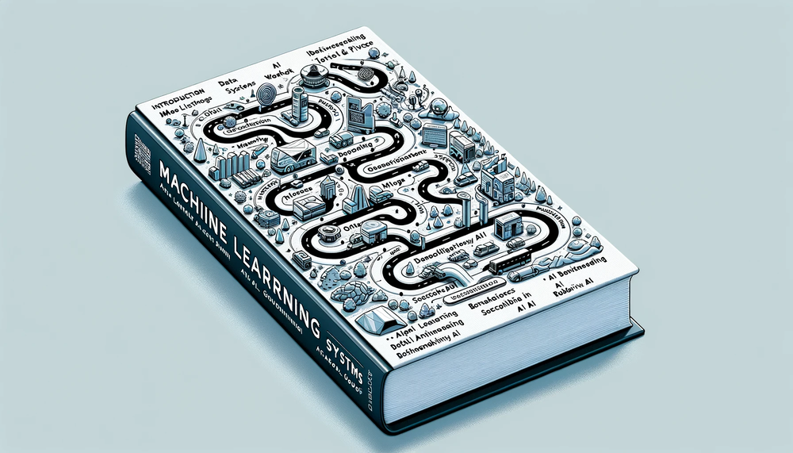
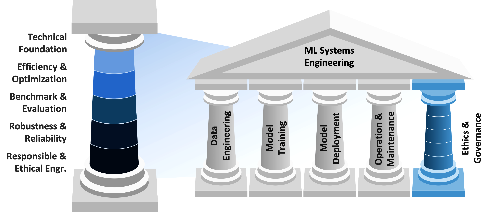

# 简介 {#sec-introduction}

::: {layout-narrow}

::: {.column-margin}

_DALL·E 3 提示词：一幅细节丰富、长方形、扁平化的 2D 插图，描绘了机器学习系统书籍各章节的路线图，背景为简洁明快的白色。图像展示了一条蜿蜒的道路，穿过各种象征性的地标。每个地标代表一个章节主题：简介、机器学习系统、深度学习、人工智能工作流、数据工程、人工智能框架、人工智能训练、高效人工智能、模型优化、人工智能加速、人工智能基准测试、端侧学习、嵌入式 AIOps、安全与隐私、负责任的人工智能、可持续人工智能、人工智能向善、鲁棒人工智能、生成式人工智能。风格简洁、现代且扁平，适合技术书籍，每个地标都清晰地标注了其章节标题。_

:::

\noindent

:::

## 目的 {.unnumbered}

_我们为何必须掌握能够大规模学习、适应和运行的系统的工程原理？_

机器学习代表着自可编程计算机以来，计算领域最重大的变革，它使系统的行为能够从数据中而非显式指令中涌现。这种变革需要新的工程基础，因为传统的软件工程原则无法解决基于经验学习和适应的系统问题。从气候建模和医疗诊断到自动驾驶交通，每一个重大的技术挑战都需要系统能够处理海量数据，并在不确定性下可靠运行。理解机器学习系统工程决定了我们解决超出人类认知能力的复杂问题的能力。该学科为构建能够跨越各种部署环境（从大规模数据中心到资源受限的边缘设备）进行扩展的系统奠定了基础，为21世纪的技术进步奠定了技术基础。

::: {.callout-tip title="学习目标"}

- 将机器学习系统定义为由数据、算法和基础设施组成的集成计算系统

- 通过故障模式分析，区分机器学习系统工程与传统软件工程

- 使用AI三角框架分析数据、算法和计算基础设施之间的相互依赖关系

- 追溯AI范式从符号系统到统计学习再到深度学习的历史演变

- 评估Sutton的“痛苦教训”对现代机器学习系统工程优先事项的影响

- 比较机器学习系统中的静默性能退化与传统软件故障模式

- 对比机器学习系统生命周期阶段与传统软件开发

- 对机器学习系统中数据、模型、系统和伦理类别中的现实世界挑战进行分类

- 应用五支柱框架评估机器学习系统架构

:::

## 人工智能领域的工程革命 {#sec-introduction-engineering-revolution-artificial-intelligence-a3eb}

当今的工程实践正处于一个转折点，堪比技术史上最具变革性的时期。工业革命确立了机械工程作为管理物理力的学科，而数字革命则使计算工程正式化，以处理算法复杂性。今天，人工智能系统需要一种新的工程范式，以应对那些展现出学习行为、自主适应性以及超出传统软件工程方法论的操作规模的系统。

这种转变重新构思了工程系统的本质。传统的确定性软件架构根据显式编程的指令运行，为给定的输入产生可预测的输出。相比之下，机器学习系统是概率架构，其行为源于从训练数据中提取的统计模式。这种转变引入了定义机器学习系统工程学科的工程挑战：确保行为是通过学习而非编程获得的系统的可靠性；实现处理拍字节级[^fn-petabyte-scale]数据集并同时服务数十亿并发用户系统的可扩展性；以及在操作数据分布偏离训练分布时保持稳健性。

这些挑战确立了机器学习系统工程作为一门独立学术学科的理论和实践基础。本章为理解创造该领域的历史演变以及区分机器学习系统与传统软件架构的工程原则提供了概念基础。该分析综合了计算机科学、系统工程和统计学习理论的视角，为智能系统的系统性研究建立了一个框架。

我们的调查始于作为研究目标的人工智能与作为实现智能行为的计算方法学的机器学习之间的关系。随后，我们确立了什么是机器学习系统，即本学科所构建的、由数据、算法和基础设施组成的集成计算系统。通过历史分析，我们追踪了人工智能范式从符号推理系统到统计学习方法，再到当代深度学习架构的演变，证明了每一次转型都需要新的工程解决方案。这一进程阐明了人工智能研究中萨顿的“苦涩教训”：通用计算方法最终会取代手工制作的知识表示，从而将系统工程置于人工智能进步的核心地位。

这一历史和技术基础使我们能够正式定义这一学科。遵循计算机工程从电气工程和计算机科学中脱颖而出的模式，我们将其确立为一个专注于在各种计算平台上构建可靠、高效且可扩展的机器学习系统的领域。这一正式定义涵盖了实践中使用的术语以及从业者实际构建内容的范围。

在此基础上，我们介绍了在本书中用于分析机器学习系统的理论框架。我们开发了人工智能三角框架，将机器学习系统建模为三个相互依存的组件（数据、算法和基础设施），它们的相互作用决定了系统的能力。我们检查了机器学习系统的生命周期，并将其与传统软件开发方法论进行对比，以突出机器学习系统工程所特有的问题构建、数据管理、模型开发、验证、部署和持续维护等阶段。

这些理论框架通过对代表性部署场景的检查得到了证实，这些场景展示了跨应用领域的工程需求的多样性。从在网络边缘严苛延迟约束下运行的自动驾驶车辆，到通过云基础设施服务数十亿用户的推荐系统，这些案例研究说明了部署环境如何塑造系统架构和工程权衡。

分析的最后，我们确定了使机器学习系统工程成为一门必要且复杂学科的核心挑战：需要专门监控方法的静默性能衰退模式、损害模型有效性的数据质量问题和分布偏移、在高风险应用中对模型稳健性和可解释性的要求、超出传统分布式系统需求的基础设施可扩展性需求，以及强加了新类别系统需求的伦理考量。这些挑战为本书的五大支柱组织框架提供了基础，将机器学习系统工程划分为相互关联的子学科，从而能够开发出稳健、可扩展且负责任的人工智能系统。

本章为第一部分：系统基础奠定了理论基础，介绍了所有后续机器学习系统工程分析所依据的原则。此处引入的概念框架提供了将在后续章节中不断完善和应用的分析工具，最终形成一种能够在生产环境中可靠地交付人工智能能力的工程系统方法论。

## 从人工智能愿景到机器学习实践 {#sec-introduction-artificial-intelligence-vision-machine-learning-practice-c45a}

在确立了人工智能对社会变革性影响之后，一个问题浮出水面：我们究竟如何创造这些智能能力？理解人工智能与机器学习之间的关系是回答这个问题的关键，也是本书后续内容的核心。

人工智能代表着创造能够执行需要类人智能任务的系统的广泛目标：识别图像、理解语言、做出决策和解决问题。人工智能是“是什么”，是能够学习、推理和适应的智能机器的愿景。

机器学习 (ML) 代表着创建能够展示智能行为的系统的方法论和实践学科。机器学习并非通过预定规则实现智能，而是提供计算技术，通过数学过程自动从数据中发现模式。这种方法论将人工智能的理论洞察转化为运行中的系统。

以国际象棋对弈系统的演变为例，说明这一转变。人工智能的目标保持不变：“创建一个能像人类一样下棋的系统。”然而，方法有所不同：

-   **符号人工智能方法（前机器学习时代）**：用所有国际象棋规则和手工设计的策略（如“控制中心”和“保护国王”）来编程计算机。这需要专家程序员明确编码数千条国际象棋原则，从而创建出在面对新颖局面时表现不佳的脆弱系统。

-   **机器学习方法**：让计算机分析数百万盘国际象棋对弈，自动从数据中学习制胜策略。系统不编程具体的走法，而是通过对比赛结果的统计分析发现导致胜利的模式。

这种转变说明了为什么机器学习已成为主流方法：在基于规则的系统中，人类将领域专业知识直接转化为代码。在机器学习系统中，人类负责管理训练数据、设计学习架构并定义成功指标，从而允许系统从示例中提取其自身的运行逻辑。数据驱动的系统可以适应程序员从未预料到的情况，而基于规则的系统则受限于其原始编程。

机器学习系统通过与人类学习模式相似的过程获得识别能力。对象识别通过接触大量示例而发展，而自然语言处理系统则通过广泛的文本分析获得语言能力。这些学习方法将人工智能研究中发展的智能理论付诸实践，并建立在我们将在本书中系统阐述的数学基础之上。

将人工智能视为研究愿景，将机器学习视为工程方法论的区分，对系统设计具有重要意义。基于规则的人工智能系统随着程序员的努力而扩展，需要手动编码每个新功能。数据驱动的机器学习系统通过计算和数据基础设施进行扩展，通过扩展训练数据集和计算资源而不是额外的编程工作来提高性能。这种转变将系统工程提升到核心地位：进步现在取决于构建能够收集海量数据集、训练具有数十亿参数的模型以及大规模提供预测的基础设施。机器学习通过这一范式转换[^fn-paradigm-shift]成为人工智能的一种实用方法，将关于智能的理论原理转化为运行中的系统，形成了当今智能能力的算法基础。

[^fn-paradigm-shift]: **范式转换**：哲学家托马斯·库恩于1962年创造的术语[@kuhn1962structure]，用于描述科学方法上的重大变革。在人工智能领域，关键的范式转换是从符号推理（将人类知识编码为规则）转向统计学习（从数据中发现模式）。这种转变解释了为什么机器学习系统工程作为一门独立于传统软件工程的学科应运而生。

[^fn-petabyte-scale]: **拍字节规模数据**：一个拍字节等于1,000太字节，或大约100万千兆字节——足以存储13.3年的高清视频，或人类所有书面作品的50倍。现代机器学习系统通常处理拍字节规模的数据集：Meta每天为其推荐系统处理超过4拍字节的数据，而谷歌的搜索索引包含数百拍字节的网络内容。管理这种规模需要分布式存储系统（如HDFS或S3），它们将数据分片到数千台服务器上；需要并行处理框架（如Apache Spark），它们协调跨集群的计算；以及复杂的数据工程管道，能够以超过100 GB/秒的速度验证、转换和提供数据。工程挑战不仅在于存储容量，还在于使拍字节数据集对训练和推理有用所需的带宽、容错性和一致性保证。

::: {.callout-definition title="关键定义"}

***人工智能 (AI)*** 是计算机科学领域，专注于创建能够执行需要类人_智能_任务的系统，包括_学习_、_推理_和_适应_。

***机器学习 (ML)*** 是一种人工智能方法，它使系统能够自动学习_模式_并从_数据_中做出_决策_，而不是遵循明确的编程规则。

:::

从基于规则的人工智能到数据驱动的机器学习的演变，代表着计算机历史上最重要的转变之一。这种转变解释了为什么机器学习系统工程已成为一门学科：通往智能系统的道路现在通过构建能够大规模有效从数据中学习的系统的工程挑战来实现。

## 定义机器学习系统 {#sec-introduction-defining-ml-systems-bf7d}

在探讨我们如何发展到现代机器学习系统之前，我们必须首先明确“机器学习系统”的含义。这个定义为理解后续的历史演变和当代挑战提供了概念框架。

目前还没有普遍接受的机器学习系统定义，这反映了该领域快速发展和多学科的性质。然而，基于我们对现代机器学习依赖于大规模数据驱动方法的理解，本教材采用了一个涵盖算法运行的整个生态系统的视角：

:::{.callout-definition title="机器学习系统"}

***机器学习系统*** 是由三个相互依赖的组件组成的集成计算系统：指导行为的_数据_、学习模式的_算法_以及支持_训练_和_推理_的_计算基础设施_。

:::

如@fig-ai-triangle 所示，任何机器学习系统的核心都由三个相互关联的组件组成，它们形成一个三角依赖关系：模型/算法、数据和计算基础设施。每个元素都塑造着其他元素的可能性。模型架构决定了训练和推理的计算需求，以及有效学习所需的数据量和结构。数据的规模和复杂性影响了存储和处理所需的基础设施，同时决定了哪些模型架构是可行的。基础设施能力为模型规模和数据处理能力设定了实际限制，从而创建了一个其他组件必须在其内部运行的框架。

::: {#fig-ai-triangle fig-env="figure" fig-pos="htb"}

```{.tikz}
\scalebox{0.8}{%
\begin{tikzpicture}[line join=round,font=\usefont{T1}{phv}{m}{n}\small]
\tikzset{
 Line/.style={line width=0.35pt,black!50,text=black},
 ALineA/.style={violet!80!black!50,line width=3pt,shorten <=2pt,shorten >=2pt,
  {Triangle[width=1.1*6pt,length=0.8*6pt]}-{Triangle[width=1.1*6pt,length=0.8*6pt]}},
LineD/.style={line width=0.75pt,black!50,text=black,dashed,dash pattern=on 5pt off 3pt},
Circle/.style={inner xsep=2pt,
  circle,
    draw=BrownLine,
    line width=0.75pt,
    fill=BrownL!40,
    minimum size=16mm
  },
 circles/.pic={
\pgfkeys{/channel/.cd, #1}
\node[circle,draw=\channelcolor,line width=\Linewidth,fill=\channelcolor!10,
minimum size=2.5mm](\picname){};
        }
}
\tikzset {
pics/cloud/.style = {
        code = {
\colorlet{red}{RedLine}
\begin{scope}[local bounding box=CLO,scale=0.5, every node/.append style={transform shape}]
\draw[red,fill=white,line width=0.9pt](0.67,1.21)to[out=55,in=90,distance=13](1.5,0.96)
to[out=360,in=30,distance=9](1.68,0.42);
\draw[red,fill=white,line width=0.9pt](0,0)to[out=170,in=180,distance=11](0.1,0.61)
to[out=90,in=105,distance=17](1.07,0.71)
to[out=20,in=75,distance=7](1.48,0.36)
to[out=350,in=0,distance=7](1.48,0)--(0,0);
\draw[red,fill=white,line width=0.9pt](0.27,0.71)to[bend left=25](0.49,0.96);

\end{scope}
    }
  }
}
%streaming
\tikzset{%
 LineST/.style={-{Circle[\channelcolor,fill=RedLine,length=4pt]},draw=\channelcolor,line width=\Linewidth,rounded corners},
 ellipseST/.style={fill=\channelcolor,ellipse,minimum width = 2.5mm, inner sep=2pt, minimum height =1.5mm},
 BoxST/.style={line width=\Linewidth,fill=white,draw=\channelcolor,rectangle,minimum width=56,
 minimum height=16,rounded corners=1.2pt},
 pics/streaming/.style = {
        code = {
        \pgfkeys{/channel/.cd, #1}
\begin{scope}[local bounding box=STREAMING,scale=\scalefac, every node/.append style={transform shape}]
\node[BoxST,minimum width=44,minimum height=48](\picname-RE1){};
\foreach \i/\j in{1/north,2/center,3/south}{
\node[BoxST](\picname-GR\i)at(\picname-RE1.\j){};
\node[ellipseST]at($(\picname-GR\i.west)!0.2!(\picname-GR\i.east)$){};
\node[ellipseST]at($(\picname-GR\i.west)!0.4!(\picname-GR\i.east)$){};
}
\draw[LineST](\picname-GR3)--++(2,0)coordinate(\picname-C4);
\draw[LineST](\picname-GR3.320)--++(0,-0.7)--++(0.8,0)coordinate(\picname-C5);
\draw[LineST](\picname-GR3.220)--++(0,-0.7)--++(-0.8,0)coordinate(\picname-C6);
\draw[LineST](\picname-GR3)--++(-2,0)coordinate(\picname-C7);
 \end{scope}
     }
  }
}
%data
\tikzset{mycylinder/.style={cylinder, shape border rotate=90, aspect=1.3, draw, fill=white,
minimum width=25mm,minimum height=11mm,line width=\Linewidth,node distance=-0.15},
pics/data/.style = {
        code = {
        \pgfkeys{/channel/.cd, #1}
\begin{scope}[local bounding box=STREAMING,scale=\scalefac, every node/.append style={transform shape}]
\node[mycylinder,fill=\channelcolor!50] (A) {};
\node[mycylinder, above=of A,fill=\channelcolor!30] (B) {};
\node[mycylinder, above=of B,fill=\channelcolor!10] (C) {};
 \end{scope}
     }
  }
}
\pgfkeys{
  /channel/.cd,
  channelcolor/.store in=\channelcolor,
  drawchannelcolor/.store in=\drawchannelcolor,
  scalefac/.store in=\scalefac,
  Linewidth/.store in=\Linewidth,
  picname/.store in=\picname,
  channelcolor=BrownLine,
  drawchannelcolor=BrownLine,
  scalefac=1,
  Linewidth=0.5pt,
  picname=C
}
\node[Circle](MO){};
\node[Circle,below left=1 and 2.5 of MO,draw=GreenLine,fill=GreenL!40,](IN){};
\node[Circle,below right=1 and 2.5 of MO,draw=OrangeLine,fill=OrangeL!40,](DA){};
\draw[ALineA](MO)--(IN);
\draw[ALineA](MO)--(DA);
\draw[ALineA](DA)--(IN);
\node[below=2pt of MO]{Model};
\node[below=2pt of IN]{Infra};
\node[below=2pt of DA]{Data};
%%
\begin{scope}[local bounding box=CIRCLE1,shift={($(MO)+(0.04,-0.24)$)},
scale=0.55, every node/.append style={transform shape}]
%1 column
\foreach \j in {1,2,3} {
  \pgfmathsetmacro{\y}{(1.5-\j)*0.43 + 0.7}
  \pic at (-0.8,\y) {circles={channelcolor=RedLine,picname=1CD\j}};
}
%2 column
\foreach \i in {1,...,4} {
  \pgfmathsetmacro{\y}{(2-\i)*0.43+0.7}
  \pic at (0,\y) {circles={channelcolor=RedLine, picname=2CD\i}};
}
%3 column
\foreach \j in {1,2} {
  \pgfmathsetmacro{\y}{(1-\j)*0.43 + 0.7}
  \pic at (0.8,\y) {circles={channelcolor=RedLine,picname=3CD\j}};
}
\foreach \i in {1,2,3}{
  \foreach \j in {1,2,3,4}{
\draw[Line](1CD\i)--(2CD\j);
}}
\foreach \i in {1,2,3,4}{
  \foreach \j in {1,2}{
\draw[Line](2CD\i)--(3CD\j);
}}
\end{scope}
%
\pic[shift={(-0.4,-0.08)}] at (IN) {cloud};
%
\pic[shift={(-0.05,-0.13)}] at  (IN){streaming={scalefac=0.25,picname=2,channelcolor=RedLine, Linewidth=0.65pt}};
%
\pic[shift={(0,-0.3)}] at  (DA){data={scalefac=0.3,picname=1,channelcolor=green!70!black, Linewidth=0.4pt}};
\end{tikzpicture}}
```
**组件相互依赖性**：机器学习系统性能依赖于模型、数据和计算基础设施的协调互动；任何一个组件的限制都会制约其他组件的能力。有效的系统设计需要平衡这些相互依赖性，以优化整体性能和可行性。

:::

每个组件都服务于一个独特但相互关联的目的：

- **算法**：从数据中学习模式以进行预测或决策的数学模型和方法

- **数据**：用于训练和推理的数据的收集、存储、处理、管理和提供过程及基础设施

- **计算**：支持模型训练、服务和大规模运行的硬件和软件基础设施

正如该三角关系所示，没有哪个单一元素可以独立运作。算法需要数据和计算资源，大型数据集需要算法和基础设施才能发挥作用，而基础设施需要算法和数据才能实现任何目的。

太空探索为这些关系提供了一个恰当的类比。算法开发者类似于探索新领域并进行发现的宇航员。数据科学团队则像任务控制专家，确保任务操作所需的关键信息和资源持续流动。计算基础设施工程师类似于火箭工程师，设计和建造支持任务的系统。正如太空任务需要宇航员、任务控制和火箭系统之间的无缝集成一样，机器学习系统也需要对算法、数据和计算基础设施进行精心协调。

在审视人工智能历史上的突破性时刻时，这些相互依赖性变得清晰。2012 年 AlexNet[^fn-alexnet-breakthrough] 的突破展示了硬件-软件协同设计的原则，这定义了现代机器学习系统工程。这场深度学习革命之所以成功，是因为算法创新（卷积神经网络）与硬件能力（并行 GPU 架构）相匹配，图形处理单元最初是为游戏设计的，但被重新用于人工智能计算，为机器学习任务提供了比传统 CPU 快 10-100 倍的速度提升。卷积操作本质上是并行的，这使得它们天然适合 GPU 的数千个并行核心。这种协同设计方法持续塑造着整个行业的机器学习系统开发。

[^fn-alexnet-breakthrough]: **AlexNet**：由 Alex Krizhevsky、Ilya Sutskever 和 Geoffrey Hinton 创建的一个突破性深度学习模型，以巨大优势赢得了 2012 年 ImageNet 竞赛，将 Top-5 错误率从 26.2% 降低到 15.3%。这是“ImageNet 时刻”，它证明了深度学习可以超越传统计算机视觉方法，并引发了现代人工智能革命。AlexNet 表明，通过足够的数据（120 万张图片）、计算能力（两块 GPU 运行 6 天）和巧妙的工程（dropout、数据增强），神经网络可以在复杂的视觉任务上实现超人表现。

随着这个三组件框架的建立，我们必须理解机器学习系统与传统软件的一个根本区别：故障如何在人工智能三角的各个组件中显现。

## 机器学习系统与传统软件的区别 {#sec-introduction-ml-systems-differ-traditional-software-4370}

人工智能（AI）三角框架揭示了机器学习系统的组成部分：指导行为的数据、提取模式的算法，以及支持学习和推理的基础设施。然而，仅了解这些组件并不能涵盖机器学习系统工程与传统软件工程的根本区别。关键的区别在于这些系统失效的方式。

传统软件表现出显性的故障模式。当代码损坏时，应用程序会崩溃，错误消息会传播，监控系统也会触发警报。这种即时反馈机制使得快速诊断和修复成为可能。系统要么正常运行，要么以可观察的方式失效。机器学习系统的运作范式则完全不同：它们可以在性能悄然下降的情况下持续运行，而不会触发传统的错误检测机制。算法继续执行，基础设施保持预测服务，但学习到的行为却变得越来越不准确或与上下文的相关性降低。

以自动驾驶汽车的感知系统为例，它可以说明这种区别。传统的汽车软件表现出二元的操作状态：发动机控制单元要么正确管理燃油喷射，要么触发诊断警告。故障模式通过标准监控依然是可观察的。而基于机器学习的感知系统则提出了一个质上不同的挑战：由于季节性变化（如不同的光照条件、服装图案或训练数据中代表性不足的气象现象），系统检测行人的准确率可能会在几个月内从 95% 下降到 85%。车辆继续运行，成功检测到大多数行人，但性能的下降带来了安全风险，只有通过对边缘情况的系统性监控和全面评估才能显现出来。当系统变得明显不安全时，传统的错误记录和警报机制却保持沉默。

这种静默退化在人工智能三角的所有三个组件中都有体现。随着世界的变化，数据分布会发生偏移：用户行为在演变，季节性模式在出现，新的边缘情况在产生。算法继续基于过时的学习模式进行预测，却不知道其训练分布已不再符合实际的运行环境。基础设施忠实地大规模提供这些日益不准确的预测，从而放大了问题。随着用户偏好的演变和训练数据的陈旧，一个遭遇这种退化的推荐系统的准确率可能会在六个月内从 85% 下降到 60%。系统继续生成推荐，用户接收结果，基础设施报告健康的正常运行时间指标，但商业价值却在悄然流失。这种退化通常源于训练与服务偏差，即在训练和服务流水线之间计算特征的方式不同，导致模型性能在代码未变的情况下出现下降，这是一个表现为算法故障的基础设施问题。

这种故障模式的根本差异将机器学习系统与传统软件区分开来，并要求采用新的工程实践。传统软件开发侧重于消除错误并确保确定性行为。而机器学习系统工程还必须解决概率行为、演变的数据分布以及在代码未变时发生的性能退化问题。监控系统不仅要跟踪基础设施的健康状况，还要跟踪模型性能、数据质量和预测分布。部署实践必须支持随着数据分布变化而进行的持续模型更新。从数据收集到模型训练再到推理服务，整个系统生命周期的设计都必须考虑到静默退化的可能性。

这一运行现实阐明了为何在研究环境中开发的机器学习系统需要专门的工程实践才能投入生产部署。机器学习系统所要求的独特生命周期和监控需求直接源于这一故障特征，这也确立了机器学习系统工程作为一门独特学科的基本动机。

了解机器学习系统失效方式的不同引发了一个重要问题：鉴于人工智能三角的三个组件——数据、算法和基础设施——我们应该优先考虑哪一个来提升人工智能能力？我们应该投资于更好的算法、更大的数据集，还是更强大的计算基础设施？这个问题的答案揭示了为什么系统工程已成为人工智能进步的核心。

## 痛苦的教训：为什么系统工程至关重要 {#sec-introduction-bitter-lesson-systems-engineering-matters-dede}

人工智能研究 70 年来最深刻的教训是：能够利用大规模计算的系统最终会胜出。这就是为什么系统工程（而不仅仅是算法的精妙）已成为人工智能进步的瓶颈。

从符号人工智能到统计学习，再到深度学习的演进，为系统构建者提出了一个根本性的问题：我们应该专注于开发更复杂的算法、整理更好的数据集，还是构建更强大的基础设施？

这个问题的答案决定了我们构建人工智能系统的方法，并揭示了系统工程为何作为一门学科应运而生。

历史给出了一个一致的答案。在几十年来的人工智能研究中，最伟大的突破并非来自对人类知识更好的编码或更多的算法技巧，而是来自寻找更有效地利用计算资源的方法。强化学习先驱理查德·萨顿（Richard Sutton）[^fn-richard-sutton] 在其 2019 年的论文《痛苦的教训》（The Bitter Lesson）[@sutton2019bitter] 中阐述了这一模式，这表明系统工程已成为人工智能成功的决定性因素。

[^fn-richard-sutton]: **理查德·萨顿（Richard Sutton）**：一位开创性的人工智能研究员，他通过强化学习改变了机器的学习方式——教导人工智能系统通过反复试验进行学习，就像你通过练习而不是阅读说明书学会骑自行车一样。在阿尔伯塔大学，萨顿合著了基础教材《强化学习：导论》，并开发了驱动从 AlphaGo 到现代机器人等一切技术的关键算法（如 TD-learning、策略梯度）。他与安德鲁·巴托（Andrew Barto）共同获得了 2024 年 ACM 图灵奖（计算机界的最高荣誉，常被称为“计算机界的诺贝尔奖”），以表彰他们几十年来在人工智能系统如何学习和适应方面所做的基础性贡献。他的《痛苦的教训》一文将 70 年的人工智能历史提炼为一个深刻的见解：利用计算的通用方法始终胜过编码人类专业知识的方法。

萨顿观察到，那些强调人类专业知识和领域知识的方法，虽然能提供短期改进，但总是被那些能够利用大规模计算资源的通用方法所超越。他写道：“从 70 年的人工智能研究中可以读出的最大教训是，利用计算的通用方法最终是最有效的，而且优势巨大。”

这一原则在人工智能的各项突破中得到了验证。在国际象棋领域，IBM 的深蓝（Deep Blue）于 1997 年击败了世界冠军加里·卡斯帕罗夫（Garry Kasparov）[@campbell2002deep]，这并非通过编码国际象棋策略，而是通过每秒评估数百万个位置的暴力搜索实现的。在围棋领域，DeepMind 的 AlphaGo[@silver2016mastering] 通过自我对弈学习而非研究几百年来的人类围棋智慧，实现了超越人类的表现。在计算机视觉领域，直接从数据中学习特征的卷积神经网络已经超越了数十年的手工特征工程。在语音识别领域，端到端的深度学习系统已经优于那些建立在人类语音学和语言学详细模型基础上的方法。

这一教训的“痛苦”之处在于，我们的直觉误导了我们。我们自然地认为编码人类专业知识应该是通往人工智能的道路。然而，事实一再证明，在规模足够大的情况下，那些利用计算从数据中学习的系统总是优于那些依赖人类知识的系统。这种模式在符号人工智能、统计学习和深度学习时代始终如一——我们将在下一节追踪人工智能的历史演进时详细审视这种一致性。

考虑一下像 GPT-4 这样的现代语言模型或像 DALL-E 这样的图像生成系统。它们的能力并非源于人类编码的语言或艺术理论，而是源于使用海量计算资源在大量数据上训练通用神经网络。训练 GPT-3 消耗了大约 1,287 MWh 的能源[@strubell2019energy; @patterson2021carbon]，相当于 120 个美国家庭一年的用电量；而为数百万用户提供模型服务则需要消耗兆瓦级持续电力的数据中心。工程挑战在于构建能够管理这种规模的系统：收集和处理 PB 级的训练数据，协调数千个（每个消耗 300-500 瓦）GPU 的训练工作，在毫秒级延迟下为数百万用户提供模型服务，同时还要管理热量和功耗限制[^fn-thermal-power-constraints]，并根据现实世界的表现持续更新系统。

这些规模需求揭示了一个技术现实：现代机器学习系统中的主要制约因素不是计算能力，而是内存带宽[^fn-memory-bandwidth]，即数据在存储和处理单元之间移动的速率。这种“内存墙”代表了决定系统性能的主要瓶颈。现代机器学习系统受限于内存，矩阵乘法运算仅能达到理论峰值浮点运算次数（FLOPS）的 1-10%，因为处理器大部分时间都在等待数据，而不是在进行计算。从 DRAM 移动 1GB 数据所消耗的能量大约是 32 位乘法运算的 1000 倍，这使得数据移动成为性能和功耗的主导因素。阿姆达尔定律（Amdahl's Law）[^fn-amdahls-law] 量化了这一根本限制：如果数据移动占用了 80% 的执行时间，那么即使计算能力无限，也只能提供 1.25 倍的加速（因为只有剩下的 20% 可以被加速）。这种内存墙推动了所有现代架构的创新，从内存计算和近数据处理，到将计算和存储元件放在一起的专用加速器。这些系统级的挑战代表了本书将系统性探讨的核心工程问题。

[^fn-thermal-power-constraints]: **热量和功耗限制（Thermal and Power Constraints）**：计算硬件中由发热和功耗带来的物理极限。现代 GPU 每个消耗 300-700W，并产生必须通过精密冷却系统消除的巨大热量。一个拥有 1,000 个 GPU 的人工智能训练集群仅计算本身就需要 300-700 kW 的功率，再加上 30-50% 用于冷却的功率，总计约 1MW——相当于为 750 个家庭供电。数据中心达到了热密度极限：在冷却变得不可能或成本高昂之前，你只能在有限空间内堆叠一定数量的高热芯片。这些限制驱动了硬件设计选择（针对单位功耗性能优化的芯片架构）、基础设施决策（液冷与风冷）以及经济权衡（在 3 年的使用寿命内，电力成本可能超过硬件成本）。功耗/热量管理解释了许多机器学习系统架构的决策，从边缘部署到模型压缩。

[^fn-memory-bandwidth]: **内存带宽（Memory Bandwidth）**：数据在内存和处理器之间传输的速率，以 GB/s（每秒千兆字节）为单位。现代 GPU（如 H100）提供约 3TB/s 的内存带宽，而 CPU 通常提供 100-200 GB/s。这个看似巨大的数字却成为了机器学习工作负载的瓶颈：一个拥有 700 亿参数的 Transformer 模型仅存储权重就需要 140GB，在进行任何计算之前，以 3TB/s 的速度加载就需要 47ms。带宽限制解释了为什么机器学习加速器专注于高带宽内存（HBM）而不仅仅是更快的计算单元。相比之下，算术运算相对廉价：GPU 在移动 1GB 内存数据的时间内可以执行数万亿次乘加运算，这造成了一种根本性的紧张关系，即处理器等待数据的时间比计算的时间长得多。

[^fn-distributed-systems]: **分布式系统（Distributed Systems）**：组件在多台网络连接的机器上运行并通过消息传递进行协调的计算系统。现代机器学习训练体现了分布式系统的复杂性：训练 GPT-3 需要协调跨多个数据中心的 1,024 个 V100 GPU，每个 GPU 处理不同的数据批次，同时同步梯度更新。关键挑战包括容错性（处理训练中途的机器故障）、网络瓶颈（All-reduce 操作可能消耗总训练时间的 40% 以上）以及一致性（确保所有节点使用相同的模型权重）。与专注于处理请求的传统分布式系统不同，机器学习分布式系统必须协调海量数据移动并在数千个节点上保持数值精度，这使得共识算法和负载均衡变得极其复杂。

[^fn-amdahls-law]: **阿姆达尔定律（Amdahl's Law）**：由计算机架构师吉恩·阿姆达尔（Gene Amdahl）于 1967 年提出，该定律量化了当程序只有一部分可以并行化时，其理论加速比。加速比受限于串行部分：如果 P 是可并行化的比例，则最大加速比 = 1/(1-P)。例如，如果程序的 90% 可以并行化，那么无论处理器数量如何，最大加速比为 10 倍。在机器学习系统中，这解释了为什么内存带宽和数据移动往往成为主要瓶颈，而不是计算能力。

萨顿的“痛苦的教训”有助于解释本书的创作动机。如果人工智能的进步取决于我们有效扩展计算能力的能力，那么理解如何构建、部署和维护这些计算系统就成为人工智能从业者最重要的技能。机器学习系统工程之所以变得重要，是因为创建现代系统需要协调跨多个数据中心的数千个 GPU，处理 PB 级的文本数据，并在毫秒级延迟要求下为数百万用户提供模型服务。这一挑战需要分布式系统、数据工程、硬件优化和操作实践方面的专业知识，这些代表了一门全新的工程学科。

这些系统级挑战的汇聚表明，现有的学科都无法解决现代人工智能的需求。虽然计算机科学推动了机器学习算法的发展，电气工程开发了专用人工智能硬件，但没有任何单一学科能够提供在大规模部署、优化和维持机器学习系统所需的工程原则。这种差距需要一门新的工程学科。但要理解为什么这门学科现在出现以及它采取何种形式，我们必须首先追踪人工智能自身的演变，从早期的符号系统到现代机器学习。

## 人工智能范式的历史演变 {#sec-introduction-historical-evolution-ai-paradigms-796e}

我们通过“苦涩的教训”（Bitter Lesson）所建立的以系统为中心的视角并非一蹴而就。它是经过数十年的人工智能研究发展而来的，每一次重大转型都揭示了算法、数据和计算基础设施之间关系的新见解。追溯这一演变过程，不仅有助于我们理解技术进步，还能理解那些解释了当今为何强调可扩展系统的方法论转变。

要理解为什么现在会发生向以系统为中心的机器学习（ML）的转型，需要认识到过去十年中三个因素的融合：

1. **海量数据集**：互联网时代通过网络内容、社交媒体、传感器网络和数字交易创造了前所未有的数据量。诸如 ImageNet（数百万张标注图像）和 Common Crawl（数十亿个网页）等公共数据集为学习复杂模式提供了原材料。

2. **算法突破**：深度学习在从计算机视觉到自然语言处理的各个领域都证明了其卓越的有效性。Transformer、注意力机制和迁移学习等技术使模型能够从数据中学习可泛化的表示。

3. **硬件加速**：最初为游戏设计的图形处理器（GPU）为机器学习计算提供了 10-100 倍的加速。云计算基础设施使得在无需巨额资本投资的情况下就能获得这种计算能力成为可能。

这种融合解释了为什么我们从理论模型转向了需要全新工程学科的大规模部署系统。每个因素都放大了其他因素的作用：更大的数据集需要更多的计算，更好的算法使更大的数据集变得合理，而更快的硬件则启用了更多的算法。这种融合将人工智能从一种学术上的好奇心转变为一种需要稳健工程实践的生产技术。

人工智能的演变（如@fig-ai-timeline 中的时间轴所示）突显了关键里程碑，例如 Frank Rosenblatt 在 1957 年开发的感知机[^fn-early][@rosenblatt1957perceptron]，这是一种早期的计算学习算法。1965 年的计算机实验室中，占据整个房间的大型机[^fn-mainframes]运行着能够证明基本数学定理或玩简单游戏（如井字棋）的程序。这些早期的人工智能系统虽然在当时具有开创性，但与今天能够检测医学图像中的癌症或理解人类语言的机器学习系统有着本质的区别。时间轴展示了从 1966 年 ELIZA[^fn-eliza] 聊天机器人等早期创新，到 1997 年 IBM 的“深蓝”（Deep Blue）击败国际象棋冠军加里·卡斯帕罗夫（Garry Kasparov）等重大突破的进展[@campbell2002deep]。最近的进展包括 2020 年 OpenAI 的 GPT-3 和 2023 年 GPT-4 的推出[@openai2023gpt4]，展示了数十年来人工智能系统戏剧性的演变和日益增加的复杂性。

[^fn-early]: **感知机（Perceptron）**：最早的计算学习算法之一（1957年），简单到可以用硬件实现且内存需求极小——20世纪50年代的大型机只能存储数千个权重，而不是数百万个。这种硬件限制使早期的人工智能研究倾向于简单、可解释的模型。感知机仅限于线性可分问题的局限性不仅仅是算法上的——尽管 20 世纪 60 年代就提出了多层网络（可以解决非线性问题），但在 20 世纪 80 年代内存变得更便宜、CPU 更快之前，它们在计算上是难以实现的。算法洞察与实际实现之间这 20 年的差距预示了人工智能的一种模式：突破性算法往往需要等待数十年才能赶上硬件的发展，这解释了为什么机器学习系统工程专注于算法与现有基础设施的协同设计。

[^fn-mainframes]: **大型机（Mainframes）**：20世纪60-70年代占主导地位的房间大小的计算机，通常耗资数百万美元，需要专门的冷却系统。IBM 1964 年的 System/360 大型机重达 20,000 磅，根据型号不同拥有 8KB 到 1MB 的内存，约为现代智能手机内存的百万分之一，但它代表了当时实现早期人工智能研究的尖端计算能力。

[^fn-eliza]: **ELIZA**：由麻省理工学院的 Joseph Weizenbaum 于 1966 年创建[@weizenbaum1966eliza]，ELIZA 是最早的聊天机器人之一，可以通过模式匹配和替换来模拟人类对话。从系统角度看，ELIZA 在 256KB 的大型机上运行，使用简单的模式匹配——没有学习、没有数据存储、没有训练阶段。这种计算简单性使得在 20 世纪 60 年代的硬件上实现实时交互成为可能，但也导致了脆弱性，从而推动了向数据驱动的机器学习的转变。现代聊天机器人（如 GPT-3）需要更多的基础设施（未压缩时模型参数为 350GB，估计训练成本为 460 万美元，推理需要 GPU 服务器），但能处理 ELIZA 无法处理的对话——这说明了系统的权衡：基于规则的系统在计算上很便宜但很脆弱，而机器学习系统虽然基础设施密集但非常灵活。讽刺的是，当人们对他的简单程序产生情感依恋时，Weizenbaum 感到非常震惊，这使他成为了人工智能的批评者。

::: {#fig-ai-timeline fig-env="figure" fig-pos="t!"}

```{.tikz}
\begin{tikzpicture}[line join=round,font=\usefont{T1}{phv}{m}{n}\small]
\definecolor{bluegraph}{RGB}{0,102,204}
    \pgfmathsetlengthmacro\MajorTickLength{
      \pgfkeysvalueof{/pgfplots/major tick length} * 1.5
    }
\tikzset{%
   textt/.style={line width=0.5pt,draw=bluegraph,text width=26mm,align=flush center,
                        font=\usefont{T1}{phv}{m}{n}\footnotesize,fill=cyan!7},
   Line/.style={line width=0.85pt,draw=bluegraph,dash pattern=on 3pt off 2pt,
   {Circle[bluegraph,length=4.5pt]}-   }
}

\begin{axis}[clip=false,
  axis line style={thick},
  axis lines*=left,
  axis on top,
  width=18cm,
  height=20cm,
  xmin=1950,
  xmax=2023,
  ymin=0.000000,
  ymax=0.00033,
  xtick={1950,1960,1970,1980,1990,2000,2010,2020},
  extra x ticks={1955,1965,1975,1985,1995,2005,2015},
  extra x tick labels={},
  xticklabels={1950,1960,1970,1980,1990,2000,2010,2020},
  ytick={0.0000,0.00005, 0.00010, 0.00015, 0.00020, 0.00025, 0.00030},
  yticklabels={0.0000,0.00005, 0.00010, 0.00015, 0.00020, 0.00025, 0.00030},
  grid=none,
    tick label style={/pgf/number format/assume math mode=true},
    xticklabel style={font=\footnotesize\usefont{T1}{phv}{m}{n},
},
   yticklabel style={
  font=\footnotesize\usefont{T1}{phv}{m}{n},
  /pgf/number format/fixed,
  /pgf/number format/fixed zerofill,
  /pgf/number format/precision=5
},
scaled y ticks=false,
tick style = {line width=1.0pt},
tick align = outside,
major tick length=\MajorTickLength,
]
\fill[fill=BrownL!70](axis cs:1974,0)rectangle(axis cs:1980,0.00031)
        node[above,align=center,xshift=-7mm]{1st AI \\ Winter};
\fill[fill=BrownL!70](axis cs:1987,0)rectangle(axis cs:1993,0.00031)
        node[above,align=center,xshift=-7mm]{2nd AI \\ Winter};
\addplot[line width=2pt,color=RedLine,smooth,samples=100] coordinates {
(1950,0.0000006281)
(1951,0.0000000683)
(1952,0.0000003056)
(1953,0.0000002927)
(1954,0.0000004296)
(1955,0.0000004593)
(1956,0.0000016705)
(1957,0.0000006570)
(1958,0.0000021902)
(1959,0.0000032832)
(1960,0.0000126863)
(1961,0.0000063721)
(1962,0.0000240680)
(1963,0.0000141502)
(1964,0.0000111442)
(1965,0.0000143832)
(1966,0.0000147726)
(1967,0.0000169539)
(1968,0.0000167880)
(1969,0.0000175559)
(1970,0.0000155680)
(1971,0.0000206809)
(1972,0.0000223804)
(1973,0.0000218203)
(1974,0.0000256138)
(1975,0.0000282924)
(1976,0.0000247784)
(1977,0.0000404966)
(1978,0.0000358032)
(1979,0.0000436903)
(1980,0.0000472788)
(1981,0.0000561471)
(1982,0.0000767864)
(1983,0.0001064465)
(1984,0.0001592212)
(1985,0.0002133700)
(1986,0.0002559067)
(1987,0.0002608470)
(1988,0.0002623321)
(1989,0.0002358150)
(1990,0.0002301105)
(1991,0.0002051343)
(1992,0.0001789229)
(1993,0.0001560935)
(1994,0.0001508219)
(1995,0.0001401406)
(1996,0.0001169577)
(1997,0.0001150365)
(1998,0.0001051385)
(1999,0.0000981740)
(2000,0.0001010236)
(2001,0.0000976966)
(2002,0.0001038084)
(2003,0.0000980004)
(2004,0.0000989412)
(2005,0.0000977251)
(2006,0.0000899964)
(2007,0.0000864005)
(2008,0.0000911872)
(2009,0.0000852932)
(2010,0.0000822649)
(2011,0.0000913442)
(2012,0.0001104912)
(2013,0.0001023061)
(2014,0.0001022477)
(2015,0.0000919719)
(2016,0.0001134797)
(2017,0.0001384348)
(2018,0.0002057324)
(2019,0.0002328642)
}
node[left,pos=1,align=center,black]{Last year of\\ date: 2019};

\node[textt,text width=20mm](1950)at(axis cs:1957,0.00014){\textcolor{red}{1950}\\
Alan Turing publishes \textbf{``Computing Machinery and Intelligence''} in the journal \textit{Mind}.};
\node[red,align=center,above=2mm of 1950]{Milestones\\ in AI};
\draw[Line] (axis cs:1950,0) -- (1950.235);
%
\node[textt,text width=19mm](1956)at(axis cs:1958,0.00007){\textcolor{red}{Summer 1956}\\
\textbf{Dartmouth Workshop} A formative conference organized by AI pioneer John McCarthy.};
\draw[Line] (axis cs:1956,0) -- (1956.255);
%
\node[textt](1957)at(axis cs:1969,0.00022){\textcolor{red}{1957}\\
\textbf{Cornell psychologist Frank Rosenblatt invents the perceptron}, a system that paves the way for
modern neural networks
(see "The Turbulent Past and Uncertain Future of Artificial Intelligence," p. 26).};
\draw[Line] (axis cs:1957,0) -- ++(0mm,17mm)-|(1957.248);
%
\node[textt,text width=21mm](1966)at(axis cs:1972,0.00012){\textcolor{red}{1966}\\
\textbf{ELIZA chatbot} An early example of natural-language programming created by
MIT professor Joseph Weizenbaum.};
\draw[Line] (axis cs:1966,0) -- ++(0mm,17mm)-|(1966);
%
\node[textt,text width=20mm](1979)at(axis cs:1985,0.00012){\textcolor{red}{1979}\\
Hans Moravec builds the \textbf{Stanford Cart}, one of the first autonomous vehicles.};
\draw[Line] (axis cs:1979,0) -- ++(0mm,17mm)-|(1979.245);
%
\node[textt,text width=21mm](1981)at(axis cs:1990,0.00006){\textcolor{red}{1981}\\
Japanese \textbf{Fifth-Generation Computer Systems} project begins. The infusion of
research funding helps end first "AI winter."};
\draw[Line] (axis cs:1981,0) -- ++(0mm,10mm)-|(1981);
%
\node[textt,text width=15mm](1997)at(axis cs:2001,0.00007){\textcolor{red}{1997}\\
\textbf{IBM's Deep Blue} beats world chess champion Garry Kasparov};
\draw[Line] (axis cs:1997,0) -- ++(0mm,10mm)-|(1997);
%
\node[textt,text width=15mm](2011)at(axis cs:2014,0.00003){\textcolor{red}{2011}\\
\textbf{IBM's Watson} wins at Jeopardy!};
\draw[Line] (axis cs:2011,0) -- (2011);
%
\node[textt,text width=19mm](2005)at(axis cs:2012,0.00009){\textcolor{red}{2005}\\
\textbf{DARPA Grand Challenge} Stanford wins the agency's second driverless-car
competition by driving 212 kilometers on an unrehearsed trail};
\draw[Line] (axis cs:2005,0) -- (2005);
%
\node[textt,text width=30mm](2020)at(axis cs:2010,0.00017){\textcolor{red}{2020}\\
\textbf{OpenAI introduces GPT-3}. The enormously powerful natural-language model
later causes an outcry when it begins spouting bigoted remarks};
\draw[Line] (axis cs:2020,0) |- (2020);
%
\draw[Line,solid,-] (axis cs:1991,0.0002) --++(50:35mm)
node[bluegraph,above,align=center,text width=30mm]{Percent of U.S.-published books
in Google's database that mention artificial intelligence};
\end{axis}
\end{tikzpicture}
```
**人工智能发展时间轴**：早期的人工智能研究专注于符号推理和基于规则的系统，而现代人工智能利用神经网络等数据驱动的方法来实现日益复杂的任务。这一进程揭示了从人工编码智能到习得智能的转变，其标志性事件包括感知机、深蓝以及像 GPT-3 这样的大语言模型。

:::

审视这条时间轴可以发现几个不同的发展时代，每个时代都建立在前人的教训之上，同时解决了阻碍早期方法实现其承诺的局限性。

### 符号人工智能时代 {#sec-introduction-symbolic-ai-era-9d27}

机器学习的故事始于 1956 年具有历史意义的达特茅斯会议[^fn-dartmouth-conference]，John McCarthy、Marvin Minsky 和 Claude Shannon 等先驱首次提出了“人工智能”这一术语[@mccarthy1956dartmouth]。他们的方法假设智能可以简化为符号操作。Daniel Bobrow 在 1964 年开发的 STUDENT 系统[@bobrow1964student] 是这一时代的典型代表，它通过自然语言理解来解决代数应用题。

[^fn-dartmouth-conference]: **达特茅斯会议（1956年）**：在达特茅斯学院举行的传奇性的为期 8 周的研讨会，人工智能在此正式诞生。由 John McCarthy、Marvin Minsky、Nathaniel Rochester 和 Claude Shannon 组织，这是研究人员首次专门聚在一起讨论“人工智能”（McCarthy 为提案创造的术语）。其雄心勃勃的目标是让机器“模拟学习的每一个方面或智能的任何其他特征”。从系统角度来看，参与者从根本上低估了资源需求——他们假设人工智能可以在 20 世纪 50 年代的硬件上运行（最大 64KB 内存，千赫兹到低兆赫兹处理器）。现实则需要 1,000,000 倍的资源：现代语言模型使用 350GB 内存和每秒百亿亿次（exaflops）的训练计算量。这种对规模需求百万倍的误判有助于解释为什么早期的符号人工智能失败了：研究人员专注于算法的精巧，却忽视了基础设施的限制。经验教训：人工智能的进步既需要算法创新，也需要系统工程来提供必要的计算资源。

::: {.callout-example title="STUDENT (1964)"}


    Problem: "If the number of customers Tom gets is twice the
    square of 20% of the number of advertisements he runs, and
    the number of advertisements is 45, what is the number of
    customers Tom gets?"
    
    STUDENT would:
    
    1. Parse the English text
    2. Convert it to algebraic equations
    3. Solve the equation: n = 2(0.2 × 45)²
    4. Provide the answer: 162 customers


:::

早期的人工智能（如 STUDENT）存在一个局限：它们只能处理与其预编程模式和规则完全匹配的输入。这种“脆弱性”[^fn-brittleness]意味着，虽然这些解决方案在处理为其设计的特定案例时显得很智能，但一旦遇到哪怕是微小的偏差或现实世界的复杂情况，它们就会彻底崩溃。这一局限性推动了向我们将在下一节中探讨的统计方法的演变。

[^fn-brittleness]: **人工智能系统中的脆弱性**：基于规则的系统在遇到超出其编程场景的输入时完全失败的倾向，无论这些输入与它们被设计处理的输入有多相似。这与人类智能形成了对比，人类智能即使在陌生的环境中也能适应并做出合理的猜测。从系统角度来看，脆弱性使得在受控实验室环境之外进行部署变得不可行——每一个新的边缘情况都需要程序员干预，从而产生了不可持续的操作开销。语音识别系统如果遇到新的口音就会失败，而不是优雅地降级，这需要系统更新而不是持续运行。机器学习的泛化能力使得在不可预测的输入下进行现实世界部署成为可能，将挑战从显式的规则编程转移到了收集训练数据和随着新模式出现而持续更新模型的基础设施上。

### 专家系统时代 {#sec-introduction-expert-systems-era-c7dd}

到 20 世纪 70 年代中期，研究人员认识到符号人工智能的局限性，承认通用人工智能过于雄心勃勃，并将重点转移到在特定、定义明确的领域捕捉人类专家知识上。斯坦福大学开发的 MYCIN[@shortliffe1976mycin] 成为首批旨在诊断血液感染的大规模专家系统之一。

::: {.callout-example title="MYCIN (1976)"}


    Rule Example from MYCIN:
    IF
      The infection is primary-bacteremia
      The site of the culture is one of the sterile sites
      The suspected portal of entry is the gastrointestinal tract
    THEN
      Found suggestive evidence (0.7) that infection is bacteroid


:::

MYCIN 代表了医学人工智能的重大进步，它拥有 600 条用于诊断血液感染的专家规则，但它也揭示了当代机器学习中持续存在的关键挑战。从人类专家那里获取领域知识并将其转换为精确的规则被证明既耗时又困难，因为医生往往无法准确解释他们是如何做出决策的。与能够做出推测性猜测的人类医生不同，MYCIN 在处理不确定或不完整信息时遇到了困难。随着 MYCIN 的增长，维护和更新规则库变得越来越复杂，因为添加新规则经常会与现有规则发生冲突，而医学知识本身也在不断演变。知识获取、不确定性处理和维护仍然是现代机器学习中的关注点，并通过不同的技术方法得到解决。

### 统计学习时代 {#sec-introduction-statistical-learning-era-8116}

这些在知识获取和系统维护方面的挑战推动研究人员转向了另一种方法。20 世纪 90 年代标志着人工智能的转型，该领域从人工编码规则转向了统计学习方法。

三个因素的汇合使得统计方法成为可能且强大。首先，数字革命意味着有海量的数据可用于训练算法。其次，摩尔定律[@moore1965cramming][^fn-mooreslaw] 提供了有效处理这些数据所需的计算能力。第三，研究人员开发了支持向量机（Support Vector Machines）等新算法，并改进了神经网络，使其能够从数据中学习模式，而不是遵循预编程规则。

这种结合改变了人工智能的发展：机器不再是直接编码人类知识，而是可以从示例中自动发现模式，从而创建出更稳健、更具适应性的系统。

[^fn-mooreslaw]: **摩尔定律**：英特尔联合创始人 Gordon Moore 在 1965 年观察到，微芯片上的晶体管数量大约每两年翻一番，而成本减半。摩尔定律通过在 2000-2020 年间提供约 1000 倍的晶体管密度，使机器学习成为可能，让以前不可能的算法变得实用——20 世纪 80 年代提出的神经网络在 2010 年后才变得可行。然而，摩尔定律的放缓（晶体管翻倍现在需要 3-4 年）推动了专用加速器的创新（TPU 通过定制机器学习硬件比 GPU 带来 15-30 倍的收益）和算法效率（量化和剪枝等技术将计算需求减少了 4-10 倍）。系统经验：当通用硬件改进放缓时，专用硬件和高效算法变得至关重要。

电子邮件垃圾邮件过滤的演变说明了这种转变。早期的基于规则的系统使用显式模式，但表现出与我们在符号人工智能系统中看到的相同的脆弱性，很容易被规避。统计系统采取了不同的方法：如果“伟哥”（viagra）一词出现在 90% 的垃圾邮件中，但只出现在 1% 的正常邮件中，我们可以利用这种模式来识别垃圾邮件。统计系统不是编写显式规则，而是从数千封示例邮件中自动学习这些模式，从而使其能够适应新的垃圾邮件技术。其数学基础依赖于贝叶斯定理来计算给定特定词汇时邮件为垃圾邮件的概率：$P(\text{spam}|\text{word}) = P(\text{word}|\text{spam}) \times P(\text{spam}) / P(\text{word})$。对于包含多个词的邮件，我们假设给定类别（垃圾邮件或非垃圾邮件）时词汇是条件独立的，从而跨整个消息组合这些概率，这使得尽管存在词汇之间互不依赖的简化假设，仍然可以进行高效计算。

::: {.callout-example title="Early Spam Detection Systems"}


    Rule-based (1980s):
    IF contains("viagra") OR contains("winner") THEN spam
    
    Statistical (1990s):
    P(spam|word) = (frequency in spam emails) / (total frequency)
    
    Combined using Naive Bayes:
    P(spam|email) ∝ P(spam) × ∏ P(word|spam)


:::

统计方法引入了三个至今仍是人工智能发展核心的概念。首先，训练数据的质量和数量变得与算法本身一样重要。人工智能只能学习其训练示例中存在的模式。其次，严格的评估方法对于衡量人工智能性能变得必要，从而产生了能够衡量成功并比较不同方法的指标。第三，精度（进行预测时准确）和召回率（找到我们应该找到的所有案例）之间存在张力，迫使设计人员根据其应用需求做出明确的权衡。这些挑战需要系统性的方法：@sec-data-engineering 涵盖了数据质量和漂移检测，而@sec-benchmarking-ai 则解决了评估指标和精度-召回率权衡问题。垃圾邮件过滤器可能会容忍一些垃圾邮件以避免拦截重要邮件，而医疗诊断系统则优先考虑捕获每一个潜在案例，尽管这会增加误报。@tbl-ai-evolution-strengths 总结了人工智能方法的演变历程，突显了每种范式中出现的关键优势和能力。从左向右移动揭示了重要的趋势。在研究浅层和深度学习之前，了解现有方法之间的权衡提供了重要的背景。

+------------------------+--------------------------+--------------------------+--------------------------+------------------------------+
| **方面**               | **符号人工智能**         | **专家系统**             | **统计学习**             | **浅层/深度学习**            |
+:=======================+:=========================+:=========================+:=========================+:=============================+
| **关键优势**           | 逻辑推理                 | 领域专业知识             | 多功能性                 | 模式识别                     |
+------------------------+--------------------------+--------------------------+--------------------------+------------------------------+
| **最佳用例**           | 定义明确、基于规则的问题 | 特定领域问题             | 各种结构化数据问题       | 复杂、非结构化数据问题       |
+------------------------+--------------------------+--------------------------+--------------------------+------------------------------+
| **数据处理**           | 只需极少数据             | 基于领域知识             | 需要适量数据             | 大规模数据处理               |
+------------------------+--------------------------+--------------------------+--------------------------+------------------------------+
| **适应性**             | 固定规则                 | 领域特定适应性           | 适应各种领域             | 对不同任务高度适应           |
+------------------------+--------------------------+--------------------------+--------------------------+------------------------------+
| **问题复杂性**         | 简单、基于逻辑           | 复杂、领域特定           | 复杂、结构化             | 高度复杂、非结构化           |
+------------------------+--------------------------+--------------------------+--------------------------+------------------------------+

: **人工智能范式演变**：从符号人工智能向统计方法的转变通过优先考虑数据数量和质量、实现严格的性能评估以及在精度和召回率之间进行明确权衡以优化特定应用的系统行为，从而改变了机器学习。该表概述了每种范式如何应对这些挑战，揭示了向能够处理复杂、现实世界问题的数据驱动系统的演进。 {#tbl-ai-evolution-strengths}

此分析将早期方法与浅层和深度学习的最新进展联系起来。它解释了为什么某些方法在不同时代占据突出地位，以及每种范式如何在解决前人局限性的基础上进行构建。早期的方法继续影响着现代人工智能技术，特别是在基础模型开发方面。

统计学习中出现的这些核心概念（数据质量、评估指标和精度-召回率权衡）成为了机器学习所有后续发展的基础。

### 浅层学习时代 {#sec-introduction-shallow-learning-era-2500}

建立在这些统计基础之上，20 世纪 2000 年代标志着机器学习史上一个被称为“浅层学习”的重要时期。“浅层”一词是指架构深度：浅层学习通常使用一到两个处理级别，这与后来出现的深度学习的多层分层结构形成了对比。

在此期间，几种算法主导了机器学习领域。每种算法都为不同的问题带来了独特的优势：决策树[^fn-decision-trees]通过像流程图一样做出选择来提供可解释的结果。K-最近邻通过在过去的数据中寻找相似的例子来进行预测，就像向你最有经验的邻居寻求建议一样。线性回归和逻辑回归提供了简单、可解释的模型，适用于许多现实世界的问题。支持向量机[^fn-svms] (SVM) 擅长使用“核技巧”[^fn-kernel-trick]找到类别之间的复杂边界。该技术通过将数据投影到更高维度来转换复杂模式，从而使线性分离成为可能。这些算法构成了实用机器学习的基础。

[^fn-decision-trees]: **决策树**：一种机器学习算法，通过遵循一系列是/否问题来做出预测，非常像流程图。决策树在 20 世纪 80 年代流行起来，具有高度的可解释性——你可以准确追踪算法为何做出每一项决定。从系统角度看，与神经网络相比，决策树需要极少的内存和计算：一个典型的决策树模型可能只有 1-10MB，而深度学习模型则为 100MB-10GB，在单个 CPU 核心上的推理时间仅为微秒级。这使得它们非常适合模型大小比最大准确度更重要的资源受限部署——嵌入式系统、移动设备或需要以最小延迟进行实时决策的场景。它们仍然广泛用于医疗诊断和贷款审批中，因为监管要求具有可解释性。

[^fn-svms]: **支持向量机（SVMs）**：由 Vladimir Vapnik 在 20 世纪 90 年代开发的一种强大的机器学习算法，用于寻找数据不同类别之间的最佳边界。在深度学习出现之前，SVM 是许多分类问题的主导技术，赢得了无数机器学习竞赛。从系统角度看，SVM 在小数据集上表现出色（数千个示例，而深度学习需要数百万个），需要的训练基础设施较少——高端工作站可以训练 SVM，而同样的深度学习模型则需要 GPU 集群。然而，由于训练复杂度为 O(n²) 到 O(n³)，SVM 在处理超过约 10 万个数据点时扩展性不佳，限制了它们在海量现代数据集上的使用。它们仍然被部署在文本分类、生物信息学以及数据有限但准确性至关重要的场景中。

[^fn-kernel-trick]: **核技巧**：一种数学技术，允许 SVM 等算法通过将数据转换为更高维空间（在该空间中线性分离成为可能）来找到复杂的非线性模式。例如，在二维空间中形成圆圈的数据点可以投影到三维空间中，在那里它们变得线性可分。从系统角度看，核技巧用计算效率交换内存：预计算核矩阵需要 O(n²) 内存，这限制了典型硬件上 SVM 处理的数据集在 10 万个点以下（带有 8 字节条目的 10 万×10 万矩阵需要 80GB 内存）。这一内存限制解释了为什么深度学习尽管需要更多的计算，但在扩展到海量数据集时表现更好——神经网络的内存需求随数据大小线性增长，而不是二次方增长。

2005 年的一个典型计算机视觉解决方案体现了这种方法：

::: {.callout-example title="Traditional Computer Vision Pipeline"}


    1. Manual Feature Extraction
      - SIFT (Scale-Invariant Feature Transform)
      - HOG (Histogram of Oriented Gradients)
      - Gabor filters
    2. Feature Selection/Engineering
    3. "Shallow" Learning Model (e.g., SVM)
    4. Post-processing


:::

这一时代的混合方法结合了人工设计的特征和统计学习。它们具有强大的数学基础（研究人员可以证明它们为何有效）。即使在数据有限的情况下，它们也表现良好。它们在计算上是高效的。它们产生了可靠、可重复的结果。

Viola-Jones 算法[@viola2001rapidobject][^fn-viola-jones] (2001) 是这一时代的典范，它使用简单的矩形特征和级联分类器[^fn-cascade]实现了实时人脸检测。该算法为数码相机的人脸检测提供了近十年的动力。

[^fn-viola-jones]: **Viola-Jones 算法**：一种开创性的计算机视觉算法，可以通过使用简单的矩形模式（如比较眼睛区域与脸颊区域的亮度）并分阶段做出决定来实时检测人脸，快速过滤掉非人脸，并将更多的计算仅用于有希望的候选者。该算法通过使用积分图在 <0.001ms 内计算特征，在 2001 年的硬件上实现了实时性能（24 fps）——这是一种能够实现恒定时间矩形和计算的巧妙预处理技术。这种效率使得消费类设备（数码相机、手机）中的嵌入式摄像头部署成为可能，展示了算法与硬件协同设计如何实现新的应用。级联方法通过早期拒绝简单的负样本，将计算量减少了 10-100 倍，使得在比现代 GPU 慢 1000 倍的 CPU 上实现实时视觉成为可能。

[^fn-cascade]: **级联分类器**：一种多阶段决策系统，其中每个阶段都充当过滤器，快速拒绝明显的非匹配项，并将有希望的候选者传递到下一个更复杂的阶段。这种方法类似于机场的安全筛查，设有多个越来越彻底的检查点。从系统角度看，级联通过将昂贵的计算仅集中在有希望的候选者身上，实现了 10-100 倍的计算节省——早期阶段可能会用 1% 的总计算量拒绝 95% 的输入。这种节省计算的模式出现在所有注重功耗预算的边缘机器学习系统中：现代移动人脸检测使用神经网络级联，用微型网络（<1MB）处理大多数帧，仅对模棱两可的情况升级到更大的网络（>10MB），从而能够在毫瓦级的功耗预算下实现持续的人脸检测。

### 深度学习时代 {#sec-introduction-deep-learning-era-f6c0}

虽然支持向量机通过数学变换擅长寻找复杂的类别边界，但深度学习采用了一种受大脑架构启发的方法。深度学习不是依赖于人工设计的特征，而是采用受大脑神经元启发的多层简单计算单元，每一层都将输入数据转换为越来越抽象的表示。虽然@sec-dl-primer 建立了神经网络的数学基础，但@sec-dnn-architectures 探讨了实现这种分层学习方法的详细架构。

在图像处理中，这种分层方法是系统性地工作的。第一层检测简单的边缘和对比度，随后的层将这些组合成基本的形状和纹理，更高的层识别特定的特征（如胡须和耳朵），最后一层将这些组装成“猫”之类的概念。

与需要精心设计特征的浅层学习方法不同，深度学习网络会自动从原始数据中发现有用的特征。这种从简单模式构建到复杂概念的分层学习方法定义了“深度”学习，并证明了其对图像、语音和文本等复杂的现实世界数据的有效性。

AlexNet（如@fig-alexnet 所示）在 2012 年 ImageNet[^fn-intro-imagenet] 竞赛中取得了突破，通过算法创新与硬件能力的完美结合，改变了机器学习。该网络需要两块 NVIDIA GTX 580 GPU，每块拥有 3GB 内存，每块 GPU 提供 2.3 TFLOPS 的峰值性能，但真正的突破在于内存带宽利用率。每块 GTX 580 提供 192.4 GB/s 的内存带宽，而 AlexNet 的卷积运算大约需要 288 GB/s 的总内存带宽（理论峰值）来喂养计算引擎——这使其成为第一个专门围绕内存带宽限制而非仅仅是计算需求设计的神经网络。6000 万个参数需要 240MB 存储空间，而在 120 万张图像上进行训练需要复杂的内存管理来跨越 GPU 边界拆分网络并协调梯度更新。训练在 6 天内消耗了大约 1,287 个 GPU 小时，实现了 15.3% 的 top-5 错误率，而第二名则为 26.2%，相对改进了 42%，这证明了硬件-软件协同设计的力量。这比 CPU 实现速度提高了 10-100 倍，将训练时间从数月缩短至数天，并证明专用硬件可以解锁以前难以实现的算法[@krizhevsky2012imagenet]。

[^fn-intro-imagenet]: **ImageNet**：一个庞大的视觉数据库，包含跨越 21,841 个类别的超过 1400 万张标注图像（完整数据集），由斯坦福大学的李飞飞（Fei-Fei Li）从 2009 年开始创建[@deng2009imagenet]。年度 ImageNet 挑战赛成为了计算机视觉的奥林匹克，推动了图像识别领域的一项又一项突破，直到神经网络变得如此强大，以至于基本上解决了这场竞赛。从系统角度看，ImageNet 约 150GB 的大小（2009 年）在单服务器存储系统上是可管理的。现代视觉数据集（如 LAION-5B，50 亿个图像-文本对，约 240TB 图像）在训练期间需要分布式存储基础设施和并行数据加载流水线。数据集规模的 1000 倍增长推动了分布式数据工程的创新——系统现在必须跨数十个存储节点分片数据集，并协调并行数据加载，以保持数千个 GPU 获得训练示例。

AlexNet 的成功不仅仅是一项技术成就；它是一个分水岭，证明了深度学习的实际可行性。这一突破需要算法创新和系统工程进步。该成就不仅是算法上的，还得到了 Theano 等框架基础设施的支持，这些基础设施可以编排 GPU 并行性、大规模处理自动微分，并管理深度学习所需的复杂计算工作流。没有这些框架基础，算法洞察力将依然难以在计算上实现。

这种既需要算法突破又需要系统突破的模式定义了自那以后的每一次重大人工智能进步。现代框架代表了将算法可能性转化为现实的基础设施。自动微分（autograd）系统可能是使现代深度学习成为可能的最重要的创新，它自动处理梯度计算并实现了我们今天使用的复杂架构。理解这种以框架为中心的视角（即主要的人工智能能力源于算法和系统工程的交叉点）对于构建稳健、可扩展的机器学习系统非常重要。这一单一结果引发了深度学习领域至今仍在持续的研究和应用爆炸。使这一突破成为可能的硬件需求代表了本书所探讨的算法创新与系统工程的融合。

::: {#fig-alexnet fig-env="figure" fig-pos="htb"}

```{.tikz}
\begin{tikzpicture}[line join=round,font=\usefont{T1}{phv}{m}{n}\small]
\clip (-11.2,-2) rectangle (15.5,5.45);
%\draw[red](-11.2,-1.7) rectangle (15.5,5.45);
\tikzset{%
 LineD/.style={line width=0.7pt,black!50,dashed,dash pattern=on 3pt off 2pt},
  LineG/.style={line width=0.75pt,GreenLine},
  LineR/.style={line width=0.75pt,RedLine},
  LineA/.style={line width=0.75pt,BrownLine,-latex,text=black}
}
\newcommand\FillCube[4]{
\def\depth{#2}
\def\width{#3}
\def\height{#4}
\def\nc{#1}
% Lower front left corner
\coordinate (A\nc) at (0, 0);
% Donji prednji desni
\coordinate (B\nc) at (\width, 0);
% Upper front right
\coordinate (C\nc) at (\width, \height);
% Upper front left
\coordinate (D\nc) at (0, \height);
% Pomak u "dubinu"
\coordinate (shift) at (-0.7*\depth, \depth);
% Last points (moved)
\coordinate (E\nc) at ($(A\nc) + (shift)$);
\coordinate (F\nc) at ($(B\nc) + (shift)$);
\coordinate (G\nc) at ($(C\nc) + (shift)$);
\coordinate (H\nc) at ($(D\nc) + (shift)$);
% Front side
\draw[GreenLine,fill=green!08,line width=0.5pt] (A\nc) -- (B\nc) -- (C\nc) --(D\nc) -- cycle;
% Top side
\draw[GreenLine,fill=green!20,line width=0.5pt] (D\nc) -- (H\nc) -- (G\nc) -- (C\nc);
% Left
\draw[GreenLine,fill=green!15] (A\nc) -- (E\nc) -- (H\nc)--(D\nc)--cycle;
\draw[] (E\nc) -- (H\nc);
\draw[GreenLine,line width=0.75pt](A\nc)--(B\nc)--(C\nc)--(D\nc)--(A\nc)
(A\nc)--(E\nc)--(H\nc)--(G\nc)--(C\nc)
(D\nc)--(H\nc);
}
%%%
\newcommand\SmallCube[4]{
\def\nc{#1}
\def\depth{#2}
\def\width{#3}
\def\height{#4}
\coordinate (A\nc) at (0, 0);
\coordinate (B\nc) at (\width, 0);
\coordinate (C\nc) at (\width, \height);
\coordinate (D\nc) at (0, \height);
\coordinate (shift) at (-0.7*\depth, \depth);
\coordinate (E\nc) at ($(A\nc) + (shift)$);
\coordinate (F\nc) at ($(B\nc) + (shift)$);
\coordinate (G\nc) at ($(C\nc) + (shift)$);
\coordinate (H\nc) at ($(D\nc) + (shift)$);
\draw[RedLine,fill=red!08,line width=0.5pt,fill opacity=0.7] (A\nc) -- (B\nc) -- (C\nc) -- (D\nc) -- cycle;
\draw[RedLine,fill=red!20,line width=0.5pt,fill opacity=0.7] (D\nc) -- (H\nc) -- (G\nc) -- (C\nc);
\draw[RedLine,fill=red!15,fill opacity=0.7] (A\nc) -- (E\nc) -- (H\nc)--(D\nc)--cycle;
\draw[] (E\nc) -- (H\nc);
}
%%%%%%%%%%%%%%%%%%%%%
%%4 column
%%%%%%%%%%%%%%%%%%%%
\begin{scope}
%big cube
\begin{scope}
\FillCube{4VD}{0.8}{3}{2}
\end{scope}
%%small cube
\begin{scope}[shift={(-0.10,0.4)},line width=0.5pt]
\SmallCube{4MD}{0.4}{3}{0.6}
%%
\draw[LineR](A\nc)-- (B\nc)--node[left,text=black]{3}
(C\nc)--(D\nc)-- (A\nc)
(A\nc)--(E\nc)--(H\nc)--(G\nc)--node[left,text=black]{3}(C\nc)
(D\nc)-- (H\nc);
%
\def\nc{4VD}
\draw[LineG](A\nc)--node[below,text=black]{192} (B\nc)--
(C\nc)--(D\nc)--node[right,text=black,text opacity=1]{13} (A\nc)
(A\nc)--(E\nc)--(H\nc)--(G\nc)--(C\nc)
(D\nc)--node[right,text=black,text opacity=1]{13} (H\nc);
\end{scope}
\end{scope}
%%Above
\begin{scope}[shift={(0,3.5)}]
%big cube
\begin{scope}
\FillCube{4VG}{0.8}{3}{2}
\end{scope}
%%small cube
\begin{scope}[shift={(-0.18,0.55)}]
\SmallCube{4MG}{0.4}{3}{0.6}
%%
\draw[LineR](A\nc)-- (B\nc)--node[left,text=black]{3}
(C\nc)--(D\nc)-- (A\nc)
(A\nc)--(E\nc)--(H\nc)--(G\nc)--node[left,text=black]{3}(C\nc)
(D\nc)-- (H\nc);
\def\nc{4VG}
\draw[LineG](A\nc)--node[below,text=black]{192} (B\nc)--
(C\nc)--(D\nc)--node[right,text=black,text opacity=1]{} (A\nc)
(A\nc)--(E\nc)--(H\nc)--(G\nc)--(C\nc)
(D\nc)--node[right,text=black,text opacity=1]{} (H\nc);
\end{scope}
\end{scope}
%%%%%
%%5 column
%%%%
%%small cube
\begin{scope}[shift={(4.15,0)}]
%big cube
\begin{scope}
\FillCube{5VD}{0.8}{3}{2}
\end{scope}
%%small cube
\begin{scope}[shift={(-0.10,1.25)}]
\SmallCube{5MD}{0.4}{3}{0.6}
%%
\draw[LineR](A\nc)-- (B\nc)--node[left,text=black]{3}
(C\nc)--(D\nc)-- (A\nc)
(A\nc)--(E\nc)--(H\nc)--(G\nc)--node[left,text=black]{3}(C\nc)
(D\nc)-- (H\nc);
%
\def\nc{5VD}
\draw[LineG](A\nc)--node[below,text=black]{192} (B\nc)--
(C\nc)--(D\nc)--node[right,text=black,text opacity=1]{13} (A\nc)
(A\nc)--(E\nc)--(H\nc)--(G\nc)--(C\nc)
(D\nc)--node[right,text=black,text opacity=1]{13} (H\nc);
\end{scope}
\end{scope}
%%Above
\begin{scope}[shift={(4.15,3.5)}]
%big cube
\begin{scope}
\FillCube{5VG}{0.8}{3}{2}
\end{scope}
%%small cube
\begin{scope}[shift={(-0.08,0.28)}]
\SmallCube{5MG}{0.4}{3}{0.6}
%%
\draw[LineR](A\nc)-- (B\nc)--node[left,text=black]{3}
(C\nc)--(D\nc)-- (A\nc)
(A\nc)--(E\nc)--(H\nc)--(G\nc)--node[left,text=black]{3}(C\nc)
(D\nc)-- (H\nc);
%
\def\nc{5VG}
\draw[LineG](A\nc)--node[below,text=black]{192} (B\nc)--
(C\nc)--(D\nc)--node[right,text=black,text opacity=1]{} (A\nc)
(A\nc)--(E\nc)--(H\nc)--(G\nc)--(C\nc)
(D\nc)--node[right,text=black,text opacity=1]{} (H\nc);
\end{scope}
\end{scope}
%%%%%%%%%%%%%%%%%%%%%%%
%%3 column
%%%%%%%%%%%%%%%%%%%%%%%
\begin{scope}[shift={(-3.75,-0.5)}]
%big cube
\begin{scope}
\FillCube{3VD}{1.5}{2.33}{3}
\end{scope}
%%small cube-down
\begin{scope}[shift={(-0.10,0.45)}]
\SmallCube{3MDI}{0.4}{2.33}{0.6}
%%
\draw[LineR](A\nc)-- (B\nc)--node[left,text=black]{3}
(C\nc)--(D\nc)-- (A\nc)
(A\nc)--(E\nc)--(H\nc)--(G\nc)--node[left,text=black]{3}(C\nc)
(D\nc)-- (H\nc);
%
\end{scope}
%%small cube - up
\begin{scope}[shift={(-0.12,2.23)}]
\SmallCube{3MDII}{0.4}{2.33}{0.6}
%%
\draw[LineR](A\nc)-- (B\nc)--node[left,text=black]{3}
(C\nc)--(D\nc)-- (A\nc)
(A\nc)--(E\nc)--(H\nc)--(G\nc)--node[left,text=black]{3}(C\nc)
(D\nc)-- (H\nc);
%
\def\nc{3VD}
\draw[LineG](A\nc)--node[below,text=black]{128} (B\nc)--
(C\nc)--(D\nc)--node[right,text=black,text opacity=1,pos=0.4]{27} (A\nc)
(A\nc)--(E\nc)--(H\nc)--(G\nc)--(C\nc)
(D\nc)--node[right,text=black,text opacity=1]{27} (H\nc);
\end{scope}
\end{scope}
%%Above
\begin{scope}[shift={(-3.75,3.5)}]
%big cube
\begin{scope}
\FillCube{3VG}{1.5}{2.33}{3}
\end{scope}
%%small cube-down
\begin{scope}[shift={(-0.42,0.75)}]
\SmallCube{3MGI}{0.4}{2.33}{0.6}
%%
\draw[LineR](A\nc)-- (B\nc)--node[left,text=black]{}
(C\nc)--(D\nc)-- (A\nc)
(A\nc)--(E\nc)--(H\nc)--(G\nc)--node[left,text=black]{3}(C\nc)
(D\nc)-- (H\nc);
%
\def\nc{3VG}
\draw[GreenLine,line width=0.75pt](A\nc)--node[below,text=black]{128} (B\nc)--
(C\nc)--(D\nc)--node[right,text=black,text opacity=1]{} (A\nc)
(A\nc)--(E\nc)--(H\nc)--(G\nc)--(C\nc)
(D\nc)--node[right,text=black,text opacity=1]{} (H\nc);
\end{scope}
%%small cube-up
\begin{scope}[shift={(-0.06,0.18)}]
\SmallCube{3MGII}{0.4}{2.33}{0.6}
%%
\draw[LineR](A\nc)-- (B\nc)--node[left,text=black]{3}
(C\nc)--(D\nc)-- (A\nc)
(A\nc)--(E\nc)--(H\nc)--(G\nc)--node[left,text=black]{3}(C\nc)
(D\nc)-- (H\nc);
%
\def\nc{3VG}
\draw[LineG](A\nc)--node[below,text=black]{128} (B\nc)--
(C\nc)--(D\nc)--node[right,text=black,text opacity=1]{} (A\nc)
(A\nc)--(E\nc)--(H\nc)--(G\nc)--(C\nc)
(D\nc)--node[right,text=black,text opacity=1]{} (H\nc);
\end{scope}
\end{scope}
%%%%%%%%%%%%%%%%%%%%%%%
%%2 column
%%%%%%%%%%%%%%%%%%%%%%%
\begin{scope}[shift={(-6.8,-1)}]
%big cube
\begin{scope}
\FillCube{2VD}{2}{1.3}{3.8}
\end{scope}
%%small cube
\begin{scope}[shift={(-0.2,2.5)}]
\SmallCube{2MD}{0.4}{1.3}{1}
%%
\draw[LineR](A\nc)-- (B\nc)--node[left,text=black]{5}
(C\nc)--(D\nc)-- (A\nc)
(A\nc)--(E\nc)--(H\nc)--(G\nc)--node[left,text=black]{5}(C\nc)
(D\nc)-- (H\nc);
%
\def\nc{2VD}
\draw[LineG](A\nc)--node[below,text=black]{48} (B\nc)--
(C\nc)--(D\nc)--node[pos=0.6,right,text=black,text opacity=1]{55} (A\nc)
(A\nc)--(E\nc)--(H\nc)--(G\nc)--(C\nc)
(D\nc)--node[pos=0.26,right,text=black,text opacity=1]{55} (H\nc);
\end{scope}
\end{scope}
%%Above
\begin{scope}[shift={(-6.8,3.5)}]
%big cube
\begin{scope}
\FillCube{2VG}{2}{1.3}{3.8}
\end{scope}
%%small cube
\begin{scope}[shift={(-0.1,0.5)}]
\SmallCube{2MG}{0.4}{1.3}{1}
%%
\draw[LineR](A\nc)-- (B\nc)--node[left,text=black]{5}
(C\nc)--(D\nc)-- (A\nc)
(A\nc)--(E\nc)--(H\nc)--(G\nc)--node[left,text=black]{5}(C\nc)
(D\nc)-- (H\nc);
%
\def\nc{2VG}
\draw[LineG](A\nc)--node[above,text=black]{48} (B\nc)--
(C\nc)--(D\nc)--node[right,text=black,text opacity=1]{} (A\nc)
(A\nc)--(E\nc)--(H\nc)--(G\nc)--(C\nc)
(D\nc)--node[right,text=black,text opacity=1]{} (H\nc);
\end{scope}
\end{scope}
%%%%%%%%%%%%%%%%%%%%%%%
%%1 column
%%%%%%%%%%%%%%%%%%%%%%%
\begin{scope}[shift={(-9.0,-1.2)}]
%big cube
\begin{scope}
\FillCube{1VD}{2}{0.2}{4.55}
\end{scope}
%%small cube=down
\begin{scope}[shift={(-0.25,0.5)}]
\SmallCube{1MDI}{0.8}{0.15}{1.7}
%%
\draw[LineR](A\nc)-- (B\nc)--
(C\nc)--(D\nc)-- node[left=-2pt,text=black,pos=0.4]{11}(A\nc)
(A\nc)--(E\nc)--(H\nc)--(G\nc)--node[left=3pt,text=black,pos=0.9]{11}(C\nc)
(D\nc)-- (H\nc);
%
\def\nc{1VD}
\draw[LineG](A\nc)--node[below,text=black]{3} (B\nc)--
(C\nc)--(D\nc)--node[right,text=black,text opacity=1]{} (A\nc)
(A\nc)--node[below left,text=black]{224}(E\nc)--
node[left,text=black,text opacity=1]{224}(H\nc)--(G\nc)--(C\nc)
(D\nc)-- (H\nc);
\end{scope}
%%small cube=up
\begin{scope}[shift={(-0.75,3.4)}]
\SmallCube{1MDII}{0.8}{0.15}{1.7}
%%
\draw[LineR](A\nc)-- (B\nc)--
(C\nc)--(D\nc)-- node[left=-2pt,text=black,pos=0.4]{11}(A\nc)
(A\nc)--(E\nc)--(H\nc)--(G\nc)--node[left=3pt,text=black,pos=0.9]{11}(C\nc)
(D\nc)-- (H\nc);
%
\def\nc{1VD}
\draw[LineG](A\nc)--node[below,text=black]{3} (B\nc)--
(C\nc)--(D\nc)--node[right,text=black,text opacity=1]{} (A\nc)
(A\nc)--node[below left,text=black]{224}(E\nc)--
node[left,text=black,text opacity=1]{224}(H\nc)--(G\nc)--(C\nc)
(D\nc)-- (H\nc);
\end{scope}
\end{scope}
%%%%
\begin{scope}[shift={(8.15,0)}]
\begin{scope}
\FillCube{6VD}{0.8}{2.0}{2}
\path(A6VD)--node[below]{128}(B6VD);
\path(A6VD)--node[right]{13}(D6VD);
\path(D6VD)--node[right]{13}(H6VD);
\end{scope}
%up
\begin{scope}[shift={(0,3.5)}]
\FillCube{6VG}{0.8}{2.0}{2}
\path(A6VG)--node[below]{128}(B6VG);
\end{scope}
\end{scope}

\newcommand\Boxx[3]{
\node[draw,LineG,fill=green!10,rectangle,minimum width=7mm,minimum height=#2](#1){};
\node[below=2pt of #1]{#3};
}
\begin{scope}[shift={(11.7,1.0)}]
 \Boxx{B1D}{35mm}{2048}
\end{scope}
\begin{scope}[shift={(11.7,5.25)}]
 \Boxx{B1G}{35mm}{2048}
\end{scope}
\begin{scope}[shift={(13.5,1.0)}]
 \Boxx{B2D}{35mm}{2048}
\end{scope}
\begin{scope}[shift={(13.5,5.25)}]
 \Boxx{B2G}{35mm}{2048}
\end{scope}
\begin{scope}[shift={(15.0,1.0)}]
 \Boxx{B3}{19mm}{1000}
\end{scope}
%%%
\node[right=3pt of B1VD,align=center]{Stride\\ of 4};
\node[right=3pt of B2VD,align=center]{Max\\ pooling};
\node[right=3pt of B3VD,align=center]{Max\\ pooling};
\node[below=3pt of B6VD,align=center]{Max\\ pooling};
%
\coordinate(1C2)at($(A2VD)!0.4!(D2VD)$);
\foreach\i in{B,C,G}{
\draw[LineD](\i 1MDI)--(1C2);
}
\coordinate(2C2)at($(E2VG)!0.2!(H2VG)$);
\foreach\i in{B,C,G}{
\draw[LineD](\i 1MDII)--(2C2);
}
%3
\coordinate(1C3)at($(A3VD)!0.55!(H3VD)$);
\foreach\i in{B,C,G}{
\draw[LineD](\i 2MD)--(1C3);
}
\coordinate(2C3)at($(A3MGI)!0.35!(D3MGI)$);
\foreach\i in{B,C,G}{
\draw[LineD](\i 2MG)--(2C3);
}
%4
\coordinate(1C4)at($(A4VG)!0.15!(D4VG)$);
\foreach\i in{B,C,G}{
\draw[LineD](\i 3MGI)--(1C4);
}
\coordinate(2C4)at($(G4MD)!0.15!(H4MD)$);
\foreach\i in{B,C,G}{
\draw[LineD](\i 3MGII)--(2C4);
}
\coordinate(3C4)at($(A4MG)!0.5!(C4MG)$);
\foreach\i in{B,C,G}{
\draw[LineD](\i 3MDII)--(3C4);
}
\coordinate(3C4)at($(A4VD)!0.12!(D4VD)$);
\foreach\i in{B,C,G}{
\draw[LineD](\i 3MDI)--(3C4);
}
%5
\coordinate(1C5)at($(A5MG)!0.82!(H5MG)$);
\foreach\i in{B,C,G}{
\draw[LineD](\i 4MG)--(1C5);
}
\coordinate(2C5)at($(A5VD)!0.52!(C5VD)$);
\foreach\i in{B,C,G}{
\draw[LineD](\i 4MD)--(2C5);
}
%6
\coordinate(1C6)at($(A6VG)!0.52!(C6VG)$);
\foreach\i in{B,C,G}{
\draw[LineD](\i 5MG)--(1C6);
}
\coordinate(1C6)at($(D6VD)!0.3!(B6VD)$);
\foreach\i in{B,C,G}{
\draw[LineD](\i 5MD)--(1C6);
}
%
\draw[LineA]($(B6VD)!0.52!(C6VD)$)coordinate(X1)--
node[below]{dense}(X1-|B1D.north west);
\draw[LineA](B1D)--node[below]{dense}(B2D);
\draw[LineA](B2D)--(B3);
%
\draw[LineA]($(B6VG)!0.52!(C6VG)$)coordinate(X1)--(X1-|B1G.north west);
\draw[LineA]($(B6VG)!0.52!(C6VG)$)--(B1D);
\draw[LineA]($(B6VD)!0.52!(C6VD)$)--(B1G);
\draw[LineA](B1D)--(B2G);
\draw[LineA](B1G)--(B2D);
\draw[LineA](B2G)--node[right]{dense}(B3);
\draw[LineA]($(B1G.north east)!0.7!(B1G.south east)$)--($(B2G.north west)!0.7!(B2G.south west)$);
\end{tikzpicture}
```
**卷积神经网络架构**：AlexNet 展示了深度神经网络可以自动从图像中学习有效的特征，显著优于传统的计算机视觉方法。这一突破表明，只要有足够的数据和计算能力，神经网络就能在图像识别任务中实现卓越的准确性。

:::

深度学习随后进入了一个超大规模的时代。到 2010 年代末，Google、Facebook 和 OpenAI 等公司训练的神经网络比 AlexNet 大了数千倍。这些被称为“基础模型”[^fn-intro-foundation-models]的庞大模型将深度学习的能力扩展到了新的领域。

[^fn-intro-foundation-models]: **基础模型（Foundation Models）**：在广泛数据集上训练的大规模人工智能模型，通过微调作为许多不同应用的基础，例如用于语言任务的 GPT 或用于视觉任务的 CLIP。“基础模型”一词由斯坦福大学的人工智能研究人员于 2021 年创造，旨在捕捉这些模型如何成为构建更具体人工智能系统的基础。从系统角度看，基础模型的大小（推理需要 10-100GB，训练需要 350GB+）带来了部署挑战——组织通常必须在准确性（部署需要昂贵 GPU 服务器的全模型）和可行性（使用适合较便宜硬件的蒸馏版本）之间进行选择。这种权衡推动了“模型即服务”（Model-as-a-Service）架构的出现，在这种架构中，OpenAI 等公司提供 API 访问而不是分发模型，从而将基础设施成本转移给了集中式提供商。

GPT-3 于 2020 年发布[@brown2020language]，包含 1750 亿个参数，需要大约 350GB 来存储参数（完整训练基础设施需要 800GB+），这比早期的神经网络（如 BERT-Large[^fn-bert-large]，3400 万个参数）扩大了 1000 倍。GPT-3 的训练在数周内跨 1024 块 V100 GPU[^fn-v100-gpus] 消耗了大约 314 ZettaFLOPs[^fn-zettaflops] 的计算量，估计训练成本为 460 万美元。该模型以大约 1.7GB/s 的内存带宽处理文本，并需要专门的基础设施来为数百万用户提供亚秒级的延迟。这些模型展示了仅在规模化时才出现的显著涌现能力：撰写类似人类的文本、进行复杂的对话、从描述生成图像以及编写功能性计算机代码。这些能力源于计算和数据的规模，而不是显式编程。

[^fn-bert-large]: **BERT-Large**：Google 于 2018 年开发的基于 Transformer 的语言模型，拥有 3.4 亿个参数，代表了 GPT 时代之前的大语言模型上一代。BERT（Bidirectional Encoder Representations from Transformers）在理解句子两个方向的上下文方面具有革命性，但 GPT-3 的 1750 亿个参数使其相形见绌，超过了 500 倍，标志着向真正大规模语言模型的过渡。

[^fn-zettaflops]: **ZettaFLOPs**：一种计算性能衡量标准，等于每秒一万亿亿（10^21）次浮点运算。训练 GPT-3 需要大约 3.14 × 10^23 FLOPS（约 314 ZettaFLOPs），在单个 V100 GPU 上理论上需要 355 年。这种巨大的计算需求说明了为什么现代人工智能训练需要拥有数千个并行工作的 GPU 的分布式系统。

[^fn-v100-gpus]: **V100 GPU**：NVIDIA 专门为人工智能训练设计的数据中心图形处理器，具有 32GB 高带宽内存 (HBM2) 和 125 TFLOPS 的混合精度深度学习性能。每块 V100 的成本约为$8,000-$10,000（2020 年定价），使得用于 GPT-3 训练的 1,024 块 GPU 仅硬件价值就约为 800-1000 万美元，突显了尖端人工智能研究所需的巨大基础设施投入。

一个关键的洞察出现了：在更多数据上训练的更大的神经网络能够解决日益复杂的任务。这种规模引入了重大的系统挑战[^fn-training-challenges]。高效训练大模型需要数千个并行 GPU，存储和提供数百 GB 大小的模型，并处理海量的训练数据集。

[^fn-training-challenges]: **大规模训练挑战**：训练 GPT-3 需要大约 3640 petaflop-days。仅计算成本就为$2-3 per GPU-hour on cloud platforms (2020 pricing), this translates to approximately $460 万美元（Lambda Labs 估算），不包括数据预处理、实验和失败的训练运行[@li2020estimating]。经验法则：由于实验开销，项目总成本通常是原始计算成本的 3-5 倍，因此完整的 GPT-3 开发成本约为 1500-2000 万美元。现代基础模型可以消耗 100 多 TB 的训练数据，并需要专门的分布式训练技术来协调跨多个数据中心的数千个加速器。

2012 年的深度学习革命建立在 20 世纪 50 年代以来的神经网络研究之上。故事始于 Frank Rosenblatt 在 1957 年的感知机，它通过展示一个简单的神经元如何学习分类模式，吸引了研究人员的想象力。正如 Minsky 和 Papert 在 1969 年的著作《感知机》（Perceptrons）[@minsky1969perceptrons] 中所证明的那样，尽管仅限于线性可分问题，但它引入了可训练神经网络的核心概念。20 世纪 80 年代带来了更重要的突破：Rumelhart、Hinton 和 Williams 在 1986 年引入了反向传播[@rumelhart1986learning]，提供了一种训练多层网络的系统方法，而 Yann LeCun 展示了其在通过专门为图像处理设计的神经网络识别手写数字方面的实际应用[@lecun1989backpropagation][^fn-cnn]。

[^fn-cnn]: **卷积神经网络（CNN）**：一种专门为处理图像而设计的神经网络，灵感来自人类视觉系统的工作方式。“卷积”部分是指它如何以小块形式扫描图像，类似于我们的眼睛如何聚焦于场景的不同部分。从系统角度看，CNN 的参数共享与处理相同图像的全连接网络相比，模型大小减少了 10-100 倍——CNN 可能使用 500-1000 万个参数，而全连接网络则需要 5 亿个。这种巨大的减少使得 CNN 可以部署在移动设备上：MobileNetV2 仅需 14MB（350 万参数）即可实现 70% 的 ImageNet 准确率，从而实现了在需要数 GB 存储和内存的全连接网络上不可能实现的设备端图像识别。

这些网络在 20 世纪 90 年代和 2000 年代基本停滞，并不是因为想法不正确，而是因为它们早于必要的技术发展。该领域缺乏三个重要的要素：训练复杂网络所需的足够数据、处理这些数据所需的足够计算能力，以及有效训练非常深的网络所需的技术创新。

深度学习的潜力需要我们将要探讨的“人工智能三角形”三个组成部分的融合：训练复杂网络所需的足够数据、处理这些数据所需的足够计算能力，以及有效训练非常深的网络所需的算法突破。这一漫长的发展时期解释了为什么 2012 年的 ImageNet 突破是积累的研究成果的结晶，而不是突然的革命。这种演变确立了机器学习系统工程作为一门弥合理论进步与实际实现的学科，在人工智能三角形所代表的相互关联的框架内运作。



这一演变揭示了一个至关重要的洞察：随着人工智能从符号推理发展到统计学习和深度学习，应用变得越来越雄心勃勃和复杂。然而，这种增长引入了超越算法的挑战，需要工程化整个系统，使其能够在大规模上部署和维持人工智能。理解这些现代机器学习系统如何在实践中运作，需要审视它们的生命周期特征和部署模式，这使它们从根本上区别于传统的软件系统。

## 理解机器学习系统生命周期与部署 {#sec-introduction-understanding-ml-system-lifecycle-deployment-0ab0}

在追溯了人工智能从符号系统到统计学习再到深度学习的演变之后，我们现在可以探讨这些现代机器学习系统在实践中如何运作。理解机器学习的生命周期和部署环境至关重要，因为这些因素塑造了我们做出的每一个工程决策。

### 机器学习开发生命周期 {#sec-introduction-ml-development-lifecycle-05d8}

机器学习系统在开发和运营生命周期上与传统软件有着根本区别。传统软件遵循可预测的模式，开发人员编写明确的指令，这些指令以确定性方式执行[^fn-deterministic]。这些系统建立在数十年的既定实践之上：版本控制维护精确的代码历史记录，持续集成管道[^fn-ci-cd]自动化测试，静态分析工具衡量质量。这种成熟的基础设施使得遵循明确工程原则的可靠软件开发成为可能。

[^fn-deterministic]: **确定性执行**：传统软件在给定相同输入的情况下，每次都会产生相同的输出，就像一个计算器在 2+2 时总是返回 4。这种可预测性使得测试变得简单——你可以通过检查特定输入是否产生预期输出来验证其正确行为。相比之下，机器学习系统是概率性的：由于推理中的随机性或底层数据模式的变化，相同的模型可能会产生略微不同的预测。

[^fn-ci-cd]: **持续集成/持续部署 (CI/CD)**：持续测试代码变更并将其部署到生产环境的自动化系统。当开发人员提交代码时，CI/CD 管道会自动运行测试，检查错误，如果一切通过，则将变更部署给用户。对于传统软件，这可以可靠地工作；对于机器学习系统，它更复杂，因为你还必须验证数据质量、模型性能和预测分布——而不仅仅是代码的正确性。

机器学习系统偏离了这种范式。传统系统执行显式编程逻辑，而机器学习系统则通过训练发现的数据模式来推导其行为。这种从代码到数据作为主要行为驱动因素的转变带来了现有软件工程实践无法解决的复杂性。这些挑战需要专门的工作流程，而@sec-ai-workflow 将会解决这些问题。@fig-ml_lifecycle_overview 阐释了机器学习系统如何以连续循环而非传统软件从设计到部署的线性进程来运作。

::: {#fig-ml_lifecycle_overview fig-env="figure" fig-pos="htb"}

```{.tikz}
\begin{tikzpicture}[font=\small\usefont{T1}{phv}{m}{n}]
\tikzset{
  Box/.style={inner xsep=2pt,
  draw=GreenLine,
    line width=0.75pt,
    fill=GreenL,
    anchor=west,
    text width=20mm,align=flush center,
    minimum width=20mm, minimum height=8mm
  },
 Line/.style={line width=1.0pt,black!50,text=black,-{Triangle[width=0.8*6pt,length=0.98*6pt]}},
  Text/.style={inner sep=4pt,
    draw=none, line width=0.75pt,
    fill=TextColor!70,
    font=\fontsize{8pt}{9}\selectfont\usefont{T1}{phv}{m}{n},
    align=flush center,
    minimum width=7mm, minimum height=5mm
  },
}

\node[Box](B1){ Data\\ Preparation};
\node[Box,node distance=15mm,right=of B1,fill=RedL,draw=RedLine](B2){Model\\ Evaluation};
\node[Box,node distance=32mm,right=of B2,fill=VioletL,draw=VioletLine](B3){Model \\ Deployment};
\node[Box,node distance=9mm,above=of $(B1)!0.5!(B2)$,
fill=BackColor!60!yellow!90,draw=BackLine](GB){Model\\ Training};
\node[Box,node distance=9mm,below left=1.1 and 0 of B1.south west,
fill=BlueL,draw=BlueLine](DB1){Data\\ Collection};
\node[Box,node distance=9mm,below right=1.1 and 0 of B3.south east,
fill=OrangeL,draw=OrangeLine](DB2){Model \\Monitoring};
\draw[Line](B2)--node[Text,pos=0.5]{Meets\\ Requirements}(B3);
\draw[Line](B2)--++(270:1.2)-|node[Text,pos=0.25]{Needs\\ Improvement}(B1);
\draw[Line](DB2)--node[Text,pos=0.25]{Performance\\Degrades}(DB1);
\draw[Line](DB1)|-(B1);
\draw[Line](B1)|-(GB);
\draw[Line](GB)-|(B2);
\draw[Line](B3)-|(DB2);
\end{tikzpicture}
```
**机器学习系统生命周期**：持续迭代定义了成功的机器学习系统，需要反馈循环来优化模型并解决数据收集、模型训练、评估和部署中出现的性能退化问题。这种循环过程与传统软件开发形成对比，强调了持续监控和适应的重要性，以在动态环境中保持系统可靠性和准确性。

:::

机器学习系统对数据的依赖性造就了动态的生命周期，需要持续监控和适应。与仅通过开发人员修改而改变的源代码不同，数据反映了现实世界的动态。分布偏移可以在不改变任何代码的情况下悄然改变系统行为。为确定性基于代码的系统设计的传统工具不足以管理此类依赖数据的系统：版本控制擅长跟踪离散的代码变更，但在处理大型、不断演进的数据集时却力不从心；为确定性输出设计的测试框架需要适应概率性预测。这些挑战需要专门的实践：@sec-data-engineering 解决了数据版本控制和质量管理，而@sec-ml-operations 涵盖了处理概率行为而非确定性输出的监控方法。

在生产环境中，生命周期阶段会产生良性循环或恶性循环。当高质量数据能够实现有效学习、强大的基础设施支持高效处理以及精心设计的系统促进更好的数据收集时，就会出现良性循环。当数据质量差破坏学习、基础设施不足阻碍处理以及系统限制阻碍数据收集改进时，就会出现恶性循环——每个问题都会加剧其他问题。

### 部署范围 {#sec-introduction-deployment-spectrum-06a1}

管理机器学习系统的复杂性因不同的部署环境而异，每个环境都提出了独特的限制和机遇，从而影响生命周期决策。

在部署范围的一端，基于云的机器学习系统运行在大型数据中心[^fn-data-centers]中。这些系统，包括大语言模型和推荐引擎，处理 PB 级数据，同时为数百万用户提供服务。它们利用几乎无限的计算资源，但管理着巨大的运营复杂性和成本。构建此类大规模系统的架构方法将在@sec-ml-systems 和@sec-ai-acceleration 中介绍。

[^fn-data-centers]: **数据中心**：容纳数千台服务器的大型设施，通常消耗 100-300 兆瓦的电力，相当于一个小城市的用电量。谷歌在全球运营着 20 多个数据中心，每个数据中心的建造成本为 1-20 亿美元。这些设施将温度精确地保持在 80°F（27°C），并配备可运行数天的备用电源系统，从而实现全球数十亿人使用的 AI 服务的可靠运行。

在另一端，TinyML 系统运行在微控制器[^fn-microcontrollers]和嵌入式设备上，在内存、计算能力和功耗方面存在严重限制的情况下执行机器学习任务。像 Alexa 或 Google Assistant 这样的智能家居设备必须使用比 LED 灯泡更少的电力来识别语音命令，而传感器必须依靠电池供电数月或数年才能检测异常。在@sec-efficient-ai 和@sec-model-optimizations 中探讨了在此类受限设备上部署机器学习的专用技术，而嵌入式机器学习系统面临的独特挑战则在@sec-ondevice-learning 中介绍。

[^fn-microcontrollers]: **微控制器**：成本低于 1 美元、仅有几 KB 内存的微型片上计算机，大约是智能手机内存的百万分之一。像 Arduino Uno 这样的流行芯片只有 32KB 存储和 2KB RAM，但可以运行简单的 AI 模型，用于分类传感器数据、识别语音命令或检测运动模式，同时功耗低于数字手表。

在这两个极端之间，存在着各种各样的机器学习系统，它们适用于不同的场景。边缘机器学习系统将计算带到离数据源更近的地方，从而减少了延迟[^fn-latency]和带宽需求，同时管理本地计算资源。移动机器学习系统必须在复杂功能和严格限制之间取得平衡：现代智能手机通常具有 4-12GB RAM，运行频率为 1.5-3 GHz 的 ARM 处理器，以及 2-5 瓦的功耗预算，必须在所有系统功能之间共享。例如，在智能手机上运行最先进的图像分类模型可能消耗 100-500 毫瓦，并在 10-100 毫秒内完成推理，而云服务器可能使用 200 瓦以上，但在 1 毫秒内提供结果。企业机器学习系统通常在特定的业务限制内运行，专注于特定任务，同时与现有基础设施集成。一些组织采用混合方法，将机器学习功能分布在多个层级，以平衡各种需求。

[^fn-latency]: **延迟**：请求发出到收到响应之间的时间延迟。在机器学习系统中，这至关重要：自动驾驶汽车需要 <10 毫秒的延迟才能做出安全决策，而语音助手则以 <100 毫秒为目标，以实现自然对话。相比之下，将数据发送到遥远的云服务器通常会增加 50-100 毫秒，这就是边缘计算对于实时 AI 应用至关重要的原因。

### 部署如何塑造生命周期 {#sec-introduction-deployment-shapes-lifecycle-3531}

我们所概述的部署范围不仅仅代表了不同的硬件配置。每种部署环境都创造了需求、限制和权衡的相互作用，这些相互作用影响着机器学习生命周期的每个阶段，从最初的数据收集到持续运行和演进。

性能要求通常会驱动最初的架构决策。对延迟敏感的应用程序，如自动驾驶汽车或实时欺诈检测，可能需要边缘或嵌入式架构，尽管它们资源受限。相反，需要大量计算能力进行训练的应用程序，如大语言模型，自然倾向于集中式云架构。然而，原始性能只是复杂决策空间中的一个考虑因素。

资源管理在不同架构之间差异巨大，并直接影响生命周期阶段。云系统必须优化大规模的成本效率，平衡昂贵的 GPU 集群、存储系统和网络带宽。这会影响训练策略（模型重训练的频率）、数据保留策略（保留哪些历史数据）和服务架构（如何分配推理负载）。边缘系统面临固定的资源限制，这限制了模型的复杂性和更新频率。移动和嵌入式系统在最严格的限制下运行，每个字节的内存和每一毫瓦的功耗都很重要，这迫使采用激进的模型压缩[^fn-model-compression]和仔细调度训练更新。

[^fn-model-compression]: **模型压缩**：在保持准确性的同时减小模型大小和计算需求的技术。常见的方法包括量化（使用 8 位整数代替 32 位浮点数，将模型大小减少 4 倍）、剪枝（移除影响最小的连接，可能实现 90% 的稀疏性）和知识蒸馏（训练一个小型“学生”模型来模仿大型“教师”模型）。这些技术可以将一个 500MB 的模型缩小到 50MB，同时仅损失 1-2% 的准确性，从而使在智能手机和嵌入式设备上的部署成为可能。

操作复杂性随着系统分布而增加，从而在整个生命周期中产生级联效应。虽然集中式云架构受益于成熟的部署工具和托管服务，但边缘和混合系统必须处理分布式系统管理的复杂性。这体现在所有生命周期阶段：数据收集需要协调具有不同连接性的分布式传感器；版本控制必须跟踪部署在数千个边缘设备上的模型；评估需要考虑不同的硬件能力；部署必须处理具有回滚能力的分阶段发布；监控必须聚合来自地理分布式系统的信号。@sec-ml-operations 全面介绍了卓越运营的系统方法，包括生产机器学习系统的事件响应和调试方法。

数据考量引入了相互竞争的压力，重塑了生命周期工作流程。隐私要求或数据主权法规可能推动采用数据本地化的边缘或嵌入式架构，从而从根本上改变数据收集和训练策略——可能需要联邦学习[^fn-federated-learning]方法，即模型在分布式数据上进行训练而无需集中化。然而，对大规模训练数据的需求可能有利于采用集中数据聚合的云方法。数据的速度和数量也影响架构选择：实时传感器数据可能需要边缘处理来管理带宽期间的收集，而批量分析可能更适合使用定期模型更新的云处理。

[^fn-federated-learning]: **联邦学习**：一种训练方法，模型从分布在许多设备上的数据中学习，而无需集中化数据。例如，智能手机的键盘会在本地学习你的打字模式，并且只与云共享模型更新（而不是你的实际消息）。这项技术由谷歌于 2016 年率先提出，通过将敏感数据保留在设备上，同时仍然受益于数百万用户的集体学习，从而实现隐私保护的机器学习。

从最初的设计阶段就必须考虑演进和维护要求。云架构为系统演进提供了灵活性，可以轻松进行模型更新和 A/B 测试[^fn-ab-testing]，但可能会产生大量的持续成本。边缘和嵌入式系统可能更难更新（需要通过空中下载 (OTA) 更新[^fn-ota-updates]并仔细管理带宽），但可以提供较低的运营开销。机器学习系统的持续循环——收集数据、训练模型、评估性能、部署更新、监控行为——在分布式架构中变得尤为具有挑战性，其中更新模型和维护系统健康需要跨多个层级进行精心编排。

[^fn-ab-testing]: **A/B 测试**：一种比较系统两个版本的方法，通过向部分用户显示版本 A，向其他用户显示版本 B，然后测量哪个版本表现更好。在机器学习系统中，这可能意味着向 5% 的用户部署新模型，而让 95% 的用户继续使用旧模型，然后比较准确性或用户参与度等指标，然后再完全推出新版本。这种渐进式推出策略有助于在问题影响所有用户之前发现问题。

[^fn-ota-updates]: **空中下载 (OTA) 更新**：远程向设备提供的无线软件更新，就像智能手机在没有物理连接的情况下安装新应用程序一样。对于嵌入式设备或车辆上的机器学习系统，OTA 更新可以无需人工干预地将改进的模型部署到数千或数百万台设备。然而，通过蜂窝网络将 500MB 的神经网络更新到车队需要仔细的带宽管理和在更新失败时回滚的能力。

这些权衡很少是简单的二元选择。现代机器学习系统通常采用混合方法，根据特定的用例和限制平衡这些考量。例如，自动驾驶汽车可能会出于延迟原因在边缘执行实时感知和控制，同时将数据上传到云端以改进模型并定期下载更新后的模型。语音助手可能会在设备上进行唤醒词检测以保护隐私并减少延迟，但会将完整的语音发送到云端进行复杂的自然语言处理。

关键的洞察在于理解部署决策如何贯穿整个系统生命周期。在嵌入式设备上部署的选择不仅限制了模型大小，它还影响了数据收集策略（哪些传感器可行）、训练方法（是否使用联邦学习）、评估指标（准确性与延迟与功耗）、部署机制（空中下载更新）和监控能力（可以收集哪些遥测数据）。这些相互关联的决策在实践中展示了 AI 三角框架，其中一个组件中的限制会在整个系统中产生级联效应。

通过对机器学习系统在其生命周期和部署范围内的运作方式的理解，我们现在可以研究具体的示例，以说明这些原则的实际应用。接下来的案例研究将展示不同的部署选择如何在整个系统生命周期中产生独特的工程挑战和解决方案。

## 真实世界机器学习系统案例研究 {#sec-introduction-case-studies-realworld-ml-systems-a2ba}

在确立了人工智能三角框架、生命周期阶段和部署范围之后，我们现在可以审视这些原则在真实世界系统中的运作方式。我们不打算肤浅地调查多个系统，而是专注于一个代表性的案例研究——自动驾驶汽车，它展示了机器学习系统工程挑战在所有三个组件、多个生命周期阶段和复杂部署限制下的全貌。

### 案例研究：自动驾驶汽车 {#sec-introduction-case-study-autonomous-vehicles-6f86}

[Waymo](https://waymo.com/) 是 Alphabet Inc. 的子公司，站在自动驾驶汽车技术的最前沿，代表了迄今为止最雄心勃勃的机器学习系统应用之一。Waymo 的自动驾驶方法源于2009年启动的谷歌自动驾驶汽车项目，它体现了机器学习系统如何涵盖从嵌入式系统到云基础设施的整个范围。本案例研究展示了复杂机器学习系统在安全关键的真实世界环境中的实际实现，将实时决策与长期学习和适应相结合。

#### 数据考量 {#sec-introduction-data-considerations-bdc4}

支撑 Waymo 技术的**数据生态系统**庞大而动态。每辆车都充当一个移动数据中心，其传感器套件（包括激光雷达[^fn-lidar]、雷达[^fn-radar]和高分辨率摄像头）每小时产生大约一太字节的数据。这些真实世界数据由一个更庞大的模拟数据集补充，Waymo 的车辆在模拟中行驶了超过200亿英里，在公共道路上行驶了超过2000万英里。挑战不仅在于数据量，还在于其异构性以及实时处理的需求。Waymo 必须同时处理结构化数据（例如，GPS坐标）和非结构化数据（例如，摄像头图像）。数据管道涵盖从车辆本身的边缘处理到大规模基于云的存储和处理系统。鉴于应用的安全关键性质，复杂的数据清洗和验证过程是必要的。将车辆环境以适合机器学习的形式表示出来带来了重大挑战，需要复杂的预处理将原始传感器数据转换为有意义的特征，以捕捉交通场景的动态。

[^fn-lidar]: **激光雷达 (光探测与测距)**：一种使用激光脉冲测量距离的传感器，通过测量光从物体反射回来的时间来创建周围环境的详细3D地图。一个旋转式激光雷达传感器每秒可能发射数百万个激光脉冲，以厘米级精度探测200多米外的物体。虽然精度很高，但激光雷达传感器的成本可能超过75,000美元（尽管价格正在下降），并且在雨雾天气中表现不佳，因为水滴会散射激光。

[^fn-radar]: **雷达 (无线电探测与测距)**：一种使用无线电波探测物体并测量其距离和速度的传感器。与激光雷达不同，雷达在雨、雾和黑暗中都能很好地工作，这使其成为全天候自动驾驶不可或缺的一部分。汽车雷达工作在77 GHz频率，能够探测250米内的车辆，并高精度测量其速度——这对于安全地在高速公路上行驶至关重要。现代车辆使用多个雷达单元，每个成本150-300美元。

#### 算法考量 {#sec-introduction-algorithmic-considerations-b99f}

Waymo 的机器学习栈代表了为自动驾驶多方面挑战量身定制的复杂算法集合。感知系统采用专用神经网络来处理视觉数据，实现物体检测和跟踪。用于预测其他道路使用者行为的预测模型，使用能够理解随时间变化的模式[^fn-rnn]的神经网络。构建如此复杂的**多模型系统**需要@sec-dnn-architectures 中的架构模式和@sec-ai-frameworks 中涵盖的框架基础设施。Waymo 开发了 VectorNet 等定制机器学习模型来预测车辆轨迹。规划和决策系统可能包含经验学习技术，以处理复杂的交通场景。

[^fn-rnn]: **序列神经网络**：旨在处理随时间序列发生的数据的神经网络架构，例如根据行人之前的移动预测其下一步的移动方向。这些网络保持对先前输入的一种“记忆”，以指导当前的决策。

#### 基础设施考量 {#sec-introduction-infrastructure-considerations-248a}

支持 Waymo 自动驾驶汽车的**计算基础设施**体现了在从边缘到云的整个范围内部署机器学习系统的挑战。每辆车都配备了定制设计的计算平台，能够实时处理传感器数据并做出决策，通常利用 GPU 或张量处理单元 (TPU)[^fn-tpu] 等专用硬件。这种边缘计算辅以云基础设施的广泛使用，利用谷歌数据中心的强大功能进行模型训练、运行大规模模拟和执行车队范围的学习。此类系统需要专用硬件架构 (@sec-ai-acceleration) 和边缘-云协调策略 (@sec-ml-systems)，以实现大规模实时处理。这些层之间的连接至关重要，车辆需要可靠的高带宽通信以进行实时更新和数据上传。Waymo 的基础设施必须设计成具有鲁棒性和容错性，确保即使在硬件故障或网络中断的情况下也能安全运行。Waymo 运营的规模在数据管理、模型部署和跨地域分布车队的系统监控方面带来了重大挑战。

[^fn-tpu]: **张量处理单元 (TPU)**：谷歌定制的人工智能加速芯片，专为神经网络操作设计，以“张量”（深度学习中使用的多维数组）命名。TPU于2016年首次亮相，在人工智能工作负载方面，其矩阵乘法性能比同期的GPU快15-30倍，同时功耗更低。单个TPU v4 pod可提供1.1 exaflops的计算能力——大约相当于10,000个高端GPU——使得大型语言模型能够在几天而不是几个月内完成训练。

#### 未来影响 {#sec-introduction-future-implications-c2f2}

Waymo 的影响力超越了技术进步，可能彻底改变交通、城市规划以及日常生活的诸多方面。Waymo One 在亚利桑那州凤凰城推出商业叫车服务，使用自动驾驶汽车，这代表了人工智能系统在安全关键应用中实际部署的一个重要里程碑。Waymo 的进展对稳健的真实世界人工智能系统的发展具有更广泛的影响，推动了传感器技术、边缘计算和人工智能安全方面的创新，这些应用范围远超汽车行业。然而，它也提出了关于责任、伦理以及人工智能系统与人类社会之间互动的重要问题。随着 Waymo 继续扩大运营并探索在卡车运输和最后一英里配送中的应用，它成为先进机器学习系统的重要试验台，推动持续学习、鲁棒感知和人机交互等领域的进展。Waymo 案例研究强调了机器学习系统改变行业的巨大潜力，以及在现实世界中部署人工智能所涉及的复杂挑战。

### 对比部署场景 {#sec-introduction-contrasting-deployment-scenarios-653a}

虽然 Waymo 展示了混合边缘-云机器学习系统的全部复杂性，但其他部署场景呈现出不同的约束配置文件。[FarmBeats](https://www.microsoft.com/en-us/research/project/farmbeats-iot-agriculture/) 是微软研究院的一个农业物联网项目，它处于光谱的另一端——在连接受限的偏远地区进行资源严重受限的边缘部署。FarmBeats 展示了机器学习系统工程如何适应约束：可以在低功耗微控制器上运行的更简单的模型，使用电视空白频谱的创新连接解决方案，以及最大限度地减少数据传输的本地处理。挑战包括在恶劣条件下保持传感器可靠性，在有限的人工监督下验证数据质量，以及更新可能长时间离线的设备上的模型。

相反，[AlphaFold](https://deepmind.google/technologies/alphafold/)[@jumper2021highly] 代表了纯粹基于云的科学机器学习，其中计算资源基本不受限制，但精度至关重要。AlphaFold 的蛋白质结构预测需要在128个TPUv3核心上训练数周，处理来自多个数据库的数亿个蛋白质序列。其系统挑战与 Waymo 或 FarmBeats 显著不同：管理海量训练数据集（蛋白质数据库包含超过180,000个结构），协调跨专用硬件的分布式训练，以及对照实验真实情况验证预测。与 Waymo 的延迟约束或 FarmBeats 的功耗约束不同，AlphaFold 优先考虑计算吞吐量以探索广阔的搜索空间——训练成本超过10万美元，但实现了科学突破。

这三个系统——Waymo（混合型，延迟关键）、FarmBeats（边缘型，资源受限）和AlphaFold（云端型，计算密集型）——说明了部署环境如何影响每一个工程决策。基本的三组件框架适用于所有情况，但具体的约束和优化优先级截然不同。理解这种部署多样性对机器学习系统工程师至关重要，因为相同的算法洞察可能需要根据操作环境采用完全不同的系统实现。

在确立了具体案例之后，我们现在可以审视在不同部署场景和生命周期阶段出现的挑战。

\medskip

## 机器学习系统中的核心工程挑战 {#sec-introduction-core-engineering-challenges-ml-systems-6482}

Waymo 的案例研究和对比部署场景揭示了“人工智能三角”（AI Triangle）框架如何在数据、算法和基础设施之间产生相互依赖的挑战。我们已经确定了机器学习（ML）系统在故障模式和性能退化方面与传统软件的区别。现在，我们可以审视因这种差异而产生的具体挑战类别。

### 数据挑战 {#sec-introduction-data-challenges-2b0d}

任何机器学习系统的基础都是数据，而管理这些数据会带来几个可能悄无声息地降低系统性能的核心挑战。数据质量成为了首要关注点：现实世界的数据往往是杂乱、不完整且不一致的。Waymo 的传感器套件必须应对环境干扰（雨水遮挡摄像头、湿滑路面的激光雷达反射）、传感器随时间的性能退化，以及多个传感器以不同速率捕获信息时的数据同步问题。与传统软件中可以通过输入验证捕获格式错误数据不同，机器学习系统必须处理现实世界观测中固有的模糊性和不确定性。

规模代表了另一个关键维度。Waymo 每辆车每小时产生大约 1 TB 的数据——管理如此巨大的数据量需要复杂的基础设施来支持训练过程中的收集、存储、处理和高效访问。挑战不仅在于存储 PB 级的数据，还在于维护数据质量元数据、数据集版本控制以及模型训练的高效检索。随着系统扩展到多个城市的数千辆车，这些数据管理挑战会呈指数级增长。

或许最严重的问题是数据漂移[^fn-drift]，即数据模式随时间发生的缓慢变化，这会悄无声息地降低模型性能。Waymo 的模型会遇到训练数据中不存在的新交通模式、道路配置、天气状况和驾驶行为。一个主要在凤凰城驾驶数据上训练的模型，在纽约部署时可能会因为分布偏移（更拥挤的交通、更激进的驾驶员、不同的道路布局）而表现不佳。与规格保持不变的传统软件不同，机器学习系统必须随着它们所建模的世界的演变而进行调整。

[^fn-drift]: **数据漂移**：输入数据的统计特性随时间发生的缓慢变化，如果未通过重新训练或模型更新进行适当监控和处理，可能会降低模型性能。

这种适应性需求引入了一个经常被忽视的重要约束。虽然机器学习系统可以通过学习到的统计模式泛化到未见过的场景，但模型一旦训练完成，其学习到的行为就固定了。模型无法在部署过程中修改其理解；它只能应用在训练期间学到的模式。当分布偏移发生时，模型会像确定性代码遵循过时的规则一样，遵循这些过时的学习模式。如果施工区域的频率增加了两倍，或者定期出现新的车型，模型的固定响应可能并不比为不同操作环境编写的硬编码逻辑更合适。机器学习的优势不在于运行时适应，而在于利用新数据重新训练的能力，这是一个需要审慎工程干预的过程。

分布偏移通过多种途径显现。季节性变化通过不断变化的角度和降水模式影响传感器性能。基础设施的改造改变了道路布局。城市发展演变了交通模式。每一次偏移都可能降低特定模型组件的性能：行人检测准确率在冬季条件下可能会下降，而车道保持的置信度在重新铺设的道路上可能会降低。检测这些偏移需要持续监控跨操作环境的输入分布和模型性能。

管理这些数据挑战的系统化方法（质量保证、版本控制、漂移检测和补救策略）将在@sec-data-engineering 中介绍。关键的见解是，机器学习系统中的数据挑战是持续且动态的，需要持续的工程关注，而不是一次性的解决方案。

### 模型挑战 {#sec-introduction-model-challenges-eef4}

创建和维护机器学习模型本身带来了另一系列挑战。现代机器学习模型，特别是在深度学习领域，可能非常复杂。以像 GPT-3 这样的大语言模型为例，它拥有数千亿个参数，需要通过训练过程进行优化[^fn-backprop]。这种复杂性带来了实际挑战：这些模型需要巨大的计算能力来进行训练和运行，这使得在手机或物联网（IoT）设备等资源受限的情况下部署它们变得非常困难。

[^fn-backprop]: **反向传播**：用于训练神经网络的主要算法，它通过将误差梯度向后传播通过网络层，计算如何调整网络中的每个参数以最小化预测误差。

有效地训练这些模型本身就是一项重大挑战。与我们编写显式指令的传统编程不同，机器学习模型通过示例进行学习。这个学习过程涉及许多架构和超参数选择：我们应该如何构建模型？我们应该训练多久？我们如何判断它是在学习正确的模式而不是在死记硬背训练数据？做出这些决定通常需要技术专长和大量的试错。

现代实践越来越依赖迁移学习——将为一个任务开发的模型重用为相关任务的起点。从业者不必从头开始训练一个新的图像识别模型，而是可以从在数百万张图像上预训练的模型开始，并将其调整到特定的领域（例如医学影像或农业监测）。这种方法极大地减少了训练数据和计算需求，但也引入了新的挑战，即确保预训练模型的偏差不会迁移到新的应用中。这些训练挑战——迁移学习、分布式训练和偏差缓解——需要系统化的方法，@sec-ai-training 将对此进行探讨，并建立在@sec-ai-frameworks 的框架基础设施之上。

一个特别重要的挑战是确保模型在训练数据之外的现实世界条件下表现良好。这种泛化差距，即训练性能与现实世界性能之间的差异，是机器学习中的一个核心挑战。由于细微的分布差异，模型在训练数据上可能达到 99% 的准确率，但在生产环境中却只有 75%。对于自动驾驶汽车或医疗诊断系统等重要应用，理解并缩小这一差距对于安全部署至关重要。

### 系统挑战 {#sec-introduction-system-challenges-0dc0}

使机器学习系统在现实世界中可靠地工作，本身就引入了一系列挑战。与遵循固定规则的传统软件不同，机器学习系统需要处理输入和输出中的不确定性和可变性。它们通常还需要训练系统（用于从数据中学习）和推理系统（用于进行预测），每一部分都有不同的要求和约束。

考虑一家构建语音识别系统的公司。他们需要基础设施来收集和存储音频数据，需要系统来利用这些数据训练模型，然后需要独立的系统来实时处理用户的语音。这个流水线的每一部分都需要可靠且高效地工作，并且所有部分都需要无缝协作。构建此类鲁棒数据流水线的工程原则将在@sec-data-engineering 中介绍，而在生产环境中维护这些系统的操作实践将在@sec-ml-operations 中探讨。

这些系统还需要持续的监控和更新。我们如何知道系统是否正常工作？我们如何在不中断服务的情况下更新模型？我们如何处理错误或意外输入？当机器学习系统为数百万用户提供服务时，这些操作挑战会变得尤为复杂。

### 伦理考量 {#sec-introduction-ethical-considerations-d6a5}

随着机器学习系统在我们的日常生活中变得越来越普遍，考虑它们对社会的更广泛影响变得日益重要。一个主要的担忧是公平性，因为机器学习系统有时会学会做出歧视特定人群的决策。这种情况往往是无意中发生的，因为系统会吸收训练数据中存在的偏差。例如，如果某些群体在历史上被雇佣的可能性更高，求职筛选系统可能会无意中学会偏向某些人口统计特征。检测和缓解此类偏差需要仔细审计跨不同人口群体的训练数据和模型行为。

另一个重要的考量是透明度和可解释性。许多现代机器学习模型，特别是拥有数百万或数十亿参数的深度学习模型，充当了“黑盒”——即我们可以观察输入和输出，但难以理解其内部推理的系统。就像收音机接收信号并发出声音，而大多数用户并不理解内部电子元件一样，这些模型通过复杂的数学转换进行预测，而这些转换难以被人类解读。深度神经网络可能通过 X 射线准确诊断出某种疾病，但解释它为何得出该诊断——即它认为哪些视觉特征最重要——仍然具有挑战性。当机器学习系统在医疗保健、刑事司法或金融服务等领域做出影响人们生活的重大决策时，这种不透明性尤其成问题，因为利益相关者合理地期望获得对其产生影响的决策的解释。

隐私也是一个主要问题。机器学习系统通常需要大量数据才能有效工作，但这些数据可能包含敏感的个人信息。我们如何平衡对数据的需求与保护个人隐私的需求？我们如何确保模型不会通过推理攻击[^fn-inference]无意中记忆并泄露私人信息？这些挑战不仅仅是需要解决的技术问题，更是塑造我们如何进行机器学习系统设计和部署的持续考量。这些问题需要综合性方法：@sec-responsible-ai 探讨了公平性和偏差检测，@sec-security-privacy 涵盖了隐私保护技术和推理攻击缓解，而@sec-robust-ai 则确保了系统在对抗条件下的韧性。

[^fn-inference]: **推理攻击**：一种攻击者通过对已训练模型进行仔细查询，利用模型在训练过程中可能无意中记忆的模式，试图提取有关训练数据的敏感信息的技术。

### 理解挑战的相互关联性 {#sec-introduction-understanding-challenge-interconnections-3d30}

正如 Waymo 案例研究所展示的那样，挑战会在“人工智能三角”中级联并复合。数据质量问题（传感器噪声、分布偏移）会降低模型性能。模型复杂性约束（延迟预算、功耗限制）会迫使架构妥协，这可能会影响公平性（更简单的模型可能会表现出更多的偏差）。系统级故障（无线更新问题）可能会阻碍改进模型的部署，而这些模型本可以解决伦理问题。

这种相互依赖性解释了为什么机器学习系统工程需要整体思维，即综合考虑人工智能三角的各个组成部分，而不是独立地优化它们。决定使用更大的模型以获得更好的准确性会产生连锁反应：需要更多的训练数据、更长的训练时间、更高的服务成本、增加的延迟，如果训练数据没有经过精心筛选，还可能产生更明显的偏差。成功驾驭这些权衡需要理解一个维度的选择如何影响其他维度。

挑战的格局也解释了为什么许多研究模型无法进入生产环境。学术界的机器学习通常侧重于最大化基准数据集上的准确性，可能忽略了推理延迟、训练成本、数据隐私或操作监控等实际约束。生产环境中的机器学习系统必须在准确性与部署可行性、运营成本、伦理考量和长期可维护性之间取得平衡。研究优先级与生产现实之间的这种差距，促使本书强调系统工程，而非单纯的算法创新。

这些相互关联的挑战，涵盖了从数据质量和模型复杂性到基础设施可扩展性和伦理考量，将机器学习系统与传统软件工程区分开来。从算法创新向系统集成挑战的转变，结合我们所审视的独特操作特性，确立了对一门独特工程学科的需求。我们将这一新兴领域称为人工智能工程（AI Engineering）。

## 定义人工智能工程 {#sec-introduction-defining-ai-engineering-b812}

在探讨了机器学习系统的历史演变、生命周期特性、实际应用和核心挑战之后，我们现在可以正式确立解决这些系统级问题的学科。

::: {.callout-definition title="人工智能工程"}

***人工智能工程*** 是一门工程学科，专注于机器学习_算法_、_数据_和_计算基础设施_的_系统级集成_，以构建和运行_可靠_、_高效_和_可扩展_的生产系统。

:::

纵观人工智能的历史，一场根本性的变革已经发生。虽然人工智能曾一度涵盖符号推理、专家系统和基于规则的方法，但现在基于学习的方法主导着该领域。当今组织构建人工智能时，他们构建的是机器学习系统。Netflix 的推荐引擎处理数十亿观看事件，以训练服务数百万订阅者的模型。Waymo 的自动驾驶汽车运行着数十个神经网络，实时处理传感器数据。训练 GPT-4 需要协调数据中心内数千个 GPU，消耗兆瓦级电力。现代人工智能绝大多数是机器学习：其能力源于从数据中学习模式的系统。

这种融合使得“人工智能工程”成为该学科的自然名称，尽管本文专门以机器学习系统为主题。该术语反映了人工智能在当今实践中实际构建和部署的方式。

人工智能工程涵盖了构建生产级智能系统的完整生命周期。一个突破性的算法需要高效的数据收集和处理、跨数百或数千台机器的分布式计算、为具有严格延迟要求的用户提供可靠服务，以及基于实际性能的持续监控和更新。该学科解决了各个层面的基本挑战：为专用硬件设计高效算法，优化每天处理 PB 级数据的数据管道，在数千个 GPU 上实现分布式训练，部署服务数百万并发用户的模型，以及维护随着数据分布变化而行为演变的系统。能源效率并非事后考虑，而是与准确性和延迟并列的首要约束。内存带宽限制的物理学、登纳德缩放定律的失效以及数据移动的能源成本，都影响着从芯片设计到数据中心部署的每一个架构决策。

人工智能工程作为一个独立学科的出现，反映了计算机工程在 20 世纪 60 年代末和 70 年代初的兴起。[^fn-computer-engineering] 随着计算系统变得越来越复杂，无论是电气工程还是计算机科学都无法单独解决构建可靠计算机的集成挑战。计算机工程作为一门完整的学科出现，连接了这两个领域。如今，人工智能工程在算法、基础设施和操作实践的交叉点面临着类似的挑战。虽然计算机科学推动了机器学习算法的发展，电气工程开发了专用人工智能硬件，但这两个学科都未能完全涵盖构建大规模生产级人工智能系统所需的系统级集成、部署策略和操作实践。

[^fn-computer-engineering]: 美国第一个获得认证的计算机工程学位项目于 1971 年在凯斯西储大学设立，标志着计算机工程作为一门独立的学术学科正式形成。

既然人工智能工程已被正式定义为一门学科，本文的其余部分将讨论构建和运行机器学习系统的实践。我们在全文中使用“机器学习系统工程”来描述这种实践——即设计、部署和维护构成现代人工智能的机器学习系统的工作。这些术语指的是同一门学科：我们称之为人工智能工程，我们所做的是机器学习系统工程。

在确立人工智能工程作为一门学科之后，我们现在可以将其实践组织成一个连贯的框架，系统地解决我们已识别的挑战。

## 组织机器学习系统工程：五大支柱框架 {#sec-introduction-organizing-ml-systems-engineering-fivepillar-framework-524d}

我们所探讨的挑战，从隐性的性能衰减和数据漂移到模型复杂性和伦理担忧，揭示了机器学习系统工程为何作为一门独特的学科脱颖而出。我们之前讨论过的独特故障模式证明了采用专门方法的必要性：传统的软件工程实践无法处理那些不是明显失效而是隐性衰退的系统。这些挑战无法仅通过算法创新来解决；它们需要系统的工程实践，涵盖从初始数据收集到持续运行和演进的整个系统生命周期。

本书围绕五个相互关联的学科来组织机器学习系统工程，直接应对我们确定的挑战类别。这些支柱在@fig-pillars 中进行了说明，代表了弥合研究原型与能够可靠大规模运行的生产系统之间鸿沟所需的核心工程能力。

{#fig-pillars}

### 五大工程学科 {#sec-introduction-five-engineering-disciplines-6eee}
@fig-pillars 中展示的五大支柱框架直接源于区分机器学习与传统软件的系统挑战。每个支柱在解决特定挑战类别的同时，也承认了它们之间的相互依赖性：

**数据工程** (@sec-data-engineering) 解决了我们确定的与数据相关的挑战：质量保证、规模管理、漂移检测和分布偏移。该支柱包括构建健壮的数据流水线，以确保质量、处理海量规模、维护隐私，并提供所有机器学习系统所依赖的基础设施。对于像 Waymo 这样的系统，这意味着要管理每辆车产生的 TB 级传感器数据、实时验证数据质量、检测不同城市和天气条件下的分布偏移，并维护数据谱系以进行调试和合规性检查。涵盖的技术包括数据版本控制、质量监控、漂移检测算法和隐私保护数据处理。

**训练系统** (@sec-ai-training) 解决了围绕复杂性和规模的模型相关挑战。该支柱涵盖了开发能够管理大型数据集和复杂模型的训练系统，同时优化跨分布式环境的计算资源利用率。现代基础模型需要协调数千个 GPU、实施并行化策略、管理训练故障和重启，并平衡训练成本与模型质量。本章探讨了分布式训练架构、优化算法、大规模超参数调优以及使大规模训练变得实用的框架。

**部署基础设施** (@sec-ml-operations,@sec-ondevice-learning) 解决了围绕训练-服务鸿沟和操作复杂性的系统相关挑战。该支柱包括构建可靠的部署基础设施，使其能够大规模提供模型服务、优雅地处理故障，并适应生产环境中不断变化的需求。部署涵盖了从每秒处理数百万次请求的云服务到在严格延迟和功耗限制下运行的边缘设备的全谱系。相关技术包括模型服务架构、边缘部署优化、A/B 测试框架以及在将风险最小化的同时实现快速迭代的分阶段发布策略。

**运维与监控** (@sec-ml-operations,@sec-benchmarking-ai) 直接解决了我们确定的机器学习系统特有的隐性性能衰减模式。该支柱涵盖了创建监控和维护系统，以确保持续的性能、实现早期问题检测并支持生产环境中的安全系统更新。与专注于基础设施指标的传统软件监控不同，机器学习运维需要我们讨论的四维监控：基础设施健康状况、模型性能、数据质量和业务影响。本章探讨了指标设计、告警策略、事件响应程序、生产机器学习系统的调试技术，以及在性能衰减影响用户之前将其捕获的持续评估方法。

**伦理与治理** (@sec-responsible-ai,@sec-sustainable-ai) 解决了围绕公平性、透明度、隐私和安全的伦理与社会挑战。该支柱在整个系统生命周期中实施负责任的**人工智能**实践，而不是将伦理视为事后补充。对于自动驾驶汽车等安全关键系统，这包括形式化验证方法、基于场景的测试、偏见检测与缓解、隐私保护学习技术以及支持调试和认证的可解释性方法。各章节涵盖了技术方法（**差分隐私**、公平性指标、可解释性技术）和组织实践（伦理审查委员会、事件响应协议、利益相关者参与）。

### 连接组件、生命周期与学科 {#sec-introduction-connecting-components-lifecycle-disciplines-388b}

五大支柱自然地从我们之前建立的**人工智能**三角框架和生命周期阶段中产生。**人工智能**三角的每个组件都映射到特定的支柱：数据工程处理数据组件的完整生命周期；训练系统和部署基础设施解决算法如何在不同生命周期阶段与基础设施交互；运维通过监控各组件的交互将它们连接起来；伦理与治理贯穿所有组件，确保整个过程中的负责任实践。

我们确定的挑战类别在特定支柱中找到了解决方案：数据挑战 → 数据工程。模型挑战 → 训练系统。系统挑战 → 部署基础设施和运维。伦理挑战 → 伦理与治理。正如我们在**人工智能**三角框架中所确定的那样，这些支柱必须协同工作，而不是孤立运行。

这种结构反映了**人工智能**如何从以算法为中心的研究演变为以系统为中心的工程，重点从“我们能让这个算法工作吗？”转变为“我们能构建能够可靠地大规模部署、运行和维护这些算法的系统吗？”五大支柱代表了回答“是”所需的工程能力。

### 机器学习系统工程的未来方向 {#sec-introduction-future-directions-ml-systems-engineering-db3b}

虽然这五大支柱为机器学习系统工程提供了一个稳定的框架，但该领域仍在不断演进。了解当前的趋势有助于预见核心挑战和权衡在未来系统中将如何体现。

应用层面的创新越来越多地以智能体系统为特色，这些系统超越了反应式预测，转向自主行动。能够规划、推理和执行复杂任务的系统为决策框架和安全约束引入了新的要求。这些进步并没有消除五大支柱，反而提高了它们的重要性：能够采取重要行动的自主系统需要更严格的数据质量、更可靠的部署基础设施、更全面的监控以及更强大的伦理保障。

系统架构的演进解决了随着模型规模扩大而变得至关重要的可持续性和效率问题。**模型压缩**、高效训练技术和专用硬件方面的创新源于环境和经济的双重压力。未来的架构必须平衡对更强大模型的追求与日益增长的资源限制。这些效率创新主要影响训练系统和部署基础设施支柱，引入了如量化、剪枝和**神经架构搜索**等能够同时优化多个目标的新技术。

基础设施的进步持续重塑部署的可能性。从强大的数据中心芯片到高效的边缘处理器，专用**人工智能**加速器正在各个领域涌现。这种异构计算环境实现了基于能力和条件的跨层级动态模型分发，模糊了云、边缘和嵌入式系统之间的传统界限。这些基础设施创新影响了所有五个支柱的运作方式——新硬件支持了新算法，新算法需要新的训练方法，进而要求新的监控策略。

**人工智能**技术的民主化使各行各业的开发者和组织都能更轻松地使用机器学习系统。云服务提供商提供预训练模型和自动化机器学习平台，降低了部署**人工智能**解决方案的专业门槛。这种可访问性趋势并没有降低系统工程的重要性——相反，它增加了对无需持续专家监督即可运行的健壮、可靠系统的需求。随着机器学习系统扩展到传统科技公司以外的领域，五大支柱变得更加关键。

这些趋势有一个共同的主题：它们创造的机器学习系统功能更强大、应用更广泛，但可靠工程化的难度也更高。五大支柱框架为驾驭这一领域提供了基础，尽管每个支柱内的具体技术将持续进步。

### 系统知识的本质 {#sec-introduction-nature-systems-knowledge-1c67}

机器学习系统工程在认识论上不同于纯理论计算机科学学科。虽然算法、复杂性理论或形式化验证等领域通过数学证明和严谨的推导来构建知识，但机器学习系统工程是一种实践，是一种通过在大规模环境下构建、部署和维护系统而习得的技艺。这种区别在机器学习运维（MLOps）等主题中变得显而易见，在那里你遇到的定理较少，而更多的是从生产经验中总结出来的久经考验的模式。这里的知识不是关于证明最优解的存在，而是关于识别哪些方法能在现实世界的约束下可靠地工作。

这种实践导向反映了机器学习系统工程作为系统学科的本质。与其他工程领域（土木、电气、机械）一样，核心挑战在于管理复杂性和权衡，而不是推导闭式解。你将学会权衡延迟与准确性，识别数据质量问题何时会破坏即使是复杂的模型，并预见基础设施的选择如何通过整个系统架构传播。这种系统思维通过具体场景的经验、生产故障的调试以及理解为何某些设计模式在不同应用中持续存在而发展起来的。

这对学习具有重要意义：掌握来自于建立对模式的直觉、理解权衡空间以及识别不同系统组件如何交互。当你阅读监控策略或部署架构时，目标不是死记硬背具体的配置，而是培养对哪些方法适合哪些场景的判断力。本书提供了框架、原则和代表性示例，但专业知识最终是通过将这些概念应用于实际问题、犯错并建立模式识别能力而发展起来的，这种能力将经验丰富的系统工程师与只了解单个组件的人区分开来。

### 如何使用本教材 {#sec-introduction-use-textbook-ed24}

对于接触这些材料的读者，各章节系统地建立在这些基础概念之上：

**基础章节** (@sec-ml-systems,@sec-dl-primer,@sec-dnn-architectures) 探讨算法和架构基础，为理解系统级决策提供技术背景。这些章节在解决“我们如何可靠地构建它？”之前，先回答“我们要构建什么？”。

**支柱章节** 遵循五学科组织结构，每个支柱包含多个章节，从基础知识逐步深入到高级主题。读者可以线性阅读所有章节，也可以专注于与自己工作相关的特定支柱，尽管理解我们讨论过的相互依赖性有助于体会一个支柱中的决策如何影响其他支柱。

**专门主题** (@sec-ai-good,@sec-sustainable-ai,@sec-agi-systems) 考察机器学习系统工程如何应用于特定领域和新兴挑战，展示了该框架在多样化应用中的灵活性。

书中贯穿的交叉引用系统有助于导航连接——当一章讨论了在其他地方详细介绍的概念时，引用会引导你阅读相关材料。这种互联结构反映了**人工智能**三角框架的现实：机器学习系统工程需要理解数据、算法和基础设施如何交互，而不是孤立地研究它们。

有关本书**学习目标**、目标受众、先决条件以及如何最大化利用此资源的更多详细信息，请参阅 [关于本书](../../frontmatter/about/about.qmd) 部分，该部分还提供了有关我们的学习社区和其他资源的详细信息。

本导言为后续的一切奠定了概念基础。我们首先理解了作为愿景的**人工智能**与作为方法论的机器学习之间的关系。我们将机器学习系统定义为我们构建的产物：由数据、算法和基础设施组成的集成计算系统。通过“苦涩的教训”（Bitter Lesson）和**人工智能**的历史演进，我们发现了为什么系统工程已成为**人工智能**进步的根本，以及基于学习的方法是如何在该领域占据主导地位的。这种背景使我们能够正式将**人工智能**工程定义为一门独特的学科，遵循计算机工程兴起的模式，将其确立为致力于在所有计算平台上构建可靠、高效且可扩展的机器学习系统的领域。

未来的旅程将系统地探索**人工智能**工程的每个支柱，提供构建生产级机器学习系统的概念理解和实践技术。我们确定的挑战——隐性性能衰减、数据漂移、模型复杂性、运营开销、伦理担忧——在这些章节中反复出现，但现在有了扎根于现实经验和最佳实践的具体工程解决方案。

欢迎来到**人工智能**工程。
