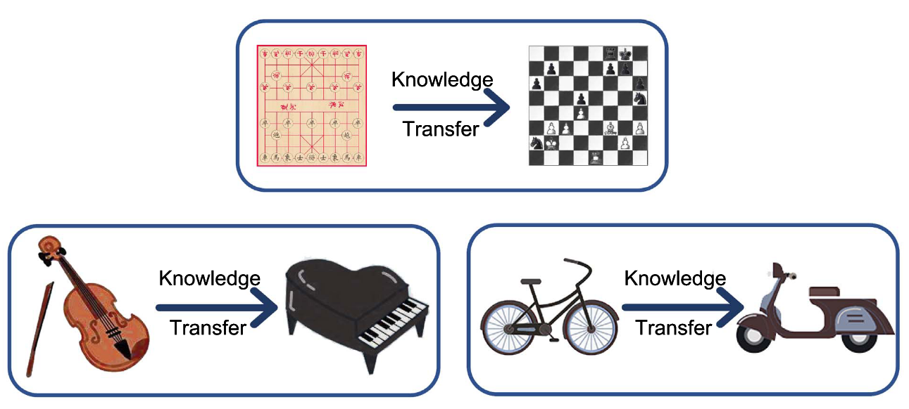

# 设备端学习 {#sec-ondevice-learning}

::: {layout-narrow}

::: {.column-margin}

_DALL·E 3 提示词：一幅智能手机的绘图，展示其内部组件，露出不同性别和肤色的微型工程师正在积极地处理机器学习模型。工程师包括男性、女性和非二元性别个体，他们正在调参、修复连接，并即时增强网络。数据流入机器学习模型，被实时处理，并生成输出推理结果。_

:::

\noindent
:::

## 目的 {.unnumbered}

_为什么设备端学习代表自训练与推理分离以来机器学习系统最根本的架构转变？又是什么使这一能力成为智能系统未来发展的关键？_

设备端学习瓦解了机器学习架构数十年来遵循的一个假设：模型训练所在位置与其运行所在位置是分离的。这通过使系统能够在真实世界中持续适应，而不是静态地部署预训练模型，重新定义了系统能够成为什么。从集中式训练到分布式、自适应学习的转变，将系统从被动的推理引擎转变为能够个性化、保护隐私并在断开连接的环境中自主改进的智能体。随着 AI 系统从受控的数据中心走向不可预测的环境，而预训练无法预见每一种场景或部署条件，这场架构革命变得至关重要。理解设备端学习的原理，使工程师能够设计出摆脱静态模型限制的系统，创造在人与系统交互的当下学习并演化的自适应智能。

::: {.callout-tip title="学习目标"}

- 通过比较计算分布、数据局部性和协调机制，区分设备端学习与集中式训练方法

- 识别关键动机驱动因素（个性化、低延迟、隐私、基础设施效率），并评估何时设备端学习相较于其他方法更为合适

- 分析训练相较于推理如何放大资源约束，量化其对系统设计的内存（3-5$\times$）、计算（2-3$\times$）和能耗开销影响

- 通过比较资源消耗、表达能力以及对不同设备类别的适用性，评估包括权重冻结、残差更新和稀疏更新在内的适应策略

- 考察在本地数据集有限条件下进行学习的数据效率技术，包括小样本学习、经验回放和数据压缩方法

- 应用联邦学习协议，在异构设备群体之间协调保护隐私的模型更新，同时管理通信效率和收敛挑战

- 设计整合热管理、内存层次结构优化和功耗预算的设备端学习系统，以维持可接受的用户体验

- 实现应对 MLOps 集成挑战的实用部署策略，包括感知设备差异的流水线、分布式监控和异构更新协调
:::

## 分布式学习范式转变 {#sec-ondevice-learning-distributed-learning-paradigm-shift-883d}

运行框架 (@sec-ml-operations) 通过集中式编排、监控和部署流水线，为大规模管理机器学习系统奠定了基础。这些框架假设处于受控的云环境中，其中计算资源充足、网络连接可靠、系统行为可预测。然而，随着机器学习系统日益从数据中心迁移到边缘设备，这些基本假设开始失效。

一部智能手机学习预测用户的文本输入，一个智能家居设备根据家庭日常规律进行适应，或者一辆自动驾驶汽车根据本地驾驶条件更新其感知模型，这些场景都表明传统的集中式训练方法已不再适用。智能手机会遇到某些用户独有、全球训练数据中未曾出现的语言模式。智能家居设备必须适应不同家庭之间差异巨大的季节变化和家庭动态。自动驾驶汽车面临的本地道路状况、天气模式和交通行为，与其原始训练环境并不相同。

这些场景体现了设备端学习，在这种模式下，模型必须直接在其运行的设备上进行训练和适应[^fn-a11-bionic-breakthrough]。这一范式将机器学习从集中式学科转变为分布式生态系统，在该生态系统中，学习发生在数百万异构设备上，而每个设备都在独特的约束和本地条件下运行。

[^fn-a11-bionic-breakthrough]: **A11 Bionic 突破**：Apple 的 A11 Bionic（2017）是首款具备足够计算能力以支持设备端训练的移动芯片，提供 0.6 TOPS，而此前的 A10 仅为 0.2 TOPS。这一$3\times$的提升，加上 43 亿个晶体管和双核 Neural Engine，使得移动设备首次能够进行梯度计算。Google 的 Pixel Visual Core 通过 8 个为机器学习工作负载优化的定制 Image Processing Unit 实现了类似能力。

向设备端学习的转变引入了机器学习系统设计中的根本性张力。云端架构利用充足的计算资源和受控的运行环境，而边缘设备必须在严重受限的资源范围内运行，其特征包括有限的内存容量、受约束的计算吞吐量、受限的能量预算以及间歇性的网络连接。这些使设备端学习在技术上具有挑战性的约束，同时也造就了它最重要的优势：通过本地化数据处理实现个性化适应，通过数据本地性实现隐私保护，以及通过摆脱中心化基础设施实现运行自主性。

本章将考察应对这种架构张力所需的理论基础和实践方法。在计算效率原则 (@sec-efficient-ai) 和运行框架 (@sec-ml-operations) 的基础上，我们将研究专门的算法技术、架构设计模式以及系统级原则，它们使得在极端资源约束下实现有效学习成为可能。该挑战已超越对训练算法的传统优化，需要重新构想整个机器学习流水线，以适配那些传统计算假设不再成立的部署环境。

::: {.callout-definition title="设备端学习"}

***设备端学习*** 是指在已部署硬件上直接对机器学习模型进行本地训练或适应，无需服务器连接，从而在严苛资源约束下实现 _个性化_、_隐私保护_ 和 _自主运行_。

:::
这一范式的影响远不止于技术优化，它挑战了关于机器学习系统开发、部署和维护生命周期的既有假设。模型不再遵循可预测的版本迭代模式，而是表现为持续的分化与适应轨迹。性能评估方法也从中心化监控仪表盘转向面向异构用户群体的分布式评估。隐私保护则从一种监管合规考量演变为塑造系统设计决策的核心架构要求。

要理解这些系统性影响，就必须同时考察推动组织采用设备端学习的强大动因，以及必须解决的重大技术挑战。本文分析建立了所需的理论基础和实践方法，以构建能够在网络边缘有效学习、同时在严格约束下运行的系统。

## 动机与收益 {#sec-ondevice-learning-motivations-benefits-37c3}

机器学习系统传统上依赖于集中式训练流水线，模型通过大型、精心整理的数据集和强大的云端基础设施进行开发和优化[@dean2012large]。一旦训练完成，这些模型就会被部署到客户端设备上进行推理，从而在训练阶段与部署阶段之间形成清晰的分离。尽管这种架构分离已很好地满足了大多数用例，但在本地数据动态变化、具有隐私性或高度个性化的现代应用中，它会带来显著限制。

端上学习通过使系统能够直接在设备上训练或适配，而不依赖持续连接云端，从而挑战了这一既有模型。这一转变不仅仅代表技术进步，它还反映了不断变化的应用需求和用户期望，即要求机器学习系统具备响应迅速、个性化且保护隐私的能力。

以智能手机键盘适应用户独特词汇和输入模式为例。为了个性化预测，系统必须利用本地观察到的文本输入，对一个紧凑的语言模型执行梯度更新。即便是一个最小化的语言模型，单次梯度更新也需要 50-100&nbsp;MB 的激活和优化器状态内存。现代智能手机通常会为键盘等后台应用分配 200-300&nbsp;MB 内存（因操作系统和设备代际而异）。如此微小的余量中，单次训练步骤就会消耗可用内存的 25%，这正体现了端上学习的核心工程挑战。系统必须在极其严苛的资源约束下实现有意义的个性化，以至于传统训练方法在架构上根本不可行。这一量化现实推动了对专门技术的需求，使得在极端资源限制下仍能进行适配成为可能。

### 端上学习的收益 {#sec-ondevice-learning-ondevice-learning-benefits-3256}

理解端上学习采用背后的驱动力，需要考察传统集中式方法的内在局限。传统机器学习系统依赖于模型训练与推理之间的明确分工。训练在具备高性能计算资源和大规模数据集的集中式环境中进行。一旦训练完成，模型就被分发到客户端设备，在静态的仅推理模式下运行。

虽然这种集中式范式在许多部署中已被证明有效，但在数据具有用户特异性、行为动态变化或连接间歇性的场景中，它会引入根本性限制。随着机器学习从受控环境走向具有多样化用户群体和部署背景的真实世界应用，这些限制会变得尤为突出。

端上学习通过使已部署设备能够使用本地可用数据执行模型适配来应对这些限制。端上学习不仅仅是一种效率优化；它还是构建可信人工智能系统的基石，开启了第四部分：可信系统。通过将数据保留在本地，它为隐私提供了坚实基础。通过适配单个用户，它提升了公平性和实用性。通过支持离线运行，它增强了系统对网络故障和基础设施依赖的鲁棒性。本章探讨构建这些可信、可适配系统所需的工程技术。

从集中式学习转向分布式学习的这一变化，受到四个关键因素的推动，这些因素既反映了技术能力，也反映了不断变化的应用需求：个性化、延迟与可用性、隐私，以及基础设施效率[@li2020federated]。

个性化是最具说服力的动机，因为已部署模型经常遇到与训练环境显著不同的使用模式和数据分布。本地适配允许模型根据用户特定数据来优化行为，捕捉语言偏好、生理基线、传感器特性或环境条件。这一能力在用户间差异很大的应用中尤为关键，因为单一的全局模型无法有效服务所有用户。

延迟和可用性约束为本地学习提供了额外理由。在边缘计算场景中，连接集中式基础设施可能不可靠、存在延迟，或者为了节省带宽或降低能耗而被有意限制。端上学习使模型即使在完全离线或对延迟敏感的环境中也能自主改进，而将更新往返传输到云端在架构上是不可行的。

隐私考虑构成了第三个重要驱动因素。许多现代应用涉及敏感或受监管的数据，包括生物特征测量、输入内容、位置轨迹或健康信息。本地学习通过将原始数据保留在设备上并在保护隐私的边界内运行，缓解了隐私担忧，并可能有助于遵守 GDPR[^fn-gdpr-impact]、HIPAA[@hipaa1996health] 或特定地区的数据主权法律等法规。

[^fn-gdpr-impact]: **GDPR 对机器学习的影响**：GDPR 于 2018 年 5 月生效时[@gdpr2016regulation]，它使得未经明确同意，针对个人数据进行集中式机器学习训练变为非法。“被遗忘权”还意味着，基于个人数据训练的模型可能在法律上被要求“遗忘”特定用户，而这在传统训练中在技术上是不可能的。这推动了对隐私保护型机器学习技术的大规模投资。

基础设施效率为分布式学习方法提供了经济动机。集中式训练流水线需要大量后端基础设施来收集、存储和处理来自数百万设备的数据。通过将学习转移到边缘端，系统降低了通信成本，并将训练负载分散到整个部署设备群上，从而减轻集中式资源的压力，同时提升可扩展性。

### 替代方法与决策标准 {#sec-ondevice-learning-alternative-approaches-decision-criteria-bd36}

端上学习是一项重要的工程投入，具有固有复杂性，其收益未必总能证明这种复杂性是合理的。在决定采用这种方法之前，团队应仔细评估更简单的替代方案是否能以更低的运行开销实现相近效果。理解何时不应实现端上学习，与理解其收益同样重要，因为过早采用可能会引入不必要的复杂性，而未能带来相应价值。

对于个性化和适配需求，以下几种替代方法往往可以在不增加本地训练复杂度的情况下满足要求：

- **基于特征的个性化**：通过在本地存储用户偏好、交互历史和行为特征，提供有效的定制化。系统不是调整模型权重，而是将这些存储的特征输入到静态模型中以实现个性化。新闻推荐系统就是这种方法的典型例子：它们在本地存储用户的主题偏好和阅读模式，然后将这些特征与集中式内容模型结合，在不更新模型的情况下提供个性化推荐。

- **带隐私控制的基于云端的微调**：通过在集中式环境中进行适配并配合适当的隐私保护措施来实现个性化。用户数据会在非高峰时段以批量方式处理，并采用差分隐私[^fn-differential-privacy] 或联邦分析等隐私保护技术。这种方法通常在受资源限制的端上更新之外，能够获得更高的准确率，同时在许多应用中保持可接受的隐私属性。

- **用户特定查找表**：将全局模型与个性化检索机制结合起来。系统维护一个轻量级、用户特定的查找表，用于常用模式，同时使用共享的全局模型进行泛化。这种混合方法在几乎没有额外计算和存储开销的情况下提供了个性化收益。

是否实施端上学习，应由能够排除这些更简单替代方案的可量化需求来驱动。真正的数据隐私约束（法律上禁止云端处理）、确实存在的网络限制（无法可靠联网）、使云端往返不可行的定量延迟预算，或足以证明其运行复杂性的显著性能提升，都是采用端上学习的合理驱动因素。

[^fn-differential-privacy]: **差分隐私**：一种通过在计算中加入经过精心校准的噪声来提供可量化隐私保证的数学框架。在联邦学习中，DP 可确保即使是聚合器也无法从模型更新中推断出单个用户数据。关键参数 ε 控制隐私-效用权衡：ε 越小，隐私越强，但模型准确率越低。典型部署使用 ε=1-8，需要加入噪声，这会使通信开销增加 2-10$\times$，并使模型准确率降低 1-5%。这对于分布式学习系统中的法规合规和用户信任至关重要。

对于具有关键时序要求的应用（摄像头处理低于 33&nbsp;ms、语音响应低于 500&nbsp;ms、AR/VR 运动到光子延迟低于 20&nbsp;ms，或安全关键控制低于 10&nbsp;ms），网络往返时间（通常为 50-200&nbsp;ms）使得基于云端的替代方案在架构上不可行。在这种情况下，无论复杂性如何，端上学习都是必需的。团队应在决定投入端上学习所需的大量工程工作之前，全面评估更简单的解决方案。

这些动机根植于更广义的知识迁移概念，即预训练模型将有用表示迁移到新任务或新领域。这一基础性原则使端上学习既可行又有效，能够以最少的本地资源实现复杂适配。如@fig-transfer-conceptual 所示，知识迁移可以发生在紧密相关的任务之间（例如下棋或演奏不同乐器），也可以跨越具有共同结构的领域（例如从骑自行车到骑滑板车）。在端上学习的语境中，这意味着利用在云端预训练的模型，并仅使用本地数据和有限更新，将其高效适配到新的场景中。该图强调了关键思想：即使新任务在输入模态或目标上存在差异，预训练知识也能实现快速适配，而无需从头开始重新学习。

{#fig-transfer-conceptual}

这种由迁移学习和适配所驱动的概念转变，使现实世界中的端上应用成为可能。无论是为个人输入偏好适配语言模型，调整手势识别以适应个体动作模式，还是在变化环境中重新校准传感器模型，端上学习都使系统能够长期保持响应性、效率和与用户目标的一致性。

### 真实世界应用领域 {#sec-ondevice-learning-realworld-application-domains-c4e4}

基于上述既有动机（个性化、延迟、隐私和基础设施效率），现实部署展示了端上学习在多种应用领域中的实际影响。这些领域涵盖消费电子、医疗保健、工业系统和嵌入式应用，每个领域都展示了上述收益在有效机器学习部署中变得必不可少的场景。

移动端输入预测是端上学习最成熟、部署最广泛的例子。在智能手机键盘等系统中，预测文本和自动纠错功能显著受益于持续的本地适配。用户输入模式具有高度个性化并动态演化，因此集中式静态模型无法提供最佳用户体验。端上学习使语言模型能够直接在设备上微调预测，在保持数据本地性的同时实现个性化。

例如，Google 的 Gboard 使用联邦学习在庞大的用户群中改进共享模型，同时将原始数据保留在每个设备本地[@hard2018federated][^fn-gboard-pioneer]。

[^fn-gboard-pioneer]: **Gboard 联邦学习先驱**：Gboard 于 2017 年成为首个大规模商用联邦学习部署，处理了来自超过 10 亿台设备的更新。其技术挑战极其巨大：在聚合模型更新的同时，确保无法从中推断出任何单个用户的输入模式。Google 在 Gboard 上的成功证明了联邦学习可以在全球尺度上运行，并展示了相较于静态模型 10-20% 的准确率提升，同时保持严格的差分隐私保证。

如@fig-ondevice-gboard 所示，不同的预测策略说明了本地适配如何实时运行：下一词预测（NWP）根据先前文本建议可能的后续内容，而 Smart Compose 则使用实时重评分来提供动态补全，展示了本地推理机制的复杂性。

{#fig-ondevice-gboard}

在消费类应用的基础上，可穿戴设备和健康监测设备在附加监管约束下提供了同样令人信服的使用场景。这些系统依赖来自加速度计、心率传感器和皮电活动监测器的实时数据来跟踪用户健康与健身状况。生理基线在个体之间差异巨大，造成了静态模型无法有效解决的个性化挑战。端上学习使模型能够随着时间推移适配这些个体基线，从而显著提高活动识别、压力检测和睡眠分期的准确率，同时满足数据本地化的监管要求。

语音交互技术则构成了另一个具有独特声学挑战的重要应用领域。智能音箱和耳机等设备中的唤醒词检测[^fn-wake-word-detection] 和语音接口必须在嘈杂或动态的声学环境中快速且准确地识别语音命令。

[^fn-wake-word-detection]: **唤醒词检测**：始终监听的关键词识别，用于激活语音助手（“Hey Siri”、“OK Google”、“Alexa”）。这些系统持续运行，功耗约为 ~1&nbsp;mW，比完整语音识别低约 1000$\times$。它们使用微小的神经网络（约 ~100&nbsp;KB），并采用专门架构优化，以实现低于 100&nbsp;ms 的延迟和极低的误报率（<0.1 次激活/小时）。现代系统在实时处理 16&nbsp;kHz 音频时可达到 95% 以上的准确率，因此端上个性化对于适应个体语音特征和减少误触发至关重要。

这些系统面临严格的延迟要求：语音接口必须将端到端响应时间控制在 500&nbsp;ms 以内，以保持自然的对话流；而唤醒词检测则要求低于 100&nbsp;ms 的响应时间，以避免用户不满。本地训练使模型能够适应用户独特的声音特征和不断变化的环境背景，减少误报和漏检，同时满足这些苛刻的性能约束。在远场音频场景中，这种适配尤其有价值，因为不同部署中的麦克风配置和房间声学条件差异极大。

除消费类应用外，工业物联网和远程监测系统也展示了端上学习在资源受限环境中的价值。在农业传感、管道监测或环境监视等应用中，连接集中式基础设施可能受限、昂贵，甚至完全不可用。端上学习使这些系统能够在不持续与云端通信的情况下检测异常、调整阈值或适应季节性趋势。这一能力对于保持边缘部署传感网络的自主性和可靠性至关重要，因为系统停机或漏检可能带来重大的经济或安全后果。

最苛刻的应用出现在嵌入式计算机视觉系统中，包括机器人、AR/VR 和智能摄像头中的系统，它们将复杂视觉处理与极端时序约束结合在一起。摄像头应用必须在 33&nbsp;ms 内处理帧，以维持 30 FPS 的实时性能；而 AR/VR 系统要求运动到光子延迟低于 20&nbsp;ms，以防止恶心并保持沉浸感。安全关键控制系统则要求更严格的界限，通常低于 10&nbsp;ms，因为延迟决策可能带来严重后果。这些系统在新颖或快速变化的环境中运行，与其原始训练条件有很大差异。端上适配使模型能够重新校准到新的光照条件、物体外观或运动模式，同时满足这些关键延迟预算，而这些预算从根本上决定了端上处理与云端处理之间的架构选择。

每个领域都呈现出一个共同模式：部署环境会引入在集中式训练期间无法预见的变化和上下文特定需求。这些应用展示了动机驱动因素（个性化、延迟、隐私和基础设施效率）如何表现为具体的工程约束。移动键盘在存储用户特定模式时面临内存限制，可穿戴设备遇到限制训练频率的能量预算，语音接口必须满足低于 100&nbsp;ms 的延迟要求，从而排除了云端协同，而工业物联网系统则运行在网络受限环境中，要求自主适配。这一模式揭示了塑造后续所有技术决策的根本设计要求：学习必须在显著资源限制下高效、私密且可靠地进行，我们将通过约束分析（@sec-ondevice-learning-design-constraints-c776）、适配技术（@sec-ondevice-learning-model-adaptation-6a82）和联邦协调（@sec-ondevice-learning-federated-learning-6e7e）来考察这一点。

### 架构权衡：集中式与分布式训练 {#sec-ondevice-learning-architectural-tradeoffs-centralized-vs-decentralized-training-d420}

这些应用展示了端上学习在多种领域中的实际价值。在此基础上，我们现在考察端上学习与传统机器学习架构有何不同，这揭示了对训练生命周期的完整重构，远远超出了简单的部署选择。

要理解端上学习所代表的转变，需要考察传统机器学习系统的结构，以及它们的局限性在哪些地方变得明显。如今大多数机器学习系统都遵循一种集中式学习范式，这种范式曾很好地服务于该领域，但在现代部署需求下正越来越吃力。模型在数据中心中使用从多个来源汇集的大规模精心整理的数据集进行训练。训练完成后，这些模型以静态形式部署到客户端设备上，在那里它们执行推理而不再进行修改。对模型参数的更新，无论是为了纳入新数据还是为了提升泛化能力，通常都通过离线再训练定期完成，往往使用从现场新收集或标注后回传的数据。

这种既有的集中式模型具有许多经过验证的优势：高性能计算基础设施、接触多样化数据分布的能力，以及稳健的调试和验证流程。它还依赖于一些在现代部署场景中可能不成立的假设：可靠的数据传输、对数据保管的信任，以及能够管理跨设备群组全局更新的基础设施。随着机器学习被部署到越来越多样化且分布式的环境中，这种方法的局限性变得越来越明显，并且往往成为阻碍。

与这种集中式方法相比，端上学习采用的是一种本质上分布式的范式，它挑战了许多传统假设。每个设备维护自己的一份模型副本，并使用通常无法被集中式基础设施获取的数据在本地对其进行适配。训练发生在设备上，通常是异步的，并且在不同资源条件下进行，这些条件会根据设备使用模式、电池电量和热状态而变化。数据不会离开设备，这降低了隐私暴露，但也增加了设备之间协调的复杂性。设备在硬件能力、运行环境和使用模式上可能差异巨大，使学习过程具有异质性且难以标准化。这些硬件差异带来了显著的系统设计挑战。

这种分布式架构引入了一类新的系统挑战，远超传统机器学习问题。设备可能运行不同版本的模型，导致整个部署群组中的行为不一致。评估和验证也变得复杂得多，因为不存在一个可以统一测量所有设备性能的中心点[@mcmahan2017communication]。必须谨慎管理模型更新以防止性能退化，而在缺乏集中式测试和验证基础设施的情况下，安全保证也变得更加难以实施。

管理成千上万异构边缘设备的复杂度，已经超过了典型分布式系统的复杂性。设备异质性不仅包括硬件差异，还包括不同的操作系统版本、安全补丁、网络配置和电源管理策略。在任何给定时刻，20-40% 的设备处于离线状态[@bonawitz2019towards]，而另一些设备可能已断开数周或数月，从而造成持续的协调挑战。

当断连设备重新接入时，它们需要进行状态协调，以避免版本冲突。更新验证变得至关重要，因为设备可能在无声失败的情况下未能应用更新，或者报告成功但实际仍运行旧模型。健壮的系统会实施多阶段验证：密码签名确认更新完整性，功能测试验证模型行为，遥测确认部署成功。回滚策略必须处理部分部署的情况，即一些设备已接收更新而另一些仍保留旧版本，这需要复杂的编排，以在故障恢复期间维持系统一致性。

这些挑战要求系统设计和运维管理采取与集中式机器学习系统不同的方法，既承接了@sec-ml-operations 中的分布式系统原则，又引入了边缘侧特有的复杂性。

尽管存在这些挑战，分布式化仍带来了通常足以证明额外复杂性合理的机会。它支持在没有集中监督的情况下实现深度个性化，在断连或带宽受限环境中支持稳健学习，并降低模型更新的运营成本和基础设施负担。要实现这些收益，就会引出如何在设备之间有效协调学习的问题，无论是通过周期性同步、联邦聚合，还是平衡本地与全局目标的混合方法。

从集中式学习转向分布式学习，不仅仅是部署架构上的变化。它重塑了机器学习系统的整个设计空间，需要对模型架构、训练算法、数据管理和系统验证采取新的方法。在集中式训练中，数据从多个来源汇聚并在大规模数据中心中处理，模型在其中完成训练、验证，然后以静态形式部署到边缘设备上。相比之下，端上学习引入了一种根本不同的范式：模型直接在客户端设备上使用本地数据更新，通常是异步进行，并且处于多样化的硬件条件之下。这种架构转变带来了协调挑战，同时也使自主的本地适配成为可能，因此需要在异构设备群中仔细考虑验证、系统可靠性和更新编排。

端上学习回应了集中式机器学习工作流的局限性。从集中式到分布式学习的转变产生了三个不同的操作阶段，每个阶段都有不同的特征和挑战。

传统的集中式范式从基于云端的聚合数据训练开始，随后将静态模型部署到客户端设备上。当数据采集可行、网络连接可靠，且单一全局模型能够有效服务所有用户时，这种方法运作良好。然而，当数据变得个性化、具有隐私敏感性，或者收集环境连接受限时，它就会失效。

一旦部署完成，本地差异就开始显现，因为每台设备都会遇到自己独特的数据分布。设备收集的数据反映了个体用户模式、环境条件和使用场景。这些数据通常是非 IID（非独立同分布）[^fn-non-iid] 且带有噪声的，因此需要本地模型适配来维持性能。这一转变标志着从全局泛化走向本地专业化。

[^fn-non-iid]: **非 IID（非独立同分布）**：在机器学习中，如果样本是从同一分布中独立抽取的，则数据是 IID。非 IID 则违反这一假设，这在联邦学习中很常见，因为每台设备会收集来自不同用户、环境或使用场景的数据。例如，智能手机键盘数据在不同用户之间差异巨大（语言、写作风格、自动纠错需求），这使得个性化模型训练既至关重要又很难收敛。

最后一个阶段引入了联邦协调，设备通过聚合模型更新而非共享原始数据，周期性地同步其本地适配结果。这使得在保持本地个性化优势的同时，仍可实现保护隐私的全局优化。

这三个不同的阶段（集中式训练、本地适配和联邦协调）代表了一种架构演进，它重塑了机器学习生命周期的每一个方面。@fig-centralized-vs-decentralized 展示了在这些阶段中数据流、计算分配和协调机制的差异，突出了复杂性不断增加的同时也展示了每个阶段所带来的更强能力。理解这一进程有助于把握端上学习系统必须应对的挑战。

::: {#fig-centralized-vs-decentralized fig-env="figure" fig-pos="htb"}

```{.tikz}
\begin{tikzpicture}[line join=round,font=\usefont{T1}{phv}{m}{n}\small]
\tikzset{
 LineD/.style={line width=1.85pt,violet!50,text=black,dashed,dash pattern=on 5pt off 3pt,
-{Triangle[width=1.8*6pt,length=2.2*6pt]}},
Line/.style={line width=1.85pt,violet!50,text=black,-{Triangle[width=1.8*6pt,length=2.2*6pt]}},
SArrow/.style={red,line width=4pt,-{Triangle[width=1.8*6pt,length=2.2*6pt]}},
circleB/.style={circle,fill=red,minimum size=7mm},
BoxSTAR/.style={star, minimum width=10mm, star points=5, star point ratio=2.5, fill=blue, draw},
BoxG/.style={rectangle,fill=green!70!black!90,minimum size=7mm},
BoxB/.style={rectangle,fill=orange,rounded rectangle,minimum width=15mm,minimum height=5mm},
BoxR/.style={rectangle,fill=OliveLine,minimum width=11mm,minimum height=5mm},
pics/cloud/.style = {
        code = {
\colorlet{red}{BrownLine}
\begin{scope}[local bounding box=CLO,scale=1.8, every node/.append style={transform shape}]
\draw[red,line width=1.25pt,fill=yellow!10](0,0)to[out=170,in=180,distance=11](0.1,0.61)
to[out=90,in=105,distance=17](1.07,0.71)
to[out=20,in=75,distance=7](1.48,0.36)
to[out=350,in=0,distance=7](1.48,0)--(0,0);
\end{scope}
}
}
}
\tikzset {
pics/mobile/.style = {
        code = {
        \pgfkeys{/channel/.cd, #1}
\colorlet{red}{BrownLine}
\begin{scope}[local bounding box=MOB,scale=\scalefac, every node/.append style={transform shape}]
\node[rectangle,draw=red,minimum height=94,minimum width=57,
            rounded corners=6,thick,fill=red!10](\picname-R1){};
\node[rectangle,draw=red,minimum height=67,minimum width=44,thick,fill=white](\picname-R2){};
\node[circle,minimum size=8,below= 2pt of \picname-R2,inner sep=0pt,thick,fill=red!90]{};
\node[rectangle,fill=red,minimum height=2,minimum width=20,above= 4pt of \picname-R2,inner sep=0pt,thick]{};
%
 \end{scope}
     }
  }
}

\tikzset {
pics/handmobile/.style = {
        code = {
        \pgfkeys{/channel/.cd, #1}
\colorlet{red}{BrownLine}
\begin{scope}[local bounding box=MOB,scale=\scalefac, every node/.append style={transform shape}]
\node[rectangle,draw=red,minimum height=94,minimum width=57,
            rounded corners=6,thick,fill=red!10](\picname-R1){};
\node[rectangle,draw=red,minimum height=67,minimum width=44,thick,fill=white](\picname-R2){};
\node[circle,minimum size=8,below= 2pt of \picname-R2,inner sep=0pt,thick,fill=red!90]{};
\node[rectangle,fill=red,minimum height=2,minimum width=20,above= 4pt of \picname-R2,inner sep=0pt,thick]{};
%
%hand
\draw[thick,fill=orange!20](-1.62,-1.59)coordinate(D)--(-1.01,-2.12)to[out=320,in=190] (-0.03,-1.65)--++(180:0.3)
to[out=170,in=270] (-0.83,-1.0)--(-0.82,-0.25)to[out=50,in=50,distance=13] (-1.14,0.6)
to[out=230,in=70] (-1.29,-0.1)to[out=250,in=70] (-1.55,-0.71)to[out=250,in=150] (D);

\node[rectangle,draw,minimum height=12,minimum width=23,thick,
            rounded corners=4,rotate=35,fill=orange!20]at(0.96,-0.03)(PR2){};
\node[rectangle,draw,minimum height=12,minimum width=23,thick,
            rounded corners=4,rotate=35,fill=orange!20]at(0.96,-0.56)(PR3){};
\node[rectangle,draw,minimum height=12,minimum width=19,thick,
            rounded corners=4,rotate=35,fill=orange!20]at(0.96,-1.09)(PR4){};
\draw[thick,fill=orange!20](1.0,0.80)--(1.13,0.80)to[out=355,in=5,distance=9] (1.13,0.36)--(1.0,0.36)--cycle;
 \end{scope}
     }
  }
}

\tikzset{
channel/.pic={
\pgfkeys{/channel/.cd, #1}
\begin{scope}[local bounding box=MOB,scale=\scalefac, every node/.append style={transform shape}]
\node[rectangle,draw=\drawchannelcolor,line width=1pt,fill=\channelcolor!10,
minimum height=20mm,minimum width=20mm](\picname){};
\end{scope}
        }
}
\pgfkeys{
  /channel/.cd,
  channelcolor/.store in=\channelcolor,
  drawchannelcolor/.store in=\drawchannelcolor,
  scalefac/.store in=\scalefac,
  Linewidth/.store in=\Linewidth,
  picname/.store in=\picname,
  channelcolor=BrownLine,
  drawchannelcolor=BrownLine,
  scalefac=1,
  Linewidth=0.6pt,
  picname=C
}
\begin{scope}[local bounding box=MOBILE1,shift={($(0,0)+(0,0)$)},
scale=1, every node/.append style={transform shape}]

 \foreach \i/\sf in {1/0.6,2/0.7,3/0.8,4/0.9,5/1} {
  \pgfmathsetmacro{\y}{(1.5-\i)*0.83 + 0.7}
 \pic[shift={(0,0)}] at  ({-\i*0.2}, {0.4*\i}){mobile={scalefac=\sf,picname=1\i}};
  }
\end{scope}

\begin{scope}[local bounding box=MOBILE2,shift={($(MOBILE1)+(3.25,-1.52)$)},
scale=1, every node/.append style={transform shape}]

 \foreach \i/\sf in {1/0.6,2/0.7,3/0.8,4/0.9,5/1} {
  \pgfmathsetmacro{\y}{(1.5-\i)*0.83 + 0.7}
 \pic[shift={(0,0)}] at  ({-\i*0.17}, {0.4*\i}){mobile={scalefac=\sf,picname=2\i}};
  }
\end{scope}
\begin{scope}[local bounding box=MOBILE3,shift={($(MOBILE2)+(2.5,-1.52)$)},
scale=1, every node/.append style={transform shape}]

 \foreach \i/\sf in {1/0.6,2/0.7,3/0.8,4/0.9,5/1} {
  \pgfmathsetmacro{\y}{(1.5-\i)*0.83 + 0.7}
 \pic[shift={(0,0)}] at  ({-\i*0.02}, {0.4*\i}){mobile={scalefac=\sf,picname=3\i}};
  }
\end{scope}
\begin{scope}[local bounding box=MOBILE4,shift={($(MOBILE3)+(3.2,-1.52)$)},
scale=1, every node/.append style={transform shape}]

 \foreach \i/\sf in {1/0.6,2/0.7,3/0.8,4/0.9,5/1} {
  \pgfmathsetmacro{\y}{(1.5-\i)*0.83 + 0.7}
 \pic[shift={(0,0)}] at  ({-\i*0.17}, {0.4*\i}){mobile={scalefac=\sf,picname=4\i}};
  }
\end{scope}
\begin{scope}[local bounding box=MOBILE5,shift={($(MOBILE4)+(3.2,-1.52)$)},
scale=1, every node/.append style={transform shape}]

 \foreach \i/\sf in {1/0.6,2/0.7,3/0.8,4/0.9,5/1} {
  \pgfmathsetmacro{\y}{(1.5-\i)*0.83 + 0.7}
 \pic[shift={(0,0)}] at  ({-\i*0.17}, {0.4*\i}){mobile={scalefac=\sf,picname=5\i}};
  }
\end{scope}
\foreach \i in {1,2,3,4,5}{
\node[circleB](CI\i)at(\i5-R2){};
}
%%%
\begin{scope}[local bounding box=HMOBILE,shift={($(MOBILE1)+(-5,0.5)$)},
scale=1, every node/.append style={transform shape}]
\pic[shift={(0,0)}] at  (0,0) {handmobile={scalefac=1,picname=H}};
\node[circleB](CIA)at(H-R2){};
\end{scope}
%%%squars
\begin{scope}[local bounding box=CHANNELS,shift={($(MOBILE1)+(0.2,-1.5)$)}]
\begin{scope}[local bounding box=CHANEL1,shift={($(0,0)+(1.5,-3.5)$)}]
\foreach \i/\sf in {1/0.3,2/0.4,3/0.5,4/0.6,5/0.7,6/0.8,7/0.9,8/1} {
\pic at ({-\i*0.23}, {-0.23*\i}) {channel={scalefac=\sf,picname=\i-CH1,channelcolor=BrownLine}};
}
\end{scope}
\begin{scope}[local bounding box=CHANEL2,shift={($(CHANEL1)+(4.3,1.38)$)}]
\foreach \i/\sf in {7/0.9,8/1} {
\pic at ({-\i*0.23}, {-0.23*\i}) {channel={scalefac=\sf,picname=\i-CH2,channelcolor=BrownLine}};
}
\end{scope}
\begin{scope}[local bounding box=CHANEL3,shift={($(CHANEL2)+(4.3,1.77)$)}]
\foreach \i/\sf in {8/1} {
\pic at ({-\i*0.23}, {-0.23*\i}) {channel={scalefac=\sf,picname=\i-CH3,channelcolor=BrownLine}};
}
\end{scope}
\begin{scope}[local bounding box=CHANEL4,shift={($(CHANEL3)+(1.0,1.83)$)}]
\foreach \i/\sf in {3/0.5,4/0.6,5/0.7,6/0.8,7/0.9,8/1} {
\pic at ({\i*0.23}, {-0.23*\i}) {channel={scalefac=\sf,picname=\i-CH4,channelcolor=BrownLine}};
}
\end{scope}
\begin{scope}[local bounding box=CHANEL5,shift={($(CHANEL4)+(1.2,1.52)$)}]
\foreach \i/\sf in {5/0.7,6/0.8,7/0.9,8/1} {
\pic at ({\i*0.23}, {-0.23*\i}) {channel={scalefac=\sf,picname=\i-CH5,channelcolor=BrownLine}};
}
\end{scope}
\end{scope}

\begin{scope}[local bounding box=CHANEL6,shift={($(MOBILE5)+(7.7,2.35)$)},]
\foreach \i/\sf in {8/1} {
\pic at ({-\i*0.23}, {-0.23*\i}) {channel={scalefac=\sf,picname=\i-CH6,channelcolor=BrownLine}};
}
\end{scope}
%
\path[red](CHANEL6)|-coordinate(DD)(8-CH5);
\path[red](HMOBILE)|-coordinate(DL)(8-CH1);
%
\pic at (DL) {channel={scalefac=1,picname=DL-CH,channelcolor=BrownLine}};
\pic at ($(MOBILE3)+(0,5)$) {channel={scalefac=1,picname=GO-CH,channelcolor=BrownLine}};
%
\begin{scope}[local bounding box=CLOUD1,shift={($(DD)+(-1.25,-0.5)$)},
scale=1.2, every node/.append style={transform shape}]
\pic[shift={(0,0)}] at (0,0) {cloud};
\end{scope}
%
\node[circleB](CI)at(GO-CH){};
\node[BoxG]at(DL-CH){};
\node[BoxG,rotate=45]at(CHANEL6){};
\node[BoxG,rotate=45]at($(CLOUD1)+(0,-0.4)$){};
%
\node[BoxG]at(8-CH1){};
\node[BoxG,rotate=45]at(8-CH2){};
\node[BoxSTAR]at(8-CH3){};
\node[BoxG,rotate=45,fill=violet]at(8-CH4){};
\node[BoxB]at(8-CH5){};
%
\begin{scope}[local bounding box=CIRCLE,shift={($(HMOBILE)+(0.15,2.5)$)}]
\def\ra{22mm}
\draw [SArrow](70:\ra)  arc (70:12:\ra);
\draw [SArrow](170:\ra)  arc (170:110:\ra);
\draw [SArrow](230:\ra)  arc (230:190:\ra);
\draw [red,dashed,line width=2pt](320:\ra)  arc (320:345:\ra);
\node[BoxG]at(0:\ra){};
\node[BoxB]at(180:\ra){};
\node[BoxR]at(90:\ra){};
\end{scope}
\draw[LineD,shorten >=4pt](HMOBILE.south)--(DL-CH);
\draw[LineD,shorten <=4pt,shorten >=4pt](DL-CH)--(8-CH1);
\draw[Line,shorten <=4pt,shorten >=4pt](8-CH5)--++(3,0);
\path[Line,shorten <=4pt,shorten >=4pt](8-CH6)--++(0,-5.5)coordinate(CL4);
\draw[Line,shorten <=4pt,shorten >=4pt](8-CH6)--(CL4);
\draw[Line,shorten <=4pt,shorten >=4pt](8-CH6)--++(-4.5,0);
\draw[Line,shorten <=4pt](GO-CH)--++(0,-2.7);
\draw[LineD](CI1.center)--++(-3.2,0);
\draw[Line]($(31-R1)+(0,-1.2)$)coordinate(DO)--++(0,-2.5);
\draw[Line]($(DO)+(-1.3,0)$)--++(250:2.5);
\draw[Line]($(DO)+(1.3,0)$)--++(290:2.5);
%
\node[above=8pt of CHANEL6]{\huge C.};
\node[below=8pt of 8-CH3]{\huge B.};
\node[left=38pt of CIA]{\huge A.};
\end{tikzpicture}

```
从集中式云训练（区域 A）到本地设备适配（区域 B），再到联邦协调（区域 C）的演进，代表了机器学习架构的根本转变。每个阶段都引入了不同的操作特性，从统一的全局模型，到个性化的本地适配，再到协调的分布式学习。
:::

## 设计约束 {#sec-ondevice-learning-design-constraints-c776}

第三部分建立了塑造所有机器学习系统的效率原则。@sec-efficient-ai 引入了三个效率维度（算法效率、计算效率和数据效率），并通过缩放定律揭示了为何蛮力方法会触及根本极限。@sec-model-optimizations 发展了包括量化、剪枝和知识蒸馏在内的压缩技术，使其能够在资源受限设备上部署。@sec-ai-acceleration 从微控制器到移动加速器，对边缘硬件能力进行了刻画，具体细节见硬件相关讨论。这些章节主要聚焦于推理工作负载：高效运行预训练模型。

设备端学习在这些相同的效率约束下运行，但其训练特定的放大效应使优化变得显著更加困难。推理只需一次通过网络的前向传播，而训练则需要前向传播、通过反向传播计算梯度以及权重更新，使内存需求增加 3-5$\times$倍，计算成本增加 2-3$\times$倍。使高效推理成为可能的模型压缩技术在这里变成了基本要求，而不再只是优化手段，因为如果没有激进压缩，在边缘设备约束下进行训练将是不可能的。

基于已确立的设备端学习动机，我们现在来考察塑造其实现的根本工程挑战。要在设备上实现学习，必须彻底重新思考机器学习系统在何处以及如何运行的传统假设。在集中式环境中，模型训练可以访问庞大的计算基础设施、海量且经过精心整理的数据集，以及充足的内存和能量预算。而在边缘端，这些假设都不成立，从而形成了一个根本不同的设计空间。

设备端学习的约束可归结为三个关键维度，它们与第三部分的效率框架相呼应，但又进一步扩展：模型压缩要求（扩展算法效率）、稀疏且非均匀的数据特征（扩展数据效率）以及极其有限的计算资源（扩展计算效率）。这三个维度共同构成了一个相互关联的约束空间，定义了设备端学习系统的可行区域；每个维度都施加了不同的限制，影响算法选择、系统架构和部署策略。

### 量化边缘设备上的训练开销 {#sec-ondevice-learning-quantifying-training-overhead-edge-devices-3e4c}

从仅推理部署过渡到设备端训练带来的复杂性是乘法式而非加法式的。这些约束会相互作用并彼此放大，以重塑系统设计要求；在@sec-efficient-ai 中的资源优化原则基础上，进一步引入了分布式学习环境中特有的新挑战。

第三部分引入的效率约束同时适用于推理和训练，但训练会将每个约束维度放大 3-10$\times$倍。@tbl-training-amplification 定量说明了训练工作负载如何加剧@sec-efficient-ai、@sec-model-optimizations 和@sec-ai-acceleration 中所确立的挑战。

这些放大效应解释了为何仅将第三部分的优化技术简单应用到训练工作负载上是不够的。每一类约束都会塑造设备端学习系统的设计，需要在早期章节推理方法的基础上进行扩展，而不能仅仅停留在其范围之内。

| **约束维度** | **推理（第三部分）** | **训练放大效应** | **对设计的影响** |
|:---|:---|:---|:---|
| **内存占用** | 模型权重 + 单个激活图 | 权重 + 完整激活缓存 + 梯度 + 优化器状态 | 增加 3-5$\times$倍；迫使采用激进压缩 |
| **计算操作** | 仅前向传播 | 前向传播 + 反向传播 + 权重更新 | 增加 2-3$\times$倍；限制模型复杂度 |
| **内存带宽** | 顺序读取权重 | 用于梯度的双向数据流 | 增加 5-10$\times$倍；造成瓶颈 |
| **每样本能耗** | 单次推理操作 | 带收敛过程的多次梯度步 | 增加 10-50$\times$倍；需要机会性调度 |
| **数据需求** | 预先收集、经过整理的数据集 | 稀疏、噪声较多、流式的本地数据 | 需要样本高效方法 |
| **硬件利用** | 针对前向传播优化 | 反向传播所需的不同访问模式 | 推理加速器可能不利于训练 |

: **训练会放大推理约束**：设备端学习在与推理（第三部分）相同的效率约束下运行，但训练特有的放大效应使优化显著更加困难。该表量化了从运行预训练模型过渡到在本地适配模型时，每个约束维度如何加剧。放大因子假设采用标准反向传播，且未使用诸如梯度检查点之类的优化。 {#tbl-training-amplification}@fig-ondevice-pretraining 展示了一个将离线预训练与资源受限 IoT 设备上的在线自适应学习结合起来的流水线。系统首先使用通用数据进行元训练。在部署期间，诸如数据可用性、计算和内存等设备特定约束通过对需要更新的层和通道进行排序与选择，来塑造适配策略。这使得能够在有限资源范围内进行高效的设备端学习。

::: {#fig-ondevice-pretraining fig-env="figure" fig-pos="htb"}

```{.tikz}
\begin{tikzpicture}[line join=round,font=\usefont{T1}{phv}{m}{n}\small]
\tikzset{
 Line/.style={line width=0.35pt,black!50,text=black,-latex},
 LineD/.style={line width=0.75pt,black!50,text=black,dashed,dash pattern=on 5pt off 3pt},
   Box/.style={inner xsep=2pt,
   node distance=0.45,
    draw=BlueLine,
    line width=0.75pt,
    fill=BlueL,
    minimum width=15mm, minimum height=7mm
  },
 circles/.pic={
\pgfkeys{/channel/.cd, #1}
\node[circle,draw=\channelcolor,line width=\Linewidth,fill=\channelcolor!10,
minimum size=6.5mm](\picname){};
        }
}
\pgfkeys{
  /channel/.cd,
  channelcolor/.store in=\channelcolor,
  drawchannelcolor/.store in=\drawchannelcolor,
  scalefac/.store in=\scalefac,
  Linewidth/.store in=\Linewidth,
  picname/.store in=\picname,
  channelcolor=BrownLine,
  drawchannelcolor=BrownLine,
  scalefac=1,
  Linewidth=0.6pt,
  picname=C
}

\begin{scope}[local bounding box=CIRCLE1,shift={($(0,0)+(0,0)$)},
scale=1, every node/.append style={transform shape}]
%1 column
\foreach \j in {1,2,3} {
  \pgfmathsetmacro{\y}{(1.5-\j)*0.83 + 0.7}
  \pic at (-1.35,\y) {circles={channelcolor=BrownLine,picname=1CD\j}};
}
%2 column
\foreach \i in {1,...,4} {
  \pgfmathsetmacro{\y}{(2-\i)*0.83+0.7}
  \pic at (0,\y) {circles={channelcolor=BrownLine, picname=2CD\i}};
}
%3 column
\foreach \j in {1,2} {
  \pgfmathsetmacro{\y}{(1-\j)*0.83 + 0.7}
  \pic at (1.35,\y) {circles={channelcolor=BrownLine,picname=3CD\j}};
}
\foreach \i in {1,2,3}{
  \foreach \j in {1,2,3,4}{
\draw[Line](1CD\i)--(2CD\j);
}}
\foreach \i in {1,2,3,4}{
  \foreach \j in {1,2}{
\draw[Line](2CD\i)--(3CD\j);
}}
\end{scope}

\begin{scope}[local bounding box=CIRCLE2,shift={($(CIRCLE1.east)+(4.0,-0.3)$)},
scale=1, every node/.append style={transform shape}]
%1 column
\foreach \j/\col in {1/RedLine,2/RedLine!40!,3/RedLine} {
  \pgfmathsetmacro{\y}{(1.5-\j)*0.83 + 0.7}
  \pic at (-1.35,\y) {circles={channelcolor=\col,picname=1CD\j}};
}
%2 column
\foreach \i/\col in {1/RedLine,2/BrownLine,3/BrownLine,4/RedLine!40!} {
  \pgfmathsetmacro{\y}{(2-\i)*0.83+0.7}
  \pic at (0,\y) {circles={channelcolor=\col, picname=2CD\i}};
}
%3 column
\foreach \j/\col in {1/RedLine,2/BrownLine} {
  \pgfmathsetmacro{\y}{(1-\j)*0.83 + 0.7}
  \pic at (1.35,\y) {circles={channelcolor=\col,picname=3CD\j}};
}
\foreach \i in {1,2,3}{
  \foreach \j in {1,2,3,4}{
\draw[Line](1CD\i)--(2CD\j);
}}
\foreach \i in {1,2,3,4}{
  \foreach \j in {1,2}{
\draw[Line](2CD\i)--(3CD\j);
}}
\end{scope}

\begin{scope}[local bounding box=CIRCLE3,shift={($(CIRCLE2.east)+(3.2,-0.3)$)},
scale=1, every node/.append style={transform shape}]
%1 column
\foreach \j/\col in {1/green!60!black!90!,2/green!60!black!90!,3/green!60!black!90!} {
  \pgfmathsetmacro{\y}{(1.5-\j)*0.83 + 0.7}
  \pic at (-1.35,\y) {circles={channelcolor=\col,picname=1CD\j}};
}
%2 column
\foreach \i/\col in {1/green!60!black!90!,2/BrownLine,3/BrownLine,4/green!60!black!90!} {
  \pgfmathsetmacro{\y}{(2-\i)*0.83+0.7}
  \pic at (0,\y) {circles={channelcolor=\col, picname=2CD\i}};
}
%3 column
\foreach \j/\col in {1/green!60!black!90!,2/BrownLine} {
  \pgfmathsetmacro{\y}{(1-\j)*0.83 + 0.7}
  \pic at (1.35,\y) {circles={channelcolor=\col,picname=3CD\j}};
}
\foreach \i in {1,2,3}{
  \foreach \j in {1,2,3,4}{
\draw[Line](1CD\i)--(2CD\j);
}}
\foreach \i in {1,2,3,4}{
  \foreach \j in {1,2}{
\draw[Line](2CD\i)--(3CD\j);
}}
\end{scope}
%\node[single arrow,fill=red!80!black!90, inner ysep=2pt,
    %  minimum width = 12pt, single arrow head extend=2pt,
      %minimum height=12mm] at($(CIRCLE2.east)!0.5!(CIRCLE3.west)$){};
\draw[brown!70,line width=6pt,shorten <=4pt,shorten >=4pt,
-{Triangle[width=1.8*6pt,length=0.9*6pt]}](CIRCLE2.east)
-- coordinate(SR1) (CIRCLE3.west);
\draw[brown!70,line width=6pt,shorten <=4pt,shorten >=4pt,
-{Triangle[width=1.8*6pt,length=0.9*6pt]}](CIRCLE1.east)
--coordinate(SR) (CIRCLE2.west);
\draw[brown!70,line width=6pt,shorten <=4pt,shorten >=4pt,
{Triangle[width=1.8*6pt,length=0.9*6pt]}-](CIRCLE1.west)
--node[above=6pt,align=center,text=black](PTB){Pre-trained\\ backbone}++(-2,0);

\begin{scope}[local bounding box=BOXX,shift={($(CIRCLE2.north)+(-1.1,1.5)$)}]
\node[Box](2B1)at(0,0){Data};
\node[Box,right=of 2B1](2B2){Compute};
\node[Box,right=of 2B2](2B3){Memory};
\node[draw=BackLine,inner xsep=3mm,line width=0.75pt,inner ysep=5mm,
fill=none,yshift=-2mm,fit=(2B1)(2B3)](BB){};
\node[below=1pt of BB.south,anchor=south]{Device Specific};
\end{scope}
\draw[brown!70,line width=6pt,shorten <=4pt,shorten >=4pt,
-{Triangle[width=1.8*6pt,length=0.9*6pt]}](BB.west)-|
node[right=2pt,pos=0.85,text=black]{$S_i$}(SR);
\draw[brown!70,line width=6pt,shorten <=4pt,shorten >=4pt,
{Triangle[width=1.8*6pt,length=0.9*6pt]}-](SR1)--++(0,2);
%%
\node[below=4pt of CIRCLE1,align=center](T1){Meta-training with generic\\
     data (e.g. MiniImageNet)};
\node[below=4pt of CIRCLE2,align=center](T2){Rank the channels and layers based\\
     on the multi-objective metric $S_i$};
\node[below=4pt of CIRCLE3,align=center](T3){Train the selected\\ layers and channels};
%
\scoped[on background layer]
\node[LineD,draw=BrownLine,inner xsep=5mm,inner ysep=5mm,minimum height=74mm,
fill=BrownL!10,yshift=4mm,fit=(T2)(BB)(T3)](BB2){};
\node[below=1pt of BB2.north,anchor=north]{Online Adaptive Learning on loT Devices};
\scoped[on background layer]
\node[LineD,draw=BackLine,inner xsep=3mm,inner ysep=5mm,
minimum height=74mm,
fill=yellow!05,yshift=14.7mm,fit=(T1)(PTB)(CIRCLE1)](BB2){};
\node[below=1pt of BB2.north,anchor=north]{Online Pre-training};
\end{tikzpicture}
```
资源受限设备采用两阶段学习过程：离线预训练建立初始模型权重，随后进行在线自适应，根据可用数据、计算和内存有选择地更新部分层。该方法在模型性能与边缘部署的实际限制之间取得平衡，使得能够在真实世界环境中持续学习。

:::

### 模型约束 {#sec-ondevice-learning-model-constraints-9232}

设备端学习约束的第一个维度聚焦于模型本身。其结构、规模和计算需求决定了部署是否可行。机器学习模型的结构和大小直接影响设备端训练是否可能，更不用说是否实用。与可拥有数十亿参数并依赖数 GB 内存预算的云端模型不同，面向设备端学习的模型必须符合严格的内存、存储和计算复杂度约束。这些约束不仅在推理时存在，在训练过程中还会变得更加严格，因为梯度计算、参数更新和优化器状态管理都需要额外资源。

当考察设备谱系中的具体例子时，这些约束的规模就变得明显。MobileNetV2 架构常用于移动视觉任务，其标准配置大约需要 14 MB 存储。虽然这一内存需求对于拥有数 GB 可用 RAM 的现代智能手机来说完全可行，但它远远超过了 Arduino Nano 33 BLE Sense[^fn-arduino-constraints] 等嵌入式微控制器可用的内存——后者仅提供 256 KB SRAM 和 1 MB flash 存储。这种资源可用性的巨大差异意味着必须采用激进的模型压缩技术。在这种受限极其严重的平台上，即便典型卷积神经网络中的单层，在训练期间也可能因需要存储中间特征图和梯度信息而超出可用 RAM。

[^fn-arduino-constraints]: **Arduino 边缘计算现实**：Arduino Nano 33 BLE Sense 代表了典型的微控制器约束：256&nbsp;KB SRAM 大约比现代智能手机的 16&nbsp;GB RAM（旗舰设备）小 65,000 倍。作为对比，仅存储一张 224×224×3 的 RGB 图像（150&nbsp;KB）就会消耗可用内存的 60%。训练需要多出 3-5$\times$倍的内存来存放梯度和激活，因此即便是很小的模型也颇具挑战。1&nbsp;MB 的 flash 存储只能容纳最小的量化模型，迫使设计者使用 8 位甚至 4 位表示。

除了静态存储需求外，训练过程本身会显著扩大有效内存占用，从而带来额外一层约束。标准反向传播要求在前向传播期间缓存每一层的激活值，并在反向传播的梯度计算中重用这些激活。正如上面的放大分析所示，与仅推理部署相比，这种激活缓存会成倍增加内存需求。对于一个看似适度的 10 层卷积模型，若处理$64 \times 64$图像，所需内存可能超过 1 到 2 MB，远高于大多数嵌入式系统的 SRAM 容量，并凸显出模型表达能力与资源可用性之间的根本张力。

在这些内存约束之外，模型复杂度还会直接影响运行时能耗和热限制，从而进一步增加部署障碍。在智能手表或电池供电可穿戴设备等系统中，持续训练模型可能迅速耗尽能量储备，或触发热降频，从而降低性能。从能耗角度看，即使满足内存约束，在这些设备上使用浮点运算训练完整模型通常也是不可行的。这些实际限制推动了超轻量模型变体的发展，例如 MLPerf Tiny 基准网络[@banbury2021mlperf]，它们可控制在 100–200 KB 以内，并且仅需部分梯度更新即可适配。这些专用模型采用激进量化和剪枝策略，以实现如此紧凑的表示，同时保持足够的表达能力以支持有意义的适配。

电池和热约束的实际影响并不只是限制训练时长。移动设备必须谨慎平衡训练机会与用户体验。激进的设备端训练会导致设备明显发热和电池快速耗尽，进而引发用户不满甚至卸载应用。现代智能手机通常将 ML 工作负载的持续处理限制在 2-3&nbsp;W，以避免热不适，但在热降频开始前，它们可短时间突发到 5-10&nbsp;W。训练即便是适度规模的模型，也很容易超过这些可持续功率上限。这一现实要求采用智能调度策略：在充电期间训练以利用更好的散热条件，尽可能在低功耗核心上进行梯度计算，并实现感知温度的占空比控制，在温度超过阈值时暂停训练。有些系统甚至会利用设备使用模式，只在夜间充电且设备处于空闲状态时安排高强度适配。

鉴于这些多方面的约束，模型架构本身从一开始就必须面向设备端学习能力进行根本性设计。许多传统架构，如大型 Transformer 或深层卷积网络，由于其固有的规模和计算复杂度，对于设备端适配而言根本不可行。相反，MobileNet[^fn-mobilenet-innovation]、SqueezeNet[@iandola2016squeezenet] 和 EfficientNet[@tan2019efficientnet] 等专门的轻量级架构，是为资源受限环境专门开发的。这些架构利用效率原则和架构优化，重新思考神经网络的组织方式。这些专用模型采用了诸如深度可分离卷积[^fn-depthwise-separable]、瓶颈层以及激进量化等技术，在显著降低内存和计算需求的同时，仍保持适用于实际应用的性能。

[^fn-mobilenet-innovation]: **MobileNet 创新**：Google 的 MobileNet 系列通过与传统 CNN 相比实现 10-20$\times$倍的参数减少，革新了移动端 AI。MobileNetV1（2017）使用深度可分离卷积将浮点运算量（FLOPs）降低 8-9$\times$倍，而 MobileNetV2（2018）增加了倒残差和线性瓶颈。这一突破使智能手机能够实时推理：MobileNetV2 在 Pixel 手机上的 ImageNet 分类耗时约 75&nbsp;ms，而 ResNet-50 需要 1.8 秒[@he2016deep]。

[^fn-depthwise-separable]: **深度可分离卷积**：该技术将标准卷积分解为两个操作：深度卷积（对每个输入通道应用一个滤波器）和逐点卷积（1×1 卷积用于融合通道）。对于一个输入/输出通道均为 512 的 3×3 卷积，标准卷积需要 2.4&nbsp;M 个参数，而深度可分离卷积仅需 13.8&nbsp;K 个参数，减少 174$\times$倍。计算节省同样显著，使得在移动 CPU 上实现实时推理成为可能。

这些架构通常设计为模块化，便于适配和微调。例如，MobileNet[@howard2017mobilenets] 可以通过不同的宽度乘子和分辨率设置进行配置，以平衡性能和资源使用。具体而言，α=1.0 的 MobileNetV2 需要 3.4&nbsp;M 个参数（FP32 下为 13.6&nbsp;MB），但当 α=0.5 时，这一数值降至 0.7&nbsp;M 个参数（2.8&nbsp;MB），从而可部署在仅有 4&nbsp;MB 可用 RAM 的设备上。这种灵活性对于设备端学习非常重要，因为模型必须适应部署环境的特定约束。

虽然模型架构决定了设备端学习的内存和计算基线，但可用训练数据的特征会引入同样根本性的限制，塑造学习过程的每个方面。

### 数据约束 {#sec-ondevice-learning-data-constraints-303e}

设备端学习约束的第二个维度聚焦于数据可用性和数据质量。设备端机器学习系统可获得的数据性质，与云端训练中使用的大型、经过整理且由中央管理的数据集截然不同。在边缘端，数据是本地采集的、时间上稀疏的，且往往无结构或无标签，从而形成不同的学习环境。这些特征在数据量、数据质量和统计分布方面引入了多方面挑战，而这些挑战都会直接影响设备上学习的可靠性和泛化能力。

数据量是第一个主要约束，它同时受到存储限制和用户交互间歇性的严重制约。例如，一款智能健身追踪器可能只在用户进行身体活动时采集运动数据，因此每天生成的带标签样本相对较少。如果用户一天只佩戴 30 分钟，那么可用于训练的数据点可能只有几百个，而在受控环境中进行有效监督学习通常需要数千甚至数百万样本。这种稀缺性将学习范式从数据丰富型转变为数据高效型算法。

除数据量受限外，设备端数据还经常呈现非 IID（非独立同分布）[@zhao2018federated] 的特征，带来云端系统很少遇到的统计挑战。这种异质性会体现在多个维度：用户行为模式、环境条件、语言偏好和使用场景。部署在不同家庭中的语音助手会遇到口音、语言、说话风格和指令模式的显著差异。同样，智能手机键盘也会适应个体的输入习惯、自动更正偏好以及多语言使用方式，而这些在不同用户之间差异巨大。这种数据异质性使得模型收敛以及更新机制的设计都更加复杂，而后者必须在保持个性化的同时跨设备泛化。

在这些分布挑战之外，标签稀缺还带来了另一项关键障碍，严重限制了传统学习方法。默认情况下，大多数边缘端采集的数据都没有标签，因此系统必须从弱监督或隐式监督信号中学习。例如，在智能手机相机中，设备一天中可能拍摄数千张图像，但只有少数图像与有意义的用户行为相关联（如标记、收藏或分享），这些行为可作为隐式标签。在许多应用中，包括检测传感器数据异常以及适配手势识别模型，显式标签可能完全不可用，这使得若不开发弱监督或无监督适配的替代方法，传统监督学习便无法实施。

数据质量问题又给设备端学习带来了一层复杂性。噪声和波动会进一步削弱本就有限的训练数据。环境传感器或汽车 ECU 等嵌入式系统可能会经历传感器校准波动、环境干扰或机械磨损，导致输入信号随时间被破坏或漂移。若没有集中式验证系统来检测并过滤这些错误，它们会悄然降低学习性能，从而形成一种可靠性挑战，而云端系统则可以通过数据预处理流水线更容易地解决这一问题。

最后，数据隐私和安全问题施加了最严格的约束，常常使得数据共享在架构上不可行，而不仅仅是不受欢迎。健康数据、个人通信或用户行为模式等敏感信息，必须在法律和伦理要求下防止未经授权的访问。这一约束通常会彻底排除将原始数据上传到中心服务器进行训练等传统数据共享方式。相反，设备端学习必须依赖复杂技术，在从不暴露敏感信息的前提下实现本地适配，从而改变学习系统的设计与验证方式。

### 计算约束 {#sec-ondevice-learning-compute-constraints-4d6d}@sec-ai-acceleration 刻画了为机器学习提供计算基础的边缘硬件格局：最受限的一端是 STM32F4 和 ESP32 等微控制器，中间是带专用 AI 加速器的移动级处理器（Apple Neural Engine、Qualcomm Hexagon、Google Tensor），高端则是能力更强的边缘设备。该章聚焦于推理能力——即在执行预训练模型时可实现的计算吞吐、内存带宽和能效。

训练工作负载表现出根本不同的计算特征，从而重塑硬件利用模式。基于@sec-ai-acceleration 中所刻画的边缘硬件格局，从微控制器到移动 AI 加速器，设备端学习必须在严重受限的计算预算内运行，其原始计算能力与云端训练基础设施相比可相差数百到数千倍。

关键差异在于：由于梯度计算和激活缓存，反向传播需要显著更高的内存带宽；权重更新产生的是写密集型访问模式，而非推理中的只读操作；优化器状态管理还需要额外的内存分配，而这在推理中并不会出现。这些训练特有的需求意味着，即便仅更新一小部分参数子集，原本足以满足推理的硬件也可能完全不适合适配训练。

在最受限的一端，STM32F4[^fn-stm32-constraints] 或 ESP32[^fn-esp32-capabilities] 等微控制器仅提供几百 KB 的 SRAM，并且完全不支持浮点运算硬件[@lai2020tinyml]。这些极端约束体现了边缘硬件的根本限制（@sec-ai-acceleration）。如此严苛的限制使得传统深度学习库无法使用，并要求模型必须为整数运算和最小运行时内存分配进行精心设计。在这些环境中，即便看起来很简单的模型，也需要高度专门化的技术，包括量化感知训练[^fn-quantization-aware] 和选择性参数更新，才能在不超出内存或功耗预算的情况下执行训练循环。

实际影响非常显著：虽然 STM32F4 微控制器可以运行一个只有几百个参数的简单线性回归模型，但训练即便是一个很小的卷积神经网络也会立即超出其内存容量。在这些高度受限的环境中，训练通常只限于随机梯度下降（SGD）[^fn-sgd] 或$k$-means 聚类等简单算法，这些算法可以使用整数运算并具有极低的内存开销实现，代表着与现代机器学习实践的根本分离。

[^fn-quantization-aware]: **量化感知训练**：不同于训练后量化将训练好的 FP32 模型转换为 INT8，量化感知训练在训练过程中就模拟低精度运算。这使模型即便在降低精度的情况下也能学习到鲁棒表示。对于边缘设备而言尤为关键，因为与 FP32 相比，INT8 运算可消耗$4\times$更少的功耗并实现$4\times$更快的推理，同时保持原始精度的 95-99%。

[^fn-sgd]: **随机梯度下降（SGD）**：神经网络的基础优化算法，使用在小批量（或单个样本）上计算得到的梯度来更新参数。与全批量梯度下降不同，SGD 的随机性有助于跳出局部最优，同时只需极少内存，仅存储当前参数和梯度。这种简单性使 SGD 非常适合微控制器，因为 Adam 等高级优化器会超出其内存预算。

[^fn-stm32-constraints]: **STM32F4 微控制器现实**：STM32F4 体现了嵌入式计算的严酷现实：192&nbsp;KB SRAM（大致相当于一张小型 JPEG 图像的大小）和 1&nbsp;MB flash 存储，主频 168&nbsp;MHz，且没有浮点硬件加速。整数运算比移动芯片中的专用浮点单元慢 10-100$\times$倍。主动处理时功耗约 100&nbsp;mW，需要谨慎进行占空比控制以延长电池寿命。这些约束使得即便是简单神经网络也很难实现：一个 10 神经元的隐藏层仅权重在 FP32 下就需要约 40&nbsp;KB。

[^fn-esp32-capabilities]: **ESP32 边缘计算**：ESP32 提供 520&nbsp;KB SRAM 和 240&nbsp;MHz 的双核处理能力，比 STM32F4 更强，但仍然受到严重限制。其主要优势在于内置 WiFi 和 Bluetooth，适合联邦学习场景。不过，由于缺乏硬件浮点支持，所有 ML 操作都必须使用整数量化。现实部署表明，8 位量化模型可在约 50&nbsp;KB 内存中实现 FP32 精度的 95%，使得诸如传感器异常检测等简单任务的基础设备端训练成为可能。

沿着计算层级向上看，移动级硬件带来了显著改进，但仍受到很大限制。包括 Qualcomm Snapdragon、Apple Neural Engine[^fn-ondevice-neural-engine] 和 Google Tensor SoC[^fn-tensor-soc] 在内的平台提供的计算能力远高于微控制器，通常具有专用 AI 加速器，并对 8 位或混合精度[^fn-mixed-precision] 矩阵运算提供优化支持。这些加速器、其能力以及编程模型在@sec-ai-acceleration 中有详细说明。虽然这些平台可以支持更复杂的训练流程，包括对紧凑模型进行完整反向传播，但它们与集中式数据中心可提供的计算吞吐和内存带宽相比仍相差甚远。例如，在智能手机上训练一个轻量级 Transformer[^fn-transformer-mobile] 在技术上是可行的，但必须严格限制时间和能耗，以免损害用户体验，这凸显了学习能力与实际部署约束之间持续存在的张力。

[^fn-mixed-precision]: **混合精度训练**：对不同操作使用不同数值精度，通常前向/反向传播使用 FP16，参数更新使用 FP32。这可在现代带 Tensor Cores 的硬件上将内存使用减半、吞吐量翻倍，同时通过自动 loss scaling 保持训练稳定性。移动端实现通常在推理中使用 INT8，在梯度计算中使用 FP16，以在精度和硬件约束之间取得平衡。

[^fn-transformer-mobile]: **轻量级 Transformer**：如 MobileBERT[@sun2020mobilebert] 和 DistilBERT[@sanh2019distilbert] 这类面向移动端优化的 Transformer 架构，通过知识蒸馏、层数减少和注意力头剪枝等技术实现 4-6$\times$倍加速。MobileBERT 在保持 BERT-base 97% 精度的同时，在移动 CPU 上推理耗时约 40&nbsp;ms，而完整 BERT 为 160&nbsp;ms。关键优化包括瓶颈注意力机制和专为移动端友好的层配置。

[^fn-ondevice-neural-engine]: **Apple Neural Engine 的演进**：自 A11 Bionic 以来，Apple 的 Neural Engine 发生了巨大演进。A17 Pro（2023）配备 16 核 Neural Engine，提供 35 TOPS，性能大致相当于 NVIDIA GTX 1080 Ti。这比最初的 A11 提升了 58$\times$倍。Neural Engine 专门用于矩阵运算，配备专用 8 位和 16 位算术单元，使高效设备端训练成为可能。实际表现：微调一个 MobileNet 分类器大约需要 2 秒，而仅用 CPU 则需要 45 秒，同时只额外消耗约 500&nbsp;mW 功率。

[^fn-tensor-soc]: **Google Tensor SoC 架构**：Google 的 Tensor 芯片（从 2021 年的 Pixel 6 开始）具有基于自定义 TPU v1 衍生的 Edge TPU，专为 ML 工作负载优化。与 Apple Neural Engine 不同，Tensor 针对 Google 的特定模型进行了优化（语音识别、计算摄影）。该 TPU 提供高效的 8 位整数运算，同时仅消耗 2&nbsp;W，使其在设备本地处理语音或图像数据的联邦学习场景中效率很高。

这些计算限制在实时或电池供电系统中尤为突出，例如相机处理需求所示，其中具体的延迟预算形成了硬性的架构约束。以 30 FPS 处理的相机应用，每帧不能超过 33&nbsp;ms；语音接口需要快速响应以实现自然交互；AR/VR 系统要求低于 20&nbsp;ms 的 motion-to-photon 延迟，以避免用户不适；安全关键控制系统则必须在 10&nbsp;ms 内响应，以确保运行安全。这些定量约束决定了设备端学习是否可行，或者是否必须在架构上采用云端替代方案。在基于智能手机的语音识别器中，设备端适配必须与主推理工作负载无缝共存，而不能干扰响应延迟或系统响应性。同样，在可穿戴医疗监测设备中，训练必须在精心管理的窗口内机会性进行——通常是在低活动或充电期间——以保持电池寿命并避免热管理问题。

除了原始计算能力之外，这些硬件约束的架构影响还延伸到根本性的系统设计选择。训练操作与推理工作负载具有截然不同的内存访问模式：由于上文讨论的放大效应，反向传播需要高出 3-5$\times$倍的内存带宽，从而形成纯计算指标无法捕捉的瓶颈。现代边缘加速器正尝试通过越来越专门化的硬件特性来应对这些挑战。自适应精度数据通路允许在前向传播时动态切换到 INT4，而在梯度计算时切换到 FP16，从而在功耗预算内优化精度和效率。稀疏计算单元通过跳过零梯度来加速选择性参数更新，这对于高效的仅偏置和 LoRA 适配至关重要。近内存计算架构[^fn-near-memory-compute] 通过在权重存储附近直接执行梯度更新来减少数据移动成本，缓解内存带宽瓶颈。然而，大多数现有边缘加速器仍从根本上优化于推理工作负载，这为未来专门面向本地适配的训练加速器提供了显著的软硬件协同设计机会。

[^fn-near-memory-compute]: **近内存计算**：将处理单元直接放置在内存阵列旁边或内部，显著减少数据移动成本。传统冯·诺依曼架构在数据搬运上的能耗比在数据上计算要高 100-1000$\times$倍。近内存设计通过消除昂贵的内存总线传输，可使矩阵运算的能效提升 10-100$\times$倍。对于边缘训练至关重要，因为梯度计算需要密集的内存访问模式，会压垮传统缓存层次结构。

### 边缘硬件集成挑战 {#sec-ondevice-learning-edge-hardware-integration-challenges-a240}

除了模型、数据和计算各自的约束之外，设备端学习系统还必须应对这些元素与移动计算底层物理特性之间的复杂交互：功率耗散、热限制和能量预算。这些物理约束并非单纯的工程细节；它们是决定设备端学习算法整个可行空间的根本设计驱动因素。理解这些定量约束，有助于做出在学习能力、长期系统可持续性和用户接受度之间取得平衡的设计决策。

#### 能量与热约束分析 {#sec-ondevice-learning-energy-thermal-constraint-analysis-3133}

能量与热管理或许是设备端学习系统设计中最具挑战性的方面，因为它们直接影响用户体验和设备寿命。移动设备在严格的功率预算下运行，这从根本上决定了可行的模型复杂度和训练调度。移动处理器的热设计功耗（TDP）对设备端学习策略的各个方面都形成了硬约束。现代智能手机通常将 ML 工作负载的持续处理维持在 2-3&nbsp;W，以防止热不适，但在热降频显著降低性能（通常 50% 或更多）之前，它们可以短时间突发到 5-10&nbsp;W。这种热循环行为迫使训练算法以精心管理的突发模式运行，在回落到可持续功率水平之前，仅利用 10-30 秒的峰值性能，这一约束从根本上改变了训练算法的设计方式。

移动功率预算层级揭示了设备端学习所处的严苛约束。智能手机的持续处理功率限制在 2-3&nbsp;W，以避免用户可感知的发热，并维持全天可接受的电池续航。峰值训练突发模式可达到 10&nbsp;W，但该功率水平只能维持 10-30 秒，随后热降频会启动以保护硬件。专用神经处理单元在 AI 工作负载下的功耗为 0.5-2&nbsp;W，与通用处理器相比具有更优的能效。基于 CPU 的 AI 处理则需要 3-5&nbsp;W，并要求激进的热管理与占空比控制以防止过热，因此它是持续设备端学习中最不节能的选择。

训练工作负载的功耗特征带来了超越简单计算能力的额外约束层。功耗随模型规模和训练复杂度呈超线性增长，训练操作相对于等效推理工作负载会消耗 10-50$\times$倍的功率，这主要源于梯度计算（占训练功率的 40-70%）、权重更新（20-30%）以及存储层级之间显著增加的数据移动（10-30%）所带来的巨大计算开销。为了维持可接受的用户体验，移动设备通常只为持续 ML 训练预留 500-1000&nbsp;mW，这实际上将正常使用模式下可行的训练会话限制在每天 10-100 分钟。如此严苛的功率约束从根本上将设计重点从最大化计算吞吐转向优化能效，要求算法与硬件利用模式进行精细协同优化。

热管理挑战远不止简单的功率上限，它会创建随环境条件和使用模式变化的复杂动态约束。训练工作负载会产生局部热量，进而在特定处理器核心或加速单元中触发保护性降频，而且这种情况往往会受到环境温度和设备设计的影响，表现出不可预测性。现代移动 SoC 实现了复杂的热管理系统，包括动态电压与频率调节（DVFS）[^fn-dvfs-mobile]、在能效核与性能核之间迁移核心，以及选择性关闭非必要处理单元。成功部署的设备端学习系统必须与这些热管理框架深度集成，在最佳热窗口中智能调度训练突发，并在接近热限制时优雅降级性能，而不是简单失败或造成用户可见的性能问题。

[^fn-dvfs-mobile]: **动态电压与频率调节（DVFS）**：现代移动处理器会根据工作负载和热状况持续调整工作电压和时钟频率。在 ML 训练期间，当温度超过 70°C 时，DVFS 可将时钟速度降低 30-50%，直接影响训练吞吐。有效的设备端学习系统会监测热状态，并主动减小 batch size 或训练强度，以保持稳定性能，而不是经历突然的降频事件。

#### 内存层次结构优化 {#sec-ondevice-learning-memory-hierarchy-optimization-8396}

与热和功率挑战相辅相成，内存层次结构约束构成了另一个决定设备端学习系统设计的根本瓶颈。正如上面的约束放大分析所示，这些限制同时影响静态模型存储和训练期间的动态内存需求，常常将系统推向实际可行性的边缘。

不同设备类别的内存层次结构跨越多个数量级，每一类都为设备端学习带来不同约束。iPhone 15 Pro 提供 8&nbsp;GB 总系统内存，但在扣除操作系统需求和后台进程后，大约仅有 2-4&nbsp;GB 可供应用工作负载使用。入门级 Android 设备拥有 4&nbsp;GB 总系统内存，扣除系统开销后，留给 ML 工作负载的仅有 1-2&nbsp;GB。IoT 嵌入式系统提供 64&nbsp;MB-1&nbsp;GB 总内存，必须在系统任务和应用数据之间共享，这对任何学习算法都形成了严峻约束。微控制器仅提供 256&nbsp;KB-2&nbsp;MB 的 SRAM，要求极端优化和谨慎的内存管理，这从根本上限制了此类平台上可适配模型的复杂度。

训练过程中的内存膨胀会带来尤为严峻的挑战，往往决定系统是否可行。标准反向传播要求在前向传播期间缓存每层的中间激活值，并在反向传播的梯度计算中重用这些激活，从而产生巨大的内存开销。一个推理时仅需 14&nbsp;MB 的 MobileNetV2 模型，在训练期间会膨胀到 50-70&nbsp;MB，常常超过许多移动设备可用的内存预算，使训练在没有激进优化的情况下无法进行。这种显著膨胀要求使用复杂的模型压缩技术，而且这些技术必须是乘法式叠加的：INT8 量化可提供$4\times$倍内存减少，结构化剪枝可实现$10\times$倍参数减少，知识蒸馏可在将模型大小缩小$5\times$倍的同时，将精度保持在原模型 2-5% 以内。这些技术必须谨慎组合，才能达到实际部署所需的激进压缩比例。

鉴于这些内存约束，要在受限内存池上实现可接受性能，缓存优化变得绝对关键。现代移动 SoC 具有复杂的内存层次结构：L1 缓存（32-64&nbsp;KB）、L2 缓存（1-8&nbsp;MB）以及系统内存（4-16&nbsp;GB），各层之间存在 10-100$\times$倍的延迟差异，当工作集超过缓存容量时会造成严重的性能断崖。超过缓存容量的训练工作负载会因内存带宽瓶颈而遭受灾难性的性能下降，训练速度可能降低数个数量级。成功的设备端学习系统必须谨慎设计数据访问模式，以最大化缓存命中率，通常需要专门的内存布局来将相关参数分组以获得空间局部性，精心调整大小的 mini-batch 以完全适配缓存约束，以及复杂的梯度累积策略以尽量减少昂贵的内存总线流量。

在训练期间，内存带宽限制尤其严峻。推理工作负载主要是顺序读取模型权重，而训练则需要用于梯度计算和权重更新的双向数据流。这种增加的内存流量会压满内存子系统，无论计算能力如何，都可能成为限制训练吞吐的瓶颈。高级实现采用诸如梯度检查点[^fn-gradient-checkpointing] 之类的技术，用计算换内存，并使用混合精度训练来降低带宽需求，同时保持数值稳定性。

[^fn-gradient-checkpointing]: **梯度检查点**：一种内存优化技术，它通过在反向传播期间重新计算中间激活，而不是将其存储下来，从而用计算换取内存。它可将内存需求降低 50-80%，代价是额外增加 20-30% 的计算量。对于内存比计算能力更受限的设备端训练尤其有价值，使得在固定内存预算内训练更大模型成为可能。

#### 移动 AI 加速器优化 {#sec-ondevice-learning-mobile-ai-accelerator-optimization-67fe}

不同的移动平台提供不同的加速能力，这不仅决定了可实现的模型复杂度，也决定了可行的学习范式。不同加速器之间的架构差异，从根本上塑造了设备端训练算法的设计空间，影响从数值精度选择到梯度计算策略的方方面面。

当前一代移动加速器在能力和优化重点上呈现出显著多样性。Apple A17 Pro 中的 Neural Engine 提供 35 TOPS 峰值性能，专用于 8 位和 16 位运算，主要优化 CoreML 推理模式，训练支持有限，因此非常适合以推理为主的适配技术。Qualcomm Snapdragon 8 Gen 3 中的 Hexagon DSP 具有 45 TOPS 的性能和灵活的精度支持及可编程向量单元，能够支持混合精度训练工作流，并可根据训练阶段和内存约束动态调整精度。Google Pixel 8 中的 Tensor TPU 专为 TensorFlow Lite 操作优化，对 INT8 具有很强的性能，并与联邦学习框架紧密集成，反映出 Google 对分布式学习场景的战略聚焦。能效对比说明了专用神经处理单元为何至关重要：NPU 的效率为每瓦 1-5 TOPS，而通用 CPU 仅为每瓦 0.1-0.2 TOPS，体现出 5-50$\times$倍的效率优势，这决定了设备端训练是否可行。

这些加速器不仅决定原始性能，还决定可行的学习范式和算法方法。Apple Neural Engine 擅长固定精度推理工作负载，但对梯度计算所需的动态精度支持有限，因此更适合少样本学习等以推理为主的适配技术。Qualcomm Hexagon DSP 通过可编程向量单元和对混合精度算术的支持，提供了更大的训练灵活性，使其能够执行更复杂的设备端训练，包括对紧凑模型进行完整反向传播。Google Tensor TPU 与联邦学习框架深度集成，并为分布式训练场景提供优化的通信原语。

架构影响不仅限于计算吞吐，还延伸到内存访问模式和数据流优化。训练工作负载与推理有着本质不同：由于上文讨论的放大效应，梯度计算需要显著更高的内存带宽；权重更新产生写密集型访问模式；优化器状态管理需要额外内存分配。现代边缘加速器正开始通过专用硬件特性应对这些挑战，包括可自适应精度的数据通路，可在前向传播时动态切换到 INT4、在梯度计算时切换到 FP16；稀疏计算单元，通过跳过零梯度来加速选择性参数更新；以及近内存计算架构，通过在权重存储附近直接执行梯度更新来减少数据移动成本。

然而，大多数当前边缘加速器仍主要针对推理工作负载进行了优化，这为软硬件协同设计提供了重大机会。未来的设备端训练加速器需要高效处理本地适配的独特需求，包括支持动态精度缩放、高效梯度累积，以及针对训练工作负载典型的双向数据流模式优化的专用内存层次结构。架构选择会影响从模型量化策略和梯度计算方法，到联邦通信协议和热管理策略的方方面面。

### 全面的资源管理策略 {#sec-ondevice-learning-holistic-resource-management-strategies-9e4b}

上述约束分析揭示了定义设备端学习设计空间的三类根本性挑战。每一类约束都会直接驱动一个相应的解决支柱，从而形成一种系统化的工程方法来处理这一复杂系统问题。约束到方案的映射，源于对特定限制如何必然要求特定技术响应的理解。

资源放大效应——即训练使内存需求增加 3-10$\times$倍、计算成本增加 2-3$\times$倍，以及能耗按比例上升——直接促成了模型适配方法的必要性。当传统训练由于资源约束而变得不可能时，系统必须从根本上缩小参数更新范围，同时保留学习能力。

信息稀缺约束——本地数据集有限、非 IID 分布、对数据共享的隐私限制以及最小监督信号——直接推动了数据高效解决方案的需求。当传统依赖海量数据的方法因本地信息不足而失效时，系统必须从极少样本中提取最大化的学习信号。

协调挑战——设备异构性、间歇连接、分布式验证复杂性以及可扩展性要求——直接促使联邦协调机制的出现。当孤立的设备端学习限制了集体智能时，系统必须实现跨设备群体的隐私保护协作。

这一约束到方案的映射，如@tbl-constraint-solution-mapping 所示，形成了一个系统化工程框架，其中每个支柱都解决部署挑战的特定方面，同时又彼此集成。与其将这些视为彼此独立的技术，成功的设备端学习系统会将这三种方法协同编排，创建能够在边缘约束下有效运行的统一自适应系统。

| **约束类别** | **关键挑战** | **解决方案** |
|:---|:---|:---|
| **资源放大** | 训练工作负载（3-10× 内存）；内存限制；功率约束 | **模型适配**：参数高效更新；选择性层微调；低秩适配 |
| **信息稀缺** | 本地数据集有限；非 IID 分布；隐私限制 | **数据高效性**：小样本学习；元学习；迁移学习 |
| **协调挑战** | 设备异构性；间歇性连接；分布式验证 | **联邦协调**：隐私保护聚合；鲁棒通信协议；异步参与 |

: **约束-解决方案映射**：设备端学习中的三类根本性约束类别各自都会出于直接需要而驱动相应的解决方案。 {#tbl-constraint-solution-mapping}

后续章节将系统性地考察每个解决支柱，在@sec-model-optimizations 中的优化原则和@sec-ml-operations 中的分布式系统框架基础上展开。每个支柱都提供了其他支柱无法单独实现的关键能力，但它们的集成才构成了能够在边缘部署环境的严苛约束下有效运行的自适应系统。

## 模型适配 {#sec-ondevice-learning-model-adaptation-6a82}

上文概述的计算和内存约束为模型训练创造了一个充满挑战的环境，但如果以系统化方式加以处理，它们也揭示了清晰的解决路径。模型适配是端侧学习系统工程的第一大支柱：通过缩小参数更新的范围，在边缘设备约束内使训练变得可行，同时保持足够的模型表达能力，以实现有意义的个性化。

工程挑战的核心在于应对一个根本性的权衡空间：适配表达能力与资源消耗之间的平衡。在一个极端，更新所有参数可提供最大的灵活性，但会超出边缘设备能力。在另一个极端，不进行任何适配可以节省资源，却无法捕捉用户特定模式。有效的端侧学习系统必须在中间地带运行，并根据三个关键工程标准选择适配策略。

首先，可用的内存、算力和能耗决定了哪些适配方法是可行的。一块拥有 1&nbsp;MB RAM 的智能手表需要与拥有 8&nbsp;GB RAM 的智能手机截然不同的策略。其次，用户特定变化的程度决定了适配复杂度需求。简单的偏好学习可能只需要更新偏置，而复杂的领域迁移则需要更复杂的方法。第三，适配技术必须与@sec-ml-operations 中建立的现有推理流水线、联邦协调协议和运行监控系统集成。

这种系统视角指导着技术的选择与组合：从轻量级方法（@sec-ondevice-learning-weight-freezing-3407）开始，逐步过渡到更复杂的方法（@sec-ondevice-learning-sparse-updates-879b），沿着从轻量级仅偏置方法到逐渐更具表达能力但资源消耗更高的方法推进。每一种技术都代表工程权衡空间中的一个不同点，而不是一个孤立的算法解决方案。

在@sec-model-optimizations 的压缩技术基础上，端侧学习将压缩从一次性优化转变为持续性的约束。驱动所有模型适配方法的核心洞见是：对于端侧学习场景，完整的模型重训练既没有必要，也不可行。相反，系统可以策略性地利用预训练表示，只适配捕捉局部变化所需的最小参数子集，其原则是：保留全局有效的部分，适配本地重要的部分。

本节系统地考察三种互补的适配策略，每一种都专门用于应对不同的设备约束配置和应用需求。权重冻结通过只更新偏置项或最后几层来应对严重的内存限制，使得即使是在资源极其受限、原本连任何形式适配都难以支持的微控制器上，也能进行学习。结构化更新使用低秩和残差适配，在模型表达能力与计算效率之间取得平衡，使其能比仅偏置方法实现更复杂的学习，同时保持可管理的资源需求。稀疏更新则根据梯度重要性或层关键性选择性地修改参数，将学习能力集中到最有影响的参数上，同时冻结不那么重要的权重。

这些方法建立在成熟的架构原则之上，同时将优化策略有针对性地应用到边缘部署的独特挑战中。每种技术都代表着准确性与效率这一基本权衡空间中的一个经过深思熟虑的点，使其能够在从超受限微控制器到高性能移动处理器的全谱系边缘硬件上实现实际部署。

### 权重冻结 {#sec-ondevice-learning-weight-freezing-3407}

使端侧学习可行的最直接方法，是大幅减少需要更新的参数数量。实现这一目标最简单也最有效的策略之一，就是冻结模型的大部分参数，只适配精心挑选的极小子集。在这类方法中，最广泛使用的是仅偏置适配，即保持所有权重固定，只在训练过程中更新偏置项（通常是在线性层或卷积层之后应用的标量偏移）。这种简单约束带来了显著收益：它减少了可训练参数的数量（通常减少 100-1000$\times$），简化了反向传播期间的内存管理，并在训练数据稀疏或噪声较大时有助于缓解过拟合。

考虑一个标准的神经网络层：$$
y = W x + b
$$其中$W \in \mathbb{R}^{m \times n}$是权重矩阵，$b \in \mathbb{R}^m$是偏置向量，$x \in \mathbb{R}^n$是输入。在完整训练中，会针对$W$和$b$都计算梯度。在仅偏置适配中，我们约束：$$
\frac{\partial \mathcal{L}}{\partial W} = 0, \quad \frac{\partial \mathcal{L}}{\partial b} \neq 0
$$因此只有偏置会通过随机梯度下降进行更新：$$
b \leftarrow b - \eta \frac{\partial \mathcal{L}}{\partial b}
$$这减少了需要存储的梯度和优化器状态数量，使训练能够在内存受限条件下进行。对于缺乏浮点单元的嵌入式设备而言，这种减少使端侧学习成为可能。@lst-bias-adaptation 中的代码片段演示了如何在 PyTorch 中实现仅偏置适配。

::: {#lst-bias-adaptation lst-cap="**Bias-Only Adaptation**: Freezes model parameters except for biases to reduce memory usage and allow on-device learning."}

```{.python}
# Freeze all parameters
for name, param in model.named_parameters():
    param.requires_grad = False

# Enable gradients for bias parameters only
for name, param in model.named_parameters():
    if "bias" in name:
        param.requires_grad = True
```
:::
这种模式确保只有偏置项参与反向传播和优化器更新，从而在保持适配能力的同时简化了训练过程。当将预训练模型适配到用户特定或设备本地数据时，尤其当核心表示仍然相关但需要校准时，这种方法非常有价值。

这种方法的实际有效性由 TinyTL 体现。TinyTL 是一个专门设计用于在微控制器和其他内存极其受限平台上高效适配深度神经网络的框架。它并不在训练过程中更新所有网络参数（在这种受限设备上这是不可能的），而是策略性地冻结卷积权重和批归一化统计信息，只训练偏置项，并在某些情况下训练轻量级残差组件。这种架构约束会显著改变反向传播期间的内存需求，因为最大的内存消耗者（中间激活）不再需要为冻结层上的梯度计算而保存。

将标准训练与 TinyTL 方法进行比较，可以清楚地看到这种方法的架构影响。@fig-tinytl-architecture 展示了传统模型与 TinyTL 端侧适配方法之间的根本差异。结合前文建立的边缘设备内存约束，TinyTL 方法通过消除冻结层激活缓存的需求，从根本上改变了内存方程，使得在边缘设备的严苛内存限制下进行适配成为可能。

::: {#fig-tinytl-architecture fig-env="figure" fig-pos="htb"}

```{.tikz}
\begin{tikzpicture}[line cap=round,line join=round,font=\small\usefont{T1}{phv}{m}{n}]
\tikzset{
Line/.style={violet!50, line width=1.1pt,shorten <=1pt,shorten >=2pt},
LineA/.style={black!50, line width=1.1pt,{-{Triangle[width=0.9*6pt,length=1.2*6pt]}}},
ALine/.style={black!50, line width=1.1pt,{{Triangle[width=0.9*6pt,length=1.2*6pt]}-}},
Larrow/.style={fill=violet!50, single arrow,  inner sep=2pt, single arrow head extend=3pt,
            single arrow head indent=0pt,minimum height=7mm, minimum width=3pt},
Box/.style={ inner xsep=2pt, draw=OrangeLine, line width=1.0pt, fill=OrangeLine!30,
 minimum width=13mm, minimum height=7mm
  },
}
\tikzset{
pics/square/.style = {
        code = {
        \pgfkeys{/channel/.cd, #1}
\begin{scope}[local bounding box=SQUARE,scale=\scalefac,every node/.append style={transform shape}]
% Right Face
\draw[draw=\drawchannelcolor,fill=\channelcolor!70,line width=\Linewidth]
(\Width,0,0)coordinate(\picname-ZDD)--(\Width,\Height,0)--(\Width,\Height,\Depth)--(\Width,0,\Depth)--cycle;
% Front Face
\draw[draw=\drawchannelcolor,fill=\channelcolor!40,line width=\Linewidth]
(0,0,\Depth)coordinate(\picname-DL)--(0,\Height,\Depth)coordinate(\picname-GL)--
(\Width,\Height,\Depth)coordinate(\picname-GD)--(\Width,0,\Depth)coordinate(\picname-DD)--(0,0,\Depth);
% Top Face
\draw[draw=\drawchannelcolor,fill=\channelcolor!20,line width=\Linewidth]
(0,\Height,0)coordinate(\picname-ZGL)--(0,\Height,\Depth)--
(\Width,\Height,\Depth)--(\Width,\Height,0)coordinate(\picname-ZGD)--cycle;
\end{scope}
    }
  }
}

\tikzset{
pics/trapez/.style = {
        code = {
        \pgfkeys{/channel/.cd, #1}
\begin{scope}[local bounding box=TRAP,scale=\scalefac,every node/.append style={transform shape}]
% Right Face
\draw[draw=\drawchannelcolor,fill=\channelcolor!40,line width=\Linewidth]
(0,-0.5)coordinate(\picname-DL)--(2,-1.5)coordinate(\picname-DD)--(2,1.5)coordinate(\picname-GD)--
(0,0.5)coordinate(\picname-GL)--cycle;
\end{scope}
    }
  }
}
\pgfkeys{
  /channel/.cd,
  Depth/.store in=\Depth,
  Height/.store in=\Height,
  Width/.store in=\Width,
  channelcolor/.store in=\channelcolor,
  drawchannelcolor/.store in=\drawchannelcolor,
  scalefac/.store in=\scalefac,
  Linewidth/.store in=\Linewidth,
  picname/.store in=\picname,
  Depth=1.0,
  Height=1.5,
  Width=0.8,
  channelcolor=BrownLine,
  drawchannelcolor=black,
  scalefac=1,
  Linewidth=0.5pt,
  picname=C
}
%%%%%%%%%%%%%%
%Above
%%%%%%%%%%%%%%
\begin{scope}[local bounding box=above,scale=\scalefac,every node/.append style={transform shape}]
%cuboid smaller 1
\pic[shift={(0,0.25)}] at (0,0){square={scalefac=1,picname=B1,channelcolor=BlueLine,
Depth=0.5,Height=0.4,Width=1.0,Linewidth=0.5pt}};
\node[]at($(B1-GL)!0.5!(B1-DD)$){C};
\node[below=1pt of $(B1-DL)!0.5!(B1-DD)$]{R};
\path[red](B1-DD)-|coordinate(PB1)(B1-ZGD);
\node[anchor=east](PO)at($($(B1-GL)!0.5!(B1-DL)$)+(-0.05,0)$){\tiny $\bullet$ $\bullet$ $\bullet$};
%trapez 1
\pic[shift={(0,0)}] at (2.2,0.35){trapez={scalefac=0.6,picname=B2,channelcolor=OrangeLine!80!,
drawchannelcolor=OrangeLine!40,Linewidth=0pt}};
\coordinate(PL1)at($(B2-DL)+(0,-0.8)$);
%rectangle 1
\pic[shift={(0,0)}] at (PL1){square={picname=P1,drawchannelcolor=OrangeLine!60,channelcolor=OrangeLine!80!,
Linewidth=0pt,Depth=0,Height=0.07,Width=1.2}};
%cuboid 1
\pic[shift={(1.5,-0.375)}] at ($(B2-DD)!0.5!(B2-GD)$){square={scalefac=1,picname=B3,channelcolor=BlueLine, Linewidth=0.5pt}};
\node[]at($(B3-GL)!0.5!(B3-DD)$){6C};
\node[below=1pt of $(B3-DL)!0.5!(B3-DD)$]{R};
%areas 1
\foreach \i [count=\c] in {0.5,1,1.5,2}{
\pic[shift={(1.75,-0.7)}] at ($(B3-DD)!0.5!(B3-GD)+(0,0.8*\i)$){square={picname=\c B4,drawchannelcolor=OrangeLine!60,
channelcolor=OrangeLine!60!, Linewidth=0pt,Depth=0.7,Height=0.03,Width=1.5}};
}
\coordinate(PL2)at($(1B4-DL)+(0,-0.52)$);
%rectangle 1
\pic[shift={(0,0)}] at (PL2){square={picname=P2,drawchannelcolor=OrangeLine!60,channelcolor=OrangeLine!80!,
Linewidth=0pt,Depth=0,Height=0.07,Width=1.75}};
%cuboid 2
\pic[shift={(1.65,-0.55)}] at ($(4B4-ZGD)!0.5!(1B4-GD)$){square={scalefac=1,picname=B5,channelcolor=BlueLine, Linewidth=0.5pt}};
\node[]at($(B5-GL)!0.5!(B5-DD)$){6C};
\node[below=1pt of $(B5-DL)!0.5!(B5-DD)$]{R};
%trapez 2
\pic[shift={(1.4,0)}] at ($(B5-DD)!0.5!(B5-GD)$){trapez={scalefac=0.6,picname=B6,channelcolor=OrangeLine!80!,
drawchannelcolor=OrangeLine!40,Linewidth=0pt}};
\coordinate(PL3)at($(B6-DL)+(0,-0.8)$);
%rectangle 2
\pic[shift={(0,0)}] at (PL3){square={picname=P3,drawchannelcolor=OrangeLine!60,channelcolor=OrangeLine!80!,
Linewidth=0pt,Depth=0,Height=0.07,Width=1.2}};
%cuboid smaller 2
\pic[shift={(1.45,-0.11)}] at ($(B6-DD)!0.5!(B6-GD)$){square={scalefac=1,picname=B7,channelcolor=BlueLine,
Depth=0.5,Height=0.4,Width=1.0,Linewidth=0.5pt}};
\node[]at($(B7-GL)!0.5!(B7-DD)$){C};
\node[below=1pt of $(B7-DL)!0.5!(B7-DD)$]{R};
%text above
\node[above =14pt of $(B2-GL)!0.5!(B2-GD)$](TT1){1 $\times$ 1 Conv};
\path[red](TT1)-|coordinate(GS1)($(4B4-ZGL)!0.5!(4B4-ZGD)$);
\node[](DWC)at(GS1){Depth-wise Conv};
\path[red](TT1)-|coordinate(GS2)($(B6-GL)!0.5!(B6-GD)$);
\node[](TT2)at(GS2){1 $\times$ 1 Conv};
%arrows
\coordinate(SR1)at($($(B1-ZGD)!0.5!(PB1)$)!0.5!($(B2-GL)!0.5!(B2-DL)$)$);
\node[Larrow](AR1)at(SR1){};
\coordinate(SR2)at($($(B2-DD)!0.5!(B2-GD)$)!0.5!($(B3-GL)!0.5!(B3-DL)$)$);
\node[Larrow](AR2)at(SR2){};
\draw[Line](AR2)|-($(P1-DD)!0.5!(P1-GD)$);
\coordinate(SR3)at($($(B3-DD)!0.5!(B3-GD)$)!0.57!($(2B4-GL)!0.5!(2B4-ZGL)$)$);
\node[Larrow](AR3)at(SR3){};
\coordinate(SR4)at($($(2B4-GD)!0.5!(2B4-ZGD)$)!0.5!($(B5-DL)!0.5!(B5-GL)$)$);
\node[Larrow](AR4)at(SR4){};
\draw[Line](AR4)|-($(P2-DD)!0.5!(P2-GD)$);
\coordinate(SR5)at($($(B5-DD)!0.5!(B5-GD)$)!0.6!($(B6-GL)!0.5!(B6-DL)$)$);
\node[Larrow](AR5)at(SR5){};
\coordinate(SR6)at($($(B6-DD)!0.55!(B6-GD)$)!0.5!($(B7-GL)!0.5!(B7-DL)$)$);
\node[Larrow](AR6)at(SR6){};
\draw[Line](AR6)|-($(P3-DD)!0.5!(P3-GD)$);
\coordinate(SR7)at($($(B7-DD)!0.5!(B7-GD)$)+(0.7,0.1)$);
\node[Larrow](AR7)at(SR7){};
%fitting
\scoped[on background layer]
\node[draw=none,inner xsep=3mm,inner ysep=2mm,
yshift=-1mm,fill=BrownLine!10,fit=(TT1)(P1-DL)(AR6)(P3-DD),line width=0.75pt](BB1){};
\node[below=13pt of  BB1.south,inner sep=0pt, anchor=south](FT){a) Fine-tune the full network (Conventional)};
\scoped[on background layer]
\node[draw=none,inner xsep=3mm,inner ysep=2mm,
yshift=-1mm,fill=green!5,fit=(BB1)(FT)(AR7)(PO),line width=0.75pt](BB2){};
\scoped[on background layer]
\node[draw=none,inner xsep=1mm,inner ysep=2mm,
yshift=-1mm,fill=magenta!5,fit=(TT1)(P1-DL)(AR6)(P3-DD),line width=0.75pt](BB1){};\%
%Legend
\node[Box,above=4pt of BB2.north west,anchor=south west,draw=OrangeLine!30](L1){};
\node[right=3pt of L1](TL1){learnable params};
\node[Box,above=4pt of L1.north west,anchor=south west,fill=BlueLine!30,draw=BlueLine!30](L11){};
\node[right=3pt of L11](TL11){fmap in memory};
%
\node[Box,right=5 of L1.east,anchor=east,fill=white,draw=OrangeLine](L2){};
\node[right=3pt of L2](TL2){fixed params};
\node[Box,above=4pt of L2.north west,anchor=south west,fill=white,draw=BlueLine](L22){};
\node[right=3pt of L22](TL22){fmap not in memory};
%
\node[Box,right=4 of L22.east,anchor=west,fill=magenta!10,draw=magenta!10](L33){};
\node[right=10pt of L33,inner sep=0pt](TL33){$i$\textsuperscript{th} mobile inverted bottleneck block};
\pic[shift={(-0.40,-0.7)}] at (L33){square={picname=LB,drawchannelcolor=OrangeLine!90,
channelcolor=white!, Linewidth=0pt,Depth=0.7,Height=0.03,Width=1.15}};
\path[red]($(LB-DD)!0.5!(LB-ZDD)$)-|coordinate(TEX1)(TL33.south west);
\node[anchor=west,inner sep=0pt](TL3)at(TEX1){weight};
%
\pic[shift={(1,-0.03)}] at (TL3.east){square={picname=LP,drawchannelcolor=OrangeLine!60,channelcolor=OrangeLine!80!,
Linewidth=0pt,Depth=0,Height=0.07,Width=1.2}};
\node[anchor=west,inner sep=8pt](TL4)at($(LP-DD)!0.8!(LP-GD)$){bias};
\end{scope}
%%%%%%%%%%%%%%%%
%below
%%%%%%%%%%%%%%%%
\begin{scope}[local bounding box=below,shift={($(0,0)+(0,-4.2)$)},scale=\scalefac,every node/.append style={transform shape}]
%cuboid smaller 1
\pic[shift={(0,0.25)}] at (0,0){square={scalefac=1,picname=B1,channelcolor=white, drawchannelcolor=BlueLine,
Depth=0.5,Height=0.4,Width=1.0,Linewidth=0.5pt}};
\path[red](B1-DD)-|coordinate(PB1)(B1-ZGD);
\node[anchor=east](PO)at($($(B1-GL)!0.5!(B1-DL)$)+(-0.05,0)$){\tiny $\bullet$ $\bullet$ $\bullet$};
%trapez 1
\pic[shift={(0,0)}] at (2.2,0.35){trapez={scalefac=0.6,picname=B2,channelcolor=white,
drawchannelcolor=OrangeLine,Linewidth=0pt}};
\coordinate(PL1)at($(B2-DL)+(0,-0.8)$);
%rectangle 1
\pic[shift={(0,0)}] at (PL1){square={picname=P1,drawchannelcolor=OrangeLine!60,channelcolor=OrangeLine!80!,
Linewidth=0pt,Depth=0,Height=0.07,Width=1.2}};
%cuboid 1
\pic[shift={(1.5,-0.375)}] at ($(B2-DD)!0.5!(B2-GD)$){square={scalefac=1,picname=B3,drawchannelcolor=BlueLine,
channelcolor=white, Linewidth=0.5pt}};
%areas 1
\foreach \i [count=\c] in {0.5,1,1.5,2}{
\pic[shift={(1.75,-0.7)}] at ($(B3-DD)!0.5!(B3-GD)+(0,0.8*\i)$){square={picname=\c B4,drawchannelcolor=OrangeLine,
channelcolor=white!, Linewidth=0pt,Depth=0.7,Height=0.03,Width=1.5}};
}
\coordinate(PL2)at($(1B4-DL)+(0,-0.52)$);
%rectangle 1
\pic[shift={(0,0)}] at (PL2){square={picname=P2,drawchannelcolor=OrangeLine!60,channelcolor=OrangeLine!80!,
Linewidth=0pt,Depth=0,Height=0.07,Width=1.75}};
%cuboid 2
\pic[shift={(1.65,-0.55)}] at ($(4B4-ZGD)!0.5!(1B4-GD)$){square={scalefac=1,picname=B5,channelcolor=white,
drawchannelcolor=BlueLine,Linewidth=0.5pt}};
%trapez 2
\pic[shift={(1.4,0)}] at ($(B5-DD)!0.5!(B5-GD)$){trapez={scalefac=0.6,picname=B6,channelcolor=white!,
drawchannelcolor=OrangeLine,Linewidth=0pt}};
\coordinate(PL3)at($(B6-DL)+(0,-0.8)$);
%rectangle 2
\pic[shift={(0,0)}] at (PL3){square={picname=P3,drawchannelcolor=OrangeLine!60,channelcolor=OrangeLine!80!,
Linewidth=0pt,Depth=0,Height=0.07,Width=1.2}};
%cuboid smaller 2
\pic[shift={(1.45,-0.11)}] at ($(B6-DD)!0.5!(B6-GD)$){square={scalefac=1,picname=B7,channelcolor=white,
drawchannelcolor=BlueLine,Depth=0.5,Height=0.4,Width=1.0,Linewidth=0.5pt}};
%%%%%%%%%%%%%%%%%%%%%
%The second row
%%%%%%%%%%%%%%%%%%%%%
%cuboid smaller 11
\pic[shift={(0.32,-3.3)}] at ($(B1-DL)$){square={scalefac=1,picname=B11,channelcolor=BlueLine!80!, drawchannelcolor=black,
Depth=0.5,Height=0.4,Width=0.5,Linewidth=0.5pt}};
\node[left=1pt of $(B11-GL)!0.5!(B11-DL)$]{C};
\node[below=1pt of $(B11-DL)!0.5!(B11-DD)$]{0.5 R};
%cuboid smaller 77
\pic[shift={(0.32,-3.3)}] at ($(B7-DL)$){square={scalefac=1,picname=B77,channelcolor=white, drawchannelcolor=BlueLine,
Depth=0.5,Height=0.4,Width=0.5,Linewidth=0.5pt}};
%cuboid smaller 33
\pic[shift={(0,0)}] at ($(B11-ZDD)!0.5!(B77-ZDD)$){square={scalefac=1,picname=B33,channelcolor=BlueLine!80!, drawchannelcolor=black,
Depth=0.5,Height=0.4,Width=0.5,Linewidth=0.5pt}};
\node[below=1pt of $(B33-DL)!0.5!(B33-DD)$]{0.5 R};
%cuboid Group Conv
\pic[shift={(0,-0.4)}] at ($(B11-ZDD)!0.45!(B33-ZDD)$){square={scalefac=1,picname=B22D,channelcolor=OrangeLine!80!, drawchannelcolor=black,
Depth=0.5,Height=0.4,Width=1.5,Linewidth=0.5pt}};
\pic[shift={(0,0.4)}] at ($(B11-ZDD)!0.45!(B33-ZDD)$){square={scalefac=1,picname=B22G,channelcolor=OrangeLine!80!, drawchannelcolor=black,
Depth=0.5,Height=0.4,Width=1.5,Linewidth=0.5pt}};
%rectangle 11
\coordinate(PL11)at($(B22D-DL)+(0,-0.4)$);
\pic[shift={(0,0)}] at (PL11){square={picname=P11,drawchannelcolor=OrangeLine!60,channelcolor=OrangeLine!80!,
Linewidth=0pt,Depth=0,Height=0.07,Width=1.55}};
%1x1Conv
\node[draw,rectangle,minimum size=9mm,fill=OrangeLine!30,line width=0.75pt,yshift=1mm](RE) at ($(B33-ZDD)!0.4!(B77-ZDD)$){};
\path[red]($(P11-DD)!0.5!(P11-GD)$)-|coordinate(X22)(RE.south west);
\pic[shift={(0,0)}] at (X22){square={picname=P22,drawchannelcolor=OrangeLine!60,channelcolor=OrangeLine!80!,
Linewidth=0pt,Depth=0,Height=0.07,Width=0.9}};
%text above
\node[above =14pt of $(B2-GL)!0.5!(B2-GD)$](TT1){1 $\times$ 1 Conv};
\path[red](TT1)-|coordinate(GS1)($(4B4-ZGL)!0.5!(4B4-ZGD)$);
\node[](DWC)at(GS1){Depth-wise Conv};
\path[red](TT1)-|coordinate(GS2)($(B6-GL)!0.5!(B6-GD)$);
\node[](TT2)at(GS2){1 $\times$ 1 Conv};
%
\node[above =8pt of $(B22G-GL)!0.6!(B22G-GD)$](TT11){Group Conv};
\path[red](TT11)-|coordinate(GS2)(RE.north);
\node[](DWC)at(GS2){1 $\times$ 1 Conv};
%arrows
\coordinate(SR1)at($($(B1-ZGD)!0.5!(PB1)$)!0.5!($(B2-GL)!0.5!(B2-DL)$)$);
\node[Larrow](AR1)at(SR1){};
\coordinate(SR2)at($($(B2-DD)!0.5!(B2-GD)$)!0.5!($(B3-GL)!0.5!(B3-DL)$)$);
\node[Larrow](AR2)at(SR2){};
\draw[Line](AR2)|-($(P1-DD)!0.5!(P1-GD)$);
\coordinate(SR3)at($($(B3-DD)!0.5!(B3-GD)$)!0.57!($(2B4-GL)!0.5!(2B4-ZGL)$)$);
\node[Larrow](AR3)at(SR3){};
\coordinate(SR4)at($($(2B4-GD)!0.5!(2B4-ZGD)$)!0.5!($(B5-DL)!0.5!(B5-GL)$)$);
\node[Larrow](AR4)at(SR4){};
\draw[Line](AR4)|-($(P2-DD)!0.5!(P2-GD)$);
\coordinate(SR5)at($($(B5-DD)!0.5!(B5-GD)$)!0.6!($(B6-GL)!0.5!(B6-DL)$)$);
\node[Larrow](AR5)at(SR5){};
\coordinate(SR6)at($($(B6-DD)!0.55!(B6-GD)$)!0.5!($(B7-GL)!0.5!(B7-DL)$)$);
\node[Larrow](AR6)at(SR6){};
\draw[Line](AR6)|-($(P3-DD)!0.5!(P3-GD)$);
\coordinate(SR7)at($($(B7-DD)!0.5!(B7-GD)$)+(0.7,0.1)$);
\node[Larrow](AR7)at(SR7){};
%
\coordinate(SR00)at($($(B1-DD)!0.5!(B1-DL)$)!0.5!($(B11-GL)!0.5!(B11-GD)$)$);
\node[Larrow,minimum height=22mm,rotate=270](AR00)at(SR00){};
\node[above right=-15pt and 5pt of AR00]{Downsample};
\coordinate(SR000)at($($(B7-DD)!0.5!(B7-DL)$)!0.5!($(B77-GL)!0.5!(B77-GD)$)$);
\node[Larrow,minimum height=22mm,rotate=90](AR000)at(SR000){};
\node[above left =-15pt and 5pt of AR000]{Upsample};
\coordinate(SR11)at($($(B11-ZGD)!0.5!(B11-ZDD)$)!0.5!($(B22D-GL)!0.5!(B22G-DL)$)$);
\node[Larrow,minimum height=22mm](AR11)at(SR11){};
\coordinate(SR22)at($($(B33-ZGD)!0.4!(B33-ZDD)$)!0.6!($(B22D-GD)!0.5!(B22G-DD)$)$);
\node[Larrow,minimum height=15mm](AR22)at(SR22){};
\draw[Line](AR22)|-($(P11-DD)!0.5!(P11-GD)$);
\coordinate(SR33)at($($(B33-ZGD)!0.65!(B33-ZDD)$)!0.5!(RE.west)$);
\node[Larrow,minimum height=15mm](AR33)at(SR33){};
\coordinate(SR44)at($($(B77-ZGD)!0.65!(B77-ZDD)$)!0.6!(RE.east)$);
\node[Larrow,minimum height=20mm](AR44)at(SR44){};
\draw[Line](AR44)|-($(P22-DD)!0.5!(P22-GD)$);
%fitting
\scoped[on background layer]
\node[draw=none,inner xsep=3mm,inner ysep=2mm,
yshift=-1mm,fill=BrownLine!10,fit=(TT1)(P1-DL)(AR6)(P3-DD),line width=0.75pt](BB1){};
\node[below=13pt of  BB1.south,inner sep=0pt, anchor=south](FT){b) Fine-tune bias only};
%
\scoped[on background layer]
\node[draw=none,inner xsep=3mm,inner ysep=4mm,
yshift=-3mm,fill=cyan!5,fit=(BB1)(FT)(AR7)(PO)(PL11),line width=0.75pt](BB2){};
\node[above=3pt of  BB2.south,inner sep=0pt, anchor=south](FT){c) Lite residual learning};
\scoped[on background layer]
\node[draw=none,inner xsep=1mm,inner ysep=2mm,
yshift=-1mm,fill=magenta!5,fit=(TT1)(P1-DL)(AR6)(P3-DD),line width=0.75pt](BB1){};
\end{scope}
\end{tikzpicture}
```
TinyTL 通过冻结卷积权重和批归一化，仅更新偏置项和轻量级残差连接，从而减少端侧训练成本，并将内存使用降到最低。这种方法使得在 SRAM 有限的资源受限边缘设备上部署深度神经网络成为可能，在不需要完整参数更新的情况下实现高效的模型适配。

:::

相比之下，TinyTL 架构冻结所有权重，只更新插入在卷积层之后的偏置项。这些偏置模块非常轻量，仅需要极少的内存，从而以显著降低的内存占用实现高效训练。冻结的卷积层充当固定特征提取器，只有可训练的偏置组件参与适配。通过避免存储完整的激活图并限制更新参数的数量，TinyTL 使得在严苛资源约束下进行端侧训练成为可能。

由于基础模型保持不变，TinyTL 假设预训练特征对于下游任务具有足够的表达能力。偏置项允许对模型行为进行细微但有意义的调整，尤其适用于个性化任务。当领域迁移更为显著时，TinyTL 还可以选择性地引入小型残差适配器来提升表达能力，同时保持系统严格的内存和能耗特性。

这些设计选择使 TinyTL 将训练内存使用减少 10×。例如，使用 TinyTL 适配 MobileNetV2 模型时，更新参数数量可从 300 万以上降至 50,000 以下[^fn-tinytl-efficiency]。结合量化，这使得在只有几百 KB 内存的设备上进行本地适配成为可能——从而让端侧学习在受限环境中真正可行。

[^fn-tinytl-efficiency]: **TinyTL 内存突破**：TinyTL 将参数减少 60$\times$（从 3.4&nbsp;M 降至 50&nbsp;K），带来显著的内存节省。在 FP32 下，MobileNetV2 在训练时仅权重就需要约 12&nbsp;MB，再加上激活缓存约 8&nbsp;MB——超过了大多数微控制器的能力。TinyTL 将其降至约 200&nbsp;KB 的权重和约 400&nbsp;KB 的激活，可轻松适配 1&nbsp;MB 的内存预算。在 STM32H7 上的真实部署可在使用少 15$\times$内存的情况下达到完整微调精度的 85%，并且更新在约 30 秒内完成，而完整训练则需要 8 分钟。

### 结构化参数更新 {#sec-ondevice-learning-structured-parameter-updates-f1a1}

权重冻结虽然提供了计算效率和明确的内存上限，但它通过将适配限制在很小的参数子集上，严重限制了模型表达能力。当仅偏置更新不足以捕捉复杂的领域迁移或用户特定模式时，残差技术和低秩技术可以在保持计算可行性的同时提供更强的适配能力。这些方法代表了权重冻结的极致效率与无约束微调的完整表达能力之间的中间路线。

这些方法并不修改现有参数，而是通过添加可训练组件——残差适配模块[@houlsby2019parameter] 或低秩参数化[@hu2021lora]——来扩展冻结模型，从而在受控范围内提高模型容量。这种架构方式能够实现更复杂的适配，同时保留使端侧学习可行的计算优势。

这些方法通过添加可训练层来扩展冻结模型，这些层通常很小且计算开销低，允许网络响应新数据。网络主体保持固定，只有新增组件被优化。这种模块化特性使其非常适合资源受限环境中的端侧适配，因为少量更新必须带来有意义的变化。

#### 基于适配器的适配 {#sec-ondevice-learning-adapterbased-adaptation-6a9a}

一种常见实现是在预训练模型中现有层之间插入适配器——即小型残差瓶颈层。考虑层之间传递的隐藏表示$h$。一个残差适配器引入如下变换：$$
h' = h + A(h)
$$其中$A(\cdot)$是一个可训练函数，通常由两个线性层和一个非线性激活组成：$$
A(h) = W_2 \, \sigma(W_1 h)
$$其中包含$W_1 \in \mathbb{R}^{r \times d}$和$W_2 \in \mathbb{R}^{d \times r}$，且$r \ll d$。这种瓶颈设计确保每层只引入少量参数。

适配器作为冻结主干网络之上的可学习扰动。由于它们规模小且应用稀疏，因此几乎不会增加内存开销，却允许模型根据新输入调整其预测。

#### 低秩技术 {#sec-ondevice-learning-lowrank-techniques-4570}

另一种高效策略是将权重更新本身约束为低秩结构。我们不更新完整矩阵$W$，而将更新近似为：$$
\Delta W \approx U V^\top
$$其中$U \in \mathbb{R}^{m \times r}$和$V \in \mathbb{R}^{n \times r}$，并且$r \ll \min(m,n)$。这将可训练参数数量从$mn$减少到$r(m + n)$。

这种分解背后的数学直觉与线性代数的基本原理相关：任何矩阵都可以通过奇异值分解表示为秩一矩阵之和。通过将更新限制为低秩（通常$r = 4$到$16$），我们在减少参数的同时捕捉最重要的变化模式。对于一个维度为$768 \times 768$的典型 Transformer 层，完整微调需要更新 589,824 个参数。若采用秩 4 分解，我们只需更新$768 \times 4 \times 2 = 6,144$个参数，减少 96%，而经验上仍能保留 85-90% 的适配质量。

在适配过程中，新权重计算为：$$
W_{\text{adapted}} = W_{\text{frozen}} + U V^\top
$$这种形式常用于 LoRA（Low-Rank Adaptation）[^fn-lora] 技术，最初为 Transformer 模型[@hu2021lora] 开发，但在各种架构中都具有广泛适用性。从系统工程角度看，LoRA 解决了端侧学习部署中的关键连接性和资源权衡问题。

考虑一个移动端部署场景：一个拥有 70 亿参数的语言模型若进行完整微调，需要 14&nbsp;GB 内存——这对于总内存仅 6-8&nbsp;GB 的典型智能手机来说是不可能的。采用秩 16 的 LoRA 后，可训练参数减少到约 100&nbsp;MB（原始大小的 0.7%），从而能够在移动端内存约束内进行本地适配。

LoRA 的效率在间歇性连接场景中尤为关键。通过蜂窝网络进行完整模型更新将需要下载 14&nbsp;GB（按移动数据资费计算，潜在成本可能超过 140 美元），而 LoRA 适配器更新通常仅为 10-50&nbsp;MB。对于周期性的联邦协调，设备可以在 3G 网络上于 30 秒内同步 LoRA 适配器，而完整模型传输则需要数小时。这使得即使在网络条件较差时，也能实现实用的联邦学习。

系统通常会根据设备能力部署不同的 LoRA 配置——旗舰手机使用秩 32 适配器以获得更高表达能力，中端设备使用秩 16 以平衡性能，而入门设备使用秩 8 以保持在 2&nbsp;GB 内存限制内。低秩更新可以在边缘设备上高效实现，尤其是在$U$和$V$较小且支持定点表示（@lst-lowrank-adapter）时。

[^fn-lora]: **LoRA（Low-Rank Adaptation）**：由微软于 2021 年提出，LoRA 通过学习低秩分解矩阵而不是更新完整权重矩阵来实现高效微调。对于权重矩阵 W，LoRA 学习秩为 r 的矩阵 A 和 B，使得更新为 BA（其中 r << 原始维度）。这可将可训练参数减少 100-10000$\times$，同时保持 90-95% 的适配质量。LoRA 已成为大语言模型中参数高效微调的标准方法。

::: {#lst-lowrank-adapter lst-cap="**Low-Rank Adapter**: The code implements a low-rank adapter module by approximating weight updates using matrices \(u\) and \(v\), reducing parameter count while enabling efficient model adaptation on edge devices."}

```{.python}
class Adapter(nn.Module):
    def __init__(self, dim, bottleneck_dim):
        super().__init__()
        self.down = nn.Linear(dim, bottleneck_dim)
        self.up = nn.Linear(bottleneck_dim, dim)
        self.activation = nn.ReLU()

    def forward(self, x):
        return x + self.up(self.activation(self.down(x)))
```
:::
该适配器向冻结层添加了一个小的残差变换。插入到更大的模型中时，只有适配器参数会被训练。

#### 边缘个性化 {#sec-ondevice-learning-edge-personalization-a511}

当一个全局模型部署到许多设备上并且必须适应设备特定输入分布时，适配器非常有用。在智能手机相机流水线中，环境光照、用户偏好或镜头畸变会因用户而异[@rebuffi2017learning]。可以冻结共享模型，并使用少量残差模块按设备进行微调，从而在不引发灾难性遗忘的情况下实现轻量级个性化。在语音系统中，事实表明，适配器模块能够在不重训整个声学模型的情况下，降低个性化语音识别中的词错误率。它们还便于在用户特定版本之间轻松回滚或切换。

#### 性能与资源权衡 {#sec-ondevice-learning-performance-vs-resource-tradeoffs-2be2}

残差更新和低秩更新在表达能力与效率之间取得平衡。与仅偏置学习相比，它们可以建模与预训练任务之间更显著的偏差。不过，它们在训练和推理中都需要更多内存和算力。

在为端侧学习考虑残差更新和低秩更新时，会出现若干重要权衡。首先，这些方法通常比仅偏置方法具有更优的适配质量，尤其是在部署于与原始训练数据存在显著分布偏移的场景中时[@quinonero2009dataset]。这种更强的适应性源于它们更大的参数容量以及学习更复杂变换的能力。

这种增强的适应性是有代价的。额外层或参数的引入必然会增加前向和反向传播期间的内存需求与计算延迟。虽然与完整模型训练相比，这些增加幅度较小，但在部署到资源受限设备时仍必须加以考虑。

实现这些适配技术需要系统级支持，以支持动态计算图以及选择性注入可训练参数的能力。并非所有部署环境或推理引擎都默认支持这些功能。

残差适配技术在具备一定计算资源的移动和边缘计算场景中已被证明非常有价值。现代智能手机和平板电脑可以在保持可接受性能特征的同时容纳这些适配。这使得残差适配成为需要个性化但又不想承担完整模型重训练开销的应用的实用选择。

### 稀疏更新 {#sec-ondevice-learning-sparse-updates-879b}

随着我们从仅偏置更新、低秩适配一路推进到更复杂的技术，稀疏更新代表了模型适配层级中最先进的方法。前述技术要么添加新参数，要么将更新限制在特定子集，而稀疏更新则会动态识别哪些现有参数对每个特定任务或用户带来最大的适配收益。这种方法在保持边缘部署所需的计算效率的同时，最大化了适配表达能力。

即使通过上述技术将适配限制在少量参数上，在资源受限设备上训练仍然是资源密集型的。稀疏更新通过只选择性地更新与任务相关的模型参数子集，而不是修改整个网络或引入新模块，来解决这一挑战。这种方法称为任务自适应稀疏更新[@zhang2020efficient]，代表了基于原则的参数选择策略的集大成。

关键洞见在于：深度模型的所有层对新任务或新数据集上的性能提升贡献并不相同。如果我们能够识别出对适配最有影响的*最小参数子集*，就可以只训练这些参数，从而减少内存和计算成本，同时仍实现有意义的个性化。

#### 稀疏更新设计 {#sec-ondevice-learning-sparse-update-design-ee7c}

设一个神经网络由参数$\theta = \{\theta_1, \theta_2, \ldots, \theta_L\}$和$L$层定义。在标准微调中，我们会对所有参数计算梯度并执行更新：$$
\theta_i \leftarrow \theta_i - \eta \frac{\partial \mathcal{L}}{\partial \theta_i}, \quad \text{for } i = 1, \ldots, L
$$在任务自适应稀疏更新中，我们选择一个小子集$\mathcal{S} \subset \{1, \ldots, L\}$，使得只有$\mathcal{S}$中的参数会被更新：$$
\theta_i \leftarrow
\begin{cases}
\theta_i - \eta \frac{\partial \mathcal{L}}{\partial \theta_i}, & \text{if } i \in \mathcal{S} \\
\theta_i, & \text{otherwise}
\end{cases}
$$挑战在于：在内存和计算约束下，如何选择最优子集$\mathcal{S}$。

#### 层选择 {#sec-ondevice-learning-layer-selection-ab3c}

一种有原则的选择$\mathcal{S}$的策略是使用贡献分析——一种经验方法，用于估计每一层对下游性能提升的贡献有多大。例如，可以独立测量更新每一层所带来的边际收益：

1. 冻结整个模型。
2. 解冻一个候选层。
3. 进行短暂微调并评估验证集准确率提升。
4. 按单位成本的性能增益对各层排序（例如按每 KB 可训练内存计算）。

这种逐层剖析会产生一个排序，并可在内存预算约束下据此构建$\mathcal{S}$。

一个具体例子是 TinyTrain，这是一种专为支持端侧快速适配而设计的方法[@deng2022tinytrain]。TinyTrain 在离线准备阶段会对模型进行预训练，同时学习元梯度，以捕捉哪些层对新任务最敏感。在运行时，系统会根据任务特征和可用资源动态选择要更新的层。

#### 选择性层更新实现 {#sec-ondevice-learning-selective-layer-update-implementation-eed2}

如@lst-selective-update 所示，这种模式可以结合分析逻辑进行扩展，以根据贡献评分或硬件配置选择层。

::: {#lst-selective-update lst-cap="**Selective Layer Updating**: This technique allows fine-tuning specific layers of a pre-trained model while keeping others frozen, optimizing computational resources for targeted improvements. *Source: PyTorch Documentation*"}

```{.python}
# Assume model has named layers: ['conv1', 'conv2', 'fc']
# We selectively update only conv2 and fc

for name, param in model.named_parameters():
    if "conv2" in name or "fc" in name:
        param.requires_grad = True
    else:
        param.requires_grad = False
```
:::
#### TinyTrain 个性化 {#sec-ondevice-learning-tinytrain-personalization-66f2}

考虑这样一个场景：用户佩戴一副增强现实头显，进行实时目标识别。随着光照和环境变化，系统必须适配以保持准确率——但训练必须在短暂空闲期或充电期间进行。

TinyTrain 通过离线准备阶段的元训练实现这一点：模型不仅学习如何完成任务，还学习哪些参数最重要、最值得适配。然后在部署时，设备执行任务自适应稀疏更新，只修改少数几个与当前环境最相关的层。这样可保持适配快速、节能且内存友好。

#### 适配策略权衡 {#sec-ondevice-learning-adaptation-strategy-tradeoffs-cb23}

任务自适应稀疏更新引入了若干重要的系统级考量，必须仔细平衡。首先，贡献分析的开销虽然主要在预训练或初始剖析阶段产生，但它仍然是一项不可忽视的计算成本。由于该开销通常发生在离线阶段，因此通常是可以接受的，但它必须纳入整体系统设计和部署流水线中进行考虑。

其次，在使用稀疏更新时，适配过程的稳定性变得十分重要。如果选择更新的参数太少，模型可能会对目标分布欠拟合，无法捕捉重要的局部变化。这说明在部署前需要对所选参数子集进行仔细验证，并可能引入适配能力的最低阈值。

第三，可更新参数的选择必须考虑目标平台的硬件特性。系统不能只考虑梯度大小，还必须评估在部署硬件上更新特定层的实际执行成本。有些参数可能具有较高的贡献分数，但在某些架构上更新代价很高，因此需要一种更细致的选择策略，在统计效用与运行时效率之间取得平衡。

尽管存在这些权衡，任务自适应稀疏更新仍提供了一种强大的机制，可将适配扩展到从微控制器到移动设备的多样化部署场景[@diao2023sparse]。

#### 适配策略比较 {#sec-ondevice-learning-adaptation-strategy-comparison-1faf}

端侧学习的每种适配策略都在表达能力、资源效率和实现复杂度之间提供了不同的平衡。理解这些权衡对于面向多样部署目标的系统设计非常重要——从超低功耗微控制器到功能丰富的移动处理器。

仅偏置适配是最轻量的方法，它只更新每一层中的标量偏移，同时冻结所有其他参数。这显著降低了内存需求和计算负担，因此适合内存和能耗预算都很紧张的设备。然而，其表达能力有限，因此最适合那些预训练模型已经捕捉了大部分相关任务特征、只需要少量局部校准的应用。

残差适配通常通过适配器模块实现，它在神经网络冻结的主干中引入少量可训练参数。与仅偏置更新相比，这带来了更大的灵活性，同时仍能控制适配成本。由于主干保持固定，训练可以在受限条件下高效且安全地进行。这种方法支持跨任务和用户的模块化个性化，因此在需要中等适配能力的移动场景中是一个不错的选择。

任务自适应稀疏更新通过根据其对下游性能的贡献，选择性地只更新部分层或参数，提供了最大程度的任务特定微调潜力。虽然该方法允许富有表现力的局部适配，但它需要通过剖析、贡献分析或元训练来实现层选择，这会带来额外复杂性。尽管如此，只要部署得当，它便能够在准确率与效率之间动态权衡，尤其适用于经历较大领域迁移或输入条件持续变化的系统。

这三种方法构成了一个权衡谱系。它们各自的适用性取决于应用领域、可用硬件、延迟约束以及预期的数据分布偏移。@tbl-adaptation-strategies 总结了它们的特性：

| **技术** | **可训练参数** | **内存开销** | **表达能力** | **适用场景** | **系统需求** |
|:---|:---|:---|:---|:---|:---|
| **仅偏置更新** | 仅偏置项 | 最小 | 低 | 简单个性化；低方差 | 极端的内存/算力限制 |
| **残差适配器** | 适配器模块 | 中等 | 中到高 | 移动端用户特定调优 | 具备运行时支持的移动级 SoC |
| **稀疏层更新** | 选择性参数子集 | 可变 | 高（任务自适应） | 实时适配；领域迁移 | 需要剖析或元训练 |

: **适配策略权衡**：表中条目通过量化它们对可训练参数、内存开销、表达能力、不同使用场景的适用性以及系统需求的影响，来刻画三种模型适配方法——仅偏置更新、选择性层更新和完整微调。这些特性揭示了在动态环境中部署机器学习系统时，模型灵活性、计算成本与性能之间的内在权衡。 {#tbl-adaptation-strategies}

## 数据效率 {#sec-ondevice-learning-data-efficiency-c701}

在通过模型技术建立起资源高效的适配之后，我们遇到了端侧学习系统工程的第二个支柱：从极其受限的数据中最大化学习信号。这代表着从传统机器学习系统所假定的数据充足环境，向边缘部署所面对的信息匮乏现实的根本转变。

系统工程挑战的核心在于一个关键权衡：数据采集成本与适配质量之间的平衡。边缘设备面临严峻的数据获取限制，这些限制会以集中式训练中不会遇到的方式重塑学习系统设计。理解并应对这些限制，需要对四个相互关联的工程维度进行系统分析。

首先，每个数据点都伴随着获取成本，包括用户交互阻力、能耗、存储开销和隐私风险。一个从音频样本中学习的语音助手，必须在改进潜力与电池消耗、以及用户对始终开启录音功能的舒适度之间取得平衡。其次，有限的数据采集能力迫使系统在广覆盖与深度样本之间做出选择。移动键盘可以收集大量浅层的打字模式，也可以收集较少但更详细的交互序列；每种策略都意味着不同的学习方法。第三，某些应用需要从极少样本中快速学习（例如应急响应场景），而另一些应用则可以随着时间积累数据（例如用户偏好学习）。这一时间维度驱动着根本性的架构选择。第四，数据效率技术必须与来自@sec-ondevice-learning-model-adaptation-6a82 的模型适配方法、联邦协调（@sec-ondevice-learning-federated-learning-6e7e）以及@sec-ml-operations 中建立的运行监控相集成。

这些工程约束创造了一个系统化的权衡空间，在其中不同的数据效率方法适用于不同约束组合。成功的端侧学习系统通常不会只选择单一技术，而是结合多种方法，每种方法分别应对数据稀缺挑战的某些方面。

本节考察四种互补的数据效率策略，它们分别针对数据稀缺挑战的不同侧面。少样本学习使系统能够仅从极少量带标签示例中进行适配，使系统可以基于用户提供的少量样本进行个性化，而无需大量训练数据集。流式更新适应随时间逐步到达的数据，使设备在正常运行过程中遇到新模式时能够持续适配，而无需收集和存储大量批量数据。经验回放通过智能复用，在有限数据上实现最大化学习，对重要样本进行多次回放，从稀缺训练数据中提取最大学习信号。数据压缩在保留学习信号的同时减少内存需求，使系统能够在边缘设备紧张的内存约束下维护回放缓冲区和训练历史。

每种技术都针对数据约束问题的不同方面，即使传统监督学习会失败，这些技术仍能实现稳健学习。

### 少样本学习与数据流 {#sec-ondevice-learning-fewshot-learning-data-streaming-566e}

在传统机器学习工作流程中，有效训练通常需要大型带标签数据集，并经过精心整理和预处理，以确保足够的多样性与平衡性。相比之下，端侧学习往往只能从少量本地样本出发——这些样本通过用户交互或环境感知被被动收集，而且很少以监督方式标注。这些约束催生了两种互补的适配策略：少样本学习，即模型从少量静态示例中泛化；以及流式适配，即模型随着数据到来持续更新。

当设备针对新任务或新用户条件[@wang2020generalizing] 观察到少量带标签或弱标签实例时，少样本适配尤其相关。在这种场景下，若对全部模型参数进行完整微调，往往会因过拟合而不可行。于是，通常采用仅更新偏置、适配器模块或基于原型的分类等方法，在尽量减少记忆容量的前提下利用有限数据。设$D = \{(x_i, y_i)\}_{i=1}^K$表示一个在设备端收集到的$K$-shot 带标签示例数据集。目标是在如下约束下更新模型参数$\theta$，以提升任务性能：

- 梯度步数有限：$T \ll 100$- 内存占用受限：$\|\theta_{\text{updated}}\| \ll \|\theta\|$- 保留先前任务知识（以避免灾难性遗忘）

关键词唤醒（KWS）系统为现实世界端侧部署中的少样本适配提供了一个具体例子[@warden2018speech]。这类模型用于检测固定短语，包括“Hey Siri”[^fn-hey-siri-constraints] 或“OK Google”等，并要求低延迟和高可靠性。典型的 KWS 模型由一个预训练声学编码器组成（例如一个小型卷积或循环网络，将输入音频转换到嵌入空间），后接一个轻量级分类器。在商业系统中，编码器通常在集中式环境下使用跨多种语言和说话者的数千小时带标签语音进行训练。然而，支持自定义唤醒词（例如“Hey Jarvis”）或适配代表性不足的口音与方言，常常因数据稀缺和隐私顾虑而无法通过集中训练实现。

[^fn-hey-siri-constraints]: **“Hey Siri”的技术现实**：苹果的“Hey Siri”系统运行在极端约束之下——检测必须在 100&nbsp;ms 内完成，才能让人感觉响应迅速，同时在持续监听时功耗必须低于 1&nbsp;mW。始终在线的处理器使用一个 192&nbsp;KB 的模型，以约 0.5 TOPS 的性能监控音频。误报率必须低于已处理音频帧的 0.001%（相当于每小时少于 0.1 次激活，或在典型使用情况下少于每天一次），同时在口音、背景噪声和说话风格变化下保持超过 95% 的真阳性率。系统以 200&nbsp;ms 窗口处理 16&nbsp;kHz 音频，并提取梅尔频率特征用于分类。

少样本适配通过仅对输出分类器或少量参数子集（包括偏置项）进行微调来解决这一问题，只需在设备上直接收集少数几个示例语句即可。例如，用户可以提供 5–10 条自定义唤醒词录音。这些样本随后用于在本地更新模型，而主编码器保持冻结，以保留泛化能力并降低内存开销。这样既能实现个性化，又不需要额外的带标签数据，也无需将私有音频传输到云端。

这种方法不仅计算上高效，而且符合隐私保护设计原则。由于只更新输出层，通常只需一个简单的梯度步骤或原型计算，因此总内存占用和运行时计算量都适合移动级设备，甚至微控制器。这使 KWS 成为边缘端少样本学习的典型案例研究，因为系统必须在严格约束下运行，同时提供面向特定用户的性能。

除了静态少样本学习外，许多端侧场景还受益于流式适配，即模型必须随着新数据到来而增量学习[@hayes2020remind]。流式适配将这一思想推广到连续、异步的场景，其中数据随时间逐步到达。设$\{x_t\}_{t=1}^{\infty}$表示一个观测流。在流式场景中，模型必须在观察到每个新输入之后进行更新，通常无法访问先前数据，并且在内存和计算均受限的条件下完成。模型更新可以一般性地写为：$$
\theta_{t+1} = \theta_t - \eta_t \nabla \mathcal{L}(x_t; \theta_t)
$$其中$\eta_t$是时刻$t$的学习率。这种适配形式对输入分布中的噪声和漂移很敏感，因此通常会结合学习率衰减、元学习初始化或更新门控等机制来提高稳定性。

除了 KWS 之外，这些策略在实践中还有许多例子。在可穿戴健康设备中，用于分类身体活动的模型可能先从通用分类器开始，再仅使用少量带标签的活动片段适配到用户特定的运动模式。在智能助手中，用户语音画像可以随着持续的语音输入而逐步微调，即使没有显式监督也是如此。在这些情况下，本地反馈（包括纠正、重复或下游任务成功）都可以作为隐式信号来指导学习。

少样本与流式适配凸显了从传统训练管线向在不确定条件下进行数据高效、实时学习的转变。它们构成了更高级的记忆与回放策略的基础，下面将讨论这些策略。

### 经验回放 {#sec-ondevice-learning-experience-replay-737e}

经验回放通过维护一个来自先前学习阶段的代表性样本缓冲区，来解决灾难性遗忘——即学习新任务会导致模型忘记先前学到的信息——这一持续学习场景中的挑战。这一技术最初是为强化学习[@mnih2015human] 开发的，在端侧学习中尤为重要，因为连续的数据流会使模型过拟合于最近样本。

与依赖大型数据集和大量计算的服务器端回放策略不同，端侧回放必须在极其有限的容量下运行，通常只有几十或几百个样本，并且必须避免干扰用户体验[@rolnick2019experience]。缓冲区可能只存储压缩后的特征或蒸馏摘要，更新也必须在合适时机执行（例如在空闲周期或充电时）。这些系统级约束重塑了嵌入式机器学习中回放的实现和评估方式。

设$\mathcal{M}$表示一个保留固定大小训练样本子集的内存缓冲区。在时刻$t$，模型接收到一个新数据点$(x_t, y_t)$，并将其追加到$\mathcal{M}$。随后，基于回放的更新从$\mathcal{M}$中采样一个批次$\{(x_i, y_i)\}_{i=1}^{k}$并执行一个梯度步骤：$$
\theta_{t+1} = \theta_t - \eta \nabla_\theta \left[ \frac{1}{k} \sum_{i=1}^{k} \mathcal{L}(x_i, y_i; \theta_t) \right]
$$其中$\theta_t$是模型参数，$\eta$是学习率，$\mathcal{L}$是损失函数。随着时间推移，这种回放机制使模型能够在吸收新信息的同时强化先前知识。

一种实际的端侧实现可能使用环形缓冲区来存储一小组压缩特征向量，而不是完整输入示例。@lst-replay-buffer 中展示的伪代码说明了一个为受限环境设计的最小回放缓冲区。

::: {#lst-replay-buffer lst-cap="**Replay Buffer**: Implements a circular storage mechanism for efficient memory management in constrained environments. This approach allows models to efficiently retain and sample from recent data points, balancing the need to use historical information while incorporating new insights."}

```{.python}
# Replay Buffer Techniques
class ReplayBuffer:
    def __init__(self, capacity):
        self.capacity = capacity
        self.buffer = []
        self.index = 0

    def store(self, feature_vec, label):
        if len(self.buffer) < self.capacity:
            self.buffer.append((feature_vec, label))
        else:
            self.buffer[self.index] = (feature_vec, label)
        self.index = (self.index + 1) % self.capacity

    def sample(self, k):
        return random.sample(self.buffer, min(k, len(self.buffer)))
```
:::
该实现维护一个固定容量的循环缓冲区，存储压缩表示（例如最后一层嵌入）及其对应标签。这类缓冲区有助于在不违反内存或能耗预算的前提下回放适配更新。

在 TinyML 应用中[^fn-tinyml-scale]，经验回放已被用于手势识别等问题，其中设备必须在每天只观察少量事件的情况下持续提升预测性能。设备不会直接对流式数据训练，而是存储最近手势的代表性特征向量，并定期使用它们来微调分类边界。类似地，在端侧关键词唤醒中，回放过去的语句可以在无需将音频数据传出设备的情况下提高唤醒词检测精度。

[^fn-tinyml-scale]: **TinyML 市场现实**：TinyML 市场到 2030 年达到$2.4 billion in 2023 and is projected to grow to $233 亿美元。每年出货的微控制器超过 1000 亿个，但由于内存和功耗限制，目前支持端侧学习的不到 1%。成功的 TinyML 部署通常功耗低于 1&nbsp;mW，内存使用低于 256&nbsp;KB，单芯片成本低于 1 美元。应用包括预测性维护（振动传感器）、健康监测（心率变异性）以及智能农业（土壤湿度预测）。

尽管经验回放在数据稀缺或非平稳环境中提高了稳定性，但它也带来若干权衡。存储原始输入可能违反隐私约束或超出存储预算，尤其是在视觉和音频应用中。从特征向量回放可以降低内存使用，但可能限制上游层梯度的信息丰富性。对持久性闪存的写入周期——在嵌入式设备进行长期存储时经常是必需的——也可能引发磨损均衡方面的担忧。这些约束要求对内存使用策略、回放频率和特征选择策略进行精心协同设计，尤其是在持续部署场景中。

### 数据压缩 {#sec-ondevice-learning-data-compression-8b40}

在许多端侧学习场景中，原始训练数据可能过大、过嘈杂或冗余，难以有效存储和处理。这促使人们使用压缩数据表示，即将原始输入转换为更低维的嵌入或紧凑编码，在保留关键信息的同时最小化内存和计算开销。

压缩表示服务于两个互补目标。首先，它们降低了已存储数据的占用空间，使设备能够在严格内存预算下保留更长的历史或回放缓冲区[@sanh2019distilbert]。其次，它们通过将原始输入投影到更有结构的特征空间中，简化学习任务；这些特征空间通常通过预训练或元学习获得，在其中可以用极少监督实现高效适配。

一种常见方法是使用预训练特征提取器对数据点进行编码，并丢弃原始高维输入。例如，一张图像$x_i$可能被送入一个 CNN 以生成嵌入向量$z_i = f(x_i)$，其中$f(\cdot)$是一个固定特征编码器。该嵌入以紧凑形式捕捉视觉结构（例如形状、纹理或空间布局），通常维度范围为 64 到 512，适合轻量级下游适配。

从数学上看，训练可以在压缩样本$(z_i, y_i)$上通过一个轻量级解码器或投影头进行。设$\theta$表示该解码器模型的可训练参数，这通常是一个从压缩表示映射到输出预测的小型神经网络。随着每个样本被呈现，模型参数通过梯度下降更新：$$
\theta_{t+1} = \theta_t - \eta \nabla_\theta \mathcal{L}\big(g(z_i; \theta), y_i\big)
$$这里：

-$z_i$是第$i$个输入的压缩表示，
-$y_i$是对应的标签或监督信号，
-$g(z_i; \theta)$是解码器的预测，
-$\mathcal{L}$是衡量预测误差的损失函数，
-$\eta$是学习率，且
-$\nabla_\theta$表示关于参数$\theta$的梯度。

这个表述强调了只需要训练一个紧凑的解码器模型，其参数集合为$\theta$，因此即使在内存和计算受限时，学习过程也仍然可行。

更高级的方法会超越固定编码器，通过学习离散或稀疏字典，使用低秩或稀疏系数矩阵来表示数据。一个传感器轨迹数据集可以分解为$X \approx DC$，其中$D$是基模式字典，$C$是一个块稀疏系数矩阵，用于指示每个样本中哪些模式处于激活状态。通过仅更新少量字典原子或系数，模型可以以极低开销完成适配。

压缩表示在隐私敏感场景中尤为有用，因为它允许原始数据在编码后被丢弃或模糊化。压缩起到一种隐式正则化的作用，能够平滑学习过程，并在训练样本极少时缓解过拟合。

在实践中，这些策略已应用于关键词唤醒等领域，其中原始音频信号首先被转换为梅尔频率倒谱系数（MFCC）[^fn-mfcc]——一种对语音功率谱的紧凑、有损表示。这些 MFCC 向量作为下游模型的压缩输入，使得仅用几千字节内存即可进行本地适配。

[^fn-mfcc]: **梅尔频率倒谱系数（MFCC）**：一种音频特征，通过应用梅尔尺度频率变换（强调语音信息集中的低频部分）并结合倒谱分析来模拟人类听觉感知。典型的 MFCC 提取会将 16&nbsp;kHz 音频窗口转换为 12-13 个系数，将 320 个采样点（20&nbsp;ms）窗口从 640 字节压缩到约 50 字节，同时保留语音可懂度。自 20 世纪 80 年代以来，由于其对噪声的鲁棒性和计算效率，被广泛用于语音识别。设备不再存储原始音频波形（其体积较大且处理计算开销高），而是直接存储并从这些压缩特征向量中学习。类似地，在低功耗计算机视觉系统中，从轻量级 CNN 提取的嵌入会被保留并用于少样本学习。这些例子说明，表示学习与压缩是将端侧学习扩展到内存和带宽受限环境中的基础工具。

### 数据效率策略比较 {#sec-ondevice-learning-data-efficiency-strategy-comparison-4f92}

本节介绍的技术（少样本学习、经验回放和压缩数据表示）提供了在数据稀缺或流式场景下对设备端模型进行适配的策略。它们运行在不同的假设与约束之下，其有效性取决于内存容量、数据可用性、任务结构和隐私要求等系统级因素。

当可用的是少量但信息量高的带标签示例时，少样本适配表现最佳，尤其是在需要个性化或快速任务特定调优时。它将计算和数据需求降到最低，但其有效性依赖于预训练表示的质量，以及初始模型与本地任务之间的对齐程度。

经验回放通过缓解遗忘并提高稳定性，来应对持续适配问题，尤其适用于非平稳环境。它允许复用过去数据，但需要内存来存储样本，并需要计算周期执行定期更新。回放缓冲区还可能引发隐私或寿命方面的担忧，尤其是在存储有限或闪存写入周期受限的设备上。

压缩数据表示通过将原始数据转换为紧凑特征空间，降低学习占用。这种方法支持更长时间保留经验并实现高效微调，尤其是在只有轻量级头部可训练时。压缩可能引入信息损失，如果固定编码器与部署条件不够匹配，就可能无法捕捉与任务相关的变化。@tbl-ondevice-techniques 总结了关键权衡：

| **技术** | **数据需求** | **内存/计算开销** | **适用场景** |
|:---|:---|:---|:---|
| **少样本适配** | 少量带标签数据集（K-shot） | 低 | 个性化、快速端侧微调 |
| **经验回放** | 流式数据 | 中等（缓冲区与更新） | 非平稳数据，抗漂移稳定性 |
| **压缩表示** | 无标签或编码后的数据 | 低到中等 | 内存受限设备，隐私敏感场景 |

: **端侧学习权衡**：少样本适配通过利用少量带标签数据集，在数据效率与模型个性化之间取得平衡，但在资源受限设备上部署时，需要仔细考虑内存和计算约束。该表总结了在选择合适的端侧学习技术时，应根据应用需求和可用资源考虑的关键因素。 {#tbl-ondevice-techniques}

在实践中，这些方法并非互斥。许多现实系统会将它们结合起来，以实现稳健而高效的适配。例如，关键词唤醒系统可能使用压缩音频特征（如 MFCC）、用一个小支持集微调少量参数，并维护一个过去嵌入的回放缓冲区以进行持续改进。

总体而言，这些策略体现了端侧学习的核心挑战：在数据、计算和内存持续受限的条件下，实现可靠的模型改进。

## 联邦学习 {#sec-ondevice-learning-federated-learning-6e7e}

上述探讨的各种设备端技术——从仅偏差更新到复杂的适配器模块——都创造了强大的个性化能力，但在大规模部署时也暴露出一个根本性的局限性。虽然每台设备都能有效地适应本地条件，但这些孤立的改进无法惠及更广泛的设备群体。关于模型鲁棒性、适应策略和故障模式的宝贵见解仍被困在单个设备上，从而失去了使集中式训练有效的集体智能。

当需要同时实现个性化和群体规模学习的场景时，这一局限性就变得显而易见。模型适应和数据效率技术使单个设备能够在资源限制内有效学习，但它们也揭示了一个根本性的协调挑战，即当复杂的本地学习遇到分布式部署的现实时，这一挑战便会浮现。

考虑一个部署到一千万家庭的语音助手。每台设备都会根据其用户的语音、口音和词汇进行本地适应。设备 A 学会“data”发音为 /ˈdeɪtə/，设备 B 学会 /ˈdætə/。设备 C 经常遇到罕见的短语“machine learning”（技术家庭），而设备 D 则从未见过（非技术家庭）。经过六个月的本地适应后：

- 每台设备都擅长其特定用户的模式，但仅限于这些模式
- 罕见词汇在某些设备上被学会，在其他设备上被遗忘
- 本地偏差累积，没有来自更广泛群体的修正
- 在一台设备上发现的宝贵见解无法惠及其他设备

个体设备端学习虽然强大，但当设备孤立运行时，其面临根本性的局限。每台设备只观察到完整数据分布的一小部分，限制了泛化能力。设备能力差异巨大，导致整个群体学习不平衡。在一台设备上学到的宝贵见解无法惠及其他设备，降低了整体系统智能。在没有协调的情况下，模型可能由于本地偏差而随着时间推移而发散或退化。

联邦学习作为分布式协调约束的解决方案应运而生。它实现了隐私保护的协作，设备在不共享原始数据的情况下为集体智能做出贡献。联邦学习并非将个体设备学习和协调学习视为独立的范式，而是设备端系统大规模部署时的自然演进。这种方法将数据局部性的约束从限制转化为隐私特性，使系统能够在保持个体信息安全的同时，从群体规模的数据中学习。

这里的隐私要求直接关系到在生产部署中变得至关重要的安全和隐私原则。联邦学习并非将个体设备学习和协调学习视为独立的范式，而是设备端系统大规模部署时的自然演进。

::: {.callout-definition title="联邦学习"}

***联邦学习*** 是一种去中心化的训练方法，其中分布式设备利用_本地数据_协同训练一个_共享模型_，同时仅交换_模型更新_，通过数据本地化来保护_隐私_。

:::
为了更好地理解联邦学习的作用，将其与其他学习范式进行对比会很有帮助。@fig-learning-paradigms 阐明了离线学习、设备端学习和联邦学习之间的区别。在传统的离线学习中，所有数据都集中收集和处理。模型在云端使用精选数据集进行训练，然后部署到边缘设备，不再进行进一步适应。相比之下，设备端学习允许使用设备自身生成的数据进行本地模型适应，支持个性化但却是孤立的——不跨用户共享见解。联邦学习通过实现本地化训练同时全局协调更新来弥合这两个极端。它通过将原始数据保留在本地来维护数据隐私，但通过聚合来自许多设备的更新来受益于分布式模型改进。

::: {#fig-learning-paradigms fig-env="figure" fig-pos="htb"}

```{.tikz}
\begin{tikzpicture}[line join=round,font=\usefont{T1}{phv}{m}{n}\small]
\tikzset{
 LineD/.style={line width=0.2pt,black!50,text=black},
 pics/cloud/.style = {
        code = {
\colorlet{red}{BrownLine}
\begin{scope}[local bounding box=CLO,scale=1.8, every node/.append style={transform shape}]
\draw[red,line width=1.25pt,fill=yellow!10](0,0)to[out=170,in=180,distance=11](0.1,0.61)
to[out=90,in=105,distance=17](1.07,0.71)
to[out=20,in=75,distance=7](1.48,0.36)
to[out=350,in=0,distance=7](1.48,0)--(0,0);
\end{scope}
}
},
circles/.pic={
\pgfkeys{/channel/.cd, #1}
\node[circle,draw=\channelcolor,line width=\linewidth,fill=\channelcolor!10,
minimum size=6.5mm](\picname){};
        }
}
\pgfkeys{
  /channel/.cd,
  channelcolor/.store in=\channelcolor,
  drawchannelcolor/.store in=\drawchannelcolor,
  scalefac/.store in=\scalefac,
  linewidth/.store in=\linewidth,
  picname/.store in=\picname,
  channelcolor=BrownLine,
  drawchannelcolor=BrownLine,
  scalefac=1,
  linewidth=0.6pt,
  dashed/.is if=box@dashed,
  dashed/.default=true,
  picname=C
}

\tikzset {
  pics/server/.style = {
    code = {
      \colorlet{red}{BlueLine}
      \begin{scope}[anchor=center, transform shape,scale=0.8, every node/.append style={transform shape}]
        \draw[red,line width=1.25pt,fill=white](-0.55,-0.5) rectangle (0.55,0.5);
\foreach \i in {-0.25,0,0.25} {
                \draw[cyan,line width=1.25pt]( -0.55,\i) -- (0.55, \i);
}
        \foreach \i in {-0.375, -0.125, 0.125, 0.375} {
          \draw[cyan!50!black!90,line width=1.25pt](-0.45,\i)--(0,\i);
          \fill[cyan!50!black!90](0.35,\i) circle (1.5pt);
        }

        \draw[red,line width=1.75pt](0,-0.53) |- (-0.55,-0.7);
        \draw[red,line width=1.75pt](0,-0.53) |- (0.55,-0.7);
      \end{scope}
    }
  }
}

\tikzset {
pics/mobile/.style = {
        code = {
\colorlet{red}{BrownLine}
\begin{scope}[local bounding box=MOB,scale=0.4, every node/.append style={transform shape}]
\node[rectangle,draw=red,minimum height=94,minimum width=57,
            rounded corners=6,thick,fill=red!10](R1){};
\node[rectangle,draw=red,minimum height=67,minimum width=44,thick,fill=white](R2){};
\node[circle,minimum size=8,below= 2pt of R2,inner sep=0pt,thick,fill=red!90]{};
\node[rectangle,fill=red,minimum height=2,minimum width=20,above= 4pt of R2,inner sep=0pt,thick]{};
%
 \end{scope}
     }
  }
}

\newcommand{\mobilni}[1]{
\colorlet{red}{#1}
\begin{scope}[local bounding box=MOB,scale=0.4, every node/.append style={transform shape}]
\node[rectangle,draw=red,minimum height=94,minimum width=57,
            rounded corners=6,thick,fill=red!10](R1){};
\node[rectangle,draw=red,minimum height=67,minimum width=44,thick,fill=white](R2){};
\node[circle,minimum size=8,below= 2pt of R2,inner sep=0pt,thick,fill=red!90]{};
\node[rectangle,fill=red,minimum height=2,minimum width=20,above= 4pt of R2,inner sep=0pt,thick]{};
 \end{scope}
}
\newcommand{\krugovi}[2]{
\begin{scope}[local bounding box=CIRCLE1,shift={($(0,0)+(6.0,0)$)},
scale=#1, every node/.append style={transform shape}]
%1 column
\foreach \j in {1,2} {
  \pgfmathsetmacro{\y}{(1-\j)*0.83 + 0.7}
  \pic at (-2.8,\y) {circles={channelcolor=RedLine, linewidth=#2pt,picname=1CD\j}};
}
%2 column
\foreach \j in {1,2,3} {
  \pgfmathsetmacro{\y}{(1.5-\j)*0.83 + 0.7}
  \pic at (-1.5,\y) {circles={channelcolor=VioletLine, linewidth=#2pt,picname=2CD\j}};
}
%3 column
\foreach \i in {1,...,4} {
  \pgfmathsetmacro{\y}{(2-\i)*0.83+0.7}
  \pic at (0,\y) {circles={channelcolor=BrownLine, linewidth=#2pt,picname=3CD\i}};
}
%4 column
\foreach \j in {1,2,3,4} {
  \pgfmathsetmacro{\y}{(2-\j)*0.83 + 0.7}
  \pic at (1.5,\y) {circles={channelcolor=BlueLine, linewidth=#2pt,picname=4CD\j}};
}
%5 column
\foreach \j in {1,2} {
  \pgfmathsetmacro{\y}{(1-\j)*0.83 + 0.7}
  \pic at (2.8,\y) {circles={channelcolor=RedLine, linewidth=#2pt,picname=5CD\j}};
}
\foreach \i in {1,2}{
  \foreach \j in {1,2,3}{
\draw[LineD](1CD\i)--(2CD\j);
}}
\foreach \i in {1,2,3}{
  \foreach \j in {1,2,3,4}{
\draw[LineD](2CD\i)--(3CD\j);
}}
\foreach \i in {1,2,3,4}{
  \foreach \j in {1,2,3,4}{
\draw[LineD](3CD\i)--(4CD\j);
}}
\foreach \i in {1,2,3,4}{
  \foreach \j in {1,2}{
\draw[LineD](4CD\i)--(5CD\j);
}}
\end{scope}
}

\krugovi{0.6}{0.6}
\node[above=6pt of CIRCLE1](OL){\textbf{Offline learning}};

\begin{scope}[local bounding box=CLOUD1,shift={($(CIRCLE1)+(-1.4,-4.95)$)},
scale=1.2, every node/.append style={transform shape}]
\pic[shift={(0,0)}] at (0,0) {cloud};
\end{scope}

\begin{scope}[local bounding box=SERVER1,shift={($(CLOUD1)+(0,0)$)},
scale=1.2, every node/.append style={transform shape}]
\pic[shift={(-0.1,-0.1)}] at (0,0) {server};
\end{scope}
\node[below=2pt of SERVER1]{Data};
\draw[VioletLine,line width=1pt,-latex,shorten >=2pt,shorten <=-4pt](CLOUD1.80)--(CIRCLE1.288);
\draw[VioletLine,line width=1pt,latex-,shorten >=2pt,shorten <=-4pt](CLOUD1.110)--(CIRCLE1.245);
%%%
%center
\begin{scope}[local bounding box=CENTER]
\begin{scope}[local bounding box=MOBILE1,shift={($(CLOUD1)+(4.5,1.9)$)},
scale=3.35, every node/.append style={transform shape}]
 \pic[shift={(0,0)}] at (0,0) {mobile};
\end{scope}
\begin{scope}[local bounding box=KRUGOVI,shift={($(MOBILE1)+(-6,0)$)},
scale=1, every node/.append style={transform shape}]
\krugovi{0.3}{0.3}
\end{scope}
\node[draw=GreenLine, line width=0.75pt, fill=GreenL!44, align=center,
minimum height=10mm](AM)at($(MOBILE1.east)+(2.5,0)$){Adapt model\\ based on\\ local data};
\draw[VioletLine,line width=1pt,latex-,shorten <=4pt](AM.165)--++(180:1.3);
\draw[VioletLine,line width=1pt,-latex,shorten <=4pt](AM.195)--++(180:1.3);
\end{scope}
\node[below=12pt of CENTER,align=center](LAO){Locally adapt once to a few samples\\ (e.g., few shot learning)
     or continuously\\ (e.g., unsupervised learning)};
%%%%
%RIGHT
\begin{scope}[local bounding box=RIGHT,shift={($(CENTER)+(5.2,0)$)}]
\begin{scope}[local bounding box=CLOUD2,shift={($(0,0)+(0,1.0)$)},
scale=0.65, every node/.append style={transform shape}]
\pic[shift={(0,0)}] at (0,0) {cloud};
\end{scope}
\node[]at(0.8,1.35){Coordinator};

\begin{scope}[local bounding box=MOBILE2,shift={($(CLOUD2)+(-1.25,-2.9)$)},
scale=1.2, every node/.append style={transform shape}]
 \mobilni{OliveLine}
\end{scope}
\begin{scope}[local bounding box=KRUGOVI,shift={($(MOBILE2)+(-3,0)$)},
scale=0.5, every node/.append style={transform shape}]
\krugovi{0.2}{0.2}
\end{scope}
%
\begin{scope}[local bounding box=MOBILE3,shift={($(CLOUD2)+(1.25,-2.9)$)},
scale=1.2, every node/.append style={transform shape}]
 \mobilni{OliveLine}
\end{scope}
\begin{scope}[local bounding box=KRUGOVI,shift={($(MOBILE3)+(-3,0)$)},
scale=0.5, every node/.append style={transform shape}]
\krugovi{0.2}{0.2}
\end{scope}
\node[below=3pt of MOBILE2]{Worker};
\node[below=3pt of MOBILE3]{Worker};
\node[draw=RedLine, line width=0.75pt, fill=RedL!44, align=center,
minimum height=10mm](TD)at($(MOBILE3.east)+(2.25,0)$){Training on \\ local data};
\end{scope}
\node[]at($(MOBILE2)!0.5!(MOBILE3)$){$\bullet$ $\bullet$ $\bullet$};

\draw[VioletLine,line width=1pt,latex-,shorten <=4pt](TD.165)--++(180:1.2);
\draw[VioletLine,line width=1pt,-latex,shorten <=4pt](TD.195)--++(180:1.2);
\draw[VioletLine,line width=1pt,latex-latex,shorten <=1pt](MOBILE2)--
       node[left=4pt,align=center,text=black]{Model \\ updates}(CLOUD2);
       \draw[VioletLine,line width=1pt,latex-latex,shorten <=1pt](MOBILE3)--
       node[right=4pt,align=center,text=black]{5G \\ connectivity}(CLOUD2);
%
\path[red](OL)-|coordinate(MO)(MOBILE1);
\path[red](OL)-|coordinate(CO)(CLOUD2);
\path[red](LAO)-|coordinate(COD)(CLOUD2);
\node[align=center]at($(COD)+(1.5,0)$){Aggregate model updates across \\
multiple users to globally improve\\ model from more diverse data};
\node[]at(MO){\textbf{On-device learning}};
\node[]at(CO){\textbf{Federated learning}};
\end{tikzpicture}
```
联邦学习通过协调分布式设备上的本地训练，平衡了数据隐私和集体模型改进，这与离线学习的集中式方法或设备端学习的孤立适应不同。此图对比了每种范式如何处理数据位置和模型更新策略，揭示了个性化、数据安全和全局知识共享之间的权衡。

:::

本节探讨了联邦学习在移动和嵌入式系统中的原理和实际考虑。它首先概述了规范的联邦学习协议及其系统影响。然后讨论了设备参与约束、通信高效的更新机制以及个性化学习策略。始终强调的是，联邦方法如何通过在多样化和资源受限的硬件平台上实现分布式模型训练来扩展设备端学习的范围。

### 隐私保护协作学习 {#sec-ondevice-learning-privacypreserving-collaborative-learning-ecf9}

联邦学习 (FL) 是一种去中心化范式，用于在设备群体中训练机器学习模型，而无需将原始数据传输到中央服务器[@mcmahan2017communication]。与需要将所有训练数据聚合到一个位置的传统集中式训练流水线不同，联邦学习将训练过程本身进行了分布式处理。每个参与设备根据其本地数据计算更新，并通过聚合协议（通常由中央服务器协调）为全局模型做出贡献。这种训练架构的转变与移动、边缘和嵌入式系统的需求紧密契合，在这些系统中，隐私、通信成本和系统异构性对集中式方法施加了显著约束。

正如前面讨论的应用领域所展示的那样——从 Gboard 的键盘个性化到可穿戴健康监测再到语音接口——联邦学习弥合了模型改进与本章中建立的系统级约束之间的鸿沟。它实现了设备端学习所推动的个性化、隐私和连接优势，同时通过协调但分布式的训练解决了资源限制。然而，这些优势也带来了新的挑战，包括客户端变异性、通信效率和非独立同分布 (non-IID) 数据分布，这些都需要专门的协议和协调机制。

在此基础上，本节的其余部分将探讨定义设备端联邦学习的关键技术和权衡，研究管理设备间协调的核心学习协议，并调查调度、通信效率和个性化的策略。

### 学习协议 {#sec-ondevice-learning-learning-protocols-139a}

联邦学习协议定义了设备协作训练共享模型的规则和机制。这些协议管理本地更新的计算、聚合和通信方式，以及设备参与训练过程的方式。协议的选择对系统性能、通信开销和模型收敛具有重要影响。

在本节中，我们概述了联邦学习协议的核心组件，包括本地训练、聚合方法和通信策略。我们还将讨论不同方法相关的权衡及其对设备端机器学习系统的影响。

#### 本地训练 {#sec-ondevice-learning-local-training-e73d}

本地训练是指单个设备根据其本地数据计算模型更新的过程。这一步骤在联邦学习中至关重要，因为它允许设备在不传输原始数据的情况下，使其共享模型适应其特定上下文。本地训练过程包括以下步骤：

1.  **模型初始化**：每个设备初始化其本地模型参数，通常通过从服务器下载最新的全局模型。
2.  **本地数据采样**：设备采样其本地数据的一个子集用于训练。此数据可能不是独立同分布 (non-IID)，这意味着它可能不会在设备之间均匀分布。
3.  **本地训练**：设备在其本地数据上执行多次训练迭代，根据计算出的梯度更新模型参数。
4.  **模型更新**：本地训练后，设备计算模型更新（例如，更新后的参数与初始参数之间的差异），并准备将其发送到服务器。
5.  **通信**：设备将模型更新传输到服务器，通常使用安全的通信信道来保护用户隐私。
6.  **模型聚合**：服务器聚合来自多个设备的更新，生成一个新的全局模型，然后将其分发回参与设备。

此过程迭代重复，设备定期下载最新的全局模型并执行本地训练。这些更新的频率可以根据系统约束、设备可用性和通信成本而变化。

#### 联邦聚合协议 {#sec-ondevice-learning-federated-aggregation-protocols-5d37}

联邦学习的核心是一种协调机制，它允许许多设备（每个设备只能访问少量本地数据集）协同训练一个共享模型。这是通过一个协议实现的，在该协议中，客户端设备执行本地训练并将模型更新传输到中央服务器。服务器聚合这些更新以优化全局模型，然后将其重新分发给客户端以进行下一轮训练。这种循环过程将学习过程与集中式数据收集解耦，使其非常适合本章中描述的移动和边缘环境，在这些环境中，用户数据是私密的、带宽是受限的，并且设备参与是零星的。

此过程中最广泛使用的基线是联邦平均 (FedAvg)[^fn-fedavg]，它已成为联邦学习的规范算法[@mcmahan2017communication]。在 FedAvg 中，每个设备使用随机梯度下降 (SGD) 在其私有数据上训练其模型的本地副本。

[^fn-fedavg]: **联邦平均 (FedAvg)**：由 Google 于 2017 年推出，FedAvg 通过平均模型权重而非梯度，彻底改变了分布式机器学习。每个客户端在将权重发送到服务器之前执行多个本地 SGD 步骤（通常为 1-20），与分布式 SGD 相比，通信量减少了 10-100$\times$。关键的见解是：本地更新包含比单个梯度更丰富的信息，从而能够以更少的通信轮次实现收敛。FedAvg 为 Gboard 等生产系统提供支持，处理数十亿台设备。在固定数量的本地步骤之后，每个设备将其更新后的模型参数发送到服务器。服务器计算这些参数的加权平均值，权重根据每个设备上的数据样本数量确定，并相应地更新全局模型。然后，这个更新后的模型被发送回设备，完成一轮训练。

形式上，令$\mathcal{D}_k$表示客户端$k$上的本地数据集，并令$\theta_k^t$表示客户端$k$在轮次$t$时的模型参数。每个客户端在其本地数据上执行$E$步 SGD，得到更新$\theta_k^{t+1}$。然后中央服务器将这些更新聚合为：$$
\theta^{t+1} = \sum_{k=1}^{K} \frac{n_k}{n} \theta_k^{t+1}
$$其中$n_k = |\mathcal{D}_k|$是设备$k$上的样本数量，$n = \sum_k n_k$是所有参与客户端的总样本数量，$K$是当前轮次中活跃设备的数量。

这种循环协调协议构成了联邦学习的基础，如@fig-federated-averaging-cycle 所阐明，它澄清了 FedAvg 的核心过程：

::: {#fig-federated-averaging-cycle fig-env="figure" fig-pos="htb"}

```{.tikz}
\begin{tikzpicture}[line join=round,font=\usefont{T1}{phv}{m}{n}]
\tikzset{
  Box/.style={align=center,outer sep=0pt,
    inner xsep=6pt,    inner ysep=7pt,
    node distance=1,
    draw=GreenLine,
    line width=0.75pt,
    fill=GreenL!60,
    text width=33mm,
    minimum width=33mm, minimum height=30mm,anchor=north
  },
   Box11/.style={Box, fill=GreenD,draw=GreenD,minimum height=10mm,text=white,font=\usefont{T1}{phv}{m}{n}\bfseries,inner ysep=2pt},
   Box2/.style={Box, fill=BlueL!60,draw=BlueLine},
   Box22/.style={Box, fill=BlueLine,draw=BlueLine,minimum height=10mm,text=white,font=\usefont{T1}{phv}{m}{n}\bfseries,inner ysep=2pt},
   Box3/.style={Box, fill=RedL!60,draw=RedLine},
   Box33/.style={Box, fill=RedLine,draw=RedLine,minimum height=10mm,text=white,font=\usefont{T1}{phv}{m}{n}\bfseries,inner ysep=2pt},
   Circ/.style={circle,minimum size=27mm},
   Txt/.style={align=center,font=\usefont{T1}{phv}{m}{n}\footnotesize,text=black},
Line/.style={BrownLine!40, line width=2.0pt,shorten <=1pt,shorten >=2pt},
LineA/.style={violet!30,line width=2.0pt,{-{Triangle[width=1.3*4pt,length=1.5*6pt]}},shorten <=1pt,shorten >=1pt},
LineAA/.style={red!50,dashed,line width=2.0pt,{-{Triangle[width=1.3*4pt,length=1.5*6pt]}},shorten <=1pt,shorten >=1pt},
Larrow/.style={fill=violet!50, single arrow,  inner sep=2pt, single arrow head extend=3pt,
            single arrow head indent=0pt,minimum height=10mm, minimum width=3pt}
}

\tikzset {
  pics/server/.style = {
    code = {
     % \colorlet{red}{black}
      \begin{scope}[anchor=center, transform shape,scale=1.1, every node/.append style={transform shape}]
        \draw[RedLine,line width=1.25pt,fill=magenta!10](-0.55,-0.5) rectangle (0.55,0.5);
\foreach \i in {-0.25,0,0.25} {
                \draw[RedLine,line width=1.25pt]( -0.55,\i) -- (0.55, \i);
}
        \foreach \i in {-0.375, -0.125, 0.125, 0.375} {
          \draw[RedLine!60!black,line width=1.25pt](-0.45,\i)--(0,\i);
          \fill[RedLine!60!black](0.35,\i) circle (1.5pt);
        }

        \draw[RedLine,line width=1.75pt](0,-0.53) |- (-0.55,-0.7);
        \draw[RedLine,line width=1.75pt](0,-0.53) |- (0.55,-0.7);
      \end{scope}
    }
  }
}

%person style
 \tikzset{
 pics/man/.style = {
        code = {
        \pgfkeys{/man/.cd, #1}
\begin{scope}[local bounding box=PERSON,scale=\scalefac, every node/.append style={transform shape}]
     % tie
    \draw[draw=\tiecolor,fill=\tiecolor] (0.0,-1.1)--(0.16,-0.87)--(0.09,-0.46)--(0.13,-0.37)--(0.0,-0.28)
                   --(-0.13,-0.37)--(-0.09,-0.46)--(-0.16,-0.87)--cycle;
    % ears
    \draw[fill=black] (0.74,0.95) to[out=20,in=80](0.86,0.80) to[out=250,in=330](0.65,0.65) to[out=70,in=260] cycle;
    \draw[fill=black] (-0.76,0.96) to[out=170,in=110](-0.85,0.80) to[out=290,in=190](-0.65,0.65) to[out=110,in=290] cycle;

    % head
    \draw[fill=black] (0,0) to[out=180,in=290](-0.72,0.84) to[out=110,in=190](-0.56,1.67)
                      to[out=70,in=110](0.68,1.58) to[out=320,in=80](0.72,0.84) to[out=250,in=0] cycle;
    % face
    \draw[fill=white] (0,0.11) to[out=175,in=290](-0.53,0.65) to[out=110,in=265](-0.61,1.22)
                      to[out=80,in=235](-0.50,1.45) to[out=340,in=215](0.50,1.47)
                      to[out=310,in=85](0.60,0.92) to[out=260,in=2] cycle;
    \draw[fill=black] (-0.50,1.45) to[out=315,in=195](0.40,1.25) to[out=340,in=10](0.37,1.32)
                      to[out=190,in=310](-0.40,1.49) -- cycle;
    % neck
    \draw[line width=1.0pt] (-0.62,-0.2) to[out=50,in=290] (-0.5,0.42);
    \draw[line width=1.0pt] (0.62,-0.2) to[out=130,in=250] (0.5,0.42);
    % body
    \draw[draw=\bodycolor,fill=\bodycolor,line width=\Linewidth] (0.0,-1.0) to[out=150,in=290](-0.48,-0.14) to[out=200,in=50](-1.28,-0.44)
                   to[out=240,in=80](-1.55,-2.06) -- (1.55,-2.06)
                   to[out=100,in=300](1.28,-0.44) to[out=130,in=340](0.49,-0.14)
                   to[out=245,in=30] cycle;
    % right stet
    \draw[line width=3pt,\stetcolor] (0.8,-0.21) to[bend left=7](0.78,-0.64)
         to[out=350,in=80](0.98,-1.35) to[out=250,in=330](0.72,-1.60);
    \draw[line width=3pt,\stetcolor] (0.43,-1.53) to[out=180,in=240](0.3,-1.15)
         to[out=60,in=170](0.78,-0.64);
    % left stet
    \draw[line width=3pt,\stetcolor] (-0.75,-0.21) to[bend right=20](-0.65,-1.45);
    \node[fill=\stetcolor,circle,minimum size=5pt] at (-0.65,-1.45) {};
    % eyes
    \node[circle,fill=black,inner sep=2pt] at (0.28,0.94) {};
    \node[circle,fill=black,inner sep=2pt] at (-0.28,0.94) {};
     % mouth
    \draw[line width=1.1pt] (-0.25,0.5) to[bend right=40](0.25,0.5);
 \end{scope}
     }
  }
}
\pgfkeys{
  /man/.cd,
  Linewidth/.store in=\Linewidth,
  scalefac/.store in=\scalefac,
  tiecolor/.store in=\tiecolor,
  bodycolor/.store in=\bodycolor,
  stetcolor/.store in=\stetcolor,
  tiecolor=red,      % derfault tie color
  bodycolor=blue!30,  % derfault body color
  stetcolor=green,  % derfault stet color
  scalefac=1,
  Linewidth=2.5pt,
}
\node[Circ,fill=cyan!15](SER){};
\pic[shift={(0,0.1)}] at (SER) {server};
\node[Circ,right=5 of SER,fill=violet!15](CLI1){};
\pic[shift={(0,0.1)}] at (CLI1) {man={scalefac=0.43,tiecolor=orange, bodycolor=BlueLine,stetcolor=BlueLine, Linewidth=1.0pt}};
\node[Circ,below=3 of CLI1,fill=orange!15](CLI2){};
\pic[shift={(0,0.1)}] at (CLI2) {man={scalefac=0.43,tiecolor=BlueD, bodycolor=RedLine,stetcolor=RedLine, Linewidth=1.0pt}};
\node[Circ, right=1.6 of CLI2,fill=gray!10,draw=black,dashed](CLIX){};
\pic[shift={(-0.5,0.3)}] at (CLIX) {man={scalefac=0.32,tiecolor=BrownLine, bodycolor=BrownLine!30,stetcolor=BrownLine!30, Linewidth=1.0pt}};
\pic[shift={(-0.1,0.0)}] at (CLIX) {man={scalefac=0.32,tiecolor=BrownLine, bodycolor=BrownLine!30,stetcolor=BrownLine!30, Linewidth=1.0pt}};
\pic[shift={(0.3,-0.3)}] at (CLIX) {man={scalefac=0.32,tiecolor=BrownLine, bodycolor=BrownLine!30,stetcolor=BrownLine!30, Linewidth=1.0pt}};
 %Text
\node[above=2pt of SER]{Server $\theta^t$};
\node[above=2pt of CLI1]{Client 1 $\theta^t$};
\node[below=2pt of CLI2]{Client 2 $\theta_1^{t+1}$};
\node[below=2pt of CLIX]{More Clients};
%arrows
\draw[LineA](SER)--node[Txt,above]{(1) Distribute Global Model}(CLI1);
\draw[LineA](CLI1)--node[Txt,right]{(2) Local Training\\[0.3ex]Multiple SGD Steps}(CLI2);
\draw[LineA](CLI2)-|node[Txt,above,pos=0.25]{(3) Send Updates $\theta_1^{t+1}$ (not raw data)}
node[Txt,left,pos=0.75]{(4) Weighted Aggregation\\[1.15ex]$\displaystyle\theta^{t+1} = \sum \frac{n_k}{n}\theta_k^{t+1}$}(SER);
%%%
\path[red](SER)--coordinate[pos=0.5](SR1)(CLI2);
\path (SR1) circle (16mm);
\draw[LineAA, line width=1mm, opacity=.5] (SR1)+(90:16mm) arc[start angle=90, end angle=-180, radius=16mm];
\node[Txt,red]at(SR1){Repeat cycle\\ for multiple rounds};
\end{tikzpicture}

```
**联邦平均周期**：实现分布式训练同时保护数据隐私的四步协调协议。(1) 服务器将全局模型分发给参与客户端，(2) 客户端使用多个 SGD 步骤在其私有数据上进行本地训练，(3) 客户端将更新后的模型权重（非原始数据）发送回服务器，(4) 服务器对客户端更新进行加权平均以创建新的全局模型。

:::

这种基本结构引入了许多设计选择和权衡。本地步骤数$E$影响计算和通信之间的平衡：较大的$E$减少了通信频率，但如果本地数据分布差异过大，则存在发散的风险。参与客户端的选择会影响收敛稳定性和公平性。在实际部署中，并非所有设备始终可用，并且硬件能力可能存在显著差异，这需要鲁棒的参与调度和容错能力。

#### 客户端调度 {#sec-ondevice-learning-client-scheduling-f675}

联邦学习假设持有本地数据的客户端设备会定期参与训练轮次。在实际系统中，客户端的可用性是间歇性且可变的。设备可能在任何给定时间处于关闭状态、断电、无网络访问或无法参与。因此，客户端调度在分布式学习的有效性和效率中起着核心作用。

在基本层面上，联邦机器学习系统定义了参与的资格标准。设备必须满足最低要求，例如插电、连接到 Wi-Fi 并处于空闲状态，以避免干扰用户体验或耗尽电池资源。这些标准决定了在任何给定训练轮次中，总人口的哪个子集被认为是“可用”的。

除了这些操作筛选器之外，设备的硬件能力、数据可用性和网络条件也各不相同。有些智能手机包含许多与当前任务相关的最新示例，而另一些则包含过时或不相关的数据。网络带宽和上传速度可能因地理位置和运营商基础设施而异。因此，随机选择客户端可能导致对底层数据分布的覆盖不足和模型收敛不稳定。

可用性驱动的选择会引入参与偏差：条件有利的客户端，包括频繁充电、高端硬件和持续连接的客户端，更有可能重复参与，而其他客户端则系统性地代表不足。这可能使最终模型偏向于少数特权人群的行为和偏好，从而引发公平性和泛化方面的担忧。

参与偏差的严重性在检查实际部署统计数据时变得显而易见。联邦学习部署的研究表明，最活跃的 10% 设备可以贡献超过 50% 的训练轮次，而最底层的 50% 设备可能根本不参与。这产生了一个反馈循环：模型越来越优化为拥有高端设备和稳定连接的用户，这可能会降低最需要适应的资源受限用户的性能。键盘预测模型可能会偏向于使用高端手机并夜间充电的用户的打字模式，而忽略了使用低端设备或充电模式不规律的用户的重要语言变异。

为了解决这些挑战，系统必须平衡调度效率和客户端多样性。一种关键方法是使用分层或基于配额的采样，以确保不同群体之间具有代表性的客户端参与。一些系统实现了“公平预算”，用于跟踪累积参与情况，并在代表性不足的设备可用时积极优先考虑它们。其他系统使用重要性采样技术，根据估计的总体统计数据而不是原始参与率来重新加权贡献。例如，基于异步缓冲的技术允许参与客户端独立贡献模型更新，而无需在每轮中进行同步协调[@fedbuff]。此模型已扩展到包含陈旧感知[@fedstale] 和公平性机制[@fedstaleweight]，防止活跃度过高的客户端可能主导训练过程而造成的偏差。

为了解决这些挑战，联邦机器学习系统实施了自适应客户端选择策略。其中包括优先考虑具有代表性不足数据类型的客户端、针对采样频率较低的地理区域或人口统计数据，以及使用历史参与数据来强制执行公平性约束。系统结合预测模型来预测未来的客户端可用性或成功率，从而提高训练吞吐量。

选定的客户端在其私有数据上执行一个或多个本地训练步骤，并将其模型更新传输到中央服务器。这些更新被聚合以形成新的全局模型。通常，这种聚合是加权的，其中每个客户端的贡献被缩放，例如，通过训练期间使用的本地示例数量，然后进行平均。这确保了拥有更多代表性或更大数据集的客户端对全局模型产生按比例更大的影响，同时还考虑了部分参与和异构数据量。

这些调度决策直接影响系统性能。它们影响收敛速度、模型泛化能力、能耗和整体用户体验。糟糕的调度可能导致过多的落后者、对狭窄客户端群体的过拟合或计算浪费。因此，客户端调度不仅仅是一个后勤问题；它是联邦学习系统设计的核心组成部分，需要算法洞察力和基础设施层面的协调。

#### 带宽感知更新压缩 {#sec-ondevice-learning-bandwidthaware-update-compression-7730}

联邦机器学习系统中的主要瓶颈之一是边缘客户端和中央服务器之间的通信成本。在每次训练轮次后传输完整的模型权重或梯度会耗尽带宽和能源预算，特别是对于在受限无线链路上运行的移动或嵌入式设备[^fn-wireless-constraints]。为了解决这个问题，已经开发了一系列技术来减少通信开销，同时保持学习效率。

[^fn-wireless-constraints]: **无线通信现实**：移动设备在联邦学习中面临严重的带宽和能源限制。LTE 上传平均 5-10 Mbps，而下载平均 50+ Mbps，造成非对称瓶颈。传输 50 MB 的模型更新大约消耗 100 mAh 电池（占典型容量的 2-3%，具体取决于无线电效率和信号强度）并需要 40-80 秒。WiFi 提高了吞吐量，但并非总是可用。使用 LoRaWAN 或 NB-IoT 的低功耗设备面临更严峻的限制——LoRaWAN 最高 50 kbps，并有 1% 的占空比限制，使得在没有积极压缩的情况下频繁更新变得不切实际。

这些技术分为三类：模型压缩、选择性更新共享和架构划分。

模型压缩方法旨在通过量化[^fn-gradient-quantization]、稀疏化或子采样来减小传输更新的大小。客户端不是发送全精度梯度，而是传输 8 位量化更新，或仅通信幅度最大的前$k$个梯度元素[^fn-gradient-sparsification]。

[^fn-gradient-quantization]: **梯度量化**：通过将 FP32 梯度转换为更低精度（INT8、INT4，甚至 1 位）来减少通信。像 signSGD 这样的高级技术仅使用梯度符号，实现 32$\times$压缩。误差补偿方法累积量化误差以供后续传输，保持收敛质量。实际部署实现了 8-16$\times$的通信减少，且精度损失小于 1%。

[^fn-gradient-sparsification]: **梯度稀疏化**：仅传输幅度最大的梯度（通常是前 1-10%），显著减少通信。梯度累积将未传输的梯度存储在本地，直到它们足够大才发送。这项技术利用了大多数梯度都很小且对收敛贡献极小的观察，实现了 10-100$\times$的压缩比，同时保持了训练效率。这些技术在谨慎应用时可减少传输大小，对收敛影响有限。

选择性更新共享通过仅传输部分模型参数或更新来进一步减少通信。在分层选择性共享中，客户端仅更新某些层，通常是最终分类器或适配器模块，同时保持大部分主干冻结。这既减少了上传成本，又降低了将共享表示过拟合到非代表性客户端数据的风险。

分割模型和架构划分将模型划分为共享的全局组件和私有的本地组件。客户端独立训练和维护其私有模块，同时仅与服务器同步共享部分。这允许用户特定的个性化，同时最大限度地减少通信和隐私泄露。

所有这些方法都在联邦聚合协议的背景下运行。聚合的标准基线是联邦平均 (FedAvg)，其中服务器通过计算给定轮次中收到的客户端更新的加权平均值来更新全局模型。令$\mathcal{K}_t$表示轮次$t$中参与客户端的集合，并令$\theta_k^t$表示客户端$k$的本地更新模型参数。服务器计算新的全局模型$\theta^{t+1}$为：$$
\theta^{t+1} = \sum_{k \in \mathcal{K}_t} \frac{n_k}{n_{\mathcal{K}_t}} \theta_k^t
$$这里，$n_k$是客户端$k$的本地训练示例数量，$n_{\mathcal{K}_t} = \sum_{k \in \mathcal{K}_t} n_k$是所有参与客户端的总训练示例数量。这种数据加权聚合确保了拥有更多训练数据的客户端对全局模型施加的比例影响更大，同时还考虑了部分参与和异构数据量。

然而，通信高效的更新可能会引入权衡。压缩可能会降低梯度保真度，选择性更新可能会限制模型容量，而分割架构可能会使协调复杂化。因此，有效的联邦学习需要仔细平衡带宽约束、隐私问题和收敛动态——这种平衡在很大程度上取决于客户端群体的能力和变异性。

#### 联邦个性化 {#sec-ondevice-learning-federated-personalization-3c73}

虽然压缩和通信策略提高了可伸缩性，但它们并未解决全局联邦学习范式的一个重要局限性——其无法捕获用户特定变异。在实际部署中，设备通常观察到独特且异构的数据分布。一个一刀切的全局模型在应用于不同用户时可能会表现不佳。这促使人们需要个性化联邦学习，即在不损害全局协调优势的情况下，根据用户特定数据调整本地模型。

令$\theta_k$表示客户端$k$上的模型参数，$\theta_{\text{global}}$表示聚合后的全局模型。传统的联邦学习旨在最小化一个全局目标：$$
\min_\theta \sum_{k=1}^K w_k \mathcal{L}_k(\theta)
$$其中$\mathcal{L}_k(\theta)$是客户端$k$上的本地损失，$w_k$是一个权重因子（例如，与本地数据集大小成比例）。然而，这种公式假设单个模型$\theta$可以很好地服务所有用户。实际上，本地损失景观$\mathcal{L}_k$通常在客户端之间存在显著差异，反映了非独立同分布 (non-IID) 数据分布和不同的任务要求。

个性化修改了这一目标，允许每个客户端维护自己的适应参数$\theta_k$，并针对全局模型和本地数据进行优化：$$
\min_{\theta_1, \ldots, \theta_K} \sum_{k=1}^K \left( \mathcal{L}_k(\theta_k) + \lambda \cdot \mathcal{R}(\theta_k, \theta_{\text{global}}) \right)
$$这里，$\mathcal{R}$是一个正则化项，惩罚与全局模型的偏差，$\lambda$控制此惩罚的强度。这种公式允许本地模型根据需要进行偏差，同时仍受益于全局协调。

实际用例说明了这种方法的重要性。考虑一个可穿戴健康监测器，它跟踪生理信号以对身体活动进行分类。虽然全局模型在整个群体中可能表现合理，但个体用户表现出独特的运动模式、步态特征或传感器放置。对最终分类层或低秩适配器进行个性化微调可以提高准确性，特别是对于罕见或用户特定的类别。

为了解决计算开销、隐私和适应速度之间的权衡，出现了几种个性化策略。一种广泛使用的方法是本地微调，其中每个客户端下载最新的全局模型并使用其私有数据执行少量梯度步骤。虽然这种方法简单且保护隐私，但当全局模型与客户端的数据分布不匹配或本地数据集极其有限时，它可能会产生次优结果。

另一种有效的技术涉及个性化层，其中模型被划分为共享骨干和轻量级、客户端特定的头部——通常是最终分类层[@arivazhagan2019federated]。只有头部在设备上更新，显著减少了内存使用和训练时间。这种方法特别适用于客户端之间主要变异在于输出类别或决策边界的场景。

集群联邦学习提供了一种替代方案，它根据数据或性能特征的相似性对客户端进行分组，并为每个集群训练单独的模型。这种策略可以提高同质子群体内的准确性，但会引入额外的系统复杂性，并且可能需要交换元数据以确定组成员身份。

最后，元学习方法，例如模型无关元学习 (MAML)，旨在生成一个全局模型初始化，该初始化可以通过几次本地更新快速适应新任务[@finn2017model]。当客户端数据有限或在频繁分布变化的环​​境中运行时，此技术特别有用。
这些策略中的每一个都反映了权衡空间中的不同点。这些策略在系统影响方面各不相同，包括计算开销、隐私保证和适应延迟。@tbl-personalization-strategies 总结了这些权衡。

| **策略** | **个性化机制** | **计算开销** | **隐私保护** | **适应速度** |
| :----------------------- | :---------------------------------- | :------------------- | :--------------- | :------------------- |
| **本地微调**             | 聚合后基于本地损失的梯度下降      | 低到中等             | 高（无数据共享） | 快（少量步骤）       |
| **个性化层**             | 分割模型：共享基础 + 用户特定头部 | 中等                 | 高               | 快（训练小头部）     |
| **集群联邦学习**         | 按数据相似性对客户端分组，按组训练 | 中等到高             | 中等（组元数据） | 中等                 |
| **元学习**               | 针对跨任务/设备快速适应进行训练   | 高（元目标）         | 高               | 非常快（少样本）     |

: **个性化权衡**：联邦学习策略在个性化与系统成本之间取得平衡，影响计算开销、隐私保护和针对不同客户端群体的适应速度。此表总结了本地微调、集群学习和元学习如何各自在这个权衡空间中进行权衡，从而在考虑实际部署约束的同时实现定制模型。 {#tbl-personalization-strategies}

选择合适的个性化方法取决于部署约束、数据特征以及准确性、隐私和计算效率之间所需的平衡。在实践中，通常采用结合多种策略（包括在个性化头部之上进行本地微调）的混合方法，以在异构设备上实现鲁棒的性能。

#### 联邦隐私 {#sec-ondevice-learning-federated-privacy-a1ed}

虽然联邦学习通常是出于隐私考虑而推动的，因为它涉及将原始数据本地化而不是传输到中央服务器，但该范式也引入了自身的一系列安全和隐私风险。尽管设备不共享其原始数据，但传输的模型更新（例如梯度或权重变化）可能会无意中泄露有关底层私有数据的信息。模型反演攻击和成员推断攻击等技术表明，攻击者可以通过分析这些更新来部分重建或推断本地数据集的属性。

为了减轻此类风险，现代联邦机器学习系统通常采用保护措施。安全聚合协议确保单个模型更新被加密并以服务器只观察到组合结果而非任何单个客户端贡献的方式进行聚合。差分隐私[^fn-differential-privacy] 技术在更新中注入经过仔细校准的噪声，以数学方式限制可以从任何单个客户端数据中推断出的信息量。

[^fn-differential-privacy]: **差分隐私**：一种严格的数学框架，用于量化和限制在计算私有数据集上的函数时造成的隐私损失。它通过向数据或查询结果添加经过仔细校准的噪声来工作，确保任何单个个体数据点的存在或缺失不会显著改变输出。这提供了强大、可证明的隐私保证，但可能会引入准确性权衡。

虽然这些技术增强了隐私，但它们引入了额外的系统复杂性和模型效用、通信成本和鲁棒性之间的权衡。对这些攻击、防御及其影响的更深入探讨需要专门涵盖分布式机器学习系统中的安全原则。

### 大规模设备编排 {#sec-ondevice-learning-largescale-device-orchestration-1360}

联邦学习将机器学习转化为一个大规模的分布式系统挑战，其范围远远超出了传统的算法考虑。协调数千或数百万个具有间歇性连接的异构设备需要复杂的分布式系统协议，这些协议能够以前所未有的规模处理拜占庭故障、网络分区和通信效率。这些挑战与数据中心分布式训练的受控环境根本不同，在数据中心分布式训练中，高带宽网络和可靠的基础设施可以实现直接的协调协议。

#### 网络和带宽优化 {#sec-ondevice-learning-network-bandwidth-optimization-53da}

通信瓶颈是联邦学习系统中的主要可扩展性限制。理解定量的传输需求有助于对模型架构、更新压缩策略和客户端参与策略做出有原则的设计决策，从而决定系统的可行性。

联邦通信层次结构揭示了分布式学习必须在其下运行的严峻带宽限制。对于典型的深度学习模型，完整模型同步在每个训练轮次需要 10-500 MB——这对于移动网络来说是禁止的，移动网络的上传带宽有限，实际平均只有 5-50 Mbps。梯度压缩通过量化（将 FP32 降低到 INT8）、稀疏化（仅传输非零梯度）和选择性梯度传输（仅发送最重要的更新）实现了 10-100$\times$的缩减。实际部署甚至需要更积极的 100-1000$\times$压缩比，将 100 MB 模型减小到可管理的 100 KB-1 MB 更新，以便移动设备可以在合理的时间范围内传输，而不会耗尽数据流量套餐。通信频率引入了一个关键的权衡：模型更新的新鲜度——更频繁的更新能够更快地适应不断变化的条件——与限制可持续带宽消耗的网络效率约束之间。

网络基础设施限制直接影响参与率和整体系统可行性。现代 4G 网络在最佳条件下通常提供 5-50 Mbps 的上传速度（地理和运营商差异显著），这意味着 8 MB 模型更新需要 1.3-13 秒的持续传输。然而，真实的移动网络表现出极端的变异性：农村地区可能经历 1 Mbps 的上传速度，而城市 5G 部署则能达到 100+ Mbps。网络能力的这种 100$\times$倍差异要求自适应通信策略，以优化最低公共连接性，同时使高能力设备能够更有效地做出贡献。

通信要求和参与率之间的关系表现出急剧的阈值效应。实证研究表明，需要传输超过 10 MB 模型的联邦学习系统持续客户端参与率低于 10%，而将更新保持在 1 MB 以下的系统可以在不同的移动人群中维持 40-60% 的参与率。这种通信效率直接转化为模型质量的改进：更高的参与率提供了更好的统计多样性和更鲁棒的全局模型更新梯度估计。

先进的压缩技术对于实际部署至关重要。梯度量化将精度从 FP32 降低到 INT8 甚至二值表示，实现了 4-32$\times$的压缩，且精度损失极小。稀疏化技术仅传输最大的梯度分量，利用神经网络更新中的自然稀疏性。Top-k 梯度选择通过仅传输最重要的参数更新来进一步减少通信，而误差累积确保小的梯度不会永久丢失。

#### 异步设备同步 {#sec-ondevice-learning-asynchronous-device-synchronization-348e}

联邦学习处于分布式系统和机器学习的复杂交叉点，它继承了这两个领域的基本挑战，同时引入了由于边缘设备的移动性、异构性和不可靠性而产生的独特复杂性。

联邦学习必须应对拜占庭容错要求，这些要求超出了典型的分布式系统挑战。设备故障频繁发生，因为客户端在训练轮次期间由于电池耗尽或网络连接问题而崩溃、断电或断开连接——这比传统分布式训练中的服务器故障更为常见。恶意更新带来了安全问题，因为对抗性客户端可以提供故意设计用于降低全局模型性能或从聚合过程中提取私有信息的损坏梯度。实施拜占庭容错平均的鲁棒聚合协议可确保系统在存在受损或不可靠参与者的情况下仍能保持可靠性，尽管这些协议会引入显著的计算开销。共识机制必须协调数百万个不可靠的参与者，而无需像 Paxos 或 Raft 等传统分布式共识协议的开销，这些协议是为少量可靠服务器集群设计的。

网络分区对联邦协调协议提出了特别严峻的挑战。与在可靠数据中心网络中运行的传统分布式系统不同，联邦学习必须优雅地处理长时间的客户端断开事件，在这些事件中，设备可能在旅行、在信号不佳区域或只是断电时离线数小时或数天。异步协调协议即使在缺少参与者的情况下也能使训练持续进行，但必须仔细平衡陈旧度（接受可能过时的贡献）与新鲜度（优先考虑最近但可能稀疏的更新）。

故障恢复和弹性策略构成了联邦学习基础设施的基本层。通过周期性全局模型快照进行检查点同步，可以从服务器故障中恢复，并在检测到损坏的训练轮次时提供回滚点，尽管在数百万台设备上对大型模型进行检查点操作会引入大量的存储和通信开销。部分更新处理确保系统在大量客户端在训练中途失败或断开连接时优雅地处理不完整的训练轮次，这需要仔细的加权策略以防止偏向更可靠的设备群组。状态协调协议使客户端在长时间离线（可能数天或数周）后重新加入时，能够有效地与当前全局模型重新同步，同时最大限度地减少可能使带宽受限设备不堪重负的通信开销。动态负载平衡解决了不均匀的客户端可用性模式，这些模式会产生计算热点，需要对可用参与者进行智能的负载再分配，以在时间变化的参与率下保持训练吞吐量。

联邦协调的异步性质在维护训练收敛保证方面引入了额外的复杂性。传统的同步训练假设所有参与者都完成每一轮，但联邦系统必须优雅地处理落后者和掉线者。诸如 FedAsync[^fn-fedasync] 之类的技术实现了异步聚合，其中服务器在客户端更新到达时不断更新全局模型，而有界陈旧度机制则防止极其过时的更新破坏最近的进展。

[^fn-fedasync]: **异步联邦学习 (FedAsync)**：无需等待缓慢或不可靠的客户端即可实现连续模型更新。服务器维护一个全局模型，当客户端贡献到达时立即更新，使用陈旧感知加权来减少过时更新的影响。这种方法可以在异构环境中将收敛速度提高 2-5$\times$倍，同时将模型质量保持在同步训练的 1-3% 范围内。

#### 管理百万级设备异构性 {#sec-ondevice-learning-managing-milliondevice-heterogeneity-86c1}

现实世界的联邦学习部署在多个维度上同时表现出极端的异构性：硬件能力、网络条件、数据分布和可用性模式。这种多维异构性从根本上挑战了关于在相似条件下运行的同质参与者的传统分布式机器学习假设。

现实世界的联邦学习部署面临多维设备异构性，这在每个系统维度上都造成了极端的变异。计算差异横跨 35 TOPS 的旗舰智能手机和仅 0.03 TOPS 的物联网微控制器之间 1000$\times$倍的处理能力差异，从根本上限制了不同设备层级可以训练的模型。内存限制在不同设备类别之间表现出更剧烈的 100-10,000$\times$倍可用 RAM 差异，从微控制器上的 256KB 到高端智能手机上的 16 GB，这决定了设备是否可以执行任何本地训练，或者是否必须纯粹依赖推理。能源限制迫使训练会话必须围绕充电模式、热约束和电池保护要求进行仔细调度，移动设备通常将机器学习工作负载限制在 500-1000 mW 的持续功耗。网络多样性引入了量级上的性能差异，因为 WiFi、4G、5G 和卫星连接表现出截然不同的带宽（从 1 Mbps 到 1 Gbps）、延迟（10 ms 到 600 ms）和可靠性特征，这些特征决定了可行的更新频率和压缩要求。

自适应协调协议通过复杂的 tiered 参与策略来解决这种异构性，这些策略优化了跨设备范围的资源利用。旗舰智能手机等高能力设备可以执行复杂的本地训练，具有大批量大小和多个 epoch，而资源受限的物联网设备则通过轻量级更新、专门的子任务甚至简单的数据聚合做出贡献。这创建了一个自然的计算层次结构，其中强大的设备充当执行不成比例计算的“超级对等体”，而边缘设备则贡献专门的本地知识和覆盖范围。

规模挑战远远超出了设备异构性，延伸到基本的协调开销限制。Raft 或 PBFT 等传统分布式共识算法是为受控环境中的数十个节点设计的，但联邦学习需要协调不可靠网络中的数百万参与者。这需要分层协调架构，其中区域聚合服务器通过在贡献全局聚合之前执行本地共识来减少通信开销。边缘计算基础设施提供了自然的分层协调点，使联邦学习系统能够利用现有的内容分发网络 (CDN) 和移动边缘计算 (MEC) 部署来实现高效的梯度聚合。

现代联邦系统实施复杂的客户端选择策略，以平衡统计多样性与实际约束。随机抽样确保无偏表示，但可能会选择许多低能力设备，而基于能力的抽样则提高了训练效率，但存在统计偏差的风险。混合方法使用跨设备层的分层抽样，确保统计代表性和计算效率。这些选择策略还必须考虑时间模式：办公室工作人员的设备可能在特定时间可用，而物联网传感器则提供持续但有限的计算资源。

## 生产集成 {#sec-ondevice-learning-production-integration-beb5}

前面建立的理论基础——模型自适应策略、数据效率技术以及联邦协调算法——为端侧学习系统提供了构建模块。然而，要将这些独立组件转化为可投入生产的系统，必须解决横跨所有约束维度的集成挑战。

现实世界中的部署带来了系统性复杂性，其程度远超单项技术之和。模型自适应、数据效率和联邦协调必须协同工作，而不是作为彼此独立的优化项。不同的学习策略具有不同的计算和内存特征，这些特征必须在整体设备预算内进行协调。训练、推理和通信必须被谨慎调度，以避免干扰用户体验和系统稳定性。与具有可观测训练循环的集中式系统不同，端侧学习需要跨异构设备群体运行的分布式验证和故障检测机制。

从理论到实践的这一转变需要系统化的工程方法，在维持系统可靠性的同时平衡相互竞争的约束。成功的端侧学习部署并不取决于单一算法改进，而是取决于整体性的系统设计：在运行约束内编排多种技术。后续章节将探讨生产系统如何通过有原则的设计模式、运维实践和监控策略来应对这些集成挑战，从而实现可扩展、可靠的端侧学习部署。

### MLOps 集成挑战 {#sec-ondevice-learning-mlops-integration-challenges-bb4e}

将端侧学习集成到现有 MLOps 工作流中，需要扩展@sec-ml-operations 中建立的运维框架，以处理分布式训练、异构设备以及保护隐私的协调。前一章讨论的持续集成流水线、模型版本管理系统和监控基础设施构成了必要基础，但必须加以调整，以应对边缘部署的独特挑战。标准 MLOps 流水线假设中央化的数据访问、受控的部署环境以及统一的监控能力，而这些并不直接适用于边缘学习场景，因此需要针对前文建立的技术债务管理和运维卓越原则采用新的方法。

#### 部署流水线转变 {#sec-ondevice-learning-deployment-pipeline-transformations-431d}

来自@sec-ml-operations 的传统 MLOps 部署流水线遵循标准化的 CI/CD 流程：对单一模型制品进行训练、验证、预发布和生产部署，并将其部署到统一基础设施上。端侧学习需要具备设备感知能力的部署流水线，将不同的自适应策略分发到异构设备层级中。微控制器接收仅偏置更新，中端手机使用 LoRA 适配器，而旗舰设备执行选择性层更新。部署制品从静态模型文件演变为一组自适应策略、初始模型权重以及面向特定设备的优化配置。

这种架构转变要求在传统部署流水线中加入设备能力检测、策略选择逻辑以及分层部署编排，以在适应前所未有的部署多样性的同时保持传统 MLOps 的可靠性保证。

这一转变还引入了版本管理的新复杂性。集中式系统维护单一模型版本，而端侧学习系统必须同时跟踪多个版本维度。分发到所有设备的预训练骨干网络代表基础模型版本，它是所有本地自适应的基础。按设备类别部署的不同更新机制构成自适应策略，其范围从微控制器上的简单偏置调整到旗舰设备上的完整层微调不等。随着设备遇到独特的数据分布，本地模型状态会自然偏离基础模型，形成反映各自自适应历史的设备专属检查点。最后，定期同步设备群体的联邦学习轮次构成聚合纪元，标记分布式知识收敛并更新全局模型的离散时刻。成功的部署会实现分层版本管理方案，使基础模型缓慢演进——通常通过每月更新——而本地自适应则持续进行，从而形成分层版本空间，而非传统部署中熟悉的线性版本历史。

#### 监控系统演进 {#sec-ondevice-learning-monitoring-system-evolution-94c9}@sec-ml-operations 建立了从集中式推理服务器聚合指标的监控实践。端侧学习监控必须在根本不同的约束下运行，这些约束重塑了系统如何在分布式设备群体中观察、衡量和响应模型行为。

隐私保护遥测代表了与传统监控的第一个根本性差异。在不损害用户隐私的情况下收集性能指标，需要采用联邦分析，让设备仅共享聚合统计量或差分隐私摘要。系统不能像集中式系统那样简单地记录单条预测或训练样本。相反，设备报告的是均值准确率和置信度直方图等分布摘要，而不是逐样本指标。所有报告的统计量都必须包含差分隐私保证，通过精心校准的噪声添加来限制信息泄露。安全聚合协议防止服务器观察单个设备的贡献，确保即使是聚合过程本身也无法从任何单个设备的数据中重建隐私信息。

在无法访问真实标签的情况下，漂移检测面临额外挑战。传统监控会将模型预测与由集中式基础设施维护的标注验证集进行比较。端侧系统必须仅使用部署期间可获得的本地信号来检测漂移。置信度校准用于跟踪预测概率是否与经验频率相匹配，当模型的置信度估计与实际结果的对应关系变差时，能够检测到性能退化。输入分布监控通过不需要标签的统计技术检测特征分布是否相对于训练数据发生变化。任务性能代理利用用户纠正或任务放弃等隐式反馈作为质量信号，指示模型何时未能满足用户需求。影子基线比较会将冻结的基础模型与自适应模型并行运行，以测量它们之间的偏离，当本地自适应相对于已知良好基线导致性能下降而非提升时发出警报。

异构性能跟踪应对第三个关键挑战：当设备群体方差很大时，全局平均值会掩盖关键故障。监控系统必须沿多个维度分段分析性能，以识别影响特定设备群体的系统性问题。基于能力的性能差距可揭示旗舰设备是否显著优于低价设备，这表明面向资源受限硬件的自适应策略可能需要调整。当模型在某些地理市场表现良好、却在其他地区表现不佳时，区域偏差问题便会显现，这可能反映了数据分布变化或初始训练中未捕获的文化因素。当使用过时基础模型且未接收最近联邦聚合更新的设备性能下降时，时间模式就会出现。通过比较频繁参与自适应训练的设备与很少参与训练的设备，参与不平等现象会变得可见，从而揭示学习收益在整个用户群体中分配方式可能存在的公平性问题。

#### 持续训练编排 {#sec-ondevice-learning-continuous-training-orchestration-8974}@sec-ml-operations 中涵盖的传统持续训练是在集中式基础设施上执行计划性重训练作业，具有可预测的资源可用性和协调一致的执行方式。端侧学习将其转变为持续的分布式训练：数百万设备在没有全局同步的情况下独立训练，从而产生需要根本不同协调策略的编排挑战。

异步设备协调代表了与集中式训练的第一个重大差异。数百万设备在各自的本地数据上独立训练，但编排系统不能依赖同步参与。由于网络连接限制、电池约束以及不同的使用模式，任何训练轮次中通常只有 20-40% 的设备可用。系统必须具备拖尾容忍能力，确保低性能硬件或较差网络连接上的慢速设备不会阻塞更快设备推进本地自适应。设备常常同时运行不同的基础模型版本，从而产生版本偏移，聚合协议必须能够优雅地处理这种情况，而不能强制所有设备保持相同的模型状态。当设备在长时间离线后重新连接——可能是数天或数周之后——状态重整变得必要，此时系统需要整合它们累积的本地自适应，即使它们错过了多个联邦聚合轮次。

资源感知调度确保训练既尊重设备约束，也尊重用户体验。编排策略实现机会型训练窗口，仅在设备空闲、充电且连接 WiFi 时执行自适应，避免干扰活跃的用户任务或消耗按流量计费的蜂窝数据。热预算策略会在设备温度超过制造商指定阈值时暂停训练，防止持续计算负载给用户带来不适并避免硬件损坏。电池保护策略将训练能耗限制在每天电池容量的 5% 以下，确保从用户角度看端侧学习不会明显影响设备续航。网络感知通信在设备必须使用按流量计费连接时会对模型更新进行强压缩，以计算开销换取带宽消耗降低，从而尽量减少用户数据费用。

在没有全局可见性的情况下评估收敛是最后一个编排挑战。传统训练会在集中式验证集上监控损失曲线，为训练进展和收敛提供清晰信号。分布式训练必须通过从设备群体汇总的间接信号来评估收敛。联邦评估从保留本地留出集的设备聚合验证指标，在设备参与不完整的情况下仍可提供全局模型质量的近似度量。更新幅度跟踪监控每轮聚合中本地梯度对全局模型的改变程度，而更新幅度逐渐减小说明可能接近收敛。参与多样性确保聚合更新具有广泛的设备代表性，防止收敛指标仅反映部署环境中狭窄的子集。时间一致性检测模型改进是否在多个聚合轮次中趋于平缓，表明当前自适应策略已耗尽其潜在收益，可能需要调整。

#### 验证策略适配 {#sec-ondevice-learning-validation-strategy-adaptation-ab3d}@sec-ml-operations 中的验证方法假定可访问留出测试集以及集中式评估基础设施，在那里可以直接根据已知真实标签衡量模型质量。端侧学习需要分布式验证，在尊重隐私和资源约束的同时，仍能跨异构设备群体提供可靠的质量信号。

影子模型评估通过在每台设备上维护多个模型变体并比较它们的行为，提供主要验证机制。设备会同时运行一个基线影子模型——即最后已知良好基础模型的冻结副本，作为稳定参考点——以及反映最近端侧训练的当前本地自适应版本。许多系统还维护最新的联邦聚合结果作为全局模型变体，从而能够比较单个设备自适应与从整个设备群体聚合出的集体知识。通过比较这些变体在传入数据流上的预测，系统可以检测本地自适应何时相对于既定基线使性能退化。这种比较在正常运行期间持续进行，无需额外的标注验证数据。当自适应模型持续劣于基线影子模型时，系统会触发自动回滚到已知良好版本，防止性能退化在生产环境中持续存在。

当缺少标注验证数据时，基于置信度的质量门控提供了额外的验证信号。在没有真实标签的情况下，系统使用预测置信度作为与模型性能相关的质量代理。校准良好的模型应在分布内样本上表现出较高置信度，这些样本与其训练数据相似，且置信度分数应准确反映预测正确的概率。置信度下降表明两种情况之一：分布偏移——输入数据不再匹配训练分布——或由于有问题的本地自适应导致模型退化。基于阈值的门控通过持续监控平均预测置信度并在其低于初始部署期间建立的基线水平时暂停自适应来实现这一验证机制。该方法无需标注验证数据即可捕获许多故障模式，但由于过度自信但错误的预测仍可保持较高置信度，因此无法检测所有性能问题。

联邦 A/B 测试使得可以在分布式设备群体中验证新的自适应策略或模型架构。为验证拟议更改，系统实施分布式实验，随机将设备分配到实验组和对照组，同时在设备层级和使用模式之间保持统计平衡。两组都使用保护隐私的聚合协议收集联邦指标，在不暴露单个设备数据的前提下实现群体层面的比较。系统比较自适应成功率——衡量本地自适应相对于基线模型改进的频率——以及收敛速度（反映设备达到最佳性能的速度）和最终性能指标（反映自适应完成后的最终模型质量）。在实验组中表现出明显改进的成功策略会逐步推广到整个设备群体，先从小比例开始，只有在确认其收益可推广到实验队列之外后才扩大范围。

这些运维转型需要新的工具和基础设施，以系统化地扩展@sec-ml-operations 中的传统 MLOps 实践。为集中式部署建立的 CI/CD 流水线、监控仪表板、A/B 测试框架和事故响应流程，为端侧学习运维奠定了基础。联邦学习协议（@sec-ondevice-learning-federated-learning-6e7e）提供了分布式训练的协调机制，而监控挑战（@sec-ondevice-learning-distributed-system-observability-2270）则解决了去中心化自适应带来的可观测性缺口。

成功的端侧学习部署建立在经过验证的 MLOps 方法之上，同时将其适配到分布式、异构学习环境的独特挑战中。这种演进式方法既保证了运维可靠性，也释放了边缘学习的优势。

### 生物启发式学习效率 {#sec-ondevice-learning-bioinspired-learning-efficiency-55ad}

端侧学习的约束与生物智能系统所解决的基本挑战相呼应，为高效学习设计提供了理论洞见。理解这些联系有助于为资源受限的机器学习提供有原则的方法，借鉴数十亿年进化优化的成果。

#### 从生物神经效率中学习 {#sec-ondevice-learning-learning-biological-neural-efficiency-74b5}

人脑在持续从有限监督中学习的同时，仅消耗约 20 瓦——这正是端侧学习系统所追求的效率目标[^fn-brain-efficiency]。这种非凡效率源于若干架构原则，这些原则直接指导边缘学习设计，并展示了高度优化的学习系统在理论上可以达到的水平。

[^fn-brain-efficiency]: **大脑功率效率**：人脑的功耗约为 20&nbsp;W（相当于一盏明亮的 LED 灯泡），却能实现每秒 10^15 次运算——按每次运算计算，效率约为当前人工智能加速器的 50,000$\times$倍。其效率来自约 860 亿个神经元中仅有 1-2% 同时处于激活状态、具有 10^14 个突触的大规模并行性，以及对重要计算分配更多资源的自适应精度。现代边缘 AI 追求类似效率：稀疏激活模式、自适应精度（INT8 到 FP16）以及仅在需要时激活的事件驱动处理。

大脑的效率特征揭示了端侧系统应当追求的多个优化维度。从功耗角度看，大脑总共只消耗 20&nbsp;W，其中约 10&nbsp;W 用于主动学习和记忆巩固——这一能量预算与移动设备在充电期间可持续分配给端侧学习的预算相当。其内存效率来自稀疏、分布式表示，在任何认知任务中只有 1-2% 的神经元会同时激活，与稠密神经网络相比显著降低了计算和存储需求。学习效率则体现在少样本学习能力上，使模型能够从单次暴露中适应新情况，以及连续适应机制中，在整合新知识时避免灾难性遗忘。分层处理将信息组织在多个尺度上，从低级感觉输入到高级抽象推理，从而能够在不同任务和上下文之间高效复用已学特征。

生物学习展现出若干端侧系统必须复现的特征，以获得类似效率。稀疏表示确保有限神经资源得到高效利用——在任何认知任务中，只有极少一部分大脑神经元会放电。这种稀疏性与选择性参数更新和剪枝架构直接对应，而这些对于移动部署至关重要。事件驱动处理通过仅在感知输入变化时激活计算来最小化能耗，这与设备空闲期间进行机会式训练类似。

#### 无标签数据利用策略 {#sec-ondevice-learning-unlabeled-data-exploitation-strategies-cded}

移动设备持续收集丰富的传感器流，非常适合自监督学习：来自摄像头的视觉数据、来自加速度计的时间模式、来自 GPS 的空间模式，以及来自触摸屏使用的交互模式。这些大量无标签数据使得无需外部监督也能进行复杂的表示学习。

移动设备传感器数据生成规模为空前的自监督学习创造了机会。以每秒 30 帧运行的摄像头产生的视觉流每天约有 260 万帧，为对比学习方法提供了充足数据，这类方法通过比较同一图像的增强版本来学习视觉表示[^fn-mobile-data-volume]。加速度计以 100&nbsp;Hz 采样，生成每天 860 万个数据点，捕获适合学习人类活动和设备运动表示的时间模式。GPS 传感器的定位轨迹通过捕获运动模式和高频访问地点，支持空间表示学习和行为预测，而无需明确标签。触摸事件、输入动态和应用使用序列中的交互模式可创建丰富的行为嵌入，揭示用户偏好和习惯，从而无需人工标注即可实现个性化模型自适应。

[^fn-mobile-data-volume]: **移动数据生成规模**：一部典型智能手机每天会从摄像头（1-2&nbsp;GB）、加速度计（约 50&nbsp;MB）、GPS 轨迹（约 10&nbsp;MB）和触摸交互（约 5&nbsp;MB）生成约 2-4&nbsp;GB 的传感器数据。这一庞大的数据流为自监督学习提供了前所未有的机会——现代对比学习只需其中 1% 的数据就能提取出有用表示，使得无需外部标签或云端处理的有效端侧学习成为可能。

基于时间相关性的对比学习为利用这些传感器数据提供了特别有前景的机会。移动摄像头的连续帧天然构成视觉表示学习的正样本对——相隔毫秒级拍摄的图像通常展示的是同一场景但视角略有不同——而颜色抖动和随机裁剪等增强技术则可创建负样本。麦克风的音频流可通过遮罩和预测任务支持自监督语音表示学习，模型学习预测音频频谱图中被遮罩的部分。甚至设备方向和运动数据也可用于活动识别模型的自监督预训练，在无需标注活动注释的情况下学习捕捉人类运动时间结构的表示。

这种生物启发还延伸到了不遗忘的持续学习。大脑通过突触巩固和重放等机制，在整合新体验的同时保留数十年的记忆。端侧系统必须实现类似机制：弹性权重巩固通过保护对先前任务重要的权重来防止灾难性遗忘，经验重放通过将新训练与来自先前任务的重放样本交错进行来保持自适应过程中的稳定性，而渐进式神经架构则在新任务出现时扩展模型容量，而不是强迫所有知识塞入固定容量网络。

#### 无遗忘的终身自适应 {#sec-ondevice-learning-lifelong-adaptation-without-forgetting-9200}

现实世界的端侧部署要求系统能够持续适应不断变化的环境、用户行为和任务需求。这提出了稳定性-可塑性权衡这一根本挑战：模型既要足够稳定以保留已有知识，又要足够可塑以学习新模式。

边缘设备上的持续学习面临若干相互关联的挑战，它们共同加大了分布式自适应的难度。灾难性遗忘发生在新学习覆盖先前获得的知识时，导致模型在适应新任务的同时丢失早期任务上的性能——当设备无法访问历史训练数据时，这一问题尤为严重。任务干扰出现在多个学习目标争夺有限模型容量时，迫使模型在必须同时保持的不同能力之间进行艰难权衡。数据分布偏移表现为部署环境与训练条件显著不同，要求模型在适应新模式的同时保持对原始分布的性能。资源约束从根本上限制了可用方案，因为有限内存无法存储所有历史数据以供重放，而这类方法在集中式环境中效果良好，却超出了边缘设备能力范围。

元学习方法通过学习学习算法本身，而不仅仅是学习特定任务，来应对这些挑战。与模型无关元学习（MAML）训练模型使其能够以最少的数据快速适应新任务——这正是个性化端侧自适应所需的能力，因为收集大量用户专属数据并不现实。少样本学习技术使得模型可以从少量用户专属数据中快速专门化，仅凭少数示例即可实现个性化，同时保留预训练阶段学到的通用能力。

理论基础表明，最优端侧学习系统将结合稀疏表示、基于传感器数据的自监督预训练以及用于快速适应的元学习。这些原则直接影响实际系统设计：稀疏模型架构降低内存和计算需求，自监督目标利用大量无标签传感器数据，而元学习则使得在有限用户交互下实现高效个性化成为可能。

构建实用系统的关键原则之一是尽量缩小自适应足迹。全模型微调通常在边缘平台上不可行，因此应优先采用局部更新策略，包括仅偏置优化、残差适配器以及轻量级任务特定头部。这些方法使模型能在资源约束下实现专门化，同时降低过拟合或不稳定的风险。

轻量级自适应的可行性在很大程度上取决于离线预训练的强度[@bommasani2021opportunities]。预训练模型应封装可泛化的特征表示，以便能够从有限本地数据中高效适应。将特征提取负担转移到集中式训练可降低端侧更新的复杂度和能耗，同时提升数据稀疏环境中的收敛稳定性。

即使自适应是轻量级的，机会式调度仍然对保持系统响应性和用户体验很重要。本地更新应推迟到设备空闲、连接外部电源且运行在可靠网络上的时段。此类策略可将后台训练对延迟、电池消耗和热性能的影响降到最低。

本地训练工件的敏感性要求采取谨慎的数据安全措施。重放缓冲区、支持集、自适应日志和模型更新元数据都必须防止未授权访问或篡改。轻量级加密或硬件支持的安全存储可以在不对边缘平台施加高昂资源成本的前提下缓解这些风险。

然而，仅靠安全措施并不能保证模型鲁棒性。随着模型在本地适应，监控自适应动态变得非常重要。轻量级验证技术，包括置信度评分、漂移检测启发式方法和影子模型评估，可帮助及早识别偏离，使系统能够在发生严重退化之前触发回滚机制[@gama2014survey]。

健壮的回滚流程依赖于保留受信任的模型检查点。每次部署都应保留一个已知良好的基础版本，以便在自适应导致不可接受的行为时恢复。这一原则在安全关键和受监管领域尤其重要，因为在这些领域中，故障恢复必须可证明且迅速。

在去中心化或联邦学习场景中，通信效率成为首要设计约束。必须采用量化梯度更新、稀疏参数集合和选择性模型传输等压缩技术，以便在不压垮带宽或能耗预算的情况下，支持大规模异构设备群的可扩展协调[@konevcny2016federated]。

当需要个性化时，系统应尽可能优先采用局部自适应。将更新限制在轻量级组件上，包括最终分类头或模块化适配器，可以限制灾难性遗忘的风险、降低内存开销，并在不破坏核心模型表示的前提下加快适应速度。

最后，在整个系统生命周期中，隐私和合规要求必须被架构进自适应流水线。支持用户同意、数据最小化、保留期限以及被遗忘权的机制，必须被视为模型设计的核心内容，而不是事后补丁。在大规模场景下满足监管义务，要求端侧学习工作流从根本上与可审计自治原则保持一致。@fig-odl-design-flow 中的流程图总结了设计实用、可扩展且具备韧性的端侧 ML 系统的关键决策点。

::: {#fig-odl-design-flow fig-env="figure" fig-pos="htb"}

```{.tikz}
\begin{tikzpicture}[line join=round,font=\usefont{T1}{phv}{m}{n}\small]
\tikzset{%
  Line/.style={line width=0.75pt,black!50,text=black},
  Box/.style={align=flush center,
    inner xsep=2pt,
    node distance=0.45,
    draw=BlueLine,
    line width=0.75pt,
    top color=white, bottom color=BlueL,
    text width=35mm,
    minimum width=35mm, minimum height=9mm
  },
 decision/.style = {Box,diamond, aspect=1.95, inner xsep=7pt,inner ysep=-2ex, bottom color=VioletL2, draw=VioletLine},
  startstop/.style = {Box,rounded rectangle, top color=white, bottom color=RedL, draw=RedLine},
}
\node[startstop](B1){Start: Deploying On-Device Learning};
\node[decision,below=of B1](B2){Need Heavy\\ Adaptation?};
\node[Box,below left=0.7 and 0.9 of B2](B3){Use Bias-Only or Lightweight Updates};
\node[Box,below right=0.7 and 0.9 of B2](B4){Add Residual Adapters or Small Heads};
\node[decision,below=of B4](B5){Sufficient Compute\\ and Energy?};
\node[Box,below=of B5](B6){Allow Partial or Full Fine-Tuning};
\node[decision,below=of B6](B7){Is Data Valuable\\ Across Devices?};
\node[Box,below left=1 and 0.9 of B7](B8){Use Federated Learning + Privacy Measures};
\node[Box,below right=1 and 0.9 of B7](B9){Stay Localized and Monitor Drift};
%
\draw[Line,-latex](B1)--(B2);
\draw[Line,-latex](B2.west)node[above left]{No}-|(B3);
\draw[Line,-latex](B2.east)node[above right]{Yes}-|(B4);
\draw[Line,-latex](B4)--(B5);
\draw[Line,-latex](B5)--node[right]{Yes}(B6);
\draw[Line,-latex](B5.west)node[above left]{No}-|(B3);
\draw[Line,-latex](B6)--(B7);
\draw[Line,-latex](B7.west)node[above left]{Yes}-|(B8);
\draw[Line,-latex](B7.east)node[above right]{No}-|(B9);
\end{tikzpicture}
```
这张流程图通过概述贯穿整个系统生命周期的数据管理、模型选择和隐私考量等关键决策点，指导实用端侧 ML 系统的系统化开发。将隐私与合规要求——例如用户同意和数据最小化——融入设计过程，可确保可审计自治以及端侧智能的可扩展部署。
:::

## 生产部署中的系统集成 {#sec-ondevice-learning-systems-integration-production-deployment-c6bb}

真实世界中的端侧学习系统通过系统性地结合全部三大解决方案支柱来实现有效性，而不是依赖孤立的技术。这种集成需要细致的系统工程来管理交互、解决冲突，并在部署约束内优化整体系统性能。

设想一个面向 5000 万异构设备的生产级语音助手部署。系统架构展示了跨三个互补层的系统性集成，这些层协同工作，使系统能够在多样化约束下实现有效学习。

模型适配层按照设备能力对技术进行分层，将复杂度与可用资源相匹配。代表部署中前 20% 的旗舰手机使用 LoRA rank-32 适配器，通过高维参数更新实现复杂的语音模式学习。由 60% 设备组成的中端设备采用 rank-16 适配器，在适应能力与主流智能手机通常更严格的内存约束之间取得平衡。剩余 20% 的低端设备则依赖仅更新偏置项的方法，在 1&nbsp;GB 内存限制之内依然游刃有余，同时还能实现基础个性化。

数据效率层在尊重单个设备资源约束的同时，在整个设备群体上实现自适应策略。所有设备都实现了经验回放，但缓冲区大小会因设备而异——低端设备为 10&nbsp;MB，而旗舰机型为 100&nbsp;MB——从而确保内存受限设备仍然能够受益于基于回放的学习。少样本学习使系统能够在用户前 10 次交互内快速适应新用户，从而缓解需要大量训练数据的系统所面临的冷启动问题。流式更新则支持语音模式的持续演化，因为用户的说话风格会随着时间自然变化，或者他们会在新的声学环境中使用助手。

联邦协调层在设备群体之间编排保护隐私的协作。设备会根据连接状态和电池电量机会性地参与联邦训练轮次，确保协调过程不会降低用户体验。与完整模型同步所需的 14&nbsp;GB 相比，LoRA 适配器每次更新仅需 50&nbsp;MB 即可高效聚合，这使得联邦学习能够在移动网络上切实可行。保护隐私的聚合协议确保单个语音模式永远不会离开设备，同时仍能实现大规模群体层面的改进，例如口音识别和语言理解，这些改进会惠及所有用户。

有效的系统集成需要遵循关键工程原则，以确保在异构设备群体上稳定运行：

1. **分层能力匹配**：在能力更强的设备上部署更复杂的技术，同时确保在整个设备谱系上都具备基本功能。不要假设所有设备能力都相同。

2. **优雅降级**：当单个组件发生故障时，系统必须仍能有效运行。网络连接不佳不应阻止本地适配；电池电量低时应切换到最小化适配模式。

3. **冲突解决**：模型适配技术与数据效率技术可能会发生冲突（有限内存 vs 缓冲区大小）。通过预定义的优先级层次进行系统化资源分配，可以避免这些冲突。

4. **性能验证**：集成会产生单个技术并不具备的新兴行为。系统需要在不同设备组合和网络条件下进行全面测试。

这种集成式方法将端侧学习从技术集合转变为一种连贯的系统能力，使其能够在真实部署约束下提供稳健的个性化。

## 持续存在的技术与运营挑战 {#sec-ondevice-learning-persistent-technical-operational-challenges-8c12}

上文探讨的解决技术——模型自适应、数据效率以及联邦协调——解决了设备端学习的许多基本约束，但也暴露出在真实部署中因它们相互作用而产生的持续性挑战。这些挑战代表了当前设备端学习研究的前沿，也突出了前述技术达到极限或引入新的运维复杂性的领域。理解这些挑战，对于评估何时适合采用设备端学习方法、以及何时可能需要替代策略，具有关键意义。

与传统的集中式系统不同，后者的训练在受控环境中进行，硬件统一且数据集经过精心筛选；而边缘系统必须应对设备异构、数据碎片化以及缺乏集中式验证基础设施等问题。这些因素带来了新的系统级权衡，考验我们已经考察过的自适应策略、数据效率方法和协调机制的边界。

### 设备与数据异构性的管理 {#sec-ondevice-learning-device-data-heterogeneity-management-a789}

联邦和设备端机器学习系统必须跨越一个庞大而多样化的设备生态运行，从智能手机、可穿戴设备到 IoT 传感器和微控制器皆在其列。这种异构性体现在多个维度上：硬件能力、软件栈、网络连接性以及供电条件。与云端系统不同，云端环境可以标准化并加以控制，而边缘部署则会遭遇系统配置和约束的广泛分布。这些差异给算法设计、资源调度和模型部署带来了显著复杂性。

在硬件层面，不同设备在内存容量、处理器架构（例如 ARM Cortex-M 与 A 系列）[^fn-arm-cortex-spectrum]、指令集支持（例如是否具备 SIMD 或浮点单元），以及是否配备 AI 加速器等方面都存在差异。一些客户端可能拥有强大的 NPU，能够运行小规模训练循环；而另一些则可能只能依赖低频 CPU 和极少的 RAM。这些差异会影响模型可行的规模、训练算法的选择以及更新频率。

[^fn-arm-cortex-spectrum]: **ARM Cortex 架构谱系**：ARM Cortex 家族在能力上跨越 6 个数量级。Cortex-M0+（IoT 传感器）运行在 48&nbsp;MHz，配备 32&nbsp;KB RAM 且不具备浮点运算能力，功耗约 10µW。Cortex-M7（嵌入式系统）可达 400&nbsp;MHz，配备 1&nbsp;MB RAM 和单精度 FPU，功耗约 100&nbsp;mW。Cortex-A78（智能手机）提供 3&nbsp;GHz 性能，具备多核处理、NEON SIMD 和先进的分支预测，功耗为 1-5&nbsp;W。如此多样化意味着联邦学习必须动态调整算法——在 M0+ 上进行量化推理，在 M7 上进行轻量训练，在 A78 上进行完整反向传播。

软件异构性进一步加剧了这一挑战。设备可能运行不同版本的操作系统、内核级驱动以及运行时库。有些环境支持经过优化的机器学习运行时，如 TensorFlow Lite[^fn-tflite] Micro 或 ONNX Runtime Mobile，而另一些则依赖自定义推理栈或受限 API。这些差异可能导致行为上细微但重要的不一致，尤其是在模型编译方式不同或跨平台浮点精度不一致时。

除了计算异构性之外，设备在连接性和在线时长方面也存在差异。有些设备只是间歇连接，只有偶尔插电，或者受到严格的带宽限制。另一些设备虽然持续供电且网络可靠，但仍会优先保证面向用户的响应能力，而非后台学习。这些差异使协调式学习的编排和更新调度更加复杂。

最后，系统碎片化会影响可复现性和测试。在如此广泛的执行环境中，很难保证模型行为的一致性，也难以可靠地调试故障。这使得监控、验证和回滚机制变得更为重要，但也更难在整个设备群中统一实现。

设想一个用于移动键盘的联邦学习部署。高端智能手机可能配备 8 GB RAM、专用 AI 加速器，并可持续访问 Wi-Fi。相比之下，入门级设备可能只有 2 GB RAM、没有硬件加速，并依赖间歇性的移动数据。这些差异会影响训练运行能够持续多久、模型更新的频率，甚至决定训练是否可行。为了支持如此广泛的设备范围，系统必须动态调整训练计划、模型格式和压缩策略——在尊重各设备限制的同时，确保所有用户都能公平地获得模型改进。

### 非 IID 数据分布带来的挑战 {#sec-ondevice-learning-noniid-data-distribution-challenges-42cd}

在集中式机器学习中，数据可以被聚合、打乱并整理为近似独立同分布（IID）的样本——这是许多学习算法赖以成立的关键假设。设备端和联邦学习系统从根本上挑战了这一假设，要求算法能够处理跨不同设备和上下文高度碎片化、非 IID 的数据。

这种碎片化的统计后果会在学习过程中引发连锁挑战。不同设备上计算得到的梯度可能彼此冲突，导致收敛变慢或训练不稳定。局部更新还可能对单个客户端的特殊性过拟合，从而降低全局聚合后的性能。客户端之间数据的多样性也使评估更加复杂，因为没有任何一个测试集能够代表真实的部署分布。

这些挑战要求采用能够处理异构性和参与不均衡的鲁棒算法。个性化层、重要性加权和自适应聚合方案等技术提供了部分解决方案，但最佳方法会因应用场景和数据碎片化的具体性质而异。正如在@sec-ondevice-learning-data-constraints-303e 中所确立的，这种统计异构性是将设备端学习与传统集中式方法区分开的核心挑战之一。

### 分布式系统可观测性 {#sec-ondevice-learning-distributed-system-observability-2270}

来自@sec-ml-operations 的监控与可观测性框架必须为分布式边缘环境进行根本性的重构。传统依赖统一数据采集和实时可见性的集中式监控方法，在设备间歇连接、数据无法集中化时会变得不切实际。MLOps 中已有的漂移检测和性能监控技术提供了概念基础，但需要经过调整，以适应设备端学习系统分布式、隐私保护的特性。

与集中式机器学习系统不同，在后者中，模型更新可以持续借助留出验证集进行评估；设备端学习则在可见性和可观测性上带来了核心转变。一旦部署，模型便在高度多样且常常离线的环境中运行，其内部更新可能在没有外部监控的情况下进行。这使得确保模型自适应既有益又安全变得极具挑战。

一个核心困难在于缺乏集中式验证数据。在传统工作流中，模型使用经过整理的数据集进行训练和评估，这些数据集可作为部署条件的代理。相比之下，设备端学习者根据本地输入进行自适应，而这些输入通常很少带标签，也不会被系统性地收集。因此，如果不干扰用户体验或违反隐私约束，就很难评估更新的质量和方向——即它们究竟是在提升泛化能力，还是在引入漂移。

[^fn-tflite]: **TensorFlow Lite**：Google 面向移动端和嵌入式机器学习推理的框架，针对 ARM 处理器和移动 GPU 进行了优化。TFLite 通过量化和剪枝将模型大小缩减 75%，同时实现比完整 TensorFlow 快$3\times$的推理速度。该框架支持 16 位和 8 位量化，并为移动 CPU 和 GPU 提供专用内核。TFLite Micro 面向内存小于 1&nbsp;MB 的微控制器，可在 Arduino 和其他嵌入式平台上实现机器学习。

模型漂移的风险在流式场景中尤为突出，因为持续自适应可能导致性能缓慢退化。例如，一个对背景噪声适应过于激进的语音识别模型，最终可能对短暂的声学条件过拟合，从而降低目标任务的准确率。在无法观察模型参数或输出演化的情况下，这类退化可能一直不会被发现，直到变得十分严重。

缓解这一问题需要在设备端引入验证和更新门控机制。一种方法是在自适应步骤之间插入轻量级性能检查——使用代理目标或自监督信号来近似模型置信度[@deng2021adaptive]。例如，关键词唤醒系统可以跟踪近期语句的检测置信度，并在置信度持续低于阈值时暂停更新。另一种方法是进行影子评估，即在设备上同时维护多个模型变体，并对输入数据流并行评估，使系统能够将自适应模型的行为与稳定基线进行比较。

另一种策略是周期性检查点保存与回滚：在自适应之前保存模型状态快照。如果后续性能因下游指标或用户反馈而下降，系统就可以回退到已知的良好状态。这种方法已用于健康监测设备，因为错误预测可能导致用户不信任或引发安全问题。然而，这会带来存储和计算开销，尤其是在内存受限环境中。

在某些情况下，联邦验证可提供部分解决方案。设备可以与中央服务器共享匿名化的模型更新或统计摘要，由服务器跨用户聚合这些信息，以识别全局性的漂移或故障模式。虽然这在一定程度上保留了隐私，但也引入了通信开销，并且可能无法捕捉罕见或仅对单个用户而言特有的故障。

归根结底，设备端学习中的更新监控和验证需要重新思考传统评估实践。系统不能再依赖集中式测试集，而必须依靠隐式信号、运行时反馈以及保守的自适应策略来确保鲁棒性。缺乏全局可观测性不仅仅是技术限制——它更反映了一个更深层次的系统挑战，即如何将局部自适应与全局可靠性相协调。

#### 动态环境中的性能评估 {#sec-ondevice-learning-performance-evaluation-dynamic-environments-82a9}@sec-benchmarking-ai 建立了测量机器学习系统性能的系统化方法：推理延迟、吞吐量、能效和准确率指标。这些基准方法为刻画模型性能提供了基础，但它们是为静态推理负载设计的。设备端学习需要扩展这些指标，以通过面向训练的基准来捕获自适应质量和训练效率。

除了来自@sec-benchmarking-ai 的推理指标之外，自适应系统还需要专门的训练指标，以衡量边缘约束下的学习效率。自适应效率衡量每消耗一个训练样本所带来的准确率提升，其量化方式是在资源约束下学习曲线的斜率——一个在每 100 个训练样本上带来 2% 准确率提升的系统，其自适应效率高于需要 500 个样本才能实现相同提升的系统，这直接转化为更快的个性化和更低的数据采集需求。内存受限收敛评估在指定 RAM 预算内所达到的验证损失，例如“在 512&nbsp;KB 训练占用内收敛”，用于刻画系统在固定内存分配下的学习效果——这对于比较从微控制器到智能手机等不同设备类别上的自适应策略至关重要。每次更新能耗量化每次梯度更新所消耗的毫焦耳数，这一指标对电池供电设备尤为关键，因为训练能耗会直接影响用户体验——移动设备通常为持续机器学习负载预留 500-1000&nbsp;mW，相当于每小时只能进行 1.8-3.6 焦耳的自适应，之后就会明显影响电池续航。达到自适应所需时间衡量从接收新数据到获得可测量改进之间的实际耗时，并考虑机会式调度约束，即将训练推迟到空闲时段——这一指标反映了现实中的自适应速度，包括等待设备空闲、充电状态和热余量，而不仅仅是原始计算吞吐量。

要评估局部自适应是否真的优于全局模型，就需要个性化收益指标来证明设备端学习带来的额外开销是值得的。按用户划分的性能差值衡量自适应模型相对于全局基线在用户特定留出数据上的准确率提升——系统应当展示具有统计显著性的改进，通常需要超过 2% 的准确率提升，才能证明自适应引入的计算开销、能耗和复杂性是合理的。个性化-隐私权衡按单位本地数据暴露量衡量准确率提升，反映从隐私敏感信息中提取的价值——这一指标有助于评估自适应收益是否超过将用户数据保留在本地所带来的隐私成本，尤其适用于处理健康数据或个人通信等敏感信息的应用。灾难性遗忘率通过保留测试衡量模型在适应本地分布时对原始任务性能的退化——可接受的遗忘率取决于应用领域，但通常应保持在原始任务准确率损失 5% 以下，以确保个性化不会以牺牲模型的通用能力为代价。

当设备通过联邦学习进行协调时（@sec-ondevice-learning-federated-learning-6e7e），联邦协调成本指标对于评估系统可行性变得至关重要。通信效率衡量每传输一个字节所带来的模型准确率提升，反映梯度压缩和选择性更新策略的有效性——现代联邦系统通过量化和稀疏化技术可实现 10-100$\times$的压缩，同时保持 95% 或更高的未压缩准确率，这决定了移动部署是可行还是不可行。拖慢参与者影响量化由缓慢或不可靠设备引起的收敛延迟，通常通过有无参与过滤器时收敛时间的差值来衡量——通过异步聚合和选择性参与进行有效的拖慢参与者缓解，相比等待所有设备的同步方法，可将收敛时间缩短 30-50%。聚合质量评估全局模型性能与设备参与率之间的关系，揭示出联邦学习失效的最低可行参与阈值——大多数联邦系统每轮需要 10-20% 的设备参与率才能维持稳定收敛，这为客户端选择和可用性管理策略设定了明确要求。

这些面向训练的基准与@sec-benchmarking-ai 中的推理指标相辅相成，为自适应系统提供了完整的性能刻画。实际基准测试必须同时衡量这两个维度：一个推理快但自适应慢，或者自适应高效但最终准确率差的系统，都无法满足现实需求。推理与训练基准的整合，使得对设备端学习系统在其完整运行生命周期中的整体评估成为可能。

### 资源管理 {#sec-ondevice-learning-resource-management-691a}

设备端学习引入了传统仅推理部署中不存在的资源争用模式。许多边缘设备被配置为高效运行预训练模型，但在设计时很少将训练负载纳入考虑。因此，本地自适应会与其他系统进程和面向用户的应用争夺稀缺资源，包括计算周期、内存带宽、能量和热余量。

最直接的约束是计算资源可用性。训练涉及模型的额外前向和反向传播，其成本可能超过推理。即便只更新一小部分参数，例如仅偏置或仅头部的自适应，反向传播仍必须穿过相关层，导致指令数和内存流量增加。在共享计算单元的设备上（例如移动 SoC 或嵌入式 CPU），这种需求可能延迟交互任务、降低帧率或削弱传感器处理能力。

能耗进一步放大了这一问题。自适应通常涉及在多个输入样本上持续计算，这会消耗电池供电系统的能量，并可能导致能源迅速耗尽。例如，在微控制器级设备上执行一个自适应 epoch 可能消耗数毫焦耳[^fn-microcontroller-power]——对于依赖能量采集供电的占空比系统而言，这已占据相当可观的能量预算。因此，需要精心安排调度，使学习仅在空闲时段、能量储备充足且用户延迟约束较宽松时进行。

[^fn-microcontroller-power]: **微控制器功耗预算的现实情况**：一台在训练期间消耗 10&nbsp;mW 的典型微控制器每小时会耗尽 3.6 焦耳，相当于 1000&nbsp;mAh 电池在 2.8 小时内耗尽。能量采集系统持续收集的功率仅有 10-100&nbsp;mW（室内光照下的太阳能板），使得持续训练几乎不可能。现实部署采用占空比控制：每小时训练 10 秒，总耗能约 1 焦耳。这将训练限制在最多 100-1000 次梯度步骤，要求算法极其高效，并在传感、计算和通信之间谨慎分配能量预算。

从内存角度看，由于需要缓存中间激活[^fn-activation-caching]、梯度和优化器状态，训练的峰值内存占用高于推理[@lin2020mcunet]。

[^fn-activation-caching]: **激活缓存**：在反向传播期间，必须保存前向传播的激活以计算梯度，这会显著增加内存使用。对于典型的 CNN，激活内存可能比模型权重大 3-5$\times$。现代技术如梯度检查点通过在反向传播期间重新计算激活，以计算换取内存，将内存使用减少 80%，但会使计算时间增加约 30%。这对于在内存受限设备上训练至关重要，因为激活存储往往超过可用 RAM。 这些需求可能超过模型部署时所预期的静态内存占用，尤其是在自适应涉及多层或梯度累积时。在高度受限的系统中，例如 RAM 低于 512 KB 的系统，若不采用额外优化技术（例如检查点或低秩更新），某些类型的自适应甚至完全不可行。

这些资源需求还必须与服务质量（QoS）目标相平衡。无论后台是否正在进行学习，用户都期望边缘设备能够可靠且一致地响应。任何可观察到的性能退化——例如唤醒词检测器中的音频丢失，或可穿戴显示设备中的延迟——都可能削弱用户信任。这些系统可靠性问题与@sec-ml-operations 中讨论的运营挑战相呼应。因此，许多系统采用机会式学习策略，即在前台活动期间暂停自适应，仅在系统负载较低时恢复。

在某些部署中，自适应还会受到网络基础设施施加的成本约束。例如，设备可能会将部分学习工作负载卸载到附近的网关或云边缘小型节点（cloudlet），从而引入带宽和通信权衡。这类混合模型提出了更多任务放置与调度问题：更新应该在本地进行，还是推迟到可用高吞吐链路时再执行？

总之，设备端学习的成本不仅仅体现在 FLOPs 或内存使用上。它体现为系统负载、用户体验、能源可用性和基础设施容量之间的复杂相互作用。要应对这些挑战，需要在算法层、运行时层和硬件层进行协同设计，确保自适应在真实世界约束下保持不显眼、高效且可持续。

### 识别并防止系统故障 {#sec-ondevice-learning-identifying-preventing-system-failures-ee88}

理解设备端学习中的潜在故障模式有助于避免代价高昂的部署错误。基于联邦学习研究中记录的挑战[@kairouz2021advances] 以及自适应系统已知的风险，有若干类别的故障值得仔细考虑。

设备端学习中最基本的风险是无限制的自适应漂移，即在没有约束的情况下持续学习，导致模型逐渐偏离其预期行为。设想一个假想的键盘预测系统，它从用户输入中学习，包括纠正内容——它可能开始将拼写错误也当作有效建议，从而使预测效果逐步恶化。这种风险在健康监测应用中尤为严重，因为用户基线的缓慢变化可能会被学习为“正常”，从而导致系统错过静态模型本可以检测到的重要异常。这种漂移的隐蔽性在于其发生缓慢且局部化，若没有适当的监控基础设施，很难发现。

除了单个设备的漂移之外，联邦学习系统还面临群体层面的参与偏差放大问题。拥有可靠电源和网络连接的设备会更频繁地参与联邦轮次[@li2020federated]。这种不均衡参与会造成模型越来越针对高端设备用户进行优化，而对资源受限用户的性能逐渐下降。由此产生的反馈回路会加剧数字不平等：服务更好的用户获得越来越好的模型，而服务不足的人群则体验到性能下降，进而降低其参与度，进一步削弱他们在训练轮次中的代表性[@wang2021field]。这些公平性与偏差放大的问题凸显了分布式学习系统的伦理影响。

这些系统性偏差与数据质量问题相互作用，特别是在文本类应用中，会形成自动纠错反馈回路。当系统无法区分用户的意图输入和纠正内容时，可能会产生意料之外的行为。经常被纠正的领域专有术语可能会被错误地学习为错误，从而在专业场景中产生不恰当的建议。这个问题会叠加漂移问题：模型不仅会适应个人习惯，还可能会从自身错误中学习，因为用户接受了自动更正，却没有意识到系统正在从这些交互中学习。

这些故障模式彼此关联，从个体漂移到群体偏差，再到数据质量退化，都强调了实施全面安全机制的重要性。成功部署需要限定自适应范围以防止无限制漂移，采用分层采样来缓解参与偏差，谨慎过滤数据以避免将纠正内容当作真实标签学习，并通过与静态基线的影子评估来检测性能退化。尽管由于竞争和隐私原因，具体生产事故很少公开披露，但研究界已将这些模式识别为亟需系统性缓解策略的关键领域[@li2020federated; @kairouz2021advances]。

### 生产部署风险评估 {#sec-ondevice-learning-production-deployment-risk-assessment-db49}

将自适应模型部署到边缘设备上，会引入超出技术可行性范围的挑战。在需要合规性、可审计性和监管审批的领域，包括医疗保健、金融和安全关键系统，设备端学习在系统自主性与控制之间形成了核心张力。

在传统机器学习流水线中，所有模型更新都由中央统一管理、版本控制和验证。训练数据、模型检查点和评估指标通常记录在可复现的工作流中，以支持可追溯性。然而，当学习发生在设备本身时，这种可见性便消失了。每个设备都可能独立演化其模型参数，而这些参数受到独特的本地数据流影响，这些数据流开发者或系统维护者从未见过。

这种自主性造成了验证缺口。若无法访问输入数据或精确的更新轨迹，就很难确认学习后的模型是否仍符合其最初规范或性能保证。这在受监管行业中尤其成问题，因为认证依赖于证明系统在定义好的运行边界内表现一致。一个设备若根据真实使用情况自行更新，可能会漂移到这些边界之外，并在没有任何外部信号的情况下触发合规违规。

缺乏集中监督使回滚和故障恢复变得更加复杂。如果模型更新导致性能下降，尤其是在离线场景或没有遥测的系统中，可能不会立即被察觉。等到故障被发现时，系统内部状态可能已经与任何已知检查点严重偏离，使诊断和恢复比静态部署更复杂。这就需要强健的安全机制，例如保守更新阈值、回滚缓存或保留已验证基线的双模型架构。

除合规挑战之外，设备端学习还引入了新的安全漏洞。由于模型自适应在本地进行，并依赖设备特定、可能不受信任的数据流，攻击者可能通过篡改已存储数据（如回放缓冲区）或在自适应期间注入投毒样本来操纵学习过程，从而降低模型性能或引入漏洞。任何本地存储的自适应数据，如特征嵌入或少样本示例，都必须得到保护，以防未授权访问，避免意外的信息泄露。

在去中心化环境中，模型完整性的长期维护尤其困难，因为中央监控和验证能力有限。自主更新可能在没有外部可见性的情况下，使模型漂移到不安全或带偏见的状态。这些风险还会受到 GDPR 删除权等合规义务的加剧：如果用户数据通过自适应对模型产生了细微影响，那么追踪并逆转这种影响就会变得复杂。

自适应模型的安全性与完整性，尤其是在边缘侧，是重要的开放挑战。要全面处理这些威胁及其相应缓解策略，需要专门面向分布式机器学习系统的安全框架。

隐私法规也会以非平凡的方式与设备端学习交互。虽然本地自适应可以减少敏感数据传输，但它仍可能要求在设备本地存储和处理个人信息，包括传感轨迹或行为日志。这些隐私考虑需要对安全框架和法规合规性给予仔细关注。根据司法管辖区不同，这可能还会带来额外的数据保留、用户同意和可审计性要求。系统必须在不损害自适应效果的前提下满足这些要求，这通常涉及加密存储数据、执行保留限制，或实现由用户控制的重置机制。

最后，边缘学习的兴起引出了关于责任归属与法律责任的开放问题[@brakerski2022federated]。当模型能够自主适应时，谁应对其行为负责？如果一个自适应模型做出错误决策，例如误诊健康状况或误解语音指令，根本原因可能是本地数据漂移、初始化不佳或防护不足。若没有标准化机制来捕获和分析这些故障模式，责任将难以界定，监管审批也将更加困难。

应对这些部署与合规风险，需要新的工具、协议和设计实践，以支持“可审计的自主性”——即系统能够在原地自适应，同时仍满足外部对可追溯性、可复现性和用户保护的要求。随着设备端学习日益普及，这些挑战将成为系统架构与治理框架中的核心议题。

### 工程挑战综合 {#sec-ondevice-learning-engineering-challenge-synthesis-92d4}

设计设备端机器学习系统需要在复杂的技术与实践约束环境中做出权衡。尽管局部自适应能够带来个性化、隐私性和响应性，但它也引入了一系列跨越硬件异构性、数据碎片化、可观测性以及法规合规性的挑战。

系统异构性通过引入计算、内存和运行时环境的差异，使部署和优化更加复杂。非 IID 数据分布挑战学习稳定性和泛化能力，尤其是在模型在设备上训练且无法访问全局上下文时。缺乏集中式监控使得验证更新或检测性能回归变得困难，而训练活动往往还必须与设备核心功能争夺能量和计算资源。最后，部署后的学习会在模型治理方面带来复杂问题，从可审计性和回滚到隐私保障，皆是如此。

这些挑战并非彼此孤立——它们会相互作用，从而影响不同自适应策略的可行性。@tbl-ondevice-challenges 总结了主要挑战及其对部署在边缘的机器学习系统的影响。

| **挑战** | **根本原因** | **系统级影响** |
|:---|:---|:---|
| **系统异构性** | 硬件、软件和工具链多样化 | 限制可移植性；需要平台特定调优 |
| **非 IID 与碎片化数据** | 局部化、用户特定的数据分布 | 阻碍泛化；增加漂移风险 |
| **可观测性与反馈受限** | 没有集中式测试或日志记录 | 使更新验证和调试变得困难 |
| **资源争用与调度** | 内存、计算和电池的竞争需求 | 需要动态调度和预算感知的学习 |
| **部署与合规风险** | 学习在部署后继续进行 | 增加模型版本管理、审计和回滚的复杂性 |

: **设备端学习挑战**：系统异构性、非 IID 数据以及资源受限，为在边缘设备上部署和自适应机器学习模型带来了独特挑战，影响可移植性、稳定性和治理。该表详细说明了这些挑战的根本原因及其系统级影响，突出了模型性能与资源约束之间的权衡。 {#tbl-ondevice-challenges}

### 鲁棒人工智能系统的基础 {#sec-ondevice-learning-foundations-robust-ai-systems-3fde}

前述章节所探讨的运营挑战与故障模式揭示了超越部署层面的脆弱性，延伸至系统可靠性的根本问题。当模型在数百万异构设备上自主适应时，会出现传统集中式训练从未遇到的三类威胁。

首先，与故障局部可见的集中式系统不同（如@sec-ml-operations 所述），设备端学习会造成局部故障在设备群中悄然传播的情形。一个设备上的损坏自适应，如果通过联邦学习被聚合进全局模型，可能会污染全局模型。那些在集中式基础设施中会触发错误的硬件故障，可能在边缘设备上悄无声息地破坏梯度，而错误检测能力却极为有限。

其次，支持协作学习的联邦协调机制也创造了新的攻击面。恶意客户端可以注入旨在降低全局模型性能的投毒梯度[^fn-byzantine-fault-tolerance]。尽管经过聚合，模型反演攻击仍可从共享更新中提取隐私信息。设备端学习的分布式特性使这些攻击更容易实施（只需攻陷客户端设备），也更难检测（因为没有集中式验证）。

第三，设备端系统必须在没有带标签验证数据的情况下处理分布偏移和环境变化。模型可能在自信地漂移中走向失效，适应局部偏差或暂时异常。不同设备之间的非 IID 数据分布意味着，单个设备上的局部漂移未必会触发全局警报，从而允许静默退化发生。

[^fn-byzantine-fault-tolerance]: **联邦学习中的拜占庭容错**：分布式系统的一种属性，使其即使在部分参与者恶意或故障的情况下仍能正确运行（名称源于拜占庭将军问题）。在联邦学习中，使用 Krum 或截尾均值聚合等算法时，最多可容忍 n 个参与者中的 f 个恶意客户端，要求总参与者数满足 n ≥ 3f + 1。这些鲁棒聚合方法会将通信成本增加 2-5$\times$，计算开销增加 3-10$\times$，但能防止恶意客户端通过注入对抗性梯度来降低全局模型性能的投毒攻击。

这些可靠性威胁要求采用系统化方法，以确保设备端学习系统在自主适应、恶意操纵和环境不确定性下仍能保持鲁棒。@sec-robust-ai 对这些挑战进行了全面探讨，并为能够在硬件故障、对抗攻击和分布偏移下维持可靠性的容错人工智能系统建立了原则。那里开发的技术——抗拜占庭聚合、对抗训练和漂移检测——不再是可选增强，而是生产级设备端学习系统的必备组件。

这些鲁棒机制中的隐私保护方面，包括安全聚合和差分隐私，直接与@sec-security-privacy 相联系；后者建立了在大规模部署自学习系统时所需的密码学基础和隐私保障，同时维持用户信任与法规合规性。

## 误区与陷阱 {#sec-ondevice-learning-fallacies-pitfalls-6c6d}

端侧学习运行在一个与基于云的训练截然不同的环境中，受到严重的资源限制和隐私要求约束，这些都对传统机器学习假设提出了挑战。本地适应和隐私保护的吸引力，可能会掩盖决定端侧学习是否能相较于更简单的替代方案带来净收益的关键技术限制和实现难点。

**误区：** _端侧学习提供与基于云的训练相同的适应能力。_

这种误解会使团队期望本地学习能够在充足计算资源下实现与集中式训练相同的模型改进。端侧学习在严重约束下运行，包括有限的内存、受限的计算能力以及极低的能量预算，这些因素从根本上限制了适应能力。本地数据集通常规模小、带有偏差且不具代表性，因此不可能达到与集中式训练相同的泛化性能。有效的端侧学习要求接受这些限制，并设计出能在实际约束内提供有意义改进的适应策略，而不是试图复制云端规模的学习能力。这就需要一种以效率优先的思维方式以及审慎的优化技术。

**陷阱：** _认为联邦学习无需额外防护就能自动保护隐私。_

许多从业者认为，将数据保留在本地设备上本身就能提供隐私保护，而没有考虑可以从模型更新中推断出的信息。梯度和参数更新可能通过各种推断攻击泄露本地训练数据中的大量信息。设备参与模式、更新频率以及模型收敛行为都可能暴露用户及其活动的敏感信息。真正的隐私保护需要额外机制，例如差分隐私（对单个数据点无法从模型输出中被推断出的数学保证）、防止参数被检查的安全聚合协议，以及谨慎的通信协议，而不能仅仅依赖数据本地化。

**误区：** _资源受限的适应总是比通用模型产生更好的个性化模型。_

这种观点假设任何本地适应都是有益的，而不管可用本地数据的质量或数量如何。若本地数据不足、噪声较大或存在偏差，端侧学习实际上可能比训练良好的通用模型表现更差。小数据集可能无法提供足够的学习信号，而对本地噪声的适应还可能损害泛化能力。有效的端侧学习系统必须包含机制，以检测本地适应何时有益，并在本地数据不足以进行可靠学习时回退到通用模型。

**陷阱：** _忽视不同设备类型和能力之间的异质性挑战。_

团队常常在设计端侧学习系统时，假设部署设备之间的硬件能力是统一的。现实中的部署横跨多种硬件，其计算能力、内存容量、能量约束和网络能力各不相同。一个在高端智能手机上表现良好的学习算法，可能在资源受限的 IoT 设备上彻底失败[^fn-system-heterogeneity]。

[^fn-system-heterogeneity]: **系统异质性的现实**：边缘设备的能力跨度超过 6 个数量级——从 32&nbsp;KB RAM 的微控制器到 16&nbsp;GB 的智能手机。处理能力从 48&nbsp;MHz 的 ARM Cortex-M0+（约 10 MIPS）到 3&nbsp;GHz 的 A 系列处理器（约 100,000 MIPS）不等。功耗预算从 10&nbsp;μW（传感器节点）到 5&nbsp;W（旗舰手机）不等。这种极端的多样性意味着联邦学习算法必须动态适应：在低端设备上进行量化推理，根据能力选择性参与，以及采用分层聚合策略，考虑单次部署中 10,000$\times$的性能差异。这种异质性不仅影响单个设备的性能，还影响联邦学习协调，因为缓慢或不可靠的设备可能成为整个系统的瓶颈。成功的端侧学习需要能够根据设备能力进行调整的自适应算法，以及能够优雅处理设备异质性的稳健协调机制。此类系统的开发与部署将受益于能够优雅处理不确定性和故障的稳健工程实践。

**陷阱：** _低估在分布式边缘系统中编排学习的复杂性。_

许多团队只关注单个设备的优化，而没有考虑协调成千上万甚至数百万边缘设备之间学习的系统级挑战。边缘系统编排必须处理间歇性连接、不同电源状态、不同的时区，以及不可预测的设备可用性模式，这些都会带来复杂的调度与同步挑战。设备分组、联邦轮次协调、跨多样化部署环境的模型版本管理，以及对不可靠设备的部分参与处理，都需要比简单聚合服务器更复杂的基础设施。此外，现实中的边缘部署涉及多个利益相关方，它们具有不同的激励、安保要求和运维流程，这些都必须与学习目标相平衡。有效的边缘学习系统需要强健的编排框架，能够在设备持续更替、网络分区和运行中断的情况下，依然维持系统一致性。

## 总结 {#sec-ondevice-learning-summary-0af9}

设备端学习代表着从静态、集中式训练向直接在部署设备上进行动态、本地适应的根本转变。这一范式使机器学习系统能够在保护隐私的同时实现个性化体验、减少对网络的依赖，并快速响应不断变化的本地条件。要取得成功，需要融合优化原理、理解硬件约束并采用合理的运维实践。从传统的基于云的训练过渡到基于边缘的学习，必须克服严重的计算、内存和能耗约束，而这些约束会从根本上改变模型的设计与适配方式。

支撑实用设备端学习的技术策略涵盖系统设计的多个维度。适配技术从轻量级的仅偏置更新到选择性参数调优不等，各自在人类可表达性与资源效率之间提供不同权衡。当从有限的本地样本中学习时，数据效率变得至关重要，推动了少样本学习[^fn-few-shot-learning]、流式适应以及基于记忆的回放机制[^fn-catastrophic-forgetting] 等创新的发展。

[^fn-few-shot-learning]: **少样本学习**：一种机器学习范式，仅通过少量（通常为 1-10 个）有标注样本来学习新概念。其最初灵感来自人类的学习能力——人类仅凭一两个例子就能识别新物体。在机器学习中，少样本学习利用预训练表示和元学习来快速适应新任务。它对于设备端场景尤为关键，因为在这些场景下收集大规模标注数据集并不现实。相关技术包括原型网络、与模型无关的元学习（MAML）以及度量学习方法，这些方法能仅用每类 5 个样本就达到 80-90% 的准确率。联邦学习逐渐成为一种关键的协同机制，使设备能够在保持数据本地性和隐私保障的同时进行协作。

[^fn-catastrophic-forgetting]: **灾难性遗忘**：当神经网络学习新任务时，随着新梯度覆盖旧权重，它们往往会“忘记”先前学到的信息。这是设备端学习中的一个根本挑战，因为模型必须在不断适应新任务的同时不丢失既有知识。解决方案包括弹性权重巩固（EWC）、梯度情景记忆（GEM）以及用于存储代表性样本的回放缓冲区。在资源受限的设备上，复习策略必须在内存开销（存储旧样本）与计算成本（在混合数据上重新训练）之间取得平衡，这会直接影响系统设计决策。

::: {.callout-important title="要点"}

* 设备端学习将机器学习从静态部署转变为动态本地适应，在保护隐私的同时实现个性化
* 资源约束推动了专门技术的发展：仅偏置更新、适配器模块、稀疏参数更新以及压缩数据表示
* 联邦学习在保持隐私并处理非 IID 数据分布的同时，协调跨异构设备的分布式训练
* 成功需要将算法与硬件约束协同设计，在适应能力与内存、能耗和计算限制之间取得平衡

:::

真实世界中的应用展示了设备端学习的潜力与挑战，从能够适应用户语音的关键词识别系统，到无需传输用户数据即可实现个性化的推荐引擎。随着机器学习扩展到移动、嵌入式和可穿戴环境中，能够在本地学习同时保持效率与可靠性的能力，已成为下一代智能系统的关键，这些系统需要在多样化的部署环境中无缝运行。

设备端学习的分布式特性带来了超越单个设备约束的新型漏洞。使这些系统强大的那些能力——从用户数据中学习、适应本地模式、跨设备协调——同样也会产生新的攻击面和隐私风险。这些自适应系统不仅必须正确运行，还必须保护敏感用户信息并抵御对抗性操纵。安全与隐私框架(@sec-security-privacy)解决了这些关键问题，说明了如何保护设备端学习系统免受隐私泄露和对抗攻击。随后，鲁棒人工智能原则(@sec-robust-ai)将这些保护扩展到系统级可靠性挑战，包括硬件故障和软件缺陷，而 ML 运维(@sec-ml-operations)则为在生产环境中部署和维护这些复杂自适应系统提供了全面框架。
