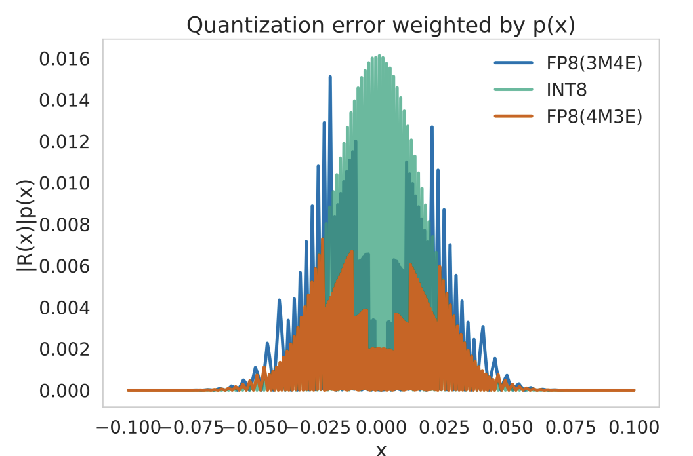

# 模型优化 {#sec-model-optimizations}

::: {layout-narrow}

::: {.column-margin}

*DALL·E 3 提示词：一幅插图，描绘一个神经网络模型被表现为一个繁忙的施工工地，其中有一群多元化的建筑工人，男女都有，来自不同族裔，分别标注为“剪枝”“量化”和“稀疏性”。他们正在协同工作，使神经网络更高效、更小，同时保持较高的准确率。“剪枝”工人是一位拉丁裔女性，正在从网络中间切除不必要的连接。“量化”工人是一位白人男性，正在对各处的权重进行调整或微调。“稀疏性”工人是一位非洲裔女性，正在移除不必要的节点以缩小模型。背景中有工程卡车和起重机，协助工人完成任务。神经网络在视觉上正从一个复杂庞大的结构，转变为一个更加精简、更小的结构。*

:::

\noindent
:::

## 目的 {.unnumbered}

_研究优化的模型与生产部署约束之间的不匹配，如何在机器学习系统中造成关键的工程挑战？_

机器学习研究将准确率置于一切考量之上，产出的模型性能卓越，却无法部署到最需要它们的地方：资源受限的移动设备、对成本敏感的云环境，或对延迟要求极高的边缘应用。模型优化在理论能力与实际部署之间架起桥梁，将计算密集型的研究模型转化为高效系统，在满足内存、能耗、延迟和成本等严格约束的同时保留性能。如果没有系统性的优化技术，先进的人工智能能力仍将被困在研究实验室中。理解优化原理能够帮助工程师普及人工智能能力，使复杂模型能够在多样化的部署场景中被广泛使用，从在移动设备上运行的百亿参数大语言模型到嵌入式传感器。

::: {.callout-tip title="学习目标"}

- 比较包括剪枝、量化、知识蒸馏和神经架构搜索在内的模型优化技术，分析它们的工作机制和应用场景

- 评估数值精度级别之间的权衡，以及它们对模型准确率、能耗和硬件兼容性的影响

- 应用三分式优化框架（模型表示、数值精度、架构效率）为特定硬件约束设计部署策略

- 分析硬件感知设计原则如何影响不同部署平台上的模型架构决策和计算效率

- 实现稀疏性利用和动态计算技术，以提升推理性能，同时保持准确率

- 设计集成式优化流水线，将多种技术结合起来，在资源约束下实现特定的部署目标

- 评估自动化优化方法及其在超越手动调优、发现新型优化策略方面的作用
:::

## 模型优化基础 {#sec-model-optimizations-model-optimization-fundamentals-064e}

成功部署机器学习系统，需要解决模型复杂性与计算可行性之间的矛盾。当代机器学习研究产生了越来越强大的模型，其资源需求往往超过现实部署环境的实际约束。这体现了将理论进展转化为可行系统的经典工程挑战，并影响着机器学习应用的可及性与可扩展性。

这种资源差距的规模相当可观，而且涉及多个方面。最先进的语言模型在全精度参数存储方面可能需要数百 GB 的内存 [@brown2020gpt3; @chowdhery2022palm]，而移动设备等目标部署平台通常只提供几 GB 的可用内存。这种差异不仅体现在内存约束上，还涵盖计算吞吐量、能耗和延迟要求。异构部署环境的性质进一步加剧了这一挑战，因为每种环境都会施加不同的约束和性能要求。

::: {.callout-definition title="模型优化"}

***模型优化*** 是对机器学习模型进行系统性变换，在保留 _任务性能_ 的同时最大化 _计算效率_，从而支持在 _多样化的硬件约束_ 下部署。
:::

模型优化这门工程学科已经发展出系统的方法论，通过将算法创新与硬件感知设计原则相结合来应对这些挑战。有效的优化策略需要深入理解模型架构、数值精度、计算模式与目标硬件特性之间的相互作用。这种跨学科方法将优化从一组临时性的技巧，转变为由理论基础和经验验证共同指导的、具有原则性的工程学科。

本章建立了一个全面的模型优化理论与实践框架，围绕三个相互关联的维度展开：模型表示的结构效率、通过精度优化实现的数值效率，以及通过硬件感知实现所提升的计算效率。在这一框架下，我们将考察诸如量化等成熟技术如何实现内存压缩与推理加速，剪枝方法如何在保留模型准确性的同时消除参数冗余，以及知识蒸馏如何将复杂模型的能力迁移到高效架构中。其总目标超越了单纯的性能指标，而是使先进的机器学习能力能够部署到完整范围的计算环境和应用领域中。

## 优化框架 {#sec-model-optimizations-optimization-framework-1c8e}

优化过程通过三个相互关联的维度来运行，连接软件算法与硬件执行，如 @fig-3-sections 所示。理解这些维度及其关系，为本章探讨的所有技术提供了概念基础。

::: {#fig-3-sections fig-env="figure" fig-pos="htb"}

```{.tikz}
\resizebox{.45\textwidth}{!}{
\begin{tikzpicture}[font=\small\usefont{T1}{phv}{m}{n}]
\tikzset{
  Box/.style={inner xsep=2pt,
  draw=black!90,
  line width=0.75pt,
  anchor=west,
  text width=54mm,align=flush center,
  minimum width=54mm, minimum height=9mm
  },
}
\node[Box,fill=red!30,anchor=south west](B1)at (0.33,0.5){Efficient Hardware Implementation};
\node[Box,fill=red!20,node distance=0.4,above=of B1](B2){Efficient Numerics Representation};
\node[Box,fill=red!10,node distance=0.4,above=of B2](B3){Efficient Model Representation};
\draw[latex-latex,line width=0.75pt](0,0)--++(90:4.85);

\node[left=1 of B1,rotate=90,anchor=north,font=\footnotesize\sf]{More hardware};
\node[left=1 of B3,rotate=90,anchor=north,font=\footnotesize\sf]{More software};
\end{tikzpicture}}
```
**优化栈**：模型优化沿着三个层次推进（高效模型表示、高效数值表示和高效硬件实现），每一层都针对系统性能和资源利用的不同方面。这些层次使得可以在模型精度、计算成本和内存占用之间进行结构化权衡，以满足不同部署环境的需求。

:::

理解这些层次之间的相互作用，可以揭示优化工程的系统性。模型表示技术（剪枝、蒸馏、结构化近似）降低计算复杂度，同时为数值精度优化创造机会。量化和低精度算术利用硬件能力实现更快执行，而架构效率技术则使计算模式与处理器设计相匹配。软件优化通过创建结构化、可预测的工作负载，为硬件加速奠定基础，使专用处理器能够高效执行。

本章从工程视角考察每一层优化，提供量化（训练后量化和量化感知训练）、剪枝策略（基于幅值、结构化和动态）以及蒸馏流程（温度缩放、特征迁移）的具体算法。我们探讨这些技术如何协同组合，以及它们的有效性如何依赖于目标硬件特性。该框架指导系统化的优化决策，确保模型转换与部署约束相一致，同时保留关键能力。

本章通过对优化原则的系统应用，将前面基础中的效率概念转化为可操作的工程实践。掌握量化、剪枝和蒸馏技术，为实践者提供了在多样计算环境中部署复杂机器学习模型所必需的工具。这里提出的优化框架弥合了理论模型能力与实际部署需求之间的鸿沟，使机器学习系统能够在真实世界应用中同时实现性能与效率。

## 部署上下文 {#sec-model-optimizations-deployment-context-c1b0}

机器学习模型作为更大系统的一部分运行，这些系统具有复杂的约束、依赖关系和权衡。模型优化不能被视为纯粹的算法问题；它必须被看作一个系统级挑战，需要考虑计算效率、可扩展性、部署可行性以及整体系统性能。来自 @sec-ml-operations 的运行原则为理解模型优化的系统视角奠定了基础，强调了优化为何重要、驱动优化工作的关键约束，以及定义有效优化策略的原则。

### 实际部署 {#sec-model-optimizations-practical-deployment-6148}

现代机器学习模型通常在基准数据集上取得令人印象深刻的准确率，但要将其变为适用于真实世界的实用方案，远非易事。机器学习系统在计算、内存、延迟和能耗约束下运行，这些约束会显著影响训练和推理 [@choudhary2020comprehensive]。在研究环境中表现良好的模型，一旦集成到更大的系统中，往往会发现并不实用，无论部署环境是云端、智能手机集成还是微控制器实现。

除这些部署复杂性之外，现实可行性还体现在训练、存储和执行效率上，而不仅仅是准确率。[^fn-microcontroller-constraints]

[^fn-microcontroller-constraints]: **微控制器约束**：Arduino Uno 具有 2KB SRAM，而闪存存储为 32KB。ARM Cortex-M4 实现通常具有 256KB 闪存、64KB RAM，运行频率最高可达 168MHz；而现代 GPU 的时钟频率为 3000+ MHz，内存为 16-80GB，这意味着资源差距超过 10,000 倍。

效率要求在不同部署场景中表现各异。在大规模云端 ML 场景中，优化模型有助于减少训练时间、计算成本和功耗，从而使大规模 AI 工作负载更加高效 [@dean2018new]。相比之下，边缘 ML[^fn-edge-ml-definition] 要求模型在有限的计算资源下运行，因此需要通过优化来降低内存占用和计算复杂度。移动 ML 引入了额外约束，例如电池寿命和实时响应能力，而 tiny ML[^fn-tiny-ml-definition] 则将效率要求推向极致，要求模型能够适配超低功耗设备的内存和处理限制 [@banbury2020benchmarking]。

[^fn-edge-ml-definition]: **边缘 ML**：一种计算范式，ML 推理发生在本地设备（智能手机、IoT 传感器、自动驾驶车辆）上，而不是云服务器上。它将延迟从 100-500ms 的云端往返时间降低到 <10ms 的本地处理，但将模型规模限制在 10-500MB，而不是云端的多 GB 模型。

[^fn-tiny-ml-definition]: **Tiny ML**：在 <1mW 功耗预算和 <1MB 内存约束下运行的超低功耗 ML 系统。它使助听器、智能传感器和可穿戴设备中的常开式 AI 成为可能。模型通常只有 10-100KB，而云端模型可达 GB 级，代表着 10,000 倍的规模缩减。

优化有助于实现可持续且可访问的 AI 部署，这遵循了 @sec-sustainable-ai 中确立的可持续性原则。随着 AI 工作负载规模不断扩大，降低模型的能耗足迹变得尤为重要，有助于减轻大规模 ML 训练和推理 [@patterson2021carbon] 对环境的影响。同时，经过优化的模型还能扩大机器学习的应用范围，支持低资源环境中的应用，从农村医疗到在野外运行的自主系统。

### 平衡权衡 {#sec-model-optimizations-balancing-tradeoffs-27bb}

准确率与效率之间的张力驱动着各个维度上的优化决策。增加模型容量通常会提升预测性能，但同时也会增加计算成本，从而导致推理速度变慢、资源消耗更高。这些改进会带来与内存占用 [^fn-memory-bandwidth]、推理延迟、功耗和训练效率相关的挑战。随着机器学习系统部署到各种硬件平台上，平衡准确率和效率成为模型优化中的关键挑战。

[^fn-memory-bandwidth]: **内存带宽**：现代 GPU 的内存带宽可达 3.0 TB/s（H100 SXM5），而高端移动 SoC 的内存带宽为 25-50 GB/s。大语言模型在训练时需要 GPU 内存容量达到模型大小的 1-2 倍（16GB 的模型需要 32GB+ 的 GPU 内存），从而形成“内存墙”瓶颈。

这种张力在不同部署场景中的表现各不相同。训练所需的计算资源会随着模型规模增长而扩展，而推理在实时应用中则要求严格的延迟和功耗约束。

## 框架应用与导航 {#sec-model-optimizations-framework-application-navigation-03d4}

本节为将优化技术应用于现实世界问题提供实用指导，考察系统约束如何映射到优化维度，并提供用于选择技术的导航策略。

### 约束映射 {#sec-model-optimizations-mapping-constraints-021d}

在考察具体技术之前，理解系统约束如何映射到优化维度，可提供一个导航框架。当面临部署挑战时，这种映射会引导实践者转向最相关的方法。内存带宽限制表明应关注模型表示和数值精度优化，而延迟瓶颈则提示应考察模型表示和架构效率技术。@tbl-constraint-opt-mapping 总结了不同系统约束如何映射到模型优化的三个核心维度。

| **系统约束** | **模型表示** | **数值精度** | **架构效率** |
|:---|:---|:---|:---|
| **计算成本** | ✗ | ✓ | ✓ |
| **内存与存储** | ✓ | ✓ | ✗ |
| **延迟与吞吐量** | ✓ | ✗ | ✓ |
| **能效** | ✗ | ✓ | ✓ |
| **可扩展性** | ✓ | ✗ | ✓ |

: **优化维度**：系统约束推动优化沿着三个核心维度展开——模型表示、数值精度和架构效率——每个维度都针对不同的资源限制和性能目标。该表将计算成本映射到精度和效率，将内存/存储映射到表示和精度，将延迟/吞吐量映射到表示和效率，从而指导选择合适的优化技术。 {#tbl-constraint-opt-mapping}

这种系统化映射建立在 @sec-efficient-ai 中提出的效率原则之上。这里我们专注于模型级优化，即通过具体技术来实现这些效率原则。尽管每个系统约束主要对应一个或多个优化维度，但这些关系并非严格的一一对应。许多优化技术会同时影响多个约束。将模型优化沿着这三个维度进行结构化，并把技术映射到特定系统约束，能够帮助实践者更有效地分析权衡，并选择最符合部署需求的优化方案。

### 导航策略 {#sec-model-optimizations-navigation-strategies-1c74}

本章呈现了一套覆盖模型表示、数值精度和架构效率的综合优化技术工具箱。然而，并非所有技术都适用于每一个问题，而且技术种类繁多，可能令人感到不知所措。这份导航指南将帮助你根据具体约束和目标确定从何处入手。@tbl-constraint-opt-mapping 指出哪一类优化维度用于解决特定瓶颈。内存或模型大小受限表明应关注能够减少参数数量和比特宽度的模型表示与数值精度技术。推理延迟要求则提示应考察能够降低计算负载并提高硬件利用率的模型表示和架构效率方法。训练或推理成本约束优先考虑能够最小化每次运算计算成本的数值精度和架构效率方法。若精度下降不可接受，则应采用在训练过程中集成的、感知训练的优化技术，而不是训练后再事后应用。

生产系统通常遵循既定模式，而不是随机探索技术。快速部署方法采用训练后修改，只需极少的代码变更，可在数小时内实现 4–8 倍压缩，准确率损失为 1–2%[@gholami2021survey; @nagel2021white]。生产级优化则按顺序组合多种技术（先减少参数，再通过训练细化恢复精度，最后应用量化），可在数周内实现 8–15 倍压缩，准确率损失低于 1%。针对小于 1MB 模型的极端约束场景，则需要从一开始就进行架构变更，包括自动化架构发现和超低精度，这通常需要数月的专门工程投入。

模型优化更像是一项系统工程挑战，而不是通用解法。优化收益高度依赖目标硬件，同样的量化技术在专用加速器上可实现 4 倍加速，而在通用处理器上仅能实现 1.5 倍加速 [@jacob2018quantization; @krishnamoorthi2018quantizing]。准确率保持情况也会因模型架构和任务而异，因为视觉模型通常比语言模型更能容忍激进优化。优化需要迭代测量，而不是一次性应用。当数据预处理或网络 I/O 主导延迟时，系统级瓶颈可能限制收益，使模型优化效果很小。在投入优化之前进行系统级剖析仍然至关重要（详见策略与实现部分）。

本综合章节支持非线性阅读方式。部署已有模型的 ML 工程师可优先关注数值精度部分中的训练后技术，这些技术只需极少的代码变更即可快速改进。研究人员和高级实践者则需要全面研读，尤其要关注数学表述和集成原则。刚接触优化的学生则可通过逐步递进的复杂度标记来学习，从基础技术推进到高级技术，从基本概念推进到专门算法。每个主要部分都按照从易到难的方式系统展开。

## 优化维度 {#sec-model-optimizations-optimization-dimensions-e571}

每个优化维度都值得深入考察。如 @fig-3-sections 所示，模型表示优化会减少要执行的计算，数值精度优化会改变计算的执行方式，而架构效率优化则确保操作在目标硬件上高效运行。

### 模型表示 {#sec-model-optimizations-model-representation-051a}

第一个维度，模型表示优化，侧重于消除机器学习模型结构中的冗余。大型模型通常包含大量参数 [^fn-overparameterization]，这些参数对整体性能贡献不大，却会显著增加内存占用和计算成本。模型表示优化涉及移除不必要组件，同时保持预测准确性的技术。这些技术包括剪枝、知识蒸馏以及自动化架构搜索方法，它们通过细化模型结构来平衡效率与准确性。这些优化主要影响模型在算法层面的设计方式，确保它们在保持有效性的同时仍具备可计算管理性。

### 数值精度 {#sec-model-optimizations-numerical-precision-a93d}

表示技术会修改执行哪些计算，而精度优化则通过降低权重、激活值和算术运算的数值保真度来改变这些计算的执行方式。第二个维度，数值精度优化，关注机器学习模型内部数值的表示和处理方式。本节详细介绍的精度优化技术旨在解决这些效率挑战。量化技术将高精度权重和激活值映射为低比特表示，使其能够在 GPU、TPU 以及专用 AI 芯片等硬件加速器上高效执行（@sec-ai-acceleration）。混合精度训练 [^fn-mixed-precision] 会在训练过程中动态调整精度级别，以在效率和准确性之间取得平衡。

[^fn-mixed-precision]: **混合精度训练**：在前向传播中使用 FP16，在梯度计算中使用 FP32，可实现 1.5-2 倍的训练加速，同时将内存占用减少约 50%。NVIDIA 的自动混合精度（AMP）在保持 FP32 准确性的同时，在 V100 上可带来约 1.6 倍加速，在 A100 GPU 上最高可达 2.2 倍。

谨慎的数值精度优化能够在保持可接受准确率的同时显著降低计算成本，从而让资源受限环境中的用户也能访问复杂模型。

### 架构效率 {#sec-model-optimizations-architectural-efficiency-d507}

第三个维度，架构效率，关注训练和推理过程中的高效计算性能。即使模型结构设计得再好，若执行过程仍然不理想，也不足以保证效率。许多机器学习模型的计算图中存在冗余，导致操作调度和执行方式效率低下。稀疏性 [^fn-sparsity-def] 是一项关键的架构效率技术，模型通过利用取值为零的参数来减少计算量。

[^fn-sparsity-def]: **稀疏性**：模型中取值为零的参数所占百分比。90% 稀疏的模型只有 10% 的非零权重，在专用硬件支持下可将内存减少 10 倍、计算减少 10 倍。现代 Transformer 在推理期间通常自然表现出 80-95% 的激活稀疏性。

架构效率涉及一系列技术：利用模型权重和激活值中的稀疏性，将大型计算组件分解为更高效的形式 [^fn-matrix-factorization]，并根据输入复杂度动态调整计算。

[^fn-matrix-factorization]: **矩阵分解**：将大型权重矩阵（例如 4096×4096）分解为更小的矩阵（4096×256 × 256×4096），将参数量从 1600 万降至 200 万（减少 8 倍）。SVD 和低秩近似在保持 95% 以上准确率的同时，可在移动硬件上实现 3-5 倍加速。

这些架构优化方法提升了不同硬件平台上的执行效率，降低了延迟和功耗。这些效率原则也自然延伸到训练场景，其中梯度检查点和低秩适配 [^fn-lora] 等技术有助于减少内存开销和计算需求。

[^fn-lora]: **LoRA（低秩适配）**：一种微调技术，它冻结预训练权重并添加小型可训练矩阵，将可训练参数减少 99% 以上（以 GPT-3 规模为例，从 175B 降至约 120 万）。在降低训练内存和计算量 3 倍的同时，仍能获得相近的性能。

### 三维优化框架 {#sec-model-optimizations-threedimensional-optimization-framework-a60e}

当考察各种技术之间的相互作用时，这一三维框架的相互关联性就会显现出来。剪枝主要解决模型表示问题，但也会通过减少推理操作来影响架构效率。量化聚焦于数值精度，但会影响内存占用和执行效率。理解这些相互依赖关系，有助于实现最优的优化组合。

这种相互关联性意味着，优化方案的选择由系统约束驱动，而系统约束定义了模型必须在其中运行的实际限制。部署在数据中心中的机器学习模型，与运行在移动设备或嵌入式系统上的模型面临不同的约束。计算成本、内存使用、推理延迟和能效都会影响在特定场景下哪些优化最为合适。对于过于庞大、无法适配资源受限设备的模型，可能需要激进的剪枝和量化；而对延迟敏感的应用则可能受益于算子融合 [^fn-operator-fusion] 和硬件感知调度。

[^fn-operator-fusion]: **算子融合**：一种图级优化，将多个操作合并为单个内核，减少 30-50% 的内存带宽消耗。在 ResNet-50 中，融合 Conv+BatchNorm+ReLU 操作可在 V100 GPU 上实现 1.8 倍加速，而 BERT Transformer 模块则可通过注意力融合将延迟降低 25%。

在 @tbl-constraint-opt-mapping 中建立的约束-维度映射展示了优化策略与现实约束之间的相互依赖关系。这些关系并不局限于一一对应，因为许多优化技术会同时影响多个约束。

系统地考察每个维度，首先从模型表示优化开始，它涵盖了修改神经网络结构和参数、在保持准确性的同时消除冗余的技术。

## 结构模型优化方法 {#sec-model-optimizations-structural-model-optimization-methods-ca9e}

模型表示优化通过修改神经网络结构和参数来提升效率，同时保持准确率。现代模型往往更重视准确率而非效率，因而包含过多参数，增加了成本并减慢了推理速度。此类优化通过两个目标来解决低效问题：消除冗余（利用过参数化现象，即模型可以用更少的参数达到相近性能），以及通过梯度检查点 [^fn-gradient-checkpointing] 和并行处理模式 [^fn-parallel-processing] 等技术，将计算过程组织得更适合高效硬件执行。

[^fn-gradient-checkpointing]: **梯度检查点**：一种内存优化技术，通过在反向传播期间重新计算中间激活值，而不是将其存储下来，从而以计算换取内存。在 transformer 模型中，可将内存使用量减少 20-50%，使得在相同 GPU 内存条件下能够使用更大的批量大小或更大的模型。

[^fn-parallel-processing]: **机器学习中的并行处理**：高端数据中心 GPU 的核心数通常为 5,000-10,000+，而 CPU 只有 8-64 个核心。NVIDIA H100 的 tensor 性能达到 989 TFLOPS，而 Intel Xeon 3175-X 在双精度下约为 1.5 TFLOPS，这意味着对于可并行化的机器学习工作负载，前者在计算密度上具有 650 倍优势。

优化挑战在于平衡相互竞争的约束 [^fn-pareto-frontier]。激进的压缩可能导致准确率下降，使模型在生产环境中不可靠；而优化不足则会使模型过大或过慢，无法满足目标部署环境的要求。选择合适的技术需要理解模型大小、计算复杂度和泛化性能之间的权衡。

[^fn-overparameterization]: **过参数化**：现代神经网络通常拥有比理论上所需多 10-100 倍的参数。GPT-3 的 1750 亿参数理论上可以压缩到 10 亿到 100 亿，同时保持 95% 的性能，但过参数化能够在学习过程中带来更快的训练收敛和更好的泛化能力。

[^fn-pareto-frontier]: **帕累托前沿**：在模型优化中，指这样一条曲线：要提升一个指标（如速度），就必须牺牲另一个指标（如准确率）。EfficientNet 系列展示了最优的准确率-FLOPs 权衡：从 EfficientNet-B0（ImageNet 准确率 77.1%，390M FLOPs）到 B7（84.4%，37B FLOPs），表明随着规模增大，收益会逐渐递减。

三种关键技术可应对这一挑战：剪枝去除影响较小的参数，知识蒸馏将能力迁移到更小的模型，而 NAS 则针对特定约束自动设计架构。每种技术都提供了不同的优化路径，同时保持模型性能。

这三种技术在我们的优化框架中代表了不同但互补的方法。剪枝和知识蒸馏减少现有模型中的冗余，而 NAS 则从零开始构建经过优化的架构。在许多情况下，它们可以组合使用，以实现更高程度的优化。

### 剪枝 {#sec-model-optimizations-pruning-3f36}

内存墙限制了系统性能：随着模型变得越来越大，瓶颈不再是计算能力，而是内存带宽。剪枝通过消除参数来降低内存需求，直接应对这一限制。最先进的机器学习模型通常包含数百万甚至数十亿个参数，其中许多对最终预测的贡献微乎其微。虽然大模型增强了表示能力和泛化能力，但它们也带来了内存占用、计算成本和可扩展性方面的低效问题，这些问题会影响云端、边缘和移动环境中的训练与部署。

为维持准确率而保留参数的必要性差异很大。许多权重对决策过程的贡献很小，因此可以在不显著损失性能的情况下通过移除来大幅提升效率。之所以存在这种冗余，是因为现代神经网络高度过参数化，也就是说，它们的权重数量远远超过解决任务所严格需要的数量。这种过参数化在训练阶段具有重要作用，它提供了多种优化路径，并有助于避免较差的局部最优，但在部署阶段则为压缩创造了机会。模型压缩通过 @sec-dl-primer 中的信息论原理来保持性能，其中神经网络的过参数化创造了压缩机会。这一观察促使我们采用剪枝——一种系统性移除冗余参数并同时保持模型准确率的优化技术。

::: {.callout-definition title="剪枝"}

***剪枝*** 是一种模型优化技术，它从神经网络中移除_冗余参数_，同时保持_性能_，从而减少_模型大小_和_计算成本_，以便高效部署。
:::

剪枝使模型能够在不重新设计架构的情况下变得更小、更快、更高效。通过消除冗余，剪枝直接解决了机器学习系统在内存、计算和可扩展性方面的约束，使其成为在多种硬件平台上部署模型的关键技术。

现代框架提供了内置 API，使这些优化技术易于使用。PyTorch 提供了用于剪枝操作的 `torch.nn.utils.prune`，而 TensorFlow 提供了 Model Optimization Toolkit[^fn-tf-model-optimization]，其中包含 `tfmot.sparsity.keras.prune_low_magnitude()` 等函数。这些工具将复杂的研究算法转化为实用的函数调用，使各个水平的从业者都能够实现优化。

[^fn-tf-model-optimization]: **TensorFlow 模型优化**：TensorFlow Model Optimization Toolkit 提供可直接用于生产的量化（可实现 4 倍模型大小缩减）、剪枝（最高可达 90% 稀疏度）和聚类技术。YouTube、Gmail 和 Google Photos 使用它在全球 40 多亿设备上部署模型。

#### 剪枝示例 {#sec-model-optimizations-pruning-example-bb9f}

可以通过一个系统化的示例来说明剪枝。剪枝会识别那些对模型预测贡献很小的权重，并在保持准确率的同时将其移除。最直观的方法是考察权重幅值，因为绝对值较小的权重通常对输出影响较小，因此是适合移除的候选项。@lst-pruning_example 展示了在一个 3×3 权重矩阵上进行基于幅值的剪枝，说明一个简单的阈值规则如何创建稀疏性。

::: {#lst-pruning_example lst-cap="**Magnitude-Based Pruning**: Removes weights below a threshold to create sparse matrices, reducing the number of nonzero parameters from 9 to 4."}

```{.python}
import torch
import torch.nn.utils.prune as prune

# Original dense weight matrix
weights = torch.tensor(
    [[0.8, 0.1, -0.7], [0.05, -0.9, 0.03], [-0.6, 0.02, 0.4]]
)

# Simple magnitude-based pruning: remove weights with magnitude < 0.5
threshold = 0.5
mask = torch.abs(weights) >= threshold
pruned_weights = weights * mask

print("Original:", weights)
print("Pruned:", pruned_weights)
# Result: 4 out of 9 weights remain (56% sparsity)
```
:::

这个例子说明了剪枝的核心目标：在保持模型性能的同时尽量减少参数数量。我们将非零参数从 9 个减少到了 4 个（只保留 4 个权重，因此预算为$k=4$）。幅值最小的权重（0.4、0.1、0.05、0.03、0.02）被移除，而幅值最大的四个权重（0.8、-0.7、-0.9、-0.6）被保留下来。

将这一直觉扩展到完整的神经网络时，需要同时考虑要移除多少参数（稀疏度水平）以及要移除哪些参数（选择准则）。下一幅可视化将展示这一思想如何应用于更大的权重矩阵。

如 @fig-sparse-matrix 所示，剪枝通过消除小幅值权重减少非零权重的数量，将稠密权重矩阵转化为稀疏表示。这种对稀疏性的显式约束与我们优化公式中的$\ell_0$范数约束一致。

::: {#fig-sparse-matrix fig-env="figure" fig-pos="htb"}

```{.tikz}
\begin{tikzpicture}[line join=round,font=\usefont{T1}{phv}{m}{n}\footnotesize]
\tikzset{%
cell/.style={draw=black!80,line width=0.5pt, minimum size=\cellsize,
    minimum height=\cellheight}
}
\definecolor{Blue1}{RGB}{84,131,217}
\definecolor{Blue2}{RGB}{145,177,237}
\definecolor{Blue3}{RGB}{201,217,247}
\definecolor{Blue4}{RGB}{227,235,250}
\colorlet{Blue1}{magenta!70}
\colorlet{Blue2}{magenta!50}
\colorlet{Blue3}{magenta!30}
\colorlet{Blue4}{magenta!05}
\def\columns{3}
\def\rows{3}
\def\cellsize{8mm}
\def\cellheight{8mm}

%%LEFT
\begin{scope}[local bounding box=M1,shift={(0,0)}]
\def\columns{11}
\def\rows{11}
\def\br{M1}
\foreach \x in {1,...,\columns}{
    \foreach \y in {1,...,\rows}{
        %
\node[draw=black!80, fill=Blue4, minimum width=\cellsize,
                    minimum height=\cellheight, line width=0.5pt] (cell-\x-\y\br) at (\x*\cellsize,-\y*\cellheight) {0.01};
    }
}
%1
\foreach \c/\n/\f in {3/-1.9/Blue3,5/1.76/Blue3,8/3.75/Blue2,2/0.02/Blue4,4/0.02/Blue4,9/0.02/Blue4}{
\node[cell,fill=\f]at(cell-\c-1M1){\n};
}
%2
\foreach \c/\n/\f in {1/7.93/Blue1,4/0.68/Blue3,7/-1.1/Blue3,2/0.02/Blue4,5/0.02/Blue4,9/0.02/Blue4}{
\node[cell,fill=\f]at(cell-\c-2M1){\n};
}
%3
\foreach \c/\n/\f in {3/5.2/Blue2,4/0.2/Blue3,9/-6.2/Blue2,1/0.02/Blue4,5/0.02/Blue4,8/0.02/Blue4,10/0.02/Blue4}{
\node[cell,fill=\f]at(cell-\c-3M1){\n};
}
%4
\foreach \c/\n/\f in {9/-2.5/Blue3,2/0.02/Blue4,7/0.02/Blue4}{
\node[cell,fill=\f]at(cell-\c-4M1){\n};
}
%5
\foreach \c/\n/\f in {1/0.32/Blue3,3/-3.5/Blue3,5/0.88/Blue3,7/0.02/Blue4,9/0.02/Blue4,11/0.02/Blue4}{
\node[cell,fill=\f]at(cell-\c-5M1){\n};
}
 %6
\foreach \c/\n/\f in {4/2.4/Blue3,6/-3.1/Blue2,11/8.26/Blue1,2/0.02/Blue4,3/0.02/Blue4,5/0.02/Blue4,9/0.02/Blue4}{
\node[cell,fill=\f]at(cell-\c-6M1){\n};
}
%7
 \foreach \c/\n/\f in {1/0.96/Blue2,2/9.77/Blue1,3/0.92/Blue3,7/8.5/Blue1,8/6.6/Blue2}{
\node[cell,fill=\f]at(cell-\c-7M1){\n};
}
%8
\foreach \c/\n/\f in {2/0.8/Blue2,1/0.03/Blue4,4/0.03/Blue4,7/0.03/Blue4,6/0.02/Blue4,8/0.02/Blue4,9/0.02/Blue4,11/0.02/Blue4}{
\node[cell,fill=\f]at(cell-\c-8M1){\n};
}
%9
\foreach \c/\n/\f in {8/0.7/Blue3,9/14.8/Blue1,11/0.91/Blue3,2/0.02/Blue4,4/0.02/Blue4,7/0.03/Blue4}{
\node[cell,fill=\f]at(cell-\c-9M1){\n};
}
 %10
 \foreach \c/\n/\f in {7/-0.38/Blue2,11/10.1/Blue1,1/0.02/Blue4,2/0.02/Blue4,5/0.02/Blue4,10/0.03/Blue4}{
\node[cell,fill=\f,inner sep=0pt]at(cell-\c-10M1){\n};
}
 %11
 \foreach \c/\n/\f in {3/16.3/Blue1,6/2.9/Blue2,10/-5.4/Blue2,2/0.03/Blue4,4/0.03/Blue4,9/0.02/Blue4}{
\node[cell,fill=\f,inner sep=0pt]at(cell-\c-11M1){\n};
}
\end{scope}

%%RIGHT
\begin{scope}[local bounding box=M2,shift={(11,0)}]
\def\columns{11}
\def\rows{11}
\def\br{M2}

\foreach \x in {1,...,\columns}{
    \foreach \y in {1,...,\rows}{
        %
        \node[draw=black!80, fill=white, minimum width=\cellsize,
                    minimum height=\cellheight, line width=0.5pt] (cell-\x-\y\br) at (\x*\cellsize,-\y*\cellheight) {0};
    }
}
\node[cell,fill=Blue3]at(cell-3-1M2){-1.9};
\node[cell,fill=Blue3]at(cell-5-1M2){1.76};
\node[cell,fill=Blue2]at(cell-8-1M2){3.75};
%2
\node[cell,fill=Blue1]at(cell-1-2M2){7.93};
\node[cell,fill=Blue3]at(cell-4-2M2){0.68};
\node[cell,fill=Blue3]at(cell-7-2M2){-1.1};
%3
\node[cell,fill=Blue2]at(cell-3-3M2){5.2};
\node[cell,fill=Blue3]at(cell-4-3M2){0.2};
\node[cell,fill=Blue2]at(cell-9-3M2){-6.2};
%4
 \node[cell,fill=Blue3]at(cell-9-4M2){-2.5};
%5
\node[cell,fill=Blue3]at(cell-1-5M2){0.32};
\node[cell,fill=Blue3]at(cell-3-5M2){-3.5};
\node[cell,fill=Blue3]at(cell-5-5M2){0.88};
%6
\node[cell,fill=Blue3]at(cell-4-6M2){2.4};
\node[cell,fill=Blue2]at(cell-6-6M2){-3.1};
\node[cell,fill=Blue1]at(cell-11-6M2){8.26};
%7
\node[cell,fill=Blue2]at(cell-1-7M2){0.96};
\node[cell,fill=Blue1]at(cell-2-7M2){9.77};
\node[cell,fill=Blue3]at(cell-3-7M2){0.92};
\node[cell,fill=Blue1]at(cell-7-7M2){8.5};
\node[cell,fill=Blue2]at(cell-8-7M2){6.6};
%8
 \node[cell,fill=Blue2]at(cell-2-8M2){0.8};
%9
\node[cell,fill=Blue3]at(cell-8-9M2){0.7};
\node[cell,fill=Blue1]at(cell-9-9M2){14.8};
\node[cell,fill=Blue3]at(cell-11-9M2){0.91};
%10
\node[cell,fill=Blue2]at(cell-7-10M2){-0.38};
\node[cell,fill=Blue1]at(cell-11-10M2){10.1};
%11
\node[cell,fill=Blue1]at(cell-3-11M2){16.3};
\node[cell,fill=Blue2]at(cell-6-11M2){2.9};
\node[cell,fill=Blue2]at(cell-10-11M2){-5.4};
\end{scope}
\node[above=0.2 of M1,align=center,
            font=\usefont{T1}{phv}{m}{n}\normalsize]{Weight matrix \\ (before pruning)};
\node[above=0.2 of M2,align=center,
            font=\usefont{T1}{phv}{m}{n}\normalsize]{Weight matrix \\ (after pruning -- very sparse)};
\path[draw=OrangeLine, line width=2mm, -{Triangle[length=4mm, bend]},
shorten >=1.1mm, shorten <=1.15mm](cell-11-1M1.north east) to [bend left] (cell-1-1M2.north west);
\end{tikzpicture}
```
**稀疏矩阵转换**：剪枝移除小幅值权重（在右侧矩阵中显示为白色/零），同时保留大幅值权重（以颜色显示），从而创建一种稀疏表示，在保持模型准确率的同时减少内存使用和计算量。

:::

#### 数学形式化 {#sec-model-optimizations-mathematical-formulation-dade}

剪枝的目标可以简单表述为：我们希望找到一个具有尽可能少非零权重（最小尺寸）的模型版本，同时使预测误差（损失）的增加尽可能小。这个直观目标可转化为一个数学优化问题，为实际的剪枝算法提供指导。

剪枝过程可以形式化为一个优化问题。给定一个参数为$W$的已训练模型，我们希望找到一个稀疏版本$\hat{W}$，仅保留最重要的参数。其目标可表示为：$$
\min_{\hat{W}} \mathcal{L}(\hat{W}) \quad \text{subject to} \quad \|\hat{W}\|_0 \leq k
$$其中$\mathcal{L}(\hat{W})$表示剪枝后的模型损失函数，$\hat{W}$表示剪枝后模型的参数，$\|\hat{W}\|_0$是 L0 范数（非零参数的数量），而$k$是约束模型最大规模的参数预算。

L0 范数通过统计非零参数数量直接衡量模型大小，而这决定了内存使用和计算成本。然而，L0 范数最小化是 NP-hard 问题，因此该优化具有挑战性。实用的剪枝算法会使用诸如基于幅值的选择、基于梯度的重要性评估或二阶灵敏度分析等启发式方法来高效近似求解。

在 @lst-pruning_example 中，这一约束变得具体可见：我们将$\|\hat{W}\|_0$从 9 减少到 4（满足$k=4$），其中幅值阈值作为我们的选择启发式。使用 L1 或 L2 范数的替代形式虽然会鼓励权重变小，但并不能保证严格的零值，因此若没有显式阈值，就无法真正减少实际内存或计算量。

为了使剪枝在计算上可行，实际方法会用一个软正则项替代硬约束：$$
\min_W \mathcal{L}(W) + \lambda \| W \|_1
$$其中$\lambda$控制稀疏程度。$\ell_1$范数会鼓励更小的权重值并促进稀疏性，但不会严格强制权重为零。其他方法则使用迭代式启发策略：在连续步骤中剪去幅值最小的参数，然后通过微调来恢复丢失的准确率 [@gale2020sparse; @blalock2020state]。

#### 目标结构 {#sec-model-optimizations-target-structures-82e7}

剪枝方法会根据从神经网络中移除哪些结构而有所不同。主要目标包括神经元、通道和层，每种方式对模型架构和性能都有不同影响。

* **神经元剪枝** 会移除整个神经元及其相关权重和偏置，从而减少某一层的宽度。这种技术通常用于全连接层。

* **通道剪枝**（或滤波器剪枝）通常用于卷积神经网络，它会删除整个通道或滤波器。这会减少特征图的深度，从而影响网络提取某些特征的能力。通道剪枝在图像处理任务中尤其有价值，因为这些任务对计算效率要求较高。

* **层剪枝** 会移除网络中的整个层，从而显著减少深度。虽然这种方法可以带来显著的效率提升，但它需要仔细权衡，以确保模型保留足够的容量来捕获复杂模式。@fig-channel-layer-pruning 展示了通道剪枝与层剪枝之间的差异。当一个通道被剪除时，模型架构必须相应调整以适应这一结构变化。具体而言，后续层中的输入通道数量必须修改，这要求对应用于被移除通道所在层的滤波器深度进行调整。相比之下，层剪枝会移除某一层内的所有通道，因此需要更大幅度的架构修改。在这种情况下，剩余层之间的连接必须重新配置，以绕过被移除的层。无论采用哪种剪枝方法，微调都很重要，它可以使剩余网络适应变化并恢复性能。

::: {#fig-channel-layer-pruning fig-env="figure" fig-pos="htb"}

```{.tikz}
\begin{tikzpicture}[line join=round,font=\small\usefont{T1}{phv}{m}{n}]
\tikzset{
 Line/.style={line width=0.5pt,black!50,dashed},
 cubes/.pic={
\pgfkeys{/cubes/.cd, #1}
\begin{scope}[scale=\scalefac,every node/.style={scale=1*\scalefac}]
\pgfmathsetmacro{\cubex}{0.1}
\pgfmathsetmacro{\cubey}{1.5}
\pgfmathsetmacro{\cubez}{1.3}
\coordinate (\picname-tl) at (-\cubex,0,0); % top-left point
\coordinate (\picname-tr) at (0,0,0); % top-right point
\coordinate (\picname-br) at (0,-\cubey,0); % bottom-right point
\coordinate (\picname-bl) at (-\cubex,-\cubey,0); % bottom-left point
\coordinate (\picname-ztl) at (-\cubex,0,-\cubez); % ztop-left point
\coordinate (\picname-ztr) at (0,0,-\cubez); % ztop-right point
\coordinate (\picname-zbr) at (0,-\cubey,-\cubez); % zbottom-right point
\coordinate (\picname-zbl) at (-\cubex,-\cubey,-\cubez); %z bottom-left point
%front
\draw[draw=\drawcubecolor,fill=\cubecolor!15, \ifbox@dashed dashed\fi] (0,0,0) -- ++(-\cubex,0,0) -- ++(0,-\cubey,0) -- ++(\cubex,0,0) -- cycle;
%right
\draw[draw=\drawcubecolor,fill=\cubecolor!30, \ifbox@dashed dashed\fi] (0,0,0) -- ++(0,0,-\cubez) -- ++(0,-\cubey,0) -- ++(0,0,\cubez) -- cycle;
%top
\draw[draw=\drawcubecolor,fill=\cubecolor!20, \ifbox@dashed dashed\fi] (0,0,0) -- ++(-\cubex,0,0) -- ++(0,0,-\cubez) -- ++(\cubex,0,0) -- cycle;
            \end{scope}
        }
}
\newif\ifbox@dashed
\box@dashedfalse % default: not dashed

\pgfkeys{
  /cubes/.cd,
  cubecolor/.store in=\cubecolor,
  drawcubecolor/.store in=\drawcubecolor,
  scalefac/.store in=\scalefac,
  picname/.store in=\picname, % ← nova linija
  cubecolor=red,
  drawcubecolor=BrownLine,
  scalefac=1,
  dashed/.is if=box@dashed,
  dashed/.default=true,
  picname=C
}
\newcommand{\Desno}[1]{
\foreach \i /\da in {1,...,9} {
   \pic at ({\i*0.22}, {-0.022*\i}) {cubes={cubecolor=BrownLine,picname=\i-cube#1}};
}
}
\newcommand{\Levo}[1]{
\foreach \i /\da in {1,2,3} {
\pic at ({\i*0.25}, {-0.025*\i}) {cubes={scalefac=1.65,cubecolor=BrownLine,picname=\i-cube#1}};
}
}
\newcommand{\Sredina}[2]{
\foreach \i /\clr/\dclr/\da in {#2} {
\pic at ({\i*0.22}, {-0.022*\i}) {cubes={scalefac=1.35, drawcubecolor=\dclr,
cubecolor=\clr,picname=\i-cube#1,\da}};
}
}
%%%%%%%%%%%%%%%%%%%%%%
\begin{scope}[local bounding box=ROW1,shift={(0,0)}]
\begin{scope}[local bounding box=G1,shift={(0,0)}]
 \Desno{1}
\end{scope}
\begin{scope}[local bounding box=G2,shift={(-4,0.5)}]
\Sredina{2}{1/BrownLine/BrownLine/,
2/red/red/,
3/BrownLine/BrownLine/,
4/BrownLine/BrownLine/,
5/BrownLine/BrownLine/,
6/BrownLine/BrownLine/,
7/BrownLine/BrownLine/,
8/BrownLine/BrownLine/,
9/BrownLine/BrownLine/}
\end{scope}
\begin{scope}[local bounding box=G3,shift={(-7,0.8)}]
\Levo{3}
\end{scope}
\draw[Line] (1-cube1-bl) -- (9-cube2-br);
 \draw[Line] (1-cube1-tl) -- (9-cube2-tr);
 \scoped[on background layer]
\draw[Line] (1-cube1-zbl) -- (9-cube2-zbr);
 \draw[Line] (1-cube1-ztl) -- (9-cube2-ztr);
 %
 \draw[Line] (1-cube2-bl) -- (3-cube3-br);
 \draw[Line] (1-cube2-tl) -- (3-cube3-tr);
 \scoped[on background layer]
\draw[Line] (1-cube2-zbl) -- (3-cube3-zbr);
 \draw[Line] (1-cube2-ztl) -- (3-cube3-ztr);
\end{scope}
%%%%%%%%%%%%%%%%
\begin{scope}[local bounding box=ROW2,shift={(0,-4.5)}]
\begin{scope}[local bounding box=G1,shift={(0,0)}]
 \Desno{1}
\end{scope}
\begin{scope}[local bounding box=G2,shift={(-4,0.5)}]
\Sredina{2}{1/BrownLine/BrownLine/,
2/green!30!/red/dashed,
3/BrownLine/BrownLine/,
4/BrownLine/BrownLine/,
5/BrownLine/BrownLine/,
6/BrownLine/BrownLine/,
7/BrownLine/BrownLine/,
8/BrownLine/BrownLine/,
9/BrownLine/BrownLine/}
\end{scope}
\begin{scope}[local bounding box=G3,shift={(-7,0.8)}]
\Levo{3}
\end{scope}
\draw[Line] (1-cube1-bl) -- (9-cube2-br);
 \draw[Line] (1-cube1-tl) -- (9-cube2-tr);
 \scoped[on background layer]
\draw[Line] (1-cube1-zbl) -- (9-cube2-zbr);
 \draw[Line] (1-cube1-ztl) -- (9-cube2-ztr);
 %
 \draw[Line] (1-cube2-bl) -- (3-cube3-br);
 \draw[Line] (1-cube2-tl) -- (3-cube3-tr);
 \scoped[on background layer]
\draw[Line] (1-cube2-zbl) -- (3-cube3-zbr);
 \draw[Line] (1-cube2-ztl) -- (3-cube3-ztr);
\end{scope}
%%%%%%%%%%%%%%%%
\begin{scope}[local bounding box=ROW3,shift={(0,-9)}]
\begin{scope}[local bounding box=G1,shift={(0,0)}]
 \Desno{1}
\end{scope}
\begin{scope}[local bounding box=G2,shift={(-4,0.5)}]
\Sredina{2}{1/BrownLine/BrownLine/,
2/BrownLine/BrownLine/,
3/BrownLine/BrownLine/,
4/BrownLine/BrownLine/,
5/BrownLine/BrownLine/,
6/BrownLine/BrownLine/,
7/BrownLine/BrownLine/,
8/BrownLine/BrownLine/}
\end{scope}
\begin{scope}[local bounding box=G3,shift={(-7,0.8)}]
\Levo{3}
\end{scope}
\draw[Line] (1-cube1-bl) -- (8-cube2-br);
 \draw[Line] (1-cube1-tl) -- (8-cube2-tr);
 \scoped[on background layer]
\draw[Line] (1-cube1-zbl) -- (8-cube2-zbr);
 \draw[Line] (1-cube1-ztl) -- (8-cube2-ztr);
 %
 \draw[Line] (1-cube2-bl) -- (3-cube3-br);
 \draw[Line] (1-cube2-tl) -- (3-cube3-tr);
 \scoped[on background layer]
\draw[Line] (1-cube2-zbl) -- (3-cube3-zbr);
 \draw[Line] (1-cube2-ztl) -- (3-cube3-ztr);
\end{scope}
\node[draw,
      single arrow, draw=red, fill=red,rotate=-90,
      minimum width=8pt, single arrow head extend=3pt,
      minimum height=13mm, line width=1pt] (ST1)
      at($(ROW1.south)!0.75!(ROW2.north)$){};
\node[below right=1pt and 12pt of ST1.south,align=center,anchor=west]{Prune the selected\\ channel (in red)};
\node[draw,
      single arrow, draw=green!90!black, fill=green!90!black,rotate=-90,
      minimum width=8pt, single arrow head extend=3pt,
      minimum height=13mm, line width=1pt] (ST2)
      at($(ROW2.south)!0.75!(ROW3.north)$){};
\node[below right=1pt and 12pt of ST2.south,align=center,anchor=west]{Reconfigure model's\\
architecture to adjust \\ to the changes};
\node[above=2pt of ROW1]{\textbf{Channel/Filter Pruning}};
%%%%%%%%%%%%%%%%%%%%%%%%%%%%%%%
%RIGHT
\begin{scope}[local bounding box=RROW1,shift={(11,0)}]
\begin{scope}[local bounding box=G1,shift={(0,0)}]
 \Desno{1}
\end{scope}
\begin{scope}[local bounding box=G2,shift={(-4,0.5)}]
\Sredina{2}{1/red/red/,
2/red/red/,
3/red/red/,
4/red/red/,
5/red/red/,
6/red/red/,
7/red/red/,
8/red/red/,
9/red/red/}
\end{scope}
\begin{scope}[local bounding box=G3,shift={(-7,0.8)}]
\Levo{3}
\end{scope}
\draw[Line] (1-cube1-bl) -- (9-cube2-br);
 \draw[Line] (1-cube1-tl) -- (9-cube2-tr);
 \scoped[on background layer]
\draw[Line] (1-cube1-zbl) -- (9-cube2-zbr);
 \draw[Line] (1-cube1-ztl) -- (9-cube2-ztr);
 %
 \draw[Line] (1-cube2-bl) -- (3-cube3-br);
 \draw[Line] (1-cube2-tl) -- (3-cube3-tr);
 \scoped[on background layer]
\draw[Line] (1-cube2-zbl) -- (3-cube3-zbr);
 \draw[Line] (1-cube2-ztl) -- (3-cube3-ztr);
\end{scope}
%%%%%%%%%%%%%%%%
\begin{scope}[local bounding box=RROW2,shift={(11,-4.5)}]
\begin{scope}[local bounding box=RG1,shift={(0,0)}]
 \Desno{1}
\end{scope}
\begin{scope}[local bounding box=RG2,shift={(-4,0.5)}]
\Sredina{2}{1/green!30!/red/dashed,
2/green!30!/red/dashed,
3/green!30!/red/dashed,
4/green!30!/red/dashed,
5/green!30!/red/dashed,
6/green!30!/red/dashed,
7/green!30!/red/dashed,
8/green!30!/red/dashed,
9/green!30!/red/dashed}
\end{scope}
\begin{scope}[local bounding box=RG3,shift={(-7,0.8)}]
\Levo{3}
\end{scope}
\draw[Line] (1-cube1-bl) -- (9-cube2-br);
 \draw[Line] (1-cube1-tl) -- (9-cube2-tr);
 \scoped[on background layer]
\draw[Line] (1-cube1-zbl) -- (9-cube2-zbr);
 \draw[Line] (1-cube1-ztl) -- (9-cube2-ztr);
 %
 \draw[Line] (1-cube2-bl) -- (3-cube3-br);
 \draw[Line] (1-cube2-tl) -- (3-cube3-tr);
 \scoped[on background layer]
\draw[Line] (1-cube2-zbl) -- (3-cube3-zbr);
 \draw[Line] (1-cube2-ztl) -- (3-cube3-ztr);
\end{scope}
%%%%%%%%%%%%%%%%
\begin{scope}[local bounding box=RROW3,shift={(11,-9)}]
\begin{scope}[local bounding box=RG1,shift={(-2,0)}]
 \Desno{1}
\end{scope}
\begin{scope}[local bounding box=RG3,shift={(-5.5,0.8)}]
\Levo{3}
\end{scope}
\draw[Line] (1-cube1-bl) -- (3-cube3-br);
 \draw[Line] (1-cube1-tl) -- (3-cube3-tr);
 \scoped[on background layer]
\draw[Line] (1-cube1-zbl) -- (3-cube3-zbr);
 \draw[Line] (1-cube1-ztl) -- (3-cube3-ztr);
 %
\end{scope}
 \node[draw,
      single arrow, draw=red, fill=red,rotate=-90,
      minimum width=8pt, single arrow head extend=3pt,
      minimum height=13mm, line width=1pt] (RST1)
      at($(RROW1.south)!0.75!(RROW2.north)$){};
\node[below right=1pt and 12pt of RST1.south,align=center,anchor=west]{Prune the entire layer\\
(all channels in red)};
\node[draw,
      single arrow, draw=green!90!black, fill=green!90!black,rotate=-90,
      minimum width=8pt, single arrow head extend=3pt,
      minimum height=13mm, line width=1pt] (RST2)
      at($(RROW2.south)!0.75!(RROW3.north)$){};
\node[below right=1pt and 12pt of RST2.south,align=center,anchor=west]{Reconfigure model's\\
architecture to adjust \\ to the changes};
\node[above=2pt of RROW1]{\textbf{Layer Pruning}};
\draw[violet!30,line width=2pt]($(ROW1.north east)!0.5!(RROW1.north west)$)--
($(ROW3.south east)!0.26!(RROW3.south west)$);
\end{tikzpicture}
```
**剪枝策略**：通道剪枝会调整层内的滤波器大小，而层剪枝则会移除整个层，并要求重新连接剩余的网络组件。这些方法都能降低模型大小和计算成本，但需要通过微调来减轻由于模型容量降低而造成的性能损失。

:::

#### 非结构化剪枝 {#sec-model-optimizations-unstructured-pruning-55ff}

非结构化剪枝会移除单个权重，同时保留整体网络架构不变。在训练过程中，某些连接会变得冗余，对最终计算的贡献很小。剪除这些弱连接可以降低内存需求，同时保留模型的大部分准确率。

非结构化剪枝的数学基础有助于理解稀疏性是如何被系统性引入的。数学上，非结构化剪枝会向神经网络的权重矩阵中引入稀疏性。设$W \in \mathbb{R}^{m \times n}$表示网络某一层中的权重矩阵。剪枝通过应用二值掩码$M \in \{0,1\}^{m \times n}$来移除一部分权重，从而得到剪枝后的权重矩阵：$$
\hat{W} = M \odot W
$$其中$\odot$表示逐元素 Hadamard 积。掩码$M$是根据某个剪枝准则构造的，通常是权重幅值。一个常见方法是基于幅值的剪枝，它移除低幅值权重中比例为$s$的部分。这可以通过定义阈值$\tau$来实现，使得：$$
M_{i,j} =
\begin{cases}
1, & \text{if } |W_{i,j}| > \tau \\
0, & \text{otherwise}
\end{cases}
$$其中选择$\tau$以确保只保留幅值最大的$(1 - s)$比例的权重。该方法假设幅值更大的权重对网络功能贡献更大，因此更值得保留。

非结构化剪枝的主要优势是内存效率。通过减少非零参数的数量，剪枝后的模型需要更少的存储空间，这对于将模型部署到内存受限的嵌入式设备或移动设备上尤其有利。

然而，非结构化剪枝并不一定能在现代机器学习硬件上提升计算效率。标准 GPU 和 TPU 针对稠密矩阵乘法进行了优化，稀疏权重矩阵通常无法充分利用硬件加速，除非使用专门的稀疏计算内核。因此，非结构化剪枝主要带来的是模型存储方面的收益，而不是推理加速。虽然非结构化剪枝在参数层面提高了模型效率，但它并不会改变网络的结构组织。

#### 结构化剪枝 {#sec-model-optimizations-structured-pruning-fa2a}

与非结构化剪枝从神经网络中移除单个权重不同，结构化剪枝 [^fn-structured-pruning] 会删除整个计算单元，例如神经元、滤波器、通道或层。这种方法对硬件效率尤其有利，因为它会生成更小的稠密模型，可以直接映射到现代机器学习加速器上。与非结构化剪枝不同，后者会产生需要专门执行内核才能发挥计算优势的稀疏权重矩阵；结构化剪枝则通过减小整个网络架构的规模，使得通用硬件上的推理更加高效。

[^fn-structured-pruning]: **结构化剪枝**：在 ResNet-34 中，滤波器剪枝可在 CIFAR-10 上实现 50% 的 FLOP 降低，准确率仅下降 1.0%。在 MobileNetV2 中，通道剪枝可在保持原始准确率 96.5% 的同时将参数减少 73%，并使 ARM 处理器上的推理速度提升 3.2 倍。

结构化剪枝的动机在于：并非所有神经元、滤波器或层对模型预测的贡献都相同。一些单元主要承载冗余或低影响的信息，移除它们不会显著降低模型性能。难点在于识别哪些结构可以在保持准确率的同时被剪除。@fig-structured-unstructured 展示了非结构化剪枝与结构化剪枝的关键差异。在左侧，非结构化剪枝移除了单个权重（以虚线连接表示），形成稀疏权重矩阵。这可能会破坏原始网络结构，如全连接网络中随机被剪除的某些连接所示。虽然这减少了活跃参数的数量，但得到的稀疏性需要专门的执行内核才能充分发挥计算优势。

相比之下，结构化剪枝（图中间和右侧部分所示）在保留网络整体结构的同时移除整个神经元或滤波器。在中间部分，一个被剪枝的全连接网络仍保持全连接性质，但神经元数量更少。在右侧，结构化剪枝应用于 CNN，通过移除卷积核或整个通道（虚线方块）来实现。这种方法在减少计算负载的同时保留了 CNN 的核心卷积操作，使其更适合与硬件加速器配合使用。

::: {#fig-structured-unstructured fig-env="figure" fig-pos="htb"}

```{.tikz}
\begin{tikzpicture}[line join=round,font=\small\usefont{T1}{phv}{m}{n}]
\tikzset{
 Line/.style={line width=0.5pt,black!50,text=black},
  LineD/.style={line width=0.5pt,black!50,text=black,dashed},
}
\newif\ifbox@dashed
\box@dashedfalse % default: not dashed

\tikzset{
channel/.pic={
\pgfkeys{/channel/.cd, #1}
\node[rectangle,draw=\channelcolor,line width=1pt,fill=\channelcolor!10,
minimum size=56,\ifbox@dashed dashed\fi](\picname){};
\node[rectangle,draw=BrownLine,line width=0.5pt,fill=white,
minimum size=18](\smallpicname){};
        }
}

\tikzset{
circles/.pic={
\pgfkeys{/channel/.cd, #1}
\node[circle,draw=\channelcolor,line width=1pt,fill=\channelcolor!10,
minimum size=9mm,\ifbox@dashed dashed\fi](\picname){};
        }
}

\tikzset{
channelw/.pic={
\pgfkeys{/channel/.cd, #1}
\node[rectangle,draw=\channelcolor,line width=1pt,fill=\channelcolor!10,
minimum size=56,\ifbox@dashed dashed\fi](\picname){};
        }
}

\pgfkeys{
  /channel/.cd,
  channelcolor/.store in=\channelcolor,
  scalefac/.store in=\scalefac,
  picname/.store in=\picname,
  smallpicname/.store in=\smallpicname,
  channelcolor=BrownLine,
  scalefac=1,
  dashed/.is if=box@dashed,
  dashed/.default=true,
  picname=C
}

\begin{scope}[local bounding box=CHANEL1,shift={(0,0)}]
\foreach \i/\da in {1/dashed,2/,3/dashed,4/} {
\pic at ({-\i*0.8}, {-0.8*\i}) {channel={picname=\i-CH1,smallpicname=\i-SCH1,\da}};
}
\end{scope}

\begin{scope}[local bounding box=CHANEL2,shift={(4.5,0)}]
\foreach \i/\da in {2/dashed,3/} {
\pic at ({-\i*0.8}, {-0.8*\i}) {channelw={picname=\i-CH2,smallpicname=\i-SCH2,\da}};
}
\end{scope}
\node[below =5pt of CHANEL2,align=center]{Convolutional\\ neural network};
\draw[Line](4-SCH1.center)--++(120:3.2)coordinate(CE1);
\draw[Line](2-SCH1.north)--(CE1);
\draw[Line](1-SCH1.north)--(CE1)node[above,align=center,text=black]{Convolutional\\ kernel};
%%
\coordinate(CE2)at ($(3-CH2.north west)!0.35!(3-CH2.south east)$);
\coordinate(CE3)at ($(3-CH2.north east)!0.2!(3-CH2.south west)$);
\coordinate(CE4)at ($(1-CH1.north east)!0.15!(1-CH1.south west)$);

\draw[Line](4-SCH1.north east)--(CE2);
\draw[Line](4-SCH1.south east)--(CE2);
\foreach \i in {1,2,3}{
\draw[Line](\i-SCH1.east)--(CE2);
}
\draw[Line](CE3)--++(80:1.8)node[above]{Channels}--(CE4);
%%
\begin{scope}[local bounding box=CIRCLE1,shift={($(CHANEL1)+(-5.6,0)$)}]
\foreach \i/\da in {1/,2/dashed,3/} {
  \pgfmathsetmacro{\y}{(2-\i)*1.5}
  \pic at (0,\y) {circles={channelcolor=OrangeLine,picname=1CL\i,\da}};
}
%right -2 neurons
\foreach \j/\da in {1/dashed,2/} {
  \pgfmathsetmacro{\y}{(1-\j)*1.5 + 0.6}
  \pic at (1.8,\y) {circles={channelcolor=OrangeLine,picname=1CR\j,\da}};
}
\end{scope}

\draw[Line](1CL3)--(1CR2);
\draw[Line](1CL1)--(1CR2);
\foreach \i in {1,2,3}{
  \foreach \j in {1,2}{
\draw[LineD](1CL\i)--(1CR\j);
}}

\scoped[on background layer]
\node[draw=BlueLine,inner xsep=8,inner ysep=9,yshift=-2mm,
minimum height=57mm,
           fill=BlueL!20,fit=(CIRCLE1)(CHANEL1)(CHANEL2),line width=1.0pt](BB1){};
\node[above=2pt of BB1.south,anchor=south]{Structured pruning};
%%
\begin{scope}[local bounding box=CIRCLE2,shift={($(CIRCLE1)+(-4.6,0)$)}]
\foreach \i/\da in {1/,2/,3/} {
  \pgfmathsetmacro{\y}{(2-\i)*1.5}
  \pic at (0,\y) {circles={channelcolor=OrangeLine,picname=2CL\i,\da}};
}
%right -2 neurons
\foreach \j/\da in {1/,2/} {
  \pgfmathsetmacro{\y}{(1-\j)*1.5 + 0.6}
  \pic at (1.8,\y) {circles={channelcolor=OrangeLine,picname=2CR\j,\da}};
}
\draw[Line](2CL3)--(2CR1);
\draw[Line](2CL1)--(2CR2);
\draw[Line](2CL2)--(2CR2);

\foreach \i in {1,2,3}{
  \foreach \j in {1,2}{
\draw[LineD](2CL\i)--(2CR\j);
}}
\end{scope}
\scoped[on background layer]
\node[draw=OliveLine,inner xsep=10,inner ysep=9,yshift=-2mm,
minimum height=57mm,
           fill=yellow!10,fit=(CIRCLE2),line width=1.0pt](BB1){};
\node[above=2pt of BB1.south,anchor=south]{Unstructured pruning};
\end{tikzpicture}
```
**剪枝策略**：非结构化剪枝通过移除单个权重来实现稀疏性，需要专门硬件才能高效计算；而结构化剪枝通过移除整个神经元或滤波器来保留网络结构，并使其能够在标准硬件上加速。该图对比了两种方法得到的权重矩阵和网络架构，突出了稀疏程度与计算效率之间的权衡。来源：[@qi2021efficient]。

:::

结构化剪枝的一种常见方法是基于幅值的剪枝，即根据神经元或滤波器相关权重的幅值来移除整个神经元或滤波器。该方法背后的直觉是：幅值较小的参数对模型输出的贡献较少，因此是优先移除的候选项。神经元或滤波器的重要性通常通过某种范数函数来衡量，例如应用于该单元相关权重的$\ell_1$范数或$\ell_2$范数。如果范数低于预定义阈值，对应的神经元或滤波器就会被剪除。该方法实现简单，而且除了跨层计算范数之外，不需要额外的计算开销。

另一种策略是基于激活的剪枝，它会评估数据集上神经元或滤波器的平均激活值。持续产生较低激活的神经元提供给网络决策过程的信息更少，因此可以安全移除。该方法关注的是网络的动态行为，而不是仅依赖静态权重值。基于激活的剪枝需要在具有代表性的数据集上对模型进行剖析，以估计平均激活幅值，然后再做出剪枝决策。

基于梯度的剪枝利用模型训练过程中的信息来识别不那么重要的神经元或滤波器。其关键思想是：梯度幅值较小的单元对降低损失函数的贡献较少，因此对学习不那么重要。通过依据梯度值对神经元排序，结构化剪枝可以移除那些对模型优化影响最小的单元。与依赖已训练模型静态属性的基于幅值或基于激活的剪枝不同，基于梯度的剪枝需要访问梯度计算，通常在训练过程中应用，而不是作为后处理步骤。

这些方法在计算复杂度和有效性方面各有权衡。基于幅值的剪枝计算开销低、易于实现，但无法考虑神经元在不同数据分布下的行为。基于激活的剪枝提供了一种更数据驱动的剪枝方式，但需要额外计算来估计神经元重要性。基于梯度的剪枝利用训练动态，但如果应用于大规模模型，可能会引入额外复杂性。方法的选择取决于目标部署环境的具体约束以及被剪枝模型的性能要求。

#### 动态剪枝 {#sec-model-optimizations-dynamic-pruning-ada9}

传统剪枝方法，无论是非结构化还是结构化，通常都属于静态剪枝，即在训练后或训练过程中的固定间隔之后永久移除参数。然而，这种方法假设参数的重要性是固定的，而这并不总是如此。相比之下，动态剪枝会根据输入数据或训练动态调整剪枝决策，使模型能够实时调整其结构。

动态剪枝可以通过运行时稀疏性技术来实现，其中模型会根据输入特征主动决定使用哪些参数。基于激活条件的剪枝就是这种方法的一个例子：它会根据特定输入，选择性地关闭激活值较低的神经元或通道 [@dynamicpruning2023]。这种方法引入了依赖输入的稀疏模式，从而在不永久修改模型架构的情况下，有效减少推理阶段的计算负担。

例如，考虑一个处理不同复杂度图像的卷积神经网络。在推理一张主要由均匀区域构成的简单图像时，许多卷积滤波器可能只产生微弱的激活。动态剪枝会识别这些低影响滤波器，并暂时将其排除在计算之外，从而在保持当前输入准确率的同时提高效率。这种自适应行为在对延迟敏感的应用中尤其有利，因为此类应用需要根据输入复杂度审慎分配计算资源，这与性能测量策略（@sec-benchmarking-ai）相关联。

另一类动态剪枝在训练过程中运行，它会在优化过程中逐步引入并调整稀疏性。诸如渐进式幅值剪枝之类的方法，会从一个稠密网络开始，并随着训练进展逐步增加被剪除参数的比例。这些方法不会永久删除参数，而是允许网络通过重新生长那些在训练后期被证明重要的连接来恢复因剪枝造成的容量损失。

与静态剪枝相比，动态剪枝具有多项优势。它允许模型适应不同工作负载，有可能在保持准确率的同时提升效率。与可能过度剪枝并导致性能下降的静态剪枝不同，动态剪枝提供了一种在必要时选择性重新激活参数的机制。然而，动态剪枝的实现需要额外的计算开销，因为必须在实时条件下做出剪枝决策，无论是在训练期间还是推理期间。这使得它比静态剪枝更难集成到标准机器学习流水线中，需要 @sec-ml-operations 中讨论的复杂生产部署策略和监控框架。

尽管存在挑战，动态剪枝在边缘计算和自适应人工智能系统（@sec-ondevice-learning）中尤其有用，因为这些场景中的资源约束和实时效率要求会随着不同输入而变化。下一节将探讨在为特定机器学习系统选择合适的剪枝方法时所涉及的实际考量和权衡。

#### 剪枝权衡 {#sec-model-optimizations-pruning-tradeoffs-0902}

剪枝技术在内存效率、计算效率、准确率保留、硬件兼容性和实现复杂度方面提供了不同的权衡。剪枝策略的选择取决于机器学习系统和部署环境的具体约束，并与运行层面的考量（@sec-ml-operations）相结合。

非结构化剪枝在减少模型大小和内存占用方面尤其有效，因为它移除的是单个权重，同时保持整体模型架构不变。然而，由于机器学习加速器针对稠密矩阵运算进行了优化，非结构化剪枝并不总能转化为显著的计算加速，除非使用了专门的稀疏执行内核。

相比之下，结构化剪枝会删除整个神经元、通道或层，从而生成更适合硬件的模型。该技术能够直接节省计算量，因为它减少了推理期间所需的浮点运算（FLOPs）[^fn-flops]。

[^fn-flops]: **FLOPs（浮点运算次数）**：一种用于衡量计算复杂度的指标，统计乘加运算次数。ResNet-50 每次推理大约需要 38 亿次 FLOPs[@he2016deep]，GPT-3 训练估计需要 3.14E23 次 FLOPs[@patterson2021carbon]。现代 GPU 可达到 100-300 TFLOPS（万亿次 FLOPs/秒），因此减少 FLOPs 对提升效率非常重要。

其缺点是，修改网络结构可能导致更大的准确率下降，因此需要仔细微调来恢复损失的性能。

动态剪枝通过根据输入数据或训练动态在运行时调整被剪除的参数，为剪枝过程引入了适应性。这使得模型能够在准确率和效率之间取得更好的平衡，因为模型保留了在需要时重新引入先前被剪参数的灵活性。然而，动态剪枝增加了实现复杂度，因为它需要额外的计算来实时决定要剪除哪些参数。@tbl-pruning 总结了这些剪枝方法之间的关键结构差异，概述了每种方法如何修改模型以及如何影响其执行。

| **方面** | **非结构化剪枝** | **结构化剪枝** | **动态剪枝** |
|:---|:---|:---|:---|
| **移除的是什么？** | 模型中的单个权重 | 整个神经元、通道、滤波器或层 | 根据运行时条件调整剪枝 |
| **模型结构** | 稀疏权重矩阵；原始架构保持不变 | 模型架构被修改；被剪除的层被完全移除 | 结构动态适应 |
| **对内存的影响** | 通过消除非零权重减少模型存储 | 通过移除整个组件减少模型存储 | 根据实时剪枝情况而变化 |
| **对计算的影响** | 有限；除非使用专门的稀疏计算，否则仍需要稠密矩阵运算 | 直接减少 FLOPs 并加速推理 | 动态平衡准确率和效率 |
| **硬件兼容性** | 稀疏权重矩阵需要专门的执行支持才能高效 | 可在标准深度学习硬件上高效运行 | 需要自适应推理引擎 |
| **是否需要微调？** | 剪枝后通常需要微调以恢复准确率 | 由于结构变化更大，更可能需要微调 | 动态调整，降低了重新训练的需求 |
| **使用场景** | 面向内存高效的模型压缩，尤其适用于云端部署 | 实时推理优化、移动/边缘 AI 以及高效训练 | 自适应 AI 应用、实时系统 |

: **剪枝策略**：非结构化、结构化和动态剪枝会以不同方式修改模型权重，从而影响模型大小和计算效率；非结构化剪枝压缩率最高，但需要专门硬件，而动态剪枝则会根据输入数据自适应，以在准确率和资源使用之间取得平衡。 {#tbl-pruning}

#### 剪枝策略 {#sec-model-optimizations-pruning-strategies-00e3}

除了非结构化、结构化和动态剪枝这些大类之外，不同的剪枝流程也会影响模型效率和准确率保留。两种广泛使用的剪枝策略是迭代剪枝和一次性剪枝，它们各自具有不同的优点和权衡。

##### 迭代剪枝 {#sec-model-optimizations-iterative-pruning-5773}

迭代剪枝通过多个“剪枝 + 微调”循环，以逐步方式移除结构。在每个循环中，算法会根据预定义的重要性指标移除一小部分结构。随后模型会进行微调，以适应这些结构修改，然后再进入下一轮剪枝。这种有条理的方法有助于避免准确率突然下降，同时使网络逐步适应更低的复杂度。

为了说明这一过程，考虑在 @fig-iterative-pruning 中所示的卷积神经网络中剪除六个通道。与一次性同时移除所有通道不同，迭代剪枝会在三个循环中每次移除两个通道。每次剪枝之后，模型都会经过微调以恢复性能。第一次迭代移除两个通道后，准确率从 0.995 下降到 0.971，但后续微调将其恢复到 0.992。完成另外两轮剪枝-微调循环后，最终模型达到 0.991 的准确率，相比原始模型仅降低 0.4%，同时通道数量减少了 27%。通过将结构修改分散到多次迭代中，网络在保持性能的同时获得了更高的计算效率。

::: {#fig-iterative-pruning fig-env="figure" fig-pos="htb"}

```{.tikz}
\begin{tikzpicture}[line join=round,font=\usefont{T1}{phv}{m}{n}]
\tikzset{
 Line/.style={line width=0.5pt,black!50,dashed},
 cubes/.pic={
\pgfkeys{/cubes/.cd, #1}
\begin{scope}[scale=\scalefac,every node/.style={scale=1*\scalefac}]
\pgfmathsetmacro{\cubex}{0.08}
\pgfmathsetmacro{\cubey}{1.6}
\pgfmathsetmacro{\cubez}{1.6}
%front
\coordinate (\picname-tl) at (-\cubex,0,0); % top-left point
\coordinate (\picname-tr) at (0,0,0); % top-right point
\coordinate (\picname-br) at (0,-\cubey,0); % bottom-right point
\coordinate (\picname-bl) at (-\cubex,-\cubey,0); % bottom-left point
\coordinate (\picname-ztl) at (-\cubex,0,-\cubez); % ztop-left point
\coordinate (\picname-ztr) at (0,0,-\cubez); % ztop-right point
\coordinate (\picname-zbr) at (0,-\cubey,-\cubez); % zbottom-right point
\coordinate (\picname-zbl) at (-\cubex,-\cubey,-\cubez); %z bottom-left point
\draw[draw=\cubecolor,fill=\cubecolor!15, \ifbox@dashed dashed\fi] (0,0,0) -- ++(-\cubex,0,0) -- ++(0,-\cubey,0) -- ++(\cubex,0,0) -- cycle;
%right
\draw[draw=\cubecolor,fill=\cubecolor!30, \ifbox@dashed dashed\fi] (0,0,0) -- ++(0,0,-\cubez) -- ++(0,-\cubey,0) -- ++(0,0,\cubez) -- cycle;
%top
\draw[draw=\cubecolor,fill=\cubecolor!20, \ifbox@dashed dashed\fi] (0,0,0) -- ++(-\cubex,0,0) -- ++(0,0,-\cubez) -- ++(\cubex,0,0) -- cycle;
            \end{scope}
        }
}
\newif\ifbox@dashed
\box@dashedfalse % default: not dashed

\pgfkeys{
  /cubes/.cd,
  cubecolor/.store in=\cubecolor,
  scalefac/.store in=\scalefac,
  picname/.store in=\picname, % ← nova linija
  cubecolor=red,
  scalefac=1,
  dashed/.is if=box@dashed,
  dashed/.default=true,
  picname=C
}
\newcommand{\Iteration}[8]{%
\begin{scope}[local bounding box=G1,shift={(0,0)}]
\foreach \i in {#1} {
  \pgfmathsetmacro\colorname{%
    ifthenelse(\i==#2 || \i==#3 ,
      "red", "BrownLine")}
\pic at ({\i*0.15}, {-0.02*\i}) {cubes={cubecolor=\colorname,picname=\i-cube1}};
}
\end{scope}

\begin{scope}[local bounding box=G2,shift={(-2.75,0.4)}]
\foreach \i in {#5} {
  \pgfmathsetmacro\colorname{%
    ifthenelse(\i==#6 || \i==#7,
      "red", "BrownLine")}
\pic at ({\i*0.18}, {-0.02*\i}) {cubes={scalefac=1.35,cubecolor=\colorname,picname=\i-cube2}};
}
\end{scope}

\begin{scope}[local bounding box=G3,shift={(-5.5,0.6)}]
\foreach \i in {1,2,3} {
  \pgfmathsetmacro\colorname{%
    ifthenelse(\i==13 || \i==14,"red", "BrownLine")}
\pic at ({\i*0.30}, {-0.02*\i}) {cubes={scalefac=1.5,cubecolor=\colorname,picname=\i-cube3}};
}
\end{scope}

\begin{scope}[local bounding box=G4,shift={(-7.75,1.0)}]
\foreach \i in {1} {
  \pgfmathsetmacro\colorname{%
    ifthenelse(\i==13 || \i==14,"red", "BrownLine")}
\pic at ({\i*0.25}, {-0.02*\i}) {cubes={scalefac=1.8,cubecolor=\colorname,picname=\i-cube4}};
}
\end{scope}
\draw[Line] (1-cube1-bl) -- (6-cube2-br);
 \draw[Line] (1-cube1-tl) -- (6-cube2-tr);
 \scoped[on background layer]
\draw[Line] (1-cube1-zbl) -- (6-cube2-zbr);
 \draw[Line] (1-cube1-ztl) -- (6-cube2-ztr);
 %
 \draw[Line] (1-cube2-bl) -- (3-cube3-br);
 \draw[Line] (1-cube2-tl) -- (3-cube3-tr);
 \scoped[on background layer]
\draw[Line] (1-cube2-zbl) -- (3-cube3-zbr);
 \draw[Line] (1-cube2-ztl) -- (3-cube3-ztr);
 %
  \draw[Line] (1-cube3-bl) -- (1-cube4-br);
 \draw[Line] (1-cube3-tl) -- (1-cube4-tr);
 \scoped[on background layer]
\draw[Line] (1-cube3-zbl) -- (1-cube4-zbr);
 \draw[Line] (1-cube3-ztl) -- (1-cube4-ztr);

\scoped[on background layer]
\node[draw=BlueLine,inner xsep=8,inner ysep=14,yshift=0mm,
           fill=BlueL!10,fit=(G1)(G4),line width=1.0pt](BB1){};
\node[fill=BlueL,below left=5.5pt and 11pt of  BB1.north east,anchor=north east,align=center]{
Starting Accuracy:\\ \textbf{#4}};
\node[above=1pt of  BB1.north west,anchor=south west,align=left]{\large #8};
}

%%%%%%
% #1 number of teeth
% #2 radius intern
% #3 radius extern
% #4 angle from start to end of the first arc
% #5 angle to decale the second arc from the first
% #6 inner radius to cut off
\newcommand{\gear}[6]{%
  (0:#2)
  \foreach \i [evaluate=\i as \n using {\i-1)*360/#1}] in {1,...,#1}{%
    arc (\n:\n+#4:#2) {[rounded corners=1.5pt] -- (\n+#4+#5:#3)
    arc (\n+#4+#5:\n+360/#1-#5:#3)} --  (\n+360/#1:#2)
  }%
  (0,0) circle[radius=#6];
}
\newcommand{\Test}[2]{%
\begin{scope}[local bounding box=GEAR,shift={($(BB1.east)+(8,0)$)},
scale=1.0, every node/.append style={transform shape}]
\def\ra{20mm}
\tikzset{%
 Arrow/.style={-{Triangle[width=15pt,length=8pt]}, line width=7pt,}
}
\draw[Arrow,violet!60] (-80:0.5*\ra)
arc[radius=0.5*\ra, start angle=-80, end angle= 80]coordinate(K1);
\draw[Arrow,orange!80!black!90] (100:0.5*\ra)
arc[radius=0.5*\ra, start angle=100, end angle= 260]coordinate(K2);
\node[circle,minimum size=\ra](KR){};

\fill[draw=none,fill=black,even odd rule,xshift=-2mm]\gear{10}{0.23}{0.28}{10}{2}{0.1};
\fill[draw=none,fill=black,even odd rule,xshift=3mm,yshift=2mm]\gear{10}{0.18}{0.22}{10}{2}{0.08};

\scoped[on background layer]
\node[draw=BlueLine,minimum width=27mm,minimum height=29mm,
           fill=BlueL!20,fit=(K1)(K2)(KR),line width=1.0pt](BB3){};
\end{scope}
%
\begin{scope}[local bounding box=TA1,shift={($(BB1.east)+(3.25,0)$)},
scale=1.0, every node/.append style={transform shape}]
\node[draw=BrownLine,
minimum width=27mm,minimum height=29mm,
           fill=brown!10,line width=1.0pt](BB2){};
\node[below=0.2 of BB2.north](TTA1){\textbf{Test Accuracy:}};
\node[below right= 0.7 and -0.6 of TTA1, draw,
      single arrow, draw=red, fill=red, rotate=-90,
      minimum width=8pt, single arrow head extend=3pt,
      minimum height=9mm, line width=1pt] (ST1) {};
\node[left=0.3 of ST1,anchor=north east](BR1){\large\textbf{#1}};
\end{scope}
%%
\begin{scope}[local bounding box=TA2,shift={($(BB3.east)+(2.5,0)$)},
scale=1.0, every node/.append style={transform shape}]
\node[draw=GreenLine,
minimum width=27mm,minimum height=29mm,
           fill=yellow!10,line width=1.0pt](BB4){};
\node[below=0.2 of BB4.north](TTA1){\textbf{Test Accuracy:}};
\node[below right= 1.1 and -0.9 of TTA1, draw,
      single arrow, draw=GreenLine, fill=GreenL!90!black, rotate=90,
      minimum width=8pt, single arrow head extend=3pt,
      minimum height=9mm, line width=1pt] (ST1) {};

\node[left=0.3 of ST1,anchor=south east](BR1){\large\textbf{#2}};
\end{scope}
     \node[draw,
      single arrow, draw=red, fill=red,
      minimum width=8pt, single arrow head extend=3pt,
      minimum height=16mm, line width=1pt] (ST1)
      at($(BB1.east)!0.5!(BB2.west)$){};
      \node[draw,
      single arrow, draw=VioletLine, fill=VioletL,
      minimum width=8pt, single arrow head extend=3pt,
      minimum height=16mm, line width=1pt] (ST2)
      at($(BB2.east)!0.5!(BB3.west)$){};
      \node[draw,
      single arrow, draw=GreenLine, fill=GreenL!90!black,
      minimum width=8pt, single arrow head extend=3pt,
      minimum height=9mm, line width=1pt] (ST3)
      at($(BB3.east)!0.5!(BB4.west)$){};
\node[align=center,above=3pt of ST1]{Prune\\ selected\\ channels};
\node[align=center,above=3pt of ST2]{Fine-tune\\ on new\\ structure};
}

%%%%%%%%%%%%%%%%%%%%
%#1 number of plants - first group
%#2 and #3 red plants - first group
%#4 starting accuracy - first group
%#5 number of plants - second group
%#6 and #7 red plants - second group
%#8 iteration name
%\Iteration{#1}{#1}{#2}{#3}{#4}{#5}{#6}{#7}{#8}
%%%%%%%%%%%%%%%%%%%%%%%
\begin{scope}[local bounding box=ROW1,shift={(0,0)}]
\Iteration{1,...,12}{3}{4}{0.995}{1,...,6}{53}{54}{1st Iteration}\Test{0.971}{0.992};
\end{scope}
\begin{scope}[local bounding box=ROW2,shift={(0,-6)}]
\Iteration{1,2,5,6,...,12}{3}{4}{0.992}{1,...,6}{3}{4}{2nd Iteration}\Test{0.956}{0.993};
\end{scope}
\begin{scope}[local bounding box=ROW3,shift={(0,-12)}]
\Iteration{1,2,5,6,...,12}{9}{10}{0.993}{1,2,5,6}{3}{4}{3rd Iteration}\Test{0.967}{0.991};
\end{scope}
\end{tikzpicture}
```
**迭代剪枝性能**：在穿插微调的情况下逐步移除通道，能够在减少模型大小的同时保持较高准确率；该图展示了准确率仅下降 0.4%，而通道数减少了 27%，说明将结构修改分散到多次迭代中的优势。这种方法不同于一次性剪枝，后者往往会导致显著的性能退化。

:::

##### 一次性剪枝 {#sec-model-optimizations-oneshot-pruning-2d51}

一次性剪枝会在单一步骤中移除多个架构组件，然后通过较长的微调阶段来恢复模型准确率。这种激进的方法可以快速压缩模型，但也会带来更大的准确率退化风险，因为网络必须同时适应显著的结构变化。

考虑将一次性剪枝应用于与迭代剪枝示例相同的网络。一次性剪枝不是在多次迭代中每次移除两个通道，而是像 @fig-oneshot-pruning 所示那样一次性移除全部六个通道。一次性移除网络中 27% 的通道会使准确率显著下降，从 0.995 降至 0.914。即使经过微调，网络也只能恢复到 0.943 的准确率，相比原始未剪枝网络下降了 5%。虽然迭代剪枝和一次性剪枝最终都能得到相同的网络结构，但迭代剪枝的渐进方式更能保留模型性能。

::: {#fig-oneshot-pruning fig-env="figure" fig-pos="htb"}

```{.tikz}
\begin{tikzpicture}[line join=round,font=\usefont{T1}{phv}{m}{n}]
\tikzset{
    Line/.style={line width=0.5pt,black!50,dashed},
 cubes/.pic={
   \pgfkeys{/cubes/.cd, #1}
\begin{scope}[scale=\scalefac,every node/.style={scale=1*\scalefac}]
\pgfmathsetmacro{\cubex}{0.08}
\pgfmathsetmacro{\cubey}{1.6}
\pgfmathsetmacro{\cubez}{1.6}
%front
\coordinate (\picname-tl) at (-\cubex,0,0); % top-left point
\coordinate (\picname-tr) at (0,0,0); % top-right point
\coordinate (\picname-br) at (0,-\cubey,0); % bottom-right point
\coordinate (\picname-bl) at (-\cubex,-\cubey,0); % bottom-left point
\coordinate (\picname-ztl) at (-\cubex,0,-\cubez); % ztop-left point
\coordinate (\picname-ztr) at (0,0,-\cubez); % ztop-right point
\coordinate (\picname-zbr) at (0,-\cubey,-\cubez); % zbottom-right point
\coordinate (\picname-zbl) at (-\cubex,-\cubey,-\cubez); %z bottom-left point
\draw[draw=\cubecolor,fill=\cubecolor!15, \ifbox@dashed dashed\fi] (0,0,0) -- ++(-\cubex,0,0) -- ++(0,-\cubey,0) -- ++(\cubex,0,0) -- cycle;
%right
\draw[draw=\cubecolor,fill=\cubecolor!30, \ifbox@dashed dashed\fi] (0,0,0) -- ++(0,0,-\cubez) -- ++(0,-\cubey,0) -- ++(0,0,\cubez) -- cycle;
%top
\draw[draw=\cubecolor,fill=\cubecolor!20, \ifbox@dashed dashed\fi] (0,0,0) -- ++(-\cubex,0,0) -- ++(0,0,-\cubez) -- ++(\cubex,0,0) -- cycle;
            \end{scope}
        }
}
\newif\ifbox@dashed
\box@dashedfalse % default: not dashed

\pgfkeys{
  /cubes/.cd,
  cubecolor/.store in=\cubecolor,
  scalefac/.store in=\scalefac,
  picname/.store in=\picname, % ← nova linija
  cubecolor=red,
  scalefac=1,
  dashed/.is if=box@dashed,
  dashed/.default=true,
  picname=C
}
\begin{scope}[local bounding box=G1,shift={(0,0)}]
\foreach \i in {1,...,12} {
  \pgfmathsetmacro\colorname{%
    ifthenelse(\i==3 || \i==4 || \i==9 || \i==10,
      "red", "BrownLine")}
\pic at ({\i*0.15}, {-0.02*\i}) {cubes={cubecolor=\colorname,picname=\i-cube1}};
}
\end{scope}

\begin{scope}[local bounding box=G2,shift={(-2.75,0.4)}]
\foreach \i in {1,...,6} {
  \pgfmathsetmacro\colorname{%
    ifthenelse(\i==3 || \i==4,
      "red", "BrownLine")}
\pic at ({\i*0.18}, {-0.02*\i}) {cubes={scalefac=1.35,cubecolor=\colorname,picname=\i-cube2}};
}
\end{scope}

\begin{scope}[local bounding box=G3,shift={(-5.5,0.6)}]
\foreach \i in {1,2,3} {
  \pgfmathsetmacro\colorname{%
    ifthenelse(\i==13 || \i==14,"red", "BrownLine")}
\pic at ({\i*0.30}, {-0.02*\i}) {cubes={scalefac=1.5,cubecolor=\colorname,picname=\i-cube3}};
}
\end{scope}

\begin{scope}[local bounding box=G4,shift={(-7.75,1.0)}]
\foreach \i in {1} {
  \pgfmathsetmacro\colorname{%
    ifthenelse(\i==13 || \i==14,"red", "BrownLine")}
\pic at ({\i*0.25}, {-0.02*\i}) {cubes={scalefac=1.8,cubecolor=\colorname,picname=\i-cube4}};
}
\end{scope}
\draw[Line] (1-cube1-bl) -- (6-cube2-br);
 \draw[Line] (1-cube1-tl) -- (6-cube2-tr);
 \scoped[on background layer]
\draw[Line] (1-cube1-zbl) -- (6-cube2-zbr);
 \draw[Line] (1-cube1-ztl) -- (6-cube2-ztr);
 %
 \draw[Line] (1-cube2-bl) -- (3-cube3-br);
 \draw[Line] (1-cube2-tl) -- (3-cube3-tr);
 \scoped[on background layer]
\draw[Line] (1-cube2-zbl) -- (3-cube3-zbr);
 \draw[Line] (1-cube2-ztl) -- (3-cube3-ztr);
 %
  \draw[Line] (1-cube3-bl) -- (1-cube4-br);
 \draw[Line] (1-cube3-tl) -- (1-cube4-tr);
 \scoped[on background layer]
\draw[Line] (1-cube3-zbl) -- (1-cube4-zbr);
 \draw[Line] (1-cube3-ztl) -- (1-cube4-ztr);

\scoped[on background layer]
\node[draw=BlueLine,inner xsep=8,inner ysep=14,yshift=0mm,
           fill=BlueL!10,fit=(G1)(G4),line width=1.0pt](BB1){};
\node[fill=BlueL,below left=5.5pt and 11pt of  BB1.north east,anchor=north east,align=center]{
Starting Accuracy:\\ \textbf{0.995}};
\node[above=1pt of  BB1.north west,anchor=south west,align=left]{\large One-shot (a single iteration)};

\begin{scope}[local bounding box=GEAR,
shift={($(BB1.east)+(8,0)$)},
scale=1.0, every node/.append style={transform shape}]
\def\ra{20mm}
\tikzset{%
 Arrow/.style={-{Triangle[width=15pt,length=8pt]}, line width=7pt,}
}
\draw[Arrow,violet!60] (-80:0.5*\ra)
arc[radius=0.5*\ra, start angle=-80, end angle= 80]coordinate(K1);
\draw[Arrow,orange!80!black!90] (100:0.5*\ra)
arc[radius=0.5*\ra, start angle=100, end angle= 260]coordinate(K2);
\node[circle,minimum size=\ra](KR){};

% #1 number of teeth
% #2 radius intern
% #3 radius extern
% #4 angle from start to end of the first arc
% #5 angle to decale the second arc from the first
% #6 inner radius to cut off
\newcommand{\gear}[6]{%
  (0:#2)
  \foreach \i [evaluate=\i as \n using {\i-1)*360/#1}] in {1,...,#1}{%
    arc (\n:\n+#4:#2) {[rounded corners=1.5pt] -- (\n+#4+#5:#3)
    arc (\n+#4+#5:\n+360/#1-#5:#3)} --  (\n+360/#1:#2)
  }%
  (0,0) circle[radius=#6];
}

\fill[draw=none,fill=black,even odd rule,xshift=-2mm]\gear{10}{0.23}{0.28}{10}{2}{0.1};
\fill[draw=none,fill=black,even odd rule,xshift=3mm,yshift=2mm]\gear{10}{0.18}{0.22}{10}{2}{0.08};

\scoped[on background layer]
\node[draw=BlueLine,%inner xsep=8,inner ysep=8,yshift=0mm,
minimum width=27mm,minimum height=29mm,
           fill=BlueL!20,fit=(K1)(K2)(KR),line width=1.0pt](BB3){};
\end{scope}

%%
\begin{scope}[local bounding box=TA1,
shift={($(BB1.east)+(3.25,0)$)},
scale=1.0, every node/.append style={transform shape}]
\node[draw=BrownLine,
minimum width=27mm,minimum height=29mm,
           fill=brown!10,line width=1.0pt](BB2){};
\node[below=0.2 of BB2.north](TTA1){\textbf{Test Accuracy:}};
\node[below right= 0.7 and -0.9 of TTA1, draw,
      single arrow, draw=red, fill=red, rotate=-90,
      minimum width=8pt, single arrow head extend=3pt,
      minimum height=9mm, line width=1pt] (ST1) {};

\node[below right= 0.7 and -0.9 of TTA1, draw, xshift=6mm,
      single arrow, draw=red, fill=red, rotate=-90,
      minimum width=8pt, single arrow head extend=3pt,
      minimum height=9mm, line width=1pt] (ST2) {};
\node[left=0.3 of ST1,anchor=north east](BR1){\large\textbf{0.914}};
\end{scope}
%%
\begin{scope}[local bounding box=TA2,
shift={($(BB3.east)+(2.5,0)$)},
scale=1.0, every node/.append style={transform shape}]
\node[draw=GreenLine,
minimum width=27mm,minimum height=29mm,
           fill=yellow!10,line width=1.0pt](BB4){};
\node[below=0.2 of BB4.north](TTA1){\textbf{Test Accuracy:}};
\node[below right= 1.1 and -0.9 of TTA1, draw,
      single arrow, draw=GreenLine, fill=GreenL!90!black, rotate=90,
      minimum width=8pt, single arrow head extend=3pt,
      minimum height=9mm, line width=1pt] (ST1) {};

\node[left=0.3 of ST1,anchor=south east](BR1){\large\textbf{0.943}};
\end{scope}

\node[draw,
      single arrow, draw=red, fill=red,
      minimum width=8pt, single arrow head extend=3pt,
      minimum height=16mm, line width=1pt] (ST1)
      at($(BB1.east)!0.5!(BB2.west)$){};
      \node[draw,
      single arrow, draw=VioletLine, fill=VioletL,
      minimum width=8pt, single arrow head extend=3pt,
      minimum height=16mm, line width=1pt] (ST2)
      at($(BB2.east)!0.5!(BB3.west)$){};
      \node[draw,
      single arrow, draw=GreenLine, fill=GreenL!90!black,
      minimum width=8pt, single arrow head extend=3pt,
      minimum height=9mm, line width=1pt] (ST3)
      at($(BB3.east)!0.5!(BB4.west)$){};
\node[align=center,above=3pt of ST1]{Prune\\ selected\\ channels};
\node[align=center,above=3pt of ST2]{Fine-tune\\ on new\\ structure};
\end{tikzpicture}
```
**一次性剪枝影响**：像图中所示一次性移除 27% 的通道这类激进的结构组件删除，会导致初始准确率显著下降，因为网络难以同时适应如此大的结构变化。微调可以部分恢复性能，但结果表明，迭代剪枝比单步方法更能有效保持准确率。

:::

The choice of pruning strategy requires careful consideration of several key factors that influence both model efficiency and performance. The desired level of parameter reduction, or sparsity target, directly impacts strategy selection. Higher reduction targets often necessitate iterative approaches to maintain accuracy, while moderate sparsity goals may be achievable through simpler one-shot methods.

Available computational resources significantly influence strategy choice. Iterative pruning demands significant resources for multiple fine-tuning cycles, whereas one-shot approaches require fewer resources but may sacrifice accuracy. This resource consideration connects to performance requirements, where applications with strict accuracy requirements typically benefit from gradual, iterative pruning to carefully preserve model capabilities. Use cases with more flexible performance constraints may accommodate more aggressive one-shot approaches.

Development timeline also impacts pruning decisions. One-shot methods enable faster deployment when time is limited, though iterative approaches generally achieve superior results given sufficient optimization periods. Finally, target platform capabilities significantly influence strategy selection, as certain hardware architectures may better support specific sparsity patterns, making particular pruning approaches more advantageous for deployment.

The choice between pruning strategies requires careful evaluation of project requirements and constraints. One-shot pruning enables rapid model compression by removing multiple parameters simultaneously, making it suitable for scenarios where deployment speed is prioritized over accuracy. However, this aggressive approach often results in greater performance degradation compared to more gradual methods. Iterative pruning, on the other hand, while computationally intensive and time-consuming, typically achieves superior accuracy retention through structured parameter reduction across multiple cycles. This methodical approach enables the network to adapt progressively to structural modifications, preserving important connections that maintain model performance. The trade-off is increased optimization time and computational overhead. By evaluating these factors systematically, practitioners can select a pruning approach that optimally balances efficiency gains with model performance for their specific use case.

#### 彩票票据假说 {#sec-model-optimizations-lottery-ticket-hypothesis-6193}

剪枝被广泛用于减小神经网络的规模和计算成本，但确定应移除哪些参数的过程并不总是直接明了。虽然传统剪枝方法会根据权重大小、结构或动态条件来删除权重，但近期研究表明，剪枝不仅仅是减少冗余；它还可能揭示原始模型内部本就存在的高效子网络。

这一观点引出了彩票票据假说 [^fn-lottery-ticket]（LTH），它通过提出一个挑战传统剪枝流程的观点：在大型神经网络中，存在一些小型、初始化良好的子网络，被称为“中奖彩票”，它们在单独训练时能够达到与完整模型相当的准确率。LTH 不再将剪枝仅仅视为训练后的压缩步骤，而是将其视为一种发现机制，用于在训练早期识别这些高效子网络。

[^fn-lottery-ticket]: **彩票票据假说**：彩票票据假说 [@frankle2018lottery] 表明，规模仅为原始 10-20% 的 ResNet-18 子网络在 CIFAR-10 上可达到 93.2% 的准确率，而完整模型为 94.1%。BERT-base 的中奖彩票在减少 90% 参数的情况下仍保留 97% 的性能，且收敛所需训练时间减少 5-8 倍。

LTH 通过一个迭代剪枝过程得到验证，如 @fig-winning-ticket 所示。首先训练一个大型网络直至收敛。随后，将幅值最小的权重剪除，并将剩余权重重置为其最初的初始化值，而不是重新随机初始化。这个过程反复迭代，逐步减小网络规模，同时保留性能。经过多次迭代后，剩余的子网络，即所谓的“中奖彩票”，被证明能够训练到与原始完整模型相同甚至更高的准确率。

::: {#fig-winning-ticket fig-env="figure" fig-pos="htb"}

```{.tikz}
\begin{tikzpicture}[line join=round,font=\small\usefont{T1}{phv}{m}{n}]
\tikzset{
Line/.style={line width=0.5pt,black!50,text=black},
LineD/.style={-{Triangle[width=7pt,length=8pt]},red,line width=1.25pt},
}

\begin{scope}[local bounding box=CIRCLES,shift={($(0,0)+(-5.6,0)$)}]
\tikzset{
circles/.pic={
\pgfkeys{/channel/.cd, #1}
\node[circle,draw=\channelcolor,line width=\linewidth,fill=\channelcolor!10,
minimum size=9mm](\picname){};
        }
}
\pgfkeys{
  /channel/.cd,
  linewidth/.store in=\linewidth,
  channelcolor/.store in=\channelcolor,
  scalefac/.store in=\scalefac,
  picname/.store in=\picname,
  channelcolor=BlueLine,
  scalefac=1,
  linewidth=0.3pt,
  picname=C
}

\def\vi{1.75}
\foreach \i in {1,...,7} {
  \pgfmathsetmacro{\y}{(7-\i)*\vi}
  \pic at (0,\y) {circles={channelcolor=VioletLine2!70!,picname=2CI\i}};
}
 %
\foreach \i in {2,4,6} {
  \pgfmathsetmacro{\y}{(7-\i)*\vi}
  \pic at (0,\y) {circles={channelcolor=red,linewidth=1pt}};
}
\foreach \i in {1,...,7} {
  \pgfmathsetmacro{\y}{(7-\i)*\vi}
  \pic at (3.5,\y) {circles={channelcolor=VioletLine2!70!,,picname=3CI\i}};
}
\foreach \i in {2,5} {
  \pgfmathsetmacro{\y}{(7-\i)*\vi}
  \pic at (3.5,\y) {circles={channelcolor=red,linewidth=1pt}};
}
%right -2 neurons
\foreach \j in {1,...,2} {
  \pgfmathsetmacro{\y}{(4-\j)*\vi + 0.6}
  \pic at (6,\y) {circles={channelcolor=red,linewidth=1pt,picname=4CI\j}};
}
%left -4 neurons
\foreach \j in {1,...,4} {
  \pgfmathsetmacro{\y}{(5-\j)*\vi + 0.6}
  \pic at (-2.85,\y) {circles={channelcolor=red,linewidth=1pt,picname=1CI\j}};
}
\foreach \i in {1,...,4} {
  \foreach \j in {1,...,7} {
\draw[VioletLine2!70!,](1CI\i )--(2CI\j);
}}
\foreach \i in {1,...,7} {
  \foreach \j in {1,...,7} {
\draw[VioletLine2!70!,](2CI\i )--(3CI\j);
}}
\foreach \i in {1,...,7} {
  \foreach \j in {1,...,2} {
\draw[VioletLine2!70!,](3CI\i )--(4CI\j);
}}
\draw[LineD](1CI1)--(2CI2);
\draw[LineD](1CI1)--(2CI4);
\draw[LineD](1CI2)--(2CI4);
\draw[LineD](1CI3)--(2CI6);
\draw[LineD](1CI4)--(2CI6);
\draw[LineD](1CI4)--(2CI2);
\draw[LineD](2CI2)--(3CI2);
\draw[LineD](2CI4)--(3CI5);
\draw[LineD](2CI6)--(3CI5);
\draw[LineD](2CI6)--(3CI2);
\draw[LineD](3CI2)--(4CI1);
\draw[LineD](3CI2)--(4CI2);
\draw[LineD](3CI5)--(4CI1);
\draw[LineD](3CI5)--(4CI2);
\end{scope}
%%%%%%%%%%%%%%
%left figure
\begin{scope}[local bounding box=krug,shift={($(CIRCLES)+(-10.2,-2.1)$)}]
\def\ra{65mm}
\draw[{Triangle[width=18pt,length=8pt]}-, line width=10pt,violet!60] (1:0.5*\ra)
arc[radius=0.5*\ra, start angle=1, end angle= 57];
\draw[{Triangle[width=18pt,length=8pt]}-, line width=10pt,cyan!80!black!90] (123:0.5*\ra)
arc[radius=0.5*\ra, start angle=123, end angle= 180];
\draw[{Triangle[width=18pt,length=8pt]}-, line width=10pt,orange!70] (245:0.53*\ra)
arc[radius=0.53*\ra, start angle=245, end angle= 290];
\node[]at(0,0){\large Iterate};
%%top
\begin{scope}[local bounding box=GEAR,shift={($(90: 0.5*\ra)+(0,-0.75)$)},
scale=1.0, every node/.append style={transform shape}]
% #1 number of teeth
% #2 radius intern
% #3 radius extern
% #4 angle from start to end of the first arc
% #5 angle to decale the second arc from the first
% #6 inner radius to cut off
\newcommand{\gear}[6]{%
  (0:#2)
  \foreach \i [evaluate=\i as \n using {\i-1)*360/#1}] in {1,...,#1}{%
    arc (\n:\n+#4:#2) {[rounded corners=1.5pt] -- (\n+#4+#5:#3)
    arc (\n+#4+#5:\n+360/#1-#5:#3)} --  (\n+360/#1:#2)
  }%
  (0,0) circle[radius=#6];
}
\fill[draw=none,fill=green!40!black,even odd rule,xshift=-2mm]\gear{12}{0.4}{0.33}{10}{2}{0.1};
\fill[draw=none,fill=green!40!black,even odd rule,xshift=4mm,yshift=4mm]\gear{10}{0.22}{0.28}{10}{2}{0.08};
\node[align=center](TTN) at (0,1.25){Train the network\\ until convergence};
\node[align=center](TTN1) at (0,-0.5){};

\scoped[on background layer]
\node[draw=BlueLine,minimum width=27mm,minimum height=27mm,
           fill=BlueL!20,fit=(TTN1)(TTN),line width=1.0pt](5BB3){};
\end{scope}
%%right
\begin{scope}[local bounding box=PRUNE,shift={($(330: 0.5*\ra)+(0,-0.5)$)},
scale=1.0, every node/.append style={transform shape}]
\node[align=center](TTN) at (0,1.25){Prune a \\percentage of\\ the lowest weights};
\node[align=center](TTN1) at (0,-0.5){};

\begin{scope}[local bounding box=MC,shift={($(TTN)+(-0.2,-0.5)$)},
scale=1.0, every node/.append style={transform shape}]

\foreach \i in {1,...,3}{
  \pgfmathsetmacro{\y}{(-\i)*0.37}
  \node[circle,draw, minimum size=2.5mm,inner sep=0pt,fill=red](2K\i) at(0,\y){};
}
\foreach \i in {1,...,3}{
  \pgfmathsetmacro{\y}{(-\i)*0.37}
  \node[circle,draw, minimum size=2.5mm,inner sep=0pt,fill=brown](3K\i) at(0.6,\y){};
}
\foreach \i in {1,...,2}{
  \pgfmathsetmacro{\y}{-(3.5-\i)*0.37}
  \node[circle,draw, minimum size=2.5mm,inner sep=0pt,fill=cyan](1K\i) at(-0.6,\y){};
}
\foreach \i in {1}{
  \pgfmathsetmacro{\y}{-(3.0-\i)*0.37}
  \node[circle,draw, minimum size=2.5mm,inner sep=0pt,fill=green!40!black](4K\i) at(1.2,\y){};
}
\foreach \i in {1,...,2}{
  \foreach \j in {1,...,3}{
\draw[Line](1K\i)--(2K\j);
}}
\foreach \i in {1,...,3}{
  \foreach \j in {1,...,3}{
\draw[Line](2K\i)--(3K\j);
}}\foreach \i in {1,...,3}{
  \foreach \j in {1}{
\draw[Line](3K\i)--(4K\j);
}}
\end{scope}
\scoped[on background layer]
\node[draw=BlueLine,minimum width=30mm,minimum height=27mm,
           fill=BlueL!20,fit=(TTN1)(TTN),line width=1.0pt](6BB3){};
\end{scope}
%%left
\begin{scope}[local bounding box=PUMPE,shift={($(210: 0.5*\ra)+(0,-0.3)$)},
scale=1.0, every node/.append style={transform shape}]
\node[align=center](TTN) at (0,1.25){Reset weights\\ to initial values};
\node[align=center](TTN1) at (0,-0.5){};
\scoped[on background layer]
\node[draw=BlueLine,yshift=-1mm,
minimum width=30mm,minimum height=27mm,
           fill=BlueL!20,fit=(TTN1)(TTN),line width=1.0pt](BB3){};
%
\begin{scope}[local bounding box=RESETA,shift={($(TTN)+(0.25,-1.2)$)}]
\def\ra{12mm}
\tikzset{%
 Arrow/.style={{Triangle[width=15pt,length=8pt]}-, line width=7pt,}
}
\draw[Arrow,violet!60] (-80:0.5*\ra)
arc[radius=0.5*\ra, start angle=-80, end angle= 80]coordinate(K1);
\node[circle,minimum size=\ra](KR){};
\end{scope}
\node[]at(-0.50,0){$\left[\begin{array}{c} 0.5\\ 0.08\\ 0.45\\ 0.98\end{array}\right]$};
\end{scope}
\end{scope}
%%%%TOP
\begin{scope}[local bounding box=KOCKICE,shift={($(GEAR)+(0,3.2)$)},
scale=1.0, every node/.append style={transform shape}]
\node[align=center](TTN) at (0,1.25){Randomly\\ initialize\\ the weights};
\node[align=center](TTN1) at (0,-0.5){};
\scoped[on background layer]
\node[draw=RedLine,yshift=-1mm,
minimum width=30mm,minimum height=27mm,
           fill=RedL!20,fit=(TTN1)(TTN),line width=1.0pt](2BB3){};
%
\begin{scope}[local bounding box=VK,shift={($(TTN)+(0.2,-1.0)$)},
scale=0.15, every node/.append style={transform shape}]
\pgfmathsetmacro{\cubex}{4}
\pgfmathsetmacro{\cubey}{4}
\pgfmathsetmacro{\cubez}{3}
\draw[fill=yellow!10] (0,0,0) -- ++(-\cubex,0,0) -- ++(0,-\cubey,0) -- ++(\cubex,0,0) -- cycle;
\draw[fill=yellow!60] (0,0,0) -- ++(0,0,-\cubez) -- ++(0,-\cubey,0) -- ++(0,0,\cubez) -- cycle;
\draw[fill=yellow!30] (0,0,0) -- ++(-\cubex,0,0) -- ++(0,0,-\cubez) -- ++(\cubex,0,0) -- cycle;
 \node[circle,draw, minimum size=5mm,inner sep=0pt,fill=green!40!black]
at($(0,0,0)!0.5!(-\cubex,-\cubey,0)$){};
 \node[circle,draw, minimum size=5mm,inner sep=0pt,fill=green!40!black]
at($(0,0,0)!0.22!(-\cubex,-\cubey,0)$){};
 \node[circle,draw, minimum size=5mm,inner sep=0pt,fill=green!40!black]
at($(0,0,0)!0.78!(-\cubex,-\cubey,0)$){};
 \node[circle,draw, minimum size=5mm,inner sep=0pt,fill=green!40!black]
at($(-\cubex,0,0)!0.78!(0,-\cubey,0)$){};
 \node[circle,draw, minimum size=5mm,inner sep=0pt,fill=green!40!black]
at($(-\cubex,0,0)!0.22!(0,-\cubey,0)$){};
%
 \node[ellipse,draw, minimum width=6mm,minimum height=3mm,inner sep=0pt,fill=green!40!black]
at($(0,0,0)!0.5!(-\cubex,0,-\cubez)$){};
 \node[ellipse,draw, minimum width=3mm,minimum height=6mm,inner sep=0pt,fill=green!40!black]
at($(0,0,0)!0.3!(0,-\cubey,-\cubez)$){};
 \node[ellipse,draw, minimum width=3mm,minimum height=6mm,inner sep=0pt,fill=green!40!black]
at($(0,0,0)!0.7!(0,-\cubey,-\cubez)$){};
\end{scope}
\end{scope}
\path[red](2BB3.north east)--++(0:3.4)coordinate(GO)|-coordinate(DO)(6BB3.south east);
\draw[brown!60,line width=2pt,dash pattern={on 10pt off 8pt}](GO)--(DO);
\node[draw,
      single arrow, draw=VioletLine, fill=VioletL,rotate=270,
      minimum width=8pt, single arrow head extend=3pt,
      minimum height=8mm, line width=1pt] (1ST2)
      at($(KOCKICE.south)!0.45!(GEAR.north)$){};
%
      \node[draw, align=left,anchor=south west,
      single arrow, draw=BlueLine, fill=BlueL,
      minimum width=8pt, single arrow head extend=10pt,
      minimum height=8mm, line width=1pt] (2ST2)
      at($(KOCKICE.east)+(2.26,-0.5)$){Remaining structure\\constitutes the winning\\
      lottery ticket subnetwork};
\end{tikzpicture}
```
**中奖彩票的发现**：迭代剪枝和权重重置可以识别大型模型中的子网络，这些子网络在单独训练时能够达到相当甚至更优的准确率，从而挑战了将剪枝仅仅视为压缩技术的传统观点。这个过程证明了初始化良好的子网络确实存在，并且可以高效训练，这也表明大型网络的大部分容量可能是冗余的。

:::

彩票票据假说的影响超出了传统剪枝技术的范畴。LTH 并不建议先训练大型模型再在之后剪枝，而是提出可以从一开始就直接训练紧凑且高性能的子网络，从而消除过度参数化的需要。这一洞见挑战了“模型规模是有效学习所必需的”这一传统假设。它也强调了初始化的重要性，因为中奖彩票只有在重置回其原始权重值时才能保留其性能。这一发现引出了更深层的问题：初始化在塑造网络学习轨迹中究竟扮演什么角色。

该假说进一步强化了迭代剪枝相对于一次性剪枝的有效性。逐步细化模型结构使网络能够在每个阶段进行适应，相比一次性删除模型的大部分参数，这种方式通常能更有效地保留准确率。该过程与部署中常用的实际剪枝策略高度一致，因为在减少计算量的同时保留准确率非常重要。

尽管 LTH 具有很强的理论吸引力，但其实际应用仍然计算代价高昂，因为识别中奖彩票需要多次剪枝和重新训练的循环。持续的研究正在探索是否可以在无需完整训练的情况下尽早检测出中奖彩票子网络，从而带来更高效的稀疏训练技术。如果这类方法变得可行，LTH 可能会从根本上重塑机器学习模型的训练方式，将重点从训练后剪枝大型网络转向从一开始就发现并训练那些重要组件。

虽然 LTH 为剪枝提供了一个引人注目的理论视角，但实际实现仍依赖已建立的框架级工具来整合结构化和非结构化剪枝技术。

#### 剪枝实践 {#sec-model-optimizations-pruning-practice-1814}

多个机器学习框架提供了内置工具，可应用结构化和非结构化剪枝，对剪枝后的模型进行微调，并优化其在云端、边缘和移动环境中的部署。

PyTorch、TensorFlow 和 ONNX 等机器学习框架都提供了专门的剪枝工具，使实践者能够高效实现这些技术，同时确保与部署硬件兼容。

在 PyTorch 中，剪枝可通过 `torch.nn.utils.prune` 模块实现，该模块提供了对单个层或整个模型应用基于权重幅值剪枝的函数。用户可以通过将幅值最小的一部分权重置零来执行非结构化剪枝，或者应用结构化剪枝来移除整个神经元或滤波器。PyTorch 还允许自定义剪枝策略，用户可定义超出权重幅值之外的剪枝标准，例如基于激活值或梯度的剪枝。模型剪枝完成后，可以进行微调以恢复损失的准确率，然后再导出用于推理。

TensorFlow 通过 TensorFlow Model Optimization Toolkit（TF-MOT）提供剪枝支持。该工具包通过应用促使稀疏化的正则化，将剪枝直接集成到训练过程中。TensorFlow 的剪枝 API 支持全局剪枝和逐层剪枝，并根据权重幅值动态选择要移除的参数。与 PyTorch 不同，TensorFlow 的剪枝通常在训练期间应用，使模型能够从一开始就学习稀疏表示，而不是在训练后再进行剪枝。TF-MOT 还提供导出工具，可将剪枝后的模型转换为 TFLite 格式，使其与移动设备和边缘设备兼容。

ONNX[^fn-onnx-deployment] 是一种用于模型表示的开放标准，它本身不直接实现剪枝，但为来自 PyTorch 和 TensorFlow 的剪枝模型提供导出和兼容性支持。由于 ONNX 的设计不依赖特定硬件，它允许在不同框架中完成剪枝的模型被优化，以适配 TensorRT[^fn-tensorrt-optimization]、OpenVINO 和 EdgeTPU 等推理引擎。这些推理引擎可以进一步利用结构化和动态剪枝来提升执行效率，尤其是在专用硬件加速器上。

[^fn-onnx-deployment]: **ONNX 部署**：在各种 CPU 平台上的不同模型中，ONNX Runtime 相比 TensorFlow 可实现 1.3-2.9 倍加速，相比 PyTorch 可实现 1.1-1.7 倍加速。借助包括图融合和内存池化在内的 ONNX Runtime 优化，ResNet-50 的 CPU 推理时间从 7.2ms 降至 2.8ms，而 BERT-Base 则从 45ms 降至 23ms。

[^fn-tensorrt-optimization]: **TensorRT 优化**：与 CPU 基线相比，NVIDIA TensorRT 可为推理带来高达 40 倍的加速，在 V100 上典型的 GPU 优化提升为 5-8 倍。ResNet-50 的 INT8 推理为 1.2ms，而 FP32 为 4.8ms；BERT-Large 则从 10.4ms 降至 2.1ms。层融合将内核启动次数减少 80%，内存带宽减少 50%。

尽管框架级剪枝支持已取得显著进展，但在实践中应用剪枝仍需仔细考虑硬件兼容性和软件优化。标准 CPU 和 GPU 通常并不会原生加速稀疏矩阵运算，这意味着非结构化剪枝可能减少内存占用，但未必带来显著的计算加速。相比之下，结构化剪枝在推理引擎中得到更广泛支持，因为它直接减少了执行过程中所需的计算量。如果与推理引擎正确集成，动态剪枝可以根据工作负载变化和硬件约束优化执行，因此尤其适合自适应 AI 应用。

从实践角度看，选择合适的剪枝策略取决于多个关键权衡，包括内存效率、计算性能、准确率保留和实现复杂度。这些权衡会影响剪枝方法在真实机器学习工作流中的应用方式，并基于资源约束和系统需求影响部署决策。

为帮助指导这些决策，@tbl-pruning-tradeoffs 提供了这些权衡的高层比较，总结了实践者在选择剪枝方法时必须考虑的关键效率和可用性因素。

这些权衡凸显了将剪枝方法与实际部署需求相匹配的重要性。PyTorch、TensorFlow 和 ONNX 等框架使开发者能够实现这些策略，但剪枝方法的有效性取决于底层硬件和应用需求。

| **标准** | **非结构化剪枝** | **结构化剪枝** | **动态剪枝** |
|:---|:---|:---|:---|
| **内存效率** | ↑↑ 高 | ↑ 中等 | ↑ 中等 |
| **计算效率** | → 中性 | ↑↑ 高 | ↑ 高 |
| **准确率保留** | ↑ 中等 | ↓↓ 低 | ↑↑ 高 |
| **硬件兼容性** | ↓ 低 | ↑↑ 高 | → 中性 |
| **实现复杂度** | → 中性 | ↑ 中等 | ↓↓ 高 |

: **剪枝权衡**：不同的剪枝策略在内存效率、计算速度、准确率保留和硬件兼容性之间取得平衡，并影响实际模型部署选择和系统性能。非结构化剪枝可带来较高的内存节省，但需要专用硬件；而结构化剪枝则优先考虑计算效率，但代价是准确率下降。 {#tbl-pruning-tradeoffs}

例如，结构化剪枝常用于移动和边缘应用，因为它与标准推理引擎兼容；而动态剪枝更适合需要根据情况动态调整稀疏度水平的自适应 AI 工作负载。非结构化剪枝虽然有助于减少内存占用，但要充分实现其计算收益，需要专门的稀疏执行内核。

在真实环境中部署剪枝模型时，理解这些权衡非常重要。若干高知名度模型已成功集成剪枝以优化性能。MobileNet 是一种专为移动和嵌入式应用设计的轻量级卷积神经网络，已通过剪枝来降低推理延迟，同时保持准确率 [@howard2017mobilenets]。BERT[^fn-bert-compression] 是广泛用于自然语言处理的 Transformer 模型，已对注意力头和中间层进行结构化剪枝，生成了如 DistilBERT[^fn-distilbert-metrics] 和 TinyBERT 这样的高效版本，它们在减少计算开销的同时保留了原始性能的大部分 [@sanh2019distilbert]。在计算机视觉领域，EfficientNet[^fn-efficientnet-pruning] 已通过剪除不必要的滤波器进行优化，使其更适合资源受限环境中的部署 [@tan2019efficientnet]。

[^fn-bert-compression]: **BERT 压缩**：BERT-Base（1.1 亿参数）可压缩至 6700 万参数（减少 39%），而 GLUE 分数仅下降 1.2%。注意力头剪枝可移除 192 个头中的 144 个且影响极小；层剪枝则将 12 层减少到 6 层，同时保持 97.8% 的性能。

[^fn-distilbert-metrics]: **DistilBERT**：在参数减少 40%（6600 万 vs. 1.1 亿）且推理速度提升 60% 的情况下，实现了 BERT-Base 97% 的性能。在 SQuAD v1.1 上，DistilBERT 的 F1 为 86.9，而 BERT 为 88.5；同时内存从 1.35GB 降至 0.54GB，延迟从 85ms 降至 34ms。

[^fn-efficientnet-pruning]: **EfficientNet 剪枝**：对 EfficientNet-B0 进行 70% 的结构化剪枝后，在移动设备上的速度提升 2.8 倍，同时保持 75.8% 的 ImageNet 准确率（原始为 77.1%）。通道剪枝将 FLOPs 从 3.9 亿降至 1.4 亿，同时在 Pixel 4 上保持推理时间低于 20ms。

### 知识蒸馏 {#sec-model-optimizations-knowledge-distillation-72e7}

想象一位世界级教授（教师模型）已经读过成千上万本书，并且对某个学科有着深刻而细致的理解。现在，再想象一位聪明的学生（学生模型）需要尽快学会这门学科。教授并不是只把课本答案（硬标签）直接告诉学生，而是提供丰富的解释，指出为什么一个答案比另一个更好，以及不同概念之间如何关联（软标签）。学生从这种丰富的指导中学到的远比只靠课本更多。这就是知识蒸馏的本质。

知识蒸馏使用大型预训练教师模型的指导来训练较小的学生模型，让学生从教师丰富的输出分布中学习，而不是只学习简单的对/错标签。这一区别很重要，因为教师模型提供的学习信号比真实标签更丰富。以图像分类为例：真实标签可能会说“这是一只狗”（独热编码：[0, 1, 0, 0, ...]）。但经过训练的教师模型可能输出 [0.02, 0.85, 0.08, 0.05, ...]，这表明虽然“狗”的概率最高，但这张图像与“狼”（0.08）和“狐狸”（0.05）也有一些相似特征。这种类别间相似性信息有助于学生学习硬标签无法传达的特征关系。

知识蒸馏不同于剪枝。剪枝是从现有模型中移除参数，而蒸馏则是在大型预训练教师 [@gou2021knowledge] 的指导下训练一个独立的、更小的架构。学生模型优化的目标是匹配教师的软预测（类别上的概率分布），而不仅仅是从带标签的数据中学习 [@tang2020understanding]。@fig-kd-overview 展示了蒸馏过程。教师模型使用带温度$T$的平滑 softmax 函数生成概率分布，而学生模型同时利用这些软目标和真实标签进行训练。

::: {#fig-kd-overview fig-env="figure" fig-pos="htb"}

```{.tikz}
\begin{tikzpicture}[font=\small\usefont{T1}{phv}{m}{n}]

\tikzset{%
helvetica/.style={align=flush center,font=\small\usefont{T1}{phv}{m}{n}},
Line/.style={line width=1.0pt,black!50},
Box/.style={inner xsep=2pt,
    node distance=0.7,
    draw=GreenLine,
    line width=0.75pt,
    fill=GreenL,
    align=flush center,
    minimum width=15mm, minimum height=9mm
  },
Box2/.style={Box, minimum width=25mm, minimum height=9mm}
}

\node[Box,fill=BrownL,draw=BrownLine](B1){Layer 1};
\node[Box,right=of B1,fill=BrownL,draw=BrownLine](B2){Layer 2};
\node[, node distance=0.7,right=of B2,fill=none,draw=none,
           font=\Large\bfseries](B0){$\cdots$};
\node[Box,right=of B0,fill=BrownL,draw=BrownLine](B3){Layer n};
\draw[Line,-latex](B1)--(B2);
\draw[Line,-latex](B2)--(B0);
\draw[Line,-latex](B0)--(B3);
\scoped[on background layer]
\node[draw=BrownLine,inner xsep=4mm,inner ysep=5mm,
yshift=2.5mm,fill=none,fit=(B1)(B3),line width=0.75pt](BB2){};
\node[below=4pt of  BB2.north,inner sep=0pt,
anchor=north]{Student (distilled) model};
%%
\node[Box,above=1.95 of B1,fill=RedL,draw=RedLine](GB1){Layer 1};
\node[Box,right=of GB1,fill=RedL,draw=RedLine](GB2){Layer 2};
\node[, node distance=0.7,right=of GB2,fill=none,draw=none,
           font=\Large\bfseries](GB0){$\cdots$};
\node[Box,right=of GB0,fill=RedL,draw=RedLine](GB3){Layer m};
\draw[Line,-latex](GB1)--(GB2);
\draw[Line,-latex](GB2)--(GB0);
\draw[Line,-latex](GB0)--(GB3);
\scoped[on background layer]
\node[draw=red,inner xsep=4mm,inner ysep=5mm,
yshift=2.5mm,fill=none,fit=(GB1)(GB3),line width=0.75pt](GBB2){};
\node[below=4pt of  GBB2.north,inner sep=0pt,
anchor=north]{Teacher model};
%%
\node[Box, rounded corners=7pt, left=2of $(GB1)!0.5!(B1)$](IN){Input x};
\draw[Line,-latex](IN.east)--++(0:0.4)|-(GB1);
\draw[Line,-latex](IN.east)--++(0:0.4)|-(B1);
%%
\node[Box2, right= 1.3of GB3,fill=OliveL,draw=OliveLine](S1){Softmax (T = t)};
\node[Box2,above right=0 and 1.3 of B3,fill=OliveL,draw=OliveLine](S2){Softmax (T = t)};
\node[Box2,below right=0 and 1.3 of B3,fill=OliveL,draw=OliveLine](S3){Softmax (T = 1)};
%
\node[Box2, right= 1.3of S1,fill=BlueL,draw=BlueLine](SL1){Soft labels};
\node[Box2, right= 1.3of S2,fill=BlueL,draw=BlueLine](SL2){Soft predictions};
\node[Box2, right= 1.3of S3,fill=BlueL,draw=BlueLine](SL3){Hard predictions};
\node[Box, rounded corners=7pt, below=1.0of SL3](HL){Hard\\ label y};
%
\node[Box,right=2of $(SL1)!0.5!(SL2)$,fill=OliveL,draw=OliveLine](L1){Loss Fn};
\node[Box,below right=0.2 and 0.7of SL3,fill=OliveL,draw=OliveLine](L2){Loss Fn};
%%
\node[left=2pt of L1,align=right,violet]{Distillation\\ loss};
\node[left=2pt of L2,align=right,violet]{Student\\ loss};
\node[below=2pt of HL,align=center]{(Ground truth)};
%
\draw[Line,-latex](GB3)--(S1);
\draw[Line,-latex](S1)--(SL1);
\draw[Line,-latex](SL1)-|(L1);
\draw[Line,-latex](SL2)-|(L1);
%
\draw[Line,-latex](B3.east)--++(0:0.74)|-(S2);
\draw[Line,-latex](B3.east)--++(0:0.74)|-(S3);
\draw[Line,-latex](S2)--(SL2);
\draw[Line,-latex](S3)--(SL3);
\draw[Line,-latex](SL3)-|(L2);
\draw[Line,-latex](L2)|-(HL);
%
\end{tikzpicture}
```
**知识蒸馏**：学生模型从预训练教师模型生成的平滑概率分布中学习，将知识传递到硬标签之外。通过利用教师的泛化能力和类别间关系，这一过程使学生模型能够以更少的参数获得与教师相当的性能。

:::

学生模型的训练过程包含两个损失项：

* **蒸馏损失**：一种损失函数（通常基于 Kullback-Leibler（KL）散度 [^fn-kl-divergence]），用于最小化学生与教师软标签分布之间的差异。
* **学生损失**：标准的交叉熵损失，用于确保学生模型正确分类硬标签。

[^fn-kl-divergence]: **Kullback-Leibler（KL）散度**：一种信息论度量，用于量化概率分布之间的差异，由 Kullback 和 Leibler[@kullback1951information] 提出。在知识蒸馏中，典型的 KL 散度取值范围为 0.1-2.0 nats；大于 3.0 的值表明教师与学生之间对齐较差，需要调整温度或修改架构。

这两个损失函数的组合使学生模型能够同时吸收来自教师的结构化知识和来自数据集的标签监督。这种方法使较小的模型能够达到接近其更大教师模型的准确率，因此知识蒸馏成为模型压缩和高效部署的关键技术。

知识蒸馏使较小的模型能够达到仅靠标准训练难以获得的准确率。这使它在 ML 系统中特别有用，因为这些系统通常优先考虑推理效率，例如实时应用、云到边缘的模型压缩以及低功耗 AI 系统 [@sun2019patient]。

#### 蒸馏理论 {#sec-model-optimizations-distillation-theory-f2d4}

知识蒸馏基于这样一个思想：训练良好的教师模型所编码的数据分布信息，远不止正确的类别标签。在传统监督学习中，模型通过最小化其预测与真实标签之间的交叉熵损失 [^fn-cross-entropy-loss] 进行训练。然而，这种方法只为每个类别提供一个硬性的决策边界，丢弃了模型如何将不同类别相互关联的潜在有用信息 [@hinton2015distilling]。

[^fn-cross-entropy-loss]: **交叉熵损失**：分类任务中用于衡量预测概率分布与真实概率分布差异的标准损失函数。对于二分类，取值范围为 0-∞（越低越好）；大于 2.3 的值表明性能较差（比随机猜测更差）。计算方式为 -log（真实类别的预测概率）。

知识蒸馏通过传递教师模型生成的软概率分布来解决这一局限。学生模型不再只学习匹配正确标签，而是被训练去匹配教师对所有可能类别的完整概率分布。这是通过引入一个带温度缩放的 softmax 函数实现的，该函数会平滑概率分布，使学生模型更容易从教师的输出中学习 [@gou2021knowledge]。

#### 蒸馏数学 {#sec-model-optimizations-distillation-mathematics-4e1f}

为了形式化这种基于温度的方法，设$z_i$为模型针对类别$i$的 logits（softmax 之前的输出）。标准 softmax 函数计算类别概率如下：$$
p_i = \frac{\exp(z_i)}{\sum_j \exp(z_j)}
$$其中，更高的 logits 对应于对某一类别预测更高的置信度。

在知识蒸馏中，我们引入温度参数 [^fn-temperature-parameter]$T$，在应用 softmax 之前对 logits 进行缩放：$$
p_i(T) = \frac{\exp(z_i / T)}{\sum_j \exp(z_j / T)}
$$其中，更高的温度会产生更平滑的概率分布，揭示模型如何在不同类别之间分配不确定性的更多信息。

[^fn-temperature-parameter]: **温度参数**：控制知识蒸馏中概率分布的平滑程度。T=1 时为标准 softmax；T=3-5 通常用于蒸馏（揭示类别间关系）；T=20+ 会产生几乎均匀的分布。最优温度：CIFAR-10 通常为 T=3，ImageNet 通常为 T=4，BERT 等语言模型通常为 T=6。

随后，学生模型使用一个损失函数进行训练，以最小化其输出分布与教师平滑后输出分布之间的差异。最常见的形式结合了两个损失项：$$
\mathcal{L}_{\text{distill}} = (1 - \alpha) \mathcal{L}_{\text{CE}}(y_s, y) + \alpha T^2 \sum_i p_i^T \log p_{i, s}^T
$$其中：

-$\mathcal{L}_{\text{CE}}(y_s, y)$是学生预测$y_s$与真实标签$y$之间的标准交叉熵损失。
- 第二项最小化教师平滑预测$p_i^T$与学生预测$p_{i, s}^T$之间的 Kullback-Leibler（KL）散度。
- 因子$T^2$确保在使用高温度值时梯度仍保持适当的尺度。
- 超参数$\alpha$平衡标准训练损失与蒸馏损失的重要性。

通过同时从硬标签和软教师输出中学习，学生模型可以受益于教师的泛化能力，即使参数更少，也能更好地区分相似类别。

#### 蒸馏直觉 {#sec-model-optimizations-distillation-intuition-bde8}

通过同时从硬标签和软教师输出中学习，学生模型可以受益于教师的泛化能力，即使参数更少，也能更好地区分相似类别。与传统训练不同，传统训练中模型只从二元正确性信号中学习，而知识蒸馏让学生能够从教师的预测中吸收对数据分布更丰富的理解。

软目标的一个关键优势是，它们提供的是相对置信度，而不仅仅是一个正确答案。考虑一个图像分类任务，目标是区分不同的动物物种。用硬标签训练的标准模型只能收到其预测是对还是错的反馈。如果一张图像中包含一只猫，正确标签就是“猫”，而其他所有类别，例如“狗”和“狐狸”，都会被视为同样错误。然而，训练良好的教师模型会自然地理解，猫在视觉上比狐狸更像狗，而其软输出概率可能类似于 @fig-targets，其中相对置信度表明，虽然“猫”是最可能的类别，但“狗”仍然是一个合理的备选，而“狐狸”的可能性要低得多。

::: {#fig-targets fig-env="figure" fig-pos="htb"}

```{.tikz}
\begin{tikzpicture}[font=\small\usefont{T1}{phv}{m}{n}]
\definecolor{Softmax}{HTML}{FDAE61}
\definecolor{ReLU}{HTML}{ABDDA4}
\definecolor{Tanh}{HTML}{2B83BA}
\begin{axis}[
  width=65mm,
  height=55mm,
   axis line style={draw=none},
    ylabel={Probability},
    xlabel={Animal},
    ymin=0,
    axis lines=left,
   axis line style={thick,-latex},
 ytick={0,20,40,60,80,100},
  yticklabels={0\%,20\%,40\%,60\%,80\%,100\%},
    tick label style={/pgf/number format/assume math mode=true},
    yticklabel style={font=\fontsize{7pt}{7}\selectfont\usefont{T1}{phv}{m}{n},
    /pgf/number format/.cd, fixed, fixed zerofill, precision=2},
    xticklabel style={font=\fontsize{7pt}{7}\selectfont\usefont{T1}{phv}{m}{n}},
    ylabel style={font=\footnotesize\usefont{T1}{phv}{m}{n}},
    xlabel style={font=\footnotesize\usefont{T1}{phv}{m}{n}},
    ymax=101,
    enlarge x limits=0.3,
   y tick style={draw=none},
    x tick style={draw=black,thin},
    tick align=outside,
    major tick length=1mm,
    bar width=30pt,
     grid=both,
    major grid style={thin,black!60},
    minor tick num=1,
    xtick={1,2,3},
    xticklabels={Cat,Dog,Fox},
nodes near coords={\pgfmathprintnumber{\pgfplotspointmeta}\%},
    every node near coord/.append style={yshift=0pt,
  font=\scriptsize\usefont{T1}{phv}{m}{n}, anchor=south,black,
  /pgf/number format/assume math mode=true,fill=white,
   /pgf/number format/.cd, fixed, fixed zerofill, precision=2,zerofill=false},
    every axis plot/.append style={
          ybar,
          bar width=0.55,
          bar shift=0pt,
          fill
        }]
      \addplot[red]coordinates {(1,85)};
      \addplot[Tanh]coordinates{(2,10)};
      \addplot[ReLU]coordinates{(3,5)};
\end{axis}
\end{tikzpicture}
```
**软目标分布**：相对置信度表明给定输入下哪些类别更可能，说明模型可以表达不确定性，并提供超越简单对错标签的细致输出。

:::

教师模型并不是简单地强迫学生模型将图像严格分类为猫，而是提供了更细腻的学习信号：它表明“狗”虽然不正确，但比“狐狸”更接近正确答案。这种细微信息有助于学生模型在相似类别之间建立更好的决策边界，使其对现实世界数据中的歧义更具鲁棒性。

当训练数据有限或存在噪声时，这种效果尤其有用。一个在大量数据上训练的大型教师模型已经学会了良好的泛化，捕获了小数据集可能难以发现的模式。学生通过继承这种结构化知识而受益，仿佛获得了比显式可用信号更大的训练信息。

知识蒸馏的另一个关键好处是其正则化效果。由于软目标会将概率质量分配到多个类别上，它们可以防止学生模型过度拟合特定的硬标签。这种正则化提高了模型泛化能力，并降低了对抗输入的敏感性。学生不再把正确类别的概率自信地分配为 1.0、其他类别分配为 0.0，而是学会做出更校准的预测，从而改善其泛化性能。这一点在学生模型参数更少时尤其重要，因为较小的网络更容易过拟合。

最后，蒸馏可以在几乎不损失性能的情况下，将大型模型压缩为更小、更高效的版本。这种压缩能力直接支持可持续 AI 实践 @sec-sustainable-ai，因为它在保持性能标准的同时降低了模型部署对环境的影响。从头训练一个小模型通常会导致较低的准确率，因为该模型缺乏学习更大网络能够捕获的复杂表示的能力。然而，借助训练良好的教师模型的知识，学生模型能够获得比自身单独训练更高的准确率，这使其成为现实世界 ML 部署中更实用的选择，尤其适用于边缘计算、移动应用以及 @sec-ondevice-learning 中讨论的其他资源受限环境。

#### 效率提升 {#sec-model-optimizations-efficiency-gains-d6b7}

知识蒸馏的效率优势主要体现在三个方面：内存效率、计算效率和部署灵活性。与修改已训练模型的剪枝不同，蒸馏从一开始就在教师指导下训练紧凑模型，使其能够达到仅靠标准训练难以实现的准确率水平 [@sanh2019distilbert]，并支持 @sec-benchmarking-ai 中的结构化评估方法。

##### 内存与模型压缩 {#sec-model-optimizations-memory-model-compression-c077}

知识蒸馏的一个关键优势是，它使较小的模型能够保留大型模型的大部分预测能力，从而显著降低内存占用。这在移动和嵌入式 AI 系统等资源受限环境中尤其有用，因为模型大小会直接影响存储需求和加载时间。

例如，NLP 中的 DistilBERT[@sanh2019distilbert] 以及计算机视觉中的 MobileNet 蒸馏变体 [@howard2017mobilenets] 已被证明，在仅使用一半参数数量的情况下，仍能保留其大型教师模型高达 97% 的准确率。这种压缩水平通常优于剪枝，因为过度减少参数会导致表示能力下降。<!-- IMAGE: Add the distillbert graph -->知识蒸馏的另一个关键好处是，它能够将鲁棒性和泛化能力从教师传递给学生。大型模型通常在海量数据集上训练，并形成较强的泛化能力，这意味着它们对噪声和数据分布变化不那么敏感。训练良好的学生模型会继承这些特性，因此更不容易过拟合，并且在多种部署条件下更稳定。这在低数据场景下尤其有用，因为从头训练小模型可能由于训练样本不足而导致泛化能力较差。

##### 计算与推理速度 {#sec-model-optimizations-computation-inference-speed-f4f5}

通过训练学生模型以更紧凑的表示方式近似教师的知识，蒸馏会产生每次推理所需 FLOPs 更少的模型，从而带来更快的执行时间。与非结构化剪枝不同，后者可能需要专门的硬件支持来进行稀疏计算，而蒸馏后的模型保持稠密结构，因此更兼容现有的机器学习加速器，例如 GPU、TPU 和边缘 AI 芯片 [@jiao2020tinybert]。

在实际部署中，这意味着：

- 更低的推理延迟，这对语音识别、推荐系统和自动驾驶感知模型等实时 AI 应用很重要。
- 更低的能耗，使蒸馏在移动设备和 IoT 系统上的低功耗 AI 场景中特别相关。
- 云端推理吞吐量更高，因为提供蒸馏模型可以在保持模型质量的同时降低大规模 AI 应用的计算成本。

例如，在部署用于 NLP 的 transformer 模型时，组织通常会使用教师-学生蒸馏来创建在延迟降低 2-4$\times$的情况下仍能达到相近准确率的模型，从而能够以显著更低的计算开销服务每天数十亿次请求。

##### 部署与系统考量 {#sec-model-optimizations-deployment-system-considerations-7353}

知识蒸馏在多任务学习场景中也很有效，在这些场景里，一个教师模型可以指导多个面向不同任务的学生模型。例如，在多语言 NLP 模型中，一个在多种语言上训练的大型教师可以将特定语言的知识传递给更小、面向特定任务的学生模型，从而在无需从头重新训练的情况下实现跨语言的高效部署。类似地，在计算机视觉中，针对多种对象类别训练的教师可以将知识蒸馏到专门的学生模型中，用于人脸识别、医学影像或自动驾驶等任务。

一旦学生模型完成蒸馏，就可以进一步使用剪枝、量化和图优化等技术针对特定硬件加速进行优化。这确保了压缩模型在多种硬件环境下都能保持推理效率，尤其适用于边缘 AI 和移动部署 [@gordon2020compressing]。

尽管知识蒸馏有诸多优势，但它也存在一些局限性。蒸馏的效果取决于教师模型的质量；训练不佳的教师可能会将错误偏差传递给学生。蒸馏还引入了额外的训练阶段，需要同时使用教师和学生，这会增加训练期间的计算成本。在某些情况下，设计一个能够充分受益于教师知识的合适学生模型架构仍然具有挑战性，因为过小的学生模型可能没有足够的容量来吸收所有相关信息。

#### 权衡 {#sec-model-optimizations-trade-offs-a033}

与剪枝相比，知识蒸馏更能保留准确率，但它通过训练一个新模型而不是修改现有模型，因而需要更高的训练复杂度。然而，剪枝提供了更直接的计算效率提升，尤其是在使用结构化剪枝时。在实践中，将剪枝与蒸馏结合通常能获得最佳权衡，例如 DistilBERT 和 MobileBERT 等模型：先通过剪枝减少不必要的参数，再通过蒸馏优化最终的学生模型。@tbl-kd-pruning 总结了知识蒸馏与剪枝之间的关键权衡。

| **Criterion** | **知识蒸馏** | **剪枝** |
|:---|:---|:---|
| **Accuracy retention** | 高 – 学生从教师学习，泛化更好 | 视情况而定 – 过度剪枝可能降低准确率 |
| **Training cost** | 较高 – 需要同时训练教师和学生 | 较低 – 只需要微调 |
| **Inference speed** | 高 – 生成稠密、优化后的模型 | 视情况而定 – 结构化剪枝效率高，非结构化剪枝需要特殊支持 |
| **Hardware compatibility** | 高 – 可在标准加速器上运行 | 有限 – 稀疏模型可能需要专门执行支持 |
| **Ease of implementation** | 复杂 – 需要设计教师-学生流水线 | 简单 – 可在训练后应用 |

: **模型压缩权衡**：知识蒸馏与剪枝代表了减小模型规模、提升效率的两种不同方法，它们在准确率、计算成本和实现复杂度方面各有优劣。蒸馏优先通过知识迁移保留准确率，而剪枝则通过消除冗余参数直接降低计算需求，因此二者结合使用常常是获得最佳性能的常见策略。 {#tbl-kd-pruning}

知识蒸馏仍然是 ML 系统优化中的一项重要技术，常与剪枝和量化结合使用，以构建可直接部署的模型。理解蒸馏如何与这些互补技术相互作用，对于构建有效的多阶段优化流水线至关重要。

### 结构化近似 {#sec-model-optimizations-structured-approximations-83c1}

基于近似的压缩技术通过重构模型表示来降低复杂度，同时保持表达能力，作为对前面讨论的剪枝和蒸馏方法的补充。

与其消除单个参数，不如通过近似方法将大型权重矩阵和张量分解为更低维的组成部分，从而使模型能够以更高效的方式存储和执行。这些技术利用了这样一个观察：许多高维表示都可以用更低秩的结构很好地近似，从而在不显著损失性能的情况下减少参数数量。与有选择地移除连接的剪枝，或传递已学习知识的蒸馏不同，基于因式分解的方法通过结构化近似来优化模型的内部表示。

最广泛使用的近似技术包括：

- **低秩矩阵分解（LRMF）**：一种将权重矩阵分解为更低秩矩阵乘积的方法，可减少存储和计算复杂度。
- **张量分解**：将 LRMF 推广到更高维张量，使神经网络中多向交互的表示更加高效。

这两种方法都能提高机器学习中的模型效率，尤其适用于边缘机器学习和 Tiny ML 等资源受限环境。低秩分解和张量分解通过减少所需运算次数来加速模型训练和推理。接下来的各节将详细介绍低秩矩阵分解和张量分解，包括其数学基础、应用以及相关权衡。

#### 低秩分解 {#sec-model-optimizations-lowrank-factorization-f5c5}

许多机器学习模型的权重矩阵中都存在显著的冗余，导致计算、存储和部署方面效率低下。在前面的章节中，剪枝和知识蒸馏被介绍为减小模型规模的方法：剪枝通过有选择地移除参数，蒸馏则通过将知识从大模型传递到小模型。然而，这些技术并不会改变模型参数的结构。相反，它们更侧重于减少冗余权重或优化训练过程。

低秩矩阵分解（LRMF）提供了一种替代方案：它通过较低秩表示来近似模型的权重矩阵，而不是显式移除或传递信息。这种技术将大型参数矩阵重构为紧凑的低维组成部分，在显著降低存储和计算成本的同时，保留了大部分原始信息。与生成稀疏表示的剪枝，或需要额外训练过程的蒸馏不同，LRMF 是一种纯数学变换，它将一个权重矩阵分解为两个或更多更小的矩阵。

这种结构化压缩在机器学习系统中尤其有用，因为这些系统通常非常关注效率，例如边缘计算、云端推理以及硬件加速的机器学习执行。通过使用低秩近似，模型可以在保持预测精度的同时显著减少参数存储，因此 LRMF 成为优化机器学习架构的有价值工具。

##### 训练数学 {#sec-model-optimizations-training-mathematics-0adf}

LRMF 是一种用于线性代数和机器学习系统的数学技术，它通过将高维矩阵分解为多个低维矩阵的乘积来对其进行近似。这种分解能够更紧凑地表示模型参数，在保留重要结构信息的同时，减少内存占用和计算复杂度。在机器学习系统的语境下，LRMF 在优化模型效率方面起着重要作用，尤其适用于边缘人工智能和嵌入式部署等资源受限环境。

形式化地，给定一个矩阵$A \in \mathbb{R}^{m \times n}$，LRMF 试图找到两个矩阵$U \in \mathbb{R}^{m \times k}$和$V \in \mathbb{R}^{k \times n}$，使得：$$
A \approx UV
$$其中$k$是该近似的秩，通常远小于$m$和$n$。这种近似通常通过奇异值分解（SVD）获得，其中$A$被分解为：$$
    A = U \Sigma V^T
$$其中$\Sigma$是包含奇异值的对角矩阵，而$U$和$V$是正交矩阵。只保留前$k$个奇异值，就可以得到$A$的低秩近似。@fig-matrix-factorization 展示了低秩矩阵分解所带来的参数化减少。请注意，矩阵$M$可以由矩阵$L_k$和$R_k^T$的乘积来近似。直观地说，网络中的大多数全连接层都以投影矩阵$M$的形式存储，在计算期间需要加载$m \times n$个参数。然而，如果将其分解并近似为两个更低秩矩阵的乘积，那么在存储方面我们只需要保存$m \times k + k \times n$个参数，同时会额外增加一次矩阵乘法的计算成本。只要$k < n/2$，这种分解在减少需要存储的总参数量的同时，只增加了运行时$O(mkn)$的计算。[@gu2023deep]

::: {#fig-matrix-factorization fig-env="figure" fig-pos="htb"}

```{.tikz}
\begin{tikzpicture}[font=\small\usefont{T1}{phv}{m}{n}]
\tikzset{
  Box/.style={inner xsep=2pt,
  draw=black!90,node distance=0.8,
  line width=0.65pt,
  anchor=west,
  align=flush center,
  minimum width=12mm,
  minimum height=17mm
  },
}
\node[Box,fill=red!30](B1)at (0.33,0.5){\textit{M}};
\node[Box,fill=Brown!20,minimum width=8mm,
             right=of B1](B2){\textit{L\textsubscript{k}}};
\node[Box,fill=BlueL!90,minimum width=12mm,   minimum height=8mm,
             right=of B2](B3){\textit{R\textsubscript{k}\kern-3pt\textsuperscript{T}}};
\node[]at($(B1)!0.53!(B2)$){$\boldsymbol{\approx}$};
\node[]at($(B2)!0.47!(B3)$){$\boldsymbol{\times}$};
\node[below=2pt of B1]{\textit{m $\boldsymbol{\times}$ n}};
\node[below=2pt of B2]{\textit{m $\boldsymbol{\times}$ k}};
\node[below=2pt of B3]{\textit{k $\boldsymbol{\times}$ n}};
\end{tikzpicture}
```
**低秩分解**：将矩阵分解为更低秩的近似形式，可以减少存储和计算所需的参数数量，从而实现高效的模型表示。通过将矩阵$a$表示为两个更小矩阵$u$和$v$的乘积，我们就从存储$m \times n$个参数转变为存储$m \times k + k \times n$个参数，其中$k$表示降低后的秩。来源：The Clever Machine。

:::

LRMF 被广泛用于通过减少参数冗余来提高机器学习模型的效率，尤其是在全连接层和卷积层中。从更广义的机器学习系统角度来看，分解技术有助于优化模型推理速度、存储效率以及对专用硬件加速器的适配能力。

全连接层通常包含大型权重矩阵，因此非常适合进行分解。与其存储一个稠密的$m \times n$权重矩阵，不如使用 LRMF 将其表示为两个尺寸分别为$m \times k$和$k \times n$的更小矩阵，从而显著降低存储和计算成本。这种降低在云到边缘的机器学习流水线中特别有价值，因为缩小模型大小有助于在嵌入式设备上实现实时执行。

卷积层也可以通过将卷积滤波器分解为可分离结构而受益于 LRMF。诸如深度可分离卷积之类的技术利用分解原理，在不显著损失准确率的情况下实现计算效率提升。这些方法与现代 AI 加速框架中使用的硬件感知优化非常契合。

LRMF 还被广泛用于推荐系统中的协同过滤。通过对用户-物品交互矩阵进行分解，可以提取对应于用户偏好和物品属性的潜在因子，从而实现高效且准确的推荐。在大规模机器学习系统中，这类优化会直接影响生产环境中的可扩展性和性能。

##### 分解效率与挑战 {#sec-model-optimizations-factorization-efficiency-challenges-0a6a}

通过将权重矩阵分解为更低秩的组成部分，所需存储参数数量从$O(mn)$减少到$O(mk + kn)$，其中$k$远小于$m, n$。然而，这种减少的代价是在推理期间需要额外执行一次矩阵乘法，可能会增加计算延迟。在机器学习系统中，这种权衡需要被谨慎管理，以平衡存储效率与实时推理速度。

选择合适的秩$k$是 LRMF 面临的一项关键挑战。较小的$k$会带来更高的压缩率，但可能导致显著的信息损失；而较大的$k$则能保留更多信息，但效率提升有限。交叉验证和启发式方法通常被用于确定最优秩，尤其是在计算和存储约束各不相同的大规模 ML 部署中。

在真实世界的机器学习应用中，数据集可能包含噪声或缺失值，这会影响分解质量。正则化技术，例如添加$L_2$惩罚项，可以帮助缓解过拟合并提高 LRMF 的鲁棒性，确保其在不同 ML 系统架构中都能稳定运行。

低秩矩阵分解提供了一种有效的方法，在保持表达能力的同时降低机器学习模型的复杂度。通过用低秩表示近似权重矩阵，LRMF 有助于实现高效推理和模型部署，尤其适用于边缘计算等资源受限环境。在机器学习系统中，分解技术有助于实现可扩展、硬件感知的优化，从而提升真实场景下的模型性能。尽管存在秩选择和计算开销等挑战，LRMF 仍然是提升 ML 系统设计与部署效率的重要工具。

#### 张量分解 {#sec-model-optimizations-tensor-decomposition-c0e1}

虽然低秩矩阵分解为压缩机器学习模型中的大型权重矩阵提供了有效方法，但许多现代架构依赖的是多维张量而非二维矩阵。卷积层、注意力机制和嵌入表示通常涉及多向交互，无法通过标准矩阵分解技术高效捕获。在这种情况下，张量分解提供了一种更通用的方法，在保留数据内部结构关系的同时降低模型复杂度。

::: {#fig-tensor-decomposition fig-env="figure" fig-pos="htb"}

```{.tikz}
\scalebox{0.7}{%
\begin{tikzpicture}[line width=0.35pt,line join=round]

\begin{scope}
\newcommand{\Depth}{3}
\newcommand{\Height}{3}
\newcommand{\Width}{3}
\coordinate (O) at (0,0,0);
\coordinate (A) at (0,\Width,0);
\coordinate (B) at (0,\Width,\Height);
\coordinate (C) at (0,0,\Height);
\coordinate (D) at (\Depth,0,0);
\coordinate (E) at (\Depth,\Width,0);
\coordinate (F) at (\Depth,\Width,\Height);
\coordinate (G) at (\Depth,0,\Height);

\draw[GreenLine,fill=green!08] (O) -- (C) -- (G) -- (D) -- cycle;% Bottom Face
\draw[GreenLine,fill=green!08] (O) -- (A) -- (E) -- (D) -- cycle;% Back Face
\draw[GreenLine,fill=green!08] (O) -- (A) -- (B) -- (C) -- cycle;% Left Face
\draw[GreenLine,fill=none] (D) -- (E) -- (F) -- (G) -- cycle;% Right Face
\draw[GreenLine,fill=none] (C) -- (B) -- (F) -- (G) -- (C);% Front Face
\draw[GreenLine,fill=none] (A) -- (B) -- (F) -- (E) -- cycle;% Top Face
%
\draw[GreenLine,line width=0.75pt](B)--(C)--(G)--(F)--(B)
(A)--(E)--(D)--(G)
(B)--(A) (F)--(E);
\path [every edge/.append style={line width=0.75pt,draw=blue, |-|}](C)+(0,-7pt)coordinate (C2)
edge [auto, text=blue, "$N$"']  (C2 -|G)
(G) +(4.5pt,-4.5pt) coordinate (G2) edge [text=blue,"$T$"'] ([xshift=4.5pt,yshift=-4.5pt]D)
(C) +(-7pt,0) coordinate (C1) edge [blue,"$M$"] (C1 |- B);
\end{scope}

\begin{scope}[shift={(0.75,0.75)},line width=0.5pt]
\newcommand{\Depth}{0.4}
\newcommand{\Height}{0.4}
\newcommand{\Width}{0.4}
\coordinate (MO) at (0,0,0);
\coordinate (MA) at (0,\Width,0);
\coordinate (MB) at (0,\Width,\Height);
\coordinate (MC) at (0,0,\Height);
\coordinate (MD) at (\Depth,0,0);
\coordinate (ME) at (\Depth,\Width,0);
\coordinate (MF) at (\Depth,\Width,\Height);
\coordinate (MG) at (\Depth,0,\Height);

\draw[RedLine,fill=magenta!10] (MO) -- (MC) -- (MG) -- (MD) -- cycle;% Bottom Face
\draw[RedLine,fill=magenta!10] (MO) -- (MA) -- (ME) -- (MD) -- cycle;% Back Face
\draw[RedLine,fill=magenta!10] (MO) -- (MA) -- (MB) -- (MC) -- cycle;% Left Face
\draw[RedLine,fill=none] (MD) -- (ME) -- (MF) -- (MG) -- cycle;% Right Face
\draw[RedLine,fill=none] (MC) -- (MB) -- (MF) -- (MG) -- cycle;% Front Face
\draw[RedLine,fill=none] (MA) -- (MB) -- (MF) -- (ME) -- cycle;% Top Face
\draw[latex-]($(MC)!0.5!(MG)$)--++(260:0.81)node[below,text=black]{$(i,j,t)$-th};
\node[RedLine,below right=0pt and 0pt of MG]{$\boldsymbol{y_{ijt}}$};
%
\draw[RedLine,line width=0.75pt](MB)--(MC)--(MG)--(MF)--(MB)
(MA)--(ME)--(MD)--(MG)
(MB)--(MA) (MF)--(ME);
%
\node[below=0.8of $(C)!0.5!(G)$]{$y\in\mathbb{R}^{M\times N\times T}$};
\end{scope}

%the second
\begin{scope}[shift={(5,-0.50)}]
\newcommand{\Depth}{1}
\newcommand{\Height}{0.5}
\newcommand{\Width}{3}
\coordinate (O2) at (0,0,0);
\coordinate (A2) at (0,\Width,0);
\coordinate (B2) at (0,\Width,\Height);
\coordinate (C2) at (0,0,\Height);
\coordinate (D2) at (\Depth,0,0);
\coordinate (E2) at (\Depth,\Width,0);
\coordinate (F2) at (\Depth,\Width,\Height);
\coordinate (G2) at (\Depth,0,\Height);

\draw[BrownLine,fill=brown!07] (O2) -- (C2) -- (G2) -- (D2) -- cycle;% Bottom Face
\draw[BrownLine,fill=brown!07] (O2) -- (A2) -- (E2) -- (D2) -- cycle;% Back Face
\draw[BrownLine,fill=brown!07] (O2) -- (A2) -- (B2) -- (C2) -- cycle;% Left Face
\draw[BrownLine,fill=none] (D2) -- (E2) -- (F2) -- (G2) -- cycle;% Right Face
\draw[BrownLine,fill=none] (C2) -- (B2) -- (F2) -- (G2) -- cycle;% Front Face
\draw[BrownLine,fill=none] (A2) -- (B2) -- (F2) -- (E2) -- cycle;% Top Face
\draw[BrownLine,line width=0.75pt](B2)--(C2)--(G2)--(F2)--(B2)
(A2)--(E2)--(D2)--(G2)
(B2)--(A2) (F2)--(E2);
%
\node[below=0.3 of $(C2)!0.5!(G2)$]{$U\in\mathbb{R}^{M\times R}$};
\end{scope}

%the second small
\begin{scope}[shift={(5,0.950)},line width=0.5pt]
\newcommand{\Depth}{1}
\newcommand{\Height}{0.5}
\newcommand{\Width}{0.4}
\coordinate (MO2) at (0,0,0);
\coordinate (MA2) at (0,\Width,0);
\coordinate (MB2) at (0,\Width,\Height);
\coordinate (MC2) at (0,0,\Height);
\coordinate (MD2) at (\Depth,0,0);
\coordinate (ME2) at (\Depth,\Width,0);
\coordinate (MF2) at (\Depth,\Width,\Height);
\coordinate (MG2) at (\Depth,0,\Height);

\draw[RedLine,fill=magenta!10] (MO2) -- (MC2) -- (MG2) -- (MD2) -- cycle;% Bottom Face
\draw[RedLine,fill=magenta!10] (MO2) -- (MA2) -- (ME2) -- (MD2) -- cycle;% Back Face
\draw[RedLine,fill=magenta!10] (MO2) -- (MA2) -- (MB2) -- (MC2) -- cycle;% Left Face
\draw[RedLine,fill=none] (MD2) -- (ME2) -- (MF2) -- (MG2) -- cycle;% Right Face
\draw[RedLine,fill=none] (MC2) -- (MB2) -- (MF2) -- (MG2) -- cycle;% Front Face
\draw[RedLine,fill=none] (MA2) -- (MB2) -- (MF2) -- (ME2) -- cycle;% Top Face
\draw[BrownLine,fill=none,line width=0.75pt] (F2) -- (G2) -- cycle;% Right Face
\draw[RedLine,line width=0.75pt](MB2)--(MC2)--(MG2)--(MF2)--(MB2)
(MA2)--(ME2)--(MD2)--(MG2)
(MB2)--(MA2) (MF2)--(ME2);
%
\node[RedLine,left=1pt of $(MB2)!0.5!(MC2)$](UI){$\boldsymbol{u_i}$};
\node[left=0.17 of UI,font=\Large]{$\boldsymbol{\approx}$};
\end{scope}

%%%%%%%%
%the threed
\begin{scope}[shift={(7,4)}]
\newcommand{\Depth}{1}
\newcommand{\Height}{3}
\newcommand{\Width}{0.5}
\coordinate (O3) at (0,0,0);
\coordinate (A3) at (0,\Width,0);
\coordinate (B3) at (0,\Width,\Height);
\coordinate (C3) at (0,0,\Height);
\coordinate (D3) at (\Depth,0,0);
\coordinate (E3) at (\Depth,\Width,0);
\coordinate (F3) at (\Depth,\Width,\Height);
\coordinate (G3) at (\Depth,0,\Height);

\draw[BlueLine,fill=cyan!07] (O3) -- (C3) -- (G3) -- (D3) -- cycle;% Bottom Face
\draw[BlueLine,fill=cyan!07] (O3) -- (A3) -- (E3) -- (D3) -- cycle;% Back Face
\draw[BlueLine,fill=cyan!07] (O3) -- (A3) -- (B3) -- (C3) -- cycle;% Left Face
\draw[BlueLine,fill=none] (D3) -- (E3) -- (F3) -- (G3) -- cycle;% Right Face
\draw[BlueLine,fill=none] (C3) -- (B3) -- (F3) -- (G3) -- cycle;% Front Face
\draw[BlueLine,fill=none] (A3) -- (B3) -- (F3) -- (E3) -- cycle;% Top Face
\draw[BlueLine,line width=0.75pt](B3)--(C3)--(G3)--(F3)--(B3)
(A3)--(E3)--(D3)--(G3)
(B3)--(A3) (F3)--(E3);
%
\node[right=0.3 of $(G3)!0.5!(D3)$]{$X\in\mathbb{R}^{T\times R}$};
\end{scope}

%the threed small
\begin{scope}[shift={(6.55,3.55)}]
\newcommand{\Depth}{1}
\newcommand{\Height}{0.4}
\newcommand{\Width}{0.5}
\coordinate (MO3) at (0,0,0);
\coordinate (MA3) at (0,\Width,0);
\coordinate (MB3) at (0,\Width,\Height);
\coordinate (MC3) at (0,0,\Height);
\coordinate (MD3) at (\Depth,0,0);
\coordinate (ME3) at (\Depth,\Width,0);
\coordinate (MF3) at (\Depth,\Width,\Height);
\coordinate (MG3) at (\Depth,0,\Height);

\draw[RedLine,fill=magenta!10] (MO3) -- (MC3) -- (MG3) -- (MD3) -- cycle;% Bottom Face
\draw[RedLine,fill=magenta!10] (MO3) -- (MA3) -- (ME3) -- (MD3) -- cycle;% Back Face
\draw[RedLine,fill=magenta!10] (MO3) -- (MA3) -- (MB3) -- (MC3) -- cycle;% Left Face
\draw[RedLine,fill=none] (MD3) -- (ME3) -- (MF3) -- (MG3) -- cycle;% Right Face
\draw[RedLine,fill=none] (MC3) -- (MB3) -- (MF3) -- (MG3) -- cycle;% Front Face
\draw[RedLine,fill=none] (MA3) -- (MB3) -- (MF3) -- (ME3) -- cycle;% Top Face
\draw[RedLine,line width=0.75pt](MB3)--(MC3)--(MG3)--(MF3)--(MB3)
(MA3)--(ME3)--(MD3)--(MG3)
(MB3)--(MA3) (MF3)--(ME3);
%
\draw[BlueLine,fill=none,line width=0.75pt] (F3) -- (E3) -- cycle;% Right Face
%
\node[right=0.3 of $(G3)!0.5!(D3)$]{$X\in\mathbb{R}^{T\times R}$};
\node[RedLine,left=2pt of $(MB3)!0.9!(MA3)$](UI){$\boldsymbol{x_i}$};
\end{scope}

%%%%%%%%%%%%%%%%%%%%%
%%%%%%%%
%the fourth
\begin{scope}[shift={(7,1)}]
\newcommand{\Depth}{3}
\newcommand{\Height}{0.4}
\newcommand{\Width}{1}
\coordinate (O4) at (0,0,0);
\coordinate (A4) at (0,\Width,0);
\coordinate (B4) at (0,\Width,\Height);
\coordinate (C4) at (0,0,\Height);
\coordinate (D4) at (\Depth,0,0);
\coordinate (E4) at (\Depth,\Width,0);
\coordinate (F4) at (\Depth,\Width,\Height);
\coordinate (G4) at (\Depth,0,\Height);

\draw[OliveLine,fill=yellow!10] (O4) -- (C4) -- (G4) -- (D4) -- cycle;% Bottom Face
\draw[OliveLine,fill=yellow!10] (O4) -- (A4) -- (E4) -- (D4) -- cycle;% Back Face
\draw[OliveLine,fill=yellow!10] (O4) -- (A4) -- (B4) -- (C4) -- cycle;% Left Face
\draw[OliveLine,fill=none] (D4) -- (E4) -- (F4) -- (G4) -- cycle;% Right Face
\draw[OliveLine,fill=none] (C4) -- (B4) -- (F4) -- (G4) -- cycle;% Front Face
\draw[OliveLine,fill=none] (A4) -- (B4) -- (F4) -- (E4) -- cycle;% Top Face
\draw[OliveLine,line width=0.75pt](B4)--(C4)--(G4)--(F4)--(B4)
(A4)--(E4)--(D4)--(G4)
(B4)--(A4)  (F4)--(E4);
%
\node[below=0.6 of $(C4)!0.5!(G4)$]{$V\in\mathbb{R}^{N\times R}$};
\end{scope}
%
%the fourth small
\begin{scope}[shift={(8.8,1)}]
\newcommand{\Depth}{0.4}
\newcommand{\Height}{0.4}
\newcommand{\Width}{1}
\coordinate (MO4) at (0,0,0);
\coordinate (MA4) at (0,\Width,0);
\coordinate (MB4) at (0,\Width,\Height);
\coordinate (MC4) at (0,0,\Height);
\coordinate (MD4) at (\Depth,0,0);
\coordinate (ME4) at (\Depth,\Width,0);
\coordinate (MF4) at (\Depth,\Width,\Height);
\coordinate (MG4) at (\Depth,0,\Height);

\draw[RedLine,fill=magenta!10] (MO4) -- (MC4) -- (MG4) -- (MD4) -- cycle;% Bottom Face
\draw[RedLine,fill=magenta!10] (MO4) -- (MA4) -- (ME4) -- (MD4) -- cycle;% Back Face
\draw[RedLine,fill=magenta!10] (MO4) -- (MA4) -- (MB4) -- (MC4) -- cycle;% Left Face
\draw[RedLine,fill=none] (MD4) -- (ME4) -- (MF4) -- (MG4) -- cycle;% Right Face
\draw[RedLine,fill=none] (MC4) -- (MB4) -- (MF4) -- (MG4) -- cycle;% Front Face
\draw[RedLine,fill=none] (MA4) -- (MB4) -- (MF4) -- (ME4) -- cycle;% Top Face
\draw[RedLine,line width=0.75pt](MB4)--(MC4)--(MG4)--(MF4)--(MB4)
(MA4)--(ME4)--(MD4)--(MG4)
(MB4)--(MA4)  (MF4)--(ME4);
\node[RedLine,below=2pt of $(MC4)!0.5!(MG4)$](UI){$\boldsymbol{v_i}$};
%
\draw[OliveLine,fill=none,line width=0.75pt] (B4) -- (F4) -- cycle;% Right Face
\end{scope}
\end{tikzpicture}}
```
**张量分解**：多维张量能够通过分解为更低秩的组成部分来实现对高维数据的紧凑表示，与直接操作原始张量相比，可降低计算成本和内存需求。这种技术将矩阵分解扩展到现代机器学习模型中常见的多向交互，例如卷积神经网络。来源：[@xinyu]。

:::

张量分解（TD）将低秩分解的原理扩展到更高阶张量，使大型多维数组能够用更低秩的组成部分来表示（见 @fig-tensor-decomposition）。由于张量在机器学习系统中经常作为权重参数、激活值和输入特征的表示形式出现，直接存储和计算它们往往变得不切实际。通过将这些张量分解为一组更小的因子，张量分解在保持原始结构完整性的同时，显著降低了内存需求和计算开销。

张量分解提升了多种机器学习架构的效率。在卷积神经网络中，它可用于用更低维的因子近似卷积核，从而在保留表示能力的同时减少参数。在自然语言处理领域，高维嵌入可以被分解为更紧凑的表示，从而加快推理并降低内存消耗。在硬件加速方面，张量分解有助于优化张量运算在专用处理器上的执行，确保更高效地利用计算资源。

##### 训练数学 {#sec-model-optimizations-training-mathematics-f502}

张量是矩阵的多维扩展，它在多个轴上表示数据，而不仅限于二维结构。在机器学习中，张量会自然地出现在多种场景中，包括权重参数、激活值和输入特征的表示。由于这些张量具有很高的维度，直接存储和计算往往并不现实，因此需要高效的分解技术。

张量分解将低秩矩阵分解的原理推广到更高阶张量，通过用一组更低秩的组成部分来近似高阶张量。形式化地，对于给定张量$\mathcal{A} \in \mathbb{R}^{m \times n \times p}$，分解的目标是将$\mathcal{A}$表示为分解后的组成部分，这些组成部分在存储和操作时需要更少的参数。这种分解减少了内存占用和计算需求，同时保留了原始张量中的结构关系。

针对张量分解，已经开发出多种分解方法，每种方法都适用于机器学习中的不同应用。一个常见方法是 CANDECOMP/PARAFAC（CP）分解，它将张量表示为若干秩一分量之和。在 CP 分解中，张量$\mathcal{A} \in \mathbb{R}^{m \times n \times p}$可近似为$$
\mathcal{A} \approx \sum_{r=1}^{k} u_r \otimes v_r \otimes w_r
$$其中$u_r \in \mathbb{R}^{m}$、$v_r \in \mathbb{R}^{n}$和$w_r \in \mathbb{R}^{p}$是因子向量，而$k$是该近似的秩。

另一种广泛使用的方法是 Tucker 分解，它通过引入核心张量$\mathcal{G} \in \mathbb{R}^{k_1 \times k_2 \times k_3}$以及因子矩阵$U \in \mathbb{R}^{m \times k_1}$、$V \in \mathbb{R}^{n \times k_2}$和$W \in \mathbb{R}^{p \times k_3}$，将奇异值分解推广到张量，使得$$
\mathcal{A} \approx \mathcal{G} \times_1 U \times_2 V \times_3 W
$$其中$\times_i$表示第$i$模张量-矩阵乘法。

另一种方法是 Tensor-Train（TT）分解，它将高阶张量分解为一系列低秩矩阵，从而降低存储和计算复杂度。给定一个张量$\mathcal{A} \in \mathbb{R}^{m_1 \times m_2 \times \dots \times m_d}$，TT 分解将其表示为低维张量核$\mathcal{G}^{(i)}$的乘积，其中每个核$\mathcal{G}^{(i)}$的维度为$\mathbb{R}^{r_{i-1} \times m_i \times r_i}$，而完整张量可重构为$$
\mathcal{A} \approx \mathcal{G}^{(1)} \times \mathcal{G}^{(2)} \times \dots \times \mathcal{G}^{(d)}
$$其中$r_i$是 TT 秩。

这些张量分解方法在通过减少参数冗余并保持表达能力的同时优化机器学习模型方面起着重要作用。下一节将考察这些技术在机器学习架构中的应用，并讨论其计算权衡。

##### 张量分解的应用 {#sec-model-optimizations-tensor-decomposition-applications-a0ac}

张量分解方法被广泛应用于机器学习系统中，以提升效率和可扩展性。通过将高维张量分解为低秩表示，这些方法在保持模型表达能力的同时，降低了内存使用和计算需求。本节将考察张量分解在机器学习中的几个关键应用，重点关注其对卷积神经网络、自然语言处理和硬件加速的影响。

在卷积神经网络（CNN）中，张量分解被用于压缩卷积滤波器并减少推理过程中的运算次数。标准卷积层包含一组权重张量，用于定义输入特征如何被变换。这些权重张量往往具有冗余，也就是说，它们可以在不显著降低性能的情况下被分解为更小的组成部分。CP 分解和 Tucker 分解等技术能够用低秩张量近似卷积滤波器，从而减少参数数量和卷积运算的复杂度。这种结构化压缩在边缘和移动机器学习应用中尤其有价值，因为这些场景下内存和计算资源都很受限制。

在自然语言处理（NLP）中，张量分解通常应用于嵌入层和注意力机制。许多 NLP 模型，包括 transformer，都依赖高维嵌入来表示单词、句子或整个文档。通过张量分解，这些嵌入可以被分解为更紧凑的表示，在不损害其捕获语义关系能力的前提下减少存储需求。同样地，在基于 transformer 的架构中，自注意力机制需要进行大量张量乘法，可以通过分解技术进行优化，从而降低计算负担并加快推理。

机器学习的硬件加速也会受益于张量分解，因为它使模型能够在 GPU、张量处理器（TPU）和现场可编程门阵列（FPGA）等专用处理器上更高效地执行。许多机器学习框架都包含利用张量分解来提升模型执行速度并降低能耗的优化。将张量分解为结构化的低秩组成部分，与现代硬件加速器的内存层次结构高度契合，从而有助于更高效的数据搬运和并行计算。

尽管具有这些优势，张量分解也带来了一些必须谨慎管理的权衡。分解方法和秩的选择会显著影响模型准确率和计算效率。过于激进的秩缩减可能导致过多信息损失，而保留过多分量则会削弱效率收益。分解过程本身也会引入计算开销，因此在将张量分解应用于大规模机器学习系统时需要仔细权衡。

##### TD 的权衡与挑战 {#sec-model-optimizations-td-tradeoffs-challenges-8c9b}

虽然张量分解能在机器学习系统中带来显著的效率提升，但它也引入了必须谨慎管理的权衡，以维持模型准确率和计算可行性。这些权衡主要涉及分解秩的选择、分解的计算复杂度以及分解后表示的稳定性。

张量分解面临的主要挑战之一，是为分解后的表示确定合适的秩。在低秩矩阵分解中，秩定义了分解矩阵的维度，直接影响压缩与信息保留之间的平衡。在张量分解中，秩的选择变得更加复杂，因为不同的分解方法对秩的定义各不相同。例如，在 CANDECOMP/PARAFAC（CP）分解中，秩对应于用于近似原始张量的秩一张量数量。在 Tucker 分解中，秩由核心张量的维度决定，而在 Tensor-Train（TT）分解中，分解组件的秩决定了压缩程度。选择过低的秩会导致过多信息损失，进而降低模型的预测性能；而过于保守的秩缩减则会使压缩收益有限。

另一个关键挑战是执行张量分解时带来的计算开销。分解过程本身需要求解一个优化问题，通常涉及交替最小二乘（ALS）等迭代过程，或者使用随机梯度下降等优化算法。对于机器学习模型中使用的大型张量来说，这些方法可能代价高昂。推理阶段需要从分解后的组件重构张量，这会引入额外的矩阵和张量乘法，可能增加推理延迟。张量分解在实践中的效率取决于在减少参数存储与最小化分解表示带来的额外计算成本之间取得平衡。

数值稳定性也是将张量分解应用于机器学习模型时需要关注的问题。分解后的表示可能存在数值不稳定，尤其是在原始张量包含高度相关的结构，或者分解方法引入病态因子时。正则化技术，例如对因子矩阵施加约束或逐步应用低秩近似，可以帮助缓解这些问题。用于分解的优化过程必须仔细调参，以避免收敛到次优解，从而无法保留原始张量的重要性质。

尽管存在这些挑战，张量分解仍然是优化机器学习模型的宝贵工具，尤其适用于那些以降低内存占用和计算复杂度为优先目标的应用。自适应分解方法、自动秩选择策略以及硬件感知分解技术的进步，持续提升了张量分解在机器学习中的实际价值。下一节将总结低秩矩阵分解和张量分解所带来的关键洞见，并强调它们在设计高效机器学习系统中的作用。

##### LRMF 与 TD {#sec-model-optimizations-lrmf-vs-td-2d74}

低秩矩阵分解和张量分解都是通过用更低秩表示近似大型参数结构，从而降低机器学习模型复杂度的核心技术。尽管它们具有提高存储效率和计算性能的共同目标，但其应用场景、计算权衡和结构假设存在显著差异。本节将对这两种技术进行比较分析，强调它们在机器学习系统中的优势、局限性和实际用例。

LRMF 与张量分解的一个关键区别在于它们所处理数据的维度。LRMF 适用于二维矩阵，因此特别适合压缩全连接层或嵌入中的权重矩阵。另一方面，张量分解将分解扩展到多维张量，这类张量自然出现在卷积层、注意力机制和多模态学习中。这种推广使张量分解能够利用高维数据的额外结构特性，而这是 LRMF 无法捕获的。

在计算层面，两种方法都在存储节省与推理速度之间引入了权衡。LRMF 通过将权重矩阵分解为两个更小的矩阵来减少模型参数数量，从而降低内存占用，但会在推理时增加一次矩阵乘法。相比之下，张量分解通过将张量分解为多个低秩组成部分来进一步降低存储，但代价是更复杂的张量收缩运算，这可能带来更高的计算开销。选择哪种方法取决于主要约束是内存存储还是推理延迟。@tbl-lrmf-tensor 总结了 LRMF 与张量分解之间的关键差异：

| **特征** | **低秩矩阵分解（LRMF）** | **张量分解** |
|:---|:---|:---|
| **适用数据结构** | 二维矩阵 | 多维张量 |
| **压缩机制** | 将一个矩阵分解为两个或更多低秩矩阵 | 将一个张量分解为多个低秩组成部分 |
| **常见方法** | 奇异值分解（SVD）、交替最小二乘（ALS） | CP 分解、Tucker 分解、Tensor-Train（TT） |
| **计算复杂度** | 通常较低，常为$ O(mnk) $的$ k $秩近似 | 更高，因为涉及迭代优化和张量收缩 |
| **存储减少** | 将存储从$ O(mn) $降低到$ O(mk + kn) $ | 实现更高压缩，但需要更复杂的存储表示 |
| **推理开销** | 需要额外的矩阵乘法 | 引入额外的张量运算，可能增加推理延迟 |
| **主要应用场景** | 全连接层、嵌入、推荐系统 | 卷积滤波器、注意力机制、多模态学习 |
| **实现复杂度** | 更容易实现，通常涉及直接分解方法 | 更复杂，需要迭代优化和秩选择 |

: **维度与分解**：低秩矩阵分解（LRMF）和张量分解通过用更少的参数表示数据来降低模型存储需求，但会在推理过程中引入计算权衡；LRMF 适用于二维矩阵，而张量分解将这一方法扩展到多维张量，从而具有更大的压缩潜力。 {#tbl-lrmf-tensor}

尽管存在这些差异，LRMF 和张量分解并不是互斥的。在许多机器学习模型中，这两种方法可以结合使用，以优化架构中的不同组件。例如，全连接层可以使用 LRMF 进行压缩，而卷积核和注意力张量则可以进行张量分解。最终选择哪种技术，取决于模型的具体特征以及存储效率与计算复杂度之间的权衡。

### 神经架构搜索 {#sec-model-optimizations-neural-architecture-search-3915}

剪枝、知识蒸馏以及前几节中探讨的其他技术依赖人工经验来确定最优模型配置。尽管这些手动方法已经带来了显著进展，但选择最优架构需要大量实验，即使是经验丰富的从业者也可能忽略更高效的设计 [@elsken2019neural]。神经架构搜索（NAS）通过系统地探索大规模候选架构空间，自动完成这一过程，从而找出在准确性、计算成本、内存效率和推理延迟之间达到最佳平衡的架构。@fig-nas-flow 展示了 NAS 的流程。NAS[^fn-hardware-aware-nas] 通过三个相互关联的阶段运行：定义搜索空间（架构组件和约束）、应用搜索策略（强化学习 [@zoph2017neural]、进化算法或基于梯度的方法）来探索候选架构，以及评估性能以确保发现的设计满足准确性和效率目标。这种自动化使得能够发现新颖架构，这些架构往往可以达到或超过人工设计的模型，同时只需大幅减少专家投入。

[^fn-hardware-aware-nas]: **面向硬件的 NAS**：MnasNet 在 315M FLOPs 下实现了 78.1% 的 ImageNet 准确率，而 MobileNetV2 在 300M FLOPs 下为 72.0%。EfficientNet-B0 在 390M FLOPs 下达到 77.1% 的准确率，相比 ResNet-50 具有高出 23% 的准确率/FLOP 比，从而使移动端推理速度提升 4.9 倍。

::: {#fig-nas-flow fig-env="figure" fig-pos="htb"}

```{.tikz}
\begin{tikzpicture}[line join=round,font=\usefont{T1}{phv}{m}{n}\small]
\tikzset{%
    Line/.style={line width=1.0pt,black!50,text=black},
Box/.style={align=center,
    inner xsep=2pt,
    node distance=2.7,
    draw=BlueLine,
    line width=0.75pt,
    fill=BlueL,
    text width=32mm,
    minimum width=32mm, minimum height=10mm
  },
Box2/.style={Box,fill=VioletL2,draw=VioletLine}
 }

\node[Box](B1){Search Space \\ $\mathcal{A}$};
\node[Box2,right=of B1](B2){Search Strategy};
\node[Box2,right=of B2](B3){Performance\\ Estimation Strategy};
  \scoped[on background layer]
\node[draw=BackLine,inner xsep=5mm,inner ysep=5mm,minimum height=40mm,
yshift=6.5mm,fill=BackColor!30,fit=(B2)(B3),line width=1pt](BB1){};
\node[below=4pt of BB1.north,inner sep=0pt,
anchor=north,align=center]{One-shot approach:\\
learning model architecture parameters and weights together};
\draw[Line,-latex](B1)--(B2);
\draw[Line,-latex](B2.8)--node[above,align=center]{Architecture \\ $A\in\mathcal{A}$}(B3.172);
\draw[Line,latex-](B2.352)--node[below,align=center]{Performance\\ estimate of $A$}(B3.188);
\end{tikzpicture}
```
**神经架构搜索流程**：自动化 NAS 技术会迭代地优化模型架构及其权重，联合优化性能与效率，这与依赖人工经验和大量试错的手动设计方法截然不同。该过程能够发现针对特定计算约束定制的新颖高性能架构。

:::

NAS 的搜索策略采用多种优化技术。强化学习 [^fn-rl-nas] 将架构选择视为一个序列决策问题，并将准确率作为奖励信号。进化算法 [^fn-evolutionary-nas] 通过变异和交叉来演化架构种群。基于梯度的方法则支持可微架构搜索，从而降低计算成本。

[^fn-rl-nas]: **强化学习 NAS**：使用强化学习控制器网络生成架构，以准确率作为奖励信号。Google 的 NASNet 控制器在 800 张 GPU 上训练了 22,400 GPU-hours，但发现的架构在 ImageNet 上达到了 82.7% 的准确率——在相近 FLOP 预算下，比人工设计的 ResNet 高 28%。

[^fn-evolutionary-nas]: **进化 NAS**：将架构视为基因，通过变异和交叉演化种群。AmoebaNet 需要 3,150 GPU-days，但在 ImageNet 上达到了 83.9% 的准确率。Real 等人的进化方法发现了与手动调参模型相当的架构，而所需人工工作量减少了 7,000 倍。

#### 模型效率编码 {#sec-model-optimizations-model-efficiency-encoding-b2a6}

NAS 通过三个关键阶段运行：定义搜索空间、探索候选架构以及评估其性能。搜索空间定义了 NAS 可以修改的架构组件和约束。搜索策略决定 NAS 如何基于历史观测探索可能的架构，选择有前景的候选项。评估过程确保所发现的架构满足多个目标，包括准确率、效率和硬件适配性。

1. 搜索空间定义：该阶段确定 NAS 可以修改的架构组件和约束，例如层数、卷积类型、激活函数以及特定硬件优化。一个定义良好的搜索空间在创新性与计算可行性之间取得平衡。

2. 搜索策略：NAS 使用强化学习、进化算法或基于梯度的技术来探索搜索空间。这些方法引导搜索朝着在满足资源约束的同时最大化性能的架构前进。

3. 评估标准：候选架构会根据多项指标进行评估，包括准确率、FLOPs、内存消耗、推理延迟和功耗效率。NAS 确保所选架构符合部署需求。

NAS 将结构设计与优化统一到一个单一的自动化框架中。其结果是发现的架构不仅高度准确，而且在计算上高效，并且非常适合目标硬件平台。

#### 搜索空间定义 {#sec-model-optimizations-search-space-definition-a465}

NAS 的第一步是确定它允许探索的架构集合，即搜索空间。该空间的大小和结构会直接影响 NAS 发现最优模型的效率。一个定义良好的搜索空间必须足够宽广，以允许创新；同时又必须足够收敛，以避免在不切实际的设计上进行不必要的计算。

典型的 NAS 搜索空间由模块化构件组成，这些构件定义了模型的结构。其中包括可供选择的层类型，例如标准卷积、深度可分离卷积、注意力机制和残差块。搜索空间还定义了对网络深度和宽度的约束，规定模型可以有多少层以及每层应包含多少通道。NAS 还会考虑激活函数，例如 ReLU、Swish 或 GELU，它们会同时影响模型表达能力和计算效率。

搜索空间中的其他架构决策包括卷积核大小、感受野和跳跃连接，它们会影响特征提取和模型复杂度。一些 NAS 实现还会纳入面向硬件的优化，确保所发现的架构与特定硬件相匹配，例如 GPU、TPU 或移动 CPU。

搜索空间的选择决定了 NAS 可以在多大程度上优化模型。如果空间过于受限，搜索算法可能无法发现新颖且高效的架构。如果空间过大，搜索就会变得计算代价高昂，需要大量资源来探索海量可能性。把握好这一平衡，才能确保 NAS 能够高效地识别出优于人工设计模型的架构。

#### 搜索空间探索 {#sec-model-optimizations-search-space-exploration-5a0c}

一旦定义了搜索空间，NAS 就必须确定如何有效地探索不同架构。搜索策略通过根据过去的观测选择要评估的架构来指导这一过程。有效的搜索策略必须在探索（测试新的架构）和利用（优化有前景的设计）之间取得平衡。

已经开发出多种方法来高效探索搜索空间。基于强化学习的 NAS 将搜索过程形式化为一个决策问题，其中智能体按顺序选择架构组件，并根据生成模型的性能接收奖励信号。随着时间推移，智能体通过最大化这一奖励来学会生成更好的架构。尽管有效，基于强化学习的 NAS 可能计算开销很大，因为它需要训练大量候选模型，直到收敛到一个最优设计。

另一种方法使用进化算法，通过维护一个候选架构种群，并通过变异和选择迭代改进它们。更强的架构——即具有更高准确率和效率的架构——会被保留下来，而更改层类型或滤波器大小等修改会引入新的变体。研究表明，这种方法在探索性与计算可行性之间的平衡通常比基于强化学习的 NAS 更有效。

更近期的方法，如基于梯度的 NAS，引入可微参数来表示架构选择。基于梯度的方法不再将架构视为离散实体，而是使用标准随机梯度下降同时优化模型权重和架构参数。这显著降低了搜索的计算成本，使 NAS 在现实应用中更具可行性。

搜索策略的选择会直接影响 NAS 的可行性。早期依赖强化学习的 NAS 方法需要数周的 GPU 计算才能发现单个架构。更近期的方法，尤其是基于梯度搜索的方法，已经显著降低了这一成本，使 NAS 更高效、也更易获得。

#### 候选架构评估 {#sec-model-optimizations-candidate-architecture-evaluation-ee24}

NAS 探索的每一种架构都必须根据一组预定义标准进行评估。虽然准确率是核心指标，但 NAS 也会针对效率约束进行优化，以确保模型适合部署。评估过程决定某个架构是应当保留并进一步优化，还是应当放弃并转向更有前景的设计。

主要评估指标包括计算复杂度、内存消耗、推理延迟和能效 [^fn-nas-evaluation-metrics]。计算复杂度通常以 FLOPs 衡量，决定模型的总体资源需求。NAS 倾向于选择那些在减少不必要计算的同时保持高准确率的架构。内存消耗包括参数数量和激活存储，确保模型能够适配硬件约束。对于实时应用，推理延迟是关键因素，NAS 会选择那些在特定硬件平台上最小化执行时间的架构。最后，一些 NAS 实现会明确针对功耗进行优化，确保模型适用于移动和边缘设备。

[^fn-nas-evaluation-metrics]: **NAS 评估指标**：多目标优化会同时考虑准确率（top-1/top-5）、延迟（目标硬件上的毫秒数）、内存（激活 + 参数的 MB）以及能耗（每次推理的 mJ）。帕累托最优架构比手动设计提供 15-40% 更好的效率前沿。

例如，FBNet[^fn-fbnet-nas] 是一种为移动端推理优化的 NAS 生成架构，它将延迟约束纳入搜索过程。

[^fn-fbnet-nas]: **FBNet**：在三星 S8 上以 375M FLOPs 和 23ms 延迟实现了 74.9% 的 ImageNet 准确率，在可比准确率下比 MobileNetV2 快 15%。该延迟感知搜索使用设备特定的查找表来实际测量硬件性能 [@wu2019fbnet]。

通过将这些约束整合到搜索过程中，NAS 能够系统地发现兼顾准确率、效率和硬件适配性的架构。NAS 不再手动微调这些权衡，而是自动化地选择最优架构，确保模型适合现实世界的部署场景。

#### NAS 优化问题 {#sec-model-optimizations-nas-optimization-problem-9ba2}

神经架构搜索可以形式化为一个双层优化问题：在搜索最优架构的同时评估其性能。外层循环搜索架构空间，内层循环训练候选架构以衡量其质量。

形式化地，NAS 试图从搜索空间$\mathcal{A}$中找到最优架构$\alpha^*$，使验证损失$\mathcal{L}_{\text{val}}$最小，同时满足部署约束$C$（延迟、内存、能耗）：$$
\alpha^* = \arg\min_{\alpha \in \mathcal{A}} \mathcal{L}_{\text{val}}(w^*(\alpha), \alpha) \quad \text{subject to} \quad C(\alpha) \leq C_{\text{max}}
$$其中$w^*(\alpha)$表示架构$\alpha$的最优权重，它通过最小化训练损失得到：$$
w^*(\alpha) = \arg\min_{w} \mathcal{L}_{\text{train}}(w, \alpha)
$$这一表述揭示了 NAS 的核心挑战：评估每个候选架构都需要昂贵的训练直到收敛，因此穷举搜索不可行。一个仅在 20 层中每层有 10 个设计选项的搜索空间，就会产生$10^{20}$个可能的架构。将每个架构训练 100 个 epoch 将需要数百万 GPU-years。高效的 NAS 方法通过三个关键设计决策来应对这一挑战：定义可处理的搜索空间、采用高效的搜索策略，以及加速架构评估。

#### 搜索空间设计 {#sec-model-optimizations-search-space-design-1b90}

搜索空间定义了 NAS 能够发现哪些架构。设计良好的搜索空间会融合领域知识，将搜索聚焦于有前景的区域，同时保持足够的灵活性以发现新颖模式。

**基于 Cell 的搜索空间**

与其搜索整个网络架构，不如采用基于 cell 的 NAS 来搜索可重复使用的计算块（cell），再将这些 cell 堆叠起来形成完整网络。例如，一个卷积 cell 可以从 3×3 卷积、5×5 卷积、深度可分离卷积、最大池化或恒等连接等操作中进行选择。一个具有 4 个节点且每条边有 2 个操作的简化 cell 大约会产生 10,000 种可能的 cell 设计，这比搜索完整架构要可行得多。EfficientNet 采用这种方法发现了可扩展的 cell 设计，并能在不同模型规模之间泛化。

**面向硬件的搜索空间**

面向硬件的 NAS 将搜索空间扩展为把部署约束作为一等目标。与其只优化准确率和 FLOPs，不如在搜索中显式最小化目标硬件（移动 CPU、GPU、边缘加速器）上的实际延迟。MobileNetV3 的搜索空间包含一个延迟预测模型，它无需实际部署，就能估计每个候选架构在 Pixel 手机上的推理时间。这种硬件在环（hardware-in-the-loop）的方法确保发现的架构在真实设备上高效运行，而不仅仅是获得较低的理论 FLOP 数。

#### 搜索策略 {#sec-model-optimizations-search-strategies-e9a9}

搜索策略决定如何在不穷举的情况下高效地在架构空间中导航。不同策略在搜索成本、架构多样性和最优性保证之间做出不同权衡，如 @tbl-nas-strategies 所示。

| **策略** | **搜索效率** | **适用场景** | **关键挑战** |
|---|---|---|---|
| 强化学习 | 400-1000 GPU-days | 新颖领域、无约束搜索 | 计算成本高 |
| 进化算法 | 200-500 GPU-days | 有并行基础设施可用 | 需要大规模种群 |
| 基于梯度（DARTS） | 1-4 GPU-days | 计算预算有限 | 可能收敛到次优局部最小值 |

: **NAS 搜索策略比较**：不同 NAS 方法在搜索效率、适用场景和局限性之间的权衡。强化学习以较高成本提供无约束探索，进化方法利用并行性，而基于梯度的方法则实现了数量级的速度提升，但可能付出最优性方面的代价。 {#tbl-nas-strategies}

基于强化学习的 NAS 将架构搜索视为一个序列决策问题：控制器生成架构，并以准确率作为奖励。控制器（通常是 LSTM）通过策略梯度优化，随着时间推移学习提出更好的架构。尽管这种方法发现了 NASNet 等突破性架构，但其顺序特性限制了并行性，并且需要数百个 GPU-days。

进化算法维护一个候选架构种群，并迭代应用变异（更改操作、增加连接）和交叉（组合父代架构）来生成后代。基于适应度的选择保留高性能架构进入下一代。AmoebaNet 使用进化方法取得了最先进的结果，大规模并行通过成千上万个工作节点摊薄了成本。

像 DARTS（可微架构搜索）这样的基于梯度的方法，将搜索空间表示为连续松弛形式，其中所有可能的操作都是加权组合。DARTS 不再进行离散采样，而是使用随机梯度下降同时优化架构权重和模型权重。通过使搜索过程可微，DARTS 将搜索成本从数百个 GPU-days 降低到仅 1-4 个 GPU-days，不过这种连续松弛可能会遗漏离散搜索方法能够发现的离散架构模式。

#### NAS 的实践应用 {#sec-model-optimizations-nas-practice-e61f}

面向硬件的 NAS 不再把 FLOPs 作为效率的替代指标，而是直接针对实际部署指标进行优化。MnasNet 的搜索过程纳入了一个延迟预测模型，该模型在真实手机上测得的数千对“架构-延迟”样本上进行了训练。搜索目标通过加权乘积将准确率与延迟结合起来：$$
\text{Reward}(\alpha) = \text{Accuracy}(\alpha) \times \left(\frac{L(\alpha)}{L_{\text{target}}}\right)^\beta
$$其中$L(\alpha)$是测得的延迟，$L_{\text{target}}$是延迟约束，而$\beta$控制准确率-延迟权衡。该表述会惩罚超出延迟目标的架构，同时奖励那些在预算内实现高准确率的架构。MnasNet 发现，具有不同扩展比的倒残差结构比统一扩展具有更好的准确率-延迟权衡，这是人工探索很可能会遗漏的设计洞见。

#### 何时使用 NAS {#sec-model-optimizations-use-nas-8419}

神经架构搜索是一个强大的工具，但其显著的计算成本要求我们谨慎考虑何时值得投入。

当面对具有独特约束的新硬件平台（新的加速器架构、极端边缘设备）且现有架构优化不足时，NAS 就变得值得使用。对于大规模部署（数十亿次推理）也同样如此，即使 1-2% 的效率提升也足以抵消前期搜索成本；或者当多个部署配置需要一组架构家族（云端、边缘、移动端）时，一次搜索可以摊薄到多个变体上。

相反，当面对标准部署约束时（例如在 NVIDIA GPU 上实现 ResNet-50 准确率）应避免使用 NAS，因为此时已经存在经过良好优化的架构。同样，如果计算预算有限（少于 100 GPU-days），即使像 DARTS 这样高效的 NAS 方法也不可行。快速变化的需求也会使 NAS 不切实际，因为在搜索完成之前，架构选择可能已经过时。

对大多数从业者来说，直接从现有 NAS 发现的架构（EfficientNet、MobileNetV3、MnasNet）开始，比从零运行 NAS 能获得更好的投入产出比。这些架构经过高度调优，并且在不同任务上具有良好的泛化能力。只有在存在真正新颖的约束或值得投入的部署规模时，才应为自定义 NAS 保留资源。

#### 架构示例 {#sec-model-optimizations-architecture-examples-ebb3}

NAS 已成功用于设计多种在效率和准确率方面都优于手动设计模型的最先进架构。这些架构展示了 NAS 如何将尺度优化、计算减少、内存效率和面向硬件的设计整合到一个自动化流程中。

最著名的 NAS 生成模型之一是 EfficientNet，它是通过 NAS 框架发现的；该框架搜索了深度、宽度和分辨率缩放之间最有效的组合。与传统的缩放策略分别调整这些因素不同，NAS 使用复合缩放（compound scaling）优化模型，即应用一组固定的缩放系数，以确保网络以平衡的方式增长。EfficientNet 以更少的参数和更低的 FLOPs 实现了比之前架构更高的准确率，因此非常适合云端和移动端部署。

另一个关键示例是 MobileNetV3，它使用 NAS 来优化其网络结构以适配移动硬件。搜索过程发现了带有 squeeze-and-excitation 层的倒残差块，这些结构在降低计算成本的同时提高了准确率。NAS 还选择了优化的激活函数和高效的深度可分离卷积，使 FLOPs 相比早期 MobileNet 版本减少了$5\times$。

FBNet 是另一种 NAS 生成模型，专门针对移动 CPU 上的实时推理进行了优化。与面向通用加速设计的架构不同，FBNet 的搜索过程在训练期间显式考虑了延迟约束，确保最终模型能在低功耗硬件上高效运行。类似的方法也被用于 TPU 优化的 NAS 模型，其中搜索过程由面向硬件的代价函数引导，以最大化并行执行效率。

NAS 的应用也已超越卷积网络。NAS-BERT 探索了基于 Transformer 的架构，搜索既能保持强大自然语言理解能力又能减少计算和内存开销的高效模型结构。NAS 尤其适用于设计高效视觉 Transformer（ViTs），它通过自动发现针对边缘 AI 应用定制的轻量级注意力机制来实现这一点。

这些由 NAS 生成的模型都表明，自动化架构搜索能够发现人类设计者未必能立刻直观把握的新型效率权衡。将效率约束显式编码进搜索过程，使 NAS 能够系统地生成比手工设计更具计算效率、更省内存且更适配硬件的架构 [@radosavovic2020designing]。

模型表示优化已经带来了实质性提升。通过结构化剪枝和知识蒸馏，我们将一个 440MB 的 BERT-Base 模型 [@devlin2018bert] 转化为一个 110MB 的变体，在仅损失 0.8% 准确率的情况下，将内存占用降低了 75%。剪枝后的模型移除了 40% 的注意力头和中间维度，显著减少了参数数量。这一成功自然引出了一个问题：既然模型结构已经优化，为何移动端部署仍无法达到我们 50ms 的延迟目标，而是始终运行在 120ms？

性能剖析揭示了答案。尽管我们消除了 75% 的参数，但每个剩余的矩阵乘法仍然使用 32 位浮点运算（FP32）。剩余的 2750 万参数消耗了过多的内存带宽：从 DRAM 将权重加载到计算单元主导了执行时间。模型结构是优化的，但数值表示不是。每个参数占用 4 字节，而受限的移动端内存带宽（25-35 GB/s，相比之下服务器 GPU 可达 900 GB/s）形成了仅靠结构优化无法解决的瓶颈。

这说明，模型表示优化只是全面效率策略的第一维。表示技术改变的是要执行哪些计算（哪些操作、哪些参数、哪些层执行）。数值精度优化是第二维，它通过降低权重、激活值和算术运算的数值精度来改变这些计算的执行方式。将 32 位表示降到 8 位表示，可将内存流量减少 4 倍，并在移动处理器上启用专用整数算术单元，其执行速度比浮点对应单元快 4-8 倍。

这些精度优化与表示优化协同发挥作用。当将剪枝后的 110MB BERT 模型进一步量化为 INT8 精度时，其大小缩小到 28MB，同时推理延迟降至 45ms，最终满足了部署目标。量化补齐了缺失的一环：结构效率（更少参数）与数值效率（每个参数更低精度）相结合，带来了单独使用任一技术都无法实现的叠加收益。

## 量化与精度优化 {#sec-model-optimizations-quantization-precision-optimization-e90a}

::: {.callout-definition title="量化"}

***量化*** 是一种模型压缩技术，它将权重和激活的 _数值精度_ 从浮点降低到更低位宽的表示，从而以最小的精度损失减少 _模型大小_ 和 _计算成本_。
:::

虽然模型表示优化决定了执行哪些计算，但这些计算的效率在很大程度上取决于数值精度——这是我们优化框架的第二个维度。

数值精度决定了权重和激活在计算过程中的表示方式，直接影响内存使用、计算效率和功耗。许多最先进的模型使用诸如 FP32（32 位浮点）这样的高精度浮点格式，这些格式提供数值稳定性和高精度 [@gupta2015deep]，但也会增加存储需求、内存带宽占用和功耗。现代人工智能加速器包含用于低精度计算的专用硬件，使 FP16 和 INT8 运算能够以显著高于 FP32 的吞吐量运行 [@wang2019benchmarking]。降低精度会引入量化误差，从而可能降低准确率，其可容忍程度取决于模型架构、数据集特性以及硬件支持。

精度降低与系统性能之间的关系比硬件规格所暗示的更加复杂。尽管激进的精度降低（例如 INT8）可以带来令人印象深刻的芯片级性能提升（与 FP32 相比通常高出 4 倍 TOPS），但这些微基准测试未必能转化为端到端的系统收益。超低精度训练通常需要更长的收敛时间、复杂的混合精度编排，以及复杂的精度恢复技术，这些都会抵消硬件加速带来的优势。数值格式之间的精度转换会引入计算开销和内存带宽压力，而这些通常会被芯片级基准测试忽略。平衡的方法，例如 FP16 混合精度训练，通常能在硬件效率和训练收敛之间提供最佳折中，避免了更激进的量化策略所带来的系统级复杂性。

本节将考察跨越三个复杂度层级的精度优化技术：用于快速部署的训练后量化、用于生产系统的量化感知训练，以及用于资源受限环境的极端量化（二值化和三值化）。我们将探讨不同精度格式之间的权衡、软硬件协同设计的考虑，以及在最大化效率收益的同时尽量减少精度退化的方法。

### 精度与能耗 {#sec-model-optimizations-precision-energy-2b5a}

高效的数值表示能够显著减少存储需求、计算延迟和功耗，因此对移动端 AI、嵌入式系统和云端推理尤为有利。精度级别可以根据特定硬件能力进行调整，从而在 GPU、TPU、NPU 和边缘 AI 芯片等 AI 加速器上最大化吞吐量。

#### 能耗成本 {#sec-model-optimizations-energy-costs-d627}

除了计算和内存方面的收益之外，不同数值精度相关的能耗也进一步凸显了降低精度的优势。如 @fig-quantized-energy 所示，执行一次 32 位浮点加法（FAdd）大约消耗 0.9 pJ，而一次 16 位浮点加法只需 0.4 pJ。同样，32 位整数加法的能耗为 0.1 pJ，而 8 位整数加法则显著更低，仅为 0.03 pJ。对于在数十亿次运算规模上运行的大型模型，这些节省会不断累积，支持 @sec-sustainable-ai 中概述的可持续性目标。通过量化获得的能效提升，还通过减少潜在攻击者可利用的计算资源，增强了 @sec-security-privacy 中讨论的安全态势。

::: {#fig-quantized-energy fig-env="figure" fig-pos="htb"}

```{.tikz}
\begin{tikzpicture}[font=\small\usefont{T1}{phv}{m}{n}]
\definecolor{Softmax}{HTML}{FDAE61}
\definecolor{ReLU}{HTML}{ABDDA4}
\definecolor{Tanh}{HTML}{2B83BA}
%RIGHT
 \begin{scope}[local bounding box=RR2,shift={(7,0)}]
\begin{axis}[
    axis line style={draw=none},
    width=105mm,
    height=75mm,
    xlabel={Operation},
    ylabel={Energy (pJ)},
    title={Energy Consumption of Different Operations},
    title style={yshift=-4pt},
    ymin=-1.1,ymax=53,
    ytick={0,10,...,50},
    tick label style={/pgf/number format/assume math mode=true},
    yticklabel style={font=\footnotesize\usefont{T1}{phv}{m}{n},
    /pgf/number format/.cd, fixed, fixed zerofill, precision=0},
    xticklabel style={font=\fontsize{7pt}{7}\selectfont\usefont{T1}{phv}{m}{n},rotate=25,anchor=north east},
    ylabel style={font=\footnotesize\usefont{T1}{phv}{m}{n}},
    enlarge x limits=0.1,
    grid=both,
    minor tick num=1,
    major grid style={black!60},
    tick style={draw=none},
    nodes near coords,
    every node near coord/.append style={yshift=2pt,
  font=\scriptsize\usefont{T1}{phv}{m}{n}, anchor=south,black,
  /pgf/number format/assume math mode=true,fill=white,
   /pgf/number format/.cd, fixed, fixed zerofill, precision=2,zerofill=false,},
    major tick length=1mm,
    xtick={1,2,3,4,5,6,7,8},
    xticklabels={Integer ADD (8b), Integer ADD (16b), Integer ADD (32b),
                Integer MULT (8b), Integer MULT (32b),
                8 KB SRAM Read (32b), 32 KB SRAM Read (32b), 1 MB SRAM Read (32b) },
    every axis plot/.append style={
          ybar,
          bar width=9mm,
          bar shift=0pt,
          fill
        }]
      \addplot[VioletLine]coordinates {(1,0.03)};
      \addplot[BrownLine]coordinates{(2,0.05)};
      \addplot[BlueLine]coordinates{(3,0.1)};
      \addplot[Softmax]coordinates{(4,0.2)};
      \addplot[Softmax]coordinates {(5,3.1)};
      \addplot[Tanh]coordinates{(6,5)};
      \addplot[ReLU]coordinates{(7,10)};
      \addplot[RedLine]coordinates{(8,50)};
%
\coordinate(L)at(axis cs:2,0.05);
\coordinate(D)at(axis cs:7,5);
\coordinate(S1)at(axis cs:0,27);
\coordinate(S2)at(axis cs:2,30);
\end{axis}
\node[fill=white,text=red, font=\bfseries\large\usefont{T1}{phv}{m}{n}] at (S2) {100$\times$};
\draw[red,-latex,line width=2pt](L)--(D);
\end{scope}
%LEFT
\path[red](S1)--++(180:5)coordinate(S);
%%
\begin{scope}[local bounding box=RR1,shift={(S)}]
\colorlet{col1}{BrownLine!35}
\colorlet{col2}{BrownLine!15}
\colorlet{col3}{BrownLine!5}
\matrix(T)[%nodes in empty cells,
  matrix of nodes,
  row sep =3\pgflinewidth,
  column sep = 3\pgflinewidth,
  nodes={text height=1.5ex,text depth=0.25ex, text width=2mm, draw=white,
  line width=0.25pt, font=\footnotesize\usefont{T1}{phv}{m}{n}},
  row 1/.style={nodes={align=center,fill=col1}},
  column 2/.style = {nodes={text width=40mm,align=left}},
  column 3/.style = {nodes={text width=20mm,align=center}},
  ]
  {
&\textbf{Operation}&\textbf{Energy\_pJ}\\
1&|[fill=col3]| Integer ADD (8b) &|[fill=col3]| 0.03\\
2&|[fill=col2]| Integer ADD (16b)&|[fill=col2]| 0.05\\
3&|[fill=col3]| Integer ADD (32b)&|[fill=col3]| 0.10\\
4&|[fill=col2]| Integer MULT (8b)&|[fill=col2]| 0.20\\
5&|[fill=col3]| Integer MULT (32b)&|[fill=col3]|3.10\\
6&|[fill=col2]| 8 KB SRAM Read (32b)&|[fill=col2]|5.00\\
7&|[fill=col3]| 32 KB SRAM Read (32b)&|[fill=col3]|10.00\\
8&|[fill=col2]| 1 MB SRAM Read (32b)&|[fill=col2]|50.00\\
  };
\end{scope}
\end{tikzpicture}

```
**能耗成本**：较低精度可降低计算能耗，体现了模型准确率与能耗之间的权衡。机器学习系统可以通过将浮点运算从 32 位降至 16 位，甚至更低，以实现显著节省。来源：IEEE Spectrum。

:::

除了直接的计算节省之外，降低数值精度对内存能耗也有显著影响，而内存能耗往往主导系统总功耗。较低精度的表示减少了数据存储需求和内存带宽占用，从而带来更少且更高效的内存访问。这一点很重要，因为访问内存，尤其是片外 DRAM，比执行算术运算耗能高得多。例如，与缓存访问相比，DRAM 访问所需能量要高出几个数量级（1.3–2.6 nJ），而一次 8 KB 的 L1 缓存访问仅需 10 pJ。指令能耗的分解突出了在内存层次结构中移动数据的成本，其中一条指令的总能耗会因内存访问模式而受到显著影响 [^fn-energy-efficiency-metrics]。

[^fn-energy-efficiency-metrics]: **能效指标**：在受支持的硬件上，INT8 量化相比 FP32 可将能耗降低 4-8 倍。MobileNetV2 在 Cortex-A75 上每次推理 INT8 消耗 47mJ，而 FP32 为 312mJ。TPU v4 上的 ResNet-50 可达到 0.9 TOPS/Watt，而 V100 GPU 上为 0.3 TOPS/Watt。

通过降低数值精度，模型不仅可以更高效地执行计算，还可以减少数据移动，从而降低整体能耗。这对于硬件加速器和边缘设备尤为重要，因为在这些场景中，内存带宽和能效是关键约束。

#### 性能提升 {#sec-model-optimizations-performance-gains-b199}@fig-quantization_impact 展示了量化对推理时间和模型大小的影响，采用了带双轴表示的堆叠柱状图。每个类别中左侧的柱子显示从 FP32 转向 INT8 时推理时间的改善，而右侧的柱子则描绘了相应的模型大小缩减。结果表明，量化模型可实现高达$4\times$倍更快的推理，同时将存储需求降低$4\times$倍，因此非常适合部署在资源受限的环境中。

::: {#fig-quantization_impact fig-env="figure" fig-pos="htb"}

```{.tikz}
\begin{tikzpicture}[font=\small\usefont{T1}{phv}{m}{n}]
\definecolor{other}{HTML}{D7191C}
\definecolor{WeightGradient}{HTML}{FDAE61}
\definecolor{Optimization}{HTML}{ABDDA4}
\definecolor{Activation}{HTML}{2B83BA}

\pgfplotsset{
  mybarstyle/.style={
   /pgf/number format/.cd,
   1000 sep={},
    width=75mm,
    height=75mm,
    axis line style={draw=none},
    ybar stacked, ymin=0,
    bar width=11mm,
    title style={font=\fontsize{8pt}{8}\selectfont\usefont{T1}{phv}{m}{n},yshift=-2pt},
    symbolic x coords={Inception\_v3,MobileNet\_v1, ResNet\_v2},
    xtick=data,
   legend style={at={(0.85,0.92)}, anchor=north},
   legend cell align=left,
   legend style={fill=BrownL!40,draw=BrownLine,row sep=1.85pt,
   font=\fontsize{7pt}{7}\selectfont\usefont{T1}{phv}{m}{n}},
    enlarge x limits=0.2,
    tick label style={/pgf/number format/assume math mode=true},
    ticklabel style={font=\footnotesize\usefont{T1}{phv}{m}{n}},
    grid=major,
    major grid style={black!60},
   every node near coord/.append style={xshift=1pt,
   /pgf/number format/assume math mode=true,
    font=\fontsize{6pt}{6}\selectfont\usefont{T1}{phv}{m}{n}, anchor=center},
    %
    yticklabel style={font=\fontsize{7pt}{8}\selectfont\usefont{T1}{phv}{m}{n}},
    xticklabel style={font=\fontsize{7pt}{8}\selectfont\usefont{T1}{phv}{m}{n},yshift=-3pt},
    ylabel style={font=\footnotesize\usefont{T1}{phv}{m}{n}},
    xlabel style={font=\footnotesize\usefont{T1}{phv}{m}{n}},
 }
}
\begin{scope}[local bounding box=RR,shift={(0,0)}]
\begin{axis}[mybarstyle,
    ymin=0,
    ytick={0,250,500,750,1000,1250},
    ylabel={Value},
    title={Inference\_Time},
   nodes near coords={\pgfmathprintnumber{\pgfplotspointmeta}~ms},
    ]
    \addplot [fill=WeightGradient!80,draw=none] coordinates {
        ({Inception\_v3},800)
        ({MobileNet\_v1},30)
        ({ResNet\_v2},300)};
    \addplot [fill=Activation!90,draw=none] coordinates {
        ({Inception\_v3},500)
        ({MobileNet\_v1},700)
        ({ResNet\_v2},70)};
\end{axis}
 \end{scope}
 %%%%RIGHT
 \begin{scope}[local bounding box=RR2,shift={(7,0)}]
\begin{axis}[mybarstyle,
  title={Model\_Size},
  nodes near coords={\pgfmathprintnumber{\pgfplotspointmeta}~MB},
    ]
    \addplot [fill=WeightGradient!80,draw=none] coordinates {
        ({Inception\_v3},135)
        ({MobileNet\_v1},4)
        ({ResNet\_v2},24)};
    \addplot [fill=Activation!90,draw=none] coordinates {
        ({Inception\_v3},71)
        ({MobileNet\_v1},45)
        ({ResNet\_v2},13)};

\legend{FP32,INT8}
\coordinate (legend) at (axis description cs:0.85,0.92);
\end{axis}
\node[fill=white,above=1pt of legend,anchor=south,
 font=\fontsize{8pt}{8}\selectfont\usefont{T1}{phv}{m}{n}]{Precision};
 \end{scope}
 \node[draw=none,inner sep=0pt,fit=(RR)(RR2)](BB){};
 \node[above=0pt of BB]{Impact of Quantization on Inference Time and Model Size};
  \node[below=-2pt of BB]{Model};
  \end{tikzpicture}
```
**量化影响**：从 FP32 转向 INT8 可将推理时间最多缩短 4 倍，同时将模型大小缩小 4 倍，使模型在资源受限环境中更加高效。

:::

然而，降低数值精度也会带来权衡。更低精度的格式可能导致数值不稳定和量化噪声，从而影响模型准确率。一些架构，例如基于大型 Transformer 的 NLP 模型，对量化的容忍度较高，而其他模型则可能出现明显退化。因此，选择合适的数值精度需要在准确率约束、硬件支持和效率提升之间进行平衡。

{#fig-quantization width=80%}@fig-quantization 展示了按值的概率分布加权的量化误差，对比了不同的数值格式（FP8 变体和 INT8）。误差分布揭示了不同格式如何在整个取值范围内引入不同程度的量化噪声，而这又会影响模型的准确率和稳定性。

### 数值编码与存储 {#sec-model-optimizations-numeric-encoding-storage-d9b4}

机器学习系统中的数值数据表示不仅仅涉及精度级别，还包括编码格式和存储机制，这两者都会显著影响计算效率。数值值的编码方式决定了浮点数和整数表示在内存中的存储以及由硬件进行处理的方式，从而直接影响机器学习工作负载的性能。随着机器学习模型在规模和复杂度上不断增长，优化数值编码变得越来越重要，以确保效率，尤其是在专用硬件加速器 [@mellempudi2019mixed] 上。

浮点表示在机器学习中被广泛使用，它遵循 [IEEE 754 标准](https://standards.ieee.org/standard/754-2019.html)，该标准定义了如何通过符号位、指数位和尾数（分数）位的组合来表示数字。FP32（单精度）和 FP64（双精度）等标准格式提供了较高的精度，但需要大量的内存和计算资源。为了提高效率，人们引入了 FP16、[bfloat16](https://cloud.google.com/tpu/docs/bfloat16) 和 [FP8](https://arxiv.org/abs/2209.05433) 等低精度格式，在保持机器学习计算所需足够数值范围的同时，降低了存储需求。与为尾数分配更多位的 FP16 不同，bfloat16 保留了与 FP32 相同的指数位宽，因此能够表示更宽的动态范围，同时降低分数部分的精度。这一特性使得 bfloat16 尤其适用于机器学习训练，因为在训练中，保持动态范围对于稳定的梯度更新非常重要。

基于整数的表示，包括 INT8 和 INT4，通过消除指数和尾数编码的需求，进一步降低了存储和计算开销。这些格式通常用于量化推理，其中模型权重和激活值会被转换为离散的整数值，以加速计算并降低功耗。整数算术的确定性特征简化了在硬件上的执行，因此尤其适合边缘 AI 和移动设备。在极端情况下，二值和三值表示将取值限制为仅一位或两位，从而显著减少内存占用和功耗。然而，除非结合专门的训练技术或架构调整，否则这种激进的量化可能会降低模型精度。

新兴的数值格式旨在平衡效率与精度之间的权衡。[TF32](https://blogs.nvidia.com/blog/2020/05/14/tensorfloat-32-precision-format/) 由 NVIDIA 为 Ampere GPU 引入，它通过缩小尾数位宽而保持指数位宽不变，对 FP32 进行了修改，从而在几乎不损失精度的情况下实现更快的计算。同样，FP8 作为一种在 AI 加速器中逐渐被采用的格式，提供了更低精度的浮点替代方案，同时保留了与机器学习工作负载高度契合的结构 [@micikevicius2022fp8]。此外，[Posit](https://ieeexplore.ieee.org/document/9399648)、[Flexpoint](https://arxiv.org/abs/1711.02213) 和 [BF16ALT](https://developer.arm.com/documentation/ddi0596/2020-12/SIMD-FP-Instructions/BFMLALB--BFMLALT--vector---BFloat16-floating-point-widening-multiply-add-long--vector--) 等替代格式也在被研究，以探索其在数值稳定性和硬件适配性方面的潜在优势。

数值编码的效率还会受到数据在内存中的存储和访问方式的影响。AI 加速器通过优化内存层次结构来最大化低精度格式的收益，并使用张量核心、矩阵乘法单元（MMU）和向量处理引擎等专用硬件来加速低精度计算。在这些平台上，数据对齐、内存分块和压缩技术在确保低精度计算能够带来切实性能提升方面发挥着重要作用。

随着机器学习系统的发展，数值编码和存储策略也将持续演进，以满足大规模模型和多样化硬件环境的需求。针对 AI 工作负载而定制的精度格式的持续发展，凸显了将数值表示与底层硬件能力协同设计的重要性，这样才能确保机器学习模型在最小化计算成本的同时实现最佳性能。

### 数值格式比较 {#sec-model-optimizations-numerical-format-comparison-e4ad}@tbl-numerics 比较了机器学习中常用的数值精度格式，强调了它们在存储效率、计算速度和功耗方面的权衡。FP8 和 TF32 等新兴格式也被引入，以进一步优化性能，尤其是在人工智能加速器上。

| **精度格式** | **位宽** | **存储减少（相对于 FP32）** | **计算速度（相对于 FP32）** | **功耗** | **使用场景** |
|---:|---:|---:|---:|:---|:---|
| **FP32（单精度浮点）** | 32 位 | 基准（1×） | 基准（1×） | 高 | 训练与推理（通用） |
| **FP16（半精度浮点）** | 16 位 | 小 2 倍 | 在针对 FP16 优化的硬件上快 2 倍 | 较低 | 加速训练、推理（NVIDIA Tensor Cores、TPU） |
| **bfloat16（脑浮点）** | 16 位 | 小 2 倍 | 速度与 FP16 相近，动态范围更好 | 较低 | TPU 上的训练、基于 Transformer 的模型 |
| **TF32（TensorFloat-32）** | 19 位 | 与 FP16 类似 | 在 NVIDIA Ampere GPU 上最高快 8 倍 | 较低 | 在 NVIDIA GPU 上训练 |
| **FP8（8 位浮点）** | 8 位 | 小 4 倍 | 在某些情况下比 INT8 更快 | 显著更低 | 高效训练/推理（H100、AI 加速器） |
| **INT8（8 位整数）** | 8 位 | 小 4 倍 | 比 FP32 快 4–8 倍 | 显著更低 | 量化推理（边缘 AI、移动端 AI、NPU） |
| **INT4（4 位整数）** | 4 位 | 小 8 倍 | 取决于硬件 | 极低 | 超低功耗 AI、实验性量化 |
| **二值/三值（1 位 / 2 位）** | 1–2 位 | 小 16–32 倍 | 高度依赖硬件 | 最低 | 极致效率（二值/三值神经网络） |

: 数值精度格式比较。 {#tbl-numerics}

FP16 和 bfloat16 格式在保留模型准确性的同时，提供了适度的效率提升。许多 AI 加速器，例如 NVIDIA Tensor Cores 和 TPU，都对 FP16 计算提供了专门支持，使其与 FP32 相比能够实现$2\times$更快的矩阵运算。尤其是 BFloat16，它保留了与 FP32 相同的 8 位指数，但将尾数减少为 7 位，因此能够在牺牲精度的同时维持相近的动态范围（约为$10^{-38}$到$10^{38}$）。相比之下，FP16 的指数为 5 位、尾数为 10 位，其动态范围显著减小（约为$10^{-5}$到$10^5$），因此更适合推理而不是训练。由于 BFloat16 保留了 FP32 的指数位宽，它能更好地处理训练过程中遇到的极值，而 FP16 则可能在下溢或上溢方面遇到困难。这使得 BFloat16 成为需要较宽动态范围的深度学习工作负载的一个更稳健的替代方案。@fig-3float 突出了这些差异，展示了位宽分配如何影响精度与数值范围之间的权衡。\footnote{浮点格式的动态范围由其指数位宽和偏置决定。FP32 和 BFloat16 都使用 8 位指数，偏置为 127，因此其指数范围为$[-126, 127]$，数值范围约为$10^{-38}$到$10^{38}$。FP16 使用 5 位指数，偏置为 15，其指数范围为$[-14, 15]$，导致数值范围更受限制，约为$10^{-5}$到$10^5$。FP16 中这一较小的范围可能导致训练中的数值不稳定，而 BFloat16 保留了 FP32 更宽的范围，因此更适合训练深度神经网络。}

::: {#fig-3float fig-env="figure" fig-pos="htb"}

```{.tikz}
\begin{tikzpicture}[font=\small\usefont{T1}{phv}{m}{n}]
\definecolor{col1}{RGB}{239,230,197}
\definecolor{col2}{RGB}{245,208,122}
\definecolor{col3}{RGB}{242,162,57}
\colorlet{col1}{VioletL}
\colorlet{col2}{RedL}
\colorlet{col3}{RedLine!50}
\tikzset{
  Box/.style={inner xsep=2pt,
  %rounded corners,
  node distance=0,
  draw=black!90,
    line width=0.75pt,
    anchor=west,
    align=flush center,
    minimum width=54mm, minimum height=12mm
  },
}

\node[Box,fill=col1,anchor=south west,minimum width=30
](B1){\textbf{1-bit}\\sign};
\node[Box,fill=col2,right=of B1,minimum width=160
](B2){\textbf{8-bit} exponent};
 \node[Box,fill=col3,right=of B2,minimum width=470,name path=GG,
](B3){\textbf{23-bit} mantissa};
\node[left=2mmof B1]{\textbf{Float32}};

\begin{scope}[shift={(0,-2)}]
\node[Box,fill=col1,anchor=south west,minimum width=30
](BB1){\textbf{1-bit}\\sign};
\node[Box,fill=col2,right=of BB1,minimum width=100
](BB2){\textbf{5-bit} exponent};
 \node[Box,fill=col3,right=of BB2,minimum width=200
](BB3){\textbf{10-bit} mantissa};
\node[left=2mmof BB1]{\textbf{Float16}};
\end{scope}

\begin{scope}[shift={(0,-4)}]
\node[Box,fill=col1,anchor=south west,minimum width=30
](DB1){\textbf{1-bit}\\sign};
\node[Box,fill=col2,right=of DB1,minimum width=160
](DB2){\textbf{8-bit} exponent};
 \node[Box,fill=col3,right=of DB2,minimum width=140
](DB3){\textbf{7-bit} mantissa};
\node[left=2mmof DB1]{\textbf{BFloat16}};
\end{scope}

\draw[dashed,line width=0.75pt](DB3.south east)--++(270:0.5);
\draw[dashed,line width=0.75pt,name path=D](DB3.south east)--++(90:6);
%\node[Box,fill=cyan!10,minimum width=640](B13){S};

\path [name intersections={of=D and GG,by={X,Y}}];

\draw[align=center,
text width=62mm,
decoration={brace,amplitude=13pt},
decorate,thick] ([yshift=5mm,xshift=0mm]B1.north west) -- ([yshift=5mm]X)
node [midway,above=5mm] {\textbf{16 bits}};

\draw[align=center,
text width=62mm,
decoration={brace,amplitude=13pt},
decorate,thick] ([yshift=5mm,xshift=0mm]X) -- ([yshift=5mm]B3.north east)
node [midway,above=5mm] {\textbf{16 bits}};
\end{tikzpicture}
```
**浮点精度**：FP16 和 bfloat16 等低精度格式是在数值范围、计算效率和内存节省之间进行权衡。Bfloat16 保持了 FP32 的指数位宽，保留了其动态范围，因此适用于训练；而 FP16 较小的指数限制了它的使用场景，使其更适合推理或经过谨慎缩放的训练场景。

:::

INT8 精度带来了更激进的效率提升，尤其适用于推理工作负载。许多量化模型使用 INT8 进行推理，在优化硬件上将存储减少$4\times$，同时将计算加速 4–8$\times$。INT8 在移动端和嵌入式 AI 中被广泛使用，因为这些场景对能耗限制非常严格。

二值和三值网络代表了量化的极端形式，其中权重和激活被限制为 1 位（二值）或 2 位（三值）数值。这会带来巨大的存储和能耗节省，但除非使用专门的架构，否则模型准确率通常会显著下降。

### 精度降低的权衡 {#sec-model-optimizations-precision-reduction-tradeoffs-dcd9}

降低机器学习系统中的数值精度可以显著提高效率，包括更低的内存需求、降低功耗和提高计算吞吐量。然而，这些优势也伴随着权衡，因为低精度表示会引入数值误差和量化噪声，这可能会影响模型精度。这种影响的程度取决于多种因素，包括模型架构、数据集和所使用的特定精度格式。

模型对量化表现出不同程度的容忍度。卷积神经网络和基于Transformer的模型等大规模架构，即使在使用 bfloat16 或 INT8 等降低精度格式时，也通常能保持高精度。相比之下，较小的模型或在需要高数值精度的任务上训练的模型，其性能可能会出现更大的下降。神经网络中并非所有层都对精度降低做出同等反应。某些层，例如批归一化和注意力机制，可能比标准前馈层对数值精度更敏感。因此，混合精度训练等技术（其中不同层以不同精度级别运行）可以帮助在优化计算效率的同时保持精度。

硬件支持是决定精度降低有效性的另一个重要因素。人工智能加速器，包括 GPU、TPU 和 NPU，都设计有专用的低精度算术单元，能够使用 FP16、bfloat16、INT8 以及最近的 FP8 进行高效计算。这些架构利用降低的精度来执行高吞吐量矩阵运算，从而提高速度和能源效率。相比之下，通用 CPU 通常缺乏用于低精度计算的专用硬件，这限制了数值量化的潜在优势。新浮点格式（例如用于 NVIDIA GPU 的 TF32 和用于人工智能加速器的 FP8）的引入，旨在优化精度和效率之间的权衡，为未明确设计用于极端量化的硬件提供了一种替代方案。

除了硬件限制之外，降低数值精度还会影响功耗。低精度算术减少了所需的内存访问次数并简化了计算操作，从而降低了整体能耗。这对于移动设备和边缘AI系统等能源受限的环境尤其有利。在极端情况下，超低精度格式，包括 INT4 和二进制/三进制表示，可显著降低功耗和内存使用量。然而，这些格式通常需要专用架构来弥补与这种激进量化相关的精度损失。

为了减轻与降低精度相关的精度损失，可以采用各种量化策略。最终，为给定的机器学习模型选择合适的数值精度需要在效率提升和精度限制之间取得平衡。这种选择取决于模型的架构、目标应用程序的计算要求以及底层硬件对低精度操作的支持。通过利用硬件和软件优化技术的进步，实践者可以将低精度数值有效地集成到机器学习流水线中，在保持性能的同时最大限度地提高效率。

### 精度降低策略 {#sec-model-optimizations-precision-reduction-strategies-09f1}

降低数值精度是一种重要的优化技术，可提高机器学习模型的效率。通过降低权重和激活值的位宽，模型可以减少内存占用、提高计算吞吐量并降低功耗。然而，简单粗暴的量化可能引入量化误差，导致精度下降。为了解决这一问题，人们开发了不同的精度降低策略，使模型能够在保持预测性能的同时平衡效率收益。

量化技术可以应用于模型生命周期的不同阶段。训练后量化在训练完成后降低精度，是一种简单且低成本的推理优化方法。量化感知训练将量化效应纳入训练过程，使模型能够适应更低精度并保持更高精度。混合精度训练利用硬件支持，为不同计算动态分配精度级别，在不牺牲精度的前提下优化执行效率。

为了帮助理解这种日益复杂的情况，@fig-quantization-roadmap 根据实现复杂度、资源需求和目标使用场景，将量化技术组织为三个递进层级。

::: {#fig-quantization-roadmap fig-env="figure" fig-pos="htb"}

```{.tikz}
\begin{tikzpicture}[line join=round,font=\usefont{T1}{phv}{m}{n}]

\tikzset{
Box/.style={align=flush center,
    inner xsep=2pt,
    node distance=1.4,
    draw=OrangeLine,
    line width=0.75pt,
    rounded corners,
    fill=OrangeL!40,
    text width=50mm,
    minimum width=50mm, minimum height=18mm
  }
  }

\tikzset{%
planet/.style = {circle, draw=yellow!50!red!90,semithick, fill=yellow!30,line width=1.5pt,
                    font=\usefont{T1}{phv}{m}{n}\bfseries,
                    minimum size=24mm, inner sep=1mm,align=flush center},
satelliteI/.style = {circle, draw=none, semithick, node distance=5,%fill=#1!10,
                    text width=35mm, inner sep=1pt, align=flush center,minimum size=20mm,minimum height=12mm},
satellite/.style = {circle, draw=none, semithick, fill=#1!10,
                    text width=26mm, inner sep=1pt, align=flush center,minimum size=20mm,minimum height=12mm},
TxtC/.style = {font=\small\usefont{T1}{phv}{m}{n},text width=44mm,align=flush center},
arr/.style = {-{Triangle[length=3mm,width=6mm]}, color=#1!60,
                    line width=3mm, shorten <=1mm, shorten >=1mm},
Line/.style = {},
LineA/.style = {violet!60,{Circle[line width=1.5pt,fill=white,length=7.5pt]}-,line width=2.0pt,shorten <=-4pt},
LineAA/.style={violet!30,dashed, line width=1.0pt,{-{Triangle[width=1.0*6pt,length=1.6*6pt]}},shorten <=3pt,shorten >=2pt}
}


\tikzset{pics/brain/.style = {
        code = {
        \pgfkeys{/channel/.cd, #1}
\begin{scope}[local bounding box=BRAIN,scale=\scalefac, every node/.append style={transform shape}]
\draw[fill=\filllcolor,line width=\Linewidth](-0.3,-0.10)to(0.08,0.60)
to[out=60,in=50,distance=3](-0.1,0.69)to[out=160,in=80](-0.26,0.59)to[out=170,in=90](-0.46,0.42)
to[out=170,in=110](-0.54,0.25)to[out=210,in=150](-0.54,0.04)
to[out=240,in=130](-0.52,-0.1)to[out=300,in=240]cycle;
\draw[fill=\filllcolor,line width=\Linewidth]
(-0.04,0.64)to[out=120,in=0](-0.1,0.69)(-0.19,0.52)to[out=120,in=330](-0.26,0.59)
(-0.4,0.33)to[out=150,in=280](-0.46,0.42)
%
(-0.44,-0.03)to[bend left=30](-0.34,-0.04)
(-0.33,0.08)to[bend left=40](-0.37,0.2) (-0.37,0.12)to[bend left=40](-0.45,0.14)
(-0.26,0.2)to[bend left=30](-0.24,0.13)
(-0.16,0.32)to[bend right=30](-0.27,0.3)to[bend right=30](-0.29,0.38)
(-0.13,0.49)to[bend left=30](-0.04,0.51);
\draw[rounded corners=0.8pt,line width=2*\Linewidth,\drawcircle,-{Circle[fill=\filllcolor,length=5.5pt]}](-0.23,0.03)--(-0.15,-0.03)--(-0.19,-0.18)--(-0.04,-0.28);
\draw[rounded corners=0.8pt,line width=2*\Linewidth,\drawcircle,-{Circle[fill=\filllcolor,length=5.5pt]}](-0.17,0.13)--(-0.04,0.05)--(-0.06,-0.06)--(0.14,-0.11);
\draw[rounded corners=0.8pt,line width=2*\Linewidth,\drawcircle,-{Circle[fill=\filllcolor,length=5.5pt]}](-0.12,0.23)--(0.31,0.0);
\draw[rounded corners=0.8pt,line width=2*\Linewidth,\drawcircle,-{Circle[fill=\filllcolor,length=5.5pt]}](-0.07,0.32)--(0.06,0.26)--(0.16,0.33)--(0.34,0.2);
\draw[rounded corners=0.8pt,line width=2*\Linewidth,\drawcircle,-{Circle[fill=\filllcolor,length=5.5pt]}](-0.01,0.43)--(0.06,0.39)--(0.18,0.51)--(0.31,0.4);
\coordinate(PO)at(-0.1,0.2);
\node[circle,draw=white,line width=1pt,fill=\filllcirclecolor,minimum size=5mm,inner sep=0pt](LV)at(PO){};
\node[draw=none,rotate=40,rounded corners=2pt,rectangle,minimum width=1.2mm,inner sep=1pt,
fill=\filllcirclecolor,minimum height=6mm,anchor=north]at(PO){};
\node[circle,draw=none,fill=white,minimum size=3.0mm,inner sep=0pt](LM)at(PO){};
\node[font=\tiny\bfseries]at(LM){...};
\end{scope}
     }
  }
}
\tikzset{pics/factory/.style = {
        code = {
        \pgfkeys{/channel/.cd, #1}
\begin{scope}[local bounding box=FACTORY,scale=\scalefac, every node/.append style={transform shape}]
\node[rectangle,draw=\drawcolor,fill=\filllcolor!50,minimum height=15,minimum width=23,,line width=\Linewidth](R1){};
\draw[fill=\filllcolor!50,line width=1.0pt]($(R1.40)+(0,-0.01)$)--++(110:0.2)--++(180:0.12)|-($(R1.40)+(0,-0.01)$);
\draw[,line width=\Linewidth,fill=green](-0.68,-0.27)--++(88:1.10)--++(0:0.15)--(-0.48,-0.27)--cycle;
\draw[line width=2.5pt](-0.8,-0.27)--(0.55,-0.27);

\foreach \x in{0.25,0.45,0.65}{
\node[rectangle,fill=black,minimum height=2,minimum width=5,thick,inner sep=0pt]
at ($(R1.north)!\x!(R1.south)$){};
}
\foreach \x in{0.25,0.45,0.65}{
\node[rectangle,fill=black,minimum height=2,minimum width=5,thick,inner sep=0pt]
at ($(R1.130)!\x!(R1.230)$){};
}
\foreach \x in{0.25,0.45,0.65}{
\node[rectangle,fill=black,minimum height=2,minimum width=5,thick,inner sep=0pt]
at ($(R1.50)!\x!(R1.310)$){};
}
\end{scope}
     }
  }
}
%brick
\tikzset{
  cigla/.style={ inner sep=0pt,anchor=west,
    node distance=1.4pt,
    draw=none,
    line width=0.1pt,
    rounded corners=1pt,
    fill=\filllcolor,
    minimum width=4mm, minimum height=2mm
  },
    cigla1/.style={cigla,fill=\filllcirclecolor},
pics/brick/.style = {
        code = {
        \pgfkeys{/channel/.cd, #1}
\begin{scope}[shift={($(0,0)+(0,0)$)},scale=\scalefac,every node/.append style={transform shape}]
\path[clip] (-1.05,-0.52)rectangle (0.71,0.45);
\node[cigla](C1) at (-1.03,-0.4){};
\node[cigla1,right= of C1](C2){};
\node[cigla,right= of C2](C3){};
\node[cigla1,right= of C3](C4){};
%
\node[cigla,above right= of C1,anchor=south](C11){};
\node[cigla1,right= of C11](C12){};
\node[cigla,right= of C12](C13){};
\node[cigla1,right= of C13](C14){};
%
\node[cigla,above right= of C11,anchor=south](C21){};
\node[cigla1,right= of C21](C22){};
\node[cigla,right= of C22](C23){};
%
\node[cigla,above right= of C21,anchor=south](C31){};
\node[cigla1,right= of C31](C32){};
\node[cigla,right= of C32](C33){};
\end{scope}
    }
  }
}
\pgfkeys{
  /channel/.cd,
   Depth/.store in=\Depth,
  Height/.store in=\Height,
  Width/.store in=\Width,
  filllcirclecolor/.store in=\filllcirclecolor,
  filllcolor/.store in=\filllcolor,
  drawcolor/.store in=\drawcolor,
  drawcircle/.store in=\drawcircle,
  scalefac/.store in=\scalefac,
  Linewidth/.store in=\Linewidth,
  picname/.store in=\picname,
  filllcolor=BrownLine,
  filllcirclecolor=violet!20,
  drawcolor=black,
  drawcircle=violet,
  scalefac=1,
  Linewidth=0.5pt,
  Depth=1.3,
  Height=0.8,
  Width=1.1,
  picname=C
}

\def\radius{3.2}
\def\startangle{90}

\node[satelliteI,fill=green!79!black!10](S1){};
\node[satelliteI,fill=red!10,right=of S1](S2){};
\node[satelliteI,fill=gray!10,right=of S2](S3){};
%logos
\pic[shift={(0.15,-0.5)}] at  (S3){brain={scalefac=2.3,picname=1,filllcolor=orange!30!, filllcirclecolor=cyan!55!black!60, Linewidth=0.5pt}};
\pic[shift={(0.2,-0.40)}] at  (S2){factory={scalefac=1.8,picname=1,filllcolor=brown!, Linewidth=0.5pt}};
\pic[shift={(0.15,0.15)}] at  (S1) {brick={scalefac=1.5,picname=1,filllcolor=red!70!black!80, Linewidth=1.0pt,filllcirclecolor=red!90!black!50}};
 \def\ra{26mm}
\foreach \i [count=\k from 1] in{180,180,180}{
\pgfmathtruncatemacro{\newX}{\i + 90} %
\draw[Line,line width=2.6pt,violet]
   (S\k)+(\i:0.7*\ra) arc[start angle=\i, end angle=\newX, radius=0.7*\ra];
}
\draw[LineA](S1.220)--++(220:1.75)coordinate(MA);
 \node[Box,anchor=north](FO)at(MA){\textbf{Foundational}\\ Post-Training Quantization
FP32/FP16/INT8 Basic Calibration};
 \draw[LineA](S2.220)--++(220:1.75)coordinate(ST);
 \node[Box,anchor=north](PR)at(ST){\textbf{Production}\\ Quantization-Aware Training
Mixed-Precision Per-Channel Quantization};
 \draw[LineA](S3.220)--++(220:1.75)coordinate(ST1);
 \node[Box,anchor=north](RE)at(ST1){\textbf{Research Frontier}\\ INT4/INT2
Binary/Ternary Networks Extreme Quantization};
%
\node[TxtC,below=2pt of FO]{Quick deployment\\ Minimal training cost\\ 0.5-2\% accuracy loss};
\node[TxtC,below=2pt of PR]{Production systems\\ Requires retraining\\ 0.2-1\% accuracy loss};
\node[TxtC,below=2pt of RE]{Extreme constraints\\ Architectural changes \\ 2-10\% accuracy loss};
%
\draw[-{Triangle[width=18pt,length=8pt]}, line width=10pt,cyan!40,shorten >=5pt, shorten <=5pt]
(S1)--node[above,text=black]{Increasing}(S2);
\draw[-{Triangle[width=18pt,length=8pt]}, line width=10pt,cyan!40,shorten >=5pt, shorten <=5pt]
(S2)--node[above,text=black]{Complexity}(S3);
 \end{tikzpicture}
```
**量化复杂度路线图**：量化技术分为三个递进层级，从适合快速部署的基础方法，到面向极端资源约束的研究前沿方法，反映了实现工作量、资源需求以及潜在精度权衡的递增。

:::

#### 训练后量化 {#sec-model-optimizations-posttraining-quantization-e865}

量化是针对内存墙问题时能够显著降低内存带宽需求的具体算法技术。这些量化方法提供了跨不同平台的标准化 API，清楚展示了如何实现前文建立的效率原则。

训练后量化（PTQ）在训练完成后降低数值精度，无需重新训练即可将权重和激活值从高精度格式（FP32）转换为低精度表示（INT8 或 FP16）[@jacob2018quantization]。这能够实现更小的模型尺寸、更快的计算和更低的能耗，因此适用于移动设备、边缘 AI 系统和云端推理平台等资源受限环境 [@wu2020integer]。

PTQ 的主要优势是计算成本低——它不需要重新训练，也不需要访问训练数据。然而，降低精度会引入量化误差，尤其在需要细粒度数值精度的任务中，可能导致精度下降。机器学习框架（TensorFlow Lite、ONNX Runtime、PyTorch）都提供了内置的 PTQ 支持。

##### PTQ 功能 {#sec-model-optimizations-ptq-functionality-3990}

PTQ 将训练好的模型权重和激活值从高精度浮点表示（例如 FP32）转换为低精度格式（例如 INT8 或 FP16）。这一过程减少了模型的内存占用，加速了推理，并降低了功耗。然而，由于低精度格式的数值范围更小，量化会引入舍入误差，从而影响模型精度。

PTQ 的核心机制是将高精度数值按比例缩放并映射到缩小后的数值范围中。一个广泛使用的方法是均匀量化，它使用统一的缩放因子将浮点值映射到离散整数级别。在均匀量化中，每个量化值之间的间隔是固定的，这简化了实现，并保证了硬件上的高效执行。量化值$q$的计算方式如下：$$
q = \text{round} \left(\frac{x}{s} \right)
$$其中：

-$q$是量化后的整数表示，
-$x$是原始浮点值，
-$s$是将浮点范围映射到可用整数范围的缩放因子。@lst-quantization_example 展示了从 FP32 到 INT8 的均匀量化。

::: {#lst-quantization_example lst-cap="**Uniform Quantization**: Converts FP32 weights to INT8 format, achieving 4x memory reduction while measuring quantization error."}

```{.python}
import torch

# Original FP32 weights
weights_fp32 = torch.tensor(
    [0.127, -0.084, 0.392, -0.203], dtype=torch.float32
)
print(f"Original FP32: {weights_fp32}")
print(f"Memory per weight: 32 bits")

# Simple uniform quantization to INT8 (-128 to 127)
# Step 1: Find scale factor
max_val = weights_fp32.abs().max()
scale = max_val / 127  # 127 is max positive INT8 value

# Step 2: Quantize using our formula q = round(x/s)
weights_int8 = torch.round(weights_fp32 / scale).to(torch.int8)
print(f"Quantized INT8: {weights_int8}")
print(f"Memory per weight: 8 bits (reduced from 32)")

# Step 3: Dequantize to verify
weights_dequantized = weights_int8.float() * scale
print(f"Dequantized: {weights_dequantized}")
print(
    f"Quantization error: "
    f"{(weights_fp32 - weights_dequantized).abs().mean():.6f}"
)
```
:::

这个示例展示了每个权重从 32 位压缩到 8 位，同时量化误差很小。

例如，在 INT8 量化中，模型的浮点值（通常范围为$[-r, r]$）会映射到$[-128, 127]$的整数范围。缩放因子确保在降低精度损失的同时保留最重要的信息。一旦模型完成量化，推理就会使用整数运算执行，这在许多硬件平台上比浮点运算高效得多 [@gholami2021survey]。不过，由于舍入误差和数值近似，量化模型相较于全精度模型可能会出现轻微的精度下降。

一旦模型完成量化，推理就会使用整数运算执行，这在许多硬件平台上比浮点运算高效得多。不过，由于舍入误差和数值近似，量化模型相较于全精度模型可能会出现轻微的精度下降。

除了均匀量化之外，在某些场景中也可以使用非均匀量化来保持精度。与使用统一缩放因子的均匀量化不同，非均匀量化会为数值分布更密集的区间分配更细粒度的精度。这种方法对权重分布集中在某些取值附近的模型尤其有益，因为它能够在最重要的地方保留更多细节。然而，非均匀量化通常需要更复杂的校准，并可能带来额外的计算开销。尽管在生产环境中它不像均匀量化那样常用，但对于对精度变化特别敏感的模型，非均匀方法可以有效保持精度。

PTQ 对计算机视觉模型尤其有效，因为 CNN 通常能够较好地容忍量化。然而，依赖细小数值差异的模型，如 NLP Transformer 或语音识别模型，可能需要额外调优或采用其他量化技术，包括非均匀策略，才能保持性能。

##### 校准 {#sec-model-optimizations-calibration-90d4}

PTQ 的一个重要方面是校准步骤，它涉及选择最有效的裁剪范围 [$\alpha$,$\beta$] 来对模型权重和激活值进行量化。在 PTQ 过程中，模型的权重和激活值会被转换为低精度格式（例如 INT8），但这种降低的有效性在很大程度上取决于所选的量化范围。如果没有适当的校准，即使整体精度被降低，量化过程也可能造成显著的精度下降。校准可确保所选范围将信息损失降到最低，并帮助在降低精度后保留模型性能。

训练后量化的整体工作流程如 @fig-ptq-calibration 所示。该过程从一个预训练模型开始，该模型作为优化的起点。为了确定有效的量化范围，会将一个校准数据集——即训练集或验证集的代表性子集——输入模型。此步骤使校准过程能够估计激活值和权重的数值分布，然后据此定义量化的裁剪范围。校准完成后，量化步骤将模型参数转换为低精度格式，生成最终的量化模型，从而在内存和计算方面更加高效。

::: {#fig-ptq-calibration fig-env="figure" fig-pos="htb"}

```{.tikz}
\begin{tikzpicture}[font=\footnotesize\usefont{T1}{phv}{m}{n}]
\tikzset{
  Box/.style={inner xsep=2pt,
   node distance=0.5,
    draw=black!90,
    line width=0.75pt,
    anchor=west,
    align=flush center,
    minimum width=64mm,
    minimum height=7.5mm
  },
Line/.style={line width=1.0pt,black!50,-latex}
}

\node[Box,fill=GreenL](B1){Quantized model};
\node[Box,fill=BlueL,above=of B1](B2){Quantization};
\node[Box,fill=BlueL,above=of B2](B3){Calibration};
\node[Box,fill=GreenL,above=of B3.north west,minimum width=30mm,
anchor= south west](B4){Pre-trained model};
\node[Box,fill=BrownL,above=of B3.north east,minimum width=30mm,
anchor= south east](B5){Calibration data};
\draw[Line](B2)--(B1);
\draw[Line](B3)--(B2);
\draw[Line](B4)--(B4|-B3.north);
\draw[Line](B5)--(B5|-B3.north);
\end{tikzpicture}
```
**训练后量化**：使用代表性数据集进行校准可确定模型权重和激活值的最优量化范围，在量化过程中尽量减少信息损失，从而创建高效的低精度模型。该过程将预训练模型转换为适合在资源受限设备上部署的量化版本。

:::

例如，考虑将原本浮点范围在 –6 到 6 之间的激活值量化为 8 位整数。直接使用 –128 到 127 的完整整数范围进行量化，未必是最有效的做法。相反，校准会将代表性数据集输入模型，并观察激活值的实际范围。然后，可以利用观测到的范围设置更有效的量化范围，从而减少信息损失。

###### 校准方法 {#sec-model-optimizations-calibration-methods-9cce}

常用的校准方法有几种：

- **最大值**：该方法将校准过程中观察到的最大绝对值作为裁剪范围。虽然简单，但对离群数据较为敏感。例如，在 @fig-resnet-activations-histogram 所示的激活分布中，我们可以看到在 2.1 附近有一个离群簇，而其余值则集中在较小值附近。如果离群值显著影响量化，最大值方法可能会导致范围利用效率低下。

- **熵**：该方法最小化原始浮点值与量化格式可表示值之间的信息损失，通常使用 KL 散度。它是 TensorRT 使用的默认校准方法，在尽量保留原始值分布方面表现良好。

- **百分位数**：该方法将裁剪范围设置为校准过程中观察到的绝对值分布的某个百分位。例如，99% 校准会裁剪掉最大的 1% 幅值最大的值。该方法有助于避免离群值的影响，因为这些值并不代表整体数据分布。

![**激活分布**：Resnet50 层的激活值呈现长尾分布，少量数值明显大于大多数值；这一分布会影响量化范围的选择，因为如果处理不当，离群值会导致精度利用效率低下。来源：[@wu2020integer]。](images/png/efficientnumerics_calibrationcopy.png){#fig-resnet-activations-histogram width=85%}

校准质量会直接影响量化模型的性能。较差的校准可能导致模型出现显著的精度损失，而校准良好的模型在量化后则能保留大部分原始性能。需要考虑两类校准范围：

- **对称校准**：裁剪范围以零为中心对称，即正负范围采用相同的缩放方式。
- **非对称校准**：裁剪范围不是对称的，这意味着正负范围可能具有不同的缩放因子。当数据不以零为中心时，这种方式会很有用。

选择合适的校准方法和范围，对于在获得低精度效率收益的同时保持模型精度至关重要。

###### 校准范围 {#sec-model-optimizations-calibration-ranges-4508}

训练后量化中的一个关键挑战，是选择合适的校准范围$[\alpha, \beta]$，以便将浮点值映射到低精度表示。该范围的选择会直接影响量化误差，进而影响量化模型的精度。如 @fig-calibration-ranges 所示，主要有两种校准策略：对称校准和非对称校准。

::: {#fig-calibration-ranges fig-env="figure" fig-pos="htb"}

```{.tikz}
\begin{tikzpicture}[line join=round,font=\large\usefont{T1}{phv}{m}{n}]
\tikzset{
Line/.style={line width=1.0pt,red,text=black},
LineT/.style={black,line width=0.5pt,-latex,shorten >=2pt},
LineD/.style={dashed,black,line width=0.75pt},
}
%\node[]at(-0.7,1.7){ \includegraphics[scale=1.0]{1}};

\begin{scope}[local bounding box=RIGHT,shift={($(10.5,0)+(0,0)$)}]
\coordinate(RD1)at(0,0);
\coordinate(RD2)at(2.3,0);
\coordinate(RD3)at(4.42,0);
\coordinate(RD4)at(5.67,0);
\coordinate(RD5)at(8.79,0);
\coordinate(RG1)at(0.33,3.35);
\coordinate(RGG1)at($(RG1)+(-0.5,0)$);
\coordinate(RG2)at(1.81,3.35);
\coordinate(RG3)at(3.15,3.35);
\coordinate(RG4)at(4.43,3.35);
\coordinate(RG5)at(5.09,3.35);
\coordinate(RG6)at(6.87,3.35);
\coordinate(RG7)at(8.23,3.35);
\coordinate(RGG7)at($(RG7)+(0.5,0)$);
\draw[LineD,latex-latex](RGG1)--(RGG7)node[right,text=black]{$r$};
\draw[Line](RD1)--(RD5)node[right=3pt,text=black]{$Q$};
\draw[Line](RG2)node[above=2pt]{$\alpha=-0.5$}--(RG6);
\draw[LineT](RG2)--(RD1)node[below=2pt]{$-128$};
\draw[LineT](RG1)--(RD1);
\draw[LineT](RG3)node[above=2pt]{$0$}--(RD2)node[below=2pt]{$-Z$};
\draw[LineT](RG4)node[above=2pt]{$SZ$}--(RD3)node[below=2pt]{$0$};
\draw[LineT](RG5)--(RD4);
\draw[LineT](RG6)node[above=2pt]{$\beta=-1.5$}--(RD5);
\draw[LineT](RG7)--(RD5)node[below=2pt]{$127$};
\foreach \i/\cl in {1/red,2/red,3/green!70!black,4/red,5/red,6/red,7/red} {
\fill[\cl](RG\i)circle(2.5pt);
}
\foreach \i/\cl in {1/red,2/red,3/green!70!black,4/red,5/red} {
\fill[\cl](RD\i)circle(2.5pt);
}\end{scope}

\begin{scope}[local bounding box=LEFT,shift={($(0,0)+(0,0)$)}]
\coordinate(D1)at(0,0);
\coordinate(D2)at(2.3,0);
\coordinate(D3)at(4.42,0);
\coordinate(D4)at(5.67,0);
\coordinate(D5)at(8.79,0);
\coordinate(G1)at(0.33,3.35);
\coordinate(GG1)at($(G1)+(-0.5,0)$);
\coordinate(G2)at(1.81,3.35);
\coordinate(G3)at(3.15,3.35);
\coordinate(G4)at(4.43,3.35);
\coordinate(G5)at(5.09,3.35);
\coordinate(G6)at(6.87,3.35);
\coordinate(G7)at(8.23,3.35);
\coordinate(GG7)at($(G7)+(0.5,0)$);
\draw[LineD,latex-latex](GG1)--(GG7)node[right,text=black]{$r$};
\draw[Line](D1)--(D5)node[right=3pt,text=black]{$Q$};
\draw[Line](G2)node[above=2pt]{$\alpha=-1$}--(G6);
\draw[LineT](G2)--(D1)node[below=2pt]{$-127$};
\draw[LineT](G1)--(D1);
\draw[LineT](G3)--(D2);
\draw[LineT](G4)node[above=2pt]{$0$}--(D3)node[below=2pt]{$0$};
\draw[LineT](G5)--(D4);
\draw[LineT](G6)node[above=2pt]{$\beta=-1$}--(D5);
\draw[LineT](G7)--(D5)node[below=2pt]{$127$};
\foreach \i/\cl in {1/red,2/red,3/red,4/green!70!black,5/red,6/red,7/red} {
\fill[\cl](G\i)circle(2.5pt);
}
\foreach \i/\cl in {1/red,2/red,3/green!70!black,4/red,5/red} {
\fill[\cl](D\i)circle(2.5pt);
}
\end{scope}
\end{tikzpicture}
```
**校准范围选择**：对称校准使用零附近的固定范围，而非对称校准会根据数据分布调整范围，可能最小化量化误差并保持模型精度。选择合适的校准策略是在精度和离群值饱和风险之间取得平衡。

:::

在 @fig-calibration-ranges 的左侧，展示的是对称校准，其中裁剪范围以零为中心。该范围从$\alpha = -1$延伸到$\beta = 1$，并将这些值映射到整数范围$[-127, 127]$。这种方法确保正值和负值受到同等对待，从而保留以零为中心的分布。对称校准的一大优点是实现更简单，因为同一个缩放因子同时应用于正值和负值。然而，当激活分布存在偏斜时，这种方法未必最优，可能导致数据中相当一部分被表示得不够准确。

在右侧，展示的是非对称校准，其中$\alpha = -0.5$和$\beta = 1.5$。这里，零被映射到一个偏移后的量化值$-Z$，范围以非对称方式延伸。在这种情况下，量化缩放会根据非零均值分布进行调整。当激活值或权重呈现偏斜时，非对称校准尤其有用，因为它能更有效地利用完整的量化范围。然而，在确定最优偏移量和缩放因子时，它会引入额外的计算复杂度。

在这些校准策略之间做选择，取决于模型和数据集的特征：

- 当权重分布以零为中心时，通常使用对称校准；这在初始化良好的机器学习模型中很常见。它简化了计算和硬件实现，但并不一定适用于所有场景。
- 当数据分布存在偏斜时，非对称校准很有用，因为它能更有效地利用完整的量化范围。它可以提高精度保留能力，但在确定最优量化参数时可能带来额外的计算复杂度。

包括 TensorRT 和 PyTorch 在内的许多机器学习框架都支持这两种校准模式，使从业者能够通过实验评估最佳方法。选择合适的校准范围对 PTQ 很重要，因为它会直接影响数值精度与效率之间的权衡，最终影响量化模型的性能。

##### 粒度 {#sec-model-optimizations-granularity-ba5d}

在确定裁剪范围后，量化优化的下一步是调整裁剪范围的粒度，以确保模型尽可能保留精度。以 CNN 为例，一层的输入激活值会与多个卷积滤波器进行卷积，而每个滤波器可能具有不同的取值范围。因此，量化过程必须考虑不同滤波器之间的范围差异，以保留模型性能。

如 @fig-quantization-granularity 所示，滤波器 1 的范围明显小于滤波器 3，这表明不同滤波器的数值幅度存在差异。为权重精确定义裁剪范围 [$\alpha$,$\beta$] 的能力，是有效量化中的一个重要因素。由于各层范围存在这种差异，便采用了不同粒度的量化策略。

::: {#fig-quantization-granularity fig-env="figure" fig-pos="htb"}

```{.tikz}
\resizebox{.8\textwidth}{!}{%
\begin{tikzpicture}[line join=round,font=\usefont{T1}{phv}{m}{n}]
\tikzset{%
helvetica/.style={align=flush center,font=\small\usefont{T1}{phv}{m}{n}},
Line/.style={line width=1.0pt,black!50,text=black},
Box/.style={inner xsep=2pt,
    node distance=1.2,
    draw=VioletLine2,
    line width=0.75pt,
    fill=VioletL2,
    text width=27mm,align=flush center,
    minimum width=27mm, minimum height=10mm
  },
}
\pgfmathdeclarefunction{agausss}{2}{%
  \pgfmathparse{1/(#2*sqrt(2*pi))*exp(-((x-#1)^2)/(2*#2^2))}%
}
\pgfmathdeclarefunction{gauss}{3}{%
\pgfmathparse{1/(#3*sqrt(2*pi))*exp(-((#1-#2)^2)/(2*#3^2))}%
}
%first row
\begin{scope}
\begin{scope}[local bounding box=F1,line width=0.5pt]
\newcommand{\Depth}{1.3}
\newcommand{\Height}{1.3}
\newcommand{\Width}{1.3}
\coordinate (O2) at (0,0,0);
\coordinate (A2) at (0,\Width,0);
\coordinate (B2) at (0,\Width,\Height);
\coordinate (C2) at (0,0,\Height);
\coordinate (D2) at (\Depth,0,0);
\coordinate (E2) at (\Depth,\Width,0);
\coordinate (F2) at (\Depth,\Width,\Height);
\coordinate (G2) at (\Depth,0,\Height);

\draw[fill=GreenL] (D2) -- (E2) -- (F2) -- (G2) -- cycle;% Right Face
\draw[fill=GreenL] (C2) -- (B2) -- (F2) -- (G2) -- (C2);% Front Face
\draw[fill=GreenL] (A2) -- (B2) -- (F2) -- (E2) -- cycle;% Top Face
%
\draw($(C2)!0.33!(G2)$)--($(B2)!0.33!(F2)$)--($(A2)!0.33!(E2)$);
\draw($(C2)!0.66!(G2)$)--($(B2)!0.66!(F2)$)--($(A2)!0.66!(E2)$);
\draw($(B2)!0.33!(C2)$)--($(F2)!0.33!(G2)$)--($(E2)!0.33!(D2)$);
\draw($(B2)!0.66!(C2)$)--($(F2)!0.66!(G2)$)--($(E2)!0.66!(D2)$);
\draw($(B2)!0.33!(A2)$)--($(F2)!0.33!(E2)$)--($(G2)!0.33!(D2)$);
\draw($(B2)!0.66!(A2)$)--($(F2)!0.66!(E2)$)--($(G2)!0.66!(D2)$);
\node[below=0.1of $(C2)!0.5!(G2)$]{Filter 1};
\end{scope}

\begin{scope}[line width=0.5pt,shift={(4.5,-1)},scale=0.7]
\draw[line width=2pt] plot[domain=-3.9:3.9,samples=51,
            smooth,xscale=0.5,yscale=2.0] (\x,{2*exp(-\x*\x/3});
\draw[red,dashed](3.2,0)--(3.2,4);
\draw[red,dashed](-3.2,0)--(-3.2,4);
\end{scope}

\begin{scope}[line width=0.5pt,shift={(10,-1)},scale=0.7]
\draw[line width=2pt] plot[domain=-3.9:3.9,samples=51,
             smooth,xscale=0.5,yscale=2.0] (\x,{2*exp(-\x*\x/3});
\draw[blue,dashed](1.95,0)--(1.95,4);
\draw[blue,dashed](-1.95,0)--(-1.95,4);
\end{scope}
\end{scope}
%%%%%%%%%%%%%%%%%%%%%%%%%%
%second row
\begin{scope}[shift={(0,-3.0)}]
\begin{scope}[line width=0.5pt]
\newcommand{\Depth}{1.3}
\newcommand{\Height}{1.3}
\newcommand{\Width}{1.3}
\coordinate (O2) at (0,0,0);
\coordinate (A2) at (0,\Width,0);
\coordinate (B2) at (0,\Width,\Height);
\coordinate (C2) at (0,0,\Height);
\coordinate (D2) at (\Depth,0,0);
\coordinate (E2) at (\Depth,\Width,0);
\coordinate (F2) at (\Depth,\Width,\Height);
\coordinate (G2) at (\Depth,0,\Height);

\draw[fill=white] (D2) -- (E2) -- (F2) -- (G2) -- cycle;% Right Face
\draw[fill=white] (C2) -- (B2) -- (F2) -- (G2) -- (C2);% Front Face
\draw[fill=white] (A2) -- (B2) -- (F2) -- (E2) -- cycle;% Top Face
%
\draw($(C2)!0.33!(G2)$)--($(B2)!0.33!(F2)$)--($(A2)!0.33!(E2)$);
\draw($(C2)!0.66!(G2)$)--($(B2)!0.66!(F2)$)--($(A2)!0.66!(E2)$);
\draw($(B2)!0.33!(C2)$)--($(F2)!0.33!(G2)$)--($(E2)!0.33!(D2)$);
\draw($(B2)!0.66!(C2)$)--($(F2)!0.66!(G2)$)--($(E2)!0.66!(D2)$);
\draw($(B2)!0.33!(A2)$)--($(F2)!0.33!(E2)$)--($(G2)!0.33!(D2)$);
\draw($(B2)!0.66!(A2)$)--($(F2)!0.66!(E2)$)--($(G2)!0.66!(D2)$);
\node[below=0.1of $(C2)!0.5!(G2)$]{Filter 2};
\end{scope}

\begin{scope}[line width=0.5pt,shift={(4.5,-1)},scale=0.7]
\draw[line width=2pt] plot[domain=-3:3,samples=51,
            smooth,xscale=0.8,yscale=1.5] (\x,{2*exp(-\x*\x/3});
\draw[red,dashed](3.2,0)--(3.2,3.5);
\draw[red,dashed](-3.2,0)--(-3.2,3.5);
\end{scope}

\begin{scope}[line width=0.5pt,shift={(10,-1)},scale=0.7]
\draw[line width=2pt] plot[domain=-3:3,samples=51,
             smooth,xscale=0.8,yscale=1.5] (\x,{2*exp(-\x*\x/3});
\draw[blue,dashed](2.4,0)--(2.4,3.5);
\draw[blue,dashed](-2.4,0)--(-2.4,3.5);
\end{scope}
\end{scope}
%%%%%%%%%%%%%%%%%%%%%%%%%
%third row
\begin{scope}[shift={(0,-6.0)}]
\begin{scope}[local bounding box=SF3,line width=0.5pt]
\newcommand{\Depth}{1.3}
\newcommand{\Height}{1.3}
\newcommand{\Width}{1.3}
\coordinate (O2) at (0,0,0);
\coordinate (A2) at (0,\Width,0);
\coordinate (B2) at (0,\Width,\Height);
\coordinate (C2) at (0,0,\Height);
\coordinate (D2) at (\Depth,0,0);
\coordinate (E2) at (\Depth,\Width,0);
\coordinate (F2) at (\Depth,\Width,\Height);
\coordinate (G2) at (\Depth,0,\Height);

\draw[fill=white] (D2) -- (E2) -- (F2) -- (G2) -- cycle;% Right Face
\draw[fill=white] (C2) -- (B2) -- (F2) -- (G2) -- (C2);% Front Face
\draw[fill=white] (A2) -- (B2) -- (F2) -- (E2) -- cycle;% Top Face
%
\draw($(C2)!0.33!(G2)$)--($(B2)!0.33!(F2)$)--($(A2)!0.33!(E2)$);
\draw($(C2)!0.66!(G2)$)--($(B2)!0.66!(F2)$)--($(A2)!0.66!(E2)$);
\draw($(B2)!0.33!(C2)$)--($(F2)!0.33!(G2)$)--($(E2)!0.33!(D2)$);
\draw($(B2)!0.66!(C2)$)--($(F2)!0.66!(G2)$)--($(E2)!0.66!(D2)$);
\draw($(B2)!0.33!(A2)$)--($(F2)!0.33!(E2)$)--($(G2)!0.33!(D2)$);
\draw($(B2)!0.66!(A2)$)--($(F2)!0.66!(E2)$)--($(G2)!0.66!(D2)$);
\node[below=0.1of $(C2)!0.5!(G2)$](F3){Filter 3};
\end{scope}

\begin{scope}[local bounding box=S1,line width=0.5pt,shift={(4.5,-0.5)},scale=0.7]
\draw[line width=2pt] plot[domain=-4:4,samples=51,
             smooth,xscale=0.8] (\x,{1.7*exp(-\x*\x/3});
\draw[red,dashed](3.2,0)--(3.2,2);
\draw[red,dashed](-3.2,0)--(-3.2,2);
\end{scope}

\begin{scope}[local bounding box=S2,line width=0.5pt,shift={(10,-0.5)},scale=0.7]
\draw[line width=2pt] plot[domain=-4:4,samples=51,
            smooth,xscale=0.8] (\x,{1.7*exp(-\x*\x/3});
\draw[blue,dashed](3.2,0)--(3.2,2);
\draw[blue,dashed](-3.2,0)--(-3.2,2);
\end{scope}
\end{scope}
%%%%%%%%%%%%%%%%%%%%%%%%%%
%fourth row
\begin{scope}[shift={(0,-9.25)}]
\begin{scope}[local bounding box=SFC,line width=0.5pt]
\newcommand{\Depth}{1.3}
\newcommand{\Height}{1.3}
\newcommand{\Width}{1.3}
\coordinate (CO2) at (0,0,0);
\coordinate (CA2) at (0,\Width,0);
\coordinate (CB2) at (0,\Width,\Height);
\coordinate (CC2) at (0,0,\Height);
\coordinate (CD2) at (\Depth,0,0);
\coordinate (CE2) at (\Depth,\Width,0);
\coordinate (CF2) at (\Depth,\Width,\Height);
\coordinate (CG2) at (\Depth,0,\Height);

\draw[fill=white] (CD2) -- (CE2) -- (CF2) -- (CG2) -- cycle;% Right Face
\draw[fill=white] (CC2) -- (CB2) -- (CF2) -- (CG2) -- (CC2);% Front Face
\draw[fill=white] (CA2) -- (CB2) -- (CF2) -- (CE2) -- cycle;% Top Face
%
\draw($(CC2)!0.33!(CG2)$)--($(CB2)!0.33!(CF2)$)--($(CA2)!0.33!(CE2)$);
\draw($(CC2)!0.66!(CG2)$)--($(CB2)!0.66!(CF2)$)--($(CA2)!0.66!(CE2)$);
\draw($(CB2)!0.33!(CC2)$)--($(CF2)!0.33!(CG2)$)--($(CE2)!0.33!(CD2)$);
\draw($(CB2)!0.66!(CC2)$)--($(CF2)!0.66!(CG2)$)--($(CE2)!0.66!(CD2)$);
\draw($(CB2)!0.33!(CA2)$)--($(CF2)!0.33!(CE2)$)--($(CG2)!0.33!(CD2)$);
\draw($(CB2)!0.66!(CA2)$)--($(CF2)!0.66!(CE2)$)--($(CG2)!0.66!(CD2)$);
\node[below=0.1of $(CC2)!0.5!(CG2)$](FC){Filter C};
\end{scope}

\begin{scope}[local bounding box=S3,line width=0.5pt,shift={(4.5,-1)},scale=0.7]
\draw[line width=2pt] plot[domain=-3:3,samples=51,
             smooth,xscale=0.8,yscale=1.5] (\x,{2*exp(-\x*\x/3});
\draw[red,dashed](3.2,0)coordinate(X2)--(3.2,3.5);
\draw[red,dashed](-3.2,0)coordinate(X1)--(-3.2,3.5);
\node[below=0.35of $(X1)!0.5!(X2)$,align=center]{Layerwise\\ Quantization};
\end{scope}

\begin{scope}[local bounding box=S4,line width=0.5pt,shift={(10,-1)},scale=0.7]
\draw[line width=2pt] plot[domain=-3:3,samples=51,
            smooth,xscale=0.8,yscale=1.5] (\x,{2*exp(-\x*\x/3});
\draw[blue,dashed](2.4,0)coordinate(D2)--(2.4,3.5);
\draw[blue,dashed](-2.4,0)coordinate(D1)--(-2.4,3.5);
\node[below=0.35of $(D1)!0.5!(D2)$,align=center]{Channelwise\\ Quantization};
\end{scope}
\node[rotate=90,font=\Large\bfseries]at($(S1)!0.42!(S3)$){...};
\node[rotate=90,font=\Large\bfseries]at($(S2)!0.42!(S4)$){...};
\node[rotate=90,font=\Large\bfseries]at($(SF3)!0.48!(SFC)$){...};
\end{scope}
%%%%
%diagram
\begin{scope}[local bounding box=DI,line width=0.5pt,shift={(-5,-1)}]
\node[Box](B1){Layer N};
\node[Box,below=of B1](B2){Layer N – 1};
\node[Box,node distance=2.2,,below=of B2](B3){Layer 2};
\node[Box,below=of B3,fill=RedL,draw=RedLine](B4){Layer 1};
\node[rotate=90,font=\Large\bfseries](B0)at($(B2)!0.5!(B3)$){...};
\draw[Line,-latex](B4)--(B3);
\draw[Line,-latex](B3)--(B0);
\draw[Line,-latex](B0)--(B2);
\draw[Line,-latex](B2)--(B1);
\draw[Line,-latex](B1)--++(90:1.3)node[above]{Output: $\hat{y}$};
\draw[Line,latex-](B4)--++(270:1.3)node[below]{Input: $x$};
\end{scope}
\draw[dashed,red,thick](B4.north east)--(F1.north west);
\draw[dashed,red,thick](B4.south east)--(FC.south west);
\end{tikzpicture}}
```
**量化范围变化**：不同的卷积滤波器具有各自独特的激活范围，因此需要按滤波器进行量化，以尽量减少量化过程中的精度损失。调整裁剪范围的粒度——如每个滤波器不同的尺度所示——可以优化模型大小与性能之间的权衡。来源：[@gholami2021survey]。

:::

通常使用几种方法来确定量化粒度，每种方法在精度、效率和计算成本方面都有各自的权衡。

###### 按层量化 {#sec-model-optimizations-layerwise-quantization-65f9}

在这种方法中，裁剪范围是通过考虑一层卷积滤波器中的所有权重来确定的。该层中的所有滤波器都使用相同的裁剪范围。尽管这种方法实现简单，但由于不同滤波器之间的数值范围差异很大，往往会导致精度不够理想。例如，如果同一层中的某个卷积核数值范围比另一个更窄，那么较窄范围的量化分辨率可能会受到影响，从而造成信息损失。

###### 按组量化 {#sec-model-optimizations-groupwise-quantization-b2f7}

按组量化会将卷积滤波器划分为若干组，并为每个组计算共享的裁剪范围。当层内数值分布差异很大时，这种方法会很有帮助。例如，Q-BERT 模型 [@sheng2019qbert] 在对 Transformer 模型量化时采用了这一技术 [@vaswani2017attention]，尤其用于全连接注意力层。虽然按组量化比按层量化精度更高，但由于需要考虑多个缩放因子，因此会带来额外的计算成本。

###### 按通道量化 {#sec-model-optimizations-channelwise-quantization-9b31}

按通道量化会为每个卷积滤波器分配专用的裁剪范围和缩放因子。这种方法通过对每个通道独立量化，确保了更高的量化分辨率。按通道量化在实践中被广泛使用，因为与前述方法相比，它通常能带来更好的精度。由于每个滤波器都有自己的裁剪范围，这种方法能够根据每个滤波器的具体特征进行量化。

###### 子通道量化 {#sec-model-optimizations-subchannelwise-quantization-680c}

子通道量化会将每个卷积滤波器进一步划分为更小的组，并为每个组设置自己的裁剪范围。尽管它能对量化进行非常细粒度的控制，但由于每个滤波器内的多个组都需要管理多个缩放因子，因此会带来显著的计算开销。因此，尽管计算成本更高，子通道量化通常只用于需要最高精度的场景。

在这些方法中，按通道量化是当前卷积滤波器量化的标准做法。它在更细粒度带来的精度提升与实际部署所需的计算效率之间取得了平衡。为每个单独的卷积核调整裁剪范围，可在极小开销下显著提高模型精度，因此成为机器学习应用中最广泛采用的方法。

##### 权重与激活值 {#sec-model-optimizations-weights-vs-activations-f6e1}

权重量化是指将模型中连续的高精度权重转换为低精度值，例如将 32 位浮点（Float32）权重转换为 8 位整数（INT8）权重。如 @fig-weight-activations-quantization 所示，权重量化发生在输入乘法的第二步（红色方块）。该过程会显著减小模型大小，降低存储模型所需的内存以及推理所需的计算资源。例如，神经网络某层中类似$[0.215, -1.432, 0.902,\ldots]$的 Float32 权重矩阵，可能会映射为类似$[27, -183, 115, \ldots]$的 INT8 值，从而显著减少内存使用。

::: {#fig-weight-activations-quantization fig-env="figure" fig-pos="htb"}

```{.tikz}
\begin{tikzpicture}[font=\small\usefont{T1}{phv}{m}{n}]

\tikzset{%
helvetica/.style={align=flush center,font=\small\usefont{T1}{phv}{m}{n}},
Line/.style={line width=1.0pt,black!50,text=black},
Box/.style={inner xsep=2pt,
    node distance=0.5,
    draw=BlueLine,
    line width=0.75pt,
    fill=BlueL,
    text width=19mm,align=flush center,
    minimum width=19mm, minimum height=9mm
  },
}

\node[Box](B1){Matrix\\ Multiplication};
\node[Box,right=of B1,fill=RedL,draw=RedLine](B2){Int32\\ Output};
\node[Box,right=of B2,fill=GreenL,draw=GreenLine](B3){Quantization};
\node[Box,node distance=1.4,right=of B3,fill=BrownL,draw=BrownLine](B4){Activation};
\node[Box,right=of B4,fill=RedL,draw=RedLine](B5){Float 16\\ Output};
\node[Box,above left=0.8 and 0 of B1,fill=VioletL2,draw=VioletLine2](GB2){Quantization};
\node[Box,left=of GB2,fill=VioletL2,draw=VioletLine2](GB1){Float input};
\node[Box,below left=0.8 and 0 of B1,fill=VioletL2,draw=VioletLine2](DB2){Quantization};
\node[Box,left=of DB2,fill=VioletL2,draw=VioletLine2](DB1){Float input};
%%%
\begin{scope}[font=\fontsize{7pt}{7}\selectfont\usefont{T1}{phv}{m}{n},scale=0.8,shift={($(B4)+(0,-3.5)$)}]
\draw[line width=0.5pt, -{Latex[length=6pt,width=4pt]}] (-3,0)--(3,0)node[below, xshift=-0.12cm]{$x$};
\draw[line width=0.5pt, -{Latex[length=6pt,width=4pt]}] (0,-1.8)--(0,2.2)node[left, yshift=-0.15cm]{$y$};
\draw[xscale=1, yscale=1, line width=1.25pt, domain=-2.9:2.9,smooth,
            variable=\x, BlueLine] plot ({\x},{rad(atan(\x))});
\draw[line width=0.5pt] (0,1.4)--(2.95,1.4);
\draw[line width=0.5pt] (0,-1.4)--(-2.95,-1.4);
\draw[line width=0.5pt] (-0.1,1.4)node[left]{1}--(0,1.4);
\draw[line width=0.5pt] (-0.1,0.7)node[left]{0.5}--(0.1,0.7);
\draw[line width=0.5pt] (-0.1,-0.7)--(0.1,-0.7)node[right]{–0.5};
\draw[line width=0.5pt] (-0.1,-1.4)--(0,-1.4)node[right]{–1};
%
\draw[red, line width=1.0pt](-2.9,0.1)to[out=0,in=180](2.9,1.3);
\draw[green!90!red!90, , line width=1.0pt](0,0)--++(190:3);
\draw[VioletLine,line width=1.0pt](0,0)--++(45:3);
\end{scope}
%%
\draw[Line,-latex](GB1)--(GB2);
\draw[Line,-latex](GB2)-|node[above,pos=0.3]{Int8}(B1);
\draw[Line,-latex](DB1)--(DB2);
\draw[Line,-latex](DB2)-|node[below,pos=0.3]{Int8}(B1);
\draw[Line,-latex](B1)--(B2);
\draw[Line,-latex](B2)--(B3);
\draw[Line,-latex](B3)--node[above]{Float 16}(B4);
\draw[Line,-latex](B4)--(B5);
\end{tikzpicture}
```
**量化与权重精度**：将权重和激活值的精度从 float32 降低到 INT8，通过用更少的比特表示数值，可显著降低推理期间的模型大小和计算成本，但这可能会带来模型精度方面的权衡。这一过程改变了模型参数和中间结果的数值表示，从而影响内存使用和处理速度。来源：HarvardX。

:::

激活量化是指在模型推理过程中对激活值，或各层输出进行量化的过程。这种量化可以减少推理所需的计算资源，尤其是在面向整数运算优化的硬件上。它也带来了保持模型精度方面的挑战，因为中间计算的精度被降低了。例如，在 CNN 中，卷积层产生的激活图（或特征图）原本以 Float32 表示，在推理期间可能会被量化为 INT8。这可以在能够高效处理低精度整数的硬件上显著加速计算。

近期进展探索了激活感知权重量化（AWQ），用于压缩和加速大语言模型（LLM）。这种方法通过观察激活值而不是权重本身，只保护少量最关键的权重，大约 1%。正如 [@lin2023awq] 所讨论的，这种方法已被证明能够在保持精度的同时提高模型效率。

##### 静态量化与动态量化 {#sec-model-optimizations-static-vs-dynamic-quantization-fed7}

在确定裁剪范围的类型和粒度之后，实践者还必须决定在量化算法中何时计算裁剪范围。针对激活值的量化主要有两种方法：静态量化和动态量化。

静态量化是更常用的方法。在静态量化中，裁剪范围会预先计算好，并在推理期间保持固定。该方法在运行时不会引入额外的计算开销，因此在计算资源方面更高效。然而，与动态量化相比，固定范围可能会导致更低的精度。静态量化的典型实现方式是运行一系列校准输入，以计算激活值的典型范围 [@jacob2018quantization; @yao2021hawq]。

相比之下，动态量化会在运行时为每个激活图动态计算范围。这种方法允许量化过程根据输入实时调整，因此可能带来更高的精度，因为范围是针对每个输入激活单独计算的。然而，动态量化的计算开销更大，因为每一步都必须重新计算范围。尽管这通常会带来更高的精度，但实时计算成本可能很高，尤其是在大规模部署时。

下表 @tbl-quantization_methods 总结了训练后量化、量化感知训练和动态量化的特征，概述了它们各自的优点、局限性和权衡。这些方法已广泛部署于不同规模的机器学习系统中，理解它们的优缺点对于为特定应用选择合适的方法十分重要。

| **方面** | **训练后量化** | **量化感知训练** | **动态量化** |
|:---|:---|:---|:---|
| **优点** |  |  |  |
| **简单性** | ✓ | ✗ | ✗ |
| **精度保持** | ✗ | ✓ | ✓ |
| **适应性** | ✗ | ✗ | ✓ |
| **优化后的性能** | ✗ | ✓ | 可能 |
| **缺点** |  |  |  |
| **精度下降** | ✓ | ✗ | 可能 |
| **计算开销** | ✗ | ✓ | ✓ |
| **实现复杂度** | ✗ | ✓ | ✓ |
| **权衡** |  |  |  |
| **速度与精度** | ✓ | ✗ | ✗ |
| **精度与成本** | ✗ | ✓ | ✗ |
| **适应性与开销** | ✗ | ✗ | ✓ |

: **量化权衡**：训练后量化、量化感知训练和动态量化代表了模型压缩的不同方法，它们分别在精度、计算成本和实现复杂度之间进行权衡，适用于机器学习系统。理解这些权衡对于根据应用需求和资源约束选择最优量化策略非常重要。 {#tbl-quantization_methods}

##### PTQ 的优势 {#sec-model-optimizations-ptq-advantages-5a48}

PTQ 的一大优势是计算成本低，因为它不需要重新训练模型。这使其成为快速部署已训练模型的有吸引力的选择，尤其是在重新训练计算代价高昂或不可行的情况下。由于 PTQ 只改变权重和激活值的数值表示，底层模型架构保持不变，因此它可以在无需修改的情况下应用于广泛的预训练模型。

PTQ 还通过降低模型参数的位宽，显著节省内存和存储空间。例如，将模型从 FP32 转换为 INT8 会使存储大小减少$4\times$，从而能够在手机、边缘 AI 硬件和嵌入式系统等资源受限设备上部署更大的模型。这种内存占用的降低也会减少在网络化系统之间传输模型时的带宽需求。

从计算效率来看，PTQ 允许使用整数运算进行推理，而在许多硬件平台上，整数运算本质上比浮点运算更快。TPU 和神经处理单元（NPU）等 AI 加速器针对低精度计算进行了优化，在执行量化模型时能够提供更高吞吐量并降低功耗。这使得 PTQ 尤其适用于需要实时推理的应用，例如自动驾驶系统中的目标检测或移动设备上的语音识别。

##### PTQ 的挑战与局限性 {#sec-model-optimizations-ptq-challenges-limitations-1ce5}

尽管 PTQ 具有上述优势，但在将浮点值映射到离散的低精度表示时，由于舍入效应，它会引入量化误差。虽然某些模型能够对这些变化保持鲁棒性，但其他模型可能会经历明显的精度下降，尤其是在依赖细小数值差异的任务中。

精度损失的程度取决于模型架构和任务领域。用于图像分类的 CNN 通常能够容忍 PTQ，即使在激进的 INT8 量化下也往往能保持接近原始的精度。而用于 NLP 和语音识别的基于 Transformer 的模型则往往更敏感，因为这些架构依赖注意力机制中数值关系的精确性。

为减轻精度损失，通常会应用基于 KL 散度的缩放或按通道量化等校准技术，以微调缩放因子并尽量减少信息损失。一些框架，包括 TensorFlow Lite 和 PyTorch，提供了带内置校准方法的自动量化工具，以提升精度保留能力。

PTQ 的另一个局限是，并非所有硬件都支持高效的整数运算。虽然 GPU、TPU 和专用边缘 AI 芯片通常对 INT8 推理提供专门支持，但通用 CPU 可能缺少针对低精度执行优化的指令集，从而导致性能提升不理想。

PTQ 并不总适用于训练目的。由于 PTQ 是在训练后应用量化，对于仍需进一步微调或适配的模型，可能更适合采用其他方法，例如下一节将讨论的量化感知训练，以确保在学习过程中充分考虑精度约束。

训练后量化仍然是提升推理效率最实用、最广泛使用的技术之一。它在开销极小的情况下提供显著的内存和计算节省，因此非常适合在资源受限环境中部署机器学习模型。然而，PTQ 的成功取决于模型架构、任务敏感性以及硬件兼容性。在无法接受精度下降的场景中，可能需要采用其他量化策略，例如量化感知训练。

训练后量化为更高级的量化方法奠定了基础。其核心概念——量化工作流程、数值格式权衡和校准方法——在所有精度优化技术中都至关重要。对于生产期限在两周以内且可接受 1-2% 精度损失的快速部署场景，采用 min-max 校准的 PTQ 往往可以提供完整解决方案。要求精度损失小于 1% 的生产系统应考虑量化感知训练，它通过带量化模拟的微调来恢复精度，但会额外增加 20-50% 的训练时间。像小于 1MB 模型或低于 10mW 功耗预算这样的极端约束，可能需要 INT4 或二值量化，并接受 5-20% 的精度下降，这通常还需要架构上的改变。

#### 量化感知训练 {#sec-model-optimizations-quantizationaware-training-7148}

QAT 将量化约束直接整合进训练过程，在前向传播中模拟低精度运算，使模型能够适应量化效应 [@jacob2018quantization]。这一方法对于需要细粒度数值精度的模型尤其重要，例如用于 NLP 和语音识别系统的 Transformer[@nagel2021whitepaper]。@fig-qat 展示了 QAT 的流程：先对预训练模型进行量化，然后通过微调使权重适应低精度约束。

::: {#fig-qat fig-env="figure" fig-pos="htb"}

```{.tikz}
\begin{tikzpicture}[font=\footnotesize\usefont{T1}{phv}{m}{n}]
\tikzset{
  Box/.style={inner xsep=2pt,
   node distance=0.5,
    draw=black!90,
    line width=0.75pt,
    anchor=west,
    align=flush center,
    minimum width=64mm,
    minimum height=7.5mm
  },
Line/.style={line width=1.0pt,black!50,-latex}
}
\node[Box,fill=GreenL](B1){Quantized model};
\node[Box,fill=BlueL,above=of B1](B2){Retraining/Finetuning};
\node[Box,fill=BlueL,above=of B2.north west,minimum width=30mm,
anchor= south west](B3){Quantization};
\node[Box,fill=GreenL,above=of B3.north east,minimum width=30mm,
anchor= south east](B4){Pre-trained model};
\node[Box,fill=none,above=of B2.north east,minimum width=30mm,
draw=none,anchor= south east](B5){};
\draw[Line](B2)--(B1);
\draw[Line](B4)--(B4|-B3.north);
\draw[Line](B3)--(B3|-B2.north);
\path[red](B2.north east)|-coordinate(A)(B4.north east);
\path[blue](A)-|(B5.south west)coordinate(B);
\draw[line width=0.75pt, draw=black!90, fill=OrangeL]
(A) rectangle (B) node[pos=0.5] {Training data};
\coordinate(S)at($(B)!0.5!(B5.south east)$);
\draw[Line](S)--(S|-B2.north);
\end{tikzpicture}

```
**量化感知训练**：使用模拟低精度运算对预训练模型重新训练，可使权重适应低精度约束，从而减轻在部署时因数值精度降低带来的精度损失，实现资源受限设备上的高效推理。该过程会优化模型，使其对量化效应更具鲁棒性，即使在低精度表示下也能保持性能。

:::

在许多情况下，QAT 也可以建立在 PTQ 的基础上（前一节已详细讨论），如 @fig-ptq-qat 所示。它不是从全精度模型开始，而是先应用 PTQ，利用校准数据生成一个初始量化模型。随后，这个量化模型作为 QAT 的起点，再通过训练数据进行额外微调，帮助模型更好地适应低精度约束。这种混合方法结合了 PTQ 的效率和 QAT 的精度保持能力，减少了仅使用训练后方法通常会出现的精度退化。

::: {#fig-ptq-qat fig-env="figure" fig-pos="htb"}

```{.tikz}
\scalebox{0.8}{
\begin{tikzpicture}[font=\small\usefont{T1}{phv}{m}{n}]

\tikzset{%
helvetica/.style={align=flush center,font=\small\usefont{T1}{phv}{m}{n}},
Line/.style={line width=1.0pt,black!50},
Box/.style={inner xsep=2pt,
    node distance=0.6,
    draw=GreenLine,
    line width=0.75pt,
    fill=GreenL,
    text width=27mm,align=flush center,
    minimum width=27mm, minimum height=9mm
  },
}

\node[Box](B1){Pretrained model};
\node[Box,below=of B1,fill=RedL,draw=RedLine](B2){Quantize model};
\node[Box,below=of B2,fill=RedL,draw=RedLine](B3){Calibrate model};
\node[Box,below=of B3](B4){PTQ model};
\node[Box,below=of B4,fill=RedL,draw=RedLine](B5){Fine-tune model};
\node[Box,below=of B5](B6){QAT model};
%
\node[Box,node distance=1.6,left=of B3,fill=BlueL,draw=BlueLine](B7){Calibrate data};
\node[Box,node distance=1.6,left=of B5,fill=BlueL,draw=BlueLine](B8){Training data};

\foreach \x in{1,...,5}{
\pgfmathtruncatemacro{\newX}{\x + 1}
\draw[Line,-latex](B\x)--(B\newX);
}
\draw[Line,-latex](B7)--(B3);
\draw[Line,-latex](B8)--(B5);
\scoped[on background layer]
\node[draw=BackLine,inner xsep=5mm,inner ysep=3mm,
yshift=0mm,
fill=BackColor,fit=(B2)(B3)(B7),line width=0.75pt](BB1){};
\node[below=4pt of  BB1.north,inner sep=0pt,
anchor=north,fill=BackColor]{PTQ};

\scoped[on background layer]
\node[draw=BackLine,inner xsep=5mm,inner ysep=3mm,
yshift=0mm,
fill=OliveL!30,fit=(B5)(B8),line width=0.75pt](BB2){};
\node[below=4pt of  BB2.north,inner sep=0pt,
anchor=north,fill=BackColor]{QAT};
\end{tikzpicture}}
```
**混合量化方法**：训练后量化（PTQ）生成一个初始量化模型，作为量化感知训练（QAT）的热启动起点，相比对随机初始化网络直接量化，它能够加快收敛并减轻精度损失。这一两阶段过程利用 PTQ 的效率，同时通过训练数据对模型进行优化，以在低精度约束下获得最佳性能。

:::

##### 训练中的数学 {#sec-model-optimizations-training-mathematics-8359}

在前向传播过程中，权重和激活会被量化并反量化，以模拟较低精度。这个过程通常表示为：$$
q = \text{round} \left(\frac{x}{s} \right) \times s
$$其中$q$表示模拟的量化值，$x$表示全精度权重或激活，而$s$是将浮点值映射到低精度整数的缩放因子。

虽然前向传播使用的是量化值，但反向传播中的梯度计算仍保持全精度。这是通过直通估计器（Straight-Through Estimator，STE）[^fn-ste] 实现的，它通过将舍入操作视为具有导数 1 来近似量化函数的梯度。这样做可以防止由于量化操作不可微而导致梯度受阻，从而允许有效的模型训练 [@bengio2013estimating]。

[^fn-ste]: **直通估计器（Straight-Through Estimator, STE）**：用于不可微函数的梯度近似技术，由 Bengio 等人提出 [@bengio2013estimating]。它将阶跃函数在任意位置的梯度都设为 1，从而能够通过量化层进行反向传播。尽管在零点附近存在理论限制，它对于训练二值化神经网络和量化感知训练仍然至关重要。

在训练过程中整合量化效应，使模型能够学习权重和激活的最优分布，从而最大程度降低数值精度损失的影响。最终得到的模型在使用真正的低精度算术（例如 INT8 推理）进行部署时，与事后量化的模型相比，能够保持显著更高的准确率 [@krishnamoorthi2018quantizing]。

##### QAT 优势 {#sec-model-optimizations-qat-advantages-d421}

QAT[^fn-qat-performance] 的一个主要优势是，即使在低精度推理条件下，它也能维持模型准确率。在训练期间引入量化有助于模型补偿精度损失，降低舍入误差和数值不稳定性的影响。这对于通常用于 NLP、语音识别和高分辨率计算机视觉中的量化敏感型模型尤为重要 [@gholami2021survey]。

[^fn-qat-performance]: **量化感知训练**：QAT 能在几乎不损失准确率的情况下实现 INT8 推理——ResNet-50 的 ImageNet 准确率为 76.1%，而 FP32 为 76.2%；MobileNetV2 的准确率为 71.8%，而 FP32 为 72.0%。BERT-Base INT8 在 GLUE 上保留了 FP32 性能的 99.1%，而仅使用训练后量化时为 96.8%。

另一个主要优势是，QAT 使硬件加速器能够在不显著降低准确率的情况下进行低精度推理。TPU、NPU 以及专用边缘设备等人工智能处理器都包含用于整数运算的专用硬件，使 INT8 模型相比 FP32 模型运行得更快、能耗更低。以量化效应为考虑进行训练，能够确保最终模型充分利用这些硬件优化 [@wu2020integer]。

##### QAT 的挑战与权衡 {#sec-model-optimizations-qat-challenges-tradeoffs-1246}

尽管 QAT 有诸多优势，但它在训练期间会引入额外的计算开销。每次前向传播都进行模拟量化，相比全精度方法会降低训练速度。该过程增加了训练流程的复杂性，使得 QAT 在超大规模模型中不那么实用，因为额外的训练时间可能过于昂贵。

QAT 还引入了额外的超参数和设计考量，例如选择合适的量化方案和缩放因子。与在训练后再应用量化的 PTQ 不同，QAT 需要对训练动态进行细致调优，以确保模型能够很好地适应低精度约束 [@choukroun2019low]。@tbl-qat 概述了 QAT 相较于 PTQ 的关键权衡：

| **方面** | **QAT（量化感知训练）** | **PTQ（训练后量化）** |
|:---|:---|:---|
| **准确率保留** | 将量化导致的准确率损失降到最低 | 可能会出现准确率下降 |
| **推理效率** | 针对低精度硬件进行了优化（例如 TPU 上的 INT8） | 已优化，但可能需要校准 |
| **训练复杂度** | 需要在量化约束下重新训练 | 无需重新训练 |
| **训练时间** | 由于前向传播中的模拟量化而更慢 | 更快，因为量化是在事后应用 |
| **部署准备度** | 最适合对量化误差敏感的模型 | 优化模型以用于推理的最快方式 |

: **量化权衡**：量化感知训练（QAT）将量化纳入训练过程，从而将低数值精度带来的准确率损失降到最低；而训练后量化（PTQ）则提供更快的部署方式，但可能需要进行校准以缓解准确率下降。与将 PTQ 应用于预训练模型的简单性相比，QAT 需要重新训练，这增加了训练复杂度。 {#tbl-qat}

将量化整合到训练过程中，能比训练后量化更有效地保持模型准确率，尽管这需要额外的训练资源和时间。

##### PTQ 与 QAT {#sec-model-optimizations-ptq-vs-qat-8429}

在 PTQ 和 QAT 之间做选择，取决于准确率、计算成本和部署约束之间的权衡。PTQ 只需训练后转换，计算开销低，因而非常适合快速部署。然而，其效果会因架构而异——CNN 对 PTQ 的耐受性较好，而 NLP 和语音模型则可能由于依赖精确的数值表示而出现性能下降。

当高准确率保留至关重要时，QAT 就显得必不可少。将量化效应纳入训练过程，使模型能够适应更低精度的算术运算，从而减少量化误差 [@Jacob2018]。尽管 QAT 能获得更高的低精度准确率，但它需要额外的训练时间和计算资源。在实践中，先从 PTQ 开始，并对准确率关键型模型有选择地应用 QAT，能够在效率与性能之间取得最佳平衡。

### 极端量化 {#sec-model-optimizations-extreme-quantization-a22e}

除了INT8和INT4量化之外，极端量化技术使用1比特（二值化）或2比特（三值化）表示，以实现内存使用和计算需求的显著降低 [@Courbariaux2016]。二值化将权重和激活约束为两个值（通常是-1和+1，或0和1），从而大幅减小模型大小并加速在二值神经网络等专用硬件上的推理 [@Rastegari2016]。然而，这种约束严重限制了模型的表达能力，常常在需要高精度的任务（如图像识别或自然语言处理）上降低准确性 [@Hubara2018]。

三值化通过允许三个值（-1、0、+1）来扩展二值化，提供了额外的灵活性，相对于纯二值化略微提高了准确性 [@Zhu2017]。零值可以在保持更强表示能力的同时实现更大的稀疏性。这两种技术都需要梯度近似方法，如直通估计器（Straight-Through Estimator, STE），以在训练期间处理不可微分的量化操作 [@Bengio2013]，其中集成量化感知训练有助于减轻准确性损失 [@Choi2019]。

##### 挑战与局限 {#sec-model-optimizations-challenges-limitations-7323}

尽管二值化和三值化为嵌入式系统和移动设备实现了超低功耗机器学习，但它们面临着重大挑战。在如此剧烈的量化下，保持性能非常困难，需要能够高效处理二值或三值操作的专用硬件 [@Umuroglu2017]。传统处理器缺乏对这些计算的优化，因此需要定制的硬件加速器。

准确性损失仍然是一个关键问题。这些方法适用于对高精度要求不高的任务，或者量化感知训练可以弥补精度限制的情况。尽管存在挑战，但它们在大幅减小模型大小的同时保持可接受的准确性的能力，使其在边缘人工智能和资源受限环境中具有吸引力 [@Jacob2018]。未来在专用硬件和训练技术方面的进步，可能会增强它们在高效、可扩展人工智能中的作用。

### 多技术优化策略 {#sec-model-optimizations-multitechnique-optimization-strategies-8263}

在探讨了量化技术（PTQ、QAT、二值化和三值化）、剪枝方法以及知识蒸馏之后，我们现在来考察如何系统地组合这些互补方法，以取得更优的优化结果。与其孤立地应用各项技术，集成策略更能利用不同优化维度之间的协同作用，在保持模型准确性的同时最大化效率提升。

每种优化技术都针对模型效率的不同方面：量化降低数值精度，剪枝消除冗余参数，知识蒸馏将能力迁移到紧凑架构，而神经架构搜索（NAS）则优化结构设计。这些技术具有互补特性，因而能够进行强有力的组合。

剪枝与量化会产生协同效应，因为剪枝减少参数数量，而量化降低精度，从而形成乘法式的压缩效果。先进行剪枝可减少参数集合，使后续量化更有效，并缩小寻找最优量化策略的搜索空间。这种顺序式方法可实现超越单独使用任一技术的压缩率。

知识蒸馏与量化结合得非常有效，因为它可以缓解激进量化带来的准确率损失。该方法训练学生模型去匹配教师模型的行为，而不只是最小化任务损失；在极端量化场景中尤其有效，因为直接量化会导致不可接受的准确率退化。

神经架构搜索支持协同设计方法，专门针对量化约束优化模型结构，识别出在低精度运算下仍能保持准确率的架构。这种协同设计方法生成的模型天然适合后续优化，从而提升量化和剪枝技术的效果。

如 @fig-compression-methods 所示，剪枝、量化和奇异值分解（SVD）等不同压缩策略在模型大小与准确率损失之间表现出不同的权衡。虽然剪枝与量化结合（红色圆点）能以最小的准确率损失实现较高的压缩率，但仅使用量化（黄色方块）也能提供合理的平衡。相比之下，SVD（绿色菱形）需要更大的模型尺寸来维持准确率，说明不同技术会如何影响压缩效果。

::: {#fig-compression-methods fig-env="figure" fig-pos="htb"}

```{.tikz}
\begin{tikzpicture}[font=\small\usefont{T1}{phv}{m}{n}]
\definecolor{other}{HTML}{D7191C}
\definecolor{WeightGradient}{HTML}{FDAE61}
\definecolor{Optimization}{HTML}{ABDDA4}
\definecolor{Activation}{HTML}{2B83BA}
\begin{axis}[name=boundary,
 axis line style={draw=none},
  width=14cm,
  height=7cm,
  xlabel={Model Size Ratio after Compression},
  ylabel={Accuracy Loss},
  xmin=2, xmax=20,
  ymin=-4.5, ymax=0.5,
  xtick={2,5,8,11,14,17,20},
  xticklabel={\pgfmathprintnumber{\tick}\%},
  ytick={-4.5,-4,-3.5,-3,...,0.5},
  yticklabel={\pgfmathprintnumber{\tick}\%},
    legend style={
    at={(0.5,1.05)},
    anchor=south,
    legend columns=4,
    font=\footnotesize,
    /tikz/every even column/.append style={column sep=0.5cm}
  },
  axis line style={black},
  tick align=outside,
  tick label style={/pgf/number format/assume math mode=true},
  ticklabel style={font=\footnotesize\usefont{T1}{phv}{m}{n}},
  grid=both,
  grid style={line width=.4pt, draw=gray!80},
  %major grid style={line width=.4pt,draw=gray!50},
  clip=false,
  enlargelimits=false,
  legend style={fill=BrownL!40,draw=none,row sep=1.85pt,
 font=\fontsize{7pt}{7}\selectfont\usefont{T1}{phv}{m}{n}},
  forget plot,
]

% Pruning + Quantization (red, circle)
    \addplot+[
      scatter,
      scatter src=explicit symbolic,
      line width=1.5pt,
      draw= Activation,
      smooth,
      mark size=2.5pt,
      %
      mark options={fill=white,draw= Activation},
      scatter/classes={
        a={mark=none},
        b={mark=*}
      },
    ]
    table[row sep=crcr, meta=class] {
  x      y        class\\
  2.74   -4.7     a\\
  2.71   -1.82    b\\
  2.75   -1.25    b\\
  2.90   -0.60    b\\
  3.11   -0.24    b\\
  3.32   -0.10    b\\
  3.69   -0.01    b\\
  4.25    0.010   b\\
  5.00    0.02    b\\
  5.70    0.02    b\\
  6.39    0.02    b\\
  7.37    0.02    b\\
    };
      \addlegendimage{
      Activation,
      line width=1.25pt,
      mark=*,
      mark options={fill=white,draw=Activation},
      mark size=2.5pt
    }
\addlegendentry{Pruning + Quantization}

% Pruning Only (purple, triangle)
    \addplot+[
      scatter,
      scatter src=explicit symbolic,
      line width=1.5pt,
      draw= green!70!black,
      smooth,
      mark size=3.5pt,
      %
      mark options={fill=white,draw= green!70!black,},
      scatter/classes={
        a={mark=none},
        b={mark=triangle*}
      },
    ]
    table[row sep=crcr, meta=class] {
  x      y        class\\
  4.05   -4.7     a\\
  4.25   -4.2     b\\
  5.29   -1.99    b\\
  6.25   -1.04    b\\
  7.15   -0.6     b\\
  8.35   -0.28    b\\
  10.01  -0.073   b\\
  11.15   0.005   b\\
  12.55   0.05    b\\
    };
      \addlegendimage{
      green!70!black,
      line width=1.25pt,
      mark=triangle*,
      mark options={fill=white,draw=green!70!black},
      mark size=3.5pt
    }
     \addlegendentry{Pruning Only}
% Quantization Only
    \addplot+[
      scatter,
      scatter src=explicit symbolic,
      line width=1.5pt,
      draw=orange,
      smooth,
      mark size=2.5pt,
      %
      mark options={fill=white,draw=orange},
      scatter/classes={
        a={mark=none},
        b={mark=square*}
      },
    ]
    table[row sep=crcr, meta=class] {
      x      y        class\\
      6.45   -4.7     a\\
      6.48   -3.66    b\\
      6.65   -2.21    b\\
      7.19   -1.06    b\\
      8.07   -0.58    b\\
      9.9    -0.3      b\\
      13.03  -0.13    b\\
      16.07  -0.05    b\\
      19.3    0.01    b\\
      20.4    0.02    a\\
    };
%
    \addlegendimage{
      orange,
      line width=1.25pt,
      mark=square*,
      mark options={fill=white,draw=orange},
      mark size=2.5pt
    }
\addlegendentry{Quantization Only}
% SVD
    \addplot+[
      scatter,
      scatter src=explicit symbolic,
      line width=1.5pt,
      draw=RedLine,
      smooth,
      mark size=3.5pt,
      %
      mark options={fill=white,draw=RedLine},
      scatter/classes={
        a={mark=none},
        b={mark=diamond*}
      },
    ]
    table[row sep=crcr, meta=class] {
      x      y       class\\
      14.19  -4.7    a\\
      15.09  -2.58   b\\
      15.7   -1.86   a\\
      16.9   -1.35   a\\
      19.62  -0.83   b\\
      20.4   -0.73   a\\
    };
    % Legend
    \addlegendimage{
      RedLine,
      line width=1.25pt,
      mark=diamond*,
      mark options={fill=white,draw=RedLine},
      mark size=3.5pt
    }
    \addlegendentry{SVD}
\end{axis}
\end{tikzpicture}
```
**压缩权衡**：与单独使用量化或奇异值分解（SVD）相比，将剪枝与量化结合可在几乎不损失准确率的情况下实现更优的压缩率，展示了不同数值精度优化技术对模型大小和性能的影响。架构优化与数值优化可以相互补充，通过这幅图更高效地部署机器学习模型。来源：[@han2015deep]。

:::

量化不同于剪枝、知识蒸馏和 NAS，因为它特别关注降低权重和激活值的数值精度。虽然单独使用量化就能带来显著的计算收益，但当它与剪枝、蒸馏和 NAS 等互补技术结合时，其效果可以进一步增强。这些方法各自针对模型效率的不同方面协同工作，共同构建出更紧凑、更快速、且更节能的模型，使其在受限环境中也能表现更好。

我们的优化之旅仍在继续。我们通过结构化剪枝和知识蒸馏将 BERT-Base 从 440MB 压缩到 110MB，随后又将其量化为 INT8，使模型缩小到 28MB，并将移动硬件上的推理延迟从 120ms 降至 45ms。这些优化把一个无法使用的模型，转变为一个接近可部署状态的模型。然而，性能分析揭示了一个令人困惑的低效点：理论上的 FLOP 数量表明推理应在 25ms 内完成，但实际执行却需要 45ms。剩余的 20ms 到哪里去了？

详细的性能分析揭示了答案。虽然量化降低了精度，但模型仍然在不必要地计算零值。结构化剪枝移除了整个注意力头，但剩余的稀疏权重矩阵仍以稠密格式存储，在零值元素上浪费了内存带宽和计算资源。层归一化操作尽管本质上具有并行性，却仍然串行执行。模型对所有 token 采用相同处理，即使是简单输入也无法在较浅层提前退出。GPU 在执行时间中有 40% 处于空闲状态，等待内存传输而不是执行运算。

这些观察结果揭示了为什么模型表示和数值精度优化虽然必要，却并不足够。表示技术决定要执行哪些计算；精度技术决定单个运算如何执行。但二者都没有解决如何组织和调度计算以最大化硬件利用率的问题。这正是架构效率优化——我们框架中的第三个维度——所涵盖的领域。

架构效率技术会改变执行模式本身。通过专用内核利用稀疏性，可以消除对已剪枝权重的计算。算子融合将串行操作（层归一化、注意力、前馈网络）合并为单个 GPU 内核，使内存流量减少 40%。动态计算使简单输入在 6 层之后就能退出，而不是处理全部 12 层。面向硬件的调度则对操作进行并行化，以保持较高的 GPU 利用率。将这些技术应用于我们优化后的 BERT 模型后，推理时间从 45ms 降至 22ms，最终实现了 25ms 的理论目标，并使部署真正可行。

这一演进过程说明了为什么这三个优化维度必须协同工作。模型表示提供结构效率（更少的参数）；数值精度提供计算效率（更低精度的算术运算）；架构效率提供执行效率（优化的调度和硬件利用率）。只有当所有维度都被系统性地考虑时，复合效应才会显现：440MB/120ms → 28MB/22ms（内存减少 16 倍，延迟提升 5.5 倍）。

## 架构效率技术 {#sec-model-optimizations-architectural-efficiency-techniques-ba84}

架构效率优化通过将模型操作与处理器能力和内存层次结构相匹配，确保计算能在目标硬件上高效执行。不同于表示优化（它决定要执行哪些计算）和精度优化（它决定数值保真度），架构效率关注的是操作如何被调度、内存如何被访问，以及工作负载如何根据输入特性和硬件约束进行自适应。

这种优化维度在资源受限的场景（@sec-ondevice-learning）中尤为重要，因为剪枝和量化带来的理论 FLOP 降低，若没有架构层面的修改，未必能转化为实际加速。以稠密格式存储的稀疏权重矩阵会浪费内存带宽。那些本可并行执行的顺序操作会导致 GPU 核心利用率不足。固定计算图对简单输入和复杂输入一视同仁，会把资源浪费在不必要的工作上。

本节将考察架构效率的四种互补方法：在模型开发过程中主动融入部署约束的硬件感知设计原则、加速剪枝模型计算的稀疏性利用技术、可根据输入复杂度调整工作负载的动态计算策略，以及通过将多个操作合并来减少内存流量的算子融合方法。这些技术能够将算法优化转化为实际的性能提升。

### 硬件感知设计 {#sec-model-optimizations-hardwareaware-design-c30a}

硬件感知设计将目标平台约束——内存带宽、处理能力、并行能力以及能量预算——直接纳入模型架构决策。与其在训练之后再优化模型，这种方法从一开始就确保计算模式、内存访问和运算类型与硬件能力相匹配，从而在多样化的部署平台上最大化效率。

#### 高效设计原则 {#sec-model-optimizations-efficient-design-principles-9e60}

为了在硬件效率方面设计机器学习模型，需要对架构进行结构化安排，以兼顾计算成本、内存使用、推理延迟和功耗，同时保持强大的预测性能。不同于训练后优化试图在训练完成后恢复效率，硬件感知的模型设计从一开始就主动纳入硬件考量。这确保了模型在计算上高效，并且可以在各种硬件环境中以最少的适配进行部署。

在这种主动方法中，硬件感知设计的一个关键方面是利用特定硬件平台（例如 GPU、TPU、移动设备或边缘设备）的优势来最大化并行性，通过硬件优化操作优化内存层次结构，并最小化延迟。如 @tbl-hardware-efficient-design 所示，硬件感知的模型设计可以归纳为若干原则，每一项都针对计算和系统约束中的一个核心方面。

| **原则** | **目标** | **示例网络** |
|:---|:---|:---|
| **缩放优化** | 调整模型深度、宽度和分辨率，以平衡效率与硬件约束。 | EfficientNet, RegNet |
| **计算减少** | 通过减少冗余操作来降低计算成本，利用特定硬件的优化（例如在移动芯片上使用深度可分离卷积）。 | MobileNet, ResNeXt |
| **内存优化** | 通过减少激活值和参数的存储需求，利用特定硬件的内存层次结构（例如 GPU 中的本地内存和全局内存），确保高效的内存使用。 | DenseNet, SqueezeNet |
| **硬件感知设计** | 针对特定硬件约束（例如低功耗、并行性、高吞吐量）优化架构。 | TPU 优化模型, MobileNet |

: **硬件感知设计原则**：按照模型设计选择对计算成本、内存使用和推理延迟的影响进行分类，可以为不同硬件平台和部署场景实现结构化优化。该表概述了若干关键原则——例如最小化数据移动和利用并行性——以及体现这些概念的代表性网络架构。 {#tbl-hardware-efficient-design}

@tbl-hardware-efficient-design 中的这些原则是协同工作的：缩放优化根据可用资源适当调整模型规模，计算减少通过深度可分离卷积 [^fn-depthwise-separable] 等技术消除冗余操作，内存优化使访问模式与硬件层次结构相匹配，而硬件感知设计则确保架构决策与平台能力相一致。综合起来，这些原则使模型在保持跨部署环境一致行为的同时，在准确率与效率之间取得平衡。

[^fn-depthwise-separable]: **深度可分离卷积**：将标准卷积分解为深度卷积（按通道）和逐点卷积（1×1）两部分，可将计算量减少 8-9 倍。MobileNetV2 在 300M FLOPs 下实现了 72% 的 ImageNet 准确率，而 ResNet-50 以 4.1B FLOPs 达到 76%（运算量少 13.7 倍）。可实现移动设备上的实时推理。

#### 缩放优化 {#sec-model-optimizations-scaling-optimization-a193}

对模型架构进行缩放涉及在准确率与计算成本之间取得平衡，并使其与目标硬件的能力相匹配。模型的每个组成部分，无论是深度、宽度还是输入分辨率，都会影响资源消耗。在硬件感知设计中，这些维度不仅要在准确率上进行优化，还要在内存使用、处理能力和能耗方面进行效率优化，尤其是在将模型部署到 GPU、TPU 或边缘设备等特定硬件上时。

从硬件感知的角度来看，必须考虑不同硬件平台（如 GPU、TPU 或边缘设备）如何与这些缩放维度交互。例如，更深的模型可以捕获更复杂的表示，但过深会导致推理延迟增加、训练时间更长以及内存消耗更高，这些问题在资源受限的平台上尤为突出。类似地，增加模型宽度以处理更多并行信息可能对具有高并行性的 GPU 和 TPU 有益，但这需要谨慎管理内存使用。相较之下，提高输入分辨率可以为图像分类等任务提供更细致的信息，但这会指数级增加计算成本，可能使硬件内存超载，或在边缘设备上造成功耗效率低下。

从数学上讲，卷积模型的总 FLOPs 可近似表示为：$$
\text{FLOPs} \propto d \cdot w^2 \cdot r^2,
$$其中$d$是深度，$w$是宽度，$r$是输入分辨率。在不考虑硬件限制的情况下同时增加这三个维度，可能会导致次优性能，尤其是在计算能力或内存带宽有限的设备上。

为了实现高效的模型缩放，平衡地管理这些参数变得至关重要，这样既能确保模型处于硬件限制范围内，又能最大化性能。这就是复合缩放发挥作用的地方。复合缩放不是分别调整深度、宽度和分辨率，而是通过相对于基础模型应用固定比例$(\alpha, \beta, \gamma)$来共同平衡这三个维度：$$
d = \alpha^\phi d_0, \quad w = \beta^\phi w_0, \quad r = \gamma^\phi r_0
$$这里，$\phi$是缩放系数，而$\alpha$、$\beta$和$\gamma$是根据硬件约束和经验数据确定的缩放因子。这种方法确保模型以优化硬件资源使用的方式增长，在提升准确率的同时保持高效。

例如，采用复合缩放的 EfficientNet 展示了如何通过精心平衡深度、宽度和分辨率，得到既计算高效又性能优越的模型。复合缩放在保持准确率的同时降低了计算成本，使其成为硬件感知模型设计中的一个关键考虑因素。该方法在部署到 GPU 或 TPU 时尤为有益，因为此时可以充分利用并行性，但又需要谨慎管理内存和功耗，这与 @sec-benchmarking-ai 中的性能评估方法相关联。

这一原则不仅适用于卷积模型，也延伸到其他架构，例如 transformer。调整层数、注意力头数量或嵌入维度同样会影响计算效率。硬件感知缩放已成为在各种计算约束下优化模型性能的核心，尤其是在处理大模型或资源受限设备时。

#### 计算减少 {#sec-model-optimizations-computation-reduction-968a}

现代架构利用分解计算将复杂操作拆解为更简单的组件，在保持表示能力的同时降低计算开销。标准卷积将滤波器均匀地应用于所有空间位置和通道，这在资源受限的硬件上形成计算瓶颈。分解技术通过重构操作来最小化冗余计算，从而解决这一低效问题。

MobileNet 中引入的深度可分离卷积很好地体现了这种方法，它将标准卷积分解为两个阶段：深度卷积（对每个输入通道分别应用独立滤波器）和逐点卷积（1×1 卷积，用于跨通道混合输出）。输入大小为$h \times w$、输入通道数为$C_{\text{in}}$、输出通道数为$C_{\text{out}}$的标准卷积的计算复杂度为：$$
\mathcal{O}(h w C_{\text{in}} C_{\text{out}} k^2)
$$其中$k$是卷积核大小。深度可分离卷积将其降低为：$$
\mathcal{O}(h w C_{\text{in}} k^2) + \mathcal{O}(h w C_{\text{in}} C_{\text{out}})
$$从通道混合操作中消除了$k^2$因子，实现了 5×-10× 的 FLOP 降低。这直接转化为更低的内存带宽需求，以及在移动和边缘设备上更好的推理延迟。

互补的分解技术进一步扩展了这些收益。分组卷积（ResNeXt）将特征图划分为若干独立组，分别处理后再合并，在减少冗余操作的同时保持准确率。瓶颈层（ResNet）在昂贵操作之前使用 1×1 卷积降低特征维度，把计算集中在最能发挥价值的地方。结合稀疏性和硬件感知调度，这些技术可以最大化 GPU、TPU 和专用边缘处理器的加速器利用率。

#### 内存优化 {#sec-model-optimizations-memory-optimization-20b5}

内存优化 [^fn-memory-optimization] 解决的是这样一种性能瓶颈：当激活值、特征图和参数的内存需求超出资源受限设备上的硬件容量时，就会出现问题。现代架构采用节省内存的策略来降低存储需求，同时保持性能，确保在 GPU、TPU 和边缘 AI 平台上的可计算性与能效。

[^fn-memory-optimization]: **内存优化**：通过特征复用，DenseNet-121 相较于 ResNet-50 将内存消耗减少了 50%，在 ImageNet 上仅需 7.9MB 的激活内存，而后者为 15.3MB。MobileNetV3 通过深度可分离卷积实现了 73% 的内存降低，使其能够部署在 2GB 内存的移动设备上。

一种有效的内存优化技术是特征复用，这也是 DenseNet 所采用的策略。在传统卷积神经网络中，每一层通常都会计算一组新的特征图，从而增加模型的内存占用。然而，DenseNet 通过复用前面层的特征图并选择性地应用变换，减少了冗余激活的需求。这种方法降低了需要存储的特征图总数，进而减少内存需求，同时不会牺牲准确率。在一个具有$L$层的标准卷积网络中，如果每层生成$k$个新的特征图，那么特征图总数将线性增长：$$
\mathcal{O}(L k)
$$相比之下，DenseNet 复用了早期层的特征图，从而减少了需要存储的特征图数量。这带来了更高的参数效率和更小的内存占用，这对于内存资源有限的硬件尤为重要。

另一种有用的技术是激活检查点 [^fn-activation-checkpointing]，它在训练期间尤其有益。在典型的神经网络中，反向传播需要保存所有前向激活值，以供反向过程使用。这会带来显著的内存开销，尤其是在大模型中。激活检查点通过仅存储一部分激活值，并在需要时重新计算其余部分，来降低内存消耗。

[^fn-activation-checkpointing]: **激活检查点**：一种内存-时间权衡技术，在前向传播期间仅存储选定的激活值，并在反向传播期间重新计算其他激活值。对于大型 transformer，它可将内存使用减少 20-50%，而训练时间开销仅为 15-20%。对于在有限 GPU 内存上训练 GPT-3 之类的模型至关重要。

如果一个架构需要存储$A_{\text{total}}$个激活值，标准反向传播方法就需要完整存储：$$
\mathcal{O}(A_{\text{total}})
$$然而，使用激活检查点时，只会存储一部分激活值，其余部分会按需重新计算，从而将存储需求降低为：$$
\mathcal{O}\Big(\sqrt{A_{\text{total}}}\Big)
$$特征复用可以显著降低峰值内存消耗，因此对于在内存有限的硬件上训练大型模型特别有用。

参数减少是另一项重要技术，尤其适用于使用大型滤波器的模型。例如，SqueezeNet 采用了一种新颖的架构，在应用标准卷积之前，先使用$1\times 1$卷积来减少输入通道数。通过先用$1\times 1$卷积减少通道数，SqueezeNet 在不影响模型表达能力的情况下显著减小了模型大小。标准卷积层的参数数量为：$$
\mathcal{O}(C_{\text{in}} C_{\text{out}} k^2)
$$通过使用$1\times 1$卷积减少$C_{\text{in}}$，SqueezeNet[^fn-squeezenet] 将参数数量降下来，与 AlexNet 相比实现了 50 倍的模型尺寸缩减，同时保持了相近的性能。这种方法对于具有严格内存和存储约束的边缘设备尤其有价值。

[^fn-squeezenet]: **SqueezeNet**：DeepScale/Berkeley 架构，使用 fire 模块（squeeze + expand 层），以 50 倍更少的参数（1.25M vs 60M）达到 AlexNet 级别的准确率（ImageNet top-1 为 57.5%）。模型大小从 240MB 压缩到未压缩的 0.5MB，使其能够部署在存储有限的智能手机和嵌入式系统上。

特征复用、激活检查点和参数减少构成了硬件感知模型设计的关键组成部分，使模型能够适配现代加速器的内存限制，同时通过减少内存访问来降低功耗。TPU 和 GPU 等专用加速器利用内存层次结构、缓存和高带宽内存，高效处理稀疏或低内存占用的表示，从而以最小开销实现更快的推理。

### 自适应计算方法 {#sec-model-optimizations-adaptive-computation-methods-4513}

动态计算使模型能够根据输入复杂度自适应地分配计算负载，相比传统的固定架构方法，更有效地利用资源。传统模型会对所有输入采用统一的处理方式，而不考虑其复杂度——这会在简单样本上浪费资源，并增加功耗；而动态计算则允许模型在处理简单输入时跳过某些层或操作，同时在复杂样本上使用更深层网络进行处理。

这种自适应方法优化了计算效率，降低了能耗，最小化了延迟，并保持了预测性能。基于输入复杂度的动态调整对于移动设备、嵌入式系统和自动驾驶车辆等资源受限硬件尤为重要，因为这些场景中计算效率和实时处理至关重要。

#### 动态方案 {#sec-model-optimizations-dynamic-schemes-460f}

动态方案使模型在输入较为简单时能够有选择地减少计算，在保持预测性能的同时节省资源。下面讨论的方法从早退架构开始，展示了如何有效实现这种自适应策略。

##### 早退架构 {#sec-model-optimizations-early-exit-architectures-bd4f}

早退架构允许模型在网络的中间位置就输出预测，而不是对每个输入都完成完整的前向传播。对于实时应用和节能推理而言，这种方法尤其有效，因为它能够根据单个输入的复杂度进行有选择的计算 [@teerapittayanon2016branchynet]。

早退架构的核心机制是在网络内部嵌入多个出口点。对于较简单的输入，模型可在较早的层以高置信度完成分类，从而在中间层退出，减少不必要的计算。相反，更复杂的输入则会继续通过更深层进行处理，以确保准确性。

一个著名的例子是 BranchyNet[^fn-branchynet]，它在整个网络中引入了多个出口点。对于每个输入，模型都会使用置信度阈值来评估中间预测。如果某个出口点的预测置信度超过预设阈值，模型就会终止后续计算并输出结果；否则，它会继续处理直到最终层 [@teerapittayanon2016branchynet]。这种方法在不影响难样本性能的前提下，最大限度地缩短了推理时间。

[^fn-branchynet]: **BranchyNet**：率先在多个网络深度上引入带早退分支的自适应推理，在 CIFAR-10 上实现了 2-5 倍加速，准确率损失小于 1%。对于简单输入，将平均推理时间从 100% 降低到 20-40%，同时对复杂样本保留完整计算，从而使移动设备上的实时处理成为可能。

另一个例子是多出口视觉 Transformer，它将早退机制扩展到基于 Transformer 的架构中。这些模型在不同的 Transformer 层上使用轻量级分类器，从而在可能的情况下尽早生成预测 [@scardapane2020should]。这种技术在显著缩短推理时间的同时，仍能保持对复杂样本的稳健性能。

对于资源受限设备，如移动处理器和边缘加速器，早退模型尤其具有优势。通过动态调整计算量，这些架构降低了功耗和处理延迟，使其非常适合实时决策 [@hu2021triple]。

当部署在 GPU 和 TPU 等硬件加速器上时，早退架构还可以通过利用并行性进一步优化。例如，不同的退出路径可以并行评估，从而在保留自适应计算优势的同时提高吞吐量 [@yu2023efficient]。这一方法如 @fig-early-exit-transformers 所示，其中每个 Transformer 层后都跟随一个分类器，以及一个基于置信度估计或延迟-准确率权衡（LTE）的可选早退机制。在每个阶段，如果达到足够的置信度，系统就可以选择提前退出；否则继续通过更深层进行处理，从而实现计算资源的动态分配。

::: {#fig-early-exit-transformers fig-env="figure" fig-pos="htb"}

```{.tikz}
\begin{tikzpicture}[font=\small\usefont{T1}{phv}{m}{n}]
\tikzset{%
helvetica/.style={align=flush center,font=\small\usefont{T1}{phv}{m}{n}},
Line/.style={line width=1.0pt,black!50,text=black},
Box/.style={inner xsep=2pt,
    node distance=1.3,
    draw=GreenLine,
    line width=0.75pt,
    fill=GreenL,
    text width=25mm,align=flush center,
    minimum width=25mm, minimum height=9mm
  },
}

\node[Box, ellipse,text width=14mm,minimum width=12mm,
             minimum height=11mm, fill=RedL,draw=RedLine](B1){Input};
\node[Box,right=of B1](B2){Transformer 1};
\node[Box,right=of B2](B3){Transformer 2};
\node[Box, node distance=2.5,right=of B3](B4){Transformer n};
\node[font=\tiny](B0)at($(B3)!0.5!(B4)$){$\bullet$ $\bullet$ $\bullet$};
%
\def\di{0.55}
\node[Box,node distance=\di,below=of B2,fill=VioletL2,draw=VioletLine](C1){Classifier 1};
\node[Box,node distance=\di,below=of C1,fill=BlueL,draw=BlueLine](C2){Confidence / LTE};
\node[Box,node distance=\di,below=of C2,ellipse,text width=14mm,minimum width=12mm,
             minimum height=11mm, fill=RedL,draw=RedLine](C3){Exit};
%
\node[Box,node distance=\di,below=of B3,fill=VioletL2,draw=VioletLine](2C1){Classifier 2};
\node[Box,node distance=\di,below=of 2C1,fill=BlueL,draw=BlueLine](2C2){Confidence / LTE};
\node[Box,node distance=\di,below=of 2C2,ellipse,text width=14mm,minimum width=12mm,
             minimum height=11mm, fill=RedL,draw=RedLine](2C3){Exit};
%
\node[Box,node distance=\di,below=of B4,fill=VioletL2,draw=VioletLine](3C1){Classifier n};
\node[Box,node distance=\di,below=of 3C1,fill=BlueL,draw=BlueLine](3C2){Confidence / LTE};
\node[Box,node distance=\di,below=of 3C2,ellipse,text width=14mm,minimum width=12mm,
             minimum height=11mm, fill=RedL,draw=RedLine](3C3){Exit};
%
\node[font=\tiny](2B0)at($(2C1)!0.5!(3C1)$){$\bullet$ $\bullet$ $\bullet$};
\node[font=\tiny](3B0)at($(2C2)!0.5!(3C2)$){$\bullet$ $\bullet$ $\bullet$};
\draw[Line,-latex](B1)--(B2);
\draw[Line,-latex](B2)--(B3);
\draw[Line,-latex](B3)--(B0);
\draw[Line,-latex](B0)--(B4);
%
\draw[Line,-latex](B2)--(C1);
\draw[Line,-latex](C1)--(C2);
\draw[Line,-latex](C2)--(C3);
%
\draw[Line,-latex](B3)--(2C1);
\draw[Line,-latex](2C1)--(2C2);
\draw[Line,-latex](2C2)--(2C3);
%
\draw[Line,-latex](B4)--(3C1);
\draw[Line,-latex](3C1)--(3C2);
\draw[Line,-latex](3C2)--(3C3);
%
\draw[Line,-latex](C2)-|node[left=6pt,pos=0.76,rotate=90]{Continue}($(B2)!0.5!(B3)$);
\draw[Line,-latex](2C2.east)-|node[right=9pt,pos=0.35,rotate=90]{Continue}($(B3)!0.68!(B0)$);
\end{tikzpicture}
```
**早退架构**：Transformer 层通过对每一层的输出进行分类并在达到足够置信度时允许提前终止，动态调整计算，从而降低资源受限设备的延迟和功耗。这种方法允许对不同的退出路径进行并行评估，提高 GPU 和 TPU 等硬件加速器上的吞吐量。来源：[@xin-etal-2021-berxit]。

:::

##### 条件计算 {#sec-model-optimizations-conditional-computation-bd52}

条件计算指的是神经网络根据输入来决定激活模型哪些部分的能力，从而减少不必要的计算。在移动设备或实时系统等资源受限环境中，这种方法非常有益，因为减少运算次数会直接降低计算成本、功耗和推理延迟 [@bengio2015conditional]。

与早退架构不同，早退架构通常是在达到某个阈值置信度后决定是否提前退出；而条件计算则根据输入的特征，动态选择网络中应当计算的层、单元或路径。这可以通过门控函数或动态路由等机制实现，这些机制会“关闭”某个输入不需要的网络部分，使模型能够将计算资源集中在最需要的地方。

条件计算的一个例子是 SkipNet，它使用门控机制在 CNN 中跳过某些层，当输入被认为足够简单时便不再执行这些层。该门控机制使用一个轻量级分类器来预测某层是否应被跳过。此预测是根据输入作出的，模型据此相应调整推理时使用的层数 [@wang2018skipnet]。如果门控函数判断输入较简单，则会绕过某些层，从而加快推理速度；然而，对于更复杂的输入，模型会使用网络的完整深度以达到所需精度。

另一个例子是动态路由网络，例如胶囊网络（CapsNets）中的路由机制，它会动态选择激活在网络中经过的路径。在这些网络中，决策过程会根据输入的复杂度选择特定的信息流路径，这可以显著减少所需的运算次数和计算量 [@sabour2017dynamic]。这种机制通过使用不同的路由策略引入了适应性，在保持预测质量的同时提高了计算效率。

这些条件计算策略在计算资源受限的真实应用中具有显著优势。例如，在自动驾驶中，系统必须处理多种复杂度不同的输入（如行人、交通标志、车道线）。当输入比较简单时，可以选择一条更简单、计算开销更低的路径；而在更复杂的场景下（例如检测障碍物或进行细致的场景理解），则需要充分发挥模型的全部能力。条件计算确保系统能够根据输入的实时复杂度调整计算方式，从而提升速度和效率 [@huang2023adaptive]。

##### 基于门控的计算 {#sec-model-optimizations-gatebased-computation-ea7c}

基于门控的条件计算引入了学习得到的门控机制，可根据输入复杂度动态控制神经网络中哪些部分被激活。与对所有输入采用相同计算开销的静态架构不同，这种方法通过在训练过程中学习决策边界，使子网络或层能够动态激活 [@shazeer2017outrageously]。

门控机制通常使用二值或连续门控函数实现，其中一个轻量级控制模块（通常称为路由器或门控网络）会预测某一层或路径是否应当执行。这个决策过程在推理时动态发生，使模型能够自适应地分配计算资源。

这一范式的一个著名例子是动态滤波网络（Dynamic Filter Network，DFN），它通过在运行时选择不同的卷积核来执行依赖输入的滤波。DFN 避免了对所有输入统一应用滤波器，从而减少了不必要的计算，并根据输入复杂度定制其计算过程 [@jia2016dynamic]。

另一种被广泛采用的策略是专家混合（Mixture of Experts，MoE）框架。在这种架构中，门控网络会选择一部分专门化的专家子网络来处理每个输入 [@shazeer2017outrageously]。这使得在任意给定输入上，整个模型中只有一小部分处于激活状态，从而在不牺牲模型容量的前提下显著提高计算效率。一个值得注意的实现是 Google 的 Switch Transformer，它将基于专家的条件计算扩展到了 Transformer 架构中 [@fedus2021switch]。

::: {#fig-switch-transformer fig-env="figure" fig-pos="htb"}

```{.tikz}
\begin{tikzpicture}[line join=round,font=\small\usefont{T1}{phv}{m}{n}]

\tikzset{%
helvetica/.style={align=flush center,font=\small\usefont{T1}{phv}{m}{n}},
Line/.style={line width=1.0pt,black!50,text=black},
Box/.style={inner xsep=2pt,
    node distance=0.8,
    draw=GreenLine,
    line width=0.75pt,
    fill=GreenL,
    text width=75mm,align=flush center,
    minimum width=75mm, minimum height=8mm
  },
Box2/.style={inner xsep=2pt,
    node distance=0.15,
    draw=VioletLine,
    line width=0.75pt,
    fill=VioletL2,
    text width=10mm,align=flush center,
    minimum width=10mm, minimum height=7mm
  },
Box3/.style={inner xsep=2pt,
    node distance=0.8,
    draw=VioletLine,
    line width=0.75pt,
    fill=VioletL2,
    text width=33mm,align=flush center,
    minimum width=33mm, minimum height=8mm
  },
do path picture/.style={%
    path picture={%
      \pgfpointdiff{\pgfpointanchor{path picture bounding box}{south west}}%
        {\pgfpointanchor{path picture bounding box}{north east}}%
      \pgfgetlastxy\x\y%
      \tikzset{x=\x/2,y=\y/2}%
      #1
    }
  },
  cross/.style={do path picture={
    \draw [line cap=round] (-1,-1) -- (1,1) (-1,1) -- (1,-1);
  }},
plus/.style={do path picture={
    \draw [line cap=round] (-3/4,0) -- (3/4,0) (0,-3/4) -- (0,3/4);
  }}
}

\node[Box,fill=RedL,draw=RedLine](P1){Self-Attention};
\node[Box,above=0.5 of P1,fill=BrownL,draw=BrownLine](P2){Add + Normalize};
\node[Box,node distance=6.6,above=of P2,fill=BrownL,draw=BrownLine](P3){Add + Normalize};
\draw[Line,-latex](P2.172)coordinate(DPR1)--++(90:1)coordinate(PR1);
\draw[Line,-latex](P2.8)coordinate(DPR2)--++(90:1)coordinate(PR2);
\draw[Line,-latex](P3.172)coordinate(DAN1)--++(90:0.5)coordinate(AN1);
\draw[Line,-latex](P3.8)coordinate(DAN2)--++(90:0.5)coordinate(AN2);
\draw[Line,-latex](P1.172)--(P1.172|-P2.south);
\draw[Line,-latex](P1.8)--(P1.8|-P2.south);
%%%Router-1
\begin{scope}[local bounding box=R1,line width=0.5pt,shift={($(PR1)+(-0.4,0.2)$)}]
\newcommand{\Depth}{1.3}
\newcommand{\Height}{0.7}
\newcommand{\Width}{0.4}
\coordinate (O2) at (0,0,0);
\coordinate (A2) at (0,\Width,0);
\coordinate (B2) at (0,\Width,\Height);
\coordinate (C2) at (0,0,\Height);
\coordinate (D2) at (\Depth,0,0);
\coordinate (E2) at (\Depth,\Width,0);
\coordinate (F2) at (\Depth,\Width,\Height);
\coordinate (G2) at (\Depth,0,\Height);

\draw[fill=GreenL] (D2) -- (E2) -- (F2) -- (G2) -- cycle;% Right Face
\draw[fill=GreenL] (C2) -- (B2) -- (F2) -- (G2) -- (C2);% Front Face
\draw[fill=GreenL] (A2) -- (B2) -- (F2) -- (E2) -- cycle;% Top Face
%
\node[]at($(B2)!0.5!(G2)$){Router};

\begin{scope}[local bounding box=BB1,line width=0.5pt,inner sep=3.6pt]
\def\dx{0.25}
\def\dy{0.5}
\def\dz{0.2}
% koordinata donjeg levog ugla (početak bara)
\def\x{0}
\def\y{0.21}
\def\z{0}

% boje
%\filldraw[fill=blue!30, draw=black] (\x,\y,\z) -- (\x,\y,\z+\dz) -- (\x,\y+\dy,\z+\dz) -- (\x,\y+\dy,\z) -- cycle; % leva strana
\filldraw[fill=red!10, draw=black] (\x,\y+\dy,\z) -- (\x,\y+\dy,\z+\dz) -- (\x+\dx,\y+\dy,\z+\dz) -- (\x+\dx,\y+\dy,\z) -- cycle; % gornja strana
%\filldraw[fill=blue!20, draw=black] (\x,\y,\z) -- (\x,\y,\z+\dz) -- (\x+\dx,\y,\z+\dz) -- (\x+\dx,\y,\z) -- cycle; % donja strana
%\filldraw[fill=blue!40, draw=black] (\x,\y,\z) -- (\x+\dx,\y,\z) -- (\x+\dx,\y+\dy,\z) -- (\x,\y+\dy,\z) -- cycle; % zadnja strana
\filldraw[fill=red!50, draw=black] (\x+\dx,\y,\z) -- (\x+\dx,\y,\z+\dz) -- (\x+\dx,\y+\dy,\z+\dz) -- (\x+\dx,\y+\dy,\z) -- cycle; % desna strana
\filldraw[fill=red!60, draw=black] (\x,\y,\z+\dz) -- (\x+\dx,\y,\z+\dz) -- (\x+\dx,\y+\dy,\z+\dz) -- (\x,\y+\dy,\z+\dz) -- cycle; % prednja strana
\end{scope}

\begin{scope}[local bounding box=BB1,shift={(0.25,0)}]
\def\dx{0.25}
\def\dy{1.0}
\def\dz{0.2}
%
\def\x{0}
\def\y{0.21}
\def\z{0}
\filldraw[fill=red!10, draw=black] (\x,\y+\dy,\z)coordinate(NB1) -- (\x,\y+\dy,\z+\dz) -- (\x+\dx,\y+\dy,\z+\dz) -- (\x+\dx,\y+\dy,\z) -- cycle; % gornja strana
\filldraw[fill=red!50, draw=black] (\x+\dx,\y,\z) -- (\x+\dx,\y,\z+\dz) -- (\x+\dx,\y+\dy,\z+\dz) -- (\x+\dx,\y+\dy,\z) -- cycle; % desna strana
\filldraw[fill=red!60, draw=black] (\x,\y,\z+\dz) -- (\x+\dx,\y,\z+\dz) -- (\x+\dx,\y+\dy,\z+\dz) -- (\x,\y+\dy,\z+\dz) -- cycle; % prednja strana
\end{scope}
\begin{scope}[local bounding box=BB1,shift={(0.5,0)}]
\def\dx{0.25}
\def\dy{0.2}
\def\dz{0.2}
%
\def\x{0}
\def\y{0.21}
\def\z{0}
%
\filldraw[fill=red!10, draw=black] (\x,\y+\dy,\z) -- (\x,\y+\dy,\z+\dz) -- (\x+\dx,\y+\dy,\z+\dz) -- (\x+\dx,\y+\dy,\z) -- cycle; % gornja strana
\filldraw[fill=red!50, draw=black] (\x+\dx,\y,\z) -- (\x+\dx,\y,\z+\dz) -- (\x+\dx,\y+\dy,\z+\dz) -- (\x+\dx,\y+\dy,\z) -- cycle; % desna strana
\filldraw[fill=red!60, draw=black] (\x,\y,\z+\dz) -- (\x+\dx,\y,\z+\dz) -- (\x+\dx,\y+\dy,\z+\dz) -- (\x,\y+\dy,\z+\dz) -- cycle; % prednja strana
\end{scope}
\begin{scope}[local bounding box=BB1,shift={(0.75,0)}]
\def\dx{0.25}
\def\dy{0.6}
\def\dz{0.2}
%
\def\x{0}
\def\y{0.21}
\def\z{0}
%
\filldraw[fill=red!10, draw=black] (\x,\y+\dy,\z) -- (\x,\y+\dy,\z+\dz) -- (\x+\dx,\y+\dy,\z+\dz) -- (\x+\dx,\y+\dy,\z) -- cycle; % gornja strana
\filldraw[fill=red!50, draw=black] (\x+\dx,\y,\z) -- (\x+\dx,\y,\z+\dz) -- (\x+\dx,\y+\dy,\z+\dz) -- (\x+\dx,\y+\dy,\z) -- cycle; % desna strana
\filldraw[fill=red!60, draw=black] (\x,\y,\z+\dz) -- (\x+\dx,\y,\z+\dz) -- (\x+\dx,\y+\dy,\z+\dz) -- (\x,\y+\dy,\z+\dz) -- cycle; % prednja strana
\end{scope}
\end{scope}
%%%%%%%%%%%%%%%%%%
%%%Router-2
\begin{scope}[local bounding box=R1,line width=0.5pt,shift={($(PR2)+(-0.4,0.2)$)}]
\newcommand{\Depth}{1.3}
\newcommand{\Height}{0.7}
\newcommand{\Width}{0.4}
\coordinate (O2) at (0,0,0);
\coordinate (A2) at (0,\Width,0);
\coordinate (B2) at (0,\Width,\Height);
\coordinate (C2) at (0,0,\Height);
\coordinate (D2) at (\Depth,0,0);
\coordinate (E2) at (\Depth,\Width,0);
\coordinate (F2) at (\Depth,\Width,\Height);
\coordinate (G2) at (\Depth,0,\Height);

\draw[fill=GreenL] (D2) -- (E2) -- (F2) -- (G2) -- cycle;% Right Face
\draw[fill=GreenL] (C2) -- (B2) -- (F2) -- (G2) -- (C2);% Front Face
\draw[fill=GreenL] (A2) -- (B2) -- (F2) -- (E2) -- cycle;% Top Face
%
\node[]at($(B2)!0.5!(G2)$){Router};

\begin{scope}[local bounding box=BB1,line width=0.5pt,inner sep=3.6pt]
\def\dx{0.25}
\def\dy{1.1}
\def\dz{0.2}
%
\def\x{0}
\def\y{0.21}
\def\z{0}

%
\filldraw[fill=red!10, draw=black] (\x,\y+\dy,\z) coordinate(NB2)-- (\x,\y+\dy,\z+\dz) -- (\x+\dx,\y+\dy,\z+\dz) -- (\x+\dx,\y+\dy,\z) -- cycle; % gornja strana
\filldraw[fill=red!50, draw=black] (\x+\dx,\y,\z) -- (\x+\dx,\y,\z+\dz) -- (\x+\dx,\y+\dy,\z+\dz) -- (\x+\dx,\y+\dy,\z) -- cycle; % desna strana
\filldraw[fill=red!60, draw=black] (\x,\y,\z+\dz) -- (\x+\dx,\y,\z+\dz) -- (\x+\dx,\y+\dy,\z+\dz) -- (\x,\y+\dy,\z+\dz) -- cycle; % prednja strana
\end{scope}

\begin{scope}[local bounding box=BB1,shift={(0.25,0)}]
\def\dx{0.25}
\def\dy{0.6}
\def\dz{0.2}
%
\def\x{0}
\def\y{0.21}
\def\z{0}
\filldraw[fill=red!10, draw=black] (\x,\y+\dy,\z) -- (\x,\y+\dy,\z+\dz) -- (\x+\dx,\y+\dy,\z+\dz) -- (\x+\dx,\y+\dy,\z) -- cycle; % gornja strana
\filldraw[fill=red!50, draw=black] (\x+\dx,\y,\z) -- (\x+\dx,\y,\z+\dz) -- (\x+\dx,\y+\dy,\z+\dz) -- (\x+\dx,\y+\dy,\z) -- cycle; % desna strana
\filldraw[fill=red!60, draw=black] (\x,\y,\z+\dz) -- (\x+\dx,\y,\z+\dz) -- (\x+\dx,\y+\dy,\z+\dz) -- (\x,\y+\dy,\z+\dz) -- cycle; % prednja strana
\end{scope}
\begin{scope}[local bounding box=BB1,shift={(0.5,0)}]
\def\dx{0.25}
\def\dy{0.3}
\def\dz{0.2}
%
\def\x{0}
\def\y{0.21}
\def\z{0}
%
\filldraw[fill=red!10, draw=black] (\x,\y+\dy,\z) -- (\x,\y+\dy,\z+\dz) -- (\x+\dx,\y+\dy,\z+\dz) -- (\x+\dx,\y+\dy,\z) -- cycle; % gornja strana
\filldraw[fill=red!50, draw=black] (\x+\dx,\y,\z) -- (\x+\dx,\y,\z+\dz) -- (\x+\dx,\y+\dy,\z+\dz) -- (\x+\dx,\y+\dy,\z) -- cycle; % desna strana
\filldraw[fill=red!60, draw=black] (\x,\y,\z+\dz) -- (\x+\dx,\y,\z+\dz) -- (\x+\dx,\y+\dy,\z+\dz) -- (\x,\y+\dy,\z+\dz) -- cycle; % prednja strana
\end{scope}
\begin{scope}[local bounding box=BB1,shift={(0.75,0)}]
\def\dx{0.25}
\def\dy{0.15}
\def\dz{0.2}
%
\def\x{0}
\def\y{0.21}
\def\z{0}
%
\filldraw[fill=red!10, draw=black] (\x,\y+\dy,\z) -- (\x,\y+\dy,\z+\dz) -- (\x+\dx,\y+\dy,\z+\dz) -- (\x+\dx,\y+\dy,\z) -- cycle; % gornja strana
\filldraw[fill=red!50, draw=black] (\x+\dx,\y,\z) -- (\x+\dx,\y,\z+\dz) -- (\x+\dx,\y+\dy,\z+\dz) -- (\x+\dx,\y+\dy,\z) -- cycle; % desna strana
\filldraw[fill=red!60, draw=black] (\x,\y,\z+\dz) -- (\x+\dx,\y,\z+\dz) -- (\x+\dx,\y+\dy,\z+\dz) -- (\x,\y+\dy,\z+\dz) -- cycle; % prednja strana
\end{scope}
\end{scope}
%%%%%%%%%%%%%%%%%
%FFN left
\begin{scope}[local bounding box=SFFN1,line width=0.5pt,shift={($(NB1)+(-1.85,1.55)$)}]
\node[Box2](FFN1){FFN1};
\node[Box2,right=of FFN1,line width=1.5pt](FFN2){FFN2};
\node[Box2,right=of FFN2](FFN3){FFN3};
\node[Box2,right=of FFN3](FFN4){FFN4};
\end{scope}
%FFN right
\begin{scope}[local bounding box=SFFN2,line width=0.5pt,shift={($(SFFN1)+(3.9,0)$)}]
\node[Box2,line width=1.5pt](2FFN1){FFN1};
\node[Box2,right=of 2FFN1](2FFN2){FFN2};
\node[Box2,right=of 2FFN2](2FFN3){FFN3};
\node[Box2,right=of 2FFN3](2FFN4){FFN4};
\end{scope}
\node[draw,circle,line width=0.75pt, above=1.2 of $(FFN2)!0.5!(FFN3)$,cross,minimum width=6mm](CI1){};
\node[draw,circle,line width=0.75pt, above=1.2 of $(2FFN2)!0.5!(2FFN3)$,cross,minimum width=6mm](CI2){};
%
\draw[Line,-latex](NB1)--++(90:0.5)-|(FFN2);
\draw[Line,-latex](NB2)--++(90:0.5)-|(2FFN1);
\draw[Line,-latex,dashed,rounded corners=8pt](NB1)--
node[below,pos=0.5]{$p = 0.65$}++(180:2.7)|-(CI1.west);
\draw[Line,-latex,dashed,rounded corners=8pt](NB2)--
node[below,pos=0.5]{$p = 0.8$}++(0:3.2)|-(CI2.east);
\draw[Line,-latex](CI1)--(CI1|-P3.south);
\draw[Line,-latex](CI2)--(CI2|-P3.south);
\draw[Line,-latex](FFN2)--++(90:0.7)-|(CI1);
\draw[Line,-latex](2FFN1)--++(90:0.7)-|(CI2);
%%%
%fitting
\scoped[on background layer]
\node[draw=BackLine,inner xsep=7mm,inner ysep=3mm,
yshift=0mm,fill=BackColor!70,fit=(FFN1)(2FFN4)(CI2)(R1),line width=0.75pt](GBB2){};
%%below Router to Add +Normalize
\draw[Line,-latex]($(DPR1)!0.25!(PR1)$)--++(180:3.8)|-(P3);
\draw[Line,-latex]($(DPR2)!0.25!(PR2)$)--++(0:3.8)|-(P3);
%%%Above Add + Normalize
\begin{scope}[local bounding box=Y1,line width=0.5pt,shift={($(AN1)+(-1.2,0)$)}]
\def\side{0.4}
\foreach \i/\col in {0/white,1/green!40,2/white,3/green!40,4/white,5/green!40}{
    \draw[fill=\col,thick] (\i*\side,0) rectangle ++(\side,\side);
}
\end{scope}
\node[left=2pt of Y1]{$y_1$};
\begin{scope}[local bounding box=Y2,line width=0.5pt,shift={($(AN2)+(-1.2,0)$)}]
\def\side{0.4}
\foreach \i/\col in {0/white,1/green!40,2/white,3/green!40,4/white,5/green!40}{
    \draw[fill=\col,thick] (\i*\side,0) rectangle ++(\side,\side);
}
\end{scope}
\node[left=2pt of Y2]{$y_2$};
%%below Self-Attention
\draw[Line,latex-](P1.188)coordinate(GSA1)--++(270:0.7)coordinate(SA1);
\node[draw,circle,line width=0.75pt, below=0 of SA1,cross,minimum width=6mm](CI3){};
\draw[Line,latex-](P1.352)coordinate(GSA2)--++(270:0.7)coordinate(SA2);
\node[draw,circle,line width=0.75pt, below=0 of SA2,cross,minimum width=6mm](CI4){};
\draw[Line,latex-](CI3.south)coordinate(GDCI3)--++(270:0.7)coordinate(DCI3);
\draw[Line,latex-](CI4.south)coordinate(GDCI4)--++(270:0.7)coordinate(DCI4);%
%
\node[left=2pt of CI3,align=center]{Positional\\ embedding};
\node[left=2pt of CI4,align=center]{Positional\\ embedding};
%
\begin{scope}[local bounding box=X1,line width=0.5pt,shift={($(DCI3)+(-1.2,-0.4)$)}]
\def\side{0.4}
\foreach \i/\col in {0/white,1/green!40,2/white,3/green!40,4/white,5/green!40}{
    \draw[fill=\col,thick] (\i*\side,0) rectangle ++(\side,\side);
}
\end{scope}
\node[left=2pt of X1]{$x_1$};
\node[below=2pt of X1]{More};
\begin{scope}[local bounding box=X2,line width=0.5pt,shift={($(DCI4)+(-1.2,-0.4)$)}]
\def\side{0.4}
\foreach \i/\col in {0/white,1/green!40,2/white,3/green!40,4/white,5/green!40}{
    \draw[fill=\col,thick] (\i*\side,0) rectangle ++(\side,\side);
}
\end{scope}
\node[left=2pt of X2]{$x_2$};
\node[below=2pt of X2]{Parameters};
%
\draw[Line,-latex]($(GSA1)!0.5!(SA1)$)--++(180:3.8)|-(P2);
\draw[Line,-latex]($(GSA2)!0.5!(SA2)$)--++(0:3.8)|-(P2);
%%%%%%%%%%%%
%left diagram
\begin{scope}[local bounding box=LD,line width=0.5pt,shift={(-12,1.8)}]
\node[Box3,fill=RedL,draw=RedLine](2P1){Self-Attention};
\node[Box3,above=of 2P1,fill=BrownL,draw=BrownLine](2P2){Add + Normalize};
\node[Box3,above=of 2P2,fill=BackColor,draw=BackLine](2P3){Switching FFN Layer};
\node[Box3,above=of 2P3,fill=BrownL,draw=BrownLine](2P4){Add + Normalize};
%
\draw[Line,-latex](2P1)--(2P2);
\draw[Line,-latex](2P2)--(2P3);
\draw[Line,-latex](2P3)--(2P4);
\draw[Line,-latex](2P4)--++(90:1)node[above]{$y$};
\draw[Line,latex-](2P1)--++(270:1)node[below]{$x$};
\draw[blue,dashed,thick]($(2P1.south east)+(0.2,-0.2)$)--++(310:5);
\draw[blue,dashed,thick]($(2P4.north east)+(0.2,-0.2)$)--++(40:5);
\end{scope}
\end{tikzpicture}
```
**条件计算**：Switch Transformer 通过动态路由 token 到专门化的专家子网络，提高了效率，使并行处理成为可能，并降低了每个输入的计算负载。该架构实现了一种专家混合形式，其中门控网络选择哪些专家处理每个 token，从而在不按比例增加计算量的情况下提升模型容量。*来源 [@fedus2021switch]*。

:::

如 @fig-switch-transformer 所示，Switch Transformer 用切换式 FFN 层取代了传统的前馈层。对于每个 token，一个轻量级路由器会从一组前馈网络专家中选择一个专家。路由器会输出在可用专家上的概率分布，并为每个 token 激活概率最高的专家。该设计使大模型能够在不按比例增加推理成本的情况下扩展参数量。

基于门控的条件计算在多任务和迁移学习场景中尤其有效，因为不同输入可能受益于专门化的处理路径。通过对模型执行过程进行细粒度控制，这类机制能够在保持效率的同时，实现跨任务的自适应专门化。

然而，这些优势是以更高的架构复杂度为代价的。路由和门控操作本身会引入额外开销，无论是在延迟还是内存访问方面都是如此。高效部署，尤其是在 GPU、TPU 或边缘设备等硬件加速器上，需要仔细关注专家激活的调度与批处理 [@lepikhin2020gshard]。

##### 自适应推理 {#sec-model-optimizations-adaptive-inference-808b}

自适应推理指的是模型在推理过程中能够根据输入复杂度动态调整计算量的能力。与依赖预定义出口点或离散层跳过的早期方法不同，自适应推理会根据实时置信度和任务复杂度，持续调节计算深度和资源分配 [@yang2020resolution]。

这种灵活性使模型能够即时决定所需的计算量，在不使用僵化阈值的前提下平衡效率与准确性。自适应推理不会固定某条计算路径，而是根据对输入中间结果的评估，动态分配层、操作或专门计算 [@yang2020resolution]。

自适应推理的一个例子是快速神经网络（Fast Neural Networks，FNNs），它们根据实时复杂度估计调整激活层的数量。如果某个输入被认为较为简单，则只激活部分层，从而缩短推理时间；但如果前几层输出的置信度较低，则会启用更多层来细化预测 [@wu2019fast]。

一种相关方法是动态层缩放（dynamic layer scaling），即模型根据不确定性估计逐步增加计算深度。这种技术对于细粒度分类任务特别有用，因为某些输入只需要粗粒度处理，而另一些则需要更深层的特征提取 [@wang2021glam]。

自适应推理在延迟敏感且资源约束会动态变化的应用中尤其有效。例如，在自主系统中，车道检测等任务可能只需要很少的计算，而密集环境中的多目标跟踪则需要更多处理能力。通过实时调整计算量，自适应推理确保模型在严格的时间约束内运行，同时避免不必要的资源消耗。

在 GPU 和 TPU 等硬件加速器上，自适应推理通过动态分配工作负载来利用并行处理能力。这种适应性在最大化吞吐量的同时最小化能耗，因此非常适合实时且对功耗敏感的应用。

#### 实现挑战 {#sec-model-optimizations-implementation-challenges-fbbd}

动态计算通过允许模型根据输入复杂度调整计算工作量而带来了灵活性和效率。然而，这种自适应能力也伴随着若干必须解决的挑战，才能使动态计算真正实用并具备可扩展性。这些挑战涉及训练、推理效率、硬件执行、泛化和评估等方面，每一项都会对模型设计与部署产生独特影响。

##### 训练与优化困难 {#sec-model-optimizations-training-optimization-difficulties-8a87}

与对每个输入都遵循固定计算路径的标准神经网络不同，动态计算需要额外的控制机制，例如门控网络、置信度估计器或专家选择策略。这些机制决定模型哪些部分应当被激活或跳过，从而增加了训练过程的复杂性。一个主要困难在于，这些决策中有许多是离散的，这意味着不能使用标准反向传播进行优化。模型通常会依赖强化学习或连续近似等技术，但这些方法会引入额外计算开销，并可能减慢收敛速度。

训练动态模型还会带来不稳定性，因为不同输入会沿着不同路径前进，导致训练样本之间的梯度更新不一致。这种差异性会降低优化效率，因此需要精心设计正则化策略来维持平滑的学习动态。动态模型还会引入新的超参数，例如早退阈值或置信度分数。选择这些参数的合适取值对于确保模型能够有效平衡准确性和效率非常重要，但这也显著增加了训练过程的复杂性。

##### 开销与延迟波动 {#sec-model-optimizations-overhead-latency-variability-8d30}

尽管动态计算减少了不必要的操作，但决定执行哪些计算的过程本身会引入额外开销。在执行推理之前，模型必须先决定激活哪些层、路径或子网络。这个决策过程通常由轻量级门控网络实现，会增加计算成本，并在一定程度上抵消跳过计算所带来的收益。虽然这些开销通常较小，但在资源受限的环境中，它们会变得十分显著，因为在这些场景里每一次运算都很重要。

更大的挑战在于推理时间的变化。静态模型的推理遵循固定的操作序列，因此执行时间可预测；而动态模型则会根据输入复杂度呈现不同的处理时长。对于自动驾驶或机器人等具有严格实时约束的应用，这种不可预测性可能会成为问题。一个模型可能在几毫秒内处理某些输入，但处理另一些输入却需要长得多的时间，这就可能无法满足严格的延迟要求，从而限制其实际部署。

##### 硬件执行效率低下 {#sec-model-optimizations-hardware-execution-inefficiencies-2415}

现代硬件加速器，如 GPU 和 TPU，针对[统一的并行计算模式](https://pytorch.org/xla/master/perf/recompilation.html)进行了优化。这些加速器通过在大批量数据上同时执行相同操作来实现最高效率。然而，动态计算引入了条件分支，这会打乱这种并行执行模型。当不同输入沿着不同的计算路径前进时，部分处理单元可能处于空闲状态，而另一些则处于工作状态，从而导致硬件利用率不理想。

这种分歧式执行模式给硬件效率带来了重大挑战。例如，在 GPU 中，多个线程并行处理数据时，条件分支会导致线程分歧，使得部分线程必须等待其他线程完成操作。类似地，TPU 设计用于大规模矩阵运算，只有在所有处理单元都被充分利用时才能达到峰值性能。动态计算可能会阻碍这些加速器保持高吞吐量，从而降低大规模部署的成本效益。

在需要实时处理或高吞吐量推理的场景中，这种影响尤为明显。当硬件资源没有被充分利用时，动态计算的理论计算优势可能无法转化为实际性能提升。在大规模部署中，这种低效率会变得更加显著，因为最大化硬件利用率对于管理运营成本和维持服务级别协议至关重要。

动态模型的内存访问模式也会变得不那么可预测。标准机器学习模型以结构化方式处理数据，从而优化内存访问效率；相比之下，动态模型需要频繁分支，导致内存访问不规则并增加延迟。要在硬件上优化这些模型的执行，需要专门的调度策略和编译器优化来缓解这些低效问题，但这些方案又会增加部署复杂度。

##### 泛化性与鲁棒性 {#sec-model-optimizations-generalization-robustness-db87}

由于动态计算允许不同输入沿着模型中的不同路径前进，因此某些数据分布可能会得到少于所需的计算量。如果门控函数设计不当，模型可能会学会始终为特定类型的输入分配更少资源，从而导致预测偏差。这个问题在安全关键应用中尤其令人担忧，因为如果对少见但重要的输入分配不足的计算，可能会造成灾难性失败。

另一个问题是对训练时计算路径的过拟合。如果模型是在某种计算选择分布下训练的，那么当面对需要不同路径的新输入时，它可能难以泛化。要确保动态模型对未见数据仍保持适应性，需要额外的鲁棒性机制，例如基于熵的正则化或基于不确定性的门控，但这些又会带来额外的训练复杂度。

动态计算还会使模型更容易受到对抗攻击。在标准模型中，攻击者可能尝试修改输入，从而改变最终预测。而在动态模型中，攻击者还可以操纵门控机制本身，迫使模型选择错误或次优的计算路径。防御此类攻击需要额外的安全措施，这会进一步增加模型设计和部署的复杂性。

##### 评估与基准测试 {#sec-model-optimizations-evaluation-benchmarking-4235}

大多数机器学习基准都假设固定的计算预算，因此很难评估动态模型的性能。传统指标，如 FLOPs 或延迟，并不能完整体现这类模型的自适应特性，因为它们的计算量会随输入复杂度而变化。因此，标准基准无法反映动态架构中准确率与效率之间的真实权衡。

另一个问题是可复现性。由于动态模型会根据输入做出决策，因此在不同硬件上或略有不同的条件下运行同一模型，可能会导致执行路径的变化。这种波动使模型之间的公平比较变得复杂，并需要新的评估方法来准确衡量动态计算的优势。若没有考虑自适应缩放的标准化基准，就很难以有意义的方式衡量和比较动态模型与静态模型。

尽管存在这些挑战，动态计算仍然是优化机器学习效率的一个有前景的方向。要解决这些限制，需要更稳健的训练技术、面向硬件的执行策略，以及更完善的评估框架，以正确考虑动态缩放。随着机器学习不断扩展、计算约束日益严峻，解决这些挑战将是释放动态计算全部潜力的关键。

### 稀疏性利用 {#sec-model-optimizations-sparsity-exploitation-d3d7}

机器学习中的稀疏性是指张量中的很大一部分元素（例如权重矩阵或激活张量）为零或接近零的状态。更正式地说，对于一个张量$T \in \mathbb{R}^{m \times n}$（或更高维），稀疏性$S$可以表示为：$$
S = \frac{\Vert \mathbf{1}_{\{T_{ij} = 0\}} \Vert_0}{m \times n}
$$其中$\mathbf{1}_{\{T_{ij} = 0\}}$是一个指示函数，当$T_{ij} = 0$时取 1，否则取 0，而$\Vert \cdot \Vert_0$表示 L0 范数，它用于统计非零元素的数量。

由于浮点表示的特性，我们通常会将这个定义扩展为包含那些接近零的元素。这就得到：$$
S_{\epsilon} = \frac{\Vert \mathbf{1}_{\{|T_{ij}| < \epsilon\}} \Vert_0}{m \times n}
$$其中$\epsilon$是一个很小的阈值。

稀疏性可以在训练过程中自然出现，通常是正则化技术的结果；也可以通过剪枝等方法有意引入，即将低于某个特定阈值的元素强制置零。有效利用稀疏性能够带来显著的计算效率提升、内存节省以及功耗降低，这对于部署在资源受限设备上的模型尤其重要，例如手机、嵌入式系统和边缘设备。

#### 稀疏性类型 {#sec-model-optimizations-sparsity-types-c61a}

神经网络中的稀疏性大致可以分为两类：非结构化稀疏和结构化稀疏。<!-- IMAGE: Example of the sparsity types -->非结构化稀疏是指将单个权重置零，而不遵循任何特定模式。这类稀疏性可以通过剪枝等技术实现，其中被认为不那么重要的权重（通常基于幅值或其他标准）会被移除。虽然非结构化稀疏非常灵活，可以应用于网络的任意部分，但由于缺乏可预测的结构，在硬件上的效率可能较低。实践中，要充分利用非结构化稀疏，通常需要专门的硬件或软件优化。

与之相对，结构化稀疏是以更有结构的方式移除网络的整个组成部分，例如滤波器、神经元或通道。通过删除网络的整块内容，结构化稀疏在 GPU 或 TPU 等硬件加速器上更高效，因为这些硬件可以利用这种结构实现更快的计算。结构化稀疏常用于需要可预测性和计算资源效率的场景，因为它使硬件能够充分利用网络中的规则模式。

#### 稀疏性利用方法 {#sec-model-optimizations-sparsity-utilization-methods-1b03}

要有效利用稀疏性，需要专门的技术和硬件支持，才能将理论上的参数减少转化为实际的性能提升 [@Hoefler2021]。剪枝通过移除不太重要的权重（非结构化）或整块组件，如滤波器、通道或层（结构化），来引入稀疏性 [@Han2015]。结构化剪枝在硬件上更高效，使 GPU 和 TPU 等加速器能够充分利用规则模式。

稀疏矩阵运算在计算过程中会跳过零元素，从而显著减少算术运算量。例如，将一个稠密的$4\times 4$矩阵与一个向量相乘，通常需要 16 次乘法，而一个感知稀疏的实现只计算 6 个非零运算：$$
\begin{bmatrix}
2 & 0 & 0 & 1 \\
0 & 3 & 0 & 0 \\
4 & 0 & 5 & 0 \\
0 & 0 & 0 & 6
\end{bmatrix}
\begin{bmatrix} x_1 \\ x_2 \\ x_3 \\ x_4 \end{bmatrix}
=
\begin{bmatrix} 2x_1 + x_4 \\ 3x_2 \\ 4x_1 + 5x_3 \\ 6x_4 \end{bmatrix}
$$利用稀疏性的第三个重要技术是低秩近似。在这种方法中，较大且稠密的权重矩阵会被近似为更小、秩更低的矩阵，这些矩阵保留最重要的信息，同时丢弃冗余部分。这样可以同时降低存储需求和计算成本。例如，一个大小为$1000 \times 1000$、包含一百万个参数的权重矩阵，可以分解为两个更小的矩阵，比如$U$（大小为$1000 \times 50$）和$V$（大小为$50 \times 1000$），最终只剩 100,000 个参数，远少于原先的一百万个。这个更小的表示保留了原始矩阵的关键特征，同时显著降低了计算负担 [@Denton2014]。

诸如奇异值分解之类的低秩近似，常用于压缩神经网络中的权重矩阵。这些近似方法广泛应用于推荐系统和自然语言处理模型中，在不显著损失性能的前提下，降低计算复杂度和内存使用 [@Joulin2017]。

除了这些核心方法之外，像感知稀疏的训练之类的其他技术，也可以帮助模型在训练过程中学习稀疏表示。例如，使用稀疏梯度下降——训练算法只更新非零元素——可以帮助模型以更少的 सक्रिय参数运行。剪枝和低秩近似会直接减少参数数量或对权重矩阵进行分解，而感知稀疏的训练则有助于在整个训练过程中保持模型的高效性 [@Bellec2018]。

#### 稀疏性硬件支持 {#sec-model-optimizations-sparsity-hardware-support-18fc}

虽然从理论上讲，稀疏性可以降低计算成本、内存使用和功耗，但要实现真正的加速，还需要克服硬件与软件之间的不匹配。像 CPU 这样的通用处理器并未针对稀疏矩阵运算进行优化 [@Han2016]，而现代加速器（GPU、TPU、FPGA）在高效处理不规则稀疏数据模式时会面临体系结构上的挑战。硬件支持对于模型优化至关重要——专用加速器必须高效处理稀疏数据，才能在训练和推理过程中将理论上的压缩转化为实际的性能提升。

稀疏运算也可以通过软件很好地映射到硬件上。例如，MegaBlocks[@gale2022megablocksefficientsparsetraining] 将稀疏专家混合模型（Mixture of Experts）训练重新表述为块稀疏运算，并开发了针对 GPU 的专用内核，以便在硬件上高效处理这些计算的稀疏性并保持较高的加速器利用率。

#### 结构化模式 {#sec-model-optimizations-structured-patterns-8324}

已经开发出多种稀疏格式，每种格式都有独特的结构特征及其影响。其中最突出的是块稀疏矩阵和 N:M 稀疏模式。块稀疏矩阵通常由孤立的零块和非零稠密子矩阵组成，因此对大型稀疏矩阵的运算可以很容易地重新表达为对这些子矩阵进行更少的稠密运算（总体算术量更小）。这种稀疏性允许更高效地存储稠密子矩阵，同时在矩阵或向量乘法等运算中保持形状兼容性。例如，@fig-block-sparse-gemm 展示了 NVIDIA 的 [cuSPARSE](https://developer.nvidia.com/blog/accelerating-matrix-multiplication-with-block-sparse-format-and-nvidia-tensor-cores/) 库如何支持稀疏块矩阵运算和存储。其他一些工作，例如 Monarch matrices[@dao2022monarchexpressivestructuredmatrices]，也在这种块稀疏性的基础上进行了扩展，以在矩阵表达能力与计算/内存效率之间取得更好的平衡。

::: {#fig-block-sparse-gemm fig-env="figure" fig-pos="htb"}

```{.tikz}
\begin{tikzpicture}[line join=round,font=\usefont{T1}{phv}{m}{n}]
\tikzset{%
helvetica/.style={align=flush center,font=\small\usefont{T1}{phv}{m}{n}},
Line/.style={line width=1.0pt,black!50,text=black},
}
\definecolor{Blue1}{RGB}{23,68,150}
\definecolor{Blue2}{RGB}{84,131,217}
\definecolor{Blue3}{RGB}{145,177,237}
\def\columns{3}
\def\rows{3}
\def\cellsize{5mm}
\def\cellheight{5mm}

\begin{scope}[local bounding box=BL1]
\begin{scope}[local bounding box=matrica1]
\def\rowone{Blue2,Blue3,Blue2}
\def\rowtwo{Blue2,Blue1,Blue2}
\def\rowthree{Blue2,Blue2,Blue2}
\def\br{A}
%
\foreach \x in {1,...,\columns}{
    \foreach \y in {1,...,\rows}{
        %
        \node[draw=white, line width=1pt,fill=black!10, minimum width=\cellsize,
                    minimum height=\cellheight, line width=0.5pt] (cell-\x-\y\br) at (\x*\cellsize,-\y*\cellheight) {};
    }
}

%
\foreach \color [count=\x] in \rowone {
    \node[fill=\color,draw=white,line width=1pt, minimum size=\cellsize,
    minimum height=\cellheight] at (cell-\x-1\br) {};
}
\foreach \color [count=\x] in \rowtwo {
    \node[fill=\color,draw=white,line width=1pt, minimum size=\cellsize,
               minimum height=\cellheight] at (cell-\x-2\br) {};
}
\foreach \color [count=\x] in \rowthree {
    \node[fill=\color,draw=white,line width=1pt, minimum size=\cellsize,
               minimum height=\cellheight] at (cell-\x-3\br) {};
}

%countur line
\draw[line width=2pt,black!80]
    (0.5*\cellsize,-0.5*\cellheight) rectangle
    (\columns*\cellsize+0.5*\cellsize,-\rows*\cellheight-0.5*\cellheight);
\end{scope}
%%%%%%
\begin{scope}[shift={(1.5,0)}]
\def\rowone{Blue1,Blue2,Blue2}
\def\rowtwo{Blue3,Blue2,Blue1}
\def\rowthree{Blue2,Blue1,Blue2}
\def\br{B}
%
\foreach \x in {1,...,\columns}{
    \foreach \y in {1,...,\rows}{
        %
        \node[draw=white, line width=1pt,fill=black!10, minimum width=\cellsize,
                    minimum height=\cellheight, line width=0.5pt] (cell-\x-\y\br) at (\x*\cellsize,-\y*\cellheight) {};
    }
}

%
\foreach \color [count=\x] in \rowone {
    \node[fill=\color,draw=white,line width=1pt, minimum size=\cellsize,
    minimum height=\cellheight] at (cell-\x-1\br) {};
}
\foreach \color [count=\x] in \rowtwo {
    \node[fill=\color,draw=white,line width=1pt, minimum size=\cellsize,
               minimum height=\cellheight] at (cell-\x-2\br) {};
}
\foreach \color [count=\x] in \rowthree {
    \node[fill=\color,draw=white,line width=1pt, minimum size=\cellsize,
               minimum height=\cellheight] at (cell-\x-3\br) {};
}

%countur line
\draw[line width=2pt,black!80]
    (0.5*\cellsize,-0.5*\cellheight) rectangle
    (\columns*\cellsize+0.5*\cellsize,-\rows*\cellheight-0.5*\cellheight);
\end{scope}
%%%%%%
\begin{scope}[shift={(3.0,0)}]
\def\br{C}
%
\foreach \x in {1,...,\columns}{
    \foreach \y in {1,...,\rows}{
        %
        \node[draw=white, line width=1pt,fill=black!10, minimum width=\cellsize,
                    minimum height=\cellheight, line width=0.5pt] (cell-\x-\y\br) at (\x*\cellsize,-\y*\cellheight) {};
    }
}
%countur line
\draw[line width=2pt,black!80]
    (0.5*\cellsize,-0.5*\cellheight) rectangle
    (\columns*\cellsize+0.5*\cellsize,-\rows*\cellheight-0.5*\cellheight);
\end{scope}
%%%%%%%%
%second row
\begin{scope}[shift={(0,-1.5)}]
\def\rowone{Blue1,Blue3,Blue3}
\def\rowtwo{Blue1,Blue2,Blue2}
\def\rowthree{Blue2,Blue1,Blue2}
\def\br{D}
%
\foreach \x in {1,...,\columns}{
    \foreach \y in {1,...,\rows}{
        %
        \node[draw=white, line width=1pt,fill=black!10, minimum width=\cellsize,
                    minimum height=\cellheight, line width=0.5pt] (cell-\x-\y\br) at (\x*\cellsize,-\y*\cellheight) {};
    }
}

%
\foreach \color [count=\x] in \rowone {
    \node[fill=\color,draw=white,line width=1pt, minimum size=\cellsize,
    minimum height=\cellheight] at (cell-\x-1\br) {};
}
\foreach \color [count=\x] in \rowtwo {
    \node[fill=\color,draw=white,line width=1pt, minimum size=\cellsize,
               minimum height=\cellheight] at (cell-\x-2\br) {};
}
\foreach \color [count=\x] in \rowthree {
    \node[fill=\color,draw=white,line width=1pt, minimum size=\cellsize,
               minimum height=\cellheight] at (cell-\x-3\br) {};
}

%countur line
\draw[line width=2pt,black!80]
    (0.5*\cellsize,-0.5*\cellheight) rectangle
    (\columns*\cellsize+0.5*\cellsize,-\rows*\cellheight-0.5*\cellheight);
\end{scope}
\begin{scope}[shift={(1.5,-1.5)}]
\def\br{E}
%
\foreach \x in {1,...,\columns}{
    \foreach \y in {1,...,\rows}{
        %
        \node[draw=white, line width=1pt,fill=black!10, minimum width=\cellsize,
                    minimum height=\cellheight, line width=0.5pt] (cell-\x-\y\br) at (\x*\cellsize,-\y*\cellheight) {};
    }
}

%countur line
\draw[line width=2pt,black!80]
    (0.5*\cellsize,-0.5*\cellheight) rectangle
    (\columns*\cellsize+0.5*\cellsize,-\rows*\cellheight-0.5*\cellheight);
\end{scope}
\begin{scope}[shift={(3,-1.5)}]
\def\rowone{Blue1,Blue2,Blue2}
\def\rowtwo{Blue2,Blue1,Blue2}
\def\rowthree{Blue2,Blue2,Blue1}
\def\br{E}
%
\foreach \x in {1,...,\columns}{
    \foreach \y in {1,...,\rows}{
        %
        \node[draw=white, line width=1pt,fill=black!10, minimum width=\cellsize,
                    minimum height=\cellheight, line width=0.5pt] (cell-\x-\y\br) at (\x*\cellsize,-\y*\cellheight) {};
    }
}

%
\foreach \color [count=\x] in \rowone {
    \node[fill=\color,draw=white,line width=1pt, minimum size=\cellsize,
    minimum height=\cellheight] at (cell-\x-1\br) {};
}
\foreach \color [count=\x] in \rowtwo {
    \node[fill=\color,draw=white,line width=1pt, minimum size=\cellsize,
               minimum height=\cellheight] at (cell-\x-2\br) {};
}
\foreach \color [count=\x] in \rowthree {
    \node[fill=\color,draw=white,line width=1pt, minimum size=\cellsize,
               minimum height=\cellheight] at (cell-\x-3\br) {};
}

%countur line
\draw[line width=2pt,black!80]
    (0.5*\cellsize,-0.5*\cellheight) rectangle
    (\columns*\cellsize+0.5*\cellsize,-\rows*\cellheight-0.5*\cellheight);
\end{scope}
%%third row
\begin{scope}[shift={(0,-3)}]
\def\br{H}
%
\foreach \x in {1,...,\columns}{
    \foreach \y in {1,...,\rows}{
        %
        \node[draw=white, line width=1pt,fill=black!10, minimum width=\cellsize,
                    minimum height=\cellheight, line width=0.5pt] (cell-\x-\y\br) at (\x*\cellsize,-\y*\cellheight) {};
    }
}

%countur line
\draw[line width=2pt,black!80]
    (0.5*\cellsize,-0.5*\cellheight) rectangle
    (\columns*\cellsize+0.5*\cellsize,-\rows*\cellheight-0.5*\cellheight);
\end{scope}
\begin{scope}[shift={(1.5,-3)}]
\def\rowone{Blue2,Blue1,Blue3}
\def\rowtwo{Blue2,Blue2,Blue1}
\def\rowthree{Blue1,Blue2,Blue2}
\def\br{E}
%
\foreach \x in {1,...,\columns}{
    \foreach \y in {1,...,\rows}{
        %
        \node[draw=white, line width=1pt,fill=black!10, minimum width=\cellsize,
                    minimum height=\cellheight, line width=0.5pt] (cell-\x-\y\br) at (\x*\cellsize,-\y*\cellheight) {};
    }
}

%
\foreach \color [count=\x] in \rowone {
    \node[fill=\color,draw=white,line width=1pt, minimum size=\cellsize,
    minimum height=\cellheight] at (cell-\x-1\br) {};
}
\foreach \color [count=\x] in \rowtwo {
    \node[fill=\color,draw=white,line width=1pt, minimum size=\cellsize,
               minimum height=\cellheight] at (cell-\x-2\br) {};
}
\foreach \color [count=\x] in \rowthree {
    \node[fill=\color,draw=white,line width=1pt, minimum size=\cellsize,
               minimum height=\cellheight] at (cell-\x-3\br) {};
}

%countur line
\draw[line width=2pt,black!80]
    (0.5*\cellsize,-0.5*\cellheight) rectangle
    (\columns*\cellsize+0.5*\cellsize,-\rows*\cellheight-0.5*\cellheight);
\end{scope}
\begin{scope}[shift={(3,-3)}]
\def\rowone{Blue2,Blue3,Blue2}
\def\rowtwo{Blue3,Blue1,Blue1}
\def\rowthree{Blue2,Blue3,Blue2}
\def\br{E}
%
\foreach \x in {1,...,\columns}{
    \foreach \y in {1,...,\rows}{
        %
        \node[draw=white, line width=1pt,fill=black!10, minimum width=\cellsize,
                    minimum height=\cellheight, line width=0.5pt] (cell-\x-\y\br) at (\x*\cellsize,-\y*\cellheight) {};
    }
}

%
\foreach \color [count=\x] in \rowone {
    \node[fill=\color,draw=white,line width=1pt, minimum size=\cellsize,
    minimum height=\cellheight] at (cell-\x-1\br) {};
}
\foreach \color [count=\x] in \rowtwo {
    \node[fill=\color,draw=white,line width=1pt, minimum size=\cellsize,
               minimum height=\cellheight] at (cell-\x-2\br) {};
}
\foreach \color [count=\x] in \rowthree {
    \node[fill=\color,draw=white,line width=1pt, minimum size=\cellsize,
               minimum height=\cellheight] at (cell-\x-3\br) {};
}

%countur line
\draw[line width=2pt,black!80]
    (0.5*\cellsize,-0.5*\cellheight) rectangle
    (\columns*\cellsize+0.5*\cellsize,-\rows*\cellheight-0.5*\cellheight);
\end{scope}
\end{scope}
\node[below=0.2 of BL1,align=center]{Block sparse\\ weights};
\newcommand{\zeroentry}{%
    \tikz[baseline=0.8ex]{
\node[draw=black, line width=1.2pt,fill=black!10, minimum width=0.8*\cellsize,
                    minimum height=0.8*\cellheight] (cell-G)  {};
}}
\node[above=0.2 of BL1,align=center]{\zeroentry ~~= zero entry};

%%%%%%%%%%%%
%%right matrix
\begin{scope}[local bounding box=BL2,shift={(6,0)}]]
\begin{scope}
\def\rowone{Blue2,Blue3,Blue2}
\def\rowtwo{Blue2,Blue1,Blue2}
\def\rowthree{Blue2,Blue2,Blue2}
\def\br{A2}
%
\foreach \x in {1,...,\columns}{
    \foreach \y in {1,...,\rows}{
        %
        \node[draw=white, line width=1pt,fill=black!10, minimum width=\cellsize,
                    minimum height=\cellheight, line width=0.5pt] (cell-\x-\y\br) at (\x*\cellsize,-\y*\cellheight) {};
    }
}
%
\foreach \color [count=\x] in \rowone {
    \node[fill=\color,draw=white,line width=1pt, minimum size=\cellsize,
    minimum height=\cellheight] at (cell-\x-1\br) {};
}
\foreach \color [count=\x] in \rowtwo {
    \node[fill=\color,draw=white,line width=1pt, minimum size=\cellsize,
               minimum height=\cellheight] at (cell-\x-2\br) {};
}
\foreach \color [count=\x] in \rowthree {
    \node[fill=\color,draw=white,line width=1pt, minimum size=\cellsize,
               minimum height=\cellheight] at (cell-\x-3\br) {};
}

%countur line
\draw[line width=2pt,black!80]
    (0.5*\cellsize,-0.5*\cellheight) rectangle
    (\columns*\cellsize+0.5*\cellsize,-\rows*\cellheight-0.5*\cellheight);
\end{scope}
%%%%%%
\begin{scope}[shift={(1.5,0)}]
\def\rowone{Blue1,Blue2,Blue2}
\def\rowtwo{Blue3,Blue2,Blue1}
\def\rowthree{Blue2,Blue1,Blue2}
\def\br{B2}
%
\foreach \x in {1,...,\columns}{
    \foreach \y in {1,...,\rows}{
        %
        \node[draw=white, line width=1pt,fill=black!10, minimum width=\cellsize,
                    minimum height=\cellheight, line width=0.5pt] (cell-\x-\y\br) at (\x*\cellsize,-\y*\cellheight) {};
    }
}

%
\foreach \color [count=\x] in \rowone {
    \node[fill=\color,draw=white,line width=1pt, minimum size=\cellsize,
    minimum height=\cellheight] at (cell-\x-1\br) {};
}
\foreach \color [count=\x] in \rowtwo {
    \node[fill=\color,draw=white,line width=1pt, minimum size=\cellsize,
               minimum height=\cellheight] at (cell-\x-2\br) {};
}
\foreach \color [count=\x] in \rowthree {
    \node[fill=\color,draw=white,line width=1pt, minimum size=\cellsize,
               minimum height=\cellheight] at (cell-\x-3\br) {};
}

%countur line
\draw[line width=2pt,black!80]
    (0.5*\cellsize,-0.5*\cellheight) rectangle
    (\columns*\cellsize+0.5*\cellsize,-\rows*\cellheight-0.5*\cellheight);
\end{scope}
%%%%%%
%second row
\begin{scope}[shift={(0,-1.5)}]
\def\rowone{Blue1,Blue3,Blue3}
\def\rowtwo{Blue1,Blue2,Blue2}
\def\rowthree{Blue2,Blue1,Blue2}
\def\br{C2}
%
\foreach \x in {1,...,\columns}{
    \foreach \y in {1,...,\rows}{
        %
        \node[draw=white, line width=1pt,fill=black!10, minimum width=\cellsize,
                    minimum height=\cellheight, line width=0.5pt] (cell-\x-\y\br) at (\x*\cellsize,-\y*\cellheight) {};
    }
}

%
\foreach \color [count=\x] in \rowone {
    \node[fill=\color,draw=white,line width=1pt, minimum size=\cellsize,
    minimum height=\cellheight] at (cell-\x-1\br) {};
}
\foreach \color [count=\x] in \rowtwo {
    \node[fill=\color,draw=white,line width=1pt, minimum size=\cellsize,
               minimum height=\cellheight] at (cell-\x-2\br) {};
}
\foreach \color [count=\x] in \rowthree {
    \node[fill=\color,draw=white,line width=1pt, minimum size=\cellsize,
               minimum height=\cellheight] at (cell-\x-3\br) {};
}

%countur line
\draw[line width=2pt,black!80]
    (0.5*\cellsize,-0.5*\cellheight) rectangle
    (\columns*\cellsize+0.5*\cellsize,-\rows*\cellheight-0.5*\cellheight);
\end{scope}
\begin{scope}[shift={(1.5,-1.5)}]
\def\rowone{Blue1,Blue2,Blue2}
\def\rowtwo{Blue2,Blue1,Blue2}
\def\rowthree{Blue2,Blue2,Blue1}
\def\br{D2}
%
\foreach \x in {1,...,\columns}{
    \foreach \y in {1,...,\rows}{
        %
        \node[draw=white, line width=1pt,fill=black!10, minimum width=\cellsize,
                    minimum height=\cellheight, line width=0.5pt] (cell-\x-\y\br) at (\x*\cellsize,-\y*\cellheight) {};
    }
}

%
\foreach \color [count=\x] in \rowone {
    \node[fill=\color,draw=white,line width=1pt, minimum size=\cellsize,
    minimum height=\cellheight] at (cell-\x-1\br) {};
}
\foreach \color [count=\x] in \rowtwo {
    \node[fill=\color,draw=white,line width=1pt, minimum size=\cellsize,
               minimum height=\cellheight] at (cell-\x-2\br) {};
}
\foreach \color [count=\x] in \rowthree {
    \node[fill=\color,draw=white,line width=1pt, minimum size=\cellsize,
               minimum height=\cellheight] at (cell-\x-3\br) {};
}

%countur line
\draw[line width=2pt,black!80]
    (0.5*\cellsize,-0.5*\cellheight) rectangle
    (\columns*\cellsize+0.5*\cellsize,-\rows*\cellheight-0.5*\cellheight);
\end{scope}
%%third row
\begin{scope}[shift={(0,-3)}]
\def\rowone{Blue2,Blue1,Blue3}
\def\rowtwo{Blue2,Blue2,Blue1}
\def\rowthree{Blue1,Blue2,Blue2}
\def\br{E2}
%
\foreach \x in {1,...,\columns}{
    \foreach \y in {1,...,\rows}{
        %
        \node[draw=white, line width=1pt,fill=black!10, minimum width=\cellsize,
                    minimum height=\cellheight, line width=0.5pt] (cell-\x-\y\br) at (\x*\cellsize,-\y*\cellheight) {};
    }
}

%
\foreach \color [count=\x] in \rowone {
    \node[fill=\color,draw=white,line width=1pt, minimum size=\cellsize,
    minimum height=\cellheight] at (cell-\x-1\br) {};
}
\foreach \color [count=\x] in \rowtwo {
    \node[fill=\color,draw=white,line width=1pt, minimum size=\cellsize,
               minimum height=\cellheight] at (cell-\x-2\br) {};
}
\foreach \color [count=\x] in \rowthree {
    \node[fill=\color,draw=white,line width=1pt, minimum size=\cellsize,
               minimum height=\cellheight] at (cell-\x-3\br) {};
}

%countur line
\draw[line width=2pt,black!80]
    (0.5*\cellsize,-0.5*\cellheight) rectangle
    (\columns*\cellsize+0.5*\cellsize,-\rows*\cellheight-0.5*\cellheight);
\end{scope}
\begin{scope}[shift={(1.5,-3)}]
\def\rowone{Blue2,Blue3,Blue2}
\def\rowtwo{Blue3,Blue1,Blue1}
\def\rowthree{Blue2,Blue3,Blue2}
\def\br{F2}
%
\foreach \x in {1,...,\columns}{
    \foreach \y in {1,...,\rows}{
        %
        \node[draw=white, line width=1pt,fill=black!10, minimum width=\cellsize,
                    minimum height=\cellheight, line width=0.5pt] (cell-\x-\y\br) at (\x*\cellsize,-\y*\cellheight) {};
    }
}

%
\foreach \color [count=\x] in \rowone {
    \node[fill=\color,draw=white,line width=1pt, minimum size=\cellsize,
    minimum height=\cellheight] at (cell-\x-1\br) {};
}
\foreach \color [count=\x] in \rowtwo {
    \node[fill=\color,draw=white,line width=1pt, minimum size=\cellsize,
               minimum height=\cellheight] at (cell-\x-2\br) {};
}
\foreach \color [count=\x] in \rowthree {
    \node[fill=\color,draw=white,line width=1pt, minimum size=\cellsize,
               minimum height=\cellheight] at (cell-\x-3\br) {};
}

%countur line
\draw[line width=2pt,black!80]
    (0.5*\cellsize,-0.5*\cellheight) rectangle
    (\columns*\cellsize+0.5*\cellsize,-\rows*\cellheight-0.5*\cellheight);
\end{scope}
\end{scope}

%%%%%%%%%%%
%%third matrix-other color
\begin{scope}[local bounding box=BL3,shift={(9.5,0.5)}]
\def\columns{2}
\def\rows{1}
\def\cellsize{5mm}
\def\cellheight{15mm}
\begin{scope}
\def\rowone{OrangeL,OrangeL}
\def\br{A3}
%
\foreach \x in {1,...,\columns}{
    \foreach \y in {1,...,\rows}{
        %
        \node[draw=white, line width=1pt,fill=white, minimum width=\cellsize,
                    minimum height=\cellheight, line width=0.5pt] (cell-\x-\y\br) at (\x*\cellsize,-\y*\cellheight) {};
    }
}
\foreach \color [count=\x] in \rowone {
    \node[fill=\color,draw=black!80,line width=2pt, minimum size=\cellsize,
    minimum height=\cellheight] at (cell-\x-1\br) {};
}
%countur line
\draw[line width=2pt,black!80]
    (0.5*\cellsize,-0.5*\cellheight) rectangle
    (\columns*\cellsize+0.5*\cellsize,-\rows*\cellheight-0.5*\cellheight);
\end{scope}
\begin{scope}[shift={(0,-1.5)}]
\def\rowone{OrangeL,OrangeL}
\def\br{B3}
%
\foreach \x in {1,...,\columns}{
    \foreach \y in {1,...,\rows}{
        %
        \node[draw=white, line width=1pt,fill=white, minimum width=\cellsize,
                    minimum height=\cellheight, line width=0.5pt] (cell-\x-\y\br) at (\x*\cellsize,-\y*\cellheight) {};
    }
}
\foreach \color [count=\x] in \rowone {
    \node[fill=\color,draw=black!80,line width=2pt, minimum size=\cellsize,
    minimum height=\cellheight] at (cell-\x-1\br) {};
}
%countur line
\draw[line width=2pt,black!80]
    (0.5*\cellsize,-0.5*\cellheight) rectangle
    (\columns*\cellsize+0.5*\cellsize,-\rows*\cellheight-0.5*\cellheight);
\end{scope}
\begin{scope}[shift={(0,-3)}]
\def\rowone{OrangeL,OrangeL}
\def\br{C3}
%
\foreach \x in {1,...,\columns}{
    \foreach \y in {1,...,\rows}{
        %
        \node[draw=white, line width=1pt,fill=white, minimum width=\cellsize,
                    minimum height=\cellheight, line width=0.5pt] (cell-\x-\y\br) at (\x*\cellsize,-\y*\cellheight) {};
    }
}
\foreach \color [count=\x] in \rowone {
    \node[fill=\color,draw=black!80,line width=2pt, minimum size=\cellsize,
    minimum height=\cellheight] at (cell-\x-1\br) {};
}
%countur line
\draw[line width=2pt,black!80]
    (0.5*\cellsize,-0.5*\cellheight) rectangle
    (\columns*\cellsize+0.5*\cellsize,-\rows*\cellheight-0.5*\cellheight);
\end{scope}
\end{scope}
\node[below=0.2 of BL2,align=center](NZ){Non-zero\\ data values};
\node[below=0.2 of BL3,align=center](BI){Block\\ indices};
\scoped[on background layer]
\node[draw=none,inner xsep=0mm,inner ysep=0mm,
yshift=0mm,fill=none,fit=(NZ)(BI),line width=0.75pt](BB1){};
\node[below=2pt of BB1](IR){Internal representation};

\coordinate(XA)at($(cell-1-1A2.north west)+(0.5,0.5)$);
\coordinate(XA1)at($(cell-1-3E2.south west)+(0.5,-1.5)$);
\coordinate(XB)at($(cell-1-1A3.north east)+(0,0.5)$);
\coordinate(XB1)at($(cell-1-1C3.south east)+(0.5,-1.5)$);
%\fill[red](cell-1-1A2.north west)circle(2pt);
\draw[line width=3.5pt,violet!30,rounded corners=20pt](XA)--++(180:1.3)|-(XA1);
\draw[line width=3.5pt,violet!30,rounded corners=20pt](XB)--++(0:1.3)|-(XB1);
%
\coordinate(T1)at($(cell-1-1A2.north west)+(-0.2,0.2)$);
\coordinate(T2)at($(cell-2-1A3.north east)+(0.2,0.2)$);
\coordinate(T3)at($(cell-2-1A3.south east)+(0.2,-0.2)$);
\coordinate(T4)at($(cell-1-1A3.south west)+(-0.2,-0.2)$);
\coordinate(T5)at($(cell-1-1A2.south west)+(-0.2,-0.2)$);
\draw[line width=3.5pt,red](T1)-|(T3)--(T4)|-(T5)--(T1);
%\fill[blue](T5)circle(2pt);

%%%%%%%%%%%
%%third matrix-other color
\begin{scope}[local bounding box=BL4,shift={(13,0)}]
\def\columns{4}
\def\rows{9}
\begin{scope}
\def\br{A4}
%
\foreach \x in {1,...,\columns}{
    \foreach \y in {1,...,\rows}{
        %
        \node[line width=2pt,draw=black!80, fill=GreenL, minimum width=\cellsize,
                    minimum height=\cellheight] (cell-\x-\y\br) at (\x*\cellsize,-\y*\cellheight) {};
    }
}
\end{scope}
\end{scope}
%%%%%%%%%%%
%%above matrix
\begin{scope}[local bounding box=BL5,shift={(13,6)}]
\def\columns{4}
\def\rows{9}
\begin{scope}
\def\br{A5}
%
\foreach \x in {1,...,\columns}{
    \foreach \y in {1,...,\rows}{
        %
        \node[line width=2pt,draw=black!80, fill=BrownL, minimum width=\cellsize,
                    minimum height=\cellheight] (cell-\x-\y\br) at (\x*\cellsize,-\y*\cellheight) {};
    }
}
\end{scope}
\end{scope}
\node[below=0.2 of BL4,align=center](OA){Output\\ activations};

\node[draw=red,inner xsep=1.5mm,inner ysep=1.5mm,outer sep=0pt,
yshift=0mm,fill=none,fit=(cell-1-1A4),line width=3.5pt](BB2){};
\draw[red,line width=1.5pt](BB2)--++(135:2)node[above left]{Dot Product};
\node[draw=red,inner xsep=1.5mm,inner ysep=1.5mm,outer sep=0pt,
yshift=0mm,fill=none,fit=(cell-1-1A5)(cell-1-9A5),line width=3.5pt](BB3){};
%
\node[single arrow, draw=black,thick, fill=VioletL,
      minimum width = 20pt, single arrow head extend=3pt,
      minimum height=10mm]at($(BL3)!0.52!(BL4)$) {};
\node[single arrow, draw=black,thick, fill=VioletL,
      minimum width = 20pt, single arrow head extend=3pt,
      minimum height=9mm,rotate=270]at($(BL5)!0.5!(BL4)$) {};
\node[left=2mm of BB3,align=center,red]{Input\\activations};
\end{tikzpicture}
```
**块稀疏表示**：NVIDIA 的 cusparse 库通过利用稠密子矩阵结构，高效地存储块稀疏矩阵，在保持与稠密矩阵计算兼容性的同时，支持通过块索引加速矩阵运算。该方法降低了稀疏线性代数的内存占用和算术复杂度，这对于扩展机器学习模型非常重要。_source: NVIDIA._.

:::

类似地，$N$:$M$稀疏模式是一种结构化稀疏格式，其中在每组连续的$M$个元素（例如权重或激活）中，恰好有$N$个是非零的，其余两个为零 [@zhou2021learningnmfinegrainedstructured]。这种确定性的模式有助于高效的硬件加速，因为它允许可预测的内存访问模式和优化后的计算。通过强制采用这种结构，模型可以在稀疏带来的效率提升与保持足够的建模容量之间取得平衡。@fig-2-4-gemm 下方展示了加速稠密矩阵乘法与 2:4 稀疏矩阵乘法的对比，这是一种在模型训练中常见的稀疏模式。像 STEP[@lu2023steplearningnmstructured] 这样的后续工作还在相同原理下研究了学习更一般的$N$:$M$稀疏掩码，以加速深度学习推理。

::: {#fig-2-4-gemm fig-env="figure" fig-pos="htb"}

```{.tikz}
\begin{tikzpicture}[line join=round,font=\usefont{T1}{phv}{m}{n}]
\tikzset{%
 mysnake/.style={postaction={draw,decorate,decoration={snake,amplitude=3pt,segment length=19pt}}},
helvetica/.style={align=flush center,font=\small\usefont{T1}{phv}{m}{n}},
Line/.style={line width=1.0pt,black!50,text=black},
Box/.style={inner sep=5pt,
    node distance=0.8,
    draw=VioletLine,
    line width=0.75pt,
    fill=VioletL2,
    text width=43mm,align=flush center,
    minimum width=43mm, minimum height=7mm
  },
do path picture/.style={%
    path picture={%
      \pgfpointdiff{\pgfpointanchor{path picture bounding box}{south west}}%
        {\pgfpointanchor{path picture bounding box}{north east}}%
      \pgfgetlastxy\x\y%
      \tikzset{x=\x/2,y=\y/2}%
      #1
    }
  },
  cross/.style={do path picture={
    \draw [line cap=round] (-1,-1) -- (1,1) (-1,1) -- (1,-1);
  }},
}
\definecolor{Blue1}{RGB}{23,68,150}
\definecolor{Blue2}{RGB}{84,131,217}
\definecolor{Blue3}{RGB}{145,177,237}
\def\columns{3}
\def\rows{3}
\def\cellsize{5mm}
\def\cellheight{5mm}

\begin{scope}[local bounding box=LEFT]
\node[draw,circle,line width=0.75pt,cross,minimum width=6mm](CI1){};
\node[draw=black, line width=1.2pt,fill=GreenL, minimum width=0.9*\cellsize,
                    minimum height=0.9*\cellheight,below=0.5 of CI1](AR) {};
\node[right=1mm of AR](AR1){Accumulator (result)};

\begin{scope}[local bounding box=M3,shift={(-0.2,1.5)}]
\def\columns{8}
\def\rows{1}
\def\br{M3}
%
\foreach \x in {1,...,\columns}{
    \foreach \y in {1,...,\rows}{
        %
        \node[draw=black!80, fill=BrownL, minimum width=\cellsize,
                    minimum height=\cellheight, line width=2pt] (cell-\x-\y\br) at (\x*\cellsize,-\y*\cellheight) {};
    }
}
\end{scope}
\begin{scope}[local bounding box=M1,shift={(-4.5,1.5)}]
\def\columns{8}
\def\rows{1}
\def\br{M1}
\def\rowone{Blue1,Blue2,Blue3,Blue1,Blue3,Blue1,Blue2,Blue3}
%
\foreach \x in {1,...,\columns}{
    \foreach \y in {1,...,\rows}{
        %
        \node[draw=black!80, fill=BrownL, minimum width=\cellsize,
                    minimum height=\cellheight, line width=1pt] (cell-\x-\y\br) at (\x*\cellsize,-\y*\cellheight) {};
    }
}
\foreach \color [count=\x] in \rowone {
    \node[fill=\color,draw=black!80,line width=2pt, minimum size=\cellsize,
    minimum height=\cellheight] at (cell-\x-1\br) {};
}
\end{scope}

\draw[Line,-latex](CI1)--(AR);
\draw[Line,-latex](M3)|-(CI1);
\draw[Line,-latex](M1)|-(CI1);
%%fitting
\scoped[on background layer]
\node[draw=BackLine,inner xsep=3mm,inner ysep=11mm,
yshift=8mm,fill=BackColor!50,fit=(AR1)(M1)(M3),line width=0.75pt](BB1){};
\node[anchor=north west,align=center]at(BB1.north west){Dense operation\\ on Tensor Core};

%%below matrix Blue
\begin{scope}[local bounding box=DM1,shift={(0.2,-2.5)}]
\def\columns{8}
\def\rows{8}
\def\br{DM1}
\def\rowone{Blue1,Blue2,Blue3,Blue1,Blue3,Blue1,Blue2,Blue3}
\def\rowtwo{Blue3,Blue2,Blue3,Blue2,Blue3,Blue3,Blue1,Blue1}
\def\rowthree{Blue2,Blue1,Blue2,Blue3,Blue3,Blue2,Blue2,Blue1}
\def\rowfour{Blue2,Blue3,Blue2,Blue3,Blue1,Blue2,Blue3,Blue3}
\def\rowfive{Blue2,Blue2,Blue3,Blue1,Blue3,Blue1,Blue2,Blue3}
\def\rowsix{Blue2,Blue3,Blue1,Blue3,Blue1,Blue3,Blue2,Blue2}
\def\rowseven{Blue3,Blue3,Blue2,Blue1,Blue2,Blue2,Blue3,Blue3}
\def\rowosam{Blue3,Blue2,Blue3,Blue2,Blue3,Blue1,Blue2,Blue1}

\foreach \x in {1,...,\columns}{
    \foreach \y in {1,...,\rows}{
        %
        \node[draw=black!80, fill=BrownL, minimum width=\cellsize,
                    minimum height=\cellheight, line width=2pt] (cell-\x-\y\br) at (\x*\cellsize,-\y*\cellheight) {};
    }
}

%
\foreach \color [count=\x] in \rowone {
    \node[fill=\color,draw=black!80,line width=2pt, minimum size=\cellsize,
    minimum height=\cellheight] at (cell-\x-1\br) {};
}
\foreach \color [count=\x] in \rowtwo {
    \node[fill=\color,draw=black!80,line width=2pt, minimum size=\cellsize,
               minimum height=\cellheight] at (cell-\x-2\br) {};
}
\foreach \color [count=\x] in \rowthree {
    \node[fill=\color,draw=black!80,line width=2pt, minimum size=\cellsize,
               minimum height=\cellheight] at (cell-\x-3\br) {};
}
\foreach \color [count=\x] in \rowfour {
    \node[fill=\color,draw=black!80,line width=2pt, minimum size=\cellsize,
               minimum height=\cellheight] at (cell-\x-4\br) {};
}
\foreach \color [count=\x] in \rowfive {
    \node[fill=\color,draw=black!80,line width=2pt, minimum size=\cellsize,
               minimum height=\cellheight] at (cell-\x-5\br) {};
}
\foreach \color [count=\x] in \rowsix {
    \node[fill=\color,draw=black!80,line width=2pt, minimum size=\cellsize,
               minimum height=\cellheight] at (cell-\x-6\br) {};
}
\foreach \color [count=\x] in \rowseven {
    \node[fill=\color,draw=black!80,line width=2pt, minimum size=\cellsize,
               minimum height=\cellheight] at (cell-\x-7\br) {};
}
\foreach \color [count=\x] in \rowosam {
    \node[fill=\color,draw=black!80,line width=2pt, minimum size=\cellsize,
               minimum height=\cellheight] at (cell-\x-8\br) {};
}
\end{scope}

%
\draw[|-|,thick]([yshift=-5.5]cell-1-8DM1.south west)--node[below=0pt,
                       font=\usefont{T1}{phv}{m}{n}\small]{K}([yshift=-5.5]cell-8-8DM1.south east);
\node[left=1mm of DM1.west,rotate=90,anchor=south]{A matrix (Dense)};
\draw[|-|,thick]([xshift=7.5]cell-8-8DM1.south east)--node[right=0pt,
                       font=\usefont{T1}{phv}{m}{n}\small]{M}([xshift=7.5]cell-8-1DM1.north east);
%

\node[below=22pt of DM1](SP){\textbf{Dense M $\times$ N $\times$ K GEMM}};
%%%last matrix Green
\begin{scope}[local bounding box=DM3,shift={(6,-2.5)}]
\def\columns{4}
\def\rows{8}
\def\br{DM3}

\foreach \x in {1,...,\columns}{
    \foreach \y in {1,...,\rows}{
        %
        \node[draw=black!80, fill=GreenL, minimum width=\cellsize,
                    minimum height=\cellheight, line width=2pt] (cell-\x-\y\br) at (\x*\cellsize,-\y*\cellheight) {};
    }
}
\end{scope}
%
%
\node[below=0.35 of DM3,align=center](CM){C matrix\\ (Dense)};
\draw[|-|,thick]([yshift=9.5]cell-1-1DM3.north west)--node[above=0pt,
                       font=\usefont{T1}{phv}{m}{n}\small]{N}([yshift=9.5]cell-4-1DM3.north east);
\draw[|-|,thick]([xshift=7.5]cell-4-8DM3.south east)--node[right=0pt,
                       font=\usefont{T1}{phv}{m}{n}\small]{M}([xshift=7.5]cell-4-1DM3.north east);
%

%
%fitting
\node[draw=red,inner xsep=1.2mm,inner ysep=1.2mm,outer sep=0pt,
yshift=0mm,fill=none,fit=(cell-1-1DM1)(cell-8-1DM1),line width=3.5pt](BB3){};
\draw[red,line width=1.5pt](BB3)--(BB1.south);
\node[draw=red,inner xsep=1.0mm,inner ysep=1.0mm,outer sep=0pt,
yshift=0mm,fill=none,fit=(cell-1-1DM3),line width=3.5pt](BB3){};
\draw[red,line width=1.5pt](BB3)--(BB1.south east);
%%%last upper matrix brown
\begin{scope}[local bounding box=DM4,shift={(6,3.5)}]
\def\columns{4}
\def\rows{8}
\def\br{DM4}

\foreach \x in {1,...,\columns}{
    \foreach \y in {1,...,\rows}{
        %
        \node[draw=black!80, fill=BrownL, minimum width=\cellsize,
                    minimum height=\cellheight, line width=2pt] (cell-\x-\y\br) at (\x*\cellsize,-\y*\cellheight) {};
    }
}
\end{scope}
%
\node[above=0.2 of DM4,align=center](BM){B matrix\\ (Dense)};
\draw[|-|,thick]([xshift=7.5]cell-4-8DM4.south east)--node[right=0pt,
                       font=\usefont{T1}{phv}{m}{n}\small]{K}([xshift=7.5]cell-4-1DM4.north east);
%fitting
\node[draw=red,inner xsep=1.2mm,inner ysep=1.2mm,outer sep=0pt,
yshift=0mm,fill=none,fit=(cell-1-1DM4)(cell-1-8DM4),line width=3.5pt](BB4){};
\draw[red,line width=1.5pt](BB4)--(BB1.east);
\node[draw=red,inner xsep=1.0mm,inner ysep=1.0mm,outer sep=0pt,
yshift=0mm,fill=none,fit=(cell-1-1DM3),line width=3.5pt](BB3){};
\draw[red,line width=1.5pt](BB3)--(BB1.south east);
\end{scope}
%%%%%%%%%%
%right part
%%%%%%%%%%%%
\begin{scope}[local bounding box=RIGHT,shift={(14.5,0)}]
\node[draw,circle,line width=0.75pt,cross,minimum width=6mm](CI1){};
\node[draw=black, line width=1.2pt,fill=GreenL, minimum width=0.9*\cellsize,
                    minimum height=0.9*\cellheight,below=0.5 of CI1](AR) {};
\node[right=1mm of AR](AR1){Accumulator (result)};

\begin{scope}[local bounding box=M3,shift={(1,1.5)}]
\def\columns{4}
\def\rows{1}
\def\br{M3}
%
\foreach \x in {1,...,\columns}{
    \foreach \y in {1,...,\rows}{
        %
        \node[draw=black!80, fill=BrownL, minimum width=\cellsize,
                    minimum height=\cellheight, line width=2pt] (cell-\x-\y\br) at (\x*\cellsize,-\y*\cellheight) {};
    }
}
\end{scope}

\begin{scope}[local bounding box=M2,shift={(-1.3,1.5)}]
\def\columns{4}
\def\rows{1}
\def\br{M2}
\def\cellsize{2.5mm}
%
\foreach \x in {1,...,\columns}{
    \foreach \y in {1,...,\rows}{
        %
        \node[draw=black!80, fill=OrangeL, minimum width=\cellsize,
                    minimum height=\cellheight, line width=2pt] (cell-\x-\y\br) at (\x*\cellsize,-\y*\cellheight) {};
    }
}
\end{scope}
\begin{scope}[local bounding box=M1,shift={(-3.8,1.5)}]
\def\columns{4}
\def\rows{1}
\def\br{M1}
\def\rowone{Blue2,Blue3,Blue1,Blue3}
%
\foreach \x in {1,...,\columns}{
    \foreach \y in {1,...,\rows}{
        %
        \node[draw=black!80, fill=BrownL, minimum width=\cellsize,
                    minimum height=\cellheight, line width=1pt] (cell-\x-\y\br) at (\x*\cellsize,-\y*\cellheight) {};
    }
}
\foreach \color [count=\x] in \rowone {
    \node[fill=\color,draw=black!80,line width=2pt, minimum size=\cellsize,
    minimum height=\cellheight] at (cell-\x-1\br) {};
}
\end{scope}
\node[Box,above=of M3)](CM){Choose matching K/2 elements out of K elements};
%%
\begin{scope}[local bounding box=M4,shift={($(CM.north)+(-2.3,1.5)$)}]
\def\columns{8}
\def\rows{1}
\def\br{M4}
\def\rowone{BrownL,BrownL!20,BrownL!20,BrownL,BrownL!20,BrownL,BrownL,BrownL!20}
%
\foreach \x in {1,...,\columns}{
    \foreach \y in {1,...,\rows}{
        %
        \node[draw=black!80, fill=BrownL, minimum width=\cellsize,
                    minimum height=\cellheight, line width=1pt] (cell-\x-\y\br) at (\x*\cellsize,-\y*\cellheight) {};
    }
}
\foreach \color [count=\x] in \rowone {
    \node[fill=\color,draw=black!80,line width=2pt, minimum size=\cellsize,
    minimum height=\cellheight] at (cell-\x-1\br) {};
}
\end{scope}
%\fill[red](cell-8-1M4)circle(2pt);
\foreach \x in{1,...,8}{
\draw[Line,-latex](cell-\x-1M4)--(cell-\x-1M4|-CM.north);
}
\foreach \x in{1,...,4}{
\draw[Line,latex-](cell-\x-1M3)--(cell-\x-1M3|-CM.south);
}
\draw[Line,-latex](CI1)--(AR);
\draw[Line,-latex](M3)|-(CI1);
\draw[Line,-latex](M1)|-(CI1);
\draw[Line,-latex](M2)|-node[left,pos=0.3]{Select}(CM);
%%fitting
\scoped[on background layer]
\node[draw=BackLine,inner xsep=3mm,inner ysep=3mm,
yshift=0mm,fill=BackColor!50,fit=(AR1)(M1)(M4)(CM),line width=0.75pt](BB1){};
\node[anchor=north west,align=center]at(BB1.north west){Sparse operation\\ on Tensor Core};

%%below matrix Blue
\begin{scope}[local bounding box=DM1,shift={(0.2,-2.5)}]
\def\columns{4}
\def\rows{8}
\def\br{DM1}
\def\rowone{Blue2,Blue3,Blue1,Blue3}
\def\rowtwo{Blue2,Blue3,Blue1,Blue2}
\def\rowthree{Blue2,Blue1,Blue3,Blue2}
\def\rowfour{Blue2,Blue3,Blue1,Blue3}
\def\rowfive{Blue3,Blue1,Blue1,Blue2}
\def\rowsix{Blue2,Blue2,Blue1,Blue3}
\def\rowseven{Blue3,Blue1,Blue2,Blue3}
\def\rowosam{Blue3,Blue2,Blue1,Blue2}

\foreach \x in {1,...,\columns}{
    \foreach \y in {1,...,\rows}{
        %
        \node[draw=black!80, fill=BrownL, minimum width=\cellsize,
                    minimum height=\cellheight, line width=2pt] (cell-\x-\y\br) at (\x*\cellsize,-\y*\cellheight) {};
    }
}

%
\foreach \color [count=\x] in \rowone {
    \node[fill=\color,draw=black!80,line width=2pt, minimum size=\cellsize,
    minimum height=\cellheight] at (cell-\x-1\br) {};
}
\foreach \color [count=\x] in \rowtwo {
    \node[fill=\color,draw=black!80,line width=2pt, minimum size=\cellsize,
               minimum height=\cellheight] at (cell-\x-2\br) {};
}
\foreach \color [count=\x] in \rowthree {
    \node[fill=\color,draw=black!80,line width=2pt, minimum size=\cellsize,
               minimum height=\cellheight] at (cell-\x-3\br) {};
}
\foreach \color [count=\x] in \rowfour {
    \node[fill=\color,draw=black!80,line width=2pt, minimum size=\cellsize,
               minimum height=\cellheight] at (cell-\x-4\br) {};
}
\foreach \color [count=\x] in \rowfive {
    \node[fill=\color,draw=black!80,line width=2pt, minimum size=\cellsize,
               minimum height=\cellheight] at (cell-\x-5\br) {};
}
\foreach \color [count=\x] in \rowsix {
    \node[fill=\color,draw=black!80,line width=2pt, minimum size=\cellsize,
               minimum height=\cellheight] at (cell-\x-6\br) {};
}
\foreach \color [count=\x] in \rowseven {
    \node[fill=\color,draw=black!80,line width=2pt, minimum size=\cellsize,
               minimum height=\cellheight] at (cell-\x-7\br) {};
}
\foreach \color [count=\x] in \rowosam {
    \node[fill=\color,draw=black!80,line width=2pt, minimum size=\cellsize,
               minimum height=\cellheight] at (cell-\x-8\br) {};
}
\end{scope}
\node[below=0.7 of DM1,align=center](NZ){Non-zero data\\ values};
\draw[|-|,thick]([yshift=-5.5]cell-1-8DM1.south west)--node[below=0pt,
                       font=\usefont{T1}{phv}{m}{n}\small]{K/2}([yshift=-5.5]cell-4-8DM1.south east);
\node[left=1mm of DM1.west,rotate=90,anchor=south]{A matrix (Sparse)};
\begin{scope}[local bounding box=DM2,shift={(3.4,-2.5)}]
\def\columns{4}
\def\rows{8}
\def\br{DM2}
\def\cellsize{2.5mm}

\foreach \x in {1,...,\columns}{
    \foreach \y in {1,...,\rows}{
        %
        \node[draw=black!80, fill=OrangeL, minimum width=\cellsize,
                    minimum height=\cellheight, line width=2pt] (cell-\x-\y\br) at (\x*\cellsize,-\y*\cellheight) {};
    }
}
\end{scope}
%
\node[below=0.7 of DM2,align=center](2B){2-bits\\ indices};
\draw[|-|,thick]([yshift=-5.5]cell-1-8DM2.south west)--node[below=0pt,
                       font=\usefont{T1}{phv}{m}{n}\small]{K/2}([yshift=-5.5]cell-4-8DM2.south east);
\draw[|-|,thick]([xshift=9.5]cell-4-8DM2.south east)--node[right=0pt,
                       font=\usefont{T1}{phv}{m}{n}\small]{M}([xshift=9.5]cell-4-1DM2.north east);
%
\node[draw=none,inner xsep=0mm,inner ysep=0mm,
yshift=0mm,fill=none,fit=(NZ)(2B),line width=0.75pt](BB2){};
\node[below=2pt of BB2](SP){\textbf{Sparse M $\times$ N $\times$ K GEMM}};
%%%last matrix Green
\begin{scope}[local bounding box=DM3,shift={(6,-2.5)}]
\def\columns{4}
\def\rows{8}
\def\br{DM3}

\foreach \x in {1,...,\columns}{
    \foreach \y in {1,...,\rows}{
        %
        \node[draw=black!80, fill=GreenL, minimum width=\cellsize,
                    minimum height=\cellheight, line width=2pt] (cell-\x-\y\br) at (\x*\cellsize,-\y*\cellheight) {};
    }
}
\end{scope}
%
%
\node[below=0.7 of DM3,align=center](CM){C matrix\\ (Dense)};
\draw[|-|,thick]([yshift=9.5]cell-1-1DM3.north west)--node[above=0pt,
                       font=\usefont{T1}{phv}{m}{n}\small]{N}([yshift=9.5]cell-4-1DM3.north east);
\draw[|-|,thick]([xshift=7.5]cell-4-8DM3.south east)--node[right=0pt,
                       font=\usefont{T1}{phv}{m}{n}\small]{M}([xshift=7.5]cell-4-1DM3.north east);
%
%fitting
\node[draw=red,inner xsep=1.2mm,inner ysep=1.2mm,outer sep=0pt,
yshift=0mm,fill=none,fit=(cell-1-1DM1)(cell-4-1DM2),line width=3.5pt](BB3){};
\draw[red,line width=1.5pt](BB3)--(BB1.south);
\node[draw=red,inner xsep=1.0mm,inner ysep=1.0mm,outer sep=0pt,
yshift=0mm,fill=none,fit=(cell-1-1DM3),line width=3.5pt](BB3){};
\draw[red,line width=1.5pt](BB3)--(BB1.south east);
%%%last upper matrix brown
\begin{scope}[local bounding box=DM4,shift={(6,3.5)}]
\def\columns{4}
\def\rows{8}
\def\br{DM4}

\foreach \x in {1,...,\columns}{
    \foreach \y in {1,...,\rows}{
        %
        \node[draw=black!80, fill=BrownL, minimum width=\cellsize,
                    minimum height=\cellheight, line width=2pt] (cell-\x-\y\br) at (\x*\cellsize,-\y*\cellheight) {};
    }
}
\end{scope}
%
\node[above=0.2 of DM4,align=center](BM){B matrix\\ (Dense)};
\draw[|-|,thick]([xshift=7.5]cell-4-8DM4.south east)--node[right=0pt,
                       font=\usefont{T1}{phv}{m}{n}\small]{K}([xshift=7.5]cell-4-1DM4.north east);
\node[left=1mm of DM1.west,rotate=90,anchor=south]{A matrix (Sparse)};
%fitting
\node[draw=red,inner xsep=1.2mm,inner ysep=1.2mm,outer sep=0pt,
yshift=0mm,fill=none,fit=(cell-1-1DM4)(cell-1-8DM4),line width=3.5pt](BB4){};
\draw[red,line width=1.5pt](BB4)--(BB1.east);
\node[draw=red,inner xsep=1.0mm,inner ysep=1.0mm,outer sep=0pt,
yshift=0mm,fill=none,fit=(cell-1-1DM3),line width=3.5pt](BB3){};
\draw[red,line width=1.5pt](BB3)--(BB1.south east);
\end{scope}
\path[]($(RIGHT)!0.5!(LEFT)$)--++(90:6)coordinate(GO);
\path[]($(RIGHT)!0.5!(LEFT)$)--++(270:6)coordinate(DO);
\path[VioletLine!60,mysnake,line width=1pt](GO)--(DO);
\end{tikzpicture}
```
**稀疏矩阵乘法**：块稀疏通过仅存储非零元素并使用结构化索引来优化矩阵运算，从而实现高效的 GPU 加速，适用于神经网络计算。该技术在降低内存访问和计算成本的同时，仍保持与稠密矩阵运算的兼容性，尤其有利于大规模模型。source: [PyTorch blog](https://pytorch.org/blog/accelerating-neural-network-training/).

:::

##### GPU 与稀疏运算 {#sec-model-optimizations-gpus-sparse-operations-1826}

图形处理器（GPU）因其能够执行高度并行的计算而被广泛认可，因此非常适合处理机器学习中常见的大规模矩阵运算。现代 GPU，例如 NVIDIA 的 Ampere 架构，配备了专门的稀疏 Tensor Core，可加速稀疏矩阵乘法。这些 Tensor Core 被设计用来识别并跳过稀疏矩阵中的零元素，从而减少所需的运算次数 [@NVIDIA2020]。这对于结构化剪枝技术尤其有利，因为这类方法会剪掉整个滤波器、通道或层，从而显著减少计算量。通过跳过零值，GPU 可以将矩阵乘法速度提升到两倍或更高，从而缩短处理时间并降低稀疏网络的功耗。

GPU 利用其并行体系结构同时处理多个运算。这种并行性对稀疏运算尤其有益，因为它使硬件能够更高效地利用数据中的固有稀疏性。然而，要充分发挥 GPU 上稀疏运算的优势，需要稀疏性以与底层硬件架构相匹配的方式进行结构化，因此结构化剪枝在优化中更具优势 [@Hoefler2021]。

##### TPU 与稀疏优化 {#sec-model-optimizations-tpus-sparse-optimization-1c41}

TPU 由 Google 开发，是专门定制的硬件加速器，其设计目标是以远高于传统处理器的效率处理张量计算。像 TPU v4 这样的 TPU 内置对稀疏权重矩阵的支持，这对于依赖大规模矩阵乘法的 transformer 模型尤其有益，包括 BERT 和 GPT[@Jouppi2021]。TPU 通过降低与零元素相关的计算负载来优化稀疏权重矩阵，从而实现更快的处理速度和更好的能效。

TPU 的高效性来自其专门设计的矩阵乘法单元，这些单元能够以高吞吐量和低延迟执行运算。这些单元可以直接处理非零元素来加速稀疏矩阵运算，因此非常适合采用了大量稀疏性的模型，无论这种稀疏性来自剪枝还是低秩近似。随着对更大模型的需求不断增加，TPU 在维持性能的同时，持续在降低稠密计算带来的能耗和计算成本方面发挥着重要作用。

##### FPGA 与稀疏计算 {#sec-model-optimizations-fpgas-sparse-computations-5933}

现场可编程门阵列（FPGA）是另一类重要的稀疏网络硬件加速器。与 GPU 和 TPU 不同，FPGA 具有高度可定制性，其设计上的灵活性使其能够优化特定的计算任务。这使它们特别适合需要对硬件执行进行细粒度控制的稀疏运算。FPGA 可以被编程为执行稀疏矩阵-向量乘法和其他稀疏矩阵运算，且开销极小，从而为使用非结构化剪枝或需要自定义稀疏模式的模型提供高性能。

FPGA 在稀疏网络中的一个主要优势是，它们可以针对特定应用进行定制，从而实现通用硬件无法达到的优化。例如，可以通过定制数据路径和内存管理，让 FPGA 在矩阵中跳过零元素，从而在计算和内存使用方面带来显著节省。FPGA 还支持低延迟执行，因此非常适合需要高效处理稀疏数据流的实时应用。

##### 内存与能效优化 {#sec-model-optimizations-memory-energy-optimization-d8dc}

稀疏网络中的一个关键挑战是管理内存带宽，因为矩阵运算通常需要大量内存访问。稀疏网络通过减少需要访问的元素数量，为这一问题提供了解决方案，从而最小化内存流量。@sec-ai-acceleration 中详细介绍的硬件加速器针对这些稀疏矩阵进行了优化，利用专门的内存访问模式跳过零值，从而减少总内存带宽的使用 [@Gale2020]。

例如，GPU 和 TPU 通过利用其高内存带宽来最小化内存访问延迟。通过只访问非零元素，这些加速器能够更高效地使用内存。这些设备中的内存层次结构也针对稀疏计算进行了优化，从而实现更快的数据检索并降低功耗。

计算和内存访问数量的减少会直接转化为能量节省 [^fn-sparse-energy-savings]。稀疏运算需要更少的算术运算和更少的内存读取，因此会降低训练和推理所需的能耗。这种能效对运行在边缘设备上的应用尤为重要，因为这些场景对功耗有严格限制，正如 @sec-ondevice-learning 所探讨的那样。

[^fn-sparse-energy-savings]: **稀疏节能**：在 V100 上，BERT 达到 90% 稀疏率时，训练能耗降低 2.3 倍，推理能耗降低 4.1 倍。结构化的 2:4 稀疏模式在 A100 GPU 上可节省 1.6 倍能耗，同时保持稠密模型 99% 的准确率。像 TPU 和 GPU 这样的硬件加速器经过优化，能够高效处理这些运算，使稀疏网络不仅更快，也更节能 [@Cheng2022]。

##### 未来：硬件与稀疏网络 {#sec-model-optimizations-future-hardware-sparse-networks-c0f6}

随着硬件持续演进，我们可以预期会出现更多专门针对稀疏网络的创新。未来的硬件加速器可能会与感知稀疏的训练和优化算法更深度集成，从而进一步降低计算和内存成本。受大脑结构启发的新兴领域，如神经形态计算，可能为以节能方式处理稀疏网络提供新的途径 [@Davies2021]。这些进展有望进一步提升机器学习模型的效率和可扩展性，尤其是在需要实时处理并运行于功耗受限设备上的应用中，并与 @sec-sustainable-ai 中关于可持续 AI 的原则相呼应。

#### 挑战与局限性 {#sec-model-optimizations-challenges-limitations-3760}

虽然利用稀疏性在降低计算成本和内存使用方面具有显著优势，但在有效实现稀疏网络时，还必须考虑若干挑战和局限性。@tbl-sparsity-optimization 总结了与稀疏优化相关的一些挑战和局限。

| **挑战** | **描述** | **影响** |
|:---|:---|:---|
| **非结构化稀疏优化** | 不规则的稀疏模式使得在硬件上利用稀疏性变得困难。 | 硬件加速受限，计算节省减少。 |
| **算法复杂性** | 复杂的剪枝和稀疏矩阵运算需要复杂的算法。 | 对大型模型而言，计算开销和算法复杂度都很高。 |
| **硬件支持** | 硬件加速器针对结构化稀疏进行了优化，使得非结构化稀疏更难优化。 | 硬件利用率不理想，非结构化稀疏的性能更低。 |
| **准确率权衡** | 如果稀疏性过强且没有仔细平衡，可能会降低模型准确率。 | 可能导致性能下降，需要仔细调参和验证。 |
| **能效** | 稀疏矩阵的存储和管理开销可能抵消因计算减少而带来的节能效果。 | 如果开销超过稀疏计算带来的节省，功耗未必能改善。 |
| **适用范围有限** | 稀疏性并不一定对所有模型或任务都有益，尤其是在需要稠密表示的领域。 | 并非所有模型或硬件都能同等受益于稀疏性。 |

: **稀疏优化的挑战**：虽然非结构化稀疏可以减小模型大小，但由于不规则的内存访问模式，它会阻碍硬件加速，限制潜在的计算节省，并且需要专门的硬件或软件才能实现效率提升。该表总结了有效部署稀疏神经网络时的关键挑战。 {#tbl-sparsity-optimization}

稀疏性的主要挑战之一是非结构化稀疏的优化。在非结构化剪枝中，单个权重会根据其重要性被移除，从而形成不规则的稀疏模式。这种不规则性使得硬件难以充分利用稀疏性，因为大多数硬件加速器（如 GPU 和 TPU）都是为更高效地处理结构化数据而设计的。由于缺乏规则结构，这些加速器可能无法像处理结构化数据那样有效地跳过零元素，这会限制计算节省。

另一个挑战是剪枝和稀疏矩阵运算所涉及的算法复杂性。决定剪枝哪些权重的过程，尤其是在非结构化方式下，需要复杂的算法，并且必须在模型准确率与计算效率之间取得平衡。这些剪枝算法本身也可能计算开销很大，将它们应用于大型模型会带来显著的额外负担。稀疏矩阵的优化同样需要专门技术，而这些技术并不总是容易实现，也不一定能在不同架构之间很好地泛化。

硬件支持是另一个重要的限制。尽管现代 GPU、TPU 和 FPGA 具有专门用于加速稀疏运算的特性，但要在硬件上充分优化稀疏网络，需要硬件架构与稀疏格式之间精确匹配。虽然结构化稀疏更容易在这些加速器上加以利用，但非结构化稀疏仍然是一个挑战，因为硬件加速器可能难以高效处理不规则的稀疏模式。即使硬件针对稀疏运算进行了优化，与稀疏矩阵存储格式相关的开销以及对专门内存管理的需求，仍可能导致性能不理想。

稀疏性与准确率之间始终存在权衡。激进剪枝或低秩近似技术如果过度减少参数数量，可能会导致准确率下降。找到减少参数与保持高模型性能之间的恰当平衡，是一个需要大量实验的微妙过程。在某些情况下，引入过多的稀疏性可能会使模型过小，或者欠拟合得过于严重，难以达到高性能。

虽然稀疏性可以带来节能效果，但能效并不总是有保障。尽管稀疏运算所需的浮点运算更少，但管理稀疏数据以及确保硬件以最优方式跳过零值所带来的开销，可能会引入额外的功耗。在边缘设备或功耗预算紧张的移动环境中，如果与稀疏数据结构和硬件利用相关的开销超过了节能收益，那么稀疏性的好处可能就不那么明显。

稀疏性对某些类型的模型或任务的适用性有限。并非所有模型都能从稀疏性中同等受益，尤其是那些密集表示对性能至关重要的模型。例如，图像分割领域或某些类型强化学习中的模型，在引入稀疏性后可能不会表现出显著收益。稀疏性可能并不适用于所有硬件平台，特别是那些缺乏利用稀疏矩阵运算所需计算能力或专门特性的老旧或低端设备。

#### 组合优化 {#sec-model-optimizations-combined-optimizations-1b0f}

虽然神经网络中的稀疏性是一种提升计算效率和减少内存使用的强大技术，但只有与其他优化策略结合使用时，其全部潜力才会真正显现。这些优化包括剪枝、量化以及高效模型设计等技术。理解稀疏性如何与这些方法相互作用，对于将它们有效组合以实现最佳性能 [@hoefler2021sparsity] 至关重要。

##### 稀疏性与剪枝 {#sec-model-optimizations-sparsity-pruning-15e1}

剪枝与稀疏性是紧密相关的技术。当应用剪枝时，所得模型可能会变得稀疏，但稀疏模式——例如它是结构化还是非结构化——会影响模型在硬件上优化的效率。例如，结构化剪枝（如剪掉整个滤波器或层）通常会产生更高效的稀疏性，因为像 GPU 和 TPU 这样的硬件加速器更擅长处理稀疏矩阵中的规则模式 [@elsen2020fast]。另一方面，非结构化剪枝会引入不规则的稀疏模式，在硬件上处理时可能不够高效，尤其是在与量化等其他技术结合时更是如此。

由剪枝生成的稀疏模式必须与底层硬件架构相匹配，才能实现计算上的节省 [@gale2019state]。结构化剪枝在硬件优化方面尤其有效。

##### 稀疏性与量化 {#sec-model-optimizations-sparsity-quantization-d451}

将稀疏性与量化结合，可以显著减少内存使用和计算量，但也带来了独特的挑战 [@nagel2021white]。非结构化稀疏性会加剧低精度权重处理的难题，尤其是在缺乏对不规则稀疏矩阵高效支持的硬件上。GPU 和 TPU 在与低精度算术结合时会增强稀疏矩阵加速效果，而 CPU 则会在组合开销下显得吃力 [@zhang2021learning]。

##### 稀疏性与模型设计 {#sec-model-optimizations-sparsity-model-design-324e}

高效的模型设计通过深度可分离卷积、低秩近似和动态计算等技术，创建出本身就更高效的架构。稀疏性通过进一步降低内存和计算需求，放大了这些优势 [@dettmers2019sparse]。然而，高效的稀疏模型需要硬件对稀疏运算提供支持，以避免性能不理想。硬件对齐可确保同时最小化计算成本和内存使用 [@elsen2020fast]。

##### 稀疏性与优化挑战 {#sec-model-optimizations-sparsity-optimization-challenges-47a0}

将稀疏性与剪枝、量化和高效设计协调起来，需要管理准确率权衡 [@blalock2020state]。像 GPU 和 TPU 这样的硬件加速器针对结构化稀疏进行了优化，但在处理非结构化模式或稀疏性与量化的组合时会遇到困难。要获得最佳性能，必须选择与硬件能力相匹配的技术组合 [@gale2019state]，并在模型准确率、计算成本、内存使用和硬件效率之间仔细权衡。

## 实现策略与评估 {#sec-model-optimizations-implementation-strategy-evaluation-a052}

我们现在考察系统化的应用策略。我们已经研究过的单项技术很少能孤立地成功；生产系统通常采用协同优化策略，在多个约束之间同时取得平衡。有效部署需要结构化的方法来分析系统性能、衡量优化影响，并结合多种技术以实现部署目标。

本节为从理论理解走向实际实现提供方法论指导，围绕三个关键问题展开：优化工作应聚焦于哪里？我们如何衡量优化是否实现了预期目标？我们又如何在不引入冲突或边际收益递减的情况下组合多种技术？

### 性能分析与机会分析 {#sec-model-optimizations-profiling-opportunity-analysis-206b}

优化的基础在于进行彻底的性能分析，以识别计算资源被消耗在哪里，以及哪些组件具有最大的优化潜力。然而，首先必须判断模型优化是否真的能够提升系统性能，因为在生产环境中，模型计算往往只占系统总开销的一小部分。

现代机器学习模型表现出异质的资源消耗模式，某些层、操作或数据路径会对内存使用、计算开销或延迟产生不成比例的影响。理解这些模式对于优先安排优化工作、以最小的精度损失获得最大收益非常重要。

有效的性能分析首先要在所有相关性能维度上建立基线测量。内存分析可以揭示静态内存消耗（模型参数和缓冲区）以及训练和推理过程中的动态内存分配模式。计算分析用于识别瓶颈操作，通常通过 FLOPS 和实际墙钟执行时间来衡量。对于电池供电和边缘部署场景，能耗分析变得尤为重要，因为功耗会直接影响运行可行性。延迟分析则衡量端到端响应时间，并识别哪些操作对推理延迟贡献最大。

考虑对用于边缘部署的 Vision Transformer（ViT）进行性能分析。使用 PyTorch Profiler 会发现注意力层消耗了总 FLOPs 的 65%（非常适合进行结构化剪枝），层归一化仅占 2% 的 FLOPs 却消耗了 8% 的延迟（属于受内存带宽限制的操作），而最终分类头只占 1% 的计算量，却占据了 15% 的参数内存。这个剖面表明，应优先对注意力层应用基于幅度的剪枝（具有较高的 FLOP 降低潜力），其次将分类头量化为 INT8（显著节省内存，且对精度影响很小），再者融合层归一化操作（减少内存带宽瓶颈）。

在这些基线测量之外，现代优化还需要理解模型对不同类型修改的敏感性。并非所有参数都同等影响模型精度，而结构化的敏感性分析有助于识别哪些组件可以大幅优化，哪些则需要谨慎保留。逐层敏感性分析能够揭示网络中哪些组件对于保持精度最为重要，从而指导我们决定在哪里采用激进的剪枝或量化，在哪里使用保守策略。

### 衡量优化有效性 {#sec-model-optimizations-measuring-optimization-effectiveness-63fb}

优化需要严谨的测量框架，不能仅依赖简单的精度指标，而要捕捉优化决策的全部影响。有效的测量会同时考虑多个目标，包括精度保持、计算效率提升、内存减少、延迟改善以及能耗节省。难点在于：如何在维持结构化决策流程的同时，平衡这些往往相互竞争的目标。

测量框架应在应用任何优化之前建立清晰的基线，并针对所有相关指标进行全面性能分析。精度基线不仅包括分类准确率这类核心指标，还应包含更细致的度量，例如校准性、不同人口群体之间的公平性，以及对输入变化的鲁棒性。效率基线则包括计算成本（FLOPS、内存带宽）、在不同硬件平台上的实际执行时间、训练和推理期间的峰值内存消耗，以及能耗特征。

当将 ResNet-50 从 FP32 量化到 INT8 时，基线指标显示 Top-1 准确率为 76.1%，V100 上的推理延迟为 4.2ms，模型大小为 98MB，每次推理能耗为 0.31J。量化后的指标显示 Top-1 准确率为 75.8%（下降 0.3%），推理延迟为 1.3ms（加速 3.2 倍），模型大小为 25MB（缩小 3.9 倍），每次推理能耗为 0.08J（提升 3.9 倍）。进一步分析表明，各类别准确率下降范围为 0.1% 到 1.2%，对细粒度类别的影响最大；校准误差从 2.1% 上升到 3.4%；INT8 量化在 GPU 上提供 3.2 倍加速，但在 CPU 上仅提供 1.8 倍加速，这表明收益具有硬件依赖性。

在建立这些全面基线之后，测量框架必须系统地跟踪优化影响。与其孤立地评估各项技术，不如应用我们的三维框架，理解不同方法组合时的相互作用。顺序应用可能带来叠加收益，也可能产生意料之外的交互，从而削弱整体效果。

### 多技术集成策略 {#sec-model-optimizations-multitechnique-integration-strategies-70dc}

最显著的优化收益来自在我们的三维框架中组合多种技术。模型表示技术（剪枝）减少参数数量，数值精度技术（量化）降低每次操作的计算成本，架构效率技术（算子融合、动态计算）则减少执行开销。这些技术作用于不同的优化维度，只要顺序安排得当，就能带来乘法式收益。

执行顺序会显著影响结果。考虑通过三个阶段将 BERT-Base 部署到移动设备上。第一阶段应用结构化剪枝，移除 30% 的注意力头和 40% 的中间 FFN 维度，使参数减少 75%，准确率从 76.2% 降至 75.1%。第二阶段使用知识蒸馏将准确率恢复到 75.9%。第三阶段应用量化感知训练并进行 INT8 量化，额外实现 4 倍内存缩减，最终准确率为 75.6%。综合效果显示，内存缩减达到 16 倍（从 440MB 降至 28MB），移动 CPU 上的推理速度提升 12 倍，与在剪枝之前先应用量化相比，最终准确率损失为 0.6%，而后者会造成 2.1% 的损失。

这个例子说明了为什么顺序很重要：先剪枝会将重要权重压缩到更小的范围中，使后续量化更有效。若先量化再剪枝，则用于基于重要性进行剪枝决策的数值精度会降低，从而削弱最终准确率。有效的组合需要理解这些依赖关系，并设计能够最大化累积收益的应用顺序。现代自动化方法——将在下一节 AutoML 中介绍——利用我们的维度框架系统地发现有效的技术组合。

## AutoML 与自动化优化策略 {#sec-model-optimizations-automl-automated-optimization-strategies-329f}

随着机器学习模型变得越来越复杂，要在真实世界部署中对其进行优化，就需要在多个因素之间取得平衡，包括准确性、效率和硬件约束。我们已经探讨了多种优化技术，包括剪枝、量化和神经架构搜索，每一种都针对模型效率的特定方面。然而，要有效地应用这些优化，往往需要大量的人工投入、领域专业知识以及迭代实验。

自动化机器学习（AutoML）旨在通过自动搜索最优模型配置来简化这一过程，并建立在 @sec-ai-training 中的训练方法之上。AutoML 框架利用机器学习算法来优化架构、超参数、模型压缩技术以及其他重要参数，从而减少对人工干预的需求 [@Hutter2019]。通过系统地探索可能模型的巨大设计空间，AutoML 可以在保持有竞争力的准确性的同时提升效率，并且往往能够发现通过手工调参可能会被忽略的新颖方案 [@Zoph2017]。

AutoML 并不会取代人类专业知识的需求，而是通过提供一种结构化、可扩展的模型优化方法来增强它。正如 @fig-automl-comparison 所示，传统工作流与 AutoML 的关键区别在于，后者将数据预处理、训练和评估自动化了。实践者不再手动调整剪枝阈值、量化策略或架构设计，而是可以定义更高层次的目标，包括延迟约束、内存限制和准确性目标，并让 AutoML 系统探索最能满足这些约束的配置 [@Feurer2015]，从而实现 @sec-robust-ai 中详细介绍的稳健部署策略。

::: {#fig-automl-comparison fig-env="figure" fig-pos="htb"}

```{.tikz}
\begin{tikzpicture}[line join=round,font=\usefont{T1}{phv}{m}{n}\small]
\tikzset{%
   Line/.style={line width=1.0pt,black!50,text=black},
   Box/.style={align=flush center,
    inner xsep=2pt,
    node distance=2.7,
    draw=BlueLine,
    line width=0.75pt,
    fill=BlueL,
    text width=20mm,
    minimum width=20mm, minimum height=10mm
  },
Box2/.style={Box,fill=RedL,draw=RedLine}
 }
\def\ra{55mm}
\begin{scope}[local bounding box=WORK1,shift={($(0,0)+(0,0)$)}]
\draw[dotted,{Triangle[width=18pt,length=8pt]}-, line width=10pt,orange!20] (117:0.5*\ra)
            arc[radius=0.5*\ra, start angle=117, end angle= 450];
\node[Box](B1)at(90:0.5*\ra){Define problem};
\node[Box](B2)at(0:0.5*\ra){Collect Data};
\node[Box2](B3)at(180:0.5*\ra){Evaluate};
\node[Box2](B4)at(242:0.5*\ra){Train model};
\node[Box2](B5)at(298:0.5*\ra){Preprocess data};
\node[above=6pt of B1,align=center]{\textbf{Traditional ML training}\\ \textbf{workflow}};
\end{scope}
\begin{scope}[local bounding box=WORK2,shift={($(0,0)+(9,0)$)}]
\draw[dotted,{Triangle[width=18pt,length=8pt]}-, line width=10pt,orange!20] (117:0.5*\ra)
            arc[radius=0.5*\ra, start angle=117, end angle= 450];
\node[Box](B1)at(90:0.5*\ra){Define problem};
\node[Box2](B4)at(210:0.5*\ra){AutoML};
\node[Box](B5)at(330:0.5*\ra){Collect data};
\node[above=6pt of B1,align=center]{\textbf{AutoML}\\ \textbf{workflow}};
\end{scope}
\end{tikzpicture}
```
**AutoML 工作流**：自动化机器学习（automl）通过结构化地自动化数据预处理、模型选择和超参数调优来简化模型开发，这与传统工作流中每个阶段都需要大量人工投入形成对比。这种自动化使实践者能够定义高层次目标和约束，让 automl 系统高效地探索庞大的设计空间，并识别最优模型配置。

:::

本节将探讨 AutoML 的核心方面，首先介绍优化的关键维度，然后讲述 AutoML 系统所使用的方法，最后讨论挑战与局限。通过这一分析可以看出，AutoML 作为一个整合性框架，将前面讨论的许多优化策略统一起来。

### AutoML 优化 {#sec-model-optimizations-automl-optimizations-dbbf}

AutoML 的设计目标是优化机器学习模型的多个方面，确保效率、准确性和可部署性。与专注于单一技术的传统方法不同，例如用于降低数值精度的量化或用于压缩模型的剪枝，AutoML 采用整体性方法，将这些因素联合考虑。这使得对最优模型配置的搜索更加全面，在性能与现实约束之间取得平衡 [@He2018]。

AutoML 的主要优化目标之一是神经网络架构搜索。设计高效的模型架构是一个复杂过程，需要在层配置、连接模式和计算成本之间取得平衡。NAS 通过结构化地探索不同网络结构、评估其效率并选择最优设计来实现自动化 [@Elsken2019]。这一过程已经催生了 MobileNetV3 和 EfficientNet 等架构，它们在关键效率指标上优于手工设计的模型 [@Tan2019]。

除了架构设计之外，AutoML 还关注超参数优化 [^fn-hyperparameter-optimization]，而这在决定模型性能方面起着重要作用。学习率、批大小 [^fn-batch-size-effects]、权重衰减和激活函数等参数都必须经过仔细调优，以保证稳定性和效率。

[^fn-hyperparameter-optimization]: **超参数优化**：仅仅搜索学习率就能将模型准确率提升 5-15%。对 4 个超参数进行网格搜索、每个取 10 个值，需要 10,000 次训练运行。贝叶斯优化可将其减少到 100-200 次运行，同时获得可比结果，从而节省数周的计算时间。

[^fn-batch-size-effects]: **批大小影响**：较大的批次（512-2048）可将吞吐量提高 2-4 倍，但由于内存限制需要梯度累积。线性缩放规则可保持收敛：学习率随批大小线性缩放，从而可在批大小 8192 的情况下在 1 小时内完成 ImageNet 训练。

AutoML 框架不会依赖反复试错，而是采用结构化搜索策略，包括贝叶斯优化 [^fn-bayesian-optimization]、进化算法和自适应启发式方法，来高效地为给定模型和数据集识别最佳超参数设置 [@Bergstra2011]。

[^fn-bayesian-optimization]: **贝叶斯优化**：使用概率模型来引导超参数搜索，对目标函数的不确定性进行建模。与随机搜索相比，它通常只需要少 10-50 倍的评估次数。GPyOpt 和 Optuna 等框架使得在具有多目标约束的神经网络上实践贝叶斯优化成为可能。

AutoML 的另一个重要方面是模型压缩。剪枝和量化等技术有助于降低模型的内存占用和计算需求，使其更适合部署在资源受限的硬件上。AutoML 框架会自动选择剪枝阈值、稀疏模式和量化级别，在速度与能效之间对模型进行优化 [@Wu2016]。这对于边缘 AI 应用尤为重要，因为这类应用中的模型需要在尽可能低的延迟和功耗下运行 [@Chowdhery2021]。

最后，AutoML 还会考虑面向部署的优化，确保最终模型适合真实世界执行。不同硬件平台会对模型执行施加不同约束，例如内存带宽限制、计算吞吐量以及能效要求。AutoML 框架会纳入硬件感知优化技术，通过调整计算负载、内存访问模式和执行策略来为特定设备量身定制模型 [@Cai2020]。

在这些维度上的优化使 AutoML 能够为提升机器学习模型提供一个统一框架，简化实现高效率且不牺牲准确性的过程。这种整体性方法确保模型不仅在理论上最优，而且在多样化应用和硬件平台上的真实部署中也切实可行。

### 优化策略 {#sec-model-optimizations-optimization-strategies-c725}

AutoML 系统会系统地探索不同配置，以识别架构、超参数和压缩策略的最优组合。与需要大量领域专业知识的手工调优不同，AutoML 借助算法化搜索方法在庞大的设计空间中导航，同时平衡准确性、效率和部署约束。

NAS 通过强化学习、进化算法和基于梯度的优化来自动化架构设计，从而构成了 AutoML 的基础 [@Zoph2017]。通过系统地评估候选架构，NAS 能识别出优于手工设计模型的结构 [@Real2019]。超参数优化（HPO）则通过使用贝叶斯优化和自适应启发式方法来微调训练参数——学习率、批大小、权重衰减——与网格搜索相比，这些方法收敛得更快 [@Feurer2015]。

模型压缩优化会根据部署需求自动选择剪枝和量化策略，评估模型大小、延迟与准确性之间的权衡。这使得无需手工调优即可在资源受限设备（@sec-ondevice-learning）上高效部署。数据处理策略则通过自动特征选择、自适应增强策略和数据集平衡进一步提升性能，在不增加计算开销的情况下提高鲁棒性（@sec-robust-ai）。

元学习方法代表了近期进展，其中来自先前优化任务的知识可加速新模型的搜索 [@Vanschoren2019]。通过从以往实验中学习，AutoML 系统能够智能地探索优化空间，降低训练和评估成本，同时更快地适应新任务和新数据集。

最后，许多现代 AutoML 框架提供端到端自动化，将架构搜索、超参数调优和模型压缩集成到单一流水线中。Google AutoML、Amazon SageMaker Autopilot 和 Microsoft Azure AutoML 等平台提供全自动工作流，简化整个模型优化过程 [@Li2021]。

这些策略的集成使 AutoML 系统能够以可扩展且高效的方式进行模型优化，减少对手工实验的依赖。这种自动化不仅加速了模型开发，还使得发现原本可能被忽略的新架构和新配置成为可能，从而支持 @sec-benchmarking-ai 中的结构化评估方法。

### AutoML 优化挑战 {#sec-model-optimizations-automl-optimization-challenges-be63}

尽管 AutoML 为优化机器学习模型提供了强大的框架，但它也带来了若干需要仔细权衡的挑战和取舍。尽管它能够自动化模型设计和超参数调优，AutoML 并不是一种放之四海而皆准的解决方案。AutoML 的有效性取决于计算资源、数据集特征以及具体应用的约束条件。

AutoML 面临的最显著挑战之一是计算成本。搜索最优架构、超参数和压缩策略的过程需要评估大量候选模型，而每一个候选模型都必须经过训练和验证。像 NAS 这样的方式尤其昂贵，通常需要数千个 GPU 小时才能探索一个大的搜索空间。尽管早停、权重共享和替代模型等技术有助于降低搜索成本，但计算开销仍然是一个主要限制，尤其对于无法获得高性能计算资源的组织而言。

另一个挑战是搜索策略中的偏差，这会影响最终模型的选择。AutoML 中的优化过程受启发式方法和预定义目标的引导，而根据搜索空间的定义方式不同，这可能导致偏差结果。如果搜索算法优先考虑某些架构或超参数而非其他选项，它可能无法发现对特定任务更有效的替代配置。训练数据中的偏差也会在 AutoML 过程中传播，强化最终模型中不希望出现的模式。

泛化能力和可迁移性带来了额外的担忧。AutoML 生成的模型是针对特定数据集和部署条件进行优化的，但当应用于新任务或新环境时，其性能可能下降。与手工设计模型不同，后者可借助人类直觉来选择泛化良好的架构，AutoML 则依赖于在受限搜索空间内的经验评估。这一局限引发了一个问题：当面对真实世界中的变化性时，AutoML 优化模型的鲁棒性究竟如何。

可解释性是另一个关键考量。许多由 AutoML 生成的架构和配置虽然在效率上进行了优化，但其设计选择缺乏透明性。理解某个 AutoML 发现的模型为何表现良好可能很困难，这使得实践者难以调试问题或根据特定需求调整模型。一些 AutoML 技术的黑盒特性限制了人类对底层优化过程的洞察。

除了技术挑战之外，自动化与控制之间也存在权衡。虽然 AutoML 减少了人工干预的需求，但它也抽象掉了许多专家原本可以针对特定应用进一步微调的决策过程。在某些情况下，领域知识对于引导模型优化非常重要，而完全自动化的系统未必总能考虑到问题领域施加的那些细微但重要的约束。

尽管存在这些挑战，AutoML 仍在不断演进，相关研究持续聚焦于降低计算成本、改善泛化能力以及增强可解释性。随着这些改进逐步出现，AutoML 预计将在优化机器学习模型的发展中扮演越来越重要的角色，使 AI 系统在更广泛的应用场景中变得更易获得且更高效。

所探讨的优化技术——涵盖模型表示、数值精度、架构效率和自动选择——为高效机器学习系统提供了一整套全面工具。然而，实际实现还需要强大的软件基础设施，通过易用的 API、高效的实现以及无缝的工作流集成，将优化研究与部署连接起来。

## 实现工具与软件框架 {#sec-model-optimizations-implementation-tools-software-frameworks-5681}

对模型优化技术（如剪枝、量化和高效数值计算）的理论理解很重要，但其实际实现则高度依赖于健壮的软件支持。若没有广泛的框架开发和工具支持，这些优化方法在很大程度上仍将难以被实践者使用。实现量化需要手动修改模型定义，并在整个网络中谨慎插入量化操作。剪枝则需要直接操作权重张量，而随着模型规模扩大，这些任务会变得极其复杂，甚至难以承受。

现代机器学习框架提供了高级 API 和自动化工作流，将实现复杂性抽象掉，使实践者能够使用复杂的优化技术。框架解决了若干关键挑战：为常见优化技术提供预构建模块，辅助超参数调优（如剪枝调度、量化比特宽度），通过自动化评估管理精度与压缩之间的权衡，并通过面向特定设备的代码生成确保硬件兼容性。

这套软件基础设施将理论上的优化技术转化为可在生产环境中直接应用的实用工具（@sec-ml-operations）。生产环境中的优化工作流还涉及额外的考虑，包括模型版本管理策略、监控优化对数据管道的影响、在开发与部署环境之间管理优化产物，以及在优化失败时建立回滚流程。这种可获得性弥合了学术研究与工业应用之间的鸿沟，使高效机器学习模型能够被广泛部署。

### 模型优化 API 与工具 {#sec-model-optimizations-model-optimization-apis-tools-5a85}

TensorFlow、PyTorch 和 MXNet 等领先框架提供了全面的 API，使实践者无需从头实现复杂算法即可应用优化技术（@sec-ai-frameworks）。这些内置优化在确保遵循既定最佳实践的同时，提高了模型效率。

TensorFlow 的 Model Optimization Toolkit 支持量化、剪枝和聚类。QAT 将浮点模型转换为更低精度的格式（INT8），同时保持精度，并在不同架构中系统地管理权重和激活的量化。剪枝算法通过在不同粒度级别上移除冗余连接来引入稀疏性——从单个权重到整层不等——使实践者能够根据特定需求定制策略。权重聚类通过对相似权重进行分组来实现压缩，同时保持功能，为提升模型效率提供了多种路径。

同样，PyTorch 也通过用于量化和剪枝的内置模块提供了完整的优化支持。`torch.quantization` 包提供了将模型转换为低精度表示的工具，支持训练后量化和量化感知训练，如 @lst-qat_example 所示。

::: {#lst-qat_example lst-cap="**Quantization-Aware Training**: Prepares a model to be trained in lower-precision formats, ensuring that quantization errors are accounted for during training."}

```{.python}
import torch
from torch.quantization import QuantStub, DeQuantStub,
     prepare_qat

# Define a model with quantization support
class QuantizedModel(torch.nn.Module):
    def __init__(self):
        super().__init__()
        self.quant = QuantStub()
        self.conv = torch.nn.Conv2d(3, 64, 3)
        self.dequant = DeQuantStub()

    def forward(self, x):
        x = self.quant(x)
        x = self.conv(x)
        return self.dequant(x)

# Prepare model for quantization-aware training
model = QuantizedModel()
model.qconfig = torch.quantization.get_default_qat_qconfig()
model_prepared = prepare_qat(model)
```
:::

对于剪枝，PyTorch 提供了 `torch.nn.utils.prune` 模块，支持非结构化剪枝和结构化剪枝。@lst-pytorch_pruning 中给出了这两种剪枝策略的示例。

::: {#lst-pytorch_pruning lst-cap="**PyTorch Pruning APIs**: Applies unstructured and structured pruning techniques to reduce model complexity while maintaining performance. *Source: PyTorch Documentation*"}

```{.python}
import torch.nn.utils.prune as prune

# Apply unstructured pruning
module = torch.nn.Linear(10, 10)
prune.l1_unstructured(module, name="weight", amount=0.3)
# Prune 30% of weights

# Apply structured pruning
prune.ln_structured(module, name="weight", amount=0.5, n=2, dim=0)
```
:::

这些工具可无缝集成到 PyTorch 的训练流水线中，从而能够高效地试验不同的优化策略。

内置优化 API 带来了显著优势，使模型优化更易获得且更可靠。通过提供经过预先测试、可直接用于生产的工具，这些 API 极大降低了实践者在优化模型时面临的实现复杂度。开发者无需从头实现复杂的优化算法，而是可以利用已经充分验证过的标准化接口。

当处理不同模型架构时，这些内置 API 所提供的一致性尤为重要。标准化接口确保优化技术能够被统一应用，从而降低因自定义方案而引入实现错误或不一致的风险。这种标准化有助于在不同项目和团队之间保持结果的可靠性和可复现性。

这些框架还充当了前沿研究与实际应用之间的桥梁。随着研究社区不断提出新的优化技术，框架维护者会将这些进展纳入其 API，使实践者能够方便地使用最先进的方法。研究进展的持续集成确保开发者无需独立实现这些技术，就能获得最新的优化策略。

内置 API 的全面性使得针对不同优化方案的快速试验成为可能。开发者可以轻松测试多种策略，比较其效果，并快速迭代，从而为特定用例找到最佳配置。这种高效实验能力对于在模型性能与资源约束之间找到恰当平衡非常重要。

随着模型优化的持续演进，主流框架不断维护并扩展其内置支持，进一步降低高效模型部署的门槛。这些 API 的标准化在普及模型效率技术方面发挥了重要作用，同时确保高质量实现保持一致且可靠。

### 硬件特定优化库 {#sec-model-optimizations-hardwarespecific-optimization-libraries-a193}@sec-ai-frameworks 中所涵盖的现代机器学习框架里的硬件优化库，使优化后的模型能够在不同硬件平台上高效部署。这些库可直接与训练和部署流水线集成，在模型表示、数值精度和架构效率等多个维度上，为各类优化技术提供针对硬件的加速。

对于剪枝等模型表示优化，TensorRT、XLA[^fn-xla-compiler] 和 OpenVINO 等库通过优化后的 kernel 提供感知稀疏性的加速，能够高效处理稀疏计算。TensorRT 明确支持结构化稀疏模式，使采用诸如 two-out-of-four 结构化剪枝等技术训练的模型能够在 NVIDIA GPU 上高效运行。类似地，TPU 利用 XLA 的稀疏矩阵优化，而 FPGA 则可通过 Vitis AI 等框架实现定制化稀疏执行。

[^fn-xla-compiler]: **XLA（Accelerated Linear Algebra）**：Google 的领域专用编译器通过算子融合与内存优化，在 ResNet-50 推理上实现 1.15-1.4 倍加速，在 BERT-Large 训练上实现 1.2-1.7 倍加速。XLA 通过激进的 kernel 融合将 HBM 流量减少 25-40%，在 TPU 上带来 15-30% 的能耗节省。

知识蒸馏受益于硬件感知优化，这有助于紧凑的学生模型实现高效推理。TensorRT、OpenVINO 和 SNPE 等库会对蒸馏后的模型进行低功耗执行优化，通常将蒸馏与量化或架构重组结合起来，以满足硬件约束。对于通过神经架构搜索（NAS）发现的模型，TVM[^fn-tvm-compiler] 和 TIMM 等框架提供编译器支持，以便针对不同硬件后端调整这些架构。

[^fn-tvm-compiler]: **TVM（Tensor Virtual Machine）**：Apache TVM 的自动调优在 ARM CPU 上相比厂商库可实现 1.2-2.8 倍加速，在移动 GPU 上可实现 1.5-3.2 倍加速。TVM 的图级优化通过算子调度和内存规划，使边缘设备上的推理延迟降低 40-60%。

在数值精度优化方面，这些库对 PTQ 和 QAT 都提供了广泛支持。TensorRT 和 TensorFlow Lite 在模型转换期间实现 INT8 和 INT4 量化，在移动 SoC 和边缘 AI 芯片上利用专用硬件加速的同时降低计算复杂度。NVIDIA TensorRT 采用基于校准的量化，使用代表性数据集来优化权重和激活缩放。

更细粒度的量化方法，如按通道量化和按组量化，在 SNPE 和 OpenVINO 等框架中也得到了支持。PyTorch 和 ONNX Runtime 中的动态量化能力支持运行时激活量化，使模型能够适应不断变化的硬件条件。对于极端量化，CMSIS-NN 等库对二值化和三值化技术进行了优化，从而能够在 ARM Cortex-M 微控制器上高效执行二值权重模型。

架构效率技术与硬件特定执行框架紧密集成。TensorFlow XLA 和 TVM 通过激进的融合与 kernel 重排序提供算子级调优，在 GPU、TPU 和边缘设备上都能提升效率。

对感知稀疏性执行的广泛支持覆盖了多个硬件平台。NVIDIA GPU 利用专门的稀疏 tensor core 加速结构化稀疏模型，而 TPU 则实现了硬件级的稀疏矩阵优化。在 FPGA 上，像 Vitis AI 这样的厂商特定编译器可实现高度优化的定制稀疏计算。

这种硬件优化库与机器学习框架的深度集成，使开发者能够有效实现剪枝、量化、NAS、动态计算和感知稀疏性执行，同时确保与目标硬件的最佳适配，支持 @sec-ml-operations 中详细说明的部署策略。能够跨多个维度进行优化，包括模型表示、数值精度和架构效率，对于在多样化平台上高效部署机器学习模型至关重要。

### 优化过程可视化 {#sec-model-optimizations-optimization-process-visualization-c381}

模型优化技术会改变模型结构和数值表示，但如果没有可视化工具，其影响可能难以解释。专门的框架通过对稀疏模式、量化误差分布和激活变化的图形化表示，帮助实践者理解剪枝、量化及其他优化如何影响模型行为。

#### 量化效应可视化 {#sec-model-optimizations-visualizing-quantization-effects-3373}

量化会降低数值精度，引入可能影响模型准确率的舍入误差。可视化工具能够直接揭示这些误差的分布情况，帮助诊断并缓解与精度相关的性能退化。

一种常用技术是量化误差直方图，它描绘了权重和激活中误差的分布。这些直方图可以揭示量化误差是否服从高斯分布，或者是否包含离群值，这些离群值可能指示存在问题的层。TensorFlow 的 Quantization Debugger 和 PyTorch 的 FX Graph Mode Quantization 工具允许用户分析这类直方图，并比较不同量化方法之间的误差模式。

激活可视化也有助于检测由数值精度降低引起的溢出问题。ONNX Runtime 的量化可视化工具和 NVIDIA 的 TensorRT Inspector 等工具可让实践者对量化前后的激活进行色彩映射，从而使饱和和截断问题变得可见。这使得可以通过调整校准来防止过度的信息损失，保持数值稳定性。例如，@fig-color-mapping 是 AlexNet 卷积核的颜色映射图。

![**卷积核权重**：颜色映射揭示了已学习卷积滤波器中的模式，显示它们用于检测输入图像中的边缘、纹理或特定形状。分析这些权重分布有助于实践者理解神经网络优先关注哪些特征，并诊断诸如“死亡”滤波器或饱和滤波器等潜在问题——这对于模型校准和性能优化都很重要。来源：[@alexnet2012].](images/jpeg/color-mapping_9f68f817.jpeg){#fig-color-mapping width=70%}

除了静态可视化之外，跟踪量化过程中误差的变化也很重要。在量化感知训练（QAT）期间监控均方量化误差（MSQE），有助于识别数值精度显著影响学习的发散点。TensorBoard 和 PyTorch 的量化调试 API 提供了实时跟踪能力，可突出训练过程中的不稳定性。

通过将这些可视化工具集成到优化工作流中，实践者可以及早发现并纠正问题，确保优化后的模型同时保持准确性和效率。这些经验性洞见能够更深入地理解稀疏性、量化和架构优化如何影响模型，从而指导有效的模型压缩和部署策略。

#### 稀疏模式可视化 {#sec-model-optimizations-visualizing-sparsity-patterns-bf17}

稀疏性可视化工具通过映射哪些权重被移除以及稀疏性如何分布在不同层中，为剪枝后的模型提供了详细洞见。TensorBoard（用于 TensorFlow）和 Netron（用于 ONNX）等框架允许用户在层级和权重级别检查剪枝后的网络。

一种常见的可视化技术是稀疏性热力图，其中颜色渐变表示每一层中被移除权重的比例。稀疏性更高的层会显示得更暗，揭示模型中受剪枝影响最严重的区域，如 @fig-sprase-heat-map 所示。这类可视化将剪枝从黑盒操作转变为可解释的过程，使实践者能够更好地理解并控制感知稀疏性优化。

](images/png/sprase-heat-map_a50fe5a9.png){#fig-sprase-heat-map}

除了静态快照之外，趋势图还可以跟踪多次剪枝迭代中的稀疏性演进。这些可视化展示了全局模型稀疏性如何变化，通常表现为初期快速增加，随后逐渐细化。TensorFlow 的 Model Optimization Toolkit 和 SparseML 的监控工具提供了此类跟踪能力，可显示随时间变化的逐层剪枝水平。这些洞见使实践者能够通过调整各层的稀疏约束来微调剪枝策略。

DeepSparse 的可视化套件和 PyTorch 的剪枝工具等库，可以生成这些可视化工具，帮助分析剪枝决策如何影响模型的不同组件。通过让稀疏性数据以可视化方式呈现，这些工具帮助实践者更有效地优化模型。

## 技术比较 {#sec-model-optimizations-technique-comparison-5bec}

在深入探讨了三种主要优化方法之后，对比分析揭示了不同技术如何应对效率与精度权衡的不同方面。这种比较有助于根据部署约束和可用资源来选择合适的技术。

| **技术** | **主要目标** | **对精度的影响** | **训练成本** | **硬件依赖性** | **最适合** |
|:---|:---|:---|:---|:---|:---|
| **剪枝** | 减少 FLOPs/大小 | 中等 | 低（微调） | 高（针对稀疏算子） | 对延迟敏感的应用 |
| **量化** | 减少大小/延迟 | 低 | 低（PTQ）/<br>高（QAT） | 高（支持 INT8） | 边缘/移动端部署 |
| **蒸馏** | 减少大小 | 低-中等 | 高（重新训练） | 低 | 创建更小、<br>高质量模型 |

: **优化技术权衡**：在关键性能维度上对三种主要优化方法进行比较，突出每种技术如何应对不同约束和部署场景。剪枝在减少计算量方面表现出色，但需要稀疏硬件支持；量化在广泛的硬件兼容性下提供了兼顾大小和速度的改进；而蒸馏则以更高的训练成本生成高质量的压缩模型。 {#tbl-optimization-comparison}

理解这些权衡有助于系统地选择技术（@tbl-optimization-comparison）。当可用稀疏计算硬件，并且减少浮点运算至关重要时，剪枝最为适用。量化提供了最通用的方法，具有广泛的硬件支持，因此非常适合多样化的部署场景。知识蒸馏需要大量计算投入，但能够稳定地产生高质量的压缩模型，因此在精度保持至关重要时非常有价值。

这些技术可以协同结合使用，量化通常会在剪枝或蒸馏之后应用，以获得叠加的压缩收益。生产系统经常采用顺序应用：初始剪枝减少参数数量，量化优化数值表示，再通过蒸馏原理进行微调以恢复任何精度损失。顺序应用可在保持具有竞争力精度的同时，实现 10-50 倍的压缩率，适用于多样化的部署场景。

## 谬误与陷阱 {#sec-model-optimizations-fallacies-pitfalls-97f2}

模型优化是机器学习系统中技术复杂度最高的领域之一，在这里，必须协调多种技术，才能在不牺牲准确性的前提下实现效率提升。剪枝、量化和蒸馏技术本身就很复杂，再加上它们之间存在错综复杂的相互依赖关系，这就为误用和次优结果创造了大量机会，进而削弱部署成功率。

**谬误：** _优化技术可以彼此独立应用，而无需考虑它们之间的相互作用。_

这种误解会导致团队在不了解各项技术如何相互影响的情况下，同时应用多种优化技术。将剪枝与激进量化结合，可能会使准确率损失累积到不可接受的程度；而从高度剪枝的模型中进行知识蒸馏，则可能把次优行为传递给学生网络。不同的优化方法可能会相互干扰其有效性，形成复杂的权衡关系，需要精心协调。成功的优化要求理解各技术之间的交互，并以协同策略加以应用，而不是作为彼此独立的修改。

**陷阱：** _只优化理论指标，而不关注实际部署性能。_

许多从业者只关注减少参数数量、FLOPs 或模型大小，却没有衡量实际部署性能的提升。参数更少的模型，仍可能具有较差的缓存局部性、非规则的内存访问模式，或者低效的硬件利用率，从而抵消理论上的效率收益。虽然量化可以减小模型大小，但由于格式转换开销，它可能在某些硬件平台上增加推理延迟。有效的优化要求针对实际部署指标进行衡量和优化，而不是依赖理论上的复杂度降低。

**谬误：** _激进量化能够在几乎不损失准确率的情况下保持模型性能。_

这种观点促使团队在不了解数值精度与模型表达能力之间关系的情况下，采用极端量化水平。虽然许多模型能够很好地容忍中等程度的量化，但极端量化可能导致灾难性的准确率下降、数值不稳定，甚至训练发散。不同的模型架构和任务对量化的敏感度各不相同，因此需要仔细分析，而不是假定其具有普适适用性。某些操作，例如注意力机制或归一化层，可能需要更高的精度才能维持功能。

**陷阱：** _使用训练后优化，而不考虑训练感知的替代方案。_

团队常常在训练完成后才应用优化技术，以避免修改现有的训练流水线。训练后优化虽然方便，但通常比优化感知训练方法获得的结果更差。量化感知训练、训练过程中的渐进式剪枝，以及集成蒸馏的训练，相比事后应用这些技术，往往能够实现更好的准确率-效率权衡。训练后优化的便利性，是以次优结果为代价的，而这些结果可能无法满足部署要求。

**陷阱：** _只关注单个模型的优化，而不考虑系统级性能瓶颈。_

许多优化工作只聚焦于降低模型复杂度，而没有分析模型运行所处的更广泛系统上下文，这就需要按照 @sec-benchmarking-ai 中详细说明的结构化性能分析方法来进行。即使模型高度优化，如果数据预处理流水线、I/O 操作或网络通信主导了整体系统延迟，那么它带来的收益也可能微乎其微。内存带宽限制、缓存未命中或低效的批处理，都会抵消激进模型优化的优势。同样，针对单模型推理的优化，可能会错过通过批处理、模型并行或请求流水线带来的吞吐量提升机会。有效的优化要求对整个系统进行性能分析，以识别真正的瓶颈，并确保模型层面的改进能够转化为可衡量的系统级性能提升。这种系统视角在多模型集成、实时服务系统或边缘部署中尤为重要，因为这些场景下的资源约束早已超出了单个模型效率的范围。整体性的优化方法还直接与 @sec-ml-operations 中的运营卓越原则相衔接，因为它确保优化能够提升整个系统的可靠性和可维护性。

## 总结 {#sec-model-optimizations-summary-98df}

模型优化是连接理论机器学习进展与实际部署现实的重要桥梁，在这里，计算约束、内存限制和能效需求要求采用复杂的工程解决方案。本章展示了模型准确率与资源效率之间的核心张力如何驱动一个在多个维度上同时运作的丰富优化技术生态系统。现代优化方法不再只是简单地缩小模型规模或降低复杂度，而是战略性地重组模型表示、数值精度和计算模式，在显著提升效率特性的同时保留重要能力。

我们的优化框架展示了如何系统地改进模型设计的不同方面，以满足部署约束。从一个 440MB 的 BERT-Base 模型 [@devlin2018bert] 到一个可部署、28MB 的版本的历程，体现了组合互补技术的力量：结构化剪枝将模型缩小到 110MB，结合 DistilBERT 的知识蒸馏 [@sanh2019distilbert] 在进一步减小体积的同时保持性能，而 INT8 量化则实现了最终 28MB 的目标。融入硬件感知的设计原则确保优化策略与底层计算架构保持一致，从而在不同部署环境中最大化实际收益。

::: {.callout-important title="关键要点"}

* 模型优化需要在表示、精度和架构效率之间采取协同方法——正如 BERT 通过结合剪枝、蒸馏和量化实现了 16 倍压缩所展示的那样
* 硬件感知优化将模型特性与计算架构对齐，以最大化实际性能收益
* 通过 AutoML 实现的自动化优化可以发现超越人工优化策略的技术新组合
* 优化技术必须在保持准确率与满足部署约束之间取得平衡——DistilBERT 仅用少 40% 的参数保留了 BERT 97% 的性能
* 成功的关键在于理解没有任何单一技术能够提供通用解决方案；最优策略取决于具体的部署约束、硬件特性和应用需求

:::

面向优化的 AutoML 框架的出现，代表着一种范式转变：从手工设计优化策略转向自动发现能够适应特定部署场景和性能需求的优化策略。这些自动化方法建立在训练方法论之上，同时也指向自优化系统这一新兴前沿。此类系统使从业者能够比手工方法更系统地探索庞大的优化空间，往往能发现实现更优效率-准确率权衡的技术新组合。随着模型规模不断增大以及部署环境日益多样化，掌握这些优化技术对于弥合研究准确率与生产效率之间的差距变得愈发关键。
