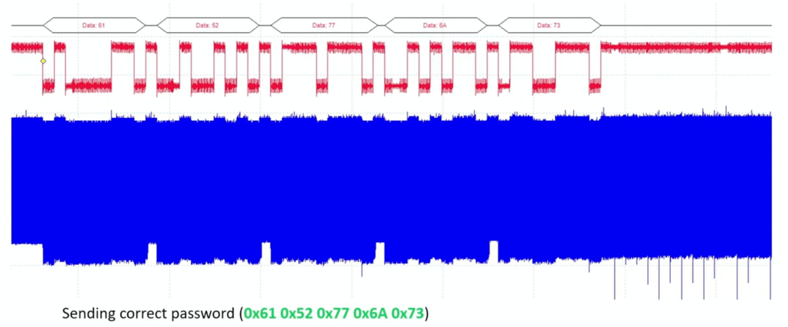
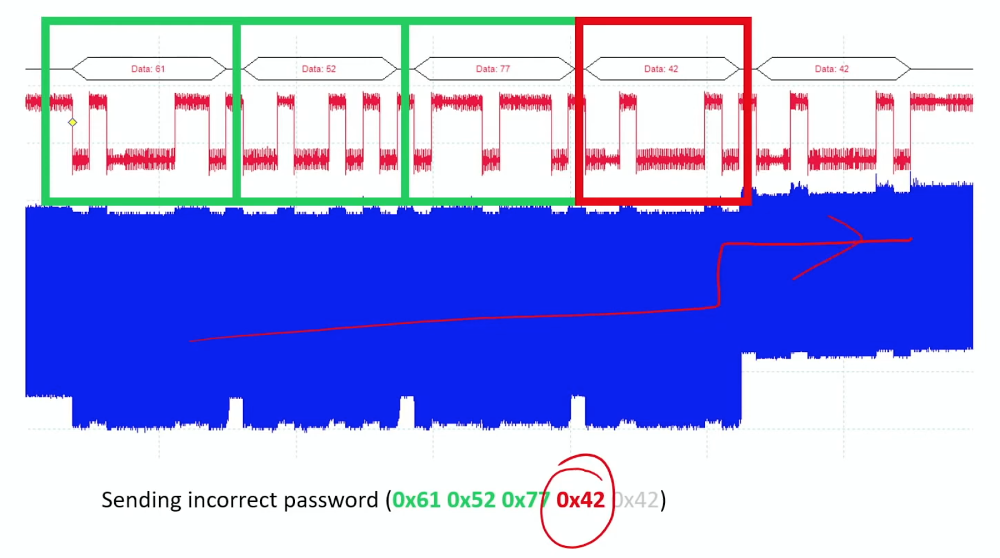
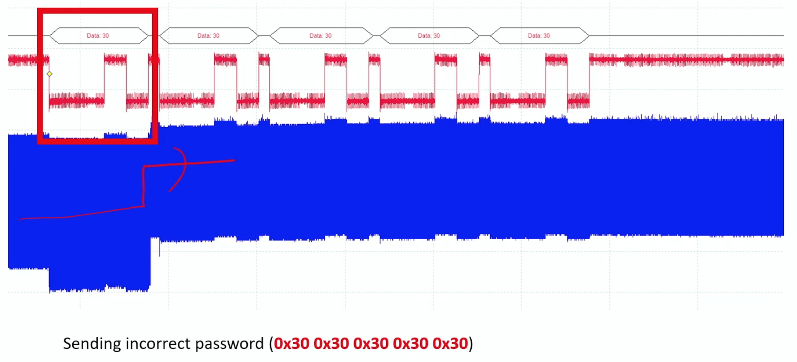
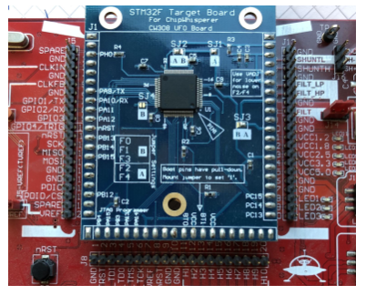

# 安全与隐私 {#sec-security-privacy}

::: {layout-narrow}

::: {.column-margin}

_DALL·E 3 提示词：一幅关于机器学习系统中隐私与安全的插图。图像展示了一个由相互连接的节点和数据流组成的数字化景观，象征着机器学习算法。前景中，一个大型锁覆盖在网络之上，代表隐私与安全。锁是半透明的，使底层网络部分可见。背景包含二进制代码和数字加密符号，强调网络安全主题。配色由蓝色、绿色和灰色组成，营造出高科技的数字环境。_

:::

\noindent
:::

## 目的 {.unnumbered}

_为什么隐私和安全决定机器学习系统能否获得广泛采用和社会信任？_

机器学习系统为了有效运行，需要前所未有地访问个人数据、机构知识和行为模式，这在效用与保护之间产生了张力，而这种张力决定了社会是否接受它。与传统软件短暂处理数据不同，机器学习系统会从敏感信息中学习，并将模式嵌入持久化模型中，从而可能无意中泄露隐私细节。这种能力带来了系统性风险，其影响不仅限于个体隐私侵犯，还会威胁机构信任、竞争优势和民主治理。机器学习在医疗、金融、教育和公共服务等关键领域的部署能否成功，完全取决于能否建立健全的安全与隐私基础，从而在防止有害暴露的同时实现有益使用。没有这些保护，即使是最强大的系统也会因为法律、伦理和实践方面的顾虑而无人使用。理解隐私和安全原则，能使工程师设计出既具技术卓越性又能获得社会认可的系统。

::: {.callout-tip title="学习目标"}

- 区分机器学习系统中的安全与隐私问题，并使用形式化定义和威胁模型加以说明

- 分析历史安全事件，提炼适用于机器学习系统漏洞的原则

- 按照模型、数据和硬件攻击面对机器学习威胁进行分类

- 针对特定用例评估隐私保护技术，包括差分隐私、联邦学习和合成数据生成

- 设计分层防御架构，整合数据保护、模型安全和硬件信任机制

- 为机器学习系统实现基本安全控制，包括访问管理、加密和输入验证

- 使用定量成本收益分析，评估安全措施与系统性能之间的权衡

- 根据组织的威胁模型和风险承受能力，应用三阶段安全路线图来优先部署防御措施
:::

## 机器学习系统中的安全与隐私 {#sec-security-privacy-security-privacy-ml-systems-0b1e}

从集中式训练架构向分布式、自适应的机器学习系统的转变，改变了现代 ML 基础设施的威胁格局和安全需求。如@sec-ondevice-learning 所述，当代机器学习系统越来越多地运行在异构计算环境中，涵盖边缘设备、联邦网络和混合云部署。这种架构演进使自适应智能具备了新的能力，但也引入了传统网络安全框架无法充分应对的攻击向量和隐私漏洞。

与传统软件应用相比，机器学习系统表现出不同的安全特性。传统软件系统对数据的处理是短暂且确定性的，而机器学习系统则会从训练数据中提取模式并将其编码到持久化的模型参数中。这种学习到的知识表示会带来独特的漏洞：敏感信息可能被无意中记忆，并在后续通过模型输出或系统性探测被暴露。这类风险存在于多个领域，例如医疗系统可能泄露患者信息，专有模型也可能通过策略性的查询模式被逆向工程，从而威胁个人隐私和组织知识产权。

如@sec-ml-systems 所详述，机器学习系统的架构复杂性通过多层攻击面进一步加剧了这些安全挑战。当代 ML 部署包括数据接入管道、分布式训练基础设施、模型服务系统以及持续监控框架。每个架构组件都会引入不同的漏洞，而隐私问题则影响整个计算栈。现代部署的分布式特性——包括边缘节点上的持续自适应以及联邦协调协议——扩大了攻击面，同时也增加了全面安全实施的复杂性。

应对这些挑战需要采用系统化方法，将安全与隐私考量贯穿于机器学习系统的整个生命周期。本章建立了工程化 ML 系统所需的基础和方法，使其既具备计算有效性，又能可靠运行。我们将探讨已建立的安全原则在机器学习语境中的应用，识别学习系统特有的威胁模型，并提出全面的防御策略，包括数据保护机制、安全模型架构以及基于硬件的安全实现。

我们的研究沿着四个相互关联的框架展开。首先，我们在机器学习语境下明确安全与隐私之间的区别，然后通过历史安全事件的证据来指导当代威胁评估。接着，我们分析由学习过程本身产生的漏洞，并介绍跨越加密数据保护、对抗鲁棒的模型设计以及硬件安全机制的分层防御架构。在整个分析过程中，我们强调实现指导，以帮助从业者开发既满足技术性能要求、又符合社会部署所需信任标准的系统。

## 基础概念与定义 {#sec-security-privacy-foundational-concepts-definitions-d529}

安全和隐私是机器学习系统设计中的核心关注点，但它们经常被误解或混为一谈。二者都旨在保护系统和数据，但实现方式不同、应对的威胁模型不同，并且需要不同的技术响应。对于机器学习系统而言，区分二者有助于指导健壮且负责任的基础设施设计。

### 安全的定义 {#sec-security-privacy-security-defined-1129}

机器学习中的安全侧重于防御系统免受对抗性行为的影响。这包括保护模型参数、训练流水线、部署基础设施以及数据访问路径，防止它们被篡改或滥用。

:::{.callout-definition title="Security"}

***安全***是通过覆盖开发、部署和运维环境的_防御机制_，保护机器学习系统的_数据_、_模型_和_基础设施_免受_未授权访问_、_篡改_和_破坏_。

:::

*示例*：部署在公共交通基础设施中的人脸识别系统可能会受到对抗性输入攻击，从而错误识别个体或完全失效。这是一种运行时安全漏洞，会同时威胁准确性和系统可用性。

### 隐私的定义 {#sec-security-privacy-privacy-defined-da84}

安全关注对抗性威胁，而隐私则侧重于限制机器学习系统内敏感信息的暴露和滥用。这包括保护训练数据、推理输入和模型输出，防止它们泄露个人或专有信息，即使系统运行正常且没有发生明确攻击。

:::{.callout-definition title="Privacy"}

***隐私***是通过在机器学习系统环境中采用能够维护_保密性_和_数据使用控制_的方法，保护_敏感信息_免遭_未授权披露_、_推断_和_滥用_。

:::

*示例*：在医疗转录文本上训练的大语言模型可能会无意中记住患者对话的片段。如果用户随后通过面向公众的聊天机器人触发了这些内容，即使没有攻击者存在，这也代表了一次隐私失效。

### 安全与隐私的比较 {#sec-security-privacy-security-versus-privacy-e0b8}

尽管二者在某些方面相互交叉（例如加密存储同时支持二者），但安全和隐私在目标、威胁模型和典型缓解策略上有所不同。@tbl-security-privacy-comparison 下方的表格总结了机器学习系统语境中的这些区别。

| **方面** | **安全** | **隐私** |
|:---|:---|:---|
| **主要目标** | 防止未授权访问或破坏 | 限制敏感信息的暴露 |
| **威胁模型** | 对抗性行为者（外部或内部） | 诚实但好奇的观察者或被动泄露 |
| **典型关注点** | 模型窃取、投毒、规避攻击 | 数据泄露、重新识别、记忆化 |
| **示例攻击** | 对抗性输入导致误分类 | 模型反演泄露训练数据 |
| **代表性防御** | 访问控制、对抗训练 | 差分隐私、联邦学习 |
| **与监管的相关性** | 在网络安全标准中受到强调 | 是数据保护法律（例如 GDPR）的核心内容 |

: **安全-隐私区别**：机器学习系统需要针对安全和隐私采取不同的方法；安全通过防御针对系统功能的对抗性威胁来缓解风险，而隐私则通过数据泄露或重新识别防止敏感信息因有意或无意的暴露而外泄。该表明确了不同的目标和威胁模型如何塑造各自领域中的具体关注点和缓解策略。 {#tbl-security-privacy-comparison}

### 安全-隐私交互与权衡 {#sec-security-privacy-securityprivacy-interactions-tradeoffs-d153}

安全和隐私密切相关，但并不等同。安全系统通过限制对模型和数据的未授权访问，有助于维护隐私。隐私保护型设计也可以通过缩小攻击面来提升安全性，例如，减少敏感数据的保留可降低系统被攻破后暴露信息的风险。

然而，二者也可能存在冲突。差分隐私[^fn-dp-origins] 等技术可以降低记忆化风险，但也可能降低模型效用。同样，加密能增强安全性，但也可能削弱透明性和可审计性，从而使隐私合规变得更加复杂。在机器学习系统中，设计者必须以整体视角来权衡这些取舍。服务于医疗、金融和公共安全等敏感领域的系统，必须同时防范滥用（安全）和过度暴露（隐私）。理解这些问题之间的边界，对于构建高性能、可信且符合法律要求的系统至关重要。

[^fn-dp-origins]: **差分隐私的起源**：Cynthia Dwork 于 2006 年在 Microsoft Research 提出了“差分隐私”这一术语，但这一概念源自她对“匿名化神话”（即错误地认为只要从数据中移除姓名就能保证隐私）的不满。她的突破性洞见是：隐私应该能够被数学证明，而不仅仅是看起来合理，这促成了如今保护数十亿用户数据的严格框架，从 Apple 到 Google 的产品都采用了这一框架。

## 从安全漏洞中汲取教训 {#sec-security-privacy-learning-security-breaches-6719}

在确立了安全和隐私的概念基础之后，我们现在通过里程碑式的安全事件来审视这些原则在现实世界系统中的体现。这些历史案例为我们定义的抽象概念提供了具体的例证，展示了安全漏洞是如何在复杂系统中出现和传播的。更重要的是，它们揭示了直接适用于现代机器学习部署的普遍模式（供应链攻击、隔离不足和武器化端点）。

可以从各种计算系统中广为人知的安全漏洞中汲取宝贵的教训。了解这些模式如何应用于日益在云、边缘和嵌入式环境中运行的现代机器学习部署，为保护机器学习系统提供了重要经验。这些事件表明，系统设计中的弱点可能导致广泛的、有时甚至是物理性的后果。尽管本节讨论的例子并非都直接涉及机器学习，但它们为设计安全系统提供了重要的见解。这些经验适用于部署在云、边缘和嵌入式环境中的机器学习应用程序。

### 供应链攻击：震网病毒 {#sec-security-privacy-supply-chain-compromise-stuxnet-8a4b}

2010年，安全研究人员发现了一种高度复杂的计算机蠕虫，后来命名为 [震网病毒](https://www.research-collection.ethz.ch/bitstream/handle/20.500.11850/200661/Cyber-Reports-2017-04.pdf)[^fn-stuxnet-discovery]，它针对伊朗纳坦兹核设施中使用的工业控制系统[@farwell2011stuxnet]。震网病毒利用了微软Windows中四个此前未知的“零日漏洞”[^fn-zero-day-term]，使其能够在联网和隔离系统中不被察觉地传播。

[^fn-stuxnet-discovery]: **震网病毒的发现**：震网病毒最初是由一家小型白俄罗斯杀毒软件公司VirusBokNok发现的，当时他们的客户电脑开始意外崩溃。一场看似例行的恶意软件调查，最终演变成了历史上最重要的网络安全发现之一：首个被证实旨在造成物理破坏的网络武器。

[^fn-zero-day-term]: **零日漏洞术语的起源**：“零日”一词起源于软件盗版圈，指的是程序发布后盗版副本出现所经过的“零天”。在安全领域，它描述的是防御者在攻击者利用漏洞之前必须修补漏洞的“零天”，代表了攻击与防御之间的终极竞赛。

与旨在窃取信息或进行间谍活动的典型恶意软件不同，震网病毒旨在造成物理破坏。其目标是通过破坏用于铀浓缩过程的离心机来扰乱铀浓缩。尽管该设施与外部网络进行了物理隔离[^fn-air-gapped]，但据信该恶意软件是通过受感染的USB设备[^fn-usb-attacks] 进入系统的，这表明物理访问如何能够破坏隔离环境。

该蠕虫专门针对可编程逻辑控制器（PLC），这是一种自动化机电过程（例如控制离心机速度）的工业计算机。通过利用Windows操作系统和用于编程PLC的西门子Step7软件中的漏洞，震网病毒实现了高度针对性的现实世界破坏。这代表了网络安全领域的一个里程碑，展示了恶意软件如何能够连接数字世界和物理世界，从而操纵工业基础设施。

[^fn-air-gapped]: **物理隔离系统**：物理隔离系统是与外部连接物理隔离的网络，最初于20世纪60年代为军事系统开发。尽管看似无法渗透，但研究表明，90%的物理隔离系统可以通过供应链攻击、受感染的可移动媒体或隐藏通道（声学、电磁、热学）被攻破[@farwell2011stuxnet]。

[^fn-usb-attacks]: **USB攻击**：USB接口于1996年推出，成为跨越物理隔离的主要攻击载体。据报道，2008年的“奥运会行动”使用受感染的USB驱动器渗透安全设施，一些估计表明60%的组织仍然容易受到基于USB的攻击[@farwell2011stuxnet]。

震网病毒的教训直接适用于现代机器学习系统。训练管道和模型仓库面临着与震网病毒所利用的类似的持续供应链风险。正如震网病毒通过受感染的USB设备和软件漏洞破坏工业系统一样，现代机器学习系统面临多种攻击载体：受损的依赖项（PyPI/conda仓库中的恶意软件包）、恶意训练数据（HuggingFace、Kaggle上的中毒数据集）、后门模型权重（模型仓库中的特洛伊木马模型）以及被篡改的硬件驱动（受损的NVIDIA CUDA库、AI加速器中的固件后门）。

一个具体的机器学习攻击场景说明了这些风险：攻击者将一个带有后门的图像分类模型上传到一个流行的模型仓库，该模型被训练用于错误分类特定模式，同时在干净数据上保持正常准确率。当部署在自动驾驶车辆中时，这个带有后门的模型能够正确识别大多数物体，但未能检测到穿着特定图案的行人，从而造成安全风险。攻击通过自动化模型部署管道传播，在被检测到之前影响了数千辆车辆。

防御此类供应链攻击需要端到端的安全措施：(1) 密码验证，用加密签名签署所有模型工件、数据集和依赖项；(2) 出处追踪，维护所有训练数据源、代码版本和所用基础设施的不可变日志；(3) 完整性验证，在部署前实施模型后门、依赖项漏洞和数据集投毒的自动化扫描；(4) 物理隔离训练，在具有受控依赖项管理的安全环境中隔离敏感模型训练。@fig-stuxnet 说明了这些供应链攻击模式如何同时适用于工业和机器学习系统。

::: {#fig-stuxnet fig-env="figure" fig-pos="htb"}

```{.tikz}
\begin{tikzpicture}[line cap=round,line join=round,font=\usefont{T1}{phv}{m}{n}]
\tikzset{%
TxtL/.style = {font=\large\usefont{T1}{phv}{m}{n},text width=90mm,align=justify,anchor=north},
Line/.style={violet!50, line width=1.1pt,shorten <=1pt,shorten >=2pt},
LineA/.style={violet!50,line width=2.0pt,{-{Triangle[width=1.1*6pt,length=2.0*6pt]}},shorten <=3pt,shorten >=2pt},
ALine/.style={black!50, line width=1.1pt,{{Triangle[width=1.1*6pt,length=2*6pt]}-}},
Larrow/.style={fill=violet!50, single arrow,  inner sep=2pt, single arrow head extend=3pt,
            single arrow head indent=0pt,minimum height=9mm, minimum width=15pt}
}
%Skull
\tikzset{pics/skull/.style = {
        code = {
        \pgfkeys{/channel/.cd, #1}
\begin{scope}[local bounding box=SKULL,scale=\scalefac, every node/.append style={transform shape}]
\fill[fill=\filllcolor](-0.225,-0.05)to[out=110,in=230](-0.215,0.2)to[out=50,in=180](0,0.315)
to[out=0,in=130](0.218,0.2)to[out=310,in=70](0.227,-0.05) to[out=320,in=40](0.21,-0.15)
to[out=210,in=80](0.14,-0.23) to[out=260,in=20](0.04,-0.285) to[out=200,in=340](-0.07,-0.28)
to[out=170,in=290](-0.135,-0.23) to[out=110,in=340](-0.21,-0.15) to[out=140,in=250]cycle;
%eyes
\fill[fill=\filllcirclecolor](-0.17,-0.02)to[out=70,in=110](-0.029,-0.02)to[out=280,in=0](-0.129,-0.11)to[out=190,in=250]cycle;
\fill[fill=\filllcirclecolor](0.035,-0.02)to[out=70,in=110](0.175,-0.02)to[out=300,in=340](0.12,-0.103)to[out=170,in=260]cycle;
%nose
\fill[fill=\filllcirclecolor](0.018,-0.115)to[out=70,in=110](-0.014,-0.115)to(-0.043,-0.165)
to[out=200,in=170](-0.025,-0.19)to(0.027,-0.19)to[out=10,in=330](0.047,-0.165)to cycle;
%above left
\fill[fill=\filllcolor](-0.2,0.18)to[out=160,in=320](-0.3,0.23)to[out=140,in=0](-0.37,0.295)
to[out=180,in=80](-0.43,0.25)to[out=230,in=90](-0.475,0.19)
to[out=260,in=170](-0.375,0.13)to[out=350,in=170](-0.2,0.1)to cycle;
%abover right
\fill[fill=\filllcolor](0.2,0.18)to[out=20,in=220](0.3,0.23)to[out=40,in=200](0.37,0.295)
to[out=20,in=90](0.43,0.25)to[out=230,in=90](0.475,0.19)to[out=260,in=360](0.375,0.13)
to[out=190,in=10](0.2,0.1)to cycle;
%below left
\fill[fill=\filllcolor](-0.2,0.03)to[out=210,in=0](-0.3,0.01)to[out=180,in=0](-0.37,0.01)
to[out=180,in=50](-0.46,0.0)to[out=230,in=120](-0.445,-0.08)
to[out=260,in=170](-0.41,-0.14)to[out=350,in=190](-0.2,-0.051)to cycle;
%below right
\fill[fill=\filllcolor](0.2,0.03)to[out=340,in=170](0.3,0.01)to[out=350,in=190](0.37,0.01)
to[out=20,in=110](0.47,-0.03)to[out=270,in=120](0.443,-0.09)
to[out=270,in=0](0.36,-0.15)to[out=160,in=340](0.2,-0.051)to cycle;
\end{scope}
     }
  }
}
%laptop
\tikzset{
pics/laptop/.style = {
        code = {
        \pgfkeys{/channel/.cd, #1}
\begin{scope}[shift={($(0,0)+(0,0)$)},scale=\scalefac,every node/.append style={transform shape}]
\node[rounded corners=2pt,rectangle,minimum width=60,minimum height=37,
fill=\filllcolor!60,line width=\Linewidth,draw=black](EKV\picname)at(0,0.53){};
%
\ifnum\Dual=1
\node[draw=black,rounded corners=2pt,rectangle,minimum width=53,minimum height=30,
fill=\filllcolor!10,line width=\Linewidth,](EK)at(0,0.53){};
\coordinate(SM1)at($(EK.south west)+(0.15,0.5)$);
\coordinate(SM2)at($(EK.south east)+(-1.1,0.5)$);
\coordinate(OK1)at($(EK.220)+(0,0.7)$);
\coordinate(OK2)at($(EK.240)+(0,0.7)$);
\node[fill=black,inner sep=0pt,ellipse,minimum width=2pt,minimum height=3pt](OKO1)at(OK1){};
\node[fill=black,inner sep=0pt,ellipse,minimum width=2pt,minimum height=3pt](OKO2)at(OK2){};
\draw[line width=1.4pt](SM1)to [bend right=45](SM2);
%%
\coordinate(4BL)at($(EK.south west)+(0.95,0.3)$);
    \def\n{5}          % broj boksova
    \def\w{0.12}        % box width (mm)
    \def\h{0.5}       % Box height (mm)
    \def\gap{0.05}      % razmak između boksova (mm)
    % niz boksova
    \foreach \i in {0,...,4} {
      \pgfmathsetmacro{\x}{\i*(\w+\gap)}
      % padding (we clip inside the edges)
      \begin{scope}
        \clip[] ($(4BL)+(\x,0)$) rectangle ++(\w,\h);
        \fill[gray!10]($(4BL)+(\x,0)$) rectangle ++(\w,\h*1);
        \fill[fill=\filllcirclecolor]($(4BL)+(\x,0)$) rectangle ++(\w,\h*\Level);
      \end{scope}
      % kontura preko
      \draw[line width=0.6pt,draw=black]($(4BL)+(\x,0)$)  rectangle ++(\w,\h);
    }
\else
\ifnum\Smile=1
\node[draw=black,rounded corners=2pt,rectangle,minimum width=53,minimum height=30,
fill=\filllcolor!10,line width=\Linewidth,](EK)at(0,0.53){};
\coordinate(SM1)at($(EK.south west)+(0.32,0.5)$);
\coordinate(SM2)at($(EK.south east)+(-0.32,0.5)$);
\coordinate(OK1)at($(EK.250)+(0,0.7)$);
\coordinate(OK2)at($(EK.290)+(0,0.7)$);
\node[fill=black,inner sep=0pt,ellipse,minimum width=2pt,minimum height=3pt](OKO1)at(OK1){};
\node[fill=black,inner sep=0pt,ellipse,minimum width=2pt,minimum height=3pt](OKO2)at(OK2){};
\draw[line width=1.4pt](SM1)to [bend right=45](SM2);
\else
\node[draw=green,rounded corners=2pt,rectangle,minimum width=53,minimum height=30,draw=black,fill=black](EK)at(0,0.53){};
\pic[shift={(0,0)}] at  (EK){skull={scalefac=1.3,picname=1,filllcolor=white, filllcirclecolor=black,Linewidth=0.5pt}};
\fi
\fi
%
\draw[fill=\filllcolor!60!black!30,line width=\Linewidth](-1.00,-0.1)--(1.0,-0.1)--(1.28,-0.6)--(-1.28,-0.6)--cycle;
\draw[fill=\filllcolor!60!black!30,line width=\Linewidth](1.28,-0.6)--(-1.28,-0.6)arc[start angle=180, end angle=270, radius=4pt]--(1.14,-0.73)
arc[start angle=270, end angle=355, radius=4pt]--cycle;
\draw[fill=\filllcolor!30!black!10,line width=\Linewidth](-0.95,-0.17)--(0.95,-0.17)--(1.03,-0.34)--(-1.03,-0.34)--cycle;
\draw[fill=\filllcolor!30!black!20,line width=\Linewidth](-0.16,-0.52)--(0.16,-0.52)--(0.14,-0.42)--(-0.14,-0.42)--cycle;
\end{scope}
    }
  }
}
%usb
\tikzset{
pics/usb/.style = {
        code = {
        \pgfkeys{/channel/.cd, #1}
\begin{scope}[shift={($(0,0)+(0,0)$)},scale=\scalefac,every node/.append style={transform shape}]
\draw[draw=black,fill=\filllcolor,line width=\Linewidth](-0.65,0.94)coordinate(GL\picname)--(0.65,0.94)coordinate(GD\picname)--
(0.65,-1.3)coordinate(DD\picname)arc[start angle=0, end angle=-90, radius=2mm]
--(-0.45,-1.5)coordinate(DL\picname)arc[start angle=-90, end angle=-180, radius=2mm]--cycle;
\node[draw=none,fill=\filllcirclecolor,minimum width=5mm,minimum height=8mm,anchor=south]at($($(DL\picname)!0.42!(DD\picname)$)+(0,0.35)$){};
\coordinate(G1)at($(GL\picname)!0.15!(GD\picname)$);
\coordinate(G2)at($(GL\picname)!0.85!(GD\picname)$);
\draw[draw=black,fill=\filllcolor!40,line width=\Linewidth](G1)--++(0,1)coordinate(G11)-|coordinate[pos=0.5](G22)(G2)--cycle;
\node[draw=none,fill=black,inner sep=0pt,minimum width=1mm,minimum height=6mm,anchor=west]at($($(G1)!0.5!(G11)$)+(0.2,0)$){};
\node[draw=none,fill=black,inner sep=0pt,minimum width=1mm,minimum height=6mm,anchor=east]at($($(G2)!0.5!(G22)$)+(-0.2,0)$){};
%\fill[red](G22)circle(2pt);
\end{scope}
    }
  }
}
 \tikzset{/pgf/decoration/.cd,
    number of sines/.initial=10,
    angle step/.initial=20,
}
\newdimen\tmpdimen
\pgfdeclaredecoration{complete sines}{initial}
{
    \state{initial}[
        width=+0pt,
        next state=move,
        persistent precomputation={
            \pgfmathparse{\pgfkeysvalueof{/pgf/decoration/angle step}}%
            \let\anglestep=\pgfmathresult%
            \let\currentangle=\pgfmathresult%
            \pgfmathsetlengthmacro{\pointsperanglestep}%
                {(\pgfdecoratedremainingdistance/\pgfkeysvalueof{/pgf/decoration/number of sines})/360*\anglestep}%
        }] {}
    \state{move}[width=+\pointsperanglestep, next state=draw]{
        \pgfpathmoveto{\pgfpointorigin}
    }
    \state{draw}[width=+\pointsperanglestep, switch if less than=1.25*\pointsperanglestep to final, % <- bit of a hack
        persistent postcomputation={
        \pgfmathparse{mod(\currentangle+\anglestep, 360)}%
        \let\currentangle=\pgfmathresult%
    }]{%
        \pgfmathsin{+\currentangle}%
        \tmpdimen=\pgfdecorationsegmentamplitude%
        \tmpdimen=\pgfmathresult\tmpdimen%
        \divide\tmpdimen by2\relax%
        \pgfpathlineto{\pgfqpoint{0pt}{\tmpdimen}}%
    }
    \state{final}{
        \ifdim\pgfdecoratedremainingdistance>0pt\relax
            \pgfpathlineto{\pgfpointdecoratedpathlast}
        \fi
   }
}
%testing_medal
\tikzset{
pics/testing/.style = {
        code = {
        \pgfkeys{/channel/.cd, #1}
\begin{scope}[local bounding box=TESTING1,shift={($(0,0)+(0,0)$)},scale=\scalefac,every node/.append style={transform shape}]
\newcommand{\tikzxmark}{%
\tikz[scale=0.18] {
    \draw[line width=0.7,line cap=round,GreenLine] (0,0) to [bend left=6] (1,1);
    \draw[line width=0.7,line cap=round,GreenLine] (0.2,0.95) to [bend right=3] (0.8,0.05);
}}
\newcommand{\tikzxcheck}{%
\tikz[scale=0.16] {
\draw[line width=0.7,line cap=round,GreenLine] (0.5,0.75)--(0.85,-0.1) to [bend left=16] (1.5,1.55);
}}
 \node[draw, minimum width  =15mm, minimum height = 20mm, inner sep = 0pt,
        rounded corners,draw = \drawcolor, fill=\filllcolor!10, line width=\Linewidth](COM){};
\node[draw=GreenLine,inner sep=4pt,fill=white](CB1) at ($(COM.north west)!0.25!(COM.south west)+(0.3,0)$){};
\node[draw=GreenLine,inner sep=4pt,fill=white](CB2) at ($(COM.north west)!0.5!(COM.south west)+(0.3,0)$){};
\node[draw=GreenLine,inner sep=4pt,fill=white](CB3) at ($(COM.north west)!0.75!(COM.south west)+(0.3,0)$){};
\node[xshift=0pt]at(CB1){\tikzxcheck};
\node[xshift=0pt]at(CB2){\tikzxmark};
\node[xshift=0pt]at(CB3){\tikzxmark};
\draw[GreenLine,decoration={zigzag,segment length=4pt, amplitude=0.5pt},decorate]($(CB1)+(0.3,0.05)$)--++(0:0.8);
\draw[GreenLine,decoration={zigzag,segment length=4pt, amplitude=0.5pt},decorate]($(CB1)+(0.3,-0.12)$)--++(0:0.7);
\draw[GreenLine,decoration={zigzag,segment length=4pt, amplitude=0.5pt},decorate]($(CB2)+(0.3,0.05)$)--++(0:0.8);
\draw[GreenLine,decoration={zigzag,segment length=4pt, amplitude=0.5pt},decorate]($(CB2)+(0.3,-0.12)$)--++(0:0.6);
\draw[GreenLine,decoration={zigzag,segment length=4pt, amplitude=0.5pt},decorate]($(CB3)+(0.3,0.05)$)--++(0:0.8);
\draw[GreenLine,decoration={zigzag,segment length=4pt, amplitude=0.5pt},decorate]($(CB3)+(0.3,-0.12)$)--++(0:0.6);
\end{scope}
\begin{scope}[shift={($(0,0)+(0.4,-0.50)$)},scale=0.5\scalefac,every node/.append style={transform shape}]
\draw[draw=none,fill=\filllcolor!60](-0.48,-0.10)--(-0.68,-0.68)--(-0.92,-1.38)--
(-0.53,-1.28)--(-0.29,-1.61)--(-0.09,-0.93)--(0.15,-0.1)--cycle;
\draw[draw=none,fill=\filllcolor!60](-0.266,-0.10)--(-0.02,-0.93)--(0.18,-1.61)--
(0.45,-1.34)--(0.85,-1.48)--(0.61,-0.68)--(0.44,-0.1)--cycle;
 \draw[draw=none,postaction={very thick, line join=round, draw=white,fill=\filllcolor,
        decorate,decoration={complete sines, number of sines=9, amplitude=\scalefac*2pt}}] (0,0) circle [radius=0.9];
\node[draw=none,fill=white,circle,minimum size=11mm,line width=1pt](CM-\picname) {};
%
\end{scope}
    }
  }
}
%PLC
\tikzset{
pics/plc/.style = {
        code = {
        \pgfkeys{/channel/.cd, #1}
\begin{scope}[shift={($(0,0)+(0,0)$)},scale=\scalefac,every node/.append style={transform shape}]
\node[draw=\filllcolor,fill=\filllcolor!30,minimum width=21mm,minimum height=24mm](R\picname){};
\coordinate(P)at($(R\picname.north west)!0.1!(R\picname.south east)$);
% box dimensions
  \def\boxsize{1.3mm}
  \def\xstep{1.8mm}  % gap between columns
  \def\ystep{1.9mm}  % razmak između redova
% Lista obojenih ćelija – bez duplih zagrada, plus čuvar-zarezi
\def\coloredcells{0/0,1/1,2/1,0/2,1/3,0/4,2/4,1/5,1/6,2/6,0/7}

\foreach \i in {0,1,2} {
  \foreach \j in {0,1,2,3,4,5,6,7} {
    \edef\cellid{\i/\j}
    \def\fillcolor{cyan!10}
    % Unutrašnja petlja pravi grupu; zato koristimo \global
    \foreach \c in \coloredcells {%
      \ifx\cellid\c
        \global\def\fillcolor{green!60}%
      \fi
    }
    \node[draw=black, fill=\fillcolor, minimum size=\boxsize, inner sep=0pt](MB\i\j)
      at ($(P) + (\i*\xstep, -\j*\ystep)$) {};
  }
}
\coordinate(1BL)at($(MB07.south west)+(0,-1mm)$);
\node[draw=black,fill=\filllcolor!10,anchor=north west,inner sep=0pt,
minimum width=5mm,minimum height=1.5mm](BX1)at(1BL){};
\coordinate(2BL)at($(BX1.south west)+(0,-0.8mm)$);
\node[draw=black,fill=\filllcolor!50!black!20,anchor=north west,inner sep=0pt,
minimum width=5mm,minimum height=3.0mm](BX2)at(2BL){};
\coordinate(3BL)at($(BX2.south east)+(1mm,0)$);
\node[draw=black,fill=\filllcolor!70!black!30,anchor=south west,inner sep=0pt,
minimum width=12mm,minimum height=3.0mm](BX3)at(3BL){};
\path[red](BX3.north west)|-coordinate[pos=0.5](1E)(MB27.south east);
%display
\ifnum\Smile=1
\node[draw=black,fill=\filllcolor!10,anchor=south west,inner sep=0pt,
minimum width=12mm,minimum height=8.0mm](EK)at(1E){};
\coordinate(SM1)at($(EK.south west)+(0.32,0.35)$);
\coordinate(SM2)at($(EK.south east)+(-0.32,0.35)$);
\coordinate(OK1)at($(EK.250)+(0,0.55)$);
\coordinate(OK2)at($(EK.290)+(0,0.55)$);
\node[fill=black,inner sep=0pt,ellipse,minimum width=2pt,minimum height=3pt](OKO1)at(OK1){};
\node[fill=black,inner sep=0pt,ellipse,minimum width=2pt,minimum height=3pt](OKO2)at(OK2){};
\draw[line width=1.0pt](SM1)to [bend right=25](SM2);
\else
\node[draw=black,fill=black,anchor=south west,inner sep=0pt,
minimum width=12mm,minimum height=8.0mm](EK)at(1E){};
%skull
\pic[shift={(0,0)}] at  (EK){skull={scalefac=1,picname=1,filllcolor=white, filllcirclecolor=black,Linewidth=0.5pt}};
\fi
\draw[fill=\filllcolor!40!black!30](-0.2,-0.67)--(0.8,-0.67)--(0.72,-0.54)--(-0.14,-0.54)--cycle;
\coordinate(4BL)at($(EK.north west)+(0,1mm)$);
 % geometry
    \def\n{5}          % broj boksova
    \def\w{0.2}        % širina boksa (mm)
    \def\h{0.5}       % visina boksa (mm)
    \def\gap{0.05}      % razmak između boksova (mm)
    % niz boksova
    \foreach \i in {0,...,4} {
      \pgfmathsetmacro{\x}{\i*(\w+\gap)}
      % popuna (klipujemo unutar ivica)
      \begin{scope}
        \clip[] ($(4BL)+(\x,0)$) rectangle ++(\w,\h);
        \fill[gray!10]($(4BL)+(\x,0)$) rectangle ++(\w,\h*1);
        \fill[fill=\filllcirclecolor]($(4BL)+(\x,0)$) rectangle ++(\w,\h*\Level);
      \end{scope}
      % contour over
      \draw[line width=0.6pt,draw=black]($(4BL)+(\x,0)$)  rectangle ++(\w,\h);
    }
\end{scope}
    }
  }
}
%copier
\tikzset{
pics/copier/.style = {
        code = {
        \pgfkeys{/channel/.cd, #1}
\begin{scope}[shift={($(0,0)+(0,0)$)},scale=\scalefac,every node/.append style={transform shape}]
\draw[fill=\filllcolor!60!black,line width=\Linewidth,draw=black](0.1,1.15)--++(150:0.85)arc[start angle=90, end angle=200,radius=1.5pt]--++(330:0.82)--cycle;
\draw[fill=\filllcolor!30,line width=\Linewidth,draw=black](-0.73,0.75)--(0.69,0.75)--(0.69,0.41)--(-0.73,0.41)--cycle;
\draw[fill=\filllcolor!60,line width=\Linewidth,draw=black](-0.80,1.05)--(-0.02,1.05)--(0.1,1.15)--(0.745,1.15)--(0.745,0.75)--(-0.80,0.75)--cycle;
\draw[draw=none,fill=\filllcirclecolor](0.12,1.08)--(0.49,1.08)coordinate(DISNE)--(0.49,0.83)coordinate(DISSE)--(0.12,0.83)--cycle;
\node[draw=none,fill=\filllcirclecolor,circle,inner sep=0pt,minimum size=1mm,below right=0.5pt and 2pt of DISNE]{};
\node[draw=none,fill=\filllcirclecolor,circle,inner sep=0pt,minimum size=1mm,above right=0.5pt and 2pt of DISSE]{};
%
\draw[fill=\filllcolor!60!black,line width=\Linewidth,draw=black](0.745,0.-0.07)--(0.87,0)arc[start angle=130, end angle=30,radius=2.5pt]--(1.35,0.16)
arc[start angle=120, end angle=-10,radius=1.25pt]--(0.745,0.-0.22)--cycle;
%
\draw[fill=\filllcolor!30,line width=\Linewidth,draw=black](-0.8,0.41)--(0.745,0.41)--(0.745,-1.18)--(-0.8,-1.18)--cycle;
%
\draw[line width=2*\Linewidth](-0.72,0.0)--coordinate[pos=0.5](SR1)(0.665,0);
\node[draw=black,fill=\filllcirclecolor!60!black!30,rectangle,inner sep=0pt,anchor=north,minimum width=10,minimum height=2]at(SR1){};
\draw[line width=2*\Linewidth](-0.72,-0.4)--coordinate[pos=0.5](SR2)(0.665,-0.4);
\node[draw=black,fill=\filllcirclecolor!60!black!30,rectangle,inner sep=0pt,anchor=north,minimum width=10,minimum height=2]at(SR2){};
\draw[line width=2*\Linewidth](-0.72,-0.8)--coordinate[pos=0.5](SR3)(0.665,-0.8);
\node[draw=black,fill=\filllcirclecolor!60!black!30,rectangle,inner sep=0pt,anchor=north,minimum width=10,minimum height=2]at(SR3){};
%
\end{scope}
    }
  }
}
%vijak
\tikzset{
pics/sraf/.style = {
        code = {
        \pgfkeys{/channel/.cd, #1}
\begin{scope}[shift={($(0,0)+(0,0)$)},scale=\scalefac,every node/.append style={transform shape}]
%fire
\ifnum\Fire=1
\fill[fill=red!70,thick](0,1.6)--(0.4,0.6)--(1.4,2)--(2.2,0.8)--(3.1,1.8)--(3,0.5)--(3.7,0.6)--(3.0,-1.2)--
(3.4,-1.3)--(2.0,-2.86)--(-1.8,-2.86)--(-3.3,-1.36)--(-2.8,-1.36)--(-3.2,-0.1)--(-2.6,-0.3)--(-2.9,2.5)--
(-2.3,1.4)--(-1.4,2.9)--(-0.6,0.9)--cycle;
\fi
\foreach \x in {-2,-0.65,0.72,2.1}{
\node[draw=\drawcolor,fill=\filllcolor!80,line width=1.5*\Linewidth,inner sep=0pt,outer sep=0pt,
minimum width=6mm,minimum height=50mm](SRA1)at(\x,0){};
\node[draw=\drawcolor,fill=\filllcolor!50,line width=1.5*\Linewidth,,trapezium,inner ysep=2pt,anchor=north,outer sep=0pt,inner xsep=3pt,
minimum width=8mm,minimum height=4mm](TR1)at(SRA1.south){};
\begin{scope}
\clip(SRA1.south west)rectangle (SRA1.north east);
\foreach \i [evaluate=\i as \y using {\i+0.03}]in {0,0.07,0.14,...,0.99}{
\draw[black,thick]($(SRA1.south west)!\i!(SRA1.north west)$)--($(SRA1.south east)!\y!(SRA1.north east)$);
\draw[draw=\drawcolor,line width=1.5*\Linewidth](SRA1.south west)rectangle (SRA1.north east);
}
\end{scope}
}
\end{scope}
    }
  }
}
\pgfkeys{
  /channel/.cd,
   Dual/.store in=\Dual,
   Depth/.store in=\Depth,
  Height/.store in=\Height,
  Width/.store in=\Width,
  Fire/.store in=\Fire,
  Smile/.store in=\Smile,
  Level/.store in=\Level,
  filllcirclecolor/.store in=\filllcirclecolor,
  filllcolor/.store in=\filllcolor,
  drawcolor/.store in=\drawcolor,
  drawcircle/.store in=\drawcircle,
  scalefac/.store in=\scalefac,
  Linewidth/.store in=\Linewidth,
  picname/.store in=\picname,
  filllcolor=BrownLine,
  filllcirclecolor=cyan!40,
  drawcolor=black,
  drawcircle=violet,
  scalefac=1,
  Dual=1,
  Fire=1,
  Smile=1,
  Level=0.52,
  Linewidth=0.5pt,
  Depth=1.3,
  Height=0.8,
  Width=1.1,
  picname=C
}
%
\begin{scope}[local bounding box=LAPTOP1,shift={($(0,0)+(0,0)$)},scale=1, every node/.append style={transform shape}]
\pic[shift={(0,0)}] at  (0,0){laptop={scalefac=1.5,picname=1,drawcolor=GreenD,Dual=0,Smile=0,
filllcolor=GreenD!70!,Linewidth=1.0pt, filllcirclecolor=yellow!80}};
\end{scope}
%
\begin{scope}[local bounding box=USB1,shift={($(LAPTOP1)+(3.7,0)$)},scale=1, every node/.append style={transform shape}]
\pic[shift={(0,0)},rotate=320] at  (0,0){usb={scalefac=0.6,picname=1,drawcolor=orange,filllcirclecolor=white,filllcolor=violet!50!black!50!,Linewidth=1.0pt,}};
\end{scope}
%
\begin{scope}[local bounding box=TESTING1,shift={($(USB1)+(3.1,0.45)$)},scale=1, every node/.append style={transform shape}]
\pic[shift={(0,-0.5)}] at  (0,0){testing={scalefac=1,picname=1,drawcolor=OrangeLine,filllcolor=OrangeLine, Linewidth=1.0pt}};
\end{scope}
%
\begin{scope}[local bounding box=LAPTOP2,shift={($(TESTING1)+(3.5,0)$)},scale=1, every node/.append style={transform shape}]
\pic[shift={(0,0)}] at  (0,0){laptop={scalefac=1.0,picname=2,drawcolor=red,Dual=0,Smile=1,
filllcolor=red!70!,Linewidth=1.0pt, filllcirclecolor=yellow!80}};
\end{scope}
\tikzset{%
    LineZ/.style={-*,green!50!black,line width=1pt}
}
\begin{scope}[local bounding box=LAPTOP3,shift={($(LAPTOP2)+(6.1,-0.2)$)},scale=1, every node/.append style={transform shape}]
\pic[shift={(0,0)}] at  (0,0){laptop={scalefac=1.0,picname=3,drawcolor=red,Dual=0,Smile=1,
filllcolor=yellow!70!,Linewidth=1.0pt, filllcirclecolor=yellow!80}};
\end{scope}
\draw[LineZ](EKV3.north)--++(90:1.2)node[above,black]{\huge ?};
\draw[LineZ] ($(EKV3.north)+(0,0.2)$)--++(40:1);
\draw[LineZ] ($(EKV3.north)+(0,0.2)$)--++(140:1);
\draw[LineZ](EKV3.west)--++(180:1.2)node[left,black]{\huge ?};
\draw[LineZ] ($(EKV3.west)+(-0.2,0)$)--++(140:1);
\draw[LineZ] ($(EKV3.west)+(-0.2,0)$)--++(220:1);
\draw[LineZ](EKV3.east)--++(0:1.2)node[right,black]{\huge ?};
\draw[LineZ] ($(EKV3.east)+(0.2,0)$)--++(40:1);
\draw[LineZ] ($(EKV3.east)+(0.2,0)$)--++(320:1);
%
\begin{scope}[local bounding box=LAPTOP4,shift={($(LAPTOP2)+(12.5,-0.2)$)},scale=1, every node/.append style={transform shape}]
\pic[shift={(0,0)}] at  (0,0){laptop={scalefac=1.0,picname=4,drawcolor=red,Dual=0,Smile=1,
filllcolor=cyan!70!,Linewidth=1.0pt, filllcirclecolor=yellow!80}};
%
\draw[LineZ](EKV4.east)--node[above,black]{\huge !}
node[below=3pt,black,fill=magenta!20,circle,inner sep=1pt](CIRC1){\large 1}++(0:1.2);
\end{scope}
%
\begin{scope}[local bounding box=PLC1,shift={($(LAPTOP4)+(3.5,0)$)},scale=1, every node/.append style={transform shape}]
\pic[shift={(0,0)}] at  (0,0){plc={scalefac=1.2,picname=1,drawcolor=OrangeLine,filllcirclecolor=cyan, Smile=1,
filllcolor=OrangeLine,Linewidth=1.0pt,Level=0.42}};
\end{scope}
%
\coordinate(SR1)at($(LAPTOP1.east)!0.45!(USB1.west)$);
\node[Larrow]at(SR1){};
\coordinate(SR2)at($(USB1.east)!0.4!(TESTING1.west)$);
\node[Larrow]at(SR2){};
\coordinate(SR3)at($(TESTING1.east)!0.5!(LAPTOP2.west)$);
\node[Larrow]at(SR3){};
%text below first row
\node[draw=none,fit=(LAPTOP1)(LAPTOP2)](BB1){};
\node[TxtL,below=6pt of BB1.south west,text width=110mm,anchor=north west](GT1){\textcolor{red}{\textbf{1. Infection}}\\[0.35ex]
Stuxnet enters a system via a USB stick and proceeds
to infect all machines running Microsoft Windows. By brandishing a digital certificate that seems to
show that it comes from a reliable company, the worm is able to evade automated-detection systems.};
%
\path[red](BB1.south east)-|coordinate[pos=0.5](T2)(EKV3.south);
\node[TxtL,below=6pt of T2.south,text width=80mm,xshift=-12mm](GT2){\textcolor{red}{\textbf{2. Search}}\\[0.35ex]
Stuxnet then checks whether a given machine is part of
the targeted industrial control system made by Siemens. Such systems are deployed in Iran to run high-speed centrifuges that
help to enrich nuclear fuel.};
\path[red](BB1.south east)-|coordinate[pos=0.5](T3)(CIRC1);
\node[TxtL,below=6pt of T3.south,text width=67mm](GT3){\textcolor{red}{\textbf{3. Update}}\\[0.35ex] If the system isn’t a target, Stuxnet does nothing;
if it is, the worm attempts to access the Internet and download a more recent version of itself.};
%
\node[draw=none,fit=(BB1)(GT2)(GT3)(PLC1)](BOX1){};
\draw[BrownLine,line width=2pt]([yshift=-2mm]BOX1.south west)coordinate(LE)
--([yshift=-2mm]BOX1.south east)coordinate(DE);
%%%%%%%%%%%%%%%%%%%
%Row below
%%%%%%%%%%%%%%%%%%%
\begin{scope}[local bounding box=LAPTOP5,shift={($(LAPTOP1)+(-0.6,-7.5)$)},scale=1, every node/.append style={transform shape}]
\pic[shift={(0,0)}] at  (0,0){laptop={scalefac=1.0,picname=5,drawcolor=red,Dual=0,Smile=1,
filllcolor=green!70!,Linewidth=1.0pt, filllcirclecolor=yellow!80}};
\end{scope}
%
\begin{scope}[local bounding box=COPIER1,shift={($(LAPTOP5)+(2.9,0)$)},scale=1, every node/.append style={transform shape}]
\pic[shift={(0,0)}] at  (0,0){copier={scalefac=0.8,picname=1,drawcolor=BlueD,
filllcolor=BlueD!70!,Linewidth=1.0pt, filllcirclecolor=yellow!80!}};
\end{scope}
%
\begin{scope}[local bounding box=PLC2,shift={($(COPIER1)+(3.3,-0.1)$)},scale=1, every node/.append style={transform shape}]
\pic[shift={(0,0)}] at  (0,0){plc={scalefac=1.2,picname=2,drawcolor=OrangeLine,filllcirclecolor=cyan, Smile=0,
filllcolor=OrangeLine,Linewidth=1.0pt,Level=0.42}};
\end{scope}
%%%%%%%%%%%%%%%
\begin{scope}[local bounding box=LAPTOP6,shift={($(LAPTOP1)+(9.6,-7.5)$)},scale=1, every node/.append style={transform shape}]
\pic[shift={(0,0)}] at  (0,0){laptop={scalefac=1.0,picname=6,drawcolor=red,Dual=1,Smile=1,
filllcolor=brown!70!,Linewidth=1.0pt, filllcirclecolor=yellow!80}};
\end{scope}
\draw[LineZ](EKV6.15)--++(0:0.7);
\draw[LineZ,red](EKV6.345)--++(0:0.7);
%
\begin{scope}[local bounding box=PLC3,shift={($(LAPTOP6)+(3.2,0.1)$)},scale=1, every node/.append style={transform shape}]
\pic[shift={(0,0)}] at  (0,0){plc={scalefac=1.2,picname=3,drawcolor=OrangeLine,filllcirclecolor=red, Smile=0,
filllcolor=OrangeLine,Linewidth=1.0pt,Level=0.42}};
\end{scope}
\draw[LineZ,red](R3.355)--++(0:0.9);
\draw[LineZ,-](R3.20)--++(0:0.35)--++(0,-0.5)
node[rectangle, fill=white,draw=green!50!black,minimum size=width=2mm,minimum height=4mm] {};
%
\begin{scope}[local bounding box=SRAF1,shift={($(PLC3)+(3.25,0)$)},scale=1, every node/.append style={transform shape}]
\pic[shift={(0,0)}] at  (0,0){sraf={scalefac=0.4,picname=1,drawcolor=BrownLine,filllcolor=BrownLine!50!,Linewidth=0.5pt,Fire=0}};
\end{scope}
%%%%%%%%%%%%%%%
\begin{scope}[local bounding box=LAPTOP7,shift={($(LAPTOP6)+(10.3,-0.2)$)},scale=1, every node/.append style={transform shape}]
\pic[shift={(0,0)}] at  (0,0){laptop={scalefac=1.0,picname=7,drawcolor=red,Dual=1,Smile=1,
filllcolor=red,Linewidth=1.0pt, filllcirclecolor=yellow!80}};
\end{scope}
%
\begin{scope}[local bounding box=PLC4,shift={($(LAPTOP7)+(3.5,0.1)$)},scale=1, every node/.append style={transform shape}]
\pic[shift={(0,0)}] at  (0,0){plc={scalefac=1.2,picname=4,drawcolor=OrangeLine,filllcirclecolor=red, Smile=0,
filllcolor=OrangeLine,Linewidth=1.0pt,Level=1}};
\end{scope}
%
\begin{scope}[local bounding box=SRAF2,shift={($(PLC4)+(3.6,0)$)},scale=1, every node/.append style={transform shape}]
\pic[shift={(0,0)}] at  (0,0){sraf={scalefac=0.4,picname=1,drawcolor=BrownLine,filllcolor=BrownLine!50!,Linewidth=0.5pt,Fire=1}};
\end{scope}
%arrows
\coordinate(2SR1)at($(LAPTOP5.east)!0.35!(COPIER1.west)$);
\node[Larrow]at(2SR1){};
\coordinate(2SR2)at($(COPIER1.350)!0.45!(PLC2.west)$);
\node[Larrow]at(2SR2){};
\coordinate(2SR3)at($(EKV7.25)!0.55!(PLC4.west)$);
\node[Larrow]at(2SR3){};
\coordinate(2SR4)at($(EKV7.330)!0.55!(PLC4.west)$);
\node[Larrow,red,rotate=180]at(2SR4){};
\coordinate(2SR5)at($(R4.25)!0.55!(SRAF2.west)$);
\node[Larrow]at(2SR5){};
\coordinate(2SR6)at($(R4.335)!0.55!(SRAF2.west)$);
\node[Larrow,rotate=180]at(2SR6){};
%text
\node[draw=none,fit=(LAPTOP5)(PLC2)](2BB1){};
\node[TxtL,below=6pt of 2BB1.south west,text width=81mm,anchor=north west](DT1){\textcolor{red}{\textbf{4. Compromise}}\\[0.35ex] The worm then compromises
the target system’s logic controllers, exploiting “zero day” vulnerabilities—software weaknesses that haven’t
been identified by security experts.};
%
\path[red](2BB1.south east)-|coordinate[pos=0.5](2T2)(PLC3.south);
\node[TxtL,below=6pt of 2T2.south](DT2){\textcolor{red}{\textbf{5. Control}}\\[0.35ex] In the beginning,
Stuxnet spies on the operations of the targeted system. Then it uses the information it has gathered
to take control of the centrifuges, making them spin themselves to failure.};
%
\path[red](2BB1.south east)-|coordinate[pos=0.5](2T3)(PLC4.south);
\node[TxtL,below=6pt of 2T3.south,text width=80mm](DT3){\textcolor{red}{\textbf{6. Deceive and destroy}}\\[0.35ex] Meanwhile,
it provides false feedback to outside controllers, ensuring that they won’t know what’s going wrong
until it’s too late to do anything about it.};
%
\path[red](LE)--++(0,-6.7)coordinate(LE2)-|coordinate(DE2)(DE);
\pgfdeclarehorizontalshading{mygradient}{100bp}{
  color(0bp)=(green);
  color(50bp)=(red)
}
\shade[shading=mygradient] (LE2) rectangle ($(DE2)+(0,-5mm)$);
\path[red](LE)--++(0,9.5)coordinate(GLE2)-|coordinate(GDE2)(DE);
\fill[BrownLine!40] (GLE2) rectangle ($(GDE2)+(0,5mm)$);
\node[fill=white]at($([yshift=2.5mm]GLE2)!0.5!([yshift=2.5mm]GDE2)$){\large \bfseries HOW \textcolor{red}{STUXNET} WORKED};
\draw[LineA,*-*,text=black,line width=1pt,shorten <=5pt,shorten >=5pt](EKV1.north)--++(0,1.85)-|
node[below=5pt,pos=0.1]{Update from source}
node[left=5pt,pos=0.85,black,fill=magenta!20,circle,inner sep=1pt]{2}(EKV4.north);
\end{tikzpicture}
```

**震网病毒**：通过利用Windows和西门子软件漏洞攻击PLC，展示了供应链攻击如何使数字恶意软件造成物理基础设施损坏。现代机器学习系统通过受损的训练数据、后门依赖项和被篡改的模型权重面临类似的风险。@fig-stuxnet

:::

### 隔离不足：Jeep切诺基黑客事件 {#sec-security-privacy-insufficient-isolation-jeep-cherokee-hack-6a7c}

2015年的Jeep切诺基黑客事件展示了日常产品中的互联性如何制造新的漏洞。安全研究人员公开演示了对Jeep切诺基的一次远程网络攻击，揭示了汽车系统设计中的重要漏洞[@miller2015remote; @miller2019lessons]。作为一项受控实验，研究人员利用了车辆Uconnect娱乐系统中的一个漏洞，该系统通过蜂窝网络连接到互联网。通过远程访问该系统，他们发送了影响车辆发动机、变速箱和制动系统的命令，而无需物理接触汽车。

这次演示为汽车行业敲响了警钟，强调了现代车辆日益增长的互联性所带来的风险。传统上隔离的汽车控制系统，例如那些管理转向和制动的系统，在通过外部可访问的软件接口暴露时，被证明是脆弱的。远程操纵安全关键功能的能力引发了对乘客安全、监管监督和行业最佳实践的严重担忧。



该事件还导致召回了超过140万辆汽车以修补漏洞[^fn-automotive-recalls]，凸显了制造商在设计中优先考虑网络安全的需求。美国国家公路交通安全管理局（NHTSA）[^fn-nhtsa] 发布了汽车制造商改进车辆网络安全的指导方针，包括安全软件开发实践和事件响应协议的建议。

[^fn-automotive-recalls]: **汽车网络安全召回**：Jeep切诺基黑客事件引发了2015年首次汽车网络安全召回。自那时以来，网络安全召回已影响全球超过1500万辆汽车，使制造商在补救工作上花费了约24亿美元，并催生了新的法规。

[^fn-nhtsa]: **NHTSA网络安全指南**：NHTSA成立于1970年，在Jeep黑客事件后于2016年发布了其首个网络安全指南。该机构现在强制要求联网车辆在设计中包含网络安全功能，这影响了美国销售的99%的新车，这些车辆包含100多个车载计算机。

Jeep切诺基黑客事件为机器学习系统安全提供了重要的教训。互联的机器学习系统要求在外部接口和安全关键组件之间进行严格隔离，正如该事件所戏剧性地说明的那样。该架构缺陷（允许外部接口访问安全关键功能）直接威胁着现代机器学习部署，在这些部署中，推理API通常连接到物理执行器或关键系统。

现代机器学习攻击向量利用了多个领域中相同的隔离失败：(1) 自动驾驶车辆，其中受损的信息娱乐系统机器学习API（语音识别、导航）获得了控制转向和制动的感知模型的访问权限；(2) 智能家居系统，其中被利用的语音助手唤醒词检测模型为安全系统、门锁和摄像头提供了后门访问权限；(3) 工业物联网，其中受损的边缘机器学习推理端点（预测性维护、异常检测）操纵制造系统中的执行器控制逻辑；(4) 医疗设备，其中受攻击的诊断机器学习模型影响治疗建议和药物输送系统。

考虑一个具体的攻击场景：智能家居语音助手通过基于云的自然语言处理（NLP）模型处理用户命令。攻击者利用语音处理API中的漏洞注入恶意命令，从而绕过身份验证。由于网络分段不足，受损的语音系统获得了负责面部识别开门的家庭安全机器学习模型的访问权限，从而允许未经授权的物理访问。

有效的防御需要全面的隔离架构：(1) 网络分段，使用防火墙和VPN将机器学习推理网络与执行器控制网络隔离；(2) API认证，要求所有机器学习API调用进行加密认证，并进行速率限制和异常检测；(3) 权限分离，在沙盒环境中以最小系统权限运行推理模型；(4) 故障安全默认值，设计执行器控制逻辑，当机器学习系统检测到异常或失去连接时，恢复到安全状态（门锁死、电机停止）；(5) 监控，实施实时日志记录和警报，以识别可疑的机器学习API使用模式。

### 武器化端点：Mirai僵尸网络 {#sec-security-privacy-weaponized-endpoints-mirai-botnet-931c}

Jeep切诺基黑客事件展示了对互联系统的有针对性利用，而Mirai僵尸网络则揭示了糟糕的安全实践如何被大规模武器化。2016年，[Mirai僵尸网络](https://www.cloudflare.com/learning/ddos/what-is-a-ddos-attack/)[^fn-mirai-scale] 作为互联网历史上最具破坏性的分布式拒绝服务（DDoS）攻击之一出现[@antonakakis2017understanding]。该僵尸网络感染了数千台联网设备，包括数码相机、数字视频录像机（DVR）和其他消费电子产品。这些设备通常以出厂默认用户名和密码部署，很容易被Mirai恶意软件攻破并被招募到大规模攻击网络中。

[^fn-mirai-scale]: **Mirai僵尸网络规模**：在其高峰期，Mirai控制了超过60万台受感染的物联网设备，对OVH托管服务提供商发起了高达1.2 Tbps（1,200 Gbps）的峰值攻击，使其成为首批太比特级DDoS攻击之一。这次攻击揭示了带有默认凭据（admin/admin, root/12345）的物联网设备可以被以前所未有的规模武器化。

[^fn-ddos-attacks]: **DDoS攻击**：分布式拒绝服务（DDoS）攻击通过来自多个来源的流量淹没目标，首次演示于1999年。现代DDoS攻击可以超过3.47 Tbps（太比特每秒），足以使整个互联网基础设施瘫痪，并平均每个事件给企业造成230万美元的损失。

Mirai僵尸网络被用来淹没主要的互联网基础设施提供商，扰乱了美国及其他地区热门在线服务的访问。这次攻击的规模表明，当消费和工业设备在设计和部署中不优先考虑安全性时，它们如何成为广泛破坏的平台。



Mirai僵尸网络的教训直接适用于现代机器学习部署。部署在边缘的、认证薄弱的机器学习设备以史无前例的规模成为武器化的攻击基础设施，正如Mirai僵尸网络在传统物联网设备上所展示的那样。现代机器学习边缘设备（运行物体检测的智能摄像头、执行唤醒词检测的语音助手、带有导航模型的自主无人机、带有异常检测算法的工业物联网传感器）面临相同的漏洞模式，但由于其人工智能能力和对敏感数据的访问，后果被放大。

机器学习设备的攻击升级与传统物联网入侵有显著不同。与仅为DDoS攻击提供计算能力的简单物联网设备不同，受损的机器学习设备提供复杂的功能：(1) 数据泄露，智能摄像头泄露面部识别数据库，语音助手提取对话记录，健康监测器窃取生物识别数据；(2) 模型武器化，被劫持的自主无人机协调蜂群攻击，受损的交通摄像头错误报告车辆数量以操纵交通系统；(3) 人工智能驱动的侦察，受损的边缘机器学习设备利用其训练好的模型识别高价值目标（用于VIP识别的面部识别，用于情感检测的语音分析）并协调复杂的、多阶段的攻击。

考虑一个具体的攻击场景：攻击者攻破了5万台带有默认密码的智能安防摄像头，每台摄像头都运行机器学习物体检测模型。他们没有进行传统的DDoS攻击，而是利用受损的摄像头来：(1) 从住宅和商业建筑中提取面部识别数据库；(2) 利用分布式摄像头网络协调对目标个人的物理监控；(3) 注入虚假的物体检测警报以触发紧急响应并制造混乱；(4) 利用摄像头的计算能力训练对抗样本，以对抗其他安全系统。

全面防御此类武器化需要零信任边缘安全：(1) 安全制造，消除默认凭据，为设备唯一密钥实现硬件安全模块（HSM），并通过加密验证启用安全启动；(2) 加密通信，强制所有机器学习API通信使用TLS 1.3+，并进行证书绑定和相互认证；(3) 行为监控，部署异常检测系统以识别异常推理模式、意外网络流量和可疑计算负载；(4) 自动化响应，实施终止开关以远程禁用受损设备并将其从网络中隔离；(5) 更新安全，强制执行带有自动安全补丁和版本回滚功能的加密签名固件更新。

## 系统性威胁分析与风险评估 {#sec-security-privacy-systematic-threat-analysis-risk-assessment-3ef1}

历史事件展示了基本的安全故障如何在不同的计算范式中显现出来。供应链漏洞使持续入侵成为可能，隔离不足导致权限提升，而被武器化的终端则大规模创建攻击基础设施。这些模式同样直接适用于机器学习部署：受损的训练流水线和模型仓库会继承供应链风险，面向安全关键 ML 组件的外部接口需要严格隔离，而被攻陷的 ML 边缘设备可能窃取推理数据或参与协调攻击。

这些历史事件揭示了可直接映射到 ML 系统漏洞中的通用安全模式。正如 Stuxnet 所展示的那样，供应链受损在 ML 中表现为训练数据投毒和带后门的模型仓库。以 Jeep Cherokee 黑客事件为例的隔离不足，在 ML 中体现为对安全关键系统的 ML API 访问以及受损的推理端点。由 Mirai 僵尸网络所说明的被武器化终端，则通过被劫持的 ML 边缘设备出现，这些设备能够发起协调的、由 AI 驱动的攻击。

关键洞见在于，传统网络安全模式在 ML 系统中会被放大，因为模型从数据中学习并作出自主决策。Stuxnet 需要复杂的恶意软件来操纵工业控制器，而 ML 系统则可能通过数据投毒被攻陷，这种投毒在统计上看起来正常，却嵌入了隐藏行为。这个特性使 ML 系统既更容易受到隐蔽攻击，也在遭受攻击后更危险，因为它们可以自主做出影响物理系统的决策。理解这些历史模式有助于识别熟悉的攻击向量如何在 ML 场景中表现出来，而学习系统的独特属性（统计学习、决策自主性和数据依赖性）则创造了新的攻击面，需要专门的防御措施。

机器学习系统引入了超越传统计算漏洞的攻击向量。学习的以数据驱动特性为攻击者创造了新的机会：训练数据可以被篡改以嵌入后门，输入扰动可以利用已学习的决策边界，而系统性的 API 查询则可以提取专有的模型知识。这些特定于 ML 的威胁需要专门的防御措施，以考虑学习系统的统计和概率基础，并与传统基础设施加固相辅相成。

### 威胁优先级框架 {#sec-security-privacy-threat-prioritization-framework-f2d5}

面对 ML 系统所面临的广泛潜在威胁，从业者需要一个框架来有效优先安排防御工作。并非所有威胁的发生概率或影响都相同，而安全资源总是有限的。一个基于发生概率和影响程度的简单优先级矩阵，有助于将注意力集中在最关键的地方。

考虑以下威胁优先级类别：

- **高概率 / 高影响**：联邦学习系统中的数据投毒，其中训练数据来自不受信任的来源。这类攻击相对容易实施，但会严重破坏模型行为。

- **高概率 / 中等影响**：针对公开 API 的模型提取攻击。这类攻击常见且技术上简单，但其影响可能主要体现在竞争优势上，而非安全或隐私。

- **低概率 / 高影响**：针对云部署模型的硬件侧信道攻击。这类攻击需要复杂的攻击者和物理访问权限，但可能暴露全部模型参数和用户数据。

- **中等概率 / 中等影响**：针对使用敏感数据训练的模型的成员推断攻击。这类攻击需要一定的技术能力，但主要威胁的是个人隐私，而非系统完整性。

该框架为本章各部分的资源分配提供指导。我们将从最常见且最易接触的威胁（模型盗窃、数据投毒和对抗攻击）开始，再考察更专业的硬件和基础设施漏洞。理解这些优先级有助于从业者以合理的顺序实施防御，以尽可能用投入的努力获得最大的安全收益。

## 特定于模型的攻击向量 {#sec-security-privacy-modelspecific-attack-vectors-0575}

机器学习系统面临贯穿整个 ML 生命周期的威胁，从训练时操纵到推理时规避。这些威胁大致可分为三类：针对模型机密性的威胁（模型窃取）、针对训练完整性的威胁（数据投毒[^fn-data-poisoning]），以及针对推理鲁棒性的威胁（对抗样本[^fn-adversarial-examples]）。每一类都针对不同的脆弱性，需要不同的防御策略。

[^fn-data-poisoning]: **数据投毒攻击**：数据投毒是一种攻击技术，攻击者在训练过程中注入恶意数据，最早于 2012 年被形式化定义[@biggio2012poisoning]。研究表明，仅污染 0.1% 的训练数据就可能使模型准确率下降 10-50%，这使其成为针对 ML 系统极其高效的攻击向量。

[^fn-adversarial-examples]: **对抗样本**：对抗样本是为欺骗 ML 模型而精心构造的输入，由 Szegedy 等人发现[@szegedy2014intriguing]。这类攻击可以通过人类无法察觉的扰动（改变少于 0.01% 的像素值）欺骗最先进的图像分类器，影响 99% 以上的深度学习模型。

理解不同攻击在 ML 生命周期中何时、何地发生，有助于优先安排防御并理解攻击者的动机。@fig-ml-lifecycle-threats 将主要攻击向量映射到机器学习流水线中的目标阶段，揭示了对手如何在不同时间利用系统的不同脆弱性。

- **数据收集期间**：攻击者可以向训练数据集中注入恶意样本或操纵标签，尤其是在联邦学习或众包数据场景中，由于数据源较难控制，这类攻击更容易发生。

- **训练期间**：这一阶段面临后门注入攻击，攻击者嵌入隐藏行为，这些行为只会在特定触发条件下激活；还面临标签操纵攻击，它们会系统性地破坏学习过程。

- **部署期间**：模型窃取攻击针对这一阶段，因为训练后的模型会通过 API、文件下载或移动应用逆向工程等方式变得可访问。这是知识产权最脆弱的时刻。

- **推理期间**：对抗攻击在运行时发生，攻击者构造输入，试图欺骗已部署模型做出错误预测，同时对人类观察者看起来仍然正常。

从生命周期角度来看，不同威胁需要不同的防御策略。数据验证保护收集阶段，安全训练环境保护训练阶段，访问控制和 API 设计保护部署阶段，而输入验证保护推理阶段。通过理解哪些攻击针对哪些生命周期阶段，安全团队可以在正确的架构层实施合适的防御。

::: {#fig-ml-lifecycle-threats fig-env="figure" fig-pos="htb"}

```{.tikz}
\scalebox{0.85}{%
\begin{tikzpicture}[scale=0.9, transform shape, line join=round,font=\small\usefont{T1}{phv}{m}{n}]
\tikzset{%
Line/.style={line width=0.75pt,black!50},
Box/.style={inner xsep=2pt,
    node distance=0.6,
    draw=GreenLine,
    line width=0.75pt,
    fill=GreenL,
    align=flush center,
    minimum width=28mm, minimum height=8mm
  },
Box2/.style={Box,  node distance=2.3,draw=BrownLine,fill=BrownL},
Box3/.style={Box,  draw=VioletLine,fill=VioletL2,}
}
\node[Box](B1){Data Collection};
\node[Box,below=of B1](B2){Training};
\node[Box,below=of B2](B3){Deployment};
\node[Box,below=of B3](B4){Inference};
\node[Box2,left=2.2 of B2](LB2){Backdoors};
\node[Box2,right=2.2 of B2](RB2){Label\\ Manipulation};
\node[Box2,left=2.2 of B3](LB3){Model Theft};
\node[Box2,right=2.2 of B3](RB3){Model Inversion};
\node[Box2,left=2.2 of B4](LB4){Adversarial\\ Examples};
\node[Box2,right=2.2 of B4](RB4){Membership\\ Inference};
\node[Box3,above left=0.5 and 2 of B1](PL){Privacy Leakage};
\node[Box3,above right=0.5 and 2 of B1](DP){Data Poisoning};
%
\scoped[on background layer]
\node[draw=BackLine,inner xsep=10mm,inner ysep=4mm,
yshift=2.5mm,fill=BackColor!60,fit=(B1)(B4),line width=0.75pt](BB2){};
\node[below=4pt of  BB2.north,inner sep=0pt,
anchor=north]{Lifecycle};
%%
\draw[Line,-latex](PL)|-(B1);
\draw[Line,-latex](DP)|-(B1);
\foreach \i in{1,2,3}{
\pgfmathtruncatemacro{\newI}{\i + 1}
\draw[Line,-latex](B\i)--(B\newI);
}

\foreach \i in{L,R}{
\foreach \x in{2,3,4}{
\draw[Line,-latex](\i B\x)--(B\x);
  }
}
\end{tikzpicture}}
```

**ML 生命周期威胁**：模型窃取、数据投毒和对抗攻击针对机器学习生命周期中的不同阶段（从数据摄取到模型部署和推理），在每一步都造成独特的脆弱性。理解这些生命周期位置有助于明确攻击面，并指导开发有针对性的防御策略，以构建鲁棒的 AI 系统。

:::

机器学习模型并不只是攻击的被动受害者；在某些情况下，它们还可以被用作攻击策略的组成部分。预训练模型，尤其是大型生成式或判别式网络，可能被改造用于自动化执行对抗样本生成、钓鱼内容合成[^fn-phishing-ai] 或协议破坏等任务。开源或公开可访问的模型可以被微调用于恶意目的，包括冒充、监控或对安全系统进行逆向工程。

[^fn-phishing-ai]: **AI 生成的钓鱼**：大语言模型可以生成极具说服力的钓鱼邮件，其语法准确率可达 99% 以上，而传统钓鱼邮件仅为 19%。安全公司报告称，自 2022 年以来 AI 生成的钓鱼攻击显著增加，一些研究指出增长了 1,265%（尽管方法和基线差异很大），某些攻击活动的成功率达到 30% 以上。这种双重用途能力要求我们从更广泛的安全视角看待模型，不仅要把它们视为需要防御的资产，也要视为可能的攻击工具。

### 模型窃取 {#sec-security-privacy-model-theft-1879}

模型特定威胁的第一类针对的是机密性。当攻击者获取训练后模型的参数、架构或输出行为时，就会出现针对模型机密性的威胁。这些攻击会削弱机器学习系统的经济价值，使竞争对手能够复制专有功能，或者暴露编码在模型权重中的隐私信息。

这类威胁出现在多种部署环境中，包括公共 API[^fn-ml-apis]、云托管服务、设备端推理引擎以及共享模型仓库[^fn-model-repositories]。由于接口暴露、不安全的序列化格式[^fn-model-serialization] 或访问控制不足，机器学习模型可能容易受到未授权提取或复制[@ateniese2015hacking]。

[^fn-ml-apis]: **机器学习 API**：机器学习 API（应用程序编程接口）因 Google 的 Prediction API（2010）而广为流行。如今的 ML API 每天处理数十亿请求，主要提供商每月处理数十亿 token，形成了巨大的模型提取攻击面。

[^fn-model-repositories]: **模型仓库**：模型仓库是用于共享 ML 模型的集中式平台，以 Hugging Face（2016）为代表，该平台托管了 50 万+ 模型。尽管它们推动了 AI 访问的民主化，但也已成为供应链攻击的目标，研究人员在 5% 的热门仓库中发现了恶意模型[@oliynyk2023know]。

[^fn-model-serialization]: **模型序列化**：模型序列化是将训练后模型转换为可移植格式的过程，例如 ONNX（2017）、TensorFlow SavedModel（2016）或 PyTorch 的 .pth 文件。不安全的序列化可能泄露模型权重并允许任意代码执行，影响 80% 以上的已部署 ML 系统[@ateniese2015hacking; @tramer2016stealing]。

一系列备受关注的法律案件凸显了这些威胁的严重性，这些案件揭示了机器学习模型的战略和经济价值。例如，前 Google 工程师 Anthony Levandowski 被指控[窃取了 Waymo 的专有设计](https://www.nytimes.com/2017/02/23/technology/google-self-driving-waymo-uber-otto-lawsuit.html)，其中包括其自动驾驶技术的关键组件，然后创立了一个竞争性初创公司。这类案件表明，内部威胁可以绕过技术防护，获取敏感知识产权。

模型窃取的后果不止于经济损失。被盗模型可被用于提取敏感信息、复制专有算法，或进一步发动攻击。其经济影响可能非常显著：研究估计，大语言模型的某些方面可通过系统性的 API 查询以远低于原始训练成本的代价进行近似，尽管完整复制模型在经济上和技术上仍然具有挑战性[@tramer2016stealing; @carlini2024stealing]。例如，若竞争对手从电子商务平台获取一个被盗的推荐模型，就可能获得关于客户行为、商业分析以及嵌入式商业机密的洞察。这些知识还可用于实施模型反演攻击[^fn-model-inversion-attack]，攻击者试图推断模型训练数据中的隐私细节[@fredrikson2015model]。

[^fn-model-inversion-attack]: **模型反演攻击**：模型反演攻击首次于 2015 年在面部识别系统上被展示，当时研究人员仅利用置信分数就从神经网络输出中重建出了可识别的人脸。该攻击表明，使用 40 名个体训练的模型会泄露可识别的面部特征，证明“黑盒” API 访问并不足以提供隐私保护。

在模型反演攻击中，攻击者通过合法接口（如公共 API）查询模型并观察其输出。通过分析置信分数或输出概率，攻击者可以优化输入，重建与模型训练集相似的数据。例如，用于安全访问的人脸识别模型可能被操纵，从而泄露其训练所用员工照片的统计特征。类似脆弱性也已在 Netflix Prize 数据集[^fn-netflix-deanonymization] 研究中得到证明，研究人员从匿名数据中推断出了个人电影偏好[@narayanan2006break]。

[^fn-netflix-deanonymization]: **Netflix 去匿名化**：2008 年，研究人员将“匿名”的 Prize 数据集与公开的 IMDb 评分进行关联，重新识别了 Netflix 用户。仅使用 8 条带日期的电影评分，他们就识别出了 99% 的用户，导致 Netflix 取消了第二次竞赛，并凸显了朴素匿名化方法的无效性。

模型窃取可针对两个不同目标：提取精确的模型属性，如架构和参数，或复制近似的模型行为，在不直接访问内部表示的情况下生成相似输出。理解神经网络架构有助于识别哪些架构模式最容易受到提取攻击。具体的架构脆弱性会因模型类型而异，如@sec-dnn-architectures 所述。这两种窃取形式都会削弱机器学习系统的安全性和价值，后续小节将对此进行探讨。

这两条攻击路径如@fig-model-theft-types 所示。在精确模型窃取中，攻击者获取模型的内部组件，包括序列化文件、权重和架构定义，并直接复现模型。相比之下，近似模型窃取依赖于观察模型的输入输出行为，通常通过公共 API 进行。通过反复查询模型并收集响应，攻击者训练出一个模拟原模型功能的替代模型。第一种方法破坏的是模型的内部设计和训练投入，第二种则威胁其预测价值，并可能促成进一步攻击，例如对抗样本迁移或模型反演。

::: {#fig-model-theft-types fig-env="figure" fig-pos="htb"}

```{.tikz}
\begin{tikzpicture}[line join=round,font=\small\usefont{T1}{phv}{m}{n}]
\tikzset{%
Line/.style={line width=1.0pt,black!50},
Box/.style={inner xsep=2pt,inner ysep=4pt,
    node distance=0.4,
    draw=GreenLine,
    line width=0.75pt,
    fill=GreenL,
    align=flush center,
    text width=38mm,
    minimum width=38mm, minimum height=8mm
  },
Box2/.style={Box,  node distance=1.9,draw=BrownLine,fill=BrownL},
Box3/.style={Box,  draw=VioletLine,fill=VioletL2,text width=42mm,}
}

\node[Box](B1){Access to public API};
\node[Box,below=of B1](B2){Send crafted queries};
\node[Box,below=of B2](B3){Record responses};
\node[Box,below=of B3](B4){Train surrogate model};
\node[Box,below=of B4](B5){Replicate predictions, launch further attacks};
\foreach \i in{1,2,3,4}{
\pgfmathtruncatemacro{\newI}{\i + 1}
\draw[Line,-latex](B\i)--(B\newI);
}
\scoped[on background layer]
\node[draw=BackLine,inner xsep=10mm,minimum height=71.5mm,
yshift=2.5mm,fill=BackColor!60,fit=(B1)(B5),line width=0.75pt](BB2){};
\node[below=6pt of  BB2.north,inner sep=0pt,
anchor=north]{\textbf{Approximate Model Theft}};
%%%
\node[Box3,right=5 of B1](RB1){Access to model file or deployment artifact};
\node[Box3,right=5 of B5](RB4){Use or resell\\ proprietary IP};
\node[Box3](RB2)at($(RB1)!0.34!(RB4)$){Extract parameters, architecture, hyperparameters};
\node[Box3](RB3)at($(RB1)!0.67!(RB4)$){Reconstruct original\\ model};
\foreach \i in{1,2,3}{
\pgfmathtruncatemacro{\newI}{\i + 1}
\draw[Line,-latex](RB\i)--(RB\newI);
}
\scoped[on background layer]
\node[draw=GreenD,inner xsep=10mm,minimum height=71mm,,
yshift=2.2mm,fill=green!5,fit=(RB1)(RB4),line width=0.75pt](BB2){};
\node[below=6pt of  BB2.north,inner sep=0pt,
anchor=north]{\textbf{Exact Model Theft}};
\end{tikzpicture}
```

**模型窃取策略**：攻击者可以针对模型的内部参数或外部行为创建一个被窃取的副本。直接窃取会提取模型权重和架构，而近似窃取则通过查询原模型的输入输出行为来训练一个替代模型，即使无法直接访问内部组件，也可能支持进一步攻击。

:::

#### 精确模型窃取 {#sec-security-privacy-exact-model-theft-b738}

精确模型属性窃取是指旨在提取机器学习模型内部结构和已学习参数的攻击。这类攻击通常针对通过 API 暴露、嵌入到设备端推理引擎中，或作为可下载模型文件在协作平台上共享的已部署模型。攻击者利用薄弱的访问控制、不安全的模型打包或未受保护的部署接口，无需完全控制底层基础设施即可恢复专有模型资产。

这类攻击通常寻求三类信息。第一类是模型已学习到的参数，如权重和偏置。通过提取这些参数，攻击者可以在不承担训练成本的情况下复制模型功能。这样，他们就能在绕过原始开发投入的同时受益于模型性能。

第二类目标是模型的微调超参数，包括学习率、批大小和正则化设置等训练配置。这些超参数会显著影响模型性能，窃取它们可使攻击者以极少的额外试验复现高质量结果。

最后，攻击者可能试图重建模型架构。这包括定义模型行为的层序列和类型、激活函数以及连接模式。架构窃取可通过侧信道攻击[^fn-ml-side-channel]、逆向工程或对可观测模型行为的分析来实现。

[^fn-ml-side-channel]: **ML 侧信道攻击**：针对 ML 的侧信道攻击最早于 2018 年在神经网络上被展示，当时研究人员表明推理过程中的功耗模式可以泄露敏感模型信息。这将传统密码学中的侧信道攻击扩展到了 ML 领域，为边缘 AI 设备带来了新的脆弱性。

暴露架构不仅会泄露知识产权，还会让竞争对手获得关于那些带来竞争优势的设计选择的战略洞察。

系统设计者必须通过保护模型序列化格式、限制对运行时 API 的访问并加固部署流水线来应对这些风险。保护模型需要结合软件工程实践，包括访问控制、加密和混淆技术，以降低未授权提取的风险[@tramer2016stealing]。

#### 近似模型窃取 {#sec-security-privacy-approximate-model-theft-1155}

虽然一些攻击者试图提取模型精确的内部属性，但另一些则专注于复制其外部行为。近似模型行为窃取是指尝试在不直接访问参数或架构的情况下重建模型决策能力的攻击。攻击者通过观察模型的输入和输出，构建一个在相同任务上表现相似的替代模型。

这类窃取通常针对作为服务部署的模型，即模型通过 API 暴露或嵌入面向用户的应用程序中。通过反复查询模型并记录其响应，攻击者可以训练自己的模型来模仿原模型的行为。这一过程通常称为模型蒸馏[^fn-model-distillation] 或克隆建模，它使攻击者能够在无法访问原模型专有内部结构的情况下获得相近功能[@orekondy2019knockoff]。

[^fn-model-distillation]: **模型蒸馏**：模型蒸馏是一种知识迁移技术，由[@hinton2015distilling] 提出，其中较小的“学生”模型从较大的“教师”模型中学习。尽管其本意是用于模型压缩，攻击者却利用它仅用原始训练数据 1% 就创建出准确率达 95% 以上的被窃取模型。

攻击者可以通过两种方式评估行为复现的成功与否。第一种是衡量替代模型的有效性水平。这涉及评估克隆模型在基准任务上的准确率、精确率、召回率或其他性能指标是否与原模型相近。通过使替代模型的性能与原模型对齐，攻击者可以构建一个在有效性上几乎无法区分的模型，即使其内部结构不同。

第二种是测试预测一致性。这涉及检查当输入相同数据时，替代模型是否产生与原模型相同的输出。不仅要匹配正确预测，还要匹配原模型的错误，才能为攻击者提供对目标模型行为的高保真复现。这在自然语言处理等应用中尤其令人担忧，因为攻击者可能复制情感分析模型，以获取竞争情报或绕过专有系统。

在开放访问的部署环境中，如公共 API 或面向消费者的应用程序，近似行为窃取很难防御。限制查询速率、检测自动化提取模式以及为模型输出添加水印，是有助于缓解这一风险的技术。然而，这些防御必须与可用性和性能要求保持平衡，尤其是在生产环境中。

一个近似模型窃取的演示通过公共 API 提取了黑盒语言模型的内部组件。在他们的论文 @carlini2024stealing 中，研究人员展示了如何仅借助公共 API 访问，重建多个 OpenAI 模型（包括 `ada`、`babbage` 和 `gpt-3.5-turbo`）的最终嵌入投影矩阵。通过利用输出投影层的低秩结构并精心构造查询，他们恢复了模型的隐藏维度，并在仿射变换意义下复现了权重矩阵。

该攻击并未重建整个模型，但揭示了内部架构参数，并为未来更深层次的提取开了先例。这项工作表明，即使是部分模型窃取也会对机密性和竞争优势构成风险，尤其是在可以通过诸如 logit bias 和 log-probabilities 之类的丰富 API 响应对模型行为进行探测时。

+-----------------------------------+----------------------------+---------------------+--------------------------------+----------------------------+
| **Model**                         | **Size**                   | **Number of**       | **RMS**                        | **Cost (USD)**             |
|                                   | **(Dimension Extraction)** | **Queries**         | **(Weight Matrix Extraction)** |                            |
+:==================================+:===========================+:====================:+:===============================+:===========================:+
| **OpenAI ada**                    | 1024 ✓                     | &lt; 2 \times 10^6$ | $5 \cdot 10^{-4}$              | $1 /$4                    |
+-----------------------------------+----------------------------+---------------------+--------------------------------+----------------------------+
| **OpenAI babbage**                | 2048 ✓                     | &lt; 4 \times 10^6$|$7 \cdot 10^{-4}$|$2 / $12                   |
+-----------------------------------+----------------------------+---------------------+--------------------------------+----------------------------+
| **OpenAI babbage-002**            | 1536 ✓                     | &lt; 4 \times 10^6$ | Not implemented                | $2 /$12                   |
+-----------------------------------+----------------------------+---------------------+--------------------------------+----------------------------+
| **OpenAI gpt-3.5-turbo-instruct** | Not disclosed              | &lt; 4 \times 10^7$| Not implemented                |$200 / ~$2,000 (estimated) |
+-----------------------------------+----------------------------+---------------------+--------------------------------+----------------------------+
| **OpenAI gpt-3.5-turbo-1106**     | Not disclosed              | &lt; 4 \times 10^7$ | Not implemented                | $800 / ~$8,000 (estimated) |
+-----------------------------------+----------------------------+---------------------+--------------------------------+----------------------------+

: **模型窃取成本**：攻击者可以利用公开可用的 API，以相对较低的查询成本提取模型权重；该表量化了针对 OpenAI 的 ada 和 babbage 模型的这一威胁，显示提取权重可在少于 \(4 \cdot 10^6\) 次查询下实现较低的均方根误差（RMSE）。权重提取的估计成本范围为$1 to $12，尽管存在 API 速率限制和相关开销，模型窃取攻击在经济上仍然可行。来源：@carlini2024stealing。 {#tbl-openai-theft}

如其经验评估结果所示，复现于@tbl-openai-theft，模型参数可以以低至$10^{-4}$的均方根误差被提取出来，这证实了大规模高保真近似是可行的。这些发现对系统设计具有重要启示，表明像返回 top-k logits 这样的无害 API 功能，如果控制不严，也可能成为重大的泄露向量。

#### 案例研究：特斯拉知识产权盗窃 {#sec-security-privacy-case-study-tesla-ip-theft-9d78}

2018 年，特斯拉对自动驾驶汽车初创公司 [Zoox](https://zoox.com/) 提起[诉讼](https://storage.courtlistener.com/recap/gov.uscourts.nvd.131251/gov.uscourts.nvd.131251.1.0_1.pdf)，指控前特斯拉员工窃取了与特斯拉自动驾驶技术相关的专有数据和商业机密。根据诉状，多名员工在离开特斯拉加入 Zoox 之前，转移了超过 10GB 的机密文件，包括机器学习模型和源代码。

被盗材料中包括一个用于特斯拉自动驾驶系统物体检测的关键图像识别模型。若 Zoox 获得该模型，就可能绕过多年的研究和开发，从而获得竞争优势。除经济影响外，人们还担心被盗模型可能使特斯拉面临进一步的安全风险，例如旨在从模型训练集中提取敏感数据的模型反演攻击。

Zoox 员工否认有任何不当行为，案件最终庭外和解。该事件凸显了模型窃取在现实世界中的风险，尤其是在机器学习模型构成重大知识产权的行业中。模型被盗不仅削弱竞争优势，也引发了关于隐私、安全和下游滥用潜力的更广泛担忧。

这一案例说明，模型窃取并不局限于通过 API 或公共接口实施的理论攻击。内部威胁、供应链脆弱性以及对开发基础设施的未授权访问，同样会给商业环境中部署的机器学习系统带来严重风险。

### 数据投毒 {#sec-security-privacy-data-poisoning-351f}

如果说模型窃取针对的是机密性，那么第二类威胁则聚焦于训练完整性。训练完整性威胁源自对用于训练机器学习模型的数据的操纵。这些攻击旨在通过引入看似无害、但最终会诱发有害或带偏行为的样本来破坏学习过程。

数据投毒攻击是一个典型例子，攻击者向训练集注入精心构造的数据点，以有针对性或系统性的方式影响模型行为[@biggio2012poisoning]。被污染的数据可能导致模型做出错误预测、削弱其泛化能力，或埋入在部署后才会被触发的失效模式。

数据投毒之所以构成安全威胁，是因为它涉及攻击者对训练数据的蓄意操纵，目的是埋入漏洞或颠覆模型行为。这类攻击在模型会根据从外部来源收集的数据进行重新训练的应用中尤其值得关注，包括用户交互、众包标注[^fn-crowdsourcing-risks] 和在线抓取，因为攻击者无需直接访问训练流水线即可注入被污染的数据。

[^fn-crowdsourcing-risks]: **众包风险**：Amazon Mechanical Turk（2005）和 Prolific 等平台推动了数据标注的普及，但也引入了投毒风险。研究表明，15-30% 的众包标签包含错误或偏见[@biggio2012poisoning; @oprea2022poisoning]，协同攻击可在低于 1,000 美元的成本下污染整个数据集。

这些攻击存在于多种威胁模型中。从安全角度看，投毒攻击会因攻击者的访问级别和知识水平不同而有所差异。在白盒场景中，攻击者可能对模型架构或训练过程有详细了解，从而能进行更精确的操纵。相比之下，黑盒或有限访问攻击则利用开放的数据提交渠道或间接注入向量。投毒可以针对 ML 流水线的不同阶段，从数据收集和预处理到标注和存储，因而攻击面既广泛又依赖于具体系统。不同部署环境下数据投毒威胁的相对优先级不同，如@sec-security-privacy-threat-prioritization-framework-f2d5 所分析。

投毒攻击通常遵循一个三阶段过程。首先，攻击者将恶意数据注入训练集。这些样本往往被设计得看起来合法，但会引入细微扭曲，从而改变模型的学习过程。其次，模型在这些被破坏的数据上训练，将攻击者期望的行为嵌入其中。最后，一旦模型部署，攻击者可能利用被改变的行为造成误判、绕过安全检查或降低整体可靠性。

为了精确理解这些攻击机制，数据投毒可以视为一个双层优化问题：攻击者试图选择投毒数据$D_p$，使模型在验证集或目标数据集$D_{\text{test}}$上的损失最大化。设$D$表示原始训练数据。攻击者的目标可写为：$$
\max_{D_p} \ \mathcal{L}(f_{D \cup D_p}, D_{\text{test}})
$$其中$f_{D \cup D_p}$表示在原始数据与投毒数据组合上训练得到的模型。对于定向攻击，这一目标可进一步细化为关注特定输入$x_t$和目标标签$y_t$：$$
\max_{D_p} \ \mathcal{L}(f_{D \cup D_p}, x_t, y_t)
$$这一形式化描述刻画了对手通过引入精心构造的数据点来操纵模型决策边界的目标。

例如，考虑一个用于区分停车标志和限速标志的交通标志分类模型。攻击者可能向训练数据中注入少量被标记为限速标志的停车标志图像。攻击者的目标是微妙地移动模型的决策边界，使未来的停车标志被误分类为限速标志。在这种情况下，投毒数据$D_p$由被误标注的停车标志图像组成，而攻击者的目标是让合法停车标志$x_t$尽可能被误分类为限速标志$y_t$，这符合上面的定向攻击形式。即使模型在其他类型的标志上表现良好，被污染的训练过程也会造成一个可预测且可被利用的脆弱性。

数据投毒攻击可根据其目标和影响范围进行分类。可用性攻击通过引入噪声或标签翻转降低整体模型性能，从而削弱跨任务准确率。定向攻击操纵特定输入或类别，在保持整体性能不变的同时，使特定情形下持续发生误分类。后门攻击[^fn-backdoor-attacks] 嵌入隐藏触发器，这些触发器通常是难以察觉的模式，只有当触发器存在时才会诱发恶意行为。子群体攻击会降低某个特定群体的性能，该群体由共享特征定义，因此在公平性敏感的应用中尤为危险。

[^fn-backdoor-attacks]: **后门攻击**：后门攻击是在训练期间将隐藏触发器嵌入 ML 模型中的攻击，最早于 2017 年被展示。这类攻击可在保持正常准确率的同时达到 99% 以上的成功率，触发器甚至可以细微到单像素修改。开创性的后门攻击 BadNets 影响了所有经过测试的模型。

一个值得注意的现实世界定向投毒攻击示例，是针对 Perspective 的攻击。Perspective 是 Google 广泛使用的在线有害内容检测模型[^fn-perspective-api]，帮助平台识别有害内容[@hosseini2017deceiving]。研究人员通过向模型训练集注入经合成生成、带有细微拼写错误和语法错误的有害评论，降低了其检测有害内容的能力[^fn-perspective-vulnerability]。

[^fn-perspective-api]: **Perspective API**：Google 的 Perspective API 是一个有害内容检测模型，于 2017 年推出，目前在《纽约时报》和 Wikipedia 等平台上每天处理 5 亿+ 条评论。尽管训练复杂，该 API 仍展示出即使是拥有十亿参数的模型也会受到定向投毒攻击影响。

[^fn-perspective-vulnerability]: **Perspective 脆弱性**：重新训练后，被投毒的模型表现出显著更高的漏报率，使冒犯性语言得以绕过过滤器。这表明被污染的数据可以利用用户生成内容系统中的反馈循环，在内容审核流水线中形成长期脆弱性。

缓解数据投毒威胁需要对数据流水线进行端到端安全保护，涵盖收集、存储、标注和训练。预防措施包括输入验证检查、训练数据集完整性验证以及异常检测，用于标记可疑模式。同时，稳健训练算法可以通过降低异常样本权重或过滤异常样本，限制误标或被操纵数据的影响。虽然没有一种技术能保证绝对免疫，但结合主动数据治理、自动化监控和稳健学习实践，对于在现实部署中维护模型完整性至关重要。

### 对抗攻击 {#sec-security-privacy-adversarial-attacks-9f84}

从训练时威胁转向推理时威胁，第三类威胁针对的是部署期间的模型鲁棒性。当攻击者在测试时操纵输入以诱发错误预测时，就会出现推理鲁棒性威胁。与破坏训练过程的数据投毒不同，这类攻击利用的是模型在推理时决策面的脆弱性。

这类威胁中的一个核心类别是对抗攻击，即精心构造输入，使其在几乎与合法数据无异的情况下导致错误预测。如@sec-robust-ai 所详述，这类攻击凸显了 ML 模型对微小、定向扰动的敏感性脆弱点，这些扰动可显著改变输出置信度或分类结果。

这类攻击在自动驾驶、生物特征认证和内容审核等领域会带来重大现实风险。其效果令人震惊：研究表明，对抗样本在改变少于 0.01% 的像素值时，就能对最先进图像分类器实现 99% 以上的攻击成功率，而这种变化对人类几乎不可感知[@szegedy2014intriguing; @goodfellow2015explaining]。在物理世界攻击中，打印出来的对抗贴纸只要占图像的 2%，就能在不同光照条件下以 80% 以上的成功率使自动驾驶车辆将停车标志误分类为限速标志[@eykholt2018robust]。

与在训练期间污染模型的数据投毒不同，对抗攻击在测试时操纵模型行为，通常无需访问训练数据或模型内部结构。因此，攻击面从上游数据流水线转移到了实时交互，这要求在推理点具备能够检测或缓解恶意输入的鲁棒防御机制。

对抗样本生成的数学基础以及攻击算法的完整分类，包括基于梯度、基于优化和基于迁移的技术，已在@sec-robust-ai 中进行了详细阐述，该部分探讨了构建抗对抗鲁棒系统的方法。

对抗攻击会根据攻击者对模型的访问程度而有所不同。在白盒攻击中，攻击者完全了解模型的架构、参数和训练数据，因此可以构造出高度有效的对抗样本。在黑盒攻击中，攻击者不了解内部信息，必须依赖查询模型并观察其输出。灰盒攻击介于两者之间，攻击者掌握部分信息，例如模型架构，但不了解其参数。

这些攻击者模型可沿着知识水平谱系进行概括。@tbl-adversary-knowledge-spectrum 说明了模型访问、数据访问、典型攻击策略和常见部署场景之间的差异。这些区分有助于刻画在不同部署环境下保护 ML 系统的实际挑战。

常见攻击策略包括替代模型构建、利用对抗迁移性的迁移攻击，以及基于 GAN 的扰动生成。这些方法的技术细节及其数学形式化在@sec-robust-ai 中有全面介绍。

+-------------------------------+----------------------------------------------+--------------------------+------------------------------------------------+---------------------------------------------+
| **Adversary Knowledge Level** | **Model Access**                             | **Training Data Access** | **Attack Example**                             | **Common Scenario**                         |
+:==============================+:=============================================+:=========================+:===============================================+:============================================+
| **White-box**                 | Full access to architecture and parameters   | Full access              | Crafting adversarial examples using gradients  | Insider threats, open-source model reuse    |
+-------------------------------+----------------------------------------------+--------------------------+------------------------------------------------+---------------------------------------------+
| **Grey-box**                  | Partial access (e.g., architecture only)     | Limited or no access     | Attacks based on surrogate model approximation | Known model family, unknown fine-tuning     |
+-------------------------------+----------------------------------------------+--------------------------+------------------------------------------------+---------------------------------------------+
| **Black-box**                 | No internal access; only query-response view | No access                | Query-based surrogate model training and       | Public APIs, model-as-a-service deployments |
|                               |                                              |                          | transfer attacks                               |                                             |
+-------------------------------+----------------------------------------------+--------------------------+------------------------------------------------+---------------------------------------------+

: **对抗知识谱系**：攻击者对模型细节和训练数据的访问级别不同，定义了不同的威胁模型，从而影响对抗攻击的可行性和复杂性，并影响部署安全策略。该表按访问级别、典型攻击方法和常见部署场景对这些模型进行分类，阐明了保护机器学习系统的实际挑战。 {#tbl-adversary-knowledge-spectrum}

一个说明性示例涉及对交通标志识别系统的操纵[@eykholt2018robust]。研究人员证明，在停车标志上贴上小贴纸会使机器学习模型将其误分类为限速标志。尽管人类仍然很容易识别被改变后的标志，但模型却始终会误判它们。此类攻击在自动驾驶等应用中会构成严重风险，因为可靠感知对于安全至关重要。

对抗攻击凸显了超越提升模型准确率的鲁棒防御需求。保护 ML 系统免受对抗威胁，需要输入验证、异常检测以及在推理期间监控异常模式等运行时防御。训练时鲁棒性方法（如对抗训练）可与这些策略互补，并在@sec-robust-ai 中进行了探讨。支持鲁棒模型开发的训练方法在@sec-ai-training 中有详细说明。这些防御旨在增强模型对对抗样本的抵抗力，确保机器学习系统即使在恶意输入存在时也能可靠运行。

### 案例研究：交通标志攻击 {#sec-security-privacy-case-study-traffic-sign-attack-6e93}

2017 年，研究人员通过在停车标志上贴上小的黑白贴纸开展了实验[@eykholt2018robust]。如@fig-adversarial-stickers 所示，这些贴纸被设计得几乎无法被人眼察觉，但当机器学习模型看到它们时，会显著改变停车标志的外观。在正常人类视角下，这些贴纸并不会遮挡标志或妨碍理解。然而，当带有贴纸的停车标志图像被输入标准交通标志分类 ML 模型时，有超过 85% 的情况被误分类为限速标志。

{#fig-adversarial-stickers}

这一演示表明，简单的对抗贴纸就能欺骗 ML 系统误读重要路标。如果在现实中部署，这类攻击可能危及公共安全，使自动驾驶汽车将停车标志误认为限速标志。研究人员警告说，这可能会导致危险的滚动停车或在路口加速通过。

这个案例研究具体说明了对抗样本如何利用 ML 模型的模式识别机制。通过微妙地改变输入数据，攻击者可以诱发错误预测，并对自动驾驶汽车等安全关键应用造成严重风险。该攻击的简单性表明，即使是细微到难以察觉的变化，也可能误导模型。因此，开发者必须为此类威胁实施鲁棒防御。

这些威胁类型贯穿 ML 生命周期的不同阶段，并要求不同的防御策略。@tbl-threats-models-summary 下面总结了它们的关键特征。

+-------------------------+---------------------+---------------------------+-----------------------------------------------+
| **Threat Type**         | **Lifecycle Stage** | **Attack Vector**         | **Example Impact**                            |
+:========================+:====================+:==========================+:==============================================+
| **Model Theft**         | Deployment          | API access, insider leaks | Stolen IP, model inversion, behavioral clone  |
+-------------------------+---------------------+---------------------------+-----------------------------------------------+
| **Data Poisoning**      | Training            | Label flipping, backdoors | Targeted misclassification, degraded accuracy |
+-------------------------+---------------------+---------------------------+-----------------------------------------------+
| **Adversarial Attacks** | Inference           | Input perturbation        | Real-time misclassification, safety failure   |
+-------------------------+---------------------+---------------------------+-----------------------------------------------+

: **威胁态势**：机器学习系统在其整个生命周期中面临多样化威胁，从训练期间的数据操纵到部署后的模型窃取，不一而足。该表按生命周期阶段和攻击向量对这些威胁进行分类，阐明脆弱性如何显现，并支持有针对性的缓解策略。 {#tbl-threats-models-summary}

针对特定威胁的合适防御取决于其类型、攻击向量以及它在 ML 生命周期中发生的位置。@fig-threat-mitigation-flow 提供了一个简化的决策流程，将模型窃取、数据投毒和对抗样本等常见威胁类别与相应防御策略联系起来。尽管现实部署可能需要更细致的防御组合，如我们分层防御框架中所讨论的那样，但该流程图仍可作为概念性指南，用于将威胁模型与实际缓解技术进行对齐。

::: {#fig-threat-mitigation-flow fig-env="figure" fig-pos="H"}

```{.tikz}
\scalebox{0.65}{%
\begin{tikzpicture}[line join=round,font=\small\usefont{T1}{phv}{m}{n}]
\tikzset{%
Line/.style={line width=1.0pt,black!50},
Box/.style={inner xsep=2pt,inner ysep=2pt,
    node distance=0.5,
    draw=GreenLine,
    line width=0.75pt,
    fill=GreenL,
    align=flush center,
    text width=33mm,
    minimum width=33mm, minimum height=9.5mm
  },
Box2/.style={Box,draw=BrownLine,fill=BrownL},
Box3/.style={Box,  draw=VioletLine,fill=VioletL2},
Box4/.style={Box,  draw=OrangeLine,fill=OrangeL!50,text width=43mm}
}
\node[Box](B1){Model Theft};
\node[Box,below=of B1](B2){Secure Model Access};
\node[Box,below=of B2](B3){Encrypt Artifacts \& Obfuscate APIs};
\node[Box,below=of B3](B4){Monitor for Behavioral Clones};
%
\node[Box2,right=1.75of B1](SB1){Data Poisoning};
\node[Box2,below=of SB1](SB2){Validate Training Data};
\node[Box2,below=of SB2](SB3){Use Robust Training Methods};
\node[Box2,below=of SB3](SB4){Apply Data Provenance Checks};
%
\node[Box3,right=1.75of SB1](RB1){Adversarial Examples};
\node[Box3,below=of RB1](RB2){Add Input Validation};
\node[Box3,below=of RB2](RB3){Use Adversarial Training};
\node[Box3,below=of RB3](RB4){Deploy Runtime Monitors};
%
\node[Box4,above=0.6of SB1](B0){Start: Identify Threat Type};
\foreach \x in{,S,R}{
\foreach \i in{1,2,3}{
\pgfmathtruncatemacro{\newI}{\i + 1}
\draw[Line,-latex](\x B\i)--(\x B\newI);
}
}
\draw[Line,-latex](B0)--(SB1);
\draw[Line,-latex](B0)-|(B1);
\draw[Line,-latex](B0)-|(RB1);
\end{tikzpicture}}
```

**威胁缓解流程**：此图将常见的机器学习威胁映射到相应的防御策略，并根据攻击向量和生命周期阶段指导选择。沿着该流程，实践者可以将威胁模型与实际缓解技术相匹配，例如安全模型访问和数据净化，从而构建更鲁棒的 AI 系统。

:::

尽管 ML 模型本身构成了重要攻击面，但它们最终运行在可能引入超出模型控制范围之外脆弱性的硬件之上。从基于软件的威胁转向基于硬件的脆弱性，代表着安全格局中的重大变化。软件攻击针对代码逻辑和数据流，而硬件攻击则利用计算底座本身的物理特性。

支撑机器学习工作负载的专用计算基础设施创建了一个分层攻击面，其范围远超传统软件漏洞。这包括执行指令的处理器、存储数据的内存系统，以及在组件之间传递信息的互连结构。理解这些硬件层面的风险至关重要，因为它们可以绕过传统的软件安全机制，而且往往难以检测。这些风险通过@sec-security-privacy-hardware-security-foundations-f5e8 中详述的硬件安全机制来应对。

在下一节中，我们将探讨攻击者如何通过硬件缺陷、物理篡改、侧信道和供应链风险来针对执行机器学习工作负载的物理基础设施。

## 硬件级安全漏洞 {#sec-security-privacy-hardwarelevel-security-vulnerabilities-1ab4}

随着机器学习系统从研究原型走向大规模、实际部署，其安全性取决于它们运行的硬件平台。无论是在数据中心、边缘设备还是嵌入式系统中部署，机器学习应用都依赖于处理器、加速器、内存和通信接口的分层堆栈。这些硬件组件虽然对于实现高效计算至关重要，但也带来了超越传统软件漏洞的独特安全风险。

与通用软件系统不同，机器学习工作流通常在性能受限的环境中处理高价值模型和敏感数据。这使得它们不仅成为软件攻击的诱人目标，也成为硬件级漏洞利用的目标。硬件中的漏洞可能导致模型被盗、用户数据泄露、系统可靠性中断，或允许攻击者操纵推理结果。由于硬件在软件堆栈之下运行，此类攻击可以绕过传统的安全机制，并且难以检测。

理解硬件安全威胁需要考虑计算基板如何实现机器学习操作。在硬件层面，算术逻辑单元、寄存器和缓存等 CPU 组件执行驱动模型推理和训练的指令。内存层次结构决定了模型访问参数和中间结果的速度。由固件和引导加载程序介导的硬件-软件接口为系统操作建立了初始信任基础。计算的物理特性——包括功耗、时序特性和电磁辐射——产生了可观察的信号，攻击者可以利用这些信号来提取敏感信息。

硬件威胁来源于贯穿整个系统生命周期的多个来源。处理器架构中的设计缺陷，以 Meltdown 和 Spectre 等漏洞为例，可能会损害安全保障。物理篡改使得组件和数据流的直接操纵成为可能。侧信道攻击通过功耗轨迹、时序变化和电磁辐射利用意外的信息泄露。供应链妥协在制造和分销过程中引入恶意组件或修改。这些威胁共同构成了关键的攻击面，必须加以解决才能构建值得信赖的机器学习系统。对于专注于实际部署的读者来说，核心经验教训集中在供应链验证、物理访问控制和硬件信任锚上，而@sec-security-privacy-comprehensive-defense-architectures-48ab 中的防御策略无论是否具备深厚的架构专业知识，都能提供可操作的指导。@tbl-threat_types 总结了硬件安全威胁的主要类别，描述了它们的起源、方法以及对机器学习系统设计和部署的影响。

| **威胁类型** | **描述** | **与机器学习硬件安全的相关性** |
|:---|:---|:---|
| **硬件漏洞** | 硬件设计中固有的缺陷，可能损害系统完整性。 | 硬件漏洞的基础。 |
| **物理攻击** | 通过物理访问或操纵直接利用硬件。 | 基本且明显的威胁模型。 |
| **故障注入攻击** | 诱导故障以导致硬件操作错误，从而可能导致系统崩溃。 | 导致故障的系统性操纵。 |
| **侧信道攻击** | 利用硬件操作泄露的信息来提取敏感数据。 | 通过环境观察进行的间接攻击。 |
| **泄露接口** | 由无意中暴露数据的接口引起的漏洞。 | 通过通信信道暴露数据。 |
| **假冒硬件** | 使用可能存在安全缺陷的未经授权的硬件组件。 | 复合漏洞问题。 |
| **供应链风险** | 从生产到部署，在硬件生命周期中引入的风险。 | 累积且多方面的安全挑战。 |

: **硬件威胁概览**：机器学习系统面临从固有设计缺陷到物理攻击和供应链漏洞等多种硬件威胁。理解这些威胁及其与机器学习硬件的相关性对于构建安全可靠的 人工智能 部署至关重要。{#tbl-threat_types}

### 硬件漏洞 {#sec-security-privacy-hardware-bugs-9efc}

第一类硬件威胁源于设计漏洞。硬件并非对普遍存在的设计缺陷或漏洞免疫。攻击者可以利用这些漏洞来访问、操纵或提取敏感数据，从而破坏用户和服务所依赖的机密性和完整性。最著名的例子之一是 [Meltdown 和 Spectre](https://meltdownattack.com/) 的发现[^fn-meltdown-spectre-impact]——现代处理器中的两个漏洞，允许恶意程序绕过内存隔离并读取其他应用程序和操作系统的数据[@Lipp2018meltdown; @Kocher2018spectre]。

[^fn-meltdown-spectre-impact]: **Meltdown/Spectre 影响**：这些漏洞于 2018 年 1 月披露，影响了自 1995 年以来制造的几乎所有处理器（数十亿台设备）。此次披露引发了所有主要操作系统的紧急补丁，导致某些工作负载的性能下降 5-30%，并促使人们重新思考处理器安全性。

这些攻击利用了推测执行[^fn-speculative-execution]，这是一种 CPU 中的性能优化，它在安全检查完成之前乱序执行指令。虽然这提高了计算速度，但这种优化通过微架构侧信道（例如 CPU 缓存）无意中暴露了敏感数据。这些攻击的技术复杂性凸显了即使经过广泛的硬件验证，消除漏洞的难度。

[^fn-speculative-execution]: **推测执行**：英特尔奔腾 Pro (1995) 引入的这项技术在确认指令是否需要之前执行指令，从而将性能提高了 10-25%。然而，它创建了一个长达 20 多年的攻击窗口，推测操作通过缓存计时泄露数据，影响依赖类似优化的机器学习加速器。

进一步的研究表明，这些并非孤立事件。Foreshadow、ZombieLoad 和 RIDL 等变体针对不同的微架构元素，范围从安全 enclave 到 CPU 内部缓冲区，这表明推测执行缺陷是系统性的硬件风险。这种系统性意味着，虽然这些攻击最初是在通用 CPU 上演示的，但其影响延伸到机器学习加速器和专用硬件。机器学习系统通常依赖于异构计算平台，这些平台将 CPU 与 GPU、TPU、FPGA 或定制加速器相结合。这些组件处理敏感数据，例如个人信息、医疗记录或专有模型。此堆栈中任何部分的漏洞都可能将此类数据暴露给攻击者。

例如，像智能摄像头这样的边缘设备，在加速器上运行人脸识别模型，如果硬件缺乏适当的缓存隔离，可能会容易受到攻击。攻击者可能会利用此弱点来提取中间计算、模型参数或用户数据。在云推理服务中也存在类似风险，其中硬件多租户增加了跨租户数据泄露的可能性。

此类漏洞在医疗保健等隐私敏感领域引起关注，机器学习系统通常在此类领域处理患者数据。数据泄露可能会违反隐私法规，例如 [《健康保险流通与责任法案》(HIPAA)](https://www.cdc.gov/phlp/php/resources/health-insurance-portability-and-accountability-act-of-1996-hipaa.html)[^fn-hipaa-violations]，导致重大的法律和道德后果。类似的监管风险在全球范围内适用，GDPR[^fn-gdpr] 对未能实施适当技术措施来保护欧盟公民数据的组织处以高达全球收入 4% 的罚款。

[^fn-hipaa-violations]: **HIPAA 违规**：自 2003 年开始执行以来，HIPAA 已产生了超过$130 million in fines, with individual penalties reaching $1600 万美元的罚款。最大的医疗保健数据泄露事件发生在 2015 年 Anthem Inc.，影响了 7880 万患者，突显了当处理医疗数据的机器学习系统受到损害时，暴露的规模之大。

[^fn-gdpr]: **通用数据保护条例 (GDPR)**：欧盟于 2018 年颁布，GDPR 对侵犯隐私行为处以高达全球收入 4%（超过 2000 万欧元）的罚款。自执行以来，已征收超过 45 亿欧元的罚款，其中包括 2021 年对亚马逊的 7.46 亿欧元罚款，这推动了对保护隐私的机器学习技术的巨大投资。

这些例子说明，硬件安全不仅仅是为了防止物理篡改。它还需要架构保障，以防止通过硬件本身泄露数据。随着新的漏洞不断出现在处理器、加速器和内存系统中，解决这些风险需要持续的缓解工作，这通常涉及性能权衡，尤其是在计算和内存密集型机器学习工作负载中。主动解决方案，例如机密计算和可信执行环境 (TEE)，提供了有前景的架构防御。然而，实现强大的硬件安全需要在系统生命周期的每个阶段，从设计到部署，都予以关注。

### 物理攻击 {#sec-security-privacy-physical-attacks-095a}

除了设计缺陷之外，第二类涉及直接的物理操纵。物理篡改是指未经授权直接操纵计算硬件，以破坏机器学习系统的完整性。这类攻击尤其令人担忧，因为它绕过了传统的软件安全防御，直接针对机器学习所依赖的物理组件。机器学习系统特别容易受到此类攻击，因为它们依赖硬件传感器、加速器和存储来处理大量数据并在真实世界环境中产生可靠结果。

虽然软件安全措施，包括加密、身份验证和访问控制，可以保护机器学习系统免受远程攻击，但它们对拥有物理访问权限的攻击者几乎没有防御能力。物理篡改的范围可以从简单的操作，例如将恶意 USB 设备插入边缘服务器，到高度复杂的操纵，例如在芯片制造过程中嵌入硬件木马。这些威胁对于部署在边缘或物理暴露环境中的机器学习系统尤其相关，攻击者可能有机会直接干扰硬件。

为了理解此类攻击在实践中如何影响机器学习系统，请考虑一个用于环境测绘或基础设施检查的机器学习驱动无人机示例。无人机的导航依赖于处理 GPS、摄像头和惯性测量单元数据的机器学习模型。如果攻击者获得无人机的物理访问权限，他们可以更换或修改其导航模块，嵌入一个隐藏的后门，从而改变飞行行为或重新路由数据收集。这种操纵不仅损害了系统的可靠性，而且还为滥用打开了大门，例如监视或走私活动。

这些威胁延伸到各个应用领域。物理攻击不限于移动系统。生物识别访问控制系统，它依赖机器学习模型来处理人脸或指纹数据，也容易受到攻击。这些系统通常使用嵌入式硬件来捕获和处理生物识别输入。攻击者可以物理更换生物识别传感器，换成一个经过修改的组件，该组件旨在捕获个人身份数据并将其传输给未经授权的接收者。这会产生多个漏洞，包括未经授权的数据访问和启用未来的冒充攻击。

除了篡改外部传感器，攻击者还可能瞄准内部硬件子系统。例如，自动驾驶汽车中使用的传感器，包括摄像头、激光雷达和雷达，对于解释周围环境的机器学习模型至关重要。恶意行为者可能会物理上错位或阻碍这些传感器，从而降低模型的感知能力并造成安全隐患。

硬件木马构成了另一个严重的风险。在芯片制造或组装过程中引入的恶意修改可以在机器学习加速器或推理芯片中嵌入休眠电路。这些木马在正常条件下可能保持非活动状态，但在处理特定输入或达到系统状态时触发恶意行为。这种隐藏的漏洞可能会干扰计算、泄露模型输出或以部署后极难诊断的方式降低系统性能。

内存子系统也是有吸引力的目标。拥有边缘设备或嵌入式机器学习加速器物理访问权限的攻击者可以操纵内存芯片以提取加密的模型参数或训练数据。故障注入技术，包括电压操纵和电磁干扰，可以通过破坏模型权重或在推理过程中强制进行不正确的计算来进一步降低系统可靠性。

数据中心和云环境也存在物理访问威胁。拥有足够访问权限的攻击者可以安装硬件植入物，例如键盘记录器或数据拦截器，以捕获管理凭据或监视数据流。此类植入物可以提供持久的后门访问，从而实现对机器学习训练和推理管道的长期监视或数据外泄。

总而言之，对机器学习系统的物理攻击威胁着各种部署环境中的安全性和可靠性。解决这些风险需要硬件级保护、篡改检测机制和供应链完整性检查的组合。没有这些保障措施，即使最安全的软件防御也可能被通过直接物理操纵引入的漏洞所破坏。

### 故障注入攻击 {#sec-security-privacy-fault-injection-attacks-8c52}

在物理篡改技术的基础上，故障注入代表了一种更复杂的硬件利用方法。故障注入是一种强大的物理攻击类别，它故意破坏硬件操作以在计算中引入错误。这些诱导的故障可能会通过导致机器学习模型产生不正确输出、降低可靠性或泄露敏感信息来损害其完整性。对于机器学习系统，此类故障不仅会中断推理，还会使模型面临更深层次的利用，包括逆向工程和绕过安全协议[@joye2012fault]。

攻击者通过在硬件执行计算时对其施加精确计时的物理或电干扰来实现故障注入。诸如低压操纵[@barenghi2010low]、电源尖峰[@hutter2009contact]、时钟毛刺[@amiel2006fault]、电磁脉冲[@agrawal2003side]、温度变化[@skorobogatov2009local] 甚至激光打击[@skorobogatov2003optical] 等技术已被证明可以破坏程序执行的特定部分。这些干扰可能导致位翻转、跳过指令或内存状态损坏等影响，攻击者可以利用这些影响来改变机器学习模型行为或提取敏感信息。

对于机器学习系统，这些攻击带来了几个具体的风险。故障注入会降低模型准确性、强制错误分类、触发拒绝服务，甚至泄露内部模型参数。例如，攻击者可以将故障注入到运行在微控制器上的嵌入式机器学习模型中，迫使其在自动导航或医疗诊断等安全关键应用中错误分类输入。更复杂的攻击者可能会瞄准内存或控制逻辑以窃取知识产权，例如专有模型权重或架构细节。

这些攻击的实际可行性已通过受控实验得到证实。一个著名的例子是 @breier2018deeplaser 的工作，研究人员成功地利用激光故障注入攻击了部署在微控制器上的深度神经网络。通过加热特定晶体管，如@fig-laser-bitflip 所示，他们强制硬件跳过执行步骤，包括 ReLU 激活函数。

![**激光故障注入**：聚焦激光脉冲在微控制器内存中诱导位翻转，使攻击者能够操纵模型执行并损害系统完整性。研究人员利用该技术模拟硬件错误，揭示嵌入式机器学习系统中的漏洞，并为开发容错设计提供信息。来源：[@breier2018deeplaser]。](images/png/laser_bitflip.png){#fig-laser-bitflip fig-pos=t!}@fig-injection 中对此操作进行了说明，该图显示了实现 ReLU 激活函数的一段汇编代码。通常，代码会将累加器的最高有效位 (MSB) 与零进行比较，并使用 brge（如果大于或等于则跳转）指令跳过赋值（如果值为非正）。然而，故障注入抑制了分支，导致处理器始终执行“else”块。结果，无论输入值如何，神经元的输出都被强制归零。

![**故障注入攻击**：操纵汇编代码绕过安全检查，无论输入如何，都强制神经元的输出为零，从而演示了机器学习系统中的硬件漏洞。来源：[@breier2018deeplaser]。](images/png/fault-injection_demonstrated_with_assembly_code.png){#fig-injection width=75% fig-pos=b!}

故障注入攻击还可以与侧信道分析结合使用，攻击者首先观察功耗或时序特性以推断模型结构或数据流。这种侦察允许他们针对特定层或操作，例如激活函数或最终决策层，从而最大限度地发挥注入故障的影响。

嵌入式和边缘机器学习系统尤其容易受到攻击，因为它们通常缺乏物理强化，并且在资源限制下运行，这限制了运行时防御。如果没有防篡改封装或安全硬件 enclave，攻击者可能会直接访问系统总线和内存，从而实现精确的故障操纵。许多嵌入式机器学习模型设计为轻量级，使其几乎没有冗余或错误校正来从诱导故障中恢复。

缓解故障注入需要多种互补的保护措施。物理保护，例如防篡改外壳和设计混淆，有助于限制物理访问。异常检测技术可以监视传感器输入或模型输出，以查找故障引起的不一致迹象[@hsiao2023mavfi]。纠错内存和安全固件可以降低静默损坏的可能性。模型水印等技术可以在被盗模型随后被攻击者部署时提供可追溯性。

这些保护措施在成本和功耗受限的环境中难以实施，在这些环境中，增加加密硬件或冗余可能不可行。实现对故障注入的弹性需要跨层设计考虑，涵盖电气、固件、软件和系统架构级别。如果没有这种整体设计实践，部署在现场的机器学习系统可能仍然容易受到这些低成本但高效的物理攻击。

### 侧信道攻击 {#sec-security-privacy-sidechannel-attacks-cdfd}

从直接故障注入转向间接信息泄露，侧信道攻击构成了一类安全漏洞，它们利用通过计算系统的物理实现无意中泄露的信息。与针对软件或网络漏洞的直接攻击不同，这些攻击利用系统的硬件特性，包括功耗、电磁辐射或时序行为，来提取敏感信息。

侧信道攻击的核心前提是设备的运行可以通过可观察的物理信号泄露信息。此类泄露可能源于设备消耗的电能[@kocher1999differential]、它发出的电磁场[@gandolfi2001electromagnetic]、完成计算所需的时间，甚至它产生的声学噪声。通过仔细测量和分析这些信号，攻击者可以推断内部系统状态或恢复秘密数据。

尽管这些技术通常在密码学中讨论，但它们与机器学习系统同样相关。部署在硬件加速器、嵌入式设备或边缘系统上的机器学习模型通常处理敏感数据。即使这些模型受到安全算法或加密的保护，它们的物理执行也可能泄露侧信道信号，攻击者可以利用这些信号。

最广泛研究的示例之一涉及高级加密标准 (AES)[^fn-aes-standard] 实现。虽然 AES 在数学上是安全的，但计算其加密功能的物理过程会泄露可测量的信号。

[^fn-aes-standard]: **高级加密标准 (AES)**：美国国家标准与技术研究院 (NIST) 于 2001 年采用的美国政府加密标准，AES 在 DES 之后 24 年取代了它。尽管 AES-128 在数学上是安全的，拥有 2^128 种可能的密钥，但物理实现仍然容易受到侧信道攻击，这些攻击可以在几分钟内提取密钥。差分功耗分析 (DPA)、差分电磁分析 (DEMA) 和相关功耗分析 (CPA) 等技术利用这些物理信号来恢复秘密密钥。

这种攻击技术的一个有用示例可以在密码验证过程的功耗分析中看到。考虑一个验证 5 字节密码的设备——在本例中为 `0x61, 0x52, 0x77, 0x6A, 0x73`。在身份验证期间，设备通过串行接口顺序接收每个字节，其功耗模式揭示了系统在处理这些输入时的响应方式。@fig-encryption 显示了输入正确密码时设备的行为。红色波形捕获串行数据流，标记接收到的每个字节。蓝色曲线记录了设备随时间的功耗。当提供完整正确的密码时，功耗配置文件在所有五个字节上保持稳定和一致，为与失败尝试进行比较提供了清晰的基线。

{#fig-encryption}

当输入不正确的密码时，功耗分析图表会发生变化，如@fig-encryption2 所示。在这种情况下，前三个字节（`0x61, 0x52, 0x77`）是正确的，因此功耗模式与正确密码在此点之前密切匹配。然而，当处理第四个字节（`0x42`）并发现不正确时，设备停止身份验证。这种变化反映在蓝色功耗线的突然跳跃中，表明设备已停止处理并进入错误状态。

{#fig-encryption2}@fig-encryption3 显示了密码完全不正确的情况（`0x30, 0x30, 0x30, 0x30, 0x30`）。在这里，设备在第一个字节之后立即检测到不匹配并提前停止处理。这在功耗配置文件中再次可见，其中蓝色线在第一个字节之后出现急剧跳跃，反映了设备提前终止身份验证。

{#fig-encryption3}

这些示例演示了攻击者如何利用可观察的功耗差异来缩小搜索空间，并最终通过暴力分析恢复秘密数据。通过系统地测量功耗模式并将其与不同输入相关联，攻击者可以提取应该隐藏的敏感信息。



这些漏洞的范围超出了加密应用程序。机器学习应用程序面临类似的风险。例如，在本地设备上处理语音命令的基于机器学习的语音识别系统可能会泄露时序或功耗信号，从而揭示正在处理的命令。即使是微弱的声学或电磁辐射也可能暴露操作模式，攻击者可以利用这些模式来推断用户行为。

历史上，侧信道攻击已被用于绕过即使是最安全的加密系统。在 20 世纪 60 年代，英国情报机构 MI5 曾利用埃及大使馆一台密码机发出的声学辐射而闻名[@Burnet1989Spycatcher]。通过捕获机器转子的机械咔嗒声，MI5 分析师能够大大降低破解加密消息的复杂性。这个早期示例说明，侧信道漏洞并非仅限于数字时代，而是植根于计算的物理性质。

如今，这些技术已发展到包括键盘窃听[@Asonov2004Keyboard]、对加密硬件的功耗分析[@gnad2017voltage] 以及对机器学习加速器的基于电压的攻击[@zhao2018fpga] 等攻击。时序攻击、电磁泄露和热辐射继续为攻击者提供观察系统行为的间接信道。

部署在专用加速器或嵌入式平台上的机器学习系统尤其面临风险。攻击者可能会利用侧信道信号来推断模型结构、窃取参数或重建私有训练数据。随着机器学习越来越多地部署在云、边缘和嵌入式环境中，这些侧信道漏洞对系统安全构成了重大挑战。

理解侧信道攻击的持久性和演变对于构建弹性机器学习系统至关重要。通过认识到有信号的地方就有被利用的可能性，系统设计人员可以开始通过硬件屏蔽、算法防御和操作保障的组合来解决这些风险。

### 泄露接口 {#sec-security-privacy-leaky-interfaces-9206}

侧信道攻击利用意外的物理信号，而泄露接口则代表了另一种漏洞类别，涉及暴露的通信信道。计算系统中的接口对于实现通信、诊断和更新非常重要。然而，当这些接口无意中暴露敏感信息或接受未经验证的输入时，它们也会成为重要的安全漏洞。此类泄露接口在系统设计期间常常被忽视，但它们为攻击者提供了强大的入口点，以提取数据、操纵功能或引入恶意代码。

泄露接口是指任何泄露比预期更多信息的访问点，通常是由于弱身份验证、缺乏加密或隔离不足。这些问题已在消费、医疗和工业系统中得到广泛证实。

例如，许多支持 WiFi 的婴儿监视器被发现暴露了不安全的远程访问端口[^fn-iot-vulnerabilities]，允许攻击者拦截来自私人家庭的实时音频和视频。同样，研究人员发现心脏起搏器中存在无线漏洞[^fn-medical-device-security]，如果被利用，可能允许攻击者操纵心脏功能，从而引发危及生命的安全问题。

[^fn-iot-vulnerabilities]: **物联网设备漏洞**：研究表明，70-80% 的物联网设备存在严重安全缺陷，其中婴儿监视器是问题最严重的设备之一。安全公司 Rapid7 发现，流行的婴儿监视器品牌暴露了未加密的视频流，影响了全球数百万家庭。

[^fn-medical-device-security]: **医疗设备安全**：FDA 报告显示，53% 的医疗设备包含已知漏洞，其中心脏起搏器和胰岛素泵风险最大。平均每个医疗设备包含 6.2 个漏洞，有些漏洞已存在十多年，影响全球 24 亿台医疗设备。

一个涉及智能灯泡的著名案例表明，生产设备上遗留的可访问调试端口[^fn-debug-ports] 泄露了未加密的 WiFi 凭据。这种安全疏忽为攻击者提供了渗透家庭网络的途径，而无需绕过标准安全机制。

[^fn-debug-ports]: **调试端口漏洞**：JTAG (1990) 和 SWD (2006) 等硬件调试接口对于开发至关重要，但通常在生产中保持可访问。安全研究人员估计，60-70% 的嵌入式设备出厂时带有不安全的调试端口，为攻击者创建了后门。

这些示例揭示了直接适用于机器学习部署的漏洞模式。虽然这些示例不直接针对机器学习系统，但它们说明了与机器学习相关设备高度相关的架构模式。考虑一个使用机器学习来检测用户例程并自动化响应的智能家居安全系统。此类系统可能包含用于软件更新的维护或调试接口。如果此接口缺乏适当的身份验证或以未加密方式传输数据，则同一网络上的攻击者可能会获得未经授权的访问。这种入侵可能会暴露用户行为模式、损害模型完整性或完全禁用安全功能。

机器学习系统中的泄露接口还可能暴露训练数据、模型参数或中间输出。这种暴露可能允许攻击者制作对抗样本、窃取专有模型或逆向工程系统行为。更糟糕的是，这些接口可能允许攻击者篡改固件，引入恶意代码，从而禁用设备或将其招募到僵尸网络中。

缓解这些风险需要跨技术和组织领域的协调保护。强大的身份验证、加密通信和运行时异常检测等技术保障措施非常重要。接口清单、访问控制策略和持续审计等组织实践同样重要。采用零信任架构，默认不信任任何接口，通过限制访问仅限于严格必要的内容，进一步减少了暴露。

对于机器学习驱动系统的设计者来说，确保接口安全必须是与算法和数据中心设计同等重要的首要关注点。无论系统是在云端、边缘还是嵌入式环境中运行，未能保护这些访问点都可能破坏整个系统的可信度。

### 假冒硬件 {#sec-security-privacy-counterfeit-hardware-36fd}

除了合法硬件中的漏洞之外，另一个重大威胁来自供应链本身。机器学习系统依赖于它们运行的硬件的可靠性和安全性。然而，在当今全球化的硬件生态系统中，假冒或克隆硬件的风险已成为对系统完整性的严重威胁。假冒组件是指未经授权的真实部件复制品，旨在密切模仿其外观和功能。这些组件可以通过跨多个供应商和地区的复杂采购和制造过程进入机器学习系统。

组件采购中的一次失误就可能将假冒硬件引入重要系统。例如，用于安全设施访问的人脸识别系统可能会不知不觉地依赖假冒处理器。这些未经授权的组件可能无法正确处理生物识别数据，或者引入隐藏的漏洞，允许攻击者绕过身份验证控制。

假冒硬件带来的风险是多方面的。从可靠性角度来看，此类组件通常由于不合格的制造而降级更快、性能不可预测或在负载下失效。从安全角度来看，假冒硬件可能包含隐藏的后门或恶意电路，为攻击者提供了不可检测的途径来损害机器学习系统。例如，安装在数据中心中的克隆网络路由器可以悄悄地拦截模型预测或用户数据，从而在整个基础设施中创建系统性漏洞。

法律和监管风险进一步加剧了问题。在不知情的情况下将假冒组件集成到其机器学习系统中的组织可能会面临严重的法律后果，包括因违反安全、隐私或网络安全法规[^fn-cybersecurity-regulations] 而受到的处罚。这在医疗保健和金融等行业尤其令人担忧，在这些行业中，遵守行业标准是不可协商的。医疗保健组织必须在其整个技术堆栈中证明符合 HIPAA，而处理欧盟公民数据的组织必须满足 GDPR 对技术和组织措施（包括供应链完整性）的要求。

[^fn-cybersecurity-regulations]: **网络安全法规**：全球网络安全合规成本每年超过 1500 亿美元，SOC 2、ISO 27001、PCI DSS 等框架以及特定行业规则管理着机器学习系统。金融服务面临 SOX 等法规的额外要求，而医疗保健必须遵守 HIPAA，从而创建复杂的多元监管环境。

经济压力通常会促使从成本较低的供应商采购，而无需严格验证，从而增加了假冒部件进入生产系统的可能性。检测尤其具有挑战性，因为假冒组件旨在模仿合法组件。识别它们可能需要专用设备或取证分析，这使得预防比补救更实用。

对于需要高可靠性和低延迟的机器学习应用，例如自动驾驶汽车中的实时决策、工业自动化或重要的医疗保健诊断，风险尤其高。在这些情况下，硬件故障不仅会导致系统停机，还会导致重大的安全风险。因此，随着机器学习继续扩展到安全关键和高价值应用，假冒硬件带来了日益增长的风险，必须予以识别和解决。组织必须将硬件可信度视为核心设计要求，与算法准确性和数据安全同等重要，以确保机器学习系统在现实世界中能够可靠安全地运行。

### 供应链风险 {#sec-security-privacy-supply-chain-risks-c99c}

假冒硬件是更广泛的系统性挑战的一个例子。虽然假冒硬件带来了严峻的挑战，但它只是确保全球硬件供应链安全这一更大问题的一部分。机器学习系统由通过涉及设计、制造、组装、分销和集成的复杂供应链的组件构建而成。这些阶段中的每一个都为篡改、替换或伪造提供了机会——通常最终系统的部署者对此一无所知。

恶意行为者可以以各种方式利用这些漏洞。合同制造商可能会在不知情的情况下收到被重新标记为新组件的回收电子垃圾。分销商可能会故意将克隆部件混入合法货物中。制造工厂的内部人员可能会嵌入硬件木马，一旦系统部署，这些木马几乎无法检测。先进的假冒产品可能特别具有欺骗性，翻新或重新包装的组件旨在通过目视检查，同时隐藏劣质或恶意的内部结构。

识别此类妥协通常需要复杂的分析，包括显微照相、X 射线筛查和功能测试。然而，这些方法成本高昂，对于大规模采购来说不切实际。因此，许多组织在未完全验证每个组件的真实性和安全性之前就部署了系统。

风险超出了单个设备的范围。机器学习系统通常依赖异构硬件平台，集成来自全球供应链的 CPU、GPU、内存和专用加速器。此链中任何部分的任何妥协都可能破坏整个系统的安全性。当系统在共享或多租户环境（例如云数据中心或联邦边缘网络）中运行时，这些风险会进一步放大，在这些环境中，硬件级隔离对于防止跨租户攻击非常重要。

2018 年彭博商业周刊报道称，中国国家行为者在 Supermicro 服务器主板中植入了微型间谍芯片，这使这些风险引起了主流关注。尽管这些说法仍存在争议，但该报道强调了行业对其自身硬件供应链的可见性有限。公司通常依赖复杂、不透明的制造和分销网络，使其容易受到隐藏的妥协。对单一制造商或地区的过度依赖，包括半导体行业对台积电的依赖，进一步集中了这一风险。这种认识推动了政策响应，例如美国 [CHIPS 和科学法案](https://bidenwhitehouse.archives.gov/briefing-room/statements-releases/2024/08/09/fact-sheet-two-years-after-the-chips-and-science-act-biden-%E2%81%A0harris-administration-celebrates-historic-achievements-in-bringing-semiconductor-supply-chains-home-creating-jobs-supporting-inn/)，旨在将半导体生产带回国内并增强供应链弹性。

保护机器学习系统需要超越默认信任模型，转向零信任供应链实践。这包括筛选供应商、验证组件来源、实施防篡改保护以及持续监控系统行为以发现妥协迹象。构建能够检测和遏制故障的容错架构提供了额外的防御层。

最终，供应链风险必须在机器学习系统设计中被视为首要关注点。对驱动机器学习的计算模型和数据管道的信任，核心上取决于它们运行的硬件的可信度。如果不保护硬件基础，即使最复杂的模型也仍然容易受到损害。

### 案例研究：Supermicro 争议 {#sec-security-privacy-case-study-supermicro-controversy-72b7}

供应链风险的抽象性质在一个引起行业关注的高调争议中变得具体。2018 年，彭博商业周刊发布了一份广受讨论的报告，声称中国国家资助的行动者秘密地在 Supermicro 制造的服务器主板上植入了微型监控芯片[@TheBigHa77]。据称，这些受损的服务器被 30 多家主要公司部署，包括苹果和亚马逊。据称，这些芯片不大于一粒米，可以为攻击者提供对敏感数据和系统的后门访问。

这些指控立即引起了整个科技行业的关注，引发了对全球供应链安全以及国家级硬件操纵可能性的质疑。然而，报告中提到的公司公开否认了这些说法。苹果、亚马逊和 Supermicro 表示，在进行了彻底的内部调查后，他们没有发现 alleged 植入物的证据。行业专家和政府机构也表示怀疑，指出报告中缺乏可验证的技术证据。

尽管有这些否认，但这个故事对组织和政策制定者如何看待硬件供应链安全产生了持久影响。无论具体说法是否准确，该报告都强调了硬件供应链难以完全审计和保护的真实且日益增长的担忧。它强调了地缘政治紧张局势、制造外包以及现代硬件生态系统的复杂性如何使确保硬件组件的完整性变得越来越具有挑战性。

Supermicro 案例说明了一个更广泛的真理：一旦产品进入复杂的全球供应链，就很难确保每个组件都没有被篡改或未经授权的修改。对于机器学习系统来说，这种风险尤其严重，因为它们依赖于来自全球多个供应商的各种硬件加速器、内存模块和处理单元。

为了应对这些风险，行业和政府利益相关者都已开始投资供应链安全计划。美国政府的 CHIPS 和科学法案就是其中一项努力，旨在将半导体制造带回国内，以提高透明度并减少对外国供应商的依赖。虽然这些努力很有价值，但它们并不能完全消除供应链风险。它们必须辅以技术保障措施，例如组件验证、运行时监控和容错系统设计。

Supermicro 争议为机器学习社区敲响了警钟。它表明，即使与信誉良好的供应商合作，硬件安全也不能想当然。确保机器学习系统完整性需要严格关注整个硬件生命周期——从设计和制造到部署和维护。此案例再次强调，组织需要将全面的供应链安全实践作为可信赖机器学习系统设计的基本要素。

## 当机器学习系统成为攻击工具 {#sec-security-privacy-ml-systems-become-attack-tools-2f34}

迄今为止所考察的威胁——模型窃取、数据投毒、对抗攻击、硬件漏洞——都属于针对机器学习系统的攻击。然而，完整的威胁模型还必须考虑其反面：机器学习作为攻击放大器。使 ML 在有益应用中强大的那些能力，同样也增强了攻击性操作，将机器学习从被动目标转变为主动武器。

尽管机器学习系统通常被视为需要保护的资产，但它们也可能被用作发起攻击的工具。在对抗性场景中，用于提升生产力、自动化感知或辅助决策的同一类模型，可能被重新用于执行或放大进攻性操作。机器学习的这种双重用途特性——既能保护系统，也能破坏系统——标志着在系统级威胁模型中看待 ML 的方式发生了根本转变。

机器学习的进攻性使用，是指任何将机器学习模型用于协助攻破另一个系统的场景。在这类情况下，模型本身并不是被攻击的对象，而是攻击者推进其目标的机制。这些应用可能涉及侦察、推理、破坏、冒充，或者自动化原本需要人工执行的利用策略。

重要的是，这类进攻性应用并非空想。攻击者已经在各种活动中将机器学习整合进其工具链，从规避垃圾邮件过滤到基于模型的恶意软件生成，不一而足。这些场景的共同点在于：有意使用基于学习的系统，以提取、操纵或生成信息，从而破坏目标组件的机密性、完整性或可用性。

为说明这些应用的多样性与结构，@tbl-offensive-ml-use-cases 总结了若干具有代表性的用例。对于每个用例，表格都标明了通常采用的机器学习模型类型、其所利用的底层系统漏洞，以及机器学习带来的主要优势。

这些已记录的案例表明，机器学习模型可以作为对抗能力的放大器。例如，语言模型使网络钓鱼攻击更具说服力且更具适应性，而聚类和分类算法则通过学习系统级行为模式来促进侦察。大语言模型的生成式 AI 能力尤其放大了这些进攻性应用。同样，对抗样本生成器和推理模型能够系统性地发现决策边界或数据隐私保护中的弱点，而且通常只需对部署系统进行有限的外部访问。在硬件场景中，正如下节所述，利用旁路信道数据训练的深度神经网络可以自动从物理测量中提取密码学秘密——将一个依赖专家的过程转变为可学习的模式识别任务。来自 @sec-dl-primer 的深度学习基础——用于空间模式识别的卷积神经网络、用于时间依赖关系的循环架构，以及基于梯度的优化——使攻击者能够将这些技术应用于@sec-ai-acceleration 中讨论的各种硬件平台，从云环境中的 GPU 和 TPU，到资源受限的边缘加速器。

| **进攻性用例** | **ML 模型类型** | **目标系统漏洞** | **ML 的优势** |
|:---|:---|:---|:---|
| **钓鱼与社会工程** | 大语言模型（LLMs） | 人类感知与通信系统 | 个性化、具备上下文感知的消息撰写 |
| **侦察与指纹识别** | 监督分类器、聚类模型 | 系统配置、网络行为 | 可扩展、自动化的系统行为画像 |
| **漏洞利用生成** | 代码生成模型、微调后的 Transformer | 软件缺陷、不安全的代码模式 | 自动发现候选漏洞利用 |
| **数据提取（推理攻击）** | 分类模型、反演模型 | 通过模型输出导致的隐私泄露 | 在有限或黑盒访问条件下进行推理 |
| **规避检测系统** | 对抗输入生成器 | 已部署 ML 系统中的检测边界 | 构造仅作最小扰动的输入以绕过过滤器 |
| **硬件级攻击** | 深度学习模型 | 物理旁路信道（如功耗、时序、电磁） | 直接从原始信号中学习泄漏模式 |

: **进攻性 ML 用例**：本表归类了机器学习如何通过实现自动化内容生成、利用系统漏洞以及提升攻击复杂度来放大网络攻击；它详细列出了每种进攻性应用所对应的典型 ML 模型、目标弱点以及由此带来的优势。理解这些用例对于开发针对日益智能化威胁的有效防御措施非常重要。 {#tbl-offensive-ml-use-cases}

尽管这些应用在技术实现上各不相同，但它们共享一个共同基础：攻击者用一个可学习的模型替代静态漏洞利用脚本，使其能够近似或适应目标的脆弱行为。这一转变提高了灵活性，降低了人工开销，并在防御措施不断演进或部分被隐藏的情况下增强了鲁棒性。

这类威胁之所以特别重要，在于其良好的扩展性。正如计算机视觉或语言建模中的准确率会随着更多数据、更大架构和更多算力而提升，面向攻击的机器学习模型的性能也同样如此。例如，在更大规模的钓鱼尝试或功耗轨迹语料上训练的模型，可能会有更强的泛化能力、更好地绕过检测器，或只需更少输入就能成功。推动有益 AI 创新的同一生态系统，包括公开数据集、开源工具和可扩展基础设施，也降低了开发有效进攻模型的门槛。

这一动态在攻击者与防御者之间造成了不对称。防御措施受限于部署约束、延迟预算和监管要求，而攻击者可以以极低的边际成本扩展训练流水线。预训练模型和公共 ML 平台的广泛可用性，也进一步降低了开发高影响攻击所需的专业门槛。

研究这些进攻能力具有关键的防御意义。安全从业者早已认识到，有效防御需要理解攻击方法——这一原则构成了渗透测试[^fn-penetration-testing]、红队演练[^fn-red-team-exercises] 以及整个网络安全行业中的威胁建模的基础。

[^fn-penetration-testing]: **渗透测试**：经授权的模拟网络攻击，用于评估系统安全性，最早于 20 世纪 60 年代为军用计算机系统而形式化。全球渗透测试市场在 2022 年达到 17 亿美元，89% 的组织每年进行渗透测试，以在攻击者之前发现漏洞。

[^fn-red-team-exercises]: **红队演练**：一种对抗性安全模拟，专门团队模拟真实攻击者以测试组织防御，起源于 20 世纪 60 年代的军事兵棋推演。与渗透测试不同，红队会使用社会工程、物理访问和高级持续性威胁技术，演练持续数周或数月，以模拟复杂的国家级攻击。“知己知彼”这句话体现了这一核心安全原则。

在机器学习领域，这种理解变得尤为重要，因为 ML 同时放大了防御与进攻能力。使 ML 在合法应用中强大的那些计算优势——模式识别、自动化和可扩展性——同样也增强了对抗能力。通过研究机器学习如何被武器化，安全专业人员可以预判攻击向量、设计更稳健的防御，并开发检测机制。

因此，对机器学习系统安全的全面讨论，必须不仅考虑 ML 系统本身的漏洞，还要考虑机器学习如何被用于攻破其他组件——无论是软件、数据还是硬件。理解机器学习系统的进攻潜力，对于设计具有韧性、可信且面向未来的防御至关重要。

### 案例研究：用于 SCA 的深度学习 {#sec-security-privacy-case-study-deep-learning-sca-b0b3}

为了具体说明这些进攻能力，我们考察一个机器学习改变传统攻击方法的具体案例。深度学习辅助 SCA 最著名且可复现的演示之一是 SCAAML 框架（Side-Channel Attacks Assisted with Machine Learning）[@scaaml_2019]。该框架由 Google 的研究人员开发，为上文所描述的攻击流水线提供了一个实用实现。

::: {#fig-side-channel-curves fig-env="figure" fig-pos="htb"}

```{.tikz}
\begin{tikzpicture}[line join=round,font=\usefont{T1}{phv}{m}{n}]
 \definecolor{myblue}{RGB}{31,119,180}
\definecolor{myorange}{RGB}{255,127,14}
\definecolor{mygreen}{RGB}{44,160,44}
\definecolor{myred}{RGB}{214,39,40}
\definecolor{mypurple}{RGB}{148,103,189}
\definecolor{mybrown}{RGB}{140,86,75}

\pgfplotsset{myaxis/.style={
clip=false,
  axis line style={draw=none},
  yticklabels={},
  xticklabels={},
  domain=-3.6:5,
  samples=100,
  smooth,
  grid=none,
  width=10cm,
  height=7cm,
  major tick  style={draw=none},
  cycle list={
    {myblue,line width=1.75pt},
    {mygreen,line width=1.75pt},
    {mypurple,line width=1.75pt},
  }
  }
}
%left graph
\begin{scope}[local bounding box=G1,shift={(0,0)}]
\begin{axis}[myaxis]
\addplot+[] {6.5*exp(-x^2/2)};
\addplot+[] {6.75*exp(-x^2/2)}node[pos=0.46](S){};
\addplot+[] {7*exp(-x^2/2)};
\node[thick,draw=BrownLine,rectangle,minimum size=14mm](B1)at(S){};
\end{axis}
\end{scope}
%right graph
\begin{scope}[local bounding box=G2,shift={(11,1)},scale=1.5]
\begin{axis}[myaxis,  width=5cm,  height=5cm]
\addplot+[domain=-0.75:0.75,line width=1.25pt] {6.5*exp(-x^2/2)}
node[pos=0.66,outer sep=0pt,inner sep=0pt](T1){};
\addplot+[domain=-0.796:0.796,line width=1.25pt] {6.75*exp(-x^2/2)}
node[pos=0.63,outer sep=0pt,inner sep=0pt](T2){};
\addplot+[domain=-0.84:0.84,line width=1.25pt] {7*exp(-x^2/2)}
node[pos=0.6,outer sep=0pt,inner sep=0pt](T3){};
%
\draw[myblue,-latex](T1)--++(0:9.5mm)node[right]{0000};
\draw[mygreen,-latex](T2)--++(0:9.9mm)node[right]{1111};
\draw[mypurple,-latex](T3)--++(0:10.4 mm)node[right]{0101};
\end{axis}
\node[thick,draw=BrownLine,rectangle,
minimum height=48mm,minimum width=67mm] (B2) at (rel axis cs:0.7,0.6) {};
\end{scope}

\draw[BrownLine](B1.north west)--(B2.north west);
\draw[BrownLine](B1.south west)--(B2.south west);
\draw[BrownLine,dashed](B1.north east)--(B2.north east);
%\draw[BrownLine,dashed](B1.south east)--(B2.south east);
%Determine the point on the line B2.north west to B2.south west
\path[name path=line1] (B1.south east) -- (B2.south east);
\path[name path=edgeB2left] (B2.north west) -- (B2.south west);
\path[name intersections={of=line1 and edgeB2left, by=I}];
\draw[BrownLine,dashed](B1.south east)--(I);
\end{tikzpicture}
```

**功耗轨迹**：密码学计算会在功耗上暴露出细微的、与数据相关的变化，这些变化反映了特定操作期间的内部状态。

:::

如@fig-side-channel-curves 所示，密码学计算在功耗上表现出与数据相关的变化。这些变化虽然细微，但可以测量，并反映出算法在特定时间点的内部状态。

在传统旁路信道攻击中，专家依赖统计技术提取这些差异。然而，神经网络可以学习将这些信号的形状与正在处理的具体数据值关联起来，从而有效地学习以一种类似专家设计模型的方式来解码信号，但具有更强的灵活性和泛化能力。该模型通过带标签的功耗轨迹样本及其对应的中间值（例如 S-box 操作的输出）进行训练。随着时间推移，它会学习将轨迹中的模式——类似于@fig-side-channel-curves 中所示的模式——与依赖秘密的计算行为关联起来。这就把密钥恢复任务转化为一个分类问题，其目标是仅根据轨迹形状推断出正确的密钥字节。

在他们的研究中，@scaaml_2019 训练了一个卷积神经网络，用于从在运行开源 TinyAES 实现的 STM32F415 微控制器上采集的功耗轨迹中提取 AES 密钥。该模型被训练为直接从原始功耗轨迹预测 AES 算法的中间值，例如第一轮中 S-box 的输出。训练后的模型仅凭每个字节少量轨迹就恢复了完整的 128 位密钥。

这些轨迹使用 ChipWhisperer 平台和一个定制的 STM32F 目标板采集，见@fig-stm32f-board。该电路板在执行 AES 运算的同时，允许外部设备以高时间精度监测功耗。实验设置揭示了即便是廉价、低功耗的嵌入式设备也可能通过旁路信道泄露信息——而现代机器学习模型可以学习利用这些信息。

{#fig-stm32f-board}

后续工作在此方法上进一步扩展，引入了能够利用轨迹中更广泛时间依赖关系的长程模型，即便在噪声和不同步条件下也提升了性能[@bursztein2023generic]。这些进展凸显了机器学习模型作为进攻性密码分析工具的潜力，尤其是在安全硬件分析中。

其影响远不止学术兴趣。随着深度学习模型持续扩展，其在旁路信道场景中的应用很可能降低硬件级攻击的成本、技能门槛和所需轨迹数量——这对嵌入式机器学习系统、密码模块以及可信执行环境的安全部署构成了日益严峻的挑战。

## 全面防御架构 {#sec-security-privacy-comprehensive-defense-architectures-48ab}

在研究了针对机器学习系统的威胁以及由机器学习能力带来的威胁之后，我们现在转向全面的防御策略。设计安全且保护隐私的机器学习系统，不仅需要识别单个威胁，还需要一种分层防御策略，将跨多个系统层级的保护措施整合起来，以实现全面的韧性。

本节将系统性地展开四个防御层次：数据层保护，包括差分隐私和安全计算，用于在训练过程中保护敏感信息；模型层防御，如对抗训练和安全部署，用于保护模型本身；运行时层措施，包括输入验证和输出监控，用于保障推理操作安全；以及硬件层基础，如可信执行环境，为所有其他保护措施提供信任锚点。最后，我们将根据您的部署场景，总结用于选择和实施这些防御措施的实用框架。

### 分层防御原则 {#sec-security-privacy-layered-defense-principle-8706}

分层防御（也称为纵深防御）代表一种核心安全架构原则，即多个独立的防御机制协同工作，以抵御多样化的威胁向量。在机器学习系统中，这种方法变得至关重要，因为数据依赖、模型暴露和推理模式会引入独特的攻击面。与主要面临基于代码漏洞的传统软件系统不同，机器学习系统容易受到输入操纵、数据泄露、模型提取和运行时滥用的影响，而数据、模型行为和基础设施之间的紧密耦合又进一步放大了这些风险。

分层方法认识到，没有任何单一的防御机制能够应对所有可能的威胁。相反，安全性来自互补保护措施之间的协同作用：数据层技术，如差分隐私和联邦学习；模型层防御，包括鲁棒性技术和安全部署；运行时层措施，如输入验证和输出监控；以及硬件层解决方案，包括可信执行环境和安全启动。每一层都在提升系统整体韧性的同时，弥补其他层中可能存在的薄弱环节。

本节提出了一个结构化框架，用于为机器学习系统实施分层防御，并从以数据为中心的保护逐步推进到基础设施级别的强制执行。该框架建立在@sec-data-engineering 中的数据保护实践之上，并与@sec-ml-operations 中详细介绍的运营安全措施相衔接。通过在各层集成防护措施，组织可以构建不仅运行可靠，而且能够在生产环境中抵御对抗性压力的机器学习系统。

分层方法如@fig-defense-stack 所示，其中展示了防御机制如何从基础的硬件安全、运行时系统保护、模型级控制，一直延伸到数据层的隐私保护技术。每一层都建立在其下层所提供的信任保证之上，从而形成一套用于安全部署机器学习系统的端到端策略。

::: {#fig-defense-stack fig-env="figure" fig-pos="htb"}

```{.tikz}
\begin{tikzpicture}[line join=round,font=\small\usefont{T1}{phv}{m}{n}]

\tikzset{%
Line/.style={line width=1.0pt,black!50},
Box/.style={inner xsep=4pt,inner ysep=6pt,
    node distance=0.7,
    draw=GreenLine,
    line width=0.75pt,
    fill=GreenL,
    align=flush center,
    text width=29mm,
    minimum width=29mm, minimum height=11mm
  },
Box2/.style={Box,  node distance=0.7,draw=BrownLine,fill=BrownL},
Box3/.style={Box,  node distance=0.7, draw=VioletLine,fill=VioletL2},
Box4/.style={Box,node distance=0.7,  draw=BlueLine,fill=BlueL}
}

\node[Box](B1){Trusted Execution Environments};
\node[Box,right=of B1](B2){Secure Boot};
\node[Box,right=4.25of B2](B3){Hardware Security Modules};
\node[Box,right=of B3](B4){Physical Unclonable Functions};
\scoped[on background layer]
\node[draw=BackLine,inner xsep=6mm,inner ysep=6mm,
yshift=2.5mm,fill=BackColor!60,fit=(B1)(B4),line width=0.75pt](BB1){};
\node[below=6pt of  BB1.north,inner sep=0pt,
anchor=north]{\textbf{Hardware-Level Security}};
%
\node[Box3,above=2.0of B1](2B1){System Integrity Checks};
\node[Box3,right=of 2B1](2B2){Runtime Input Validation};
\node[Box3,right=of 2B2](2B3){Runtime Output Monitoring};
\node[Box3,right=of 2B3](2B4){Incident Response \& Recovery};
\scoped[on background layer]
\node[draw=BlueD,inner xsep=6mm,inner ysep=6mm,
yshift=2.5mm,fill=cyan!5,fit=(2B1)(2B4),line width=0.75pt](BB2){};
\node[below=6pt of  BB2.north,inner sep=0pt,
anchor=north]{\textbf{System-Level Security}};
%
\node[Box2,above=2.0 of 2B1](3B1){Model Encryption \& Serialization};
\node[Box2,right=2.5 of 3B1](3B2){Secure Model Design};
\path[](3B2)-|coordinate(S)(B4);
\node[Box2](3B3)at(S){Secure Deployment \& Access};
\scoped[on background layer]
\node[draw=GreenD,inner xsep=6mm,inner ysep=6mm,
yshift=2.5mm,fill=green!5,fit=(3B1)(3B3),line width=0.75pt](BB3){};
\node[below=6pt of  BB3.north,inner sep=0pt, xshift=4mm,
anchor=north]{\textbf{Model-Level Security}};
%
\node[Box4,above left=2 and 0.3of 3B2](4B1){Differential Privacy};
\node[Box4,above right=1.9 and 0.3of 3B2](4B2){Federated Learning};
\node[Box4,above=of 4B1](5B1){Homomorphic Encryption};
\node[Box4,above=of 4B2](5B2){Synthetic Data Generation};
%
\scoped[on background layer]
\node[draw=RedLine,inner xsep=6mm,inner ysep=6mm,
yshift=2.3mm,fill=magenta!4,fit=(4B1)(5B2),line width=0.75pt](BB4){};
\node[below=6pt of  BB4.north,inner sep=0pt,
anchor=north]{\textbf{Data Privacy \& Governance}};
%
\draw[Line,-latex](B1)--(2B1);
\draw[Line,-latex](B2)--++(0,1.8)-|(2B1.310);
\draw[Line,-latex](B3)--++(0,1.8)-|(3B3.230);
\draw[Line,-latex](B4)--(3B3);
%
\draw[Line,-latex](2B1)--(3B1);
\draw[Line,-latex](2B2.120)|-(3B2);
\draw[Line,-latex](2B3.80)|-(3B2);
%
\draw[Line,-latex](3B2.120)--++(0,1.2)-|(4B1);
\draw[Line,-latex](3B2.70)--++(0,1.2)-|(4B2);
\draw[Line,-latex](4B1)--(5B1);
\draw[Line,-latex](4B2)--(5B2);
\end{tikzpicture}
```

**分层防御栈**：机器学习系统需要多层面的安全策略，从基础的硬件保护逐步延伸到以数据为中心的隐私技术，并在所有层之间建立信任。这种架构将数据、模型、运行时和基础设施层面的防护措施整合起来，以缓解威胁，并确保在生产环境中的稳健部署。

:::

### 隐私保护数据技术 {#sec-security-privacy-privacypreserving-data-techniques-64f8}

在我们防御体系的最高层，我们从数据隐私技术开始。保护为机器学习系统提供动力的个人数据隐私，是可信人工智能的基础性要求。与传统系统不同，传统系统中的数据通常会在处理前被掩码或匿名化，而机器学习工作流通常需要访问原始的、高保真的数据来训练有效模型。效用与隐私之间的这种张力，推动了多种技术的发展，这些技术旨在在保持学习性能的同时尽量减少数据暴露。

#### 差分隐私 {#sec-security-privacy-differential-privacy-8c2b}

用于形式化隐私保证的最广泛采用的框架之一是差分隐私（DP）。DP 提供了一个严格的隐私损失数学定义，确保单个个体数据的包含或排除对模型输出的影响有可证明的上限。

为了理解差分隐私的必要性，可以考虑这样一个挑战：当从数据中学习时，我们如何量化隐私损失？传统隐私方法侧重于移除可识别信息（姓名、地址、社会保障号码）或应用统计披露控制。然而，这些方法在面对复杂对手时会失效，因为对手可以通过辅助数据、统计相关攻击，或从模型输出中进行推断来重新识别个体。

差分隐私采取了不同的方法：它关注算法行为而非数据内容。其核心洞见在于，隐私保护应该是可测量的，并且应限制关于任何个体能够被学到的内容，而不论对手掌握何种外部信息。

为了建立对这一概念的直觉，设想你想计算一组人的平均工资，但没人愿意透露自己的真实工资。使用差分隐私时，你可以让每个人把工资写在一张纸上，但在交上去之前，他们会根据已知分布加上或减去一个随机数。当你对所有纸张求平均时，随机噪声往往会相互抵消，从而得到非常接近真实均值的估计。然而，如果你拿出任何一张纸，你都无法知道这个人的真实工资，因为你不知道他们加了什么随机数。这就是核心思想：学习整体模式，同时让任何单个个体都无法被确定。

差分隐私通过比较相似数据集上的算法行为来形式化这一直觉。考虑两个相邻数据集，它们仅在某个个体记录的存在与否上不同。差分隐私确保无论该个体的数据是否被包含，算法输出的概率分布都在统计上保持相似。这种保护通过经过精心校准的噪声来实现，这些噪声掩盖了个体贡献，同时保留机器学习所需的整体统计模式。

为了使这一直觉在数学上精确化，差分隐私引入了隐私损失的定量度量。该数学框架使用概率比值来约束当单个个体的数据被添加或移除时，算法行为能够变化多少。这种方法使我们能够证明隐私保证，而不只是简单地假设它们存在。

如果一个随机算法$\mathcal{A}$是$\epsilon$-差分隐私的，那么对于所有相差一个记录的相邻数据集$D$和$D'$，以及所有输出$S \subseteq \text{Range}(\mathcal{A})$，都有：$$
\Pr[\mathcal{A}(D) \in S] \leq e^{\epsilon} \Pr[\mathcal{A}(D') \in S]
$$参数$\epsilon$量化了隐私预算，表示允许的最大隐私损失。更小的$\epsilon$值通过注入更多噪声提供更强的隐私保证，但可能降低模型效用。典型取值包括：$\epsilon = 0.1$用于强隐私保护，$\epsilon = 1.0$用于中等保护，以及$\epsilon = 10$用于较弱但能保持效用的保证。乘性因子$e^{\epsilon}$约束了相邻数据集上算法输出之间的似然比，从而限制个体参与对任何特定结果的影响程度。

这个界限确保了算法的行为在统计上不可区分，无论是否包含任何个体的数据，从而限制了能够推断出的关于该个体的信息。在实践中，DP 通过向模型更新或查询响应中添加经过校准的噪声来实现，使用拉普拉斯机制或高斯机制等方法。诸如差分隐私随机梯度下降[^fn-dp-sgd-adoption] 之类的训练技术将校准噪声集成到训练计算中，确保单个数据点无法从模型学到的行为中被区分出来。

[^fn-dp-sgd-adoption]: **DP-SGD 行业采用**：苹果是第一家于 2016 年大规模部署差分隐私的主要公司，在 iOS 中保护了 10 亿以上用户的数据。他们的实现会在表情符号使用、Safari 崩溃和 QuickType 建议中加入噪声，在整个生态系统中平衡隐私（ε=4-16）与提升用户体验的效用。

尽管差分隐私提供了强有力的理论保证，但它引入了隐私与效用之间的权衡[^fn-privacy-utility-tension]，并带来可测量的计算与精度成本。

[^fn-privacy-utility-tension]: **隐私-效用张力**：这一核心权衡由 Dwork 和 McSherry 形式化，他们证明了完美隐私（无限噪声）不会带来效用，而完美效用（无噪声）则不提供隐私。“隐私预算”概念正是源于这一洞见——你只能消费一次隐私，因此每次查询都是一个战略性决策。

差分隐私的实际部署需要仔细考虑计算权衡、隐私预算管理以及实现挑战，详见@tbl-privacy-technique-comparison。

增加噪声以降低$\epsilon$可能会降低模型准确率，尤其是在低数据场景或细粒度分类任务中。因此，DP 往往被选择性地应用——要么在对敏感数据集进行训练期间，要么在推理阶段返回聚合统计信息时——以平衡隐私与性能目标[@dwork2014algorithmic]。

#### 联邦学习 {#sec-security-privacy-federated-learning-3834}

虽然差分隐私为数据处理增加了数学保证，但联邦学习（FL）通过重构学习过程本身提供了一种互补的方法，从而降低隐私风险。该技术直接应对@sec-ondevice-learning 中探讨的端侧学习隐私挑战，在这些场景中，模型必须适应本地数据模式，同时不暴露敏感用户信息。联邦学习不将原始数据聚合到中心位置，而是将训练分布到一组客户端设备上，每个设备持有本地数据[@mcmahan2017communicationefficient]。这种分布式训练范式建立在端侧学习中的自适应部署概念之上，需要在多个参与方和基础设施提供方之间对安全措施进行仔细协调。客户端在本地计算模型更新，并仅将参数增量共享给中央服务器进行聚合：$$
\theta_{t+1} \leftarrow \sum_{k=1}^{K} \frac{n_k}{n} \cdot \theta_{t}^{(k)}
$$这里，$\theta_{t}^{(k)}$表示来自客户端$k$的模型更新，$n_k$表示该客户端持有的样本数，$n$表示所有客户端的总样本数。这种加权聚合使全局模型能够在不直接访问分布式数据的情况下从中学习。FL 减少了原始数据的暴露，但仍会通过梯度泄露信息，因此在联邦场景中需要使用 DP、安全聚合和基于硬件的保护措施。

::: {.callout-note title="现实世界示例：Google Gboard 联邦学习" icon=false}

Google 的 Gboard 键盘使用联邦学习在超过 10 亿 Android 设备上改进下一词预测，而无需收集输入数据。系统工作流程如下：

1. 本地训练：每个设备使用用户最近的输入（通常为 100-1000 个词）训练语言模型的小更新
2. 安全聚合：设备将加密的模型更新（而非原始文本）上传到 Google 的服务器
3. 全局更新：服务器聚合数千个更新，计算出改进后的全局模型
4. 分发：更新后的模型会在下一次应用更新时推送回设备

**隐私属性：** 单个输入数据从不离开设备。即使是 Google 的服务器也无法解密单个更新，只能看到聚合结果。该系统将 FL 与差分隐私$(\varepsilon\approx 6)$和安全聚合协议结合起来。

**性能：** FL 在消除原始数据收集的同时，达到了集中式训练准确率的 92%。通信效率优化（梯度压缩、选择性参与）将带宽需求降低到每台设备每天约 100 KB。

**权衡：** 与集中式训练相比，FL 需要 10-100 倍更多的通信轮次，并引入 2-5% 的准确率下降。然而，对于隐私敏感应用而言，与根本不训练相比，这些成本是可以接受的。

:::

为了处理需要在加密数据上进行计算的场景，同态加密（HE）[^fn-he-breakthrough] 和安全多方计算（SMPC）使模型能够在加密输入上执行推理或训练。同态运算的计算开销通常需要采用 @sec-efficient-ai 中涵盖的效率优化技术——包括模型压缩（量化降低加密运算所需的精度）、架构优化（深度可分离卷积最小化加密乘法）以及硬件加速（专用密码加速器）——以维持实际可用的性能。

[^fn-he-breakthrough]: **同态加密突破**：自 20 世纪 70 年代以来，同态加密一直被视为密码学的“圣杯”，直到 Craig Gentry 在 2009 年的博士论文才使完全同态加密从理论走向现实。他的突破在于认识到，若能周期性地对“有噪声”的密文进行“刷新”，它们就能支持无限次运算，从而解决了一个持续数十年的难题，使在加密数据上计算成为可能。

在 HE 的情况下，密文上的运算对应于明文上的运算，从而支持加密推理：$$
\text{Enc}(f(x)) = f(\text{Enc}(x))
$$这一特性支持在不可信环境中的隐私保护计算，例如对敏感健康或金融记录进行云端推理。HE 的计算成本仍然很高，因此更适合固定功能模型和低时延批处理任务。相比之下，SMPC[^fn-smpc-overhead] 将计算分布到多个参与方上，使任何单一方都无法得知完整输入或输出。这在机构间联合训练中尤其有用，适用于具有严格数据使用政策的场景，例如医院或银行[^fn-smpc-collaborative]。

[^fn-smpc-overhead]: **SMPC 性能**：与明文运算相比，安全多方计算通常会带来 1000-10,000 倍的计算开销。一个在 GPU 上只需毫秒的简单神经网络推理，使用 SMPC 可能需要数小时，因此其实际应用仅限于小模型和离线场景。

[^fn-smpc-collaborative]: **安全多方计算（SMPC）**：一种密码学框架，使多个参与方能够在不泄露各自输入的情况下，共同计算这些私有输入上的函数，最早由 Andrew Yao 于 1982 年形式化。如今的实现允许医院在不共享患者记录的前提下协作训练医疗 AI 模型，在保持严格隐私合规的同时实现 99% 以上的准确率。

#### 合成数据生成 {#sec-security-privacy-synthetic-data-generation-4349}

除了同态加密等密码学方法之外，一种更务实且日益流行的替代方案是使用合成数据生成[^fn-synthetic-data]。这种方法为隐私保护提供了一个直观的解决方案：如果我们能够创建在统计上看起来与真实数据相似的人工数据，就可以在不暴露敏感信息的情况下训练模型。

合成数据生成的工作方式是：先在原始敏感数据集上训练一个生成模型（如 GAN、VAE 或扩散模型），然后使用这个训练好的生成器生成新的人工样本。其关键洞见在于，生成模型能够学习数据中的底层模式和分布，而不会记住特定个体。只要实现得当，合成数据就能保留机器学习所需的统计特性，同时移除个人可识别信息。

生成过程通常分为三个阶段。第一，分布学习：在真实数据$D_{\text{real}} = \{x_1, x_2,\ldots, x_n\}$上训练生成模型$G_\theta$，以学习数据分布$p(x)$。第二，合成采样：通过从随机噪声$z_i \sim \mathcal{N}(0,I)$中采样，生成新的样本$D_{\text{synthetic}} = \{G_\theta(z_1), G_\theta(z_2),\ldots, G_\theta(z_m)\}$。第三，验证：检查$D_{\text{synthetic}}$是否在避免记忆特定记录的同时，保持了与$D_{\text{real}}$一致的统计保真度。通过在真实数据集上训练生成模型并从学到的分布中采样新实例，组织可以创建近似原始数据统计特性的数据集，而无需保留可识别细节[@goncalves2020generation]。

尽管颇具吸引力，合成数据生成也面临重要限制。生成模型可能出现模式崩溃，无法捕捉原始数据中罕见但重要的模式。更关键的是，复杂对手可能通过生成模型反演攻击或成员推断，从生成模型中提取原始训练数据的信息。隐私保护在很大程度上取决于生成模型架构、训练过程和超参数选择——这使得在没有差分隐私等额外机制的情况下，很难提供正式的隐私保证。

考虑一个实际例子：一家医院希望在保护隐私的同时共享患者数据以用于机器学习研究。他们在 10,000 条真实患者记录上训练一个生成对抗网络（GAN），这些记录包含人口统计信息、实验室结果和诊断结果。GAN 学会生成具有真实特征组合的合成患者（例如，糖尿病患者通常具有较高的葡萄糖水平）。包含 50,000 名人工患者的合成数据集保留了训练诊断模型所需的临床相关性，同时不包含任何真实患者信息。然而，医院还在 GAN 训练期间应用差分隐私（ε = 1.0）以防止模型记住特定患者，用 5% 的统计保真度下降换取正式的隐私保证。

[^fn-synthetic-data]: **合成数据增长**：合成数据市场在 2023 年增长到$110 million in 2019 to $11 亿美元，受隐私法规和数据稀缺推动。像 Uber 这样的公司使用合成行程数据来保护用户隐私，同时保持机器学习模型性能，某些合成数据集可实现 95% 以上的统计保真度。

总体而言，这些技术体现了一种转变：不再将数据隔离视为隐私的唯一途径，而是将隐私保护机制嵌入学习过程本身。每种方法都根据应用场景、威胁模型和监管约束提供不同的保证与权衡。有效的系统设计通常会结合多种方法，例如在联邦学习设置中应用差分隐私，或在关键推理阶段使用同态加密，以构建既有用又尊重用户隐私的机器学习系统。

#### 比较属性 {#sec-security-privacy-comparative-properties-9ca5}

在考察了单个技术之后，可以清楚地看到，这些隐私保护方法不仅在其提供的保证上不同，而且在系统层面的影响上也不同。对于实践者来说，机制的选择取决于计算约束、部署架构和监管要求等因素。@tbl-privacy-technique-comparison 总结了这些方法的比较属性，重点关注隐私强度、运行时开销、成熟度和常见用例。理解这些权衡对于设计在现实约束下运行的隐私感知机器学习系统至关重要。

+----------------------------+-----------------------+----------------------------+-------------------------+------------------------------+-----------------------------------------------------------+
| **Technique**              | **Privacy Guarantee** | **Computational Overhead** | **Deployment Maturity** | **Typical Use Case**         | **Trade-offs**                                            |
+:===========================+:======================+:===========================+:========================+:=============================+:==========================================================+
| **Differential Privacy**   | Formal (ε-DP)         | Moderate to High           | Production              | Training with sensitive      | Reduced accuracy; careful tuning of ε/noise               |
|                            |                       |                            |                         | or regulated data            | required to balance utility and protection                |
+----------------------------+-----------------------+----------------------------+-------------------------+------------------------------+-----------------------------------------------------------+
| **Federated Learning**     | Structural            | Moderate                   | Production              | Cross-device or cross-org    | Gradient leakage risk; requires secure aggregation        |
|                            |                       |                            |                         | collaborative learning       | and orchestration infrastructure                          |
+----------------------------+-----------------------+----------------------------+-------------------------+------------------------------+-----------------------------------------------------------+
| **Homomorphic Encryption** | Strong (Encrypted)    | High                       | Experimental            | Inference in untrusted       | High latency and memory usage; suitable for limited-scope |
|                            |                       |                            |                         | cloud environments           | inference on fixed-function models                        |
+----------------------------+-----------------------+----------------------------+-------------------------+------------------------------+-----------------------------------------------------------+
| **Secure MPC**             | Strong (Distributed)  | Very High                  | Experimental            | Joint training across        | Expensive communication; challenging to scale to many     |
|                            |                       |                            |                         | mutually untrusted parties   | participants or deep models                               |
+----------------------------+-----------------------+----------------------------+-------------------------+------------------------------+-----------------------------------------------------------+
| **Synthetic Data**         | Weak (if standalone)  | Low to Moderate            | Emerging                | Data sharing, benchmarking   | May leak sensitive patterns if training process is not    |
|                            |                       |                            |                         | without direct access to raw | differentially private or audited for fidelity            |
|                            |                       |                            |                         | data                         |                                                           |
+----------------------------+-----------------------+----------------------------+-------------------------+------------------------------+-----------------------------------------------------------+

: **隐私-准确率权衡**：数据隐私技术会带来不同程度的计算成本，并提供不同级别的正式隐私保证，因此实践者需要在隐私强度、模型效用和部署约束之间进行平衡。该表总结了关键属性——隐私保证、计算开销、成熟度、典型用例和权衡——以指导在设计隐私感知机器学习系统时做出明智决策。 {#tbl-privacy-technique-comparison}

### 案例研究：GPT-3 数据提取攻击 {#sec-security-privacy-case-study-gpt3-data-extraction-attack-5126}

2020 年，研究人员开展了一项开创性研究，证明大型语言模型可以通过精心构造的提示泄露敏感训练数据[@carlini2021extracting]。研究团队系统性地查询 OpenAI 的 GPT-3 模型，试图从其训练数据集中提取逐字内容，从而揭示了大规模语言模型中的隐私漏洞。

这种攻击在直接从模型输出中提取敏感信息方面取得了显著成功。研究人员反复用类似“My name is”这样的提示查询模型，并尝试续写著名引语或重复短语，成功从训练数据中提取了包括电子邮件地址和电话号码在内的个人信息、受版权保护书籍中的逐字段落、本应在训练期间被过滤的私人数据，以及来自数百万个体的个人可识别信息。

该技术方法利用了 GPT-3 对罕见或重复文本序列的记忆。研究人员使用提示工程构造能够触发已记忆序列的输入，使用续写攻击借助部分引语或姓名提取完整的敏感信息，使用统计分析识别模型输出中表明逐字记忆的模式，并使用核验方法将提取的数据与已知公开来源交叉比对以确认准确性。在 600,000 次尝试中，他们成功提取了超过 16,000 个独特的已记忆训练数据实例。

这一攻击挑战了人们对训练数据隐私的假设。结果表明，大型语言模型可能会充当无意中的数据库，存储并检索其训练数据中的敏感信息。这违反了训练完成后训练数据会被“遗忘”的隐私预期，也揭示出规模会放大隐私风险，因为更大的模型（1750 亿参数）比更小的模型记忆了更多训练数据。

研究还表明，常见的数据保护措施并不足够。即使在数据去重之后，模型仍然会记忆敏感信息，这凸显了模型效用与隐私保护之间的张力。为防止记忆而采用的技术，如差分隐私和激进的数据过滤，会降低模型质量，为实践者带来棘手的权衡。

行业回应迅速而全面。各组织开始在大模型训练中广泛采用差分隐私，增强数据过滤和 PII 移除流程，开发成员推断防御措施，开展关于机器遗忘技术的新研究，并就训练数据权利和模型透明度展开监管讨论。现代组织如今通常会在训练期间实施差分隐私（ε ≤ 8），使用自动化检测工具进行激进的 PII 过滤，定期通过提取攻击审计数据记忆情况，并为处理包含个人信息的训练数据建立法律框架[@carlini2021extracting]。

### 安全模型设计 {#sec-security-privacy-secure-model-design-69a6}

从数据层保护转向模型层安全时，我们需要解决安全考量如何塑造模型开发过程。安全性始于机器学习系统的设计阶段。虽然访问控制和加密等下游机制可以在模型部署后对其进行保护，但许多漏洞可以更早得到缓解——通过架构选择、防御性训练策略，以及将弹性直接嵌入模型结构或行为中的机制。将安全性视为一项设计约束，系统开发者可以降低模型遭受攻击的暴露面，限制其泄露敏感信息的能力，并提供可验证的所有权保护。

一种重要的设计策略是构建稳健性内生的模型，以降低推理阶段被利用的风险。例如，可以训练具有置信度校准或拒答机制的模型，使其在输入不确定性较高时避免做出预测。这些技术有助于防止模型在面对对抗样本或分布外输入时出现过度自信的错误分类。模型还可以采用输出平滑，对输出分布进行正则化，以减小尤其容易受到对抗扰动影响的尖锐决策边界。

某些应用场景也可能受益于选择更简单或压缩后的架构。限制模型容量可以减少对敏感训练数据的记忆机会，并增加从输出行为反向工程模型的难度。对于嵌入式或端侧场景，更小的模型也更容易保护，因为它们通常需要更少的内存和计算资源，从而降低侧信道泄露或运行时篡改的可能性。

另一个设计阶段的考虑是使用模型水印[^fn-model-watermarking]，这是一种将可验证的所有权签名直接嵌入模型参数或输出行为中的技术[@adi2018turning]。例如，水印可以实现为由特定输入触发的隐藏响应模式，或者实现为一种参数空间扰动，这种扰动不会影响准确率，但在统计上可被识别。

[^fn-model-watermarking]: **模型水印**：一种用于证明模型所有权的技术，开发于 2017 年，类似于数字图像水印。现代水印技术可以在保持 99% 以上准确率的同时，将签名嵌入不到 0.01% 的模型参数中，有助于在涉及数十亿美元人工智能资产的法庭中证明知识产权盗窃。

例如，在一个部署于嵌入式硬件上的关键词识别系统中，用于语音唤醒（如 “Hey Alexa” 或 “OK Google”）的安全设计，可能会使用带有置信度校准的轻量级卷积神经网络，以避免在不确定音频上发生误触发。该模型还可以包含一个拒答阈值，低于该阈值时完全不产生激活。为了保护知识产权，设计者可以通过训练模型仅在接收到某个只有开发者知道、且未被使用的特定音频触发器时输出唯一标签，从而嵌入水印。这些设计选择不仅提升了鲁棒性和可追责性，也有助于在发生知识产权争议或实际部署中的性能故障时，进行未来验证。

在医疗诊断、自动驾驶车辆或金融决策系统等高风险应用中，设计者也可能优先考虑可解释的模型架构，例如决策树、基于规则的分类器或稀疏化网络，以提高系统的可审计性。这些模型通常更容易理解和解释，从而更容易识别潜在漏洞或偏差。使用可解释模型使开发者能够更清晰地说明系统是如何得出某一特定决策的，这对于与用户和监管机构建立信任非常重要。

模型设计选择往往反映了准确率、鲁棒性、透明性和系统复杂性之间的权衡。从系统视角看，早期设计决策在长期安全性方面具有最高价值。它们决定了模型能够学习什么、在不确定条件下如何表现，以及可以对其来源、可解释性和弹性作出哪些保证。

### 安全模型部署 {#sec-security-privacy-secure-model-deployment-e08c}

虽然安全设计为稳健性奠定了基础，但保护不仅限于模型本身，还包括其打包和部署方式。要保护机器学习模型免遭窃取、滥用和未经授权的篡改，需要在设计阶段和部署阶段都充分考虑安全因素。模型的脆弱性不仅取决于其训练过程或架构，也取决于其在推理期间如何被序列化、打包、部署和访问。随着模型越来越多地嵌入边缘设备、通过公开 API 提供服务，或集成到多租户平台中，健全的安全实践对于确保模型行为的完整性、机密性和可用性至关重要。

本节讨论覆盖三个关键阶段的安全机制：模型设计、安全打包与序列化，以及部署与访问控制。这些实践与@sec-model-optimizations 中讨论的模型优化技术相辅相成，在提升性能的同时绝不能损害安全属性。

从设计角度看，架构选择可以降低模型遭受对抗性篡改和未经授权使用的风险。例如，模型可以引入置信度校准或拒答机制，使其能够拒绝不确定或异常输入，而不是生成可能误导性的输出。采用更简单或压缩后的架构进行模型设计，也可以降低通过侧信道分析进行逆向工程或信息泄露的风险。在某些情况下，模型设计者可能会嵌入不可察觉的水印，即嵌入在模型参数或行为中的独特签名，日后可在发生挪用时用来证明所有权[@uchida2017embedding]。这些设计阶段的防护措施对于具有商业价值的模型尤为重要，因为它们涉及知识产权保护。

训练完成后，必须将模型安全地打包以便部署。以明文格式存储模型，包括未加密的 ONNX 或 PyTorch 检查点文件，可能会使拥有文件系统或内存访问权限的攻击者暴露内部结构和参数。为降低这一风险，应对模型进行加密、混淆处理，或封装在安全容器中。解密密钥应仅在运行时、且仅在受信任的环境中提供。还可以采用量化感知加密或完整性检查包装器等额外机制，来防止篡改和离线模型盗取。

部署环境还必须执行强访问控制策略，以确保只有经过授权的用户和服务才能与推理端点交互。身份验证协议，包括 OAuth[^fn-oauth] 令牌、双向 TLS[^fn-mutual-tls] 或 API 密钥[^fn-api-keys]，应与基于角色的访问控制（RBAC）[^fn-rbac] 结合使用，以根据用户角色和运行上下文限制访问。例如，OpenAI 托管的模型 API 要求用户在提交推理请求时提供 OPENAI_API_KEY。

[^fn-oauth]: **OAuth 协议**：2006 年开发的开放授权标准，如今被 Google、Facebook 和 Microsoft 服务中的 30 多亿用户使用。OAuth 2.0（2012）支持在不暴露用户凭据的情况下安全访问 API，每年处理数万亿次身份验证请求，用于机器学习 API 访问。

[^fn-mutual-tls]: **双向 TLS（mTLS）**：一种增强型传输层安全协议，客户端和服务器使用证书相互认证，于 1999 年引入。mTLS 可提供 99.9% 以上的安全通信，但会增加 15–30 毫秒的延迟，因此适用于需要端到端认证的高安全性机器学习 API 端点。

[^fn-api-keys]: **API 密钥**：最早因 Google Maps API（2005）而广泛流行的简单身份验证令牌，如今在机器学习服务中无处不在。尽管使用方便，但 URL 参数或请求头中的 API 密钥可能被记录或泄露，研究显示，10–15% 的 GitHub 仓库会意外包含泄露的 API 密钥，其计算额度价值可达数百万。

[^fn-rbac]: **基于角色的访问控制（RBAC）**：由 NIST 在 1990 年代开发的访问控制模型，如今已成为政府系统的强制要求。与单独分配权限相比，RBAC 可将安全管理开销降低 90% 以上；现代机器学习平台支持数千种角色，用于管理模型访问、数据权限和计算资源。

该密钥用于对客户端进行身份验证，并允许后端执行使用策略、监测滥用情况以及记录访问模式。安全实现应从环境变量中检索 API 密钥，而不是将其硬编码到源代码中，从而防止凭据在版本控制系统或应用日志中泄露。这类基于密钥的访问控制机制实现简单，但需要谨慎的密钥管理和监控，以防止误用、未经授权的访问或模型提取。生产部署中的其他安全措施通常包括通过 SHA-256 哈希校验进行模型完整性验证、通过速率限制防止滥用、针对大小和格式约束进行输入验证，以及用于安全事件跟踪的全面日志记录。

这里建立的安全部署模式可自然地与@sec-ai-workflow 中探讨的开发工作流集成，确保安全成为标准工程实践的一部分，而不是事后补救。运行时监控（@sec-security-privacy-runtime-system-monitoring-a71c）将这些防护扩展到运行环境中。

### 运行时系统监控 {#sec-security-privacy-runtime-system-monitoring-a71c}

虽然安全设计和部署奠定了坚实的基础，但保护必须延伸到运行时操作。即使具备稳健的设计和部署防护，机器学习系统在运行时仍然容易受到威胁。攻击者可能构造绕过验证的输入，利用模型行为，或针对系统级基础设施发起攻击。

生产环境中的 ML 系统面临多样化的部署场景——从云服务到边缘设备，再到嵌入式系统。正如@sec-ml-systems 中所展示的系统架构一样，每种环境都带来独特的监控挑战和机会。防御策略必须超越静态保护，扩展到实时监控、威胁检测和事件响应。本节概述了在对抗条件下维持系统可信性的运行防御，并与@sec-ml-operations 中详细介绍的全面 MLOps 实践建立联系。

运行时监控涵盖一系列用于观察系统行为、检测异常并触发缓解措施的技术。这些技术可分为三类：输入验证、输出监控和系统完整性检查。

#### 输入验证 {#sec-security-privacy-input-validation-c96f}

输入验证是运行时的第一道防线。它确保传入数据在被送入机器学习模型之前，符合预期的格式、统计特性或语义约束。若没有这些防护，模型就容易受到对抗样本的影响——即经过精心构造、用于触发错误预测的示例——或者受到格式错误的输入影响，从而在预处理或推理过程中引发异常行为。

与传统基于规则的系统不同，机器学习模型往往不会安全地失败。对输入数据进行微小且精心选择的修改，就可能使模型给出高置信度但错误的预测。输入验证有助于在管线早期检测并拒绝此类输入[@goodfellow2015explaining]。

验证技术的范围从底层检查（例如输入大小、类型和值域）到语义过滤（例如验证图像是否包含可识别对象，或语音录音是否包含语音）。例如，面部识别系统可能会验证上传图像是否处于某个分辨率范围内（例如 224×224 到 1024×1024 像素），是否包含 RGB 通道，以及是否通过轻量级的人脸检测过滤器。这可以防止空白图像、文本截图或合成的对抗模式进入模型。类似地，语音助手可能要求传入音频文件时长在 1 到 5 秒之间，采样率有效（例如 16kHz），并且通过语音活动检测器（SAD）检测出可识别的人类语音[^fn-speech-activity-detector]。这可以确保空录音、音乐片段或噪声突发在模型推理前被过滤掉。

[^fn-speech-activity-detector]: **语音活动检测器（SAD）**：一种用于区分音频流中的语音、静音、噪声或音乐的算法，自 20 世纪 90 年代以来一直是语音接口的重要组成部分。现代神经网络 SAD 的准确率可达 95% 以上，延迟低于 10ms，可在昂贵的语音识别处理之前实现实时过滤。

在 DALL·E、Stable Diffusion 或 Sora 等生成式系统中，输入验证通常涉及提示过滤。这包括扫描用户的文本提示中是否包含违禁词、品牌名称、脏话或误导性的医疗声明。例如，像“生成一张带有辉瑞标志的药瓶图片”这样的用户提示，可能因商标问题被拒绝或改写。过滤器可以使用关键词列表、正则表达式，或用于评估提示意图的轻量级分类器来实现。这些过滤器甚至在采样开始之前，就防止生成模型被用于产生有害、非法或误导性的内容。

在某些应用中，也会使用分布检查。这些检查用于评估传入数据在统计上是否与模型训练时所见的数据相似。例如，计算机视觉流水线可能会将输入图像的颜色直方图与基线分布进行比较，将离群值标记出来以供人工审查或拒绝。

这些验证可以是轻量级的（启发式规则或阈值规则），也可以是学习型的（训练用于检测分布漂移或对抗性特征的小型模型）。无论哪种情况，输入验证都充当了一个重要的推理前防火墙——降低对抗行为带来的暴露，提升系统稳定性，并增强下游模型决策的可信度。

#### 输出监控 {#sec-security-privacy-output-monitoring-cf37}

即使输入通过了验证，对抗性或意外行为仍可能在模型输出端出现。输出监控通过实时分析模型预测，有助于检测此类异常。这些机制通过跟踪模型在不同输入上的置信度、预测熵、类别分布或响应模式，来观察其行为是否偏离预期。

监控的一个关键目标是预测置信度。例如，如果某个分类模型开始对低频或此前罕见的类别赋予高置信度，这可能表明存在对抗样本，或者底层数据分布发生了变化。监控输出分布的熵同样可以揭示模型在模糊上下文中是否过于确定——这是可能遭到操纵的早期信号。

在内容审核系统中，平时通常输出中性或“安全”标签的模型，可能会突然对包含冒犯性或受限内容的输入给出高置信度的“安全”标签。输出监控可以通过将预测结果与辅助信号或已知安全参考集进行比较来发现这种不一致。当检测到偏差时，系统可能触发回退策略——例如将内容升级为人工审查，或切换到保守的基线模型。

时间序列模型也能从输出监控中受益。例如，用于欺诈检测的异常检测模型可能会跟踪一系列金融交易的预测欺诈分数。欺诈分数的突然下降，尤其是在交易量很高的时期，可能表明模型被篡改、标签泄漏或规避攻击。监控预测的时间演化比静态的逐点分类提供了更广阔的视角。

诸如文本到图像系统之类的生成模型引入了独特的输出监控挑战。这些模型可以生成高保真图像，但可能无意中违反内容安全策略、平台准则或用户期望。为减轻这些风险，通常会使用生成后分类器来评估生成内容是否包含暴力、裸露或品牌滥用等不良特征。这些分类器运行在生成模型之后，可以根据预定义阈值对输出进行抑制、模糊处理或拒绝。一些系统还会检查内部表示（例如注意力图[^fn-attention-maps] 或潜在嵌入），以便在内容渲染前预判潜在滥用。

[^fn-attention-maps]: **注意力图**：一种用于理解 transformer 模型关注焦点的可视化技术，随注意力机制于 2015 年提出。注意力图揭示哪些输入 token 对输出影响最大，有助于检测处理如 GPT-3 这类拥有 1750 亿以上参数的模型时可能存在的偏见或操纵。

然而，仅靠提示过滤不足以保证安全。研究表明，文本到图像系统可能通过隐式对抗提示被操纵，这类查询表面上看似无害，却会导致违反策略的输出。Adversarial Nibbler 项目提出了一种开放式红队测试方法，识别出此类提示，并展示了即使没有显式触发短语，Stable Diffusion 等模型仍可能生成非预期内容[@quaye2024adversarial]。这些失败案例往往绕过提示过滤器，因为它们的风险来源于生成过程中的模型行为，而非语法或词法线索。

![**对抗提示规避**：隐式对抗提示通过触发非预期生成绕过了典型内容过滤器，揭示了仅依赖生成前安全检查的局限性。这些示例强调了后验内容分析作为稳健生成式 AI 系统的补充防御层的重要性。来源：[@quaye2024adversarial.].](images/png/adversarial_nibbler_example.png){#fig-adversarial-nibbler}

如@fig-adversarial-nibbler 所示，即使看似无害的提示也可能触发不安全的生成。此类示例凸显了生成前安全检查的局限性，并强化了基于输出的监控作为第二道防线的必要性。这一两阶段流水线——由提示过滤加上事后内容分析组成——对于确保生成模型在开放式或面向用户环境中的安全部署至关重要。

在语言生成领域，输出监控扮演着不同但同样重要的角色。这里的目标通常是检测有害内容、幻觉性声明或分布外响应。例如，可以监控客户支持聊天机器人是否包含特定关键词、语气是否一致、语义是否连贯。如果响应包含脏话、缺乏依据的断言或语法错误文本，系统可能会触发改写、回退到脚本化模板，或直接中止响应。

有效的输出监控将基于规则的启发式方法与基于历史输出训练的学习型检测器结合起来。这些检测器被部署用于实时标记偏差，并将告警输入事件响应流水线。与对抗训练等以模型为中心、旨在提升模型鲁棒性的防御不同，输出监控更强调控制与补救。它的作用不是阻止被利用，而是检测其症状并启动适当的反制措施[@savas2022ml]。在安全重要或政策敏感的应用中，这类机制构成了运行韧性的一个重要层面。

这些原则已在近期的输出过滤框架中得到实现。例如，LLM Guard 将基于 transformer 的分类器与毒性、错误信息和非法内容等安全维度结合起来，用于评估并拒绝指令微调 LLM 中的提示或补全[@lee2023llmguard]。类似地，作为 Google 开源 Gemma 模型发布的一部分而开发的 [ShieldGemma](https://ai.google.dev/gemma/docs/shieldgemma)，在推理过程中应用可配置的评分函数来检测并过滤不需要的输出。这两个系统都展示了安全分类器和输出监控如何被集成到运行时栈中，以支持可扩展、与策略一致的生成式语言模型部署。

#### 完整性检查 {#sec-security-privacy-integrity-checks-2989}

输入和输出监控关注的是模型行为，而系统完整性检查则确保底层模型文件、执行环境和服务基础设施在整个部署期间保持未被篡改。这些检查用于检测未授权修改，验证生产环境中运行的模型是否真实可信，并向运维人员提示可疑的系统级活动。

最常见的完整性机制之一是加密模型验证。在模型加载到内存之前，系统可以对模型文件计算加密哈希（例如 SHA-256）[^fn-sha256-security]，并将其与已知可信签名进行比较。

[^fn-sha256-security]: **SHA-256**：一种产生 256 位摘要的加密哈希函数，属于由 NSA 于 2001 年设计的 SHA-2 家族。尽管其每日处理着来自比特币挖矿和数字签名的万亿级哈希，但在 20 多年后仍没有实用的碰撞攻击，因此成为文件完整性验证的黄金标准。

访问控制和审计日志可作为加密检查的补充。ML 系统应使用基于角色的权限限制对模型文件的访问，并监控文件访问模式。例如，反复尝试从非标准路径读取模型检查点，或来自未授权 IP 范围的推理请求，可能表明存在篡改、权限提升或内部威胁。

在云环境中，基于容器或虚拟机的隔离[^fn-container-vm-isolation] 有助于强制执行进程和内存边界，但这些保护可能会因配置错误或供应链漏洞而随着时间推移逐渐削弱。

[^fn-container-vm-isolation]: **容器/虚拟机隔离**：提供进程和内存分离的虚拟化技术——容器（Docker，2013）提供轻量级的操作系统级隔离，针对 CPU 密集型工作负载通常带来 0-5% 的开销，针对 I/O 密集型操作通常带来 2-10% 的开销；而虚拟机提供更强的硬件级隔离，开销为 10-15%。在 ML 部署中，容器化已被广泛用于模型服务，行业调查表明在云环境中的采用率约为 80-90%，不过对于需要更强隔离保证的敏感模型，虚拟机仍然是首选。

例如，在受监管的医疗 ML 部署中[^fn-healthcare-ml-compliance]，完整性检查可能包括：验证模型哈希是否与签名清单一致，确认运行时环境仅使用经批准的 Python 包，以及检查推理是否在经过签名和认证的虚拟机内执行。这些检查可确保符合 HIPAA[^fn-hipaa-ml-requirements] 的完整性要求和 GDPR 的问责原则，降低静默故障风险，并在审计或泄露发生时形成取证轨迹。

[^fn-healthcare-ml-compliance]: **医疗 ML 合规**：自 2016 年以来，FDA 已批准 500 多种基于 AI 的医疗设备，并要求在 21 CFR Part 820 质量体系下进行严格验证。医疗 ML 系统必须证明其安全性、有效性以及偏差缓解能力，其中一些审批需要 2-5 年时间，并且临床试验成本超过 5000 万美元。

[^fn-hipaa-ml-requirements]: **HIPAA 的 ML 要求**：1996 年的《健康保险携带与责任法案》对美国 6 亿多份患者记录施加了严格的数据保护规则。对于 ML 系统，HIPAA 要求对静态和传输中的数据进行加密，为所有数据访问保留审计日志，并为云 ML 服务签订业务伙伴协议，违规每次事件最高罚款可达 150 万美元。

一些系统还会实现运行时内存验证，例如扫描意外的模型参数变化，或检查内存映射的模型权重在执行期间是否保持不变。尽管这类检查在高保障系统中更为常见，但随着安全飞地和可信运行时的采用，它们正变得越来越可行。

总的来说，系统完整性检查在保护机器学习系统免受绕过模型接口的低层攻击方面发挥着重要作用。与输入/输出监控结合时，它们为模型及其执行环境在对抗条件下保持可信提供了分层保障。

#### 响应与回滚 {#sec-security-privacy-response-rollback-1792}

当部署中的机器学习系统检测到安全事件、异常或性能退化时，迅速且结构化的事件响应对于最小化影响至关重要。目标不仅是遏制问题，还要恢复系统完整性，并确保未来的部署能够从已获得的经验中受益。与传统软件系统不同，ML 的响应可能需要处理模型状态、数据漂移或推理行为，使恢复过程更为复杂。

第一步是定义触发升级的事件检测阈值。这些阈值可能来自输入验证（例如无效输入率）、输出监控（例如预测置信度下降）或系统完整性检查（例如模型签名验证失败）。当阈值被触发时，系统应启动自动或半自动的响应流程。

一种常见策略是模型回滚，即系统恢复到先前已验证的模型版本。例如，如果新部署的欺诈检测模型开始错误分类交易，系统可能会回退到最后一个已知可靠的检查点，在受影响版本被隔离的同时恢复服务。回滚机制要求模型存储具备版本控制，通常由 MLflow、TFX 或 SageMaker 等 MLOps 平台提供支持。

在高可用环境中，可以通过模型隔离来控制故障。受影响的模型实例可以从负载均衡器中移除，或在金丝雀部署设置中作为影子实例运行。这样既能使用未受影响的副本继续提供服务，又能保留对被攻陷模型的取证访问以供分析。

流量限速是另一种即时响应工具。如果对手正在以高频率探测公开推理 API，系统可以对相关 IP 段实施限速或临时封禁，同时继续为可信客户端提供服务。这种遏制技术有助于防止滥用，而无需完全关闭系统。

在完成即时遏制后，就可以开始调查与恢复。这可能包括对输入日志的取证分析、模型版本之间参数差异的分析，或从推理容器中获取内存快照。在受监管环境中，组织还可能需要通知用户或审计人员，特别是当个人数据或安全重要数据受到影响时。

恢复通常涉及对模型进行重新训练或修补。这必须通过安全更新流程完成，使用签名制品、可信构建流水线和经过验证的数据。为防止问题再次发生，应将该事件反馈回模型评估流水线——更新测试、细化监控阈值或强化输入防御。例如，如果一次提示注入攻击绕过了生成模型中的内容过滤器，那么重新训练可能会纳入对抗性构造的提示，而提示验证逻辑也会据此更新，以反映新发现的模式。

最后，组织应建立事后复盘机制。这包括记录根本原因、识别检测或响应中的缺口，以及更新策略和操作手册。事件复盘有助于将运行失效转化为在设计-部署-监控生命周期中的可操作改进。

### Hardware Security Foundations {#sec-security-privacy-hardware-security-foundations-f5e8}

The software-layer defenses we've explored—input validation, output monitoring, and integrity checks—establish important protections, but they ultimately depend on the underlying hardware and firmware being trustworthy. If an attacker compromises the operating system, gains physical access to the device, or exploits vulnerabilities in the processor itself, these software defenses can be bypassed or disabled entirely. This limitation motivates hardware-based security mechanisms that operate below the software layer, creating a hardware root of trust that remains secure even when higher-level systems are compromised.

At the foundational level of our defensive framework, hardware-based security mechanisms provide the trust anchor for all higher-layer protections. Machine learning systems deployed in edge devices, embedded systems, and untrusted cloud infrastructure increasingly rely on hardware-based security features to establish this foundation. The hardware acceleration platforms discussed in @sec-ai-acceleration—including GPUs, TPUs, and specialized ML accelerators—often incorporate these security features (secure enclaves, trusted execution environments, hardware cryptographic units), while edge deployment scenarios from @sec-ondevice-learning present unique security challenges.

These hardware security mechanisms become particularly crucial when systems must meet regulatory compliance requirements. Healthcare ML systems handling protected health information under HIPAA must implement "appropriate technical safeguards" including access controls and encryption. Systems processing EU citizens' data under GDPR must demonstrate "appropriate technical and organizational measures" with privacy by design principles embedded at the hardware level.

To understand how hardware security protects ML systems, imagine building a secure fortress for your most valuable assets. Each hardware security primitive serves a distinct defensive role:

+-----------------------+----------------------------------------------------------------------+
| **Mechanism**         | **Fortress Analogy and Function**                                    |
+:======================+:=====================================================================+
| **Secure Boot**       | Functions like a trusted gatekeeper checking credentials of everyone |
|                       | entering the fortress at dawn. Before your system runs any code,     |
|                       | Secure Boot cryptographically verifies that the firmware and         |
|                       | operating system haven't been tampered with.                         |
+-----------------------+----------------------------------------------------------------------+
| **Trusted Execution** | Create secure, windowless rooms deep inside the fortress where you   |
+-----------------------+----------------------------------------------------------------------+
| **Environments**      | handle your most sensitive operations. When your ML model processes  |
+-----------------------+----------------------------------------------------------------------+
| **(TEEs)**            | private medical data or proprietary algorithms, the TEE isolates     |
|                       | these computations from the rest of the system.                      |
+-----------------------+----------------------------------------------------------------------+
| **Hardware Security** | Serve as specialized, impenetrable vaults designed specifically for  |
+-----------------------+----------------------------------------------------------------------+
| **Modules (HSMs)**    | storing and using your most valuable cryptographic keys. Rather than |
|                       | keeping encryption keys in regular computer memory where they might  |
|                       | be stolen, HSMs provide tamper-resistant storage.                    |
+-----------------------+----------------------------------------------------------------------+
| **Physical**          | Give each device a unique biometric fingerprint at the silicon       |
+-----------------------+----------------------------------------------------------------------+
| **Unclonable**        | level. Just as human fingerprints cannot be perfectly replicated,    |
+-----------------------+----------------------------------------------------------------------+
| **Functions (PUFs)**  | PUFs exploit tiny manufacturing variations in each chip to create    |
|                       | device-unique identifiers that cannot be cloned.                     |
+-----------------------+----------------------------------------------------------------------+

: **Hardware Security Mechanisms**: Each primitive provides distinct defensive capabilities that work together to create comprehensive protection from hardware-level threats. {#tbl-hardware-security-mechanisms}

These mechanisms work together to create comprehensive protection that begins in hardware and extends through all software layers.

This section explores how these four complementary hardware primitives work together to create comprehensive protection (@tbl-hardware-security-mechanisms). Each mechanism addresses different security challenges but works most effectively when combined: secure boot establishes initial trust, TEEs provide runtime isolation, HSMs handle cryptographic operations, and PUFs enable device-unique authentication. We begin with Trusted Execution Environments (TEEs), which provide isolated runtime environments for sensitive computations. Secure Boot ensures system integrity from power-on, creating the trusted foundation that TEEs depend upon. Hardware Security Modules (HSMs) offer specialized cryptographic processing and tamper-resistant key storage, often required for regulatory compliance. Finally, Physical Unclonable Functions (PUFs) provide device-unique identities that enable lightweight authentication and cannot be cloned or extracted.

Each mechanism addresses different aspects of the security challenge, working most effectively when deployed together across hardware, firmware, and software boundaries.

#### Hardware-Software Co-Design {#sec-security-privacy-hardwaresoftware-codesign-bed2}

Modern ML systems require holistic analysis of security trade-offs across the entire hardware-software stack, similar to how we analyze compute-memory-energy trade-offs in performance optimization. The interdependence between hardware security features and software defenses creates both opportunities and constraints that must be understood quantitatively.

Hardware security mechanisms introduce measurable overhead that must be factored into system design. ARM TrustZone world-switching adds approximately 300-1000 cycles depending on processor generation and cache state (0.6-2.0μs at 500MHz) of latency per transition between secure and non-secure worlds. Cryptographic operations in secure mode typically consume 15-30% additional power compared to normal execution, impacting battery life in mobile ML applications. Intel SGX context switching imposes 15-30μs overhead per inference, representing 2% energy overhead for typical edge ML workloads.

Security features scale differently than computational resources. TEE memory limitations constrain model size regardless of available system memory. A quantized ResNet-18 model (47MB) can operate within ARM TrustZone constraints, while ResNet-50 (176MB) requires careful memory management or model partitioning. These constraints create architectural decisions that must be made early in system design.

Different threat models and protection levels require quantitative trade-off analysis. For ML workloads requiring cryptographic verification, AES-256 operations add 0.1-0.5ms per inference depending on model size and hardware acceleration availability. Homomorphic encryption operations impose 100-100,000x computational overhead, with fully homomorphic encryption (FHE) at the higher end and somewhat homomorphic encryption (SHE) at the lower end, making them viable only for small models or offline scenarios where strong privacy guarantees justify the performance cost.

#### Trusted Execution Environments {#sec-security-privacy-trusted-execution-environments-80ed}

A Trusted Execution Environment (TEE)[^fn-tee] is a hardware-isolated region within a processor designed to protect sensitive computations and data from potentially compromised software. TEEs enforce confidentiality, integrity, and runtime isolation, ensuring that even if the host operating system or application layer is attacked, sensitive operations within the TEE remain secure.

[^fn-tee]: **TEE Concept Origins**: The idea emerged from ARM's TrustZone development in the early 2000s, inspired by the military concept of "compartmentalized information." ARM realized that mobile devices needed secure and non-secure "worlds" running on the same processor—leading to hardware-enforced isolation that became the template for all modern TEEs.]

In the context of machine learning, TEEs are increasingly important for preserving the confidentiality of models, securing sensitive user data during inference, and ensuring that model outputs remain trustworthy. For example, a TEE can protect model parameters from being extracted by malicious software running on the same device, or ensure that computations involving biometric inputs, including facial data or fingerprint data, are performed securely. This capability is essential in applications where model integrity, user privacy, or regulatory compliance are non-negotiable.

One widely deployed example is [Apple's Secure Enclave](https://support.apple.com/guide/security/secure-enclave-sec59b0b31ff/web), which provides isolated execution and secure key storage for iOS devices. By separating cryptographic operations and biometric data from the main processor, the Secure Enclave ensures that user credentials and Face ID features remain protected, even in the event of a broader system compromise.

Trusted Execution Environments are important across a range of industries with high security requirements. In telecommunications, TEEs are used to safeguard encryption keys and secure important 5G control-plane operations. In finance, they allow secure mobile payments and protect PIN-based authentication workflows. In healthcare, TEEs help enforce patient data confidentiality during edge-based ML inference on wearable or diagnostic devices. In the automotive industry, they are deployed in advanced driver-assistance systems (ADAS) to ensure that safety-important perception and decision-making modules operate on verified software.

In machine learning systems, TEEs can provide several important protections. They secure the execution of model inference or training, shielding intermediate computations and final predictions from system-level observation. They protect the confidentiality of sensitive inputs, including biometric or clinical signals, used in personal identification or risk scoring tasks. TEEs also serve to prevent reverse engineering of deployed models by restricting access to weights and architecture internals. When models are updated, TEEs ensure the authenticity of new parameters and block unauthorized tampering. In distributed ML settings, TEEs can protect data exchanged between components by enabling encrypted and attested communication channels.

The core security properties of a TEE are achieved through four mechanisms: isolated execution, secure storage, integrity protection, and in-TEE data encryption. Code that runs inside the TEE is executed in a separate processor mode, inaccessible to the normal-world operating system. Sensitive assets such as cryptographic keys or authentication tokens are stored in memory that only the TEE can access. Code and data can be verified for integrity before execution using hardware-anchored hashes or signatures. Finally, data processed inside the TEE can be encrypted, ensuring that even intermediate results are inaccessible without appropriate keys, which are also managed internally by the TEE.

Several commercial platforms provide TEE functionality tailored for different deployment contexts. [ARM TrustZone](https://www.arm.com/technologies/trustzone-for-cortex-m)[^fn-trustzone-adoption] offers secure and normal world execution on ARM-based systems and is widely used in mobile and IoT applications. [Intel SGX](https://www.intel.com/content/www/us/en/architecture-and-technology/software-guard-extensions.html)[^fn-intel-sgx-limits] implements enclave-based security for cloud and desktop systems, enabling secure computation even on untrusted infrastructure. [Qualcomm's Secure Execution Environment](https://www.qualcomm.com/products/features/mobile-security-solutions) supports secure mobile transactions and user authentication. Apple's Secure Enclave remains a canonical example of a hardware-isolated security coprocessor for consumer devices.

[^fn-trustzone-adoption]: **ARM TrustZone**: Introduced in 2004, TrustZone now ships in 95% of ARM processors, protecting over 5 billion mobile devices. Despite its ubiquity, many devices underutilize TrustZone—studies show only 20-30% of Android devices implement meaningful secure world applications beyond basic key storage.

[^fn-intel-sgx-limits]: **Intel SGX Constraints**: SGX enclaves are limited to approximately 128MB of protected memory (EPC) on most consumer processors, though enterprise variants support up to 512MB or 1GB, with cache misses causing 100x performance penalties. For ML workloads, a ResNet-50 requires approximately 98MB for weights alone in FP32 format (25.6M parameters × 4 bytes), consuming 77% of SGX EPC before any intermediate activations. Inference latency increases from 5ms to 150ms when model exceeds EPC capacity. This makes SGX unsuitable for large ML models but effective for protecting cryptographic keys and small inference models under 10MB.

@fig-enclave illustrates a secure enclave integrated into a system-on-chip (SoC) architecture. The enclave includes a dedicated processor, an AES engine, a true random number generator (TRNG), a public key accelerator (PKA), and a secure I²C interface to nonvolatile storage. These components operate in isolation from the main application processor and memory subsystem. A memory protection engine enforces access control, while cryptographic operations such as NAND flash encryption are handled internally using enclave-managed keys. By physically separating secure execution and key management from the main system, this architecture limits the impact of system-level compromises and establishes hardware-enforced trust.

::: {#fig-enclave fig-env="figure" fig-pos="htb"}
```{.tikz}
\begin{tikzpicture}[line join=round,font=\small\usefont{T1}{phv}{m}{n},
scale=0.9, every node/.append style={transform shape}]
\tikzset{%
LineA/.style={line width=1.0pt,black!50,latex-latex},
Line/.style={BrownLine!60, {Triangle[width = 8pt, length = 6pt]}-{Triangle[width = 8pt, length = 6pt]}, line width = 4pt},
LineD/.style={line width=1.0pt,black!50,latex-,dashed},
Box/.style={inner xsep=2pt,inner ysep=6pt,
    node distance=0.25,
    draw=GreenLine,
    line width=0.75pt,
    fill=GreenL,
    align=flush center,
    text width=28mm,
    minimum width=28mm, minimum height=10.5mm
  },
Box2/.style={Box,draw=RedLine,fill=RedL},
Box3/.style={Box,  draw=VioletLine,fill=VioletL2, text width=42mm,
    minimum width=42mm, minimum height=8mm},
Box4/.style={Box,anchor=west,minimum width=42mm, minimum height=48mm},
Box4a/.style={Box,draw=BlueLine,fill=BlueL!50,anchor=west,minimum width=42mm, minimum height=48mm},
Box5/.style={Box,draw=BlueLine,fill=BlueL!50},
Box6/.style={Box,draw=OrangeLine,fill=OrangeL!50},
}

\tikzset{pics/key/.style = {
        code = {
        \pgfkeys{/channel/.cd, #1}
\begin{scope}[local bounding box=FLAG1,scale=\scalefac, every node/.append style={transform shape}]
\draw[draw=\drawchannelcolor,fill=\channelcolor](-0.28,0.04)to[out=310,in=90](-0.16,-0.053)
to[out=270,in=90](-0.16,-0.15)to[out=270,in=110](-0.11,-0.22)
to[out=220,in=80](-0.14,-0.28)to(-0.05,-0.38)to(-0.12,-0.47)to(-0.08,-0.55)to(-0.14,-0.62)
to(-0.09,-0.7)to(-0.13,-0.76)to[out=290,in=70](-0.11,-0.9)to(0.03,-1.06)to[out=30,in=270](0.15,-0.9)
to(0.15,-0.01)to[out=10,in=350,distance=3](0.15,0.125)to[out=60,in=220](0.25,0.21)
to[out=30,in=330](0.25,0.97)to[out=150,in=30](-0.278,0.97)
to[out=210,in=150](-0.278,0.21)to[out=330,in=20](-0.24,0.08)to[out=200,in=80]cycle;
\fill[white](-0.018,0.77)circle(4pt);
\end{scope}
     }
  }
}
\pgfkeys{
  /channel/.cd,
  channelcolor/.store in=\channelcolor,
  drawchannelcolor/.store in=\drawchannelcolor,
  scalefac/.store in=\scalefac,
  Linewidth/.store in=\Linewidth,
  picname/.store in=\picname,
  channelcolor=BrownLine,
  drawchannelcolor=BrownLine,
  scalefac=1,
  Linewidth=1.6pt,
  picname=C
}

\node[Box](B1){TRNG};
\node[Box,below=of B1](B2){Secure Enclave AES Engine};
\node[Box,below=of B2](B3){PKA};
\node[Box2,below=of B3](B4){I2C bus};
\node[Box3,below=1.35of B4](B5){Secure Nonvolatile Storage};
%
\node[Box4](SEP)at($(B1.north east)!0.5!(B4.south east)+(1.25,0)$){Secure Enclave\\ Processor};
\node[Box,anchor=west](MPE)at($(SEP.east)+(1.25,0)$){Memory Protection\\Engine};
%
\scoped[on background layer]
\node[draw=none,inner xsep=5mm,inner ysep=4mm,
yshift=0mm,fill=none,fit=(B1)(B4)(MPE),line width=0.75pt](BB1){};
%
\node[Box4a,anchor=south west](AP)at($(B1.north west)+(0,1.3)$){Application\\ Processor};
\node[Box5,anchor=south west](NAN)at($(AP.east)+(1,0.2)$){NAND flash controller};
\node[Box5,anchor=north west](AES)at($(AP.east)+(1,-0.45)$){AES engine};
\path[](MPE)|-coordinate(S)(AP.north east);
\node[Box5,anchor=north](MC)at(S){Memory controller};
%
\node[Box6,above=1 of MC](DRAM){DRAM};
\path[](DRAM)-|coordinate(SS)(NAN);
\node[Box6](NAND)at(SS){NAND flash\\ storage};
\draw[Line](SEP)--(MPE);
\draw[Line](MPE)--(MC);
\draw[Line](MC)--(DRAM);
\draw[Line](NAN)--(NAND);
\draw[Line](NAN)--(AES);
\draw[LineD](AES)--coordinate(KEY)(AES|-BB1.north);
\draw[Line](NAN)--(NAN-|MC);
\draw[Line](AES)--(AES-|MC);
\draw[Line](AP.315)--(AP.315-|MC);
\draw[Line](B4)--(B5);
%
\scoped[on background layer]
\node[draw=RedLine,inner xsep=5mm,inner ysep=5mm,
yshift=-0.5mm,fill=magenta!5,fit=(BB1)(AP)(MC),line width=0.75pt](BB2){};
\node[above=4pt of  BB2.south,inner sep=0pt,
anchor=south]{\textbf{System on chip}};
%
\scoped[on background layer]
\node[draw=BackLine,inner xsep=5mm,inner ysep=4mm,
yshift=0mm,fill=BackColor!60,fit=(B1)(B4)(MPE),line width=0.75pt](BB3){};
\node[above=6pt of  BB3.south,inner sep=0pt,
anchor=south]{\textbf{Secure Enclave}};
%
\begin{scope}[local bounding box=KEY1,shift={($(KEY)+(0.4,-0.30)$)},
scale=1, every node/.append style={transform shape}]
\pic[shift={(0,0)}] at  (0,0){key={scalefac=0.4,picname=1,drawchannelcolor=none,
channelcolor=red!79!black!90, Linewidth=1.0pt}};
 \end{scope}
\end{tikzpicture}
```

**Secure Enclave Architecture**: Hardware-isolated enclaves enhance system security by encapsulating sensitive data and cryptographic operations within a dedicated processor and memory. This design minimizes the attack surface and protects important keys even if the main application processor is compromised, providing a trusted execution environment for security-important tasks. Source: Apple.

:::

This architecture underpins the secure deployment of machine learning applications on consumer devices. For example, Apple's Face ID system uses a secure enclave to perform facial recognition entirely within a hardware-isolated environment. The face embedding model is executed inside the enclave, and biometric templates are stored in secure nonvolatile memory accessible only via the enclave's I²C interface. During authentication, input data from the infrared camera is processed locally, and no facial features or predictions ever leave the secure region. Even if the application processor or operating system is compromised, the enclave prevents access to sensitive model inputs, parameters, and outputs—ensuring that biometric identity remains protected end to end.

Despite their strengths, Trusted Execution Environments come with notable trade-offs. Implementing a TEE increases both direct hardware costs and indirect costs associated with developing and maintaining secure software. Integrating TEEs into existing systems may require architectural redesigns, especially for legacy infrastructure. Developers must adhere to strict protocols for isolation, attestation, and secure update management, which can extend development cycles and complicate testing workflows. TEEs can also introduce performance overhead, particularly when cryptographic operations are involved, or when context switching between trusted and untrusted modes is frequent.

Energy efficiency is another consideration, particularly in battery-constrained devices. TEEs typically consume additional power due to secure memory accesses, cryptographic computation, and hardware protection logic. In resource-limited embedded systems, these costs may limit their use. In terms of scalability and flexibility, the secure boundaries enforced by TEEs may complicate distributed training or federated inference workloads, where secure coordination between enclaves is required.

Market demand also varies. In some consumer applications, perceived threat levels may be too low to justify the integration of TEEs. Systems with TEEs may be subject to formal security certifications, such as [Common Criteria](https://www.commoncriteriaportal.org/ccra/index.cfm) or evaluation under [ENISA](https://www.enisa.europa.eu/), which can introduce additional time and expense. For this reason, TEEs are typically adopted only when the expected threat model, including adversarial users, cloud tenants, and malicious insiders, justifies the investment.

Nonetheless, TEEs remain a powerful hardware primitive in the machine learning security landscape. When paired with software- and system-level defenses, they provide a trusted foundation for executing ML models securely, privately, and verifiably, especially in scenarios where adversarial compromise of the host environment is a serious concern.

Here is the revised 7.5.2 Secure Boot section, rewritten in formal textbook tone with all original technical content, hyperlinks, and figures preserved. The structure emphasizes narrative clarity, avoids bullet lists, and integrates the Apple Face ID case study naturally.

#### Secure Boot {#sec-security-privacy-secure-boot-5242}

Secure Boot is a mechanism that ensures a device only boots software components that are cryptographically verified and explicitly authorized by the manufacturer. At startup, each stage of the boot process, comprising the bootloader, kernel, and base operating system, is checked against a known-good digital signature. If any signature fails verification, the boot sequence is halted, preventing unauthorized or malicious code from executing. This chain-of-trust model establishes system integrity from the very first instruction executed.

In ML systems, especially those deployed on embedded or edge hardware, Secure Boot plays an important role. A compromised boot process may result in malicious software loading before the ML runtime begins, enabling attackers to intercept model weights, tamper with training data, or reroute inference results. Such breaches can lead to incorrect or manipulated predictions, unauthorized data access, or device repurposing for botnets or crypto-mining.

For machine learning systems, Secure Boot offers several guarantees. First, it protects model-related data, such as training data, inference inputs, and outputs, during the boot sequence, preventing pre-runtime tampering. Second, it ensures that only authenticated model binaries and supporting software are loaded, which helps guard against deployment-time model substitution. Third, Secure Boot allows secure model updates by verifying that firmware or model changes are signed and have not been altered in transit.

Secure Boot frequently works in tandem with hardware-based Trusted Execution Environments (TEEs) to create a fully trusted execution stack. As shown in @fig-secure-boot, this layered boot process verifies firmware, operating system components, and TEE integrity before permitting execution of cryptographic operations or ML workloads. In embedded systems, this architecture provides resilience even under severe adversarial conditions or physical device compromise.

::: {#fig-secure-boot fig-env="figure" fig-pos="htb"}
```{.tikz}
\begin{tikzpicture}[line join=round,font=\small\usefont{T1}{phv}{m}{n}]
\tikzset{%
Line/.style={black!50,-{Triangle[width = 6pt, length = 6pt]}, line width = 1.15pt,text=black},
Box/.style={inner xsep=2pt,inner ysep=6pt,
    node distance=0.5,
    draw=BlueLine,
    line width=0.75pt,
    fill=BlueL!40,
    align=flush center,
    text width=58mm,
    minimum width=58mm, minimum height=10mm
  },
Box2/.style={Box,draw=RedLine,fill=RedL,rounded corners=12pt},
Box3/.style={draw=VioletLine,fill=VioletL2, trapezium, trapezium left angle=70,
diamond, minimum width=45mm, minimum height=15mm, text centered,inner sep= -2ex},
Box4/.style={Box,anchor=west,minimum width=42mm, minimum height=48mm},
Box5/.style={Box,draw=BlueLine,fill=BlueL!50},
Box6/.style={Box,draw=OrangeLine,fill=OrangeL!50},
}

\node[Box2](B1){Power up};
\node[Box,below=of B1](B2){Hardware init};
\node[Box,below=of B2](B3){Get the information of MTM device, complete the boot and self-diagnosis process of MTM, store the diagnostic information of hardware platform and MTM device, set verification register};
\node[Box,below=of B3](B4){Copy kernel image and root FS image from FLASH to RAM};
\node[Box,below=of B4](B5){Checking the CRC checksum of kernel image};
\node[Box,below=of B5](B6){Perform integrity measurement, verification, and storage of Linux kernel image};
\node[Box3,below=0.6of B6](B7){Success};
\node[Box,below=0.7of B7](B8){Boot abort};
%
\node[Box,right=3 of B3](B9){Checking the CRC checksum of root fs image};
\node[Box,below=1of B9](B10){Perform integrity measurement, verification, and storage of root fs image};
\node[Box3,below=1of B10](B11){Success};
\node[Box,below=1of B11](B12){Set boot parameters for kernel};
\node[Box,below=1of B12](B13){Booting the kernel};
%
\foreach \x in{1,2,3,4,5,6}{
\pgfmathtruncatemacro{\newX}{\x + 1} %
\draw[Line](B\x)--(B\newX);
}
\foreach \x in{9,10,12}{
\pgfmathtruncatemacro{\newX}{\x + 1} %
\draw[Line](B\x)--(B\newX);
}
\draw[Line](B7)--node[right,pos=0.3]{No}(B8);
\draw[Line](B7.east)--node[above,pos=0.25]{Yes}++(1.8,0)--++(0,10.5)-|(B9);
\draw[Line](B11.west)--node[above,pos=0.25]{No}++(-1.8,0)|-(B8);
\draw[Line](B11)--node[right,pos=0.3]{Yes}(B12);
\end{tikzpicture}
```

**Secure Boot Sequence**: Embedded systems employ a layered boot process to verify firmware and software integrity, establishing a root of trust before executing machine learning workloads and protecting against pre-runtime attacks. This architecture ensures only authenticated code runs, safeguarding model data and preventing unauthorized model substitution or modification during deployment. Source: [@rashmi2018secure].

:::

A well-known real-world implementation of Secure Boot appears in Apple's Face ID system, which uses advanced machine learning for facial recognition. For Face ID to operate securely, the entire device stack, from the initial power-on to the execution of the model, must be verifiably trusted.

Upon device startup, Secure Boot initiates within Apple's [Secure Enclave](https://support.apple.com/en-us/102381), a dedicated security coprocessor that handles biometric data. The firmware loaded onto the Secure Enclave is digitally signed by Apple, and any unauthorized modification causes the boot process to fail. Once verified, the Secure Enclave performs continuous checks in coordination with the central processor to maintain a trusted boot chain. Each system component, ranging from the iOS kernel to the application-level code, is verified using cryptographic signatures.

After completing the secure boot sequence, the Secure Enclave activates the ML-based Face ID system. The facial recognition model projects over 30,000 infrared points to map a user's face, generating a depth image and computing a mathematical representation that is compared against a securely stored profile. These facial data artifacts are never written to disk, transmitted off-device, or shared externally. All processing occurs within the enclave to protect against eavesdropping or exfiltration, even in the presence of a compromised kernel.

To support continued integrity, Secure Boot also governs software updates. Only firmware or model updates signed by Apple are accepted, ensuring that even over-the-air patches do not introduce risk. This process maintains a robust chain of trust over time, enabling the secure evolution of the ML system while preserving user privacy and device security.

While Secure Boot provides strong protection, its adoption presents technical and operational challenges. Managing the cryptographic keys used to sign and verify system components is complex, especially at scale. Enterprises must securely provision, rotate, and revoke keys, ensuring that no trusted root is compromised. Any such breach would undermine the entire security chain.

Performance is also a consideration. Verifying signatures during the boot process introduces latency, typically on the order of tens to hundreds of milliseconds per component. Although acceptable in many applications, these delays may be problematic for real-time or power-constrained systems. Developers must also ensure that all components, including bootloaders, firmware, kernels, drivers, and even ML models, are correctly signed. Integrating third-party software into a Secure Boot pipeline introduces additional complexity.

Some systems limit user control in favor of vendor-locked security models, restricting upgradability or customization. In response, open-source bootloaders like [u-boot](https://source.denx.de/u-boot/u-boot) and [coreboot](https://www.coreboot.org/) have emerged, offering Secure Boot features while supporting extensibility and transparency. To further scale trusted device deployments, emerging industry standards such as the [Device Identifier Composition Engine (DICE)](https://www.microsoft.com/en-us/research/project/dice-device-identifier-composition-engine/) and [IEEE 802.1AR IDevID](https://1.ieee802.org/security/802-1ar/) provide mechanisms for secure device identity, key provisioning, and cross-vendor trust assurance.

Secure Boot, when implemented carefully and complemented by trusted hardware and secure software update processes, forms the backbone of system integrity for embedded and distributed ML. It provides the assurance that the machine learning model running in production is not only the correct version, but is also executing in a known-good environment, anchored to hardware-level trust.

#### Hardware Security Modules {#sec-security-privacy-hardware-security-modules-4377}

While TEEs and secure boot provide runtime isolation and integrity verification, Hardware Security Modules (HSMs) specialize in the cryptographic operations that underpin these protections. An HSM[^fn-hsm-performance] is a tamper-resistant physical device designed to perform cryptographic operations and securely manage digital keys. HSMs are widely used across security-important industries such as finance, defense, and cloud infrastructure, and they are increasingly relevant for securing the machine learning pipeline—particularly in deployments where key confidentiality, model integrity, and regulatory compliance are important.

[^fn-hsm-performance]: **HSM Performance**: Enterprise HSMs can perform 10,000+ RSA-2048 operations per second but cost $20,000-$100,000+ per unit. In contrast, software-only cryptography on GPUs achieves 100,000+ operations/second at $1,000+ hardware cost, but without the tamper-resistance and regulatory compliance that HSMs provide.

HSMs provide an isolated, hardened environment for performing sensitive operations such as key generation, digital signing, encryption, and decryption. Unlike general-purpose processors, they are engineered to withstand physical tampering and side-channel attacks, and they typically include protected storage, cryptographic accelerators, and internal audit logging. HSMs may be implemented as standalone appliances, plug-in modules, or integrated chips embedded within broader systems.

In machine learning systems, HSMs enhance security across several dimensions. They are commonly used to protect encryption keys associated with sensitive data that may be processed during training or inference. These keys might encrypt data at rest in model checkpoints or allow secure transmission of inference requests across networked environments. By ensuring that the keys are generated, stored, and used exclusively within the HSM, the system minimizes the risk of key leakage, unauthorized reuse, or tampering.

HSMs also play a role in maintaining the integrity of machine learning models. In many production pipelines, models must be signed before deployment to ensure that only verified versions are accepted into runtime environments. The signing keys used to authenticate models can be stored and managed within the HSM, providing cryptographic assurance that the deployed artifact is authentic and untampered. Similarly, secure firmware updates and configuration changes, regardless of whether they pertain to models, hyperparameters, or supporting infrastructure, can be validated using signatures produced by the HSM.

In addition to protecting inference workloads, HSMs can be used to secure model training. During training, data may originate from distributed and potentially untrusted sources. HSM-backed protocols can help ensure that training pipelines perform encryption, integrity checks, and access control enforcement securely and in compliance with organizational or legal requirements. In regulated industries such as healthcare and finance, such protections are often mandatory. For instance, HIPAA requires covered entities to implement technical safeguards including "integrity controls" and "encryption and decryption," while GDPR mandates pseudonymization and encryption as examples of appropriate technical measures.

Despite these benefits, incorporating HSMs into embedded or resource-constrained ML systems introduces several trade-offs. First, HSMs are specialized hardware components and often come at a premium. Their cost may be justified in data center settings or safety-important applications but can be prohibitive for low-margin embedded products or wearables. Physical space is also a concern. Embedded systems often operate under strict size, weight, and form factor constraints, and integrating an HSM may require redesigning circuit layouts or sacrificing other functionality.

From a performance standpoint, HSMs introduce latency, particularly for operations like key exchange, signature verification, or on-the-fly decryption. In real-time inference systems, including autonomous vehicles, industrial robotics, and live translation devices, these delays can affect responsiveness. While HSMs are typically optimized for cryptographic throughput, they are not general-purpose processors, and offloading secure operations must be carefully coordinated.

Power consumption is another concern. The continuous secure handling of keys, signing of transactions, and cryptographic validations can consume more power than basic embedded components, impacting battery life in mobile or remote deployments.

Integration complexity also grows when HSMs are introduced into existing ML pipelines. Interfacing between the HSM and the host processor requires dedicated APIs and often specialized software development. Firmware and model updates must be routed through secure, signed channels, and update orchestration must account for device-specific key provisioning. These requirements increase the operational burden, especially in large deployments.

Scalability presents its own set of challenges. Managing a distributed fleet of HSM-equipped devices requires secure provisioning of individual keys, secure identity binding, and coordinated trust management. In large ML deployments, including fleets of smart sensors or edge inference nodes, ensuring uniform security posture across all devices is nontrivial.

Finally, the use of HSMs often requires organizations to engage in certification and compliance processes[^fn-hsm-certification], particularly when handling regulated data. Meeting standards such as FIPS 140-2[^fn-fips-140] or Common Criteria adds time and cost to development.

[^fn-hsm-certification]: **HSM Certification**: Hardware Security Module certification under FIPS 140-2 or Common Criteria can take 12-24 months and cost $500,000-$2 million. However, many regulated industries require these certifications, with banking, government, and healthcare sectors mandating Level 3+ certified HSMs for cryptographic operations.

[^fn-fips-140]: **FIPS 140-2 Standard**: Federal Information Processing Standard for cryptographic modules, established in 2001 with four security levels. Level 4 HSMs must survive physical attacks, operating at -40°C to +85°C with tamper detection that zeroizes keys within seconds, making them suitable for the most sensitive ML applications. Access to the HSM is typically restricted to a small set of authorized personnel, which can complicate development workflows and slow iteration cycles.

Despite these operational complexities, HSMs remain a valuable option for machine learning systems that require high assurance of cryptographic integrity and access control. When paired with TEEs, secure boot, and software-based defenses, HSMs contribute to a multilayered security model that spans hardware, system software, and ML runtime.

#### Physical Unclonable Functions {#sec-security-privacy-physical-unclonable-functions-6533}

Physical Unclonable Functions (PUFs)[^fn-puf-adoption] provide a hardware-intrinsic mechanism for cryptographic key generation and device authentication by leveraging physical randomness in semiconductor fabrication [@gassend2002silicon]. Unlike traditional keys stored in memory, a PUF generates secret values based on microscopic variations in a chip's physical properties—variations that are inherent to manufacturing processes and difficult to clone or predict, even by the manufacturer.

[^fn-puf-adoption]: **PUF Market Growth**: The PUF market is projected to reach $320 million by 2025, driven by IoT security needs. Major semiconductor companies including Intel, Xilinx, and Synopsis now offer PUF IP, with deployment in smart cards, automotive ECUs, and edge ML devices requiring device-unique authentication.

These variations arise from uncontrollable physical factors such as doping concentration, line edge roughness, and dielectric thickness. As a result, even chips fabricated with the same design masks exhibit small but measurable differences in timing, power consumption, or voltage behavior. PUF circuits amplify these variations to produce a device-unique digital output. When a specific input challenge is applied to a PUF, it generates a corresponding response based on the chip's physical fingerprint. Because these characteristics are effectively impossible to replicate, the same challenge will yield different responses across devices.

This challenge-response mechanism allows PUFs to serve several cryptographic purposes. They can be used to derive device-specific keys that never need to be stored externally, reducing the attack surface for key exfiltration. The same mechanism also supports secure authentication and attestation, where devices must prove their identity to trusted servers or hardware gateways. These properties make PUFs a natural fit for machine learning systems deployed in embedded and distributed environments.

In ML applications, PUFs offer unique advantages for securing resource-constrained systems. For example, consider a smart camera drone that uses onboard computer vision to track objects. A PUF embedded in the drone's processor can generate a private key to encrypt the model during boot. Even if the model were extracted, it would be unusable on another device lacking the same PUF response. That same PUF-derived key could also be used to watermark the model parameters, creating a cryptographically verifiable link between a deployed model and its origin hardware. If the model were leaked or pirated, the embedded watermark could help prove the source of the compromise.

PUFs also support authentication in distributed ML pipelines. If the drone offloads computation to a cloud server, the PUF can help verify that the drone has not been cloned or tampered with. The cloud backend can issue a challenge, verify the correct response from the device, and permit access only if the PUF proves device authenticity. These protections enhance trust not only in the model and data, but in the execution environment itself.

The internal operation of a PUF is illustrated in @fig-pfu. At a high level, a PUF accepts a challenge input and produces a unique response determined by the physical microstructure of the chip [@gao2020physical]. Variants include optical PUFs, in which the challenge consists of a light pattern and the response is a speckle image, and electronic PUFs such as Arbiter PUFs (APUFs), where timing differences between circuit paths produce a binary output. Another common implementation is the SRAM PUF, which exploits the power-up state of uninitialized SRAM cells: due to threshold voltage mismatch, each cell tends to settle into a preferred value when power is first applied. These response patterns form a stable, reproducible hardware fingerprint.

![**Physical Unclonable Functions**: Pufs generate unique hardware fingerprints from inherent manufacturing variations, enabling device authentication and secure key generation without storing secrets. Optical and electronic PUF implementations use physical phenomena—such as light speckle patterns or timing differences—to produce challenge-response pairs that are difficult to predict or replicate. Source: [@gao2020physical].](images/png/puf_basics.png){#fig-pfu}

Despite their promise, PUFs present several challenges in system design. Their outputs can be sensitive to environmental variation, such as changes in temperature or voltage, which can introduce instability or bit errors in the response. To ensure reliability, PUF systems must often incorporate error correction codes or helper data schemes. Managing large sets of challenge-response pairs also raises questions about storage, consistency, and revocation. Additionally, the unique statistical structure of PUF outputs may make them vulnerable to machine learning-based modeling attacks if not carefully shielded from external observation.

From a manufacturing perspective, incorporating PUF technology can increase device cost or require additional layout complexity. While PUFs eliminate the need for external key storage, thereby reducing long-term security risk and provisioning cost, they may require calibration and testing during fabrication to ensure consistent performance across environmental conditions and device aging.

Nevertheless, Physical Unclonable Functions remain a compelling building block for securing embedded machine learning systems. By embedding hardware identity directly into the chip, PUFs support lightweight cryptographic operations, reduce key management burden, and help establish root-of-trust anchors in distributed or resource-constrained environments. When integrated thoughtfully, they complement other hardware-assisted security mechanisms such as Secure Boot, TEEs, and HSMs to provide defense-in-depth across the ML system lifecycle.

#### Mechanisms Comparison {#sec-security-privacy-mechanisms-comparison-2dcb}

Hardware-assisted security mechanisms play a foundational role in establishing trust within modern machine learning systems. While software-based defenses offer flexibility, they ultimately rely on the security of the hardware platform. As machine learning workloads increasingly operate on edge devices, embedded platforms, and untrusted infrastructure, hardware-backed protections become important for maintaining system integrity, confidentiality, and trust.

Trusted Execution Environments (TEEs) provide runtime isolation for model inference and sensitive data handling. Secure Boot enforces integrity from power-on, ensuring that only verified software is executed. Hardware Security Modules (HSMs) offer tamper-resistant storage and cryptographic processing for secure key management, model signing, and firmware validation. Physical Unclonable Functions (PUFs) bind secrets and authentication to the physical characteristics of a specific device, enabling lightweight and unclonable identities.

These mechanisms address different layers of the system stack, ranging from initialization and attestation to runtime protection and identity binding, and complement one another when deployed together. @tbl-hw-security-comparison below compares their roles, use cases, and trade-offs in machine learning system design.

+------------------------------+------------------------------+----------------------------------------+----------------------------------------------+
| **Mechanism**                | **Primary Function**         | **Common Use in ML**                   | **Trade-offs**                               |
+:=============================+:=============================+:=======================================+:=============================================+
| **Trusted Execution**        | Isolated runtime environment | Secure inference and on-device privacy | Added complexity, memory limits, perf. cost  |
|                              | for secure computation       | for sensitive inputs and outputs       |                                              |
| **Environment (TEE)**        |                              |                                        | Requires trusted code development            |
+------------------------------+------------------------------+----------------------------------------+----------------------------------------------+
| **Secure Boot**              | Verified boot sequence       | Ensures only signed ML models and      | Key management complexity, vendor lock-in    |
|                              | and firmware validation      | firmware execute on embedded devices   | Performance impact during startup            |
+------------------------------+------------------------------+----------------------------------------+----------------------------------------------+
| **Hardware Security Module** | Secure key generation and    | Signing ML models, securing training   | High cost, integration overhead, limited I/O |
| **(HSM)**                    | storage, crypto-processing   | pipelines, verifying firmware          |                                              |
|                              |                              |                                        | Requires infrastructure-level provisioning   |
+------------------------------+------------------------------+----------------------------------------+----------------------------------------------+
| **Physical Unclonable**      | Hardware-bound identity      | Model binding, device authentication,  | Environmental sensitivity, modeling attacks  |
|                              | and key derivation           | protecting IP in embedded deployments  |                                              |
| **Function (PUF)**           |                              |                                        | Needs error correction and calibration       |
+------------------------------+------------------------------+----------------------------------------+----------------------------------------------+

: **Hardware Security Mechanisms**: Machine learning systems use diverse hardware defenses—trusted execution environments, secure boot, hardware security modules, and physical unclonable functions—to establish trust and protect sensitive data across the system stack. The table details how each mechanism addresses specific security challenges—from runtime isolation and integrity verification to key management and device identity—and emphasizes the associated trade-offs in performance and complexity. {#tbl-hw-security-comparison}

Together, these hardware primitives form the foundation of a defense-in-depth strategy for securing ML systems in adversarial environments. Their integration is especially important in domains that demand provable trust, such as autonomous vehicles, healthcare devices, federated learning systems, and important infrastructure.

<!-- ### Toward Trustworthy Systems {#sec-security-privacy-toward-trustworthy-systems-1e6d}

Defending machine learning systems against adversarial threats, misuse, and system compromise requires more than isolated countermeasures. As this section has shown, effective defense emerges from the careful integration of mechanisms at multiple layers of the ML stack—from privacy-preserving data handling and robust model design to runtime monitoring and hardware-enforced isolation. No single component can provide complete protection; instead, a trustworthy system is the result of coordinated design decisions that address risk across the data, model, system, and infrastructure layers.

Defensive strategies must align with the deployment context and threat model. What is appropriate for a public cloud API may differ from the requirements of an embedded medical device or a fleet of edge-deployed sensors. Design choices must balance security, performance, and usability, recognizing that protections often introduce operational trade-offs. Monitoring and incident response mechanisms ensure resilience during live operation, while hardware-based roots of trust ensure system integrity even when higher layers are compromised.

As machine learning continues to expand into safety-important, privacy-sensitive, and decentralized environments, the need for robust, end-to-end defense becomes increasingly urgent. Building ML systems that are not only accurate, but secure, private, and auditable, is core to long-term deployment success and public trust.

The technical defenses we've established here form the foundation for the broader robustness framework explored in @sec-robust-ai. While this chapter has focused on protecting against malicious attacks and privacy breaches, @sec-robust-ai extends these concepts to ensure system-wide reliability under all forms of stress—from natural distribution shifts to hardware failures. The adversarial training techniques introduced here for security become part of a comprehensive robustness strategy that includes uncertainty quantification, out-of-distribution detection, and graceful degradation. Similarly, the monitoring infrastructure we've established for security incident detection provides the foundation for the broader observability systems required for robust AI deployment.

These security and privacy foundations also connect directly to the operational practices detailed in @sec-ml-operations, which provides the frameworks for implementing these protections at scale. The energy and computational overhead of security measures must be considered within the sustainability frameworks explored in @sec-sustainable-ai, and the broader ethical implications connect to the responsible AI practices covered in @sec-responsible-ai.

The process of engineering trustworthy ML systems requires a structured approach that applies the layered defense principles established earlier to specific deployment contexts. @fig-trustworthy-ml-recipe provides a practical framework to guide this process across technical and deployment dimensions. The design flow begins with a thorough assessment of the threat model and deployment context, which informs the selection of appropriate defenses from our established stack. This includes data-layer protections such as differential privacy (DP), federated learning (FL), and encryption; model-layer defenses like robustness techniques, watermarking, and secure deployment practices; runtime-layer measures such as input validation and output monitoring; and hardware-layer solutions including TEEs, secure boot, and PUFs.

::: {#fig-trustworthy-ml-recipe fig-env="figure" fig-pos="htb"}
```{.tikz}
\begin{tikzpicture}[line join=round,font=\usefont{T1}{phv}{m}{n}]
\tikzset{%
Line/.style={BrownLine!60, -{Triangle[width = 6pt, length = 6pt]}, line width = 1.25pt},
Box/.style={inner xsep=2pt,inner ysep=6pt,
    node distance=0.5,
    draw=RedLine,
    line width=0.75pt,
    fill=RedL!60,
    align=flush center,
    text width=37mm,
    minimum width=37mm, minimum height=15.5mm
  },
Box2/.style={Box,draw=GreenD,fill=GreenL},
Box3/.style={Box,  draw=VioletLine,fill=VioletL2},
Box4/.style={Box,draw=VioletLine,fill=VioletL2},
Box5/.style={Box,draw=BlueLine,fill=BlueL!50},
Box6/.style={Box,draw=OrangeLine,fill=OrangeL!50},
}
\node[Box](B1){Data Layer: DP, FL, Encryption};
\node[Box,right=of B1,  text width=44mm,minimum width=44mm](B2){Model Layer: Robustness, Watermarking, Secure Deployment};
\node[Box,right=of B2](B3){Runtime Layer: Input Validation, Output Monitoring};
\node[Box,right=of B3](B4){Hardware Layer: TEEs, Secure Boot, PUFs};
 %
\node[Box2,above=0.7 of B2,minimum width=44mm](B22){Select Defenses Across the Stack};
\node[Box3,above=0.7 of B22,minimum width=44mm](B23){Assess Threat Model \& Deployment Context};
%
\node[Box6,below=0.7 of B4, text width=40mm,minimum width=44mm](B44){Plan for Runtime Adaptation and Recovery};
\node[Box5,below=0.7  of B44](B45){Rollback, Isolation, Incident Response};
\node[Box5,left=of B45](B46){Monitoring, Logging, Alerting};
\node[Box5,right=of B45](B47){Design Feedback\\ Loop};
\draw[Line](B23)--(B22);
\draw[Line](B22)--(B2);
\draw[Line](B22)-|(B1);
\draw[Line](B22)-|(B3);
\draw[Line](B22)-|(B4);
\draw[Line](B4)--(B44);
\draw[Line](B44)-|(B46);
\draw[Line](B44)-|(B47);
\draw[Line](B44)--(B45);
\end{tikzpicture}
```

**Trustworthy ML System Design**: Engineering secure and private machine learning systems requires a layered approach, integrating defenses at the data, model, runtime, and hardware levels to mitigate evolving threats and ensure responsible deployment. This design flow connects threat modeling with practical safeguards, enabling robust and auditable ML solutions for safety-important applications.

:::

This design flow emphasizes the importance of a comprehensive approach to security, where each layer of the system is fortified against potential threats while remaining adaptable to evolving risks. By integrating these principles into the design and deployment of machine learning systems, organizations can build solutions that are not only effective but also resilient, trustworthy, and aligned with ethical standards.

### 防御选择框架 {#sec-security-privacy-defense-selection-framework-320b}

鉴于所介绍的安全机制范围广泛，实践者需要系统化的方法来选择合适的防御措施。选择取决于多个相互作用的因素，必须整体评估，而不是孤立地看待。

步骤 1：威胁模型评估

首先要刻画潜在对手及其能力：

- **对手是谁？** 国家级行为体拥有无限资源和先进能力。竞争对手寻求知识产权和战略优势。好奇的用户会探测漏洞。内部威胁则兼具访问权限与作恶意图。每类对手都要求不同的防御优先级。

- **他们具备什么能力？** 拥有完整模型访问权限的白盒攻击者，与仅限 API 查询的黑盒攻击者，需要不同的防御措施。物理访问可使攻击者实施远程对手无法执行的硬件攻击。理解攻击者能力，才能判断哪些防御机制能提供真正的保护，哪些只是安全姿态。

- **哪些资产需要保护？** 训练数据隐私、模型知识产权、推理机密性以及系统可用性都需要专门的防御。医疗应用优先保护患者数据（HIPAA 合规）。金融系统则强调交易完整性和欺诈防范。对资产关键性进行排序，有助于指导防御投入。

- **可接受的风险是多少？** 监管环境定义了最低可接受安全标准（GDPR、HIPAA、PCI-DSS）。声誉方面的考虑会设定更高门槛——一种在法律上允许的数据泄露，商业上也可能是灾难性的。风险容忍度决定组织为安全收益愿意接受多少性能退化和开发成本。

步骤 2：部署环境约束

安全选择必须尊重运营现实：

- **计算预算：** 云部署可提供几乎无限的水平扩展，从而支持同态加密或大规模监控等昂贵技术。边缘设备则在严重约束下运行——安全飞地会消耗宝贵内存，密码学操作会耗尽电池电量。嵌入式系统甚至可能完全缺乏安全硬件。防御选择必须与可用计算资源相匹配。

- **延迟要求：** 实时应用（自动驾驶车辆、工业控制）只能容忍极低的延迟开销。差分隐私和输入验证必须在毫秒级预算内完成。批处理系统（训练流水线、离线分析）可以承受安全多方计算等昂贵技术。理解延迟预算会限制可行的防御方案。

- **更新频率：** 持续学习系统需要可在运行时适应模型演化的安全机制。静态部署可以依赖一次性加固（模型加密、水印）。空中更新能力可实现安全补丁，但也引入新的攻击面。更新模式决定防御是必须动态调整，还是可以预先固化。

- **物理安全：** 数据中心部署通常假定具备物理安全，并侧重逻辑防御。现场部署的设备面临物理威胁（篡改、提取），因此需要硬件安全模块和防篡改包装。面向公众的自助终端与受保护设施需要不同的防护。

步骤 3：法规与合规要求

法律要求建立了不可协商的安全基线：

- **GDPR**（欧盟）：要求数据最小化、目的限制、隐私设计。差分隐私和联邦学习有助于证明合规性。跨境数据传输限制则更偏向于在设备端处理。

- **HIPAA**（医疗健康）：要求访问控制、审计日志、静态和传输中的加密。用于密钥管理的 HSM 以及全面日志记录将变为强制要求，而非可选项。

- **CCPA**（加利福尼亚）：规定消费者隐私权，包括数据删除。系统必须支持密码学擦除并维护数据来源证明。

- **行业标准：** 支付卡行业数据安全标准（PCI-DSS）、联邦信息安全管理法案（FISMA）以及行业特定法规会施加额外要求。不合规会带来经济处罚和运营限制。

步骤 4：推荐的分层方法

不要只选择单个防御，而应部署协同防护：

1. **基础安全（通用）：** 所有 ML 系统都需要身份验证、访问控制、加密通信（TLS）、审计日志和基本输入验证。这些基础防御成本低，却能防止常见攻击。忽略它们构成失职。

2. **领域特定控制（依上下文而定）：** 医疗系统为训练数据增加差分隐私，并为推理引入 TEE。金融系统为密码学操作部署 HSM，并进行广泛的交易监控。面向公众的 API 实施速率限制和行为分析。

3. **分层防御（无单点失效）：** 假设每种防御最终都会被绕过。即使模型被窃取，差分隐私仍可防止训练数据泄露。即使模型缺乏鲁棒性，输入验证仍可捕获对抗样本。监控可发现绕过技术防御的攻击。冗余确保攻击者必须攻破多个独立层次，才能获得成功。

4. **通过红队演练验证：** 理论安全评估会遗漏实际漏洞。应聘请对抗专家尝试真实攻击。记录失败并迭代防御。将安全视为持续改进过程，而不是一次性实现。

步骤 5：权衡优化

安全从来都不是免费的。需要量化成本与收益：

- **性能与保护：** 如果差分隐私使准确率下降 5%，但能够满足 GDPR 合规，这种权衡可能是必须接受的。如果同态加密为毫秒级预算的应用增加 10 秒延迟，则需要替代方案。

- **开发时间与风险缓解：** 基础安全（身份验证、加密）会使开发周期增加数周。高级技术（联邦学习、安全飞地）则需要数月的专业工程投入。应按“每工程小时带来的风险降低”来优先排序防御措施。

- **运营开销与攻击检测：** 全面监控会增加 10%–20% 的基础设施成本。入侵检测系统会产生需要调查的误报。要在检测能力与运营负担之间取得平衡。

最佳安全架构应来自对这些因素的系统评估，而不是机械地套用技术。不同的部署环境需要不同的方案——应认识到这种多样性，并据此设计。 --><!-- ### Defense Selection Framework {#sec-security-privacy-selecting-appropriate-defenses-decision-framework-491e-framework-a48f}

To support practical decision making, @tbl-defense-selection-framework maps common threat scenarios to appropriate defensive techniques, organized by deployment context. This framework synthesizes the strategies presented throughout this section into actionable patterns.

+-----------------------------+-------------------------------------+--------------------------------------------------+-----------------------------------------------+
| **Deployment Context**      | **Primary Threats**                 | **Recommended Defenses**                         | **Key Trade-offs**                            |
+:============================+:====================================+:=================================================+:==============================================+
| **Healthcare ML**           | Data leakage (HIPAA violation),     | - Differential Privacy (ε ≤ 4) for training      | 2-5% accuracy loss acceptable for compliance; |
+-----------------------------+-------------------------------------+--------------------------------------------------+-----------------------------------------------+
| **(Federated diagnostic**   | membership inference,               | - Federated Learning across hospitals            | 50-100ms inference latency from TEE overhead  |
+-----------------------------+-------------------------------------+--------------------------------------------------+-----------------------------------------------+
| **models)**                 | unauthorized access                 | - TEE for inference on sensitive data            |                                               |
|                             |                                     | - Audit logging and access control (RBAC)        |                                               |
+-----------------------------+-------------------------------------+--------------------------------------------------+-----------------------------------------------+
| **Financial ML**            | Model theft (IP loss),              | - Model encryption (AES-256) at rest             | HSM adds $10-50K capital cost; rate limiting  |
+-----------------------------+-------------------------------------+--------------------------------------------------+-----------------------------------------------+
| **(Fraud detection API)**   | adversarial evasion,                | - HSM for cryptographic key management           | may impact legitimate high-frequency users    |
|                             | data poisoning                      | - Adversarial training (PGD-based)               |                                               |
|                             |                                     | - Input validation + rate limiting (100 req/min) |                                               |
|                             |                                     | - Output confidence monitoring                   |                                               |
+-----------------------------+-------------------------------------+--------------------------------------------------+-----------------------------------------------+
| **Edge ML**                 | Physical access,                    | - Secure Boot (verified firmware)                | TEE memory limits constrain model size        |
+-----------------------------+-------------------------------------+--------------------------------------------------+-----------------------------------------------+
| **(Mobile/IoT devices)**    | side-channel attacks,               | - ARM TrustZone or similar TEE                   | (&lt;50MB); quantization required for large   |
|                             | model extraction                    | - Model quantization + obfuscation               | models; 15-30% power overhead from encryption |
|                             |                                     | - Encrypted model storage                        |                                               |
|                             |                                     | - Anti-tampering hardware (PUF)                  |                                               |
+-----------------------------+-------------------------------------+--------------------------------------------------+-----------------------------------------------+
| **Cloud ML Training**       | Data poisoning,                     | - Secure data pipelines (provenance tracking)    | Training time increases 30-120% with DP;      |
+-----------------------------+-------------------------------------+--------------------------------------------------+-----------------------------------------------+
| **(Multi-tenant platform)** | backdoor injection,                 | - Differential Privacy (DP-SGD, ε ≈ 1-10)        | gradient verification adds 10-15% compute     |
|                             | gradient leakage                    | - Gradient verification and anomaly detection    | overhead; federated aggregation requires      |
|                             |                                     | - Secure aggregation (if federated)              | secure communication protocols                |
|                             |                                     | - Model watermarking for IP protection           |                                               |
+-----------------------------+-------------------------------------+--------------------------------------------------+-----------------------------------------------+
| **Public-Facing LLM**       | Prompt injection,                   | - Input sanitization (prompt filtering)          | Aggressive filtering may block 5-10% of       |
+-----------------------------+-------------------------------------+--------------------------------------------------+-----------------------------------------------+
| **(Chatbot/API)**           | data extraction (training leakage), | - Output monitoring (PII detection)              | legitimate requests; response time increases  |
|                             | abuse/overuse                       | - Rate limiting (per-user quotas)                | 50-100ms for content filtering; watermarking  |
|                             |                                     | - Response watermarking                          | may be detectable by sophisticated users      |
|                             |                                     | - Confidence thresholding (abstention)           |                                               |
+-----------------------------+-------------------------------------+--------------------------------------------------+-----------------------------------------------+
| **Multi-Party ML**          | Data sharing restrictions,          | - Federated Learning (no raw data sharing)       | Communication overhead: 10-100x more rounds   |
+-----------------------------+-------------------------------------+--------------------------------------------------+-----------------------------------------------+
| **(Cross-organizational**   | honest-but-curious participants,    | - SMPC for secure aggregation                    | than centralized training; SMPC adds 1000x+   |
+-----------------------------+-------------------------------------+--------------------------------------------------+-----------------------------------------------+
| **training)**               | privacy compliance (GDPR)           | - Differential Privacy (ε ≤ 1)                   | compute cost; accuracy may degrade 5-15%;     |
|                             |                                     | - Homomorphic Encryption (for sensitive ops)     | requires legal agreements for liability       |
+-----------------------------+-------------------------------------+--------------------------------------------------+-----------------------------------------------+
| **Critical Infrastructure** | Supply chain compromise,            | - Hardware attestation (TPM/PUF)                 | Development cost: 6-18 months additional      |
+-----------------------------+-------------------------------------+--------------------------------------------------+-----------------------------------------------+
| **(Autonomous vehicles,**   | real-time adversarial attacks,      | - Secure Boot + runtime integrity checks         | engineering; 20-40% higher hardware costs;    |
+-----------------------------+-------------------------------------+--------------------------------------------------+-----------------------------------------------+
| **power grids)**            | safety-critical failures            | - Redundant model validation                     | latency constraints limit cryptographic       |
|                             |                                     | - Fault injection detection                      | defenses; requires certified hardware         |
|                             |                                     | - Fail-safe fallback mechanisms                  |                                               |
+-----------------------------+-------------------------------------+--------------------------------------------------+-----------------------------------------------+

: **Defense Selection Framework**: Maps deployment contexts to threat-specific defensive strategies with quantified trade-offs. The framework provides starting points for security architecture design, highlighting primary threats, recommended defense combinations, and key implementation trade-offs across common ML system deployment scenarios. Practitioners should adapt these patterns based on specific regulatory requirements, risk assessments, and operational constraints. {#tbl-defense-selection-framework}

This framework provides starting points rather than complete solutions. Real-world systems typically require combinations of defenses tailored to specific regulatory requirements, threat models, and operational constraints. Use these patterns as templates, adapting them based on risk assessments, compliance mandates, and resource availability. The baseline defenses identified in Step 1 (authentication, TLS, audit logging, input validation) apply universally and are assumed present in all deployment contexts above. --><!-- ### 实施路线图：保护生产环境中的 ML 系统 {#sec-security-privacy-implementation-roadmap-securing-production-ml-system-511c-securing-production-ml-system-511c}

保护生产环境中的机器学习系统，需要一种系统化的方法：从建立基本防护开始，逐步实现全面的防御机制。组织面临的挑战是：在保持系统性能并满足监管要求的同时，保护有价值的模型和敏感数据。从不安全的 ML 部署走向稳健、可信赖的系统，通常会经历四个关键阶段，每个阶段都建立在前一阶段奠定的安全基础之上。这份路线图提供了与安全相关的实施细节，与@sec-ml-operations 中所介绍的更广泛运营框架相互补充；在这些框架中，这些防护会被整合到持续部署流水线、监控系统和事件响应工作流中。

这一旅程从基础安全控制开始，为所有 ML 部署提供立竿见影的风险降低。访问控制机制构成第一道防线，决定谁可以与 ML 基础设施交互以及交互到什么级别。组织通常利用 Active Directory 或 OAuth 2.0 等现有身份提供方来实现基于角色的访问控制，确保数据科学家能够训练模型，同时限制生产环境访问权限仅授予被授权的部署系统。随后是通信安全，使用 TLS 1.3 或更新的协议保护所有 ML API 端点免遭窃听和篡改。当模型处理敏感数据或在不受信任的网络上运行时，这层加密尤为关键。推理端点的输入验证和速率限制能够防止意外误用和恶意滥用，通常借助 API 网关来强制执行模式校验并对过量请求进行限流。最后，全面的审计日志会创建安全监控和合规报告所需的取证轨迹，在集中式系统（如 ELK stack 或 Splunk）中记录所有模型访问、训练操作和数据转换。

一旦这些基础建立起来，通常在实施的前两周内完成，组织便会进入数据隐私保护阶段，以应对监管要求和伦理义务。该阶段从全面的数据分类开始，编目所有训练和推理数据源，以识别敏感信息，例如个人身份信息、受保护的健康信息或财务记录。对于包含敏感信息的数据集，差分隐私技术会在训练过程中加入经过校准的噪声，并根据监管要求谨慎选择隐私预算——通常对一般合规场景取 ε ≤ 4，而对高度敏感的医疗或金融数据取 ε ≤ 1。当多个组织需要在不共享原始数据的情况下协作时，联邦学习通过安全聚合协议实现分布式训练，确保单个贡献保持私密。数据最小化实践则通过建立保留策略来补充这些技术措施，该策略会在模型完成后自动删除敏感训练数据，从而缩小潜在泄露的暴露窗口。

第三阶段将重点转向保护模型本身，将其视为可能编码敏感信息或竞争优势的宝贵知识产权。使用 AES-256 或更强算法的模型加密，可保护存储中的模型免遭未授权访问；像 AWS KMS 或 HashiCorp Vault 这样的密钥管理系统则确保正确的密钥轮换和访问控制。对于特别敏感的应用，在可信执行环境中部署可提供硬件强制隔离，即使是有特权的系统管理员，也无法在推理期间访问模型内部结构。组织还会实施模型水印技术，以嵌入不可检测的所有权标记，这些标记能够在模型提取尝试中幸存下来；而查询监控系统则用于检测可能表明正在进行窃取行为的可疑模式。关键应用需要通过专门的训练技术实现对抗鲁棒性，例如采用投影梯度下降（Projected Gradient Descent）等方法创建模型，使其即使面对旨在导致误分类的恶意输入，也能保持准确性。

最后一个阶段建立持续监控和响应能力，以在系统的整个运行生命周期中维持安全。实时异常检测系统会监控推理模式、输入分布和模型置信度分数，以识别潜在攻击或系统退化。一旦检测到威胁，自动响应系统会立即实施对策，例如对可疑用户限流、隔离可能已被攻破的模型，或将警报升级给安全团队。性能监控确保安全措施不会削弱业务运营，通过跟踪推理延迟和模型准确率等指标，在防护与可用性之间维持微妙平衡。针对 ML 系统的全面事件响应流程可使组织快速应对安全事件，包括将模型回滚到已知良好版本、收集取证数据用于事后分析，以及获取威胁情报以防止未来攻击。

成功指标应指导实施效果：（1）零数据泄露或模型窃取相关安全事件；（2）安全措施导致的模型性能退化小于 5%；（3）100% 满足相关法规（HIPAA、GDPR、SOX）；（4）安全开销带来的额外延迟小于 100ms。

对于资源受限的组织而言，实施优先级变得至关重要。应先从高影响、低投入的基础防御（TLS、身份验证、日志记录）开始，然后再推进到专门技术。首先聚焦监管合规要求（HIPAA 差分隐私、GDPR 数据最小化），因为这些通常有法律截止期限。根据数据敏感性部署隐私保护技术——对 PII/PHI 使用差分隐私，对跨组织协作使用联邦学习，对低敏感度用例使用合成数据。

::: {.callout-warning title="故障排查指南：常见 ML 安全问题" icon=false}

问题 1：实施安全措施后模型性能下降

*症状*：在应用差分隐私、对抗训练或加密后，模型准确率显著下降。

*根本原因*：

- 注入噪声过多（差分隐私中的 ε 过小）
- 对抗训练预算不足
- 不恰当的密码学操作破坏了模型计算

*诊断*：
```python
# 检查 DP 噪声影响
def measure_privacy_utility_tradeoff(model, data, epsilon_values):
    results = {}
    for eps in epsilon_values:
        dp_model = apply_differential_privacy(model, epsilon=eps)
        accuracy = evaluate_model(dp_model, data)
        results[eps] = accuracy
    return results


# 测试不同的 epsilon 值：[0.1, 1.0, 4.0, 8.0]
# 寻找隐私与效用之间的最佳平衡点
```

*解决方案*：

- **DP**：从 ε = 8 开始，在监控准确率的同时逐步降低
- **对抗训练**：使用混合训练（70% 干净样本，30% 对抗样本）
- **加密**：仅对关键操作使用近似方法（适合量化的 HE）

问题 2：安全开销导致延迟过高

*症状*：使用 TEE、加密或安全协议后，推理时间显著增加。

*调试步骤*：
1. 分别分析每个安全组件的性能
2. 识别瓶颈（网络、加密、上下文切换）
3. 比较基线性能与加固后性能

*优化策略*：

- **TEE 优化**：批量处理推理调用，尽量减少上下文切换
- **加密**：使用硬件加速（AES-NI），优化关键操作
- **网络安全**：流水化 TLS 握手，使用连接池

问题 3：对抗攻击检测误报过高

*症状*：将合法输入标记为对抗样本，导致服务中断。

*调优方法*：
```python
# 调整检测阈值
def calibrate_adversarial_detector(detector, clean_data, attack_data):
    # 找到在误报率与
    # 检测率之间平衡的阈值
    thresholds = np.linspace(0.1, 0.9, 20)
    for threshold in thresholds:
        fp_rate = compute_false_positive_rate(
            detector, clean_data, threshold
        )
        detection_rate = compute_detection_rate(
            detector, attack_data, threshold
        )
        print(
            f"Threshold {threshold}: FP={fp_rate:.3f}, "
            + f"Detection={detection_rate:.3f}"
        )
```

*最佳实践*：

- 为不同类型的输入设置不同阈值
- 对边界情况引入人工介入
- 使用集成检测方法提高鲁棒性

问题 4：生产环境中的隐私预算耗尽

*症状*：由于隐私预算耗尽，无法重新训练模型。

*管理策略*：

- 实施隐私预算监控和告警
- 为紧急重训预留预算（20% 缓冲）
- 对非关键模型更新使用合成数据
- 规划模型生命周期内的预算分配

问题 5：联邦学习收敛问题

*症状*：模型在联邦场景下无法收敛或收敛缓慢。

*诊断检查清单*：

- 检查各客户端之间的数据分布（非 IID 数据）
- 验证安全聚合是否破坏了梯度
- 监控客户端参与率和掉线情况
- 分析通信轮次和带宽使用情况

*解决方案*：

- 为非 IID 数据实现 FedProx 或 FedAvgM
- 使用客户端采样策略以确保具有代表性的参与
- 增加梯度压缩以降低通信开销
- 实现客户端可靠性评分和故障切换机制::: -->

## 实践实施路线图 {#sec-security-privacy-practical-roadmap-8f3a}

本章涵盖的全面安全与隐私技术，对于刚开始保护其机器学习系统的组织来说，可能会显得难以承受。与其同时实施所有防御措施，不如采用分阶段的方法，在管理复杂性和成本的同时，系统性地提升安全性。本路线图提供了一套实用的构建稳健机器学习安全性的顺序，从基础控制逐步推进到高级防御。

### 第 1 阶段：基础安全控制 {#sec-security-privacy-phase1-baseline-foundation-2d9c}

从提供最大风险降低、且复杂度最低的基本安全控制开始。这些基础措施针对最常见的攻击向量，并建立后续更高级防御所需的信任基础设施。

- **访问控制与身份认证**：为所有机器学习系统组件实施基于角色的访问控制（RBAC），包括训练数据、模型仓库和推理 API。对管理访问使用多因素认证，并对服务之间的认证使用短生命周期令牌。确立最小权限原则，确保用户和服务仅拥有其功能所需的最低权限。

- **数据保护**：使用 AES-256 加密所有静态数据，并对所有传输中的数据强制使用 TLS 1.3。这包括训练数据集、模型文件和推理通信。对所有数据访问和模型操作实施全面日志记录，以支持事件调查和合规审计。

- **输入验证与基础监控**：为所有机器学习 API 部署输入验证以拒绝格式错误的请求，实施速率限制以防止滥用，并建立针对异常推理模式的基线监控。这些措施可防御基础对抗输入，并为系统行为提供可见性。

- **安全开发实践**：为机器学习流水线建立安全编码实践，包括带漏洞扫描的依赖管理、验证模型完整性的安全模型序列化，以及在部署流水线中进行自动化安全测试。

### 第 2 阶段：隐私控制与模型保护 {#sec-security-privacy-phase2-privacy-model-protection-7a8b}

在基础控制就位后，重点保护敏感数据，并保护机器学习模型免遭窃取和篡改。本阶段主要应对隐私法规和知识产权保护。

- **隐私保护技术**：对非敏感用例实施数据匿名化，对需要正式隐私保证的场景实施差分隐私。对于协作学习场景，部署联邦学习架构，在保持敏感数据本地化的同时实现模型改进。

- **模型安全**：通过对模型文件加密、限制信息泄露的安全 API 设计，以及对模型提取尝试的监控来保护已部署模型。实施模型版本管理和完整性检查，以检测未授权修改。

- **安全训练基础设施**：通过隔离训练工作负载、实施带验证和来源追踪的安全数据流水线，以及建立带访问控制和审计轨迹的安全模型注册中心，来强化训练环境。

- **合规集成**：为 GDPR、HIPAA 或行业特定标准等监管要求实施必要控制。这包括数据主体权利管理、隐私影响评估以及数据处理活动文档化。

### 第 3 阶段：高级威胁防御 {#sec-security-privacy-phase3-advanced-defenses-runtime-8c2d}

最后阶段面向高风险环境，实施用于应对高级对手的复杂防御。这些防御需要更多专业知识和资源，但能够抵御最先进的攻击。

- **对抗鲁棒性**：部署对抗训练以提高模型对规避攻击的鲁棒性，为安全关键应用实施可验证防御，并建立针对新型对抗技术的持续测试。

- **高级运行时监控**：部署针对机器学习的异常检测系统，以识别数据投毒效应或模型逐渐退化等复杂攻击。实施行为分析，建立正常运行基线，并对偏离行为发出告警。

- **基于硬件的安全**：对于最高安全要求，针对模型推理实施可信执行环境（TEE），为边缘设备实施安全启动流程，并使用硬件安全模块（HSM）管理加密密钥。

- **事件响应与恢复**：建立面向机器学习的事件响应流程，包括模型回滚能力、污染数据隔离程序，以及针对机器学习特定攻击的取证分析技术。

### 实施注意事项 {#sec-security-privacy-implementation-considerations-9f4e}

要成功实施这一路线图，必须在安全改进与运营能力之间取得平衡。在进入下一阶段之前，应先完整实施并稳定每一阶段。组织应根据自身的威胁模型定制这一顺序：医疗系统可能优先考虑第 2 阶段的隐私控制，金融机构可能强调第 1 阶段的数据保护，而自动驾驶系统可能会优先快速推进到第 3 阶段的对抗鲁棒性。

资源分配应考虑高级阶段日益增加的技术复杂性和运营开销。第 1 阶段控制通常需要标准 IT 安全专业知识，而第 3 阶段防御可能需要专门的机器学习安全知识或外部咨询。在实施高级控制之前，组织应投资培训并招聘相应专业人才。

应定期进行安全评估，以验证已实施控制的有效性，并指导阶段推进。这些评估应包括针对机器学习特定攻击向量的渗透测试、模拟真实对抗场景的红队演练，以及验证监管要求是否得到有效满足的合规审计。

## 谬误与陷阱 {#sec-security-privacy-fallacies-pitfalls-0c20}

在审视了防御和攻击能力之后，我们现在来讨论一些可能削弱安全工作的常见误解。机器学习系统中的安全与隐私面临着超越传统网络安全范畴的独特挑战，涉及针对数据、模型和推理过程的复杂攻击。现代机器学习流水线的复杂性，再加上机器学习的概率特性以及训练数据的敏感性，为人们对有效防护策略产生误解创造了大量机会。

**谬误：** _通过隐蔽性来确保安全足以为机器学习模型提供充分保护。_

这种过时的方法假定，隐藏模型架构、参数或实现细节能够提供有意义的安全保护。现代攻击往往不需要了解目标系统的详细信息也能成功，而是依赖黑盒技术，通过输入输出关系探测系统行为。模型提取攻击可以通过精心设计的查询重构出模型的重要功能，而对抗攻击通常还能在不同架构之间迁移。有效的机器学习安全需要即使攻击者对系统拥有完全知识也依然有效的强健防御，并遵循既定的安全原则，而不是依赖保密。

**陷阱：** _认为差分隐私无需考虑实现细节就能自动确保隐私。_

许多从业者将差分隐私视为通用的隐私解决方案，却没有理解正确实现和参数选择的重要性。配置不当的隐私预算可能几乎无法提供保护，同时却会严重削弱模型效用。实现中的漏洞，如浮点精度问题、噪声生成不足或隐私预算耗尽，都可能完全破坏隐私保证。真实世界的系统需要仔细分析隐私参数，严格验证实现，并持续监控，以确保理论上的隐私保证能够转化为实际保护。

**谬误：** _联邦学习天然提供隐私保护，无需额外保障。_

一个相关的隐私误解是：只要让数据保持去中心化，就能自动确保隐私保护。虽然联邦学习相比集中式训练提升了隐私性，但梯度和模型更新仍然可能通过推理攻击泄露本地训练数据的大量信息。复杂的攻击者可以重构训练样本、推断成员信息，或从共享的模型参数中提取敏感属性。联邦场景中的真正隐私保护需要安全聚合、差分隐私以及谨慎的通信协议等额外机制，而不能仅仅依赖数据本地性。

**陷阱：** _将安全视为孤立组件，而不是系统级属性。_

除了特定的技术误解之外，一个关键的架构性陷阱是：组织在处理机器学习安全时，只是给单个组件添加安全功能，却没有考虑系统级交互和攻击向量。这种零散的做法无法应对跨越多个组件或利用子系统之间接口的复杂攻击。有效的机器学习安全需要整体性的威胁建模，考虑从数据收集到模型部署和维护的整个系统生命周期，并遵循在@sec-security-privacy-threat-prioritization-framework-f2d5 中建立的威胁优先级原则。安全必须融入机器学习流水线的每个阶段，而不是被当作附加功能或部署后的补充考虑。

**陷阱：** _低估分布式机器学习系统中攻击面的扩张。_

许多组织专注于保护单个组件，却没有意识到分布式机器学习架构如何扩大攻击面并引入新的漏洞类别。跨多个数据中心的分布式训练为梯度交换中的中间人攻击、证书欺骗以及未经授权参与训练轮次创造了机会。边缘部署会成倍增加需要安全更新、监控和事件响应能力的终端。跨多个云的模型服务基础设施引入了依赖链攻击，即攻陷分布式系统中的任何一个组件都可能影响整体安全。编排系统、负载均衡器、模型注册表和监控基础设施都为复杂攻击者提供了潜在入口点。有效的分布式机器学习安全需要全面的威胁建模，涵盖网络通信安全、终端加固、跨多个域的身份管理，以及在异构基础设施组件之间协调安全策略。

## 总结 {#sec-security-privacy-summary-831c}

本章探讨了机器学习系统中安全与隐私的复杂图景，从核心威胁到全面的防御策略。安全与隐私是将机器学习系统部署到生产环境中的基本要求。由于这些系统要处理敏感数据、跨多种平台运行，并面临复杂的威胁，其安全态势必须覆盖整个技术栈。现代机器学习系统面临的攻击向量范围广泛，从数据投毒和模型提取到对抗样本以及硬件级别的入侵，都可能破坏系统完整性和用户信任。

有效的安全策略采用纵深防御方法，在系统架构的多个层面同时发挥作用。差分隐私和联邦学习等隐私保护技术在支持模型训练的同时保护敏感数据。稳健的模型设计通过引入对抗训练和输入验证来抵御操纵。硬件安全功能提供可信执行环境和安全启动流程。运行时监控可在系统运行期间检测异常行为和潜在攻击。这些相互补充的防御机制共同构成了具有韧性的系统，使其能够抵御跨多个攻击面协调发起的攻击。

:::

::: {.callout-important title="关键要点"}

* 安全与隐私必须从最初的架构设计阶段就纳入机器学习系统，而不是事后补充
* 机器学习系统面临三类威胁：模型机密性（窃取）、训练完整性（投毒）和推理鲁棒性（对抗攻击）
* 传统安全模式（供应链入侵、隔离不足、端点武器化）在机器学习场景中会因自主决策能力而被放大
* 有效防御需要分层保护，涵盖数据隐私、模型安全、运行时监控以及硬件信任根
* 防御选择取决于具体场景：医疗更重视合规性，自动驾驶更重视对抗鲁棒性，金融系统更重视防止模型窃取
* 隐私保护技术包括差分隐私、联邦学习、同态加密和合成数据生成，每种方法都有不同的权衡
* 硬件安全机制（TEE、安全启动、HSM、PUF）为软件层防护提供基础信任
* 安全必然会带来计算成本、准确率下降和实现复杂性等权衡，必须与保护收益进行平衡

:::

展望未来，本章建立的安全与隐私基础构成了在@sec-robust-ai 中将要探讨的全面鲁棒性框架的重要基石。虽然我们重点关注了如何抵御恶意行为者并保护敏感信息，但真正的系统可靠性要求将这些概念扩展到处理所有形式的运行压力。我们在这里构建的监控基础设施、防御机制和分层架构，为检测分布偏移、管理不确定性以及在不利条件下确保平稳退化提供了基础——这些主题将是我们探讨稳健人工智能时的核心内容。
