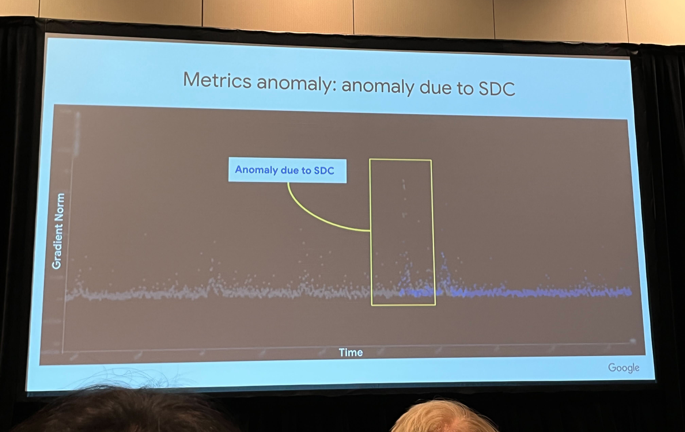
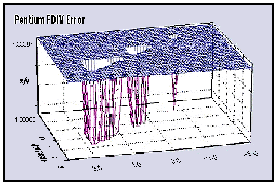
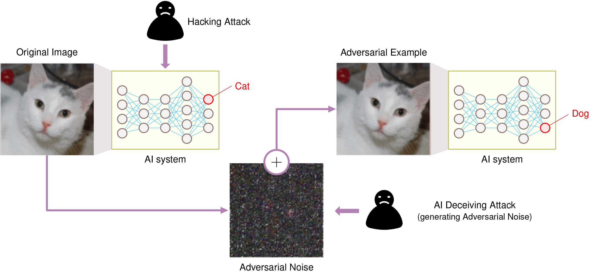
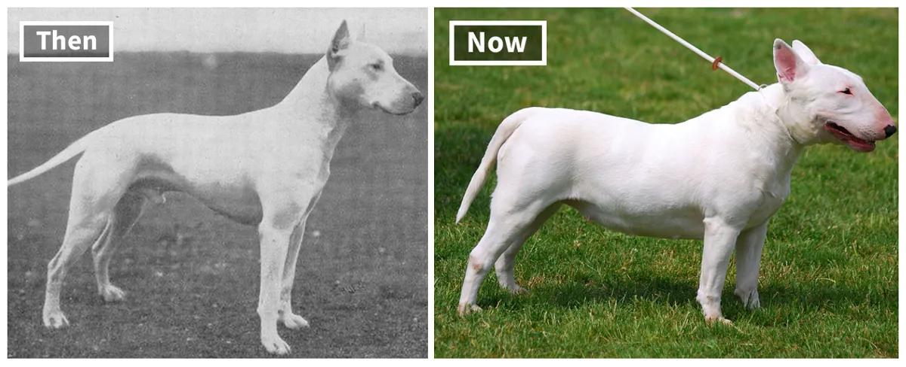
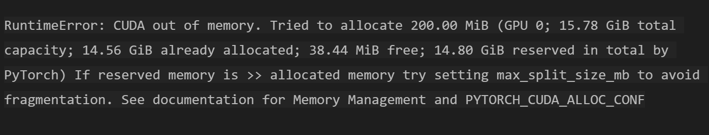

# 鲁棒人工智能 {#sec-robust-ai}

::: {layout-narrow}

::: {.column-margin}

_DALL·E 3 提示词：创作一张以先进人工智能系统为主题的图像，该系统由一个复杂发光的神经网络来象征，深深嵌套在一系列逐渐变大且更加坚固的盾牌之中。每一层盾牌代表一层防御，展示了系统抵御外部威胁和内部错误的鲁棒性。在这个盾牌堡垒中心的神经网络，闪耀着象征人工智能学习和适应能力的连接光芒。这个视觉隐喻不仅强调了人工智能的技术复杂性，还强调了它的韧性和安全性，背景是一个充满了最新技术进步的最先进、安全的服务器机房。该图像旨在传达人工智能领域中终极保护和韧性的概念。_

:::

\noindent
:::

## 目的 {.unnumbered}

_我们如何为实际部署开发容错且具有弹性的机器学习系统？_

实际应用中的机器学习系统需要在各种运行条件下进行容错执行。这些系统面临着多种降低其能力的挑战，包括硬件异常、对抗攻击以及与训练假设相悖的不可预测的真实世界数据分布。这些漏洞要求人工智能系统在整个设计和部署阶段优先考虑鲁棒性和可信度。构建具有弹性的机器学习系统需要在动态和不确定的环境中安全有效地运行。了解鲁棒性原则使工程师能够设计出抵御硬件故障、抵抗恶意攻击并适应分布偏移的系统。这种能力使得在故障可能导致严重后果的安全关键型应用中部署机器学习系统成为可能，从自动驾驶汽车到在不可预测的现实条件下运行的医疗诊断系统。

::: {.callout-tip title="学习目标"}

- 将影响机器学习系统的硬件故障分类为瞬态、永久性和间歇性类别，并说明其显著特征

- 分析位翻转、内存错误和组件故障如何通过神经网络计算传播以降低模型性能

- 比较硬件故障的检测机制，包括 BIST（内建自测试）、错误检测码和冗余投票系统

- 为机器学习部署设计结合硬件级保护与软件实现监控的容错策略

- 评估针对神经网络的对抗攻击向量，包括基于梯度、基于优化和基于迁移的技术

- 通过异常检测、数据清洗和鲁棒训练方法实施针对数据中毒攻击的防御策略

- 使用监控技术和统计漂移检测方法评估分布偏移对模型准确性的影响

- 将鲁棒性原则整合到从数据摄取到模型部署和监控的完整机器学习流水线中
:::

## 鲁棒 AI 系统简介 {#sec-robust-ai-introduction-robust-ai-systems-4671}

当传统软件发生故障时，往往会“大张旗鼓”：服务器崩溃、应用程序抛出错误、用户收到清晰的失败消息。而当机器学习系统发生故障时，往往是“悄无声息”的。自动驾驶汽车的感知系统不会崩溃；它只是将卡车错误地分类为天空。需求预测模型不会报错退出；它只是开始做出极其不准确的预测。医疗诊断系统不会直接关闭；它会悄悄地提供可能危及患者生命的错误分类。这种“静默故障”模式使鲁棒性成为 AI 系统中一个独特且关键的挑战。工程师们不仅要防范代码中的错误，还要防范与训练数据不一致的现实世界。

随着机器学习系统扩展到各种部署环境（从基于云的服务到边缘设备和嵌入式系统），这种静默故障的挑战被进一步放大，在这些环境中，硬件和软件故障会对性能和可靠性产生显著影响。这些系统日益增加的复杂性及其在安全关键型应用[^fn-safety-critical] 中的部署，使得鲁棒和容错设计对于维护系统完整性变得至关重要。

[^fn-safety-critical]: **安全关键型应用**：故障可能导致生命损失、重大财产损失或环境破坏的系统。示例包括核电站、飞机控制系统和医疗设备，在这些领域部署机器学习需要最高的可靠性标准。

在@sec-ondevice-learning 介绍的自适应部署挑战和@sec-security-privacy 探讨的安全漏洞的基础上，我们现在转向全面的系统可靠性。机器学习系统在各种领域运行，在这些领域中，系统性故障（包括硬件和软件故障）、恶意输入（如对抗攻击和数据投毒）以及环境变化，都可能导致从经济破坏到危及生命的严重后果。

为了应对这些风险，研究人员和工程师必须开发先进的故障检测、隔离和恢复技术，这些技术超越了单纯的安全措施。虽然@sec-security-privacy 阐述了如何防范蓄意攻击，但要确保可靠运行，还需要解决可能损害系统行为的各种潜在故障，无论是故意的还是无意的。

这种对容错性的必然要求确立了我们对鲁棒 AI 的定义：

::: {.callout-definition title="鲁棒 AI"}

***弹性 AI*** 描述了这样一种机器学习系统：它旨在通过系统的_故障检测_、_缓解_和_恢复_，在面临_系统错误_、_恶意输入_和_环境变化_时仍能保持_性能_和_可靠性_。

:::

本章通过我们统一的三类框架来审视鲁棒性挑战，该框架建立在@sec-ondevice-learning 的自适应部署挑战和@sec-security-privacy 的安全漏洞基础之上。我们的系统方法可确保在实际部署之前实现全面的系统可靠性。

**在内容主线中的定位：** 虽然@sec-ondevice-learning 确立了资源受限环境中的自适应部署挑战，而@sec-security-privacy 解决了这些自适应产生的漏洞，但本章确保了涵盖所有故障模式（蓄意攻击、无意故障和自然变化）的全系统可靠性。这种全面的可靠性框架对于@sec-ml-operations 中详述的运维工作流至关重要。

第一类是系统性硬件故障，它在整个计算系统中提出了重大挑战（@sec-ml-systems）。无论是瞬态[^fn-transient-vs-permanent]、永久性还是间歇性故障，都可能破坏计算并降低系统性能。其影响范围从临时的小故障到完整的组件故障，需要稳健的检测和缓解策略来维持可靠的运行。这种以硬件为中心的视角超越了其他章节的算法优化，旨在解决物理层的漏洞。

[^fn-transient-vs-permanent]: **瞬态故障与永久性故障**：瞬态故障是暂时的中断（持续微秒到秒），通常由宇宙射线或电磁干扰引起，而永久性故障会造成持久损坏，需要更换组件。在现代系统中，瞬态故障比永久性故障常见 1000$\times$ [@baumann2005soft]。

恶意操纵代表了我们的第二类挑战，我们将从工程角度而不是@sec-security-privacy 的安全优先方法来审视对抗鲁棒性。虽然该章讨论了身份验证、访问控制和隐私保护，但我们在这里侧重于在受到攻击时保持模型性能。对抗攻击、数据投毒企图和提示注入漏洞可能导致模型对输入进行错误分类或产生不可靠的输出，这需要有别于传统安全措施的专门防御机制。

作为对这些蓄意威胁的补充，环境变化引入了我们的第三类鲁棒性挑战。不同于@sec-ml-operations 中讨论的运行监控，我们探讨模型如何随着数据分布随时间的自然偏移而保持准确性。算法、库和框架中的缺陷、设计缺陷和实现错误可能会在系统中传播，从而产生超越单个组件故障的系统性漏洞[^fn-systemic-vulnerabilities]。这种系统级的鲁棒性视角涵盖了从数据摄取到推理的整个机器学习流水线。

[^fn-systemic-vulnerabilities]: **系统性漏洞**：影响整个系统架构而不仅仅是单个组件的弱点。与孤立的缺陷不同，这些漏洞可以跨多个层级级联，可能会同时危及数千个互连的服务。

实现鲁棒性的具体方法因部署环境和系统约束而异。虽然@sec-efficient-ai 确立了优化的效率原则，但大规模云计算环境通常强调通过冗余和复杂的错误检测机制来实现容错。来自@sec-ondevice-learning 的边缘设备必须在严格的计算、内存和能量限制内应对鲁棒性挑战，这需要适合资源受限环境的专门加固策略。这些约束需要仔细优化和针对资源受限环境的定向加固策略[^fn-hardening-strategies]。

[^fn-hardening-strategies]: **加固策略**：提高系统抵御故障和攻击的恢复能力的技术，包括冗余、输入验证和故障安全机制。由于资源限制，边缘系统通常使用选择性加固，仅保护关键组件。

尽管存在这些环境差异，但鲁棒机器学习系统的基本特征包括容错性、错误恢复能力和持续的性能。通过理解和解决这些多方面的挑战，工程师可以开发出能够在现实环境中有效运行的可靠机器学习系统。

与基本实现相比，鲁棒 AI 系统不可避免地需要额外的计算资源，这与@sec-sustainable-ai 中确立的可持续性原则产生了直接的冲突。纠错机制会额外消耗 12-25% 的内存带宽，冗余处理会增加 2-3$\times$的能耗，而持续监控会增加 5-15% 的计算开销。这些鲁棒性措施还会产生额外的热量，加剧了限制部署密度并需要增强冷却基础设施的热管理挑战。了解这些可持续性权衡，使工程师能够做出明智的决策，确定在何处进行鲁棒性投资能提供最大的价值，同时将对环境的影响降至最低。

本章系统地审视了这些多维度的鲁棒性挑战，探讨了跨越硬件、算法和环境领域的检测和缓解技术。在边缘系统部署策略（@sec-ondevice-learning）和资源效率原则（@sec-sustainable-ai）的基础上，我们开发了全面的方法，在考虑能量和热约束的同时，满足所有计算环境中的容错要求。这里提供的对鲁棒性挑战的系统性检验，为构建在实际部署中保持性能和安全的可靠 AI 系统奠定了基础，从而将鲁棒性从一种事后补充转变为生产级机器学习系统的核心设计原则。

## 现实世界中的稳健性失效 {#sec-robust-ai-realworld-robustness-failures-c119}

要理解机器学习系统中稳健性的重要性，需要研究故障在实践中是如何表现的。现实世界中的案例研究说明了硬件和软件故障在云端、边缘和嵌入式环境中所造成的后果。这些示例突显了对容错设计、严格测试和稳健系统架构的迫切需求，以确保在多样化的部署场景中实现可靠运行。

### 云基础设施故障 {#sec-robust-ai-cloud-infrastructure-failures-1c8c}

2017 年 2 月，由于日常维护期间的人为错误，Amazon Web Services (AWS) 经历了[一次重大中断](https://aws.amazon.com/message/41926/)。一名工程师无意中输入了一条错误的命令，导致 US-East-1 区域的多个服务器关闭。这次长达 4 小时的中断扰乱了超过 150 项 AWS 服务，据初步估计影响了大约 54% 的互联网流量，并给受影响的企业造成了约 1.5 亿美元的损失。亚马逊的人工智能助手 Alexa 在全球服务超过 4000 万台设备，在此次中断期间变得完全没有响应。通常在 200-500&nbsp;毫秒内处理的语音识别请求完全失败，这表明了基础设施故障对机器学习服务造成的级联影响。该事件突显了人为错误对基于云的机器学习系统的影响，以及稳健的维护协议和故障安全机制的重要性[^fn-failsafe-mechanisms]。

[^fn-failsafe-mechanisms]: **故障安全机制 (Failsafe Mechanisms)**：旨在发生故障时自动切换到安全状态的系统。示例包括防止级联故障的断路器，以及在组件发生故障时维持核心功能的优雅降级。

在另一个案例[@dixit2021silent] 中，Facebook 在其分布式查询基础设施中遇到了静默数据损坏 (Silent Data Corruption, SDC)[^fn-silent-data-corruption] 问题，如@fig-sdc-example 所示。SDC 指的是在计算或数据传输过程中未被检测到的错误，这些错误会在系统各层之间静默传播。Facebook 的系统跨数据集处理类似 SQL 的查询，并支持一个旨在减少数据存储占用的压缩应用程序。文件在不使用时会被压缩，并在有读取请求时解压缩。解压缩前会执行大小检查以确保文件有效。然而，一个意外故障偶尔会使有效文件的返回大小为零，导致解压缩失败并造成输出数据库中条目缺失。该问题偶尔出现，部分计算仍能返回正确的文件大小，这使得诊断变得尤为困难。

[^fn-silent-data-corruption]: **静默数据损坏 (Silent Data Corruption, SDC)**：在不触发错误检测机制的情况下损坏数据的硬件或软件错误。研究表明，在大型系统中，每 1,000 到 10,000 次计算中就有 1 次受到 SDC 影响[@dixit2021silent]，这使其成为一个主要的可靠性问题。

[^fn-asil-standards]: **ASIL (汽车安全完整性等级)**：ISO 26262 中定义的安全标准，根据从 ASIL A（最低）到 ASIL D（最高）的风险等级对汽车系统进行分类。自动驾驶等安全关键型汽车机器学习系统必须满足 ASIL C 或 D 的要求，需要 99.999% 的可靠性和全面的容错机制，包括冗余传感器、故障安全行为和严格的验证协议。

::: {#fig-sdc-example fig-env="figure" fig-pos="htb"}

```{.tikz}
\begin{tikzpicture}[line join=round,font=\usefont{T1}{phv}{m}{n}\footnotesize]
\tikzset{%
helvetica/.style={align=flush center,font=\small\usefont{T1}{phv}{m}{n}},
Line/.style={line width=1.0pt,black!50,text=black},
cube/.style={cylinder, draw,shape border rotate=90, aspect=1.8,inner ysep=0pt,
    minimum height=34mm,minimum width=25mm, cylinder uses custom fill,
    cylinder body fill=black!07,cylinder end fill=black!25},
Box/.style={,
    inner xsep=2pt,
    node distance=1.1,
    draw=GreenLine,
    line width=0.75pt,
    font=\usefont{T1}{phv}{m}{n}\small,
    align=flush center,
    fill=GreenL,
    text width=29mm,
    minimum width=29mm, minimum height=10mm
  },
Box2/.style={helvetica,
    inner xsep=2pt,
    node distance=0.8,
    draw=VioletLine,
    line width=0.75pt,
    font=\usefont{T1}{phv}{m}{n}\small,
     align=flush center,
    fill=VioletL2,
    text width=32mm,
    minimum width=32mm, minimum height=8mm
  },
}
\definecolor{CPU}{RGB}{0,120,176}
%%%
\node[Box](B2){Scale math.pow()};
\node[Box,above=of B2](B1){Decompress file size calculation};

\begin{scope}[local bounding box = CPU,shift={($(B2)+(0,-2.6)$)},
                          scale=0.7, every node/.append style={transform shape}]
\node[fill=CPU,minimum width=56, minimum height=56,
            rounded corners=8,outer sep=2pt] (C1) {};
\node[fill=white,minimum width=44, minimum height=44] (C2) {};
\node[fill=CPU!40,minimum width=39, minimum height=39,
            align=center,inner sep=0pt,font=\usefont{T1}{phv}{m}{n}
            \fontsize{8pt}{9}\selectfont] (C3) {Defective\\CPU};

\foreach \x/\y in {0.11/1,0.26/2,0.41/3,0.56/4,0.71/5,0.85/6}{
\node[fill=CPU,minimum width=3, minimum height=12,
           inner sep=0pt,anchor=south](GO\y)at($(C1.north west)!\x!(C1.north east)$){};
}
\foreach \x/\y in {0.11/1,0.26/2,0.41/3,0.56/4,0.71/5,0.85/6}{
\node[fill=CPU,minimum width=3, minimum height=12,
           inner sep=0pt,anchor=north](DO\y)at($(C1.south west)!\x!(C1.south east)$){};
}
\foreach \x/\y in {0.11/1,0.26/2,0.41/3,0.56/4,0.71/5,0.85/6}{
\node[fill=CPU,minimum width=12, minimum height=3,
           inner sep=0pt,anchor=east](LE\y)at($(C1.north west)!\x!(C1.south west)$){};
}
\foreach \x/\y in {0.11/1,0.26/2,0.41/3,0.56/4,0.71/5,0.85/6}{
\node[fill=CPU,minimum width=12, minimum height=3,
           inner sep=0pt,anchor=west](DE\y)at($(C1.north east)!\x!(C1.south east)$){};
}
\end{scope}
%%
\begin{scope}[local bounding box = CY1,shift={($(B2)+(5,-0.1)$)}]
\node (CA1) [cube] {};
\node (CA2) [cube,minimum height=10pt, fill=CPU!60]at($(CA1.bottom)!0.1!(CA1.top)$) {};
\node (CA3) [cube,minimum height=10pt,fill=red!80]at($(CA2.bottom)+(0,2.6mm)$){};
\node (CA4) [cube,minimum height=10pt,fill=red!80]at($(CA3.bottom)+(0,2.6mm)$){};
\node (CA5) [cube,minimum height=10pt, fill=CPU!60]at($(CA1.bottom)!0.65!(CA1.top)$) {};
\node[align=center]at (CA1){Spark shuffle and\\ merge database};
\end{scope}
%%
\begin{scope}[local bounding box = CY2,shift={($(B2)+(-5,-0.1)$)}]
\node (LCA1) [cube] {};
\node[align=center]at (LCA1){Spark pre-shuffle \\ data store\\(compressed)};
\end{scope}
\node[single arrow, draw=black,thick, fill=VioletL,
      minimum width = 15pt, single arrow head extend=3pt,rotate=270,
      minimum height=7mm]at($(B2)!0.52!(B1)$) {};
\node[single arrow, draw=black,thick, fill=VioletL,
      minimum width = 15pt, single arrow head extend=3pt,rotate=270,
      minimum height=7mm]at($(B2)!0.39!(CPU)$) {};
%
\coordinate(DES)at($(DE1)!0.5!(DE6)$);
\coordinate(LEV)at($(LE1)!0.5!(LE6)$);
\node[single arrow, draw=black,thick, fill=VioletL, inner sep=1pt,
      minimum width = 14pt, single arrow head extend=2pt,anchor=east,
      minimum height=18mm](LS)at($(LEV)+(-0.5,0)$) {};
\node[single arrow, draw=black,thick, fill=VioletL, inner sep=1pt,
      minimum width = 14pt, single arrow head extend=2pt,anchor=west,
      minimum height=18mm](DS)at($(DES)+(0.5,0)$) {};
%
%fitting
\scoped[on background layer]
\node[draw=violet,inner xsep=6.5mm,inner ysep=6.5mm,outer sep=0pt,
yshift=2mm,fill=none,fit=(CPU)(B1),line width=2.5pt](BB1){};
\node[below=3pt of  BB1.north,anchor=north,helvetica]{Shuffle and merge};
%%%
\node[Box2,below left=0.5 of LS](N2){\textbf{2.} Compute (1.1)\textsuperscript{53}};
\node[Box2,below right=0.5 of DS,fill=BlueL,draw=BlueLine](R3){\textbf{3.} Result = 0};
\node[Box2,below right=0.3 and -2.5 of R3,text width=43mm](N3){\textbf{3.} Expected Result = 156.24};
%
\node[Box2,above= of CY2](N1){\textbf{1.} Compute file size for decompression};
\node[Box2,above= of CY1](N4){\textbf{4.} Write file to database if size $>$ 0};
\node[Box2,below right= 0.2 and -1.15of CY1](N5){\textbf{5.} Missing rows in DB};
%
\draw[Line,-latex](N5)|-(CA3.before bottom);
\draw[Line,-latex](N5.50)|-(CA4.6);
\draw[Line](N3.20)|-(R3);
\draw[Line,-latex](LCA1.top)|-(B1);
\draw[Line,latex-](CA1.top)|-(B1);
\end{tikzpicture}
```

**静默数据损坏**：意外故障可能会返回错误的文件大小，导致在解压缩期间发生数据丢失，并使错误在分布式查询系统中传播，尽管表面上看起来操作成功。这个来自 Facebook 的示例强调了未检测到的错误、静默数据损坏所带来的挑战，以及在大型数据处理流水线中采用稳健错误检测机制的重要性。来源：[Facebook](https://arxiv.org/PDF/2102.11245)。

:::

此案例说明了静默数据损坏如何跨应用程序栈的多个层传播，从而导致大型分布式系统中的数据丢失和应用程序故障。如果不加以解决，此类错误可能会降低机器学习系统的性能，尤其是影响训练过程（@sec-ai-training）。例如，由于 SDC 导致的训练数据损坏或数据流水线不一致可能会损害模型的准确性和可靠性。其他大型公司报告的类似挑战也证实了此类问题的普遍性。如@fig-sdc-jeffdean 所示，Google DeepMind 和 Google Research 的首席科学家 [Jeff Dean](https://en.wikipedia.org/wiki/Jeff_Dean) 在 [MLSys 2024](https://mlsys.org/) 的主题演讲中强调了 AI 超级计算机[^fn-ai-hypercomputers] 中的这些问题[@dean2024mlsys]。

[^fn-ai-hypercomputers]: **AI 超级计算机 (AI Hypercomputers)**：专门为 AI 工作负载设计的大型计算系统，配备数千个通过高带宽网络互连的专用处理器（TPU/GPU）。谷歌最新的系统包含超过 100,000 个并行工作的加速器。

{#fig-sdc-jeffdean}

### 边缘设备漏洞 {#sec-robust-ai-edge-device-vulnerabilities-ddfe}

从集中式云环境转向分布式边缘部署，自动驾驶汽车提供了突出的示例，说明故障如何严重影响边缘计算领域的机器学习系统[^fn-edge-computing]。这些车辆依赖机器学习进行感知、决策和控制，这使得它们特别容易受到硬件和软件故障的影响。

[^fn-edge-computing]: **边缘计算 (Edge Computing)**：在靠近数据源的地方而不是在集中的云服务器中处理数据，将延迟从大约 100&nbsp;毫秒减少到不到 10&nbsp;毫秒。这对自动驾驶汽车至关重要，因为毫秒级的延迟可能决定了是成功避碰还是发生灾难性故障。

{#fig-tesla-example fig-pos='htb'}

2016 年 5 月，一辆在 Autopilot 模式[^fn-autopilot] 下运行的特斯拉 Model S 与一辆白色半挂卡车相撞，发生了一起致命的碰撞事故。该系统依赖于计算机视觉和机器学习算法，未能将其与明亮的天空区分开来，导致了高速撞击。据报道，当时驾驶员注意力分散，没有进行干预，如@fig-tesla-example 所示。这起事件引发了人们对基于 AI 的感知系统可靠性的严重担忧，并强调了自动驾驶汽车中需要稳健的故障安全机制。

[^fn-autopilot]: **Autopilot**：特斯拉的驾驶辅助系统，提供转向、制动和加速等半自动驾驶功能，同时需要驾驶员的主动监督。

进一步加剧这些担忧的是，2018 年 3 月发生了类似的案例，当时一辆 Uber 自动驾驶测试车在亚利桑那州坦佩市[撞击](https://money.cnn.com/2018/03/19/technology/uber-autonomous-car-fatal-crash/index.html?iid=EL)并致死一名行人。这起事故归咎于车辆物体识别软件的一个缺陷，该软件未能将行人归类为需要避让的障碍物。

### 嵌入式系统限制 {#sec-robust-ai-embedded-system-constraints-ec7a}

从边缘计算延伸到受限更严重的环境，嵌入式系统[^fn-embedded-systems] 在资源受限且通常是安全关键型的环境中运行。随着 AI 功能越来越多地集成到这些系统中，故障的复杂性和后果也随之显著增加。

[^fn-embedded-systems]: **嵌入式系统 (Embedded Systems)**：为大型系统内特定控制功能而设计的计算机系统，通常具有实时约束。范围从只有几千字节内存的 8 位微控制器到复杂的片上系统，通常可以在无人干预的情况下运行数年。

一个例子来自太空探索。1999 年，NASA 的火星极地着陆器任务由于其着陆检测系统中的软件错误而经历了[一次灾难性失败](https://spaceref.com/uncategorized/nasa-reveals-probable-cause-of-mars-polar-lander-and-deep-space-2-mission-failures/)（@fig-nasa-example）。着陆器的软件将展开起落架产生的振动误认为是成功着陆，提前关闭了发动机并导致坠毁。该事件证明了严格的软件验证和稳健的系统设计的重要性，特别是对于无法进行恢复的远程任务而言。随着 AI 成为太空系统不可或缺的一部分，确保稳健性和可靠性成为任务成功的必要条件。

{#fig-nasa-example fig-pos='htb'}

嵌入式系统故障的后果不仅限于太空探索，还延伸到了商业航空领域。2015 年，一架波音 787 梦想客机在飞行途中由于发电机控制单元中的一个软件漏洞而经历了彻底的电力中断。这次故障凸显了安全关键型系统[^fn-asil-standards] 满足严格可靠性要求的极端重要性。故障源于一种情况：在连续通电 248 天（约 8 个月）后，同时开启所有四个发电机控制单元，导致它们进入故障安全模式，从而切断了所有交流电源。

> _“如果四个主发电机控制单元（与安装在发动机上的发电机相关联）在连续通电 248 天后同时启动，所有四个 GCU 将同时进入故障安全模式，从而导致无论处于何种飞行阶段，都会丢失所有交流电源。” — [美国联邦航空管理局指令](https://s3.amazonaws.com/public-inspection.federalregister.gov/2015-10066.pdf) (2015)_

随着 AI 越来越多地应用于航空领域（包括自动飞行控制和预测性维护等任务），嵌入式系统的稳健性直接影响着乘客的安全。

当我们考虑植入式医疗设备时，风险变得更高。例如，由于软件或硬件故障而出现故障或意外行为的智能[起搏器](https://www.bbc.com/future/article/20221011-how-space-weather-causes-computer-errors)可能会危及患者的生命。随着 AI 系统在此类应用中承担感知、决策和控制的作用，新的漏洞来源也随之出现，包括与数据相关的错误、模型不确定性[^fn-model-uncertainty] 以及在罕见边缘情况下的不可预测行为。一些 AI 模型的不透明性质使得故障诊断和恢复变得更加复杂。

这些现实世界中的故障场景突显了对稳健性评估和缓解采取系统化方法的迫切需求。每一次故障——无论是影响数百万次语音交互的 AWS 中断，导致致命碰撞的自动驾驶汽车感知错误，还是导致任务失败的航天器软件漏洞——都揭示了为稳健系统设计提供指导的共同模式。

[^fn-model-uncertainty]: **模型不确定性 (Model Uncertainty)**：机器学习模型无法捕获潜在数据生成过程的全部复杂性。

基于这些跨部署环境的系统故障的具体示例，我们现在建立一个统一的框架，以系统地理解和解决稳健性挑战。

## 稳健 AI 的统一框架 {#sec-robust-ai-unified-framework-robust-ai-b25d}

尽管原因和背景各不相同，上面检查的现实世界故障都有共同的特征。无论是检查导致语音助手瘫痪的 AWS 中断、自动驾驶汽车感知故障，还是航天器软件错误，这些事件都揭示了为构建稳健的 AI 系统提供系统性方法的模式。

### 建立在先前概念之上 {#sec-robust-ai-building-previous-concepts-ef4a}

在建立我们的稳健性框架之前，我们将这些挑战与前面章节的基础概念联系起来。硬件加速架构（@sec-ai-acceleration）确立了 GPU 内存层次结构、互连结构和专用计算单元如何创建稳健性系统必须应对的复杂故障传播路径。来自@sec-security-privacy 的安全框架引入了威胁建模原则，这些原则直接为我们对对抗攻击和防御策略的理解提供了信息。来自@sec-ml-operations 的运行监控系统为在生产环境中检测和响应稳健性威胁提供了基础设施基础。

这些早期的概念在稳健的 AI 系统中交汇，在这些系统中，GPU 内存错误可能会破坏模型权重，对抗性输入会利用学到的漏洞，而运行监控必须检测跨硬件、算法和环境维度的异常。当在可接受的性能预算内实现冗余和纠错机制时，来自@sec-efficient-ai 的效率优化成为关键约束。

### 从 ML 性能到系统可靠性 {#sec-robust-ai-ml-performance-system-reliability-7d42}

为了系统地理解这些故障模式，我们必须弥合前面章节中熟悉的 ML 系统性能概念与稳健部署所必需的可靠性工程原则之间的差距。在传统的 ML 开发中（@sec-ml-systems），我们关注模型准确率、推理延迟和吞吐量等指标。然而，现实世界的部署引入了一个额外的维度：执行我们模型的底层计算基底的可靠性。

考虑硬件可靠性如何直接影响 ML 性能：关键神经网络权重中的单个位翻转可能使 ImageNet 上的 ResNet-50 分类准确率从 76.0%（top-1）降至 11%，而训练期间的内存子系统故障会破坏梯度更新并阻止模型收敛。现代 Transformer 模型（例如具有 175&nbsp;B 参数的 GPT-3）每次推理执行 10^15 次浮点运算，在单次前向传递期间创造了超过一百万次硬件故障的机会。以高达 900 GB/s 带宽（例如，V100 HBM2）运行的 GPU 内存系统每秒处理 10^11 位，其中每位 10^-17 错误的基准错误率转化为每小时运行的多个潜在故障。

硬件可靠性和 ML 性能之间的这种联系要求我们采用可靠性工程[^fn-reliability-engineering] 中的概念，包括描述故障如何发生的故障模型、在问题影响结果之前识别问题的错误检测机制，以及恢复系统运行的恢复策略。这些可靠性概念补充了@sec-efficient-ai 中涵盖的性能优化技术，确保优化后的系统在现实条件下继续正确运行。

[^fn-reliability-engineering]: **可靠性工程**：一门专注于确保系统在规定时间段内无故障地执行其预期功能的工程学科。起源于航空航天和核工业，在这些行业中故障会产生灾难性后果，现在对于安全关键应用中的 AI 系统至关重要。

建立在这个概念桥梁之上，我们建立了一个统一的框架，用于理解跨 ML 系统所有维度的稳健性挑战。该框架为理解不同类型的故障（无论是源于硬件、对抗性输入还是软件缺陷）如何共享共同特征以及如何通过系统方法加以解决提供了概念基础。

### 稳健 AI 的三大支柱 {#sec-robust-ai-three-pillars-robust-ai-2626}

稳健的 AI 系统必须应对可能损害系统可靠性和性能的三大类挑战。@fig-three-pillars-framework 说明了这个三支柱框架，展示了系统级故障、输入级攻击和环境偏移如何各自代表对 ML 系统稳健性截然不同但又相互关联的威胁：

::: {#fig-three-pillars-framework fig-env="figure" fig-pos="h"}

```{.tikz}
\begin{tikzpicture}[line join=round,font=\usefont{T1}{phv}{m}{n}\small]
\tikzset{
  Box/.style={align=center,outer sep=0pt,
    inner xsep=6pt,    inner ysep=7pt,
    node distance=1,
    draw=GreenLine,
    line width=0.75pt,
    fill=GreenL!60,
    text width=33mm,
    minimum width=33mm, minimum height=30mm,anchor=north
  },
   Box11/.style={Box, fill=GreenD,draw=GreenD,minimum height=10mm,text=white,font=\usefont{T1}{phv}{m}{n}\bfseries,inner ysep=2pt},
   Box2/.style={Box, fill=BlueL!60,draw=BlueLine},
   Box22/.style={Box, fill=BlueLine,draw=BlueLine,minimum height=10mm,text=white,font=\usefont{T1}{phv}{m}{n}\bfseries,inner ysep=2pt},
   Box3/.style={Box, fill=RedL!60,draw=RedLine},
   Box33/.style={Box, fill=RedLine,draw=RedLine,minimum height=10mm,text=white,font=\usefont{T1}{phv}{m}{n}\bfseries,inner ysep=2pt},
   Box4/.style={Box, draw=OrangeLine, fill=OrangeL!60,  text width=138mm,minimum width=138mm, minimum height=10mm},
Line/.style={BrownLine!40, line width=2.0pt,shorten <=1pt,shorten >=2pt},
LineA/.style={violet!50,line width=1.0pt,{-{Triangle[width=1.1*4pt,length=1.5*6pt]}},shorten <=1pt,shorten >=1pt},
ALine/.style={black!50, line width=1.1pt,{{Triangle[width=0.9*6pt,length=1.2*6pt]}-}},
Larrow/.style={fill=violet!50, single arrow,  inner sep=2pt, single arrow head extend=3pt,
            single arrow head indent=0pt,minimum height=10mm, minimum width=3pt}
}

\node[Box4](B0){Robust AI System};
\node[Box11,below=0.7 of B0.south west,anchor=north west](B11){System-Level \\ Faults};
\node[Box22,below=0.7 of B0.south,anchor=north](B22){Input-Level\\ Attacks};
\node[Box33,below=0.7 of B0.south east,anchor=north east](B33){Environmental\\ Shifts};

\node[Box,below=0pt of B11.south,anchor=north,text depth = 30mm,align=left](B1){\parskip=3pt%
$\blacktriangleright$ Bit Flips

$\blacktriangleright$ Component\\ \hphantom{$\blacktriangleright$ }Wear-out

$\blacktriangleright$ Memory Errors

$\blacktriangleright$ Power Failures

$\blacktriangleright$ Temperature\\ \hphantom{$\blacktriangleright$ }Extremes
};
\node[Box2,below=0pt of B22.south,anchor=north, text depth = 30mm,align=left](B2){\parskip=3pt%
$\blacktriangleright$ Adversarial\\ \hphantom{$\blacktriangleright$ }Attacks

$\blacktriangleright$ Data Poisoning

$\blacktriangleright$ Prompt Injection

$\blacktriangleright$  Input \\  \hphantom{$\blacktriangleright$ }Manipulation
};
\node[Box3,below=0pt of B33.south,anchor=north, text depth = 30mm,align=left](B3){\parskip=3pt%
$\blacktriangleright$  Data Drift

$\blacktriangleright$ Concept Drift

$\blacktriangleright$ Domain Shift

$\blacktriangleright$ Distribution\\ \hphantom{$\blacktriangleright$ }Changes

$\blacktriangleright$  Context \\ \hphantom{$\blacktriangleright$ }Evolution
};

\draw[GreenD,line width=3pt](B1.south west)--(B11.north west);
\draw[BlueLine,line width=3pt](B2.south west)--(B22.north west);
\draw[RedLine,line width=3pt](B3.south west)--(B33.north west);
\foreach \i/\col in {1/GreenD,2/BlueLine,3/RedLine}{
\draw[Line,\col!50](B0)--(B\i\i.north);
}
\end{tikzpicture}
```

**三大支柱框架**：AI 系统必须应对以确保在现实世界部署中可靠运行的三大核心类别的稳健性挑战。稳健的 AI 系统建立在有效处理这三个挑战领域的基础之上。

:::

系统级故障涵盖源自底层计算基础设施的所有故障。这些包括来自宇宙辐射的瞬态硬件错误、永久性组件退化以及偶尔出现的间歇性故障。系统级故障会影响执行 ML 计算的物理基底，可能会破坏计算、内存访问模式或组件之间的通信。

输入级攻击包括通过精心设计的输入或训练数据来操纵模型行为的蓄意尝试。对抗攻击通过向输入添加难以察觉的微小扰动来利用模型漏洞，而数据中毒则破坏了训练过程本身。这些威胁以信息处理流水线为目标，颠覆了模型学到的表示和决策边界。

环境偏移代表了现实世界条件的自然演变，这些条件会随着时间的推移降低模型性能。分布偏移、概念漂移和不断变化的运行环境挑战了模型训练基础的核心假设。与蓄意攻击不同，这些偏移反映了部署环境的动态性质以及静态训练范式的固有局限性。

### 常见的稳健性原则 {#sec-robust-ai-common-robustness-principles-cb22}

这三类挑战源于不同的来源，但具有几个共同的关键特征，为我们构建弹性系统的方法提供了指导：

检测和监控构成任何稳健性策略的基础。硬件监控系统通常以 1-10 Hz 的频率对指标进行采样，检测温度异常（偏离基线 ±5°C）、电压波动（偏离标称值 ±5%）以及每小时每位超过 10^-12 错误的内存错误率。对抗性输入检测利用 p 值阈值为 0.01-0.05 的统计测试，实现 85-95% 的检测率，而误报率低于 2%。使用 MMD 测试的分布监控在每次评估中处理 1,000-10,000 个样本，在 95% 置信区间内检测 Cohen's d > 0.3 的偏移。

建立在这种检测能力之上，优雅降级确保系统即使在压力下运行也能维持核心功能。稳健的系统不应发生灾难性故障，而应表现出可预测的性能下降，从而保留关键能力。ECC 内存系统以 99.9% 的成功率从单比特错误中恢复，同时增加 12.5% 的带宽开销。从 FP32 到 INT8 的模型量化将内存需求减少了 75%，推理时间减少了 2-4$\times$，以 1-3% 的准确率换取在资源限制下的持续运行。当主模型发生故障时，集成回退系统可保持 85-90% 的峰值性能，切换延迟低于 10&nbsp;ms。

自适应响应使系统能够根据检测到的威胁或不断变化的条件调整其行为。适应可能涉及激活纠错机制、应用输入预处理技术或动态调整模型参数。关键原则是稳健性不是静态的，而是需要不断调整以保持有效性。

这些原则超越了故障恢复，涵盖了贯穿整个 ML 系统设计的全面性能适应策略。检测策略构成了监控系统的基础，优雅降级在组件发生故障时指导回退机制，而自适应响应使系统能够随着不断变化的条件而演进。

### 跨 ML 流水线的集成 {#sec-robust-ai-integration-across-ml-pipeline-8286}

稳健性无法通过应用于单个组件的孤立技术来实现。相反，它需要跨整个 ML 流水线（从数据收集到部署和监控）进行系统集成。这种集成方法认识到，一个组件中的漏洞可能会危及整个系统，无论在其他地方实施了何种保护措施。

建立了这个统一的基础之后，我们在后续小节中探讨的检测和缓解策略，无论是针对硬件故障、对抗攻击还是软件错误，都建立在这些共同原则之上，同时解决了每个威胁类别的特定特征。了解这些共享基础有助于开发更有效和高效的方法来构建稳健的 AI 系统。

以下小节系统地检查了每个支柱，提供了理解用于稳健性评估和改进的专用工具和框架所需的概念基础。

## 硬件故障 {#sec-robust-ai-hardware-faults-cf22}

在建立了统一框架之后，我们现在详细探讨每一个支柱，从系统级故障开始。硬件故障是鲁棒性挑战的基础层，因为所有机器学习计算最终都在物理硬件上执行，而这些硬件可能会以各种方式发生故障。

### 硬件故障对机器学习系统的影响 {#sec-robust-ai-hardware-fault-impact-ml-systems-b5f7}

要理解为什么硬件可靠性对机器学习工作负载尤为重要，需要考察几个关键因素。机器学习系统与传统应用程序在几个方面存在差异，这些差异放大了硬件故障的影响：

- **计算密集度**：现代机器学习工作负载每秒执行数百万次操作，这产生了许多使故障破坏计算结果的机会
- **长时间运行的训练**：训练任务可能运行数天或数周，增加了遇到硬件故障的概率
- **参数敏感性**：模型权重中的微小损坏可能会导致输出预测发生巨大变化
- **分布式依赖**：大规模训练依赖于许多处理器之间的协调，其中单点故障可能会中断整个工作流

基于这些机器学习特有的考量因素，硬件故障根据其时间特征和持久性可分为三大类，每一类都对机器学习系统的可靠性提出了独特的挑战。

为了说明硬件故障对神经网络的直接影响，可以考虑权重矩阵中的单个位翻转（bit-flip）。如果由于影响 IEEE 754 浮点表示中符号位的瞬态故障，导致 ResNet-50 模型中的一个关键权重从 `0.5` 翻转为 `-0.5`，它会改变特征图的符号，从而在后续层中引发级联错误。研究表明，在关键层中进行单一的、有针对性的位翻转可以将 ImageNet 的准确率从 76% 降低到不到 10%[@reagen2018ares]。这证明了为什么硬件可靠性直接影响模型性能，而不仅仅是基础设施的稳定性。与传统软件中单个位错误可能导致崩溃或计算错误不同，在神经网络中，它可以悄无声息地破坏决定系统行为的已学习表征。

瞬态故障是由宇宙射线或电磁干扰等外部因素引起的暂时性中断。这些非重复性事件（以内存中的位翻转为例）会导致计算错误，但不会造成永久性的硬件损坏。对于机器学习系统而言，瞬态故障可能会在训练期间破坏梯度更新，或者在推理期间改变模型权重，从而导致暂时但可能很显著的性能下降。

永久性故障代表了由物理缺陷或组件磨损引起的不可逆损坏，例如需要更换硬件的固定型故障（stuck-at faults）或设备故障。这些故障对于长时间运行的机器学习训练任务来说尤其成问题，因为硬件故障可能导致数天或数周的计算丢失，并需要从最近的检查点完全重新启动任务。

间歇性故障由于连接松动或组件老化等不稳定情况而偶发性地出现和消失，这使得它们在诊断和复现时特别具有挑战性。这些故障可能会导致机器学习系统出现非确定性行为，从而导致结果不一致，进而损害模型的验证和可复现性。

理解这种故障分类法为设计容错机器学习系统奠定了基础，使其能够在不同的运行环境中检测、缓解硬件故障并从中恢复。由于现代 AI 工作负载的计算密集度、分布式特性和长时间运行的特点，这些故障对机器学习系统的影响超出了传统计算应用程序的范畴。

### 瞬态故障 {#sec-robust-ai-transient-faults-1455}

我们从最常见的类别开始详细探究，硬件中的瞬态故障可以表现为多种形式，每种形式都有其独特的特征和原因。这些故障本质上是暂时的，不会对硬件组件造成永久性损坏。

#### 瞬态故障属性 {#sec-robust-ai-transient-fault-properties-318c}

瞬态故障的特点是持续时间短且具有非永久性。它们不会持续存在，也不会对硬件留下任何持久的影响。然而，如果处理不当，它们仍然可能导致计算错误、数据损坏或系统行为异常。@fig-bit-flip 展示了一个经典的例子，其中内存中的单个比特意外改变了状态，这可能会改变关键数据或计算。

这些表现形式包含几个不同的类别。常见的瞬态故障类型包括由宇宙射线和电离辐射引起的单粒子翻转（SEUs）[^fn-single-event-upsets]、由电源不稳定引起的电压波动[@reddi2013resilient]、由外部电磁场引起的电磁干扰（EMI）[^fn-electromagnetic-interference]、由突然的静电流动引起的静电放电（ESD）、由意外的信号耦合引起的串扰（crosstalk）[^fn-crosstalk]、由多个输出同时切换引起的地弹（ground bounce）、由违反信号时序约束引起的时序违规，以及组合逻辑中的软错误[@mukherjee2005soft]。了解这些故障类型有助于设计能够减轻其影响并确保可靠运行的稳健硬件系统。

[^fn-single-event-upsets]: **单粒子翻转 (SEUs)**：由宇宙射线或 alpha 粒子引起的辐射诱导的内存或逻辑中的比特翻转。现代 DRAM 的错误率约为每访问 10^17 个比特出现 1 次错误，在海平面上大约每月每千兆比特发生一次[@baumann2005soft]。对于处理大型数据集的人工智能系统来说，一个 1&nbsp;TB 的模型检查点在单次读取操作中预计会经历 80 次比特翻转，这使得错误检测对于可靠的机器学习训练至关重要。

[^fn-electromagnetic-interference]: **电磁干扰 (EMI)**：由外部电磁源引起的干扰，可能会破坏电子电路。常见的干扰源包括手机、WiFi 和附近的开关电源，这要求在敏感系统中进行仔细的屏蔽。

[^fn-crosstalk]: **串扰 (Crosstalk)**：由于寄生电容和电感导致相邻导体之间发生的有害信号耦合。随着电路密度的增加，这个问题变得越来越严重，可能会导致时序违规和数据损坏。

#### 故障分析与性能影响 {#sec-robust-ai-fault-analysis-performance-impact-fa37}

现代机器学习系统需要精确了解故障率及其对性能的影响，以便做出明智的工程决策。对瞬态故障的定量分析揭示了为稳健系统设计提供参考的重要规律。

先进半导体工艺表现出显著更高的软错误率。由于节点电容和电荷收集效率的降低，现代 7&nbsp;nm 工艺的软错误率大约是 65&nbsp;nm 节点的 1000$\times$倍[@baumann2005soft]。对于采用尖端工艺制造的机器学习加速器而言，这意味着基础错误率约为每 10^14 次操作出现 1 次错误，因此需要系统的错误检测和纠正策略。

这些理论故障率转化为实际的可靠性指标，这些指标随部署环境和工作负载特征的不同而有很大差异。典型的人工智能加速器表现出的平均故障间隔时间（MTBF）[^fn-mtbf] 值在不同的部署环境中存在巨大差异：

[^fn-mtbf]: **平均故障间隔时间 (MTBF)**：衡量系统故障之间平均运行时间的可靠性指标。由美国军方在20世纪60年代（MIL-HDBK-217, 1965）基于20世纪50年代的可靠性理论正式确立，MTBF 的计算假设在有效寿命期间故障呈指数分布。对于人工智能系统，MTBF 分析可指导检查点频率——一个 MTBF 为 50,000 小时的系统应每 1-2 小时保存一次检查点，以最大限度地减少恢复开销，同时将容错带来的性能影响保持在 1% 以下。

- **云端人工智能加速器** (Tesla V100, A100)：在受控的数据中心条件下，MTBF 为 50,000-100,000 小时
- **边缘人工智能处理器** (NVIDIA Jetson, Intel Movidius)：在不受控环境中，MTBF 为 20,000-40,000 小时
- **移动人工智能芯片** (Apple Neural Engine, Qualcomm Hexagon)：在受限于热量和功耗的情况下，MTBF 为 30,000-60,000 小时

在分布式训练场景中，这些 MTBF 值会显著复合。一个由 1,000 个加速器组成的集群，如果单个加速器的 MTBF 为 50,000 小时，那么预计每 50 小时就会发生一次故障，这就需要稳健的检查点和恢复机制。

除了了解故障率，系统设计人员还必须考虑保护成本。硬件容错机制会带来可衡量的性能和能量损失，在系统设计中必须加以考虑。@tbl-fault-tolerance-overhead 量化了不同保护机制之间的这些权衡：

| **保护机制** | **性能开销** | **能量开销** | **面积开销** |
|:---|:---|:---|:---|
| **单比特 ECC** | 2-5% | 3-7% | 12-15% |
| **双比特 ECC** | 5-12% | 8-15% | 25-30% |
| **三重模块冗余** | 200-300% | 200-300% | 200-300% |
| **检查点/重启** | 10-25% | 15-30% | 5-10% |
: **容错开销分析**：不同保护机制对系统性能、能量消耗和硬件面积需求的定量影响。必须在这些开销与故障率和恢复成本之间取得平衡，以优化单位资源的系统可靠性。 {#tbl-fault-tolerance-overhead}

这些开销值对内存带宽利用率有特别显著的影响，而内存带宽是机器学习工作负载中的一个关键约束。由于额外的存储需求（每 64 个数据比特需要 8 个 ECC 比特），ECC 内存[^fn-ecc-memory] 会使有效带宽降低 12.5%。用于错误检测的内存清洗（scrubbing）操作会额外消耗 5-15% 的可用带宽，具体取决于清洗频率和内存配置。

[^fn-ecc-memory]: **纠错码 (ECC) 内存**：使用冗余信息自动检测和纠正比特错误的内存技术。ECC 内存于 20 世纪 60 年代在 IBM 开发，每 64 比特用户数据添加 8 比特纠错数据，从而实现单比特纠错和双比特错误检测。这对人工智能系统至关重要，因为内存错误可能会损坏模型权重——关键参数中的单比特翻转可能会使准确率降低 10-50%，具体取决于受影响的层。

这些带宽开销对性能有直接影响。对于典型的受限于内存带宽的 Transformer 训练工作负载，这些带宽的减少会直接转化为成比例的训练时间增加。一个需要 900 GB/s 内存带宽且带有 ECC 保护的模型，实际只能获得 787 GB/s 的带宽，这使得训练时间延长了约 14%。

#### 内存层次结构与带宽影响 {#sec-robust-ai-memory-hierarchy-bandwidth-impact-7525}

内存子系统是现代机器学习系统中最容易受损的组件，其容错机制会显著影响带宽利用率和整体系统性能。了解内存层次结构的稳健性需要分析不同内存技术、它们的错误特征以及保护机制对带宽影响之间的相互作用。

这种复杂性源于内存技术的多样化特征，它们表现出不同的故障模式和保护需求。@tbl-memory-bandwidth-protection 展示了 ECC 保护如何影响不同技术的内存带宽：

- **DRAM**：基础错误率为每 10^17 个比特 1 次，以单比特软错误为主。需要基于刷新的错误检测和纠正。
- **HBM (高带宽内存)**：由于 3D 堆叠效应和热密度，错误率高出 10$\times$倍。可靠运行需要高级 ECC。
- **SRAM (缓存)**：软错误率较低（每 10^19 个比特 1 次），但对电压变化和工艺变化的脆弱性更高。
- **NVM (非易失性内存)**：如 3D XPoint 等新兴技术，具有独特的错误模式，需要专门的保护方案[^fn-nvm-technologies]。

[^fn-nvm-technologies]: **非易失性内存 (NVM) 技术**：连接 DRAM 和传统存储的存储级内存，包括英特尔的 3D XPoint (Optane) 和新兴的阻变 RAM 技术。NVM 于 2017 年投入商业应用，其访问速度比 SSD 快 1000$\times$倍，同时保持数据持久性，这使得新的机器学习系统架构成为可能，在这些架构中，模型可以在电源循环期间保持驻留内存。

- **GDDR**：针对带宽而非可靠性进行了优化，其错误率通常比标准 DRAM 高 2-3$\times$倍。

内存技术和保护机制的选择直接影响机器学习工作负载的可用带宽：

| **内存技术** | **基础带宽（GB/s）** | **ECC 开销（%）** | **有效带宽（GB/s）** |
|:---|:---|:---|:---|
| **DDR4-3200** | 51.2 | 12.5% | 44.8 |
| **HBM2** | 900 | 12.5% | 787 |
| **HBM3** | 1,600 | 12.5% | 1,400 |
| **GDDR6X** | 760 | 通常无 | 760 |
: **内存带宽保护分析**：ECC 保护对机器学习加速器中使用的不同内存技术的有效内存带宽的影响。对于受限于内存的工作负载，带宽开销直接影响训练吞吐量。 {#tbl-memory-bandwidth-protection}

现代内存系统通过内存清洗（memory scrubbing）实现持续的后台错误检测，该操作会定期读取并重写内存位置，以检测和纠正不断累积的软错误。这种后台活动会消耗内存带宽并对机器学习工作负载产生干扰：

- **清洗速率**：典型的 24 小时全内存扫描会消耗总带宽的 2-5%
- **优先级仲裁**：机器学习内存请求必须与清洗操作竞争，使延迟方差增加 10-15%
- **热影响**：清洗使内存功耗增加 3-8%，影响散热设计和冷却要求

先进的机器学习系统实现了分层保护方案，以在整个内存层次结构中平衡性能和可靠性：

1. **L1/L2 缓存**：具有即时检测和重放功能的奇偶校验保护
2. **L3 缓存**：具有错误日志记录和逐步停用缓存行功能的单比特 ECC
3. **主存**：具有高级伴随式分析（syndrome analysis）和预测性故障检测功能的双比特 ECC
4. **持久存储**：在多个设备上具有分布式冗余的里德-所罗门码（Reed-Solomon codes）

现代人工智能加速器将内存保护与计算流水线设计相集成，以最大限度地减少对性能的影响：

- **错误检测流水线化**：内存 ECC 检查与算术操作重叠，以隐藏保护延迟
- **自适应保护级别**：根据工作负载的关键性和错误率监控动态调整保护强度
- **带宽分配策略**：优先考虑关键的机器学习内存流量而非后台保护操作的服务质量（QoS）机制

::: {#fig-bit-flip fig-env="figure" fig-pos="htb"}

```{.tikz}
\scalebox{0.8}{%
\begin{tikzpicture}[line join=round,font=\usefont{T1}{phv}{m}{n}\small]
\tikzset{%
helvetica/.style={align=flush center,font=\small\usefont{T1}{phv}{m}{n}},
cell/.style={draw=BrownLine,line width=0.5pt, minimum size=\cellsize,
    minimum height=\cellheight}
}
\def\columns{6}
\def\rows{1}
\def\cellsize{9mm}
\def\cellheight{9mm}
\colorlet{BrownL}{BrownL!30}

\begin{scope}[local bounding box=M1,shift={(0,0)}]
\foreach \x in {1,...,\columns}{
    \foreach \y in {1,...,\rows}{
        %
        \def\br{MG}
\node[draw=BrownLine, fill=BrownL, minimum width=\cellsize,
                    minimum height=\cellheight,
                    line width=0.5pt] (cell-\x-\y\br) at (\x*\cellsize,-\y*\cellheight) {1};
    }
}
\end{scope}

\begin{scope}[local bounding box=M2,shift={(0,-2)}]
\foreach \x in {1,...,\columns}{
    \foreach \y in {1,...,\rows}{
        %
        \def\br{MD}
\node[draw=BrownLine, fill=BrownL, minimum width=\cellsize,
                    minimum height=\cellheight,
                    line width=0.5pt] (cell-\x-\y\br) at (\x*\cellsize,-\y*\cellheight) {1};
    }
}
\end{scope}
\foreach \x in {2,3,6}{,
\node[cell,fill=BrownL]at(cell-\x-1MG){0};
}
\foreach \x in {2,6}{,
\node[cell,fill=BrownL]at(cell-\x-1MD){0};
}

\node[cell,fill=BrownL,line width=2pt](BF)at(cell-3-1MD){1};
\node[above=3pt of BF]{\textbf{Bit-Flip}};
\node[right=0.3 of cell-6-1MD,font=\usefont{T1}{phv}{m}{n}\tiny](DT){$\bullet$ $\bullet$ $\bullet$};
\node[right=0.3 of cell-6-1MG,font=\usefont{T1}{phv}{m}{n}\tiny](GT){$\bullet$ $\bullet$ $\bullet$};
\node[right=0.3 of GT]{Memory before};
\node[right=0.3 of DT]{Memory after};
\end{tikzpicture}}
```

**比特翻转错误**：瞬态故障可以改变内存中的单个比特，从而损坏数据或程序指令，并可能导致系统故障。这些单比特错误证明了硬件对辐射或电磁干扰等引起的瞬态故障的脆弱性。

:::

#### 瞬态故障的来源 {#sec-robust-ai-transient-fault-origins-2226}

外部环境因素是上述瞬态故障类型的最重要来源。如@fig-transient-fault 所示，宇宙射线（来自外太空的高能粒子）撞击内存单元或晶体管等敏感硬件区域，引起电荷扰动，从而改变存储或传输的数据。来自附近设备的[电磁干扰 (EMI)](https://www.trentonsystems.com/en-us/resource-hub/blog/what-is-electromagnetic-interference) 会产生电压尖峰或毛刺，暂时破坏正常运行。静电放电（ESD）事件会产生暂时的电压浪涌，影响敏感的电子组件。

。](./images/png/transient_fault.png){#fig-transient-fault}

除了这些外部环境因素外，电源和信号完整性问题构成了瞬态故障原因的另一大类，它们会影响硬件系统 (@sec-ai-acceleration)。由电源噪声或不稳定引起的电压波动[@reddi2013resilient] 可能导致逻辑电路在其规定的电压范围之外运行，从而导致计算错误。由多个输出同时切换触发的地弹，会在接地参考中产生暂时的电压变化，从而影响信号完整性。由相邻导体之间意外的信号耦合引起的串扰，会引入暂时损坏数据或控制信号的噪声，从而影响训练过程 (@sec-ai-training)。

时序和逻辑漏洞为瞬态故障创造了额外的途径。当信号由于工艺变化、温度变化或电压波动而无法满足建立或保持时间要求时，就会发生时序违规。这些违规可能导致时序逻辑元件中错误的数据捕获。组合逻辑中的软错误即使在没有内存参与的情况下也会影响电路输出，特别是在噪声容限降低的深层逻辑路径中[@mukherjee2005soft]。

#### 瞬态故障传播 {#sec-robust-ai-transient-fault-propagation-4bee}

基于这些根本原因，瞬态故障可以根据受影响的硬件组件通过不同的机制表现出来。在 DRAM 或 SRAM 等内存设备中，瞬态故障通常会导致比特翻转，即单个比特的值从 0 变为 1，反之亦然。这会损坏存储的数据或指令。在逻辑电路中，瞬态故障可能会导致毛刺（glitches）[^fn-glitches] 或电压尖峰在组合逻辑[^fn-combinationallogic] 中传播，从而导致不正确的输出或控制信号。在机器学习工作负载中广泛使用的图形处理单元（GPUs）[^fn-gpu-fault-rates] 表现出比传统 CPU 显著更高的错误率，研究表明，由于其并行架构、更高的晶体管密度以及激进的电压/频率缩放，GPU 的错误率比 CPU 错误高 10-1000$\times$倍。这种差异使得 GPU 加速的人工智能系统在训练和推理操作期间特别容易受到瞬态故障的影响。瞬态故障还会影响通信通道，在数据传输过程中导致比特错误或数据包丢失。在分布式人工智能训练系统中，网络分区[^fn-network-partitions] 以可测量的频率发生——对大规模集群的研究报告指出，每天有 1-10% 的节点受到分区事件的影响，恢复时间从几秒到几小时不等，具体取决于分区类型和检测机制。

[^fn-glitches]: **毛刺 (Glitches)**：电压、电流或信号的瞬间偏差，通常会导致不正确的操作。

[^fn-combinationallogic]: **组合逻辑 (Combinational logic)**：数字逻辑，其中输出仅取决于当前的输入状态，而不取决于任何过去的状态。

[^fn-gpu-fault-rates]: **GPU 故障特征**：由于数千个更简单的核心以更高的频率运行并采用激进的功耗优化，图形处理器的错误率远高于 CPU。NVIDIA 的 V100 包含 5,120 个 CUDA 核心，而服务器 CPU 中只有 24-48 个核心，这造成了 100$\times$倍以上的潜在故障点。此外，GPU 内存 (HBM2) 在 V100 中的带宽高达 1.6 TB/s，且纠错能力极弱，这使得人工智能训练特别容易受到静默数据损坏的影响。

[^fn-network-partitions]: **网络分区 (Network Partitions)**：分布式系统中节点组之间暂时失去通信，违反了网络连接假设。Lamport 在 1978 年首次对其进行了系统研究，分区会影响大规模机器学习训练，其中数千个节点必须同步梯度。现代解决方案包括梯度压缩、异步更新和拜占庭容错协议，这些协议在有 10-30% 节点故障的情况下仍能保持训练进度。这些网络中断可能会导致训练任务失败、参数同步问题和数据不一致，这需要稳健的分布式协调协议来维持系统可靠性。

#### 瞬态故障对机器学习的影响 {#sec-robust-ai-transient-fault-effects-ml-a01d}

瞬态故障的一个常见例子是主存中的比特翻转。如果重要的数据结构或关键指令存储在受影响的内存位置，可能会导致计算错误或程序行为异常。例如，存储循环计数器的内存中的比特翻转可能导致循环无限期执行或过早终止。控制寄存器或标志位中的瞬态故障可以改变程序执行的流程，导致意外跳转或不正确的跳转决策。在通信系统中，瞬态故障会损坏传输的数据包，导致重传或数据丢失。

这些普遍影响在机器学习系统中变得尤为明显，在这些系统中，瞬态故障可能在训练阶段产生重大影响[@he2023understanding]。机器学习训练涉及基于大型数据集对模型参数进行迭代计算和更新。如果存储模型权重或梯度[^fn-gradients] 的内存中发生瞬态故障，可能会导致更新错误，并损害训练过程的收敛性和准确性。例如，神经网络权重矩阵中的比特翻转可能导致模型学习到不正确的模式或关联，从而导致性能下降[@wan2021analyzing]。数据流水线中的瞬态故障，例如训练样本或标签的损坏，也会引入噪声并影响所学模型的质量。

[^fn-gradients]: **梯度与收敛 (Gradients and Convergence)**：核心的训练概念，其中梯度是指示如何调整模型参数的数学导数，而收敛是指训练过程达到稳定的最优解。这些基本概念在@sec-ai-training 中有详细介绍。

如@fig-sdc-training-fault 所示，来自谷歌生产机群的真实案例突显了静默数据损坏（SDC）异常如何导致梯度范数（衡量模型参数更新幅度的指标）发生显著偏差。这种偏差会破坏优化过程，导致收敛速度变慢或无法达到最优解。

{#fig-sdc-training-fault}

在推理阶段，瞬态故障会影响机器学习预测的可靠性和可信度。如果存储已训练模型参数的内存中或在计算推理结果期间发生瞬态故障，可能会导致不正确或不一致的预测。例如，神经网络激活值中的比特翻转可以改变最终的分类或回归输出[@mahmoud2020pytorchfi]。在安全关键型应用[^fn-safety-critical] 中，这些故障可能会产生严重的后果，导致可能危及安全或导致系统故障的错误决策或操作[@li2017understanding; @jha2019ml]。

这些漏洞在 TinyML 等资源受限的环境中尤其会被放大，在这些环境中，有限的计算和内存资源加剧了它们的影响。一个突出的例子是二值神经网络（BNNs）[@courbariaux2016binarized]，它以单比特精度表示网络权重，以实现计算效率和更快的推理时间。虽然这种二进制表示对于资源受限的系统是有利的，但它也使得 BNN 对比特翻转错误特别脆弱。例如，先前的研究[@Aygun2021BSBNN] 表明，用于 MNIST 分类等简单任务的双隐藏层 BNN 架构，当以 10% 的概率在模型权重中插入随机比特翻转软错误时，其测试准确率会从 98% 下降到 70%。为了解决这些漏洞，人们正在探索诸如翻转感知训练（flip-aware training）等技术以及[随机计算 (stochastic computing)](https://en.wikipedia.org/wiki/Stochastic_computing)[^fn-stochastic-computing] 等新兴方法，以增强容错能力。

[^fn-stochastic-computing]: **随机计算 (Stochastic Computing)**：一系列使用随机比特和逻辑操作执行算术和数据处理的技术，有望提供更好的容错能力。

### 永久性故障 {#sec-robust-ai-permanent-faults-7dfb}

从临时性中断过渡到持久性问题，永久性故障是指持续存在并对受影响组件造成不可逆损坏的硬件缺陷。这些故障的特点是具有持久性，需要修复或更换有故障的硬件才能恢复正常的系统功能。

#### 永久性故障特性 {#sec-robust-ai-permanent-fault-properties-08c5}

永久性故障会导致硬件组件出现持续且不可逆的故障。在修复或更换之前，故障组件将一直无法运行。这些故障是一致且可重现的，这意味着每次使用受影响的组件时都会观察到故障行为。它们可能会影响处理器、内存模块、存储设备或互连线路，从而可能导致系统崩溃、数据损坏或系统完全失效。

为了说明永久性故障的严重影响，一个著名的例子是 1994 年发现的 [Intel FDIV bug](https://en.wikipedia.org/wiki/Pentium_FDIV_bug)。该缺陷影响了某些英特尔奔腾处理器的浮点除法（FDIV）单元，导致特定除法操作的结果不正确，从而引发不准确的计算。

FDIV 漏洞是由于除法单元使用的查找表[^fn-lookup-table] 中存在错误而发生的。在极少数情况下，处理器会获取一个错误的值，导致结果的精度略低于预期。例如，@fig-permanent-fault 展示了在带有 FDIV 故障的奔腾处理器上绘制的分数 4195835/3145727。三角形区域突显了发生错误计算的位置。理想情况下，所有正确的值都应四舍五入为 1.3338，但错误的结果显示为 1.3337，表明在第 5 位出现了错误。

[^fn-lookup-table]: **查找表**：一种数据结构，用于通过更简单的数组索引操作来替代运行时计算。

尽管误差很小，但它可能会在多次操作中累积，影响科学模拟、金融计算和计算机辅助设计等对精度要求极高的应用程序的结果。该漏洞最终导致了这些领域的错误结果，并突显了永久性故障可能带来的严重后果。

{#fig-permanent-fault width=70%}

FDIV 漏洞为机器学习系统敲响了警钟。在这些系统中，硬件组件的永久性故障可能导致计算错误，影响模型的准确性和可靠性。例如，如果机器学习系统依赖于带有故障浮点单元的处理器（类似于 FDIV 漏洞），它可能会在训练或推理期间引入持续的错误。这些错误可能会在模型中传播，导致不准确的预测或偏斜的学习结果。

这在@sec-ai-good 探讨的安全敏感型应用程序中尤为关键，因为计算错误的后果可能非常严重。机器学习从业者必须意识到这些风险，并结合容错技术（包括硬件冗余、错误检测与纠正以及稳健的算法设计）来减轻这些风险。彻底的硬件验证和测试有助于在永久性故障影响系统性能和可靠性之前发现并解决它们。

#### 永久性故障起源 {#sec-robust-ai-permanent-fault-origins-187d}

永久性故障主要来源于两个方面：制造缺陷和磨损机制。

第一类，[制造缺陷](https://www.sciencedirect.com/science/article/pii/B9780128181058000206)，包括在制造过程中引入的瑕疵，如蚀刻不当、掺杂错误或污染。这些缺陷可能导致组件无法工作或部分功能失效。相比之下，[磨损机制](https://semiengineering.com/what-causes-semiconductor-aging/)是由于长时间使用和操作应力随着时间的推移而发生的。电迁移[^fn-electromigration]、氧化层击穿[^fn-oxide-breakdown] 和热应力[^fn-thermal-stress] 等现象会降低组件的完整性，最终导致永久性失效。

[^fn-electromigration]: **电迁移**：在电场影响下导体中金属原子的移动。

[^fn-oxide-breakdown]: **氧化层击穿**：由于过度的电场应力导致晶体管中氧化层的失效。

[^fn-thermal-stress]: **热应力**：由高低温反复循环引起的退化。现代人工智能加速器在持续工作负载下通常会经历热节流，随着处理器降低时钟速度以防止过热，会导致 20-60% 的性能下降。这种节流直接影响机器学习的训练时间和推理吞吐量，使得热管理对于维持生产环境中一致的人工智能系统性能至关重要。

#### 永久性故障传播 {#sec-robust-ai-permanent-fault-propagation-b770}

永久性故障的表现机制有多种，具体取决于其性质和位置。一个常见的例子是固定故障（stuck-at fault）[@seong2010safer]，其中信号或存储单元永久固定在 0 或 1，而不管预期的输入是什么，如@fig-stuck-fault 所示。这种类型的故障可能发生在逻辑门、存储单元或互连线路中，通常会导致计算错误或持续的数据损坏。

::: {#fig-stuck-fault fig-env="figure" fig-pos="htb"}

```{.tikz}
\begin{tikzpicture}[line join=round,font=\usefont{T1}{phv}{m}{n}\small]
\useasboundingbox(-2,2.5) rectangle (15.7,-4.7);
\tikzset{%
helvetica/.style={align=flush center,font=\small\usefont{T1}{phv}{m}{n}},
Line/.style={line width=1.0pt,black!50,text=black},
DLine/.style={draw=OrangeLine!40, line width=1mm, -{Triangle[length=3mm, bend]},
shorten >=1.1mm, shorten <=1.15mm},
}
\colorlet{VioletL}{GreenL!60}
\begin{scope}[scale=1.75, every node/.append style={transform shape},
local bounding box=D1,shift={(0,0)}]
\def\di{D1}
\draw[line width=1pt,fill=VioletL](0,0)--(0,0.76)to[out=357,in=3,distance=25]cycle;
\fill[draw=black,fill=white,line width=1.5pt](0.72,0.38)circle(2pt);
\coordinate(G\di)at(0,0.58);
\coordinate(D\di)at(0,0.18);
\coordinate(IZ\di)at(0.8,0.38);
\end{scope}
\begin{scope}[scale=1.75, every node/.append style={transform shape},
local bounding box=D2,shift={(0,-2)}]
\def\di{D2}
\draw[line width=1pt,fill=VioletL](0,0)--(0,0.76)to[out=357,in=3,distance=25](0,0);
\fill[draw=black,fill=white,line width=1.5pt](0.72,0.38)circle(2pt);
\coordinate(G\di)at(0,0.58);
\coordinate(D\di)at(0,0.18);
\coordinate(IZ\di)at(0.8,0.38);
\end{scope}

\begin{scope}[scale=1.75, every node/.append style={transform shape},
local bounding box=D3,shift={(4,-1)}]
\def\di{D3}
\draw[line width=1pt,fill=VioletL](0,0)--(0,0.76)to[out=357,in=3,distance=25](0,0);
\fill[draw=black,fill=white,line width=1.5pt](0.72,0.38)circle(2pt);
\coordinate(G\di)at(0,0.58);
\coordinate(D\di)at(0,0.18);
\coordinate(IZ\di)at(0.8,0.38);
\end{scope}
\begin{scope}[scale=1.75, every node/.append style={transform shape},
local bounding box=D4,shift={(7,-2)}]
\def\di{D4}
\draw[line width=1pt,fill=VioletL](0,0)--(0,0.76)to[out=357,in=3,distance=25](0,0);
\fill[draw=black,fill=white,line width=1.5pt](0.72,0.38)circle(2pt);
\coordinate(G\di)at(0,0.58);
\coordinate(D\di)at(0,0.18);
\coordinate(IZ\di)at(0.8,0.38);
\end{scope}
%lines
\draw[Line](IZD2)--node[above,pos=0.3](IIZD2){SAO \textcolor{black}{SA1}}++(0:3)|-
node[below,pos=0.91](ULDD4){SAO \textcolor{red}{SA1}}(DD4);
\draw[Line](IZD1)--node[above,pos=0.5](IIZD1){SAO \textcolor{red}{SA1}}++(0:2)|-(GD3);
\draw[Line](IZD3)--node[above,pos=0.9](IIZD3){SAO \textcolor{red}{SA1}}++(0:1)|-(GD4);
\draw[Line](DD3)--node[above,pos=0.3](ULDD3){SAO \textcolor{red}{SA1}}++(180:3.6)|-(IZD2);
\draw[Line](GD1)--node[above,pos=0.5](ULGD1){SAO \textcolor{red}{SA1}}++(180:2);
\draw[Line](DD1)--node[above,pos=0.5](ULDD1){SAO \textcolor{red}{SA1}}++(180:2);
\draw[Line](GD2)--node[above,pos=0.5](ULGD2){SAO \textcolor{red}{SA1}}++(180:2);
\draw[Line](DD2)--node[above,pos=0.5](ULDD2){SAO \textcolor{red}{SA1}}++(180:2);
\draw[Line](IZD4)--node[above,pos=0.5](IIZD4){SAO \textcolor{black}{SA1}}++(0:2);
%
\draw[DLine,distance=40](ULGD1)to[out=50,in=120](IIZD1);
\draw[DLine,distance=44](ULDD1)to[out=-50,in=-110](IIZD1);
\draw[DLine,distance=40](ULGD2)to[out=50,in=120](IIZD2);
\draw[DLine,distance=44](ULDD2)to[out=-50,in=-110](IIZD2);
\draw[DLine,distance=50](ULDD3)to[out=-50,in=-120](IIZD3);
\draw[DLine,distance=50](ULDD4)to[out=-50,in=-100](IIZD4);
\draw[DLine,distance=63](IIZD3)to[out=50,in=90](IIZD4);
\draw[DLine,distance=80](IIZD1)to[out=50,in=90](IIZD3);
\end{tikzpicture}
```

**固定故障模型**：数字电路可能会经历永久性故障，其中信号线固定在逻辑 0 或 1，而不管输入如何；此图表示固定为 0 故障的简化描述，其中信号持续为低电平，可能导致错误的计算或系统故障。*来源：[accendo reliability](HTTPS://accendoreliability.com/digital-circuits-stuck-fault-model/)*

:::

其他机制包括设备故障，其中晶体管或存储单元等硬件组件由于制造缺陷或随着时间的推移发生退化而完全停止工作。桥接故障是指两条或多条信号线无意中连接在一起时发生的故障，它可能会引入难以隔离的短路或错误的逻辑行为。

在更微妙的情况下，当信号的传播时间超过允许的时序约束时，可能会出现延迟故障。逻辑值可能是正确的，但违反时序预期仍然会导致错误的行为。同样，互连故障（包括断开连接引起的开路、阻碍电流流动的高阻抗路径以及扭曲信号转换的电容增加）会显著降低电路的性能和可靠性。

内存子系统特别容易受到永久性故障的影响。转换故障可能会阻止存储单元成功改变其状态，而耦合故障则是由于相邻单元之间不必要的干扰造成的，从而导致无意的状态变化。当存储单元的状态错误地受到存储在附近单元中的数据影响时，就会发生邻域模式敏感故障，这反映了电路布局与逻辑行为之间更复杂的交互。

永久性故障也可能发生在关键基础设施组件中，如供电网络或时钟分配系统。这些子系统中的故障可能会影响整个电路的功能、引入时序错误或导致广泛的操作不稳定性。

综上所述，这些机制说明了永久性故障破坏计算系统行为的各种且通常很复杂的方式。特别是对于正确性和一致性至关重要的机器学习应用而言，了解这些故障模式对于开发具有弹性的硬件和软件解决方案至关重要。

#### 永久性故障对 ML 的影响 {#sec-robust-ai-permanent-fault-effects-ml-b9fd}

永久性故障会严重破坏计算系统的行为和可靠性。例如，处理器算术逻辑单元（ALU）中的固定故障会产生持续的计算错误，导致程序行为不正确或崩溃。在内存模块中，此类故障可能会损坏存储的数据，而在存储设备中，它们可能会导致坏道或数据完全丢失。互连故障可能会干扰数据传输，导致系统挂起或损坏。

对于机器学习系统，这些故障在训练和推理阶段都构成了重大风险。与瞬态故障（第 X.X.X 节）一样，训练期间的永久性故障会导致类似的梯度计算错误和参数损坏，但会持续存在直到更换硬件，因此需要更全面的恢复策略[@he2023understanding]。与可能仅暂时中断训练的瞬态故障不同，存储中的永久性故障可能会破坏整个训练数据集或保存的模型，从而影响长期的一致性和可靠性。

在推理阶段，故障可能会扭曲预测结果或导致运行时错误。例如，存储模型权重的硬件中的错误可能会导致使用过时或损坏的模型，而处理器故障可能会产生不正确的输出[@zhang2018analyzing]。

减轻永久性故障的影响需要全面的容错设计，将硬件冗余和纠错码[@kim2015bamboo] 与软件方法（如检查点和重启机制[^fn-checkpoint-restart]）相结合[@egwutuoha2013survey]。

[^fn-checkpoint-restart]: **检查点和重启机制**：定期保存程序状态的技术，以便在发生故障后可以从最后一次保存的状态恢复。

定期的监控、测试和维护有助于在发生严重错误之前检测并更换出现故障的组件。

### 间歇性故障 {#sec-robust-ai-intermittent-faults-35e9}

间歇性故障是指在系统中偶尔且不可预测地发生的硬件故障。@fig-intermittent-fault 说明了一个例子，材料中的裂纹会导致电路中的电阻增加。这些故障特别难以检测和诊断，因为它们断断续续地出现和消失，使得重现和隔离根本原因变得困难。根据其发生的频率和位置，间歇性故障可能导致系统不稳定、数据损坏和性能下降。

。](./images/png/intermittent_fault.png){#fig-intermittent-fault width=85%}

#### 间歇性故障特性 {#sec-robust-ai-intermittent-fault-properties-9373}

间歇性故障的定义在于其偶发性和非确定性行为。它们不规律地发生，可能只持续很短的时间，然后消失，没有固定的规律。与永久性故障不同，它们并非每次使用受影响的组件时都会出现，这使得它们特别难以检测和重现。这些故障可能影响各种硬件组件，包括处理器、内存模块、存储设备和互连线路。因此，它们可能导致瞬态错误、不可预测的系统行为或数据损坏。

它们对系统可靠性的影响可能是巨大的。例如，处理器控制逻辑中的间歇性故障可能会破坏正常的执行路径，导致程序流程不规律或意外的系统挂起。在内存模块中，此类故障可能会不一致地改变存储的值，从而导致难以追踪的错误。受间歇性故障影响的存储设备可能会遭受偶发的读/写错误或数据丢失，而通信通道中的间歇性故障可能会导致数据损坏、数据包丢失或连接不稳定。随着时间的推移，这些故障会累积，从而降低系统性能和可靠性[@rashid2014characterizing]。

#### 间歇性故障来源 {#sec-robust-ai-intermittent-fault-origins-678d}

间歇性故障的原因多种多样，从物理退化到环境影响不一而足。一个常见的原因是电子元件的老化和磨损。随着硬件承受长时间的运行、热循环和机械应力，它可能会产生裂纹、断裂或疲劳，从而引入间歇性故障。例如，球栅阵列 (BGA) 或倒装芯片封装中的焊点可能会随着时间的推移而退化，导致间歇性的开路或短路。

制造缺陷和工艺偏差也可能引入边缘组件，这些组件在大多数情况下表现可靠，但在应力或极端条件下会间歇性地发生故障。例如，@fig-intermittent-fault-dram 显示了 DRAM 芯片中由残留物引起的间歇性故障，这会导致偶发性故障。

*](./images/png/intermittent_fault_dram.png){#fig-intermittent-fault-dram width=70%}

热循环、湿度、机械振动或静电放电等环境因素会加剧这些弱点，并引发原本不会出现的故障。松动或退化的物理连接（包括连接器或印刷电路板中的连接）也是间歇性故障的常见来源，特别是在暴露于移动或温度变化的系统中。

#### 间歇性故障传播 {#sec-robust-ai-intermittent-fault-propagation-f85c}

根据其根本原因，间歇性故障可以通过各种物理和逻辑机制表现出来。其中一种机制是间歇性开路或短路，其中物理不连续性或部分连接导致信号路径表现出不可预测的行为。这些故障可能会瞬间破坏信号完整性，导致毛刺或意外的逻辑转换。

另一种常见的机制是间歇性延迟故障[@zhang2018thundervolt]，其中信号传播时间由于边缘时序条件而发生波动，导致同步问题和不正确的计算。在存储单元或寄存器中，间歇性故障可能表现为瞬态位翻转或软错误，以难以检测或重现的方式损坏数据。因为这些故障通常依赖于条件，它们可能仅在特定的热量、电压或工作负载条件下出现，这进一步增加了诊断的复杂性。

#### 间歇性故障对机器学习的影响 {#sec-robust-ai-intermittent-fault-effects-ml-28e7}

间歇性故障破坏了计算一致性和模型可靠性，对机器学习系统构成了重大挑战。在训练阶段，处理单元或内存中的此类故障可能会在梯度计算、权重更新或损失值计算中引起偶发错误。这些错误可能并不持久，但会在迭代过程中累积，从而降低收敛性并导致模型不稳定或次优。存储中的间歇性故障可能会损坏输入数据或保存的模型检查点，进一步影响训练流水线[@he2023understanding]。

在推理阶段，间歇性故障可能会导致不一致或错误的预测。处理错误或内存损坏可能会使模型的激活、输出或中间表示发生畸变，特别是当故障影响模型参数或输入数据时。数据流水线中的间歇性故障（例如不可靠的传感器或存储系统）可能会引入细微的输入错误，从而降低模型鲁棒性和输出准确性。在自动驾驶或医疗诊断等高风险应用中，这些不一致可能会导致危险的决策或操作失败。

减轻机器学习系统中间歇性故障的影响需要采用多层面的方法[@rashid2012intermittent]。在硬件层面，稳健的设计实践、环境控制以及使用更高质量或更可靠的组件可以降低对故障条件的敏感性。冗余和错误检测机制可以帮助识别间歇性故障的瞬态表现并从中恢复。

在软件层面，运行时监控、异常检测和自适应控制策略等技术可以提供弹性，并与@sec-ai-frameworks 中详述的框架功能以及@sec-ml-operations 中的部署策略相集成。数据验证检查、异常值检测、模型集成和运行时模型自适应是容错方法的示例，这些方法可以集成到机器学习流水线中，以在存在偶发错误的情况下提高可靠性。

设计能够优雅地处理间歇性故障的机器学习系统，可以保持其准确性、一致性和可靠性。这涉及主动故障检测、定期系统监控和持续维护，以确保及早发现和修复问题。通过将弹性嵌入到@sec-ml-operations 中详述的架构和操作工作流中，即使在容易发生偶发硬件故障的环境中，机器学习系统也能保持鲁棒性。

有效的容错能力超越了检测，涵盖了在不同系统条件下的自适应性能管理。全面的资源管理策略（包括故障条件下的负载均衡和动态扩展）在@sec-ml-operations 中进行了介绍。对于资源受限的场景，自适应降低模型复杂度的技术，例如响应散热或功耗限制的动态量化和选择性剪枝，在@sec-model-optimizations 和@sec-efficient-ai 中有详细说明。

### 硬件故障检测与缓解 {#sec-robust-ai-hardware-fault-detection-mitigation-8f7f}

故障检测技术（包括硬件级和软件级方法）以及有效的缓解策略能够增强机器学习系统的弹性。弹性机器学习系统设计考量、容错机器学习系统的案例研究与相关研究，为构建鲁棒系统提供了深刻见解。

鲁棒的故障缓解需要在整个机器学习系统栈中进行协调适应。虽然这里的重点是故障检测和基本恢复机制，但全面的性能适应策略是通过动态资源管理（@sec-ml-operations）、容错分布式训练（@sec-ai-training）以及在资源限制下维持性能的自适应模型优化技术（@sec-model-optimizations，@sec-efficient-ai）来实现的。这些适应策略确保机器学习系统不仅能检测并从故障中恢复，还能通过智能资源分配和模型复杂度调整来保持最佳性能。解决根本漏洞的更鲁棒架构的未来范式在@sec-agi-systems 中进行了探讨。

#### 硬件故障检测方法 {#sec-robust-ai-hardware-fault-detection-methods-ea71}

故障检测技术建立在@sec-benchmarking-ai 中的性能测量原则之上，用于识别和定位机器学习系统中的硬件故障。这些技术可以大致分为硬件级和软件级方法，每种方法都具有独特的功能和优势。

##### Hardware-Level Detection {#sec-robust-ai-hardwarelevel-detection-9a56}

硬件级故障检测技术在系统的物理层面上实现，旨在识别底层硬件组件中的故障。存在几种硬件技术，可分为以下几类。

###### Built-in self-test (BIST) Mechanisms {#sec-robust-ai-builtin-selftest-bist-mechanisms-ee55}

BIST 是一种用于检测硬件组件故障的强大技术[@bushnell2002built]。它涉及在系统中整合额外的硬件电路以进行自测试和故障检测。BIST 可应用于各种组件，如处理器、内存模块或专用集成电路（ASIC）。例如，BIST 可以使用扫描链（scan chains）[^fn-scan-chains] 在处理器中实现，扫描链是专用路径，允许访问内部寄存器和逻辑以进行测试。

[^fn-scan-chains]: **扫描链**：内置于处理器中的专用路径，允许访问内部寄存器和逻辑以进行测试。

在 BIST 过程中，将预定义的测试模式应用于处理器的内部电路，并将响应与预期值进行比较。任何差异都表明存在故障。例如，英特尔的至强（Xeon）处理器包含 BIST 机制，用于在系统启动期间测试 CPU 核心、高速缓存和其他关键组件。

::: {#fig-parity fig-env="figure" fig-pos="htb"}

```{.tikz}
\scalebox{0.8}{%
\begin{tikzpicture}[line join=round,font=\usefont{T1}{phv}{m}{n}\large]
\tikzset{%
helvetica/.style={align=flush center,font=\small\usefont{T1}{phv}{m}{n}},
cell/.style={draw=none,line width=0.5pt, minimum width=8,inner xsep=0pt,
    align=center,node distance=0,minimum height=22}
}
\definecolor{bluegraph}{RGB}{0,102,204}
\begin{scope}[local bounding box=M1,shift={(0,0)}]
\def\ma{M1}
\node[cell](B1\ma){0};
\node[cell,right=of B1\ma](B2\ma){1};
\node[cell,right=of B2\ma](B3\ma){0};
\node[cell,right=of B3\ma](B4\ma){0};
\node[cell,right=of B4\ma](B5\ma){0};
\node[cell,right=of B5\ma](B6\ma){1};
\node[cell,right=of B6\ma](B7\ma){0};
\end{scope}
\begin{scope}[local bounding box=M2,shift={(2.6,0)}]
\def\ma{M2}
\node[cell](B1\ma){0};
\node[cell,right=of B1\ma](B2\ma){1};
\node[cell,right=of B2\ma](B3\ma){0};
\node[cell,right=of B3\ma](B4\ma){0};
\node[cell,right=of B4\ma](B5\ma){0};
\node[cell,right=of B5\ma](B6\ma){1};
\node[cell,right=of B6\ma](B7\ma){0};
\node[cell,right=of B7\ma,fill=red](B8\ma){\textcolor{white}{0}};
\end{scope}
\begin{scope}[local bounding box=M3,shift={(5.5,0)}]
\def\ma{M3}
\node[cell](B1\ma){0};
\node[cell,right=of B1\ma](B2\ma){1};
\node[cell,right=of B2\ma](B3\ma){0};
\node[cell,right=of B3\ma](B4\ma){0};
\node[cell,right=of B4\ma](B5\ma){0};
\node[cell,right=of B5\ma](B6\ma){1};
\node[cell,right=of B6\ma](B7\ma){0};
\node[cell,right=of B7\ma,fill=red](B8\ma){\textcolor{white}{1}};
\end{scope}
%%%below
\begin{scope}[local bounding box=M4,shift={(0,-1)}]
\def\ma{M4}
\node[cell](B1\ma){1};
\node[cell,right=of B1\ma](B2\ma){0};
\node[cell,right=of B2\ma](B3\ma){0};
\node[cell,right=of B3\ma](B4\ma){0};
\node[cell,right=of B4\ma](B5\ma){0};
\node[cell,right=of B5\ma](B6\ma){0};
\node[cell,right=of B6\ma](B7\ma){0};
\end{scope}
\begin{scope}[local bounding box=M5,shift={(2.6,-1)}]
\def\ma{M5}
\node[cell](B1\ma){1};
\node[cell,right=of B1\ma](B2\ma){0};
\node[cell,right=of B2\ma](B3\ma){0};
\node[cell,right=of B3\ma](B4\ma){0};
\node[cell,right=of B4\ma](B5\ma){0};
\node[cell,right=of B5\ma](B6\ma){0};
\node[cell,right=of B6\ma](B7\ma){0};
\node[cell,right=of B7\ma,fill=red](B8\ma){\textcolor{white}{1}};
\end{scope}
\begin{scope}[local bounding box=M6,shift={(5.5,-1)}]
\def\ma{M6}
\node[cell](B1\ma){1};
\node[cell,right=of B1\ma](B2\ma){0};
\node[cell,right=of B2\ma](B3\ma){0};
\node[cell,right=of B3\ma](B4\ma){0};
\node[cell,right=of B4\ma](B5\ma){0};
\node[cell,right=of B5\ma](B6\ma){1};
\node[cell,right=of B6\ma](B7\ma){0};
\node[cell,right=of B7\ma,fill=red](B8\ma){\textcolor{white}{0}};
\end{scope}
\node[above=0.5 of $(B1M1)!0.5!(B7M1)$,align=center,text depth=0.7,
font=\usefont{T1}{phv}{m}{n}\small](SS){sequence of\\ seven bits};
\node[above=0.5 of $(B1M2)!0.5!(B8M2)$,align=center,text depth=0.7,
font=\usefont{T1}{phv}{m}{n}\small](WE){with eighth\\ even parity bit};
\node[above=0.5 of $(B1M3)!0.5!(B8M3)$,align=center,text depth=0.7,
font=\usefont{T1}{phv}{m}{n}\small](WO){with eighth\\ odd parity bit};
\node[above=0.6 of $(SS)!0.5!(WO)$,align=center,text depth=0.7,
font=\usefont{T1}{phv}{m}{n}\small,bluegraph](PBE){Parity bit examples};
%
\draw[thick,shorten >=-15,shorten <=-15]($(B1M1)!0.5!(B1M4)$)coordinate(X0)--
($(B8M3)!0.5!(B8M6)$)coordinate(X1);
\draw[thick,shorten >=-15,shorten <=-15]([yshift=2pt]B1M1.north west)--
([yshift=2pt]B8M3.north east);
%
\draw[thick,shorten >=-15,shorten <=-10]($(B7M4)!0.5!(B1M5)$)--++(90:1.8);
\draw[thick,shorten >=-15,shorten <=-10]($(B8M5)!0.5!(B1M6)$)--++(90:1.8);
%fitting
\scoped[on background layer]
\node[draw=BackLine,inner xsep=25,inner ysep=27,yshift=-8mm,
           fill=BackColor!20,fit=(PBE)(X0)(X1),line width=0.75pt](BB1){};
\node[above=2pt of  BB1.south east,anchor=south east,
            font=\usefont{T1}{phv}{m}{n}\footnotesize,black!30]{ComputerHope.com};
%
\end{tikzpicture}}
```

**奇偶校验位错误检测**：该图提供了一个简单的错误检测方案，其中一个额外的位（奇偶校验位）确保数据序列中 1 的总数为偶数或奇数。第二个序列包含一个翻转的位，从而触发奇偶校验，表明在传输或存储过程中发生了数据损坏事件。来源：computer hope。

:::

###### Error Detection Codes {#sec-robust-ai-error-detection-codes-2774}

错误检测码广泛用于检测数据存储和传输错误[@hamming1950error][^fn-hamming1950error]。这些代码向原始数据添加冗余位，从而允许检测位错误。示例：奇偶校验是错误检测码的一种简单形式，如 @fig-parity[^fn-parity] 所示。在单比特奇偶校验方案中，每个数据字附加一个额外的位，使得字中 1 的数量为偶数（偶校验）或奇数（奇校验）。

[^fn-hamming1950error]: **Hamming (1950)**：R. W. Hamming 的开创性论文引入了错误检测和纠正码，极大地提高了数字通信的可靠性。

[^fn-parity]: **奇偶校验**：在奇偶校验中，一个额外的位用于记录数据字中 1 的总数，从而实现基本的错误检测。

在读取数据时，会检查奇偶校验位，如果它与预期值不匹配，就会检测到错误。更高级的错误检测码，例如循环冗余校验（CRC）[^fn-crc]，会基于数据计算校验和（checksum）并将其附加到消息中。

[^fn-crc]: **循环冗余校验（CRC）**：由 W. Wesley Peterson 于 1961 年开发的错误检测算法，广泛应用于数字通信和存储。CRC 计算多项式校验和，能以极小的计算开销检测出高达 99.9% 的传输错误。这对于机器学习数据管道至关重要，因为损坏的训练数据会悄无声息地降低模型性能——现代分布式训练系统使用 CRC-32 来验证数千个节点间的梯度更新。在接收端会重新计算校验和，并与传输的校验和进行比较以检测错误。常用于服务器和关键系统的纠错码（ECC）内存模块，采用高级的错误检测和纠正码来检测并纠正内存中的单比特或多比特错误。

###### Hardware redundancy and voting mechanisms {#sec-robust-ai-hardware-redundancy-voting-mechanisms-b837}

硬件冗余涉及复制关键组件并比较其输出以检测和掩盖故障[@sheaffer2007hardware]。投票机制，如双模冗余（DMR）[^fn-dmr] 或三模冗余（TMR）[^fn-tmr]，采用组件的多个实例并比较它们的输出来识别和掩盖故障行为[@arifeen2020approximate]。

[^fn-dmr]: **双模冗余（DMR）**：一种容错过程，其中计算被复制以识别和纠正错误。

[^fn-tmr]: **三模冗余（TMR）**：一种容错过程，其中执行计算的三个实例以识别和纠正错误。

在 DMR 或 TMR 系统中，硬件组件（例如处理器或传感器）的两个或三个相同实例并行执行相同的计算。这些实例的输出被输入到投票电路中，投票电路比较结果并选择多数值作为最终输出。如果其中一个实例由于故障产生不正确的结果，投票机制会掩盖错误并保持正确的输出。TMR 常用于对高可靠性要求极高的航空航天系统中。例如，波音 777 飞机在其主飞行计算机系统中采用了 TMR，以确保飞行控制功能的可用性和正确性[@yeh1996triple]。

另一方面，特斯拉的自动驾驶计算机采用 DMR 架构，以确保感知、决策和车辆控制等关键功能的安全性和可靠性，如@fig-tesla-dmr 所示。在特斯拉的实现中，两个相同的硬件单元（通常称为“冗余计算机”或“冗余控制单元”）并行执行相同的计算。每个单元独立处理传感器数据、执行算法，并为车辆的执行器（如转向、加速和制动）生成控制命令[@bannon2019computer]。

*](./images/png/tesla_dmr.png){#fig-tesla-dmr}

这两个冗余单元的输出会被持续比较，以检测任何差异或故障。如果输出匹配，系统会认为两个单元都正常运行，并将控制命令发送到车辆的执行器。然而，如果输出之间发生不匹配，系统就会识别出其中一个单元存在潜在故障，并采取适当的措施以确保安全运行。

特斯拉自动驾驶计算机中的 DMR 提供了一层额外的安全和容错保障。通过让两个独立的单元执行相同的计算，系统可以检测并缓解可能发生在其中一个单元中的故障。这种冗余有助于防止单点故障，并确保关键功能在出现硬件故障时仍能保持运行。

系统可能会采用额外的机制来确定在不匹配时哪个单元出现故障。这可能涉及使用诊断算法，将输出与其他传感器或子系统的数据进行比较，或者分析输出随时间的一致性。一旦确定了故障单元，系统就可以将其隔离，并使用无故障单元的输出继续运行。

特斯拉还结合了 DMR 之外的冗余机制。例如，他们使用冗余电源、转向和制动系统，以及多样化的传感器套件[^fn-sensor-fusion]（如摄像头、雷达和超声波传感器），以提供多层容错能力。

[^fn-sensor-fusion]: **传感器融合**：整合来自多种传感器类型的数据，以创建比任何单一传感器更准确、更可靠的感知。传感器融合在 20 世纪 80 年代率先应用于军事领域，结合了摄像头（可见光谱）、激光雷达（深度/距离）、雷达（抗天气干扰）和超声波（短距离）传感器。特斯拉的方法同时处理 8 个摄像头、12 个超声波传感器和前置雷达，每小时生成 40&nbsp;GB 的传感器数据，以实现鲁棒的自主决策。这些冗余共同为自动驾驶系统的整体安全性和可靠性做出了贡献。

虽然 DMR 提供了故障检测和一定程度的容错能力，但 TMR 可以提供不同级别的故障掩盖。在 DMR 中，如果两个单元同时出现故障，或者故障影响了比较机制，系统可能无法识别故障。因此，特斯拉的自动驾驶计算机依赖于 DMR 和其他冗余机制的组合，以实现高水平的容错。

特斯拉自动驾驶计算机中 DMR 的使用突显了硬件冗余在需要高可靠性的应用中的重要性。通过采用冗余计算单元并比较其输出，系统可以检测并缓解故障，从而提高自动驾驶功能的整体安全性和可靠性。

硬件冗余的另一种方法是使用热备用（hot spares）[^fn-hot-spares]，正如谷歌在其数据中心所采用的那样，用于解决机器学习训练期间的静默数据损坏（SDC）。与依赖并行处理和投票机制来检测和掩盖故障的 DMR 和 TMR 不同，热备用通过维护备用硬件单元来提供容错能力，当检测到故障时，这些备用单元可以无缝接管计算。如@fig-sdc-controller 所示，在正常的机器学习训练期间，多个同步训练工作节点并行处理数据。然而，如果一个工作节点出现缺陷并导致 SDC，SDC 检查器会自动识别出问题。在检测到 SDC 后，SDC 检查器将训练转移到热备用节点，并将有缺陷的机器送去维修。这种冗余保障了机器学习训练的连续性和可靠性，有效减少了停机时间并保留了数据完整性。

[^fn-hot-spares]: **热备用**：在系统冗余设计中，这些是随时准备好在不中断运行的情况下瞬间替换故障组件的备用组件。

::: {#fig-sdc-controller fig-env="figure" fig-pos="htb"}

```{.tikz}
\begin{tikzpicture}[line width=0.75pt,font=\small\usefont{T1}{phv}{m}{n}]
\definecolor{Green}{RGB}{84,180,53}
\definecolor{Red}{RGB}{249,56,39}
\definecolor{Blue}{RGB}{0,97,168}
\definecolor{Siva}{RGB}{161,152,130}
%
\tikzset{%
helvetica/.style={align=flush center,font=\small\usefont{T1}{phv}{m}{n}},
 Line/.style={line width=2.0pt,black!50,rounded corners=7,-latex},
main/.style={circle, minimum size=5mm, line width=0.7mm,draw=red,keep name},
keep name/.style={prefix after command={\pgfextra{\let\fixname\tikzlastnode}}},
    red box/.style={
      append after command={
        node [rotate=-50,
          fit=(\fixname) ,
          fill=red,
          text width=1.3mm,
          inner sep=-\pgflinewidth,
          rectangle
        ] {}
      }
    }
}
\tikzset{
  Box/.style={helvetica,
    inner xsep=2pt,
    node distance=0.7,
    draw=Green,
    rounded corners,
    fill=Green,
    minimum width=11mm, minimum height=6mm
  },
 Text/.style={%
    inner sep=2pt,
    draw=none,
    line width=0.75pt,
    fill=TextColor,
    helvetica,
    align=flush center,
    minimum width=10mm, minimum height=6mm
  },
}
\begin{scope}[local bounding box=M1,shift={(0,0)}]
\foreach \x in {1,2,3}{
    \foreach \y in {1,2,3}{
    \def\br{M1}
        \node[Box](R\y\x\br) at (1.3*\x,-0.8*\y) {};
    }
}
\node[Box,draw=Blue,fill=Blue]at(R32M1){};
\node[Box,draw=Siva,fill=Siva]at(R33M1){};
\node[below=0.2 of R32M1]{Normal training state};
\end{scope}

\begin{scope}[local bounding box=M1,shift={(4.5,0)}]
\foreach \x in {1,2,3}{
    \foreach \y in {1,2,3}{
    \def\br{M2}
        \node[Box](R\y\x\br) at (1.3*\x,-0.8*\y) {};
    }
}
\node[Box,draw=Blue,fill=Blue]at(R32M2){};
\node[Box,draw=Siva,fill=Siva]at(R33M2){};
\node[below=0.2 of R32M2,align=center,
            red](DM){Defective machine\\ causes SDC};
\node [main,red box] (c) at (R23M2){};
\draw[Line,red](R23M2)--++(0:1)|-(DM);
\end{scope}

\begin{scope}[local bounding box=M1,shift={(9.0,0)}]
\foreach \x in {1,2,3}{
    \foreach \y in {1,2,3}{
    \def\br{M3}
        \node[Box](R\y\x\br) at (1.3*\x,-0.8*\y) {};
    }
}
\node[Box,draw=Blue,fill=Blue]at(R32M3){};
\node[Box,draw=Blue,fill=none,line width=2pt]at(R23M3){};
\node[Box,draw=Siva,fill=Siva]at(R33M3){};
\node[below=0.2 of R32M3,align=center,
            Blue](SD){SDC checker\\ automatically\\ identifies SDC};
\node [main,red box] (c) at (R23M3){};
\draw[Line,Blue](R23M3)--++(0:1)|-(SD);
\end{scope}

\begin{scope}[local bounding box=M1,shift={(13.5,0)}]
\foreach \x in {1,2,3}{
    \foreach \y in {1,2,3}{
    \def\br{M4}
        \node[Box](R\y\x\br) at (1.3*\x,-0.8*\y) {};
    }
}
\node[Box,draw=Blue,fill=Blue]at(R32M4){};
\node[Box,draw=red,fill=white,line width=2pt]at(R23M4){};
\node[Box,draw=Blue,fill=Green,line width=2pt]at(R33M4){};
\node[below=0.2 of R32M4,align=center,
            Blue](SD1){SDC checker moves\\ training to hot spare\\
            and sends defective\\ machine for repair};
\node [main,red box] (c) at (R23M4){};
\draw[Line,Blue](R33M4)--++(0:1)|-(SD1);
\end{scope}

\begin{scope}[local bounding box=LE,shift={(3.5,0.4)}]
\node[Box,draw=Green,fill=Green](ZE){};
\node[right=2pt of ZE,font=\small\usefont{T1}{phv}{m}{n}
             \footnotesize](L1){Synchronous Training Worker};
\node[Box,draw=Blue,fill=Blue,right=of L1](PL){};
\node[right=2pt of PL,font=\small\usefont{T1}{phv}{m}{n}
             \footnotesize](L2){SDC checker};
%
\node[Box,draw=Siva,fill=Siva,right=of L2](SI){};
\node[right=2pt of SI,font=\small\usefont{T1}{phv}{m}{n}
             \footnotesize](L3){Hot spare};
\scoped[on background layer]
\node[draw=BackLine,inner xsep=10,inner ysep=6,yshift=0mm,
           fill=BackColor!60,fit=(ZE)(L3),line width=0.75pt](BB1){};
\end{scope}
\end{tikzpicture}
```

**热备用冗余**：谷歌的数据中心利用热备用核心在硬件出现故障时维持不间断的机器学习训练，将工作负载从有缺陷的机器无缝转移到备用资源。这种方法与 DMR/TMR 等并行冗余技术形成对比，它提供了一种反应式容错机制，可最大限度地减少停机时间并保留机器学习训练期间的数据完整性。来源：jeff dean，mlsys 2024 标签演讲（Google）。

:::

###### Watchdog timers {#sec-robust-ai-watchdog-timers-9e44}

看门狗定时器是用于监控关键任务或进程执行情况的硬件组件[@pont2002using]。它们通常用于检测并从导致系统无响应或陷入死循环的软件或硬件故障中恢复。在嵌入式系统中，可以配置看门狗定时器来监控主控制循环的执行，如@fig-watchdog 所示。软件会定期重置看门狗定时器，以表明其运行正常。假设软件未能在规定的时间限制（超时周期）内重置定时器。在这种情况下，看门狗定时器会认为系统遇到了故障，并触发预定义的恢复操作，例如重置系统或切换到备用组件。看门狗定时器广泛用于汽车电子、工业控制系统和其他安全关键型应用，以确保及时检测并从故障中恢复。

::: {#fig-watchdog fig-env="figure" fig-pos="htb"}

```{.tikz}
\begin{tikzpicture}[line join=round,font=\usefont{T1}{phv}{m}{n}\small]
\tikzset{%
LineA/.style={black!50, line width=1.1pt,{-{Triangle[width=0.9*6pt,length=1.2*6pt]}}},
ALine/.style={black!50, line width=1.1pt,{{Triangle[width=0.9*6pt,length=1.2*6pt]}-}},
Line/.style={black!50, line width = 1.1pt},
Larrow/.style={fill=orange, single arrow,  inner sep=2pt, single arrow head extend=3pt,
            single arrow head indent=0pt,minimum height=20mm, minimum width=3pt},
Box/.style={inner xsep=3pt,inner ysep=2pt,
    node distance=1.5,
    draw=RedLine,
    line width=0.75pt,
    fill=RedL!60,
    align=flush center,
    minimum width=26mm,
    minimum height=27mm
  },
Box2/.style={Box,draw=BlueLine,fill=BlueL!99},
Box3/.style={Box,draw=OrangeLine,fill=OrangeL!50,anchor=north west,minimum width=27mm,minimum height=68mm},
}

\tikzset{pics/battery/.style = {
        code = {
        \pgfkeys{/channel/.cd, #1}
\begin{scope}[local bounding box=BATTERY,scale=\scalefac, every node/.append style={transform shape}]
\node[draw=\drawcolor,fill=\filllcolor,minimum width=56pt,minimum height=38pt,inner sep=0pt,line width=\Linewidth](BAT\picname){};
\draw[draw=\drawcolor,line width=\Linewidth,fill=black](BAT\picname.135)--++(0,5pt)-|
node[pos=0.25,inner sep=0pt,outer sep=0pt](KAT\picname){}(BAT\picname.115);
\draw[draw=\drawcolor,line width=\Linewidth,fill=black](BAT\picname.45)--++(0,5pt)-|
node[pos=0.25,inner sep=0pt,outer sep=0pt](ANO\picname){}(BAT\picname.65);
\end{scope}
     }
  }
}

%MCU pic style
\tikzset{pics/mcu/.style = {
        code = {
        \pgfkeys{/channel/.cd, #1}
\begin{scope}[local bounding box=MCU,scale=\scalefac, every node/.append style={transform shape}]
\draw[draw=\drawcolor,fill=\filllcolor](-1.85,2.21)coordinate(MCUNW\picname)--(1.9,1.9)coordinate(MCUNE\picname)--
(1.9,-1.53)coordinate(MCUSE\picname)--(-1.85,-1.53)coordinate(MCUSW\picname)--cycle;
\fill[black](-0.34,0.71)circle(2.5pt);
\fill[black](-1.23,0.71)circle(2.5pt);
\draw[fill=black] (-1.25,0)to[bend right=95](-0.2,0.05)--cycle;
\end{scope}
     }
  }
}
%WDT pic style
\tikzset{pics/wdt/.style = {
        code = {
        \pgfkeys{/channel/.cd, #1}
\begin{scope}[local bounding box=WDT,scale=\scalefac, every node/.append style={transform shape}]
\draw[draw=\drawcolor,fill=\filllcolor](-0.29,1.3)--(-0.08,1.99)--(0.43,1.3)--(0.85,1.9)--(1.1,1.3)--(1.3,1.3)coordinate(WDTNE\picname)--
(1.3,-1.3)coordinate(WDTSE\picname)--(-1.25,-1.3)coordinate(WDTSW\picname)--(-1.25,-1.05)to[out=180,in=270,distance=12](-1.75,-0.6)
to[out=310,in=180](-1.25,-0.85)--(-1.25,1.3)coordinate(WDTNW\picname)--cycle;
\fill[black](0.33,0.3)circle(2.5pt);
\fill[black](0.93,0.3)circle(2.5pt);
\draw[fill=black] (0.68,-0.13) ellipse (7pt and 3pt);
\end{scope}
     }
  }
}
%CONDENSER pic style
\tikzset{pics/condenser/.style = {
        code = {
        \pgfkeys{/channel/.cd, #1}
\begin{scope}[local bounding box=CONDENSER,scale=\scalefac, every node/.append style={transform shape}]
\node[fill=white,minimum width=10pt,minimum height=2.5pt,inner sep=0pt](COND\picname){};
\draw[draw=\drawcolor,line width=\Linewidth](COND\picname.north west)--(COND\picname.north east);
\draw[draw=\drawcolor,line width=\Linewidth](COND\picname.south west)--(COND\picname.south east);
\end{scope}
     }
  }
}
 %GROUNDING pic style
\tikzset{pics/grounding/.style = {
        code = {
        \pgfkeys{/channel/.cd, #1}
\begin{scope}[local bounding box=,scale=\scalefac, every node/.append style={transform shape}]
\draw[draw=\drawcolor,line width=\Linewidth](-0.25,0)coordinate(LGRO)--coordinate(SGRO\picname)(0.25,0)coordinate(DGRO);
\foreach \i in{0.1,0.3,0.5,0.7,0.9}{
\draw[draw=\drawcolor,line width=0.7pt]($(LGRO)!\i!(DGRO)$)--++(250:5pt);
}
\end{scope}
     }
  }
}
 %RESISTOR pic style
\tikzset{pics/resistor/.style = {
        code = {
        \pgfkeys{/channel/.cd, #1}
\begin{scope}[local bounding box=RESISTOR,scale=\scalefac, every node/.append style={transform shape}]
\draw[draw=\drawcolor,line width=\Linewidth](0,0.155)coordinate(GO\picname)--(0.25,0.1)--
(-0.25,-0.02)--(0.25,-0.13)--(-0.25,-0.26)--(0.25,-0.4)--(-0.25,-0.5)--(0.0,-0.56)coordinate(DO\picname);
\end{scope}
     }
  }
}
\pgfkeys{
  /channel/.cd,
  filllcirclecolor/.store in=\filllcirclecolor,
  filllcolor/.store in=\filllcolor,
  drawcolor/.store in=\drawcolor,
  drawcircle/.store in=\drawcircle,
  scalefac/.store in=\scalefac,
  Linewidth/.store in=\Linewidth,
  picname/.store in=\picname,
  filllcolor=BrownLine,
  filllcirclecolor=violet!20,
  drawcolor=black,
  drawcircle=violet,
  scalefac=1,
  Linewidth=0.5pt,
  picname=C
}

%WDT
\pic[shift={(0,0)}] at  (3.0,-1.7){wdt={scalefac=1,picname=1, filllcolor=BlueL!99,drawcolor=BlueLine}};
%MCU
\pic[shift={(0,0)}] at  (8.7,-1.5){mcu={scalefac=1,picname=1, filllcolor=OrangeL!50,drawcolor=OrangeLine}};
\node[below=5pt of $(WDTSW1)!0.5!(WDTSE1)$](WTT1){\textbf{Watchdog Timer}};
\node[below=5pt of $(MCUSW1)!0.5!(MCUSE1)$](MCUT1){\textbf{MCU}};
\node[]at($(WDTNW1)!0.2!(WDTSE1)$)(WDT1){\normalsize\textbf{WDT}};
\node[]at($(MCUNE1)!0.2!(MCUSW1)$)(MCU1){\normalsize\textbf{MCU}};
\path[red]
  let \p1 = ($(WDTNE1)!0.5!(WDTSE1)$),
      \p2 = ($(MCUNW1)!0.2!(MCUSW1)$)
  in
  (\p1) -- coordinate(SR)(\x2,\y1);   % ≡  (M1 -| M2)
\node[Larrow]at(SR){};
\node[above=3pt of SR]{Watches};

%Battery
\pic[shift={(0,0)}] at  (-11.75,-3.89){battery={picname=1, drawcolor=black,filllcolor=white,Linewidth=1.25pt}};
\node[align=center]at(BAT1){12 V\\ Battery};
\draw[Line](ANO1)--++(90:0.6)-|($(BAT1.south east)+(0.6,0)$)coordinate(G0);
\draw[Line](KAT1)--++(90:4.2)--++(2,0)coordinate(LDOS);
\node[Box](LDO)at(LDOS){\normalsize\textbf{LDO}};
\node[Box,below right=-2.1 and 2.83 of LDO](VD){\normalsize\textbf{VD}};
\node[Box2,below left=0.73 and -0.21 of VD](WDT){\normalsize\textbf{WDT}};
\draw[Line](LDO.40)-|coordinate(PT1)(WDT);
\draw[Line](LDO.40)-|coordinate(T2)(VD);
%resistors
\coordinate(T1)at($(LDO.40)!0.55!(PT1)$);
\path[Line](T1)--++(0,-0.2)coordinate(R1);
\pic[shift={(0,-0.35)}] at  (R1){resistor={scalefac=0.8,picname=1, drawcolor=black, Linewidth=1.15pt}};
\pic[shift={(0,-1.82)}] at  (R1){resistor={scalefac=0.8,picname=2, drawcolor=black, Linewidth=1.15pt}};
\draw[Line](T1)--(GO1);
\draw[Line](DO1)--++(0,-0.35)coordinate(T3)|-(T3-|LDO.east);
\draw[Line](T3)--(GO2);
%grounding LDO & VD & WDT
\draw[Line](LDO.south)--++(0,-0.9)coordinate(G1);
\path[red](G1)-|coordinate(G2)(DO2);
\path[red](G1)-|coordinate(G3)(VD);
\path[red](VD.west)--++(-0.5,0)coordinate(G44)|-coordinate(G4)(G1);
%
\draw[Line](DO2)--(G2);
\draw[Line](VD.west)-|(G4);
\draw[Line](VD)--(G3);
%
\path[red](G0)-|coordinate(G5)(WDT);
\path[red](WDT.west)--++(-0.5,0)coordinate(G66)|-coordinate(G6)(G0);
\foreach \i in{0,1,2,3,4,5,6}{
\pic[shift={(0,0)}] at  (G\i){grounding={scalefac=1,picname=1, drawcolor=black, Linewidth=1.25pt}};
}
\draw[Line](WDT.west)-|(G6);
\draw[Line](WDT)--(G5);
%condensers
\pic[shift={(0,0)}] at  ($(G66)!0.5!(G6)$){condenser={scalefac=1,picname=1, drawcolor=black, Linewidth=1.1pt}};
\pic[shift={(0,0)}] at  ($(G44)!0.5!(G4)$){condenser={scalefac=1,picname=1, drawcolor=black, Linewidth=1.1pt}};
%MCU
\path[red](LDO.north east)--++(6,0)coordinate(M1);
\node[Box3](MCU)at(M1){\normalsize\textbf{MCU}};
\draw[LineA](T2)--(T2-|MCU.west);
\draw[LineA](VD)--(VD-|MCU.west);
\draw[LineA](WDT.330)--(WDT.330-|MCU.west);
\draw[ALine](WDT.30)--(WDT.30-|MCU.west);
\draw[ALine](WDT)--(WDT-|MCU.west);
%circles
\foreach \i in{1,2,3}{
\fill[](T\i)circle(2.5pt);
}
%fitting
\scoped[on background layer]
\node[draw=GreenD,inner xsep=5mm,inner ysep=8mm,yshift=3mm,
fill=green!5,fit=(BAT1)(MCU)(MCUSE1),line width=0.5pt](BB2){};
\node[below=5pt of BB2.160,anchor=north west]{\normalsize \textbf{e.g. Circuits peripheral to the MCU and WDT (in an automotive environment)}};
\scoped[on background layer]
\node[draw=black,inner xsep=5mm,inner ysep=15mm,yshift=9.8mm,xshift=-2mm,
fill=white,fit=(WTT1)(MCUNE1),line width=0.5pt](BB1){};
\node[below=10pt of BB1.90,anchor=north,align=center]{\normalsize \textbf{The WDT takes the role of 'watchdog' and}\\
\textbf{watches over MCU operation at all times.}};
\end{tikzpicture}
```

**看门狗定时器操作**：嵌入式系统利用看门狗定时器，通过定期重置超时计数器来检测并从软件或硬件故障中恢复；未能在指定时间内重置将触发系统重置或恢复操作，从而确保连续运行。来源：[ablic](https://www.ablic.com/en/semicon/products/automotive/automotive-watchdog-timer/intro/)

:::

##### Software-Level Detection {#sec-robust-ai-softwarelevel-detection-b9b3}

软件级故障检测技术依靠软件算法和监控机制来识别系统故障。这些技术可以在软件栈的各个层面实现，包括操作系统、中间件或应用层。

###### Runtime monitoring and anomaly detection {#sec-robust-ai-runtime-monitoring-anomaly-detection-b39f}

运行时监控涉及在执行期间持续观察系统及其组件的行为[@francalanza2017foundation]，这是对@sec-ml-operations 中操作监控实践的延伸。它有助于检测可能表明存在故障的异常、错误或意外行为。例如，考虑部署在自动驾驶汽车中的基于机器学习的图像分类系统。可以实现运行时监控来跟踪分类模型的性能和行为[@mahmoud2021issre]。

异常检测算法可应用于模型的预测或中间层激活，例如统计异常值检测或基于机器学习的方法（如单类 SVM 或自编码器）[@chandola2009anomaly]。@fig-ad 展示了异常检测的示例。假设监控系统检测到偏离预期模式的显著偏差，例如分类准确率骤降或出现分布外样本。在这种情况下，它可以发出警报，表明模型或输入数据管道中存在潜在故障。这种早期检测允许及时干预并应用故障缓解策略。

::: {#fig-ad fig-env="figure" fig-pos="htb"}

```{.tikz}
\scalebox{0.8}{%
\begin{tikzpicture}[line width=0.75pt,font=\usefont{T1}{phv}{m}{n}\small]
\definecolor{Red}{RGB}{249,56,39}
\definecolor{Blue}{RGB}{0,97,168}
%
\tikzset{%
helvetica/.style={align=flush center,font=\small\usefont{T1}{phv}{m}{n}},
Line/.style={line width=2.0pt,black!50,rounded corners=7,-latex},
}

\begin{scope}[local bounding box=TL,shift={(0,0)}]
\colorlet{Red}{black!40}
\colorlet{Blue}{black!40}

\foreach \x/\y[count=\n from 1] in{
1.01/0.33,0.36/0.94,0.54/1.42,0.57/2.62,
1.71/2.45,2.51/2.53,2.73/1.90,2.67/1.67,2.25/0.72}{
\fill[Red](\x,\y)circle (2.5pt)coordinate(TC\n);
}
\foreach \x/\y[count=\n from 1] in{%
1.93/0.69,1.51/0.69,1.26/0.94,1.02/1.04,1.28/1.20,
0.93/1.36,0.91/1.68,1.02/1.93,1.32/1.92,1.62/1.86,
1.14/2.21,1.41/2.38,1.69/2.21,2.11/2.21,1.93/1.97,
1.97/1.61,1.43/1.61,1.62/1.37,1.68/1.03,2.11/0.94,
1.97/1.19,2.35/1.12,2.29/1.36,2.49/1.44,2.17/1.74,
2.36/1.86  }{
\fill[Blue](\x,\y)circle (2.5pt)coordinate(TP\n);
}
%fitting
\scoped[on background layer]
\node[draw=VioletLine,inner xsep=19,inner ysep=10,yshift= 0mm,
           fill=VioletL2!20,fit=(TC1)(TC4)(TP24)(TC3),line width=0.75pt](BB1){};
\node[below=4pt of  BB1.south,anchor=north]{System Data};
\end{scope}
\begin{scope}[local bounding box=TD,shift={(7,0)}]
\foreach \x/\y[count=\n from 1] in{
1.01/0.33,0.36/0.94,0.54/1.42,0.57/2.62,
1.71/2.45,2.51/2.53,2.73/1.90,2.67/1.67,2.25/0.72}{
\fill[Red](\x,\y)circle (2.5pt)coordinate(TC\n);
}
\foreach \x/\y[count=\n from 1] in{%
1.93/0.69,1.51/0.69,1.26/0.94,1.02/1.04,1.28/1.20,
0.93/1.36,0.91/1.68,1.02/1.93,1.32/1.92,1.62/1.86,
1.14/2.21,1.41/2.38,1.69/2.21,2.11/2.21,1.93/1.97,
1.97/1.61,1.43/1.61,1.62/1.37,1.68/1.03,2.11/0.94,
1.97/1.19,2.35/1.12,2.29/1.36,2.49/1.44,2.17/1.74,
2.36/1.86  }{
\fill[Blue](\x,\y)circle (2.5pt)coordinate(TP\n);
}
%fitting
\scoped[on background layer]
\node[draw=VioletLine,inner xsep=19,inner ysep=10,yshift= 0mm,
           fill=VioletL2!20,fit=(TC1)(TC4)(TP24)(TC3),line width=0.75pt](BB2){};
\node[below=4pt of  BB2.south,anchor=north]{Anomalies Detected};
\end{scope}
%legend
\begin{scope}[local bounding box=LE,shift={(2.0,3.4)}]
\fill[black!40](0,0)circle (5pt)coordinate(SI);
\node[right=6pt of SI,font=\small\usefont{T1}{phv}{m}{n}
             \footnotesize,text depth=-0.6](L1){Unlabeled Data};
\fill[Blue]($(L1.east)+(0.5,0)$)circle (5pt)coordinate(PL);
\node[right=6pt of PL,font=\small\usefont{T1}{phv}{m}{n}
             \footnotesize,text depth=-0.6](L2){Normal};
\fill[Red]($(L2.east)+(0.5,0)$)circle (5pt)coordinate(PL);
\node[right=6pt of PL,font=\small\usefont{T1}{phv}{m}{n}
             \footnotesize,text depth=-0.6](L3){Anomaly};

\node[single arrow, draw=black,thick, fill=VioletL, inner sep=1pt,
      minimum width = 18pt, single arrow head extend=2pt,
      minimum height=24mm](LS)at($(BB1)!0.5!(BB2)$) {};
\node[below=0.1 of LS,align=center]{Anomaly\\ Detection SVM};
\end{scope}
\end{tikzpicture}}
```

**使用 SVM 进行异常检测**：支持向量机通过将日志数据映射到高维空间并在预期值周围定义边界，来识别偏离正常系统行为的情况，从而实现对潜在故障的检测。如图所示的无监督异常检测技术在标记故障数据稀缺时特别有价值，它允许系统从无标记的操作数据中学习模式。来源：[Google](HTTPS://www.Google.com/url?sa=i&url=HTTP%3A%2F%2fresearch.Google%2fblog%2funsupervised-and-semi-supervised-)

:::

###### Consistency checks and data validation {#sec-robust-ai-consistency-checks-data-validation-1d53}

一致性检查与数据验证技术确保机器学习系统在不同处理阶段的数据完整性和正确性[@lindholm2019data]。这些检查有助于检测可能传播并影响系统行为的数据损坏、不一致或错误。示例：在多个节点协作训练模型的分布式机器学习系统中，可以实施一致性检查来验证共享模型参数的完整性。每个节点可以在训练迭代前后计算模型参数的校验和或哈希值，如@fig-ad 所示。通过比较各节点的校验和，可以检测出任何不一致或数据损坏。可以将范围检查应用于输入数据和模型输出，以确保它们落在预期界限内。例如，如果自动驾驶汽车的感知系统检测到尺寸或速度不切实际的物体，则可能表明传感器数据或感知算法中存在故障[@wan2023vpp]。

###### Heartbeat and timeout mechanisms {#sec-robust-ai-heartbeat-timeout-mechanisms-0d6b}

心跳与超时机制常用于检测分布式系统中的故障，并确保组件的活跃度和响应性[@kawazoe1997heartbeat]。它们与硬件中的看门狗定时器非常相似。例如，在分布式机器学习系统中，多个节点协作执行数据预处理、模型训练或推理等任务，可以实现心跳机制来监控每个节点的健康状况和可用性。每个节点定期向中央协调器或其对等节点发送心跳消息，表明其状态和可用性。假设一个节点未能在指定的超时周期内发送心跳，如@fig-heartbeat 所示。在这种情况下，它会被视为发生故障，并可以采取适当的措施，例如重新分配工作负载或启动故障转移机制。鉴于在大型分布式训练集群中，每天有 1-10% 的节点受网络分区影响，这些心跳系统必须区分节点故障和网络连接问题，以避免可能扰乱训练进度的不必要的故障转移操作。超时也可用于检测和处理挂起或无响应的组件。例如，如果数据加载过程超过了预定义的超时阈值，这可能表明数据管道中存在故障，系统可以采取纠正措施。

::: {#fig-heartbeat fig-env="figure" fig-pos="htb"}

```{.tikz}
\scalebox{0.8}{%
\begin{tikzpicture}[line join=round,font=\usefont{T1}{phv}{m}{n}\footnotesize]
\definecolor{Green}{RGB}{5,130,88}
\tikzset{%
helvetica/.style={align=flush center,font=\small\usefont{T1}{phv}{m}{n}},
Line/.style={line width=1.0pt,black!50,text=black},
DLine/.style={draw=RedLine!30, line width=1mm, -{Triangle[length=3mm, bend]},
shorten >=1.1mm, shorten <=1.15mm},
Box/.style={circle,
    inner xsep=2pt,
    node distance=3.0,
    draw=GreenLine,
    line width=0.75pt,
    font=\usefont{T1}{phv}{m}{n}\small,
    align=flush center,
    fill=GreenL,
    minimum size=19mm
  },
}
\node[Box](B1){Node 1};
\node[Box,right= of B1](B2){Node 2};
\node[Box, right=of B2](B3){Node 3};
\draw[Line,-latex](B1.15)--node[fill=BlueL,sloped,pos=0.3]{Ack}(B2.165);
\draw[Line,-latex](B2.195)--node[fill=OliveL,sloped,pos=0.3]{Ack}(B1.345);
\draw[Line,-latex](B3)--node[fill=VioletL,sloped,pos=0.5]{Ack}(B2);
%
\draw[DLine,distance=35](B2.120)to[out=120,in=60]
             node[fill=BlueL,sloped,pos=0.5]{Heartbeat}(B1.60);
\draw[DLine,distance=35](B1.300)to[out=300,in=240]
             node[fill=OliveL,sloped,pos=0.5]{Heartbeat}(B2.240);
\draw[DLine,distance=35](B2.60)to[out=60,in=120]
             node[fill=VioletL,sloped,pos=0.5]{Heartbeat}(B3.120);
%
\coordinate(L)at($(B1.west)+(0,-2.2)$);
\path[red](L)-|coordinate(D)(B3.east);
\draw[Green,line width=1pt](L)--node[pos=0.9](SR){}(D);
\node[below=2pt of $(L)!0.2!(D)$]{What are Heartbeat Messages?};
%GeeksforGeeks logo
\begin{scope}[scale=0.4, every node/.append style={transform shape},
local bounding box=D1,shift={($(SR)+(0,0.4)$)}]
\fill[white] (-2.2,-1.1) rectangle (0.4,0.3);
\draw[Green,line width=2pt] (0,0) arc[start angle=50, end angle=350, radius=0.5]--++(180:1.03);
\begin{scope}[xscale=-1]
\draw[Green,line width=2pt] (1.8,0) arc[start angle=50, end angle=350, radius=0.5]--++(180:1.03);
\end{scope}
\end{scope}
\end{tikzpicture}}
```

**心跳与超时**：分布式系统采用定期的心跳消息来检测节点故障；在规定的超时时间内未响应表明存在故障，从而触发工作负载重新分配或故障转移等纠正措施。这种类似于看门狗定时器的机制确保了系统的鲁棒性，并在组件发生故障时维持连续运行。来源：[geeksforgeeks](HTTPS://www.geeksforgeeks.org/what-are-heartbeat-messages/)。

:::

<!-- @fig-Reed-Solomon Heartbeat messages in distributed systems. Source: [GeeksforGeeks]%(https://www.geeksforgeeks.org/what-are-heartbeat-messages/) -->###### Software-implemented fault tolerance (SIFT) techniques {#sec-robust-ai-softwareimplemented-fault-tolerance-sift-techniques-92d6}

SIFT 技术在软件层引入冗余和故障检测机制，以提高系统的可靠性和容错能力[@reis2005swift]。示例：N 版本编程是一种 SIFT 技术，其中由不同团队独立开发多个功能相同的软件组件版本。这可以应用于关键组件，例如机器学习系统中的模型推理引擎。推理引擎的多个版本可以并行执行，并可以比较它们的输出以确保一致性。如果大多数版本产生相同的输出，则认为该结果是正确结果。差异则表明一个或多个版本中存在潜在故障，从而触发适当的错误处理机制。另一个例子是使用基于软件的纠错码（例如里德-所罗门码[@plank1997tutorial]）来检测并纠正数据存储或传输中的错误，如@fig-Reed-Solomon 所示。这些代码向数据中添加冗余，从而能够检测和纠正特定错误，并增强系统的容错能力。

::: {#fig-Reed-Solomon fig-env="figure" fig-pos="htb"}

```{.tikz}
\scalebox{0.85}{%
\begin{tikzpicture}[line join=round,font=\usefont{T1}{phv}{m}{n}\small]
\tikzset{%
  Box/.style={inner sep=0pt, outer sep=0pt,
    draw=VioletLine,
    line width=0.75pt,
    fill=VioletL!40
  },
}
\node [Box,fit={(0,0) (4,0.85)}, label=center:{DATA}](D) {};
\node [Box,fit={(4,0) (8,0.85)}, label=center:{PARITY}](P) {};
\node[below=2pt of D]{K};
\node[below=2pt of P]{2t};
\node[above=4pt of $(P.north)!0.5!(D.north)$]{Representation on \textit{n}-bits solomon codes};
\draw[VioletLine,thick,decoration={brace,amplitude=6pt,mirror},decorate]
             ([yshift=-7mm,xshift=0mm]D.south west)--
              node [midway,below=3mm,text=black] {\textit{n}-bits}([yshift=-7mm,
                          xshift=0mm]P.south east);
\end{tikzpicture}}
```

**里德-所罗门码编码**：向数据中添加冗余信息（奇偶校验位），使系统能够检测和纠正传输或存储过程中发生的错误，从而增强数据完整性和系统的容错能力。

:::

### 硬件故障总结 {#sec-robust-ai-hardware-fault-summary-b40c}

@tbl-fault_types 提供了对瞬态、永久性和间歇性故障的比较分析。它概述了区分这些故障类型的主要特征或维度。在这里，我们总结了所研究的相关维度，并更详细地探讨了区分瞬态、永久性和间歇性故障的细微差别。

虽然硬件故障代表了系统脆弱性的一个维度，但它们很少孤立发生。我们研究的物理故障通常与人工智能系统的算法组件相互作用，并暴露其弱点。当我们考虑对手可能如何通过精心设计的输入来利用模型漏洞时，这种相互联系变得尤为明显——这也是我们下一节关于输入层级攻击的重点。

| **维度** | **瞬态故障** | **永久性故障** | **间歇性故障** |
|:---|:---|:---|:---|
| **持续时间** | 短暂、临时 | 持久，持续存在直到 | 零星，间歇性地出现和消失 |
|  |  | 维修或更换 |  |
| **持久性** | 故障条件消失后 | 始终存在，直到 | 不规律地复发，并不总是存在 |
|  | 随之消失 | 得到解决 |  |
| **原因** | 外部因素（例如， | 硬件缺陷、物理 | 不稳定的硬件条件、松动的 |
|  | 电磁干扰、 | 损坏、磨损 | 连接、老化的组件 |
|  | 宇宙射线） |  |  |
| **表现形式** | 比特翻转、毛刺、 | 粘滞故障、损坏的 | 偶尔的比特翻转、间歇性信号 |
|  | 临时数据损坏 | 组件、完全的设备 | 问题、零星的故障 |
|  |  | 故障 |  |
| **对机器学习** | 引入临时错误 | 导致持续的错误或 | 导致零星且不可预测的错误， |
| **系统的影响** | 或计算中的噪声 | 故障，影响 | 难以诊断和缓解 |
|  |  | 可靠性 |  |
| **检测方法** | 错误检测码， | 内置自测，错误 | 监控异常情况，分析错误 |
|  | 与预期值比较 | 检测码，一致性 | 模式和相关性 |
|  |  | 检查 |  |
| **缓解措施** | 错误纠正码， | 硬件维修或 | 鲁棒设计、环境控制、 |
|  | 冗余，检查点和 | 更换，组件 | 运行时监控、容错 |
|  | 重启 | 冗余，故障转移 | 技术 |
|  |  | 机制 |  |
: **故障特征**：瞬态、永久性和间歇性故障在持续时间、持久性和复发性方面各不相同，它们影响系统可靠性，并需要为鲁棒的 AI 部署制定不同的缓解策略。了解这些区别有助于设计出能够在运行期间处理各种硬件故障的容错系统。 {#tbl-fault_types}

## 蓄意输入操纵 {#sec-robust-ai-intentional-input-manipulation-6b2a}

输入层面的攻击代表了与无意硬件故障不同的威胁模型。与随机位翻转和组件故障不同，这些攻击涉及对数据的蓄意操纵，以破坏系统行为。这些复杂的尝试通过精心设计的输入或损坏的训练数据来操纵机器学习模型的行为。这些攻击向量可以放大硬件故障的影响，例如，当对抗者精心设计专门用于触发受故障破坏硬件中的边缘情况的输入时。

### 对抗攻击 {#sec-robust-ai-adversarial-attacks-bb75}

#### 概念基础 {#sec-robust-ai-conceptual-foundation-20b5}

在核心层面，对抗攻击惊人地简单：对输入添加微小的、经过计算的更改，从而欺骗模型，同时对人类保持不可见。想象一下调整一张猫的照片中的几个像素，这些变化微妙到你无法察觉，然而模型却突然以 99% 的置信度将其分类为烤面包机。这种反直觉的脆弱性源于神经网络处理信息的方式与人类不同。

为了通过类比理解其潜在机制，考虑一个人主要通过寻找尖耳朵来学习识别猫。对抗攻击就像给这个人看一张狗的照片，但在狗的软塌耳朵上小心翼翼地画上微小的、几乎看不见的尖耳朵。因为这个人的算法过度依赖尖耳朵特征，他们自信地将狗错误分类为猫。这就是对抗攻击的工作原理：它们找到模型所依赖的特定（通常是表面的）特征并加以利用，即使这些变化对人类观察者来说毫无意义。

机器学习模型学习的是统计模式，而不是语义理解。它们在高维空间中运行，在这些空间中，决策边界可能脆弱得令人惊讶。在这个空间中的微小移动（在输入域中是难以察觉的）就可以跨越这些边界并触发错误分类。

#### 技术机制 {#sec-robust-ai-technical-mechanisms-98ce}

对抗攻击利用了机器学习模型对微小输入扰动的敏感性，这些扰动对人类来说难以察觉，但会导致模型输出发生剧烈变化。这些攻击揭示了模型在学习决策边界和从训练数据中泛化方面的脆弱性。其数学基础依赖于模型的梯度信息，以识别最有效的扰动方向。

**快速梯度符号法 (FGSM)**[@goodfellow2014explaining] 代表了最早也是最具影响力的对抗攻击技术之一。FGSM 通过在相对于损失函数的梯度方向上添加微小扰动来生成对抗样本，有效地将输入“推”向错误分类边界。对于 ImageNet 分类器，使用 ε = 8/255（几乎难以察觉的扰动）的 FGSM 攻击可以将准确率从 76% 降低到 10% 以下，证明了深度网络对微小输入修改的脆弱性。

投影梯度下降 (PGD) 攻击[@madry2017towards] 扩展了 FGSM，通过迭代应用微小扰动并投影回允许的扰动空间。具有 40 次迭代和步长 α = 2/255 的 PGD 攻击对未受防御的模型实现了接近 100% 的攻击成功率，将 CIFAR-10 的准确率从 95% 降至 5% 以下。这些攻击被认为是最强的一阶对抗攻击之一，并作为评估防御机制的基准。

物理世界攻击对已部署的人工智能系统构成了特殊的挑战。研究表明，对抗样本可以被打印、拍摄或在屏幕上显示，同时保持其攻击有效性[@kurakin2016adversarial]。当物理贴片被放置在交通标志上时，停止标志攻击达到了 87% 的错误分类率，导致自动驾驶汽车分类器将“停止 (STOP)”标志解释为“限速 45 (Speed Limit 45)”，这可能带来灾难性的后果。实验室研究表明，对抗样本在不同的光照条件（2,000-10,000 勒克斯）、视角（±30 度）和相机距离（2-15 米）下均能保持有效性。

### 数据投毒攻击 {#sec-robust-ai-data-poisoning-attacks-8487}

数据投毒攻击针对训练阶段，通过向训练数据集中注入恶意样本，导致模型学习到错误的关联，或在目标输入上表现出特定行为。在从不可信来源或通过众包收集训练数据的场景中，这些攻击尤其令人担忧。

标签翻转攻击修改训练样本的标签以引入错误的关联。研究表明，在 CIFAR-10 中仅仅翻转 3% 的标签就会将目标类别的准确率从 92% 降低到 11%，而整体模型准确率仅下降 2-4%，这使得检测变得困难。对于 ImageNet，损坏 0.5% 的标签（6,500 张图像）可以导致特定类别的目标错误分类率超过 90%，同时保持 94% 的干净准确率。

后门攻击注入带有特定触发器模式的训练样本，当触发器出现在测试输入中时，会导致模型表现出攻击者控制的行为[@gu2017badnets]。研究表明，仅在 1% 的训练数据中插入后门触发器，对带有触发器的测试输入就能达到 99.5% 的攻击成功率。模型在干净输入上表现正常，但会持续对包含后门触发器的输入进行错误分类，而干净准确率通常下降不到 1%。

基于梯度的投毒精心制作看似良性的训练样本，但在训练期间导致梯度更新，从而使模型朝着攻击者的目标移动[@shafahi2018poison]。这些攻击需要精确的优化，但可能是毁灭性的：在 CIFAR-10 中投毒 50 张精心制作的图像（占训练数据的 0.1%）可实现 70% 以上的目标错误分类率。计算成本很高，需要 15-20$\times$的额外训练时间来生成最佳投毒样本，但该攻击通过视觉检查仍然无法检测。

### 检测与缓解策略 {#sec-robust-ai-detection-mitigation-strategies-8dbe}

稳健的人工智能系统采用多种防御机制来抵御输入层面的攻击，遵循在我们统一框架中确立的检测、优雅降级和自适应响应原则。

输入净化应用预处理技术，在对抗扰动到达模型之前将其消除或减少。质量因子为 75% 的 JPEG 压缩可抵消 60-80% 的对抗样本，同时仅使干净准确率降低 1-2%。使用高斯滤波器（σ = 0.5）进行图像去噪可阻挡 45% 的 FGSM 攻击，但需要仔细调整以避免降低合法输入的质量。像随机旋转（±15°）和缩放（0.9-1.1$\times$）这样的几何变换可提供 30-50% 的防御有效性，且干净准确率损失极小。

对抗训练[@madry2017towards] 将对抗样本纳入训练过程，教会模型在存在对抗扰动的情况下保持正确的预测。在 CIFAR-10 上进行的 PGD 对抗训练针对 ε = 8/255 攻击实现了 87% 的鲁棒准确率（相比之下，未防御模型为 0%），尽管干净准确率从 95% 下降到 84%。由于在每个 epoch 期间生成对抗样本，训练时间增加了 6-10$\times$，在实际实现中需要专门的硬件加速。

认证防御在指定的扰动范围内提供关于模型鲁棒性的数学保证[@cohen2019certified]。对于 σ = 0.5 的 ℓ2 扰动，随机平滑在 ImageNet 上实现了 67% 的认证准确率，而干净准确率为 76%。对于 54% 的测试输入，认证半径增加到 ε = 1.0，提供了可证明的鲁棒性保证。然而，由于蒙特卡罗采样要求（通常每次预测 1,000 个样本），推理时间增加了 100-1000$\times$。

集成方法利用多个模型或检测机制来识别和过滤对抗输入[@tramèr2017ensemble]。使用预测熵阈值（τ = 1.5），由 5 个独立训练的模型组成的集成对对抗样本实现了 94% 的检测率，在干净数据上的误报率低于 2%。计算开销与集成大小呈线性缩放，5 模型集成需要$5\times$的推理时间和内存，这使得实时部署具有挑战性。

虽然输入层面的攻击代表了破坏模型行为的蓄意尝试，但人工智能系统还必须应对其运行环境中可能同样具有破坏性的自然变化。这些环境挑战是从现实世界部署的不断演变的本质中有机地产生的。

## 环境偏移 {#sec-robust-ai-environmental-shifts-a2cf}

稳健 AI 的第三大支柱应对的是现实世界条件的自然演变，这种演变会随着时间的推移降低模型性能。与输入层攻击的蓄意操纵或硬件故障的随机失效不同，环境偏移反映了在动态环境中部署静态模型所面临的内在挑战，在这些环境中，数据分布、用户行为和操作环境不断演变。这些偏移可能会与其他类型的漏洞产生协同交互作用。例如，经历分布偏移的模型会更容易受到对抗攻击，而硬件错误在改变的环境条件下可能会表现得不同。

### 分布偏移与概念漂移 {#sec-robust-ai-distribution-shift-concept-drift-55e2}

#### 直观理解 {#sec-robust-ai-intuitive-understanding-8a8d}

考虑一个在现代医院的 X 光图像上训练的医学诊断模型。当部署在设备较旧的乡村诊所时，该模型的准确率会骤降，这并不是因为潜在的医疗状况发生了变化，而是因为图像特征不同。这就是分布偏移的一个例证：模型所遇到的世界与其学习时的世界不同。

随着环境的演变，分布偏移会自然发生。用户偏好随季节变化，语言随着新俚语的出现而演变，经济模式随市场状况而改变。与需要恶意意图的对抗攻击不同，这些偏移是由现实世界系统的动态属性自然产生的。

#### 技术分类 {#sec-robust-ai-technical-categories-cc06}

协变量偏移（Covariate shift）发生在输入分布发生变化而输入和输出之间的关系保持不变时[@quinonero2009dataset]。在白天图像（亮度 1,000-100,000 勒克斯）上训练的自动驾驶汽车感知模型，当部署在夜间条件（0.1-10 勒克斯）下时，尽管目标识别任务未变，仍会经历 15-30% 的准确率下降。天气条件会引入额外的协变量偏移：与晴朗条件相比，雨天会使目标检测的 mAP 降低 12%，雪天降低 18%，雾天降低 25%。

概念漂移（Concept drift）表示输入和输出之间潜在关系随时间发生的变化[@widmer1996learning]。信用卡欺诈检测系统会经历概念漂移，6 个月的相关性衰减率在 0.2-0.4 之间，需要每 90-120 天对模型进行一次重新训练，以保持 85% 以上的精度。由于季节性偏好的变化和用户行为模式的演变，电子商务推荐系统在 3-6 个月内会表现出 15-20% 的准确率下降。

标签偏移（Label shift）影响输出类别的分布，而不改变输入-输出关系[@lipton2018detecting]。COVID-19 在医学成像中引起了剧烈的标签偏移：在某些医院系统中，肺炎患病率从 12% 增加到 35%，需要重新校准诊断阈值。农业监测中的季节性标签偏移表明，不同生长季节间农作物病害的流行率变化达 40-60%，这就需要自适应的决策边界来进行准确的产量预测。

### 监控与自适应策略 {#sec-robust-ai-monitoring-adaptation-strategies-f305}

对环境偏移的有效响应需要持续监控部署条件，以及在条件变化时保持模型性能的自适应机制。

统计距离度量通过测量训练数据和部署数据分布之间的差异来量化分布偏移的程度。带有 RBF 核（γ = 1.0）的最大均值差异（MMD）对于 Cohen's d > 0.5 的偏移提供了 0.85 的检测灵敏度，在现代硬件上能在 150&nbsp;ms 内处理 10,000 个样本。Kolmogorov-Smirnov 检验对于 1,000 多个样本的单变量偏移实现了 95% 的检测率，但难以扩展到高维数据。群体稳定性指数（PSI）阈值在 0.1-0.25 之间表明存在显著的偏移，需要对模型进行调查。

在线学习使模型能够持续适应新数据，同时保持在先前学习的模式上的性能[@shalev2012online]。对于概念漂移的适应，学习率 η = 0.001-0.01 的随机梯度下降在 100-500 个样本内就能实现收敛。内存开销通常需要 2-5&nbsp;MB 来维持足够的历史上下文，而计算则会为实时自适应增加 15-25% 的推理延迟。像弹性权重巩固（Elastic Weight Consolidation）这样的技术使用 λ = 400-40,000 的正则化系数来防止灾难性遗忘。

模型集成与选择维护多个专门针对不同环境条件的模型，并根据检测到的环境特征动态选择最合适的模型[@ross2013model]。在分布偏移下，具有 3-7 个模型的集成系统比单一模型获得 8-15% 的准确率提升，每次预测的选择开销为 2-5&nbsp;ms。基于近期性能（500-2,000 个样本的滑动窗口）的动态权重分配为渐进式漂移提供了最佳的适应性。

联邦学习实现了跨多个部署环境的分布式自适应，同时保护了隐私。具有 50-1,000 个参与者的联邦学习（FL）系统在 10-50 个通信轮次中实现收敛，根据模型大小，每轮需要 10-100&nbsp;MB 的参数传输。本地训练通常每轮需要 5-20 个 epoch，当带宽降至 1 Mbps 以下时，通信成本将占主导地位。差分隐私（ε = 1.0-8.0）会增加噪声，但在大多数应用中能将模型效用维持在 90% 以上。

## 鲁棒性评估工具 {#sec-robust-ai-robustness-evaluation-tools-6b64}

在考察了鲁棒 AI 的三大支柱——硬件故障、输入层面的攻击和环境偏移——之后，学生们现在已经具备了理解用于鲁棒性评估和改进的专用工具与框架的概念基础。这些工具在所有三个威胁类别中实现了检测、优雅降级和自适应响应原则。

像 PyTorchFI 和 TensorFI 这样的硬件故障注入工具，能够系统地测试机器学习模型对前面描述的瞬态、永久性和间歇性故障的韧性。对抗攻击库实现了 FGSM、PGD 和认证防御技术，用于评估输入层面的鲁棒性。分布监控框架提供了环境偏移管理所必需的统计距离度量和漂移检测功能。

现代鲁棒性工具直接与流行的机器学习框架（PyTorch、TensorFlow、Keras）集成，使得鲁棒性评估能够无缝融入在@sec-ml-operations 中建立的开发工作流中。对这些工具及其在实际应用中的全面探讨见@sec-robust-ai-fault-injection-tools-frameworks-fc07，这为构建鲁棒的人工智能系统提供了详细的实现指导。

## 输入级攻击与模型鲁棒性 {#sec-robust-ai-inputlevel-attacks-model-robustness-d6ea}

虽然硬件故障代表了对底层计算基础设施的无意破坏，但模型鲁棒性的关注点延伸到了针对人工智能系统决策过程的蓄意攻击，以及运行环境中的自然变化。从硬件可靠性到模型鲁棒性的转变，反映了从保护计算的物理基础，转向防御定义模型行为的学习表示和决策边界。

这种转变需要视角的改变。硬件故障通常表现为计算损坏、内存错误或通信故障，这些故障在底层计算图的引导下以可预测的方式在系统中传播。相比之下，模型鲁棒性挑战则利用或暴露了模型对其问题域理解的核心局限性。对抗攻击精心制作专门用于触发误分类的输入，数据中毒破坏了训练过程本身，而分布偏移则揭示了模型在超出其训练假设的部署环境中的脆弱性。

遵循我们在@sec-robust-ai-unified-framework-robust-ai-b25d 中提出的三类鲁棒性框架，不同的挑战类型需要相辅相成的防御策略。虽然硬件故障缓解通常依赖于冗余、错误检测码和优雅降级，但模型鲁棒性则需要对抗训练、输入清理、领域自适应以及在部署中对模型行为进行持续监控等技术。

当我们考虑到现实世界的人工智能系统面临复合威胁，其中硬件故障和模型漏洞可能以复杂的方式相互作用时，这种双重视角的重要性就变得显而易见。破坏模型权重的硬件故障可能会产生新的对抗性漏洞，而对抗攻击可能会触发类似于硬件故障的错误状态。我们在@sec-robust-ai-unified-framework-robust-ai-b25d 中提出的统一框架为系统性地应对这些相互关联的挑战提供了概念基础。

### 对抗攻击 {#sec-robust-ai-adversarial-attacks-481c}

对抗攻击代表了现代机器学习系统中违反直觉的漏洞。这些攻击利用了神经网络学习和表示信息的核心特征，揭示了模型对精心设计的、人类观察者无法察觉的修改具有极端的敏感性。这些攻击通常涉及向输入数据添加微小且精心设计的扰动，这可能导致模型对其进行错误分类，如@fig-adversarial-attack-noise-example 所示。

{#fig-adversarial-attack-noise-example fig-pos="htb"}

#### 理解漏洞 {#sec-robust-ai-understanding-vulnerability-de4c}

要理解为什么这些攻击如此有效，需要研究它们如何暴露神经网络架构中的核心局限性。对抗样本的存在揭示了人类和机器感知之间的核心错位[^fn-human-vs-machine-perception]。

[^fn-human-vs-machine-perception]: **人类与机器感知**：人类和神经网络处理视觉信息方式的根本差异。人类视觉强调对象的不变性和语义理解，而机器视觉从训练数据中学习统计模式，从而产生脆弱的决策边界，易受难以察觉的扰动影响。这一差距由 Szegedy 等人在 2013 年首次强调，揭示了微小扰动如何能够极大地改变模型预测，同时在人类看来保持语义内容不变。

这种漏洞源于神经网络学习的几个特征[^fn-nn-learning]。高维输入空间[^fn-curse-of-dimensionality] 提供了攻击者可以同时利用的大量维度。

[^fn-nn-learning]: **神经网络学习机制**：神经网络从数据中学习模式的基本过程，包括基于梯度的优化、决策边界形成和高维特征表示。这些核心概念在@sec-dl-primer 中有全面的介绍。

[^fn-curse-of-dimensionality]: **对抗环境中的维度灾难**：在高维空间（例如，ImageNet 图像的 224×224×3 = 150,528 个维度）中，微小的扰动会显著累积。当每个维度的 ε=0.01 时，总扰动幅度可以达到 √150,528 × 0.01 ≈ 3.88，足以改变模型预测，同时对整体处理图像的人类来说仍然无法察觉。非线性决策边界产生了复杂的划分，使模型对精确的输入修改非常敏感。

对为何存在对抗样本的深刻理解对于开发有效的防御措施至关重要。该漏洞反映了神经网络在高维空间中表示和处理信息的核心属性，而不仅仅是软件错误或训练伪影。解释为什么神经网络[^fn-nn-theory] 天生容易受到对抗扰动影响的理论基础在@sec-dl-primer 中有详尽的说明。

[^fn-nn-theory]: **神经网络理论基础**：神经网络如何处理信息、学习表示以及在高维空间中进行预测的数学和算法原理。完整的理论覆盖在@sec-dl-primer 中提供。

#### 攻击类别与机制 {#sec-robust-ai-attack-categories-mechanisms-fed5}

根据其制作扰动的方法和攻击者可获得的信息，对抗攻击可以分为几个类别。每个类别利用了模型漏洞的不同方面，并需要不同的防御考量。

##### 基于梯度的攻击 {#sec-robust-ai-gradientbased-attacks-7a6f}

最直接且被广泛研究的类别是基于梯度的攻击，它们利用了神经网络训练的一个核心方面：用于训练模型的相同梯度信息可以被武器化来攻击它们。这些攻击通过利用模型自身的学习机制来对付它自己，代表了对抗样本生成的最直接方法。

**概念基础**

基于梯度的攻击背后的关键洞察是，神经网络通过计算梯度来理解其输入的变化如何影响其输出。在训练期间，梯度指导权重更新以最小化预测误差。对于攻击而言，相同的梯度揭示了哪些输入修改将最大化预测误差——本质上是反向运行训练过程。

为了说明这个概念，考虑一个正确识别照片中猫的图像分类模型。相对于输入图像的梯度显示了模型的预测对每个像素变化的敏感程度。攻击者可以利用这些梯度信息来确定修改特定像素以改变模型预测的最有效方法，也许会导致它将猫错误分类为狗，同时保持这些变化对人类观察者来说无法察觉。

**快速梯度符号法 (FGSM)**

快速梯度符号法（Fast Gradient Sign Method）[^fn-fgsm] 证明了基于梯度的攻击[^fn-gradient-based-attacks] 的优雅性和危险性。FGSM 采用了一种概念上简单的方法，即朝着最快增加模型预测误差的方向移动。

[^fn-fgsm]: **快速梯度符号法 (FGSM)**：由 Goodfellow 等人在 2014 年提出的第一个实用的对抗攻击方法。通过朝着梯度符号的方向移动，在单步中生成对抗样本，使其计算效率高，但通常不如迭代方法有效。

[^fn-gradient-based-attacks]: **基于梯度的攻击**：使用模型梯度来制作扰动的对抗技术。由 Ian Goodfellow 在 2014 年发现，这些攻击揭示了神经网络容易受到难以察觉的输入修改的影响，从而激发了对抗机器学习领域的整个研究。

底层的数学公式捕捉到了这个直观的过程：$$
x_{\text{adv}} = x + \epsilon \cdot \text{sign}\big(\nabla_x J(\theta, x, y)\big)
$$其中各个组成部分代表：

-$x$：原始输入（例如，一张猫的图像）
-$x_{\text{adv}}$：将欺骗模型的对抗样本
-$\nabla_x J(\theta, x, y)$：显示哪些输入变化最能增加预测误差的梯度
-$\text{sign}(\cdot)$：仅提取变化方向，忽略幅度差异
-$\epsilon$：控制扰动强度（对于归一化输入，通常为 0.01-0.3）
-$J(\theta, x, y)$：测量预测误差的损失函数

梯度$\nabla_x J(\theta, x, y)$量化了损失函数相对于每个输入特征的变化情况，表明哪些输入修改将最有效地增加模型的预测误差。$\text{sign}(\cdot)$函数提取最陡峭上升的方向，而扰动幅度$\epsilon$控制应用于每个输入维度的修改强度。

这种方法通过在最快增加损失的方向上迈出单步来生成对抗样本，如@fig-gradient-attack 所示。

](./images/png/gradient_attack.png){#fig-gradient-attack}

在此基础之上，投影梯度下降（PGD）攻击[@kurakin2016adversarial] 通过迭代应用梯度更新步骤扩展了 FGSM，从而允许生成更精细和更强大的对抗样本。PGD 将每个扰动步骤投影回原始输入周围的受限范数球内，确保对抗样本保持在指定的失真限制内。这使得 PGD 成为更强大的白盒攻击，并成为评估模型鲁棒性的基准。

基于雅可比矩阵的显著图攻击（JSMA）[@papernot2016jsma] 是另一种基于梯度的方法，它识别最具影响力的输入特征并对其进行扰动以创建对抗样本。通过基于模型输出相对于输入的雅可比矩阵构建显著图，JSMA 有选择地更改最有可能影响目标类别的少量输入维度。这使得 JSMA 比 FGSM 或 PGD 更精确和更具针对性，通常需要更少的扰动即可欺骗模型。

基于梯度的攻击在白盒环境[^fn-white-box-attacks] 中特别有效，在这种环境中，攻击者可以访问模型的架构和梯度。它们的效率和相对简单性使其成为研究中攻击和评估模型鲁棒性的常用工具。

[^fn-white-box-attacks]: **白盒攻击**：攻击者完全了解目标模型的对抗攻击，包括架构、权重和训练数据。比黑盒攻击更强大，但在实践中不太现实，因为攻击者很少拥有完整的模型访问权限。

##### 基于优化的攻击 {#sec-robust-ai-optimizationbased-attacks-f018}

虽然基于梯度的方法提供了速度和简单性，但基于优化的攻击将对抗样本的生成公式化为一个更复杂的优化问题。Carlini 和 Wagner (C&W) 攻击[@carlini2017towards][^fn-carlini-wagner] 是该类别中的一个突出例子。它寻找能够导致错误分类同时保持与原始输入感知相似性的最小扰动。C&W 攻击采用迭代优化过程来最小化扰动，同时最大化模型的预测误差。它使用带有置信度项的定制损失函数来生成置信度更高的错误分类。

[^fn-carlini-wagner]: **Carlini 和 Wagner (C&W) 攻击**：开发于 2017 年，这种复杂的攻击方法通过解决带有精心设计损失函数的优化问题来寻找最小扰动。通常被认为是最强的白盒攻击，它成功打破了许多阻止较简单攻击的防御机制。

C&W 攻击特别难以检测，因为其扰动对人类来说通常是无法察觉的，而且它们经常绕过许多现有的防御措施。根据对抗扰动所需的属性，可以在各种范数约束（例如，L2、L∞）下制定该攻击。

作为此优化框架的扩展，针对深度神经网络的弹性网络攻击（EAD）结合了弹性网络正则化（L1 和 L2 惩罚的组合）以生成具有稀疏扰动的对抗样本。这可能会导致输入中发生最小且局部的变化，从而更难识别和过滤。EAD 在需要对扰动的幅度和空间范围都进行约束的场景中特别有用。

这些攻击比基于梯度的方法计算量更大，但对对抗样本的属性提供了更精细的控制，通常需要@sec-model-optimizations 中详述的专用优化技术。它们经常用于隐蔽性和精确性至关重要的高风险领域。

##### 基于迁移的攻击 {#sec-robust-ai-transferbased-attacks-9896}

从直接优化转向利用模型相似性，基于迁移的攻击利用了对抗样本的可迁移性（transferability）特征[^fn-transferability]。可迁移性是指为一种机器学习模型制作的对抗样本通常也可以欺骗其他模型的现象，即使它们具有不同的架构或在不同的数据集上进行训练。这使得攻击者能够使用替代模型生成对抗样本，然后将它们迁移到目标模型，而无需直接访问其参数或梯度。

[^fn-transferability]: **可迁移性**：2015 年发现的一个令人惊讶的特性，表明对抗样本通常在不同的神经网络之间迁移。跨模型的成功率通常在 30-70% 之间，使得在没有直接模型访问权限的情况下实现实用的黑盒攻击成为可能。

这种可迁移性构成了黑盒攻击可行性的基础，在黑盒攻击中，对手无法查询梯度，但仍然可以通过在公开可用或类似的替代模型上制作攻击来欺骗模型。基于迁移的攻击在实际威胁场景中尤为相关，例如攻击商业机器学习 API，其中攻击者可以观察输入和输出，但无法观察内部计算。

攻击的成功通常取决于模型之间的相似性、训练数据的一致性以及所使用的正则化技术等因素。输入多样性（随机调整大小、裁剪）和优化期间的动量等技术可用于增加可迁移性。

##### 物理世界攻击 {#sec-robust-ai-physicalworld-attacks-97a0}

物理世界攻击将对抗样本带入了现实世界的场景中。这些攻击涉及创建在被传感器或摄像头捕获时能够欺骗机器学习模型的物理对象或操作。例如，对抗补丁是经过精心设计的小图案，可以放置在物体上以欺骗目标检测或分类模型。这些补丁被设计为在不同的光照条件、视角和距离下发挥作用，使其在现实世界环境中具有鲁棒性。

当贴在现实世界的物体上（例如停车标志或一件衣服）时，这些补丁会导致模型错误分类或未能准确检测到物体。值得注意的是，即使在打印出来并通过相机镜头观察后，这些攻击的有效性依然存在，从而弥合了对抗机器学习中数字和物理之间的鸿沟。

对抗对象，如 3D 打印的雕塑或修改过的路标，也可以被制作来欺骗物理环境中的机器学习系统。例如，一个 3D 乌龟物体被图像分类器一致地分类为步枪，即使从不同角度观察也是如此。这些攻击突显了部署在物理空间（如自动驾驶汽车、无人机和监控系统）的人工智能系统所面临的风险，引发了@sec-responsible-ai 中涵盖的关于负责任的人工智能部署的关键考量。

对物理世界攻击的研究还包括致力于开发通用对抗扰动，这种扰动可以欺骗广泛的输入和模型。这些威胁引发了关于人工智能系统的安全性、鲁棒性和泛化能力的严重问题。

##### 总结 {#sec-robust-ai-summary-a932}@tbl-attack_types 简要概述了对抗攻击的不同类别，包括基于梯度的攻击（FGSM、PGD、JSMA）、基于优化的攻击（C&W、EAD）、基于迁移的攻击和物理世界攻击（对抗补丁和对象）。每种攻击都进行了简要描述，突出了其关键特征和机制。

对抗攻击的机制揭示了机器学习模型的决策边界、输入数据和攻击者目标之间错综复杂的相互作用。通过仔细操纵输入数据，攻击者可以利用模型的敏感性和盲点，从而导致错误的预测。对抗攻击的成功突显了需要对机器学习模型的鲁棒性和泛化属性有更深入的理解。

| **攻击类别** | **攻击名称** | **描述** |
|:---|:---|:---|
| **基于梯度** | 快速梯度符号法 (FGSM) | 通过在梯度方向添加小噪声来扰动输入数据，以最大化预测误差。 |
|  | 投影梯度下降 (PGD) | 通过迭代应用梯度更新步骤来扩展 FGSM，以获得更精细的对抗样本。 |
|  | 基于雅可比矩阵的显著图攻击 (JSMA) | 识别有影响力的输入特征并对其进行扰动以创建对抗样本。 |
| **基于优化** | Carlini 和 Wagner (C&W) 攻击 | 寻找导致错误分类同时保持感知相似性的最小扰动。 |
|  | 针对深度神经网络的弹性网络攻击 (EAD) | 结合弹性网络正则化以生成具有稀疏扰动的对抗样本。 |
| **基于迁移** | 基于可迁移性的攻击 | 利用对抗样本跨不同模型的可迁移性，实现黑盒攻击。 |
| **物理世界** | 对抗补丁 | 放置在物体上的微小且精心设计的补丁，用于欺骗目标检测或分类模型。 |
|  | 对抗对象 | 为在现实世界场景中欺骗机器学习系统而制作的物理对象（例如，3D 打印的雕塑、修改过的路标）。 |
: **对抗攻击类别**：机器学习模型的鲁棒性依赖于防御那些故意扰动输入数据以导致错误分类的攻击；该表按其底层机制对这些攻击进行了分类，包括基于梯度、基于优化、基于迁移和物理世界的方法，每种方法都利用了不同的模型漏洞。了解这些类别对于制定有效的防御策略和评估模型安全性至关重要。 {#tbl-attack_types}

防御对抗攻击需要@sec-robust-ai-defense-strategies-cb2d 中详述的多方面防御策略，包括对抗训练、防御性蒸馏、输入预处理和集成方法。

随着对抗机器学习的发展，研究人员不断探索新的攻击机制并开发更复杂的防御措施。攻击者和防御者之间的军备竞赛推动了在保护机器学习系统免受对抗威胁方面的不断创新和警惕。了解攻击机制对于开发能够抵御不断演变的对抗样本的鲁棒且可靠的机器学习模型至关重要。

#### 对机器学习的影响 {#sec-robust-ai-impact-ml-7c6f}

对抗攻击对机器学习系统的影响远远超出了简单的错误分类，如@fig-adversarial-googlenet 所示。这些漏洞在各个部署领域都带来了系统性风险。

{#fig-adversarial-googlenet}

2017 年研究人员展示了对抗攻击影响的一个惊人例子。他们在停车标志上使用黑白小贴纸进行了实验[@eykholt2018robust]。在人类看来，这些贴纸并没有遮挡标志或妨碍其可解释性。然而，当把贴有贴纸的停车标志图像输入到标准的交通标志分类机器学习模型中时，出现了令人震惊的结果。模型在超过 85% 的情况下将停车标志错误地分类为限速标志。

这一演示揭示了简单的对抗贴纸欺骗机器学习系统错误读取关键路标的惊人潜力。此类攻击在现实世界中的影响是巨大的，特别是在自动驾驶汽车的背景下。如果部署在实际道路上，这些对抗贴纸可能会导致自动驾驶汽车将停车标志误解为限速标志，从而引发危险情况，如@fig-graffiti 所示。研究人员警告说，这可能会导致车辆在路口不完全停车或意外加速驶入十字路口，从而危及公共安全。

微软的 Tay 聊天机器人提供了一个鲜明的例子，说明对抗性用户如何利用已部署的人工智能系统中缺乏鲁棒性保障的漏洞。在发布后的 24 小时内，有组织的用户操纵了 Tay 的学习机制，使其生成不当和冒犯性的内容。该系统缺乏本可以检测并防止这种利用的内容过滤、用户输入验证和行为监控保障措施。这一事件突显了在部署的人工智能系统中（特别是那些从用户交互中学习的系统）对全面的输入验证、内容过滤系统和持续行为监控的迫切需求。

](./images/png/graffiti.png){#fig-graffiti}

这一演示说明了对抗样本如何利用机器学习模式识别中的根本漏洞。该攻击的简单性——对人类不可见的微小输入修改导致了巨大的预测变化——揭示了深层的架构局限性，而不是表面的错误。

除了性能下降之外，对抗漏洞还会产生级联的系统性风险。在医疗保健领域，对医学图像的攻击可能会导致误诊[@tsai2023adversarial]。金融系统面临交易算法被操纵从而导致经济损失的风险。这些漏洞通过暴露模型对表面模式的依赖而不是对概念的鲁棒理解，从根本上破坏了模型的可信度[@fursov2021adversarial]。

防御对抗攻击通常需要额外的计算资源，并且可能会影响整体系统性能。对抗训练（即在对抗样本上训练模型以提高鲁棒性）等技术会显著增加训练时间和计算需求[@bai2021recent]。运行时检测和缓解机制，例如输入预处理[@addepalli2020towards] 或预测一致性检查，会引入延迟并影响机器学习系统的实时性能。

对抗漏洞的存在也使机器学习系统的部署和维护变得复杂。系统设计者和操作员必须考虑对抗攻击的潜在可能性，并纳入适当的防御和监控机制。定期更新和重新训练模型变得必不可少，以适应新的对抗技术，并随着时间的推移维护系统的安全性和性能。

这些漏洞突显了对@sec-robust-ai-input-attack-detection-defense-19d3 中探讨的全面防御策略的迫切需求。

### 数据中毒 {#sec-robust-ai-data-poisoning-4b55}

数据中毒对机器学习系统的完整性和可靠性构成了严峻挑战。通过将精心设计的恶意数据引入训练流水线，攻击者可以微妙地操纵模型行为，而这些行为很难通过标准的验证程序检测出来。

它与对抗攻击（adversarial attacks）的一个关键区别在于时机和目标。对抗攻击发生在模型训练*之后*（向测试输入添加噪声），而数据中毒发生在训练*之前*（污染训练数据本身）。这种差异类似于在考试中欺骗一个训练有素的学生，与在学生学习时给他们提供错误信息。两者都会导致错误的答案，但它们在不同阶段利用了不同的漏洞：

- 对抗攻击针对已部署的模型，影响推理过程，并且可以通过监控输出来检测
- 数据中毒针对训练数据，影响学习过程，并且由于模型确实学习到了错误的模式，因此更难被检测到

与在推理时针对模型的对抗样本（adversarial example）不同，中毒攻击利用的是系统的上游组件，例如数据收集、标注或摄取。随着机器学习系统越来越多地部署在自动化和高风险环境中，了解中毒是如何发生的以及它如何在系统中传播，对于开发有效的防御措施至关重要。

#### 数据中毒的属性 {#sec-robust-ai-data-poisoning-properties-2258}

数据中毒[^fn-data-poisoning] 是一种故意操纵训练数据以破坏机器学习模型性能或行为的攻击，如[@biggio2012poisoning] 中所述并在@fig-dirty-label-example 中图示。攻击者可能会更改现有的训练样本、引入恶意示例或干扰数据收集流水线。结果是模型学习到了有偏差的、不准确的或可利用的模式。

[^fn-data-poisoning]: **数据中毒**：Biggio 等人于 2012 年首次形式化的攻击方法，攻击者将恶意样本注入训练数据以破坏模型行为。与针对推理的对抗样本不同，中毒攻击针对的是学习过程本身，这使得它们更难被检测和防御。

![**数据中毒示例**：不匹配的图文对代表了一种常见的数据中毒攻击，其中被操纵的训练数据会导致模型对输入进行错误分类。这些对抗样本可能会破坏模型的完整性并在实际应用中引入漏洞。来源：[@shan2023prompt]。](./images/png/dirty_label_example.png){#fig-dirty-label-example}

在大多数情况下，数据中毒分三个阶段展开。在注入阶段，攻击者将中毒样本引入训练数据集中。这些样本可能是现有数据的更改版本，或者是旨在与干净示例混合的全新实例。虽然它们表面上看起来是良性的，但这些输入经过精心设计，旨在以微妙但蓄意的方式影响模型行为。攻击者可能会针对特定的类别、插入恶意触发器，或制作旨在扭曲决策边界的异常值。

在训练阶段，机器学习模型整合了中毒数据并学习到虚假或误导性的模式。这些学习到的关联可能会使模型偏向于错误的分类、引入漏洞或嵌入后门。由于中毒数据在统计上通常与干净数据相似，因此破坏过程在标准模型训练和评估期间通常不会被注意到。

最后，在部署阶段，攻击者利用受损的模型进行恶意活动。这可能涉及触发特定行为，包括对包含隐藏模式的输入进行错误分类，或者仅仅是在生产环境中利用模型下降的准确性。在现实世界的系统中，此类攻击很难追溯到训练数据，特别是如果系统的行为仅在边缘情况或对抗条件下才显得异常时。

此类操纵的后果在医疗保健等高风险领域尤为严重，在这些领域，即使是对训练数据的微小破坏也可能导致危险的误诊，或导致对基于人工智能（Artificial Intelligence）的系统失去信任[@marulli2022sensitivity]。

文献中已经确定了四大类中毒攻击[@oprea2022poisoning]。在可用性攻击（availability attacks）中，很大一部分训练数据被投毒，目的是降低整体模型性能。一个经典的例子涉及翻转标签，例如，在二分类任务中系统地将真实标签为$y = 1$的实例更改为$y = 0$。这些攻击使得模型在广泛的输入范围内变得不可靠，实际上使其变得不可用。

相反，目标中毒攻击（targeted poisoning attacks）旨在仅破坏特定的类别或实例。在这里，攻击者仅修改足够的数据以导致一小部分输入被错误分类，而整体准确性保持相对稳定。这种微妙性使得目标攻击特别难以检测。

后门中毒（Backdoor poisoning）[^fn-backdoor-attacks] 将隐藏的触发器引入训练数据中，模型会学习将这些微妙的模式或特征与特定输出相关联。当触发器在推理时出现，模型就会被操纵以产生预定的响应。即使触发器模式对人类观察者来说难以察觉，这些攻击通常也很有效。

[^fn-backdoor-attacks]: **后门攻击**：由 Gu 等人于 2017 年引入，这些攻击在训练数据中嵌入隐藏的触发器，当特定模式在推理时出现时，就会激活恶意行为。其成功率可能超过 99%，同时在干净输入上保持正常的准确性，这使得它们特别危险。

子群体中毒（Subpopulation poisoning）侧重于破坏数据总体中的特定子集。虽然意图与目标攻击相似，但子群体中毒对局部群体（例如，特定的人口统计群体或特征簇）应用可用性类型的退化，同时保持模型其余部分的性能完好无损。这种区别使得此类攻击不仅非常有效，而且在对公平性敏感的应用中尤其危险。

贯穿这些中毒策略的一个共同点是它们的微妙性。被操纵的样本通常与干净数据难以区分，这使得很难通过随意的检查或标准的数据验证来识别它们。这些操纵可能涉及对数值的微小更改、轻微的标签不一致或嵌入的视觉模式，每种操纵都旨在融入数据分布中，同时仍然影响模型行为。

此类攻击可能由内部人员（如具有特权访问权限的数据工程师或标注员）或利用数据收集流水线中弱点的外部攻击者实施。在众包环境或开放数据收集场景中，中毒可以简单到只需将恶意样本注入共享数据集或影响用户生成的内容。

至关重要的是，中毒攻击通常针对机器学习流水线的早期阶段（例如收集和预处理），这些阶段可能缺乏监管。如果数据是从未经证实的数据源提取的，或者缺乏强有力的验证协议，攻击者就可以潜入在统计上看似正常的中毒数据。缺乏完整性检查、稳健的异常值检测或血缘追踪只会加剧这种风险。

这些攻击的目的是破坏学习过程本身。在中毒数据上训练的模型可能会学习到虚假相关性、对错误信号过拟合，或变得容易受到高度特定的漏洞利用条件的影响。无论结果是模型性能下降还是出现隐藏的漏洞利用路径，系统的可信度和安全性都会受到严重破坏。

#### 数据中毒攻击方法 {#sec-robust-ai-data-poisoning-attack-methods-d168}

数据中毒可以通过多种机制实施，这取决于攻击者对系统的访问权限以及对数据流水线的理解。这些机制反映了破坏训练数据以实现恶意结果的不同策略。

最直接的方法之一涉及修改训练数据的标签。在这种方法中，攻击者选择训练样本的一个子集并更改其标签，将$y = 1$翻转为$y = 0$或在多分类设置中重新分配类别。如@fig-distribution-shift-example 所示，即使是小规模的标签不一致也会导致显著的分布偏移和学习中断。

::: {#fig-distribution-shift-example fig-env="figure" fig-pos="htb"}

```{.tikz}
\begin{tikzpicture}[line join=round,font=\usefont{T1}{phv}{m}{n}\small]
\tikzset{
LineA/.style={violet!80!black!50,line width=3pt,shorten <=2pt,shorten >=2pt,{{Triangle[width=1.1*6pt,length=0.8*6pt]}-}},
Line/.style={violet!80!black!50,line width=2pt,shorten <=2pt,shorten >=10pt}
}
%Gear
% #1 number of teeth
% #2 radius intern
% #3 radius extern
% #4 angle from start to end of the first arc
% #5 angle to decale the second arc from the first
% #6 inner radius to cut off
\newcommand{\gear}[6]{%
  (0:#2)
  \foreach \i [evaluate=\i as \n using {(\i-1)*360/#1}] in {1,...,#1}{%
    arc (\n:\n+#4:#2) {[rounded corners=1.5pt] -- (\n+#4+#5:#3)
    arc (\n+#4+#5:\n+360/#1-#5:#3)} --  (\n+360/#1:#2)
  }%
  (0,0) circle[radius=#6];
}
%Skull
\tikzset{pics/skull/.style = {
        code = {
        \pgfkeys{/channel/.cd, #1}
\begin{scope}[local bounding box=SKULL,scale=\scalefac, every node/.append style={transform shape}]
\fill[fill=\filllcolor](-0.225,-0.05)to[out=110,in=230](-0.215,0.2)to[out=50,in=180](0,0.315)
to[out=0,in=130](0.218,0.2)to[out=310,in=70](0.227,-0.05) to[out=320,in=40](0.21,-0.15)
to[out=210,in=80](0.14,-0.23) to[out=260,in=20](0.04,-0.285) to[out=200,in=340](-0.07,-0.28)
to[out=170,in=290](-0.135,-0.23) to[out=110,in=340](-0.21,-0.15) to[out=140,in=250]cycle;
%eyes
\fill[fill=white](-0.17,-0.02)to[out=70,in=110](-0.029,-0.02)to[out=280,in=0](-0.129,-0.11)to[out=190,in=250]cycle;
\fill[fill=white](0.035,-0.02)to[out=70,in=110](0.175,-0.02)to[out=300,in=340](0.12,-0.103)to[out=170,in=260]cycle;
%nose
\fill[fill=white](0.018,-0.115)to[out=70,in=110](-0.014,-0.115)to(-0.043,-0.165)
to[out=200,in=170](-0.025,-0.19)to(0.027,-0.19)to[out=10,in=330](0.047,-0.165)to cycle;
%above left
\fill[fill=\filllcolor](-0.2,0.18)to[out=160,in=320](-0.3,0.23)to[out=140,in=0](-0.37,0.295)
to[out=180,in=80](-0.43,0.25)to[out=230,in=90](-0.475,0.19)
to[out=260,in=170](-0.375,0.13)to[out=350,in=170](-0.2,0.1)to cycle;
%above right
\fill[fill=\filllcolor](0.2,0.18)to[out=20,in=220](0.3,0.23)to[out=40,in=200](0.37,0.295)
to[out=20,in=90](0.43,0.25)to[out=230,in=90](0.475,0.19)to[out=260,in=360](0.375,0.13)
to[out=190,in=10](0.2,0.1)to cycle;
%below left
\fill[fill=\filllcolor](-0.2,0.03)to[out=210,in=0](-0.3,0.01)to[out=180,in=0](-0.37,0.01)
to[out=180,in=50](-0.46,0.0)to[out=230,in=120](-0.445,-0.08)
to[out=260,in=170](-0.41,-0.14)to[out=350,in=190](-0.2,-0.051)to cycle;
%below right
\fill[fill=\filllcolor](0.2,0.03)to[out=340,in=170](0.3,0.01)to[out=350,in=190](0.37,0.01)
to[out=20,in=110](0.47,-0.03)to[out=270,in=120](0.443,-0.09)
to[out=270,in=0](0.36,-0.15)to[out=160,in=340](0.2,-0.051)to cycle;
\end{scope}
     }
  }
}

%Brain
\tikzset{pics/brain/.style = {
        code = {
        \pgfkeys{/channel/.cd, #1}
\begin{scope}[local bounding box=BRAIN,scale=\scalefac, every node/.append style={transform shape}]
\fill[fill=\filllcolor!50](0.1,-0.5)to[out=0,in=180](0.33,-0.5)
to[out=0,in=270](0.45,-0.38)to(0.45,-0.18)
to[out=40,in=240](0.57,-0.13)to[out=110,in=310](0.52,-0.05)
to[out=130,in=290](0.44,0.15)to[out=90,in=340,distance=8](0.08,0.69)
to[out=160,in=80](-0.42,-0.15)to (-0.48,-0.7)to(0.07,-0.7)to(0.1,-0.5)
(-0.10,-0.42)to[out=310,in=180](0.1,-0.5);
\draw[draw=\drawcolor,line width=\Linewidth](0.1,-0.5)to[out=0,in=180](0.33,-0.5)
to[out=0,in=270](0.45,-0.38)to(0.45,-0.18)
to[out=40,in=240](0.57,-0.13)to[out=110,in=310](0.52,-0.05)
to[out=130,in=290](0.44,0.15)to[out=90,in=340,distance=8](0.08,0.69)
(-0.42,-0.15)to (-0.48,-0.7)
(0.07,-0.7)to(0.1,-0.5)
(-0.10,-0.42)to[out=310,in=180](0.1,-0.5);
\draw[fill=\filllcolor,line width=\Linewidth](-0.3,-0.10)to(0.08,0.60)
to[out=60,in=50,distance=3](-0.1,0.69)to[out=160,in=80](-0.26,0.59)to[out=170,in=90](-0.46,0.42)
to[out=170,in=110](-0.54,0.25)to[out=210,in=150](-0.54,0.04)
to[out=240,in=130](-0.52,-0.1)to[out=300,in=240]cycle;
\draw[fill=\filllcolor,line width=\Linewidth]
(-0.04,0.64)to[out=120,in=0](-0.1,0.69)(-0.19,0.52)to[out=120,in=330](-0.26,0.59)
(-0.4,0.33)to[out=150,in=280](-0.46,0.42)
%
(-0.44,-0.03)to[bend left=30](-0.34,-0.04)
(-0.33,0.08)to[bend left=40](-0.37,0.2) (-0.37,0.12)to[bend left=40](-0.45,0.14)
(-0.26,0.2)to[bend left=30](-0.24,0.13)
(-0.16,0.32)to[bend right=30](-0.27,0.3)to[bend right=30](-0.29,0.38)
(-0.13,0.49)to[bend left=30](-0.04,0.51);

\draw[rounded corners=0.8pt,\drawcircle,-{Circle[fill=\filllcirclecolor,length=2.5pt]}](-0.23,0.03)--(-0.15,-0.03)--(-0.19,-0.18)--(-0.04,-0.28);
\draw[rounded corners=0.8pt,\drawcircle,-{Circle[fill=\filllcirclecolor,length=2.5pt]}](-0.17,0.13)--(-0.04,0.05)--(-0.06,-0.06)--(0.14,-0.11);
\draw[rounded corners=0.8pt,\drawcircle,-{Circle[fill=\filllcirclecolor,length=2.5pt]}](-0.12,0.23)--(0.31,0.0);
\draw[rounded corners=0.8pt,\drawcircle,-{Circle[fill=\filllcirclecolor,length=2.5pt]}](-0.07,0.32)--(0.06,0.26)--(0.16,0.33)--(0.34,0.2);
\draw[rounded corners=0.8pt,\drawcircle,-{Circle[fill=\filllcirclecolor,length=2.5pt]}](-0.01,0.43)--(0.06,0.39)--(0.18,0.51)--(0.31,0.4);
\end{scope}
     }
  }
}
%channel
\tikzset{
channel/.pic={
\pgfkeys{/channel/.cd, #1}
\begin{scope}[local bounding box=CHA,scale=\scalefac, every node/.append style={transform shape}]
\node[rectangle,draw=\drawcolor,line width=\Linewidth,fill=\filllcolor!10,minimum height=20mm,minimum width=20mm](\picname){};
\end{scope}
        }
}
%person
\tikzset{%
LinePE/.style={line width=\Linewidth,draw=\drawcolor,fill=\filllcolor!50},
ellipsePE/.style={line width=\Linewidth,draw=\drawcolor,fill=\filllcolor,ellipse,minimum width = 2.5mm, inner sep=2pt,minimum width=29,
minimum height=40},
 pics/person/.style = {
        code = {
        \pgfkeys{/channel/.cd, #1}
\begin{scope}[local bounding box=PERSON,scale=\scalefac, every node/.append style={transform shape}]
\node[ellipsePE,fill=yellow](\picname-EL1)at(0,0.44){};
\draw[LinePE](-0.6,0)to[out=210,in=85](-1.1,-1)
to[out=270,in=180](-0.9,-1.2)to(0.9,-1.2)to[out=0,in=270](1.1,-1)
to[out=85,in=325](0.6,0)to[out=250,in=290,distance=17](-0.6,0);
 \end{scope}
     }
  }
}
\pgfkeys{
  /channel/.cd,
  filllcirclecolor/.store in=\filllcirclecolor,
  filllcolor/.store in=\filllcolor,
  drawcolor/.store in=\drawcolor,
  drawcircle/.store in=\drawcircle,
  scalefac/.store in=\scalefac,
  Linewidth/.store in=\Linewidth,
  picname/.store in=\picname,
  filllcolor=BrownLine,
  filllcirclecolor=violet!20,
  drawcolor=black,
  drawcircle=violet,
  scalefac=1,
  Linewidth=0.5pt,
  picname=C
}
%Normal learning
\begin{scope}[local bounding box=NORMAL,shift={($(0,0)+(-6,0)$)},scale=1, every node/.append style={transform shape}]
%Gear
\begin{scope}[local bounding box=GEAR1,shift={($(0,0)+(0,1.8)$)},scale=1, every node/.append style={transform shape}]
\fill[draw=none,fill=BrownLine,even odd rule,xshift=-2mm]coordinate(D)\gear{12}{0.4}{0.33}{10}{2}{0.1};
\fill[draw=none,fill=BrownLine,even odd rule,xshift=3.8mm,yshift=2mm]\gear{11}{0.25}{0.21}{10}{1}{0.07};
\fill[draw=none,fill=BrownLine,even odd rule,xshift=0.6mm,yshift=5.8mm]coordinate(F)\gear{11}{0.25}{0.21}{10}{1}{0.07};
\end{scope}
%
\begin{scope}[local bounding box=CHANEL2,shift={($(GEAR1)+(0,3.5)$)}]
\foreach \i/\sf in {5/0.7,6/0.8,7/0.9} {
\pic[shift={(-0.65,0)}] at ({-\i*0.13}, {-0.13*\i}) {channel={scalefac=0.5,picname=\i-CH1,filllcolor=BrownLine,drawcolor=BrownLine}};
}
\foreach \i/\sf in {5/0.7,6/0.8,7/0.9} {
\pic[shift={(0.95,0)}] at ({-\i*0.13}, {-0.13*\i}) {channel={scalefac=0.5,picname=\i-CH2,filllcolor=BrownLine,drawcolor=BrownLine}};
}
\foreach \i/\sf in {5/0.7,6/0.8,7/0.9} {
\pic[shift={(2.55,0)}] at ({-\i*0.13}, {-0.13*\i})  {channel={scalefac=0.5,picname=\i-CH3,filllcolor=BrownLine,drawcolor=BrownLine}};
}
\end{scope}
%brain
\begin{scope}[local bounding box=BRAIN1,shift={($(0,0)+(0,0)$)},
scale=1, every node/.append style={transform shape}]
\pic[shift={(0,0)}] at  (0,0){brain={scalefac=0.7,picname=1,filllcolor=orange!30!, Linewidth=0.5pt}};
\end{scope}
 %persons
\foreach\i in{1,2,3}{
\pic[shift={(0,0)}] at  (7-CH\i){person={scalefac=0.3,picname=1,drawcolor=BrownLine,
filllcolor=green!80!black, Linewidth=0.5pt}};
}
\draw[LineA](BRAIN1)--++(90:1.32);
\foreach\i in{1,2,3}{
\draw[Line](7-CH\i.south)--(F);
}
\scoped[on background layer]
\node[draw=blue!50!black,inner xsep=3mm,inner ysep=2mm,
fill=cyan!05,fit=(BRAIN1)(7-CH1)(5-CH3),line width=0.5pt](BB1){};
\node[above=2ptof BB1,blue!50!black]{Normal learning};
%
\path[red](7-CH1)--++(180:3)coordinate(DA);
\path[red](DA)|-coordinate(LE)(GEAR1);
\path[red](DA)|-coordinate(MA)(BRAIN1);
\node[anchor=west]at(DA){Dataset};
\node[anchor=west,align=left]at(LE){Learning \\ algorithm};
\node[anchor=west,align=left]at(MA){Machine \\ learning\\ model};
\end{scope}
%%%%%%%%%%%%%%%%%%
%Poisoning attack
%%%%%%%%%%%%%ZZ%%%%
\begin{scope}[local bounding box=POISONING,shift={($(0,0)+(0,0)$)},scale=1, every node/.append style={transform shape}]
%Gear
\begin{scope}[local bounding box=GEAR1,shift={($(0,0)+(0,1.8)$)},scale=1, every node/.append style={transform shape}]
\fill[draw=none,fill=BrownLine,even odd rule,xshift=-2mm]coordinate(D)\gear{12}{0.4}{0.33}{10}{2}{0.1};
\fill[draw=none,fill=BrownLine,even odd rule,xshift=3.8mm,yshift=2mm]\gear{11}{0.25}{0.21}{10}{1}{0.07};
\fill[draw=none,fill=BrownLine,even odd rule,xshift=0.6mm,yshift=5.8mm]coordinate(F)\gear{11}{0.25}{0.21}{10}{1}{0.07};
\end{scope}
%
\begin{scope}[local bounding box=CHANEL2,shift={($(GEAR1)+(0,3.5)$)}]
\foreach \i/\sf in {5/0.7,6/0.8,7/0.9} {
\pic[shift={(-0.65,0)}] at ({-\i*0.13}, {-0.13*\i}) {channel={scalefac=0.5,picname=\i-CH1,filllcolor=BrownLine,drawcolor=BrownLine}};
}
\foreach \i/\sf in {5/0.7,6/0.8,7/0.9} {
\pic[shift={(0.95,0)}] at ({-\i*0.13}, {-0.13*\i}) {channel={scalefac=0.5,picname=\i-CH2,filllcolor=red,drawcolor=red}};
}
\foreach \i/\sf in {5/0.7,6/0.8,7/0.9} {
\pic[shift={(2.55,0)}] at ({-\i*0.13}, {-0.13*\i})  {channel={scalefac=0.5,picname=\i-CH3,filllcolor=BrownLine,drawcolor=BrownLine}};
}
\end{scope}
%brain
\begin{scope}[local bounding box=BRAIN1,shift={($(0,0)+(0,0)$)},
scale=1, every node/.append style={transform shape}]
\pic[shift={(0,0)}] at  (0,0){brain={scalefac=0.7,picname=1,filllcolor=black!30!, Linewidth=0.5pt,
  filllcirclecolor=black!20,drawcircle=black}};
\end{scope}
%skull
\begin{scope}[local bounding box=SKULL1,shift={($(0,0)+(0,0)$)},scale=1, every node/.append style={transform shape}]
\pic[shift={(0,0)}] at  (0,0){skull={scalefac=0.8,picname=1,filllcolor=red, Linewidth=0.5pt}};
\end{scope}
 %persons
\foreach\i in{1,3}{
\pic[shift={(0,0)}] at  (7-CH\i){person={scalefac=0.3,picname=1,drawcolor=BrownLine,
filllcolor=green!80!black, Linewidth=0.5pt}};
}
%skull
\pic[shift={(0,0)}] at  (7-CH2){skull={scalefac=0.8,picname=1,filllcolor=red, Linewidth=0.5pt}};
%
\draw[LineA](BRAIN1)--++(90:1.32);
\foreach\i in{1,2,3}{
\draw[Line](7-CH\i.south)--(F);
}
\scoped[on background layer]
\node[draw=red,inner xsep=3mm,inner ysep=2mm,
fill=magenta!05,fit=(BRAIN1)(7-CH1)(5-CH3),line width=0.5pt](BB1){};
\node[above=2ptof BB1,red]{Poisoning attack};
\end{scope}
\end{tikzpicture}

```

**数据中毒的影响**：对训练数据标签的微妙扰动会引起显著的分布偏移，导致机器学习系统中的模型不准确和性能下降。这些偏移例证了即使是对训练数据有限的对抗性控制也能破坏模型学习，并突显了数据驱动方法对恶意操纵的脆弱性。来源：[@shan2023prompt]。

:::

另一种机制涉及在不更改标签的情况下修改训练示例的输入特征。这可能包括图像中难以察觉的像素级更改、结构化数据中的微妙扰动，或嵌入作为后门攻击触发器的固定模式。这些更改通常使用优化技术进行设计，以最大限度地提高它们对模型的影响，同时最大限度地降低可检测性。

更复杂的攻击会生成全新的、恶意的训练示例。这些合成样本可能是使用对抗方法、生成模型甚至是数据合成工具创建的。其目的是精心制作在被纳入训练集时会扭曲模型决策边界的输入。此类输入可能看起来自然且合法，但却是为了引入漏洞而设计的。

其他攻击者则关注数据收集和预处理中的弱点。如果训练数据来源于网络抓取、社交媒体或不受信任的用户提交，中毒样本可能会在上游被引入。这些样本可能会通过不充分的清洗或验证检查，以“可信”的形式到达模型。这在人工审查有限或缺失的自动化流水线中尤其危险。

在物理部署的系统中，攻击者可能会在源头操纵数据——例如，更改传感器捕获的环境。如果路标上的视觉标记被微妙地更改，导致模型在训练期间对其进行错误分类，自动驾驶汽车可能会遇到中毒数据。这种环境中毒模糊了对抗攻击和数据中毒之间的界限，但其涉及破坏训练数据的机制是相同的。

在线学习系统代表了另一种独特的攻击面。这些系统不断适应新的数据流，使其特别容易受到渐进式中毒的影响。攻击者可以增量地引入恶意样本，导致模型行为发生缓慢但稳定的偏移。这种形式的攻击在@fig-poisoning-attack-example 中进行了图示。

::: {#fig-poisoning-attack-example fig-env="figure" fig-pos="htb"}

```{.tikz}
\scalebox{0.75}{%
\begin{tikzpicture}[line join=round,font=\small\usefont{T1}{phv}{m}{n}]
\definecolor{Green}{RGB}{84,180,53}
\definecolor{Violet}{RGB}{178,108,186}
\tikzset{
   mycylinder/.style={cylinder, shape border rotate=90, aspect=1.3, draw, fill=white,minimum width=20mm,minimum height=9mm,line width=0.5pt},
    comp/.style = {draw,
        minimum width  =20mm,
        minimum height = 12mm,
        inner sep      = 0pt,
        rounded corners,
        draw = BlueLine,
        fill=cyan!10,
        line width=2.0pt
    },
    Line/.style={line width=1.0pt,Violet,text=black},
    DLine/.style={dashed,line width=1.0pt,Violet,text=black}
}
% #1 number of teeth
% #2 radius intern
% #3 radius extern
% #4 angle from start to end of the first arc
% #5 angle to decale the second arc from the first
% #6 inner radius to cut off
\newcommand{\gear}[6]{%
  (0:#2)
  \foreach \i [evaluate=\i as \n using {(\i-1)*360/#1}] in {1,...,#1}{%
    arc (\n:\n+#4:#2) {[rounded corners=1.5pt] -- (\n+#4+#5:#3)
    arc (\n+#4+#5:\n+360/#1-#5:#3)} --  (\n+360/#1:#2)
  }%
  (0,0) circle[radius=#6]
}
%Cloud
\node[red,cloud, cloud puffs=11.4, cloud ignores aspect,
minimum width=40mm, minimum height=24mm, rotate=10,
align=center, draw=BrownLine,line width=1.5pt] (cloud) at (0cm, 0cm) {};
%two Gears
\begin{scope}[local bounding box=GEAR2,shift={($(cloud.300)+(0.5,1.05)$)}]
%smaller
\begin{scope}[scale=0.1, every node/.append style={transform shape}]
\fill[red,even odd rule] \gear{10}{1.9}{1.4}{10}{2}{0.6}coordinate(GER2);
\end{scope}
%bigger
\begin{scope}[scale=0.15, every node/.append style={transform shape},
shift={(-1.8,-2.08)}]
\fill[red!50,even odd rule] \gear{10}{1.9}{1.4}{11}{2}{0.6}coordinate(GER2);
\end{scope}
\end{scope}
%
\draw[ Line,-latex](GEAR2)--++(10:1.75)
node[right,align=center,text=black]{Poisoned Model\\ Aggregation};

%Persons
\begin{scope}[shift={(-0.9,-0.16)},scale=0.5,line width=1.0pt]
\begin{scope}[shift={(0.3,0.3)}]%person2-back
\coordinate (head-center) at (0,0);
\coordinate (top) at ([yshift=-2mm]head-center);
\coordinate (left) at ([yshift=-10mm,xshift=-7mm]head-center);
\coordinate (right) at ([yshift=-10mm,xshift=7mm]head-center);
  %%
\draw[rounded corners=1.5mm,fill=Green!70]
  (top) to [out=-10,in=100]
  (right) to [bend left=15]
  (left) to [out=80,in=190]
  (top);
  \draw[fill=yellow] (head-center) circle (0.35);
\end{scope}
\begin{scope}%person1
\coordinate (head-center) at (0,0);
\coordinate (top) at ([yshift=-2mm]head-center);
\coordinate (left) at ([yshift=-10mm,xshift=-7mm]head-center);
\coordinate (right) at ([yshift=-10mm,xshift=7mm]head-center);
  %%
\draw[rounded corners=1.5mm,fill=Green!70]
  (top) to [out=-10,in=100]
  (right) to [bend left=15]
  (left) to [out=80,in=190]
  (top);
  \draw[fill=yellow] (head-center) circle (0.35);
\end{scope}
\end{scope}
%%

%display left
\node[below=9pt of cloud.80]{Server};
\begin{scope}[local bounding box=COMPUTER1,shift={(-3,-4)}]
 \node[comp](COM){};
 \draw[draw = BlueLine,line width=1.0pt]
 ($(COM.north west)!0.85!(COM.south west)$)-- ($(COM.north east)!0.85!(COM.south east)$);
\draw[draw = BlueLine,line width=1.0pt]($(COM.south west)!0.4!(COM.south east)$)--++(270:0.2)coordinate(DL);
\draw[draw = BlueLine,line width=1.0pt]($(COM.south west)!0.6!(COM.south east)$)--++(270:0.2)coordinate(DD);
\draw[draw = BlueLine,line width=3.0pt,shorten <=-3mm,shorten >=-3mm](DL)--
node[below=4pt]{Client 1}(DD);
\node[draw,GreenLine,inner sep=0pt](CB1) at ($(COM.north west)!0.25!(COM.south west)+(0.3,0)$){$\times$};
\node[draw,GreenLine,inner sep=0pt](CB2) at ($(COM.north west)!0.6!(COM.south west)+(0.3,0)$){
$\times$};
 \draw[GreenLine,decoration={zigzag,segment length=4pt, amplitude=0.5pt},decorate]($(CB1)+(0.3,0.05)$)--++(0:1.3);
\draw[GreenLine,decoration={zigzag,segment length=4pt, amplitude=0.5pt},decorate]($(CB1)+(0.3,-0.12)$)--++(0:1.0);
  \draw[GreenLine,decoration={zigzag,segment length=4pt, amplitude=0.5pt},decorate]($(CB2)+(0.3,0.05)$)--++(0:1.3);
\draw[GreenLine,decoration={zigzag,segment length=4pt, amplitude=0.5pt},decorate]($(CB2)+(0.3,-0.12)$)--++(0:1.0);
\end{scope}
%gear left
\begin{scope}[local bounding box=GEAR1,
shift={($(cloud.200)!0.1!(COM.110)+(-0.4,0)$)},scale=0.1, every node/.append style={transform shape}]
\fill[red,even odd rule] \gear{10}{1.9}{1.4}{10}{2}{0.6}coordinate(GER1);
\draw[-latex,shorten <=3mm](GER1)--++(233:9);
\end{scope}
%data left
\begin{scope}[node distance=-1.7,local bounding box = SC1,
shift={($(COM.east)+(0.7,0.3)$)},
scale=0.4, every node/.append style={transform shape}]
\node[mycylinder,fill=red!30] (A) {};
\scoped[on background layer]
\node[mycylinder, above=of A,fill=red!50] (C) {};
\node[mycylinder, below=of A,fill=red!10] (B) {};
\end{scope}
\draw[DLine](cloud.200)--(COM.110);
\draw[Line,latex-](cloud.216)--(COM.58);
%%%%%%%%%%%%%%%%%

%display right
\begin{scope}[local bounding box=COMPUTER2,shift={(3,-4)}]
\node[comp](COM2){};
 \draw[draw = BlueLine,line width=1.0pt]
 ($(COM2.north west)!0.85!(COM2.south west)$)-- ($(COM2.north east)!0.85!(COM2.south east)$);
\draw[draw = BlueLine,line width=1.0pt]($(COM2.south west)!0.4!(COM2.south east)$)--++(270:0.2)coordinate(DL2);
\draw[draw = BlueLine,line width=1.0pt]($(COM2.south west)!0.6!(COM2.south east)$)--++(270:0.2)coordinate(DD2);
\draw[draw = BlueLine,line width=3.0pt,shorten <=-3mm,shorten >=-3mm](DL2)--
node[below=4pt]{Client 2}(DD2);
\node[draw,GreenLine,inner sep=0pt](2CB1) at ($(COM2.north west)!0.25!(COM2.south west)+(0.3,0)$){$\times$};
\node[draw,GreenLine,inner sep=0pt](2CB2) at ($(COM2.north west)!0.6!(COM2.south west)+(0.3,0)$){$\times$};
 \draw[GreenLine,decoration={zigzag,segment length=4pt, amplitude=0.5pt},decorate]($(2CB1)+(0.3,0.05)$)--++(0:1.3);
\draw[GreenLine,decoration={zigzag,segment length=4pt, amplitude=0.5pt},decorate]($(2CB1)+(0.3,-0.12)$)--++(0:1.0);
  \draw[GreenLine,decoration={zigzag,segment length=4pt, amplitude=0.5pt},decorate]($(2CB2)+(0.3,0.05)$)--++(0:1.3);
\draw[GreenLine,decoration={zigzag,segment length=4pt, amplitude=0.5pt},decorate]($(2CB2)+(0.3,-0.12)$)--++(0:1.0);
\end{scope}
\draw[DLine](cloud.320)--(COM2.110);
\draw[Line,latex-](cloud.339)--(COM2.57);
%gear right
\begin{scope}[local bounding box=GEAR3,
shift={($(cloud.330)!0.25!(COM2.110)+(-0.6,0)$)},scale=0.1, every node/.append style={transform shape}]
\fill[red,even odd rule] \gear{10}{1.9}{1.4}{10}{2}{0.6}coordinate(2GER1);
\draw[-latex,shorten <=3mm](2GER1)--++(300:9);
\end{scope}
%data left
\begin{scope}[node distance=-1.7,local bounding box = SC2,
shift={($(COM2.east)+(0.7,0.3)$)},
scale=0.4, every node/.append style={transform shape}]
\node[mycylinder,fill=Green!30] (A) {};
\scoped[on background layer]
\node[mycylinder, above=of A,fill=Green!50] (C) {};
\node[mycylinder, below=of A,fill=Green!10] (B) {};
\end{scope}
%
%Legend
%Persons
\begin{scope}[local bounding box=LPER,
shift={(7.75,0.9)},scale=0.5,line width=1.0pt]
\begin{scope}[shift={(0.3,0.3)}]%person2-back
\coordinate (head-center) at (0,0);
\coordinate (top) at ([yshift=-2mm]head-center);
\coordinate (left) at ([yshift=-10mm,xshift=-7mm]head-center);
\coordinate (right) at ([yshift=-10mm,xshift=7mm]head-center);
  %%
\draw[rounded corners=1.5mm,fill=Green!70]
  (top) to [out=-10,in=100]
  (right) to [bend left=15]
  (left) to [out=80,in=190]
  (top);
  \draw[fill=yellow] (head-center) circle (0.35);
\end{scope}
\begin{scope}%person1
\coordinate (head-center) at (0,0);
\coordinate (top) at ([yshift=-2mm]head-center);
\coordinate (left) at ([yshift=-10mm,xshift=-7mm]head-center);
\coordinate (right) at ([yshift=-10mm,xshift=7mm]head-center);
  %%
\draw[rounded corners=1.5mm,fill=Green!70]
  (top) to [out=-10,in=100]
  (right) to [bend left=15]
  (left) to [out=80,in=190]
  (top);
  \draw[fill=yellow] (head-center) circle (0.35);
\end{scope}
\node[below=3pt of LPER,font=\footnotesize\usefont{T1}{phv}{m}{n}]{Owner on server};
\end{scope}
%%
%data legend1
\begin{scope}[node distance=-0.13,local bounding box = LSC2,
shift={($(LPER)+(0,-1.7)$)},
scale=0.4, every node/.append style={transform shape}]
\node[mycylinder,fill=Green!50] (A) {};
\node[mycylinder, above=of A,fill=Green!30] (C) {};
\node[mycylinder, above=of C,fill=Green!10] (B) {};
\end{scope}
\node[below=3pt of LSC2,
font=\footnotesize\usefont{T1}{phv}{m}{n}]{Local Data};
%%%
%gear legend
\begin{scope}[local bounding box=LGEAR3,
shift={($(LSC2)+(0,-1.7)$)},scale=0.25, every node/.append style={transform shape}]
\fill[draw=black,fill=red,even odd rule] \gear{10}{1.9}{1.4}{10}{2}{0.6}coordinate(2GER1);
\end{scope}
\node[below=3pt of LGEAR3,
font=\footnotesize\usefont{T1}{phv}{m}{n}]{Poisoned Global Model};
%data legend2
\begin{scope}[node distance=-0.13,local bounding box = LSC1,
shift={($(LGEAR3)+(0,-2.05)$)},
scale=0.4, every node/.append style={transform shape}]
\node[mycylinder,fill=red!50] (A) {};
\node[mycylinder, above=of A,fill=red!30] (C) {};
\node[mycylinder, above=of C,fill=red!10] (B) {};
\end{scope}
\node[below=3pt of LSC1,
font=\footnotesize\usefont{T1}{phv}{m}{n}](PLD){Poisoned Local Data};
%fitting
\scoped[on background layer]
\node[draw=BackLine,inner xsep=3mm,inner ysep=2mm,
%yshift=-2.5mm,
fill=BackColor!50,fit=(PLD)(LPER),line width=0.75pt](BB){};
 \end{tikzpicture}}
```

**数据中毒攻击**：对训练数据的对抗性操纵引入了微妙的扰动，从而破坏了模型的完整性；增量中毒随着时间的推移逐渐改变模型行为，使得在在线学习系统中进行检测具有挑战性。这种攻击面不同于对抗样本，因为它针对的是*训练期间*的模型，而不是推理时的模型。

:::

内部人员的协作增加了最后一层复杂性。具有训练数据合法访问权限的恶意行为者（包括标注员、研究人员或数据供应商）可以制定比外部攻击更具针对性和更微妙的中毒策略。这些内部人员可能了解模型架构或训练过程，从而在设计有效的中毒方案方面具有优势。

防御这些多样化的机制需要多管齐下的方法：安全的数据收集协议、异常检测、稳健的预处理流水线和严格的访问控制。验证机制必须足够复杂，不仅能检测出异常值，还能检测出隐藏在统计常态内、经过巧妙伪装的中毒样本。

#### 数据中毒对机器学习的影响 {#sec-robust-ai-data-poisoning-effects-ml-3ce8}

数据中毒的影响远不止简单的准确率下降。在最普遍的意义上，中毒的数据集会导致模型损坏。但具体后果取决于攻击向量和攻击者的目标。

一个常见的后果是整体模型性能的下降。当大部分训练集被投毒时（通常是通过标签翻转或引入噪声特征），模型很难识别出有效的模式，从而导致准确率、召回率或精确率降低。在医疗诊断或欺诈检测等关键任务应用中，即使是微小的性能损失也会导致重大的现实危害。

目标中毒带来了另一种危险。这些攻击不会破坏模型的整体性能，而是导致特定的错误分类。例如，恶意软件检测器可能会被设计为忽略某个特定的签名，从而允许单一攻击绕过安全防线。同样，面部识别模型可能会被操纵以错误识别特定个体，而对其他人的识别则功能正常。

一些中毒攻击以后门或木马的形式引入隐藏的漏洞。这些中毒模型在评估期间表现符合预期，但在遇到特定触发器时会以恶意方式响应。在这种情况下，攻击者可以按需“激活”漏洞利用，绕过系统保护而不触发警报。

偏见是数据中毒的另一个潜在影响。如果攻击者对与特定人口统计群体或特征簇相关的样本进行投毒，他们可以使模型的输出产生偏差或歧视。此类攻击威胁到公平性，放大了现有的社会不平等，并且如果整体模型指标保持在较高水平，则很难被诊断出来。

最终，数据中毒破坏了系统本身的可信度。在中毒数据上训练的模型不能被认为是可靠的，即使它在基准评估中表现良好。这种信任的侵蚀具有深远的影响，特别是在自主系统、金融建模和公共政策等领域。

#### 案例研究：通过中毒保护艺术作品 {#sec-robust-ai-case-study-art-protection-via-poisoning-6106}

有趣的是，并非所有的数据中毒都是恶意的。研究人员已经开始探索将其作为一种防御工具的用途，特别是在保护创意作品免受生成式 AI 模型未经授权使用的背景下。

一个令人信服的例子是芝加哥大学研究人员开发的 Nightshade，旨在帮助艺术家防止他们的作品在未经同意的情况下被抓取并用于训练图像生成模型[@shan2023prompt]。Nightshade 允许艺术家在将其图像发布到网上之前应用微妙的扰动。这些更改对人类观察者来说是不可见的，但会导致将其纳入训练的生成模型严重退化。

当 Stable Diffusion 仅在 300 张中毒图像上进行训练时，该模型开始产生奇怪的输出，例如在提示“汽车”时生成牛，或在响应“狗”时生成类似猫的生物。这些在@fig-poisoning 中可视化的结果表明，中毒样本能多么有效地扭曲模型的概念关联。

![**中毒攻击**：一个增量过程，在在线学习期间引入恶意样本以逐渐改变模型行为。通过这种方式，可以操纵连续的数据流而不会被立即检测到。来源：[@shan2023prompt]。](./images/png/poisoning_example.png){#fig-poisoning}

使 Nightshade 特别有效的是中毒概念的级联效应。由于生成模型依赖于类别之间的语义关系，中毒的“汽车”可能会渗透到“卡车”、“公交车”或“火车”等相关概念中，从而导致广泛的幻觉。

然而，就像任何强大的工具一样，Nightshade 也带来了风险。用于保护艺术内容的相同技术可能会被重新利用来破坏合法的训练流水线，这突显了现代机器学习安全核心的双重用途困境（dual-use dilemma）[^fn-dualusedilemma]。

[^fn-dualusedilemma]: **双重用途困境**：在人工智能领域中，缓解具有积极和消极双重潜在用途的技术被滥用的挑战。

### 分布偏移 {#sec-robust-ai-distribution-shifts-2474}

分布偏移是已部署的机器学习系统中最普遍且最具挑战性的鲁棒性问题之一。与对抗攻击或数据中毒不同，随着环境的演变，分布偏移通常会自然发生，这使其成为系统可靠性的核心关注点。本节探讨了不同类型的分布偏移的特征、它们发生的机制、对机器学习系统的影响，以及用于检测和缓解的实用方法。

#### 分布偏移特性 {#sec-robust-ai-distribution-shift-properties-f87d}

分布偏移是指机器学习模型在部署期间遇到的数据分布与其训练时的分布不同的现象，这对通过@sec-ai-training 中的训练方法和@sec-dnn-architectures 中的架构设计选择所建立的泛化能力提出了挑战，如@fig-distribution-shift 所示。这种分布的变化不一定是恶意攻击的结果。相反，它通常反映了现实世界环境随时间的自然演变。从本质上讲，数据中的统计特性、模式或假设可能会在训练和推理阶段之间发生变化，这可能导致意外的或退化的模型性能。

::: {#fig-distribution-shift fig-env="figure" fig-pos="htb"}

```{.tikz}
\begin{tikzpicture}[font=\small\usefont{T1}{phv}{m}{n}]
\definecolor{Blue}{RGB}{0,97,168}
\definecolor{Green}{RGB}{84,180,53}
\tikzset{
 helvetica/.style={align=flush center,font=\small\usefont{T1}{phv}{m}{n}},
 Line/.style={line width=1.0pt,black!50,text=black},
  Box/.style={helvetica,
    inner xsep=0pt,outer sep=0pt,
    node distance=0,
    draw=none,
    line width=0.75pt,
    fill=Green,anchor=south west,
    minimum width=8mm, minimum height=45mm
  },
  }
% define gaussian
\pgfmathdeclarefunction{gauss}{3}{%
  \pgfmathparse{1/(#3*sqrt(2*pi))*exp(-((#1-#2)^2)/(2*#3^2))}%
}
  \def\q{8.8};
  \def\B{8.5};
  \def\S{18.5};
  \def\Bs{2.90};
  \def\Ss{3.40};
  \def\xmax{\S+3.2*\Ss};
  \def\ymin{{-0.15*gauss(\B,\B,\Bs)}};
   \begin{axis}[clip=false,every axis plot post/.append style={
               mark=none,samples=80,smooth},
               height=65mm,
               xmin=0, xmax=\xmax,
               ymin=0, ymax={1.05*gauss(\B,\B,\Bs)},
               axis x line=bottom,  % no box around the plot, only x and y axis
               axis y line=left,    % ...line*=... suppresses the arrow tips
               ticks=none,
               axis line style={thick,-latex},
               axis on top=true,
               xlabel=$z$, ylabel=$p(z)$,
               enlarge x limits=0.13,
               enlarge y limits=0.0,
               y label style={at={(axis cs:-4.10, 0.15)},rotate=270,anchor=north east},
              every axis x label/.style={at={(current axis.right of origin)},anchor=north},
              ]
    % plots
    \addplot[name path=B,thick,Green,domain=-0.8:{0.48*\xmax}] {gauss(x,\B,\Bs)};
    \addplot[name path=S,thick,Blue,domain=7.0:0.98*\xmax] {gauss(x,\S,\Ss)};
    % fill
\path[name path=xaxis] (axis cs:0,0)--(axis cs:\xmax,0);
    \addplot[Green] fill between[of=xaxis and B, soft clip={domain=-0.7:9.5}];
    \addplot[Blue]  fill between[of=xaxis and S, soft clip={domain=19:\xmax}];
%axis cs:
\coordinate (bottomLeft) at (axis cs:-0.8,-0.007);
\coordinate (bottomRight) at (axis cs:9.5,-0.007);
\coordinate (bottomLeft1) at (axis cs:19,-0.007);
\coordinate (bottomRight1) at (axis cs:\xmax,-0.007);
\draw[thick,RedLine,decoration={brace,amplitude=5pt,mirror},decorate](bottomLeft)--
node[below](LE){}(bottomRight);
\draw[thick,RedLine,decoration={brace,amplitude=5pt,mirror},decorate](bottomLeft1)--
node[below](DE){}(bottomRight1);
\node[below=6pt of $(LE)!0.5!(DE)$,text=black](DS){a) Diversity Shift};
\end{axis}
%%%%%%
\begin{scope}[local bounding box=GR1,shift={(8,0)}]
\node[Box](B1){};
\node[Box,right=of B1.south east,fill=Blue,minimum height=33mm,anchor=south west](B2){};
\node[below=2pt of $(B1.south)!0.5!(B2.south)$,text=black]{$p(y=0\mid z)$};
\path[dashed](B2.north west)--++(180:1.0)coordinate(DO1)|-coordinate(GO1)(B1.north west);
\draw[thick,RedLine,decoration={brace,amplitude=5pt},decorate](DO1)--(GO1);
%
\node[Box,right=1.2of B2.south east,fill=Green,minimum height=11mm,anchor=south west](B3){};
\node[Box,right=of B3.south east,fill=Blue,minimum height=23mm,anchor=south west](B4){};
\node[below=2pt of $(B3.south)!0.5!(B4.south)$,text=black]{$p(y=1\mid z)$};
%
\path[dashed](B4.north east)--++(0:0.2)coordinate(DO2)|-coordinate(GO2)(B3.north east);
\draw[thick,RedLine,decoration={brace,amplitude=5pt},decorate](DO2)--(GO2);
%
\path[red](DS)-|coordinate(TE3)($(B2.south)!0.5!(B3.south)$);
\node[text=black](DS)at(TE3){b) Correlation Shift};
\end{scope}

\begin{scope}[shift={($(B1.north east)+(1.4,0)$)}]
\node[Box,minimum width=7mm, minimum height=4mm](LB1){};
\node[right=3pt of LB1]{Domain 1};
\node[Box,below=0.2 of LB1,minimum width=7mm, minimum height=4mm,fill=Blue](LB2){};
\node[right=3pt of LB2]{Domain 2};
\end{scope}
\end{tikzpicture}
```

**分布偏移**：训练数据和部署数据之间的微小不一致（表现为虚假特征 *z* 的不同分布）可能会显著破坏模型性能，即使没有改变真实标签 *y*。该图强调了数据中毒攻击如何利用分布差异来引发模型错误，并强调了机器学习系统对微妙数据操纵的脆弱性。来源：[@shan2023prompt]。

:::

分布偏移通常采取以下几种形式之一：

- **协变量偏移**（Covariate shift），即输入分布$P(x)$发生变化，而条件标签分布$P(y \mid x)$保持稳定。
- **标签偏移**（Label shift），即标签分布$P(y)$发生变化，而$P(x \mid y)$保持不变。
- **概念漂移**（Concept drift），即输入和输出之间的关系$P(y \mid x)$随时间演变。

这些正式的定义有助于构建在实践中经常遇到的更直观的偏移示例。

最常见的原因之一是域不匹配（domain mismatch），即模型部署在与其训练数据不同域的数据上。例如，在电影评论上训练的情感分析模型在应用于推文时可能会表现不佳，这是因为语言、语调和结构存在差异。在这种情况下，模型学习到了特定领域的特征，这些特征无法很好地泛化到新的语境中。

另一个主要来源是时间漂移（temporal drift），即输入分布随时间逐渐或突然演变。在生产环境中，数据会因新趋势、季节性效应或用户行为的转变而发生变化。例如，在欺诈检测系统中，欺诈模式可能会随着对手的适应而演变。如果没有持续的监控或重新训练，模型就会变得陈旧且无效。这种形式的偏移在@fig-drift-over-time 中进行了可视化。

当部署环境因光照、传感器变化或用户行为等外部因素而与训练条件不同时，就会发生环境变化（Contextual changes）。例如，在受控光照下的实验室中训练的视觉模型，当部署在室外或动态环境中时，其性能可能会下降。

另一个微妙但关键的因素是缺乏代表性的训练数据。如果训练数据集未能捕捉到生产环境的全部变异性，模型的泛化能力可能会很差。例如，主要在一个人群上训练的面部识别模型，在更广泛地部署时可能会产生有偏差或不准确的预测。在这种情况下，偏移反映了训练数据中缺失的多样性或结构。

::: {#fig-drift-over-time fig-env="figure" fig-pos="htb"}

```{.tikz}
\scalebox{0.75}{%
\begin{tikzpicture}[font=\small\usefont{T1}{phv}{m}{n}]
% envelope style
\tikzset{
  envelope/.pic={
    \draw[thick,rounded corners=1pt,fill=red!20] (0,0) rectangle (0.5,0.3);
    \draw[thick,rounded corners=2pt,fill=red!60] (0,0.3)--(0.25,0.1)--(0.5,0.3)--cycle;
    \node[inner sep=0pt,outer sep=0pt, minimum width=0.6cm, minimum height=0.4cm] () at (0.25,0.15) {};
  }
}
\tikzset{
  envelopeB/.pic={
    \draw[thick,rounded corners=1pt,fill=black!20] (0,0) rectangle (0.5,0.3);
    \draw[thick,rounded corners=2pt,fill=black!60] (0,0.3)--(0.25,0.1)--(0.5,0.3)--cycle;
    \node[inner sep=0pt,outer sep=0pt, minimum width=0.6cm, minimum height=0.4cm] () at (0.25,0.15) {};
  }
}
%%%left
\begin{scope}[local bounding box=EN1,shift={(0,0)}]
% Axses
\draw[thick,-latex] (0,0)--(5.5,0) node[below] {Feature B};
\draw[thick,-latex] (0,0)--(0,5) node[left,yshift=-5pt] {Feature A};
% dashed red line
\draw[thick,red,dashed] (0.5,1.0) to[out=20,in=240] (5,4.5);
% red envelopes
\foreach \x/\y in {0.3/1.3,0.2/2.2,1.0/2.2,2.0/2.2,0.4/3.0,1.3/3.2,2.1/2.8,
3.0/2.9,0.8/3.8,2.0/3.5,3.1/3.5,2.6/4.1,3.7/4.4}
    \pic[red] at (\x,\y) {envelope};
% black envelopes
\foreach \x/\y in {0.7/0.3,2.7/0.23,3.9/0.2,1.3/0.85,2.1/0.6,
                             2.8/0.9,3.7/1.1,2.5/1.4,3.5/1.8,4.0/2.4}
    \pic[black] at (\x,\y) {envelopeB};
\end{scope}
%%%right
\begin{scope}[local bounding box=EN2,shift={(8.5,0)}]
% Axses
\draw[thick,-latex] (0,0)--(5.5,0) node[below] {Feature B};
\draw[thick,-latex] (0,0)--(0,5) node[left,yshift=-5pt] {Feature A};
% dashed red line
\draw[thick,red,dashed] (0.5,4.5) to[out=310,in=190] (5,2.5);
% red envelopes
\foreach \x/\y in {1.0/4.2,1.9/4.3,2.9/4.0,3.9/3.9,1.9/3.5,2.6/3.0,3.4/3.3,4.2/3.1,3.6/2.7}
    \pic[red] at (\x,\y) {envelope};

% black envelopes
\foreach \x/\y in {0.7/0.3,2.7/0.23,3.9/0.2,
1.3/1.1,2.1/0.6,2.9/0.9,3.9/1.1,2.5/1.7,3.5/1.8,0.7/3.1,1.7/2.4,0.9/1.9}
    \pic[black] at (\x,\y) {envelopeB};
\end{scope}
\node[below=-7pt of EN1](T0){T = 0};
\node[below=-7pt of EN2](T1){T = 1};

\begin{scope}[local bounding box=LEG,
shift={($(EN1.east)!0.8!(EN2.west)+(-1,1)$)}]

\pic(PP1)[red]{envelope};
\node[anchor=west](SP) at (PP1.east) {Spam};
\pic(PP2)[black,anchor=west]at($(PP1)+(-0.24,-0.8)$){envelopeB};
\node[anchor=west](NSP) at (PP2) {Not spam};
%
%fitting
\scoped[on background layer]
\node[draw=BackLine,inner xsep=2mm,inner ysep=1mm,
fill=BackColor!50,fit=(PP1)(SP)(NSP),line width=0.75pt](BB){};
\end{scope}
\end{tikzpicture}}
```

**时间漂移**：随着时间的推移，不断变化的数据分布会降低模型性能，除非系统通过持续监控和重新训练进行适应。概念漂移表现为输入模式的变化（例如不断演变的欺诈手段或季节性趋势），这要求模型学习新的关系并在动态环境中保持准确性。

:::

诸如此类的分布偏移会显著降低生产环境中机器学习模型的性能和可靠性。构建鲁棒的系统不仅需要了解这些偏移，还需要在它们出现时主动检测并做出响应。

特斯拉的 Autopilot 系统展示了现实世界部署中的分布偏移如何对即使是复杂的机器学习系统构成挑战。主要在高速公路驾驶数据上训练的视觉系统，在施工区域、异常道路配置以及与训练场景显著不同的多变天气条件下，表现出性能下降。该系统在处理训练数据中未得到充分体现的边缘情况（如施工障碍物、异常车道标记和临时交通模式）时遇到了困难。这突显了收集多样化训练数据和稳健处理分布偏移的至关重要性，特别是在边缘情况可能导致严重后果的安全关键型应用中。

#### 分布偏移机制 {#sec-robust-ai-distribution-shift-mechanisms-f5e3}

分布偏移由各种潜在机制引起，包括自然的和系统驱动的。了解这些机制有助于从业者检测、诊断和设计缓解策略。

一种常见的机制是数据源的变化。当推理时收集的数据来自与训练数据不同的传感器、API、平台或硬件时，即使是分辨率、格式或噪声方面的细微差异也可能引入显著的偏移。例如，在一种麦克风类型的音频上训练的语音识别模型可能在处理来自不同设备的数据时遇到困难。

时间演变（Temporal evolution）是指底层数据随时间发生的变化。在推荐系统中，用户的偏好会发生转变。在金融领域，市场条件会发生变化。这些偏移可能是缓慢且持续的，也可能是突然且破坏性的。如果没有时间意识或持续评估，模型可能会过时，并且通常没有任何事先迹象。为了说明这一点，@fig-temporal-evolution 展示了经过几代的选择性繁育如何显著改变了一种狗的身体特征。该品种的早期版本表现出精瘦、运动的体型，而现代版本则更加粗壮，具有明显不同的头部形状和肌肉组织。这种转变类似于现实世界系统中数据分布发生偏移的方式——最初用于训练模型的数据可能与随着时间推移遇到的数据大不相同。正如进化压力塑造生物特征一样，动态的用户行为、市场力量或不断变化的环境也会改变机器学习应用中的数据分布。如果没有定期的重新训练或适应，暴露于这些不断演变的分布中的模型可能会表现不佳或变得不可靠。

{#fig-temporal-evolution}

特定领域的变异发生在将在一种设置下训练的模型应用于另一种设置时。在一家医院的数据上训练的医疗诊断模型，由于设备、人口统计或临床工作流程的差异，在另一家医院可能会表现不佳。这些变异通常需要明确的适应策略，例如域泛化或微调。

当训练数据不能准确反映目标群体时，就会发生选择偏差（Selection bias）。这可能是由于采样策略、数据访问限制或标签选择造成的。结果是模型过度拟合特定的数据段而无法泛化。解决这个问题需要周密的数据收集和持续的验证。

反馈循环（Feedback loops）是一种特别微妙的机制。在某些系统中，模型预测会影响用户行为，进而影响未来的输入。例如，动态定价模型可能会设定改变购买模式的价格，从而扭曲未来训练数据的分布。这些循环会强化狭隘的模式，并使模型行为难以预测。

最后，对抗性操纵（adversarial manipulation）可以故意引发分布偏移。攻击者可能会引入分布外（out-of-distribution）的样本，或者精心构造输入以利用模型决策边界的弱点。这些输入可能远离训练分布，并可能导致意外或不安全的预测。

这些机制经常相互作用，使得现实世界中的分布偏移检测和缓解变得复杂。从系统的角度来看，这种复杂性需要持续的监控、日志记录和反馈管道——这些功能在早期或静态的机器学习部署中通常是缺失的。

#### 分布偏移对机器学习的影响 {#sec-robust-ai-distribution-shift-effects-ml-752d}

分布偏移几乎可以影响机器学习系统性能的各个维度，从预测准确性和延迟到用户信任和系统可维护性。

一个常见且直接的后果是预测性能下降。当推理时的数据不同于训练数据时，模型可能会产生系统性不准确或不一致的预测。这种准确性的侵蚀在欺诈检测、自动驾驶汽车或临床决策支持等高风险应用中尤为危险。

另一个严重的影响是可靠性和信任度的丧失。随着分布的偏移，用户可能会注意到不一致或不稳定的行为。例如，推荐系统可能会开始建议不相关或令人反感的内容。即使整体准确性指标仍然可以接受，用户信任的丧失也会破坏系统的价值。

分布偏移还会放大模型偏差。如果某些群体或数据段在训练数据中的代表性不足，模型在这些群体上的失败频率可能会更高。在偏移的条件下，这些失败可能会变得更加明显，从而导致歧视性结果或违反公平性。

在特定医院的数据上训练的机器学习模型，当部署在不同的机构时，经常表现出性能下降，这说明了医疗保健中经典的分布偏移问题。在具有特定患者群体、设备类型和临床协议的学术医疗中心训练的模型，无法泛化到具有不同人口统计、成像设备和临床工作流程的社区医院。例如，在一家医院的 CT 扫描仪数据上训练的诊断模型，当应用于来自不同扫描仪制造商或成像协议的图像时，准确性会降低。这表明数据收集程序和设备中看似微小的差异如何产生显著的分布偏移，从而影响模型性能并可能危及患者安全。

不确定性和操作风险也会增加。在许多生产环境中，模型决策直接反馈到业务运营或自动化操作中。在偏移的情况下，这些决策变得难以预测且更难验证，从而增加了下游发生级联故障或错误决策的风险。

从系统维护的角度来看，分布偏移使重新训练和部署工作流程变得复杂。如果没有用于漂移检测和性能监控的稳健机制，偏移可能会在性能显著下降之前被忽视。一旦检测到，可能需要重新训练——这带来了与数据收集、标记、模型回滚和验证相关的挑战。这会在持续集成和部署（CI/CD）工作流程中产生摩擦，并可能显著减慢迭代周期。

分布偏移还增加了对对抗攻击的脆弱性。攻击者可以利用模型在不熟悉数据上校准不佳的弱点，使用轻微的扰动将输入推到训练分布之外并导致失败。当存在系统反馈循环或自动决策管道时，这一点尤其令人担忧。

从系统的角度来看，分布偏移不仅仅是一个建模问题——它是一个核心的操作挑战。它需要端到端的系统支持：用于数据记录、漂移检测、自动警报、模型版本控制和计划重新训练的机制。机器学习系统的设计必须能够检测生产中性能何时下降，诊断分布偏移是否是原因，并触发适当的缓解措施。这可能包括人在回路（human-in-the-loop）审查、回退策略、模型重新训练管道或分阶段部署发布。

在成熟的机器学习系统中，处理分布偏移成为基础设施、可观察性和自动化的问题，而不仅仅是建模技术。未能考虑到这一点会面临在动态的现实世界环境中发生静默模型故障的风险——而这正是机器学习系统被期望提供最大价值的地方。

常见的分布偏移类型、它们对模型性能的影响以及潜在的系统级响应的摘要如@tbl-distribution-shift-summary 所示。

| 偏移类型            | 原因或示例                                                     | 对模型的后果                                      | 系统级响应                                      |
|--------------------------|----------------------------------------------------------------------|------------------------------------------------------------|------------------------------------------------------------|
| 协变量偏移          | 输入特征的变化（例如，传感器校准漂移）            | 尽管标签一致，模型仍会对新输入进行错误分类   | 监控输入分布；使用更新的特征重新训练 |
| 标签偏移              | 标签分布的变化（例如，使用中的新类别频率）  | 预测概率变得倾斜                     | 跟踪标签先验；重新加权或调整输出校准   |
| 概念漂移            | 输入和输出之间不断演变的关系（例如欺诈策略）| 模型性能随时间下降                       | 频繁重新训练；使用持续学习或在线学习       |
| 域不匹配          | 在评论上训练，在推文上部署                                   | 由于词汇或风格不同导致泛化能力差| 使用域适应或微调                       |
| 环境变化        | 新的部署环境（例如，光照、用户行为）           | 性能因环境而异                              | 收集环境数据；监控条件准确性      |
| 选择偏差           | 训练期间代表性不足                                  | 对未见群体的预测存在偏差                       | 验证数据集平衡；增强训练数据            |
| 反馈循环           | 模型输出影响未来的输入（例如，推荐系统）       | 强化的漂移，不可预测的模式                   | 监控反馈影响；考虑反事实日志记录  |
| 对抗性偏移        | 攻击者引入分布外（OOD）输入或扰动                      | 模型变得容易受到针对性故障的影响              | 使用鲁棒训练；检测分布外输入     |

: **分布偏移类型**：现实世界中的机器学习系统会遇到各种形式的分布偏移（包括协变量、概念和先验偏移），这些偏移通过改变输入和输出之间的关系或不同结果的发生率来降低性能。了解这些偏移并实施系统级缓解措施（如监控、自适应学习和鲁棒训练）对于在动态环境中保持可靠的性能至关重要。 {#tbl-distribution-shift-summary}

#### 分布偏移的系统影响 {#sec-robust-ai-system-implications-distribution-shifts-9388}

### 输入攻击检测与防御 {#sec-robust-ai-input-attack-detection-defense-19d3}

在对模型漏洞的理论理解基础上，我们现在考察实用的防御策略。

#### 对抗攻击防御 {#sec-robust-ai-adversarial-attack-defenses-1dc8}

在建立了对抗攻击的机制和影响之后，我们考察其检测和防御方法。

##### 检测技术 {#sec-robust-ai-detection-techniques-0e7e}

检测对抗样本是抵御对抗攻击的第一道防线。已有多种技术被提出用于识别和标记可能是对抗性的可疑输入。

统计方法代表了一种通过分析输入数据的分布特性来检测对抗样本的方法。这些方法将输入数据分布与参考分布（如训练数据分布或已知良性分布）进行比较。[Kolmogorov-Smirnov](https://www.itl.nist.gov/div898/handbook/eda/section3/eda35g.htm) [@berger2014kolmogorov] 检验[^fn-ks-test] 或 [Anderson-Darling](https://www.itl.nist.gov/div898/handbook/eda/section3/eda35e.htm) 检验等技术可以度量分布之间的差异，并标记显著偏离预期分布的输入。

[^fn-ks-test]: **Kolmogorov-Smirnov 检验**：由 Kolmogorov（1933）和 Smirnov（1939）开发的非参数统计检验，用于比较概率分布。在对抗检测中，K-S 检验将输入特征分布与训练数据进行比较，p 值 <0.05 表示可能存在对抗性操纵。计算效率高（O(n log n)）但仅限于单变量分布，对图像等高维输入需要降维。

除了分布分析外，输入变换方法提供了另一种检测策略。特征压缩[^fn-feature-squeezing] [@panda2019discretization] 通过降维或离散化降低输入空间复杂度，消除对抗样本通常依赖的微小且不可感知的扰动。

[^fn-feature-squeezing]: **特征压缩**：通过限制精度（如 8 位到 4 位量化）或空间分辨率（如中值滤波）来降低输入复杂度的防御技术。由 Xu 等人于 2017 年提出，特征压缩利用了对抗扰动通常需要高精度才能有效这一事实。将颜色级别从 256 降到 16 可以消除 70-90% 的对抗样本，同时保持 95% 以上的清洁准确率，使其适用于实时部署。原始输入和压缩输入上模型预测的不一致性表明可能存在对抗性操纵。

模型不确定性估计提供了另一种检测范式，通过量化与预测相关的置信度。由于对抗样本通常利用模型决策边界中不确定性较高的区域，不确定性升高的输入可以被标记为可疑。存在多种不确定性估计方法，每种方法在准确性和计算成本之间有不同的权衡。

贝叶斯神经网络[^fn-bayesian-nn] 通过将模型权重视为概率分布来提供最原则性的不确定性估计，通过近似推理方法捕获偶然不确定性（数据固有）和认知不确定性（模型）。集成方法（详见 @sec-robust-ai-defense-strategies-cb2d）通过组合多个独立训练模型的预测来实现不确定性估计，使用预测方差作为不确定性度量。虽然两种方法都提供了鲁棒的不确定性量化，但它们会产生显著的计算开销。

[^fn-bayesian-nn]: **贝叶斯神经网络**：通过将权重视为概率分布而非固定值来纳入概率推理的高级神经网络架构。这种专业方法需要理解 @sec-dl-primer 中涵盖的基本神经网络概念。

Dropout[^fn-dropout] 最初设计为训练过程中防止过拟合的正则化技术 [@hinton2012improvingneuralnetworkspreventing]，通过在每次训练迭代中随机停用一部分神经元来迫使网络避免过度依赖特定神经元并改善泛化能力。这一机制可以通过推理时的蒙特卡洛 Dropout 进行不确定性估计，使用不同 Dropout 掩码的多次前向传播来近似不确定性分布。然而，由于 Dropout 并非专门为不确定性量化而设计，而是通过强制冗余来防止过拟合，该方法提供的不确定性估计精度较低。将 Dropout 与轻量级集成方法或贝叶斯近似相结合的混合方法可以在计算效率和估计质量之间取得平衡，使基于不确定性的检测更适用于实际部署。

[^fn-dropout]: **Dropout 机制**：一种在训练过程中随机停用神经元以防止过拟合和改善泛化能力的正则化技术。该方法需要理解 @sec-dl-primer 中详述的神经网络架构和训练过程。

##### 防御策略 {#sec-robust-ai-defense-strategies-cb2d}

一旦检测到对抗样本，可以采用各种防御策略来减轻其影响并提高 ML 模型的鲁棒性。

对抗训练是一种通过用对抗样本增强训练数据并在增强后的数据集上重新训练模型的技术。在训练过程中让模型接触对抗样本，教会它正确分类这些样本，从而对对抗攻击更加鲁棒。@lst-adversarial-training 展示了核心实现模式。

对抗训练提供了改进的鲁棒性，但伴随着显著的计算开销，必须在生产系统中仔细管理。

由于每个训练步骤中生成对抗样本，训练时间增加 3-10$\times$。即时生成对抗样本需要额外的前向和反向传播，大幅增加计算需求。存储清洁样本和对抗样本以及攻击生成期间计算的梯度使内存需求增加 2-3$\times$。高效的对抗样本生成可能需要专用基础设施，特别是使用 PGD 等需要多次优化步骤的迭代攻击时。

鲁棒模型通常牺牲 2-8% 的清洁准确率来提高对抗鲁棒性，这代表了鲁棒优化领域的根本性权衡。这种权衡在防御强对手时尤为明显，因为对一种攻击高度鲁棒的模型可能对其他攻击更加脆弱。训练时间的增加使得在资源受限的环境中部署对抗训练模型变得更加困难。

在平衡鲁棒性和性能目标时，超参数调优变得显著更复杂。验证程序必须同时评估清洁和对抗准确率，需要精心选择扰动预算和攻击参数，以确保模型对未见过的对抗场景具有良好的泛化能力。

::: {#lst-adversarial-training lst-cap="**对抗训练实现**：使用 FGSM 生成对抗样本的实用对抗训练实现，在训练循环中即时创建扰动输入以提高模型鲁棒性。"}
```python
def adversarial_training_step(model, data, labels, epsilon=0.1):
    # Generate adversarial examples using FGSM
    data.requires_grad_(True)
    outputs = model(data)
    loss = F.cross_entropy(outputs, labels)

    model.zero_grad()
    loss.backward()

    # Create adversarial perturbation and mix with clean data
    adv_data = data + epsilon * data.grad.sign()
    adv_data = torch.clamp(adv_data, 0, 1)

    mixed_data = torch.cat([data, adv_data])
    mixed_labels = torch.cat([labels, labels])

    return F.cross_entropy(model(mixed_data), mixed_labels)
```
:::

@lst-adversarial-training 中的实现通过计算相对于输入数据的梯度并应用 FGSM 或 PGD 攻击来创建扰动输入，在训练过程中即时生成对抗样本。

鲁棒 ML 系统的生产部署模式、MLOps 流水线集成和监控策略详见 @sec-ml-operations。

防御性蒸馏 [@papernot2016distillation] 是一种训练第二个模型（学生模型）来模仿原始模型（教师模型）行为的技术，但减少了对小输入扰动的敏感性。蒸馏后的模型具有更平滑的决策边界，使对抗样本更难利用模型输出的急剧变化。

输入预处理和变换技术试图在将输入馈送到 ML 模型之前消除或减轻对抗扰动的影响。例如输入去噪、特征压缩和基于随机化的防御。

集成方法组合多个模型来进行更鲁棒的预测。通过使用具有不同架构或训练程序的多样化模型集，集成可以减少对抗攻击的影响。然而，集成方法并非完整的防御，因为可以在模型之间迁移的对抗样本仍然可能欺骗集成。

##### Evaluation and Testing {#sec-robust-ai-evaluation-testing-4b54}

进行彻底的评估和测试，以评估对抗防御技术的有效性并度量 ML 模型的鲁棒性。

对抗鲁棒性指标量化了模型对抗攻击的弹性。这些指标可以包括模型在对抗样本上的准确率、欺骗模型所需的扰动预算以及对抗样本在不同模型之间的可迁移性。

标准化的对抗攻击基准和数据集为评估和比较 ML 模型的鲁棒性提供了共同基础。这些基准使研究人员能够评估防御技术的有效性并识别需要改进的领域。

实践者可以利用本节概述的检测技术和防御策略来开发更鲁棒的系统。对抗鲁棒性是一个活跃且不断发展的领域，这里描述的方法代表了当前的技术水平，但新的攻击和防御范式不断涌现。

#### 数据投毒防御 {#sec-robust-ai-data-poisoning-defenses-d070}

数据投毒攻击旨在破坏用于构建 ML 模型的训练数据，目标是 @sec-data-engineering 中详述的数据收集和预处理阶段。防御这些攻击需要保护训练流水线的完整性。

::: {#fig-adversarial-attack-injection fig-env="figure" fig-pos="htb"}
```{.tikz}
\begin{tikzpicture}[line join=round,font=\small\usefont{T1}{phv}{m}{n}]
\definecolor{Green}{RGB}{84,180,53}
\definecolor{Red}{RGB}{249,56,39}
\definecolor{Blue}{RGB}{0,97,168}
\definecolor{Violet}{RGB}{178,108,186}
 \tikzset{
doubleL/.style={-{Triangle[length=0.44cm,width=0.62cm]},line width=2.5mm,text=black},
Line/.style={line width=1.0pt,Violet,text=black},
DLine/.style={dashed,line width=1.0pt,Violet,text=black}
}
\definecolor{Blue1}{RGB}{23,68,150}
\definecolor{Blue2}{RGB}{84,131,217}
\definecolor{Blue3}{RGB}{145,177,237}

\begin{scope}[local bounding box=MAT]
\def\columns{6}
\def\rows{7}
\def\cellsize{6mm}
\def\cellheight{4mm}
\def\rowone{Red,Red,Red,Red,Red,Red}
\def\rowtwo{Red,Red,Red,Red,Red,Red}
\def\br{A}
%
\foreach \x in {1,...,\columns}{
    \foreach \y in {1,...,\rows}{
        %
        \node[draw=black, fill=green!30, minimum width=\cellsize,
                    minimum height=\cellheight, line width=0.5pt] (cell-\x-\y\br) at (\x*\cellsize,-\y*\cellheight) {};
    }
}
%
\foreach \color [count=\x] in \rowone {
    \node[fill=\color,draw=black,line width=0.5pt, minimum size=\cellsize,
    minimum height=\cellheight] at (cell-\x-6\br) {};
}
\foreach \color [count=\x] in \rowtwo {
    \node[fill=\color,draw=black,line width=0.5pt, minimum size=\cellsize,
               minimum height=\cellheight] at (cell-\x-7\br) {};
}
\end{scope}
%defender
\begin{scope}[local bounding box=DEF,
shift={($(MAT)+(0,-3.5)$)},scale=0.7,line width=1.0pt]
\coordinate (head-center) at (0,0);
\coordinate (top) at ([yshift=-2mm]head-center);
\coordinate (left) at ([yshift=-10mm,xshift=-7mm]head-center);
\coordinate (right) at ([yshift=-10mm,xshift=7mm]head-center);
  %%
\draw[rounded corners=1.5mm,fill=Green!70]
  (top) to [out=-10,in=100]
  (right) to [bend left=15]
  (left) to [out=80,in=190]
  (top);
\draw[fill=yellow] (head-center) circle (0.35);
\node[circle,inner sep=0pt,minimum width=2pt,
minimum height=2pt,fill=black](OKO1)at($(head-center)+(0.17,0.1)$){};
\node[circle,inner sep=0pt,minimum width=2pt,
minimum height=2pt,fill=black](OKO2)at($(head-center)+(-0.17,0.1)$){};
\draw[]($(OKO2)+(0,-0.2)$)to[bend right=40]($(OKO1)+(0,-0.2)$);
\end{scope}

%atacker
\begin{scope}[local bounding box=ATA,
shift={($(cell-1-6A)!0.1!(cell-1-7A)+(-4.5,0)$)},scale=0.7,line width=1.0pt]
\coordinate (HC) at (0,0);
\coordinate (top) at ([yshift=-2mm]HC);
\coordinate (left) at ([yshift=-10mm,xshift=-7mm]HC);
\coordinate (right) at ([yshift=-10mm,xshift=7mm]HC);
\draw[rounded corners=1.5mm,fill=black]
  (top) to [out=-10,in=100]
  (right) to [bend left=15]
  (left) to [out=80,in=190]
  (top);
\draw[fill=black] (HC) circle (0.35)coordinate(GL);
%
\node[ellipse,inner sep=0pt,minimum width=3pt,
minimum height=2pt,fill=white](OKO1)at($(HC)+(0.17,0.1)$){};
\node[ellipse,inner sep=0pt,minimum width=3pt,
minimum height=2pt,fill=white](OKO2)at($(HC)+(-0.17,0.1)$){};
\draw[white]($(OKO2)+(0,-0.25)$)to[bend left=40]($(OKO1)+(0,-0.25)$);
\end{scope}
%Poisoned Model
\begin{scope}[local bounding box=POI,line width=0.5pt,
shift={($(cell-6-6A)!0.7!(cell-6-7A)+(4.5,0)$)}]
\newcommand{\Depth}{1.8}
\newcommand{\Height}{1.4}
\newcommand{\Width}{1.4}
\coordinate (O2) at (0,0,0);
\coordinate (A2) at (0,\Width,0);
\coordinate (B2) at (0,\Width,\Height);
\coordinate (C2) at (0,0,\Height);
\coordinate (D2) at (\Depth,0,0);
\coordinate (E2) at (\Depth,\Width,0);
\coordinate (F2) at (\Depth,\Width,\Height);
\coordinate (G2) at (\Depth,0,\Height);

\draw[fill=OrangeLine!80] (D2) -- (E2) -- (F2) -- (G2) -- cycle;% Right Face
\draw[fill=OrangeLine!50] (C2) -- (B2) -- (F2) -- (G2) -- (C2);% Front Face
\draw[fill=OrangeLine!20] (A2) -- (B2) -- (F2) -- (E2) -- cycle;% Top Face
%
\node[align=center]at($(B2)!0.5!(G2)$){Poisoned\\ Model};
\end{scope}
%arrows
\draw[doubleL,Blue]($(DEF)+(0.7,0)$)coordinate(LE)-|coordinate(DE)($(POI)+(0,-1.2)$);
\draw[doubleL,Blue]($(DEF)+(0,0.7)$)--
node[right=5pt,align=center,text=black]{Analyze\\ and clean}($(MAT)+(0,-1.52)$);
\node[below=0.1 of DEF]{\textbf{Defender}};
\node[below=0.1 of ATA]{\textbf{Attacker}};
\draw[doubleL,VioletLine!60]($(ATA)+(0.7,0)$)--
node[below=5pt,align=center,text=black]{Malicious data\\ injection}
++(0:3.3);
\draw[doubleL,VioletLine!60]($(cell-6-6A)!0.7!(cell-6-7A)+(0.6,0)$)--
node[below=5pt,align=center,text=black]{Train}
++(0:3.2);
%
\node[font=\huge\usefont{T1}{phv}{m}{n}\bfseries,VioletLine]at($(cell-1-1A)!0.5!(cell-6-7A)$){R};
\node[above=0.1 of MAT]{Item};
\node[left=0.1 of MAT]{User};
%%%
%%
\begin{scope}[local bounding box=MAT1,
shift={($(LE)!0.35!(DE)+(0,1.1)$)},scale=0.7, every node/.append style={transform shape}]
\def\columns{6}
\def\rows{5}
\def\cellsize{3mm}
\def\cellheight{2mm}
\def\br{B}
%
\foreach \x in {1,...,\columns}{
    \foreach \y in {1,...,\rows}{
        %
        \node[draw=black, fill=green!30, minimum width=\cellsize,
                    minimum height=\cellheight, line width=0.5pt] (cell-\x-\y\br) at (\x*\cellsize,-\y*\cellheight) {};
    }
}
\end{scope}
\node[right=0.1 of MAT1]{Retrain};
\end{tikzpicture}
```
**数据投毒攻击**：攻击者向训练集中注入恶意数据以操纵模型行为，可能导致部署期间的误分类或性能下降。这种攻击强调了机器学习系统对数据完整性被破坏的脆弱性以及鲁棒数据验证技术的必要性。*来源：[li](HTTPS://www.mdpi.com/2227-7390/12/2/247)*
:::

##### 异常检测技术 {#sec-robust-ai-anomaly-detection-techniques-bc27}

统计离群值检测方法识别显著偏离大多数数据的数据点。这些方法假设被投毒的数据实例很可能是统计离群值。[Z 分数法](https://ubalt.pressbooks.pub/mathstatsguides/chapter/z-score-basics/)、[Tukey 法](https://www.itl.nist.gov/div898/handbook/prc/section4/prc471.htm)或 [Mahalanobis 距离](https://www.statisticshowto.com/mahalanobis-distance/)等技术可用于度量每个数据点与数据集集中趋势的偏差。超过预定义阈值的数据点被标记为潜在离群值并被视为可疑的投毒数据。

基于聚类的方法根据特征或属性将相似的数据点分组。其假设是被投毒的数据实例可能形成不同的聚类，或远离正常数据聚类。通过应用 [K-means](https://www.oreilly.com/library/view/data-algorithms/9781491906170/ch12.html)、[DBSCAN](https://www.oreilly.com/library/view/machine-learning-algorithms/9781789347999/50efb27d-abbe-4855-ad81-a5357050161f.xhtml) 或 [层次聚类](https://www.oreilly.com/library/view/cluster-analysis-5th/9780470978443/chapter04.html) 等聚类算法，可以识别异常聚类或不属于任何聚类的数据点。这些异常实例随后被视为潜在的投毒数据。

自编码器[^fn-autoencoders] 是经过训练的神经网络，可以从压缩表示中重建输入数据，如 @fig-autoencoder 所示。它们可以用于异常检测，通过学习数据中的正常模式并识别偏离这些模式的实例。在训练过程中，自编码器在清洁的、未被投毒的数据上训练。在推理时，计算每个数据点的重建误差。具有高重建误差的数据点被认为是异常且可能被投毒的，因为它们不符合学习到的正常模式。

[^fn-autoencoders]: **Autoencoders**: Specialized neural network architectures designed to learn efficient data representations by training to reconstruct input data from compressed encodings. This architecture requires foundational knowledge of neural networks covered in @sec-dl-primer.

::: {#fig-autoencoder fig-env="figure" fig-pos="htb"}
```{.tikz}
\begin{tikzpicture}[line join=round,font=\usefont{T1}{phv}{m}{n}]
\def\cellsize{6mm}
\def\cellheight{6mm}

\tikzset{%
Line/.style={dashed,line width=1.0pt,black!60}
}

\begin{scope}[local bounding box=SRE]
\def\columns{1}
\def\rows{3}
\def\br{A}
%
\foreach \x in {1,...,\columns}{
    \foreach \y in {1,...,\rows}{
        %
        \node[draw=black, fill=VioletL, minimum width=\cellsize,
                    minimum height=\cellheight, line width=0.5pt] (cell-\x-\y\br) at (\x*\cellsize,-\y*\cellheight) {};
    }
}
\end{scope}
\begin{scope}[local bounding box=SRED1,shift={(2.25,1)}]
\def\columns{1}
\def\rows{6}
\def\br{A1}
%
\foreach \x in {1,...,\columns}{
    \foreach \y in {1,...,\rows}{
        %
        \node[draw=black, fill=orange!40, minimum width=\cellsize,
                    minimum height=\cellheight, line width=0.5pt] (cell-\x-\y\br) at (\x*\cellsize,-\y*\cellheight) {};
    }
}
\end{scope}
\begin{scope}[local bounding box=SRED2,shift={(5,1.5)}]
\def\columns{1}
\def\rows{8}
\def\br{A2}
%
\foreach \x in {1,...,\columns}{
    \foreach \y in {1,...,\rows}{
        %
        \node[draw=black, fill=BlueL, minimum width=\cellsize,
                    minimum height=\cellheight, line width=0.5pt] (cell-\x-\y\br) at (\x*\cellsize,-\y*\cellheight) {};
    }
}
\end{scope}
\begin{scope}[local bounding box=SRED3,shift={(8,2)}]
\def\columns{1}
\def\rows{10}
\def\br{A3}
%
\foreach \x in {1,...,\columns}{
    \foreach \y in {1,...,\rows}{
        %
        \node[draw=black, fill=GreenL, minimum width=\cellsize,
                    minimum height=\cellheight, line width=0.5pt] (cell-\x-\y\br) at (\x*\cellsize,-\y*\cellheight) {};
    }
}
\end{scope}
%%%%%%%%%%%%%%%LEFT
\begin{scope}[local bounding box=LSRED1,shift={(-2.25,1)},]
\def\columns{1}
\def\rows{6}
\def\br{LA1}
%
\foreach \x in {1,...,\columns}{
    \foreach \y in {1,...,\rows}{
        %
        \node[draw=black, fill=orange!40, minimum width=\cellsize,
                    minimum height=\cellheight, line width=0.5pt] (cell-\x-\y\br) at (\x*\cellsize,-\y*\cellheight) {};
    }
}
\end{scope}
\begin{scope}[local bounding box=LSRED2,shift={(-5,1.5)}]
\def\columns{1}
\def\rows{8}
\def\br{LA2}
%
\foreach \x in {1,...,\columns}{
    \foreach \y in {1,...,\rows}{
        %
        \node[draw=black, fill=BlueL, minimum width=\cellsize,
                    minimum height=\cellheight, line width=0.5pt] (cell-\x-\y\br) at (\x*\cellsize,-\y*\cellheight) {};
    }
}
\end{scope}
\begin{scope}[local bounding box=LSRED3,shift={(-8,2)}]
\def\columns{1}
\def\rows{10}
\def\br{LA3}
%
\foreach \x in {1,...,\columns}{
    \foreach \y in {1,...,\rows}{
        %
        \node[draw=black, fill=GreenL, minimum width=\cellsize,
                    minimum height=\cellheight, line width=0.5pt] (cell-\x-\y\br) at (\x*\cellsize,-\y*\cellheight) {};
    }
}
\end{scope}
%
\node[above=0.1 of SRE]{Code};
\node[above=0.1 of SRED3]{Output};
\node[above=0.1 of LSRED3]{Input};
%%
%dashed line
%up
\draw[Line](cell-1-1LA3.north east)--(cell-1-1LA2.north west);
%down
\draw[Line](cell-1-10LA3.south east)--(cell-1-8LA2.south west);
%up to down
\draw[Line](cell-1-1LA3.north east)--(cell-1-8LA2.south west);
%down to up
\draw[Line](cell-1-10LA3.south east)--(cell-1-1LA2.north west);
%%
\draw[Line](cell-1-1LA2.north east)--(cell-1-1LA1.north west);
\draw[Line](cell-1-8LA2.south east)--(cell-1-6LA1.south west);
\draw[Line](cell-1-1LA2.north east)--(cell-1-6LA1.south west);
\draw[Line](cell-1-8LA2.south east)--(cell-1-1LA1.north west);
%%
\draw[Line](cell-1-1LA1.north east)--(cell-1-1A.north west);
\draw[Line](cell-1-6LA1.south east)--(cell-1-3A.south west);
\draw[Line](cell-1-1LA1.north east)--(cell-1-3A.south west);
\draw[Line](cell-1-6LA1.south east)--(cell-1-1A.north west);
%RIGHT
\draw[Line](cell-1-1A3.north west)--(cell-1-1A2.north east);
\draw[Line](cell-1-10A3.south west)--(cell-1-8A2.south east);
\draw[Line](cell-1-1A3.north west)--(cell-1-8A2.south east);
\draw[Line](cell-1-10A3.south west)--(cell-1-1A2.north east);
%
\draw[Line](cell-1-1A2.north west)--(cell-1-1A1.north east);
\draw[Line](cell-1-8A2.south west)--(cell-1-6A1.south east);
\draw[Line](cell-1-1A2.north west)--(cell-1-6A1.south east);
\draw[Line](cell-1-8A2.south west)--(cell-1-1A1.north east);
%%
\draw[Line](cell-1-1A1.north west)--(cell-1-1A.north east);
\draw[Line](cell-1-6A1.south west)--(cell-1-3A.south east);
\draw[Line](cell-1-1A1.north west)--(cell-1-3A.south east);
\draw[Line](cell-1-6A1.south west)--(cell-1-1A.north east);
\coordinate(L1)at($(cell-1-10LA3.south west)+(0,-0.5)$);
\path[red](L1)-|coordinate(L2)(cell-1-6LA1.south east);
\coordinate(D1)at($(cell-1-10A3.south east)+(0,-0.5)$);
\path[red](D1)-|coordinate(D2)(cell-1-6A1.south west);
%
\draw[red,thick,decoration={brace,amplitude=9pt,mirror},decorate](L1)--
node[below=9pt]{Encoder}(L2);
\draw[red,thick,decoration={brace,amplitude=9pt},decorate](D1)--
node[below=9pt]{Decoder}(D2);
\end{tikzpicture}
```
**自编码器架构**：自编码器通过最小化重建误差学习压缩数据表示，实现异常检测。训练在清洁数据上进行，高重建误差表示潜在的投毒样本。来源：[Goodfellow et al.](https://www.deeplearningbook.org/contents/autoencoders.html)
:::

##### Sanitization and Preprocessing {#sec-robust-ai-sanitization-preprocessing-f883}

数据投毒可以通过清理数据来避免，这涉及识别和删除或纠正噪声、不完整或不一致的数据点。数据清理是提高训练数据集质量和可靠性的关键预处理步骤。

数据验证涉及验证训练数据的完整性和一致性。这可以包括检查数据类型一致性、范围验证以及与已知数据源的交叉引用。

数据溯源和沿袭跟踪涉及维护数据在整个 ML 流水线中的来源、变换和移动记录。通过记录数据的完整历史，实践者可以检测未授权修改并确保数据完整性。

##### Robust Training {#sec-robust-ai-robust-training-37d6}

鲁棒优化技术可用于修改训练目标以最小化离群值或被投毒实例的影响。这可以通过使用鲁棒损失函数来实现，该函数在训练过程中降低可疑数据点的贡献权重。

[^fn-huber-loss]: **Huber Loss**: A loss function used in robust regression that is less sensitive to outliers in data than squared error loss.

[^fn-regularization]: **Regularization**: A method used in neural networks to prevent overfitting in models by adding a cost term to the loss function.

鲁棒损失函数被设计为对离群值或噪声数据点不太敏感。例如修改的 [Huber 损失](https://pytorch.org/docs/stable/generated/torch.nn.HuberLoss.html)、Tukey 损失 [@beaton1974fitting] 和截断均值损失。这些损失函数在训练过程中降低或忽略异常实例的贡献，减少它们对模型学习过程的影响。鲁棒目标函数，如极小极大[^fn-minimax] 或分布鲁棒目标，旨在优化模型在最坏情况下的性能或在对抗扰动存在时的性能。

[^fn-minimax]: **Minimax**: A decision-making strategy, used in game theory and decision theory, which tries to minimize the maximum possible loss.

数据增强技术涉及通过对现有数据分布应用随机变换或扰动生成额外的训练样本。这有助于稀释被投毒数据点的影响并提高模型的整体鲁棒性。

{#fig-data-augmentation}

##### Secure Data Sourcing {#sec-robust-ai-secure-data-sourcing-563e}

实施最佳的数据收集和管理实践可以帮助降低数据投毒的风险。这包括建立清晰的数据收集协议、执行定期审计以及维护干净且文档完善的数据集。

强大的数据治理和访问控制机制对于防止对训练数据的未授权修改或篡改至关重要。这涉及实施基于角色的访问控制、维护审计跟踪以及采用数据完整性的密码学验证。

[^fn-principle-least-privilege]: **Principle of Least Privilege**: A security concept in which a user is given the minimum levels of access necessary to complete his/her job functions.

检测和缓解数据投毒攻击需要多方面的方法，结合异常检测、数据净化、鲁棒优化和持续监控。

[^fn-data-sanitization]: **Data Sanitization**: The process of deliberately, permanently, and irreversibly removing or destroying the data stored on a memory device to make it unrecoverable.

#### 分布偏移适应 {#sec-robust-ai-distribution-shift-adaptation-3d6e}

分布偏移对已部署的机器学习系统构成持续挑战，需要系统化的方法进行检测和缓解。本小节侧重于识别偏移何时发生的实用技术以及在这些变化面前维持系统性能的策略。我们探讨用于偏移检测的统计方法、用于适应的算法方法以及生产系统的实施考虑。

##### Detection and Mitigation {#sec-robust-ai-detection-mitigation-91de}

回顾一下，当 ML 模型在部署期间遇到的数据分布与其训练时的分布不同时，就会发生分布偏移。这可能导致性能下降，因为模型可能无法很好地泛化到新分布。

##### Detection Techniques {#sec-robust-ai-detection-techniques-b5f8}

统计检验可用于比较训练数据和测试数据的分布以识别显著差异。@lst-distribution-shift 展示了在生产中监控分布偏移的实用实现：

::: {#lst-distribution-shift lst-cap="**分布偏移检测**：生产环境中监控数据分布变化的核心统计方法，结合单个特征的 Kolmogorov-Smirnov 检验和域分类器方法来检测输入数据何时与训练分布显著不同。"}
```{.python}
from scipy.stats import ks_2samp
from sklearn.ensemble import RandomForestClassifier
from sklearn.metrics import roc_auc_score


def detect_distribution_shift(
    reference_data, new_data, threshold=0.05
):
    """Detect distribution shift using statistical tests"""

    # Kolmogorov-Smirnov test for feature-wise comparison
    ks_pvalues = []
    for feature_idx in range(new_data.shape[1]):
        _, p_value = ks_2samp(
            reference_data[:, feature_idx], new_data[:, feature_idx]
        )
        ks_pvalues.append(p_value)

    # Domain classifier to detect overall distributional
    # differences
    X_combined = np.vstack([reference_data, new_data])
    y_labels = np.concatenate(
        [np.zeros(len(reference_data)), np.ones(len(new_data))]
    )

    clf = RandomForestClassifier(n_estimators=50, random_state=42)
    clf.fit(X_combined, y_labels)
    domain_auc = roc_auc_score(
        y_labels, clf.predict_proba(X_combined)[:, 1]
    )

    return {
        "ks_shift_detected": any(p < threshold for p in ks_pvalues),
        "domain_shift_detected": domain_auc > 0.8,
        "severity_score": domain_auc,
    }
```
:::

Kolmogorov-Smirnov 检验或 Anderson-Darling 检验等技术可以度量两个分布之间的差异，并提供分布偏移存在的定量评估。将这些检验应用于输入特征或模型的预测，使实践者能够检测训练分布和测试分布之间统计显著的差异。

散度指标量化了两个概率分布之间的不相似度。常用的散度指标包括 [Kullback-Leibler（KL）散度](https://towardsdatascience.com/understanding-kl-divergence-f3ddc8dff254)和 [Jensen-Shannon（JS）散度](https://medium.com/towards-data-science/how-to-understand-and-use-jensen-shannon-divergence-b10e11b03fd6)。通过计算训练数据和测试数据分布之间的散度，实践者可以评估分布偏移的程度。高散度值表示分布之间存在显著差异，表明存在分布偏移。

不确定性量化技术，如贝叶斯神经网络或集成方法，可以估计模型对其预测的置信度，帮助识别模型可能在其训练分布之外运行的情况。

[^fn-bayesian-neural-networks]: **Bayesian Neural Networks**: Neural networks that incorporate probability distributions over their weights, enabling uncertainty quantification in predictions and more robust decision making.

[^fn-ensemble-methods]: **Ensemble Methods**: An ML approach that combines several models to improve prediction accuracy.

此外，域分类器被训练来区分不同的域或分布。实践者可以通过训练分类器来区分训练数据和测试数据来检测分布偏移。如果分类器达到高准确率，则表明两个分布存在显著差异。

##### Mitigation Techniques {#sec-robust-ai-mitigation-techniques-0163}

迁移学习利用从一个领域获得的知识来改善另一个领域的性能。通过使用预训练模型并在目标分布上微调，实践者可以使 ML 模型适应新的数据分布而无需从头训练。

::: {#fig-transfer-learning fig-env="figure" fig-pos="htb"}
```{.tikz}
\begin{tikzpicture}[font=\small\usefont{T1}{phv}{m}{n}]

\tikzset{%
Line/.style={line width=1.0pt,black!50,text=black},
Box/.style={inner xsep=2pt,
    node distance=1.6,
    draw=VioletLine,
    line width=0.75pt,
    fill=VioletL!40,
    align=flush center,
    minimum width=25mm, minimum height=9mm
  },
}
\begin{scope}[shift={(0,0)}]
\node[Box](B1){Data 1};
\node[Box,right=of B1,fill=BlueL,draw=BlueLine](B2){Model 1};
\node[Box,right=of B2,fill=BlueL,draw=BlueLine](B3){Head};
\node[Box,right=of B3](B4){Predictions 1};
\scoped[on background layer]
\node[draw=BackLine,inner xsep=4mm,inner ysep=5mm,
yshift=1.5mm,fill=BackColor!50,fit=(B2)(B3),line width=0.75pt](BB1){};
\node[below=4pt of BB1.north,inner sep=0pt,anchor=north]{Task 1};
%\node[above=8pt of BB1.north,inner sep=0pt,anchor=south]{Transfer Learning};
\end{scope}
%
\begin{scope}[shift={(0,-3)}]
\node[Box](DB1){Data 2};
\node[Box,right=of DB1,fill=BlueL,draw=BlueLine](DB2){Model 1};
\node[Box,right=of DB2,fill=BlueL,draw=BlueLine](DB3){New Head};
\node[Box,right=of DB3](DB4){Predictions 2};
\scoped[on background layer]
\node[draw=BackLine,inner xsep=4mm,inner ysep=5mm,
yshift=1.5mm,fill=BackColor!50,fit=(DB2)(DB3),line width=0.75pt](BB2){};
\node[below=4pt of  BB2.north,inner sep=0pt,
anchor=north]{Task 2};
\end{scope}
\draw[Line,-latex](B2)--node[left,pos=0.44]{Knowledge transfer}(DB2);

\foreach \x in{1,2,3}{
\pgfmathtruncatemacro{\newX}{\x + 1}
\draw[Line,-latex](B\x)--(B\newX);
}
\foreach \x in{1,2,3}{
\pgfmathtruncatemacro{\newX}{\x + 1}
\draw[Line,-latex](DB\x)--(DB\newX);
}
\end{tikzpicture}
```
**知识迁移**：在大型数据集上预训练使模型能够学习可泛化的特征，然后可以针对特定分布进行微调，减少对目标域大量标记数据的需求。
:::

持续学习（也称为终身学习）使 ML 模型能够从新的数据分布中持续学习，同时保留来自先前分布的知识。这种方法可以帮助模型随时间适应分布偏移而不会发生灾难性遗忘。

数据增强技术（如我们之前看到的）涉及对现有训练数据应用变换或扰动生成额外的训练样本。这可以帮助模型更好地泛化到未见过的数据分布。

集成方法（如对抗防御中所述）也提供了针对分布偏移的鲁棒性。通过组合多个模型的预测，集成方法可以减少分布偏移对单个模型的影响。

定期用目标分布的新数据更新模型对于减轻分布偏移的影响至关重要。随着时间推移数据分布发生变化，在最新数据上重新训练或微调模型有助于维持其性能。

使用对分布偏移不太敏感的鲁棒指标评估模型可以提供更可靠的模型性能评估。最坏情况准确率、域平均准确率或校准误差等指标可以帮助实践者了解其模型在不同分布之间的泛化能力。

[^fn-f1]: **F1 Score**: A measure of a model's accuracy that combines precision (correct positive predictions) and recall (proportion of actual positives identified) into a single metric. Calculated as the harmonic mean of precision and recall.

检测和缓解分布偏移是一个持续的过程，需要持续的监控、适应和改进。通过采用本节讨论的检测技术和缓解策略，实践者可以在面对不断变化的数据分布时维持 ML 系统的可靠性和性能。

#### 面向鲁棒性的自监督学习 {#sec-robust-ai-selfsupervised-learning-robustness-0c94}

自监督学习（SSL）方法通过从数据结构中学习而非记忆输入-输出映射，可能为更鲁棒的 AI 系统提供路径。与依赖标记样本的监督学习不同，SSL 方法通过解决需要理解底层数据模式和关系的前置任务来发现表示。

自监督方法有可能解决导致神经网络脆弱性的几个核心限制。SSL 方法学习的表示不依赖于可能包含偏差或覆盖不足的有限标记数据集。通过从数据固有结构中学习，SSL 可以开发出对分布变化和对抗扰动更鲁棒的特征。

自监督表示通常展示出优于监督学习表示的迁移能力，这表明 SSL 可以更好地捕获跨域泛化的潜在数据结构。

有多种策略可以将自监督学习纳入鲁棒系统设计。在下游任务微调之前使用自监督目标预训练模型，可以提高其在分布偏移下的泛化能力。

虽然前景广阔，面向鲁棒性的自监督学习仍是一个活跃的研究领域，存在重要的局限性。当前的 SSL 方法仍然可能容易受到专门设计来利用学习表示的对抗攻击。

这一方向表明了一个不断发展的研究领域，可能改变我们开发鲁棒 AI 系统的方式，从防御性技术转向根本上更具弹性的学习范式。

我们考察的三大支柱——硬件故障、输入级攻击和环境偏移——各自针对 AI 系统的不同方面。但它们共享检测、缓解和适应的共同基本原则，这些原则构成了鲁棒 AI 系统设计的基础。

## 软件故障 {#sec-robust-ai-software-faults-889e}

到目前为止，我们探讨的鲁棒性挑战——硬件故障、输入层面的攻击和环境偏移——分别破坏了不同的系统层。硬件故障破坏物理计算，对抗攻击利用算法边界，而环境偏移挑战模型的泛化能力。软件故障引入了第四个维度，它可以放大前三者：支持现代 AI 部署的复杂软件生态系统中的缺陷和实现错误。

这第三类挑战与前两类不同。与通常源于物理现象的硬件故障，或源于学习算法核心局限性的模型鲁棒性问题不同，软件故障是系统设计和实现中的人为错误造成的。这些故障可能破坏 AI 流水线的任何方面，从数据预处理和模型训练到推理和结果解释，而且往往以可能不会立即显现的微妙方式发生。

AI 系统中的软件故障尤其具有挑战性，因为它们可以与我们讨论过的其他鲁棒性威胁相互作用并将其放大。数据预处理中的错误可能会造成分布偏移，从而暴露模型漏洞。数值计算中的实现错误可能表现得类似于硬件故障，但却没有硬件级错误检测机制的优势。分布式训练中的竞争条件可能会导致模型损坏，这类似于对学习到的表示进行的对抗攻击。

这些相互作用源于现代 AI 软件栈固有的复杂性——涵盖框架、库、运行时环境、分布式系统和部署基础设施——这为故障的出现和传播创造了大量机会。理解并缓解这些软件级别的威胁，对于构建真正鲁棒的 AI 系统至关重要，使其能够在生产环境中可靠运行，而不受其底层软件基础设施固有复杂性的影响。

机器学习系统依赖于复杂的软件基础设施，这些设施远远超出了模型本身。这些系统构建在@sec-ai-frameworks 中详细介绍的框架、库和运行时环境之上，以促进模型的训练、评估和部署。与任何大规模软件系统一样，支持 ML 工作流的组件也容易发生故障——即由软件中的缺陷、错误或设计疏忽导致的意外行为，从而带来了超出@sec-ml-operations 中详述的标准实践的运营挑战。这些故障可能出现在 ML 流水线的所有阶段，如果不能被识别和解决，可能会损害性能、危及安全，甚至使结果无效。本节探讨了 ML 系统中软件故障的性质、原因和后果，以及检测和缓解这些故障的策略。

### 软件故障属性 {#sec-robust-ai-software-fault-properties-d339}

要理解软件故障如何影响 ML 系统，需要检查其独有的特征。ML 框架中的软件故障源于多种原因，包括编程错误、架构不匹配和版本不兼容。这些故障表现出几个重要的特征，影响着它们在实践中的产生和传播方式。

软件故障的一个决定性特征是其多样性。故障的范围可以从语法和逻辑错误，到更复杂的表现形式，如内存泄漏、并发错误或集成逻辑失败。各种潜在的故障类型使它们的识别和解决变得复杂，因为它们往往以不明显的方式显现。

使这种多样性更加复杂的是，第二个关键特征是它们倾向于跨系统边界传播。在低层模块（如张量分配例程或预处理函数）中引入的错误，可能会产生级联效应，从而破坏模型训练、推理或评估。由于 ML 框架通常由相互连接的组件组成，流水线某一部分的故障可能会在看似无关的模块中引发失效。

有些故障是间歇性的，仅在特定条件下才会显现，例如高系统负载、特定的硬件配置或罕见的数据输入。这些瞬态故障出了名地难以重现和诊断，因为它们在标准测试程序中可能不会始终如一地出现。

对于 ML 系统来说最令人担忧的可能是，软件故障可能会与 ML 模型本身发生微妙的相互作用。例如，数据转换脚本中的错误可能会引入系统性噪声或改变输入的分布，导致预测产生偏差或不准确。同样，服务基础设施中的故障可能会导致训练时和推理时行为之间的差异，从而破坏部署的一致性。

软件故障的后果会延伸到一系列系统属性上。故障可能会通过引入延迟或低效的内存使用来损害性能；它们可能会通过限制并行性来降低可扩展性；或者它们可能会通过使系统暴露于意外行为或恶意利用中来危及可靠性和安全性。

增加另一层复杂性的是，软件故障的表现通常受外部依赖项（如硬件平台、操作系统或第三方库）的影响。由版本不匹配或特定于硬件的行为引起的不兼容性，可能会导致微妙的、难以追踪的错误，这些错误仅在特定的运行时条件下才会出现。

彻底理解这些特征对于在 ML 中开发鲁棒的软件工程实践至关重要。这也为本节后面描述的检测和缓解策略奠定了基础。

### 软件故障传播 {#sec-robust-ai-software-fault-propagation-59e7}

这些特征说明了 ML 框架中的软件故障是如何通过各种机制产生的，反映了现代 ML 流水线的复杂性以及支持工具的分层架构。这些机制对应于实践中经常发生的特定类别的软件失效。

一个突出的类别涉及资源管理不当，特别是关于内存的管理不当。不当的内存分配（包括未能释放缓冲区或文件句柄）可能导致内存泄漏，并最终导致资源耗尽。这在深度学习应用中尤其有害，因为在深度学习中大张量和 GPU 内存分配很常见。如@fig-gpu-out-of-memory 所示，低效的内存使用或未能释放 GPU 资源可能会导致训练过程停止或显著降低运行时性能。

{#fig-gpu-out-of-memory}

除了资源管理问题之外，另一个反复出现的故障机制源于并发和同步错误。在分布式或多线程环境中，并行进程之间不正确的协调可能会导致竞争条件、死锁或不一致的状态。这些问题通常与不当使用[异步操作](https://odsc.medium.com/optimizing-ml-serving-with-asynchronous-architectures-1071fc1be8e2)（如非阻塞 I/O 或并行数据摄取）有关。同步错误可能会破坏训练状态的一致性或产生不可靠的模型检查点。

兼容性问题经常由软件环境的变化引起，这延伸了@sec-ai-frameworks 中讨论的框架兼容性问题。例如，在未验证下游影响的情况下升级第三方库，可能会引入微妙的行为变化或破坏现有功能。当训练和推理环境在硬件、操作系统或依赖版本上存在差异时，这些问题会进一步加剧。ML 实验的复现性往往取决于对这些环境不一致性的管理。

与数值不稳定性相关的故障在 ML 系统中也很常见，尤其是在优化例程中。对浮点精度、除以零或下溢/上溢条件的处理不当，可能会给梯度计算和收敛过程引入不稳定性。正如[此资源](https://pythonnumericalmethods.studentorg.berkeley.edu/notebooks/chapter22.04-Numerical-Error-and-Instability.html)中所述，跨多层计算的舍入误差累积可能会扭曲学习到的参数或延迟收敛。

异常处理虽然经常被忽视，但在 ML 流水线的稳定性中起着至关重要的作用。不充分或过于宽泛的异常管理可能会导致系统静默失败或在非关键错误下崩溃。含糊不清的错误信息和糟糕的日志记录实践会阻碍诊断并延长解决时间。

这些故障机制虽然来源多样，但都有可能严重损害 ML 系统。了解它们的产生方式为实施有效的系统级安全保障提供了基础。

### 软件故障对 ML 的影响 {#sec-robust-ai-software-fault-effects-ml-1ba2}

软件故障产生的机制决定了它们对 ML 系统的影响。软件故障的后果可能是深远的，不仅影响模型输出的正确性，还影响生产中 ML 系统更广泛的可用性和可靠性。

最直接可见的影响是性能下降，这是一种常见的症状，通常由内存泄漏、低效的资源调度或并发线程之间的竞争引起。这些问题往往会随着时间的推移而累积，导致延迟增加、吞吐量降低甚至系统崩溃。正如[@maas2008combining] 所指出的，跨组件的性能回退的累积可能会严重限制大规模部署的 ML 系统的运行能力。

除了拖慢系统性能外，故障还会导致不准确的预测。例如，预处理错误或特征编码的不一致可能会微妙地改变模型看到的输入分布，从而产生有偏差或不可靠的输出。这类故障特别隐蔽，因为它们可能不会引发任何明显的失败，但仍然会影响下游决策。随着时间的推移，舍入误差和精度损失可能会放大不准确性，特别是在层数众多或训练时间较长的深层架构中。

除了对准确性的担忧之外，软件故障还会破坏可靠性。系统可能会意外崩溃、无法从错误中恢复，或者在重复执行中表现不一致。在这种情况中，间歇性故障尤其成问题，因为它们会削弱用户信任，同时又让传统的调试工作无从下手。在分布式环境中，检查点或模型序列化中的故障可能会导致训练中断或数据丢失，从而降低长时间运行的训练流水线的弹性。

安全漏洞经常由被忽视的软件故障引起。缓冲区溢出、不当验证或未受保护的输入可能会使系统面临被操纵或未经授权访问的风险。攻击者可能会利用这些弱点来改变模型的行为、提取私人数据或引发拒绝服务条件。正如[@li2021survey] 所描述的，此类漏洞带来了严重的风险，特别是当 ML 系统被集成到关键基础设施中或处理敏感用户数据时。

最后，故障的存在使开发和维护变得复杂。调试变得更加耗时，特别是当故障行为是非确定性的或依赖于外部配置时。频繁的软件更新或库补丁可能会引入需要重复测试的回退。这种增加的工程开销会减慢迭代速度、阻碍实验，并将资源从模型开发中转移出去。

综上所述，这些影响凸显了在 ML 中采用系统化软件工程实践的重要性——这些实践能够预测、检测并缓解由软件故障引入的各种失效模式。

### 软件故障检测与预防 {#sec-robust-ai-software-fault-detection-prevention-6478}

鉴于软件故障对 ML 系统的重大影响，解决这些问题需要一个涵盖开发、测试、部署和监控的综合策略，并建立在@sec-ml-operations 中的运营最佳实践基础之上。一个有效的缓解框架应该将主动检测方法与稳健的设计模式及运营保障相结合。

为了帮助总结这些技术并阐明每种策略在 ML 生命周期中的适用位置，下面的@tbl-software-faults-summary 按阶段和目标对检测和缓解方法进行了分类。该表提供了一个高层次的概述，对随后的详细解释进行了补充。

| **类别** | **技术** | **目的** | **应用时机** |
|:---|:---|:---|:---|
| **测试与验证** | 单元测试，集成测试，回归测试 | 验证正确性并识别回退 | 开发期间 |
| **静态分析与代码检查（Linting）** | 静态分析器，代码检查工具（linters），代码审查 | 检测语法错误、不安全操作，强制执行最佳实践 | 集成之前 |
| **运行时监控与日志记录** | 指标收集，错误日志记录，性能分析（profiling） | 观察系统行为，检测异常 | 训练和部署期间 |
| **容错设计** | 异常处理，模块化架构，检查点机制 | 最小化失效影响，支持恢复 | 设计和实现阶段 |
| **更新管理** | 依赖审计，测试暂存，版本跟踪 | 防止回退和兼容性问题 | 系统升级或部署之前 |
| **环境隔离** | 容器化（例如 Docker, Kubernetes），虚拟环境 | 确保复现性，避免特定于环境的错误 | 开发、测试、部署 |
| **CI/CD 与自动化** | 自动化测试流水线，监控钩子，部署门禁 | 强制执行质量保证并尽早发现故障 | 贯穿整个开发过程持续进行 |
: **故障缓解策略**：ML 系统中的软件故障需要在整个开发生命周期（从初始测试到持续监控）中应用分层的检测和缓解技术，以确保可靠性和鲁棒性。该表按阶段和目标对这些策略进行了分类，为在机器学习部署中构建全面的容错能力提供了一个框架。 {#tbl-software-faults-summary}

第一道防线涉及系统化测试。单元测试验证各个组件在正常和边缘情况下是否按预期工作。集成测试确保模块跨边界正确交互，而回归测试则检测由代码更改引入的错误。持续测试在快速发展的 ML 环境中至关重要，因为在这些环境中流水线演进迅速，微小的修改可能会产生系统范围的后果。如@fig-regression-testing 所示，自动化回归测试有助于随着时间的推移保持功能的正确性。

*](./images/png/regression_testing.png){#fig-regression-testing width=75%}

静态代码分析工具通过在编译时识别潜在问题来补充动态测试。这些工具可以捕捉常见错误，如变量误用、不安全操作或违反特定语言的最佳实践。结合代码审查和一致的风格执行，静态分析减少了可避免编程故障的发生率。

运行时监控对于观察系统在真实世界条件下的行为至关重要。日志框架应捕获关键信号，如内存使用情况、输入/输出跟踪和异常事件。监控工具可以跟踪模型吞吐量、延迟和故障率，提供软件故障的早期预警。如这篇 [Microsoft 资源](https://microsoft.github.io/code-with-engineering-playbook/machine-learning/profiling-ml-and-mlops-code/)所示，性能分析（profiling）有助于识别性能瓶颈和低效问题，这些问题往往预示着更深层次的架构问题。

稳健的系统设计进一步提高了容错能力。结构化的异常处理和断言检查可防止小错误级联成系统范围的故障。冗余计算、后备模型和故障转移机制可提高组件失效时的可用性。封装状态并隔离副作用的模块化架构使得诊断和遏制故障变得更加容易。检查点技术（例如[@eisenman2022check] 中讨论的技术）使得能够从训练中途的中断中恢复而不会丢失数据。

保持 ML 软件处于最新状态是另一个关键策略。应用定期更新和安全补丁有助于解决已知的错误和漏洞。然而，更新必须通过测试暂存环境进行验证以避免回退。审查[发行说明](https://github.com/pytorch/pytorch/releases)和更新日志可确保团队了解新版本中引入的任何行为变化。

像 [Docker](https://www.docker.com) 和 [Kubernetes](https://kubernetes.io) 这样的容器化技术允许团队定义可复现的运行时环境，从而缓解兼容性问题。通过隔离系统依赖项，容器可防止由于开发、测试和生产环境之间系统级差异而引入的故障。

最后，围绕持续集成和持续部署（CI/CD）构建的自动化流水线为强制执行故障感知开发提供了基础设施。测试、验证和监控可以直接嵌入到 CI/CD 流程中。如@fig-CI-CD-procedure 所示，这种流水线降低了未被注意到的回退风险，并确保只有经过测试的代码才能进入部署环境。

::: {#fig-CI-CD-procedure fig-env="figure" fig-pos="htb"}

```{.tikz}
\begin{tikzpicture}[line join=round,font=\usefont{T1}{phv}{m}{n}\large]
\tikzset{
LineA/.style={black!50, line width=1.1pt,{-{Triangle[width=0.9*6pt,length=1.2*6pt]}}},
ALine/.style={black!50, line width=1.1pt,{{Triangle[width=0.9*6pt,length=1.2*6pt]}-}},
Larrow/.style={fill=orange, single arrow,  inner sep=2pt, single arrow head extend=3pt,
            single arrow head indent=0pt,minimum height=6mm, minimum width=3pt}
}
%Gear style
% #1 number of teeth
% #2 radius intern
% #3 radius extern
% #4 angle from start to end of the first arc
% #5 angle to decale the second arc from the first
% #6 inner radius to cut off
\newcommand{\gear}[6]{%
  (0:#2)
  \foreach \i [evaluate=\i as \n using {(\i-1)*360/#1}] in {1,...,#1}{%
    arc (\n:\n+#4:#2) {[rounded corners=1.5pt] -- (\n+#4+#5:#3)
    arc (\n+#4+#5:\n+360/#1-#5:#3)} --  (\n+360/#1:#2)
  }%
  (0,0) circle[radius=#6];
}

 %person style
 \tikzset{
 pics/man/.style = {
        code = {
        \pgfkeys{/man/.cd, #1}
\begin{scope}[local bounding box=PERSON,scale=\scalefac, every node/.append style={transform shape}]
     % tie
    \draw[draw=\tiecolor,fill=\tiecolor] (0.0,-1.1)--(0.16,-0.87)--(0.09,-0.46)--(0.13,-0.37)--(0.0,-0.28)
                   --(-0.13,-0.37)--(-0.09,-0.46)--(-0.16,-0.87)--cycle;
    % ears
    \draw[fill=black] (0.74,0.95) to[out=20,in=80](0.86,0.80) to[out=250,in=330](0.65,0.65) to[out=70,in=260] cycle;
    \draw[fill=black] (-0.76,0.96) to[out=170,in=110](-0.85,0.80) to[out=290,in=190](-0.65,0.65) to[out=110,in=290] cycle;

    % head
    \draw[fill=black] (0,0) to[out=180,in=290](-0.72,0.84) to[out=110,in=190](-0.56,1.67)
                      to[out=70,in=110](0.68,1.58) to[out=320,in=80](0.72,0.84) to[out=250,in=0] cycle;
    % face
    \draw[fill=white] (0,0.11) to[out=175,in=290](-0.53,0.65) to[out=110,in=265](-0.61,1.22)
                      to[out=80,in=235](-0.50,1.45) to[out=340,in=215](0.50,1.47)
                      to[out=310,in=85](0.60,0.92) to[out=260,in=2] cycle;
    \draw[fill=black] (-0.50,1.45) to[out=315,in=195](0.40,1.25) to[out=340,in=10](0.37,1.32)
                      to[out=190,in=310](-0.40,1.49) -- cycle;
    % neck
    \draw[line width=1.0pt] (-0.62,-0.2) to[out=50,in=290] (-0.5,0.42);
    \draw[line width=1.0pt] (0.62,-0.2) to[out=130,in=250] (0.5,0.42);
    % body
    \draw[draw=\bodycolor,fill=\bodycolor,line width=\Linewidth] (0.0,-1.0) to[out=150,in=290](-0.48,-0.14) to[out=200,in=50](-1.28,-0.44)
                   to[out=240,in=80](-1.55,-2.06) -- (1.55,-2.06)
                   to[out=100,in=300](1.28,-0.44) to[out=130,in=340](0.49,-0.14)
                   to[out=245,in=30] cycle;
    % right stet
    \draw[line width=3pt,\stetcolor] (0.8,-0.21) to[bend left=7](0.78,-0.64)
         to[out=350,in=80](0.98,-1.35) to[out=250,in=330](0.72,-1.60);
    \draw[line width=3pt,\stetcolor] (0.43,-1.53) to[out=180,in=240](0.3,-1.15)
         to[out=60,in=170](0.78,-0.64);
    % left stet
    \draw[line width=3pt,\stetcolor] (-0.75,-0.21) to[bend right=20](-0.65,-1.45);
    \node[fill=\stetcolor,circle,minimum size=5pt] at (-0.65,-1.45) {};
    % eyes
    \node[circle,fill=black,inner sep=2pt] at (0.28,0.94) {};
    \node[circle,fill=black,inner sep=2pt] at (-0.28,0.94) {};
     % mouth
    \draw[line width=1.1pt] (-0.25,0.5) to[bend right=40](0.25,0.5);
 \end{scope}
     }
  }
}
\pgfkeys{
  /man/.cd,
  Linewidth/.store in=\Linewidth,
  scalefac/.store in=\scalefac,
  tiecolor/.store in=\tiecolor,
  bodycolor/.store in=\bodycolor,
  stetcolor/.store in=\stetcolor,
  tiecolor=red,      % derfault tie color
  bodycolor=blue!30,  % derfault body color
  stetcolor=green,  % derfault stet color
  scalefac=1,
  Linewidth=2.5pt,
}

%data style
\tikzset{mycylinder/.style={cylinder, shape border rotate=90, aspect=1.3, draw, fill=white,
minimum width=25mm,minimum height=11mm,line width=\Linewidth,node distance=-0.15},
pics/data/.style = {
        code = {
        \pgfkeys{/channel/.cd, #1}
\begin{scope}[local bounding box=STREAMING,scale=\scalefac, every node/.append style={transform shape}]
\node[mycylinder,fill=\filllcolor!50] (A) {};
\node[mycylinder, above=of A,fill=\filllcolor!30] (B) {};
\node[mycylinder, above=of B,fill=\filllcolor!10] (C) {};
 \end{scope}
     }
  }
}
%package style
\tikzset{
pics/package/.style = {
        code = {
        \pgfkeys{/channel/.cd, #1}
\begin{scope}[local bounding box=PACKAGE,scale=\scalefac,every node/.append style={transform shape}]
% Right Face
\draw[fill=\filllcolor!70,line width=\Linewidth]
(\Depth,0,0)coordinate(\picname-ZDD)--(\Depth,\Width,0)--(\Depth,\Width,\Height)--(\Depth,0,\Height)--cycle;
% Front Face
\draw[fill=\filllcolor!40,line width=\Linewidth]
(0,0,\Height)coordinate(\picname-DL)--(0,\Width,\Height)coordinate(\picname-GL)--
(\Depth,\Width,\Height)coordinate(\picname-GD)--(\Depth,0,\Height)coordinate(\picname-DD)--(0,0,\Height);
% Top Face
\draw[fill=\filllcolor!20,line width=\Linewidth]
(0,\Width,0)coordinate(\picname-ZGL)--(0,\Width,\Height)--
(\Depth,\Width,\Height)--(\Depth,\Width,0)coordinate(\picname-ZGD)--cycle;
%
\path[fill=white]($(\picname-ZGL)!0.35!(\picname-ZGD)$)coordinate(\picname-A)--
($(\picname-GL)!0.35!(\picname-GD)$)coordinate(\picname-B)--++(0,-0.22)coordinate(\picname-C)--++(0.33,0)coordinate(\picname-D)--
($(\picname-GL)!0.6!(\picname-GD)$)coordinate(\picname-E)--($(\picname-ZGL)!0.6!(\picname-ZGD)$)coordinate(\picname-F)--
++(0,0.02)coordinate(\picname-G)-|cycle;
\draw[fill=white](\picname-A)--(\picname-B)--(\picname-C)--(\picname-D)--(\picname-E)--(\picname-F);
\draw[](\picname-A)--++(0,-0.22)coordinate(\picname-Y)--(\picname-C);
\draw[](\picname-Y)--++(0.11,0);
\end{scope}
    }
  }
}
%display style
\tikzset{
pics/display/.style = {
        code = {
        \pgfkeys{/channel/.cd, #1}
\begin{scope}[scale=\scalefac,every node/.append style={transform shape}]
\newcommand{\tikzxmark}{%
\tikz[scale=0.18] {
    \draw[line width=0.7,line cap=round,GreenLine] (0,0) to [bend left=6] (1,1);
    \draw[line width=0.7,line cap=round,GreenLine] (0.2,0.95) to [bend right=3] (0.8,0.05);
}}
\newcommand{\tikzxcheck}{%
\tikz[scale=0.16] {
    \draw[line width=0.7,line cap=round,GreenLine] (0.5,0.75)--(0.85,-0.1) to [bend left=16] (1.5,1.55);

}}
 \node[draw, minimum width  =15mm, minimum height = 10mm, inner sep=0pt, rounded corners,
       draw = BlueLine, fill=cyan!10,line width=2.0pt](COM){};
\draw[draw = BlueLine,line width=1.0pt] ($(COM.north west)!0.85!(COM.south west)$)-- ($(COM.north east)!0.85!(COM.south east)$);
\draw[draw=\drawcolor,line width=\Linewidth]($(COM.south west)!0.4!(COM.south east)$)--++(270:0.2)coordinate(DL);
\draw[draw=\drawcolor,=\Linewidth]($(COM.south west)!0.6!(COM.south east)$)--++(270:0.2)coordinate(DD);
\draw[draw=\drawcolor,line width=3*\Linewidth,shorten <=-3mm,shorten >=-3mm](DL)--(DD);
\node[draw=GreenLine,inner sep=3.85pt,fill=white](CB1) at ($(COM.north west)!0.25!(COM.south west)+(0.3,0)$){};
\node[xshift=0pt]at(CB1){\tikzxcheck};
\node[draw=GreenLine,inner sep=3.85pt,fill=white](CB2) at ($(COM.north west)!0.6!(COM.south west)+(0.3,0)$){};
\node[xshift=0pt]at(CB2){\tikzxmark};
 \draw[GreenLine,decoration={zigzag,segment length=4pt, amplitude=0.5pt},decorate]($(CB1)+(0.3,0.05)$)--++(0:0.8);
\draw[GreenLine,decoration={zigzag,segment length=4pt, amplitude=0.5pt},decorate]($(CB1)+(0.3,-0.12)$)--++(0:0.5);
\draw[GreenLine,decoration={zigzag,segment length=4pt, amplitude=0.5pt},decorate]($(CB2)+(0.3,0.05)$)--++(0:0.8);
\draw[GreenLine,decoration={zigzag,segment length=4pt, amplitude=0.5pt},decorate]($(CB2)+(0.3,-0.12)$)--++(0:0.5);
\end{scope}
    }
  }
}
%empty display style
\tikzset{
pics/displayE/.style = {
        code = {
        \pgfkeys{/channel/.cd, #1}
\begin{scope}[scale=\scalefac,every node/.append style={transform shape}]
\node[draw, minimum width  =12mm, minimum height = 10mm, inner sep=0pt, rounded corners, draw=\drawcolor, fill=\filllcolor!10,line width=2.0pt](COM){};
\draw[draw = \drawcolor,line width=1.0pt]($(COM.north west)!0.85!(COM.south west)$)-- ($(COM.north east)!0.85!(COM.south east)$);
\draw[draw=\drawcolor,line width=\Linewidth]($(COM.south west)!0.4!(COM.south east)$)--++(270:0.2)coordinate(DL);
\draw[draw=\drawcolor,=\Linewidth]($(COM.south west)!0.6!(COM.south east)$)--++(270:0.2)coordinate(DD);
\draw[draw=\drawcolor,line width=3*\Linewidth,shorten <=-3mm,shorten >=-3mm](DL)--(DD);
\end{scope}
    }
  }
}
%AUTO text style
\tikzset{
pics/autotext/.style = {
        code = {
        \pgfkeys{/channel/.cd, #1}
\begin{scope}scale=\scalefac,every node/.append style={transform shape}]
 \node[draw, minimum width  =12mm, minimum height = 5mm, inner sep=0pt,
       draw = \drawcolor, fill=\filllcolor!10,line width=\Linewidth](AT\picname){\small AUTO};
\end{scope}
    }
  }
}
%server style
\tikzset {
  pics/server/.style = {
    code = {
        \pgfkeys{/channel/.cd, #1}
\begin{scope}[local bounding box=SERVER1,scale=\scalefac,every node/.append style={transform shape}]
 \draw[draw = \drawcolor, fill=\filllcolor!10,line width=\Linewidth](-0.55,-0.5) rectangle (0.55,0.5);
\foreach \i in {-0.25,0,0.25} {
       \draw[cyan,line width=1.25pt]( -0.55,\i) -- (0.55, \i);
}
        \foreach \i in {-0.375, -0.125, 0.125, 0.375} {
          \draw[cyan!50!black!90,line width=1.25pt](-0.45,\i)--(0,\i);
          \fill[cyan!50!black!90](0.35,\i) circle (1.5pt);
        }

        \draw[draw = \drawcolor,line width=1.75pt](0,-0.53) |- (-0.55,-0.7);
        \draw[draw = \drawcolor,line width=1.75pt](0,-0.53) |- (0.55,-0.7);
      \end{scope}
    }
  }
}
%testing
\tikzset{
pics/testing/.style = {
        code = {
        \pgfkeys{/channel/.cd, #1}
\begin{scope}[local bounding box=TESTING1,shift={($(0,0)+(0,0)$)},scale=\scalefac,every node/.append style={transform shape}]
\newcommand{\tikzxmark}{%
\tikz[scale=0.18] {
    \draw[line width=0.7,line cap=round,GreenLine] (0,0) to [bend left=6] (1,1);
    \draw[line width=0.7,line cap=round,GreenLine] (0.2,0.95) to [bend right=3] (0.8,0.05);
}}
\newcommand{\tikzxcheck}{%
\tikz[scale=0.16] {
    \draw[line width=0.7,line cap=round,GreenLine] (0.5,0.75)--(0.85,-0.1) to [bend left=16] (1.5,1.55);

}}
 \node[draw, minimum width  =15mm, minimum height = 20mm, inner sep = 0pt,
        rounded corners,draw = \drawcolor, fill=\filllcolor!10, line width=\Linewidth](COM){};
\node[draw=GreenLine,inner sep=4pt,fill=white](CB1) at ($(COM.north west)!0.25!(COM.south west)+(0.3,0)$){};
\node[xshift=0pt]at(CB1){\tikzxcheck};
\node[draw=GreenLine,inner sep=4pt,fill=white](CB2) at ($(COM.north west)!0.5!(COM.south west)+(0.3,0)$){};
\node[xshift=0pt]at(CB2){\tikzxmark};
\node[draw=GreenLine,inner sep=4pt,fill=white](CB3) at ($(COM.north west)!0.75!(COM.south west)+(0.3,0)$){};
\node[xshift=0pt]at(CB3){\tikzxmark};
\draw[GreenLine,decoration={zigzag,segment length=4pt, amplitude=0.5pt},decorate]($(CB1)+(0.3,0.05)$)--++(0:0.8);
\draw[GreenLine,decoration={zigzag,segment length=4pt, amplitude=0.5pt},decorate]($(CB1)+(0.3,-0.12)$)--++(0:0.7);
\draw[GreenLine,decoration={zigzag,segment length=4pt, amplitude=0.5pt},decorate]($(CB2)+(0.3,0.05)$)--++(0:0.8);
\draw[GreenLine,decoration={zigzag,segment length=4pt, amplitude=0.5pt},decorate]($(CB2)+(0.3,-0.12)$)--++(0:0.6);
\draw[GreenLine,decoration={zigzag,segment length=4pt, amplitude=0.5pt},decorate]($(CB3)+(0.3,0.05)$)--++(0:0.8);
\draw[GreenLine,decoration={zigzag,segment length=4pt, amplitude=0.5pt},decorate]($(CB3)+(0.3,-0.12)$)--++(0:0.6);
\end{scope}
    }
  }
}
%pencil
\tikzset{
pics/pencil/.style = {
        code = {
        \pgfkeys{/channel/.cd, #1}
\begin{scope}[local bounding box=TESTING1,shift={($(0,0)+(0,0)$)},scale=\scalefac,every node/.append style={transform shape},rotate=340]
            \fill[fill=\filllcolor!70] (0,4) -- (0.4,4) -- (0.4,0) --(0.3,-0.15) -- (0.2,0) -- (0.1,-0.14) -- (0,0) -- cycle;
            \draw[color=white,thick] (0.2,4) -- (0.2,0);
            \fill[black] (0,3.5) -- (0.2,3.47) -- (0.4,3.5) -- (0.4,4) arc(30:150:0.23cm);
            \fill[fill=\filllcolor!40] (0,0) -- (0.2,-0.8)node[coordinate,pos=0.75](a){} -- (0.4,0)node[coordinate,pos=0.25](b){} -- (0.3,-0.15) -- (0.2,0) -- (0.1,-0.14) -- cycle;
            \fill[fill=\filllcolor] (a) -- (0.2,-0.8) -- (b) -- cycle;

\end{scope}
    }
  }
}
%cube
\tikzset{
pics/square/.style = {
        code = {
        \pgfkeys{/channel/.cd, #1}
\begin{scope}[local bounding box=SQUARE,scale=\scalefac,every node/.append style={transform shape}]
% Right Face
\draw[fill=\filllcolor!70,line width=\Linewidth]
(\Depth,0,0)coordinate(\picname-ZDD)--(\Depth,\Width,0)--(\Depth,\Width,\Height)--(\Depth,0,\Height)--cycle;
% Front Face
\draw[fill=\filllcolor!40,line width=\Linewidth]
(0,0,\Height)coordinate(\picname-DL)--(0,\Width,\Height)coordinate(\picname-GL)--
(\Depth,\Width,\Height)coordinate(\picname-GD)--(\Depth,0,\Height)coordinate(\picname-DD)--(0,0,\Height);
% Top Face
\draw[fill=\filllcolor!20,line width=\Linewidth]
(0,\Width,0)coordinate(\picname-ZGL)--(0,\Width,\Height)coordinate(\picname-ZGL)--
(\Depth,\Width,\Height)--(\Depth,\Width,0)coordinate(\picname-ZGD)--cycle;
\end{scope}
    }
  }
}
%globe
\tikzset{
pics/globe/.style = {
        code = {
        \pgfkeys{/channel/.cd, #1}
\begin{scope}[shift={($(0,0)+(0,0)$)},scale=\scalefac,every node/.append style={transform shape}]
\node[circle,minimum size=25mm,draw=\drawcolor, fill=\filllcolor!70,line width=\Linewidth](C\picname) at (0,0){};
\draw[draw=\drawcolor,line width=\Linewidth](C\picname.north)to[bend left=65](C\picname.south);
\draw[draw=\drawcolor,line width=\Linewidth](C\picname.north)to[bend right=65](C\picname.south);
\draw[draw=\drawcolor,line width=\Linewidth](C\picname.north)to(C\picname.south);
\draw[draw=\drawcolor,line width=\Linewidth](C\picname.west)--(C\picname.east);
%
\draw[draw=\drawcolor,line width=\Linewidth](C\picname.130)to[bend right=35](C\picname.50);
\draw[draw=\drawcolor,line width=\Linewidth](C\picname.230)to[bend left=35](C\picname.310);
\end{scope}
    }
  }
}

\pgfkeys{
  /channel/.cd,
  Depth/.store in=\Depth,
  Height/.store in=\Height,
  Width/.store in=\Width,
  filllcirclecolor/.store in=\filllcirclecolor,
  filllcolor/.store in=\filllcolor,
  drawcolor/.store in=\drawcolor,
  drawcircle/.store in=\drawcircle,
  scalefac/.store in=\scalefac,
  Linewidth/.store in=\Linewidth,
  picname/.store in=\picname,
  filllcolor=BrownLine,
  filllcirclecolor=violet!20,
  drawcolor=black,
  drawcircle=violet,
  scalefac=1,
  Linewidth=0.5pt,
  Depth=1.3,
  Height=0.8,
  Width=1.1,
  picname=C
}
 %persons 1
\begin{scope}[local bounding box=PERSON1,shift={($(0,0)+(0,0)$)},scale=1, every node/.append style={transform shape}]
\pic at (0,0) {man={scalefac=0.35,tiecolor=green, bodycolor=RedLine,stetcolor=VioletLine, Linewidth=1.0pt}};
\pic at (1.5,0) {man={scalefac=0.35,tiecolor=green, bodycolor=RedLine,stetcolor=VioletLine, Linewidth=1.0pt}};
\pic at (0.75,0.16) {man={scalefac=0.43,tiecolor=orange, bodycolor=BlueLine,stetcolor=BlueLine, Linewidth=1.0pt}};
\end{scope}
%data 1
\begin{scope}[local bounding box=DATA1,shift={($(0,0)+(3.75,0)$)},scale=1, every node/.append style={transform shape}]
\pic[shift={(0,-0.5)}] at  (0,0){data={scalefac=0.6,picname=1,filllcolor=BlueLine, Linewidth=1.0pt}};
\end{scope}
%Gears
\begin{scope}[local bounding box=GEAR1,shift={($(DATA1)+(2.5,-0.3)$)},scale=1.5, every node/.append style={transform shape}]
\fill[draw=none,fill=BrownLine,even odd rule,xshift=-2mm]coordinate(D)\gear{12}{0.4}{0.33}{10}{2}{0.1};
\fill[draw=none,fill=BrownLine,even odd rule,xshift=3.8mm,yshift=2mm]\gear{11}{0.25}{0.21}{10}{1}{0.07};
\fill[draw=none,fill=BrownLine,even odd rule,xshift=0.6mm,yshift=5.8mm]coordinate(F)\gear{11}{0.25}{0.21}{10}{1}{0.07};
\end{scope}
%package 1
\begin{scope}[local bounding box=PACKAGE1,shift={($(GEAR1)+(2.1,-0.4)$)},scale=1,every node/.append style={transform shape}]
\pic[shift={(0,0)}] at  (0,0){package={scalefac=1,picname=1,filllcolor=red, Linewidth=0.5pt}};
 \end{scope}
%display 1
 \begin{scope}[local bounding box=DISPLAY1,shift={($(PACKAGE1)+(2.3,0.6)$)},scale=1, every node/.append style={transform shape}]
\pic[shift={(0,-0.5)}] at  (0,0){display={scalefac=1,picname=1,filllcolor=BlueLine, Linewidth=1.0pt}};
\end{scope}
 %auto text 1
 \begin{scope}[local bounding box=AUTOTEXT1,shift={($(DISPLAY1)+(0,1.1)$)},scale=1, every node/.append style={transform shape}]
\pic[shift={(0,0)}] at  (0,0){autotext={scalefac=1,picname=1,drawcolor=green!70!black,filllcolor=green!70!black, Linewidth=1.0pt}};
\end{scope}
 %server
 \begin{scope}[local bounding box=SERVER1,shift={($(DISPLAY1)+(2.3,0)$)},scale=1, every node/.append style={transform shape}]
\pic[shift={(0,0)}] at  (0,0){server={scalefac=1.1,picname=1,drawcolor=BrownLine,filllcolor=BrownLine, Linewidth=1.0pt}};
\fill[draw=none,fill=BlueD,even odd rule,xshift=2.5mm,yshift=-2.8mm]\gear{11}{0.4}{0.34}{10}{1}{0.07};
\end{scope}
 %auto text 2
 \begin{scope}[local bounding box=AUTOTEXT2,shift={($(SERVER1)+(0,1.1)$)},scale=1, every node/.append style={transform shape}]
\pic[shift={(0,0)}] at  (0,0){autotext={scalefac=1,picname=1,drawcolor=green!70!black,filllcolor=green!70!black, Linewidth=1.0pt}};
\end{scope}
%%%%%%%%%%%%%%%%%%%
%package 2
\begin{scope}[local bounding box=PACKAGE2,shift={($(SERVER1)+(2.7,-0.2)$)},scale=1,every node/.append style={transform shape}]
\pic[shift={(0,0)}] at  (0,0){package={scalefac=1,picname=2,filllcolor=green!70!black, Linewidth=0.5pt}};
 \end{scope}
%testing 1
\begin{scope}[local bounding box=TESTING1,shift={($(SERVER1)+(2.1,0.85)$)},scale=1, every node/.append style={transform shape}]
\pic[shift={(0,-0.5)}] at  (0,0){testing={scalefac=0.75,picname=1,drawcolor=OrangeLine,filllcolor=OrangeLine, Linewidth=1.0pt}};
\end{scope}
 %persons 2
\begin{scope}[local bounding box=PERSON2,shift={($(PACKAGE2)+(2.0,-0.27)$)},scale=1, every node/.append style={transform shape}]
\pic at (0,0) {man={scalefac=0.35,tiecolor=red, bodycolor=BrownLine,stetcolor=BrownLine, Linewidth=1.0pt}};
\pic at (1.5,0) {man={scalefac=0.35,tiecolor=red, bodycolor=BrownLine,stetcolor=BrownLine, Linewidth=1.0pt}};
\pic at (0.75,0.16) {man={scalefac=0.43,tiecolor=GreenD, bodycolor=red!80!black,stetcolor=red!80!black, Linewidth=1.0pt}};
\end{scope}
%data 2
\begin{scope}[local bounding box=DATA2,shift={($(PERSON2)+(2.75,0)$)},scale=1, every node/.append style={transform shape}]
\pic[shift={(0,-0.5)}] at  (0,0){data={scalefac=0.6,picname=1,filllcolor=RedLine, Linewidth=1.0pt}};
\pic[shift={(1,0)}] at  (0,0){testing={scalefac=0.8,picname=2,drawcolor=BlueLine,filllcolor=BlueLine, Linewidth=1.0pt}};
\end{scope}
 %auto text 3
 \begin{scope}[local bounding box=AUTOTEXT3,shift={($(DATA2)+(0,0.8)$)},scale=1, every node/.append style={transform shape}]
\pic[shift={(0,0)}] at  (0,0){autotext={scalefac=1,picname=1,drawcolor=green!70!black,filllcolor=green!70!black, Linewidth=1.0pt}};
\end{scope}
%display 2
 \begin{scope}[local bounding box=DISPLAY2,shift={($(DATA2)+(2.8,0.6)$)},scale=1, every node/.append style={transform shape}]
\pic[shift={(0,-0.5)}] at  (0,0){displayE={scalefac=1.3,picname=1,drawcolor=BrownLine,filllcolor=BrownLine, Linewidth=1.0pt}};
\pic[shift={(-0.15,-0.7)},rotate=20] at  (0,0){square={scalefac=0.46,picname=1,filllcolor=RedLine, Linewidth=0.5pt}};
\end{scope}
%testing 2
\begin{scope}[local bounding box=TESTING2,shift={($(DISPLAY2)+(2.3,0.55)$)},scale=1, every node/.append style={transform shape}]
\pic[shift={(0,-0.5)}] at  (0,0){testing={scalefac=0.85,picname=1,drawcolor=OrangeLine,filllcolor=OrangeLine, Linewidth=1.0pt}};
\pic[shift={(0,-1.0)},rotate=-15] at  (0,0){pencil={scalefac=0.35,picname=1,filllcolor=RedLine, Linewidth=1.0pt}};
\end{scope}
%display3
 \begin{scope}[local bounding box=DISPLAY3,shift={($(TESTING2)+(2.3,0.6)$)},scale=1, every node/.append style={transform shape}]
\pic[shift={(0,-0.5)}] at  (0,0){displayE={scalefac=1.3,picname=1,drawcolor=RedLine,filllcolor=red, Linewidth=1.0pt}};
\pic[shift={(0,-0.45)}] at  (0,0){globe={scalefac=0.38,picname=1,filllcolor=green!30!, Linewidth=1.2pt}};
\end{scope}
 %arrows
\coordinate(SR1)at($(PERSON1.east)!0.4!(DATA1.west)$);
\node[Larrow]at(SR1){};
\coordinate(SR2)at($(DATA1.east)!0.55!(GEAR1.west)$);
\node[Larrow]at(SR2){};
\coordinate(SR3)at($(GEAR1.east)!0.45!(PACKAGE1.west)$);
\node[Larrow]at(SR3){};
\coordinate(SR4)at($(PACKAGE1.east)!0.45!(DISPLAY1.west)$);
\node[Larrow]at(SR4){};
\coordinate(SR5)at($(DISPLAY1.east)!0.45!(SERVER1.west)$);
\node[Larrow]at(SR5){};
\coordinate(SR6)at($(SERVER1.east)!0.25!(PACKAGE2.west)$);
\node[Larrow]at(SR6){};
\coordinate(SR7)at($(PACKAGE2.east)!0.55!(PERSON2.west)$);
\node[Larrow]at(SR7){};
\coordinate(SR8)at($(PERSON2.east)!0.3!(DATA2.west)$);
\node[Larrow]at(SR8){};
\coordinate(SR9)at($(DATA2.east)!0.5!(DISPLAY2.west)$);
\node[Larrow]at(SR9){};
\coordinate(SR10)at($(DISPLAY2.east)!0.45!(TESTING2.west)$);
\node[Larrow]at(SR10){};
\coordinate(SR11)at($(TESTING2.east)!0.45!(DISPLAY3.west)$);
\node[Larrow]at(SR11){};
%Text
\path[red](PERSON1.south)--++(0,-2mm)coordinate(TP1)-|coordinate(TD1)(DATA1);
\node[align=center,anchor=north]at(TP1){Developers};
\node[align=center,anchor=north]at(TD1){Version\\ Control (Master)};
\path[red](PERSON1.south)--++(0,-2mm)-|coordinate(TG1)(GEAR1);
\node[align=center,anchor=north]at(TG1){Compile};
\path[red](PERSON1.south)--++(0,-2mm)-|coordinate(TP1)(PACKAGE1);
\node[align=center,anchor=north]at(TP1){Package};
\path[red](PERSON1.south)--++(0,-2mm)-|coordinate(TD1)(DISPLAY1);
\node[align=center,anchor=north]at(TD1){Auto Unit\\Testing};
\path[red](PERSON1.south)--++(0,-2mm)-|coordinate(TS1)(SERVER1);
\node[align=center,anchor=north]at(TS1){Auto UI\\Testing};
%
\path[red](PERSON1.south)--++(0,-2mm)-|coordinate(TP2)(PACKAGE2.250);
\node[align=center,anchor=north]at(TP2){Package with\\ Instructions};
\path[red](PERSON1.south)--++(0,-2mm)-|coordinate(TP2)(PERSON2);
\node[align=center,anchor=north]at(TP2){Operations\\Team};
\path[red](PERSON1.south)--++(0,-2mm)-|coordinate(TD2)(DATA2);
\node[align=center,anchor=north]at(TD2){Auto\\ Scripts};
\path[red](PERSON1.south)--++(0,-2mm)-|coordinate(TD2)(DISPLAY2);
\node[align=center,anchor=north]at(TD2){Test\\Environment};
\path[red](PERSON1.south)--++(0,-2mm)-|coordinate(TT2)(TESTING2);
\node[align=center,anchor=north]at(TT2){Testing};
\path[red](PERSON1.south)--++(0,-2mm)-|coordinate(TD3)(DISPLAY3);
\node[align=center,anchor=north]at(TD3){Public/\\General\\ Availability};
%fitting
\scoped[on background layer]
\node[draw=none,inner xsep=3mm,inner ysep=16mm,
yshift=-6mm,fill=BackColor!60,fit=(PERSON1)(SERVER1),line width=0.75pt](BB1){};
\node[below=4pt of  BB1.north,inner sep=0pt, anchor=north,GreenD]{\textbf{Build Pipeline}};
\node[above=4pt of  BB1.south,inner sep=0pt, anchor=south,GreenD]{\textbf{Continuous Integration}};
\scoped[on background layer]
\node[draw=none,inner xsep=3mm,inner ysep=16mm,
yshift=-6mm,fill=cyan!10,fit=(PERSON2)(DISPLAY3),line width=0.75pt](BB2){};
\node[below=4pt of  BB2.north,inner sep=0pt, anchor=north,GreenD]{\textbf{Release Pipeline}};
\node[above=4pt of  BB2.south,inner sep=0pt, anchor=south,GreenD]{\textbf{Continuous Delivery}};
\end{tikzpicture}
```

**CI/CD 流水线**：自动化 CI/CD 流水线通过将测试和验证直接集成到软件交付过程中来强制执行故障感知开发，从而降低回退风险并确保只有经过测试的代码才能进入生产环境。诸如 Docker 和 Kubernetes 之类的容器化技术，通过在这些流水线阶段之间提供可复现的运行时环境，进一步提高了可靠性。*来源：[geeksforgeeks](HTTPS://www.geeksforgeeks.org/ci-cd-continuous-integration-and-continuous-delivery/)*

:::

总之，这些实践构成了一种在 ML 系统中进行软件故障管理的完整方法。当被系统地采用时，它们可以降低系统发生故障的可能性，提高长期可维护性，并增强对模型性能和复现性的信任。

## 故障注入工具与框架 {#sec-robust-ai-fault-injection-tools-frameworks-fc07}

鉴于开发鲁棒 AI 系统的重要性，近年来研究人员和实践者开发了各种工具和框架来评估 ML 系统的鲁棒性。这些工具支持硬件和软件故障注入、对抗攻击模拟以及分布偏移下模型行为的评估。

[^fn-fault-models]: **故障模型**：描述硬件故障如何在系统中表现和传播的正式规范。例如固定模型（比特永久为 0 或 1）、单比特翻转模型（临时比特反转）和拜占庭模型（任意恶意行为）。对于设计现实的故障注入实验至关重要。

### 故障与错误模型 {#sec-robust-ai-fault-error-models-c66e}

如前所述，硬件故障可以以多种方式表现，包括瞬态、永久性和间歇性故障。除了故障类型外，理解故障的时间和空间特性对于开发有效的缓解策略至关重要。

为了研究和理解硬件故障对 ML 系统的影响，理解故障模型和错误模型的概念至关重要。故障模型是故障如何在系统中发生和行为的抽象表示。它定义了故障类型（如瞬态或永久）、位置（如内存位、处理器寄存器）以及对数据或计算的影响。

故障模型通常按几个关键属性分类。首先，它们可以按持续时间定义：瞬态故障是临时的且快速消失，而永久性故障持续存在直到硬件被修复。其次，故障可以按空间范围表征：单比特故障仅影响一个比特，而突发错误影响多个相邻比特。

相比之下，错误模型描述了故障在系统中传播时的行为效应。这些模型帮助研究人员理解初始故障（如内存中的比特翻转）如何通过计算级联传播，可能损坏中间结果并最终影响 ML 模型的输出。

故障或错误模型的选择是鲁棒性评估的核心。例如，构建用于研究单比特瞬态故障的系统可能无法充分捕获永久性硬件缺陷的行为。选择适当的模型确保鲁棒性测试反映现实的操作条件。

考虑错误模型在何处以及如何实现也很重要。在架构寄存器级别的单比特翻转（使用 gem5 [@binkert2011gem5] 等模拟器建模）与 PyTorch 模型权重张量中的类似比特翻转有本质区别。虽然两者都模拟值级扰动，但底层模型捕获了软件框架中通常被抽象掉的微架构效应。

Interestingly, certain fault behavior patterns remain consistent regardless of abstraction level. For example, research has consistently demonstrated that single-bit faults cause more disruption than multi-bit faults, whether examining hardware-level effects or software-visible impacts [@sangchoolie2017one; @papadimitriou2021demystifying]. However, other important behaviors like error masking [@mohanram2003partial] may only be observable at lower abstraction levels. As illustrated in @fig-error-masking, this masking phenomenon can cause faults to be filtered out before they propagate to higher levels, meaning software-based tools may miss these effects entirely.

::: {#fig-error-masking fig-env="figure" fig-pos="htb"}

```{.tikz}
\begin{tikzpicture}[font=\small\usefont{T1}{phv}{m}{n}]
\tikzset{%
Line/.style={line width=1.0pt,black!50,text=black},
Box/.style={inner xsep=2pt,
    node distance=0.6,
    draw=VioletLine,
    line width=0.75pt,
    fill=VioletL!40,
    align=flush center,
    minimum width=25mm, minimum height=9mm
  },
Box2/.style={inner xsep=2pt,
    node distance=1.4,
    draw=BlueLine,
    line width=0.75pt,
    fill=BlueL!40,
    align=flush center,
    minimum width=29mm, minimum height=9mm
  },
Box3/.style={inner xsep=2pt,
    node distance=1.1,
    draw=BrownLine,
    line width=0.75pt,
    fill=BrownL!40,
    align=flush left,
    minimum width=55mm, minimum height=9mm
  },
   decision/.style={diamond, minimum width=50mm,node distance=0.6,inner sep=-1ex,
     minimum height=25mm, align=flush center, draw=GreenLine, fill=green!30}
}
\node[Box,rounded corners=9pt](B1){Soft error};
\node[Box,decision,below=of B1](B2){Corrupted  data \\are read?};
\node[Box,decision,below=of B2](B3){Incorrect  output \\ or  system crash?};
\node[Box2,right=of B2](B4){\textbf{Masked} \\ (microacrhitecture)};
\node[Box2,right=of B3](B5){\textbf{Masked} \\ (software)};
\node[Box,below=of B3](B6){Failure};
%%
\node[Box3,right=of B4](MLA){\textbf{Microarchitecture-level analysis}
\\[0.5ex]
$\bullet$ Errors on unused components
\\[0.5ex]
$\bullet$ Overwritten by write operations
\\[0.5ex]
$\bullet$ Errors on speculative instructions};
\node[Box3,right=of B5](SLA){\textbf{Software-level analysis}
\\[0.5ex]
$\bullet$ Dynamically dead instructions
\\[0.5ex]
$\bullet$ Logical, compare instructions
\\[0.5ex]
$\bullet$ Uninfluential branch instructions};
%%
\draw[Line,-latex](B1)--(B2);
\draw[Line,-latex](B2)--
node[right,font=\footnotesize\usefont{T1}{phv}{m}{n}]{Yes}(B3);
\draw[Line,-latex](B3)--
node[right,font=\footnotesize\usefont{T1}{phv}{m}{n}]{Yes}(B6);
\draw[Line,-latex](B2)--
node[above,pos=0.3,font=\footnotesize\usefont{T1}{phv}{m}{n}]{No}(B4);
\draw[Line,-latex](B3)--
node[above,pos=0.3,font=\footnotesize\usefont{T1}{phv}{m}{n}]{No}(B5);
%fitting
\scoped[on background layer]
\node[draw=BackLine,inner xsep=4mm,inner ysep=5mm,
yshift=2.5mm,fill=BackColor!50,fit=(B4)(SLA)(MLA),line width=0.75pt](BB2){};
\node[below=4pt of  BB2.north,inner sep=0pt,
anchor=north]{\textbf{System-level masking effect analysis}};
\end{tikzpicture}
```
**错误屏蔽**：微架构冗余可以在单比特故障传播到可观测系统错误之前吸收它们，突显了硬件级保护机制的重要性。
:::

为了解决这些差异，Fidelity [@he2020fidelity] 等工具被开发出来以在抽象层之间对齐故障模型。通过将软件观测到的故障行为映射到相应的硬件级模式 [@cheng2016clear]，Fidelity 提供了在软件级别模拟硬件故障的更准确方法。虽然底层工具能捕获错误在硬件系统中的真实传播，但它们通常更慢且更复杂。软件级工具（如在 PyTorch 或 TensorFlow 中实现的工具）在大规模鲁棒性测试中更快且更易于使用，但精度较低。

### 基于硬件的故障注入 {#sec-robust-ai-hardwarebased-fault-injection-ae39}

基于硬件的故障注入方法允许研究人员直接将故障引入物理系统并观察其对 ML 工作负载的影响。这些方法提供了最现实的故障行为视图，因为它们在实际硬件上操作，捕获了模拟工具可能遗漏的微妙交互。

如 @fig-hardware-errors 所示，硬件故障可能在深度神经网络（DNN）处理流水线的各个环节出现。这些故障可能发生在数据传输、内存存储或计算过程中。理解这些故障发生的位置和方式对于设计有针对性的检测和缓解策略至关重要。

{#fig-hardware-errors}

这些方法使研究人员能够在真实故障条件下观察系统行为。基于软件和基于硬件的错误注入技术都被用于模拟故障并评估其对 ML 模型准确性和可靠性的影响。

#### 硬件注入方法 {#sec-robust-ai-hardware-injection-methods-8cc9}

两种最常见的基于硬件的故障注入方法是基于 FPGA 的故障注入和辐射或光束测试。

**基于 FPGA 的故障注入。** 现场可编程门阵列（FPGAs）[^fn-fpga] 是可编程实现各种硬件设计的可重新配置集成电路。在故障注入的语境下，FPGAs 提供高精度和准确性，因为研究人员可以定向硬件中的特定位或位组。通过修改 FPGA 配置，可以在 ML 模型执行期间的特定位置和时间引入故障。基于 FPGA 的故障注入允许对故障模型进行精细控制，使研究人员能够研究不同类型故障（如单比特翻转或多比特错误）的影响。这种控制水平使基于 FPGA 的故障注入成为理解 ML 系统对硬件故障弹性的宝贵工具。

[^fn-fpga]: **现场可编程门阵列（FPGAs）**：包含数百万个可编程逻辑块的可重新配置硬件设备，可实现自定义数字电路。最初由 Xilinx 于 1985 年开发，FPGAs 弥合了软件灵活性和硬件性能之间的差距，支持快速原型设计和专用加速器。

虽然基于 FPGA 的方法允许精确、受控的故障注入，但其他方法旨在复制自然环境中发现的故障条件。

**辐射或光束测试。** 辐射或光束测试 [@velazco2010combining] 将运行 ML 模型的硬件暴露于质子或中子等高能粒子。如 @fig-beam-testing 所示，专用测试设施提供受控辐射暴露以诱发比特翻转和其他硬件级故障。该方法被广泛认为是测量应用执行期间粒子撞击错误率的最准确方法之一。光束测试提供了高度现实的故障场景，反映了辐射丰富环境中的条件，使其对于验证将用于太空任务或粒子物理实验的系统特别有价值。然而，虽然光束测试提供了卓越的现实性，但它缺乏基于 FPGA 注入的精确定位能力——粒子束无法以高精度瞄准特定的硬件位或组件。尽管存在这一限制以及其显著的操作复杂性和成本，光束测试仍然是在真实辐射效应下严格评估硬件可靠性的可信行业实践。

![**辐射测试装置**：光束测试设施通过将半导体组件暴露于高能粒子来诱发硬件故障，模拟太空或粒子物理实验中遇到的真实辐射环境。这种受控的故障注入方法为评估极端条件下的硬件可靠性和错误率提供了宝贵数据，但缺乏基于 FPGA 故障注入的精确定位能力。*来源：JD instruments [HTTPS://jdinstruments.net/tester-capabilities-radiation-test/]*](./images/png/image14.png){#fig-beam-testing}

#### 硬件注入局限性 {#sec-robust-ai-hardware-injection-limitations-ac49}

尽管具有高准确性，基于硬件的故障注入方法有几个限制，可能阻碍其广泛应用。

首先，成本是一个主要障碍。基于 FPGA 和光束测试的方法都需要专用硬件和设施，可能需要大量资金投入。对于许多研究团队来说，这些成本可能过于高昂，限制了可进行的研究范围。

[^fn-beam_testing]: **Beam Testing**: A testing method that exposes hardware to controlled particle radiation to evaluate its resilience to soft errors. Common in aerospace, medical devices, and high-reliability computing.

其次，这些方法面临可扩展性挑战。直接在硬件上注入故障和收集数据非常耗时，这限制了可以在合理时间范围内研究的故障场景的数量。对于大规模 ML 系统，这种限制尤其明显。

第三，灵活性限制存在。在建模各种故障类型时，基于硬件的方法可能不如基于软件的替代方案灵活。由于受硬件限制，研究人员可能无法模拟所有感兴趣的故障场景。

尽管存在这些限制，基于硬件的故障注入对于验证基于软件工具的准确性以及研究现实故障条件下的系统行为仍然必不可少。

### 基于软件的故障注入 {#sec-robust-ai-softwarebased-fault-injection-d8a1}

随着 TensorFlow、PyTorch 和 Keras 等机器学习框架成为开发和部署 ML 模型的主导平台，基于软件的故障注入工具已成为其基于硬件对应物的实用替代方案。

这些工具近年来日益流行，因为它们直接与 ML 开发流水线集成，不需要专用硬件，并且可以在各种抽象级别模拟广泛的故障类型。

在本节的剩余部分，我们将考察基于软件故障注入方法的优势和局限性，介绍主要的工具类别，并重点介绍当前使用中一些最有影响力的框架。

#### 软件注入权衡 {#sec-robust-ai-software-injection-tradeoffs-b390}

Software-based fault injection tools offer several advantages that make them attractive for studying the resilience of ML systems.

主要优势之一是速度。由于这些工具完全在软件栈内运行，它们避免了修改硬件或设置复杂实验环境的开销。故障可以在几秒或几分钟内注入和观测，支持快速迭代和大规模鲁棒性研究。

这些工具还提供灵活性。基于软件的故障注入器可以轻松适配以模拟各种类型的故障。研究人员可以模拟单比特翻转、固定故障或更复杂的故障模式，具体取决于感兴趣的故障模型。

这些工具也非常易于使用，因为它们只需要标准的 ML 开发环境。与基于硬件的方法不同，软件工具不需要专用设备、辐射源或 FPGA 编程专业知识，使更广泛的研究人员能够使用。

然而，这些优势伴随着某些权衡。其中最主要的是准确性。由于基于软件的工具在更高的抽象级别建模故障，它们可能无法捕获硬件故障行为的全部范围。

密切相关的是保真度问题。虽然可以近似真实世界的故障行为，但基于软件的工具可能偏离真实的硬件行为，特别是在故障以不可预测方式传播的复杂系统中。

尽管存在这些限制，基于软件的故障注入工具在 ML 鲁棒性研究中发挥着不可或缺的作用。它们的速度、灵活性和可访问性使其成为基于硬件方法的实用补充。

#### 软件注入局限性 {#sec-robust-ai-software-injection-limitations-eee7}

虽然基于软件的故障注入工具在速度、灵活性和可访问性方面提供了显著优势，但它们并非没有局限性。 These constraints can impact the accuracy and realism of fault injection experiments, particularly when assessing the robustness of ML systems to real-world hardware faults.

一个主要问题是准确性。由于基于软件的工具在更高的抽象级别运行，它们可能无法始终捕获硬件故障行为的全貌。这种抽象可能导致过度简化的故障模型，无法完全代表真实硬件故障的复杂性。

密切相关的是保真度问题。虽然可以近似真实世界的故障行为，但基于软件的工具可能偏离真实的硬件行为，特别是在故障以不可预测方式传播的复杂系统中。

由于基于软件的工具更容易修改，它们有无意中偏离现实故障假设的风险。如果所选故障模型不能准确反映目标硬件的实际故障行为，就可能发生这种情况。

尽管存在这些限制，基于软件的故障注入工具在 ML 鲁棒性研究中发挥着不可或缺的作用。它们的速度、灵活性和可访问性使其成为基于硬件方法的实用补充。

#### 软件注入工具类别 {#sec-robust-ai-software-injection-tool-categories-23e5}

在过去几年中，针对各种 ML 框架和用例开发了基于软件的故障注入工具。这些工具在抽象级别、目标平台和可模拟的故障类型方面各不相同。许多工具旨在与 PyTorch 和 TensorFlow 等流行机器学习库集成，使已经在这些生态系统中工作的研究人员和实践者能够方便使用。

最早和最具影响力的工具之一是 Ares [@reagen2018ares]，最初为 Keras 框架设计。在深度神经网络（DNNs）日益流行的时期开发，Ares 是首批系统性探索硬件故障对 DNNs 影响的工具之一。它支持注入单比特翻转并评估权重和激活值的比特错误率（BER）。重要的是，Ares 经过硅片上实现的物理 DNN 加速器的验证，证明了其在硬件级故障建模中的相关性。随着该领域的成熟，Ares 被扩展到支持 PyTorch，允许研究人员在更现代的 ML 设置中分析故障行为。

在此基础上，PyTorchFI [@mahmoud2020pytorchfi] 被引入作为 PyTorch 的专用故障注入库。由 Nvidia Research 合作开发，PyTorchFI 允许对 ML 模型的关键组件（包括权重、激活和梯度）进行故障注入。其对 GPU 加速的原生支持使其特别适合高效评估大型模型。如 @fig-phantom-objects 所示，即使是简单的比特级故障也可能导致严重的视觉和分类错误，包括图像中出现"幻影"物体，这在自动驾驶等领域可能产生下游安全影响。

{#fig-phantom-objects}

PyTorchFI 的模块化和可访问设计使其被多个后续项目采用。例如，PyTorchALFI（由 Intel xColabs 开发）扩展了 PyTorchFI 的功能以评估汽车应用中的系统级安全性。类似地，Meta 的 Dr. DNA [@ma2024dr] 引入了更简洁的 Pythonic API 来简化故障注入工作流。另一个值得注意的扩展是 GoldenEye [@mahmoud2022dsn]，它纳入了替代数值数据类型（包括 AdaptivFloat [@tambe2020algorithm] 和 BlockFloat，以 bfloat16 为具体示例）来研究非传统数字格式在硬件诱发比特错误下的容错性。

对于在 TensorFlow 生态系统中工作的研究人员，TensorFI [@chen2020tensorfi] 提供了并行解决方案。与 PyTorchFI 类似，TensorFI 支持对 TensorFlow 计算图的故障注入并支持多种故障模型。TensorFI 的优势之一是其广泛适用性——它可以用于评估 DNNs 之外的多种 ML 模型类型。其他扩展如 BinFi [@chen2019sc] 旨在通过关注模型中最关键的比特来加速故障注入过程。这种优先级排序可以帮助减少模拟时间，同时仍能捕获最有意义的错误模式。

在软件栈的较低层级，NVBitFI [@tsai2021nvbitfi] 提供了一个平台无关的工具，用于直接将故障注入 GPU 汇编代码（SASS）。这使研究人员能够在不需要访问专用硬件或修改底层 ML 框架的情况下，研究硬件故障对 GPU 加速 ML 工作负载的影响。

这些工具共同提供了广泛的故障注入能力。有些与高级 ML 框架紧密集成以方便使用，而另一些则以更高的保真度支持底层故障建模。通过根据抽象级别、性能需求和目标应用选择适当的工具，研究人员可以定制其研究以获得更多关于 ML 系统鲁棒性的可操作见解。下一节重点介绍这些工具如何在领域特定的环境中应用，特别是在自动驾驶和机器人等安全关键系统中。

#### ML 专用注入工具 {#sec-robust-ai-mlspecific-injection-tools-0584}

为了解决特定应用领域带来的独特挑战，研究人员开发了针对不同 ML 用例的专用故障注入工具。

DriveFI [@jha2019ml] 是为自动驾驶系统开发的故障注入工具。它促进了对感知和控制流水线的硬件故障注入，使研究人员能够研究此类故障如何影响系统行为和安全性。值得注意的是，DriveFI 与 Nvidia DriveAV 和百度 Apollo 等行业标准平台集成，提供了测试的真实环境。通过这种集成，DriveFI 使实践者能够在故障条件下评估自动驾驶架构的端到端弹性。

PyTorchALFI [@grafe2023large] 扩展了 PyTorchFI 的功能，用于自动驾驶领域。由 Intel xColabs 开发，PyTorchALFI 增强了底层故障注入框架，添加了领域特定功能。其中包括对多模态传感器数据[^fn-multimodal-sensor-data]（如摄像头和激光雷达系统的输入）进行故障注入的能力。这允许更深入地检查自动驾驶汽车中的感知系统如何响应底层硬件故障，进一步完善我们对系统漏洞和潜在故障模式的理解。

[^fn-multimodal-sensor-data]: **Multimodal Sensor Data**: Information collected simultaneously from multiple types of sensors (e.g., cameras, LiDAR, radar) to provide complementary perspectives of the environment. Critical for robust perception in autonomous systems.

MAVFI [@hsiao2023mavfi] 是为机器人应用（特别是无人机（UAV））量身定制的领域专用故障注入框架。它通过整合特定于无人机的传感器模型和飞行控制软件，扩展了 PyTorchFI 的功能。

这些工具共同展示了跨应用领域故障注入研究日益增长的复杂性。通过对故障引入位置和方式的精细控制，领域特定的工具提供了通用框架可能忽略的可操作见解。它们的发展极大地扩展了 ML 社区设计和评估弹性系统的能力——特别是在可靠性、安全性和实时性能至关重要的环境中。

### 弥合硬件-软件差距 {#sec-robust-ai-bridging-hardwaresoftware-gap-d194}

虽然基于软件的故障注入工具在速度、灵活性和可访问性方面提供了许多优势，但它们并不总能捕获硬件故障行为的全貌。软件模拟和真实硬件行为之间的这种抽象差距可能导致对 ML 系统鲁棒性的不准确评估。

正如 [@bolchini2022fast] 的工作所讨论的，硬件故障可以表现出复杂的空间分布模式，仅使用基于软件的工具难以复制。例如，影响多个相邻内存位置或通过互连硬件组件传播的故障可能无法通过简单的比特翻转模拟充分建模。

::: {#fig-hardware-errors-bolchini fig-env="figure" fig-pos="htb"}
```{.tikz}
 \begin{tikzpicture}[line join=round,font=\Large\usefont{T1}{phv}{m}{n},scale=0.5]
\def\columns{8}
\def\rows{8}
\def\cellsize{3mm}
\def\cellheight{3mm}
\def\br{A}
\tikzset{%
Fill/.style={fill=red,draw=black,line width=0.5pt, minimum size=\cellsize,
minimum height=\cellheight}
}
\tikzset{
  grid/.pic={
  \foreach \x in {1,...,\columns}{
    \foreach \y in {1,...,\rows}{
        %
        \node[draw=black, fill=cyan!20, minimum width=\cellsize,
                    minimum height=\cellheight, line width=0.5pt] (cell-\x-\y\br) at (\x*\cellsize,-\y*\cellheight) {};
    }
}
  }
}
\begin{scope}[local bounding box=BUL]
\begin{scope}[local bounding box=B1]
\foreach \i /\b in {0/A,1/B,2/C,3/D,4/E,5/F,6/G}{
\def\br{\b}
    \pic at (-\i, -\i*1.5) {grid};
}

\foreach \i /\b in {0/A,1/B,2/C,3/D,4/E,5/F,6/G}{
\node[Fill] at (cell-7-2\b) {};
}
\end{scope}

\begin{scope}[local bounding box=B2,shift={(9,0)}]
\foreach \i /\b in {0/A,1/B,2/C,3/D,4/E,5/F,6/G}{
\def\br{\b}
    \pic at (-\i, -\i*1.5) {grid};
}

\foreach \i /\b in {0/A,2/C,6/G}{
\node[Fill] at (cell-7-2\b) {};
}
\end{scope}
\end{scope}
%%%%
%Shattered glass
\begin{scope}[local bounding box=SHA,shift={(21,0)}]
\begin{scope}[local bounding box=S1]
\foreach \i /\b in {0/A,1/B,2/C,3/D,4/E,5/F,6/G}{
\def\br{\b}
    \pic at (-\i, -\i*1.5) {grid};
}

\foreach \i /\b in {0/A,1/B,2/C,3/D,4/E,5/F,6/G}{
\node[Fill] at (cell-7-2\b) {};
}
\foreach \i in{2,...,6}{
\node[Fill] at (cell-\i-2C) {};
}
\end{scope}

\begin{scope}[local bounding box=S2,shift={(9,0)}]
\foreach \i /\b in {0/A,1/B,2/C,3/D,4/E,5/F,6/G}{
\def\br{\b}
    \pic at (-\i, -\i*1.5) {grid};
}

\foreach \i /\b in {0/A,1/B,2/C,4/E,5/F,6/G}{
\node[Fill]  at (cell-7-2\b) {};
}
\foreach \i /\b in {1/B,2/C,4/E,5/F,6/G}{
\node[Fill] at (cell-3-2\b) {};
}
\node[Fill] at (cell-6-2E) {};
\node[Fill] at (cell-4-2F) {};
\end{scope}

\begin{scope}[local bounding box=S3,shift={(18,0)}]
\foreach \i /\b in {0/A,1/B,2/C,3/D,4/E,5/F,6/G}{
\def\br{\b}
    \pic at (-\i, -\i*1.5) {grid};
}

\foreach \i /\b in {0/A,2/C,3/D,5/F}{
\node[Fill] at (cell-7-2\b) {};
}
\foreach \i in{2,4,5}{
\node[Fill] at (cell-\i-2C) {};
}
\end{scope}
\end{scope}
%%%%%%%%%%%%%%%%%%
%above Single point
\begin{scope}[local bounding box=SIN,shift={(-3.8,12)}]
\begin{scope}[local bounding box=SI1]
\foreach \i /\b in {0/A,1/B,2/C}{
\def\br{\b}
    \pic at (-\i, -\i*2) {grid};
}

\foreach \b in {C}{
\node[Fill]  at (cell-4-7\b) {};
}
\end{scope}
\begin{scope}[local bounding box=B2,shift={(8,0)}]
\foreach \i /\b in {0/A,1/B,2/C}{
\def\br{\b}
    \pic at (-\i, -\i*2) {grid};
}

\foreach \b in {C}{
\node[Fill] at (cell-5-4\b) {};
}
\end{scope}
\begin{scope}[local bounding box=B3,shift={(16,0)}]
\foreach \i /\b in {0/A,1/B,2/C}{
\def\br{\b}
    \pic at (-\i, -\i*2) {grid};
}

\foreach \b in {A}{
\node[Fill] at (cell-7-3\b) {};
}
\end{scope}
\end{scope}

%%%%%%%%%%%%%%%%%%
%above Same row
\begin{scope}[local bounding box=SAM,shift={(23,12)}]
\begin{scope}[local bounding box=SA1]
\foreach \i /\b in {0/A,1/B,2/C}{
\def\br{\b}
    \pic at (-\i, -\i*2) {grid};
}

\foreach \i in {1,...,8}{
\node[Fill]  at (cell-\i-3C) {};
}
\end{scope}
\begin{scope}[local bounding box=B2,shift={(8,0)}]
\foreach \i /\b in {0/A,1/B,2/C}{
\def\br{\b}
    \pic at (-\i, -\i*2) {grid};
}

\foreach \i in {2,...,7}{
\node[Fill]  at (cell-\i-2B) {};
}
\end{scope}
\begin{scope}[local bounding box=B3,shift={(16,0)}]
\foreach \i /\b in {0/A,1/B,2/C}{
\def\br{\b}
    \pic at (-\i, -\i*2) {grid};
}

\foreach \i in {2,4,5,8}{
\node[Fill] at (cell-\i-5C) {};
}
\end{scope}
\end{scope}
\node[below=0.3 of SIN]{(a) Single point};
\node[below=0.3 of SAM]{(b) Same row};
\node[below=0.3 of BUL]{(c) Bullet wake};
\node[below=0.3 of SHA]{(d) Shatttered glass};
\end{tikzpicture}
```
**硬件故障模式**：DNNs 从硬件故障中表现出不同的错误表现，按特征图和层的空间分布分类。这些模式——单点、同行、弹道尾迹和碎玻璃——代表局部与广泛的损坏，影响模型预测并突显容错系统设计的必要性。来源：[@bolchini2022fast]。
:::
为了解决这一抽象差距，研究人员开发了明确旨在将底层硬件错误行为映射到软件可见效应的工具。Fidelity 就是这样一种工具，它通过研究硬件级故障如何传播并在更高软件层级变得可观察来弥合这一差距。下一节将更详细地讨论 Fidelity。

#### 模拟保真度挑战 {#sec-robust-ai-simulation-fidelity-challenges-dd28}

Fidelity [@he2020fidelity] 是一种旨在在基于软件的故障注入实验中更准确地建模硬件故障的工具。其核心目标是通过生成反映现实硬件错误模式的故障模型，弥合底层硬件行为和高层软件效应之间的差距。

Fidelity 背后的核心见解是，并非所有故障都需要在硬件级别逐一建模才能产生有意义的结果。相反，可以根据故障在软件级别的效应对其进行分组，并从这些分组中推导出代表性故障模型。

首先，研究故障传播以了解源于硬件的故障如何通过各个层级移动——包括架构寄存器、内存层次结构和数值操作——最终改变软件中的值。Fidelity 捕获这些路径以确保软件中注入的故障反映故障在真实系统中的实际表现方式。

Second, the tool identifies fault equivalence, which refers to grouping hardware faults that lead to similar observable outcomes in software. By focusing on representative examples rather than modeling every possible hardware bit flip individually, Fidelity allows more efficient simulations without sacrificing accuracy.

最后，Fidelity 使用分层建模方法，在各种抽象级别捕获系统行为——从硬件故障起源到软件可见效应。这种多层视角使研究人员能够了解故障如何在系统栈的不同层级中传播和表现。

通过结合这些技术，Fidelity 允许研究人员运行密切模拟真实硬件系统行为的故障注入实验，同时保持基于软件模拟的速度和便利性。

#### 硬件行为建模 {#sec-robust-ai-hardware-behavior-modeling-9bd8}

在基于软件的故障注入工具中捕获硬件故障的真实行为对于提高 ML 系统的可靠性和鲁棒性至关重要。 This fidelity becomes especially important when hardware faults have subtle but significant effects that may not be evident when modeled at a high level of abstraction.

有几个原因解释了为什么准确反映硬件行为至关重要。首先，准确性是最重要的。反映硬件故障实际行为的基于软件工具产生更有意义和更可信的结果，使开发人员能够就容错机制做出明智决策。

其次，当硬件效应被忠实捕获时，可复现性得到改善。这使得故障注入结果可以在不同实验设置中可靠地复现，增强了研究发现的可信度。

第三，当故障模型专注于最具代表性和影响力的故障场景时，效率得到提高。与其详尽地模拟所有可能的故障，不如使用校准的故障模型将计算资源集中在最有可能影响 ML 系统运行的故障上。

最后，理解硬件故障如何在软件级别表现对于设计有效的缓解策略至关重要。当研究人员了解特定硬件级问题如何影响 ML 系统的不同组件时，他们可以开发更有针对性的加固技术——如重新训练特定层、选择性地应用冗余或改进瓶颈组件的架构弹性。

Fidelity 等工具是这一努力的核心。通过在底层硬件行为和高层软件效应之间建立映射，Fidelity 使研究人员能够进行反映现实硬件条件的故障注入研究，而不需要访问专用设备。

随着 ML 系统规模不断扩大并部署在越来越安全关键的环境中，这种硬件感知建模对于确保故障注入研究为真实世界部署提供可操作的见解将变得更加重要。

## 谬误与陷阱 {#sec-robust-ai-fallacies-pitfalls-087e}

鲁棒性威胁的复杂性与相互关联性往往导致人们对有效防御策略产生误解，尤其是那种认为鲁棒性技术能提供无须权衡或没有局限的通用保护的假设。

**谬误：** _可以通过防御技术实现对抗鲁棒性而无需权衡。_

这种误解导致团队认为对抗训练或输入预处理等鲁棒性技术可以提供完全的保护而无需付出代价。对抗性防御通常会引入重大的权衡，包括降低干净数据上的准确率、增加计算开销，或对新的攻击方法表现出脆弱性。许多看似对特定攻击有效的防御技术，在面对更强或自适应的对手时往往会失效。攻击与防御之间的军备竞赛意味着鲁棒性并不是一个已解决的问题，而是一个持续的工程挑战，需要针对不断演变的威胁进行持续的适应和评估。

**陷阱：** _仅针对已知的攻击方法测试鲁棒性，而不是进行全面的威胁建模。_

许多从业者通过测试几种标准的对抗攻击来评估模型鲁棒性，而没有考虑潜在威胁的全貌。当模型在有限的测试用例中表现良好，但在面对新型攻击向量时却遭遇灾难性失败时，这种方法会提供虚假的信心。现实世界中的威胁不仅包括复杂的对抗样本，还包括硬件故障、数据损坏、分布偏移以及可能与学术攻击场景不同的软件漏洞。全面的鲁棒性评估需要系统的威胁建模，考虑完整的攻击面，而不是仅仅关注一小部分已知漏洞。

**谬误：** _分布偏移可以通过收集更多样化的训练数据来解决。_

这种观点认为，仅靠数据集的多样性就能确保对部署中遇到的分布偏移具有鲁棒性。虽然多样化的训练数据有所帮助，但它无法预测动态现实环境中出现的所有可能的分布变化。与无限多种的部署条件相比，训练数据集本质上仍然是有限的。有些分布偏移本质上是不可预测的，它们源于用户行为的改变、数据源的演变或外部环境因素。有效的鲁棒性需要具备监控、检测和响应能力的自适应系统，而不是仅仅依赖于全面的训练数据。

**陷阱：** _假设为某一类威胁设计的鲁棒性技术可以防范所有故障模式。_

团队经常应用为特定威胁开发的鲁棒性技术，却不了解它们在应对其他故障模式时的局限性。为基于梯度的攻击设计的对抗训练可能无法提高针对硬件故障或数据投毒的鲁棒性。同样，处理良性分布偏移的技术在面对旨在利用模型弱点的对抗性分布偏移时可能会失效。每种威胁类别都需要专门的防御措施，而有效的鲁棒性需要分层保护策略来应对全方位的潜在故障，而不是假设跨领域的有效性。

**谬误：** _不同的故障模式独立运作，可以孤立地解决。_

这种假设忽略了不同故障类型之间的复杂交互，这些交互可能会产生超过单个威胁总和的复合漏洞。现实世界中的故障通常涉及级联效应，其中一个漏洞会促成或放大其他漏洞。考虑以下复合场景：

硬件与对抗的交互说明了模型权重中的比特翻转如何无意中产生原始模型中不存在的对抗性漏洞。发现这些损坏的攻击者可以制作有针对性的对抗样本来利用特定的权重扰动，从而实现95%的攻击成功率，而未损坏模型上的成功率仅为20%。相反，旨在提高鲁棒性的对抗训练使模型复杂性增加了2-3$\times$，由于内存和计算要求的增加，也提高了硬件故障的概率。

环境与软件的级联效应发生在监控软件由于错误未能记录异常样本，从而导致逐渐发生的分布偏移未被检测到时。随着偏移在3-6个月内不断发展，模型的准确率下降了40%，但有缺陷的监控系统却报告运行正常。当最终被发现时，复合的数据漂移和延迟的检测需要进行完整的模型重新训练，而不是增量适应，这会导致恢复成本高出10$\times$。

基于攻击的分布利用涉及对手观察已部署系统中的自然分布偏移，并精心制作投毒攻击以在特定方向上加速这种漂移。通过仅注入0.1%与自然漂移模式相一致的投毒样本，攻击者可以导致性能下降速度加快5$\times$，同时还能避开针对纯对抗或纯漂移场景校准的检测系统。

三重威胁场景展示了最严重的复合漏洞。设想一辆自动驾驶汽车，其中宇宙射线引起的比特翻转损坏了感知模型权重，对抗性道路标记利用了这些损坏，而季节性天气变化造成了分布偏移。在特定条件下，这种组合会导致85%的停车标志被误分类，而每种单独的威胁只会造成15-20%的性能下降。

这些复合场景表明，鲁棒的人工智能系统必须通过全面的故障模式分析、评估组合漏洞的跨域测试，以及考虑级联故障而非孤立对待每种威胁的防御策略，来综合考虑威胁的交互作用。

## 总结 {#sec-robust-ai-summary-a274}

本章确立了健壮的 AI 是在现实环境中运行的可靠机器学习系统的核心要求。通过分析云端、边缘和嵌入式部署中的具体故障，我们证明了健壮性挑战跨越多个维度，并需要系统的方法来进行检测、缓解和恢复。

此处开发的统一框架将健壮性挑战组织为三大相互关联的支柱，这些支柱共享通用原则，同时需要专门的方法。系统级故障涉及支撑所有机器学习计算的物理基底可靠性，从瞬态宇宙射线效应到永久性硬件退化。输入级攻击包括通过对抗样本和数据中毒技术故意操纵模型行为的尝试。环境偏移代表了部署条件的自然演变，这些演变通过分布漂移和概念变化挑战了静态模型假设。

在这三大支柱中，健壮的 AI 系统实施了常见的原则：检测和监控以在威胁影响系统行为之前识别它们；优雅降级以在压力下维持核心功能；以及自适应响应以根据检测到的条件调整系统行为。这些原则在不同类型的支柱中表现不同，但为构建全面的健壮性解决方案提供了统一的基础。

健壮 AI 的实际实施需要跨越整个机器学习流水线（从数据收集到部署和监控）的集成。硬件容错机制必须与对抗性防御和漂移检测系统相协调，以提供全面的保护。这种健壮性基础为@sec-ml-operations 中详细介绍的运维框架确立了必要的可靠性保证，这些容错系统将在该框架中进行大规模的部署、监控和维护。如果没有此处开发的全面可靠性机制，下一章中的运维工作流将缺乏生产部署所需的基本韧性。@tbl-robustness-summary 提供了一个实用的参考，将三大主要故障类别中的每一个映射到其主要的检测和缓解策略，作为实施全面健壮性解决方案的工程指南：

| **故障类别** | **检测方法** | **缓解策略** |
|:---|:---|:---|
| **系统级** | ECC 内存 | 冗余 (TMR/DMR) |
| **故障** | BIST (内置自检) | 检查点 |
|  | 看门狗定时器 | 硬件冗余 |
|  | 电压/温度监控 | 纠错码 |
| **输入级** | 输入净化 | 对抗训练 |
| **攻击** | 异常检测 | 防御性蒸馏 |
|  | 统计测试 | 输入预处理 |
|  | 行为分析 | 模型集成 |
| **环境** | 统计监控 (MMD, PSI) | 持续学习 |
| **偏移** | 分布比较 | 模型重新训练 |
|  | 性能退化跟踪 | 自适应阈值 |
|  | 概念漂移检测 | 集成方法 |
: **健壮性策略参考**：故障类别与其主要检测和缓解方法的实用映射，为工程师在健壮 AI 的三大支柱中实施全面健壮性解决方案提供了系统框架。 {#tbl-robustness-summary}

::: {.callout-important title="核心要点"}

* 健壮的 AI 系统必须应对三大相互关联的威胁类别：系统级故障、输入级攻击和环境偏移
* 检测、优雅降级和自适应响应的通用原则适用于所有威胁类型，同时需要专门的实现
* 硬件可靠性直接影响机器学习性能，单比特错误能够使模型准确率降低 10-50%
* 现实世界中的健壮性需要跨越整个机器学习流水线的集成，而不是孤立的保护机制
* 现代 AI 部署需要系统的方法来进行健壮性评估和缓解

:::

在这些健壮性基础之上，后续章节考察了可信 AI 系统的补充方面。隐私和安全考量 (@sec-security-privacy) 在健壮的部署基础设施之上增加了额外的运维要求，需要专门的技术来保护敏感数据，同时保持系统可靠性。此处开发的用于检测和响应威胁的原则提供了基础模式，这些模式可扩展到保护隐私和安全的 AI 系统设计中，为在各种环境和应用中部署可信 AI 创建全面的框架。

构建健壮的 AI 系统需要在整个开发过程中（从初始设计到部署和维护）嵌入健壮性考量，通过@sec-benchmarking-ai 中详细介绍的系统评估方法进行验证，并与@sec-responsible-ai 中的负责任 AI 原则保持一致。自动驾驶汽车、医疗设备和基础设施系统中的关键应用需要主动的方法来预测故障模式并实施广泛的保护措施。挑战不仅限于单个组件，而是涵盖系统级交互，需要全面的方法来确保在现实世界部署中遇到各种不断演变的条件下可靠运行，同时考虑@sec-sustainable-ai 中涵盖的健壮系统设计的可持续性影响。<!-- This is here to make sure that quizzes are inserted properly before a part begins. -->

::: { .quiz-end }

:::

```{=latex}
\part{key:responsibility}
```
