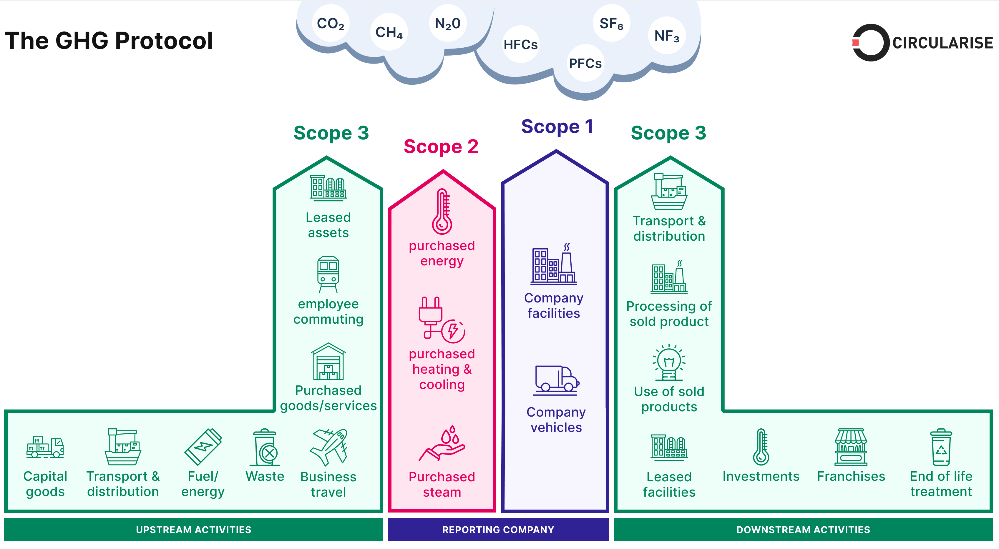
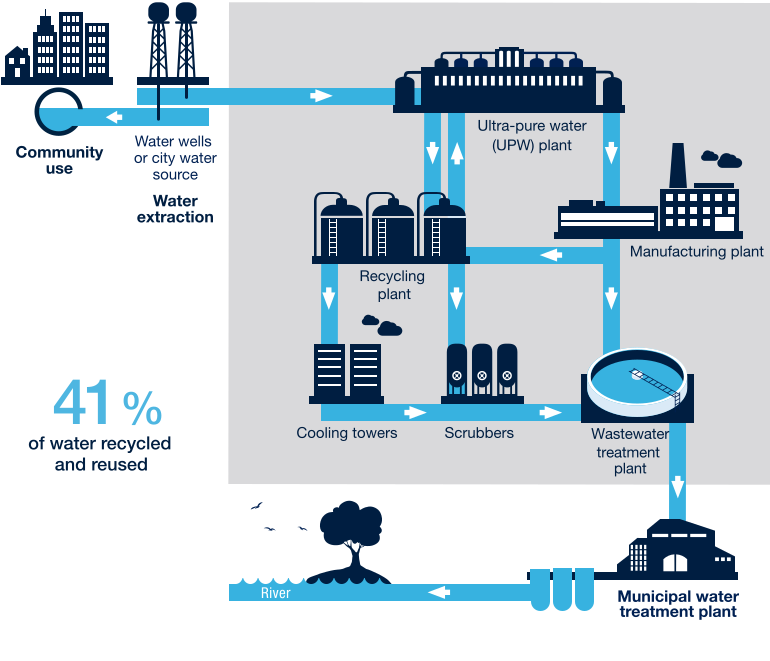
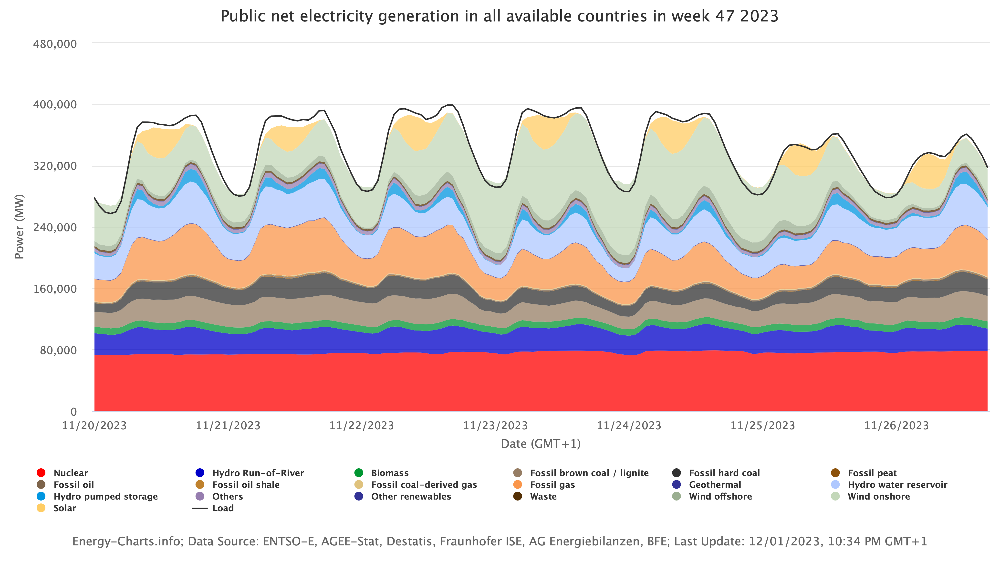

# 可持续人工智能 {#sec-sustainable-ai}

::: {layout-narrow}

::: {.column-margin}

_DALL·E 3 提示词：在浅色背景上的 3D 插图，展示了一个与无数环保能源相互连接的可持续人工智能网络。该人工智能主动管理并优化来自太阳能电池阵列、风力涡轮机和水坝等能源的能量，强调能源效率和性能。深度神经网络遍布其中，从这些可持续资源中接收能量。_

:::

\noindent
:::

## 目的 {.unnumbered}

_为什么资源效率不仅是一个环境考量因素，更是决定机器学习系统可行性和可扩展性的核心工程约束？_

机器学习系统消耗计算资源的规模，正在挑战实际部署的极限和经济可行性。这些资源需求施加了硬性的工程约束：能源成本超过模型开发预算，散热限制制约了硬件密度，以及电力基础设施需求限制了部署位置。资源效率直接决定了系统的可行性、运营成本和竞争优势，使得可持续性成为一门关键的工程学科。了解资源优化技术使工程师能够设计在实际的功耗、散热和经济限制内运行，同时实现性能目标的系统。随着计算需求呈指数级增长，资源效率成为决定哪些人工智能应用能够从研究原型扩展为服务全球数十亿用户的部署系统的主要约束。

::: {.callout-tip title="学习目标"}

- 通过能源消耗、碳足迹和资源利用率指标来量化人工智能系统的环境影响

- 应用测量框架来评估训练和部署架构中可持续性的权衡

- 评估跨硬件、算法和基础设施优化能源效率的工程策略

- 计算机器学习系统生命周期（包括训练、部署和推理）各阶段的碳足迹

- 评估机器学习基础设施的可再生能源整合策略和碳抵消方法

- 设计在功耗、散热和资源约束内运行的可持续人工智能系统

- 分析生物智能原理以指导高能效人工智能架构的开发

- 实施碳感知计算策略，以实现负责任的人工智能系统部署
:::

## 作为一门工程学科的可持续 AI {#sec-sustainable-ai-sustainable-ai-engineering-discipline-6d39}

大规模机器学习系统的激增引发了一场环境可持续性危机，直接挑战了该领域的发展轨迹。本章扩展了@sec-responsible-ai 中探讨的负责任的 AI 原则，解决了计算需求与环境管理之间关键的交叉问题。可持续性正在成为一门核心的系统工程学科，而不仅仅是一个辅助考量因素。

当代机器学习应用以史无前例的规模运行，其环境影响如今已可与传统重工业相提并论。训练（@sec-ai-training）单个最先进的 AI 模型所消耗的电力，可能相当于 100 个美国家庭一整年的用电量，其碳足迹相当于纽约和旧金山之间数百次往返航班的碳排放。随着 AI 变得无处不在，其环境成本正成为 21 世纪最重大却又最隐蔽的挑战之一。

现代 AI 系统的计算密集性体现在给全球基础设施带来压力的能耗模式上：训练大语言模型所需的能量相当于为数千个住宅单元长时间供电，而跨部署应用（@sec-ml-operations）的推理工作负载则推动了数据中心容量及相关资源需求的指数级增长。

这种环境现实已将可持续性从一个可选的设计考量因素，转变为决定 AI 系统从研究原型向生产部署过渡是否可行的核心工程约束。由能源成本、散热限制和电力基础设施需求所带来的经济与物理限制造成了瓶颈，日益制约着系统设计决策。计算需求的指数级增长轨迹大大超过了底层硬件能效的提升，从而形成了我们所说的“人工智能中的可持续性悖论”。

然而，这些约束也提供了机会，将@sec-efficient-ai 和@sec-model-optimizations 中确立的系统工程原则扩展到全面的环境责任上。实现性能优化的方法论可以系统地应用于能效目标。提高推理吞吐量的硬件加速技术可以同时减少碳足迹。支持可扩展性的分布式计算架构可以实现跨可再生能源基础设施的碳感知调度。

::: {.callout-definition title="可持续 AI"}

***可持续 AI*** 是一门工程学科，在机器学习系统开发中，它将*环境影响*提升为与传统性能和成本目标并列的*一等设计约束*。
:::

本章将可持续 AI 作为一个新兴的跨学科领域进行探讨，该领域将环境考量融入 ML 系统工程的每个阶段。这门学科涵盖了将计算需求转化为碳排放的估算，评估硬件生命周期对资源消耗的贡献，以及评估影响系统性能和环境可持续性的基础设施选择。这里提出的测量、建模和缓解框架，与传统的性能优化技术一样，代表了必不可少的工程能力。

本章的范围涵盖了在整个 ML 系统设计谱系中系统性地整合环境考量，从算法效率优化（@sec-efficient-ai）到硬件架构选择（@sec-ai-acceleration），从数据中心基础设施决策到管理负责任部署的政策框架。这种方法将可持续 AI 确立为一个全面的工程框架，用于开发在地球资源边界内运行的系统，同时保留人工智能技术的变革潜力。

## AI 的可持续性危机 {#sec-sustainable-ai-sustainability-crisis-ai-34d3}

人工智能（AI）系统已经彻底改变了各行各业的技术能力，但这种变革伴随着环境成本，威胁到了这些技术进步的长期可行性。AI 的计算需求带来了超越能源消耗的可持续性挑战，涵盖了碳排放、资源开采、制造影响以及电子垃圾，其规模之大已经威胁到了技术的长期可行性。

这场可持续性危机体现在三个相互关联的维度上。首先，问题认知审视了 AI 环境影响的范围和紧迫性，包括伦理责任和长期可行性问题。其次，测量与评估提供了在训练 (@sec-ai-training) 和推理 (@sec-ml-operations) 阶段量化碳足迹、能源消耗和生命周期影响的框架。最后，实施与解决方案通过可持续发展实践、基础设施优化以及促成实际环境责任的政策框架，提出了具体的缓解策略。

### 环境影响的规模 {#sec-sustainable-ai-scale-environmental-impact-ac9a}

AI 系统消耗资源的工业规模足以媲美传统重工业。训练单个大语言模型会消耗数千兆瓦时的电力，相当于数百个家庭数月的用电量[^fn-household-energy]。预计到 2030 年，数据中心（包括 AI 工作负载）将占全球功耗的 8%，超过航空业（2.1%），并逼近水泥制造业（4%）[@oecd2023blueprint][^fn-industry-comparison]。计算需求的增长速度比硬件效率的提升速度快 350,000 倍，形成了一种不可持续的指数级增长模式。

[^fn-household-energy]: **家庭能源比较**：美国家庭平均每年消耗 10,500 千瓦时（每月约 875 千瓦时）。虽然 OpenAI 尚未发布官方的 GPT-4 训练能源消耗数据，但据估计，它所需的能源可能远远超过已证实的 GPT-3 的 1,287 兆瓦时。作为参考，GPT-3 的训练耗电量相当于 122 个美国家庭的年均用电量。

[^fn-industry-comparison]: **AI 与工业排放对比**：预计到 2030 年，数据中心（包含 AI 工作负载）将占总功耗的 8%，超过航空业（2.1%），并逼近水泥制造业（4%）。目前的 AI 碳排放量已经超过了阿根廷（每年 1.8 亿吨 CO₂）。仅在 2023 年，训练排名前 10 的大语言模型所产生的排放量，就相当于纽约到伦敦 40,000 次往返航班的排放量。

除了直接的能源消耗外，AI 系统还通过硬件制造和资源利用对环境产生影响。训练和推理工作负载依赖于专用处理器，这些处理器需要稀土金属，而这些金属的开采和加工会产生污染[^fn-gpu-manufacturing]。对 AI 应用日益增长的需求加速了电子垃圾的产生，随着性能要求的不断提高导致 AI 硬件迅速被淘汰，全球电子垃圾每年达到 5400 万吨[@Forti2020][^fn-ewaste-scale]。

[^fn-gpu-manufacturing]: **GPU 制造影响**：在发生任何计算之前，生产单个高端 GPU（如 NVIDIA H100）就会产生 300-500 千克的 CO₂。制造过程需要 2,500 多升超纯水、15 种以上的稀土元素，以及高达 1,000°C 的高耗能工艺。台积电（TSMC）的 4 纳米工艺在每个晶体管上更节能，但需要更复杂的制造步骤，与 7 纳米工艺相比，增加了晶圆厂的整体能源强度。

[^fn-ewaste-scale]: **计算产生的电子垃圾**：2019 年全球电子垃圾达到 5400 万吨，其中计算设备占 15%。AI 硬件加速了这一趋势：NVIDIA 的 GPU 销量在 2020-2023 年间增长了 200%，每个高端 GPU 重 2-4 磅，且含有需要专门处理的有毒材料。快速的淘汰周期意味着 AI 硬件通常在 3-5 年内就会变成电子垃圾。

这些环境挑战需要在技术、政策和伦理维度上进行系统性理解和协调应对，以确保 AI 的发展保持可行和负责任。

## 第一部分：环境影响与伦理基础 {#sec-sustainable-ai-part-environmental-impact-ethical-foundations-7581}

人工智能环境影响的规模引发了关于发展优先级和责任的关键问题。在研究测量和缓解策略之前，我们必须理解指导可持续人工智能发展的伦理框架。技术进步与环境正义的交汇，使得我们需要就谁从人工智能进步中受益以及谁承担其生态成本做出紧急决定。

人工智能的环境影响超越了技术指标，延伸到了公平、正义和长期可行性等问题，这些问题决定了应对这些挑战的紧迫性。

能源消耗和硬件制造的技术现实直接转化为对环境正义的伦理担忧。当训练（@sec-ai-training）单个语言模型消耗的电力相当于数千个家庭每年的用电量时，这引发了关于谁从人工智能进步中受益以及谁承担其环境成本的关键问题。随着计算需求呈指数级增长和资源消耗加剧，该领域必须面对关于平衡创新与环境责任的可持续发展路径的艰难抉择。

### 环境正义与负责任的发展 {#sec-sustainable-ai-environmental-justice-responsible-development-3923}

人工智能的环境影响产生了超越技术优化的伦理责任。环境可持续性成为可信人工智能系统的关键组成部分，扩展了@sec-responsible-ai 中涵盖的负责任的人工智能原则。人工智能发展所需的计算资源将环境成本集中在特定社区，同时在全球人口中不平等地分配利益。数据中心每年消耗全球 1-3% 的电力和 2000 亿加仑的水用于冷却，而且通常位于电网依赖化石燃料且水资源面临气候变化压力的地区。

这种环境负担的地理集中引发了与更广泛的负责任人工智能框架相一致的环境正义[^fn-environmental-justice] 问题。正如公平性考量要求审查谁从人工智能系统中受益以及谁承担其风险一样，环境责任要求理解谁为人工智能进步支付生态成本。托管人工智能基础设施的社区承担着不成比例的环境负担，却很少能获得人工智能带来的经济利益，这证明有必要将伦理人工智能框架从算法公平性扩展到环境管理。

[^fn-environmental-justice]: **环境正义**：确保环境利益和负担在所有社区之间公平分配的框架，无论种族、肤色或收入如何。在人工智能背景下，这意味着数据中心通常位于经济弱势地区，以获取更便宜的土地和电力，将环境成本（污染、用水、热量）强加给几乎没有政治力量抵抗的社区。与此同时，人工智能的利益（就业、经济增长）集中在富裕的技术中心。示例：微软在爱荷华州农村的数据中心每天消耗 600 万加仑水，而当地农民却面临干旱限制。

### 指数增长与物理限制 {#sec-sustainable-ai-exponential-growth-vs-physical-constraints-0f4e}

计算需求的指数级增长挑战了人工智能训练和部署的长期可持续性。在过去十年中，人工智能系统以前所未有的速度扩展，从 2012 年到 2019 年，计算需求增加了 350,000 倍[@schwartz2020green][^fn-ai-compute-growth]。随着机器学习系统优先考虑具有更多参数（@sec-dnn-architectures）的更大模型、更大的训练数据集以及更高的计算复杂性，这种趋势仍在继续。由于硬件效率的提升未能跟上不断增长的人工智能工作负载需求，维持这一发展轨迹带来了可持续性挑战。

[^fn-ai-compute-growth]: **人工智能算力爆炸**：这 350,000 倍的增长代表了大约 3.4 个月的翻倍时间，远远超过了摩尔定律 2 年的翻倍周期。作为比较，这相当于从智能手机的计算能力跃升到世界上最大的超级计算机的计算能力。这一趋势随着大语言模型的出现而加速：据估计，GPT-4 的训练所需的算力是 GPT-3 的 25 倍，而 PaLM-2 和 Claude 等模型使用了更多的计算资源。

从历史上看，计算效率随着半导体技术的进步而提高。摩尔定律[^fn-sustainable-moores-law] 预测芯片上的晶体管数量大约每两年翻一番，这导致了处理能力和能源效率的持续提高。然而，摩尔定律现在正在达到核心物理极限，使得晶体管的进一步缩放变得困难且昂贵。登纳德缩放定律[^fn-dennard-scaling] 曾经确保更小的晶体管能在更低的功率水平下运行，现在也已终结，导致每个晶体管的能效提升停滞不前。

[^fn-sustainable-moores-law]: **摩尔定律的起源**：以英特尔联合创始人戈登·摩尔的名字命名，他在 1965 年的《电子学》杂志文章中提出了这一观察结果，摩尔定律推动了半导体行业近 60 年的发展。摩尔最初预测每年翻一番，后来修改为两年。该定律的经济影响是惊人的：它促成了价值 4 万亿美元的全球电子产业，并使从智能手机到超级计算机的一切成为可能。然而，在 3nm 工艺节点上，单个原子成为了限制因素。

[^fn-dennard-scaling]: **登纳德缩放定律**：IBM 的罗伯特·登纳德在 1974 年观察到的规律，即通过按比例降低电压，更小的晶体管可以在相同的功率密度下运行。它实现了 30 年的“免费”性能提升，直到 2005 年左右，漏电流和电压缩放限制终结了这一趋势。如果没有登纳德缩放定律，现代 CPU 的功耗将达到千瓦级，而不是约 100W。它的终结迫使人们转向多核处理器和 GPU 等针对人工智能工作负载的专用加速器。

虽然人工智能模型在规模和能力上不断扩展，但运行这些模型的硬件不再以相同的指数速度改进。计算需求与硬件效率之间日益扩大的分歧造成了一条不可持续的发展轨迹，即人工智能消耗的能源不断增加。这一技术现实凸显了为什么可持续的人工智能发展需要在整个系统堆栈中采取协调一致的行动，从单一的算法选择到基础设施设计和政策框架。

大型深度学习模型等复杂人工智能系统的训练需要高水平的计算能力，从而导致巨大的能源消耗。OpenAI 的 GPT-3 就是这种规模的例证：训练需要 1,287 兆瓦时（MWh）的电力，相当于 130 个美国家庭一整年的用电量[@maslej2023artificial][^fn-sustainable-gpt3]。这种能源消耗代表了在大型数据集上训练的计算算法[^fn-training-process]，这是现代大语言模型的特征。

[^fn-training-process]: **训练过程**：使用数据优化模型参数的计算过程。在@sec-ai-training 中有全面的介绍。

[^fn-sustainable-gpt3]: **GPT-3 能源消耗**：训练 GPT-3 消耗了约 1,287 MWh 的电力，相当于 130 个普通美国家庭的年用电量，或者燃烧 500,000 磅煤炭产生的二氧化碳量。按美国平均电价计算，仅这次训练运行的电费就高达约 130,000 美元。据估计，GPT-4 的算力是其 25 倍，可能消耗了超过 30,000 MWh 的电力，足以满足一个小城市一个月的供电。每个参数的能源比率揭示了软硬件协同设计的低效：GPT-3 的 1750 亿个参数每十亿个参数需要 7.4 kWh，而优化的架构通过混合精度和稀疏性技术可以实现低于 1 kWh 的比率。

这种规模的能源消耗凸显了人工智能系统迫切需要提高效率。近年来，这些生成式人工智能模型越来越受欢迎，导致越来越多具有不断增长的参数数量的模型被训练。

研究表明，增加模型规模、数据集规模和用于训练的算力可以平滑地提高性能，且没有饱和的迹象[@kaplan2020scaling]，正如在@fig-model-scaling 中所证明的那样，测试损失随着这三个因素中每一个的增加而减少。除了训练之外，人工智能驱动的应用（如大规模推荐系统和生成模型）需要进行大规模的持续推理，即使在训练完成后也会消耗能源。随着人工智能在从金融到医疗保健再到娱乐等各个行业的采用率不断增长，人工智能工作负载的累积能源负担持续上升，引发了人们对广泛部署所带来环境影响的担忧。

![**模型缩放定律**：增加模型规模、数据集规模和算力可以持续降低测试损失，这表明通过投入更多资源能够持续实现性能提升，且没有达到饱和的迹象。这些缩放定律表明，在更多数据上使用更多算力训练的更大模型可能会产生进一步的性能增益，从而推动对这些领域的持续投资。来源：[@kaplan2020scaling]。](images/png/model_scaling.png){#fig-model-scaling}

除了电力消耗之外，人工智能的可持续性挑战还延伸到硬件资源需求和当前架构的能效限制。不同的处理器类型通过其能源特性影响环境，如@sec-ai-acceleration 所示：中央处理器（CPU）每次乘累加操作消耗约 100 皮焦耳（pJ/MAC），图形处理器（GPU）达到 10 pJ/MAC，而专用的张量处理器（TPU）达到 1 pJ/MAC[^fn-energy-metrics]，专用加速器则接近 0.1 pJ/MAC。这些硬件平台需要稀土金属以及带有隐含碳排放的复杂制造工艺。

[^fn-energy-metrics]: **能源指标**：pJ/MAC（每次乘累加操作的皮焦耳数）衡量不同处理器类型的计算操作的能源效率。

人工智能芯片的生产是能源密集型的，涉及多个制造步骤，这些步骤对整个人工智能系统生命周期中的范围 3（Scope 3）排放有显著贡献。随着模型规模的不断增长，对人工智能硬件的需求也在增加，从而加剧了半导体生产和处置对环境的影响。

### 作为可持续性模型的生物智能 {#sec-sustainable-ai-biological-intelligence-sustainability-model-d880}

为了理解人工智能能源挑战的规模，将当前系统与我们所知的最高效的智能——人脑——进行比较会有所帮助。大脑在执行复杂的推理、学习和模式识别时，功耗仅为 20 瓦左右。这种非凡的效率为可持续人工智能设计提供了宝贵的工程见解。大脑的能源效率估计约为每次突触操作 10⁻¹⁵ 至 10⁻¹⁴ 焦耳，尽管在生物系统和数字系统之间定义等效的“操作”仍然具有挑战性[^fn-flop-comparison]。

训练单个大语言模型（如 GPT-3）在人工智能和生物智能之间产生了 10⁶ 倍的能效差距。这种比较说明了核心的可持续性挑战：虽然人脑在仅有灯泡功耗的情况下就能实现卓越的学习能力，但当前的人工智能系统需要工业规模的能源基础设施才能完成类似水平的认知任务。

[^fn-flop-comparison]: **FLOP 比较**：每秒浮点运算次数（FLOPS）衡量计算吞吐量。大脑效率的比较有助于结合具体情境来理解人工智能硬件的能源需求。

大脑通过几个不同于当前人工智能系统的关键原则来实现这种效率。生物系统不像数字计算机那样持续处理所有信息，而是具有选择性和事件驱动特征。它们在任何时候都只激活网络的一小部分，并且仅在主动处理信息时才消耗能量[^fn-action-potentials]。这些设计原则为创建更节能的人工智能架构提供了机会。

[^fn-action-potentials]: **动作电位**：神经元用于通信的电信号，持续约 1 毫秒，每次脉冲消耗约 10⁻¹² 焦耳。与持续耗电的数字电路不同，神经元仅在主动放电时才消耗能量。这种事件驱动的方法就是为什么你的大脑尽管有 860 亿个神经元却只消耗 20W 功率的原因：在任何特定时刻，大多数神经元都是沉默的。现代神经形态芯片（如英特尔的 Loihi）模仿这种基于脉冲的通信，以实现 1000 倍的节能。

生物的效率优势不仅体现在能源消耗上，还体现在学习的样本效率上。儿童在 18 岁之前通过接触大约 10^8 个单词就能获得语言能力，而大语言模型需要对超过 10^12 个词元（token）进行训练，数据效率相差 10,000 倍。这种差异表明，当前的人工智能架构与生物系统所展示的高效学习原则不一致。

这些见解指出了可持续人工智能充满希望的研究方向。实现脉冲神经网络（spiking neural networks）[^fn-spiking-networks] 的神经形态计算（neuromorphic computing）[^fn-neuromorphic-computing] 架构通过模仿生物的稀疏激活模式，可以在特定任务上实现 100 到 1000 倍的能耗降低[@prakash2023tinyml]。同样，受生物发育启发的局部学习算法和自监督学习方法，为构建样本效率更高、更注重能源的人工智能系统提供了途径。理解这些生物学原理为开发在保持或提高性能的同时接近生物能源效率的人工智能系统提供了路线图。

[^fn-neuromorphic-computing]: **神经形态计算**：受生物神经网络启发的硬件架构，使用模拟电路和事件驱动计算代替传统的数字逻辑。由加州理工学院的卡弗·米德（Carver Mead）在 20 世纪 80 年代引入，现代示例包括英特尔的 Loihi 芯片（128 个神经形态核心，总共支持多达 131,072 个脉冲神经元）、IBM 的 TrueNorth（100 万个神经元）和 BrainChip 的 Akida。通过仅在输入发生变化时处理信息以模仿大脑的稀疏性，这些芯片在执行特定人工智能任务时的功耗比 GPU 低 1000 倍。

[^fn-spiking-networks]: **脉冲神经网络（SNNs）**：第三代人工神经网络，通过离散脉冲（类似于生物神经元）而不是连续值进行通信。异步且在时间维度上处理信息，使其自然适合音频和视频等事件驱动型数据。虽然更具生物学合理性且更节能，但 SNN 比传统深度网络更难训练，需要专门的学习算法，并且目前在标准基准测试中的准确率较低。

这些生物学见解表明，实现可持续的人工智能需要在系统设计上进行系统性转变，从持续活跃的架构转向事件驱动的稀疏计算模型。由于算力需求超过了效率提升的速度，解决人工智能的环境影响需要基于生物学原理（而不是渐进式优化）重新思考系统架构、能量感知计算和生命周期管理。

指数级的计算需求与物理效率极限的交汇形成了一条不可持续的发展轨迹，威胁到人工智能发展的长期可行性。理解这些限制因素，为开发能够系统地应对可持续性危机的测量框架和实施策略奠定了基础。

---

## 第二部分：测量与评估 {#sec-sustainable-ai-part-ii-measurement-assessment-fb0b}

系统的测量方法使工程师能够针对人工智能的环境影响做出决策。可持续的人工智能开发需要针对三个关键领域的定量框架：训练和推理期间的能耗跟踪、贯穿系统生命周期的碳足迹分析，以及针对硬件和基础设施的资源利用率评估。这些测量工具将可持续性从抽象的关注点转化为具体的工程约束，从而指导架构选择、部署策略和优化优先级。

有效的测量使工程师能够识别优化机会、比较替代设计，并验证可持续性方面的改进。如果不对环境成本的来源以及设计选择如何影响整体足迹进行系统评估，可持续性工作将缺乏系统规划，甚至可能适得其反。

### 碳足迹分析 {#sec-sustainable-ai-carbon-footprint-analysis-ccc5}

碳足迹分析为做出有关 AI 系统可持续性的明智设计决策奠定了基础。随着 AI 系统规模的不断扩大，对能耗和资源需求的系统性测量使得采取主动的生态环境优化方法成为可能。构建和部署 AI 系统的开发者和公司不仅必须考虑性能和效率，还要考虑其设计选择对环境造成的影响。

一个伦理挑战在于如何平衡技术进步与生态责任。对越来越大模型的追求往往将准确性和能力置于能效之上，从而导致碳排放呈指数级增长。虽然针对可持续性进行优化可能会引入权衡（例如，通过剪枝和量化等技术，开发周期可能延长 10-30%，或者准确率下降 1-5%），但这些代价被环境效益极大地抵消了。将环境因素纳入 AI 系统设计是一项伦理上的当务之急。这要求将行业规范转向可持续计算实践，例如感知能耗的训练技术、低功耗硬件设计以及具有碳排放意识的部署策略[@patterson2021carbon]。

这一伦理上的当务之急超越了可持续性，涵盖了与透明度、公平性和问责制相关的更广泛的担忧。@fig-ethical-ai 阐述了与 AI 开发相关的伦理挑战，将不同类型的担忧（包括难以理解的证据、不公平的结果和可追溯性）与不透明性、偏见和自动化偏见等问题联系起来。这些担忧也延伸到了可持续性领域，因为 AI 开发中的环境权衡往往是不透明且难以量化的。能耗和碳排放缺乏可追溯性可能导致不合理的行为，即公司在没有充分了解或披露环境成本的情况下优先考虑性能提升。

::: {#fig-ethical-ai fig-env="figure" fig-pos="htb"}

```{.tikz}
\scalebox{0.75}{%
\begin{tikzpicture}[font=\small\usefont{T1}{phv}{m}{n}]
\tikzset{
  Line/.style={line width=1.0pt,BrownLine,text=black},
  Box/.style={inner xsep=2pt,
    node distance=0.2,
    draw=VioletLine2, line width=0.75pt,
    fill=VioletL2,
    text width=36mm,align=flush center,
    minimum width=36mm, minimum height=7.7mm
  },
    Box1/.style={inner xsep=2pt,
    node distance=0.2,
    draw=OrangeLine, line width=0.75pt,
    fill=OrangeL!70,
    text width=36mm,align=flush center,
    minimum width=36mm, minimum height=7.7mm
  },
  }
\node[Box](G1){Unjustified actions};
\node[Box,below =of G1](G2){Opacity};
\node[Box,below =of G2](G3){Bias};
\node[Box,below =of G3](G4){Discrimination};
\node[Box,below =of G4](G5){Autonomy};
\node[Box,below =of G5](G6){Informational privacy};
\node[Box,below =of G6](G7){Group privacy};
\node[Box,below =of G7](G8){Moral responsibility};
\node[Box,below =of G8](G9){Distributed responsibility};
\node[Box,below =of G9](G10){Automation bias};
\node[Box,below =of G10](G11){Safety and resilience};
\node[Box,below =of G11](G12){Ethical auditing};
%
\node[Box1,node distance=3.9,left =of G1](LG1){Inconclusive evidence};
\node[Box1,below =of LG1](LG2){Inscrutable evidence};
\node[Box1,below =of LG2](LG3){Misguided evidence};
\node[Box1,below =of LG3](LG4){Unfair outcomes};
%
\node[Box1,node distance=3.9,left =of G6](LG5){Transformative effects};
\node[Box1,node distance=3.9,left =of G10](LG6){Traceability};
\node[above=0.1 of G1]{\textbf{Ethical Challenges}};
\node[above=0.1 of LG1]{\textbf{Types of concerns}};
%
\foreach \x in {2,3,4,5,6}{
\draw[line width=1.5pt,BrownLine](LG1.west)--++(180:0.65)|-(LG\x);
}
%
\draw[thick,blue!80!black!99,decoration={brace,amplitude=6pt},decorate]
([yshift=0mm,xshift=1mm]LG1.north east)--([yshift=0mm,xshift=1mm]LG3.south east)
node [blue,midway,below=1mm] {};
%
\draw[thick,blue!80!black!99,decoration={brace,amplitude=6pt},decorate]
([yshift=0mm,xshift=1mm]LG4.north east)--([yshift=0mm,xshift=1mm]LG5.south east)
node [blue,midway,below=1mm] {};
%
\foreach \x in {8,...,12}{
\draw[Line,-latex,shorten <=5mm](LG6.east)--++(0:2)|-(G\x);
}

\foreach \x in {5,6,7}{
\draw[Line,-latex,shorten <=5mm](LG5.east)--++(0:2)|-(G\x);
}
\foreach \x in {1,2,3,4}{
\draw[Line,-latex,shorten <=5mm](LG\x.east)--(G\x);
}
\end{tikzpicture}}
```

**合乎伦理的 AI 担忧**：AI 系统在透明度、公平性和可持续性方面引入了伦理挑战；这些担忧相互关联，并源于不透明性、偏见以及资源消耗缺乏可追溯性等问题。应对这些挑战需要采取主动的设计选择，优先考虑问责制，并最大限度地减少对社会和环境的负面影响。来源：[@coe2023ethical]。

:::

解决这些担忧需要 AI 公司提供更高的透明度和问责制。大型科技公司运营着庞大的云基础设施来支撑现代 AI 应用，但其环境影响仍然不透明。各组织必须在整个 AI 生命周期（从硬件制造到模型训练和推理）中测量、报告并减少其碳足迹。自愿的自我监管迈出了第一步，但政策干预和全行业标准可能是确保长期可持续性所必需的。所报告的能耗、碳排放和效率基准等指标可以促使各组织承担起责任。

合乎伦理的 AI 开发需要就环境权衡进行公开对话。研究人员必须在其机构和组织内倡导可持续性，确保将环境问题纳入 AI 开发的优先级中。更广泛的 AI 社区已经开始解决这些问题，例如[呼吁暂停大规模 AI 实验的公开信](https://futureoflife.org/open-letter/pause-giant-ai-experiments/)就是很好的证明，该信强调了对无节制扩张的担忧。培养透明和承担伦理责任的文化，能够使 AI 行业将技术进步与生态可持续性统一起来。

AI 具有重塑行业和社会的潜力，但其长期可行性取决于负责任的开发实践。合乎伦理的 AI 开发包括防止对个人和社区造成伤害，同时确保 AI 驱动的创新不会以环境退化为代价。作为这些技术的管理者，开发者和组织必须将可持续性融入 AI 的未来发展轨迹中。

将这些伦理原则转化为实践需要具体的工程解决方案，这些方案应能展示出可衡量的环境改善。以下案例研究阐述了如何设计 AI 系统以优化其自身的环境影响，从而展示了可持续 AI 原则的实际应用。

### 案例研究：DeepMind 能效 {#sec-sustainable-ai-case-study-deepmind-energy-efficiency-84fd}

Google 的数据中心构成了搜索、Gmail 和 YouTube 等服务的骨干，每天处理数十亿次查询。这些设施需要大量的电力消耗，特别是为了确保最佳服务器性能的冷却基础设施。提高数据中心能效长期以来一直是一个优先事项，但由于冷却系统的复杂性和高度动态的环境条件，传统的工程方法面临着收益递减的问题。为了应对这些挑战，Google 与 DeepMind 合作开发了一个机器学习优化系统，以实现大规模能源管理的自动化和增强。

在十多年来致力于优化数据中心设计、节能硬件和可再生能源整合之后，DeepMind 的 AI 方法将目标对准了冷却系统，这是数据中心中最耗能的方面之一。传统的冷却依赖于手动设置的启发式方法，这些方法考虑了服务器的热输出、外部天气条件和架构限制。这些系统表现出非线性交互，因此简单的基于规则的优化通常无法捕捉其操作的全部复杂性。结果是冷却效率次优，导致不必要的能源浪费。

DeepMind 的团队使用 Google 的历史传感器数据训练了一个神经网络模型，这些数据包括实时温度读数、功耗水平、冷却泵活动和其他操作参数。该模型学习了这些因素之间错综复杂的关系，并能够动态预测最有效的冷却配置。与依赖人类工程师定期调整系统设置的传统方法不同，该 AI 模型能够根据不断变化的环境和工作负载条件持续实时自适应。

结果表明能效得到了显著提升。当部署在真实的数据中心环境中时，DeepMind 的 AI 驱动冷却系统将冷却能耗降低了 40%，从而使电源使用效率（PUE）[^fn-pue-metric] 整体提高了 15%，这是一个衡量数据中心能效的指标，用于测量总能耗与纯粹用于计算任务的能耗之比[@barroso2019datacenter]。这些改进是在没有进行额外硬件修改的情况下实现的，证明了软件驱动的优化在减少 AI 碳足迹方面的潜力。

[^fn-pue-metric]: **电源使用效率（PUE）**：行业标准指标，计算公式为“设施总功率 ÷ IT 设备功率”。完美效率 = 1.0（不可能实现），典型数据中心 = 1.6-2.0，Google 最好的设施可达到 1.08。PUE 每改善 0.1，就能节省数百万的电费。Facebook 的 Prineville 数据中心使用室外空气冷却，达到了 1.09 的 PUE。传统数据中心的 PUE 通常超过 2.5。

除了单个数据中心，DeepMind 的 AI 模型还提供了一个可泛化的框架，能够适应不同的设施设计和气候条件，为优化全球数据中心网络的功耗提供了一个可扩展的解决方案。这个案例研究证明了 AI 不仅可以作为计算资源的消费者，还可以作为可持续发展的工具，推动支持机器学习的基础设施的效率提升。

数据驱动决策、实时自适应和可扩展 AI 模型的整合，证明了智能资源管理在可持续 AI 系统设计中日益增长的作用。这一突破展示了机器学习如何优化为其提供动力的基础设施，从而确保更节能的大规模 AI 部署。

碳足迹分析必须检查生命周期阶段和排放范围。下面详细介绍的三阶段生命周期评估框架提供了一种系统的方法，用于了解环境成本的来源以及设计选择如何影响整体足迹。

#### 三阶段生命周期评估框架 {#sec-sustainable-ai-threephase-lifecycle-assessment-framework-883a}

有效的碳足迹测量需要对共同决定环境影响的三个不同阶段进行系统分析：

训练阶段（占排放量的 60-80%）代表了碳密集度最高的时期，涉及数学优化过程的并行计算[^fn-optimization-process]。正如 GPT-3 案例研究所示，大语言模型训练运行体现了这种能源密集度。地理位置会影响排放：在魁北克（水力发电，0.01 kg CO₂/kWh）与西弗吉尼亚（燃煤发电，0.75 kg CO₂/kWh）进行训练，会产生 75 倍的碳强度差异[^fn-carbon-intensity]。

[^fn-optimization-process]: **优化过程**：用于寻找最佳模型参数的数学程序。梯度下降及相关技术包含在@sec-ai-training-optimization-algorithms-506e 中。

[^fn-carbon-intensity]: **碳强度**：每单位耗电量的二氧化碳排放量度量，通常表示为 kg CO₂/kWh。因能源来源而异：煤炭（约 0.82 kg CO₂/kWh）、天然气（约 0.36）、风能（约 0.01）、核能（约 0.006）、水能（约 0.024）。电网碳强度随地点（冰岛：99% 可再生能源，波兰：77% 煤炭）和一天中的时间（太阳能在中午达到峰值，风能不断变化）而变化。这使得碳感知计算成为可能：在电力最清洁的时间/地点调度 AI 工作负载。

推理阶段（占排放量的 15-25%）在模型服务和预测生成方面产生持续的计算成本。虽然单次推理所需的计算量少于训练，但累积影响会随着部署广度和使用频率而扩大。为数百万用户提供服务的模型在延长的部署期内产生的持续排放量可能会超过训练成本。

制造阶段（占排放量的 5-15%）贡献了来自硬件生产的隐含碳[^fn-embodied-carbon]，包括半导体制造、稀土开采和供应链物流。这通常被忽视，但它代表了独立于运营效率的不可减少的基线排放。

#### 地理和时间优化 {#sec-sustainable-ai-geographic-temporal-optimization-492c}

碳强度因地理位置和时间段而异，从而创造了优化机会。通过将计算工作负载与可再生能源的可用性（例如白天太阳能发电的高峰期）相匹配，时间调度可以将排放量减少 50-80%[@Patterson2022carbonaware]。碳感知调度系统可以自动将非紧急的训练任务转移到碳强度较低的地区和时间。

这些地理和时间因素突显了量化 AI 碳影响的复杂性。评估取决于多个因素，包括模型的大小、训练的时长、使用的硬件以及为数据中心供电的能源。正如我们在 GPT-3 分析中所展示的，大规模 AI 模型需要数千兆瓦时（MWh）的电力，相当于整个社区的能耗。对于广泛部署的 AI 服务（如实时翻译、图像生成和个性化推荐），推理（即训练好的模型产生输出的阶段）所需的能量也是巨大的。与具有相对静态能源足迹的传统软件不同，AI 模型持续消耗能源，导致了持续的可持续性挑战。

除了直接能源使用之外，AI 的碳足迹还必须考虑硬件生产和供应链产生的间接排放。制造 GPU、TPU 和定制芯片等 AI 加速器涉及能源密集型的制造过程，这些过程依赖于稀土金属和复杂的供应链。为了制定更具可持续性的 AI 实践，必须考虑 AI 系统的全生命周期排放，其中包括数据中心、硬件制造和全球 AI 部署。

了解 AI 的碳足迹需要整合上述建立的测量框架：

- **三阶段生命周期分析**：训练（60-80%）、推理（15-25%）和制造（5-15%）排放
- **三范围排放类别**：直接运营、外购能源和供应链影响
- **地理和时间优化**：利用可再生能源的可用性和碳感知调度

分析这些组成部分可以更好地评估 AI 系统的真实环境影响，并发现通过更高效的设计、具有能源意识的部署和可持续的基础设施选择来减少其足迹的机会。

在开发过程中测量碳足迹需要将跟踪工具集成到机器学习工作流中，如@lst-carbon-tracking 所示。

::: {#lst-carbon-tracking lst-cap="**Carbon Footprint Tracking**: Example implementation using CodeCarbon library to measure emissions during model training, enabling data-driven sustainability decisions."}

```

python
from codecarbon import EmissionsTracker
import torch

# 初始化碳跟踪
tracker = EmissionsTracker()
tracker.start()

# 你的模型训练代码
model = torch.nn.Linear(100, 10)
optimizer = torch.optim.Adam(model.parameters())

for epoch in range(100):
    # 训练步
    loss = model(data).mean()
    loss.backward()
    optimizer.step()

# 获取排放报告
emissions = tracker.stop()
print(f"Training emissions: {emissions:.4f} kg CO2")
```

:::

这种集成使工程师能够在开发过程中，就模型复杂性与环境影响之间做出明智的决策。

### 数据中心能耗模式 {#sec-sustainable-ai-data-center-energy-consumption-patterns-09c0}

AI 系统代表了能源密集度最高的计算工作负载之一，涉及密集的运算[^fn-dense-operations]，其能耗模式跨越了训练、推理、数据存储和通信基础设施。了解这些模式可以揭示在哪些方面进行优化努力能够减少对环境的影响。能耗与模型复杂度呈非线性关系，这为通过有针对性的架构和运营优化来提高效率创造了机会。

[^fn-dense-operations]: **密集运算（Dense Operations）**：需要大量数学运算的计算模式。@sec-ai-training-neural-network-computation-73f5 中涵盖了具体的神经网络运算。

#### 数据中心能源与 AI 工作负载 {#sec-sustainable-ai-data-center-energy-ai-workloads-b1a8}

数据中心是 AI 系统的主要能源消耗者，其电力需求揭示了挑战的规模以及具体的优化机会。

不同设施的数据中心能效差异显著：电源使用效率（PUE）从谷歌最节能设施的 1.1 到典型企业数据中心的 2.5 不等，基础设施开销实际上使能耗翻了一番。地理位置会影响碳强度：在魁北克（水力发电）与西弗吉尼亚（燃煤发电）训练同一模型，每千瓦时的碳排放量相差 10 倍。如果无法获得可再生能源，这些设施将严重依赖煤炭和天然气等不可再生能源，从而加剧全球碳排放。目前的估计表明，数据中心产生的二氧化碳排放量高达全球总量的 2%，这一数字接近航空业的碳足迹[@liu2020energy][^fn-datacenter-emissions]。由于三个因素：数据中心容量的增加、AI 训练工作负载的增加以及推理需求的增加，AI 的能源负担预计将呈指数级增长[@patterson2022carbon]。如果不加干预，这些趋势有可能使 AI 的环境足迹变得大到不可持续[@thompson2023compute]。

[^fn-datacenter-emissions]: **数据中心气候影响**：数据中心消耗了全球约 1% 的电力，并直接产生全球 0.3% 的碳排放。然而，当计入硬件制造中的隐含碳时，这一数字升至 2%。相比之下，这等于阿根廷的年排放量（占全球总量的 1.8%），并超过了航空业的 2.1%。最大的超大规模数据中心持续消耗超过 100 兆瓦的电力，相当于为 80,000 个家庭供电。

#### 数据中心的能源需求 {#sec-sustainable-ai-energy-demands-data-centers-b7ba}

AI 工作负载是现代数据中心中计算最密集的运算之一。Meta 等公司运营的超大规模数据中心占地面积达数个足球场大小，容纳了数十万台经过 AI 优化的服务器[^fn-hyperscale-size]。大语言模型（LLM）（如 GPT-4）的训练（@sec-ai-training）需要超过 25,000 个 Nvidia A100 GPU 连续运行 90 到 100 天[@semianalysisGPT4]，消耗数千兆瓦时（MWh）的电力。这些设施依赖于高性能的 AI 加速器，如 NVIDIA DGX H100 单元，每个单元在峰值功率下可消耗高达 10.2 千瓦的电力[@nvidiadgxH100]。比较几代硬件时，能效差距变得清晰可见：对于 AI 训练工作负载，H100 GPU 的每瓦性能比 A100 高约 2.5-3 倍，而混合精度训练通过降低计算精度，在对准确率影响极小的情况下，根据模型架构和硬件的不同，可降低 15-30% 的能耗[@gholami2021survey]。

[^fn-hyperscale-size]: **超大规模数据中心规模**：Meta 的普林维尔数据中心占地 250 万平方英尺（相当于 57 个足球场），容纳了超过 150,000 台服务器。微软在爱荷华州最大的 Azure 数据中心占地 700 英亩，电力容量为 300 兆瓦。谷歌在全球运营着 21 个超大规模设施，每年消耗 12.2 太瓦时的电力——比立陶宛或斯里兰卡等整个国家的用电量还要多。

这种惊人的能耗反映了 AI 在各行业的快速普及。如@fig-ai-data-center-demand 所示，AI 工作负载的能源需求预计将增加数据中心的总能源消耗，特别是在 2024 年之后。尽管效率的提升抵消了不断上升的电力需求，但这些提升的速度正在放缓，从而放大了 AI 的环境影响。```{python}
#| label: fig-ai-data-center-demand
#| fig-cap: "**Projected Demand**: By 2030, AI workloads will significantly increase power demand in data centers, outpacing efficiency gains seen previously. This emphasizes the growing environmental impact of AI systems. Source: [@masanet2020energy], Cisco, IEA, Goldman Sachs Global Investment Research."
#| fig-align: center
#| echo: false
#| message: false
#| warning: false

library(ggplot2)
library(dplyr)

data <- data.frame(
  Year = rep(2015:2030, 2),
  Demand = c(200, 200, 200, 200, 200, 210, 220, 230, 250, 290, 340, 400, 480, 570, 670, 780,
             0, 0, 0, 0, 0, 0, 0, 0, 0, 10, 20, 40, 70, 110, 170, 240),
  Type = rep(c("Data Center ex-AI", "AI"), each = 16),
  Efficiency_Gains = c(20, 19, 18, 17, 15, 12, 9, 6, 3, 1.5, 2, 2.5, 3, 3.2, 3.5, 3.7)
)

efficiency <- data.frame(
  Year = 2015:2030,
  Efficiency_Gains = c(20, 19, 18, 17, 15, 12, 9, 6, 3, 1.5, 2, 2.5, 3, 3.2, 3.5, 3.7)
)

ggplot() +
  geom_bar(data = data, aes(x = Year, y = Demand, fill = Type),
           stat = "identity", position = "stack", color = "black") +
  scale_fill_manual(values = c("Data Center ex-AI" = "#003366", "AI" = "#99ccee")) +
  geom_line(data = efficiency, aes(x = Year, y = Efficiency_Gains * 40),
            linewidth = 1.2, color = "gray") +
  scale_y_continuous(
    name = "Data Center Power Demand (TWh)",
    sec.axis = sec_axis(~./40, name = "Power Efficiency Gains (%)")
  ) +
  geom_vline(xintercept = 2024, linetype = "dashed", color = "orange") +
  annotate("text", x = 2022, y = 900, label = "Power Demand\nIncreasing", size = 2.5, fontface = "bold") +
  annotate("text", x = 2018, y = 850, label = "Efficiency Gains\nDecelerating", size = 2.5, fontface = "bold") +
  theme_minimal(base_size = 14) +
  theme(legend.position = "top", legend.box.margin = margin(b = -3, unit = "mm") ) +
  labs(fill = "", x = "Year")+
  theme(
axis.text = element_text(hjust=1,size=8), # txt on x-axes
axis.title = element_text(size = 9),      # axes title
legend.text = element_text(size = 8),     # txt legend
)

```

除了计算需求外，冷却也是 AI 能源足迹中的另一个主要因素。大规模 AI 训练和推理工作负载会产生大量热量，需要先进的冷却解决方案来防止硬件故障。各公司已开始采用替代冷却方法以降低这一需求。例如，微软在爱尔兰的数据中心利用附近的峡湾，每天消耗超过五十万加仑的海水来散热。然而，随着 AI 模型复杂度的增加，冷却需求持续增长，这使得可持续的 AI 基础设施设计成为一项紧迫的挑战。

### Distributed Systems Energy Optimization {#sec-sustainable-ai-distributed-systems-energy-optimization-5e83}

大规模 AI 训练本质上需要分布式系统协调，这产生了额外的能耗开销，加剧了计算需求。分布式训练[^fn-training-paradigms] 引入的网络通信成本可能占大型集群总能耗的 20-40%。跨数千个 GPU 的分布式训练需要不断同步计算更新和模型参数[^fn-distributed-training]，从而在节点之间产生数据移动。这种通信开销的扩展性很差：由于梯度聚合中的全对全（all-to-all）通信模式，将集群规模扩大一倍会使网络能耗增加 4 倍。

[^fn-training-paradigms]: **训练范式**：当前需要跨分布式系统进行协调计算的模型优化方法。详细内容见@sec-ai-training-distributed-systems-8fe8。

[^fn-distributed-training]: **分布式训练**：跨多个计算节点训练模型，需要协调与通信。详细内容见@sec-ai-training-distributed-systems-8fe8。

为了解决这些通信开销，集群范围的能耗优化需要协调资源管理，这超出了单个服务器的效率范畴。动态工作负载放置可以通过在需求低谷期将训练任务集中到较少的节点上，使未使用的硬件进入低功耗状态，从而节省 15-25% 的能耗。同样，跨多个数据中心协调训练的智能调度可以利用时区差异和区域可再生能源的可用性，通过时间上的负载均衡将碳排放强度降低 30-50%。

基础设施共享提供了在可持续性分析中经常被忽视的效率提升机会。多租户训练环境（即多个模型训练任务共享同一个集群）可以将 GPU 利用率从典型的 40-60% 提高到 80-90%，从而有效地将每个训练模型的能耗减半。资源共享还支持批处理优化，将多个较小的训练任务组合在一起以更好地利用可用的计算能力，从而减少维护空闲基础设施的能耗开销。

#### AI Energy Consumption Compared to Other Industries {#sec-sustainable-ai-ai-energy-consumption-compared-industries-3d5d}

AI 工作负载的环境影响已成为人们关注的焦点，其碳排放水平正接近传统的碳密集型行业。研究表明，训练单个大型 AI 模型产生的碳排放相当于多辆乘用车在其整个生命周期内的排放量[@strubell2019energy]。为了解 AI 的环境足迹，@fig-carbonfootprint 将大规模机器学习任务的碳排放量与跨洲航班进行了比较，说明了训练和推理工作负载的能源需求。它展示了从最低到最高碳足迹的比较，依次为：纽约和旧金山之间的往返航班、人类平均每年的碳排放、美国人平均每年的碳排放、美国汽车（包括燃料）一生的碳排放，以及带有神经架构搜索的 Transformer 模型[^fn-transformer-nas]，后者的碳足迹最高。这些比较强调了需要采用更具可持续性的 AI 实践来减轻该行业的碳影响。

[^fn-transformer-nas]: **Transformer + NAS 的环境影响**：这 626,000 磅的 CO₂ 数据代表了在搜索最佳架构的同时训练一个 Transformer 模型的排放量。包括在多天内评估 12,800 种不同的模型配置。作为比较，这相当于从纽约市到伦敦的 312 趟经济舱往返航班的碳足迹，或者 140 个普通美国人的年排放量。现代高效的神经架构搜索技术已将这一成本降低了 1000 倍。

::: {#fig-carbonfootprint fig-env="figure" fig-pos="htb"}

```{.tikz}
\begin{tikzpicture}[font=\small\usefont{T1}{phv}{m}{n}]
  \begin{axis}[title  = {Common carbon footprint benchmarks},
    title style={font=\usefont{T1}{phv}{m}{n}\bfseries},
    xbar,
    /pgf/number format/.cd,
     use comma,
    1000 sep={,},fixed,
    y axis line style = { opacity = 0 },
    axis x line       = none,
    tickwidth         = 0pt,
    enlarge y limits  = 0.2,
    enlarge x limits  = 0.02,
    symbolic y coords = {Transformer {(213M parameters)}\\ w/ neural architecture search,
    US car including fuel\\ {(avg. 1 lifetime)},
    American life {(avg. 1 year)},
    Human life {(avg. 1 year)},
    Roundtrip flight b/w NY and SF\\ {(1 passenger)}},
    yticklabel style={font=\small\usefont{T1}{phv}{m}{n},text width=50mm,align=flush left},
      nodes near coords={\footnotesize\usefont{T1}{phv}{m}{n}\pgfmathprintnumber[assume math mode=true]{\pgfplotspointmeta}},
   every node near coord/.append style={anchor=west, align=right,text=black,
                  font=\sffamily},
   bar width=17pt
  ]
  \addplot[fill=BlueLine,draw=none]
  coordinates {
  (626155,Transformer {(213M parameters)}\\ w/ neural architecture search)
  (126000,US car including fuel\\ {(avg. 1 lifetime)})
  (36156,American life {(avg. 1 year)})
  (11023,Human life {(avg. 1 year)})
  (1984,Roundtrip flight b/w NY and SF\\ {(1 passenger)})
  };
  \end{axis}
\node[below=-3mm, align=center,font=\small\bfseries\usefont{T1}{phv}{m}{n}]
            at (current axis.north) {in lbs of CO2 equivalent};

\end{tikzpicture}
```

**碳足迹基准**：训练大型 AI 模型产生的碳排放与日常活动和长途旅行相当，这强调了日益复杂的机器学习工作负载对环境的影响。与往返航班、人类平均寿命和车辆生命周期的比较，凸显了训练带有神经架构搜索的 Transformer 模型的巨大能源需求。来源：@strubell2019energy。

:::

大型自然语言处理模型训练阶段产生的二氧化碳排放量与数百趟跨洲航班相当。在审视更广泛的行业影响时，AI 的总体计算碳足迹正接近商业航空业的水平。随着 AI 应用扩展到服务全球数十亿用户，持续推理操作的累积排放量最终可能会超过训练期间产生的排放量。@fig-meta-analysis 提供了 Meta 各种大规模机器学习任务中碳排放的详细分析，说明了不同 AI 应用和架构的环境影响。这种对 AI 碳足迹的定量评估突显了开发更具可持续性的机器学习开发和部署方法的迫切需求。了解这些环境成本对于实施有效的缓解策略和负责任地推进该领域的发展非常重要。

::: {#fig-meta-analysis fig-env="figure" fig-pos="htb"}

```{.tikz}
% couleurs de Poly
\definecolor{blpoly}{RGB}{65,170,230}
\definecolor{vrpoly}{RGB}{140,200,60}
\definecolor{orgpoly}{RGB}{250,150,30}
\definecolor{rgpoly}{RGB}{185,30,50}

\def\legende{{"Offline Training","Online Training","Inference"}}

\begin{tikzpicture}[font=\small\usefont{T1}{phv}{m}{n}]

\begin{axis}[ clip mode = individual,
    title  = {Operational Carbon Footprint of Large-Scale ML Tasks},
    title style={font=\usefont{T1}{phv}{m}{n}\bfseries},
    ylabel={CO2e (kg)},
    axis y line=left,
    axis x line=bottom,
    axis line style={thick,-latex},
    /pgf/number format/.cd,fixed,
    legend style={at={(0.5,1.0),font=\small\usefont{T1}{phv}{m}{n}},
    anchor=north,
    draw=none},
    legend columns=-1,
    ybar stacked,
    ymin=0,
    ymax=1.05,
    width=130mm,
    height=6cm,
    bar width=7.5mm,
    scale only axis,
    xtick=data,
    ytick={0.00,0.50,1.00},
    area style,
    enlarge x limits=0.05,
    xticklabel style={align=right,rotate=90,font=\small\usefont{T1}{phv}{m}{n}},
    tick label style={/pgf/number format/assume math mode=true},
    yticklabel style={font=\small\usefont{T1}{phv}{m}{n},
    /pgf/number format/.cd, fixed, fixed zerofill, precision=2},
    symbolic x coords={LM, RM-1, RM-2, RM-3, RM-4, RM-5, BERT-NAS, Evolved Transformer, T5, Meena, GShard-600B, Switch Transformer, GPT-3},
]
%
  \addplot [fill=rgpoly, bar shift=0.5pt] coordinates {
                    (LM, 0.06)
                    (RM-1, 0.352)
                    (RM-2, 0.243)
                    (RM-3, 0.126)
                    (RM-4, 0.128)
                    (RM-5, 0.153)
                    (BERT-NAS, 0)
                    (Evolved Transformer, 0.006)
                    (T5, 0.041)
                    (Meena, 0.090)
                    (GShard-600B, 0.006)
                    (Switch Transformer, 0.065)
                    (GPT-3, 0.544)
                };
\addlegendentry{Offline Training~~~~}

  \addplot [fill=orgpoly, bar shift=0.5pt] coordinates {
                    (LM, 0.115)
                    (RM-1, 0.041)
                    (RM-2, 0.026)
                    (RM-3, 0.02)
                    (RM-4, 0.02)
                    (RM-5, 0.02)
                    (BERT-NAS, 0)
                    (Evolved Transformer, 0)
                    (T5, 0.)
                    (Meena, 0)
                    (GShard-600B, 0)
                    (Switch Transformer, 0.)
                    (GPT-3, 0)
                };

\addlegendentry{Online Training~~~~}
  \addplot [fill=vrpoly, bar shift=0.5pt] coordinates {
                    (LM, 0)
                    (RM-1, 0.497)
                    (RM-2, 0.310)
                    (RM-3, 0.265)
                    (RM-4, 0.231)
                    (RM-5, 0.289)
                    (BERT-NAS, 0)
                    (Evolved Transformer, 0)
                    (T5, 0.)
                    (Meena, 0)
                    (GShard-600B, 0)
                    (Switch Transformer, 0.)
                    (GPT-3, 0)
                };
\addlegendentry{Inference}
  \addplot [fill=BlueLine, bar shift=0.5pt] coordinates {
                    (LM, 0)
                    (RM-1, 0)
                    (RM-2, 0)
                    (RM-3, 0)
                    (RM-4, 0)
                    (RM-5, 0)
                    (BERT-NAS, 0.279)
                    (Evolved Transformer, 0)
                    (T5, 0)
                    (Meena, 0)
                    (GShard-600B, 0)
                    (Switch Transformer, 0)
                    (GPT-3, 0)
                };
\node[anchor=south,rotate=90] at (axis description cs:-0.07,0.9) {Millions};
\end{axis}
%
\draw[dashed, thick] ({rel axis cs:0.045,0}) --({rel axis cs:0.045,-0.65})coordinate(X1);
\draw[dashed, thick] ({rel axis cs:0.51,0}) -- ({rel axis cs:0.51,-0.65})coordinate(X2);
\draw[dashed, thick] ({rel axis cs:1.03,0}) -- ({rel axis cs:1.03,-0.65})coordinate(X3);
\path[](X1)--node[above]{Facebook}(X2);
\path[](X2)--node[above]{OSS Large-Scale ML Models}(X3);
\path[](X2)--node[below]{\textbf{*Training footprint only}}(X3);
\end{tikzpicture}
```

大规模机器学习任务的碳足迹。来源：[@wu2022sustainable]。:::

### 纵向碳足迹分析 {#sec-sustainable-ai-longitudinal-carbon-footprint-analysis-3ce6}

人工智能的影响远不止于运行期间的能源消耗。人工智能的整个生命周期排放包括硬件制造、供应链排放以及报废处理，这使得人工智能成为环境恶化的一个重要因素。人工智能模型需要电力进行训练和推理，并且它们还依赖于由半导体制造、稀土金属开采和电子垃圾处理组成的复杂基础设施。下一节将人工智能的碳排放划分为范围1（直接排放）、范围2（电力产生的间接排放）和范围3（供应链和生命周期排放），以提供有关其环境影响的更详细视图。

### 综合碳核算方法学 {#sec-sustainable-ai-comprehensive-carbon-accounting-methodologies-62fc}

综合碳足迹评估将三阶段生命周期分析（训练、推理、制造）与三个标准排放范围（直接运营、外购能源、供应链影响）结合在一起。随着人工智能预计到 2030 年将以每年 37.3% 的速度增长，到 2030 年，运营计算能源需求可能会增加 1000 倍。这种指数级的规模扩张，要求我们必须了解所有阶段和范围的总生命周期成本，从而确定最具影响力的可持续性干预措施。

范围 1 排放（占总量的 5-15%）源于现场发电，包括备用柴油发电机、设施冷却系统和自有发电厂。虽然许多 AI 数据中心主要使用电网电力，但那些拥有化石燃料备用系统或自有发电系统的数据中心会直接产生排放。

范围 2 排放（占总量的 60-75%）代表为 AI 基础设施供电而购买的电力所产生的间接排放。这一主要的运营排放类别因地理位置和电网能源结构的不同而存在巨大差异。在魁北克（水力发电）与在西弗吉尼亚（燃煤发电）训练同一个模型，其碳强度会产生 75 倍的差异。

范围 3 排放（占总量的 15-25%）构成了最复杂的类别，包含硬件制造、运输和处置。半导体制造[^fn-euv-lithography] 是碳密集型的：生产单个高性能 AI 加速器产生的排放量相当于其数年的运营能源使用量。这通常被忽视，但它代表了独立于运营效率的不可减少的基线排放。

[^fn-euv-lithography]: **EUV 光刻（EUV Lithography）**：使用极紫外光（13.5 纳米波长）在硅芯片上打印小于 7 纳米的特征。每台 EUV 机器成本超过 2 亿美元，重 180 吨，需要 1 兆瓦（MW）的持续电力（足以供 800 个家庭使用），每天消耗 30,000 升超纯水。ASML 是全球唯一的供应商。EUV 使得现代 AI 芯片成为可能，但其能耗是旧款深紫外（deep-UV）光刻系统的 10 倍。

除了制造之外，范围 3 排放还包括 AI 部署后的下游影响。搜索引擎、社交媒体平台和基于云的推荐系统等 AI 服务在巨大的规模下运行，需要在数百万甚至数十亿次用户交互中进行持续推理。推理工作负载的累积电力需求最终可能超过用于训练的能源，从而进一步放大 AI 的碳影响。终端用户设备，包括智能手机、物联网设备和边缘计算[^fn-edge-computing] 平台，也会产生范围 3 排放，因为它们支持 AI 的功能依赖于持续的计算。Meta 和 Google 等公司报告称，由于 AI 运行的庞大规模，来自 AI 驱动服务的范围 3 排放在其整体环境足迹中占据了最大份额。

[^fn-edge-computing]: **AI 边缘计算（Edge Computing for AI）**：在靠近数据源的地方处理数据，而不是在遥远的云数据中心。对于自动驾驶汽车等应用，可将延迟从 100-200 毫秒（云端）降低到 1-10 毫秒（边缘）。然而，与偶尔的云端突发计算相比，边缘 AI 芯片在数十亿台设备上会持续消耗 5-50 瓦的功率。特斯拉的 FSD 计算机在驾驶时消耗 72 瓦；如果所有 14 亿辆汽车都配备了 AI，其总功率将相当于 50 座大型发电厂。

::: {.callout-note title="软件开发的隐藏碳成本"}

除了直接的训练和推理能源使用外，整个 AI 软件开发生态系统也有着巨大但难以衡量的碳足迹。数以百万计的持续集成和持续部署（CI/CD）流水线运行、开发过程中不断的代码重新编译、GitHub 等大规模版本控制系统的运行，以及代码审查系统、自动化测试框架和协作开发平台消耗的计算资源，都对环境造成了影响。大型 AI 研究机构可能会运行数以千计的实验性训练任务，其中大多数从未投入生产，在探索过程中消耗了大量能源。这进一步印证了整个 AI 开发生态系统都是能源密集型的，而不仅仅是最终的模型训练和推理阶段。

:::

这些庞大的设施为在海量数据集上训练复杂的神经网络提供了基础设施。例如，根据行业分析[@semianalysisGPT4]，OpenAI 的语言模型 GPT-4 是在配备了超过 25,000 个 Nvidia A100 GPU 的 Azure 数据中心上训练的，连续使用了超过 90 到 100 天。

温室气体（GHG）协议框架[@ghgprotocol2023]（如@fig-ghg-protocol 所示）提供了一种结构化的方式来可视化 AI 相关碳排放的来源。该框架将排放分为三个不同的范围，帮助组织全面了解其环境影响的程度：

- **范围 1（直接排放）**：这些排放源于公司的直接运营，例如数据中心的备用发电机和公司自有的发电基础设施。可以想象一下在停电期间数据中心后面嗡嗡作响的柴油发电机。

- **范围 2（间接能源排放）**：这些排放涵盖了从电网购买的电力，代表了云计算工作负载的主要排放源。这就是某个地方的发电厂提供的电力，点亮了数以千计训练您的模型的 GPU。

- **范围 3（价值链排放）**：这些排放超出了组织的直接控制范围，涵盖了从遥远制造工厂的半导体制造，到货船跨越海洋运输硬件，再到最终在电子垃圾处理设施中处置 AI 加速器的整个生命周期。

了解这种分类可以制定更具针对性的可持续性战略，确保减少 AI 环境影响的努力不仅集中在能源效率上，而且还能解决对该行业碳足迹有重大影响的更广泛的供应链和生命周期排放问题。

{#fig-ghg-protocol}

### 训练与推理的能耗分析 {#sec-sustainable-ai-training-vs-inference-energy-analysis-4cb5}

准确的环境影响评估需要理解训练和推理阶段不同的能耗模式。训练代表了密集的、一次性的计算投资，以创建可重复使用的模型能力。推理则涉及持续的能耗，该能耗随着部署广度和使用频率的增加而扩大。对于广泛部署的AI服务，在较长的运营周期内，累积的推理成本通常会超过训练费用。

这种生命周期视角揭示了跨不同阶段的优化机会。训练优化侧重于计算效率和硬件利用率，而推理优化则强调延迟、吞吐量和边缘部署策略。理解这些权衡可以实现有针对性的可持续性干预，从而解决特定AI应用中的主要能耗问题。

#### 训练能耗需求 {#sec-sustainable-ai-training-energy-demands-1ff6}

训练最先进的AI模型需要巨大的计算资源，要求使用包含数十万个核心和专用AI加速器的庞大计算基础设施，连续运行数月。OpenAI 专门为大规模AI训练构建的专用超级计算机基础设施，包含 285,000 个 CPU 核心、10,000 个 GPU，且每台服务器的网络带宽超过 400 Gbps，这说明了AI训练基础设施的庞大规模和相关的能耗[@patterson2021carbon]。

密集的计算负载会导致大量发热，需要庞大的冷却基础设施，从而进一步增加了总能耗需求。针对训练系统的高级计算架构和硬件优化策略需要AI加速技术的专业知识，而提升训练效率的算法方法则涉及复杂的优化方法。

这些能源成本在每个训练好的模型上只发生一次。主要的可持续性挑战出现在模型部署期间，此时推理工作负载持续为数以百万或十亿计的用户提供服务。

#### 推理能源成本 {#sec-sustainable-ai-inference-energy-costs-aec9}

每次AI模型响应查询、分类图像或进行预测时，都会执行推理工作负载。与训练不同，推理在搜索引擎、推荐系统和生成式AI模型等应用中动态且持续地扩展。尽管与训练相比，每个单独的推理请求消耗的能量要少得多，但每天数十亿次AI交互的累积能耗很快就会超过与训练相关的消耗[@patterson2021carbon]。

例如，AI驱动的搜索引擎每天处理数十亿次查询，推荐系统持续提供个性化内容，而像 ChatGPT 或 DALL-E 这样的生成式AI服务具有高昂的单次查询计算成本。由于对内存和计算带宽的高要求，基于 Transformer 的模型在推理时的能源足迹很高。

如@fig-mckinsey_analysis 所示，数据中心中推理工作负载的市场预计将大幅增长，到 2025 年将从$4-5 billion in 2017 to $90 至 100 亿，规模翻倍以上。同样，边缘推理工作负载预计在同一时期将从不到$0.1 billion to $40 至 45 亿。这种增长大大超过了这两种环境中训练工作负载的扩张速度，突显了推理的经济足迹正如何迅速超过训练操作。

::: {#fig-mckinsey_analysis fig-env="figure" fig-pos="htb"}

```{.tikz}
\begin{tikzpicture}
\tikzset{
  helvetica/.style={align=flush center, font={\usefont{T1}{phv}{m}{n}\small}},
  Line/.style={line width=1.0pt, black!50},
  Box/.style={helvetica,
    anchor=south,
    inner xsep=2pt,
    node distance=3.0,
    draw=none,
    fill=BrownL,
    minimum width=30,
    minimum height=100
  },
}
\begin{scope}
\begin{scope}
\node[Box](B1){};
\node[Box,minimum height=80,fill=BrownLine](B11){};
\node[above=2pt of B1]{4-5};
\node[below=2pt of B11]{2017};
\end{scope}

\begin{scope}[shift={(2,0)}]
\node[Box,minimum height=200](B2){};
\node[Box,minimum height=175,fill=BrownLine](B22){};
\node[above=2pt of B2]{9-10};
\node[below=2pt of B22]{2025};
\end{scope}

\fill[fill=OliveLine!10](B1.north east)--(B2.north west)|-(B1.south east);
\node[below=0.5 of $(B1.south)!0.5!(B2.south)$]{\textbf{Inference}};
%%%
\begin{scope}[shift={(5,0)}]
\node[Box,minimum height=20,fill=BrownLine](B3){};
\node[above=2pt of B3]{–1};
\node[below=2pt of B3]{2017};
\end{scope}

\begin{scope}[shift={(7,0)}]
\node[Box,minimum height=100](B4){};
\node[Box,minimum height=80,fill=BrownLine](B44){};
\node[above=2pt of B4]{4-5};
\node[below=2pt of B44]{2025};
\end{scope}
\fill[fill=OliveLine!10](B3.north east)--(B4.north west)|-(B3.south east);
\node[below=0.5 of $(B3.south)!0.5!(B4.south)$]{\textbf{Training}};
%%%
\scoped[on background layer]
\node[draw=VioletLine2,inner xsep=11,inner ysep=33,yshift=1mm,
           fill=VioletL2!50,fit=(B1)(B2)(B4),line width=0.75pt](BB1){};
\node[below=3pt of  BB1.north,anchor=north]{\textbf{Data center, total market}, $\$$ billion};
\end{scope}
%%%%%%%%%%%%%%%%%
%%%%%%%%%%%%%%%%%
\begin{scope}[shift={(10,0)}]
\begin{scope}
\node[Box,minimum height=200,fill=none](B0){};
\node[Box,minimum height=2mm,fill=BrownLine](B1){};
\node[above=2pt of B1]{\textless~0.1};
\node[below=2pt of B1]{2017};
\end{scope}

\begin{scope}[shift={(2,0)}]
\node[Box,minimum height=90](B2){};
\node[Box,minimum height=80,fill=BrownLine](B22){};
\node[above=2pt of B2]{4-4.5};
\node[below=2pt of B22]{2025};
\end{scope}

\fill[fill=OliveLine!10](B1.north east)--(B2.north west)|-(B1.south east);
\node[below=0.5 of $(B1.south)!0.5!(B2.south)$]{\textbf{Inference}};
%%%
\begin{scope}[shift={(5,0)}]
\node[Box,minimum height=2mm,fill=BrownLine](B3){};
\node[above=2pt of B3]{\textless~0.1};
\node[below=2pt of B3]{2017};
\end{scope}

\begin{scope}[shift={(7,0)}]
\node[Box,minimum height=31](B4){};
\node[Box,minimum height=20,fill=BrownLine](B44){};
\node[above=2pt of B4]{1-1.5};
\node[below=2pt of B44]{2025};
\end{scope}
\fill[fill=OliveLine!10](B3.north east)--(B4.north west)|-(B3.south east);
\node[below=0.5 of $(B3.south)!0.5!(B4.south)$]{\textbf{Training}};
%%%
\scoped[on background layer]
\node[draw=cyan,inner xsep=11,inner ysep=33,yshift=1mm,
           fill=cyan!03,fit=(B0)(B2)(B4),line width=0.75pt](BB1){};
\node[below=3pt of  BB1.north,anchor=north,helvetica]{\textbf{Edge total market}, $\$$ billion};
\end{scope}
\end{tikzpicture}
```

**推理-训练市场增长**：快速扩张的推理工作负载市场预计从 2017 年到 2025 年将翻倍以上，其增速超过了训练，反映了大规模部署AI模型的需求不断增长。这种差异强调了，与模型开发本身相比，运行AI应用的运营能源足迹正成为主导的成本因素。来源：Umckinsey。

:::

与具有固定能源足迹的传统软件应用不同，推理工作负载会随着用户需求动态扩展。像 Alexa、Siri 和 Google Assistant 这样的AI服务依赖于持续的基于云的推理，每分钟处理数百万次语音查询，这要求高能耗的数据中心基础设施不间断地运行。

#### 边缘AI的影响 {#sec-sustainable-ai-edge-ai-impact-6694}

推理并不总是在大型数据中心发生。边缘AI正在成为减少云依赖的可行替代方案。一些AI模型可以直接部署在用户设备或边缘计算节点上，而不是将每个AI请求路由到集中的云服务器。这种方法降低了数据传输的能源成本，并减少了对高功耗云推理的依赖。

然而，在边缘运行推理并不能消除对能源的担忧，特别是当AI被大规模部署时。例如，自动驾驶汽车需要毫秒级延迟的AI推理，这意味着云端处理是不切实际的。相反，现在的车辆配备了车载AI加速器，其功能就像“车轮上的数据中心[@sudhakar2023data]。这些嵌入式计算系统处理的实时传感器数据量相当于小型数据中心，即使不依赖云推理也会消耗大量电力。

同样，智能手机、可穿戴设备和物联网传感器等消费设备单独消耗的电量相对较少，但由于数量庞大，它们共同对全球能源使用造成了显著影响。因此，边缘计算的效率优势必须与设备部署的庞大规模相权衡。

### 资源消耗与生态系统效应 {#sec-sustainable-ai-resource-consumption-ecosystem-effects-51f5}

碳足迹分析为我们提供了人工智能环境影响的关键但并不完整的图景。全面的评估需要衡量额外的生态影响，包括水资源消耗、危险化学品使用、稀有材料提取和生物多样性破坏，尽管它们具有重要的生态意义，但通常较少受到关注。

生产人工智能芯片的现代半导体制造厂每天需要数百万加仑的水，并在其工艺中使用超过 250 种危险物质。在已经面临水资源压力的地区，如台湾、亚利桑那州和新加坡，这种密集的使用威胁着当地的生态系统和社区。人工智能硬件还严重依赖于镓、铟、砷和氦等稀缺材料，这些材料面临着地缘政治供应风险和枯竭的担忧。

这种全面的影响评估使组织能够识别能源消耗之外的环境热点，并制定有针对性的缓解策略，以应对人工智能系统的全部生态足迹。

### 用水消耗 {#sec-sustainable-ai-water-usage-caae}

半导体制造是一个极其耗水的过程，需要大量的超纯水用于清洗、冷却和化学处理。现代晶圆厂的耗水规模可与整个城市人口的耗水量相媲美。例如，台积电（TSMC）在亚利桑那州的最新晶圆厂预计每天消耗 890 万加仑水[@tsmc2023water][^fn-tsmc-water]，占该市总产水量的近 3%。这种需求给当地水资源带来了巨大压力，特别是在台湾、亚利桑那和新加坡等水资源匮乏但半导体制造业集中的地区。半导体公司已经认识到了这一挑战，并正在积极投资回收技术和更高效的水资源管理实践。例如，意法半导体（STMicroelectronics）回收并重复利用了约 41% 的水，显著减少了其环境足迹。@fig-water_cycle 展示了典型的半导体晶圆厂水循环，显示了从原水取水到废水处理和再利用的各个阶段。

[^fn-tsmc-water]: **半导体耗水规模**：台积电亚利桑那州工厂每年将消耗 32 亿加仑水，相当于 37,000 个奥运会标准游泳池。由于先进工艺节点和复杂的制造过程，每个人工智能芯片所需的耗水量是传统处理器的 5 到 10 倍。英特尔（Intel）爱尔兰晶圆厂每年耗水 15 亿加仑，而三星（Samsung）德克萨斯州工厂预计每天耗水 600 万加仑。水处理和净化会使总耗水量增加 30-50%。在夏季高峰月份，主要晶圆厂的每日累计耗水量可与人口超过 50 万的城市相匹敌。

{#fig-water_cycle}

在半导体制造中，超纯水的主要用途是在各个生产阶段冲洗晶圆上的污染物。水还在热氧化、化学沉积和平面化过程中充当冷却剂和载体流体。单片 300 毫米硅晶圆在整个制造过程中需要超过 8,300 升水，其中三分之二以上是超纯水[@cope2009pure]。

这种大规模用水的影响不仅限于消耗。从当地含水层过度取水会降低地下水位，导致地面沉降和海水倒灌等问题。在台湾新竹这个全球最大的半导体中心之一，晶圆厂大量抽取地下水导致地下水位下降和海水入侵污染，影响了农业和饮用水供应。@fig-water_footprint 将数据中心的日常水足迹与其他工业用途进行了对比，说明了高科技基础设施巨大的水资源需求。

![**数据中心用水量**：高密度计算基础设施（如数据中心）在冷却方面消耗大量水资源，超过了许多常见的工业和农业应用。了解这些用水需求对于设计可持续的人工智能系统以及减轻水资源紧张地区*海水倒灌*等潜在影响至关重要。来源：[@google2023cooling]。](images/png/water_footprint.png){#fig-water_footprint}

虽然一些半导体制造商实施了水回收系统，但这些措施的有效性各不相同。英特尔报告称，其 97% 的直接用水消耗归因于制造过程[@cooper2011semiconductor]，尽管水的重复利用率正在提高，但庞大的取水规模仍然是一个重要的可持续性挑战。

除了水资源枯竭外，如果不妥善管理，半导体晶圆厂的废水排放也会带来污染风险。制造过程中产生的废水含有金属、酸和化学残留物，必须在排放前进行彻底处理。尽管现代晶圆厂采用了先进的净化系统，但污染物的提取仍会产生有害的副产品，如果不小心处理，将对当地生态系统构成风险。

由人工智能加速和计算基础设施扩张推动的半导体制造需求不断增长，使得水资源管理成为可持续人工智能发展的一个关键因素。要确保半导体生产的长期可行性，不仅需要减少直接用水消耗，还需要加强废水处理，并开发尽量减少对淡水资源依赖的替代冷却技术。

### 有害化学物质 {#sec-sustainable-ai-hazardous-chemicals-c3c9}

半导体制造严重依赖高危化学物质，这些化学物质在蚀刻、掺杂和晶圆清洗等工艺中发挥着重要作用。AI 硬件（包括 GPU、TPU 和其他专用加速器）的制造需要使用强酸、挥发性溶剂和有毒气体，如果管理不当，所有这些都会带来重大的健康和环境风险。晶圆厂的化学品使用规模巨大，每年消耗数千公吨的有害物质[@kim2018chemical][^fn-chemical-scale]。

[^fn-chemical-scale]: **有害化学物质数量**：一个典型的大型半导体晶圆厂每年使用 500 多种不同的化学品，消耗 500-2,000 公吨酸、50-200 公吨溶剂和 10-50 吨有毒气体。砷化氢气体在 30 分钟内达到百万分之三的浓度即可致命。台积电（TSMC）的设施在现场储存了超过 50,000 吨化学品，每个晶圆厂都需要专门的应急响应团队和超过 1 亿美元的安全基础设施。晶圆厂内的任何泄漏或意外释放都可能对工人和周围社区造成严重的健康危害。

制造过程中使用的最重要化学品类别之一是强酸，它有助于晶圆蚀刻和氧化物去除。氢氟酸、硫酸、硝酸和盐酸常用于芯片生产的清洗和图案化阶段。虽然对这些工艺有效，但这些酸具有高腐蚀性和毒性，如果处理不当，能够造成严重的化学灼伤和呼吸道损伤。大型半导体晶圆厂需要专门的密封、过滤和中和系统，以防止意外接触和环境污染。

溶剂是芯片制造中的另一个重要组成部分，主要用于溶解光刻胶和清洗晶圆。关键溶剂包括二甲苯、甲醇和甲基异丁基酮（MIBK），尽管它们很有用，但也带来了空气污染和工人安全风险。这些溶剂是挥发性有机化合物（VOC），可以蒸发到大气中，加剧室内和室外空气污染。如果未能妥善密封，接触 VOC 会导致半导体晶圆厂工人的神经损伤、呼吸系统问题和长期健康影响。

有毒气体是 AI 芯片制造中使用的最危险的物质之一。砷化氢（AsH₃）、磷化氢（PH₃）、乙硼烷（B₂H₆）和锗烷（GeH₄）等气体用于掺杂和化学气相沉积工艺，对于微调半导体特性非常重要。这些气体具有剧毒，即使在低浓度下也是致命的，需要采取广泛的操作预防措施、气体洗涤器和应急响应协议。

尽管现代晶圆厂采用了严格的安全控制、防护设备和化学处理系统，但事故仍有发生，导致化学品泄漏、气体泄漏和污染风险。有效管理有害化学物质的挑战因 AI 加速器日益增加的复杂性而加剧，这需要更先进的制造技术和新的化学配方。

除了直接的安全问题外，使用有害化学物质的长期环境影响仍然是一个主要的可持续性问题。半导体晶圆厂会产生大量化学废料，如果处理不当，可能会污染地下水、土壤和当地生态系统。许多国家的法规要求晶圆厂在排放前对废料进行中和及处理，但全球各地的合规和执法情况各不相同，导致环境保护水平存在差异。

为了减轻这些风险，晶圆厂必须继续推进绿色化学倡议，探索替代蚀刻剂、溶剂和气体配方，在保持制造效率的同时降低毒性。最大限度地减少化学废料、改善密封性能并加强回收工作的工艺优化，对于减少 AI 硬件生产的环境足迹将具有重要意义。

### 资源枯竭 {#sec-sustainable-ai-resource-depletion-cdb8}

虽然硅资源丰富且容易获取，但 AI 加速器、GPU 和专用 AI 芯片的制造依赖于稀缺且具有地缘政治敏感性的材料，这些材料的获取难度要大得多。AI 硬件制造需要一系列稀有金属、惰性气体和半导体化合物，其中许多面临供应限制、地缘政治风险和高昂的环境开采成本。随着 AI 模型变得越来越大且计算密集度越来越高，对这些材料的需求持续上升，引发了对长期可用性和可持续性的担忧。

尽管硅是半导体器件的主要材料，但高性能 AI 芯片依赖于镓、铟和砷等稀有元素，这些元素对于高速、低功耗电子元件至关重要[@chen2006gallium]。例如，镓和铟被广泛应用于化合物半导体中，特别是在 5G 通信、光电子学和 AI 加速器中。美国地质调查局（USGS）已将铟列为关键材料，按照目前的消耗速度，全球供应预计将维持不到 15 年[@davies2011endangered][^fn-indium-supply]。

[^fn-indium-supply]: **关键材料稀缺**：全球铟年产量仅为 600-800 吨，其中中国控制着 60% 的供应。价格波动剧烈，从 2005 年的$60/kg in 2002 to $1,000/kg，目前约为 400 美元/kg。每部智能手机含有 0.3 毫克铟；而每个 AI 加速器的含量则是其 50-100 倍。按照目前 AI 硬件的增长速度（每年 40%），如果在回收技术上没有突破，到 2035 年需求将超过供应。随着 AI 硬件制造规模的扩大，对氦气的需求将继续增长，这就需要更具可持续性的开采和回收实践。

另一个主要担忧是氦气，这是一种对下一代芯片生产中使用的半导体冷却、等离子刻蚀和 EUV 光刻至关重要的惰性气体。氦气的独特之处在于，一旦释放到大气中，它就会逃逸出地球引力并永远流失，使其成为一种不可再生资源[@davies2011endangered]。半导体行业是氦气的最大消耗者之一，供应短缺已经导致价格飙升和制造工艺中断。

除了原材料的可用性之外，稀土元素的地缘政治控制也带来了额外的挑战。中国目前主导着全球 90% 以上的稀土元素（REE）精炼能力[^fn-china-ree-control]，包括对 AI 芯片至关重要的材料，如钕（用于 AI 加速器中的高性能磁体）和钇（用于高温超导体）[@jha2014rare]。这种供应集中造成了供应链的脆弱性，因为贸易限制或地缘政治紧张局势可能会严重影响 AI 硬件的生产。

[^fn-china-ree-control]: **中国稀土主导地位**：中国生产了全球 85% 的稀土元素，并控制着 95% 的全球精炼能力。2010 年中日外交危机期间，对日本的稀土出口减少了 40%，导致价格飙升 2,000%。单个 NVIDIA H100 包含 17 种不同的稀土元素，总计 200-300 克。美国战略储备仅够维持 3 个月的供应，而建立替代供应链需要 10-15 年的时间和 500 多亿美元的投资。@tbl-material_depletion 说明了这种材料依赖挑战的范围，该表强调了对 AI 半导体制造至关重要的关键材料、它们的应用以及对供应的担忧。

AI 和半导体需求的快速增长加速了这些重要资源的枯竭，因此迫切需要材料回收、替代策略和更具可持续性的开采方法。目前正在开展一些工作，探索减少对稀有元素依赖的替代半导体材料，但这些解决方案需要取得重大进展，才能成为大规模可行的替代方案。

+--------------------------------+---------------------------------------------------------------+----------------------------------------------------------------------------+
| **材料**                       | **在 AI 半导体制造中的应用**                                  | **供应担忧**                                                               |
+:===============================+:==============================================================+:===========================================================================+
| **硅 (Si)**                    | 芯片、晶圆、晶体管的主要衬底                                  | 加工限制；地缘政治风险                                                     |
+--------------------------------+---------------------------------------------------------------+----------------------------------------------------------------------------+
| **镓 (Ga)**                    | 基于 GaN 的功率放大器、高频元件                               | 可用性有限；铝和锌生产的副产品                                             |
+--------------------------------+---------------------------------------------------------------+----------------------------------------------------------------------------+
| **锗 (Ge)**                    | 高速晶体管、光电探测器、光互连                                | 稀缺；地理分布集中                                                         |
+--------------------------------+---------------------------------------------------------------+----------------------------------------------------------------------------+
| **铟 (In)**                    | 氧化铟锡 (ITO)、光电子学                                      | 储量有限；依赖回收                                                         |
+--------------------------------+---------------------------------------------------------------+----------------------------------------------------------------------------+
| **钽 (Ta)**                    | 电容器、稳定的集成元件                                        | 冲突矿产；脆弱的供应链                                                     |
+--------------------------------+---------------------------------------------------------------+----------------------------------------------------------------------------+
| **稀土元素 (REEs)**            | 磁体、传感器、高性能电子设备                                  | 地缘政治风险高；对环境开采的担忧                                           |
+--------------------------------+---------------------------------------------------------------+----------------------------------------------------------------------------+
| **钴 (Co)**                    | 边缘计算设备的电池                                            | 人权问题；地理分布集中（刚果）                                             |
+--------------------------------+---------------------------------------------------------------+----------------------------------------------------------------------------+
| **钨 (W)**                     | 互连、阻挡层、散热器                                          | 生产地点有限；地缘政治担忧                                                 |
+--------------------------------+---------------------------------------------------------------+----------------------------------------------------------------------------+
| **铜 (Cu)**                    | 互连、阻挡层、散热器                                          | 高纯度来源有限；地缘政治担忧                                               |
+--------------------------------+---------------------------------------------------------------+----------------------------------------------------------------------------+
| **氦气 (He)**                  | 半导体冷却、等离子刻蚀、EUV 光刻                              | 不可再生；无法挽回的大气流失；开采能力有限                                 |
+--------------------------------+---------------------------------------------------------------+----------------------------------------------------------------------------+

: **AI 硬件的关键材料**：半导体制造依赖于特定材料（包括硅、钕和钇），这些材料面临日益严重的供应限制和地缘政治风险，可能会影响 AI 硬件的生产和创新。该表详细列出了这些材料、它们在 AI 系统中的应用以及相关的供应脆弱性，这需要采取主动的缓解策略。 {#tbl-material_depletion}

AI 基础设施向光互连的转变生动说明了新兴技术如何加剧这些资源挑战。诸如谷歌 TPU 和 Mellanox 等公司的高性能互连解决方案等现代 AI 系统，越来越依赖光学技术来满足分布式训练和推理的带宽需求。虽然与基于铜的连接相比，光互连具有更高的带宽（在 TPUv4 的情况下高达 400 Gbps[@jouppi2023tpu]）、更低的功耗和抗电磁干扰等优势，但它们引入了额外的材料依赖，特别是用于高速光电探测器和光学元件的锗。随着 AI 系统越来越多地采用光互连来解决数据中心带宽限制，对基于锗的组件的需求将加剧现有的供应链脆弱性，凸显了在 AI 基础设施开发中进行全面的材料可持续性规划的必要性。

### 废弃物产生 {#sec-sustainable-ai-waste-generation-792d}

半导体制造会产生大量有害废弃物，包括气体排放物、挥发性有机化合物（VOC）、含化学物质的废水以及有毒固体副产品。AI 加速器、GPU 和其他高性能芯片的生产涉及化学处理、刻蚀和清洗的多个阶段，每个阶段都会产生废弃物，这些废弃物必须经过谨慎处理以防止环境污染。

晶圆厂在各种工艺步骤（特别是化学气相沉积（CVD）、等离子刻蚀和离子注入）中会释放废气。这包括砷烷（AsH₃）、磷烷（PH₃）和锗烷（GeH₄）等有毒和腐蚀性气体，这些气体在排放到大气中之前需要先进的洗涤塔系统进行中和处理。如果未经过滤处理，这些气体会对健康造成严重危害，并导致空气污染和酸雨的形成[@grossman2007high]。

挥发性有机化合物（VOC）是另一大类废弃物，主要由光刻胶处理、清洗溶剂和光刻涂层排放。二甲苯、丙酮和甲醇等化学物质极易挥发到空气中，从而促进地面臭氧的形成，并对晶圆厂工人的室内空气质量造成危害。在半导体生产集中的地区（如台湾和韩国），监管机构已实施严格的 VOC 排放控制，以减轻其环境影响。

半导体晶圆厂还会产生大量的废酸和含金属的废水，在排放前需要进行大量处理。在制造过程中，硫酸、氢氟酸和硝酸等强酸被用于刻蚀硅晶圆以去除多余材料。当这些酸被重金属、氟化物和化学残留物污染时，它们在废弃前必须经过中和与过滤。废水处理不当曾导致地下水污染事件，这凸显了建立健全的废弃物管理系统的重要性[@prakash2022cfu]。

AI 硬件制造过程中产生的固体废弃物包括从晶圆厂排气和废水处理系统中收集的污泥、滤饼和化学残留物。这些副产品通常含有高浓度的重金属、稀土元素和半导体制程化学品，直接进行传统的填埋处理具有危险性。在某些情况下，晶圆厂会焚烧有毒废弃物，但这会产生与空气污染物和有毒灰烬处理相关的额外环境问题。

除了制造过程中产生的废弃物外，AI 硬件的报废处理也构成了另一项可持续性挑战。AI 加速器、GPU 和服务器硬件的更新周期很短，数据中心设备通常每 3-5 年更换一次。这导致每年产生数百万吨电子废弃物，其中大部分含有铅、镉和汞等有毒重金属。尽管人们越来越努力改善电子产品回收，但目前的系统仅能回收全球 17.4% 的电子废弃物，绝大多数仍被丢弃在垃圾填埋场或处理不当[@singh2022disentangling]。

解决 AI 带来的有害废弃物影响，需要在半导体制造和电子废弃物回收两方面取得技术进步。各公司正在探索稀有金属的闭环回收、改进的化学处理工艺以及毒性更低的替代材料。随着 AI 模型继续推动对更高性能芯片和更大规模计算基础设施的需求，该行业管理其废弃物足迹的能力将成为实现可持续 AI 发展的关键因素。

### 生物多样性影响 {#sec-sustainable-ai-biodiversity-impact-d400}

AI 硬件的环境足迹不仅限于碳排放、资源枯竭和危险废物。半导体制造设施（晶圆厂）、数据中心及配套基础设施的建设和运营直接影响自然生态系统，导致栖息地破坏、水资源压力和污染。这些环境变化对野生动物、植物生态系统和水生生物多样性具有深远的影响，突显了在可持续 AI 发展中考虑更广泛生态效应的必要性。

半导体晶圆厂和数据中心需要大量土地，这通常会导致森林砍伐和自然栖息地的破坏。这些设施通常建在工业园区或城市中心附近，但随着对 AI 硬件需求的增加，晶圆厂正在向以前未开发的地区扩张，侵占森林、湿地和农田。

AI 基础设施的物理扩张扰乱了野生动物的迁徙模式，因为道路、管道、输电塔和供应链使自然景观变得支离破碎。依赖大型连片生态系统生存的物种（包括候鸟、大型哺乳动物和授粉昆虫）面临着越来越多的移动障碍，从而降低了遗传多样性和种群稳定性。在半导体制造密集的地区（如台湾和韩国），栖息地丧失已经与受影响地区生物多样性的下降联系在一起[@hsu2016accumulation]。

半导体晶圆厂的大量用水对水生生态系统构成了严重风险，特别是在水资源紧张的地区。为生产 AI 芯片而过度抽取地下水会降低地下水位，影响当地的河流、湖泊和湿地。在台湾新竹，晶圆厂每天抽取数百万加仑的水，据报道当地含水层出现海水倒灌，改变了水化学成分，使其不再适合本土鱼类和植被。

除了水资源枯竭，晶圆厂的废水排放还将化学污染物引入自然水系统。虽然许多设施实施了先进的过滤和回收，但即使是微量的重金属、氟化物和溶剂也会在水体中积聚，在鱼类体内发生生物富集，并破坏水生生态系统。数据中心的热污染（将加热后的水排回湖泊和河流）会使温度升高，超出本土物种的承受能力，影响氧气水平和繁殖周期[@poff2002aquatic]。

半导体晶圆厂排放各种空气污染物，包括挥发性有机化合物（VOC）、酸雾和金属颗粒，这些污染物在沉降到环境中之前可以飘散很长的距离。这些排放物会导致空气污染和酸沉降，从而破坏植物、土壤质量和附近的农业系统。

空气中的化学物质沉降与树木衰退、农作物减产和土壤酸化有关，特别是在工业半导体中心附近。在 VOC 排放量高的地区，植物的生长会因长期暴露而受阻，从而影响生态系统的恢复力和食物链。晶圆厂意外的化学品泄漏或气体泄漏对当地野生动物和人类都构成严重风险，需要严格执行监管规定，以尽量减少长期的生态破坏[@wald1987semiconductor]。

AI 硬件制造的环境后果表明，迫切需要可持续的半导体生产，包括减少土地使用、改善水循环利用和更严格的排放控制。如果不加以干预，对 AI 芯片不断加速的需求可能会进一步加剧全球生物多样性的压力，这突显了平衡技术进步与生态责任的重要性。

## 硬件生命周期环境评估 {#sec-sustainable-ai-hardware-lifecycle-environmental-assessment-66ee}

The environmental footprint of AI systems extends beyond energy consumption during model training and inference. A comprehensive assessment of AI's sustainability must consider the entire lifecycle, from the extraction of raw materials used in hardware manufacturing to the eventual disposal of obsolete computing infrastructure. Life Cycle Analysis (LCA)[^fn-lifecycle-assessment] provides a systematic approach to quantifying the cumulative environmental impact of AI across its four key phases: design, manufacture, use, and disposal.

[^fn-lifecycle-assessment]: **Life Cycle Assessment (LCA)**: Systematic methodology for evaluating environmental impacts throughout a product's entire lifespan, from raw material extraction through manufacturing, use, and disposal. Developed in the 1960s, standardized by ISO 14040/14044. For AI systems, LCA reveals that hardware manufacturing often contributes 30-50% of total emissions despite consuming no operational energy. LCA studies identified that a single NVIDIA H100 GPU generates 300-500 kg CO₂ during production, equivalent to driving 1,200 miles, before any computation occurs.

By applying LCA to AI systems, researchers and policymakers can pinpoint important intervention points to reduce emissions, improve resource efficiency, and implement sustainable practices. This approach provides a holistic understanding of AI's ecological costs, extending sustainability considerations beyond operational power consumption to include hardware supply chains and electronic waste management.

@fig-ai_lca illustrates the four primary stages of an AI system's lifecycle, each contributing to its total environmental footprint.

::: {#fig-ai_lca fig-env="figure" fig-pos="htb"}
```{.tikz}
\begin{tikzpicture}[line join=round,font=\usefont{T1}{phv}{m}{n}]
\definecolor{Green}{RGB}{84,180,53}
\definecolor{Red}{RGB}{249,56,39}
\definecolor{Blue}{RGB}{0,97,168}
\definecolor{Violet}{RGB}{178,108,186}
 \tikzset{
     comp/.style = {draw,
        minimum width  =20mm,
        minimum height = 12mm,
        inner sep      = 0pt,
        rounded corners,
       draw = BlueLine,
       fill=cyan!10,
       line width=2.0pt
    },
   arrowbox/.style={signal,
       node distance=1.2,
        signal from=west,
        signal to=east,
        minimum width=45mm,
        minimum height=15mm,
        text=black,
        fill=BlueLine!70,
        align=center}
}
\node[arrowbox] (A1) {~~Design Phase};
\node[arrowbox, fill=orange!80, right=of A1] (A2) {~~Manufacture Phase};
\node[arrowbox, fill=Violet, right=of A2] (A3) {~~Use Phase};
\node[arrowbox, fill=Green!80, right=of A3] (A4) {~~Disposal Phase};
%%%
%recycled
\begin{scope}[local bounding box=MOB,scale=0.7, every node/.append style={transform shape},
                        shift={($(A4.south)+(0,-2.05)$)}]
\coordinate(A)at(-0.5,-0.63);
\coordinate(B)at(0.5,-0.63);
\coordinate(C)at(0.7,1.15);
\coordinate(C1)at($(C)+(0.15,0)$);
\coordinate(D)at(-0.7,1.15);
\coordinate(D1)at($(D)+(-0.15,0)$);
\draw[line width=1.5pt,fill=brown!70](A)--(B)--(C)--(D)--cycle;
\draw[line width=2.5pt](D1)--(C1);
\draw[line width=1.5pt]($(C1)!0.38!(D1)$)--++(90:0.2)-|($(C1)!0.62!(D1)$);
\draw[line width=1.5pt]($(C1)!0.5!(D1)+(0,-0.2)$)--++(270:1.35);
\draw[line width=1.5pt]($(C1)!0.3!(D1)+(0,-0.2)$)--++(265:1.35);
\draw[line width=1.5pt]($(C1)!0.7!(D1)+(0,-0.2)$)--++(275:1.35);
\end{scope}
%%%%
%mobile
\begin{scope}[local bounding box=MOB,scale=0.4, every node/.append style={transform shape},
                        shift={($(A3.south)+(0,-2.45)$)}]
\node[rectangle,draw,minimum height=94,minimum width=47,
            rounded corners=6,thick,fill=Red](R1){};
\node[rectangle,draw,minimum height=60,minimum width=32,thick,fill=white](R2){};
\node[circle,draw,minimum size=8,below= 2pt of R2,inner sep=0pt,thick,fill=brown]{};
\node[rectangle,fill=black,minimum height=1,minimum width=20,above= 4pt of R2,inner sep=0pt,thick]{};
%
\coordinate(G)at(-1.01,-2.12);
\coordinate(D)at(-1.62,-1.59);
\coordinate(D1)at(-0.03,-1.65);
\coordinate(D2)at(-0.82,-0.25);
\coordinate(D3)at(-1.17,0.25);
\coordinate(D4)at(-0.73,-1.0);
\coordinate(D5)at(-1.14,0.6);
\coordinate(D6)at(-1.29,-0.1);
\coordinate(D7)at(-1.55,-0.71);
%\fill[blue](G)circle(1pt);
\coordinate(P1)at(0.83,0.80);
\coordinate(P11)at(0.93,0.80);
\coordinate(P2)at(0.83,0.36);
\coordinate(P22)at(0.93,0.36);
\coordinate(P3)at(0.76,-0.03);
\coordinate(P4)at(0.76,-0.56);
\coordinate(P5)at(0.76,-1.09);
%hand
\draw[thick,fill=orange!20](D)--(G)to[out=320,in=190] (D1)%--++(180:0.05)
to[out=180,in=270,distance=15] (D4)--(D2)to[out=50,in=50,distance=13] (D5)
to[out=230,in=70] (D6)to[out=250,in=70] (D7)to[out=250,in=150] (D);

\node[rectangle,draw,minimum height=12,minimum width=23,thick,
            rounded corners=2.5,rotate=35,fill=orange!20]at(P3)(PR2){};
\node[rectangle,draw,minimum height=12,minimum width=23,thick,
            rounded corners=2.5,rotate=35,fill=orange!20]at(P4)(PR3){};
\node[rectangle,draw,minimum height=12,minimum width=19,thick,
            rounded corners=2.5,rotate=35,fill=orange!20]at(P5)(PR4){};
\draw[thick,fill=orange!20](P1)--(P11)to[out=355,in=5,distance=9] (P22)--(P2)--cycle;
%\fill[blue](D4)circle(1pt);
\end{scope}
%%%
%factory
\begin{scope}[local bounding box=MOB,scale=1.4, every node/.append style={transform shape},
                          shift={($(A2.south)+(0,-1.05)$)}]
\node[rectangle,draw,fill=brown,minimum height=15,minimum width=23,line width=1.0pt](R1){};
\draw[fill=brown,line width=1.0pt]($(R1.40)+(0,-0.01)$)--++(110:0.2)--++(180:0.12)|-($(R1.40)+(0,-0.01)$);
\draw[line width=1.0pt,fill=green](-0.68,-0.27)--++(88:0.9)--++(0:0.15)--(-0.48,-0.27)--cycle;
\draw[line width=2.5pt](-0.8,-0.27)--(0.55,-0.27);

\foreach \x in{0.25,0.45,0.65}{
\node[rectangle,fill=black,minimum height=2,minimum width=5,thick,inner sep=0pt]
at ($(R1.north)!\x!(R1.south)$){};
}
\foreach \x in{0.25,0.45,0.65}{
\node[rectangle,fill=black,minimum height=2,minimum width=5,thick,inner sep=0pt]
at ($(R1.130)!\x!(R1.230)$){};
}
\foreach \x in{0.25,0.45,0.65}{
\node[rectangle,fill=black,minimum height=2,minimum width=5,thick,inner sep=0pt]
at ($(R1.50)!\x!(R1.310)$){};
}
\end{scope}
%%
%display
\colorlet{BlueLine}{BrownLine!70!black!99}
\begin{scope}[local bounding box=COMP, shift={($(A1.south)+(0,-1.05)$)}]
  \node[comp,fill=BrownLine!10](COM){};
  \draw[draw = BlueLine,line width=1.0pt]
    ($(COM.north west)!0.85!(COM.south west)$)
    -- ($(COM.north east)!0.85!(COM.south east)$);
  \draw[draw = BlueLine,line width=1.0pt]
    ($(COM.south west)!0.4!(COM.south east)$)--++(270:0.2)coordinate(DL);
  \draw[draw = BlueLine,line width=1.0pt]
    ($(COM.south west)!0.6!(COM.south east)$)--++(270:0.2)coordinate(DD);
  \draw[draw = BlueLine,line width=3.0pt,shorten <=-3mm,shorten >=-3mm](DL)--(DD);

  \node[GreenLine](CB1) at ($(COM.north west)!0.25!(COM.south west)+(0.3,0)$) {$\checkmark$};
  \node[GreenLine](CB2) at ($(COM.north west)!0.6!(COM.south west)+(0.3,0)$) {$\checkmark$};

  \draw[GreenLine,decoration={zigzag,segment length=4pt, amplitude=0.5pt},decorate]
    ($(CB1)+(0.3,0.05)$)--++(0:1.3);
  \draw[GreenLine,decoration={zigzag,segment length=4pt, amplitude=0.5pt},decorate]
    ($(CB1)+(0.3,-0.12)$)--++(0:1.0);
  \draw[GreenLine,decoration={zigzag,segment length=4pt, amplitude=0.5pt},decorate]
    ($(CB2)+(0.3,0.05)$)--++(0:1.3);
  \draw[GreenLine,decoration={zigzag,segment length=4pt, amplitude=0.5pt},decorate]
    ($(CB2)+(0.3,-0.12)$)--++(0:1.0);
\end{scope}
%%%%%%
%pencil
\begin{scope}[rotate=300,scale=0.3,shift={($(COMP)+(-0.15,1.05)$)}]
            \fill[Green] (0,4) -- (0.4,4) -- (0.4,0) --(0.3,-0.15) -- (0.2,0) -- (0.1,-0.14) -- (0,0) -- cycle;
            \draw[color=yellow,thick] (0.2,4) -- (0.2,0);
            \fill[black] (0,3.5) -- (0.2,3.47) -- (0.4,3.5) -- (0.4,4) arc(30:150:0.23cm);
            \fill[brown!60] (0,0) -- (0.2,-0.8)node[coordinate,pos=0.75](a){} -- (0.4,0)node[coordinate,pos=0.25](b){} -- (0.3,-0.15) -- (0.2,0) -- (0.1,-0.14) -- cycle;
            \fill[gray] (a) -- (0.2,-0.8) -- (b) -- cycle;
\end{scope}
%
\node[above=0.9 of $(A2)!0.5!(A3)$](LCA){\textbf{Life Cycle Analysis}};
\node[above=0 of LCA](LCA){AI System};
 \end{tikzpicture}
```
**AI System Lifecycle**: Analyzing AI systems across design, manufacture, use, and disposal stages exposes the full environmental impact beyond operational energy consumption, encompassing resource depletion and electronic waste. This lifecycle assessment allows targeted interventions to improve sustainability throughout the entire AI system’s existence.
:::

Each lifecycle phase presents distinct environmental impacts and sustainability challenges, from design optimization through manufacturing to deployment operations.

### Design Phase {#sec-sustainable-ai-design-phase-0954}

The design phase of an AI system encompasses the research, development, and optimization of machine learning models before deployment. This stage involves iterating on model architectures, adjusting hyperparameters, and running training experiments to improve performance. These processes are computationally intensive, requiring extensive use of hardware resources and energy. The environmental cost of AI model design is often underestimated, but repeated training runs, algorithm refinements, and exploratory experimentation contribute significantly to the overall sustainability impact of AI systems.

Developing an AI model requires running multiple experiments to determine the most effective architecture. Automated architecture search techniques, for instance, automate the process of selecting the best model structure by evaluating hundreds or even thousands of configurations[^fn-architecture-search], each requiring a separate training cycle. Similarly, hyperparameter tuning involves modifying parameters such as learning rates, batch sizes, and optimization strategies to enhance model performance, often through exhaustive search techniques. Pre-training and fine-tuning further add to the computational demands, as models undergo multiple training iterations on different datasets before deployment. The iterative nature of this process results in high energy consumption, with hyperparameter tuning and architecture search contributing substantially to training-related emissions [@strubell2019energy].

[^fn-architecture-search]: **Architecture Search**: Automated methods for finding optimal model structures. Neural Architecture Search (NAS) techniques covered in @sec-model-optimizations-neural-architecture-search-3915.

The scale of energy consumption in the design phase becomes evident when considering large language models like GPT-3. The reported training energy consumption reflects only the final training run and does not account for the extensive trial-and-error processes that preceded model selection, suggesting actual consumption may be significantly higher. In deep reinforcement learning applications, such as DeepMind's AlphaZero, models undergo repeated training cycles to improve decision-making policies, further amplifying energy demands.

The carbon footprint of AI model design varies significantly depending on the computational resources required and the energy sources powering the data centers where training occurs. A widely cited study found that training a single large-scale NLP model could produce emissions equivalent to the lifetime carbon footprint of five cars [@strubell2019energy]. The impact is even more pronounced when training is conducted in data centers reliant on fossil fuels. For instance, models trained in coal-powered facilities in Virginia (USA) generate far higher emissions than those trained in regions powered by hydroelectric or nuclear energy. Hardware selection also significantly influences emissions; training on energy-efficient tensor processing units (TPUs) can significantly reduce emissions compared to using traditional graphics processing units (GPUs).

@tbl-training-emissions summarizes the estimated carbon emissions associated with training various AI models, illustrating the correlation between model complexity and environmental impact.

+-----------------+----------------------+----------------------------------------------+----------------------------+
| **AI Model**    | **Training FLOPs**   | **Estimated $\textrm{CO}_2$ Emissions (kg)** | **Equivalent Car Mileage** |
+================:+=====================:+=============================================:+===========================:+
| **GPT-3**       | $3.1 \times 10^{23}$ | 502,000 kg                                   | 1.2 million miles          |
+-----------------+----------------------+----------------------------------------------+----------------------------+
| **T5-11B**      | $2.3 \times 10^{22}$ | 85,000 kg                                    | 210,000 miles              |
+-----------------+----------------------+----------------------------------------------+----------------------------+
| **BERT (Base)** | $3.3 \times 10^{18}$ | 650 kg                                       | 1,500 miles                |
+-----------------+----------------------+----------------------------------------------+----------------------------+
| **ResNet-50**   | $2.0 \times 10^{17}$ | 35 kg                                        | 80 miles                   |
+-----------------+----------------------+----------------------------------------------+----------------------------+

: **Model Carbon Footprint**: Training large AI models generates substantial carbon emissions, directly correlating with computational demands measured in flops; for example, training GPT-3 requires energy equivalent to the lifetime emissions of hundreds of cars. Understanding these emissions is important for developing sustainable AI practices and selecting energy-efficient hardware like tpus to minimize environmental impact. Source: {#tbl-training-emissions}

Addressing the sustainability challenges of the design phase requires innovations in training efficiency and computational resource management. Researchers have explored techniques such as sparse training, low-precision arithmetic, and weight-sharing methods to reduce the number of required computations without sacrificing model performance. The use of pre-trained models has also gained traction as a means of minimizing resource consumption. Instead of training models from scratch, researchers can fine-tune smaller versions of pre-trained networks, leveraging existing knowledge to achieve similar results with lower computational costs.

Optimizing model search algorithms further contributes to sustainability. Traditional neural architecture search methods require evaluating a large number of candidate architectures, but recent advances in energy-aware NAS approaches prioritize efficiency by reducing the number of training iterations needed to identify optimal configurations. Companies have also begun implementing carbon-aware computing strategies by scheduling training jobs during periods of lower grid carbon intensity or shifting workloads to data centers with cleaner energy sources [@gupta2022].

The design phase sets the foundation for the entire AI lifecycle, influencing energy demands in both the training and inference stages. As AI models grow in complexity, their development processes must be reevaluated to ensure that sustainability considerations are integrated at every stage. The decisions made during model design not only determine computational efficiency but also shape the long-term environmental footprint of AI technologies.

### Manufacturing Phase {#sec-sustainable-ai-manufacturing-phase-4ce1}

The manufacturing phase of AI systems represents a resource-intensive aspect of their lifecycle, involving the fabrication of specialized semiconductor hardware such as GPUs, TPUs, FPGAs, and other AI accelerators. The production of these chips requires large-scale industrial processes, including raw material extraction, wafer fabrication, lithography, doping, and packaging—all of which contribute significantly to environmental impact [@nakano2021geopolitics]. This phase not only involves high energy consumption but also generates hazardous waste, relies on scarce materials, and has long-term consequences for resource depletion.

#### Fabrication Materials {#sec-sustainable-ai-fabrication-materials-e46d}

The foundation of AI hardware lies in semiconductors, primarily silicon-based integrated circuits that power AI accelerators. However, modern AI chips rely on more than just silicon; they require specialty materials such as gallium, indium, arsenic, and helium, each of which carries unique environmental extraction costs. These materials are often classified as important elements due to their scarcity, geopolitical sensitivity, and high energy costs associated with mining and refining [@nakano2021geopolitics].

Silicon itself is abundant, but refining it into high-purity wafers requires extensive energy-intensive processes. The production of a single 300mm silicon wafer requires over 8,300 liters of water, along with strong acids such as hydrofluoric acid, sulfuric acid, and nitric acid used for etching and cleaning [@cope2009pure]. The demand for ultra-pure water in semiconductor fabrication places a significant burden on local water supplies, with leading fabs consuming millions of gallons per day.

Beyond silicon, gallium and indium are important for high-performance compound semiconductors, such as those used in high-speed AI accelerators and 5G communications. The U.S. Geological Survey has classified indium as a critically endangered material, with global supplies estimated to last fewer than 15 years at current consumption rates [@davies2011endangered]. Meanwhile, helium, an essential cooling agent in chip production, is a non-renewable resource that, once released, escapes Earth's gravity, making it permanently unrecoverable. The continued expansion of AI hardware manufacturing is accelerating the depletion of these critical elements, raising concerns about long-term sustainability.

The environmental burden of semiconductor fabrication is further amplified by the use of EUV lithography, a process required for manufacturing sub-5nm chips. EUV systems consume massive amounts of energy, requiring high-powered lasers and complex optics. The International Semiconductor Roadmap estimates that each EUV tool consumes approximately one megawatt (MW) of electricity, significantly increasing the carbon footprint of cutting-edge chip production.

#### Manufacturing Energy Consumption {#sec-sustainable-ai-manufacturing-energy-consumption-dc21}

The energy required to manufacture AI hardware is substantial, with the total energy cost per chip often exceeding its entire operational lifetime energy use. The manufacturing of a single AI accelerator can emit more carbon than years of continuous use in a data center, making fabrication a key hotspot in AI's environmental impact.

#### Hazardous Waste and Water Usage {#sec-sustainable-ai-hazardous-waste-water-usage-fc0f}

Semiconductor fabrication also generates large volumes of hazardous waste, including gaseous emissions, VOCs, chemical wastewater, and solid byproducts. The acids and solvents used in chip production produce toxic waste streams that require specialized handling to prevent contamination of surrounding ecosystems. Despite advancements in wastewater treatment, trace amounts of metals and chemical residues can still be released into rivers and lakes, affecting aquatic biodiversity and human health [@prakash2022cfu].

The demand for water in semiconductor fabs has also raised concerns about regional water stress. The TSMC fab in Arizona is projected to consume 8.9 million gallons per day, a figure that accounts for nearly 3% of the city's water supply. While some fabs have begun investing in water recycling systems, these efforts remain insufficient to offset the growing demand.

#### Sustainable Initiatives {#sec-sustainable-ai-sustainable-initiatives-145c}

Recognizing the sustainability challenges of semiconductor manufacturing, industry leaders have started implementing initiatives to reduce energy consumption, waste generation, and emissions. Companies like Intel, TSMC, and Samsung have pledged to transition towards carbon-neutral semiconductor fabrication through several key approaches. Many fabs are incorporating renewable energy sources, with facilities in Taiwan and Europe increasingly powered by hydroelectric and wind energy. Water conservation efforts have expanded through closed-loop recycling systems that reduce dependence on local water supplies. Manufacturing processes are being redesigned with eco-friendly etching and lithography techniques that minimize hazardous waste generation. Companies are developing energy-efficient chip architectures, such as low-power AI accelerators optimized for performance per watt, to reduce the environmental impact of both manufacturing and operation. Despite these efforts, the overall environmental footprint of AI chip manufacturing continues to grow as demand for AI accelerators escalates. Without significant improvements in material efficiency, recycling, and fabrication techniques, the manufacturing phase will remain a major contributor to AI's sustainability challenges. The complementary challenge of optimizing hardware architectures for energy efficiency is addressed in @sec-ai-acceleration, operational infrastructure sustainability is covered in @sec-ml-operations, and algorithmic techniques for reducing computational requirements are detailed in @sec-model-optimizations.

The manufacturing phase of AI hardware represents one of the most resource-intensive and environmentally impactful aspects of AI's lifecycle. The extraction of important materials, high-energy fabrication processes, and hazardous waste generation all contribute to AI's growing carbon footprint. While industry efforts toward sustainable semiconductor manufacturing are gaining momentum, scaling these initiatives to meet rising AI demand remains a significant challenge.

Addressing the sustainability of AI hardware will require a combination of material innovation, supply chain transparency, and greater investment in circular economy models that emphasize chip recycling and reuse. As AI systems continue to advance, their long-term viability will depend not only on computational efficiency but also on reducing the environmental burden of their underlying hardware infrastructure.

### Use Phase {#sec-sustainable-ai-use-phase-a0a1}

The use phase of AI systems represents an energy-intensive stage in their lifecycle, encompassing both training and inference workloads. As AI adoption grows across industries, the computational requirements for developing and deploying models continue to increase, leading to greater energy consumption and carbon emissions. The operational costs of AI systems extend beyond the direct electricity used in processing; they also include the power demands of data centers, cooling infrastructure, and networking equipment that support large-scale AI workloads. Understanding the sustainability challenges of this phase is important for mitigating AI's long-term environmental impact.

AI model training is among the most computationally expensive activities in the use phase. Training large-scale models involves running billions or even trillions of mathematical operations across specialized hardware, such as GPUs and TPUs, for extended periods. The energy consumption of training has risen sharply in recent years as AI models have grown in complexity. Large language model training demonstrates how the carbon footprint of training runs depends largely on the energy mix of the data center where they are performed. A model trained in a region relying primarily on fossil fuels, such as coal-powered data centers in Virginia, generates significantly higher emissions than one trained in a facility powered by hydroelectric or nuclear energy.

Beyond training, the energy demands of AI do not end once a model is developed. The inference phase generates ongoing computational costs that scale with deployment breadth and usage frequency. In real-world applications, inference workloads run continuously, handling billions of requests daily across services such as search engines, recommendation systems, language models, and autonomous systems. While training runs are energy-intensive, inference workloads running across millions of users can consume even more power over time. Studies have shown that inference now accounts for more than 60% of total AI-related energy consumption, exceeding the carbon footprint of training in many cases [@patterson2022carbon].

Data centers play a central role in enabling AI, housing the computational infrastructure required for training and inference. These facilities rely on thousands of high-performance servers, each drawing significant power to process AI workloads. The power usage effectiveness of a data center, which measures the efficiency of its energy use, directly influences AI's carbon footprint. Many modern data centers operate with PUE values between 1.1 and 1.5, meaning that for every unit of power used for computation, an additional 10% to 50% is consumed for cooling, power conversion, and infrastructure overhead [@barroso2019datacenter]. Cooling systems, in particular, are a major contributor to data center energy consumption, as AI accelerators generate substantial heat during operation.

The geographic location of data centers has a direct impact on their sustainability. Facilities situated in regions with renewable energy availability can significantly reduce emissions compared to those reliant on fossil fuel-based grids. Companies such as Google and Microsoft have invested in carbon-aware computing strategies, scheduling AI workloads during periods of high renewable energy production to minimize their carbon impact [@gupta2022].

The increasing energy demands of AI raise concerns about grid capacity and sustainability trade-offs. AI workloads often compete with other high-energy sectors, such as manufacturing and transportation, for limited electricity supply. In some regions, the rise of AI-driven data centers has led to increased stress on power grids, necessitating new infrastructure investments. The so-called "duck curve" problem, where renewable energy generation fluctuates throughout the day, poses additional challenges for balancing AI's energy demands with grid availability. The shift toward distributed AI computing and edge processing is emerging as a potential solution to reduce reliance on centralized data centers, shifting some computational tasks closer to end users.

Mitigating the environmental impact of AI's use phase requires a combination of hardware, software, and infrastructure-level optimizations. Advances in energy-efficient chip architectures, such as low-power AI accelerators and specialized inference hardware, have shown promise in reducing per-query energy consumption. AI models themselves are being optimized for efficiency through techniques such as quantization, pruning, and distillation, which allow for smaller, faster models that maintain high accuracy while requiring fewer computational resources. Meanwhile, ongoing improvements in cooling efficiency, renewable energy integration, and data center operations are important for ensuring that AI's growing footprint remains sustainable in the long term.

As AI adoption continues to expand, energy efficiency must become a central consideration in model deployment strategies. The use phase will remain a dominant contributor to AI's environmental footprint, and without significant intervention, the sector's electricity consumption could grow exponentially. Sustainable AI development requires a coordinated effort across industry, academia, and policymakers to promote responsible AI deployment while ensuring that technological advancements do not come at the expense of long-term environmental sustainability.

### Disposal Phase {#sec-sustainable-ai-disposal-phase-b4f1}

The disposal phase of AI systems is often overlooked in discussions of sustainability, yet it presents significant environmental challenges. The rapid advancement of AI hardware has led to shorter hardware lifespans, contributing to growing electronic waste (e-waste) and resource depletion. As AI accelerators, GPUs, and high-performance processors become obsolete within a few years, managing their disposal has become a pressing sustainability concern. Unlike traditional computing devices, AI hardware contains complex materials, rare earth elements, and hazardous substances that complicate recycling and waste management efforts. Without effective strategies for repurposing, recycling, or safely disposing of AI hardware, the environmental burden of AI infrastructure will continue to escalate.

The lifespan of AI hardware is relatively short, particularly in data centers where performance efficiency dictates frequent upgrades. On average, GPUs, TPUs, and AI accelerators are replaced every three to five years, as newer, more powerful models enter the market. This rapid turnover results in a constant cycle of hardware disposal, with large-scale AI deployments generating substantial e-waste. Unlike consumer electronics, which may have secondary markets for resale or reuse, AI accelerators often become unviable for commercial use once they are no longer state-of-the-art. The push for ever-faster and more efficient AI models accelerates this cycle, leading to an increasing volume of discarded high-performance computing hardware.

One of the primary environmental concerns with AI hardware disposal is the presence of hazardous materials. AI accelerators contain heavy metals such as lead, cadmium, and mercury, as well as toxic chemical compounds used in semiconductor fabrication. If not properly handled, these materials can leach into soil and water sources, causing long-term environmental and health hazards. The burning of e-waste releases toxic fumes, contributing to air pollution and exposing workers in informal recycling operations to harmful substances. Studies estimate that only 17.4% of global e-waste is properly collected and recycled, leaving the majority to end up in landfills or informal waste processing sites with inadequate environmental protections [@singh2022disentangling].

The complex composition of AI hardware presents significant challenges for recycling. Unlike traditional computing components, which are relatively straightforward to dismantle, AI accelerators incorporate specialized multi-layered circuits, exotic metal alloys, and tightly integrated memory architectures that make material recovery difficult. The disassembly and separation of valuable elements such as gold, palladium, and rare earth metals require advanced recycling technologies that are not widely available. The presence of mixed materials further complicates the process, as some components are chemically bonded or embedded in ways that make extraction inefficient.

Despite these challenges, efforts are being made to develop sustainable disposal solutions for AI hardware. Some manufacturers have begun designing AI accelerators with modular architectures, allowing for easier component replacement and extending the usable lifespan of devices. Research is also underway to improve material recovery processes, making it possible to extract and reuse important elements such as gallium, indium, and tungsten from discarded chips. Emerging techniques such as hydrometallurgical and biometallurgical processing show promise in extracting rare metals with lower environmental impact compared to traditional smelting and refining methods.

The circular economy[^fn-circular-economy] model offers a promising approach to mitigating the e-waste crisis associated with AI hardware. Instead of following a linear "use and discard" model, circular economy principles emphasize reuse, refurbishment, and recycling to extend the lifecycle of computing devices. Companies such as Google and Microsoft have launched initiatives to repurpose decommissioned AI hardware for secondary applications, such as running lower-priority machine learning tasks or redistributing functional components to research institutions. These efforts help reduce the overall demand for new semiconductor production while minimizing waste generation.

[^fn-circular-economy]: **Circular Economy**: Economic model that eliminates waste through continual reuse of resources, contrasting with linear "take-make-dispose" models. Popularized by the Ellen MacArthur Foundation in 2010, now embraced by EU policy targeting 65% recycling by 2035. For electronics, this means designing for modularity, repairability, and material recovery. Dell's Ocean Plastics program and Fairphone's modular smartphones exemplify circular principles. In AI hardware, circular approaches could extend GPU lifespans from 3-5 years to 8-10 years through component upgrades and secondary use cases.

Policy interventions and regulatory frameworks are important in addressing the disposal phase of AI systems, complementing corporate sustainability initiatives. Governments worldwide are beginning to implement extended producer responsibility (EPR) policies, which require technology manufacturers to take accountability for the environmental impact of their products throughout their entire lifecycle. In regions such as the European Union, strict e-waste management regulations mandate that electronic manufacturers participate in certified recycling programs and ensure the safe disposal of hazardous materials. However, enforcement remains inconsistent, and significant gaps exist in global e-waste tracking and management.

The future of AI hardware disposal will depend on advancements in recycling technology, regulatory enforcement, and industry-wide adoption of sustainable design principles. The growing urgency of AI-driven e-waste underscores the need for integrated lifecycle management strategies that account for the full environmental impact of AI infrastructure, from raw material extraction to end-of-life recovery. Without concerted efforts to improve hardware sustainability, the rapid expansion of AI will continue to exert pressure on global resources and waste management systems.

---

## 第三部分：实现与解决方案 {#sec-sustainable-ai-part-iii-implementation-solutions-232d}

具体的缓解策略建立在测量框架的基础之上，这些框架通过数据驱动的洞察来量化人工智能（AI）的环境影响。第二部分中的碳足迹分析、生命周期评估工具和资源利用率指标，使工程师能够识别优化机会、验证改进效果，并在性能与可持续性之间做出明智的权衡。这一量化基础支持在四个关键领域进行系统性实施：算法设计、基础设施优化、政策框架和行业实践。

可持续AI的实施面临着一个被称为杰文斯悖论（Jevons Paradox）[^fn-jevons-paradox] 的关键挑战：仅仅提高效率可能会由于使AI变得更易获取且成本更低，而在无意中增加整体资源消耗。因此，成功的策略必须将技术优化与使用治理相结合，以防止效率的提升被部署规模的指数级增长所抵消。

### 多层缓解策略框架 {#sec-sustainable-ai-multilayer-mitigation-strategy-framework-80f2}

应对人工智能的环境足迹需要一种多层面的方法，该方法整合了高能效的算法设计、优化的硬件部署、可持续的基础设施运营以及碳感知计算策略。人工智能框架的选择和优化本身在效率方面也发挥着作用，这涉及到对计算效率和资源利用模式的仔细评估。此外，人工智能系统的设计必须考虑到生命周期的可持续性，确保模型在从训练到推理的整个部署过程中保持高效。

本节探讨缓解人工智能环境影响的关键策略，从可持续人工智能发展原则开始。如@fig-jevons-ai 所示，核心挑战是确保效率的提升能够转化为净环境效益，而不是增加消耗。

[^fn-jevons-paradox]: **杰文斯悖论（Jevon's Paradox）**：以英国经济学家威廉·斯坦利·杰文斯（William Stanley Jevons）的名字命名，他在 1865 年观察到，提高煤炭使用效率实际上增加了煤炭的总消耗量，而不是减少了它。现代的例子包括 LED 灯——尽管比白炽灯泡的效率高出 85%，但由于使用范围的扩大，照明总能耗反而增加了。在人工智能领域，这意味着使模型效率提高 10 倍可能会导致人工智能应用增加 100 倍，从而导致环境影响的净增加。

这种效应如@fig-jevons-ai 所示。随着人工智能系统变得更加高效，无论对于语言模型的 token、计算机视觉推理还是推荐系统预测，单位计算成本都在下降。在图中，从 A 点移动到 B 点代表计算成本的下降。然而，这种价格下降导致了所有人工智能应用使用量的增加，正如水平轴上相应的从 C 点到 D 点的移动所示。虽然成本降低带来了一些节省，但人工智能服务的总消耗量增长得更快，最终导致更高的整体资源使用量和环境影响。这种动态凸显了人工智能中杰文斯悖论的核心：单靠效率不足以保证可持续性。

::: {#fig-jevons-ai fig-env="figure" fig-pos="htb"}

```{.tikz}
\scalebox{0.75}{%
\begin{tikzpicture}[font=\small\usefont{T1}{phv}{m}{n}]
% Axses
\draw[thick,-latex] (0,0)--(9.0,0)coordinate(XT) node[below=1mm] {AI Usage};
\draw[thick,-latex] (0,0)--(0,5.2)coordinate(YT)
              node[below left=0mm and 3mm,align=right] {Cost of\\ AI Services};
% curved line
\draw[line width=1.95pt,BlueLine,name path=G] (1,4.7) to[bend right=20]
               node[align=center,right=7mm,pos=0.3,text=black]{Demand Response \\
                         Curve for AI Usage}(8.5,1.9);
%
\path[name path=L1](1.75,0)coordinate(X1)--(1.75,5.5);
\path[name path=L2](6.7,0)coordinate(X2)--(6.7,5.5);
\path [name intersections={of=G and L1,by=T1}];
\path [name intersections={of=G and L2,by=T2}];
 %
\draw[dashed,thick](X1)--(T1)--(T1-|YT)coordinate(Y2);
\draw[dashed,thick](X2)--(T2)--(T2-|YT)coordinate(Y1);
\draw[](Y2)--++(180:0.5)coordinate(YY2)node[left]{A};
\draw[](Y1)--++(180:0.5)coordinate(YY1)node[left]{B};
\draw[-latex]($(Y2)!0.8!(YY2)$)--
            node[align=center,left,font=\footnotesize\usefont{T1}{phv}{m}{n}]{50\% Drop\\ in Costs}($(Y1)!0.8!(YY1)$);
%
\draw[](0,0)--++(270:0.5)coordinate(XX0);
\draw[](X1)--++(270:0.5)coordinate(XX1)node[below]{C};
\draw[](X2)--++(270:0.5)coordinate(XX2)node[below]{D};
\draw[-latex]($(0,0)!0.8!(XX0)$)--($(X1)!0.8!(XX1)$);
\draw[-latex]($(X1)!0.8!(XX1)$)--
            node[align=center,below,font=\footnotesize
            \usefont{T1}{phv}{m}{n}]{Consumption of tech. more than\\
              doubles - total costs are higher}($(X2)!0.8!(XX2)$);
%
\scoped[on background layer]
\fill[fill=GreenL!60](X1)rectangle(T2);
\scoped[on background layer]
\fill[fill=BrownL!60](Y1)rectangle(T1);
\node[align=center,font=\footnotesize\usefont{T1}{phv}{m}{n}]
at($(Y1)!0.5!(T1)$){Savings  \\ from\\ reduced\\ AI costs};
\node[align=center,font=\footnotesize\usefont{T1}{phv}{m}{n}]
at($(X1)!0.5!(T2)$){Savings are offset\\ by increased AI usage};
\end{tikzpicture}}
```

**杰文斯悖论**：计算成本的下降推动了人工智能使用量的增加，这可能会抵消效率提升带来的收益，并导致更高的整体资源消耗；该图描绘了这种效应，展示了成本降低（a 到 b）如何推动需求增长（c 到 d）。这种反直觉的关系强调了在评估人工智能进步对环境的影响时，考虑系统性效应的重要性。

:::

::: {.callout-note title="效率是可持续性的基石"}

在之前关于模型优化（@sec-model-optimizations）和高效人工智能（@sec-efficient-ai）的章节中讨论的每项技术，不仅是性能优化，也是实现可持续性的主要工具。想一想这些技术是如何直接减少环境影响的：剪枝通过消除不必要的模型参数，降低了计算复杂度和能耗；量化降低了内存需求并加速了推理，同时大幅降低了功耗；而知识蒸馏使更小、更高效的模型能够以显著降低的资源需求实现具有竞争力的性能。

这些优化技术构成了性能工程与环境责任之间的直接桥梁。当我们优化模型使其运行得更快或使用更少内存时，我们也同时减少了它的碳足迹。当我们设计高效的架构或实施软硬件协同设计时，我们创造出了既高性能又在环境上可持续的系统。

这种联系揭示了一个深刻的见解：**可持续的人工智能并没有脱离高效的人工智能；它就是高效的人工智能**。那些使系统能够扩展、表现更好且运营成本更低的相同工程原则，也使其在环境上更具责任感。理解这种关系，就能将可持续性从一个额外的约束条件，转变为优秀的系统工程不可或缺的一部分。:::

### 生命周期感知开发方法 {#sec-sustainable-ai-lifecycleaware-development-methodologies-bf40}

实施可持续人工智能（AI）需要在整个开发生命周期中系统地整合环境考量。该框架涵盖算法设计选择、基础设施优化、运营实践和治理机制，这些机制共同减少了环境影响，同时保持了技术能力。

#### 高能效算法设计 {#sec-sustainable-ai-energyefficient-algorithmic-design-e71c}

许多深度学习模型依赖于数十亿个参数，在训练和推理期间需要数万亿次 FLOPS[^fn-flops-vs-flops]。虽然这些大模型实现了最先进的性能，但研究表明，其大部分计算复杂性是不必要的。许多参数对最终预测贡献甚微，导致资源利用的浪费。可持续人工智能开发将能效视为设计约束，而不是事后优化的想法，这需要采用软硬件协同设计方法，同时优化算法选择及其硬件实现，以实现单位计算能力的最大效率。

[^fn-flops-vs-flops]: **FLOPS 对比 FLOPs**：FLOPS（全大写）= 每秒浮点运算次数（速率），而 FLOPs（大小写混合）= 总浮点运算次数（计数）。GPT-3 训练总共需要 3.1×10²³ 次 FLOPs，在能够执行 1.25×10¹⁷ 次 FLOPS 的硬件上运行。不同硬件的能效差异巨大：CPU 功耗约为 100 pJ/FLOP，GPU 达到约 10 pJ/FLOP，TPU 达到约 1 pJ/FLOP，而专用人工智能加速器接近 0.1 pJ/FLOP——这种 1000 倍的效率范围决定了可持续性的机遇。

模型剪枝提供了一种广泛使用的方法来提高能效，它从训练好的模型中移除不必要的连接[^fn-pruning-technique]。通过系统地消除冗余权重，剪枝不仅减小了模型大小，还减少了推理期间所需的计算量。研究表明，结构化剪枝可以移除 ResNet-50 等模型中高达 90% 的权重，同时保持相当的准确率。这种方法使人工智能模型能够在低功耗硬件上高效运行，使其更适合在资源受限的环境中部署。

[^fn-pruning-technique]: **剪枝技术**：一种移除不必要的模型组件以提高效率的方法。@sec-model-optimizations-pruning-3f36 中有全面的介绍。

另一种降低能耗的技术是量化[^fn-quantization-technique]，它降低了人工智能模型中计算的数值精度。标准的深度学习模型通常使用 32 位浮点精度，但许多操作可以使用 8 位甚至 4 位整数执行，而不会出现显著的准确率损失。量化带来的能效提升是巨大的：8 位整数运算的能耗比 32 位浮点运算低约 16 倍，而 4 位运算可实现 64 倍的能耗降低。这种软硬件协同设计优化需要仔细协调算法精度要求与硬件能力。通过使用较低的精度，量化降低了内存需求，加速了推理，并降低了功耗。例如，NVIDIA 的 TensorRT 框架对深度学习模型应用训练后量化，在保持几乎相同准确率的同时实现了三倍的推理速度提升。类似地，Intel 的 Q8BERT 表明，将 BERT 语言模型量化为 8 位整数可以使其大小缩小四倍，而性能下降极小[@zafrir2019q8bert]。

[^fn-quantization-technique]: **量化技术**：一种降低模型数值精度以提高能效的方法。详细技术见@sec-model-optimizations-numerical-precision-a93d。

第三种方法是知识蒸馏，它允许大型人工智能模型将其学到的知识转移到更小、更高效的模型中。在这个过程中，一个大型教师模型训练一个较小的学生模型来逼近其预测，使学生模型能够以显著更少的参数实现具有竞争力的性能。Google 的 DistilBERT 是这项技术的典范，它保留了原始 BERT 模型 97% 的准确率，同时仅使用了其 40% 的参数。知识蒸馏技术使人工智能从业者能够部署需要较少计算能力的轻量级模型，同时提供高质量的预测。

这些优化技术代表了可持续人工智能开发的战略。全面涵盖这些方法需要理解模型优化技术中详细的实现方法和性能权衡，以及它们在高效人工智能系统设计中的整合。

虽然这些优化技术提高了效率，但它们也引入了权衡。剪枝和量化可能会导致模型准确率的小幅下降，需要进行微调以平衡性能和可持续性。知识蒸馏需要额外的训练周期，这意味着节能是在部署阶段而不是在训练阶段实现的。前面确立的杰文斯悖论原理表明，必须仔细管理效率提升，以防止增加整体消耗的扩散效应。将效率与对资源使用的有意识限制相结合的策略是必要的，以确保这些技术真正减少环境足迹。

#### 生命周期感知系统 {#sec-sustainable-ai-lifecycleaware-systems-5f26}

除了优化单个模型外，人工智能系统的设计还必须具备更广泛的生命周期感知视角。许多人工智能部署以短期思维运作，模型在几个月内被训练、部署然后废弃。这种频繁的重新训练周期会导致计算浪费。通过将可持续性考量纳入人工智能开发流水线，可以延长模型寿命，减少不必要的计算，并最小化环境影响。

减少冗余计算的一种有效方法是限制全模型重新训练的频率。许多生产环境中的人工智能系统不需要从头开始完全重新训练；相反，它们可以使用增量学习技术进行更新，使现有模型适应新数据。迁移学习是一种广泛使用的方法，其中预训练模型在新数据集上进行微调，与从头开始训练模型相比，显著降低了计算成本[@Raffel2020exploring]。这项技术对于领域适应特别有价值，在领域适应中，在大型通用数据集上训练的模型可以通过极少的重新训练为特定应用进行定制。这些运营考量和部署策略构成了机器学习运营（MLOps）生命周期的核心组件，涵盖了生产部署和维护的系统化方法。

生命周期感知人工智能开发的另一个重要方面是整合生命周期评估（LCA）方法。LCA 提供了一个系统框架，用于量化人工智能系统在其生命周期的每个阶段（从初始训练到长期部署）的环境影响。诸如 MLCommons 等组织正在积极开发可持续性基准，以衡量诸如每次推理的能效和每个模型训练周期的碳排放等因素[@Henderson2020towards]。通过将 LCA 原则嵌入人工智能工作流中，开发人员可以在设计过程的早期识别可持续性瓶颈，并在模型进入生产之前实施纠正措施。

除了训练效率和设计评估外，人工智能部署策略可以进一步提升可持续性。基于云的人工智能模型通常依赖于集中的数据中心，需要大量能源用于数据传输和推理。相比之下，边缘计算允许人工智能模型直接在终端用户设备上运行，减少了持续云通信的需求。在边缘的专用低功耗硬件上部署人工智能模型不仅改善了延迟和隐私，还显著降低了能耗[@Xu2021edge]。这些部署架构的技术基础涉及针对高效边缘系统的复杂设计原则，以平衡计算需求与资源约束。

正如杰文斯悖论原理所确立的，优化单个阶段可能不会带来整体的可持续性。例如，即使我们提高了人工智能硬件的可回收性，因需求增加而导致的产量增加仍可能导致资源枯竭。因此，限制不必要硬件的生产也很重要。通过采用生命周期感知的人工智能开发方法，从业者可以减少人工智能系统的环境影响，同时促进长期可持续性。

#### 政策与激励机制 {#sec-sustainable-ai-policy-incentives-3370}

虽然技术优化对于减轻人工智能的环境影响至关重要，但它们必须得到政策激励和全行业对可持续性承诺的加强。多项新兴倡议旨在将可持续性原则大规模整合到人工智能开发中。

一种极具前景的方法是碳感知人工智能调度，即根据可再生能源的可用性动态分配人工智能工作负载。诸如 Google 等公司已经开发了调度算法，将人工智能训练任务转移到风能或太阳能充足的时间段，从而减少对化石燃料的依赖[@Patterson2022carbonaware]。这些策略在大型数据中心尤为有效，在这些数据中心，峰值能源需求可以与低碳电力生成的时期对齐。

关注可持续性的基准测试和排行榜也在人工智能社区中获得关注。例如，ML.ENERGY 排行榜[@mlenergy2023leaderboard] 根据能效和碳足迹对人工智能模型进行排名，鼓励研究人员不仅为性能优化模型，也为可持续性优化模型。类似地，MLCommons 正在制定标准化基准测试，以每次推理的功耗来评估人工智能效率，为比较不同模型的环境影响提供了一个透明的框架。这些可持续性指标补充了传统的性能基准测试，通过系统化的测量方法创建了兼顾能力和环境影响的综合评估框架。

监管努力正开始塑造可持续人工智能的未来。欧盟的《可持续数字市场法案》引入了透明的人工智能能源报告指南，要求科技公司披露其人工智能运营的碳足迹。随着监管框架的发展，各组织将面临越来越大的压力，需要将可持续性考量整合到其人工智能开发实践中[@EuropeanCommission2023sustainability]。

通过将技术优化与行业激励和政策法规相结合，人工智能从业者可以确保可持续性成为人工智能开发不可或缺的组成部分。向高能效模型、生命周期感知设计和透明环境报告的转变，对于在继续推动创新的同时减轻人工智能的生态影响将具有重要意义。

### 基础设施优化 {#sec-sustainable-ai-infrastructure-optimization-1d41}

除了算法优化之外，基础设施层面的创新也为可持续 AI 部署提供了互补的途径。本节将探讨三种关键方法：数据中心的可再生能源整合、碳感知工作负载调度以及 AI 驱动的冷却优化。这些基础设施策略解决了实现计算效率提升的运行环境问题。

#### 绿色数据中心 {#sec-sustainable-ai-green-data-centers-2580}

AI 不断增长的计算需求使得数据中心成为数字经济中的主要电力消耗者。大规模云数据中心为训练和部署机器学习模型提供了必要的基础设施，但其能耗巨大。一个超大规模数据中心消耗的电量可能超过 100 兆瓦，这一水平相当于一个小城市的用电量[^fn-pue-efficiency]。如果不加干预，AI 工作负载的持续增长有可能会将数据中心的能耗推向不可持续的水平。

[^fn-pue-efficiency]: **电源使用效率 (Power Usage Effectiveness)**：数据中心效率通过 PUE（电源使用效率）来衡量，即设施总能耗除以 IT 设备能耗。行业平均 PUE 为 1.67（冷却/基础设施开销占 67%），但领先的超大规模数据中心可达到 1.1-1.2。Google 最好的数据中心 PUE 达到 1.08，这意味着能源开销仅为 8%。PUE 每提高 0.1，每年就能节省数百万美元的电费。该行业必须采取策略来优化电力效率、整合可再生能源并改进冷却机制，以减轻 AI 基础设施对环境的影响。

减少数据中心排放的一个有前景的方法是向可再生能源过渡。包括 Google、Microsoft 和 Amazon Web Services 在内的主要云提供商已承诺使用可再生能源为其数据中心供电，但在实施方面仍面临挑战。与提供稳定电力输出的化石燃料发电厂不同，风能和太阳能等可再生能源是间歇性的，其发电量在一天中不断波动。AI 基础设施必须结合储能解决方案（如大规模电池部署），并实施智能调度机制，将 AI 工作负载转移到可再生能源可用性最高的时间段。例如，Google 设定了一个目标，即到 2030 年使其数据中心能够 24/7 全天候使用无碳能源运行[^fn-google-carbon-free]，确保消耗的每一单位电力都与可再生能源发电相匹配，而不是仅仅依赖碳补偿。

[^fn-google-carbon-free]: **Google 的无碳承诺**：Google 在 2007 年实现了碳中和，并且已经保持了 15 年的碳中和状态，但 24/7 无碳能源的目标更为雄心勃勃——它要求能源消耗与清洁能源发电进行实时匹配。目前全球范围内无碳能源占比为 64%。丹麦的数据中心 100% 依靠风能运行，而其他数据中心则仍依赖电网可再生能源证书。这需要在全球范围内向清洁能源项目投资超过 150 亿美元。

冷却系统是数据中心能源足迹的另一个主要来源，通常占总用电量的 30-40%[^fn-cooling-energy]。传统的冷却方法依赖于空调机组和机械冷水机组，这两者都需要大量的电力和水资源。

[^fn-cooling-energy]: **数据中心冷却成本**：冷却平均消耗数据中心总能源的 38%。一个典型的 10 兆瓦数据中心每年用于冷却的电费支出为$3.8 million annually on cooling electricity. Google's machine learning optimization reduced cooling energy by 40%, saving $，导致全球支出超过 1.5 亿美元。对于高密度 AI 工作负载而言，液冷技术的效率可能比风冷高出 3000 倍，可将冷却能耗从总能耗的 40% 降至 10% 以下。为了提高效率，数据中心正在采用可减少能源浪费的替代冷却策略。液冷技术使用专门设计的冷却系统将热量从 AI 加速器中带走，其效率明显高于传统的风冷技术，目前正在高密度计算集群中部署。自然风冷技术（利用自然气流代替机械制冷）也已被应用于温带气候地区，因为这些地区的外部条件允许被动冷却。Microsoft 进一步采取措施，部署了水下数据中心，利用周围的海洋作为自然冷却机制，从而减少了对主动温度调节的需求。

除了硬件层面的优化之外，AI 本身也被用于提高数据中心运行的能源效率。DeepMind 开发了机器学习算法，能够根据实时传感器数据动态调整冷却参数。这些 AI 驱动的冷却系统分析温度、湿度和风扇速度，不断进行调整以优化能源效率。当部署在 Google 的数据中心时，DeepMind 的系统实现了 40% 的冷却能耗降低，证明了 AI 在增强支持机器学习工作负载的基础设施可持续性方面的潜力。

杰文斯悖论（Jevon's Paradox）表明，即使是高效的数据中心，如果允许 AI 驱动的服务大规模扩张，也可能会导致能耗增加。优化数据中心的能源效率对于减少 AI 的环境影响非常重要，但仅靠效率是不够的。我们还必须考虑限制数据中心容量增长的策略。整合可再生能源、采用先进的冷却解决方案以及使用 AI 驱动的优化，可以显著降低 AI 基础设施的碳足迹。随着 AI 的持续扩展，这些创新将在确保机器学习符合可持续发展目标方面发挥核心作用。

#### 碳感知调度 {#sec-sustainable-ai-carbonaware-scheduling-c2db}

除了硬件和冷却系统的改进之外，优化 AI 工作负载执行的时间和地点也是减少 AI 环境影响的另一个重要策略。用于为数据中心供电的电力来自电网，而电网的碳强度会根据任何给定时间的可用电源组合而波动。以化石燃料为基础的发电厂供应了全球很大一部分电力，但可再生能源的比例因地区和一天中的时间而异。如果不进行优化，AI 工作负载可能会在碳密集型能源主导电网时执行，从而不必要地增加排放。通过实施碳感知调度，可以将 AI 计算动态转移到低碳能源可用的时间和地点，在不牺牲性能的情况下显著减少排放。

Google 在其云基础设施中率先实现了高级的碳感知计算。2020 年，该公司引入了一种调度系统[^fn-google-carbon-scheduling]，该系统将非紧急的 AI 任务推迟到太阳能或风能等可再生能源更充足的时间段执行。这种方法使 AI 工作负载能够与清洁能源可用性的自然变化相一致，在保持高计算效率的同时减少对化石燃料的依赖。Google 进一步扩展了这一策略，在地理上分布 AI 工作负载，将计算转移到更容易获得清洁能源地区的的数据中心。通过将大规模 AI 训练任务从严重依赖化石燃料的电网转移到低碳电源，该公司证明了通过智能工作负载布局可以实现显著的减排。

[^fn-google-carbon-scheduling]: **Google 碳感知调度结果**：Google 的碳智能计算平台通过在区域内转移工作负载，使每小时碳足迹减少了 15%。在全球范围内的数据中心之间转移工作负载则实现了 40% 的减排。该系统每天处理 950 亿次搜索查询，同时针对电网碳强度进行优化。像批处理训练这样的非紧急任务可以将 70% 的工作负载转移到低碳时间段，减少的排放量相当于每年让 5 万辆汽车停驶。

碳感知调度的潜力不仅限于超大规模云提供商。依赖 AI 基础设施的公司可以将碳强度指标集成到自己的计算流水线中，从而就何时运行机器学习作业做出明智的决策。Microsoft 的具有可持续性意识的云计算计划允许组织选择碳优化的虚拟机，确保工作负载以尽可能低的排放量执行。目前还在进行研究工作，以开发开源的碳感知调度框架，使更广泛的 AI 从业者能够将可持续性纳入其计算策略。

碳感知 AI 调度的有效性取决于有关电网排放的准确实时数据。电力提供商和可持续发展组织已开始通过公开的 API 发布电网碳强度数据，允许 AI 系统动态响应能源供应的变化。例如，Electricity Maps API 提供全球电网的实时 CO₂ 排放数据[^fn-grid-carbon-data]，使 AI 基础设施能够根据碳可用性调整计算工作负载。随着获取电网排放数据变得更加容易，碳感知计算将成为一种可扩展且被广泛采用的解决方案，用于减少 AI 运行对环境的影响。

[^fn-grid-carbon-data]: **实时电网碳强度**：电网碳强度差异巨大——从重度依赖核能的法国的 50g CO₂/kWh 到依赖煤炭的波兰的 820g/kWh。在德克萨斯州，碳强度每天根据风力发电量波动 10 倍（150-1,500g/kWh）。Electricity Maps API 每天处理超过 5000 万次请求以支持碳感知计算。WattTime API 提供的边际排放数据可显示哪些发电厂接下来将开启/关闭，从而实现比平均强度高 2-5 倍的碳优化。

通过将 AI 计算转移到拥有更清洁能源的时间和地点，碳感知调度成为使 AI 基础设施更具可持续性的强大工具。与需要物理升级的基于硬件的优化不同，调度改进可以通过软件实施，为减少排放提供了一条直接且具有成本效益的途径。随着越来越多的组织将碳感知调度集成到其 AI 工作流中，其在减少全球 AI 相关碳排放方面的累积影响可能是巨大的。

虽然这些策略广泛适用于 AI 工作负载，但推理操作带来了独特的可持续性挑战和机遇。与代表一次性能源成本的训练不同，随着 AI 应用在全球范围内的扩展，推理构成了一种持续且不断增长的能源需求。云提供商越来越多地专门针对推理工作负载采用碳感知调度，将这些操作动态转移到拥有丰富可再生能源的地区[@radovanovic2022carbon]。然而，如@fig-europe_energy_grid 所示，可再生能源生产的波动性带来了重大挑战。欧洲电网数据说明了可再生能源在一天中是如何波动的——太阳能在正午达到峰值，而风能在早晨和傍晚出现明显的峰值。目前，当可再生能源不足时，基于化石燃料和煤炭的发电方法会补充能源需求。

{#fig-europe_energy_grid}

为了充分利用针对 AI 推理工作负载的碳感知调度，储能解决方案的创新对于持续使用可再生能源非常重要。目前的基本能源负荷由核能满足——这是一种恒定的能源，不产生直接的碳排放，但缺乏适应可再生能源波动的灵活性。像 Microsoft 这样的科技公司已经表现出使用核能为其数据中心供电的兴趣[^fn-nuclear-ai]，因为它们更恒定的需求曲线（与住宅用电相比）与核能发电特性非常吻合。

[^fn-nuclear-ai]: **用于 AI 数据中心的核电**：Microsoft 与 Helion Energy 合作，计划在 2028 年前使用聚变能源，签署了首个商业聚变协议。Amazon 投资$500M in small modular reactors (SMRs) for data centers. Google is exploring 24/7 nuclear partnerships with Kairos Power. Nuclear provides 20% of U.S. electricity with 12g CO₂/kWh lifecycle emissions versus 820-1,050g for coal. However, new nuclear costs $，而可再生能源加储能的成本为 20-40 美元/兆瓦时。

除了调度之外，优化推理的可持续性还需要互补的硬件和软件创新。模型量化技术允许使用较低精度的算术，从而在不牺牲准确性的情况下显著降低功耗[@gholami2021survey]。知识蒸馏方法允许紧凑、高能效的模型复制更大、资源密集型网络的性能[@hinton2015distilling]。结合像 Google 的 TPU 这样的专用推理加速器，这些方法大大减少了推理对环境的影响。

专为能源效率设计的软件框架提供了额外的优化机会。能源感知 AI 框架，如 Zeus[@jie2023zeus] 和 Perseus[@jaewon2023perseus][^fn-energy-frameworks]，在训练和推理期间平衡了计算速度和能源效率。这些平台通过分析速度和能耗之间的权衡来优化模型执行，促进了高能效 AI 策略的广泛采用，特别是对于必须大规模持续运行的推理操作。

[^fn-energy-frameworks]: **能源感知 AI 框架**：Zeus 框架通过自动寻找最佳的能源-性能权衡，在 BERT 训练中实现了 75% 的能源节约。Perseus 通过动态批处理将 GPU 内存使用量减少了 50%，从而按比例降低了能耗。CodeCarbon 会自动跟踪排放量，揭示出根据优化设置的不同，训练的能源使用量可能会有 10 到 100 倍的差异。这些工具使能源优化民主化，而不再仅仅是超大规模公司的专利。

#### AI 驱动的热优化 {#sec-sustainable-ai-aidriven-thermal-optimization-68ef}

冷却系统是 AI 基础设施中能源密集型的组件，通常占数据中心总用电量的 30-40%。随着 AI 工作负载对计算的要求越来越高，GPU 和 TPU 等高性能加速器产生的热量也在不断增加。如果没有高效的冷却解决方案，数据中心必须依赖耗电的空调系统或耗水的热管理策略，这两者都会增加 AI 的整体环境足迹。AI 驱动的冷却优化已成为一种强大的策略，可在保持可靠运行的同时提高能源效率。

DeepMind 通过部署机器学习模型来优化 Google 数据中心的温度控制，证明了 AI 驱动的冷却的潜力。传统的冷却系统依赖于固定的控制策略，根据预定义的温度和气流阈值进行调整。然而，这些基于规则的系统通常运行效率低下，消耗了不必要的能源。相比之下，DeepMind 的 AI 驱动冷却系统会持续分析实时传感器数据，包括温度、湿度、冷却泵速度和风扇活动，以确定给定工作负载的最节能配置。利用深度强化学习，该系统动态调整冷却设置以最大限度地降低能耗，同时确保计算硬件保持在安全的工作温度范围内。

在生产环境中部署时，DeepMind 的 AI 驱动冷却系统实现了冷却能耗 40% 的降低，从而使数据中心总功耗总体降低了 15%。这种效率的提升展示了如何利用 AI 本身来减轻机器学习基础设施对环境的影响。DeepMind 系统的成功激发了对 AI 驱动冷却的进一步研究，其他云提供商也在探索类似的基于机器学习的方法来动态优化热管理。

除了 AI 驱动的控制系统之外，液冷和浸没式冷却技术的进步也在进一步提高 AI 基础设施的能源效率。与传统的风冷（依赖于冷却空气在服务器机架中的循环）不同，液冷使用专门设计的冷却液直接将热量从高性能 AI 芯片中带走。这种方法显著降低了散热所需的能量，使数据中心能够以更高的密度和更低的功耗运行。一些设施甚至将这一概念推向了更深层次，采用了浸没式冷却技术，将整个服务器机架浸没在非导电的液体冷却剂中。这种技术完全消除了对传统风冷系统的需求，大幅减少了用电量和用水量。

Microsoft 也探索了创新的冷却解决方案，部署了水下数据中心，利用自然洋流来散热。通过将计算基础设施放置在密封的潜水外壳中，Microsoft 证明了基于海洋的冷却可以减少能耗，同时由于受控且稳定的水下环境，还可以延长硬件寿命。虽然这些方法仍处于实验阶段，但它们突显出人们对可使 AI 基础设施更具可持续性的替代冷却技术日益增长的兴趣。

AI 驱动的冷却和热管理代表了减少 AI 基础设施环境影响的直接且可扩展的机会。与需要大量资金投资的重大硬件升级不同，基于软件的冷却优化可以在现有数据中心中快速部署。通过利用 AI 提高冷却效率，再结合新兴的液冷和浸没式冷却技术，该行业可以显著降低能耗，减少运营成本，并为 AI 系统的长期可持续性做出贡献。

### 综合环境影响缓解 {#sec-sustainable-ai-comprehensive-environmental-impact-mitigation-4fd2}

随着人工智能系统的规模不断扩大，缓解其环境影响的努力主要集中在提高模型设计的能效和优化数据中心基础设施上。虽然这些进步很重要，但它们只解决了部分问题。人工智能的环境影响远远超出了运行时的能源使用，涵盖了从半导体制造中的水消耗到日益增加的电子垃圾负担的方方面面。一个真正可持续的人工智能生态系统必须考虑人工智能硬件和软件的整个生命周期，将可持续性融入从材料采购到废弃处理的每个阶段。

我们对人工智能系统生命周期评估（LCA）的探讨凸显了与人工智能硬件制造和部署相关的大量碳排放、水消耗和材料浪费。许多这些环境成本都嵌入在供应链中，并未出现在运营能源报告中，导致对人工智能真正可持续性的认识不够全面。数据中心仍然是耗水大户，冷却系统每天消耗数百万加仑的水，而且人工智能加速器的更新周期通常很短，导致电子垃圾不断增加。

本节在这些讨论的基础上，探讨如何减少人工智能更广泛的环境足迹。我们探索了缓解人工智能供应链影响、控制水消耗以及延长硬件寿命的策略。除了优化基础设施之外，这种方法还对人工智能的可持续性采取了整体视角，确保改进不仅仅局限于能效，而是贯穿于整个人工智能生态系统。

#### 重新审视生命周期影响 {#sec-sustainable-ai-revisiting-life-cycle-impact-7abb}

人工智能的环境足迹远远超出了模型训练和推理过程中的电力消耗。人工智能系统的整个生命周期（包括硬件制造和废弃处理）对全球碳排放、资源枯竭和电子垃圾有重大影响。我们对人工智能硬件 LCA 的检查表明，排放不仅是由功耗驱动的，还与制造人工智能加速器、存储设备和网络基础设施所涉及的材料和工艺有关。

LCA 研究揭示了人工智能硬件巨大的隐含碳[^fn-embodied-carbon] 成本。与可以通过转向更清洁的能源来减少的运营排放不同，隐含排放源于人工智能加速器部署之前的原材料提取、半导体制造和供应链物流。

[^fn-embodied-carbon]: **隐含碳**：产品在制造、运输和废弃阶段产生的碳排放，有别于使用期间的运营排放。对于人工智能硬件，隐含碳包括开采稀土元素、半导体制造、封装和运输。单个 NVIDIA H100 GPU 在首次使用前就隐含了 300-500 千克的二氧化碳，相当于驾驶 1,000-1,600 英里的排放量。相比之下，该 GPU 700W 的功耗每年产生 300 千克的二氧化碳（假设使用美国平均电网），这意味着制造排放量相当于 1-2 年的运营排放量。研究表明，仅制造排放量就可以占到人工智能系统总碳足迹的 30% 之多，随着数据中心对可再生能源依赖程度的提高，这个数字还可能进一步增长。

在关于可持续性的讨论中，人工智能的水消耗常常被忽视。生产人工智能加速器的半导体制造厂是世界上耗水量最大的工业设施之一，每天消耗数百万加仑的水用于晶圆清洗和化学处理。数据中心同样依赖大量的水进行冷却，一些超大规模设施每天的用水量高达 45 万加仑，随着人工智能工作负载的功率密度越来越高，这个数字还在不断上升。鉴于世界上许多芯片制造中心都位于水资源紧张的地区（如台湾和亚利桑那州），人工智能对水的依赖引发了严重的可持续性担忧。

除了排放和水资源使用之外，人工智能硬件还加剧了日益严重的电子垃圾问题。人工智能加速器的快速演进导致硬件更新周期变短，GPU 和 TPU 经常被更新、更高效的版本所取代。虽然提高效率很重要，但仅仅几年后就丢弃功能正常的硬件会导致不必要的电子垃圾和资源枯竭。许多人工智能芯片含有稀土金属和有毒成分，如果回收不当，可能会造成环境污染。

缓解人工智能的环境影响需要应对这些更广泛的挑战——不仅要通过提高能效，还要重新思考人工智能的硬件生命周期、减少高耗水工艺并制定可持续的回收实践。接下来的策略将正面应对这些问题，确保人工智能的进步与长期的可持续性目标保持一致。

#### 缓解供应链影响 {#sec-sustainable-ai-mitigating-supply-chain-impact-b966}

应对人工智能的环境影响需要在供应链层面进行干预，在人工智能硬件甚至尚未部署之前，这里就已经产生了大量的排放、资源枯竭和废物。虽然围绕人工智能可持续性的许多讨论都集中在数据中心的能效上，但半导体制造、原材料提取和硬件运输产生的隐含碳排放代表了人工智能总足迹中相当大且经常被忽视的一部分。这些供应链排放很难抵消，因此制定从源头上减少其影响的策略非常重要。

首要关注点是半导体制造的碳强度。制造 GPU、TPU 和定制 ASIC 等人工智能加速器需要极高的精度，并涉及 EUV 光刻、化学气相沉积和离子注入等工艺，其中每一项都会消耗大量电力。由于许多半导体制造中心运营所在地区的电网电力仍然以化石燃料为主，因此芯片制造的能源需求对人工智能的碳足迹贡献巨大。研究表明，仅半导体制造就可以占到人工智能系统总排放量的 30% 之多，这突显了采用更可持续的制造工艺的必要性。

除了碳排放之外，人工智能对稀土元素和重要矿物的依赖带来了额外的可持续性挑战。高性能的人工智能硬件依赖于镓、钕和钴等材料，这些材料对于生产高效、强大的计算组件至关重要。然而，提取这些材料是高度资源密集型的，并且经常导致有毒废物、森林砍伐和栖息地破坏。地缘政治因素使环境成本进一步恶化，因为世界上 90% 以上的稀土精炼产能由中国控制，这在人工智能的全球供应链中造成了脆弱性。确保这些材料的负责任采购对于减少人工智能的生态和社会影响非常重要。

有几种方法可以减轻人工智能供应链的环境负担。降低芯片制造的能源强度是途径之一，一些半导体制造商正在探索低能耗的制造工艺和由可再生能源供电的生产设施。另一种方法侧重于延长人工智能硬件的使用寿命，因为频繁的硬件更新周期会导致不必要的浪费。人工智能加速器通常针对峰值训练性能而设计，但在从高性能计算集群退役后很长一段时间内，它们仍然适用于推理工作负载。将较旧的人工智能芯片重新用于计算密集度较低的任务，而不是直接丢弃它们，可以显著降低硬件更换的频率。

回收利用和闭环供应链在使人工智能硬件更具可持续性方面也发挥着重要作用。从退役的 GPU、TPU 和 ASIC 中回收并提炼有价值的材料，可以减少对原生资源提取的依赖，同时最大限度地减少电子垃圾。全行业的回收倡议，加上优先考虑可回收性的硬件设计，可以显著提高人工智能的长期可持续性。

在人工智能领域优先考虑供应链的可持续性不仅是环境的必然要求，也是创新的机遇。通过整合节能制造、负责任的材料采购和循环硬件设计，人工智能行业可以在这些系统投入运行之前，采取有意义的举措来减少其环境影响。这些努力，加上高能效人工智能计算的不断进步，对于确保人工智能的发展不会以不可持续的生态成本为代价将非常重要。

#### 水与资源保护 {#sec-sustainable-ai-water-resource-conservation-fbfe}

缓解人工智能的环境影响需要采取直接行动来降低其水消耗和资源强度。人工智能对半导体制造和数据中心的依赖给水资源和重要材料造成了巨大压力，特别是在已经面临资源稀缺的地区。与可以通过可再生能源抵消的碳排放不同，水资源枯竭和材料提取具有直接的局部后果，因此在设计和运营层面整合可持续性措施非常重要。

减少人工智能水足迹的有效策略是提高半导体制造中的水循环利用率。领先的制造商正在实施闭环水系统，这使得晶圆厂能够重复利用和处理水，而不是不断消耗淡水供应。像英特尔和台积电这样的公司已经开发了先进的过滤和回收工艺，可以回收芯片生产中所用 80% 以上的水。在整个行业扩大这些努力对于尽量减少人工智能硬件制造的影响非常重要。

同样，数据中心可以通过优化冷却系统来减少水消耗。许多超大规模设施仍然依赖蒸发冷却，这会消耗大量的水。向直接芯片液冷或风冷技术过渡可以显著减少水的使用。在水资源短缺的地区，一些运营商已经开始使用废水或淡化水进行冷却，而不是从饮用水源取水。这些方法有助于缓解人工智能基础设施的环境影响，同时保持高效运行。

在材料方面，减少人工智能对稀土金属和重要矿物的依赖对于长期可持续性非常重要。虽然像硅这样的某些材料很丰富，但其他材料（包括镓、钕和钴）则受到地缘政治限制和破坏环境的提取方法的制约。研究人员正在积极探索替代材料和低废物的制造工艺，以减少对这些有限资源的依赖。此外，针对人工智能加速器和其他计算硬件的回收计划可以回收有价值的材料，从而减少对原生提取的需求。

除了个体的缓解努力之外，还需要全行业的合作来制定负责任的水资源使用、材料采购和回收计划的标准。政府和监管机构也可以通过强制执行水资源保护指令、负责任的采矿法规和电子垃圾回收要求来激励可持续的实践。通过优先考虑这些缓解策略，人工智能行业可以在继续推进技术进步的同时，努力将其生态足迹降至最低。

#### 系统性可持续方法 {#sec-sustainable-ai-systemic-sustainability-approaches-4aee}

缓解人工智能的环境影响需要的不仅仅是孤立的优化；它要求向可持续的人工智能开发进行系统性的转变。解决人工智能的长期可持续性问题意味着要整合循环经济原则、制定监管政策，并促进全行业的合作，以确保从底层开始就将可持续性融入人工智能生态系统。

杰文斯悖论（Jevon's Paradox）凸显了仅仅关注个体效率提升的局限性。我们需要能够解决人工智能消耗的更广泛驱动因素的系统性解决方案。这包括促进可持续人工智能实践的政策、对负责任资源使用的激励措施，以及鼓励理性消费人工智能的公众意识运动。

实现持久可持续性的一种有效方法是将人工智能的发展与循环经济原则相结合。与传统的“制造、使用、丢弃”的线性模式不同，循环方法优先考虑重复使用、翻新和回收利用，以延长人工智能硬件的寿命[@Stahel_2016]。制造商和云提供商可以采用模块化的硬件设计，允许对包括内存和加速器在内的单个组件进行升级，而无需更换整个服务器。此外，人工智能硬件的设计应考虑到可回收性，确保能够提取并重新利用有价值的材料，而不是将其变成电子垃圾。

监管框架在执行可持续性标准方面也发挥着重要作用。政府可以出台碳透明度指令，要求人工智能基础设施提供商报告其运营的整个生命周期排放，包括制造过程中的隐含碳[@Masanet_2020]。此外，针对半导体晶圆厂更严格的水资源使用法规和电子垃圾回收政策可以帮助缓解人工智能的资源消耗。一些司法管辖区已经实施了生产者责任延伸法律，要求制造商对其产品的报废处理负责。将这些政策扩展到人工智能硬件，可以激励更可持续的设计实践。

在行业层面，协作努力对于推广可持续的人工智能实践非常重要。领先的人工智能公司和研究机构应建立共享的可持续性基准，以跟踪能效、碳足迹和资源使用情况。标准化的绿色人工智能认证可以引导消费者和企业做出更可持续的技术选择[@Strubell_2019]。云提供商还可以承诺实现全天候无碳能源（CFE）目标，确保人工智能工作负载实时由可再生能源供电，而不是依赖无法推动实质性减排的碳补偿。

实现人工智能可持续性的系统性变革需要多方利益相关者的参与。政府、行业领导者和研究人员必须通力合作，制定可持续性标准，投资更绿色的基础设施，并向循环的人工智能经济转型。通过将可持续性融入整个人工智能开发流程，行业可以超越渐进式的优化，为未来的创新奠定真正可持续的基础。

### 案例研究：Google 的框架 {#sec-sustainable-ai-case-study-googles-framework-e4c2}

为了减少快速扩张的 AI 工作负载带来的排放，Google 工程师确定了四个关键优化领域（被称为“4M”），在这些领域中的系统性改进共同降低了机器学习的碳足迹：

* **模型（Model）**：选择高效的 AI 架构可在不影响模型质量的情况下，将计算需求降低 5-10$\times$。Google 对稀疏模型和神经架构搜索方法进行了广泛研究，从而产生了 Evolved Transformer 和 Primer 等高效架构。

* **机器（Machine）**：与通用系统相比，实施 AI 专用硬件使每瓦性能提高了 2-5$\times$。相对于未优化的 GPU，Google 的 TPU 表现出高出 5-13$\times$的碳效率。

* **机械化（Mechanization）**：与传统的本地数据中心相比，利用具有高利用率的优化云计算基础设施可降低 1.4-2$\times$的能耗。Google 设施的 PUE（电源使用效率）始终优于行业标准。

* **地图（Map）**：将数据中心战略性地布局在拥有低碳电力供应的地区，可将总排放量降低 5-10$\times$。Google 对其全球基础设施的可再生能源使用情况保持实时监控。

这些实践的综合效果产生了乘数级的效率提升。例如，在战略布局的数据中心里的 TPU 上实施优化的 Transformer 模型，使能耗降低了 83 倍，CO₂ 排放量降低了 747 倍。

尽管 AI 在 Google 产品生态系统中的部署大幅增长，但系统性的效率改进有效限制了能耗的增长。这一进展的一个重要指标是，从 2019 年到 2021 年，AI 工作负载在 Google 总能耗中始终保持 10% 到 15% 的稳定比例。随着 AI 功能在 Google 服务中的扩展，计算周期的相应增加被算法、专用硬件、基础设施设计和地理优化的进步所抵消。

实证案例研究表明，专注于可持续 AI 开发的工程原则如何实现性能和环境影响的同时改善。例如，GPT-3（被认为是 2020 年中期的最先进模型）与 Google 的 GLaM 模型之间的比较分析显示，GLaM 在提高准确度指标的同时，减少了训练计算需求并使用了低碳能源——从而在 18 个月的开发周期内将 CO₂ 排放量降低了 14 倍。

Google 的分析表明，由于方法学上的局限性和缺乏实证测量，此前公布的估算值将机器学习的能源需求高估了 100 到 100,000$\times$倍。通过透明地报告优化指标，Google 为效率提升计划提供了事实依据，同时纠正了对机器学习环境影响的不成比例的预测。

虽然在限制 AI 运营的碳足迹方面取得了实质性进展，但 Google 承认，随着 AI 应用的激增，持续的效率提升对于负责任的创新至关重要。他们正在进行的优化框架包括：

1. **生命周期分析（Life-Cycle Analysis）**：证明神经架构搜索等计算投资虽然在初期属于资源密集型，但能产生显著的下游效率，其收益超过了初始成本。尽管与人工工程方法相比，探索阶段的能耗更高，但 NAS 最终通过生成适用于众多部署场景的优化架构，降低了累积排放量。

2. **资源分配优先级（Resource Allocation Prioritization）**：将可持续发展举措集中在能耗最集中的数据中心和服务器端优化上。虽然 Google 继续提高边缘设备上的推理效率，但主要重点仍放在训练基础设施和可再生能源采购上，以最大化环境投资回报率。

3. **规模经济（Economies of Scale）**：通过整合工作负载，利用精心设计的云基础设施固有的效率优势。随着计算从分布式的本地环境向具有稳健可持续发展框架的集中式提供商过渡，总排放量的减少将会加速。

4. **可再生能源整合（Renewable Energy Integration）**：优先采购可再生能源，因为 Google 自 2017 年以来已实现 100% 的能耗与可再生能源匹配，以进一步降低计算工作负载对环境的影响。

这些综合方法表明，AI 效率的提升正在加速，而非停滞不前。Google 的多面战略结合了系统性测量、碳感知开发方法、透明的报告以及向可再生能源的过渡，为可持续的 AI 扩展确立了一个可复制的框架。这些实证结果为更广泛的行业采用全面的可持续发展实践奠定了基础。

### 可持续 AI 开发的工程指南 {#sec-sustainable-ai-engineering-guidelines-sustainable-ai-development-309d}

本节介绍的策略和框架为可持续 AI 开发奠定了基础，但实施这些策略和框架需要具体、可操作的步骤。这份清单整合了 AI 工程师和从业者可以立即实施的关键实践，以减少其工作对环境的影响：

1. **优先测量**：使用 CodeCarbon 等工具来跟踪训练过程的碳排放。无法测量的东西就无法改进，建立基准指标对于验证优化工作的有效性至关重要。

2. **明智选择区域**：在使用可再生能源供电的数据中心训练模型。检查电网的碳排放强度，并在清洁能源最充足的地区和时间段调度工作负载。

3. **优化你的模型**：不要盲目训练尽可能大的模型。使用剪枝、量化和知识蒸馏来寻找能够满足准确率目标的最小模型。请记住，一个准确率为 90% 但只需 10% 资源的模型，通常比一个准确率为 95% 但需要全部资源的模型能提供更好的实际价值。

4. **避免从头开始重新训练**：尽可能使用迁移学习和微调，而不是进行全面的重新训练。站在现有预训练模型的肩膀上，可以将计算需求降低几个数量级。

5. **考虑硬件因素**：选择高能效的加速器（如 TPU 或专用推理芯片）进行部署。考虑完整的硬件生命周期，并选择针对特定工作负载特征进行了优化的平台。

6. **考虑完整生命周期**：在组织内倡导更长的硬件更新周期和负责任的电子垃圾处理政策。硬件制造对环境的影响通常超过其运行时的能源消耗，这使得硬件的寿命成为一个关键的可持续性因素。

## 嵌入式 AI 与电子垃圾 {#sec-sustainable-ai-embedded-ai-ewaste-292b}

AI 的部署正迅速从集中式数据中心扩展到边缘和嵌入式设备，使得无需持续连接云端即可进行实时决策。这种转变带来了效率的大幅提升，降低了延迟、带宽消耗和网络拥塞，同时在智能消费设备、工业自动化、医疗保健和自动驾驶系统中催生了新的应用。这些分布式 AI 系统的架构和设计考量涉及计算效率、延迟要求和资源限制之间复杂的权衡。然而，嵌入式 AI 的兴起带来了新的环境挑战，特别是在电子垃圾、一次性智能设备和计划性淘汰方面。

与数据中心中专为长期使用和高计算吞吐量设计的高性能 AI 加速器不同，嵌入式 AI 硬件通常体积小、成本低且易于被丢弃。许多由 AI 驱动的物联网传感器、可穿戴设备和智能家电的使用寿命较短且可升级性有限，这使得它们很难（甚至完全不可能）进行维修或回收[@Baldé_2017]。因此，这些设备加剧了快速增长的电子垃圾危机，而这一危机在关于 AI 可持续性的讨论中往往被忽视。

这个问题的规模令人震惊。如@fig-iot-number 所示，预计到 2030 年，物联网（IoT）设备的数量将超过 300 亿台，AI 驱动的芯片正越来越多地嵌入到从家用电器和医疗植入物到工业监控系统和农业传感器的各个领域[@Statista_2022]。这些联网设备呈指数级增长，并利用了针对边缘计算需求优化的专用硬件架构，这带来了重大的环境挑战，因为其中许多设备将在短短几年内被淘汰，从而导致电子垃圾的空前激增。如果没有可持续的设计实践和改进的生命周期管理，边缘 AI 的扩张将面临加剧全球电子垃圾积累并使回收基础设施不堪重负的风险。

::: {#fig-iot-number fig-env="figure" fig-pos="htb"}

```{.tikz}
\begin{tikzpicture}
\begin{axis}[
    axis lines=left,
    axis line style={thick,-latex},
    /pgf/number format/.cd,fixed,
    ylabel = Connected devices in billions,
    ylabel style={font=\footnotesize\usefont{T1}{phv}{m}{n}},
    symbolic x coords={2019,2020,2021,2022,2023,2024*,2025*,2026*,2027*,2028*,2029*,2030*},
    ybar,
    ymin=0,
    ymax=34,
    width=136mm,
    height=65mm,
    bar width=7.5mm,
    scale only axis,
    xtick=data,
    ytick={0,5,10,15,20,25,30},
    enlarge x limits=0.07,
    xticklabel style={align=right,font=\small\usefont{T1}{phv}{m}{n}},
    tick label style={/pgf/number format/assume math mode=true},
    yticklabel style={font=\small\usefont{T1}{phv}{m}{n},
    /pgf/number format/.cd, fixed, precision=1},%fixed zerofill,
    nodes near coords,
    nodes near coords style={/pgf/number format/assume math mode=true,
    font=\footnotesize\usefont{T1}{phv}{m}{n},  /pgf/number format/.cd, fixed, precision=2},
    grid= major,
    major grid style = {dashed},
    xmajorgrids = false,
]
\addplot [fill=RedLine] coordinates {
(2019, 8.6) (2020, 9.76)(2021, 11.28) (2022, 13.14)(2023, 15.14) (2024*, 17.8)(2025*, 19.08)
(2026*, 21.09)(2027*, 23.14)(2028*, 25.21)(2029*, 27.31)(2030*, 29.42)
};
\end{axis}
\end{tikzpicture}
```

**物联网设备增长**：联网设备数量的快速扩张放大了嵌入式 AI 系统的环境影响，因为较短的设备生命周期加剧了不断升级的电子垃圾问题。预计到 2030 年设备数量将超过 300 亿台，这亟需可持续设计和改进的回收基础设施，以缓解日益严重的电子垃圾危机。来源：[@Statista_2022]。

:::

虽然 AI 驱动的数据中心因其碳足迹和能源需求而受到密切关注，但将 AI 嵌入数十亿台短寿命设备所带来的环境成本却鲜有人关注。应对这一挑战需要重新思考 AI 硬件的设计、制造和处置方式，确保边缘 AI 系统在推动技术进步的同时，不会留下不可持续的废弃物遗留问题。

### 全球电子垃圾加速增长 {#sec-sustainable-ai-global-electronic-waste-acceleration-c66a}

电子废弃物（或称电子垃圾，e-waste）是数字时代快速增长的环境挑战。电子垃圾被定义为包含电池、电路板和半导体组件的废弃电子设备，对人类健康和环境构成了严重风险。在支持 AI 的硬件中常见的有毒物质，如铅、汞、镉和溴化阻燃剂，如果处置不当，会污染土壤和地下水。尽管存在回收和材料恢复的潜力，但大多数电子垃圾仍未得到妥善处理，导致危险废弃物的积累和严重的环境退化。

这个问题的规模令人震惊。如今，全球每年产生的电子垃圾超过 5000 万吨，预测表明，随着消费电子产品和 AI 驱动的物联网设备不断激增，到 2030 年这一数字将超过 7500 万吨。根据联合国的预测，如果目前的消费模式持续下去，到 2050 年电子垃圾的产生量可能达到每年 1.2 亿吨[@un2019circular]。产品寿命短、全球需求不断增长以及回收基础设施有限等因素共同加速了这一危机的爆发。

AI 驱动的消费设备，如智能音箱、健身追踪器和家庭自动化系统，是电子垃圾最重要的来源之一。与模块化和可维修的计算系统不同，许多此类设备被设计为一次性的，这意味着当电池失效或组件发生故障时，整个产品将被丢弃而不是被维修。这种内置的一次性属性加剧了不可持续的消费与废弃循环，导致更高的材料开采率，并增加了废物管理系统的压力。

发展中国家受电子垃圾倾倒的影响尤为严重，因为它们通常缺乏安全处理废旧电子产品的基础设施。2019 年，在低收入国家中，只有 13% 到 23% 的电子垃圾被正式收集回收，其余的要么被焚烧、非法倾倒，要么在不安全的条件下进行手工拆解[@un2019circular]。许多废弃的 AI 驱动设备最终流入非正规的回收渠道，在那里，低薪工人缺乏适当的防护设备，直接暴露在有害物质中。露天焚烧塑料部件和粗糙的金属提取方法会向周围环境释放有毒烟雾和重金属，造成严重的健康风险。

全球电子垃圾的回收率依然低得惊人，只有 17.4% 的废弃电子产品通过环保回收渠道进行处理[@singh2022disentangling]。其余 82.6% 则被填埋、焚烧或非法倾倒，导致长期的环境污染和资源枯竭。如果没有更强有力的政策、更好的产品设计以及扩大规模的电子垃圾管理系统，AI 驱动设备的快速增长将使这场危机严重恶化。

AI 驱动的电子产品不应成为全球电子垃圾问题的另一个主要推手。应对这一挑战需要采取多管齐下的方法，包括更可持续的设计实践、更强有力的监管力度，以及加大对全球电子垃圾回收基础设施的投资。如果不加干预，AI 对环境的影响将远远超出其能源消耗的范畴，留下有毒废弃物和资源枯竭的遗留问题。

### 一次性电子产品 {#sec-sustainable-ai-disposable-electronics-cb28}

低成本的 AI 驱动微控制器、智能传感器和联网设备的快速激增，已经彻底改变了从消费电子和医疗保健到工业自动化和农业的各个行业。虽然这些嵌入式 AI 系统实现了更高的效率和自动化水平，但其较短的使用寿命和不可回收的设计构成了重大的可持续性挑战。许多这类设备被视为一次性电子产品，在设计上缺乏耐用性，配备不可更换的电池，且几乎不具备可维修性，这使得它们在短短几年的使用后就注定会进入废弃物处理流程。

AI 驱动设备一次性化趋势的一个主要驱动力是微电子成本的不断下降。计算硬件的小型化使得制造商能够将微型 AI 处理器和无线连接模块嵌入到日常产品中，而每块芯片的成本通常不到 1 美元。因此，AI 功能正越来越多地被集成到一次性或短寿命产品中，包括智能包装、联网医疗设备、可穿戴设备和家用电器。这些高性价比的嵌入式实现，利用了针对资源受限环境的高级优化技术，虽然提高了便利性和实时数据收集能力，但缺乏适当的生命周期终点管理策略，导致难以回收的电子垃圾激增[@Forti2020]。

#### 不可更换电池的代价 {#sec-sustainable-ai-nonreplaceable-batteries-cost-3e8e}

许多一次性 AI 设备内置了密封的、不可更换的锂离子电池，这使得它们在本质上就是不可持续的。智能耳机、无线传感器甚至某些健身追踪器，一旦电池老化，就会完全丧失功能，迫使消费者丢弃整个设备。与具有用户可维修组件的模块化电子产品不同，大多数 AI 驱动的可穿戴设备和物联网设备都被胶水粘合或焊接封死，根本无法进行电池更换或维修。

这个问题不仅限于消费类小工具。经常部署在农业、基础设施和环境监测中的工业 AI 传感器和远程监控设备，也常常依赖于寿命有限的不可更换电池。一旦电量耗尽，这些传感器（其中许多安装在偏远或难以到达的位置）就会变成电子垃圾，需要进行昂贵且破坏环境的处置或更换[@Harper2019]。

电池废弃物对环境的影响尤为令人担忧。对电池生产至关重要的锂矿开采是一个能源密集型过程，会消耗大量水资源并产生有害副产品。此外，锂电池的不当处置还会带来火灾和爆炸风险，特别是在垃圾填埋场和废物处理设施中。随着对 AI 驱动设备需求的增长，解决电池可持续性危机对于减轻 AI 的长期环境足迹将至关重要。

#### 回收挑战 {#sec-sustainable-ai-recycling-challenges-4554}

与台式电脑和企业服务器等可以拆卸和翻新的传统计算硬件不同，大多数支持 AI 的消费电子产品在设计时并未考虑回收问题。许多此类设备包含混合材料外壳、嵌入式电路和永久固定组件，这使得它们很难拆解并从中回收材料[@Cucchiella2016]。

此外，AI 驱动的物联网设备通常太小，无法使用传统的电子垃圾处理方法进行有效回收。笔记本电脑和智能手机等大型电子产品拥有完善的回收计划，可以实现材料的回收利用。相比之下，微小的 AI 驱动传感器、耳机和嵌入式芯片将其分离成可重复使用组件的成本往往过高且耗费人力。结果，它们经常被送入垃圾填埋场或焚烧炉，加剧了污染和资源枯竭。

电池废弃物对环境的影响尤为令人担忧。对电池生产至关重要的锂矿开采是一个能源密集型过程，会消耗大量水资源并产生有害副产品[@Kushnir2015]。此外，锂电池的不当处置还会带来火灾和爆炸风险，特别是在垃圾填埋场和废物处理设施中。随着对 AI 驱动设备需求的增长，解决电池可持续性危机对于减轻 AI 的长期环境足迹将至关重要[@Gaines2018]。

#### 对可持续设计的迫切需求 {#sec-sustainable-ai-need-sustainable-design-a7e7}

应对一次性 AI 电子产品的可持续性挑战需要设计理念的根本转变。制造商不能再将削减成本和短期功能放在首位，而是必须将可持续性原则融入 AI 驱动设备的开发中。这种方法与更广泛的负责任 AI 原则相契合，这些原则强调合乎道德的开发实践，并将道德考量延伸至环境管理。这包括：

- **为延长寿命而设计**：AI 驱动设备的制造应采用可更换组件、模块化设计和可升级软件，以延长其可用性。
- **支持电池更换**：消费级和工业级 AI 设备应采用易于更换的电池，而不是阻碍维修的密封外壳。
- **标准化可维修性**：AI 硬件应采用通用的维修标准，确保组件可以得到维护而不是被丢弃。
- **开发可生物降解或可回收材料**：研究环保电路板、可生物降解聚合物和可持续包装有助于减少废弃物。

激励措施和法规也可以鼓励制造商优先考虑可持续的 AI 设计。政府和监管机构可以实施维修权（right-to-repair）法案、生产者延伸责任政策以及电子垃圾回收计划，以确保 AI 驱动的设备得到负责任的处置。此外，消费者意识宣传活动可以教育用户如何负责任地处理电子垃圾，并鼓励他们做出可持续的购买决策。

AI 驱动电子产品的未来必须是循环的而非线性的，确保设备在设计时考虑到可持续性，且不会对全球电子垃圾危机造成过度的负面影响。通过重新思考设计、提高可回收性并推广负责任的处置方式，该行业可以在推动技术进步的同时，减轻边缘 AI 带来的负面环境影响。

### AI 硬件的计划性淘汰 {#sec-sustainable-ai-ai-hardware-obsolescence-b3e0}

计划性淘汰（planned obsolescence）的概念是指在设计产品时有意人为地限制其使用寿命，迫使消费者在非必要的情况下尽早升级或更换产品。虽然这种做法长期以来一直与消费电子产品和家用电器相关，但它在从智能手机和可穿戴设备到工业 AI 传感器和云基础设施的 AI 驱动硬件中正变得日益普遍。这种加速的更换周期不仅推动了更高的消费和生产，而且极大地加剧了日益严重的电子垃圾危机[@slade2006made]。

AI 硬件中计划性淘汰的一个明显例子是软件驱动的设备性能下降。许多制造商推出的软件更新，表面上是为了增强安全性和功能，但往往会降低旧设备的性能。例如，苹果公司因通过 iOS 更新故意降低旧款 iPhone 的运行速度而受到审查[@fordham2020planned]。虽然该公司声称这些更新是为了防止与电池相关的意外关机，但批评者认为，这迫使消费者进行不必要的升级，而不是鼓励维修或更换电池。

这种模式也延伸到了 AI 驱动的消费电子产品领域，固件更新可能会使旧型号与新功能不兼容，从而实际上迫使用户更换设备。由于云支持或软件服务的中断，许多智能家居系统、联网家电和 AI 助手都遭遇了强制淘汰，导致硬件即使在物理上完好无损也无法使用[@rosenblatt2021disposable]。

#### 锁定与专有组件 {#sec-sustainable-ai-lockin-proprietary-components-6983}

计划性淘汰的另一种形式源于硬件锁定，即制造商故意阻止用户维修或升级其设备。许多 AI 驱动的设备采用专有组件，使得更换电池、升级内存或替换故障部件变得不可能。制造商没有为模块化和延长使用寿命进行设计，而是优先采用密封外壳和焊接组件，确保即使是轻微的故障也会导致整个设备的更换[@johnson2018right]。

例如，许多 AI 可穿戴设备和智能设备内置了不可更换的电池，这意味着当电池老化（通常只需两到三年）时，整个设备就会变成电子垃圾。同样，智能手机、笔记本电脑和支持 AI 的平板电脑也越来越多地使用焊接的内存（RAM）和存储，阻止用户升级硬件并延长其使用寿命[@russell2022tech]。

计划性淘汰同样影响着工业 AI 硬件，包括 AI 驱动的摄像头、工厂传感器和机器人技术。许多工业自动化系统依赖于供应商锁定的软件生态系统，制造商停止对旧型号的支持，以迫使客户购买更新、更昂贵的替代品。这就造成了强制升级的恶性循环，企业必须频繁地更换原本功能完好的 AI 硬件，仅仅是为了保持软件兼容性[@sharma2020industrial]。

#### 环境成本 {#sec-sustainable-ai-environmental-cost-c458}

计划性淘汰不仅给消费者带来了经济负担，还造成了严重的环境后果。通过缩短产品生命周期和阻碍可维修性，制造商增加了对新电子元件的需求，从而导致更高的资源开采量、能源消耗和碳排放。

鉴于半导体制造的高昂环境成本，这种循环的影响尤为令人担忧。生产 AI 芯片、GPU 和其他高级计算组件需要大量的水、稀土矿物和能源。例如，一座 5nm 半导体制造厂每天消耗数百万加仑的超纯水，并依赖于产生大量 CO₂ 排放的能源密集型工艺[@mills1997overview; @harris2023semiconductor]。当 AI 驱动的设备被过早丢弃时，制造过程中的环境成本实际上被白白浪费了，这放大了 AI 面临的整体可持续性挑战。

此外，许多废弃的 AI 设备含有害物质，包括铅、汞和溴化阻燃剂，如果不进行妥善回收，这些物质可能会渗入环境中[@puckett2016e-waste]。AI 驱动的消费电子产品和工业硬件更新换代的加速，只会使全球电子垃圾危机进一步恶化，并进一步加重废物管理和回收系统的负担。

#### 延长硬件寿命 {#sec-sustainable-ai-extending-hardware-lifespan-b028}

解决计划性淘汰问题需要转变设计理念，转向可维修、可升级且寿命更长的 AI 硬件。一些潜在的解决方案包括：

- **维修权立法**：许多政府正在考虑制定维修权法案，该法案将要求制造商为 AI 驱动的设备提供维修手册、替换零件和诊断工具。这将允许消费者和企业延长硬件的使用寿命，而不是更换整个系统[@johnson2018right]。
- **模块化 AI 硬件**：采用模块化组件（如可更换电池、可升级内存和标准化接口）设计 AI 驱动的设备，可以显著减少电子垃圾，同时提高消费者的成本效益[@framework2022modular]。
- **延长软件支持**：企业应承诺提供更长的软件支持周期，确保旧款 AI 驱动设备保持可用，而不是因人为的兼容性限制而被迫淘汰[@brown2021longterm]。
- **消费者意识与循环经济**：鼓励以旧换新和回收计划，同时对消费者进行可持续 AI 购买方面的教育，有助于将需求转向可维修且耐用的设备[@ellenmacarthur2017circular]。

一些科技公司已经在尝试开发更具可持续性的 AI 硬件。例如，专注于模块化笔记本电脑的初创公司 Framework 提供了完全可维修、可升级的系统，将长期可用性置于一次性设计之上。在智能手机和 AI 驱动的物联网领域中类似的努力，可能有助于减少计划性淘汰带来的环境足迹。

AI 驱动设备的广泛普及为重新思考电子产品的生命周期提供了一个重要契机。如果不加限制，计划性淘汰将继续推动浪费性的消费模式，加速电子垃圾的积累，并加剧资源开采危机。然而，通过政策干预、行业创新和消费者倡导，可以将 AI 硬件设计得更加耐用、可维修和可持续。

AI 的未来不应是一次性的。相反，企业、研究人员和决策者必须优先考虑长期可持续性，确保在最大化 AI 收益的同时将其环境足迹降至最低。解决 AI 硬件中的计划性淘汰问题，是使 AI 真正实现可持续发展的关键一步，这不仅体现在能源效率上，更贯穿于从设计到处置的整个生命周期中。

## 政策与监管 {#sec-sustainable-ai-policy-regulation-9668}

第三部分中探讨的技术和基础设施解决方案需要支持性的政策框架才能实现广泛采用。虽然算法优化、基础设施改进和生命周期管理可以减少 AI 的环境影响，但单靠市场力量可能无法以所需的速度和规模推动充分的变革。有效的监管必须在促进创新和强制承担环境责任之间寻找平衡，制定既能激励可持续实践又不会扼杀技术进步的框架。本节探讨了为应对 AI 环境足迹而不断涌现的政策工具和治理机制，涵盖了从测量标准、监管限制到基于市场的激励措施。

### Regulatory Mechanisms and Global Coordination {#sec-sustainable-ai-regulatory-mechanisms-global-coordination-4180}

可持续 AI 治理主要通过四种政策机制运作：测量和报告要求、排放限制、财务激励以及行业自律倡议。然而，全球政策的碎片化给实施带来了挑战。欧盟通过《人工智能法案》（AI Act）[^fn-ai-act] 和《企业可持续发展报告指令》（CSRD）[^fn-csrd] 在强制性方法上处于领先地位，而美国的框架则强调自愿报告和基于市场的激励措施。中国及其他国家则制定了独立的框架，这可能为统一的全球可持续发展战略带来障碍。

[^fn-ai-act]: **欧盟人工智能法案（EU AI Act）**：世界上第一部全面的人工智能法规，经过三年多的制定，于 2024 年颁布。引入了基于风险的方法，将 AI 系统分类为极小风险、有限风险、高风险或不可接受的风险。高风险 AI 系统（包括算力大于 10²⁵ FLOPs 的基础模型）必须接受一致性评估，提供透明度文档，并报告能源消耗。罚款最高可达 3500 万欧元或全球营收的 7%。旨在平衡创新与安全、核心权利以及环境保护。

[^fn-csrd]: **企业可持续发展报告指令（Corporate Sustainability Reporting Directive）**：欧盟法规，要求 5 万多家大型企业在 2024-2028 年期间披露其在环境、社会和治理（ESG）方面的影响。将以往的自愿指南替换为强制性的、经过审计的可持续发展报告。涵盖范围 1、2 和 3 的排放，包括与 AI 相关的能源消耗。企业必须使用欧洲可持续发展报告标准（ESRS）进行报告，从而创建可与财务报告相媲美的标准化 ESG 数据。预计整个欧盟每年的合规成本为 30 亿至 80 亿欧元。

#### Measurement and Accountability {#sec-sustainable-ai-measurement-accountability-d40b}

透明的测量和报告为可持续 AI 治理奠定了基础。如果没有标准化的跟踪机制，组织就无法准确评估环境影响或确定改进机会。

### Measurement and Reporting {#sec-sustainable-ai-measurement-reporting-798b}

减轻 AI 环境影响的重要第一步是准确测量和透明报告能源消耗与碳排放。如果没有标准化的跟踪机制，就很难评估 AI 对可持续发展的真实影响或确定需要改进的领域。政府法规和行业倡议已开始强制要求对 AI 工作负载进行能源审计、排放披露以及标准化的效率指标测量。这些政策旨在提高透明度、为更好的决策提供信息，并促使组织对其环境足迹负责。

缺乏普遍接受的指标来评估 AI 的环境影响一直是一项重大挑战。当前的可持续性评估往往依赖于公司临时性的报告，在测量能源消耗和排放方面的方法并不一致。政策制定者和行业领导者正倡导建立正式的可持续性基准，从多个层面评估 AI 的碳足迹。计算复杂度和模型效率是关键因素，因为它们决定了给定 AI 任务需要多少计算量。数据中心效率（通常通过电源使用效率来衡量）在评估数据中心有多少功耗直接用于支持计算，而不是损耗在冷却和基础设施开销上，起着重要作用。能源供应的碳强度是另一个重要的考量因素，因为在主要由化石燃料供电的电网上运行的 AI 操作，其环境影响远大于由可再生能源供电的操作。

有几项行业举措正致力于标准化 AI 的可持续性报告。MLCommons 基准测试联盟已开始将能效作为 AI 模型评估的因素之一，他们认识到了对模型能源消耗进行标准化比较的必要性。这些可持续性指标对传统的性能评估形成了补充，通过系统的测量方法创建了平衡能力与环境影响的全面评估框架。与此同时，监管机构正在推动强制披露。在欧洲，拟议的《人工智能法案》包含了一些条款，要求大规模使用 AI 的组织报告与其模型相关的能源消耗和碳排放。欧盟委员会已发出信号，针对 AI 的可持续性报告要求可能很快将与 CSRD 下更广泛的环境披露法规保持一致。

实施 AI 可持续性报告的一大挑战是在透明度和组织可能承担的负担之间取得平衡。虽然更高的透明度对于问责制很重要，但要求对每个 AI 工作负载进行详细报告可能会产生过多的开销，特别是对于小型公司和研究机构而言。政策制定者正在探索可扩展的方法，将可持续性考量整合到现有的行业标准中，而不强加僵化的合规成本。开发轻量级的报告机制，利用数据中心和云平台内现有的监控工具，可以帮助减轻这一负担，同时仍能提高 AI 环境足迹的可见性。

为了最具建设性，测量和报告政策应侧重于实现持续改进，而不是施加简单的限制或僵化的上限。鉴于 AI 的快速发展，兼具灵活性并将可持续性嵌入评估指标的法规，在推动能源消耗和排放的实质性减少方面将最为有效。精心设计的政策非但不会扼杀创新，反而能鼓励 AI 开发者从一开始就优先考虑效率，从而培养一种符合长期可持续发展目标的负责任 AI 设计文化。

### Restriction Mechanisms {#sec-sustainable-ai-restriction-mechanisms-a260}

除了测量和报告要求外，直接的政策干预还可以通过对能源消耗、排放或模型规模的监管限制来约束 AI 的环境影响。虽然 AI 的快速增长刺激了创新，但它也带来了新的可持续性挑战，这可能需要政府设置护栏以遏制过高的环境成本。限制性机制，如计算上限、有条件地访问公共资源、财务激励，甚至全面禁止低效的 AI 实践，都是减少 AI 碳足迹的潜在工具。然而，它们的有效性取决于精心的政策设计，即在可持续性与持续的技术进步之间取得平衡。

一种潜在的限制机制涉及对可用于训练大型 AI 模型的计算能力设置上限。欧盟委员会拟议的《人工智能法案》通过对 AI 训练工作负载引入全经济范围的约束，探索了这一概念。这种方法反映了环境政策中的排放交易系统（ETS）[^fn-emissions-trading]，即组织必须在预定义的能源预算内运营，或者通过受监管的交易所获取额外的额度。虽然此类限制有助于防止不必要的计算浪费，但它们也引发了关于限制创新的担忧，特别是对于那些可能难以获得高性能计算资源的研究人员和较小公司而言[@schwartz2020green]。

[^fn-emissions-trading]: **排放交易系统（Emissions Trading Systems, ETS）**：基于市场的机制，政府设定总排放限制（上限）并向企业分配可交易的配额。欧盟 ETS 于 2005 年启动，是全球最大的碳市场，覆盖了 10,000 多个设施中 40% 的欧盟温室气体排放。超出配额的公司必须购买信用额度（2023 年约为 85 欧元/吨 CO₂），而高效的公司可以出售多余的配额。加州的限额交易计划覆盖了该州 85% 的排放。类似的系统在理论上可以限制 AI 的计算消耗，从而创造“计算碳信用”市场。

另一种政策工具涉及根据模型效率来决定是否有条件访问公共数据集和政府资助的计算基础设施。AI 研究人员和开发者越来越依赖大规模公共数据集和受补贴的云资源来训练模型。有人建议，政府可以将这些资源限制在满足严格能效标准的 AI 项目上。例如，MLCommons 基准测试联盟可以将可持续性指标整合到其标准化的性能排行榜中，激励组织在追求准确性的同时优化效率。然而，虽然有条件访问可以促进可持续的 AI 实践，但它也存在造成不平等的风险，因为那些无法满足预定义效率门槛的人将无法获取计算资源。

财务激励和惩罚措施是推动可持续 AI 的另一种监管机制。对与 AI 相关的计算消耗征收碳税，可以阻碍过度扩展模型规模，同时为专注于效率的研究筹集资金。与现有的环境法规类似，可能会要求组织根据其 AI 工作负载相关的排放支付费用，从而鼓励他们优化以降低能源消耗。反之，税收抵免可以奖励开发高效 AI 技术的公司，促进对更绿色计算技术的投资。虽然财务机制可以有效地引导市场行为，但必须对其进行仔细校准，以避免给较小的 AI 开发者带来不成比例的负担，或阻碍具有生产力的用例。

在极端情况下，可能会考虑全面禁止特别浪费的 AI 应用。如果测量数据一致表明某些 AI 实践造成了不成比例的危害，且没有可行的补救途径，政府可能会选择完全禁止这些活动。然而，由于 AI 的双重用途性质，定义有害的 AI 用例具有挑战性，因为同一项技术可能既有有益的应用，也有有害的应用。政策制定者必须谨慎对待禁令，确保限制措施针对明显不可持续的实践，而不会扼杀更广泛的 AI 创新。

归根结底，限制机制必须在环境责任和经济增长之间取得谨慎的平衡。精心设计的政策应鼓励 AI 效率，同时保留持续技术进步所需的灵活性。通过将限制与激励措施和报告要求相结合，政策制定者可以创建一个全面的框架，引导 AI 迈向更可持续的未来。

### Government Incentives {#sec-sustainable-ai-government-incentives-face}

除了监管限制外，政府还可以通过鼓励节能实践的激励措施，在推进可持续 AI 发展方面发挥积极作用。对绿色 AI 研究的资金支持、税收优惠、拨款和战略投资可以推动环保 AI 技术的采用。与惩罚性限制不同，激励措施提供正向强化，使可持续性成为竞争优势，而不是监管负担。

促进可持续性的一种常见方法是通过税收优惠。政府已经为采用可再生能源提供了税收抵免，例如美国的[住宅清洁能源抵免](https://www.irs.gov/credits-deductions/residential-clean-energy-credit)和[商业能效扣除](https://www.energy.gov/eere/buildings/179d-commercial-buildings-energy-efficiency-tax-deduction)。类似的计划可以扩展到优化其模型和基础设施以降低能源消耗的 AI 公司。整合了模型剪枝、量化或自适应调度等效率提升技术的 AI 开发者可以获得减税资格，从而为绿色 AI 的开发创造财务激励。

除了税收优惠，政府对可持续 AI 研究的直接资助也是一项新兴战略。西班牙已经承诺投入 [3 亿欧元](https://www.state.gov/artificial-intelligence-for-accelerating-progress-on-the-sustainable-development-goals-addressing-societys-greatest-challenges/) 用于明确关注可持续发展的 AI 项目。此类资金可以通过支持对新型低功耗算法、专用 AI 硬件和环保数据中心设计的研究，加速节能 AI 领域的突破。公私合作伙伴关系可以进一步加强这些努力，使 AI 公司能够与研究机构和政府机构合作，开创可持续的解决方案。

政府还可以通过将绿色 AI 标准纳入公共采购政策来激励可持续性。许多 AI 公司为政府机构提供云计算、软件服务和 AI 驱动的分析。通过强制要求供应商满足可持续性基准，包括在碳中和的数据中心上运营和使用高能效的 AI 模型，政府可以利用其购买力来设定全行业标准。类似的政策已经应用于绿色建筑倡议，政府要求承包商符合环境认证。将同样的方法应用于 AI，可以加速可持续实践的采用。

另一个创新的政策工具是引入专门为 AI 工作负载量身定制的碳信用额。在这一系统下，AI 公司可以通过投资可再生能源项目或碳捕获技术来抵消排放。超过预定义排放阈值的 AI 公司将被要求购买碳信用额，从而创造一种自然激励效率的市场化机制。这一概念与更广泛的限额交易计划相一致，后者已成功减少了制造业和能源生产等行业的排放。然而，正如围绕[非捆绑能源属性证书（EAC）](https://techcommunity.microsoft.com/t5/green-tech-blog/charting-the-path-towards-sustainable-ai-with-azure-machine/ba-p/2866923)所面临的挑战那样，碳信用计划必须经过精心设计，以确保实现真正的减排，而不是允许公司简单地“花钱买脱”其可持续发展承诺。

虽然政府激励措施为促进绿色 AI 提供了强大的机制，但其设计和实施需要仔细考量。激励措施的结构应旨在推动有意义的变革，而不应制造漏洞，让组织在没有真正改善可持续性的情况下也能宣称获得收益。此外，政策必须保持足够的灵活性，以适应 AI 技术的快速进步。通过战略性地结合税收优惠、资助计划、采购政策和碳信用系统，政府可以创造一个生态系统，在这个生态系统中，可持续性不仅是一项监管要求，更是一种经济优势。

### Self-Regulation {#sec-sustainable-ai-selfregulation-02df}

虽然政府政策在塑造可持续 AI 实践方面发挥着重要作用，但 AI 行业本身也有能力通过行业自律推动显著的环境改善。许多领先的 AI 公司和研究组织已经自愿承诺减少碳足迹、提高能效并促进可持续发展。这些努力可以补充监管政策，甚至在某些情况下设定比政府强制要求更高的标准。

一个显见的自律策略是主要 AI 公司承诺使用可再生能源运营。Google、Microsoft、Amazon 和 Meta 等公司已承诺采购足够的清洁能源，以匹配其 100% 的用电量。Google 更进一步，其目标是实现[全天候无碳能源](https://cloud.google.com/blog/topics/sustainability/google-clouds-clean-energy-portfolio-expands-with-new-24-7-carbon-free-energy/)，确保其数据中心每天的每一个小时都完全由可再生能源运行。这些承诺不仅减少了运营排放，还创造了对可再生能源的市场需求，加速了向更绿色电网的过渡。然而，正如使用非捆绑的 EAC 所见证的那样，可再生能源声明的透明度和问责制对于确保实现真正的脱碳而非表面上的抵消仍然具有重要意义。

另一种自律形式是内部采用碳定价模型。一些公司实施影子定价，即在财务决策中为碳排放分配内部成本。通过将这些成本纳入预算和投资战略，AI 公司可以优先考虑节能基础设施和低排放的 AI 模型。这种方法反映了航空和制造业等行业更广泛的企业可持续发展努力，在这些行业中，内部碳定价已被证明是推动减排的有效工具。

除了能源消耗，AI 开发者还可以实施自愿的效率检查表，以指导可持续的设计选择。诸如 [AI 可持续发展联盟](https://climatechange.ai/) 等组织已经提出了框架，概述了模型开发、硬件选择和运营能源管理的最佳实践。这些检查表可以作为 AI 工程师将可持续性融入其工作流程的实用工具。公开承诺遵循这些准则的公司为更广泛的行业树立了榜样，证明了可持续性不仅仅是事后的想法，而是一项核心设计原则。

独立的第三方可持续性审计通过对 AI 公司的环境影响进行评估，进一步增强了问责制。专门从事技术可持续性的公司，如碳信托（Carbon Trust）和绿色软件基金会（Green Software Foundation），提供评估能源消耗、碳排放和遵守绿色计算最佳实践情况的审计服务。自愿接受这些审计并公布其结果的 AI 公司有助于建立消费者、投资者和监管机构的信任。环境报告的透明度使利益相关者能够验证公司是否兑现了其可持续发展承诺。

AI 可持续性方面的行业自律还延伸到了开源合作。诸如 [CodeCarbon](https://codecarbon.io/) 和 [ML$\textrm{CO}_2$Impact](https://mlco2.github.io/impact/#compute) 等倡议提供了允许开发者估算和跟踪其 AI 模型碳足迹的工具。通过将这些工具集成到 TensorFlow 和 PyTorch 等主流 AI 开发平台中，行业可以将可持续性跟踪规范化为标准实践。鼓励开发者测量和优化其能源消耗，能培养一种问责制和持续改进的文化。

虽然行业自律是迈向可持续性的重要一步，但它不能取代政府的监督。自愿承诺的力度仅取决于驱动它们的激励措施，如果没有外部问责制，一些公司可能会将利润置于可持续性之上。然而，当与监管框架相结合时，行业自律可以通过允许行业领导者设定比法律强制要求更高的标准来加速进展。通过将可持续性嵌入企业战略，AI 公司可以证明技术进步和环境责任并不相互排斥。

### Global Impact {#sec-sustainable-ai-global-impact-aafd}

虽然 AI 可持续性努力正受到越来越多的关注，但它们仍然分散在国家政策、行业倡议和区域能源基础设施之中。AI 的环境足迹本质上是全球性的，跨越了供应链、云数据中心和国际市场。政府和企业之间缺乏协调存在着效率低下、监管矛盾以及让公司转移环境负担而非真正减少环境负担的漏洞风险。因此，建立全球范围的 AI 可持续性框架对于协调政策、确保问责制以及在减轻 AI 环境影响方面取得实质性进展至关重要。

全球 AI 可持续性努力的一个主要挑战是监管分歧。各个国家和地区在 AI 治理上采取了截然不同的方法。例如，欧盟的《人工智能法案》引入了基于风险的全面法规，其中包括对 AI 系统进行能效和环境影响评估的条款。相比之下，美国在很大程度上采用了市场驱动的方法，强调企业自律和自愿的可持续性承诺，而不是强制性命令。与此同时，中国通过大量政府投资优先确立 AI 的主导地位，可持续性在技术领导地位面前处于次要位置。这种拼凑式的监管会导致在如何跟踪和管理与 AI 相关的排放、资源消耗和能效方面出现不一致。

解决这种碎片化的一个方案是，对 AI 系统的可持续性报告指标进行标准化。经合组织（OECD）、电气电子工程师学会（IEEE）和联合国等组织已在推动建立类似于财务披露框架的统一环境影响报告标准。这将使公司能够使用通用的方法跟踪和比较其碳足迹、能源使用情况和资源消耗。正如在更广泛的环境核算实践中所看到的那样，采用针对 AI 的生命周期评估（LCA）标准，将能够更准确地评估 AI 从硬件制造到部署和退役的总体环境影响。

除了报告之外，电网脱碳仍然是一个重要的全球考量因素。AI 的可持续性在很大程度上受到不同地区电力碳强度的影响。例如，在波兰等以煤炭发电为主的地区训练一个大型 AI 模型，其产生的碳排放量要比在以水力发电为主的挪威训练同一模型高得多。然而，基于市场的能源核算实践，包括购买非捆绑的能源属性证书（EAC），使得一些公司尽管在高排放电网中运营，仍能宣称实现了碳中和。这引发了人们的担忧，即可持续性声明可能并不总是反映实际的减排量，而是依赖于转移碳责任而非消除碳责任的金融工具。作为回应，Google 倡导了全天候无碳能源（CFE），旨在实时将当地能源消耗与可再生能源相匹配，而不是依赖远距离的碳抵消。如果被广泛采用，该模式可能成为 AI 可持续性核算的全球基准。

全球关注的另一个关键领域是 AI 硬件供应链和电子垃圾管理。AI 加速器、GPU 和数据中心硬件的生产依赖于跨越多个大洲的复杂网络，包括原材料提取、半导体制造和电子组装。这一供应链的环境影响，包括非洲的稀土矿开采、台湾的芯片制造以及中国的最终组装，通常不属于 AI 公司自身的管辖范围。这凸显了就可持续的半导体生产、负责任的采矿实践和电子垃圾回收政策达成国际协议的必要性。

规范危险废物出口的《巴塞尔公约》，可以为在全球范围内应对与 AI 相关的电子垃圾挑战提供一个范例。该公约限制有毒电子垃圾从发达国家转移到发展中国家，在这些国家，不安全的回收实践可能会伤害工人并污染当地生态系统。将此类协议扩大至涵盖 AI 专用的硬件组件（如 GPU 和推理芯片），可以确保负责任地处理报废产品，而不是将其外包给环境保护较弱的地区。

在 AI 可持续性方面的国际合作不仅是为了减轻危害，也是为了利用 AI 作为推动环境进步的工具。AI 模型已经被部署用于气候预测、可再生能源优化和精准农业，展示了它们为全球可持续发展目标做出贡献的潜力。这些应用代表了 AI 能力与社会效益的交叉点，证明了 AI 如何能够促成积极的环境和社会成果。政府、研究机构和行业领导者必须就扩展支持气候行动的 AI 解决方案的最佳实践达成一致，确保 AI 不仅仅是一个可持续性挑战，而且是增强全球环境韧性的强大工具。

归根结底，可持续 AI 需要一种协调一致的全球方法，该方法整合了监管协调、标准化的可持续性报告、能源脱碳、供应链问责制和负责任的电子垃圾管理。如果没有这种合作，AI 治理中的地区差异可能会阻碍实质性的进展，导致效率低下和外部化的环境成本持续存在。随着 AI 的不断发展，建立平衡技术进步与环境责任的全球框架，对于塑造一个不仅智能而且可持续的 AI 驱动的未来将具有重要意义。

## 公众参与 {#sec-sustainable-ai-public-engagement-9850}

随着人工智能（AI）与应对环境挑战的努力日益交织，公众的看法在塑造其采用、监管和长期社会影响方面发挥着关键作用。虽然人工智能通常被视为推进可持续发展的强大工具（通过智能能源管理、气候建模和环境保护等应用），但它的环境足迹、伦理问题和透明度也面临着审查。

围绕人工智能和可持续发展的公众讨论往往是两极分化的。一方面，人工智能被誉为一种变革力量，能够加速气候行动、减少碳排放并优化资源使用。另一方面，人们对人工智能模型的高能耗、潜在的意外环境后果以及人工智能驱动的决策的不透明性仍然存在担忧。这些截然不同的观点影响着政策制定、资金优先级以及社会对人工智能驱动的可持续发展倡议的接受程度。

弥合人工智能研究人员、政策制定者和公众之间的鸿沟，对于确保人工智能对可持续发展的贡献既有科学依据又对社会负责至关重要。这需要清晰地沟通人工智能的能力和局限性，提高人工智能决策过程的透明度，并建立包容性的公众参与机制。如果没有知情的公众参与，误解和怀疑可能会阻碍有潜力推动有意义环境进步的人工智能解决方案的采用。

### 公众对人工智能环境影响的理解 {#sec-sustainable-ai-public-understanding-ai-environmental-impact-4870}

公众对人工智能及其在可持续发展中作用的理解仍然有限，往往受到强调其变革潜力或风险的媒体叙事的塑造。皮尤研究中心（Pew Research Center）的民意调查[@pew2023ai] 等调查发现，虽然大多数人都听说过人工智能，但他们对其具体应用（尤其是在可持续发展背景下）的理解仍然很肤浅。许多人将人工智能与自动化、推荐系统或聊天机器人联系在一起，但可能并未意识到其在气候科学、能源优化和环境监测中更广泛的影响。公众认知与技术现实之间的这种差距突显了建立对人工智能系统及其在应对社会挑战中的实际应用基础理解的重要性。

影响公众认知的一个关键因素是如何构建关于人工智能可持续发展贡献的框架。乐观的描绘强调了人工智能在增强可再生能源整合、提高气候建模准确性以及利用智能基础设施减少排放方面的能力。[Climate Change AI](https://www.climatechange.ai/) 等组织积极推广人工智能在环境应用中的潜力，从而培养了积极的叙事。相反，对人工智能高能耗训练过程、伦理考量和潜在偏见的担忧则助长了怀疑态度。分析关于人工智能可持续性公众讨论的研究表明，乐观与谨慎态度平分秋色，一些人担心人工智能的环境成本可能会超过其收益。

在许多情况下，公众对人工智能驱动的可持续发展努力的态度受到对机构信任程度的影响。由知名环境组织部署或与科学界合作部署的人工智能系统往往会受到更有利的评价。然而，由企业主导的人工智能可持续发展倡议经常面临怀疑，特别是当它们被视为“漂绿”（greenwashing，即企业夸大其对环境责任的承诺而没有采取实质性行动的做法）时。

为了促进知情的公众参与，提高人工智能素养非常重要。这包括开展关于人工智能实际能耗、优化潜力以及在可持续发展中实际应用的教育。大学、研究机构和行业领导者可以通过公开报告、互动工具和清晰的沟通策略，在让公众更容易了解人工智能的可持续性影响方面发挥关键作用。

### 沟通人工智能可持续性的权衡 {#sec-sustainable-ai-communicating-ai-sustainability-tradeoffs-428c}

如何向公众传播人工智能，会显著影响人们对其在可持续发展中作用的看法。围绕人工智能驱动的环境努力的宣传必须在技术准确性、现实期望和透明度之间取得平衡，以确保进行建设性的讨论。

乐观的叙事强调了人工智能作为强大可持续发展工具的潜力。诸如 [Climate Change AI](https://www.climatechange.ai/) 和人工智能驱动的环保项目突出了在野生动物保护、气候建模、能源效率和污染监测方面的应用。这些例子通常被描述为人工智能增强了人类的能力，从而能够为环境挑战提供更精确和可扩展的解决方案。这种积极的框架鼓励了公众对人工智能驱动的可持续发展研究的支持和投资。

然而，怀疑态度依然存在，尤其是关于人工智能自身的环境足迹。批判性的观点强调了人工智能模型训练（特别是大规模神经网络）的巨大能源需求。[阿西洛马人工智能原则（Asilomar AI Principles）](https://futureoflife.org/open-letter/ai-principles/) 及其它预警框架强调了对透明度、伦理护栏和具有能源意识的人工智能发展的需求。生成式人工智能模型的兴起进一步放大了人们对数据中心能耗、供应链可持续性以及计算密集型人工智能工作负载长期可行性的担忧。

人工智能可持续性宣传的一个主要挑战是避免走极端。公众的讨论往往陷入两种两极分化的观点：一种认为人工智能是解决气候变化不可或缺的工具，另一种则将人工智能描绘成加速生态破坏的不受约束的技术。这两种观点都没有完全捕捉到微妙的现实。与任何技术一样，人工智能只是一种工具，其环境影响取决于它的开发、部署和治理方式。

为了建立公众信任和参与，人工智能可持续性宣传应优先考虑三个关键方面。首先，必须承认明确的权衡取舍，同时展示人工智能对可持续发展的益处和局限性，包括能耗、数据偏见和实际部署挑战。其次，宣传应依赖于基于证据的主张，通过数据驱动的评估、生命周期分析和透明的碳核算来传达人工智能的影响，而不是进行投机性的承诺。第三，框架应保持以人为本，强调与科学家、政策制定者和社区协同工作的人工智能系统，而不是完全自动化、不透明的决策系统。通过这种平衡、透明的方法，人工智能可以在推动有意义的环境进步的同时保持信誉。

有效的公众参与依赖于弥合人工智能从业者与非专家之间的知识鸿沟，确保人工智能在可持续发展中的作用立足于现实、得到公开讨论并不断接受评估。

### 透明度与信任 {#sec-sustainable-ai-transparency-trust-4d51}

随着人工智能系统日益融入可持续发展的努力中，透明度和信任对于确保公众对其部署的信心至关重要。人工智能模型的复杂性（尤其是那些用于环境监测、资源优化和排放跟踪的模型）往往使利益相关者难以理解决策是如何做出的。如果没有对人工智能系统运作方式的清晰解释，对偏见、问责制和意外后果的担忧可能会破坏公众的信任。

透明度的一个关键方面涉及确保可持续发展应用中使用的人工智能模型是可解释和可解读的。[美国国家标准与技术研究院（NIST）](https://www.nist.gov/) 的可解释人工智能原则为设计能够对其输出提供有意义且易于理解解释的系统提供了一个框架。这些原则强调，人工智能生成的决策应与上下文相关，准确反映模型的逻辑，并清楚地传达系统的局限性[@phillips2020four]。在人工智能影响环境政策、保护战略和能源管理的可持续发展应用中，可解释性对于公众问责制非常重要。

透明度在人工智能可持续性声明中也是必要的。许多科技公司都在推广人工智能驱动的可持续发展倡议，然而由于缺乏标准化的报告，很难验证其实际影响。《蒙特利尔碳承诺》（Montréal Carbon Pledge）为该领域的问责制提供了一个宝贵的框架：

> “作为机构投资者，我们必须为受益人的最佳长期利益采取行动。在这种受托角色中，长期投资风险与温室气体排放、气候变化和碳监管息息相关。衡量我们的碳足迹对于更好地了解、量化和管理我们投资中与碳和气候变化相关的影响、风险和机遇不可或缺。因此，作为第一步，我们承诺每年衡量并披露我们投资的碳足迹，利用这些信息制定参与战略，并确定和设定减少碳足迹的目标。” —— 《蒙特利尔碳承诺》

这种衡量和披露碳足迹的承诺为如何验证人工智能可持续性声明树立了榜样。如果人工智能也能做出类似的承诺，让公司披露模型训练和部署的环境足迹，将为公众提供一幅更清晰的人工智能可持续性贡献图景。如果没有这样的措施，公司就有可能面临“漂绿”的指控，即夸大或误导有关可持续性效益的声明。

除了企业问责制之外，人工智能治理的透明度可确保为可持续发展部署的人工智能系统受到伦理监督。将人工智能整合到环境决策中，引发了关于谁拥有这些技术的控制权以及它们如何与社会价值观保持一致的问题。经合组织人工智能政策观察站（OECD AI Policy Observatory）等机构的努力强调了监管框架的必要性，即要求人工智能开发者在重要的可持续发展应用中部署人工智能时，必须披露能耗、数据源和模型偏见。公众获取这些信息的便利性将允许进行更严格的审查，并培养对人工智能驱动解决方案的信任。

在人工智能促进可持续发展方面建立信任，不仅需要清楚地解释模型如何运作，还需要积极努力让利益相关者参与决策过程。开放访问的数据集、公开的人工智能审计和参与式模型开发等透明机制可以增强问责制。通过确保可持续发展中的人工智能应用保持可理解、可验证和受伦理治理，就能建立信任，从而为人工智能驱动的环境解决方案赢得更广泛的公众支持。

### 建立公众参与的人工智能治理 {#sec-sustainable-ai-building-public-participation-ai-governance-f1aa}

公众参与在塑造人工智能驱动的可持续发展努力的采用和有效性方面发挥着重要作用。虽然人工智能有潜力带来显著的环境效益，但它的成功取决于公众对它的应用理解和支持程度。广泛的误解、对人工智能在可持续发展中作用的认识有限，以及对伦理和环境风险的担忧，都可能阻碍有意义的参与。解决这些问题需要刻意做出努力，教育、吸引并赋权多元化的社区参与有关人工智能对环境可持续性影响的讨论。

调查表明，虽然人工智能被广泛认可，但它与可持续发展交叉的具体方式对普通公众来说仍然不清晰。皮尤研究中心进行的一项研究[@pew2023ai] 发现，尽管有87%的受访者对人工智能有一定了解，但只有一小部分人能够解释它如何影响能源消耗、排放或环保工作。这种理解上的差距可能会导致怀疑，一些人由于其高计算需求而将人工智能视为潜在的环境破坏者，而不是应对气候挑战的工具。为了建立公众对人工智能可持续发展倡议的信心，清晰的沟通至关重要。

在可持续发展背景下提高人工智能素养的努力可以采取多种形式。强调人工智能在优化可再生能源电网、减少食物浪费或监测生物多样性方面作用的教育活动，有助于揭开这项技术的神秘面纱。Climate Change AI 和 Partnership on AI 等项目正积极致力于弥合这一鸿沟，它们提供易于理解的研究、案例分析和政策建议，以阐明人工智能在应对气候变化方面的益处。同样，媒体的呈现方式在塑造认知方面也发挥着重要作用，对人工智能环境潜力的负责任报道及其面临挑战的结合，可以提供更加平衡的叙事。

除了教育，参与还需要来自各方利益相关者的积极投入，包括当地社区、环保组织和政策制定者。许多人工智能驱动的可持续发展项目侧重于数据收集和自动化，但缺乏让受影响社区参与决策的机制。例如，用于水资源保护或野火预测的人工智能模型可能依赖于忽视当地居民生活经验的数据。为参与式人工智能设计创建渠道，让社区在此过程中贡献见解、验证模型输出并影响政策，可以带来更具包容性和上下文感知的可持续发展解决方案。

当人工智能的决策影响资源分配、环境正义或监管行动时，透明度和公众参与尤为重要。例如，人工智能驱动的碳信用市场需要建立机制，确保发展中地区的社区从可持续发展倡议中受益，而不是面临土地流失或剥削等意外伤害。公众咨询、开放数据平台和独立的人工智能伦理委员会，可以帮助将社会价值观融入人工智能驱动的可持续发展政策中。

最终，培养公众对人工智能可持续性的参与和认识需要一种结合教育、传播和参与式治理的多层面方法。通过确保人工智能系统可访问、可理解并响应社区需求，可以加强公众对人工智能驱动的可持续发展解决方案的信任和支持。这种参与对于使人工智能创新与社会优先事项保持一致，并确保环境人工智能系统服务于更广泛的公共利益具有重要意义。

### 环境正义与人工智能访问权 {#sec-sustainable-ai-environmental-justice-ai-access-aaf8}

确保公平获取人工智能驱动的可持续发展解决方案对于促进全球环境进步至关重要。虽然人工智能已经证明了其在优化电网、监测森林砍伐和改进气候建模方面的能力，但这些技术的获取仍然分布不均。发展中国家、边缘化社区和小型环保组织往往缺乏有效使用人工智能所需的基础设施、资金和专业知识。解决这些差异对于确保人工智能可持续发展解决方案的利益惠及所有人群，而不是加剧现有的环境和社会经济不平等至关重要。

公平获取人工智能的一个主要障碍是数字鸿沟。许多人工智能可持续性应用依赖于高级计算基础设施、云资源和高质量的数据集，而这些主要集中在高收入地区。经合组织最近一份关于国家人工智能计算能力的报告强调，许多国家缺乏发展人工智能基础设施的战略路线图，导致人工智能富裕地区与贫困地区之间的差距不断扩大[@oecd2023blueprint]。如果没有对人工智能基础设施的定向投资，低收入国家仍将被排除在人工智能驱动的可持续发展进步之外。扩大计算资源的获取途径、支持开源人工智能框架以及为环境监测提供基于云的人工智能解决方案，将有助于弥合这一鸿沟。

除了基础设施的限制外，缺乏高质量、特定地区的数据也构成了重大挑战。在工业化国家的数据集上训练的人工智能模型可能无法很好地泛化到其他地理和社会经济环境中。例如，针对北美水资源保护优化的人工智能模型，在面临不同气候模式、农业实践或监管结构的地区可能会失效。通过收集多样化的数据集、与当地组织建立合作伙伴关系以及整合土著知识，努力使人工智能可持续性应用本地化，可以增强人工智能解决方案在代表性不足地区的相关性和影响力。

获取人工智能工具还需要技术素养和能力建设倡议。许多小型环保组织和社区驱动的可持续发展项目没有有效开发或部署人工智能解决方案所需的内部专业知识。能力建设的努力（如人工智能培训项目、知识共享网络以及学术机构与环保组织之间的合作）可以赋权当地利益相关者采用人工智能驱动的可持续发展实践。诸如 Climate Change AI 和 Partnership on AI 等组织已采取措施，提供在环境应用中使用人工智能的资源和指导，但要实现访问权限的民主化，还需要更广泛的努力。

资金机制在决定谁能从人工智能驱动的可持续发展中受益方面也发挥着重要作用。虽然大企业和资金充足的研究机构负担得起投资人工智能驱动的环境解决方案，但规模较小的组织往往缺乏必要的财政资源。政府补助、慈善资金和国际“人工智能向善（AI-for-good）”倡议可以帮助确保基层可持续发展努力能够使用人工智能技术。例如，西班牙已拨出3亿欧元专门用于人工智能和可持续发展项目，开创了公共资金投资对环境负责的人工智能创新的先例。在全球范围内扩展此类融资模式可以促进更具包容性的人工智能采用。

除了技术和资金障碍之外，政策干预也是确保人工智能可持续发展努力得到公平分配的必要条件。如果没有优先考虑包容性的监管框架，人工智能驱动的环境解决方案可能会不成比例地使具有现有技术优势的地区受益，而忽视了那些面临最紧迫可持续发展挑战的地区。政府和国际机构应制定鼓励公平采用人工智能的政策，例如要求人工智能可持续发展项目考虑社会影响评估，或强制要求对人工智能驱动的环境倡议进行透明报告。

确保公平获取用于可持续发展的人工智能不仅是一项技术挑战，也是环境正义的核心问题。随着人工智能继续塑造全球可持续发展的努力，必须采取积极措施以防止技术加剧现有的不平等。通过投资人工智能基础设施、本地化人工智能应用、支持能力建设努力并实施包容性政策，人工智能可以成为赋权所有社区对抗气候变化和环境退化的工具。

## 未来挑战 {#sec-sustainable-ai-future-challenges-58e2}

随着人工智能的不断发展，其在环境可持续性中的作用将进一步扩大。人工智能的进步有潜力加速可再生能源、气候建模、生物多样性保护和资源效率方面的进展。然而，要实现这一潜力，需要应对与能源效率、基础设施可持续性、数据可用性和治理相关的重大挑战。人工智能与可持续性的未来取决于在创新与负责任的环境管理之间取得平衡，确保人工智能驱动的进步不会以加剧环境退化为代价。

### 新兴技术研究方向 {#sec-sustainable-ai-emerging-technical-research-directions-aa14}

人工智能可持续性的一个主要优先事项是开发更节能的模型和算法。优化深度学习模型以最小化计算成本是一个关键的研究方向，模型剪枝、量化（quantization）和低精度数值等技术在不牺牲性能的情况下展示了降低能耗的巨大潜力。这些策略旨在提高人工智能工作负载的效率，同时利用专用的硬件加速器，以最小的能源消耗最大化计算吞吐量。非冯·诺依曼计算[^fn-von-neumann] 范式（如神经形态计算和存内计算）的持续发展，通过专用的硬件设计，为高能效的人工智能架构提供了另一条途径。

[^fn-von-neumann]: **冯·诺依曼架构（Von Neumann Architecture）**：传统的计算模型，处理单元和内存是分离的，需要在 CPU 和 RAM 之间不断移动数据。由约翰·冯·诺依曼于 1945 年提出，主导了现代计算机，但也造成了“冯·诺依曼瓶颈”——高能耗的数据穿梭消耗了系统 60-80% 的功耗（power consumption）。神经形态芯片、存内计算和数据流架构等非冯·诺依曼方法通过在数据存储位置处理数据来消除这一瓶颈，有可能将人工智能的能耗降低 100-1000 倍。

另一个重要方向涉及将可再生能源整合到人工智能基础设施中。鉴于数据中心是人工智能碳足迹的最大来源之一，转向太阳能、风能和水力发电等清洁能源势在必行。这一转变的可行性取决于可持续储能技术的进步，例如麻省理工学院衍生公司 [Ambri](https://ambri.com/) 正在开发的液态金属电池解决方案。这些创新可以使数据中心更可靠地依靠可再生能源运行，从而减少对基于化石燃料的电网电力的依赖。然而，要大规模实现这一转变，需要人工智能公司、能源提供商和政策制定者共同努力，制定感知电网的人工智能调度和感知碳排放的工作负载管理策略，确保在可再生能源可用性达到顶峰时执行计算密集型的人工智能任务。

除了能源效率之外，人工智能的可持续性也将受益于智能资源分配和减少浪费的策略。提高计算资源的利用率、减少冗余的模型训练周期以及实施高效的数据采样技术，可以大幅降低能耗。人工智能模型开发中的一个关键挑战是实验与效率之间的权衡——神经架构搜索（neural architecture search）和超参数优化等技术可以提高模型性能，但通常需要大量的计算资源。对高效实验方法的研究有助于取得平衡，既能改进模型，又能减轻过度训练运行对环境的影响。

### 实施障碍与标准化需求 {#sec-sustainable-ai-implementation-barriers-standardization-needs-77ce}

尽管有这些充满希望的方向，但要使人工智能真正具有可持续性，必须解决重大障碍。一个紧迫的挑战是缺乏用于评估人工智能环境足迹的标准化测量和报告框架。与生命周期评估（LCA）方法已建立完善的传统行业不同，人工智能系统需要更全面、适应性更强的方法，以解释硬件（计算基础设施）和软件（模型训练和推理（inference）周期）的全面环境影响。虽然 [MLCommons](https://mlcommons.org/) 等组织已开始将能源效率整合到基准测试实践中，但仍需要更广泛、全球认可的标准，以确保在报告人工智能相关排放时的一致性。

另一个重要挑战是优化人工智能基础设施以实现长寿和可持续性。人工智能加速器和数据中心硬件的设计必须考虑到最大化利用率、延长运行寿命以及最小化环境影响。与通常将性能提升置于可持续性之上的传统硬件更新周期不同，未来的人工智能基础设施必须优先考虑可重用性、模块化设计和循环经济原则，以最大程度地减少电子垃圾并降低对稀土材料的依赖。

从软件角度来看，最小化冗余计算对于减少能源密集型工作负载非常重要。在日益庞大的数据集上训练更大模型的做法虽然有利于提高准确性，但在可持续性方面的回报却在递减。正如最近的研究[@wu2022sustainable] 所强调的那样，以数据为中心的人工智能模型开发方法表明，数据的预测价值会随着时间的推移而衰减，因此识别和过滤最相关的数据子集非常重要。更智能的数据采样策略可以优化训练过程，确保只使用信息量最大的数据来改进模型，从而在不牺牲模型质量的情况下减少能源足迹。

进一步的挑战在于数据的可访问性和透明度。许多人工智能可持续性工作依赖于企业和政府对能源使用、碳排放和环境影响数据的披露。然而，数据差距和不一致阻碍了准确评估人工智能足迹的努力。人工智能公司在可持续性倡议方面提高透明度，加上用于环境影响研究的开放获取数据集，将允许进行更严格的分析，并为可持续人工智能开发的最佳实践提供指导。

最后，人工智能创新的快速步伐给监管和治理带来了挑战。政策制定者必须制定敏捷、具有前瞻性的政策，在促进可持续性的同时保留人工智能研究和创新所需的灵活性。监管框架应鼓励高效的人工智能实践，例如推广感知碳排放的计算，激励节能人工智能模型的开发，并确保人工智能驱动的环境应用与更广泛的可持续性目标保持一致。实现这一目标需要人工智能研究人员、环境科学家、能源领域利益相关者和政策制定者之间密切合作，以制定一个既能促进负责任的人工智能增长，又能最小化生态破坏的监管环境。

### 可持续人工智能系统的综合方法 {#sec-sustainable-ai-integrated-approaches-sustainable-ai-systems-f65e}

人工智能在可持续性领域的未来既充满希望又充满挑战。为了充分发挥人工智能的潜力并减轻其对环境的影响，该领域必须采用节能模型开发、可再生能源整合、硬件和软件优化以及透明的环境报告。应对这些挑战将需要跨技术、工业和政策领域的多学科合作，确保人工智能的发展轨迹与全球可持续性努力保持一致。

通过将可持续性原则嵌入人工智能系统设计中、优化计算基础设施并建立明确的问责机制，人工智能可以成为环境进步的催化剂，而不是生态退化的推手。未来几年对于塑造人工智能在可持续性中的作用至关重要，这将决定它是放大现有挑战，还是成为应对气候变化和资源枯竭的关键工具。

## 谬误与陷阱 {#sec-sustainable-ai-fallacies-pitfalls-ee9a}

可持续人工智能（Sustainable AI）涉及计算性能与环境影响之间复杂的权衡，这通常会挑战关于高效和负责任系统设计的传统假设。日益增长的 AI 工作负载规模和云计算便利性的吸引力，可能会让人们对真实的环境成本以及减少生态影响的最有效策略产生误解。

**谬误：**_云计算会自动使 AI 系统在环境上更具可持续性。_

这种误解认为云部署天生就能带来环境效益，而没有考虑云基础设施的实际能源来源和利用模式。虽然云提供商可以实现比单个组织更好的资源利用率，但他们通常依赖化石燃料能源，并在电网碳密集度高的地区运营数据中心。云扩展的便利性也可能通过过度配置和低效的工作负载调度导致资源浪费。真正的可持续性需要谨慎选择提供商、具有区域意识的部署以及有意识的资源管理，而不是想当然地认为云部署本质上就是绿色的。

**陷阱：**_仅关注运行能耗，而忽略了隐含碳排放和生命周期影响。_

许多从业者仅使用训练和推理的能耗来衡量 AI 的可持续性，而没有考虑其系统的全部环境足迹。正如我们的三阶段生命周期评估框架（Three-Phase Lifecycle Assessment Framework）所确立的那样，硬件制造、数据中心建设、冷却基础设施和电子垃圾处理对总环境影响有显著贡献。对于许多工作负载而言，专用 AI 加速器中的隐含碳排放可能超过其运行排放。全面的可持续性评估需要包含训练、推理和制造这三个阶段的生命周期分析，而不是仅仅关注运行能耗。

**谬误：**_效率的提升会自动转化为环境影响的降低。_

这种观点认为，提高 AI 系统的计算效率必然会减少其环境足迹。然而，效率的提升通常会通过反弹效应（rebound effect）促使使用量增加，因为更廉价的计算会导致部署和应用范围的扩大。一个更高效的模型可能会被更广泛地部署，尽管单位能耗有所改善，但可能增加总的资源消耗。此外，需要专用硬件的效率优化可能会通过加速硬件更换周期来增加隐含碳排放。可持续人工智能需要同时考虑效率提升及其更广泛的部署影响。

**陷阱：**_将碳抵消作为减少实际排放的替代方案。_

组织通常购买碳抵消（carbon offsets）来中和其 AI 系统的排放，而没有解决潜在的能源消耗模式问题。许多抵消项目在额外性（additionality）、持久性或验证标准方面存在疑问，未能兑现承诺的环境效益。依赖碳抵消可能会延误向可再生能源和高效计算实践过渡的必要进程。可持续的 AI 开发应优先通过采用可再生能源、提高效率和有意识的资源管理来实际减少排放，仅将碳抵消作为减排策略的补充，而不是替代品。

**陷阱：**_在不考虑整个系统生命周期影响的情况下，针对可持续性优化单个组件。_

许多可持续性工作侧重于孤立地优化单个系统组件，而没有分析这些优化如何影响更广泛的系统架构和生命周期环境影响。通过使用更小的模型来减少训练能耗，如果在广泛部署的情况下，可能会增加推理计算需求，从而潜在地增加系统总排放量。同样，考虑到全生命周期的排放，通过高效软件延长硬件寿命可能不如采用更新、更节能的硬件具有可持续性。为减少数据中心能耗而进行的边缘部署，可能会增加对分布式硬件的制造需求，并带来复杂的电子垃圾管理挑战。减少带宽使用的网络优化可能需要额外的计算资源用于压缩或缓存。有效的可持续人工智能需要全面的生命周期评估，综合考虑系统设计决策在硬件采购、软件部署、运行使用模式、维护需求和报废处理等方面的环境影响，而不是孤立地优化单个指标。

## 总结 {#sec-sustainable-ai-summary-8cec}

可持续人工智能（Sustainable AI）代表着技术进步必须与环境责任和资源保护相一致的交叉点。机器学习系统通过计算密集型训练消耗能源，运行耗能的推理基础设施，并推动对资源密集型硬件制造的需求。然而，这些系统同样具备气候建模、减排、资源优化和生物多样性保护的能力，在环境影响与环境效益之间形成了一种复杂的关系，需要经过周密的工程考量。

人工智能系统的全生命周期影响不仅限于运行时的能源消耗，还涵盖硬件制造、数据中心基础设施、冷却系统和电子垃圾管理。绿色人工智能（Green AI）实践侧重于高能效模型架构、可再生能源整合、碳感知计算和具有生命周期意识的开发流程。政策框架和衡量标准通过环境报告强制要求、能效激励和治理机制来推动问责制，从而使技术创新与可持续发展目标相一致。

::: {.callout-important title="核心要点"}

* 人工智能系统在其从硬件制造到训练、部署和处置的全生命周期中都会对环境产生影响
* 可持续人工智能需要通过高效的架构和负责任的基础设施选择，在计算能力与环境成本之间取得平衡
* 绿色人工智能实践涵盖能源感知模型设计、可再生能源整合、碳感知计算以及全面的生命周期评估
* 成功需要人工智能研究人员、环境科学家、政策制定者和行业利益相关者之间进行跨学科合作

:::

可持续人工智能的未来取决于今天在系统设计、基础设施部署和治理框架方面做出的选择。气候应用展示了人工智能在加速环境解决方案方面的潜力，从提高电网效率到优化资源使用以及对复杂的生态系统进行建模。然而，要实现这一潜力，必须将可持续性考量嵌入人工智能开发的方方面面，在推进技术能力的同时，创造出增强而非损害环境福祉的系统。
