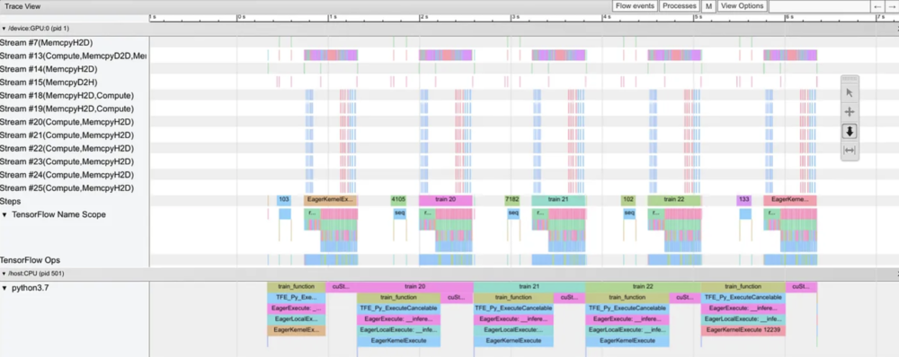
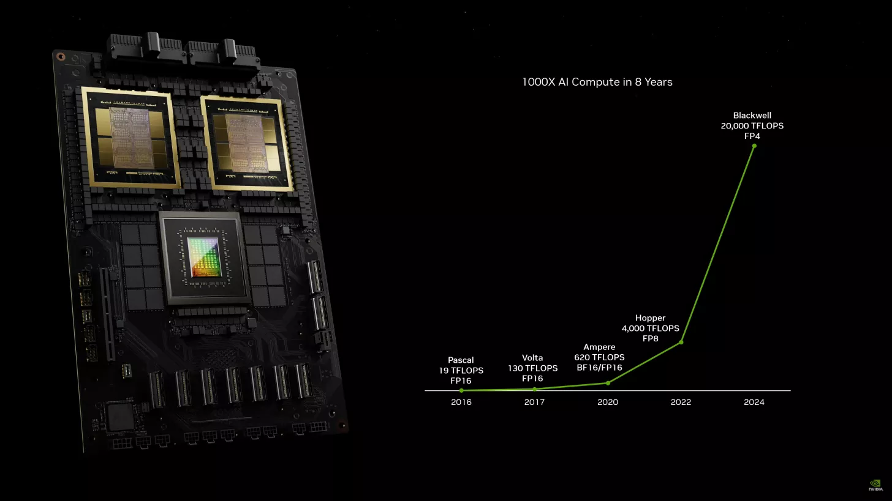
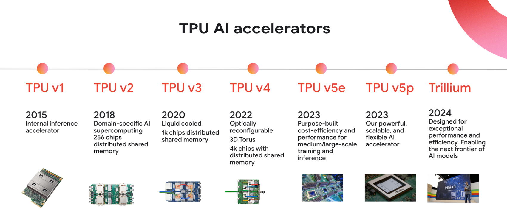
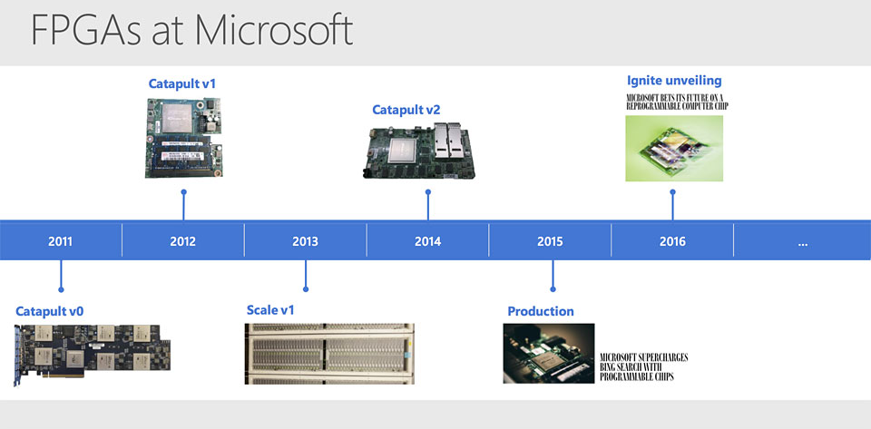
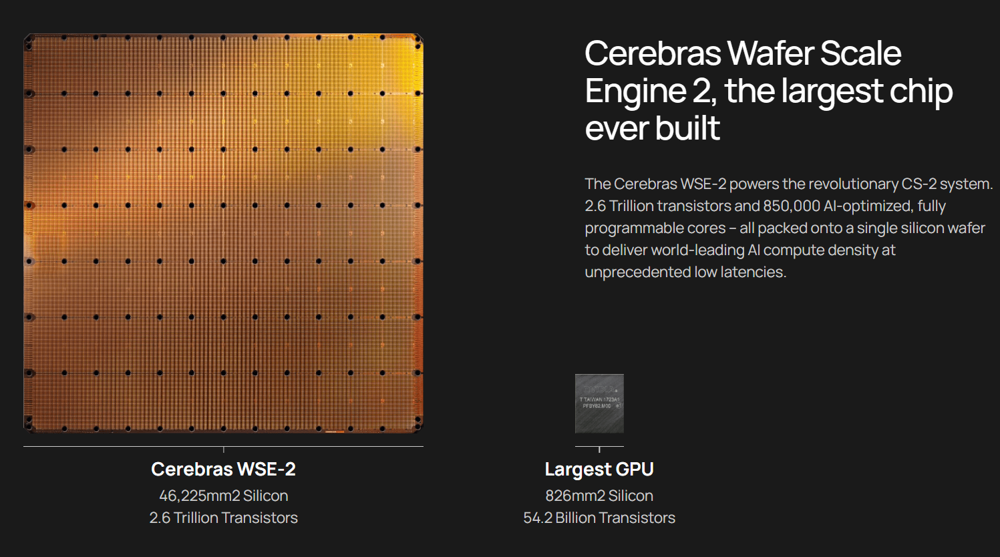

# 人工智能训练 {#sec-ai-training}

::: {layout-narrow}

::: {.column-margin}

*DALL·E 3 提示词：一幅关于人工智能训练的插画，描绘了一个神经网络，其中的神经元正在被修复并放电。场景中包含一个巨大的神经元网络，每个神经元都在发光和放电，以表示活动和学习。在这些神经元中，一些形似工程师和科学家的微小人物正在积极工作，修复和调整神经元。这些微型工作者象征着训练网络的过程，通过调整权重和偏差来实现收敛。整个场景是人工智能训练中复杂而协作努力的视觉隐喻，工作者代表着神经网络内部的持续优化和学习。背景是复杂的相互连接的神经元阵列，营造出深度和复杂感。*

:::

\noindent
:::

## 目的 {.unnumbered}

_为什么现代机器学习问题需要面向分布式计算和系统架构采用新的方法？_

机器学习训练带来了超出单机能力的计算需求，因此需要分布式系统在多台设备和数据中心之间协调计算。训练工作负载具有独特特征：海量数据集无法装入内存，包含数十亿参数的模型需要协同更新，以及需要在分布式资源之间持续同步的迭代算法。这些规模要求在内存管理、通信效率、容错和资源调度方面带来了系统性挑战，而传统系统并非为处理这些问题而设计。随着模型复杂度呈指数级增长，对于任何具有实际意义的机器学习应用而言，理解分布式训练系统都变得必不可少。为大规模训练而发展出的系统工程原则，会直接影响部署架构、成本结构，以及各行业解决方案的可行性。

::: {.callout-tip title="学习目标"}

- 解释神经网络中的数学运算（矩阵乘法、激活函数、反向传播）如何转化为计算和内存系统需求

- 分析训练流水线中的性能瓶颈，包括数据加载、内存带宽限制和计算利用率模式

- 设计高效集成数据预处理、计算阶段和参数更新的训练流水线架构

- 应用单机优化技术，包括混合精度训练、梯度累积和激活检查点，以最大化资源利用率

- 比较分布式训练策略（数据并行、模型并行、流水线并行），并根据模型特征和硬件约束选择合适的方法

- 评估专用硬件平台（GPU、TPU、FPGA、ASIC）在训练工作负载中的适用性，并针对特定架构特征优化代码

- 在训练框架中实现优化算法（SGD、Adam、AdamW），同时理解它们对内存和计算的影响

- 批判常见的训练系统设计决策，以避免性能陷阱和扩展瓶颈
:::

## 训练系统的演进与架构 {#sec-ai-training-training-systems-evolution-architecture-0293}

训练代表了机器学习系统中要求最高的阶段，在这一阶段，理论构想通过计算优化转化为实践现实。在 @sec-ml-systems 中建立的系统设计方法、@sec-data-engineering 中探讨的数据流水线架构，以及 @sec-ai-frameworks 中研究的计算框架基础上，本章考察算法理论、数据处理和硬件架构如何在智能系统的迭代优化中汇聚。

训练是机器学习系统生命周期中计算需求最高的阶段之一，需要将数学优化过程与分布式系统工程原理进行精心编排。现代训练工作负载提出的计算需求已经超出了传统计算范式：拥有数十亿参数的模型需要数 TB 的内存容量，训练语料跨越 PB 级存储系统，而基于梯度的优化算法则要求在成千上万个处理单元之间进行同步计算。这些计算规模带来了内存层次管理、节点间通信效率以及资源分配策略方面的系统工程挑战，使训练基础设施区别于通用计算架构。

前几章建立的设计方法在训练阶段构成了架构基础。@sec-ml-systems 中的模块化系统架构支持分布式训练编排，@sec-data-engineering 中设计的数据流水线提供持续的训练样本流，@sec-ai-frameworks 中的计算框架则提供必要的算法抽象。训练系统集成是理论设计原则与性能工程约束相交汇的地方，为第三部分研究的优化技术奠定计算基础。

本章将为可扩展训练基础设施建立系统工程基础。我们将研究参数化模型中的数学运算如何转化为具体的计算需求，分析训练流水线中的性能瓶颈，包括内存带宽限制和计算吞吐量约束，并设计能够在保持容错保证的同时实现高效率的系统。通过探索单节点优化策略、分布式训练方法以及专用硬件利用模式，本章将建立构建训练基础设施所需的系统工程视角，使其能够从实验原型扩展到生产级部署。

::: {.callout-note title="灯塔示例：训练 GPT-2"}

本章以 **训练 GPT-2（15 亿参数）** 作为一个持续的参考点，将抽象概念落地为具体现实。GPT-2 是一个理想的教学示例，因为它：

- **覆盖了规模光谱**：足够大，需要严肃的优化；又足够小，不必依赖庞大的基础设施即可训练
- **具有文档完备的架构**：48 层 transformer，1280 隐藏维度，20 个注意力头
- **呈现了所有关键训练挑战**：内存压力、计算强度、数据流水线复杂性
- **代表现代机器学习系统**：基于 transformer 的模型主导了当代机器学习

**Transformer 架构导论：**

GPT-2 使用一种 transformer 架构（详见 @sec-dnn-architectures），通过自注意力机制处理文本。理解这些关键计算模式，能够为本章后续的训练示例提供必要背景：

- **自注意力**：通过矩阵运算（Query × Key^T）计算序列中所有词之间的关系，生成注意力分数，用于衡量每个词应对其他词产生多大影响
- **多头注意力**：将注意力并行化到多个“头”上（GPT-2 使用 20 个），每个头学习不同的关系模式
- **Transformer 层**：将注意力与前馈网络堆叠在一起（GPT-2 有 48 层），从而实现分层特征学习
- **关键计算模式**：由大型矩阵乘法主导（注意力分数计算、前馈网络），可从 GPU 并行化中受益

该架构对矩阵乘法和顺序依赖的高度依赖，带来了我们将在本章中探讨的特定训练系统挑战：巨大的激活内存需求、分布式训练中的通信瓶颈，以及混合精度优化的机会。

**GPT-2 关键规格：**

- **参数量**：1.542B（精确计数为 1,558,214,656）
- **训练数据**：OpenWebText（约 40GB 文本，约 90 亿 token）
- **批配置**：通常在 8-32 张 GPU 上实现 512 的有效批大小
- **内存占用**：约 3GB 参数（FP16：16 位浮点数，每个值占 2 字节，而 FP32 为 4 字节），约 18GB 激活值（batch_size=32）
- **训练时间**：在 32 张 V100 GPU 上约 2 周

**关于精度格式的说明**：在本章中，我们将提到 **FP32**（32 位）和 **FP16**（16 位）浮点格式。FP16 可将内存需求减半，并在配备 Tensor Cores 的现代 GPU 上实现更快计算。**混合精度训练**（详见 @sec-ai-training-mixedprecision-training-77ad）会策略性地将大多数操作使用 FP16，同时用 FP32 保持数值稳定性，在保持精度的前提下实现 2× 的内存节省和 2-3× 的速度提升。

**🔄 GPT-2 示例标记** 会出现在一些战略性的节点上，在这些位置，这个具体模型可以帮助阐明正在讨论的概念。每个示例都提供定量规格、性能权衡，以及训练该模型时遇到的具体实现决策。
:::

## 训练系统 {#sec-ai-training-training-systems-45a3}

现代机器学习模型的发展依赖于专门的计算框架，这些框架负责管理迭代优化这一复杂过程。这些系统不同于传统计算基础设施，它们需要在可能多达数千台设备之间，对数据处理、梯度计算、参数更新以及分布式协同进行精细编排。理解什么构成训练系统，以及它与通用计算有何不同，是后续架构决策和优化策略的基础。

::: {.callout-definition title="训练系统"}

***机器学习训练系统*** 是一种计算框架，它通过在硬件和软件基础设施之上协调 _数据处理_、_梯度计算_ 和 _分布式计算_，来执行模型参数的 _迭代优化_。
:::

设计高效的训练架构，要求我们认识到机器学习训练系统是一类独特的计算负载，对硬件和软件基础设施有着不同寻常的要求。当你在 PyTorch 或 TensorFlow 等框架中执行训练命令时，这些系统必须高效地编排对大型数据集的重复计算，同时管理那些超出通用计算架构能力范围的内存需求和数据移动模式。

训练负载具有三项区别于传统计算的特征：其一，来自在大规模模型上进行迭代梯度计算的极端计算密集性；其二，同时存储参数、激活值和优化器状态所带来的巨大内存压力；其三，需要在分布式资源之间同步参数更新所产生的复杂数据依赖。一次大语言模型训练运行大约需要$10^{23}$次浮点运算 [@brown2020language]，如果包含激活值存储，内存占用可达数 TB，并且需要跨数千台设备协同——这些需求是通用系统从未为之设计的。

要理解当代训练系统为何演化成当前的架构，就需要考察计算系统如何逐步适应越来越苛刻的工作负载。训练侧重于用于学习的迭代优化，而推理系统（本书后续各处会详细介绍）则优化低延迟预测服务。这两者是相互补充但又不同的计算范式。从通用计算到专用训练系统的架构演进，揭示了指导现代训练基础设施设计的系统原则。与传统高性能计算工作负载不同，训练系统具有影响其设计与实现的特定特征。

### 用于机器学习训练的计算架构演进 {#sec-ai-training-computing-architecture-evolution-ml-training-34ff}

计算系统架构经历了不同代际的发展，每一个新阶段都建立在此前进展之上，同时为新兴应用需求引入专门优化（@fig-evolution-systems）。这种演进与 @sec-ai-frameworks 中详述的机器学习框架和软件栈的发展相呼应，二者共同演化，以实现对这些计算资源的高效利用。这一进程展示了硬件为适应应用需求而调整，如何塑造现代机器学习系统。

::: {#fig-evolution-systems fig-env="figure" fig-pos="htb"}

```{.tikz}
\begin{tikzpicture}[font=\small\sf,node distance=0pt,xscale=2]
\tikzset{
  Box/.style={inner xsep=2pt,
    draw=black!80, line width=0.75pt,
    fill=black!10,
    anchor=south,
 rounded corners=2pt,
    font=\sf\footnotesize,
    %text width=27mm,
    align=center,
    %minimum width=27mm,
    minimum height=5mm
  },
}

\definecolor{col1}{RGB}{240,240,255}
\definecolor{col2}{RGB}{255, 255, 205}

\def\du{190mm}
\def\vi{15mm}

\node[fill=green!10,draw=none,minimum width=\du,
name path=G4,
anchor=south west, minimum height=\vi](B1)at(-19.0mm,3mm){};

\node[right=2mm of B1.west,anchor=west,align=left]{AI Hypercomputing\\ Era};

\node[fill=col2,draw=none,minimum width=\du,
name path=G3,
anchor=south west, minimum height=\vi](Z)at(B1.north west){};
\node[right=2mm of Z.west,anchor=west,align=left]{Warehouse Scale\\ Computing};

\node[fill=red!10,draw=none,minimum width=\du,
anchor=south west, minimum height=\vi](B2)at (Z.north west){};
\node[right=2mm of B2.west,anchor=west,align=left]{High-Performance\\ Computing};

\node[fill=col1,draw=none,minimum width=\du,
name path=G1,
anchor=south west, minimum height=\vi](V)at(B2.north west){};
\node[right=2mm of V.west,anchor=west,align=left]{Mainframe};

\def\hi{6.75}
\draw[thick,name path=V1](0mm,0)node[below]{1950}--++(90:\hi);
\draw[thick,name path=V2](10mm,0)node[below]{1960}--++(90:\hi);
\draw[thick,name path=V3](20mm,0)node[below]{1970}--++(90:\hi);
\draw[thick,name path=V4](30mm,0)node[below]{1980}--++(90:\hi);
\draw[thick,name path=V5](40mm,0)node[below]{1990}--++(90:\hi);
\draw[thick,name path=V6](50mm,0)node[below]{2000}--++(90:\hi);
\draw[thick,name path=V7](60mm,0)node[below]{2010}--++(90:\hi);
\draw[thick,name path=V8](70mm,0)node[below]{2020}--++(90:\hi);

\def\fa{2}
\path [name intersections={of=V1 and G1,by={A,B}}];
\node[Box, minimum width=20mm,  anchor=south west,
xshift=-\fa*5mm]at([yshift=1pt]B){ENIAC};

\path [name intersections={of=V3 and G1,by={C,D}}];
\node[Box, minimum width=20mm,  anchor=north west,
xshift=-\fa*6mm]at([yshift=-1pt]C){IBM\\ System/360};
\node[Box, minimum width=40mm,  anchor=north west,
xshift=-\fa*6mm]at([yshift=-1pt]D){CDC 6600};
%%%%
\path [name intersections={of=V4 and G3,by={E,F}}];
\node[Box, minimum width=30mm,  anchor=south west,
xshift=-\fa*4mm]at([yshift=1pt]E){Cray-1};

\path [name intersections={of=V6 and G3,by={G,H}}];
\node[Box, minimum width=20mm,  anchor=north west,
xshift=0mm]at([yshift=-1pt]G){Google Data\\ Centers};

\path [name intersections={of=V7 and G3,by={I,J}}];
\node[Box, minimum width=22mm,  anchor=south west,
xshift=-\fa*5mm]at([yshift=1pt]J){AWS};

\path [name intersections={of=V8 and G4,by={K,L}}];
\node[Box, minimum width=20mm,  anchor=north west,
xshift=-\fa*5mm]at([yshift=-1pt]K){NVIDIA GPU};

\node[Box,minimum width=2mm,  anchor=south,
xshift=-\fa*0mm]at([yshift=1pt]L){};
\node[minimum width=20mm,  anchor=south west,
xshift=-\fa*5mm]at([yshift=1pt]L){Google TPUs};
\end{tikzpicture}
```
**计算系统演进**：硬件进步持续适应机器学习工作负载不断增长的需求，从集中式大型机转向专为并行处理和海量数据集优化的 GPU 和 AI 超级计算系统等专用架构。这一演进反映了通过提升计算能力和内存带宽来加速模型训练与推理的趋势。

:::

电子计算始于大型机时代。ENIAC[^fn-eniac]（1945 年）证明了大规模电子计算的可行性，而 IBM System/360[^fn-system360]（1964 年）则引入了标准化指令集和内存层次结构等架构原则。这些基础概念为后续所有计算系统奠定了基础。

[^fn-eniac]: **ENIAC（Electronic Numerical Integrator and Computer）**：ENIAC 于 1946 年在宾夕法尼亚大学完成，重 30 吨，耗电 150 kW，每秒可执行 5,000 次运算。其 17,468 个真空管需要持续维护，但它证明了电子计算可以比机械计算器快 1,000 倍。

[^fn-system360]: **IBM System/360**：System/360 于 1964 年推出，作为一项$5 billion gamble (equivalent to $（按今天价值约 400 亿美元），它引入了跨不同计算机型号向后兼容的革命性概念。其标准化指令集架构成为现代计算的基础，使软件可移植性成为可能，并推动了今天的云计算。

在这些基础计算原则之上，高性能计算（HPC）系统 [@thornton1965cdc] 专为科学计算而设计。CDC 6600[^fn-cdc6600] 以及后来的 CM-5[^fn-cm5] 等系统 [@thinking_machines_cm5] 针对密集矩阵运算和浮点计算进行了优化。

[^fn-cdc6600]: **CDC 6600**：CDC 6600 由 Seymour Cray 设计并于 1964 年发布，借助 10 个外围处理器的创新并行处理方式，实现了 3 MFLOPS（每秒百万次浮点运算）。其造价$8 million ($（按今天价值约 6500 万美元），直到 1969 年之前一直是世界上最快的计算机，并确立了超级计算这一领域。

[^fn-cm5]: **Connection Machine CM-5**：CM-5 由 Thinking Machines 于 1991 年发布，最多配备 16,384 个处理器，通过胖树网络连接，性能超过 100 GFLOPS。其 1,000 万至 5,000 万美元的价格和专用并行架构使其成为科学计算的宠儿，但随着商品化集群的兴起，最终在商业上并不成功。

HPC 系统为科学负载实现了特定的架构特性：用于数组操作的高带宽内存系统、用于数学计算的向量处理单元，以及用于集体通信模式的专用互连。科学计算强调数值精度和稳定性，因此处理器和内存系统都针对规则、可预测的访问模式进行设计。互连支持紧密同步的并行执行，从而能够在计算节点之间高效地进行集体操作。

随着互联网规模处理需求的增长，仓库级计算成为下一步演进。Google 的数据中心实现 [^fn-google-datacenter][@barroso2003web] 为互联网规模的数据处理引入了新的优化。与专注于紧耦合科学计算的 HPC 系统不同，仓库级计算处理的是耦合较松散、数据访问模式不规则的任务。

[^fn-google-datacenter]: **Google 数据中心**：Google 自 1998 年开始使用商品化 PC，并于 2003 年率先开展仓库级计算，在多个设施中管理超过 100,000 台服务器。到 2020 年，Google 运营着超过 20 个数据中心，年耗电量达 12 TWh，堪比整个国家，同时通过创新冷却技术实现了业界领先的 PUE（Power Usage Effectiveness，电源使用效率）1.10。

WSC 系统引入了支持独立任务高吞吐量的架构变化，并具备强大的故障容错与恢复机制。存储和内存系统也随之演化，以高效处理稀疏数据结构，逐渐摆脱 HPC 中面向稠密数组优化的设计。资源管理系统则演变为支持多个应用共享计算基础设施，这与 HPC 的专用应用执行模型形成对比。

无论是 HPC 还是仓库级系统，都未能完全满足机器学习训练的独特需求。每个计算时代都针对不同的工作负载特征进行了优化，而这些特征仅与 AI 训练需求部分吻合：

- **高性能计算**：针对稠密、浮点密集、紧耦合的模拟进行了优化。HPC 为高带宽互连和并行数值计算奠定了基础，这些正是 AI 训练所必需的，但它专注于规则、可预测的访问模式，不适合神经网络训练所需的动态内存需求。

- **仓库级计算**：针对稀疏、整数密集、松耦合的数据处理进行了优化。WSC 展示了生产级 AI 系统所必需的容错能力和大规模扩展性，但它强调的是独立并行任务，这与分布式训练中所需的同步梯度更新形成对比。

- **AI 训练**：提出了一个独特挑战，即既需要像 HPC 那样进行**稠密的 FP16/FP32 计算**，又需要像 WSC 那样具备**海量数据规模**，同时还要增加迭代式、同步式梯度更新的复杂性。这种独特的需求组合——高强度参数更新、复杂的内存访问模式以及协同的分布式计算——推动了当今专用 AI 超级计算系统的发展。

AlexNet[^fn-training-alexnet] 在 2012 年的 [@krizhevsky2012imagenet] 成功表明，现有系统无法高效应对这些需求的汇合。神经网络训练要求新的内存管理与设备间通信方法，而 HPC 的紧耦合科学计算取向和仓库级计算的松耦合数据处理都未能解决这一问题。

[^fn-training-alexnet]: **AlexNet**：AlexNet 由 Alex Krizhevsky、Ilya Sutskever 和 Geoffrey Hinton 开发，在 ImageNet 2012 中以 15.3% 的错误率获胜（第二名为 26.2%），训练时使用了两块 GTX 580 GPU，耗时 5-6 天。这一突破开启了深度学习革命，并证明 GPU 相比 CPU 可将神经网络训练加速 10-50 倍。

这种对专门化的需求开启了始于 2015 年的 AI 超级计算时代，这代表了这一演进链中的最新一步。NVIDIA GPU[^fn-nvidia-gpus] 和 Google TPU[^fn-google-tpus] 引入了专门针对神经网络计算优化的硬件设计，不再只是对现有架构的适配。这些系统采用了新的并行处理、内存访问和设备通信方法，以处理模型训练的独特模式。由此产生的架构在数值精度需求与仓库级系统所要求的规模之间取得平衡，同时增加了对神经网络优化迭代特性的专门支持。这些专用训练加速器的完整设计原则、架构细节和优化策略将在 @sec-ai-acceleration 中详细探讨，而本章则聚焦于训练系统编排和流水线优化。

[^fn-nvidia-gpus]: **NVIDIA AI GPU**：从 2012 年用于 AlexNet 的 GTX 580（1.58 TFLOPS）到 2023 年的 H100（稀疏 AI 负载 989 TFLOPS，稠密负载 312 TFLOPS），NVIDIA GPU 在十年间将 AI 性能提升了 300 多倍。H100 价格为 25,000-40,000 美元，但它能够训练在旧硬件上不可能完成的模型，体现了专用芯片在 AI 进步中的关键作用。

[^fn-google-tpus]: **Google TPU**：TPU 于 2015 年首次在内部部署，针对特定 AI 工作负载可提供比 GPU 高 15-30 倍的性价比。TPU v4（2021）在单芯片上实现 275 TFLOPS（bfloat16）和 32GB 内存，而 TPU Pod 可扩展到 1 exaFLOP。Google 在定制芯片上的数十亿美元投入，使得训练 PaLM（5400 亿参数）等模型在成本上变得可行。

这一架构演进揭示了为什么传统计算系统不足以支撑神经网络训练。如 @tbl-computing-eras 所示，虽然 HPC 系统为并行数值计算奠定了基础，仓库级系统也展示了大规模分布式处理能力，但二者都未能完全覆盖模型训练的计算模式。现代神经网络将高强度参数更新、复杂内存访问模式和协同分布式计算结合在一起，因此需要新的架构方法。

理解这些不同特征及其从先前计算时代演化而来的过程，可以解释为什么现代 AI 训练系统需要专用硬件特性和优化过的系统设计。这一历史背景为我们进一步深入考察机器学习训练系统架构奠定了基础。

| **时代** | **主要工作负载** | **内存模式** | **处理模型** | **系统重点** |
|:---|:---|:---|:---|:---|
| **大型机** | 顺序批处理 | 简单内存层次结构 | 单指令流 | 通用计算 |
| **HPC** | 科学模拟 | 规则的数组访问 | 同步并行 | 数值精度、集体操作 |
| **仓库级计算** | 互联网服务 | 稀疏、非规则访问 | 独立并行任务 | 吞吐量、容错性 |
| **AI 超级计算** | 神经网络训练 | 参数密集、混合访问 | 混合并行、分布式 | 训练优化、模型规模 |

: **计算时代演进**：系统架构不断适应不断演化的工作负载需求，从通用计算逐步转向为神经网络训练优化的专用设计。高性能计算（HPC）奠定了并行处理基础，而仓库级系统实现了分布式计算；然而，现代神经网络需要能够平衡高强度参数更新、复杂内存访问和协同分布式计算的架构。 {#tbl-computing-eras}

### 机器学习开发生命周期中的训练系统 {#sec-ai-training-training-systems-ml-development-lifecycle-6222}

训练系统通过专门的计算框架运行。现代机器学习模型的开发依赖于用于训练和优化的专用系统。这些系统结合了硬件和软件组件，必须在保持数值精度和计算稳定性的同时，高效处理海量数据集。尽管训练系统发展迅速且实现多样，但它们共享一系列共同特征和需求，使其区别于传统计算基础设施。

这些训练系统为开发预测模型提供了核心基础设施。它们执行模型参数的数学优化，将输入数据转换为计算表示，以完成模式识别、语言理解和决策自动化等任务。训练过程涉及对数据集的系统性迭代，以最小化误差函数并获得最优模型性能。

训练系统是更广泛机器学习流水线中的一个组成部分，建立在 @sec-introduction 中介绍的基础概念之上。它们与预处理框架交互，对原始数据进行标准化和转换，同时连接到支持模型服务的部署架构。训练系统的计算效率和可靠性直接影响开发周期，从最初实验到模型验证，再到生产部署。这一端到端视角将训练优化与 @sec-ml-operations 中探讨的更广泛 AI 系统生命周期考量联系起来。

随着近期架构进展，这一运行范围不断扩大。Transformer 架构 [^fn-transformers] 和大规模模型的出现，为训练系统提出了新的要求。当前实现必须高效处理 PB 级数据集，在多个加速器之间编排分布式训练，并优化包含数十亿参数的模型的内存利用率。数据并行 [^fn-training-data-parallelism]、模型并行 [^fn-training-model-parallelism] 和设备间通信的管理，使现代训练架构面临技术挑战。这些分布式系统复杂性促使人们开发专门的 AI 工作流管理工具（@sec-ai-workflow），以自动化大规模训练编排中的许多方面。

[^fn-training-data-parallelism]: **数据并行扩展**：在线程或设备间通信成为瓶颈之前，线性扩展通常有效，这一临界点对大多数模型来说通常在 64-128 个 GPU 左右。BERT-Large 在 128 个 GPU 上通常可获得 60-80 倍加速（效率 45-65%），而 GPT-3 则需要 1,024 个 GPU，但效率只有 45%。关键限制在于 AllReduce 通信成本随设备数量按 O(n) 增长，因此需要像 InfiniBand 这样的高带宽互连。

[^fn-training-model-parallelism]: **模型并行内存扩展**：使训练单个 GPU 无法容纳的超大模型成为可能。GPT-3（1750 亿参数）在 FP16 下需要 350GB 的权重内存（FP32 下为 700GB），远超任何单个 GPU 80GB 的上限。由于模型分片之间存在顺序依赖，以及设备间通信开销，模型并行的计算效率通常只有 20-60%。

训练系统还会影响机器学习开发的运行层面考量。系统设计必须处理多项技术约束：计算吞吐量、能耗、硬件兼容性，以及随着模型复杂度增加而带来的可扩展性。虽然本章聚焦训练系统的计算与架构方面，但能源效率和可持续性考量将在 @sec-sustainable-ai 中讨论。这些因素决定了机器学习实现方案在不同规模和应用中的技术可行性与运行可用性。

### 训练基础设施的系统设计原则 {#sec-ai-training-system-design-principles-training-infrastructure-8d92}

训练实现需要系统视角。训练模型的实际执行与系统设计紧密相关。训练不仅仅是一个数学优化问题，它也是一个由系统驱动的过程，需要对计算硬件、内存和数据移动进行精细编排。

训练工作流由相互依赖的阶段构成：数据预处理、前向传播和反向传播，以及参数更新，这些阶段扩展了 @sec-dl-primer 中的基础神经网络概念。每个阶段都对系统资源提出了特定要求。例如，数据预处理阶段依赖存储和 I/O 子系统，持续向计算硬件提供输入。输入数据的质量和可靠性至关重要——有关数据验证、损坏检测、特征工程、模式约束和流水线可靠性策略的内容见 @sec-data-engineering。而 @sec-data-engineering 关注的是数据质量和一致性，本章则考察训练过程中数据移动、转换吞吐量以及向计算资源交付数据时的系统级效率。

虽然传统处理器如 CPU 能够有效处理许多训练任务，但更复杂的模型推动了硬件加速器的采用。图形处理器（GPU）和专用机器学习处理器可以并行处理数学运算，为矩阵密集型计算带来显著加速。这些加速器与 CPU 一起处理梯度计算和参数更新等操作，使得能够训练出具有层次化表示的模型，而其理论基础在 @sec-dnn-architectures 中有所探讨。这些阶段的性能取决于系统对内存带宽和通信时延等瓶颈的管理程度。

这些相互关联的工作流阶段揭示了系统架构如何直接影响训练效率。系统约束往往决定训练负载的性能上限。现代加速器经常受限于内存带宽，因为内存层次结构之间的数据移动可能比计算本身更慢且更耗能 [@patterson2021hardware]。在分布式环境中，设备间同步会引入额外时延，而互连（如 NVLink、InfiniBand）的性能在其中发挥重要作用。

通过 @sec-ai-training-systematic-optimization-framework-9f23 中详述的系统化方法，可以优化训练工作流以克服这些限制。诸如将计算与数据加载重叠、混合精度训练 [@micikevicius2017mixed] 和高效内存分配等技术，针对训练性能的三大主要瓶颈进行优化。这些底层优化与 @sec-model-optimizations 中讨论的更高层次模型压缩策略相辅相成，共同构成提升训练效率的集成方案。

系统思维不仅延伸到基础设施优化，也延伸到设计决策。系统级约束往往会引导新模型架构和训练方法的开发。@sec-ai-acceleration 中讨论的硬件-软件协同设计原则表明，理解系统能力可以催生全新的架构创新。例如，内存限制推动了更高效神经网络架构的研究 [@vaswani2017attention]，而分布式系统中的通信开销则影响了优化算法的设计。这些适应性变化表明，在给定计算约束下，实际系统考量如何塑造机器学习方法的发展演化。

例如，训练大型 Transformer 模型 [^fn-transformer-training] 需要将数据和模型参数分散到多个设备上。这会带来同步挑战，尤其是在梯度更新期间。诸如 [NVIDIA 的集体通信库（NCCL）](https://docs.nvidia.com/deeplearning/nccl/user-guide/docs/overview.html) 之类的通信库能够高效地共享梯度，为分布式训练优化技术奠定基础。@sec-benchmarking-ai 中的基准测试方法为评估这些分布式训练性能特征提供了系统化途径。这些例子说明了系统级考量如何影响现代训练工作流的可行性与效率。

## 数学基础 {#sec-ai-training-mathematical-foundations-71a8}

上文建立的系统视角揭示了为什么理解训练核心中的数学运算至关重要。这些运算并非抽象概念，而是决定训练系统设计各个方面的具体计算。神经网络数学的计算特性直接决定了硬件需求、内存架构和并行化约束。当系统架构师选择 GPU 而不是 CPU、设计内存层次结构或选择分布式训练策略时，他们回应的正是这些数学运算的特定需求。

上文讨论的专用训练系统就是专门为高效执行这些运算而设计的。理解这些数学基础至关重要，因为它们会直接决定系统需求：运算类型决定了对硬件专用化的需求（为何矩阵乘法单元主导现代加速器），内存访问模式影响缓存设计（为何激活值存储会成为瓶颈），而计算依赖关系塑造并行化策略（为何某些运算不能简单地分布式执行）。当我们前面讨论 AI 超级计算与 HPC 系统的差异时，这种区别就源于各自必须执行的数学运算不同。

训练系统必须反复执行三类运算。第一，前向传播通过矩阵乘法和激活函数计算预测结果。第二，通过反向传播进行梯度计算，利用已存储的激活值和链式法则计算参数更新。第三，参数更新使用优化算法应用梯度，这些算法会维护动量和自适应学习率状态。每一类运算都表现出不同的计算模式和系统需求，训练架构必须加以适配。

这些运算的计算特性直接影响前文讨论过的系统设计决策。矩阵乘法主导前向和反向过程，[@he2016residual] 的训练时间中占 60-90%，这解释了为何专用矩阵单元（GPU 张量核心、TPU 收缩阵列）成为训练硬件的核心。这种计算主导地位塑造了现代训练架构，从硬件设计选择到软件优化策略皆是如此。用于梯度计算的激活值存储会产生与批大小和网络深度成正比的内存压力，这也促使我们采用内存层次结构以及诸如梯度检查点之类的优化技术，我们将在后文探讨。前向传播、梯度计算和参数更新之间的迭代依赖关系阻止了任意并行化，从而限制了可用于扩展的分布式训练策略。理解这些数学运算及其系统层面的影响，是理解现代训练系统如何实现高效性的基础。

### 神经网络计算 {#sec-ai-training-neural-network-computation-73f5}

神经网络训练由重复的矩阵运算和非线性变换组成。这些运算在概念上虽然简单，却带来了主导现代训练基础设施的系统级挑战。自 @rumelhart1986learning 通过引入反向传播并发展高效的矩阵计算库（例如 BLAS[@dongarra1988extended]）以来，奠基性工作为现代训练架构奠定了基础。

#### 神经网络中的数学运算 {#sec-ai-training-mathematical-operations-neural-networks-abbd}

神经网络的核心是前向传播过程，其最简单的情况涉及两种主要操作：矩阵乘法和激活函数的应用。矩阵乘法构成了网络每一层线性变换的基础。该方程表示信息如何在神经网络的每一层中流动：

在第$l$层，计算可以表示为：$$
A^{(l)} = f\left(W^{(l)} A^{(l-1)} + b^{(l)}\right)
$$其中：

*$A^{(l-1)}$表示前一层的激活值（对于第一层则为输入层），
*$W^{(l)}$是第$l$层的权重矩阵，其中包含网络学习到的参数，
*$b^{(l)}$是第$l$层的偏置向量，
*$f(\cdot)$是逐元素应用的激活函数（例如 ReLU、sigmoid），用于引入非线性。

#### 矩阵运算 {#sec-ai-training-matrix-operations-d7e9}

要理解这些数学运算如何转化为系统需求，需要考察神经网络中的计算模式，这些模式围绕着各种类型的矩阵运算展开。理解这些运算及其演变，可以揭示机器学习训练系统中为何会出现特定的系统设计与优化。

##### 稠密矩阵-矩阵乘法 {#sec-ai-training-dense-matrixmatrix-multiplication-fb44}

在前文确立的矩阵乘法主导地位基础上，这些计算模式的演进推动了算法和硬件层面的创新。早期的神经网络实现依赖标准的基于 CPU 的线性代数库，但现代训练的规模需求带来了专门优化的必要性。从 Strassen 算法 [^fn-strassen-algorithm]（它将朴素的$O(n^3)$复杂度降低到约$O(n^{2.81})$ [@strassen1969gauss]），到像 [cuBLAS](https://developer.nvidia.com/cublas) 这样的当代硬件加速库，这些创新持续推动着计算效率的极限。

[^fn-strassen-algorithm]: **Strassen 算法**：由 Volker Strassen 于 1969 年提出，这一突破通过巧妙的代数技巧，将矩阵乘法从 O(n³) 降低到 O(n^2.807)，只需 7 次乘法而不是 8 次。虽然理论上更快，但由于开销较大，它只在大于 500×500 的矩阵上才实用。Intel MKL 等库中的现代实现会根据矩阵大小在不同算法之间切换，这表明理论进步要产生实际影响，还需要精心的工程实现。

这种计算上的主导地位推动了系统级优化。现代系统采用分块矩阵计算，以便在多个单元之间并行处理。随着神经网络架构规模不断扩大，这些乘法开始需要大量内存资源，因为在训练的反向传播阶段，权重矩阵和激活矩阵都必须保持可访问。硬件设计相应调整，以便在管理不断增长的内存需求的同时，优化这些稠密乘法模式。

::: {.callout-tip title="GPT-2 注意力层计算" collapse="true"}

GPT-2 的每一层都会执行注意力计算，这很好地体现了稠密矩阵乘法的需求。对于单个注意力头，batch_size=32、sequence_length=1024、hidden_dim=1280：

**查询、键、值投影**（3 次独立的矩阵乘法）：$$
\text{FLOPS} = 3 \times (\text{batch} \times \text{seq} \times \text{hidden} \times \text{hidden})
$$
$$
= 3 \times (32 \times 1024 \times 1280 \times 1280) \approx 160 \text{ billion FLOPS}
$$**注意力分数计算**（Q × K^T）：$$
\text{FLOPS} = \text{batch} \times \text{heads} \times \text{seq} \times \text{seq} \times \text{hidden/heads}
$$
$$
= 32 \times 20 \times 1024 \times 1024 \times 64 = 42.9 \text{ billion FLOPS}
$$**计算规模**

- 单个注意力层总计：前向传播约 2040 亿 FLOPS
- GPT-2 的 48 层：每个训练步约 9.8 万亿 FLOPS
- 在 50K 个训练步时：总训练计算量约 490 拍 FLOPS

**系统含义：** 一块 V100 GPU（Tensor Core 上 FP16 峰值 125 TFLOPS，未使用 Tensor Core 时为 28 TFLOPS）若要在 100% 利用率下仅完成每步的注意力计算，就需要 79 秒。实际训练步耗时为 180 到 220 毫秒，因此要达到这种吞吐量需要 8 到 32 块 GPU。
:::

##### 矩阵-向量运算 {#sec-ai-training-matrixvector-operations-5665}

除了矩阵-矩阵运算之外，随着神经网络架构中归一化技术的引入，矩阵-向量乘法也变得至关重要。尽管它在计算上比矩阵-矩阵乘法更简单，但这些运算仍然带来系统挑战。由于并行化潜力有限，它们的硬件利用率较低。这一特性会影响硬件设计和模型架构决策，尤其是在处理序列输入或计算层统计量的网络中。

##### 批处理运算 {#sec-ai-training-batched-operations-6d1b}

认识到矩阵-向量运算的局限性后，批处理 [^fn-batching-transformation] 的引入改变了神经网络中的矩阵计算方式。通过同时处理多个输入，训练系统将矩阵-向量运算转换为更高效的矩阵-矩阵运算。这种方法提高了硬件利用率，但也增加了存储中间结果所需的内存开销。现代实现必须在批大小与可用内存之间取得平衡，从而在内存管理和计算调度方面形成特定优化。

[^fn-batching-transformation]: **神经网络中的批处理**：与传统编程一次处理一个数据项不同，机器学习系统会同时处理多个样本，以最大化 GPU 利用率。单个样本可能只能达到 5-10% 的 GPU 利用率，而 32-256 的批大小可以达到 80-95%。这种从标量运算到张量运算的转变，解释了为什么机器学习系统需要不同于传统应用的编程模式和硬件优化。

像 Google 的 TPU[@jouppi2017tpu] 这样的硬件加速器体现了这一演进，它们为这些多样化的乘法模式集成了专门的矩阵单元和内存层次结构。这些硬件适配使得像 GPT-3[@brown2020language] 这样的大规模模型能够通过高效处理各种矩阵运算来进行训练。

::: {.callout-note title="系统含义：为什么 GPU 主导训练" collapse="false"}

上面的矩阵运算直接解释了现代训练硬件架构。GPU 主导训练是因为：

- **大规模并行性**：矩阵乘法中各元素的独立计算与 GPU 的数千个核心完美匹配（NVIDIA A100：6,912 个 CUDA 核心）
- **专用硬件单元**：Tensor Core 通过专为主导工作负载设计的硬件，将矩阵运算加速 10-20 倍
- **内存带宽优化**：分块矩阵计算模式能够高效利用 GPU 内存层次结构（L1/L2 缓存 → 共享内存 → 全局内存）

当 GPT-2 的例子后面展示 V100 GPU 如何通过混合精度获得 2.4× 加速时（第 2018 行），这种加速正来自我们刚刚分析过的由 Tensor Core 执行的矩阵乘法。理解矩阵运算特性，是认识诸如混合精度训练这类流水线优化为何能带来如此显著收益的前提。

:::


#### 激活函数 {#sec-ai-training-activation-functions-e5aa}

在 @sec-dl-primer 中，我们已经说明激活函数——sigmoid、tanh、ReLU 和 softmax——为神经网络学习复杂模式提供了必需的非线性。我们考察了它们的数学性质：sigmoid 的$(0,1)$有界输出、tanh 的以零为中心的$(-1,1)$范围、ReLU 的梯度传播优势，以及 softmax 的概率分布。回顾 @fig-activation-functions，每个函数如何以不同方式转换输入，并对梯度行为和学习动力学产生不同影响。

虽然激活函数是逐元素应用的，而且相较于矩阵运算只占总计算时间的 5-10%，但它们的实现特性会显著影响训练系统性能。机器学习系统工程师面对的问题并不是激活函数在数学上“做什么”——这一基础已经明确——而是如何在大规模场景下高效实现它们。为什么 ReLU 在 CPU 上比 sigmoid 训练快 3 倍，但在 GPU 上却表现出不同的相对性能？硬件加速器如何优化这些操作？不同的激活函数在反向传播时会产生什么样的内存访问模式？

本节从系统视角考察激活函数，分析决定真实世界训练效率的计算成本、硬件实现策略以及性能权衡。理解这些实际约束，有助于在为特定硬件环境设计训练系统时做出更有依据的架构决策。

##### 激活函数基准测试 {#sec-ai-training-benchmarking-activation-functions-052e}

神经网络中的激活函数会显著影响数学性质和系统级性能。激活函数的选择会通过三个主要因素直接影响训练时间、模型可扩展性和硬件效率：计算成本、梯度行为和内存使用。

在 Apple M2 单线程 CPU 上对常见激活函数进行基准测试，会发现有意义的性能差异，如 @fig-activation-perf 所示。数据显示，在 CPU 架构上，Tanh 和 ReLU 的执行效率都高于 Sigmoid，因此特别适合实时应用和大规模系统。

::: {#fig-activation-perf fig-env="figure" fig-pos="htb"}

```{.tikz}
\scalebox{0.8}{%
\begin{tikzpicture}[font=\small\usefont{T1}{phv}{m}{n}]
\definecolor{Softmax}{HTML}{FDAE61}
\definecolor{ReLU}{HTML}{ABDDA4}
\definecolor{Tanh}{HTML}{2B83BA}
\begin{axis}[
    ylabel={Execution Time (seconds)},
    ymin=0.49,
    axis lines=left,
   axis line style={thick,-latex},
    ytick={0.5,0.55,...,1.1},
    tick label style={/pgf/number format/assume math mode=true},
    yticklabel style={font=\footnotesize\usefont{T1}{phv}{m}{n},
    /pgf/number format/.cd, fixed, fixed zerofill, precision=2},
    xticklabel style={font=\footnotesize\usefont{T1}{phv}{m}{n}},
    ylabel style={font=\footnotesize\usefont{T1}{phv}{m}{n}},
    ymax=1.15,
    enlarge x limits=0.2,
    tick style={draw=black,thin,},
    tick align=outside,
    major tick length=1mm,
    bar width=30pt,
    xtick={1,2,3,4},
    xticklabels={Sigmoid,Tanh,ReLU,Softmax},
    every axis plot/.append style={
          ybar,
          bar width=0.55,
          bar shift=0pt,
          fill
        }]
      \addplot[red]coordinates {(1,1.1)};
      \addplot[Tanh]coordinates{(2,0.61)};
      \addplot[ReLU]coordinates{(3,0.78)};
      \addplot[Softmax]coordinates{(4,0.91)};
\end{axis}
\end{tikzpicture}}
```
**激活函数性能**：在常见激活函数中，CPU 执行时间差异显著，在该架构上 tanh 和 relu 相较于 sigmoid 具有明显的速度优势。这些差异会影响训练时间和实时推理能力等系统级考量，从而指导在性能关键场景下的激活函数选择。

:::

虽然这些基准结果提供了宝贵见解，但它们只反映了 CPU 上、未使用硬件加速的性能。在生产环境中，像 GPU 这样的现代硬件加速器会显著改变激活函数的相对性能特征。因此，系统架构师在评估计算效率时必须考虑其特定的硬件环境和部署场景。

回顾 @sec-dl-primer，每种激活函数都表现出不同的梯度行为、稀疏性特征和计算复杂度。现在的问题是：这些数学性质如何转化为硬件约束和系统性能？以下小节将考察各函数的实现特性，重点关注决定真实世界训练效率的软件与硬件权衡：

###### Sigmoid {#sec-ai-training-sigmoid-da85}

Sigmoid 平滑的$(0,1)$有界输出使其适合概率解释，但它的梯度消失问题和非零中心输出会带来优化挑战。从系统角度看，指数函数的计算成为关键瓶颈。在软件中，这种计算代价高且低效 [^fn-sigmoid-cost]，尤其是在深层网络或大规模数据集上，每次前向传播会进行数百万次 sigmoid 计算。

[^fn-sigmoid-cost]: **Sigmoid 的计算成本**：计算 sigmoid 需要昂贵的指数运算。在 CPU 上，`exp()` 需要 10-20 个时钟周期，而基本算术运算只需 1 个周期。GPU 实现使用 32 项查找表并结合线性插值，将成本降低到 3-4 个周期，但仍比 ReLU 慢 3 倍。这种开销在深度网络中会被放大，因为每次前向传播都要处理数百万个激活值。

这些计算挑战在硬件中的解决方式不同。像 GPU 和 TPU 这样的现代加速器通常避免直接计算指数函数，而是使用查找表（LUT）或分段线性近似，在准确性和速度之间取得平衡。虽然这些硬件优化有所帮助，但多次内存查找和插值计算仍使 sigmoid 比 ReLU 这类更简单的函数更耗资源，即使在高度并行的架构上也是如此。

###### Tanh {#sec-ai-training-tanh-50b7}

虽然 tanh 通过其$(-1,1)$以零为中心的输出优于 sigmoid，但它仍然继承了 sigmoid 的计算负担。tanh 所需的指数计算在软件和硬件实现中都会造成类似的性能瓶颈。在软件中，这种计算开销会拖慢训练，尤其是在处理大规模数据集或深层模型时。

在硬件中，tanh 利用了它与 sigmoid 的数学关系（一个缩放和平移后的版本）来优化实现。现代硬件通常采用混合方法实现 tanh：常见输入范围使用查找表，边界情况使用分段近似。这种方法有助于在准确性和计算效率之间取得平衡，不过 tanh 仍然比更简单的函数更耗资源。尽管存在这些挑战，tanh 在 RNN 和 LSTM[^fn-rnns-lstms] 中仍然很常见，因为它们需要平衡的梯度。

###### ReLU {#sec-ai-training-relu-e11a}

ReLU 代表了激活函数设计的一种转变。其数学上的简单性——$\max(0,x)$——避免了梯度消失并引入了有益的稀疏性，尽管它也可能出现“死亡神经元”问题。这种直观形式对系统性能有深远影响。在软件中，ReLU 简单的阈值操作使其计算速度远快于 sigmoid 或 tanh，因为它只需要一次比较，而不需要指数计算。

ReLU 的硬件实现展示了它为何成为现代神经网络中的主导激活函数。其简单的$\max(0,x)$操作只需要一次比较和条件赋值，从而将电路复杂度降到最低 [^fn-relu-hardware]。现代 GPU 和 TPU 可以使用一个简单的多路复用器来检查输入的符号位，从而实现极其高效的并行处理。这种硬件效率，再加上它带来的稀疏性，同时降低了计算时间和内存带宽需求。

[^fn-relu-hardware]: **ReLU 的硬件效率**：ReLU 只需要 1 条指令（`max(0,x)`），而 sigmoid 需要 10 多个操作，包括指数运算。在 NVIDIA GPU 上，ReLU 可达到峰值 FLOPS 的 95%，而 sigmoid 只有 30-40%。ReLU 的稀疏性（通常有 50% 为零）还支持额外优化：稀疏矩阵运算、更低的内存带宽需求，以及反向传播中的压缩梯度。

###### Softmax {#sec-ai-training-softmax-7945}

Softmax 不同于上面的逐元素函数。它不是独立处理每个输入，而是通过全局归一化将 logits 转换为概率分布，从而带来独特的计算挑战。其计算涉及对每个输入值求指数并用它们的和进行归一化，随着输出空间增大，这一过程会变得越来越复杂。在软件中，这会给自然语言处理等任务带来显著的计算开销，因为词表大小可达数十万项。该函数在计算过程中还要求将所有值保留在内存中，因为每个输出概率都依赖于整个输入向量。

在硬件层面，softmax 面临独特挑战，因为它不能像其他激活函数那样独立处理每个值。不同于 ReLU 的简单阈值，甚至不同于 sigmoid 的逐值计算，softmax 需要访问所有值才能执行归一化。这在现代 Transformer 架构 [^fn-transformer-attention] 中尤其苛刻，因为注意力机制中的 softmax 计算会同时处理成千上万个值。为了应对这些需求，硬件实现通常会使用近似技术或简化版本的 softmax，尤其是在处理大词表或注意力机制时。@tbl-compare-activations 总结了这些常用激活函数的权衡，并强调了这些选择如何影响系统性能。

| **函数** | **主要优势** | **主要劣势** | **系统含义** |
|:---|:---|:---|:---|
| **Sigmoid** | 平滑梯度；输出有界于$(0, 1)$. | 梯度消失；输出非零中心。 | 指数计算增加开销；在现代加速器上的深层网络可扩展性有限。 |
| **Tanh** | 输出以零为中心于$(-1, 1)$；稳定梯度。 | 大输入下会出现梯度消失。 | 比 ReLU 更昂贵；仍常用于 RNN/LSTM，但在 CNN 和 Transformer 中较少见。 |
| **ReLU** | 计算高效；避免梯度消失；引入稀疏性。 | 死亡神经元；输出无界。 | 简单运算可在 GPU/TPU 上高效优化；稀疏激活可减少内存和计算需求。 |
| **Softmax** | 将 logits 转换为概率；求和为$1$. | 对大输出空间来说计算昂贵。 | 大词表场景成本高；NLP 任务要实现可扩展性需要分层 softmax 或采样 softmax。 |

: **激活函数权衡**：比较激活函数可以揭示会影响系统性能的固有优缺点；例如，softmax 的归一化需求会给大规模 Transformer 模型带来硬件挑战，而 relu 虽然计算高效，但可能出现死亡神经元问题。该表阐明了激活函数选择如何同时影响模型行为和机器学习系统设计的实际约束。 {#tbl-compare-activations}

激活函数的选择应在计算考量与其数学性质之间取得平衡，例如处理梯度消失或在神经激活中引入稀疏性。这些数据强调了在设计神经网络时同时评估理论性能和实际性能的重要性。对于大规模网络或实时应用，ReLU 往往是最佳选择，因为它高效且可扩展。然而，对于需要概率输出的任务，例如分类，softmax 尽管计算成本较高，仍然不可或缺。最终，理想的激活函数取决于具体任务、网络架构和硬件环境。

::: {.callout-tip title="GPT-2 的 GELU 激活函数" collapse="true"}

虽然上表涵盖了经典激活函数，但 GPT-2 使用的是高斯误差线性单元（GELU），其定义如下：$$
\text{GELU}(x) = x \cdot \Phi(x) = x \cdot \frac{1}{2}\left[1 + \text{erf}\left(\frac{x}{\sqrt{2}}\right)\right]
$$其中$\Phi(x)$是标准正态分布的累积分布函数。

**为什么 GPT-2 使用 GELU？**

- 比 ReLU 更平滑的梯度，减少死亡神经元问题
- 随机正则化效应：以概率方式丢弃输入，类似 dropout
- 在语言建模任务上具有更好的经验性能

**系统性能权衡**

- 计算成本：比 ReLU 贵约 3 到 4 倍（需要计算 erf 函数）
- 内存：与 ReLU 相同（逐元素操作）
- 对训练时间的影响：对于 GPT-2 的 48 层，GELU 使总前向传播时间增加约 5 到 8%
- 值得：模型质量提升（更低的困惑度）抵消了计算开销

**快速近似：** 现代框架（PyTorch、TensorFlow）使用优化后的近似来实现 GELU：
```python
# GELU 快速近似（实践中使用）
GELU(x) ≈ 0.5 * x * (1 + tanh(sqrt(2/π) * (x + 0.044715 * x³)))
```

这种近似将计算成本降低到约 ReLU 的 1.5 倍，同时保留了 GELU 的优势，展示了生产系统如何在数学性质与实现效率之间取得平衡。

:::

::: {.callout-note title="系统含义：内存带宽瓶颈" collapse="false"}

激活函数揭示了一个关键系统原则：并非所有操作都是计算受限的。虽然矩阵乘法会让 GPU 的计算单元满负荷运行，但激活函数往往会变成**内存带宽受限**：

- **低算术强度**：逐元素运算在每次内存访问时只执行少量计算（ReLU：每次加载 1 次运算）
- **并行性收益有限**：简单操作的完成速度快于内存传输时间
- **带宽约束**：现代 GPU 的计算吞吐量比内存带宽高 10-100 倍

这解释了为什么激活函数的选择没有人们预期的那么重要——尽管 sigmoid 和 ReLU 的计算复杂度差异很大，但由于二者都受内存访问限制，它们的性能差异也只有 2-3 倍。前向传播必须谨慎管理激活值的存储，以避免内存带宽限制整体训练吞吐量。

:::

### 优化算法 {#sec-ai-training-optimization-algorithms-506e}

优化算法在神经网络训练中起着重要作用，它通过引导模型参数的调整来最小化损失函数。这个过程使神经网络能够从数据中学习，其核心是寻找一组最优参数，使模型在给定任务上获得最佳性能。广义上，这些算法可以分为两类：提供理论基础的经典方法，以及引入改进以提升性能和效率的高级方法。

这些算法会探索复杂的高维损失函数表面，找出函数取得最小值的区域。这项任务具有挑战性，因为损失函数表面很少是平滑或简单的，通常包含局部最小值、鞍点和陡峭梯度。有效的优化算法旨在克服这些挑战，确保收敛到一个能够很好泛化到未见数据的解。虽然本节介绍的是训练过程中使用的优化算法，但包括量化、剪枝和知识蒸馏在内的高级优化技术已在 @sec-model-optimizations 中详细讨论。

优化算法的选择和设计对系统层面有重要影响，例如计算效率、内存需求，以及对大规模数据集或模型的可扩展性。包括网格搜索、贝叶斯优化和自动化机器学习工作流在内的系统化超参数优化方法在 @sec-ai-workflow 中介绍。深入理解这些算法对于处理准确性、速度和资源使用之间的权衡至关重要。

#### 基于梯度的优化方法 {#sec-ai-training-gradientbased-optimization-methods-d674}

现代神经网络训练依赖梯度下降的各种变体来进行参数优化。这些方法在处理训练数据的方式上有所不同，因此会带来不同的系统层面影响。

##### 梯度下降 {#sec-ai-training-gradient-descent-f229}

梯度下降是神经网络训练的数学基础，它通过迭代调整参数来最小化损失函数。基本的梯度下降算法会计算损失函数相对于每个参数的梯度，然后沿着梯度的相反方向更新参数：$$ \theta_{t+1} = \theta_t - \alpha \nabla L(\theta_t) $$梯度下降在训练系统中的有效性揭示了优化理论中的深层问题。与凸优化中梯度下降能够保证找到全局最优不同，神经网络的损失曲面包含指数级数量的局部最小值。然而，梯度下降依然能够持续找到泛化良好的解，这表明优化过程存在一种隐式偏置，会倾向于具有理想性质的解。现代过参数化网络的参数数量多于训练样本数量，反而能获得比更小模型更好的泛化能力，这挑战了传统的优化直觉。

在训练系统中，这种数学操作会转化为具体的计算模式。在每次迭代中，系统必须：

1. 计算前向传播激活值
2. 计算损失值
3. 通过反向传播计算梯度
4. 使用梯度值更新参数

梯度下降的计算需求会随着模型规模和数据集规模同时增长。考虑一个拥有$M$个参数、在$N$个样本上训练的神经网络。计算梯度需要在前向传播期间存储中间激活值，以供反向传播使用。这些激活值占用的内存与网络深度以及正在处理的样本数成正比。

传统的梯度下降在每次迭代中处理整个数据集。对于包含 100 万个样本的训练集，在进行参数更新之前，计算梯度需要先对每个样本进行评估并存储结果。这种方法带来显著的系统挑战：$$ \text{Memory Required} = N \times \text{(Activation Memory + Gradient Memory)} $$内存需求往往会超过现代硬件可用资源。采用这种方法训练 ResNet-50 并处理 ImageNet 规模的数据集，将需要数百 GB 的内存。在每次更新之前先处理完整数据集会导致很长的迭代时间，从而降低模型从数据中学习的速度。

###### 随机梯度下降 {#sec-ai-training-stochastic-gradient-descent-c803}

这些系统约束推动了更适合硬件能力的变体的发展。关键洞见在于：尽管精确计算梯度在数学上很有吸引力，但对于有效学习来说并非必需。这一认识为以梯度精度换取更高系统效率的方法打开了大门。

这些系统限制促使人们发展出更高效的优化方法。SGD[^fn-sgd-history] 是优化策略上的一个重大转变。SGD 不再在整个数据集上计算梯度，而是使用单个训练样本来估计梯度：$$ \theta_{t+1} = \theta_t - \alpha \nabla L(\theta_t; x_i, y_i) $$其中$(x_i, y_i)$表示一个训练样本。由于任意时刻只需存储一个样本的激活值和梯度，这种方法极大地降低了内存需求。

[^fn-sgd-history]: **随机梯度下降**：SGD 最初由 Robbins 和 Monro 于 1951 年为统计优化而提出，1958 年 Rosenblatt 将其首次应用于感知机神经网络。直到 20 世纪 80 年代，由于计算资源限制，针对更大网络的全批量梯度下降变得不切实际，SGD 才逐渐从理论走向实践。今天的“mini-batch SGD”（处理 32-512 个样本）是原始单样本方法与全批量方法之间的折中，使现代 GPU 能够进行并行处理。更新的随机性会给优化过程引入噪声，但这种噪声往往有助于跳出局部最小值并找到更优解。

然而，单样本处理会带来新的系统挑战。现代加速器通过并行计算实现峰值性能，能够同时处理多个数据元素。单样本更新会使大部分计算资源处于空闲状态，导致硬件利用率很低。频繁的参数更新还会增加内存带宽需求，因为每个样本都要读取和写入权重，而不是将这些操作分摊到多个样本上。

##### 小批量处理 {#sec-ai-training-minibatch-processing-a412}

::: {.callout-definition title="批量处理"}

***批量处理*** 是一种同时对 _一组训练样本_ 计算梯度的技术，使得模型训练期间能够高效进行 _并行计算_ 并提高 _硬件利用率_。
:::

小批量梯度下降是全批量方法与随机方法之间的一种实用折中。它在小批量样本上计算梯度，从而能够进行与现代 GPU 架构 [@dean2012large] 非常契合的并行计算。$$ \theta_{t+1} = \theta_t - \alpha \frac{1}{B} \sum_{i=1}^B \nabla L(\theta_t; x_i, y_i) $$小批量处理与现代硬件能力高度契合。考虑一个使用 GPU 硬件的训练系统。这些设备包含成千上万个为并行计算设计的核心。小批量处理使这些核心能够同时为多个样本计算梯度，从而提高硬件利用率。批量大小 B 成为一个关键系统参数，会同时影响计算效率和内存需求。

批量大小与系统性能之间的关系遵循清晰的规律，体现了硬件与软件之间的权衡。内存需求会随着批量大小线性增长，但具体成本会因模型架构而有很大差异：$$
\begin{aligned}
\text{Memory Required} = B \times (&\text{Activation Memory} \\
                                   &+ \text{Gradient Memory} \\
                                   &+ \text{Parameter Memory})
\end{aligned}
$$为了便于具体理解，考虑在不同批量大小下训练 ResNet-50 的情况。当批量大小为 32 时，每个 GPU 约需要 8GB 的激活内存、4GB 的梯度内存和 200MB 的参数内存。将批量大小加倍到 64 时，这些内存需求也会加倍，达到 16GB 激活内存和 8GB 梯度内存。这种线性增长会很快耗尽 GPU 内存，而高端训练 GPU 通常只提供 40-80GB 的 HBM。

更大的批量通过更好的并行性和更优的内存访问模式，使计算更加高效。GPU 利用率效率很好地体现了这种权衡：批量大小为 256 或更大时，现代训练加速器通常可实现 90% 以上的硬件利用率；而批量大小为 16-32 的较小批量，由于并行性不足以充分占满硬件，利用率可能只有 60-70%。

这确立了训练系统中的一个核心主题：内存约束与计算效率之间的硬件-软件权衡。训练系统必须选择既能最大化硬件利用率、又能适配可用内存的批量大小。当内存限制无法支持足够大的高效批量时，最佳选择往往需要梯度累积，通过增加计算来换取相同的有效批量大小。

#### 自适应和基于动量的优化器 {#sec-ai-training-adaptive-momentumbased-optimizers-4634}

高级优化算法引入了动量和自适应学习率等机制来改善收敛。这些方法在解决经典方法的低效问题方面发挥了重要作用 [@kingma2014adam]。

##### 基于动量的方法 {#sec-ai-training-momentumbased-methods-8774}

动量方法通过在迭代过程中累积速度向量来增强梯度下降。动量更新方程引入了一个附加项，用于跟踪参数更新的历史：
\begin{gather*}
v_{t+1} = \beta v_t + \nabla L(\theta_t)
\\
\theta_{t+1} = \theta_t - \alpha v_{t+1}
\end{gather*}
其中$\beta$是动量系数，通常设定在 0.9 到 0.99 之间。从系统角度看，动量会带来额外的内存需求。训练系统必须维护一个与参数向量维度相同的速度向量，这实际上将优化状态所需的内存加倍。

##### 自适应学习率方法 {#sec-ai-training-adaptive-learning-rate-methods-a59c}

RMSprop 通过为每个参数维护平方梯度的移动平均来修改基本的梯度下降更新：
\begin{gather*}
s_t = \gamma s_{t-1} + (1-\gamma)\big(\nabla L(\theta_t)\big)^2
\\
\theta_{t+1} = \theta_t - \alpha \frac{\nabla L(\theta_t)}{\sqrt{s_t + \epsilon}}
\end{gather*}

这种逐参数自适应需要存储移动平均$s_t$，其内存开销与动量方法类似。与基本梯度下降相比，RMSprop 中的逐元素操作也会引入额外的计算步骤。

##### Adam 优化 {#sec-ai-training-adam-optimization-2b6f}

Adam 结合了动量和 RMSprop 的思想，为每个参数维护两个移动平均：
\begin{gather*}
m_t = \beta_1 m_{t-1} + (1-\beta_1)\nabla L(\theta_t)
\\
v_t = \beta_2 v_{t-1} + (1-\beta_2)\big(\nabla L(\theta_t)\big)^2
\\
\theta_{t+1} = \theta_t - \alpha \frac{m_t}{\sqrt{v_t + \epsilon}}
\end{gather*}

Adam 对系统的影响比前面的方法更大。优化器必须为每个参数额外存储两个向量（$m_t$和$v_t$），使优化状态所需内存增至原来的三倍。对于一个拥有 1 亿参数、使用 32 位浮点数的模型，额外内存需求约为 800 MB。

#### 优化算法的系统影响 {#sec-ai-training-optimization-algorithm-system-implications-a5fa}

经典方法和高级方法的实际实现，都需要仔细考虑系统资源和硬件能力。理解这些影响有助于指导算法选择和系统设计。

##### 优化权衡 {#sec-ai-training-optimization-tradeoffs-b9bf}

优化算法的选择会形成特定的计算和内存访问模式，从而影响训练效率。随着算法从基础梯度下降演进到更复杂的方法，内存需求也逐步增加：
\begin{gather*}
\text{Memory}_{\text{SGD}} = \text{Size}_{\text{params}}
\\
\text{Memory}_{\text{Momentum}} = 2 \times \text{Size}_{\text{params}}
\\
\text{Memory}_{\text{Adam}} = 3 \times \text{Size}_{\text{params}}
\end{gather*}

这些内存成本必须与收敛收益相权衡。虽然 Adam 往往需要更少迭代次数才能收敛，但在内存受限的系统上，其每次迭代带来的内存和计算开销可能会影响训练速度。

::: {.callout-tip title="GPT-2 Adam 优化器内存需求" collapse="true"}

GPT-2 训练使用 Adam 优化器，超参数如下：

- β₁ = 0.9（动量衰减）
- β₂ = 0.999（二阶矩衰减）
- 学习率：前 500 步从 0 预热到 2.5e-4，然后采用余弦衰减
- 权重衰减：0.01
- 梯度裁剪：全局范数裁剪为 1.0

**内存开销计算**

对于 GPT-2 的 15 亿参数，使用 FP32（每个参数 4 字节）时：

- 参数：1.5B × 4 字节 = 6.0 GB
- 梯度：1.5B × 4 字节 = 6.0 GB
- Adam 一阶矩（m）：1.5B × 4 字节 = 6.0 GB
- Adam 二阶矩（v）：1.5B × 4 字节 = 6.0 GB
- 优化器状态总计：24 GB

这就解释了为什么 GPT-2 训练即使在不考虑激活内存的情况下，也需要 32GB 以上的 V100 GPU。

**由优化器驱动的系统决策**

1. 混合精度训练（FP16 参数，FP32 优化器状态）可将其降至约 15GB
2. 梯度累积（将有效批量拆分为更小的微批，在多次前向/反向传播后累积梯度再更新，详见 @sec-ai-training-gradient-accumulation-checkpointing-26ab）即使在内存限制下也能实现有效批量大小 = 512
3. 优化器状态分片（ZeRO-2）在分布式训练中将 Adam 状态分配到多个 GPU 上

**收敛权衡：** Adam 的内存开销是值得的。GPT-2 大约在 50K 步内收敛，而使用 SGD+Momentum 则需要约 150K+ 步，因此尽管单步成本更高，仍能节省数周训练时间。
:::

##### 实现考虑 {#sec-ai-training-implementation-considerations-5fcb}

在训练框架中高效实现优化算法，关键在于一些直接影响性能的系统层面考虑。主要因素包括内存带宽管理、算子融合技术以及数值精度优化。这些因素共同决定了优化器在不同硬件架构上的计算效率、内存利用率和可扩展性。

内存带宽是优化器实现中的首要瓶颈。现代框架通过算子融合来应对这一问题，即将多个操作合并为单个 kernel，从而减少内存访问开销。例如，当 Adam 优化器的各个操作分开执行时，其内存访问需求会随着参数规模线性增长：$$ \text{Bandwidth}_{\text{separate}} = 5 \times \text{Size}_{\text{params}} $$然而，将这些操作融合到单个计算 kernel 中能够显著降低带宽需求：$$ \text{Bandwidth}_{\text{fused}} = 2 \times \text{Size}_{\text{params}} $$这些技术已在 cuDNN 以及其他 GPU 加速框架中得到有效验证，这些框架都对内存带宽使用和算子融合进行了优化 [@chetlur2014cudnn; @jouppi2017tpu]。

内存访问模式在决定缓存利用效率方面也起着重要作用。按顺序访问参数和优化器状态向量，可以最大化缓存命中率和有效内存带宽。这一原理在 GPU 和张量处理器（TPU）等硬件上尤为明显，优化后的内存布局能够显著提升性能 [@jouppi2017tpu]。

数值精度是实现中的另一项重要权衡。经验研究表明，即使采用 16 位浮点（FP16）等低精度格式，优化器状态也依然稳定。将 32 位格式切换为 16 位格式可以减少内存需求，以 Adam 优化器为例：$$ \text{Memory}_{\text{Adam-FP16}} = \frac{3}{2} \times \text{Size}_{\text{params}} $$混合精度训练 [^fn-training-mixed-precision] 已被证明能够在显著降低内存消耗和计算开销的同时，保持相近的准确率 [@micikevicius2017mixed; @krishnamoorthi2018quantizing]。

[^fn-training-mixed-precision]: **混合精度训练**：该技术由 NVIDIA 于 2018 年提出，在前向/反向传播中使用 FP16，同时在 loss scaling 中保持 FP32 精度，可在 Tensor Core GPU 上实现 2 倍内存节省和 1.6 倍速度提升，同时保持模型准确性。

上述实现因素决定了优化算法在深度学习系统中的实际性能，强调了根据底层硬件架构调整内存、计算和数值策略的重要性 [@chen2015mxnet]。

##### 优化器权衡 {#sec-ai-training-optimizer-tradeoffs-9fcb}

神经网络训练中优化算法的发展揭示了算法效率与系统性能的交汇点。虽然优化器最初主要是为了改善模型收敛而开发的，但其实现方式会显著影响内存使用、计算需求和硬件利用率。

对流行优化算法的进一步分析表明，它们对系统资源的影响各不相同。如 @tbl-optimizer-properties 所示，每种优化器在内存使用、计算模式和收敛行为方面都存在不同权衡。SGD 的内存开销最小，只需存储模型参数和当前梯度。这种轻量级内存占用的代价是收敛更慢，并且由于其顺序更新特性，可能导致硬件利用率较低。

| **属性** | **SGD** | **Momentum** | **RMSprop** | **Adam** |
|:---|:---|:---|:---|:---|
| **内存开销** | 无 | 速度项 | 平方梯度 | 速度项和平方梯度 |
| **内存成本** | $1\times$ | $2\times$ | $2\times$ | $3\times$ |
| **访问模式** | 顺序 | 顺序 | 随机 | 随机 |
| **每参数操作数** | 2 | 3 | 4 | 5 |
| **硬件效率** | 低 | 中 | 高 | 最高 |
| **收敛速度** | 最慢 | 中等 | 快 | 最快 |

: **优化器内存占用**：由于需要存储梯度、速度项和平方梯度等中间值，不同优化算法带来的内存成本各不相同；理解这些权衡对于资源受限部署和大规模模型训练非常重要。选择优化器时，需要在收敛速度与可用内存和计算资源之间取得平衡。 {#tbl-optimizer-properties}

动量方法通过为每个参数存储速度项引入额外的内存需求，相比 SGD 将内存占用加倍。这种更高的内存成本通过更好的梯度估计带来了更好的收敛，同时保持了相对高效的内存访问模式。动量更新的顺序性也使硬件能够有效进行预取并更好地利用缓存。

RMSprop 通过跟踪平方梯度统计量，对每个参数自适应地调整学习率。它的内存开销与动量方法相当，但计算模式更不规则。该算法需要额外的算术操作来维护运行平均并计算自适应学习率，将每个参数的计算强度从 3 次操作提高到 4 次操作。

Adam 结合了动量和自适应学习率的优点，但系统资源开销最高。@tbl-optimizer-properties 显示，它同时维护速度项和平方梯度统计量，使其相较于 SGD 的内存需求增加到三倍。该算法在每次参数更新中涉及 5 次操作，不过由于这些操作结构规则且具有并行化潜力，通常能更有效地利用硬件。

在选择优化策略时，训练系统设计者必须平衡这些权衡。现代硬件架构会影响这些决策。GPU 擅长执行自适应方法所需的并行计算，而内存受限系统可能更倾向于更简单的优化器。优化器的选择不仅影响训练动态，还会影响可实现的最大模型规模、可达到的批量大小、硬件利用效率以及整体收敛时间。除了优化器选择之外，学习率调度策略，包括余弦退火、线性预热和循环调度，也会进一步影响收敛行为和最终模型性能；对于大批量训练，还需要进行仔细的缩放调整，这一点在分布式训练讨论中已有详细说明。

现代训练框架也在持续演进，开发优化器状态分片、混合精度存储和融合算子等技术，以更好地平衡这些相互竞争的需求。理解这些系统影响有助于实践者根据具体的硬件约束和训练需求，做出更明智的优化策略选择。

#### 框架中的优化器接口 {#sec-ai-training-framework-optimizer-interface-b03d}

虽然 SGD、动量和 Adam 的数学形式奠定了参数优化的理论基础，但训练框架提供了标准化接口，将这些算法抽象为可直接使用的训练循环。理解 PyTorch 等框架如何实现优化器 API，可以展示复杂的数学操作如何通过简洁的抽象变得易于使用。

框架中的优化器接口遵循一种一致的模式，将梯度计算与参数更新分离开来。这种分离使得数学算法能够系统地应用于不同的模型架构和训练场景。

框架优化器实现了一个四步训练循环，将数学操作封装在简洁的 API 中。下面的示例展示了 Adam 优化如何集成到标准训练循环中：

```python
import torch
import torch.nn as nn
import torch.optim as optim

# 使用模型参数
# 和学习率初始化 Adam 优化器
optimizer = optim.Adam(
    model.parameters(), lr=0.001, betas=(0.9, 0.999)
)
loss_function = nn.CrossEntropyLoss()

# 实现四步优化循环的标准训练循环
for epoch in range(num_epochs):
    for batch_idx, (data, targets) in enumerate(dataloader):
        # 第 1 步：清除上一轮迭代累积的梯度
        optimizer.zero_grad()

        # 第 2 步：前向传播 - 计算模型预测
        predictions = model(data)
        loss = loss_function(predictions, targets)

        # 第 3 步：反向传播 - 通过
        # 自动微分计算梯度
        loss.backward()

        # 第 4 步：参数更新 - 应用 Adam 优化方程
        optimizer.step()
```

`optimizer.zero_grad()` 调用解决了一个关键的框架实现细节：梯度会在调用 `backward()` 时累积，因此在不同批次之间需要显式清零。这一行为支持用于更大有效批量大小的梯度累积模式，但在标准训练循环中需要谨慎管理。

`optimizer.step()` 方法封装了数学更新方程。对于 Adam 优化，这一次调用会自动完成动量估计、平方梯度跟踪、偏差修正以及参数更新计算。下面的代码展示了优化器内部发生的数学操作：

```python
# optimizer.step() 为 Adam 实现的数学操作
# 这些计算会在框架内部自动完成

# Adam 超参数（通常 β₁=0.9，β₂=0.999，ε=1e-8）
beta_1, beta_2, epsilon = 0.9, 0.999, 1e-8
learning_rate = 0.001

# 对模型中的每个参数张量：
for param in model.parameters():
    if param.grad is not None:
        grad = param.grad.data  # 当前梯度

        # 第 1 步：更新带偏差的一阶矩估计
        # （动量）
        # m_t = β₁ * m_{t-1} + (1-β₁) * ∇L(θₜ)
        momentum_buffer = (
            beta_1 * momentum_buffer + (1 - beta_1) * grad
        )

        # 第 2 步：更新带偏差的二阶矩估计
        # （平方梯度）
        # v_t = β₂ * v_{t-1} + (1-β₂) * (∇L(θₜ))²
        variance_buffer = beta_2 * variance_buffer + (
            1 - beta_2
        ) * grad.pow(2)

        # 第 3 步：计算偏差修正后的估计
        momentum_corrected = momentum_buffer / (
            1 - beta_1**step_count
        )
        variance_corrected = variance_buffer / (
            1 - beta_2**step_count
        )

        # 第 4 步：应用参数更新
        # θ_{t+1} = θₜ - α * m_t / (√v_t + ε)
        param.data -= (
            learning_rate
            * momentum_corrected
            / (variance_corrected.sqrt() + epsilon)
        )
```

框架实现还会处理优化器权衡中的内存管理挑战。优化器会自动分配空间来存储动量项和平方梯度统计量，在透明地管理 2-3 倍内存开销的同时，提供针对底层硬件优化的高效内存访问模式。

##### 学习率调度集成 {#sec-ai-training-learning-rate-scheduling-integration-ad63}

框架将学习率调度直接集成到优化器接口中，从而允许在训练过程中动态调整学习率 α。这种集成展示了框架如何通过模块化设计模式组合多种优化技术。

学习率调度器会按照预定义的方案修改优化器的学习率，例如余弦退火、指数衰减或分段下降。下面的示例展示了如何将余弦退火与 Adam 优化集成：

```python
import torch
import torch.optim as optim
import torch.optim.lr_scheduler as lr_scheduler
import math

# 使用初始学习率初始化优化器
optimizer = optim.Adam(
    model.parameters(), lr=0.001, weight_decay=1e-4
)

# 配置余弦退火调度器
# T_max：一个完整余弦周期的 epoch 数
# eta_min：最小学习率（默认：0）
scheduler = lr_scheduler.CosineAnnealingLR(
    optimizer,
    T_max=100,  # 在 100 个 epoch 内完成一个周期
    eta_min=1e-6,  # 最小学习率
)

# 集成学习率调度的训练循环
for epoch in range(num_epochs):
    # 跟踪学习率以便监控
    current_lr = optimizer.param_groups[0]["lr"]
    print(f"第 {epoch} 个 epoch：学习率 = {current_lr:.6f}")

    # 标准训练循环
    for batch_idx, (data, targets) in enumerate(dataloader):
        optimizer.zero_grad()
        predictions = model(data)
        loss = loss_function(predictions, targets)
        loss.backward()
        optimizer.step()

    # 在每个 epoch 结束时更新学习率
    # 实现：lr = eta_min + (eta_max - eta_min) * (1 + cos(π * epoch / T_max)) / 2
    scheduler.step()
```

这种组合模式使实践者能够在不修改核心数学实现的前提下，将基础优化算法（SGD、Adam）与调度策略（余弦退火、线性预热）结合起来。框架负责协调各组件之间的关系，同时保持每种算法的数学性质。

优化器接口体现了框架如何在数学严谨性与实际易用性之间取得平衡。底层算法实现了我们所研究的精确数学形式，而 API 设计则让实践者能够将注意力集中在模型架构和训练动态上，而不是优化实现细节。


### 反向传播机制 {#sec-ai-training-backpropagation-mechanics-64c2}

反向传播算法 [^fn-backpropagation] 通过沿着神经网络的计算图系统性地反向传播来计算梯度。虽然前面的讨论已经介绍了反向传播的数学原理，但在训练系统中实现这一算法需要仔细管理内存、计算和数据流。

[^fn-backpropagation]: **反向传播算法**：反向传播曾被多次独立重新发现，并由 Rumelhart、Hinton 和 Williams 在 1986 年推广开来（尽管类似思想早在 Werbos 1974 年的工作中就已出现）。这一突破使得通过以 O(n) 时间高效计算梯度来训练深层网络成为可能，而不是采用朴素的 O(n²) 方法。现代实现需要谨慎的内存管理，因为仅存储一个 ResNet-50 的所有激活值时，每张图片就会消耗 1.2GB。

#### 反向传播算法机制 {#sec-ai-training-backpropagation-algorithm-mechanics-d1a4}

神经网络通过调整参数来减少误差，并借助反向传播算法学习；该算法通过沿着网络的计算图系统性地向后传播，计算每个参数对误差的贡献大小。

在前向传播过程中，每一层都会执行计算并产生激活值，这些激活值必须为反向传播保存：
\begin{gather*}
z^{(l)} = W^{(l)}a^{(l-1)} + b^{(l)}
\\
a^{(l)} = f(z^{(l)})
\end{gather*}
其中$z^{(l)}$表示预激活值，$a^{(l)}$表示第$l$层的激活值。这些中间值的存储会产生特定的内存需求，而这种需求会随着网络深度和批大小而扩展。

反向传播通过应用链式法则来计算梯度，从网络输出开始并逐步向输入方向推进：
\begin{gather*}
\frac{\partial L}{\partial z^{(l)}}=\frac{\partial L}{\partial a^{(l)}} \odot f'(z^{(l)})
\\
\frac{\partial L}{\partial W^{(l)}}=\frac{\partial L}{\partial z^{(l)}}\big(a^{(l-1)}\big)^T
\end{gather*}

对于一个每层都具有参数$W_i$的网络，计算$\frac{\partial L}{\partial W_i}$可以确定当调整每个参数时损失 L 会发生多大变化。链式法则为组织这些计算提供了系统化的方法：$$ \frac{\partial L_{full}}{\partial L_{i}} = \frac{\partial A_{i}}{\partial L_{i}} \frac{\partial L_{i+1}}{\partial A_{i}} ... \frac{\partial A_{n}}{\partial L_{n}} \frac{\partial L_{full}}{\partial A_{n}} $$这个方程揭示了训练系统的关键需求。计算前面各层的梯度需要后面所有层的信息，从而在数据存储和访问方面形成特定模式。每次梯度计算都需要访问前向传播期间保存的激活值，这会形成一种训练系统必须高效管理的特定内存访问与计算模式。这些模式会直接影响前面讨论过的 SGD 或 Adam 等优化算法的效率。现代训练系统使用自动微分 [^fn-autodiff] 来自动处理这些计算，但底层系统需求仍然相同。

[^fn-autodiff]: **自动微分**：不要与符号微分或数值微分混淆，自动微分会在运行时构建计算图，并系统地应用链式法则。PyTorch 使用“define-by-run”（在前向传播期间构建动态计算图），而 TensorFlow v1 使用静态计算图。这使得像 RNN 和 transformer 这类图结构会动态变化的复杂架构成为可能，但也要求谨慎管理内存，因为整个前向计算图必须为反向传播完整保留。

#### 激活内存需求 {#sec-ai-training-activation-memory-requirements-bcc8}

训练系统必须保留前向传播中的中间值（激活值），以便在反向传播期间计算梯度。这一要求会叠加优化算法带来的内存需求。对于每一层 l，系统必须存储：

* 来自前向传播的输入激活值
* 应用层操作后的输出激活值
* 正在优化的层参数
* 用于参数更新的已计算梯度

考虑一批训练样本通过网络的情况。前向传播会计算并存储：
\begin{gather*}
z^{(l)} = W^{(l)}a^{(l-1)} + b^{(l)}
\\
a^{(l)} = f(z^{(l)})
\end{gather*}$z^{(l)}$和$a^{(l)}$都必须被缓存以供反向传播使用。这会对内存使用产生乘法效应：每层的内存需求都会乘以批大小，而优化器的内存开销（在上一节中已讨论）会作用于每个参数。

所需的总内存会随着以下因素扩展：

* 网络深度（层数）
* 层宽（每层参数数量）
* 批大小（一起处理的样本数量）
* 优化器状态（如 Adam 等算法所需的额外内存）

这会带来一组复杂的权衡。更大的批大小可以带来更高效的计算和更好的梯度估计，从而有利于优化，但也需要按比例更多的内存来存储激活值。更复杂的优化器（如 Adam）可以实现更快的收敛，但每个参数都需要额外的内存。

::: {.callout-tip title="GPT-2 激活内存分解" collapse="true"}

对于 batch_size=32、seq_len=1024、hidden_dim=1280、48 层的 GPT-2：

**每层激活内存**

- 注意力激活值：`batch × seq × hidden × 4`（Q、K、V、输出）= 32 × 1024 × 1280 × 4 × 2 bytes（FP16）= 335 MB
- FFN 激活值：`batch × seq × (hidden × 4)`（中间扩展）= 32 × 1024 × 5120 × 2 bytes = 335 MB
- 层归一化状态：很小（每层约 10 MB）
- 每层总计：约 680 MB

**完整模型激活内存**

- 48 层 × 680 MB = 仅激活值就需要 **32.6 GB**
- 参数（FP16）：3 GB
- 梯度：3 GB
- 优化器状态（Adam，FP32）：12 GB
- 训练期间峰值内存：**约 51 GB**

这已经超过单张 V100 的 32GB 容量。

**应用的系统解决方案**

1. 梯度检查点：在反向传播期间重新计算激活值，将激活内存减少 75%（降至约 8 GB），但计算量增加 33%
2. 激活值 CPU 卸载：将部分激活值存储在 CPU 内存中，并在反向传播期间传输
3. 混合精度：FP16 激活值（上面已采用）与 FP32 相比（后者会达到 65 GB）
4. 减小批大小：每张 GPU 使用 batch_size=16，并通过 2 步梯度累积实现等效 batch_size=32

**训练配置：** 大多数 GPT-2 实现都会采用梯度检查点 + 每张 GPU batch_size=16，这样既能保持训练效率，又能轻松适配 32GB 的 V100 显存。
:::

#### 内存-计算权衡 {#sec-ai-training-memorycomputation-tradeoffs-b5e5}

训练系统必须在内存使用和计算效率之间取得平衡。网络中的每次前向传播都会生成一组需要为反向传播保存的激活值。对于一个具有$L$层的神经网络，处理一批$B$个样本时，需要存储：$$ \text{Memory per batch} = B \times \sum_{l=1}^L (s_l + a_l) $$其中$s_l$表示中间计算的大小（例如$z^{(l)}$），而$a_l$表示第 l 层的激活输出。

这一内存需求会与上一节讨论的优化器内存需求叠加。训练系统的总内存消耗既包括已存储的激活值，也包括优化器状态：$$ \text{Total Memory} = \text{Memory per batch} + \text{Memory}_{\text{optimizer}} $$为了管理这些巨大的内存需求，训练系统会使用若干复杂策略。梯度检查点是一种基础方法，它在反向传播期间有策略地重新计算部分中间值，而不是将其存储起来。虽然这会增加计算量，但可以显著降低内存使用，使得在内存受限的硬件 [@chen2016training] 上训练更深的网络或更大的批大小成为可能。

这些内存管理策略的效率在很大程度上取决于底层硬件架构。GPU 系统计算吞吐量高，但内存带宽有限，因此其瓶颈通常与 CPU 系统不同。GPU 的内存带宽限制意味着，即使存储空间足够，内存与计算单元之间的数据移动也可能成为主要性能约束 [@jouppi2017tpu]。

这些硬件因素自然会引导现代训练系统中反向传播的实现。针对这些约束，卷积等操作的专用内存高效算法会以 tile 或块的形式计算梯度，并根据可用内存带宽进行调整。动态内存管理会跟踪整个计算图中中间值的生命周期，一旦某些张量对后续计算不再必要，就立即释放内存 [@paszke2019pytorch]。


### 数学基础与系统影响 {#sec-ai-training-mathematical-foundations-system-implications-66c9}

我们已经考察的数学运算——前向传播、梯度计算和参数更新——定义了训练系统必须执行的计算。以数学术语理解这些运算提供了必要的知识，但要在实际训练系统中实现它们，就需要将数学抽象转换为有序编排的计算工作流。这种转换带来了以资源协调、时序控制和数据移动为中心的独特挑战。

高效执行训练需要将这些数学运算与数据加载流水线、预处理工作流、硬件加速器和监控系统协调起来。主导前向和反向传播过程的矩阵乘法必须被安排到与数据传输操作重叠执行，以避免 GPU 空闲。前向传播产生的激活值存储需求会影响批大小的选择和内存分配策略。反向传播施加的顺序依赖限制了并行化机会，并塑造了分布式训练架构。这些系统层面的考量将数学运算转化为具体的计算流水线。

## 流水线架构 {#sec-ai-training-pipeline-architecture-622a}

上面考察的数学运算定义了训练系统必须计算的内容。流水线架构决定了如何在真实硬件上高效编排这些计算，而真实硬件具有有限的内存和带宽约束。训练流水线提供了一个组织框架，用于协调数学运算、数据移动、系统资源和运行监控。这种架构视角使优化不再局限于单个运算，而是扩展到整个训练过程中的编排优化。

如 @fig-training-pipeline 所示，训练流水线由三个主要组件组成：用于摄取和预处理的数据流水线、负责模型更新的训练循环，以及用于评估性能的评估流水线。这些组件协同工作，处理后的批次从数据流水线流向训练循环，而评估指标则提供反馈以指导训练过程。

::: {#fig-training-pipeline fig-env="figure" fig-pos="htb"}

```{.tikz}
\begin{tikzpicture}[font=\usefont{T1}{phv}{m}{n}\small]
%
\tikzset{ Line/.style={line width=1.0pt,black!50
},
  Box/.style={align=flush center,
    inner xsep=2pt,
    node distance=3.0,
    draw=BlueLine,
    line width=0.75pt,
    fill=BlueL,
    text width=30mm,
    minimum width=30mm,
    minimum height=20mm
  },
   Text/.style={%
    inner sep=4pt,
    draw=none,
    line width=0.75pt,
    fill=TextColor,
    text=black,
    font=\usefont{T1}{phv}{m}{n}\footnotesize,
    align=flush center,
    minimum width=7mm, minimum height=5mm
  },
}
\node[Box](B1){\textbf{Data Pipeline}\\ Ingestion, Preprocessing, Batching};
\node[Box,right=of B1](B2){\textbf{Training Loop}\\ Forward Pass, Loss Calculation, Backward Pass};
\node[Box,right=of B2](B3){\textbf{Evaluation Pipeline}\\ Validation and Metrics Computation};
%
\draw[-latex,Line](B1)--node[Text]{Processed\\ Batches}(B2);
\draw[-latex,Line](B2.20)--node[Text]{Evaluation\\ Metrics}(B3.160);
\draw[latex-,Line](B2.340)--node[Text]{Feedback}(B3.200);
\end{tikzpicture}
```
**流水线架构**：机器学习系统通过相互连接的数据、训练和评估流水线来组织训练，从而实现迭代式模型改进和性能评估。数据在这些组件之间顺序流动，而评估指标则提供反馈，以优化训练过程并确保结果可复现。

:::

### 架构概览 {#sec-ai-training-architectural-overview-f793}

要理解这些数学运算如何转化为实际系统，训练流水线的架构通常围绕三个相互连接的组件展开：数据流水线、训练循环和评估流水线。这些组件共同处理原始数据、训练模型并评估其性能，从而确保训练过程高效且有效。

这种模块化组织方式有助于高效利用资源，并清晰地划分职责。数据流水线首先接收原始数据，并将其转换为适合模型使用的格式。随后，这些数据被传递给训练循环，模型在其中执行核心计算并从输入中学习。评估流水线会定期使用单独的验证数据集评估模型性能。这种模块化结构确保每个阶段都能高效运行，同时共同推动整体工作流。

#### 数据流水线 {#sec-ai-training-data-pipeline-fb4a}

理解各组件的作用，首先要从数据流水线开始，它负责数据的摄取、预处理和批处理。原始数据通常从本地存储加载，并在训练过程中动态转换，以避免冗余并增强多样性。例如，图像数据集可能会经历归一化、调整大小和增强等预处理步骤，以提升模型的鲁棒性。这些操作实时执行，以最小化存储开销，并适应任务的特定需求 [@lecun1998efficient]。处理完成后，数据会被打包成批次并交给训练循环。

#### 训练循环 {#sec-ai-training-training-loop-6e00}

训练循环是流水线的计算核心，模型在这里从准备好的数据中学习。@fig-training-loop 展示了这一过程，突出了单个 GPU 上的前向传播、损失计算和参数更新：

::: {#fig-training-loop fig-env="figure" fig-pos="htb"}

```{.tikz}
\begin{tikzpicture}[font=\usefont{T1}{phv}{m}{n}\small]
\tikzset{%
  mycylinder/.style={cylinder, shape border rotate=90, aspect=1.3, draw, fill=white,
  minimum width=20mm,minimum height=9mm,line width=1pt},
  mycycle/.style={circle, draw=none, fill=red, minimum width=5mm},
  myline/.style={line width=1.15pt,draw=cyan},
%
 Box/.style={align=flush center,
    inner xsep=2pt,
    draw=RedLine,
    line width=0.75pt,
    fill=RedL!20,
    text width=22mm,
    minimum width=22mm, minimum height=8mm
  },
%
Line/.style={line width=1.0pt,black!50}
}

\begin{scope}[node distance=-1.7,local bounding box = SC1]]
\node[mycylinder,fill=red!30] (A) {};
\scoped[on background layer]
\node[mycylinder, above=of A,fill=red!50] (C) {};
\node[mycylinder, below=of A,fill=red!10] (B) {};
\end{scope}

\begin{scope}[node distance=0.2,shift={(3.75,0.9))},local bounding box = SC2]
\node[mycycle] (C1) {};
\node[mycycle,below=of C1] (C2) {};
\node[mycycle,below=of C2] (C3) {};
\node[mycycle,below=of C3] (C4) {};
\node[mycycle,fill=violet,left=0.6 of $(C1)!0.5!(C2)$] (CL1) {};
\node[mycycle,fill=violet,left=0.6 of $(C2)!0.5!(C3)$] (CL2) {};
\node[mycycle,fill=violet,left=0.6 of $(C3)!0.5!(C4)$] (CL3) {};
%
\node[mycycle,fill=green,right=0.6 of $(C1)!0.4!(C3)$] (CD1) {};
\node[mycycle,fill=green,right=0.6 of $(C2)!0.6!(C4)$] (CD2) {};
%
\foreach \x in {1,2,3,4} {
  \foreach \y in {CL1, CL2, CL3, CD1, CD2} {
    \draw[myline] (\y) -- (C\x);
  }
}
\node[Box,below=0.8 of C4](B1){GPU 1};
\draw[myline,dashed](C4)--(B1);
\end{scope}

\begin{scope}[node distance=0.2,shift={(11.5,0.9))},local bounding box = SC3]
\node[mycycle] (3C1) {};
\node[mycycle,below=of 3C1] (3C2) {};
\node[mycycle,below=of 3C2] (3C3) {};
\node[mycycle,below=of 3C3] (3C4) {};
\node[mycycle,fill=violet,right=0.6 of $(3C1)!0.5!(3C2)$] (3CL1) {};
\node[mycycle,fill=violet,right=0.6 of $(3C2)!0.5!(3C3)$] (3CL2) {};
\node[mycycle,fill=violet,right=0.6 of $(3C3)!0.5!(3C4)$] (3CL3) {};
%
\node[mycycle,fill=green,left=0.6 of $(3C1)!0.4!(3C3)$] (3CD1) {};
\node[mycycle,fill=green,left=0.6 of $(3C2)!0.6!(3C4)$] (3CD2) {};
%
\foreach \x in {1,2,3,4} {
  \foreach \y in {3CL1, 3CL2, 3CL3, 3CD1, 3CD2} {
    \draw[myline] (\y) -- (3C\x);
  }
}

\node[Box,below=0.8 of 3C4](3B1){GPU 1};
\draw[myline,dashed](3C4)--(3B1);
\end{scope}

\begin{scope}[node distance=0.2,shift={(17,0.9))},local bounding box = SC4]
\node[mycycle] (4C1) {};
\node[mycycle,below=of 4C1] (4C2) {};
\node[mycycle,below=of 4C2] (4C3) {};
\node[mycycle,below=of 4C3] (4C4) {};
\node[mycycle,fill=violet,left=0.6 of $(4C1)!0.5!(4C2)$] (4CL1) {};
\node[mycycle,fill=violet,left=0.6 of $(4C2)!0.5!(4C3)$] (4CL2) {};
\node[mycycle,fill=violet,left=0.6 of $(4C3)!0.5!(4C4)$] (4CL3) {};
%
\node[mycycle,fill=green,right=0.6 of $(4C1)!0.4!(4C3)$] (4CD1) {};
\node[mycycle,fill=green,right=0.6 of $(4C2)!0.6!(4C4)$] (4CD2) {};
%
%
\foreach \x in {1,2,3,4} {
  \foreach \y in {4CL1, 4CL2, 4CL3, 4CD1, 4CD2} {
    \draw[myline] (\y) -- (4C\x);
  }
}
\node[Box,below=0.8 of 4C4](4B1){GPU 1};
\draw[myline,dashed](4C4)--(4B1);
\end{scope}
\coordinate(X)at($(CD1)!0.5!(CD2)$);
\coordinate(Y)at($(3CD1)!0.5!(3CD2)$);

\node[fill=white,minimum height=45](ER)at($(X)!0.3!(Y)$){Error};
\node[fill=white,align=center,minimum height=45](CO)at($(X)!0.7!(Y)$){Compute\\ loss\\ function};
\draw[myline,-latex,shorten <=3mm](X)--(ER.west);
\draw[myline,-latex](ER.east)--(CO.west);
\draw[myline,-latex,shorten >=3mm](CO.east)--(Y);
\draw[myline,dashed](CO.south)--++(270:1)-|node[fill=white,align=center,
pos=0.25](COM){Compare\\ predicted\\ label with\\ annotation}
(ER.south);

\node[fill=white,minimum height=45](OP)at($(3CL2)!0.5!(4CL2)$){Optimizer};
\draw[myline,-latex,shorten <=1mm](3CL2)--(OP.west);
\draw[myline,latex-,shorten <=1mm](4CL2)--(OP.east);
%
\draw[myline,latex-,shorten <=3mm,shorten >=3mm](CL2)--(SC1.east|-CL2);
%
\draw[myline,dashed](OP.north)--++(90:1.7)coordinate(OP1);
\draw[myline,dashed]($(ER.north east)!0.5!(CO.north west)$)--++(90:1.7)coordinate(ER1);
\coordinate (C) at ($(OP1) + (0,5mm)$);
\coordinate (B) at ($(ER1) + (0,5mm)$);
\path[red](C)-|coordinate(D1)(4CD1);
\path[red](B)-|coordinate(A1)(SC1);
\coordinate (D) at ($(D1) + (15mm,0)$);
\coordinate (A) at ($(A1) + (-15mm,0)$);
\draw[myline,dashed,shorten >=3mm,shorten <=3mm](B)--
node[fill=white]{Step 2 -- Compute gradients}(C);
\draw[myline,dashed,shorten >=3mm,pos=0.46](C)--
node[fill=white]{Step 3 -- Update Parameters}(D);
\draw[myline,dashed,shorten >=3mm,pos=0.46](B)--
node[fill=white]{Step 1 -- Predict a label}(A);

\node[above=0.3 of SC1]{Data set};
\node[above=0.3 of SC2]{Forward pass};
\node[above=0.3 of SC3]{Backward pass};
 \end{tikzpicture}
```
**GPU 加速训练**：现代深度学习依赖 GPU 来并行化矩阵运算，显著加速训练过程中参数更新所需的前向和反向传播。这个单 GPU 工作流通过计算损失函数的梯度并将其应用于最小化预测误差，从而迭代地优化模型参数。

:::

训练循环的每次迭代都包含几个关键步骤：

1. **步骤 1 – 前向传播**：将数据集中的一个批次输入 GPU 上的神经网络以生成预测。模型通过矩阵乘法和激活函数将输入转换为有意义的输出。

2. **步骤 2 – 计算梯度**：将预测值与真实标签进行比较，并使用损失函数计算误差。损失函数输出一个标量值，用于量化模型性能。随后，这个误差信号通过反向传播传递回网络，利用链式法则计算每一层参数的梯度。这些梯度表明了为最小化损失所需的调整方向。

3. **步骤 3 – 更新参数**：将计算得到的梯度传递给优化器，由其更新模型参数以最小化损失。不同的优化算法，如 SGD 或 Adam，会影响参数的调整方式。优化器的选择会影响收敛速度和稳定性。

这一过程在多个批次和多个 epoch 上迭代重复，逐步改进模型，以提高其预测准确率。

#### 评估流水线 {#sec-ai-training-evaluation-pipeline-98ad}

作为流水线架构的收尾，评估流水线在训练过程中定期提供模型性能反馈。使用单独的验证数据集，将模型预测与已知结果进行比较，以计算准确率或损失等指标。这些指标有助于监控训练进展，并发现过拟合或欠拟合等问题。评估通常在固定间隔执行，例如每个 epoch 结束时，确保训练过程与预期目标一致。

#### 组件集成 {#sec-ai-training-component-integration-c25e}

在分别考察了各个组件之后，我们现在可以理解它们如何协同工作。数据流水线、训练循环和评估流水线紧密集成，以确保工作流顺畅高效。数据准备通常会与计算重叠，例如在训练循环处理当前批次时预处理下一批次。同样，评估流水线也与训练并行运行，提供洞见以指导对模型或训练流程的调整。这种集成最大限度减少了系统资源的空闲时间，并确保训练连续进行。

### 数据流水线 {#sec-ai-training-data-pipeline-9319}

现在我们可以详细考察各个组件，先从数据流水线开始。数据流水线在训练期间将数据从存储 منتقل到计算设备。就像高速公路系统将车辆从社区运送到城市中心一样，数据流水线通过多个阶段将训练数据传送到计算资源。

虽然本节聚焦于训练效率中的数据移动与预处理的系统层面，但上游的数据工程实践——包括数据质量保证、特征工程、模式验证和数据集版本管理——已在 @sec-data-engineering 中介绍。二者共同确保了高质量的训练数据以及高效的数据交付到计算资源。本章将考察在数据工程完成验证且格式正确的数据集之后，如何优化数据流水线的吞吐量、内存使用和协同。

::: {#fig-data-pipeline fig-env="figure" fig-pos="htb"}

```{.tikz}
\begin{tikzpicture}[line width=0.75pt,font=\small\usefont{T1}{phv}{m}{n}]
%
\tikzset{ Line/.style={line width=1.0pt,black!50
},
  Box/.style={align=flush center,
    inner xsep=2pt,
    node distance=0.7,
    draw=BlueLine,
    line width=0.75pt,
    fill=BlueL,
    minimum width=22mm, minimum height=10mm
  },
 Text/.style={%
    inner sep=2pt,
    draw=none,
    line width=0.75pt,
    fill=TextColor,
    text=black,
    font=\small\usefont{T1}{phv}{m}{n}\footnotesize,
    align=flush center,
    minimum width=7mm, minimum height=5mm
  },
}
%
\node[Box,fill=RedL,draw=RedLine](B1){Raw Data};
\node[Box,node distance=1.3,right=of B1](B2){Format};
\node[Box,right=of B2](B3){Process};
\node[Box,right=of B3](B4){Batch};
\node[Box,node distance=2.2,right=of B4,fill=GreenL,draw=GreenLine](B6){GPU 2};
\node[Box,above=of B6,fill=GreenL,draw=GreenLine](B5){GPU 1};
\node[Box,below=of B6,fill=GreenL,draw=GreenLine](B7){GPU 3};
%
\scoped[on background layer]
\node[draw=BackLine,inner xsep=11,inner ysep=43,yshift=0mm,
           fill=BackColor,fit=(B1),line width=0.75pt](BB1){};
\node[below=3pt of  BB1.north,anchor=north]{Storage Zone};
%
\scoped[on background layer]
\node[draw=BackLine,inner xsep=11,inner ysep=43,yshift=0mm,
           fill=BackColor,fit=(B2)(B3)(B4),line width=0.75pt](BB1){};
\node[below=3pt of  BB1.north,anchor=north]{CPU Preprocessing Zone};
%
\scoped[on background layer]
\node[draw=BackLine,inner xsep=11,inner ysep=20,yshift=2mm,
           fill=BackColor,fit=(B5)(B6)(B7),line width=0.75pt](BB1){};
\node[below=3pt of  BB1.north,anchor=north]{GPU Training Zone};

\foreach \x in{1,2,3}
\pgfmathtruncatemacro{\newX}{\x + 1}
\draw[-latex,Line](B\x)--(B\newX);
%
\draw[-latex,Line](B4)|-node[Text,pos=0.84]{Data}(B5);
\draw[-latex,Line](B4)|-node[Text,pos=0.84]{Data}(B7);
\draw[-latex,Line](B4)--node[Text,pos=0.5]{Data}(B6);
\end{tikzpicture}
```
**数据流水线架构**：现代机器学习系统利用流水线将数据从存储高效地传输到 GPU 进行并行处理，从而加快模型训练和推理。本图展示了一个典型的流水线，其中包含格式化、预处理、批处理以及跨多个 GPU 工作器分发数据等阶段。

:::

运行在 CPU 上的数据流水线作为原始数据存储与 GPU 计算之间的桥梁。如 @fig-data-pipeline 所示，该流水线由三个主要区域组成：存储、CPU 预处理和 GPU 训练。每个区域在准备和交付训练数据方面都扮演着不同角色。

在存储区域中，原始数据保存在磁盘上，通常以图像文件形式用于计算机视觉任务，或以文本文件形式用于自然语言处理。CPU 预处理区域通过多个阶段对这些原始数据进行转换。例如，在图像识别模型中，这些阶段包括：

1. 格式转换：读取图像文件并将其转换为标准化格式
2. 处理：应用调整大小、归一化和数据增强等操作
3. 批处理：将处理后的样本组织成批次，以便高效进行 GPU 计算

最后一个区域显示多个 GPU 接收预处理后的批次进行训练。这种组织方式确保每个 GPU 都能持续获得数据供应，最大化计算效率并最小化空闲时间。该流水线的有效性直接影响训练性能，因为数据准备中的任何瓶颈都可能使昂贵的 GPU 资源得不到充分利用。

#### 核心组件 {#sec-ai-training-core-components-17e8}

机器学习系统的性能主要受存储访问速度限制，这决定了训练数据的检索速率。@sec-data-engineering 中描述的数据工程实践——包括数据格式选择（Parquet、TFRecord、Arrow）、数据分区策略以及数据局部性优化——会直接影响这些存储性能特征。本节考察训练期间数据访问模式和吞吐量约束的系统层面影响。

这种访问速度由两个主要硬件约束决定：磁盘带宽和网络带宽。最大理论吞吐量由以下关系确定：$$T_{\text{storage}} =\min(B_{\text{disk}}, B_{\text{network}})$$其中$B_{\text{disk}}$是物理磁盘带宽（即从存储设备读取数据的速率），而$B_{\text{network}}$表示网络带宽（即跨分布式存储系统的数据传输速率）。这两个量的单位均为字节每秒。

训练操作中实际达到的吞吐量会因非顺序数据访问模式而低于该理论上限。有效吞吐量可表示为：$$T_{\text{effective}} = T_{\text{storage}} \times F_{\text{access}}$$其中$F_{\text{access}}$表示访问模式因子。在典型训练场景中，$F_{\text{access}}$近似为 0.1，表明有效吞吐量仅达到理论最大值的 10%。出现这种显著下降，是因为存储系统针对顺序访问模式进行了优化，而训练过程常见的是随机访问模式。

理论吞吐量与有效吞吐量之间的这种关系对系统设计和训练优化具有重要影响。理解这些约束有助于实践者在数据流水线架构和训练方法上做出更明智的决策。

#### 预处理 {#sec-ai-training-preprocessing-ac72}

随着数据可用，数据预处理将原始输入数据转换为适合模型训练的格式。这个过程传统上通过 Extract-Transform-Load (ETL) 或 Extract-Load-Transform (ELT) 流水线实现 [^fn-etl-elt-ml]，是决定训练系统性能的关键因素。预处理操作的吞吐量可以用数学形式表示为：$$T_{\text{preprocessing}} = \frac{N_{\text{workers}}}{t_{\text{transform}}}$$[^fn-etl-elt-ml]: **ML 中的 ETL 与 ELT**：传统数据仓库使用 ETL（抽取、转换、加载），在强大的中心服务器上进行代价高昂的转换。现代 ML 系统通常更偏好 ELT（抽取、加载、转换），即先加载原始数据，再在训练期间按需转换。这种转变使数据增强（旋转图像、添加噪声）能够基于同一源数据创建几乎无限的训练变体，而这在传统 ETL 中是不可能的，因为那里的转换是固定的。更广泛的数据流水线设计模式——包括训练前预处理之前的数据质量验证、特征工程策略和模式约束——在 @sec-data-engineering 中有详细说明。

该方程捕捉了两个关键因素：

*$N_{\text{workers}}$表示并行处理线程数
*$t_{\text{transform}}$表示每个转换操作所需的时间

现代训练架构采用多个处理线程，以确保预处理速度跟得上消费速率。这种并行处理方式对于保持高效的处理器利用率至关重要。

预处理的最后阶段是将处理后的数据传输到计算设备（通常是 GPU）。整体训练吞吐量受三个因素限制，表示为：$$T_{\text{training}} =\min(T_{\text{preprocessing}}, B_{\text{GPU\_transfer}}, B_{\text{GPU\_compute}})$$其中：

*$B_{\text{GPU\_transfer}}$表示 GPU 内存带宽
*$B_{\text{GPU\_compute}}$表示 GPU 计算吞吐量

这一关系说明了训练系统设计中的一个关键原则：系统的整体性能受最慢组件限制。无论是预处理速度、数据传输速率还是计算能力，瓶颈阶段都决定了整个系统的有效训练吞吐量。理解这些关系有助于系统架构师设计平衡的训练流水线，使预处理能力与计算资源相匹配，从而确保最佳资源利用率。

::: {.callout-tip title="GPT-2 语言模型数据流水线" collapse="true"}

训练像 GPT-2 这样的语言模型需要一个针对文本处理优化的专用数据流水线。

**流水线阶段**

1. 原始文本存储（存储区域）
   - OpenWebText 数据集：约 40GB 原始文本文件
   - 存储在 NVMe SSD 上：顺序读取带宽 3.5 GB/s
   - 对不同文档的随机访问：约 0.35 GB/s 的有效吞吐量（F_access ≈ 0.1）

2. 分词（CPU 预处理区域）
   - BPE（Byte-Pair Encoding）分词器（50,257 词表）将文本转换为 token ID
   - BPE 将文本切分为子词单元（例如，"unbreakable" → ["un", "break", "able"]）
   - 处理速率：每个 CPU 核心约 500K token/秒
   - 对于 batch_size=32、seq_len=1024：每批需要 32K token
   - 单核：32K token ÷ 500K token/s = 每批 64ms
   - 瓶颈：GPU 前向传播只需 80ms

3. 批处理与填充（CPU）
   - 将序列填充到统一长度（1024 token）
   - 打包成张量：[32, 1024] int64 = 每批 256KB
   - 时间开销极小：<5ms

4. GPU 传输（PCIe）
   - PCIe Gen3 x16：理论上 15.75 GB/s
   - 每批 256KB ÷ 15.75 GB/s = 0.016ms（可忽略）

**瓶颈分析**

- 分词：64ms
- GPU 计算：80ms
- 传输：<1ms

系统是平衡的（分词 ≈ GPU 计算），但当 GPU 更快时，分词会成为瓶颈（A100：45ms 计算意味着分词限制吞吐量）。

**采用的优化**

- 多工作器数据加载：8 个 CPU 工作器并行分词 → 64ms ÷ 8 = 8ms
- 预取：GPU 处理当前批次时，提前分词下一批次
- 结果：GPU 利用率 >95%，在 8×V100 上训练吞吐量达到 380 样本/秒

**关键洞见：** 文本分词是 CPU 受限的（不同于图像预处理那种 I/O 受限）。语言模型训练需要与视觉模型不同的数据流水线优化策略。
:::

Byte-Pair Encoding 是一种子词分词算法，它将文本切分为高频子词单元，而不是完整词，从而在处理罕见词时仍能通过组合实现高效表示，并保持固定词表大小。这个预处理步骤将可变长度文本转换为固定长度的整数序列，适合神经网络处理。


#### 系统影响 {#sec-ai-training-system-implications-f5c1}

数据流水线架构与计算资源之间的关系直接决定了机器学习训练系统的性能。这种关系可以通过一个基本的吞吐量方程简单表示：$$T_{\text{system}} =\min(T_{\text{pipeline}}, T_{\text{compute}})$$其中$T_{\text{system}}$表示整体系统吞吐量，同时受流水线吞吐量（$T_{\text{pipeline}}$）和计算速度（$T_{\text{compute}}$）的约束。

为说明这些约束，考虑图像分类系统。其性能动态可以通过两个关键指标来分析。GPU 处理速率（$R_{\text{GPU}}$）表示 GPU 每秒最多可处理的图像数量，由模型架构复杂度和 GPU 硬件能力决定。流水线交付速率（$R_{\text{pipeline}}$）是数据流水线向 GPU 提供预处理图像的速率。

在这种情况下，从高层来看，系统的有效训练速度由这两个速率中的较低者决定。当$R_{\text{pipeline}}$小于$R_{\text{GPU}}$时，系统会出现 GPU 资源利用不足。GPU 利用率可表示为：$$\text{GPU Utilization} = \frac{R_{\text{pipeline}}}{R_{\text{GPU}}} \times 100\%$$考虑一个例子。现代 GPU 硬件上实现的 ResNet-50 模型可能达到每秒处理 1000 张图像。然而，如果数据流水线每秒只能提供 200 张图像，那么 GPU 利用率仅为 20%，也就是说 GPU 有 80% 的时间处于空闲状态。这会导致训练效率显著下降。即使使用更强大的 GPU 硬件，这种低效仍会持续存在，因为流水线吞吐量已成为系统性能的限制因素。这说明了为什么需要平衡的系统设计，即流水线与计算能力应当匹配，才能获得最佳训练性能。

#### 数据流 {#sec-ai-training-data-flows-3c0c}

机器学习系统通过多个内存层级 [^fn-memory-hierarchy-ml] 管理复杂的数据流，同时协调流水线操作。内存带宽约束与流水线执行之间的相互作用会直接影响训练性能。穿过内存层级的最大数据传输速率受以下条件限制：$$T_{\text{memory}} =\min(B_{\text{storage}}, B_{\text{system}}, B_{\text{accelerator}})$$不同层级的带宽差异显著：

[^fn-memory-hierarchy-ml]: **ML 中的内存层级**：不同于传统 CPU 程序侧重缓存局部性，ML 训练在存储（TB 级数据集）、系统 RAM（GB 级模型）和 GPU 内存（GB 级激活）之间产生大规模数据流。存储（1–2 GB/s）与 GPU 内存（900+ GB/s）之间 1000 倍的带宽差距，迫使 ML 系统使用复杂的预取和缓存策略。传统缓存优化（空间/时间局部性）不如高效管理大规模数据传输来得重要。

* 存储（$B_{\text{storage}}$）：NVMe 存储设备提供 1-2 GB/s
* 系统（$B_{\text{system}}$）：主内存的数据传输速率为 50-100 GB/s
* 加速器（$B_{\text{accelerator}}$）：GPU 内存可达到 900 GB/s 或更高

这些数量级上的差异形成了不同的性能特征，必须谨慎管理。每次训练迭代所需的总时间由多个流水线并行操作组成：$$t_{\text{iteration}} =\max(t_{\text{fetch}}, t_{\text{process}}, t_{\text{transfer}})$$该方程包含三个部分：存储读取时间（$t_{\text{fetch}}$）、预处理时间（$t_{\text{process}}$）以及加速器传输时间（$t_{\text{transfer}}$）。

现代训练架构通过重叠这些操作来优化性能。当一个批次正在进行预处理时，系统会同时从存储中获取下一批次，并将之前处理好的批次传输到加速器内存。

这种协同移动需要对系统资源进行精确管理，尤其是内存缓冲区和处理单元。内存层级必须在维持持续数据流的同时考虑带宽差异。有效的流水线化通过仔细的缓冲区大小设置和内存分配策略来最小化空闲时间并最大化资源利用率。成功协调这些组件，使得在内存层级中高效训练成为可能，同时还能管理每个层级固有的带宽约束。

#### 实践架构 {#sec-ai-training-practical-architectures-70a9}

ImageNet 数据集是理解现代机器学习系统中数据流水线需求的经典案例。本分析考察在大规模图像数据集上训练视觉模型时的系统性能特征。

实际系统中的存储性能遵循理论吞吐量与实际吞吐量之间的既定关系：$$T_{\text{practical}} = 0.5 \times B_{\text{theoretical}}$$为说明这一关系，考虑一个理论带宽为 3GB/s 的 NVMe 存储设备。这样的设备可实现约 1.5GB/s 的持续读取性能。然而，训练数据洗牌所需的随机访问模式会进一步将有效带宽降低 90%。系统设计者必须通过精心设计内存缓冲区来应对这种下降。

系统的总内存需求随 batch size 按如下关系扩展：$$M_{\text{required}} = (B_{\text{prefetch}} + B_{\text{processing}} + B_{\text{transfer}}) \times S_{\text{batch}}$$在该方程中，$B_{\text{prefetch}}$表示为数据预取分配的内存，$B_{\text{processing}}$表示活动预处理操作所需的内存，$B_{\text{transfer}}$表示为加速器传输分配的内存，而$S_{\text{batch}}$表示训练批次大小。

预处理操作会引入额外的计算需求。诸如图像缩放、增强和归一化等常见操作会消耗 CPU 资源。这些预处理操作必须满足一个基本时间约束：$$t_{\text{preprocessing}} < t_{\text{GPU\_compute}}$$这个不等式决定了系统效率。当预处理时间超过 GPU 计算时间时，加速器利用率会相应下降。因此，预处理与计算时间之间的关系为训练系统设计设定了效率上限。

### 前向传播 {#sec-ai-training-forward-pass-d0c5}

在数据流水线提供准备好的批次之后，我们现在可以考察训练循环如何处理这些数据。前向传播实现了 @sec-ai-training-mathematical-operations-neural-networks-abbd 中描述的数学运算，其中输入数据沿着模型传播以生成预测。虽然概念上的流程遵循前面建立的逐层转换$A^{(l)} = f\left(W^{(l)} A^{(l-1)} + b^{(l)}\right)$，但其系统级实现带来了若干对高效执行至关重要的挑战。

#### 计算操作 {#sec-ai-training-compute-operations-3835}

前向传播编排了 @sec-ai-training-matrix-operations-d7e9 中引入的计算模式，并针对特定神经网络运算进行了优化。在矩阵乘法基础之上，系统必须高效执行每一层所需的$N \times M \times B$次浮点运算；例如，维度为$512\times1024$的典型层在处理 64 个样本的批次时，要执行超过 3300 万次运算。

现代神经网络架构已经超越了这些基础矩阵运算，包含了专门的计算模式。卷积网络 [^fn-convolution] 例如，会在输入张量上系统性地执行卷积核运算。考虑一个典型输入张量，维度为$64 \times 224 \times 224 \times 3$（batch size$\times$高度$\times$宽度$\times$通道），由$7 \times 7$个卷积核处理。每个位置需要 147 次乘累加运算，而 64 个滤波器在$218 \times 218$空间维度上运算时，计算需求就变得非常可观。

Transformer 架构引入了注意力机制 [^fn-attention-mechanisms]，用于计算序列之间的相似度分数。这些操作将矩阵乘法与 softmax 归一化结合起来，需要在不同序列长度上进行高效的广播和归约操作。这里的计算模式与卷积显著不同，因此需要硬件加速器采用灵活的执行策略。

在这些网络中，逐元素操作扮演着重要的辅助角色。ReLU 和 sigmoid 等激活函数会独立地变换各个数值。虽然概念上简单，但这些操作可能受内存带宽而非计算能力限制，因为它们在每次内存访问中执行的计算相对较少。批归一化也面临类似挑战，它在批次维度上计算统计量并对数值进行归一化，同时在计算流水线中引入同步点。

现代硬件加速器，尤其是 GPU，通过大规模并行化来优化这些多样化计算。要达到峰值性能，需要对硬件架构有细致的把握。GPU 将数据划分为固定大小的线程块进行处理，在 NVIDIA 架构中称为 warp，在 AMD 架构中称为 wavefront。只有当矩阵维度与这些硬件特定大小对齐时，才能实现峰值效率。例如，NVIDIA GPU 在处理与$32\times32$维度对齐的矩阵时通常表现最佳。

像 [cuDNN](https://developer.nvidia.com/cudnn) 这样的库通过为每种运算类型提供优化实现来应对这些挑战。这些系统会根据输入维度、硬件能力和内存约束动态选择算法。选择过程需要在计算效率与内存使用之间取得平衡，通常还需要通过经验测量来确定特定硬件配置下的最佳方案。

这些硬件利用模式强化了前面提出的效率原则。当 batch size 从 32 降到 16 时，由于 warp 不能被完全占用，GPU 利用率往往会下降。更大 batch size（带来更好的利用率）与内存约束（迫使 batch 变小）之间的张力，体现了核心软硬件权衡如何贯穿训练系统设计的各个层面。

#### 内存管理 {#sec-ai-training-memory-management-d90b}

内存管理本身就是一个关键挑战，而在前向传播过程中尤为重要，因为此时必须存储中间激活值以供后续反向传播使用。总内存占用会随着网络深度和 batch size 增长，遵循一个基本关系。$$
\text{Total Memory} \sim B \times \sum_{l=1}^{L} A_l
$$其中$B$表示 batch size，$L$表示层数，而$A_l$表示第$l$层的激活大小。这个简单公式在实践中掩盖了相当多的复杂性。

以一个代表性的大模型 ResNet-50（广泛使用的图像分类架构）为例，处理分辨率为$224\times224$的图像、batch size 为 32。初始卷积层会产生维度为$112\times112\times64$的激活图。使用单精度浮点格式（每个值 4 字节）时，仅这一层的激活存储就需要约 98 MB。随着网络在 50 层中逐步推进，累计内存需求大幅增长：完整前向传播激活总计约 8GB，梯度还需要额外 4GB，模型参数占用 200MB。这个总计 12.2GB 的需求，已经占据了一块高端 A100 GPU 40GB 内存容量的 30% 以上，而且这还只是单个批次。

内存扩展模式揭示了关键的硬件利用权衡。将 batch size 翻倍至 64 时，激活内存增加到 16GB，梯度内存增加到 8GB，总计 24.2GB，接近内存上限。训练像 GPT-3 规模（1750 亿参数，代表当前大语言模型）的更大模型，仅参数本身在 FP32 下就需要约 700GB（在 FP16 下为 350GB），这就要求在多个大内存节点之间采用分布式内存策略。

现代 GPU 在高端训练配置下通常提供 40-80 GB 的内存，这不仅要容纳这些激活，还要容纳模型参数、梯度和优化器状态。这一约束促成了若干内存管理策略：

激活检查点通过在反向传播过程中有策略地丢弃并重新计算激活，在计算开销与内存效率之间进行权衡。系统不是存储所有中间值，而是在选定层保留检查点。反向传播时，再从这些检查点重新生成所需激活。尽管这种方法可以将内存使用减少 50% 或更多，但通常会使计算时间增加 20-30%。

混合精度训练提供了另一种内存效率方案。通过将激活以半精度（FP16）而非单精度（FP32）存储，内存需求会立刻减半。现代硬件架构对这些低精度运算提供了专门支持，通常在节省内存的同时保持计算吞吐量。

batch size 与内存使用之间的关系在训练流程中形成了实际权衡。更大的 batch size 通常可以提高计算效率，但也会成比例增加内存需求。机器学习实践者可能会在小模型的初始开发阶段使用较大的 batch size，然后在扩展到更深层架构或使用内存受限硬件时将其调小。

这种内存管理挑战在最先进模型中尤为突出。近期的 Transformer 架构仅激活值就可能需要数十 GB 内存，因此必须采用复杂的内存管理策略或分布式训练方法。理解这些内存约束及管理策略，对于有效设计和部署机器学习系统至关重要。

### 反向传播 {#sec-ai-training-backward-pass-36fa}

在前向传播计算出预测和损失之后，反向传播实现了 @sec-ai-training-backpropagation-algorithm-mechanics-d1a4 中详细描述的反向传播算法。这个计算密集阶段利用前面建立的链式法则公式在网络中传播梯度。其系统级实现涉及计算与内存系统之间的复杂交互，因此需要同时对计算需求和数据移动模式进行仔细分析。

#### 计算操作 {#sec-ai-training-compute-operations-3d69}

反向传播执行 @sec-ai-training-backpropagation-algorithm-mechanics-d1a4 中描述的梯度计算，按网络层的逆序处理参数梯度。正如在算法机制部分所建立的那样，计算梯度需要结合已存储的激活值和梯度信号进行矩阵运算，其所需内存是前向计算的两倍。

梯度计算$\frac{\partial L}{\partial W^{(l)}} = \delta^{(l)} \cdot \left(a^{(l-1)}\right)^T$构成主要计算负载，其中梯度信号与转置后的激活值相乘，如数学框架所示。对于具有 1000 个输入特征和 100 个输出特征的层，这会产生数百万次浮点运算，如算法机制分析中所计算的那样。

#### 内存操作 {#sec-ai-training-memory-operations-7425}

反向传播在内存与计算单元之间移动大量数据。每当某层计算梯度时，系统都会编排一系列内存操作。GPU 首先从内存中加载已存储的激活值，然后读取传入的梯度信号，最后将计算得到的梯度写回内存。

为了理解这些内存传输的规模，考虑一个卷积层处理 64 张图像的批次。每张图像大小为$224\times 224$像素，带有 3 个颜色通道。仅激活图就占用 0.38 GB 内存，存储着输入图像的 64 份副本。梯度信号会显著扩大这种内存占用——它们需要 8.1 GB 来保存该层 64 个滤波器各自的梯度。即便是权重梯度，仅存储卷积核更新也需要 0.037 GB。

神经网络中的反向传播需要通过分层内存系统协调数据移动。在反向传播过程中，每次计算都需要前向传播中的特定激活值，从而在不同内存层之间形成数据移动模式。这种移动模式塑造了神经网络训练的性能特征。

这些反向传播计算跨越一个在速度和容量之间权衡的内存层级。计算梯度时，处理器必须从 HBM 或系统内存中检索激活值，将其传输到快速静态 RAM（SRAM）中进行计算，然后将结果写回更大的存储介质。每次梯度计算都会触发这一系列内存传输，因此内存访问模式是决定反向传播性能的关键因素。频繁在不同内存层级之间切换会引入延迟，这种延迟会在整个反向传播计算链中不断累积。

#### 生产环境考量 {#sec-ai-training-production-considerations-f780}

考虑在 ImageNet 数据集上训练 ResNet-50 模型，batch size 为 64 张图像。第一层卷积层对尺寸为$7 \times 7$的 RGB 图像应用 64 个大小为$224\times 224$的滤波器。在反向传播阶段，这一层单独的计算需要：$$
\text{Memory per image} = 224 \times 224 \times 64 \times 4 \text{ bytes}
$$总内存需求会乘以 64 的 batch size，仅梯度存储就达到约 3.2 GB。再加上激活、权重更新和中间计算所需的内存，单层就会接近许多 GPU 的内存上限。

在网络更深处，具有更多滤波器的层会需要更大的资源。网络中间的一层卷积层可能使用 256 个滤波器，从而使内存和计算需求成倍增加。反向传播必须在保持高效计算的同时管理这些资源。每一层的计算都只能在接收到后一层的梯度信号后才能开始，因此在内存使用和计算模式上形成严格的顺序依赖。

这一依赖意味着 GPU 在整个反向传播过程中必须维护一个较大的工作集。随着梯度在网络中反向流动，每一层在其计算阶段都会暂时达到峰值内存使用。系统不能在该层完成梯度计算并将结果传递给前一层之前释放这些内存。

### 参数更新与优化器 {#sec-ai-training-parameter-updates-optimizers-14cd}

作为训练循环的最后一步，更新模型参数是机器学习系统中的核心操作。在训练过程中，一旦反向传播计算出梯度，系统就必须为参数及其梯度分配和管理内存，然后执行更新计算。优化器的选择不仅决定数学上的更新规则，也决定训练所需的系统资源。@lst-param_update 展示了机器学习框架中的参数更新过程。

::: {#lst-param_update lst-cap="**Parameter Update**: Computes gradients and applies optimization to adjust model parameters based on loss function. Training requires computing gradients through backpropagation and then updating weights using an optimizer to minimize loss, ensuring model performance improves over epochs."}

```{.python}
loss.backward()  # Compute gradients
optimizer.step()  # Update parameters
```
:::

这些操作会触发一系列内存访问和计算。系统必须从内存中加载参数，利用已存储的梯度计算更新，并将修改后的参数写回内存。不同优化器在内存需求和计算模式上各不相同，这会直接影响系统性能和资源利用率。

#### 优化器内存需求 {#sec-ai-training-optimizer-memory-requirements-b776}

优化器的选择不仅是算法层面的决定，也是内存消耗和系统资源分配的主要驱动因素。像 Adam 这样的高级优化器虽然能加快收敛，但代价是与 SGD 等更简单方法相比，内存使用增加 2-3 倍，因为它们必须存储历史梯度信息。在内存受限的环境中，这种权衡尤为关键，因为优化器状态甚至可能超过模型参数本身的内存需求。

梯度下降是我们前面讨论过的最基本优化算法，它很好地说明了参数更新中的核心内存和计算模式。从系统角度看，每次参数更新都必须：

1. 从内存中读取当前参数值
2. 从内存中访问已计算的梯度
3. 执行乘法和减法运算
4. 将新的参数值写回内存

由于梯度下降只需要用于存储参数和梯度的内存，因此与更复杂的优化器相比，它的内存开销相对较低。然而，更高级的优化器会引入额外的内存需求和计算复杂度，直接影响系统设计。例如，正如我们之前所讨论的，Adam 为每个参数维护两个额外向量：一个用于一阶矩（梯度的移动平均），另一个用于二阶矩（平方梯度的移动平均）。这会使内存使用量增加到原来的三倍，但也可能带来更快的收敛——这是内存效率与训练速度之间经典的系统级权衡。考虑有 100,000 个参数、每个梯度需要 4 字节（32 位）的情况：

* 梯度下降：100,000$\times$4 bytes = 400,000 bytes = 0.4 MB
* Adam：3$\times$100,000$\times$4 bytes = 1,200,000 bytes = 1.2 MB

这个问题在十亿参数模型中尤其明显，因为模型规模本身（不计优化器状态和梯度）就已经会占用 GPU 内存的很大一部分。作为解决这一问题的一种方式，GaLoRE 的作者通过压缩优化器状态和梯度，并在压缩空间中计算更新 [@zhao2024galorememoryefficientllmtraining]，如下面的 @fig-galore-llm-memory-breakdown 所示，显著降低了内存占用。

::: {#fig-galore-llm-memory-breakdown fig-env="figure" fig-pos="htb"}

```{.tikz}
\begin{tikzpicture}[font=\small\usefont{T1}{phv}{m}{n}]
\definecolor{other}{HTML}{D7191C}
\definecolor{WeightGradient}{HTML}{FDAE61}
\definecolor{Optimization}{HTML}{ABDDA4}
\definecolor{Activation}{HTML}{2B83BA}
\begin{axis}[
    xbar stacked,
    legend style={
    legend columns=1,
       at={(axis cs:61.95,2.2)},
        anchor=north west,
        cells={anchor=west},
        draw=none
    },
    xmajorgrids=true,
    grid style=dashed,
    ytick=data,
    axis y line*=none,
    axis x line*=bottom,
    tick label style={font=\footnotesize\usefont{T1}{phv}{m}{n}},
    legend style={font=\fontsize{7pt}{7}\selectfont\usefont{T1}{phv}{m}{n}},
    label style={font=\footnotesize\usefont{T1}{phv}{m}{n}},
    xtick={0,20,40,60,80},
    tick label style={/pgf/number format/assume math mode=true},
    width=1\textwidth,
    bar width=7mm,
    xlabel={Memory Cost (BG)},
    yticklabels={8-bit GaLore, 8-bit Adam, Adafactor, BF16},
    xmin=0,
    xmax=82,
    ymax=3,
    area legend,
    y=13mm,
    enlarge y limits={abs=0.5},
]
\addplot[other,fill=other] coordinates
{(1,0) (2,1) (3,2) (5,3)};
\addplot[WeightGradient,fill=WeightGradient] coordinates
{(4,0) (6,1) (8,2) (10,3)};
\addplot[Optimization,fill=Optimization] coordinates
{(6,0) (8,1) (10,2) (15,3)};
\addplot[Activation,fill=Activation] coordinates
{(12,0) (15,1) (20,2) (25,3)};
\addplot[violet!70,fill=violet!70] coordinates
{(8,0) (10,1) (15,2) (20,3)};

\legend{Others, WeightGradient, Optimization, Activation, Weight}
\coordinate (A) at (axis cs:30,-0.5) ;
\coordinate (B) at  (axis cs:30,3.5);
\end{axis}
\draw[dashed,red,thick](A)--node[right=7pt,
font=\fontsize{8pt}{8}\selectfont\usefont{T1}{phv}{m}{n},red,pos=0.22]{RTX 4090 Memory Limit}(B);
\end{tikzpicture}
```
**内存占用分解**：大语言模型需要大量内存，其中优化器状态和梯度的占用常常超过模型权重本身。此图量化了 llama-7B 模型的内存使用情况，表明像压缩这样的技术可以通过减少优化器数据的存储需求，显著降低整体占用。

:::

#### 计算负载 {#sec-ai-training-computational-load-0919}

参数更新的计算成本也取决于优化器的复杂度。对于梯度下降，每次更新只涉及简单的梯度计算和应用。更复杂的优化器，如 Adam，则需要额外的计算，例如计算梯度及其平方的运行平均值。这会增加每次参数更新的计算负载。

这些计算在 GPU 和 TPU 等现代硬件上的效率，取决于优化器运算能否被良好并行化。虽然 Adam 中的矩阵运算可能会被这些加速器高效处理，但复杂优化器中的某些操作可能并不容易并行化，从而导致硬件利用不足。

优化器的选择直接影响系统内存需求和计算负载。更复杂的优化器通常以增加内存使用和计算复杂度为代价，换取可能更快的收敛速度，这在 ML 系统的系统设计和资源分配中是重要考量。

#### Batch Size 与参数更新 {#sec-ai-training-batch-size-parameter-updates-628c}

Batch size 是机器学习系统中的关键超参数，它会显著影响参数更新过程、内存使用和硬件效率。它决定了在模型参数更新之前，单次迭代中处理多少训练样本。

更大的 batch size 通常能提供更准确的梯度估计，从而可能带来更快的收敛和更稳定的参数更新。然而，它们也会按比例增加内存需求：$$
\text{Memory for Batch} = \text{Batch Size} \times \text{Size of One Training Example}
$$这种内存使用量的增加会直接影响参数更新过程，因为它决定了每次迭代中可用于计算梯度的数据量。

在前面章节建立的效率模式基础上，更大的批次能够提高硬件利用率，尤其是在针对并行处理优化的 GPU 和 TPU 上。这会带来更高效的参数更新和更快的训练时间，前提是有足够的内存可用。

如前所述，这种计算效率是有内存成本的。内存有限的系统必须减小 batch size，从而形成贯穿整个训练系统架构的同样基本权衡。

batch size 的选择会与优化过程的多个方面相互作用。例如，它会影响参数更新的频率：更大的批次会导致更新不那么频繁，但每次更新可能更有影响力。Batch size 还会影响自适应优化算法的行为，而这些算法可能需要根据 batch size 进行不同的调参。在分布式训练场景中，batch size 往往决定数据并行的程度，从而影响梯度计算和参数更新如何分布到各个设备上。

确定最优 batch size 需要在硬件约束内平衡这些因素。通常需要通过实验找到那个既能最大化学习效率和硬件利用率，又能确保有效参数更新的最佳点。

## 流水线优化 {#sec-ai-training-pipeline-optimizations-3397}

即使设计精良的流水线架构，如果没有针对性的优化，也很少能达到最优性能。理论硬件能力与实际训练吞吐量之间的差距往往可达 50-70%：标称 300 TFLOPS 的 GPU 在训练工作负载中可能只能提供 90-150 TFLOPS，而总算力容量为 1000 TFLOPS 的分布式系统，实际有效吞吐量经常低于 500 TFLOPS[@wang2019superneurons]。这种效率差距源于一些系统性的瓶颈，而优化技术正是用来解决这些瓶颈的。

下表提供了一份路线图，用于将优化技术与其所解决的瓶颈相匹配，可作为系统性性能提升的实用指南：

| **瓶颈** | **主要解决方案** |
|:---|:---|
| **数据移动延迟** | 预取与流水线重叠 |
| **计算吞吐量** | 混合精度训练 |
| **内存容量** | 梯度累积与激活检查点 |

: **优化技术路线图**：每个主要瓶颈类别都有针对性的解决方案，用于应对特定的性能约束。该映射通过将技术与分析结果相匹配，指导系统性的优化。 {#tbl-optimization-roadmap}

训练流水线的性能受到三类主要瓶颈的制约，这些瓶颈决定了整个系统的效率（@tbl-optimization-roadmap）：数据移动延迟、计算吞吐量限制以及内存容量约束。当训练批次无法足够快地从存储经过预处理流向计算单元，以保持加速器持续忙碌时，就会出现数据移动延迟。由于并行化方式、精度选择或内核效率不佳，数学运算的执行速度低于硬件峰值性能时，就会出现计算吞吐量限制。内存容量约束不仅限制了我们能够训练的模型规模，也限制了我们能够处理的批大小，从而直接限制模型复杂度和训练效率。这些瓶颈在不同系统规模下会以不同方式表现出来——一个 100GB 的模型面临的约束与一个 1GB 的模型并不相同——但对它们的系统性识别与缓解遵循相同的原则。

这些瓶颈之间还会以复杂的方式相互作用。当数据加载成为瓶颈时，GPU 会因等待批次而处于空闲状态。当计算效率不佳时，内存带宽就得不到充分利用。当内存受限时，我们只能使用更小的批次，这会降低 GPU 效率。优化的挑战在于识别当前究竟是哪个瓶颈限制了性能，然后选择能够针对该特定约束的技术，同时避免在其他地方引入新的瓶颈。

### 系统化优化框架 {#sec-ai-training-systematic-optimization-framework-9f23}

上面建立的流水线架构为有针对性的优化创造了机会。有效的优化遵循一种系统化的方法论，无论系统规模或模型架构如何都适用。这一三阶段框架为所有优化工作奠定了基础：通过分析剖析找出瓶颈，针对已识别的约束选择合适的技术，并组合能够同时解决多个瓶颈且不产生冲突的方案。

剖析阶段使用 PyTorch Profiler、TensorFlow Profiler 或 NVIDIA Nsight Systems 等工具，揭示训练迭代期间时间花在了哪里。这些与概述中介绍的剖析方法相同——现在将其系统化应用，以量化究竟哪个瓶颈占主导。一份剖析结果可能显示 40% 的时间用于数据加载，35% 用于计算，25% 用于内存操作——这清楚地表明数据加载是优化的主要目标。

选择阶段将优化技术与已识别的瓶颈相匹配。我们考察的每种技术都针对特定的约束：预取解决数据传输延迟，混合精度训练同时应对计算吞吐量和内存约束，梯度累积则管理内存限制。选择不仅需要理解存在什么瓶颈，还需要理解影响技术有效性的硬件、模型架构和训练配置特征。

组合阶段将多种技术结合起来，以获得累积收益。预取与混合精度训练相互补充——前者解决数据加载，后者解决计算和内存——因此可以同时应用。然而，某些组合会产生冲突：激进的预取会增加内存压力，可能与内存受限的配置相冲突。成功的组合要求理解各技术之间的交互和依赖关系。

这一系统化框架——分析、选择、组合——将三种核心优化技术应用到主要瓶颈类别上。预取和重叠通过协调数据传输与计算，针对数据移动延迟进行优化。混合精度训练通过降低精度的算术运算，同时应对计算吞吐量和内存约束。梯度累积和检查点技术通过用计算换取内存使用来管理内存约束。这些技术并不互斥；有效的优化通常会结合多种方法，以获得累积收益。

### 生产优化决策框架 {#sec-ai-training-production-optimization-decision-framework-020b}

虽然系统化框架确立了方法论，但生产环境会引入额外的运行约束。生产决策框架在系统化方法的基础上扩展了运行因素，这些因素会影响真实部署场景中的技术选择。

生产优化决策必须在性能提升、实现复杂度、运行监控需求和系统可靠性之间取得平衡。技术选择由四个因素引导：性能影响潜力用于量化预期的加速比或内存节省，实现复杂度用于评估所需的开发和调试工作量，运行开销用于评估持续的监控和维护需求，而系统可靠性影响则考察这些技术如何影响容错性和可复现性。

像数据预取这类高影响、低复杂度的优化应优先实施，因为它们几乎不增加风险却能带来立竿见影的收益。像梯度检查点这类复杂优化则需要仔细进行成本收益分析，其中包括开发时间、调试复杂度以及持续维护需求。我们将从生产视角审视每一种优化技术，提供关于实现优先级、监控需求和运行考量的具体指导，帮助实践者针对各自的部署环境做出明智决策。

### 数据预取与流水线重叠 {#sec-ai-training-data-prefetching-pipeline-overlapping-e9c8}

为说明这一系统化框架的实际应用，我们首先介绍预取和重叠技术。这些技术通过将数据传输与计算协调起来，针对数据移动延迟瓶颈进行优化。当性能分析表明计算单元在等待数据传输完成时处于空闲状态时，这种优化最为有效。

训练机器学习模型需要在存储、内存和计算单元之间进行大量数据移动。数据流水线由一系列顺序传输组成：从磁盘存储到 CPU 内存，从 CPU 内存到 GPU 内存，以及在 GPU 处理单元之间传输。在标准实现中，如 @fig-fetching-naive 所示，每次传输都必须在下一次开始之前完成，这会导致计算效率低下。

::: {#fig-fetching-naive fig-env="figure" fig-pos="htb"}

```{.tikz}
\begin{tikzpicture}[font=\small\sf,node distance=0pt]
\tikzset{
  Box/.style={inner xsep=2pt,
    draw=black!80, line width=0.75pt,
    fill=black!10,
    anchor=south,
 rounded corners=2pt,
    font=\sf\fontsize{7pt}{7pt}\selectfont,
    %text width=27mm,
    align=center,
    minimum width=9.5mm,
    minimum height=5mm
  },
}

\definecolor{col1}{RGB}{240,240,255}
\definecolor{col2}{RGB}{255, 255, 205}

\def\du{205mm}
\def\vi{8mm}

\node[fill=green!10,draw=none,minimum width=\du,
name path=G4,
anchor=south west, minimum height=\vi](B1)at(-19.0mm,3mm){};

\node[right=2mm of B1.west,anchor=west,align=left]{Epoch};

\node[fill=col2,draw=none,minimum width=\du,
name path=G3,
anchor=south west, minimum height=\vi](Z)at(B1.north west){};
\node[right=2mm of Z.west,anchor=west,align=left]{Train};

\node[fill=red!10,draw=none,minimum width=\du,
name path=G2,
anchor=south west, minimum height=\vi](B2)at (Z.north west){};
\node[right=2mm of B2.west,anchor=west,align=left]{Read};

\node[fill=col1,draw=none,minimum width=\du,
name path=G1,
anchor=south west, minimum height=\vi](V)at(B2.north west){};
\node[right=2mm of V.west,anchor=west,align=left]{Open};

\def\hi{3.95}

\draw[thick,name path=V0](0,0)node[below]{00:00}--++(90:\hi);
\draw[thick,name path=V1](3,0)node[below]{00:15}--++(90:\hi);
\draw[thick,name path=V2](6,0)node[below]{00:30}--++(90:\hi);
\draw[thick,name path=V3](9,0)node[below]{00:45}--++(90:\hi);
\draw[thick,name path=V4](12,0)node[below]{01:00}--++(90:\hi);
\draw[thick,name path=V5](15,0)node[below]{01:15}--++(90:\hi);
\draw[thick,name path=V6](18,0)node[below]{01:30}--++(90:\hi);
%%%%%%%%%%%
\path [name intersections={of=V0 and G1,by={A1,B1}}];
\node[Box, anchor=west]at($(B1)!0.5!(A1)$){Open 1};
\path [name intersections={of=V0 and G2,by={A2,B2}}];
\node[Box, anchor=west,fill=cyan!20]at([xshift=30]$(B2)!0.5!(A2)$){Read 1};
\path [name intersections={of=V0 and G4,by={A3,B3}}];
\node[Box, anchor=west,fill=orange!30, minimum width=80mm, ]at($(B3)!0.5!(A3)$){Epoch 1};

%%
\path [name intersections={of=V1 and G2,by={C1,D1}}];
\node[Box, anchor=west,fill=cyan!20]at([xshift=0]$(C1)!0.5!(D1)$){Read 2};
\path [name intersections={of=V1 and G3,by={C2,D2}}];
\node[Box, anchor=east,fill=magenta!20]at([xshift=0]$(C2)!0.5!(D2)$){Train 1};
\node[Box, anchor=west,fill=magenta!20]at([xshift=30]$(C2)!0.5!(D2)$){Train 2};
%%
\path [name intersections={of=V2 and G2,by={E1,F1}}];
\node[Box, anchor=east,fill=cyan!20]at([xshift=0]$(E1)!0.5!(F1)$){Read 3};
\path [name intersections={of=V2 and G3,by={C3,D3}}];
\node[Box, anchor=west,fill=magenta!20]at([xshift=0]$(C3)!0.5!(D3)$){Train 3};
%
\path [name intersections={of=V4 and G1,by={G1,H1}}];
\node[Box, anchor=east]at([xshift=-30]$(G1)!0.5!(H1)$){Open 2};
\path [name intersections={of=V4 and G2,by={G2,H2}}];
\node[Box, anchor=east,fill=cyan!20]at([xshift=0]$(G2)!0.5!(H2)$){Read 4};
\node[Box, anchor=east,fill=cyan!20]at([xshift=56]$(G2)!0.5!(H2)$){Read 5};
\path [name intersections={of=V4 and G3,by={G3,H3}}];
\node[Box, anchor=west,fill=magenta!20]at([xshift=0]$(G3)!0.5!(H3)$){Train 4};
\path [name intersections={of=V4 and G4,by={G4,H4}}];
\node[Box, anchor=west,fill=orange!30, minimum width=80.5mm]
at([xshift=-59]$(G4)!0.5!(H4)$){Epoch 2};
%
\path [name intersections={of=V5 and G2,by={I1,J1}}];
\node[Box, anchor=west,fill=cyan!20]at([xshift=0]$(I1)!0.5!(J1)$){Read 6};
\path [name intersections={of=V5 and G3,by={I2,J2}}];
\node[Box, anchor=east,fill=magenta!20]at([xshift=0]$(I2)!0.5!(J2)$){Train 5};
\node[Box, anchor=east,fill=magenta!20]at([xshift=59]$(I2)!0.5!(J2)$){Train 6};
\end{tikzpicture}
```
**顺序数据传输**：标准的数据获取流水线一次只执行一段传输，即磁盘到 CPU、CPU 到 GPU，以及 GPU 内部处理，因而形成瓶颈，并限制模型训练期间的计算吞吐量。这种串行方式无法让计算与数据移动重叠，阻碍了资源的高效利用。

:::

预取通过在数据计划被计算之前就将其加载到内存中，来解决这些低效问题。在处理当前批次的同时，系统会加载并准备后续批次，从而持续提供已准备好的数据 [@tensorflow_data_2015]。

重叠在预取的基础上更进一步，通过协调多个流水线阶段并发执行。系统在处理当前批次的同时，通过数据加载和预处理操作准备未来的批次。这种协调形成了训练流水线中的连续数据流，如 @fig-fetching-optimized 所示。

::: {#fig-fetching-optimized fig-env="figure" fig-pos="htb"}

```{.tikz}
\begin{tikzpicture}[font=\small\sf,node distance=0pt]
\tikzset{
  Box/.style={inner xsep=0pt,
    draw=black!80, line width=0.75pt,
    fill=black!10,
    anchor=south,
 rounded corners=2pt,
    font=\sf\fontsize{5pt}{5pt}\selectfont,
    %text width=27mm,
    align=center,
    minimum width=20mm,
    minimum height=4mm
  },
}

\definecolor{col1}{RGB}{240,240,255}
\definecolor{col2}{RGB}{255, 255, 205}

\def\du{205mm}
\def\vi{7mm}

\node[fill=green!10,draw=none,minimum width=\du,
name path=G4,
anchor=south west, minimum height=\vi](B1)at(-19.0mm,3mm){};

\node[right=2mm of B1.west,anchor=west,align=left]{Epoch};

\node[fill=col2,draw=none,minimum width=\du,
name path=G3,
anchor=south west, minimum height=\vi](Z)at(B1.north west){};
\node[right=2mm of Z.west,anchor=west,align=left]{Train};

\node[fill=red!10,draw=none,minimum width=\du,
name path=G2,
anchor=south west, minimum height=\vi](B2)at (Z.north west){};
\node[right=2mm of B2.west,anchor=west,align=left]{Read};

\node[fill=col1,draw=none,minimum width=\du,
name path=G1,
anchor=south west, minimum height=\vi](V)at(B2.north west){};
\node[right=2mm of V.west,anchor=west,align=left]{Open};

\def\hi{3.45}

\draw[thick,name path=V0](0,0)node[below]{00:00}--++(90:\hi);
\draw[thick,name path=V1](1,0)node[below]{00:05}--++(90:\hi);
\draw[thick,name path=V2](2,0)node[below]{00:10}--++(90:\hi);
%
\draw[thick,name path=V3](3,0)node[below]{00:15}--++(90:\hi);
\draw[thick,name path=V4](4,0)node[below]{00:20}--++(90:\hi);
\draw[thick,name path=V5](5,0)node[below]{00:25}--++(90:\hi);
%
\draw[thick,name path=V6](6,0)node[below]{00:30}--++(90:\hi);
\draw[thick,name path=V7](7,0)node[below]{00:35}--++(90:\hi);
\draw[thick,name path=V8](8,0)node[below]{00:40}--++(90:\hi);
\draw[thick,name path=V9](9,0)node[below]{00:45}--++(90:\hi);
\draw[thick,name path=V10](10,0)node[below]{00:50}--++(90:\hi);
\draw[thick,name path=V11](11,0)node[below]{00:55}--++(90:\hi);
\draw[thick,name path=V12](12,0)node[below]{01:00}--++(90:\hi);
\draw[thick,name path=V13](13,0)node[below]{01:05}--++(90:\hi);
\draw[thick,name path=V14](14,0)node[below]{01:10}--++(90:\hi);
\draw[thick,name path=V15](15,0)node[below]{01:15}--++(90:\hi);
\draw[thick,name path=V16](16,0)node[below]{01:20}--++(90:\hi);
\draw[thick,name path=V17](17,0)node[below]{01:25}--++(90:\hi);
\draw[thick,name path=V18](18,0)node[below]{01:30}--++(90:\hi);
%
\path [name intersections={of=V0 and G1,by={A1,B1}}];
\node[Box, anchor=west,
    minimum width=11.2](O1)at($(B1)!0.5!(A1)$){};
 \draw[](O1)--++(60:0.5)node[above,inner sep=1pt,
 font=\sf\fontsize{6pt}{6pt}\selectfont]{Open 1};
 %
\path [name intersections={of=V0 and G2,by={C1,D1}}];
\node[Box, anchor=west, minimum width=16.8,
fill=cyan!20](R1)at([xshift=11.2]$(C1)!0.5!(D1)$){Read 1};
%
\path [name intersections={of=V1 and G2,by={E1,F1}}];
\node[Box, anchor=west, minimum width=11.2,
fill=cyan!20]at([xshift=0]$(E1)!0.5!(F1)$)(R2){};
 \draw[](R2)--++(70:0.6)node[above,inner sep=1pt,
 font=\sf\fontsize{6pt}{6pt}\selectfont]{Read 2};
\node[Box, anchor=west, minimum width=16.8,
right=-0.5pt of R2,fill=cyan!20]{Read 3};
%
\path [name intersections={of=V1 and G3,by={G1,H1}}];
\node[Box, anchor=west,fill=magenta!20,
minimum width=11.2]at([xshift=0]$(G1)!0.5!(H1)$)(T1){};
 \draw[](T1)--++(170:0.45)node[left,inner sep=1pt,
 font=\sf\fontsize{6pt}{6pt}\selectfont]{Train 1};
%
\node[Box, anchor=west,fill=magenta!20,
right=-0.5ptof T1,minimum width=16.8](T2){Train 2};
\node[Box, anchor=west,fill=magenta!20,
right=-0.5ptof T2,minimum width=11.2](T3){};
 \draw[](T3)--++(40:0.45)node[above,inner sep=1pt,
 font=\sf\fontsize{6pt}{6pt}\selectfont]{Train 3};
 %
  \path [name intersections={of=V0 and G4,by={A3,B3}}];
\node[Box, anchor=west,fill=orange!30,
minimum width=85](E1)at($(B3)!0.5!(A3)$){Epoch 1};
%%%%%%
\path [name intersections={of=V5 and G1,by={I1,J1}}];
\node[Box, anchor=west,
    minimum width=11.2](O2)at($(I1)!0.5!(J1)$){};
\draw[](O2)--++(60:0.5)node[above,inner sep=1pt,
 font=\sf\fontsize{6pt}{6pt}\selectfont]{Open 2};
 %%%
 \path [name intersections={of=V5 and G2,by={K1,L1}}];
\node[Box, anchor=west, minimum width=16.8,
fill=cyan!20]at([xshift=11.2]$(K1)!0.5!(L1)$){Read 4};
%
\path [name intersections={of=V6 and G2,by={M1,N1}}];
\node[Box, anchor=west, minimum width=11.2,
fill=cyan!20]at([xshift=0]$(M1)!0.5!(N1)$)(R5){};
 \draw[](R5)--++(70:0.6)node[above,inner sep=1pt,
 font=\sf\fontsize{6pt}{6pt}\selectfont]{Read 5};
\node[Box, anchor=west, minimum width=16.8,
right=-0.5pt of R5,fill=cyan!20]{Read 6};
%%%%
\path [name intersections={of=V6 and G3,by={O1,P1}}];
\node[Box, anchor=west,fill=magenta!20,
minimum width=11.2]at([xshift=0]$(O1)!0.5!(P1)$)(T4){};
 \draw[](T4)--++(170:0.45)node[left,inner sep=1pt,
 font=\sf\fontsize{6pt}{6pt}\selectfont]{Train 4};

\node[Box, anchor=west,fill=magenta!20,
right=-0.5pt of T4,minimum width=16.8](T5){Train 5};
\node[Box, anchor=west,fill=magenta!20,
right=-0.5pt of T5,minimum width=11.2](T6){};
 \draw[](T6)--++(40:0.45)node[above,inner sep=1pt,
 font=\sf\fontsize{6pt}{6pt}\selectfont]{Train 6};
 %
 \path [name intersections={of=V5 and G4,by={R3,S3}}];
\node[Box, anchor=west,fill=orange!30,
minimum width=85]at($(R3)!0.5!(S3)$){Epoch 2};
\end{tikzpicture}
```
**流水线并行**：将计算与数据获取重叠起来，可通过并发处理数据和准备后续批次来缩短整体作业完成时间。这一优化带来了 40% 的加速，相比天真顺序获取需要 01:30 秒，该方法仅需 00:40 秒即可完成。

:::

这些优化技术在涉及大规模数据集、预处理密集型数据、多 GPU 训练配置或高延迟存储系统的场景中特别有价值。下一节将考察在现代训练系统中实现这些技术的具体机制。

#### 预取机制 {#sec-ai-training-prefetching-mechanics-ebb4}

预取和重叠通过使数据处理和计算的不同阶段并发运行，而不是顺序运行，来优化训练流水线。这些技术通过解决数据传输和预处理中的瓶颈，最大化资源利用率。

如你所知，训练数据要经历三个主要阶段：从存储中检索、转换为适合的格式，以及在模型训练中使用。未优化的流水线会按顺序执行这些阶段。在数据获取和预处理期间，GPU 会保持空闲，等待数据准备完成。这种顺序执行会在训练过程中造成显著的低效。

预取通过在模型计算期间异步加载数据来消除等待时间。数据加载器作为独立的线程或进程运行，在当前批次训练的同时准备下一批数据。这确保当前批次完成时，GPU 能立即获得可用数据。

重叠通过协调全部三个流水线阶段同时运行，进一步提升了这一效率。当 GPU 处理一个批次时，预处理开始作用于下一个批次，而数据获取则开始为再下一个批次进行准备。这种协调使所有流水线阶段都能持续活动。

现代机器学习框架通过内置工具实现这些技术。PyTorch 的 `DataLoader` 类展示了这一实现方式。其使用示例如 @lst-dataloader_usage 所示。

::: {#lst-dataloader_usage lst-cap="**Pipeline Optimization**: Machine learning workflows benefit from efficient data handling through batching and prefetching to maintain constant GPU utilization."}

```{.python}
loader = DataLoader(
    dataset, batch_size=32, num_workers=4, prefetch_factor=2
)
```
:::

参数 `num_workers` 和 `prefetch_factor` 控制并行处理和数据缓冲。多个工作进程并发处理数据加载与预处理，而 `prefetch_factor` 决定了提前准备的批次数量。

缓冲区管理在流水线效率中起着关键作用。预取缓冲区大小需要仔细调优，以平衡资源利用率。缓冲区过小会导致 GPU 等待数据准备，重新引入这些技术试图消除的空闲时间。相反，缓冲区过大则会占用本可用于存放模型参数或更大批次大小的内存。

其实现依赖于有效的 CPU-GPU 协调。CPU 负责数据准备任务，而 GPU 负责计算。这种分工，结合存储 I/O 操作，形成了高效流水线，最大限度减少硬件资源的空闲时间。

这些优化技术在存储访问较慢、数据预处理复杂或数据集较大的场景中能带来特别明显的收益。根据计算特性和数据特性不同，这些技术在不同训练环境中具有不同的具体优势。

#### 预取的收益 {#sec-ai-training-prefetching-benefits-44ca}

预取和重叠是能够通过解决数据处理和计算中的关键瓶颈，显著提升训练流水线效率的技术。为说明这些收益的影响，@tbl-prefetching 给出了如下比较：

| **方面** | **传统流水线** | **使用预取与重叠** |
|:---|:---|:---|
| **GPU 利用率** | 经常出现空闲时段 | 几乎持续保持利用 |
| **训练时间** | 由于顺序操作而更长 | 通过并行性而缩短 |
| **资源使用** | 往往不够理想 | 在可用硬件上最大化利用 |
| **可扩展性** | 受最慢组件限制 | 可适应各种瓶颈 |

: **流水线优化**：预取和重叠通过实现并行的数据加载与计算，最大化硬件利用率并缩短训练时间，从而克服顺序流水线固有的瓶颈。资源使用率的提高以及对不同瓶颈的适应性，展示了这些技术的可扩展性优势。 {#tbl-prefetching}

这些方法最关键的优势之一是提升了 GPU 利用率。在传统、未优化的流水线中，GPU 往往在等待数据获取和预处理时处于空闲状态。这种空闲时间会造成低效，尤其是在数据增强或预处理涉及复杂转换的工作流中。通过引入异步数据加载和重叠，这些技术可确保 GPU 始终有数据可处理，从而消除不必要的延迟。

另一个重要收益是缩短整体训练时间。预取和重叠使计算流水线能够持续运行，多个阶段同时工作而不是顺序执行。例如，当 GPU 处理当前批次时，数据加载器会获取并预处理下一批数据，从而确保系统中数据持续流动。这种并行性最小化了训练迭代之间的延迟，使训练周期能够更快完成，尤其是在涉及大规模数据集的场景中。

这些技术具有很强的可扩展性，并能适应各种硬件配置。预取缓冲和重叠机制可以根据系统的具体需求进行调节，无论瓶颈位于慢速存储、有限的网络带宽，还是计算约束。通过使数据流水线与底层硬件能力相匹配，预取和重叠最大化了资源利用率，因此对于大规模机器学习工作流来说尤为重要。

总体而言，预取和重叠直接解决了训练流水线中一些最常见的低效问题。通过优化数据流和计算，这些方法不仅提高了硬件效率，还使得在更短时间内训练更复杂的模型成为可能。

#### 数据流水线优化应用 {#sec-ai-training-data-pipeline-optimization-applications-f7ca}

预取和重叠是高度通用的技术，可应用于各种机器学习领域和任务，以提升流水线效率。它们的优势在数据处理和预处理计算开销较大，或大规模数据集在数据传输和加载中形成潜在瓶颈的场景中最为明显。

主要用例之一是计算机视觉，其中数据集通常由需要大量预处理的高分辨率图像组成。图像分类、目标检测或语义分割等任务通常涉及调整大小、归一化和数据增强等操作，这些都会显著增加预处理时间。通过采用预取和重叠，这些操作可以与计算并发执行，确保 GPU 在训练过程中保持繁忙。

例如，一个典型的图像分类流水线可能包括随机裁剪（10 ms）、颜色扰动（15 ms）和归一化（5 ms）。如果没有预取，这 30 ms 的预处理将延迟每一步训练。预取允许这些操作在上一批次计算期间完成。

NLP 工作流也能从这些技术中受益，尤其是在处理大规模文本语料时。例如，文本数据预处理包括分词（将词转换为数字）、将序列填充到相同长度，以及可能的子词分词。在 BERT 模型训练流水线中，这些步骤每个批次可能处理数千个句子。预取使这些文本处理能够与模型训练并发进行。预取确保这些转换与训练并行执行，而重叠则优化了数据传输与计算。这对于 BERT 或 GPT 之类的基于 Transformer 的模型尤其有用，因为它们需要持续的吞吐量来维持效率，而这类模型的计算需求又很高。

分布式训练系统涉及多个 GPU 或节点，也是预取和重叠的另一个关键应用场景。在分布式设置中，网络延迟和数据传输速率往往会成为主要瓶颈。预取通过确保数据在任何特定 GPU 需要之前就已准备就绪并可用，缓解了这些问题。重叠则通过协调各个节点上的数据预处理，同时让中心计算继续进行，进一步优化了分布式训练流水线，从而减少了整体同步延迟。

除了这些领域之外，在涉及存储于远程或云端系统中的大规模数据集的工作流中，预取和重叠也特别有价值。当在云平台上训练时，数据可能需要通过网络或从分布式存储中获取，这会引入额外延迟。在这种情况下使用预取和重叠有助于将这些延迟的影响降到最低，确保即使数据访问速度较慢，训练也能平稳进行。

这些用例说明了预取和重叠如何解决各种机器学习流水线中的低效问题。通过优化数据流和计算，这些技术使得更快速、更可靠的训练工作流能够在广泛应用中实现。

#### 流水线优化实现挑战 {#sec-ai-training-pipeline-optimization-implementation-challenges-4dd1}

尽管预取和重叠是优化训练流水线的有用技术，但其实现也伴随着一些挑战和权衡。了解这些局限性对于在真实机器学习工作流中有效应用这些方法十分重要。

主要挑战之一是预取和重叠带来的额外内存使用。按设计，这些技术依赖于维护一个预取数据批次的缓冲区，这需要额外的内存资源。对于大规模数据集或高分辨率输入而言，这种内存需求可能相当显著，尤其是在训练内存容量有限的 GPU 上。如果缓冲区大小没有经过仔细调优，可能会导致内存不足错误，迫使实践者减小批次大小或调整其他参数，从而影响整体效率。

例如，当预取因子为 2、批次大小为 256 张高分辨率图像（$1024\times1024$像素）时，缓冲区可能需要额外 2 GB 的 GPU 内存。当训练本身就需要为参数和激活占用大量内存的视觉模型时，这一点尤其具有挑战性。

另一个困难在于调优控制预取和重叠的参数。PyTorch 中的 `num_workers` 和 `prefetch_factor`，或其他框架中的缓冲区大小，都需要针对特定硬件和工作负载进行优化。例如，增加工作线程数量在一定范围内可以提高吞吐量，但超过某个阈值后，可能会导致 CPU 资源争用，甚至由于上下文切换过多而降低性能。确定最优配置通常需要经验性测试，这可能耗时较长。一个常见的起点是将 `num_workers` 设为可用 CPU 核心数。不过，在一台 16 核系统上处理大图像时，若将所有核心都用于数据加载，可能会给其他关键操作留下不足的 CPU 资源，从而可能拖慢整个流水线。

在采用预取和重叠的流水线中，调试也会变得更加复杂。异步数据加载以及多线程或多进程会引入潜在的竞争条件、死锁或同步问题。诊断这类系统中的错误可能很有挑战性，因为执行流程不再直观。开发者可能需要投入更多精力使用监控、日志和调试工具，以确保流水线可靠运行。

在某些场景下，预取和重叠可能几乎没有收益。例如，在存储访问或网络带宽明显快于计算本身的系统中，这些技术可能不会显著提升吞吐量。在这种情况下，预取引入的额外复杂性和内存开销可能并不值得。

最后，预取和重叠要求在训练流水线的不同组件之间进行精细协调，例如存储、CPU 和 GPU。设计不佳的流水线可能导致各阶段失衡，使某一阶段成为瓶颈，从而抵消这些技术的优势。例如，如果数据加载过程太慢，跟不上 GPU 的处理速度，那么重叠的收益将受到限制。

尽管存在这些挑战，预取和重叠在适当使用时仍然是优化训练流水线的关键工具。通过理解并处理其权衡，实践者可以有效地实现这些技术，从而获得更平稳、更高效的机器学习工作流。

### 混合精度训练 {#sec-ai-training-mixedprecision-training-77ad}

虽然预取优化了数据移动，但混合精度训练通过在可能的情况下策略性地使用低精度算术，同时保持数值稳定性，从而同时解决了计算吞吐量限制和内存容量约束。当分析结果显示训练受限于 GPU 内存容量，或者由于内存带宽限制导致计算单元未被充分利用时，这种技术最为有效。

混合精度训练在模型训练过程中结合不同的数值精度，以优化计算效率。该方法使用 FP32、16 位浮点数（FP16）和脑浮点数（bfloat16）的组合，在保持模型准确性的同时，减少内存使用并加速计算 [@micikevicius2017mixed; @wang_bfloat16_2019]。

使用 FP32 训练的神经网络每个参数需要 4 字节，而 FP16 和 bfloat16 都只需要 2 字节。对于一个具有$10^9$个参数的模型，这种减少会将内存占用从 4 GB 降至 2 GB。内存占用的降低使得在同一硬件上可以使用更大的批大小和更深的网络结构。

这些格式之间的数值精度差异决定了它们各自的使用场景。FP32 表示的数值范围大约从$\pm1.18 \times 10^{-38}$到$\pm3.4 \times 10^{38}$，并具有 7 位十进制精度。FP16 的范围从$\pm6.10 \times 10^{-5}$到$\pm65,504$，具有 3-4 位十进制精度。由 Google Brain 开发的 bfloat16 保持与 FP32 相同的动态范围（$\pm1.18 \times 10^{-38}$到$\pm3.4 \times 10^{38}$），但精度降低（3-4 位十进制精度）。这种范围保持能力使 bfloat16 特别适合深度学习训练，因为它比 FP16 更能有效地处理大梯度和小梯度。

这种混合方法分为三个主要阶段，如 @fig-mixed-precision 所示。在前向传播阶段，输入数据会转换为低精度（FP16 或 bfloat16），矩阵乘法在该格式下执行，包括激活函数的计算。在梯度计算阶段，反向传播以低精度计算梯度，但结果会存储在 FP32 主权重中。最后，在权重更新阶段，优化器在 FP32 中更新主权重，然后这些更新后的权重再转换回低精度，以用于下一次前向传播。

::: {#fig-mixed-precision fig-env="figure" fig-pos="htb"}

```{.tikz}
\begin{tikzpicture}[line join=round,font=\small\usefont{T1}{phv}{m}{n}]
\tikzset{%
LineD/.style={line width=1.0pt,black!50,text=black,align=center},
Line/.style={red!30,line width=3pt,-{Triangle[width=1.8*6pt,length=0.8*6pt]},text=black,align=center},
Box/.style={inner xsep=2pt,
    node distance=2.7,
    draw=GreenLine,
    fill=GreenL,
    line width=0.75pt,
    align=flush center,
    text width=22mm,
    minimum width=22mm, minimum height=9.5mm
  },
Box2/.style={Box,fill=BlueL, draw=BlueLine},
Box3/.style={Box,fill=BrownL, draw=BrownLine},
}

\node[Box](B1){FP 32 Master Weights};
\node[Box,right=of B1](B2){FP 32 Gradients};
\node[Box2,right=of B2](B3){Scaled FP 32 Gradients};
\node[Box2,below right=0.5 and 1.1 of B3](B4){Scaled FP 16 Gradients};
\node[Box3,below=2of B1](B11){FP 16\\ Weights};
\node[Box3,below=2of B2](B22){FP 16 Loss};
\node[Box2,below=2of B3](B33){Scaled FP 32 Loss};
%
\draw[Line,-latex](B4)|-node[above,pos=0.75]{4. Copy}(B3);
\draw[Line,-latex](B3)--node[above]{5. Remove scale, \\(+clip, etc.)}(B2);
\draw[Line,-latex](B2)--node[above]{6. Apply}(B1);
\draw[Line,-latex](B1)--node[right]{7. Copy}(B11);
\draw[Line,-latex](B11)--node[above]{1. Forward\\ Pass}(B22);
\draw[Line,-latex](B22)--node[above]{2. Loss\\ Scaling}(B33);
\draw[Line,-latex](B33)-|node[above,pos=0.25]{3. Backprop}(B4);
\end{tikzpicture}
```
**混合精度训练**：低精度格式（FP16、bfloat16）通过降低前向传播和反向传播中的内存带宽需求和计算需求，加速深度学习。以 FP32 精度存储的主权重从低精度梯度中累积更新，在利用低精度算术性能优势的同时保持准确性。

:::

现代硬件架构专门针对低精度计算进行了加速设计。NVIDIA 的 GPU 包含为 FP16 和 bfloat16 操作优化的 Tensor Core[@nvidia_tensors_fp16_2017]。Google 的 TPU 原生支持 bfloat16，因为这种格式就是专为机器学习工作负载设计的。这些架构优化通常使低精度操作的计算吞吐量相比 FP32 高一个数量级，因此混合精度训练在现代硬件上尤其高效。

#### FP16 计算 {#sec-ai-training-fp16-computation-58e1}

混合精度训练中的大多数操作，例如矩阵乘法和激活函数，都是以 FP16 执行的。与 FP32 相比，较低的精度使这些计算能够更快地执行，并消耗更少的内存。FP16 操作在配备 Tensor Core 的现代 GPU 上尤其有效，因为这些 GPU 旨在加速半精度数值相关的计算。这些核心原生执行 FP16 操作，从而带来显著加速。

#### FP32 累积 {#sec-ai-training-fp32-accumulation-397e}

虽然 FP16 很高效，但其精度有限可能导致数值不稳定，尤其是在梯度更新等关键操作中。为缓解这一问题，混合精度训练会在某些步骤中保留 FP32 精度，例如权重更新和梯度累积。通过为这些计算保持更高精度，系统可以避免梯度下溢或上溢的风险，确保模型在训练过程中正确收敛。

#### 损失缩放 {#sec-ai-training-loss-scaling-5095}

FP16 的一个关键挑战是其动态范围较小 [^fn-fp16-range]，这会增加梯度值过小而无法被准确表示的可能性。损失缩放通过在反向传播过程中暂时放大梯度值来解决这一问题。具体来说，在计算梯度之前，会将损失值乘以一个较大的因子（例如$2^{10}$），以确保梯度保持在 FP16 可表示的范围内。

[^fn-fp16-range]: **FP16 动态范围**：IEEE 754 半精度（FP16）只有 5 个指数位，而 FP32 有 8 个，因此其数值范围仅限于 ±65,504（而 FP32 为 ±3.4×10³⁸）。更关键的是，FP16 可表示的最小正数是 6×10⁻⁸，而深度网络中的梯度往往会低于 10⁻¹⁰。这种不匹配会导致梯度下溢，即那些微小但重要的梯度变成 0，从而使训练停滞，因此需要损失缩放技术。一旦梯度计算完成，就会在权重更新步骤中反向恢复缩放因子，以还原原始梯度幅度。这个过程使 FP16 能够在不牺牲数值稳定性的前提下有效使用。

现代机器学习框架，如 PyTorch 和 TensorFlow，都为混合精度训练提供了内置支持。这些框架抽象了管理不同精度的复杂性，使实践者能够以极低的额外工作量实现混合精度工作流。例如，PyTorch 的 `torch.cuda.amp`（自动混合精度）库会自动选择哪些操作使用 FP16 或 FP32 执行，并在必要时应用损失缩放。

将 FP16 计算、FP32 累积和损失缩放结合起来，就可以实现混合精度训练，从而在不影响训练过程准确性或稳定性的前提下，显著降低内存使用和计算开销。接下来的章节将探讨这种方法的实际优势，以及它对现代机器学习工作流的影响。

#### 混合精度的优势 {#sec-ai-training-mixedprecision-benefits-e21c}

混合精度训练具有使其成为现代机器学习工作流优化技术的诸多优势。通过减少内存使用和计算负载，它使实践者能够训练更大的模型、处理更大的批次，并获得更快的结果，同时保持模型准确性和收敛性。

混合精度训练降低了内存消耗。FP16 计算所需内存仅为 FP32 的一半，这直接减少了训练期间激活值、权重和梯度所需的存储。例如，一个拥有 10 亿参数的 Transformer 模型，在 FP32 下权重需要 4 GB 内存，而在 FP16 下仅需 2 GB。这种内存效率使得更大的批大小成为可能，从而带来更稳定的梯度估计和更快的收敛。由于每次操作消耗的内存更少，实践者可以在同一硬件上训练更深、更复杂的模型，解锁过去受内存限制的能力。

混合精度训练还加速了计算。现代 GPU，例如配备 Tensor Core 的 GPU，专门针对 FP16 操作进行了优化。与 FP32 相比，这些核心使硬件能够在每个周期处理更多操作，从而缩短训练时间。利用前文介绍的矩阵乘法模式，FP16 在这些主导操作上相比 FP32 可实现 2-3$\times$的加速。这种计算加速在大规模模型中尤为明显，例如 Transformer 和卷积神经网络，因为这些模式会集中计算负载。

混合精度训练还通过更好地匹配现代加速器的能力来提高硬件利用率。在传统的 FP32 工作流中，GPU 的计算吞吐量常常因为其面向并行处理的设计而未被充分利用。FP16 操作要求更低，允许同时执行更多计算，从而使硬件运行得更接近其满负载能力。

最后，混合精度训练与分布式和基于云的系统需求高度契合。在分布式训练中，大规模模型跨多个 GPU 或节点进行训练，内存和带宽会成为可扩展性的关键约束。通过减小设备之间交换的张量大小，混合精度不仅加快了设备间通信，还降低了整体资源需求。这使其在可扩展性和成本效率至关重要的环境中特别有效。

总体而言，混合精度训练的优势不仅体现在性能提升上。通过优化内存使用和计算，这种技术使机器学习实践者能够更高效地训练先进模型，成为现代机器学习的基石。

::: {.callout-tip title="GPT-2 混合精度训练影响" collapse="true"}

GPT-2 训练严重依赖混合精度（FP16）才能适应 GPU 内存约束。

**内存节省**

FP32 基线：

- 参数：1.5B × 4 bytes = 6.0 GB
- 激活值（batch=32）：~65 GB
- 梯度：6.0 GB
- 总计：~77 GB（超过任何单卡 GPU）

FP16 混合精度：

- 参数（FP16）：1.5B × 2 bytes = 3.0 GB
- 激活值（FP16）：~32.6 GB
- 梯度（FP16）：3.0 GB
- 优化器状态（FP32 主权重）：12.0 GB（Adam 的 m、v）
- 总计：~51 GB（仍然很紧张，但在优化后可管理）

混合精度 + 梯度检查点：

- 激活值降至约 ~8 GB（在反向传播时重算）
- 总计：~26 GB → 可轻松放入 32GB V100

**计算加速**

在 NVIDIA V100（启用 Tensor Core）上：

- FP32 吞吐量：~90 samples/sec
- FP16 吞吐量：~220 samples/sec
- 加速比：训练速度提升 2.4×

**关键实现细节**

1. 损失缩放：初始 scale=2^15，如果检测到溢出则动态降低。注意力层中的梯度范围可能从 10^-6 到 10^3，因此损失缩放可以防止下溢。

2. FP32 主权重：使用 FP32 进行优化器更新可以防止权重停滞。小学习率（2.5e-4）× FP16 梯度可能会被四舍五入为 0；FP32 累积可以保留这些微小更新。

3. 选择性 FP32 操作：
   - LayerNorm：以 FP32 计算（方差计算需要高精度）
   - Softmax：以 FP32 计算（指数运算需要完整范围）
   - 其他全部：FP16

**训练成本影响**

- FP32：在 32 张 V100 上训练 1.2 周约需$50,000 for 2 weeks on 32 V100s
- FP16: ~$28,000 美元
- 节省：节省 22,000 美元 + 迭代速度快 6 天

**质量影响：**很小。GPT-2 的困惑度与 FP32 基线相差在 0.5% 以内，完全在噪声范围内。
:::

#### 混合精度训练应用 {#sec-ai-training-mixedprecision-training-applications-00e4}

混合精度训练已成为机器学习工作流中的关键技术，尤其适用于计算效率和内存优化至关重要的领域和场景。它能够支持更快的训练和更大的模型容量，因此广泛适用于各种机器学习任务和架构。

最突出的应用之一是训练大规模机器学习模型。在自然语言处理领域，BERT（345M 参数）、GPT-3（175B 参数）以及基于 Transformer 的架构都体现了本章中讨论的计算模式。混合精度训练使这些模型能够使用更大的批大小或更深的网络配置，从而在海量数据集上实现更快的收敛和更高的准确性。

在计算机视觉中，图像分类、目标检测和分割等任务通常需要处理高分辨率图像并执行计算密集型卷积操作。通过利用混合精度训练，这些工作负载可以更高效地执行，从而能够在实际资源限制内训练 ResNet、EfficientNet 和视觉 Transformer 等先进架构。

混合精度训练在强化学习（RL）中也尤其有价值，在该领域中，模型与环境交互以优化决策策略。RL 往往涉及高维状态空间，并且在模型训练和仿真两方面都需要大量计算资源。混合精度降低了这些过程的开销，使研究人员能够专注于更大的环境和更复杂的策略网络。

另一个关键应用是分布式训练系统。当在多个 GPU 或节点上训练模型时，内存和带宽会成为可扩展性的限制因素。混合精度通过减小设备之间交换的激活值、权重和梯度的大小来解决这些问题。例如，在一个包含 8 张 GPU 的分布式训练设置中，将张量大小从 FP32 降至 FP16，可将通信带宽需求从 320 GB/s 减半至 160 GB/s。这种优化在云环境中尤为有益，因为资源分配和成本效率至关重要。

混合精度训练越来越多地应用于语音处理、生成建模和科学仿真等领域。这些领域中的模型通常具有较大的数据和参数需求，可能逼近传统 FP32 工作流的极限。通过优化内存使用并利用 Tensor Core 带来的加速，实践者可以更快、更具成本效益地训练先进模型。

混合精度训练对多样化任务和领域的适应性，凸显了它在现代机器学习中的重要性。无论是应用于大规模自然语言模型、计算密集型视觉架构，还是分布式训练环境，这种技术都能帮助研究人员和工程师突破计算可行性的边界。


#### 混合精度训练的局限性 {#sec-ai-training-mixedprecision-training-limitations-2bec}

虽然混合精度训练在内存效率和计算速度方面具有显著优势，但它也引入了若干挑战和权衡，必须谨慎管理，以确保成功实施。

主要挑战之一在于 FP16 精度较低。虽然 FP16 计算更快且所需内存更少，但其动态范围$(\pm65,504)$有限，可能导致数值不稳定，尤其是在梯度计算过程中。小于$6 \times 10^{-5}$的梯度值会变得过小，无法在 FP16 中被准确表示，从而导致下溢。虽然损失缩放通过将梯度乘以$2^{8}$到$2^{14}$之间的因子来解决这一问题，但实现和调节该缩放因子会增加训练过程的复杂性。

另一个权衡是收敛问题风险增加。虽然许多现代机器学习任务在混合精度训练下表现良好，但某些模型或数据集可能需要更高精度才能获得稳定可靠的结果。例如，具有长序列的循环神经网络往往会在 FP16 中累积数值误差，因此需要谨慎的梯度裁剪和精度管理。在这种情况下，实践者可能需要尝试对特定操作有选择地启用或禁用 FP16 计算，这会使训练流程更复杂。

调试和监控混合精度训练也需要额外关注。梯度或激活值中出现 NaN（非数）值等数值问题在 FP16 工作流中更常见，如果没有适当的工具和日志，很难追踪。例如，深层网络中的梯度爆炸在混合精度下可能表现不同，在 FP16 中会先显示为无穷大，而在 FP32 中则未必如此。PyTorch 和 TensorFlow 等框架提供了用于调试混合精度训练的工具，但这些工具可能无法捕获所有边缘情况，尤其是在自定义实现中。

另一个挑战是对专用硬件的依赖。混合精度训练高度依赖针对 FP16 操作优化的 GPU 架构，例如 NVIDIA GPU 中的 Tensor Core。虽然这类 GPU 正变得越来越普遍，但并非所有硬件都支持混合精度操作，这限制了该技术在某些环境中的适用性。

最后，有些场景下混合精度训练可能不会带来显著收益。计算需求相对较低（少于 10M 参数）或参数规模较小的模型，可能无法充分利用 FP16 操作带来的加速。在这种情况下，混合精度工作流带来的额外复杂性可能会超过其潜在优势。

尽管存在这些挑战，混合精度训练对于大多数大规模机器学习任务仍然是一种极为有效的优化技术。通过理解并应对其权衡，实践者可以在尽量减少潜在缺点的同时充分利用其优势，确保训练工作流高效且可靠。

### 梯度累积与检查点机制 {#sec-ai-training-gradient-accumulation-checkpointing-26ab}

作为混合精度内存优化方法的补充，梯度累积和检查点技术通过以计算时间换取更少的内存使用，来应对内存容量限制。当性能分析表明训练受限于可用内存而非计算吞吐量时，这些技术最为有效，从而能够在内存受限的硬件上训练更大的模型或使用更大的批大小。

训练大型机器学习模型通常需要大量内存资源，尤其是在前向和反向传播过程中用于存储三个关键组件：激活值（中间层输出）、梯度（参数更新）以及模型参数（权重和偏置）。然而，GPU 上的内存限制会限制可在给定设备上训练的批大小或模型复杂度。

梯度累积和激活检查点是两种旨在通过优化训练期间的内存使用方式来解决这些限制的技术。这两种技术都使研究人员和实践者能够训练更大、更复杂的模型，是现代深度学习工作流程中不可或缺的工具。理解何时应用这些技术，需要对特定训练场景中的内存使用模式和性能瓶颈进行仔细分析。

#### 梯度累积与检查点机制的工作原理 {#sec-ai-training-gradient-accumulation-checkpointing-mechanics-256d}

梯度累积和激活检查点基于不同的原理运作，但二者的目标一致：通过改变前向和反向计算的处理方式来优化训练期间的内存使用。

##### 梯度累积 {#sec-ai-training-gradient-accumulation-764a}

梯度累积通过将一个有效批次拆分为更小的“微批次”来模拟更大的批大小。如 @fig-grad-accumulation 所示，在每次前向和反向传播过程中，会计算一个微批次的梯度并将其添加到累积梯度缓冲区中。这个过程不会立即用梯度更新模型参数，而是会对多个微批次重复执行。等到有效批次中的所有微批次的梯度都累积完成后，再使用合并后的梯度更新参数。

::: {#fig-grad-accumulation fig-env="figure" fig-pos="htb"}

```{.tikz}
\begin{tikzpicture}[font=\usefont{T1}{phv}{m}{n}\small]
\tikzset{Line/.style={line width=1.0pt,black!50,text=black
},
  Box/.style={inner xsep=2pt,
    draw=VioletLine2,
    line width=0.75pt,
    node distance=0.6,
    fill=VioletL2,
    align=flush center,
    text width=15mm,
    minimum width=19mm,
    minimum height=8mm
  },
}
\node[Box,fill=RedL,draw=RedLine](B2){Batch 2};
\node[Box,right=of B2,fill=RedL,draw=RedLine](L2){$L_2$};
\node[Box,node distance=2.5,right=of L2](D2){$\delta_2$};
\node[Box,node distance=1.6,right=of D2,
           fill=OrangeL,draw=OrangeLine](Z){$\delta_1+\delta_2+\delta_3$};
%
\node[Box,above=0.3 of B2,fill=GreenL,draw=GreenLine](B1){Batch 1};
\node[Box,above=0.3 of L2,fill=GreenL,draw=GreenLine](L1){$L_1$};
\node[Box,below=0.3 of B2,fill=BlueL,draw=BlueLine](B3){Batch 3};
\node[Box,below=0.3 of L2,fill=BlueL,draw=BlueLine](L3){$L_3$};
%
\node[Box,above=0.3 of D2](D1){$\delta_1$};
\node[Box,below=0.3 of D2](D3){$\delta_3$};
%
\scoped[on background layer]
\node[draw=BackLine,inner xsep=4mm,
line width=0.75pt,
inner ysep=4mm,
fill=BackColor,yshift=2mm,
fit=(B1)(L3)](BB1){};
\node[below=1pt of BB1.north,anchor=north]{Losses};
%
\scoped[on background layer]
\node[draw=BackLine,inner xsep=4mm,
line width=0.75pt,
inner ysep=4mm,
fill=BackColor,yshift=2mm,
fit=(D1)(D3)](BB2){};
\node[below=1pt of BB2.north,anchor=north]{Gradients};
%
\scoped[on background layer]
\node[dashed,draw=red,inner xsep=4mm,
line width=0.75pt,
inner ysep=5mm,
fill=white,yshift=1mm,
fit=(Z)](BB3){};
\node[below=1pt of BB3.north,anchor=north]{Sum};
%
\foreach \x in {1,2,3} {
\draw[-latex,Line] (B\x) -- (L\x);
\draw[-latex,Line] (L\x)--node[above]{$\frac{\partial L_\x}{\partial x}$} (D\x);
}
\draw[-latex,Line] (D2)--(Z);
\draw[-latex,Line] (D1)-|(Z.135);
\draw[-latex,Line] (D3)-|(Z.225);
\end{tikzpicture}
```
**梯度累积**：通过在更新模型参数之前累积来自多个微批次的梯度，在不增加每一步内存需求的情况下提升有效批大小，从而模拟使用更大批次进行训练。当内存受限时，这种技术使得训练大模型或大数据集成为可能，并提高训练稳定性，同时可能改善泛化性能。

:::

该过程使模型能够获得使用更大批大小训练的好处，例如更好的梯度估计和更稳定的收敛，而无需一次性存储整个批次所需的内存。例如，在 PyTorch 中，可以通过按累积的微批次数量成比例调整学习率，并且只有在处理完整个有效批次后才调用 `optimizer.step()` 来实现。

梯度累积的关键步骤如下：

1. 对一个微批次执行前向传播。
2. 在反向传播过程中计算梯度。
3. 在不更新模型参数的情况下，将梯度累积到缓冲区中。
4. 对有效批次中的所有微批次重复步骤 1-3。
5. 在处理完所有微批次后，使用累积的梯度更新模型参数。

##### 激活检查点 {#sec-ai-training-activation-checkpointing-1a52}

激活检查点通过丢弃并有选择地重算激活值来降低反向传播期间的内存使用。在标准训练中，前向传播产生的激活值会被保存在内存中，以便在反向传播时用于梯度计算。然而，这些激活值可能会消耗大量内存，尤其是在深层网络中。

使用检查点时，前向传播过程中只保留部分激活值。当反向传播中需要计算梯度时，会通过重新执行前向传播的部分内容按需重算被丢弃的激活值，如 @fig-activation-checkpointing 所示。这种方法以计算效率换取内存节省，因为重算会增加训练时间，但也使得更深的模型能够在有限内存约束下进行训练。图中展示了通过避免存储前向传播中不必要的大型中间张量、而在反向传播时按需重算它们来节省内存。

其实现过程包括：

1. 将模型划分为若干片段。
2. 在前向传播过程中，仅在这些片段的边界保留激活值。
3. 在反向传播期间需要时，为中间层重算激活值。

::: {#fig-activation-checkpointing fig-env="figure" fig-pos="htb"}

```{.tikz}
\begin{tikzpicture}[line cap=round,line join=round,font=\small\usefont{T1}{phv}{m}{n}]
\tikzset{%
Line/.style={line width=1.0pt,black!50,text=black,align=center},
Box/.style={inner xsep=2pt,
    node distance=3.2,
    draw=GreenLine,
    line width=0.75pt,
    fill=GreenL,
    align=flush center,
    minimum width=22mm, minimum height=9.5mm
  }
}

\makeatletter
\newif\ifbox@dashed
\box@dashedfalse % default: not dashed

\tikzset{pics/graph/.style = {
        code = {
        \pgfkeys{/channel/.cd, #1}
\node[circle, draw=\drawchannelcolor, fill=\channelcolor!90, minimum width=8mm,
line width=\Linewidth,\ifbox@dashed dashed\fi](\picname){};
     }
  }
}

\pgfkeys{
  /channel/.cd,
  channelcolor/.store in=\channelcolor,
  drawchannelcolor/.store in=\drawchannelcolor,
  scalefac/.store in=\scalefac,
  Linewidth/.store in=\Linewidth,
  picname/.store in=\picname,
  channelcolor=BrownLine,
  drawchannelcolor=BrownLine,
  scalefac=1,
  Linewidth=1.0pt,
  dashed/.code={\box@dashedtrue},
  picname=C
}
\makeatother

\begin{scope}[local bounding box=CIRCLES1,shift={($(0,0)+(0,0)$)},
scale=1, every node/.append style={transform shape}]
\foreach \i/\cl/\da in{1/GreenL/,2/white/,3/BlueL/dashed,4/white/,5/GreenL/}{
\pic[shift={(0,0)}] at  (1.85*\i,0){graph={picname=1C\i,Linewidth=1.0pt,
    channelcolor=\cl,\da,drawchannelcolor=BrownLine}};
    }
\foreach \j in{1,2,3,4}{
\pgfmathtruncatemacro{\newX}{\j + 1} %
\draw[Line,-latex](1C\j)--(1C\newX);
}
\foreach \i/\cl/\da in{1/white/,2/white/,3/white/,4/BrownLine!40!/,5/GreenL/}{
\pic[shift={(1.85,0)}] at  (1.85*\i,-1.4){graph={picname=2C\i,Linewidth=1.0pt,
    channelcolor=\cl,\da,drawchannelcolor=BrownLine}};
    }
\foreach \j in{1,2,3,4}{
\pgfmathtruncatemacro{\newX}{\j + 1} %
\draw[Line,latex-](2C\j)--(2C\newX);
\draw[Line,-latex](1C\newX)--(2C\j);
}
\node[above= 1pt of 1C3]{\textbf{Forward pass}};
\node[below= 2pt of 2C3]{\textbf{Backward pass}};
\draw[](1C3.center)--++(198:3.4)node[below]{Checkpoint};
\end{scope}

\begin{scope}[local bounding box=CIRCLES1,shift={($(0,0)+(0,-4.0)$)},
scale=1, every node/.append style={transform shape}]
\foreach \i/\cl/\da in{1/GreenL/,2/white/,3/BlueL/dashed,4/GreenL/,5/VioletL/}{
\pic[shift={(0,0)}] at  (1.85*\i,0){graph={picname=3C\i,Linewidth=1.0pt,
    channelcolor=\cl,\da,drawchannelcolor=BrownLine}};
    }
\foreach \j in{1,2,3,4}{
\pgfmathtruncatemacro{\newX}{\j + 1} %
\draw[Line,-latex](1C\j)--(1C\newX);
}
\foreach \i/\cl/\da in{1/white/,2/white/,3/BrownLine!40!/,4/GreenL/,5/white/}{
\pic[shift={(1.85,0)}] at  (1.85*\i,-1.4){graph={picname=4C\i,Linewidth=1.0pt,
    channelcolor=\cl,\da,drawchannelcolor=BrownLine}};
    }
\foreach \j in{1,2,3,4}{
\pgfmathtruncatemacro{\newX}{\j + 1} %
\draw[Line,latex-](4C\j)--(4C\newX);
\draw[Line,-latex](3C\newX)--(4C\j);
}
\draw[](3C5.center)--++(0,1)--++(-2.4,0)node[left,align=left]{This node is being recomputed\\
   and kept in memory temporarily};
\draw[](3C3.center)--++(198:3.4)node[below]{Checkpoint};
\draw[](4C3.center)--++(24:4)coordinate(GR)node[right,align=flush left,text width=47mm]{Green nodes are the ones
  kept in memory to compute the gradient update for this node};
 \end{scope}
\draw[](2C4.center)--(GR);
\end{tikzpicture}
```
**激活检查点**：通过在反向传播期间以重算换取内存使用，使训练更深的神经网络成为可能。该技术只保存前向传播中的一部分激活值，并按需重算其他激活值，从而以增加训练时间为代价降低峰值内存需求。

:::

PyTorch 等框架提供了诸如 `torch.utils.checkpoint` 之类的工具来简化这一过程。检查点技术对非常深的架构尤其有效，例如 transformer 或大型卷积神经网络，因为存储激活值所需的内存可能会超过 GPU 的容量。

梯度累积与检查点的协同作用使训练更大、更复杂的模型成为可能。梯度累积处理与批大小相关的内存限制，而检查点则优化中间激活值的内存使用。二者结合，扩大了可在现有硬件上训练的模型范围。

#### 内存与计算收益 {#sec-ai-training-memory-computational-benefits-68be}

梯度累积 [^fn-gradient-accumulation] 和激活检查点 [^fn-training-activation-checkpointing] 为训练大规模机器学习模型时常遇到的内存限制提供了解决方案。通过优化训练期间的内存使用方式，这些技术即使在资源受限的硬件上，也能支持复杂架构的开发与部署。

[^fn-gradient-accumulation]: **梯度累积的影响**：仅使用 32-64 的微批大小，就能在单张 GPU 上实现 2048+ 的有效批大小，这对 transformer 训练至关重要。BERT-Large 训练使用 256 的有效批大小（在 8 个步骤上累积），在将内存需求降低 8 倍的同时实现了全批训练性能的 99.5%。该技术以 10-15% 的计算开销换取了巨大的内存节省。

[^fn-training-activation-checkpointing]: **激活检查点的权衡**：由于重算带来的额外计算时间，内存使用可降低 50-90%，但计算时间会增加 15-30%。在 V100 上训练 GPT-3 时，检查点技术使得在 32GB 内存约束下模型规模可扩大 2.8 倍（从 13 亿参数到 37 亿参数），因此尽管存在计算惩罚，它对于内存受限的大模型训练仍然至关重要。

梯度累积的主要好处之一是，它能够在不增加存储整个批次所需内存的情况下模拟更大的批大小。众所周知，更大的批大小可以改善梯度估计，从而带来更稳定的收敛和更快的训练。借助梯度累积，从业者可以在使用能够适配 GPU 内存的小微批次时，仍然获得这些好处。当训练高分辨率数据上的模型时，这种灵活性尤其有用，例如大尺寸图像或 3D 体数据，因为即使一个批次也可能超过可用内存。

另一方面，激活检查点会显著降低前向传播过程中中间激活值的内存占用。这使得训练更深层的模型成为可能，否则这些模型会因内存限制而无法实现。通过在需要时丢弃并重算激活值，检查点释放了可用于更大模型、更多层或更高分辨率数据的内存。这在 transformer 或稠密卷积网络等高级架构中尤为重要，因为这些架构需要大量内存来存储中间计算结果。

这两种技术都增强了机器学习工作流的可扩展性。在云平台或边缘设备等资源受限的环境中，这些方法提供了一种高效训练模型的方式，而无需昂贵的硬件升级。它们使研究人员能够尝试更大、更复杂的架构，推动计算可行性的边界。

除了内存优化之外，这些技术还有助于提高成本效率。通过降低训练所需的硬件要求，梯度累积和检查点降低了整体开发成本，使其对预算紧张的组织更具价值。这对于初创公司、学术机构或运行在共享计算资源上的项目尤为相关。

梯度累积和激活检查点既具有技术优势，也具有实践优势。这些技术为训练大规模模型提供了更灵活、更可扩展且更具成本效益的方法，使从业者能够应对日益复杂的机器学习挑战。

::: {.callout-tip title="GPT-2 梯度累积策略" collapse="true"}

GPT-2 的训练配置展示了梯度累积的关键作用。

**内存约束**

- 使用梯度检查点的 V100 32GB GPU：可以容纳 batch_size=16（如激活内存示例所示）
- 期望的有效 batch_size：512（对 transformer 收敛最优）
- 问题：仅为了批大小就需要 512 ÷ 16 = 32 张 GPU

**梯度累积解决方案**

不使用 32 张 GPU，而是使用 8 张 GPU 配合梯度累积：

配置：

- 每张 GPU 的微批次：16
- 累积步数：4
- 每张 GPU 的有效批次：16 × 4 = 64
- 全局有效批次：8 张 GPU × 64 = **512** ✓

训练循环：
```python
optimizer.zero_grad()
for step in range(4):  # 累积步数
    micro_batch = next(dataloader)  # 16 个样本
    loss = model(micro_batch) / 4  # 缩放损失
    loss.backward()  # 累积梯度
# 此时梯度表示 64 个样本
all_reduce(gradients)  # 在 8 张 GPU 间同步
optimizer.step()  # 使用有效批次=512 更新
```

**性能影响**

不使用累积（朴素方法）：

- 32 张 GPU × batch_size=16 = 512 的有效批次
- 梯度同步：32 张 GPU → 通信开销高
- 成本：$16/hour × 32 GPUs = $512/hour

使用累积（GPT-2 的实际方法）：

- 8 张 GPU ×（16 × 4 次累积）= 512 的有效批次
- 梯度同步：每 4 步才同步一次，且只涉及 8 张 GPU
- 成本：$16/hour × 8 GPUs = $128/hour
- 节省：$384/hour = 75% 成本降低

**权衡分析**

- 计算开销：每次更新需要 4 次前向传播 = 约慢 8%（流水线重叠了部分开销）
- 内存开销：梯度累积缓冲区 = 可忽略不计（反正梯度本来就需要）
- 通信收益：同步频率降低 4 倍 → 通信时间下降 75%
- 成本收益：在 8 张 GPU 上训练 2 周 =$21.5K vs. 32 GPUs = $86K

**收敛质量**

- 使用累积的有效批 512：困惑度 18.3
- 不使用累积的真实批 512：困惑度 18.2
- 差异：0.5%（在噪声范围内）

**为何有效：** 梯度累积在数学上等价于更大的批次，因为梯度具有可加性：$$
\nabla L_{\text{batch}} = \frac{1}{N}\sum_{i=1}^N \nabla L(x_i) = \frac{1}{4}\sum_{j=1}^4 \left[\frac{1}{16}\sum_{k=1}^{16} \nabla L(x_{jk})\right]
$$**关键见解：** 对于像 GPT-2 这样受内存限制的模型，梯度累积 + 中等数量的 GPU 比扩展到许多使用小批次的 GPU 更具成本效益。
:::

#### 梯度累积与检查点的应用 {#sec-ai-training-gradient-accumulation-checkpointing-applications-8682}

当硬件内存限制在训练期间带来显著挑战时，梯度累积和激活检查点尤其有价值。这些技术广泛用于训练大规模模型、处理高分辨率数据，以及在资源受限环境中优化工作流。

梯度累积的一个常见用例是训练需要大批大小才能实现稳定收敛的模型。例如，GPT、BERT 以及其他 transformer 架构 [^fn-transformer-scaling] 通常会因更好的梯度估计而受益于更大的批大小。然而，这些批大小很快就可能超过 GPU 的内存容量，尤其是在处理高维输入或多 GPU 时。通过在多个较小的微批次上累积梯度，梯度累积使得可以使用较大的有效批大小，而不会超出内存限制。这对于语言建模、序列到序列学习和图像分类等任务尤其有益，因为批大小会显著影响训练动态。

[^fn-transformer-scaling]: **Transformer 批大小扩展**：研究表明，transformer 在 256-4096 个 token 的批大小下可获得最优性能，而这在大多数硬件上都需要梯度累积。GPT-2 训练在 batch size 从 32 增加到 512 时，困惑度降低了 0.3-0.5 个点，表明较大的有效批大小对语言模型收敛至关重要。

激活检查点使得能够训练具有大量层或复杂计算的深度神经网络。在计算机视觉中，像 ResNet-152、EfficientNet 和 DenseNet 这样的架构需要大量内存来存储训练期间的中间激活值。检查点通过有策略地重算激活值降低了这一内存需求，使得在 GPU 内存限制下训练这些更深的架构成为可能。

在自然语言处理领域，像 GPT-3 或 T5 这类拥有数百层和数十亿参数的模型，严重依赖检查点来管理内存使用。这些模型往往超过单张 GPU 的内存容量，因此检查点成为高效训练的必要条件。同样，在生成对抗网络（GANs）中，由于同时包含生成器和判别器两个模型，检查点有助于管理训练期间两个网络合并后的内存需求。

另一个关键应用是在边缘设备或云平台等资源受限环境中。在这些场景下，内存通常是限制因素，而升级硬件未必总是可行的选择。梯度累积和检查点为在现有硬件上训练模型提供了经济高效的解决方案，使高效工作流成为可能，而无需额外投入资源。

这些技术在研究和实验中也不可或缺。它们使从业者能够原型化并测试更大、更复杂的模型，探索原本由于内存限制而不可行的新颖架构。这对预算有限的学术研究人员和初创公司尤其有价值。

梯度累积和激活检查点解决了在内存受限环境中训练大规模模型的核心挑战。这些技术已成为自然语言处理、计算机视觉、生成建模和边缘计算从业者的必备工具，并推动了先进机器学习架构的更广泛采用。


#### 内存-计算权衡挑战 {#sec-ai-training-memorycomputation-tradeoff-challenges-09c4}

尽管梯度累积和激活检查点是优化训练期间内存使用的有用工具，但它们的实现引入了若干挑战和权衡，必须谨慎管理，以确保工作流高效且可靠。

激活检查点的主要权衡之一是其引入的额外计算开销。按照设计，检查点通过在反向传播期间丢弃并重算中间激活值来节省内存。这种重算会增加训练时间，因为前向传播的部分内容必须被多次执行。例如，在一个 12 层的 transformer 模型中，如果每 4 层设置一个检查点，那么在反向传播过程中，每个中间激活值都可能需要被重算最多三次。该开销的程度取决于模型如何被划分用于检查点，以及每个片段的计算成本。从业者必须在内存节省与重算所增加的时间之间取得平衡，因为这可能影响整体训练效率。

梯度累积虽然能有效模拟更大的批大小，但可能导致参数更新变慢。由于梯度是在多个微批次上累积的，与使用完整批次训练相比，模型参数更新的频率会更低。这种更新延迟会影响收敛速度，尤其是在对批大小动态较为敏感的模型中。梯度累积需要仔细调整学习率。例如，如果通过累积 4 个微批次来模拟批大小 128，那么通常需要将学习率放大 4 倍，以维持与使用完整批次训练时相同的有效学习率。随着累积增加，有效批大小也随之增大，因此需要对学习率做成比例调整，以保持训练稳定。

使用这些技术时，调试和监控也更加复杂。在激活检查点中，错误可能出现在重算过程中，使得更难追踪问题源头。同样，梯度累积要求确保梯度在每个有效批次后都被正确累积并重置；如果处理不当，这很容易引入 bug。

另一个挑战是实现复杂度增加。尽管 PyTorch 等现代框架提供了简化梯度累积和检查点的工具，但要有效使用这些工具，仍然需要理解其背后的原理。例如，激活检查点要求以合适的方式划分模型，才能在获得有意义的内存节省的同时将重算开销降到最低。不恰当的划分可能导致性能不佳或计算成本过高。

在某些场景下，这些技术的收益也可能有限。例如，如果激活检查点中的重算计算成本相对于内存节省而言过高，可能会抵消该技术的优势。同样，对于不需要大批大小的模型或数据集，梯度累积带来的复杂性可能不足以证明其使用的合理性。

尽管存在这些挑战，梯度累积和激活检查点在内存受限条件下训练大规模模型时仍然不可或缺。通过谨慎管理其权衡关系，并将其应用调整到具体工作负载上，从业者可以最大化这些技术的效率和效果。

### 优化技术比较 {#sec-ai-training-optimization-technique-comparison-d586}

如 @tbl-optimization 所总结，这些技术在实现复杂度、硬件需求，以及对计算速度和内存使用的影响方面各不相同。选择合适的优化策略取决于诸如具体应用场景、可用硬件资源，以及训练过程中性能瓶颈的性质等因素。

| **方面** | **预取与重叠** | **混合精度训练** | **梯度累积与检查点** |
|:---|:---|:---|:---|
| **主要目标** | 最小化数据传输延迟并最大化 GPU 利用率 | 降低内存消耗和计算开销 | 克服反向传播和参数更新过程中的内存限制 |
| **关键机制** | 异步数据加载和并行处理 | 将 FP16 和 FP32 计算相结合 | 模拟更大的批量大小并选择性地存储激活值 |
| **内存影响** | 因预取缓冲区而增加内存使用 | 通过使用 FP16 降低内存使用 | 降低激活值和梯度的内存使用 |
| **计算速度** | 通过减少空闲时间而提升 | 利用 FP16 加速计算 | 由于检查点中的重计算，可能会变慢 |
| **可扩展性** | 高度可扩展，尤其适用于大规模数据集 | 支持训练更大的模型 | 允许在有限硬件上训练更深的模型 |
| **硬件需求** | 受益于快速存储和多核 CPU | 需要支持 FP16 的 GPU（例如 Tensor Cores） | 可在标准硬件上运行 |
| **实现复杂度** | 中等（需要调优预取参数） | 低到中等（在框架支持下） | 中等（需要谨慎的分段和累积） |
| **主要优势** | 缩短训练时间，提高硬件利用率 | 更快的训练、更大的模型、更低的内存使用 | 支持更大的批量大小和更深的模型 |
| **主要挑战** | 缓冲区大小调优，内存使用增加 | 可能存在数值不稳定性，需要损失缩放 | 计算开销增加，参数更新更慢 |
| **理想应用场景** | 大型数据集、复杂预处理 | 大规模模型，尤其是在 NLP 和计算机视觉中 | 非常深的网络、内存受限环境 |

: **优化策略**：预取、混合精度训练和梯度累积分别针对 AI 训练流水线中的不同瓶颈——数据传输、内存消耗和反向传播——从而提升计算效率并支持更大的模型。选择合适的策略需要在实现复杂度与速度和资源利用率的收益之间取得平衡，而这一切取决于硬件和工作负载特征。 {#tbl-optimization}

尽管这三种技术代表了机器学习中的核心优化策略，但它们只是更广泛优化方法的一部分，这些方法已经超出了单机边界。在某个时刻，即便是经过完美优化的单机训练也会触及极限：内存容量限制阻碍更大模型，计算吞吐量上限限制训练速度，而数据集规模也可能超出单机存储能力。

为单机优化建立的系统化剖析方法，同样可以扩展到判断何时需要分布式方法。当剖析结果表明瓶颈无法通过单机技术解决时，扩展到多机便成为合乎逻辑的下一步。

### 多机器扩展基础 {#sec-ai-training-multimachine-scaling-fundamentals-21f4}

从单机到分布式训练的过渡，代表着优化策略和系统复杂度的转变。单机优化侧重于通过我们已经探讨过的技术——预取、混合精度、梯度累积——来高效利用可用资源，而分布式训练则引入了性质上不同的挑战，需要新的概念框架和工程方法。

#### 多机器训练需求 {#sec-ai-training-multimachine-training-requirements-97ba}

有三个具体信号表明分布式训练已经成为必需，而不只是锦上添花。第一，当即使在应用梯度检查点和混合精度之后，模型参数、优化器状态和激活存储仍然超过单设备容量时，就会发生内存耗尽。对于 Transformer 模型，在当前一代配备 40-80GB 内存的 GPU 上，这一阈值通常出现在约 100 亿到 200 亿参数之间 [@rajbhandari2020zero]。第二，当单设备训练需要数周或数月才能收敛，从而使迭代变得不可能时，就会出现不可接受的训练时长。如果在单个 V100 GPU 上训练 GPT-3，大约需要 355 年 [@brown2020language]，因此分布式方法不是可选项，而是必需项。第三，当训练数据达到数 TB 时，数据集规模会超过单机存储能力，这在大规模视觉或语言建模任务中很常见。

#### 分布式训练复杂度的权衡 {#sec-ai-training-distributed-training-complexity-tradeoffs-fb3e}

分布式训练引入了单机场景中不存在的三种主要复杂度维度。通信开销来自梯度同步：每个训练步骤都必须在所有设备之间汇总梯度。对于一个拥有$N$个参数、分布在$D$个设备上的模型，每步的 all-reduce 操作大约需要传输$2N(D-1)/D$字节。在通用网络基础设施（10-100 Gbps）上，这种通信开销对于参数少于 10 亿的模型而言，可能会主导计算时间 [@sergeev2018horovod]。容错需求会随着集群规模增大而呈指数级上升：一个 100 节点、每节点可靠性为 99.9% 的集群，平均每隔几个小时就会发生一次故障，因此需要检查点和恢复机制。算法层面的考虑也会改变，因为分布式训练改变了优化动态——数据并行带来的大批量训练会影响收敛行为，因此需要学习率缩放和预热策略，而这些在单机训练中并不需要 [@goyal2017accurate]。

#### 从单机到分布式的过渡 {#sec-ai-training-singlemachine-distributed-transition-ac1d}

为单机训练建立的系统化优化方法同样可以扩展到分布式环境，但需要进行重要调整。除了计算和内存指标之外，性能分析现在还必须捕获设备间通信模式和同步开销。NVIDIA Nsight Systems 和 PyTorch 的分布式分析器等工具可以揭示训练是受通信限制还是受计算限制，从而指导在并行化策略之间做出选择。解决方案空间也从单机技术扩展为包括数据并行（分配训练样本）、模型并行（分配模型参数）、流水线并行（分配模型层）以及结合多种策略的混合方法。其基本原则保持一致——识别瓶颈、选择合适的技术、组合解决方案——但实现复杂度显著增加。

## 分布式系统 {#sec-ai-training-distributed-systems-8fe8}

在单机优化基础之上，分布式训练将我们的系统化优化框架扩展到多台机器。当单机技术已经用尽——预取消除了数据加载瓶颈，混合精度最大化了内存效率，而梯度累积也达到了实际极限——分布式方法便提供了下一层级的扩展能力。

::: {.callout-definition title="分布式训练"}

***分布式训练*** 是通过协调的 _数据划分_ 和 _梯度同步_，在 _多个计算设备_ 上并行化模型训练，从而能够训练超出单设备内存或时间限制的模型。
:::

从单机到分布式训练的演进遵循一条自然的扩展路径：先在本地优化，再进行水平扩展。这样的演进确保分布式系统在每个节点上都能高效运行，同时增加多机训练所需的协调机制。训练机器学习模型往往需要超出单台机器的能力，因为模型复杂度和数据集规模不断增长。计算能力、内存和存储的需求可能会超过单个设备的容量，尤其是在自然语言处理、计算机视觉和科学计算等领域。分布式训练 [^fn-distributed-training] 通过将工作负载分散到多台机器上来应对这一挑战，这些机器协同工作，高效训练单个模型。

[^fn-distributed-training]: **分布式训练**：Google 的 DistBelief（2012）开创了大规模分布式神经网络训练，使得在成千上万台机器上训练拥有数十亿参数的模型成为可能。这一突破催生了现代框架，如 Horovod（2017）和 PyTorch 的 DistributedDataParallel，让全球研究人员都能更容易地使用分布式训练。

这种协调依赖于一致性协议和同步原语，以确保参数更新在各节点之间保持一致。虽然基本的屏障同步已经足以满足研究需求，但生产部署还需要细致的故障容错、检查点保存和恢复机制，这些内容将在后续关于运维实践的章节中介绍。

从单设备到分布式训练的路径包含若干不同的复杂度阶段，每一阶段都建立在前一阶段的挑战之上。单 GPU 训练只需要本地内存管理以及直接的前向/反向传播流程，建立了基础的计算模式。扩展到单个节点内的多 GPU 会引入高带宽通信需求，通常通过 NVLink[^nvlink] 或 PCIe 连接并结合 NCCL[^nccl] 优化来处理，同时保留单机环境下故障容错和调度的简单性。

[^nvlink]: **NVLink**：NVIDIA 专有的高速互连，提供 GPU 之间最高 600 GB/s 的双向带宽，约为 PCIe Gen4 的 10 倍。对于高效的多 GPU 训练至关重要，因为它能够在设备之间快速同步梯度并交换张量。

[^nccl]: **NCCL（NVIDIA 集体通信库）**：用于多 GPU 和多节点通信的优化库，实现高效的集体操作（AllReduce、Broadcast 等）。它会根据硬件拓扑自动选择最优通信模式，这对分布式训练性能至关重要。迈向多节点分布式训练会带来更大的复杂性：网络通信开销、故障容错要求以及集群编排挑战。每个扩展阶段都会叠加前一阶段的挑战——通信瓶颈加剧，同步开销增大，故障概率上升。这一演进也说明了为什么从业者应当在扩展之前先优化单 GPU 性能，以确保在每一层级都能高效利用资源。

::: {.callout-note title="分布式训练的实际复杂性"}

尽管像 PyTorch（FSDP）和 DeepSpeed 这样的框架抽象掉了大量复杂性，但高效实现分布式训练仍然是一项重大的工程挑战。生产部署需要仔细进行网络配置（例如 InfiniBand）、基础设施管理（例如 Kubernetes、Slurm），以及对同步阻塞或通信瓶颈等复杂的非局部问题进行调试。对于大多数团队来说，使用托管云服务往往比从零开始构建和维护这套基础设施更实际。
:::

分布式训练过程本身涉及将数据集划分为互不重叠的子集，将每个子集分配给不同的 GPU，并在每个设备上独立执行前向和反向传播。每个 GPU 计算出梯度后，会在更新模型参数之前进行同步和聚合，从而确保所有设备以一致的方式学习。@fig-distributed-training 展示了这一过程，说明输入数据如何被划分、分配到多个 GPU 上进行计算，并随后同步以共同更新模型。

::: {#fig-distributed-training fig-env="figure" fig-pos="htb"}

```{.tikz}
\begin{tikzpicture}[font=\usefont{T1}{phv}{m}{n}\small]
\tikzset{%
  mycylinder/.style={cylinder, shape border rotate=90, aspect=1.3, draw, fill=white,
minimum width=20mm,minimum height=9mm,line width=1pt},
  mycycle/.style={circle, draw=none, fill=red, minimum width=5mm},
  myline/.style={line width=1.15pt,draw=cyan},
%
  Box/.style={align= flush center,
    inner xsep=2pt,
    draw=RedLine,
    line width=0.75pt,
    fill=RedL!20,
    text width=22mm,
    minimum width=22mm, minimum height=8mm
  },
%
Line/.style={line width=1.0pt,black!50}
}

\begin{scope}[node distance=-1.7,local bounding box = SC1]]
\node[mycylinder,fill=red!30] (A) {};
\scoped[on background layer]
\node[mycylinder, above=of A,fill=red!50] (C) {};
\node[mycylinder, below=of A,fill=red!10] (B) {};
\end{scope}

\begin{scope}[node distance=0.2,shift={(3.5,5))},local bounding box = SC2]
\node[mycycle] (C1) {};
\node[mycycle,below=of C1] (C2) {};
\node[mycycle,below=of C2] (C3) {};
\node[mycycle,below=of C3] (C4) {};
\node[mycycle,fill=violet,left=0.6 of $(C1)!0.5!(C2)$] (CL1) {};
\node[mycycle,fill=violet,left=0.6 of $(C2)!0.5!(C3)$] (CL2) {};
\node[mycycle,fill=violet,left=0.6 of $(C3)!0.5!(C4)$] (CL3) {};
%
\node[mycycle,fill=green,right=0.6 of $(C1)!0.4!(C3)$] (CD1) {};
\node[mycycle,fill=green,right=0.6 of $(C2)!0.6!(C4)$] (CD2) {};
%
\foreach \x in {1,2,3,4} {
  \foreach \y in {CL1, CL2, CL3, CD1, CD2} {
    \draw[myline] (\y) -- (C\x);
  }
}
\node[Box,below=0.8 of C4](B1){GPU 1};
\draw[myline,dashed](C4)--(B1);
\end{scope}

\begin{scope}[node distance=0.2,shift={(11.5,5))},local bounding box = SC3]
\node[mycycle] (3C1) {};
\node[mycycle,below=of 3C1] (3C2) {};
\node[mycycle,below=of 3C2] (3C3) {};
\node[mycycle,below=of 3C3] (3C4) {};
\node[mycycle,fill=violet,right=0.6 of $(3C1)!0.5!(3C2)$] (3CL1) {};
\node[mycycle,fill=violet,right=0.6 of $(3C2)!0.5!(3C3)$] (3CL2) {};
\node[mycycle,fill=violet,right=0.6 of $(3C3)!0.5!(3C4)$] (3CL3) {};
%
\node[mycycle,fill=green,left=0.6 of $(3C1)!0.4!(3C3)$] (3CD1) {};
\node[mycycle,fill=green,left=0.6 of $(3C2)!0.6!(3C4)$] (3CD2) {};
%
\foreach \x in {1,2,3,4} {
  \foreach \y in {3CL1, 3CL2, 3CL3, 3CD1, 3CD2} {
    \draw[myline] (\y) -- (3C\x);
  }
}

\node[Box,below=0.8 of 3C4](3B1){GPU 1};
\draw[myline,dashed](3C4)--(3B1);
\end{scope}

\begin{scope}[node distance=0.2,shift={(20.0,5))},local bounding box = SC4]
\node[mycycle] (4C1) {};
\node[mycycle,below=of 4C1] (4C2) {};
\node[mycycle,below=of 4C2] (4C3) {};
\node[mycycle,below=of 4C3] (4C4) {};
\node[mycycle,fill=violet,left=0.6 of $(4C1)!0.5!(4C2)$] (4CL1) {};
\node[mycycle,fill=violet,left=0.6 of $(4C2)!0.5!(4C3)$] (4CL2) {};
\node[mycycle,fill=violet,left=0.6 of $(4C3)!0.5!(4C4)$] (4CL3) {};
%
\node[mycycle,fill=green,right=0.6 of $(4C1)!0.4!(4C3)$] (4CD1) {};
\node[mycycle,fill=green,right=0.6 of $(4C2)!0.6!(4C4)$] (4CD2) {};
%
%
\foreach \x in {1,2,3,4} {
  \foreach \y in {4CL1, 4CL2, 4CL3, 4CD1, 4CD2} {
    \draw[myline] (\y) -- (4C\x);
  }
}
\node[Box,below=0.8 of 4C4](4B1){GPU 1};
\draw[myline,dashed](4C4)--(4B1);
\end{scope}
\coordinate(X)at($(CD1)!0.5!(CD2)$);
\coordinate(Y)at($(3CD1)!0.5!(3CD2)$);

\node[fill=white,minimum height=45](ER)at($(X)!0.3!(Y)$){Error};
\node[fill=white,align=center,minimum height=45](CO)at($(X)!0.7!(Y)$){Compute\\ loss\\ function};
\draw[myline,-latex,shorten <=3mm](X)--(ER.west);
\draw[myline,-latex](ER.east)--(CO.west);
\draw[myline,-latex,shorten >=3mm](CO.east)--(Y);
\draw[myline,dashed](CO.south)--++(270:1)-|node[fill=white,align=center,
pos=0.25](COM){Compare\\ predicted\\ label with\\ annotation}
(ER.south);

\node[fill=white,align=center,minimum height=45](OP)at($(3CL2)!0.7!(4CL2)$){Avg\\ global\\ gradient};
\draw[myline,latex-,shorten <=1mm](4CL2)--(OP.east);
%
\draw[myline,latex-,shorten <=3mm,shorten >=3mm](CL2)--(SC1.east|-CL2);
%
\draw[myline,latex-,shorten <=3mm,shorten >=3mm](CL2)-|node[fill=white,pos=0.75]{Chunk}(SC1.north);
%
\path[myline,draw=none,dashed](OP.north west)--++(90:1.2)coordinate(OP1);
\draw[myline,dashed]($(ER.north east)!0.5!(CO.north west)$)--++(90:1.2)coordinate(ER1);
\coordinate (C) at ($(OP1) + (0,5mm)$);
\coordinate (B) at ($(ER1) + (0,5mm)$);
\path[red](C)-|coordinate(D1)(4CD1);
\path[red](B)-|coordinate(A1)(SC1);
\coordinate (D) at ($(D1) + (15mm,0)$);
\coordinate (A) at ($(A1) + (-15mm,0)$);
\draw[myline,dashed,shorten >=3mm,shorten <=3mm](B)--
node[fill=white]{Step 2 -- Compute gradients}(C);
\draw[myline,dashed,shorten >=3mm,pos=0.46](C)--
node[fill=white]{Step 3 -- Update Parameters}(D);
\draw[myline,dashed,shorten >=3mm,pos=0.46](B)--
node[fill=white]{Step 1 -- Predict a label}(A);

\node[above=0.2 of SC2]{Forward pass};
\node[above=0.2 of SC3]{Backward pass};
%%%%%%%%%%%%%%%%%%%%%%%
%down
%%%%%%%%%%%%%%%%%%%%%%%
\begin{scope}[node distance=0.2,shift={(3.5,-2))},local bounding box = DSC2]
\node[mycycle] (DC1) {};
\node[mycycle,below=of DC1] (DC2) {};
\node[mycycle,below=of DC2] (DC3) {};
\node[mycycle,below=of DC3] (DC4) {};
\node[mycycle,fill=violet,left=0.6 of $(DC1)!0.5!(DC2)$] (DCL1) {};
\node[mycycle,fill=violet,left=0.6 of $(DC2)!0.5!(DC3)$] (DCL2) {};
\node[mycycle,fill=violet,left=0.6 of $(DC3)!0.5!(DC4)$] (DCL3) {};
%
\node[mycycle,fill=green,right=0.6 of $(DC1)!0.4!(DC3)$] (DCD1) {};
\node[mycycle,fill=green,right=0.6 of $(DC2)!0.6!(DC4)$] (DCD2) {};
%
\foreach \x in {1,2,3,4} {
  \foreach \y in {DCL1, DCL2, DCL3, DCD1, DCD2} {
    \draw[myline] (\y) -- (DC\x);
  }
}
\node[Box,above=0.8 of DC1](DB1){GPU 2};
\draw[myline,dashed](DC1)--(DB1);
\end{scope}

\begin{scope}[node distance=0.2,shift={(11.5,-2))},local bounding box = DSC3]
\node[mycycle] (D3C1) {};
\node[mycycle,below=of D3C1] (D3C2) {};
\node[mycycle,below=of D3C2] (D3C3) {};
\node[mycycle,below=of D3C3] (D3C4) {};
\node[mycycle,fill=violet,right=0.6 of $(D3C1)!0.5!(D3C2)$] (D3CL1) {};
\node[mycycle,fill=violet,right=0.6 of $(D3C2)!0.5!(D3C3)$] (D3CL2) {};
\node[mycycle,fill=violet,right=0.6 of $(D3C3)!0.5!(D3C4)$] (D3CL3) {};
%
\node[mycycle,fill=green,left=0.6 of $(D3C1)!0.4!(D3C3)$] (D3CD1) {};
\node[mycycle,fill=green,left=0.6 of $(D3C2)!0.6!(D3C4)$] (D3CD2) {};
%
\foreach \x in {1,2,3,4} {
  \foreach \y in {D3CL1, D3CL2, D3CL3, D3CD1, D3CD2} {
    \draw[myline] (\y) -- (D3C\x);
  }
}

\node[Box,above=0.8 of D3C1](D3B1){GPU 2};
\draw[myline,dashed](D3C1)--(D3B1);
\end{scope}

\begin{scope}[node distance=0.2,shift={(20.0,-2))},local bounding box = DSC4]
\node[mycycle] (D4C1) {};
\node[mycycle,below=of D4C1] (D4C2) {};
\node[mycycle,below=of D4C2] (D4C3) {};
\node[mycycle,below=of D4C3] (D4C4) {};
\node[mycycle,fill=violet,left=0.6 of $(D4C1)!0.5!(D4C2)$] (D4CL1) {};
\node[mycycle,fill=violet,left=0.6 of $(D4C2)!0.5!(D4C3)$] (D4CL2) {};
\node[mycycle,fill=violet,left=0.6 of $(D4C3)!0.5!(D4C4)$] (D4CL3) {};
%
\node[mycycle,fill=green,right=0.6 of $(D4C1)!0.4!(D4C3)$] (D4CD1) {};
\node[mycycle,fill=green,right=0.6 of $(D4C2)!0.6!(D4C4)$] (D4CD2) {};
%
\foreach \x in {1,2,3,4} {
  \foreach \y in {D4CL1, D4CL2, D4CL3, D4CD1, D4CD2} {
    \draw[myline] (\y) -- (D4C\x);
  }
}
\node[Box,above=0.8 of D4C1](D4B1){GPU 2};
\draw[myline,dashed](D4C1)--(D4B1);
\end{scope}
%%%%%
\coordinate(DX)at($(DCD1)!0.5!(DCD2)$);
\coordinate(DY)at($(D3CD1)!0.5!(D3CD2)$);

\node[fill=white,minimum height=45](DER)at($(DX)!0.3!(DY)$){Error};
\node[fill=white,align=center,minimum height=45](DCO)at($(DX)!0.7!(DY)$){Compute\\ loss\\ function};
\draw[myline,-latex,shorten <=3mm](DX)--(DER.west);
\draw[myline,-latex](DER.east)--(DCO.west);
\draw[myline,-latex,shorten >=3mm](DCO.east)--(DY);
\draw[myline,dashed](DCO.north)--++(90:1)-|node[fill=white,align=center,
pos=0.25](DCOM){Compare\\ predicted\\ label with\\ annotation}(DER.north);

\node[fill=white,align=center,minimum height=45](DOP)at($(D3CL2)!0.7!(D4CL2)$){Avg\\ global\\ gradient};
\draw[myline,latex-,shorten <=1mm](D4CL2)--(DOP.east);
%
\draw[myline,latex-,shorten <=3mm,shorten >=3mm](DCL2)-|
node[fill=white,pos=0.75]{Chunk}(SC1.south);
%
\node[below=0.2 of DSC2]{Forward pass};
\node[below=0.2 of DSC3]{Backward pass};
%%%
\coordinate(S1)at($(3B1)!0.5!(4B1)$);
\coordinate(S2)at($(D3B1)!0.5!(D4B1)$);
\coordinate(S)at($(S1)!0.5!(S2)$);

\node[draw=none,fill=green!50!black!90,text=white,inner xsep=10pt,
             inner ysep=9pt, outer sep=5pt](CGG)at(S){\textbf{Calculate Global Gradients}};
%
\draw[myline,shorten <=1mm](OP.west)-|(CGG.80);
\draw[myline,-latex,shorten <=2mm](3CL2)-|(CGG.130);
%
\draw[myline,shorten <=1mm](DOP.west)-|(CGG.280);
\draw[myline,-latex,shorten <=2mm](D3CL2)-|(CGG.230);
 \end{tikzpicture}
```
**数据并行训练**：分布式机器学习通过将数据集划分到多个 GPU 上来扩展模型训练，使梯度能够并行计算，然后聚合这些梯度以更新共享的模型参数。该方法通过利用并行处理加速训练，同时保持所有设备上的模型一致。

:::

这种协调引入了若干分布式训练系统必须应对的关键挑战。分布式训练系统必须通过拆分工作、管理机器之间的通信以及在整个训练过程中保持同步，来编排多机计算。理解这些基本需求，为进一步考察分布式训练的主要方法奠定了基础：数据并行，即将训练数据分布到多台机器上；模型并行，即拆分模型本身；流水线并行，即结合二者的某些特征；以及将多种策略整合在一起的混合方法。

### 分布式训练效率指标 {#sec-ai-training-distributed-training-efficiency-metrics-febb}

在考察具体的并行策略之前，理解决定分布式训练效率的定量指标至关重要。这些指标为在扩展策略、硬件选择和优化方法之间做出明智决策奠定了基础。

通信开销是分布式训练系统中的主要瓶颈。在数据并行系统中，AllReduce 操作会消耗总训练时间的 10-40%，而且这种开销会随着规模扩大而显著增加。对于 128 块 GPU 上的 BERT-Large，通信开销可达到总运行时间的 35%；而在 1,024 块 GPU 上，GPT-3 规模模型的开销则高达 55%。环形 AllReduce 的通信时间复杂度为 O(n)，而基于树的归约则为 O(log n)，因此对于大规模部署而言，互连网络的选择至关重要。

高效分布式训练对带宽的需求相当可观，尤其是对 transformer 模型而言。高效系统在 transformer 架构上通常需要每个节点 100-400 GB/s 的聚合带宽。BERT-Base 每次迭代需要在 64 块 GPU 之间同步 8 GB 参数，这要求在同步延迟低于 50ms 的情况下提供 200 GB/s 的持续带宽。参数量为 175B 的语言模型需要 700 GB/s 的聚合带宽才能维持 80% 的并行效率，这就需要 InfiniBand HDR 或等效的互连方案。

同步频率在通信效率与收敛行为之间形成了权衡。梯度累积可以降低同步频率，但会增加内存需求，并可能影响收敛。每 4 步同步一次可将通信开销降低 60%，但梯度存储的内存使用量会增加 3 倍。异步方法可以完全消除同步开销，但会引入陈旧性，在较大学习率下使收敛性能下降 15-30%。

不同 GPU 数量下，扩展效率呈现出可预测的规律。在 2-32 块 GPU 的线性扩展区间内，系统通常可以达到 85-95% 的并行效率，因为此时通信开销仍然很小。在 64-256 块 GPU 时会进入通信受限区间，即使具备最优互连，效率也会下降到 60-80%。超过 512 块 GPU 后，协调开销会成为主导因素，由于集体操作延迟，效率被限制在 40-60%。

硬件选择会对这些扩展特性产生关键影响。采用 NVLink 的 NVIDIA DGX 系统可实现 600 GB/s 的双分带宽，使每个节点最多 8 块 GPU 仍能达到 90% 的并行效率。多节点扩展则需要 InfiniBand 网络，其中 EDR（100 Gbps）可支持最多 64 个节点的高效训练，而 HDR（200 Gbps）则能够以 >70% 的效率扩展到 256 个及以上节点。

这些效率指标会直接影响并行策略的选择。数据并行在 线性扩展 区间表现良好，但在大规模情况下会受到通信限制。模型并行能够解决内存约束，但会引入顺序依赖，从而限制效率。流水线并行可以减少设备空闲时间，但在管理微批次方面会带来复杂性。理解这些权衡有助于架构师为其特定工作负载选择合适的策略。

### 数据并行 {#sec-ai-training-data-parallelism-b5e0}

数据并行建立在上述效率特征的基础上，代表了最直接的分布式方法，尤其适用于通信开销可控的线性扩展范围。此方法通过将数据集拆分为更小的子集，在多个设备上分发训练过程。每个设备使用其分配的数据子集训练模型的完整副本。例如，当使用4个GPU训练一个包含100万张图像的图像分类模型时，每个GPU将处理25万张图像，同时保持模型架构的相同副本。

当数据集规模庞大但模型规模可控时，数据并行特别有效，因为每个设备都必须在内存中存储模型的完整副本。此方法广泛应用于图像分类和自然语言处理等场景，在这些场景中，数据集可以并行处理，且数据样本之间没有依赖关系。例如，在ImageNet上训练ResNet模型时，每个GPU可以独立处理其分配的图像部分，因为一张图像的分类不依赖于另一张图像的结果。

数据并行的有效性源于我们在优化基础中建立的随机梯度下降的一个特性。在不同小批量上计算的梯度可以进行平均，同时保持与单设备训练的数学等效性。这一特性使得跨设备并行计算成为可能，其数学基础直接来源于期望的线性性质。

考虑一个具有参数$θ$并在数据集$D$上训练的模型。单个数据点$x_i$的损失函数是$L(θ, x_i)$。在批量大小为$B$的标准SGD中，小批量的梯度更新为：$$
g = \frac{1}{B} \sum_{i=1}^B \nabla_θ L(θ, x_i)
$$在具有$N$个设备的数据并行中，每个设备$k$在其自己的小批量$B_k$上计算梯度：$$
g_k = \frac{1}{|B_k|} \sum_{x_i \in B_k} \nabla_θ L(θ, x_i)
$$全局更新对这些局部梯度进行平均：$$
g_{\text{global}} = \frac{1}{N} \sum_{k=1}^N g_k
$$这种平均在数学上等效于在组合批次$B_{\text{total}} = \bigcup_{k=1}^N B_k$上计算梯度：$$
g_{\text{global}} = \frac{1}{|B_{\text{total}}|} \sum_{x_i \in B_{\text{total}}} \nabla_θ L(θ, x_i)
$$这种等效性解释了为什么数据并行能够保持SGD训练的统计特性。该方法将不同的数据子集分发到各个设备，独立计算局部梯度，然后平均这些梯度以近似全批量梯度。

该方法与梯度累积类似，梯度累积是指单个设备在多次前向传播后累积梯度，然后再更新参数。这两种技术都利用梯度的可加性来高效处理大批量数据。

::: {.callout-note title="生产实践：大规模数据并行"}

生产环境中的数据并行涉及理论框架之外的几个操作考量：

-   **通信效率**：梯度同步的AllReduce操作在大规模部署时成为瓶颈。生产系统使用NCCL等优化库，采用环形或树形通信模式来最小化开销。
-   **容错性**：大规模训练期间的节点故障需要检查点/重启策略。生产系统采用分层检查点，结合本地和分布式存储。
-   **动态扩展**：云环境需要弹性扩展能力，以根据需求和成本限制添加/移除工作节点，这因需要维护梯度同步而变得复杂。
-   **成本优化**：生产数据并行会考虑不同实例类型和可抢占实例的每GPU小时成本，平衡训练时间与基础设施成本。
-   **网络带宽要求**：大型模型需要仔细进行网络拓扑规划，因为梯度通信可能会消耗10-50%的训练时间，具体取决于模型大小和批量大小。

生产团队通常在部署大型分布式训练任务之前，对通信模式和扩展效率进行基准测试，以确定最佳配置。
:::

#### 数据并行实现 {#sec-ai-training-data-parallelism-implementation-96d8}

数据并行的过程可以分解为一系列不同的步骤，每个步骤在确保系统高效运行方面都发挥着其作用。这些步骤在 @fig-train-data-parallelism 中进行了说明。

::: {#fig-train-data-parallelism fig-env="figure" fig-pos="htb"}

```{.tikz}
\begin{tikzpicture}[font=\small\usefont{T1}{phv}{m}{n}]
\tikzset{Line/.style={line width=0.75pt,black!50,text=black
},
  Box/.style={inner xsep=2pt,
    line width=0.75pt,
    node distance=2.0,
    fill=VioletL2,
    draw=VioletLine2,
    text width=27mm,
    align=flush center,
    minimum width=27mm,
    minimum height=9mm
  },
  Box2/.style={Box,
    draw=BlueLine,
    fill=BlueL,
    text width=21mm,
    minimum width=22mm,
    minimum height=9mm
  },
  Text/.style={inner xsep=6pt,
  inner ysep=4pt,
    draw=none, line width=0.75pt,
    fill=TextColor!80,
    font=\usefont{T1}{phv}{m}{n}\footnotesize,
    align=flush center,
    minimum width=22mm, minimum height=5mm
  },
}

\node[Box,node distance=1](B1){GPU 1\\Forward \& Backward Pass};
\node[Box,node distance=1.2,right=of B1](B2){GPU 2\\Forward \& Backward Pass};
\node[Box,node distance=1.2,right=of B2](B3){GPU 3\\Forward \& Backward Pass};
\node[Box,node distance=1.2,right=of B3](B4){GPU 4\\Forward \& Backward Pass};
%
\node[Box2,above=1.06 of B1](GB1){Batch 1};
\node[Box2,above=1.06 of B2](GB2){Batch 2};
\node[Box2,above=1.06 of B3](GB3){Batch 3};
\node[Box2,above=1.06 of B4](GB4){Batch 4};
%
\node[Box2,above=1.8of $(GB2)!0.5!(GB3)$,fill=RedL,draw=RedLine](GGB1){Input Data};
%
\node[Box,below=of $(B2)!0.5!(B3)$,fill=GreenL,draw=GreenLine](DB1){Gradients GPU N};
\node[Box,below=1.05 of DB1,fill=GreenL,draw=GreenLine](DB2){Gradient Aggregation};
\node[Box,below=1.05 of DB2,fill=GreenL,draw=GreenLine](DB3){Model Update};
%
\draw[Line,-latex](GGB1)--++(270:1.4)-|(GB2);
\draw[Line,-latex](GGB1)--++(270:1.4)-|(GB3);
\draw[Line,-latex](GGB1)--++(270:1.4)-|(GB4);
\draw[Line,-latex](GGB1)--node[Text,pos=0.5,anchor=center]{Split into Non-Overlapping Subsets}++(270:1.4)-|(GB1);
%%
\draw[Line,-latex](GB1)--node[Text,pos=0.45]{Assigned to GPU 1}(B1);
\draw[Line,-latex](GB2)--node[Text,pos=0.45]{Assigned to GPU 2}(B2);
\draw[Line,-latex](GB3)--node[Text,pos=0.45]{Assigned to GPU 3}(B3);
\draw[Line,-latex](GB4)--node[Text,pos=0.45]{Assigned to GPU 4}(B4);
%
\draw[Line,-latex](B3)--++(270:0.9)-|(DB1);
\draw[Line,-latex](B2)--++(270:0.9)-|(DB1);
\draw[Line,-latex](B1)--++(270:0.9)-|(DB1);
\draw[Line,-latex](B4)--++(270:0.9)-|node[Text,pos=0.72,text=black]{Compute Gradients}(DB1);
%
\draw[Line,-latex](DB1)--node[Text,pos=0.45]{Synchronize Gradients}(DB2);
\draw[Line,-latex](DB2)--node[Text,pos=0.45]{Aggregate Gradients and Update Parameters}(DB3);
%
\draw[Line,-latex](GGB1.east)--++(0:6.8)|-node[Text,pos=0.8,text=black]{Next Mini-Batch}(DB3.east);
\end{tikzpicture}
```
**数据并行**：分布式训练将模型复制到多个设备上，每个设备处理数据的一个子集，然后聚合梯度以更新模型参数，从而加速训练过程。这种方法与模型并行形成对比，模型并行是将模型本身分区到各个设备上。

:::

##### 数据集拆分 {#sec-ai-training-dataset-splitting-4a5a}

数据并行的第一步是将数据集划分为更小、不重叠的子集。这确保了每个设备处理独一无二的数据部分，避免了冗余，并实现了对可用硬件的有效利用。例如，对于一个包含10万个训练样本的数据集和4个GPU，每个GPU将被分配2.5万个样本。PyTorch的DistributedSampler等现代框架会自动处理这种分布，实现预取和缓存机制，以确保数据随时可供处理。

##### 设备前向传播 {#sec-ai-training-device-forward-pass-9f55}

一旦数据子集被分发，每个设备独立执行前向传播。在此阶段，模型处理其分配的数据批量，生成预测并计算损失。例如，在ResNet-50模型中，每个GPU会独立计算其批量的卷积、激活和最终损失。前向传播是计算密集型的，并受益于NVIDIA V100 GPU或Google TPU等硬件加速器，这些加速器针对矩阵运算进行了优化。

##### 反向传播与计算 {#sec-ai-training-backward-pass-calculation-f8fc}

在前向传播之后，每个设备在反向传播期间计算损失相对于模型参数的梯度。PyTorch和TensorFlow等现代框架通过其自动求导系统自动处理此过程。例如，如果一个模型有5000万个参数，每个设备都会计算所有参数的梯度，但仅基于其本地数据子集。

##### 梯度同步 {#sec-ai-training-gradient-synchronization-e046}

为了保持分布式系统的一致性，每个设备计算的梯度必须同步。这种协调代表着一个分布式系统挑战：如何在最小化通信复杂性的同时实现全局共识。环形All-Reduce算法就是这种权衡的例证，它将设备组织成一个逻辑环，其中每个GPU只与其邻居通信。该算法在通信轮次上的复杂度为O(n)，但需要顺序依赖关系，这可能会限制并行性。

例如，当8个GPU共享一个100 MB模型的梯度时，环形All-Reduce只需要7个通信步骤，而不是朴素的全对全同步所需的56个步骤。环形拓扑会产生瓶颈：环中最慢的链路决定了整体同步时间，网络分区可能导致整个训练过程停止。像树形归约这样的替代算法可以实现O(log n)的延迟，但代价是增加了根节点的带宽需求。现代系统通常实现分层拓扑，使用节点内部的高速链路和节点之间的较低带宽连接来优化这些权衡。

##### 参数更新 {#sec-ai-training-parameter-updating-d1e3}

梯度聚合后，每个设备使用所选的优化算法（例如带有动量的SGD或Adam）独立更新模型参数。这种去中心化更新策略在PyTorch的DistributedDataParallel (DDP)等框架中实现，无需中央协调服务器即可实现高效的参数更新。由于所有设备在同步后具有相同的梯度值，它们执行数学上等效的更新，以保持分布式系统中的模型一致性。

例如，在一个有8个GPU训练ResNet模型的系统中，每个GPU根据其数据子集计算局部梯度。通过环形All-Reduce进行梯度平均后，每个GPU都拥有相同的全局梯度值。然后，每个设备使用优化器的更新规则独立应用这些梯度。如果使用学习率为0.1的SGD，更新将是 `weights = weights - 0.1 * gradients`。这个过程保持了与单设备训练的数学等效性，同时实现了分布式计算。

这个过程，包括拆分数据、执行计算、同步结果和更新参数，对每个数据批量重复进行。现代框架自动化了这一循环，使开发人员能够专注于模型架构和超参数调优，而不是分布式计算的后勤工作。


#### 数据并行优势 {#sec-ai-training-data-parallelism-advantages-e050}

数据并行提供了几个关键优势，使其成为分布式训练的主要方法。通过将数据集拆分到多个设备上，并允许每个设备训练模型的相同副本，这种方法有效解决了现代人工智能训练系统中的核心挑战。

数据并行的主要优势是其在大型数据集上的线性扩展能力。随着数据集增长到TB级别，在单机上处理它们会变得耗时过长。例如，在ImageNet（120万张图像）上训练视觉Transformer在单个GPU上可能需要数周，但分布到8个GPU上则只需数天。这种可扩展性在语言建模等领域尤为宝贵，因为这些领域的数据集可能超过数十亿个token。

硬件利用率效率是另一个重要的优势。数据并行通过确保每个设备主动处理其数据部分来保持高GPU利用率，通常在85%以上。现代实现通过异步数据加载和梯度计算与通信重叠来实现这一点。例如，当一个批次计算梯度时，下一个批次的数据已经在加载和预处理。

实现简单性使数据并行区别于其他分布式策略。现代框架已将复杂的分布式训练简化为仅几行代码。例如，将PyTorch模型转换为使用数据并行通常只需将其封装在`DistributedDataParallel`中并初始化分布式环境。这种可访问性极大地促进了其在研究和工业界的广泛采用。

该方法还提供了跨模型架构的灵活性。无论是训练ResNet（视觉）、BERT（语言）还是图神经网络（图数据），相同的数据并行原则都无需修改即可应用。这种普遍性使其成为分布式训练的默认选择，尤其有价值。

训练时间缩短可能是最直接的优势。如果实现得当，数据并行可以通过增加设备实现近线性加速。在单个GPU上需要100小时的训练，在8个GPU上可能只需大约13小时完成，前提是高效的梯度同步和最小的通信开销。

尽管这些优势使得数据并行引人注目，但实现这些优势需要精心设计的系统。必须解决几个挑战才能充分实现这些优势。

::: {.callout-tip title="GPT-2 数据并行扩展：1→8→32 个GPU" collapse="true"}

此示例展示了数据并行在实践中如何扩展，包括效率下降的情况。

**单GPU基准**

-   批量大小：16（带梯度检查点，适合32GB内存）
-   每步时间：1.8秒
-   训练吞吐量：约9个样本/秒
-   达到5万步所需时间：**25小时**

**8个GPU：带NVLink的单节点**

配置：

-   每个GPU的批量：16，全局批量：128
-   梯度同步：3GB @ 600 GB/s (NVLink) = 5毫秒

性能结果：

-   计算：每步180毫秒
-   通信：每步5毫秒
-   总计：每步185毫秒
-   加速比：1.8秒 ÷ 0.185秒 = 9.7倍（略高于8倍）
-   并行效率：9.7 ÷ 8 = 121%

为什么效率超过100%？更大的全局批量（128对比16）将GPU利用率从72%提高到89%。当基线利用率较低时，这种“超线性”加速在小规模机器学习中很常见。

训练时间：25小时 ÷ 9.7 = **2.6小时**

**32个GPU：带InfiniBand的4个节点**

配置：

-   每个GPU的批量：16，全局批量：512
-   节点内通信：5毫秒 (NVLink)
-   节点间通信：3GB @ 12.5 GB/s (InfiniBand) = 240毫秒

性能结果：

-   计算：180毫秒（占总时间的42%）
-   通信：245毫秒（占总时间的58%）
-   总计：每步425毫秒
-   加速比：1.8秒 ÷ 0.425秒 = 4.2倍加速 → 5.9小时
-   并行效率：4.2 ÷ 32 = 13%

通信占据主导地位并成为瓶颈。

**更好的方法：使用梯度累积的8个GPU**

-   配置：8个GPU × 批量16 × 4个累积步长 = 512个有效批量
-   通信开销：5毫秒 ÷ (4 × 180毫秒) = 0.7%
-   训练时间：3.8小时
-   成本：$128/hour × 3.8 hours = $486 对比$3,021 for 32 GPUs
- Savings: $2,535（降低84%），训练时间仅延长1小时

**关键见解**

1.  NVLink实现了单节点内的有效扩展（97%效率）
2.  节点间通信严重降低效率（降至13%）
3.  对于内存受限的模型，梯度累积优于朴素扩展
4.  GPT-2的最佳点：每个节点8个GPU并结合梯度累积，而不是朴素地扩展到32个以上GPU

OpenAI的GPT-2论文报告称，在4个节点上使用32个V100进行训练时，采用了优化通信（可能是梯度累积与流水线并行相结合），而不是纯数据并行。
:::

#### 数据并行限制 {#sec-ai-training-data-parallelism-limitations-569f}

尽管数据并行是分布式训练的有效方法，但它也带来了一些挑战，必须解决这些挑战才能实现高效且可扩展的训练系统。这些挑战源于计算与通信之间固有的权衡，以及硬件和网络基础设施施加的限制。

通信开销是数据并行中最显著的瓶颈。在梯度同步期间，每个设备必须交换梯度更新，对于大型模型，每步通常需要数百兆字节。当8个GPU训练一个10亿参数的模型时，每个同步步骤可能需要通过网络传输数千兆字节的数据。尽管NVLink（300 GB/s）或InfiniBand（200 Gb/s）等高速互连有所帮助，但开销仍然巨大。NCCL的环形All-Reduce算法 [^fn-allreduce-algorithm] 通过将设备组织成环形拓扑来减轻这一负担，但通信成本仍然会随着模型大小和设备数量的增加而增长。

[^fn-allreduce-algorithm]: **AllReduce 算法**：一种集合通信原语，其中每个进程贡献数据，并且所有进程接收相同的组合结果（通常是总和）。朴素实现对于n个设备需要O(n²)条消息。环形All-Reduce算法在20世纪80年代为高性能计算而开发，通过将设备组织成逻辑环（其中每个设备只与其邻居通信），将此复杂度降低到O(n)，使其适用于现代机器学习中数百个GPU的扩展。

随着设备数量的增加，可扩展性限制变得明显。虽然8个GPU可能实现$7\times$的加速（87.5%的扩展效率），但扩展到64个GPU通常只能带来45-50$\times$的加速（70-78%的效率），这是由于同步成本的不断增长。扩展效率，计算为加速比除以设备数量——量化了额外硬件如何有效地转化为缩短的训练时间。完美的线性扩展将产生100%的效率，但通信开销和同步障碍通常会随着设备数量的增加而降低效率。这种非线性扩展意味着设备数量翻倍很少能使训练时间减半，尤其是在超过16-32个设备的配置中。

内存限制是数据并行的硬性限制。考虑一个具有1750亿参数的Transformer模型，仅以FP32格式存储模型参数就需要大约350 GB。如果考虑到优化器状态和激活内存，每个设备的总需求通常会超过1 TB。由于即使是高端GPU通常也只提供80 GB或更少的内存，因此此类模型无法使用纯数据并行。

工作负载不平衡显著影响异构系统。在一个混合了A100和V100 GPU的集群中，A100可能会以$1.7\times$更快的速度处理批量，迫使它们等待V100追赶。如果没有适当的负载均衡机制，这种空闲时间可能会将集群利用率降低20-30%。

最后，分布式训练系统在容错性和可靠性方面存在严峻挑战。节点故障在规模化时变得不可避免：如 @sec-robust-ai 中详述，在100个GPU持续运行的情况下，硬件故障每周发生多次。耗资数百万美元的训练任务不能在每次单个GPU故障时都从头开始重启。现代分布式训练系统实现了精密的检查点策略，每N次迭代存储模型状态，以最大限度地减少计算损失。检查点频率带来了权衡：频繁检查点可以减少故障造成的潜在损失，但会增加存储I/O开销和训练延迟。生产系统通常每100-1000次迭代进行检查点，以平衡容错性与性能。

实现复杂性加剧了这些可靠性挑战。尽管现代框架抽象了大部分复杂性，但实现健壮的分布式训练系统需要大量的工程专业知识。当部分节点故障时优雅降级、尽管存在网络分区也能保持一致的梯度同步，以及从瞬态故障中自动恢复，这些都需要对机器学习和分布式系统原理有深入的理解。

尽管存在这些挑战，数据并行仍然是分布式训练的一项重要技术，并且有许多策略可以解决其局限性。监控这些分布式系统需要专用的工具来跟踪跨节点的梯度范数、通信模式和硬件利用率——生产监控策略在 @sec-ml-operations 中介绍，而系统级故障处理和训练可靠性在 @sec-robust-ai 中讨论。模型并行提供了另一种扩展训练的策略，它特别适合处理无法在单个设备上容纳的超大型模型。

### 模型并行 {#sec-ai-training-model-parallelism-8796}

虽然数据并行可以扩展数据集处理能力，但某些模型本身已经超出了单个设备的内存容量。模型并行在模型参数超过单设备内存限制时，会将神经网络拆分到多个计算设备上。不同于每个设备都包含完整模型副本的数据并行，模型并行会将不同的模型组件分配到不同的设备 [@shazeer_mixture_of_experts_2017]。

模型并行有多种实现方式。在基于层的拆分中，设备按顺序处理不同组的层。例如，第一个设备可能计算第 1-4 层，而第二个设备处理第 5-8 层。基于通道的拆分则将每层中的通道分配到不同设备上，例如第一个设备处理 512 个通道，而第二个设备管理剩余通道。对于 Transformer 架构，注意力头拆分会将不同的注意力头分配到不同设备。

这种分布式方法使得训练大规模模型成为可能。拥有 1750 亿参数的 GPT-3 训练就依赖模型并行。处理高分辨率 16k$\times$16k 像素图像的视觉 Transformer 也使用模型并行来应对内存限制。专家混合（Mixture-of-Experts）架构则利用这种方法，将其条件计算路径分布到不同硬件上。

在训练过程中，设备协调遵循特定模式。在前向传播中，数据按顺序流经位于不同设备上的模型片段。反向传播则以相反顺序穿过这些片段传播梯度。在参数更新期间，每个设备只修改其分配到的模型部分。这种协调方式确保了其在数学上等价于单设备训练，同时又能够处理超出单个设备内存容量的模型。

#### 模型并行实现 {#sec-ai-training-model-parallelism-implementation-0430}

模型并行将神经网络拆分到多个计算设备上，每个设备计算模型操作的一个不同部分。这种划分使得训练参数量超过单设备内存容量的模型成为可能。该技术涵盖了分布式模型片段之间的设备协调、数据流管理和梯度计算。模型并行的工作机制如 @fig-model-parallelism 所示。下面将介绍这些步骤：

::: {#fig-model-parallelism fig-env="figure" fig-pos="htb"}

```{.tikz}
\begin{tikzpicture}[font=\small\usefont{T1}{phv}{m}{n}]
\tikzset{Line/.style={line width=1.0pt,black!50,text=black
},
    Box/.style={inner xsep=2pt,
    draw=GreenLine,
    node distance=1.5,
    line width=0.75pt,
    fill=GreenL,
    anchor=west,
    text width=23mm,
    align=flush center,
    minimum width=23mm,
    minimum height=10mm
  },
  Text/.style={inner xsep=4pt,
    draw=none, line width=0.75pt,
    fill=TextColor!80,
    font=\usefont{T1}{phv}{m}{n}\footnotesize,
    align=flush center,
    minimum width=22mm, minimum height=6mm
  },
}

\node[Box](B1){Input Data};
\node[Box,right=of B1](B2){Model Part 1\\ on Device 1};
\node[Box,right=of B2](B3){Model Part 2\ on Device 2};
\node[Box,right=of B3](B4){Model Part 3\\ on Device 3};
\node[Box,right=of B4](B5){Predictions};
%
\draw[Line,-latex](B1)--++(90:12mm)
-|node[Text,pos=0.25]{Forward Pass}(B2.120);
\draw[Line,latex-](B1)--++(270:12mm)
-|node[Text,pos=0.25]{Gradient Updates}(B2.240);
%
\draw[Line,-latex](B2)--++(90:12mm)
-|node[Text,pos=0.25]{Intermediate Data}(B3.120);
\draw[Line,latex-](B2)--++(270:12mm)
-|node[Text,pos=0.25]{Gradient Updates}(B3.240);
%
\draw[Line,-latex](B3)--++(90:12mm)
-|node[Text,pos=0.25]{Intermediate Data}(B4.120);
\draw[Line,latex-](B3)--++(270:12mm)
-|node[Text,pos=0.25]{Gradient Updates}(B4.240);
%
\draw[Line,-latex](B4)--++(90:12mm)
-|node[Text,pos=0.25]{Output}(B5.120);
\draw[Line,latex-](B4)--++(270:12mm)
-|node[Text,pos=0.25]{Backward Pass}(B5.240);
\end{tikzpicture}
```
**模型划分**：将神经网络分配到多个设备上，可以训练比单个设备内存容量更大的模型。这种方法要求在设备之间对数据流和梯度计算进行精细协调，以保持训练效率。

:::

##### 模型划分 {#sec-ai-training-model-partitioning-244d}

模型并行的第一步是将模型拆分为更小的片段。例如，在深度神经网络中，层通常会在不同设备之间分配。在一个有两块 GPU 的系统中，前一半层可能位于 GPU 1 上，而后一半层位于 GPU 2 上。另一种方法是在单层内部拆分计算，例如将 Transformer 模型中的矩阵乘法分散到多个设备上。

##### 模型前向传播 {#sec-ai-training-model-forward-pass-84a2}

在前向传播过程中，数据会按顺序流经各个分区。例如，由 GPU 1 上第一组层处理后的数据会被发送到 GPU 2，由后者继续处理下一组层。这种顺序流动确保了整个模型都被使用，即使它分布在多个设备上。高效的设备间通信对于尽量减少这一步骤中的延迟非常重要 [@deepspeed_training_system_2021]。

##### 反向传播与计算 {#sec-ai-training-backward-pass-calculation-65b1}

反向传播会按相反顺序穿过分布式模型片段计算梯度。每个设备都会为其参数计算局部梯度，并将必要的梯度信息传播到前面的设备。在 Transformer 模型中，这意味着要跨设备边界对注意力计算和前馈网络进行反向传播。

例如，在一个将注意力机制拆分到两个设备上的双设备系统中，反向计算如下：第二个设备计算最终前馈层和注意力头的梯度。然后，它将注意力输出的梯度张量发送给第一个设备。第一个设备使用这些接收到的梯度来计算其注意力参数以及更早层权重的更新。

##### 参数更新 {#sec-ai-training-parameter-updates-7b29}

参数更新在每个设备上独立进行，使用已计算出的梯度和优化算法。持有注意力层参数的设备只使用针对这些特定参数计算出的梯度进行更新。这种局部更新方式不同于数据并行，后者需要在设备之间对梯度进行平均。

优化步骤如下进行：每个设备应用其选择的优化器（如 Adam 或 AdaFactor）来更新其所负责的模型参数。持有前 6 个 Transformer 层的设备只更新这些层的权重和偏置。这种局部参数更新消除了优化步骤中跨设备同步的需要，从而减少了通信开销。

##### 迭代过程 {#sec-ai-training-iterative-process-d55e}

与其他训练策略一样，模型并行会对每个批次的数据重复这些步骤。随着数据集在多次迭代中被处理，分布式模型会逐渐收敛到最优性能。

##### 并行变体 {#sec-ai-training-parallelism-variations-79d8}

模型并行可以通过不同策略来实现模型在设备间的划分。这三种主要方法分别是按层划分、算子级划分和流水线并行，它们分别适用于不同的模型结构和计算需求。

###### 按层划分 {#sec-ai-training-layerwise-partitioning-1a3d}

按层划分会将不同的模型层分配给不同的计算设备。在 Transformer 架构中，这意味着特定设备负责一组定义好的注意力块和前馈块。如 @fig-layers-blocks 所示，一个分布在四个设备上的 24 层 Transformer 模型，会将 6 个连续的 Transformer 块分配给每个设备。设备 1 处理第 1-6 块，设备 2 处理第 7-12 块，依此类推。

::: {#fig-layers-blocks fig-env="figure" fig-pos="htb"}

```{.tikz}
\begin{tikzpicture}[font=\usefont{T1}{phv}{m}{n}\small]
\tikzset{Line/.style={line width=1.0pt,black!50
},
  Box/.style={inner xsep=2pt,
    draw=VioletLine2,
    line width=0.75pt,
    node distance=1.8,
    fill=VioletL2,
    align=flush center,
    text width=19mm,
    minimum width=19mm,
    minimum height=8mm
  },
}
\node[Box,fill=RedL,draw=RedLine](B1){Blocks 1-6};
\node[Box,right=of B1,fill=OrangeL,draw=OrangeLine](B2){Blocks 7-12};
\node[Box,right=of B2,fill=GreenL,draw=GreenLine](B3){Blocks 13-18};
\node[Box,right=of B3,fill=BlueL,draw=BlueLine](B4){Blocks 19-24};
%
\node[Box,below=1.3 of B1,fill=VioletL2,draw=VioletLine2](G1){GPU 1};
\node[Box,below=1.3 of B2,fill=VioletL2,draw=VioletLine2](G2){GPU 2};
\node[Box,below=1.3 of B3,fill=VioletL2,draw=VioletLine2](G3){GPU 3};
\node[Box,below=1.3 of B4,fill=VioletL2,draw=VioletLine2](G4){GPU 4};
%
\scoped[on background layer]
\node[draw=BackLine,inner xsep=13,
line width=0.75pt,
inner ysep=18,
fill=BackColor,yshift=6,
fit=(B1)(G1)](BB1){};
\node[below=1pt of BB1.north,anchor=north]{Device 1};
%
\scoped[on background layer]
\node[draw=BackLine,inner xsep=13,
line width=0.75pt,
inner ysep=18,
fill=BackColor,yshift=6,
fit=(B2)(G2)](BB2){};
\node[below=1pt of BB2.north,anchor=north]{Device 2};
%
\scoped[on background layer]
\node[draw=BackLine,inner xsep=13,
line width=0.75pt,
inner ysep=18,
fill=BackColor,yshift=6,
fit=(B3)(G3)](BB3){};
\node[below=1pt of BB3.north,anchor=north]{Device 3};
%
\scoped[on background layer]
\node[draw=BackLine,inner xsep=13,
line width=0.75pt,
inner ysep=18,
fill=BackColor,yshift=6,
fit=(B4)(G4)](BB4){};
\node[below=1pt of BB4.north,anchor=north]{Device 4};

\foreach \x in {1,2,3} {
    \pgfmathtruncatemacro{\newX}{\x + 1}
    \draw[-latex,Line] (B\x) -- (B\newX);
}
\foreach \x in {4,3,2} {
    \pgfmathtruncatemacro{\newX}{\x - 1}
\draw[red,-latex,Line](B\x.230)to[out=230,in=300](B\newX.300);
}
\end{tikzpicture}
```
**按层模型并行**：将 Transformer 模型分布到多个 GPU 上时，会把连续的层分配给每个设备，从而能够并行处理输入数据并加速训练。这种划分策略使每个 GPU 只需处理模型层的一个子集，降低了每个设备的内存占用和计算负载。

:::

这种顺序处理会引入设备空闲时间，因为每个设备都必须等待前一个设备完成计算后才能开始工作。例如，当设备 1 处理初始块时，设备 2、3 和 4 都处于非活动状态。同样，当设备 2 开始计算时，设备 1 就会处于空闲状态。这种等待和空闲模式会降低硬件利用效率，相比其他并行化策略更为明显。

按层划分会将不同的模型层分配给不同的计算设备。在 Transformer 架构中，这意味着特定设备负责一组定义好的注意力块和前馈块。一个分布在四个设备上的 24 层 Transformer 模型，会将 6 个连续的 Transformer 块分配给每个设备。设备 1 处理第 1-6 块，设备 2 处理第 7-12 块，依此类推。

###### 流水线并行 {#sec-ai-training-pipeline-parallelism-2e2c}

流水线并行通过引入微批次来扩展按层划分，以尽量减少设备空闲时间，如 @fig-pipline-parallelism 所示。计算不再是让一个完整批次依次通过所有设备，而是被拆分为称为微批次的小片段 [@harlap2018pipedream]。如图中的各行所示，每个设备会同时处理不同微批次中其分配到的模型层。例如，前向传播涉及设备将激活值传递到下一阶段（例如，$F_{0,0}$到$F_{1,0}$）。反向传播则将梯度沿流水线传回（例如，$B_{3,3}$到$B_{2,3}$）。这种重叠计算减少了空闲时间并提高了吞吐量，同时保持了跨设备操作的逻辑顺序。

::: {#fig-pipline-parallelism}

```{.tikz}
\begin{tikzpicture}[
    every node/.style={font=\sffamily, draw, minimum width=1cm, minimum height=0.7cm, align=center, outer sep=0},
    fill0/.style={fill=red!20}, % Complementary to lightgray
    fill1/.style={fill=blue!20}, % Complementary to orange
    fill2/.style={fill=orange!20}, % Complementary to blue
    fill3/.style={fill=yellow!20}, % Complementary to purple
    back3/.style={fill=yellow!20} % Same as fill3
]

% Row 0
\node[fill0] (F0_0) {$F_{0,0}$};
\node[fill0, right=0cm of F0_0] (F0_1) {$F_{0,1}$};
\node[fill0, right=0cm of F0_1] (F0_2) {$F_{0,2}$};
\node[fill0, right=0cm of F0_2] (F0_3) {$F_{0,3}$};

% Row 1
\node[fill1, above right=0cm and 0cm of F0_0] (F1_0) {$F_{1,0}$};
\node[fill1, right=0cm of F1_0] (F1_1) {$F_{1,1}$};
\node[fill1, right=0cm of F1_1] (F1_2) {$F_{1,2}$};
\node[fill1, right=0cm of F1_2] (F1_3) {$F_{1,3}$};

% Row 2 (stacked above F1)
\node[fill2, above right=0cm and 0cm of F1_0] (F2_0) {$F_{2,0}$};
\node[fill2, right=0cm of F2_0] (F2_1) {$F_{2,1}$};
\node[fill2, right=0cm of F2_1] (F2_2) {$F_{2,2}$};
\node[fill2, right=0cm of F2_2] (F2_3) {$F_{2,3}$};

% Row 3 (stacked above F2)
\node[fill3, above right=0cm and 0cm of F2_0] (F3_0) {$F_{3,0}$};
\node[fill3, right=0cm of F3_0] (F3_1) {$F_{3,1}$};
\node[fill3, right=0cm of F3_1] (F3_2) {$F_{3,2}$};
\node[fill3, right=0cm of F3_2] (F3_3) {$F_{3,3}$};

% Row 3 (backward pass)
\node[back3, right=0cm of F3_3] (B3_3) {$B_{3,3}$};
\node[back3, right=0cm of B3_3] (B3_2) {$B_{3,2}$};
\node[back3, right=0cm of B3_2] (B3_1) {$B_{3,1}$};
\node[back3, right=0cm of B3_1] (B3_0) {$B_{3,0}$};

% Row 2 (backward pass)
\node[fill2, below=0cm and 0cm of B3_2] (B2_3) {$B_{2,3}$};
\node[fill2, right=0cm of B2_3] (B2_2) {$B_{2,2}$};
\node[fill2, right=0cm of B2_2] (B2_1) {$B_{2,1}$};
\node[fill2, right=0cm of B2_1] (B2_0) {$B_{2,0}$};

% Row 1 (backward pass)
\node[fill1, below=0cm of B2_2] (B1_3) {$B_{1,3}$};
\node[fill1, right=0cm of B1_3] (B1_2) {$B_{1,2}$};
\node[fill1, right=0cm of B1_2] (B1_1) {$B_{1,1}$};
\node[fill1, right=0cm of B1_1] (B1_0) {$B_{1,0}$};

% Row 0 (backward pass)
\node[fill0, below=0cm of B1_2] (B0_3) {$B_{0,3}$};
\node[fill0, right=0cm of B0_3] (B0_2) {$B_{0,2}$};
\node[fill0, right=0cm of B0_2] (B0_1) {$B_{0,1}$};
\node[fill0, right=0cm of B0_1] (B0_0) {$B_{0,0}$};

% Update nodes
\node[fill0, right=0cm of B0_0] (U0_0) {Update};
\node[fill1, above=0cm of U0_0] (U0_1) {Update};
\node[fill2, above=0cm of U0_1] (U0_2) {Update};
\node[fill3, above=0cm of U0_2] (U0_3) {Update};

%\node[draw=none, minimum width=4cm, minimum height=1cm, align=center, right=1cm of F0_3] (Bubble) {Bubble};
\end{tikzpicture}
```
**流水线并行**：微批次将模型层分布到多个设备上，使得前向和反向传播期间都能并发计算并尽量减少空闲时间，从而加速训练。前向传播时，激活值在设备之间按顺序流动；反向传播时，梯度按相反方向传播，实际上形成了一个高效利用资源的流水线。

:::

在一个分布在四个设备上的 Transformer 模型中，设备 1 会处理微批次$N+1$的第 1-6 块，而设备 2 计算微批次$N$的第 7-12 块。与此同时，设备 3 执行微批次$N-1$的第 13-18 块，设备 4 处理微批次$N-2$的第 19-24 块。每个设备都保留其分配到的 Transformer 块，但处理的是不同的微批次，从而形成连续的计算流。

隐藏状态在设备之间的传输是持续进行的，而不是分阶段进行。当设备 1 完成某个微批次的处理后，它会立即将形状为 [microbatch_size, sequence_length, hidden_dimension] 的输出张量传递给设备 2，并开始处理下一个微批次。这种重叠计算模式在保持模型数学性质不变的同时，能够让硬件保持满负载利用。

###### 算子级并行 {#sec-ai-training-operatorlevel-parallelism-9ea8}

算子级并行会将单个神经网络操作分布到多个设备上。在 Transformer 模型中，这通常意味着拆分注意力计算。考虑一个具有 64 个注意力头和 4096 隐藏维度的 Transformer。两个设备可以如下拆分这项计算：设备 1 处理第 1-32 个注意力头，为其分配的头计算查询、键和值。设备 2 同时处理第 33-64 个头。每个设备都处理形状为 [batch_size, sequence_length, 2048] 的张量上的注意力计算。

前馈网络中的矩阵乘法运算也能从算子级拆分中受益。一个输入维度为 4096、中间维度为 16384 的前馈层可以沿中间维度在设备之间拆分。设备 1 计算前 8192 个中间特征，而设备 2 计算剩余的 8192 个特征。这种划分在降低峰值内存使用的同时，仍保持与原始计算在数学上的等价性。

###### 总结 {#sec-ai-training-summary-9f24}

这些划分方法各自解决了大模型训练中的特定挑战，其适用性取决于模型架构和可用资源。通过选择合适的策略，实践者可以训练超出单个设备限制的模型，从而推动先进机器学习系统的发展。

#### 模型并行的优势 {#sec-ai-training-model-parallelism-advantages-cb7b}

模型并行具有多项显著优势，使其成为训练超出单个设备容量的大规模模型的重要策略。这些优势源于它能够将工作负载分配到多个设备上，从而训练更复杂、资源需求更高的架构。

内存扩展性是模型并行最主要的优势。当前的 Transformer 架构包含多达数千亿个参数。一个拥有 1750 亿参数、使用 32 位浮点精度的模型，仅存储参数就需要 700 GB 内存。在训练过程中，如果还考虑激活值、优化器状态和梯度，内存需求会成倍增长。模型并行通过将这些内存需求分散到多个设备上，使这类架构的训练成为可能。

另一个关键优势是能够高效利用设备内存和计算能力。由于每个设备只需存储和处理模型的一部分，因此内存使用会在整个系统中分摊。这使实践者能够使用更大的批次大小或更复杂的层，而不会超出内存限制，这也可能提高训练稳定性和收敛性。

模型并行还为不同模型架构提供了灵活性。无论模型是顺序式的，如许多自然语言处理任务中的模型，还是由计算密集型操作构成的，如基于注意力的模型或卷积神经网络，都能找到适合的划分策略。这种适应性使模型并行适用于广泛的任务和领域。

最后，模型并行是数据并行和流水线并行等其他分布式训练策略的天然补充。通过结合这些方法，可以训练既规模庞大又需要大量数据的模型。这种混合灵活性在先进研究和生产环境中尤其有价值，因为在这些场景下，同时扩展模型和数据集对于获得最佳性能至关重要。

尽管模型并行具备这些优势，但其有效性取决于精心设计的划分策略，相关的具体挑战以及使用时的权衡将在后续章节中讨论。

#### 模型并行的局限性 {#sec-ai-training-model-parallelism-limitations-3578}

尽管模型并行为训练大规模模型提供了一种有效方法，但它也引入了独特的挑战。这些挑战源于模型划分的复杂性，以及训练过程中各分区之间的依赖关系。解决这些问题需要精心的系统设计和优化。

模型并行中的一个主要挑战是在设备之间平衡工作负载。模型的不同部分并不需要相同的计算量。例如，在按层划分中，某些层可能比其他层执行更多操作，从而导致工作分配不均。负责更重计算的设备可能成为瓶颈，而其他设备则利用不足。这种不平衡会降低整体效率并减慢训练速度。确定最佳划分策略对于确保所有设备都能均衡贡献至关重要。

另一个挑战是设备之间的数据依赖。在前向传播过程中，形状为 [batch_size, sequence_length, hidden_dimension] 的激活张量必须在设备之间传输。对于一个典型的 Transformer 模型，若批次大小为 32、序列长度为 2048、隐藏维度为 2048，那么在 float32 精度下，每次传输大约移动 512 MB 数据。加上反向传播中的梯度传输，一次训练步骤可能需要数 GB 的设备间通信。在使用理论带宽为 64 GB/s 的 PCIe 互连系统上，这些传输会引入显著的延迟。

模型并行还增加了实现和调试的复杂性。模型划分、确保正确的数据流以及在设备之间同步梯度都需要细致协调。任何一步出错都可能导致错误的梯度更新，甚至模型发散。对于分布式系统而言，此类错误通常更难调试，因为问题可能只会在特定条件或特定负载下出现。

流水线并行中还存在一个额外挑战，即流水线气泡。在有 m 个流水线阶段的情况下，前$m-1$个步骤会在流水线填充期间以较低效率运行。例如，在一个 8 设备流水线中，第一个设备会立即开始处理，但第八个设备会空闲 7 个步骤。这段预热期会使硬件利用率降低约$(m-1)/b$%，其中$b$是训练步骤中的批次数。

最后，对于某些架构，例如具有高度相互依赖操作的模型，模型并行可能效果较差。在这些情况下，拆分模型可能会带来过高的通信开销，从而抵消并行计算的收益。对于这类模型，数据并行或混合方法等替代策略可能更合适。

尽管存在这些挑战，模型并行仍然是训练大模型不可或缺的工具。通过精心优化并使用现代框架，许多问题都可以得到缓解，从而实现高效的大规模分布式训练。

### 混合并行 {#sec-ai-training-hybrid-parallelism-296e}

鉴于数据约束和模型约束可能会同时出现，混合并行在训练神经网络 [@narayanan_pipeline_parallelism_2021] 时结合了模型并行和数据并行。模型可能大到无法存放在一块 GPU 上（需要模型并行），同时又需要高效处理大批量数据（需要数据并行）。

在一个包含 3000 亿个 token 的数据集上训练一个拥有 1750 亿参数的语言模型，可以体现混合并行在实践中的应用。神经网络各层通过模型并行分布到多块 GPU 上，而数据并行则使不同的 GPU 组能够处理不同的批次。混合方法协调了这两种并行化形式。

这种策略解决了两个关键约束。首先，当模型参数超过单设备内存容量时，会出现内存约束。其次，当数据集规模要求分布式处理时，计算需求会增加。

#### 混合并行实现 {#sec-ai-training-hybrid-parallelism-implementation-f1a4}

混合并行通过结合模型划分和数据划分的过程运行，确保在各设备之间高效利用内存和计算资源。这种集成使大规模机器学习系统能够克服单独并行策略所施加的限制。

##### 模型与数据划分 {#sec-ai-training-model-data-partitioning-bbb1}

混合并行将模型架构和训练数据同时划分到各个设备上。模型通过按层或按算子级别的划分进行分割，其中 GPU 处理不同的神经网络片段。同时，数据集被拆分为多个子集，使每个设备组都能在不同的批次上进行训练。一个 Transformer 模型可能把其注意力层分布到四块 GPU 上，而每个 GPU 组处理一个独特的 1000 个样本批次。这种双重划分分散了内存需求和计算负载。

##### 前向传播 {#sec-ai-training-forward-pass-4e25}

在前向传播过程中，输入数据流经分布式模型。每个设备使用其持有的数据子集处理分配给自己的那部分模型。例如，在一个由四个设备组成的混合系统中，两个设备可能负责模型的不同层（模型并行），同时处理不同的数据批次（数据并行）。设备之间的通信确保来自模型各分区的中间输出能够无缝传递到后续分区。

##### 反向传播与梯度计算 {#sec-ai-training-backward-pass-gradient-calculation-fd15}

在反向传播过程中，会为存储在各设备上的模型分区计算梯度。处理同一模型子集但不同数据批次的数据并行设备会汇总其梯度，确保更新反映整个数据集的贡献。对于模型并行设备，梯度在本地计算并按相反顺序传递到下一层。以一个双设备的模型并行配置为例，第一台设备计算第 1-3 层的梯度，然后将这些梯度传输到第二台设备以处理第 4-6 层。这种梯度同步与设备间通信的组合确保了分布式系统中的一致性。

##### 参数更新 {#sec-ai-training-parameter-updates-bcb0}

在梯度同步之后，会使用所选的优化算法更新模型参数。参与数据并行的设备会一致地更新其共享的模型分区，而模型并行设备则对本地片段应用更新。高效通信在这一步至关重要，它能够尽量减少延迟，并确保更新正确传播到所有设备。

##### 迭代过程 {#sec-ai-training-iterative-process-7791}

混合并行遵循类似于其他训练策略的迭代过程。模型和数据分配的结合使系统能够在多个训练轮次中高效处理大规模数据集和复杂模型。通过平衡计算负载和内存需求，混合并行使训练原本不可行的高级机器学习模型成为可能。

##### 并行性变体 {#sec-ai-training-parallelism-variations-ea0a}

混合并行可以根据模型架构、数据集特征和可用硬件，以不同配置实现。这些变体可针对特定训练需求提供定制化解决方案，以优化性能和可扩展性。

###### 分层并行 {#sec-ai-training-hierarchical-parallelism-b1f9}

分层混合并行首先使用模型并行将模型分布到各设备上，然后再叠加数据并行来处理数据集分配。例如，在一个包含八个设备的系统中，四个设备可能持有模型的不同分区，而这些分区又在另外四个设备上复制，用于数据并行处理。这种方法非常适合具有数十亿参数的大模型，其中内存约束是主要问题。

分层混合并行确保模型大小被分散到各设备上，从而降低内存需求；同时，数据并行确保多个数据样本可以同时处理，从而提高吞吐量。这种双层方法对 Transformer 之类的模型尤其有效，因为这类模型的每一层都可能占用大量内存。

###### 层内并行 {#sec-ai-training-intralayer-parallelism-dfa8}

层内混合并行在模型的单个层内部结合模型并行和数据并行。例如，在 Transformer 架构中，注意力机制可以分布到多个设备上（模型并行），而每个设备处理不同的数据批次（数据并行）。这种细粒度集成使系统能够在单个操作级别优化资源使用，从而支持对中间计算量极大的模型进行训练。

当某些层，例如注意力层或前馈层，包含计算密集型操作，而仅使用模型并行或数据并行都难以有效分配时，这种变体尤其有用。层内混合并行通过同时应用这两种策略来应对这一挑战。

###### 层间并行 {#sec-ai-training-interlayer-parallelism-cfff}

层间混合并行侧重于在不同模型层之间分配模型并行和数据并行的工作负载。例如，神经网络的前几层可以使用模型并行进行分布，而后几层则使用数据并行。这种方法与这样一种观察相一致：模型中的某些层可能更占内存，而另一些层则受益于更高的数据吞吐量。

这种配置允许动态分配资源，以适应模型中不同层的特定需求。通过针对各层的独特特征定制并行策略，层间混合并行实现了内存使用和计算效率之间的最佳平衡。

#### 混合并行的优势 {#sec-ai-training-hybrid-parallelism-advantages-d394}

在机器学习系统中采用混合并行，有助于应对模型和数据集规模不断增长所带来的最重大挑战。通过融合模型并行和数据并行的优势，这种方法为现代机器学习工作负载的扩展提供了解决方案。

混合并行最显著的优势之一，是它能够在模型和数据集两个维度上无缝扩展。现代神经网络，尤其是用于自然语言处理和视觉应用的 Transformer，往往包含数十亿参数。这些模型加上海量数据集，使得在单一设备上训练变得不切实际，甚至不可能。混合并行可以将模型分布到多个设备上以处理内存约束，同时将数据集分发出去以高效处理海量数据。这种双重能力确保训练系统能够毫不妥协地处理最大模型和数据集所带来的计算与内存需求。

另一个关键优势体现在硬件利用率上。在许多分布式训练系统中，设备可能会在计算或同步的不同阶段处于空闲状态，从而产生低效。混合并行通过确保所有设备都能积极参与来缓解这一问题。无论某个设备是在计算其所负责模型部分的前向传播，还是在处理数据批次，混合策略都会最大化资源利用率，从而加快训练速度并提高吞吐量。

灵活性也是混合并行的一个显著特点。机器学习模型在架构和计算需求方面差异很大。例如，卷积神经网络侧重于空间数据处理，而 Transformer 则需要在注意力机制中进行矩阵乘法等密集操作。混合并行通过允许实践者有选择地应用模型并行和数据并行来适应这些多样化需求。这种适应性确保混合方法能够针对特定模型的具体要求进行定制，使其成为适用于多种训练场景的通用解决方案。

混合并行还能减少分布式系统中常见的通信瓶颈。通过在模型计算分发与数据处理分发之间取得平衡，混合策略将训练过程中所需的设备间通信量降到最低。这种高效协调不仅加快了训练过程，还能有效利用大规模分布式系统，而在这些系统中，网络延迟否则可能限制性能。

最后，混合并行支持现代 AI 研究与开发的宏大规模。它提供了一个框架，使人们能够利用包括 GPU 或 TPU 集群在内的先进硬件基础设施来训练不断突破可能边界的模型。如果没有混合并行，许多 AI 领域的突破，包括大语言模型和先进的视觉系统，都将因资源限制而无法实现。

通过提升可扩展性、最大化硬件效率并提供灵活性，混合并行已经成为训练最复杂机器学习系统的关键策略。它不仅是应对当下挑战的解决方案，也是未来 AI 的基础，因为未来的模型和数据集将继续在复杂度和规模上增长。

#### 混合并行的局限性 {#sec-ai-training-hybrid-parallelism-limitations-1afc}

尽管混合并行为机器学习训练的扩展提供了一个稳健的框架，但它也引入了需要仔细考虑的复杂性。这些挑战源于有效整合模型并行和数据并行所需的复杂协调。理解这些障碍对于设计高效的混合系统并避免潜在瓶颈至关重要。

混合并行的主要挑战之一是通信开销。模型并行和数据并行都涉及大量设备间通信。在模型并行中，设备必须交换中间输出和梯度，以维持计算的顺序流程。在数据并行中，针对不同数据子集计算出的梯度必须在各设备间同步。混合并行会叠加这些需求，因为它需要同时为这两个过程提供高效通信。如果管理不当，随之而来的开销可能抵消并行化带来的收益，尤其是在互连较慢或网络延迟较高的大规模系统中。

另一个关键挑战是实现复杂度。混合并行要求对模型并行和数据并行技术以及底层硬件和软件基础设施都有细致的理解。设计高效的混合策略需要决定如何划分模型、如何分配数据，以及如何在各设备间同步计算。这个过程通常需要大量试验和优化，尤其是在自定义架构或非标准硬件环境下。尽管 PyTorch 和 TensorFlow 等现代框架提供了分布式训练工具，但在大规模上实现混合并行仍然需要大量工程经验。

工作负载均衡在混合并行中同样是一个挑战。在分布式系统中，并非所有设备都具有相同的计算能力。一些设备处理数据或计算梯度的速度可能更快，而另一些则更慢，这会导致更快的设备等待更慢的设备完成任务，从而降低效率。此外，某些模型层或操作可能比其他层更需要资源，从而造成计算负载不均衡。要管理这种差异，就需要仔细调整划分策略，并使用动态工作负载分配技术。

即使在混合配置下，内存约束仍然是一个问题。虽然模型并行解决了将大模型放入设备内存的问题，但数据并行带来的额外内存需求，如存储多个数据批次和梯度缓冲区，仍可能超过可用容量。对于具有极大中间计算量的模型，尤其是具有高维注意力机制的 Transformer，这一点尤为突出。为了防止训练期间资源耗尽，在各设备之间平衡内存使用至关重要。

最后，混合并行还会带来与容错和调试相关的挑战。分布式系统本身更容易出现硬件故障和同步错误。与独立的模型并行或数据并行系统相比，混合配置中的问题调试要复杂得多，因为错误可能来自两种方法之间的交互。确保稳健的容错机制，并设计用于监控和调试分布式系统的工具，对于保持可靠性至关重要。

尽管存在这些挑战，混合并行仍然是训练大规模机器学习模型不可或缺的策略。通过利用优化的通信协议、智能划分策略和稳健的容错系统来应对这些障碍，实践者可以释放混合并行的全部潜力，并推动 AI 研究与应用的创新。

### 并行策略比较 {#sec-ai-training-parallelism-strategy-comparison-c29c}

数据并行、模型并行、流水线并行和混合并行的特征总结见 @tbl-parallelism-compare。这项比较重点展示了它们各自关注的方面、内存需求、通信开销、可扩展性、实现复杂度和理想使用场景。通过考察这些因素，从业者可以确定最适合其训练需求的方法。

| **方面** | **数据并行** | **模型并行** | **流水线并行** | **混合并行** |
|:---|:---|:---|:---|:---|
| **关注点** | 将数据集分布到各设备上，每个设备都<br>有完整的模型副本 | 将模型分布到各设备上，每个设备处理<br>模型的一部分 | 在流水线中分布模型各阶段，并发处理<br>微批次 | 结合多种并行策略以实现均衡的<br>可扩展性 |
| **每个设备的内存需求** | 高（每个设备上都有整个模型） | 低（模型分割到各设备） | 低到中等（各阶段分割到各设备） | 中等（在各设备之间分割模型和数据集） |
| **通信开销** | 中到高（跨设备进行梯度同步） | 高（需要传递中间激活和梯度） | 中等（阶段之间传递激活） | 非常高（模型和数据都需要同步） |
| **可扩展性** | 适用于大数据集和中等规模模型 | 适用于超大模型和较小数据集 | 适用于具有许多层的深层模型 | 适用于超大模型和超大数据集，效果极佳 |
| **实现复杂度** | 低到中等（使用现有工具相对直接） | 中到高（需要仔细分割和协调） | 中到高（需要流水线调度和微批次管理） | 高（多种并行策略集成复杂） |
| **理想使用场景** | 适用于模型可装入单个设备的大数据集 | 超出单设备内存限制的超大模型 | 具有顺序阶段、可容忍微批次延迟的深层模型 | 在大规模系统中使用海量数据集训练超大模型 |

: **并行训练策略**: 数据并行、模型并行、流水线并行和混合并行都通过将工作负载分配到各设备上来应对机器学习训练扩展的挑战，但它们在如何划分数据和模型参数以优化内存使用、通信和可扩展性方面各不相同。理解这些权衡有助于从业者为其特定模型和基础设施选择最有效的方法。 {#tbl-parallelism-compare}

@fig-parallelism-flowchart 为分布式训练系统选择并行策略提供了一般性指导。尽管该图表基于模型规模、数据集规模和扩展约束提供了结构化的决策过程，但它是有意简化的。现实场景中通常还涉及硬件异构性、通信带宽和工作负载不均衡等额外复杂性，这些因素可能会影响并行技术的选择。该图表最好被视为理解并行策略选择中的权衡与决策点的基础工具。从业者应将该指导原则视为起点，并根据其系统的具体需求和约束进行调整，以实现最佳性能。

::: {#fig-parallelism-flowchart fig-env="figure" fig-pos="htb"}

```{.tikz}
\begin{tikzpicture}[font=\small\usefont{T1}{phv}{m}{n}]
\tikzset{Line/.style={line width=1.0pt,black!50,text=black
},
  Box/.style={inner xsep=2pt,
    node distance=11mm,
    draw=GreenLine, line width=0.75pt,
    fill=GreenL,
    text width=27mm,align=flush center,
    minimum width=27mm, minimum height=9mm
  },
    Box1/.style={Box,
    draw=RedLine, fill=RedL,
    text width=31mm,
    minimum width=32mm,
    minimum height=10mm
  },
  Text/.style={inner xsep=2pt,
    draw=none, line width=0.75pt,
    fill=TextColor,
    font=\footnotesize\usefont{T1}{phv}{m}{n},
    align=flush center,
    minimum width=7mm,
    minimum height=5mm
  },
 decision/.style = {align=flush center,text width=42mm,diamond, aspect=2.2, node distance=6mm,
                             inner xsep=-3pt,  inner ysep=-2.95ex,fill=VioletL2, draw=VioletLine},
}
\node[Box](B1){Hybrid\\ Parallelism};
\node[Box,node distance=16mm,right=of B1](B2){Model\\Parallelism};
\node[Box,node distance=16 mm,right=of B2](B3){Data\\ Parallelism};
\node[Box,right=of B3,fill=RedL, draw=RedLine](B4){Single Device Optimization};
%
\scoped[on background layer]
\node[draw=BackLine,inner xsep=5mm,inner ysep=5mm,
yshift=-1mm,
fill=BackColor,fit=(B1)(B3),line width=0.75pt](BB){};
\node[decision,node distance=18mm,
above=of B4](G1B4){Is\\ the dataset\\ very large?};

\node[Box1,node distance=15mm,
above=of $(B2.north)!0.5!(B3.north)$](G1B3){Is scaling the model\\ or data more critical?};
\node[decision,above=of G1B3](G2B3){Are\\ both constraints\\ significant?};
\node[decision,above=of G2B3](G3B3){Does\\ the dataset fit in a\\  single device?};
\node[decision,above=of G3B3](G4B3){Does\\ the model fit in a\\ single device?};
\node[Box,node distance=5mm,above=of G4B3,fill=BlueL, draw=BlueLine](G5B3){Start};
%
\node[Box,below=1 of B2,fill=BlueL, draw=BlueLine](DB2){End};
%
\draw[Line,-latex](G5B3)--(G4B3);
\draw[Line,-latex](G4B3)--node[right,pos=0.35]{No}(G3B3);
\draw[Line,-latex](G4B3)-|node[above,pos=0.05]{Yes}(G1B4);
\draw[Line,-latex](G3B3)--node[right,pos=0.35]{No}(G2B3);
\draw[Line,-latex](G2B3)--node[right,pos=0.35]{No}(G1B3);
\draw[Line,-latex](G1B4)--node[right,pos=0.15]{No}(B4);
%
\draw[Line,-latex](G3B3.west)--node[above,pos=0.25]{Yes}++(180:2.3)|-(B2.west);
\draw[Line,-latex](G2B3)-|node[above,pos=0.05]{Yes}(B1);
\draw[Line,-latex](G1B3.south)--node[left,align=center,pos=0.45]{Scaling Model}++(270:8mm)-|(B2);
\draw[Line,-latex](G1B3.south)--++(270:8mm)-|(B3);
\draw[Line,-latex](G1B4)-|node[above,pos=0.22,text=black]{Yes}(B3.40);
%
\draw[Line,-latex](B1)|-(DB2);
\draw[Line,-latex](B3)|-(DB2);
\draw[Line,-latex](B2)--(DB2);
\node[above=2pt of  BB.204,inner sep=0pt,anchor=south,fill=BackColor]{Parallelism Opportunities};
\end{tikzpicture}
```
**并行策略选择**: 分布式训练系统根据模型规模、数据集规模和扩展约束使用数据并行、模型并行或混合并行，以加速训练并高效利用资源。该流程图引导从业者完成决策过程，同时认识到现实部署通常需要因硬件异构性和工作负载不均衡等因素而进行调整。

:::


### 框架集成 {#sec-ai-training-framework-integration-b9de}

虽然分布式训练的理论基础为跨多个设备扩展提供了数学原理，但现代框架通过抽象使这些概念对实践者变得易于使用。理解 PyTorch 之类的框架如何将分布式训练理论转化为实用 API，有助于弥合数学概念与实现之间的鸿沟。

#### 数据并行框架 API {#sec-ai-training-data-parallel-framework-apis-c949}

我们前面探讨过的数据并行机制——梯度平均、AllReduce 通信以及参数同步——都通过框架 API 进行了抽象，由框架自动处理复杂的协调工作。PyTorch 提供了两种主要方法，体现了简洁性与性能之间的不同权衡。

`torch.nn.DataParallel` 代表了更简单的方法，它会自动将模型复制到单节点内可用的 GPU 上。这个 API 抽象了梯度收集和平均过程，只需对现有的单 GPU 训练脚本做很少的代码修改。然而，这种简洁性是以性能限制为代价的，因为其实现使用了参数服务器方法，当扩展到 4-8 块 GPU 以上时，可能会产生通信瓶颈。

```python
# 简单的数据并行 - 框架负责梯度同步
model = torch.nn.DataParallel(model)
# 训练循环保持不变 - 框架会自动：
# 1. 将批次切分到各个 GPU 上
# 2. 在每个设备上复制模型
# 3. 收集梯度并对其求平均
# 4. 广播更新后的参数
```

对于生产规模的训练，`torch.distributed` 提供了高性能的替代方案，实现了前面讨论过的高效 AllReduce 通信模式。这个 API 需要显式初始化进程组和分布式协调，但它能够支持大规模训练所必需的线性扩展特性。

```python
# 生产级分布式训练 - 对通信进行显式控制
import torch.distributed as dist

dist.init_process_group(backend="nccl")  # 用于 GPU 通信的 NCCL
model = torch.nn.parallel.DistributedDataParallel(model)
# 框架现在使用经过优化的 AllReduce，而不是参数服务器
```

关键洞见在于，`DistributedDataParallel` 会自动实现高效的环形 AllReduce 算法，把我们讨论过的 O(n) 通信复杂度转化为可用于实际代码的形式，并在大规模场景下实现 90% 以上的并行效率。框架负责设备放置、用于高效通信的梯度分桶，以及计算与通信的重叠。

#### 模型并行框架支持 {#sec-ai-training-model-parallel-framework-support-1ef7}

由于框架必须管理跨设备的张量放置和数据流，模型并行需要更显式的协调。PyTorch 通过手动设备放置以及新兴的用于流水线并行的 `torch.distributed.pipeline` API 来解决这一问题。

```python
# 手动模型并行 - 显式设备放置
class ModelParallelNet(nn.Module):
    def __init__(self):
        super().__init__()
        self.layers_gpu0 = nn.Sequential(...).to("cuda:0")
        self.layers_gpu1 = nn.Sequential(...).to("cuda:1")

    def forward(self, x):
        x = self.layers_gpu0(x.to("cuda:0"))
        x = self.layers_gpu1(
            x.to("cuda:1")
        )  # 跨 GPU 数据传输
        return x
```

这种手动方法暴露了模型并行中固有的顺序依赖和通信开销，因此需要谨慎管理张量在不同设备之间的移动。框架会自动处理反向传播过程中跨设备边界的梯度流动，但实践者必须考虑频繁设备传输带来的性能影响。

#### 通信原语 {#sec-ai-training-communication-primitives-cd7e}

现代框架通过高层 API 暴露出支持分布式训练的通信操作。这些原语在保持性能的同时，对底层 NCCL 操作进行了抽象：

```python
# 框架提供的集合通信操作
dist.all_reduce(tensor)  # 跨所有设备进行梯度平均
dist.broadcast(tensor, src=0)  # 从主设备广播参数
dist.all_gather(
    tensor_list, tensor
)  # 从所有设备收集张量
```

这些 API 直接映射到实现前面讨论过的高效通信模式的 NCCL 集合通信操作，展示了框架如何在保持生产训练所必需的性能特征的同时，为复杂的分布式系统概念提供易于使用的接口。

框架抽象使实践者能够专注于模型架构和训练动态，同时利用复杂的分布式系统优化。这种职责分离——由框架处理数学基础，由实践者控制模型设计——体现了现代机器学习系统如何在可访问性与性能之间取得平衡。

## 性能优化 {#sec-ai-training-performance-optimization-2ad5}

在我们理解了流水线优化和分布式训练方法的基础上，机器学习模型的高效训练依赖于识别和解决限制性能和可扩展性的因素。本节探讨了一系列旨在提高训练系统效率的优化技术。通过针对特定的瓶颈、优化硬件和软件交互以及采用可扩展的训练策略，这些方法帮助从业者构建能够有效利用资源同时最大限度缩短训练时间的系统。

### 瓶颈分析 {#sec-ai-training-bottleneck-analysis-1134}

有效优化训练系统需要系统地识别和解决性能瓶颈。瓶颈可能出现在计算、内存和数据处理等各个层面，它们直接影响训练过程的效率和可扩展性。

计算瓶颈会显著影响训练效率。一个常见的瓶颈是计算资源（如 GPU 或 TPU）未被充分利用。这可能由于工作负载不平衡或并行化策略效率低下而发生。例如，如果一个设备比其他设备更快地完成其分配的计算任务，它就会在等待较慢设备赶上时处于空闲状态。这种低效率降低了整体训练吞吐量。

当处理大型模型时，内存相关的瓶颈尤其具有挑战性。内存不足会导致设备内存和较慢存储之间频繁的数据交换，从而显著减慢训练过程。在某些情况下，在正向和反向传播期间存储中间激活所需的内存可能会超出可用容量，迫使系统采用诸如梯度检查点之类的技术，这些技术以计算效率换取内存节省。

数据处理瓶颈会严重限制计算资源的利用率。训练系统通常依赖于持续的数据供应来保持计算资源的充分利用。如果数据加载和预处理没有优化，计算设备可能会在等待新批次数据到来时处于空闲状态。当在存储于网络文件系统或远程存储解决方案上的大型数据集上进行训练时，这个问题尤为普遍。如 @fig-tf-bottleneck-trace 所示，分析跟踪可以揭示由于数据加载缓慢导致 GPU 未充分利用的情况，突显了高效输入流水线的重要性。

{#fig-tf-bottleneck-trace}

识别这些瓶颈通常涉及使用分析工具来分析训练系统的性能。集成到机器学习框架中的工具，例如 PyTorch 的 `torch.profiler` 或 TensorFlow 的 `tf.data` 分析工具，可以提供关于训练期间时间和资源花费在哪里的详细见解。通过找出导致延迟的具体阶段或操作，从业者可以设计有针对性的优化措施来有效解决这些问题。

### 系统级技术 {#sec-ai-training-systemlevel-techniques-4145}

在识别了训练系统中的瓶颈之后，下一步是在系统层面实施优化。这些优化针对底层硬件、数据流和资源分配，以提高整体性能和可扩展性。

一项基本技术是分析训练工作负载 [^fn-profiling-tools]。分析涉及收集关于系统在训练期间性能的详细指标，例如计算时间、内存使用情况和通信开销。这些指标有助于揭示低效率，例如资源使用不平衡或在训练流水线的特定阶段花费过多时间。NVIDIA Nsight Systems 或 TensorFlow Profiler 等分析工具可以提供可操作的见解，使开发人员能够对其训练配置进行明智的调整。

[^fn-profiling-tools]: **训练分析工具**：NVIDIA Nsight Systems 可以识别出在优化不佳的流水线中，数据加载消耗了 20-40% 的训练时间，而 TensorFlow Profiler 则揭示了 GPU 利用率（最佳：>90%）。Intel VTune 表明内存带宽对性能的限制通常大于原始计算能力——由于内存瓶颈，典型的深度学习工作负载只能达到峰值 FLOPS 的 30-50%。

利用硬件特定功能是系统级优化的另一个关键方面。现代加速器，如 GPU 和 TPU，包含专门的功能，如果有效利用，可以显著提高性能。例如，混合精度训练使用 FP16 或 bfloat16 等低精度浮点格式进行计算，可以显著减少内存使用并提高吞吐量，而不会牺牲模型精度。同样，NVIDIA GPU 中的张量核旨在加速矩阵运算（深度学习中常见的计算工作负载），使其成为优化正向和反向传播的理想选择。

数据流水线优化也是系统层面的一个重要考虑因素。确保数据被高效加载、预处理和传送到训练设备可以消除由数据传输缓慢引起的潜在瓶颈。诸如缓存常用数据、预取批次以重叠计算和数据加载，以及使用高效数据存储格式（如 TFRecord 或 RecordIO）等技术可以帮助保持数据流向计算设备的稳定。

### 软件级技术 {#sec-ai-training-softwarelevel-techniques-1743}

除了系统级调整之外，软件级优化侧重于提高训练算法的效率及其在机器学习框架中的实现。

一种有效的软件级优化是使用融合核。在传统实现中，矩阵乘法、激活函数和梯度计算等操作通常作为单独的步骤执行。融合核将这些操作组合成一个优化的例程，减少了启动多个操作相关的开销，并提高了缓存利用率。许多框架（如 PyTorch 和 TensorFlow）在可能的情况下会自动应用核融合，但开发人员可以通过明确使用 cuBLAS 或 cuDNN 等库来进一步优化自定义操作。

动态图执行是软件级优化的另一种有用技术。在支持动态计算图的框架中，例如 PyTorch，操作图在每次训练迭代期间动态构建。这种灵活性允许根据给定迭代的具体输入和输出来进行细粒度优化。动态图还可以更有效地处理可变长度序列，例如自然语言处理任务中遇到的序列。

梯度累积是一种可以从软件层面实现的额外策略，用于解决内存限制。梯度累积允许系统在多个较小的批次上计算梯度，仅在聚合后更新参数，而不是在每个批次后更新模型参数。这种方法有效地增加了批次大小，而无需额外的内存，从而能够在更大的数据集或模型上进行训练。

### 扩展策略 {#sec-ai-training-scaleup-strategies-aa96}

扩展技术旨在通过优化训练配置和资源分配，扩展训练系统的能力，以处理更大的数据集和模型。

一种常见的扩展技术是批次大小扩展。增加批次大小可以减少训练期间所需的同步步骤数，因为处理相同数量的数据所需的更新次数更少。这种方法与推理服务中使用的动态批处理策略形成对比，后者的目标是优化可变长度请求的吞吐量，而不是训练收敛。然而，较大的批次大小可能会带来挑战，例如收敛速度变慢或泛化能力下降。学习率调度和预热调度 [^fn-lr-schedules] 等技术可以帮助缓解这些问题，确保即使在大型批次下也能稳定有效地训练。

[^fn-lr-schedules]: **学习率调度**：对于训练稳定性和收敛至关重要。余弦退火（2016年引入）和线性预热（来自BERT 2018）在显示2-5%的精度提升后成为标准。大批次训练需要线性缩放规则：将学习率乘以批次大小比率（批次 512 → 学习率 0.1，批次 4096 → 学习率 0.8），这是通过 Facebook 和 Google 团队的广泛实验发现的。

层冻结策略提供了另一种有效扩展训练系统的方法。在许多场景中，特别是在迁移学习中，模型的较低层捕获一般特征，不需要频繁更新。通过冻结这些层并仅允许上层进行训练，可以节省内存和计算资源，使系统能够将其精力集中在模型最关键部分的微调上。

虽然分布式训练技术提供了一个扩展维度，但分布式系统中单个设备的计算效率决定了整体性能。我们所探讨的优化技术和并行化策略只有在旨在最大限度提高机器学习工作负载吞吐量的硬件架构上执行时才能充分发挥其潜力。这促使我们研究加速所有训练场景中数学运算的专用硬件平台。

## 硬件加速 {#sec-ai-training-hardware-acceleration-24b3}

我们讨论过的优化技术都运行在底层硬件架构所施加的约束之内。专用机器学习硬件的发展，是应对现代训练系统计算需求的一项重要进展。每种硬件架构，例如 GPU、TPU、FPGA 和 ASIC，都体现了不同的设计理念与工程权衡，针对训练过程中的特定方面进行了优化。这些专用处理器显著改变了机器学习系统在可扩展性和效率方面的约束，使模型复杂度和训练速度都取得了进步。这一硬件演进建立在 @sec-ml-systems 中所确立的 ML 系统设计原则基础之上。下面我们将简要考察各类硬件的架构原则、性能特征和实际应用，强调它们在塑造机器学习训练系统未来能力方面的重要作用。

### GPUs {#sec-ai-training-gpus-ed42}

机器学习训练系统需要巨大的计算能力来处理大型数据集、高效执行梯度计算以及更新模型参数。GPU 已成为满足这些需求的关键技术（@fig-training-gpus），这主要归功于其高度并行的架构，以及执行神经网络训练核心密集线性代数运算的能力 [@dally2021evolution]。

{#fig-training-gpus}

从训练流水线架构的角度看，GPU 解决了若干关键瓶颈。GPU 中大量的核心使其能够同时处理成千上万次矩阵乘法，从而加速训练的前向传播和反向传播。在数据吞吐量限制 GPU 利用率的系统中，预取和缓存机制有助于维持稳定的数据流。这些优化在之前关于训练流水线设计的讨论中已提到，它们对于充分释放 GPU 的潜力至关重要 [@Patterson2021]。

在分布式训练系统中，GPU 支持数据并行和模型并行等可扩展策略。NVIDIA 的生态系统，包括用于多 GPU 通信的 [NCCL](https://developer.nvidia.com/nccl)[^fn-nccl] 等工具，能够促进高效的参数同步，而参数同步是大规模系统中的常见挑战。例如，在训练 GPT-3[^fn-training-gpt3] 等大模型时，GPU 与分布式框架协同工作，将计算分散到数千个设备上，同时解决内存和计算扩展问题 [@brown2020language]。

[^fn-nccl]: **NVIDIA NCCL（集合通信库）**：为多 GPU 通信进行了优化，NCCL 在现代互连上可达到理论带宽的 90-95%。在带有 NVLink 的 DGX 系统上，NCCL 可在 8 块 GPU 之间传输 600 GB/s——比 PCIe 快 50 倍——从而实现高效的分布式训练。它实现了优化的 AllReduce 算法，将通信复杂度从 O(n²) 降低到 O(n)。

[^fn-training-gpt3]: **GPT-3 训练规模**：使用了 10,000 块 NVIDIA V100 GPU，持续 3-4 个月，估计消耗 1,287 MWh 的能源（大致相当于 120 户美国家庭一年的用电量）。训练成本估计为 400 万至 1200 万美元（因基础设施和能源成本而异），这表明专用硬件和分布式系统如何使训练规模达到此前不可能实现的水平，同时也凸显了巨大的资源需求。

硬件专属特性进一步提升了 GPU 性能。例如，NVIDIA 的 tensor core[^fn-training-tensor-cores] 针对混合精度训练进行了优化，在保持数值稳定性的同时降低了内存占用 [@micikevicius2017mixed]。这直接缓解了内存约束，而内存约束是训练超大模型时常见的瓶颈。结合融合内核等软件层优化，GPU 在单设备和多设备配置下都能带来显著加速。

[^fn-training-tensor-cores]: **Tensor Core**：NVIDIA 于 2017 年随 Volta 架构引入 Tensor Core，通过在一个时钟周期内执行 4x4 矩阵运算，实现了混合精度训练 4 倍加速。H100 的第 4 代 Tensor Core 在 FP16 运算上可达到 989 TFLOPS——大约比传统 CUDA Core 快 6 倍——使得在相同硬件预算下训练更大的模型成为可能。

一个体现 GPU 在机器学习训练中作用的案例，是 OpenAI 使用 NVIDIA 硬件训练大语言模型。训练拥有 1750 亿参数的 GPT-3 需要跨数千块 V100 GPU 进行分布式处理。GPU 优化框架、先进通信协议和硬件特性的结合，使 OpenAI 得以高效实现这一宏大的规模 [@brown2020language]。这类大规模训练带来的隐私与安全影响——包括数据治理和模型安全——将在 @sec-security-privacy 中统一讨论。

尽管 GPU 具有诸多优势，但它们也面临挑战。要高效利用 GPU，必须仔细关注负载均衡和设备间通信。训练系统还必须考虑成本影响，因为 GPU 属于资源密集型硬件，并且需要优化的数据中心才能在规模化场景中运行。不过，随着 [NVLink](https://www.nvidia.com/en-us/data-center/nvlink/) 和 [CUDA-X libraries](https://developer.nvidia.com/cuda-zone)[^fn-cuda-programming] 等创新不断出现，这些挑战正在持续得到解决。

[^fn-cuda-programming]: **CUDA 编程模型**：NVIDIA 于 2007 年推出 CUDA（Compute Unified Device Architecture，统一计算设备架构），将 GPU 从图形处理器转变为通用并行计算平台。不同于拥有 4-16 个核心的 CPU 编程，CUDA 允许编程数千个轻量级线程（每个“warp”包含 32 个线程）。PyTorch 和 TensorFlow 等 ML 框架会屏蔽 CUDA 的复杂性，但理解内存合并访问、共享内存和占用率等概念，对于优化自定义 ML 操作仍然至关重要。

由于其通用性、可扩展性以及与先进软件框架的深度集成，GPU 已成为现代机器学习训练系统不可或缺的一部分。这里讨论的架构原则不仅适用于训练，也影响推理部署策略，如 @sec-ai-acceleration 所述，其中类似的并行化概念同样适用于生产环境。通过解决计算、内存和分布方面的关键瓶颈，GPU 在支持大规模训练流水线方面发挥着基础性作用。

::: {.callout-tip title="GPT-2 GPU 硬件对比" collapse="true"}

硬件选择会显著影响 GPT-2 训练的经济性和时间线。这一对比展示了现实中的性能差异。

**训练吞吐量（samples/second）**

| GPU 代际 | FP32 | FP16（混合精度） | 内存 | 每小时成本 |
|----------------|------|------------------------|--------|-----------|
| V100 (2017) | 90 | 220 | 32GB |$3.06 |
| A100 (2020) | 180 | 450 | 80GB | $4.10 |
| H100 (2022) | 320 | 820 | 80GB | $8.00 |

**训练到 50K 步所需时间（8 块 GPU）**

- V100：14 天，成本：约$10,252
- A100: 7 days, cost: approximately $6,877
- H100：3.5 天，成本：约 $6,720

*注：云价格因供应商不同而差异很大，并且变化频繁。*

**硬件驱动的关键权衡**

1. 更大的内存容量支持更大的 batch：V100 的 32GB 将 batch_size 限制为 16，而 A100 的 80GB 允许 batch_size=32 → 收敛更快
2. Tensor Core 代际差异：H100 的第 4 代 Tensor Core 在 FP16 运算上比 V100 提速 3.7 倍
3. NVLink 带宽：H100 的 900 GB/s（相比之下 V100 为 300 GB/s）将梯度同步时间减少了 65%

**为什么 H100 尽管每小时成本更高仍然胜出**

- 由于训练速度快 4 倍，总成本更低
- 更早释放 GPU 去执行其他工作负载
- 能耗更低（运行 3.5 天，而非 14 天）

**硬件选择经验法则：** 对于像 GPT-2 这类训练需要持续数天/数周的模型而言，吞吐量更高的新一代 GPU 通常尽管小时费率更高，但总体拥有成本更低。对于快速实验（<1 小时），旧款 GPU 可能更具成本效益。
:::

### TPUs {#sec-ai-training-tpus-7886}

张量处理单元（TPU）和其他定制加速器是专门为应对大规模机器学习训练的独特挑战而设计的。与 GPU 不同，GPU 通用性更强，可服务于广泛的应用场景，而 TPU 则专门针对深度学习中的计算模式进行了优化，例如矩阵乘法和卷积运算 [@jouppi2017tpu]。这些设备通过提供高吞吐量、专用内存处理以及与机器学习框架的紧密集成来缓解训练瓶颈。

如 @fig-training-tpus 所示，TPU 经历了显著的架构演进，每一代都引入了针对日益苛刻的 AI 工作负载而设计的增强功能。2015 年推出的第一代 TPU 旨在加速内部推理。后续迭代则聚焦于大规模分布式训练、内存优化和效率提升，最终发展到最新的 Trillium 架构。这些进展表明，领域专用加速器持续推动着 AI 性能与效率的边界。

{#fig-training-tpus}

机器学习框架可以通过 TPU 这样的专用 AI 加速器，在训练效率方面获得显著提升。不过，要最大化这些收益，还需要仔细关注硬件感知优化，包括内存布局、数据流编排和计算效率。

Google 开发 TPU 的主要目标是：在降低传统硬件相关的能耗和基础设施成本的同时，加速大规模机器学习工作负载。其架构针对批处理受益明显的任务进行了优化，因此在分布式训练系统中特别有效，因为此类系统会将大型数据集拆分到多个设备上。TPU 的一个关键特性是其脉动阵列架构 [^fn-systolic-array]，它通过将数据流经处理单元网络来高效执行矩阵乘法。这种设计最小化了数据移动开销，降低了延迟和能耗——这对于训练 transformer 等大规模模型至关重要 [@jouppi2017tpu]。

[^fn-systolic-array]: **脉动阵列架构**：由卡内基梅隆大学于 1978 年提出，脉动阵列通过将数据流经处理单元网格来擅长处理矩阵运算。Google 的 TPU v4 可实现 275 TFLOPS（bfloat16），典型功耗约 200W——效率约为 1.38 TFLOPS/W，对 ML 工作负载而言，其能效比同类 GPU 高约 2-3 倍。

从训练流水线优化的角度看，TPU 通过 TensorFlow 生态中的数据管道简化了集成。TPU runtime 和 TensorFlow 的 [`tf.data` API](https://www.tensorflow.org/guide/data) 等特性，使得数据可以无缝完成预处理、缓存和批处理，以高效输入加速器 [@abadi2016tensorflow]。TPU 被设计为在 pod 中工作——即由互连 TPU 设备组成的集群——从而实现大规模并行。在这种部署中，TPU pod 通过结合跨设备的数据并行和设备内的模型并行，形成混合并行策略，同时解决内存和计算约束。

TPU 在训练 BERT 和 T5 等大规模模型方面发挥了关键作用。例如，Google 使用 TPU 训练 BERT，证明了它们既能处理大型 transformer 模型所需的高内存需求，也能应对分布式系统中的同步挑战 [@Devlin2019]。通过将模型拆分到 TPU 核心上并优化通信模式，Google 在显著缩短训练时间的同时取得了优异结果，相比传统硬件有明显优势。

除 TPU 外，像 [AWS Trainium](https://aws.amazon.com/machine-learning/trainium/) 和 [Intel Gaudi](https://www.intel.com/content/www/us/en/artificial-intelligence/gaudi-deep-learning.html) 这样的定制加速器也正在机器学习生态中获得越来越多的关注。这些设备旨在通过提供类似的性能优势来与 TPU 竞争，同时适配不同的云端和本地部署环境。例如，AWS Trainium 与 AWS 生态系统深度集成，用户可以借助 [Amazon SageMaker](https://aws.amazon.com/sagemaker/) 等服务无缝扩展训练流水线。

尽管 TPU 和定制加速器在吞吐量和能效方面表现出色，但其专用性质也带来了一些局限。在考虑边缘部署场景时，专用硬件性能与部署灵活性之间的权衡尤为重要，正如 @sec-ondevice-learning 所探讨的那样。例如，TPU 与 Google 生态系统高度耦合，因此对于使用其他框架的从业者而言可访问性较低。同样，TPU pod 所需的高额前期投入，也可能使小型组织或预算有限的机构望而却步。尽管存在这些挑战，定制加速器提供的性能提升仍使其成为大规模训练任务的有力选择。

TPU 和定制加速器解决了机器学习训练系统中的许多关键挑战，从处理海量数据集到优化分布式训练。其独特架构和与特定生态系统的深度集成，使它们成为希望扩展训练工作流的组织的强大工具。随着机器学习模型和数据集持续增长，这些加速器很可能在塑造 AI 训练的未来方面扮演越来越核心的角色。


### FPGAs {#sec-ai-training-fpgas-07fa}

现场可编程门阵列（FPGA）是一种多功能硬件解决方案，允许开发者针对特定机器学习工作负载定制其架构。与 GPU 或 TPU 不同，后者采用固定架构设计，而 FPGA 可以动态重配置，因此具有独特的灵活性。这种适应性使其在需要定制优化、低延迟处理或尝试新算法的应用中尤为有价值。

微软一直在探索 FPGA 的使用，如 @fig-inference-fpgas 所示，其中一个突出的例子是 [Project Brainwave](https://www.microsoft.com/en-us/research/project/project-brainwave/)。该项目使用 FPGA 来加速 Azure 云中的机器学习工作负载。微软选择 FPGA，是因为它们能够提供低延迟推理（而非训练）同时保持高吞吐量。这种方法特别适用于实时预测至关重要的场景，例如搜索引擎查询或语言翻译服务。通过将 FPGA 直接集成到其数据中心网络 [^fn-fpga-datacenter] 中，微软在最大限度降低功耗的同时实现了显著的性能提升。

[^fn-fpga-datacenter]: **微软的 FPGA 部署**：Project Catapult 到 2016 年已将 FPGA 部署到微软整个数据中心机群中，每台服务器配备一个 FPGA（总数超过 100 万个）。这项 10 亿美元的投资使 Bing 搜索延迟降低了 50%，Azure ML 推理性能提升了 2 倍，同时通过对特定算法进行专门加速，功耗降低了 10-15%。

{#fig-inference-fpgas}

从训练角度看，FPGA 在优化训练流水线方面具有独特优势。其可重配置性使其能够实现针对特定模型需求定制的数据流架构。尽管这种面向训练的定制与更常见的、面向推理的 FPGA 应用不同，但二者都利用了 FPGA 相较于固定功能加速器所具有的灵活性。例如，数据预处理和数据增强步骤常常会成为基于 GPU 系统中的瓶颈，而这些步骤可以卸载给 FPGA，从而释放 GPU 去执行核心训练任务。FPGA 还可以被编程来执行稀疏矩阵乘法等操作，这在推荐系统和图模型中很常见，但在传统加速器上效率较低 [@Putnam2014]。

在分布式训练系统中，FPGA 能够对通信模式进行细粒度控制。这种控制使开发者能够优化设备间通信和内存访问，解决参数同步开销等问题。例如，可以将 FPGA 配置为实现用于梯度聚合的自定义 all-reduce 算法，与通用硬件相比可降低延迟。

尽管 FPGA 具有优势，但也存在挑战。编程 FPGA 需要掌握 Verilog 或 VHDL 等硬件描述语言（HDL），这对许多机器学习从业者来说是一道门槛。为了解决这一问题，[Xilinx's Vitis AI](https://www.xilinx.com/products/design-tools/vitis/vitis-ai.html) 和 [Intel's OpenVINO](https://www.intel.com/content/www/us/en/developer/tools/openvino-toolkit/overview.html) 等框架通过提供面向 AI 工作负载的工具和库，简化了 FPGA 编程。然而，与成熟的 GPU 和 TPU 生态系统相比，FPGA 的学习曲线仍然很陡峭。

微软对 FPGA 的使用凸显了它们无缝融入现有机器学习工作流的潜力。这种做法展示了 FPGA 的多样性：与其在推理优化中的更常见应用相比，FPGA 在训练加速中承担着不同但互补的角色，尤其适用于边缘部署。通过将 FPGA 纳入 Azure，微软展示了这些设备如何与其他加速器互补，从而优化训练和推理的端到端流水线。这种混合方法在特定任务上发挥 FPGA 的强项，同时在其他任务上依赖 GPU 或 CPU，构建出一个平衡而高效的系统。

对于需要定制化、低延迟或新颖优化的机器学习训练系统而言，FPGA 提供了一个极具吸引力的解决方案。尽管其采用可能受到编程复杂性的限制，但工具链的进步以及微软 Project Brainwave 这样的真实落地案例，表明 FPGA 在 AI 硬件生态中的相关性正在不断增强。

### ASICs {#sec-ai-training-asics-a0a0}

专用集成电路（ASIC）是一类为特定任务而设计的硬件，它通过放弃 GPU 或 FPGA 的通用灵活性来提供无与伦比的效率和性能。在机器学习训练领域，最具创新性的 ASIC 之一是 [Cerebras Wafer-Scale Engine (WSE)](https://www.cerebras.net/)，如 @fig-training-wse 所示。它以独特方式应对训练超大机器学习模型时面临的计算和内存挑战，因而格外突出。

{#fig-training-wse}

Cerebras WSE 与传统芯片不同，它是一个单一的晶圆级处理器，覆盖整片硅晶圆，而不是被切割成更小的芯片。这种架构使 Cerebras 能够在单个设备上集成 2.6 万亿个晶体管和 85 万个核心 [^fn-wse-specs]。这些核心通过高带宽、低延迟互连连接，使数据能够在芯片内部流动，而不会像离散 GPU 或 TPU 之间的外部通信那样出现瓶颈 [@Feldman2020]。

[^fn-wse-specs]: **晶圆级引擎规格**：WSE-2（2021）在 21cm x 21cm 的晶圆上集成了 2.6 万亿个晶体管——这是有史以来制造过的最大芯片。它拥有 85 万个核心和 40GB 片上内存，在大语言模型上的速度比 GPU 集群快 15-20 倍，同时功耗为 15kW（与 16-20 块 V100 GPU 相当，但通信开销低了几个数量级）。

从机器学习训练的角度看，WSE 解决了几个关键瓶颈：

1. **数据移动**：在传统分布式系统中，大量时间都花在设备间传输数据上。WSE 将所有计算和内存都保留在单片晶圆上，从而消除了这一问题，显著降低通信开销。
2. **内存带宽**：WSE 将 40GB 高速片上内存直接集成在处理核心旁边。这种接近性使数据几乎可以即时访问，克服了 GPU 在访问片外内存时常遇到的延迟挑战。
3. **可扩展性**：传统分布式系统依赖复杂的软件框架来管理多个设备，而 WSE 通过把所有资源整合到一块巨型芯片上，简化了扩展过程。这种设计尤其适合训练大语言模型以及其他需要大量并行性的深度学习架构。

Cerebras 影响力的一个典型例子是其在自然语言处理中的应用。使用 WSE 的机构在训练 transformer 模型时展示了显著加速，而由于其依赖注意力机制，transformer 的计算量本身就非常大。此类强大训练能力的负责任部署——包括能耗、可及性和社会影响等方面的考量——将在 @sec-responsible-ai 中探讨。通过利用芯片的大规模并行性和内存带宽，BERT 等模型的训练时间相比基于 GPU 的系统已显著缩短 [@brown2020language]。

不过，Cerebras WSE 也有局限性。它的单芯片设计针对深度学习中的密集矩阵计算等特定场景进行了优化，但其通用性可能不如 GPU 或 FPGA 这类多用途硬件。获取并集成这种高度专用设备的成本，对小型组织或工作负载多样化的机构而言可能过于高昂。

Cerebras 以最大模型为目标的策略，与前面讨论过的趋势相一致，例如对扩展技术和混合并行策略日益增长的重视。WSE 的独特设计解决了内存瓶颈和设备间通信开销等问题，使其成为下一代 AI 工作负载的开创性解决方案。

Cerebras Wafer-Scale Engine 展示了 ASIC 如何推动机器学习训练能力的边界。通过解决计算与数据移动中的关键瓶颈，WSE 为 AI 专用硬件的未来提供了一瞥：高度优化、面向特定任务的架构集成，将释放前所未有的性能。

## 训练中的谬误与陷阱 {#sec-ai-training-fallacies-pitfalls-c54d}

训练是机器学习系统开发中计算强度最高的阶段，在这里，复杂的优化算法、分布式计算挑战和资源管理约束相互交织。现代训练工作负载的规模和复杂性，为有关性能优化、资源利用以及系统设计选择的诸多误解创造了大量机会。

**谬误：** _训练更大的模型总能带来更好的性能。_

这种普遍的观念促使团队不断扩大模型规模，却没有考虑模型容量与可用数据之间的关系。虽然更大的模型能够捕捉更复杂的模式，但它们也需要指数级更多的数据和计算量才能有效训练。在超过某些阈值后，增大模型规模会导致在有限数据集上的过拟合、性能提升的边际收益递减，以及不可持续的计算成本。有效的训练要求将模型容量与数据可用性和计算资源相匹配，而不是为了增大规模而增大规模。

**陷阱：** _假设分布式训练会自动加速模型开发。_

许多从业者认为，增加更多设备就会按比例减少训练时间，而没有考虑通信开销和同步成本。分布式训练引入了协调复杂性、梯度聚合瓶颈以及潜在的收敛问题，实际上可能会拖慢训练。由于通信开销较大，小型模型或数据集在单设备上训练可能比在分布式系统中更快。成功的分布式训练需要仔细分析模型大小、批大小需求以及通信模式，才能获得实际的加速收益。

**谬误：** _适用于小模型的学习率调度也可直接用于大规模训练。_

这种误解假设超参数，尤其是学习率，会随着模型规模或数据集规模线性变化。由于梯度噪声特性、批大小效应以及收敛行为的变化，大规模训练通常需要不同的优化动态。为小规模实验优化过的学习率调度，在分布式训练场景中经常会导致不稳定或收敛不良。有效的大规模训练需要针对训练环境的规模和分布式特性进行特定的超参数调整。

**陷阱：** _忽视训练可复现性和实验跟踪。_

在快速取得结果的压力下，团队常常会因随机种子使用不一致、未跟踪超参数，或在没有适当版本管理的情况下运行实验，而牺牲训练的可复现性。这样就无法复现成功结果、无法公平比较实验，也无法调试训练失败问题。复杂的分布式训练部署会放大这些问题：设备配置、数据加载顺序或软件版本上的细微差异，都可能造成显著的结果波动。系统化的实验跟踪和可复现性实践是必要的工程纪律，而不是可有可无的额外负担。

**陷阱：** _低估分布式训练系统中的基础设施复杂性和故障模式。_

许多团队把分布式训练当作一个直接的扩展练习，却没有充分为规模化后出现的基础设施挑战做好规划。分布式训练系统引入了复杂的故障模式，包括节点故障、网络分区、由负载分配不均引起的内存压力，以及可能导致整个训练任务在运行数小时或数天后失败的同步死锁。训练集群中的硬件异构性会造成性能不均衡，较慢的节点会成为瓶颈；而网络拓扑和带宽限制则可能使通信成本主导计算时间。有效的分布式训练需要健壮的检查点与恢复机制、负载均衡策略、健康监控系统，以及处理部分故障的回退流程。基础设施还必须考虑动态资源分配、云环境中的抢占式实例中断，以及在分布式工作节点之间维持一致软件环境的运维复杂性。

## 总结 {#sec-ai-training-summary-ed9c}

训练代表了机器学习系统的计算核心，在这里，数学算法、内存管理策略和分布式计算架构汇聚在一起，将数据转化为智能模型。在本章中，我们看到，看似简单的迭代参数优化概念，实际上需要精细的工程解决方案来应对现代机器学习工作负载的规模和复杂性。前向传播和反向传播的操作会演变为矩阵运算、内存分配和梯度计算的协同编排，这些都必须在硬件约束和性能需求之间仔细权衡。

我们从单设备训练到分布式系统的探索表明，计算瓶颈推动的是架构创新，而不仅仅是在限制能力。数据并行通过分发训练样本实现跨多个设备的扩展，而模型并行则通过将模型参数分片到不同硬件资源上来解决内存限制。梯度累积、混合精度训练和流水线并行等高级技术展示了训练系统如何同时优化内存使用、计算吞吐量和收敛稳定性。这些策略之间的相互作用表明，有效的训练系统设计需要深入理解算法特性和硬件特征，才能实现最佳资源利用。

这种协同设计原则——即算法、软件框架和硬件架构共同演进——塑造了现代训练基础设施。矩阵运算模式推动了 GPU Tensor Core 的发展，框架随后通过混合精度 API 将其暴露出来，从而使 FP16 训练等算法技术成为可能，并进一步影响了下一代硬件设计。理解计算需求与系统能力之间的这种反馈回路，使实践者能够做出明智的架构决策，充分发挥现代训练系统的潜力。

本章探讨的训练优化为后续章节中模型级效率技术和部署策略奠定了基础。这些系统原则自然地从训练基础设施延伸到生产推理系统，表明在优化训练工作流中获得的工程洞见如何为更广泛的机器学习系统生命周期提供指导。

[^fn-transformers]: **Transformer 架构**：详见 @sec-dnn-architectures。Transformer 模型使用注意力机制来处理序列而无需循环，从而能够并行计算，并且比 RNN 更有效地捕获长程依赖关系。

[^fn-transformer-training]: **Transformer 训练**：像 GPT 和 BERT 这样的大型 Transformer 模型需要专门的训练技术，详见 @sec-dnn-architectures，包括注意力计算优化和序列并行策略。

[^fn-rnns-lstms]: **RNN 和 LSTM**：长短期记忆网络是为处理长程依赖而设计的专门 RNN 变体。这两种架构详见 @sec-dnn-architectures。

[^fn-transformer-attention]: **Transformer 注意力**：Transformer 中的注意力机制会同时计算序列中所有位置之间的加权关系。该架构详见 @sec-dnn-architectures。

[^fn-convolution]: **卷积操作**：卷积操作将学习到的滤波器应用于空间维度以检测特征。相关数学细节和实现考量详见 @sec-dnn-architectures。

[^fn-attention-mechanisms]: **注意力机制**：注意力使模型在做出预测时能够关注输入序列中相关的部分。其数学形式化和架构实现详见 @sec-dnn-architectures。

::: {.callout-important title="要点总结"}

* 训练效率取决于对从数据加载到梯度计算和参数更新的整个流水线进行优化
* 分布式训练策略必须在通信开销和计算并行性之间取得平衡，才能获得扩展收益
* 像梯度检查点和混合精度这样的内存管理技术对于在硬件约束下训练大模型至关重要
* 成功的训练系统需要算法、软件框架和硬件架构的协同设计

:::

这些原则和技术为理解模型优化、硬件加速和部署策略如何建立在训练基础设施之上、从而构成完整的机器学习系统奠定了基础。随着模型规模和复杂性的持续增长，这些训练技术对于使先进的 AI 能力在不同应用领域和计算环境中变得可获取且实用，变得愈发关键。<!-- This is here to make sure that quizzes are inserted properly before a part begins. -->

::: { .quiz-end }

:::

```{=latex}
\part{key:performance}
```
