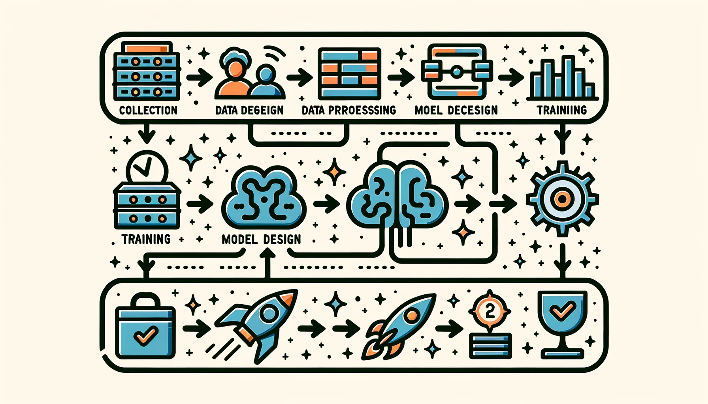

# AI 工作流 {#sec-ai-workflow}

::: {layout-narrow}

::: {.column-margin}

*DALL·E 3 提示词：创建一幅矩形插图，展示一个风格化的流程图，表示 AI 工作流/流水线。从左到右，依次描绘以下阶段：'数据收集'，配有数据库图标；'数据预处理'，配有过滤器图标；'模型设计'，配有大脑图标；'训练'，配有权重图标；'评估'，配有对勾；以及'部署'，配有火箭。用箭头连接每个阶段，引导观众在视觉上从左到右浏览 AI 过程，强调这些步骤的顺序性和相互关联性。*

:::

\noindent
:::

## 目的 {.unnumbered}

_是什么系统化框架指导机器学习系统从初始开发到生产部署的工程实践？_

生产级机器学习系统需要系统性思维和结构化框架。工作流程将机器学习开发组织为标准化阶段：数据收集、模型开发、验证和部署。这些结构化流程用于管理数据质量和一致性，协调模型训练与实验，自动化优化流水线，并在不同环境之间编排部署。这些系统化方法将实验性的直觉转化为工程纪律，为机器学习系统建立起思维框架。这种严谨的基础能够支持可复现的系统开发、质量标准维护，以及贯穿整个机器学习生命周期的明智决策。

::: {.callout-tip title="学习目标"}

- 将机器学习生命周期各阶段与传统软件开发进行比较，并识别其根本差异

- 分析六个核心机器学习生命周期阶段（从问题定义到维护）及其相互关联的反馈关系

- 应用系统思维原则，追踪约束传播如何影响多个生命周期阶段中的决策

- 使用具体的定量指标评估模型性能与部署约束之间的权衡

- 设计考虑真实部署环境和运行需求的数据收集策略

- 实现能够捕获生产级机器学习系统多尺度反馈回路的监控框架

- 评估问题定义决策对后续模型开发和部署选择的影响

- 构建在资源受限环境中平衡计算效率与性能需求的部署架构
:::

## 机器学习开发的系统化框架 {#sec-ai-workflow-systematic-framework-ml-development-1fc3}

在第一部分的基础原则（系统特性、部署环境、数学框架和架构模式）之上，本章将讨论从组件级分析迈向系统级工程。从理论理解过渡到实际实现，需要一个用于规范生产级机器学习系统开发的系统化框架。

本章将机器学习工作流介绍为系统化机器学习系统开发的指导方法。传统软件工程沿着确定性的需求到实现路径推进，而机器学习系统开发则呈现出根本不同的特征。机器学习系统通过迭代式实验[^fn-scientific-method]不断演进，其中模型从数据中提取模式，性能指标经历统计验证，而部署约束则形成反馈机制，反过来影响更早的开发阶段。这种经验驱动、以数据为中心的方法需要专门的工作流方法论，以适应不确定性、协调并行开发流，并建立持续改进机制。

[^fn-scientific-method]: **机器学习开发中的科学方法**：机器学习开发更接近科学方法，而非传统软件工程：提出假设（模型架构选择）、进行实验（训练与验证）、分析结果（性能指标），并根据发现进行迭代。这与确定性软件开发不同，后者中需求会直接映射到实现。所谓“实验驱动开发”方法最早出现在 20 世纪 90 年代至 2000 年代的学术研究实验室中，但当 Google、Facebook 等公司发现，在复杂的现实系统中，经验验证比理论预测更有效时，它便成为生产级机器学习的必需方法。

这里提出的系统化框架为理解第二部分的设计原则奠定了理论基础。这一工作流视角阐明了专门数据工程流水线（第 6 章）的必要性、软件框架在支持迭代方法论中的作用（第 7 章），以及在完整系统生命周期中整合模型训练的方式（第 8 章）。如果没有这一概念支架，后续技术组件就会显得像彼此分散的工具，而不是统一工程学科中的有机组成部分。

本章以糖尿病视网膜病变筛查系统的开发作为教学案例，展示工作流原则如何连接实验室研究与临床部署。该示例说明了数据采集策略、架构设计决策、部署约束管理以及运行需求满足之间错综复杂的相互依赖关系，这些都是生产级机器学习系统的典型特征。这些系统化模式并不局限于医疗应用，而是概括了在不同领域中可靠运行机器学习系统所必需的工程学科方法。

## 理解机器学习生命周期 {#sec-ai-workflow-understanding-ml-lifecycle-8445}

机器学习生命周期是一个结构化、迭代的过程，它指导机器学习系统的开发、评估和改进。这种方法整合了系统化的实验、评估和随时间推移的适应[@amershi2019software]，建立在数十年来结构化开发方法[@chapman2000crisp][^fn-crisp-dm] 的基础上，同时解决了数据驱动系统特有的挑战。

[^fn-crisp-dm]: **CRISP-DM（跨行业数据挖掘标准流程）**：由 IBM、SPSS 和戴姆勒-克莱斯勒等组成的联盟于 1996 年开发的一种方法论，旨在为数据挖掘项目提供一个标准框架。CRISP-DM 定义了六个阶段：业务理解、数据理解、数据准备、建模、评估和部署。尽管早于现代机器学习，CRISP-DM 确立了迭代的、以数据为中心的工作流原则，这些原则演变为当今的 MLOps 实践，到 2010 年影响了 90% 的数据挖掘项目，并成为 Team Data Science Process (TDSP) 和 KDD 等机器学习生命周期框架的基础。

理解这个生命周期需要一种系统思维[^fn-systems-thinking] 方法，它识别出四个基本模式：约束传播（一个阶段的决策如何影响所有其他阶段）、多尺度反馈循环（系统如何在不同时间尺度上适应）、涌现复杂性（系统范围的行为如何不同于组件行为）和资源优化（权衡如何产生相互依赖性）。这些模式在我们的糖尿病视网膜病变案例研究中得到了全面探讨，它们提供了一个分析框架，用于理解为什么机器学习系统需要集成工程方法，而不是顺序组件优化。

[^fn-systems-thinking]: **系统思维**：一种全面的分析方法，侧重于系统组成部分如何相互关联以及系统如何随时间推移并在更大的系统中运作。由麻省理工学院的 Jay Forrester 于 20 世纪 50 年代为工业动力学开发，系统思维对机器学习工程至关重要，因为模型、数据、基础设施和操作以复杂的方式相互作用，产生涌现行为。与组件可以独立优化的传统软件不同，机器学习系统需要理解相互依赖性——数据质量如何影响模型性能，模型复杂性如何影响部署约束，以及监控洞察如何推动系统演进。

::: {.callout-definition title="机器学习生命周期"}

***机器学习生命周期*** 是通过反馈驱动的阶段，_开发_、_部署_ 和 _优化_ 机器学习系统的迭代过程，强调响应不断变化的数据和需求的_持续改进_。

:::

@fig-ml-lifecycle 通过两个并行管道可视化了完整的生命周期：数据管道（绿色，顶行）通过收集、摄取、分析、标注、验证和准备将原始输入转换为可用于机器学习的数据集。模型开发管道（蓝色，底行）通过训练、评估、验证和部署来处理这些数据集，以创建生产系统。关键见解在于它们的相互连接——弯曲的反馈箭头显示了部署洞察如何触发数据优化，从而创建了持续改进循环，将机器学习与传统的线性开发区分开来。

::: {#fig-ml-lifecycle fig-env="figure" fig-pos="htb"}

```{.tikz}
\begin{tikzpicture}[font=\usefont{T1}{phv}{m}{n}]
%
\tikzset{
  Box/.style={align=flush center,
    inner xsep=2pt,
    node distance=1.6,
    draw=GreenLine,
    line width=0.75pt,
    fill=GreenL,
    text width=25mm,
    minimum width=25mm, minimum height=23mm
  },
  Box1/.style={Box, node distance=3.7
  },
 Line/.style={line width=1.0pt,black!50,text=black},
 Text/.style={font=\usefont{T1}{phv}{m}{n}\footnotesize,align=center
  },
DLine/.style={draw=violet!60, line width=2pt, -{Triangle[length=3mm, bend]},
shorten >=1.1mm, shorten <=1.15mm},
}
%
\node[Box](B1){\textbf{Data Collection}\\\small Continuous input stream};
\node[Box,right=of B1](B2){\textbf{Data Ingestion}\\\small Prep data for downstream ML apps};
\node[Box, right=of B2](B3){\textbf{Data Analysis, Curation}\\\small  Inspect/select the right data};
\node[Box, right=of B3](B4){\textbf{Data Labeling}\\\small  Annotate data};
\node[Box, right=of B4](B5){\textbf{Data Validation}\\\small Verify data is usable through pipeline};
\node[Box, right=of B5](B6){\textbf{Data Preparation}\\\small Prep data for ML uses (split, versioning)};
%
\node[Box1,below=of B2,,fill=BlueL,draw=BlueLine](2B2){\textbf{ML System Deployment}\\\small  Deploy ML system to production};
\node[Box, right=of 2B2,,fill=BlueL,draw=BlueLine](2B3){\textbf{ML System Validation}\\\small Validate ML system for deployment};
\node[Box, right=of 2B3,,fill=BlueL,draw=BlueLine](2B4){\textbf{Model Evaluation}\\\small Compute model KPIs};
\node[Box, right=of 2B4,,fill=BlueL,draw=BlueLine](2B5){\textbf{Model Training}\\\small Use ML algos to create models};

\coordinate(S) at ($(B4.south)!0.5!(2B4.north)$);

\begin{scope}[local bounding box=AR,shift={($(S)+(-6,-0.7)$)},anchor=center]
% Dimensions
\def\w{6cm}
\def\h{15mm}
\def\r{6mm} % radius
\def\gap{4mm} % break lengths

\draw[cyan!90, -{Latex[length=10pt,width=22pt]},line width=10pt]
  (\w,\h-\r) -- (\w,\r)
  arc[start angle=0, end angle=-90, radius=\r]
  -- (\gap,0);

  \draw[green!50!black, -{Latex[length=10pt,width=22pt]},line width=10pt]
  (0,\r) -- (0,\h-\r)
  arc[start angle=180, end angle=90, radius=\r]
  -- ({\w-\gap},\h);
\end{scope}
%%%
\draw[Line,-latex](B1)--node[below,Text]{Raw\\ data}(B2);
\draw[Line,-latex](B2)--node[below,Text]{Indexed\\ data}(B3);
\draw[Line,-latex](B3)--node[below,Text]{Selected\\ data}(B4);
\draw[Line,-latex](B4)--node[below,Text]{Labeled\\ data}(B5);
\draw[Line,-latex](B5)--node[below,Text]{Validated\\ data}(B6);
\draw[Line,-latex](B6)|-node[left,Text,pos=0.2]{ML ready\\ Datasets}(2B5);
\draw[Line,-latex](2B5)--node[below,Text]{Models}(2B4);
\draw[Line,-latex](2B4)--node[below,Text]{KPIs}(2B3);
\draw[Line,-latex](2B3)--node[below,Text]{Validated\\ ML System}
node[above,Text]{ML\\ Certificate}(2B2);
\draw[Line,-latex](2B2)-|node[below,Text,pos=0.2]{Online\\ ML System}
node[right,Text,pos=0.8]{Online\\ Performance}(B1);

\draw[DLine,distance=44](B3.north)to[out=120,in=80]
node[below]{Data fixes}(B1.north);
\draw[DLine,distance=44](B5.north)to[out=120,in=80]
node[below]{Data needs}(B3.north);
\end{tikzpicture}
```
**机器学习生命周期阶段**：突出的反馈箭头（显示为粗曲线和粗体颜色）强调了机器学习开发的迭代性质，其中监控洞察持续为数据优化提供信息，评估结果触发模型改进，部署经验重塑数据收集策略。这些视觉反馈循环代表了机器学习生命周期的主要驱动因素，将其与后期阶段很少影响早期阶段的线性开发方法区分开来。

:::

这个工作流框架为后续的技术章节提供了支架。此处所示的数据管道将在@sec-data-engineering 中得到全面阐述，该章节讨论了如何在整个机器学习生命周期中确保数据质量和管理数据。模型训练扩展到@sec-ai-training，涵盖了如何大规模高效训练模型。支持此迭代开发过程的软件框架在@sec-ai-frameworks 中进行了详细说明。部署和持续运营延伸到@sec-ml-operations，讨论了系统如何在生产环境中保持性能。本章阐明了这些部分如何相互连接，然后我们将深入探讨每个部分——理解整个系统使专业组件变得有意义。

本章侧重于机器学习生命周期的概念阶段——开发过程的“是什么”和“为什么”。通过自动化、工具和基础设施实现此生命周期的操作——即“如何”——是 MLOps 的领域，我们将在@sec-ml-operations 中详细探讨。这种区别至关重要：生命周期提供了理解机器学习开发阶段的系统框架，而 MLOps 提供了大规模实施这些阶段的操作实践。理解这个生命周期基础使专业的 MLOps 工具和实践变得有意义，而不是看似不相关的操作问题。

## 机器学习与传统软件开发的对比 {#sec-ai-workflow-ml-vs-traditional-software-development-0f90}

机器学习需要专门的生命周期方法，因为机器学习开发在根本上不同于传统软件工程。传统生命周期由一系列顺序阶段组成：需求收集、系统设计、实现、测试和部署[@royce1970managing][^fn-waterfall-model]。每个阶段都会产出特定工件，作为后续阶段的输入。在金融软件开发中，需求阶段会生成关于交易处理、安全协议和合规要求的详细规范。这些规范通过显式编程直接转化为系统行为，这与@sec-introduction 中所探讨的机器学习系统的概率特性形成鲜明对比。

[^fn-waterfall-model]: **瀑布模型**：一种由 Winston Royce 于 1970 年提出的顺序式软件开发方法，其中开发过程像水顺着台阶流下一样，依次经过不同阶段（需求 → 设计 → 实现 → 测试 → 部署）。每个阶段都必须在下一阶段开始之前完成，并伴随正式文档和审批关卡。尽管这种方法常因缺乏灵活性而受到批评，但瀑布模型在企业软件开发中主导了数十年，如今仍适用于需求稳定且明确的项目。该模型的线性方法与机器学习开发固有的不确定性以及对实验的需求形成了鲜明对比。

机器学习系统则需要一种根本不同的方法。传统软件的确定性特征——其行为通过显式编程定义——与机器学习系统的概率特性形成对照。以金融交易处理为例：传统系统遵循预先设定的规则（如果账户余额 > 交易金额，则允许交易），而基于机器学习的欺诈检测系统[^fn-fraud-detection]则从历史交易数据中学习识别可疑模式。这种从显式编程到学习得到的行为的转变，重塑了开发生命周期，也改变了我们如何看待系统可靠性和鲁棒性，正如@sec-robust-ai 所详细说明的那样。

[^fn-fraud-detection]: **基于机器学习的欺诈检测演进**：传统的基于规则的欺诈系统准确率为 60-80%，并产生 10-40% 的误报。现代机器学习欺诈检测通过分析数百个行为特征[@stripe2019machine]，可实现 85-95% 的准确率和 1-5% 的误报率。然而，这种改进也带来了新的挑战：欺诈者会在 3-6 个月内适应机器学习模式，因此需要持续重新训练模型，而这在基于规则的系统中从未成为必要[@stripe2019machine]。

这些系统行为上的根本差异引入了新的动态，从而改变生命周期各阶段之间的交互方式。这些系统需要通过持续的反馈循环不断改进，使部署阶段的洞察能够反馈到更早的开发阶段。机器学习系统本质上是动态的，必须通过持续部署[^fn-continuous-deployment]实践来适应不断变化的数据分布和目标。

[^fn-continuous-deployment]: **持续部署**：一种软件工程实践，即代码变更在通过自动化测试后会自动部署到生产环境，从而支持每天多次部署，而不是按月发布。该实践由 Netflix（2008）和 Etsy（2009）等公司推广，通过小而频繁的变更而非大而少的发布来降低部署风险。然而，机器学习系统需要专门的持续部署机制，因为模型不仅需要统计验证，还需要基于性能指标而非仅仅功能正确性的渐进式发布、A/B 测试和回滚机制。

当我们考察开发生命周期各维度上的具体差异时，这些对比会更加清晰。关键区别总结在下面的@tbl-sw-ml-cycles 中。这些差异反映了一个核心挑战：在系统设计中将数据作为一等公民来处理，而传统软件工程方法并不是为此而设计的[^fn-workflow-data-versioning]。

[^fn-workflow-data-versioning]: **数据版本控制的挑战**：与通过离散编辑而变化的代码不同，数据可能通过漂移逐渐变化，通过模式变化突然变化，或通过质量退化微妙地变化。像 Git 这样的传统版本控制系统难以管理大规模数据集，因此催生了 Git LFS 和 DVC 等专门工具。

+-------------------------+---------------------------------------+-----------------------------------------------+
| **方面**                | **传统软件生命周期**                  | **机器学习生命周期**                          |
+:========================+:======================================+:==============================================+
| **问题定义**            | 会在前期定义精确的功能规范。          | 随着问题空间的探索，性能驱动的目标会不断演化。 |
+-------------------------+---------------------------------------+-----------------------------------------------+
| **开发过程**            | 功能实现的线性推进。                  | 围绕数据、特征和模型进行迭代式实验。          |
+-------------------------+---------------------------------------+-----------------------------------------------+
| **测试和**              | 确定性的、二元的通过/失败测试标准。   | 涉及不确定性的统计验证和指标。                |
+-------------------------+---------------------------------------+-----------------------------------------------+
| **验证**                |                                       |                                               |
+-------------------------+---------------------------------------+-----------------------------------------------+
| **部署**                | 行为保持静态，直到被明确更新。        | 由于数据分布变化，性能可能会随时间而改变。     |
+-------------------------+---------------------------------------+-----------------------------------------------+
| **维护**                | 维护包括修改代码以修复缺陷或增加功能。 | 持续监控、更新数据流水线、重新训练模型，并    |
|                         |                                       | 适应新的数据分布。                            |
+-------------------------+---------------------------------------+-----------------------------------------------+
| **反馈循环**            | 很少；后续阶段很少影响更早的阶段。    | 很频繁；来自部署和监控的洞察通常会完善更早的   |
|                         |                                       | 阶段，如数据准备和模型设计。                  |
+-------------------------+---------------------------------------+-----------------------------------------------+

: **传统开发与机器学习开发的对比**：由于机器学习具有数据驱动和迭代性的特征，传统软件系统和机器学习系统在开发过程中存在差异。机器学习生命周期强调实验和不断演化的目标，需要阶段之间的反馈循环；而传统软件则遵循带有预定义规范的线性推进。 {#tbl-sw-ml-cycles}

这六个维度揭示了一个根本模式：机器学习系统用概率优化取代确定性规范，用动态适应取代静态行为，用持续反馈取代孤立开发。这一转变解释了为什么传统项目管理方法在未经修改的情况下应用于机器学习项目时会失效。

机器学习中的实验与传统软件测试在根本上不同。在机器学习中，实验本身就是核心开发过程，而不仅仅是漏洞检测。它涉及系统地测试关于数据源、特征工程方法、模型架构和超参数的假设，以获得最佳性能。这代表的是一种科学发现过程，而不仅仅是一个质量保证步骤。传统软件测试会根据预先设定的规范验证代码行为，而机器学习实验则探索不确定的空间，以发现能够产生最佳经验结果的最优组合。

这些差异强调了需要健壮的机器学习生命周期框架，以适应迭代式开发、动态行为和数据驱动的决策。理解这些区别后，便可以进一步考察机器学习项目如何在其生命周期阶段中展开，以及每个阶段如何应对这些传统软件方法无法充分解决的独特挑战。

这一基础为进一步探索构成机器学习生命周期的具体阶段，以及它们如何应对这些独特挑战提供了前提。

## 六个核心生命周期阶段 {#sec-ai-workflow-six-core-lifecycle-stages-fab9}

人工智能系统需要专门的开发方法。构成机器学习生命周期的特定阶段提供了这种专门的框架。这些阶段作为一个集成框架运行，每个阶段都建立在先前的基础上，同时为后续阶段做准备。

从@fig-ml-lifecycle 中的详细管道视图出发，我们现在呈现一个更高级别的概念性视角。@fig-lifecycle-overview 将这些详细管道整合为六个主要的生命周期阶段，提供了一个简化的框架，以理解机器学习系统开发的整体进展。这种抽象帮助我们推理更广泛的阶段，而不会迷失在特定管道的细节中。如果说前一个图强调了数据和模型的并行处理，那么这个概念视图则强调了主要开发阶段的顺序进展——尽管正如我们将探讨的，这些阶段通过持续反馈保持相互关联。@fig-lifecycle-overview 阐明了成功人工智能系统开发的六个核心阶段：问题定义（Problem Definition）确立目标和约束，数据收集与准备（Data Collection & Preparation）涵盖整个数据管道，模型开发与训练（Model Development & Training）包括模型创建，评估与验证（Evaluation & Validation）确保质量，部署与集成（Deployment & Integration）将系统投入生产，以及监控与维护（Monitoring & Maintenance）确保持续有效性。这些阶段通过持续的反馈循环运作，后期阶段的见解经常为早期阶段的改进提供信息。这种循环性质反映了机器学习开发与传统软件工程不同的实验性和数据驱动特性。

::: {#fig-lifecycle-overview fig-env="figure" fig-pos="htb"}

```{.tikz}
\begin{tikzpicture}[font=\small\usefont{T1}{phv}{m}{n}]
%
\tikzset{
  Box/.style={align=flush center,
    inner xsep=2pt,
    node distance=0.7,
    draw=GreenLine,
    line width=0.75pt,
    fill=GreenL,
    text width=20mm,
    minimum width=20mm, minimum height=14mm
  },
 Line/.style={line width=1.0pt,black!50,text=black},
 Text/.style={%
    inner sep=6pt,
    draw=none,
    line width=0.75pt,
    fill=TextColor,
    text=black,
    font=\footnotesize\usefont{T1}{phv}{m}{n},
    align=flush center,
    minimum width=7mm, minimum height=5mm
  },
}
%
\node[Box,fill=BlueL,draw=BlueLine](B1){Problem\\ Definition};
\node[Box,right=of B1](B2){Data Collection \& Preparation};
\node[Box, right=of B2](B3){Model Development \& Training};
\node[Box, right=of B3](B4){Evaluation\\ \& Validation};
\node[Box, right=of B4](B5){Deployment \& Integration};
\node[Box, right=of B5](B6){Monitoring \& Maintenance};
%
\foreach \i/\j in {B1/B2, B2/B3, B3/B4, B4/B5,B5/B6} {
    \draw[Line,-latex] (\i) -- (\j);
}
\draw[Line,-latex](B6)--++(270:1.6)-|node[Text,pos=0.25]{Feedback Loop}(B2);
\end{tikzpicture}
```
**机器学习系统生命周期**：持续的反馈循环（通过从监控到数据收集的显著返回路径强调）推动了迭代开发，定义了成功的机器学习系统。这个循环通过问题定义、数据准备、模型构建、评估、部署和持续监控而进展，但大的反馈箭头说明了后期阶段的见解如何持续地为早期阶段提供信息和改进，从而能够适应不断变化的需求和数据分布。

:::

生命周期始于问题定义和需求收集，团队在此阶段明确要解决的问题，建立可衡量的性能目标，并确定关键约束。精确的问题定义确保系统目标与预期结果保持一致，为所有后续工作奠定基础。

在此基础上，下一阶段是整合实现这些目标所需的数据资源。数据收集和准备包括收集相关数据、清洗数据并为模型训练做准备。这个过程涉及策划多样化的数据集，确保高质量的标注，以及开发数据预处理管道以处理数据中的变异。本阶段的复杂性将在@sec-data-engineering 中探讨。

数据资源到位后，开发过程会创建可以从这些资源中学习的模型。模型开发和训练包括选择合适的算法、设计模型架构，并使用准备好的数据训练模型。成功取决于选择适合问题的技术，并迭代模型设计以实现最佳性能。先进的训练方法和分布式训练策略在@sec-ai-training 中有详细介绍，而底层架构则在@sec-dnn-architectures 中涵盖。

模型训练完成后，严格的评估确保它们在部署前满足性能要求。这个评估和验证阶段涉及根据预定义指标严格测试模型的性能，并验证其在不同场景下的行为，确保模型在真实世界条件下准确、可靠和鲁棒。

验证完成后，模型通过仔细的部署流程从开发环境过渡到运营系统。部署和集成需要解决实际挑战，例如系统兼容性、可伸缩性以及从云到边缘环境等不同部署上下文中的操作约束，如@sec-ml-systems 中所探讨的。

最后阶段认识到，已部署的系统需要持续监督以保持性能并适应不断变化的条件。这个监控和维护阶段侧重于持续跟踪系统在真实世界环境中的性能，并根据需要进行更新。有效的监控确保系统随着时间的推移保持相关性和准确性，适应数据、需求或外部条件的变化。

### 案例研究：糖尿病视网膜病变筛查系统 {#sec-ai-workflow-case-study-diabetic-retinopathy-screening-system-dbf7}

为了将这些生命周期原则落实到现实中，我们考察了糖尿病视网膜病变（DR）筛查系统从最初研究到广泛临床部署的开发过程[@gulshan2016deep]。在本章中，我们使用这个案例作为教学工具，展示生命周期阶段在实践中如何相互关联，以及一个阶段的决策如何影响后续阶段。

*注：虽然本叙述借鉴了糖尿病视网膜病变筛查部署（包括 Google 的工作）的经验，但我们对细节进行了调整和综合，以说明医疗人工智能系统遇到的常见挑战。我们的目标是教育性的——通过一个真实的例子展示生命周期原则——而不是提供任何特定项目的纪实记录。所呈现的技术选择、约束和解决方案代表了医疗人工智能开发中的典型模式，阐明了更广泛的系统思维原则。*

#### 从研究成功到临床现实 {#sec-ai-workflow-research-success-clinical-reality-77c2}

DR 筛查挑战最初看起来很简单：开发一个人工智能系统，分析视网膜图像并以与专家眼科医生相当的准确性检测糖尿病视网膜病变的迹象。初步研究结果在受控实验室条件下取得了专家级的性能。然而，从研究成功到临床影响的旅程揭示了人工智能生命周期的复杂性，其中技术卓越必须与操作现实、监管要求和真实世界部署约束相结合。

这项医疗挑战的规模解释了为什么人工智能辅助筛查在医学上变得至关重要，而不仅仅是技术上有趣。糖尿病视网膜病变影响全球超过 1 亿人，是可预防失明的主要原因之一[^fn-dr-statistics]。@fig-eye-dr 展示了临床挑战：区分健康的视网膜和那些显示早期视网膜病变迹象的视网膜，例如可见为深红色斑点的特征性出血。虽然这看起来是一个简单的图像分类问题，但从实验室成功到临床部署的路径说明了人工智能生命周期复杂性的方方面面。

[^fn-dr-dr-statistics]: **糖尿病视网膜病变的全球影响**：全球约有 93-103 百万人受其影响，其中 22.27% 到 35% 的糖尿病患者会发展出某种形式的视网膜病变[@who2019classification]。在发展中国家，高达 90% 的糖尿病引起的视力丧失可以通过早期检测预防，但眼科医生的可及性仍然严重受限：印度农村地区大约每 10 万到 12 万人只有一名眼科医生，而世界卫生组织的建议是每 2 万人一名[@who2019classification]。这种巨大的差异使得人工智能辅助筛查不仅方便，而且可能改变数百万人的生活[@rajkomar2019machine]。

{#fig-eye-dr width=90%}

#### 系统工程经验教训 {#sec-ai-workflow-systems-engineering-lessons-144a}

DR 系统开发阐释了跨生命周期阶段的基本人工智能系统原则。数据质量的挑战促使分布式数据验证的创新。农村诊所的基础设施限制推动了边缘计算[^fn-edge-computing]优化的突破。与临床工作流程的集成揭示了人机协作设计的重要性。这些经验表明，构建健壮的人工智能系统不仅仅需要准确的模型；成功需要系统的工程方法来解决真实世界的部署复杂性。

[^fn-edge-computing]: **边缘计算**：一种分布式计算范式，在数据源附近而非集中式云数据中心处理数据，根据应用将延迟从 50-500 毫秒（云）降低到 5-50 毫秒（边缘）。边缘计算最初为 CDN（1990年代）开发，当自动驾驶汽车和医疗设备等实时机器学习应用需要云计算无法实现的低于 20 毫秒的响应时间时，边缘计算变得至关重要[@shi2016edge]。边缘人工智能市场从 2023 年的约$1.12B in 2018 to $8.2B 增长，这得益于物联网设备到 2025 年每年产生约 73-80 ZB 的数据，这些数据无法高效传输到云服务器。

这种贯穿真实世界部署挑战的全面旅程反映了医疗人工智能开发中更广泛的模式。在每个生命周期阶段，DR 案例研究都展示了早期阶段的决策如何影响后期阶段，反馈循环如何推动持续改进，以及涌现的系统行为如何需要整体解决方案。这些部署挑战反映了医疗人工智能[^fn-healthcare-ai-challenges]中影响大多数真实世界医疗机器学习应用的更广泛问题。

[^fn-healthcare-ai-challenges]: **医疗人工智能部署的现实**：研究表明，75-80% 的医疗人工智能项目从未达到临床部署[@chen2019machine]，其中大多数失败并非由于算法问题，而是由于集成挑战、监管障碍和工作流程中断。研究成功与临床应用之间的“人工智能鸿沟”在医疗保健领域尤其明显：虽然医疗人工智能论文显示 95% 以上的准确率，但真实世界的实施研究报告称，由于数据漂移、设备差异和用户接受度问题，性能显著下降[@kelly2019key]。

这个叙述线索表明，人工智能生命周期的集成性质从一开始就要求系统思维。DR 案例表明，可持续的人工智能系统是通过理解和设计所有生命周期阶段之间复杂的相互作用而产生的，而不是通过孤立地优化单个组件。

在建立这个框架和案例研究之后，对每个生命周期阶段的考察将从问题定义开始。

## 问题定义阶段 {#sec-ai-workflow-problem-definition-stage-3e18}

机器学习系统开发始于一个与传统软件开发截然不同的挑战：不仅要定义系统应该做什么，还要定义它应该如何学习去做。传统的软件需求直接转化为实现规则，而机器学习系统则要求团队考虑系统如何在现实世界约束下从数据中学习[^fn-problem-definition]。@fig-lifecycle-overview 中展示的这个第一阶段为机器学习生命周期中所有后续阶段奠定了基础。

[^fn-problem-definition]: **机器学习与传统问题定义**: 传统软件问题通过确定性规范（“如果输入 X，则输出 Y”）来定义，而机器学习问题则通过示例和期望行为来定义。这种转变意味着机器学习项目面临更高的失败率，研究表明 60-80% 的机器学习项目会失败，其中许多发生在问题制定和需求阶段，而传统软件项目的失败率较低[@standish2020chaos]。挑战在于将业务目标转化为学习目标——这在 2000 年代数据驱动系统兴起之前，在软件工程中是不存在的[@amershi2019software]。

糖尿病视网膜病变筛查示例说明了这种复杂性在实践中如何体现。一个糖尿病视网膜病变筛查系统的问题定义揭示了看似简单的医学图像任务背后的复杂性。最初看起来直接的计算机视觉任务，实际上需要定义多个相互关联的目标，这些目标塑造了后续的每一个生命周期阶段。

开发团队在此类系统中平衡相互冲突的约束：为了患者安全而追求诊断准确性，为了农村诊所硬件而追求计算效率，为了临床应用而追求工作流集成，为了医疗设备审批而追求法规遵从性，以及为了可持续部署而追求成本效益。每个约束都会影响其他约束，从而产生一个传统软件开发方法无法解决的复杂优化问题。这种多维度的问题定义在整个项目生命周期中驱动着数据收集策略、模型架构选择和部署基础设施决策。

### 平衡相互冲突的约束 {#sec-ai-workflow-balancing-competing-constraints-0c62}

问题定义决策贯穿系统设计。糖尿病视网膜病变筛查系统中的需求分析从最初关注诊断准确性指标，演变为涵盖部署环境的约束和机遇。

检测可转诊糖尿病视网膜病变达到 90% 以上的敏感度可以预防视力丧失，同时保持 80% 以上的特异性可以避免用假阳性使转诊系统不堪重负。这些指标必须在资源有限环境中典型的不同患者群体、相机设备和图像质量条件下实现。

农村诊所部署施加了严格的约束，反映了来自@sec-ml-systems 的边缘部署挑战：模型必须在计算能力有限的设备上运行，在间歇性互联网连接下可靠运行，并在临床工作流时间范围内产生结果。这些系统需要由技术培训最少的医护人员操作。

医疗设备法规要求进行广泛的验证、审计跟踪和性能监控功能，这些功能会影响数据收集、模型开发和部署策略。

这些相互关联的需求表明，机器学习系统中的问题定义需要理解系统将运行的完整生态系统。及早识别这些约束使团队能够做出对成功部署至关重要的架构决策，而不是在投入大量开发后才发现限制。

### 协作式问题定义流程 {#sec-ai-workflow-collaborative-problem-definition-process-a19c}

建立清晰且可操作的问题定义涉及一个系统的流程，该流程连接了技术、运营和用户方面的考量。该流程始于识别系统的核心目标：它必须执行哪些任务以及必须满足哪些约束。团队与利益相关者协作，收集领域知识，概述需求，并预测在实际部署中可能出现的挑战。

在一个 DR 类型的项目中，此阶段涉及与临床医生密切协作，以确定农村诊所的诊断需求。在此阶段会出现关键决策，例如平衡模型复杂性与硬件限制，以及确保对医疗服务提供者的可解释性。该方法必须考虑法规因素，例如患者隐私和医疗保健标准的合规性。这种协作流程确保问题定义既符合技术可行性，又具有临床相关性。

### 针对规模进行定义调整 {#sec-ai-workflow-adapting-definitions-scale-b2ee}

随着机器学习系统的扩展，其问题定义必须适应新的运营挑战[^fn-scaling-challenges]。一个 DR 类型的系统最初可能专注于少数影像设置一致的诊所。然而，随着此类系统扩展到包括设备、员工专业知识和患者人口统计数据各异的诊所[^fn-algorithmic-fairness]，原始问题定义需要进行调整以适应这些变化。

[^fn-scaling-challenges]: **机器学习系统扩展的复杂性**: 由于数据异构性、模型漂移和基础设施要求，扩展机器学习系统比传统软件复杂得多。机器学习系统通常需要比传统应用程序多 5-10 倍的监控基础设施[@paleyes2022challenges]，像 Uber 这样的公司每天在其机器学习平台上运行 1000 多个模型质量检查[@uber2017michelangelo]。当生产中的模型数量达到 100 多个时，“扩展瓶颈”通常会出现，此时手动流程会崩溃，团队需要专业的 MLOps 平台——这解释了为什么机器学习平台市场在 2023 年从大约$1.5B in 2019 to $15.5B 增长，其中 MLOps 工具占据了很大一部分[@kreuzberger2023machine]。

[^fn-algorithmic-fairness]: **医疗保健中的算法公平性**: 医疗人工智能系统在不同人口群体中表现出显著的性能差异——皮肤科人工智能系统表现出显著的性能差异，一些研究报告称，根据具体情况和数据集，在深色皮肤上的准确性会降低 10-36%[@larson2017gender]，而主要在欧洲人群上训练的糖尿病视网膜病变模型对亚洲和非洲人群的准确性下降 15-25%[@gulshan2016deep]。FDA 2021 年的 AI/ML 医疗设备行动计划现在要求进行人口统计学性能报告[@fda2021artificial]，像 Google Health 这样的公司将 20-30% 的开发资源用于跨种族、性别和社会经济群体的公平性测试和偏见缓解[@rajkomar2019machine]。

扩展还会带来数据挑战。更大的数据集可能包含更多样化的边缘情况，这会暴露出初始模型设计中的弱点。将部署扩展到新区域会引入成像设备和患者群体的差异，这需要进一步的系统调整。从一开始就定义一个能够适应这种多样性的问题，可以确保系统能够处理未来的扩展，而无需完全重新设计。

在我们的 DR 示例中，问题定义过程塑造了数据收集策略。多人群验证的需求推动了对多样化训练数据的需求，而边缘部署约束则影响了数据预处理方法。法规遵从性需求决定了标注协议和质量保证标准。这些相互关联的需求表明，有效的问题定义如何预见将在后续生命周期阶段出现的约束，为集成系统开发奠定基础，而不是进行顺序的、孤立的优化。

明确问题定义后，开发过程将转向组装实现这些目标所需的数据资源。

## 数据收集与准备阶段 {#sec-ai-workflow-data-collection-preparation-stage-a0aa}

数据收集与准备是机器学习生命周期（@fig-lifecycle-overview）中的第二阶段，在这一阶段，原始数据被收集、处理并为模型开发做好准备。与仅仅收集足够的训练样本[^fn-data-challenges]相比，这一阶段面临着独特的挑战。这些挑战构成了@sec-data-engineering 的核心关注点。对于 DR 筛查这类医疗人工智能系统而言，数据收集必须在统计严谨性、运营可行性以及满足最高诊断准确性标准之间取得平衡。

[^fn-data-challenges]: **ML 中的 80/20 法则**：数据科学家通常会将 60-80% 的时间花在数据收集、清洗和准备上，其余时间用于建模和分析。这一比例最早由 CrowdFlower[@crowdflower2016data] 于 2016 年记录，尽管自动化工具不断进步，它在各个行业中仍然保持一致。“数据准备税”包括处理缺失值（存在于 90% 的真实世界数据集中）、解决不一致性（影响 60% 的数据字段），以及确保法律合规性（欧盟数据需要 15 种以上不同的同意机制）。这也解释了为什么成功的机器学习团队会从第一天起就大力投入数据工程能力。

问题定义决策会塑造 DR 示例中的数据需求。既定的多维成功标准（跨不同人群的准确性、硬件效率和法规合规性）要求数据收集策略不能仅仅停留在典型的计算机视觉数据集层面。

在这样的系统中构建这一基础，可能需要组建一个包含 128,000 张视网膜眼底照片的开发数据集，每张照片都由 54 名专家组成的专家组中的 3-7 名眼科专家审阅[^fn-medical-annotation]。这种专家共识方法既解决了医学诊断中固有的主观性问题，又能建立经得起监管审查的真实标签。标注过程会捕捉诸如微动脉瘤、出血和硬性渗出等临床相关特征，并覆盖疾病严重程度的整个范围。

高分辨率视网膜扫描通常会生成 10-120 兆字节不等的文件，具体取决于分辨率和压缩方式，从而带来巨大的基础设施挑战。一个典型的诊所每天处理 50 名患者，每周会生成 5-15 GB 的影像数据，具体取决于图像质量和压缩率，这很快就会超过农村互联网连接的承载能力（通常上传速度仅为 2-10 Mbps）。这种数据量约束迫使架构决策转向边缘计算方案，而不是基于云的处理。

[^fn-medical-annotation]: **医疗数据标注成本**：专家级医疗标注的成本极其高昂：仅专家时间一项，眼科医生就会收取$200-500 per hour, meaning the DR dataset's annotation cost exceeded $2.7 百万美元。这代表了机器学习历史上单样本标注成本最高的情况之一，也推动了人们对主动学习和合成数据生成的兴趣。

### 连接实验室数据与真实世界数据 {#sec-ai-workflow-bridging-laboratory-realworld-data-6ebf}

当这样的系统迁移到农村诊所环境时，从实验室级训练数据过渡到真实世界部署会暴露出根本性的差距。

当部署开始进入泰国和印度等地区的农村诊所时，真实世界数据与精心整理的训练集有着天壤之别。图像来自各种相机设备，由技能水平不同的工作人员操作，而且往往是在光照条件不理想、患者体位不一致的情况下采集的。这些差异会威胁模型性能，并凸显出健壮预处理和质量保证系统的必要性。

这种数据量约束推动了@sec-ml-systems 中讨论的部署范式之间的一项根本性架构决策：采用边缘计算部署，而不是基于云的推理。本地预处理将带宽需求降低了 95%（每周传输量从 15 GB 降至 750 MB），但需要多出 10 倍的本地计算资源，这也借助 NVIDIA Jetson 这类专用边缘设备[^fn-nvidia-jetson]来塑造模型优化策略和部署硬件需求。

[^fn-nvidia-jetson]: **NVIDIA Jetson**：一系列专为 AI 边缘计算设计的嵌入式计算板卡，采用高能效形态提供 GPU 加速（5-30 瓦，而桌面 GPU 则为 250+ 瓦）。Jetson 模块首次于 2014 年发布，可在自动驾驶无人机、医疗设备和工业机器人等设备上实现实时 AI 推理。常见型号包括 Jetson Nano（$99, 472 GFLOPS), Jetson AGX Xavier ($699，32 TOPS）和 Jetson AGX Orin（1,699 美元，275 TOPS），使得高性能 AI 在云连接不可靠或对时延敏感的边缘部署场景中也变得可及。

一个典型的解决方案架构会从数据收集约束中自然形成：用于本地推理的 NVIDIA Jetson 边缘设备（2-32GB RAM，64-2048 个 CUDA 核心，具体取决于型号）、用于数据管理的诊所汇聚服务器（8 核 CPU，32GB RAM），以及使用 32 GPU 集群进行每周模型更新的云训练基础设施。这种分布式方法在覆盖 200 多个诊所地点的部署中，实现了低于 80ms 的推理时延和 94% 的在线率。

患者隐私法规要求采用联邦学习架构，从而能够在不集中存储敏感患者数据的情况下进行模型训练。这种方法增加了数据收集工作流和模型训练基础设施的复杂性，但对于获得监管批准和临床采用至关重要。

这些经验说明了我们先前建立的约束传播原则：数据收集阶段的生命周期决策会产生约束和机会，并沿着整个系统开发过程向下游传播，从而塑造从基础设施设计到模型架构的一切。

### 分布式部署的数据基础设施 {#sec-ai-workflow-data-infrastructure-distributed-deployment-66ad}

理解数据特征和部署约束如何驱动架构决策，在大规模场景下变得至关重要。每张视网膜图像都会经历一个复杂的旅程：在诊所相机上采集、本地存储和初步处理、质量验证、安全传输到中心系统，以及整合进训练数据集。

不同的数据访问模式需要不同的存储解决方案。团队通常会采用分层方案，在成本、性能和可用性之间取得平衡：经常访问的训练数据需要高速存储以支持快速模型迭代，而历史数据则可以接受较慢的访问速度，以换取更高的成本效益。智能缓存系统会根据使用模式优化数据访问，确保相关数据始终可随时获取。

农村诊所部署面临显著的连接性约束，因此需要灵活的数据传输策略。对于网络可靠的诊所，实时传输效果很好；而对于连接不稳定的地区，存储转发系统则能保证运行。这种自适应方法确保了无论本地基础设施受限程度如何，系统都能持续运行。

基础设施设计必须预见从试点部署扩展到数百家诊所的增长。该架构能够适应不同的数据量、不同的硬件配置以及多样化的运营需求，同时保持数据一致性和系统可靠性。随着系统扩展到新的地区，这一可扩展性基础证明至关重要。

### 大规模数据管理 {#sec-ai-workflow-managing-data-scale-61c3}

从系统思维的角度看，随着机器学习系统扩展，数据收集挑战会呈指数级增长。在我们的 DR 示例中，从最初的诊所扩展到更广泛的网络会带来涌现式复杂性：设备、工作流程和运行条件的显著差异。每家诊所实际上都会成为一个独立的数据节点[^fn-federated-learning]，但系统仍需要确保所有地点都能保持一致的性能。沿用前文建立的协作协调模式，团队会实施专门的编排机制，包括共享工件仓库、版本化 API 和自动化测试流水线，从而高效管理大型诊所网络。

[^fn-federated-learning]: **联邦学习架构**：联邦学习[@mcmahan2017communication] 最早由谷歌于 2016 年为移动键盘提出，它允许在分布式数据源之间进行训练，而无需集中数据。由于隐私法规的原因，医疗应用尤其适合联邦学习：研究表明，联邦医疗模型能够达到集中式模型 85-95% 的准确率，同时将数据保留在本地。然而，联邦学习也带来了新的挑战：每次训练迭代的通信成本会增加 100-1000 倍，而且站点之间的统计异质性可能导致集中式训练不会遇到的模型收敛问题。

将此类系统扩展到更多诊所还会带来更大的数据量，因为更高分辨率的成像设备正逐渐成为标准配置，生成更大、更详细的图像。这些进步加重了存储和处理基础设施的负担，需要通过优化来在不牺牲质量的前提下维持效率。患者人口统计特征、诊所工作流程以及连接模式的差异，也进一步强调了采用健壮设计来优雅处理这些变化的必要性。

扩展挑战凸显了数据收集阶段所做决策如何在生命周期中产生连锁反应，影响后续阶段，如模型开发、部署和监控。例如，在收集阶段为更高分辨率的数据提供支持，会直接影响训练和推理的计算需求，这强调了即使在这一早期阶段也必须采用生命周期思维。

### 质量保证与验证 {#sec-ai-workflow-quality-assurance-validation-1bd4}

质量保证是数据收集流程中不可或缺的一部分，它确保数据满足下游阶段的要求。在我们的 DR 示例中，采集时的自动检查会标记诸如对焦不佳或构图错误之类的问题，使诊所工作人员能够立即处理。这些主动措施可确保低质量数据不会在流水线中继续传播。

验证系统通过不仅检查图像质量，还验证标注正确性、患者关联以及对隐私法规的合规性，来扩展这些工作。这些系统在本地和集中式两个层面运行，确保数据的可靠性和鲁棒性，从而保障整个机器学习流水线的完整性。

这类系统中的数据收集经验会直接影响模型开发方法。数据收集期间发现的基础设施约束（有限带宽、多样化硬件、间歇性连接）为模型效率设定了要求，进而推动架构决策。隐私约束所要求的分布式联邦学习方法会影响训练流水线设计。不同诊所环境中观察到的质量差异则塑造了验证策略和鲁棒性要求。数据收集见解与模型开发策略之间的这种耦合，体现了集成式生命周期规划如何优于顺序式阶段优化。@fig-ml-lifecycle-feedback 展示了这些关键反馈回路，它们能够推动系统持续改进。数据收集阶段建立的基础既为创建有效模型提供了可能，也对可用的技术路径施加了约束——当我们现在转向模型开发时，这一点会变得更加明显。

::: {#fig-ml-lifecycle-feedback fig-env="figure" fig-pos="htb"}

```{.tikz}
\begin{tikzpicture}[font=\small\usefont{T1}{phv}{m}{n}]
\tikzset{%
  Line/.style={line width=1.0pt,black!50,text=black},
  Box/.style={align=flush center,
    inner xsep=2pt,
    node distance=1,
    draw=GreenLine,
    line width=0.75pt,
    fill=GreenL,
    text width=20mm,
    minimum width=20mm, minimum height=10mm
  },
 Text/.style={%
    inner sep=4pt,
    draw=none,
    line width=0.75pt,
    fill=TextColor!80,
    text=black,
    font=\footnotesize\usefont{T1}{phv}{m}{n},
    align=flush center,
    minimum width=7mm, minimum height=5mm
  },
}
%
\node[Box](B1){Data Preparation};
\node[Box,node distance=5,right=of B1](B2){Model Evaluation};
\node[Box,node distance=2.5, right=of B2](B3){Monitoring \& Maintenance};
\node[Box,below left=0.1 and 0.25 of B1](DB1){Data Collection};
\node[Box,above right=0.3 and 0.25 of B1](GB1){Model Training};
\node[Box,above right=0.3 and 0.25 of B2](GB2){Model Deployment};
%
\draw[Line,-latex](DB1)|-(B1);
\draw[Line,-latex](B1.60)|-(GB1);
\draw[Line,-latex](B2)|-node[Text,pos=0.7]{Data gaps}(DB1.10);
\draw[Line,-latex](B2)-|node[Text,pos=0.25]{Validation Issues}(GB1);
\draw[Line,-latex,](B3)|-node[Text,pos=0.6]{Performance Insights}(DB1.345);
\draw[Line,-latex](B2)-|(GB2);
\draw[Line,-latex](GB2)-|(B3.130);
\draw[Line,-latex](B3)--++(90:2.4)-|node[Text,pos=0.2]{Model Updates}(GB1);
\draw[Line,-latex](B3.50)--++(90:2.5)-|node[Text,pos=0.35]{Data Quality Issues}(B1.120);
\draw[Line,-latex](GB1.340)-|(B2);
\draw[Line,-latex](GB2.170)--node[Text,pos=0.5]{Deployment Constraints}(GB1.10);
\end{tikzpicture}
```
**机器学习生命周期依赖关系**：迭代式反馈回路将数据收集、准备、模型训练、评估和监控连接起来，强调每个阶段都会在持续过程中为后续阶段提供信息并产生影响。有效的机器学习系统开发需要承认这些依赖关系，以便不断优化数据、重新训练模型并长期保持性能。
:::

## 模型开发与训练阶段 {#sec-ai-workflow-model-development-training-stage-05ec}

模型开发与训练（@fig-lifecycle-overview 中的第三阶段）构成了机器学习系统的核心，然而这个阶段提出了独特的挑战，超越了算法选择和超参数调优[^fn-hyperparameter-tuning]。训练方法、基础设施要求和分布式训练策略将在@sec-ai-training 中涵盖。在医疗保健等高风险领域，每个设计决策都会影响临床结果，因此将技术性能与操作约束相结合至关重要。

[^fn-hyperparameter-tuning]: **超参数优化复杂性**：现代深度学习模型拥有 10-100 多个超参数（学习率、批量大小、架构选择），创建了包含 10^20+ 种可能组合的搜索空间。像 Google 的 AutoML 和 H2O 这样的 AutoML 平台花费 10,000-100,000 美元的计算成本来寻找复杂模型的最佳配置。随机搜索（2012 年）出人意料地优于网格搜索，而贝叶斯优化（2010 年代）和基于种群的训练（2017 年）代表了当前最先进的技术，将调优时间缩短了 10-100 倍，但仍然需要传统软件开发中不存在的大量计算资源。

生命周期早期的决策贯穿我们 DR 示例中的模型开发过程。所建立的问题定义要求（专家级准确性与边缘设备兼容性相结合）创建了一个优化挑战，需要模型架构和训练策略两方面的创新方法。

::: {.callout-definition title="迁移学习"}

***迁移学习*** 是一种将在大规模数据集上_预训练_的模型适应新任务的技术，通过利用学习到的表示，显著减少_训练时间_和_数据需求_。

:::

利用来自 ImageNet 的迁移学习[^fn-workflow-transfer-learning]，结合 128,000 张图像的精心标注数据集，此类项目的开发者获得了 0.91-0.95 的 F 值[^fn-f-score]，在受控环境中可与眼科医生表现媲美或超越。这一结果验证了将大规模预训练与领域特定微调相结合的方法——这是一种训练策略，利用@sec-dl-primer 中的基于梯度的优化原理，将@sec-dnn-architectures 中的预训练卷积架构应用于医学影像。

[^fn-f-score]: **F 值 (F1 分数)**：精确率和召回率的调和平均值，计算公式为 2 × (精确率 × 召回率) / (精确率 + 召回率)，提供了一个平衡这两个指标的单一指标。值范围从 0（最差）到 1（完美）。F 值于信息检索领域（1979 年）引入，对于机器学习评估变得至关重要，因为仅凭准确率在不平衡数据集上可能会产生误导——一个对所有患者都预测“无病”的模型，在只有 5% 患者患病的群体中可能达到 95% 的准确率，但其 F 值将接近 0，从而揭示其临床无用性。

实现高准确率只是第一个挑战。数据收集阶段对边缘部署约束的洞察，提出了严格的效率要求：模型必须在 98MB 以下的尺寸运行，实现低于 50 毫秒的推理延迟，并在运行时消耗低于 400MB 的 RAM。最初的研究模型（一个 2.1GB 的集成模型[^fn-ensemble-learning]，实现了 95.2% 的准确率）违反了所有部署约束，需要系统优化才能达到最终 96MB 的模型，该模型在保持 94.8% 准确率的同时满足所有操作要求。

[^fn-ensemble-learning]: **集成学习**：一种结合多个模型预测以实现比任何单个模型更好性能的技术。常用方法包括 bagging（在不同数据子集上训练多个模型）、boosting（顺序训练模型以纠正之前的错误）和 stacking（使用元模型组合基础模型预测）。Netflix 的推荐系统使用了 100 多种算法的集成，而机器学习竞赛的获胜者通常集成 10-50 个模型。然而，集成模型以推理速度和内存使用换取准确性——这是边缘部署场景中的一个关键约束。

[^fn-workflow-transfer-learning]: **迁移学习**：一种技术，将大型数据集（如 ImageNet 的 1400 万张图像）上预训练的模型适应特定任务，显著减少训练时间和数据需求[@krizhevsky2012imagenet; @deng2009imagenet]。迁移学习由 Yann LeCun 的团队在 1990 年代引入，并因 2014 年 ImageNet 竞赛而普及，成为大多数实际计算机视觉应用的基础。实践者无需从头开始训练，即可通过数千而非数百万个训练样本实现专家级性能。

这些约束推动了架构创新，包括模型优化技术，用于减小尺寸、加速推理和高效部署场景——平衡来自@sec-dnn-architectures 的深度卷积网络的计算需求与@sec-ml-systems 中详述的边缘设备的资源限制。

遵循既定的迭代开发框架，模型开发过程需要在准确性优化和效率优化之间持续迭代。每个架构决策（从卷积层数量到@sec-dl-primer 中涵盖的激活函数选择，再到@sec-dnn-architectures 中探讨的整体网络深度）都必须根据测试集指标和数据收集阶段确定的基础设施约束进行验证。这种多目标优化方法体现了相互依赖的原则，即部署约束塑造开发决策。

### 平衡性能与部署约束 {#sec-ai-workflow-balancing-performance-deployment-constraints-6488}

我们的 DR 示例中的模型开发经验说明了临床有效性与部署可行性之间的基本权衡，这些权衡是真实世界人工智能系统的特征。

医疗应用需要特定的性能指标[^fn-medical-metrics]，这些指标与@sec-dl-primer 中介绍的标准分类指标显著不同。一个 DR 系统需要 >90% 的敏感性（以防止因漏诊而导致的视力丧失）以及 >80% 的特异性（以避免使转诊系统不堪重负）。这些指标必须在不同患者群体和图像质量条件下保持一致。

[^fn-medical-metrics]: **医疗人工智能性能指标**：医疗人工智能需要的指标与通用机器学习不同：敏感性（真阳性率）和特异性（真阴性率）通常比整体准确率更重要。对于糖尿病视网膜病变筛查，>90% 的敏感性至关重要（漏诊会导致失明），而 >80% 的特异性可避免不必要的转诊。医疗人工智能还需要阳性预测值 (PPV) 和阴性预测值 (NPV) 等指标，这些指标会随不同人群的疾病流行率而变化——一个在实验室环境中准确率达到 95% 的模型，在低流行率人群中可能只有 50% 的 PPV，尽管技术性能很高，但在临床上却毫无用处。

仅优化临床性能是不够的。数据收集阶段的边缘部署约束提出了额外的要求：模型必须在资源有限的硬件上高效运行，同时保持与临床工作流程兼容的实时推理速度。这产生了一个多目标优化问题，其中一个维度的改进往往以牺牲其他维度为代价，这是模型容量（在@sec-dnn-architectures 中探讨）与部署可行性（在@sec-ml-systems 中讨论）之间的根本张力。团队发现，一个最初 2GB、准确率 95.2% 的模型，可以通过系统应用量化、剪枝和知识蒸馏[^fn-model-compression]技术，优化到 96MB 并保持 94.8% 的准确率，从而在满足部署要求的同时保持临床实用性。

[^fn-model-compression]: **模型压缩技术**：在保持准确性的同时减少模型大小和计算需求的方法。**量化** 将数值精度从 32 位浮点数降低到 8 位整数，实现 4 倍大小缩减，同时准确率损失最小。**剪枝** 移除不必要的连接或整个神经元，可能将参数减少 90-95%。**知识蒸馏** 训练一个较小的“学生”模型来模仿较大的“教师”模型的行为，将学到的知识转移到更高效的架构中。这些在@sec-model-optimizations 中详细介绍的技术，对于内存和计算资源严重受限的边缘部署至关重要。

选择使用轻量级模型集成而非单个大型模型，这体现了模型开发决策如何贯穿系统生命周期。这一架构决策降低了单个模型的复杂性（从而实现边缘部署），但增加了推理管道的复杂性（影响部署和监控策略）。团队必须为模型集成开发编排逻辑，并创建能够跨多个模型组件跟踪性能的监控系统。

这些模型开发经验强化了我们之前建立的生命周期集成原则。架构决策——从选择用于空间特征提取的卷积神经网络架构（@sec-dnn-architectures）到配置训练超参数（@sec-dl-primer）——影响数据预处理管道、训练基础设施需求和部署策略。这表明成功的模型开发需要预测后续生命周期阶段的约束，而不是孤立地优化模型，这反映了我们的系统思维方法。

### 约束驱动的开发过程 {#sec-ai-workflow-constraintdriven-development-process-a8f3}

现实世界的约束塑造了整个模型开发过程，从最初的探索到最终的优化，要求系统化的实验方法。

开发始于数据科学家与领域专家（如医学影像中的眼科医生）之间的合作，以识别目标病症的指示性特征。这种跨学科方法确保模型架构能够捕获临床相关特征，同时满足数据收集阶段确定的计算约束。

计算约束深刻地影响着实验方法。生产级机器学习工作流程产生倍增成本：10 种模型变体 × 5 次超参数扫描（探索从 1e-4 到 1e-2 的学习率、从 16 到 128 的批量大小以及来自@sec-dl-primer 的优化算法） × 3 种预处理方法（原始图像、直方图均衡化、自适应滤波） = 150 次训练运行。每个实验周期大约$500-2000 per training run depending on hardware and duration, iteration costs can reach $15 万。这种经济现实推动了高效实验的创新：智能任务调度将 GPU 空闲时间减少 60%，中间结果缓存节省 30% 的预处理时间，早期停止技术在实验完成 20% 后终止无前景的实验，以及自动化资源优化实现 2.3 倍的成本效率。

机器学习模型开发表现出涌现行为，使得结果本身具有不确定性，因此需要科学方法论原则：通过固定随机种子和环境版本控制变量，系统的消融研究[^fn-ablation-studies]以分离组件贡献，混杂因素分析以区分架构效应和优化效应，以及使用 A/B 测试[^fn-ab-testing]框架对多次运行进行统计显著性检验。这种方法对于区分真正的性能改进和统计噪声至关重要。

[^fn-ablation-studies]: **消融研究**：系统性实验，通过移除或修改单个组件来理解它们对整体性能的贡献。在机器学习中，消融研究可能会移除特定层、改变激活函数或排除数据增强技术以隔离其效果。该方法以医学消融（外科切除组织）命名，在 2012 年 AlexNet 论文使用消融来验证每个架构选择后，成为机器学习研究中的标准方法。消融研究对于组件交互使其难以确定哪些设计决策实际提高了性能的复杂模型至关重要。

[^fn-ab-testing]: **机器学习中的 A/B 测试**：一种统计方法，通过将用户随机分配到不同组并测量性能差异来比较两个模型版本。A/B 测试最初用于网络优化（2000 年代），对机器学习部署变得至关重要，因为模型在生产环境中的表现可能与开发环境不同。像 Netflix 这样的公司同时运行数百个并发实验，用户参与多个测试，而 Uber 每周测试 100 多个机器学习模型改进[@uber2017michelangelo]。A/B 测试需要仔细的统计设计，以避免混杂变量并确保足够的样本量以得出可靠结论。

在整个开发过程中，团队根据早期生命周期阶段确定的部署约束来验证模型。每项架构创新都必须评估其准确性改进以及与边缘设备限制和临床工作流程要求的兼容性。这种双重验证方法确保开发工作与部署目标保持一致，而不是为无法转化为实际性能的实验室条件进行优化。

### 从原型到生产规模开发 {#sec-ai-workflow-prototype-productionscale-development-104e}

随着像我们 DR 示例这样的项目从原型演变为生产系统，团队会遇到多个维度的涌现复杂性：更大的数据集、更复杂的模型、并发实验和分布式训练基础设施。这些扩展挑战说明了系统思维原则，这些原则广泛适用于大规模人工智能系统开发。

从单机训练转向分布式系统引入了协调要求，需要在训练速度提升与系统复杂性增加之间取得平衡。这导致需要实施容错机制和自动化故障恢复系统。编排框架支持基于组件的管道构建，具有可重用阶段、自动资源扩展以及跨分布式组件的监控。

随着实验生成工件[^fn-ml-artifacts]，系统跟踪变得至关重要，包括模型检查点、训练日志和性能指标。如果没有结构化的组织，团队可能会失去其实验工作中积累的机构知识。解决这个问题需要实施系统的实验识别、自动化工件版本控制，以及根据性能特征和配置参数查询实验的搜索功能。

[^fn-ml-artifacts]: **机器学习工件**：机器学习开发过程中生成的所有数字输出：训练好的模型、数据集、预处理代码、超参数配置、训练日志、评估指标和文档。与传统软件工件（编译后的二进制文件、文档）不同，机器学习工件是相互依赖的——模型性能取决于特定的数据版本、预处理步骤和超参数设置。管理机器学习工件需要专门的工具，如 MLflow、Neptune 或 Weights & Biases，它们可以跟踪工件之间的血缘关系、实现可复现性，并支持跨实验比较。一个典型的机器学习项目生成的工件数量是同等传统软件项目的 10-100 倍。

大规模模型开发需要在训练计算和支持基础设施之间进行资源分配。虽然有效的实验管理需要计算开销，但这项投资通过系统的性能分析和优化，在加速开发周期和提高模型质量方面获得了回报。

模型开发过程建立了能力和约束，这些能力和约束直接影响下一个生命周期阶段。边缘优化的集成架构支持临床部署，但需要复杂的服务基础设施。监管验证要求塑造了部署验证协议。这些相互关联的要求展示了开发决策如何为部署方法奠定基础并设定限制。

这些模型开发成就最终为部署阶段带来了新的挑战。一个满足边缘设备约束的优化集成架构仍然需要复杂的服务基础设施。支持快速迭代的分布式训练方法需要在临床部署中进行模型版本控制和同步。指导模型开发的监管验证要求为部署验证和监控策略提供信息。这些相互关联展示了成功的模型开发必须预见部署挑战，确保技术创新能够转化为提供价值的运营系统。

## 部署与集成阶段 {#sec-ai-workflow-deployment-integration-stage-7f90}

在部署与集成阶段（即@fig-lifecycle-overview 中的第五阶段），训练好的模型会被集成到生产系统和工作流中。部署需要解决诸如系统兼容性、可扩展性和运行约束等实际挑战。成功的集成可确保模型在真实世界环境中的预测既准确又可付诸行动，因为在这些环境中，资源限制和工作流中断都可能构成障碍。部署与维护的运行方面将在@sec-ml-operations 中介绍。

在我们的 DR 示例中，部署策略由我们前面识别出的多样化环境所决定。边缘部署使得在网络连接时断时续的农村诊所中能够对视网膜图像进行本地处理，而自动化质量检查则会标记低质量图像以便重新采集，从而确保预测结果可靠。这些措施表明，部署必须在技术复杂性与不同临床场景下的可用性和可扩展性之间架起桥梁。

### 技术与运行要求 {#sec-ai-workflow-technical-operational-requirements-7574}

部署需求既来源于模型的技术规格，也来源于其目标环境的运行约束。在我们的 DR 类型系统中，模型必须在计算资源有限且互联网连接时断时续的农村诊所中运行。它还必须融入现有的临床工作流，这就要求提供快速且可解释的结果，在不造成干扰的前提下辅助医疗服务提供者。

这些要求会影响部署策略。基于云的部署虽然在技术上更简单，但由于许多诊所的连接不可靠，可能并不可行。相反，团队通常会选择边缘部署，即让模型在诊所硬件上本地运行。这种方法需要对模型进行优化，以满足特定硬件约束：目标指标可能包括模型大小低于 98MB、推理延迟低于 50ms，以及在边缘设备上的 RAM 占用低于 400MB。要达到这些目标，就需要系统性地应用各种优化技术，在平衡准确率权衡的同时，降低模型大小和计算需求。

与现有系统的集成又带来了额外挑战。ML 系统必须与医院信息系统（HIS）对接，以访问患者记录并存储结果。隐私法规要求在每一步都进行安全的数据处理，从而影响部署决策。这些考虑确保系统既符合临床和法律标准，又能适用于日常使用。

### 分阶段推广与集成流程 {#sec-ai-workflow-phased-rollout-integration-process-0a43}

在我们的 DR 示例中，部署与集成工作流凸显了模型功能、基础设施和用户体验之间的复杂相互作用。该过程从在模拟环境中进行彻底测试开始，这些模拟环境会复制目标诊所的技术约束和工作流。这些模拟有助于尽早发现潜在瓶颈和不兼容问题，使团队能够在全面推广之前完善部署策略。

一旦部署策略最终确定，团队通常会实施分阶段推广。初始部署只限于少数试点站点，从而可以在真实世界条件下进行受控测试。这种方法能够为临床医生和技术人员提供宝贵反馈，帮助识别在模拟中未暴露出来的问题。

集成工作的重点在于确保 ML 系统与现有工具无缝交互。例如，这样一个 DR 系统必须从 HIS 中提取患者信息，处理来自连接摄像头的视网膜图像，并以临床医生易于理解的格式返回结果。这些任务需要开发稳健的 API、实时数据处理管道以及专为医疗服务提供者需求量身定制的用户友好界面。

### 多站点部署挑战 {#sec-ai-workflow-multisite-deployment-challenges-283d}

将我们的 DR 类型系统部署到多个诊所地点，揭示了将 AI 系统扩展到受控实验室环境之外时所面临的根本挑战。每家诊所都有其独特约束：不同的成像设备、各异的网络可靠性、不同水平的操作人员专业能力，以及各自不同的工作流模式。

从开发到部署的转变会暴露出显著的性能挑战。成像设备和操作人员专业能力的差异会导致数据质量不一致，而模型在应对这类问题时往往会遇到困难。基础设施约束可能迫使团队紧急优化模型，这说明部署现实如何向后影响开发过程，进而影响预处理策略、架构决策和验证方法。

团队会发现，部署架构决策会在整个系统中产生连锁效应。边缘部署能够最大限度降低实时临床工作流的延迟，但会对模型复杂度施加严格约束。基于云的部署则能提供更大的模型灵活性，但可能引入对时间敏感的医疗应用而言不可接受的延迟。

成功部署不仅需要技术优化。临床医生的反馈常常表明，初始系统界面需要进行重大重设计才能实现广泛采用。团队必须在技术复杂性与临床可用性之间取得平衡，认识到用户信任和熟练度与算法性能同样重要。

在分布式部署中管理改进需要复杂的协调机制。集中式版本控制系统和自动化更新管道可确保性能改进能覆盖所有部署站点，同时将对临床运营的干扰降至最低。正如@fig-ml-lifecycle-feedback 所示，部署挑战会形成多条反馈路径，从而推动系统持续改进。

### 确保临床级可靠性 {#sec-ai-workflow-ensuring-clinicalgrade-reliability-bff5}

在临床环境中，可靠性至关重要。DR 类型系统需要在从高患者流量到次优成像设置的各种条件下都能无缝运行。为确保稳健性，团队会实施故障保护机制，以检测并处理常见问题，例如数据不完整或质量较差。这些机制包括自动图像质量检查，以及当系统遇到错误时启用的回退工作流。

测试在确保可靠性方面起着核心作用。团队会进行广泛的压力测试，以模拟峰值使用场景，验证系统能否在性能不下降的情况下处理高吞吐量。关键组件中会加入冗余，以尽量降低停机风险，而且与 HIS 等外部系统的所有交互都会经过严格的兼容性和安全性测试。

此类系统中的部署经验揭示了这一阶段如何从以开发为中心的活动，转变为以运维为中心的关注点。真实部署反馈（从临床医生的可用性担忧到硬件性能问题）会产生见解，并为最后一个生命周期阶段提供依据：持续监控与维护策略。分布式边缘部署架构对系统级监控和协调更新提出了新的要求。与医院信息系统的集成挑战则建立了在不干扰临床工作流的前提下管理系统演进的协议。

成功的部署为有效监控和维护奠定基础，建立起支持持续改进的运行基础设施和反馈机制。部署经验表明，这一阶段并非终点，而是向持续运行阶段的过渡；后者体现了我们系统思维方法的核心。

## 监控与维护阶段 {#sec-ai-workflow-monitoring-maintenance-stage-c6f7}

一旦人工智能系统从部署过渡到生产运行，它们就进入了一个与传统软件系统根本不同的运行阶段。正如@fig-lifecycle-overview 所示，从最终阶段返回到数据收集的反馈循环，监控和维护创建了一个持续的循环，使系统保持可靠运行。传统应用程序在明确更新之前保持静态行为，而机器学习系统必须考虑不断演变的数据分布、变化的 使用模式和模型性能漂移。

监控和维护是持续进行的关键过程，可确保已部署的机器学习系统持续有效和可靠。传统软件保持静态行为，而机器学习系统必须考虑数据分布的变化[^fn-data-drift]、使用模式的改变以及不断变化的运行要求[^fn-model-drift]。监控提供了适应这些挑战所需的反馈，而维护则确保系统不断发展以满足新的需求。这些操作实践构成了@sec-ml-operations 的基础。

[^fn-data-drift]: **数据漂移检测**：数据漂移是指输入数据特征随时间变化：用户行为发生变化、传感器校准漂移或人口统计数据演变。研究表明，50-80% 的生产机器学习模型在 12-18 个月内会经历某种形式的数据漂移[@breck2017ml]，然而只有 23% 的组织拥有自动化漂移检测[@paleyes2022challenges]。像 Kolmogorov-Smirnov 和 Population Stability Index 这样的统计测试可以检测漂移，但需要设置阈值并持续监控 100 多个特征。云提供商现在提供漂移检测服务（AWS SageMaker Model Monitor、Google AI Platform），但对于特定领域的需求，仍然需要定制实现。

[^fn-model-drift]: **模型漂移现象**：机器学习模型会随着时间的推移而退化，而无需任何代码更改——这在传统软件中是未知现象。研究表明，由于数据漂移、概念漂移或基础设施漂移，40-70% 的生产机器学习模型在 6-12 个月内会经历可衡量的性能下降[@polyzotis2019data]。这种“静默故障”问题导致了专门监控工具的开发，例如 Evidently AI (2020) 和 Fiddler (2018)，从而创建了一个在传统软件工程中没有等效项的全新机器学习基础设施类别。

[^fn-cicd-ml]: **机器学习的 CI/CD**：传统持续集成旨在实现确定性构建，其中代码更改会产生可预测的输出。机器学习系统违反了这一假设，因为模型行为取决于训练数据、随机初始化和硬件差异。Google 的 TFX 和类似平台不得不为机器学习重新发明 CI/CD 原则，引入了“模型验证”和“数据验证”等在传统软件中没有等效项的概念。

[^fn-data-evolution]: **生产中的数据演变**：与输入静态的传统软件不同，机器学习系统输入持续演变：用户行为变化、市场条件变化和传感器数据漂移。Netflix 和类似公司报告称，推荐模型每月约有 10-15% 的特征需要更新[@netflix2012recommendation]，而金融欺诈检测模型每季度经历 30-40% 的特征漂移[@stripe2019machine]。这种持续演变意味着机器学习系统需要“数据测试”管道，以验证传入数据的 200 多个统计属性，这种复杂性在输入验证涉及简单类型检查的传统软件中是不存在的[@breck2017ml]。

正如我们在@fig-ml-lifecycle-feedback 中所看到的，监控是系统改进的中心枢纽，生成三个关键的反馈循环：“性能洞察”反馈到数据收集以弥补差距，“数据质量问题”触发数据准备的改进，以及“模型更新”在性能漂移时启动再训练。在我们的 DR 示例中，这些反馈循环实现了持续的系统改进：识别代表性不足的患者人口统计数据（触发新的数据收集），检测图像质量问题（改进预处理），以及解决模型漂移（启动再训练）。

对于 DR 筛查系统，持续监控会跟踪系统在不同诊所的性能，检测诸如不断变化的患者人口统计数据或可能影响准确性的新成像技术等问题。主动维护包括纳入 OCT 等 3D 成像模式的计划，从而扩展系统诊断更广泛疾病的能力。这表明了设计能够适应未来挑战的系统的重要性，同时要遵守严格的医疗保健法规和@sec-responsible-ai 中探讨的负责任人工智能原则。

### 动态系统的生产监控 {#sec-ai-workflow-production-monitoring-dynamic-systems-e716}

监控和维护的要求源于技术需求和运营实际情况。在我们的 DR 示例中，从技术角度来看，监控需要持续跟踪模型性能、数据质量和系统资源使用情况。然而，运营约束增加了复杂性：监控系统必须与临床工作流程保持一致，检测患者人口统计数据的变化，并向技术团队和医疗保健提供者提供可操作的见解。

初始部署通常会突出系统未能满足实际需求的几个领域，例如，在设备使用年限超过 5 年的诊所中，准确性下降 15-25%，或者分辨率低于 1024x1024 像素的图像。监控系统检测特定亚组的性能下降：增殖性糖尿病视网膜病变患者（影响筛查人群的 2%）的准确性降低 18%，以及患有严重白内障的图像（影响 65 岁以上老年患者的 12%）的敏感性损失 22%。这些盲点在实验室验证期间是不可见的，但在临床实践中至关重要[^fn-deployment-reality-gap]，它们为维护策略提供了信息，包括有针对性的数据收集（添加 15,000 张受白内障影响的图像）和架构改进（带有专业病理检测器的集成模型）。

[^fn-deployment-reality-gap]: **实验室到临床性能差距**：医疗人工智能系统在实际部署时通常会看到 10-30% 的性能下降，这种现象被称为“部署现实差距”。发生这种情况是因为训练数据，尽管尽了最大努力，也无法捕捉现实世界条件的全部多样性——不同的相机型号、变化的图像质量、多样化的患者群体和操作员技能水平都促成了这一差距。这种差距是如此一致，以至于像 FDA 这样的监管机构现在要求对医疗人工智能进行“真实世界性能研究”以获得批准，承认实验室性能不足以预测临床效用。

这些要求显著影响系统设计。此类系统的关键性质要求实时监控功能，而不是周期性的离线评估。团队通常会建立带有明确行动触发器的量化性能阈值：P95 延迟超过基线 2 倍会生成即时警报，并附带 5 分钟响应 SLA；模型准确性下降超过 5% 会触发每日警报，并附带自动再训练工作流；数据漂移人口稳定性指数（PSI）[^fn-psi] 分数高于 0.2 会启动每周警报，并附带数据团队通知；资源利用率超过 80% 会激活自动扩缩机制，并进行成本监控。

[^fn-psi]: **人口稳定性指数 (PSI)**：一种统计度量，量化数据集分布与基线相比的偏移程度，0-0.1 的值表示最小偏移，0.1-0.2 表示需要调查的中等偏移，>0.2 表示需要模型再训练的显著偏移。PSI 由信贷风险分析师在 20 世纪 90 年代开发，因其分布偏移通常先于模型性能下降而成为机器学习监控的标准。PSI = Σ((实际百分比 - 预期百分比) × ln(实际百分比/预期百分比))，可在准确性指标下降之前提供数据漂移的早期预警，这至关重要，因为模型再训练可能需要数天或数周。为防止警报疲劳，团队将每个团队每天的警报限制为 10 个，并实施升级层级和警报抑制机制。为支持这一点，团队实施了高级日志记录和分析管道，以处理来自诊所的大量操作数据，而不会中断诊断工作流程。安全高效的数据处理对于在多个诊所之间传输数据同时保护患者机密性至关重要。

监控要求也影响模型设计，因为团队会整合用于精细性能跟踪和异常检测的机制。即使是系统的用户界面也受到影响，需要以清晰、可操作的方式向临床和技术人员展示监控数据。

### 通过反馈循环持续改进 {#sec-ai-workflow-continuous-improvement-feedback-loops-3b51}

我们 DR 示例中的监控和维护工作流程揭示了自动化系统、人类专业知识和不断发展的医疗保健实践之间错综复杂的相互作用。此工作流程始于定义完整的监控框架、建立关键绩效指标 (KPI) 以及实施仪表板和警报系统。该框架必须平衡监控深度与系统性能和隐私考虑，收集足够的数据来检测问题，而不会使系统过载或侵犯患者机密性。

随着系统的成熟，维护变得越来越动态。由新医学知识或性能改进驱动的模型更新需要仔细验证和受控发布。团队采用 A/B 测试框架来评估实际条件下的更新，并实施回滚机制[^fn-rollback] 以在问题出现时快速解决。与传统软件中持续集成和部署[^fn-cicd-ml] 确定性地处理代码更改不同，机器学习系统必须考虑数据演变[^fn-data-evolution]，这种演变以传统 CI/CD 管道未设计处理的方式影响模型行为。

[^fn-rollback]: **回滚机制**：当检测到问题时，自动将软件快速恢复到先前稳定版本的系统，对于在部署期间保持服务可靠性至关重要。在传统软件中，回滚需要 5-30 分钟并恢复确定性行为，但机器学习回滚更为复杂，因为模型行为取决于当前数据分布。像 Uber 这样的公司维护影子部署，其中新旧模型同时运行，可以在 60 秒内实现即时回滚，同时保持预测一致性[@uber2017michelangelo]。机器学习回滚需要仔细考虑数据兼容性和特征依赖性。

监控和维护形成一个迭代循环，而不是离散阶段。监控获得的洞察力为维护活动提供信息，而维护工作通常需要更新监控策略。团队开发工作流程，以实现从问题检测到解决的无缝过渡，涉及技术和临床领域的协作。

### 规模化分布式系统监控 {#sec-ai-workflow-distributed-system-monitoring-scale-90d6}

正如我们的 DR 示例所示，从 5 个试点站点扩展到 200 多个诊所部署，导致监控和维护的复杂性呈指数级增长。每个新增诊所每周生成 2-5 GB 的操作日志（包括推理时间、图像质量指标、错误率和使用模式），从而产生每周 400-1000 GB 的系统级数据量，需要自动化分析。每个诊所还引入了环境变量：15 种以上不同的相机型号（从 2 兆像素移动设备到 12 兆像素专业系统）、不同的操作员技能水平（从受过培训的技术人员到社区卫生工作者）以及多样化的人口统计模式（城市与农村、中位年龄相差 20 多岁的年龄分布）。

监控全局性能指标和特定站点行为的需求需要复杂的基础设施。监控系统跟踪分布式工作流程中的阶段级指标，包括处理时间、错误率和资源利用率，维护完整的数据血缘[^fn-data-lineage] 跟踪以及从源到预测的审计跟踪以符合法规，将生产问题与特定训练实验相关联以实现快速根本原因分析，并提供跨团队和项目的资源使用成本归因跟踪。

[^fn-data-lineage]: **数据血缘**：数据从源系统通过转换到最终输出的完整记录，实现可追溯性、调试和法规遵从。数据血缘最初是为金融系统（1990年代）开发的，以满足审计要求，后来对机器学习变得至关重要，因为模型预测依赖于具有 10 多个转换步骤的复杂数据管道。像 GDPR“解释权”这样的法规要求组织追踪单个数据点如何影响机器学习决策。像 Netflix 这样的公司追踪每日 100,000 多个数据转换的血缘，而金融公司则维护 7 年以上血缘数据以符合法规。虽然全局指标提供了系统健康的概述，但局部问题，包括特定诊所的硬件故障或患者数据中的意外模式，需要有针对性的监控。高级分析系统处理来自所有诊所的数据，以识别这些局部异常，同时保持系统范围的视角，使团队能够检测到在单个诊所中不可见但在聚合数据中显而易见的细微系统范围诊断模式变化。

持续适应增加了进一步的复杂性。实际使用使系统暴露于不断扩展的场景范围。从这些场景中获取洞察力并利用它们来推动系统更新，需要高效的机制将新数据集成到训练管道中，并在不中断临床工作流程的情况下部署改进的模型。

### 预测和预防系统退化 {#sec-ai-workflow-anticipating-preventing-system-degradation-b0b9}

仅靠被动维护不足以应对动态运行环境。主动策略对于在问题影响临床操作之前预测和预防它们至关重要。

预测性维护模型根据操作数据中的模式识别潜在问题。持续学习管道允许系统根据新数据进行再训练和适应，确保其随着临床实践或患者人口统计数据的演变而保持相关性。这些能力需要仔细平衡，以确保安全性和可靠性，同时保持系统性能。

评估适应性和韧性的指标变得与准确性同样重要，反映了系统随其运行环境演变的能力。主动维护确保系统能够应对未来的挑战，而不会牺牲可靠性。

这些监控和维护经验使我们的生命周期旅程回归完整，展示了@fig-ml-lifecycle 中所示的持续反馈循环。生产洞察力为后续迭代的完善问题定义、数据质量改进、架构增强和基础设施规划提供了信息——从而闭合了将机器学习系统与传统线性开发区分开来的循环。

这种持续的反馈和改进循环体现了将人工智能系统与传统软件开发区分开来的系统思维方法。成功并非源于孤立地完善单个生命周期阶段，而是源于通过理解所有组件如何相互连接来构建能够学习、适应和改进的系统。

## 集成系统思维原则 {#sec-ai-workflow-integrating-systems-thinking-principles-6bfc}

在通过我们的糖尿病视网膜病变案例研究考察了 AI 生命周期的每个阶段之后，系统层面的模式逐渐显现出来，它们将成功的 AI 项目与那些在集成挑战中举步维艰的项目区分开来。DR 示例表明，构建有效的机器学习系统不仅需要技术上的卓越，还要求理解技术决策如何创建相互依赖关系，并在整个开发与部署过程中层层传导。

从我们的分析中可以归纳出四种基本的系统思维模式：约束传播、多尺度反馈、涌现复杂性和资源优化。这些模式为理解后续技术章节之间如何相互关联提供了分析框架，说明了为什么在数据工程、框架、训练和运维方面采取专门化方法，能够共同实现单个优化无法达到的集成系统。

### 决策如何在系统中级联传播 {#sec-ai-workflow-decisions-cascade-system-4927}

约束传播是机器学习开发中最关键的系统思维模式：早期决策会产生级联效应，塑造后续每个阶段。我们的 DR 示例清楚地说明了这一模式：监管要求将敏感度提高到 90% 以上，推动了数据收集策略（需要专家共识标注），而这又影响了模型架构选择（需要高容量网络），进而决定了部署约束（需要边缘端优化），并进一步塑造了监控方法（需要分布式性能跟踪）。

这种传播是双向运作的，它创建的是动态约束网络，而不是线性依赖关系。当农村诊所部署暴露出带宽限制（平均为 2-10 Mbps）时，团队必须重新设计数据预处理流水线，以实现 95% 的压缩率；这又要求模型架构针对压缩输入进行优化；同时还会影响需要考虑数据退化的训练策略。理解这些级联关系，使团队能够做出既适应系统性约束、而不是与之对抗的架构决策。

### 跨多个时间尺度协调反馈 {#sec-ai-workflow-orchestrating-feedback-across-multiple-timescales-310d}

机器学习系统通过在多个时间尺度上协调反馈回路而取得成功，每个时间尺度都服务于不同的系统优化目标。我们的 DR 部署很好地体现了这一模式：分钟级回路（实时质量检查、自动图像验证）、日级回路（跨 200 多家诊所的模型性能监控）、周级回路（汇总准确率分析、漂移检测）、月级回路（人口统计偏差评估、硬件性能审查）以及季度级回路（架构评估、新区域容量规划）。

这些反馈回路的时间结构反映了机器学习系统的内在动态特性。快速回路能够迅速纠正运行问题——一家诊所错误配置的相机可以在几分钟内被检测并修正。较慢的回路则支持战略性适应——例如，识别人口结构变化需要扩充训练数据，往往要经过数月监控才能可靠地发现。这种多尺度方法既避免了反应过度的变化（对日常波动反应过强），也避免了迟缓适应（对有意义的趋势反应不足）。

### 理解系统级行为 {#sec-ai-workflow-understanding-systemlevel-behaviors-2762}

复杂系统会表现出涌现行为：在分析单个组件时这些行为是不可见的，但在系统规模上则会显现出来。我们的 DR 部署揭示了这一模式：单个诊所可能表现出稳定的 94% 准确率，但系统级分析却检测到影响特定人口统计群体的细微性能下降——这些模式在单点监控中不可见，却对公平的医疗服务至关重要。

机器学习系统中的涌现复杂性与传统软件中的表现不同。传统分布式系统通常通过确定性的级联故障而失效（服务器崩溃、网络分区），而机器学习系统则会通过数据漂移、模型偏差放大以及在异构环境中的细微性能侵蚀而出现概率性退化。管理这种复杂性需要分析框架，以检测分布式部署中的统计模式，从而在系统性问题显现之前进行主动干预。

### 多维资源权衡 {#sec-ai-workflow-multidimensional-resource-tradeoffs-bb50}

机器学习系统中的资源优化涉及多维权衡，这些权衡会产生传统软件开发中所没有的复杂相互依赖关系。我们的 DR 案例说明了这些权衡：将模型准确率从 94.8% 提升到 95.2%，需要将模型大小从 96MB 扩展到 180MB，这迫使模型从边缘设备部署（$200-600 each) to more powerful hardware ($800-2000 美元/台），并扩展到 200 多家诊所——这会带来 16 万美元的基础设施成本增加，却只换来 0.4% 的准确率提升。

这些资源权衡呈现出非线性关系，无法用简单的优化方法解决。训练时间会随着数据规模的增大而呈平方增长，但模型准确率的提升却会出现边际收益递减。边缘部署将推理延迟降低 85%，但会将模型复杂度限制在原来的 10%。云端部署允许几乎无限的模型复杂度，但会引入 200 毫秒以上的延迟，从而违反临床工作流要求。理解这些权衡关系，使团队能够做出战略性的架构决策，而不是试图孤立地优化单个组件。

### 面向机器学习系统的工程纪律 {#sec-ai-workflow-engineering-discipline-ml-systems-b4e3}

这四种系统思维模式——约束传播、多尺度反馈、涌现复杂性和资源优化——共同定义了一种根本不同的机器学习系统工程方法。与可以独立优化组件的传统软件不同，机器学习系统要求进行集成式优化，同时考虑组件间依赖、时间动态和资源约束。

DR 案例研究表明，这种集成方法所构建的系统，比通过对各个阶段进行顺序优化而开发出的系统更加稳健、适应性更强，也更有效。当团队设计能够预见部署约束的数据收集策略，创建可适应运行现实的模型架构，并实施能够推动持续改进的监控系统时，他们就能达到单独优化方法无法企及的性能水平。这种系统化集成代表了核心工程纪律，它将机器学习从实验性技术转变为可靠的系统工程实践。

## 误区与陷阱 {#sec-ai-workflow-fallacies-pitfalls-6c5b}

机器学习开发引入了与传统软件工程不同的独特复杂性，但许多团队试图在没有认识到这些差异的情况下应用熟悉的开发模式。机器学习的实验性质、数据质量的核心作用以及模型的概率行为，都会带来传统方法无法解决的工作流程挑战。

**误区：** _机器学习开发可以不加修改地遵循传统软件工程工作流程。_

这种误解会导致团队直接将常规软件开发实践应用到机器学习项目中。正如我们在传统与人工智能生命周期的比较中所阐明的那样，机器学习系统通过数据变化、算法随机性以及不断演化的模型性能引入了根本性的不确定性，而传统的确定性方法无法处理这些问题。将机器学习项目强行纳入僵化的瀑布式或标准敏捷方法中，往往会导致错过截止日期、模型验证不足以及部署失败。成功的机器学习工作流程需要专门的阶段来进行数据验证（@sec-data-engineering）、实验跟踪（@sec-ai-frameworks）以及迭代式模型优化（@sec-ai-training）。

**陷阱：** _将数据准备视为一次性的预处理步骤。_

许多从业者认为数据收集和预处理只是初始工作流程阶段，一旦完成，在整个项目生命周期中就保持静态。这种做法没有考虑到真实世界数据的动态性质，因为数据分布会发生变化，质量会改变，而且新的数据源会持续出现。生产系统需要持续的数据验证、漂移监控以及自适应预处理流水线，正如@sec-data-engineering 中所详述的那样。将数据准备视为已完成里程碑的团队，往往会在部署后的系统遇到与训练条件不同的数据时遭遇意想不到的模型退化，这凸显了@sec-robust-ai 中探讨的鲁棒性挑战。

**误区：** _开发环境中的模型性能可以准确预测生产环境性能。_

这种观点假设在开发阶段获得良好指标就意味着可以成功部署。开发环境通常使用干净、精心整理的数据集和受控的计算资源，营造出与生产现实很少匹配的人为条件。生产系统面临的数据质量问题、延迟约束、资源限制以及开发阶段不存在的对抗输入。即使在开发中表现出色的模型，也可能因为这些环境差异而在生产中失败，因此工作流程需要专门设计相应阶段，通过@sec-ml-operations 中介绍的稳健部署实践以及来自@sec-ml-systems 的系统设计原则来弥合这一差距。

**陷阱：** _跳过系统化验证阶段以加快开发进度。_

在快速交付的压力下，团队往往会绕过验证、测试和文档编写阶段。这种做法把验证视为额外负担，而不是必不可少的工程纪律。验证不足会导致模型存在隐藏偏差、泛化能力差或意外的失效模式，而这些问题往往只有在生产环境中才会显现。修复这些问题的成本远高于进行系统化验证所需的时间投入。稳健的工作流程会将验证嵌入整个开发过程，而不是把它当作最后一道检查点，并纳入@sec-benchmarking-ai 中详述的基准测试和评估原则。

## 总结 {#sec-ai-workflow-summary-84ad}

本章将 ML 生命周期确立为工程化机器学习系统的系统性框架，也就是组织数据、模型和部署基础设施在整个开发过程中如何相互连接的思维路线图。@fig-ml-lifecycle 通过两条并行流水线将这一框架可视化：数据流水线将原始输入经过收集、摄取、分析、标注、验证和准备，转化为可供 ML 使用的数据集；而模型开发流水线则将这些数据集经过训练、评估、验证和部署，最终创建生产系统。关键洞见在于它们之间的相互连接：反馈箭头展示了部署洞见如何触发数据优化，从而形成连续改进循环，这也是 ML 区别于传统线性开发的特征。

理解这一框架可以解释为什么机器学习系统需要与传统软件在根本上不同的专门方法。ML 工作流用概率优化取代确定性规范，用动态适应取代静态行为，用持续反馈回路取代孤立开发。这种系统性视角认识到，成功并不来自于单独把各个阶段做到完美，而是来自于理解数据质量如何影响模型性能、部署约束如何塑造训练策略，以及生产洞见如何指导后续每一次开发迭代。

::: {.callout-important title="要点回顾"}

* ML 生命周期提供了一个支撑性框架，用于理解后续技术章节如何相互关联——数据工程、框架、训练和运维都在这个完整系统中处理特定组件
* ML 开发具有两条并行流水线：数据处理（收集 → 准备）和模型开发（训练 → 部署），并由持续反馈回路统一起来
* ML 工作流通过迭代实验、数据驱动的适应和反馈机制实现持续系统改进，与传统软件在根本上不同
* 系统思维模式——约束传播、多尺度反馈、涌现复杂性和资源优化——贯穿于后续章节中探讨的所有技术实现

:::

这里建立的工作流框架为第二部分的技术章节提供了组织结构。数据工程（@sec-data-engineering）扩展了我们所探讨的数据流水线各阶段，讨论如何在整个生命周期中确保数据质量并管理数据。框架（@sec-ai-frameworks）考察了支持这一迭代开发过程的软件工具。训练（@sec-ai-training）详细说明了如何在大规模下高效训练模型。运维（@sec-ml-operations）探讨了系统如何通过@fig-ml-lifecycle 中所示的反馈回路在生产环境中保持性能。后续每一章都默认你已经理解其特定技术在这个完整工作流中的位置，并在此基础上构建本章所形成的系统性视角。
