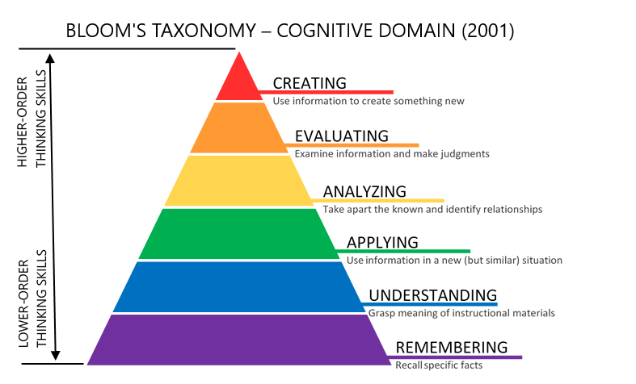

# 关于本书 {.unnumbered}

## 概述 {#sec-book-overview-c27b}

本节提供关于本书目的、开发背景以及读者在学习过程中可以期待什么的重要背景信息。

### 本书的目的 {#sec-book-purpose-book-5d4f}

本书旨在为希望理解机器学习系统原理与实践的教育者和学习者提供一份资源。本书会持续更新，以纳入最新见解和有效的教学策略。我们希望它在这个快速发展的领域中始终是一份有价值的资源。所以请经常回来查看！

### 背景与开发 {#sec-book-context-development-2824}

本书最初是由学生、研究人员和从业者共同协作完成的。它在保持学术严谨性和现实应用性的同时，也通过定期更新和精心整理不断演进，以反映机器学习系统的最新发展。

### 你可以期待什么 {#sec-book-expect-df55}

本教材遵循一套精心设计的教学进阶路径，模拟专家级 ML 系统工程师发展技能的方式。学习旅程分为五个不同阶段展开：

**阶段 1：理论** - 通过 **基础** 和 **设计原则** 构建概念基础，建立支撑所有高效系统工作的心智模型。

**阶段 2：性能** - 掌握 **性能工程**，将理论理解转化为能够在资源受限的现实环境中高效运行的系统。

**阶段 3：实践** - 应对 **稳健部署** 方面的挑战，学习如何让系统在开发的受控环境之外也能可靠运行。

**阶段 4：伦理** - 探索 **可信系统**，以确保你的系统以有益且可持续的方式服务社会。

**阶段 5：愿景** - 展望 **ML 系统前沿**，理解新兴范式，并为下一代挑战做好准备。

在核心理论基础之后，**实验室练习**被策略性地安排在后面，让你能够通过跨多个嵌入式平台的动手实践来应用这些概念。在整本书中，**小测验**会在关键学习节点提供快速自检，以强化理解。

### 先修知识 {#sec-book-prerequisites-4a7c}

本教材假定你具备以下背景：

**必需**：

- **编程能力**：熟练使用 Python 至关重要，因为所有代码示例和实验室练习都使用 Python。预期你熟悉用于数值计算的 NumPy，并对面向对象编程概念有基本理解。

- **数学基础**：需要具备本科层面的线性代数（向量、矩阵、矩阵运算）、微积分（导数、梯度、链式法则）以及概率论（分布、条件概率、贝叶斯定理）知识。这些概念会贯穿模型训练、优化和推理的讨论。

**推荐但非必需**：

- **计算机系统**：熟悉内存层次结构、CPU/GPU 架构基础和操作系统概念，将有助于理解硬件加速和部署相关章节。没有这些背景的学生也可以学好，但可能需要参考补充材料。

- **机器学习基础**：如果你之前接触过监督学习概念（分类、回归）、神经网络基础以及常见架构（CNN、RNN），会很有帮助，但并非严格必需。《深度学习入门》一章会为初学这些主题的人提供必要背景。

### 教学理念：先打基础 {#sec-book-pedagogical-philosophy-foundations-first-4f88-foundations-first-4f88}

机器学习系统本质上是复杂的工程挑战。然而，它们由基础构件构成，而在进入复杂实现之前，必须对这些构件进行彻底理解。这种教学方法与成熟的教育进阶路径相呼应：学生先掌握基础算法，再处理分布式系统；或者先具备线性代数能力，再接触高级机器学习理论。ML 系统同样具有作为后续一切学习基础的关键底层组件。

我们的课程强调掌握这些核心构件：

- 模型与硬件之间的交互
- 系统中的数据流模式
- 计算模式的涌现
- 单个系统内部的优化原则

通过对这些基础的全面理解，学生将建立起必要的分析框架，从而能够有效地推理复杂场景，包括分布式训练架构、多设备协同协议以及新兴技术范式。

这种先打基础的方法将概念深度置于主题广度之上。它使学生能够构建稳固的心智模型，并在其职业生涯中作为持久的知识资源，伴随机器学习系统持续演进。```{=latex}
\clearpage
```

## 学习目标 {#sec-book-learning-goals-bafe}

本节概述了指导本书设计的教育框架，以及读者将实现的具体学习目标。

### 关键学习成果 {#sec-book-key-learning-outcomes-624e}

本书在 [Bloom's Taxonomy](https://cft.vanderbilt.edu/guides-sub-pages/blooms-taxonomy/)（@fig-bloom）的指导下进行组织，该分类定义了六个学习层次，从基础知识到高级创造性思维：

{#fig-bloom}

1. **记忆**：回忆基本事实和概念。

2. **理解**：解释思想或过程。

3. **应用**：在新情境中运用知识。

4. **分析**：将信息拆解为各个组成部分。

5. **评价**：基于标准和准则做出判断。

6. **创造**：产出原创作品或解决方案。

### 学习目标 {#sec-book-learning-objectives-b644}

本书支持读者在机器学习系统生命周期中发展实践专业能力：

1. **系统思维**：理解机器学习系统与传统软件的区别，并分析硬件与软件之间的交互。

2. **工作流工程**：设计端到端的机器学习流水线，从数据工程到部署和维护。

3. **性能优化**：采用系统化方法，使系统更快、更小，并更高效地利用资源。

4. **生产部署**：应对现实世界中的挑战，包括可靠性、安全性、隐私和可扩展性。

5. **负责任的开发**：处理伦理影响，并实现可持续、对社会有益的人工智能系统。

6. **面向未来的技能**：培养判断力，以评估新兴技术并适应不断演进的范式。

7. **动手实现**：在多样化的嵌入式平台和资源约束下获得实践经验。

8. **自主学习**：利用集成评估和交互式工具跟踪进展并加深理解。

### AI 学习伙伴 {#sec-book-ai-learning-companion-8ec9}

在本资源中，你会找到 **SocratiQ**，这是一个旨在增强你学习体验的 AI 学习助手。SocratiQ 受苏格拉底式教学法启发，结合了交互式测验、个性化 सहायता和实时反馈，帮助你巩固理解并建立新的联系。作为我们整合生成式人工智能技术的一部分，SocratiQ 鼓励批判性思维和对材料的主动参与。

SocratiQ 仍在完善中，我们欢迎你的反馈以使其变得更好。有关 SocratiQ 的工作方式以及如何充分利用它的更多细节，请访问 [AI Learning Companion page](../socratiq/socratiq.qmd)。

## 如何使用本书 {#sec-book-use-book-aca7}

### 本书结构 {#sec-book-book-structure-0b7a}

本书将引导你从概念上理解 ML 系统，一直到在实践中构建和部署它们。每一部分都会培养特定能力：

**核心内容：**

1. **基础**
   *掌握基础知识。* 建立对 ML 系统与传统软件差异的直觉，理解软硬件栈，并熟悉基本架构和数学基础。

2. **设计原则**
   *构建完整工作流。* 学习设计端到端 ML 流水线，处理复杂的数据工程挑战，选择合适的框架，并编排大规模训练。

3. **性能工程**
   *针对真实约束进行优化。* 通过模型优化、硬件加速和系统化的性能分析，培养让系统更快、更小、更高效的能力。

4. **鲁棒部署**
   *构建可用于生产的系统。* 从单设备约束逐步扩展到全系统运维。掌握端侧学习、随着系统规模扩大而涉及的安全与隐私、面向故障的鲁棒性，以及编排生产部署的 ML 运维。

5. **可信系统**
   *负责任地设计。* 处理 ML 系统的社会与环境影响，落实负责任 AI 实践，并创造服务公共利益的技术。

6. **ML 系统前沿**
   *为下一步做好准备。* 理解新兴范式，预判未来挑战，并培养评估新技术出现时其价值的判断力。

**动手学习：**

7. **实验练习**
   *实现你学到的一切。* 从基于微控制器的系统推进到边缘计算平台，体验嵌入式 ML 中全方位的资源约束与优化挑战。

### 推荐阅读路径 {#sec-book-suggested-reading-paths-10b8}

- **初学者**：从 *基础* 开始建立概念理解，然后继续学习 *设计原则*，并选择相关实验练习进行动手实践。

- **从业者**：重点关注 *设计原则*、*性能工程* 和 *鲁棒部署*，以获得实用的系统设计洞见，并辅以平台特定的实验练习。

- **研究人员**：探索 *性能工程*、*可信系统* 和 *ML 系统前沿* 等高级主题，同时结合共享工具实验部分的对比分析。

- **动手型学习者**：将任意核心内容部分与涵盖 Arduino、Seeed、Grove Vision 和 Raspberry Pi 平台的综合实验练习结合起来，获得实际实现经验。

### 面向不同背景的学生 {#sec-book-students-different-backgrounds-21ef}

本教材欢迎来自不同学术背景的学生，无论你来自计算机科学、工程、数学还是其他领域。理解 ML 系统如何与你已有的知识相连接，有助于把理论概念与实践实现衔接起来：

**计算机科学学生**：ML 系统将你熟悉的概念延伸到新的领域。如果你学过算法和数据结构，可以把 ML 看作一种学习算法，它会根据数据模式自动优化自身，而不是遵循固定指令。

你在系统设计、内存管理、并行处理和分布式系统方面的经验，可直接应用于 ML 部署。底层的计算复杂度分析依然适用——我们会分别分析训练阶段和推理阶段的时间复杂度与空间复杂度。

**电气与计算机工程学生**：ML 系统代表了信号处理和控制系统原理的一种自然演进。机器学习可以被视为高级信号处理：我们从噪声大、维度高的信号中提取有意义的模式。

神经网络执行的操作类似于滤波器——图像处理中的卷积层实际上就是你学过的卷积运算。你在计算机系统组织与体系结构方面的背景，对于理解 ML 算法如何映射到不同硬件平台至关重要；而你对内存层次结构的理解，则有助于优化大规模训练系统中的数据移动。

**其他背景的学生**：可以把 ML 系统想象成现代工厂的装配线。正如工厂通过协调各个阶段将原材料转化为成品一样，ML 系统也通过相互连接的组件，将原始数据转化为有用的预测结果。

其中的数学——线性代数、概率和微积分——是这家工厂的“工具”，但你不必成为工具专家也能理解装配线如何运作。大多数概念都能通过具体例子变得清晰，例如：通过思考图书管理员如何根据你的阅读历史推荐书籍，来理解推荐系统是如何工作的。

关键技能是系统思维：理解数据流水线、训练过程和部署基础设施如何协同工作，就像任何复杂运作中供应链、制造和分销必须协同一样。

### 模块化设计 {#sec-book-modular-design-8b30}

本书采用灵活的学习设计，允许读者独立探索各章节，或按照建议顺序学习。每一章都整合了：

- **互动测验**，用于自我评估和巩固知识
- **实践练习**，将理论与实现连接起来
- **实验体验**，提供面向特定平台的动手学习

我们采用迭代式的内容开发方式——随着有价值的见解出现就分享出来，而不是等待完美之后再发布。你的反馈将帮助我们持续改进并完善这一资源。

我们也借鉴该领域专家的优秀工作，促进一个协作式学习生态系统，在其中知识得以共享、扩展并共同推进。

## 透明度与协作 {#sec-book-transparency-collaboration-171f}

本书最初是一个由社区驱动的项目，由 CS249r 的学生、哈佛及其他机构的同事，以及更广泛的机器学习系统社区共同努力塑造而成。其内容通过开放协作、细致入微的反馈，以及现代编辑工具——包括基于规则的脚本和生成式人工智能技术——不断演进。颇具意味的是，本书中我们所研究的这些系统本身，也帮助润色了本书的篇章，凸显了人类专业知识与机器智能之间的相互作用。幸运的是，它们还没有准备好亲自设计这些系统——至少现在还没有。

作为主要作者、编辑和策展人，我（Vijay Janapa Reddi 教授）提供有人参与的监督，以确保教材内容保持准确、相关并具有最高质量。尽管如此，没人是完美的——因此其中可能仍存在错误。欢迎并鼓励您提供反馈。这种协作模式对于保持质量、并确保知识保持开放、不断演进且在全球范围内可获取至关重要。

## 版权与许可 {#sec-book-copyright-licensing-33bd}

本书是开源的，并通过 GitHub 协作开发。除非另有说明，本作品采用 [知识共享署名-非商业性使用-相同方式共享 4.0 国际许可协议（CC BY-NC-SA 4.0）](https://creativecommons.org/licenses/by-nc-sa/4.0) 进行许可。

贡献者保留其各自贡献内容的版权；这些内容要么奉献给公有领域，要么依据与原项目相同的开放许可发布。有关作者和贡献的更多信息，请访问 [GitHub 仓库](https://github.com/harvard-edge/cs249r_book)。

## 加入社区 {#sec-book-join-community-dd04}

这本教材不仅仅是一份资源——它还是一个邀请，邀请大家一起协作、共同学习。参与[社区讨论](https://github.com/harvard-edge/cs249r_book/discussions)，分享见解、应对挑战，并与其他学生、研究人员和从业者一起学习。

无论你是刚开始学习之旅的学生，还是正在解决现实世界挑战的从业者，亦或是探索高级概念的研究人员，你的贡献都将丰富这个学习社区。介绍一下你自己，分享你的目标，让我们共同构建对机器学习系统更深入的理解。
